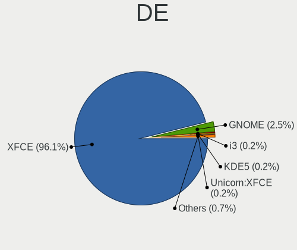
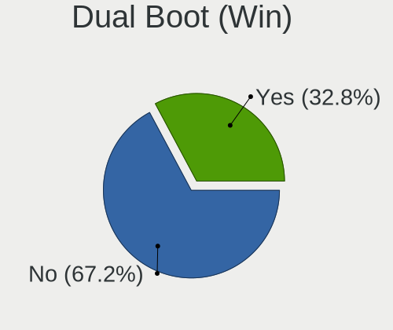
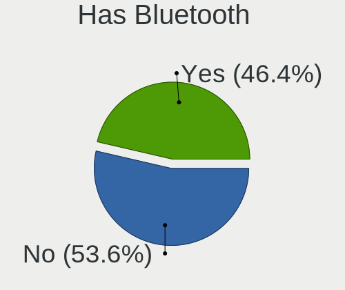
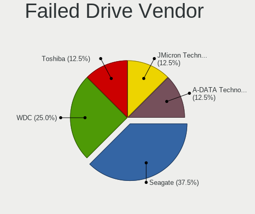
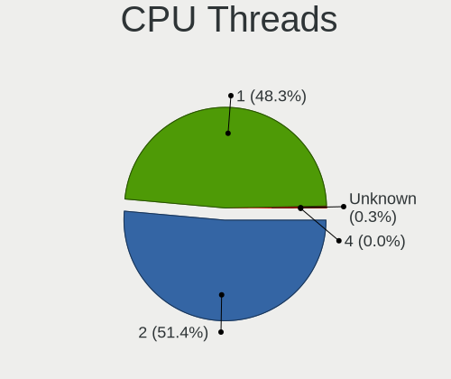
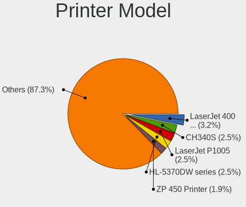
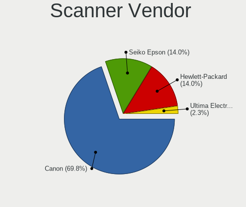
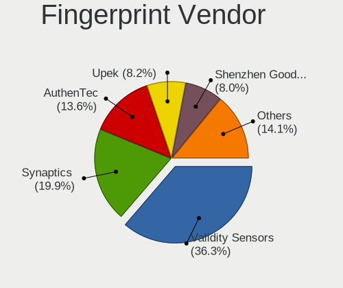

Xubuntu - Tested Hardware & Statistics
--------------------------------------

A project to collect tested hardware configurations for Xubuntu.

Anyone can contribute to this report by the [hw-probe](https://github.com/linuxhw/hw-probe) tool:

    sudo -E hw-probe -all -upload

Please contribute! Especially if your hardware is rare.

This is a report for all computer types. See also reports for [desktops](/Dist/Xubuntu/Desktop/README.md) and [notebooks](/Dist/Xubuntu/Notebook/README.md).

Contents
--------

* [ Test Cases ](#test-cases)

* [ System ](#system)
  - [ OS                       ](#os)
  - [ OS Family                ](#os-family)
  - [ Kernel                   ](#kernel)
  - [ Kernel Family            ](#kernel-family)
  - [ Kernel Major Ver.        ](#kernel-major-ver)
  - [ Arch                     ](#arch)
  - [ DE                       ](#de)
  - [ Display Server           ](#display-server)
  - [ Display Manager          ](#display-manager)
  - [ OS Lang                  ](#os-lang)
  - [ Boot Mode                ](#boot-mode)
  - [ Filesystem               ](#filesystem)
  - [ Part. scheme             ](#part-scheme)
  - [ Dual Boot with Linux/BSD ](#dual-boot-with-linuxbsd)
  - [ Dual Boot (Win)          ](#dual-boot-win)

* [ Board ](#board)
  - [ Vendor                   ](#vendor)
  - [ Model                    ](#model)
  - [ Model Family             ](#model-family)
  - [ MFG Year                 ](#mfg-year)
  - [ Form Factor              ](#form-factor)
  - [ Secure Boot              ](#secure-boot)
  - [ Coreboot                 ](#coreboot)
  - [ RAM Size                 ](#ram-size)
  - [ RAM Used                 ](#ram-used)
  - [ Total Drives             ](#total-drives)
  - [ Has CD-ROM               ](#has-cd-rom)
  - [ Has Ethernet             ](#has-ethernet)
  - [ Has WiFi                 ](#has-wifi)
  - [ Has Bluetooth            ](#has-bluetooth)

* [ Location ](#location)
  - [ Country                  ](#country)
  - [ City                     ](#city)

* [ Drives ](#drives)
  - [ Drive Vendor             ](#drive-vendor)
  - [ Drive Model              ](#drive-model)
  - [ HDD Vendor               ](#hdd-vendor)
  - [ SSD Vendor               ](#ssd-vendor)
  - [ Drive Kind               ](#drive-kind)
  - [ Drive Connector          ](#drive-connector)
  - [ Drive Size               ](#drive-size)
  - [ Space Total              ](#space-total)
  - [ Space Used               ](#space-used)
  - [ Malfunc. Drives          ](#malfunc-drives)
  - [ Malfunc. Drive Vendor    ](#malfunc-drive-vendor)
  - [ Malfunc. HDD Vendor      ](#malfunc-hdd-vendor)
  - [ Malfunc. Drive Kind      ](#malfunc-drive-kind)
  - [ Failed Drives            ](#failed-drives)
  - [ Failed Drive Vendor      ](#failed-drive-vendor)
  - [ Drive Status             ](#drive-status)

* [ Storage controller ](#storage-controller)
  - [ Storage Vendor           ](#storage-vendor)
  - [ Storage Model            ](#storage-model)
  - [ Storage Kind             ](#storage-kind)

* [ Processor ](#processor)
  - [ CPU Vendor               ](#cpu-vendor)
  - [ CPU Model                ](#cpu-model)
  - [ CPU Model Family         ](#cpu-model-family)
  - [ CPU Cores                ](#cpu-cores)
  - [ CPU Sockets              ](#cpu-sockets)
  - [ CPU Threads              ](#cpu-threads)
  - [ CPU Op-Modes             ](#cpu-op-modes)
  - [ CPU Microcode            ](#cpu-microcode)
  - [ CPU Microarch            ](#cpu-microarch)

* [ Graphics ](#graphics)
  - [ GPU Vendor               ](#gpu-vendor)
  - [ GPU Model                ](#gpu-model)
  - [ GPU Combo                ](#gpu-combo)
  - [ GPU Driver               ](#gpu-driver)
  - [ GPU Memory               ](#gpu-memory)

* [ Monitor ](#monitor)
  - [ Monitor Vendor           ](#monitor-vendor)
  - [ Monitor Model            ](#monitor-model)
  - [ Monitor Resolution       ](#monitor-resolution)
  - [ Monitor Diagonal         ](#monitor-diagonal)
  - [ Monitor Width            ](#monitor-width)
  - [ Aspect Ratio             ](#aspect-ratio)
  - [ Monitor Area             ](#monitor-area)
  - [ Pixel Density            ](#pixel-density)
  - [ Multiple Monitors        ](#multiple-monitors)

* [ Network ](#network)
  - [ Net Controller Vendor    ](#net-controller-vendor)
  - [ Net Controller Model     ](#net-controller-model)
  - [ Wireless Vendor          ](#wireless-vendor)
  - [ Wireless Model           ](#wireless-model)
  - [ Ethernet Vendor          ](#ethernet-vendor)
  - [ Ethernet Model           ](#ethernet-model)
  - [ Net Controller Kind      ](#net-controller-kind)
  - [ Used Controller          ](#used-controller)
  - [ NICs                     ](#nics)
  - [ IPv6                     ](#ipv6)

* [ Bluetooth ](#bluetooth)
  - [ Bluetooth Vendor         ](#bluetooth-vendor)
  - [ Bluetooth Model          ](#bluetooth-model)

* [ Sound ](#sound)
  - [ Sound Vendor             ](#sound-vendor)
  - [ Sound Model              ](#sound-model)

* [ Memory ](#memory)
  - [ Memory Vendor            ](#memory-vendor)
  - [ Memory Model             ](#memory-model)
  - [ Memory Kind              ](#memory-kind)
  - [ Memory Form Factor       ](#memory-form-factor)
  - [ Memory Size              ](#memory-size)
  - [ Memory Speed             ](#memory-speed)

* [ Printers & scanners ](#printers--scanners)
  - [ Printer Vendor           ](#printer-vendor)
  - [ Printer Model            ](#printer-model)
  - [ Scanner Vendor           ](#scanner-vendor)
  - [ Scanner Model            ](#scanner-model)

* [ Camera ](#camera)
  - [ Camera Vendor            ](#camera-vendor)
  - [ Camera Model             ](#camera-model)

* [ Security ](#security)
  - [ Fingerprint Vendor       ](#fingerprint-vendor)
  - [ Fingerprint Model        ](#fingerprint-model)
  - [ Chipcard Vendor          ](#chipcard-vendor)
  - [ Chipcard Model           ](#chipcard-model)

* [ Unsupported ](#unsupported)
  - [ Unsupported Devices      ](#unsupported-devices)
  - [ Unsupported Device Types ](#unsupported-device-types)

Test Cases
----------

Total: 6574

| Vendor        | Model                       | Form-Factor | Probe                                                      | Date         |
|---------------|-----------------------------|-------------|------------------------------------------------------------|--------------|
| Pegatron      | 2AF0                        | Desktop     | [d918aae63e](https://linux-hardware.org/?probe=d918aae63e) | Nov 06, 2023 |
| Lenovo        | G505 20240                  | Notebook    | [ef019ff242](https://linux-hardware.org/?probe=ef019ff242) | Nov 06, 2023 |
| Pegatron      | 2AF0                        | Desktop     | [de892702f8](https://linux-hardware.org/?probe=de892702f8) | Nov 05, 2023 |
| MECHREVO      | Code 01 Series PF5NU1G      | Notebook    | [767c3ff7fa](https://linux-hardware.org/?probe=767c3ff7fa) | Nov 05, 2023 |
| Gigabyte      | X570 AORUS ELITE            | Desktop     | [5c4543cc31](https://linux-hardware.org/?probe=5c4543cc31) | Nov 05, 2023 |
| Dell          | 0J8H4R A00                  | Desktop     | [d743b33cc7](https://linux-hardware.org/?probe=d743b33cc7) | Nov 05, 2023 |
| Dell          | Inspiron 7501               | Notebook    | [0926c7cdad](https://linux-hardware.org/?probe=0926c7cdad) | Nov 05, 2023 |
| ASRock        | P67 Pro3 SE                 | Desktop     | [10b1460f7a](https://linux-hardware.org/?probe=10b1460f7a) | Nov 05, 2023 |
| Gigabyte      | B450M DS3H-CF               | Desktop     | [fefb7e12d2](https://linux-hardware.org/?probe=fefb7e12d2) | Nov 05, 2023 |
| HP            | Presario C500 (GF849EA#A... | Notebook    | [a4965dff09](https://linux-hardware.org/?probe=a4965dff09) | Nov 04, 2023 |
| Thomson       | N14C4WH64                   | Notebook    | [51c94bc00f](https://linux-hardware.org/?probe=51c94bc00f) | Nov 03, 2023 |
| Gigabyte      | 970A-D3                     | Desktop     | [80fb26e63a](https://linux-hardware.org/?probe=80fb26e63a) | Nov 03, 2023 |
| Acer          | Predator PH717-71           | Notebook    | [a72ab29450](https://linux-hardware.org/?probe=a72ab29450) | Nov 02, 2023 |
| Acer          | Aspire TC-885 V:1.1         | Desktop     | [a871f012a2](https://linux-hardware.org/?probe=a871f012a2) | Nov 02, 2023 |
| HP            | Presario CQ57               | Notebook    | [4874030c75](https://linux-hardware.org/?probe=4874030c75) | Nov 01, 2023 |
| Lenovo        | ThinkPad T14 Gen 3 21AJS... | Notebook    | [a2a8295797](https://linux-hardware.org/?probe=a2a8295797) | Nov 01, 2023 |
| Lenovo        | ThinkPad T14 Gen 3 21AJS... | Notebook    | [0d49a75fe1](https://linux-hardware.org/?probe=0d49a75fe1) | Nov 01, 2023 |
| Lenovo        | ThinkPad T14 Gen 3 21AH0... | Notebook    | [cbe947aefc](https://linux-hardware.org/?probe=cbe947aefc) | Nov 01, 2023 |
| ASRock        | X570M Pro4                  | Desktop     | [ad5e8f91e5](https://linux-hardware.org/?probe=ad5e8f91e5) | Nov 01, 2023 |
| Lenovo        | Legion Y740-17IRHg 81UJ     | Notebook    | [cd9e941307](https://linux-hardware.org/?probe=cd9e941307) | Nov 01, 2023 |
| Lenovo        | IdeaPad S300 9803           | Notebook    | [543dfc0b4e](https://linux-hardware.org/?probe=543dfc0b4e) | Oct 31, 2023 |
| Medion        | E3223                       | Convertible | [e35701b198](https://linux-hardware.org/?probe=e35701b198) | Oct 31, 2023 |
| HP            | Presario C500 (GF849EA#A... | Notebook    | [580f4bdb18](https://linux-hardware.org/?probe=580f4bdb18) | Oct 31, 2023 |
| AMI           | Intel                       | Notebook    | [98d35ad708](https://linux-hardware.org/?probe=98d35ad708) | Oct 31, 2023 |
| ASUSTek       | K53E                        | Notebook    | [8b7c83e9d7](https://linux-hardware.org/?probe=8b7c83e9d7) | Oct 31, 2023 |
| ASUSTek       | ROG CROSSHAIR VIII DARK ... | Desktop     | [e06f6c5888](https://linux-hardware.org/?probe=e06f6c5888) | Oct 30, 2023 |
| Lenovo        | ThinkBook 16p Gen 2 20YM    | Notebook    | [6273e445bd](https://linux-hardware.org/?probe=6273e445bd) | Oct 30, 2023 |
| ASUSTek       | F2A85-M PRO                 | Desktop     | [dd2a52ab8f](https://linux-hardware.org/?probe=dd2a52ab8f) | Oct 30, 2023 |
| OrangePi      | Zero3                       | Soc         | [6d3ecf003f](https://linux-hardware.org/?probe=6d3ecf003f) | Oct 29, 2023 |
| MSI           | B550M PRO-VDH WIFI          | Desktop     | [9c77415bfc](https://linux-hardware.org/?probe=9c77415bfc) | Oct 29, 2023 |
| Lenovo        | IdeaPad L340-15API 81LW     | Notebook    | [a718d2e0ba](https://linux-hardware.org/?probe=a718d2e0ba) | Oct 28, 2023 |
| Lenovo        | IdeaPad L340-15API 81LW     | Notebook    | [c866e0068b](https://linux-hardware.org/?probe=c866e0068b) | Oct 28, 2023 |
| ASUSTek       | VivoBook_ASUSLaptop M150... | Notebook    | [6a8554304e](https://linux-hardware.org/?probe=6a8554304e) | Oct 27, 2023 |
| Gigabyte      | G1.Sniper B5-CF             | Desktop     | [291bf42f9d](https://linux-hardware.org/?probe=291bf42f9d) | Oct 27, 2023 |
| Dell          | Inspiron 1501               | Notebook    | [2c88e089bb](https://linux-hardware.org/?probe=2c88e089bb) | Oct 27, 2023 |
| Lenovo        | ThinkPad T61 64607EU        | Notebook    | [413cefff03](https://linux-hardware.org/?probe=413cefff03) | Oct 26, 2023 |
| HP            | Presario CQ57               | Notebook    | [a3f31b427e](https://linux-hardware.org/?probe=a3f31b427e) | Oct 26, 2023 |
| Gigabyte      | H77M-D3H                    | Desktop     | [1d3f58a610](https://linux-hardware.org/?probe=1d3f58a610) | Oct 25, 2023 |
| Gigabyte      | 965P-DS3                    | Desktop     | [b33d6b8a3c](https://linux-hardware.org/?probe=b33d6b8a3c) | Oct 24, 2023 |
| Gigabyte      | H97M-D3H                    | Desktop     | [15ac9c0529](https://linux-hardware.org/?probe=15ac9c0529) | Oct 24, 2023 |
| Acer          | Aspire 5740                 | Notebook    | [78702b9deb](https://linux-hardware.org/?probe=78702b9deb) | Oct 23, 2023 |
| Nuvision      | Aptio CRB                   | Mini pc     | [1f7af8af3e](https://linux-hardware.org/?probe=1f7af8af3e) | Oct 23, 2023 |
| Dell          | Latitude 3490               | Notebook    | [174ee1b12e](https://linux-hardware.org/?probe=174ee1b12e) | Oct 20, 2023 |
| Dell          | 0XKH0D A02                  | Desktop     | [bba36c01cf](https://linux-hardware.org/?probe=bba36c01cf) | Oct 19, 2023 |
| HP            | 0A68h                       | Desktop     | [376c3156a9](https://linux-hardware.org/?probe=376c3156a9) | Oct 19, 2023 |
| Lenovo        | ThinkPad T61 64607EU        | Notebook    | [7be90734f6](https://linux-hardware.org/?probe=7be90734f6) | Oct 19, 2023 |
| Foxconn       | 2ABF                        | Desktop     | [cf4a419a07](https://linux-hardware.org/?probe=cf4a419a07) | Oct 17, 2023 |
| HUAWEI        | RLEF-XX                     | Notebook    | [4a5c5417b7](https://linux-hardware.org/?probe=4a5c5417b7) | Oct 17, 2023 |
| Lenovo        | 15ARE05 81W4                | Notebook    | [dcb09acd04](https://linux-hardware.org/?probe=dcb09acd04) | Oct 17, 2023 |
| MSI           | B550 GAMING GEN3            | Desktop     | [e657535210](https://linux-hardware.org/?probe=e657535210) | Oct 17, 2023 |
| ASUSTek       | ROG STRIX B550-F GAMING     | Desktop     | [d519c10989](https://linux-hardware.org/?probe=d519c10989) | Oct 16, 2023 |
| Unknown       | Unknown                     | Desktop     | [626c7e1591](https://linux-hardware.org/?probe=626c7e1591) | Oct 16, 2023 |
| HP            | 18E5                        | Desktop     | [d869fcd6dc](https://linux-hardware.org/?probe=d869fcd6dc) | Oct 16, 2023 |
| HP            | 250 G8 Notebook PC          | Notebook    | [949b939768](https://linux-hardware.org/?probe=949b939768) | Oct 16, 2023 |
| ASUSTek       | ROG STRIX B450-F GAMING ... | Desktop     | [18922baf01](https://linux-hardware.org/?probe=18922baf01) | Oct 15, 2023 |
| Acer          | Aspire A317-51K             | Notebook    | [b342c56fc5](https://linux-hardware.org/?probe=b342c56fc5) | Oct 15, 2023 |
| Nuvision      | Aptio CRB                   | Mini pc     | [7f99209a06](https://linux-hardware.org/?probe=7f99209a06) | Oct 15, 2023 |
| ASUSTek       | ROG CROSSHAIR VIII HERO     | Desktop     | [430df05ea3](https://linux-hardware.org/?probe=430df05ea3) | Oct 14, 2023 |
| HP            | 339A                        | Desktop     | [188e7d023e](https://linux-hardware.org/?probe=188e7d023e) | Oct 14, 2023 |
| Dell          | Latitude 7330               | Notebook    | [8632b84be8](https://linux-hardware.org/?probe=8632b84be8) | Oct 14, 2023 |
| Apple         | MacBook8,1                  | Notebook    | [edb8f551bf](https://linux-hardware.org/?probe=edb8f551bf) | Oct 14, 2023 |
| HP            | Laptop 15-dw0xxx            | Notebook    | [b7a193296f](https://linux-hardware.org/?probe=b7a193296f) | Oct 14, 2023 |
| Dynabook      | B65/ER                      | Notebook    | [2bda5e79a4](https://linux-hardware.org/?probe=2bda5e79a4) | Oct 14, 2023 |
| Lenovo        | ThinkPad X1 Carbon Gen 1... | Notebook    | [41ca042a36](https://linux-hardware.org/?probe=41ca042a36) | Oct 14, 2023 |
| Dynabook      | B65/ER                      | Notebook    | [4bc1c4e1b6](https://linux-hardware.org/?probe=4bc1c4e1b6) | Oct 14, 2023 |
| Lenovo        | ThinkPad T430u 3352A83      | Notebook    | [c5a829d842](https://linux-hardware.org/?probe=c5a829d842) | Oct 14, 2023 |
| Apple         | MacBook8,1                  | Notebook    | [1a8e527488](https://linux-hardware.org/?probe=1a8e527488) | Oct 13, 2023 |
| Intel         | DB75EN                      | Desktop     | [3d5c90093d](https://linux-hardware.org/?probe=3d5c90093d) | Oct 13, 2023 |
| Intel         | DB75EN                      | Desktop     | [30be24215f](https://linux-hardware.org/?probe=30be24215f) | Oct 13, 2023 |
| HP            | EliteBook 830 G8 Noteboo... | Notebook    | [ef43db2db3](https://linux-hardware.org/?probe=ef43db2db3) | Oct 12, 2023 |
| Dell          | Latitude 5411               | Notebook    | [48ecb46d24](https://linux-hardware.org/?probe=48ecb46d24) | Oct 09, 2023 |
| Dell          | MXG061                      | Notebook    | [61763acf36](https://linux-hardware.org/?probe=61763acf36) | Oct 08, 2023 |
| Dell          | MXG061                      | Notebook    | [93939082fa](https://linux-hardware.org/?probe=93939082fa) | Oct 08, 2023 |
| MSI           | GP65 Leopard 10SDK          | Notebook    | [6b02c3ce0f](https://linux-hardware.org/?probe=6b02c3ce0f) | Oct 08, 2023 |
| HP            | Pavilion g4                 | Notebook    | [3e5383da88](https://linux-hardware.org/?probe=3e5383da88) | Oct 08, 2023 |
| HP            | Pavilion g4                 | Notebook    | [cab160aff3](https://linux-hardware.org/?probe=cab160aff3) | Oct 08, 2023 |
| AMI           | Aptio CRB                   | Mini pc     | [a92453737d](https://linux-hardware.org/?probe=a92453737d) | Oct 06, 2023 |
| OrangePi      | Zero3                       | Soc         | [a97205648a](https://linux-hardware.org/?probe=a97205648a) | Oct 05, 2023 |
| Nuvision      | Aptio CRB                   | Mini pc     | [a1f4e6f6cc](https://linux-hardware.org/?probe=a1f4e6f6cc) | Oct 05, 2023 |
| HP            | 18E5                        | Desktop     | [653e855c90](https://linux-hardware.org/?probe=653e855c90) | Oct 05, 2023 |
| MSI           | B550 GAMING GEN3            | Desktop     | [870556d425](https://linux-hardware.org/?probe=870556d425) | Oct 04, 2023 |
| Fujitsu Si... | LIFEBOOK T4215              | Notebook    | [392481b855](https://linux-hardware.org/?probe=392481b855) | Oct 04, 2023 |
| ASUSTek       | ROG Strix G814JU_G814JU     | Notebook    | [45be832065](https://linux-hardware.org/?probe=45be832065) | Oct 04, 2023 |
| ASUSTek       | ROG Strix G814JU_G814JU     | Notebook    | [2dc93ff736](https://linux-hardware.org/?probe=2dc93ff736) | Oct 04, 2023 |
| MSI           | B450M MORTAR MAX            | Desktop     | [a3f55874e2](https://linux-hardware.org/?probe=a3f55874e2) | Oct 03, 2023 |
| HP            | 09F8h                       | Desktop     | [996f1179ba](https://linux-hardware.org/?probe=996f1179ba) | Oct 02, 2023 |
| Toshiba       | Satellite C55-C             | Notebook    | [e9ce3eada7](https://linux-hardware.org/?probe=e9ce3eada7) | Oct 02, 2023 |
| ASUSTek       | P5Q SE2                     | Desktop     | [df644adbab](https://linux-hardware.org/?probe=df644adbab) | Oct 01, 2023 |
| ASUSTek       | P5Q SE2                     | Desktop     | [2ccade9ad8](https://linux-hardware.org/?probe=2ccade9ad8) | Oct 01, 2023 |
| HP            | 18E5                        | Desktop     | [1f3e02bd3e](https://linux-hardware.org/?probe=1f3e02bd3e) | Oct 01, 2023 |
| ASUSTek       | F2A85-M PRO                 | Desktop     | [79d4084e18](https://linux-hardware.org/?probe=79d4084e18) | Sep 30, 2023 |
| Dell          | 0P301D A00                  | Desktop     | [99587baa3d](https://linux-hardware.org/?probe=99587baa3d) | Sep 30, 2023 |
| Medion        | B660M DS3H AX DDR4          | Desktop     | [1dbbeda8cd](https://linux-hardware.org/?probe=1dbbeda8cd) | Sep 30, 2023 |
| Medion        | B660M DS3H AX DDR4          | Desktop     | [57a42b9ccf](https://linux-hardware.org/?probe=57a42b9ccf) | Sep 30, 2023 |
| Dell          | 0YJPT1 A00                  | Desktop     | [27b01f468d](https://linux-hardware.org/?probe=27b01f468d) | Sep 30, 2023 |
| Google        | Swanky                      | Notebook    | [599959ccbe](https://linux-hardware.org/?probe=599959ccbe) | Sep 28, 2023 |
| Lenovo        | NOK                         | Desktop     | [95ba956749](https://linux-hardware.org/?probe=95ba956749) | Sep 28, 2023 |
| Lenovo        | ThinkPad T14 Gen 3 21AH0... | Notebook    | [39fd38bc98](https://linux-hardware.org/?probe=39fd38bc98) | Sep 28, 2023 |
| ASUSTek       | N550JV                      | Notebook    | [ac27d821ae](https://linux-hardware.org/?probe=ac27d821ae) | Sep 27, 2023 |
| Gigabyte      | EX58-UD5                    | Desktop     | [060deb4c88](https://linux-hardware.org/?probe=060deb4c88) | Sep 26, 2023 |
| ASUSTek       | M5A97 R2.0                  | Desktop     | [275018a17e](https://linux-hardware.org/?probe=275018a17e) | Sep 26, 2023 |
| Gigabyte      | F2A68HM-H                   | Desktop     | [f3b7fdc0c1](https://linux-hardware.org/?probe=f3b7fdc0c1) | Sep 26, 2023 |
| Medion        | MS-7848                     | Desktop     | [5ce2a07d18](https://linux-hardware.org/?probe=5ce2a07d18) | Sep 25, 2023 |
| Fujitsu       | LIFEBOOK E734               | Notebook    | [61f61b1b63](https://linux-hardware.org/?probe=61f61b1b63) | Sep 25, 2023 |
| Fujitsu       | LIFEBOOK E734               | Notebook    | [ffb5ff9359](https://linux-hardware.org/?probe=ffb5ff9359) | Sep 25, 2023 |
| Toshiba       | Satellite C50D-A-10E        | Notebook    | [46f0ec000d](https://linux-hardware.org/?probe=46f0ec000d) | Sep 24, 2023 |
| Google        | Magpie                      | Notebook    | [3da6f69ed3](https://linux-hardware.org/?probe=3da6f69ed3) | Sep 24, 2023 |
| MSI           | GS75 Stealth 10SGS          | Notebook    | [9a310dd76b](https://linux-hardware.org/?probe=9a310dd76b) | Sep 24, 2023 |
| Dell          | XPS 15 9570                 | Notebook    | [fe5f9ad018](https://linux-hardware.org/?probe=fe5f9ad018) | Sep 23, 2023 |
| ASUSTek       | X510UQR                     | Notebook    | [364ee59aef](https://linux-hardware.org/?probe=364ee59aef) | Sep 23, 2023 |
| Gigabyte      | B85M-D3H                    | Desktop     | [cfcdb2a961](https://linux-hardware.org/?probe=cfcdb2a961) | Sep 23, 2023 |
| Fujitsu       | D3432-A1 S26361-D3432-A1    | Desktop     | [c3043092b9](https://linux-hardware.org/?probe=c3043092b9) | Sep 22, 2023 |
| Lenovo        | 7Y03CTO1WW                  | Server      | [424e70419e](https://linux-hardware.org/?probe=424e70419e) | Sep 21, 2023 |
| Lenovo        | 7Y03CTO1WW                  | Server      | [9838fce2b8](https://linux-hardware.org/?probe=9838fce2b8) | Sep 21, 2023 |
| ASUSTek       | PRIME H270M-PLUS            | Desktop     | [e4b8175a36](https://linux-hardware.org/?probe=e4b8175a36) | Sep 21, 2023 |
| Dell          | Latitude D500               | Notebook    | [1861582ebd](https://linux-hardware.org/?probe=1861582ebd) | Sep 21, 2023 |
| Dell          | Latitude D500               | Notebook    | [19ccfd47c6](https://linux-hardware.org/?probe=19ccfd47c6) | Sep 20, 2023 |
| Lenovo        | ThinkPad T14 Gen 3 21AH0... | Notebook    | [a6fd72ec9a](https://linux-hardware.org/?probe=a6fd72ec9a) | Sep 20, 2023 |
| ASUSTek       | TUF Gaming X570-PRO         | Desktop     | [d2fe3f1d44](https://linux-hardware.org/?probe=d2fe3f1d44) | Sep 19, 2023 |
| Gigabyte      | H61M-D2-B3                  | Desktop     | [d8f04cd109](https://linux-hardware.org/?probe=d8f04cd109) | Sep 19, 2023 |
| Samsung       | DP500A2D-A02UK SEC_SW_RE... | All in one  | [e0c767e50f](https://linux-hardware.org/?probe=e0c767e50f) | Sep 19, 2023 |
| Lenovo        | ThinkPad T430 2349BG6       | Notebook    | [dbd8f7715f](https://linux-hardware.org/?probe=dbd8f7715f) | Sep 19, 2023 |
| Apple         | MacBookPro5,4               | Notebook    | [f2d4f47a8e](https://linux-hardware.org/?probe=f2d4f47a8e) | Sep 18, 2023 |
| Dell          | Latitude 3520               | Notebook    | [c74d2293dd](https://linux-hardware.org/?probe=c74d2293dd) | Sep 18, 2023 |
| Acer          | Aspire E5-473G              | Notebook    | [936a48fb5a](https://linux-hardware.org/?probe=936a48fb5a) | Sep 16, 2023 |
| Intel         | NUC11TNBi5 M11904-403       | Mini pc     | [e2504a32cf](https://linux-hardware.org/?probe=e2504a32cf) | Sep 15, 2023 |
| Lenovo        | ThinkPad T450 20BVA01QHV    | Notebook    | [4f0a2bdfdc](https://linux-hardware.org/?probe=4f0a2bdfdc) | Sep 15, 2023 |
| ASUSTek       | K72Dr                       | Notebook    | [46edd6eb72](https://linux-hardware.org/?probe=46edd6eb72) | Sep 15, 2023 |
| HP            | 86FB MVB A                  | Desktop     | [cdb3ae1787](https://linux-hardware.org/?probe=cdb3ae1787) | Sep 14, 2023 |
| Lenovo        | ThinkPad E14 Gen 2 20T60... | Notebook    | [cf69e328c4](https://linux-hardware.org/?probe=cf69e328c4) | Sep 14, 2023 |
| Gigabyte      | F2A68HM-H                   | Desktop     | [08e19ba183](https://linux-hardware.org/?probe=08e19ba183) | Sep 13, 2023 |
| HUAWEI        | BOHK-WAX9X                  | Notebook    | [b6a4327a8b](https://linux-hardware.org/?probe=b6a4327a8b) | Sep 12, 2023 |
| ASUSTek       | ROG Zephyrus G14 GA402XV... | Notebook    | [a51361ebb2](https://linux-hardware.org/?probe=a51361ebb2) | Sep 12, 2023 |
| ASUSTek       | ROG Zephyrus G14 GA402XV... | Notebook    | [00cbde2fb9](https://linux-hardware.org/?probe=00cbde2fb9) | Sep 12, 2023 |
| HP            | 8433 11                     | Desktop     | [6160c13209](https://linux-hardware.org/?probe=6160c13209) | Sep 12, 2023 |
| HP            | 8433 11                     | Desktop     | [2fbe297e6c](https://linux-hardware.org/?probe=2fbe297e6c) | Sep 12, 2023 |
| Medion        | Akoya P2213T                | Notebook    | [7d201de7d6](https://linux-hardware.org/?probe=7d201de7d6) | Sep 11, 2023 |
| ASUSTek       | ASUS TUF Gaming A15 FA50... | Notebook    | [5b93cd5b36](https://linux-hardware.org/?probe=5b93cd5b36) | Sep 11, 2023 |
| Dell          | Vostro 3501                 | Notebook    | [7caa16d219](https://linux-hardware.org/?probe=7caa16d219) | Sep 11, 2023 |
| ASUSTek       | TUF Gaming B450-PLUS II     | Desktop     | [adc1e755c4](https://linux-hardware.org/?probe=adc1e755c4) | Sep 10, 2023 |
| ASUSTek       | M5A78L-M/USB3               | Desktop     | [ddddf5662e](https://linux-hardware.org/?probe=ddddf5662e) | Sep 10, 2023 |
| Olivetti      | OLIBOOK PX5-XXXAES          | Notebook    | [70225c18e1](https://linux-hardware.org/?probe=70225c18e1) | Sep 10, 2023 |
| Google        | Rabbid                      | Notebook    | [c55be85343](https://linux-hardware.org/?probe=c55be85343) | Sep 09, 2023 |
| Fujitsu       | D2778-B1 S26361-D2778-B1    | Desktop     | [c043df4efb](https://linux-hardware.org/?probe=c043df4efb) | Sep 09, 2023 |
| Lenovo        | ThinkPad X250 20CLA1YJUK    | Notebook    | [a068fec56f](https://linux-hardware.org/?probe=a068fec56f) | Sep 09, 2023 |
| Packard Be... | IXTREME M5800               | Desktop     | [841d189992](https://linux-hardware.org/?probe=841d189992) | Sep 09, 2023 |
| Dell          | XPS 13 9305                 | Notebook    | [b3756f752a](https://linux-hardware.org/?probe=b3756f752a) | Sep 08, 2023 |
| Lenovo        | 330B SDK0T76530 WIN 3556... | Mini pc     | [1f89d511d0](https://linux-hardware.org/?probe=1f89d511d0) | Sep 08, 2023 |
| Medion        | Akoya P2213T                | Notebook    | [2464869ce2](https://linux-hardware.org/?probe=2464869ce2) | Sep 06, 2023 |
| AMI           | Aptio CRB                   | Mini pc     | [af67c49814](https://linux-hardware.org/?probe=af67c49814) | Sep 06, 2023 |
| ASUSTek       | P9X79 PRO                   | Desktop     | [1056a6ebb4](https://linux-hardware.org/?probe=1056a6ebb4) | Sep 06, 2023 |
| Dell          | 042P49 A00                  | Desktop     | [b9dddc1ef8](https://linux-hardware.org/?probe=b9dddc1ef8) | Sep 06, 2023 |
| ASUSTek       | ROG CROSSHAIR VIII DARK ... | Desktop     | [c404211007](https://linux-hardware.org/?probe=c404211007) | Sep 05, 2023 |
| Dell          | 0GY6Y8 A03                  | Desktop     | [da9dc1f5d9](https://linux-hardware.org/?probe=da9dc1f5d9) | Sep 05, 2023 |
| Unknown       | SEI Robotics SEI610         | Soc         | [9b43cf14a3](https://linux-hardware.org/?probe=9b43cf14a3) | Sep 04, 2023 |
| HP            | 198E                        | Desktop     | [7f57cfbacc](https://linux-hardware.org/?probe=7f57cfbacc) | Sep 04, 2023 |
| eMachines     | EL1852G                     | Desktop     | [e9234028f1](https://linux-hardware.org/?probe=e9234028f1) | Sep 03, 2023 |
| AMD           | A88K                        | Desktop     | [d58c29d4ad](https://linux-hardware.org/?probe=d58c29d4ad) | Sep 03, 2023 |
| Acer          | Aspire 5349                 | Notebook    | [62f941ff29](https://linux-hardware.org/?probe=62f941ff29) | Sep 03, 2023 |
| HP            | 2B2C                        | Desktop     | [a24d61a0f4](https://linux-hardware.org/?probe=a24d61a0f4) | Sep 02, 2023 |
| HP            | 198E                        | Desktop     | [3f3cb2e64c](https://linux-hardware.org/?probe=3f3cb2e64c) | Sep 02, 2023 |
| Intel         | DN2820FYK H24582-204        | Desktop     | [6decc4abdd](https://linux-hardware.org/?probe=6decc4abdd) | Sep 01, 2023 |
| AMD           | A88K                        | Desktop     | [08a455504f](https://linux-hardware.org/?probe=08a455504f) | Sep 01, 2023 |
| MSI           | A320M-A PRO MAX             | Desktop     | [281e7176d8](https://linux-hardware.org/?probe=281e7176d8) | Aug 31, 2023 |
| HP            | ZBook 17 G3                 | Notebook    | [43c2d13a44](https://linux-hardware.org/?probe=43c2d13a44) | Aug 31, 2023 |
| HP            | EliteBook 820 G3            | Notebook    | [5ef4c889a4](https://linux-hardware.org/?probe=5ef4c889a4) | Aug 31, 2023 |
| ASUSTek       | M4A87TD EVO                 | Desktop     | [32a123fc5d](https://linux-hardware.org/?probe=32a123fc5d) | Aug 31, 2023 |
| OrangePi      | Zero3                       | Soc         | [34919a3af1](https://linux-hardware.org/?probe=34919a3af1) | Aug 31, 2023 |
| Dell          | Latitude E5510              | Notebook    | [61f6df7426](https://linux-hardware.org/?probe=61f6df7426) | Aug 29, 2023 |
| HP            | Pavilion 17                 | Notebook    | [ba077d7ea1](https://linux-hardware.org/?probe=ba077d7ea1) | Aug 29, 2023 |
| Dell          | XPS 15 9500                 | Notebook    | [74ad31c9de](https://linux-hardware.org/?probe=74ad31c9de) | Aug 29, 2023 |
| TaNix         | TX3 (QZ)                    | Soc         | [f94a46ad17](https://linux-hardware.org/?probe=f94a46ad17) | Aug 28, 2023 |
| Apple         | MacBookPro7,1               | Notebook    | [f520b2dd72](https://linux-hardware.org/?probe=f520b2dd72) | Aug 28, 2023 |
| Unknown       | SEI Robotics SEI610         | Soc         | [9ee073735e](https://linux-hardware.org/?probe=9ee073735e) | Aug 28, 2023 |
| ASUSTek       | ROG Strix G733PY_G733PY     | Notebook    | [b886de0613](https://linux-hardware.org/?probe=b886de0613) | Aug 28, 2023 |
| Google        | Banjo                       | Notebook    | [fcac9f460e](https://linux-hardware.org/?probe=fcac9f460e) | Aug 28, 2023 |
| HP            | Pavilion 17                 | Notebook    | [1d04c114d6](https://linux-hardware.org/?probe=1d04c114d6) | Aug 26, 2023 |
| Gigabyte      | H97N-WIFI                   | Desktop     | [6edcb45992](https://linux-hardware.org/?probe=6edcb45992) | Aug 26, 2023 |
| Gigabyte      | B550 AORUS ELITE            | Desktop     | [26c7035d28](https://linux-hardware.org/?probe=26c7035d28) | Aug 25, 2023 |
| Toshiba       | Satellite C55D-B            | Notebook    | [b7dce1f6e0](https://linux-hardware.org/?probe=b7dce1f6e0) | Aug 25, 2023 |
| Gigabyte      | B550 AORUS ELITE            | Desktop     | [e5317c3887](https://linux-hardware.org/?probe=e5317c3887) | Aug 25, 2023 |
| Acer          | Switch SW312-31             | Tablet      | [082e1c2cc1](https://linux-hardware.org/?probe=082e1c2cc1) | Aug 24, 2023 |
| Lenovo        | ThinkPad T14 Gen 3 21AH0... | Notebook    | [add8b61fa2](https://linux-hardware.org/?probe=add8b61fa2) | Aug 24, 2023 |
| ASUSTek       | M5A99X EVO R2.0             | Desktop     | [4d01543131](https://linux-hardware.org/?probe=4d01543131) | Aug 24, 2023 |
| AZW           | SER V1.0                    | Mini pc     | [a7fbf7edf2](https://linux-hardware.org/?probe=a7fbf7edf2) | Aug 24, 2023 |
| Lenovo        | ThinkPad T460s 20F9003VM... | Notebook    | [e6e076d380](https://linux-hardware.org/?probe=e6e076d380) | Aug 23, 2023 |
| Microsoft     | Surface Pro 7               | Tablet      | [c5484868fd](https://linux-hardware.org/?probe=c5484868fd) | Aug 23, 2023 |
| Acer          | AOD255                      | Notebook    | [06c6346db1](https://linux-hardware.org/?probe=06c6346db1) | Aug 23, 2023 |
| Apple         | Mac-F42386C8 PVT            | All in one  | [b40144bd93](https://linux-hardware.org/?probe=b40144bd93) | Aug 22, 2023 |
| Acer          | TMP255-M                    | Notebook    | [4d5632e2d0](https://linux-hardware.org/?probe=4d5632e2d0) | Aug 22, 2023 |
| TaNix         | TX3 (QZ)                    | Soc         | [d8a6683747](https://linux-hardware.org/?probe=d8a6683747) | Aug 21, 2023 |
| ASUSTek       | P8Z68-V GEN3                | Desktop     | [aad70f30d7](https://linux-hardware.org/?probe=aad70f30d7) | Aug 21, 2023 |
| GPU Compan... | GWTN156-5                   | Notebook    | [22efc40cfd](https://linux-hardware.org/?probe=22efc40cfd) | Aug 21, 2023 |
| HP            | Presario CQ42               | Notebook    | [183f035603](https://linux-hardware.org/?probe=183f035603) | Aug 20, 2023 |
| Lenovo        | G50-70 20351                | Notebook    | [a8a0c22567](https://linux-hardware.org/?probe=a8a0c22567) | Aug 20, 2023 |
| MSI           | A520M-A PRO                 | Desktop     | [277050ce29](https://linux-hardware.org/?probe=277050ce29) | Aug 20, 2023 |
| MSI           | A520M-A PRO                 | Desktop     | [3c24c755d6](https://linux-hardware.org/?probe=3c24c755d6) | Aug 20, 2023 |
| HP            | 250 G4 Notebook PC          | Notebook    | [ea6fdc81ab](https://linux-hardware.org/?probe=ea6fdc81ab) | Aug 18, 2023 |
| Acer          | Aspire E1-571G              | Notebook    | [6aec4cb61e](https://linux-hardware.org/?probe=6aec4cb61e) | Aug 17, 2023 |
| ASUSTek       | VivoBook_ASUSLaptop X515... | Notebook    | [f626ffa833](https://linux-hardware.org/?probe=f626ffa833) | Aug 17, 2023 |
| Sony          | VGN-SR19VN                  | Notebook    | [013756c475](https://linux-hardware.org/?probe=013756c475) | Aug 16, 2023 |
| Lenovo        | IdeaPad 5 15ABA7 82SG       | Notebook    | [48af3e541c](https://linux-hardware.org/?probe=48af3e541c) | Aug 16, 2023 |
| Lenovo        | IdeaPad 5 15ABA7 82SG       | Notebook    | [5b482b674c](https://linux-hardware.org/?probe=5b482b674c) | Aug 16, 2023 |
| Supermicro    | H12DSG-O-CPUA               | Server      | [b4efbfe41e](https://linux-hardware.org/?probe=b4efbfe41e) | Aug 16, 2023 |
| MSI           | U90/U100                    | Notebook    | [e8ae0fbcfb](https://linux-hardware.org/?probe=e8ae0fbcfb) | Aug 14, 2023 |
| Lenovo        | ThinkPad X250 20CM001RMC    | Notebook    | [618a7e3e29](https://linux-hardware.org/?probe=618a7e3e29) | Aug 14, 2023 |
| Lenovo        | B50-50 80S2                 | Notebook    | [6c897e0c63](https://linux-hardware.org/?probe=6c897e0c63) | Aug 14, 2023 |
| Daten Tecn... | DT02-M4                     | Notebook    | [39acd7fbd5](https://linux-hardware.org/?probe=39acd7fbd5) | Aug 13, 2023 |
| Apple         | Mac-7BA5B2DFE22DDD8C Mac... | Mini pc     | [10d9228c2d](https://linux-hardware.org/?probe=10d9228c2d) | Aug 12, 2023 |
| Lenovo        | IdeaPad Y570 0862           | Notebook    | [0ea140ff49](https://linux-hardware.org/?probe=0ea140ff49) | Aug 12, 2023 |
| ASUSTek       | TP410UA                     | Convertible | [b2acf53271](https://linux-hardware.org/?probe=b2acf53271) | Aug 12, 2023 |
| ASUSTek       | TP410UA                     | Convertible | [cb455d1334](https://linux-hardware.org/?probe=cb455d1334) | Aug 12, 2023 |
| ASUSTek       | P5G41T-M LX2/BR             | Desktop     | [f8fa12cc07](https://linux-hardware.org/?probe=f8fa12cc07) | Aug 11, 2023 |
| ASUSTek       | PRIME B550M-K               | Desktop     | [60de8d6d38](https://linux-hardware.org/?probe=60de8d6d38) | Aug 11, 2023 |
| TaNix         | TX3 (QZ)                    | Soc         | [3ab135e657](https://linux-hardware.org/?probe=3ab135e657) | Aug 11, 2023 |
| TaNix         | TX3 (QZ)                    | Soc         | [09000d6461](https://linux-hardware.org/?probe=09000d6461) | Aug 10, 2023 |
| Dell          | Latitude 3540               | Notebook    | [496e3ab340](https://linux-hardware.org/?probe=496e3ab340) | Aug 10, 2023 |
| TaNix         | TX3 (QZ)                    | Soc         | [c05973af65](https://linux-hardware.org/?probe=c05973af65) | Aug 10, 2023 |
| HP            | Laptop 17-cp0xxx            | Notebook    | [c5a255abcb](https://linux-hardware.org/?probe=c5a255abcb) | Aug 10, 2023 |
| Acer          | Aspire TC-885 V:1.1         | Desktop     | [63f0153cfe](https://linux-hardware.org/?probe=63f0153cfe) | Aug 10, 2023 |
| Unknown       | Unknown                     | Notebook    | [5f186cbc4d](https://linux-hardware.org/?probe=5f186cbc4d) | Aug 09, 2023 |
| ASUSTek       | X541UVK                     | Notebook    | [77ec1f7364](https://linux-hardware.org/?probe=77ec1f7364) | Aug 09, 2023 |
| Acer          | Aspire 5732Z                | Notebook    | [5a0ee0b4c0](https://linux-hardware.org/?probe=5a0ee0b4c0) | Aug 08, 2023 |
| Acer          | Aspire A515-54G             | Notebook    | [cc5ec06f60](https://linux-hardware.org/?probe=cc5ec06f60) | Aug 08, 2023 |
| Acer          | Aspire A515-54G             | Notebook    | [14e4cbffd4](https://linux-hardware.org/?probe=14e4cbffd4) | Aug 08, 2023 |
| MSI           | MPG B760I EDGE WIFI DDR4    | Desktop     | [150d68269d](https://linux-hardware.org/?probe=150d68269d) | Aug 08, 2023 |
| MSI           | A68HM-E33 V2                | Desktop     | [047ae922f7](https://linux-hardware.org/?probe=047ae922f7) | Aug 07, 2023 |
| Dell          | Latitude 5411               | Notebook    | [2d69739196](https://linux-hardware.org/?probe=2d69739196) | Aug 07, 2023 |
| MSI           | A68HM-E33 V2                | Desktop     | [341fecf811](https://linux-hardware.org/?probe=341fecf811) | Aug 06, 2023 |
| ASUSTek       | PRIME B550M-A WIFI II       | Desktop     | [7a15d18c93](https://linux-hardware.org/?probe=7a15d18c93) | Aug 06, 2023 |
| ASUSTek       | PRIME Z790-P WIFI D4        | Desktop     | [13f47a5399](https://linux-hardware.org/?probe=13f47a5399) | Aug 06, 2023 |
| Dell          | 02YYK5 A01                  | Desktop     | [5796ca55ef](https://linux-hardware.org/?probe=5796ca55ef) | Aug 06, 2023 |
| ASUSTek       | M5A78L-M LX3                | Desktop     | [0ffd23b534](https://linux-hardware.org/?probe=0ffd23b534) | Aug 04, 2023 |
| MSI           | MPG X670E CARBON WIFI       | Desktop     | [cc7ae6c4e9](https://linux-hardware.org/?probe=cc7ae6c4e9) | Aug 04, 2023 |
| ZOTAC         | ZBOX-CI329NANO              | Mini pc     | [0068fdf226](https://linux-hardware.org/?probe=0068fdf226) | Aug 04, 2023 |
| ASUSTek       | P5B-Deluxe                  | Desktop     | [122ba504c1](https://linux-hardware.org/?probe=122ba504c1) | Aug 04, 2023 |
| Lenovo        | G500 20236                  | Notebook    | [88a569c8ee](https://linux-hardware.org/?probe=88a569c8ee) | Aug 03, 2023 |
| Pegatron      | Eureka3                     | Desktop     | [a999a00c0a](https://linux-hardware.org/?probe=a999a00c0a) | Aug 03, 2023 |
| Lenovo        | 3140 SDK0J40697 WIN 3305... | Desktop     | [a61b8168b7](https://linux-hardware.org/?probe=a61b8168b7) | Aug 02, 2023 |
| Gigabyte      | B550 AORUS ELITE            | Desktop     | [60cb0baf9d](https://linux-hardware.org/?probe=60cb0baf9d) | Aug 02, 2023 |
| ASUSTek       | H97-PLUS                    | Desktop     | [485793f801](https://linux-hardware.org/?probe=485793f801) | Aug 02, 2023 |
| ASRock        | Z490M-ITX/ac                | Desktop     | [80558a1dcd](https://linux-hardware.org/?probe=80558a1dcd) | Aug 02, 2023 |
| Acer          | Aspire A517-52              | Notebook    | [aa9fd10def](https://linux-hardware.org/?probe=aa9fd10def) | Aug 01, 2023 |
| Unknown       | Unknown                     | Soc         | [b89f7f59c6](https://linux-hardware.org/?probe=b89f7f59c6) | Aug 01, 2023 |
| Acer          | AOD255                      | Notebook    | [bdaffcb2ef](https://linux-hardware.org/?probe=bdaffcb2ef) | Jul 31, 2023 |
| Samsung       | 305E4A/305E5A/305E7A        | Notebook    | [67fbb84480](https://linux-hardware.org/?probe=67fbb84480) | Jul 31, 2023 |
| MSI           | B450M MORTAR MAX            | Desktop     | [edbd410baa](https://linux-hardware.org/?probe=edbd410baa) | Jul 30, 2023 |
| SiComputer    | NL40_50CU                   | Notebook    | [95afbe5674](https://linux-hardware.org/?probe=95afbe5674) | Jul 30, 2023 |
| Acer          | Aspire A517-52              | Notebook    | [1df8f3a3ed](https://linux-hardware.org/?probe=1df8f3a3ed) | Jul 29, 2023 |
| Medion        | Akoya P2213T                | Notebook    | [740da3bf14](https://linux-hardware.org/?probe=740da3bf14) | Jul 29, 2023 |
| Acer          | AOD255                      | Notebook    | [53c73b6ad3](https://linux-hardware.org/?probe=53c73b6ad3) | Jul 29, 2023 |
| HP            | ProBook 4525s               | Notebook    | [f1f6309860](https://linux-hardware.org/?probe=f1f6309860) | Jul 29, 2023 |
| Gateway       | NV57H                       | Notebook    | [efc311477f](https://linux-hardware.org/?probe=efc311477f) | Jul 28, 2023 |
| MSI           | H310M PRO-M2 PLUS           | Desktop     | [136cb11fa2](https://linux-hardware.org/?probe=136cb11fa2) | Jul 28, 2023 |
| Samsung       | N250P/N145P                 | Notebook    | [6b6e675a4c](https://linux-hardware.org/?probe=6b6e675a4c) | Jul 28, 2023 |
| Acer          | Extensa 2510                | Notebook    | [b276a715eb](https://linux-hardware.org/?probe=b276a715eb) | Jul 27, 2023 |
| Foxconn       | nT-iBT18/nT-iBT19/nT-iBT... | Desktop     | [23633cafce](https://linux-hardware.org/?probe=23633cafce) | Jul 27, 2023 |
| Toshiba       | STI 005492G                 | Desktop     | [6e73cad7e4](https://linux-hardware.org/?probe=6e73cad7e4) | Jul 27, 2023 |
| Dell          | 0FDY5C A00                  | Desktop     | [14b58ac305](https://linux-hardware.org/?probe=14b58ac305) | Jul 27, 2023 |
| MSI           | A520M-A PRO                 | Desktop     | [6a1aa5fbc8](https://linux-hardware.org/?probe=6a1aa5fbc8) | Jul 26, 2023 |
| Dell          | 0D28YY A00                  | Desktop     | [08fd0fea6a](https://linux-hardware.org/?probe=08fd0fea6a) | Jul 26, 2023 |
| Acer          | AOD255                      | Notebook    | [4f96dbf750](https://linux-hardware.org/?probe=4f96dbf750) | Jul 25, 2023 |
| Gigabyte      | B550 AORUS ELITE            | Desktop     | [2ae4820944](https://linux-hardware.org/?probe=2ae4820944) | Jul 25, 2023 |
| Nuvision      | Aptio CRB                   | Mini pc     | [e1db241198](https://linux-hardware.org/?probe=e1db241198) | Jul 24, 2023 |
| Acer          | AOD255                      | Notebook    | [3543f0800e](https://linux-hardware.org/?probe=3543f0800e) | Jul 24, 2023 |
| MSI           | MEGA BOOK GX620             | Notebook    | [184ec8dfc2](https://linux-hardware.org/?probe=184ec8dfc2) | Jul 22, 2023 |
| Fujitsu Si... | ESPRIMO Mobile U9200        | Notebook    | [ff6179199d](https://linux-hardware.org/?probe=ff6179199d) | Jul 22, 2023 |
| ASUSTek       | PRIME H670-PLUS D4          | Desktop     | [f4e52f14b5](https://linux-hardware.org/?probe=f4e52f14b5) | Jul 22, 2023 |
| HP            | 158A                        | Desktop     | [a2a4176353](https://linux-hardware.org/?probe=a2a4176353) | Jul 22, 2023 |
| HP            | ProBook 445 14 inch G9 N... | Notebook    | [1c28b8d159](https://linux-hardware.org/?probe=1c28b8d159) | Jul 22, 2023 |
| MSI           | PR601/VR603                 | Notebook    | [b982476d84](https://linux-hardware.org/?probe=b982476d84) | Jul 21, 2023 |
| ASRock        | TRX40 Creator               | Desktop     | [5bf3142c39](https://linux-hardware.org/?probe=5bf3142c39) | Jul 21, 2023 |
| Lenovo        | IdeaPad 3 15ALC6 82KU       | Notebook    | [38856f8131](https://linux-hardware.org/?probe=38856f8131) | Jul 21, 2023 |
| HP            | Laptop 15s-fq2xxx           | Notebook    | [977443386e](https://linux-hardware.org/?probe=977443386e) | Jul 21, 2023 |
| ASRock        | 960GC-GS FX                 | Desktop     | [187cbf1010](https://linux-hardware.org/?probe=187cbf1010) | Jul 21, 2023 |
| MSI           | H310M PRO-M2 PLUS           | Desktop     | [287298e199](https://linux-hardware.org/?probe=287298e199) | Jul 21, 2023 |
| Itautec       | Infoway w7535               | Notebook    | [bde95c0c99](https://linux-hardware.org/?probe=bde95c0c99) | Jul 21, 2023 |
| ASUSTek       | TUF Gaming B650M-PLUS WI... | Desktop     | [e4cc108748](https://linux-hardware.org/?probe=e4cc108748) | Jul 20, 2023 |
| MSI           | B550-A PRO                  | Desktop     | [59cf8541b4](https://linux-hardware.org/?probe=59cf8541b4) | Jul 20, 2023 |
| Gigabyte      | H81M-S2V                    | Desktop     | [014e4a907f](https://linux-hardware.org/?probe=014e4a907f) | Jul 19, 2023 |
| Gigabyte      | H81M-S2V                    | Desktop     | [39742015a1](https://linux-hardware.org/?probe=39742015a1) | Jul 19, 2023 |
| Gigabyte      | H81M-S2V                    | Desktop     | [e69885810c](https://linux-hardware.org/?probe=e69885810c) | Jul 19, 2023 |
| Gigabyte      | H81M-S2V                    | Desktop     | [02958438e7](https://linux-hardware.org/?probe=02958438e7) | Jul 19, 2023 |
| Gigabyte      | H81M-S2V                    | Desktop     | [28850b9e94](https://linux-hardware.org/?probe=28850b9e94) | Jul 19, 2023 |
| Gigabyte      | H81M-S2V                    | Desktop     | [35c4f96184](https://linux-hardware.org/?probe=35c4f96184) | Jul 19, 2023 |
| Gigabyte      | H81M-S2V                    | Desktop     | [3b0be53d2b](https://linux-hardware.org/?probe=3b0be53d2b) | Jul 19, 2023 |
| Gigabyte      | H81M-S2V                    | Desktop     | [f35f948278](https://linux-hardware.org/?probe=f35f948278) | Jul 19, 2023 |
| Gigabyte      | H81M-S2V                    | Desktop     | [cb12281aa1](https://linux-hardware.org/?probe=cb12281aa1) | Jul 19, 2023 |
| Gigabyte      | H81M-S2V                    | Desktop     | [3bfca8e034](https://linux-hardware.org/?probe=3bfca8e034) | Jul 19, 2023 |
| Gigabyte      | H81M-S2V                    | Desktop     | [667a30309b](https://linux-hardware.org/?probe=667a30309b) | Jul 19, 2023 |
| Gigabyte      | H81M-S2V                    | Desktop     | [08cca00ba4](https://linux-hardware.org/?probe=08cca00ba4) | Jul 19, 2023 |
| Gigabyte      | H81M-S2V                    | Desktop     | [646ef2c43e](https://linux-hardware.org/?probe=646ef2c43e) | Jul 19, 2023 |
| Gigabyte      | H81M-S2V                    | Desktop     | [d1f453b1cf](https://linux-hardware.org/?probe=d1f453b1cf) | Jul 19, 2023 |
| Gigabyte      | H81M-S2V                    | Desktop     | [0525e36038](https://linux-hardware.org/?probe=0525e36038) | Jul 19, 2023 |
| Gigabyte      | H81M-S2V                    | Desktop     | [56571f9682](https://linux-hardware.org/?probe=56571f9682) | Jul 19, 2023 |
| Gigabyte      | H81M-S2V                    | Desktop     | [b4516f6d51](https://linux-hardware.org/?probe=b4516f6d51) | Jul 19, 2023 |
| Dell          | Inspiron 7415 2-in-1        | Convertible | [94c330e355](https://linux-hardware.org/?probe=94c330e355) | Jul 19, 2023 |
| Thomson       | N15C8BK2T                   | Notebook    | [2e04333da5](https://linux-hardware.org/?probe=2e04333da5) | Jul 19, 2023 |
| Dell          | Latitude 5590               | Notebook    | [93857a3b66](https://linux-hardware.org/?probe=93857a3b66) | Jul 18, 2023 |
| Pegatron      | IPM41G                      | Desktop     | [9d29cf9820](https://linux-hardware.org/?probe=9d29cf9820) | Jul 18, 2023 |
| MSI           | B550-A PRO                  | Desktop     | [e790be3f6e](https://linux-hardware.org/?probe=e790be3f6e) | Jul 17, 2023 |
| TUXEDO        | N85_N87HCHNHZ               | Notebook    | [f0f2c5a6a7](https://linux-hardware.org/?probe=f0f2c5a6a7) | Jul 17, 2023 |
| TUXEDO        | N85_N87HCHNHZ               | Notebook    | [6070a533c5](https://linux-hardware.org/?probe=6070a533c5) | Jul 17, 2023 |
| Nuvision      | Aptio CRB                   | Mini pc     | [08fc7fff38](https://linux-hardware.org/?probe=08fc7fff38) | Jul 17, 2023 |
| MSI           | GF65 Thin 10SER             | Notebook    | [27966135e2](https://linux-hardware.org/?probe=27966135e2) | Jul 16, 2023 |
| Dell          | Inspiron 1501               | Notebook    | [a79d62db7c](https://linux-hardware.org/?probe=a79d62db7c) | Jul 16, 2023 |
| Lenovo        | IdeaPad 330S-15AST 81F9     | Notebook    | [c9a443767b](https://linux-hardware.org/?probe=c9a443767b) | Jul 16, 2023 |
| MSI           | Modern 15 A10RBS            | Notebook    | [fde24c2a13](https://linux-hardware.org/?probe=fde24c2a13) | Jul 15, 2023 |
| Gigabyte      | F2A88XM-D3H                 | Desktop     | [0bd37865ac](https://linux-hardware.org/?probe=0bd37865ac) | Jul 15, 2023 |
| Lenovo        | G50-70 20351                | Notebook    | [d18c64af74](https://linux-hardware.org/?probe=d18c64af74) | Jul 14, 2023 |
| GPU Compan... | GWNC21524                   | Notebook    | [e3e2452c10](https://linux-hardware.org/?probe=e3e2452c10) | Jul 14, 2023 |
| Lenovo        | ThinkPad T480 20L6S01Q3U    | Notebook    | [f6a1f94437](https://linux-hardware.org/?probe=f6a1f94437) | Jul 13, 2023 |
| HP            | ProBook 4525s               | Notebook    | [6bae89bb98](https://linux-hardware.org/?probe=6bae89bb98) | Jul 13, 2023 |
| HP            | Laptop 15s-fq2xxx           | Notebook    | [5aacfb69aa](https://linux-hardware.org/?probe=5aacfb69aa) | Jul 12, 2023 |
| Dell          | 09M8Y8 A01                  | Desktop     | [8807f705d0](https://linux-hardware.org/?probe=8807f705d0) | Jul 12, 2023 |
| MSI           | H81M-P32                    | Desktop     | [2bf59485a6](https://linux-hardware.org/?probe=2bf59485a6) | Jul 12, 2023 |
| HP            | Stream Laptop 14-ds0xxx     | Notebook    | [d4bc86a90a](https://linux-hardware.org/?probe=d4bc86a90a) | Jul 12, 2023 |
| Lenovo        | ThinkPad T460s 20FAS42W0... | Notebook    | [add1dac3cb](https://linux-hardware.org/?probe=add1dac3cb) | Jul 11, 2023 |
| ASRock        | A320M-HD                    | Desktop     | [5477254db4](https://linux-hardware.org/?probe=5477254db4) | Jul 10, 2023 |
| ASRock        | Z370 Gaming K6              | Desktop     | [cc05c0d021](https://linux-hardware.org/?probe=cc05c0d021) | Jul 09, 2023 |
| Pegatron      | IPM41G                      | Desktop     | [be1f42c658](https://linux-hardware.org/?probe=be1f42c658) | Jul 09, 2023 |
| HP            | ProBook 11 G2               | Notebook    | [db2ec8adc8](https://linux-hardware.org/?probe=db2ec8adc8) | Jul 08, 2023 |
| Acer          | Aspire A315-54              | Notebook    | [4aba66ddfb](https://linux-hardware.org/?probe=4aba66ddfb) | Jul 07, 2023 |
| Olidata       | Stainer 8050                | Notebook    | [beb3c029a6](https://linux-hardware.org/?probe=beb3c029a6) | Jul 07, 2023 |
| Dell          | Latitude 3540               | Notebook    | [4ebbd2913f](https://linux-hardware.org/?probe=4ebbd2913f) | Jul 06, 2023 |
| ASRock        | Z170 Extreme4               | Desktop     | [abc4554a51](https://linux-hardware.org/?probe=abc4554a51) | Jul 04, 2023 |
| Gigabyte      | Z97X-UD3H-CF                | Desktop     | [4fbf0f4e5d](https://linux-hardware.org/?probe=4fbf0f4e5d) | Jul 04, 2023 |
| ASUSTek       | TUF B450-PLUS GAMING        | Desktop     | [a9b28705a3](https://linux-hardware.org/?probe=a9b28705a3) | Jul 03, 2023 |
| HP            | Compaq Presario CQ60        | Notebook    | [983745a0d2](https://linux-hardware.org/?probe=983745a0d2) | Jul 03, 2023 |
| HP            | Compaq Presario CQ60        | Notebook    | [a5bd493e91](https://linux-hardware.org/?probe=a5bd493e91) | Jul 03, 2023 |
| ASUSTek       | ROG CROSSHAIR VIII DARK ... | Desktop     | [349ff94e9f](https://linux-hardware.org/?probe=349ff94e9f) | Jul 02, 2023 |
| Google        | Snappy                      | Notebook    | [683d8bf80a](https://linux-hardware.org/?probe=683d8bf80a) | Jul 02, 2023 |
| Google        | Snappy                      | Notebook    | [d3502a53cc](https://linux-hardware.org/?probe=d3502a53cc) | Jul 02, 2023 |
| HP            | Pavilion 17                 | Notebook    | [e6daccb5b9](https://linux-hardware.org/?probe=e6daccb5b9) | Jul 02, 2023 |
| Acer          | Aspire A517-52              | Notebook    | [7c14851b62](https://linux-hardware.org/?probe=7c14851b62) | Jul 02, 2023 |
| Chuwi         | CoreBox                     | Mini pc     | [7a2a217b46](https://linux-hardware.org/?probe=7a2a217b46) | Jul 02, 2023 |
| Lenovo        | ThinkPad X260 20F5S4BY00    | Notebook    | [f252a559f2](https://linux-hardware.org/?probe=f252a559f2) | Jul 02, 2023 |
| Fujitsu Si... | ESPRIMO Mobile V6535        | Notebook    | [b9d71582c0](https://linux-hardware.org/?probe=b9d71582c0) | Jul 01, 2023 |
| MSI           | GF63 Thin 11UC              | Notebook    | [5270a5ddc7](https://linux-hardware.org/?probe=5270a5ddc7) | Jul 01, 2023 |
| Gigabyte      | B550 AORUS ELITE            | Desktop     | [72d0376041](https://linux-hardware.org/?probe=72d0376041) | Jul 01, 2023 |
| Dynabook      | B65/ER                      | Notebook    | [8f6f243e98](https://linux-hardware.org/?probe=8f6f243e98) | Jul 01, 2023 |
| Lenovo        | IdeaPad 100S-14IBR 80R9     | Notebook    | [3f2c5d0eb2](https://linux-hardware.org/?probe=3f2c5d0eb2) | Jul 01, 2023 |
| ASUSTek       | PRIME H610M-K D4            | Desktop     | [196daaa768](https://linux-hardware.org/?probe=196daaa768) | Jun 30, 2023 |
| ASUSTek       | PRIME H610M-K D4            | Desktop     | [8e7db66929](https://linux-hardware.org/?probe=8e7db66929) | Jun 30, 2023 |
| Acer          | Aspire A517-52              | Notebook    | [79f2cae4d6](https://linux-hardware.org/?probe=79f2cae4d6) | Jun 30, 2023 |
| Google        | Fleex                       | Notebook    | [7e3eb2d4f9](https://linux-hardware.org/?probe=7e3eb2d4f9) | Jun 30, 2023 |
| HP            | Unknown                     | Notebook    | [0f4ae63ce0](https://linux-hardware.org/?probe=0f4ae63ce0) | Jun 30, 2023 |
| Acer          | Aspire A517-52              | Notebook    | [06d27800c2](https://linux-hardware.org/?probe=06d27800c2) | Jun 29, 2023 |
| Apple         | MacBookPro7,1               | Notebook    | [5a82f91882](https://linux-hardware.org/?probe=5a82f91882) | Jun 28, 2023 |
| Gigabyte      | B550 AORUS ELITE            | Desktop     | [e46c7340d7](https://linux-hardware.org/?probe=e46c7340d7) | Jun 28, 2023 |
| Lenovo        | IdeaPad 100S-14IBR 80R9     | Notebook    | [ff919014cd](https://linux-hardware.org/?probe=ff919014cd) | Jun 28, 2023 |
| ASUSTek       | H61M-CS                     | Desktop     | [2878c06857](https://linux-hardware.org/?probe=2878c06857) | Jun 26, 2023 |
| HP            | Unknown                     | Notebook    | [d681765bb7](https://linux-hardware.org/?probe=d681765bb7) | Jun 26, 2023 |
| HP            | 339A                        | Desktop     | [ff38f43250](https://linux-hardware.org/?probe=ff38f43250) | Jun 25, 2023 |
| Dell          | Inspiron MM061              | Notebook    | [8152698df7](https://linux-hardware.org/?probe=8152698df7) | Jun 25, 2023 |
| Lenovo        | V15 G4 AMN 82YU             | Notebook    | [338b2e7db3](https://linux-hardware.org/?probe=338b2e7db3) | Jun 25, 2023 |
| Acer          | Aspire 5600                 | Notebook    | [82fd23bd36](https://linux-hardware.org/?probe=82fd23bd36) | Jun 25, 2023 |
| Dell          | Latitude E6410              | Notebook    | [7d1989fd84](https://linux-hardware.org/?probe=7d1989fd84) | Jun 24, 2023 |
| Gigabyte      | F2A88XM-D3H                 | Desktop     | [a39abe1278](https://linux-hardware.org/?probe=a39abe1278) | Jun 24, 2023 |
| Dell          | Inspiron N4030              | Notebook    | [89116ab6be](https://linux-hardware.org/?probe=89116ab6be) | Jun 24, 2023 |
| Alienware     | 18                          | Notebook    | [047bc74541](https://linux-hardware.org/?probe=047bc74541) | Jun 24, 2023 |
| ASUSTek       | N53SV                       | Notebook    | [0908f99494](https://linux-hardware.org/?probe=0908f99494) | Jun 23, 2023 |
| ASUSTek       | N53SV                       | Notebook    | [1999834725](https://linux-hardware.org/?probe=1999834725) | Jun 23, 2023 |
| Google        | Link                        | Notebook    | [b8284753ca](https://linux-hardware.org/?probe=b8284753ca) | Jun 22, 2023 |
| Inventec      | 0W63N3 A01                  | Mini pc     | [2e4e948549](https://linux-hardware.org/?probe=2e4e948549) | Jun 22, 2023 |
| Hardkernel    | ODROID-H2                   | Desktop     | [8f879f5566](https://linux-hardware.org/?probe=8f879f5566) | Jun 21, 2023 |
| ASUSTek       | PRIME Z270-K                | Desktop     | [66736b8fbb](https://linux-hardware.org/?probe=66736b8fbb) | Jun 21, 2023 |
| HP            | Unknown                     | Notebook    | [4f27a83f9e](https://linux-hardware.org/?probe=4f27a83f9e) | Jun 21, 2023 |
| HP            | 18E7                        | Desktop     | [3b872d2a88](https://linux-hardware.org/?probe=3b872d2a88) | Jun 20, 2023 |
| Gigabyte      | B550 AORUS ELITE            | Desktop     | [c2313cf371](https://linux-hardware.org/?probe=c2313cf371) | Jun 20, 2023 |
| Lenovo        | 1057 SDK0T76530 WIN 3556... | Desktop     | [0502b8f756](https://linux-hardware.org/?probe=0502b8f756) | Jun 20, 2023 |
| Lenovo        | ThinkPad X1 Yoga 1st 20F... | Convertible | [a7238c71a7](https://linux-hardware.org/?probe=a7238c71a7) | Jun 20, 2023 |
| TUXEDO        | P65xRP                      | Notebook    | [cfefc9c13a](https://linux-hardware.org/?probe=cfefc9c13a) | Jun 20, 2023 |
| Intel         | H61                         | Desktop     | [d8de2bb1a7](https://linux-hardware.org/?probe=d8de2bb1a7) | Jun 20, 2023 |
| Dell          | Inspiron 5415               | Notebook    | [ade4d4c90c](https://linux-hardware.org/?probe=ade4d4c90c) | Jun 19, 2023 |
| Standard      | Unknown                     | Desktop     | [4956d7fc21](https://linux-hardware.org/?probe=4956d7fc21) | Jun 18, 2023 |
| Dell          | 0N4YC8 A00                  | Desktop     | [154f9809e6](https://linux-hardware.org/?probe=154f9809e6) | Jun 18, 2023 |
| Dell          | 0N4YC8 A00                  | Desktop     | [66ce1a98a8](https://linux-hardware.org/?probe=66ce1a98a8) | Jun 18, 2023 |
| Gigabyte      | F2A88XM-D3H                 | Desktop     | [10b3b517f3](https://linux-hardware.org/?probe=10b3b517f3) | Jun 18, 2023 |
| Acer          | Aspire 5600                 | Notebook    | [af924230a1](https://linux-hardware.org/?probe=af924230a1) | Jun 18, 2023 |
| Acer          | Switch SW312-31             | Tablet      | [4f0ec49165](https://linux-hardware.org/?probe=4f0ec49165) | Jun 17, 2023 |
| Foxconn       | 2ABF                        | Desktop     | [601d7611be](https://linux-hardware.org/?probe=601d7611be) | Jun 17, 2023 |
| Unknown       | Minix Neo U9-H              | Soc         | [7b845b4b0b](https://linux-hardware.org/?probe=7b845b4b0b) | Jun 16, 2023 |
| Colorful T... | CVN B550M GAMING FROZEN ... | Desktop     | [53a0b2f173](https://linux-hardware.org/?probe=53a0b2f173) | Jun 15, 2023 |
| GPU Compan... | GWNC21524                   | Notebook    | [5a31ac8b21](https://linux-hardware.org/?probe=5a31ac8b21) | Jun 15, 2023 |
| HP            | Unknown                     | Notebook    | [00c49ad567](https://linux-hardware.org/?probe=00c49ad567) | Jun 14, 2023 |
| Samsung       | 760XDA                      | Notebook    | [f0decf4dbe](https://linux-hardware.org/?probe=f0decf4dbe) | Jun 14, 2023 |
| Dell          | 0WMJ54 A01                  | Desktop     | [04f1fdc3c9](https://linux-hardware.org/?probe=04f1fdc3c9) | Jun 14, 2023 |
| Dell          | Latitude E5270              | Notebook    | [49f184b9e9](https://linux-hardware.org/?probe=49f184b9e9) | Jun 13, 2023 |
| GPU Compan... | GWTN156-5                   | Notebook    | [b0afd2fa7b](https://linux-hardware.org/?probe=b0afd2fa7b) | Jun 13, 2023 |
| Dell          | Latitude 5411               | Notebook    | [c0292655dd](https://linux-hardware.org/?probe=c0292655dd) | Jun 13, 2023 |
| Xunlong       | Orange Pi PC                | Soc         | [2a93adb1f0](https://linux-hardware.org/?probe=2a93adb1f0) | Jun 12, 2023 |
| Unknown       | Unknown                     | Other       | [00ad49fe2f](https://linux-hardware.org/?probe=00ad49fe2f) | Jun 12, 2023 |
| HP            | EliteBook 640 14 inch G9... | Notebook    | [69f20a331c](https://linux-hardware.org/?probe=69f20a331c) | Jun 12, 2023 |
| Pegatron      | 2ACB                        | Desktop     | [61e759f7db](https://linux-hardware.org/?probe=61e759f7db) | Jun 11, 2023 |
| Biostar       | TPower I45                  | Desktop     | [b88767bce0](https://linux-hardware.org/?probe=b88767bce0) | Jun 11, 2023 |
| Fujitsu Si... | ESPRIMO Mobile U9200        | Notebook    | [1cfac1228c](https://linux-hardware.org/?probe=1cfac1228c) | Jun 10, 2023 |
| Fujitsu Si... | ESPRIMO Mobile U9200        | Notebook    | [427db0e78b](https://linux-hardware.org/?probe=427db0e78b) | Jun 10, 2023 |
| TYAN Compu... | S7010                       | Server      | [a8b96e89f2](https://linux-hardware.org/?probe=a8b96e89f2) | Jun 10, 2023 |
| Toshiba       | Satellite C650              | Notebook    | [162f690841](https://linux-hardware.org/?probe=162f690841) | Jun 09, 2023 |
| Gigabyte      | P55A-UD3                    | Desktop     | [2c8c27897b](https://linux-hardware.org/?probe=2c8c27897b) | Jun 09, 2023 |
| MSI           | A55M-E35                    | Desktop     | [7800efb785](https://linux-hardware.org/?probe=7800efb785) | Jun 08, 2023 |
| Acer          | AO722                       | Notebook    | [a57b6cf2ff](https://linux-hardware.org/?probe=a57b6cf2ff) | Jun 08, 2023 |
| HP            | Stream Laptop 11-ah0XX      | Notebook    | [2f5adf59a3](https://linux-hardware.org/?probe=2f5adf59a3) | Jun 07, 2023 |
| Dell          | Vostro 15 3510              | Notebook    | [b661a14644](https://linux-hardware.org/?probe=b661a14644) | Jun 07, 2023 |
| Acer          | AO722                       | Notebook    | [8840b1284b](https://linux-hardware.org/?probe=8840b1284b) | Jun 06, 2023 |
| Dell          | Precision 5510              | Notebook    | [9888f3aedd](https://linux-hardware.org/?probe=9888f3aedd) | Jun 06, 2023 |
| ASUSTek       | PRIME H410I-PLUS            | Desktop     | [83988ad739](https://linux-hardware.org/?probe=83988ad739) | Jun 06, 2023 |
| Lenovo        | ThinkPad X1 Carbon 7th 2... | Notebook    | [46751741ef](https://linux-hardware.org/?probe=46751741ef) | Jun 05, 2023 |
| LORD ELECT... | I915 Series V1.0            | Desktop     | [d693b7baec](https://linux-hardware.org/?probe=d693b7baec) | Jun 05, 2023 |
| HP            | 8768 A                      | Desktop     | [17d0560a85](https://linux-hardware.org/?probe=17d0560a85) | Jun 05, 2023 |
| ASRock        | N68C-S UCC                  | Desktop     | [741e39b142](https://linux-hardware.org/?probe=741e39b142) | Jun 05, 2023 |
| HP            | 21B4 A01                    | Desktop     | [5d394c52ed](https://linux-hardware.org/?probe=5d394c52ed) | Jun 04, 2023 |
| Fujitsu Si... | LIFEBOOK S7110              | Notebook    | [9161ac00ce](https://linux-hardware.org/?probe=9161ac00ce) | Jun 04, 2023 |
| Lenovo        | V560                        | Notebook    | [b2564e07cc](https://linux-hardware.org/?probe=b2564e07cc) | Jun 03, 2023 |
| SK hynix      | HyBook                      | Notebook    | [c25f19e040](https://linux-hardware.org/?probe=c25f19e040) | Jun 03, 2023 |
| Gigabyte      | Z690 AORUS ELITE DDR4       | Desktop     | [c716b12ee2](https://linux-hardware.org/?probe=c716b12ee2) | Jun 02, 2023 |
| Pegatron      | NARRA5                      | Desktop     | [1d9f5bc60f](https://linux-hardware.org/?probe=1d9f5bc60f) | Jun 02, 2023 |
| HP            | Laptop 14s-dq0xxx           | Notebook    | [0017659aa2](https://linux-hardware.org/?probe=0017659aa2) | Jun 01, 2023 |
| ASUSTek       | TUF Gaming X570-PLUS        | Desktop     | [1383313bbb](https://linux-hardware.org/?probe=1383313bbb) | May 31, 2023 |
| Gigabyte      | H270-HD3-CF                 | Desktop     | [d2912dfb69](https://linux-hardware.org/?probe=d2912dfb69) | May 31, 2023 |
| Dell          | Latitude 7390               | Notebook    | [caa2968187](https://linux-hardware.org/?probe=caa2968187) | May 30, 2023 |
| Unknown       | Unknown                     | Notebook    | [9390923473](https://linux-hardware.org/?probe=9390923473) | May 30, 2023 |
| Chuwi         | CoreBook X                  | Notebook    | [f9a2c23bfa](https://linux-hardware.org/?probe=f9a2c23bfa) | May 30, 2023 |
| MSI           | A320M-A PRO                 | Desktop     | [88f3c7f5e5](https://linux-hardware.org/?probe=88f3c7f5e5) | May 29, 2023 |
| Acer          | Aspire E5-772G              | Notebook    | [ae0b46c29f](https://linux-hardware.org/?probe=ae0b46c29f) | May 28, 2023 |
| Unknown       | Unknown                     | Notebook    | [9051961e40](https://linux-hardware.org/?probe=9051961e40) | May 28, 2023 |
| Lenovo        | Legion 5 Pro 16ACH6H 82J... | Notebook    | [3715c09ad3](https://linux-hardware.org/?probe=3715c09ad3) | May 27, 2023 |
| Dell          | XPS 13 7390 2-in-1          | Convertible | [33eb5df96b](https://linux-hardware.org/?probe=33eb5df96b) | May 26, 2023 |
| Acer          | Veriton N4620G              | Desktop     | [4f2cc019b8](https://linux-hardware.org/?probe=4f2cc019b8) | May 26, 2023 |
| Lenovo        | Legion 5 Pro 16ACH6H 82J... | Notebook    | [df5ea78282](https://linux-hardware.org/?probe=df5ea78282) | May 25, 2023 |
| Dell          | Latitude 7390               | Notebook    | [21653cfe83](https://linux-hardware.org/?probe=21653cfe83) | May 25, 2023 |
| Toshiba       | Satellite L300              | Notebook    | [10adda3362](https://linux-hardware.org/?probe=10adda3362) | May 25, 2023 |
| Samsung       | 730QCJ/730QCR               | Notebook    | [7788147663](https://linux-hardware.org/?probe=7788147663) | May 24, 2023 |
| Gigabyte      | B550 AORUS ELITE            | Desktop     | [2dfed39533](https://linux-hardware.org/?probe=2dfed39533) | May 24, 2023 |
| Dell          | Inspiron 15-3552            | Notebook    | [b2ade78a38](https://linux-hardware.org/?probe=b2ade78a38) | May 24, 2023 |
| Lenovo        | ThinkPad W500 40626NG       | Notebook    | [9466f83af8](https://linux-hardware.org/?probe=9466f83af8) | May 22, 2023 |
| Intel         | DP55WB AAE64798-205         | Desktop     | [91bb4c8e5d](https://linux-hardware.org/?probe=91bb4c8e5d) | May 22, 2023 |
| ASRock        | A520M Phantom Gaming 4      | Desktop     | [50b46e4d8c](https://linux-hardware.org/?probe=50b46e4d8c) | May 22, 2023 |
| Dell          | Latitude E4200              | Notebook    | [f352cc3ee4](https://linux-hardware.org/?probe=f352cc3ee4) | May 22, 2023 |
| Unknown       | 1.0                         | Desktop     | [54d3a069a4](https://linux-hardware.org/?probe=54d3a069a4) | May 22, 2023 |
| Dell          | Vostro 5620                 | Notebook    | [6e87c1ac87](https://linux-hardware.org/?probe=6e87c1ac87) | May 21, 2023 |
| Fujitsu Si... | ESPRIMO Mobile V6535        | Notebook    | [bfaa8e099f](https://linux-hardware.org/?probe=bfaa8e099f) | May 21, 2023 |
| HP            | 0A08h                       | Desktop     | [9d159d2637](https://linux-hardware.org/?probe=9d159d2637) | May 21, 2023 |
| Dell          | G3 3500                     | Notebook    | [cbe9c2f010](https://linux-hardware.org/?probe=cbe9c2f010) | May 21, 2023 |
| MSI           | MPG B760I EDGE WIFI DDR4    | Desktop     | [9419d4d25c](https://linux-hardware.org/?probe=9419d4d25c) | May 19, 2023 |
| MSI           | B450 TOMAHAWK MAX           | Desktop     | [584948af65](https://linux-hardware.org/?probe=584948af65) | May 19, 2023 |
| MSI           | H310M PRO-M2 PLUS           | Desktop     | [0b802ad297](https://linux-hardware.org/?probe=0b802ad297) | May 19, 2023 |
| Gigabyte      | M68MT-S2                    | Desktop     | [bd7e95bf66](https://linux-hardware.org/?probe=bd7e95bf66) | May 18, 2023 |
| Pegatron      | Benicia                     | Desktop     | [8d49889e39](https://linux-hardware.org/?probe=8d49889e39) | May 18, 2023 |
| Gigabyte      | B550 AORUS ELITE            | Desktop     | [84bd50bc27](https://linux-hardware.org/?probe=84bd50bc27) | May 17, 2023 |
| Google        | Snappy                      | Notebook    | [d13d8adaf4](https://linux-hardware.org/?probe=d13d8adaf4) | May 17, 2023 |
| Gigabyte      | B550 AORUS ELITE            | Desktop     | [3a7b647f0b](https://linux-hardware.org/?probe=3a7b647f0b) | May 17, 2023 |
| HP            | 09F8h                       | Desktop     | [380bbcda71](https://linux-hardware.org/?probe=380bbcda71) | May 17, 2023 |
| MSI           | MPG B760I EDGE WIFI DDR4    | Desktop     | [f48dba1e04](https://linux-hardware.org/?probe=f48dba1e04) | May 16, 2023 |
| Acer          | TravelMate P215-41-G2       | Notebook    | [84d5e196da](https://linux-hardware.org/?probe=84d5e196da) | May 15, 2023 |
| Lenovo        | ThinkPad T61 7661V3L        | Notebook    | [5714171d2a](https://linux-hardware.org/?probe=5714171d2a) | May 14, 2023 |
| Acer          | Aspire V5-552G              | Notebook    | [4384294484](https://linux-hardware.org/?probe=4384294484) | May 14, 2023 |
| Digma         | EVE 15 P417 NP3158CXW01     | Notebook    | [7e178a2a32](https://linux-hardware.org/?probe=7e178a2a32) | May 13, 2023 |
| Lenovo        | ThinkPad P50 20EN0013US     | Notebook    | [0b0b5e02cc](https://linux-hardware.org/?probe=0b0b5e02cc) | May 13, 2023 |
| ASUSTek       | P5B-Deluxe                  | Desktop     | [87edc3a632](https://linux-hardware.org/?probe=87edc3a632) | May 12, 2023 |
| Lenovo        | SHARKBAY 0B98401 WIN        | Desktop     | [d5bd5c8930](https://linux-hardware.org/?probe=d5bd5c8930) | May 12, 2023 |
| Fujitsu       | LIFEBOOK P702               | Notebook    | [b1460b51ac](https://linux-hardware.org/?probe=b1460b51ac) | May 12, 2023 |
| HP            | ProBook 640 G1              | Notebook    | [23cff0250a](https://linux-hardware.org/?probe=23cff0250a) | May 12, 2023 |
| Dell          | Vostro 5620                 | Notebook    | [5248735c71](https://linux-hardware.org/?probe=5248735c71) | May 12, 2023 |
| Dell          | Vostro 5620                 | Notebook    | [daa5b232fc](https://linux-hardware.org/?probe=daa5b232fc) | May 12, 2023 |
| ASUSTek       | M5A78L-M LX PLUS            | Desktop     | [3191d9fca4](https://linux-hardware.org/?probe=3191d9fca4) | May 11, 2023 |
| ASRock        | Z590M-ITX/ax                | Desktop     | [2d3692d380](https://linux-hardware.org/?probe=2d3692d380) | May 11, 2023 |
| ASRock        | Z590M-ITX/ax                | Desktop     | [3c43bfe7bc](https://linux-hardware.org/?probe=3c43bfe7bc) | May 11, 2023 |
| ASUSTek       | VivoBook_ASUSLaptop X515... | Notebook    | [7b53d1c3dc](https://linux-hardware.org/?probe=7b53d1c3dc) | May 11, 2023 |
| Dell          | Latitude E4310              | Notebook    | [84d1a3fda9](https://linux-hardware.org/?probe=84d1a3fda9) | May 11, 2023 |
| Samsung       | RV410/RV510/S3510/E3510     | Notebook    | [d6a837c94d](https://linux-hardware.org/?probe=d6a837c94d) | May 11, 2023 |
| Unknown       | Kontron BL i.MX8MM OSM-S... | Soc         | [958fed11ae](https://linux-hardware.org/?probe=958fed11ae) | May 10, 2023 |
| Google        | Edgar                       | Notebook    | [372d5c177f](https://linux-hardware.org/?probe=372d5c177f) | May 10, 2023 |
| Gigabyte      | A7 K1                       | Notebook    | [1c37df2d10](https://linux-hardware.org/?probe=1c37df2d10) | May 09, 2023 |
| Google        | Snappy                      | Notebook    | [52836871bb](https://linux-hardware.org/?probe=52836871bb) | May 09, 2023 |
| Google        | Snappy                      | Notebook    | [a026aff306](https://linux-hardware.org/?probe=a026aff306) | May 09, 2023 |
| Lenovo        | MAHOBAY                     | Desktop     | [9726453f00](https://linux-hardware.org/?probe=9726453f00) | May 09, 2023 |
| Lenovo        | ThinkPad P50 20EN0013US     | Notebook    | [0f322b6e3f](https://linux-hardware.org/?probe=0f322b6e3f) | May 08, 2023 |
| Lenovo        | MAHOBAY NO DPK              | Desktop     | [7ac436d763](https://linux-hardware.org/?probe=7ac436d763) | May 08, 2023 |
| GPU Compan... | GWTC116-2                   | Notebook    | [a915e84a9a](https://linux-hardware.org/?probe=a915e84a9a) | May 08, 2023 |
| Google        | Auron_Yuna                  | Notebook    | [cbd0938f3c](https://linux-hardware.org/?probe=cbd0938f3c) | May 07, 2023 |
| ASUSTek       | P5Q SE2                     | Desktop     | [c7d1eac585](https://linux-hardware.org/?probe=c7d1eac585) | May 07, 2023 |
| HP            | Pavilion dv6                | Notebook    | [a4425e0654](https://linux-hardware.org/?probe=a4425e0654) | May 07, 2023 |
| Apple         | Mac-F2238BAE iMac11,3       | All in one  | [ebafddb3f1](https://linux-hardware.org/?probe=ebafddb3f1) | May 06, 2023 |
| MSI           | MEG Z590 ACE GOLD EDITIO... | Desktop     | [e34348c1b5](https://linux-hardware.org/?probe=e34348c1b5) | May 06, 2023 |
| Dell          | Inspiron 15-3567            | Notebook    | [fccfcd375f](https://linux-hardware.org/?probe=fccfcd375f) | May 06, 2023 |
| Gigabyte      | H510M S2H V2                | Desktop     | [2d41ef08f2](https://linux-hardware.org/?probe=2d41ef08f2) | May 05, 2023 |
| ASUSTek       | M5A78L-M LX PLUS            | Desktop     | [f5f0edbac8](https://linux-hardware.org/?probe=f5f0edbac8) | May 05, 2023 |
| Gigabyte      | B550 AORUS ELITE            | Desktop     | [307dfb1c46](https://linux-hardware.org/?probe=307dfb1c46) | May 05, 2023 |
| Lenovo        | ThinkPad P50 20EN0013US     | Notebook    | [c693555567](https://linux-hardware.org/?probe=c693555567) | May 05, 2023 |
| MSI           | A68HM-E33 V2                | Desktop     | [bbac197d5d](https://linux-hardware.org/?probe=bbac197d5d) | May 04, 2023 |
| Gigabyte      | B550 AORUS ELITE            | Desktop     | [11e132041b](https://linux-hardware.org/?probe=11e132041b) | May 04, 2023 |
| HP            | ENVY 4                      | Notebook    | [20395a1739](https://linux-hardware.org/?probe=20395a1739) | May 04, 2023 |
| Dell          | 0GY6Y8 A03                  | Desktop     | [b735e1019b](https://linux-hardware.org/?probe=b735e1019b) | May 03, 2023 |
| MSI           | Modern 15 A5M               | Notebook    | [d8b2bfb82c](https://linux-hardware.org/?probe=d8b2bfb82c) | May 03, 2023 |
| Dell          | 0VHWTR A01                  | Desktop     | [2f6fd9e5b0](https://linux-hardware.org/?probe=2f6fd9e5b0) | May 03, 2023 |
| Dell          | 0VHWTR A01                  | Desktop     | [6cbfaabd66](https://linux-hardware.org/?probe=6cbfaabd66) | May 03, 2023 |
| Dell          | 0VHWTR A01                  | Desktop     | [4762d9bb4e](https://linux-hardware.org/?probe=4762d9bb4e) | May 03, 2023 |
| Lenovo        | ThinkPad X201 3680MG1       | Notebook    | [3e433a7cfa](https://linux-hardware.org/?probe=3e433a7cfa) | May 03, 2023 |
| HP            | 15                          | Notebook    | [17817f5320](https://linux-hardware.org/?probe=17817f5320) | May 02, 2023 |
| Dell          | Latitude E7270              | Notebook    | [62c1cdc600](https://linux-hardware.org/?probe=62c1cdc600) | May 02, 2023 |
| Dell          | Latitude E7270              | Notebook    | [96e1a00bae](https://linux-hardware.org/?probe=96e1a00bae) | May 02, 2023 |
| Gigabyte      | X58A-UD3R                   | Desktop     | [36f4134c6b](https://linux-hardware.org/?probe=36f4134c6b) | May 01, 2023 |
| Toshiba       | EQUIUM P200                 | Notebook    | [812a164a8a](https://linux-hardware.org/?probe=812a164a8a) | Apr 30, 2023 |
| Acer          | Peppy                       | Notebook    | [dcac703c46](https://linux-hardware.org/?probe=dcac703c46) | Apr 30, 2023 |
| Acer          | Extensa 5620                | Notebook    | [415396fa78](https://linux-hardware.org/?probe=415396fa78) | Apr 30, 2023 |
| Sony          | VPCZ13M9E                   | Notebook    | [caf336efc3](https://linux-hardware.org/?probe=caf336efc3) | Apr 28, 2023 |
| HP            | 158A                        | Desktop     | [fb7aef7883](https://linux-hardware.org/?probe=fb7aef7883) | Apr 28, 2023 |
| Lenovo        | ThinkPad P50 20EN0013US     | Notebook    | [95d59e1bc3](https://linux-hardware.org/?probe=95d59e1bc3) | Apr 28, 2023 |
| ASUSTek       | P5Q                         | Desktop     | [6daa7002c8](https://linux-hardware.org/?probe=6daa7002c8) | Apr 27, 2023 |
| ASRock        | Z170 Extreme4               | Desktop     | [b2c012c1e2](https://linux-hardware.org/?probe=b2c012c1e2) | Apr 27, 2023 |
| ASUSTek       | ASUS TUF Gaming A15 FA50... | Notebook    | [dfd3d8a5c5](https://linux-hardware.org/?probe=dfd3d8a5c5) | Apr 27, 2023 |
| MSI           | GP65 Leopard 10SDK          | Notebook    | [fc66ccccde](https://linux-hardware.org/?probe=fc66ccccde) | Apr 27, 2023 |
| Lenovo        | ThinkPad P50 20EN0013US     | Notebook    | [09f98983fd](https://linux-hardware.org/?probe=09f98983fd) | Apr 27, 2023 |
| SGIN          | M15                         | Notebook    | [ac5d947f22](https://linux-hardware.org/?probe=ac5d947f22) | Apr 27, 2023 |
| Radxa         | ROCK Pi 4B                  | Soc         | [4382f0cce7](https://linux-hardware.org/?probe=4382f0cce7) | Apr 27, 2023 |
| HP            | 1632                        | Desktop     | [b818834691](https://linux-hardware.org/?probe=b818834691) | Apr 26, 2023 |
| HP            | 1632                        | Desktop     | [caae9b5992](https://linux-hardware.org/?probe=caae9b5992) | Apr 26, 2023 |
| Dell          | Vostro 1520                 | Notebook    | [ef4bb434d9](https://linux-hardware.org/?probe=ef4bb434d9) | Apr 26, 2023 |
| HP            | 158A                        | Desktop     | [c3189bccb1](https://linux-hardware.org/?probe=c3189bccb1) | Apr 26, 2023 |
| ASUSTek       | ROG CROSSHAIR VIII DARK ... | Desktop     | [98ed5e9a2e](https://linux-hardware.org/?probe=98ed5e9a2e) | Apr 25, 2023 |
| HP            | 470 17 inch G9 Notebook ... | Notebook    | [6b73c4cb65](https://linux-hardware.org/?probe=6b73c4cb65) | Apr 24, 2023 |
| Lenovo        | ThinkPad T420 4236PA8       | Notebook    | [f45e2448aa](https://linux-hardware.org/?probe=f45e2448aa) | Apr 24, 2023 |
| HP            | ProBook 11 G2               | Notebook    | [43f6a6180a](https://linux-hardware.org/?probe=43f6a6180a) | Apr 24, 2023 |
| ASUSTek       | VivoBook_ASUSLaptop X415... | Notebook    | [76c4edb7f3](https://linux-hardware.org/?probe=76c4edb7f3) | Apr 23, 2023 |
| Dell          | XPS 13 9333                 | Notebook    | [0fedfa2911](https://linux-hardware.org/?probe=0fedfa2911) | Apr 22, 2023 |
| GPU Compan... | GWTN156-5                   | Notebook    | [4611a1d998](https://linux-hardware.org/?probe=4611a1d998) | Apr 22, 2023 |
| Lenovo        | ThinkPad L14 Gen 3 21C50... | Notebook    | [77cfc9d5b2](https://linux-hardware.org/?probe=77cfc9d5b2) | Apr 22, 2023 |
| HP            | 0AECh D                     | Desktop     | [827246f901](https://linux-hardware.org/?probe=827246f901) | Apr 22, 2023 |
| OrangePi      | 4 (DT)                      | Soc         | [a1c0a82172](https://linux-hardware.org/?probe=a1c0a82172) | Apr 20, 2023 |
| Apple         | Mac-F2238BAE iMac11,3       | All in one  | [3e1880b375](https://linux-hardware.org/?probe=3e1880b375) | Apr 20, 2023 |
| Fujitsu       | D2917-A1 S26361-D2917-A1    | Desktop     | [9ff4edba5b](https://linux-hardware.org/?probe=9ff4edba5b) | Apr 20, 2023 |
| Acer          | Aspire E1-571G              | Notebook    | [e062ca363c](https://linux-hardware.org/?probe=e062ca363c) | Apr 20, 2023 |
| HP            | ProBook 650 G3              | Notebook    | [704778a577](https://linux-hardware.org/?probe=704778a577) | Apr 19, 2023 |
| HP            | ZBook Firefly 16 inch G9... | Notebook    | [194535b314](https://linux-hardware.org/?probe=194535b314) | Apr 19, 2023 |
| Nuvision      | Aptio CRB                   | Mini pc     | [9f2a1a2c93](https://linux-hardware.org/?probe=9f2a1a2c93) | Apr 19, 2023 |
| HP            | ProBook 11 G2               | Notebook    | [222f45e8c6](https://linux-hardware.org/?probe=222f45e8c6) | Apr 18, 2023 |
| Acer          | Aspire TC-885 V:1.1         | Desktop     | [9539ccfd4d](https://linux-hardware.org/?probe=9539ccfd4d) | Apr 18, 2023 |
| HP            | Pavilion g6                 | Notebook    | [4c6934e946](https://linux-hardware.org/?probe=4c6934e946) | Apr 17, 2023 |
| HP            | Pavilion g6                 | Notebook    | [5fc4a56d59](https://linux-hardware.org/?probe=5fc4a56d59) | Apr 17, 2023 |
| ASRock        | N3700-ITX                   | Desktop     | [849679b442](https://linux-hardware.org/?probe=849679b442) | Apr 17, 2023 |
| ASRock        | X370 Killer SLI             | Desktop     | [912a7f830b](https://linux-hardware.org/?probe=912a7f830b) | Apr 16, 2023 |
| Gigabyte      | M68MT-S2                    | Desktop     | [7b5363bc3e](https://linux-hardware.org/?probe=7b5363bc3e) | Apr 16, 2023 |
| Fujitsu       | D3613-A1 S26361-D3613-A1    | Desktop     | [4cb39d1136](https://linux-hardware.org/?probe=4cb39d1136) | Apr 15, 2023 |
| HP            | Laptop 17-cp2xxx            | Notebook    | [b901ff7e98](https://linux-hardware.org/?probe=b901ff7e98) | Apr 14, 2023 |
| HP            | Laptop 15s-fq2xxx           | Notebook    | [7f4ed3cfde](https://linux-hardware.org/?probe=7f4ed3cfde) | Apr 13, 2023 |
| Lenovo        | ThinkPad X200s 74664SJ      | Notebook    | [54088fa2e9](https://linux-hardware.org/?probe=54088fa2e9) | Apr 13, 2023 |
| Nuvision      | Aptio CRB                   | Mini pc     | [93fae77e6c](https://linux-hardware.org/?probe=93fae77e6c) | Apr 13, 2023 |
| Gigabyte      | P55A-UD4P                   | Desktop     | [ae144ff4c8](https://linux-hardware.org/?probe=ae144ff4c8) | Apr 12, 2023 |
| Lenovo        | ThinkPad X270 W10DG 20K5... | Notebook    | [fcbc0b286f](https://linux-hardware.org/?probe=fcbc0b286f) | Apr 12, 2023 |
| MSI           | Z77A-G43                    | Desktop     | [f44505b54b](https://linux-hardware.org/?probe=f44505b54b) | Apr 12, 2023 |
| Dell          | XPS 13 9305                 | Notebook    | [48b143cc2f](https://linux-hardware.org/?probe=48b143cc2f) | Apr 12, 2023 |
| Dell          | 060K5C A04                  | Server      | [962b265260](https://linux-hardware.org/?probe=962b265260) | Apr 11, 2023 |
| ASRock        | Z77 Pro4                    | Desktop     | [7f718ab68f](https://linux-hardware.org/?probe=7f718ab68f) | Apr 10, 2023 |
| eMachines     | EL1852G                     | Desktop     | [e99e4b1fac](https://linux-hardware.org/?probe=e99e4b1fac) | Apr 10, 2023 |
| Medion        | MS-7848                     | Desktop     | [40e46961a4](https://linux-hardware.org/?probe=40e46961a4) | Apr 08, 2023 |
| Dell          | 060J9C A00                  | Mini pc     | [71ee0575d4](https://linux-hardware.org/?probe=71ee0575d4) | Apr 08, 2023 |
| Toshiba       | Satellite L750D             | Notebook    | [d510eabb78](https://linux-hardware.org/?probe=d510eabb78) | Apr 08, 2023 |
| Toshiba       | Satellite L750D             | Notebook    | [3c8c0e7455](https://linux-hardware.org/?probe=3c8c0e7455) | Apr 08, 2023 |
| eMachines     | EL1852G                     | Desktop     | [e9dde876e9](https://linux-hardware.org/?probe=e9dde876e9) | Apr 08, 2023 |
| Apple         | Mac-F4228EC8 DVT            | All in one  | [c7444ac7f0](https://linux-hardware.org/?probe=c7444ac7f0) | Apr 07, 2023 |
| Apple         | Mac-F4228EC8 DVT            | All in one  | [fc1b119dca](https://linux-hardware.org/?probe=fc1b119dca) | Apr 07, 2023 |
| Lenovo        | ThinkPad X1 Carbon Gen 1... | Notebook    | [93cb5f66a1](https://linux-hardware.org/?probe=93cb5f66a1) | Apr 06, 2023 |
| Fujitsu       | LIFEBOOK U759               | Notebook    | [08e8eb7cea](https://linux-hardware.org/?probe=08e8eb7cea) | Apr 05, 2023 |
| ASUSTek       | X58C                        | Notebook    | [ff580ffa57](https://linux-hardware.org/?probe=ff580ffa57) | Apr 05, 2023 |
| Lenovo        | ThinkPad T14 Gen 3 21AH0... | Notebook    | [2ac5f02bb5](https://linux-hardware.org/?probe=2ac5f02bb5) | Apr 05, 2023 |
| ASUSTek       | X58C                        | Notebook    | [ae9888c407](https://linux-hardware.org/?probe=ae9888c407) | Apr 05, 2023 |
| Apple         | MacBookPro8,1               | Notebook    | [c80b7018f6](https://linux-hardware.org/?probe=c80b7018f6) | Apr 05, 2023 |
| Dell          | Latitude E6400              | Notebook    | [5aa68e620c](https://linux-hardware.org/?probe=5aa68e620c) | Apr 04, 2023 |
| Acer          | NU-SF314-42-R3S0            | Notebook    | [6f56806ef1](https://linux-hardware.org/?probe=6f56806ef1) | Apr 04, 2023 |
| Fujitsu Si... | ESPRIMO Mobile V6535        | Notebook    | [86de0a83c3](https://linux-hardware.org/?probe=86de0a83c3) | Apr 04, 2023 |
| ASUSTek       | M5A78L-M LX PLUS            | Desktop     | [9f0d854259](https://linux-hardware.org/?probe=9f0d854259) | Apr 03, 2023 |
| ASUSTek       | M5A78L-M LX PLUS            | Desktop     | [1b8983e24d](https://linux-hardware.org/?probe=1b8983e24d) | Apr 03, 2023 |
| ASUSTek       | VivoBook_ASUSLaptop E210... | Notebook    | [3a225208fd](https://linux-hardware.org/?probe=3a225208fd) | Apr 02, 2023 |
| Nvidia        | Tegra                       | Soc         | [d57318f254](https://linux-hardware.org/?probe=d57318f254) | Apr 02, 2023 |
| Acer          | Aspire TC-885 V:1.1         | Desktop     | [25c3fdc9f7](https://linux-hardware.org/?probe=25c3fdc9f7) | Apr 02, 2023 |
| Acer          | Aspire TC-885 V:1.1         | Desktop     | [8b4f79808a](https://linux-hardware.org/?probe=8b4f79808a) | Apr 01, 2023 |
| Lenovo        | ThinkPad E14 Gen 2 20TA0... | Notebook    | [2a881cc01e](https://linux-hardware.org/?probe=2a881cc01e) | Apr 01, 2023 |
| Intel         | NUC11PABi7 K90104-305       | Mini pc     | [f7cdc4223d](https://linux-hardware.org/?probe=f7cdc4223d) | Apr 01, 2023 |
| ASUSTek       | ROG STRIX B360-F GAMING     | Desktop     | [8bc61e0fcd](https://linux-hardware.org/?probe=8bc61e0fcd) | Mar 31, 2023 |
| ASUSTek       | M5A78L-M LX PLUS            | Desktop     | [deedee079c](https://linux-hardware.org/?probe=deedee079c) | Mar 31, 2023 |
| Fujitsu Si... | ESPRIMO Mobile V6535        | Notebook    | [81c43aeb0d](https://linux-hardware.org/?probe=81c43aeb0d) | Mar 30, 2023 |
| ASUSTek       | ROG STRIX B360-F GAMING     | Desktop     | [0f26b74917](https://linux-hardware.org/?probe=0f26b74917) | Mar 30, 2023 |
| Medion        | S321X                       | Notebook    | [4c02136dda](https://linux-hardware.org/?probe=4c02136dda) | Mar 30, 2023 |
| Dell          | 0KWVT8 A02                  | Desktop     | [a46eb24b2a](https://linux-hardware.org/?probe=a46eb24b2a) | Mar 29, 2023 |
| Gateway       | LT27                        | Notebook    | [4697cead5f](https://linux-hardware.org/?probe=4697cead5f) | Mar 28, 2023 |
| Gigabyte      | F2A88XM-D3H                 | Desktop     | [94cd15664b](https://linux-hardware.org/?probe=94cd15664b) | Mar 27, 2023 |
| MSI           | MS-AA8B 100                 | All in one  | [8f698075ee](https://linux-hardware.org/?probe=8f698075ee) | Mar 27, 2023 |
| MSI           | MEG B550 UNIFY              | Desktop     | [492a70f1c3](https://linux-hardware.org/?probe=492a70f1c3) | Mar 26, 2023 |
| HP            | Victus by Laptop 16-e0xx... | Notebook    | [a7ff24abc4](https://linux-hardware.org/?probe=a7ff24abc4) | Mar 26, 2023 |
| HP            | Victus by Laptop 16-e0xx... | Notebook    | [8d5a135264](https://linux-hardware.org/?probe=8d5a135264) | Mar 26, 2023 |
| Fujitsu       | D2917-A1 S26361-D2917-A1    | Desktop     | [0fc1609d81](https://linux-hardware.org/?probe=0fc1609d81) | Mar 26, 2023 |
| Samsung       | RV408/RV508                 | Notebook    | [5f5efa7edc](https://linux-hardware.org/?probe=5f5efa7edc) | Mar 25, 2023 |
| Samsung       | RV408/RV508                 | Notebook    | [cce3fdd054](https://linux-hardware.org/?probe=cce3fdd054) | Mar 25, 2023 |
| Apple         | Mac-4B682C642B45593E iMa... | All in one  | [426c7d7939](https://linux-hardware.org/?probe=426c7d7939) | Mar 25, 2023 |
| HP            | EliteBook 6930p             | Notebook    | [da0d90d69f](https://linux-hardware.org/?probe=da0d90d69f) | Mar 25, 2023 |
| MSI           | H110M PRO-D                 | Desktop     | [a822425dcf](https://linux-hardware.org/?probe=a822425dcf) | Mar 25, 2023 |
| ASUSTek       | P5B-Deluxe                  | Desktop     | [3d8b7a6d89](https://linux-hardware.org/?probe=3d8b7a6d89) | Mar 25, 2023 |
| MSI           | H81M-E33                    | Desktop     | [47f031e68c](https://linux-hardware.org/?probe=47f031e68c) | Mar 25, 2023 |
| HP            | 158A                        | Desktop     | [9ed0f8f65f](https://linux-hardware.org/?probe=9ed0f8f65f) | Mar 25, 2023 |
| Dell          | 00V62H A00                  | Desktop     | [34d3fc12b2](https://linux-hardware.org/?probe=34d3fc12b2) | Mar 25, 2023 |
| Dell          | 00V62H A00                  | Desktop     | [f7aaf1dcd0](https://linux-hardware.org/?probe=f7aaf1dcd0) | Mar 25, 2023 |
| Unknown       | Unknown                     | Notebook    | [fb97269a4d](https://linux-hardware.org/?probe=fb97269a4d) | Mar 24, 2023 |
| Gigabyte      | AERO 15WV8                  | Notebook    | [379c88860a](https://linux-hardware.org/?probe=379c88860a) | Mar 23, 2023 |
| ASRock        | FM2A68M-DG3+                | Desktop     | [204b7c3324](https://linux-hardware.org/?probe=204b7c3324) | Mar 23, 2023 |
| Gigabyte      | B550 AORUS ELITE            | Desktop     | [bbd16627c2](https://linux-hardware.org/?probe=bbd16627c2) | Mar 22, 2023 |
| ASRock        | H270 Pro4                   | Desktop     | [01eb4c8ba5](https://linux-hardware.org/?probe=01eb4c8ba5) | Mar 22, 2023 |
| Lenovo        | IdeaPad 330S-14AST 81F8     | Notebook    | [f97f90f7ce](https://linux-hardware.org/?probe=f97f90f7ce) | Mar 22, 2023 |
| TrekStor      | Notebook Slim S130          | Notebook    | [6c3a6e7e53](https://linux-hardware.org/?probe=6c3a6e7e53) | Mar 22, 2023 |
| Gateway       | EC14 Series                 | Notebook    | [fdeb2e4e3b](https://linux-hardware.org/?probe=fdeb2e4e3b) | Mar 22, 2023 |
| Getac         | F110G3                      | Notebook    | [792ac98040](https://linux-hardware.org/?probe=792ac98040) | Mar 22, 2023 |
| HP            | EliteBook 725 G2            | Notebook    | [5112f86dde](https://linux-hardware.org/?probe=5112f86dde) | Mar 21, 2023 |
| ASRock        | Z390M-ITX/ac                | Desktop     | [5c07e530e9](https://linux-hardware.org/?probe=5c07e530e9) | Mar 21, 2023 |
| Biostar       | TZ77A                       | Desktop     | [9484c73494](https://linux-hardware.org/?probe=9484c73494) | Mar 21, 2023 |
| HP            | 158A                        | Desktop     | [033f7a5abd](https://linux-hardware.org/?probe=033f7a5abd) | Mar 21, 2023 |
| Packard Be... | IXTREME M5800               | Desktop     | [62d90f07ba](https://linux-hardware.org/?probe=62d90f07ba) | Mar 20, 2023 |
| Lenovo        | ThinkPad T530 2429LT7       | Notebook    | [ebb127610b](https://linux-hardware.org/?probe=ebb127610b) | Mar 20, 2023 |
| Packard Be... | IXTREME M5800               | Desktop     | [653b1820fe](https://linux-hardware.org/?probe=653b1820fe) | Mar 20, 2023 |
| Chuwi         | CoreBook X                  | Notebook    | [fd4d05d961](https://linux-hardware.org/?probe=fd4d05d961) | Mar 20, 2023 |
| ASRock        | FM2A68M-DG3+                | Desktop     | [00b550c606](https://linux-hardware.org/?probe=00b550c606) | Mar 18, 2023 |
| Gateway       | EC14 Series                 | Notebook    | [c6ea9d7f10](https://linux-hardware.org/?probe=c6ea9d7f10) | Mar 18, 2023 |
| Lenovo        | ThinkBook 13s-IML 20RR      | Notebook    | [a174d9ea53](https://linux-hardware.org/?probe=a174d9ea53) | Mar 17, 2023 |
| Amlogic       | Meson8B                     | Soc         | [c564829ae4](https://linux-hardware.org/?probe=c564829ae4) | Mar 17, 2023 |
| Packard Be... | IXTREME M5800               | Desktop     | [4efa1b8600](https://linux-hardware.org/?probe=4efa1b8600) | Mar 16, 2023 |
| Lenovo        | IdeaPad 5 15ABA7 82SG       | Notebook    | [182bd8cca1](https://linux-hardware.org/?probe=182bd8cca1) | Mar 16, 2023 |
| MSI           | H81M-E34                    | Desktop     | [4cad3cfe12](https://linux-hardware.org/?probe=4cad3cfe12) | Mar 14, 2023 |
| Lenovo        | ThinkPad E15 20RES05U00     | Notebook    | [7047c529ef](https://linux-hardware.org/?probe=7047c529ef) | Mar 13, 2023 |
| ASUSTek       | PRIME H270M-PLUS            | Desktop     | [406ea57f9c](https://linux-hardware.org/?probe=406ea57f9c) | Mar 13, 2023 |
| Apple         | Mac-4B682C642B45593E iMa... | All in one  | [a6af61dfb4](https://linux-hardware.org/?probe=a6af61dfb4) | Mar 13, 2023 |
| Gigabyte      | 8IR533                      | Desktop     | [ee9bb6485a](https://linux-hardware.org/?probe=ee9bb6485a) | Mar 12, 2023 |
| Gigabyte      | 8IR533                      | Desktop     | [9e5837ddaf](https://linux-hardware.org/?probe=9e5837ddaf) | Mar 12, 2023 |
| Google        | Kefka                       | Notebook    | [58abcf00e9](https://linux-hardware.org/?probe=58abcf00e9) | Mar 12, 2023 |
| HP            | 0A64h                       | Desktop     | [d5b197e7f2](https://linux-hardware.org/?probe=d5b197e7f2) | Mar 12, 2023 |
| HP            | 0A64h                       | Desktop     | [14de22ae05](https://linux-hardware.org/?probe=14de22ae05) | Mar 11, 2023 |
| Lenovo        | 3141 SDK0J40700 WIN 3258... | Desktop     | [b7de8d093d](https://linux-hardware.org/?probe=b7de8d093d) | Mar 11, 2023 |
| Clevo         | W240EU/W250EUQ/W270EUQ      | Notebook    | [728697bff3](https://linux-hardware.org/?probe=728697bff3) | Mar 11, 2023 |
| Xunlong       | Orange Pi PC Plus           | Soc         | [ac565d5d7d](https://linux-hardware.org/?probe=ac565d5d7d) | Mar 11, 2023 |
| Lenovo        | G50-45 80E3                 | Notebook    | [e2b7d998d8](https://linux-hardware.org/?probe=e2b7d998d8) | Mar 11, 2023 |
| Lenovo        | ThinkPad T510 4384VJZ       | Notebook    | [d9c87b4795](https://linux-hardware.org/?probe=d9c87b4795) | Mar 11, 2023 |
| Apple         | MacBookPro1,1               | Notebook    | [105d39532f](https://linux-hardware.org/?probe=105d39532f) | Mar 10, 2023 |
| Foxconn       | ETON                        | Desktop     | [3a087bc020](https://linux-hardware.org/?probe=3a087bc020) | Mar 10, 2023 |
| Xunlong       | Orange Pi PC Plus           | Soc         | [ad41e0e370](https://linux-hardware.org/?probe=ad41e0e370) | Mar 09, 2023 |
| Gigabyte      | X570 AORUS ELITE            | Desktop     | [82551d929c](https://linux-hardware.org/?probe=82551d929c) | Mar 09, 2023 |
| Toshiba       | Satellite L300              | Notebook    | [a35bb278ba](https://linux-hardware.org/?probe=a35bb278ba) | Mar 09, 2023 |
| Gigabyte      | H81M-H                      | Desktop     | [6f915814dd](https://linux-hardware.org/?probe=6f915814dd) | Mar 08, 2023 |
| Gigabyte      | H81M-H                      | Desktop     | [5fdd1701df](https://linux-hardware.org/?probe=5fdd1701df) | Mar 08, 2023 |
| Toshiba       | Satellite L300              | Notebook    | [13418c9605](https://linux-hardware.org/?probe=13418c9605) | Mar 08, 2023 |
| Foxconn       | ETON                        | Desktop     | [2afed9b076](https://linux-hardware.org/?probe=2afed9b076) | Mar 08, 2023 |
| Lenovo        | 313C SDK0J40697 WIN 3305... | Desktop     | [44509323b0](https://linux-hardware.org/?probe=44509323b0) | Mar 08, 2023 |
| GPU Compan... | GWTN156-5                   | Notebook    | [2d093cc3ef](https://linux-hardware.org/?probe=2d093cc3ef) | Mar 08, 2023 |
| GPU Compan... | GWTN156-5                   | Notebook    | [57d690358f](https://linux-hardware.org/?probe=57d690358f) | Mar 08, 2023 |
| HP            | Pavilion x2 Detachable      | Notebook    | [04ef76ee4a](https://linux-hardware.org/?probe=04ef76ee4a) | Mar 07, 2023 |
| ASUSTek       | P8H61-I R2.0                | Desktop     | [66f6a0491e](https://linux-hardware.org/?probe=66f6a0491e) | Mar 07, 2023 |
| ASUSTek       | Z170-P                      | Desktop     | [c0f8008427](https://linux-hardware.org/?probe=c0f8008427) | Mar 07, 2023 |
| HP            | ProLiant MicroServer        | Desktop     | [32dedf99a8](https://linux-hardware.org/?probe=32dedf99a8) | Mar 07, 2023 |
| Gigabyte      | B550 AORUS ELITE            | Desktop     | [5bd9a1c0d2](https://linux-hardware.org/?probe=5bd9a1c0d2) | Mar 07, 2023 |
| Toshiba       | Satellite C55D-B            | Notebook    | [963b41587c](https://linux-hardware.org/?probe=963b41587c) | Mar 07, 2023 |
| Acer          | Aspire ES1-572              | Notebook    | [a3dbc9b45e](https://linux-hardware.org/?probe=a3dbc9b45e) | Mar 07, 2023 |
| Toshiba       | Satellite L775              | Notebook    | [75a1948a64](https://linux-hardware.org/?probe=75a1948a64) | Mar 07, 2023 |
| Lenovo        | G50-45 80E3                 | Notebook    | [ade979391f](https://linux-hardware.org/?probe=ade979391f) | Mar 07, 2023 |
| Lenovo        | IdeaPad 5 15ABA7 82SG       | Notebook    | [9404cddcdf](https://linux-hardware.org/?probe=9404cddcdf) | Mar 07, 2023 |
| HP            | Compaq Presario C700        | Notebook    | [fe1c136403](https://linux-hardware.org/?probe=fe1c136403) | Mar 06, 2023 |
| HP            | Compaq Presario C700        | Notebook    | [0b29805ec8](https://linux-hardware.org/?probe=0b29805ec8) | Mar 06, 2023 |
| Microtech     | ebookPro                    | Notebook    | [cac30f03b1](https://linux-hardware.org/?probe=cac30f03b1) | Mar 06, 2023 |
| HP            | Pavilion Gaming Laptop 1... | Notebook    | [64c40ef1a4](https://linux-hardware.org/?probe=64c40ef1a4) | Mar 06, 2023 |
| MSI           | PRO Z790-A WIFI             | Desktop     | [439ec46914](https://linux-hardware.org/?probe=439ec46914) | Mar 05, 2023 |
| ASUSTek       | PRIME Z270-A                | Desktop     | [ec9c2f21a5](https://linux-hardware.org/?probe=ec9c2f21a5) | Mar 05, 2023 |
| Radxa         | ROCK Pi 4C+                 | Soc         | [e513434675](https://linux-hardware.org/?probe=e513434675) | Mar 04, 2023 |
| Radxa         | ROCK Pi 4C+                 | Soc         | [5c3d9047bd](https://linux-hardware.org/?probe=5c3d9047bd) | Mar 04, 2023 |
| Acer          | Aspire A315-43              | Notebook    | [c9efc71e60](https://linux-hardware.org/?probe=c9efc71e60) | Mar 04, 2023 |
| OEM           | Unknown                     | Desktop     | [d0f1ae246c](https://linux-hardware.org/?probe=d0f1ae246c) | Mar 03, 2023 |
| ASUSTek       | PRIME Z270-A                | Desktop     | [e367c45f3b](https://linux-hardware.org/?probe=e367c45f3b) | Mar 03, 2023 |
| Fujitsu       | D3223-A1 S26361-D3223-A1    | Desktop     | [c803be2765](https://linux-hardware.org/?probe=c803be2765) | Mar 02, 2023 |
| Google        | Nautilus                    | Convertible | [5aff7271ac](https://linux-hardware.org/?probe=5aff7271ac) | Mar 02, 2023 |
| AZW           | GTR V01                     | Mini pc     | [09e66839c3](https://linux-hardware.org/?probe=09e66839c3) | Mar 01, 2023 |
| ASUSTek       | P5KC                        | Desktop     | [45f781ee3a](https://linux-hardware.org/?probe=45f781ee3a) | Feb 28, 2023 |
| Dell          | 0NW6H5 A00                  | Desktop     | [aeb7d7a9f4](https://linux-hardware.org/?probe=aeb7d7a9f4) | Feb 27, 2023 |
| Dell          | 0NW6H5 A00                  | Desktop     | [83e6da010b](https://linux-hardware.org/?probe=83e6da010b) | Feb 27, 2023 |
| Unknown       | Unknown                     | Desktop     | [1a407f82b9](https://linux-hardware.org/?probe=1a407f82b9) | Feb 27, 2023 |
| Acer          | Aspire 5740                 | Notebook    | [de0d12baa4](https://linux-hardware.org/?probe=de0d12baa4) | Feb 27, 2023 |
| MSI           | B150M PRO-VDH               | Desktop     | [e538527e6c](https://linux-hardware.org/?probe=e538527e6c) | Feb 26, 2023 |
| HP            | 655                         | Notebook    | [e6b694526e](https://linux-hardware.org/?probe=e6b694526e) | Feb 26, 2023 |
| Lenovo        | ThinkPad T430u 3353A11      | Notebook    | [3f35f45bf0](https://linux-hardware.org/?probe=3f35f45bf0) | Feb 26, 2023 |
| Gigabyte      | MZBSWBP-00                  | Desktop     | [525ac20362](https://linux-hardware.org/?probe=525ac20362) | Feb 26, 2023 |
| Alienware     | 17 R4                       | Notebook    | [bfeccbf9f3](https://linux-hardware.org/?probe=bfeccbf9f3) | Feb 25, 2023 |
| HP            | EliteBook 820 G3            | Notebook    | [75a0fcca48](https://linux-hardware.org/?probe=75a0fcca48) | Feb 25, 2023 |
| HONOR         | BMH-WCX9                    | Notebook    | [634b80ac90](https://linux-hardware.org/?probe=634b80ac90) | Feb 24, 2023 |
| Dell          | Latitude E5470              | Notebook    | [d7c8a049c4](https://linux-hardware.org/?probe=d7c8a049c4) | Feb 24, 2023 |
| MSI           | C847MS-E33                  | Desktop     | [698d950f05](https://linux-hardware.org/?probe=698d950f05) | Feb 24, 2023 |
| AZW           | U59                         | Desktop     | [b574c32b53](https://linux-hardware.org/?probe=b574c32b53) | Feb 24, 2023 |
| ASRock        | H81M-DGS R2.0               | Desktop     | [2645328f34](https://linux-hardware.org/?probe=2645328f34) | Feb 23, 2023 |
| Packard Be... | IXTREME M5800               | Desktop     | [43b2cca281](https://linux-hardware.org/?probe=43b2cca281) | Feb 23, 2023 |
| Dell          | 0YC03K A03                  | Desktop     | [0101ef8ce7](https://linux-hardware.org/?probe=0101ef8ce7) | Feb 23, 2023 |
| Dell          | Studio 1450                 | Notebook    | [c26228f66f](https://linux-hardware.org/?probe=c26228f66f) | Feb 22, 2023 |
| Lenovo        | ThinkPad X131e 3367AH5      | Notebook    | [3c1cec4c1c](https://linux-hardware.org/?probe=3c1cec4c1c) | Feb 22, 2023 |
| Acer          | Aspire 7736                 | Notebook    | [479496a645](https://linux-hardware.org/?probe=479496a645) | Feb 21, 2023 |
| Fujitsu Si... | ESPRIMO Mobile V6535        | Notebook    | [751f76b561](https://linux-hardware.org/?probe=751f76b561) | Feb 21, 2023 |
| HP            | Pavilion 15                 | Notebook    | [c33178dcdc](https://linux-hardware.org/?probe=c33178dcdc) | Feb 21, 2023 |
| Lenovo        | Yoga 7 16IAH7 82UF          | Convertible | [c9adb74693](https://linux-hardware.org/?probe=c9adb74693) | Feb 21, 2023 |
| Lenovo        | IdeaPad 320-15IKB 80YH      | Notebook    | [7ac4bb7d51](https://linux-hardware.org/?probe=7ac4bb7d51) | Feb 20, 2023 |
| ASUSTek       | ROG CROSSHAIR VIII DARK ... | Desktop     | [656629ffba](https://linux-hardware.org/?probe=656629ffba) | Feb 20, 2023 |
| Lenovo        | IdeaPad 320-15IKB 80YH      | Notebook    | [19e03ac7b2](https://linux-hardware.org/?probe=19e03ac7b2) | Feb 20, 2023 |
| Lenovo        | IdeaPad S12 20021,2959      | Notebook    | [4a9dcac308](https://linux-hardware.org/?probe=4a9dcac308) | Feb 19, 2023 |
| Lenovo        | IdeaPad S12 20021,2959      | Notebook    | [d808827823](https://linux-hardware.org/?probe=d808827823) | Feb 19, 2023 |
| HP            | 158A                        | Desktop     | [ce217224ba](https://linux-hardware.org/?probe=ce217224ba) | Feb 19, 2023 |
| ASUSTek       | H170 PRO GAMING             | Desktop     | [e85ff6e5c3](https://linux-hardware.org/?probe=e85ff6e5c3) | Feb 18, 2023 |
| Apple         | Mac-F2238BAE iMac11,3       | All in one  | [51cf60bd9b](https://linux-hardware.org/?probe=51cf60bd9b) | Feb 18, 2023 |
| Sony          | VPCEA3S1E                   | Notebook    | [45d0b9a823](https://linux-hardware.org/?probe=45d0b9a823) | Feb 18, 2023 |
| Intel         | X79                         | Desktop     | [28c9b2590c](https://linux-hardware.org/?probe=28c9b2590c) | Feb 18, 2023 |
| Intel         | X79                         | Desktop     | [89c51847f9](https://linux-hardware.org/?probe=89c51847f9) | Feb 18, 2023 |
| Gigabyte      | Z170XP-SLI-CF               | Desktop     | [8338ee5a0d](https://linux-hardware.org/?probe=8338ee5a0d) | Feb 17, 2023 |
| Sony          | VPCZ13M9E                   | Notebook    | [b3db404e91](https://linux-hardware.org/?probe=b3db404e91) | Feb 17, 2023 |
| Gigabyte      | H410M S2 V3                 | Desktop     | [0dbeeea38c](https://linux-hardware.org/?probe=0dbeeea38c) | Feb 16, 2023 |
| Gigabyte      | 945GZM-S2                   | Desktop     | [8cd6645d36](https://linux-hardware.org/?probe=8cd6645d36) | Feb 16, 2023 |
| MSI           | X370 GAMING PRO CARBON      | Desktop     | [e1bbf14222](https://linux-hardware.org/?probe=e1bbf14222) | Feb 16, 2023 |
| MSI           | X370 GAMING PRO CARBON      | Desktop     | [ba96494c0f](https://linux-hardware.org/?probe=ba96494c0f) | Feb 16, 2023 |
| MSI           | PRO Z690-A WIFI DDR4        | Desktop     | [40c415883e](https://linux-hardware.org/?probe=40c415883e) | Feb 16, 2023 |
| HP            | Pavilion g6                 | Notebook    | [8a53743bd0](https://linux-hardware.org/?probe=8a53743bd0) | Feb 15, 2023 |
| ASUSTek       | ASUS TUF Gaming A17 FA70... | Notebook    | [0b622220d7](https://linux-hardware.org/?probe=0b622220d7) | Feb 15, 2023 |
| Pegatron      | EVE                         | Desktop     | [0bde64bb64](https://linux-hardware.org/?probe=0bde64bb64) | Feb 15, 2023 |
| Daten Tecn... | DCM4D-4 v4                  | Notebook    | [d576d16c25](https://linux-hardware.org/?probe=d576d16c25) | Feb 14, 2023 |
| Fujitsu Si... | STYLISTIC ST5112            | Notebook    | [2334fc688f](https://linux-hardware.org/?probe=2334fc688f) | Feb 14, 2023 |
| Gigabyte      | B550 AORUS ELITE            | Desktop     | [21ad600245](https://linux-hardware.org/?probe=21ad600245) | Feb 14, 2023 |
| Fujitsu Si... | STYLISTIC ST5112            | Notebook    | [e2f49b2fe4](https://linux-hardware.org/?probe=e2f49b2fe4) | Feb 14, 2023 |
| Packard Be... | IXTREME M5800               | Desktop     | [6e1d13cecb](https://linux-hardware.org/?probe=6e1d13cecb) | Feb 14, 2023 |
| Packard Be... | IXTREME M5800               | Desktop     | [33e3d93b19](https://linux-hardware.org/?probe=33e3d93b19) | Feb 14, 2023 |
| Lenovo        | ThinkPad P16s Gen 1 21CK... | Notebook    | [25dbf25c62](https://linux-hardware.org/?probe=25dbf25c62) | Feb 14, 2023 |
| ASRock        | AOD790GX/128M               | Desktop     | [693f4f40f8](https://linux-hardware.org/?probe=693f4f40f8) | Feb 13, 2023 |
| ASUSTek       | M5A97 LE R2.0               | Desktop     | [bb037d75a7](https://linux-hardware.org/?probe=bb037d75a7) | Feb 13, 2023 |
| HP            | Compaq nc6400 (RM741PA#A... | Notebook    | [d556bf453d](https://linux-hardware.org/?probe=d556bf453d) | Feb 13, 2023 |
| Toshiba       | Satellite Pro R50-B         | Notebook    | [0634db3367](https://linux-hardware.org/?probe=0634db3367) | Feb 13, 2023 |
| Fujitsu       | D3613-A1 S26361-D3613-A1    | Desktop     | [dd2d87798a](https://linux-hardware.org/?probe=dd2d87798a) | Feb 13, 2023 |
| Dell          | Inspiron 5490               | Notebook    | [f840248d22](https://linux-hardware.org/?probe=f840248d22) | Feb 13, 2023 |
| Sony          | VPCX11Z6R                   | Notebook    | [ad87a45a26](https://linux-hardware.org/?probe=ad87a45a26) | Feb 12, 2023 |
| Packard Be... | DOT S                       | Notebook    | [1f57142ffd](https://linux-hardware.org/?probe=1f57142ffd) | Feb 12, 2023 |
| ASUSTek       | P8H77-I                     | Desktop     | [74013e0688](https://linux-hardware.org/?probe=74013e0688) | Feb 11, 2023 |
| Dell          | Latitude E5450              | Notebook    | [693f8c9c36](https://linux-hardware.org/?probe=693f8c9c36) | Feb 11, 2023 |
| Rockchip      | Orange Pi 5                 | Soc         | [59a015c31d](https://linux-hardware.org/?probe=59a015c31d) | Feb 11, 2023 |
| Gigabyte      | GA-A75-UD4H                 | Desktop     | [eb4302c6dd](https://linux-hardware.org/?probe=eb4302c6dd) | Feb 10, 2023 |
| HP            | Compaq Presario A900        | Notebook    | [d3c4a9e1e6](https://linux-hardware.org/?probe=d3c4a9e1e6) | Feb 09, 2023 |
| Lenovo        | ThinkPad T430s 23562Z3      | Notebook    | [7338d8375a](https://linux-hardware.org/?probe=7338d8375a) | Feb 09, 2023 |
| Acer          | Extensa 5635ZG              | Notebook    | [dd22b216a9](https://linux-hardware.org/?probe=dd22b216a9) | Feb 08, 2023 |
| HONOR         | NMH-WCX9                    | Notebook    | [d5bb6335d4](https://linux-hardware.org/?probe=d5bb6335d4) | Feb 08, 2023 |
| Acer          | Aspire E5-572G              | Notebook    | [f44e9ce856](https://linux-hardware.org/?probe=f44e9ce856) | Feb 08, 2023 |
| Lenovo        | ThinkPad T440p 20AN006NU... | Notebook    | [e3bd76eeaf](https://linux-hardware.org/?probe=e3bd76eeaf) | Feb 07, 2023 |
| MSI           | MPG X570 GAMING EDGE WIF... | Desktop     | [feeed093c0](https://linux-hardware.org/?probe=feeed093c0) | Feb 07, 2023 |
| Dell          | Latitude D430               | Notebook    | [0c1ad39f32](https://linux-hardware.org/?probe=0c1ad39f32) | Feb 06, 2023 |
| Insyde        | CherryTrail                 | Notebook    | [cb02cfc77c](https://linux-hardware.org/?probe=cb02cfc77c) | Feb 05, 2023 |
| MSI           | MS-7309                     | Desktop     | [46995d58eb](https://linux-hardware.org/?probe=46995d58eb) | Feb 05, 2023 |
| ASUSTek       | H87M-PLUS                   | Desktop     | [99dc5ad30d](https://linux-hardware.org/?probe=99dc5ad30d) | Feb 05, 2023 |
| ASUSTek       | P5V-VM DH                   | Desktop     | [9d090675b1](https://linux-hardware.org/?probe=9d090675b1) | Feb 05, 2023 |
| Lenovo        | ThinkPad T15 Gen 1 20S6C... | Notebook    | [262dfe3aa9](https://linux-hardware.org/?probe=262dfe3aa9) | Feb 05, 2023 |
| Intel         | Unknown                     | Notebook    | [f12482330f](https://linux-hardware.org/?probe=f12482330f) | Feb 05, 2023 |
| Lenovo        | ThinkPad R500 2716W2K       | Notebook    | [a645368e82](https://linux-hardware.org/?probe=a645368e82) | Feb 04, 2023 |
| HP            | 250 G7 Notebook PC          | Notebook    | [9c9aa5e0e0](https://linux-hardware.org/?probe=9c9aa5e0e0) | Feb 03, 2023 |
| MSI           | H61M-P31/W8                 | Desktop     | [163991dfae](https://linux-hardware.org/?probe=163991dfae) | Feb 03, 2023 |
| Dell          | 0J3C2F A02                  | Desktop     | [7cd66ad148](https://linux-hardware.org/?probe=7cd66ad148) | Feb 03, 2023 |
| HP            | 240 G3                      | Notebook    | [43e56d3ae5](https://linux-hardware.org/?probe=43e56d3ae5) | Feb 03, 2023 |
| HP            | 250 G7 Notebook PC          | Notebook    | [ccf7f4d126](https://linux-hardware.org/?probe=ccf7f4d126) | Feb 03, 2023 |
| HP            | Compaq Presario CQ60        | Notebook    | [c6d48c9847](https://linux-hardware.org/?probe=c6d48c9847) | Feb 03, 2023 |
| MSI           | H61M-P31/W8                 | Desktop     | [a08e60bb31](https://linux-hardware.org/?probe=a08e60bb31) | Feb 03, 2023 |
| MSI           | H61M-P31/W8                 | Desktop     | [d6829621d7](https://linux-hardware.org/?probe=d6829621d7) | Feb 03, 2023 |
| HP            | 250 G7 Notebook PC          | Notebook    | [fafb999b1a](https://linux-hardware.org/?probe=fafb999b1a) | Feb 03, 2023 |
| HP            | 250 G7 Notebook PC          | Notebook    | [50076364b8](https://linux-hardware.org/?probe=50076364b8) | Feb 03, 2023 |
| HP            | Pavilion Laptop 15-cc5xx    | Notebook    | [0211cbb448](https://linux-hardware.org/?probe=0211cbb448) | Feb 03, 2023 |
| HUAWEI        | NBD-WXX9                    | Notebook    | [17b77b89e5](https://linux-hardware.org/?probe=17b77b89e5) | Feb 03, 2023 |
| ECS           | SF20PA2                     | Notebook    | [30df19ca2e](https://linux-hardware.org/?probe=30df19ca2e) | Feb 02, 2023 |
| Dell          | 0HFG24 A02                  | Server      | [a05562bc52](https://linux-hardware.org/?probe=a05562bc52) | Feb 02, 2023 |
| Gigabyte      | MZBSWMP-00                  | Desktop     | [894f632950](https://linux-hardware.org/?probe=894f632950) | Feb 01, 2023 |
| ASUSTek       | ROG Zephyrus G14 GA402RK... | Notebook    | [0d500d9d33](https://linux-hardware.org/?probe=0d500d9d33) | Jan 31, 2023 |
| Dell          | 0D28YY A00                  | Desktop     | [8641149603](https://linux-hardware.org/?probe=8641149603) | Jan 31, 2023 |
| Dell          | Latitude D630               | Notebook    | [d8ac695aa3](https://linux-hardware.org/?probe=d8ac695aa3) | Jan 31, 2023 |
| Gigabyte      | B550 AORUS ELITE            | Desktop     | [3fac03d01d](https://linux-hardware.org/?probe=3fac03d01d) | Jan 30, 2023 |
| MSI           | PRO B660M-A DDR4            | Desktop     | [0f2037dcd8](https://linux-hardware.org/?probe=0f2037dcd8) | Jan 30, 2023 |
| ASUSTek       | SABERTOOTH 990FX            | Desktop     | [0e28b954b4](https://linux-hardware.org/?probe=0e28b954b4) | Jan 30, 2023 |
| ASUSTek       | SABERTOOTH 990FX            | Desktop     | [10421fe598](https://linux-hardware.org/?probe=10421fe598) | Jan 30, 2023 |
| HP            | 240 G8 Notebook PC          | Notebook    | [00a3607d18](https://linux-hardware.org/?probe=00a3607d18) | Jan 30, 2023 |
| Gigabyte      | X470 AORUS ULTRA GAMING-... | Desktop     | [6444a93633](https://linux-hardware.org/?probe=6444a93633) | Jan 29, 2023 |
| HP            | 0A08h                       | Desktop     | [f9b0168de1](https://linux-hardware.org/?probe=f9b0168de1) | Jan 28, 2023 |
| Lenovo        | ThinkPad T430u 3353A11      | Notebook    | [c93d5da3f1](https://linux-hardware.org/?probe=c93d5da3f1) | Jan 28, 2023 |
| Medion        | H61H2-LM3                   | Desktop     | [e9d671848c](https://linux-hardware.org/?probe=e9d671848c) | Jan 27, 2023 |
| Lenovo        | IdeaPad 330-17AST 81D7      | Notebook    | [f409b1df0b](https://linux-hardware.org/?probe=f409b1df0b) | Jan 27, 2023 |
| Philco        | 14E                         | Notebook    | [1c069ed627](https://linux-hardware.org/?probe=1c069ed627) | Jan 27, 2023 |
| Philco        | 14E                         | Notebook    | [cfb283e599](https://linux-hardware.org/?probe=cfb283e599) | Jan 27, 2023 |
| Gigabyte      | H310M S2H                   | Desktop     | [6aa78b855a](https://linux-hardware.org/?probe=6aa78b855a) | Jan 27, 2023 |
| Lenovo        | ThinkPad T430u 3353A11      | Notebook    | [cf42b2f763](https://linux-hardware.org/?probe=cf42b2f763) | Jan 26, 2023 |
| Lenovo        | ThinkPad P14s Gen 3 21AK... | Notebook    | [e4970ed713](https://linux-hardware.org/?probe=e4970ed713) | Jan 26, 2023 |
| ASUSTek       | X541UVK                     | Notebook    | [64810b20c3](https://linux-hardware.org/?probe=64810b20c3) | Jan 26, 2023 |
| Lenovo        | E41-25 81FS                 | Notebook    | [6de2ea7d90](https://linux-hardware.org/?probe=6de2ea7d90) | Jan 26, 2023 |
| Packard Be... | EasyNote TK87               | Notebook    | [82ce911f26](https://linux-hardware.org/?probe=82ce911f26) | Jan 25, 2023 |
| Lenovo        | ThinkPad T430u 3353A11      | Notebook    | [34e69693d1](https://linux-hardware.org/?probe=34e69693d1) | Jan 25, 2023 |
| Gigabyte      | B365 M AORUS ELITE-CF       | Desktop     | [28effc69e6](https://linux-hardware.org/?probe=28effc69e6) | Jan 25, 2023 |
| Dell          | 0GDG8Y A00                  | Desktop     | [4867533043](https://linux-hardware.org/?probe=4867533043) | Jan 25, 2023 |
| Gigabyte      | B450M S2H                   | Desktop     | [058de08b2b](https://linux-hardware.org/?probe=058de08b2b) | Jan 24, 2023 |
| Acer          | Aspire 5920G                | Notebook    | [89a2c7dc0f](https://linux-hardware.org/?probe=89a2c7dc0f) | Jan 24, 2023 |
| Dell          | Inspiron 3541               | Notebook    | [12d8081c29](https://linux-hardware.org/?probe=12d8081c29) | Jan 23, 2023 |
| Notebook      | W65_67SZ                    | Notebook    | [74d788dccb](https://linux-hardware.org/?probe=74d788dccb) | Jan 23, 2023 |
| Gigabyte      | B550 AORUS ELITE            | Desktop     | [7e91e49912](https://linux-hardware.org/?probe=7e91e49912) | Jan 23, 2023 |
| Gigabyte      | B550 AORUS ELITE            | Desktop     | [3324fafe5a](https://linux-hardware.org/?probe=3324fafe5a) | Jan 23, 2023 |
| Apple         | MacBook4,1                  | Notebook    | [8d876754f3](https://linux-hardware.org/?probe=8d876754f3) | Jan 23, 2023 |
| Apple         | MacBook4,1                  | Notebook    | [f1f61785e5](https://linux-hardware.org/?probe=f1f61785e5) | Jan 23, 2023 |
| ASUSTek       | J1800I-C                    | Desktop     | [ec7d450cb0](https://linux-hardware.org/?probe=ec7d450cb0) | Jan 23, 2023 |
| ASUSTek       | J1800I-C                    | Desktop     | [d55b2b9507](https://linux-hardware.org/?probe=d55b2b9507) | Jan 23, 2023 |
| ASUSTek       | J1800I-C                    | Desktop     | [8716ca07da](https://linux-hardware.org/?probe=8716ca07da) | Jan 23, 2023 |
| ASUSTek       | J1800I-C                    | Desktop     | [21e1d557cc](https://linux-hardware.org/?probe=21e1d557cc) | Jan 23, 2023 |
| ASUSTek       | J1800I-C                    | Desktop     | [33c845f3a4](https://linux-hardware.org/?probe=33c845f3a4) | Jan 23, 2023 |
| ASUSTek       | J1800I-C                    | Desktop     | [24d2721a00](https://linux-hardware.org/?probe=24d2721a00) | Jan 23, 2023 |
| ASUSTek       | J1800I-C                    | Desktop     | [1e1066bd8b](https://linux-hardware.org/?probe=1e1066bd8b) | Jan 23, 2023 |
| ASUSTek       | J1800I-C                    | Desktop     | [7e636906b9](https://linux-hardware.org/?probe=7e636906b9) | Jan 23, 2023 |
| ASUSTek       | J1800I-C                    | Desktop     | [5aa076d0a5](https://linux-hardware.org/?probe=5aa076d0a5) | Jan 23, 2023 |
| MSI           | MPG B550 GAMING PLUS        | Desktop     | [b5e6a74fcb](https://linux-hardware.org/?probe=b5e6a74fcb) | Jan 22, 2023 |
| ASUSTek       | PRIME A320M-K               | Desktop     | [4c4a17a3cf](https://linux-hardware.org/?probe=4c4a17a3cf) | Jan 22, 2023 |
| Lenovo        | ThinkPad X260 20F5S4BY00    | Notebook    | [873bf3c874](https://linux-hardware.org/?probe=873bf3c874) | Jan 22, 2023 |
| Lenovo        | ThinkPad E480 20KNCTO1WW    | Notebook    | [68ff3c02cb](https://linux-hardware.org/?probe=68ff3c02cb) | Jan 22, 2023 |
| Gigabyte      | 8I945GMF                    | Desktop     | [2971006e43](https://linux-hardware.org/?probe=2971006e43) | Jan 21, 2023 |
| Lenovo        | V15 G2 ALC 82KD             | Notebook    | [82c74e5cca](https://linux-hardware.org/?probe=82c74e5cca) | Jan 21, 2023 |
| Acer          | Aspire 1640                 | Notebook    | [fb70812654](https://linux-hardware.org/?probe=fb70812654) | Jan 21, 2023 |
| ASUSTek       | N53SN                       | Notebook    | [bc8c82ca9a](https://linux-hardware.org/?probe=bc8c82ca9a) | Jan 21, 2023 |
| Dell          | Inspiron 5391               | Notebook    | [050e28c342](https://linux-hardware.org/?probe=050e28c342) | Jan 20, 2023 |
| Dell          | Venue 11 Pro 7139           | Notebook    | [6c3528d4c0](https://linux-hardware.org/?probe=6c3528d4c0) | Jan 20, 2023 |
| ASUSTek       | VivoBook_ASUSLaptop X515... | Notebook    | [76ab21d17b](https://linux-hardware.org/?probe=76ab21d17b) | Jan 20, 2023 |
| HP            | Stream Laptop 11-ah0XX      | Notebook    | [6c83597890](https://linux-hardware.org/?probe=6c83597890) | Jan 19, 2023 |
| Dell          | Inspiron N5110              | Notebook    | [fd8b8416ea](https://linux-hardware.org/?probe=fd8b8416ea) | Jan 19, 2023 |
| Acer          | Aspire A517-51G             | Notebook    | [80712a04ec](https://linux-hardware.org/?probe=80712a04ec) | Jan 18, 2023 |
| MSI           | B450 TOMAHAWK               | Desktop     | [d5ad4c9486](https://linux-hardware.org/?probe=d5ad4c9486) | Jan 17, 2023 |
| Dell          | Latitude E6440              | Notebook    | [f2b34c7c46](https://linux-hardware.org/?probe=f2b34c7c46) | Jan 17, 2023 |
| ASUSTek       | J1800I-C                    | Desktop     | [c32c7f2d35](https://linux-hardware.org/?probe=c32c7f2d35) | Jan 17, 2023 |
| MSI           | MAG X570 TOMAHAWK WIFI      | Desktop     | [a49a3ddeaa](https://linux-hardware.org/?probe=a49a3ddeaa) | Jan 17, 2023 |
| ASUSTek       | P5K-E                       | Desktop     | [2b7ce8a40b](https://linux-hardware.org/?probe=2b7ce8a40b) | Jan 17, 2023 |
| Dell          | 0PM2CW A04                  | Server      | [5f3e7922cd](https://linux-hardware.org/?probe=5f3e7922cd) | Jan 16, 2023 |
| Dell          | Inspiron N4010              | Notebook    | [7d03111ac0](https://linux-hardware.org/?probe=7d03111ac0) | Jan 16, 2023 |
| ASUSTek       | UX305CA                     | Notebook    | [b831308d6c](https://linux-hardware.org/?probe=b831308d6c) | Jan 16, 2023 |
| Dell          | Latitude E6420              | Notebook    | [3594f88292](https://linux-hardware.org/?probe=3594f88292) | Jan 15, 2023 |
| Dell          | 0PM2CW A04                  | Server      | [b4bc427969](https://linux-hardware.org/?probe=b4bc427969) | Jan 15, 2023 |
| Gigabyte      | B550M DS3H                  | Desktop     | [d667bf6bb2](https://linux-hardware.org/?probe=d667bf6bb2) | Jan 15, 2023 |
| Gigabyte      | X670 GAMING X AX            | Desktop     | [0277ea7e50](https://linux-hardware.org/?probe=0277ea7e50) | Jan 15, 2023 |
| Lenovo        | ThinkPad L14 Gen 2a 20X5... | Notebook    | [251a926c19](https://linux-hardware.org/?probe=251a926c19) | Jan 14, 2023 |
| Gigabyte      | GA-790XT-USB3               | Desktop     | [22c3999607](https://linux-hardware.org/?probe=22c3999607) | Jan 14, 2023 |
| Lenovo        | ThinkPad X61 Tablet 7767... | Notebook    | [558f3d0d93](https://linux-hardware.org/?probe=558f3d0d93) | Jan 14, 2023 |
| ASUSTek       | A7K                         | Notebook    | [1303f158ab](https://linux-hardware.org/?probe=1303f158ab) | Jan 13, 2023 |
| Notebook      | NJx0MU                      | Notebook    | [b3711a9adc](https://linux-hardware.org/?probe=b3711a9adc) | Jan 13, 2023 |
| HP            | 873A A01                    | Mini pc     | [5c3be4e9aa](https://linux-hardware.org/?probe=5c3be4e9aa) | Jan 13, 2023 |
| Lenovo        | ThinkCentre M58 7373A5G     | Desktop     | [07a6ffe405](https://linux-hardware.org/?probe=07a6ffe405) | Jan 11, 2023 |
| ASUSTek       | ROG STRIX B450-F GAMING     | Desktop     | [f2d7914ecc](https://linux-hardware.org/?probe=f2d7914ecc) | Jan 11, 2023 |
| Sony          | VPCEB3L9E                   | Notebook    | [5a7ea474fd](https://linux-hardware.org/?probe=5a7ea474fd) | Jan 11, 2023 |
| ASUSTek       | X555YI                      | Notebook    | [4968e51e0b](https://linux-hardware.org/?probe=4968e51e0b) | Jan 10, 2023 |
| Acer          | Aspire E5-771               | Notebook    | [dc397ff7f7](https://linux-hardware.org/?probe=dc397ff7f7) | Jan 09, 2023 |
| HP            | Pavilion dv2000 (RX554LA... | Notebook    | [2f9ff5256a](https://linux-hardware.org/?probe=2f9ff5256a) | Jan 08, 2023 |
| HP            | Pavilion dv2000 (RX554LA... | Notebook    | [b952438f2c](https://linux-hardware.org/?probe=b952438f2c) | Jan 08, 2023 |
| Acer          | Veriton N2620G              | Desktop     | [6345424cff](https://linux-hardware.org/?probe=6345424cff) | Jan 07, 2023 |
| Toshiba       | NB205                       | Notebook    | [3d6ba0d0b3](https://linux-hardware.org/?probe=3d6ba0d0b3) | Jan 07, 2023 |
| Lenovo        | IdeaPadFlex 5 14ITL05 82... | Convertible | [b11276e9d3](https://linux-hardware.org/?probe=b11276e9d3) | Jan 07, 2023 |
| Lenovo        | IdeaPadFlex 5 14ITL05 82... | Convertible | [51bbf252db](https://linux-hardware.org/?probe=51bbf252db) | Jan 06, 2023 |
| Samsung       | 350V5C/350V5X/350V4C/350... | Notebook    | [daca90b2bb](https://linux-hardware.org/?probe=daca90b2bb) | Jan 05, 2023 |
| Samsung       | 350V5C/350V5X/350V4C/350... | Notebook    | [74bacb92f5](https://linux-hardware.org/?probe=74bacb92f5) | Jan 05, 2023 |
| Dell          | Latitude 5590               | Notebook    | [f32e1efdef](https://linux-hardware.org/?probe=f32e1efdef) | Jan 05, 2023 |
| Samsung       | R530/R730                   | Notebook    | [dd26df5f4f](https://linux-hardware.org/?probe=dd26df5f4f) | Jan 05, 2023 |
| Gigabyte      | Z87N-WIFI                   | Desktop     | [ef5e737fd6](https://linux-hardware.org/?probe=ef5e737fd6) | Jan 04, 2023 |
| MiPi PC       | Mini PC                     | Mini pc     | [776c827bdb](https://linux-hardware.org/?probe=776c827bdb) | Jan 03, 2023 |
| Dell          | Latitude E6420              | Notebook    | [0ac727d853](https://linux-hardware.org/?probe=0ac727d853) | Jan 03, 2023 |
| Gigabyte      | J1800N-D2H                  | Desktop     | [f809473b20](https://linux-hardware.org/?probe=f809473b20) | Jan 03, 2023 |
| HP            | 339A                        | Desktop     | [c35711cb53](https://linux-hardware.org/?probe=c35711cb53) | Jan 03, 2023 |
| Dell          | Inspiron 5423               | Notebook    | [14aa07b144](https://linux-hardware.org/?probe=14aa07b144) | Jan 02, 2023 |
| Dell          | Inspiron 5423               | Notebook    | [0c30f220cb](https://linux-hardware.org/?probe=0c30f220cb) | Jan 02, 2023 |
| Gigabyte      | B550 GAMING X V2            | Desktop     | [da1db1e278](https://linux-hardware.org/?probe=da1db1e278) | Jan 02, 2023 |
| HP            | Laptop 17-bs0xx             | Notebook    | [f1494f113b](https://linux-hardware.org/?probe=f1494f113b) | Jan 01, 2023 |
| MSI           | MS-7142                     | Desktop     | [b267479470](https://linux-hardware.org/?probe=b267479470) | Jan 01, 2023 |
| Acer          | Aspire ES1-131              | Notebook    | [79d4fe0592](https://linux-hardware.org/?probe=79d4fe0592) | Jan 01, 2023 |
| MSI           | MS-7142                     | Desktop     | [ad19259a27](https://linux-hardware.org/?probe=ad19259a27) | Jan 01, 2023 |
| ASUSTek       | P5GD2-VM                    | Desktop     | [13ccd15493](https://linux-hardware.org/?probe=13ccd15493) | Jan 01, 2023 |
| Acer          | Aspire ES1-131              | Notebook    | [aeb6ecee74](https://linux-hardware.org/?probe=aeb6ecee74) | Jan 01, 2023 |
| Unknown       | Intel X79                   | Desktop     | [f26c05e261](https://linux-hardware.org/?probe=f26c05e261) | Dec 31, 2022 |
| TrekStor      | Primebook C11B              | Convertible | [e96819bd00](https://linux-hardware.org/?probe=e96819bd00) | Dec 31, 2022 |
| Dell          | Latitude E5440              | Notebook    | [9578ad1ea3](https://linux-hardware.org/?probe=9578ad1ea3) | Dec 31, 2022 |
| ASUSTek       | PRIME B450M-K               | Desktop     | [cc1d0776d5](https://linux-hardware.org/?probe=cc1d0776d5) | Dec 30, 2022 |
| Lenovo        | ChiefRiver                  | Desktop     | [847a9e86cd](https://linux-hardware.org/?probe=847a9e86cd) | Dec 30, 2022 |
| HP            | 1998                        | Desktop     | [c3404205e3](https://linux-hardware.org/?probe=c3404205e3) | Dec 29, 2022 |
| MSI           | B75MA-P45                   | Desktop     | [f0b4df8849](https://linux-hardware.org/?probe=f0b4df8849) | Dec 29, 2022 |
| HP            | Pavilion 17                 | Notebook    | [4a8c3f4014](https://linux-hardware.org/?probe=4a8c3f4014) | Dec 29, 2022 |
| Acer          | Nitro AN515-55              | Notebook    | [79f628b951](https://linux-hardware.org/?probe=79f628b951) | Dec 29, 2022 |
| HP            | Pavilion 15                 | Notebook    | [15ec0001c5](https://linux-hardware.org/?probe=15ec0001c5) | Dec 29, 2022 |
| HP            | Pavilion 15                 | Notebook    | [e84551a6eb](https://linux-hardware.org/?probe=e84551a6eb) | Dec 29, 2022 |
| HP            | Compaq Presario C700        | Notebook    | [20a055c383](https://linux-hardware.org/?probe=20a055c383) | Dec 29, 2022 |
| ASRock        | H61M-ITX                    | Desktop     | [0ee8e9bb5b](https://linux-hardware.org/?probe=0ee8e9bb5b) | Dec 28, 2022 |
| Lenovo        | ThinkPad X230 23252S4       | Notebook    | [667dcc287e](https://linux-hardware.org/?probe=667dcc287e) | Dec 28, 2022 |
| HP            | Compaq Presario C700        | Notebook    | [a4d55d44ed](https://linux-hardware.org/?probe=a4d55d44ed) | Dec 28, 2022 |
| Dell          | 040DDP A01                  | Desktop     | [3548fd618d](https://linux-hardware.org/?probe=3548fd618d) | Dec 28, 2022 |
| HIGRADED      | W651UI                      | Notebook    | [66d9d484cd](https://linux-hardware.org/?probe=66d9d484cd) | Dec 27, 2022 |
| Intel         | X79 (INTEL Xeon E5/Corei... | Desktop     | [23dc9112a8](https://linux-hardware.org/?probe=23dc9112a8) | Dec 27, 2022 |
| Gigabyte      | B360M D3H-CF                | Desktop     | [2041ed5cba](https://linux-hardware.org/?probe=2041ed5cba) | Dec 27, 2022 |
| Acer          | Veriton NBU                 | Desktop     | [cca454d1bd](https://linux-hardware.org/?probe=cca454d1bd) | Dec 26, 2022 |
| MSI           | Z390-A PRO                  | Desktop     | [9bfeb5727a](https://linux-hardware.org/?probe=9bfeb5727a) | Dec 26, 2022 |
| ASUSTek       | P5G41T-M LX                 | Desktop     | [01466a6701](https://linux-hardware.org/?probe=01466a6701) | Dec 25, 2022 |
| Toshiba       | Satellite C650              | Notebook    | [89b85889f9](https://linux-hardware.org/?probe=89b85889f9) | Dec 25, 2022 |
| ASRock        | N3700-ITX                   | Desktop     | [dc3f0d5062](https://linux-hardware.org/?probe=dc3f0d5062) | Dec 25, 2022 |
| HP            | Laptop 15-bw0xx             | Notebook    | [3bf8001e85](https://linux-hardware.org/?probe=3bf8001e85) | Dec 24, 2022 |
| HP            | Laptop 15-bw0xx             | Notebook    | [8a5bfa5e66](https://linux-hardware.org/?probe=8a5bfa5e66) | Dec 24, 2022 |
| Unknown       | OA Q-ONE BRAND_V2.0         | Notebook    | [e554aa3d11](https://linux-hardware.org/?probe=e554aa3d11) | Dec 24, 2022 |
| Khadas        | VIM2                        | Soc         | [2ead7fb94b](https://linux-hardware.org/?probe=2ead7fb94b) | Dec 23, 2022 |
| Lenovo        | ThinkBook 14 G2 ITL 20VD    | Notebook    | [af18889189](https://linux-hardware.org/?probe=af18889189) | Dec 23, 2022 |
| ASUSTek       | G60JX                       | Notebook    | [5e9b0bb890](https://linux-hardware.org/?probe=5e9b0bb890) | Dec 23, 2022 |
| ASRock        | A320M-HDV R4.0              | Desktop     | [41ec48c0e5](https://linux-hardware.org/?probe=41ec48c0e5) | Dec 23, 2022 |
| ASUSTek       | PRIME B450M-A               | Desktop     | [360e473cf9](https://linux-hardware.org/?probe=360e473cf9) | Dec 22, 2022 |
| Clevo         | P170EM                      | Notebook    | [3c8b8bd784](https://linux-hardware.org/?probe=3c8b8bd784) | Dec 22, 2022 |
| Dell          | 0YJPT1 A00                  | Desktop     | [f78b9b1a90](https://linux-hardware.org/?probe=f78b9b1a90) | Dec 22, 2022 |
| ASUSTek       | X555LF                      | Notebook    | [bed000b293](https://linux-hardware.org/?probe=bed000b293) | Dec 22, 2022 |
| HP            | 81C9                        | Desktop     | [cb40ddba01](https://linux-hardware.org/?probe=cb40ddba01) | Dec 22, 2022 |
| Acer          | Aspire A114-31              | Notebook    | [850c0c4a65](https://linux-hardware.org/?probe=850c0c4a65) | Dec 22, 2022 |
| ASUSTek       | 1215P                       | Notebook    | [a39ca1c22f](https://linux-hardware.org/?probe=a39ca1c22f) | Dec 21, 2022 |
| ASUSTek       | 1215P                       | Notebook    | [ed3dc80f1b](https://linux-hardware.org/?probe=ed3dc80f1b) | Dec 21, 2022 |
| Dell          | Latitude E5450              | Notebook    | [652099945b](https://linux-hardware.org/?probe=652099945b) | Dec 21, 2022 |
| HP            | Pavilion dv7                | Notebook    | [075b40bb9e](https://linux-hardware.org/?probe=075b40bb9e) | Dec 21, 2022 |
| Google        | Auron_Yuna                  | Notebook    | [827696b95a](https://linux-hardware.org/?probe=827696b95a) | Dec 21, 2022 |
| HP            | 8594                        | Desktop     | [de0b36257e](https://linux-hardware.org/?probe=de0b36257e) | Dec 21, 2022 |
| Acer          | Aspire 7730ZG               | Notebook    | [bf9325456e](https://linux-hardware.org/?probe=bf9325456e) | Dec 20, 2022 |
| PCWare        | IPMH81G1                    | Desktop     | [3dc25592eb](https://linux-hardware.org/?probe=3dc25592eb) | Dec 20, 2022 |
| Dell          | Latitude E6430              | Notebook    | [643c90d5e1](https://linux-hardware.org/?probe=643c90d5e1) | Dec 20, 2022 |
| ASUSTek       | P8H61-M LX3 PLUS R2.0       | Desktop     | [82687103ac](https://linux-hardware.org/?probe=82687103ac) | Dec 20, 2022 |
| Dell          | Latitude E6430              | Notebook    | [ba280c7787](https://linux-hardware.org/?probe=ba280c7787) | Dec 20, 2022 |
| ASUSTek       | P8H61-M LX3 PLUS R2.0       | Desktop     | [7f18d05353](https://linux-hardware.org/?probe=7f18d05353) | Dec 20, 2022 |
| Lenovo        | ThinkPad Edge E545 20B20... | Notebook    | [0293f9b7c3](https://linux-hardware.org/?probe=0293f9b7c3) | Dec 20, 2022 |
| ASUSTek       | ROG STRIX B450-F GAMING     | Desktop     | [8862992776](https://linux-hardware.org/?probe=8862992776) | Dec 20, 2022 |
| ASUSTek       | M4A88T-M/USB3               | Desktop     | [52b5b53173](https://linux-hardware.org/?probe=52b5b53173) | Dec 19, 2022 |
| ASUSTek       | M4A88T-M/USB3               | Desktop     | [64972eb902](https://linux-hardware.org/?probe=64972eb902) | Dec 19, 2022 |
| Sony          | VPCS12V9E                   | Notebook    | [a353c5ef57](https://linux-hardware.org/?probe=a353c5ef57) | Dec 19, 2022 |
| ASUSTek       | ZenBook UX482EA_UX482EA     | Notebook    | [224bdb435d](https://linux-hardware.org/?probe=224bdb435d) | Dec 19, 2022 |
| ASUSTek       | K75VJ                       | Notebook    | [a1b40660b5](https://linux-hardware.org/?probe=a1b40660b5) | Dec 18, 2022 |
| Gigabyte      | B360M D3H-CF                | Desktop     | [6ea891850f](https://linux-hardware.org/?probe=6ea891850f) | Dec 18, 2022 |
| Lenovo        | FLEX-14IWL Laptop 81SQ      | Convertible | [f64e5ab064](https://linux-hardware.org/?probe=f64e5ab064) | Dec 18, 2022 |
| Acer          | Aspire A317-51K             | Notebook    | [b02c6dccc2](https://linux-hardware.org/?probe=b02c6dccc2) | Dec 17, 2022 |
| Packard Be... | PT890-8237A                 | Desktop     | [bb9e8d2cd7](https://linux-hardware.org/?probe=bb9e8d2cd7) | Dec 17, 2022 |
| ASUSTek       | TUF B450-PLUS GAMING        | Desktop     | [fdb9e278dd](https://linux-hardware.org/?probe=fdb9e278dd) | Dec 16, 2022 |
| Toshiba       | Satellite M70               | Notebook    | [9415a97254](https://linux-hardware.org/?probe=9415a97254) | Dec 16, 2022 |
| HUAWEI        | HVY-WXX9                    | Notebook    | [5c6f8cd52d](https://linux-hardware.org/?probe=5c6f8cd52d) | Dec 16, 2022 |
| Toshiba       | Satellite M70               | Notebook    | [79506873c1](https://linux-hardware.org/?probe=79506873c1) | Dec 15, 2022 |
| HUAWEI        | HVY-WXX9                    | Notebook    | [87603a034e](https://linux-hardware.org/?probe=87603a034e) | Dec 15, 2022 |
| Gigabyte      | B360M D3H-CF                | Desktop     | [0679db84af](https://linux-hardware.org/?probe=0679db84af) | Dec 14, 2022 |
| ECS           | CMPC                        | Notebook    | [53d853228f](https://linux-hardware.org/?probe=53d853228f) | Dec 14, 2022 |
| Acer          | Switch SW312-31             | Tablet      | [282ef194e5](https://linux-hardware.org/?probe=282ef194e5) | Dec 13, 2022 |
| ASUSTek       | ROG CROSSHAIR VIII DARK ... | Desktop     | [c62c8e69b0](https://linux-hardware.org/?probe=c62c8e69b0) | Dec 12, 2022 |
| ASUSTek       | PRIME H310M-E R2.0/BR       | Desktop     | [51acd303f0](https://linux-hardware.org/?probe=51acd303f0) | Dec 12, 2022 |
| Lenovo        | ThinkPad X1 Carbon Gen 8... | Notebook    | [a9505fa3e4](https://linux-hardware.org/?probe=a9505fa3e4) | Dec 12, 2022 |
| HP            | Pavilion Laptop 15-cc5xx    | Notebook    | [0cc39aa03c](https://linux-hardware.org/?probe=0cc39aa03c) | Dec 12, 2022 |
| HP            | 350 G1                      | Notebook    | [c15f80a386](https://linux-hardware.org/?probe=c15f80a386) | Dec 12, 2022 |
| Microsoft     | Surface Pro 3               | Tablet      | [d65a8640af](https://linux-hardware.org/?probe=d65a8640af) | Dec 11, 2022 |
| HP            | 1497                        | Desktop     | [475049bb79](https://linux-hardware.org/?probe=475049bb79) | Dec 10, 2022 |
| Fusion5       | Lapbook T90B                | Notebook    | [73a67d82fd](https://linux-hardware.org/?probe=73a67d82fd) | Dec 10, 2022 |
| Lenovo        | 3140 SDK0J40697 WIN 3305... | Desktop     | [ef403a3962](https://linux-hardware.org/?probe=ef403a3962) | Dec 10, 2022 |
| MSI           | MPG X670E CARBON WIFI       | Desktop     | [7968282240](https://linux-hardware.org/?probe=7968282240) | Dec 10, 2022 |
| HP            | 250 G5 Notebook PC          | Notebook    | [aca71547f1](https://linux-hardware.org/?probe=aca71547f1) | Dec 08, 2022 |
| ASUSTek       | PRIME A320M-K               | Desktop     | [ce802653d4](https://linux-hardware.org/?probe=ce802653d4) | Dec 07, 2022 |
| Acer          | Aspire 5935                 | Notebook    | [01da97dae6](https://linux-hardware.org/?probe=01da97dae6) | Dec 07, 2022 |
| ASUSTek       | UX31E                       | Notebook    | [e0de9de530](https://linux-hardware.org/?probe=e0de9de530) | Dec 07, 2022 |
| ASUSTek       | PRIME A320M-K               | Desktop     | [e2e47d2d43](https://linux-hardware.org/?probe=e2e47d2d43) | Dec 06, 2022 |
| Acer          | Aspire 5935                 | Notebook    | [44895b82f9](https://linux-hardware.org/?probe=44895b82f9) | Dec 05, 2022 |
| ASUSTek       | K53SC                       | Notebook    | [57e7bb2427](https://linux-hardware.org/?probe=57e7bb2427) | Dec 05, 2022 |
| HP            | 2B34                        | Desktop     | [18ec4a2e66](https://linux-hardware.org/?probe=18ec4a2e66) | Dec 04, 2022 |
| Gigabyte      | GA-880GM-UD2H               | Desktop     | [f6bb91c588](https://linux-hardware.org/?probe=f6bb91c588) | Dec 03, 2022 |
| Apple         | MacBookPro8,1               | Notebook    | [af40c4e286](https://linux-hardware.org/?probe=af40c4e286) | Dec 03, 2022 |
| MSI           | PRO Z690-A DDR4             | Desktop     | [db5a886817](https://linux-hardware.org/?probe=db5a886817) | Dec 01, 2022 |
| Dell          | XPS 15 9560                 | Notebook    | [3ee313dd51](https://linux-hardware.org/?probe=3ee313dd51) | Dec 01, 2022 |
| Dell          | XPS 15 9560                 | Notebook    | [fde8194d5c](https://linux-hardware.org/?probe=fde8194d5c) | Dec 01, 2022 |
| ASUSTek       | K53SC                       | Notebook    | [6d21dd6cea](https://linux-hardware.org/?probe=6d21dd6cea) | Nov 30, 2022 |
| HP            | Pavilion dv9000 (RP919EA... | Notebook    | [dcdd31c3d5](https://linux-hardware.org/?probe=dcdd31c3d5) | Nov 30, 2022 |
| ASUSTek       | P8H61-M LX3                 | Desktop     | [87d3950072](https://linux-hardware.org/?probe=87d3950072) | Nov 30, 2022 |
| Lenovo        | IdeaPad Gaming 3 15ARH05... | Notebook    | [89e340c4ec](https://linux-hardware.org/?probe=89e340c4ec) | Nov 30, 2022 |
| MSI           | PRO Z690-A DDR4             | Desktop     | [bd30397e24](https://linux-hardware.org/?probe=bd30397e24) | Nov 29, 2022 |
| MSI           | PRO Z690-A DDR4             | Desktop     | [3b4f834c63](https://linux-hardware.org/?probe=3b4f834c63) | Nov 29, 2022 |
| ASRock        | H270M-ITX/ac                | Desktop     | [dfc381d411](https://linux-hardware.org/?probe=dfc381d411) | Nov 29, 2022 |
| ASUSTek       | TUF B450-PLUS GAMING        | Desktop     | [472530d650](https://linux-hardware.org/?probe=472530d650) | Nov 29, 2022 |
| Lenovo        | ThinkPad T14s Gen 2a 20X... | Notebook    | [762b81c49e](https://linux-hardware.org/?probe=762b81c49e) | Nov 29, 2022 |
| Lenovo        | ThinkPad T14s Gen 2a 20X... | Notebook    | [01543655e9](https://linux-hardware.org/?probe=01543655e9) | Nov 29, 2022 |
| Lenovo        | G50-80 80E5                 | Notebook    | [1387bf11ea](https://linux-hardware.org/?probe=1387bf11ea) | Nov 28, 2022 |
| Google        | Akemi                       | Notebook    | [89c466ffd4](https://linux-hardware.org/?probe=89c466ffd4) | Nov 28, 2022 |
| HP            | 255 G8 Notebook PC          | Notebook    | [97cf5008bb](https://linux-hardware.org/?probe=97cf5008bb) | Nov 27, 2022 |
| Acer          | Aspire E5-571G              | Notebook    | [7d6eeaf95c](https://linux-hardware.org/?probe=7d6eeaf95c) | Nov 26, 2022 |
| ASUSTek       | 1002HA                      | Notebook    | [15d5eb998d](https://linux-hardware.org/?probe=15d5eb998d) | Nov 26, 2022 |
| Dell          | Latitude D610               | Notebook    | [437f7630fd](https://linux-hardware.org/?probe=437f7630fd) | Nov 26, 2022 |
| HUAWEI        | BOM-WXX9                    | Notebook    | [59a39475dd](https://linux-hardware.org/?probe=59a39475dd) | Nov 26, 2022 |
| ASUSTek       | 1015CX                      | Notebook    | [89ec4e86f7](https://linux-hardware.org/?probe=89ec4e86f7) | Nov 26, 2022 |
| Lenovo        | ThinkBook 15 G2 ITL 20VE    | Notebook    | [bc3563401b](https://linux-hardware.org/?probe=bc3563401b) | Nov 26, 2022 |
| Lenovo        | ThinkPad T430 23501K1       | Notebook    | [46ec8527f5](https://linux-hardware.org/?probe=46ec8527f5) | Nov 25, 2022 |
| sunxi         | LeMaker Banana Pi           | Soc         | [56f65f30b3](https://linux-hardware.org/?probe=56f65f30b3) | Nov 24, 2022 |
| Supermicro    | M12SWA-TF                   | Server      | [199ed733ad](https://linux-hardware.org/?probe=199ed733ad) | Nov 24, 2022 |
| ASUSTek       | H81M-A                      | Desktop     | [9ed3a001c9](https://linux-hardware.org/?probe=9ed3a001c9) | Nov 23, 2022 |
| Positivo      | Mobile                      | Notebook    | [609b7ff8c9](https://linux-hardware.org/?probe=609b7ff8c9) | Nov 22, 2022 |
| Positivo      | Mobile                      | Notebook    | [5e1d512269](https://linux-hardware.org/?probe=5e1d512269) | Nov 22, 2022 |
| Unknown       | Unknown                     | Notebook    | [c119fbb804](https://linux-hardware.org/?probe=c119fbb804) | Nov 22, 2022 |
| ASUSTek       | PRIME X570-PRO              | Desktop     | [7399298a0f](https://linux-hardware.org/?probe=7399298a0f) | Nov 22, 2022 |
| Supermicro    | M12SWA-TF                   | Server      | [8eb4e40bf5](https://linux-hardware.org/?probe=8eb4e40bf5) | Nov 22, 2022 |
| Supermicro    | M12SWA-TF                   | Server      | [b1e3f41ed1](https://linux-hardware.org/?probe=b1e3f41ed1) | Nov 22, 2022 |
| Intel         | AB2L .A004                  | Mini pc     | [6124722e1f](https://linux-hardware.org/?probe=6124722e1f) | Nov 22, 2022 |
| HP            | 8540w                       | Notebook    | [3712bfe3cb](https://linux-hardware.org/?probe=3712bfe3cb) | Nov 21, 2022 |
| Gigabyte      | A320M-S2H-CF                | Desktop     | [452417fa68](https://linux-hardware.org/?probe=452417fa68) | Nov 21, 2022 |
| Lenovo        | ThinkPad L380 20M6S4E000    | Notebook    | [4f65299a92](https://linux-hardware.org/?probe=4f65299a92) | Nov 20, 2022 |
| Sony          | VPCEH25EN                   | Notebook    | [d9136e5b75](https://linux-hardware.org/?probe=d9136e5b75) | Nov 20, 2022 |
| ASUSTek       | ROG STRIX B450-F GAMING     | Desktop     | [a5cfd24a43](https://linux-hardware.org/?probe=a5cfd24a43) | Nov 18, 2022 |
| Dell          | Latitude 5490               | Notebook    | [70b8fb5e89](https://linux-hardware.org/?probe=70b8fb5e89) | Nov 18, 2022 |
| HP            | 245 G8 Notebook PC          | Notebook    | [4d4f9a0e10](https://linux-hardware.org/?probe=4d4f9a0e10) | Nov 17, 2022 |
| Acer          | Aspire A315-21              | Notebook    | [288b53c471](https://linux-hardware.org/?probe=288b53c471) | Nov 16, 2022 |

...

See full list of test cases in the file [Test_Cases.md](</Dist/Xubuntu/All/Test_Cases.md>).

System
------

OS
--

Installed operating systems

| Name                 | Computers | Percent |
|----------------------|-----------|---------|
| Xubuntu 20.04        | 1993      | 45.07%  |
| Xubuntu 18.04        | 1052      | 23.79%  |
| Xubuntu 22.04        | 615       | 13.91%  |
| Xubuntu 19.10        | 199       | 4.5%    |
| Xubuntu 16.04        | 98        | 2.22%   |
| Xubuntu 21.10        | 96        | 2.17%   |
| Xubuntu 20.10        | 93        | 2.1%    |
| Xubuntu 21.04        | 81        | 1.83%   |
| Xubuntu 23.04        | 70        | 1.58%   |
| Xubuntu 22.10        | 57        | 1.29%   |
| Xubuntu 19.04        | 26        | 0.59%   |
| Xubuntu 18.10        | 11        | 0.25%   |
| Xubuntu 23.10        | 9         | 0.2%    |
| Xubuntu 17.10        | 6         | 0.14%   |
| Xubuntu              | 6         | 0.14%   |
| Xubuntu 14.04        | 3         | 0.07%   |
| Xubuntu 2023.2       | 2         | 0.05%   |
| Xubuntu 17.04        | 2         | 0.05%   |
| Xubuntu 2023.3~rc    | 1         | 0.02%   |
| Xubuntu 2023.3       | 1         | 0.02%   |
| Xubuntu 2023.1-beta5 | 1         | 0.02%   |

OS Family
---------

OS without a version

| Name    | Computers | Percent |
|---------|-----------|---------|
| Xubuntu | 4256      | 100%    |

Kernel
------

Version of the Linux kernel

| Version             | Computers | Percent |
|---------------------|-----------|---------|
| 5.4.0-42-generic    | 156       | 3.08%   |
| 5.4.0-48-generic    | 65        | 1.28%   |
| 5.4.0-58-generic    | 60        | 1.19%   |
| 5.4.0-52-generic    | 59        | 1.17%   |
| 5.3.0-46-generic    | 59        | 1.17%   |
| 5.15.0-56-generic   | 51        | 1.01%   |
| 5.11.0-27-generic   | 50        | 0.99%   |
| 5.4.0-65-generic    | 48        | 0.95%   |
| 5.3.0-40-generic    | 48        | 0.95%   |
| 5.4.0-29-generic    | 46        | 0.91%   |
| 5.4.0-54-generic    | 45        | 0.89%   |
| 5.15.0-52-generic   | 44        | 0.87%   |
| 5.4.0-47-generic    | 42        | 0.83%   |
| 5.4.0-42-lowlatency | 40        | 0.79%   |
| 5.4.0-26-generic    | 38        | 0.75%   |
| 5.3.0-42-generic    | 38        | 0.75%   |
| 5.3.0-28-generic    | 36        | 0.71%   |
| 5.4.0-40-generic    | 35        | 0.69%   |
| 5.0.0-37-generic    | 35        | 0.69%   |
| 5.3.0-51-generic    | 34        | 0.67%   |
| 5.4.0-37-generic    | 33        | 0.65%   |
| 5.4.0-66-generic    | 31        | 0.61%   |
| 5.15.0-58-generic   | 31        | 0.61%   |
| 5.15.0-47-generic   | 31        | 0.61%   |
| 4.15.0-99-generic   | 31        | 0.61%   |
| 5.4.0-89-generic    | 30        | 0.59%   |
| 5.4.0-31-generic    | 30        | 0.59%   |
| 5.15.0-48-generic   | 30        | 0.59%   |
| 5.15.0-46-generic   | 29        | 0.57%   |
| 5.4.0-72-generic    | 28        | 0.55%   |
| 5.3.0-53-generic    | 28        | 0.55%   |
| 6.2.0-26-generic    | 27        | 0.53%   |
| 5.4.0-29-lowlatency | 27        | 0.53%   |
| 5.4.0-91-generic    | 26        | 0.51%   |
| 5.4.0-81-generic    | 26        | 0.51%   |
| 5.13.0-39-generic   | 26        | 0.51%   |
| 5.8.0-53-generic    | 25        | 0.49%   |
| 5.4.0-33-generic    | 25        | 0.49%   |
| 5.15.0-60-generic   | 25        | 0.49%   |
| 5.13.0-30-generic   | 25        | 0.49%   |

Kernel Family
-------------

Linux kernel without a distro release

| Version | Computers | Percent |
|---------|-----------|---------|
| 5.4.0   | 1618      | 35.88%  |
| 5.15.0  | 510       | 11.31%  |
| 4.15.0  | 489       | 10.84%  |
| 5.3.0   | 438       | 9.71%   |
| 5.11.0  | 276       | 6.12%   |
| 5.8.0   | 255       | 5.66%   |
| 5.13.0  | 224       | 4.97%   |
| 5.19.0  | 141       | 3.13%   |
| 6.2.0   | 130       | 2.88%   |
| 5.0.0   | 107       | 2.37%   |
| 4.4.0   | 48        | 1.06%   |
| 4.18.0  | 26        | 0.58%   |
| 5.17.0  | 12        | 0.27%   |
| 6.5.0   | 9         | 0.2%    |
| 4.13.0  | 9         | 0.2%    |
| 6.1.0   | 6         | 0.13%   |
| 4.10.0  | 6         | 0.13%   |
| 5.6.0   | 5         | 0.11%   |
| 5.14.0  | 5         | 0.11%   |
| 5.10.0  | 5         | 0.11%   |
| 6.0.0   | 4         | 0.09%   |
| 5.9.8   | 4         | 0.09%   |
| 5.18.0  | 4         | 0.09%   |
| 6.5.1   | 3         | 0.07%   |
| 6.1.31  | 3         | 0.07%   |
| 6.1.30  | 3         | 0.07%   |
| 5.9.16  | 3         | 0.07%   |
| 5.9.0   | 3         | 0.07%   |
| 5.4.217 | 3         | 0.07%   |
| 5.15.1  | 3         | 0.07%   |
| 5.11.16 | 3         | 0.07%   |
| 4.8.0   | 3         | 0.07%   |
| 6.2.7   | 2         | 0.04%   |
| 6.2.2   | 2         | 0.04%   |
| 6.0.9   | 2         | 0.04%   |
| 5.7.7   | 2         | 0.04%   |
| 5.7.6   | 2         | 0.04%   |
| 5.7.1   | 2         | 0.04%   |
| 5.7.0   | 2         | 0.04%   |
| 5.6.19  | 2         | 0.04%   |

Kernel Major Ver.
-----------------

Linux kernel major version

| Version | Computers | Percent |
|---------|-----------|---------|
| 5.4     | 1628      | 36.15%  |
| 5.15    | 525       | 11.66%  |
| 4.15    | 489       | 10.86%  |
| 5.3     | 440       | 9.77%   |
| 5.11    | 283       | 6.28%   |
| 5.8     | 260       | 5.77%   |
| 5.13    | 228       | 5.06%   |
| 5.19    | 145       | 3.22%   |
| 6.2     | 136       | 3.02%   |
| 5.0     | 109       | 2.42%   |
| 4.4     | 53        | 1.18%   |
| 4.18    | 26        | 0.58%   |
| 5.10    | 16        | 0.36%   |
| 6.1     | 15        | 0.33%   |
| 5.9     | 13        | 0.29%   |
| 5.17    | 13        | 0.29%   |
| 6.5     | 12        | 0.27%   |
| 5.7     | 10        | 0.22%   |
| 5.6     | 10        | 0.22%   |
| 5.14    | 10        | 0.22%   |
| 4.13    | 9         | 0.2%    |
| 5.12    | 8         | 0.18%   |
| 6.0     | 7         | 0.16%   |
| 4.19    | 7         | 0.16%   |
| 6.4     | 6         | 0.13%   |
| 6.3     | 6         | 0.13%   |
| 5.18    | 6         | 0.13%   |
| 4.9     | 6         | 0.13%   |
| 4.10    | 6         | 0.13%   |
| 5.16    | 5         | 0.11%   |
| 5.5     | 3         | 0.07%   |
| 4.8     | 3         | 0.07%   |
| 5.2     | 2         | 0.04%   |
| 4.14    | 2         | 0.04%   |
| 4.11    | 2         | 0.04%   |
| 6.6     | 1         | 0.02%   |
| 4.20    | 1         | 0.02%   |
| 4.12    | 1         | 0.02%   |
| 3.13    | 1         | 0.02%   |
| 3.10    | 1         | 0.02%   |

Arch
----

OS architecture (x86_64, i586, etc.)

| Name    | Computers | Percent |
|---------|-----------|---------|
| x86_64  | 3696      | 86.7%   |
| i686    | 513       | 12.03%  |
| aarch64 | 42        | 0.99%   |
| armv7l  | 12        | 0.28%   |

DE
--

Desktop Environment

| Name            | Computers | Percent |
|-----------------|-----------|---------|
| XFCE            | 4103      | 96.22%  |
| GNOME           | 110       | 2.58%   |
| KDE5            | 10        | 0.23%   |
| i3              | 9         | 0.21%   |
| Cinnamon        | 8         | 0.19%   |
| Unity           | 4         | 0.09%   |
| GNOME Flashback | 4         | 0.09%   |
| X-Cinnamon      | 3         | 0.07%   |
| Unicorn:XFCE    | 3         | 0.07%   |
| MATE            | 2         | 0.05%   |
| LXQt            | 2         | 0.05%   |
| GNUstep         | 2         | 0.05%   |
| xmonad          | 1         | 0.02%   |
| ICEWM           | 1         | 0.02%   |
| awesome         | 1         | 0.02%   |
| Unknown         | 1         | 0.02%   |

Display Server
--------------

X11 or Wayland

| Name    | Computers | Percent |
|---------|-----------|---------|
| X11     | 4175      | 97.94%  |
| Tty     | 62        | 1.45%   |
| Wayland | 21        | 0.49%   |
| Web     | 3         | 0.07%   |
| Unknown | 2         | 0.05%   |

Display Manager
---------------

SDDM, LightDM, etc.

| Name    | Computers | Percent |
|---------|-----------|---------|
| Unknown | 2125      | 48.33%  |
| LightDM | 1619      | 36.82%  |
| TDM     | 508       | 11.55%  |
| GDM3    | 70        | 1.59%   |
| GDM     | 48        | 1.09%   |
| SDDM    | 18        | 0.41%   |
| XDM     | 4         | 0.09%   |
| SLiM    | 3         | 0.07%   |
| NODM    | 1         | 0.02%   |
| LXDM    | 1         | 0.02%   |

OS Lang
-------

Language

| Lang    | Computers | Percent |
|---------|-----------|---------|
| en_US   | 1413      | 33.03%  |
| de_DE   | 435       | 10.17%  |
| fr_FR   | 376       | 8.79%   |
| it_IT   | 282       | 6.59%   |
| ru_RU   | 215       | 5.03%   |
| pt_BR   | 210       | 4.91%   |
| en_GB   | 167       | 3.9%    |
| C       | 141       | 3.3%    |
| es_ES   | 112       | 2.62%   |
| en_CA   | 101       | 2.36%   |
| Unknown | 82        | 1.92%   |
| en_AU   | 75        | 1.75%   |
| pl_PL   | 65        | 1.52%   |
| es_AR   | 42        | 0.98%   |
| hu_HU   | 40        | 0.94%   |
| nl_NL   | 38        | 0.89%   |
| ja_JP   | 37        | 0.86%   |
| cs_CZ   | 34        | 0.79%   |
| en_IN   | 27        | 0.63%   |
| es_MX   | 24        | 0.56%   |
| fr_BE   | 18        | 0.42%   |
| ru_UA   | 17        | 0.4%    |
| pt_PT   | 17        | 0.4%    |
| fi_FI   | 17        | 0.4%    |
| sv_SE   | 15        | 0.35%   |
| en_ZA   | 15        | 0.35%   |
| tr_TR   | 14        | 0.33%   |
| sk_SK   | 14        | 0.33%   |
| es_CO   | 14        | 0.33%   |
| de_CH   | 14        | 0.33%   |
| de_AT   | 14        | 0.33%   |
| el_GR   | 13        | 0.3%    |
| zh_TW   | 12        | 0.28%   |
| zh_CN   | 11        | 0.26%   |
| fr_CA   | 11        | 0.26%   |
| es_VE   | 11        | 0.26%   |
| nl_BE   | 10        | 0.23%   |
| es_UY   | 7         | 0.16%   |
| en_NZ   | 7         | 0.16%   |
| en_IL   | 7         | 0.16%   |

Boot Mode
---------

EFI or BIOS

| Mode | Computers | Percent |
|------|-----------|---------|
| BIOS | 2778      | 64.48%  |
| EFI  | 1530      | 35.52%  |

Filesystem
----------

Type of filesystem

| Type    | Computers | Percent |
|---------|-----------|---------|
| Ext4    | 3854      | 89.57%  |
| Overlay | 158       | 3.67%   |
| Tmpfs   | 114       | 2.65%   |
| Btrfs   | 74        | 1.72%   |
| Zfs     | 41        | 0.95%   |
| Unknown | 24        | 0.56%   |
| Xfs     | 17        | 0.4%    |
| Ext2    | 11        | 0.26%   |
| Ext3    | 8         | 0.19%   |
| Ufs     | 1         | 0.02%   |
| Aufs    | 1         | 0.02%   |

Part. scheme
------------

Scheme of partitioning

| Type    | Computers | Percent |
|---------|-----------|---------|
| Unknown | 2524      | 58.33%  |
| GPT     | 1206      | 27.87%  |
| MBR     | 597       | 13.8%   |

Dual Boot with Linux/BSD
------------------------

Hosting more than one Linux/BSD

| Dual boot | Computers | Percent |
|-----------|-----------|---------|
| No        | 3640      | 83.7%   |
| Yes       | 709       | 16.3%   |

Dual Boot (Win)
---------------

Hosting Linux and Windows

| Dual boot | Computers | Percent |
|-----------|-----------|---------|
| No        | 2881      | 66.52%  |
| Yes       | 1450      | 33.48%  |

Board
-----

Vendor
------

Motherboard manufacturer

| Name                    | Computers | Percent |
|-------------------------|-----------|---------|
| Hewlett-Packard         | 643       | 15.11%  |
| ASUSTek Computer        | 635       | 14.92%  |
| Dell                    | 513       | 12.05%  |
| Lenovo                  | 511       | 12.01%  |
| Acer                    | 278       | 6.53%   |
| Gigabyte Technology     | 254       | 5.97%   |
| MSI                     | 201       | 4.72%   |
| ASRock                  | 158       | 3.71%   |
| Toshiba                 | 103       | 2.42%   |
| Apple                   | 78        | 1.83%   |
| Intel                   | 70        | 1.64%   |
| Samsung Electronics     | 63        | 1.48%   |
| Sony                    | 51        | 1.2%    |
| Unknown                 | 50        | 1.17%   |
| Medion                  | 48        | 1.13%   |
| Fujitsu                 | 36        | 0.85%   |
| Fujitsu Siemens         | 34        | 0.8%    |
| ECS                     | 29        | 0.68%   |
| Packard Bell            | 28        | 0.66%   |
| Google                  | 28        | 0.66%   |
| Foxconn                 | 23        | 0.54%   |
| Pegatron                | 19        | 0.45%   |
| Notebook                | 17        | 0.4%    |
| Positivo                | 16        | 0.38%   |
| Raspberry Pi Foundation | 15        | 0.35%   |
| Clevo                   | 15        | 0.35%   |
| eMachines               | 14        | 0.33%   |
| HUAWEI                  | 13        | 0.31%   |
| IBM                     | 12        | 0.28%   |
| Supermicro              | 11        | 0.26%   |
| Gateway                 | 11        | 0.26%   |
| AMI                     | 11        | 0.26%   |
| Biostar                 | 10        | 0.23%   |
| GPU Company             | 9         | 0.21%   |
| ZOTAC                   | 8         | 0.19%   |
| LG Electronics          | 8         | 0.19%   |
| Alienware               | 7         | 0.16%   |
| TUXEDO                  | 6         | 0.14%   |
| Semp Toshiba            | 6         | 0.14%   |
| OEM                     | 6         | 0.14%   |

Model
-----

Motherboard model

| Name                                   | Computers | Percent |
|----------------------------------------|-----------|---------|
| Unknown                                | 74        | 1.74%   |
| ASUS All Series                        | 36        | 0.85%   |
| HP Pavilion dv6                        | 18        | 0.42%   |
| HP Notebook                            | 17        | 0.4%    |
| Gigabyte H410M S2H                     | 15        | 0.35%   |
| Dell OptiPlex 7010                     | 15        | 0.35%   |
| Dell OptiPlex 755                      | 11        | 0.26%   |
| Dell Latitude D630                     | 11        | 0.26%   |
| HP Pavilion 15                         | 10        | 0.23%   |
| HP 15                                  | 10        | 0.23%   |
| Gigabyte H81M-S2V                      | 9         | 0.21%   |
| ECS G31T-M9                            | 9         | 0.21%   |
| Dell Latitude E6430                    | 9         | 0.21%   |
| ASRock N68C-S UCC                      | 9         | 0.21%   |
| Dell OptiPlex 780                      | 8         | 0.19%   |
| Dell OptiPlex 760                      | 8         | 0.19%   |
| Dell OptiPlex 390                      | 8         | 0.19%   |
| MSI MS-7721                            | 7         | 0.16%   |
| HP Pavilion g6                         | 7         | 0.16%   |
| HP Pavilion dv7                        | 7         | 0.16%   |
| HP Pavilion dv6500                     | 7         | 0.16%   |
| Dell OptiPlex 3020                     | 7         | 0.16%   |
| ASUS TUF Gaming X570-PLUS              | 7         | 0.16%   |
| MSI MS-7C37                            | 6         | 0.14%   |
| MSI MS-7817                            | 6         | 0.14%   |
| HP EliteDesk 800 G1 SFF                | 6         | 0.14%   |
| Dell OptiPlex 9020                     | 6         | 0.14%   |
| ASUS VivoBook_ASUSLaptop X571LH_K571LH | 6         | 0.14%   |
| ASUS M5A78L-M/USB3                     | 6         | 0.14%   |
| MSI MS-7C02                            | 5         | 0.12%   |
| MSI MS-7B89                            | 5         | 0.12%   |
| MSI MS-7B79                            | 5         | 0.12%   |
| MSI MS-7A38                            | 5         | 0.12%   |
| Intel H61                              | 5         | 0.12%   |
| HP Pavilion 17                         | 5         | 0.12%   |
| HP EliteBook 840 G3                    | 5         | 0.12%   |
| HP Compaq Pro 6300 SFF                 | 5         | 0.12%   |
| HP Compaq Elite 8300 SFF               | 5         | 0.12%   |
| HP Compaq dc7600 Small Form Factor     | 5         | 0.12%   |
| Gigabyte B450M DS3H                    | 5         | 0.12%   |

Model Family
------------

Motherboard model prefix

| Name                  | Computers | Percent |
|-----------------------|-----------|---------|
| Lenovo ThinkPad       | 256       | 6.02%   |
| Acer Aspire           | 174       | 4.09%   |
| Dell Inspiron         | 133       | 3.13%   |
| Dell Latitude         | 132       | 3.1%    |
| HP Pavilion           | 118       | 2.77%   |
| HP Compaq             | 113       | 2.66%   |
| Dell OptiPlex         | 105       | 2.47%   |
| Toshiba Satellite     | 87        | 2.04%   |
| Lenovo IdeaPad        | 76        | 1.79%   |
| Unknown               | 74        | 1.74%   |
| HP EliteBook          | 61        | 1.43%   |
| ASUS PRIME            | 53        | 1.25%   |
| HP ProBook            | 46        | 1.08%   |
| Lenovo ThinkCentre    | 43        | 1.01%   |
| HP Laptop             | 43        | 1.01%   |
| ASUS VivoBook         | 39        | 0.92%   |
| Dell Precision        | 37        | 0.87%   |
| ASUS All              | 36        | 0.85%   |
| Dell XPS              | 26        | 0.61%   |
| Dell Vostro           | 24        | 0.56%   |
| ASUS TUF              | 24        | 0.56%   |
| ASUS ROG              | 23        | 0.54%   |
| HP ProDesk            | 19        | 0.45%   |
| Acer Extensa          | 19        | 0.45%   |
| HP Notebook           | 18        | 0.42%   |
| Acer Veriton          | 18        | 0.42%   |
| Gigabyte H410M        | 16        | 0.38%   |
| RPi Raspberry         | 15        | 0.35%   |
| Fujitsu Siemens AMILO | 15        | 0.35%   |
| Fujitsu LIFEBOOK      | 15        | 0.35%   |
| Dell PowerEdge        | 15        | 0.35%   |
| Packard Bell EasyNote | 14        | 0.33%   |
| HP Presario           | 14        | 0.33%   |
| HP ENVY               | 14        | 0.33%   |
| HP EliteDesk          | 14        | 0.33%   |
| Fujitsu ESPRIMO       | 13        | 0.31%   |
| Dell Studio           | 12        | 0.28%   |
| ASUS M5A78L-M         | 12        | 0.28%   |
| Lenovo IdeaCentre     | 11        | 0.26%   |
| HP Mini               | 11        | 0.26%   |

MFG Year
--------

Motherboard manufacture year

| Year    | Computers | Percent |
|---------|-----------|---------|
| 2012    | 356       | 8.36%   |
| 2011    | 350       | 8.22%   |
| 2010    | 312       | 7.33%   |
| 2013    | 309       | 7.26%   |
| 2008    | 300       | 7.05%   |
| 2009    | 285       | 6.7%    |
| 2007    | 271       | 6.37%   |
| 2014    | 255       | 5.99%   |
| 2019    | 246       | 5.78%   |
| 2018    | 238       | 5.59%   |
| 2020    | 233       | 5.47%   |
| 2017    | 213       | 5%      |
| 2015    | 171       | 4.02%   |
| 2016    | 162       | 3.81%   |
| 2021    | 158       | 3.71%   |
| 2006    | 150       | 3.52%   |
| 2005    | 72        | 1.69%   |
| 2022    | 67        | 1.57%   |
| Unknown | 50        | 1.17%   |
| 2023    | 18        | 0.42%   |
| 2004    | 16        | 0.38%   |
| 2003    | 16        | 0.38%   |
| 2002    | 4         | 0.09%   |
| 2001    | 4         | 0.09%   |

Form Factor
-----------

Physical design of the computer

| Name           | Computers | Percent |
|----------------|-----------|---------|
| Notebook       | 2313      | 54.35%  |
| Desktop        | 1684      | 39.57%  |
| Mini pc        | 61        | 1.43%   |
| System on chip | 51        | 1.2%    |
| All in one     | 47        | 1.1%    |
| Convertible    | 44        | 1.03%   |
| Server         | 37        | 0.87%   |
| Tablet         | 17        | 0.4%    |
| Other          | 1         | 0.02%   |
| Firewall       | 1         | 0.02%   |

Secure Boot
-----------

Enabled or disabled

| State    | Computers | Percent |
|----------|-----------|---------|
| Disabled | 4038      | 94.41%  |
| Enabled  | 239       | 5.59%   |

Coreboot
--------

Have coreboot on board

| Used | Computers | Percent |
|------|-----------|---------|
| No   | 4226      | 99.3%   |
| Yes  | 30        | 0.7%    |

RAM Size
--------

Total RAM memory

| Size in GB      | Computers | Percent |
|-----------------|-----------|---------|
| 3.01-4.0        | 1143      | 26.45%  |
| 4.01-8.0        | 824       | 19.07%  |
| 8.01-16.0       | 586       | 13.56%  |
| 16.01-24.0      | 552       | 12.77%  |
| 1.01-2.0        | 480       | 11.11%  |
| 32.01-64.0      | 253       | 5.85%   |
| 2.01-3.0        | 158       | 3.66%   |
| 0.51-1.0        | 157       | 3.63%   |
| 64.01-256.0     | 99        | 2.29%   |
| 24.01-32.0      | 55        | 1.27%   |
| 0.01-0.5        | 12        | 0.28%   |
| More than 256.0 | 3         | 0.07%   |

RAM Used
--------

Used RAM memory

| Used GB    | Computers | Percent |
|------------|-----------|---------|
| 1.01-2.0   | 1920      | 40.75%  |
| 0.51-1.0   | 903       | 19.16%  |
| 2.01-3.0   | 871       | 18.48%  |
| 4.01-8.0   | 408       | 8.66%   |
| 3.01-4.0   | 336       | 7.13%   |
| 0.01-0.5   | 124       | 2.63%   |
| 8.01-16.0  | 117       | 2.48%   |
| 16.01-24.0 | 21        | 0.45%   |
| 24.01-32.0 | 8         | 0.17%   |
| 32.01-64.0 | 2         | 0.04%   |
| Unknown    | 2         | 0.04%   |

Total Drives
------------

Number of drives on board

| Drives | Computers | Percent |
|--------|-----------|---------|
| 1      | 2728      | 62.33%  |
| 2      | 1038      | 23.71%  |
| 3      | 326       | 7.45%   |
| 4      | 125       | 2.86%   |
| 5      | 61        | 1.39%   |
| 0      | 48        | 1.1%    |
| 6      | 23        | 0.53%   |
| 7      | 15        | 0.34%   |
| 10     | 4         | 0.09%   |
| 8      | 4         | 0.09%   |
| 9      | 3         | 0.07%   |
| 11     | 2         | 0.05%   |

Has CD-ROM
----------

Has CD-ROM on board

| Presented | Computers | Percent |
|-----------|-----------|---------|
| Yes       | 2166      | 50.52%  |
| No        | 2121      | 49.48%  |

Has Ethernet
------------

Has Ethernet on board

| Presented | Computers | Percent |
|-----------|-----------|---------|
| Yes       | 3836      | 90.05%  |
| No        | 424       | 9.95%   |

Has WiFi
--------

Has WiFi module

| Presented | Computers | Percent |
|-----------|-----------|---------|
| Yes       | 3086      | 72%     |
| No        | 1200      | 28%     |

Has Bluetooth
-------------

Has Bluetooth module

| Presented | Computers | Percent |
|-----------|-----------|---------|
| No        | 2384      | 55.31%  |
| Yes       | 1926      | 44.69%  |

Location
--------

Country
-------

Geographic location (country)

| Country      | Computers | Percent |
|--------------|-----------|---------|
| USA          | 677       | 15.82%  |
| Germany      | 529       | 12.36%  |
| France       | 397       | 9.28%   |
| Italy        | 314       | 7.34%   |
| Russia       | 274       | 6.4%    |
| Brazil       | 245       | 5.73%   |
| UK           | 162       | 3.79%   |
| Canada       | 159       | 3.72%   |
| Spain        | 134       | 3.13%   |
| Netherlands  | 101       | 2.36%   |
| Australia    | 86        | 2.01%   |
| Poland       | 83        | 1.94%   |
| Argentina    | 58        | 1.36%   |
| Ukraine      | 56        | 1.31%   |
| Belgium      | 55        | 1.29%   |
| Czechia      | 49        | 1.15%   |
| Mexico       | 47        | 1.1%    |
| Hungary      | 46        | 1.08%   |
| Sweden       | 44        | 1.03%   |
| Japan        | 44        | 1.03%   |
| Finland      | 40        | 0.93%   |
| India        | 37        | 0.86%   |
| Portugal     | 35        | 0.82%   |
| Greece       | 35        | 0.82%   |
| Austria      | 30        | 0.7%    |
| Indonesia    | 27        | 0.63%   |
| Bulgaria     | 27        | 0.63%   |
| Switzerland  | 26        | 0.61%   |
| Turkey       | 24        | 0.56%   |
| Romania      | 24        | 0.56%   |
| Slovakia     | 19        | 0.44%   |
| Iran         | 19        | 0.44%   |
| Colombia     | 18        | 0.42%   |
| Norway       | 17        | 0.4%    |
| Taiwan       | 15        | 0.35%   |
| South Africa | 15        | 0.35%   |
| Venezuela    | 14        | 0.33%   |
| Israel       | 14        | 0.33%   |
| Denmark      | 14        | 0.33%   |
| China        | 14        | 0.33%   |

City
----

Geographic location (city)

| City              | Computers | Percent |
|-------------------|-----------|---------|
| Paris             | 54        | 1.19%   |
| Berlin            | 49        | 1.08%   |
| Moscow            | 47        | 1.04%   |
| Voronezh          | 46        | 1.02%   |
| Rome              | 38        | 0.84%   |
| Milan             | 38        | 0.84%   |
| Sydney            | 28        | 0.62%   |
| Warsaw            | 27        | 0.6%    |
| Sao Paulo         | 27        | 0.6%    |
| Amsterdam         | 26        | 0.57%   |
| Athens            | 25        | 0.55%   |
| Munich            | 24        | 0.53%   |
| St Petersburg     | 23        | 0.51%   |
| Madrid            | 23        | 0.51%   |
| Hamburg           | 22        | 0.49%   |
| Budapest          | 21        | 0.46%   |
| Rio de Janeiro    | 19        | 0.42%   |
| Qubec           | 19        | 0.42%   |
| Helsinki          | 18        | 0.4%    |
| Melbourne         | 17        | 0.38%   |
| Barcelona         | 17        | 0.38%   |
| Prague            | 16        | 0.35%   |
| Genoa             | 16        | 0.35%   |
| Oryol             | 15        | 0.33%   |
| Montreal          | 15        | 0.33%   |
| Kyiv              | 15        | 0.33%   |
| Buenos Aires      | 15        | 0.33%   |
| Turin             | 14        | 0.31%   |
| Toronto           | 14        | 0.31%   |
| Tehran            | 14        | 0.31%   |
| Vancouver         | 13        | 0.29%   |
| Stuttgart         | 13        | 0.29%   |
| Sofia             | 13        | 0.29%   |
| Frankfurt am Main | 13        | 0.29%   |
| Vienna            | 12        | 0.26%   |
| Leipzig           | 12        | 0.26%   |
| Seattle           | 11        | 0.24%   |
| Cologne           | 11        | 0.24%   |
| Chicago           | 11        | 0.24%   |
| Belo Horizonte    | 11        | 0.24%   |

Drives
------

Drive Vendor
------------

Hard drive vendors

| Vendor                      | Computers | Drives | Percent |
|-----------------------------|-----------|--------|---------|
| Seagate                     | 1044      | 1533   | 17.73%  |
| WDC                         | 990       | 1455   | 16.81%  |
| Samsung Electronics         | 788       | 1112   | 13.38%  |
| Toshiba                     | 398       | 502    | 6.76%   |
| Hitachi                     | 334       | 442    | 5.67%   |
| Unknown                     | 305       | 395    | 5.18%   |
| Kingston                    | 269       | 344    | 4.57%   |
| SanDisk                     | 216       | 274    | 3.67%   |
| Crucial                     | 167       | 220    | 2.84%   |
| HGST                        | 113       | 138    | 1.92%   |
| Intel                       | 110       | 156    | 1.87%   |
| SK hynix                    | 91        | 111    | 1.55%   |
| A-DATA Technology           | 80        | 104    | 1.36%   |
| Fujitsu                     | 72        | 90     | 1.22%   |
| China                       | 64        | 74     | 1.09%   |
| Maxtor                      | 61        | 86     | 1.04%   |
| Micron Technology           | 51        | 59     | 0.87%   |
| PNY                         | 41        | 55     | 0.7%    |
| Patriot                     | 32        | 37     | 0.54%   |
| Intenso                     | 31        | 38     | 0.53%   |
| Transcend                   | 30        | 34     | 0.51%   |
| OCZ                         | 28        | 36     | 0.48%   |
| Phison                      | 27        | 49     | 0.46%   |
| KIOXIA                      | 26        | 32     | 0.44%   |
| SPCC                        | 25        | 37     | 0.42%   |
| Apple                       | 21        | 30     | 0.36%   |
| Unknown                     | 20        | 21     | 0.34%   |
| LITEON                      | 18        | 20     | 0.31%   |
| Silicon Motion              | 16        | 17     | 0.27%   |
| LITEONIT                    | 16        | 19     | 0.27%   |
| ASMT                        | 16        | 25     | 0.27%   |
| Apacer                      | 16        | 22     | 0.27%   |
| KingDian                    | 14        | 20     | 0.24%   |
| JMicron Technology          | 14        | 14     | 0.24%   |
| Hewlett-Packard             | 14        | 23     | 0.24%   |
| Lexar                       | 10        | 10     | 0.17%   |
| KingSpec                    | 9         | 11     | 0.15%   |
| Netac                       | 8         | 12     | 0.14%   |
| Mushkin                     | 8         | 8      | 0.14%   |
| Kingston Technology Company | 8         | 11     | 0.14%   |

Drive Model
-----------

Hard drive models

| Model                               | Computers | Percent |
|-------------------------------------|-----------|---------|
| Kingston SA400S37240G 240GB SSD     | 71        | 1.1%    |
| Unknown MMC Card  32GB              | 57        | 0.88%   |
| Seagate ST500DM002-1BD142 500GB     | 54        | 0.84%   |
| Samsung SSD 860 EVO 500GB           | 48        | 0.74%   |
| Kingston SA400S37480G 480GB SSD     | 41        | 0.64%   |
| Unknown MMC Card  64GB              | 36        | 0.56%   |
| Seagate ST1000LM024 HN-M101MBB 1TB  | 35        | 0.54%   |
| Samsung SSD 850 EVO 250GB           | 35        | 0.54%   |
| Seagate ST500LT012-1DG142 500GB     | 33        | 0.51%   |
| Seagate ST1000DM010-2EP102 1TB      | 33        | 0.51%   |
| Seagate ST500LM012 HN-M500MBB 500GB | 31        | 0.48%   |
| Samsung SSD 850 EVO 500GB           | 31        | 0.48%   |
| Toshiba MQ01ABF050 500GB            | 30        | 0.47%   |
| Unknown SD/MMC/MS PRO 16GB          | 28        | 0.43%   |
| Toshiba MQ01ABD100 1TB              | 27        | 0.42%   |
| Seagate Expansion 1TB               | 27        | 0.42%   |
| Toshiba DT01ACA100 1TB              | 26        | 0.4%    |
| Kingston SA400S37120G 120GB SSD     | 26        | 0.4%    |
| Seagate ST3500418AS 500GB           | 25        | 0.39%   |
| Seagate ST1000LM035-1RK172 1TB      | 25        | 0.39%   |
| Seagate ST1000DM003-1ER162 1TB      | 24        | 0.37%   |
| Seagate ST2000DM008-2FR102 2TB      | 23        | 0.36%   |
| Seagate ST1000DM003-1CH162 1TB      | 22        | 0.34%   |
| Kingston SV300S37A120G 120GB SSD    | 22        | 0.34%   |
| HGST HTS721010A9E630 1TB            | 22        | 0.34%   |
| Unknown MMC Card  16GB              | 21        | 0.33%   |
| Unknown MMC Card  128GB             | 21        | 0.33%   |
| HGST HTS541010A9E680 1TB            | 21        | 0.33%   |
| Seagate ST9500325AS 500GB           | 20        | 0.31%   |
| Seagate ST2000DM001-1CH164 2TB      | 20        | 0.31%   |
| Unknown                             | 20        | 0.31%   |
| Seagate ST9320325AS 320GB           | 19        | 0.29%   |
| Seagate ST4000DM004-2CV104 4TB      | 19        | 0.29%   |
| Seagate ST31000528AS 1TB            | 19        | 0.29%   |
| Samsung SSD 860 EVO 250GB           | 19        | 0.29%   |
| Samsung SSD 860 EVO 1TB             | 19        | 0.29%   |
| Crucial CT500MX500SSD1 500GB        | 19        | 0.29%   |
| Hitachi HDS721010CLA332 1TB         | 18        | 0.28%   |
| Crucial CT240BX500SSD1 240GB        | 18        | 0.28%   |
| WDC WD10JPVX-22JC3T0 1TB            | 17        | 0.26%   |

HDD Vendor
----------

Hard disk drive vendors

| Vendor              | Computers | Drives | Percent |
|---------------------|-----------|--------|---------|
| Seagate             | 1024      | 1497   | 33.15%  |
| WDC                 | 862       | 1268   | 27.91%  |
| Toshiba             | 340       | 434    | 11.01%  |
| Hitachi             | 334       | 442    | 10.81%  |
| Samsung Electronics | 193       | 270    | 6.25%   |
| HGST                | 113       | 138    | 3.66%   |
| Fujitsu             | 70        | 88     | 2.27%   |
| Maxtor              | 59        | 84     | 1.91%   |
| Unknown             | 29        | 36     | 0.94%   |
| USB3.0              | 7         | 10     | 0.23%   |
| IBM/Hitachi         | 7         | 7      | 0.23%   |
| ASMT                | 7         | 13     | 0.23%   |
| Intenso             | 6         | 7      | 0.19%   |
| SSK                 | 4         | 4      | 0.13%   |
| Hewlett-Packard     | 4         | 9      | 0.13%   |
| External            | 4         | 5      | 0.13%   |
| Pioneer             | 3         | 3      | 0.1%    |
| Apple               | 3         | 4      | 0.1%    |
| WD MediaMax         | 2         | 2      | 0.06%   |
| Lenovo              | 2         | 8      | 0.06%   |
| HPE                 | 2         | 5      | 0.06%   |
| HGST HTS            | 2         | 2      | 0.06%   |
| ExcelStor           | 2         | 2      | 0.06%   |
| Apricorn            | 2         | 3      | 0.06%   |
| SAGE                | 1         | 1      | 0.03%   |
| LaCie               | 1         | 5      | 0.03%   |
| ICY BOX             | 1         | 2      | 0.03%   |
| Ext Hard            | 1         | 1      | 0.03%   |
| CLOVER              | 1         | 1      | 0.03%   |
| ASMedia             | 1         | 1      | 0.03%   |
| ACASIS              | 1         | 1      | 0.03%   |
| Unknown             | 1         | 1      | 0.03%   |

SSD Vendor
----------

Solid state drive vendors

| Vendor              | Computers | Drives | Percent |
|---------------------|-----------|--------|---------|
| Samsung Electronics | 407       | 556    | 22.9%   |
| Kingston            | 237       | 299    | 13.34%  |
| SanDisk             | 158       | 210    | 8.89%   |
| Crucial             | 152       | 205    | 8.55%   |
| WDC                 | 88        | 112    | 4.95%   |
| A-DATA Technology   | 67        | 90     | 3.77%   |
| China               | 64        | 74     | 3.6%    |
| Intel               | 54        | 78     | 3.04%   |
| PNY                 | 40        | 53     | 2.25%   |
| Micron Technology   | 33        | 38     | 1.86%   |
| Patriot             | 32        | 37     | 1.8%    |
| Toshiba             | 30        | 37     | 1.69%   |
| Transcend           | 27        | 29     | 1.52%   |
| OCZ                 | 27        | 34     | 1.52%   |
| SPCC                | 25        | 37     | 1.41%   |
| SK hynix            | 24        | 25     | 1.35%   |
| Intenso             | 23        | 25     | 1.29%   |
| LITEON              | 18        | 20     | 1.01%   |
| LITEONIT            | 16        | 19     | 0.9%    |
| Apacer              | 15        | 21     | 0.84%   |
| KingDian            | 14        | 20     | 0.79%   |
| Apple               | 10        | 14     | 0.56%   |
| Lexar               | 9         | 9      | 0.51%   |
| ASMT                | 9         | 12     | 0.51%   |
| Unknown             | 8         | 9      | 0.45%   |
| KingSpec            | 8         | 10     | 0.45%   |
| Hewlett-Packard     | 8         | 11     | 0.45%   |
| Smartbuy            | 7         | 7      | 0.39%   |
| Plextor             | 7         | 13     | 0.39%   |
| GOODRAM             | 7         | 9      | 0.39%   |
| TO Exter            | 6         | 8      | 0.34%   |
| Team                | 6         | 13     | 0.34%   |
| Netac               | 6         | 10     | 0.34%   |
| Mushkin             | 6         | 6      | 0.34%   |
| Dogfish             | 6         | 9      | 0.34%   |
| Corsair             | 6         | 7      | 0.34%   |
| SABRENT             | 5         | 5      | 0.28%   |
| Gigabyte Technology | 5         | 7      | 0.28%   |
| FORESEE             | 5         | 9      | 0.28%   |
| Seagate             | 4         | 7      | 0.23%   |

Drive Kind
----------

HDD or SSD

| Kind    | Computers | Drives | Percent |
|---------|-----------|--------|---------|
| HDD     | 2611      | 4354   | 49.74%  |
| SSD     | 1587      | 2308   | 30.23%  |
| NVMe    | 686       | 917    | 13.07%  |
| MMC     | 281       | 367    | 5.35%   |
| Unknown | 84        | 106    | 1.6%    |

Drive Connector
---------------

SATA, SAS, NVMe, etc.

| Type | Computers | Drives | Percent |
|------|-----------|--------|---------|
| SATA | 3581      | 6433   | 74.74%  |
| NVMe | 680       | 908    | 14.19%  |
| MMC  | 281       | 367    | 5.87%   |
| SAS  | 249       | 344    | 5.2%    |

Drive Size
----------

Size of hard drive

| Size in TB      | Computers | Drives | Percent |
|-----------------|-----------|--------|---------|
| 0.01-0.5        | 2916      | 4412   | 66.3%   |
| 0.51-1.0        | 999       | 1460   | 22.71%  |
| 1.01-2.0        | 267       | 425    | 6.07%   |
| 3.01-4.0        | 90        | 155    | 2.05%   |
| 2.01-3.0        | 71        | 122    | 1.61%   |
| 4.01-10.0       | 49        | 80     | 1.11%   |
| 10.01-20.0      | 4         | 6      | 0.09%   |
| More than 100.0 | 1         | 1      | 0.02%   |
| 0               | 1         | 1      | 0.02%   |

Space Total
-----------

Amount of disk space available on the file system

| Size in GB     | Computers | Percent |
|----------------|-----------|---------|
| 101-250        | 1361      | 30.67%  |
| 251-500        | 1000      | 22.54%  |
| 501-1000       | 581       | 13.09%  |
| 51-100         | 403       | 9.08%   |
| 1001-2000      | 295       | 6.65%   |
| 21-50          | 283       | 6.38%   |
| 1-20           | 207       | 4.67%   |
| More than 3000 | 172       | 3.88%   |
| 2001-3000      | 108       | 2.43%   |
| Unknown        | 27        | 0.61%   |

Space Used
----------

Amount of used disk space

| Used GB        | Computers | Percent |
|----------------|-----------|---------|
| 1-20           | 1850      | 40.12%  |
| 21-50          | 792       | 17.18%  |
| 101-250        | 582       | 12.62%  |
| 51-100         | 547       | 11.86%  |
| 251-500        | 321       | 6.96%   |
| 501-1000       | 244       | 5.29%   |
| 1001-2000      | 127       | 2.75%   |
| More than 3000 | 72        | 1.56%   |
| 2001-3000      | 49        | 1.06%   |
| Unknown        | 27        | 0.59%   |

Malfunc. Drives
---------------

Drive models with a malfunction

| Model                               | Computers | Drives | Percent |
|-------------------------------------|-----------|--------|---------|
| Seagate ST1000LM024 HN-M101MBB 1TB  | 9         | 9      | 2.54%   |
| Seagate ST500DM002-1BD142 500GB     | 8         | 8      | 2.26%   |
| Seagate ST9500325AS 500GB           | 6         | 8      | 1.69%   |
| Toshiba MQ01ABD100 1TB              | 5         | 6      | 1.41%   |
| Seagate ST500LT012-9WS142 500GB     | 5         | 5      | 1.41%   |
| Seagate ST2000DM001-1CH164 2TB      | 4         | 6      | 1.13%   |
| Samsung Electronics HM321HI 320GB   | 4         | 5      | 1.13%   |
| Toshiba DT01ACA100 1TB              | 3         | 3      | 0.85%   |
| Seagate ST500LT012-1DG142 500GB     | 3         | 3      | 0.85%   |
| Seagate ST3500418AS 500GB           | 3         | 4      | 0.85%   |
| Seagate ST1000DM010-2EP102 1TB      | 3         | 3      | 0.85%   |
| Maxtor STM3160215AS 160GB           | 3         | 3      | 0.85%   |
| Hitachi HDS721050CLA362 500GB       | 3         | 3      | 0.85%   |
| HGST HTS545050A7E680 500GB          | 3         | 3      | 0.85%   |
| HGST HTS541010A9E680 1TB            | 3         | 3      | 0.85%   |
| WDC WDS480G2G0A-00JH30 480GB SSD    | 2         | 2      | 0.56%   |
| WDC WD7500BPKX-00HPJT0 752GB        | 2         | 2      | 0.56%   |
| WDC WD5000LPVX-22V0TT0 500GB        | 2         | 2      | 0.56%   |
| WDC WD5000AAKX-60U6AA0 500GB        | 2         | 2      | 0.56%   |
| WDC WD4000FYYZ-01UL1B1 4TB          | 2         | 3      | 0.56%   |
| WDC WD3200AAKS-00L9A0 320GB         | 2         | 2      | 0.56%   |
| WDC WD10JPVX-22JC3T0 1TB            | 2         | 3      | 0.56%   |
| WDC WD1002FAEX-00Z3A0 1TB           | 2         | 2      | 0.56%   |
| Toshiba MQ01ABD050 500GB            | 2         | 2      | 0.56%   |
| Toshiba MK5065GSXN 500GB            | 2         | 4      | 0.56%   |
| Toshiba MK2552GSX 250GB             | 2         | 2      | 0.56%   |
| Seagate ST9500423AS 500GB           | 2         | 2      | 0.56%   |
| Seagate ST9320423AS 320GB           | 2         | 2      | 0.56%   |
| Seagate ST9320325AS 320GB           | 2         | 2      | 0.56%   |
| Seagate ST9250410AS 250GB           | 2         | 2      | 0.56%   |
| Seagate ST500LM012 HN-M500MBB 500GB | 2         | 2      | 0.56%   |
| Seagate ST3250318AS 250GB           | 2         | 4      | 0.56%   |
| Seagate ST3250310AS 250GB           | 2         | 2      | 0.56%   |
| Seagate ST320LT007-9ZV142 320GB     | 2         | 2      | 0.56%   |
| Seagate ST31000528AS 1TB            | 2         | 2      | 0.56%   |
| Seagate ST1000DM003-1ER162 1TB      | 2         | 2      | 0.56%   |
| Seagate ST1000DL002-9TT153 1TB      | 2         | 2      | 0.56%   |
| Samsung Electronics HD753LJ 752GB   | 2         | 3      | 0.56%   |
| Samsung Electronics HD103SJ 1TB     | 2         | 3      | 0.56%   |
| Samsung Electronics HD103SI 1TB     | 2         | 2      | 0.56%   |

Malfunc. Drive Vendor
---------------------

Vendors of faulty drives

| Vendor              | Computers | Drives | Percent |
|---------------------|-----------|--------|---------|
| Seagate             | 99        | 113    | 28.61%  |
| WDC                 | 68        | 79     | 19.65%  |
| Toshiba             | 34        | 40     | 9.83%   |
| Hitachi             | 32        | 39     | 9.25%   |
| Samsung Electronics | 26        | 33     | 7.51%   |
| HGST                | 10        | 13     | 2.89%   |
| Maxtor              | 8         | 8      | 2.31%   |
| Kingston            | 8         | 10     | 2.31%   |
| Fujitsu             | 8         | 9      | 2.31%   |
| Intel               | 6         | 7      | 1.73%   |
| SK hynix            | 5         | 6      | 1.45%   |
| SanDisk             | 4         | 4      | 1.16%   |
| A-DATA Technology   | 4         | 5      | 1.16%   |
| Micron Technology   | 3         | 3      | 0.87%   |
| Crucial             | 3         | 3      | 0.87%   |
| OCZ                 | 2         | 2      | 0.58%   |
| LITEON              | 2         | 2      | 0.58%   |
| KingDian            | 2         | 4      | 0.58%   |
| China               | 2         | 2      | 0.58%   |
| Unknown             | 1         | 1      | 0.29%   |
| SSSTC               | 1         | 1      | 0.29%   |
| SPCC                | 1         | 1      | 0.29%   |
| PNY                 | 1         | 1      | 0.29%   |
| Netac               | 1         | 1      | 0.29%   |
| Neo Forza           | 1         | 1      | 0.29%   |
| Mushkin             | 1         | 1      | 0.29%   |
| LDLC                | 1         | 1      | 0.29%   |
| KEEPDATA            | 1         | 1      | 0.29%   |
| JMicron Technology  | 1         | 1      | 0.29%   |
| ICY BOX             | 1         | 2      | 0.29%   |
| Hewlett-Packard     | 1         | 1      | 0.29%   |
| FORESEE             | 1         | 1      | 0.29%   |
| Drevo               | 1         | 1      | 0.29%   |
| Corsair             | 1         | 1      | 0.29%   |
| Avant               | 1         | 1      | 0.29%   |
| ASMT                | 1         | 4      | 0.29%   |
| Apple               | 1         | 1      | 0.29%   |
| Apacer              | 1         | 1      | 0.29%   |
| Unknown             | 1         | 1      | 0.29%   |

Malfunc. HDD Vendor
-------------------

Vendors of faulty HDD drives

| Vendor              | Computers | Drives | Percent |
|---------------------|-----------|--------|---------|
| Seagate             | 99        | 113    | 35.61%  |
| WDC                 | 65        | 76     | 23.38%  |
| Toshiba             | 33        | 39     | 11.87%  |
| Hitachi             | 32        | 39     | 11.51%  |
| Samsung Electronics | 20        | 26     | 7.19%   |
| HGST                | 10        | 13     | 3.6%    |
| Maxtor              | 8         | 8      | 2.88%   |
| Fujitsu             | 8         | 9      | 2.88%   |
| ICY BOX             | 1         | 2      | 0.36%   |
| Hewlett-Packard     | 1         | 1      | 0.36%   |
| ASMT                | 1         | 4      | 0.36%   |

Malfunc. Drive Kind
-------------------

Kinds of faulty drives

| Kind | Computers | Drives | Percent |
|------|-----------|--------|---------|
| HDD  | 262       | 330    | 79.88%  |
| SSD  | 62        | 72     | 18.9%   |
| NVMe | 4         | 4      | 1.22%   |

Failed Drives
-------------

Failed drive models

| Model                               | Computers | Drives | Percent |
|-------------------------------------|-----------|--------|---------|
| WDC WD20EARS-00J99B0 2TB            | 1         | 2      | 16.67%  |
| Toshiba DT01ACA200 2TB              | 1         | 1      | 16.67%  |
| Seagate ST500LM012 HN-M500MBB 500GB | 1         | 1      | 16.67%  |
| Seagate ST500DM002-1BC142 500GB     | 1         | 1      | 16.67%  |
| Mushkin MKNSSDEC120GB               | 1         | 1      | 16.67%  |
| A-DATA Technology SP800 32GB SSD    | 1         | 1      | 16.67%  |

Failed Drive Vendor
-------------------

Failed drive vendors

| Vendor            | Computers | Drives | Percent |
|-------------------|-----------|--------|---------|
| Seagate           | 2         | 2      | 33.33%  |
| WDC               | 1         | 2      | 16.67%  |
| Toshiba           | 1         | 1      | 16.67%  |
| Mushkin           | 1         | 1      | 16.67%  |
| A-DATA Technology | 1         | 1      | 16.67%  |

Drive Status
------------

Number of failed and malfunc. drives

| Status   | Computers | Drives | Percent |
|----------|-----------|--------|---------|
| Detected | 2875      | 5442   | 63.86%  |
| Works    | 1300      | 2197   | 28.88%  |
| Malfunc  | 321       | 406    | 7.13%   |
| Failed   | 6         | 7      | 0.13%   |

Storage controller
------------------

Storage Vendor
--------------

Storage controller vendors

| Vendor                           | Computers | Percent |
|----------------------------------|-----------|---------|
| Intel                            | 2936      | 60.79%  |
| AMD                              | 733       | 15.18%  |
| Samsung Electronics              | 236       | 4.89%   |
| Nvidia                           | 146       | 3.02%   |
| SanDisk                          | 105       | 2.17%   |
| JMicron Technology               | 70        | 1.45%   |
| ASMedia Technology               | 68        | 1.41%   |
| SK hynix                         | 59        | 1.22%   |
| VIA Technologies                 | 55        | 1.14%   |
| Marvell Technology Group         | 51        | 1.06%   |
| Kingston Technology Company      | 44        | 0.91%   |
| Silicon Integrated Systems [SiS] | 40        | 0.83%   |
| Phison Electronics               | 36        | 0.75%   |
| Toshiba America Info Systems     | 28        | 0.58%   |
| KIOXIA                           | 26        | 0.54%   |
| Silicon Motion                   | 22        | 0.46%   |
| Micron/Crucial Technology        | 19        | 0.39%   |
| Micron Technology                | 19        | 0.39%   |
| ADATA Technology                 | 18        | 0.37%   |
| LSI Logic / Symbios Logic        | 15        | 0.31%   |
| Realtek Semiconductor            | 13        | 0.27%   |
| Broadcom / LSI                   | 13        | 0.27%   |
| Silicon Image                    | 11        | 0.23%   |
| Apple                            | 7         | 0.14%   |
| Adaptec                          | 7         | 0.14%   |
| ULi Electronics                  | 6         | 0.12%   |
| Hewlett-Packard                  | 6         | 0.12%   |
| Union Memory (Shenzhen)          | 5         | 0.1%    |
| Integrated Technology Express    | 5         | 0.1%    |
| Seagate Technology               | 4         | 0.08%   |
| Promise Technology               | 4         | 0.08%   |
| Lenovo                           | 4         | 0.08%   |
| MAXIO Technology (Hangzhou)      | 3         | 0.06%   |
| Lite-On Technology               | 3         | 0.06%   |
| Shenzhen Longsys Electronics     | 2         | 0.04%   |
| INNOGRIT                         | 2         | 0.04%   |
| Yangtze Memory Technologies      | 1         | 0.02%   |
| Transcend                        | 1         | 0.02%   |
| TenaFe                           | 1         | 0.02%   |
| Solid State Storage Technology   | 1         | 0.02%   |

Storage Model
-------------

Storage controller models

| Model                                                                                   | Computers | Percent |
|-----------------------------------------------------------------------------------------|-----------|---------|
| AMD FCH SATA Controller [AHCI mode]                                                     | 436       | 7.25%   |
| Intel 7 Series Chipset Family 6-port SATA Controller [AHCI mode]                        | 186       | 3.09%   |
| Intel 82801G (ICH7 Family) IDE Controller                                               | 181       | 3.01%   |
| Intel 8 Series/C220 Series Chipset Family 6-port SATA Controller 1 [AHCI mode]          | 172       | 2.86%   |
| Intel NM10/ICH7 Family SATA Controller [IDE mode]                                       | 159       | 2.64%   |
| Intel Sunrise Point-LP SATA Controller [AHCI mode]                                      | 142       | 2.36%   |
| Intel 82801HM/HEM (ICH8M/ICH8M-E) IDE Controller                                        | 137       | 2.28%   |
| Intel 82801IBM/IEM (ICH9M/ICH9M-E) 4 port SATA Controller [AHCI mode]                   | 128       | 2.13%   |
| Intel 6 Series/C200 Series Chipset Family 6 port Mobile SATA AHCI Controller            | 126       | 2.1%    |
| Samsung NVMe SSD Controller SM981/PM981/PM983                                           | 125       | 2.08%   |
| Intel 82801HM/HEM (ICH8M/ICH8M-E) SATA Controller [AHCI mode]                           | 114       | 1.9%    |
| Intel 6 Series/C200 Series Chipset Family 6 port Desktop SATA AHCI Controller           | 113       | 1.88%   |
| Intel 82801 Mobile SATA Controller [RAID mode]                                          | 104       | 1.73%   |
| AMD SB7x0/SB8x0/SB9x0 IDE Controller                                                    | 103       | 1.71%   |
| AMD SB7x0/SB8x0/SB9x0 SATA Controller [AHCI mode]                                       | 98        | 1.63%   |
| Intel 5 Series/3400 Series Chipset 4 port SATA AHCI Controller                          | 82        | 1.36%   |
| Intel 7 Series/C210 Series Chipset Family 6-port SATA Controller [AHCI mode]            | 79        | 1.31%   |
| Intel 8 Series SATA Controller 1 [AHCI mode]                                            | 76        | 1.26%   |
| AMD SB7x0/SB8x0/SB9x0 SATA Controller [IDE mode]                                        | 69        | 1.15%   |
| Intel Q170/Q150/B150/H170/H110/Z170/CM236 Chipset SATA Controller [AHCI Mode]           | 68        | 1.13%   |
| Intel 5 Series/3400 Series Chipset 6 port SATA AHCI Controller                          | 66        | 1.1%    |
| AMD 400 Series Chipset SATA Controller                                                  | 66        | 1.1%    |
| Intel NM10/ICH7 Family SATA Controller [AHCI mode]                                      | 64        | 1.06%   |
| ASMedia ASM1062 Serial ATA Controller                                                   | 64        | 1.06%   |
| Nvidia MCP61 SATA Controller                                                            | 62        | 1.03%   |
| Intel 82801GBM/GHM (ICH7-M Family) SATA Controller [IDE mode]                           | 62        | 1.03%   |
| Intel Atom Processor E3800 Series SATA AHCI Controller                                  | 61        | 1.01%   |
| Intel SATA Controller [RAID mode]                                                       | 60        | 1%      |
| Intel 82801GBM/GHM (ICH7-M Family) SATA Controller [AHCI mode]                          | 56        | 0.93%   |
| Intel Celeron/Pentium Silver Processor SATA Controller                                  | 52        | 0.86%   |
| Intel Wildcat Point-LP SATA Controller [AHCI Mode]                                      | 50        | 0.83%   |
| Nvidia MCP61 IDE                                                                        | 49        | 0.81%   |
| Intel Volume Management Device NVMe RAID Controller                                     | 48        | 0.8%    |
| Intel 200 Series PCH SATA controller [AHCI mode]                                        | 48        | 0.8%    |
| Samsung NVMe SSD Controller 980 (DRAM-less)                                             | 46        | 0.76%   |
| Intel Atom/Celeron/Pentium Processor x5-E8000/J3xxx/N3xxx Series SATA Controller        | 45        | 0.75%   |
| Intel 6 Series/C200 Series Chipset Family Desktop SATA Controller (IDE mode, ports 4-5) | 45        | 0.75%   |
| Intel 6 Series/C200 Series Chipset Family Desktop SATA Controller (IDE mode, ports 0-3) | 45        | 0.75%   |
| JMicron JMB363 SATA/IDE Controller                                                      | 42        | 0.7%    |
| VIA VT82C586A/B/VT82C686/A/B/VT823x/A/C PIPC Bus Master IDE                             | 40        | 0.67%   |

Storage Kind
------------

Kind of storage controller (IDE, SATA, NVMe, SAS, ...)

| Kind | Computers | Percent |
|------|-----------|---------|
| SATA | 2888      | 56.41%  |
| IDE  | 1242      | 24.26%  |
| NVMe | 674       | 13.16%  |
| RAID | 289       | 5.64%   |
| SAS  | 14        | 0.27%   |
| SCSI | 13        | 0.25%   |

Processor
---------

CPU Vendor
----------

Processor vendors

| Vendor       | Computers | Percent |
|--------------|-----------|---------|
| Intel        | 3279      | 77.04%  |
| AMD          | 919       | 21.59%  |
| ARM          | 53        | 1.25%   |
| CentaurHauls | 4         | 0.09%   |
| Unknown      | 1         | 0.02%   |

CPU Model
---------

Processor models

| Model                                   | Computers | Percent |
|-----------------------------------------|-----------|---------|
| ARM Processor                           | 42        | 0.98%   |
| Intel Atom CPU N270 @ 1.60GHz           | 32        | 0.75%   |
| Intel 11th Gen Core i7-1165G7 @ 2.80GHz | 28        | 0.66%   |
| Intel Core 2 Duo CPU E8400 @ 3.00GHz    | 27        | 0.63%   |
| Intel Atom x5-Z8350 CPU @ 1.44GHz       | 27        | 0.63%   |
| Intel Core i5-2400 CPU @ 3.10GHz        | 24        | 0.56%   |
| Intel Celeron CPU N3350 @ 1.10GHz       | 24        | 0.56%   |
| Intel Celeron CPU N3060 @ 1.60GHz       | 24        | 0.56%   |
| Intel Pentium 4 CPU 3.00GHz             | 23        | 0.54%   |
| Intel Core i5-8250U CPU @ 1.60GHz       | 23        | 0.54%   |
| Intel Core i5-3320M CPU @ 2.60GHz       | 23        | 0.54%   |
| Intel Core i7-8550U CPU @ 1.80GHz       | 22        | 0.51%   |
| Intel Core i5-7200U CPU @ 2.50GHz       | 22        | 0.51%   |
| Intel Core i5-6300U CPU @ 2.40GHz       | 22        | 0.51%   |
| Intel Core i5-2520M CPU @ 2.50GHz       | 22        | 0.51%   |
| Intel Core 2 Duo CPU P8600 @ 2.40GHz    | 22        | 0.51%   |
| Intel Atom CPU N450 @ 1.66GHz           | 22        | 0.51%   |
| Intel Core i5-3470 CPU @ 3.20GHz        | 21        | 0.49%   |
| Intel Core i3-4130 CPU @ 3.40GHz        | 21        | 0.49%   |
| Intel Celeron CPU N2840 @ 2.16GHz       | 21        | 0.49%   |
| Intel Core 2 Duo CPU P8400 @ 2.26GHz    | 20        | 0.47%   |
| Intel Core i5-6200U CPU @ 2.30GHz       | 19        | 0.44%   |
| Intel Core i3 CPU M 370 @ 2.40GHz       | 19        | 0.44%   |
| Intel Core i7-3770 CPU @ 3.40GHz        | 18        | 0.42%   |
| Intel Core i7-2670QM CPU @ 2.20GHz      | 18        | 0.42%   |
| Intel Core i3-10100 CPU @ 3.60GHz       | 18        | 0.42%   |
| Intel Core 2 Duo CPU E7500 @ 2.93GHz    | 18        | 0.42%   |
| Intel Core i5 CPU M 520 @ 2.40GHz       | 17        | 0.4%    |
| Intel Core i3-2100 CPU @ 3.10GHz        | 17        | 0.4%    |
| Intel Core 2 Duo CPU T7500 @ 2.20GHz    | 17        | 0.4%    |
| AMD Ryzen 5 3600 6-Core Processor       | 17        | 0.4%    |
| Intel Core i7-9750H CPU @ 2.60GHz       | 16        | 0.37%   |
| Intel Core i5-4570 CPU @ 3.20GHz        | 16        | 0.37%   |
| Intel Core i5-1035G1 CPU @ 1.00GHz      | 16        | 0.37%   |
| Intel Core i5-10210U CPU @ 1.60GHz      | 16        | 0.37%   |
| Intel Celeron CPU N3050 @ 1.60GHz       | 16        | 0.37%   |
| Intel Core i7-8750H CPU @ 2.20GHz       | 15        | 0.35%   |
| Intel Core i7-8565U CPU @ 1.80GHz       | 15        | 0.35%   |
| Intel Core i7-4790 CPU @ 3.60GHz        | 15        | 0.35%   |
| Intel Core i7-2600 CPU @ 3.40GHz        | 15        | 0.35%   |

CPU Model Family
----------------

Processor model prefix

| Model                   | Computers | Percent |
|-------------------------|-----------|---------|
| Intel Core i5           | 718       | 16.81%  |
| Intel Core i7           | 533       | 12.48%  |
| Intel Core i3           | 330       | 7.73%   |
| Intel Core 2 Duo        | 329       | 7.7%    |
| Intel Celeron           | 306       | 7.17%   |
| Intel Atom              | 183       | 4.29%   |
| Other                   | 177       | 4.15%   |
| AMD Ryzen 5             | 137       | 3.21%   |
| Intel Pentium           | 126       | 2.95%   |
| Intel Xeon              | 103       | 2.41%   |
| AMD Ryzen 7             | 102       | 2.39%   |
| Intel Pentium Dual-Core | 92        | 2.15%   |
| Intel Pentium Dual      | 67        | 1.57%   |
| Intel Pentium 4         | 65        | 1.52%   |
| Intel Core 2            | 61        | 1.43%   |
| Intel Genuine           | 60        | 1.41%   |
| AMD FX                  | 56        | 1.31%   |
| Intel Core 2 Quad       | 55        | 1.29%   |
| AMD A8                  | 52        | 1.22%   |
| AMD Athlon 64 X2        | 42        | 0.98%   |
| AMD Ryzen 9             | 35        | 0.82%   |
| AMD A6                  | 35        | 0.82%   |
| AMD E1                  | 33        | 0.77%   |
| AMD Ryzen 3             | 32        | 0.75%   |
| AMD Phenom II X4        | 30        | 0.7%    |
| Intel Pentium M         | 29        | 0.68%   |
| AMD Athlon II X2        | 28        | 0.66%   |
| AMD A4                  | 27        | 0.63%   |
| Intel Celeron M         | 25        | 0.59%   |
| AMD A10                 | 23        | 0.54%   |
| AMD Turion 64 X2 Mobile | 20        | 0.47%   |
| AMD Sempron             | 20        | 0.47%   |
| AMD E                   | 20        | 0.47%   |
| AMD Athlon              | 20        | 0.47%   |
| Intel Pentium D         | 17        | 0.4%    |
| Intel Core i9           | 17        | 0.4%    |
| AMD Ryzen 7 PRO         | 17        | 0.4%    |
| AMD E2                  | 16        | 0.37%   |
| AMD Athlon 64           | 16        | 0.37%   |
| Intel Pentium Silver    | 13        | 0.3%    |

CPU Cores
---------

Number of processor cores

| Number  | Computers | Percent |
|---------|-----------|---------|
| 2       | 2059      | 48.24%  |
| 4       | 1308      | 30.65%  |
| 1       | 359       | 8.41%   |
| 6       | 233       | 5.46%   |
| 8       | 180       | 4.22%   |
| 12      | 44        | 1.03%   |
| 16      | 23        | 0.54%   |
| 3       | 20        | 0.47%   |
| 10      | 15        | 0.35%   |
| Unknown | 11        | 0.26%   |
| 14      | 6         | 0.14%   |
| 24      | 4         | 0.09%   |
| 64      | 3         | 0.07%   |
| 20      | 3         | 0.07%   |

CPU Sockets
-----------

Number of sockets

| Number  | Computers | Percent |
|---------|-----------|---------|
| 1       | 4199      | 98.66%  |
| 2       | 47        | 1.1%    |
| Unknown | 10        | 0.23%   |

CPU Threads
-----------

Threads per core (Hyper-Threading)

| Number  | Computers | Percent |
|---------|-----------|---------|
| 2       | 2144      | 50.32%  |
| 1       | 2105      | 49.4%   |
| Unknown | 11        | 0.26%   |
| 4       | 1         | 0.02%   |

CPU Op-Modes
------------

CPU Operation Modes (32-bit, 64-bit)

| Op mode        | Computers | Percent |
|----------------|-----------|---------|
| 32-bit, 64-bit | 4024      | 94.53%  |
| 32-bit         | 198       | 4.65%   |
| Unknown        | 31        | 0.73%   |
| 64-bit         | 4         | 0.09%   |

CPU Microcode
-------------

Microcode number

| Number     | Computers | Percent |
|------------|-----------|---------|
| Unknown    | 894       | 20.39%  |
| 0x206a7    | 273       | 6.23%   |
| 0x306a9    | 251       | 5.72%   |
| 0x1067a    | 244       | 5.56%   |
| 0x306c3    | 171       | 3.9%    |
| 0x6fd      | 145       | 3.31%   |
| 0x20655    | 91        | 2.08%   |
| 0x10676    | 85        | 1.94%   |
| 0x40651    | 69        | 1.57%   |
| 0x506e3    | 67        | 1.53%   |
| 0x906ea    | 63        | 1.44%   |
| 0x30678    | 62        | 1.41%   |
| 0x406c4    | 60        | 1.37%   |
| 0x406e3    | 57        | 1.3%    |
| 0x106ca    | 55        | 1.25%   |
| 0x010000c8 | 55        | 1.25%   |
| 0x6fb      | 54        | 1.23%   |
| 0x6f6      | 54        | 1.23%   |
| 0x806ea    | 51        | 1.16%   |
| 0x806c1    | 48        | 1.09%   |
| 0x106c2    | 48        | 1.09%   |
| 0x806ec    | 47        | 1.07%   |
| 0x20652    | 46        | 1.05%   |
| 0x806e9    | 43        | 0.98%   |
| 0x306d4    | 43        | 0.98%   |
| 0x906e9    | 42        | 0.96%   |
| 0x06000852 | 41        | 0.94%   |
| 0x08108109 | 38        | 0.87%   |
| 0x6e8      | 36        | 0.82%   |
| 0x6d8      | 34        | 0.78%   |
| 0x406c3    | 34        | 0.78%   |
| 0x05000119 | 34        | 0.78%   |
| 0x106e5    | 33        | 0.75%   |
| 0x08701021 | 33        | 0.75%   |
| 0x0800820d | 32        | 0.73%   |
| 0x07030105 | 31        | 0.71%   |
| 0x0700010f | 28        | 0.64%   |
| 0x506c9    | 27        | 0.62%   |
| 0x706a1    | 26        | 0.59%   |
| 0x06001119 | 26        | 0.59%   |

CPU Microarch
-------------

Microarchitecture

| Name             | Computers | Percent |
|------------------|-----------|---------|
| Penryn           | 379       | 8.88%   |
| KabyLake         | 362       | 8.48%   |
| SandyBridge      | 333       | 7.8%    |
| Core             | 312       | 7.31%   |
| Haswell          | 306       | 7.17%   |
| IvyBridge        | 305       | 7.15%   |
| Silvermont       | 195       | 4.57%   |
| Westmere         | 177       | 4.15%   |
| Skylake          | 162       | 3.8%    |
| Bonnell          | 130       | 3.05%   |
| K8 Hammer        | 127       | 2.98%   |
| K10              | 119       | 2.79%   |
| Unknown          | 114       | 2.67%   |
| Zen 2            | 112       | 2.62%   |
| P6               | 103       | 2.41%   |
| Zen+             | 99        | 2.32%   |
| NetBurst         | 92        | 2.16%   |
| Piledriver       | 80        | 1.87%   |
| CometLake        | 68        | 1.59%   |
| TigerLake        | 65        | 1.52%   |
| Broadwell        | 62        | 1.45%   |
| Zen 3            | 58        | 1.36%   |
| Zen              | 56        | 1.31%   |
| Goldmont plus    | 55        | 1.29%   |
| Nehalem          | 53        | 1.24%   |
| Bobcat           | 50        | 1.17%   |
| Excavator        | 43        | 1.01%   |
| Goldmont         | 42        | 0.98%   |
| Puma             | 40        | 0.94%   |
| Icelake          | 36        | 0.84%   |
| Jaguar           | 33        | 0.77%   |
| K10 Llano        | 29        | 0.68%   |
| Alderlake Hybrid | 22        | 0.52%   |
| Steamroller      | 15        | 0.35%   |
| K8 & K10 hybrid  | 12        | 0.28%   |
| Bulldozer        | 11        | 0.26%   |
| K6               | 6         | 0.14%   |
| Tremont          | 4         | 0.09%   |

Graphics
--------

GPU Vendor
----------

Vendors of graphics cards

| Vendor                           | Computers | Percent |
|----------------------------------|-----------|---------|
| Intel                            | 2402      | 50.83%  |
| Nvidia                           | 1190      | 25.18%  |
| AMD                              | 1054      | 22.3%   |
| Silicon Integrated Systems [SiS] | 26        | 0.55%   |
| Matrox Electronics Systems       | 24        | 0.51%   |
| VIA Technologies                 | 19        | 0.4%    |
| ASPEED Technology                | 9         | 0.19%   |
| S3 Graphics                      | 1         | 0.02%   |
| Alliance Semiconductor           | 1         | 0.02%   |

GPU Model
---------

Graphics card models

| Model                                                                                    | Computers | Percent |
|------------------------------------------------------------------------------------------|-----------|---------|
| Intel 2nd Generation Core Processor Family Integrated Graphics Controller                | 247       | 4.92%   |
| Intel 3rd Gen Core processor Graphics Controller                                         | 160       | 3.19%   |
| Intel Mobile 4 Series Chipset Integrated Graphics Controller                             | 126       | 2.51%   |
| Intel Core Processor Integrated Graphics Controller                                      | 109       | 2.17%   |
| Intel Atom/Celeron/Pentium Processor x5-E8000/J3xxx/N3xxx Integrated Graphics Controller | 106       | 2.11%   |
| Intel Mobile 945GM/GMS/GME, 943/940GML Express Integrated Graphics Controller            | 93        | 1.85%   |
| Intel Xeon E3-1200 v3/4th Gen Core Processor Integrated Graphics Controller              | 88        | 1.75%   |
| Intel Atom Processor Z36xxx/Z37xxx Series Graphics & Display                             | 88        | 1.75%   |
| Intel Mobile GM965/GL960 Integrated Graphics Controller (secondary)                      | 86        | 1.71%   |
| Intel Mobile GM965/GL960 Integrated Graphics Controller (primary)                        | 86        | 1.71%   |
| Intel Haswell-ULT Integrated Graphics Controller                                         | 79        | 1.57%   |
| Intel Skylake GT2 [HD Graphics 520]                                                      | 66        | 1.31%   |
| Intel 4 Series Chipset Integrated Graphics Controller                                    | 64        | 1.27%   |
| Intel Mobile 945GM/GMS, 943/940GML Express Integrated Graphics Controller                | 63        | 1.25%   |
| Intel UHD Graphics 620                                                                   | 60        | 1.19%   |
| AMD Picasso/Raven 2 [Radeon Vega Series / Radeon Vega Mobile Series]                     | 60        | 1.19%   |
| Intel TigerLake-LP GT2 [Iris Xe Graphics]                                                | 57        | 1.14%   |
| Intel Xeon E3-1200 v2/3rd Gen Core processor Graphics Controller                         | 56        | 1.12%   |
| Intel Atom Processor D4xx/D5xx/N4xx/N5xx Integrated Graphics Controller                  | 56        | 1.12%   |
| Intel HD Graphics 620                                                                    | 52        | 1.04%   |
| AMD Ellesmere [Radeon RX 470/480/570/570X/580/580X/590]                                  | 52        | 1.04%   |
| Nvidia GK208B [GeForce GT 710]                                                           | 50        | 1%      |
| Intel 4th Gen Core Processor Integrated Graphics Controller                              | 47        | 0.94%   |
| AMD Renoir [Radeon RX Vega 6 (Ryzen 4000/5000 Mobile Series)]                            | 45        | 0.9%    |
| Intel HD Graphics 5500                                                                   | 44        | 0.88%   |
| Intel HD Graphics 530                                                                    | 44        | 0.88%   |
| Intel GeminiLake [UHD Graphics 600]                                                      | 44        | 0.88%   |
| Intel CoffeeLake-H GT2 [UHD Graphics 630]                                                | 44        | 0.88%   |
| Intel 82G33/G31 Express Integrated Graphics Controller                                   | 44        | 0.88%   |
| Nvidia GP107 [GeForce GTX 1050 Ti]                                                       | 37        | 0.74%   |
| Intel HD Graphics 500                                                                    | 35        | 0.7%    |
| Intel WhiskeyLake-U GT2 [UHD Graphics 620]                                               | 34        | 0.68%   |
| Intel Mobile 945GSE Express Integrated Graphics Controller                               | 34        | 0.68%   |
| Intel CometLake-U GT2 [UHD Graphics]                                                     | 34        | 0.68%   |
| Nvidia GT218 [GeForce 210]                                                               | 33        | 0.66%   |
| AMD Raven Ridge [Radeon Vega Series / Radeon Vega Mobile Series]                         | 31        | 0.62%   |
| Intel HD Graphics 630                                                                    | 30        | 0.6%    |
| Intel CometLake-H GT2 [UHD Graphics]                                                     | 30        | 0.6%    |
| AMD Cezanne [Radeon Vega Series / Radeon Vega Mobile Series]                             | 28        | 0.56%   |
| Nvidia TU117M [GeForce GTX 1650 Mobile / Max-Q]                                          | 26        | 0.52%   |

GPU Combo
---------

Combinations of graphics cards

| Name                                 | Computers | Percent |
|--------------------------------------|-----------|---------|
| 1 x Intel                            | 1944      | 45.41%  |
| 1 x AMD                              | 841       | 19.64%  |
| 1 x Nvidia                           | 821       | 19.18%  |
| Intel + Nvidia                       | 314       | 7.33%   |
| Intel + AMD                          | 94        | 2.2%    |
| 2 x AMD                              | 74        | 1.73%   |
| Other                                | 66        | 1.54%   |
| AMD + Nvidia                         | 36        | 0.84%   |
| 1 x SiS                              | 26        | 0.61%   |
| 1 x VIA                              | 19        | 0.44%   |
| 1 x Matrox                           | 18        | 0.42%   |
| Nvidia + ASPEED                      | 6         | 0.14%   |
| 2 x Nvidia                           | 5         | 0.12%   |
| Nvidia + Matrox                      | 3         | 0.07%   |
| 2 x Intel                            | 2         | 0.05%   |
| 1 x ASPEED                           | 2         | 0.05%   |
| AMD + Matrox                         | 2         | 0.05%   |
| 3 x AMD                              | 1         | 0.02%   |
| 2 x Nvidia + 1 x Matrox              | 1         | 0.02%   |
| 2 x AMD + 1 x Nvidia                 | 1         | 0.02%   |
| 2 x AMD + 1 x Alliance Semiconductor | 1         | 0.02%   |
| 1 x S3 Graphics                      | 1         | 0.02%   |
| Intel + 2 x AMD                      | 1         | 0.02%   |
| Intel + AMD + 1 x Nvidia             | 1         | 0.02%   |
| AMD + ASPEED                         | 1         | 0.02%   |

GPU Driver
----------

Free vs proprietary

| Driver      | Computers | Percent |
|-------------|-----------|---------|
| Free        | 3430      | 79.88%  |
| Proprietary | 647       | 15.07%  |
| Unknown     | 217       | 5.05%   |

GPU Memory
----------

Total video memory

| Size in GB | Computers | Percent |
|------------|-----------|---------|
| Unknown    | 2259      | 51.95%  |
| 0.01-0.5   | 832       | 19.14%  |
| 1.01-2.0   | 488       | 11.22%  |
| 0.51-1.0   | 379       | 8.72%   |
| 3.01-4.0   | 207       | 4.76%   |
| 7.01-8.0   | 84        | 1.93%   |
| 5.01-6.0   | 52        | 1.2%    |
| 8.01-16.0  | 24        | 0.55%   |
| 2.01-3.0   | 18        | 0.41%   |
| 4.01-5.0   | 2         | 0.05%   |
| 16.01-24.0 | 2         | 0.05%   |
| 32.01-64.0 | 1         | 0.02%   |

Monitor
-------

Monitor Vendor
--------------

Monitor vendors

| Vendor                  | Computers | Percent |
|-------------------------|-----------|---------|
| Samsung Electronics     | 628       | 14.32%  |
| AU Optronics            | 480       | 10.95%  |
| LG Display              | 378       | 8.62%   |
| Chimei Innolux          | 251       | 5.73%   |
| BOE                     | 250       | 5.7%    |
| Dell                    | 246       | 5.61%   |
| Goldstar                | 206       | 4.7%    |
| Hewlett-Packard         | 162       | 3.7%    |
| Acer                    | 156       | 3.56%   |
| AOC                     | 115       | 2.62%   |
| Philips                 | 110       | 2.51%   |
| Lenovo                  | 102       | 2.33%   |
| Chi Mei Optoelectronics | 102       | 2.33%   |
| Ancor Communications    | 91        | 2.08%   |
| BenQ                    | 79        | 1.8%    |
| LG Philips              | 74        | 1.69%   |
| Apple                   | 62        | 1.41%   |
| ViewSonic               | 56        | 1.28%   |
| HannStar                | 52        | 1.19%   |
| Iiyama                  | 45        | 1.03%   |
| Unknown                 | 39        | 0.89%   |
| Sony                    | 39        | 0.89%   |
| Sharp                   | 37        | 0.84%   |
| LG Electronics          | 36        | 0.82%   |
| InfoVision              | 34        | 0.78%   |
| Fujitsu Siemens         | 29        | 0.66%   |
| NEC Computers           | 24        | 0.55%   |
| CPT                     | 24        | 0.55%   |
| PANDA                   | 22        | 0.5%    |
| Panasonic               | 22        | 0.5%    |
| Eizo                    | 19        | 0.43%   |
| ASUSTek Computer        | 18        | 0.41%   |
| Toshiba                 | 17        | 0.39%   |
| Vizio                   | 15        | 0.34%   |
| Medion                  | 14        | 0.32%   |
| Quanta Display          | 11        | 0.25%   |
| PKB                     | 11        | 0.25%   |
| Packard Bell            | 11        | 0.25%   |
| RTK                     | 10        | 0.23%   |
| Vestel Elektronik       | 9         | 0.21%   |

Monitor Model
-------------

Monitor models

| Model                                                                    | Computers | Percent |
|--------------------------------------------------------------------------|-----------|---------|
| LG Display LCD Monitor LGD02DC 1366x768 344x194mm 15.5-inch              | 27        | 0.6%    |
| Samsung Electronics LCD Monitor SEC5441 1366x768 309x174mm 14.0-inch     | 21        | 0.46%   |
| HannStar LCD Monitor HSD03E9 1024x600 220x129mm 10.0-inch                | 20        | 0.44%   |
| Chi Mei Optoelectronics LCD Monitor CMO15A7 1366x768 344x193mm 15.5-inch | 17        | 0.38%   |
| AU Optronics LCD Monitor AUO22EC 1366x768 344x193mm 15.5-inch            | 17        | 0.38%   |
| AOC 24B2W1G5 AOC2402 1920x1080 527x296mm 23.8-inch                       | 16        | 0.35%   |
| Chimei Innolux LCD Monitor CMN14D4 1920x1080 309x173mm 13.9-inch         | 13        | 0.29%   |
| AU Optronics LCD Monitor AUO8174 1280x800 331x207mm 15.4-inch            | 13        | 0.29%   |
| AU Optronics LCD Monitor AUO21ED 1920x1080 344x194mm 15.5-inch           | 13        | 0.29%   |
| AU Optronics LCD Monitor AUO38ED 1920x1080 344x193mm 15.5-inch           | 12        | 0.26%   |
| AU Optronics LCD Monitor AUO26EC 1366x768 344x193mm 15.5-inch            | 12        | 0.26%   |
| Panasonic TV MEIA296 1920x1080 698x392mm 31.5-inch                       | 10        | 0.22%   |
| LG Display LCD Monitor LGD0563 1920x1080 344x194mm 15.5-inch             | 10        | 0.22%   |
| Goldstar W1943 GSM4BAD 1360x768 406x229mm 18.4-inch                      | 10        | 0.22%   |
| Chi Mei Optoelectronics LCD Monitor CMO1526 1280x800 331x207mm 15.4-inch | 10        | 0.22%   |
| BOE LCD Monitor BOE0687 1920x1080 344x193mm 15.5-inch                    | 10        | 0.22%   |
| AU Optronics LCD Monitor AUO235C 1366x768 256x144mm 11.6-inch            | 10        | 0.22%   |
| AU Optronics LCD Monitor AUO21EC 1366x768 344x193mm 15.5-inch            | 10        | 0.22%   |
| Vestel Elektronik 42 FHD_LCD-TV VES3700 1920x540                         | 9         | 0.2%    |
| PKB LCD Monitor Viseo223DX 1920x1080                                     | 9         | 0.2%    |
| LG Display LCD Monitor LGD033A 1366x768 344x194mm 15.5-inch              | 9         | 0.2%    |
| InfoVision LCD Monitor IVO03F4 1024x600 223x125mm 10.1-inch              | 9         | 0.2%    |
| Chimei Innolux LCD Monitor CMN15DB 1366x768 344x193mm 15.5-inch          | 9         | 0.2%    |
| Chimei Innolux LCD Monitor CMN14C9 1920x1080 309x173mm 13.9-inch         | 9         | 0.2%    |
| AU Optronics LCD Monitor AUO61D2 1024x600 222x125mm 10.0-inch            | 9         | 0.2%    |
| Ancor Communications ASUS VS197 ACI19F2 1366x768 410x230mm 18.5-inch     | 9         | 0.2%    |
| Samsung Electronics LCD Monitor SEC3345 1280x800 331x207mm 15.4-inch     | 8         | 0.18%   |
| PANDA LCD Monitor NCP004D 1920x1080 344x194mm 15.5-inch                  | 8         | 0.18%   |
| Packard Bell Viseo223DX PKB0385 1920x1080 480x270mm 21.7-inch            | 8         | 0.18%   |
| Chimei Innolux LCD Monitor CMN15F5 1920x1080 344x193mm 15.5-inch         | 8         | 0.18%   |
| AU Optronics LCD Monitor AUO45EC 1366x768 344x193mm 15.5-inch            | 8         | 0.18%   |
| AU Optronics LCD Monitor AUO313C 1366x768 309x173mm 13.9-inch            | 8         | 0.18%   |
| AU Optronics LCD Monitor AUO213E 1600x900 309x174mm 14.0-inch            | 8         | 0.18%   |
| AU Optronics LCD Monitor AUO106C 1366x768 276x155mm 12.5-inch            | 8         | 0.18%   |
| Apple LCD Monitor APP9C5F 1280x800 286x179mm 13.3-inch                   | 8         | 0.18%   |
| Samsung Electronics S22F350 SAM0D1A 1920x1080 477x268mm 21.5-inch        | 7         | 0.15%   |
| Samsung Electronics LCD Monitor SEC325A 1366x768 344x194mm 15.5-inch     | 7         | 0.15%   |
| Samsung Electronics LCD Monitor SEC3030 1024x600 223x125mm 10.1-inch     | 7         | 0.15%   |
| LG Display LCD Monitor LGD033B 1366x768 344x194mm 15.5-inch              | 7         | 0.15%   |
| LG Display LCD Monitor LGD02E3 1366x768 344x194mm 15.5-inch              | 7         | 0.15%   |

Monitor Resolution
------------------

Monitor screen resolution

| Resolution         | Computers | Percent |
|--------------------|-----------|---------|
| 1920x1080 (FHD)    | 1458      | 34.15%  |
| 1366x768 (WXGA)    | 932       | 21.83%  |
| 1280x800 (WXGA)    | 261       | 6.11%   |
| 1280x1024 (SXGA)   | 236       | 5.53%   |
| 1600x900 (HD+)     | 212       | 4.96%   |
| 1440x900 (WXGA+)   | 185       | 4.33%   |
| 3840x2160 (4K)     | 164       | 3.84%   |
| 1680x1050 (WSXGA+) | 159       | 3.72%   |
| 2560x1440 (QHD)    | 119       | 2.79%   |
| 1920x1200 (WUXGA)  | 107       | 2.51%   |
| 1024x600           | 71        | 1.66%   |
| Unknown            | 61        | 1.43%   |
| 1024x768 (XGA)     | 48        | 1.12%   |
| 1360x768           | 43        | 1.01%   |
| 3840x1080          | 24        | 0.56%   |
| 2560x1080          | 17        | 0.4%    |
| 1920x540           | 17        | 0.4%    |
| 1600x1200          | 17        | 0.4%    |
| 2560x1600          | 15        | 0.35%   |
| 3440x1440          | 14        | 0.33%   |
| 1280x720 (HD)      | 10        | 0.23%   |
| 2288x1287          | 8         | 0.19%   |
| 3200x1080          | 6         | 0.14%   |
| 2160x1440          | 5         | 0.12%   |
| 2048x1152          | 5         | 0.12%   |
| 1400x1050          | 5         | 0.12%   |
| 5120x1440          | 4         | 0.09%   |
| 3840x1200          | 4         | 0.09%   |
| 3200x1800 (QHD+)   | 4         | 0.09%   |
| 2880x1800          | 4         | 0.09%   |
| 3840x2400          | 3         | 0.07%   |
| 3840x1600          | 3         | 0.07%   |
| 4480x1440          | 2         | 0.05%   |
| 3600x1080          | 2         | 0.05%   |
| 3286x1080          | 2         | 0.05%   |
| 3200x900           | 2         | 0.05%   |
| 2960x1050          | 2         | 0.05%   |
| 2304x1440          | 2         | 0.05%   |
| 2048x1536          | 2         | 0.05%   |
| 1280x960           | 2         | 0.05%   |

Monitor Diagonal
----------------

Diagonal size in inches

| Inches  | Computers | Percent |
|---------|-----------|---------|
| 15      | 1040      | 23.79%  |
| 14      | 337       | 7.71%   |
| 17      | 323       | 7.39%   |
| Unknown | 308       | 7.04%   |
| 13      | 293       | 6.7%    |
| 23      | 260       | 5.95%   |
| 24      | 246       | 5.63%   |
| 21      | 245       | 5.6%    |
| 19      | 200       | 4.57%   |
| 27      | 192       | 4.39%   |
| 18      | 141       | 3.23%   |
| 20      | 104       | 2.38%   |
| 12      | 88        | 2.01%   |
| 22      | 86        | 1.97%   |
| 31      | 80        | 1.83%   |
| 10      | 78        | 1.78%   |
| 11      | 75        | 1.72%   |
| 84      | 31        | 0.71%   |
| 54      | 24        | 0.55%   |
| 16      | 24        | 0.55%   |
| 34      | 23        | 0.53%   |
| 72      | 22        | 0.5%    |
| 40      | 21        | 0.48%   |
| 32      | 19        | 0.43%   |
| 26      | 16        | 0.37%   |
| 25      | 15        | 0.34%   |
| 52      | 11        | 0.25%   |
| 28      | 9         | 0.21%   |
| 37      | 8         | 0.18%   |
| 48      | 7         | 0.16%   |
| 46      | 6         | 0.14%   |
| 8       | 4         | 0.09%   |
| 142     | 3         | 0.07%   |
| 65      | 3         | 0.07%   |
| 49      | 3         | 0.07%   |
| 29      | 3         | 0.07%   |
| 86      | 2         | 0.05%   |
| 74      | 2         | 0.05%   |
| 63      | 2         | 0.05%   |
| 60      | 2         | 0.05%   |

Monitor Width
-------------

Physical width

| Width in mm    | Computers | Percent |
|----------------|-----------|---------|
| 301-350        | 1620      | 37.5%   |
| 501-600        | 669       | 15.49%  |
| 401-500        | 648       | 15%     |
| 201-300        | 391       | 9.05%   |
| 351-400        | 360       | 8.33%   |
| Unknown        | 308       | 7.13%   |
| 601-700        | 118       | 2.73%   |
| 1001-1500      | 62        | 1.44%   |
| 1501-2000      | 56        | 1.3%    |
| 701-800        | 44        | 1.02%   |
| 801-900        | 33        | 0.76%   |
| 101-200        | 5         | 0.12%   |
| More than 2000 | 3         | 0.07%   |
| 901-1000       | 3         | 0.07%   |

Aspect Ratio
------------

Proportional relationship between the width and the height

| Ratio   | Computers | Percent |
|---------|-----------|---------|
| 16/9    | 2710      | 66.73%  |
| 16/10   | 684       | 16.84%  |
| Unknown | 280       | 6.89%   |
| 5/4     | 220       | 5.42%   |
| 4/3     | 83        | 2.04%   |
| 21/9    | 29        | 0.71%   |
| 3/2     | 28        | 0.69%   |
| 6/5     | 12        | 0.3%    |
| 1.00    | 5         | 0.12%   |
| 32/9    | 4         | 0.1%    |
| 0.56    | 2         | 0.05%   |
| 3.73    | 1         | 0.02%   |
| 3.20    | 1         | 0.02%   |
| 1.96    | 1         | 0.02%   |
| 0.62    | 1         | 0.02%   |

Monitor Area
------------

Area in inch

| Area in inch | Computers | Percent |
|----------------|-----------|---------|
| 101-110        | 1038      | 23.9%   |
| 201-250        | 677       | 15.58%  |
| 81-90          | 505       | 11.63%  |
| 151-200        | 396       | 9.12%   |
| Unknown        | 308       | 7.09%   |
| 141-150        | 226       | 5.2%    |
| 301-350        | 200       | 4.6%    |
| 121-130        | 160       | 3.68%   |
| 351-500        | 131       | 3.02%   |
| More than 1000 | 111       | 2.56%   |
| 71-80          | 109       | 2.51%   |
| 251-300        | 104       | 2.39%   |
| 61-70          | 81        | 1.86%   |
| 41-50          | 77        | 1.77%   |
| 51-60          | 76        | 1.75%   |
| 131-140        | 52        | 1.2%    |
| 501-1000       | 47        | 1.08%   |
| 91-100         | 25        | 0.58%   |
| 111-120        | 16        | 0.37%   |
| 1-40           | 5         | 0.12%   |

Pixel Density
-------------

Pixels per inch

| Density       | Computers | Percent |
|---------------|-----------|---------|
| 51-100        | 1617      | 38.45%  |
| 101-120       | 1214      | 28.87%  |
| 121-160       | 812       | 19.31%  |
| Unknown       | 308       | 7.32%   |
| 161-240       | 123       | 2.93%   |
| 1-50          | 100       | 2.38%   |
| More than 240 | 31        | 0.74%   |

Multiple Monitors
-----------------

Total monitors connected

| Total | Computers | Percent |
|-------|-----------|---------|
| 1     | 3569      | 82.25%  |
| 2     | 530       | 12.21%  |
| 0     | 194       | 4.47%   |
| 3     | 42        | 0.97%   |
| 4     | 4         | 0.09%   |

Network
-------

Net Controller Vendor
---------------------

Controller vendors

| Vendor                            | Computers | Percent |
|-----------------------------------|-----------|---------|
| Realtek Semiconductor             | 2228      | 34.19%  |
| Intel                             | 1754      | 26.91%  |
| Qualcomm Atheros                  | 808       | 12.4%   |
| Broadcom                          | 460       | 7.06%   |
| Marvell Technology Group          | 153       | 2.35%   |
| Broadcom Limited                  | 124       | 1.9%    |
| Nvidia                            | 118       | 1.81%   |
| Ralink Technology                 | 99        | 1.52%   |
| Ralink                            | 87        | 1.33%   |
| TP-Link                           | 75        | 1.15%   |
| VIA Technologies                  | 42        | 0.64%   |
| MediaTek                          | 42        | 0.64%   |
| Qualcomm Atheros Communications   | 37        | 0.57%   |
| Samsung Electronics               | 35        | 0.54%   |
| Silicon Integrated Systems [SiS]  | 33        | 0.51%   |
| Huawei Technologies               | 29        | 0.44%   |
| D-Link System                     | 26        | 0.4%    |
| JMicron Technology                | 24        | 0.37%   |
| NetGear                           | 23        | 0.35%   |
| D-Link                            | 20        | 0.31%   |
| Sierra Wireless                   | 19        | 0.29%   |
| ASIX Electronics                  | 17        | 0.26%   |
| Ericsson Business Mobile Networks | 16        | 0.25%   |
| Attansic Technology               | 15        | 0.23%   |
| Xiaomi                            | 12        | 0.18%   |
| Dell                              | 12        | 0.18%   |
| ASUSTek Computer                  | 12        | 0.18%   |
| DisplayLink                       | 11        | 0.17%   |
| Belkin Components                 | 11        | 0.17%   |
| Qualcomm                          | 10        | 0.15%   |
| Edimax Technology                 | 10        | 0.15%   |
| Aquantia                          | 10        | 0.15%   |
| Lenovo                            | 9         | 0.14%   |
| AMD                               | 8         | 0.12%   |
| Fibocom                           | 7         | 0.11%   |
| Microsoft                         | 6         | 0.09%   |
| Linksys                           | 6         | 0.09%   |
| ZyDAS                             | 5         | 0.08%   |
| ZTE WCDMA Technologies MSM        | 5         | 0.08%   |
| ULi Electronics                   | 5         | 0.08%   |

Net Controller Model
--------------------

Controller models

| Model                                                                   | Computers | Percent |
|-------------------------------------------------------------------------|-----------|---------|
| Realtek RTL8111/8168/8411 PCI Express Gigabit Ethernet Controller       | 1408      | 18.59%  |
| Realtek RTL810xE PCI Express Fast Ethernet controller                   | 345       | 4.56%   |
| Intel 82579LM Gigabit Network Connection (Lewisville)                   | 182       | 2.4%    |
| Qualcomm Atheros AR9285 Wireless Network Adapter (PCI-Express)          | 123       | 1.62%   |
| Intel Wi-Fi 6 AX200                                                     | 104       | 1.37%   |
| Intel PRO/Wireless 3945ABG [Golan] Network Connection                   | 100       | 1.32%   |
| Qualcomm Atheros AR9485 Wireless Network Adapter                        | 99        | 1.31%   |
| Realtek RTL-8100/8101L/8139 PCI Fast Ethernet Adapter                   | 95        | 1.25%   |
| Qualcomm Atheros QCA9565 / AR9565 Wireless Network Adapter              | 93        | 1.23%   |
| Intel Wireless 7260                                                     | 82        | 1.08%   |
| Qualcomm Atheros AR242x / AR542x Wireless Network Adapter (PCI-Express) | 75        | 0.99%   |
| Intel Wireless 7265                                                     | 71        | 0.94%   |
| Broadcom BCM4313 802.11bgn Wireless Network Adapter                     | 68        | 0.9%    |
| Qualcomm Atheros QCA9377 802.11ac Wireless Network Adapter              | 66        | 0.87%   |
| Intel Centrino Advanced-N 6205 [Taylor Peak]                            | 65        | 0.86%   |
| Realtek RTL8821CE 802.11ac PCIe Wireless Network Adapter                | 64        | 0.85%   |
| Intel Wireless 8265 / 8275                                              | 64        | 0.85%   |
| Intel Ethernet Connection I217-LM                                       | 63        | 0.83%   |
| Intel Wireless 8260                                                     | 56        | 0.74%   |
| Realtek RTL8723BE PCIe Wireless Network Adapter                         | 55        | 0.73%   |
| Realtek RTL8153 Gigabit Ethernet Adapter                                | 55        | 0.73%   |
| Nvidia MCP61 Ethernet                                                   | 55        | 0.73%   |
| Intel I211 Gigabit Network Connection                                   | 54        | 0.71%   |
| Intel Wireless 3165                                                     | 52        | 0.69%   |
| Realtek RTL8125 2.5GbE Controller                                       | 48        | 0.63%   |
| Intel Wi-Fi 6 AX201                                                     | 47        | 0.62%   |
| Realtek RTL8188CE 802.11b/g/n WiFi Adapter                              | 45        | 0.59%   |
| Realtek RTL8188EUS 802.11n Wireless Network Adapter                     | 42        | 0.55%   |
| Qualcomm Atheros AR928X Wireless Network Adapter (PCI-Express)          | 42        | 0.55%   |
| Intel 82579V Gigabit Network Connection                                 | 42        | 0.55%   |
| Ralink MT7601U Wireless Adapter                                         | 40        | 0.53%   |
| Qualcomm Atheros QCA6174 802.11ac Wireless Network Adapter              | 40        | 0.53%   |
| Intel Ethernet Connection (2) I219-V                                    | 40        | 0.53%   |
| Realtek RTL8822CE 802.11ac PCIe Wireless Network Adapter                | 39        | 0.51%   |
| Intel 82567LM-3 Gigabit Network Connection                              | 38        | 0.5%    |
| VIA VT6102/VT6103 [Rhine-II]                                            | 34        | 0.45%   |
| Intel Dual Band Wireless-AC 3168NGW [Stone Peak]                        | 34        | 0.45%   |
| Broadcom BCM4312 802.11b/g LP-PHY                                       | 34        | 0.45%   |
| Intel Comet Lake PCH-LP CNVi WiFi                                       | 33        | 0.44%   |
| Qualcomm Atheros AR9271 802.11n                                         | 32        | 0.42%   |

Wireless Vendor
---------------

Wireless vendors

| Vendor                                | Computers | Percent |
|---------------------------------------|-----------|---------|
| Intel                                 | 1219      | 37.05%  |
| Qualcomm Atheros                      | 654       | 19.88%  |
| Realtek Semiconductor                 | 568       | 17.26%  |
| Broadcom                              | 278       | 8.45%   |
| Ralink Technology                     | 99        | 3.01%   |
| Ralink                                | 87        | 2.64%   |
| TP-Link                               | 70        | 2.13%   |
| Broadcom Limited                      | 59        | 1.79%   |
| Qualcomm Atheros Communications       | 37        | 1.12%   |
| MediaTek                              | 32        | 0.97%   |
| NetGear                               | 23        | 0.7%    |
| Sierra Wireless                       | 19        | 0.58%   |
| D-Link                                | 19        | 0.58%   |
| D-Link System                         | 18        | 0.55%   |
| Belkin Components                     | 11        | 0.33%   |
| ASUSTek Computer                      | 11        | 0.33%   |
| Edimax Technology                     | 10        | 0.3%    |
| Qualcomm                              | 7         | 0.21%   |
| Fibocom                               | 7         | 0.21%   |
| Dell                                  | 7         | 0.21%   |
| Microsoft                             | 6         | 0.18%   |
| Linksys                               | 6         | 0.18%   |
| ZyDAS                                 | 5         | 0.15%   |
| Sitecom Europe                        | 5         | 0.15%   |
| Marvell Technology Group              | 4         | 0.12%   |
| IMC Networks                          | 4         | 0.12%   |
| AVM                                   | 4         | 0.12%   |
| TRENDnet                              | 3         | 0.09%   |
| Ericsson Business Mobile Networks     | 3         | 0.09%   |
| Hewlett-Packard                       | 2         | 0.06%   |
| 802.11g Adapter [Linksys WUSB54GC v3] | 2         | 0.06%   |
| ZyXEL Communications                  | 1         | 0.03%   |
| Xiaomi                                | 1         | 0.03%   |
| Winbond Electronics                   | 1         | 0.03%   |
| Toshiba                               | 1         | 0.03%   |
| Texas Instruments                     | 1         | 0.03%   |
| Philips (or NXP)                      | 1         | 0.03%   |
| Micro Star International              | 1         | 0.03%   |
| Gemtek                                | 1         | 0.03%   |
| BUFFALO                               | 1         | 0.03%   |

Wireless Model
--------------

Wireless models

| Model                                                                   | Computers | Percent |
|-------------------------------------------------------------------------|-----------|---------|
| Qualcomm Atheros AR9285 Wireless Network Adapter (PCI-Express)          | 123       | 3.7%    |
| Intel Wi-Fi 6 AX200                                                     | 104       | 3.13%   |
| Intel PRO/Wireless 3945ABG [Golan] Network Connection                   | 100       | 3.01%   |
| Qualcomm Atheros AR9485 Wireless Network Adapter                        | 99        | 2.98%   |
| Qualcomm Atheros QCA9565 / AR9565 Wireless Network Adapter              | 93        | 2.8%    |
| Intel Wireless 7260                                                     | 82        | 2.47%   |
| Qualcomm Atheros AR242x / AR542x Wireless Network Adapter (PCI-Express) | 75        | 2.26%   |
| Intel Wireless 7265                                                     | 71        | 2.14%   |
| Broadcom BCM4313 802.11bgn Wireless Network Adapter                     | 68        | 2.05%   |
| Qualcomm Atheros QCA9377 802.11ac Wireless Network Adapter              | 66        | 1.98%   |
| Intel Centrino Advanced-N 6205 [Taylor Peak]                            | 65        | 1.95%   |
| Realtek RTL8821CE 802.11ac PCIe Wireless Network Adapter                | 64        | 1.92%   |
| Intel Wireless 8265 / 8275                                              | 64        | 1.92%   |
| Intel Wireless 8260                                                     | 56        | 1.68%   |
| Realtek RTL8723BE PCIe Wireless Network Adapter                         | 55        | 1.65%   |
| Intel Wireless 3165                                                     | 52        | 1.56%   |
| Intel Wi-Fi 6 AX201                                                     | 47        | 1.41%   |
| Realtek RTL8188CE 802.11b/g/n WiFi Adapter                              | 45        | 1.35%   |
| Realtek RTL8188EUS 802.11n Wireless Network Adapter                     | 42        | 1.26%   |
| Qualcomm Atheros AR928X Wireless Network Adapter (PCI-Express)          | 42        | 1.26%   |
| Ralink MT7601U Wireless Adapter                                         | 40        | 1.2%    |
| Qualcomm Atheros QCA6174 802.11ac Wireless Network Adapter              | 40        | 1.2%    |
| Realtek RTL8822CE 802.11ac PCIe Wireless Network Adapter                | 39        | 1.17%   |
| Intel Dual Band Wireless-AC 3168NGW [Stone Peak]                        | 34        | 1.02%   |
| Broadcom BCM4312 802.11b/g LP-PHY                                       | 34        | 1.02%   |
| Intel Comet Lake PCH-LP CNVi WiFi                                       | 33        | 0.99%   |
| Qualcomm Atheros AR9271 802.11n                                         | 32        | 0.96%   |
| Intel PRO/Wireless 4965 AG or AGN [Kedron] Network Connection           | 32        | 0.96%   |
| Broadcom BCM43142 802.11b/g/n                                           | 32        | 0.96%   |
| Intel Comet Lake PCH CNVi WiFi                                          | 31        | 0.93%   |
| Intel Centrino Advanced-N 6200                                          | 31        | 0.93%   |
| Realtek RTL88x2bu [AC1200 Techkey]                                      | 30        | 0.9%    |
| Realtek RTL8188EE Wireless Network Adapter                              | 30        | 0.9%    |
| Intel Wireless 3160                                                     | 30        | 0.9%    |
| Intel PRO/Wireless 5100 AGN [Shiloh] Network Connection                 | 29        | 0.87%   |
| Intel Cannon Lake PCH CNVi WiFi                                         | 27        | 0.81%   |
| Intel Wireless-AC 9260                                                  | 26        | 0.78%   |
| Intel Centrino Ultimate-N 6300                                          | 26        | 0.78%   |
| Realtek 802.11ac NIC                                                    | 25        | 0.75%   |
| Broadcom BCM4311 802.11b/g WLAN                                         | 25        | 0.75%   |

Ethernet Vendor
---------------

Ethernet vendors

| Vendor                           | Computers | Percent |
|----------------------------------|-----------|---------|
| Realtek Semiconductor            | 1970      | 48.38%  |
| Intel                            | 990       | 24.31%  |
| Qualcomm Atheros                 | 251       | 6.16%   |
| Broadcom                         | 228       | 5.6%    |
| Marvell Technology Group         | 149       | 3.66%   |
| Nvidia                           | 117       | 2.87%   |
| Broadcom Limited                 | 66        | 1.62%   |
| VIA Technologies                 | 42        | 1.03%   |
| Samsung Electronics              | 34        | 0.83%   |
| Silicon Integrated Systems [SiS] | 31        | 0.76%   |
| JMicron Technology               | 24        | 0.59%   |
| Huawei Technologies              | 18        | 0.44%   |
| ASIX Electronics                 | 17        | 0.42%   |
| Attansic Technology              | 15        | 0.37%   |
| Xiaomi                           | 11        | 0.27%   |
| MediaTek                         | 11        | 0.27%   |
| DisplayLink                      | 11        | 0.27%   |
| Aquantia                         | 10        | 0.25%   |
| Lenovo                           | 9         | 0.22%   |
| D-Link System                    | 8         | 0.2%    |
| TP-Link                          | 5         | 0.12%   |
| IBM                              | 5         | 0.12%   |
| HTC (High Tech Computer)         | 5         | 0.12%   |
| ZTE WCDMA Technologies MSM       | 4         | 0.1%    |
| LG Electronics                   | 4         | 0.1%    |
| Qualcomm                         | 3         | 0.07%   |
| OPPO Electronics                 | 3         | 0.07%   |
| Motorola PCS                     | 3         | 0.07%   |
| Insyde Software                  | 3         | 0.07%   |
| Apple                            | 3         | 0.07%   |
| Spreadtrum Communications        | 2         | 0.05%   |
| National Semiconductor           | 2         | 0.05%   |
| Microchip Technology             | 2         | 0.05%   |
| Hewlett-Packard                  | 2         | 0.05%   |
| Accton Technology                | 2         | 0.05%   |
| 3Com                             | 2         | 0.05%   |
| ULi Electronics                  | 1         | 0.02%   |
| T & A Mobile Phones              | 1         | 0.02%   |
| Mellanox Technologies            | 1         | 0.02%   |
| ICS Advent                       | 1         | 0.02%   |

Ethernet Model
--------------

Ethernet models

| Model                                                             | Computers | Percent |
|-------------------------------------------------------------------|-----------|---------|
| Realtek RTL8111/8168/8411 PCI Express Gigabit Ethernet Controller | 1408      | 34.02%  |
| Realtek RTL810xE PCI Express Fast Ethernet controller             | 345       | 8.34%   |
| Intel 82579LM Gigabit Network Connection (Lewisville)             | 182       | 4.4%    |
| Realtek RTL-8100/8101L/8139 PCI Fast Ethernet Adapter             | 95        | 2.3%    |
| Intel Ethernet Connection I217-LM                                 | 63        | 1.52%   |
| Realtek RTL8153 Gigabit Ethernet Adapter                          | 55        | 1.33%   |
| Nvidia MCP61 Ethernet                                             | 55        | 1.33%   |
| Intel I211 Gigabit Network Connection                             | 54        | 1.3%    |
| Realtek RTL8125 2.5GbE Controller                                 | 48        | 1.16%   |
| Intel 82579V Gigabit Network Connection                           | 42        | 1.01%   |
| Intel Ethernet Connection (2) I219-V                              | 40        | 0.97%   |
| Intel 82567LM-3 Gigabit Network Connection                        | 38        | 0.92%   |
| VIA VT6102/VT6103 [Rhine-II]                                      | 34        | 0.82%   |
| Qualcomm Atheros AR8151 v2.0 Gigabit Ethernet                     | 31        | 0.75%   |
| Qualcomm Atheros AR8132 Fast Ethernet                             | 31        | 0.75%   |
| Intel Ethernet Connection I219-LM                                 | 31        | 0.75%   |
| Qualcomm Atheros AR8131 Gigabit Ethernet                          | 30        | 0.72%   |
| Intel 82577LM Gigabit Network Connection                          | 30        | 0.72%   |
| Marvell Group 88E8040 PCI-E Fast Ethernet Controller              | 29        | 0.7%    |
| Intel 82567LM Gigabit Network Connection                          | 28        | 0.68%   |
| Intel 82566DM-2 Gigabit Network Connection                        | 27        | 0.65%   |
| Broadcom NetLink BCM57780 Gigabit Ethernet PCIe                   | 27        | 0.65%   |
| Intel Ethernet Connection I217-V                                  | 24        | 0.58%   |
| Samsung Galaxy series, misc. (tethering mode)                     | 23        | 0.56%   |
| Intel Ethernet Connection (7) I219-V                              | 22        | 0.53%   |
| Broadcom NetLink BCM5787M Gigabit Ethernet PCI Express            | 22        | 0.53%   |
| Qualcomm Atheros AR8152 v2.0 Fast Ethernet                        | 21        | 0.51%   |
| Intel Ethernet Connection (4) I219-LM                             | 21        | 0.51%   |
| Intel 82566MM Gigabit Network Connection                          | 20        | 0.48%   |
| Broadcom NetXtreme BCM5764M Gigabit Ethernet PCIe                 | 20        | 0.48%   |
| Silicon Integrated Systems [SiS] 191 Gigabit Ethernet Adapter     | 19        | 0.46%   |
| Intel Ethernet Connection (2) I219-LM                             | 19        | 0.46%   |
| Qualcomm Atheros AR8121/AR8113/AR8114 Gigabit or Fast Ethernet    | 18        | 0.43%   |
| Marvell Group 88E8055 PCI-E Gigabit Ethernet Controller           | 18        | 0.43%   |
| Intel 82574L Gigabit Network Connection                           | 18        | 0.43%   |
| Qualcomm Atheros QCA8171 Gigabit Ethernet                         | 17        | 0.41%   |
| Nvidia MCP79 Ethernet                                             | 17        | 0.41%   |
| Intel PRO/100 VE Network Connection                               | 17        | 0.41%   |
| Intel Ethernet Connection I218-LM                                 | 17        | 0.41%   |
| Intel 82573L Gigabit Ethernet Controller                          | 17        | 0.41%   |

Net Controller Kind
-------------------

Ethernet, WiFi or modem

| Kind     | Computers | Percent |
|----------|-----------|---------|
| Ethernet | 3830      | 54.57%  |
| WiFi     | 3080      | 43.88%  |
| Modem    | 102       | 1.45%   |
| Unknown  | 7         | 0.1%    |

Used Controller
---------------

Currently used network controller

| Kind     | Computers | Percent |
|----------|-----------|---------|
| WiFi     | 2447      | 55.56%  |
| Ethernet | 1957      | 44.44%  |

NICs
----

Total network controllers on board

| Total | Computers | Percent |
|-------|-----------|---------|
| 2     | 2359      | 55.19%  |
| 1     | 1688      | 39.49%  |
| 0     | 131       | 3.07%   |
| 3     | 68        | 1.59%   |
| 4     | 21        | 0.49%   |
| 5     | 4         | 0.09%   |
| 10    | 1         | 0.02%   |
| 8     | 1         | 0.02%   |
| 6     | 1         | 0.02%   |

IPv6
----

IPv6 vs IPv4

| Used | Computers | Percent |
|------|-----------|---------|
| No   | 3613      | 83.58%  |
| Yes  | 710       | 16.42%  |

Bluetooth
---------

Bluetooth Vendor
----------------

Controller vendors

| Vendor                          | Computers | Percent |
|---------------------------------|-----------|---------|
| Intel                           | 768       | 39.26%  |
| Realtek Semiconductor           | 182       | 9.3%    |
| Broadcom                        | 180       | 9.2%    |
| Qualcomm Atheros Communications | 168       | 8.59%   |
| Cambridge Silicon Radio         | 131       | 6.7%    |
| Apple                           | 68        | 3.48%   |
| Lite-On Technology              | 67        | 3.43%   |
| IMC Networks                    | 65        | 3.32%   |
| Foxconn / Hon Hai               | 63        | 3.22%   |
| Dell                            | 56        | 2.86%   |
| Hewlett-Packard                 | 52        | 2.66%   |
| ASUSTek Computer                | 31        | 1.58%   |
| Toshiba                         | 21        | 1.07%   |
| Ralink                          | 17        | 0.87%   |
| Alps Electric                   | 15        | 0.77%   |
| MediaTek                        | 10        | 0.51%   |
| Realtek                         | 8         | 0.41%   |
| Integrated System Solution      | 8         | 0.41%   |
| Foxconn International           | 7         | 0.36%   |
| TP-Link                         | 6         | 0.31%   |
| Ralink Technology               | 6         | 0.31%   |
| Chicony Electronics             | 4         | 0.2%    |
| Taiyo Yuden                     | 3         | 0.15%   |
| Edimax Technology               | 3         | 0.15%   |
| Qcom                            | 2         | 0.1%    |
| Micro Star International        | 2         | 0.1%    |
| Fujitsu                         | 2         | 0.1%    |
| USI                             | 1         | 0.05%   |
| Syntek                          | 1         | 0.05%   |
| Sitecom Europe                  | 1         | 0.05%   |
| Marvell Semiconductor           | 1         | 0.05%   |
| Logitech                        | 1         | 0.05%   |
| ISSC                            | 1         | 0.05%   |
| Dynex                           | 1         | 0.05%   |
| Conwise Technology              | 1         | 0.05%   |
| Askey Computer                  | 1         | 0.05%   |
| Actions                         | 1         | 0.05%   |
| Unknown                         | 1         | 0.05%   |

Bluetooth Model
---------------

Controller models

| Model                                                                               | Computers | Percent |
|-------------------------------------------------------------------------------------|-----------|---------|
| Intel Bluetooth wireless interface                                                  | 336       | 17.16%  |
| Cambridge Silicon Radio Bluetooth Dongle (HCI mode)                                 | 131       | 6.69%   |
| Realtek Bluetooth Radio                                                             | 113       | 5.77%   |
| Intel AX201 Bluetooth                                                               | 109       | 5.57%   |
| Intel AX200 Bluetooth                                                               | 104       | 5.31%   |
| Intel Bluetooth 9460/9560 Jefferson Peak (JfP)                                      | 81        | 4.14%   |
| Qualcomm Atheros  Bluetooth Device                                                  | 66        | 3.37%   |
| Realtek  Bluetooth 4.2 Adapter                                                      | 46        | 2.35%   |
| Intel Centrino Bluetooth Wireless Transceiver                                       | 35        | 1.79%   |
| Intel Wireless-AC 3168 Bluetooth                                                    | 33        | 1.69%   |
| HP Bluetooth 2.0 Interface [Broadcom BCM2045]                                       | 33        | 1.69%   |
| Qualcomm Atheros AR3011 Bluetooth                                                   | 32        | 1.63%   |
| Intel Bluetooth Device                                                              | 30        | 1.53%   |
| Broadcom BCM2045B (BDC-2.1)                                                         | 27        | 1.38%   |
| Qualcomm Atheros AR3012 Bluetooth 4.0                                               | 26        | 1.33%   |
| Intel Wireless-AC 9260 Bluetooth Adapter                                            | 23        | 1.17%   |
| Apple Bluetooth HCI                                                                 | 22        | 1.12%   |
| Lite-On Qualcomm Atheros QCA9377 Bluetooth                                          | 21        | 1.07%   |
| Broadcom BCM20702 Bluetooth 4.0 [ThinkPad]                                          | 21        | 1.07%   |
| Broadcom BCM20702A0 Bluetooth 4.0                                                   | 20        | 1.02%   |
| Apple Bluetooth Host Controller                                                     | 20        | 1.02%   |
| Lite-On Bluetooth Device                                                            | 19        | 0.97%   |
| Intel AX210 Bluetooth                                                               | 19        | 0.97%   |
| Foxconn / Hon Hai Bluetooth Device                                                  | 19        | 0.97%   |
| IMC Networks Bluetooth Radio                                                        | 18        | 0.92%   |
| IMC Networks Bluetooth Device                                                       | 18        | 0.92%   |
| Ralink RT3290 Bluetooth                                                             | 17        | 0.87%   |
| Qualcomm Atheros QCA61x4 Bluetooth 4.0                                              | 17        | 0.87%   |
| Qualcomm Atheros AR9462 Bluetooth                                                   | 17        | 0.87%   |
| Broadcom BCM2045 Bluetooth                                                          | 17        | 0.87%   |
| Lite-On Atheros AR3012 Bluetooth                                                    | 16        | 0.82%   |
| HP Broadcom 2070 Bluetooth Combo                                                    | 15        | 0.77%   |
| Apple Built-in Bluetooth 2.0+EDR HCI                                                | 15        | 0.77%   |
| Realtek RTL8723B Bluetooth                                                          | 13        | 0.66%   |
| Foxconn / Hon Hai Foxconn T77H114 BCM2070 [Single-Chip Bluetooth 2.1 + EDR Adapter] | 13        | 0.66%   |
| Dell DW375 Bluetooth Module                                                         | 13        | 0.66%   |
| Broadcom BCM2045B (BDC-2) [Bluetooth Controller]                                    | 12        | 0.61%   |
| Toshiba Integrated Bluetooth HCI                                                    | 11        | 0.56%   |
| Broadcom BCM2070 Bluetooth 2.1 + EDR                                                | 11        | 0.56%   |
| Broadcom BCM2045B (BDC-2.1) [Bluetooth Controller]                                  | 11        | 0.56%   |

Sound
-----

Sound Vendor
------------

Sound card vendors

| Vendor                           | Computers | Percent |
|----------------------------------|-----------|---------|
| Intel                            | 3050      | 55.11%  |
| AMD                              | 1015      | 18.34%  |
| Nvidia                           | 862       | 15.58%  |
| C-Media Electronics              | 82        | 1.48%   |
| Creative Labs                    | 61        | 1.1%    |
| VIA Technologies                 | 52        | 0.94%   |
| Silicon Integrated Systems [SiS] | 40        | 0.72%   |
| Texas Instruments                | 31        | 0.56%   |
| Logitech                         | 30        | 0.54%   |
| GN Netcom                        | 19        | 0.34%   |
| Focusrite-Novation               | 15        | 0.27%   |
| M-Audio                          | 14        | 0.25%   |
| JMTek                            | 13        | 0.23%   |
| Creative Technology              | 13        | 0.23%   |
| Generalplus Technology           | 12        | 0.22%   |
| Plantronics                      | 11        | 0.2%    |
| Lenovo                           | 11        | 0.2%    |
| Yamaha                           | 10        | 0.18%   |
| BEHRINGER International          | 9         | 0.16%   |
| Realtek Semiconductor            | 8         | 0.14%   |
| Sennheiser Communications        | 7         | 0.13%   |
| ULi Electronics                  | 6         | 0.11%   |
| ASUSTek Computer                 | 6         | 0.11%   |
| Tenx Technology                  | 5         | 0.09%   |
| SAVITECH                         | 4         | 0.07%   |
| Roland                           | 4         | 0.07%   |
| Razer USA                        | 4         | 0.07%   |
| Micro Star International         | 4         | 0.07%   |
| Kingston Technology              | 4         | 0.07%   |
| Ensoniq                          | 4         | 0.07%   |
| DigiTech                         | 4         | 0.07%   |
| Corsair                          | 4         | 0.07%   |
| AKAI Professional M.I.           | 4         | 0.07%   |
| XMOS                             | 3         | 0.05%   |
| Xilinx                           | 3         | 0.05%   |
| Textech International            | 3         | 0.05%   |
| TEAC                             | 3         | 0.05%   |
| PreSonus Audio Electronics       | 3         | 0.05%   |
| Elite Silicon                    | 3         | 0.05%   |
| EGO SYStems                      | 3         | 0.05%   |

Sound Model
-----------

Sound card models

| Model                                                                                             | Computers | Percent |
|---------------------------------------------------------------------------------------------------|-----------|---------|
| Intel NM10/ICH7 Family High Definition Audio Controller                                           | 347       | 5.42%   |
| Intel 7 Series/C216 Chipset Family High Definition Audio Controller                               | 305       | 4.76%   |
| Intel 6 Series/C200 Series Chipset Family High Definition Audio Controller                        | 291       | 4.54%   |
| Intel 82801I (ICH9 Family) HD Audio Controller                                                    | 221       | 3.45%   |
| AMD Family 17h/19h HD Audio Controller                                                            | 204       | 3.19%   |
| Intel Sunrise Point-LP HD Audio                                                                   | 195       | 3.05%   |
| AMD SBx00 Azalia (Intel HDA)                                                                      | 194       | 3.03%   |
| Intel 5 Series/3400 Series Chipset High Definition Audio                                          | 193       | 3.01%   |
| Intel 8 Series/C220 Series Chipset High Definition Audio Controller                               | 182       | 2.84%   |
| AMD FCH Azalia Controller                                                                         | 177       | 2.76%   |
| Intel 82801H (ICH8 Family) HD Audio Controller                                                    | 159       | 2.48%   |
| Intel Xeon E3-1200 v3/4th Gen Core Processor HD Audio Controller                                  | 147       | 2.3%    |
| AMD Renoir Radeon High Definition Audio Controller                                                | 97        | 1.51%   |
| AMD Raven/Raven2/Fenghuang HDMI/DP Audio Controller                                               | 88        | 1.37%   |
| AMD Kabini HDMI/DP Audio                                                                          | 87        | 1.36%   |
| Intel Cannon Lake PCH cAVS                                                                        | 86        | 1.34%   |
| Nvidia GF108 High Definition Audio Controller                                                     | 85        | 1.33%   |
| Nvidia GK208 HDMI/DP Audio Controller                                                             | 83        | 1.3%    |
| Intel Haswell-ULT HD Audio Controller                                                             | 81        | 1.27%   |
| Intel 8 Series HD Audio Controller                                                                | 81        | 1.27%   |
| Intel 100 Series/C230 Series Chipset Family HD Audio Controller                                   | 80        | 1.25%   |
| AMD Starship/Matisse HD Audio Controller                                                          | 79        | 1.23%   |
| Intel Atom Processor Z36xxx/Z37xxx Series High Definition Audio Controller                        | 75        | 1.17%   |
| Nvidia High Definition Audio Controller                                                           | 72        | 1.12%   |
| Intel Atom/Celeron/Pentium Processor x5-E8000/J3xxx/N3xxx Series High Definition Audio Controller | 69        | 1.08%   |
| Intel Tiger Lake-LP Smart Sound Technology Audio Controller                                       | 65        | 1.02%   |
| Nvidia MCP61 High Definition Audio                                                                | 58        | 0.91%   |
| Intel Broadwell-U Audio Controller                                                                | 57        | 0.89%   |
| Intel Wildcat Point-LP High Definition Audio Controller                                           | 56        | 0.87%   |
| AMD Family 17h (Models 00h-0fh) HD Audio Controller                                               | 56        | 0.87%   |
| Intel Celeron/Pentium Silver Processor High Definition Audio                                      | 55        | 0.86%   |
| AMD Ellesmere HDMI Audio [Radeon RX 470/480 / 570/580/590]                                        | 55        | 0.86%   |
| Nvidia GP107GL High Definition Audio Controller                                                   | 53        | 0.83%   |
| Intel 200 Series PCH HD Audio                                                                     | 52        | 0.81%   |
| Intel 82801JI (ICH10 Family) HD Audio Controller                                                  | 49        | 0.77%   |
| AMD Oland/Hainan/Cape Verde/Pitcairn HDMI Audio [Radeon HD 7000 Series]                           | 48        | 0.75%   |
| Intel Comet Lake PCH-LP cAVS                                                                      | 42        | 0.66%   |
| Intel Celeron N3350/Pentium N4200/Atom E3900 Series Audio Cluster                                 | 41        | 0.64%   |
| Intel 82801JD/DO (ICH10 Family) HD Audio Controller                                               | 41        | 0.64%   |
| AMD Wrestler HDMI Audio                                                                           | 39        | 0.61%   |

Memory
------

Memory Vendor
-------------

Memory module vendors

| Vendor                       | Computers | Percent |
|------------------------------|-----------|---------|
| Samsung Electronics          | 474       | 20.82%  |
| SK hynix                     | 381       | 16.73%  |
| Unknown                      | 348       | 15.28%  |
| Kingston                     | 264       | 11.59%  |
| Micron Technology            | 175       | 7.69%   |
| Crucial                      | 138       | 6.06%   |
| Corsair                      | 92        | 4.04%   |
| G.Skill                      | 60        | 2.64%   |
| Elpida                       | 47        | 2.06%   |
| Ramaxel Technology           | 40        | 1.76%   |
| Nanya Technology             | 36        | 1.58%   |
| Unknown (ABCD)               | 35        | 1.54%   |
| A-DATA Technology            | 31        | 1.36%   |
| Smart                        | 17        | 0.75%   |
| Transcend                    | 13        | 0.57%   |
| Team                         | 10        | 0.44%   |
| Patriot                      | 9         | 0.4%    |
| GOODRAM                      | 9         | 0.4%    |
| Unknown                      | 8         | 0.35%   |
| Qimonda                      | 5         | 0.22%   |
| Avant                        | 5         | 0.22%   |
| Apacer                       | 5         | 0.22%   |
| Unifosa                      | 4         | 0.18%   |
| 48spaces                     | 4         | 0.18%   |
| Timetec                      | 3         | 0.13%   |
| GeIL                         | 3         | 0.13%   |
| fef5                         | 3         | 0.13%   |
| V-Color                      | 2         | 0.09%   |
| Teikon                       | 2         | 0.09%   |
| Super Talent                 | 2         | 0.09%   |
| PNY                          | 2         | 0.09%   |
| Neo Forza                    | 2         | 0.09%   |
| High Bridge                  | 2         | 0.09%   |
| CSX                          | 2         | 0.09%   |
| ASint Technology             | 2         | 0.09%   |
| Walton Chaintech             | 1         | 0.04%   |
| V-GeN                        | 1         | 0.04%   |
| Unknown (AB)                 | 1         | 0.04%   |
| Unknown (7F7F7F7F7F7F6B00)   | 1         | 0.04%   |
| Unknown (0x7FA8000000000000) | 1         | 0.04%   |

Memory Model
------------

Memory module models

| Model                                                            | Computers | Percent |
|------------------------------------------------------------------|-----------|---------|
| Unknown (ABCD) RAM 123456789012345678 2GB SODIMM LPDDR4 2400MT/s | 29        | 1.18%   |
| SK hynix RAM HMT451S6BFR8A-PB 4GB SODIMM DDR3 1600MT/s           | 22        | 0.9%    |
| Samsung RAM M471B5173DB0-YK0 4GB SODIMM DDR3 1600MT/s            | 20        | 0.81%   |
| Samsung RAM M471B5173QH0-YK0 4GB SODIMM DDR3 1600MT/s            | 18        | 0.73%   |
| Samsung RAM M471A5244CB0-CTD 4GB SODIMM DDR4 3266MT/s            | 18        | 0.73%   |
| Unknown RAM Module 2GB SODIMM DDR2 667MT/s                       | 16        | 0.65%   |
| SK hynix RAM HMT351S6CFR8C-PB 4GB SODIMM DDR3 1600MT/s           | 15        | 0.61%   |
| SK hynix RAM HMA82GU6JJR8N-VK 16GB DIMM DDR4 2667MT/s            | 15        | 0.61%   |
| SK hynix RAM HMA81GS6JJR8N-VK 8GB SODIMM DDR4 2667MT/s           | 15        | 0.61%   |
| SK hynix RAM HMA81GS6AFR8N-UH 8GB SODIMM DDR4 2667MT/s           | 15        | 0.61%   |
| Unknown RAM Module 2GB DIMM SDRAM                                | 13        | 0.53%   |
| Unknown RAM Module 1GB SODIMM DDR2 667MT/s                       | 13        | 0.53%   |
| Samsung RAM M471B5273DH0-CH9 4GB SODIMM DDR3 1334MT/s            | 12        | 0.49%   |
| Samsung RAM M471A1K43DB1-CWE 8GB SODIMM DDR4 3200MT/s            | 12        | 0.49%   |
| Unknown RAM Module 2048MB DIMM SDRAM                             | 11        | 0.45%   |
| Samsung RAM M471B5273CH0-CH9 4GB SODIMM DDR3 1334MT/s            | 11        | 0.45%   |
| Samsung RAM M471B1G73QH0-YK0 8GB SODIMM DDR3 1867MT/s            | 11        | 0.45%   |
| Samsung RAM M471B1G73DB0-YK0 8GB SODIMM DDR3 1600MT/s            | 11        | 0.45%   |
| SK hynix RAM HMT41GS6AFR8A-PB 8GB SODIMM DDR3 1600MT/s           | 10        | 0.41%   |
| Samsung RAM M471B5773CHS-CH9 2GB SODIMM 4199MT/s                 | 10        | 0.41%   |
| Samsung RAM M471B5173EB0-YK0 4GB SODIMM DDR3 1600MT/s            | 10        | 0.41%   |
| Samsung RAM M471B1G73EB0-YK0 8GB SODIMM DDR3 1600MT/s            | 10        | 0.41%   |
| Unknown RAM Module 2048MB SODIMM DDR2 667MT/s                    | 9         | 0.37%   |
| SK hynix RAM HMT41GS6BFR8A-PB 8192MB SODIMM DDR3 1600MT/s        | 9         | 0.37%   |
| SK hynix RAM HMA81GS6DJR8N-XN 8GB SODIMM DDR4 3200MT/s           | 9         | 0.37%   |
| Samsung RAM M471A5244CB0-CWE 4GB SODIMM DDR4 3200MT/s            | 9         | 0.37%   |
| Samsung RAM M471A5244CB0-CRC 4GB SODIMM DDR4 2667MT/s            | 9         | 0.37%   |
| Samsung RAM M471A1K43BB1-CRC 8GB SODIMM DDR4 2667MT/s            | 9         | 0.37%   |
| Micron RAM 8KTF51264HZ-1G6E1 4096MB SODIMM DDR3 1600MT/s         | 9         | 0.37%   |
| Unknown RAM Module 2048MB SODIMM DDR2                            | 8         | 0.33%   |
| Unknown RAM Module 2048MB DIMM DDR2 800MT/s                      | 8         | 0.33%   |
| Samsung RAM M471A1K43DB1-CTD 8GB SODIMM DDR4 2667MT/s            | 8         | 0.33%   |
| Samsung RAM M471A1G44AB0-CWE 8GB Row Of Chips DDR4 3200MT/s      | 8         | 0.33%   |
| Micron RAM 4ATF51264HZ-2G6E1 4GB SODIMM DDR4 2667MT/s            | 8         | 0.33%   |
| Unknown                                                          | 8         | 0.33%   |
| Unknown RAM Module 4096MB DIMM 1333MT/s                          | 7         | 0.29%   |
| Unknown RAM Module 2GB DIMM DDR2 800MT/s                         | 7         | 0.29%   |
| Unknown RAM Module 2048MB SODIMM DDR3 1333MT/s                   | 7         | 0.29%   |
| SK hynix RAM HMT451S6AFR8A-PB 4GB SODIMM DDR3 1600MT/s           | 7         | 0.29%   |
| SK hynix RAM HMA851S6AFR6N-UH 4GB SODIMM DDR4 2667MT/s           | 7         | 0.29%   |

Memory Kind
-----------

Memory module kinds

| Kind    | Computers | Percent |
|---------|-----------|---------|
| DDR3    | 772       | 38.81%  |
| DDR4    | 700       | 35.19%  |
| DDR2    | 194       | 9.75%   |
| SDRAM   | 92        | 4.63%   |
| LPDDR4  | 77        | 3.87%   |
| Unknown | 67        | 3.37%   |
| LPDDR3  | 36        | 1.81%   |
| DDR     | 25        | 1.26%   |
| DDR5    | 11        | 0.55%   |
| DRAM    | 8         | 0.4%    |
| LPDDR5  | 6         | 0.3%    |
| EEPROM  | 1         | 0.05%   |

Memory Form Factor
------------------

Physical design of the memory module

| Name         | Computers | Percent |
|--------------|-----------|---------|
| SODIMM       | 1140      | 58.31%  |
| DIMM         | 711       | 36.37%  |
| Row Of Chips | 77        | 3.94%   |
| Chip         | 13        | 0.66%   |
| Unknown      | 10        | 0.51%   |
| FB-DIMM      | 4         | 0.2%    |

Memory Size
-----------

Memory module size

| Size    | Computers | Percent |
|---------|-----------|---------|
| 4096    | 634       | 29.41%  |
| 8192    | 626       | 29.04%  |
| 2048    | 432       | 20.04%  |
| 16384   | 259       | 12.01%  |
| 1024    | 131       | 6.08%   |
| 32768   | 53        | 2.46%   |
| 512     | 15        | 0.7%    |
| 1536    | 2         | 0.09%   |
| 65536   | 1         | 0.05%   |
| 256     | 1         | 0.05%   |
| 1       | 1         | 0.05%   |
| Unknown | 1         | 0.05%   |

Memory Speed
------------

Memory module speed

| Speed   | Computers | Percent |
|---------|-----------|---------|
| 1600    | 475       | 22.4%   |
| 2667    | 266       | 12.54%  |
| 3200    | 223       | 10.51%  |
| 1333    | 166       | 7.83%   |
| 2400    | 140       | 6.6%    |
| 667     | 102       | 4.81%   |
| 800     | 81        | 3.82%   |
| Unknown | 81        | 3.82%   |
| 2133    | 76        | 3.58%   |
| 1334    | 71        | 3.35%   |
| 3600    | 33        | 1.56%   |
| 1066    | 32        | 1.51%   |
| 1867    | 31        | 1.46%   |
| 1067    | 30        | 1.41%   |
| 1866    | 25        | 1.18%   |
| 3266    | 22        | 1.04%   |
| 4199    | 21        | 0.99%   |
| 1800    | 20        | 0.94%   |
| 533     | 20        | 0.94%   |
| 2666    | 18        | 0.85%   |
| 4267    | 17        | 0.8%    |
| 2048    | 16        | 0.75%   |
| 3000    | 15        | 0.71%   |
| 4800    | 10        | 0.47%   |
| 975     | 10        | 0.47%   |
| 3733    | 9         | 0.42%   |
| 400     | 8         | 0.38%   |
| 3800    | 6         | 0.28%   |
| 2733    | 6         | 0.28%   |
| 333     | 6         | 0.28%   |
| 3400    | 5         | 0.24%   |
| 2000    | 5         | 0.24%   |
| 49926   | 4         | 0.19%   |
| 6400    | 4         | 0.19%   |
| 4266    | 4         | 0.19%   |
| 3466    | 4         | 0.19%   |
| 2933    | 4         | 0.19%   |
| 2800    | 4         | 0.19%   |
| 2200    | 4         | 0.19%   |
| 2448    | 3         | 0.14%   |

Printers & scanners
-------------------

Printer Vendor
--------------

Printer device vendors

| Vendor                | Computers | Percent |
|-----------------------|-----------|---------|
| Hewlett-Packard       | 58        | 41.13%  |
| Brother Industries    | 27        | 19.15%  |
| Canon                 | 24        | 17.02%  |
| Samsung Electronics   | 11        | 7.8%    |
| Seiko Epson           | 5         | 3.55%   |
| Zebra                 | 4         | 2.84%   |
| QinHeng Electronics   | 2         | 1.42%   |
| Prolific Technology   | 2         | 1.42%   |
| Kyocera               | 2         | 1.42%   |
| Xiaomi                | 1         | 0.71%   |
| STMicroelectronics    | 1         | 0.71%   |
| Pantum                | 1         | 0.71%   |
| Minolta               | 1         | 0.71%   |
| Lexmark International | 1         | 0.71%   |
| Dymo-CoStar           | 1         | 0.71%   |

Printer Model
-------------

Printer device models

| Model                                                                 | Computers | Percent |
|-----------------------------------------------------------------------|-----------|---------|
| HP LaserJet P1005                                                     | 4         | 2.82%   |
| HP LaserJet 400 M401a                                                 | 4         | 2.82%   |
| Zebra ZP 450 Printer                                                  | 3         | 2.11%   |
| HP ENVY 4520 series                                                   | 3         | 2.11%   |
| HP DeskJet 3700 series                                                | 3         | 2.11%   |
| Brother HL-5370DW series                                              | 3         | 2.11%   |
| Seiko Epson L360 Series                                               | 2         | 1.41%   |
| QinHeng CH340S                                                        | 2         | 1.41%   |
| Prolific PL2305 Parallel Port                                         | 2         | 1.41%   |
| HP OfficeJet Pro 7730 series                                          | 2         | 1.41%   |
| HP LaserJet P2055 series                                              | 2         | 1.41%   |
| HP LaserJet P1006                                                     | 2         | 1.41%   |
| HP LaserJet 1320                                                      | 2         | 1.41%   |
| HP LaserJet 1020                                                      | 2         | 1.41%   |
| HP LaserJet 1018                                                      | 2         | 1.41%   |
| HP LaserJet 1015                                                      | 2         | 1.41%   |
| HP Deskjet 3050A                                                      | 2         | 1.41%   |
| Canon TS3100 series                                                   | 2         | 1.41%   |
| Canon PIXMA MX530 Series                                              | 2         | 1.41%   |
| Canon LBP6000                                                         | 2         | 1.41%   |
| Brother HL-L2320D series                                              | 2         | 1.41%   |
| Brother HL-5340 series                                                | 2         | 1.41%   |
| Brother HL-2270DW Laser Printer                                       | 2         | 1.41%   |
| Zebra ZTC ZP 500 (ZPL)                                                | 1         | 0.7%    |
| Xiaomi MiMouse 2                                                      | 1         | 0.7%    |
| STMicroelectronics LED badge -- mini LED display -- 11x44             | 1         | 0.7%    |
| Seiko Epson ME OFFICE 620F Series/Stylus Office BX305F/BX305FW/TX320F | 1         | 0.7%    |
| Seiko Epson ET-2720 Series                                            | 1         | 0.7%    |
| Seiko Epson ET-2600 Series                                            | 1         | 0.7%    |
| Samsung Xerox Phaser 3117 Laser Printer                               | 1         | 0.7%    |
| Samsung SF-760 Series                                                 | 1         | 0.7%    |
| Samsung SCX-4200 series                                               | 1         | 0.7%    |
| Samsung SCX-4100 Scanner                                              | 1         | 0.7%    |
| Samsung SCX-3400 Series                                               | 1         | 0.7%    |
| Samsung ML-2525W Series                                               | 1         | 0.7%    |
| Samsung ML-1865                                                       | 1         | 0.7%    |
| Samsung ML-1740 Printer                                               | 1         | 0.7%    |
| Samsung M2070 Series                                                  | 1         | 0.7%    |
| Samsung M2020 Series                                                  | 1         | 0.7%    |
| Samsung C48x Series                                                   | 1         | 0.7%    |

Scanner Vendor
--------------

Scanner device vendors

| Vendor          | Computers | Percent |
|-----------------|-----------|---------|
| Canon           | 28        | 71.79%  |
| Hewlett-Packard | 6         | 15.38%  |
| Seiko Epson     | 5         | 12.82%  |

Scanner Model
-------------

Scanner device models

| Model                                                       | Computers | Percent |
|-------------------------------------------------------------|-----------|---------|
| Canon CanoScan LiDE 110                                     | 5         | 12.82%  |
| Canon CanoScan LIDE 25                                      | 4         | 10.26%  |
| Canon CanoScan LiDE 100                                     | 4         | 10.26%  |
| Canon CanoScan LiDE 50/LiDE 35/LiDE 40                      | 3         | 7.69%   |
| Canon CanoScan N650U/N656U                                  | 2         | 5.13%   |
| Canon CanoScan LiDE 220                                     | 2         | 5.13%   |
| Canon CanoScan LiDE 210                                     | 2         | 5.13%   |
| Canon CanoScan LiDE 120                                     | 2         | 5.13%   |
| Seiko Epson GT-X900 [Perfection V700/V750 Photo]            | 1         | 2.56%   |
| Seiko Epson GT-X770 [Perfection V500]                       | 1         | 2.56%   |
| Seiko Epson GT-9800F [Perfection 3200]                      | 1         | 2.56%   |
| Seiko Epson GT-8200U/GT-8200UF [Perfection 1650/1650 PHOTO] | 1         | 2.56%   |
| Seiko Epson GT-7700U [Perfection 1240U]                     | 1         | 2.56%   |
| HP ScanJet 82x0C                                            | 1         | 2.56%   |
| HP ScanJet 7400c                                            | 1         | 2.56%   |
| HP ScanJet 5590                                             | 1         | 2.56%   |
| HP ScanJet 3570c                                            | 1         | 2.56%   |
| HP Scanjet 200                                              | 1         | 2.56%   |
| HP PSC 1200                                                 | 1         | 2.56%   |
| Canon CanoScan N670U/N676U/LiDE 20                          | 1         | 2.56%   |
| Canon CanoScan LiDE 90                                      | 1         | 2.56%   |
| Canon CanoScan LiDE 200                                     | 1         | 2.56%   |
| Canon CanoScan 4400F                                        | 1         | 2.56%   |

Camera
------

Camera Vendor
-------------

Camera device vendors

| Vendor                                 | Computers | Percent |
|----------------------------------------|-----------|---------|
| Chicony Electronics                    | 551       | 24.63%  |
| Microdia                               | 177       | 7.91%   |
| IMC Networks                           | 145       | 6.48%   |
| Realtek Semiconductor                  | 142       | 6.35%   |
| Suyin                                  | 121       | 5.41%   |
| Logitech                               | 117       | 5.23%   |
| Bison Electronics                      | 114       | 5.1%    |
| Sunplus Innovation Technology          | 106       | 4.74%   |
| Quanta                                 | 78        | 3.49%   |
| Cheng Uei Precision Industry (Foxlink) | 71        | 3.17%   |
| Apple                                  | 56        | 2.5%    |
| Silicon Motion                         | 49        | 2.19%   |
| Alcor Micro                            | 48        | 2.15%   |
| Syntek                                 | 46        | 2.06%   |
| Ricoh                                  | 42        | 1.88%   |
| Lite-On Technology                     | 39        | 1.74%   |
| Acer                                   | 34        | 1.52%   |
| Samsung Electronics                    | 27        | 1.21%   |
| Z-Star Microelectronics                | 24        | 1.07%   |
| Microsoft                              | 22        | 0.98%   |
| Luxvisions Innotech Limited            | 17        | 0.76%   |
| Lenovo                                 | 17        | 0.76%   |
| ALi                                    | 17        | 0.76%   |
| Primax Electronics                     | 10        | 0.45%   |
| Importek                               | 10        | 0.45%   |
| GEMBIRD                                | 9         | 0.4%    |
| icSpring                               | 8         | 0.36%   |
| Generalplus Technology                 | 8         | 0.36%   |
| Sonix Technology                       | 7         | 0.31%   |
| OmniVision Technologies                | 7         | 0.31%   |
| MacroSilicon                           | 7         | 0.31%   |
| Jieli Technology                       | 7         | 0.31%   |
| DigiTech                               | 7         | 0.31%   |
| KYE Systems (Mouse Systems)            | 6         | 0.27%   |
| Cubeternet                             | 6         | 0.27%   |
| ARC International                      | 6         | 0.27%   |
| Creative Technology                    | 5         | 0.22%   |
| Sunplus Technology                     | 4         | 0.18%   |
| USB Camera CS                          | 3         | 0.13%   |
| Trust                                  | 3         | 0.13%   |

Camera Model
------------

Camera device models

| Model                                            | Computers | Percent |
|--------------------------------------------------|-----------|---------|
| Chicony Integrated Camera                        | 87        | 3.88%   |
| Microdia Integrated_Webcam_HD                    | 38        | 1.69%   |
| Realtek Integrated_Webcam_HD                     | 35        | 1.56%   |
| Chicony HD Webcam                                | 32        | 1.43%   |
| IMC Networks USB2.0 HD UVC WebCam                | 29        | 1.29%   |
| Sunplus Integrated_Webcam_HD                     | 27        | 1.2%    |
| Logitech Webcam C270                             | 27        | 1.2%    |
| Chicony USB 2.0 Camera                           | 27        | 1.2%    |
| Samsung Galaxy series, misc. (MTP mode)          | 26        | 1.16%   |
| Chicony TOSHIBA Web Camera - HD                  | 24        | 1.07%   |
| IMC Networks Integrated Camera                   | 23        | 1.02%   |
| Alcor Micro USB 2.0 Camera                       | 23        | 1.02%   |
| Microdia Sonix USB 2.0 Camera                    | 21        | 0.94%   |
| Bison Integrated Camera                          | 21        | 0.94%   |
| Apple Built-in iSight                            | 21        | 0.94%   |
| IMC Networks USB2.0 VGA UVC WebCam               | 20        | 0.89%   |
| Logitech HD Pro Webcam C920                      | 19        | 0.85%   |
| Chicony HP Truevision HD                         | 19        | 0.85%   |
| Cheng Uei Precision Industry (Foxlink) HP Webcam | 19        | 0.85%   |
| Lite-On Integrated Camera                        | 18        | 0.8%    |
| Chicony Lenovo EasyCamera                        | 18        | 0.8%    |
| Bison HD Webcam                                  | 18        | 0.8%    |
| Apple iPhone 5/5C/5S/6/SE/7/8/X                  | 18        | 0.8%    |
| Suyin HP TrueVision HD                           | 17        | 0.76%   |
| Syntek Integrated Camera                         | 16        | 0.71%   |
| Microdia Integrated Webcam                       | 16        | 0.71%   |
| Bison Lenovo EasyCamera                          | 16        | 0.71%   |
| Sunplus HD WebCam                                | 15        | 0.67%   |
| Chicony USB2.0 VGA UVC WebCam                    | 15        | 0.67%   |
| Suyin Acer CrystalEye Webcam                     | 14        | 0.62%   |
| IMC Networks UVC VGA Webcam                      | 14        | 0.62%   |
| Chicony HP HD Camera                             | 14        | 0.62%   |
| Bison SunplusIT Integrated Camera                | 14        | 0.62%   |
| Quanta HP Webcam                                 | 13        | 0.58%   |
| Logitech C922 Pro Stream Webcam                  | 13        | 0.58%   |
| Chicony HP Truevision HD camera                  | 13        | 0.58%   |
| Syntek Lenovo EasyCamera                         | 12        | 0.53%   |
| Realtek USB Camera                               | 12        | 0.53%   |
| Chicony USB2.0 Camera                            | 12        | 0.53%   |
| Realtek Lenovo EasyCamera                        | 11        | 0.49%   |

Security
--------

Fingerprint Vendor
------------------

Fingerprint sensor vendors

| Vendor                             | Computers | Percent |
|------------------------------------|-----------|---------|
| Validity Sensors                   | 133       | 35.47%  |
| Synaptics                          | 70        | 18.67%  |
| AuthenTec                          | 56        | 14.93%  |
| Upek                               | 34        | 9.07%   |
| Shenzhen Goodix Technology         | 29        | 7.73%   |
| STMicroelectronics                 | 21        | 5.6%    |
| LighTuning Technology              | 14        | 3.73%   |
| Elan Microelectronics              | 11        | 2.93%   |
| Samsung Electronics                | 3         | 0.8%    |
| Realtek USB2.0 Finger Print Bridge | 1         | 0.27%   |
| Gingytech                          | 1         | 0.27%   |
| Focal-systems.Corp                 | 1         | 0.27%   |
| DigitalPersona                     | 1         | 0.27%   |

Fingerprint Model
-----------------

Fingerprint sensor models

| Model                                                                      | Computers | Percent |
|----------------------------------------------------------------------------|-----------|---------|
| Upek Biometric Touchchip/Touchstrip Fingerprint Sensor                     | 30        | 8%      |
| Synaptics Prometheus MIS Touch Fingerprint Reader                          | 30        | 8%      |
| Validity Sensors VFS495 Fingerprint Reader                                 | 29        | 7.73%   |
| AuthenTec AES2501 Fingerprint Sensor                                       | 24        | 6.4%    |
| STMicroelectronics Fingerprint Reader                                      | 21        | 5.6%    |
| Shenzhen Goodix  Fingerprint Device                                        | 19        | 5.07%   |
| Validity Sensors VFS 5011 fingerprint sensor                               | 17        | 4.53%   |
| AuthenTec AES2810                                                          | 15        | 4%      |
| Validity Sensors Fingerprint scanner                                       | 13        | 3.47%   |
| Validity Sensors VFS5011 Fingerprint Reader                                | 11        | 2.93%   |
| Validity Sensors VFS491                                                    | 11        | 2.93%   |
| Validity Sensors VFS451 Fingerprint Reader                                 | 11        | 2.93%   |
| Validity Sensors VFS7500 Touch Fingerprint Sensor                          | 9         | 2.4%    |
| Validity Sensors VFS471 Fingerprint Reader                                 | 9         | 2.4%    |
| Synaptics Metallica MIS Touch Fingerprint Reader                           | 9         | 2.4%    |
| Validity Sensors Synaptics WBDI                                            | 8         | 2.13%   |
| Shenzhen Goodix Fingerprint Reader                                         | 8         | 2.13%   |
| AuthenTec Fingerprint Sensor                                               | 8         | 2.13%   |
| AuthenTec AES1600                                                          | 7         | 1.87%   |
| Synaptics Metallica MOH Touch Fingerprint Reader                           | 6         | 1.6%    |
| Elan ELAN:Fingerprint                                                      | 6         | 1.6%    |
| LighTuning EgisTec Touch Fingerprint Sensor                                | 5         | 1.33%   |
| Elan ELAN:ARM-M4                                                           | 5         | 1.33%   |
| Validity Sensors Swipe Fingerprint Sensor                                  | 4         | 1.07%   |
| Upek TCS5B Fingerprint sensor                                              | 4         | 1.07%   |
| Synaptics UWP WBDI Device                                                  | 4         | 1.07%   |
| Synaptics  WBDI                                                            | 4         | 1.07%   |
| LighTuning Fingerprint Reader                                              | 4         | 1.07%   |
| LighTuning ES603 Swipe Fingerprint Sensor                                  | 4         | 1.07%   |
| Validity Sensors VFS301 Fingerprint Reader                                 | 3         | 0.8%    |
| Validity Sensors VFS Fingerprint sensor                                    | 3         | 0.8%    |
| Validity Sensors Synaptics VFS7552 Touch Fingerprint Sensor with PurePrint | 3         | 0.8%    |
| Synaptics UWP WBDI                                                         | 3         | 0.8%    |
| Synaptics  FS7604 Touch Fingerprint Sensor with PurePrint                  | 3         | 0.8%    |
| Validity Sensors VFS101 Fingerprint Reader                                 | 2         | 0.53%   |
| Synaptics WBDI Device                                                      | 2         | 0.53%   |
| Synaptics WBDI                                                             | 2         | 0.53%   |
| Synaptics Fingerprint reader [HP G6]                                       | 2         | 0.53%   |
| Shenzhen Goodix FingerPrint                                                | 2         | 0.53%   |
| Samsung Fingerprint Sensor Device - 730B                                   | 2         | 0.53%   |

Chipcard Vendor
---------------

Chipcard module vendors

| Vendor                            | Computers | Percent |
|-----------------------------------|-----------|---------|
| Broadcom                          | 74        | 34.91%  |
| Alcor Micro                       | 56        | 26.42%  |
| O2 Micro                          | 30        | 14.15%  |
| Upek                              | 17        | 8.02%   |
| Lenovo                            | 17        | 8.02%   |
| OmniKey                           | 3         | 1.42%   |
| Gemalto (was Gemplus)             | 3         | 1.42%   |
| Reiner SCT Kartensysteme          | 2         | 0.94%   |
| Yubico.com                        | 1         | 0.47%   |
| VASCO Data Security International | 1         | 0.47%   |
| In Focus Systems                  | 1         | 0.47%   |
| Fujitsu Siemens Computers         | 1         | 0.47%   |
| Clay Logic                        | 1         | 0.47%   |
| Chicony Electronics               | 1         | 0.47%   |
| Cherry                            | 1         | 0.47%   |
| C3PO                              | 1         | 0.47%   |
| Aktiv                             | 1         | 0.47%   |
| Advanced Card Systems             | 1         | 0.47%   |

Chipcard Model
--------------

Chipcard module models

| Model                                                                        | Computers | Percent |
|------------------------------------------------------------------------------|-----------|---------|
| Alcor Micro AU9540 Smartcard Reader                                          | 56        | 26.42%  |
| Broadcom BCM5880 Secure Applications Processor                               | 33        | 15.57%  |
| O2 Micro OZ776 CCID Smartcard Reader                                         | 23        | 10.85%  |
| Broadcom 5880                                                                | 18        | 8.49%   |
| Upek TouchChip Fingerprint Coprocessor (WBF advanced mode)                   | 17        | 8.02%   |
| Lenovo Integrated Smart Card Reader                                          | 16        | 7.55%   |
| Broadcom BCM5880 Secure Applications Processor with fingerprint swipe sensor | 11        | 5.19%   |
| Broadcom 58200                                                               | 11        | 5.19%   |
| O2 Micro Oz776 SmartCard Reader                                              | 7         | 3.3%    |
| OmniKey CardMan 3021 / 3121                                                  | 2         | 0.94%   |
| Gemalto (was Gemplus) GemPC Twin SmartCard Reader                            | 2         | 0.94%   |
| Yubico.com Yubikey NEO(-N) OTP+CCID                                          | 1         | 0.47%   |
| VASCO Data Security International DIGIPASS 870                               | 1         | 0.47%   |
| Reiner SCT Kartensysteme cyberJack RFID basis contactless smartcard reader   | 1         | 0.47%   |
| Reiner SCT Kartensysteme cyberJack one                                       | 1         | 0.47%   |
| OmniKey CardMan Smart@Link                                                   | 1         | 0.47%   |
| Lenovo Smartcard Keyboard                                                    | 1         | 0.47%   |
| In Focus Systems EMV Smartcard Reader                                        | 1         | 0.47%   |
| Gemalto (was Gemplus) GemPC Key SmartCard Reader                             | 1         | 0.47%   |
| Fujitsu Siemens Computers SmartCard Reader 2A                                | 1         | 0.47%   |
| Clay Logic Nitrokey Pro                                                      | 1         | 0.47%   |
| Chicony Electronics HP Skylab USB Smartcard Keyboard                         | 1         | 0.47%   |
| Cherry SmartTerminal XX44                                                    | 1         | 0.47%   |
| C3PO USB SMART CARD READER                                                   | 1         | 0.47%   |
| Broadcom BCM5880 Secure Applications Processor with fingerprint touch sensor | 1         | 0.47%   |
| Aktiv Rutoken lite                                                           | 1         | 0.47%   |
| Advanced Card Systems ACR38 SmartCard Reader                                 | 1         | 0.47%   |

Unsupported
-----------

Unsupported Devices
-------------------

Total unsupported devices on board

| Total | Computers | Percent |
|-------|-----------|---------|
| 0     | 3131      | 72.41%  |
| 1     | 929       | 21.48%  |
| 2     | 211       | 4.88%   |
| 3     | 34        | 0.79%   |
| 4     | 13        | 0.3%    |
| 5     | 3         | 0.07%   |
| 10    | 1         | 0.02%   |
| 8     | 1         | 0.02%   |
| 6     | 1         | 0.02%   |

Unsupported Device Types
------------------------

Types of unsupported devices

| Type                     | Computers | Percent |
|--------------------------|-----------|---------|
| Fingerprint reader       | 372       | 25.69%  |
| Graphics card            | 350       | 24.17%  |
| Chipcard                 | 200       | 13.81%  |
| Net/wireless             | 148       | 10.22%  |
| Communication controller | 63        | 4.35%   |
| Modem                    | 48        | 3.31%   |
| Camera                   | 48        | 3.31%   |
| Multimedia controller    | 39        | 2.69%   |
| Unassigned class         | 30        | 2.07%   |
| Bluetooth                | 29        | 2%      |
| Sound                    | 26        | 1.8%    |
| Storage                  | 25        | 1.73%   |
| Card reader              | 22        | 1.52%   |
| Flash memory             | 16        | 1.1%    |
| Network                  | 11        | 0.76%   |
| Net/ethernet             | 11        | 0.76%   |
| Dvb card                 | 4         | 0.28%   |
| Storage/raid             | 2         | 0.14%   |
| Storage/ide              | 2         | 0.14%   |
| Video                    | 1         | 0.07%   |
| Firewire controller      | 1         | 0.07%   |

