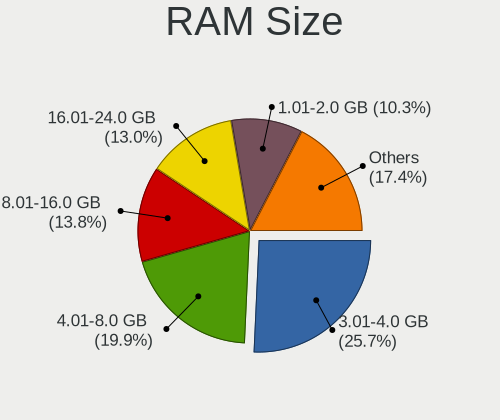
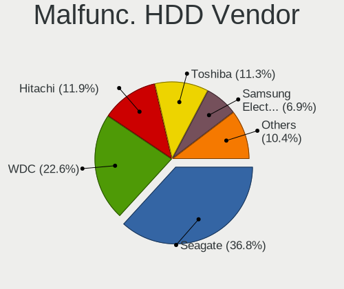
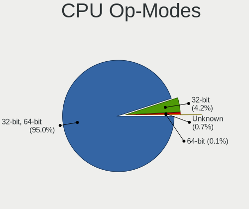
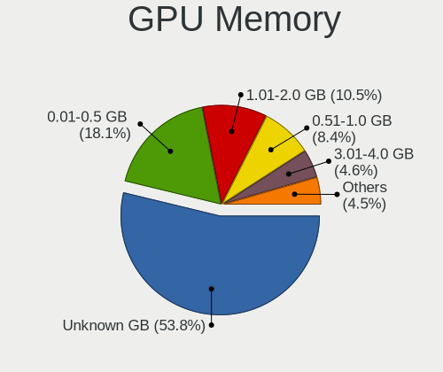
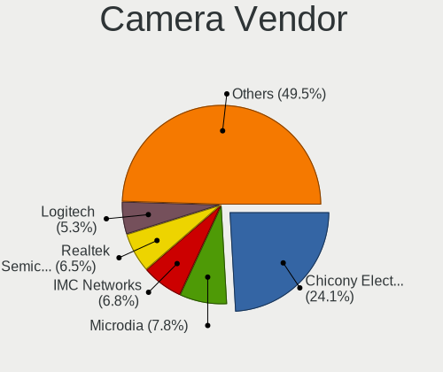

Xubuntu - Tested Hardware & Statistics
--------------------------------------

A project to collect tested hardware configurations for Xubuntu.

Anyone can contribute to this report by the [hw-probe](https://github.com/linuxhw/hw-probe) tool:

    sudo -E hw-probe -all -upload

Please contribute! Especially if your hardware is rare.

This is a report for all computer types. See also reports for [desktops](/Dist/Xubuntu/Desktop/README.md) and [notebooks](/Dist/Xubuntu/Notebook/README.md).

Contents
--------

* [ Test Cases ](#test-cases)

* [ System ](#system)
  - [ OS                       ](#os)
  - [ OS Family                ](#os-family)
  - [ Kernel                   ](#kernel)
  - [ Kernel Family            ](#kernel-family)
  - [ Kernel Major Ver.        ](#kernel-major-ver)
  - [ Arch                     ](#arch)
  - [ DE                       ](#de)
  - [ Display Server           ](#display-server)
  - [ Display Manager          ](#display-manager)
  - [ OS Lang                  ](#os-lang)
  - [ Boot Mode                ](#boot-mode)
  - [ Filesystem               ](#filesystem)
  - [ Part. scheme             ](#part-scheme)
  - [ Dual Boot with Linux/BSD ](#dual-boot-with-linuxbsd)
  - [ Dual Boot (Win)          ](#dual-boot-win)

* [ Board ](#board)
  - [ Vendor                   ](#vendor)
  - [ Model                    ](#model)
  - [ Model Family             ](#model-family)
  - [ MFG Year                 ](#mfg-year)
  - [ Form Factor              ](#form-factor)
  - [ Secure Boot              ](#secure-boot)
  - [ Coreboot                 ](#coreboot)
  - [ RAM Size                 ](#ram-size)
  - [ RAM Used                 ](#ram-used)
  - [ Total Drives             ](#total-drives)
  - [ Has CD-ROM               ](#has-cd-rom)
  - [ Has Ethernet             ](#has-ethernet)
  - [ Has WiFi                 ](#has-wifi)
  - [ Has Bluetooth            ](#has-bluetooth)

* [ Location ](#location)
  - [ Country                  ](#country)
  - [ City                     ](#city)

* [ Drives ](#drives)
  - [ Drive Vendor             ](#drive-vendor)
  - [ Drive Model              ](#drive-model)
  - [ HDD Vendor               ](#hdd-vendor)
  - [ SSD Vendor               ](#ssd-vendor)
  - [ Drive Kind               ](#drive-kind)
  - [ Drive Connector          ](#drive-connector)
  - [ Drive Size               ](#drive-size)
  - [ Space Total              ](#space-total)
  - [ Space Used               ](#space-used)
  - [ Malfunc. Drives          ](#malfunc-drives)
  - [ Malfunc. Drive Vendor    ](#malfunc-drive-vendor)
  - [ Malfunc. HDD Vendor      ](#malfunc-hdd-vendor)
  - [ Malfunc. Drive Kind      ](#malfunc-drive-kind)
  - [ Failed Drives            ](#failed-drives)
  - [ Failed Drive Vendor      ](#failed-drive-vendor)
  - [ Drive Status             ](#drive-status)

* [ Storage controller ](#storage-controller)
  - [ Storage Vendor           ](#storage-vendor)
  - [ Storage Model            ](#storage-model)
  - [ Storage Kind             ](#storage-kind)

* [ Processor ](#processor)
  - [ CPU Vendor               ](#cpu-vendor)
  - [ CPU Model                ](#cpu-model)
  - [ CPU Model Family         ](#cpu-model-family)
  - [ CPU Cores                ](#cpu-cores)
  - [ CPU Sockets              ](#cpu-sockets)
  - [ CPU Threads              ](#cpu-threads)
  - [ CPU Op-Modes             ](#cpu-op-modes)
  - [ CPU Microcode            ](#cpu-microcode)
  - [ CPU Microarch            ](#cpu-microarch)

* [ Graphics ](#graphics)
  - [ GPU Vendor               ](#gpu-vendor)
  - [ GPU Model                ](#gpu-model)
  - [ GPU Combo                ](#gpu-combo)
  - [ GPU Driver               ](#gpu-driver)
  - [ GPU Memory               ](#gpu-memory)

* [ Monitor ](#monitor)
  - [ Monitor Vendor           ](#monitor-vendor)
  - [ Monitor Model            ](#monitor-model)
  - [ Monitor Resolution       ](#monitor-resolution)
  - [ Monitor Diagonal         ](#monitor-diagonal)
  - [ Monitor Width            ](#monitor-width)
  - [ Aspect Ratio             ](#aspect-ratio)
  - [ Monitor Area             ](#monitor-area)
  - [ Pixel Density            ](#pixel-density)
  - [ Multiple Monitors        ](#multiple-monitors)

* [ Network ](#network)
  - [ Net Controller Vendor    ](#net-controller-vendor)
  - [ Net Controller Model     ](#net-controller-model)
  - [ Wireless Vendor          ](#wireless-vendor)
  - [ Wireless Model           ](#wireless-model)
  - [ Ethernet Vendor          ](#ethernet-vendor)
  - [ Ethernet Model           ](#ethernet-model)
  - [ Net Controller Kind      ](#net-controller-kind)
  - [ Used Controller          ](#used-controller)
  - [ NICs                     ](#nics)
  - [ IPv6                     ](#ipv6)

* [ Bluetooth ](#bluetooth)
  - [ Bluetooth Vendor         ](#bluetooth-vendor)
  - [ Bluetooth Model          ](#bluetooth-model)

* [ Sound ](#sound)
  - [ Sound Vendor             ](#sound-vendor)
  - [ Sound Model              ](#sound-model)

* [ Memory ](#memory)
  - [ Memory Vendor            ](#memory-vendor)
  - [ Memory Model             ](#memory-model)
  - [ Memory Kind              ](#memory-kind)
  - [ Memory Form Factor       ](#memory-form-factor)
  - [ Memory Size              ](#memory-size)
  - [ Memory Speed             ](#memory-speed)

* [ Printers & scanners ](#printers--scanners)
  - [ Printer Vendor           ](#printer-vendor)
  - [ Printer Model            ](#printer-model)
  - [ Scanner Vendor           ](#scanner-vendor)
  - [ Scanner Model            ](#scanner-model)

* [ Camera ](#camera)
  - [ Camera Vendor            ](#camera-vendor)
  - [ Camera Model             ](#camera-model)

* [ Security ](#security)
  - [ Fingerprint Vendor       ](#fingerprint-vendor)
  - [ Fingerprint Model        ](#fingerprint-model)
  - [ Chipcard Vendor          ](#chipcard-vendor)
  - [ Chipcard Model           ](#chipcard-model)

* [ Unsupported ](#unsupported)
  - [ Unsupported Devices      ](#unsupported-devices)
  - [ Unsupported Device Types ](#unsupported-device-types)

Test Cases
----------

Total: 7498

| Vendor        | Model                       | Form-Factor | Probe                                                      | Date         |
|---------------|-----------------------------|-------------|------------------------------------------------------------|--------------|
| ASUSTek       | ROG Zephyrus G16 GU605MV... | Notebook    | [b360a75763](https://linux-hardware.org/?probe=b360a75763) | Jan 05, 2025 |
| Gigabyte      | X470 AORUS ULTRA GAMING-... | Desktop     | [99e9eae159](https://linux-hardware.org/?probe=99e9eae159) | Jan 05, 2025 |
| Fujitsu       | D3183-A1 S26361-D3183-A1    | Desktop     | [3696f797a8](https://linux-hardware.org/?probe=3696f797a8) | Jan 04, 2025 |
| Intel         | DH61CR AAG14064-204         | Desktop     | [0b1feaadef](https://linux-hardware.org/?probe=0b1feaadef) | Jan 04, 2025 |
| Lenovo        | ThinkPad X1 Carbon 6th 2... | Notebook    | [437234b838](https://linux-hardware.org/?probe=437234b838) | Jan 04, 2025 |
| Dell          | 0FF3FN A00                  | Desktop     | [7015b068fb](https://linux-hardware.org/?probe=7015b068fb) | Jan 03, 2025 |
| Dell          | 0FF3FN A00                  | Desktop     | [24dd59cb38](https://linux-hardware.org/?probe=24dd59cb38) | Jan 03, 2025 |
| Lenovo        | ThinkPad X1 Carbon 6th 2... | Notebook    | [3df95b02eb](https://linux-hardware.org/?probe=3df95b02eb) | Jan 02, 2025 |
| Dell          | Inspiron 15 3515            | Notebook    | [ca2cc3e4ae](https://linux-hardware.org/?probe=ca2cc3e4ae) | Jan 02, 2025 |
| ASUSTek       | 1002HA                      | Notebook    | [c1ab481b80](https://linux-hardware.org/?probe=c1ab481b80) | Jan 02, 2025 |
| ASUSTek       | 1002HA                      | Notebook    | [6720866a96](https://linux-hardware.org/?probe=6720866a96) | Jan 02, 2025 |
| Lenovo        | ThinkPad SL410 2842EVC      | Notebook    | [344aabb4c4](https://linux-hardware.org/?probe=344aabb4c4) | Jan 01, 2025 |
| ASUSTek       | 1005HA                      | Notebook    | [334101d338](https://linux-hardware.org/?probe=334101d338) | Dec 31, 2024 |
| Lenovo        | G400s VILG1                 | Notebook    | [5363dba88d](https://linux-hardware.org/?probe=5363dba88d) | Dec 31, 2024 |
| Lenovo        | G510 20238                  | Notebook    | [d970da31bf](https://linux-hardware.org/?probe=d970da31bf) | Dec 31, 2024 |
| Dell          | Inspiron 1011               | Notebook    | [d0c3eef6f6](https://linux-hardware.org/?probe=d0c3eef6f6) | Dec 31, 2024 |
| Toshiba       | Satellite C55-C             | Notebook    | [709c9b508d](https://linux-hardware.org/?probe=709c9b508d) | Dec 30, 2024 |
| Toshiba       | Satellite C55-C             | Notebook    | [dc3315e8ad](https://linux-hardware.org/?probe=dc3315e8ad) | Dec 29, 2024 |
| HP            | Laptop 15-bs1xx             | Notebook    | [39fde8f5ca](https://linux-hardware.org/?probe=39fde8f5ca) | Dec 29, 2024 |
| Dell          | Vostro 3558                 | Notebook    | [b480d52ec1](https://linux-hardware.org/?probe=b480d52ec1) | Dec 29, 2024 |
| ASUSTek       | Vivobook Go E1404FA_E140... | Notebook    | [5b91ae868c](https://linux-hardware.org/?probe=5b91ae868c) | Dec 29, 2024 |
| Lenovo        | ThinkPad R61 8918DFG        | Notebook    | [a7030c8afc](https://linux-hardware.org/?probe=a7030c8afc) | Dec 29, 2024 |
| ASUSTek       | M5A78L-M LX3                | Desktop     | [9436b53810](https://linux-hardware.org/?probe=9436b53810) | Dec 28, 2024 |
| Intel         | H61 V1.6B                   | Desktop     | [a60c63d4f8](https://linux-hardware.org/?probe=a60c63d4f8) | Dec 28, 2024 |
| ASRock        | G31M-GS                     | Desktop     | [43edae3bca](https://linux-hardware.org/?probe=43edae3bca) | Dec 27, 2024 |
| ASUSTek       | X541UVK                     | Notebook    | [e84d6fc1f1](https://linux-hardware.org/?probe=e84d6fc1f1) | Dec 26, 2024 |
| ASUSTek       | X510UQR                     | Notebook    | [84503b8cca](https://linux-hardware.org/?probe=84503b8cca) | Dec 26, 2024 |
| Google        | Cave                        | Notebook    | [bd961db2f9](https://linux-hardware.org/?probe=bd961db2f9) | Dec 25, 2024 |
| Gigabyte      | H410M H V3                  | Desktop     | [411d54ea0e](https://linux-hardware.org/?probe=411d54ea0e) | Dec 24, 2024 |
| HP            | EliteBook 2540p             | Notebook    | [1f59b3e296](https://linux-hardware.org/?probe=1f59b3e296) | Dec 24, 2024 |
| HP            | EliteBook 2540p             | Notebook    | [2729bde753](https://linux-hardware.org/?probe=2729bde753) | Dec 24, 2024 |
| HP            | Pavilion g7                 | Notebook    | [349ddf33a4](https://linux-hardware.org/?probe=349ddf33a4) | Dec 23, 2024 |
| Acer          | Aspire A515-57              | Notebook    | [1e6b1c0777](https://linux-hardware.org/?probe=1e6b1c0777) | Dec 23, 2024 |
| BESSTAR Te... | HX90                        | Desktop     | [11b30e17f3](https://linux-hardware.org/?probe=11b30e17f3) | Dec 23, 2024 |
| Gigabyte      | H410M H V3                  | Desktop     | [8d38a80f8d](https://linux-hardware.org/?probe=8d38a80f8d) | Dec 23, 2024 |
| Lenovo        | ThinkPad S1 Yoga 20C0A0C... | Notebook    | [013dec6bfc](https://linux-hardware.org/?probe=013dec6bfc) | Dec 19, 2024 |
| ASRock        | B75M                        | Desktop     | [b5d292db3a](https://linux-hardware.org/?probe=b5d292db3a) | Dec 18, 2024 |
| Lenovo        | ThinkPad T400 6473D2G       | Notebook    | [2c03096475](https://linux-hardware.org/?probe=2c03096475) | Dec 18, 2024 |
| ASUSTek       | X540UA                      | Notebook    | [6d11bceba5](https://linux-hardware.org/?probe=6d11bceba5) | Dec 17, 2024 |
| Unknown       | Unknown                     | Desktop     | [57ac1cff4f](https://linux-hardware.org/?probe=57ac1cff4f) | Dec 17, 2024 |
| ASUSTek       | VivoBook_ASUSLaptop X140... | Notebook    | [7833f87105](https://linux-hardware.org/?probe=7833f87105) | Dec 16, 2024 |
| ASUSTek       | VivoBook_ASUSLaptop X140... | Notebook    | [a3a58e38ac](https://linux-hardware.org/?probe=a3a58e38ac) | Dec 16, 2024 |
| ASUSTek       | M5A78L-M LX PLUS            | Desktop     | [83a10df0af](https://linux-hardware.org/?probe=83a10df0af) | Dec 16, 2024 |
| Unknown       | Unknown                     | Desktop     | [d64bb975dd](https://linux-hardware.org/?probe=d64bb975dd) | Dec 16, 2024 |
| Unknown       | Unknown                     | Desktop     | [add57541c1](https://linux-hardware.org/?probe=add57541c1) | Dec 16, 2024 |
| Fujitsu Si... | AMILO Xi 3650               | Notebook    | [62988b3cd2](https://linux-hardware.org/?probe=62988b3cd2) | Dec 15, 2024 |
| Lenovo        | ThinkPad T14 Gen 3 21CF0... | Notebook    | [02772198f0](https://linux-hardware.org/?probe=02772198f0) | Dec 15, 2024 |
| Lenovo        | ThinkPad T14 Gen 3 21CF0... | Notebook    | [7684d15138](https://linux-hardware.org/?probe=7684d15138) | Dec 15, 2024 |
| Lenovo        | V145-15AST 81MT             | Notebook    | [65a80c8ae1](https://linux-hardware.org/?probe=65a80c8ae1) | Dec 15, 2024 |
| Lenovo        | SHARKBAY 0B98401 PRO        | Desktop     | [f25016b0a2](https://linux-hardware.org/?probe=f25016b0a2) | Dec 14, 2024 |
| ASUSTek       | X45C                        | Notebook    | [4d8d6df206](https://linux-hardware.org/?probe=4d8d6df206) | Dec 12, 2024 |
| Lenovo        | ThinkPad X250 20CLS35P00    | Notebook    | [1e756b4f02](https://linux-hardware.org/?probe=1e756b4f02) | Dec 12, 2024 |
| Lenovo        | ThinkPad X250 20CLS35P00    | Notebook    | [f07bee115e](https://linux-hardware.org/?probe=f07bee115e) | Dec 12, 2024 |
| AZW           | EQ                          | Mini pc     | [e8ad67f29d](https://linux-hardware.org/?probe=e8ad67f29d) | Dec 11, 2024 |
| ASRock        | G31M-GS                     | Desktop     | [769e2a4b35](https://linux-hardware.org/?probe=769e2a4b35) | Dec 11, 2024 |
| Dell          | 0HY9JP A00                  | Desktop     | [d65f5e1d9f](https://linux-hardware.org/?probe=d65f5e1d9f) | Dec 10, 2024 |
| Unknown       | Unknown                     | Desktop     | [47b0853442](https://linux-hardware.org/?probe=47b0853442) | Dec 09, 2024 |
| Packard Be... | EasyNote MH36               | Notebook    | [f7069c0d8b](https://linux-hardware.org/?probe=f7069c0d8b) | Dec 09, 2024 |
| Lenovo        | ThinkPad T14 Gen 3 21AJS... | Notebook    | [372950613f](https://linux-hardware.org/?probe=372950613f) | Dec 07, 2024 |
| ASUSTek       | TP410UA                     | Convertible | [c29847d5bc](https://linux-hardware.org/?probe=c29847d5bc) | Dec 07, 2024 |
| Lenovo        | IdeaPad 3 14ALC6 82KT       | Notebook    | [4b0d54bc10](https://linux-hardware.org/?probe=4b0d54bc10) | Dec 06, 2024 |
| Medion        | Akoya P2214T                | Notebook    | [0c9f9d15b7](https://linux-hardware.org/?probe=0c9f9d15b7) | Dec 04, 2024 |
| ASUSTek       | PB50                        | Desktop     | [4c089afc7d](https://linux-hardware.org/?probe=4c089afc7d) | Dec 03, 2024 |
| Apple         | Mac-F221BEC8                | Desktop     | [ea2b3a630f](https://linux-hardware.org/?probe=ea2b3a630f) | Dec 03, 2024 |
| Lenovo        | ThinkPad T590 20N40033GE    | Notebook    | [4c47ccfa06](https://linux-hardware.org/?probe=4c47ccfa06) | Dec 02, 2024 |
| Lenovo        | ThinkPad T590 20N40033GE    | Notebook    | [618f8af0fb](https://linux-hardware.org/?probe=618f8af0fb) | Dec 02, 2024 |
| ASUSTek       | X555LAB                     | Notebook    | [78dd2bd80f](https://linux-hardware.org/?probe=78dd2bd80f) | Nov 30, 2024 |
| Lenovo        | Legion Slim 5 16AHP9 83D... | Notebook    | [7454798a5c](https://linux-hardware.org/?probe=7454798a5c) | Nov 30, 2024 |
| HP            | Notebook                    | Notebook    | [f6aaab07ba](https://linux-hardware.org/?probe=f6aaab07ba) | Nov 29, 2024 |
| Lenovo        | Bantry CRB SDK0J40709 WI... | Desktop     | [02fadfe7cc](https://linux-hardware.org/?probe=02fadfe7cc) | Nov 28, 2024 |
| Lenovo        | Bantry CRB SDK0J40709 WI... | Desktop     | [a0f78ace36](https://linux-hardware.org/?probe=a0f78ace36) | Nov 28, 2024 |
| HP            | 15                          | Notebook    | [9abcf874e9](https://linux-hardware.org/?probe=9abcf874e9) | Nov 28, 2024 |
| Gigabyte      | H110M-S2-CF                 | Desktop     | [61e673309f](https://linux-hardware.org/?probe=61e673309f) | Nov 27, 2024 |
| Gigabyte      | H110M-S2-CF                 | Desktop     | [0d40b44d15](https://linux-hardware.org/?probe=0d40b44d15) | Nov 27, 2024 |
| HP            | ProBook 4330s               | Notebook    | [a2218163e8](https://linux-hardware.org/?probe=a2218163e8) | Nov 27, 2024 |
| Toshiba       | Satellite L870-120          | Notebook    | [44263921b6](https://linux-hardware.org/?probe=44263921b6) | Nov 26, 2024 |
| ASRock        | G31M-S                      | Desktop     | [eb86f2cd39](https://linux-hardware.org/?probe=eb86f2cd39) | Nov 25, 2024 |
| Acer          | Aspire F5-572G              | Notebook    | [0968b801ff](https://linux-hardware.org/?probe=0968b801ff) | Nov 25, 2024 |
| HP            | Notebook                    | Notebook    | [b00a743ec2](https://linux-hardware.org/?probe=b00a743ec2) | Nov 24, 2024 |
| Lenovo        | V330-15IKB 81AX             | Notebook    | [9b1d667645](https://linux-hardware.org/?probe=9b1d667645) | Nov 23, 2024 |
| MSI           | AM1M                        | Desktop     | [563eb1dd1a](https://linux-hardware.org/?probe=563eb1dd1a) | Nov 23, 2024 |
| Packard Be... | EasyNote TS11HR             | Notebook    | [416650beef](https://linux-hardware.org/?probe=416650beef) | Nov 23, 2024 |
| Pegatron      | 2AC2                        | Desktop     | [24efcbf074](https://linux-hardware.org/?probe=24efcbf074) | Nov 23, 2024 |
| Acer          | Aspire ES1-523              | Notebook    | [a0b86901ed](https://linux-hardware.org/?probe=a0b86901ed) | Nov 22, 2024 |
| ASUSTek       | X751MA                      | Notebook    | [1b27d931c8](https://linux-hardware.org/?probe=1b27d931c8) | Nov 22, 2024 |
| ASUSTek       | X51L                        | Notebook    | [69d6dda7a9](https://linux-hardware.org/?probe=69d6dda7a9) | Nov 22, 2024 |
| ASUSTek       | K53SC                       | Notebook    | [40d3302bb4](https://linux-hardware.org/?probe=40d3302bb4) | Nov 22, 2024 |
| ASUSTek       | K53SC                       | Notebook    | [15401fc9c4](https://linux-hardware.org/?probe=15401fc9c4) | Nov 22, 2024 |
| Dell          | 051FJ8 A02                  | Desktop     | [66b7975345](https://linux-hardware.org/?probe=66b7975345) | Nov 20, 2024 |
| Sony          | VGN-FS315M                  | Notebook    | [4619d1639e](https://linux-hardware.org/?probe=4619d1639e) | Nov 20, 2024 |
| Sony          | VGN-FS315M                  | Notebook    | [1e6166f9c8](https://linux-hardware.org/?probe=1e6166f9c8) | Nov 20, 2024 |
| HP            | ProBook 455 G2              | Notebook    | [a739af0867](https://linux-hardware.org/?probe=a739af0867) | Nov 19, 2024 |
| Dell          | Inspiron 5570               | Notebook    | [f000fe5bb8](https://linux-hardware.org/?probe=f000fe5bb8) | Nov 19, 2024 |
| HP            | 15                          | Notebook    | [ae229ea058](https://linux-hardware.org/?probe=ae229ea058) | Nov 19, 2024 |
| Lenovo        | ThinkPad A475 20KMS0MR00    | Notebook    | [57d3147d55](https://linux-hardware.org/?probe=57d3147d55) | Nov 18, 2024 |
| ASUSTek       | ROG CROSSHAIR VIII DARK ... | Desktop     | [f12649ad72](https://linux-hardware.org/?probe=f12649ad72) | Nov 18, 2024 |
| Lenovo        | ThinkPad A475 20KMS0MR00    | Notebook    | [54c2687b9b](https://linux-hardware.org/?probe=54c2687b9b) | Nov 16, 2024 |
| Lenovo        | ThinkPad L14 Gen 5 21L1C... | Notebook    | [4c48ff54de](https://linux-hardware.org/?probe=4c48ff54de) | Nov 16, 2024 |
| HP            | EliteBook 840 G5            | Notebook    | [7beeeb1653](https://linux-hardware.org/?probe=7beeeb1653) | Nov 15, 2024 |
| HP            | EliteBook 840 G5            | Notebook    | [70cca43b11](https://linux-hardware.org/?probe=70cca43b11) | Nov 14, 2024 |
| ASUSTek       | H81M-K                      | Desktop     | [713cf8fabf](https://linux-hardware.org/?probe=713cf8fabf) | Nov 14, 2024 |
| HP            | ProBook 650 G1              | Notebook    | [556af0bd7a](https://linux-hardware.org/?probe=556af0bd7a) | Nov 14, 2024 |
| Intel         | BIRCHSTREAM E63448-400      | Server      | [f71eae46a6](https://linux-hardware.org/?probe=f71eae46a6) | Nov 14, 2024 |
| Gigabyte      | Z790 UD AX                  | Desktop     | [e7d2ae557b](https://linux-hardware.org/?probe=e7d2ae557b) | Nov 13, 2024 |
| Dell          | Latitude 7340               | Notebook    | [ad73fedd66](https://linux-hardware.org/?probe=ad73fedd66) | Nov 13, 2024 |
| Fujitsu Si... | AMILO Xa 2528               | Notebook    | [6391255449](https://linux-hardware.org/?probe=6391255449) | Nov 13, 2024 |
| Apple         | Mac-F2218EA9                | All in one  | [6bbab3b46c](https://linux-hardware.org/?probe=6bbab3b46c) | Nov 13, 2024 |
| Foxconn       | H61MXT1/F2/-S/-V            | Desktop     | [a45a575296](https://linux-hardware.org/?probe=a45a575296) | Nov 12, 2024 |
| Gigabyte      | B660M DS3H DDR4             | Desktop     | [07bf1053a6](https://linux-hardware.org/?probe=07bf1053a6) | Nov 12, 2024 |
| Dell          | Inspiron 1525               | Notebook    | [96262de2eb](https://linux-hardware.org/?probe=96262de2eb) | Nov 10, 2024 |
| Pegatron      | 2ACB                        | Desktop     | [cd03619b7b](https://linux-hardware.org/?probe=cd03619b7b) | Nov 10, 2024 |
| Gigabyte      | G41M-ES2L                   | Desktop     | [d1d98f5e59](https://linux-hardware.org/?probe=d1d98f5e59) | Nov 10, 2024 |
| HP            | ProBook 455 G2              | Notebook    | [6fe664f991](https://linux-hardware.org/?probe=6fe664f991) | Nov 09, 2024 |
| Acer          | Swift SF314-512             | Notebook    | [78edb25f37](https://linux-hardware.org/?probe=78edb25f37) | Nov 09, 2024 |
| ASUSTek       | TUF Z390-PLUS GAMING        | Desktop     | [09bd105ca4](https://linux-hardware.org/?probe=09bd105ca4) | Nov 09, 2024 |
| HP            | EliteBook 2540p             | Notebook    | [0b808f5fdb](https://linux-hardware.org/?probe=0b808f5fdb) | Nov 04, 2024 |
| HP            | EliteBook 2540p             | Notebook    | [ef768f0f93](https://linux-hardware.org/?probe=ef768f0f93) | Nov 04, 2024 |
| MSI           | PRO B550M-P GEN3            | Desktop     | [c13f813eba](https://linux-hardware.org/?probe=c13f813eba) | Nov 04, 2024 |
| Pegatron      | 2ACB                        | Desktop     | [4fdc43d013](https://linux-hardware.org/?probe=4fdc43d013) | Nov 04, 2024 |
| Gigabyte      | GA-MA69G-S3H                | Desktop     | [155af677bf](https://linux-hardware.org/?probe=155af677bf) | Nov 03, 2024 |
| Apple         | Mac-4B682C642B45593E iMa... | All in one  | [76cb3b0e14](https://linux-hardware.org/?probe=76cb3b0e14) | Nov 03, 2024 |
| Dell          | Inspiron 3593               | Notebook    | [ce28048d27](https://linux-hardware.org/?probe=ce28048d27) | Nov 02, 2024 |
| ASUSTek       | PRIME X399-A                | Desktop     | [47631494b7](https://linux-hardware.org/?probe=47631494b7) | Nov 02, 2024 |
| Lenovo        | 36FE SDK0J40700 WIN 3258... | All in one  | [e3bb8b6d1f](https://linux-hardware.org/?probe=e3bb8b6d1f) | Oct 31, 2024 |
| HP            | 859B                        | Desktop     | [75749e37f1](https://linux-hardware.org/?probe=75749e37f1) | Oct 31, 2024 |
| Dell          | Inspiron 5567               | Notebook    | [cff441fb06](https://linux-hardware.org/?probe=cff441fb06) | Oct 30, 2024 |
| Lenovo        | ThinkPad T530 2429A94       | Notebook    | [65b19adb3c](https://linux-hardware.org/?probe=65b19adb3c) | Oct 30, 2024 |
| Lenovo        | ThinkPad X1 Yoga 1st 20F... | Convertible | [6a3c1dda1a](https://linux-hardware.org/?probe=6a3c1dda1a) | Oct 30, 2024 |
| BANGHO        | Suma 1025                   | Tablet      | [9dc2d138b4](https://linux-hardware.org/?probe=9dc2d138b4) | Oct 30, 2024 |
| BANGHO        | Suma 1025                   | Tablet      | [9ba3946dee](https://linux-hardware.org/?probe=9ba3946dee) | Oct 30, 2024 |
| HP            | 250 15.6 inch G9 Noteboo... | Notebook    | [6c33a69b77](https://linux-hardware.org/?probe=6c33a69b77) | Oct 29, 2024 |
| Sun Micros... | Ultra 27 52                 | Desktop     | [0f59d982bf](https://linux-hardware.org/?probe=0f59d982bf) | Oct 29, 2024 |
| HP            | 3029h                       | Desktop     | [83bfbe4bbe](https://linux-hardware.org/?probe=83bfbe4bbe) | Oct 28, 2024 |
| Toshiba       | Satellite Pro C50-A-1C9     | Notebook    | [09c875c667](https://linux-hardware.org/?probe=09c875c667) | Oct 28, 2024 |
| Dell          | 0P658H A05                  | Server      | [5ca3522b87](https://linux-hardware.org/?probe=5ca3522b87) | Oct 27, 2024 |
| Dell          | 0P658H A05                  | Server      | [8aecda16f1](https://linux-hardware.org/?probe=8aecda16f1) | Oct 27, 2024 |
| HP            | 246 G3                      | Notebook    | [f79febabc0](https://linux-hardware.org/?probe=f79febabc0) | Oct 26, 2024 |
| HP            | 246 G3                      | Notebook    | [9a44312e8d](https://linux-hardware.org/?probe=9a44312e8d) | Oct 26, 2024 |
| Lenovo        | G470 20078                  | Notebook    | [f2b0a607fe](https://linux-hardware.org/?probe=f2b0a607fe) | Oct 25, 2024 |
| Gigabyte      | C1037UN                     | Desktop     | [336eb3673c](https://linux-hardware.org/?probe=336eb3673c) | Oct 25, 2024 |
| HP            | EliteBook 830 G8 Noteboo... | Notebook    | [7c3872493b](https://linux-hardware.org/?probe=7c3872493b) | Oct 24, 2024 |
| Apple         | MacBookPro8,1               | Notebook    | [9a9ae9d765](https://linux-hardware.org/?probe=9a9ae9d765) | Oct 24, 2024 |
| Lenovo        | ThinkPad X240 20AMS00100    | Notebook    | [96ae96801f](https://linux-hardware.org/?probe=96ae96801f) | Oct 24, 2024 |
| HP            | Pavilion g7                 | Notebook    | [1d62587da9](https://linux-hardware.org/?probe=1d62587da9) | Oct 24, 2024 |
| Lenovo        | ThinkPad X220 42918F6       | Notebook    | [73dfa63259](https://linux-hardware.org/?probe=73dfa63259) | Oct 23, 2024 |
| HP            | 250 15.6 inch G9 Noteboo... | Notebook    | [80e86c27ad](https://linux-hardware.org/?probe=80e86c27ad) | Oct 23, 2024 |
| HP            | 83E9                        | Desktop     | [b3ae37412e](https://linux-hardware.org/?probe=b3ae37412e) | Oct 23, 2024 |
| GMKtec        | NucBox5                     | Notebook    | [3d6b2c6fe2](https://linux-hardware.org/?probe=3d6b2c6fe2) | Oct 23, 2024 |
| Lenovo        | IdeaPad Pro 5 14IMH9 83D... | Notebook    | [45055f8225](https://linux-hardware.org/?probe=45055f8225) | Oct 22, 2024 |
| AZW           | GK mini                     | Mini pc     | [8bcf6d53a1](https://linux-hardware.org/?probe=8bcf6d53a1) | Oct 17, 2024 |
| BESSTAR Te... | GB7                         | Mini pc     | [1ae416e43a](https://linux-hardware.org/?probe=1ae416e43a) | Oct 17, 2024 |
| Google        | Candy                       | Notebook    | [0657332520](https://linux-hardware.org/?probe=0657332520) | Oct 17, 2024 |
| BESSTAR Te... | GB7                         | Mini pc     | [fe3c75ebbe](https://linux-hardware.org/?probe=fe3c75ebbe) | Oct 17, 2024 |
| HP            | Compaq CQ58                 | Notebook    | [745f176ea5](https://linux-hardware.org/?probe=745f176ea5) | Oct 16, 2024 |
| Toshiba       | Satellite Pro C50-A-1C9     | Notebook    | [18b2fad0cc](https://linux-hardware.org/?probe=18b2fad0cc) | Oct 16, 2024 |
| ASUSTek       | VivoBook_ASUSLaptop X150... | Notebook    | [6062104c08](https://linux-hardware.org/?probe=6062104c08) | Oct 16, 2024 |
| ASRock        | 970M Pro3                   | Desktop     | [d3e4fb691b](https://linux-hardware.org/?probe=d3e4fb691b) | Oct 16, 2024 |
| Dell          | Latitude 3540               | Notebook    | [5ab18fa675](https://linux-hardware.org/?probe=5ab18fa675) | Oct 15, 2024 |
| Fujitsu       | D3400-A1 S26361-D3400-A1    | Desktop     | [7107105e6c](https://linux-hardware.org/?probe=7107105e6c) | Oct 15, 2024 |
| Acer          | Aspire TC-710 V:1.1         | Desktop     | [f08a4f01c7](https://linux-hardware.org/?probe=f08a4f01c7) | Oct 15, 2024 |
| ASRock        | Z370 Pro4                   | Desktop     | [8be5788f0f](https://linux-hardware.org/?probe=8be5788f0f) | Oct 14, 2024 |
| HP            | ENVY 14                     | Notebook    | [d5f1ec9d65](https://linux-hardware.org/?probe=d5f1ec9d65) | Oct 14, 2024 |
| Google        | Reks                        | Notebook    | [7654a0cc4c](https://linux-hardware.org/?probe=7654a0cc4c) | Oct 12, 2024 |
| Apple         | MacBookPro6,2               | Notebook    | [967ef3aa22](https://linux-hardware.org/?probe=967ef3aa22) | Oct 12, 2024 |
| Gigabyte      | X470 AORUS ULTRA GAMING-... | Desktop     | [903f8e6923](https://linux-hardware.org/?probe=903f8e6923) | Oct 12, 2024 |
| HP            | 82A2                        | Desktop     | [f5c82a12b7](https://linux-hardware.org/?probe=f5c82a12b7) | Oct 12, 2024 |
| Apple         | MacBookPro9,1               | Notebook    | [b98264ba07](https://linux-hardware.org/?probe=b98264ba07) | Oct 12, 2024 |
| ASUSTek       | P5E                         | Desktop     | [cdbc95990e](https://linux-hardware.org/?probe=cdbc95990e) | Oct 11, 2024 |
| HP            | Pavilion g6                 | Notebook    | [bec0b24e36](https://linux-hardware.org/?probe=bec0b24e36) | Oct 11, 2024 |
| ASUSTek       | P5Q-PRO                     | Desktop     | [60db33116f](https://linux-hardware.org/?probe=60db33116f) | Oct 09, 2024 |
| ASUSTek       | X751LD                      | Notebook    | [4dd82e5a32](https://linux-hardware.org/?probe=4dd82e5a32) | Oct 06, 2024 |
| Lenovo        | ThinkPad L13 Gen 2 20VH0... | Notebook    | [c7823c9fd3](https://linux-hardware.org/?probe=c7823c9fd3) | Oct 05, 2024 |
| Positivo      | W2150G-V2 11184041          | All in one  | [ddf5e843a5](https://linux-hardware.org/?probe=ddf5e843a5) | Oct 03, 2024 |
| Dell          | 0RY007                      | Desktop     | [aef3641a97](https://linux-hardware.org/?probe=aef3641a97) | Oct 03, 2024 |
| Dell          | Vostro 3560                 | Notebook    | [e156004a52](https://linux-hardware.org/?probe=e156004a52) | Oct 01, 2024 |
| MSI           | GL73 8RE                    | Notebook    | [f8ea57ec02](https://linux-hardware.org/?probe=f8ea57ec02) | Oct 01, 2024 |
| HP            | ProBook 470 G0              | Notebook    | [850a898da0](https://linux-hardware.org/?probe=850a898da0) | Oct 01, 2024 |
| Lenovo        | ThinkPad T440s 20AQ009DG... | Notebook    | [b60d9ddc7c](https://linux-hardware.org/?probe=b60d9ddc7c) | Oct 01, 2024 |
| Acer          | Aspire A315-58              | Notebook    | [50a08b9a0d](https://linux-hardware.org/?probe=50a08b9a0d) | Oct 01, 2024 |
| Acer          | Aspire TC-710 V:1.1         | Desktop     | [243099814f](https://linux-hardware.org/?probe=243099814f) | Oct 01, 2024 |
| Lenovo        | G470 20078                  | Notebook    | [6c70ad2067](https://linux-hardware.org/?probe=6c70ad2067) | Oct 01, 2024 |
| Notebook      | NJx0MU                      | Notebook    | [292a3746c0](https://linux-hardware.org/?probe=292a3746c0) | Sep 29, 2024 |
| Lenovo        | Yoga Pro 9 16IRP8 83BY      | Notebook    | [eb1917ce7b](https://linux-hardware.org/?probe=eb1917ce7b) | Sep 28, 2024 |
| Acer          | IPXBD-RB                    | Desktop     | [5b0559d8f9](https://linux-hardware.org/?probe=5b0559d8f9) | Sep 28, 2024 |
| Dell          | Latitude 7480               | Notebook    | [d3d014ada7](https://linux-hardware.org/?probe=d3d014ada7) | Sep 27, 2024 |
| GPU Compan... | GWTN141-4                   | Notebook    | [23a59baf4c](https://linux-hardware.org/?probe=23a59baf4c) | Sep 26, 2024 |
| Alienware     | M11xR3                      | Notebook    | [640a59c53a](https://linux-hardware.org/?probe=640a59c53a) | Sep 25, 2024 |
| System76      | Pangolin                    | Notebook    | [95c7382d2b](https://linux-hardware.org/?probe=95c7382d2b) | Sep 24, 2024 |
| MSI           | PRO B550M-P GEN3            | Desktop     | [0d355df0ac](https://linux-hardware.org/?probe=0d355df0ac) | Sep 23, 2024 |
| MSI           | PRO B550M-P GEN3            | Desktop     | [51f9d6568b](https://linux-hardware.org/?probe=51f9d6568b) | Sep 23, 2024 |
| ASUSTek       | ZenBook UX534FTC_UX533FT... | Notebook    | [18e8157e5c](https://linux-hardware.org/?probe=18e8157e5c) | Sep 22, 2024 |
| Lenovo        | ThinkPad X240 20AMS00100    | Notebook    | [2cd69a8fee](https://linux-hardware.org/?probe=2cd69a8fee) | Sep 21, 2024 |
| Unknown       | Unknown                     | Notebook    | [556cdc2448](https://linux-hardware.org/?probe=556cdc2448) | Sep 21, 2024 |
| Unknown       | Unknown                     | Notebook    | [7e13c15a7b](https://linux-hardware.org/?probe=7e13c15a7b) | Sep 21, 2024 |
| Lenovo        | ThinkPad X240 20AMS00100    | Notebook    | [afa733200b](https://linux-hardware.org/?probe=afa733200b) | Sep 21, 2024 |
| ECS           | Nettle3                     | Desktop     | [805686f76b](https://linux-hardware.org/?probe=805686f76b) | Sep 21, 2024 |
| Gigabyte      | B650E AORUS PRO X USB4      | Desktop     | [d1c1277774](https://linux-hardware.org/?probe=d1c1277774) | Sep 20, 2024 |
| ASRock        | H510 Pro BTC+               | Desktop     | [a1ae1e84a3](https://linux-hardware.org/?probe=a1ae1e84a3) | Sep 18, 2024 |
| Gigabyte      | P55-UD3                     | Desktop     | [6d3fbd2a9b](https://linux-hardware.org/?probe=6d3fbd2a9b) | Sep 17, 2024 |
| HP            | 8A96 11                     | Desktop     | [4a8df6b044](https://linux-hardware.org/?probe=4a8df6b044) | Sep 17, 2024 |
| Lenovo        | ThinkPad E14 Gen 4 21EBC... | Notebook    | [f412eebcbc](https://linux-hardware.org/?probe=f412eebcbc) | Sep 17, 2024 |
| Lenovo        | 4068A15                     | Notebook    | [7b17fc2403](https://linux-hardware.org/?probe=7b17fc2403) | Sep 16, 2024 |
| ASUSTek       | ROG CROSSHAIR VIII DARK ... | Desktop     | [12e603b654](https://linux-hardware.org/?probe=12e603b654) | Sep 15, 2024 |
| Lenovo        | SKYBAY NOK                  | Desktop     | [8f7dbb486d](https://linux-hardware.org/?probe=8f7dbb486d) | Sep 14, 2024 |
| Google        | Snappy                      | Notebook    | [4dc99ec7c5](https://linux-hardware.org/?probe=4dc99ec7c5) | Sep 14, 2024 |
| ECS           | Nettle3                     | Desktop     | [578c7331e4](https://linux-hardware.org/?probe=578c7331e4) | Sep 13, 2024 |
| Supermicro    | X8DTN                       | Server      | [3c6d5d3b61](https://linux-hardware.org/?probe=3c6d5d3b61) | Sep 13, 2024 |
| MSI           | B550-A PRO                  | Desktop     | [0cbd62775a](https://linux-hardware.org/?probe=0cbd62775a) | Sep 13, 2024 |
| HP            | EliteBook 745 G5            | Notebook    | [49efe4433a](https://linux-hardware.org/?probe=49efe4433a) | Sep 13, 2024 |
| Dell          | Inspiron 3458               | Notebook    | [79c31f85e1](https://linux-hardware.org/?probe=79c31f85e1) | Sep 13, 2024 |
| MSI           | Cyborg 15 A13VE             | Notebook    | [6271d79a8a](https://linux-hardware.org/?probe=6271d79a8a) | Sep 12, 2024 |
| ASUSTek       | ROG STRIX B450-F GAMING     | Desktop     | [12bdde9ebc](https://linux-hardware.org/?probe=12bdde9ebc) | Sep 11, 2024 |
| Lenovo        | G50-30 80G0                 | Notebook    | [ee69b44d21](https://linux-hardware.org/?probe=ee69b44d21) | Sep 09, 2024 |
| ASUSTek       | M51BC                       | Desktop     | [5c0e68a9cf](https://linux-hardware.org/?probe=5c0e68a9cf) | Sep 09, 2024 |
| Gigabyte      | Z87-HD3                     | Desktop     | [5ce754d8ac](https://linux-hardware.org/?probe=5ce754d8ac) | Sep 08, 2024 |
| HP            | EliteBook 2540p             | Notebook    | [7c9759b951](https://linux-hardware.org/?probe=7c9759b951) | Sep 08, 2024 |
| Unknown       | Unknown                     | Desktop     | [76a130d405](https://linux-hardware.org/?probe=76a130d405) | Sep 07, 2024 |
| Dell          | Precision M4600             | Notebook    | [1301902f3b](https://linux-hardware.org/?probe=1301902f3b) | Sep 06, 2024 |
| Lenovo        | 30D0 SDK0J40697 WIN 3305... | Desktop     | [7f98effccd](https://linux-hardware.org/?probe=7f98effccd) | Sep 06, 2024 |
| ASRock        | A320M Pro4                  | Desktop     | [9eaf0c1129](https://linux-hardware.org/?probe=9eaf0c1129) | Sep 06, 2024 |
| HP            | EliteBook 840 G1            | Notebook    | [744d4d925a](https://linux-hardware.org/?probe=744d4d925a) | Sep 05, 2024 |
| Gigabyte      | X470 AORUS ULTRA GAMING-... | Desktop     | [f896396077](https://linux-hardware.org/?probe=f896396077) | Sep 04, 2024 |
| Lenovo        | G50-30 80G0                 | Notebook    | [eaa7e8d7c1](https://linux-hardware.org/?probe=eaa7e8d7c1) | Sep 04, 2024 |
| Dell          | Latitude 5300               | Notebook    | [2bb6cd074d](https://linux-hardware.org/?probe=2bb6cd074d) | Sep 04, 2024 |
| Packard Be... | IMEDIA S2185                | Desktop     | [2881d2dd1c](https://linux-hardware.org/?probe=2881d2dd1c) | Sep 04, 2024 |
| Dell          | 0P658H A05                  | Server      | [c5009a5fee](https://linux-hardware.org/?probe=c5009a5fee) | Sep 04, 2024 |
| HP            | Pavilion dm4                | Notebook    | [cadd83c1c1](https://linux-hardware.org/?probe=cadd83c1c1) | Sep 04, 2024 |
| HP            | ProBook 645 G3              | Notebook    | [49013f7886](https://linux-hardware.org/?probe=49013f7886) | Sep 03, 2024 |
| HP            | 18E4                        | Desktop     | [c35e92df21](https://linux-hardware.org/?probe=c35e92df21) | Sep 03, 2024 |
| Gigabyte      | P55-UD3                     | Desktop     | [53864e5ccf](https://linux-hardware.org/?probe=53864e5ccf) | Sep 02, 2024 |
| Gigabyte      | P55-UD3                     | Desktop     | [6fbeb76c6a](https://linux-hardware.org/?probe=6fbeb76c6a) | Sep 02, 2024 |
| MSI           | H81M-P33                    | Desktop     | [e042807dc2](https://linux-hardware.org/?probe=e042807dc2) | Sep 01, 2024 |
| Radxa         | ROCK Pi 4C                  | Soc         | [36cbffe1d4](https://linux-hardware.org/?probe=36cbffe1d4) | Aug 31, 2024 |
| Lenovo        | SHARKBAY SDK0E50510 PRO     | Desktop     | [89910d636e](https://linux-hardware.org/?probe=89910d636e) | Aug 31, 2024 |
| Lenovo        | SHARKBAY SDK0E50510 PRO     | Desktop     | [af2f92a36b](https://linux-hardware.org/?probe=af2f92a36b) | Aug 31, 2024 |
| HP            | 8777 01011                  | Mini pc     | [85604280d8](https://linux-hardware.org/?probe=85604280d8) | Aug 31, 2024 |
| Lenovo        | ThinkPad X240 20AMS00100    | Notebook    | [ac446ca7d3](https://linux-hardware.org/?probe=ac446ca7d3) | Aug 31, 2024 |
| Lenovo        | ThinkPad X240 20AMS00100    | Notebook    | [1a3c5dec3d](https://linux-hardware.org/?probe=1a3c5dec3d) | Aug 30, 2024 |
| Lenovo        | ThinkPad T400 6473D2G       | Notebook    | [dc1863924d](https://linux-hardware.org/?probe=dc1863924d) | Aug 29, 2024 |
| Packard Be... | EasyNote TK85               | Notebook    | [a13d7cb9c3](https://linux-hardware.org/?probe=a13d7cb9c3) | Aug 29, 2024 |
| MSI           | A520M-A PRO                 | Desktop     | [bea9bcf4a7](https://linux-hardware.org/?probe=bea9bcf4a7) | Aug 29, 2024 |
| Lenovo        | ThinkPad L460 20FVS1BC0S    | Notebook    | [37cbd62ca6](https://linux-hardware.org/?probe=37cbd62ca6) | Aug 28, 2024 |
| MSI           | MAG B550 TOMAHAWK MAX WI... | Desktop     | [0ffefcc1f1](https://linux-hardware.org/?probe=0ffefcc1f1) | Aug 26, 2024 |
| Dell          | 0WR7PY A02                  | Desktop     | [950d0e1cfd](https://linux-hardware.org/?probe=950d0e1cfd) | Aug 26, 2024 |
| HP            | 0B48h                       | Desktop     | [ac50d6a5f7](https://linux-hardware.org/?probe=ac50d6a5f7) | Aug 25, 2024 |
| ASUSTek       | VivoBook_ASUSLaptop X150... | Notebook    | [75931341d7](https://linux-hardware.org/?probe=75931341d7) | Aug 25, 2024 |
| HP            | 0B48h                       | Desktop     | [7ac220ff90](https://linux-hardware.org/?probe=7ac220ff90) | Aug 25, 2024 |
| Lenovo        | ThinkPad T400 6473D2G       | Notebook    | [a3f3ab59d7](https://linux-hardware.org/?probe=a3f3ab59d7) | Aug 24, 2024 |
| Positivo      | Q4128C-S                    | Notebook    | [85bbf83b0b](https://linux-hardware.org/?probe=85bbf83b0b) | Aug 23, 2024 |
| Acer          | Aspire XC-885 V:1.1         | Desktop     | [15c0568e70](https://linux-hardware.org/?probe=15c0568e70) | Aug 23, 2024 |
| Lenovo        | IdeaPad 3 15IIL05 81WE      | Notebook    | [fda381da20](https://linux-hardware.org/?probe=fda381da20) | Aug 22, 2024 |
| IBM           | 8141KB4                     | Desktop     | [237b1f38c6](https://linux-hardware.org/?probe=237b1f38c6) | Aug 22, 2024 |
| IBM           | 8141KB4                     | Desktop     | [374425afb5](https://linux-hardware.org/?probe=374425afb5) | Aug 22, 2024 |
| Lenovo        | IdeaPad 330-15AST 81D6      | Notebook    | [91adaea4ea](https://linux-hardware.org/?probe=91adaea4ea) | Aug 22, 2024 |
| Google        | Sand                        | Notebook    | [46ff8107da](https://linux-hardware.org/?probe=46ff8107da) | Aug 21, 2024 |
| Acer          | Aspire E1-571               | Notebook    | [3d7216a60a](https://linux-hardware.org/?probe=3d7216a60a) | Aug 21, 2024 |
| Lenovo        | B50-30 80ES                 | Notebook    | [e0122960d3](https://linux-hardware.org/?probe=e0122960d3) | Aug 20, 2024 |
| HP            | Pavilion dv6                | Notebook    | [d66efbf40c](https://linux-hardware.org/?probe=d66efbf40c) | Aug 20, 2024 |
| Unknown       | FH5251                      | Desktop     | [50afcad45f](https://linux-hardware.org/?probe=50afcad45f) | Aug 19, 2024 |
| MSI           | MAG B550 TOMAHAWK MAX WI... | Desktop     | [6cb977f422](https://linux-hardware.org/?probe=6cb977f422) | Aug 18, 2024 |
| Biostar       | B350ET2                     | Desktop     | [435502bdae](https://linux-hardware.org/?probe=435502bdae) | Aug 17, 2024 |
| Biostar       | B350ET2                     | Desktop     | [1c9548b133](https://linux-hardware.org/?probe=1c9548b133) | Aug 17, 2024 |
| HP            | 255 15.6 inch G9 Noteboo... | Notebook    | [ff742887ee](https://linux-hardware.org/?probe=ff742887ee) | Aug 17, 2024 |
| Lenovo        | IdeaPad 5 15ITL05 82FG      | Notebook    | [f4350e4e44](https://linux-hardware.org/?probe=f4350e4e44) | Aug 17, 2024 |
| Gigabyte      | F2A88XM-D3H                 | Desktop     | [326191891a](https://linux-hardware.org/?probe=326191891a) | Aug 17, 2024 |
| Lenovo        | ThinkPad E485 20KU000CCD    | Notebook    | [86d2276d54](https://linux-hardware.org/?probe=86d2276d54) | Aug 16, 2024 |
| ASUSTek       | H87-PRO                     | Desktop     | [2df8b23618](https://linux-hardware.org/?probe=2df8b23618) | Aug 15, 2024 |
| MSI           | B450M/ac                    | Desktop     | [be62424ac6](https://linux-hardware.org/?probe=be62424ac6) | Aug 14, 2024 |
| MSI           | B450M/ac                    | Desktop     | [442a4c144c](https://linux-hardware.org/?probe=442a4c144c) | Aug 14, 2024 |
| Unknown       | Beelink GT1                 | Soc         | [f9d19eaf2d](https://linux-hardware.org/?probe=f9d19eaf2d) | Aug 14, 2024 |
| Lenovo        | ThinkPad T470s 20HGS0US0... | Notebook    | [84337f8394](https://linux-hardware.org/?probe=84337f8394) | Aug 13, 2024 |
| ASUSTek       | X705UAR                     | Notebook    | [7120b40e86](https://linux-hardware.org/?probe=7120b40e86) | Aug 13, 2024 |
| Lenovo        | Legion 5 15ACH6 82JW        | Notebook    | [c81f8dd4de](https://linux-hardware.org/?probe=c81f8dd4de) | Aug 11, 2024 |
| Dell          | Latitude E4300              | Notebook    | [5e3477a1b2](https://linux-hardware.org/?probe=5e3477a1b2) | Aug 11, 2024 |
| ASRock        | X600M-STX                   | Desktop     | [94cf713435](https://linux-hardware.org/?probe=94cf713435) | Aug 10, 2024 |
| ASUSTek       | A7V333-X                    | Desktop     | [50bb42078d](https://linux-hardware.org/?probe=50bb42078d) | Aug 10, 2024 |
| MSI           | Z77A-G41                    | Desktop     | [85eb1d0f02](https://linux-hardware.org/?probe=85eb1d0f02) | Aug 09, 2024 |
| Acer          | Aspire A317-53              | Notebook    | [0697fd4b7d](https://linux-hardware.org/?probe=0697fd4b7d) | Aug 08, 2024 |
| Acer          | Aspire A317-53              | Notebook    | [7275c379a9](https://linux-hardware.org/?probe=7275c379a9) | Aug 08, 2024 |
| Dell          | Latitude 3540               | Notebook    | [c211e993f2](https://linux-hardware.org/?probe=c211e993f2) | Aug 07, 2024 |
| Dell          | Latitude 3540               | Notebook    | [5694031221](https://linux-hardware.org/?probe=5694031221) | Aug 07, 2024 |
| Gigabyte      | 970A-DS3P                   | Desktop     | [e2b516fa74](https://linux-hardware.org/?probe=e2b516fa74) | Aug 07, 2024 |
| Lenovo        | ThinkPad T440s 20AQ009DG... | Notebook    | [b208c323dd](https://linux-hardware.org/?probe=b208c323dd) | Aug 07, 2024 |
| Lenovo        | Legion 5 15IAH7H 82RB       | Notebook    | [1d7ea5d209](https://linux-hardware.org/?probe=1d7ea5d209) | Aug 06, 2024 |
| Chuwi         | CoreBook X                  | Notebook    | [bcdc21a44e](https://linux-hardware.org/?probe=bcdc21a44e) | Aug 05, 2024 |
| Unknown       | axera,ax650x                | Soc         | [91d750536e](https://linux-hardware.org/?probe=91d750536e) | Aug 05, 2024 |
| HP            | 1790                        | Desktop     | [8104bc2455](https://linux-hardware.org/?probe=8104bc2455) | Aug 03, 2024 |
| ASUSTek       | N53SV                       | Notebook    | [f8b8da7d99](https://linux-hardware.org/?probe=f8b8da7d99) | Aug 01, 2024 |
| Dell          | Inspiron 3542               | Notebook    | [5914942e68](https://linux-hardware.org/?probe=5914942e68) | Jul 31, 2024 |
| Lenovo        | IdeaPad N585 20179          | Notebook    | [701e0f9aa6](https://linux-hardware.org/?probe=701e0f9aa6) | Jul 30, 2024 |
| System76      | Pangolin                    | Notebook    | [39af172bfc](https://linux-hardware.org/?probe=39af172bfc) | Jul 29, 2024 |
| HUAWEI        | BOHK-WAX9X                  | Notebook    | [7c2e75f1ab](https://linux-hardware.org/?probe=7c2e75f1ab) | Jul 29, 2024 |
| HP            | EliteBook 2540p             | Notebook    | [1d1515aa10](https://linux-hardware.org/?probe=1d1515aa10) | Jul 28, 2024 |
| Dell          | 0P658H A05                  | Server      | [5e284b9d77](https://linux-hardware.org/?probe=5e284b9d77) | Jul 28, 2024 |
| ASRock        | N68-S3 UCC                  | Desktop     | [cc2c1f8fd5](https://linux-hardware.org/?probe=cc2c1f8fd5) | Jul 27, 2024 |
| Lenovo        | IdeaPad N585 20179          | Notebook    | [7be453f1ba](https://linux-hardware.org/?probe=7be453f1ba) | Jul 27, 2024 |
| ASRock        | B550 Phantom Gaming 4       | Desktop     | [475f183aa6](https://linux-hardware.org/?probe=475f183aa6) | Jul 27, 2024 |
| ASUSTek       | ROG CROSSHAIR VIII DARK ... | Desktop     | [26c71d4462](https://linux-hardware.org/?probe=26c71d4462) | Jul 26, 2024 |
| Dell          | Inspiron 3542               | Notebook    | [7dbae4d4d0](https://linux-hardware.org/?probe=7dbae4d4d0) | Jul 26, 2024 |
| ASUSTek       | SABERTOOTH 990FX R2.0       | Desktop     | [4882975a0e](https://linux-hardware.org/?probe=4882975a0e) | Jul 25, 2024 |
| Gigabyte      | 970A-DS3P                   | Desktop     | [be21c5a7f3](https://linux-hardware.org/?probe=be21c5a7f3) | Jul 25, 2024 |
| OrangePi      | Zero2 W                     | Soc         | [afa5a07c4b](https://linux-hardware.org/?probe=afa5a07c4b) | Jul 25, 2024 |
| Unknown       | Orange Pi 5 Plus            | Soc         | [09737f7741](https://linux-hardware.org/?probe=09737f7741) | Jul 25, 2024 |
| ASRock        | N68-S3 UCC                  | Desktop     | [ebee0b577f](https://linux-hardware.org/?probe=ebee0b577f) | Jul 23, 2024 |
| Dell          | Latitude E6400              | Notebook    | [af51717ce3](https://linux-hardware.org/?probe=af51717ce3) | Jul 21, 2024 |
| Dell          | Latitude E6400              | Notebook    | [ddd0058ebc](https://linux-hardware.org/?probe=ddd0058ebc) | Jul 20, 2024 |
| MSI           | MPG B550 GAMING EDGE WIF... | Desktop     | [798d35210d](https://linux-hardware.org/?probe=798d35210d) | Jul 20, 2024 |
| Apple         | MacBookPro9,1               | Notebook    | [42cf0b2779](https://linux-hardware.org/?probe=42cf0b2779) | Jul 19, 2024 |
| Dell          | 0F5C5X A00                  | Desktop     | [006ce103a9](https://linux-hardware.org/?probe=006ce103a9) | Jul 18, 2024 |
| ASUSTek       | PRIME B560-PLUS             | Desktop     | [4f05ba0751](https://linux-hardware.org/?probe=4f05ba0751) | Jul 18, 2024 |
| Gigabyte      | B550 AORUS ELITE            | Desktop     | [755fd67459](https://linux-hardware.org/?probe=755fd67459) | Jul 17, 2024 |
| ASUSTek       | X555YI                      | Notebook    | [5b525693e5](https://linux-hardware.org/?probe=5b525693e5) | Jul 17, 2024 |
| ASUSTek       | M2N68-AM SE2                | Desktop     | [54c2bc8ab6](https://linux-hardware.org/?probe=54c2bc8ab6) | Jul 17, 2024 |
| Acer          | Aspire XC-885 V:1.1         | Desktop     | [9302be7b15](https://linux-hardware.org/?probe=9302be7b15) | Jul 16, 2024 |
| ASUSTek       | ROG STRIX B760-I GAMING ... | Desktop     | [75dbf5b437](https://linux-hardware.org/?probe=75dbf5b437) | Jul 16, 2024 |
| Lenovo        | 0B98401 WIN                 | Desktop     | [f711cc08e2](https://linux-hardware.org/?probe=f711cc08e2) | Jul 16, 2024 |
| ASUSTek       | ROG CROSSHAIR VIII DARK ... | Desktop     | [2814f40d02](https://linux-hardware.org/?probe=2814f40d02) | Jul 15, 2024 |
| Fujitsu       | D3400-A1 S26361-D3400-A1    | Desktop     | [7237cf5366](https://linux-hardware.org/?probe=7237cf5366) | Jul 15, 2024 |
| Fujitsu       | D3400-A1 S26361-D3400-A1    | Desktop     | [25b171346a](https://linux-hardware.org/?probe=25b171346a) | Jul 14, 2024 |
| ASUSTek       | VivoBook_ASUSLaptop E410... | Notebook    | [fc3bff82fa](https://linux-hardware.org/?probe=fc3bff82fa) | Jul 12, 2024 |
| ASUSTek       | VivoBook_ASUSLaptop E410... | Notebook    | [7bea648431](https://linux-hardware.org/?probe=7bea648431) | Jul 12, 2024 |
| Dell          | 0XKH0D A02                  | Desktop     | [0781f0c28d](https://linux-hardware.org/?probe=0781f0c28d) | Jul 12, 2024 |
| Dell          | 0XKH0D A02                  | Desktop     | [c2611748dd](https://linux-hardware.org/?probe=c2611748dd) | Jul 12, 2024 |
| Acer          | Aspire ES1-533              | Notebook    | [2486b4cc11](https://linux-hardware.org/?probe=2486b4cc11) | Jul 12, 2024 |
| Acer          | Aspire ES1-533              | Notebook    | [c96e97f04c](https://linux-hardware.org/?probe=c96e97f04c) | Jul 11, 2024 |
| MSI           | GF63 Thin 9RCX              | Notebook    | [c9e9bfbbef](https://linux-hardware.org/?probe=c9e9bfbbef) | Jul 11, 2024 |
| Gigabyte      | B550M K                     | Desktop     | [ea2aa30897](https://linux-hardware.org/?probe=ea2aa30897) | Jul 11, 2024 |
| Gigabyte      | B85-HD3                     | Desktop     | [ce9e0e79fb](https://linux-hardware.org/?probe=ce9e0e79fb) | Jul 10, 2024 |
| Lenovo        | IdeaPad 700-17ISK 80RV      | Notebook    | [679136a996](https://linux-hardware.org/?probe=679136a996) | Jul 09, 2024 |
| Gigabyte      | B550 AORUS ELITE            | Desktop     | [9d2570fead](https://linux-hardware.org/?probe=9d2570fead) | Jul 09, 2024 |
| HP            | Laptop 15-fc0xxx            | Notebook    | [af064811c4](https://linux-hardware.org/?probe=af064811c4) | Jul 07, 2024 |
| ASUSTek       | TUF B450M-PRO GAMING        | Desktop     | [01e4be1d25](https://linux-hardware.org/?probe=01e4be1d25) | Jul 07, 2024 |
| Pegatron      | Eureka3                     | Desktop     | [28c1c2dc17](https://linux-hardware.org/?probe=28c1c2dc17) | Jul 07, 2024 |
| HP            | ProLiant ML310e Gen8        | Desktop     | [11f1a32973](https://linux-hardware.org/?probe=11f1a32973) | Jul 06, 2024 |
| ASUSTek       | 1215N                       | Notebook    | [2f21b9e533](https://linux-hardware.org/?probe=2f21b9e533) | Jul 06, 2024 |
| MSI           | PRO B650-S WIFI             | Desktop     | [bab4ce8163](https://linux-hardware.org/?probe=bab4ce8163) | Jul 06, 2024 |
| Acer          | Aspire 5251                 | Notebook    | [ee4236aa4b](https://linux-hardware.org/?probe=ee4236aa4b) | Jul 05, 2024 |
| Acer          | Aspire 5251                 | Notebook    | [738fcb5042](https://linux-hardware.org/?probe=738fcb5042) | Jul 04, 2024 |
| Notebook      | PE60RNE_RND_RNC             | Notebook    | [82b61a10fa](https://linux-hardware.org/?probe=82b61a10fa) | Jul 03, 2024 |
| Dell          | Latitude 5411               | Notebook    | [de4b92c6d7](https://linux-hardware.org/?probe=de4b92c6d7) | Jul 02, 2024 |
| Lenovo        | G50-70 20351                | Notebook    | [0a8491e8c6](https://linux-hardware.org/?probe=0a8491e8c6) | Jul 02, 2024 |
| Rockchip      | RK3588 OPi 5 Plus           | Soc         | [ee86f5ecfa](https://linux-hardware.org/?probe=ee86f5ecfa) | Jul 02, 2024 |
| Fujitsu       | D3601-A1 S26361-D3601-A1    | Desktop     | [49df17e4c7](https://linux-hardware.org/?probe=49df17e4c7) | Jul 01, 2024 |
| HP            | Pavilion x2 Detachable      | Notebook    | [3f4813d1b6](https://linux-hardware.org/?probe=3f4813d1b6) | Jul 01, 2024 |
| ASUSTek       | P8Z77-V LX2                 | Desktop     | [3d53620284](https://linux-hardware.org/?probe=3d53620284) | Jul 01, 2024 |
| HP            | ProBook 430 G1              | Notebook    | [979d9c3cba](https://linux-hardware.org/?probe=979d9c3cba) | Jun 30, 2024 |
| Pegatron      | Benicia                     | Desktop     | [794c6e94ca](https://linux-hardware.org/?probe=794c6e94ca) | Jun 30, 2024 |
| Dell          | Inspiron 7501               | Notebook    | [e3de7681b2](https://linux-hardware.org/?probe=e3de7681b2) | Jun 30, 2024 |
| HP            | 3397                        | Desktop     | [de4dbe185d](https://linux-hardware.org/?probe=de4dbe185d) | Jun 29, 2024 |
| HP            | Laptop 14-bw0xx             | Notebook    | [9ac841dacf](https://linux-hardware.org/?probe=9ac841dacf) | Jun 29, 2024 |
| HP            | 3029h                       | Desktop     | [5be522cd78](https://linux-hardware.org/?probe=5be522cd78) | Jun 28, 2024 |
| ASUSTek       | 1215N                       | Notebook    | [5c51d39b47](https://linux-hardware.org/?probe=5c51d39b47) | Jun 27, 2024 |
| HP            | Laptop 15-da0xxx            | Notebook    | [f44a6b32d8](https://linux-hardware.org/?probe=f44a6b32d8) | Jun 27, 2024 |
| ASUSTek       | VivoBook_ASUSLaptop X513... | Notebook    | [4ace4ec7d7](https://linux-hardware.org/?probe=4ace4ec7d7) | Jun 26, 2024 |
| Google        | Candy                       | Notebook    | [df8341aeba](https://linux-hardware.org/?probe=df8341aeba) | Jun 26, 2024 |
| Gigabyte      | 970A-D3                     | Desktop     | [ca72b5cc43](https://linux-hardware.org/?probe=ca72b5cc43) | Jun 24, 2024 |
| Maibenben     | MaiBook M                   | Notebook    | [1e0a97a5f1](https://linux-hardware.org/?probe=1e0a97a5f1) | Jun 24, 2024 |
| Xunlong       | Orange Pi 5 Plus            | Soc         | [72fd015c0c](https://linux-hardware.org/?probe=72fd015c0c) | Jun 23, 2024 |
| Dell          | Inspiron 3542               | Notebook    | [6c9ebe6ce2](https://linux-hardware.org/?probe=6c9ebe6ce2) | Jun 22, 2024 |
| Dell          | 088DT1 A00                  | Desktop     | [63c22aab38](https://linux-hardware.org/?probe=63c22aab38) | Jun 22, 2024 |
| HP            | 09F8h                       | Desktop     | [5760a9f480](https://linux-hardware.org/?probe=5760a9f480) | Jun 20, 2024 |
| Lenovo        | IdeaPad 700-17ISK 80RV      | Notebook    | [ccdf03b592](https://linux-hardware.org/?probe=ccdf03b592) | Jun 19, 2024 |
| ASUSTek       | P55VA                       | Notebook    | [d29924ad3f](https://linux-hardware.org/?probe=d29924ad3f) | Jun 18, 2024 |
| ASUSTek       | P5P43TD PRO                 | Desktop     | [2d319649ba](https://linux-hardware.org/?probe=2d319649ba) | Jun 18, 2024 |
| Lenovo        | IdeaPad Pro 5 16ARP8 83A... | Notebook    | [a40ce4c093](https://linux-hardware.org/?probe=a40ce4c093) | Jun 18, 2024 |
| Unknown       | Phitronics G31VS-M          | Desktop     | [3dc51ab2b2](https://linux-hardware.org/?probe=3dc51ab2b2) | Jun 18, 2024 |
| Sony          | VPCCW2S8E                   | Notebook    | [0020b32401](https://linux-hardware.org/?probe=0020b32401) | Jun 17, 2024 |
| Lenovo        | IdeaPad N585 20179          | Notebook    | [04002fe8fb](https://linux-hardware.org/?probe=04002fe8fb) | Jun 17, 2024 |
| MSI           | MS-B1831                    | Desktop     | [8e56f848ac](https://linux-hardware.org/?probe=8e56f848ac) | Jun 16, 2024 |
| HP            | 8643 SMVB                   | Desktop     | [21b770ac23](https://linux-hardware.org/?probe=21b770ac23) | Jun 15, 2024 |
| Apple         | Mac-F221BEC8                | Desktop     | [8ee29ba2e7](https://linux-hardware.org/?probe=8ee29ba2e7) | Jun 15, 2024 |
| ASUSTek       | H110M-PLUS                  | Desktop     | [a13acdf786](https://linux-hardware.org/?probe=a13acdf786) | Jun 14, 2024 |
| ASUSTek       | H110M-PLUS                  | Desktop     | [fffccdaea1](https://linux-hardware.org/?probe=fffccdaea1) | Jun 14, 2024 |
| Gigabyte      | Z790 AORUS ELITE AX         | Desktop     | [1221242e81](https://linux-hardware.org/?probe=1221242e81) | Jun 14, 2024 |
| MOXA          | V2400A                      | Notebook    | [90eb7f3d35](https://linux-hardware.org/?probe=90eb7f3d35) | Jun 13, 2024 |
| Dell          | Inspiron 5570               | Notebook    | [f5c26979ee](https://linux-hardware.org/?probe=f5c26979ee) | Jun 13, 2024 |
| HP            | EliteBook 745 G6            | Notebook    | [5e9d948603](https://linux-hardware.org/?probe=5e9d948603) | Jun 12, 2024 |
| ASUSTek       | ROG ZENITH EXTREME          | Desktop     | [23f82615a3](https://linux-hardware.org/?probe=23f82615a3) | Jun 12, 2024 |
| Acer          | Aspire X1430                | Desktop     | [3d3d2f7d99](https://linux-hardware.org/?probe=3d3d2f7d99) | Jun 10, 2024 |
| Acer          | Aspire X1430                | Desktop     | [afbf613945](https://linux-hardware.org/?probe=afbf613945) | Jun 10, 2024 |
| ASUSTek       | P5P43TD PRO                 | Desktop     | [1c0f8d8ad8](https://linux-hardware.org/?probe=1c0f8d8ad8) | Jun 10, 2024 |
| Apple         | MacBookPro11,4              | Notebook    | [edd1f3a769](https://linux-hardware.org/?probe=edd1f3a769) | Jun 10, 2024 |
| Positivo      | Mobile                      | Notebook    | [7057552808](https://linux-hardware.org/?probe=7057552808) | Jun 09, 2024 |
| Notebook      | N85_N87HCHNHZ               | Notebook    | [2094539dff](https://linux-hardware.org/?probe=2094539dff) | Jun 09, 2024 |
| Xunlong       | Orange Pi 5 Plus            | Soc         | [5d7dc73759](https://linux-hardware.org/?probe=5d7dc73759) | Jun 09, 2024 |
| Lenovo        | IdeaPad 100-15IBY 80MJ      | Notebook    | [258aafdc3f](https://linux-hardware.org/?probe=258aafdc3f) | Jun 07, 2024 |
| Dell          | 0M3F6C A01                  | Desktop     | [d9355d53f8](https://linux-hardware.org/?probe=d9355d53f8) | Jun 07, 2024 |
| ASUSTek       | M51AC                       | Desktop     | [8b39e8a250](https://linux-hardware.org/?probe=8b39e8a250) | Jun 06, 2024 |
| Google        | Lindar                      | Notebook    | [27c9d1d626](https://linux-hardware.org/?probe=27c9d1d626) | Jun 06, 2024 |
| Lenovo        | IdeaPad 3 15IML05 81WB      | Notebook    | [055665c491](https://linux-hardware.org/?probe=055665c491) | Jun 05, 2024 |
| Lenovo        | ThinkPad E14 Gen 5 21JRC... | Notebook    | [5f45e3b98b](https://linux-hardware.org/?probe=5f45e3b98b) | Jun 04, 2024 |
| ASUSTek       | ET1612I                     | Desktop     | [589954115c](https://linux-hardware.org/?probe=589954115c) | Jun 03, 2024 |
| Dell          | 0FM586                      | Desktop     | [480574c2be](https://linux-hardware.org/?probe=480574c2be) | Jun 03, 2024 |
| Unknown       | Unknown                     | Notebook    | [6bfe624c55](https://linux-hardware.org/?probe=6bfe624c55) | Jun 03, 2024 |
| Dell          | 0P658H A05                  | Server      | [47c556be06](https://linux-hardware.org/?probe=47c556be06) | Jun 02, 2024 |
| Unknown       | E142                        | Notebook    | [631c390a54](https://linux-hardware.org/?probe=631c390a54) | Jun 02, 2024 |
| HP            | Pavilion dv7                | Notebook    | [826b443536](https://linux-hardware.org/?probe=826b443536) | May 31, 2024 |
| ASUSTek       | ROG STRIX B450-F GAMING ... | Desktop     | [5d292de909](https://linux-hardware.org/?probe=5d292de909) | May 30, 2024 |
| Dell          | 0FM586                      | Desktop     | [c192f1ab3d](https://linux-hardware.org/?probe=c192f1ab3d) | May 30, 2024 |
| Acer          | Aspire SW5-012              | Notebook    | [39dbf768d7](https://linux-hardware.org/?probe=39dbf768d7) | May 30, 2024 |
| Dell          | XPS 15 9510                 | Notebook    | [7362f68c8c](https://linux-hardware.org/?probe=7362f68c8c) | May 29, 2024 |
| Lenovo        | MAHOBAY                     | Desktop     | [00e6135e76](https://linux-hardware.org/?probe=00e6135e76) | May 29, 2024 |
| Dell          | Inspiron 3421               | Notebook    | [26c6e28f8c](https://linux-hardware.org/?probe=26c6e28f8c) | May 28, 2024 |
| ASUSTek       | E200HA                      | Notebook    | [528fdeaaba](https://linux-hardware.org/?probe=528fdeaaba) | May 28, 2024 |
| ASUSTek       | K54C                        | Notebook    | [a7e501420d](https://linux-hardware.org/?probe=a7e501420d) | May 27, 2024 |
| ASUSTek       | PRIME B550-PLUS             | Desktop     | [4fb3692ff1](https://linux-hardware.org/?probe=4fb3692ff1) | May 27, 2024 |
| Dell          | 0CRH6C A01                  | Desktop     | [9d92d084e8](https://linux-hardware.org/?probe=9d92d084e8) | May 27, 2024 |
| Medion        | E15309                      | Notebook    | [b095da9dbd](https://linux-hardware.org/?probe=b095da9dbd) | May 26, 2024 |
| Dell          | Latitude E6440              | Notebook    | [d63cfa2ec5](https://linux-hardware.org/?probe=d63cfa2ec5) | May 26, 2024 |
| Rockchip      | Orange Pi 5                 | Soc         | [59ff8bf9b8](https://linux-hardware.org/?probe=59ff8bf9b8) | May 25, 2024 |
| Lenovo        | 31900059 STD                | All in one  | [462e531e2a](https://linux-hardware.org/?probe=462e531e2a) | May 25, 2024 |
| Lenovo        | ThinkPad W540 20BHS22200    | Notebook    | [4e16082fc6](https://linux-hardware.org/?probe=4e16082fc6) | May 24, 2024 |
| HP            | Presario CQ57               | Notebook    | [a0f691866b](https://linux-hardware.org/?probe=a0f691866b) | May 23, 2024 |
| Lenovo        | ThinkPad X270 20HMS25S00    | Notebook    | [253d2e5692](https://linux-hardware.org/?probe=253d2e5692) | May 23, 2024 |
| Notebook      | W35xSTQ_370ST               | Notebook    | [2df5ac1a6b](https://linux-hardware.org/?probe=2df5ac1a6b) | May 22, 2024 |
| Lenovo        | IdeaPadFlex 3 11ADA05 82... | Convertible | [41d19e4004](https://linux-hardware.org/?probe=41d19e4004) | May 20, 2024 |
| ASUSTek       | ASUS TUF Gaming F15 FX50... | Notebook    | [533a0b51a1](https://linux-hardware.org/?probe=533a0b51a1) | May 18, 2024 |
| Lenovo        | ThinkPad T16 Gen 2 21K7C... | Notebook    | [d166908bab](https://linux-hardware.org/?probe=d166908bab) | May 18, 2024 |
| Gigabyte      | B360M AORUS Gaming 3-CF     | Desktop     | [2851cf1093](https://linux-hardware.org/?probe=2851cf1093) | May 17, 2024 |
| Dell          | XPS 13 9360                 | Notebook    | [7c13ab5271](https://linux-hardware.org/?probe=7c13ab5271) | May 16, 2024 |
| Foxconn       | 2AA9                        | Desktop     | [5f74bfe795](https://linux-hardware.org/?probe=5f74bfe795) | May 15, 2024 |
| Dell          | 088DT1 A00                  | Desktop     | [5fdb3e7792](https://linux-hardware.org/?probe=5fdb3e7792) | May 15, 2024 |
| HP            | 8777 01011                  | Mini pc     | [deb8dcec1d](https://linux-hardware.org/?probe=deb8dcec1d) | May 15, 2024 |
| HP            | 3115m                       | Notebook    | [45bdc53959](https://linux-hardware.org/?probe=45bdc53959) | May 14, 2024 |
| Gigabyte      | GA-880GA-UD3H               | Desktop     | [b22a389add](https://linux-hardware.org/?probe=b22a389add) | May 13, 2024 |
| ASUSTek       | ROG CROSSHAIR VIII DARK ... | Desktop     | [4b0cfc00fa](https://linux-hardware.org/?probe=4b0cfc00fa) | May 13, 2024 |
| Inventec      | Dell Wyse Thin Client De... | Mini pc     | [fa97930352](https://linux-hardware.org/?probe=fa97930352) | May 13, 2024 |
| Apple         | MacBookPro11,4              | Notebook    | [bf55c6b8fb](https://linux-hardware.org/?probe=bf55c6b8fb) | May 13, 2024 |
| HP            | ProBook 450 G4              | Notebook    | [a9f67a3312](https://linux-hardware.org/?probe=a9f67a3312) | May 12, 2024 |
| MSI           | A320M-A PRO M2              | Desktop     | [225b0cf23e](https://linux-hardware.org/?probe=225b0cf23e) | May 12, 2024 |
| MSI           | 890GXM-G65                  | Desktop     | [78941f1cb6](https://linux-hardware.org/?probe=78941f1cb6) | May 12, 2024 |
| Sony          | VPCEH3S1E                   | Notebook    | [5bef66930b](https://linux-hardware.org/?probe=5bef66930b) | May 12, 2024 |
| HP            | Presario CQ57               | Notebook    | [ad22f013d2](https://linux-hardware.org/?probe=ad22f013d2) | May 11, 2024 |
| ASUSTek       | M5A78L-M PLUS/USB3          | Desktop     | [63e6db28a2](https://linux-hardware.org/?probe=63e6db28a2) | May 11, 2024 |
| ASUSTek       | K53E                        | Notebook    | [833222ba86](https://linux-hardware.org/?probe=833222ba86) | May 11, 2024 |
| ASUSTek       | K53E                        | Notebook    | [a8a82db112](https://linux-hardware.org/?probe=a8a82db112) | May 10, 2024 |
| Gigabyte      | B550 AORUS ELITE            | Desktop     | [0356bcf7b7](https://linux-hardware.org/?probe=0356bcf7b7) | May 10, 2024 |
| ASUSTek       | ASUS TUF Gaming F15 FX50... | Notebook    | [07215d5104](https://linux-hardware.org/?probe=07215d5104) | May 10, 2024 |
| Acer          | Extensa 7630EZ              | Notebook    | [7c14697b75](https://linux-hardware.org/?probe=7c14697b75) | May 09, 2024 |
| Acer          | P7YE0                       | Notebook    | [21da78891a](https://linux-hardware.org/?probe=21da78891a) | May 08, 2024 |
| HP            | ProBook 430 G6              | Notebook    | [696c3f2a72](https://linux-hardware.org/?probe=696c3f2a72) | May 07, 2024 |
| Lenovo        | 7Z74CTO1WW 07               | Server      | [ecd5a5be36](https://linux-hardware.org/?probe=ecd5a5be36) | May 07, 2024 |
| Dell          | 088DT1 A00                  | Desktop     | [edb955bd5e](https://linux-hardware.org/?probe=edb955bd5e) | May 07, 2024 |
| Dell          | Precision 7710              | Notebook    | [c89fe612a1](https://linux-hardware.org/?probe=c89fe612a1) | May 06, 2024 |
| Dell          | Precision 7710              | Notebook    | [52c6c4a64a](https://linux-hardware.org/?probe=52c6c4a64a) | May 06, 2024 |
| ASUSTek       | TUF B350M-PLUS GAMING       | Desktop     | [e31ea5ab17](https://linux-hardware.org/?probe=e31ea5ab17) | May 06, 2024 |
| Amlogic       | Meson GXL (S905X) P212 D... | Soc         | [1df5ef59da](https://linux-hardware.org/?probe=1df5ef59da) | May 05, 2024 |
| HP            | Presario CQ56               | Notebook    | [6df22495ed](https://linux-hardware.org/?probe=6df22495ed) | May 04, 2024 |
| MACHINIST     | X99 G7 V1.0                 | Desktop     | [47f648047f](https://linux-hardware.org/?probe=47f648047f) | May 04, 2024 |
| MACHINIST     | X99 G7 V1.0                 | Desktop     | [017f1471b0](https://linux-hardware.org/?probe=017f1471b0) | May 04, 2024 |
| Toshiba       | Satellite A200              | Notebook    | [47b52c0fce](https://linux-hardware.org/?probe=47b52c0fce) | May 02, 2024 |
| ASUSTek       | K53E                        | Notebook    | [2c14a21fe8](https://linux-hardware.org/?probe=2c14a21fe8) | May 02, 2024 |
| Dell          | 0N867P A02                  | Desktop     | [7b2f6946b9](https://linux-hardware.org/?probe=7b2f6946b9) | May 01, 2024 |
| HP            | Compaq 6720s                | Notebook    | [fc9309f2a1](https://linux-hardware.org/?probe=fc9309f2a1) | Apr 30, 2024 |
| Lenovo        | Yoga 730-13IKB 81CT         | Convertible | [0663c3f0ee](https://linux-hardware.org/?probe=0663c3f0ee) | Apr 30, 2024 |
| Acer          | Aspire A515-44              | Notebook    | [d580243e57](https://linux-hardware.org/?probe=d580243e57) | Apr 30, 2024 |
| Gigabyte      | H110M-S2-CF                 | Desktop     | [e55bcf23cf](https://linux-hardware.org/?probe=e55bcf23cf) | Apr 30, 2024 |
| Acer          | Aspire E5-521G              | Notebook    | [0236376455](https://linux-hardware.org/?probe=0236376455) | Apr 30, 2024 |
| Acer          | Aspire A515-51              | Notebook    | [083965d3db](https://linux-hardware.org/?probe=083965d3db) | Apr 30, 2024 |
| HP            | 09F8h                       | Desktop     | [d31df7e1d8](https://linux-hardware.org/?probe=d31df7e1d8) | Apr 29, 2024 |
| AZW           | EQ                          | Desktop     | [dc09b0ecbc](https://linux-hardware.org/?probe=dc09b0ecbc) | Apr 29, 2024 |
| AZW           | EQ                          | Desktop     | [9e4f615d36](https://linux-hardware.org/?probe=9e4f615d36) | Apr 29, 2024 |
| Dell          | Inspiron 1011               | Notebook    | [3952627b7f](https://linux-hardware.org/?probe=3952627b7f) | Apr 29, 2024 |
| ASUSTek       | PRIME H770-PLUS D4          | Desktop     | [d05be00e83](https://linux-hardware.org/?probe=d05be00e83) | Apr 28, 2024 |
| HP            | Notebook                    | Notebook    | [0f3465e86c](https://linux-hardware.org/?probe=0f3465e86c) | Apr 28, 2024 |
| Lenovo        | FLEX-14IWL Laptop 81SQ      | Convertible | [afc8b7bd9f](https://linux-hardware.org/?probe=afc8b7bd9f) | Apr 28, 2024 |
| Intel         | AB2L .A001                  | Mini pc     | [b9bb546172](https://linux-hardware.org/?probe=b9bb546172) | Apr 27, 2024 |
| Apple         | MacBookPro7,1               | Notebook    | [b83cef7cdd](https://linux-hardware.org/?probe=b83cef7cdd) | Apr 27, 2024 |
| Lenovo        | ThinkPad W541 20EGS03W15    | Notebook    | [32ac46c0a5](https://linux-hardware.org/?probe=32ac46c0a5) | Apr 27, 2024 |
| HP            | Mini 210-1000               | Notebook    | [26d3ef8d19](https://linux-hardware.org/?probe=26d3ef8d19) | Apr 27, 2024 |
| HP            | ENVY x360 2-in-1 Laptop ... | Convertible | [4c598291cb](https://linux-hardware.org/?probe=4c598291cb) | Apr 27, 2024 |
| ASUSTek       | VivoBook_ASUSLaptop M370... | Notebook    | [fdd97ab603](https://linux-hardware.org/?probe=fdd97ab603) | Apr 27, 2024 |
| HP            | Notebook                    | Notebook    | [98ad243a7d](https://linux-hardware.org/?probe=98ad243a7d) | Apr 26, 2024 |
| HP            | ProBook 4340s               | Notebook    | [a33e5a73ef](https://linux-hardware.org/?probe=a33e5a73ef) | Apr 25, 2024 |
| HP            | Laptop 14-dq0xxx            | Notebook    | [4652a98a00](https://linux-hardware.org/?probe=4652a98a00) | Apr 24, 2024 |
| HP            | Laptop 14-dq0xxx            | Notebook    | [3feeb1bdac](https://linux-hardware.org/?probe=3feeb1bdac) | Apr 24, 2024 |
| Lenovo        | ThinkPad Twist 33474HU      | Notebook    | [98b9979ec3](https://linux-hardware.org/?probe=98b9979ec3) | Apr 23, 2024 |
| AMI           | Intel                       | Desktop     | [e1b1d85e3c](https://linux-hardware.org/?probe=e1b1d85e3c) | Apr 23, 2024 |
| Unknown       | HU-MNPC05                   | Mini pc     | [a3339b59ad](https://linux-hardware.org/?probe=a3339b59ad) | Apr 23, 2024 |
| Apple         | MacBookPro5,2               | Notebook    | [a5052885f7](https://linux-hardware.org/?probe=a5052885f7) | Apr 22, 2024 |
| Lenovo        | 30D0 SDK0J40697 WIN 3305... | Desktop     | [aa0595d186](https://linux-hardware.org/?probe=aa0595d186) | Apr 22, 2024 |
| Lenovo        | 30D0 SDK0J40697 WIN 3305... | Desktop     | [34d0d4f469](https://linux-hardware.org/?probe=34d0d4f469) | Apr 22, 2024 |
| ASUSTek       | ASUS TUF Gaming F15 FX50... | Notebook    | [a399c9a39f](https://linux-hardware.org/?probe=a399c9a39f) | Apr 22, 2024 |
| Apple         | MacBookAir6,2               | Notebook    | [37c91e715a](https://linux-hardware.org/?probe=37c91e715a) | Apr 22, 2024 |
| ASUSTek       | X751MA                      | Notebook    | [e8b836dd14](https://linux-hardware.org/?probe=e8b836dd14) | Apr 22, 2024 |
| Dell          | 0MN1TX A02                  | Desktop     | [2aa151f159](https://linux-hardware.org/?probe=2aa151f159) | Apr 20, 2024 |
| Dell          | 0MN1TX A02                  | Desktop     | [cfac7f54ed](https://linux-hardware.org/?probe=cfac7f54ed) | Apr 20, 2024 |
| ASUSTek       | TUF Gaming B550M-PLUS       | Desktop     | [5e4c324298](https://linux-hardware.org/?probe=5e4c324298) | Apr 18, 2024 |
| HP            | Compaq 6730b (GW687AV)      | Notebook    | [42dd367de3](https://linux-hardware.org/?probe=42dd367de3) | Apr 16, 2024 |
| Acer          | Aspire E5-521G              | Notebook    | [27ed8e5b6e](https://linux-hardware.org/?probe=27ed8e5b6e) | Apr 16, 2024 |
| Dell          | XPS 13 9370                 | Notebook    | [2ff2120005](https://linux-hardware.org/?probe=2ff2120005) | Apr 15, 2024 |
| Sony          | VPCF12M1E                   | Notebook    | [a07e465b04](https://linux-hardware.org/?probe=a07e465b04) | Apr 15, 2024 |
| Dell          | 0FF3FN A00                  | Desktop     | [b1bddc88aa](https://linux-hardware.org/?probe=b1bddc88aa) | Apr 15, 2024 |
| ASUSTek       | P5Q                         | Desktop     | [2a2880460d](https://linux-hardware.org/?probe=2a2880460d) | Apr 15, 2024 |
| Dell          | 0WG864                      | Desktop     | [b430ed12b5](https://linux-hardware.org/?probe=b430ed12b5) | Apr 15, 2024 |
| Lenovo        | 0B98401 WIN                 | Desktop     | [4fa3e985a9](https://linux-hardware.org/?probe=4fa3e985a9) | Apr 15, 2024 |
| ASUSTek       | PRIME Z790-P WIFI           | Desktop     | [6b8bceb5c0](https://linux-hardware.org/?probe=6b8bceb5c0) | Apr 14, 2024 |
| Sony          | VPCF12M1E                   | Notebook    | [b4adc4cd67](https://linux-hardware.org/?probe=b4adc4cd67) | Apr 13, 2024 |
| Lenovo        | ThinkPad X131e 3367AH5      | Notebook    | [5f3d3b0a74](https://linux-hardware.org/?probe=5f3d3b0a74) | Apr 13, 2024 |
| ASRock        | A75M-HVS                    | Desktop     | [fc26a8b5fa](https://linux-hardware.org/?probe=fc26a8b5fa) | Apr 12, 2024 |
| Dell          | 060K5C A02                  | Server      | [3bab33d8d5](https://linux-hardware.org/?probe=3bab33d8d5) | Apr 11, 2024 |
| Fujitsu       | FujitsuTP7000 -1            | Desktop     | [1d3918f13c](https://linux-hardware.org/?probe=1d3918f13c) | Apr 11, 2024 |
| HP            | ENVY x360 2-in-1 Laptop ... | Convertible | [1999efa32b](https://linux-hardware.org/?probe=1999efa32b) | Apr 10, 2024 |
| ASUSTek       | P8P67 LE                    | Desktop     | [de829401f2](https://linux-hardware.org/?probe=de829401f2) | Apr 10, 2024 |
| Dell          | 0FF3FN A00                  | Desktop     | [979d51faa5](https://linux-hardware.org/?probe=979d51faa5) | Apr 10, 2024 |
| Shenzhen M... | F7BFD                       | Desktop     | [98e43e8de4](https://linux-hardware.org/?probe=98e43e8de4) | Apr 09, 2024 |
| ASUSTek       | Crosshair IV Formula        | Desktop     | [e62581b4c5](https://linux-hardware.org/?probe=e62581b4c5) | Apr 09, 2024 |
| Dell          | 02YYK5 A01                  | Desktop     | [cee98f0931](https://linux-hardware.org/?probe=cee98f0931) | Apr 09, 2024 |
| Dell          | 02YYK5 A01                  | Desktop     | [ed8a461ca7](https://linux-hardware.org/?probe=ed8a461ca7) | Apr 09, 2024 |
| Philco        | 14I                         | Notebook    | [c7ac543990](https://linux-hardware.org/?probe=c7ac543990) | Apr 09, 2024 |
| HP            | EliteBook 2540p             | Notebook    | [ac69abc7f8](https://linux-hardware.org/?probe=ac69abc7f8) | Apr 08, 2024 |
| Dell          | XPS 13 9370                 | Notebook    | [a49c3b9526](https://linux-hardware.org/?probe=a49c3b9526) | Apr 08, 2024 |
| HP            | 15                          | Notebook    | [81bbe62a62](https://linux-hardware.org/?probe=81bbe62a62) | Apr 08, 2024 |
| Dell          | 088DT1 A00                  | Desktop     | [c11b83e86b](https://linux-hardware.org/?probe=c11b83e86b) | Apr 08, 2024 |
| Hardkernel    | ODROID-H2                   | Desktop     | [64075f354e](https://linux-hardware.org/?probe=64075f354e) | Apr 07, 2024 |
| Lenovo        | ThinkPad T60 1951FDG        | Notebook    | [3baacd7e39](https://linux-hardware.org/?probe=3baacd7e39) | Apr 07, 2024 |
| Lenovo        | ThinkPad T60 1951FDG        | Notebook    | [48ffb129cb](https://linux-hardware.org/?probe=48ffb129cb) | Apr 06, 2024 |
| Dell          | Latitude 5330               | Notebook    | [3327ec32e4](https://linux-hardware.org/?probe=3327ec32e4) | Apr 06, 2024 |
| Gigabyte      | B150-HD3 DDR3-CF            | Desktop     | [11eed3d590](https://linux-hardware.org/?probe=11eed3d590) | Apr 05, 2024 |
| Gigabyte      | M68M-S2P                    | Desktop     | [2711aee181](https://linux-hardware.org/?probe=2711aee181) | Apr 05, 2024 |
| ASUSTek       | K53E                        | Notebook    | [0564fa09ec](https://linux-hardware.org/?probe=0564fa09ec) | Apr 05, 2024 |
| Lenovo        | ThinkPad T60 1951FDG        | Notebook    | [690d2ee78f](https://linux-hardware.org/?probe=690d2ee78f) | Apr 05, 2024 |
| HP            | EliteBook 2540p             | Notebook    | [f3587d854e](https://linux-hardware.org/?probe=f3587d854e) | Apr 05, 2024 |
| Clevo         | W240EU/W250EUQ/W270EUQ      | Notebook    | [1479db147d](https://linux-hardware.org/?probe=1479db147d) | Apr 04, 2024 |
| Acer          | Aspire A515-44              | Notebook    | [4b51c98fb6](https://linux-hardware.org/?probe=4b51c98fb6) | Apr 04, 2024 |
| ASUSTek       | P8H61-M LX R2.0             | Desktop     | [415b56c381](https://linux-hardware.org/?probe=415b56c381) | Apr 03, 2024 |
| Lenovo        | Legion S7 15IMH5 82BC       | Notebook    | [b57ab21576](https://linux-hardware.org/?probe=b57ab21576) | Apr 03, 2024 |
| Samsung       | 300E4C/300E5C/300E7C        | Notebook    | [dfef032d35](https://linux-hardware.org/?probe=dfef032d35) | Apr 03, 2024 |
| MSI           | X58 Pro                     | Desktop     | [9b0fab5acc](https://linux-hardware.org/?probe=9b0fab5acc) | Apr 02, 2024 |
| Lenovo        | Yoga 730-13IKB 81CT         | Convertible | [9ce8633d67](https://linux-hardware.org/?probe=9ce8633d67) | Apr 02, 2024 |
| ASUSTek       | ROG CROSSHAIR VIII HERO     | Desktop     | [84ed1b3cc5](https://linux-hardware.org/?probe=84ed1b3cc5) | Apr 01, 2024 |
| Lenovo        | IdeaPad 1 15AMN7 82VG       | Notebook    | [0df7a90dcd](https://linux-hardware.org/?probe=0df7a90dcd) | Apr 01, 2024 |
| Acer          | Aspire V3-331               | Notebook    | [0b74c17835](https://linux-hardware.org/?probe=0b74c17835) | Apr 01, 2024 |
| ASUSTek       | PRIME A320M-K               | Desktop     | [0bd97f775d](https://linux-hardware.org/?probe=0bd97f775d) | Apr 01, 2024 |
| ASUSTek       | PRIME A320M-K               | Desktop     | [d952efad38](https://linux-hardware.org/?probe=d952efad38) | Apr 01, 2024 |
| ASUSTek       | M5A78L-M PLUS/USB3          | Desktop     | [943b90560f](https://linux-hardware.org/?probe=943b90560f) | Mar 31, 2024 |
| ASUSTek       | P8H61-M LX R2.0             | Desktop     | [6452e5397a](https://linux-hardware.org/?probe=6452e5397a) | Mar 31, 2024 |
| Lenovo        | ThinkPad E485 20KUS0DW00    | Notebook    | [350231f567](https://linux-hardware.org/?probe=350231f567) | Mar 31, 2024 |
| Lenovo        | ThinkPad E485 20KUS0DW00    | Notebook    | [89c1c85f43](https://linux-hardware.org/?probe=89c1c85f43) | Mar 31, 2024 |
| HP            | EliteBook 820 G1            | Notebook    | [d89f9b8de7](https://linux-hardware.org/?probe=d89f9b8de7) | Mar 30, 2024 |
| Lenovo        | IdeaPad 3 15IAU7 82RK       | Notebook    | [015f6a28b2](https://linux-hardware.org/?probe=015f6a28b2) | Mar 30, 2024 |
| HP            | EliteBook 2540p             | Notebook    | [1115e42390](https://linux-hardware.org/?probe=1115e42390) | Mar 30, 2024 |
| MSI           | MPG X570S EDGE MAX WIFI     | Desktop     | [a09b8ab7cc](https://linux-hardware.org/?probe=a09b8ab7cc) | Mar 29, 2024 |
| HP            | Elite x2 1012 G1            | Notebook    | [5e19a7d027](https://linux-hardware.org/?probe=5e19a7d027) | Mar 29, 2024 |
| HP            | Elite x2 1012 G1            | Notebook    | [2d13f6d55a](https://linux-hardware.org/?probe=2d13f6d55a) | Mar 29, 2024 |
| Apple         | MacBookPro8,1               | Notebook    | [48eae7912e](https://linux-hardware.org/?probe=48eae7912e) | Mar 27, 2024 |
| Dell          | Latitude E6520              | Notebook    | [b0934dd20e](https://linux-hardware.org/?probe=b0934dd20e) | Mar 27, 2024 |
| Toshiba       | Satellite C70D-B            | Notebook    | [6800119330](https://linux-hardware.org/?probe=6800119330) | Mar 27, 2024 |
| ASUSTek       | PRIME A320M-K/BR            | Desktop     | [62ff739b8b](https://linux-hardware.org/?probe=62ff739b8b) | Mar 27, 2024 |
| ASUSTek       | PRIME A320M-K/BR            | Desktop     | [15137ac3a5](https://linux-hardware.org/?probe=15137ac3a5) | Mar 27, 2024 |
| MSI           | MPG X570S EDGE MAX WIFI     | Desktop     | [ee2674fe55](https://linux-hardware.org/?probe=ee2674fe55) | Mar 26, 2024 |
| Lenovo        | Yoga Pro 9 16IRP8 83BY      | Notebook    | [eadf31071a](https://linux-hardware.org/?probe=eadf31071a) | Mar 26, 2024 |
| Dell          | Latitude E5510              | Notebook    | [3f05300c5e](https://linux-hardware.org/?probe=3f05300c5e) | Mar 26, 2024 |
| Maibenben     | Perfectum Series            | Notebook    | [083055f303](https://linux-hardware.org/?probe=083055f303) | Mar 26, 2024 |
| Intel         | X99                         | Desktop     | [2479fc825c](https://linux-hardware.org/?probe=2479fc825c) | Mar 25, 2024 |
| ASUSTek       | ROG Zephyrus G14 GA403UI... | Notebook    | [eb09797dad](https://linux-hardware.org/?probe=eb09797dad) | Mar 25, 2024 |
| Lenovo        | ThinkPad L512 2598W2P       | Notebook    | [29d9529699](https://linux-hardware.org/?probe=29d9529699) | Mar 24, 2024 |
| Apple         | MacBookPro1,1               | Notebook    | [4046c97819](https://linux-hardware.org/?probe=4046c97819) | Mar 24, 2024 |
| Fujitsu       | D3400-A1 S26361-D3400-A1    | Desktop     | [b58c3d38ef](https://linux-hardware.org/?probe=b58c3d38ef) | Mar 24, 2024 |
| Shenzhen M... | F7BFD                       | Desktop     | [64942ccf25](https://linux-hardware.org/?probe=64942ccf25) | Mar 24, 2024 |
| Lenovo        | ThinkPad X1 Yoga 1st 20F... | Convertible | [33b4f7022a](https://linux-hardware.org/?probe=33b4f7022a) | Mar 24, 2024 |
| Lenovo        | ThinkPad X1 Yoga 1st 20F... | Convertible | [16330eea6d](https://linux-hardware.org/?probe=16330eea6d) | Mar 24, 2024 |
| MACHINIST     | E5-MR9A V1.0                | Desktop     | [24cd2954c5](https://linux-hardware.org/?probe=24cd2954c5) | Mar 24, 2024 |
| Timi          | TM1701                      | Notebook    | [fb85b5c0df](https://linux-hardware.org/?probe=fb85b5c0df) | Mar 23, 2024 |
| Apple         | MacBookPro1,1               | Notebook    | [ca5449cab6](https://linux-hardware.org/?probe=ca5449cab6) | Mar 23, 2024 |
| Fujitsu       | D3400-A1 S26361-D3400-A1    | Desktop     | [8ab7c6d8dc](https://linux-hardware.org/?probe=8ab7c6d8dc) | Mar 23, 2024 |
| ASUSTek       | PRIME A320M-K               | Desktop     | [052a56e30a](https://linux-hardware.org/?probe=052a56e30a) | Mar 23, 2024 |
| Toshiba       | Satellite C70D-B            | Notebook    | [85a82b979c](https://linux-hardware.org/?probe=85a82b979c) | Mar 23, 2024 |
| Dell          | Latitude E7240              | Notebook    | [ccabe8257d](https://linux-hardware.org/?probe=ccabe8257d) | Mar 23, 2024 |
| Lenovo        | SHARKBAY SDK0E50510 PRO     | Desktop     | [e18375e687](https://linux-hardware.org/?probe=e18375e687) | Mar 23, 2024 |
| ASUSTek       | ROG Zephyrus G14 GA403UI... | Notebook    | [4d1bc02be0](https://linux-hardware.org/?probe=4d1bc02be0) | Mar 23, 2024 |
| ASUSTek       | ROG Zephyrus G14 GA403UI... | Notebook    | [0f6120fef2](https://linux-hardware.org/?probe=0f6120fef2) | Mar 23, 2024 |
| HP            | Laptop 15-bs0xx             | Notebook    | [1398cdcdf9](https://linux-hardware.org/?probe=1398cdcdf9) | Mar 22, 2024 |
| Dell          | Latitude E7240              | Notebook    | [cce23d2d34](https://linux-hardware.org/?probe=cce23d2d34) | Mar 22, 2024 |
| MSI           | 760GM-P21                   | Desktop     | [9ea00e6ebb](https://linux-hardware.org/?probe=9ea00e6ebb) | Mar 22, 2024 |
| Acer          | Aspire E5-774G              | Notebook    | [0de719fa5b](https://linux-hardware.org/?probe=0de719fa5b) | Mar 21, 2024 |
| ASUSTek       | VivoBook_ASUSLaptop X515... | Notebook    | [2f1279e5f4](https://linux-hardware.org/?probe=2f1279e5f4) | Mar 21, 2024 |
| ASUSTek       | VivoBook_ASUSLaptop X515... | Notebook    | [96e93279ce](https://linux-hardware.org/?probe=96e93279ce) | Mar 21, 2024 |
| HP            | Laptop 14s-dq3xxx           | Notebook    | [bb6d61cb47](https://linux-hardware.org/?probe=bb6d61cb47) | Mar 21, 2024 |
| Intel         | H81                         | Desktop     | [9faff0c332](https://linux-hardware.org/?probe=9faff0c332) | Mar 21, 2024 |
| Gigabyte      | X470 AORUS ULTRA GAMING-... | Desktop     | [9df4721239](https://linux-hardware.org/?probe=9df4721239) | Mar 20, 2024 |
| Packard Be... | IXTREME M5800               | Desktop     | [1f3f47a00c](https://linux-hardware.org/?probe=1f3f47a00c) | Mar 20, 2024 |
| Packard Be... | IXTREME M5800               | Desktop     | [3d41908138](https://linux-hardware.org/?probe=3d41908138) | Mar 20, 2024 |
| ASUSTek       | ROG STRIX B550-F GAMING ... | Desktop     | [62f6992f05](https://linux-hardware.org/?probe=62f6992f05) | Mar 20, 2024 |
| eMachines     | eME642G                     | Notebook    | [8759a11aca](https://linux-hardware.org/?probe=8759a11aca) | Mar 20, 2024 |
| Supermicro    | X8DTN                       | Server      | [180b7199c4](https://linux-hardware.org/?probe=180b7199c4) | Mar 19, 2024 |
| HP            | Stream Laptop 14-ds0xxx     | Notebook    | [e003a1215d](https://linux-hardware.org/?probe=e003a1215d) | Mar 19, 2024 |
| Supermicro    | X8DTN                       | Server      | [a7ef5b23a1](https://linux-hardware.org/?probe=a7ef5b23a1) | Mar 18, 2024 |
| ASUSTek       | M5A78L-M/USB3               | Desktop     | [aff15cce95](https://linux-hardware.org/?probe=aff15cce95) | Mar 17, 2024 |
| Lenovo        | G70-70 80HW0014FR           | Notebook    | [8fd24b2766](https://linux-hardware.org/?probe=8fd24b2766) | Mar 17, 2024 |
| Lenovo        | G70-70 80HW0014FR           | Notebook    | [ebb00d0246](https://linux-hardware.org/?probe=ebb00d0246) | Mar 17, 2024 |
| ASUSTek       | ROG Strix G513QE_G513QE     | Notebook    | [98300bace9](https://linux-hardware.org/?probe=98300bace9) | Mar 16, 2024 |
| eMachines     | eME642G                     | Notebook    | [7d7230a747](https://linux-hardware.org/?probe=7d7230a747) | Mar 16, 2024 |
| ASUSTek       | ROG CROSSHAIR VIII DARK ... | Desktop     | [84e1a7347a](https://linux-hardware.org/?probe=84e1a7347a) | Mar 16, 2024 |
| Gigabyte      | X470 AORUS ULTRA GAMING-... | Desktop     | [8f589013b1](https://linux-hardware.org/?probe=8f589013b1) | Mar 15, 2024 |
| Lenovo        | ThinkPad T14s Gen 1 20UJ... | Notebook    | [2d1ccd0458](https://linux-hardware.org/?probe=2d1ccd0458) | Mar 15, 2024 |
| Fujitsu       | FARQ10003                   | Notebook    | [85d8b675fc](https://linux-hardware.org/?probe=85d8b675fc) | Mar 14, 2024 |
| HP            | 2175                        | Desktop     | [f43124076c](https://linux-hardware.org/?probe=f43124076c) | Mar 14, 2024 |
| Dell          | 088DT1 A00                  | Desktop     | [8eb20f3ee6](https://linux-hardware.org/?probe=8eb20f3ee6) | Mar 12, 2024 |
| Dell          | 0J3C2F A02                  | Desktop     | [bebba9cf4a](https://linux-hardware.org/?probe=bebba9cf4a) | Mar 12, 2024 |
| HP            | 250 G6 Notebook PC          | Notebook    | [6b050fbf71](https://linux-hardware.org/?probe=6b050fbf71) | Mar 12, 2024 |
| Gigabyte      | GA-MA790FXT-UD5P            | Desktop     | [c50d470e19](https://linux-hardware.org/?probe=c50d470e19) | Mar 11, 2024 |
| Dell          | 0FF3FN A00                  | Desktop     | [78dd6f891e](https://linux-hardware.org/?probe=78dd6f891e) | Mar 11, 2024 |
| Lenovo        | ThinkPad T440s 20AQ009DG... | Notebook    | [dd2cc3d3df](https://linux-hardware.org/?probe=dd2cc3d3df) | Mar 11, 2024 |
| Dell          | 0VHXCD A03                  | Desktop     | [4ea894ca73](https://linux-hardware.org/?probe=4ea894ca73) | Mar 10, 2024 |
| Dell          | Inspiron 5452               | Notebook    | [d81294ea2d](https://linux-hardware.org/?probe=d81294ea2d) | Mar 10, 2024 |
| Toshiba       | Satellite A200              | Notebook    | [7197835980](https://linux-hardware.org/?probe=7197835980) | Mar 08, 2024 |
| Lenovo        | V17 G4 IRU 83A2             | Notebook    | [36ac6f0e6b](https://linux-hardware.org/?probe=36ac6f0e6b) | Mar 08, 2024 |
| HP            | 3397                        | Desktop     | [571ec29e07](https://linux-hardware.org/?probe=571ec29e07) | Mar 07, 2024 |
| Dell          | Latitude 5280               | Notebook    | [59fcb83d4a](https://linux-hardware.org/?probe=59fcb83d4a) | Mar 07, 2024 |
| Dell          | Latitude 5280               | Notebook    | [eca7be25aa](https://linux-hardware.org/?probe=eca7be25aa) | Mar 07, 2024 |
| Notebook      | W54_55_94_95_97AU,AUQ       | Notebook    | [b16fb5307b](https://linux-hardware.org/?probe=b16fb5307b) | Mar 07, 2024 |
| HP            | 2129                        | Desktop     | [c06e16031f](https://linux-hardware.org/?probe=c06e16031f) | Mar 07, 2024 |
| HP            | 2129                        | Desktop     | [5f2414ecf8](https://linux-hardware.org/?probe=5f2414ecf8) | Mar 07, 2024 |
| HP            | 1998                        | Desktop     | [bd3e35eb3f](https://linux-hardware.org/?probe=bd3e35eb3f) | Mar 06, 2024 |
| ASUSTek       | TUF Gaming FX505DT_FX505... | Notebook    | [23a8bcc014](https://linux-hardware.org/?probe=23a8bcc014) | Mar 06, 2024 |
| Lenovo        | ThinkPad T470p 20J6S00UH... | Notebook    | [b35deb0a8c](https://linux-hardware.org/?probe=b35deb0a8c) | Mar 06, 2024 |
| Apple         | Mac-F2218FC8                | All in one  | [064e78652b](https://linux-hardware.org/?probe=064e78652b) | Mar 05, 2024 |
| Lenovo        | ThinkPad A475 20KMS0MR00    | Notebook    | [0351009764](https://linux-hardware.org/?probe=0351009764) | Mar 05, 2024 |
| Positivo      | Q4128C                      | Notebook    | [0e62c41fff](https://linux-hardware.org/?probe=0e62c41fff) | Mar 05, 2024 |
| ASUSTek       | P5Q-PRO                     | Desktop     | [4d165bc18c](https://linux-hardware.org/?probe=4d165bc18c) | Mar 05, 2024 |
| Lenovo        | IdeaPad 5 15ITL05 82FG      | Notebook    | [1c340dbb25](https://linux-hardware.org/?probe=1c340dbb25) | Mar 04, 2024 |
| Dell          | Inspiron 3521               | Notebook    | [9552e898d6](https://linux-hardware.org/?probe=9552e898d6) | Mar 04, 2024 |
| ASUSTek       | VivoBook_ASUSLaptop X160... | Notebook    | [2bbb7923b9](https://linux-hardware.org/?probe=2bbb7923b9) | Mar 04, 2024 |
| Gigabyte      | B550 AORUS ELITE            | Desktop     | [98a6b003c9](https://linux-hardware.org/?probe=98a6b003c9) | Mar 04, 2024 |
| Lenovo        | ThinkPad A475 20KMS0MR00    | Notebook    | [eead5309ca](https://linux-hardware.org/?probe=eead5309ca) | Mar 04, 2024 |
| Gigabyte      | M61PME-S2P                  | Desktop     | [3a3676f133](https://linux-hardware.org/?probe=3a3676f133) | Mar 04, 2024 |
| HP            | EliteBook x360 1030 G2      | Convertible | [fc50b125e5](https://linux-hardware.org/?probe=fc50b125e5) | Mar 04, 2024 |
| HP            | 240 G7 Notebook PC          | Notebook    | [7556bb7dcb](https://linux-hardware.org/?probe=7556bb7dcb) | Mar 04, 2024 |
| Lenovo        | ThinkPad X260 20F5S4BY00    | Notebook    | [efea91c506](https://linux-hardware.org/?probe=efea91c506) | Mar 03, 2024 |
| Apple         | Mac-F2218FC8                | All in one  | [daa84a887a](https://linux-hardware.org/?probe=daa84a887a) | Mar 03, 2024 |
| Acer          | Extensa 5620                | Notebook    | [184149092e](https://linux-hardware.org/?probe=184149092e) | Mar 02, 2024 |
| AIO           | DynaBook e5                 | Notebook    | [733a714da6](https://linux-hardware.org/?probe=733a714da6) | Mar 02, 2024 |
| Lenovo        | SHARKBAY NOK                | Desktop     | [abfba381b6](https://linux-hardware.org/?probe=abfba381b6) | Mar 02, 2024 |
| Lenovo        | SHARKBAY NOK                | Desktop     | [5d03e50172](https://linux-hardware.org/?probe=5d03e50172) | Mar 02, 2024 |
| ASUSTek       | P5K3 Deluxe                 | Desktop     | [fa29313cd5](https://linux-hardware.org/?probe=fa29313cd5) | Feb 29, 2024 |
| HP            | 212A                        | Desktop     | [688db14d79](https://linux-hardware.org/?probe=688db14d79) | Feb 29, 2024 |
| ASUSTek       | 1002HA                      | Notebook    | [f6540ea84c](https://linux-hardware.org/?probe=f6540ea84c) | Feb 29, 2024 |
| Dell          | Inspiron 15 3520            | Notebook    | [22b06310de](https://linux-hardware.org/?probe=22b06310de) | Feb 29, 2024 |
| ASUSTek       | ROG STRIX B450-F GAMING     | Desktop     | [6b541baebc](https://linux-hardware.org/?probe=6b541baebc) | Feb 28, 2024 |
| Acer          | Aspire 5742G                | Notebook    | [ec33f6391f](https://linux-hardware.org/?probe=ec33f6391f) | Feb 27, 2024 |
| Gigabyte      | GA-MA790FXT-UD5P            | Desktop     | [5239851f48](https://linux-hardware.org/?probe=5239851f48) | Feb 26, 2024 |
| MSI           | B550-A PRO                  | Desktop     | [92c45b0a38](https://linux-hardware.org/?probe=92c45b0a38) | Feb 25, 2024 |
| Dell          | Latitude 3590               | Notebook    | [cfd80ed606](https://linux-hardware.org/?probe=cfd80ed606) | Feb 25, 2024 |
| Acer          | Aspire 5742G                | Notebook    | [4ab95b25ed](https://linux-hardware.org/?probe=4ab95b25ed) | Feb 24, 2024 |
| MSI           | MAG X570S TORPEDO MAX       | Desktop     | [aec002e00b](https://linux-hardware.org/?probe=aec002e00b) | Feb 24, 2024 |
| ASUSTek       | Z170-K                      | Desktop     | [790bcad6c3](https://linux-hardware.org/?probe=790bcad6c3) | Feb 23, 2024 |
| Dell          | 088DT1 A00                  | Desktop     | [688b84c15c](https://linux-hardware.org/?probe=688b84c15c) | Feb 23, 2024 |
| HP            | 8777 01011                  | Mini pc     | [7694754fa7](https://linux-hardware.org/?probe=7694754fa7) | Feb 23, 2024 |
| HP            | 255 15.6 inch G10           | Notebook    | [122d6aa5c9](https://linux-hardware.org/?probe=122d6aa5c9) | Feb 23, 2024 |
| Lenovo        | IdeaPad 330S-15IKB 81F5     | Notebook    | [9cc44f0ff5](https://linux-hardware.org/?probe=9cc44f0ff5) | Feb 22, 2024 |
| Shenzhen M... | F7BFD                       | Desktop     | [ed5d36c89f](https://linux-hardware.org/?probe=ed5d36c89f) | Feb 22, 2024 |
| HP            | ZBook 15u G3                | Notebook    | [3da083192b](https://linux-hardware.org/?probe=3da083192b) | Feb 22, 2024 |
| Shenzhen M... | F7BSC                       | Desktop     | [5d927b9be1](https://linux-hardware.org/?probe=5d927b9be1) | Feb 22, 2024 |
| Lenovo        | ThinkPad T480 20L6S9UL00    | Notebook    | [c72bd35164](https://linux-hardware.org/?probe=c72bd35164) | Feb 22, 2024 |
| MSI           | A320M-A PRO MAX             | Desktop     | [00d5567bac](https://linux-hardware.org/?probe=00d5567bac) | Feb 22, 2024 |
| HONOR         | NBR-WAX9                    | Notebook    | [6fa625a010](https://linux-hardware.org/?probe=6fa625a010) | Feb 21, 2024 |
| Shenzhen M... | F7BSC                       | Desktop     | [4af6eadc22](https://linux-hardware.org/?probe=4af6eadc22) | Feb 21, 2024 |
| ASUSTek       | K53U                        | Notebook    | [6a9381dfac](https://linux-hardware.org/?probe=6a9381dfac) | Feb 19, 2024 |
| Acer          | Aspire one                  | Notebook    | [39289d9272](https://linux-hardware.org/?probe=39289d9272) | Feb 19, 2024 |
| Intel         | NUC6i7KYB H90766-406        | Mini pc     | [f4df789f90](https://linux-hardware.org/?probe=f4df789f90) | Feb 19, 2024 |
| Dell          | Inspiron 7520               | Notebook    | [ea9b1047db](https://linux-hardware.org/?probe=ea9b1047db) | Feb 19, 2024 |
| Apple         | Mac-942B5BF58194151B        | All in one  | [b4898f413d](https://linux-hardware.org/?probe=b4898f413d) | Feb 18, 2024 |
| HP            | ProBook 6570b               | Notebook    | [2b5fa57120](https://linux-hardware.org/?probe=2b5fa57120) | Feb 18, 2024 |
| Gigabyte      | B550 AORUS ELITE            | Desktop     | [57be1d0dbf](https://linux-hardware.org/?probe=57be1d0dbf) | Feb 18, 2024 |
| Gigabyte      | GA-MA790FXT-UD5P            | Desktop     | [f521933e0c](https://linux-hardware.org/?probe=f521933e0c) | Feb 18, 2024 |
| ASUSTek       | P6T SE                      | Desktop     | [19014495ef](https://linux-hardware.org/?probe=19014495ef) | Feb 18, 2024 |
| ASUSTek       | K53U                        | Notebook    | [63de783cfc](https://linux-hardware.org/?probe=63de783cfc) | Feb 17, 2024 |
| Dell          | 0Y5DDC A00                  | Desktop     | [cdc54dee02](https://linux-hardware.org/?probe=cdc54dee02) | Feb 17, 2024 |
| Dell          | 088DT1 A00                  | Desktop     | [1442765491](https://linux-hardware.org/?probe=1442765491) | Feb 17, 2024 |
| Dell          | 088DT1 A00                  | Desktop     | [90fc76d5f0](https://linux-hardware.org/?probe=90fc76d5f0) | Feb 17, 2024 |
| Lenovo        | Legion S7 15IMH5 82BC       | Notebook    | [0495f0384b](https://linux-hardware.org/?probe=0495f0384b) | Feb 17, 2024 |
| Intel         | DB75EN                      | Desktop     | [d2fb5b9c49](https://linux-hardware.org/?probe=d2fb5b9c49) | Feb 15, 2024 |
| ASRock        | Z790 Nova WiFi              | Desktop     | [f718b015d2](https://linux-hardware.org/?probe=f718b015d2) | Feb 15, 2024 |
| HP            | Compaq nx9600 (PZ516UA#A... | Notebook    | [423dee7ce8](https://linux-hardware.org/?probe=423dee7ce8) | Feb 14, 2024 |
| Intel         | D54250WYK H13922-303        | Desktop     | [2c7d744bc7](https://linux-hardware.org/?probe=2c7d744bc7) | Feb 14, 2024 |
| Toshiba       | dynabook EX/45CW            | Notebook    | [15397b8cd4](https://linux-hardware.org/?probe=15397b8cd4) | Feb 14, 2024 |
| HP            | Compaq nx9600 (PZ516UA#A... | Notebook    | [aaf8082c54](https://linux-hardware.org/?probe=aaf8082c54) | Feb 13, 2024 |
| Pegatron      | IPM41G                      | Desktop     | [a9a2ccae14](https://linux-hardware.org/?probe=a9a2ccae14) | Feb 12, 2024 |
| Dell          | Latitude 3330               | Notebook    | [b692ba42e7](https://linux-hardware.org/?probe=b692ba42e7) | Feb 11, 2024 |
| Lenovo        | NOK                         | Desktop     | [ee3d0a6048](https://linux-hardware.org/?probe=ee3d0a6048) | Feb 11, 2024 |
| Lenovo        | ThinkBook 16p Gen 2 20YM    | Notebook    | [3f7984a7cb](https://linux-hardware.org/?probe=3f7984a7cb) | Feb 10, 2024 |
| Toshiba       | Satellite S55-A             | Notebook    | [b8c672ccc5](https://linux-hardware.org/?probe=b8c672ccc5) | Feb 10, 2024 |
| Dell          | Latitude 5590               | Notebook    | [684246246f](https://linux-hardware.org/?probe=684246246f) | Feb 09, 2024 |
| HP            | EliteBook 840 G1            | Notebook    | [35a11cec77](https://linux-hardware.org/?probe=35a11cec77) | Feb 09, 2024 |
| Acer          | Aspire A515-52K             | Notebook    | [08c3bcf367](https://linux-hardware.org/?probe=08c3bcf367) | Feb 07, 2024 |
| Lenovo        | SKYBAY SDK0J40697 WIN 33... | Desktop     | [fed5260916](https://linux-hardware.org/?probe=fed5260916) | Feb 06, 2024 |
| Lenovo        | G50-70 20351                | Notebook    | [eebc3497e7](https://linux-hardware.org/?probe=eebc3497e7) | Feb 06, 2024 |
| Acer          | Aspire S5-371T              | Notebook    | [d4d625e0b7](https://linux-hardware.org/?probe=d4d625e0b7) | Feb 06, 2024 |
| ASUSTek       | TP410UA                     | Convertible | [0732227132](https://linux-hardware.org/?probe=0732227132) | Feb 06, 2024 |
| Lenovo        | NOK                         | Desktop     | [24ed0846b2](https://linux-hardware.org/?probe=24ed0846b2) | Feb 05, 2024 |
| LG Electro... | X110-L.B7BLP1               | Notebook    | [26f739e197](https://linux-hardware.org/?probe=26f739e197) | Feb 04, 2024 |
| LG Electro... | X110-L.B7BLP1               | Notebook    | [8f020d4f16](https://linux-hardware.org/?probe=8f020d4f16) | Feb 04, 2024 |
| Intel         | DB75EN                      | Desktop     | [0ec38bc63a](https://linux-hardware.org/?probe=0ec38bc63a) | Feb 04, 2024 |
| Intel         | NUC9i5QNB K49247-403        | Mini pc     | [9050f9f095](https://linux-hardware.org/?probe=9050f9f095) | Feb 04, 2024 |
| Acer          | Aspire one                  | Notebook    | [b123478f39](https://linux-hardware.org/?probe=b123478f39) | Feb 04, 2024 |
| ASUSTek       | ROG Zephyrus G14 GA402XV... | Notebook    | [33e55cd5c5](https://linux-hardware.org/?probe=33e55cd5c5) | Feb 03, 2024 |
| Fujitsu       | D2990-A1 S26361-D2990-A1    | Desktop     | [a87f78b559](https://linux-hardware.org/?probe=a87f78b559) | Feb 03, 2024 |
| Dell          | 0P658H A05                  | Server      | [38486457e6](https://linux-hardware.org/?probe=38486457e6) | Feb 03, 2024 |
| MSI           | Modern 15 A10M              | Notebook    | [22f3c2e58e](https://linux-hardware.org/?probe=22f3c2e58e) | Feb 02, 2024 |
| INP           | i1000BTS                    | Desktop     | [3148738295](https://linux-hardware.org/?probe=3148738295) | Feb 02, 2024 |
| Acer          | NC-F5-771G-72XY             | Notebook    | [2f4c6fbadb](https://linux-hardware.org/?probe=2f4c6fbadb) | Feb 02, 2024 |
| Apple         | MacBookPro5,4               | Notebook    | [c22226fe6f](https://linux-hardware.org/?probe=c22226fe6f) | Feb 01, 2024 |
| HP            | EliteBook 840 G1            | Notebook    | [920b1ecb34](https://linux-hardware.org/?probe=920b1ecb34) | Jan 31, 2024 |
| Acer          | Aspire 5735                 | Notebook    | [365fd9fe4d](https://linux-hardware.org/?probe=365fd9fe4d) | Jan 31, 2024 |
| Acer          | Aspire 5735                 | Notebook    | [bed38c72c8](https://linux-hardware.org/?probe=bed38c72c8) | Jan 31, 2024 |
| HP            | Pavilion g6                 | Notebook    | [7f9863aaa2](https://linux-hardware.org/?probe=7f9863aaa2) | Jan 31, 2024 |
| Dell          | 06D7TR A01                  | Desktop     | [34d3eaffac](https://linux-hardware.org/?probe=34d3eaffac) | Jan 31, 2024 |
| Lenovo        | ThinkPad T570 20HAS0NU00    | Notebook    | [39f3b9fb56](https://linux-hardware.org/?probe=39f3b9fb56) | Jan 30, 2024 |
| Dell          | Inspiron 1525               | Notebook    | [ad26dae776](https://linux-hardware.org/?probe=ad26dae776) | Jan 30, 2024 |
| Dell          | Inspiron 1525               | Notebook    | [bc4394a85f](https://linux-hardware.org/?probe=bc4394a85f) | Jan 30, 2024 |
| HP            | 859C                        | Desktop     | [866ac7f0ed](https://linux-hardware.org/?probe=866ac7f0ed) | Jan 30, 2024 |
| Dell          | Latitude 5510               | Notebook    | [4abbee3451](https://linux-hardware.org/?probe=4abbee3451) | Jan 30, 2024 |
| Packard Be... | IXTREME M5800               | Desktop     | [f31eaf65b4](https://linux-hardware.org/?probe=f31eaf65b4) | Jan 29, 2024 |
| HP            | EliteBook 860 16 inch G1... | Notebook    | [737d54004b](https://linux-hardware.org/?probe=737d54004b) | Jan 29, 2024 |
| Dell          | Latitude 5511               | Notebook    | [40fad497db](https://linux-hardware.org/?probe=40fad497db) | Jan 29, 2024 |
| Rockchip      | RK3588 OPi 5 Plus           | Soc         | [72dee51fa2](https://linux-hardware.org/?probe=72dee51fa2) | Jan 29, 2024 |
| Packard Be... | IXTREME M5800               | Desktop     | [8d8f99feb9](https://linux-hardware.org/?probe=8d8f99feb9) | Jan 28, 2024 |
| Lenovo        | V560                        | Notebook    | [a0dbd66d53](https://linux-hardware.org/?probe=a0dbd66d53) | Jan 28, 2024 |
| ASUSTek       | X205TA                      | Notebook    | [83899dcb83](https://linux-hardware.org/?probe=83899dcb83) | Jan 27, 2024 |
| Lenovo        | ThinkPad T400 6474AW6       | Notebook    | [0ddfcaf599](https://linux-hardware.org/?probe=0ddfcaf599) | Jan 27, 2024 |
| Acer          | Aspire A315-58              | Notebook    | [c85674acbd](https://linux-hardware.org/?probe=c85674acbd) | Jan 26, 2024 |
| ASUSTek       | M4A79T Deluxe               | Desktop     | [0948177334](https://linux-hardware.org/?probe=0948177334) | Jan 26, 2024 |
| Toshiba       | Satellite L300              | Notebook    | [127697d4f1](https://linux-hardware.org/?probe=127697d4f1) | Jan 26, 2024 |
| Toshiba       | Satellite L300              | Notebook    | [63be13a245](https://linux-hardware.org/?probe=63be13a245) | Jan 26, 2024 |
| PC Special... | NH5x_7xDPx                  | Notebook    | [0f28a5d513](https://linux-hardware.org/?probe=0f28a5d513) | Jan 26, 2024 |
| Shuttle       | NC40U                       | Desktop     | [893dcee1f0](https://linux-hardware.org/?probe=893dcee1f0) | Jan 26, 2024 |
| ASUSTek       | TUF B450-PRO GAMING         | Desktop     | [38a14a6e3b](https://linux-hardware.org/?probe=38a14a6e3b) | Jan 26, 2024 |
| Gigabyte      | C1037UN                     | Desktop     | [7d3a3e3ca9](https://linux-hardware.org/?probe=7d3a3e3ca9) | Jan 26, 2024 |
| Intel         | DB75EN                      | Desktop     | [41cea41d1e](https://linux-hardware.org/?probe=41cea41d1e) | Jan 26, 2024 |
| Apple         | MacBook5,1                  | Notebook    | [51346a4084](https://linux-hardware.org/?probe=51346a4084) | Jan 25, 2024 |
| Dell          | Latitude 7340               | Notebook    | [880054b099](https://linux-hardware.org/?probe=880054b099) | Jan 25, 2024 |
| Dell          | 0K240Y A01                  | Desktop     | [fe08501f76](https://linux-hardware.org/?probe=fe08501f76) | Jan 24, 2024 |
| Gigabyte      | GA-MA790FXT-UD5P            | Desktop     | [961ba7a8a2](https://linux-hardware.org/?probe=961ba7a8a2) | Jan 24, 2024 |
| ASUSTek       | ROG Strix G733PZ_G733PZ     | Notebook    | [5a5ec0016f](https://linux-hardware.org/?probe=5a5ec0016f) | Jan 24, 2024 |
| Gigabyte      | 8IPE1000P-G                 | Desktop     | [052ba36722](https://linux-hardware.org/?probe=052ba36722) | Jan 24, 2024 |
| ASUSTek       | ROG STRIX B450-F GAMING     | Desktop     | [d11d529522](https://linux-hardware.org/?probe=d11d529522) | Jan 23, 2024 |
| Gigabyte      | C1037UN                     | Desktop     | [344699bbb2](https://linux-hardware.org/?probe=344699bbb2) | Jan 23, 2024 |
| ASRock        | A520M-HVS                   | Desktop     | [87e6c23293](https://linux-hardware.org/?probe=87e6c23293) | Jan 23, 2024 |
| ASUSTek       | P8P67 DELUXE                | Desktop     | [545e0a6896](https://linux-hardware.org/?probe=545e0a6896) | Jan 23, 2024 |
| Dell          | Inspiron 5567               | Notebook    | [dc061193f2](https://linux-hardware.org/?probe=dc061193f2) | Jan 22, 2024 |
| AOpen         | D2644 S26361-D2644          | Desktop     | [f45673bd59](https://linux-hardware.org/?probe=f45673bd59) | Jan 22, 2024 |
| HP            | Pavilion dv6                | Notebook    | [ac628c20c7](https://linux-hardware.org/?probe=ac628c20c7) | Jan 22, 2024 |
| HP            | Pavilion dv6                | Notebook    | [6d29e8c44e](https://linux-hardware.org/?probe=6d29e8c44e) | Jan 22, 2024 |
| MSI           | GF63 Thin 11UC              | Notebook    | [b6fa224856](https://linux-hardware.org/?probe=b6fa224856) | Jan 21, 2024 |
| ASUSTek       | TUF B450-PLUS GAMING        | Desktop     | [4254242157](https://linux-hardware.org/?probe=4254242157) | Jan 21, 2024 |
| ASUSTek       | T100HAN                     | Notebook    | [02f115dc2a](https://linux-hardware.org/?probe=02f115dc2a) | Jan 21, 2024 |
| Intel         | DB75EN                      | Desktop     | [f639799c41](https://linux-hardware.org/?probe=f639799c41) | Jan 21, 2024 |
| Lenovo        | 1037 NO DPK                 | Server      | [da53a6a2c0](https://linux-hardware.org/?probe=da53a6a2c0) | Jan 20, 2024 |
| Fujitsu       | D3613-A1 S26361-D3613-A1    | Desktop     | [22c44fb878](https://linux-hardware.org/?probe=22c44fb878) | Jan 19, 2024 |
| ASUSTek       | K55VM                       | Notebook    | [a684c7f5fc](https://linux-hardware.org/?probe=a684c7f5fc) | Jan 19, 2024 |
| Dell          | 0F5C5X A00                  | Desktop     | [f320dddb34](https://linux-hardware.org/?probe=f320dddb34) | Jan 19, 2024 |
| Rockchip      | RK3588 OPi 5 Plus           | Soc         | [c7872b9640](https://linux-hardware.org/?probe=c7872b9640) | Jan 18, 2024 |
| MSI           | B550-A PRO                  | Desktop     | [15f0af587b](https://linux-hardware.org/?probe=15f0af587b) | Jan 17, 2024 |
| Lenovo        | ThinkPad X240 20AMS00100    | Notebook    | [4b39b1cbe0](https://linux-hardware.org/?probe=4b39b1cbe0) | Jan 17, 2024 |
| ASUSTek       | PN40                        | Mini pc     | [f7cb91c837](https://linux-hardware.org/?probe=f7cb91c837) | Jan 17, 2024 |
| ASUSTek       | H81M-C                      | Desktop     | [bcbb9c099f](https://linux-hardware.org/?probe=bcbb9c099f) | Jan 16, 2024 |
| ASRock        | E350M1                      | Desktop     | [7fe46e5672](https://linux-hardware.org/?probe=7fe46e5672) | Jan 15, 2024 |
| HP            | Compaq Presario CQ60        | Notebook    | [fd48d4e0d2](https://linux-hardware.org/?probe=fd48d4e0d2) | Jan 15, 2024 |
| MSI           | GF63 Thin 11UC              | Notebook    | [6d2801d1d8](https://linux-hardware.org/?probe=6d2801d1d8) | Jan 14, 2024 |
| Gigabyte      | B550 AORUS ELITE AX V2      | Desktop     | [77032de9df](https://linux-hardware.org/?probe=77032de9df) | Jan 14, 2024 |
| ASUSTek       | P8H61-M2 USB3               | Desktop     | [705185dd25](https://linux-hardware.org/?probe=705185dd25) | Jan 13, 2024 |
| Lenovo        | G500 20236                  | Notebook    | [5dacf75c7d](https://linux-hardware.org/?probe=5dacf75c7d) | Jan 12, 2024 |
| Rockchip      | RK3566 OPi 3B               | Soc         | [1ad7806df7](https://linux-hardware.org/?probe=1ad7806df7) | Jan 12, 2024 |
| Lenovo        | 364F SDK0J40700 WIN 3258... | Desktop     | [b6d8783c20](https://linux-hardware.org/?probe=b6d8783c20) | Jan 12, 2024 |
| ASUSTek       | K55VM                       | Notebook    | [99003258ce](https://linux-hardware.org/?probe=99003258ce) | Jan 11, 2024 |
| Dell          | 0T0MHW A03                  | Desktop     | [2ad439d95f](https://linux-hardware.org/?probe=2ad439d95f) | Jan 11, 2024 |
| Gigazone      | X107(B-B)                   | Notebook    | [a72cbb0097](https://linux-hardware.org/?probe=a72cbb0097) | Jan 10, 2024 |
| Lenovo        | ThinkPad P53 20QNS00X00     | Notebook    | [ce397f675e](https://linux-hardware.org/?probe=ce397f675e) | Jan 10, 2024 |
| Microsoft     | Surface Pro 7               | Tablet      | [f02310e366](https://linux-hardware.org/?probe=f02310e366) | Jan 10, 2024 |
| Acer          | Swift SF314-43              | Notebook    | [60423ae46b](https://linux-hardware.org/?probe=60423ae46b) | Jan 10, 2024 |
| Dell          | Inspiron 14-3452            | Notebook    | [0e47261be0](https://linux-hardware.org/?probe=0e47261be0) | Jan 09, 2024 |
| Gigazone      | X107(B-B)                   | Notebook    | [54085fcb32](https://linux-hardware.org/?probe=54085fcb32) | Jan 09, 2024 |
| Dell          | Inspiron 14-3452            | Notebook    | [1834cfc875](https://linux-hardware.org/?probe=1834cfc875) | Jan 09, 2024 |
| ASRock        | N68-S3 FX                   | Desktop     | [ce413f7140](https://linux-hardware.org/?probe=ce413f7140) | Jan 09, 2024 |
| ASUSTek       | ROG CROSSHAIR VIII DARK ... | Desktop     | [e72b2cebd3](https://linux-hardware.org/?probe=e72b2cebd3) | Jan 08, 2024 |
| MSI           | B550 GAMING GEN3            | Desktop     | [511526bcf7](https://linux-hardware.org/?probe=511526bcf7) | Jan 08, 2024 |
| ASUSTek       | ROG STRIX B650E-F GAMING... | Desktop     | [59adb7b85b](https://linux-hardware.org/?probe=59adb7b85b) | Jan 08, 2024 |
| ASUSTek       | B85M-G                      | Desktop     | [9e3cd173d7](https://linux-hardware.org/?probe=9e3cd173d7) | Jan 08, 2024 |
| ASUSTek       | B85M-G                      | Desktop     | [22ef91bad9](https://linux-hardware.org/?probe=22ef91bad9) | Jan 08, 2024 |
| Apple         | Mac-FFE5EF870D7BA81A iMa... | All in one  | [00ef8580ff](https://linux-hardware.org/?probe=00ef8580ff) | Jan 07, 2024 |
| Apple         | MacBook5,2                  | Notebook    | [2ed16f6a80](https://linux-hardware.org/?probe=2ed16f6a80) | Jan 07, 2024 |
| Lenovo        | IdeaPad 510S-13ISK 80SJ     | Notebook    | [90fe273da6](https://linux-hardware.org/?probe=90fe273da6) | Jan 06, 2024 |
| Dell          | Latitude E5530 non-vPro     | Notebook    | [40b853c9b9](https://linux-hardware.org/?probe=40b853c9b9) | Jan 06, 2024 |
| Dell          | Inspiron 1501               | Notebook    | [65d521ef7c](https://linux-hardware.org/?probe=65d521ef7c) | Jan 06, 2024 |
| Dell          | Latitude E5530 non-vPro     | Notebook    | [d138fd288d](https://linux-hardware.org/?probe=d138fd288d) | Jan 06, 2024 |
| Lenovo        | Yoga 720-13IKB 81C3         | Convertible | [e131bcc2a6](https://linux-hardware.org/?probe=e131bcc2a6) | Jan 06, 2024 |
| Acer          | Aspire A315-51              | Notebook    | [753ed1e625](https://linux-hardware.org/?probe=753ed1e625) | Jan 05, 2024 |
| Acer          | Aspire A517-52              | Notebook    | [610817c6c9](https://linux-hardware.org/?probe=610817c6c9) | Jan 05, 2024 |
| Gigabyte      | P55-UD3R                    | Desktop     | [44658131d3](https://linux-hardware.org/?probe=44658131d3) | Jan 05, 2024 |
| Dell          | 0P658H A05                  | Server      | [74f28d91a3](https://linux-hardware.org/?probe=74f28d91a3) | Jan 05, 2024 |
| HP            | Pavilion dv7                | Notebook    | [dc31f854de](https://linux-hardware.org/?probe=dc31f854de) | Jan 04, 2024 |
| Dell          | Precision M6800             | Notebook    | [5049c54004](https://linux-hardware.org/?probe=5049c54004) | Jan 04, 2024 |
| ASUSTek       | X540SAA                     | Notebook    | [179249edef](https://linux-hardware.org/?probe=179249edef) | Jan 03, 2024 |
| ASRock        | B450 Steel Legend           | Desktop     | [d01ee5a226](https://linux-hardware.org/?probe=d01ee5a226) | Jan 02, 2024 |
| Lenovo        | ThinkPad X260 20F5S0KE00    | Notebook    | [08d2a7a982](https://linux-hardware.org/?probe=08d2a7a982) | Jan 01, 2024 |
| KunPengDia... | Unknown                     | Desktop     | [574df96e17](https://linux-hardware.org/?probe=574df96e17) | Jan 01, 2024 |
| Dell          | 0P658H A05                  | Server      | [1ae3680481](https://linux-hardware.org/?probe=1ae3680481) | Jan 01, 2024 |
| Gigabyte      | B450M DS3H-CF               | Desktop     | [08f5647277](https://linux-hardware.org/?probe=08f5647277) | Dec 31, 2023 |
| Foxconn       | Irvine HP P/N               | Desktop     | [cd125aca3c](https://linux-hardware.org/?probe=cd125aca3c) | Dec 29, 2023 |
| Packard Be... | EasyNote MH35               | Notebook    | [2b8b39d335](https://linux-hardware.org/?probe=2b8b39d335) | Dec 27, 2023 |
| Dell          | Latitude 7390               | Notebook    | [8c74383dab](https://linux-hardware.org/?probe=8c74383dab) | Dec 27, 2023 |
| Unknown       | Unknown                     | Desktop     | [1f73670f10](https://linux-hardware.org/?probe=1f73670f10) | Dec 27, 2023 |
| Dell          | Latitude 7390               | Notebook    | [889337bb1c](https://linux-hardware.org/?probe=889337bb1c) | Dec 27, 2023 |
| HP            | ProBook 6570b               | Notebook    | [61f91864e5](https://linux-hardware.org/?probe=61f91864e5) | Dec 27, 2023 |
| Lenovo        | ThinkPad T14 Gen 1 20UDC... | Notebook    | [38b1c283b4](https://linux-hardware.org/?probe=38b1c283b4) | Dec 26, 2023 |
| Acer          | Aspire 5739G                | Notebook    | [6b4237a1ea](https://linux-hardware.org/?probe=6b4237a1ea) | Dec 26, 2023 |
| Acer          | Aspire 5739G                | Notebook    | [408e19e1f2](https://linux-hardware.org/?probe=408e19e1f2) | Dec 26, 2023 |
| Gigabyte      | Z270-HD3P-CF                | Desktop     | [6bf30b2ec5](https://linux-hardware.org/?probe=6bf30b2ec5) | Dec 26, 2023 |
| HP            | Compaq nx7400 (RH609ES#A... | Notebook    | [6a6b1d3722](https://linux-hardware.org/?probe=6a6b1d3722) | Dec 26, 2023 |
| Acer          | Aspire V5-123               | Notebook    | [1a5a81980b](https://linux-hardware.org/?probe=1a5a81980b) | Dec 26, 2023 |
| Lenovo        | ThinkPad T14 Gen 3 21AH0... | Notebook    | [14d453985d](https://linux-hardware.org/?probe=14d453985d) | Dec 25, 2023 |
| ASUSTek       | X201EP                      | Notebook    | [944a54b7f4](https://linux-hardware.org/?probe=944a54b7f4) | Dec 25, 2023 |
| Intel         | DB75EN                      | Desktop     | [c2c820f0d9](https://linux-hardware.org/?probe=c2c820f0d9) | Dec 25, 2023 |
| Intel         | DB75EN                      | Desktop     | [6ec790f3fc](https://linux-hardware.org/?probe=6ec790f3fc) | Dec 24, 2023 |
| ASRock        | Q1900DC-ITX                 | Desktop     | [ee59bde7c9](https://linux-hardware.org/?probe=ee59bde7c9) | Dec 23, 2023 |
| ASRock        | Q1900DC-ITX                 | Desktop     | [9733217ad2](https://linux-hardware.org/?probe=9733217ad2) | Dec 23, 2023 |
| ASRock        | B450 Steel Legend           | Desktop     | [039823b939](https://linux-hardware.org/?probe=039823b939) | Dec 23, 2023 |
| eMachines     | E527                        | Notebook    | [cf5b096be7](https://linux-hardware.org/?probe=cf5b096be7) | Dec 22, 2023 |
| Dell          | Latitude E5510              | Notebook    | [92074a5231](https://linux-hardware.org/?probe=92074a5231) | Dec 22, 2023 |
| Gigabyte      | P35-DS3R                    | Desktop     | [741ad16651](https://linux-hardware.org/?probe=741ad16651) | Dec 22, 2023 |
| MSI           | X570-A PRO                  | Desktop     | [07a7762b25](https://linux-hardware.org/?probe=07a7762b25) | Dec 21, 2023 |
| Lenovo        | Yoga 2 11 20332             | Notebook    | [16a8e6f875](https://linux-hardware.org/?probe=16a8e6f875) | Dec 21, 2023 |
| Apple         | Mac-F221BEC8                | Desktop     | [c5d51ca43d](https://linux-hardware.org/?probe=c5d51ca43d) | Dec 21, 2023 |
| Sony          | VGN-NW270F                  | Notebook    | [eee640a54d](https://linux-hardware.org/?probe=eee640a54d) | Dec 20, 2023 |
| ASUSTek       | K30AD_M31AD_M51AD_M32AD     | Desktop     | [ee1a222677](https://linux-hardware.org/?probe=ee1a222677) | Dec 20, 2023 |
| Unknown       | Generic RK322x TV Box       | Mini pc     | [6b0274e802](https://linux-hardware.org/?probe=6b0274e802) | Dec 20, 2023 |
| HP            | Pavilion dv6                | Notebook    | [4cc379dfbd](https://linux-hardware.org/?probe=4cc379dfbd) | Dec 19, 2023 |
| HP            | Notebook                    | Notebook    | [31d6fc4280](https://linux-hardware.org/?probe=31d6fc4280) | Dec 19, 2023 |
| ASUSTek       | X541UVK                     | Notebook    | [a6ae535887](https://linux-hardware.org/?probe=a6ae535887) | Dec 18, 2023 |
| ASUSTek       | P6X58D PREMIUM              | Desktop     | [c7aaf87bcd](https://linux-hardware.org/?probe=c7aaf87bcd) | Dec 17, 2023 |
| Unknown       | YL-J1900-V1                 | Desktop     | [257144f3a3](https://linux-hardware.org/?probe=257144f3a3) | Dec 17, 2023 |
| Unknown       | YL-J1900-V1                 | Desktop     | [c14e43b65f](https://linux-hardware.org/?probe=c14e43b65f) | Dec 17, 2023 |
| MSI           | GF63 Thin 11UC              | Notebook    | [06556bd61a](https://linux-hardware.org/?probe=06556bd61a) | Dec 17, 2023 |
| HP            | ZBook Fury 16 G9 Mobile ... | Notebook    | [ce0e0e1bc1](https://linux-hardware.org/?probe=ce0e0e1bc1) | Dec 17, 2023 |
| Apple         | MacBookPro8,1               | Notebook    | [f0ed04c975](https://linux-hardware.org/?probe=f0ed04c975) | Dec 16, 2023 |
| Lenovo        | IdeaPad 1 15AMN7 82VG       | Notebook    | [6a2633018c](https://linux-hardware.org/?probe=6a2633018c) | Dec 15, 2023 |
| Lenovo        | ThinkPad X1 Carbon Gen 1... | Notebook    | [e7ca2f3a6e](https://linux-hardware.org/?probe=e7ca2f3a6e) | Dec 14, 2023 |
| HP            | 212B                        | Desktop     | [1ce8b8d929](https://linux-hardware.org/?probe=1ce8b8d929) | Dec 14, 2023 |
| HUAWEI        | MACHD-WXX9                  | Notebook    | [35a6370b07](https://linux-hardware.org/?probe=35a6370b07) | Dec 14, 2023 |
| Intel         | H310 Series                 | Desktop     | [9565b22822](https://linux-hardware.org/?probe=9565b22822) | Dec 13, 2023 |
| Lenovo        | NO DPK                      | Desktop     | [2204183295](https://linux-hardware.org/?probe=2204183295) | Dec 12, 2023 |
| Toshiba       | Satellite Pro C660          | Notebook    | [63cf57fa53](https://linux-hardware.org/?probe=63cf57fa53) | Dec 12, 2023 |
| Dell          | Inspiron 7591               | Notebook    | [10a266d0ff](https://linux-hardware.org/?probe=10a266d0ff) | Dec 12, 2023 |
| ASUSTek       | ROG STRIX B650E-F GAMING... | Desktop     | [e223660e23](https://linux-hardware.org/?probe=e223660e23) | Dec 11, 2023 |
| Lenovo        | ThinkPad T530 2429W1E       | Notebook    | [02a4811e8d](https://linux-hardware.org/?probe=02a4811e8d) | Dec 10, 2023 |
| Gigabyte      | B550 AORUS ELITE            | Desktop     | [6c3916c3fa](https://linux-hardware.org/?probe=6c3916c3fa) | Dec 10, 2023 |
| HP            | ProBook 4535s               | Notebook    | [9005c587a8](https://linux-hardware.org/?probe=9005c587a8) | Dec 10, 2023 |
| ASUSTek       | PRIME H510M-A WIFI          | Desktop     | [ba43863b29](https://linux-hardware.org/?probe=ba43863b29) | Dec 09, 2023 |
| Dell          | Inspiron 7591               | Notebook    | [7907f73ee0](https://linux-hardware.org/?probe=7907f73ee0) | Dec 09, 2023 |
| ASUSTek       | P7P55D                      | Desktop     | [93672594de](https://linux-hardware.org/?probe=93672594de) | Dec 09, 2023 |
| MSI           | B550-A PRO                  | Desktop     | [cc2b6e8b40](https://linux-hardware.org/?probe=cc2b6e8b40) | Dec 08, 2023 |
| ASUSTek       | PRIME X670-P WIFI           | Desktop     | [74440ebfad](https://linux-hardware.org/?probe=74440ebfad) | Dec 07, 2023 |
| Lenovo        | IdeaPad 3 17ADA05 81W2      | Notebook    | [beaa75c727](https://linux-hardware.org/?probe=beaa75c727) | Dec 06, 2023 |
| Intel         | STK1AW32SC H91596-302       | Desktop     | [9dbc61e045](https://linux-hardware.org/?probe=9dbc61e045) | Dec 05, 2023 |
| Fujitsu       | LIFEBOOK AH531/GFO          | Notebook    | [dfc6e4c96b](https://linux-hardware.org/?probe=dfc6e4c96b) | Dec 05, 2023 |
| ASUSTek       | ASUSLaptop_Q540VJ           | Notebook    | [0c680c33ec](https://linux-hardware.org/?probe=0c680c33ec) | Dec 05, 2023 |
| Lenovo        | 3151 SDK0J40697 WIN 3305... | Mini pc     | [7b1c8f906b](https://linux-hardware.org/?probe=7b1c8f906b) | Dec 04, 2023 |
| Dell          | Latitude 7370               | Notebook    | [30fc1de681](https://linux-hardware.org/?probe=30fc1de681) | Dec 03, 2023 |
| ASUSTek       | VivoBook_ASUSLaptop X515... | Notebook    | [203357a4dd](https://linux-hardware.org/?probe=203357a4dd) | Dec 03, 2023 |
| Intel         | DB75EN                      | Desktop     | [15f11719b5](https://linux-hardware.org/?probe=15f11719b5) | Dec 02, 2023 |
| ASRock        | B450M Steel Legend          | Desktop     | [7d88a4ceef](https://linux-hardware.org/?probe=7d88a4ceef) | Dec 01, 2023 |
| ASUSTek       | K30AD_M31AD_M51AD_M32AD     | Desktop     | [c8e6af0346](https://linux-hardware.org/?probe=c8e6af0346) | Nov 30, 2023 |
| Dell          | Latitude 7370               | Notebook    | [356b2e9e31](https://linux-hardware.org/?probe=356b2e9e31) | Nov 30, 2023 |
| HP            | ProBook 450 G1              | Notebook    | [7c7825a9c9](https://linux-hardware.org/?probe=7c7825a9c9) | Nov 30, 2023 |
| ASRock        | X399 Taichi                 | Desktop     | [5e8be973c6](https://linux-hardware.org/?probe=5e8be973c6) | Nov 29, 2023 |
| ASUSTek       | ROG STRIX X570-F GAMING     | Desktop     | [2c9b3f229e](https://linux-hardware.org/?probe=2c9b3f229e) | Nov 29, 2023 |
| Unknown       | HX90                        | Desktop     | [54a2eb227b](https://linux-hardware.org/?probe=54a2eb227b) | Nov 29, 2023 |
| ASUSTek       | P8Z68-M PRO                 | Desktop     | [aedaf10575](https://linux-hardware.org/?probe=aedaf10575) | Nov 27, 2023 |
| Sony          | VGN-NS12M_W                 | Notebook    | [c1400d8699](https://linux-hardware.org/?probe=c1400d8699) | Nov 27, 2023 |
| Apple         | Mac-4BC72D62AD45599E Mac... | Mini pc     | [c179f18d96](https://linux-hardware.org/?probe=c179f18d96) | Nov 27, 2023 |
| Lenovo        | ThinkPad P72 20MBCTO1WW     | Notebook    | [25fd880050](https://linux-hardware.org/?probe=25fd880050) | Nov 26, 2023 |
| ASUSTek       | K30AD_M31AD_M51AD_M32AD     | Desktop     | [4b14c830c0](https://linux-hardware.org/?probe=4b14c830c0) | Nov 26, 2023 |
| Gigabyte      | B560M DS3H                  | Desktop     | [7130842b5a](https://linux-hardware.org/?probe=7130842b5a) | Nov 26, 2023 |
| ASUSTek       | GL753VD                     | Notebook    | [214c1cc15b](https://linux-hardware.org/?probe=214c1cc15b) | Nov 25, 2023 |
| Dell          | System XPS L502X            | Notebook    | [a59b920838](https://linux-hardware.org/?probe=a59b920838) | Nov 24, 2023 |
| MSI           | B250M PRO-VD                | Desktop     | [d3697eee2c](https://linux-hardware.org/?probe=d3697eee2c) | Nov 24, 2023 |
| Lenovo        | ThinkPad T440p 20AN0069U... | Notebook    | [8edef55308](https://linux-hardware.org/?probe=8edef55308) | Nov 24, 2023 |
| Dell          | 0M5DCD A00                  | Desktop     | [78748bcf50](https://linux-hardware.org/?probe=78748bcf50) | Nov 24, 2023 |
| Itautec       | SM 3322 SM-3322 Padrao 0... | Desktop     | [2cf2808a7f](https://linux-hardware.org/?probe=2cf2808a7f) | Nov 23, 2023 |
| Intel         | DH55TC AAG26116-302         | Desktop     | [0edf2befff](https://linux-hardware.org/?probe=0edf2befff) | Nov 21, 2023 |
| ASRock        | G41C-GS                     | Desktop     | [de97cb0d6f](https://linux-hardware.org/?probe=de97cb0d6f) | Nov 21, 2023 |
| Gigabyte      | Z390 M GAMING-CF            | Desktop     | [cc2aa981d3](https://linux-hardware.org/?probe=cc2aa981d3) | Nov 21, 2023 |
| HP            | EliteBook 725 G2            | Notebook    | [b6cfe558cb](https://linux-hardware.org/?probe=b6cfe558cb) | Nov 21, 2023 |
| Gigabyte      | H81M-DS2                    | Desktop     | [9701d268e8](https://linux-hardware.org/?probe=9701d268e8) | Nov 21, 2023 |
| ASUSTek       | VivoBook_ASUSLaptop K350... | Notebook    | [2b84d65d1a](https://linux-hardware.org/?probe=2b84d65d1a) | Nov 20, 2023 |
| Lenovo        | Yoga Creator 7 15IMH05 8... | Notebook    | [d5ccc9cfc9](https://linux-hardware.org/?probe=d5ccc9cfc9) | Nov 20, 2023 |
| HP            | Pavilion g6                 | Notebook    | [b81902d8d5](https://linux-hardware.org/?probe=b81902d8d5) | Nov 20, 2023 |
| HP            | ProBook 6570b               | Notebook    | [39ba398a11](https://linux-hardware.org/?probe=39ba398a11) | Nov 20, 2023 |
| ASUSTek       | ROG STRIX B450-F GAMING     | Desktop     | [17c2f68bc7](https://linux-hardware.org/?probe=17c2f68bc7) | Nov 19, 2023 |
| Dell          | Latitude E6330              | Notebook    | [078f4227bd](https://linux-hardware.org/?probe=078f4227bd) | Nov 19, 2023 |
| Thomson       | N15C8BK2T                   | Notebook    | [e5a62b2035](https://linux-hardware.org/?probe=e5a62b2035) | Nov 18, 2023 |
| HP            | 21B4 A01                    | Desktop     | [73a4740b8f](https://linux-hardware.org/?probe=73a4740b8f) | Nov 18, 2023 |
| Acer          | EG43LMK                     | Desktop     | [bc1ab38f8f](https://linux-hardware.org/?probe=bc1ab38f8f) | Nov 18, 2023 |
| Lenovo        | IdeaPad N585 20179          | Notebook    | [b8bca4e3cd](https://linux-hardware.org/?probe=b8bca4e3cd) | Nov 18, 2023 |
| SiComputer    | Nauta 01E                   | Notebook    | [1631e065bd](https://linux-hardware.org/?probe=1631e065bd) | Nov 17, 2023 |
| Intel         | DH55TC AAG26116-302         | Desktop     | [8a23e4f586](https://linux-hardware.org/?probe=8a23e4f586) | Nov 16, 2023 |
| Intel         | DH55TC AAG26116-302         | Desktop     | [7fabbf9cb1](https://linux-hardware.org/?probe=7fabbf9cb1) | Nov 16, 2023 |
| MSI           | B75MA-P45                   | Desktop     | [6401616423](https://linux-hardware.org/?probe=6401616423) | Nov 16, 2023 |
| OrangePi      | 4 LTS                       | Soc         | [a770db570a](https://linux-hardware.org/?probe=a770db570a) | Nov 15, 2023 |
| Lenovo        | IdeaPad S340-15IIL 81VW     | Notebook    | [6806c7c828](https://linux-hardware.org/?probe=6806c7c828) | Nov 15, 2023 |
| Lenovo        | IdeaPad S300 9803           | Notebook    | [21f7433934](https://linux-hardware.org/?probe=21f7433934) | Nov 15, 2023 |
| MSI           | B350M PRO-VDH               | Desktop     | [6560a26a12](https://linux-hardware.org/?probe=6560a26a12) | Nov 15, 2023 |
| ASUSTek       | GL753VD                     | Notebook    | [a05c294e1e](https://linux-hardware.org/?probe=a05c294e1e) | Nov 15, 2023 |
| Lenovo        | ThinkPad X250 20CLS2P703    | Notebook    | [b15506a2b9](https://linux-hardware.org/?probe=b15506a2b9) | Nov 14, 2023 |
| Acer          | Aspire A114-33              | Notebook    | [e592b6bf5d](https://linux-hardware.org/?probe=e592b6bf5d) | Nov 13, 2023 |
| Dell          | Inspiron 15 3511            | Notebook    | [79b891b4df](https://linux-hardware.org/?probe=79b891b4df) | Nov 13, 2023 |
| Dell          | Latitude E5420              | Notebook    | [dc67f70b3b](https://linux-hardware.org/?probe=dc67f70b3b) | Nov 13, 2023 |
| Acer          | Aspire 5740                 | Notebook    | [7deb21f5d9](https://linux-hardware.org/?probe=7deb21f5d9) | Nov 13, 2023 |
| Apple         | MacBookAir4,2               | Notebook    | [aefe53a7b6](https://linux-hardware.org/?probe=aefe53a7b6) | Nov 13, 2023 |
| Acer          | Aspire A114-33              | Notebook    | [6c532c337f](https://linux-hardware.org/?probe=6c532c337f) | Nov 12, 2023 |
| ASUSTek       | ROG STRIX B650E-F GAMING... | Desktop     | [ec22cbd65c](https://linux-hardware.org/?probe=ec22cbd65c) | Nov 10, 2023 |
| HP            | Pavilion g6                 | Notebook    | [450bb23de1](https://linux-hardware.org/?probe=450bb23de1) | Nov 10, 2023 |
| Lenovo        | ThinkPad E470 20H1006NHV    | Notebook    | [a43db58ab7](https://linux-hardware.org/?probe=a43db58ab7) | Nov 10, 2023 |
| ASRock        | Z590M-ITX/ax                | Desktop     | [238b7326f1](https://linux-hardware.org/?probe=238b7326f1) | Nov 10, 2023 |
| Fujitsu       | D3613-A1 S26361-D3613-A1    | Desktop     | [941b37816d](https://linux-hardware.org/?probe=941b37816d) | Nov 10, 2023 |
| Khadas        | VIM2                        | Soc         | [3db877cd01](https://linux-hardware.org/?probe=3db877cd01) | Nov 09, 2023 |
| ASRock        | Z590M-ITX/ax                | Desktop     | [c1a263f3b5](https://linux-hardware.org/?probe=c1a263f3b5) | Nov 08, 2023 |
| OrangePi      | 4 LTS                       | Soc         | [04e71993b5](https://linux-hardware.org/?probe=04e71993b5) | Nov 08, 2023 |
| Dell          | Latitude 9420               | Convertible | [772d54e7c0](https://linux-hardware.org/?probe=772d54e7c0) | Nov 08, 2023 |
| ASUSTek       | P5K                         | Desktop     | [4870e13f93](https://linux-hardware.org/?probe=4870e13f93) | Nov 08, 2023 |
| HP            | ProBook 650 G2              | Notebook    | [4caad7b0d1](https://linux-hardware.org/?probe=4caad7b0d1) | Nov 07, 2023 |
| HP            | ProBook 650 G2              | Notebook    | [1d0638865e](https://linux-hardware.org/?probe=1d0638865e) | Nov 07, 2023 |
| Medion        | Crawler E25                 | Notebook    | [945026c1b8](https://linux-hardware.org/?probe=945026c1b8) | Nov 07, 2023 |
| Pegatron      | 2AF0                        | Desktop     | [d918aae63e](https://linux-hardware.org/?probe=d918aae63e) | Nov 06, 2023 |
| Lenovo        | G505 20240                  | Notebook    | [ef019ff242](https://linux-hardware.org/?probe=ef019ff242) | Nov 06, 2023 |
| Pegatron      | 2AF0                        | Desktop     | [de892702f8](https://linux-hardware.org/?probe=de892702f8) | Nov 05, 2023 |
| MECHREVO      | Code 01 Series PF5NU1G      | Notebook    | [767c3ff7fa](https://linux-hardware.org/?probe=767c3ff7fa) | Nov 05, 2023 |
| Gigabyte      | X570 AORUS ELITE            | Desktop     | [5c4543cc31](https://linux-hardware.org/?probe=5c4543cc31) | Nov 05, 2023 |
| Dell          | 0J8H4R A00                  | Desktop     | [d743b33cc7](https://linux-hardware.org/?probe=d743b33cc7) | Nov 05, 2023 |
| Dell          | Inspiron 7501               | Notebook    | [0926c7cdad](https://linux-hardware.org/?probe=0926c7cdad) | Nov 05, 2023 |
| ASRock        | P67 Pro3 SE                 | Desktop     | [10b1460f7a](https://linux-hardware.org/?probe=10b1460f7a) | Nov 05, 2023 |
| Gigabyte      | B450M DS3H-CF               | Desktop     | [fefb7e12d2](https://linux-hardware.org/?probe=fefb7e12d2) | Nov 05, 2023 |
| HP            | Presario C500 (GF849EA#A... | Notebook    | [a4965dff09](https://linux-hardware.org/?probe=a4965dff09) | Nov 04, 2023 |
| Thomson       | N14C4WH64                   | Notebook    | [51c94bc00f](https://linux-hardware.org/?probe=51c94bc00f) | Nov 03, 2023 |
| Gigabyte      | 970A-D3                     | Desktop     | [80fb26e63a](https://linux-hardware.org/?probe=80fb26e63a) | Nov 03, 2023 |
| Acer          | Predator PH717-71           | Notebook    | [a72ab29450](https://linux-hardware.org/?probe=a72ab29450) | Nov 02, 2023 |
| Acer          | Aspire TC-885 V:1.1         | Desktop     | [a871f012a2](https://linux-hardware.org/?probe=a871f012a2) | Nov 02, 2023 |
| HP            | Presario CQ57               | Notebook    | [4874030c75](https://linux-hardware.org/?probe=4874030c75) | Nov 01, 2023 |
| Lenovo        | ThinkPad T14 Gen 3 21AJS... | Notebook    | [a2a8295797](https://linux-hardware.org/?probe=a2a8295797) | Nov 01, 2023 |
| Lenovo        | ThinkPad T14 Gen 3 21AJS... | Notebook    | [0d49a75fe1](https://linux-hardware.org/?probe=0d49a75fe1) | Nov 01, 2023 |
| Lenovo        | ThinkPad T14 Gen 3 21AH0... | Notebook    | [cbe947aefc](https://linux-hardware.org/?probe=cbe947aefc) | Nov 01, 2023 |
| ASRock        | X570M Pro4                  | Desktop     | [ad5e8f91e5](https://linux-hardware.org/?probe=ad5e8f91e5) | Nov 01, 2023 |
| Lenovo        | Legion Y740-17IRHg 81UJ     | Notebook    | [cd9e941307](https://linux-hardware.org/?probe=cd9e941307) | Nov 01, 2023 |
| Lenovo        | IdeaPad S300 9803           | Notebook    | [543dfc0b4e](https://linux-hardware.org/?probe=543dfc0b4e) | Oct 31, 2023 |
| Medion        | E3223                       | Convertible | [e35701b198](https://linux-hardware.org/?probe=e35701b198) | Oct 31, 2023 |
| HP            | Presario C500 (GF849EA#A... | Notebook    | [580f4bdb18](https://linux-hardware.org/?probe=580f4bdb18) | Oct 31, 2023 |
| AMI           | Intel                       | Notebook    | [98d35ad708](https://linux-hardware.org/?probe=98d35ad708) | Oct 31, 2023 |
| ASUSTek       | K53E                        | Notebook    | [8b7c83e9d7](https://linux-hardware.org/?probe=8b7c83e9d7) | Oct 31, 2023 |
| ASUSTek       | ROG CROSSHAIR VIII DARK ... | Desktop     | [e06f6c5888](https://linux-hardware.org/?probe=e06f6c5888) | Oct 30, 2023 |
| Lenovo        | ThinkBook 16p Gen 2 20YM    | Notebook    | [6273e445bd](https://linux-hardware.org/?probe=6273e445bd) | Oct 30, 2023 |
| ASUSTek       | F2A85-M PRO                 | Desktop     | [dd2a52ab8f](https://linux-hardware.org/?probe=dd2a52ab8f) | Oct 30, 2023 |
| OrangePi      | Zero3                       | Soc         | [6d3ecf003f](https://linux-hardware.org/?probe=6d3ecf003f) | Oct 29, 2023 |
| MSI           | B550M PRO-VDH WIFI          | Desktop     | [9c77415bfc](https://linux-hardware.org/?probe=9c77415bfc) | Oct 29, 2023 |
| Lenovo        | IdeaPad L340-15API 81LW     | Notebook    | [a718d2e0ba](https://linux-hardware.org/?probe=a718d2e0ba) | Oct 28, 2023 |
| Lenovo        | IdeaPad L340-15API 81LW     | Notebook    | [c866e0068b](https://linux-hardware.org/?probe=c866e0068b) | Oct 28, 2023 |
| ASUSTek       | VivoBook_ASUSLaptop M150... | Notebook    | [6a8554304e](https://linux-hardware.org/?probe=6a8554304e) | Oct 27, 2023 |
| Gigabyte      | G1.Sniper B5-CF             | Desktop     | [291bf42f9d](https://linux-hardware.org/?probe=291bf42f9d) | Oct 27, 2023 |
| Dell          | Inspiron 1501               | Notebook    | [2c88e089bb](https://linux-hardware.org/?probe=2c88e089bb) | Oct 27, 2023 |
| Lenovo        | ThinkPad T61 64607EU        | Notebook    | [413cefff03](https://linux-hardware.org/?probe=413cefff03) | Oct 26, 2023 |
| HP            | Presario CQ57               | Notebook    | [a3f31b427e](https://linux-hardware.org/?probe=a3f31b427e) | Oct 26, 2023 |
| Gigabyte      | H77M-D3H                    | Desktop     | [1d3f58a610](https://linux-hardware.org/?probe=1d3f58a610) | Oct 25, 2023 |
| Gigabyte      | 965P-DS3                    | Desktop     | [b33d6b8a3c](https://linux-hardware.org/?probe=b33d6b8a3c) | Oct 24, 2023 |
| Gigabyte      | H97M-D3H                    | Desktop     | [15ac9c0529](https://linux-hardware.org/?probe=15ac9c0529) | Oct 24, 2023 |
| Acer          | Aspire 5740                 | Notebook    | [78702b9deb](https://linux-hardware.org/?probe=78702b9deb) | Oct 23, 2023 |
| Nuvision      | Aptio CRB                   | Mini pc     | [1f7af8af3e](https://linux-hardware.org/?probe=1f7af8af3e) | Oct 23, 2023 |
| Dell          | Latitude 3490               | Notebook    | [174ee1b12e](https://linux-hardware.org/?probe=174ee1b12e) | Oct 20, 2023 |
| Dell          | 0XKH0D A02                  | Desktop     | [bba36c01cf](https://linux-hardware.org/?probe=bba36c01cf) | Oct 19, 2023 |
| HP            | 0A68h                       | Desktop     | [376c3156a9](https://linux-hardware.org/?probe=376c3156a9) | Oct 19, 2023 |
| Lenovo        | ThinkPad T61 64607EU        | Notebook    | [7be90734f6](https://linux-hardware.org/?probe=7be90734f6) | Oct 19, 2023 |
| Foxconn       | 2ABF                        | Desktop     | [cf4a419a07](https://linux-hardware.org/?probe=cf4a419a07) | Oct 17, 2023 |
| HUAWEI        | RLEF-XX                     | Notebook    | [4a5c5417b7](https://linux-hardware.org/?probe=4a5c5417b7) | Oct 17, 2023 |
| Lenovo        | 15ARE05 81W4                | Notebook    | [dcb09acd04](https://linux-hardware.org/?probe=dcb09acd04) | Oct 17, 2023 |
| MSI           | B550 GAMING GEN3            | Desktop     | [e657535210](https://linux-hardware.org/?probe=e657535210) | Oct 17, 2023 |
| ASUSTek       | ROG STRIX B550-F GAMING     | Desktop     | [d519c10989](https://linux-hardware.org/?probe=d519c10989) | Oct 16, 2023 |
| Unknown       | Unknown                     | Desktop     | [626c7e1591](https://linux-hardware.org/?probe=626c7e1591) | Oct 16, 2023 |
| HP            | 18E5                        | Desktop     | [d869fcd6dc](https://linux-hardware.org/?probe=d869fcd6dc) | Oct 16, 2023 |
| HP            | 250 G8 Notebook PC          | Notebook    | [949b939768](https://linux-hardware.org/?probe=949b939768) | Oct 16, 2023 |
| ASUSTek       | ROG STRIX B450-F GAMING ... | Desktop     | [18922baf01](https://linux-hardware.org/?probe=18922baf01) | Oct 15, 2023 |
| Acer          | Aspire A317-51K             | Notebook    | [b342c56fc5](https://linux-hardware.org/?probe=b342c56fc5) | Oct 15, 2023 |
| Nuvision      | Aptio CRB                   | Mini pc     | [7f99209a06](https://linux-hardware.org/?probe=7f99209a06) | Oct 15, 2023 |
| ASUSTek       | ROG CROSSHAIR VIII HERO     | Desktop     | [430df05ea3](https://linux-hardware.org/?probe=430df05ea3) | Oct 14, 2023 |
| HP            | 339A                        | Desktop     | [188e7d023e](https://linux-hardware.org/?probe=188e7d023e) | Oct 14, 2023 |
| Dell          | Latitude 7330               | Notebook    | [8632b84be8](https://linux-hardware.org/?probe=8632b84be8) | Oct 14, 2023 |
| Apple         | MacBook8,1                  | Notebook    | [edb8f551bf](https://linux-hardware.org/?probe=edb8f551bf) | Oct 14, 2023 |
| HP            | Laptop 15-dw0xxx            | Notebook    | [b7a193296f](https://linux-hardware.org/?probe=b7a193296f) | Oct 14, 2023 |
| Dynabook      | B65/ER                      | Notebook    | [2bda5e79a4](https://linux-hardware.org/?probe=2bda5e79a4) | Oct 14, 2023 |
| Lenovo        | ThinkPad X1 Carbon Gen 1... | Notebook    | [41ca042a36](https://linux-hardware.org/?probe=41ca042a36) | Oct 14, 2023 |
| Dynabook      | B65/ER                      | Notebook    | [4bc1c4e1b6](https://linux-hardware.org/?probe=4bc1c4e1b6) | Oct 14, 2023 |
| Lenovo        | ThinkPad T430u 3352A83      | Notebook    | [c5a829d842](https://linux-hardware.org/?probe=c5a829d842) | Oct 14, 2023 |
| Apple         | MacBook8,1                  | Notebook    | [1a8e527488](https://linux-hardware.org/?probe=1a8e527488) | Oct 13, 2023 |
| Intel         | DB75EN                      | Desktop     | [3d5c90093d](https://linux-hardware.org/?probe=3d5c90093d) | Oct 13, 2023 |
| Intel         | DB75EN                      | Desktop     | [30be24215f](https://linux-hardware.org/?probe=30be24215f) | Oct 13, 2023 |
| HP            | EliteBook 830 G8 Noteboo... | Notebook    | [ef43db2db3](https://linux-hardware.org/?probe=ef43db2db3) | Oct 12, 2023 |
| Dell          | Latitude 5411               | Notebook    | [48ecb46d24](https://linux-hardware.org/?probe=48ecb46d24) | Oct 09, 2023 |
| Dell          | MXG061                      | Notebook    | [61763acf36](https://linux-hardware.org/?probe=61763acf36) | Oct 08, 2023 |
| Dell          | MXG061                      | Notebook    | [93939082fa](https://linux-hardware.org/?probe=93939082fa) | Oct 08, 2023 |
| MSI           | GP65 Leopard 10SDK          | Notebook    | [6b02c3ce0f](https://linux-hardware.org/?probe=6b02c3ce0f) | Oct 08, 2023 |
| HP            | Pavilion g4                 | Notebook    | [3e5383da88](https://linux-hardware.org/?probe=3e5383da88) | Oct 08, 2023 |
| HP            | Pavilion g4                 | Notebook    | [cab160aff3](https://linux-hardware.org/?probe=cab160aff3) | Oct 08, 2023 |
| AMI           | Aptio CRB                   | Mini pc     | [a92453737d](https://linux-hardware.org/?probe=a92453737d) | Oct 06, 2023 |

...

See full list of test cases in the file [Test_Cases.md](</Dist/Xubuntu/All/Test_Cases.md>).

System
------

OS
--

Installed operating systems

| Name                 | Computers | Percent |
|----------------------|-----------|---------|
| Xubuntu 20.04        | 2051      | 40.45%  |
| Xubuntu 18.04        | 1085      | 21.4%   |
| Xubuntu 22.04        | 887       | 17.5%   |
| Xubuntu 19.10        | 199       | 3.93%   |
| Xubuntu 24.04        | 170       | 3.35%   |
| Xubuntu 16.04        | 104       | 2.05%   |
| Xubuntu 21.10        | 96        | 1.89%   |
| Xubuntu 20.10        | 93        | 1.83%   |
| Xubuntu 23.10        | 87        | 1.72%   |
| Xubuntu 21.04        | 81        | 1.6%    |
| Xubuntu 23.04        | 79        | 1.56%   |
| Xubuntu 22.10        | 59        | 1.16%   |
| Xubuntu 19.04        | 27        | 0.53%   |
| Xubuntu 24.10        | 11        | 0.22%   |
| Xubuntu 18.10        | 11        | 0.22%   |
| Xubuntu 17.10        | 6         | 0.12%   |
| Xubuntu              | 6         | 0.12%   |
| Xubuntu 14.04        | 3         | 0.06%   |
| Xubuntu 2023.4~rc    | 2         | 0.04%   |
| Xubuntu 2023.2       | 2         | 0.04%   |
| Xubuntu 17.04        | 2         | 0.04%   |
| Xubuntu 25.04        | 1         | 0.02%   |
| Xubuntu 2024.3       | 1         | 0.02%   |
| Xubuntu 2024.2       | 1         | 0.02%   |
| Xubuntu 2024.1~rc    | 1         | 0.02%   |
| Xubuntu 2024.1       | 1         | 0.02%   |
| Xubuntu 2023.4       | 1         | 0.02%   |
| Xubuntu 2023.3~rc    | 1         | 0.02%   |
| Xubuntu 2023.3       | 1         | 0.02%   |
| Xubuntu 2023.1-beta5 | 1         | 0.02%   |

OS Family
---------

OS without a version

| Name    | Computers | Percent |
|---------|-----------|---------|
| Xubuntu | 4852      | 100%    |

Kernel
------

Version of the Linux kernel

| Version             | Computers | Percent |
|---------------------|-----------|---------|
| 5.4.0-42-generic    | 157       | 2.7%    |
| 5.4.0-48-generic    | 65        | 1.12%   |
| 5.4.0-58-generic    | 60        | 1.03%   |
| 5.4.0-52-generic    | 59        | 1.02%   |
| 5.3.0-46-generic    | 59        | 1.02%   |
| 5.15.0-56-generic   | 51        | 0.88%   |
| 5.11.0-27-generic   | 49        | 0.84%   |
| 5.4.0-65-generic    | 48        | 0.83%   |
| 5.3.0-40-generic    | 48        | 0.83%   |
| 5.4.0-29-generic    | 46        | 0.79%   |
| 5.4.0-54-generic    | 45        | 0.77%   |
| 5.15.0-52-generic   | 44        | 0.76%   |
| 5.4.0-47-generic    | 42        | 0.72%   |
| 5.4.0-42-lowlatency | 40        | 0.69%   |
| 5.4.0-26-generic    | 39        | 0.67%   |
| 5.3.0-42-generic    | 38        | 0.65%   |
| 6.2.0-26-generic    | 36        | 0.62%   |
| 5.3.0-28-generic    | 36        | 0.62%   |
| 5.4.0-40-generic    | 35        | 0.6%    |
| 5.0.0-37-generic    | 35        | 0.6%    |
| 5.3.0-51-generic    | 34        | 0.58%   |
| 5.4.0-37-generic    | 33        | 0.57%   |
| 5.4.0-66-generic    | 31        | 0.53%   |
| 5.15.0-58-generic   | 31        | 0.53%   |
| 5.15.0-47-generic   | 31        | 0.53%   |
| 4.15.0-99-generic   | 31        | 0.53%   |
| 5.4.0-89-generic    | 30        | 0.52%   |
| 5.4.0-31-generic    | 30        | 0.52%   |
| 5.15.0-48-generic   | 30        | 0.52%   |
| 6.5.0-26-generic    | 29        | 0.5%    |
| 5.15.0-46-generic   | 29        | 0.5%    |
| 5.4.0-72-generic    | 28        | 0.48%   |
| 5.3.0-53-generic    | 28        | 0.48%   |
| 6.5.0-14-generic    | 27        | 0.46%   |
| 5.4.0-81-generic    | 27        | 0.46%   |
| 5.4.0-29-lowlatency | 27        | 0.46%   |
| 5.4.0-91-generic    | 26        | 0.45%   |
| 5.13.0-30-generic   | 26        | 0.45%   |
| 5.4.0-33-generic    | 25        | 0.43%   |
| 5.15.0-60-generic   | 25        | 0.43%   |

Kernel Family
-------------

Linux kernel without a distro release

| Version  | Computers | Percent |
|----------|-----------|---------|
| 5.4.0    | 1663      | 32.12%  |
| 5.15.0   | 620       | 11.97%  |
| 4.15.0   | 500       | 9.66%   |
| 5.3.0    | 439       | 8.48%   |
| 5.11.0   | 275       | 5.31%   |
| 5.8.0    | 255       | 4.92%   |
| 5.13.0   | 225       | 4.35%   |
| 6.5.0    | 196       | 3.79%   |
| 6.2.0    | 190       | 3.67%   |
| 6.8.0    | 183       | 3.53%   |
| 5.19.0   | 144       | 2.78%   |
| 5.0.0    | 108       | 2.09%   |
| 4.4.0    | 51        | 0.98%   |
| 4.18.0   | 26        | 0.5%    |
| 6.11.0   | 14        | 0.27%   |
| 5.17.0   | 12        | 0.23%   |
| 6.1.0    | 10        | 0.19%   |
| 4.13.0   | 9         | 0.17%   |
| 5.14.0   | 6         | 0.12%   |
| 4.10.0   | 6         | 0.12%   |
| 5.6.0    | 5         | 0.1%    |
| 5.4.217  | 5         | 0.1%    |
| 5.10.0   | 5         | 0.1%    |
| 6.1.31   | 4         | 0.08%   |
| 6.0.0    | 4         | 0.08%   |
| 5.9.8    | 4         | 0.08%   |
| 5.18.0   | 4         | 0.08%   |
| 6.5.1    | 3         | 0.06%   |
| 6.1.30   | 3         | 0.06%   |
| 5.9.16   | 3         | 0.06%   |
| 5.9.0    | 3         | 0.06%   |
| 5.15.1   | 3         | 0.06%   |
| 5.11.16  | 3         | 0.06%   |
| 5.10.110 | 3         | 0.06%   |
| 4.8.0    | 3         | 0.06%   |
| 4.4.194  | 3         | 0.06%   |
| 6.9.1    | 2         | 0.04%   |
| 6.8.12   | 2         | 0.04%   |
| 6.6.0    | 2         | 0.04%   |
| 6.4.0    | 2         | 0.04%   |

Kernel Major Ver.
-----------------

Linux kernel major version

| Version | Computers | Percent |
|---------|-----------|---------|
| 5.4     | 1676      | 32.4%   |
| 5.15    | 637       | 12.31%  |
| 4.15    | 502       | 9.7%    |
| 5.3     | 441       | 8.53%   |
| 5.11    | 282       | 5.45%   |
| 5.8     | 260       | 5.03%   |
| 5.13    | 229       | 4.43%   |
| 6.5     | 201       | 3.89%   |
| 6.2     | 196       | 3.79%   |
| 6.8     | 186       | 3.6%    |
| 5.19    | 148       | 2.86%   |
| 5.0     | 110       | 2.13%   |
| 4.4     | 57        | 1.1%    |
| 4.18    | 26        | 0.5%    |
| 6.1     | 23        | 0.44%   |
| 5.10    | 19        | 0.37%   |
| 6.11    | 14        | 0.27%   |
| 5.17    | 14        | 0.27%   |
| 5.9     | 13        | 0.25%   |
| 5.14    | 11        | 0.21%   |
| 5.7     | 10        | 0.19%   |
| 5.6     | 10        | 0.19%   |
| 4.13    | 9         | 0.17%   |
| 5.12    | 8         | 0.15%   |
| 4.19    | 8         | 0.15%   |
| 6.6     | 7         | 0.14%   |
| 6.4     | 7         | 0.14%   |
| 6.3     | 7         | 0.14%   |
| 6.0     | 7         | 0.14%   |
| 5.18    | 7         | 0.14%   |
| 4.9     | 6         | 0.12%   |
| 4.10    | 6         | 0.12%   |
| 6.10    | 5         | 0.1%    |
| 5.16    | 5         | 0.1%    |
| 6.9     | 4         | 0.08%   |
| 6.7     | 3         | 0.06%   |
| 6.12    | 3         | 0.06%   |
| 5.5     | 3         | 0.06%   |
| 4.8     | 3         | 0.06%   |
| 5.2     | 2         | 0.04%   |

Arch
----

OS architecture (x86_64, i586, etc.)

| Name    | Computers | Percent |
|---------|-----------|---------|
| x86_64  | 4260      | 87.67%  |
| i686    | 531       | 10.93%  |
| aarch64 | 54        | 1.11%   |
| armv7l  | 14        | 0.29%   |

DE
--

Desktop Environment

| Name            | Computers | Percent |
|-----------------|-----------|---------|
| XFCE            | 4675      | 96.11%  |
| GNOME           | 123       | 2.53%   |
| i3              | 11        | 0.23%   |
| KDE5            | 10        | 0.21%   |
| Unicorn:XFCE    | 9         | 0.19%   |
| Cinnamon        | 8         | 0.16%   |
| GNOME Flashback | 6         | 0.12%   |
| X-Cinnamon      | 5         | 0.1%    |
| Unity           | 4         | 0.08%   |
| MATE            | 3         | 0.06%   |
| LXQt            | 3         | 0.06%   |
| GNUstep         | 2         | 0.04%   |
| xmonad          | 1         | 0.02%   |
| LXDE            | 1         | 0.02%   |
| ICEWM           | 1         | 0.02%   |
| awesome         | 1         | 0.02%   |
| Unknown         | 1         | 0.02%   |

Display Server
--------------

X11 or Wayland

| Name    | Computers | Percent |
|---------|-----------|---------|
| X11     | 4745      | 97.59%  |
| Tty     | 82        | 1.69%   |
| Wayland | 27        | 0.56%   |
| Web     | 4         | 0.08%   |
| Unknown | 4         | 0.08%   |

Display Manager
---------------

SDDM, LightDM, etc.

| Name    | Computers | Percent |
|---------|-----------|---------|
| Unknown | 2173      | 43.37%  |
| LightDM | 2141      | 42.73%  |
| TDM     | 508       | 10.14%  |
| GDM3    | 102       | 2.04%   |
| GDM     | 49        | 0.98%   |
| SDDM    | 26        | 0.52%   |
| XDM     | 4         | 0.08%   |
| SLiM    | 3         | 0.06%   |
| LXDM    | 3         | 0.06%   |
| NODM    | 1         | 0.02%   |

OS Lang
-------

Language

| Lang    | Computers | Percent |
|---------|-----------|---------|
| en_US   | 1647      | 33.74%  |
| de_DE   | 494       | 10.12%  |
| fr_FR   | 461       | 9.44%   |
| it_IT   | 313       | 6.41%   |
| pt_BR   | 235       | 4.81%   |
| ru_RU   | 232       | 4.75%   |
| en_GB   | 183       | 3.75%   |
| C       | 174       | 3.56%   |
| es_ES   | 127       | 2.6%    |
| en_CA   | 110       | 2.25%   |
| Unknown | 84        | 1.72%   |
| en_AU   | 82        | 1.68%   |
| pl_PL   | 74        | 1.52%   |
| es_AR   | 46        | 0.94%   |
| hu_HU   | 43        | 0.88%   |
| nl_NL   | 41        | 0.84%   |
| ja_JP   | 40        | 0.82%   |
| cs_CZ   | 36        | 0.74%   |
| en_IN   | 31        | 0.64%   |
| es_MX   | 26        | 0.53%   |
| fr_BE   | 19        | 0.39%   |
| fi_FI   | 18        | 0.37%   |
| de_CH   | 18        | 0.37%   |
| ru_UA   | 17        | 0.35%   |
| pt_PT   | 17        | 0.35%   |
| en_ZA   | 17        | 0.35%   |
| sk_SK   | 16        | 0.33%   |
| de_AT   | 16        | 0.33%   |
| zh_CN   | 15        | 0.31%   |
| sv_SE   | 15        | 0.31%   |
| es_CO   | 15        | 0.31%   |
| tr_TR   | 14        | 0.29%   |
| zh_TW   | 13        | 0.27%   |
| fr_CA   | 13        | 0.27%   |
| el_GR   | 13        | 0.27%   |
| es_VE   | 12        | 0.25%   |
| nl_BE   | 11        | 0.23%   |
| en_NZ   | 8         | 0.16%   |
| ro_RO   | 7         | 0.14%   |
| es_UY   | 7         | 0.14%   |

Boot Mode
---------

EFI or BIOS

| Mode | Computers | Percent |
|------|-----------|---------|
| BIOS | 3108      | 63.22%  |
| EFI  | 1808      | 36.78%  |

Filesystem
----------

Type of filesystem

| Type    | Computers | Percent |
|---------|-----------|---------|
| Ext4    | 4225      | 85.6%   |
| Tmpfs   | 333       | 6.75%   |
| Overlay | 184       | 3.73%   |
| Btrfs   | 78        | 1.58%   |
| Zfs     | 51        | 1.03%   |
| Unknown | 24        | 0.49%   |
| Xfs     | 18        | 0.36%   |
| Ext2    | 11        | 0.22%   |
| Ext3    | 10        | 0.2%    |
| Ufs     | 1         | 0.02%   |
| Aufs    | 1         | 0.02%   |

Part. scheme
------------

Scheme of partitioning

| Type    | Computers | Percent |
|---------|-----------|---------|
| Unknown | 2597      | 52.5%   |
| GPT     | 1660      | 33.56%  |
| MBR     | 690       | 13.95%  |

Dual Boot with Linux/BSD
------------------------

Hosting more than one Linux/BSD

| Dual boot | Computers | Percent |
|-----------|-----------|---------|
| No        | 4158      | 83.8%   |
| Yes       | 804       | 16.2%   |

Dual Boot (Win)
---------------

Hosting Linux and Windows

| Dual boot | Computers | Percent |
|-----------|-----------|---------|
| No        | 3319      | 67.19%  |
| Yes       | 1621      | 32.81%  |

Board
-----

Vendor
------

Motherboard manufacturer

| Name                    | Computers | Percent |
|-------------------------|-----------|---------|
| ASUSTek Computer        | 730       | 15.05%  |
| Hewlett-Packard         | 725       | 14.94%  |
| Lenovo                  | 608       | 12.53%  |
| Dell                    | 583       | 12.02%  |
| Acer                    | 312       | 6.43%   |
| Gigabyte Technology     | 283       | 5.83%   |
| MSI                     | 223       | 4.6%    |
| ASRock                  | 176       | 3.63%   |
| Toshiba                 | 112       | 2.31%   |
| Apple                   | 96        | 1.98%   |
| Intel                   | 82        | 1.69%   |
| Unknown                 | 66        | 1.36%   |
| Samsung Electronics     | 64        | 1.32%   |
| Sony                    | 57        | 1.17%   |
| Medion                  | 51        | 1.05%   |
| Fujitsu                 | 43        | 0.89%   |
| Fujitsu Siemens         | 35        | 0.72%   |
| Google                  | 34        | 0.7%    |
| Packard Bell            | 32        | 0.66%   |
| ECS                     | 30        | 0.62%   |
| Foxconn                 | 26        | 0.54%   |
| Pegatron                | 23        | 0.47%   |
| Notebook                | 22        | 0.45%   |
| Positivo                | 20        | 0.41%   |
| eMachines               | 16        | 0.33%   |
| Raspberry Pi Foundation | 15        | 0.31%   |
| HUAWEI                  | 15        | 0.31%   |
| Clevo                   | 15        | 0.31%   |
| IBM                     | 13        | 0.27%   |
| Supermicro              | 12        | 0.25%   |
| AMI                     | 12        | 0.25%   |
| Gateway                 | 11        | 0.23%   |
| Biostar                 | 11        | 0.23%   |
| GPU Company             | 10        | 0.21%   |
| LG Electronics          | 9         | 0.19%   |
| ZOTAC                   | 8         | 0.16%   |
| Rockchip                | 8         | 0.16%   |
| Alienware               | 8         | 0.16%   |
| Itautec                 | 7         | 0.14%   |
| AZW                     | 7         | 0.14%   |

Model
-----

Motherboard model

| Name                                   | Computers | Percent |
|----------------------------------------|-----------|---------|
| Unknown                                | 91        | 1.88%   |
| ASUS All Series                        | 40        | 0.82%   |
| HP Pavilion dv6                        | 21        | 0.43%   |
| HP Notebook                            | 19        | 0.39%   |
| Dell OptiPlex 7010                     | 16        | 0.33%   |
| Gigabyte H410M S2H                     | 15        | 0.31%   |
| HP 15                                  | 12        | 0.25%   |
| Dell OptiPlex 755                      | 11        | 0.23%   |
| Dell Latitude D630                     | 11        | 0.23%   |
| HP Pavilion g6                         | 10        | 0.21%   |
| HP Pavilion 15                         | 10        | 0.21%   |
| HP Pavilion dv7                        | 9         | 0.19%   |
| Gigabyte H81M-S2V                      | 9         | 0.19%   |
| ECS G31T-M9                            | 9         | 0.19%   |
| Dell OptiPlex 390                      | 9         | 0.19%   |
| Dell Latitude E6430                    | 9         | 0.19%   |
| ASRock N68C-S UCC                      | 9         | 0.19%   |
| Dell OptiPlex 780                      | 8         | 0.16%   |
| Dell OptiPlex 760                      | 8         | 0.16%   |
| MSI MS-7C56                            | 7         | 0.14%   |
| MSI MS-7C37                            | 7         | 0.14%   |
| MSI MS-7721                            | 7         | 0.14%   |
| HP Pavilion dv6500                     | 7         | 0.14%   |
| HP EliteDesk 800 G1 SFF                | 7         | 0.14%   |
| Dell OptiPlex 3020                     | 7         | 0.14%   |
| ASUS TUF Gaming X570-PLUS              | 7         | 0.14%   |
| ASUS M5A78L-M/USB3                     | 7         | 0.14%   |
| MSI MS-7817                            | 6         | 0.12%   |
| HP Pavilion g7                         | 6         | 0.12%   |
| HP Compaq Elite 8300 SFF               | 6         | 0.12%   |
| Dell OptiPlex 9020                     | 6         | 0.12%   |
| Dell Latitude E6520                    | 6         | 0.12%   |
| Dell Latitude E6400                    | 6         | 0.12%   |
| Dell Inspiron 1525                     | 6         | 0.12%   |
| ASUS VivoBook_ASUSLaptop X571LH_K571LH | 6         | 0.12%   |
| ASUS PRIME A320M-K                     | 6         | 0.12%   |
| Apple MacPro5,1                        | 6         | 0.12%   |
| Acer Aspire one                        | 6         | 0.12%   |
| Positivo Mobile                        | 5         | 0.1%    |
| MSI MS-7C52                            | 5         | 0.1%    |

Model Family
------------

Motherboard model prefix

| Name                  | Computers | Percent |
|-----------------------|-----------|---------|
| Lenovo ThinkPad       | 300       | 6.18%   |
| Acer Aspire           | 200       | 4.12%   |
| Dell Latitude         | 155       | 3.19%   |
| Dell Inspiron         | 152       | 3.13%   |
| HP Pavilion           | 130       | 2.68%   |
| HP Compaq             | 120       | 2.47%   |
| Dell OptiPlex         | 115       | 2.37%   |
| Toshiba Satellite     | 95        | 1.96%   |
| Lenovo IdeaPad        | 92        | 1.9%    |
| Unknown               | 91        | 1.88%   |
| HP EliteBook          | 70        | 1.44%   |
| ASUS PRIME            | 62        | 1.28%   |
| HP ProBook            | 57        | 1.17%   |
| Lenovo ThinkCentre    | 51        | 1.05%   |
| HP Laptop             | 50        | 1.03%   |
| ASUS VivoBook         | 50        | 1.03%   |
| Dell Precision        | 43        | 0.89%   |
| ASUS All              | 40        | 0.82%   |
| ASUS ROG              | 35        | 0.72%   |
| Dell XPS              | 30        | 0.62%   |
| ASUS TUF              | 29        | 0.6%    |
| Dell Vostro           | 27        | 0.56%   |
| HP ProDesk            | 22        | 0.45%   |
| Acer Extensa          | 21        | 0.43%   |
| HP Notebook           | 20        | 0.41%   |
| Acer Veriton          | 19        | 0.39%   |
| Packard Bell EasyNote | 17        | 0.35%   |
| HP EliteDesk          | 17        | 0.35%   |
| Gigabyte H410M        | 17        | 0.35%   |
| Fujitsu ESPRIMO       | 17        | 0.35%   |
| HP ENVY               | 16        | 0.33%   |
| Fujitsu Siemens AMILO | 16        | 0.33%   |
| Fujitsu LIFEBOOK      | 16        | 0.33%   |
| Dell PowerEdge        | 16        | 0.33%   |
| RPi Raspberry         | 15        | 0.31%   |
| HP Presario           | 15        | 0.31%   |
| ASUS M5A78L-M         | 15        | 0.31%   |
| Lenovo IdeaCentre     | 14        | 0.29%   |
| Lenovo Yoga           | 13        | 0.27%   |
| HP 255                | 13        | 0.27%   |

MFG Year
--------

Motherboard manufacture year

| Year    | Computers | Percent |
|---------|-----------|---------|
| 2012    | 396       | 8.16%   |
| 2011    | 390       | 8.04%   |
| 2013    | 354       | 7.3%    |
| 2010    | 346       | 7.13%   |
| 2008    | 334       | 6.88%   |
| 2009    | 317       | 6.53%   |
| 2007    | 285       | 5.87%   |
| 2014    | 281       | 5.79%   |
| 2019    | 278       | 5.73%   |
| 2018    | 266       | 5.48%   |
| 2020    | 258       | 5.32%   |
| 2017    | 254       | 5.23%   |
| 2015    | 200       | 4.12%   |
| 2021    | 196       | 4.04%   |
| 2016    | 188       | 3.87%   |
| 2006    | 154       | 3.17%   |
| 2022    | 102       | 2.1%    |
| 2005    | 74        | 1.53%   |
| Unknown | 65        | 1.34%   |
| 2023    | 60        | 1.24%   |
| 2004    | 17        | 0.35%   |
| 2003    | 16        | 0.33%   |
| 2024    | 13        | 0.27%   |
| 2002    | 4         | 0.08%   |
| 2001    | 4         | 0.08%   |

Form Factor
-----------

Physical design of the computer

| Name           | Computers | Percent |
|----------------|-----------|---------|
| Notebook       | 2643      | 54.47%  |
| Desktop        | 1904      | 39.24%  |
| Mini pc        | 73        | 1.5%    |
| System on chip | 63        | 1.3%    |
| All in one     | 54        | 1.11%   |
| Convertible    | 51        | 1.05%   |
| Server         | 43        | 0.89%   |
| Tablet         | 19        | 0.39%   |
| Other          | 1         | 0.02%   |
| Firewall       | 1         | 0.02%   |

Secure Boot
-----------

Enabled or disabled

| State    | Computers | Percent |
|----------|-----------|---------|
| Disabled | 4595      | 94.1%   |
| Enabled  | 288       | 5.9%    |

Coreboot
--------

Have coreboot on board

| Used | Computers | Percent |
|------|-----------|---------|
| No   | 4816      | 99.26%  |
| Yes  | 36        | 0.74%   |

RAM Size
--------

Total RAM memory

| Size in GB      | Computers | Percent |
|-----------------|-----------|---------|
| 3.01-4.0        | 1268      | 25.72%  |
| 4.01-8.0        | 979       | 19.86%  |
| 8.01-16.0       | 679       | 13.77%  |
| 16.01-24.0      | 639       | 12.96%  |
| 1.01-2.0        | 507       | 10.28%  |
| 32.01-64.0      | 300       | 6.09%   |
| 2.01-3.0        | 174       | 3.53%   |
| 0.51-1.0        | 162       | 3.29%   |
| 64.01-256.0     | 136       | 2.76%   |
| 24.01-32.0      | 66        | 1.34%   |
| 0.01-0.5        | 13        | 0.26%   |
| More than 256.0 | 7         | 0.14%   |

RAM Used
--------

Used RAM memory

| Used GB     | Computers | Percent |
|-------------|-----------|---------|
| 1.01-2.0    | 2142      | 39.81%  |
| 2.01-3.0    | 1035      | 19.23%  |
| 0.51-1.0    | 958       | 17.8%   |
| 4.01-8.0    | 498       | 9.25%   |
| 3.01-4.0    | 418       | 7.77%   |
| 8.01-16.0   | 155       | 2.88%   |
| 0.01-0.5    | 132       | 2.45%   |
| 16.01-24.0  | 25        | 0.46%   |
| 24.01-32.0  | 9         | 0.17%   |
| 32.01-64.0  | 6         | 0.11%   |
| Unknown     | 2         | 0.04%   |
| 64.01-256.0 | 1         | 0.02%   |

Total Drives
------------

Number of drives on board

| Drives | Computers | Percent |
|--------|-----------|---------|
| 1      | 3123      | 62.55%  |
| 2      | 1185      | 23.73%  |
| 3      | 366       | 7.33%   |
| 4      | 139       | 2.78%   |
| 5      | 67        | 1.34%   |
| 0      | 53        | 1.06%   |
| 6      | 27        | 0.54%   |
| 7      | 18        | 0.36%   |
| 10     | 5         | 0.1%    |
| 8      | 5         | 0.1%    |
| 9      | 3         | 0.06%   |
| 11     | 2         | 0.04%   |

Has CD-ROM
----------

Has CD-ROM on board

| Presented | Computers | Percent |
|-----------|-----------|---------|
| No        | 2483      | 50.79%  |
| Yes       | 2406      | 49.21%  |

Has Ethernet
------------

Has Ethernet on board

| Presented | Computers | Percent |
|-----------|-----------|---------|
| Yes       | 4345      | 89.48%  |
| No        | 511       | 10.52%  |

Has WiFi
--------

Has WiFi module

| Presented | Computers | Percent |
|-----------|-----------|---------|
| Yes       | 3541      | 72.49%  |
| No        | 1344      | 27.51%  |

Has Bluetooth
-------------

Has Bluetooth module

| Presented | Computers | Percent |
|-----------|-----------|---------|
| No        | 2634      | 53.61%  |
| Yes       | 2279      | 46.39%  |

Location
--------

Country
-------

Geographic location (country)

| Country      | Computers | Percent |
|--------------|-----------|---------|
| USA          | 777       | 15.92%  |
| Germany      | 594       | 12.17%  |
| France       | 481       | 9.86%   |
| Italy        | 353       | 7.23%   |
| Russia       | 303       | 6.21%   |
| Brazil       | 275       | 5.64%   |
| Canada       | 181       | 3.71%   |
| UK           | 177       | 3.63%   |
| Spain        | 150       | 3.07%   |
| Netherlands  | 106       | 2.17%   |
| Poland       | 97        | 1.99%   |
| Australia    | 94        | 1.93%   |
| Argentina    | 66        | 1.35%   |
| Belgium      | 63        | 1.29%   |
| Ukraine      | 60        | 1.23%   |
| Czechia      | 55        | 1.13%   |
| Sweden       | 53        | 1.09%   |
| Mexico       | 52        | 1.07%   |
| Hungary      | 52        | 1.07%   |
| Japan        | 50        | 1.02%   |
| India        | 43        | 0.88%   |
| Finland      | 43        | 0.88%   |
| Austria      | 41        | 0.84%   |
| Greece       | 38        | 0.78%   |
| Portugal     | 36        | 0.74%   |
| Switzerland  | 33        | 0.68%   |
| Bulgaria     | 30        | 0.61%   |
| Indonesia    | 29        | 0.59%   |
| Romania      | 27        | 0.55%   |
| Turkey       | 25        | 0.51%   |
| Slovakia     | 22        | 0.45%   |
| Iran         | 21        | 0.43%   |
| Colombia     | 21        | 0.43%   |
| Norway       | 19        | 0.39%   |
| China        | 19        | 0.39%   |
| South Africa | 17        | 0.35%   |
| Venezuela    | 16        | 0.33%   |
| Taiwan       | 16        | 0.33%   |
| Serbia       | 16        | 0.33%   |
| Israel       | 15        | 0.31%   |

City
----

Geographic location (city)

| City              | Computers | Percent |
|-------------------|-----------|---------|
| Paris             | 63        | 1.22%   |
| Berlin            | 56        | 1.08%   |
| Moscow            | 55        | 1.06%   |
| Voronezh          | 47        | 0.91%   |
| Rome              | 43        | 0.83%   |
| Milan             | 41        | 0.79%   |
| Sydney            | 31        | 0.6%    |
| Amsterdam         | 31        | 0.6%    |
| Sao Paulo         | 30        | 0.58%   |
| Warsaw            | 29        | 0.56%   |
| Munich            | 28        | 0.54%   |
| St Petersburg     | 26        | 0.5%    |
| Madrid            | 26        | 0.5%    |
| Hamburg           | 26        | 0.5%    |
| Budapest          | 26        | 0.5%    |
| Athens            | 25        | 0.48%   |
| Rio de Janeiro    | 23        | 0.44%   |
| Helsinki          | 21        | 0.41%   |
| Qubec           | 19        | 0.37%   |
| Prague            | 19        | 0.37%   |
| Melbourne         | 19        | 0.37%   |
| Vienna            | 17        | 0.33%   |
| Stuttgart         | 17        | 0.33%   |
| Genoa             | 17        | 0.33%   |
| Buenos Aires      | 17        | 0.33%   |
| Barcelona         | 17        | 0.33%   |
| Toronto           | 16        | 0.31%   |
| Tehran            | 16        | 0.31%   |
| Montreal          | 16        | 0.31%   |
| Turin             | 15        | 0.29%   |
| Oryol             | 15        | 0.29%   |
| Kyiv              | 15        | 0.29%   |
| Frankfurt am Main | 15        | 0.29%   |
| Sofia             | 14        | 0.27%   |
| Leipzig           | 14        | 0.27%   |
| Vancouver         | 13        | 0.25%   |
| Denver            | 13        | 0.25%   |
| Chicago           | 13        | 0.25%   |
| Seattle           | 12        | 0.23%   |
| Cologne           | 12        | 0.23%   |

Drives
------

Drive Vendor
------------

Hard drive vendors

| Vendor                      | Computers | Drives | Percent |
|-----------------------------|-----------|--------|---------|
| Seagate                     | 1145      | 1696   | 17%     |
| WDC                         | 1089      | 1638   | 16.17%  |
| Samsung Electronics         | 914       | 1297   | 13.57%  |
| Toshiba                     | 442       | 552    | 6.56%   |
| Hitachi                     | 359       | 500    | 5.33%   |
| Unknown                     | 354       | 461    | 5.26%   |
| Kingston                    | 329       | 422    | 4.88%   |
| SanDisk                     | 272       | 346    | 4.04%   |
| Crucial                     | 197       | 262    | 2.93%   |
| Intel                       | 125       | 179    | 1.86%   |
| HGST                        | 122       | 147    | 1.81%   |
| SK hynix                    | 116       | 138    | 1.72%   |
| A-DATA Technology           | 87        | 115    | 1.29%   |
| Fujitsu                     | 75        | 95     | 1.11%   |
| China                       | 74        | 88     | 1.1%    |
| Micron Technology           | 68        | 80     | 1.01%   |
| Maxtor                      | 63        | 89     | 0.94%   |
| PNY                         | 49        | 70     | 0.73%   |
| Intenso                     | 39        | 48     | 0.58%   |
| Patriot                     | 35        | 40     | 0.52%   |
| Transcend                   | 34        | 39     | 0.5%    |
| KIOXIA                      | 34        | 45     | 0.5%    |
| SPCC                        | 33        | 52     | 0.49%   |
| Phison                      | 29        | 63     | 0.43%   |
| OCZ                         | 29        | 37     | 0.43%   |
| Unknown                     | 26        | 27     | 0.39%   |
| Apple                       | 23        | 34     | 0.34%   |
| LITEON                      | 20        | 22     | 0.3%    |
| Hewlett-Packard             | 20        | 37     | 0.3%    |
| LITEONIT                    | 19        | 22     | 0.28%   |
| ASMT                        | 19        | 28     | 0.28%   |
| Silicon Motion              | 17        | 18     | 0.25%   |
| JMicron Technology          | 17        | 18     | 0.25%   |
| Apacer                      | 17        | 23     | 0.25%   |
| Kingston Technology Company | 16        | 21     | 0.24%   |
| Phison Electronics          | 15        | 21     | 0.22%   |
| Lexar                       | 14        | 14     | 0.21%   |
| KingDian                    | 14        | 21     | 0.21%   |
| KingSpec                    | 12        | 15     | 0.18%   |
| GOODRAM                     | 12        | 14     | 0.18%   |

Drive Model
-----------

Hard drive models

| Model                                               | Computers | Percent |
|-----------------------------------------------------|-----------|---------|
| Kingston SA400S37240G 240GB SSD                     | 88        | 1.19%   |
| Unknown MMC Card  32GB                              | 60        | 0.81%   |
| Seagate ST500DM002-1BD142 500GB                     | 58        | 0.79%   |
| Samsung SSD 860 EVO 500GB                           | 57        | 0.77%   |
| Kingston SA400S37480G 480GB SSD                     | 49        | 0.66%   |
| Unknown MMC Card  64GB                              | 41        | 0.56%   |
| Seagate ST1000LM024 HN-M101MBB 1TB                  | 40        | 0.54%   |
| Samsung SSD 850 EVO 250GB                           | 40        | 0.54%   |
| Seagate ST500LT012-1DG142 500GB                     | 37        | 0.5%    |
| Seagate ST1000DM010-2EP102 1TB                      | 37        | 0.5%    |
| Toshiba MQ01ABD100 1TB                              | 34        | 0.46%   |
| Samsung SSD 850 EVO 500GB                           | 34        | 0.46%   |
| Unknown SD/MMC/MS PRO 128GB                         | 33        | 0.45%   |
| Toshiba MQ01ABF050 500GB                            | 33        | 0.45%   |
| Seagate ST500LM012 HN-M500MBB 500GB                 | 33        | 0.45%   |
| Kingston SA400S37120G 120GB SSD                     | 30        | 0.41%   |
| Toshiba DT01ACA100 1TB                              | 29        | 0.39%   |
| Seagate ST1000LM035-1RK172 1TB                      | 29        | 0.39%   |
| Seagate ST1000DM003-1CH162 1TB                      | 29        | 0.39%   |
| Seagate ST3500418AS 500GB                           | 28        | 0.38%   |
| Seagate ST2000DM008-2FR102 2TB                      | 28        | 0.38%   |
| Seagate Expansion 1TB                               | 28        | 0.38%   |
| Unknown MMC Card  128GB                             | 26        | 0.35%   |
| Seagate ST1000DM003-1ER162 1TB                      | 26        | 0.35%   |
| Unknown                                             | 26        | 0.35%   |
| Kingston SV300S37A120G 120GB SSD                    | 25        | 0.34%   |
| Crucial CT500MX500SSD1 500GB                        | 23        | 0.31%   |
| Unknown MMC Card  16GB                              | 22        | 0.3%    |
| Seagate ST2000DM001-1CH164 2TB                      | 22        | 0.3%    |
| Samsung SSD 860 EVO 1TB                             | 22        | 0.3%    |
| Samsung NVMe SSD Controller SM981/PM981/PM983 512GB | 22        | 0.3%    |
| HGST HTS721010A9E630 1TB                            | 22        | 0.3%    |
| Crucial CT240BX500SSD1 240GB                        | 22        | 0.3%    |
| Seagate ST9500325AS 500GB                           | 21        | 0.28%   |
| Seagate ST4000DM004-2CV104 4TB                      | 21        | 0.28%   |
| Samsung SSD 860 EVO 250GB                           | 21        | 0.28%   |
| HGST HTS541010A9E680 1TB                            | 21        | 0.28%   |
| Seagate ST9320325AS 320GB                           | 20        | 0.27%   |
| WDC WD10JPVX-22JC3T0 1TB                            | 19        | 0.26%   |
| Seagate ST31000528AS 1TB                            | 19        | 0.26%   |

HDD Vendor
----------

Hard disk drive vendors

| Vendor              | Computers | Drives | Percent |
|---------------------|-----------|--------|---------|
| Seagate             | 1122      | 1657   | 33.09%  |
| WDC                 | 941       | 1419   | 27.75%  |
| Toshiba             | 373       | 472    | 11%     |
| Hitachi             | 359       | 500    | 10.59%  |
| Samsung Electronics | 203       | 282    | 5.99%   |
| HGST                | 122       | 147    | 3.6%    |
| Fujitsu             | 73        | 92     | 2.15%   |
| Maxtor              | 61        | 87     | 1.8%    |
| Unknown             | 34        | 41     | 1%      |
| ASMT                | 16        | 25     | 0.47%   |
| Hewlett-Packard     | 10        | 22     | 0.29%   |
| TO Exter            | 8         | 10     | 0.24%   |
| JMicron Technology  | 8         | 8      | 0.24%   |
| Intenso             | 8         | 9      | 0.24%   |
| IBM/Hitachi         | 7         | 7      | 0.21%   |
| SABRENT             | 5         | 5      | 0.15%   |
| External            | 4         | 5      | 0.12%   |
| Apple               | 4         | 5      | 0.12%   |
| USB3.0              | 3         | 5      | 0.09%   |
| Inateck             | 3         | 3      | 0.09%   |
| HGST HTS            | 3         | 4      | 0.09%   |
| ASMedia             | 3         | 3      | 0.09%   |
| WD MediaMax         | 2         | 2      | 0.06%   |
| Lenovo              | 2         | 8      | 0.06%   |
| HPE                 | 2         | 5      | 0.06%   |
| ExcelStor           | 2         | 2      | 0.06%   |
| Apricorn            | 2         | 3      | 0.06%   |
| Synology            | 1         | 2      | 0.03%   |
| SAGE                | 1         | 1      | 0.03%   |
| MaxDigital          | 1         | 1      | 0.03%   |
| MARVELL             | 1         | 1      | 0.03%   |
| LaCie               | 1         | 5      | 0.03%   |
| ICY BOX             | 1         | 2      | 0.03%   |
| IBM-ESXS            | 1         | 11     | 0.03%   |
| Ext Hard            | 1         | 1      | 0.03%   |
| CLOVER              | 1         | 1      | 0.03%   |
| ACASIS              | 1         | 1      | 0.03%   |
| Unknown             | 1         | 1      | 0.03%   |

SSD Vendor
----------

Solid state drive vendors

| Vendor              | Computers | Drives | Percent |
|---------------------|-----------|--------|---------|
| Samsung Electronics | 464       | 628    | 22.67%  |
| Kingston            | 291       | 366    | 14.22%  |
| SanDisk             | 185       | 248    | 9.04%   |
| Crucial             | 174       | 237    | 8.5%    |
| WDC                 | 101       | 132    | 4.93%   |
| China               | 74        | 88     | 3.62%   |
| A-DATA Technology   | 73        | 100    | 3.57%   |
| Intel               | 60        | 91     | 2.93%   |
| PNY                 | 48        | 68     | 2.34%   |
| Micron Technology   | 37        | 44     | 1.81%   |
| Patriot             | 35        | 40     | 1.71%   |
| Toshiba             | 34        | 41     | 1.66%   |
| SPCC                | 32        | 49     | 1.56%   |
| Transcend           | 31        | 34     | 1.51%   |
| SK hynix            | 29        | 30     | 1.42%   |
| OCZ                 | 28        | 35     | 1.37%   |
| Intenso             | 28        | 32     | 1.37%   |
| LITEON              | 20        | 22     | 0.98%   |
| LITEONIT            | 19        | 22     | 0.93%   |
| Apacer              | 16        | 22     | 0.78%   |
| KingDian            | 14        | 21     | 0.68%   |
| Lexar               | 13        | 13     | 0.64%   |
| GOODRAM             | 12        | 14     | 0.59%   |
| KingSpec            | 11        | 14     | 0.54%   |
| Apple               | 11        | 16     | 0.54%   |
| Unknown             | 9         | 10     | 0.44%   |
| Team                | 8         | 16     | 0.39%   |
| Hewlett-Packard     | 8         | 12     | 0.39%   |
| Smartbuy            | 7         | 7      | 0.34%   |
| Plextor             | 7         | 13     | 0.34%   |
| Corsair             | 7         | 8      | 0.34%   |
| Netac               | 6         | 10     | 0.29%   |
| FORESEE             | 6         | 10     | 0.29%   |
| Dogfish             | 6         | 9      | 0.29%   |
| USB3.0              | 5         | 6      | 0.24%   |
| Seagate             | 5         | 8      | 0.24%   |
| PHD 3.0             | 5         | 6      | 0.24%   |
| Mushkin             | 5         | 5      | 0.24%   |
| Gigabyte Technology | 5         | 8      | 0.24%   |
| Pioneer             | 4         | 5      | 0.2%    |

Drive Kind
----------

HDD or SSD

| Kind    | Computers | Drives | Percent |
|---------|-----------|--------|---------|
| HDD     | 2867      | 4855   | 47.64%  |
| SSD     | 1839      | 2674   | 30.56%  |
| NVMe    | 884       | 1224   | 14.69%  |
| MMC     | 330       | 431    | 5.48%   |
| Unknown | 98        | 123    | 1.63%   |

Drive Connector
---------------

SATA, SAS, NVMe, etc.

| Type | Computers | Drives | Percent |
|------|-----------|--------|---------|
| SATA | 3999      | 7245   | 72.63%  |
| NVMe | 880       | 1214   | 15.98%  |
| MMC  | 330       | 431    | 5.99%   |
| SAS  | 297       | 417    | 5.39%   |

Drive Size
----------

Size of hard drive

| Size in TB | Computers | Drives | Percent |
|------------|-----------|--------|---------|
| 0.01-0.5   | 3250      | 4944   | 65.94%  |
| 0.51-1.0   | 1116      | 1665   | 22.64%  |
| 1.01-2.0   | 305       | 488    | 6.19%   |
| 3.01-4.0   | 111       | 195    | 2.25%   |
| 2.01-3.0   | 67        | 119    | 1.36%   |
| 4.01-10.0  | 62        | 94     | 1.26%   |
| 10.01-20.0 | 17        | 23     | 0.34%   |
| 0          | 1         | 1      | 0.02%   |

Space Total
-----------

Amount of disk space available on the file system

| Size in GB     | Computers | Percent |
|----------------|-----------|---------|
| 101-250        | 1537      | 30.34%  |
| 251-500        | 1151      | 22.72%  |
| 501-1000       | 672       | 13.26%  |
| 51-100         | 447       | 8.82%   |
| 1001-2000      | 347       | 6.85%   |
| 21-50          | 308       | 6.08%   |
| 1-20           | 255       | 5.03%   |
| More than 3000 | 199       | 3.93%   |
| 2001-3000      | 121       | 2.39%   |
| Unknown        | 29        | 0.57%   |

Space Used
----------

Amount of used disk space

| Used GB        | Computers | Percent |
|----------------|-----------|---------|
| 1-20           | 2078      | 39.41%  |
| 21-50          | 915       | 17.35%  |
| 101-250        | 682       | 12.93%  |
| 51-100         | 615       | 11.66%  |
| 251-500        | 393       | 7.45%   |
| 501-1000       | 280       | 5.31%   |
| 1001-2000      | 147       | 2.79%   |
| More than 3000 | 78        | 1.48%   |
| 2001-3000      | 56        | 1.06%   |
| Unknown        | 29        | 0.55%   |

Malfunc. Drives
---------------

Drive models with a malfunction

| Model                               | Computers | Drives | Percent |
|-------------------------------------|-----------|--------|---------|
| Seagate ST500DM002-1BD142 500GB     | 10        | 10     | 2.42%   |
| Seagate ST1000LM024 HN-M101MBB 1TB  | 10        | 10     | 2.42%   |
| Seagate ST9500325AS 500GB           | 7         | 9      | 1.69%   |
| Toshiba MQ01ABD100 1TB              | 5         | 6      | 1.21%   |
| Seagate ST500LT012-9WS142 500GB     | 5         | 5      | 1.21%   |
| Seagate ST2000DM001-1CH164 2TB      | 4         | 6      | 0.97%   |
| Samsung Electronics HM321HI 320GB   | 4         | 5      | 0.97%   |
| Hitachi HTS543232A7A384 320GB       | 4         | 5      | 0.97%   |
| HGST HTS545050A7E680 500GB          | 4         | 4      | 0.97%   |
| Toshiba MQ01ABD050 500GB            | 3         | 3      | 0.72%   |
| Toshiba DT01ACA100 1TB              | 3         | 3      | 0.72%   |
| Seagate ST9500423AS 500GB           | 3         | 3      | 0.72%   |
| Seagate ST500LT012-1DG142 500GB     | 3         | 3      | 0.72%   |
| Seagate ST3500418AS 500GB           | 3         | 4      | 0.72%   |
| Seagate ST320LT007-9ZV142 320GB     | 3         | 3      | 0.72%   |
| Seagate ST1000DM010-2EP102 1TB      | 3         | 3      | 0.72%   |
| Maxtor STM3160215AS 160GB           | 3         | 3      | 0.72%   |
| Kingston SV300S37A120G 120GB SSD    | 3         | 3      | 0.72%   |
| Kingston SA400S37240G 240GB SSD     | 3         | 3      | 0.72%   |
| Hitachi HDS721050CLA362 500GB       | 3         | 3      | 0.72%   |
| HGST HTS541010A9E680 1TB            | 3         | 3      | 0.72%   |
| WDC WDS480G2G0A-00JH30 480GB SSD    | 2         | 2      | 0.48%   |
| WDC WD7500BPKX-00HPJT0 752GB        | 2         | 2      | 0.48%   |
| WDC WD5000LPVX-22V0TT0 500GB        | 2         | 2      | 0.48%   |
| WDC WD5000AAKX-60U6AA0 500GB        | 2         | 2      | 0.48%   |
| WDC WD4000FYYZ-01UL1B1 4TB          | 2         | 3      | 0.48%   |
| WDC WD3200AAKS-00L9A0 320GB         | 2         | 2      | 0.48%   |
| WDC WD10JPVX-22JC3T0 1TB            | 2         | 3      | 0.48%   |
| WDC WD1002FAEX-00Z3A0 1TB           | 2         | 2      | 0.48%   |
| Toshiba MK5065GSXN 500GB            | 2         | 4      | 0.48%   |
| Toshiba MK2552GSX 250GB             | 2         | 2      | 0.48%   |
| Seagate ST9320423AS 320GB           | 2         | 2      | 0.48%   |
| Seagate ST9320325AS 320GB           | 2         | 2      | 0.48%   |
| Seagate ST9250410AS 250GB           | 2         | 2      | 0.48%   |
| Seagate ST500LM012 HN-M500MBB 500GB | 2         | 2      | 0.48%   |
| Seagate ST3250318AS 250GB           | 2         | 4      | 0.48%   |
| Seagate ST3250310AS 250GB           | 2         | 2      | 0.48%   |
| Seagate ST31000528AS 1TB            | 2         | 2      | 0.48%   |
| Seagate ST2000DM001-1ER164 2TB      | 2         | 2      | 0.48%   |
| Seagate ST1000LM035-1RK172 1TB      | 2         | 2      | 0.48%   |

Malfunc. Drive Vendor
---------------------

Vendors of faulty drives

| Vendor              | Computers | Drives | Percent |
|---------------------|-----------|--------|---------|
| Seagate             | 117       | 132    | 28.89%  |
| WDC                 | 76        | 91     | 18.77%  |
| Hitachi             | 38        | 47     | 9.38%   |
| Toshiba             | 37        | 44     | 9.14%   |
| Samsung Electronics | 30        | 37     | 7.41%   |
| Kingston            | 15        | 17     | 3.7%    |
| HGST                | 12        | 15     | 2.96%   |
| Maxtor              | 8         | 8      | 1.98%   |
| Fujitsu             | 8         | 9      | 1.98%   |
| Intel               | 7         | 9      | 1.73%   |
| SK hynix            | 6         | 7      | 1.48%   |
| SanDisk             | 6         | 6      | 1.48%   |
| Micron Technology   | 4         | 5      | 0.99%   |
| A-DATA Technology   | 4         | 5      | 0.99%   |
| Crucial             | 3         | 3      | 0.74%   |
| China               | 3         | 3      | 0.74%   |
| OCZ                 | 2         | 2      | 0.49%   |
| LITEON              | 2         | 2      | 0.49%   |
| KingDian            | 2         | 4      | 0.49%   |
| Hewlett-Packard     | 2         | 3      | 0.49%   |
| Apple               | 2         | 3      | 0.49%   |
| Unknown             | 1         | 1      | 0.25%   |
| SSSTC               | 1         | 1      | 0.25%   |
| SPCC                | 1         | 1      | 0.25%   |
| PNY                 | 1         | 1      | 0.25%   |
| Netac               | 1         | 1      | 0.25%   |
| Neo Forza           | 1         | 1      | 0.25%   |
| Mushkin             | 1         | 1      | 0.25%   |
| LDLC                | 1         | 1      | 0.25%   |
| KEEPDATA            | 1         | 1      | 0.25%   |
| JMicron Technology  | 1         | 1      | 0.25%   |
| Intenso             | 1         | 2      | 0.25%   |
| ICY BOX             | 1         | 2      | 0.25%   |
| FORESEE             | 1         | 1      | 0.25%   |
| Drevo               | 1         | 1      | 0.25%   |
| Corsair             | 1         | 1      | 0.25%   |
| Avant               | 1         | 1      | 0.25%   |
| ASMT                | 1         | 4      | 0.25%   |
| Apacer              | 1         | 1      | 0.25%   |
| ADATA Technology    | 1         | 1      | 0.25%   |

Malfunc. HDD Vendor
-------------------

Vendors of faulty HDD drives

| Vendor              | Computers | Drives | Percent |
|---------------------|-----------|--------|---------|
| Seagate             | 117       | 132    | 36.79%  |
| WDC                 | 72        | 87     | 22.64%  |
| Hitachi             | 38        | 47     | 11.95%  |
| Toshiba             | 36        | 43     | 11.32%  |
| Samsung Electronics | 22        | 28     | 6.92%   |
| HGST                | 12        | 15     | 3.77%   |
| Maxtor              | 8         | 8      | 2.52%   |
| Fujitsu             | 8         | 9      | 2.52%   |
| Hewlett-Packard     | 2         | 3      | 0.63%   |
| JMicron Technology  | 1         | 1      | 0.31%   |
| ICY BOX             | 1         | 2      | 0.31%   |
| ASMT                | 1         | 4      | 0.31%   |

Malfunc. Drive Kind
-------------------

Kinds of faulty drives

| Kind | Computers | Drives | Percent |
|------|-----------|--------|---------|
| HDD  | 298       | 379    | 77.81%  |
| SSD  | 79        | 93     | 20.63%  |
| NVMe | 6         | 6      | 1.57%   |

Failed Drives
-------------

Failed drive models

| Model                               | Computers | Drives | Percent |
|-------------------------------------|-----------|--------|---------|
| WDC WD7500BPKT-75PK4T0 752GB        | 1         | 1      | 12.5%   |
| WDC WD20EARS-00J99B0 2TB            | 1         | 2      | 12.5%   |
| Toshiba DT01ACA200 2TB              | 1         | 1      | 12.5%   |
| Seagate ST500LT012-1DG142 500GB     | 1         | 3      | 12.5%   |
| Seagate ST500LM012 HN-M500MBB 500GB | 1         | 1      | 12.5%   |
| Seagate ST500DM002-1BC142 500GB     | 1         | 1      | 12.5%   |
| JMicron Technology Tech 250GB       | 1         | 1      | 12.5%   |
| A-DATA Technology SP800 32GB SSD    | 1         | 1      | 12.5%   |

Failed Drive Vendor
-------------------

Failed drive vendors

| Vendor             | Computers | Drives | Percent |
|--------------------|-----------|--------|---------|
| Seagate            | 3         | 5      | 37.5%   |
| WDC                | 2         | 3      | 25%     |
| Toshiba            | 1         | 1      | 12.5%   |
| JMicron Technology | 1         | 1      | 12.5%   |
| A-DATA Technology  | 1         | 1      | 12.5%   |

Drive Status
------------

Number of failed and malfunc. drives

| Status   | Computers | Drives | Percent |
|----------|-----------|--------|---------|
| Detected | 3170      | 6031   | 61.39%  |
| Works    | 1610      | 2787   | 31.18%  |
| Malfunc  | 376       | 478    | 7.28%   |
| Failed   | 8         | 11     | 0.15%   |

Storage controller
------------------

Storage Vendor
--------------

Storage controller vendors

| Vendor                           | Computers | Percent |
|----------------------------------|-----------|---------|
| Intel                            | 3311      | 59.39%  |
| AMD                              | 837       | 15.01%  |
| Samsung Electronics              | 302       | 5.42%   |
| Nvidia                           | 159       | 2.85%   |
| SanDisk                          | 138       | 2.48%   |
| JMicron Technology               | 86        | 1.54%   |
| ASMedia Technology               | 78        | 1.4%    |
| SK hynix                         | 77        | 1.38%   |
| Marvell Technology Group         | 58        | 1.04%   |
| Kingston Technology Company      | 58        | 1.04%   |
| VIA Technologies                 | 55        | 0.99%   |
| Phison Electronics               | 51        | 0.91%   |
| Silicon Integrated Systems [SiS] | 43        | 0.77%   |
| Toshiba America Info Systems     | 35        | 0.63%   |
| KIOXIA                           | 35        | 0.63%   |
| Micron Technology                | 33        | 0.59%   |
| Micron/Crucial Technology        | 29        | 0.52%   |
| Silicon Motion                   | 25        | 0.45%   |
| ADATA Technology                 | 24        | 0.43%   |
| Realtek Semiconductor            | 19        | 0.34%   |
| LSI Logic / Symbios Logic        | 17        | 0.3%    |
| Broadcom / LSI                   | 17        | 0.3%    |
| Silicon Image                    | 11        | 0.2%    |
| MAXIO Technology (Hangzhou)      | 9         | 0.16%   |
| Apple                            | 7         | 0.13%   |
| Adaptec                          | 7         | 0.13%   |
| Union Memory (Shenzhen)          | 6         | 0.11%   |
| ULi Electronics                  | 6         | 0.11%   |
| Hewlett-Packard                  | 6         | 0.11%   |
| Seagate Technology               | 5         | 0.09%   |
| Integrated Technology Express    | 5         | 0.09%   |
| Promise Technology               | 4         | 0.07%   |
| Lenovo                           | 4         | 0.07%   |
| Lite-On Technology               | 3         | 0.05%   |
| Shenzhen Longsys Electronics     | 2         | 0.04%   |
| INNOGRIT                         | 2         | 0.04%   |
| Hosin Global Electronics         | 2         | 0.04%   |
| Yangtze Memory Technologies      | 1         | 0.02%   |
| Transcend                        | 1         | 0.02%   |
| TenaFe                           | 1         | 0.02%   |

Storage Model
-------------

Storage controller models

| Model                                                                                   | Computers | Percent |
|-----------------------------------------------------------------------------------------|-----------|---------|
| AMD FCH SATA Controller [AHCI mode]                                                     | 489       | 7.11%   |
| Intel 7 Series Chipset Family 6-port SATA Controller [AHCI mode]                        | 212       | 3.08%   |
| Intel 8 Series/C220 Series Chipset Family 6-port SATA Controller 1 [AHCI mode]          | 201       | 2.92%   |
| Intel 82801G (ICH7 Family) IDE Controller                                               | 187       | 2.72%   |
| Intel Sunrise Point-LP SATA Controller [AHCI mode]                                      | 168       | 2.44%   |
| Intel NM10/ICH7 Family SATA Controller [IDE mode]                                       | 165       | 2.4%    |
| Samsung NVMe SSD Controller SM981/PM981/PM983                                           | 153       | 2.22%   |
| Intel 82801HM/HEM (ICH8M/ICH8M-E) IDE Controller                                        | 147       | 2.14%   |
| Intel 6 Series/C200 Series Chipset Family 6 port Mobile SATA AHCI Controller            | 145       | 2.11%   |
| Intel 82801IBM/IEM (ICH9M/ICH9M-E) 4 port SATA Controller [AHCI mode]                   | 141       | 2.05%   |
| Intel 6 Series/C200 Series Chipset Family 6 port Desktop SATA AHCI Controller           | 124       | 1.8%    |
| Intel 82801HM/HEM (ICH8M/ICH8M-E) SATA Controller [AHCI mode]                           | 123       | 1.79%   |
| Intel 82801 Mobile SATA Controller [RAID mode]                                          | 122       | 1.77%   |
| AMD SB7x0/SB8x0/SB9x0 IDE Controller                                                    | 120       | 1.74%   |
| AMD SB7x0/SB8x0/SB9x0 SATA Controller [AHCI mode]                                       | 114       | 1.66%   |
| Intel 8 Series SATA Controller 1 [AHCI mode]                                            | 92        | 1.34%   |
| Intel 7 Series/C210 Series Chipset Family 6-port SATA Controller [AHCI mode]            | 89        | 1.29%   |
| Intel 5 Series/3400 Series Chipset 4 port SATA AHCI Controller                          | 89        | 1.29%   |
| Intel SATA Controller [RAID mode]                                                       | 82        | 1.19%   |
| AMD SB7x0/SB8x0/SB9x0 SATA Controller [IDE mode]                                        | 78        | 1.13%   |
| Intel Q170/Q150/B150/H170/H110/Z170/CM236 Chipset SATA Controller [AHCI Mode]           | 77        | 1.12%   |
| ASMedia ASM1061/ASM1062 Serial ATA Controller                                           | 73        | 1.06%   |
| Intel Atom Processor E3800 Series SATA AHCI Controller                                  | 72        | 1.05%   |
| AMD 400 Series Chipset SATA Controller                                                  | 72        | 1.05%   |
| Intel 5 Series/3400 Series Chipset 6 port SATA AHCI Controller                          | 70        | 1.02%   |
| Intel Volume Management Device NVMe RAID Controller                                     | 68        | 0.99%   |
| Nvidia MCP61 SATA Controller                                                            | 67        | 0.97%   |
| Intel NM10/ICH7 Family SATA Controller [AHCI mode]                                      | 67        | 0.97%   |
| Intel 82801GBM/GHM (ICH7-M Family) SATA Controller [IDE mode]                           | 65        | 0.94%   |
| Samsung NVMe SSD Controller 980 (DRAM-less)                                             | 59        | 0.86%   |
| Intel Celeron/Pentium Silver Processor SATA Controller                                  | 59        | 0.86%   |
| Intel 82801GBM/GHM (ICH7-M Family) SATA Controller [AHCI mode]                          | 59        | 0.86%   |
| Intel Wildcat Point-LP SATA Controller [AHCI Mode]                                      | 57        | 0.83%   |
| Nvidia MCP61 IDE                                                                        | 54        | 0.78%   |
| JMicron JMB363 SATA/IDE Controller                                                      | 53        | 0.77%   |
| Intel 200 Series PCH SATA controller [AHCI mode]                                        | 53        | 0.77%   |
| AMD 500 Series Chipset SATA Controller                                                  | 50        | 0.73%   |
| Intel Atom/Celeron/Pentium Processor x5-E8000/J3xxx/N3xxx Series SATA Controller        | 49        | 0.71%   |
| Intel 6 Series/C200 Series Chipset Family Desktop SATA Controller (IDE mode, ports 4-5) | 49        | 0.71%   |
| Intel 6 Series/C200 Series Chipset Family Desktop SATA Controller (IDE mode, ports 0-3) | 49        | 0.71%   |

Storage Kind
------------

Kind of storage controller (IDE, SATA, NVMe, SAS, ...)

| Kind | Computers | Percent |
|------|-----------|---------|
| SATA | 3297      | 56.06%  |
| IDE  | 1328      | 22.58%  |
| NVMe | 876       | 14.9%   |
| RAID | 347       | 5.9%    |
| SAS  | 19        | 0.32%   |
| SCSI | 14        | 0.24%   |

Processor
---------

CPU Vendor
----------

Processor vendors

| Vendor       | Computers | Percent |
|--------------|-----------|---------|
| Intel        | 3721      | 76.69%  |
| AMD          | 1059      | 21.83%  |
| ARM          | 67        | 1.38%   |
| CentaurHauls | 4         | 0.08%   |
| Unknown      | 1         | 0.02%   |

CPU Model
---------

Processor models

| Model                                   | Computers | Percent |
|-----------------------------------------|-----------|---------|
| ARM Processor                           | 54        | 1.11%   |
| Intel Atom CPU N270 @ 1.60GHz           | 36        | 0.74%   |
| Intel 11th Gen Core i7-1165G7 @ 2.80GHz | 31        | 0.64%   |
| Intel Core i5-7200U CPU @ 2.50GHz       | 30        | 0.62%   |
| Intel Atom x5-Z8350 CPU @ 1.44GHz       | 29        | 0.6%    |
| Intel Core i5-8250U CPU @ 1.60GHz       | 28        | 0.58%   |
| Intel Core 2 Duo CPU E8400 @ 3.00GHz    | 28        | 0.58%   |
| Intel Core i7-8550U CPU @ 1.80GHz       | 27        | 0.55%   |
| Intel Celeron CPU N3350 @ 1.10GHz       | 26        | 0.53%   |
| Intel Celeron CPU N3060 @ 1.60GHz       | 26        | 0.53%   |
| Intel Core i5-2400 CPU @ 3.10GHz        | 25        | 0.51%   |
| Intel Core 2 Duo CPU P8600 @ 2.40GHz    | 25        | 0.51%   |
| Intel Celeron CPU N2840 @ 2.16GHz       | 25        | 0.51%   |
| Intel Pentium 4 CPU 3.00GHz             | 24        | 0.49%   |
| Intel Core i5-6300U CPU @ 2.40GHz       | 24        | 0.49%   |
| Intel Core i5-3320M CPU @ 2.60GHz       | 24        | 0.49%   |
| Intel Core i5-2520M CPU @ 2.50GHz       | 24        | 0.49%   |
| Intel Atom CPU N450 @ 1.66GHz           | 23        | 0.47%   |
| Intel Core i5-6200U CPU @ 2.30GHz       | 22        | 0.45%   |
| Intel Core i7-3770 CPU @ 3.40GHz        | 21        | 0.43%   |
| Intel Core i5-3470 CPU @ 3.20GHz        | 21        | 0.43%   |
| Intel Core i3-4130 CPU @ 3.40GHz        | 21        | 0.43%   |
| Intel Core 2 Duo CPU E7500 @ 2.93GHz    | 21        | 0.43%   |
| Intel Core i7-2670QM CPU @ 2.20GHz      | 20        | 0.41%   |
| Intel Core i3 CPU M 370 @ 2.40GHz       | 20        | 0.41%   |
| Intel Core 2 Duo CPU P8400 @ 2.26GHz    | 20        | 0.41%   |
| Intel Core i5-1035G1 CPU @ 1.00GHz      | 19        | 0.39%   |
| Intel Core 2 Quad CPU Q6600 @ 2.40GHz   | 19        | 0.39%   |
| Intel 11th Gen Core i5-1135G7 @ 2.40GHz | 19        | 0.39%   |
| AMD Ryzen 5 3600 6-Core Processor       | 19        | 0.39%   |
| Intel Core i7-9750H CPU @ 2.60GHz       | 18        | 0.37%   |
| Intel Core i7-4790 CPU @ 3.60GHz        | 18        | 0.37%   |
| Intel Core i5-10210U CPU @ 1.60GHz      | 18        | 0.37%   |
| Intel Core i5 CPU M 520 @ 2.40GHz       | 18        | 0.37%   |
| Intel Core i3-2100 CPU @ 3.10GHz        | 18        | 0.37%   |
| Intel Core i3-10100 CPU @ 3.60GHz       | 18        | 0.37%   |
| Intel Celeron CPU N3050 @ 1.60GHz       | 18        | 0.37%   |
| Intel Core i3-2120 CPU @ 3.30GHz        | 17        | 0.35%   |
| Intel Core 2 Duo CPU T7500 @ 2.20GHz    | 17        | 0.35%   |
| Intel Celeron N4020 CPU @ 1.10GHz       | 17        | 0.35%   |

CPU Model Family
----------------

Processor model prefix

| Model                   | Computers | Percent |
|-------------------------|-----------|---------|
| Intel Core i5           | 821       | 16.87%  |
| Intel Core i7           | 609       | 12.52%  |
| Intel Core i3           | 380       | 7.81%   |
| Intel Core 2 Duo        | 359       | 7.38%   |
| Intel Celeron           | 357       | 7.34%   |
| Other                   | 241       | 4.95%   |
| Intel Atom              | 201       | 4.13%   |
| AMD Ryzen 5             | 166       | 3.41%   |
| Intel Pentium           | 143       | 2.94%   |
| Intel Xeon              | 120       | 2.47%   |
| AMD Ryzen 7             | 120       | 2.47%   |
| Intel Pentium Dual-Core | 96        | 1.97%   |
| Intel Pentium Dual      | 70        | 1.44%   |
| Intel Pentium 4         | 68        | 1.4%    |
| Intel Core 2 Quad       | 62        | 1.27%   |
| Intel Core 2            | 62        | 1.27%   |
| AMD FX                  | 61        | 1.25%   |
| Intel Genuine           | 60        | 1.23%   |
| AMD A8                  | 57        | 1.17%   |
| AMD Ryzen 9             | 50        | 1.03%   |
| AMD Athlon 64 X2        | 43        | 0.88%   |
| AMD Ryzen 3             | 36        | 0.74%   |
| AMD E1                  | 36        | 0.74%   |
| AMD A6                  | 36        | 0.74%   |
| AMD Athlon II X2        | 34        | 0.7%    |
| AMD Phenom II X4        | 33        | 0.68%   |
| AMD A4                  | 33        | 0.68%   |
| Intel Pentium M         | 30        | 0.62%   |
| Intel Celeron M         | 26        | 0.53%   |
| AMD A10                 | 26        | 0.53%   |
| AMD E                   | 24        | 0.49%   |
| AMD Athlon              | 23        | 0.47%   |
| AMD Ryzen 7 PRO         | 22        | 0.45%   |
| AMD Turion 64 X2 Mobile | 21        | 0.43%   |
| AMD Sempron             | 20        | 0.41%   |
| Intel Core i9           | 19        | 0.39%   |
| Intel Pentium D         | 18        | 0.37%   |
| AMD Ryzen 5 PRO         | 17        | 0.35%   |
| AMD E2                  | 17        | 0.35%   |
| AMD Athlon 64           | 16        | 0.33%   |

CPU Cores
---------

Number of processor cores

| Number  | Computers | Percent |
|---------|-----------|---------|
| 2       | 2302      | 47.31%  |
| 4       | 1497      | 30.76%  |
| 1       | 379       | 7.79%   |
| 6       | 278       | 5.71%   |
| 8       | 217       | 4.46%   |
| 12      | 53        | 1.09%   |
| 16      | 38        | 0.78%   |
| 10      | 25        | 0.51%   |
| 3       | 24        | 0.49%   |
| 14      | 16        | 0.33%   |
| Unknown | 15        | 0.31%   |
| 24      | 6         | 0.12%   |
| 20      | 6         | 0.12%   |
| 64      | 3         | 0.06%   |
| 5       | 3         | 0.06%   |
| 18      | 2         | 0.04%   |
| 256     | 1         | 0.02%   |
| 40      | 1         | 0.02%   |

CPU Sockets
-----------

Number of sockets

| Number  | Computers | Percent |
|---------|-----------|---------|
| 1       | 4779      | 98.5%   |
| 2       | 59        | 1.22%   |
| Unknown | 14        | 0.29%   |

CPU Threads
-----------

Threads per core (Hyper-Threading)

| Number  | Computers | Percent |
|---------|-----------|---------|
| 2       | 2498      | 51.42%  |
| 1       | 2344      | 48.25%  |
| Unknown | 15        | 0.31%   |
| 4       | 1         | 0.02%   |

CPU Op-Modes
------------

CPU Operation Modes (32-bit, 64-bit)

| Op mode        | Computers | Percent |
|----------------|-----------|---------|
| 32-bit, 64-bit | 4608      | 94.95%  |
| 32-bit         | 206       | 4.24%   |
| Unknown        | 34        | 0.7%    |
| 64-bit         | 5         | 0.1%    |

CPU Microcode
-------------

Microcode number

| Number     | Computers | Percent |
|------------|-----------|---------|
| Unknown    | 1341      | 26.74%  |
| 0x206a7    | 286       | 5.7%    |
| 0x306a9    | 257       | 5.12%   |
| 0x1067a    | 247       | 4.93%   |
| 0x306c3    | 177       | 3.53%   |
| 0x6fd      | 147       | 2.93%   |
| 0x20655    | 93        | 1.85%   |
| 0x10676    | 86        | 1.71%   |
| 0x40651    | 77        | 1.54%   |
| 0x506e3    | 73        | 1.46%   |
| 0x906ea    | 66        | 1.32%   |
| 0x406e3    | 62        | 1.24%   |
| 0x406c4    | 62        | 1.24%   |
| 0x30678    | 62        | 1.24%   |
| 0x010000c8 | 59        | 1.18%   |
| 0x106ca    | 57        | 1.14%   |
| 0x6fb      | 54        | 1.08%   |
| 0x6f6      | 54        | 1.08%   |
| 0x806ea    | 53        | 1.06%   |
| 0x106c2    | 52        | 1.04%   |
| 0x806ec    | 51        | 1.02%   |
| 0x20652    | 49        | 0.98%   |
| 0x806c1    | 48        | 0.96%   |
| 0x906e9    | 46        | 0.92%   |
| 0x806e9    | 46        | 0.92%   |
| 0x306d4    | 43        | 0.86%   |
| 0x08108109 | 42        | 0.84%   |
| 0x06000852 | 41        | 0.82%   |
| 0x6e8      | 37        | 0.74%   |
| 0x406c3    | 37        | 0.74%   |
| 0x08701021 | 36        | 0.72%   |
| 0x05000119 | 36        | 0.72%   |
| 0x6d8      | 35        | 0.7%    |
| 0x106e5    | 34        | 0.68%   |
| 0x0800820d | 33        | 0.66%   |
| 0x07030105 | 33        | 0.66%   |
| 0x0700010f | 32        | 0.64%   |
| 0x03000027 | 29        | 0.58%   |
| 0x506c9    | 27        | 0.54%   |
| 0xa0652    | 26        | 0.52%   |

CPU Microarch
-------------

Microarchitecture

| Name              | Computers | Percent |
|-------------------|-----------|---------|
| KabyLake          | 432       | 8.87%   |
| Penryn            | 411       | 8.44%   |
| SandyBridge       | 376       | 7.72%   |
| Haswell           | 359       | 7.37%   |
| IvyBridge         | 340       | 6.98%   |
| Core              | 331       | 6.8%    |
| Silvermont        | 225       | 4.62%   |
| Westmere          | 194       | 3.98%   |
| Skylake           | 188       | 3.86%   |
| Unknown           | 165       | 3.39%   |
| Bonnell           | 139       | 2.85%   |
| K10               | 138       | 2.83%   |
| K8 Hammer         | 129       | 2.65%   |
| Zen 2             | 125       | 2.57%   |
| Zen+              | 110       | 2.26%   |
| P6                | 105       | 2.16%   |
| NetBurst          | 96        | 1.97%   |
| Piledriver        | 86        | 1.77%   |
| Zen 3             | 81        | 1.66%   |
| TigerLake         | 77        | 1.58%   |
| CometLake         | 74        | 1.52%   |
| Broadwell         | 72        | 1.48%   |
| Zen               | 65        | 1.33%   |
| Goldmont plus     | 63        | 1.29%   |
| Nehalem           | 61        | 1.25%   |
| Bobcat            | 56        | 1.15%   |
| Excavator         | 51        | 1.05%   |
| Alderlake Hybrid  | 51        | 1.05%   |
| IceLake           | 48        | 0.99%   |
| Goldmont          | 46        | 0.94%   |
| Puma              | 45        | 0.92%   |
| Jaguar            | 37        | 0.76%   |
| K10 Llano         | 35        | 0.72%   |
| Steamroller       | 17        | 0.35%   |
| K8 & K10 hybrid   | 12        | 0.25%   |
| Bulldozer         | 11        | 0.23%   |
| Tremont           | 9         | 0.18%   |
| K6                | 6         | 0.12%   |
| Meteorlake Hybrid | 2         | 0.04%   |
| Sapphire Rapids   | 1         | 0.02%   |

Graphics
--------

GPU Vendor
----------

Vendors of graphics cards

| Vendor                           | Computers | Percent |
|----------------------------------|-----------|---------|
| Intel                            | 2752      | 51.03%  |
| Nvidia                           | 1337      | 24.79%  |
| AMD                              | 1217      | 22.57%  |
| Silicon Integrated Systems [SiS] | 29        | 0.54%   |
| Matrox Electronics Systems       | 27        | 0.5%    |
| VIA Technologies                 | 19        | 0.35%   |
| ASPEED Technology                | 10        | 0.19%   |
| S3 Graphics                      | 1         | 0.02%   |
| Alliance Semiconductor           | 1         | 0.02%   |

GPU Model
---------

Graphics card models

| Model                                                                                    | Computers | Percent |
|------------------------------------------------------------------------------------------|-----------|---------|
| Intel 2nd Generation Core Processor Family Integrated Graphics Controller                | 279       | 4.88%   |
| Intel 3rd Gen Core processor Graphics Controller                                         | 181       | 3.16%   |
| Intel Mobile 4 Series Chipset Integrated Graphics Controller                             | 138       | 2.41%   |
| Intel Atom/Celeron/Pentium Processor x5-E8000/J3xxx/N3xxx Integrated Graphics Controller | 119       | 2.08%   |
| Intel Core Processor Integrated Graphics Controller                                      | 117       | 2.05%   |
| Intel Atom Processor Z36xxx/Z37xxx Series Graphics & Display                             | 105       | 1.84%   |
| Intel Xeon E3-1200 v3/4th Gen Core Processor Integrated Graphics Controller              | 100       | 1.75%   |
| Intel Mobile 945GM/GMS/GME, 943/940GML Express Integrated Graphics Controller            | 99        | 1.73%   |
| Intel Haswell-ULT Integrated Graphics Controller                                         | 96        | 1.68%   |
| Intel Mobile GM965/GL960 Integrated Graphics Controller (secondary)                      | 92        | 1.61%   |
| Intel Mobile GM965/GL960 Integrated Graphics Controller (primary)                        | 92        | 1.61%   |
| Intel UHD Graphics 620                                                                   | 74        | 1.29%   |
| Intel Skylake GT2 [HD Graphics 520]                                                      | 74        | 1.29%   |
| AMD Picasso/Raven 2 [Radeon Vega Series / Radeon Vega Mobile Series]                     | 70        | 1.22%   |
| Intel HD Graphics 620                                                                    | 69        | 1.21%   |
| Intel TigerLake-LP GT2 [Iris Xe Graphics]                                                | 67        | 1.17%   |
| Intel 4 Series Chipset Integrated Graphics Controller                                    | 67        | 1.17%   |
| Intel Mobile 945GM/GMS, 943/940GML Express Integrated Graphics Controller                | 65        | 1.14%   |
| Intel Xeon E3-1200 v2/3rd Gen Core processor Graphics Controller                         | 60        | 1.05%   |
| Intel Atom Processor D4xx/D5xx/N4xx/N5xx Integrated Graphics Controller                  | 60        | 1.05%   |
| Intel 4th Gen Core Processor Integrated Graphics Controller                              | 56        | 0.98%   |
| AMD Ellesmere [Radeon RX 470/480/570/570X/580/580X/590]                                  | 56        | 0.98%   |
| Nvidia GK208B [GeForce GT 710]                                                           | 54        | 0.94%   |
| AMD Renoir [Radeon Vega Series / Radeon Vega Mobile Series]                              | 52        | 0.91%   |
| Intel HD Graphics 530                                                                    | 51        | 0.89%   |
| Intel GeminiLake [UHD Graphics 600]                                                      | 51        | 0.89%   |
| Intel HD Graphics 5500                                                                   | 50        | 0.87%   |
| Intel CoffeeLake-H GT2 [UHD Graphics 630]                                                | 48        | 0.84%   |
| Intel 82G33/G31 Express Integrated Graphics Controller                                   | 47        | 0.82%   |
| Nvidia GP107 [GeForce GTX 1050 Ti]                                                       | 41        | 0.72%   |
| Intel CometLake-U GT2 [UHD Graphics]                                                     | 41        | 0.72%   |
| Intel WhiskeyLake-U GT2 [UHD Graphics 620]                                               | 39        | 0.68%   |
| Intel Mobile 945GSE Express Integrated Graphics Controller                               | 38        | 0.66%   |
| Intel HD Graphics 500                                                                    | 38        | 0.66%   |
| Intel HD Graphics 630                                                                    | 36        | 0.63%   |
| AMD Raven Ridge [Radeon Vega Series / Radeon Vega Mobile Series]                         | 36        | 0.63%   |
| AMD Cezanne [Radeon Vega Series / Radeon Vega Mobile Series]                             | 36        | 0.63%   |
| Nvidia GT218 [GeForce 210]                                                               | 35        | 0.61%   |
| Intel CoffeeLake-S GT2 [UHD Graphics 630]                                                | 34        | 0.59%   |
| Intel CometLake-H GT2 [UHD Graphics]                                                     | 33        | 0.58%   |

GPU Combo
---------

Combinations of graphics cards

| Name                                 | Computers | Percent |
|--------------------------------------|-----------|---------|
| 1 x Intel                            | 2219      | 45.46%  |
| 1 x AMD                              | 971       | 19.89%  |
| 1 x Nvidia                           | 901       | 18.46%  |
| Intel + Nvidia                       | 366       | 7.5%    |
| Intel + AMD                          | 110       | 2.25%   |
| 2 x AMD                              | 82        | 1.68%   |
| Other                                | 80        | 1.64%   |
| AMD + Nvidia                         | 46        | 0.94%   |
| 1 x SiS                              | 29        | 0.59%   |
| 1 x Matrox                           | 21        | 0.43%   |
| 1 x VIA                              | 19        | 0.39%   |
| 2 x Nvidia                           | 7         | 0.14%   |
| Nvidia + ASPEED                      | 6         | 0.12%   |
| 2 x Intel                            | 5         | 0.1%    |
| Nvidia + Matrox                      | 3         | 0.06%   |
| 1 x ASPEED                           | 3         | 0.06%   |
| 2 x AMD + 1 x Nvidia                 | 2         | 0.04%   |
| Intel + 2 x Nvidia                   | 2         | 0.04%   |
| AMD + Matrox                         | 2         | 0.04%   |
| 3 x AMD                              | 1         | 0.02%   |
| 2 x Nvidia + 1 x Matrox              | 1         | 0.02%   |
| 2 x AMD + 1 x Alliance Semiconductor | 1         | 0.02%   |
| 1 x S3 Graphics                      | 1         | 0.02%   |
| Intel + 2 x AMD                      | 1         | 0.02%   |
| Intel + AMD + 1 x Nvidia             | 1         | 0.02%   |
| AMD + ASPEED                         | 1         | 0.02%   |

GPU Driver
----------

Free vs proprietary

| Driver      | Computers | Percent |
|-------------|-----------|---------|
| Free        | 3917      | 79.92%  |
| Proprietary | 719       | 14.67%  |
| Unknown     | 265       | 5.41%   |

GPU Memory
----------

Total video memory

| Size in GB | Computers | Percent |
|------------|-----------|---------|
| Unknown    | 2671      | 53.77%  |
| 0.01-0.5   | 901       | 18.14%  |
| 1.01-2.0   | 524       | 10.55%  |
| 0.51-1.0   | 418       | 8.42%   |
| 3.01-4.0   | 230       | 4.63%   |
| 7.01-8.0   | 99        | 1.99%   |
| 5.01-6.0   | 65        | 1.31%   |
| 8.01-16.0  | 34        | 0.68%   |
| 2.01-3.0   | 19        | 0.38%   |
| 16.01-24.0 | 3         | 0.06%   |
| 4.01-5.0   | 2         | 0.04%   |
| 32.01-64.0 | 1         | 0.02%   |

Monitor
-------

Monitor Vendor
--------------

Monitor vendors

| Vendor                  | Computers | Percent |
|-------------------------|-----------|---------|
| Samsung Electronics     | 704       | 14%     |
| AU Optronics            | 565       | 11.24%  |
| LG Display              | 432       | 8.59%   |
| Chimei Innolux          | 299       | 5.95%   |
| Dell                    | 297       | 5.91%   |
| BOE                     | 296       | 5.89%   |
| Goldstar                | 235       | 4.67%   |
| Hewlett-Packard         | 202       | 4.02%   |
| Acer                    | 176       | 3.5%    |
| AOC                     | 130       | 2.59%   |
| Philips                 | 123       | 2.45%   |
| Lenovo                  | 118       | 2.35%   |
| Chi Mei Optoelectronics | 107       | 2.13%   |
| Ancor Communications    | 98        | 1.95%   |
| BenQ                    | 92        | 1.83%   |
| Apple                   | 77        | 1.53%   |
| LG Philips              | 75        | 1.49%   |
| ViewSonic               | 60        | 1.19%   |
| HannStar                | 56        | 1.11%   |
| Iiyama                  | 52        | 1.03%   |
| Sony                    | 45        | 0.9%    |
| Unknown                 | 43        | 0.86%   |
| Sharp                   | 41        | 0.82%   |
| InfoVision              | 41        | 0.82%   |
| LG Electronics          | 38        | 0.76%   |
| Fujitsu Siemens         | 32        | 0.64%   |
| NEC Computers           | 29        | 0.58%   |
| PANDA                   | 26        | 0.52%   |
| CPT                     | 25        | 0.5%    |
| Panasonic               | 22        | 0.44%   |
| Eizo                    | 21        | 0.42%   |
| ASUSTek Computer        | 21        | 0.42%   |
| Toshiba                 | 19        | 0.38%   |
| Vizio                   | 14        | 0.28%   |
| Medion                  | 14        | 0.28%   |
| Vestel Elektronik       | 11        | 0.22%   |
| RTK                     | 11        | 0.22%   |
| Quanta Display          | 11        | 0.22%   |
| PKB                     | 11        | 0.22%   |
| Packard Bell            | 11        | 0.22%   |

Monitor Model
-------------

Monitor models

| Model                                                                    | Computers | Percent |
|--------------------------------------------------------------------------|-----------|---------|
| LG Display LCD Monitor LGD02DC 1366x768 344x194mm 15.5-inch              | 29        | 0.56%   |
| Samsung Electronics LCD Monitor SEC5441 1280x800 286x179mm 13.3-inch     | 26        | 0.5%    |
| HannStar LCD Monitor HSD03E9 1024x600 220x129mm 10.0-inch                | 21        | 0.4%    |
| AU Optronics LCD Monitor AUO22EC 1366x768 344x193mm 15.5-inch            | 19        | 0.37%   |
| Chimei Innolux LCD Monitor CMN14D4 1920x1080 309x173mm 13.9-inch         | 17        | 0.33%   |
| Chi Mei Optoelectronics LCD Monitor CMO15A7 1366x768 344x193mm 15.5-inch | 17        | 0.33%   |
| AU Optronics LCD Monitor AUO38ED 1920x1080 344x193mm 15.5-inch           | 17        | 0.33%   |
| AOC 24G2W1G5 AOC2402 1920x1080 527x296mm 23.8-inch                       | 17        | 0.33%   |
| AU Optronics LCD Monitor AUO21ED 1920x1080 344x193mm 15.5-inch           | 16        | 0.31%   |
| AU Optronics LCD Monitor AUO8174 1280x800 331x207mm 15.4-inch            | 13        | 0.25%   |
| AU Optronics LCD Monitor AUO26EC 1366x768 344x193mm 15.5-inch            | 13        | 0.25%   |
| AU Optronics LCD Monitor AUO235C 1366x768 256x144mm 11.6-inch            | 13        | 0.25%   |
| Vestel Elektronik 49FHD_LCD_TV VES3700 1920x1080 1280x720mm 57.8-inch    | 11        | 0.21%   |
| LG Display LCD Monitor LGD0563 1920x1080 344x194mm 15.5-inch             | 11        | 0.21%   |
| BOE LCD Monitor BOE0687 1920x1080 344x193mm 15.5-inch                    | 11        | 0.21%   |
| AU Optronics LCD Monitor AUO21EC 1366x768 344x193mm 15.5-inch            | 11        | 0.21%   |
| Panasonic TV MEIA296 1920x1080 698x392mm 31.5-inch                       | 10        | 0.19%   |
| LG Display LCD Monitor LGD033A 1366x768 340x190mm 15.3-inch              | 10        | 0.19%   |
| Goldstar W1943 GSM4BAD 1360x768 406x229mm 18.4-inch                      | 10        | 0.19%   |
| Chimei Innolux LCD Monitor CMN15DB 1366x768 344x193mm 15.5-inch          | 10        | 0.19%   |
| Chi Mei Optoelectronics LCD Monitor CMO1526 1280x800 331x207mm 15.4-inch | 10        | 0.19%   |
| AU Optronics LCD Monitor AUO106C 1366x768 277x156mm 12.5-inch            | 10        | 0.19%   |
| PKB LCD Monitor Viseo223DX 1920x1080                                     | 9         | 0.17%   |
| PANDA LCD Monitor NCP004D 1920x1080 344x194mm 15.5-inch                  | 9         | 0.17%   |
| InfoVision LCD Monitor IVO03F4 1920x1080 309x173mm 13.9-inch             | 9         | 0.17%   |
| Goldstar ULTRAWIDE GSM59F1 2560x1080 677x290mm 29.0-inch                 | 9         | 0.17%   |
| Chimei Innolux LCD Monitor CMN15F5 1920x1080 344x193mm 15.5-inch         | 9         | 0.17%   |
| Chimei Innolux LCD Monitor CMN15E7 1920x1080 344x193mm 15.5-inch         | 9         | 0.17%   |
| Chimei Innolux LCD Monitor CMN14C9 1920x1080 309x173mm 13.9-inch         | 9         | 0.17%   |
| AU Optronics LCD Monitor AUO61D2 1024x600 222x125mm 10.0-inch            | 9         | 0.17%   |
| Ancor Communications ASUS VS197 ACI19F2 1366x768 410x230mm 18.5-inch     | 9         | 0.17%   |
| Samsung Electronics LCD Monitor SEC4251 1366x768 344x194mm 15.5-inch     | 8         | 0.15%   |
| Samsung Electronics LCD Monitor SEC3345 1280x800 331x207mm 15.4-inch     | 8         | 0.15%   |
| Samsung Electronics LCD Monitor SEC325A 1366x768 344x194mm 15.5-inch     | 8         | 0.15%   |
| Packard Bell Viseo223DX PKB0385 1920x1080 477x268mm 21.5-inch            | 8         | 0.15%   |
| LG Display LCD Monitor LGD02E3 1366x768 344x194mm 15.5-inch              | 8         | 0.15%   |
| Chimei Innolux LCD Monitor CMN15DC 1366x768 344x193mm 15.5-inch          | 8         | 0.15%   |
| Chimei Innolux LCD Monitor CMN14C3 1366x768 309x173mm 13.9-inch          | 8         | 0.15%   |
| AU Optronics LCD Monitor AUO45EC 1366x768 344x193mm 15.5-inch            | 8         | 0.15%   |
| AU Optronics LCD Monitor AUO403D 1920x1080 309x174mm 14.0-inch           | 8         | 0.15%   |

Monitor Resolution
------------------

Monitor screen resolution

| Resolution         | Computers | Percent |
|--------------------|-----------|---------|
| 1920x1080 (FHD)    | 1706      | 34.8%   |
| 1366x768 (WXGA)    | 1060      | 21.62%  |
| 1280x800 (WXGA)    | 279       | 5.69%   |
| 1280x1024 (SXGA)   | 262       | 5.34%   |
| 1600x900 (HD+)     | 232       | 4.73%   |
| 3840x2160 (4K)     | 204       | 4.16%   |
| 1440x900 (WXGA+)   | 200       | 4.08%   |
| 1680x1050 (WSXGA+) | 182       | 3.71%   |
| 2560x1440 (QHD)    | 147       | 3%      |
| 1920x1200 (WUXGA)  | 131       | 2.67%   |
| 1024x600           | 76        | 1.55%   |
| Unknown            | 63        | 1.28%   |
| 1024x768 (XGA)     | 53        | 1.08%   |
| 1360x768           | 47        | 0.96%   |
| 3840x1080          | 26        | 0.53%   |
| 2560x1080          | 24        | 0.49%   |
| 3440x1440          | 21        | 0.43%   |
| 2560x1600          | 21        | 0.43%   |
| 1920x540           | 19        | 0.39%   |
| 1600x1200          | 19        | 0.39%   |
| 1280x720 (HD)      | 12        | 0.24%   |
| 2288x1287          | 11        | 0.22%   |
| 2880x1800          | 8         | 0.16%   |
| 3200x1800 (QHD+)   | 6         | 0.12%   |
| 3200x1080          | 6         | 0.12%   |
| 2160x1440          | 5         | 0.1%    |
| 2048x1152          | 5         | 0.1%    |
| 1400x1050          | 5         | 0.1%    |
| 5120x1440          | 4         | 0.08%   |
| 3840x1200          | 4         | 0.08%   |
| 3840x2400          | 3         | 0.06%   |
| 3840x1600          | 3         | 0.06%   |
| 1280x960           | 3         | 0.06%   |
| 4480x1440          | 2         | 0.04%   |
| 3600x1080          | 2         | 0.04%   |
| 3286x1080          | 2         | 0.04%   |
| 3200x900           | 2         | 0.04%   |
| 3000x2000          | 2         | 0.04%   |
| 2960x1050          | 2         | 0.04%   |
| 2880x1920          | 2         | 0.04%   |

Monitor Diagonal
----------------

Diagonal size in inches

| Inches  | Computers | Percent |
|---------|-----------|---------|
| 15      | 1193      | 23.75%  |
| 14      | 378       | 7.53%   |
| 17      | 360       | 7.17%   |
| 13      | 344       | 6.85%   |
| Unknown | 322       | 6.41%   |
| 24      | 318       | 6.33%   |
| 21      | 285       | 5.67%   |
| 23      | 271       | 5.4%    |
| 27      | 237       | 4.72%   |
| 19      | 228       | 4.54%   |
| 18      | 152       | 3.03%   |
| 20      | 117       | 2.33%   |
| 12      | 103       | 2.05%   |
| 31      | 102       | 2.03%   |
| 22      | 95        | 1.89%   |
| 11      | 86        | 1.71%   |
| 10      | 85        | 1.69%   |
| 16      | 37        | 0.74%   |
| 84      | 36        | 0.72%   |
| 34      | 33        | 0.66%   |
| 54      | 27        | 0.54%   |
| 32      | 26        | 0.52%   |
| 72      | 25        | 0.5%    |
| 40      | 24        | 0.48%   |
| 26      | 19        | 0.38%   |
| 25      | 18        | 0.36%   |
| 28      | 12        | 0.24%   |
| 52      | 11        | 0.22%   |
| 37      | 9         | 0.18%   |
| 49      | 8         | 0.16%   |
| 48      | 8         | 0.16%   |
| 46      | 7         | 0.14%   |
| 142     | 6         | 0.12%   |
| 29      | 5         | 0.1%    |
| 65      | 4         | 0.08%   |
| 42      | 4         | 0.08%   |
| 8       | 4         | 0.08%   |
| 39      | 3         | 0.06%   |
| 38      | 3         | 0.06%   |
| 86      | 2         | 0.04%   |

Monitor Width
-------------

Physical width

| Width in mm    | Computers | Percent |
|----------------|-----------|---------|
| 301-350        | 1856      | 37.39%  |
| 501-600        | 798       | 16.08%  |
| 401-500        | 735       | 14.81%  |
| 201-300        | 455       | 9.17%   |
| 351-400        | 399       | 8.04%   |
| Unknown        | 322       | 6.49%   |
| 601-700        | 146       | 2.94%   |
| 1001-1500      | 73        | 1.47%   |
| 1501-2000      | 64        | 1.29%   |
| 701-800        | 61        | 1.23%   |
| 801-900        | 37        | 0.75%   |
| 901-1000       | 7         | 0.14%   |
| More than 2000 | 6         | 0.12%   |
| 101-200        | 5         | 0.1%    |

Aspect Ratio
------------

Proportional relationship between the width and the height

| Ratio   | Computers | Percent |
|---------|-----------|---------|
| 16/9    | 3141      | 67.39%  |
| 16/10   | 778       | 16.69%  |
| Unknown | 289       | 6.2%    |
| 5/4     | 247       | 5.3%    |
| 4/3     | 91        | 1.95%   |
| 21/9    | 41        | 0.88%   |
| 3/2     | 34        | 0.73%   |
| 6/5     | 12        | 0.26%   |
| 32/9    | 12        | 0.26%   |
| 1.00    | 9         | 0.19%   |
| 0.56    | 2         | 0.04%   |
| 3.73    | 1         | 0.02%   |
| 2.12    | 1         | 0.02%   |
| 1.96    | 1         | 0.02%   |
| 0.75    | 1         | 0.02%   |
| 0.62    | 1         | 0.02%   |

Monitor Area
------------

Area in inch

| Area in inch | Computers | Percent |
|----------------|-----------|---------|
| 101-110        | 1192      | 23.87%  |
| 201-250        | 774       | 15.5%   |
| 81-90          | 569       | 11.39%  |
| 151-200        | 442       | 8.85%   |
| Unknown        | 322       | 6.45%   |
| 141-150        | 253       | 5.07%   |
| 301-350        | 247       | 4.95%   |
| 121-130        | 180       | 3.6%    |
| 351-500        | 173       | 3.46%   |
| 251-300        | 138       | 2.76%   |
| 71-80          | 133       | 2.66%   |
| More than 1000 | 126       | 2.52%   |
| 61-70          | 97        | 1.94%   |
| 51-60          | 87        | 1.74%   |
| 41-50          | 84        | 1.68%   |
| 501-1000       | 62        | 1.24%   |
| 131-140        | 56        | 1.12%   |
| 91-100         | 28        | 0.56%   |
| 111-120        | 26        | 0.52%   |
| 1-40           | 5         | 0.1%    |

Pixel Density
-------------

Pixels per inch

| Density       | Computers | Percent |
|---------------|-----------|---------|
| 51-100        | 1844      | 38.15%  |
| 101-120       | 1407      | 29.11%  |
| 121-160       | 950       | 19.65%  |
| Unknown       | 322       | 6.66%   |
| 161-240       | 159       | 3.29%   |
| 1-50          | 113       | 2.34%   |
| More than 240 | 39        | 0.81%   |

Multiple Monitors
-----------------

Total monitors connected

| Total | Computers | Percent |
|-------|-----------|---------|
| 1     | 4063      | 82.05%  |
| 2     | 620       | 12.52%  |
| 0     | 213       | 4.3%    |
| 3     | 51        | 1.03%   |
| 4     | 5         | 0.1%    |

Network
-------

Net Controller Vendor
---------------------

Controller vendors

| Vendor                            | Computers | Percent |
|-----------------------------------|-----------|---------|
| Realtek Semiconductor             | 2567      | 34.54%  |
| Intel                             | 1999      | 26.9%   |
| Qualcomm Atheros                  | 897       | 12.07%  |
| Broadcom                          | 514       | 6.92%   |
| Marvell Technology Group          | 165       | 2.22%   |
| Broadcom Limited                  | 138       | 1.86%   |
| Nvidia                            | 131       | 1.76%   |
| Ralink Technology                 | 108       | 1.45%   |
| Ralink                            | 97        | 1.31%   |
| TP-Link                           | 87        | 1.17%   |
| MediaTek                          | 72        | 0.97%   |
| VIA Technologies                  | 42        | 0.57%   |
| Samsung Electronics               | 42        | 0.57%   |
| Qualcomm Atheros Communications   | 41        | 0.55%   |
| Silicon Integrated Systems [SiS]  | 35        | 0.47%   |
| Huawei Technologies               | 30        | 0.4%    |
| D-Link System                     | 29        | 0.39%   |
| ASIX Electronics                  | 27        | 0.36%   |
| NetGear                           | 26        | 0.35%   |
| D-Link                            | 26        | 0.35%   |
| Sierra Wireless                   | 25        | 0.34%   |
| JMicron Technology                | 25        | 0.34%   |
| Ericsson Business Mobile Networks | 18        | 0.24%   |
| Attansic Technology               | 17        | 0.23%   |
| Xiaomi                            | 16        | 0.22%   |
| Dell                              | 15        | 0.2%    |
| DisplayLink                       | 13        | 0.17%   |
| Qualcomm                          | 12        | 0.16%   |
| Belkin Components                 | 12        | 0.16%   |
| ASUSTek Computer                  | 12        | 0.16%   |
| Lenovo                            | 10        | 0.13%   |
| Edimax Technology                 | 10        | 0.13%   |
| Aquantia                          | 10        | 0.13%   |
| Hewlett-Packard                   | 8         | 0.11%   |
| Fibocom                           | 8         | 0.11%   |
| AMD                               | 8         | 0.11%   |
| Microsoft                         | 7         | 0.09%   |
| Linksys                           | 7         | 0.09%   |
| IBM                               | 6         | 0.08%   |
| ZyDAS                             | 5         | 0.07%   |

Net Controller Model
--------------------

Controller models

| Model                                                                   | Computers | Percent |
|-------------------------------------------------------------------------|-----------|---------|
| Realtek RTL8111/8168/8211/8411 PCI Express Gigabit Ethernet Controller  | 1618      | 18.7%   |
| Realtek RTL810xE PCI Express Fast Ethernet controller                   | 389       | 4.5%    |
| Intel 82579LM Gigabit Network Connection (Lewisville)                   | 199       | 2.3%    |
| Qualcomm Atheros AR9285 Wireless Network Adapter (PCI-Express)          | 131       | 1.51%   |
| Intel Wi-Fi 6 AX200                                                     | 114       | 1.32%   |
| Qualcomm Atheros AR9485 Wireless Network Adapter                        | 109       | 1.26%   |
| Qualcomm Atheros QCA9565 / AR9565 Wireless Network Adapter              | 104       | 1.2%    |
| Intel PRO/Wireless 3945ABG [Golan] Network Connection                   | 102       | 1.18%   |
| Intel Wireless 7260                                                     | 98        | 1.13%   |
| Realtek RTL-8100/8101L/8139 PCI Fast Ethernet Adapter                   | 97        | 1.12%   |
| Intel Wireless 7265                                                     | 83        | 0.96%   |
| Qualcomm Atheros QCA9377 802.11ac Wireless Network Adapter              | 82        | 0.95%   |
| Intel Wireless 8265 / 8275                                              | 82        | 0.95%   |
| Realtek RTL8821CE 802.11ac PCIe Wireless Network Adapter                | 80        | 0.92%   |
| Qualcomm Atheros AR242x / AR542x Wireless Network Adapter (PCI-Express) | 79        | 0.91%   |
| Intel Ethernet Connection I217-LM                                       | 76        | 0.88%   |
| Broadcom BCM4313 802.11bgn Wireless Network Adapter                     | 76        | 0.88%   |
| Realtek RTL8125 2.5GbE Controller                                       | 72        | 0.83%   |
| Realtek RTL8153 Gigabit Ethernet Adapter                                | 69        | 0.8%    |
| Intel Centrino Advanced-N 6205 [Taylor Peak]                            | 68        | 0.79%   |
| Intel Wireless 8260                                                     | 65        | 0.75%   |
| Realtek RTL8723BE PCIe Wireless Network Adapter                         | 64        | 0.74%   |
| Nvidia MCP61 Ethernet                                                   | 60        | 0.69%   |
| Intel Wireless 3165                                                     | 58        | 0.67%   |
| Intel I211 Gigabit Network Connection                                   | 58        | 0.67%   |
| Intel Wi-Fi 6 AX201                                                     | 55        | 0.64%   |
| Realtek RTL8188EUS 802.11n Wireless Network Adapter                     | 52        | 0.6%    |
| Realtek RTL8188CE 802.11b/g/n WiFi Adapter                              | 49        | 0.57%   |
| Qualcomm Atheros QCA6174 802.11ac Wireless Network Adapter              | 49        | 0.57%   |
| Qualcomm Atheros AR928X Wireless Network Adapter (PCI-Express)          | 48        | 0.55%   |
| Realtek RTL8822CE 802.11ac PCIe Wireless Network Adapter                | 47        | 0.54%   |
| Ralink MT7601U Wireless Adapter                                         | 45        | 0.52%   |
| Intel 82579V Gigabit Network Connection                                 | 45        | 0.52%   |
| Intel Ethernet Connection (2) I219-V                                    | 43        | 0.5%    |
| Intel Dual Band Wireless-AC 3168NGW [Stone Peak]                        | 41        | 0.47%   |
| Intel Comet Lake PCH-LP CNVi WiFi                                       | 40        | 0.46%   |
| Intel 82567LM-3 Gigabit Network Connection                              | 38        | 0.44%   |
| Broadcom BCM43142 802.11b/g/n                                           | 38        | 0.44%   |
| Qualcomm Atheros AR9271 802.11n                                         | 36        | 0.42%   |
| Qualcomm Atheros AR8151 v2.0 Gigabit Ethernet                           | 36        | 0.42%   |

Wireless Vendor
---------------

Wireless vendors

| Vendor                                | Computers | Percent |
|---------------------------------------|-----------|---------|
| Intel                                 | 1402      | 37.13%  |
| Qualcomm Atheros                      | 728       | 19.28%  |
| Realtek Semiconductor                 | 663       | 17.56%  |
| Broadcom                              | 317       | 8.4%    |
| Ralink Technology                     | 108       | 2.86%   |
| Ralink                                | 97        | 2.57%   |
| TP-Link                               | 82        | 2.17%   |
| Broadcom Limited                      | 68        | 1.8%    |
| MediaTek                              | 56        | 1.48%   |
| Qualcomm Atheros Communications       | 41        | 1.09%   |
| NetGear                               | 26        | 0.69%   |
| Sierra Wireless                       | 25        | 0.66%   |
| D-Link                                | 25        | 0.66%   |
| D-Link System                         | 20        | 0.53%   |
| Belkin Components                     | 12        | 0.32%   |
| ASUSTek Computer                      | 11        | 0.29%   |
| Edimax Technology                     | 10        | 0.26%   |
| Dell                                  | 10        | 0.26%   |
| Qualcomm                              | 8         | 0.21%   |
| Fibocom                               | 8         | 0.21%   |
| Microsoft                             | 6         | 0.16%   |
| Linksys                               | 6         | 0.16%   |
| ZyDAS                                 | 5         | 0.13%   |
| Sitecom Europe                        | 5         | 0.13%   |
| Marvell Technology Group              | 5         | 0.13%   |
| AVM                                   | 5         | 0.13%   |
| IMC Networks                          | 4         | 0.11%   |
| TRENDnet                              | 3         | 0.08%   |
| Hewlett-Packard                       | 2         | 0.05%   |
| Gemtek                                | 2         | 0.05%   |
| 802.11g Adapter [Linksys WUSB54GC v3] | 2         | 0.05%   |
| ZyXEL Communications                  | 1         | 0.03%   |
| Xiaomi                                | 1         | 0.03%   |
| Winbond Electronics                   | 1         | 0.03%   |
| Wilocity                              | 1         | 0.03%   |
| Toshiba                               | 1         | 0.03%   |
| Texas Instruments                     | 1         | 0.03%   |
| Qcom                                  | 1         | 0.03%   |
| Philips (or NXP)                      | 1         | 0.03%   |
| Micro Star International              | 1         | 0.03%   |

Wireless Model
--------------

Wireless models

| Model                                                                   | Computers | Percent |
|-------------------------------------------------------------------------|-----------|---------|
| Qualcomm Atheros AR9285 Wireless Network Adapter (PCI-Express)          | 131       | 3.43%   |
| Intel Wi-Fi 6 AX200                                                     | 114       | 2.98%   |
| Qualcomm Atheros AR9485 Wireless Network Adapter                        | 109       | 2.85%   |
| Qualcomm Atheros QCA9565 / AR9565 Wireless Network Adapter              | 104       | 2.72%   |
| Intel PRO/Wireless 3945ABG [Golan] Network Connection                   | 102       | 2.67%   |
| Intel Wireless 7260                                                     | 98        | 2.56%   |
| Intel Wireless 7265                                                     | 83        | 2.17%   |
| Qualcomm Atheros QCA9377 802.11ac Wireless Network Adapter              | 82        | 2.15%   |
| Intel Wireless 8265 / 8275                                              | 82        | 2.15%   |
| Realtek RTL8821CE 802.11ac PCIe Wireless Network Adapter                | 80        | 2.09%   |
| Qualcomm Atheros AR242x / AR542x Wireless Network Adapter (PCI-Express) | 79        | 2.07%   |
| Broadcom BCM4313 802.11bgn Wireless Network Adapter                     | 76        | 1.99%   |
| Intel Centrino Advanced-N 6205 [Taylor Peak]                            | 68        | 1.78%   |
| Intel Wireless 8260                                                     | 65        | 1.7%    |
| Realtek RTL8723BE PCIe Wireless Network Adapter                         | 64        | 1.67%   |
| Intel Wireless 3165                                                     | 58        | 1.52%   |
| Intel Wi-Fi 6 AX201                                                     | 55        | 1.44%   |
| Realtek RTL8188EUS 802.11n Wireless Network Adapter                     | 52        | 1.36%   |
| Realtek RTL8188CE 802.11b/g/n WiFi Adapter                              | 49        | 1.28%   |
| Qualcomm Atheros QCA6174 802.11ac Wireless Network Adapter              | 49        | 1.28%   |
| Qualcomm Atheros AR928X Wireless Network Adapter (PCI-Express)          | 48        | 1.26%   |
| Realtek RTL8822CE 802.11ac PCIe Wireless Network Adapter                | 47        | 1.23%   |
| Ralink MT7601U Wireless Adapter                                         | 45        | 1.18%   |
| Intel Dual Band Wireless-AC 3168NGW [Stone Peak]                        | 41        | 1.07%   |
| Intel Comet Lake PCH-LP CNVi WiFi                                       | 40        | 1.05%   |
| Broadcom BCM43142 802.11b/g/n                                           | 38        | 0.99%   |
| Qualcomm Atheros AR9271 802.11n                                         | 36        | 0.94%   |
| Broadcom BCM4312 802.11b/g LP-PHY                                       | 35        | 0.92%   |
| Intel Wireless 3160                                                     | 34        | 0.89%   |
| Intel PRO/Wireless 4965 AG or AGN [Kedron] Network Connection           | 34        | 0.89%   |
| Realtek RTL88x2bu [AC1200 Techkey]                                      | 33        | 0.86%   |
| Realtek RTL8188EE Wireless Network Adapter                              | 33        | 0.86%   |
| Intel Comet Lake PCH CNVi WiFi                                          | 33        | 0.86%   |
| Intel Centrino Advanced-N 6200                                          | 33        | 0.86%   |
| Realtek 802.11ac NIC                                                    | 32        | 0.84%   |
| Intel Wi-Fi 6E(802.11ax) AX210/AX1675* 2x2 [Typhoon Peak]               | 31        | 0.81%   |
| Intel PRO/Wireless 5100 AGN [Shiloh] Network Connection                 | 31        | 0.81%   |
| Intel Wi-Fi 5(802.11ac) Wireless-AC 9x6x [Thunder Peak]                 | 30        | 0.79%   |
| Intel Cannon Lake PCH CNVi WiFi                                         | 30        | 0.79%   |
| Intel Centrino Ultimate-N 6300                                          | 29        | 0.76%   |

Ethernet Vendor
---------------

Ethernet vendors

| Vendor                           | Computers | Percent |
|----------------------------------|-----------|---------|
| Realtek Semiconductor            | 2270      | 49.24%  |
| Intel                            | 1118      | 24.25%  |
| Qualcomm Atheros                 | 273       | 5.92%   |
| Broadcom                         | 251       | 5.44%   |
| Marvell Technology Group         | 160       | 3.47%   |
| Nvidia                           | 130       | 2.82%   |
| Broadcom Limited                 | 71        | 1.54%   |
| VIA Technologies                 | 42        | 0.91%   |
| Silicon Integrated Systems [SiS] | 33        | 0.72%   |
| Samsung Electronics              | 29        | 0.63%   |
| ASIX Electronics                 | 27        | 0.59%   |
| JMicron Technology               | 25        | 0.54%   |
| Huawei Technologies              | 19        | 0.41%   |
| MediaTek                         | 17        | 0.37%   |
| Attansic Technology              | 17        | 0.37%   |
| Xiaomi                           | 15        | 0.33%   |
| DisplayLink                      | 13        | 0.28%   |
| Lenovo                           | 10        | 0.22%   |
| Aquantia                         | 10        | 0.22%   |
| D-Link System                    | 9         | 0.2%    |
| IBM                              | 6         | 0.13%   |
| TP-Link                          | 5         | 0.11%   |
| HTC (High Tech Computer)         | 5         | 0.11%   |
| Hewlett-Packard                  | 5         | 0.11%   |
| Qualcomm                         | 4         | 0.09%   |
| OPPO Electronics                 | 4         | 0.09%   |
| Motorola PCS                     | 4         | 0.09%   |
| LG Electronics                   | 4         | 0.09%   |
| Microchip Technology             | 3         | 0.07%   |
| Insyde Software                  | 3         | 0.07%   |
| Apple                            | 3         | 0.07%   |
| ZTE WCDMA Technologies MSM       | 2         | 0.04%   |
| Spreadtrum Communications        | 2         | 0.04%   |
| National Semiconductor           | 2         | 0.04%   |
| ICS Advent                       | 2         | 0.04%   |
| Accton Technology                | 2         | 0.04%   |
| 3Com                             | 2         | 0.04%   |
| ULi Electronics                  | 1         | 0.02%   |
| T & A Mobile Phones              | 1         | 0.02%   |
| NetXen Incorporated              | 1         | 0.02%   |

Ethernet Model
--------------

Ethernet models

| Model                                                                  | Computers | Percent |
|------------------------------------------------------------------------|-----------|---------|
| Realtek RTL8111/8168/8211/8411 PCI Express Gigabit Ethernet Controller | 1618      | 34.48%  |
| Realtek RTL810xE PCI Express Fast Ethernet controller                  | 389       | 8.29%   |
| Intel 82579LM Gigabit Network Connection (Lewisville)                  | 199       | 4.24%   |
| Realtek RTL-8100/8101L/8139 PCI Fast Ethernet Adapter                  | 97        | 2.07%   |
| Intel Ethernet Connection I217-LM                                      | 76        | 1.62%   |
| Realtek RTL8125 2.5GbE Controller                                      | 72        | 1.53%   |
| Realtek RTL8153 Gigabit Ethernet Adapter                               | 69        | 1.47%   |
| Nvidia MCP61 Ethernet                                                  | 60        | 1.28%   |
| Intel I211 Gigabit Network Connection                                  | 58        | 1.24%   |
| Intel 82579V Gigabit Network Connection                                | 45        | 0.96%   |
| Intel Ethernet Connection (2) I219-V                                   | 43        | 0.92%   |
| Intel 82567LM-3 Gigabit Network Connection                             | 38        | 0.81%   |
| Qualcomm Atheros AR8151 v2.0 Gigabit Ethernet                          | 36        | 0.77%   |
| VIA VT6102/VT6103 [Rhine-II]                                           | 34        | 0.72%   |
| Qualcomm Atheros AR8132 Fast Ethernet                                  | 33        | 0.7%    |
| Intel Ethernet Connection I219-LM                                      | 33        | 0.7%    |
| Intel 82567LM Gigabit Network Connection                               | 32        | 0.68%   |
| Qualcomm Atheros AR8131 Gigabit Ethernet                               | 31        | 0.66%   |
| Marvell Group 88E8040 PCI-E Fast Ethernet Controller                   | 31        | 0.66%   |
| Intel 82577LM Gigabit Network Connection                               | 31        | 0.66%   |
| Broadcom NetLink BCM57780 Gigabit Ethernet PCIe                        | 30        | 0.64%   |
| Samsung Galaxy series, misc. (tethering mode)                          | 29        | 0.62%   |
| Intel Ethernet Connection I217-V                                       | 29        | 0.62%   |
| Intel Ethernet Connection (4) I219-LM                                  | 29        | 0.62%   |
| Intel Ethernet Connection (7) I219-V                                   | 27        | 0.58%   |
| Intel 82566DM-2 Gigabit Network Connection                             | 27        | 0.58%   |
| Intel Ethernet Connection I218-LM                                      | 24        | 0.51%   |
| Qualcomm Atheros QCA8171 Gigabit Ethernet                              | 23        | 0.49%   |
| Nvidia MCP79 Ethernet                                                  | 23        | 0.49%   |
| Intel Ethernet Connection (2) I219-LM                                  | 23        | 0.49%   |
| Broadcom NetLink BCM5787M Gigabit Ethernet PCI Express                 | 23        | 0.49%   |
| Qualcomm Atheros AR8152 v2.0 Fast Ethernet                             | 22        | 0.47%   |
| Broadcom NetXtreme BCM5764M Gigabit Ethernet PCIe                      | 22        | 0.47%   |
| ASIX AX88179 Gigabit Ethernet                                          | 22        | 0.47%   |
| Silicon Integrated Systems [SiS] 191 Gigabit Ethernet Adapter          | 21        | 0.45%   |
| Intel 82574L Gigabit Network Connection                                | 21        | 0.45%   |
| Intel 82566MM Gigabit Network Connection                               | 21        | 0.45%   |
| Qualcomm Atheros AR8121/AR8113/AR8114 Gigabit or Fast Ethernet         | 20        | 0.43%   |
| Intel Ethernet Controller I225-V                                       | 20        | 0.43%   |
| Marvell Group 88E8055 PCI-E Gigabit Ethernet Controller                | 19        | 0.4%    |

Net Controller Kind
-------------------

Ethernet, WiFi or modem

| Kind     | Computers | Percent |
|----------|-----------|---------|
| Ethernet | 4337      | 54.15%  |
| WiFi     | 3533      | 44.11%  |
| Modem    | 132       | 1.65%   |
| Unknown  | 7         | 0.09%   |

Used Controller
---------------

Currently used network controller

| Kind     | Computers | Percent |
|----------|-----------|---------|
| WiFi     | 2807      | 55.86%  |
| Ethernet | 2216      | 44.1%   |
| Modem    | 2         | 0.04%   |

NICs
----

Total network controllers on board

| Total | Computers | Percent |
|-------|-----------|---------|
| 2     | 2683      | 55.06%  |
| 1     | 1922      | 39.44%  |
| 0     | 150       | 3.08%   |
| 3     | 87        | 1.79%   |
| 4     | 21        | 0.43%   |
| 5     | 5         | 0.1%    |
| 6     | 2         | 0.04%   |
| 10    | 1         | 0.02%   |
| 8     | 1         | 0.02%   |
| 7     | 1         | 0.02%   |

IPv6
----

IPv6 vs IPv4

| Used | Computers | Percent |
|------|-----------|---------|
| No   | 4029      | 81.74%  |
| Yes  | 900       | 18.26%  |

Bluetooth
---------

Bluetooth Vendor
----------------

Controller vendors

| Vendor                          | Computers | Percent |
|---------------------------------|-----------|---------|
| Intel                           | 921       | 39.82%  |
| Realtek Semiconductor           | 233       | 10.07%  |
| Broadcom                        | 193       | 8.34%   |
| Qualcomm Atheros Communications | 189       | 8.17%   |
| Cambridge Silicon Radio         | 147       | 6.36%   |
| IMC Networks                    | 90        | 3.89%   |
| Apple                           | 85        | 3.67%   |
| Lite-On Technology              | 79        | 3.42%   |
| Foxconn / Hon Hai               | 75        | 3.24%   |
| Dell                            | 61        | 2.64%   |
| Hewlett-Packard                 | 54        | 2.33%   |
| ASUSTek Computer                | 34        | 1.47%   |
| Toshiba                         | 24        | 1.04%   |
| Ralink                          | 20        | 0.86%   |
| MediaTek                        | 20        | 0.86%   |
| Alps Electric                   | 15        | 0.65%   |
| Realtek                         | 9         | 0.39%   |
| Integrated System Solution      | 9         | 0.39%   |
| TP-Link                         | 8         | 0.35%   |
| Ralink Technology               | 8         | 0.35%   |
| Foxconn International           | 8         | 0.35%   |
| Chicony Electronics             | 4         | 0.17%   |
| Taiyo Yuden                     | 3         | 0.13%   |
| Micro Star International        | 3         | 0.13%   |
| Edimax Technology               | 3         | 0.13%   |
| USI                             | 2         | 0.09%   |
| SiW                             | 2         | 0.09%   |
| Qcom                            | 2         | 0.09%   |
| Fujitsu                         | 2         | 0.09%   |
| Unknown                         | 2         | 0.09%   |
| Syntek                          | 1         | 0.04%   |
| Sitecom Europe                  | 1         | 0.04%   |
| Marvell Semiconductor           | 1         | 0.04%   |
| Logitech                        | 1         | 0.04%   |
| Dynex                           | 1         | 0.04%   |
| Conwise Technology              | 1         | 0.04%   |
| Askey Computer                  | 1         | 0.04%   |
| Actions                         | 1         | 0.04%   |

Bluetooth Model
---------------

Controller models

| Model                                               | Computers | Percent |
|-----------------------------------------------------|-----------|---------|
| Intel Bluetooth wireless interface                  | 401       | 17.31%  |
| Cambridge Silicon Radio Bluetooth Dongle (HCI mode) | 147       | 6.35%   |
| Realtek Bluetooth Radio                             | 136       | 5.87%   |
| Intel AX201 Bluetooth                               | 127       | 5.48%   |
| Intel AX200 Bluetooth                               | 112       | 4.84%   |
| Intel Bluetooth 9460/9560 Jefferson Peak (JfP)      | 96        | 4.15%   |
| Qualcomm Atheros  Bluetooth Device                  | 74        | 3.2%    |
| Realtek  Bluetooth 4.2 Adapter                      | 53        | 2.29%   |
| Intel Centrino Bluetooth Wireless Transceiver       | 43        | 1.86%   |
| Intel Wireless-AC 3168 Bluetooth                    | 40        | 1.73%   |
| Qualcomm Atheros AR3011 Bluetooth                   | 36        | 1.55%   |
| Intel AX211 Bluetooth                               | 34        | 1.47%   |
| HP Bluetooth 2.0 Interface [Broadcom BCM2045]       | 33        | 1.42%   |
| Qualcomm Atheros AR3012 Bluetooth 4.0               | 28        | 1.21%   |
| Broadcom BCM2045B (BDC-2.1)                         | 28        | 1.21%   |
| Intel Wireless-AC 9260 Bluetooth Adapter            | 27        | 1.17%   |
| Intel AX210 Bluetooth                               | 27        | 1.17%   |
| Apple Bluetooth Host Controller                     | 27        | 1.17%   |
| Lite-On Qualcomm Atheros QCA9377 Bluetooth          | 26        | 1.12%   |
| IMC Networks Bluetooth Device                       | 25        | 1.08%   |
| IMC Networks Bluetooth Radio                        | 23        | 0.99%   |
| Foxconn / Hon Hai Bluetooth Device                  | 23        | 0.99%   |
| Broadcom BCM20702A0 Bluetooth 4.0                   | 22        | 0.95%   |
| Broadcom BCM20702 Bluetooth 4.0 [ThinkPad]          | 22        | 0.95%   |
| Apple Bluetooth HCI                                 | 22        | 0.95%   |
| Lite-On Bluetooth Device                            | 21        | 0.91%   |
| Ralink RT3290 Bluetooth                             | 20        | 0.86%   |
| Qualcomm Atheros AR9462 Bluetooth                   | 20        | 0.86%   |
| Qualcomm Atheros QCA61x4 Bluetooth 4.0              | 19        | 0.82%   |
| Apple Built-in Bluetooth 2.0+EDR HCI                | 19        | 0.82%   |
| MediaTek Wireless_Device                            | 18        | 0.78%   |
| Lite-On Atheros AR3012 Bluetooth                    | 17        | 0.73%   |
| HP Broadcom 2070 Bluetooth Combo                    | 17        | 0.73%   |
| Broadcom BCM2045 Bluetooth                          | 17        | 0.73%   |
| Apple Bluetooth USB Host Controller                 | 17        | 0.73%   |
| Realtek RTL8723B Bluetooth                          | 16        | 0.69%   |
| Intel Centrino Advanced-N 6230 Bluetooth adapter    | 16        | 0.69%   |
| IMC Networks Wireless_Device                        | 16        | 0.69%   |
| Dell DW375 Bluetooth Module                         | 16        | 0.69%   |
| Realtek 802.11ac WLAN Adapter                       | 14        | 0.6%    |

Sound
-----

Sound Vendor
------------

Sound card vendors

| Vendor                                       | Computers | Percent |
|----------------------------------------------|-----------|---------|
| Intel                                        | 3465      | 55.04%  |
| AMD                                          | 1172      | 18.62%  |
| Nvidia                                       | 978       | 15.54%  |
| C-Media Electronics                          | 89        | 1.41%   |
| Creative Labs                                | 63        | 1%      |
| VIA Technologies                             | 55        | 0.87%   |
| Silicon Integrated Systems [SiS]             | 43        | 0.68%   |
| Texas Instruments                            | 38        | 0.6%    |
| Logitech                                     | 37        | 0.59%   |
| GN Netcom                                    | 21        | 0.33%   |
| Focusrite-Novation                           | 18        | 0.29%   |
| Generalplus Technology                       | 15        | 0.24%   |
| M-Audio                                      | 14        | 0.22%   |
| Creative Technology                          | 14        | 0.22%   |
| Plantronics                                  | 13        | 0.21%   |
| JMTek                                        | 13        | 0.21%   |
| Yamaha                                       | 11        | 0.17%   |
| Lenovo                                       | 11        | 0.17%   |
| ASUSTek Computer                             | 11        | 0.17%   |
| BEHRINGER International                      | 10        | 0.16%   |
| Realtek Semiconductor                        | 9         | 0.14%   |
| ULi Electronics                              | 6         | 0.1%    |
| Tenx Technology                              | 6         | 0.1%    |
| Micro Star International                     | 6         | 0.1%    |
| XMOS                                         | 5         | 0.08%   |
| Sennheiser Communications                    | 5         | 0.08%   |
| Razer USA                                    | 5         | 0.08%   |
| DSEA A/S                                     | 5         | 0.08%   |
| Corsair                                      | 5         | 0.08%   |
| TEAC                                         | 4         | 0.06%   |
| SAVITECH                                     | 4         | 0.06%   |
| Roland                                       | 4         | 0.06%   |
| Kingston Technology                          | 4         | 0.06%   |
| Ensoniq                                      | 4         | 0.06%   |
| DigiTech                                     | 4         | 0.06%   |
| Dell                                         | 4         | 0.06%   |
| AKAI Professional M.I.                       | 4         | 0.06%   |
| Zoran Co. Personal Media Division (Nogatech) | 3         | 0.05%   |
| Xilinx                                       | 3         | 0.05%   |
| Textech International                        | 3         | 0.05%   |

Sound Model
-----------

Sound card models

| Model                                                                                             | Computers | Percent |
|---------------------------------------------------------------------------------------------------|-----------|---------|
| Intel NM10/ICH7 Family High Definition Audio Controller                                           | 362       | 4.94%   |
| Intel 7 Series/C216 Chipset Family High Definition Audio Controller                               | 343       | 4.68%   |
| Intel 6 Series/C200 Series Chipset Family High Definition Audio Controller                        | 325       | 4.44%   |
| AMD Family 17h/19h/1ah HD Audio Controller                                                        | 263       | 3.59%   |
| Intel 82801I (ICH9 Family) HD Audio Controller                                                    | 243       | 3.32%   |
| Intel Sunrise Point-LP HD Audio                                                                   | 241       | 3.29%   |
| AMD SBx00 Azalia (Intel HDA)                                                                      | 219       | 2.99%   |
| Intel 8 Series/C220 Series Chipset High Definition Audio Controller                               | 216       | 2.95%   |
| Intel 5 Series/3400 Series Chipset High Definition Audio                                          | 209       | 2.85%   |
| AMD FCH Azalia Controller                                                                         | 196       | 2.68%   |
| Intel 82801H (ICH8 Family) HD Audio Controller                                                    | 170       | 2.32%   |
| Intel Xeon E3-1200 v3/4th Gen Core Processor HD Audio Controller                                  | 167       | 2.28%   |
| AMD Renoir Radeon High Definition Audio Controller                                                | 120       | 1.64%   |
| AMD Raven/Raven2/Fenghuang HDMI/DP Audio Controller                                               | 102       | 1.39%   |
| Intel Cannon Lake PCH cAVS                                                                        | 100       | 1.36%   |
| AMD Kabini HDMI/DP Audio                                                                          | 99        | 1.35%   |
| Intel Haswell-ULT HD Audio Controller                                                             | 98        | 1.34%   |
| Intel 8 Series HD Audio Controller                                                                | 98        | 1.34%   |
| AMD Starship/Matisse HD Audio Controller                                                          | 94        | 1.28%   |
| Nvidia GF108 High Definition Audio Controller                                                     | 92        | 1.26%   |
| Intel 100 Series/C230 Series Chipset Family HD Audio Controller                                   | 91        | 1.24%   |
| Intel Atom Processor Z36xxx/Z37xxx Series High Definition Audio Controller                        | 90        | 1.23%   |
| Nvidia GK208 HDMI/DP Audio Controller                                                             | 89        | 1.21%   |
| Nvidia High Definition Audio Controller                                                           | 78        | 1.06%   |
| Intel Tiger Lake-LP Smart Sound Technology Audio Controller                                       | 77        | 1.05%   |
| Intel Atom/Celeron/Pentium Processor x5-E8000/J3xxx/N3xxx Series High Definition Audio Controller | 75        | 1.02%   |
| Intel Broadwell-U Audio Controller                                                                | 65        | 0.89%   |
| Nvidia MCP61 High Definition Audio                                                                | 63        | 0.86%   |
| Intel Wildcat Point-LP High Definition Audio Controller                                           | 63        | 0.86%   |
| Intel Celeron/Pentium Silver Processor High Definition Audio                                      | 63        | 0.86%   |
| Intel 82801JI (ICH10 Family) HD Audio Controller                                                  | 60        | 0.82%   |
| AMD Ellesmere HDMI Audio [Radeon RX 470/480 / 570/580/590]                                        | 60        | 0.82%   |
| Nvidia GP107GL High Definition Audio Controller                                                   | 59        | 0.81%   |
| AMD Family 17h (Models 00h-0fh) HD Audio Controller                                               | 59        | 0.81%   |
| Intel 200 Series PCH HD Audio                                                                     | 57        | 0.78%   |
| AMD Oland/Hainan/Cape Verde/Pitcairn HDMI Audio [Radeon HD 7000 Series]                           | 53        | 0.72%   |
| Intel Comet Lake PCH-LP cAVS                                                                      | 50        | 0.68%   |
| Nvidia GK107 HDMI Audio Controller                                                                | 47        | 0.64%   |
| Intel Celeron N3350/Pentium N4200/Atom E3900 Series Audio Cluster                                 | 45        | 0.61%   |
| AMD Wrestler HDMI Audio                                                                           | 45        | 0.61%   |

Memory
------

Memory Vendor
-------------

Memory module vendors

| Vendor              | Computers | Percent |
|---------------------|-----------|---------|
| Samsung Electronics | 573       | 20.87%  |
| SK hynix            | 476       | 17.34%  |
| Unknown             | 395       | 14.39%  |
| Kingston            | 314       | 11.44%  |
| Micron Technology   | 228       | 8.31%   |
| Crucial             | 169       | 6.16%   |
| Corsair             | 115       | 4.19%   |
| G.Skill             | 71        | 2.59%   |
| Elpida              | 53        | 1.93%   |
| Ramaxel Technology  | 52        | 1.89%   |
| Nanya Technology    | 41        | 1.49%   |
| Unknown (ABCD)      | 38        | 1.38%   |
| A-DATA Technology   | 36        | 1.31%   |
| Smart               | 19        | 0.69%   |
| Unknown             | 17        | 0.62%   |
| Transcend           | 15        | 0.55%   |
| Team                | 11        | 0.4%    |
| Patriot             | 10        | 0.36%   |
| GOODRAM             | 9         | 0.33%   |
| Qimonda             | 5         | 0.18%   |
| Avant               | 5         | 0.18%   |
| Apacer              | 5         | 0.18%   |
| Unifosa             | 4         | 0.15%   |
| GeIL                | 4         | 0.15%   |
| fef5                | 4         | 0.15%   |
| 48spaces            | 4         | 0.15%   |
| Timetec             | 3         | 0.11%   |
| PNY                 | 3         | 0.11%   |
| V-Color             | 2         | 0.07%   |
| Teikon              | 2         | 0.07%   |
| Super Talent        | 2         | 0.07%   |
| Silicon Power       | 2         | 0.07%   |
| Neo Forza           | 2         | 0.07%   |
| Hikvision           | 2         | 0.07%   |
| High Bridge         | 2         | 0.07%   |
| CSX                 | 2         | 0.07%   |
| ASint Technology    | 2         | 0.07%   |
| Walton Chaintech    | 1         | 0.04%   |
| V-GeN               | 1         | 0.04%   |
| Unknown (AB)        | 1         | 0.04%   |

Memory Model
------------

Memory module models

| Model                                                            | Computers | Percent |
|------------------------------------------------------------------|-----------|---------|
| Unknown (ABCD) RAM 123456789012345678 2GB SODIMM LPDDR3 2400MT/s | 30        | 1.01%   |
| Samsung RAM M471B5173DB0-YK0 4GB SODIMM DDR3 1600MT/s            | 27        | 0.91%   |
| Unknown RAM Module 2GB SODIMM DDR2 667MT/s                       | 20        | 0.67%   |
| Samsung RAM M471A5244CB0-CTD 4GB SODIMM DDR4 3266MT/s            | 20        | 0.67%   |
| Samsung RAM M471B5173QH0-YK0 4GB SODIMM DDR3 1600MT/s            | 19        | 0.64%   |
| SK hynix RAM HMT351S6CFR8C-PB 4GB SODIMM DDR3 1600MT/s           | 18        | 0.61%   |
| Unknown RAM Module 2GB DIMM SDRAM                                | 17        | 0.57%   |
| SK hynix RAM HMA81GS6JJR8N-VK 8GB SODIMM DDR4 2667MT/s           | 17        | 0.57%   |
| SK hynix RAM HMA81GS6AFR8N-UH 8GB SODIMM DDR4 2667MT/s           | 17        | 0.57%   |
| Unknown                                                          | 17        | 0.57%   |
| SK hynix RAM HMT451S6BFR8A-PB 4096MB SODIMM DDR3 1600MT/s        | 16        | 0.54%   |
| SK hynix RAM HMA82GU6JJR8N-VK 16GB DIMM DDR4 2667MT/s            | 15        | 0.5%    |
| Samsung RAM M471B1G73DB0-YK0 8GB SODIMM DDR3 1600MT/s            | 14        | 0.47%   |
| Unknown RAM Module 1GB SODIMM DDR2 667MT/s                       | 13        | 0.44%   |
| Samsung RAM M471B5273DH0-CH9 4GB SODIMM DDR3 1334MT/s            | 12        | 0.4%    |
| Samsung RAM M471B1G73QH0-YK0 8GB SODIMM DDR3 1600MT/s            | 12        | 0.4%    |
| Samsung RAM M471B1G73EB0-YK0 8GB SODIMM DDR3 1600MT/s            | 12        | 0.4%    |
| Samsung RAM M471A1K43DB1-CWE 8GB SODIMM DDR4 3200MT/s            | 12        | 0.4%    |
| Unknown RAM Module 2GB DIMM DDR2 800MT/s                         | 11        | 0.37%   |
| Unknown RAM Module 2048MB DIMM SDRAM                             | 11        | 0.37%   |
| Samsung RAM M471B5273CH0-CH9 4GB SODIMM DDR3 1334MT/s            | 11        | 0.37%   |
| Samsung RAM M471B5173EB0-YK0 4GB SODIMM DDR3 1600MT/s            | 11        | 0.37%   |
| Samsung RAM M471A5244CB0-CWE 4096MB SODIMM DDR4 3200MT/s         | 11        | 0.37%   |
| Samsung RAM M471A5244CB0-CRC 4GB SODIMM DDR4 2667MT/s            | 11        | 0.37%   |
| Samsung RAM M471A1K43BB1-CRC 8GB SODIMM DDR4 2667MT/s            | 11        | 0.37%   |
| SK hynix RAM HMT451S6BFR8A-PB 4GB SODIMM DDR3 1600MT/s           | 10        | 0.34%   |
| SK hynix RAM HMT41GS6AFR8A-PB 8GB SODIMM DDR3 2667MT/s           | 10        | 0.34%   |
| SK hynix RAM HMA81GS6DJR8N-XN 8GB SODIMM DDR4 3200MT/s           | 10        | 0.34%   |
| Samsung RAM M471B5773DH0-CH9 2GB SODIMM DDR3 1600MT/s            | 10        | 0.34%   |
| Samsung RAM M471B5773CHS-CH9 2GB SODIMM DDR3 4199MT/s            | 10        | 0.34%   |
| Samsung RAM M471A1G44AB0-CWE 8GB SODIMM DDR4 3200MT/s            | 10        | 0.34%   |
| Unknown RAM Module 2048MB SODIMM DDR2 667MT/s                    | 9         | 0.3%    |
| Unknown RAM Module 2048MB SODIMM DDR2                            | 9         | 0.3%    |
| SK hynix RAM HMT41GS6BFR8A-PB 8GB SODIMM DDR3 1600MT/s           | 9         | 0.3%    |
| SK hynix RAM HMA851S6AFR6N-UH 4GB SODIMM DDR4 2667MT/s           | 9         | 0.3%    |
| Samsung RAM M471A1G44AB0-CWE 8GB Row Of Chips DDR4 3200MT/s      | 9         | 0.3%    |
| Micron RAM 8KTF51264HZ-1G6E1 4GB SODIMM DDR3 1600MT/s            | 9         | 0.3%    |
| Crucial RAM CT102464BF160B.M16 8GB SODIMM DDR3 1600MT/s          | 9         | 0.3%    |
| Crucial RAM CT102464BF160B.C16 8GB SODIMM DDR3 1600MT/s          | 9         | 0.3%    |
| Unknown RAM Module 2GB SODIMM DDR2                               | 8         | 0.27%   |

Memory Kind
-----------

Memory module kinds

| Kind    | Computers | Percent |
|---------|-----------|---------|
| DDR3    | 913       | 38.03%  |
| DDR4    | 856       | 35.65%  |
| DDR2    | 215       | 8.95%   |
| SDRAM   | 105       | 4.37%   |
| LPDDR4  | 93        | 3.87%   |
| Unknown | 82        | 3.42%   |
| LPDDR3  | 42        | 1.75%   |
| DDR5    | 31        | 1.29%   |
| DDR     | 28        | 1.17%   |
| LPDDR5  | 20        | 0.83%   |
| DRAM    | 15        | 0.62%   |
| EEPROM  | 1         | 0.04%   |

Memory Form Factor
------------------

Physical design of the memory module

| Name         | Computers | Percent |
|--------------|-----------|---------|
| SODIMM       | 1370      | 58.1%   |
| DIMM         | 850       | 36.05%  |
| Row Of Chips | 105       | 4.45%   |
| Chip         | 15        | 0.64%   |
| Unknown      | 14        | 0.59%   |
| FB-DIMM      | 4         | 0.17%   |

Memory Size
-----------

Memory module size

| Size    | Computers | Percent |
|---------|-----------|---------|
| 8192    | 767       | 29.47%  |
| 4096    | 754       | 28.97%  |
| 2048    | 497       | 19.09%  |
| 16384   | 337       | 12.95%  |
| 1024    | 150       | 5.76%   |
| 32768   | 72        | 2.77%   |
| 512     | 17        | 0.65%   |
| 65536   | 2         | 0.08%   |
| 1536    | 2         | 0.08%   |
| Unknown | 2         | 0.08%   |
| 49152   | 1         | 0.04%   |
| 256     | 1         | 0.04%   |
| 1       | 1         | 0.04%   |

Memory Speed
------------

Memory module speed

| Speed   | Computers | Percent |
|---------|-----------|---------|
| 1600    | 553       | 21.48%  |
| 2667    | 331       | 12.86%  |
| 3200    | 296       | 11.5%   |
| 1333    | 197       | 7.65%   |
| 2400    | 176       | 6.84%   |
| 667     | 115       | 4.47%   |
| 800     | 96        | 3.73%   |
| Unknown | 92        | 3.57%   |
| 1334    | 88        | 3.42%   |
| 2133    | 83        | 3.22%   |
| 3600    | 41        | 1.59%   |
| 1867    | 41        | 1.59%   |
| 1066    | 40        | 1.55%   |
| 1067    | 38        | 1.48%   |
| 3266    | 25        | 0.97%   |
| 1866    | 25        | 0.97%   |
| 4199    | 22        | 0.85%   |
| 1800    | 22        | 0.85%   |
| 4267    | 21        | 0.82%   |
| 533     | 21        | 0.82%   |
| 3000    | 18        | 0.7%    |
| 2666    | 18        | 0.7%    |
| 4800    | 17        | 0.66%   |
| 3733    | 17        | 0.66%   |
| 2048    | 17        | 0.66%   |
| 3800    | 13        | 0.51%   |
| 6400    | 11        | 0.43%   |
| 2000    | 10        | 0.39%   |
| 975     | 10        | 0.39%   |
| 400     | 8         | 0.31%   |
| 5600    | 7         | 0.27%   |
| 2733    | 7         | 0.27%   |
| 333     | 6         | 0.23%   |
| 49926   | 5         | 0.19%   |
| 7500    | 5         | 0.19%   |
| 4266    | 5         | 0.19%   |
| 4000    | 4         | 0.16%   |
| 3466    | 4         | 0.16%   |
| 3400    | 4         | 0.16%   |
| 2200    | 4         | 0.16%   |

Printers & scanners
-------------------

Printer Vendor
--------------

Printer device vendors

| Vendor                | Computers | Percent |
|-----------------------|-----------|---------|
| Hewlett-Packard       | 62        | 39.49%  |
| Brother Industries    | 30        | 19.11%  |
| Canon                 | 24        | 15.29%  |
| Samsung Electronics   | 13        | 8.28%   |
| Seiko Epson           | 7         | 4.46%   |
| Zebra                 | 5         | 3.18%   |
| QinHeng Electronics   | 4         | 2.55%   |
| Prolific Technology   | 3         | 1.91%   |
| Kyocera               | 2         | 1.27%   |
| Xiaomi                | 1         | 0.64%   |
| STMicroelectronics    | 1         | 0.64%   |
| Pantum                | 1         | 0.64%   |
| Minolta               | 1         | 0.64%   |
| Lexmark International | 1         | 0.64%   |
| Dymo-CoStar           | 1         | 0.64%   |
| Belkin Components     | 1         | 0.64%   |

Printer Model
-------------

Printer device models

| Model                                                                 | Computers | Percent |
|-----------------------------------------------------------------------|-----------|---------|
| HP LaserJet 400 M401n                                                 | 5         | 3.16%   |
| QinHeng CH340S                                                        | 4         | 2.53%   |
| HP LaserJet P1005                                                     | 4         | 2.53%   |
| Brother HL-5370DW series                                              | 4         | 2.53%   |
| Zebra ZP 450 Printer                                                  | 3         | 1.9%    |
| Prolific PL2305 Parallel Port                                         | 3         | 1.9%    |
| HP ENVY 4520 series                                                   | 3         | 1.9%    |
| HP DeskJet 3700 series                                                | 3         | 1.9%    |
| Zebra ZTC ZP 500 (ZPL)                                                | 2         | 1.27%   |
| Seiko Epson L360 Series                                               | 2         | 1.27%   |
| Samsung M2020 Series                                                  | 2         | 1.27%   |
| HP OfficeJet Pro 7730 series                                          | 2         | 1.27%   |
| HP LaserJet P2055 series                                              | 2         | 1.27%   |
| HP LaserJet P1006                                                     | 2         | 1.27%   |
| HP LaserJet 1320                                                      | 2         | 1.27%   |
| HP LaserJet 1020                                                      | 2         | 1.27%   |
| HP LaserJet 1018                                                      | 2         | 1.27%   |
| HP LaserJet 1015                                                      | 2         | 1.27%   |
| HP Deskjet 3050A                                                      | 2         | 1.27%   |
| Canon TS3100 series                                                   | 2         | 1.27%   |
| Canon PIXMA MX530 Series                                              | 2         | 1.27%   |
| Canon LBP6000                                                         | 2         | 1.27%   |
| Brother MFC-L2710DW series                                            | 2         | 1.27%   |
| Brother HL-L2320D series                                              | 2         | 1.27%   |
| Brother HL-5340 series                                                | 2         | 1.27%   |
| Brother HL-2270DW Laser Printer                                       | 2         | 1.27%   |
| Xiaomi MiMouse 2                                                      | 1         | 0.63%   |
| STMicroelectronics LED badge -- mini LED display -- 11x44             | 1         | 0.63%   |
| Seiko Epson ME OFFICE 620F Series/Stylus Office BX305F/BX305FW/TX320F | 1         | 0.63%   |
| Seiko Epson L3150 Series                                              | 1         | 0.63%   |
| Seiko Epson L120 Series                                               | 1         | 0.63%   |
| Seiko Epson ET-2720 Series                                            | 1         | 0.63%   |
| Seiko Epson ET-2600 Series                                            | 1         | 0.63%   |
| Samsung Xerox Phaser 3117 Laser Printer                               | 1         | 0.63%   |
| Samsung SF-760 Series                                                 | 1         | 0.63%   |
| Samsung SCX-4200 series                                               | 1         | 0.63%   |
| Samsung SCX-4100 Scanner                                              | 1         | 0.63%   |
| Samsung SCX-3400 Series                                               | 1         | 0.63%   |
| Samsung ML-2525W Series                                               | 1         | 0.63%   |
| Samsung ML-1865                                                       | 1         | 0.63%   |

Scanner Vendor
--------------

Scanner device vendors

| Vendor             | Computers | Percent |
|--------------------|-----------|---------|
| Canon              | 30        | 69.77%  |
| Seiko Epson        | 6         | 13.95%  |
| Hewlett-Packard    | 6         | 13.95%  |
| Ultima Electronics | 1         | 2.33%   |

Scanner Model
-------------

Scanner device models

| Model                                                       | Computers | Percent |
|-------------------------------------------------------------|-----------|---------|
| Canon CanoScan LiDE 110                                     | 5         | 11.63%  |
| Canon CanoScan LIDE 25                                      | 4         | 9.3%    |
| Canon CanoScan LiDE 100                                     | 4         | 9.3%    |
| Canon CanoScan LiDE 50/LiDE 35/LiDE 40                      | 3         | 6.98%   |
| Canon CanoScan LiDE 220                                     | 3         | 6.98%   |
| Canon CanoScan N670U/N676U/LiDE 20                          | 2         | 4.65%   |
| Canon CanoScan N650U/N656U                                  | 2         | 4.65%   |
| Canon CanoScan LiDE 210                                     | 2         | 4.65%   |
| Canon CanoScan LiDE 120                                     | 2         | 4.65%   |
| Ultima Artec E+ 48U                                         | 1         | 2.33%   |
| Seiko Epson GT-X900 [Perfection V700/V750 Photo]            | 1         | 2.33%   |
| Seiko Epson GT-X770 [Perfection V500]                       | 1         | 2.33%   |
| Seiko Epson GT-9800F [Perfection 3200]                      | 1         | 2.33%   |
| Seiko Epson GT-8200U/GT-8200UF [Perfection 1650/1650 PHOTO] | 1         | 2.33%   |
| Seiko Epson GT-7700U [Perfection 1240U]                     | 1         | 2.33%   |
| Seiko Epson GT-1500 [GT-D1000]                              | 1         | 2.33%   |
| HP ScanJet 82x0C                                            | 1         | 2.33%   |
| HP ScanJet 7400c                                            | 1         | 2.33%   |
| HP ScanJet 5590                                             | 1         | 2.33%   |
| HP ScanJet 3570c                                            | 1         | 2.33%   |
| HP Scanjet 200                                              | 1         | 2.33%   |
| HP PSC 1200                                                 | 1         | 2.33%   |
| Canon CanoScan LiDE 90                                      | 1         | 2.33%   |
| Canon CanoScan LiDE 200                                     | 1         | 2.33%   |
| Canon CanoScan 4400F                                        | 1         | 2.33%   |

Camera
------

Camera Vendor
-------------

Camera device vendors

| Vendor                                 | Computers | Percent |
|----------------------------------------|-----------|---------|
| Chicony Electronics                    | 623       | 24.1%   |
| Microdia                               | 201       | 7.78%   |
| IMC Networks                           | 175       | 6.77%   |
| Realtek Semiconductor                  | 169       | 6.54%   |
| Logitech                               | 137       | 5.3%    |
| Bison Electronics                      | 137       | 5.3%    |
| Suyin                                  | 132       | 5.11%   |
| Sunplus Innovation Technology          | 119       | 4.6%    |
| Quanta                                 | 92        | 3.56%   |
| Cheng Uei Precision Industry (Foxlink) | 83        | 3.21%   |
| Apple                                  | 69        | 2.67%   |
| Syntek                                 | 63        | 2.44%   |
| Silicon Motion                         | 51        | 1.97%   |
| Alcor Micro                            | 48        | 1.86%   |
| Lite-On Technology                     | 46        | 1.78%   |
| Ricoh                                  | 45        | 1.74%   |
| Acer                                   | 36        | 1.39%   |
| Samsung Electronics                    | 32        | 1.24%   |
| Luxvisions Innotech Limited            | 29        | 1.12%   |
| Z-Star Microelectronics                | 27        | 1.04%   |
| Microsoft                              | 23        | 0.89%   |
| Lenovo                                 | 18        | 0.7%    |
| ALi                                    | 17        | 0.66%   |
| Sonix Technology                       | 12        | 0.46%   |
| Primax Electronics                     | 11        | 0.43%   |
| Importek                               | 11        | 0.43%   |
| Generalplus Technology                 | 10        | 0.39%   |
| GEMBIRD                                | 10        | 0.39%   |
| MacroSilicon                           | 9         | 0.35%   |
| Jieli Technology                       | 9         | 0.35%   |
| icSpring                               | 9         | 0.35%   |
| ARC International                      | 8         | 0.31%   |
| OmniVision Technologies                | 7         | 0.27%   |
| KYE Systems (Mouse Systems)            | 7         | 0.27%   |
| DigiTech                               | 7         | 0.27%   |
| Cubeternet                             | 7         | 0.27%   |
| ShineTech                              | 6         | 0.23%   |
| Trust                                  | 5         | 0.19%   |
| Creative Technology                    | 5         | 0.19%   |
| Sunplus Technology                     | 4         | 0.15%   |

Camera Model
------------

Camera device models

| Model                                            | Computers | Percent |
|--------------------------------------------------|-----------|---------|
| Chicony Integrated Camera                        | 103       | 3.97%   |
| Realtek Integrated_Webcam_HD                     | 45        | 1.73%   |
| Microdia Integrated_Webcam_HD                    | 43        | 1.66%   |
| Chicony HD WebCam                                | 41        | 1.58%   |
| IMC Networks USB2.0 HD UVC WebCam                | 36        | 1.39%   |
| Logitech Webcam C270                             | 34        | 1.31%   |
| IMC Networks Integrated Camera                   | 32        | 1.23%   |
| Samsung Galaxy series, misc. (MTP mode)          | 31        | 1.19%   |
| Sunplus Integrated_Webcam_HD                     | 30        | 1.16%   |
| Chicony TOSHIBA Web Camera - HD                  | 29        | 1.12%   |
| Bison Integrated Camera                          | 29        | 1.12%   |
| Chicony USB 2.0 Camera                           | 28        | 1.08%   |
| Syntek Integrated Camera                         | 27        | 1.04%   |
| Apple Built-in iSight                            | 27        | 1.04%   |
| Logitech HD Pro Webcam C920                      | 24        | 0.92%   |
| IMC Networks USB2.0 VGA UVC WebCam               | 23        | 0.89%   |
| Chicony HP TrueVision HD                         | 23        | 0.89%   |
| Microdia Sonix USB 2.0 Camera                    | 21        | 0.81%   |
| Microdia Integrated Webcam                       | 21        | 0.81%   |
| Lite-On Integrated Camera                        | 21        | 0.81%   |
| Alcor Micro USB 2.0 Camera                       | 21        | 0.81%   |
| Cheng Uei Precision Industry (Foxlink) HP Webcam | 20        | 0.77%   |
| Bison Lenovo EasyCamera                          | 20        | 0.77%   |
| IMC Networks UVC VGA Webcam                      | 19        | 0.73%   |
| Apple iPhone 5/5C/5S/6/SE/7/8/X/XR               | 19        | 0.73%   |
| Chicony Lenovo EasyCamera                        | 18        | 0.69%   |
| Suyin HP TrueVision HD                           | 17        | 0.65%   |
| Sunplus HD WebCam                                | 17        | 0.65%   |
| Chicony USB2.0 VGA UVC WebCam                    | 16        | 0.62%   |
| Chicony HP TrueVision HD Camera                  | 16        | 0.62%   |
| Bison HD Webcam                                  | 16        | 0.62%   |
| Syntek Lenovo EasyCamera                         | 15        | 0.58%   |
| Realtek USB Camera                               | 15        | 0.58%   |
| Microdia USB 2.0 Camera                          | 15        | 0.58%   |
| Logitech C922 Pro Stream Webcam                  | 15        | 0.58%   |
| Bison SunplusIT Integrated Camera                | 15        | 0.58%   |
| Suyin Acer CrystalEye Webcam                     | 14        | 0.54%   |
| Quanta HP Webcam                                 | 14        | 0.54%   |
| Quanta HD User Facing                            | 14        | 0.54%   |
| Lite-On HP HD Camera                             | 14        | 0.54%   |

Security
--------

Fingerprint Vendor
------------------

Fingerprint sensor vendors

| Vendor                             | Computers | Percent |
|------------------------------------|-----------|---------|
| Validity Sensors                   | 155       | 36.3%   |
| Synaptics                          | 85        | 19.91%  |
| AuthenTec                          | 58        | 13.58%  |
| Upek                               | 35        | 8.2%    |
| Shenzhen Goodix Technology         | 34        | 7.96%   |
| STMicroelectronics                 | 23        | 5.39%   |
| LighTuning Technology              | 15        | 3.51%   |
| Elan Microelectronics              | 14        | 3.28%   |
| Samsung Electronics                | 3         | 0.7%    |
| Realtek USB2.0 Finger Print Bridge | 2         | 0.47%   |
| Gingytech                          | 1         | 0.23%   |
| Focal-systems.Corp                 | 1         | 0.23%   |
| DigitalPersona                     | 1         | 0.23%   |

Fingerprint Model
-----------------

Fingerprint sensor models

| Model                                                                      | Computers | Percent |
|----------------------------------------------------------------------------|-----------|---------|
| Validity Sensors VFS495 Fingerprint Reader                                 | 36        | 8.43%   |
| Synaptics Prometheus MIS Touch Fingerprint Reader                          | 34        | 7.96%   |
| Upek Biometric Touchchip/Touchstrip Fingerprint Sensor                     | 31        | 7.26%   |
| Shenzhen Goodix  FingerPrint Device                                        | 24        | 5.62%   |
| AuthenTec AES2501 Fingerprint Sensor                                       | 24        | 5.62%   |
| STMicroelectronics Fingerprint Reader                                      | 23        | 5.39%   |
| Validity Sensors VFS 5011 fingerprint sensor                               | 18        | 4.22%   |
| AuthenTec AES2810                                                          | 17        | 3.98%   |
| Validity Sensors Fingerprint scanner                                       | 14        | 3.28%   |
| Validity Sensors VFS5011 Fingerprint Reader                                | 13        | 3.04%   |
| Validity Sensors VFS491                                                    | 12        | 2.81%   |
| Validity Sensors VFS451 Fingerprint Reader                                 | 12        | 2.81%   |
| Synaptics Metallica MIS Touch Fingerprint Reader                           | 12        | 2.81%   |
| Validity Sensors Synaptics WBDI                                            | 11        | 2.58%   |
| Validity Sensors VFS7500 Touch Fingerprint Sensor                          | 10        | 2.34%   |
| Validity Sensors VFS471 Fingerprint Reader                                 | 9         | 2.11%   |
| Shenzhen Goodix Fingerprint Reader                                         | 8         | 1.87%   |
| AuthenTec Fingerprint Sensor                                               | 8         | 1.87%   |
| AuthenTec AES1600                                                          | 7         | 1.64%   |
| Synaptics  WBDI                                                            | 6         | 1.41%   |
| Synaptics Metallica MOH Touch Fingerprint Reader                           | 6         | 1.41%   |
| Elan ELAN:ARM-M4                                                           | 6         | 1.41%   |
| Validity Sensors Synaptics VFS7552 Touch Fingerprint Sensor with PurePrint | 5         | 1.17%   |
| Synaptics UWP WBDI Device                                                  | 5         | 1.17%   |
| LighTuning ES603 Swipe Fingerprint Sensor                                  | 5         | 1.17%   |
| LighTuning EgisTec Touch Fingerprint Sensor                                | 5         | 1.17%   |
| Elan ELAN:Fingerprint                                                      | 5         | 1.17%   |
| Validity Sensors VFS301 Fingerprint Reader                                 | 4         | 0.94%   |
| Validity Sensors Swipe Fingerprint Sensor                                  | 4         | 0.94%   |
| Upek TCS5B Fingerprint sensor                                              | 4         | 0.94%   |
| Synaptics Prometheus Fingerprint Reader                                    | 4         | 0.94%   |
| LighTuning Fingerprint Reader                                              | 4         | 0.94%   |
| Validity Sensors VFS Fingerprint sensor                                    | 3         | 0.7%    |
| Synaptics UWP WBDI                                                         | 3         | 0.7%    |
| Synaptics  FS7604 Touch Fingerprint Sensor with PurePrint                  | 3         | 0.7%    |
| Elan WBF Fingerprint Sensor                                                | 3         | 0.7%    |
| Validity Sensors VFS101 Fingerprint Reader                                 | 2         | 0.47%   |
| Synaptics WBDI Device                                                      | 2         | 0.47%   |
| Synaptics WBDI                                                             | 2         | 0.47%   |
| Synaptics Fingerprint reader [HP G6]                                       | 2         | 0.47%   |

Chipcard Vendor
---------------

Chipcard module vendors

| Vendor                            | Computers | Percent |
|-----------------------------------|-----------|---------|
| Broadcom                          | 86        | 36.75%  |
| Alcor Micro                       | 62        | 26.5%   |
| O2 Micro                          | 31        | 13.25%  |
| Lenovo                            | 19        | 8.12%   |
| Upek                              | 17        | 7.26%   |
| OmniKey                           | 3         | 1.28%   |
| Gemalto (was Gemplus)             | 3         | 1.28%   |
| Reiner SCT Kartensysteme          | 2         | 0.85%   |
| Chicony Electronics               | 2         | 0.85%   |
| Yubico.com                        | 1         | 0.43%   |
| VASCO Data Security International | 1         | 0.43%   |
| In Focus Systems                  | 1         | 0.43%   |
| Fujitsu Siemens Computers         | 1         | 0.43%   |
| Clay Logic                        | 1         | 0.43%   |
| Cherry                            | 1         | 0.43%   |
| C3PO                              | 1         | 0.43%   |
| Aktiv                             | 1         | 0.43%   |
| Advanced Card Systems             | 1         | 0.43%   |

Chipcard Model
--------------

Chipcard module models

| Model                                                                        | Computers | Percent |
|------------------------------------------------------------------------------|-----------|---------|
| Alcor Micro AU9540 Smartcard Reader                                          | 62        | 26.5%   |
| Broadcom BCM5880 Secure Applications Processor                               | 38        | 16.24%  |
| O2 Micro OZ776 CCID Smartcard Reader                                         | 24        | 10.26%  |
| Broadcom 5880                                                                | 22        | 9.4%    |
| Lenovo Integrated Smart Card Reader                                          | 18        | 7.69%   |
| Upek TouchChip Fingerprint Coprocessor (WBF advanced mode)                   | 17        | 7.26%   |
| Broadcom 58200                                                               | 14        | 5.98%   |
| Broadcom BCM5880 Secure Applications Processor with fingerprint swipe sensor | 11        | 4.7%    |
| O2 Micro Oz776 SmartCard Reader                                              | 7         | 2.99%   |
| OmniKey CardMan 3021 / 3121                                                  | 2         | 0.85%   |
| Gemalto (was Gemplus) GemPC Twin SmartCard Reader                            | 2         | 0.85%   |
| Chicony Electronics HP Skylab USB Smartcard Keyboard                         | 2         | 0.85%   |
| Yubico.com Yubikey NEO(-N) OTP+CCID                                          | 1         | 0.43%   |
| VASCO Data Security International DIGIPASS 870                               | 1         | 0.43%   |
| Reiner SCT Kartensysteme cyberJack RFID basis contactless smartcard reader   | 1         | 0.43%   |
| Reiner SCT Kartensysteme cyberJack one                                       | 1         | 0.43%   |
| OmniKey CardMan Smart@Link                                                   | 1         | 0.43%   |
| Lenovo Smartcard Keyboard                                                    | 1         | 0.43%   |
| In Focus Systems EMV Smartcard Reader                                        | 1         | 0.43%   |
| Gemalto (was Gemplus) GemPC Key SmartCard Reader                             | 1         | 0.43%   |
| Fujitsu Siemens Computers SmartCard Reader 2A                                | 1         | 0.43%   |
| Clay Logic Nitrokey Pro                                                      | 1         | 0.43%   |
| Cherry SmartTerminal XX44                                                    | 1         | 0.43%   |
| C3PO USB SMART CARD READER                                                   | 1         | 0.43%   |
| Broadcom BCM5880 Secure Applications Processor with fingerprint touch sensor | 1         | 0.43%   |
| Aktiv Rutoken lite                                                           | 1         | 0.43%   |
| Advanced Card Systems ACR38 SmartCard Reader                                 | 1         | 0.43%   |

Unsupported
-----------

Unsupported Devices
-------------------

Total unsupported devices on board

| Total | Computers | Percent |
|-------|-----------|---------|
| 0     | 3525      | 71.4%   |
| 1     | 1086      | 22%     |
| 2     | 259       | 5.25%   |
| 3     | 44        | 0.89%   |
| 4     | 12        | 0.24%   |
| 5     | 6         | 0.12%   |
| 6     | 2         | 0.04%   |
| 10    | 1         | 0.02%   |
| 8     | 1         | 0.02%   |
| 7     | 1         | 0.02%   |

Unsupported Device Types
------------------------

Types of unsupported devices

| Type                     | Computers | Percent |
|--------------------------|-----------|---------|
| Graphics card            | 490       | 28.27%  |
| Fingerprint reader       | 421       | 24.29%  |
| Chipcard                 | 220       | 12.69%  |
| Net/wireless             | 170       | 9.81%   |
| Communication controller | 68        | 3.92%   |
| Camera                   | 60        | 3.46%   |
| Modem                    | 50        | 2.89%   |
| Multimedia controller    | 45        | 2.6%    |
| Unassigned class         | 37        | 2.14%   |
| Bluetooth                | 34        | 1.96%   |
| Storage                  | 29        | 1.67%   |
| Sound                    | 29        | 1.67%   |
| Card reader              | 24        | 1.38%   |
| Flash memory             | 16        | 0.92%   |
| Net/ethernet             | 13        | 0.75%   |
| Network                  | 12        | 0.69%   |
| Dvb card                 | 5         | 0.29%   |
| Storage/ide              | 3         | 0.17%   |
| Storage/raid             | 2         | 0.12%   |
| Storage/nvme             | 2         | 0.12%   |
| Video                    | 1         | 0.06%   |
| Storage/ata              | 1         | 0.06%   |
| Firewire controller      | 1         | 0.06%   |

