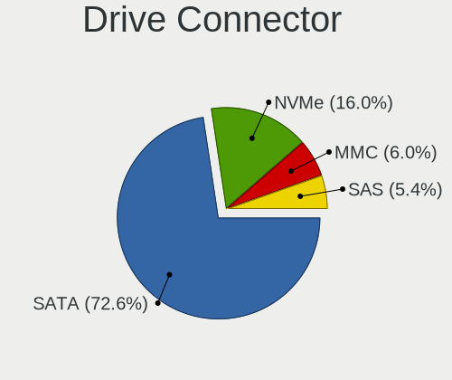
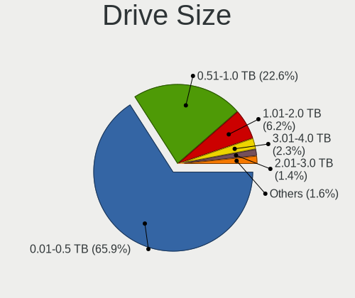
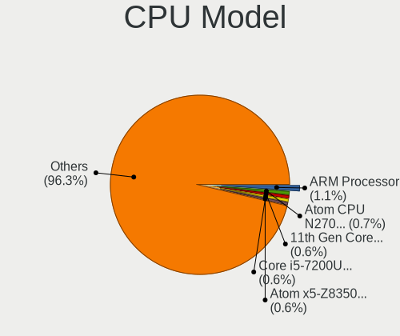
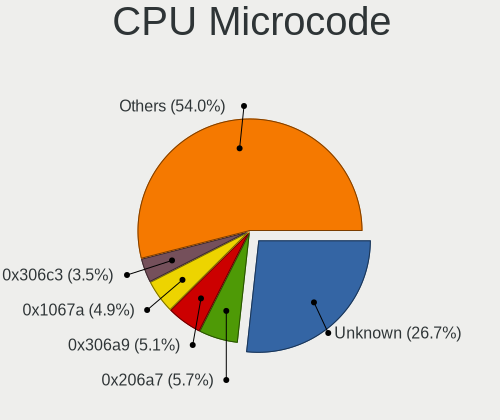
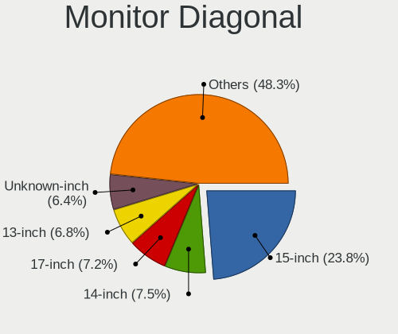
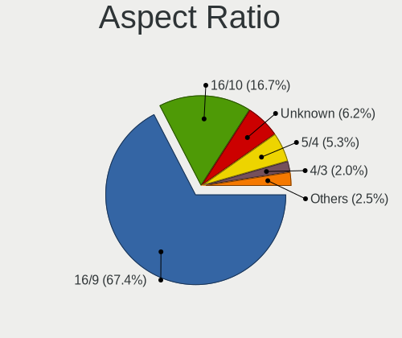
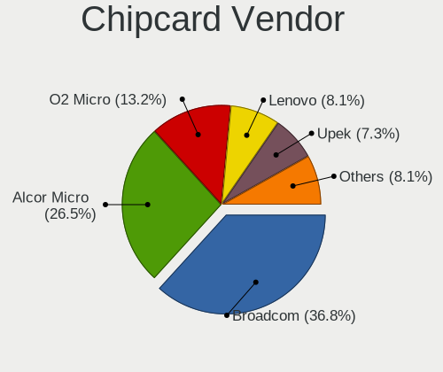

Xubuntu - Tested Hardware & Statistics
--------------------------------------

A project to collect tested hardware configurations for Xubuntu.

Anyone can contribute to this report by the [hw-probe](https://github.com/linuxhw/hw-probe) tool:

    sudo -E hw-probe -all -upload

Please contribute! Especially if your hardware is rare.

This is a report for all computer types. See also reports for [desktops](/Dist/Xubuntu/Desktop/README.md) and [notebooks](/Dist/Xubuntu/Notebook/README.md).

Contents
--------

* [ Test Cases ](#test-cases)

* [ System ](#system)
  - [ OS                       ](#os)
  - [ OS Family                ](#os-family)
  - [ Kernel                   ](#kernel)
  - [ Kernel Family            ](#kernel-family)
  - [ Kernel Major Ver.        ](#kernel-major-ver)
  - [ Arch                     ](#arch)
  - [ DE                       ](#de)
  - [ Display Server           ](#display-server)
  - [ Display Manager          ](#display-manager)
  - [ OS Lang                  ](#os-lang)
  - [ Boot Mode                ](#boot-mode)
  - [ Filesystem               ](#filesystem)
  - [ Part. scheme             ](#part-scheme)
  - [ Dual Boot with Linux/BSD ](#dual-boot-with-linuxbsd)
  - [ Dual Boot (Win)          ](#dual-boot-win)

* [ Board ](#board)
  - [ Vendor                   ](#vendor)
  - [ Model                    ](#model)
  - [ Model Family             ](#model-family)
  - [ MFG Year                 ](#mfg-year)
  - [ Form Factor              ](#form-factor)
  - [ Secure Boot              ](#secure-boot)
  - [ Coreboot                 ](#coreboot)
  - [ RAM Size                 ](#ram-size)
  - [ RAM Used                 ](#ram-used)
  - [ Total Drives             ](#total-drives)
  - [ Has CD-ROM               ](#has-cd-rom)
  - [ Has Ethernet             ](#has-ethernet)
  - [ Has WiFi                 ](#has-wifi)
  - [ Has Bluetooth            ](#has-bluetooth)

* [ Location ](#location)
  - [ Country                  ](#country)
  - [ City                     ](#city)

* [ Drives ](#drives)
  - [ Drive Vendor             ](#drive-vendor)
  - [ Drive Model              ](#drive-model)
  - [ HDD Vendor               ](#hdd-vendor)
  - [ SSD Vendor               ](#ssd-vendor)
  - [ Drive Kind               ](#drive-kind)
  - [ Drive Connector          ](#drive-connector)
  - [ Drive Size               ](#drive-size)
  - [ Space Total              ](#space-total)
  - [ Space Used               ](#space-used)
  - [ Malfunc. Drives          ](#malfunc-drives)
  - [ Malfunc. Drive Vendor    ](#malfunc-drive-vendor)
  - [ Malfunc. HDD Vendor      ](#malfunc-hdd-vendor)
  - [ Malfunc. Drive Kind      ](#malfunc-drive-kind)
  - [ Failed Drives            ](#failed-drives)
  - [ Failed Drive Vendor      ](#failed-drive-vendor)
  - [ Drive Status             ](#drive-status)

* [ Storage controller ](#storage-controller)
  - [ Storage Vendor           ](#storage-vendor)
  - [ Storage Model            ](#storage-model)
  - [ Storage Kind             ](#storage-kind)

* [ Processor ](#processor)
  - [ CPU Vendor               ](#cpu-vendor)
  - [ CPU Model                ](#cpu-model)
  - [ CPU Model Family         ](#cpu-model-family)
  - [ CPU Cores                ](#cpu-cores)
  - [ CPU Sockets              ](#cpu-sockets)
  - [ CPU Threads              ](#cpu-threads)
  - [ CPU Op-Modes             ](#cpu-op-modes)
  - [ CPU Microcode            ](#cpu-microcode)
  - [ CPU Microarch            ](#cpu-microarch)

* [ Graphics ](#graphics)
  - [ GPU Vendor               ](#gpu-vendor)
  - [ GPU Model                ](#gpu-model)
  - [ GPU Combo                ](#gpu-combo)
  - [ GPU Driver               ](#gpu-driver)
  - [ GPU Memory               ](#gpu-memory)

* [ Monitor ](#monitor)
  - [ Monitor Vendor           ](#monitor-vendor)
  - [ Monitor Model            ](#monitor-model)
  - [ Monitor Resolution       ](#monitor-resolution)
  - [ Monitor Diagonal         ](#monitor-diagonal)
  - [ Monitor Width            ](#monitor-width)
  - [ Aspect Ratio             ](#aspect-ratio)
  - [ Monitor Area             ](#monitor-area)
  - [ Pixel Density            ](#pixel-density)
  - [ Multiple Monitors        ](#multiple-monitors)

* [ Network ](#network)
  - [ Net Controller Vendor    ](#net-controller-vendor)
  - [ Net Controller Model     ](#net-controller-model)
  - [ Wireless Vendor          ](#wireless-vendor)
  - [ Wireless Model           ](#wireless-model)
  - [ Ethernet Vendor          ](#ethernet-vendor)
  - [ Ethernet Model           ](#ethernet-model)
  - [ Net Controller Kind      ](#net-controller-kind)
  - [ Used Controller          ](#used-controller)
  - [ NICs                     ](#nics)
  - [ IPv6                     ](#ipv6)

* [ Bluetooth ](#bluetooth)
  - [ Bluetooth Vendor         ](#bluetooth-vendor)
  - [ Bluetooth Model          ](#bluetooth-model)

* [ Sound ](#sound)
  - [ Sound Vendor             ](#sound-vendor)
  - [ Sound Model              ](#sound-model)

* [ Memory ](#memory)
  - [ Memory Vendor            ](#memory-vendor)
  - [ Memory Model             ](#memory-model)
  - [ Memory Kind              ](#memory-kind)
  - [ Memory Form Factor       ](#memory-form-factor)
  - [ Memory Size              ](#memory-size)
  - [ Memory Speed             ](#memory-speed)

* [ Printers & scanners ](#printers--scanners)
  - [ Printer Vendor           ](#printer-vendor)
  - [ Printer Model            ](#printer-model)
  - [ Scanner Vendor           ](#scanner-vendor)
  - [ Scanner Model            ](#scanner-model)

* [ Camera ](#camera)
  - [ Camera Vendor            ](#camera-vendor)
  - [ Camera Model             ](#camera-model)

* [ Security ](#security)
  - [ Fingerprint Vendor       ](#fingerprint-vendor)
  - [ Fingerprint Model        ](#fingerprint-model)
  - [ Chipcard Vendor          ](#chipcard-vendor)
  - [ Chipcard Model           ](#chipcard-model)

* [ Unsupported ](#unsupported)
  - [ Unsupported Devices      ](#unsupported-devices)
  - [ Unsupported Device Types ](#unsupported-device-types)

Test Cases
----------

Total: 7059

| Vendor        | Model                       | Form-Factor | Probe                                                      | Date         |
|---------------|-----------------------------|-------------|------------------------------------------------------------|--------------|
| Acer          | P7YE0                       | Notebook    | [21da78891a](https://linux-hardware.org/?probe=21da78891a) | May 08, 2024 |
| HP            | ProBook 430 G6              | Notebook    | [696c3f2a72](https://linux-hardware.org/?probe=696c3f2a72) | May 07, 2024 |
| Lenovo        | 7Z74CTO1WW 07               | Server      | [ecd5a5be36](https://linux-hardware.org/?probe=ecd5a5be36) | May 07, 2024 |
| Dell          | 088DT1 A00                  | Desktop     | [edb955bd5e](https://linux-hardware.org/?probe=edb955bd5e) | May 07, 2024 |
| Dell          | Precision 7710              | Notebook    | [c89fe612a1](https://linux-hardware.org/?probe=c89fe612a1) | May 06, 2024 |
| Dell          | Precision 7710              | Notebook    | [52c6c4a64a](https://linux-hardware.org/?probe=52c6c4a64a) | May 06, 2024 |
| ASUSTek       | TUF B350M-PLUS GAMING       | Desktop     | [e31ea5ab17](https://linux-hardware.org/?probe=e31ea5ab17) | May 06, 2024 |
| Amlogic       | Meson GXL (S905X) P212 D... | Soc         | [1df5ef59da](https://linux-hardware.org/?probe=1df5ef59da) | May 05, 2024 |
| HP            | Presario CQ56               | Notebook    | [6df22495ed](https://linux-hardware.org/?probe=6df22495ed) | May 04, 2024 |
| MACHINIST     | X99 G7 V1.0                 | Desktop     | [47f648047f](https://linux-hardware.org/?probe=47f648047f) | May 04, 2024 |
| MACHINIST     | X99 G7 V1.0                 | Desktop     | [017f1471b0](https://linux-hardware.org/?probe=017f1471b0) | May 04, 2024 |
| Toshiba       | Satellite A200              | Notebook    | [47b52c0fce](https://linux-hardware.org/?probe=47b52c0fce) | May 02, 2024 |
| ASUSTek       | K53E                        | Notebook    | [2c14a21fe8](https://linux-hardware.org/?probe=2c14a21fe8) | May 02, 2024 |
| Dell          | 0N867P A02                  | Desktop     | [7b2f6946b9](https://linux-hardware.org/?probe=7b2f6946b9) | May 01, 2024 |
| HP            | Compaq 6720s                | Notebook    | [fc9309f2a1](https://linux-hardware.org/?probe=fc9309f2a1) | Apr 30, 2024 |
| Lenovo        | Yoga 730-13IKB 81CT         | Convertible | [0663c3f0ee](https://linux-hardware.org/?probe=0663c3f0ee) | Apr 30, 2024 |
| Acer          | Aspire A515-44              | Notebook    | [d580243e57](https://linux-hardware.org/?probe=d580243e57) | Apr 30, 2024 |
| Gigabyte      | H110M-S2-CF                 | Desktop     | [e55bcf23cf](https://linux-hardware.org/?probe=e55bcf23cf) | Apr 30, 2024 |
| Acer          | Aspire E5-521G              | Notebook    | [0236376455](https://linux-hardware.org/?probe=0236376455) | Apr 30, 2024 |
| Acer          | Aspire A515-51              | Notebook    | [083965d3db](https://linux-hardware.org/?probe=083965d3db) | Apr 30, 2024 |
| HP            | 09F8h                       | Desktop     | [d31df7e1d8](https://linux-hardware.org/?probe=d31df7e1d8) | Apr 29, 2024 |
| AZW           | EQ                          | Desktop     | [dc09b0ecbc](https://linux-hardware.org/?probe=dc09b0ecbc) | Apr 29, 2024 |
| AZW           | EQ                          | Desktop     | [9e4f615d36](https://linux-hardware.org/?probe=9e4f615d36) | Apr 29, 2024 |
| Dell          | Inspiron 1011               | Notebook    | [3952627b7f](https://linux-hardware.org/?probe=3952627b7f) | Apr 29, 2024 |
| ASUSTek       | PRIME H770-PLUS D4          | Desktop     | [d05be00e83](https://linux-hardware.org/?probe=d05be00e83) | Apr 28, 2024 |
| HP            | Notebook                    | Notebook    | [0f3465e86c](https://linux-hardware.org/?probe=0f3465e86c) | Apr 28, 2024 |
| Lenovo        | FLEX-14IWL Laptop 81SQ      | Convertible | [afc8b7bd9f](https://linux-hardware.org/?probe=afc8b7bd9f) | Apr 28, 2024 |
| Intel         | AB2L .A001                  | Mini pc     | [b9bb546172](https://linux-hardware.org/?probe=b9bb546172) | Apr 27, 2024 |
| Apple         | MacBookPro7,1               | Notebook    | [b83cef7cdd](https://linux-hardware.org/?probe=b83cef7cdd) | Apr 27, 2024 |
| Lenovo        | ThinkPad W541 20EGS03W15    | Notebook    | [32ac46c0a5](https://linux-hardware.org/?probe=32ac46c0a5) | Apr 27, 2024 |
| HP            | Mini 210-1000               | Notebook    | [26d3ef8d19](https://linux-hardware.org/?probe=26d3ef8d19) | Apr 27, 2024 |
| HP            | ENVY x360 2-in-1 Laptop ... | Convertible | [4c598291cb](https://linux-hardware.org/?probe=4c598291cb) | Apr 27, 2024 |
| ASUSTek       | VivoBook_ASUSLaptop M370... | Notebook    | [fdd97ab603](https://linux-hardware.org/?probe=fdd97ab603) | Apr 27, 2024 |
| HP            | Notebook                    | Notebook    | [98ad243a7d](https://linux-hardware.org/?probe=98ad243a7d) | Apr 26, 2024 |
| HP            | ProBook 4340s               | Notebook    | [a33e5a73ef](https://linux-hardware.org/?probe=a33e5a73ef) | Apr 25, 2024 |
| HP            | Laptop 14-dq0xxx            | Notebook    | [4652a98a00](https://linux-hardware.org/?probe=4652a98a00) | Apr 24, 2024 |
| HP            | Laptop 14-dq0xxx            | Notebook    | [3feeb1bdac](https://linux-hardware.org/?probe=3feeb1bdac) | Apr 24, 2024 |
| Lenovo        | ThinkPad Twist 33474HU      | Notebook    | [98b9979ec3](https://linux-hardware.org/?probe=98b9979ec3) | Apr 23, 2024 |
| AMI           | Intel                       | Desktop     | [e1b1d85e3c](https://linux-hardware.org/?probe=e1b1d85e3c) | Apr 23, 2024 |
| Unknown       | HU-MNPC05                   | Mini pc     | [a3339b59ad](https://linux-hardware.org/?probe=a3339b59ad) | Apr 23, 2024 |
| Apple         | MacBookPro5,2               | Notebook    | [a5052885f7](https://linux-hardware.org/?probe=a5052885f7) | Apr 22, 2024 |
| Lenovo        | 30D0 SDK0J40697 WIN 3305... | Desktop     | [aa0595d186](https://linux-hardware.org/?probe=aa0595d186) | Apr 22, 2024 |
| Lenovo        | 30D0 SDK0J40697 WIN 3305... | Desktop     | [34d0d4f469](https://linux-hardware.org/?probe=34d0d4f469) | Apr 22, 2024 |
| ASUSTek       | ASUS TUF Gaming F15 FX50... | Notebook    | [a399c9a39f](https://linux-hardware.org/?probe=a399c9a39f) | Apr 22, 2024 |
| Apple         | MacBookAir6,2               | Notebook    | [37c91e715a](https://linux-hardware.org/?probe=37c91e715a) | Apr 22, 2024 |
| ASUSTek       | X751MA                      | Notebook    | [e8b836dd14](https://linux-hardware.org/?probe=e8b836dd14) | Apr 22, 2024 |
| Dell          | 0MN1TX A02                  | Desktop     | [2aa151f159](https://linux-hardware.org/?probe=2aa151f159) | Apr 20, 2024 |
| Dell          | 0MN1TX A02                  | Desktop     | [cfac7f54ed](https://linux-hardware.org/?probe=cfac7f54ed) | Apr 20, 2024 |
| ASUSTek       | TUF Gaming B550M-PLUS       | Desktop     | [5e4c324298](https://linux-hardware.org/?probe=5e4c324298) | Apr 18, 2024 |
| HP            | Compaq 6730b (GW687AV)      | Notebook    | [42dd367de3](https://linux-hardware.org/?probe=42dd367de3) | Apr 16, 2024 |
| Acer          | Aspire E5-521G              | Notebook    | [27ed8e5b6e](https://linux-hardware.org/?probe=27ed8e5b6e) | Apr 16, 2024 |
| Dell          | XPS 13 9370                 | Notebook    | [2ff2120005](https://linux-hardware.org/?probe=2ff2120005) | Apr 15, 2024 |
| Sony          | VPCF12M1E                   | Notebook    | [a07e465b04](https://linux-hardware.org/?probe=a07e465b04) | Apr 15, 2024 |
| Dell          | 0FF3FN A00                  | Desktop     | [b1bddc88aa](https://linux-hardware.org/?probe=b1bddc88aa) | Apr 15, 2024 |
| ASUSTek       | P5Q                         | Desktop     | [2a2880460d](https://linux-hardware.org/?probe=2a2880460d) | Apr 15, 2024 |
| Dell          | 0WG864                      | Desktop     | [b430ed12b5](https://linux-hardware.org/?probe=b430ed12b5) | Apr 15, 2024 |
| Lenovo        | 0B98401 WIN                 | Desktop     | [4fa3e985a9](https://linux-hardware.org/?probe=4fa3e985a9) | Apr 15, 2024 |
| ASUSTek       | PRIME Z790-P WIFI           | Desktop     | [6b8bceb5c0](https://linux-hardware.org/?probe=6b8bceb5c0) | Apr 14, 2024 |
| Sony          | VPCF12M1E                   | Notebook    | [b4adc4cd67](https://linux-hardware.org/?probe=b4adc4cd67) | Apr 13, 2024 |
| Lenovo        | ThinkPad X131e 3367AH5      | Notebook    | [5f3d3b0a74](https://linux-hardware.org/?probe=5f3d3b0a74) | Apr 13, 2024 |
| ASRock        | A75M-HVS                    | Desktop     | [fc26a8b5fa](https://linux-hardware.org/?probe=fc26a8b5fa) | Apr 12, 2024 |
| Dell          | 060K5C A02                  | Server      | [3bab33d8d5](https://linux-hardware.org/?probe=3bab33d8d5) | Apr 11, 2024 |
| Fujitsu       | FujitsuTP7000 -1            | Desktop     | [1d3918f13c](https://linux-hardware.org/?probe=1d3918f13c) | Apr 11, 2024 |
| HP            | ENVY x360 2-in-1 Laptop ... | Convertible | [1999efa32b](https://linux-hardware.org/?probe=1999efa32b) | Apr 10, 2024 |
| ASUSTek       | P8P67 LE                    | Desktop     | [de829401f2](https://linux-hardware.org/?probe=de829401f2) | Apr 10, 2024 |
| Dell          | 0FF3FN A00                  | Desktop     | [979d51faa5](https://linux-hardware.org/?probe=979d51faa5) | Apr 10, 2024 |
| Shenzhen M... | F7BFD                       | Desktop     | [98e43e8de4](https://linux-hardware.org/?probe=98e43e8de4) | Apr 09, 2024 |
| ASUSTek       | Crosshair IV Formula        | Desktop     | [e62581b4c5](https://linux-hardware.org/?probe=e62581b4c5) | Apr 09, 2024 |
| Dell          | 02YYK5 A01                  | Desktop     | [cee98f0931](https://linux-hardware.org/?probe=cee98f0931) | Apr 09, 2024 |
| Dell          | 02YYK5 A01                  | Desktop     | [ed8a461ca7](https://linux-hardware.org/?probe=ed8a461ca7) | Apr 09, 2024 |
| Philco        | 14I                         | Notebook    | [c7ac543990](https://linux-hardware.org/?probe=c7ac543990) | Apr 09, 2024 |
| HP            | EliteBook 2540p             | Notebook    | [ac69abc7f8](https://linux-hardware.org/?probe=ac69abc7f8) | Apr 08, 2024 |
| Dell          | XPS 13 9370                 | Notebook    | [a49c3b9526](https://linux-hardware.org/?probe=a49c3b9526) | Apr 08, 2024 |
| HP            | 15                          | Notebook    | [81bbe62a62](https://linux-hardware.org/?probe=81bbe62a62) | Apr 08, 2024 |
| Dell          | 088DT1 A00                  | Desktop     | [c11b83e86b](https://linux-hardware.org/?probe=c11b83e86b) | Apr 08, 2024 |
| Hardkernel    | ODROID-H2                   | Desktop     | [64075f354e](https://linux-hardware.org/?probe=64075f354e) | Apr 07, 2024 |
| Lenovo        | ThinkPad T60 1951FDG        | Notebook    | [3baacd7e39](https://linux-hardware.org/?probe=3baacd7e39) | Apr 07, 2024 |
| Lenovo        | ThinkPad T60 1951FDG        | Notebook    | [48ffb129cb](https://linux-hardware.org/?probe=48ffb129cb) | Apr 06, 2024 |
| Dell          | Latitude 5330               | Notebook    | [3327ec32e4](https://linux-hardware.org/?probe=3327ec32e4) | Apr 06, 2024 |
| Gigabyte      | B150-HD3 DDR3-CF            | Desktop     | [11eed3d590](https://linux-hardware.org/?probe=11eed3d590) | Apr 05, 2024 |
| Gigabyte      | M68M-S2P                    | Desktop     | [2711aee181](https://linux-hardware.org/?probe=2711aee181) | Apr 05, 2024 |
| ASUSTek       | K53E                        | Notebook    | [0564fa09ec](https://linux-hardware.org/?probe=0564fa09ec) | Apr 05, 2024 |
| Lenovo        | ThinkPad T60 1951FDG        | Notebook    | [690d2ee78f](https://linux-hardware.org/?probe=690d2ee78f) | Apr 05, 2024 |
| HP            | EliteBook 2540p             | Notebook    | [f3587d854e](https://linux-hardware.org/?probe=f3587d854e) | Apr 05, 2024 |
| Clevo         | W240EU/W250EUQ/W270EUQ      | Notebook    | [1479db147d](https://linux-hardware.org/?probe=1479db147d) | Apr 04, 2024 |
| Acer          | Aspire A515-44              | Notebook    | [4b51c98fb6](https://linux-hardware.org/?probe=4b51c98fb6) | Apr 04, 2024 |
| ASUSTek       | P8H61-M LX R2.0             | Desktop     | [415b56c381](https://linux-hardware.org/?probe=415b56c381) | Apr 03, 2024 |
| Lenovo        | Legion S7 15IMH5 82BC       | Notebook    | [b57ab21576](https://linux-hardware.org/?probe=b57ab21576) | Apr 03, 2024 |
| Samsung       | 300E4C/300E5C/300E7C        | Notebook    | [dfef032d35](https://linux-hardware.org/?probe=dfef032d35) | Apr 03, 2024 |
| MSI           | X58 Pro                     | Desktop     | [9b0fab5acc](https://linux-hardware.org/?probe=9b0fab5acc) | Apr 02, 2024 |
| Lenovo        | Yoga 730-13IKB 81CT         | Convertible | [9ce8633d67](https://linux-hardware.org/?probe=9ce8633d67) | Apr 02, 2024 |
| ASUSTek       | ROG CROSSHAIR VIII HERO     | Desktop     | [84ed1b3cc5](https://linux-hardware.org/?probe=84ed1b3cc5) | Apr 01, 2024 |
| Lenovo        | IdeaPad 1 15AMN7 82VG       | Notebook    | [0df7a90dcd](https://linux-hardware.org/?probe=0df7a90dcd) | Apr 01, 2024 |
| Acer          | Aspire V3-331               | Notebook    | [0b74c17835](https://linux-hardware.org/?probe=0b74c17835) | Apr 01, 2024 |
| ASUSTek       | PRIME A320M-K               | Desktop     | [0bd97f775d](https://linux-hardware.org/?probe=0bd97f775d) | Apr 01, 2024 |
| ASUSTek       | PRIME A320M-K               | Desktop     | [d952efad38](https://linux-hardware.org/?probe=d952efad38) | Apr 01, 2024 |
| ASUSTek       | M5A78L-M PLUS/USB3          | Desktop     | [943b90560f](https://linux-hardware.org/?probe=943b90560f) | Mar 31, 2024 |
| ASUSTek       | P8H61-M LX R2.0             | Desktop     | [6452e5397a](https://linux-hardware.org/?probe=6452e5397a) | Mar 31, 2024 |
| Lenovo        | ThinkPad E485 20KUS0DW00    | Notebook    | [350231f567](https://linux-hardware.org/?probe=350231f567) | Mar 31, 2024 |
| Lenovo        | ThinkPad E485 20KUS0DW00    | Notebook    | [89c1c85f43](https://linux-hardware.org/?probe=89c1c85f43) | Mar 31, 2024 |
| HP            | EliteBook 820 G1            | Notebook    | [d89f9b8de7](https://linux-hardware.org/?probe=d89f9b8de7) | Mar 30, 2024 |
| Lenovo        | IdeaPad 3 15IAU7 82RK       | Notebook    | [015f6a28b2](https://linux-hardware.org/?probe=015f6a28b2) | Mar 30, 2024 |
| HP            | EliteBook 2540p             | Notebook    | [1115e42390](https://linux-hardware.org/?probe=1115e42390) | Mar 30, 2024 |
| MSI           | MPG X570S EDGE MAX WIFI     | Desktop     | [a09b8ab7cc](https://linux-hardware.org/?probe=a09b8ab7cc) | Mar 29, 2024 |
| HP            | Elite x2 1012 G1            | Notebook    | [5e19a7d027](https://linux-hardware.org/?probe=5e19a7d027) | Mar 29, 2024 |
| HP            | Elite x2 1012 G1            | Notebook    | [2d13f6d55a](https://linux-hardware.org/?probe=2d13f6d55a) | Mar 29, 2024 |
| Apple         | MacBookPro8,1               | Notebook    | [48eae7912e](https://linux-hardware.org/?probe=48eae7912e) | Mar 27, 2024 |
| Dell          | Latitude E6520              | Notebook    | [b0934dd20e](https://linux-hardware.org/?probe=b0934dd20e) | Mar 27, 2024 |
| Toshiba       | Satellite C70D-B            | Notebook    | [6800119330](https://linux-hardware.org/?probe=6800119330) | Mar 27, 2024 |
| ASUSTek       | PRIME A320M-K/BR            | Desktop     | [62ff739b8b](https://linux-hardware.org/?probe=62ff739b8b) | Mar 27, 2024 |
| ASUSTek       | PRIME A320M-K/BR            | Desktop     | [15137ac3a5](https://linux-hardware.org/?probe=15137ac3a5) | Mar 27, 2024 |
| MSI           | MPG X570S EDGE MAX WIFI     | Desktop     | [ee2674fe55](https://linux-hardware.org/?probe=ee2674fe55) | Mar 26, 2024 |
| Lenovo        | Yoga Pro 9 16IRP8 83BY      | Notebook    | [eadf31071a](https://linux-hardware.org/?probe=eadf31071a) | Mar 26, 2024 |
| Dell          | Latitude E5510              | Notebook    | [3f05300c5e](https://linux-hardware.org/?probe=3f05300c5e) | Mar 26, 2024 |
| Maibenben     | Perfectum Series            | Notebook    | [083055f303](https://linux-hardware.org/?probe=083055f303) | Mar 26, 2024 |
| Intel         | X99                         | Desktop     | [2479fc825c](https://linux-hardware.org/?probe=2479fc825c) | Mar 25, 2024 |
| ASUSTek       | ROG Zephyrus G14 GA403UI... | Notebook    | [eb09797dad](https://linux-hardware.org/?probe=eb09797dad) | Mar 25, 2024 |
| Lenovo        | ThinkPad L512 2598W2P       | Notebook    | [29d9529699](https://linux-hardware.org/?probe=29d9529699) | Mar 24, 2024 |
| Apple         | MacBookPro1,1               | Notebook    | [4046c97819](https://linux-hardware.org/?probe=4046c97819) | Mar 24, 2024 |
| Fujitsu       | D3400-A1 S26361-D3400-A1    | Desktop     | [b58c3d38ef](https://linux-hardware.org/?probe=b58c3d38ef) | Mar 24, 2024 |
| Shenzhen M... | F7BFD                       | Desktop     | [64942ccf25](https://linux-hardware.org/?probe=64942ccf25) | Mar 24, 2024 |
| Lenovo        | ThinkPad X1 Yoga 1st 20F... | Convertible | [33b4f7022a](https://linux-hardware.org/?probe=33b4f7022a) | Mar 24, 2024 |
| Lenovo        | ThinkPad X1 Yoga 1st 20F... | Convertible | [16330eea6d](https://linux-hardware.org/?probe=16330eea6d) | Mar 24, 2024 |
| MACHINIST     | E5-MR9A V1.0                | Desktop     | [24cd2954c5](https://linux-hardware.org/?probe=24cd2954c5) | Mar 24, 2024 |
| Timi          | TM1701                      | Notebook    | [fb85b5c0df](https://linux-hardware.org/?probe=fb85b5c0df) | Mar 23, 2024 |
| Apple         | MacBookPro1,1               | Notebook    | [ca5449cab6](https://linux-hardware.org/?probe=ca5449cab6) | Mar 23, 2024 |
| Fujitsu       | D3400-A1 S26361-D3400-A1    | Desktop     | [8ab7c6d8dc](https://linux-hardware.org/?probe=8ab7c6d8dc) | Mar 23, 2024 |
| ASUSTek       | PRIME A320M-K               | Desktop     | [052a56e30a](https://linux-hardware.org/?probe=052a56e30a) | Mar 23, 2024 |
| Toshiba       | Satellite C70D-B            | Notebook    | [85a82b979c](https://linux-hardware.org/?probe=85a82b979c) | Mar 23, 2024 |
| Dell          | Latitude E7240              | Notebook    | [ccabe8257d](https://linux-hardware.org/?probe=ccabe8257d) | Mar 23, 2024 |
| Lenovo        | SHARKBAY SDK0E50510 PRO     | Desktop     | [e18375e687](https://linux-hardware.org/?probe=e18375e687) | Mar 23, 2024 |
| ASUSTek       | ROG Zephyrus G14 GA403UI... | Notebook    | [4d1bc02be0](https://linux-hardware.org/?probe=4d1bc02be0) | Mar 23, 2024 |
| ASUSTek       | ROG Zephyrus G14 GA403UI... | Notebook    | [0f6120fef2](https://linux-hardware.org/?probe=0f6120fef2) | Mar 23, 2024 |
| HP            | Laptop 15-bs0xx             | Notebook    | [1398cdcdf9](https://linux-hardware.org/?probe=1398cdcdf9) | Mar 22, 2024 |
| Dell          | Latitude E7240              | Notebook    | [cce23d2d34](https://linux-hardware.org/?probe=cce23d2d34) | Mar 22, 2024 |
| MSI           | 760GM-P21                   | Desktop     | [9ea00e6ebb](https://linux-hardware.org/?probe=9ea00e6ebb) | Mar 22, 2024 |
| Acer          | Aspire E5-774G              | Notebook    | [0de719fa5b](https://linux-hardware.org/?probe=0de719fa5b) | Mar 21, 2024 |
| ASUSTek       | VivoBook_ASUSLaptop X515... | Notebook    | [2f1279e5f4](https://linux-hardware.org/?probe=2f1279e5f4) | Mar 21, 2024 |
| ASUSTek       | VivoBook_ASUSLaptop X515... | Notebook    | [96e93279ce](https://linux-hardware.org/?probe=96e93279ce) | Mar 21, 2024 |
| HP            | Laptop 14s-dq3xxx           | Notebook    | [bb6d61cb47](https://linux-hardware.org/?probe=bb6d61cb47) | Mar 21, 2024 |
| Intel         | H81                         | Desktop     | [9faff0c332](https://linux-hardware.org/?probe=9faff0c332) | Mar 21, 2024 |
| Gigabyte      | X470 AORUS ULTRA GAMING-... | Desktop     | [9df4721239](https://linux-hardware.org/?probe=9df4721239) | Mar 20, 2024 |
| Packard Be... | IXTREME M5800               | Desktop     | [1f3f47a00c](https://linux-hardware.org/?probe=1f3f47a00c) | Mar 20, 2024 |
| Packard Be... | IXTREME M5800               | Desktop     | [3d41908138](https://linux-hardware.org/?probe=3d41908138) | Mar 20, 2024 |
| ASUSTek       | ROG STRIX B550-F GAMING ... | Desktop     | [62f6992f05](https://linux-hardware.org/?probe=62f6992f05) | Mar 20, 2024 |
| eMachines     | eME642G                     | Notebook    | [8759a11aca](https://linux-hardware.org/?probe=8759a11aca) | Mar 20, 2024 |
| Supermicro    | X8DTN                       | Server      | [180b7199c4](https://linux-hardware.org/?probe=180b7199c4) | Mar 19, 2024 |
| HP            | Stream Laptop 14-ds0xxx     | Notebook    | [e003a1215d](https://linux-hardware.org/?probe=e003a1215d) | Mar 19, 2024 |
| Supermicro    | X8DTN                       | Server      | [a7ef5b23a1](https://linux-hardware.org/?probe=a7ef5b23a1) | Mar 18, 2024 |
| ASUSTek       | M5A78L-M/USB3               | Desktop     | [aff15cce95](https://linux-hardware.org/?probe=aff15cce95) | Mar 17, 2024 |
| Lenovo        | G70-70 80HW0014FR           | Notebook    | [8fd24b2766](https://linux-hardware.org/?probe=8fd24b2766) | Mar 17, 2024 |
| Lenovo        | G70-70 80HW0014FR           | Notebook    | [ebb00d0246](https://linux-hardware.org/?probe=ebb00d0246) | Mar 17, 2024 |
| ASUSTek       | ROG Strix G513QE_G513QE     | Notebook    | [98300bace9](https://linux-hardware.org/?probe=98300bace9) | Mar 16, 2024 |
| eMachines     | eME642G                     | Notebook    | [7d7230a747](https://linux-hardware.org/?probe=7d7230a747) | Mar 16, 2024 |
| ASUSTek       | ROG CROSSHAIR VIII DARK ... | Desktop     | [84e1a7347a](https://linux-hardware.org/?probe=84e1a7347a) | Mar 16, 2024 |
| Gigabyte      | X470 AORUS ULTRA GAMING-... | Desktop     | [8f589013b1](https://linux-hardware.org/?probe=8f589013b1) | Mar 15, 2024 |
| Lenovo        | ThinkPad T14s Gen 1 20UJ... | Notebook    | [2d1ccd0458](https://linux-hardware.org/?probe=2d1ccd0458) | Mar 15, 2024 |
| Fujitsu       | FARQ10003                   | Notebook    | [85d8b675fc](https://linux-hardware.org/?probe=85d8b675fc) | Mar 14, 2024 |
| HP            | 2175                        | Desktop     | [f43124076c](https://linux-hardware.org/?probe=f43124076c) | Mar 14, 2024 |
| Dell          | 088DT1 A00                  | Desktop     | [8eb20f3ee6](https://linux-hardware.org/?probe=8eb20f3ee6) | Mar 12, 2024 |
| Dell          | 0J3C2F A02                  | Desktop     | [bebba9cf4a](https://linux-hardware.org/?probe=bebba9cf4a) | Mar 12, 2024 |
| HP            | 250 G6 Notebook PC          | Notebook    | [6b050fbf71](https://linux-hardware.org/?probe=6b050fbf71) | Mar 12, 2024 |
| Gigabyte      | GA-MA790FXT-UD5P            | Desktop     | [c50d470e19](https://linux-hardware.org/?probe=c50d470e19) | Mar 11, 2024 |
| Dell          | 0FF3FN A00                  | Desktop     | [78dd6f891e](https://linux-hardware.org/?probe=78dd6f891e) | Mar 11, 2024 |
| Lenovo        | ThinkPad T440s 20AQ009DG... | Notebook    | [dd2cc3d3df](https://linux-hardware.org/?probe=dd2cc3d3df) | Mar 11, 2024 |
| Dell          | 0VHXCD A03                  | Desktop     | [4ea894ca73](https://linux-hardware.org/?probe=4ea894ca73) | Mar 10, 2024 |
| Dell          | Inspiron 5452               | Notebook    | [d81294ea2d](https://linux-hardware.org/?probe=d81294ea2d) | Mar 10, 2024 |
| Toshiba       | Satellite A200              | Notebook    | [7197835980](https://linux-hardware.org/?probe=7197835980) | Mar 08, 2024 |
| Lenovo        | V17 G4 IRU 83A2             | Notebook    | [36ac6f0e6b](https://linux-hardware.org/?probe=36ac6f0e6b) | Mar 08, 2024 |
| HP            | 3397                        | Desktop     | [571ec29e07](https://linux-hardware.org/?probe=571ec29e07) | Mar 07, 2024 |
| Dell          | Latitude 5280               | Notebook    | [59fcb83d4a](https://linux-hardware.org/?probe=59fcb83d4a) | Mar 07, 2024 |
| Dell          | Latitude 5280               | Notebook    | [eca7be25aa](https://linux-hardware.org/?probe=eca7be25aa) | Mar 07, 2024 |
| Notebook      | W54_55_94_95_97AU,AUQ       | Notebook    | [b16fb5307b](https://linux-hardware.org/?probe=b16fb5307b) | Mar 07, 2024 |
| HP            | 2129                        | Desktop     | [c06e16031f](https://linux-hardware.org/?probe=c06e16031f) | Mar 07, 2024 |
| HP            | 2129                        | Desktop     | [5f2414ecf8](https://linux-hardware.org/?probe=5f2414ecf8) | Mar 07, 2024 |
| HP            | 1998                        | Desktop     | [bd3e35eb3f](https://linux-hardware.org/?probe=bd3e35eb3f) | Mar 06, 2024 |
| ASUSTek       | TUF Gaming FX505DT_FX505... | Notebook    | [23a8bcc014](https://linux-hardware.org/?probe=23a8bcc014) | Mar 06, 2024 |
| Lenovo        | ThinkPad T470p 20J6S00UH... | Notebook    | [b35deb0a8c](https://linux-hardware.org/?probe=b35deb0a8c) | Mar 06, 2024 |
| Apple         | Mac-F2218FC8                | All in one  | [064e78652b](https://linux-hardware.org/?probe=064e78652b) | Mar 05, 2024 |
| Lenovo        | ThinkPad A475 20KMS0MR00    | Notebook    | [0351009764](https://linux-hardware.org/?probe=0351009764) | Mar 05, 2024 |
| Positivo      | Q4128C                      | Notebook    | [0e62c41fff](https://linux-hardware.org/?probe=0e62c41fff) | Mar 05, 2024 |
| ASUSTek       | P5Q-PRO                     | Desktop     | [4d165bc18c](https://linux-hardware.org/?probe=4d165bc18c) | Mar 05, 2024 |
| Lenovo        | IdeaPad 5 15ITL05 82FG      | Notebook    | [1c340dbb25](https://linux-hardware.org/?probe=1c340dbb25) | Mar 04, 2024 |
| Dell          | Inspiron 3521               | Notebook    | [9552e898d6](https://linux-hardware.org/?probe=9552e898d6) | Mar 04, 2024 |
| ASUSTek       | VivoBook_ASUSLaptop X160... | Notebook    | [2bbb7923b9](https://linux-hardware.org/?probe=2bbb7923b9) | Mar 04, 2024 |
| Gigabyte      | B550 AORUS ELITE            | Desktop     | [98a6b003c9](https://linux-hardware.org/?probe=98a6b003c9) | Mar 04, 2024 |
| Lenovo        | ThinkPad A475 20KMS0MR00    | Notebook    | [eead5309ca](https://linux-hardware.org/?probe=eead5309ca) | Mar 04, 2024 |
| Gigabyte      | M61PME-S2P                  | Desktop     | [3a3676f133](https://linux-hardware.org/?probe=3a3676f133) | Mar 04, 2024 |
| HP            | EliteBook x360 1030 G2      | Convertible | [fc50b125e5](https://linux-hardware.org/?probe=fc50b125e5) | Mar 04, 2024 |
| HP            | 240 G7 Notebook PC          | Notebook    | [7556bb7dcb](https://linux-hardware.org/?probe=7556bb7dcb) | Mar 04, 2024 |
| Lenovo        | ThinkPad X260 20F5S4BY00    | Notebook    | [efea91c506](https://linux-hardware.org/?probe=efea91c506) | Mar 03, 2024 |
| Apple         | Mac-F2218FC8                | All in one  | [daa84a887a](https://linux-hardware.org/?probe=daa84a887a) | Mar 03, 2024 |
| Acer          | Extensa 5620                | Notebook    | [184149092e](https://linux-hardware.org/?probe=184149092e) | Mar 02, 2024 |
| AIO           | DynaBook e5                 | Notebook    | [733a714da6](https://linux-hardware.org/?probe=733a714da6) | Mar 02, 2024 |
| Lenovo        | SHARKBAY NOK                | Desktop     | [abfba381b6](https://linux-hardware.org/?probe=abfba381b6) | Mar 02, 2024 |
| Lenovo        | SHARKBAY NOK                | Desktop     | [5d03e50172](https://linux-hardware.org/?probe=5d03e50172) | Mar 02, 2024 |
| ASUSTek       | P5K3 Deluxe                 | Desktop     | [fa29313cd5](https://linux-hardware.org/?probe=fa29313cd5) | Feb 29, 2024 |
| HP            | 212A                        | Desktop     | [688db14d79](https://linux-hardware.org/?probe=688db14d79) | Feb 29, 2024 |
| ASUSTek       | 1002HA                      | Notebook    | [f6540ea84c](https://linux-hardware.org/?probe=f6540ea84c) | Feb 29, 2024 |
| Dell          | Inspiron 15 3520            | Notebook    | [22b06310de](https://linux-hardware.org/?probe=22b06310de) | Feb 29, 2024 |
| ASUSTek       | ROG STRIX B450-F GAMING     | Desktop     | [6b541baebc](https://linux-hardware.org/?probe=6b541baebc) | Feb 28, 2024 |
| Acer          | Aspire 5742G                | Notebook    | [ec33f6391f](https://linux-hardware.org/?probe=ec33f6391f) | Feb 27, 2024 |
| Gigabyte      | GA-MA790FXT-UD5P            | Desktop     | [5239851f48](https://linux-hardware.org/?probe=5239851f48) | Feb 26, 2024 |
| MSI           | B550-A PRO                  | Desktop     | [92c45b0a38](https://linux-hardware.org/?probe=92c45b0a38) | Feb 25, 2024 |
| Dell          | Latitude 3590               | Notebook    | [cfd80ed606](https://linux-hardware.org/?probe=cfd80ed606) | Feb 25, 2024 |
| Acer          | Aspire 5742G                | Notebook    | [4ab95b25ed](https://linux-hardware.org/?probe=4ab95b25ed) | Feb 24, 2024 |
| MSI           | MAG X570S TORPEDO MAX       | Desktop     | [aec002e00b](https://linux-hardware.org/?probe=aec002e00b) | Feb 24, 2024 |
| ASUSTek       | Z170-K                      | Desktop     | [790bcad6c3](https://linux-hardware.org/?probe=790bcad6c3) | Feb 23, 2024 |
| Dell          | 088DT1 A00                  | Desktop     | [688b84c15c](https://linux-hardware.org/?probe=688b84c15c) | Feb 23, 2024 |
| HP            | 8777 01011                  | Mini pc     | [7694754fa7](https://linux-hardware.org/?probe=7694754fa7) | Feb 23, 2024 |
| HP            | 255 15.6 inch G10           | Notebook    | [122d6aa5c9](https://linux-hardware.org/?probe=122d6aa5c9) | Feb 23, 2024 |
| Lenovo        | IdeaPad 330S-15IKB 81F5     | Notebook    | [9cc44f0ff5](https://linux-hardware.org/?probe=9cc44f0ff5) | Feb 22, 2024 |
| Shenzhen M... | F7BFD                       | Desktop     | [ed5d36c89f](https://linux-hardware.org/?probe=ed5d36c89f) | Feb 22, 2024 |
| HP            | ZBook 15u G3                | Notebook    | [3da083192b](https://linux-hardware.org/?probe=3da083192b) | Feb 22, 2024 |
| Shenzhen M... | F7BSC                       | Desktop     | [5d927b9be1](https://linux-hardware.org/?probe=5d927b9be1) | Feb 22, 2024 |
| Lenovo        | ThinkPad T480 20L6S9UL00    | Notebook    | [c72bd35164](https://linux-hardware.org/?probe=c72bd35164) | Feb 22, 2024 |
| MSI           | A320M-A PRO MAX             | Desktop     | [00d5567bac](https://linux-hardware.org/?probe=00d5567bac) | Feb 22, 2024 |
| HONOR         | NBR-WAX9                    | Notebook    | [6fa625a010](https://linux-hardware.org/?probe=6fa625a010) | Feb 21, 2024 |
| Shenzhen M... | F7BSC                       | Desktop     | [4af6eadc22](https://linux-hardware.org/?probe=4af6eadc22) | Feb 21, 2024 |
| ASUSTek       | K53U                        | Notebook    | [6a9381dfac](https://linux-hardware.org/?probe=6a9381dfac) | Feb 19, 2024 |
| Acer          | Aspire one                  | Notebook    | [39289d9272](https://linux-hardware.org/?probe=39289d9272) | Feb 19, 2024 |
| Intel         | NUC6i7KYB H90766-406        | Mini pc     | [f4df789f90](https://linux-hardware.org/?probe=f4df789f90) | Feb 19, 2024 |
| Dell          | Inspiron 7520               | Notebook    | [ea9b1047db](https://linux-hardware.org/?probe=ea9b1047db) | Feb 19, 2024 |
| Apple         | Mac-942B5BF58194151B        | All in one  | [b4898f413d](https://linux-hardware.org/?probe=b4898f413d) | Feb 18, 2024 |
| HP            | ProBook 6570b               | Notebook    | [2b5fa57120](https://linux-hardware.org/?probe=2b5fa57120) | Feb 18, 2024 |
| Gigabyte      | B550 AORUS ELITE            | Desktop     | [57be1d0dbf](https://linux-hardware.org/?probe=57be1d0dbf) | Feb 18, 2024 |
| Gigabyte      | GA-MA790FXT-UD5P            | Desktop     | [f521933e0c](https://linux-hardware.org/?probe=f521933e0c) | Feb 18, 2024 |
| ASUSTek       | P6T SE                      | Desktop     | [19014495ef](https://linux-hardware.org/?probe=19014495ef) | Feb 18, 2024 |
| ASUSTek       | K53U                        | Notebook    | [63de783cfc](https://linux-hardware.org/?probe=63de783cfc) | Feb 17, 2024 |
| Dell          | 0Y5DDC A00                  | Desktop     | [cdc54dee02](https://linux-hardware.org/?probe=cdc54dee02) | Feb 17, 2024 |
| Dell          | 088DT1 A00                  | Desktop     | [1442765491](https://linux-hardware.org/?probe=1442765491) | Feb 17, 2024 |
| Dell          | 088DT1 A00                  | Desktop     | [90fc76d5f0](https://linux-hardware.org/?probe=90fc76d5f0) | Feb 17, 2024 |
| Lenovo        | Legion S7 15IMH5 82BC       | Notebook    | [0495f0384b](https://linux-hardware.org/?probe=0495f0384b) | Feb 17, 2024 |
| Intel         | DB75EN                      | Desktop     | [d2fb5b9c49](https://linux-hardware.org/?probe=d2fb5b9c49) | Feb 15, 2024 |
| ASRock        | Z790 Nova WiFi              | Desktop     | [f718b015d2](https://linux-hardware.org/?probe=f718b015d2) | Feb 15, 2024 |
| HP            | Compaq nx9600 (PZ516UA#A... | Notebook    | [423dee7ce8](https://linux-hardware.org/?probe=423dee7ce8) | Feb 14, 2024 |
| Intel         | D54250WYK H13922-303        | Desktop     | [2c7d744bc7](https://linux-hardware.org/?probe=2c7d744bc7) | Feb 14, 2024 |
| Toshiba       | dynabook EX/45CW            | Notebook    | [15397b8cd4](https://linux-hardware.org/?probe=15397b8cd4) | Feb 14, 2024 |
| HP            | Compaq nx9600 (PZ516UA#A... | Notebook    | [aaf8082c54](https://linux-hardware.org/?probe=aaf8082c54) | Feb 13, 2024 |
| Pegatron      | IPM41G                      | Desktop     | [a9a2ccae14](https://linux-hardware.org/?probe=a9a2ccae14) | Feb 12, 2024 |
| Dell          | Latitude 3330               | Notebook    | [b692ba42e7](https://linux-hardware.org/?probe=b692ba42e7) | Feb 11, 2024 |
| Lenovo        | NOK                         | Desktop     | [ee3d0a6048](https://linux-hardware.org/?probe=ee3d0a6048) | Feb 11, 2024 |
| Lenovo        | ThinkBook 16p Gen 2 20YM    | Notebook    | [3f7984a7cb](https://linux-hardware.org/?probe=3f7984a7cb) | Feb 10, 2024 |
| Toshiba       | Satellite S55-A             | Notebook    | [b8c672ccc5](https://linux-hardware.org/?probe=b8c672ccc5) | Feb 10, 2024 |
| Dell          | Latitude 5590               | Notebook    | [684246246f](https://linux-hardware.org/?probe=684246246f) | Feb 09, 2024 |
| HP            | EliteBook 840 G1            | Notebook    | [35a11cec77](https://linux-hardware.org/?probe=35a11cec77) | Feb 09, 2024 |
| Acer          | Aspire A515-52K             | Notebook    | [08c3bcf367](https://linux-hardware.org/?probe=08c3bcf367) | Feb 07, 2024 |
| Lenovo        | SKYBAY SDK0J40697 WIN 33... | Desktop     | [fed5260916](https://linux-hardware.org/?probe=fed5260916) | Feb 06, 2024 |
| Lenovo        | G50-70 20351                | Notebook    | [eebc3497e7](https://linux-hardware.org/?probe=eebc3497e7) | Feb 06, 2024 |
| Acer          | Aspire S5-371T              | Notebook    | [d4d625e0b7](https://linux-hardware.org/?probe=d4d625e0b7) | Feb 06, 2024 |
| ASUSTek       | TP410UA                     | Convertible | [0732227132](https://linux-hardware.org/?probe=0732227132) | Feb 06, 2024 |
| Lenovo        | NOK                         | Desktop     | [24ed0846b2](https://linux-hardware.org/?probe=24ed0846b2) | Feb 05, 2024 |
| LG Electro... | X110-L.B7BLP1               | Notebook    | [26f739e197](https://linux-hardware.org/?probe=26f739e197) | Feb 04, 2024 |
| LG Electro... | X110-L.B7BLP1               | Notebook    | [8f020d4f16](https://linux-hardware.org/?probe=8f020d4f16) | Feb 04, 2024 |
| Intel         | DB75EN                      | Desktop     | [0ec38bc63a](https://linux-hardware.org/?probe=0ec38bc63a) | Feb 04, 2024 |
| Intel         | NUC9i5QNB K49247-403        | Mini pc     | [9050f9f095](https://linux-hardware.org/?probe=9050f9f095) | Feb 04, 2024 |
| Acer          | Aspire one                  | Notebook    | [b123478f39](https://linux-hardware.org/?probe=b123478f39) | Feb 04, 2024 |
| ASUSTek       | ROG Zephyrus G14 GA402XV... | Notebook    | [33e55cd5c5](https://linux-hardware.org/?probe=33e55cd5c5) | Feb 03, 2024 |
| Fujitsu       | D2990-A1 S26361-D2990-A1    | Desktop     | [a87f78b559](https://linux-hardware.org/?probe=a87f78b559) | Feb 03, 2024 |
| Dell          | 0P658H A05                  | Server      | [38486457e6](https://linux-hardware.org/?probe=38486457e6) | Feb 03, 2024 |
| MSI           | Modern 15 A10M              | Notebook    | [22f3c2e58e](https://linux-hardware.org/?probe=22f3c2e58e) | Feb 02, 2024 |
| INP           | i1000BTS                    | Desktop     | [3148738295](https://linux-hardware.org/?probe=3148738295) | Feb 02, 2024 |
| Acer          | NC-F5-771G-72XY             | Notebook    | [2f4c6fbadb](https://linux-hardware.org/?probe=2f4c6fbadb) | Feb 02, 2024 |
| Apple         | MacBookPro5,4               | Notebook    | [c22226fe6f](https://linux-hardware.org/?probe=c22226fe6f) | Feb 01, 2024 |
| HP            | EliteBook 840 G1            | Notebook    | [920b1ecb34](https://linux-hardware.org/?probe=920b1ecb34) | Jan 31, 2024 |
| Acer          | Aspire 5735                 | Notebook    | [365fd9fe4d](https://linux-hardware.org/?probe=365fd9fe4d) | Jan 31, 2024 |
| Acer          | Aspire 5735                 | Notebook    | [bed38c72c8](https://linux-hardware.org/?probe=bed38c72c8) | Jan 31, 2024 |
| HP            | Pavilion g6                 | Notebook    | [7f9863aaa2](https://linux-hardware.org/?probe=7f9863aaa2) | Jan 31, 2024 |
| Dell          | 06D7TR A01                  | Desktop     | [34d3eaffac](https://linux-hardware.org/?probe=34d3eaffac) | Jan 31, 2024 |
| Lenovo        | ThinkPad T570 20HAS0NU00    | Notebook    | [39f3b9fb56](https://linux-hardware.org/?probe=39f3b9fb56) | Jan 30, 2024 |
| Dell          | Inspiron 1525               | Notebook    | [ad26dae776](https://linux-hardware.org/?probe=ad26dae776) | Jan 30, 2024 |
| Dell          | Inspiron 1525               | Notebook    | [bc4394a85f](https://linux-hardware.org/?probe=bc4394a85f) | Jan 30, 2024 |
| HP            | 859C                        | Desktop     | [866ac7f0ed](https://linux-hardware.org/?probe=866ac7f0ed) | Jan 30, 2024 |
| Dell          | Latitude 5510               | Notebook    | [4abbee3451](https://linux-hardware.org/?probe=4abbee3451) | Jan 30, 2024 |
| Packard Be... | IXTREME M5800               | Desktop     | [f31eaf65b4](https://linux-hardware.org/?probe=f31eaf65b4) | Jan 29, 2024 |
| HP            | EliteBook 860 16 inch G1... | Notebook    | [737d54004b](https://linux-hardware.org/?probe=737d54004b) | Jan 29, 2024 |
| Dell          | Latitude 5511               | Notebook    | [40fad497db](https://linux-hardware.org/?probe=40fad497db) | Jan 29, 2024 |
| Rockchip      | RK3588 OPi 5 Plus           | Soc         | [72dee51fa2](https://linux-hardware.org/?probe=72dee51fa2) | Jan 29, 2024 |
| Packard Be... | IXTREME M5800               | Desktop     | [8d8f99feb9](https://linux-hardware.org/?probe=8d8f99feb9) | Jan 28, 2024 |
| Lenovo        | V560                        | Notebook    | [a0dbd66d53](https://linux-hardware.org/?probe=a0dbd66d53) | Jan 28, 2024 |
| ASUSTek       | X205TA                      | Notebook    | [83899dcb83](https://linux-hardware.org/?probe=83899dcb83) | Jan 27, 2024 |
| Lenovo        | ThinkPad T400 6474AW6       | Notebook    | [0ddfcaf599](https://linux-hardware.org/?probe=0ddfcaf599) | Jan 27, 2024 |
| Acer          | Aspire A315-58              | Notebook    | [c85674acbd](https://linux-hardware.org/?probe=c85674acbd) | Jan 26, 2024 |
| ASUSTek       | M4A79T Deluxe               | Desktop     | [0948177334](https://linux-hardware.org/?probe=0948177334) | Jan 26, 2024 |
| Toshiba       | Satellite L300              | Notebook    | [127697d4f1](https://linux-hardware.org/?probe=127697d4f1) | Jan 26, 2024 |
| Toshiba       | Satellite L300              | Notebook    | [63be13a245](https://linux-hardware.org/?probe=63be13a245) | Jan 26, 2024 |
| PC Special... | NH5x_7xDPx                  | Notebook    | [0f28a5d513](https://linux-hardware.org/?probe=0f28a5d513) | Jan 26, 2024 |
| Shuttle       | NC40U                       | Desktop     | [893dcee1f0](https://linux-hardware.org/?probe=893dcee1f0) | Jan 26, 2024 |
| ASUSTek       | TUF B450-PRO GAMING         | Desktop     | [38a14a6e3b](https://linux-hardware.org/?probe=38a14a6e3b) | Jan 26, 2024 |
| Gigabyte      | C1037UN                     | Desktop     | [7d3a3e3ca9](https://linux-hardware.org/?probe=7d3a3e3ca9) | Jan 26, 2024 |
| Intel         | DB75EN                      | Desktop     | [41cea41d1e](https://linux-hardware.org/?probe=41cea41d1e) | Jan 26, 2024 |
| Apple         | MacBook5,1                  | Notebook    | [51346a4084](https://linux-hardware.org/?probe=51346a4084) | Jan 25, 2024 |
| Dell          | Latitude 7340               | Notebook    | [880054b099](https://linux-hardware.org/?probe=880054b099) | Jan 25, 2024 |
| Dell          | 0K240Y A01                  | Desktop     | [fe08501f76](https://linux-hardware.org/?probe=fe08501f76) | Jan 24, 2024 |
| Gigabyte      | GA-MA790FXT-UD5P            | Desktop     | [961ba7a8a2](https://linux-hardware.org/?probe=961ba7a8a2) | Jan 24, 2024 |
| ASUSTek       | ROG Strix G733PZ_G733PZ     | Notebook    | [5a5ec0016f](https://linux-hardware.org/?probe=5a5ec0016f) | Jan 24, 2024 |
| Gigabyte      | 8IPE1000P-G                 | Desktop     | [052ba36722](https://linux-hardware.org/?probe=052ba36722) | Jan 24, 2024 |
| ASUSTek       | ROG STRIX B450-F GAMING     | Desktop     | [d11d529522](https://linux-hardware.org/?probe=d11d529522) | Jan 23, 2024 |
| Gigabyte      | C1037UN                     | Desktop     | [344699bbb2](https://linux-hardware.org/?probe=344699bbb2) | Jan 23, 2024 |
| ASRock        | A520M-HVS                   | Desktop     | [87e6c23293](https://linux-hardware.org/?probe=87e6c23293) | Jan 23, 2024 |
| ASUSTek       | P8P67 DELUXE                | Desktop     | [545e0a6896](https://linux-hardware.org/?probe=545e0a6896) | Jan 23, 2024 |
| Dell          | Inspiron 5567               | Notebook    | [dc061193f2](https://linux-hardware.org/?probe=dc061193f2) | Jan 22, 2024 |
| AOpen         | D2644 S26361-D2644          | Desktop     | [f45673bd59](https://linux-hardware.org/?probe=f45673bd59) | Jan 22, 2024 |
| HP            | Pavilion dv6                | Notebook    | [ac628c20c7](https://linux-hardware.org/?probe=ac628c20c7) | Jan 22, 2024 |
| HP            | Pavilion dv6                | Notebook    | [6d29e8c44e](https://linux-hardware.org/?probe=6d29e8c44e) | Jan 22, 2024 |
| MSI           | GF63 Thin 11UC              | Notebook    | [b6fa224856](https://linux-hardware.org/?probe=b6fa224856) | Jan 21, 2024 |
| ASUSTek       | TUF B450-PLUS GAMING        | Desktop     | [4254242157](https://linux-hardware.org/?probe=4254242157) | Jan 21, 2024 |
| ASUSTek       | T100HAN                     | Notebook    | [02f115dc2a](https://linux-hardware.org/?probe=02f115dc2a) | Jan 21, 2024 |
| Intel         | DB75EN                      | Desktop     | [f639799c41](https://linux-hardware.org/?probe=f639799c41) | Jan 21, 2024 |
| Lenovo        | 1037 NO DPK                 | Server      | [da53a6a2c0](https://linux-hardware.org/?probe=da53a6a2c0) | Jan 20, 2024 |
| Fujitsu       | D3613-A1 S26361-D3613-A1    | Desktop     | [22c44fb878](https://linux-hardware.org/?probe=22c44fb878) | Jan 19, 2024 |
| ASUSTek       | K55VM                       | Notebook    | [a684c7f5fc](https://linux-hardware.org/?probe=a684c7f5fc) | Jan 19, 2024 |
| Dell          | 0F5C5X A00                  | Desktop     | [f320dddb34](https://linux-hardware.org/?probe=f320dddb34) | Jan 19, 2024 |
| Rockchip      | RK3588 OPi 5 Plus           | Soc         | [c7872b9640](https://linux-hardware.org/?probe=c7872b9640) | Jan 18, 2024 |
| MSI           | B550-A PRO                  | Desktop     | [15f0af587b](https://linux-hardware.org/?probe=15f0af587b) | Jan 17, 2024 |
| Lenovo        | ThinkPad X240 20AMS00100    | Notebook    | [4b39b1cbe0](https://linux-hardware.org/?probe=4b39b1cbe0) | Jan 17, 2024 |
| ASUSTek       | PN40                        | Mini pc     | [f7cb91c837](https://linux-hardware.org/?probe=f7cb91c837) | Jan 17, 2024 |
| ASUSTek       | H81M-C                      | Desktop     | [bcbb9c099f](https://linux-hardware.org/?probe=bcbb9c099f) | Jan 16, 2024 |
| ASRock        | E350M1                      | Desktop     | [7fe46e5672](https://linux-hardware.org/?probe=7fe46e5672) | Jan 15, 2024 |
| HP            | Compaq Presario CQ60        | Notebook    | [fd48d4e0d2](https://linux-hardware.org/?probe=fd48d4e0d2) | Jan 15, 2024 |
| MSI           | GF63 Thin 11UC              | Notebook    | [6d2801d1d8](https://linux-hardware.org/?probe=6d2801d1d8) | Jan 14, 2024 |
| Gigabyte      | B550 AORUS ELITE AX V2      | Desktop     | [77032de9df](https://linux-hardware.org/?probe=77032de9df) | Jan 14, 2024 |
| ASUSTek       | P8H61-M2 USB3               | Desktop     | [705185dd25](https://linux-hardware.org/?probe=705185dd25) | Jan 13, 2024 |
| Lenovo        | G500 20236                  | Notebook    | [5dacf75c7d](https://linux-hardware.org/?probe=5dacf75c7d) | Jan 12, 2024 |
| Rockchip      | RK3566 OPi 3B               | Soc         | [1ad7806df7](https://linux-hardware.org/?probe=1ad7806df7) | Jan 12, 2024 |
| Lenovo        | 364F SDK0J40700 WIN 3258... | Desktop     | [b6d8783c20](https://linux-hardware.org/?probe=b6d8783c20) | Jan 12, 2024 |
| ASUSTek       | K55VM                       | Notebook    | [99003258ce](https://linux-hardware.org/?probe=99003258ce) | Jan 11, 2024 |
| Dell          | 0T0MHW A03                  | Desktop     | [2ad439d95f](https://linux-hardware.org/?probe=2ad439d95f) | Jan 11, 2024 |
| Gigazone      | X107(B-B)                   | Notebook    | [a72cbb0097](https://linux-hardware.org/?probe=a72cbb0097) | Jan 10, 2024 |
| Lenovo        | ThinkPad P53 20QNS00X00     | Notebook    | [ce397f675e](https://linux-hardware.org/?probe=ce397f675e) | Jan 10, 2024 |
| Microsoft     | Surface Pro 7               | Tablet      | [f02310e366](https://linux-hardware.org/?probe=f02310e366) | Jan 10, 2024 |
| Acer          | Swift SF314-43              | Notebook    | [60423ae46b](https://linux-hardware.org/?probe=60423ae46b) | Jan 10, 2024 |
| Dell          | Inspiron 14-3452            | Notebook    | [0e47261be0](https://linux-hardware.org/?probe=0e47261be0) | Jan 09, 2024 |
| Gigazone      | X107(B-B)                   | Notebook    | [54085fcb32](https://linux-hardware.org/?probe=54085fcb32) | Jan 09, 2024 |
| Dell          | Inspiron 14-3452            | Notebook    | [1834cfc875](https://linux-hardware.org/?probe=1834cfc875) | Jan 09, 2024 |
| ASRock        | N68-S3 FX                   | Desktop     | [ce413f7140](https://linux-hardware.org/?probe=ce413f7140) | Jan 09, 2024 |
| ASUSTek       | ROG CROSSHAIR VIII DARK ... | Desktop     | [e72b2cebd3](https://linux-hardware.org/?probe=e72b2cebd3) | Jan 08, 2024 |
| MSI           | B550 GAMING GEN3            | Desktop     | [511526bcf7](https://linux-hardware.org/?probe=511526bcf7) | Jan 08, 2024 |
| ASUSTek       | ROG STRIX B650E-F GAMING... | Desktop     | [59adb7b85b](https://linux-hardware.org/?probe=59adb7b85b) | Jan 08, 2024 |
| ASUSTek       | B85M-G                      | Desktop     | [9e3cd173d7](https://linux-hardware.org/?probe=9e3cd173d7) | Jan 08, 2024 |
| ASUSTek       | B85M-G                      | Desktop     | [22ef91bad9](https://linux-hardware.org/?probe=22ef91bad9) | Jan 08, 2024 |
| Apple         | Mac-FFE5EF870D7BA81A iMa... | All in one  | [00ef8580ff](https://linux-hardware.org/?probe=00ef8580ff) | Jan 07, 2024 |
| Apple         | MacBook5,2                  | Notebook    | [2ed16f6a80](https://linux-hardware.org/?probe=2ed16f6a80) | Jan 07, 2024 |
| Lenovo        | IdeaPad 510S-13ISK 80SJ     | Notebook    | [90fe273da6](https://linux-hardware.org/?probe=90fe273da6) | Jan 06, 2024 |
| Dell          | Latitude E5530 non-vPro     | Notebook    | [40b853c9b9](https://linux-hardware.org/?probe=40b853c9b9) | Jan 06, 2024 |
| Dell          | Inspiron 1501               | Notebook    | [65d521ef7c](https://linux-hardware.org/?probe=65d521ef7c) | Jan 06, 2024 |
| Dell          | Latitude E5530 non-vPro     | Notebook    | [d138fd288d](https://linux-hardware.org/?probe=d138fd288d) | Jan 06, 2024 |
| Lenovo        | Yoga 720-13IKB 81C3         | Convertible | [e131bcc2a6](https://linux-hardware.org/?probe=e131bcc2a6) | Jan 06, 2024 |
| Acer          | Aspire A315-51              | Notebook    | [753ed1e625](https://linux-hardware.org/?probe=753ed1e625) | Jan 05, 2024 |
| Acer          | Aspire A517-52              | Notebook    | [610817c6c9](https://linux-hardware.org/?probe=610817c6c9) | Jan 05, 2024 |
| Gigabyte      | P55-UD3R                    | Desktop     | [44658131d3](https://linux-hardware.org/?probe=44658131d3) | Jan 05, 2024 |
| Dell          | 0P658H A05                  | Server      | [74f28d91a3](https://linux-hardware.org/?probe=74f28d91a3) | Jan 05, 2024 |
| HP            | Pavilion dv7                | Notebook    | [dc31f854de](https://linux-hardware.org/?probe=dc31f854de) | Jan 04, 2024 |
| Dell          | Precision M6800             | Notebook    | [5049c54004](https://linux-hardware.org/?probe=5049c54004) | Jan 04, 2024 |
| ASUSTek       | X540SAA                     | Notebook    | [179249edef](https://linux-hardware.org/?probe=179249edef) | Jan 03, 2024 |
| ASRock        | B450 Steel Legend           | Desktop     | [d01ee5a226](https://linux-hardware.org/?probe=d01ee5a226) | Jan 02, 2024 |
| Lenovo        | ThinkPad X260 20F5S0KE00    | Notebook    | [08d2a7a982](https://linux-hardware.org/?probe=08d2a7a982) | Jan 01, 2024 |
| KunPengDia... | Unknown                     | Desktop     | [574df96e17](https://linux-hardware.org/?probe=574df96e17) | Jan 01, 2024 |
| Dell          | 0P658H A05                  | Server      | [1ae3680481](https://linux-hardware.org/?probe=1ae3680481) | Jan 01, 2024 |
| Gigabyte      | B450M DS3H-CF               | Desktop     | [08f5647277](https://linux-hardware.org/?probe=08f5647277) | Dec 31, 2023 |
| Foxconn       | Irvine HP P/N               | Desktop     | [cd125aca3c](https://linux-hardware.org/?probe=cd125aca3c) | Dec 29, 2023 |
| Packard Be... | EasyNote MH35               | Notebook    | [2b8b39d335](https://linux-hardware.org/?probe=2b8b39d335) | Dec 27, 2023 |
| Dell          | Latitude 7390               | Notebook    | [8c74383dab](https://linux-hardware.org/?probe=8c74383dab) | Dec 27, 2023 |
| Unknown       | Unknown                     | Desktop     | [1f73670f10](https://linux-hardware.org/?probe=1f73670f10) | Dec 27, 2023 |
| Dell          | Latitude 7390               | Notebook    | [889337bb1c](https://linux-hardware.org/?probe=889337bb1c) | Dec 27, 2023 |
| HP            | ProBook 6570b               | Notebook    | [61f91864e5](https://linux-hardware.org/?probe=61f91864e5) | Dec 27, 2023 |
| Lenovo        | ThinkPad T14 Gen 1 20UDC... | Notebook    | [38b1c283b4](https://linux-hardware.org/?probe=38b1c283b4) | Dec 26, 2023 |
| Acer          | Aspire 5739G                | Notebook    | [6b4237a1ea](https://linux-hardware.org/?probe=6b4237a1ea) | Dec 26, 2023 |
| Acer          | Aspire 5739G                | Notebook    | [408e19e1f2](https://linux-hardware.org/?probe=408e19e1f2) | Dec 26, 2023 |
| Gigabyte      | Z270-HD3P-CF                | Desktop     | [6bf30b2ec5](https://linux-hardware.org/?probe=6bf30b2ec5) | Dec 26, 2023 |
| HP            | Compaq nx7400 (RH609ES#A... | Notebook    | [6a6b1d3722](https://linux-hardware.org/?probe=6a6b1d3722) | Dec 26, 2023 |
| Acer          | Aspire V5-123               | Notebook    | [1a5a81980b](https://linux-hardware.org/?probe=1a5a81980b) | Dec 26, 2023 |
| Lenovo        | ThinkPad T14 Gen 3 21AH0... | Notebook    | [14d453985d](https://linux-hardware.org/?probe=14d453985d) | Dec 25, 2023 |
| ASUSTek       | X201EP                      | Notebook    | [944a54b7f4](https://linux-hardware.org/?probe=944a54b7f4) | Dec 25, 2023 |
| Intel         | DB75EN                      | Desktop     | [c2c820f0d9](https://linux-hardware.org/?probe=c2c820f0d9) | Dec 25, 2023 |
| Intel         | DB75EN                      | Desktop     | [6ec790f3fc](https://linux-hardware.org/?probe=6ec790f3fc) | Dec 24, 2023 |
| ASRock        | Q1900DC-ITX                 | Desktop     | [ee59bde7c9](https://linux-hardware.org/?probe=ee59bde7c9) | Dec 23, 2023 |
| ASRock        | Q1900DC-ITX                 | Desktop     | [9733217ad2](https://linux-hardware.org/?probe=9733217ad2) | Dec 23, 2023 |
| ASRock        | B450 Steel Legend           | Desktop     | [039823b939](https://linux-hardware.org/?probe=039823b939) | Dec 23, 2023 |
| eMachines     | E527                        | Notebook    | [cf5b096be7](https://linux-hardware.org/?probe=cf5b096be7) | Dec 22, 2023 |
| Dell          | Latitude E5510              | Notebook    | [92074a5231](https://linux-hardware.org/?probe=92074a5231) | Dec 22, 2023 |
| Gigabyte      | P35-DS3R                    | Desktop     | [741ad16651](https://linux-hardware.org/?probe=741ad16651) | Dec 22, 2023 |
| MSI           | X570-A PRO                  | Desktop     | [07a7762b25](https://linux-hardware.org/?probe=07a7762b25) | Dec 21, 2023 |
| Lenovo        | Yoga 2 11 20332             | Notebook    | [16a8e6f875](https://linux-hardware.org/?probe=16a8e6f875) | Dec 21, 2023 |
| Apple         | Mac-F221BEC8                | Desktop     | [c5d51ca43d](https://linux-hardware.org/?probe=c5d51ca43d) | Dec 21, 2023 |
| Sony          | VGN-NW270F                  | Notebook    | [eee640a54d](https://linux-hardware.org/?probe=eee640a54d) | Dec 20, 2023 |
| ASUSTek       | K30AD_M31AD_M51AD_M32AD     | Desktop     | [ee1a222677](https://linux-hardware.org/?probe=ee1a222677) | Dec 20, 2023 |
| Unknown       | Generic RK322x TV Box       | Mini pc     | [6b0274e802](https://linux-hardware.org/?probe=6b0274e802) | Dec 20, 2023 |
| HP            | Pavilion dv6                | Notebook    | [4cc379dfbd](https://linux-hardware.org/?probe=4cc379dfbd) | Dec 19, 2023 |
| HP            | Notebook                    | Notebook    | [31d6fc4280](https://linux-hardware.org/?probe=31d6fc4280) | Dec 19, 2023 |
| ASUSTek       | X541UVK                     | Notebook    | [a6ae535887](https://linux-hardware.org/?probe=a6ae535887) | Dec 18, 2023 |
| ASUSTek       | P6X58D PREMIUM              | Desktop     | [c7aaf87bcd](https://linux-hardware.org/?probe=c7aaf87bcd) | Dec 17, 2023 |
| Unknown       | YL-J1900-V1                 | Desktop     | [257144f3a3](https://linux-hardware.org/?probe=257144f3a3) | Dec 17, 2023 |
| Unknown       | YL-J1900-V1                 | Desktop     | [c14e43b65f](https://linux-hardware.org/?probe=c14e43b65f) | Dec 17, 2023 |
| MSI           | GF63 Thin 11UC              | Notebook    | [06556bd61a](https://linux-hardware.org/?probe=06556bd61a) | Dec 17, 2023 |
| HP            | ZBook Fury 16 G9 Mobile ... | Notebook    | [ce0e0e1bc1](https://linux-hardware.org/?probe=ce0e0e1bc1) | Dec 17, 2023 |
| Apple         | MacBookPro8,1               | Notebook    | [f0ed04c975](https://linux-hardware.org/?probe=f0ed04c975) | Dec 16, 2023 |
| Lenovo        | IdeaPad 1 15AMN7 82VG       | Notebook    | [6a2633018c](https://linux-hardware.org/?probe=6a2633018c) | Dec 15, 2023 |
| Lenovo        | ThinkPad X1 Carbon Gen 1... | Notebook    | [e7ca2f3a6e](https://linux-hardware.org/?probe=e7ca2f3a6e) | Dec 14, 2023 |
| HP            | 212B                        | Desktop     | [1ce8b8d929](https://linux-hardware.org/?probe=1ce8b8d929) | Dec 14, 2023 |
| HUAWEI        | MACHD-WXX9                  | Notebook    | [35a6370b07](https://linux-hardware.org/?probe=35a6370b07) | Dec 14, 2023 |
| Intel         | H310 Series                 | Desktop     | [9565b22822](https://linux-hardware.org/?probe=9565b22822) | Dec 13, 2023 |
| Lenovo        | NO DPK                      | Desktop     | [2204183295](https://linux-hardware.org/?probe=2204183295) | Dec 12, 2023 |
| Toshiba       | Satellite Pro C660          | Notebook    | [63cf57fa53](https://linux-hardware.org/?probe=63cf57fa53) | Dec 12, 2023 |
| Dell          | Inspiron 7591               | Notebook    | [10a266d0ff](https://linux-hardware.org/?probe=10a266d0ff) | Dec 12, 2023 |
| ASUSTek       | ROG STRIX B650E-F GAMING... | Desktop     | [e223660e23](https://linux-hardware.org/?probe=e223660e23) | Dec 11, 2023 |
| Lenovo        | ThinkPad T530 2429W1E       | Notebook    | [02a4811e8d](https://linux-hardware.org/?probe=02a4811e8d) | Dec 10, 2023 |
| Gigabyte      | B550 AORUS ELITE            | Desktop     | [6c3916c3fa](https://linux-hardware.org/?probe=6c3916c3fa) | Dec 10, 2023 |
| HP            | ProBook 4535s               | Notebook    | [9005c587a8](https://linux-hardware.org/?probe=9005c587a8) | Dec 10, 2023 |
| ASUSTek       | PRIME H510M-A WIFI          | Desktop     | [ba43863b29](https://linux-hardware.org/?probe=ba43863b29) | Dec 09, 2023 |
| Dell          | Inspiron 7591               | Notebook    | [7907f73ee0](https://linux-hardware.org/?probe=7907f73ee0) | Dec 09, 2023 |
| ASUSTek       | P7P55D                      | Desktop     | [93672594de](https://linux-hardware.org/?probe=93672594de) | Dec 09, 2023 |
| MSI           | B550-A PRO                  | Desktop     | [cc2b6e8b40](https://linux-hardware.org/?probe=cc2b6e8b40) | Dec 08, 2023 |
| ASUSTek       | PRIME X670-P WIFI           | Desktop     | [74440ebfad](https://linux-hardware.org/?probe=74440ebfad) | Dec 07, 2023 |
| Lenovo        | IdeaPad 3 17ADA05 81W2      | Notebook    | [beaa75c727](https://linux-hardware.org/?probe=beaa75c727) | Dec 06, 2023 |
| Intel         | STK1AW32SC H91596-302       | Desktop     | [9dbc61e045](https://linux-hardware.org/?probe=9dbc61e045) | Dec 05, 2023 |
| Fujitsu       | LIFEBOOK AH531/GFO          | Notebook    | [dfc6e4c96b](https://linux-hardware.org/?probe=dfc6e4c96b) | Dec 05, 2023 |
| ASUSTek       | ASUSLaptop_Q540VJ           | Notebook    | [0c680c33ec](https://linux-hardware.org/?probe=0c680c33ec) | Dec 05, 2023 |
| Lenovo        | 3151 SDK0J40697 WIN 3305... | Mini pc     | [7b1c8f906b](https://linux-hardware.org/?probe=7b1c8f906b) | Dec 04, 2023 |
| Dell          | Latitude 7370               | Notebook    | [30fc1de681](https://linux-hardware.org/?probe=30fc1de681) | Dec 03, 2023 |
| ASUSTek       | VivoBook_ASUSLaptop X515... | Notebook    | [203357a4dd](https://linux-hardware.org/?probe=203357a4dd) | Dec 03, 2023 |
| Intel         | DB75EN                      | Desktop     | [15f11719b5](https://linux-hardware.org/?probe=15f11719b5) | Dec 02, 2023 |
| ASRock        | B450M Steel Legend          | Desktop     | [7d88a4ceef](https://linux-hardware.org/?probe=7d88a4ceef) | Dec 01, 2023 |
| ASUSTek       | K30AD_M31AD_M51AD_M32AD     | Desktop     | [c8e6af0346](https://linux-hardware.org/?probe=c8e6af0346) | Nov 30, 2023 |
| Dell          | Latitude 7370               | Notebook    | [356b2e9e31](https://linux-hardware.org/?probe=356b2e9e31) | Nov 30, 2023 |
| HP            | ProBook 450 G1              | Notebook    | [7c7825a9c9](https://linux-hardware.org/?probe=7c7825a9c9) | Nov 30, 2023 |
| ASRock        | X399 Taichi                 | Desktop     | [5e8be973c6](https://linux-hardware.org/?probe=5e8be973c6) | Nov 29, 2023 |
| ASUSTek       | ROG STRIX X570-F GAMING     | Desktop     | [2c9b3f229e](https://linux-hardware.org/?probe=2c9b3f229e) | Nov 29, 2023 |
| Unknown       | HX90                        | Desktop     | [54a2eb227b](https://linux-hardware.org/?probe=54a2eb227b) | Nov 29, 2023 |
| ASUSTek       | P8Z68-M PRO                 | Desktop     | [aedaf10575](https://linux-hardware.org/?probe=aedaf10575) | Nov 27, 2023 |
| Sony          | VGN-NS12M_W                 | Notebook    | [c1400d8699](https://linux-hardware.org/?probe=c1400d8699) | Nov 27, 2023 |
| Apple         | Mac-4BC72D62AD45599E Mac... | Mini pc     | [c179f18d96](https://linux-hardware.org/?probe=c179f18d96) | Nov 27, 2023 |
| Lenovo        | ThinkPad P72 20MBCTO1WW     | Notebook    | [25fd880050](https://linux-hardware.org/?probe=25fd880050) | Nov 26, 2023 |
| ASUSTek       | K30AD_M31AD_M51AD_M32AD     | Desktop     | [4b14c830c0](https://linux-hardware.org/?probe=4b14c830c0) | Nov 26, 2023 |
| Gigabyte      | B560M DS3H                  | Desktop     | [7130842b5a](https://linux-hardware.org/?probe=7130842b5a) | Nov 26, 2023 |
| ASUSTek       | GL753VD                     | Notebook    | [214c1cc15b](https://linux-hardware.org/?probe=214c1cc15b) | Nov 25, 2023 |
| Dell          | System XPS L502X            | Notebook    | [a59b920838](https://linux-hardware.org/?probe=a59b920838) | Nov 24, 2023 |
| MSI           | B250M PRO-VD                | Desktop     | [d3697eee2c](https://linux-hardware.org/?probe=d3697eee2c) | Nov 24, 2023 |
| Lenovo        | ThinkPad T440p 20AN0069U... | Notebook    | [8edef55308](https://linux-hardware.org/?probe=8edef55308) | Nov 24, 2023 |
| Dell          | 0M5DCD A00                  | Desktop     | [78748bcf50](https://linux-hardware.org/?probe=78748bcf50) | Nov 24, 2023 |
| Itautec       | SM 3322 SM-3322 Padrao 0... | Desktop     | [2cf2808a7f](https://linux-hardware.org/?probe=2cf2808a7f) | Nov 23, 2023 |
| Intel         | DH55TC AAG26116-302         | Desktop     | [0edf2befff](https://linux-hardware.org/?probe=0edf2befff) | Nov 21, 2023 |
| ASRock        | G41C-GS                     | Desktop     | [de97cb0d6f](https://linux-hardware.org/?probe=de97cb0d6f) | Nov 21, 2023 |
| Gigabyte      | Z390 M GAMING-CF            | Desktop     | [cc2aa981d3](https://linux-hardware.org/?probe=cc2aa981d3) | Nov 21, 2023 |
| HP            | EliteBook 725 G2            | Notebook    | [b6cfe558cb](https://linux-hardware.org/?probe=b6cfe558cb) | Nov 21, 2023 |
| Gigabyte      | H81M-DS2                    | Desktop     | [9701d268e8](https://linux-hardware.org/?probe=9701d268e8) | Nov 21, 2023 |
| ASUSTek       | VivoBook_ASUSLaptop K350... | Notebook    | [2b84d65d1a](https://linux-hardware.org/?probe=2b84d65d1a) | Nov 20, 2023 |
| Lenovo        | Yoga Creator 7 15IMH05 8... | Notebook    | [d5ccc9cfc9](https://linux-hardware.org/?probe=d5ccc9cfc9) | Nov 20, 2023 |
| HP            | Pavilion g6                 | Notebook    | [b81902d8d5](https://linux-hardware.org/?probe=b81902d8d5) | Nov 20, 2023 |
| HP            | ProBook 6570b               | Notebook    | [39ba398a11](https://linux-hardware.org/?probe=39ba398a11) | Nov 20, 2023 |
| ASUSTek       | ROG STRIX B450-F GAMING     | Desktop     | [17c2f68bc7](https://linux-hardware.org/?probe=17c2f68bc7) | Nov 19, 2023 |
| Dell          | Latitude E6330              | Notebook    | [078f4227bd](https://linux-hardware.org/?probe=078f4227bd) | Nov 19, 2023 |
| Thomson       | N15C8BK2T                   | Notebook    | [e5a62b2035](https://linux-hardware.org/?probe=e5a62b2035) | Nov 18, 2023 |
| HP            | 21B4 A01                    | Desktop     | [73a4740b8f](https://linux-hardware.org/?probe=73a4740b8f) | Nov 18, 2023 |
| Acer          | EG43LMK                     | Desktop     | [bc1ab38f8f](https://linux-hardware.org/?probe=bc1ab38f8f) | Nov 18, 2023 |
| Lenovo        | IdeaPad N585 20179          | Notebook    | [b8bca4e3cd](https://linux-hardware.org/?probe=b8bca4e3cd) | Nov 18, 2023 |
| SiComputer    | Nauta 01E                   | Notebook    | [1631e065bd](https://linux-hardware.org/?probe=1631e065bd) | Nov 17, 2023 |
| Intel         | DH55TC AAG26116-302         | Desktop     | [8a23e4f586](https://linux-hardware.org/?probe=8a23e4f586) | Nov 16, 2023 |
| Intel         | DH55TC AAG26116-302         | Desktop     | [7fabbf9cb1](https://linux-hardware.org/?probe=7fabbf9cb1) | Nov 16, 2023 |
| MSI           | B75MA-P45                   | Desktop     | [6401616423](https://linux-hardware.org/?probe=6401616423) | Nov 16, 2023 |
| OrangePi      | 4 LTS                       | Soc         | [a770db570a](https://linux-hardware.org/?probe=a770db570a) | Nov 15, 2023 |
| Lenovo        | IdeaPad S340-15IIL 81VW     | Notebook    | [6806c7c828](https://linux-hardware.org/?probe=6806c7c828) | Nov 15, 2023 |
| Lenovo        | IdeaPad S300 9803           | Notebook    | [21f7433934](https://linux-hardware.org/?probe=21f7433934) | Nov 15, 2023 |
| MSI           | B350M PRO-VDH               | Desktop     | [6560a26a12](https://linux-hardware.org/?probe=6560a26a12) | Nov 15, 2023 |
| ASUSTek       | GL753VD                     | Notebook    | [a05c294e1e](https://linux-hardware.org/?probe=a05c294e1e) | Nov 15, 2023 |
| Lenovo        | ThinkPad X250 20CLS2P703    | Notebook    | [b15506a2b9](https://linux-hardware.org/?probe=b15506a2b9) | Nov 14, 2023 |
| Acer          | Aspire A114-33              | Notebook    | [e592b6bf5d](https://linux-hardware.org/?probe=e592b6bf5d) | Nov 13, 2023 |
| Dell          | Inspiron 15 3511            | Notebook    | [79b891b4df](https://linux-hardware.org/?probe=79b891b4df) | Nov 13, 2023 |
| Dell          | Latitude E5420              | Notebook    | [dc67f70b3b](https://linux-hardware.org/?probe=dc67f70b3b) | Nov 13, 2023 |
| Acer          | Aspire 5740                 | Notebook    | [7deb21f5d9](https://linux-hardware.org/?probe=7deb21f5d9) | Nov 13, 2023 |
| Apple         | MacBookAir4,2               | Notebook    | [aefe53a7b6](https://linux-hardware.org/?probe=aefe53a7b6) | Nov 13, 2023 |
| Acer          | Aspire A114-33              | Notebook    | [6c532c337f](https://linux-hardware.org/?probe=6c532c337f) | Nov 12, 2023 |
| ASUSTek       | ROG STRIX B650E-F GAMING... | Desktop     | [ec22cbd65c](https://linux-hardware.org/?probe=ec22cbd65c) | Nov 10, 2023 |
| HP            | Pavilion g6                 | Notebook    | [450bb23de1](https://linux-hardware.org/?probe=450bb23de1) | Nov 10, 2023 |
| Lenovo        | ThinkPad E470 20H1006NHV    | Notebook    | [a43db58ab7](https://linux-hardware.org/?probe=a43db58ab7) | Nov 10, 2023 |
| ASRock        | Z590M-ITX/ax                | Desktop     | [238b7326f1](https://linux-hardware.org/?probe=238b7326f1) | Nov 10, 2023 |
| Fujitsu       | D3613-A1 S26361-D3613-A1    | Desktop     | [941b37816d](https://linux-hardware.org/?probe=941b37816d) | Nov 10, 2023 |
| Khadas        | VIM2                        | Soc         | [3db877cd01](https://linux-hardware.org/?probe=3db877cd01) | Nov 09, 2023 |
| ASRock        | Z590M-ITX/ax                | Desktop     | [c1a263f3b5](https://linux-hardware.org/?probe=c1a263f3b5) | Nov 08, 2023 |
| OrangePi      | 4 LTS                       | Soc         | [04e71993b5](https://linux-hardware.org/?probe=04e71993b5) | Nov 08, 2023 |
| Dell          | Latitude 9420               | Convertible | [772d54e7c0](https://linux-hardware.org/?probe=772d54e7c0) | Nov 08, 2023 |
| ASUSTek       | P5K                         | Desktop     | [4870e13f93](https://linux-hardware.org/?probe=4870e13f93) | Nov 08, 2023 |
| HP            | ProBook 650 G2              | Notebook    | [4caad7b0d1](https://linux-hardware.org/?probe=4caad7b0d1) | Nov 07, 2023 |
| HP            | ProBook 650 G2              | Notebook    | [1d0638865e](https://linux-hardware.org/?probe=1d0638865e) | Nov 07, 2023 |
| Medion        | Crawler E25                 | Notebook    | [945026c1b8](https://linux-hardware.org/?probe=945026c1b8) | Nov 07, 2023 |
| Pegatron      | 2AF0                        | Desktop     | [d918aae63e](https://linux-hardware.org/?probe=d918aae63e) | Nov 06, 2023 |
| Lenovo        | G505 20240                  | Notebook    | [ef019ff242](https://linux-hardware.org/?probe=ef019ff242) | Nov 06, 2023 |
| Pegatron      | 2AF0                        | Desktop     | [de892702f8](https://linux-hardware.org/?probe=de892702f8) | Nov 05, 2023 |
| MECHREVO      | Code 01 Series PF5NU1G      | Notebook    | [767c3ff7fa](https://linux-hardware.org/?probe=767c3ff7fa) | Nov 05, 2023 |
| Gigabyte      | X570 AORUS ELITE            | Desktop     | [5c4543cc31](https://linux-hardware.org/?probe=5c4543cc31) | Nov 05, 2023 |
| Dell          | 0J8H4R A00                  | Desktop     | [d743b33cc7](https://linux-hardware.org/?probe=d743b33cc7) | Nov 05, 2023 |
| Dell          | Inspiron 7501               | Notebook    | [0926c7cdad](https://linux-hardware.org/?probe=0926c7cdad) | Nov 05, 2023 |
| ASRock        | P67 Pro3 SE                 | Desktop     | [10b1460f7a](https://linux-hardware.org/?probe=10b1460f7a) | Nov 05, 2023 |
| Gigabyte      | B450M DS3H-CF               | Desktop     | [fefb7e12d2](https://linux-hardware.org/?probe=fefb7e12d2) | Nov 05, 2023 |
| HP            | Presario C500 (GF849EA#A... | Notebook    | [a4965dff09](https://linux-hardware.org/?probe=a4965dff09) | Nov 04, 2023 |
| Thomson       | N14C4WH64                   | Notebook    | [51c94bc00f](https://linux-hardware.org/?probe=51c94bc00f) | Nov 03, 2023 |
| Gigabyte      | 970A-D3                     | Desktop     | [80fb26e63a](https://linux-hardware.org/?probe=80fb26e63a) | Nov 03, 2023 |
| Acer          | Predator PH717-71           | Notebook    | [a72ab29450](https://linux-hardware.org/?probe=a72ab29450) | Nov 02, 2023 |
| Acer          | Aspire TC-885 V:1.1         | Desktop     | [a871f012a2](https://linux-hardware.org/?probe=a871f012a2) | Nov 02, 2023 |
| HP            | Presario CQ57               | Notebook    | [4874030c75](https://linux-hardware.org/?probe=4874030c75) | Nov 01, 2023 |
| Lenovo        | ThinkPad T14 Gen 3 21AJS... | Notebook    | [a2a8295797](https://linux-hardware.org/?probe=a2a8295797) | Nov 01, 2023 |
| Lenovo        | ThinkPad T14 Gen 3 21AJS... | Notebook    | [0d49a75fe1](https://linux-hardware.org/?probe=0d49a75fe1) | Nov 01, 2023 |
| Lenovo        | ThinkPad T14 Gen 3 21AH0... | Notebook    | [cbe947aefc](https://linux-hardware.org/?probe=cbe947aefc) | Nov 01, 2023 |
| ASRock        | X570M Pro4                  | Desktop     | [ad5e8f91e5](https://linux-hardware.org/?probe=ad5e8f91e5) | Nov 01, 2023 |
| Lenovo        | Legion Y740-17IRHg 81UJ     | Notebook    | [cd9e941307](https://linux-hardware.org/?probe=cd9e941307) | Nov 01, 2023 |
| Lenovo        | IdeaPad S300 9803           | Notebook    | [543dfc0b4e](https://linux-hardware.org/?probe=543dfc0b4e) | Oct 31, 2023 |
| Medion        | E3223                       | Convertible | [e35701b198](https://linux-hardware.org/?probe=e35701b198) | Oct 31, 2023 |
| HP            | Presario C500 (GF849EA#A... | Notebook    | [580f4bdb18](https://linux-hardware.org/?probe=580f4bdb18) | Oct 31, 2023 |
| AMI           | Intel                       | Notebook    | [98d35ad708](https://linux-hardware.org/?probe=98d35ad708) | Oct 31, 2023 |
| ASUSTek       | K53E                        | Notebook    | [8b7c83e9d7](https://linux-hardware.org/?probe=8b7c83e9d7) | Oct 31, 2023 |
| ASUSTek       | ROG CROSSHAIR VIII DARK ... | Desktop     | [e06f6c5888](https://linux-hardware.org/?probe=e06f6c5888) | Oct 30, 2023 |
| Lenovo        | ThinkBook 16p Gen 2 20YM    | Notebook    | [6273e445bd](https://linux-hardware.org/?probe=6273e445bd) | Oct 30, 2023 |
| ASUSTek       | F2A85-M PRO                 | Desktop     | [dd2a52ab8f](https://linux-hardware.org/?probe=dd2a52ab8f) | Oct 30, 2023 |
| OrangePi      | Zero3                       | Soc         | [6d3ecf003f](https://linux-hardware.org/?probe=6d3ecf003f) | Oct 29, 2023 |
| MSI           | B550M PRO-VDH WIFI          | Desktop     | [9c77415bfc](https://linux-hardware.org/?probe=9c77415bfc) | Oct 29, 2023 |
| Lenovo        | IdeaPad L340-15API 81LW     | Notebook    | [a718d2e0ba](https://linux-hardware.org/?probe=a718d2e0ba) | Oct 28, 2023 |
| Lenovo        | IdeaPad L340-15API 81LW     | Notebook    | [c866e0068b](https://linux-hardware.org/?probe=c866e0068b) | Oct 28, 2023 |
| ASUSTek       | VivoBook_ASUSLaptop M150... | Notebook    | [6a8554304e](https://linux-hardware.org/?probe=6a8554304e) | Oct 27, 2023 |
| Gigabyte      | G1.Sniper B5-CF             | Desktop     | [291bf42f9d](https://linux-hardware.org/?probe=291bf42f9d) | Oct 27, 2023 |
| Dell          | Inspiron 1501               | Notebook    | [2c88e089bb](https://linux-hardware.org/?probe=2c88e089bb) | Oct 27, 2023 |
| Lenovo        | ThinkPad T61 64607EU        | Notebook    | [413cefff03](https://linux-hardware.org/?probe=413cefff03) | Oct 26, 2023 |
| HP            | Presario CQ57               | Notebook    | [a3f31b427e](https://linux-hardware.org/?probe=a3f31b427e) | Oct 26, 2023 |
| Gigabyte      | H77M-D3H                    | Desktop     | [1d3f58a610](https://linux-hardware.org/?probe=1d3f58a610) | Oct 25, 2023 |
| Gigabyte      | 965P-DS3                    | Desktop     | [b33d6b8a3c](https://linux-hardware.org/?probe=b33d6b8a3c) | Oct 24, 2023 |
| Gigabyte      | H97M-D3H                    | Desktop     | [15ac9c0529](https://linux-hardware.org/?probe=15ac9c0529) | Oct 24, 2023 |
| Acer          | Aspire 5740                 | Notebook    | [78702b9deb](https://linux-hardware.org/?probe=78702b9deb) | Oct 23, 2023 |
| Nuvision      | Aptio CRB                   | Mini pc     | [1f7af8af3e](https://linux-hardware.org/?probe=1f7af8af3e) | Oct 23, 2023 |
| Dell          | Latitude 3490               | Notebook    | [174ee1b12e](https://linux-hardware.org/?probe=174ee1b12e) | Oct 20, 2023 |
| Dell          | 0XKH0D A02                  | Desktop     | [bba36c01cf](https://linux-hardware.org/?probe=bba36c01cf) | Oct 19, 2023 |
| HP            | 0A68h                       | Desktop     | [376c3156a9](https://linux-hardware.org/?probe=376c3156a9) | Oct 19, 2023 |
| Lenovo        | ThinkPad T61 64607EU        | Notebook    | [7be90734f6](https://linux-hardware.org/?probe=7be90734f6) | Oct 19, 2023 |
| Foxconn       | 2ABF                        | Desktop     | [cf4a419a07](https://linux-hardware.org/?probe=cf4a419a07) | Oct 17, 2023 |
| HUAWEI        | RLEF-XX                     | Notebook    | [4a5c5417b7](https://linux-hardware.org/?probe=4a5c5417b7) | Oct 17, 2023 |
| Lenovo        | 15ARE05 81W4                | Notebook    | [dcb09acd04](https://linux-hardware.org/?probe=dcb09acd04) | Oct 17, 2023 |
| MSI           | B550 GAMING GEN3            | Desktop     | [e657535210](https://linux-hardware.org/?probe=e657535210) | Oct 17, 2023 |
| ASUSTek       | ROG STRIX B550-F GAMING     | Desktop     | [d519c10989](https://linux-hardware.org/?probe=d519c10989) | Oct 16, 2023 |
| Unknown       | Unknown                     | Desktop     | [626c7e1591](https://linux-hardware.org/?probe=626c7e1591) | Oct 16, 2023 |
| HP            | 18E5                        | Desktop     | [d869fcd6dc](https://linux-hardware.org/?probe=d869fcd6dc) | Oct 16, 2023 |
| HP            | 250 G8 Notebook PC          | Notebook    | [949b939768](https://linux-hardware.org/?probe=949b939768) | Oct 16, 2023 |
| ASUSTek       | ROG STRIX B450-F GAMING ... | Desktop     | [18922baf01](https://linux-hardware.org/?probe=18922baf01) | Oct 15, 2023 |
| Acer          | Aspire A317-51K             | Notebook    | [b342c56fc5](https://linux-hardware.org/?probe=b342c56fc5) | Oct 15, 2023 |
| Nuvision      | Aptio CRB                   | Mini pc     | [7f99209a06](https://linux-hardware.org/?probe=7f99209a06) | Oct 15, 2023 |
| ASUSTek       | ROG CROSSHAIR VIII HERO     | Desktop     | [430df05ea3](https://linux-hardware.org/?probe=430df05ea3) | Oct 14, 2023 |
| HP            | 339A                        | Desktop     | [188e7d023e](https://linux-hardware.org/?probe=188e7d023e) | Oct 14, 2023 |
| Dell          | Latitude 7330               | Notebook    | [8632b84be8](https://linux-hardware.org/?probe=8632b84be8) | Oct 14, 2023 |
| Apple         | MacBook8,1                  | Notebook    | [edb8f551bf](https://linux-hardware.org/?probe=edb8f551bf) | Oct 14, 2023 |
| HP            | Laptop 15-dw0xxx            | Notebook    | [b7a193296f](https://linux-hardware.org/?probe=b7a193296f) | Oct 14, 2023 |
| Dynabook      | B65/ER                      | Notebook    | [2bda5e79a4](https://linux-hardware.org/?probe=2bda5e79a4) | Oct 14, 2023 |
| Lenovo        | ThinkPad X1 Carbon Gen 1... | Notebook    | [41ca042a36](https://linux-hardware.org/?probe=41ca042a36) | Oct 14, 2023 |
| Dynabook      | B65/ER                      | Notebook    | [4bc1c4e1b6](https://linux-hardware.org/?probe=4bc1c4e1b6) | Oct 14, 2023 |
| Lenovo        | ThinkPad T430u 3352A83      | Notebook    | [c5a829d842](https://linux-hardware.org/?probe=c5a829d842) | Oct 14, 2023 |
| Apple         | MacBook8,1                  | Notebook    | [1a8e527488](https://linux-hardware.org/?probe=1a8e527488) | Oct 13, 2023 |
| Intel         | DB75EN                      | Desktop     | [3d5c90093d](https://linux-hardware.org/?probe=3d5c90093d) | Oct 13, 2023 |
| Intel         | DB75EN                      | Desktop     | [30be24215f](https://linux-hardware.org/?probe=30be24215f) | Oct 13, 2023 |
| HP            | EliteBook 830 G8 Noteboo... | Notebook    | [ef43db2db3](https://linux-hardware.org/?probe=ef43db2db3) | Oct 12, 2023 |
| Dell          | Latitude 5411               | Notebook    | [48ecb46d24](https://linux-hardware.org/?probe=48ecb46d24) | Oct 09, 2023 |
| Dell          | MXG061                      | Notebook    | [61763acf36](https://linux-hardware.org/?probe=61763acf36) | Oct 08, 2023 |
| Dell          | MXG061                      | Notebook    | [93939082fa](https://linux-hardware.org/?probe=93939082fa) | Oct 08, 2023 |
| MSI           | GP65 Leopard 10SDK          | Notebook    | [6b02c3ce0f](https://linux-hardware.org/?probe=6b02c3ce0f) | Oct 08, 2023 |
| HP            | Pavilion g4                 | Notebook    | [3e5383da88](https://linux-hardware.org/?probe=3e5383da88) | Oct 08, 2023 |
| HP            | Pavilion g4                 | Notebook    | [cab160aff3](https://linux-hardware.org/?probe=cab160aff3) | Oct 08, 2023 |
| AMI           | Aptio CRB                   | Mini pc     | [a92453737d](https://linux-hardware.org/?probe=a92453737d) | Oct 06, 2023 |
| OrangePi      | Zero3                       | Soc         | [a97205648a](https://linux-hardware.org/?probe=a97205648a) | Oct 05, 2023 |
| Nuvision      | Aptio CRB                   | Mini pc     | [a1f4e6f6cc](https://linux-hardware.org/?probe=a1f4e6f6cc) | Oct 05, 2023 |
| HP            | 18E5                        | Desktop     | [653e855c90](https://linux-hardware.org/?probe=653e855c90) | Oct 05, 2023 |
| MSI           | B550 GAMING GEN3            | Desktop     | [870556d425](https://linux-hardware.org/?probe=870556d425) | Oct 04, 2023 |
| Fujitsu Si... | LIFEBOOK T4215              | Notebook    | [392481b855](https://linux-hardware.org/?probe=392481b855) | Oct 04, 2023 |
| ASUSTek       | ROG Strix G814JU_G814JU     | Notebook    | [45be832065](https://linux-hardware.org/?probe=45be832065) | Oct 04, 2023 |
| ASUSTek       | ROG Strix G814JU_G814JU     | Notebook    | [2dc93ff736](https://linux-hardware.org/?probe=2dc93ff736) | Oct 04, 2023 |
| MSI           | B450M MORTAR MAX            | Desktop     | [a3f55874e2](https://linux-hardware.org/?probe=a3f55874e2) | Oct 03, 2023 |
| HP            | 09F8h                       | Desktop     | [996f1179ba](https://linux-hardware.org/?probe=996f1179ba) | Oct 02, 2023 |
| Toshiba       | Satellite C55-C             | Notebook    | [e9ce3eada7](https://linux-hardware.org/?probe=e9ce3eada7) | Oct 02, 2023 |
| ASUSTek       | P5Q SE2                     | Desktop     | [df644adbab](https://linux-hardware.org/?probe=df644adbab) | Oct 01, 2023 |
| ASUSTek       | P5Q SE2                     | Desktop     | [2ccade9ad8](https://linux-hardware.org/?probe=2ccade9ad8) | Oct 01, 2023 |
| HP            | 18E5                        | Desktop     | [1f3e02bd3e](https://linux-hardware.org/?probe=1f3e02bd3e) | Oct 01, 2023 |
| ASUSTek       | F2A85-M PRO                 | Desktop     | [79d4084e18](https://linux-hardware.org/?probe=79d4084e18) | Sep 30, 2023 |
| Dell          | 0P301D A00                  | Desktop     | [99587baa3d](https://linux-hardware.org/?probe=99587baa3d) | Sep 30, 2023 |
| Medion        | B660M DS3H AX DDR4          | Desktop     | [1dbbeda8cd](https://linux-hardware.org/?probe=1dbbeda8cd) | Sep 30, 2023 |
| Medion        | B660M DS3H AX DDR4          | Desktop     | [57a42b9ccf](https://linux-hardware.org/?probe=57a42b9ccf) | Sep 30, 2023 |
| Dell          | 0YJPT1 A00                  | Desktop     | [27b01f468d](https://linux-hardware.org/?probe=27b01f468d) | Sep 30, 2023 |
| Google        | Swanky                      | Notebook    | [599959ccbe](https://linux-hardware.org/?probe=599959ccbe) | Sep 28, 2023 |
| Lenovo        | NOK                         | Desktop     | [95ba956749](https://linux-hardware.org/?probe=95ba956749) | Sep 28, 2023 |
| Lenovo        | ThinkPad T14 Gen 3 21AH0... | Notebook    | [39fd38bc98](https://linux-hardware.org/?probe=39fd38bc98) | Sep 28, 2023 |
| ASUSTek       | N550JV                      | Notebook    | [ac27d821ae](https://linux-hardware.org/?probe=ac27d821ae) | Sep 27, 2023 |
| Gigabyte      | EX58-UD5                    | Desktop     | [060deb4c88](https://linux-hardware.org/?probe=060deb4c88) | Sep 26, 2023 |
| ASUSTek       | M5A97 R2.0                  | Desktop     | [275018a17e](https://linux-hardware.org/?probe=275018a17e) | Sep 26, 2023 |
| Gigabyte      | F2A68HM-H                   | Desktop     | [f3b7fdc0c1](https://linux-hardware.org/?probe=f3b7fdc0c1) | Sep 26, 2023 |
| Medion        | MS-7848                     | Desktop     | [5ce2a07d18](https://linux-hardware.org/?probe=5ce2a07d18) | Sep 25, 2023 |
| Fujitsu       | LIFEBOOK E734               | Notebook    | [61f61b1b63](https://linux-hardware.org/?probe=61f61b1b63) | Sep 25, 2023 |
| Fujitsu       | LIFEBOOK E734               | Notebook    | [ffb5ff9359](https://linux-hardware.org/?probe=ffb5ff9359) | Sep 25, 2023 |
| Toshiba       | Satellite C50D-A-10E        | Notebook    | [46f0ec000d](https://linux-hardware.org/?probe=46f0ec000d) | Sep 24, 2023 |
| Google        | Magpie                      | Notebook    | [3da6f69ed3](https://linux-hardware.org/?probe=3da6f69ed3) | Sep 24, 2023 |
| MSI           | GS75 Stealth 10SGS          | Notebook    | [9a310dd76b](https://linux-hardware.org/?probe=9a310dd76b) | Sep 24, 2023 |
| Dell          | XPS 15 9570                 | Notebook    | [fe5f9ad018](https://linux-hardware.org/?probe=fe5f9ad018) | Sep 23, 2023 |
| ASUSTek       | X510UQR                     | Notebook    | [364ee59aef](https://linux-hardware.org/?probe=364ee59aef) | Sep 23, 2023 |
| Gigabyte      | B85M-D3H                    | Desktop     | [cfcdb2a961](https://linux-hardware.org/?probe=cfcdb2a961) | Sep 23, 2023 |
| Fujitsu       | D3432-A1 S26361-D3432-A1    | Desktop     | [c3043092b9](https://linux-hardware.org/?probe=c3043092b9) | Sep 22, 2023 |
| Lenovo        | 7Y03CTO1WW                  | Server      | [424e70419e](https://linux-hardware.org/?probe=424e70419e) | Sep 21, 2023 |
| Lenovo        | 7Y03CTO1WW                  | Server      | [9838fce2b8](https://linux-hardware.org/?probe=9838fce2b8) | Sep 21, 2023 |
| ASUSTek       | PRIME H270M-PLUS            | Desktop     | [e4b8175a36](https://linux-hardware.org/?probe=e4b8175a36) | Sep 21, 2023 |
| Dell          | Latitude D500               | Notebook    | [1861582ebd](https://linux-hardware.org/?probe=1861582ebd) | Sep 21, 2023 |
| Dell          | Latitude D500               | Notebook    | [19ccfd47c6](https://linux-hardware.org/?probe=19ccfd47c6) | Sep 20, 2023 |
| Lenovo        | ThinkPad T14 Gen 3 21AH0... | Notebook    | [a6fd72ec9a](https://linux-hardware.org/?probe=a6fd72ec9a) | Sep 20, 2023 |
| ASUSTek       | TUF Gaming X570-PRO         | Desktop     | [d2fe3f1d44](https://linux-hardware.org/?probe=d2fe3f1d44) | Sep 19, 2023 |
| Gigabyte      | H61M-D2-B3                  | Desktop     | [d8f04cd109](https://linux-hardware.org/?probe=d8f04cd109) | Sep 19, 2023 |
| Samsung       | DP500A2D-A02UK SEC_SW_RE... | All in one  | [e0c767e50f](https://linux-hardware.org/?probe=e0c767e50f) | Sep 19, 2023 |
| Lenovo        | ThinkPad T430 2349BG6       | Notebook    | [dbd8f7715f](https://linux-hardware.org/?probe=dbd8f7715f) | Sep 19, 2023 |
| Apple         | MacBookPro5,4               | Notebook    | [f2d4f47a8e](https://linux-hardware.org/?probe=f2d4f47a8e) | Sep 18, 2023 |
| Dell          | Latitude 3520               | Notebook    | [c74d2293dd](https://linux-hardware.org/?probe=c74d2293dd) | Sep 18, 2023 |
| Acer          | Aspire E5-473G              | Notebook    | [936a48fb5a](https://linux-hardware.org/?probe=936a48fb5a) | Sep 16, 2023 |
| Intel         | NUC11TNBi5 M11904-403       | Mini pc     | [e2504a32cf](https://linux-hardware.org/?probe=e2504a32cf) | Sep 15, 2023 |
| Lenovo        | ThinkPad T450 20BVA01QHV    | Notebook    | [4f0a2bdfdc](https://linux-hardware.org/?probe=4f0a2bdfdc) | Sep 15, 2023 |
| ASUSTek       | K72Dr                       | Notebook    | [46edd6eb72](https://linux-hardware.org/?probe=46edd6eb72) | Sep 15, 2023 |
| HP            | 86FB MVB A                  | Desktop     | [cdb3ae1787](https://linux-hardware.org/?probe=cdb3ae1787) | Sep 14, 2023 |
| Lenovo        | ThinkPad E14 Gen 2 20T60... | Notebook    | [cf69e328c4](https://linux-hardware.org/?probe=cf69e328c4) | Sep 14, 2023 |
| Gigabyte      | F2A68HM-H                   | Desktop     | [08e19ba183](https://linux-hardware.org/?probe=08e19ba183) | Sep 13, 2023 |
| HUAWEI        | BOHK-WAX9X                  | Notebook    | [b6a4327a8b](https://linux-hardware.org/?probe=b6a4327a8b) | Sep 12, 2023 |
| ASUSTek       | ROG Zephyrus G14 GA402XV... | Notebook    | [a51361ebb2](https://linux-hardware.org/?probe=a51361ebb2) | Sep 12, 2023 |
| ASUSTek       | ROG Zephyrus G14 GA402XV... | Notebook    | [00cbde2fb9](https://linux-hardware.org/?probe=00cbde2fb9) | Sep 12, 2023 |
| HP            | 8433 11                     | Desktop     | [6160c13209](https://linux-hardware.org/?probe=6160c13209) | Sep 12, 2023 |
| HP            | 8433 11                     | Desktop     | [2fbe297e6c](https://linux-hardware.org/?probe=2fbe297e6c) | Sep 12, 2023 |
| Medion        | Akoya P2213T                | Notebook    | [7d201de7d6](https://linux-hardware.org/?probe=7d201de7d6) | Sep 11, 2023 |
| ASUSTek       | ASUS TUF Gaming A15 FA50... | Notebook    | [5b93cd5b36](https://linux-hardware.org/?probe=5b93cd5b36) | Sep 11, 2023 |
| Dell          | Vostro 3501                 | Notebook    | [7caa16d219](https://linux-hardware.org/?probe=7caa16d219) | Sep 11, 2023 |
| ASUSTek       | TUF Gaming B450-PLUS II     | Desktop     | [adc1e755c4](https://linux-hardware.org/?probe=adc1e755c4) | Sep 10, 2023 |
| ASUSTek       | M5A78L-M/USB3               | Desktop     | [ddddf5662e](https://linux-hardware.org/?probe=ddddf5662e) | Sep 10, 2023 |
| Olivetti      | OLIBOOK PX5-XXXAES          | Notebook    | [70225c18e1](https://linux-hardware.org/?probe=70225c18e1) | Sep 10, 2023 |
| Google        | Rabbid                      | Notebook    | [c55be85343](https://linux-hardware.org/?probe=c55be85343) | Sep 09, 2023 |
| Fujitsu       | D2778-B1 S26361-D2778-B1    | Desktop     | [c043df4efb](https://linux-hardware.org/?probe=c043df4efb) | Sep 09, 2023 |
| Lenovo        | ThinkPad X250 20CLA1YJUK    | Notebook    | [a068fec56f](https://linux-hardware.org/?probe=a068fec56f) | Sep 09, 2023 |
| Packard Be... | IXTREME M5800               | Desktop     | [841d189992](https://linux-hardware.org/?probe=841d189992) | Sep 09, 2023 |
| Dell          | XPS 13 9305                 | Notebook    | [b3756f752a](https://linux-hardware.org/?probe=b3756f752a) | Sep 08, 2023 |
| Lenovo        | 330B SDK0T76530 WIN 3556... | Mini pc     | [1f89d511d0](https://linux-hardware.org/?probe=1f89d511d0) | Sep 08, 2023 |
| Medion        | Akoya P2213T                | Notebook    | [2464869ce2](https://linux-hardware.org/?probe=2464869ce2) | Sep 06, 2023 |
| AMI           | Aptio CRB                   | Mini pc     | [af67c49814](https://linux-hardware.org/?probe=af67c49814) | Sep 06, 2023 |
| ASUSTek       | P9X79 PRO                   | Desktop     | [1056a6ebb4](https://linux-hardware.org/?probe=1056a6ebb4) | Sep 06, 2023 |
| Dell          | 042P49 A00                  | Desktop     | [b9dddc1ef8](https://linux-hardware.org/?probe=b9dddc1ef8) | Sep 06, 2023 |
| ASUSTek       | ROG CROSSHAIR VIII DARK ... | Desktop     | [c404211007](https://linux-hardware.org/?probe=c404211007) | Sep 05, 2023 |
| Dell          | 0GY6Y8 A03                  | Desktop     | [da9dc1f5d9](https://linux-hardware.org/?probe=da9dc1f5d9) | Sep 05, 2023 |
| Unknown       | SEI Robotics SEI610         | Soc         | [9b43cf14a3](https://linux-hardware.org/?probe=9b43cf14a3) | Sep 04, 2023 |
| HP            | 198E                        | Desktop     | [7f57cfbacc](https://linux-hardware.org/?probe=7f57cfbacc) | Sep 04, 2023 |
| eMachines     | EL1852G                     | Desktop     | [e9234028f1](https://linux-hardware.org/?probe=e9234028f1) | Sep 03, 2023 |
| AMD           | A88K                        | Desktop     | [d58c29d4ad](https://linux-hardware.org/?probe=d58c29d4ad) | Sep 03, 2023 |
| Acer          | Aspire 5349                 | Notebook    | [62f941ff29](https://linux-hardware.org/?probe=62f941ff29) | Sep 03, 2023 |
| HP            | 2B2C                        | Desktop     | [a24d61a0f4](https://linux-hardware.org/?probe=a24d61a0f4) | Sep 02, 2023 |
| HP            | 198E                        | Desktop     | [3f3cb2e64c](https://linux-hardware.org/?probe=3f3cb2e64c) | Sep 02, 2023 |
| Intel         | DN2820FYK H24582-204        | Desktop     | [6decc4abdd](https://linux-hardware.org/?probe=6decc4abdd) | Sep 01, 2023 |
| AMD           | A88K                        | Desktop     | [08a455504f](https://linux-hardware.org/?probe=08a455504f) | Sep 01, 2023 |
| MSI           | A320M-A PRO MAX             | Desktop     | [281e7176d8](https://linux-hardware.org/?probe=281e7176d8) | Aug 31, 2023 |
| HP            | ZBook 17 G3                 | Notebook    | [43c2d13a44](https://linux-hardware.org/?probe=43c2d13a44) | Aug 31, 2023 |
| HP            | EliteBook 820 G3            | Notebook    | [5ef4c889a4](https://linux-hardware.org/?probe=5ef4c889a4) | Aug 31, 2023 |
| ASUSTek       | M4A87TD EVO                 | Desktop     | [32a123fc5d](https://linux-hardware.org/?probe=32a123fc5d) | Aug 31, 2023 |
| OrangePi      | Zero3                       | Soc         | [34919a3af1](https://linux-hardware.org/?probe=34919a3af1) | Aug 31, 2023 |
| Dell          | Latitude E5510              | Notebook    | [61f6df7426](https://linux-hardware.org/?probe=61f6df7426) | Aug 29, 2023 |
| HP            | Pavilion 17                 | Notebook    | [ba077d7ea1](https://linux-hardware.org/?probe=ba077d7ea1) | Aug 29, 2023 |
| Dell          | XPS 15 9500                 | Notebook    | [74ad31c9de](https://linux-hardware.org/?probe=74ad31c9de) | Aug 29, 2023 |
| TaNix         | TX3 (QZ)                    | Soc         | [f94a46ad17](https://linux-hardware.org/?probe=f94a46ad17) | Aug 28, 2023 |
| Apple         | MacBookPro7,1               | Notebook    | [f520b2dd72](https://linux-hardware.org/?probe=f520b2dd72) | Aug 28, 2023 |
| Unknown       | SEI Robotics SEI610         | Soc         | [9ee073735e](https://linux-hardware.org/?probe=9ee073735e) | Aug 28, 2023 |
| ASUSTek       | ROG Strix G733PY_G733PY     | Notebook    | [b886de0613](https://linux-hardware.org/?probe=b886de0613) | Aug 28, 2023 |
| Google        | Banjo                       | Notebook    | [fcac9f460e](https://linux-hardware.org/?probe=fcac9f460e) | Aug 28, 2023 |
| HP            | Pavilion 17                 | Notebook    | [1d04c114d6](https://linux-hardware.org/?probe=1d04c114d6) | Aug 26, 2023 |
| Gigabyte      | H97N-WIFI                   | Desktop     | [6edcb45992](https://linux-hardware.org/?probe=6edcb45992) | Aug 26, 2023 |
| Gigabyte      | B550 AORUS ELITE            | Desktop     | [26c7035d28](https://linux-hardware.org/?probe=26c7035d28) | Aug 25, 2023 |
| Toshiba       | Satellite C55D-B            | Notebook    | [b7dce1f6e0](https://linux-hardware.org/?probe=b7dce1f6e0) | Aug 25, 2023 |
| Gigabyte      | B550 AORUS ELITE            | Desktop     | [e5317c3887](https://linux-hardware.org/?probe=e5317c3887) | Aug 25, 2023 |
| Acer          | Switch SW312-31             | Tablet      | [082e1c2cc1](https://linux-hardware.org/?probe=082e1c2cc1) | Aug 24, 2023 |
| Lenovo        | ThinkPad T14 Gen 3 21AH0... | Notebook    | [add8b61fa2](https://linux-hardware.org/?probe=add8b61fa2) | Aug 24, 2023 |
| ASUSTek       | M5A99X EVO R2.0             | Desktop     | [4d01543131](https://linux-hardware.org/?probe=4d01543131) | Aug 24, 2023 |
| AZW           | SER V1.0                    | Mini pc     | [a7fbf7edf2](https://linux-hardware.org/?probe=a7fbf7edf2) | Aug 24, 2023 |
| Lenovo        | ThinkPad T460s 20F9003VM... | Notebook    | [e6e076d380](https://linux-hardware.org/?probe=e6e076d380) | Aug 23, 2023 |
| Microsoft     | Surface Pro 7               | Tablet      | [c5484868fd](https://linux-hardware.org/?probe=c5484868fd) | Aug 23, 2023 |
| Acer          | AOD255                      | Notebook    | [06c6346db1](https://linux-hardware.org/?probe=06c6346db1) | Aug 23, 2023 |
| Apple         | Mac-F42386C8 PVT            | All in one  | [b40144bd93](https://linux-hardware.org/?probe=b40144bd93) | Aug 22, 2023 |
| Acer          | TMP255-M                    | Notebook    | [4d5632e2d0](https://linux-hardware.org/?probe=4d5632e2d0) | Aug 22, 2023 |
| TaNix         | TX3 (QZ)                    | Soc         | [d8a6683747](https://linux-hardware.org/?probe=d8a6683747) | Aug 21, 2023 |
| ASUSTek       | P8Z68-V GEN3                | Desktop     | [aad70f30d7](https://linux-hardware.org/?probe=aad70f30d7) | Aug 21, 2023 |
| GPU Compan... | GWTN156-5                   | Notebook    | [22efc40cfd](https://linux-hardware.org/?probe=22efc40cfd) | Aug 21, 2023 |
| HP            | Presario CQ42               | Notebook    | [183f035603](https://linux-hardware.org/?probe=183f035603) | Aug 20, 2023 |
| Lenovo        | G50-70 20351                | Notebook    | [a8a0c22567](https://linux-hardware.org/?probe=a8a0c22567) | Aug 20, 2023 |
| MSI           | A520M-A PRO                 | Desktop     | [277050ce29](https://linux-hardware.org/?probe=277050ce29) | Aug 20, 2023 |
| MSI           | A520M-A PRO                 | Desktop     | [3c24c755d6](https://linux-hardware.org/?probe=3c24c755d6) | Aug 20, 2023 |
| HP            | 250 G4 Notebook PC          | Notebook    | [ea6fdc81ab](https://linux-hardware.org/?probe=ea6fdc81ab) | Aug 18, 2023 |
| Acer          | Aspire E1-571G              | Notebook    | [6aec4cb61e](https://linux-hardware.org/?probe=6aec4cb61e) | Aug 17, 2023 |
| ASUSTek       | VivoBook_ASUSLaptop X515... | Notebook    | [f626ffa833](https://linux-hardware.org/?probe=f626ffa833) | Aug 17, 2023 |
| Sony          | VGN-SR19VN                  | Notebook    | [013756c475](https://linux-hardware.org/?probe=013756c475) | Aug 16, 2023 |
| Lenovo        | IdeaPad 5 15ABA7 82SG       | Notebook    | [48af3e541c](https://linux-hardware.org/?probe=48af3e541c) | Aug 16, 2023 |
| Lenovo        | IdeaPad 5 15ABA7 82SG       | Notebook    | [5b482b674c](https://linux-hardware.org/?probe=5b482b674c) | Aug 16, 2023 |
| Supermicro    | H12DSG-O-CPUA               | Server      | [b4efbfe41e](https://linux-hardware.org/?probe=b4efbfe41e) | Aug 16, 2023 |
| MSI           | U90/U100                    | Notebook    | [e8ae0fbcfb](https://linux-hardware.org/?probe=e8ae0fbcfb) | Aug 14, 2023 |
| Lenovo        | ThinkPad X250 20CM001RMC    | Notebook    | [618a7e3e29](https://linux-hardware.org/?probe=618a7e3e29) | Aug 14, 2023 |
| Lenovo        | B50-50 80S2                 | Notebook    | [6c897e0c63](https://linux-hardware.org/?probe=6c897e0c63) | Aug 14, 2023 |
| Daten Tecn... | DT02-M4                     | Notebook    | [39acd7fbd5](https://linux-hardware.org/?probe=39acd7fbd5) | Aug 13, 2023 |
| Apple         | Mac-7BA5B2DFE22DDD8C Mac... | Mini pc     | [10d9228c2d](https://linux-hardware.org/?probe=10d9228c2d) | Aug 12, 2023 |
| Lenovo        | IdeaPad Y570 0862           | Notebook    | [0ea140ff49](https://linux-hardware.org/?probe=0ea140ff49) | Aug 12, 2023 |
| ASUSTek       | TP410UA                     | Convertible | [b2acf53271](https://linux-hardware.org/?probe=b2acf53271) | Aug 12, 2023 |
| ASUSTek       | TP410UA                     | Convertible | [cb455d1334](https://linux-hardware.org/?probe=cb455d1334) | Aug 12, 2023 |
| ASUSTek       | P5G41T-M LX2/BR             | Desktop     | [f8fa12cc07](https://linux-hardware.org/?probe=f8fa12cc07) | Aug 11, 2023 |
| ASUSTek       | PRIME B550M-K               | Desktop     | [60de8d6d38](https://linux-hardware.org/?probe=60de8d6d38) | Aug 11, 2023 |
| TaNix         | TX3 (QZ)                    | Soc         | [3ab135e657](https://linux-hardware.org/?probe=3ab135e657) | Aug 11, 2023 |
| TaNix         | TX3 (QZ)                    | Soc         | [09000d6461](https://linux-hardware.org/?probe=09000d6461) | Aug 10, 2023 |
| Dell          | Latitude 3540               | Notebook    | [496e3ab340](https://linux-hardware.org/?probe=496e3ab340) | Aug 10, 2023 |
| TaNix         | TX3 (QZ)                    | Soc         | [c05973af65](https://linux-hardware.org/?probe=c05973af65) | Aug 10, 2023 |
| HP            | Laptop 17-cp0xxx            | Notebook    | [c5a255abcb](https://linux-hardware.org/?probe=c5a255abcb) | Aug 10, 2023 |
| Acer          | Aspire TC-885 V:1.1         | Desktop     | [63f0153cfe](https://linux-hardware.org/?probe=63f0153cfe) | Aug 10, 2023 |
| Unknown       | Unknown                     | Notebook    | [5f186cbc4d](https://linux-hardware.org/?probe=5f186cbc4d) | Aug 09, 2023 |
| ASUSTek       | X541UVK                     | Notebook    | [77ec1f7364](https://linux-hardware.org/?probe=77ec1f7364) | Aug 09, 2023 |
| Acer          | Aspire 5732Z                | Notebook    | [5a0ee0b4c0](https://linux-hardware.org/?probe=5a0ee0b4c0) | Aug 08, 2023 |
| Acer          | Aspire A515-54G             | Notebook    | [cc5ec06f60](https://linux-hardware.org/?probe=cc5ec06f60) | Aug 08, 2023 |
| Acer          | Aspire A515-54G             | Notebook    | [14e4cbffd4](https://linux-hardware.org/?probe=14e4cbffd4) | Aug 08, 2023 |
| MSI           | MPG B760I EDGE WIFI DDR4    | Desktop     | [150d68269d](https://linux-hardware.org/?probe=150d68269d) | Aug 08, 2023 |
| MSI           | A68HM-E33 V2                | Desktop     | [047ae922f7](https://linux-hardware.org/?probe=047ae922f7) | Aug 07, 2023 |
| Dell          | Latitude 5411               | Notebook    | [2d69739196](https://linux-hardware.org/?probe=2d69739196) | Aug 07, 2023 |
| MSI           | A68HM-E33 V2                | Desktop     | [341fecf811](https://linux-hardware.org/?probe=341fecf811) | Aug 06, 2023 |
| ASUSTek       | PRIME B550M-A WIFI II       | Desktop     | [7a15d18c93](https://linux-hardware.org/?probe=7a15d18c93) | Aug 06, 2023 |
| ASUSTek       | PRIME Z790-P WIFI D4        | Desktop     | [13f47a5399](https://linux-hardware.org/?probe=13f47a5399) | Aug 06, 2023 |
| Dell          | 02YYK5 A01                  | Desktop     | [5796ca55ef](https://linux-hardware.org/?probe=5796ca55ef) | Aug 06, 2023 |
| ASUSTek       | M5A78L-M LX3                | Desktop     | [0ffd23b534](https://linux-hardware.org/?probe=0ffd23b534) | Aug 04, 2023 |
| MSI           | MPG X670E CARBON WIFI       | Desktop     | [cc7ae6c4e9](https://linux-hardware.org/?probe=cc7ae6c4e9) | Aug 04, 2023 |
| ZOTAC         | ZBOX-CI329NANO              | Mini pc     | [0068fdf226](https://linux-hardware.org/?probe=0068fdf226) | Aug 04, 2023 |
| ASUSTek       | P5B-Deluxe                  | Desktop     | [122ba504c1](https://linux-hardware.org/?probe=122ba504c1) | Aug 04, 2023 |
| Lenovo        | G500 20236                  | Notebook    | [88a569c8ee](https://linux-hardware.org/?probe=88a569c8ee) | Aug 03, 2023 |
| Pegatron      | Eureka3                     | Desktop     | [a999a00c0a](https://linux-hardware.org/?probe=a999a00c0a) | Aug 03, 2023 |
| Lenovo        | 3140 SDK0J40697 WIN 3305... | Desktop     | [a61b8168b7](https://linux-hardware.org/?probe=a61b8168b7) | Aug 02, 2023 |
| Gigabyte      | B550 AORUS ELITE            | Desktop     | [60cb0baf9d](https://linux-hardware.org/?probe=60cb0baf9d) | Aug 02, 2023 |
| ASUSTek       | H97-PLUS                    | Desktop     | [485793f801](https://linux-hardware.org/?probe=485793f801) | Aug 02, 2023 |
| ASRock        | Z490M-ITX/ac                | Desktop     | [80558a1dcd](https://linux-hardware.org/?probe=80558a1dcd) | Aug 02, 2023 |
| Acer          | Aspire A517-52              | Notebook    | [aa9fd10def](https://linux-hardware.org/?probe=aa9fd10def) | Aug 01, 2023 |
| Unknown       | Unknown                     | Soc         | [b89f7f59c6](https://linux-hardware.org/?probe=b89f7f59c6) | Aug 01, 2023 |
| Acer          | AOD255                      | Notebook    | [bdaffcb2ef](https://linux-hardware.org/?probe=bdaffcb2ef) | Jul 31, 2023 |
| Samsung       | 305E4A/305E5A/305E7A        | Notebook    | [67fbb84480](https://linux-hardware.org/?probe=67fbb84480) | Jul 31, 2023 |
| MSI           | B450M MORTAR MAX            | Desktop     | [edbd410baa](https://linux-hardware.org/?probe=edbd410baa) | Jul 30, 2023 |
| SiComputer    | NL40_50CU                   | Notebook    | [95afbe5674](https://linux-hardware.org/?probe=95afbe5674) | Jul 30, 2023 |
| Acer          | Aspire A517-52              | Notebook    | [1df8f3a3ed](https://linux-hardware.org/?probe=1df8f3a3ed) | Jul 29, 2023 |
| Medion        | Akoya P2213T                | Notebook    | [740da3bf14](https://linux-hardware.org/?probe=740da3bf14) | Jul 29, 2023 |
| Acer          | AOD255                      | Notebook    | [53c73b6ad3](https://linux-hardware.org/?probe=53c73b6ad3) | Jul 29, 2023 |
| HP            | ProBook 4525s               | Notebook    | [f1f6309860](https://linux-hardware.org/?probe=f1f6309860) | Jul 29, 2023 |
| Gateway       | NV57H                       | Notebook    | [efc311477f](https://linux-hardware.org/?probe=efc311477f) | Jul 28, 2023 |
| MSI           | H310M PRO-M2 PLUS           | Desktop     | [136cb11fa2](https://linux-hardware.org/?probe=136cb11fa2) | Jul 28, 2023 |
| Samsung       | N250P/N145P                 | Notebook    | [6b6e675a4c](https://linux-hardware.org/?probe=6b6e675a4c) | Jul 28, 2023 |
| Acer          | Extensa 2510                | Notebook    | [b276a715eb](https://linux-hardware.org/?probe=b276a715eb) | Jul 27, 2023 |
| Foxconn       | nT-iBT18/nT-iBT19/nT-iBT... | Desktop     | [23633cafce](https://linux-hardware.org/?probe=23633cafce) | Jul 27, 2023 |
| Toshiba       | STI 005492G                 | Desktop     | [6e73cad7e4](https://linux-hardware.org/?probe=6e73cad7e4) | Jul 27, 2023 |
| Dell          | 0FDY5C A00                  | Desktop     | [14b58ac305](https://linux-hardware.org/?probe=14b58ac305) | Jul 27, 2023 |
| MSI           | A520M-A PRO                 | Desktop     | [6a1aa5fbc8](https://linux-hardware.org/?probe=6a1aa5fbc8) | Jul 26, 2023 |
| Dell          | 0D28YY A00                  | Desktop     | [08fd0fea6a](https://linux-hardware.org/?probe=08fd0fea6a) | Jul 26, 2023 |
| Acer          | AOD255                      | Notebook    | [4f96dbf750](https://linux-hardware.org/?probe=4f96dbf750) | Jul 25, 2023 |
| Gigabyte      | B550 AORUS ELITE            | Desktop     | [2ae4820944](https://linux-hardware.org/?probe=2ae4820944) | Jul 25, 2023 |
| Nuvision      | Aptio CRB                   | Mini pc     | [e1db241198](https://linux-hardware.org/?probe=e1db241198) | Jul 24, 2023 |
| Acer          | AOD255                      | Notebook    | [3543f0800e](https://linux-hardware.org/?probe=3543f0800e) | Jul 24, 2023 |
| MSI           | MEGA BOOK GX620             | Notebook    | [184ec8dfc2](https://linux-hardware.org/?probe=184ec8dfc2) | Jul 22, 2023 |
| Fujitsu Si... | ESPRIMO Mobile U9200        | Notebook    | [ff6179199d](https://linux-hardware.org/?probe=ff6179199d) | Jul 22, 2023 |
| ASUSTek       | PRIME H670-PLUS D4          | Desktop     | [f4e52f14b5](https://linux-hardware.org/?probe=f4e52f14b5) | Jul 22, 2023 |
| HP            | 158A                        | Desktop     | [a2a4176353](https://linux-hardware.org/?probe=a2a4176353) | Jul 22, 2023 |
| HP            | ProBook 445 14 inch G9 N... | Notebook    | [1c28b8d159](https://linux-hardware.org/?probe=1c28b8d159) | Jul 22, 2023 |
| MSI           | PR601/VR603                 | Notebook    | [b982476d84](https://linux-hardware.org/?probe=b982476d84) | Jul 21, 2023 |
| ASRock        | TRX40 Creator               | Desktop     | [5bf3142c39](https://linux-hardware.org/?probe=5bf3142c39) | Jul 21, 2023 |
| Lenovo        | IdeaPad 3 15ALC6 82KU       | Notebook    | [38856f8131](https://linux-hardware.org/?probe=38856f8131) | Jul 21, 2023 |
| HP            | Laptop 15s-fq2xxx           | Notebook    | [977443386e](https://linux-hardware.org/?probe=977443386e) | Jul 21, 2023 |
| ASRock        | 960GC-GS FX                 | Desktop     | [187cbf1010](https://linux-hardware.org/?probe=187cbf1010) | Jul 21, 2023 |
| MSI           | H310M PRO-M2 PLUS           | Desktop     | [287298e199](https://linux-hardware.org/?probe=287298e199) | Jul 21, 2023 |
| Itautec       | Infoway w7535               | Notebook    | [bde95c0c99](https://linux-hardware.org/?probe=bde95c0c99) | Jul 21, 2023 |
| ASUSTek       | TUF Gaming B650M-PLUS WI... | Desktop     | [e4cc108748](https://linux-hardware.org/?probe=e4cc108748) | Jul 20, 2023 |
| MSI           | B550-A PRO                  | Desktop     | [59cf8541b4](https://linux-hardware.org/?probe=59cf8541b4) | Jul 20, 2023 |
| Gigabyte      | H81M-S2V                    | Desktop     | [014e4a907f](https://linux-hardware.org/?probe=014e4a907f) | Jul 19, 2023 |
| Gigabyte      | H81M-S2V                    | Desktop     | [39742015a1](https://linux-hardware.org/?probe=39742015a1) | Jul 19, 2023 |
| Gigabyte      | H81M-S2V                    | Desktop     | [e69885810c](https://linux-hardware.org/?probe=e69885810c) | Jul 19, 2023 |
| Gigabyte      | H81M-S2V                    | Desktop     | [02958438e7](https://linux-hardware.org/?probe=02958438e7) | Jul 19, 2023 |
| Gigabyte      | H81M-S2V                    | Desktop     | [28850b9e94](https://linux-hardware.org/?probe=28850b9e94) | Jul 19, 2023 |
| Gigabyte      | H81M-S2V                    | Desktop     | [35c4f96184](https://linux-hardware.org/?probe=35c4f96184) | Jul 19, 2023 |
| Gigabyte      | H81M-S2V                    | Desktop     | [3b0be53d2b](https://linux-hardware.org/?probe=3b0be53d2b) | Jul 19, 2023 |
| Gigabyte      | H81M-S2V                    | Desktop     | [f35f948278](https://linux-hardware.org/?probe=f35f948278) | Jul 19, 2023 |
| Gigabyte      | H81M-S2V                    | Desktop     | [cb12281aa1](https://linux-hardware.org/?probe=cb12281aa1) | Jul 19, 2023 |
| Gigabyte      | H81M-S2V                    | Desktop     | [3bfca8e034](https://linux-hardware.org/?probe=3bfca8e034) | Jul 19, 2023 |
| Gigabyte      | H81M-S2V                    | Desktop     | [667a30309b](https://linux-hardware.org/?probe=667a30309b) | Jul 19, 2023 |
| Gigabyte      | H81M-S2V                    | Desktop     | [08cca00ba4](https://linux-hardware.org/?probe=08cca00ba4) | Jul 19, 2023 |
| Gigabyte      | H81M-S2V                    | Desktop     | [646ef2c43e](https://linux-hardware.org/?probe=646ef2c43e) | Jul 19, 2023 |
| Gigabyte      | H81M-S2V                    | Desktop     | [d1f453b1cf](https://linux-hardware.org/?probe=d1f453b1cf) | Jul 19, 2023 |
| Gigabyte      | H81M-S2V                    | Desktop     | [0525e36038](https://linux-hardware.org/?probe=0525e36038) | Jul 19, 2023 |
| Gigabyte      | H81M-S2V                    | Desktop     | [56571f9682](https://linux-hardware.org/?probe=56571f9682) | Jul 19, 2023 |
| Gigabyte      | H81M-S2V                    | Desktop     | [b4516f6d51](https://linux-hardware.org/?probe=b4516f6d51) | Jul 19, 2023 |
| Dell          | Inspiron 7415 2-in-1        | Convertible | [94c330e355](https://linux-hardware.org/?probe=94c330e355) | Jul 19, 2023 |
| Thomson       | N15C8BK2T                   | Notebook    | [2e04333da5](https://linux-hardware.org/?probe=2e04333da5) | Jul 19, 2023 |
| Dell          | Latitude 5590               | Notebook    | [93857a3b66](https://linux-hardware.org/?probe=93857a3b66) | Jul 18, 2023 |
| Pegatron      | IPM41G                      | Desktop     | [9d29cf9820](https://linux-hardware.org/?probe=9d29cf9820) | Jul 18, 2023 |
| MSI           | B550-A PRO                  | Desktop     | [e790be3f6e](https://linux-hardware.org/?probe=e790be3f6e) | Jul 17, 2023 |
| TUXEDO        | N85_N87HCHNHZ               | Notebook    | [f0f2c5a6a7](https://linux-hardware.org/?probe=f0f2c5a6a7) | Jul 17, 2023 |
| TUXEDO        | N85_N87HCHNHZ               | Notebook    | [6070a533c5](https://linux-hardware.org/?probe=6070a533c5) | Jul 17, 2023 |
| Nuvision      | Aptio CRB                   | Mini pc     | [08fc7fff38](https://linux-hardware.org/?probe=08fc7fff38) | Jul 17, 2023 |
| MSI           | GF65 Thin 10SER             | Notebook    | [27966135e2](https://linux-hardware.org/?probe=27966135e2) | Jul 16, 2023 |
| Dell          | Inspiron 1501               | Notebook    | [a79d62db7c](https://linux-hardware.org/?probe=a79d62db7c) | Jul 16, 2023 |
| Lenovo        | IdeaPad 330S-15AST 81F9     | Notebook    | [c9a443767b](https://linux-hardware.org/?probe=c9a443767b) | Jul 16, 2023 |
| MSI           | Modern 15 A10RBS            | Notebook    | [fde24c2a13](https://linux-hardware.org/?probe=fde24c2a13) | Jul 15, 2023 |
| Gigabyte      | F2A88XM-D3H                 | Desktop     | [0bd37865ac](https://linux-hardware.org/?probe=0bd37865ac) | Jul 15, 2023 |
| Lenovo        | G50-70 20351                | Notebook    | [d18c64af74](https://linux-hardware.org/?probe=d18c64af74) | Jul 14, 2023 |
| GPU Compan... | GWNC21524                   | Notebook    | [e3e2452c10](https://linux-hardware.org/?probe=e3e2452c10) | Jul 14, 2023 |
| Lenovo        | ThinkPad T480 20L6S01Q3U    | Notebook    | [f6a1f94437](https://linux-hardware.org/?probe=f6a1f94437) | Jul 13, 2023 |
| HP            | ProBook 4525s               | Notebook    | [6bae89bb98](https://linux-hardware.org/?probe=6bae89bb98) | Jul 13, 2023 |
| HP            | Laptop 15s-fq2xxx           | Notebook    | [5aacfb69aa](https://linux-hardware.org/?probe=5aacfb69aa) | Jul 12, 2023 |
| Dell          | 09M8Y8 A01                  | Desktop     | [8807f705d0](https://linux-hardware.org/?probe=8807f705d0) | Jul 12, 2023 |
| MSI           | H81M-P32                    | Desktop     | [2bf59485a6](https://linux-hardware.org/?probe=2bf59485a6) | Jul 12, 2023 |
| HP            | Stream Laptop 14-ds0xxx     | Notebook    | [d4bc86a90a](https://linux-hardware.org/?probe=d4bc86a90a) | Jul 12, 2023 |
| Lenovo        | ThinkPad T460s 20FAS42W0... | Notebook    | [add1dac3cb](https://linux-hardware.org/?probe=add1dac3cb) | Jul 11, 2023 |
| ASRock        | A320M-HD                    | Desktop     | [5477254db4](https://linux-hardware.org/?probe=5477254db4) | Jul 10, 2023 |
| ASRock        | Z370 Gaming K6              | Desktop     | [cc05c0d021](https://linux-hardware.org/?probe=cc05c0d021) | Jul 09, 2023 |
| Pegatron      | IPM41G                      | Desktop     | [be1f42c658](https://linux-hardware.org/?probe=be1f42c658) | Jul 09, 2023 |
| HP            | ProBook 11 G2               | Notebook    | [db2ec8adc8](https://linux-hardware.org/?probe=db2ec8adc8) | Jul 08, 2023 |
| Acer          | Aspire A315-54              | Notebook    | [4aba66ddfb](https://linux-hardware.org/?probe=4aba66ddfb) | Jul 07, 2023 |
| Olidata       | Stainer 8050                | Notebook    | [beb3c029a6](https://linux-hardware.org/?probe=beb3c029a6) | Jul 07, 2023 |
| Dell          | Latitude 3540               | Notebook    | [4ebbd2913f](https://linux-hardware.org/?probe=4ebbd2913f) | Jul 06, 2023 |
| ASRock        | Z170 Extreme4               | Desktop     | [abc4554a51](https://linux-hardware.org/?probe=abc4554a51) | Jul 04, 2023 |
| Gigabyte      | Z97X-UD3H-CF                | Desktop     | [4fbf0f4e5d](https://linux-hardware.org/?probe=4fbf0f4e5d) | Jul 04, 2023 |
| ASUSTek       | TUF B450-PLUS GAMING        | Desktop     | [a9b28705a3](https://linux-hardware.org/?probe=a9b28705a3) | Jul 03, 2023 |
| HP            | Compaq Presario CQ60        | Notebook    | [983745a0d2](https://linux-hardware.org/?probe=983745a0d2) | Jul 03, 2023 |
| HP            | Compaq Presario CQ60        | Notebook    | [a5bd493e91](https://linux-hardware.org/?probe=a5bd493e91) | Jul 03, 2023 |
| ASUSTek       | ROG CROSSHAIR VIII DARK ... | Desktop     | [349ff94e9f](https://linux-hardware.org/?probe=349ff94e9f) | Jul 02, 2023 |
| Google        | Snappy                      | Notebook    | [683d8bf80a](https://linux-hardware.org/?probe=683d8bf80a) | Jul 02, 2023 |
| Google        | Snappy                      | Notebook    | [d3502a53cc](https://linux-hardware.org/?probe=d3502a53cc) | Jul 02, 2023 |
| HP            | Pavilion 17                 | Notebook    | [e6daccb5b9](https://linux-hardware.org/?probe=e6daccb5b9) | Jul 02, 2023 |
| Acer          | Aspire A517-52              | Notebook    | [7c14851b62](https://linux-hardware.org/?probe=7c14851b62) | Jul 02, 2023 |
| Chuwi         | CoreBox                     | Mini pc     | [7a2a217b46](https://linux-hardware.org/?probe=7a2a217b46) | Jul 02, 2023 |
| Lenovo        | ThinkPad X260 20F5S4BY00    | Notebook    | [f252a559f2](https://linux-hardware.org/?probe=f252a559f2) | Jul 02, 2023 |
| Fujitsu Si... | ESPRIMO Mobile V6535        | Notebook    | [b9d71582c0](https://linux-hardware.org/?probe=b9d71582c0) | Jul 01, 2023 |
| MSI           | GF63 Thin 11UC              | Notebook    | [5270a5ddc7](https://linux-hardware.org/?probe=5270a5ddc7) | Jul 01, 2023 |
| Gigabyte      | B550 AORUS ELITE            | Desktop     | [72d0376041](https://linux-hardware.org/?probe=72d0376041) | Jul 01, 2023 |
| Dynabook      | B65/ER                      | Notebook    | [8f6f243e98](https://linux-hardware.org/?probe=8f6f243e98) | Jul 01, 2023 |
| Lenovo        | IdeaPad 100S-14IBR 80R9     | Notebook    | [3f2c5d0eb2](https://linux-hardware.org/?probe=3f2c5d0eb2) | Jul 01, 2023 |
| ASUSTek       | PRIME H610M-K D4            | Desktop     | [196daaa768](https://linux-hardware.org/?probe=196daaa768) | Jun 30, 2023 |
| ASUSTek       | PRIME H610M-K D4            | Desktop     | [8e7db66929](https://linux-hardware.org/?probe=8e7db66929) | Jun 30, 2023 |
| Acer          | Aspire A517-52              | Notebook    | [79f2cae4d6](https://linux-hardware.org/?probe=79f2cae4d6) | Jun 30, 2023 |
| Google        | Fleex                       | Notebook    | [7e3eb2d4f9](https://linux-hardware.org/?probe=7e3eb2d4f9) | Jun 30, 2023 |
| HP            | Unknown                     | Notebook    | [0f4ae63ce0](https://linux-hardware.org/?probe=0f4ae63ce0) | Jun 30, 2023 |
| Acer          | Aspire A517-52              | Notebook    | [06d27800c2](https://linux-hardware.org/?probe=06d27800c2) | Jun 29, 2023 |
| Apple         | MacBookPro7,1               | Notebook    | [5a82f91882](https://linux-hardware.org/?probe=5a82f91882) | Jun 28, 2023 |
| Gigabyte      | B550 AORUS ELITE            | Desktop     | [e46c7340d7](https://linux-hardware.org/?probe=e46c7340d7) | Jun 28, 2023 |
| Lenovo        | IdeaPad 100S-14IBR 80R9     | Notebook    | [ff919014cd](https://linux-hardware.org/?probe=ff919014cd) | Jun 28, 2023 |
| ASUSTek       | H61M-CS                     | Desktop     | [2878c06857](https://linux-hardware.org/?probe=2878c06857) | Jun 26, 2023 |
| HP            | Unknown                     | Notebook    | [d681765bb7](https://linux-hardware.org/?probe=d681765bb7) | Jun 26, 2023 |
| HP            | 339A                        | Desktop     | [ff38f43250](https://linux-hardware.org/?probe=ff38f43250) | Jun 25, 2023 |
| Dell          | Inspiron MM061              | Notebook    | [8152698df7](https://linux-hardware.org/?probe=8152698df7) | Jun 25, 2023 |
| Lenovo        | V15 G4 AMN 82YU             | Notebook    | [338b2e7db3](https://linux-hardware.org/?probe=338b2e7db3) | Jun 25, 2023 |
| Acer          | Aspire 5600                 | Notebook    | [82fd23bd36](https://linux-hardware.org/?probe=82fd23bd36) | Jun 25, 2023 |
| Dell          | Latitude E6410              | Notebook    | [7d1989fd84](https://linux-hardware.org/?probe=7d1989fd84) | Jun 24, 2023 |
| Gigabyte      | F2A88XM-D3H                 | Desktop     | [a39abe1278](https://linux-hardware.org/?probe=a39abe1278) | Jun 24, 2023 |
| Dell          | Inspiron N4030              | Notebook    | [89116ab6be](https://linux-hardware.org/?probe=89116ab6be) | Jun 24, 2023 |
| Alienware     | 18                          | Notebook    | [047bc74541](https://linux-hardware.org/?probe=047bc74541) | Jun 24, 2023 |
| ASUSTek       | N53SV                       | Notebook    | [0908f99494](https://linux-hardware.org/?probe=0908f99494) | Jun 23, 2023 |
| ASUSTek       | N53SV                       | Notebook    | [1999834725](https://linux-hardware.org/?probe=1999834725) | Jun 23, 2023 |
| Google        | Link                        | Notebook    | [b8284753ca](https://linux-hardware.org/?probe=b8284753ca) | Jun 22, 2023 |
| Inventec      | 0W63N3 A01                  | Mini pc     | [2e4e948549](https://linux-hardware.org/?probe=2e4e948549) | Jun 22, 2023 |
| Hardkernel    | ODROID-H2                   | Desktop     | [8f879f5566](https://linux-hardware.org/?probe=8f879f5566) | Jun 21, 2023 |
| ASUSTek       | PRIME Z270-K                | Desktop     | [66736b8fbb](https://linux-hardware.org/?probe=66736b8fbb) | Jun 21, 2023 |
| HP            | Unknown                     | Notebook    | [4f27a83f9e](https://linux-hardware.org/?probe=4f27a83f9e) | Jun 21, 2023 |
| HP            | 18E7                        | Desktop     | [3b872d2a88](https://linux-hardware.org/?probe=3b872d2a88) | Jun 20, 2023 |
| Gigabyte      | B550 AORUS ELITE            | Desktop     | [c2313cf371](https://linux-hardware.org/?probe=c2313cf371) | Jun 20, 2023 |
| Lenovo        | 1057 SDK0T76530 WIN 3556... | Desktop     | [0502b8f756](https://linux-hardware.org/?probe=0502b8f756) | Jun 20, 2023 |
| Lenovo        | ThinkPad X1 Yoga 1st 20F... | Convertible | [a7238c71a7](https://linux-hardware.org/?probe=a7238c71a7) | Jun 20, 2023 |
| TUXEDO        | P65xRP                      | Notebook    | [cfefc9c13a](https://linux-hardware.org/?probe=cfefc9c13a) | Jun 20, 2023 |
| Intel         | H61                         | Desktop     | [d8de2bb1a7](https://linux-hardware.org/?probe=d8de2bb1a7) | Jun 20, 2023 |
| Dell          | Inspiron 5415               | Notebook    | [ade4d4c90c](https://linux-hardware.org/?probe=ade4d4c90c) | Jun 19, 2023 |
| Standard      | Unknown                     | Desktop     | [4956d7fc21](https://linux-hardware.org/?probe=4956d7fc21) | Jun 18, 2023 |
| Dell          | 0N4YC8 A00                  | Desktop     | [154f9809e6](https://linux-hardware.org/?probe=154f9809e6) | Jun 18, 2023 |
| Dell          | 0N4YC8 A00                  | Desktop     | [66ce1a98a8](https://linux-hardware.org/?probe=66ce1a98a8) | Jun 18, 2023 |
| Gigabyte      | F2A88XM-D3H                 | Desktop     | [10b3b517f3](https://linux-hardware.org/?probe=10b3b517f3) | Jun 18, 2023 |
| Acer          | Aspire 5600                 | Notebook    | [af924230a1](https://linux-hardware.org/?probe=af924230a1) | Jun 18, 2023 |
| Acer          | Switch SW312-31             | Tablet      | [4f0ec49165](https://linux-hardware.org/?probe=4f0ec49165) | Jun 17, 2023 |
| Foxconn       | 2ABF                        | Desktop     | [601d7611be](https://linux-hardware.org/?probe=601d7611be) | Jun 17, 2023 |
| Unknown       | Minix Neo U9-H              | Soc         | [7b845b4b0b](https://linux-hardware.org/?probe=7b845b4b0b) | Jun 16, 2023 |
| Colorful T... | CVN B550M GAMING FROZEN ... | Desktop     | [53a0b2f173](https://linux-hardware.org/?probe=53a0b2f173) | Jun 15, 2023 |
| GPU Compan... | GWNC21524                   | Notebook    | [5a31ac8b21](https://linux-hardware.org/?probe=5a31ac8b21) | Jun 15, 2023 |
| HP            | Unknown                     | Notebook    | [00c49ad567](https://linux-hardware.org/?probe=00c49ad567) | Jun 14, 2023 |
| Samsung       | 760XDA                      | Notebook    | [f0decf4dbe](https://linux-hardware.org/?probe=f0decf4dbe) | Jun 14, 2023 |
| Dell          | 0WMJ54 A01                  | Desktop     | [04f1fdc3c9](https://linux-hardware.org/?probe=04f1fdc3c9) | Jun 14, 2023 |
| Dell          | Latitude E5270              | Notebook    | [49f184b9e9](https://linux-hardware.org/?probe=49f184b9e9) | Jun 13, 2023 |
| GPU Compan... | GWTN156-5                   | Notebook    | [b0afd2fa7b](https://linux-hardware.org/?probe=b0afd2fa7b) | Jun 13, 2023 |
| Dell          | Latitude 5411               | Notebook    | [c0292655dd](https://linux-hardware.org/?probe=c0292655dd) | Jun 13, 2023 |
| Xunlong       | Orange Pi PC                | Soc         | [2a93adb1f0](https://linux-hardware.org/?probe=2a93adb1f0) | Jun 12, 2023 |
| Unknown       | Unknown                     | Other       | [00ad49fe2f](https://linux-hardware.org/?probe=00ad49fe2f) | Jun 12, 2023 |
| HP            | EliteBook 640 14 inch G9... | Notebook    | [69f20a331c](https://linux-hardware.org/?probe=69f20a331c) | Jun 12, 2023 |
| Pegatron      | 2ACB                        | Desktop     | [61e759f7db](https://linux-hardware.org/?probe=61e759f7db) | Jun 11, 2023 |
| Biostar       | TPower I45                  | Desktop     | [b88767bce0](https://linux-hardware.org/?probe=b88767bce0) | Jun 11, 2023 |
| Fujitsu Si... | ESPRIMO Mobile U9200        | Notebook    | [1cfac1228c](https://linux-hardware.org/?probe=1cfac1228c) | Jun 10, 2023 |
| Fujitsu Si... | ESPRIMO Mobile U9200        | Notebook    | [427db0e78b](https://linux-hardware.org/?probe=427db0e78b) | Jun 10, 2023 |
| TYAN Compu... | S7010                       | Server      | [a8b96e89f2](https://linux-hardware.org/?probe=a8b96e89f2) | Jun 10, 2023 |
| Toshiba       | Satellite C650              | Notebook    | [162f690841](https://linux-hardware.org/?probe=162f690841) | Jun 09, 2023 |
| Gigabyte      | P55A-UD3                    | Desktop     | [2c8c27897b](https://linux-hardware.org/?probe=2c8c27897b) | Jun 09, 2023 |
| MSI           | A55M-E35                    | Desktop     | [7800efb785](https://linux-hardware.org/?probe=7800efb785) | Jun 08, 2023 |
| Acer          | AO722                       | Notebook    | [a57b6cf2ff](https://linux-hardware.org/?probe=a57b6cf2ff) | Jun 08, 2023 |
| HP            | Stream Laptop 11-ah0XX      | Notebook    | [2f5adf59a3](https://linux-hardware.org/?probe=2f5adf59a3) | Jun 07, 2023 |
| Dell          | Vostro 15 3510              | Notebook    | [b661a14644](https://linux-hardware.org/?probe=b661a14644) | Jun 07, 2023 |
| Acer          | AO722                       | Notebook    | [8840b1284b](https://linux-hardware.org/?probe=8840b1284b) | Jun 06, 2023 |
| Dell          | Precision 5510              | Notebook    | [9888f3aedd](https://linux-hardware.org/?probe=9888f3aedd) | Jun 06, 2023 |
| ASUSTek       | PRIME H410I-PLUS            | Desktop     | [83988ad739](https://linux-hardware.org/?probe=83988ad739) | Jun 06, 2023 |
| Lenovo        | ThinkPad X1 Carbon 7th 2... | Notebook    | [46751741ef](https://linux-hardware.org/?probe=46751741ef) | Jun 05, 2023 |
| LORD ELECT... | I915 Series V1.0            | Desktop     | [d693b7baec](https://linux-hardware.org/?probe=d693b7baec) | Jun 05, 2023 |
| HP            | 8768 A                      | Desktop     | [17d0560a85](https://linux-hardware.org/?probe=17d0560a85) | Jun 05, 2023 |
| ASRock        | N68C-S UCC                  | Desktop     | [741e39b142](https://linux-hardware.org/?probe=741e39b142) | Jun 05, 2023 |
| HP            | 21B4 A01                    | Desktop     | [5d394c52ed](https://linux-hardware.org/?probe=5d394c52ed) | Jun 04, 2023 |
| Fujitsu Si... | LIFEBOOK S7110              | Notebook    | [9161ac00ce](https://linux-hardware.org/?probe=9161ac00ce) | Jun 04, 2023 |
| Lenovo        | V560                        | Notebook    | [b2564e07cc](https://linux-hardware.org/?probe=b2564e07cc) | Jun 03, 2023 |
| SK hynix      | HyBook                      | Notebook    | [c25f19e040](https://linux-hardware.org/?probe=c25f19e040) | Jun 03, 2023 |
| Gigabyte      | Z690 AORUS ELITE DDR4       | Desktop     | [c716b12ee2](https://linux-hardware.org/?probe=c716b12ee2) | Jun 02, 2023 |
| Pegatron      | NARRA5                      | Desktop     | [1d9f5bc60f](https://linux-hardware.org/?probe=1d9f5bc60f) | Jun 02, 2023 |
| HP            | Laptop 14s-dq0xxx           | Notebook    | [0017659aa2](https://linux-hardware.org/?probe=0017659aa2) | Jun 01, 2023 |
| ASUSTek       | TUF Gaming X570-PLUS        | Desktop     | [1383313bbb](https://linux-hardware.org/?probe=1383313bbb) | May 31, 2023 |
| Gigabyte      | H270-HD3-CF                 | Desktop     | [d2912dfb69](https://linux-hardware.org/?probe=d2912dfb69) | May 31, 2023 |
| Dell          | Latitude 7390               | Notebook    | [caa2968187](https://linux-hardware.org/?probe=caa2968187) | May 30, 2023 |
| Unknown       | Unknown                     | Notebook    | [9390923473](https://linux-hardware.org/?probe=9390923473) | May 30, 2023 |
| Chuwi         | CoreBook X                  | Notebook    | [f9a2c23bfa](https://linux-hardware.org/?probe=f9a2c23bfa) | May 30, 2023 |
| MSI           | A320M-A PRO                 | Desktop     | [88f3c7f5e5](https://linux-hardware.org/?probe=88f3c7f5e5) | May 29, 2023 |
| Acer          | Aspire E5-772G              | Notebook    | [ae0b46c29f](https://linux-hardware.org/?probe=ae0b46c29f) | May 28, 2023 |
| Unknown       | Unknown                     | Notebook    | [9051961e40](https://linux-hardware.org/?probe=9051961e40) | May 28, 2023 |
| Lenovo        | Legion 5 Pro 16ACH6H 82J... | Notebook    | [3715c09ad3](https://linux-hardware.org/?probe=3715c09ad3) | May 27, 2023 |
| Dell          | XPS 13 7390 2-in-1          | Convertible | [33eb5df96b](https://linux-hardware.org/?probe=33eb5df96b) | May 26, 2023 |
| Acer          | Veriton N4620G              | Desktop     | [4f2cc019b8](https://linux-hardware.org/?probe=4f2cc019b8) | May 26, 2023 |
| Lenovo        | Legion 5 Pro 16ACH6H 82J... | Notebook    | [df5ea78282](https://linux-hardware.org/?probe=df5ea78282) | May 25, 2023 |
| Dell          | Latitude 7390               | Notebook    | [21653cfe83](https://linux-hardware.org/?probe=21653cfe83) | May 25, 2023 |
| Toshiba       | Satellite L300              | Notebook    | [10adda3362](https://linux-hardware.org/?probe=10adda3362) | May 25, 2023 |
| Samsung       | 730QCJ/730QCR               | Notebook    | [7788147663](https://linux-hardware.org/?probe=7788147663) | May 24, 2023 |
| Gigabyte      | B550 AORUS ELITE            | Desktop     | [2dfed39533](https://linux-hardware.org/?probe=2dfed39533) | May 24, 2023 |
| Dell          | Inspiron 15-3552            | Notebook    | [b2ade78a38](https://linux-hardware.org/?probe=b2ade78a38) | May 24, 2023 |
| Lenovo        | ThinkPad W500 40626NG       | Notebook    | [9466f83af8](https://linux-hardware.org/?probe=9466f83af8) | May 22, 2023 |
| Intel         | DP55WB AAE64798-205         | Desktop     | [91bb4c8e5d](https://linux-hardware.org/?probe=91bb4c8e5d) | May 22, 2023 |
| ASRock        | A520M Phantom Gaming 4      | Desktop     | [50b46e4d8c](https://linux-hardware.org/?probe=50b46e4d8c) | May 22, 2023 |
| Dell          | Latitude E4200              | Notebook    | [f352cc3ee4](https://linux-hardware.org/?probe=f352cc3ee4) | May 22, 2023 |
| Unknown       | 1.0                         | Desktop     | [54d3a069a4](https://linux-hardware.org/?probe=54d3a069a4) | May 22, 2023 |
| Dell          | Vostro 5620                 | Notebook    | [6e87c1ac87](https://linux-hardware.org/?probe=6e87c1ac87) | May 21, 2023 |
| Fujitsu Si... | ESPRIMO Mobile V6535        | Notebook    | [bfaa8e099f](https://linux-hardware.org/?probe=bfaa8e099f) | May 21, 2023 |
| HP            | 0A08h                       | Desktop     | [9d159d2637](https://linux-hardware.org/?probe=9d159d2637) | May 21, 2023 |
| Dell          | G3 3500                     | Notebook    | [cbe9c2f010](https://linux-hardware.org/?probe=cbe9c2f010) | May 21, 2023 |
| MSI           | MPG B760I EDGE WIFI DDR4    | Desktop     | [9419d4d25c](https://linux-hardware.org/?probe=9419d4d25c) | May 19, 2023 |
| MSI           | B450 TOMAHAWK MAX           | Desktop     | [584948af65](https://linux-hardware.org/?probe=584948af65) | May 19, 2023 |
| MSI           | H310M PRO-M2 PLUS           | Desktop     | [0b802ad297](https://linux-hardware.org/?probe=0b802ad297) | May 19, 2023 |
| Gigabyte      | M68MT-S2                    | Desktop     | [bd7e95bf66](https://linux-hardware.org/?probe=bd7e95bf66) | May 18, 2023 |
| Pegatron      | Benicia                     | Desktop     | [8d49889e39](https://linux-hardware.org/?probe=8d49889e39) | May 18, 2023 |
| Gigabyte      | B550 AORUS ELITE            | Desktop     | [84bd50bc27](https://linux-hardware.org/?probe=84bd50bc27) | May 17, 2023 |
| Google        | Snappy                      | Notebook    | [d13d8adaf4](https://linux-hardware.org/?probe=d13d8adaf4) | May 17, 2023 |
| Gigabyte      | B550 AORUS ELITE            | Desktop     | [3a7b647f0b](https://linux-hardware.org/?probe=3a7b647f0b) | May 17, 2023 |
| HP            | 09F8h                       | Desktop     | [380bbcda71](https://linux-hardware.org/?probe=380bbcda71) | May 17, 2023 |
| MSI           | MPG B760I EDGE WIFI DDR4    | Desktop     | [f48dba1e04](https://linux-hardware.org/?probe=f48dba1e04) | May 16, 2023 |
| Acer          | TravelMate P215-41-G2       | Notebook    | [84d5e196da](https://linux-hardware.org/?probe=84d5e196da) | May 15, 2023 |
| Lenovo        | ThinkPad T61 7661V3L        | Notebook    | [5714171d2a](https://linux-hardware.org/?probe=5714171d2a) | May 14, 2023 |
| Acer          | Aspire V5-552G              | Notebook    | [4384294484](https://linux-hardware.org/?probe=4384294484) | May 14, 2023 |
| Digma         | EVE 15 P417 NP3158CXW01     | Notebook    | [7e178a2a32](https://linux-hardware.org/?probe=7e178a2a32) | May 13, 2023 |
| Lenovo        | ThinkPad P50 20EN0013US     | Notebook    | [0b0b5e02cc](https://linux-hardware.org/?probe=0b0b5e02cc) | May 13, 2023 |
| ASUSTek       | P5B-Deluxe                  | Desktop     | [87edc3a632](https://linux-hardware.org/?probe=87edc3a632) | May 12, 2023 |
| Lenovo        | SHARKBAY 0B98401 WIN        | Desktop     | [d5bd5c8930](https://linux-hardware.org/?probe=d5bd5c8930) | May 12, 2023 |
| Fujitsu       | LIFEBOOK P702               | Notebook    | [b1460b51ac](https://linux-hardware.org/?probe=b1460b51ac) | May 12, 2023 |
| HP            | ProBook 640 G1              | Notebook    | [23cff0250a](https://linux-hardware.org/?probe=23cff0250a) | May 12, 2023 |
| Dell          | Vostro 5620                 | Notebook    | [5248735c71](https://linux-hardware.org/?probe=5248735c71) | May 12, 2023 |
| Dell          | Vostro 5620                 | Notebook    | [daa5b232fc](https://linux-hardware.org/?probe=daa5b232fc) | May 12, 2023 |
| ASUSTek       | M5A78L-M LX PLUS            | Desktop     | [3191d9fca4](https://linux-hardware.org/?probe=3191d9fca4) | May 11, 2023 |
| ASRock        | Z590M-ITX/ax                | Desktop     | [2d3692d380](https://linux-hardware.org/?probe=2d3692d380) | May 11, 2023 |
| ASRock        | Z590M-ITX/ax                | Desktop     | [3c43bfe7bc](https://linux-hardware.org/?probe=3c43bfe7bc) | May 11, 2023 |
| ASUSTek       | VivoBook_ASUSLaptop X515... | Notebook    | [7b53d1c3dc](https://linux-hardware.org/?probe=7b53d1c3dc) | May 11, 2023 |
| Dell          | Latitude E4310              | Notebook    | [84d1a3fda9](https://linux-hardware.org/?probe=84d1a3fda9) | May 11, 2023 |
| Samsung       | RV410/RV510/S3510/E3510     | Notebook    | [d6a837c94d](https://linux-hardware.org/?probe=d6a837c94d) | May 11, 2023 |
| Unknown       | Kontron BL i.MX8MM OSM-S... | Soc         | [958fed11ae](https://linux-hardware.org/?probe=958fed11ae) | May 10, 2023 |
| Google        | Edgar                       | Notebook    | [372d5c177f](https://linux-hardware.org/?probe=372d5c177f) | May 10, 2023 |
| Gigabyte      | A7 K1                       | Notebook    | [1c37df2d10](https://linux-hardware.org/?probe=1c37df2d10) | May 09, 2023 |
| Google        | Snappy                      | Notebook    | [52836871bb](https://linux-hardware.org/?probe=52836871bb) | May 09, 2023 |
| Google        | Snappy                      | Notebook    | [a026aff306](https://linux-hardware.org/?probe=a026aff306) | May 09, 2023 |
| Lenovo        | MAHOBAY                     | Desktop     | [9726453f00](https://linux-hardware.org/?probe=9726453f00) | May 09, 2023 |
| Lenovo        | ThinkPad P50 20EN0013US     | Notebook    | [0f322b6e3f](https://linux-hardware.org/?probe=0f322b6e3f) | May 08, 2023 |
| Lenovo        | MAHOBAY NO DPK              | Desktop     | [7ac436d763](https://linux-hardware.org/?probe=7ac436d763) | May 08, 2023 |
| GPU Compan... | GWTC116-2                   | Notebook    | [a915e84a9a](https://linux-hardware.org/?probe=a915e84a9a) | May 08, 2023 |
| Google        | Auron_Yuna                  | Notebook    | [cbd0938f3c](https://linux-hardware.org/?probe=cbd0938f3c) | May 07, 2023 |
| ASUSTek       | P5Q SE2                     | Desktop     | [c7d1eac585](https://linux-hardware.org/?probe=c7d1eac585) | May 07, 2023 |
| HP            | Pavilion dv6                | Notebook    | [a4425e0654](https://linux-hardware.org/?probe=a4425e0654) | May 07, 2023 |
| Apple         | Mac-F2238BAE iMac11,3       | All in one  | [ebafddb3f1](https://linux-hardware.org/?probe=ebafddb3f1) | May 06, 2023 |
| MSI           | MEG Z590 ACE GOLD EDITIO... | Desktop     | [e34348c1b5](https://linux-hardware.org/?probe=e34348c1b5) | May 06, 2023 |
| Dell          | Inspiron 15-3567            | Notebook    | [fccfcd375f](https://linux-hardware.org/?probe=fccfcd375f) | May 06, 2023 |
| Gigabyte      | H510M S2H V2                | Desktop     | [2d41ef08f2](https://linux-hardware.org/?probe=2d41ef08f2) | May 05, 2023 |
| ASUSTek       | M5A78L-M LX PLUS            | Desktop     | [f5f0edbac8](https://linux-hardware.org/?probe=f5f0edbac8) | May 05, 2023 |
| Gigabyte      | B550 AORUS ELITE            | Desktop     | [307dfb1c46](https://linux-hardware.org/?probe=307dfb1c46) | May 05, 2023 |
| Lenovo        | ThinkPad P50 20EN0013US     | Notebook    | [c693555567](https://linux-hardware.org/?probe=c693555567) | May 05, 2023 |
| MSI           | A68HM-E33 V2                | Desktop     | [bbac197d5d](https://linux-hardware.org/?probe=bbac197d5d) | May 04, 2023 |
| Gigabyte      | B550 AORUS ELITE            | Desktop     | [11e132041b](https://linux-hardware.org/?probe=11e132041b) | May 04, 2023 |
| HP            | ENVY 4                      | Notebook    | [20395a1739](https://linux-hardware.org/?probe=20395a1739) | May 04, 2023 |
| Dell          | 0GY6Y8 A03                  | Desktop     | [b735e1019b](https://linux-hardware.org/?probe=b735e1019b) | May 03, 2023 |
| MSI           | Modern 15 A5M               | Notebook    | [d8b2bfb82c](https://linux-hardware.org/?probe=d8b2bfb82c) | May 03, 2023 |
| Dell          | 0VHWTR A01                  | Desktop     | [2f6fd9e5b0](https://linux-hardware.org/?probe=2f6fd9e5b0) | May 03, 2023 |
| Dell          | 0VHWTR A01                  | Desktop     | [6cbfaabd66](https://linux-hardware.org/?probe=6cbfaabd66) | May 03, 2023 |
| Dell          | 0VHWTR A01                  | Desktop     | [4762d9bb4e](https://linux-hardware.org/?probe=4762d9bb4e) | May 03, 2023 |
| Lenovo        | ThinkPad X201 3680MG1       | Notebook    | [3e433a7cfa](https://linux-hardware.org/?probe=3e433a7cfa) | May 03, 2023 |
| HP            | 15                          | Notebook    | [17817f5320](https://linux-hardware.org/?probe=17817f5320) | May 02, 2023 |
| Dell          | Latitude E7270              | Notebook    | [62c1cdc600](https://linux-hardware.org/?probe=62c1cdc600) | May 02, 2023 |
| Dell          | Latitude E7270              | Notebook    | [96e1a00bae](https://linux-hardware.org/?probe=96e1a00bae) | May 02, 2023 |
| Gigabyte      | X58A-UD3R                   | Desktop     | [36f4134c6b](https://linux-hardware.org/?probe=36f4134c6b) | May 01, 2023 |
| Toshiba       | EQUIUM P200                 | Notebook    | [812a164a8a](https://linux-hardware.org/?probe=812a164a8a) | Apr 30, 2023 |
| Acer          | Peppy                       | Notebook    | [dcac703c46](https://linux-hardware.org/?probe=dcac703c46) | Apr 30, 2023 |
| Acer          | Extensa 5620                | Notebook    | [415396fa78](https://linux-hardware.org/?probe=415396fa78) | Apr 30, 2023 |
| Sony          | VPCZ13M9E                   | Notebook    | [caf336efc3](https://linux-hardware.org/?probe=caf336efc3) | Apr 28, 2023 |
| HP            | 158A                        | Desktop     | [fb7aef7883](https://linux-hardware.org/?probe=fb7aef7883) | Apr 28, 2023 |
| Lenovo        | ThinkPad P50 20EN0013US     | Notebook    | [95d59e1bc3](https://linux-hardware.org/?probe=95d59e1bc3) | Apr 28, 2023 |
| ASUSTek       | P5Q                         | Desktop     | [6daa7002c8](https://linux-hardware.org/?probe=6daa7002c8) | Apr 27, 2023 |
| ASRock        | Z170 Extreme4               | Desktop     | [b2c012c1e2](https://linux-hardware.org/?probe=b2c012c1e2) | Apr 27, 2023 |
| ASUSTek       | ASUS TUF Gaming A15 FA50... | Notebook    | [dfd3d8a5c5](https://linux-hardware.org/?probe=dfd3d8a5c5) | Apr 27, 2023 |
| MSI           | GP65 Leopard 10SDK          | Notebook    | [fc66ccccde](https://linux-hardware.org/?probe=fc66ccccde) | Apr 27, 2023 |
| Lenovo        | ThinkPad P50 20EN0013US     | Notebook    | [09f98983fd](https://linux-hardware.org/?probe=09f98983fd) | Apr 27, 2023 |
| SGIN          | M15                         | Notebook    | [ac5d947f22](https://linux-hardware.org/?probe=ac5d947f22) | Apr 27, 2023 |

...

See full list of test cases in the file [Test_Cases.md](</Dist/Xubuntu/All/Test_Cases.md>).

System
------

OS
--

Installed operating systems

| Name                 | Computers | Percent |
|----------------------|-----------|---------|
| Xubuntu 20.04        | 2034      | 42.69%  |
| Xubuntu 18.04        | 1074      | 22.54%  |
| Xubuntu 22.04        | 801       | 16.81%  |
| Xubuntu 19.10        | 199       | 4.18%   |
| Xubuntu 16.04        | 103       | 2.16%   |
| Xubuntu 21.10        | 96        | 2.01%   |
| Xubuntu 20.10        | 93        | 1.95%   |
| Xubuntu 21.04        | 81        | 1.7%    |
| Xubuntu 23.10        | 78        | 1.64%   |
| Xubuntu 23.04        | 77        | 1.62%   |
| Xubuntu 22.10        | 58        | 1.22%   |
| Xubuntu 19.04        | 27        | 0.57%   |
| Xubuntu 18.10        | 11        | 0.23%   |
| Xubuntu 24.04        | 8         | 0.17%   |
| Xubuntu 17.10        | 6         | 0.13%   |
| Xubuntu              | 6         | 0.13%   |
| Xubuntu 14.04        | 3         | 0.06%   |
| Xubuntu 2023.4~rc    | 2         | 0.04%   |
| Xubuntu 2023.2       | 2         | 0.04%   |
| Xubuntu 17.04        | 2         | 0.04%   |
| Xubuntu 2023.4       | 1         | 0.02%   |
| Xubuntu 2023.3~rc    | 1         | 0.02%   |
| Xubuntu 2023.3       | 1         | 0.02%   |
| Xubuntu 2023.1-beta5 | 1         | 0.02%   |

OS Family
---------

OS without a version

| Name    | Computers | Percent |
|---------|-----------|---------|
| Xubuntu | 4580      | 100%    |

Kernel
------

Version of the Linux kernel

| Version             | Computers | Percent |
|---------------------|-----------|---------|
| 5.4.0-42-generic    | 156       | 2.86%   |
| 5.4.0-48-generic    | 65        | 1.19%   |
| 5.4.0-58-generic    | 60        | 1.1%    |
| 5.4.0-52-generic    | 59        | 1.08%   |
| 5.3.0-46-generic    | 59        | 1.08%   |
| 5.15.0-56-generic   | 51        | 0.94%   |
| 5.11.0-27-generic   | 49        | 0.9%    |
| 5.4.0-65-generic    | 48        | 0.88%   |
| 5.3.0-40-generic    | 48        | 0.88%   |
| 5.4.0-29-generic    | 46        | 0.84%   |
| 5.4.0-54-generic    | 45        | 0.83%   |
| 5.15.0-52-generic   | 44        | 0.81%   |
| 5.4.0-47-generic    | 42        | 0.77%   |
| 5.4.0-42-lowlatency | 40        | 0.73%   |
| 5.4.0-26-generic    | 39        | 0.72%   |
| 5.3.0-42-generic    | 38        | 0.7%    |
| 5.3.0-28-generic    | 36        | 0.66%   |
| 6.2.0-26-generic    | 35        | 0.64%   |
| 5.4.0-40-generic    | 35        | 0.64%   |
| 5.0.0-37-generic    | 35        | 0.64%   |
| 5.3.0-51-generic    | 34        | 0.62%   |
| 5.4.0-37-generic    | 33        | 0.61%   |
| 5.4.0-66-generic    | 31        | 0.57%   |
| 5.15.0-58-generic   | 31        | 0.57%   |
| 5.15.0-47-generic   | 31        | 0.57%   |
| 4.15.0-99-generic   | 31        | 0.57%   |
| 5.4.0-89-generic    | 30        | 0.55%   |
| 5.4.0-31-generic    | 30        | 0.55%   |
| 5.15.0-48-generic   | 30        | 0.55%   |
| 5.15.0-46-generic   | 29        | 0.53%   |
| 5.4.0-72-generic    | 28        | 0.51%   |
| 5.3.0-53-generic    | 28        | 0.51%   |
| 5.4.0-81-generic    | 27        | 0.5%    |
| 5.4.0-29-lowlatency | 27        | 0.5%    |
| 6.5.0-26-generic    | 26        | 0.48%   |
| 5.4.0-91-generic    | 26        | 0.48%   |
| 5.13.0-30-generic   | 26        | 0.48%   |
| 6.5.0-14-generic    | 25        | 0.46%   |
| 5.4.0-33-generic    | 25        | 0.46%   |
| 5.15.0-60-generic   | 25        | 0.46%   |

Kernel Family
-------------

Linux kernel without a distro release

| Version | Computers | Percent |
|---------|-----------|---------|
| 5.4.0   | 1654      | 34.03%  |
| 5.15.0  | 585       | 12.03%  |
| 4.15.0  | 495       | 10.18%  |
| 5.3.0   | 438       | 9.01%   |
| 5.11.0  | 275       | 5.66%   |
| 5.8.0   | 255       | 5.25%   |
| 5.13.0  | 225       | 4.63%   |
| 6.2.0   | 185       | 3.81%   |
| 6.5.0   | 151       | 3.11%   |
| 5.19.0  | 143       | 2.94%   |
| 5.0.0   | 108       | 2.22%   |
| 4.4.0   | 50        | 1.03%   |
| 4.18.0  | 26        | 0.53%   |
| 5.17.0  | 12        | 0.25%   |
| 6.1.0   | 10        | 0.21%   |
| 4.13.0  | 9         | 0.19%   |
| 6.8.0   | 8         | 0.16%   |
| 5.14.0  | 6         | 0.12%   |
| 4.10.0  | 6         | 0.12%   |
| 5.6.0   | 5         | 0.1%    |
| 5.4.217 | 5         | 0.1%    |
| 5.10.0  | 5         | 0.1%    |
| 6.0.0   | 4         | 0.08%   |
| 5.9.8   | 4         | 0.08%   |
| 5.18.0  | 4         | 0.08%   |
| 6.5.1   | 3         | 0.06%   |
| 6.1.31  | 3         | 0.06%   |
| 6.1.30  | 3         | 0.06%   |
| 5.9.16  | 3         | 0.06%   |
| 5.9.0   | 3         | 0.06%   |
| 5.15.1  | 3         | 0.06%   |
| 5.11.16 | 3         | 0.06%   |
| 4.8.0   | 3         | 0.06%   |
| 4.4.194 | 3         | 0.06%   |
| 6.6.0   | 2         | 0.04%   |
| 6.2.7   | 2         | 0.04%   |
| 6.2.2   | 2         | 0.04%   |
| 6.0.9   | 2         | 0.04%   |
| 5.7.7   | 2         | 0.04%   |
| 5.7.6   | 2         | 0.04%   |

Kernel Major Ver.
-----------------

Linux kernel major version

| Version | Computers | Percent |
|---------|-----------|---------|
| 5.4     | 1666      | 34.31%  |
| 5.15    | 600       | 12.36%  |
| 4.15    | 497       | 10.23%  |
| 5.3     | 440       | 9.06%   |
| 5.11    | 282       | 5.81%   |
| 5.8     | 260       | 5.35%   |
| 5.13    | 229       | 4.72%   |
| 6.2     | 191       | 3.93%   |
| 6.5     | 156       | 3.21%   |
| 5.19    | 147       | 3.03%   |
| 5.0     | 110       | 2.27%   |
| 4.4     | 56        | 1.15%   |
| 4.18    | 26        | 0.54%   |
| 6.1     | 19        | 0.39%   |
| 5.10    | 17        | 0.35%   |
| 5.17    | 14        | 0.29%   |
| 5.9     | 13        | 0.27%   |
| 5.14    | 11        | 0.23%   |
| 5.7     | 10        | 0.21%   |
| 5.6     | 10        | 0.21%   |
| 6.8     | 9         | 0.19%   |
| 4.13    | 9         | 0.19%   |
| 5.12    | 8         | 0.16%   |
| 6.6     | 7         | 0.14%   |
| 6.0     | 7         | 0.14%   |
| 5.18    | 7         | 0.14%   |
| 4.19    | 7         | 0.14%   |
| 6.4     | 6         | 0.12%   |
| 6.3     | 6         | 0.12%   |
| 4.9     | 6         | 0.12%   |
| 4.10    | 6         | 0.12%   |
| 5.16    | 5         | 0.1%    |
| 6.7     | 3         | 0.06%   |
| 5.5     | 3         | 0.06%   |
| 4.8     | 3         | 0.06%   |
| 5.2     | 2         | 0.04%   |
| 4.14    | 2         | 0.04%   |
| 4.11    | 2         | 0.04%   |
| 4.20    | 1         | 0.02%   |
| 4.12    | 1         | 0.02%   |

Arch
----

OS architecture (x86_64, i586, etc.)

| Name    | Computers | Percent |
|---------|-----------|---------|
| x86_64  | 4001      | 87.22%  |
| i686    | 527       | 11.49%  |
| aarch64 | 46        | 1%      |
| armv7l  | 13        | 0.28%   |

DE
--

Desktop Environment

| Name            | Computers | Percent |
|-----------------|-----------|---------|
| XFCE            | 4415      | 96.15%  |
| GNOME           | 116       | 2.53%   |
| KDE5            | 10        | 0.22%   |
| i3              | 10        | 0.22%   |
| Cinnamon        | 8         | 0.17%   |
| Unicorn:XFCE    | 6         | 0.13%   |
| GNOME Flashback | 6         | 0.13%   |
| X-Cinnamon      | 5         | 0.11%   |
| Unity           | 4         | 0.09%   |
| MATE            | 3         | 0.07%   |
| LXQt            | 2         | 0.04%   |
| GNUstep         | 2         | 0.04%   |
| xmonad          | 1         | 0.02%   |
| LXDE            | 1         | 0.02%   |
| ICEWM           | 1         | 0.02%   |
| awesome         | 1         | 0.02%   |
| Unknown         | 1         | 0.02%   |

Display Server
--------------

X11 or Wayland

| Name    | Computers | Percent |
|---------|-----------|---------|
| X11     | 4489      | 97.84%  |
| Tty     | 71        | 1.55%   |
| Wayland | 22        | 0.48%   |
| Web     | 3         | 0.07%   |
| Unknown | 3         | 0.07%   |

Display Manager
---------------

SDDM, LightDM, etc.

| Name    | Computers | Percent |
|---------|-----------|---------|
| Unknown | 2152      | 45.52%  |
| LightDM | 1899      | 40.16%  |
| TDM     | 508       | 10.74%  |
| GDM3    | 90        | 1.9%    |
| GDM     | 48        | 1.02%   |
| SDDM    | 22        | 0.47%   |
| XDM     | 4         | 0.08%   |
| SLiM    | 3         | 0.06%   |
| NODM    | 1         | 0.02%   |
| LXDM    | 1         | 0.02%   |

OS Lang
-------

Language

| Lang    | Computers | Percent |
|---------|-----------|---------|
| en_US   | 1548      | 33.62%  |
| de_DE   | 461       | 10.01%  |
| fr_FR   | 425       | 9.23%   |
| it_IT   | 303       | 6.58%   |
| ru_RU   | 227       | 4.93%   |
| pt_BR   | 224       | 4.86%   |
| en_GB   | 175       | 3.8%    |
| C       | 150       | 3.26%   |
| es_ES   | 117       | 2.54%   |
| en_CA   | 106       | 2.3%    |
| Unknown | 82        | 1.78%   |
| en_AU   | 80        | 1.74%   |
| pl_PL   | 68        | 1.48%   |
| es_AR   | 45        | 0.98%   |
| hu_HU   | 42        | 0.91%   |
| nl_NL   | 40        | 0.87%   |
| ja_JP   | 39        | 0.85%   |
| cs_CZ   | 34        | 0.74%   |
| en_IN   | 30        | 0.65%   |
| es_MX   | 26        | 0.56%   |
| fr_BE   | 19        | 0.41%   |
| fi_FI   | 18        | 0.39%   |
| ru_UA   | 17        | 0.37%   |
| pt_PT   | 17        | 0.37%   |
| de_CH   | 16        | 0.35%   |
| sv_SE   | 15        | 0.33%   |
| sk_SK   | 15        | 0.33%   |
| en_ZA   | 15        | 0.33%   |
| tr_TR   | 14        | 0.3%    |
| es_CO   | 14        | 0.3%    |
| de_AT   | 14        | 0.3%    |
| zh_TW   | 13        | 0.28%   |
| el_GR   | 13        | 0.28%   |
| fr_CA   | 12        | 0.26%   |
| zh_CN   | 11        | 0.24%   |
| nl_BE   | 11        | 0.24%   |
| es_VE   | 11        | 0.24%   |
| en_NZ   | 8         | 0.17%   |
| ro_RO   | 7         | 0.15%   |
| es_UY   | 7         | 0.15%   |

Boot Mode
---------

EFI or BIOS

| Mode | Computers | Percent |
|------|-----------|---------|
| BIOS | 2955      | 63.73%  |
| EFI  | 1682      | 36.27%  |

Filesystem
----------

Type of filesystem

| Type    | Computers | Percent |
|---------|-----------|---------|
| Ext4    | 4058      | 87.34%  |
| Tmpfs   | 228       | 4.91%   |
| Overlay | 172       | 3.7%    |
| Btrfs   | 76        | 1.64%   |
| Zfs     | 48        | 1.03%   |
| Unknown | 24        | 0.52%   |
| Xfs     | 18        | 0.39%   |
| Ext2    | 11        | 0.24%   |
| Ext3    | 9         | 0.19%   |
| Ufs     | 1         | 0.02%   |
| Aufs    | 1         | 0.02%   |

Part. scheme
------------

Scheme of partitioning

| Type    | Computers | Percent |
|---------|-----------|---------|
| Unknown | 2567      | 55.07%  |
| GPT     | 1442      | 30.94%  |
| MBR     | 652       | 13.99%  |

Dual Boot with Linux/BSD
------------------------

Hosting more than one Linux/BSD

| Dual boot | Computers | Percent |
|-----------|-----------|---------|
| No        | 3919      | 83.7%   |
| Yes       | 763       | 16.3%   |

Dual Boot (Win)
---------------

Hosting Linux and Windows

| Dual boot | Computers | Percent |
|-----------|-----------|---------|
| No        | 3103      | 66.62%  |
| Yes       | 1555      | 33.38%  |

Board
-----

Vendor
------

Motherboard manufacturer

| Name                    | Computers | Percent |
|-------------------------|-----------|---------|
| ASUSTek Computer        | 694       | 15.15%  |
| Hewlett-Packard         | 686       | 14.98%  |
| Lenovo                  | 559       | 12.21%  |
| Dell                    | 559       | 12.21%  |
| Acer                    | 298       | 6.51%   |
| Gigabyte Technology     | 268       | 5.85%   |
| MSI                     | 212       | 4.63%   |
| ASRock                  | 168       | 3.67%   |
| Toshiba                 | 109       | 2.38%   |
| Apple                   | 89        | 1.94%   |
| Intel                   | 79        | 1.72%   |
| Samsung Electronics     | 64        | 1.4%    |
| Unknown                 | 55        | 1.2%    |
| Sony                    | 54        | 1.18%   |
| Medion                  | 49        | 1.07%   |
| Fujitsu                 | 41        | 0.9%    |
| Fujitsu Siemens         | 34        | 0.74%   |
| Packard Bell            | 29        | 0.63%   |
| ECS                     | 29        | 0.63%   |
| Google                  | 28        | 0.61%   |
| Foxconn                 | 24        | 0.52%   |
| Pegatron                | 19        | 0.41%   |
| Notebook                | 18        | 0.39%   |
| Positivo                | 17        | 0.37%   |
| eMachines               | 16        | 0.35%   |
| Raspberry Pi Foundation | 15        | 0.33%   |
| Clevo                   | 15        | 0.33%   |
| HUAWEI                  | 14        | 0.31%   |
| Supermicro              | 12        | 0.26%   |
| IBM                     | 12        | 0.26%   |
| AMI                     | 12        | 0.26%   |
| Gateway                 | 11        | 0.24%   |
| Biostar                 | 10        | 0.22%   |
| LG Electronics          | 9         | 0.2%    |
| GPU Company             | 9         | 0.2%    |
| ZOTAC                   | 8         | 0.17%   |
| Itautec                 | 7         | 0.15%   |
| Alienware               | 7         | 0.15%   |
| TUXEDO                  | 6         | 0.13%   |
| Semp Toshiba            | 6         | 0.13%   |

Model
-----

Motherboard model

| Name                                   | Computers | Percent |
|----------------------------------------|-----------|---------|
| Unknown                                | 80        | 1.75%   |
| ASUS All Series                        | 38        | 0.83%   |
| HP Pavilion dv6                        | 20        | 0.44%   |
| HP Notebook                            | 18        | 0.39%   |
| Dell OptiPlex 7010                     | 16        | 0.35%   |
| Gigabyte H410M S2H                     | 15        | 0.33%   |
| HP 15                                  | 11        | 0.24%   |
| Dell OptiPlex 755                      | 11        | 0.24%   |
| Dell Latitude D630                     | 11        | 0.24%   |
| HP Pavilion 15                         | 10        | 0.22%   |
| HP Pavilion g6                         | 9         | 0.2%    |
| Gigabyte H81M-S2V                      | 9         | 0.2%    |
| ECS G31T-M9                            | 9         | 0.2%    |
| Dell OptiPlex 390                      | 9         | 0.2%    |
| Dell Latitude E6430                    | 9         | 0.2%    |
| ASRock N68C-S UCC                      | 9         | 0.2%    |
| HP Pavilion dv7                        | 8         | 0.17%   |
| Dell OptiPlex 780                      | 8         | 0.17%   |
| Dell OptiPlex 760                      | 8         | 0.17%   |
| MSI MS-7C56                            | 7         | 0.15%   |
| MSI MS-7C37                            | 7         | 0.15%   |
| MSI MS-7721                            | 7         | 0.15%   |
| HP Pavilion dv6500                     | 7         | 0.15%   |
| HP EliteDesk 800 G1 SFF                | 7         | 0.15%   |
| Dell OptiPlex 3020                     | 7         | 0.15%   |
| ASUS TUF Gaming X570-PLUS              | 7         | 0.15%   |
| ASUS M5A78L-M/USB3                     | 7         | 0.15%   |
| MSI MS-7817                            | 6         | 0.13%   |
| HP Compaq Elite 8300 SFF               | 6         | 0.13%   |
| Dell OptiPlex 9020                     | 6         | 0.13%   |
| Dell Latitude E6520                    | 6         | 0.13%   |
| ASUS VivoBook_ASUSLaptop X571LH_K571LH | 6         | 0.13%   |
| ASUS PRIME A320M-K                     | 6         | 0.13%   |
| Acer Aspire one                        | 6         | 0.13%   |
| MSI MS-7C02                            | 5         | 0.11%   |
| MSI MS-7B89                            | 5         | 0.11%   |
| MSI MS-7B79                            | 5         | 0.11%   |
| MSI MS-7A38                            | 5         | 0.11%   |
| Intel H61                              | 5         | 0.11%   |
| HP Pavilion 17                         | 5         | 0.11%   |

Model Family
------------

Motherboard model prefix

| Name                  | Computers | Percent |
|-----------------------|-----------|---------|
| Lenovo ThinkPad       | 278       | 6.07%   |
| Acer Aspire           | 189       | 4.13%   |
| Dell Latitude         | 149       | 3.25%   |
| Dell Inspiron         | 143       | 3.12%   |
| HP Pavilion           | 123       | 2.69%   |
| HP Compaq             | 118       | 2.58%   |
| Dell OptiPlex         | 112       | 2.45%   |
| Toshiba Satellite     | 92        | 2.01%   |
| Lenovo IdeaPad        | 83        | 1.81%   |
| Unknown               | 80        | 1.75%   |
| HP EliteBook          | 66        | 1.44%   |
| ASUS PRIME            | 60        | 1.31%   |
| HP ProBook            | 51        | 1.11%   |
| Lenovo ThinkCentre    | 48        | 1.05%   |
| HP Laptop             | 46        | 1%      |
| ASUS VivoBook         | 44        | 0.96%   |
| Dell Precision        | 41        | 0.9%    |
| ASUS All              | 38        | 0.83%   |
| ASUS ROG              | 32        | 0.7%    |
| Dell XPS              | 28        | 0.61%   |
| ASUS TUF              | 28        | 0.61%   |
| Dell Vostro           | 25        | 0.55%   |
| HP ProDesk            | 20        | 0.44%   |
| Acer Extensa          | 20        | 0.44%   |
| HP Notebook           | 19        | 0.41%   |
| Acer Veriton          | 19        | 0.41%   |
| Gigabyte H410M        | 16        | 0.35%   |
| Fujitsu LIFEBOOK      | 16        | 0.35%   |
| Dell PowerEdge        | 16        | 0.35%   |
| RPi Raspberry         | 15        | 0.33%   |
| Packard Bell EasyNote | 15        | 0.33%   |
| HP Presario           | 15        | 0.33%   |
| HP ENVY               | 15        | 0.33%   |
| HP EliteDesk          | 15        | 0.33%   |
| Fujitsu Siemens AMILO | 15        | 0.33%   |
| Fujitsu ESPRIMO       | 15        | 0.33%   |
| ASUS M5A78L-M         | 14        | 0.31%   |
| Lenovo Yoga           | 13        | 0.28%   |
| Dell Studio           | 13        | 0.28%   |
| Lenovo IdeaCentre     | 12        | 0.26%   |

MFG Year
--------

Motherboard manufacture year

| Year    | Computers | Percent |
|---------|-----------|---------|
| 2012    | 377       | 8.23%   |
| 2011    | 375       | 8.19%   |
| 2013    | 329       | 7.18%   |
| 2010    | 327       | 7.14%   |
| 2008    | 322       | 7.03%   |
| 2009    | 309       | 6.75%   |
| 2007    | 278       | 6.07%   |
| 2014    | 264       | 5.76%   |
| 2019    | 263       | 5.74%   |
| 2018    | 256       | 5.59%   |
| 2020    | 247       | 5.39%   |
| 2017    | 235       | 5.13%   |
| 2015    | 186       | 4.06%   |
| 2021    | 182       | 3.97%   |
| 2016    | 181       | 3.95%   |
| 2006    | 153       | 3.34%   |
| 2022    | 81        | 1.77%   |
| 2005    | 73        | 1.59%   |
| Unknown | 56        | 1.22%   |
| 2023    | 43        | 0.94%   |
| 2004    | 17        | 0.37%   |
| 2003    | 16        | 0.35%   |
| 2002    | 4         | 0.09%   |
| 2001    | 4         | 0.09%   |
| 2024    | 2         | 0.04%   |

Form Factor
-----------

Physical design of the computer

| Name           | Computers | Percent |
|----------------|-----------|---------|
| Notebook       | 2486      | 54.28%  |
| Desktop        | 1809      | 39.5%   |
| Mini pc        | 69        | 1.51%   |
| System on chip | 55        | 1.2%    |
| All in one     | 50        | 1.09%   |
| Convertible    | 49        | 1.07%   |
| Server         | 42        | 0.92%   |
| Tablet         | 18        | 0.39%   |
| Other          | 1         | 0.02%   |
| Firewall       | 1         | 0.02%   |

Secure Boot
-----------

Enabled or disabled

| State    | Computers | Percent |
|----------|-----------|---------|
| Disabled | 4339      | 94.22%  |
| Enabled  | 266       | 5.78%   |

Coreboot
--------

Have coreboot on board

| Used | Computers | Percent |
|------|-----------|---------|
| No   | 4550      | 99.34%  |
| Yes  | 30        | 0.66%   |

RAM Size
--------

Total RAM memory

| Size in GB      | Computers | Percent |
|-----------------|-----------|---------|
| 3.01-4.0        | 1211      | 26.04%  |
| 4.01-8.0        | 892       | 19.18%  |
| 8.01-16.0       | 636       | 13.68%  |
| 16.01-24.0      | 606       | 13.03%  |
| 1.01-2.0        | 497       | 10.69%  |
| 32.01-64.0      | 275       | 5.91%   |
| 2.01-3.0        | 167       | 3.59%   |
| 0.51-1.0        | 161       | 3.46%   |
| 64.01-256.0     | 126       | 2.71%   |
| 24.01-32.0      | 61        | 1.31%   |
| 0.01-0.5        | 12        | 0.26%   |
| More than 256.0 | 6         | 0.13%   |

RAM Used
--------

Used RAM memory

| Used GB     | Computers | Percent |
|-------------|-----------|---------|
| 1.01-2.0    | 2026      | 39.99%  |
| 2.01-3.0    | 959       | 18.93%  |
| 0.51-1.0    | 932       | 18.4%   |
| 4.01-8.0    | 460       | 9.08%   |
| 3.01-4.0    | 382       | 7.54%   |
| 8.01-16.0   | 139       | 2.74%   |
| 0.01-0.5    | 130       | 2.57%   |
| 16.01-24.0  | 22        | 0.43%   |
| 24.01-32.0  | 9         | 0.18%   |
| 32.01-64.0  | 4         | 0.08%   |
| Unknown     | 2         | 0.04%   |
| 64.01-256.0 | 1         | 0.02%   |

Total Drives
------------

Number of drives on board

| Drives | Computers | Percent |
|--------|-----------|---------|
| 1      | 2932      | 62.28%  |
| 2      | 1123      | 23.85%  |
| 3      | 345       | 7.33%   |
| 4      | 135       | 2.87%   |
| 5      | 66        | 1.4%    |
| 0      | 51        | 1.08%   |
| 6      | 25        | 0.53%   |
| 7      | 16        | 0.34%   |
| 10     | 5         | 0.11%   |
| 8      | 5         | 0.11%   |
| 9      | 3         | 0.06%   |
| 11     | 2         | 0.04%   |

Has CD-ROM
----------

Has CD-ROM on board

| Presented | Computers | Percent |
|-----------|-----------|---------|
| No        | 2315      | 50.21%  |
| Yes       | 2296      | 49.79%  |

Has Ethernet
------------

Has Ethernet on board

| Presented | Computers | Percent |
|-----------|-----------|---------|
| Yes       | 4113      | 89.73%  |
| No        | 471       | 10.27%  |

Has WiFi
--------

Has WiFi module

| Presented | Computers | Percent |
|-----------|-----------|---------|
| Yes       | 3340      | 72.44%  |
| No        | 1271      | 27.56%  |

Has Bluetooth
-------------

Has Bluetooth module

| Presented | Computers | Percent |
|-----------|-----------|---------|
| No        | 2523      | 54.42%  |
| Yes       | 2113      | 45.58%  |

Location
--------

Country
-------

Geographic location (country)

| Country      | Computers | Percent |
|--------------|-----------|---------|
| USA          | 729       | 15.83%  |
| Germany      | 563       | 12.23%  |
| France       | 445       | 9.66%   |
| Italy        | 337       | 7.32%   |
| Russia       | 292       | 6.34%   |
| Brazil       | 262       | 5.69%   |
| Canada       | 172       | 3.74%   |
| UK           | 171       | 3.71%   |
| Spain        | 141       | 3.06%   |
| Netherlands  | 104       | 2.26%   |
| Australia    | 91        | 1.98%   |
| Poland       | 89        | 1.93%   |
| Argentina    | 62        | 1.35%   |
| Belgium      | 61        | 1.32%   |
| Ukraine      | 57        | 1.24%   |
| Hungary      | 51        | 1.11%   |
| Czechia      | 51        | 1.11%   |
| Sweden       | 49        | 1.06%   |
| Mexico       | 49        | 1.06%   |
| Japan        | 49        | 1.06%   |
| Finland      | 43        | 0.93%   |
| India        | 40        | 0.87%   |
| Portugal     | 36        | 0.78%   |
| Greece       | 36        | 0.78%   |
| Austria      | 33        | 0.72%   |
| Switzerland  | 30        | 0.65%   |
| Indonesia    | 28        | 0.61%   |
| Bulgaria     | 28        | 0.61%   |
| Romania      | 26        | 0.56%   |
| Turkey       | 25        | 0.54%   |
| Slovakia     | 21        | 0.46%   |
| Iran         | 21        | 0.46%   |
| Colombia     | 20        | 0.43%   |
| Norway       | 17        | 0.37%   |
| Taiwan       | 16        | 0.35%   |
| Venezuela    | 15        | 0.33%   |
| South Africa | 15        | 0.33%   |
| Serbia       | 15        | 0.33%   |
| Israel       | 15        | 0.33%   |
| Denmark      | 14        | 0.3%    |

City
----

Geographic location (city)

| City              | Computers | Percent |
|-------------------|-----------|---------|
| Paris             | 59        | 1.21%   |
| Berlin            | 54        | 1.11%   |
| Moscow            | 51        | 1.05%   |
| Voronezh          | 47        | 0.97%   |
| Rome              | 40        | 0.82%   |
| Milan             | 40        | 0.82%   |
| Sydney            | 31        | 0.64%   |
| Warsaw            | 29        | 0.6%    |
| Sao Paulo         | 29        | 0.6%    |
| Amsterdam         | 28        | 0.57%   |
| Budapest          | 26        | 0.53%   |
| St Petersburg     | 25        | 0.51%   |
| Munich            | 25        | 0.51%   |
| Athens            | 25        | 0.51%   |
| Madrid            | 24        | 0.49%   |
| Hamburg           | 23        | 0.47%   |
| Rio de Janeiro    | 21        | 0.43%   |
| Helsinki          | 21        | 0.43%   |
| Qubec           | 19        | 0.39%   |
| Melbourne         | 18        | 0.37%   |
| Barcelona         | 17        | 0.35%   |
| Toronto           | 16        | 0.33%   |
| Tehran            | 16        | 0.33%   |
| Prague            | 16        | 0.33%   |
| Montreal          | 16        | 0.33%   |
| Genoa             | 16        | 0.33%   |
| Buenos Aires      | 16        | 0.33%   |
| Turin             | 15        | 0.31%   |
| Stuttgart         | 15        | 0.31%   |
| Oryol             | 15        | 0.31%   |
| Kyiv              | 15        | 0.31%   |
| Sofia             | 14        | 0.29%   |
| Frankfurt am Main | 14        | 0.29%   |
| Vancouver         | 13        | 0.27%   |
| Leipzig           | 13        | 0.27%   |
| Vienna            | 12        | 0.25%   |
| Chicago           | 12        | 0.25%   |
| Bucharest         | 12        | 0.25%   |
| Seattle           | 11        | 0.23%   |
| Lisbon            | 11        | 0.23%   |

Drives
------

Drive Vendor
------------

Hard drive vendors

| Vendor                      | Computers | Drives | Percent |
|-----------------------------|-----------|--------|---------|
| Seagate                     | 1102      | 1626   | 17.34%  |
| WDC                         | 1046      | 1554   | 16.46%  |
| Samsung Electronics         | 858       | 1214   | 13.5%   |
| Toshiba                     | 423       | 532    | 6.66%   |
| Hitachi                     | 352       | 470    | 5.54%   |
| Unknown                     | 331       | 433    | 5.21%   |
| Kingston                    | 304       | 390    | 4.78%   |
| SanDisk                     | 240       | 304    | 3.78%   |
| Crucial                     | 180       | 236    | 2.83%   |
| Intel                       | 118       | 165    | 1.86%   |
| HGST                        | 118       | 143    | 1.86%   |
| SK hynix                    | 101       | 121    | 1.59%   |
| A-DATA Technology           | 85        | 111    | 1.34%   |
| Fujitsu                     | 74        | 92     | 1.16%   |
| China                       | 71        | 82     | 1.12%   |
| Maxtor                      | 62        | 87     | 0.98%   |
| Micron Technology           | 61        | 71     | 0.96%   |
| PNY                         | 44        | 63     | 0.69%   |
| Transcend                   | 33        | 38     | 0.52%   |
| Patriot                     | 33        | 38     | 0.52%   |
| Intenso                     | 33        | 41     | 0.52%   |
| KIOXIA                      | 31        | 40     | 0.49%   |
| SPCC                        | 29        | 46     | 0.46%   |
| OCZ                         | 29        | 37     | 0.46%   |
| Phison                      | 28        | 54     | 0.44%   |
| Apple                       | 23        | 33     | 0.36%   |
| Unknown                     | 23        | 24     | 0.36%   |
| LITEON                      | 20        | 22     | 0.31%   |
| Hewlett-Packard             | 20        | 36     | 0.31%   |
| LITEONIT                    | 18        | 21     | 0.28%   |
| Silicon Motion              | 17        | 18     | 0.27%   |
| ASMT                        | 17        | 26     | 0.27%   |
| JMicron Technology          | 16        | 16     | 0.25%   |
| Apacer                      | 16        | 22     | 0.25%   |
| Kingston Technology Company | 14        | 19     | 0.22%   |
| KingDian                    | 14        | 21     | 0.22%   |
| Lexar                       | 12        | 12     | 0.19%   |
| Phison Electronics          | 11        | 16     | 0.17%   |
| KingSpec                    | 10        | 12     | 0.16%   |
| GOODRAM                     | 10        | 12     | 0.16%   |

Drive Model
-----------

Hard drive models

| Model                                             | Computers | Percent |
|---------------------------------------------------|-----------|---------|
| Kingston SA400S37240G 240GB SSD                   | 82        | 1.18%   |
| Unknown MMC Card  32GB                            | 60        | 0.86%   |
| Seagate ST500DM002-1BD142 500GB                   | 56        | 0.8%    |
| Samsung SSD 860 EVO 500GB                         | 53        | 0.76%   |
| Kingston SA400S37480G 480GB SSD                   | 42        | 0.6%    |
| Unknown MMC Card  64GB                            | 38        | 0.55%   |
| Samsung SSD 850 EVO 250GB                         | 38        | 0.55%   |
| Seagate ST1000LM024 HN-M101MBB 1TB                | 37        | 0.53%   |
| Seagate ST1000DM010-2EP102 1TB                    | 35        | 0.5%    |
| Seagate ST500LT012-1DG142 500GB                   | 34        | 0.49%   |
| Samsung SSD 850 EVO 500GB                         | 34        | 0.49%   |
| Unknown SD/MMC/MS PRO 128GB                       | 31        | 0.45%   |
| Toshiba MQ01ABF050 500GB                          | 31        | 0.45%   |
| Seagate ST500LM012 HN-M500MBB 500GB               | 31        | 0.45%   |
| Toshiba MQ01ABD100 1TB                            | 30        | 0.43%   |
| Kingston SA400S37120G 120GB SSD                   | 29        | 0.42%   |
| Toshiba DT01ACA100 1TB                            | 28        | 0.4%    |
| Seagate Expansion 2TB                             | 28        | 0.4%    |
| Seagate ST3500418AS 500GB                         | 27        | 0.39%   |
| Seagate ST2000DM008-2FR102 2TB                    | 27        | 0.39%   |
| Seagate ST1000LM035-1RK172 1TB                    | 27        | 0.39%   |
| Seagate ST1000DM003-1ER162 1TB                    | 25        | 0.36%   |
| Seagate ST1000DM003-1CH162 1TB                    | 25        | 0.36%   |
| Kingston SV300S37A120G 120GB SSD                  | 25        | 0.36%   |
| Unknown MMC Card  128GB                           | 24        | 0.34%   |
| Unknown                                           | 23        | 0.33%   |
| Seagate ST2000DM001-1CH164 2TB                    | 22        | 0.32%   |
| Samsung NVMe SSD Controller SM981/PM981/PM983 1TB | 22        | 0.32%   |
| HGST HTS721010A9E630 1TB                          | 22        | 0.32%   |
| Unknown MMC Card  16GB                            | 21        | 0.3%    |
| Seagate ST9500325AS 500GB                         | 21        | 0.3%    |
| Samsung SSD 860 EVO 250GB                         | 21        | 0.3%    |
| Samsung SSD 860 EVO 1TB                           | 21        | 0.3%    |
| HGST HTS541010A9E680 1TB                          | 21        | 0.3%    |
| Seagate ST9320325AS 320GB                         | 20        | 0.29%   |
| Seagate ST4000DM004-2CV104 4TB                    | 20        | 0.29%   |
| Crucial CT500MX500SSD1 500GB                      | 20        | 0.29%   |
| Crucial CT240BX500SSD1 240GB                      | 20        | 0.29%   |
| WDC WD10JPVX-22JC3T0 1TB                          | 19        | 0.27%   |
| Seagate ST31000528AS 1TB                          | 19        | 0.27%   |

HDD Vendor
----------

Hard disk drive vendors

| Vendor              | Computers | Drives | Percent |
|---------------------|-----------|--------|---------|
| Seagate             | 1081      | 1589   | 33.12%  |
| WDC                 | 908       | 1351   | 27.82%  |
| Toshiba             | 359       | 457    | 11%     |
| Hitachi             | 352       | 470    | 10.78%  |
| Samsung Electronics | 197       | 274    | 6.04%   |
| HGST                | 118       | 143    | 3.62%   |
| Fujitsu             | 72        | 90     | 2.21%   |
| Maxtor              | 60        | 85     | 1.84%   |
| Unknown             | 32        | 39     | 0.98%   |
| Hewlett-Packard     | 10        | 21     | 0.31%   |
| TO Exter            | 8         | 10     | 0.25%   |
| ASMT                | 8         | 14     | 0.25%   |
| JMicron Technology  | 7         | 7      | 0.21%   |
| IBM/Hitachi         | 7         | 7      | 0.21%   |
| Intenso             | 6         | 7      | 0.18%   |
| SABRENT             | 4         | 4      | 0.12%   |
| Apple               | 4         | 5      | 0.12%   |
| USB3.0              | 3         | 5      | 0.09%   |
| HGST HTS            | 3         | 3      | 0.09%   |
| WD MediaMax         | 2         | 2      | 0.06%   |
| Lenovo              | 2         | 8      | 0.06%   |
| Inateck             | 2         | 2      | 0.06%   |
| HPE                 | 2         | 5      | 0.06%   |
| ExcelStor           | 2         | 2      | 0.06%   |
| ASMedia             | 2         | 2      | 0.06%   |
| Apricorn            | 2         | 3      | 0.06%   |
| SAGE                | 1         | 1      | 0.03%   |
| MaxDigital          | 1         | 1      | 0.03%   |
| MARVELL             | 1         | 1      | 0.03%   |
| LaCie               | 1         | 5      | 0.03%   |
| ICY BOX             | 1         | 2      | 0.03%   |
| IBM-ESXS            | 1         | 3      | 0.03%   |
| External            | 1         | 2      | 0.03%   |
| Ext Hard            | 1         | 1      | 0.03%   |
| CLOVER              | 1         | 1      | 0.03%   |
| ACASIS              | 1         | 1      | 0.03%   |
| Unknown             | 1         | 1      | 0.03%   |

SSD Vendor
----------

Solid state drive vendors

| Vendor              | Computers | Drives | Percent |
|---------------------|-----------|--------|---------|
| Samsung Electronics | 440       | 598    | 22.86%  |
| Kingston            | 268       | 337    | 13.92%  |
| SanDisk             | 168       | 225    | 8.73%   |
| Crucial             | 161       | 217    | 8.36%   |
| WDC                 | 93        | 120    | 4.83%   |
| China               | 71        | 82     | 3.69%   |
| A-DATA Technology   | 71        | 96     | 3.69%   |
| Intel               | 56        | 81     | 2.91%   |
| PNY                 | 43        | 61     | 2.23%   |
| Micron Technology   | 34        | 40     | 1.77%   |
| Patriot             | 33        | 38     | 1.71%   |
| Toshiba             | 32        | 39     | 1.66%   |
| Transcend           | 30        | 33     | 1.56%   |
| SPCC                | 28        | 43     | 1.45%   |
| OCZ                 | 28        | 35     | 1.45%   |
| SK hynix            | 27        | 28     | 1.4%    |
| Intenso             | 25        | 28     | 1.3%    |
| LITEON              | 20        | 22     | 1.04%   |
| LITEONIT            | 18        | 21     | 0.94%   |
| Apacer              | 15        | 21     | 0.78%   |
| KingDian            | 14        | 21     | 0.73%   |
| Lexar               | 11        | 11     | 0.57%   |
| Apple               | 11        | 16     | 0.57%   |
| Goodram             | 10        | 12     | 0.52%   |
| Unknown             | 9         | 10     | 0.47%   |
| KingSpec            | 9         | 11     | 0.47%   |
| ASMT                | 9         | 12     | 0.47%   |
| Hewlett-Packard     | 8         | 12     | 0.42%   |
| Team                | 7         | 14     | 0.36%   |
| Smartbuy            | 7         | 7      | 0.36%   |
| Plextor             | 7         | 13     | 0.36%   |
| Corsair             | 7         | 8      | 0.36%   |
| SSK                 | 6         | 6      | 0.31%   |
| Netac               | 6         | 10     | 0.31%   |
| Dogfish             | 6         | 9      | 0.31%   |
| USB3.0              | 5         | 6      | 0.26%   |
| PHD 3.0             | 5         | 6      | 0.26%   |
| Mushkin             | 5         | 5      | 0.26%   |
| Gigabyte Technology | 5         | 8      | 0.26%   |
| FORESEE             | 5         | 9      | 0.26%   |

Drive Kind
----------

HDD or SSD

| Kind    | Computers | Drives | Percent |
|---------|-----------|--------|---------|
| HDD     | 2757      | 4624   | 48.61%  |
| SSD     | 1726      | 2505   | 30.43%  |
| NVMe    | 792       | 1075   | 13.96%  |
| MMC     | 306       | 402    | 5.39%   |
| Unknown | 91        | 114    | 1.6%    |

Drive Connector
---------------

SATA, SAS, NVMe, etc.

| Type | Computers | Drives | Percent |
|------|-----------|--------|---------|
| SATA | 3810      | 6856   | 73.5%   |
| NVMe | 790       | 1072   | 15.24%  |
| MMC  | 306       | 402    | 5.9%    |
| SAS  | 278       | 390    | 5.36%   |

Drive Size
----------

Size of hard drive

| Size in TB      | Computers | Drives | Percent |
|-----------------|-----------|--------|---------|
| 0.01-0.5        | 3120      | 4736   | 66.54%  |
| 0.51-1.0        | 1032      | 1530   | 22.01%  |
| 1.01-2.0        | 305       | 475    | 6.5%    |
| 3.01-4.0        | 96        | 161    | 2.05%   |
| 2.01-3.0        | 69        | 118    | 1.47%   |
| 4.01-10.0       | 55        | 92     | 1.17%   |
| 10.01-20.0      | 10        | 15     | 0.21%   |
| More than 100.0 | 1         | 1      | 0.02%   |
| 0               | 1         | 1      | 0.02%   |

Space Total
-----------

Amount of disk space available on the file system

| Size in GB     | Computers | Percent |
|----------------|-----------|---------|
| 101-250        | 1462      | 30.64%  |
| 251-500        | 1080      | 22.63%  |
| 501-1000       | 627       | 13.14%  |
| 51-100         | 430       | 9.01%   |
| 1001-2000      | 320       | 6.71%   |
| 21-50          | 293       | 6.14%   |
| 1-20           | 230       | 4.82%   |
| More than 3000 | 188       | 3.94%   |
| 2001-3000      | 115       | 2.41%   |
| Unknown        | 27        | 0.57%   |

Space Used
----------

Amount of used disk space

| Used GB        | Computers | Percent |
|----------------|-----------|---------|
| 1-20           | 1970      | 39.68%  |
| 21-50          | 861       | 17.34%  |
| 101-250        | 634       | 12.77%  |
| 51-100         | 580       | 11.68%  |
| 251-500        | 359       | 7.23%   |
| 501-1000       | 264       | 5.32%   |
| 1001-2000      | 140       | 2.82%   |
| More than 3000 | 76        | 1.53%   |
| 2001-3000      | 54        | 1.09%   |
| Unknown        | 27        | 0.54%   |

Malfunc. Drives
---------------

Drive models with a malfunction

| Model                               | Computers | Drives | Percent |
|-------------------------------------|-----------|--------|---------|
| Seagate ST1000LM024 HN-M101MBB 1TB  | 10        | 10     | 2.59%   |
| Seagate ST500DM002-1BD142 500GB     | 8         | 8      | 2.07%   |
| Seagate ST9500325AS 500GB           | 7         | 9      | 1.81%   |
| Toshiba MQ01ABD100 1TB              | 5         | 6      | 1.3%    |
| Seagate ST500LT012-9WS142 500GB     | 5         | 5      | 1.3%    |
| Seagate ST2000DM001-1CH164 2TB      | 4         | 6      | 1.04%   |
| Samsung Electronics HM321HI 320GB   | 4         | 5      | 1.04%   |
| Toshiba MQ01ABD050 500GB            | 3         | 3      | 0.78%   |
| Toshiba DT01ACA100 1TB              | 3         | 3      | 0.78%   |
| Seagate ST500LT012-1DG142 500GB     | 3         | 3      | 0.78%   |
| Seagate ST3500418AS 500GB           | 3         | 4      | 0.78%   |
| Seagate ST1000DM010-2EP102 1TB      | 3         | 3      | 0.78%   |
| Maxtor STM3160215AS 160GB           | 3         | 3      | 0.78%   |
| Kingston SV300S37A120G 120GB SSD    | 3         | 3      | 0.78%   |
| Hitachi HDS721050CLA362 500GB       | 3         | 3      | 0.78%   |
| HGST HTS545050A7E680 500GB          | 3         | 3      | 0.78%   |
| HGST HTS541010A9E680 1TB            | 3         | 3      | 0.78%   |
| WDC WDS480G2G0A-00JH30 480GB SSD    | 2         | 2      | 0.52%   |
| WDC WD7500BPKX-00HPJT0 752GB        | 2         | 2      | 0.52%   |
| WDC WD5000LPVX-22V0TT0 500GB        | 2         | 2      | 0.52%   |
| WDC WD5000AAKX-60U6AA0 500GB        | 2         | 2      | 0.52%   |
| WDC WD4000FYYZ-01UL1B1 4TB          | 2         | 3      | 0.52%   |
| WDC WD3200AAKS-00L9A0 320GB         | 2         | 2      | 0.52%   |
| WDC WD10JPVX-22JC3T0 1TB            | 2         | 3      | 0.52%   |
| WDC WD1002FAEX-00Z3A0 1TB           | 2         | 2      | 0.52%   |
| Toshiba MK5065GSXN 500GB            | 2         | 4      | 0.52%   |
| Toshiba MK2552GSX 250GB             | 2         | 2      | 0.52%   |
| Seagate ST9500423AS 500GB           | 2         | 2      | 0.52%   |
| Seagate ST9320423AS 320GB           | 2         | 2      | 0.52%   |
| Seagate ST9320325AS 320GB           | 2         | 2      | 0.52%   |
| Seagate ST9250410AS 250GB           | 2         | 2      | 0.52%   |
| Seagate ST500LM012 HN-M500MBB 500GB | 2         | 2      | 0.52%   |
| Seagate ST3250318AS 250GB           | 2         | 4      | 0.52%   |
| Seagate ST3250310AS 250GB           | 2         | 2      | 0.52%   |
| Seagate ST320LT007-9ZV142 320GB     | 2         | 2      | 0.52%   |
| Seagate ST31000528AS 1TB            | 2         | 2      | 0.52%   |
| Seagate ST2000DM001-1ER164 2TB      | 2         | 2      | 0.52%   |
| Seagate ST1000DM003-1ER162 1TB      | 2         | 2      | 0.52%   |
| Seagate ST1000DL002-9TT153 1TB      | 2         | 2      | 0.52%   |
| Samsung Electronics HD753LJ 752GB   | 2         | 3      | 0.52%   |

Malfunc. Drive Vendor
---------------------

Vendors of faulty drives

| Vendor              | Computers | Drives | Percent |
|---------------------|-----------|--------|---------|
| Seagate             | 109       | 124    | 28.91%  |
| WDC                 | 73        | 87     | 19.36%  |
| Toshiba             | 36        | 43     | 9.55%   |
| Hitachi             | 35        | 43     | 9.28%   |
| Samsung Electronics | 28        | 35     | 7.43%   |
| Kingston            | 11        | 13     | 2.92%   |
| HGST                | 10        | 13     | 2.65%   |
| Maxtor              | 8         | 8      | 2.12%   |
| Fujitsu             | 8         | 9      | 2.12%   |
| Intel               | 6         | 7      | 1.59%   |
| SK hynix            | 5         | 6      | 1.33%   |
| SanDisk             | 5         | 5      | 1.33%   |
| Micron Technology   | 4         | 4      | 1.06%   |
| A-DATA Technology   | 4         | 5      | 1.06%   |
| Crucial             | 3         | 3      | 0.8%    |
| China               | 3         | 3      | 0.8%    |
| OCZ                 | 2         | 2      | 0.53%   |
| LITEON              | 2         | 2      | 0.53%   |
| KingDian            | 2         | 4      | 0.53%   |
| Hewlett-Packard     | 2         | 3      | 0.53%   |
| Apple               | 2         | 3      | 0.53%   |
| Unknown             | 1         | 1      | 0.27%   |
| SSSTC               | 1         | 1      | 0.27%   |
| SPCC                | 1         | 1      | 0.27%   |
| PNY                 | 1         | 1      | 0.27%   |
| Netac               | 1         | 1      | 0.27%   |
| Neo Forza           | 1         | 1      | 0.27%   |
| Mushkin             | 1         | 1      | 0.27%   |
| LDLC                | 1         | 1      | 0.27%   |
| KEEPDATA            | 1         | 1      | 0.27%   |
| JMicron Technology  | 1         | 1      | 0.27%   |
| Intenso             | 1         | 2      | 0.27%   |
| ICY BOX             | 1         | 2      | 0.27%   |
| FORESEE             | 1         | 1      | 0.27%   |
| Drevo               | 1         | 1      | 0.27%   |
| Corsair             | 1         | 1      | 0.27%   |
| Avant               | 1         | 1      | 0.27%   |
| ASMT                | 1         | 4      | 0.27%   |
| Apacer              | 1         | 1      | 0.27%   |
| Unknown             | 1         | 1      | 0.27%   |

Malfunc. HDD Vendor
-------------------

Vendors of faulty HDD drives

| Vendor              | Computers | Drives | Percent |
|---------------------|-----------|--------|---------|
| Seagate             | 109       | 124    | 36.33%  |
| WDC                 | 70        | 84     | 23.33%  |
| Toshiba             | 35        | 42     | 11.67%  |
| Hitachi             | 35        | 43     | 11.67%  |
| Samsung Electronics | 20        | 26     | 6.67%   |
| HGST                | 10        | 13     | 3.33%   |
| Maxtor              | 8         | 8      | 2.67%   |
| Fujitsu             | 8         | 9      | 2.67%   |
| Hewlett-Packard     | 2         | 3      | 0.67%   |
| JMicron Technology  | 1         | 1      | 0.33%   |
| ICY BOX             | 1         | 2      | 0.33%   |
| ASMT                | 1         | 4      | 0.33%   |

Malfunc. Drive Kind
-------------------

Kinds of faulty drives

| Kind | Computers | Drives | Percent |
|------|-----------|--------|---------|
| HDD  | 283       | 359    | 79.05%  |
| SSD  | 70        | 82     | 19.55%  |
| NVMe | 5         | 5      | 1.4%    |

Failed Drives
-------------

Failed drive models

| Model                               | Computers | Drives | Percent |
|-------------------------------------|-----------|--------|---------|
| WDC WD7500BPKT-75PK4T0 752GB        | 1         | 1      | 12.5%   |
| WDC WD20EARS-00J99B0 2TB            | 1         | 2      | 12.5%   |
| Toshiba DT01ACA200 2TB              | 1         | 1      | 12.5%   |
| Seagate ST500LT012-1DG142 500GB     | 1         | 3      | 12.5%   |
| Seagate ST500LM012 HN-M500MBB 500GB | 1         | 1      | 12.5%   |
| Seagate ST500DM002-1BC142 500GB     | 1         | 1      | 12.5%   |
| JMicron Technology Tech 250GB       | 1         | 1      | 12.5%   |
| A-DATA Technology SP800 32GB SSD    | 1         | 1      | 12.5%   |

Failed Drive Vendor
-------------------

Failed drive vendors

| Vendor             | Computers | Drives | Percent |
|--------------------|-----------|--------|---------|
| Seagate            | 3         | 5      | 37.5%   |
| WDC                | 2         | 3      | 25%     |
| Toshiba            | 1         | 1      | 12.5%   |
| JMicron Technology | 1         | 1      | 12.5%   |
| A-DATA Technology  | 1         | 1      | 12.5%   |

Drive Status
------------

Number of failed and malfunc. drives

| Status   | Computers | Drives | Percent |
|----------|-----------|--------|---------|
| Detected | 3037      | 5751   | 62.4%   |
| Works    | 1470      | 2512   | 30.2%   |
| Malfunc  | 352       | 446    | 7.23%   |
| Failed   | 8         | 11     | 0.16%   |

Storage controller
------------------

Storage Vendor
--------------

Storage controller vendors

| Vendor                           | Computers | Percent |
|----------------------------------|-----------|---------|
| Intel                            | 3144      | 59.89%  |
| AMD                              | 788       | 15.01%  |
| Samsung Electronics              | 274       | 5.22%   |
| Nvidia                           | 155       | 2.95%   |
| SanDisk                          | 122       | 2.32%   |
| JMicron Technology               | 81        | 1.54%   |
| ASMedia Technology               | 75        | 1.43%   |
| SK hynix                         | 66        | 1.26%   |
| Marvell Technology Group         | 58        | 1.1%    |
| VIA Technologies                 | 55        | 1.05%   |
| Kingston Technology Company      | 54        | 1.03%   |
| Phison Electronics               | 44        | 0.84%   |
| Silicon Integrated Systems [SiS] | 42        | 0.8%    |
| Toshiba America Info Systems     | 32        | 0.61%   |
| KIOXIA                           | 32        | 0.61%   |
| Micron Technology                | 28        | 0.53%   |
| Silicon Motion                   | 24        | 0.46%   |
| Micron/Crucial Technology        | 24        | 0.46%   |
| Realtek Semiconductor            | 19        | 0.36%   |
| ADATA Technology                 | 18        | 0.34%   |
| LSI Logic / Symbios Logic        | 16        | 0.3%    |
| Broadcom / LSI                   | 16        | 0.3%    |
| Silicon Image                    | 11        | 0.21%   |
| Apple                            | 7         | 0.13%   |
| Adaptec                          | 7         | 0.13%   |
| ULi Electronics                  | 6         | 0.11%   |
| MAXIO Technology (Hangzhou)      | 6         | 0.11%   |
| Hewlett-Packard                  | 6         | 0.11%   |
| Union Memory (Shenzhen)          | 5         | 0.1%    |
| Seagate Technology               | 5         | 0.1%    |
| Integrated Technology Express    | 5         | 0.1%    |
| Promise Technology               | 4         | 0.08%   |
| Lenovo                           | 4         | 0.08%   |
| Lite-On Technology               | 3         | 0.06%   |
| Shenzhen Longsys Electronics     | 2         | 0.04%   |
| INNOGRIT                         | 2         | 0.04%   |
| Hosin Global Electronics         | 2         | 0.04%   |
| Yangtze Memory Technologies      | 1         | 0.02%   |
| Transcend                        | 1         | 0.02%   |
| TenaFe                           | 1         | 0.02%   |

Storage Model
-------------

Storage controller models

| Model                                                                                   | Computers | Percent |
|-----------------------------------------------------------------------------------------|-----------|---------|
| AMD FCH SATA Controller [AHCI mode]                                                     | 462       | 7.09%   |
| Intel 7 Series Chipset Family 6-port SATA Controller [AHCI mode]                        | 201       | 3.09%   |
| Intel 8 Series/C220 Series Chipset Family 6-port SATA Controller 1 [AHCI mode]          | 189       | 2.9%    |
| Intel 82801G (ICH7 Family) IDE Controller                                               | 184       | 2.82%   |
| Intel NM10/ICH7 Family SATA Controller [IDE mode]                                       | 161       | 2.47%   |
| Intel Sunrise Point-LP SATA Controller [AHCI mode]                                      | 159       | 2.44%   |
| Samsung NVMe SSD Controller SM981/PM981/PM983                                           | 146       | 2.24%   |
| Intel 82801HM/HEM (ICH8M/ICH8M-E) IDE Controller                                        | 143       | 2.2%    |
| Intel 82801IBM/IEM (ICH9M/ICH9M-E) 4 port SATA Controller [AHCI mode]                   | 137       | 2.1%    |
| Intel 6 Series/C200 Series Chipset Family 6 port Mobile SATA AHCI Controller            | 137       | 2.1%    |
| Intel 82801HM/HEM (ICH8M/ICH8M-E) SATA Controller [AHCI mode]                           | 120       | 1.84%   |
| Intel 6 Series/C200 Series Chipset Family 6 port Desktop SATA AHCI Controller           | 120       | 1.84%   |
| AMD SB7x0/SB8x0/SB9x0 IDE Controller                                                    | 113       | 1.73%   |
| Intel 82801 Mobile SATA Controller [RAID mode]                                          | 112       | 1.72%   |
| AMD SB7x0/SB8x0/SB9x0 SATA Controller [AHCI mode]                                       | 105       | 1.61%   |
| Intel 5 Series/3400 Series Chipset 4 port SATA AHCI Controller                          | 86        | 1.32%   |
| Intel 8 Series SATA Controller 1 [AHCI mode]                                            | 83        | 1.27%   |
| Intel 7 Series/C210 Series Chipset Family 6-port SATA Controller [AHCI mode]            | 83        | 1.27%   |
| Intel SATA Controller [RAID mode]                                                       | 79        | 1.21%   |
| Intel Q170/Q150/B150/H170/H110/Z170/CM236 Chipset SATA Controller [AHCI Mode]           | 74        | 1.14%   |
| AMD SB7x0/SB8x0/SB9x0 SATA Controller [IDE mode]                                        | 74        | 1.14%   |
| ASMedia ASM1061/ASM1062 Serial ATA Controller                                           | 70        | 1.07%   |
| AMD 400 Series Chipset SATA Controller                                                  | 69        | 1.06%   |
| Intel 5 Series/3400 Series Chipset 6 port SATA AHCI Controller                          | 67        | 1.03%   |
| Nvidia MCP61 SATA Controller                                                            | 65        | 1%      |
| Intel NM10/ICH7 Family SATA Controller [AHCI mode]                                      | 65        | 1%      |
| Intel Atom Processor E3800 Series SATA AHCI Controller                                  | 65        | 1%      |
| Intel 82801GBM/GHM (ICH7-M Family) SATA Controller [IDE mode]                           | 65        | 1%      |
| Intel 82801GBM/GHM (ICH7-M Family) SATA Controller [AHCI mode]                          | 59        | 0.91%   |
| Intel Volume Management Device NVMe RAID Controller                                     | 58        | 0.89%   |
| Intel Celeron/Pentium Silver Processor SATA Controller                                  | 55        | 0.84%   |
| Samsung NVMe SSD Controller 980 (DRAM-less)                                             | 53        | 0.81%   |
| Nvidia MCP61 IDE                                                                        | 52        | 0.8%    |
| Intel Wildcat Point-LP SATA Controller [AHCI Mode]                                      | 52        | 0.8%    |
| JMicron JMB363 SATA/IDE Controller                                                      | 51        | 0.78%   |
| Intel 200 Series PCH SATA controller [AHCI mode]                                        | 51        | 0.78%   |
| Intel Atom/Celeron/Pentium Processor x5-E8000/J3xxx/N3xxx Series SATA Controller        | 48        | 0.74%   |
| Intel 6 Series/C200 Series Chipset Family Desktop SATA Controller (IDE mode, ports 4-5) | 48        | 0.74%   |
| Intel 6 Series/C200 Series Chipset Family Desktop SATA Controller (IDE mode, ports 0-3) | 48        | 0.74%   |
| AMD 500 Series Chipset SATA Controller                                                  | 45        | 0.69%   |

Storage Kind
------------

Kind of storage controller (IDE, SATA, NVMe, SAS, ...)

| Kind | Computers | Percent |
|------|-----------|---------|
| SATA | 3114      | 56.11%  |
| IDE  | 1298      | 23.39%  |
| NVMe | 786       | 14.16%  |
| RAID | 321       | 5.78%   |
| SAS  | 18        | 0.32%   |
| SCSI | 13        | 0.23%   |

Processor
---------

CPU Vendor
----------

Processor vendors

| Vendor       | Computers | Percent |
|--------------|-----------|---------|
| Intel        | 3528      | 77.03%  |
| AMD          | 989       | 21.59%  |
| ARM          | 58        | 1.27%   |
| CentaurHauls | 4         | 0.09%   |
| Unknown      | 1         | 0.02%   |

CPU Model
---------

Processor models

| Model                                   | Computers | Percent |
|-----------------------------------------|-----------|---------|
| ARM Processor                           | 46        | 1%      |
| Intel Atom CPU N270 @ 1.60GHz           | 36        | 0.78%   |
| Intel 11th Gen Core i7-1165G7 @ 2.80GHz | 30        | 0.65%   |
| Intel Core i5-7200U CPU @ 2.50GHz       | 29        | 0.63%   |
| Intel Core 2 Duo CPU E8400 @ 3.00GHz    | 28        | 0.61%   |
| Intel Atom x5-Z8350 CPU @ 1.44GHz       | 28        | 0.61%   |
| Intel Celeron CPU N3060 @ 1.60GHz       | 26        | 0.57%   |
| Intel Core i7-8550U CPU @ 1.80GHz       | 25        | 0.54%   |
| Intel Core i5-8250U CPU @ 1.60GHz       | 25        | 0.54%   |
| Intel Core i5-2400 CPU @ 3.10GHz        | 25        | 0.54%   |
| Intel Core i5-2520M CPU @ 2.50GHz       | 24        | 0.52%   |
| Intel Core 2 Duo CPU P8600 @ 2.40GHz    | 24        | 0.52%   |
| Intel Celeron CPU N3350 @ 1.10GHz       | 24        | 0.52%   |
| Intel Pentium 4 CPU 3.00GHz             | 23        | 0.5%    |
| Intel Core i5-6300U CPU @ 2.40GHz       | 23        | 0.5%    |
| Intel Core i5-3320M CPU @ 2.60GHz       | 23        | 0.5%    |
| Intel Atom CPU N450 @ 1.66GHz           | 23        | 0.5%    |
| Intel Core i5-6200U CPU @ 2.30GHz       | 21        | 0.46%   |
| Intel Core i5-3470 CPU @ 3.20GHz        | 21        | 0.46%   |
| Intel Core i3-4130 CPU @ 3.40GHz        | 21        | 0.46%   |
| Intel Celeron CPU N2840 @ 2.16GHz       | 21        | 0.46%   |
| Intel Core 2 Duo CPU P8400 @ 2.26GHz    | 20        | 0.44%   |
| Intel Core i7-2670QM CPU @ 2.20GHz      | 19        | 0.41%   |
| Intel Core i3 CPU M 370 @ 2.40GHz       | 19        | 0.41%   |
| Intel Core 2 Duo CPU E7500 @ 2.93GHz    | 19        | 0.41%   |
| Intel Core i7-9750H CPU @ 2.60GHz       | 18        | 0.39%   |
| Intel Core i7-3770 CPU @ 3.40GHz        | 18        | 0.39%   |
| Intel Core i5 CPU M 520 @ 2.40GHz       | 18        | 0.39%   |
| Intel Core i3-2100 CPU @ 3.10GHz        | 18        | 0.39%   |
| Intel Core i3-10100 CPU @ 3.60GHz       | 18        | 0.39%   |
| AMD Ryzen 5 3600 6-Core Processor       | 18        | 0.39%   |
| Intel Core i7-4790 CPU @ 3.60GHz        | 17        | 0.37%   |
| Intel Core i5-1035G1 CPU @ 1.00GHz      | 17        | 0.37%   |
| Intel Core i5-10210U CPU @ 1.60GHz      | 17        | 0.37%   |
| Intel Core 2 Quad CPU Q6600 @ 2.40GHz   | 17        | 0.37%   |
| Intel Core 2 Duo CPU T7500 @ 2.20GHz    | 17        | 0.37%   |
| Intel Celeron CPU N3050 @ 1.60GHz       | 17        | 0.37%   |
| Intel Core i5-4570 CPU @ 3.20GHz        | 16        | 0.35%   |
| Intel Core i3-2120 CPU @ 3.30GHz        | 16        | 0.35%   |
| Intel 11th Gen Core i5-1135G7 @ 2.40GHz | 16        | 0.35%   |

CPU Model Family
----------------

Processor model prefix

| Model                   | Computers | Percent |
|-------------------------|-----------|---------|
| Intel Core i5           | 775       | 16.87%  |
| Intel Core i7           | 579       | 12.6%   |
| Intel Core i3           | 352       | 7.66%   |
| Intel Core 2 Duo        | 349       | 7.6%    |
| Intel Celeron           | 331       | 7.21%   |
| Other                   | 207       | 4.51%   |
| Intel Atom              | 194       | 4.22%   |
| AMD Ryzen 5             | 151       | 3.29%   |
| Intel Pentium           | 137       | 2.98%   |
| Intel Xeon              | 116       | 2.53%   |
| AMD Ryzen 7             | 112       | 2.44%   |
| Intel Pentium Dual-Core | 92        | 2%      |
| Intel Pentium Dual      | 69        | 1.5%    |
| Intel Pentium 4         | 67        | 1.46%   |
| Intel Core 2            | 62        | 1.35%   |
| Intel Genuine           | 60        | 1.31%   |
| Intel Core 2 Quad       | 60        | 1.31%   |
| AMD FX                  | 56        | 1.22%   |
| AMD A8                  | 54        | 1.18%   |
| AMD Ryzen 9             | 47        | 1.02%   |
| AMD Athlon 64 X2        | 43        | 0.94%   |
| AMD A6                  | 35        | 0.76%   |
| AMD Ryzen 3             | 34        | 0.74%   |
| AMD E1                  | 34        | 0.74%   |
| AMD Athlon II X2        | 32        | 0.7%    |
| AMD Phenom II X4        | 31        | 0.67%   |
| AMD A4                  | 31        | 0.67%   |
| Intel Pentium M         | 29        | 0.63%   |
| Intel Celeron M         | 26        | 0.57%   |
| AMD A10                 | 24        | 0.52%   |
| AMD E                   | 22        | 0.48%   |
| AMD Turion 64 X2 Mobile | 20        | 0.44%   |
| AMD Sempron             | 20        | 0.44%   |
| AMD Ryzen 7 PRO         | 20        | 0.44%   |
| AMD Athlon              | 20        | 0.44%   |
| Intel Pentium D         | 18        | 0.39%   |
| Intel Core i9           | 18        | 0.39%   |
| AMD E2                  | 16        | 0.35%   |
| AMD Athlon 64           | 16        | 0.35%   |
| Intel Pentium Silver    | 14        | 0.3%    |

CPU Cores
---------

Number of processor cores

| Number  | Computers | Percent |
|---------|-----------|---------|
| 2       | 2188      | 47.65%  |
| 4       | 1406      | 30.62%  |
| 1       | 371       | 8.08%   |
| 6       | 257       | 5.6%    |
| 8       | 202       | 4.4%    |
| 12      | 49        | 1.07%   |
| 16      | 32        | 0.7%    |
| 10      | 21        | 0.46%   |
| 3       | 21        | 0.46%   |
| Unknown | 13        | 0.28%   |
| 14      | 12        | 0.26%   |
| 20      | 6         | 0.13%   |
| 24      | 5         | 0.11%   |
| 64      | 3         | 0.07%   |
| 5       | 3         | 0.07%   |
| 18      | 2         | 0.04%   |
| 40      | 1         | 0.02%   |

CPU Sockets
-----------

Number of sockets

| Number  | Computers | Percent |
|---------|-----------|---------|
| 1       | 4513      | 98.54%  |
| 2       | 55        | 1.2%    |
| Unknown | 12        | 0.26%   |

CPU Threads
-----------

Threads per core (Hyper-Threading)

| Number  | Computers | Percent |
|---------|-----------|---------|
| 2       | 2337      | 50.97%  |
| 1       | 2234      | 48.72%  |
| Unknown | 13        | 0.28%   |
| 4       | 1         | 0.02%   |

CPU Op-Modes
------------

CPU Operation Modes (32-bit, 64-bit)

| Op mode        | Computers | Percent |
|----------------|-----------|---------|
| 32-bit, 64-bit | 4340      | 94.74%  |
| 32-bit         | 204       | 4.45%   |
| Unknown        | 32        | 0.7%    |
| 64-bit         | 5         | 0.11%   |

CPU Microcode
-------------

Microcode number

| Number     | Computers | Percent |
|------------|-----------|---------|
| Unknown    | 1101      | 23.31%  |
| 0x206a7    | 285       | 6.03%   |
| 0x306a9    | 256       | 5.42%   |
| 0x1067a    | 245       | 5.19%   |
| 0x306c3    | 175       | 3.7%    |
| 0x6fd      | 147       | 3.11%   |
| 0x20655    | 93        | 1.97%   |
| 0x10676    | 85        | 1.8%    |
| 0x40651    | 74        | 1.57%   |
| 0x506e3    | 71        | 1.5%    |
| 0x906ea    | 65        | 1.38%   |
| 0x30678    | 62        | 1.31%   |
| 0x406e3    | 61        | 1.29%   |
| 0x406c4    | 61        | 1.29%   |
| 0x010000c8 | 58        | 1.23%   |
| 0x106ca    | 56        | 1.19%   |
| 0x6fb      | 54        | 1.14%   |
| 0x6f6      | 54        | 1.14%   |
| 0x806ea    | 52        | 1.1%    |
| 0x106c2    | 51        | 1.08%   |
| 0x806ec    | 50        | 1.06%   |
| 0x806c1    | 48        | 1.02%   |
| 0x20652    | 48        | 1.02%   |
| 0x906e9    | 45        | 0.95%   |
| 0x806e9    | 45        | 0.95%   |
| 0x306d4    | 43        | 0.91%   |
| 0x08108109 | 41        | 0.87%   |
| 0x06000852 | 41        | 0.87%   |
| 0x6e8      | 37        | 0.78%   |
| 0x406c3    | 36        | 0.76%   |
| 0x08701021 | 36        | 0.76%   |
| 0x05000119 | 35        | 0.74%   |
| 0x6d8      | 34        | 0.72%   |
| 0x106e5    | 34        | 0.72%   |
| 0x0800820d | 33        | 0.7%    |
| 0x07030105 | 32        | 0.68%   |
| 0x0700010f | 30        | 0.64%   |
| 0x03000027 | 28        | 0.59%   |
| 0x506c9    | 27        | 0.57%   |
| 0xa0652    | 26        | 0.55%   |

CPU Microarch
-------------

Microarchitecture

| Name             | Computers | Percent |
|------------------|-----------|---------|
| KabyLake         | 403       | 8.77%   |
| Penryn           | 397       | 8.64%   |
| SandyBridge      | 360       | 7.84%   |
| Haswell          | 335       | 7.29%   |
| Core             | 325       | 7.08%   |
| IvyBridge        | 321       | 6.99%   |
| Silvermont       | 209       | 4.55%   |
| Westmere         | 187       | 4.07%   |
| Skylake          | 180       | 3.92%   |
| Unknown          | 139       | 3.03%   |
| Bonnell          | 136       | 2.96%   |
| K10              | 130       | 2.83%   |
| K8 Hammer        | 128       | 2.79%   |
| Zen 2            | 122       | 2.66%   |
| P6               | 104       | 2.26%   |
| Zen+             | 103       | 2.24%   |
| NetBurst         | 95        | 2.07%   |
| Piledriver       | 81        | 1.76%   |
| Zen 3            | 72        | 1.57%   |
| CometLake        | 72        | 1.57%   |
| TigerLake        | 71        | 1.55%   |
| Broadwell        | 67        | 1.46%   |
| Zen              | 59        | 1.28%   |
| Goldmont plus    | 59        | 1.28%   |
| Nehalem          | 58        | 1.26%   |
| Bobcat           | 53        | 1.15%   |
| Excavator        | 46        | 1%      |
| Icelake          | 43        | 0.94%   |
| Goldmont         | 43        | 0.94%   |
| Puma             | 42        | 0.91%   |
| Alderlake Hybrid | 36        | 0.78%   |
| Jaguar           | 35        | 0.76%   |
| K10 Llano        | 32        | 0.7%    |
| Steamroller      | 15        | 0.33%   |
| K8 & K10 hybrid  | 12        | 0.26%   |
| Bulldozer        | 11        | 0.24%   |
| Tremont          | 6         | 0.13%   |
| K6               | 6         | 0.13%   |

Graphics
--------

GPU Vendor
----------

Vendors of graphics cards

| Vendor                           | Computers | Percent |
|----------------------------------|-----------|---------|
| Intel                            | 2592      | 50.87%  |
| Nvidia                           | 1275      | 25.02%  |
| AMD                              | 1144      | 22.45%  |
| Silicon Integrated Systems [SiS] | 28        | 0.55%   |
| Matrox Electronics Systems       | 26        | 0.51%   |
| VIA Technologies                 | 19        | 0.37%   |
| ASPEED Technology                | 9         | 0.18%   |
| S3 Graphics                      | 1         | 0.02%   |
| Alliance Semiconductor           | 1         | 0.02%   |

GPU Model
---------

Graphics card models

| Model                                                                                    | Computers | Percent |
|------------------------------------------------------------------------------------------|-----------|---------|
| Intel 2nd Generation Core Processor Family Integrated Graphics Controller                | 267       | 4.93%   |
| Intel 3rd Gen Core processor Graphics Controller                                         | 171       | 3.16%   |
| Intel Mobile 4 Series Chipset Integrated Graphics Controller                             | 132       | 2.44%   |
| Intel Core Processor Integrated Graphics Controller                                      | 114       | 2.11%   |
| Intel Atom/Celeron/Pentium Processor x5-E8000/J3xxx/N3xxx Integrated Graphics Controller | 114       | 2.11%   |
| Intel Mobile 945GM/GMS/GME, 943/940GML Express Integrated Graphics Controller            | 99        | 1.83%   |
| Intel Xeon E3-1200 v3/4th Gen Core Processor Integrated Graphics Controller              | 97        | 1.79%   |
| Intel Atom Processor Z36xxx/Z37xxx Series Graphics & Display                             | 94        | 1.74%   |
| Intel Mobile GM965/GL960 Integrated Graphics Controller (secondary)                      | 90        | 1.66%   |
| Intel Mobile GM965/GL960 Integrated Graphics Controller (primary)                        | 90        | 1.66%   |
| Intel Haswell-ULT Integrated Graphics Controller                                         | 87        | 1.61%   |
| Intel Skylake GT2 [HD Graphics 520]                                                      | 72        | 1.33%   |
| Intel UHD Graphics 620                                                                   | 68        | 1.26%   |
| Intel 4 Series Chipset Integrated Graphics Controller                                    | 67        | 1.24%   |
| Intel Mobile 945GM/GMS, 943/940GML Express Integrated Graphics Controller                | 65        | 1.2%    |
| Intel HD Graphics 620                                                                    | 64        | 1.18%   |
| AMD Picasso/Raven 2 [Radeon Vega Series / Radeon Vega Mobile Series]                     | 64        | 1.18%   |
| Intel TigerLake-LP GT2 [Iris Xe Graphics]                                                | 63        | 1.16%   |
| Intel Xeon E3-1200 v2/3rd Gen Core processor Graphics Controller                         | 58        | 1.07%   |
| Intel Atom Processor D4xx/D5xx/N4xx/N5xx Integrated Graphics Controller                  | 57        | 1.05%   |
| AMD Ellesmere [Radeon RX 470/480/570/570X/580/580X/590]                                  | 55        | 1.02%   |
| Nvidia GK208B [GeForce GT 710]                                                           | 52        | 0.96%   |
| Intel 4th Gen Core Processor Integrated Graphics Controller                              | 51        | 0.94%   |
| AMD Renoir [Radeon RX Vega 6 (Ryzen 4000/5000 Mobile Series)]                            | 51        | 0.94%   |
| Intel HD Graphics 530                                                                    | 49        | 0.9%    |
| Intel GeminiLake [UHD Graphics 600]                                                      | 47        | 0.87%   |
| Intel CoffeeLake-H GT2 [UHD Graphics 630]                                                | 47        | 0.87%   |
| Intel HD Graphics 5500                                                                   | 46        | 0.85%   |
| Intel 82G33/G31 Express Integrated Graphics Controller                                   | 44        | 0.81%   |
| Nvidia GP107 [GeForce GTX 1050 Ti]                                                       | 39        | 0.72%   |
| Intel Mobile 945GSE Express Integrated Graphics Controller                               | 38        | 0.7%    |
| Intel CometLake-U GT2 [UHD Graphics]                                                     | 37        | 0.68%   |
| Intel WhiskeyLake-U GT2 [UHD Graphics 620]                                               | 36        | 0.66%   |
| Intel HD Graphics 500                                                                    | 36        | 0.66%   |
| Intel HD Graphics 630                                                                    | 34        | 0.63%   |
| Nvidia GT218 [GeForce 210]                                                               | 33        | 0.61%   |
| Intel CometLake-H GT2 [UHD Graphics]                                                     | 33        | 0.61%   |
| AMD Cezanne [Radeon Vega Series / Radeon Vega Mobile Series]                             | 33        | 0.61%   |
| AMD Raven Ridge [Radeon Vega Series / Radeon Vega Mobile Series]                         | 32        | 0.59%   |
| Nvidia TU117M [GeForce GTX 1650 Mobile / Max-Q]                                          | 29        | 0.54%   |

GPU Combo
---------

Combinations of graphics cards

| Name                                 | Computers | Percent |
|--------------------------------------|-----------|---------|
| 1 x Intel                            | 2094      | 45.45%  |
| 1 x AMD                              | 906       | 19.67%  |
| 1 x Nvidia                           | 867       | 18.82%  |
| Intel + Nvidia                       | 341       | 7.4%    |
| Intel + AMD                          | 104       | 2.26%   |
| 2 x AMD                              | 81        | 1.76%   |
| Other                                | 71        | 1.54%   |
| AMD + Nvidia                         | 44        | 0.96%   |
| 1 x SiS                              | 28        | 0.61%   |
| 1 x Matrox                           | 20        | 0.43%   |
| 1 x VIA                              | 19        | 0.41%   |
| 2 x Nvidia                           | 7         | 0.15%   |
| Nvidia + ASPEED                      | 6         | 0.13%   |
| 2 x Intel                            | 3         | 0.07%   |
| Nvidia + Matrox                      | 3         | 0.07%   |
| 2 x AMD + 1 x Nvidia                 | 2         | 0.04%   |
| 1 x ASPEED                           | 2         | 0.04%   |
| AMD + Matrox                         | 2         | 0.04%   |
| 3 x AMD                              | 1         | 0.02%   |
| 2 x Nvidia + 1 x Matrox              | 1         | 0.02%   |
| 2 x AMD + 1 x Alliance Semiconductor | 1         | 0.02%   |
| 1 x S3 Graphics                      | 1         | 0.02%   |
| Intel + 2 x AMD                      | 1         | 0.02%   |
| Intel + AMD + 1 x Nvidia             | 1         | 0.02%   |
| AMD + ASPEED                         | 1         | 0.02%   |

GPU Driver
----------

Free vs proprietary

| Driver      | Computers | Percent |
|-------------|-----------|---------|
| Free        | 3699      | 80.05%  |
| Proprietary | 690       | 14.93%  |
| Unknown     | 232       | 5.02%   |

GPU Memory
----------

Total video memory

| Size in GB | Computers | Percent |
|------------|-----------|---------|
| Unknown    | 2479      | 52.94%  |
| 0.01-0.5   | 867       | 18.51%  |
| 1.01-2.0   | 508       | 10.85%  |
| 0.51-1.0   | 399       | 8.52%   |
| 3.01-4.0   | 219       | 4.68%   |
| 7.01-8.0   | 93        | 1.99%   |
| 5.01-6.0   | 62        | 1.32%   |
| 8.01-16.0  | 32        | 0.68%   |
| 2.01-3.0   | 19        | 0.41%   |
| 4.01-5.0   | 2         | 0.04%   |
| 16.01-24.0 | 2         | 0.04%   |
| 32.01-64.0 | 1         | 0.02%   |

Monitor
-------

Monitor Vendor
--------------

Monitor vendors

| Vendor                  | Computers | Percent |
|-------------------------|-----------|---------|
| Samsung Electronics     | 670       | 14.15%  |
| AU Optronics            | 526       | 11.11%  |
| LG Display              | 410       | 8.66%   |
| BOE                     | 276       | 5.83%   |
| Dell                    | 274       | 5.79%   |
| Chimei Innolux          | 267       | 5.64%   |
| Goldstar                | 225       | 4.75%   |
| Hewlett-Packard         | 184       | 3.89%   |
| Acer                    | 168       | 3.55%   |
| AOC                     | 127       | 2.68%   |
| Philips                 | 117       | 2.47%   |
| Lenovo                  | 110       | 2.32%   |
| Chi Mei Optoelectronics | 103       | 2.17%   |
| Ancor Communications    | 93        | 1.96%   |
| BenQ                    | 85        | 1.79%   |
| LG Philips              | 75        | 1.58%   |
| Apple                   | 71        | 1.5%    |
| ViewSonic               | 58        | 1.22%   |
| HannStar                | 53        | 1.12%   |
| Iiyama                  | 50        | 1.06%   |
| Sony                    | 43        | 0.91%   |
| Unknown                 | 40        | 0.84%   |
| Sharp                   | 40        | 0.84%   |
| InfoVision              | 40        | 0.84%   |
| LG Electronics          | 38        | 0.8%    |
| Fujitsu Siemens         | 32        | 0.68%   |
| NEC Computers           | 28        | 0.59%   |
| PANDA                   | 25        | 0.53%   |
| CPT                     | 25        | 0.53%   |
| Panasonic               | 22        | 0.46%   |
| Eizo                    | 19        | 0.4%    |
| ASUSTek Computer        | 19        | 0.4%    |
| Toshiba                 | 17        | 0.36%   |
| Vizio                   | 14        | 0.3%    |
| Medion                  | 14        | 0.3%    |
| Quanta Display          | 11        | 0.23%   |
| PKB                     | 11        | 0.23%   |
| Packard Bell            | 11        | 0.23%   |
| Vestel Elektronik       | 10        | 0.21%   |
| RTK                     | 10        | 0.21%   |

Monitor Model
-------------

Monitor models

| Model                                                                    | Computers | Percent |
|--------------------------------------------------------------------------|-----------|---------|
| LG Display LCD Monitor LGD02DC 1366x768 344x194mm 15.5-inch              | 29        | 0.59%   |
| Samsung Electronics LCD Monitor SEC5441 1366x768 344x194mm 15.5-inch     | 25        | 0.51%   |
| HannStar LCD Monitor HSD03E9 1024x600 220x129mm 10.0-inch                | 21        | 0.43%   |
| AU Optronics LCD Monitor AUO22EC 1366x768 344x193mm 15.5-inch            | 19        | 0.39%   |
| Chi Mei Optoelectronics LCD Monitor CMO15A7 1366x768 344x193mm 15.5-inch | 17        | 0.35%   |
| AOC 24B2W1 AOC2402 1920x1080 527x296mm 23.8-inch                         | 17        | 0.35%   |
| Chimei Innolux LCD Monitor CMN14D4 1920x1080 309x173mm 13.9-inch         | 15        | 0.31%   |
| AU Optronics LCD Monitor AUO21ED 1920x1080 344x193mm 15.5-inch           | 15        | 0.31%   |
| AU Optronics LCD Monitor AUO8174 1280x800 331x207mm 15.4-inch            | 13        | 0.27%   |
| AU Optronics LCD Monitor AUO38ED 1920x1080 344x193mm 15.5-inch           | 13        | 0.27%   |
| AU Optronics LCD Monitor AUO26EC 1366x768 344x193mm 15.5-inch            | 13        | 0.27%   |
| LG Display LCD Monitor LGD0563 1920x1080 344x194mm 15.5-inch             | 11        | 0.22%   |
| BOE LCD Monitor BOE0687 1920x1080 344x193mm 15.5-inch                    | 11        | 0.22%   |
| AU Optronics LCD Monitor AUO235C 1366x768 256x144mm 11.6-inch            | 11        | 0.22%   |
| Vestel Elektronik 22W_LCD_TV VES3700 1920x540                            | 10        | 0.2%    |
| Panasonic TV MEIA296 1920x1080 698x392mm 31.5-inch                       | 10        | 0.2%    |
| Goldstar W1943 GSM4BAD 1360x768 406x229mm 18.4-inch                      | 10        | 0.2%    |
| Chi Mei Optoelectronics LCD Monitor CMO1526 1280x800 331x207mm 15.4-inch | 10        | 0.2%    |
| AU Optronics LCD Monitor AUO21EC 1366x768 344x193mm 15.5-inch            | 10        | 0.2%    |
| PKB LCD Monitor Viseo223DX 1920x1080                                     | 9         | 0.18%   |
| PANDA LCD Monitor NCP004D 1920x1080 344x194mm 15.5-inch                  | 9         | 0.18%   |
| LG Display LCD Monitor LGD033A 1366x768 344x194mm 15.5-inch              | 9         | 0.18%   |
| InfoVision LCD Monitor IVO03F4 1920x1080 309x173mm 13.9-inch             | 9         | 0.18%   |
| Chimei Innolux LCD Monitor CMN15DB 1366x768 344x193mm 15.5-inch          | 9         | 0.18%   |
| Chimei Innolux LCD Monitor CMN14C9 1920x1080 309x173mm 13.9-inch         | 9         | 0.18%   |
| AU Optronics LCD Monitor AUO61D2 1024x600 222x125mm 10.0-inch            | 9         | 0.18%   |
| AU Optronics LCD Monitor AUO106C 1366x768 277x156mm 12.5-inch            | 9         | 0.18%   |
| Ancor Communications ASUS VS197 ACI19F2 1366x768 410x230mm 18.5-inch     | 9         | 0.18%   |
| Samsung Electronics LCD Monitor SEC3345 1280x800 331x207mm 15.4-inch     | 8         | 0.16%   |
| Samsung Electronics LCD Monitor SEC325A 1366x768 344x194mm 15.5-inch     | 8         | 0.16%   |
| Packard Bell Viseo223DX PKB0385 1920x1080 477x268mm 21.5-inch            | 8         | 0.16%   |
| Goldstar ULTRAWIDE GSM59F1 2560x1080 673x284mm 28.8-inch                 | 8         | 0.16%   |
| Chimei Innolux LCD Monitor CMN15F5 1920x1080 344x193mm 15.5-inch         | 8         | 0.16%   |
| AU Optronics LCD Monitor AUO45EC 1366x768 344x193mm 15.5-inch            | 8         | 0.16%   |
| AU Optronics LCD Monitor AUO403D 1920x1080 309x174mm 14.0-inch           | 8         | 0.16%   |
| AU Optronics LCD Monitor AUO313C 1366x768 309x173mm 13.9-inch            | 8         | 0.16%   |
| AU Optronics LCD Monitor AUO312C 1366x768 293x164mm 13.2-inch            | 8         | 0.16%   |
| AU Optronics LCD Monitor AUO213E 1600x900 309x174mm 14.0-inch            | 8         | 0.16%   |
| AU Optronics LCD Monitor AUO10EC 1366x768 344x193mm 15.5-inch            | 8         | 0.16%   |
| Apple LCD Monitor APP9C5F 1280x800 286x179mm 13.3-inch                   | 8         | 0.16%   |

Monitor Resolution
------------------

Monitor screen resolution

| Resolution         | Computers | Percent |
|--------------------|-----------|---------|
| 1920x1080 (FHD)    | 1590      | 34.42%  |
| 1366x768 (WXGA)    | 997       | 21.58%  |
| 1280x800 (WXGA)    | 272       | 5.89%   |
| 1280x1024 (SXGA)   | 248       | 5.37%   |
| 1600x900 (HD+)     | 220       | 4.76%   |
| 3840x2160 (4K)     | 195       | 4.22%   |
| 1440x900 (WXGA+)   | 194       | 4.2%    |
| 1680x1050 (WSXGA+) | 167       | 3.62%   |
| 2560x1440 (QHD)    | 139       | 3.01%   |
| 1920x1200 (WUXGA)  | 119       | 2.58%   |
| 1024x600           | 76        | 1.65%   |
| Unknown            | 62        | 1.34%   |
| 1024x768 (XGA)     | 53        | 1.15%   |
| 1360x768           | 47        | 1.02%   |
| 3840x1080          | 24        | 0.52%   |
| 2560x1080          | 21        | 0.45%   |
| 3440x1440          | 19        | 0.41%   |
| 2560x1600          | 18        | 0.39%   |
| 1920x540           | 18        | 0.39%   |
| 1600x1200          | 18        | 0.39%   |
| 1280x720 (HD)      | 11        | 0.24%   |
| 2288x1287          | 9         | 0.19%   |
| 3200x1080          | 6         | 0.13%   |
| 2880x1800          | 6         | 0.13%   |
| 3200x1800 (QHD+)   | 5         | 0.11%   |
| 2160x1440          | 5         | 0.11%   |
| 2048x1152          | 5         | 0.11%   |
| 1400x1050          | 5         | 0.11%   |
| 5120x1440          | 4         | 0.09%   |
| 3840x1200          | 4         | 0.09%   |
| 3840x2400          | 3         | 0.06%   |
| 3840x1600          | 3         | 0.06%   |
| 4480x1440          | 2         | 0.04%   |
| 3600x1080          | 2         | 0.04%   |
| 3286x1080          | 2         | 0.04%   |
| 3200x900           | 2         | 0.04%   |
| 3000x2000          | 2         | 0.04%   |
| 2960x1050          | 2         | 0.04%   |
| 2736x1824          | 2         | 0.04%   |
| 2304x1440          | 2         | 0.04%   |

Monitor Diagonal
----------------

Diagonal size in inches

| Inches  | Computers | Percent |
|---------|-----------|---------|
| 15      | 1129      | 23.88%  |
| 14      | 355       | 7.51%   |
| 17      | 345       | 7.3%    |
| 13      | 321       | 6.79%   |
| Unknown | 317       | 6.71%   |
| 24      | 294       | 6.22%   |
| 21      | 271       | 5.73%   |
| 23      | 258       | 5.46%   |
| 27      | 213       | 4.51%   |
| 19      | 211       | 4.46%   |
| 18      | 151       | 3.19%   |
| 20      | 110       | 2.33%   |
| 12      | 97        | 2.05%   |
| 31      | 90        | 1.9%    |
| 22      | 90        | 1.9%    |
| 10      | 83        | 1.76%   |
| 11      | 78        | 1.65%   |
| 84      | 35        | 0.74%   |
| 34      | 30        | 0.63%   |
| 16      | 29        | 0.61%   |
| 54      | 26        | 0.55%   |
| 72      | 23        | 0.49%   |
| 32      | 22        | 0.47%   |
| 40      | 21        | 0.44%   |
| 26      | 17        | 0.36%   |
| 25      | 17        | 0.36%   |
| 28      | 12        | 0.25%   |
| 52      | 11        | 0.23%   |
| 37      | 9         | 0.19%   |
| 48      | 7         | 0.15%   |
| 46      | 7         | 0.15%   |
| 49      | 5         | 0.11%   |
| 29      | 5         | 0.11%   |
| 142     | 4         | 0.08%   |
| 42      | 4         | 0.08%   |
| 8       | 4         | 0.08%   |
| 65      | 3         | 0.06%   |
| 39      | 3         | 0.06%   |
| 86      | 2         | 0.04%   |
| 74      | 2         | 0.04%   |

Monitor Width
-------------

Physical width

| Width in mm    | Computers | Percent |
|----------------|-----------|---------|
| 301-350        | 1745      | 37.36%  |
| 501-600        | 736       | 15.76%  |
| 401-500        | 698       | 14.94%  |
| 201-300        | 429       | 9.18%   |
| 351-400        | 381       | 8.16%   |
| Unknown        | 317       | 6.79%   |
| 601-700        | 134       | 2.87%   |
| 1001-1500      | 67        | 1.43%   |
| 1501-2000      | 61        | 1.31%   |
| 701-800        | 54        | 1.16%   |
| 801-900        | 34        | 0.73%   |
| 901-1000       | 6         | 0.13%   |
| 101-200        | 5         | 0.11%   |
| More than 2000 | 4         | 0.09%   |

Aspect Ratio
------------

Proportional relationship between the width and the height

| Ratio   | Computers | Percent |
|---------|-----------|---------|
| 16/9    | 2939      | 67.07%  |
| 16/10   | 734       | 16.75%  |
| Unknown | 286       | 6.53%   |
| 5/4     | 233       | 5.32%   |
| 4/3     | 89        | 2.03%   |
| 21/9    | 37        | 0.84%   |
| 3/2     | 32        | 0.73%   |
| 6/5     | 12        | 0.27%   |
| 32/9    | 7         | 0.16%   |
| 1.00    | 6         | 0.14%   |
| 0.56    | 2         | 0.05%   |
| 3.73    | 1         | 0.02%   |
| 3.20    | 1         | 0.02%   |
| 1.96    | 1         | 0.02%   |
| 0.75    | 1         | 0.02%   |
| 0.62    | 1         | 0.02%   |

Monitor Area
------------

Area in inch

| Area in inch | Computers | Percent |
|----------------|-----------|---------|
| 101-110        | 1127      | 23.99%  |
| 201-250        | 723       | 15.39%  |
| 81-90          | 534       | 11.37%  |
| 151-200        | 418       | 8.9%    |
| Unknown        | 317       | 6.75%   |
| 141-150        | 243       | 5.17%   |
| 301-350        | 222       | 4.73%   |
| 121-130        | 173       | 3.68%   |
| 351-500        | 155       | 3.3%    |
| 251-300        | 131       | 2.79%   |
| 71-80          | 125       | 2.66%   |
| More than 1000 | 119       | 2.53%   |
| 61-70          | 89        | 1.89%   |
| 41-50          | 82        | 1.75%   |
| 51-60          | 79        | 1.68%   |
| 131-140        | 54        | 1.15%   |
| 501-1000       | 54        | 1.15%   |
| 91-100         | 27        | 0.57%   |
| 111-120        | 20        | 0.43%   |
| 1-40           | 5         | 0.11%   |

Pixel Density
-------------

Pixels per inch

| Density       | Computers | Percent |
|---------------|-----------|---------|
| 51-100        | 1736      | 38.15%  |
| 101-120       | 1320      | 29.01%  |
| 121-160       | 894       | 19.65%  |
| Unknown       | 317       | 6.97%   |
| 161-240       | 140       | 3.08%   |
| 1-50          | 106       | 2.33%   |
| More than 240 | 37        | 0.81%   |

Multiple Monitors
-----------------

Total monitors connected

| Total | Computers | Percent |
|-------|-----------|---------|
| 1     | 3829      | 81.97%  |
| 2     | 586       | 12.55%  |
| 0     | 204       | 4.37%   |
| 3     | 47        | 1.01%   |
| 4     | 5         | 0.11%   |

Network
-------

Net Controller Vendor
---------------------

Controller vendors

| Vendor                            | Computers | Percent |
|-----------------------------------|-----------|---------|
| Realtek Semiconductor             | 2403      | 34.25%  |
| Intel                             | 1890      | 26.93%  |
| Qualcomm Atheros                  | 856       | 12.2%   |
| Broadcom                          | 494       | 7.04%   |
| Marvell Technology Group          | 161       | 2.29%   |
| Broadcom Limited                  | 134       | 1.91%   |
| Nvidia                            | 127       | 1.81%   |
| Ralink Technology                 | 104       | 1.48%   |
| Ralink                            | 89        | 1.27%   |
| TP-Link                           | 80        | 1.14%   |
| MediaTek                          | 59        | 0.84%   |
| VIA Technologies                  | 42        | 0.6%    |
| Qualcomm Atheros Communications   | 38        | 0.54%   |
| Samsung Electronics               | 37        | 0.53%   |
| Silicon Integrated Systems [SiS]  | 34        | 0.48%   |
| Huawei Technologies               | 30        | 0.43%   |
| D-Link System                     | 29        | 0.41%   |
| NetGear                           | 26        | 0.37%   |
| JMicron Technology                | 25        | 0.36%   |
| D-Link                            | 25        | 0.36%   |
| ASIX Electronics                  | 22        | 0.31%   |
| Sierra Wireless                   | 21        | 0.3%    |
| Ericsson Business Mobile Networks | 17        | 0.24%   |
| Xiaomi                            | 15        | 0.21%   |
| Attansic Technology               | 15        | 0.21%   |
| Dell                              | 14        | 0.2%    |
| DisplayLink                       | 13        | 0.19%   |
| Belkin Components                 | 12        | 0.17%   |
| ASUSTek Computer                  | 12        | 0.17%   |
| Qualcomm                          | 11        | 0.16%   |
| Lenovo                            | 10        | 0.14%   |
| Edimax Technology                 | 10        | 0.14%   |
| Aquantia                          | 10        | 0.14%   |
| Hewlett-Packard                   | 8         | 0.11%   |
| AMD                               | 8         | 0.11%   |
| Linksys                           | 7         | 0.1%    |
| Fibocom                           | 7         | 0.1%    |
| Microsoft                         | 6         | 0.09%   |
| IBM                               | 6         | 0.09%   |
| ZyDAS                             | 5         | 0.07%   |

Net Controller Model
--------------------

Controller models

| Model                                                                   | Computers | Percent |
|-------------------------------------------------------------------------|-----------|---------|
| Realtek RTL8111/8168/8211/8411 PCI Express Gigabit Ethernet Controller  | 1512      | 18.52%  |
| Realtek RTL810xE PCI Express Fast Ethernet controller                   | 366       | 4.48%   |
| Intel 82579LM Gigabit Network Connection (Lewisville)                   | 194       | 2.38%   |
| Qualcomm Atheros AR9285 Wireless Network Adapter (PCI-Express)          | 128       | 1.57%   |
| Intel Wi-Fi 6 AX200                                                     | 113       | 1.38%   |
| Qualcomm Atheros AR9485 Wireless Network Adapter                        | 105       | 1.29%   |
| Intel PRO/Wireless 3945ABG [Golan] Network Connection                   | 102       | 1.25%   |
| Qualcomm Atheros QCA9565 / AR9565 Wireless Network Adapter              | 98        | 1.2%    |
| Realtek RTL-8100/8101L/8139 PCI Fast Ethernet Adapter                   | 95        | 1.16%   |
| Intel Wireless 7260                                                     | 90        | 1.1%    |
| Qualcomm Atheros AR242x / AR542x Wireless Network Adapter (PCI-Express) | 79        | 0.97%   |
| Intel Wireless 7265                                                     | 75        | 0.92%   |
| Intel Wireless 8265 / 8275                                              | 74        | 0.91%   |
| Qualcomm Atheros QCA9377 802.11ac Wireless Network Adapter              | 73        | 0.89%   |
| Realtek RTL8821CE 802.11ac PCIe Wireless Network Adapter                | 72        | 0.88%   |
| Intel Ethernet Connection I217-LM                                       | 72        | 0.88%   |
| Broadcom BCM4313 802.11bgn Wireless Network Adapter                     | 72        | 0.88%   |
| Intel Centrino Advanced-N 6205 [Taylor Peak]                            | 68        | 0.83%   |
| Realtek RTL8153 Gigabit Ethernet Adapter                                | 64        | 0.78%   |
| Intel Wireless 8260                                                     | 63        | 0.77%   |
| Realtek RTL8125 2.5GbE Controller                                       | 60        | 0.74%   |
| Realtek RTL8723BE PCIe Wireless Network Adapter                         | 58        | 0.71%   |
| Nvidia MCP61 Ethernet                                                   | 58        | 0.71%   |
| Intel I211 Gigabit Network Connection                                   | 56        | 0.69%   |
| Intel Wireless 3165                                                     | 53        | 0.65%   |
| Intel Wi-Fi 6 AX201                                                     | 50        | 0.61%   |
| Realtek RTL8188EUS 802.11n Wireless Network Adapter                     | 46        | 0.56%   |
| Realtek RTL8188CE 802.11b/g/n WiFi Adapter                              | 46        | 0.56%   |
| Ralink MT7601U Wireless Adapter                                         | 45        | 0.55%   |
| Qualcomm Atheros QCA6174 802.11ac Wireless Network Adapter              | 45        | 0.55%   |
| Qualcomm Atheros AR928X Wireless Network Adapter (PCI-Express)          | 44        | 0.54%   |
| Intel 82579V Gigabit Network Connection                                 | 44        | 0.54%   |
| Realtek RTL8822CE 802.11ac PCIe Wireless Network Adapter                | 42        | 0.51%   |
| Intel Ethernet Connection (2) I219-V                                    | 42        | 0.51%   |
| Intel 82567LM-3 Gigabit Network Connection                              | 38        | 0.47%   |
| Intel Dual Band Wireless-AC 3168NGW [Stone Peak]                        | 37        | 0.45%   |
| Intel Comet Lake PCH-LP CNVi WiFi                                       | 36        | 0.44%   |
| Broadcom BCM43142 802.11b/g/n                                           | 36        | 0.44%   |
| Broadcom BCM4312 802.11b/g LP-PHY                                       | 35        | 0.43%   |
| VIA VT6102/VT6103 [Rhine-II]                                            | 34        | 0.42%   |

Wireless Vendor
---------------

Wireless vendors

| Vendor                                | Computers | Percent |
|---------------------------------------|-----------|---------|
| Intel                                 | 1315      | 36.98%  |
| Qualcomm Atheros                      | 695       | 19.54%  |
| Realtek Semiconductor                 | 621       | 17.46%  |
| Broadcom                              | 303       | 8.52%   |
| Ralink Technology                     | 104       | 2.92%   |
| Ralink                                | 89        | 2.5%    |
| TP-Link                               | 75        | 2.11%   |
| Broadcom Limited                      | 66        | 1.86%   |
| MediaTek                              | 48        | 1.35%   |
| Qualcomm Atheros Communications       | 38        | 1.07%   |
| NetGear                               | 26        | 0.73%   |
| D-Link                                | 24        | 0.67%   |
| Sierra Wireless                       | 21        | 0.59%   |
| D-Link System                         | 20        | 0.56%   |
| Belkin Components                     | 12        | 0.34%   |
| ASUSTek Computer                      | 11        | 0.31%   |
| Edimax Technology                     | 10        | 0.28%   |
| Dell                                  | 9         | 0.25%   |
| Qualcomm                              | 7         | 0.2%    |
| FIBOCOM                               | 7         | 0.2%    |
| Microsoft                             | 6         | 0.17%   |
| Linksys                               | 6         | 0.17%   |
| ZyDAS                                 | 5         | 0.14%   |
| Sitecom Europe                        | 5         | 0.14%   |
| AVM                                   | 5         | 0.14%   |
| Marvell Technology Group              | 4         | 0.11%   |
| IMC Networks                          | 4         | 0.11%   |
| TRENDnet                              | 3         | 0.08%   |
| Hewlett-Packard                       | 2         | 0.06%   |
| Gemtek                                | 2         | 0.06%   |
| 802.11g Adapter [Linksys WUSB54GC v3] | 2         | 0.06%   |
| ZyXEL Communications                  | 1         | 0.03%   |
| Xiaomi                                | 1         | 0.03%   |
| Winbond Electronics                   | 1         | 0.03%   |
| Toshiba                               | 1         | 0.03%   |
| Texas Instruments                     | 1         | 0.03%   |
| Qcom                                  | 1         | 0.03%   |
| Philips (or NXP)                      | 1         | 0.03%   |
| Micro Star International              | 1         | 0.03%   |
| BUFFALO                               | 1         | 0.03%   |

Wireless Model
--------------

Wireless models

| Model                                                                   | Computers | Percent |
|-------------------------------------------------------------------------|-----------|---------|
| Qualcomm Atheros AR9285 Wireless Network Adapter (PCI-Express)          | 128       | 3.56%   |
| Intel Wi-Fi 6 AX200                                                     | 113       | 3.14%   |
| Qualcomm Atheros AR9485 Wireless Network Adapter                        | 105       | 2.92%   |
| Intel PRO/Wireless 3945ABG [Golan] Network Connection                   | 102       | 2.84%   |
| Qualcomm Atheros QCA9565 / AR9565 Wireless Network Adapter              | 98        | 2.73%   |
| Intel Wireless 7260                                                     | 90        | 2.5%    |
| Qualcomm Atheros AR242x / AR542x Wireless Network Adapter (PCI-Express) | 79        | 2.2%    |
| Intel Wireless 7265                                                     | 75        | 2.09%   |
| Intel Wireless 8265 / 8275                                              | 74        | 2.06%   |
| Qualcomm Atheros QCA9377 802.11ac Wireless Network Adapter              | 73        | 2.03%   |
| Realtek RTL8821CE 802.11ac PCIe Wireless Network Adapter                | 72        | 2%      |
| Broadcom BCM4313 802.11bgn Wireless Network Adapter                     | 72        | 2%      |
| Intel Centrino Advanced-N 6205 [Taylor Peak]                            | 68        | 1.89%   |
| Intel Wireless 8260                                                     | 63        | 1.75%   |
| Realtek RTL8723BE PCIe Wireless Network Adapter                         | 58        | 1.61%   |
| Intel Wireless 3165                                                     | 53        | 1.47%   |
| Intel Wi-Fi 6 AX201                                                     | 50        | 1.39%   |
| Realtek RTL8188EUS 802.11n Wireless Network Adapter                     | 46        | 1.28%   |
| Realtek RTL8188CE 802.11b/g/n WiFi Adapter                              | 46        | 1.28%   |
| Ralink MT7601U Wireless Adapter                                         | 45        | 1.25%   |
| Qualcomm Atheros QCA6174 802.11ac Wireless Network Adapter              | 45        | 1.25%   |
| Qualcomm Atheros AR928X Wireless Network Adapter (PCI-Express)          | 44        | 1.22%   |
| Realtek RTL8822CE 802.11ac PCIe Wireless Network Adapter                | 42        | 1.17%   |
| Intel Dual Band Wireless-AC 3168NGW [Stone Peak]                        | 37        | 1.03%   |
| Intel Comet Lake PCH-LP CNVi WiFi                                       | 36        | 1%      |
| Broadcom BCM43142 802.11b/g/n                                           | 36        | 1%      |
| Broadcom BCM4312 802.11b/g LP-PHY                                       | 35        | 0.97%   |
| Qualcomm Atheros AR9271 802.11n                                         | 33        | 0.92%   |
| Intel PRO/Wireless 4965 AG or AGN [Kedron] Network Connection           | 33        | 0.92%   |
| Intel Comet Lake PCH CNVi WiFi                                          | 33        | 0.92%   |
| Intel Centrino Advanced-N 6200                                          | 33        | 0.92%   |
| Realtek RTL88x2bu [AC1200 Techkey]                                      | 32        | 0.89%   |
| Realtek RTL8188EE Wireless Network Adapter                              | 32        | 0.89%   |
| Intel Wireless 3160                                                     | 30        | 0.83%   |
| Intel PRO/Wireless 5100 AGN [Shiloh] Network Connection                 | 30        | 0.83%   |
| Realtek 802.11ac NIC                                                    | 29        | 0.81%   |
| Intel Cannon Lake PCH CNVi WiFi                                         | 29        | 0.81%   |
| Intel Wi-Fi 6E(802.11ax) AX210/AX1675* 2x2 [Typhoon Peak]               | 28        | 0.78%   |
| Intel Wi-Fi 5(802.11ac) Wireless-AC 9x6x [Thunder Peak]                 | 28        | 0.78%   |
| Intel Centrino Ultimate-N 6300                                          | 28        | 0.78%   |

Ethernet Vendor
---------------

Ethernet vendors

| Vendor                           | Computers | Percent |
|----------------------------------|-----------|---------|
| Realtek Semiconductor            | 2121      | 48.5%   |
| Intel                            | 1068      | 24.42%  |
| Qualcomm Atheros                 | 264       | 6.04%   |
| Broadcom                         | 241       | 5.51%   |
| Marvell Technology Group         | 157       | 3.59%   |
| Nvidia                           | 126       | 2.88%   |
| Broadcom Limited                 | 69        | 1.58%   |
| VIA Technologies                 | 42        | 0.96%   |
| Samsung Electronics              | 36        | 0.82%   |
| Silicon Integrated Systems [SiS] | 32        | 0.73%   |
| JMicron Technology               | 25        | 0.57%   |
| ASIX Electronics                 | 22        | 0.5%    |
| Huawei Technologies              | 18        | 0.41%   |
| Attansic Technology              | 15        | 0.34%   |
| Xiaomi                           | 14        | 0.32%   |
| DisplayLink                      | 13        | 0.3%    |
| MediaTek                         | 12        | 0.27%   |
| Lenovo                           | 10        | 0.23%   |
| Aquantia                         | 10        | 0.23%   |
| D-Link System                    | 9         | 0.21%   |
| IBM                              | 6         | 0.14%   |
| TP-Link                          | 5         | 0.11%   |
| HTC (High Tech Computer)         | 5         | 0.11%   |
| Hewlett-Packard                  | 5         | 0.11%   |
| ZTE WCDMA Technologies MSM       | 4         | 0.09%   |
| Qualcomm                         | 4         | 0.09%   |
| LG Electronics                   | 4         | 0.09%   |
| OPPO Electronics                 | 3         | 0.07%   |
| Motorola PCS                     | 3         | 0.07%   |
| Insyde Software                  | 3         | 0.07%   |
| Apple                            | 3         | 0.07%   |
| Spreadtrum Communications        | 2         | 0.05%   |
| National Semiconductor           | 2         | 0.05%   |
| Microchip Technology             | 2         | 0.05%   |
| ICS Advent                       | 2         | 0.05%   |
| Accton Technology                | 2         | 0.05%   |
| 3Com                             | 2         | 0.05%   |
| ULi Electronics                  | 1         | 0.02%   |
| T & A Mobile Phones              | 1         | 0.02%   |
| NetXen Incorporated              | 1         | 0.02%   |

Ethernet Model
--------------

Ethernet models

| Model                                                                  | Computers | Percent |
|------------------------------------------------------------------------|-----------|---------|
| Realtek RTL8111/8168/8211/8411 PCI Express Gigabit Ethernet Controller | 1512      | 33.99%  |
| Realtek RTL810xE PCI Express Fast Ethernet controller                  | 366       | 8.23%   |
| Intel 82579LM Gigabit Network Connection (Lewisville)                  | 194       | 4.36%   |
| Realtek RTL-8100/8101L/8139 PCI Fast Ethernet Adapter                  | 95        | 2.14%   |
| Intel Ethernet Connection I217-LM                                      | 72        | 1.62%   |
| Realtek RTL8153 Gigabit Ethernet Adapter                               | 64        | 1.44%   |
| Realtek RTL8125 2.5GbE Controller                                      | 60        | 1.35%   |
| Nvidia MCP61 Ethernet                                                  | 58        | 1.3%    |
| Intel I211 Gigabit Network Connection                                  | 56        | 1.26%   |
| Intel 82579V Gigabit Network Connection                                | 44        | 0.99%   |
| Intel Ethernet Connection (2) I219-V                                   | 42        | 0.94%   |
| Intel 82567LM-3 Gigabit Network Connection                             | 38        | 0.85%   |
| VIA VT6102/VT6103 [Rhine-II]                                           | 34        | 0.76%   |
| Qualcomm Atheros AR8151 v2.0 Gigabit Ethernet                          | 33        | 0.74%   |
| Qualcomm Atheros AR8132 Fast Ethernet                                  | 33        | 0.74%   |
| Intel Ethernet Connection I219-LM                                      | 32        | 0.72%   |
| Qualcomm Atheros AR8131 Gigabit Ethernet                               | 31        | 0.7%    |
| Intel 82577LM Gigabit Network Connection                               | 31        | 0.7%    |
| Marvell Group 88E8040 PCI-E Fast Ethernet Controller                   | 30        | 0.67%   |
| Intel 82567LM Gigabit Network Connection                               | 29        | 0.65%   |
| Broadcom NetLink BCM57780 Gigabit Ethernet PCIe                        | 29        | 0.65%   |
| Intel 82566DM-2 Gigabit Network Connection                             | 27        | 0.61%   |
| Intel Ethernet Connection I217-V                                       | 26        | 0.58%   |
| Samsung Galaxy series, misc. (tethering mode)                          | 25        | 0.56%   |
| Intel Ethernet Connection (4) I219-LM                                  | 25        | 0.56%   |
| Intel Ethernet Connection (7) I219-V                                   | 24        | 0.54%   |
| Intel Ethernet Connection (2) I219-LM                                  | 23        | 0.52%   |
| Broadcom NetLink BCM5787M Gigabit Ethernet PCI Express                 | 23        | 0.52%   |
| Nvidia MCP79 Ethernet                                                  | 22        | 0.49%   |
| Qualcomm Atheros AR8152 v2.0 Fast Ethernet                             | 21        | 0.47%   |
| Intel Ethernet Connection I218-LM                                      | 21        | 0.47%   |
| Intel 82566MM Gigabit Network Connection                               | 21        | 0.47%   |
| Silicon Integrated Systems [SiS] 191 Gigabit Ethernet Adapter          | 20        | 0.45%   |
| Qualcomm Atheros QCA8171 Gigabit Ethernet                              | 20        | 0.45%   |
| Qualcomm Atheros AR8121/AR8113/AR8114 Gigabit or Fast Ethernet         | 20        | 0.45%   |
| Intel Ethernet Controller I225-V                                       | 20        | 0.45%   |
| Intel 82574L Gigabit Network Connection                                | 20        | 0.45%   |
| Broadcom NetXtreme BCM5764M Gigabit Ethernet PCIe                      | 20        | 0.45%   |
| Marvell Group 88E8055 PCI-E Gigabit Ethernet Controller                | 19        | 0.43%   |
| Intel I210 Gigabit Network Connection                                  | 18        | 0.4%    |

Net Controller Kind
-------------------

Ethernet, WiFi or modem

| Kind     | Computers | Percent |
|----------|-----------|---------|
| Ethernet | 4105      | 54.31%  |
| WiFi     | 3333      | 44.1%   |
| Modem    | 113       | 1.5%    |
| Unknown  | 7         | 0.09%   |

Used Controller
---------------

Currently used network controller

| Kind     | Computers | Percent |
|----------|-----------|---------|
| WiFi     | 2648      | 55.9%   |
| Ethernet | 2089      | 44.1%   |

NICs
----

Total network controllers on board

| Total | Computers | Percent |
|-------|-----------|---------|
| 2     | 2532      | 55.04%  |
| 1     | 1820      | 39.57%  |
| 0     | 139       | 3.02%   |
| 3     | 79        | 1.72%   |
| 4     | 21        | 0.46%   |
| 5     | 4         | 0.09%   |
| 6     | 2         | 0.04%   |
| 10    | 1         | 0.02%   |
| 8     | 1         | 0.02%   |
| 7     | 1         | 0.02%   |

IPv6
----

IPv6 vs IPv4

| Used | Computers | Percent |
|------|-----------|---------|
| No   | 3848      | 82.75%  |
| Yes  | 802       | 17.25%  |

Bluetooth
---------

Bluetooth Vendor
----------------

Controller vendors

| Vendor                          | Computers | Percent |
|---------------------------------|-----------|---------|
| Intel                           | 845       | 39.41%  |
| Realtek Semiconductor           | 208       | 9.7%    |
| Broadcom                        | 189       | 8.82%   |
| Qualcomm Atheros Communications | 180       | 8.4%    |
| Cambridge Silicon Radio         | 140       | 6.53%   |
| Apple                           | 79        | 3.68%   |
| IMC Networks                    | 77        | 3.59%   |
| Lite-On Technology              | 75        | 3.5%    |
| Foxconn / Hon Hai               | 70        | 3.26%   |
| Dell                            | 57        | 2.66%   |
| Hewlett-Packard                 | 53        | 2.47%   |
| ASUSTek Computer                | 33        | 1.54%   |
| Toshiba                         | 22        | 1.03%   |
| Ralink                          | 17        | 0.79%   |
| MediaTek                        | 16        | 0.75%   |
| Alps Electric                   | 15        | 0.7%    |
| Integrated System Solution      | 9         | 0.42%   |
| Realtek                         | 8         | 0.37%   |
| Foxconn International           | 8         | 0.37%   |
| Ralink Technology               | 7         | 0.33%   |
| TP-Link                         | 6         | 0.28%   |
| Chicony Electronics             | 4         | 0.19%   |
| Taiyo Yuden                     | 3         | 0.14%   |
| Micro Star International        | 3         | 0.14%   |
| Edimax Technology               | 3         | 0.14%   |
| SiW                             | 2         | 0.09%   |
| Qcom                            | 2         | 0.09%   |
| Fujitsu                         | 2         | 0.09%   |
| Unknown                         | 2         | 0.09%   |
| USI                             | 1         | 0.05%   |
| Syntek                          | 1         | 0.05%   |
| Sitecom Europe                  | 1         | 0.05%   |
| Marvell Semiconductor           | 1         | 0.05%   |
| Logitech                        | 1         | 0.05%   |
| Dynex                           | 1         | 0.05%   |
| Conwise Technology              | 1         | 0.05%   |
| Askey Computer                  | 1         | 0.05%   |
| Actions                         | 1         | 0.05%   |

Bluetooth Model
---------------

Controller models

| Model                                               | Computers | Percent |
|-----------------------------------------------------|-----------|---------|
| Intel Bluetooth wireless interface                  | 245       | 11.41%  |
| Cambridge Silicon Radio Bluetooth Dongle (HCI mode) | 140       | 6.52%   |
| Realtek Bluetooth Radio                             | 124       | 5.78%   |
| Intel Bluetooth Device                              | 121       | 5.64%   |
| Intel AX201 Bluetooth                               | 120       | 5.59%   |
| Intel AX200 Bluetooth                               | 111       | 5.17%   |
| Intel Bluetooth 9460/9560 Jefferson Peak (JfP)      | 89        | 4.15%   |
| Qualcomm Atheros  Bluetooth Device                  | 71        | 3.31%   |
| Realtek  Bluetooth 4.2 Adapter                      | 40        | 1.86%   |
| Intel Centrino Bluetooth Wireless Transceiver       | 37        | 1.72%   |
| Intel Wireless-AC 3168 Bluetooth                    | 36        | 1.68%   |
| Qualcomm Atheros AR3011 Bluetooth                   | 35        | 1.63%   |
| HP Bluetooth 2.0 Interface [Broadcom BCM2045]       | 33        | 1.54%   |
| Qualcomm Atheros AR3012 Bluetooth 4.0               | 28        | 1.3%    |
| Broadcom BCM2045B (BDC-2.1)                         | 27        | 1.26%   |
| Lite-On Qualcomm Atheros QCA9377 Bluetooth          | 25        | 1.16%   |
| Intel Wireless-AC 9260 Bluetooth Adapter            | 25        | 1.16%   |
| Intel AX211 Bluetooth                               | 25        | 1.16%   |
| Intel AX210 Bluetooth                               | 24        | 1.12%   |
| Apple Bluetooth Host Controller                     | 24        | 1.12%   |
| IMC Networks Bluetooth Radio                        | 22        | 1.02%   |
| Foxconn / Hon Hai Bluetooth Device                  | 22        | 1.02%   |
| Broadcom BCM20702 Bluetooth 4.0 [ThinkPad]          | 22        | 1.02%   |
| Apple Bluetooth HCI                                 | 22        | 1.02%   |
| Lite-On Bluetooth Device                            | 21        | 0.98%   |
| Broadcom BCM20702A0 Bluetooth 4.0                   | 21        | 0.98%   |
| IMC Networks Bluetooth Device                       | 20        | 0.93%   |
| Realtek 802.11ac WLAN Adapter                       | 18        | 0.84%   |
| Qualcomm Atheros AR9462 Bluetooth                   | 18        | 0.84%   |
| Apple Built-in Bluetooth 2.0+EDR HCI                | 18        | 0.84%   |
| Ralink RT3290 Bluetooth                             | 17        | 0.79%   |
| Qualcomm Atheros QCA61x4 Bluetooth 4.0              | 17        | 0.79%   |
| Broadcom BCM2045 Bluetooth                          | 17        | 0.79%   |
| Lite-On Atheros AR3012 Bluetooth                    | 16        | 0.75%   |
| HP Broadcom 2070 Bluetooth Combo                    | 16        | 0.75%   |
| Intel Centrino Advanced-N 6230 Bluetooth adapter    | 15        | 0.7%    |
| Apple Bluetooth USB Host Controller                 | 15        | 0.7%    |
| MediaTek Wireless_Device                            | 14        | 0.65%   |
| Dell DW375 Bluetooth Module                         | 14        | 0.65%   |
| Realtek RTL8723B Bluetooth                          | 13        | 0.61%   |

Sound
-----

Sound Vendor
------------

Sound card vendors

| Vendor                           | Computers | Percent |
|----------------------------------|-----------|---------|
| Intel                            | 3279      | 55.04%  |
| AMD                              | 1098      | 18.43%  |
| Nvidia                           | 931       | 15.63%  |
| C-Media Electronics              | 86        | 1.44%   |
| Creative Labs                    | 62        | 1.04%   |
| VIA Technologies                 | 54        | 0.91%   |
| Silicon Integrated Systems [SiS] | 42        | 0.71%   |
| Texas Instruments                | 34        | 0.57%   |
| Logitech                         | 34        | 0.57%   |
| GN Netcom                        | 19        | 0.32%   |
| Focusrite-Novation               | 18        | 0.3%    |
| Generalplus Technology           | 15        | 0.25%   |
| M-Audio                          | 14        | 0.24%   |
| Creative Technology              | 14        | 0.24%   |
| JMTek                            | 13        | 0.22%   |
| Plantronics                      | 12        | 0.2%    |
| Yamaha                           | 11        | 0.18%   |
| Lenovo                           | 11        | 0.18%   |
| ASUSTek Computer                 | 11        | 0.18%   |
| BEHRINGER International          | 9         | 0.15%   |
| Realtek Semiconductor            | 8         | 0.13%   |
| ULi Electronics                  | 6         | 0.1%    |
| Micro Star International         | 6         | 0.1%    |
| Tenx Technology                  | 5         | 0.08%   |
| Razer USA                        | 5         | 0.08%   |
| DSEA A/S                         | 5         | 0.08%   |
| Sennheiser Communications        | 4         | 0.07%   |
| SAVITECH                         | 4         | 0.07%   |
| Roland                           | 4         | 0.07%   |
| Kingston Technology              | 4         | 0.07%   |
| Ensoniq                          | 4         | 0.07%   |
| DigiTech                         | 4         | 0.07%   |
| Dell                             | 4         | 0.07%   |
| Corsair                          | 4         | 0.07%   |
| AKAI Professional M.I.           | 4         | 0.07%   |
| XMOS                             | 3         | 0.05%   |
| Xilinx                           | 3         | 0.05%   |
| Textech International            | 3         | 0.05%   |
| TEAC                             | 3         | 0.05%   |
| RODE Microphones                 | 3         | 0.05%   |

Sound Model
-----------

Sound card models

| Model                                                                                             | Computers | Percent |
|---------------------------------------------------------------------------------------------------|-----------|---------|
| Intel NM10/ICH7 Family High Definition Audio Controller                                           | 356       | 5.15%   |
| Intel 7 Series/C216 Chipset Family High Definition Audio Controller                               | 324       | 4.69%   |
| Intel 6 Series/C200 Series Chipset Family High Definition Audio Controller                        | 311       | 4.5%    |
| Intel 82801I (ICH9 Family) HD Audio Controller                                                    | 233       | 3.37%   |
| AMD Family 17h/19h HD Audio Controller                                                            | 232       | 3.36%   |
| Intel Sunrise Point-LP HD Audio                                                                   | 224       | 3.24%   |
| AMD SBx00 Azalia (Intel HDA)                                                                      | 206       | 2.98%   |
| Intel 5 Series/3400 Series Chipset High Definition Audio                                          | 202       | 2.92%   |
| Intel 8 Series/C220 Series Chipset High Definition Audio Controller                               | 201       | 2.91%   |
| AMD FCH Azalia Controller                                                                         | 185       | 2.68%   |
| Intel 82801H (ICH8 Family) HD Audio Controller                                                    | 166       | 2.4%    |
| Intel Xeon E3-1200 v3/4th Gen Core Processor HD Audio Controller                                  | 160       | 2.32%   |
| AMD Renoir Radeon High Definition Audio Controller                                                | 111       | 1.61%   |
| Intel Cannon Lake PCH cAVS                                                                        | 94        | 1.36%   |
| AMD Raven/Raven2/Fenghuang HDMI/DP Audio Controller                                               | 92        | 1.33%   |
| AMD Kabini HDMI/DP Audio                                                                          | 92        | 1.33%   |
| AMD Starship/Matisse HD Audio Controller                                                          | 90        | 1.3%    |
| Nvidia GF108 High Definition Audio Controller                                                     | 89        | 1.29%   |
| Intel Haswell-ULT HD Audio Controller                                                             | 89        | 1.29%   |
| Intel 8 Series HD Audio Controller                                                                | 89        | 1.29%   |
| Intel 100 Series/C230 Series Chipset Family HD Audio Controller                                   | 87        | 1.26%   |
| Nvidia GK208 HDMI/DP Audio Controller                                                             | 85        | 1.23%   |
| Intel Atom Processor Z36xxx/Z37xxx Series High Definition Audio Controller                        | 80        | 1.16%   |
| Nvidia High Definition Audio Controller                                                           | 73        | 1.06%   |
| Intel Atom/Celeron/Pentium Processor x5-E8000/J3xxx/N3xxx Series High Definition Audio Controller | 73        | 1.06%   |
| Intel Tiger Lake-LP Smart Sound Technology Audio Controller                                       | 71        | 1.03%   |
| Nvidia MCP61 High Definition Audio                                                                | 61        | 0.88%   |
| Intel Broadwell-U Audio Controller                                                                | 60        | 0.87%   |
| Intel Celeron/Pentium Silver Processor High Definition Audio                                      | 59        | 0.85%   |
| AMD Ellesmere HDMI Audio [Radeon RX 470/480 / 570/580/590]                                        | 59        | 0.85%   |
| Intel Wildcat Point-LP High Definition Audio Controller                                           | 58        | 0.84%   |
| AMD Family 17h (Models 00h-0fh) HD Audio Controller                                               | 57        | 0.82%   |
| Nvidia GP107GL High Definition Audio Controller                                                   | 56        | 0.81%   |
| Intel 82801JI (ICH10 Family) HD Audio Controller                                                  | 56        | 0.81%   |
| Intel 200 Series PCH HD Audio                                                                     | 55        | 0.8%    |
| AMD Oland/Hainan/Cape Verde/Pitcairn HDMI Audio [Radeon HD 7000 Series]                           | 52        | 0.75%   |
| Intel Comet Lake PCH-LP cAVS                                                                      | 46        | 0.67%   |
| Nvidia GK107 HDMI Audio Controller                                                                | 44        | 0.64%   |
| Intel Celeron N3350/Pentium N4200/Atom E3900 Series Audio Cluster                                 | 42        | 0.61%   |
| AMD Wrestler HDMI Audio                                                                           | 42        | 0.61%   |

Memory
------

Memory Vendor
-------------

Memory module vendors

| Vendor                     | Computers | Percent |
|----------------------------|-----------|---------|
| Samsung Electronics        | 527       | 20.78%  |
| SK hynix                   | 442       | 17.43%  |
| Unknown                    | 375       | 14.79%  |
| Kingston                   | 288       | 11.36%  |
| Micron Technology          | 199       | 7.85%   |
| Crucial                    | 155       | 6.11%   |
| Corsair                    | 108       | 4.26%   |
| G.Skill                    | 65        | 2.56%   |
| Elpida                     | 48        | 1.89%   |
| Ramaxel Technology         | 45        | 1.77%   |
| Nanya Technology           | 40        | 1.58%   |
| Unknown (ABCD)             | 36        | 1.42%   |
| A-DATA Technology          | 34        | 1.34%   |
| Smart                      | 19        | 0.75%   |
| Unknown                    | 15        | 0.59%   |
| Transcend                  | 14        | 0.55%   |
| Team                       | 10        | 0.39%   |
| Patriot                    | 10        | 0.39%   |
| Goodram                    | 9         | 0.35%   |
| Qimonda                    | 5         | 0.2%    |
| Avant                      | 5         | 0.2%    |
| Apacer                     | 5         | 0.2%    |
| Unifosa                    | 4         | 0.16%   |
| GeIL                       | 4         | 0.16%   |
| 48spaces                   | 4         | 0.16%   |
| Timetec                    | 3         | 0.12%   |
| fef5                       | 3         | 0.12%   |
| V-Color                    | 2         | 0.08%   |
| Teikon                     | 2         | 0.08%   |
| Super Talent               | 2         | 0.08%   |
| Silicon Power              | 2         | 0.08%   |
| PNY                        | 2         | 0.08%   |
| Neo Forza                  | 2         | 0.08%   |
| High Bridge                | 2         | 0.08%   |
| CSX                        | 2         | 0.08%   |
| ASint Technology           | 2         | 0.08%   |
| Walton Chaintech           | 1         | 0.04%   |
| V-GeN                      | 1         | 0.04%   |
| Unknown (AB)               | 1         | 0.04%   |
| Unknown (7F7F7F7F7F7F6B00) | 1         | 0.04%   |

Memory Model
------------

Memory module models

| Model                                                            | Computers | Percent |
|------------------------------------------------------------------|-----------|---------|
| Unknown (ABCD) RAM 123456789012345678 2GB SODIMM LPDDR4 2400MT/s | 29        | 1.06%   |
| SK hynix RAM HMT451S6BFR8A-PB 4GB SODIMM DDR3 1600MT/s           | 24        | 0.88%   |
| Samsung RAM M471B5173DB0-YK0 4GB SODIMM DDR3 1600MT/s            | 24        | 0.88%   |
| Samsung RAM M471A5244CB0-CTD 4GB SODIMM DDR4 3266MT/s            | 20        | 0.73%   |
| Unknown RAM Module 2GB SODIMM DDR2 667MT/s                       | 19        | 0.69%   |
| Samsung RAM M471B5173QH0-YK0 4GB SODIMM DDR3 1600MT/s            | 18        | 0.66%   |
| SK hynix RAM HMA81GS6JJR8N-VK 8GB SODIMM DDR4 2667MT/s           | 17        | 0.62%   |
| SK hynix RAM HMA81GS6AFR8N-UH 8GB SODIMM DDR4 2667MT/s           | 17        | 0.62%   |
| Unknown RAM Module 2GB DIMM SDRAM                                | 15        | 0.55%   |
| SK hynix RAM HMT351S6CFR8C-PB 4GB SODIMM DDR3 1600MT/s           | 15        | 0.55%   |
| SK hynix RAM HMA82GU6JJR8N-VK 16GB DIMM DDR4 2667MT/s            | 15        | 0.55%   |
| Unknown                                                          | 15        | 0.55%   |
| Unknown RAM Module 1GB SODIMM DDR2 667MT/s                       | 13        | 0.47%   |
| Samsung RAM M471B5273DH0-CH9 4GB SODIMM DDR3 1334MT/s            | 12        | 0.44%   |
| Samsung RAM M471B1G73QH0-YK0 8GB SODIMM DDR3 1600MT/s            | 12        | 0.44%   |
| Samsung RAM M471B1G73DB0-YK0 8GB SODIMM DDR3 1600MT/s            | 12        | 0.44%   |
| Samsung RAM M471A1K43DB1-CWE 8GB SODIMM DDR4 3200MT/s            | 12        | 0.44%   |
| Unknown RAM Module 2048MB DIMM SDRAM                             | 11        | 0.4%    |
| Samsung RAM M471B5273CH0-CH9 4GB SODIMM DDR3 1334MT/s            | 11        | 0.4%    |
| Samsung RAM M471B5173EB0-YK0 4GB SODIMM DDR3 1600MT/s            | 11        | 0.4%    |
| Samsung RAM M471A5244CB0-CRC 4GB SODIMM DDR4 2667MT/s            | 11        | 0.4%    |
| SK hynix RAM HMT41GS6AFR8A-PB 8GB SODIMM DDR3 1600MT/s           | 10        | 0.36%   |
| Samsung RAM M471B5773CHS-CH9 2048MB SODIMM DDR3 4199MT/s         | 10        | 0.36%   |
| Samsung RAM M471B1G73EB0-YK0 8GB SODIMM DDR3 1600MT/s            | 10        | 0.36%   |
| Samsung RAM M471A1K43BB1-CRC 8192MB SODIMM DDR4 2667MT/s         | 10        | 0.36%   |
| Unknown RAM Module 2048MB SODIMM DDR2 667MT/s                    | 9         | 0.33%   |
| Unknown RAM Module 2048MB SODIMM DDR2                            | 9         | 0.33%   |
| SK hynix RAM HMT41GS6BFR8A-PB 8GB SODIMM DDR3 1600MT/s           | 9         | 0.33%   |
| Samsung RAM M471A5244CB0-CWE 4GB SODIMM DDR4 3200MT/s            | 9         | 0.33%   |
| Micron RAM 8KTF51264HZ-1G6E1 4GB SODIMM DDR3 1600MT/s            | 9         | 0.33%   |
| Unknown RAM Module 2GB SODIMM DDR2                               | 8         | 0.29%   |
| Unknown RAM Module 2GB DIMM DDR2 800MT/s                         | 8         | 0.29%   |
| Unknown RAM Module 2048MB DIMM DDR2 800MT/s                      | 8         | 0.29%   |
| SK hynix RAM HMA851S6AFR6N-UH 4GB SODIMM DDR4 2667MT/s           | 8         | 0.29%   |
| SK hynix RAM HMA81GS6DJR8N-XN 8192MB SODIMM DDR4 3200MT/s        | 8         | 0.29%   |
| Samsung RAM M471B5773DH0-CH9 2GB SODIMM DDR3 1600MT/s            | 8         | 0.29%   |
| Samsung RAM M471A1K43DB1-CTD 8GB SODIMM DDR4 2667MT/s            | 8         | 0.29%   |
| Samsung RAM M471A1G44AB0-CWE 8GB Row Of Chips DDR4 3200MT/s      | 8         | 0.29%   |
| Samsung RAM M471A1G44AB0-CWE 8192MB SODIMM DDR4 3200MT/s         | 8         | 0.29%   |
| Micron RAM 4ATF51264HZ-2G6E1 4GB SODIMM DDR4 2667MT/s            | 8         | 0.29%   |

Memory Kind
-----------

Memory module kinds

| Kind    | Computers | Percent |
|---------|-----------|---------|
| DDR3    | 848       | 38.25%  |
| DDR4    | 791       | 35.68%  |
| DDR2    | 207       | 9.34%   |
| SDRAM   | 98        | 4.42%   |
| LPDDR4  | 85        | 3.83%   |
| Unknown | 76        | 3.43%   |
| LPDDR3  | 39        | 1.76%   |
| DDR     | 28        | 1.26%   |
| DDR5    | 20        | 0.9%    |
| LPDDR5  | 12        | 0.54%   |
| DRAM    | 12        | 0.54%   |
| EEPROM  | 1         | 0.05%   |

Memory Form Factor
------------------

Physical design of the memory module

| Name         | Computers | Percent |
|--------------|-----------|---------|
| SODIMM       | 1265      | 58.03%  |
| DIMM         | 796       | 36.51%  |
| Row Of Chips | 92        | 4.22%   |
| Chip         | 13        | 0.6%    |
| Unknown      | 10        | 0.46%   |
| FB-DIMM      | 4         | 0.18%   |

Memory Size
-----------

Memory module size

| Size    | Computers | Percent |
|---------|-----------|---------|
| 4096    | 698       | 29.08%  |
| 8192    | 695       | 28.96%  |
| 2048    | 468       | 19.5%   |
| 16384   | 306       | 12.75%  |
| 1024    | 143       | 5.96%   |
| 32768   | 67        | 2.79%   |
| 512     | 16        | 0.67%   |
| 1536    | 2         | 0.08%   |
| Unknown | 2         | 0.08%   |
| 65536   | 1         | 0.04%   |
| 256     | 1         | 0.04%   |
| 1       | 1         | 0.04%   |

Memory Speed
------------

Memory module speed

| Speed   | Computers | Percent |
|---------|-----------|---------|
| 1600    | 524       | 22.05%  |
| 2667    | 299       | 12.58%  |
| 3200    | 260       | 10.94%  |
| 1333    | 186       | 7.83%   |
| 2400    | 155       | 6.52%   |
| 667     | 109       | 4.59%   |
| Unknown | 90        | 3.79%   |
| 800     | 87        | 3.66%   |
| 2133    | 82        | 3.45%   |
| 1334    | 80        | 3.37%   |
| 3600    | 39        | 1.64%   |
| 1066    | 38        | 1.6%    |
| 1867    | 35        | 1.47%   |
| 1067    | 34        | 1.43%   |
| 1866    | 26        | 1.09%   |
| 3266    | 25        | 1.05%   |
| 4199    | 21        | 0.88%   |
| 4267    | 20        | 0.84%   |
| 1800    | 20        | 0.84%   |
| 533     | 20        | 0.84%   |
| 3000    | 17        | 0.72%   |
| 2666    | 17        | 0.72%   |
| 2048    | 17        | 0.72%   |
| 4800    | 14        | 0.59%   |
| 3800    | 13        | 0.55%   |
| 3733    | 12        | 0.51%   |
| 2000    | 10        | 0.42%   |
| 975     | 10        | 0.42%   |
| 6400    | 8         | 0.34%   |
| 400     | 8         | 0.34%   |
| 2733    | 6         | 0.25%   |
| 333     | 6         | 0.25%   |
| 49926   | 5         | 0.21%   |
| 4266    | 5         | 0.21%   |
| 5600    | 4         | 0.17%   |
| 3466    | 4         | 0.17%   |
| 3400    | 4         | 0.17%   |
| 2200    | 4         | 0.17%   |
| 8400    | 3         | 0.13%   |
| 3866    | 3         | 0.13%   |

Printers & scanners
-------------------

Printer Vendor
--------------

Printer device vendors

| Vendor                | Computers | Percent |
|-----------------------|-----------|---------|
| Hewlett-Packard       | 60        | 40.54%  |
| Brother Industries    | 27        | 18.24%  |
| Canon                 | 24        | 16.22%  |
| Samsung Electronics   | 11        | 7.43%   |
| Seiko Epson           | 6         | 4.05%   |
| Zebra                 | 5         | 3.38%   |
| QinHeng Electronics   | 4         | 2.7%    |
| Prolific Technology   | 2         | 1.35%   |
| Kyocera               | 2         | 1.35%   |
| Xiaomi                | 1         | 0.68%   |
| STMicroelectronics    | 1         | 0.68%   |
| Pantum                | 1         | 0.68%   |
| Minolta               | 1         | 0.68%   |
| Lexmark International | 1         | 0.68%   |
| Dymo-CoStar           | 1         | 0.68%   |
| Belkin Components     | 1         | 0.68%   |

Printer Model
-------------

Printer device models

| Model                                                                 | Computers | Percent |
|-----------------------------------------------------------------------|-----------|---------|
| HP LaserJet 400 M401dne                                               | 5         | 3.36%   |
| QinHeng CH340S                                                        | 4         | 2.68%   |
| HP LaserJet P1005                                                     | 4         | 2.68%   |
| Zebra ZP 450 Printer                                                  | 3         | 2.01%   |
| HP ENVY 4520 series                                                   | 3         | 2.01%   |
| HP DeskJet 3700 series                                                | 3         | 2.01%   |
| Brother HL-5370DW series                                              | 3         | 2.01%   |
| Zebra ZTC ZP 500 (ZPL)                                                | 2         | 1.34%   |
| Seiko Epson L360 Series                                               | 2         | 1.34%   |
| Prolific PL2305 Parallel Port                                         | 2         | 1.34%   |
| HP OfficeJet Pro 7730 series                                          | 2         | 1.34%   |
| HP LaserJet P2055 series                                              | 2         | 1.34%   |
| HP LaserJet P1006                                                     | 2         | 1.34%   |
| HP LaserJet 1320                                                      | 2         | 1.34%   |
| HP LaserJet 1020                                                      | 2         | 1.34%   |
| HP LaserJet 1018                                                      | 2         | 1.34%   |
| HP LaserJet 1015                                                      | 2         | 1.34%   |
| HP Deskjet 3050A                                                      | 2         | 1.34%   |
| Canon TS3100 series                                                   | 2         | 1.34%   |
| Canon PIXMA MX530 Series                                              | 2         | 1.34%   |
| Canon LBP6000                                                         | 2         | 1.34%   |
| Brother HL-L2320D series                                              | 2         | 1.34%   |
| Brother HL-5340 series                                                | 2         | 1.34%   |
| Brother HL-2270DW Laser Printer                                       | 2         | 1.34%   |
| Xiaomi MiMouse 2                                                      | 1         | 0.67%   |
| STMicroelectronics LED badge -- mini LED display -- 11x44             | 1         | 0.67%   |
| Seiko Epson ME OFFICE 620F Series/Stylus Office BX305F/BX305FW/TX320F | 1         | 0.67%   |
| Seiko Epson L395 Series                                               | 1         | 0.67%   |
| Seiko Epson L120 Series                                               | 1         | 0.67%   |
| Seiko Epson ET-2720 Series                                            | 1         | 0.67%   |
| Samsung Xerox Phaser 3117 Laser Printer                               | 1         | 0.67%   |
| Samsung SF-760 Series                                                 | 1         | 0.67%   |
| Samsung SCX-4200 series                                               | 1         | 0.67%   |
| Samsung SCX-4100 Scanner                                              | 1         | 0.67%   |
| Samsung SCX-3400 Series                                               | 1         | 0.67%   |
| Samsung ML-2525W Series                                               | 1         | 0.67%   |
| Samsung ML-1865                                                       | 1         | 0.67%   |
| Samsung ML-1740 Printer                                               | 1         | 0.67%   |
| Samsung M2070 Series                                                  | 1         | 0.67%   |
| Samsung M2020 Series                                                  | 1         | 0.67%   |

Scanner Vendor
--------------

Scanner device vendors

| Vendor             | Computers | Percent |
|--------------------|-----------|---------|
| Canon              | 29        | 70.73%  |
| Hewlett-Packard    | 6         | 14.63%  |
| Seiko Epson        | 5         | 12.2%   |
| Ultima Electronics | 1         | 2.44%   |

Scanner Model
-------------

Scanner device models

| Model                                                       | Computers | Percent |
|-------------------------------------------------------------|-----------|---------|
| Canon CanoScan LiDE 110                                     | 5         | 12.2%   |
| Canon CanoScan LIDE 25                                      | 4         | 9.76%   |
| Canon CanoScan LiDE 100                                     | 4         | 9.76%   |
| Canon CanoScan LiDE 50/LiDE 35/LiDE 40                      | 3         | 7.32%   |
| Canon CanoScan LiDE 220                                     | 3         | 7.32%   |
| Canon CanoScan N650U/N656U                                  | 2         | 4.88%   |
| Canon CanoScan LiDE 210                                     | 2         | 4.88%   |
| Canon CanoScan LiDE 120                                     | 2         | 4.88%   |
| Ultima Artec E+ 48U                                         | 1         | 2.44%   |
| Seiko Epson GT-X900 [Perfection V700/V750 Photo]            | 1         | 2.44%   |
| Seiko Epson GT-X770 [Perfection V500]                       | 1         | 2.44%   |
| Seiko Epson GT-9800F [Perfection 3200]                      | 1         | 2.44%   |
| Seiko Epson GT-8200U/GT-8200UF [Perfection 1650/1650 PHOTO] | 1         | 2.44%   |
| Seiko Epson GT-7700U [Perfection 1240U]                     | 1         | 2.44%   |
| HP ScanJet 82x0C                                            | 1         | 2.44%   |
| HP ScanJet 7400c                                            | 1         | 2.44%   |
| HP ScanJet 5590                                             | 1         | 2.44%   |
| HP ScanJet 3570c                                            | 1         | 2.44%   |
| HP Scanjet 200                                              | 1         | 2.44%   |
| HP PSC 1200                                                 | 1         | 2.44%   |
| Canon CanoScan N670U/N676U/LiDE 20                          | 1         | 2.44%   |
| Canon CanoScan LiDE 90                                      | 1         | 2.44%   |
| Canon CanoScan LiDE 200                                     | 1         | 2.44%   |
| Canon CanoScan 4400F                                        | 1         | 2.44%   |

Camera
------

Camera Vendor
-------------

Camera device vendors

| Vendor                                 | Computers | Percent |
|----------------------------------------|-----------|---------|
| Chicony Electronics                    | 592       | 24.41%  |
| Microdia                               | 188       | 7.75%   |
| IMC Networks                           | 162       | 6.68%   |
| Realtek Semiconductor                  | 158       | 6.52%   |
| Logitech                               | 128       | 5.28%   |
| Suyin                                  | 127       | 5.24%   |
| Sunplus Innovation Technology          | 113       | 4.66%   |
| Bison Electronics                      | 97        | 4%      |
| Quanta                                 | 86        | 3.55%   |
| Cheng Uei Precision Industry (Foxlink) | 77        | 3.18%   |
| Apple                                  | 64        | 2.64%   |
| Acer                                   | 62        | 2.56%   |
| Syntek                                 | 51        | 2.1%    |
| Silicon Motion                         | 51        | 2.1%    |
| Alcor Micro                            | 48        | 1.98%   |
| Ricoh                                  | 44        | 1.81%   |
| Lite-On Technology                     | 42        | 1.73%   |
| Samsung Electronics                    | 28        | 1.15%   |
| Z-Star Microelectronics                | 27        | 1.11%   |
| Luxvisions Innotech Limited            | 24        | 0.99%   |
| Microsoft                              | 23        | 0.95%   |
| Lenovo                                 | 17        | 0.7%    |
| ALi                                    | 17        | 0.7%    |
| Sonix Technology                       | 11        | 0.45%   |
| Primax Electronics                     | 11        | 0.45%   |
| Importek                               | 10        | 0.41%   |
| GEMBIRD                                | 10        | 0.41%   |
| Jieli Technology                       | 9         | 0.37%   |
| icSpring                               | 9         | 0.37%   |
| Generalplus Technology                 | 9         | 0.37%   |
| MacroSilicon                           | 8         | 0.33%   |
| OmniVision Technologies                | 7         | 0.29%   |
| KYE Systems (Mouse Systems)            | 7         | 0.29%   |
| DigiTech                               | 7         | 0.29%   |
| Cubeternet                             | 6         | 0.25%   |
| ARC International                      | 6         | 0.25%   |
| Trust                                  | 5         | 0.21%   |
| Creative Technology                    | 5         | 0.21%   |
| Sunplus Technology                     | 4         | 0.16%   |
| Razer USA                              | 4         | 0.16%   |

Camera Model
------------

Camera device models

| Model                                            | Computers | Percent |
|--------------------------------------------------|-----------|---------|
| Chicony Integrated Camera                        | 95        | 3.9%    |
| Realtek Integrated_Webcam_HD                     | 42        | 1.72%   |
| Microdia Integrated_Webcam_HD                    | 41        | 1.68%   |
| Chicony HD WebCam                                | 40        | 1.64%   |
| IMC Networks USB2.0 HD UVC WebCam                | 35        | 1.44%   |
| Logitech Webcam C270                             | 30        | 1.23%   |
| Sunplus Integrated_Webcam_HD                     | 29        | 1.19%   |
| IMC Networks Integrated Camera                   | 29        | 1.19%   |
| Samsung Galaxy series, misc. (MTP mode)          | 27        | 1.11%   |
| Chicony USB 2.0 Camera                           | 27        | 1.11%   |
| Chicony TOSHIBA Web Camera - HD                  | 27        | 1.11%   |
| Apple Built-in iSight                            | 25        | 1.03%   |
| Realtek USB Camera                               | 23        | 0.94%   |
| Microdia Sonix USB 2.0 Camera                    | 21        | 0.86%   |
| Logitech HD Pro Webcam C920                      | 21        | 0.86%   |
| IMC Networks USB2.0 VGA UVC WebCam               | 21        | 0.86%   |
| Lite-On Integrated Camera                        | 20        | 0.82%   |
| Chicony HP TrueVision HD                         | 20        | 0.82%   |
| Syntek Integrated Camera                         | 19        | 0.78%   |
| Cheng Uei Precision Industry (Foxlink) HP Webcam | 19        | 0.78%   |
| Apple iPhone 5/5C/5S/6/SE/7/8/X                  | 19        | 0.78%   |
| Alcor Micro USB 2.0 PC cam                       | 19        | 0.78%   |
| Microdia Integrated Webcam                       | 18        | 0.74%   |
| Chicony Lenovo EasyCamera                        | 18        | 0.74%   |
| Bison Integrated Camera                          | 18        | 0.74%   |
| Suyin HP TrueVision HD                           | 17        | 0.7%    |
| Microdia USB 2.0 Camera                          | 16        | 0.66%   |
| IMC Networks UVC VGA Webcam                      | 16        | 0.66%   |
| Chicony USB2.0 VGA UVC WebCam                    | 16        | 0.66%   |
| Logitech C922 Pro Stream Webcam                  | 15        | 0.62%   |
| Bison HD Webcam                                  | 15        | 0.62%   |
| Suyin Acer CrystalEye Webcam                     | 14        | 0.57%   |
| Sunplus HD WebCam                                | 14        | 0.57%   |
| Quanta HP Webcam                                 | 14        | 0.57%   |
| Quanta HD User Facing                            | 14        | 0.57%   |
| Chicony HP HD Camera                             | 14        | 0.57%   |
| Bison SunplusIT Integrated Camera                | 14        | 0.57%   |
| Quanta HP TrueVision HD Camera                   | 13        | 0.53%   |
| Chicony HP Truevision HD camera                  | 13        | 0.53%   |
| Acer Integrated Camera                           | 13        | 0.53%   |

Security
--------

Fingerprint Vendor
------------------

Fingerprint sensor vendors

| Vendor                             | Computers | Percent |
|------------------------------------|-----------|---------|
| Validity Sensors                   | 144       | 35.91%  |
| Synaptics                          | 77        | 19.2%   |
| AuthenTec                          | 57        | 14.21%  |
| Upek                               | 34        | 8.48%   |
| Shenzhen Goodix Technology         | 30        | 7.48%   |
| STMicroelectronics                 | 23        | 5.74%   |
| LighTuning Technology              | 15        | 3.74%   |
| Elan Microelectronics              | 13        | 3.24%   |
| Samsung Electronics                | 3         | 0.75%   |
| Realtek USB2.0 Finger Print Bridge | 2         | 0.5%    |
| Gingytech                          | 1         | 0.25%   |
| Focal-systems.Corp                 | 1         | 0.25%   |
| DigitalPersona                     | 1         | 0.25%   |

Fingerprint Model
-----------------

Fingerprint sensor models

| Model                                                                      | Computers | Percent |
|----------------------------------------------------------------------------|-----------|---------|
| Synaptics Prometheus MIS Touch Fingerprint Reader                          | 32        | 7.98%   |
| Validity Sensors VFS495 Fingerprint Reader                                 | 31        | 7.73%   |
| Upek Biometric Touchchip/Touchstrip Fingerprint Sensor                     | 30        | 7.48%   |
| AuthenTec AES2501 Fingerprint Sensor                                       | 24        | 5.99%   |
| STMicroelectronics Fingerprint Reader                                      | 23        | 5.74%   |
| Shenzhen Goodix  Fingerprint Device                                        | 20        | 4.99%   |
| Validity Sensors VFS 5011 fingerprint sensor                               | 18        | 4.49%   |
| AuthenTec AES2810                                                          | 16        | 3.99%   |
| Validity Sensors Fingerprint scanner                                       | 14        | 3.49%   |
| Validity Sensors VFS5011 Fingerprint Reader                                | 12        | 2.99%   |
| Validity Sensors VFS491                                                    | 12        | 2.99%   |
| Validity Sensors VFS451 Fingerprint Reader                                 | 12        | 2.99%   |
| Validity Sensors Synaptics WBDI                                            | 11        | 2.74%   |
| Synaptics Metallica MIS Touch Fingerprint Reader                           | 11        | 2.74%   |
| Validity Sensors VFS7500 Touch Fingerprint Sensor                          | 9         | 2.24%   |
| Validity Sensors VFS471 Fingerprint Reader                                 | 9         | 2.24%   |
| Shenzhen Goodix Fingerprint Reader                                         | 8         | 2%      |
| Elan ELAN:Fingerprint                                                      | 8         | 2%      |
| AuthenTec Fingerprint Sensor                                               | 8         | 2%      |
| AuthenTec AES1600                                                          | 7         | 1.75%   |
| Synaptics  WBDI                                                            | 6         | 1.5%    |
| Synaptics Metallica MOH Touch Fingerprint Reader                           | 6         | 1.5%    |
| LighTuning ES603 Swipe Fingerprint Sensor                                  | 5         | 1.25%   |
| LighTuning EgisTec Touch Fingerprint Sensor                                | 5         | 1.25%   |
| Elan ELAN:ARM-M4                                                           | 5         | 1.25%   |
| Validity Sensors Swipe Fingerprint Sensor                                  | 4         | 1%      |
| Upek TCS5B Fingerprint sensor                                              | 4         | 1%      |
| Synaptics UWP WBDI Device                                                  | 4         | 1%      |
| LighTuning Fingerprint Reader                                              | 4         | 1%      |
| Validity Sensors VFS301 Fingerprint Reader                                 | 3         | 0.75%   |
| Validity Sensors VFS Fingerprint sensor                                    | 3         | 0.75%   |
| Validity Sensors Synaptics VFS7552 Touch Fingerprint Sensor with PurePrint | 3         | 0.75%   |
| Synaptics UWP WBDI                                                         | 3         | 0.75%   |
| Synaptics  FS7604 Touch Fingerprint Sensor with PurePrint                  | 3         | 0.75%   |
| Validity Sensors VFS101 Fingerprint Reader                                 | 2         | 0.5%    |
| Synaptics WBDI Device                                                      | 2         | 0.5%    |
| Synaptics WBDI                                                             | 2         | 0.5%    |
| Synaptics Fingerprint reader [HP G6]                                       | 2         | 0.5%    |
| Shenzhen Goodix FingerPrint                                                | 2         | 0.5%    |
| Samsung Fingerprint Sensor Device - 730B                                   | 2         | 0.5%    |

Chipcard Vendor
---------------

Chipcard module vendors

| Vendor                            | Computers | Percent |
|-----------------------------------|-----------|---------|
| Broadcom                          | 83        | 36.56%  |
| Alcor Micro                       | 60        | 26.43%  |
| O2 Micro                          | 31        | 13.66%  |
| Lenovo                            | 18        | 7.93%   |
| Upek                              | 17        | 7.49%   |
| OmniKey                           | 3         | 1.32%   |
| Gemalto (was Gemplus)             | 3         | 1.32%   |
| Reiner SCT Kartensysteme          | 2         | 0.88%   |
| Yubico.com                        | 1         | 0.44%   |
| VASCO Data Security International | 1         | 0.44%   |
| In Focus Systems                  | 1         | 0.44%   |
| Fujitsu Siemens Computers         | 1         | 0.44%   |
| Clay Logic                        | 1         | 0.44%   |
| Chicony Electronics               | 1         | 0.44%   |
| Cherry                            | 1         | 0.44%   |
| C3PO                              | 1         | 0.44%   |
| Aktiv                             | 1         | 0.44%   |
| Advanced Card Systems             | 1         | 0.44%   |

Chipcard Model
--------------

Chipcard module models

| Model                                                                        | Computers | Percent |
|------------------------------------------------------------------------------|-----------|---------|
| Alcor Micro AU9540 Smartcard Reader                                          | 60        | 26.43%  |
| Broadcom BCM5880 Secure Applications Processor                               | 35        | 15.42%  |
| O2 Micro OZ776 CCID Smartcard Reader                                         | 24        | 10.57%  |
| Broadcom 5880                                                                | 22        | 9.69%   |
| Upek TouchChip Fingerprint Coprocessor (WBF advanced mode)                   | 17        | 7.49%   |
| Lenovo Integrated Smart Card Reader                                          | 17        | 7.49%   |
| Broadcom 58200                                                               | 14        | 6.17%   |
| Broadcom BCM5880 Secure Applications Processor with fingerprint swipe sensor | 11        | 4.85%   |
| O2 Micro Oz776 SmartCard Reader                                              | 7         | 3.08%   |
| OmniKey CardMan 3021 / 3121                                                  | 2         | 0.88%   |
| Gemalto (was Gemplus) GemPC Twin SmartCard Reader                            | 2         | 0.88%   |
| Yubico.com Yubikey NEO(-N) OTP+CCID                                          | 1         | 0.44%   |
| VASCO Data Security International DIGIPASS 870                               | 1         | 0.44%   |
| Reiner SCT Kartensysteme cyberJack RFID basis contactless smartcard reader   | 1         | 0.44%   |
| Reiner SCT Kartensysteme cyberJack one                                       | 1         | 0.44%   |
| OmniKey CardMan Smart@Link                                                   | 1         | 0.44%   |
| Lenovo Smartcard Keyboard                                                    | 1         | 0.44%   |
| In Focus Systems EMV Smartcard Reader                                        | 1         | 0.44%   |
| Gemalto (was Gemplus) GemPC Key SmartCard Reader                             | 1         | 0.44%   |
| Fujitsu Siemens Computers SmartCard Reader 2A                                | 1         | 0.44%   |
| Clay Logic Nitrokey Pro                                                      | 1         | 0.44%   |
| Chicony Electronics HP Skylab USB Smartcard Keyboard                         | 1         | 0.44%   |
| Cherry SmartTerminal XX44                                                    | 1         | 0.44%   |
| C3PO USB SMART CARD READER                                                   | 1         | 0.44%   |
| Broadcom BCM5880 Secure Applications Processor with fingerprint touch sensor | 1         | 0.44%   |
| Aktiv Rutoken lite                                                           | 1         | 0.44%   |
| Advanced Card Systems ACR38 SmartCard Reader                                 | 1         | 0.44%   |

Unsupported
-----------

Unsupported Devices
-------------------

Total unsupported devices on board

| Total | Computers | Percent |
|-------|-----------|---------|
| 0     | 3355      | 72.06%  |
| 1     | 1017      | 21.84%  |
| 2     | 222       | 4.77%   |
| 3     | 41        | 0.88%   |
| 4     | 14        | 0.3%    |
| 5     | 3         | 0.06%   |
| 6     | 2         | 0.04%   |
| 10    | 1         | 0.02%   |
| 8     | 1         | 0.02%   |

Unsupported Device Types
------------------------

Types of unsupported devices

| Type                     | Computers | Percent |
|--------------------------|-----------|---------|
| Fingerprint reader       | 397       | 25.13%  |
| Graphics card            | 396       | 25.06%  |
| Chipcard                 | 214       | 13.54%  |
| Net/wireless             | 159       | 10.06%  |
| Communication controller | 67        | 4.24%   |
| Camera                   | 53        | 3.35%   |
| Modem                    | 50        | 3.16%   |
| Multimedia controller    | 44        | 2.78%   |
| Unassigned class         | 37        | 2.34%   |
| Bluetooth                | 31        | 1.96%   |
| Storage                  | 28        | 1.77%   |
| Sound                    | 27        | 1.71%   |
| Card reader              | 24        | 1.52%   |
| Flash memory             | 16        | 1.01%   |
| Net/ethernet             | 13        | 0.82%   |
| Network                  | 12        | 0.76%   |
| Dvb card                 | 4         | 0.25%   |
| Storage/ide              | 3         | 0.19%   |
| Storage/raid             | 2         | 0.13%   |
| Video                    | 1         | 0.06%   |
| Storage/nvme             | 1         | 0.06%   |
| Firewire controller      | 1         | 0.06%   |

