Xubuntu 20.04 - Tested Hardware & Statistics (Desktops)
-------------------------------------------------------

A project to collect tested hardware configurations for Xubuntu 20.04.

Anyone can contribute to this report by the [hw-probe](https://github.com/linuxhw/hw-probe) tool:

    sudo -E hw-probe -all -upload

Please contribute! Especially if your hardware is rare.

Contents
--------

* [ Test Cases ](#test-cases)

* [ System ](#system)
  - [ Kernel                   ](#kernel)
  - [ Kernel Family            ](#kernel-family)
  - [ Kernel Major Ver.        ](#kernel-major-ver)
  - [ Arch                     ](#arch)
  - [ DE                       ](#de)
  - [ Display Server           ](#display-server)
  - [ Display Manager          ](#display-manager)
  - [ OS Lang                  ](#os-lang)
  - [ Boot Mode                ](#boot-mode)
  - [ Filesystem               ](#filesystem)
  - [ Part. scheme             ](#part-scheme)
  - [ Dual Boot with Linux/BSD ](#dual-boot-with-linuxbsd)
  - [ Dual Boot (Win)          ](#dual-boot-win)

* [ Board ](#board)
  - [ Vendor                   ](#vendor)
  - [ Model                    ](#model)
  - [ Model Family             ](#model-family)
  - [ MFG Year                 ](#mfg-year)
  - [ Form Factor              ](#form-factor)
  - [ Secure Boot              ](#secure-boot)
  - [ Coreboot                 ](#coreboot)
  - [ RAM Size                 ](#ram-size)
  - [ RAM Used                 ](#ram-used)
  - [ Total Drives             ](#total-drives)
  - [ Has CD-ROM               ](#has-cd-rom)
  - [ Has Ethernet             ](#has-ethernet)
  - [ Has WiFi                 ](#has-wifi)
  - [ Has Bluetooth            ](#has-bluetooth)

* [ Location ](#location)
  - [ Country                  ](#country)
  - [ City                     ](#city)

* [ Drives ](#drives)
  - [ Drive Vendor             ](#drive-vendor)
  - [ Drive Model              ](#drive-model)
  - [ HDD Vendor               ](#hdd-vendor)
  - [ SSD Vendor               ](#ssd-vendor)
  - [ Drive Kind               ](#drive-kind)
  - [ Drive Connector          ](#drive-connector)
  - [ Drive Size               ](#drive-size)
  - [ Space Total              ](#space-total)
  - [ Space Used               ](#space-used)
  - [ Malfunc. Drives          ](#malfunc-drives)
  - [ Malfunc. Drive Vendor    ](#malfunc-drive-vendor)
  - [ Malfunc. HDD Vendor      ](#malfunc-hdd-vendor)
  - [ Malfunc. Drive Kind      ](#malfunc-drive-kind)
  - [ Failed Drives            ](#failed-drives)
  - [ Failed Drive Vendor      ](#failed-drive-vendor)
  - [ Drive Status             ](#drive-status)

* [ Storage controller ](#storage-controller)
  - [ Storage Vendor           ](#storage-vendor)
  - [ Storage Model            ](#storage-model)
  - [ Storage Kind             ](#storage-kind)

* [ Processor ](#processor)
  - [ CPU Vendor               ](#cpu-vendor)
  - [ CPU Model                ](#cpu-model)
  - [ CPU Model Family         ](#cpu-model-family)
  - [ CPU Cores                ](#cpu-cores)
  - [ CPU Sockets              ](#cpu-sockets)
  - [ CPU Threads              ](#cpu-threads)
  - [ CPU Op-Modes             ](#cpu-op-modes)
  - [ CPU Microcode            ](#cpu-microcode)
  - [ CPU Microarch            ](#cpu-microarch)

* [ Graphics ](#graphics)
  - [ GPU Vendor               ](#gpu-vendor)
  - [ GPU Model                ](#gpu-model)
  - [ GPU Combo                ](#gpu-combo)
  - [ GPU Driver               ](#gpu-driver)
  - [ GPU Memory               ](#gpu-memory)

* [ Monitor ](#monitor)
  - [ Monitor Vendor           ](#monitor-vendor)
  - [ Monitor Model            ](#monitor-model)
  - [ Monitor Resolution       ](#monitor-resolution)
  - [ Monitor Diagonal         ](#monitor-diagonal)
  - [ Monitor Width            ](#monitor-width)
  - [ Aspect Ratio             ](#aspect-ratio)
  - [ Monitor Area             ](#monitor-area)
  - [ Pixel Density            ](#pixel-density)
  - [ Multiple Monitors        ](#multiple-monitors)

* [ Network ](#network)
  - [ Net Controller Vendor    ](#net-controller-vendor)
  - [ Net Controller Model     ](#net-controller-model)
  - [ Wireless Vendor          ](#wireless-vendor)
  - [ Wireless Model           ](#wireless-model)
  - [ Ethernet Vendor          ](#ethernet-vendor)
  - [ Ethernet Model           ](#ethernet-model)
  - [ Net Controller Kind      ](#net-controller-kind)
  - [ Used Controller          ](#used-controller)
  - [ NICs                     ](#nics)
  - [ IPv6                     ](#ipv6)

* [ Bluetooth ](#bluetooth)
  - [ Bluetooth Vendor         ](#bluetooth-vendor)
  - [ Bluetooth Model          ](#bluetooth-model)

* [ Sound ](#sound)
  - [ Sound Vendor             ](#sound-vendor)
  - [ Sound Model              ](#sound-model)

* [ Memory ](#memory)
  - [ Memory Vendor            ](#memory-vendor)
  - [ Memory Model             ](#memory-model)
  - [ Memory Kind              ](#memory-kind)
  - [ Memory Form Factor       ](#memory-form-factor)
  - [ Memory Size              ](#memory-size)
  - [ Memory Speed             ](#memory-speed)

* [ Printers & scanners ](#printers--scanners)
  - [ Printer Vendor           ](#printer-vendor)
  - [ Printer Model            ](#printer-model)
  - [ Scanner Vendor           ](#scanner-vendor)
  - [ Scanner Model            ](#scanner-model)

* [ Camera ](#camera)
  - [ Camera Vendor            ](#camera-vendor)
  - [ Camera Model             ](#camera-model)

* [ Security ](#security)
  - [ Fingerprint Vendor       ](#fingerprint-vendor)
  - [ Fingerprint Model        ](#fingerprint-model)
  - [ Chipcard Vendor          ](#chipcard-vendor)
  - [ Chipcard Model           ](#chipcard-model)

* [ Unsupported ](#unsupported)
  - [ Unsupported Devices      ](#unsupported-devices)
  - [ Unsupported Device Types ](#unsupported-device-types)

Test Cases
----------

Total: 1347

| Vendor        | Model                       | Probe                                                      | Date         |
|---------------|-----------------------------|------------------------------------------------------------|--------------|
| Unknown       | Unknown                     | [57ac1cff4f](https://linux-hardware.org/?probe=57ac1cff4f) | Dec 17, 2024 |
| Unknown       | Unknown                     | [d64bb975dd](https://linux-hardware.org/?probe=d64bb975dd) | Dec 16, 2024 |
| Unknown       | Unknown                     | [add57541c1](https://linux-hardware.org/?probe=add57541c1) | Dec 16, 2024 |
| Unknown       | Unknown                     | [47b0853442](https://linux-hardware.org/?probe=47b0853442) | Dec 09, 2024 |
| MSI           | AM1M                        | [563eb1dd1a](https://linux-hardware.org/?probe=563eb1dd1a) | Nov 23, 2024 |
| Gigabyte      | C1037UN                     | [336eb3673c](https://linux-hardware.org/?probe=336eb3673c) | Oct 25, 2024 |
| Fujitsu       | D3400-A1 S26361-D3400-A1    | [7107105e6c](https://linux-hardware.org/?probe=7107105e6c) | Oct 15, 2024 |
| Lenovo        | 30D0 SDK0J40697 WIN 3305... | [7f98effccd](https://linux-hardware.org/?probe=7f98effccd) | Sep 06, 2024 |
| ASRock        | A320M Pro4                  | [9eaf0c1129](https://linux-hardware.org/?probe=9eaf0c1129) | Sep 06, 2024 |
| Fujitsu       | D3400-A1 S26361-D3400-A1    | [7237cf5366](https://linux-hardware.org/?probe=7237cf5366) | Jul 15, 2024 |
| Fujitsu       | D3400-A1 S26361-D3400-A1    | [25b171346a](https://linux-hardware.org/?probe=25b171346a) | Jul 14, 2024 |
| Fujitsu       | D3601-A1 S26361-D3601-A1    | [49df17e4c7](https://linux-hardware.org/?probe=49df17e4c7) | Jul 01, 2024 |
| ASUSTek       | P8Z77-V LX2                 | [3d53620284](https://linux-hardware.org/?probe=3d53620284) | Jul 01, 2024 |
| HP            | 3397                        | [de4dbe185d](https://linux-hardware.org/?probe=de4dbe185d) | Jun 29, 2024 |
| Gigabyte      | 970A-D3                     | [ca72b5cc43](https://linux-hardware.org/?probe=ca72b5cc43) | Jun 24, 2024 |
| ASUSTek       | P5P43TD PRO                 | [2d319649ba](https://linux-hardware.org/?probe=2d319649ba) | Jun 18, 2024 |
| ASUSTek       | P5P43TD PRO                 | [1c0f8d8ad8](https://linux-hardware.org/?probe=1c0f8d8ad8) | Jun 10, 2024 |
| MSI           | A320M-A PRO M2              | [225b0cf23e](https://linux-hardware.org/?probe=225b0cf23e) | May 12, 2024 |
| Lenovo        | 30D0 SDK0J40697 WIN 3305... | [aa0595d186](https://linux-hardware.org/?probe=aa0595d186) | Apr 22, 2024 |
| Lenovo        | 30D0 SDK0J40697 WIN 3305... | [34d0d4f469](https://linux-hardware.org/?probe=34d0d4f469) | Apr 22, 2024 |
| ASUSTek       | P8P67 LE                    | [de829401f2](https://linux-hardware.org/?probe=de829401f2) | Apr 10, 2024 |
| ASUSTek       | Crosshair IV Formula        | [e62581b4c5](https://linux-hardware.org/?probe=e62581b4c5) | Apr 09, 2024 |
| Gigabyte      | B150-HD3 DDR3-CF            | [11eed3d590](https://linux-hardware.org/?probe=11eed3d590) | Apr 05, 2024 |
| ASUSTek       | P8H61-M LX R2.0             | [415b56c381](https://linux-hardware.org/?probe=415b56c381) | Apr 03, 2024 |
| ASUSTek       | P8H61-M LX R2.0             | [6452e5397a](https://linux-hardware.org/?probe=6452e5397a) | Mar 31, 2024 |
| Fujitsu       | D3400-A1 S26361-D3400-A1    | [b58c3d38ef](https://linux-hardware.org/?probe=b58c3d38ef) | Mar 24, 2024 |
| Fujitsu       | D3400-A1 S26361-D3400-A1    | [8ab7c6d8dc](https://linux-hardware.org/?probe=8ab7c6d8dc) | Mar 23, 2024 |
| Packard Be... | IXTREME M5800               | [1f3f47a00c](https://linux-hardware.org/?probe=1f3f47a00c) | Mar 20, 2024 |
| Packard Be... | IXTREME M5800               | [3d41908138](https://linux-hardware.org/?probe=3d41908138) | Mar 20, 2024 |
| Dell          | 0Y5DDC A00                  | [cdc54dee02](https://linux-hardware.org/?probe=cdc54dee02) | Feb 17, 2024 |
| Pegatron      | IPM41G                      | [a9a2ccae14](https://linux-hardware.org/?probe=a9a2ccae14) | Feb 12, 2024 |
| Lenovo        | SKYBAY SDK0J40697 WIN 33... | [fed5260916](https://linux-hardware.org/?probe=fed5260916) | Feb 06, 2024 |
| INP           | i1000BTS                    | [3148738295](https://linux-hardware.org/?probe=3148738295) | Feb 02, 2024 |
| HP            | 859C                        | [866ac7f0ed](https://linux-hardware.org/?probe=866ac7f0ed) | Jan 30, 2024 |
| Packard Be... | IXTREME M5800               | [f31eaf65b4](https://linux-hardware.org/?probe=f31eaf65b4) | Jan 29, 2024 |
| Packard Be... | IXTREME M5800               | [8d8f99feb9](https://linux-hardware.org/?probe=8d8f99feb9) | Jan 28, 2024 |
| ASUSTek       | M4A79T Deluxe               | [0948177334](https://linux-hardware.org/?probe=0948177334) | Jan 26, 2024 |
| Gigabyte      | C1037UN                     | [7d3a3e3ca9](https://linux-hardware.org/?probe=7d3a3e3ca9) | Jan 26, 2024 |
| Gigabyte      | C1037UN                     | [344699bbb2](https://linux-hardware.org/?probe=344699bbb2) | Jan 23, 2024 |
| Fujitsu       | D3613-A1 S26361-D3613-A1    | [22c44fb878](https://linux-hardware.org/?probe=22c44fb878) | Jan 19, 2024 |
| ASRock        | N68-S3 FX                   | [ce413f7140](https://linux-hardware.org/?probe=ce413f7140) | Jan 09, 2024 |
| Gigabyte      | Z270-HD3P-CF                | [6bf30b2ec5](https://linux-hardware.org/?probe=6bf30b2ec5) | Dec 26, 2023 |
| ASUSTek       | P6X58D PREMIUM              | [c7aaf87bcd](https://linux-hardware.org/?probe=c7aaf87bcd) | Dec 17, 2023 |
| ASRock        | B450M Steel Legend          | [7d88a4ceef](https://linux-hardware.org/?probe=7d88a4ceef) | Dec 01, 2023 |
| Gigabyte      | B560M DS3H                  | [7130842b5a](https://linux-hardware.org/?probe=7130842b5a) | Nov 26, 2023 |
| ASUSTek       | ROG STRIX B450-F GAMING     | [17c2f68bc7](https://linux-hardware.org/?probe=17c2f68bc7) | Nov 19, 2023 |
| Acer          | EG43LMK                     | [bc1ab38f8f](https://linux-hardware.org/?probe=bc1ab38f8f) | Nov 18, 2023 |
| MSI           | B350M PRO-VDH               | [6560a26a12](https://linux-hardware.org/?probe=6560a26a12) | Nov 15, 2023 |
| Fujitsu       | D3613-A1 S26361-D3613-A1    | [941b37816d](https://linux-hardware.org/?probe=941b37816d) | Nov 10, 2023 |
| Gigabyte      | 970A-D3                     | [80fb26e63a](https://linux-hardware.org/?probe=80fb26e63a) | Nov 03, 2023 |
| Intel         | DB75EN                      | [3d5c90093d](https://linux-hardware.org/?probe=3d5c90093d) | Oct 13, 2023 |
| Intel         | DB75EN                      | [30be24215f](https://linux-hardware.org/?probe=30be24215f) | Oct 13, 2023 |
| Dell          | 0P301D A00                  | [99587baa3d](https://linux-hardware.org/?probe=99587baa3d) | Sep 30, 2023 |
| ASUSTek       | PRIME H270M-PLUS            | [e4b8175a36](https://linux-hardware.org/?probe=e4b8175a36) | Sep 21, 2023 |
| Gigabyte      | H61M-D2-B3                  | [d8f04cd109](https://linux-hardware.org/?probe=d8f04cd109) | Sep 19, 2023 |
| Fujitsu       | D2778-B1 S26361-D2778-B1    | [c043df4efb](https://linux-hardware.org/?probe=c043df4efb) | Sep 09, 2023 |
| Packard Be... | IXTREME M5800               | [841d189992](https://linux-hardware.org/?probe=841d189992) | Sep 09, 2023 |
| Dell          | 02YYK5 A01                  | [5796ca55ef](https://linux-hardware.org/?probe=5796ca55ef) | Aug 06, 2023 |
| Dell          | 0FDY5C A00                  | [14b58ac305](https://linux-hardware.org/?probe=14b58ac305) | Jul 27, 2023 |
| HP            | 158A                        | [a2a4176353](https://linux-hardware.org/?probe=a2a4176353) | Jul 22, 2023 |
| ASRock        | TRX40 Creator               | [5bf3142c39](https://linux-hardware.org/?probe=5bf3142c39) | Jul 21, 2023 |
| Gigabyte      | H81M-S2V                    | [014e4a907f](https://linux-hardware.org/?probe=014e4a907f) | Jul 19, 2023 |
| Gigabyte      | H81M-S2V                    | [39742015a1](https://linux-hardware.org/?probe=39742015a1) | Jul 19, 2023 |
| Gigabyte      | H81M-S2V                    | [e69885810c](https://linux-hardware.org/?probe=e69885810c) | Jul 19, 2023 |
| Gigabyte      | H81M-S2V                    | [02958438e7](https://linux-hardware.org/?probe=02958438e7) | Jul 19, 2023 |
| Gigabyte      | H81M-S2V                    | [28850b9e94](https://linux-hardware.org/?probe=28850b9e94) | Jul 19, 2023 |
| Gigabyte      | H81M-S2V                    | [35c4f96184](https://linux-hardware.org/?probe=35c4f96184) | Jul 19, 2023 |
| Gigabyte      | H81M-S2V                    | [3b0be53d2b](https://linux-hardware.org/?probe=3b0be53d2b) | Jul 19, 2023 |
| Gigabyte      | H81M-S2V                    | [f35f948278](https://linux-hardware.org/?probe=f35f948278) | Jul 19, 2023 |
| Gigabyte      | H81M-S2V                    | [cb12281aa1](https://linux-hardware.org/?probe=cb12281aa1) | Jul 19, 2023 |
| Gigabyte      | H81M-S2V                    | [3bfca8e034](https://linux-hardware.org/?probe=3bfca8e034) | Jul 19, 2023 |
| Gigabyte      | H81M-S2V                    | [667a30309b](https://linux-hardware.org/?probe=667a30309b) | Jul 19, 2023 |
| Gigabyte      | H81M-S2V                    | [08cca00ba4](https://linux-hardware.org/?probe=08cca00ba4) | Jul 19, 2023 |
| Gigabyte      | H81M-S2V                    | [646ef2c43e](https://linux-hardware.org/?probe=646ef2c43e) | Jul 19, 2023 |
| Gigabyte      | H81M-S2V                    | [d1f453b1cf](https://linux-hardware.org/?probe=d1f453b1cf) | Jul 19, 2023 |
| Gigabyte      | H81M-S2V                    | [0525e36038](https://linux-hardware.org/?probe=0525e36038) | Jul 19, 2023 |
| Gigabyte      | H81M-S2V                    | [56571f9682](https://linux-hardware.org/?probe=56571f9682) | Jul 19, 2023 |
| Gigabyte      | H81M-S2V                    | [b4516f6d51](https://linux-hardware.org/?probe=b4516f6d51) | Jul 19, 2023 |
| ASRock        | Z370 Gaming K6              | [cc05c0d021](https://linux-hardware.org/?probe=cc05c0d021) | Jul 09, 2023 |
| Gigabyte      | Z97X-UD3H-CF                | [4fbf0f4e5d](https://linux-hardware.org/?probe=4fbf0f4e5d) | Jul 04, 2023 |
| HP            | 18E7                        | [3b872d2a88](https://linux-hardware.org/?probe=3b872d2a88) | Jun 20, 2023 |
| Standard      | Unknown                     | [4956d7fc21](https://linux-hardware.org/?probe=4956d7fc21) | Jun 18, 2023 |
| MSI           | A320M-A PRO                 | [88f3c7f5e5](https://linux-hardware.org/?probe=88f3c7f5e5) | May 29, 2023 |
| Intel         | DP55WB AAE64798-205         | [91bb4c8e5d](https://linux-hardware.org/?probe=91bb4c8e5d) | May 22, 2023 |
| ASUSTek       | M5A78L-M LX PLUS            | [3191d9fca4](https://linux-hardware.org/?probe=3191d9fca4) | May 11, 2023 |
| Lenovo        | MAHOBAY NO DPK              | [7ac436d763](https://linux-hardware.org/?probe=7ac436d763) | May 08, 2023 |
| Gigabyte      | H510M S2H V2                | [2d41ef08f2](https://linux-hardware.org/?probe=2d41ef08f2) | May 05, 2023 |
| ASUSTek       | M5A78L-M LX PLUS            | [f5f0edbac8](https://linux-hardware.org/?probe=f5f0edbac8) | May 05, 2023 |
| HP            | 158A                        | [fb7aef7883](https://linux-hardware.org/?probe=fb7aef7883) | Apr 28, 2023 |
| ASUSTek       | P5Q                         | [6daa7002c8](https://linux-hardware.org/?probe=6daa7002c8) | Apr 27, 2023 |
| HP            | 158A                        | [c3189bccb1](https://linux-hardware.org/?probe=c3189bccb1) | Apr 26, 2023 |
| Acer          | Aspire TC-885 V:1.1         | [9539ccfd4d](https://linux-hardware.org/?probe=9539ccfd4d) | Apr 18, 2023 |
| Fujitsu       | D3613-A1 S26361-D3613-A1    | [4cb39d1136](https://linux-hardware.org/?probe=4cb39d1136) | Apr 15, 2023 |
| Gigabyte      | P55A-UD4P                   | [ae144ff4c8](https://linux-hardware.org/?probe=ae144ff4c8) | Apr 12, 2023 |
| ASRock        | Z77 Pro4                    | [7f718ab68f](https://linux-hardware.org/?probe=7f718ab68f) | Apr 10, 2023 |
| ASUSTek       | M5A78L-M LX PLUS            | [9f0d854259](https://linux-hardware.org/?probe=9f0d854259) | Apr 03, 2023 |
| ASUSTek       | M5A78L-M LX PLUS            | [1b8983e24d](https://linux-hardware.org/?probe=1b8983e24d) | Apr 03, 2023 |
| Acer          | Aspire TC-885 V:1.1         | [25c3fdc9f7](https://linux-hardware.org/?probe=25c3fdc9f7) | Apr 02, 2023 |
| Acer          | Aspire TC-885 V:1.1         | [8b4f79808a](https://linux-hardware.org/?probe=8b4f79808a) | Apr 01, 2023 |
| ASUSTek       | M5A78L-M LX PLUS            | [deedee079c](https://linux-hardware.org/?probe=deedee079c) | Mar 31, 2023 |
| HP            | 158A                        | [9ed0f8f65f](https://linux-hardware.org/?probe=9ed0f8f65f) | Mar 25, 2023 |
| Biostar       | TZ77A                       | [9484c73494](https://linux-hardware.org/?probe=9484c73494) | Mar 21, 2023 |
| HP            | 158A                        | [033f7a5abd](https://linux-hardware.org/?probe=033f7a5abd) | Mar 21, 2023 |
| Packard Be... | IXTREME M5800               | [62d90f07ba](https://linux-hardware.org/?probe=62d90f07ba) | Mar 20, 2023 |
| Packard Be... | IXTREME M5800               | [653b1820fe](https://linux-hardware.org/?probe=653b1820fe) | Mar 20, 2023 |
| Packard Be... | IXTREME M5800               | [4efa1b8600](https://linux-hardware.org/?probe=4efa1b8600) | Mar 16, 2023 |
| ASUSTek       | PRIME H270M-PLUS            | [406ea57f9c](https://linux-hardware.org/?probe=406ea57f9c) | Mar 13, 2023 |
| ASUSTek       | P8H61-I R2.0                | [66f6a0491e](https://linux-hardware.org/?probe=66f6a0491e) | Mar 07, 2023 |
| ASUSTek       | Z170-P                      | [c0f8008427](https://linux-hardware.org/?probe=c0f8008427) | Mar 07, 2023 |
| Dell          | 0NW6H5 A00                  | [aeb7d7a9f4](https://linux-hardware.org/?probe=aeb7d7a9f4) | Feb 27, 2023 |
| Dell          | 0NW6H5 A00                  | [83e6da010b](https://linux-hardware.org/?probe=83e6da010b) | Feb 27, 2023 |
| MSI           | B150M PRO-VDH               | [e538527e6c](https://linux-hardware.org/?probe=e538527e6c) | Feb 26, 2023 |
| ASRock        | H81M-DGS R2.0               | [2645328f34](https://linux-hardware.org/?probe=2645328f34) | Feb 23, 2023 |
| Packard Be... | IXTREME M5800               | [43b2cca281](https://linux-hardware.org/?probe=43b2cca281) | Feb 23, 2023 |
| HP            | 158A                        | [ce217224ba](https://linux-hardware.org/?probe=ce217224ba) | Feb 19, 2023 |
| ASUSTek       | H170 PRO GAMING             | [e85ff6e5c3](https://linux-hardware.org/?probe=e85ff6e5c3) | Feb 18, 2023 |
| Pegatron      | EVE                         | [0bde64bb64](https://linux-hardware.org/?probe=0bde64bb64) | Feb 15, 2023 |
| Packard Be... | IXTREME M5800               | [6e1d13cecb](https://linux-hardware.org/?probe=6e1d13cecb) | Feb 14, 2023 |
| Packard Be... | IXTREME M5800               | [33e3d93b19](https://linux-hardware.org/?probe=33e3d93b19) | Feb 14, 2023 |
| Fujitsu       | D3613-A1 S26361-D3613-A1    | [dd2d87798a](https://linux-hardware.org/?probe=dd2d87798a) | Feb 13, 2023 |
| MSI           | MPG X570 GAMING EDGE WIF... | [feeed093c0](https://linux-hardware.org/?probe=feeed093c0) | Feb 07, 2023 |
| ASUSTek       | P5V-VM DH                   | [9d090675b1](https://linux-hardware.org/?probe=9d090675b1) | Feb 05, 2023 |
| MSI           | H61M-P31/W8                 | [163991dfae](https://linux-hardware.org/?probe=163991dfae) | Feb 03, 2023 |
| MSI           | H61M-P31/W8                 | [a08e60bb31](https://linux-hardware.org/?probe=a08e60bb31) | Feb 03, 2023 |
| MSI           | H61M-P31/W8                 | [d6829621d7](https://linux-hardware.org/?probe=d6829621d7) | Feb 03, 2023 |
| Medion        | H61H2-LM3                   | [e9d671848c](https://linux-hardware.org/?probe=e9d671848c) | Jan 27, 2023 |
| Gigabyte      | B365 M AORUS ELITE-CF       | [28effc69e6](https://linux-hardware.org/?probe=28effc69e6) | Jan 25, 2023 |
| Dell          | 0GDG8Y A00                  | [4867533043](https://linux-hardware.org/?probe=4867533043) | Jan 25, 2023 |
| ASUSTek       | J1800I-C                    | [ec7d450cb0](https://linux-hardware.org/?probe=ec7d450cb0) | Jan 23, 2023 |
| ASUSTek       | J1800I-C                    | [d55b2b9507](https://linux-hardware.org/?probe=d55b2b9507) | Jan 23, 2023 |
| ASUSTek       | J1800I-C                    | [8716ca07da](https://linux-hardware.org/?probe=8716ca07da) | Jan 23, 2023 |
| ASUSTek       | J1800I-C                    | [21e1d557cc](https://linux-hardware.org/?probe=21e1d557cc) | Jan 23, 2023 |
| ASUSTek       | J1800I-C                    | [33c845f3a4](https://linux-hardware.org/?probe=33c845f3a4) | Jan 23, 2023 |
| ASUSTek       | J1800I-C                    | [24d2721a00](https://linux-hardware.org/?probe=24d2721a00) | Jan 23, 2023 |
| ASUSTek       | J1800I-C                    | [1e1066bd8b](https://linux-hardware.org/?probe=1e1066bd8b) | Jan 23, 2023 |
| ASUSTek       | J1800I-C                    | [7e636906b9](https://linux-hardware.org/?probe=7e636906b9) | Jan 23, 2023 |
| ASUSTek       | J1800I-C                    | [5aa076d0a5](https://linux-hardware.org/?probe=5aa076d0a5) | Jan 23, 2023 |
| ASUSTek       | J1800I-C                    | [c32c7f2d35](https://linux-hardware.org/?probe=c32c7f2d35) | Jan 17, 2023 |
| ASUSTek       | P5K-E                       | [2b7ce8a40b](https://linux-hardware.org/?probe=2b7ce8a40b) | Jan 17, 2023 |
| Gigabyte      | GA-790XT-USB3               | [22c3999607](https://linux-hardware.org/?probe=22c3999607) | Jan 14, 2023 |
| ASUSTek       | ROG STRIX B450-F GAMING     | [f2d7914ecc](https://linux-hardware.org/?probe=f2d7914ecc) | Jan 11, 2023 |
| MSI           | B75MA-P45                   | [f0b4df8849](https://linux-hardware.org/?probe=f0b4df8849) | Dec 29, 2022 |
| ASRock        | H61M-ITX                    | [0ee8e9bb5b](https://linux-hardware.org/?probe=0ee8e9bb5b) | Dec 28, 2022 |
| Intel         | X79 (INTEL Xeon E5/Corei... | [23dc9112a8](https://linux-hardware.org/?probe=23dc9112a8) | Dec 27, 2022 |
| Gigabyte      | B360M D3H-CF                | [2041ed5cba](https://linux-hardware.org/?probe=2041ed5cba) | Dec 27, 2022 |
| ASUSTek       | P5G41T-M LX                 | [01466a6701](https://linux-hardware.org/?probe=01466a6701) | Dec 25, 2022 |
| ASUSTek       | PRIME B450M-A               | [360e473cf9](https://linux-hardware.org/?probe=360e473cf9) | Dec 22, 2022 |
| ASUSTek       | P8H61-M LX3 PLUS R2.0       | [82687103ac](https://linux-hardware.org/?probe=82687103ac) | Dec 20, 2022 |
| ASUSTek       | ROG STRIX B450-F GAMING     | [8862992776](https://linux-hardware.org/?probe=8862992776) | Dec 20, 2022 |
| Gigabyte      | B360M D3H-CF                | [6ea891850f](https://linux-hardware.org/?probe=6ea891850f) | Dec 18, 2022 |
| Gigabyte      | B360M D3H-CF                | [0679db84af](https://linux-hardware.org/?probe=0679db84af) | Dec 14, 2022 |
| HP            | 2B34                        | [18ec4a2e66](https://linux-hardware.org/?probe=18ec4a2e66) | Dec 04, 2022 |
| Gigabyte      | GA-880GM-UD2H               | [f6bb91c588](https://linux-hardware.org/?probe=f6bb91c588) | Dec 03, 2022 |
| ASUSTek       | H81M-A                      | [9ed3a001c9](https://linux-hardware.org/?probe=9ed3a001c9) | Nov 23, 2022 |
| ASUSTek       | PRIME X570-PRO              | [7399298a0f](https://linux-hardware.org/?probe=7399298a0f) | Nov 22, 2022 |
| ASUSTek       | ROG STRIX B450-F GAMING     | [a5cfd24a43](https://linux-hardware.org/?probe=a5cfd24a43) | Nov 18, 2022 |
| Gigabyte      | H97-HD3                     | [8a2f5e3f03](https://linux-hardware.org/?probe=8a2f5e3f03) | Nov 14, 2022 |
| ASRock        | Z68 Extreme3 Gen3           | [01cb4ff120](https://linux-hardware.org/?probe=01cb4ff120) | Nov 10, 2022 |
| ASUSTek       | B150M-C                     | [d2dd725b2e](https://linux-hardware.org/?probe=d2dd725b2e) | Nov 09, 2022 |
| ASUSTek       | VM40B                       | [5736f2e2ae](https://linux-hardware.org/?probe=5736f2e2ae) | Nov 08, 2022 |
| MSI           | CSM-H87M-G43                | [43ffdafb80](https://linux-hardware.org/?probe=43ffdafb80) | Nov 06, 2022 |
| Gigabyte      | Z390 AORUS ELITE-CF         | [98a3c2457d](https://linux-hardware.org/?probe=98a3c2457d) | Nov 05, 2022 |
| Gigabyte      | Z390 AORUS ELITE-CF         | [1cf71a1b5c](https://linux-hardware.org/?probe=1cf71a1b5c) | Nov 05, 2022 |
| eMachines     | EL1358G                     | [48d6ba4c24](https://linux-hardware.org/?probe=48d6ba4c24) | Nov 03, 2022 |
| eMachines     | EL1358G                     | [1acbe713b6](https://linux-hardware.org/?probe=1acbe713b6) | Nov 03, 2022 |
| ASUSTek       | ROG STRIX B450-F GAMING     | [7a29190887](https://linux-hardware.org/?probe=7a29190887) | Nov 01, 2022 |
| BCM           | MX110HD                     | [60c3eb0c5c](https://linux-hardware.org/?probe=60c3eb0c5c) | Nov 01, 2022 |
| ASUSTek       | P9X79                       | [3af3091881](https://linux-hardware.org/?probe=3af3091881) | Oct 31, 2022 |
| Dell          | 0GY6Y8 A03                  | [1c95e9ba40](https://linux-hardware.org/?probe=1c95e9ba40) | Oct 28, 2022 |
| Fujitsu       | D3161-A1 S26361-D3161-A1    | [46d64e9947](https://linux-hardware.org/?probe=46d64e9947) | Oct 25, 2022 |
| Fujitsu       | D3161-A1 S26361-D3161-A1    | [4ef2a348fc](https://linux-hardware.org/?probe=4ef2a348fc) | Oct 25, 2022 |
| ASRock        | B450M Pro4                  | [23a298a9a5](https://linux-hardware.org/?probe=23a298a9a5) | Oct 23, 2022 |
| ASUSTek       | PRIME H310M-R R2.0          | [d575515de3](https://linux-hardware.org/?probe=d575515de3) | Oct 20, 2022 |
| MSI           | A68HM-E33 V2                | [16f5eb4d25](https://linux-hardware.org/?probe=16f5eb4d25) | Oct 12, 2022 |
| MSI           | A68HM-E33 V2                | [1001ccbbaf](https://linux-hardware.org/?probe=1001ccbbaf) | Sep 30, 2022 |
| ASUSTek       | B85M-G                      | [ba607b91e0](https://linux-hardware.org/?probe=ba607b91e0) | Sep 29, 2022 |
| ASUSTek       | ROG STRIX B450-F GAMING ... | [41cc3cdcfd](https://linux-hardware.org/?probe=41cc3cdcfd) | Sep 26, 2022 |
| ASUSTek       | ROG STRIX B450-F GAMING ... | [d6924eb78d](https://linux-hardware.org/?probe=d6924eb78d) | Sep 26, 2022 |
| MSI           | Z77A-G43                    | [4b91f7a270](https://linux-hardware.org/?probe=4b91f7a270) | Sep 19, 2022 |
| Gigabyte      | H410M S2H                   | [d852f09d43](https://linux-hardware.org/?probe=d852f09d43) | Sep 15, 2022 |
| Gigabyte      | H410M S2H                   | [a0bdfffa04](https://linux-hardware.org/?probe=a0bdfffa04) | Sep 15, 2022 |
| Gigabyte      | H410M S2H                   | [196e6b048b](https://linux-hardware.org/?probe=196e6b048b) | Sep 15, 2022 |
| Gigabyte      | H410M S2H                   | [8e95a850da](https://linux-hardware.org/?probe=8e95a850da) | Sep 15, 2022 |
| Gigabyte      | H410M S2H                   | [499d354033](https://linux-hardware.org/?probe=499d354033) | Sep 15, 2022 |
| Gigabyte      | H410M S2H                   | [a830a7b6e5](https://linux-hardware.org/?probe=a830a7b6e5) | Sep 15, 2022 |
| Gigabyte      | H410M S2H                   | [19ba71f923](https://linux-hardware.org/?probe=19ba71f923) | Sep 15, 2022 |
| Gigabyte      | H410M S2H                   | [ad888e4455](https://linux-hardware.org/?probe=ad888e4455) | Sep 15, 2022 |
| Gigabyte      | H410M S2H                   | [d35bf4c513](https://linux-hardware.org/?probe=d35bf4c513) | Sep 15, 2022 |
| Gigabyte      | H410M S2H                   | [dce51bb6d6](https://linux-hardware.org/?probe=dce51bb6d6) | Sep 15, 2022 |
| Gigabyte      | H410M S2H                   | [3bc232858d](https://linux-hardware.org/?probe=3bc232858d) | Sep 15, 2022 |
| Gigabyte      | H410M S2H                   | [ca79460771](https://linux-hardware.org/?probe=ca79460771) | Sep 15, 2022 |
| Gigabyte      | H410M S2H                   | [1e24243624](https://linux-hardware.org/?probe=1e24243624) | Sep 15, 2022 |
| Gigabyte      | H410M S2H                   | [b0625e01e3](https://linux-hardware.org/?probe=b0625e01e3) | Sep 15, 2022 |
| Gigabyte      | H410M S2H                   | [f97cd53683](https://linux-hardware.org/?probe=f97cd53683) | Sep 15, 2022 |
| Gigabyte      | H410M S2H                   | [cd3fc03204](https://linux-hardware.org/?probe=cd3fc03204) | Sep 15, 2022 |
| Gigabyte      | H510M S2H                   | [f004b06a17](https://linux-hardware.org/?probe=f004b06a17) | Sep 12, 2022 |
| MSI           | Z77A-G43                    | [d0e5863756](https://linux-hardware.org/?probe=d0e5863756) | Sep 10, 2022 |
| Dell          | 0T10XW A02                  | [33faaf5341](https://linux-hardware.org/?probe=33faaf5341) | Sep 10, 2022 |
| Dell          | 0R092H                      | [a22af2bad5](https://linux-hardware.org/?probe=a22af2bad5) | Sep 09, 2022 |
| ASRock        | Q1900-ITX                   | [738bae7e52](https://linux-hardware.org/?probe=738bae7e52) | Sep 08, 2022 |
| ASUSTek       | M2N-E                       | [2737c0fd67](https://linux-hardware.org/?probe=2737c0fd67) | Sep 08, 2022 |
| MSI           | MPG X570 GAMING EDGE WIF... | [f714986404](https://linux-hardware.org/?probe=f714986404) | Sep 08, 2022 |
| MSI           | MS-7387                     | [1f49477abf](https://linux-hardware.org/?probe=1f49477abf) | Sep 06, 2022 |
| Dell          | 0NV0M7 A02                  | [23024b776e](https://linux-hardware.org/?probe=23024b776e) | Sep 06, 2022 |
| ASUSTek       | M4A78T-E                    | [6c0537c32c](https://linux-hardware.org/?probe=6c0537c32c) | Sep 05, 2022 |
| ECS           | G31T-M9                     | [c3212ee5a3](https://linux-hardware.org/?probe=c3212ee5a3) | Sep 02, 2022 |
| ECS           | G31T-M9                     | [673b33ac0c](https://linux-hardware.org/?probe=673b33ac0c) | Sep 02, 2022 |
| ECS           | G31T-M9                     | [18a2d69632](https://linux-hardware.org/?probe=18a2d69632) | Sep 02, 2022 |
| ECS           | G31T-M9                     | [965107cf86](https://linux-hardware.org/?probe=965107cf86) | Sep 02, 2022 |
| ECS           | G31T-M9                     | [d8f5734dd8](https://linux-hardware.org/?probe=d8f5734dd8) | Sep 02, 2022 |
| ECS           | G31T-M9                     | [b2f37a3080](https://linux-hardware.org/?probe=b2f37a3080) | Sep 02, 2022 |
| ECS           | G31T-M9                     | [91857942dd](https://linux-hardware.org/?probe=91857942dd) | Sep 02, 2022 |
| ECS           | G31T-M9                     | [940fb9c208](https://linux-hardware.org/?probe=940fb9c208) | Sep 02, 2022 |
| ECS           | G31T-M9                     | [10315fa577](https://linux-hardware.org/?probe=10315fa577) | Sep 02, 2022 |
| ECS           | G31T-M9                     | [aedc37e8e4](https://linux-hardware.org/?probe=aedc37e8e4) | Sep 02, 2022 |
| Medion        | H110H4-EM                   | [9f80ee3a09](https://linux-hardware.org/?probe=9f80ee3a09) | Sep 01, 2022 |
| ASUSTek       | TUF Gaming B450-PLUS II     | [efc46d8d23](https://linux-hardware.org/?probe=efc46d8d23) | Sep 01, 2022 |
| DNI           | SNDTP-1513N 5508015890      | [9570ee789c](https://linux-hardware.org/?probe=9570ee789c) | Aug 30, 2022 |
| Gigabyte      | H97M-D3H                    | [a8100fcf41](https://linux-hardware.org/?probe=a8100fcf41) | Aug 29, 2022 |
| Gigabyte      | H97M-D3H                    | [f8f42b0857](https://linux-hardware.org/?probe=f8f42b0857) | Aug 29, 2022 |
| Intel         | H61                         | [c829101789](https://linux-hardware.org/?probe=c829101789) | Aug 27, 2022 |
| HP            | 844C                        | [b56856200e](https://linux-hardware.org/?probe=b56856200e) | Aug 23, 2022 |
| Gigabyte      | Z97X-UD3H-CF                | [38fd87d37c](https://linux-hardware.org/?probe=38fd87d37c) | Aug 21, 2022 |
| ASUSTek       | Z10PE-D16 WS                | [d9ff119ebe](https://linux-hardware.org/?probe=d9ff119ebe) | Aug 21, 2022 |
| MSI           | X370 KRAIT GAMING           | [ea80c11a16](https://linux-hardware.org/?probe=ea80c11a16) | Aug 20, 2022 |
| Dell          | 07T4MC A06                  | [d6c22de1e9](https://linux-hardware.org/?probe=d6c22de1e9) | Aug 18, 2022 |
| Dell          | 0RY007                      | [a863b6949c](https://linux-hardware.org/?probe=a863b6949c) | Aug 16, 2022 |
| ASUSTek       | Z10PE-D16 WS                | [ea40fd79f3](https://linux-hardware.org/?probe=ea40fd79f3) | Aug 15, 2022 |
| Dell          | 0RY007                      | [592206f3e1](https://linux-hardware.org/?probe=592206f3e1) | Aug 14, 2022 |
| Dell          | 0RY007                      | [05edd2876d](https://linux-hardware.org/?probe=05edd2876d) | Aug 12, 2022 |
| ASUSTek       | ROG STRIX B450-F GAMING ... | [23005caccd](https://linux-hardware.org/?probe=23005caccd) | Aug 11, 2022 |
| ASRock        | X58 Extreme3                | [81f68d4fc7](https://linux-hardware.org/?probe=81f68d4fc7) | Aug 10, 2022 |
| OEM_MB        | NARRA3                      | [4574011966](https://linux-hardware.org/?probe=4574011966) | Aug 09, 2022 |
| OEM_MB        | NARRA3                      | [8454f0f091](https://linux-hardware.org/?probe=8454f0f091) | Aug 09, 2022 |
| ASUSTek       | Z170 PRO GAMING             | [20a93d57e6](https://linux-hardware.org/?probe=20a93d57e6) | Aug 08, 2022 |
| Gigabyte      | F2A78M-HD2                  | [64b08b679f](https://linux-hardware.org/?probe=64b08b679f) | Aug 05, 2022 |
| ASUSTek       | P8Z77-M PRO                 | [b81c8578b9](https://linux-hardware.org/?probe=b81c8578b9) | Aug 03, 2022 |
| ASUSTek       | P5P43TD PRO                 | [7325fb8135](https://linux-hardware.org/?probe=7325fb8135) | Jul 30, 2022 |
| Intel         | SHARKBAY                    | [bd5b812271](https://linux-hardware.org/?probe=bd5b812271) | Jul 29, 2022 |
| ASUSTek       | P5QL/EPU                    | [797c3b1dc2](https://linux-hardware.org/?probe=797c3b1dc2) | Jul 28, 2022 |
| ASUSTek       | M5A78L-M PLUS/USB3          | [611f1d79e3](https://linux-hardware.org/?probe=611f1d79e3) | Jul 26, 2022 |
| ASUSTek       | M51BC                       | [4d6af73032](https://linux-hardware.org/?probe=4d6af73032) | Jul 26, 2022 |
| ASUSTek       | TUF Gaming X570-PLUS        | [e2cd5c8d4b](https://linux-hardware.org/?probe=e2cd5c8d4b) | Jul 20, 2022 |
| Dell          | 0F6X5P A00                  | [528f781464](https://linux-hardware.org/?probe=528f781464) | Jul 16, 2022 |
| HP            | 1496                        | [7797b2d6dd](https://linux-hardware.org/?probe=7797b2d6dd) | Jul 14, 2022 |
| ASUSTek       | P8Z77-M PRO                 | [0c70241041](https://linux-hardware.org/?probe=0c70241041) | Jul 13, 2022 |
| ASUSTek       | P8Z77-M PRO                 | [4929b942aa](https://linux-hardware.org/?probe=4929b942aa) | Jul 12, 2022 |
| Gigabyte      | GA-MA78GM-S2H               | [6ed805403a](https://linux-hardware.org/?probe=6ed805403a) | Jul 10, 2022 |
| HP            | 158A                        | [e1bec79951](https://linux-hardware.org/?probe=e1bec79951) | Jul 10, 2022 |
| ASUSTek       | P5KC                        | [0ce9dd5cee](https://linux-hardware.org/?probe=0ce9dd5cee) | Jul 08, 2022 |
| Gigabyte      | G41M-ES2L                   | [d1aa8fe23d](https://linux-hardware.org/?probe=d1aa8fe23d) | Jul 05, 2022 |
| Dell          | 0GY6Y8 A03                  | [5703355b59](https://linux-hardware.org/?probe=5703355b59) | Jul 04, 2022 |
| Gigabyte      | X470 AORUS ULTRA GAMING-... | [3633eb51d4](https://linux-hardware.org/?probe=3633eb51d4) | Jul 01, 2022 |
| ASUSTek       | PRIME H670-PLUS D4          | [8f90bed577](https://linux-hardware.org/?probe=8f90bed577) | Jul 01, 2022 |
| ASUSTek       | M5A97 R2.0                  | [05e7378ad8](https://linux-hardware.org/?probe=05e7378ad8) | Jun 29, 2022 |
| Dell          | 0WMJ54 A01                  | [a55837dc17](https://linux-hardware.org/?probe=a55837dc17) | Jun 29, 2022 |
| ASUSTek       | TUF Gaming X570-PLUS        | [87b9ce1db1](https://linux-hardware.org/?probe=87b9ce1db1) | Jun 28, 2022 |
| Dell          | 0HN7XN A00                  | [4562c09862](https://linux-hardware.org/?probe=4562c09862) | Jun 24, 2022 |
| Lenovo        | ThinkCentre A70 7844H9G     | [8cf9d783a3](https://linux-hardware.org/?probe=8cf9d783a3) | Jun 23, 2022 |
| ASUSTek       | P8Z77-V                     | [e32a4e0214](https://linux-hardware.org/?probe=e32a4e0214) | Jun 20, 2022 |
| ASUSTek       | M5A78L-M/USB3               | [515b063f08](https://linux-hardware.org/?probe=515b063f08) | Jun 18, 2022 |
| Lenovo        | ThinkCentre M71e 5033AR1    | [dd0f797f78](https://linux-hardware.org/?probe=dd0f797f78) | Jun 17, 2022 |
| ASUSTek       | P8H67-M LE                  | [f340c1d172](https://linux-hardware.org/?probe=f340c1d172) | Jun 17, 2022 |
| Intel         | DG33BU AAD79951-407         | [5df0f93da9](https://linux-hardware.org/?probe=5df0f93da9) | Jun 10, 2022 |
| Gigabyte      | H97-HD3                     | [7f48bb6a8a](https://linux-hardware.org/?probe=7f48bb6a8a) | Jun 08, 2022 |
| ASUSTek       | Maximus VII HERO            | [064492c64d](https://linux-hardware.org/?probe=064492c64d) | Jun 07, 2022 |
| Gigabyte      | B450 AORUS ELITE            | [3ee16e0227](https://linux-hardware.org/?probe=3ee16e0227) | Jun 07, 2022 |
| HP            | 3397                        | [775c6990fd](https://linux-hardware.org/?probe=775c6990fd) | Jun 03, 2022 |
| ASUSTek       | VM60                        | [57bea34864](https://linux-hardware.org/?probe=57bea34864) | May 30, 2022 |
| ASUSTek       | VM60                        | [bf1dcb2901](https://linux-hardware.org/?probe=bf1dcb2901) | May 30, 2022 |
| HP            | 2B29                        | [d2ab16d631](https://linux-hardware.org/?probe=d2ab16d631) | May 28, 2022 |
| Pegatron      | Benicia                     | [64aa376623](https://linux-hardware.org/?probe=64aa376623) | May 28, 2022 |
| Gigabyte      | 970A-DS3P                   | [23d890ffc6](https://linux-hardware.org/?probe=23d890ffc6) | May 23, 2022 |
| Acer          | Aspire G7750                | [28f3018ecc](https://linux-hardware.org/?probe=28f3018ecc) | May 18, 2022 |
| HP            | 158A                        | [dd67e1f8d2](https://linux-hardware.org/?probe=dd67e1f8d2) | May 17, 2022 |
| MSI           | AM1I                        | [f22b398676](https://linux-hardware.org/?probe=f22b398676) | May 15, 2022 |
| ECS           | Asterope                    | [a0c032d6f6](https://linux-hardware.org/?probe=a0c032d6f6) | May 14, 2022 |
| HP            | 82B4                        | [3a1723a2ee](https://linux-hardware.org/?probe=3a1723a2ee) | May 13, 2022 |
| ASUSTek       | P5KC                        | [bf7fdb19c8](https://linux-hardware.org/?probe=bf7fdb19c8) | May 12, 2022 |
| ASUSTek       | TUF Gaming B550-PLUS        | [bf4afe4481](https://linux-hardware.org/?probe=bf4afe4481) | May 12, 2022 |
| ASUSTek       | B150-PLUS                   | [eb2447cec6](https://linux-hardware.org/?probe=eb2447cec6) | May 11, 2022 |
| Gigabyte      | Z68A-D3-B3                  | [573e425cb6](https://linux-hardware.org/?probe=573e425cb6) | May 08, 2022 |
| HP            | 3397                        | [157ef440d8](https://linux-hardware.org/?probe=157ef440d8) | May 06, 2022 |
| Gigabyte      | G33M-DS2R                   | [d4dff7f002](https://linux-hardware.org/?probe=d4dff7f002) | May 04, 2022 |
| HP            | 158A                        | [cb763d6fab](https://linux-hardware.org/?probe=cb763d6fab) | May 04, 2022 |
| ASUSTek       | B150-PLUS                   | [e2f5eb0a39](https://linux-hardware.org/?probe=e2f5eb0a39) | May 02, 2022 |
| Unknown       | Intel X79                   | [95d09d79ca](https://linux-hardware.org/?probe=95d09d79ca) | Apr 29, 2022 |
| MSI           | Z390-A PRO                  | [6c64775a71](https://linux-hardware.org/?probe=6c64775a71) | Apr 24, 2022 |
| Gigabyte      | G33M-DS2R                   | [d2cd51f72d](https://linux-hardware.org/?probe=d2cd51f72d) | Apr 22, 2022 |
| Gigabyte      | H310M S2H x.x               | [bde3fa1f37](https://linux-hardware.org/?probe=bde3fa1f37) | Apr 22, 2022 |
| ASUSTek       | P8Z77-V                     | [40e958c5e1](https://linux-hardware.org/?probe=40e958c5e1) | Apr 19, 2022 |
| Dell          | 0WR7PY A01                  | [6fa162f829](https://linux-hardware.org/?probe=6fa162f829) | Apr 19, 2022 |
| HP            | 18E5                        | [211d35a24b](https://linux-hardware.org/?probe=211d35a24b) | Apr 17, 2022 |
| Fujitsu       | D3091-A1 S26361-D3091-A1    | [d2559a2f19](https://linux-hardware.org/?probe=d2559a2f19) | Apr 17, 2022 |
| Apple         | Mac-F221BEC8                | [32bdb05198](https://linux-hardware.org/?probe=32bdb05198) | Apr 16, 2022 |
| HP            | 21B4 A01                    | [ddd3a601b3](https://linux-hardware.org/?probe=ddd3a601b3) | Apr 15, 2022 |
| Lenovo        | SHARKBAY 0B98401 PRO        | [0e7314b7c9](https://linux-hardware.org/?probe=0e7314b7c9) | Apr 14, 2022 |
| MSI           | B450M MORTAR TITANIUM       | [6b11750e41](https://linux-hardware.org/?probe=6b11750e41) | Apr 13, 2022 |
| Acer          | Nitro N50-610               | [f3581a0d9d](https://linux-hardware.org/?probe=f3581a0d9d) | Apr 11, 2022 |
| Dell          | 0GY6Y8 A03                  | [1fb7e31b37](https://linux-hardware.org/?probe=1fb7e31b37) | Apr 10, 2022 |
| Gigabyte      | P55A-UD3                    | [9c6781cf90](https://linux-hardware.org/?probe=9c6781cf90) | Apr 10, 2022 |
| ASUSTek       | P5G41T-M LX                 | [db8350499d](https://linux-hardware.org/?probe=db8350499d) | Apr 09, 2022 |
| MSI           | Z77A-G45 GAMING             | [622ecbb225](https://linux-hardware.org/?probe=622ecbb225) | Apr 09, 2022 |
| ASUSTek       | Maximus V EXTREME           | [3718d92d8a](https://linux-hardware.org/?probe=3718d92d8a) | Apr 08, 2022 |
| ASUSTek       | Maximus V EXTREME           | [f6d9a139de](https://linux-hardware.org/?probe=f6d9a139de) | Apr 08, 2022 |
| Fujitsu       | D3161-A1 S26361-D3161-A1    | [b43ffa5ce5](https://linux-hardware.org/?probe=b43ffa5ce5) | Apr 07, 2022 |
| ASUSTek       | M51BC                       | [e205187536](https://linux-hardware.org/?probe=e205187536) | Apr 07, 2022 |
| Apple         | Mac-F221BEC8                | [e092f62bc4](https://linux-hardware.org/?probe=e092f62bc4) | Apr 07, 2022 |
| Dell          | 0GY6Y8 A03                  | [a971341576](https://linux-hardware.org/?probe=a971341576) | Apr 05, 2022 |
| Dell          | OptiPlex 760                | [fa3babeea9](https://linux-hardware.org/?probe=fa3babeea9) | Apr 04, 2022 |
| Dell          | OptiPlex 760                | [ca42b9f058](https://linux-hardware.org/?probe=ca42b9f058) | Apr 03, 2022 |
| Gigabyte      | H97-D3H-CF                  | [e7b9989223](https://linux-hardware.org/?probe=e7b9989223) | Apr 02, 2022 |
| HP            | 18E5                        | [3474ce6335](https://linux-hardware.org/?probe=3474ce6335) | Apr 02, 2022 |
| ASUSTek       | ROG STRIX B450-F GAMING ... | [521a29d065](https://linux-hardware.org/?probe=521a29d065) | Mar 31, 2022 |
| Gigabyte      | E350N WIN8                  | [a56241f1a8](https://linux-hardware.org/?probe=a56241f1a8) | Mar 30, 2022 |
| Dell          | OptiPlex 760                | [1ecb9c1cf3](https://linux-hardware.org/?probe=1ecb9c1cf3) | Mar 29, 2022 |
| HP            | 21B4 A01                    | [963752fd6f](https://linux-hardware.org/?probe=963752fd6f) | Mar 28, 2022 |
| Unknown       | T3 MRD                      | [3e12cb02f8](https://linux-hardware.org/?probe=3e12cb02f8) | Mar 26, 2022 |
| Pegatron      | Benicia                     | [cb852b48fb](https://linux-hardware.org/?probe=cb852b48fb) | Mar 25, 2022 |
| ASUSTek       | PRIME H270M-PLUS            | [b27c4a7fe4](https://linux-hardware.org/?probe=b27c4a7fe4) | Mar 24, 2022 |
| ASRock        | B550 Phantom Gaming 4       | [39dc1025e9](https://linux-hardware.org/?probe=39dc1025e9) | Mar 24, 2022 |
| Gigabyte      | H310M H x.x                 | [5adb4614c4](https://linux-hardware.org/?probe=5adb4614c4) | Mar 23, 2022 |
| Gigabyte      | H310M H x.x                 | [d277e5c6bc](https://linux-hardware.org/?probe=d277e5c6bc) | Mar 23, 2022 |
| Unknown       | T3 MRD                      | [3ec2149915](https://linux-hardware.org/?probe=3ec2149915) | Mar 23, 2022 |
| ASRock        | B550 Phantom Gaming 4       | [2f0764ceb3](https://linux-hardware.org/?probe=2f0764ceb3) | Mar 23, 2022 |
| ECS           | H87H3-M                     | [f15990212f](https://linux-hardware.org/?probe=f15990212f) | Mar 20, 2022 |
| ASUSTek       | ROG STRIX B450-F GAMING ... | [a226a58819](https://linux-hardware.org/?probe=a226a58819) | Mar 19, 2022 |
| ASUSTek       | A68HM-K                     | [4491d23e02](https://linux-hardware.org/?probe=4491d23e02) | Mar 16, 2022 |
| Acer          | Aspire X1920                | [2b3d54ec4a](https://linux-hardware.org/?probe=2b3d54ec4a) | Mar 14, 2022 |
| Gigabyte      | GA-MA78GM-S2H               | [dfef2d9492](https://linux-hardware.org/?probe=dfef2d9492) | Mar 13, 2022 |
| Dell          | 0RW199                      | [2298b1db14](https://linux-hardware.org/?probe=2298b1db14) | Mar 13, 2022 |
| ASUSTek       | TUF Gaming X570-PRO         | [54c4f70c98](https://linux-hardware.org/?probe=54c4f70c98) | Mar 08, 2022 |
| Acer          | TPDS05 R3700                | [48fc5c9d8b](https://linux-hardware.org/?probe=48fc5c9d8b) | Mar 08, 2022 |
| Dell          | 00V62H A00                  | [b9ca0e3bde](https://linux-hardware.org/?probe=b9ca0e3bde) | Mar 07, 2022 |
| Dell          | 00V62H A00                  | [6f5adc1704](https://linux-hardware.org/?probe=6f5adc1704) | Mar 07, 2022 |
| MSI           | B350 TOMAHAWK               | [2525f81966](https://linux-hardware.org/?probe=2525f81966) | Mar 06, 2022 |
| Gigabyte      | X570 AORUS MASTER           | [2623cf5090](https://linux-hardware.org/?probe=2623cf5090) | Feb 28, 2022 |
| Lenovo        | NO DPK                      | [a720d5bcaf](https://linux-hardware.org/?probe=a720d5bcaf) | Feb 27, 2022 |
| Dell          | 042P49 A02                  | [9efbb51081](https://linux-hardware.org/?probe=9efbb51081) | Feb 25, 2022 |
| Acer          | TPDS05 R3700                | [df877f2b77](https://linux-hardware.org/?probe=df877f2b77) | Feb 24, 2022 |
| MSI           | G41M-P25                    | [c8ebea2807](https://linux-hardware.org/?probe=c8ebea2807) | Feb 23, 2022 |
| Pegatron      | 2AB5                        | [f2ee067b5f](https://linux-hardware.org/?probe=f2ee067b5f) | Feb 23, 2022 |
| ASRock        | K10N78M                     | [f8a578c070](https://linux-hardware.org/?probe=f8a578c070) | Feb 21, 2022 |
| MSI           | A55M-P33                    | [d891e34be9](https://linux-hardware.org/?probe=d891e34be9) | Feb 20, 2022 |
| ASUSTek       | ROG STRIX X570-E GAMING     | [8f1ce82db7](https://linux-hardware.org/?probe=8f1ce82db7) | Feb 15, 2022 |
| MSI           | MEG X570 ACE                | [4cb6628353](https://linux-hardware.org/?probe=4cb6628353) | Feb 14, 2022 |
| MSI           | MEG X570 ACE                | [43ac6b6d18](https://linux-hardware.org/?probe=43ac6b6d18) | Feb 14, 2022 |
| ASUSTek       | TUF Gaming X570-PRO         | [6f11ea4988](https://linux-hardware.org/?probe=6f11ea4988) | Feb 14, 2022 |
| HP            | 3031h                       | [1475e006cd](https://linux-hardware.org/?probe=1475e006cd) | Feb 13, 2022 |
| ASUSTek       | PRIME H570M-PLUS            | [adc14fca30](https://linux-hardware.org/?probe=adc14fca30) | Feb 12, 2022 |
| Unknown       | Intel X79                   | [f0dd6357fe](https://linux-hardware.org/?probe=f0dd6357fe) | Feb 12, 2022 |
| ASUSTek       | M5A97 R2.0                  | [0301e86e1b](https://linux-hardware.org/?probe=0301e86e1b) | Feb 09, 2022 |
| Unknown       | Intel X79                   | [089b663f84](https://linux-hardware.org/?probe=089b663f84) | Feb 06, 2022 |
| ASUSTek       | TUF Gaming X570-PRO         | [1feae56050](https://linux-hardware.org/?probe=1feae56050) | Feb 06, 2022 |
| Gigabyte      | GA-870A-UD3                 | [e4b5396bf7](https://linux-hardware.org/?probe=e4b5396bf7) | Feb 04, 2022 |
| Dell          | 0XCR8D A01                  | [a68034b1e8](https://linux-hardware.org/?probe=a68034b1e8) | Feb 03, 2022 |
| Dell          | 051FJ8 A00                  | [da74a4ea79](https://linux-hardware.org/?probe=da74a4ea79) | Feb 01, 2022 |
| Fujitsu       | D3613-A1 S26361-D3613-A1    | [27b9e98a16](https://linux-hardware.org/?probe=27b9e98a16) | Feb 01, 2022 |
| ASRock        | M3A UCC                     | [8ca7699b4c](https://linux-hardware.org/?probe=8ca7699b4c) | Jan 28, 2022 |
| Pegatron      | Benicia                     | [8d1af3f3af](https://linux-hardware.org/?probe=8d1af3f3af) | Jan 27, 2022 |
| Unknown       | Unknown                     | [018c871f94](https://linux-hardware.org/?probe=018c871f94) | Jan 25, 2022 |
| ASUSTek       | H87M-PLUS                   | [986b65d292](https://linux-hardware.org/?probe=986b65d292) | Jan 21, 2022 |
| Lenovo        | Myrtle CRB SDK0J40700 WI... | [44b718700d](https://linux-hardware.org/?probe=44b718700d) | Jan 19, 2022 |
| Gigabyte      | MZBSWBP-00                  | [a8699a0a00](https://linux-hardware.org/?probe=a8699a0a00) | Jan 18, 2022 |
| ASUSTek       | P9X79                       | [2afe3ef5cc](https://linux-hardware.org/?probe=2afe3ef5cc) | Jan 16, 2022 |
| Dell          | 0PP150 A00                  | [554774c3c8](https://linux-hardware.org/?probe=554774c3c8) | Jan 16, 2022 |
| Gigabyte      | EX58-UD4P                   | [368d168909](https://linux-hardware.org/?probe=368d168909) | Jan 15, 2022 |
| Lenovo        | ThinkCentre A70 7099A5G     | [78902354bb](https://linux-hardware.org/?probe=78902354bb) | Jan 14, 2022 |
| ASUSTek       | M4A78L-M                    | [dfb87ada40](https://linux-hardware.org/?probe=dfb87ada40) | Jan 13, 2022 |
| HP            | 3031h                       | [46b02ff904](https://linux-hardware.org/?probe=46b02ff904) | Jan 11, 2022 |
| HP            | 3031h                       | [2e78e6c7f8](https://linux-hardware.org/?probe=2e78e6c7f8) | Jan 10, 2022 |
| ASUSTek       | H87M-PLUS                   | [eb70946711](https://linux-hardware.org/?probe=eb70946711) | Jan 09, 2022 |
| ASUSTek       | M4A88T-M                    | [7f20d8ac9a](https://linux-hardware.org/?probe=7f20d8ac9a) | Jan 09, 2022 |
| MSI           | H61M-P23                    | [14690b4128](https://linux-hardware.org/?probe=14690b4128) | Jan 08, 2022 |
| ASRock        | N68-VS3 UCC                 | [0ea3f1d6fa](https://linux-hardware.org/?probe=0ea3f1d6fa) | Jan 08, 2022 |
| Dell          | 073MMW A03                  | [65c164f304](https://linux-hardware.org/?probe=65c164f304) | Jan 07, 2022 |
| Gigabyte      | GA-970A-D3                  | [0fe418c7b1](https://linux-hardware.org/?probe=0fe418c7b1) | Jan 07, 2022 |
| Gigabyte      | Z97X-UD3H-BK-CF             | [ef69bbfd12](https://linux-hardware.org/?probe=ef69bbfd12) | Jan 07, 2022 |
| HP            | 0AA8h                       | [9abf55a71f](https://linux-hardware.org/?probe=9abf55a71f) | Jan 05, 2022 |
| HP            | 0AA8h                       | [44c9ba4231](https://linux-hardware.org/?probe=44c9ba4231) | Jan 03, 2022 |
| Intel         | DP35DP AAD81073-209         | [f6ec40d0f8](https://linux-hardware.org/?probe=f6ec40d0f8) | Jan 01, 2022 |
| ASUSTek       | P5K-E                       | [f1c3532217](https://linux-hardware.org/?probe=f1c3532217) | Dec 31, 2021 |
| ECS           | G41T-M2                     | [6b4159a357](https://linux-hardware.org/?probe=6b4159a357) | Dec 29, 2021 |
| Gigabyte      | H110M-H-CF                  | [d8a2a90482](https://linux-hardware.org/?probe=d8a2a90482) | Dec 27, 2021 |
| Gigabyte      | H110M-H-CF                  | [63b3337725](https://linux-hardware.org/?probe=63b3337725) | Dec 26, 2021 |
| ASRock        | A75M-ITX                    | [1070ea74d9](https://linux-hardware.org/?probe=1070ea74d9) | Dec 25, 2021 |
| ASRock        | X570M Pro4                  | [602d3e0afd](https://linux-hardware.org/?probe=602d3e0afd) | Dec 23, 2021 |
| HP            | 3398                        | [759e3821b8](https://linux-hardware.org/?probe=759e3821b8) | Dec 22, 2021 |
| Dell          | 0M5DCD A00                  | [d29b59a855](https://linux-hardware.org/?probe=d29b59a855) | Dec 21, 2021 |
| Gigabyte      | B150M-D3H-CF                | [22f2f5c84b](https://linux-hardware.org/?probe=22f2f5c84b) | Dec 21, 2021 |
| HP            | 18E7                        | [b233eb9f3e](https://linux-hardware.org/?probe=b233eb9f3e) | Dec 20, 2021 |
| ASUSTek       | PRIME H310M-R R2.0          | [32340d057e](https://linux-hardware.org/?probe=32340d057e) | Dec 20, 2021 |
| ASUSTek       | P8H61-M LX3 PLUS R2.0       | [8986819d3f](https://linux-hardware.org/?probe=8986819d3f) | Dec 19, 2021 |
| ASUSTek       | TUF Gaming B550M-PLUS       | [a94bf3ef84](https://linux-hardware.org/?probe=a94bf3ef84) | Dec 19, 2021 |
| Dell          | 0VD5HY A04                  | [2aaa0df82d](https://linux-hardware.org/?probe=2aaa0df82d) | Dec 18, 2021 |
| ASUSTek       | P5GC-MX                     | [499a024e97](https://linux-hardware.org/?probe=499a024e97) | Dec 18, 2021 |
| Biostar       | H110MHC                     | [bb74f304fd](https://linux-hardware.org/?probe=bb74f304fd) | Dec 16, 2021 |
| MSI           | MS-B0501 100                | [ca4048db98](https://linux-hardware.org/?probe=ca4048db98) | Dec 14, 2021 |
| Gigabyte      | EX58-UD4P                   | [aa8da2e23c](https://linux-hardware.org/?probe=aa8da2e23c) | Dec 14, 2021 |
| Dell          | 0T656F A02                  | [c6fcad51e9](https://linux-hardware.org/?probe=c6fcad51e9) | Dec 13, 2021 |
| Gigabyte      | GA-MA78LMT-US2H             | [45a5dc5b06](https://linux-hardware.org/?probe=45a5dc5b06) | Dec 13, 2021 |
| Dell          | 073MMW A00                  | [c5c064c84f](https://linux-hardware.org/?probe=c5c064c84f) | Dec 13, 2021 |
| ASUSTek       | P8H61-M LX3 PLUS R2.0       | [1f799f28c2](https://linux-hardware.org/?probe=1f799f28c2) | Dec 12, 2021 |
| ASUSTek       | M51BC                       | [11ff47f723](https://linux-hardware.org/?probe=11ff47f723) | Dec 12, 2021 |
| ASUSTek       | M51BC                       | [0dd637c0b8](https://linux-hardware.org/?probe=0dd637c0b8) | Dec 12, 2021 |
| ASUSTek       | P5G41T-M LX                 | [8b03acc524](https://linux-hardware.org/?probe=8b03acc524) | Dec 11, 2021 |
| Lenovo        | ThinkCentre A70 7844H9G     | [1b7f8b1fb9](https://linux-hardware.org/?probe=1b7f8b1fb9) | Dec 11, 2021 |
| ASUSTek       | M5A97 PLUS                  | [8684f34a9e](https://linux-hardware.org/?probe=8684f34a9e) | Dec 10, 2021 |
| Dell          | 06D7TR A00                  | [a4f61b0f15](https://linux-hardware.org/?probe=a4f61b0f15) | Dec 09, 2021 |
| Acer          | Veriton E430 v1.0           | [5c857f1bb6](https://linux-hardware.org/?probe=5c857f1bb6) | Dec 08, 2021 |
| ECS           | Nettle2                     | [bb67b27e67](https://linux-hardware.org/?probe=bb67b27e67) | Dec 07, 2021 |
| Dell          | 01W26N A00                  | [7c3e61ec94](https://linux-hardware.org/?probe=7c3e61ec94) | Dec 06, 2021 |
| Gigabyte      | EP35-DS4                    | [570104ad1e](https://linux-hardware.org/?probe=570104ad1e) | Dec 04, 2021 |
| Gigabyte      | B450M DS3H-CF               | [2e34a3a698](https://linux-hardware.org/?probe=2e34a3a698) | Dec 04, 2021 |
| Medion        | H81M-P33                    | [29b3a27675](https://linux-hardware.org/?probe=29b3a27675) | Dec 02, 2021 |
| HP            | 0AA4h                       | [f7438f59ac](https://linux-hardware.org/?probe=f7438f59ac) | Dec 01, 2021 |
| Gigabyte      | X99-UD4-CF                  | [190d1b6a29](https://linux-hardware.org/?probe=190d1b6a29) | Dec 01, 2021 |
| Shuttle       | NC03U                       | [2453ada3ba](https://linux-hardware.org/?probe=2453ada3ba) | Nov 30, 2021 |
| ASUSTek       | H81M-PLUS                   | [6d6caad964](https://linux-hardware.org/?probe=6d6caad964) | Nov 29, 2021 |
| ASUSTek       | A68HM-K                     | [29e9d64420](https://linux-hardware.org/?probe=29e9d64420) | Nov 29, 2021 |
| ASUSTek       | P7P55D                      | [85f288d39b](https://linux-hardware.org/?probe=85f288d39b) | Nov 29, 2021 |
| Acer          | EG43LMK                     | [28e31230a4](https://linux-hardware.org/?probe=28e31230a4) | Nov 28, 2021 |
| HP            | 0AA8h                       | [1d80d6636e](https://linux-hardware.org/?probe=1d80d6636e) | Nov 26, 2021 |
| Medion        | H110H4-EM                   | [8b1485f27d](https://linux-hardware.org/?probe=8b1485f27d) | Nov 25, 2021 |
| ASRock        | B450M Pro4                  | [76361c26c6](https://linux-hardware.org/?probe=76361c26c6) | Nov 24, 2021 |
| ASRock        | N68-GS4 FX R2.0             | [d61128f6f4](https://linux-hardware.org/?probe=d61128f6f4) | Nov 24, 2021 |
| Gigabyte      | Z97X-UD3H-CF                | [fe8ad04ad3](https://linux-hardware.org/?probe=fe8ad04ad3) | Nov 23, 2021 |
| ASUSTek       | M3N78-EM                    | [b358f07f1d](https://linux-hardware.org/?probe=b358f07f1d) | Nov 21, 2021 |
| Dell          | 0WMJ54 A01                  | [b1f845a48f](https://linux-hardware.org/?probe=b1f845a48f) | Nov 20, 2021 |
| ASUSTek       | M3N78-EM                    | [930c018424](https://linux-hardware.org/?probe=930c018424) | Nov 20, 2021 |
| Dell          | 014GRG A02                  | [c23455dd49](https://linux-hardware.org/?probe=c23455dd49) | Nov 20, 2021 |
| ASUSTek       | B150-PLUS                   | [3c4c353831](https://linux-hardware.org/?probe=3c4c353831) | Nov 19, 2021 |
| MSI           | 3666h                       | [21f11d2850](https://linux-hardware.org/?probe=21f11d2850) | Nov 19, 2021 |
| ASRock        | Z97 Extreme4                | [fc86b0fc2e](https://linux-hardware.org/?probe=fc86b0fc2e) | Nov 18, 2021 |
| MSI           | 3666h                       | [aad8cfbf76](https://linux-hardware.org/?probe=aad8cfbf76) | Nov 18, 2021 |
| ASUSTek       | P5LD2-VM                    | [befbf7345c](https://linux-hardware.org/?probe=befbf7345c) | Nov 17, 2021 |
| HP            | 0AA8h                       | [5cd5f5de04](https://linux-hardware.org/?probe=5cd5f5de04) | Nov 16, 2021 |
| ASRock        | H470 Phantom Gaming 4       | [07ef26c830](https://linux-hardware.org/?probe=07ef26c830) | Nov 16, 2021 |
| Lenovo        | ThinkCentre A58e 0841A2U    | [a8398f9036](https://linux-hardware.org/?probe=a8398f9036) | Nov 13, 2021 |
| ASUSTek       | PRIME B550M-A               | [269b146e10](https://linux-hardware.org/?probe=269b146e10) | Nov 10, 2021 |
| Fujitsu       | D3417-B2 S26361-D3417-B2    | [ab14080e40](https://linux-hardware.org/?probe=ab14080e40) | Nov 09, 2021 |
| Medion        | H110H4-EM                   | [3ecf7775d6](https://linux-hardware.org/?probe=3ecf7775d6) | Nov 09, 2021 |
| ASUSTek       | PRIME B550M-A               | [9456930b53](https://linux-hardware.org/?probe=9456930b53) | Nov 08, 2021 |
| ASUSTek       | ROG STRIX B450-F GAMING     | [425b956614](https://linux-hardware.org/?probe=425b956614) | Nov 07, 2021 |
| NCR           | Pocono BIOS.3.1             | [985620ce15](https://linux-hardware.org/?probe=985620ce15) | Nov 07, 2021 |
| Medion        | MS-7366                     | [da9961f1ee](https://linux-hardware.org/?probe=da9961f1ee) | Nov 04, 2021 |
| Acer          | Aspire X3990                | [967427d98c](https://linux-hardware.org/?probe=967427d98c) | Oct 29, 2021 |
| Acer          | Aspire X3990                | [7ccc4b3004](https://linux-hardware.org/?probe=7ccc4b3004) | Oct 29, 2021 |
| HP            | 8433 11                     | [6183f8775b](https://linux-hardware.org/?probe=6183f8775b) | Oct 29, 2021 |
| Gigabyte      | X470 AORUS ULTRA GAMING-... | [164b215164](https://linux-hardware.org/?probe=164b215164) | Oct 29, 2021 |
| ASUSTek       | P5KC                        | [109cb750a6](https://linux-hardware.org/?probe=109cb750a6) | Oct 25, 2021 |
| ASUSTek       | TUF Gaming X570-PLUS        | [2b52b81540](https://linux-hardware.org/?probe=2b52b81540) | Oct 24, 2021 |
| Dell          | 042P49 A00                  | [7bb7c6c3cb](https://linux-hardware.org/?probe=7bb7c6c3cb) | Oct 23, 2021 |
| MSI           | Z97 GAMING 5                | [0273030434](https://linux-hardware.org/?probe=0273030434) | Oct 22, 2021 |
| HP            | 1998                        | [db3a3fbce2](https://linux-hardware.org/?probe=db3a3fbce2) | Oct 21, 2021 |
| Dell          | 0PU052                      | [7e7d0bc489](https://linux-hardware.org/?probe=7e7d0bc489) | Oct 21, 2021 |
| ASUSTek       | PRIME H310T                 | [b0e10a4766](https://linux-hardware.org/?probe=b0e10a4766) | Oct 20, 2021 |
| MSI           | B350 TOMAHAWK               | [a119d97189](https://linux-hardware.org/?probe=a119d97189) | Oct 20, 2021 |
| ASRock        | G31M-VS2                    | [555bb7179c](https://linux-hardware.org/?probe=555bb7179c) | Oct 19, 2021 |
| MSI           | H170M PRO-VDH               | [63cab5e07f](https://linux-hardware.org/?probe=63cab5e07f) | Oct 19, 2021 |
| MSI           | H170M PRO-VDH               | [355e464f7f](https://linux-hardware.org/?probe=355e464f7f) | Oct 19, 2021 |
| HP            | 8717                        | [23f7ea44ce](https://linux-hardware.org/?probe=23f7ea44ce) | Oct 18, 2021 |
| Gigabyte      | M68MT-D3P                   | [9debdd654c](https://linux-hardware.org/?probe=9debdd654c) | Oct 15, 2021 |
| NCR           | Pocono BIOS.3.1             | [53cafab8f3](https://linux-hardware.org/?probe=53cafab8f3) | Oct 15, 2021 |
| Clientron     | Pineview-D                  | [59bf0b789c](https://linux-hardware.org/?probe=59bf0b789c) | Oct 13, 2021 |
| ASUSTek       | TUF Gaming B550M-PLUS       | [e922eda008](https://linux-hardware.org/?probe=e922eda008) | Oct 12, 2021 |
| Foxconn       | 2AB1h                       | [6216ce3f5c](https://linux-hardware.org/?probe=6216ce3f5c) | Oct 12, 2021 |
| MSI           | H170M PRO-VDH               | [56135a7fa6](https://linux-hardware.org/?probe=56135a7fa6) | Oct 11, 2021 |
| MSI           | H170M PRO-VDH               | [d7676eeb32](https://linux-hardware.org/?probe=d7676eeb32) | Oct 11, 2021 |
| Gigabyte      | B450 AORUS ELITE V2         | [c49cbf2f7a](https://linux-hardware.org/?probe=c49cbf2f7a) | Oct 11, 2021 |
| Medion        | B360H4-EM V1.0              | [6d2f43a452](https://linux-hardware.org/?probe=6d2f43a452) | Oct 09, 2021 |
| Gigabyte      | GA-78LMT-USB3 SEx           | [6beb9ddceb](https://linux-hardware.org/?probe=6beb9ddceb) | Oct 09, 2021 |
| Gigabyte      | H510M S2H                   | [77205a87c4](https://linux-hardware.org/?probe=77205a87c4) | Oct 09, 2021 |
| ASUSTek       | PRIME H410M-K               | [a4da124d05](https://linux-hardware.org/?probe=a4da124d05) | Oct 08, 2021 |
| Gigabyte      | X38-DS4                     | [5e06d3cb35](https://linux-hardware.org/?probe=5e06d3cb35) | Oct 08, 2021 |
| Dell          | 05DN3X A00                  | [248c508eb0](https://linux-hardware.org/?probe=248c508eb0) | Oct 07, 2021 |
| Dell          | 05DN3X A00                  | [0735063fbe](https://linux-hardware.org/?probe=0735063fbe) | Oct 07, 2021 |
| Lenovo        | ThinkCentre A55 92658HG     | [edc1f2768d](https://linux-hardware.org/?probe=edc1f2768d) | Oct 05, 2021 |
| Acer          | Aspire X1430                | [0864e39368](https://linux-hardware.org/?probe=0864e39368) | Oct 05, 2021 |
| MSI           | MPG Z390 GAMING EDGE AC     | [37caf69047](https://linux-hardware.org/?probe=37caf69047) | Oct 02, 2021 |
| ASRock        | Z170 Gaming K4              | [f107c84c00](https://linux-hardware.org/?probe=f107c84c00) | Sep 30, 2021 |
| Insyde        | Harrisonville               | [2b7a8ba5fc](https://linux-hardware.org/?probe=2b7a8ba5fc) | Sep 30, 2021 |
| HP            | 2175                        | [856907ec52](https://linux-hardware.org/?probe=856907ec52) | Sep 28, 2021 |
| ASUSTek       | PRIME H310T                 | [58721f0765](https://linux-hardware.org/?probe=58721f0765) | Sep 28, 2021 |
| Dell          | 0N826N A03                  | [fc1d74c246](https://linux-hardware.org/?probe=fc1d74c246) | Sep 27, 2021 |
| ASUSTek       | PRIME H510M-K               | [c11c48b5d6](https://linux-hardware.org/?probe=c11c48b5d6) | Sep 24, 2021 |
| ASUSTek       | PRIME H510M-K               | [66900d1009](https://linux-hardware.org/?probe=66900d1009) | Sep 24, 2021 |
| HP            | 21F5                        | [d6613e1901](https://linux-hardware.org/?probe=d6613e1901) | Sep 22, 2021 |
| AAEON         | GENE-APL5 V1.0              | [7abd7a20df](https://linux-hardware.org/?probe=7abd7a20df) | Sep 21, 2021 |
| NCR           | Pocono                      | [bbd821ad81](https://linux-hardware.org/?probe=bbd821ad81) | Sep 18, 2021 |
| ASUSTek       | P8H67                       | [ad597e71b6](https://linux-hardware.org/?probe=ad597e71b6) | Sep 16, 2021 |
| Gigabyte      | B550 AORUS PRO AC           | [ea9fbdbba6](https://linux-hardware.org/?probe=ea9fbdbba6) | Sep 14, 2021 |
| Dell          | 0XHGV1 A00                  | [c7f133cbb9](https://linux-hardware.org/?probe=c7f133cbb9) | Sep 14, 2021 |
| Foxconn       | 2A8C                        | [f7b2ed152f](https://linux-hardware.org/?probe=f7b2ed152f) | Sep 12, 2021 |
| ASUSTek       | M3N18L T-M3N8200            | [bd8410bceb](https://linux-hardware.org/?probe=bd8410bceb) | Sep 09, 2021 |
| Biostar       | G41D3C                      | [fc87e33227](https://linux-hardware.org/?probe=fc87e33227) | Sep 07, 2021 |
| ASUSTek       | H170M-PLUS                  | [7b81d32161](https://linux-hardware.org/?probe=7b81d32161) | Sep 07, 2021 |
| OEM           | BayTrail JHS365             | [e82d82c85b](https://linux-hardware.org/?probe=e82d82c85b) | Sep 03, 2021 |
| ASUSTek       | P8Z68-V LX                  | [899954b326](https://linux-hardware.org/?probe=899954b326) | Sep 02, 2021 |
| Acer          | Aspire XC-603G              | [888a6f7244](https://linux-hardware.org/?probe=888a6f7244) | Sep 02, 2021 |
| HP            | 3032h                       | [4b261dcd37](https://linux-hardware.org/?probe=4b261dcd37) | Sep 02, 2021 |
| Gigabyte      | G41M-ES2L                   | [b9fdcaf2f7](https://linux-hardware.org/?probe=b9fdcaf2f7) | Sep 02, 2021 |
| Biostar       | G41D3C                      | [985970ad93](https://linux-hardware.org/?probe=985970ad93) | Sep 01, 2021 |
| Biostar       | G41D3C                      | [a94c446d8d](https://linux-hardware.org/?probe=a94c446d8d) | Sep 01, 2021 |
| MSI           | Z97-G43                     | [364baf5248](https://linux-hardware.org/?probe=364baf5248) | Aug 31, 2021 |
| ASRock        | Q1900M                      | [bdb4eba3e4](https://linux-hardware.org/?probe=bdb4eba3e4) | Aug 31, 2021 |
| Gigabyte      | B450 I AORUS PRO WIFI-CF    | [89c397b882](https://linux-hardware.org/?probe=89c397b882) | Aug 29, 2021 |
| Lenovo        | SHARKBAY SDK0E50512 STD     | [aa1a98a9d6](https://linux-hardware.org/?probe=aa1a98a9d6) | Aug 25, 2021 |
| Lenovo        | SHARKBAY 0B98401 PRO        | [fae18649fd](https://linux-hardware.org/?probe=fae18649fd) | Aug 24, 2021 |
| Lenovo        | SHARKBAY 0B98401 PRO        | [f0824b7193](https://linux-hardware.org/?probe=f0824b7193) | Aug 24, 2021 |
| Acer          | Aspire TC-885 V:1.1         | [8d43ff5f35](https://linux-hardware.org/?probe=8d43ff5f35) | Aug 23, 2021 |
| Acer          | Aspire TC-885 V:1.1         | [23fcf2122e](https://linux-hardware.org/?probe=23fcf2122e) | Aug 23, 2021 |
| Gigabyte      | B450M DS3H-CF               | [f128b4ee5a](https://linux-hardware.org/?probe=f128b4ee5a) | Aug 23, 2021 |
| Acer          | Aspire XC-603G              | [3aca23ef5f](https://linux-hardware.org/?probe=3aca23ef5f) | Aug 22, 2021 |
| Foxconn       | 2A8C                        | [f3ae3bb84c](https://linux-hardware.org/?probe=f3ae3bb84c) | Aug 21, 2021 |
| Alienware     | 0N4R4N A00                  | [bf5947b943](https://linux-hardware.org/?probe=bf5947b943) | Aug 20, 2021 |
| ASRock        | A320M-HDV                   | [42ab0a8ca5](https://linux-hardware.org/?probe=42ab0a8ca5) | Aug 20, 2021 |
| Acer          | Aspire X1470                | [79d5cfd4fd](https://linux-hardware.org/?probe=79d5cfd4fd) | Aug 20, 2021 |
| ASUSTek       | ROG STRIX B450-F GAMING     | [dbb548b728](https://linux-hardware.org/?probe=dbb548b728) | Aug 18, 2021 |
| ASUSTek       | ROG STRIX B450-F GAMING     | [4740529a1f](https://linux-hardware.org/?probe=4740529a1f) | Aug 17, 2021 |
| MSI           | Boston                      | [eb189f6da8](https://linux-hardware.org/?probe=eb189f6da8) | Aug 17, 2021 |
| HP            | 0B54h D                     | [f68a448d75](https://linux-hardware.org/?probe=f68a448d75) | Aug 17, 2021 |
| Gateway       | SX2185                      | [6e9745ae09](https://linux-hardware.org/?probe=6e9745ae09) | Aug 17, 2021 |
| HP            | 0B54h D                     | [9fd9d289f2](https://linux-hardware.org/?probe=9fd9d289f2) | Aug 17, 2021 |
| ASUSTek       | B85-PLUS                    | [10fd5746f0](https://linux-hardware.org/?probe=10fd5746f0) | Aug 14, 2021 |
| ASRock        | A300M-STX                   | [3ff1b8f6dc](https://linux-hardware.org/?probe=3ff1b8f6dc) | Aug 14, 2021 |
| HP            | 0B54h D                     | [49eb423362](https://linux-hardware.org/?probe=49eb423362) | Aug 11, 2021 |
| Fujitsu       | D3162-A1 S26361-D3162-A1    | [c69570237c](https://linux-hardware.org/?probe=c69570237c) | Aug 10, 2021 |
| Gigabyte      | X99-UD4-CF                  | [0b019ac936](https://linux-hardware.org/?probe=0b019ac936) | Aug 09, 2021 |
| ASUSTek       | H87M-PLUS                   | [c2ed04ce87](https://linux-hardware.org/?probe=c2ed04ce87) | Aug 09, 2021 |
| Intel         | D945GNT AAC96315-402        | [a2d256eee3](https://linux-hardware.org/?probe=a2d256eee3) | Aug 08, 2021 |
| Dell          | 0WMJ54 A00                  | [d577241d35](https://linux-hardware.org/?probe=d577241d35) | Aug 08, 2021 |
| Gigabyte      | B450 I AORUS PRO WIFI-CF    | [c45499e754](https://linux-hardware.org/?probe=c45499e754) | Aug 07, 2021 |
| Gigabyte      | B450 I AORUS PRO WIFI-CF    | [c3ac112d1b](https://linux-hardware.org/?probe=c3ac112d1b) | Aug 06, 2021 |
| HP            | 1998                        | [e6d0744e85](https://linux-hardware.org/?probe=e6d0744e85) | Aug 04, 2021 |
| HP            | 1998                        | [b3b909d152](https://linux-hardware.org/?probe=b3b909d152) | Aug 04, 2021 |
| HP            | 3646h                       | [60fb363058](https://linux-hardware.org/?probe=60fb363058) | Aug 02, 2021 |
| HP            | 2B29                        | [06babd8c13](https://linux-hardware.org/?probe=06babd8c13) | Aug 01, 2021 |
| HP            | 0B54h D                     | [a7f0b16b1f](https://linux-hardware.org/?probe=a7f0b16b1f) | Jul 31, 2021 |
| ASUSTek       | PRIME B350-PLUS             | [0aae2dd454](https://linux-hardware.org/?probe=0aae2dd454) | Jul 30, 2021 |
| MSI           | MS-7181                     | [f2c624a258](https://linux-hardware.org/?probe=f2c624a258) | Jul 26, 2021 |
| WinFast       | 6100M2MA FAB1.0             | [f994eb2a66](https://linux-hardware.org/?probe=f994eb2a66) | Jul 26, 2021 |
| Intel         | DQ67SW AAG12527-310         | [36a4037b9d](https://linux-hardware.org/?probe=36a4037b9d) | Jul 26, 2021 |
| Gigabyte      | GA-MA74GM-S2H               | [69bc249119](https://linux-hardware.org/?probe=69bc249119) | Jul 25, 2021 |
| Gigabyte      | B450 I AORUS PRO WIFI-CF    | [d6e4e7f445](https://linux-hardware.org/?probe=d6e4e7f445) | Jul 25, 2021 |
| Gigabyte      | B450 I AORUS PRO WIFI-CF    | [7d7ebd3f1e](https://linux-hardware.org/?probe=7d7ebd3f1e) | Jul 25, 2021 |
| Gigabyte      | GA-MA74GM-S2H               | [56198fa6c1](https://linux-hardware.org/?probe=56198fa6c1) | Jul 24, 2021 |
| Dell          | 03KWTV A02                  | [b292aa69b5](https://linux-hardware.org/?probe=b292aa69b5) | Jul 24, 2021 |
| HP            | 1589                        | [2885bdaad2](https://linux-hardware.org/?probe=2885bdaad2) | Jul 23, 2021 |
| MSI           | Z370-A PRO                  | [b125a65313](https://linux-hardware.org/?probe=b125a65313) | Jul 22, 2021 |
| ASUSTek       | PRIME Z390-A                | [f8767723e4](https://linux-hardware.org/?probe=f8767723e4) | Jul 18, 2021 |
| ASRock        | 880GM-LE                    | [4808dde963](https://linux-hardware.org/?probe=4808dde963) | Jul 18, 2021 |
| Dell          | 0VNP2H A00                  | [167ec81986](https://linux-hardware.org/?probe=167ec81986) | Jul 17, 2021 |
| Gigabyte      | Z77X-D3H                    | [8263a1f725](https://linux-hardware.org/?probe=8263a1f725) | Jul 17, 2021 |
| ASRock        | X300M-STX                   | [3a35cafb7f](https://linux-hardware.org/?probe=3a35cafb7f) | Jul 17, 2021 |
| ASUSTek       | M3A-H/HDMI                  | [6c97b09b3f](https://linux-hardware.org/?probe=6c97b09b3f) | Jul 14, 2021 |
| Gigabyte      | H55M-UD2H                   | [d871a17735](https://linux-hardware.org/?probe=d871a17735) | Jul 14, 2021 |
| ASRock        | Z490 Phantom Gaming 4       | [ee2fa49a14](https://linux-hardware.org/?probe=ee2fa49a14) | Jul 13, 2021 |
| HP            | 0A64h                       | [317c62b0b9](https://linux-hardware.org/?probe=317c62b0b9) | Jul 13, 2021 |
| HP            | 0A64h                       | [7495976a12](https://linux-hardware.org/?probe=7495976a12) | Jul 13, 2021 |
| ASUSTek       | A68HM-K                     | [03c69f44e3](https://linux-hardware.org/?probe=03c69f44e3) | Jul 12, 2021 |
| Gigabyte      | Z77X-D3H                    | [5416b8d0da](https://linux-hardware.org/?probe=5416b8d0da) | Jul 10, 2021 |
| ASUSTek       | ROG STRIX Z590-A GAMING ... | [252d84e173](https://linux-hardware.org/?probe=252d84e173) | Jul 05, 2021 |
| MSI           | Boston                      | [72f1bfa2f0](https://linux-hardware.org/?probe=72f1bfa2f0) | Jul 05, 2021 |
| MSI           | Boston                      | [ff82275c70](https://linux-hardware.org/?probe=ff82275c70) | Jul 04, 2021 |
| ASRock        | J4105M                      | [b732da09a3](https://linux-hardware.org/?probe=b732da09a3) | Jul 04, 2021 |
| ASRock        | J4105M                      | [a2d5afa1d6](https://linux-hardware.org/?probe=a2d5afa1d6) | Jul 04, 2021 |
| Gigabyte      | F2A78M-HD2                  | [7974efd1a4](https://linux-hardware.org/?probe=7974efd1a4) | Jul 03, 2021 |
| Dell          | 0M863N A00                  | [a505e284ec](https://linux-hardware.org/?probe=a505e284ec) | Jun 27, 2021 |
| ASUSTek       | TUF Gaming B550M-PLUS       | [1e4e8c8638](https://linux-hardware.org/?probe=1e4e8c8638) | Jun 27, 2021 |
| Lenovo        | ThinkStation D20 4158CM1    | [004bd0bb8e](https://linux-hardware.org/?probe=004bd0bb8e) | Jun 26, 2021 |
| Gigabyte      | B450M DS3H-CF               | [c40b02d888](https://linux-hardware.org/?probe=c40b02d888) | Jun 24, 2021 |
| HP            | 0AA8h                       | [8de391044c](https://linux-hardware.org/?probe=8de391044c) | Jun 24, 2021 |
| HP            | 0AA8h                       | [a477bc402f](https://linux-hardware.org/?probe=a477bc402f) | Jun 24, 2021 |
| MSI           | MPG X570 GAMING PRO CARB... | [f697fb056b](https://linux-hardware.org/?probe=f697fb056b) | Jun 24, 2021 |
| MSI           | B350M PRO-VDH               | [c1009474e9](https://linux-hardware.org/?probe=c1009474e9) | Jun 21, 2021 |
| Gigabyte      | A320M-S2H V2-CF             | [d2519fe6fd](https://linux-hardware.org/?probe=d2519fe6fd) | Jun 21, 2021 |
| ASUSTek       | ROG STRIX X570-E GAMING     | [d5ebc8bdc6](https://linux-hardware.org/?probe=d5ebc8bdc6) | Jun 18, 2021 |
| Dell          | 0WG855                      | [02b09ef628](https://linux-hardware.org/?probe=02b09ef628) | Jun 17, 2021 |
| Dell          | 0WR7PY A02                  | [fb27aaebe4](https://linux-hardware.org/?probe=fb27aaebe4) | Jun 15, 2021 |
| MSI           | B350M PRO-VDH               | [b2d3b7546a](https://linux-hardware.org/?probe=b2d3b7546a) | Jun 15, 2021 |
| Gigabyte      | H55M-USB3                   | [3372e4c0ab](https://linux-hardware.org/?probe=3372e4c0ab) | Jun 14, 2021 |
| HP            | 1589                        | [531fd7a206](https://linux-hardware.org/?probe=531fd7a206) | Jun 12, 2021 |
| ASRock        | X300M-STX                   | [fd6970af13](https://linux-hardware.org/?probe=fd6970af13) | Jun 12, 2021 |
| Gigabyte      | B450M DS3H-CF               | [28cc50b8af](https://linux-hardware.org/?probe=28cc50b8af) | Jun 11, 2021 |
| Gigabyte      | H81M-D2W                    | [a5cf29d3fa](https://linux-hardware.org/?probe=a5cf29d3fa) | Jun 11, 2021 |
| ASUSTek       | Z170 PRO GAMING/AURA        | [6b3ad983d3](https://linux-hardware.org/?probe=6b3ad983d3) | Jun 11, 2021 |
| Packard Be... | WMCP78M                     | [c267385b22](https://linux-hardware.org/?probe=c267385b22) | Jun 11, 2021 |
| Dell          | 0MWYPT A01                  | [fb7b10919d](https://linux-hardware.org/?probe=fb7b10919d) | Jun 09, 2021 |
| Gigabyte      | 945PL-S3                    | [885dc78ef1](https://linux-hardware.org/?probe=885dc78ef1) | Jun 08, 2021 |
| Gateway       | SX2185                      | [541a86ceb1](https://linux-hardware.org/?probe=541a86ceb1) | Jun 08, 2021 |
| Intel         | H61                         | [50b0503c3c](https://linux-hardware.org/?probe=50b0503c3c) | Jun 07, 2021 |
| Gigabyte      | X58A-UD3R                   | [216d963387](https://linux-hardware.org/?probe=216d963387) | Jun 05, 2021 |
| MSI           | X99A SLI Krait Edition      | [f9626d011c](https://linux-hardware.org/?probe=f9626d011c) | Jun 05, 2021 |
| ASRock        | A320M-DVS R4.0              | [4ce3673d2d](https://linux-hardware.org/?probe=4ce3673d2d) | Jun 04, 2021 |
| Lenovo        | ThinkCentre A70 7844H9G     | [8684efd5c9](https://linux-hardware.org/?probe=8684efd5c9) | Jun 04, 2021 |
| ASUSTek       | TUF Gaming X570-PLUS        | [5dbe42cf75](https://linux-hardware.org/?probe=5dbe42cf75) | Jun 03, 2021 |
| ASUSTek       | TUF Gaming X570-PLUS        | [07eb1feeb4](https://linux-hardware.org/?probe=07eb1feeb4) | Jun 03, 2021 |
| HP            | 3032h                       | [dade0cb1d6](https://linux-hardware.org/?probe=dade0cb1d6) | Jun 03, 2021 |
| Packard Be... | IMEDIA S2110A               | [34a921fd71](https://linux-hardware.org/?probe=34a921fd71) | Jun 03, 2021 |
| QTQD          | Unknown                     | [f7d66120da](https://linux-hardware.org/?probe=f7d66120da) | Jun 01, 2021 |
| Intel         | DH61WW AAG23116-204         | [5b590117dd](https://linux-hardware.org/?probe=5b590117dd) | Jun 01, 2021 |
| MSI           | B250M PRO-VD                | [c90bb6eca1](https://linux-hardware.org/?probe=c90bb6eca1) | May 31, 2021 |
| HP            | 3032h                       | [ea009f77d1](https://linux-hardware.org/?probe=ea009f77d1) | May 31, 2021 |
| NCR           | Pocono                      | [73bfada83a](https://linux-hardware.org/?probe=73bfada83a) | May 30, 2021 |
| Intel         | DH61WW AAG23116-204         | [f109707413](https://linux-hardware.org/?probe=f109707413) | May 29, 2021 |
| MSI           | A68HM-E33 V2                | [a9971ed939](https://linux-hardware.org/?probe=a9971ed939) | May 29, 2021 |
| HP            | 18E7                        | [dbb0731dd9](https://linux-hardware.org/?probe=dbb0731dd9) | May 27, 2021 |
| Medion        | H110H4-EM                   | [09ca813f06](https://linux-hardware.org/?probe=09ca813f06) | May 25, 2021 |
| ASRock        | H110M-ITX/ac                | [f03f0287f4](https://linux-hardware.org/?probe=f03f0287f4) | May 24, 2021 |
| ECS           | H61H2-M2                    | [a6e86907bf](https://linux-hardware.org/?probe=a6e86907bf) | May 22, 2021 |
| ASUSTek       | A68HM-K                     | [d62c1cc4aa](https://linux-hardware.org/?probe=d62c1cc4aa) | May 22, 2021 |
| Acer          | H57M01                      | [8b9e2fb5f2](https://linux-hardware.org/?probe=8b9e2fb5f2) | May 19, 2021 |
| Fujitsu       | D3091-A1 S26361-D3091-A1    | [21bb7408e3](https://linux-hardware.org/?probe=21bb7408e3) | May 18, 2021 |
| Gigabyte      | C847N                       | [7a17d8efef](https://linux-hardware.org/?probe=7a17d8efef) | May 17, 2021 |
| Gigabyte      | C847N                       | [deb3c6a79f](https://linux-hardware.org/?probe=deb3c6a79f) | May 17, 2021 |
| Acer          | H57M01                      | [a80686767d](https://linux-hardware.org/?probe=a80686767d) | May 16, 2021 |
| Intel         | BTC-T37                     | [dcfc697c0a](https://linux-hardware.org/?probe=dcfc697c0a) | May 16, 2021 |
| Lenovo        | MAHOBAY                     | [0299025f98](https://linux-hardware.org/?probe=0299025f98) | May 15, 2021 |
| Acer          | TPDS05 R3700                | [9abf1ed283](https://linux-hardware.org/?probe=9abf1ed283) | May 15, 2021 |
| Gigabyte      | A320M-S2H-CF                | [48f873b6de](https://linux-hardware.org/?probe=48f873b6de) | May 14, 2021 |
| MSI           | B450-A PRO MAX              | [7b40989bc7](https://linux-hardware.org/?probe=7b40989bc7) | May 13, 2021 |
| MSI           | B450-A PRO MAX              | [acff281d6b](https://linux-hardware.org/?probe=acff281d6b) | May 12, 2021 |
| Gigabyte      | EP45-UD3R                   | [25abeee3ef](https://linux-hardware.org/?probe=25abeee3ef) | May 12, 2021 |
| Gigabyte      | A320M-S2H-CF                | [a3f9e2334a](https://linux-hardware.org/?probe=a3f9e2334a) | May 11, 2021 |
| Dell          | 0CU409                      | [151b11acfc](https://linux-hardware.org/?probe=151b11acfc) | May 11, 2021 |
| Dell          | 0CU409                      | [3ea181ca1b](https://linux-hardware.org/?probe=3ea181ca1b) | May 10, 2021 |
| Medion        | H110H4-CM2                  | [c622bcf1bb](https://linux-hardware.org/?probe=c622bcf1bb) | May 09, 2021 |
| Acer          | H57M01                      | [ec79128c45](https://linux-hardware.org/?probe=ec79128c45) | May 09, 2021 |
| Gigabyte      | A520I AC                    | [eb32404ebf](https://linux-hardware.org/?probe=eb32404ebf) | May 07, 2021 |
| Lenovo        | ThinkStation D30 4223B35    | [e3c6a7b793](https://linux-hardware.org/?probe=e3c6a7b793) | May 06, 2021 |
| Gigabyte      | H110N-CF                    | [d03c007deb](https://linux-hardware.org/?probe=d03c007deb) | May 06, 2021 |
| HP            | 2B05                        | [0bfbf859ca](https://linux-hardware.org/?probe=0bfbf859ca) | May 05, 2021 |
| Huanan        | X58-RX3.0 V111              | [5181d65714](https://linux-hardware.org/?probe=5181d65714) | May 04, 2021 |
| ASUSTek       | PRIME X570-PRO              | [e1b742d511](https://linux-hardware.org/?probe=e1b742d511) | May 04, 2021 |
| HP            | 198E                        | [396de7f15d](https://linux-hardware.org/?probe=396de7f15d) | May 03, 2021 |
| Gigabyte      | H81M-DS2                    | [747c5516a4](https://linux-hardware.org/?probe=747c5516a4) | May 03, 2021 |
| Dell          | 02YRK5 A02                  | [0ff2e7f046](https://linux-hardware.org/?probe=0ff2e7f046) | May 02, 2021 |
| MSI           | Z490M-S01                   | [b2de3af507](https://linux-hardware.org/?probe=b2de3af507) | May 02, 2021 |
| Foxconn       | H67M-S/H67M-V/H67           | [f22a2df347](https://linux-hardware.org/?probe=f22a2df347) | May 01, 2021 |
| Gigabyte      | A320M-S2H-CF                | [0deafa542c](https://linux-hardware.org/?probe=0deafa542c) | Apr 29, 2021 |
| Gigabyte      | A320M-S2H-CF                | [04d81bb2f6](https://linux-hardware.org/?probe=04d81bb2f6) | Apr 29, 2021 |
| Acer          | FC51GM                      | [ace5e495f5](https://linux-hardware.org/?probe=ace5e495f5) | Apr 26, 2021 |
| HP            | 21B4 A01                    | [9193163279](https://linux-hardware.org/?probe=9193163279) | Apr 26, 2021 |
| ASUSTek       | H87M-PLUS                   | [7ecfe05882](https://linux-hardware.org/?probe=7ecfe05882) | Apr 25, 2021 |
| Gigabyte      | Z68MA-D2H-B3                | [f6e266a897](https://linux-hardware.org/?probe=f6e266a897) | Apr 25, 2021 |
| ASRock        | Z170 Gaming K4              | [69ec5d246b](https://linux-hardware.org/?probe=69ec5d246b) | Apr 25, 2021 |
| ASRock        | N68-VS3 FX                  | [b92a431094](https://linux-hardware.org/?probe=b92a431094) | Apr 24, 2021 |
| Intel         | DH61WW AAG23116-203         | [32aae9ea9a](https://linux-hardware.org/?probe=32aae9ea9a) | Apr 24, 2021 |
| HP            | 339A                        | [ed44deea1a](https://linux-hardware.org/?probe=ed44deea1a) | Apr 21, 2021 |
| Lenovo        | ThinkCentre A70 7844H9G     | [2517cbf080](https://linux-hardware.org/?probe=2517cbf080) | Apr 20, 2021 |
| MSI           | 770-G45                     | [85ebceeb24](https://linux-hardware.org/?probe=85ebceeb24) | Apr 20, 2021 |
| Dell          | 0M5DCD A02                  | [ef0ddc38ce](https://linux-hardware.org/?probe=ef0ddc38ce) | Apr 19, 2021 |
| Dell          | 0KRC95 A03                  | [61da77da82](https://linux-hardware.org/?probe=61da77da82) | Apr 18, 2021 |
| HP            | 3047h                       | [c426bd5393](https://linux-hardware.org/?probe=c426bd5393) | Apr 18, 2021 |
| Huanan        | X58-RX3.0 V111              | [52841d2dbf](https://linux-hardware.org/?probe=52841d2dbf) | Apr 17, 2021 |
| HP            | ML110 G4                    | [443a299302](https://linux-hardware.org/?probe=443a299302) | Apr 17, 2021 |
| Dell          | 0M5DCD A02                  | [91f1b586b4](https://linux-hardware.org/?probe=91f1b586b4) | Apr 16, 2021 |
| Acer          | TPDS05 R3700                | [4c7b9482f3](https://linux-hardware.org/?probe=4c7b9482f3) | Apr 15, 2021 |
| Pegatron      | 2AC2A                       | [87fa4f3888](https://linux-hardware.org/?probe=87fa4f3888) | Apr 13, 2021 |
| ASUSTek       | AM1I-A                      | [6c2469b32a](https://linux-hardware.org/?probe=6c2469b32a) | Apr 11, 2021 |
| Acer          | Aspire X1430                | [b3b59b7e37](https://linux-hardware.org/?probe=b3b59b7e37) | Apr 11, 2021 |
| ASUSTek       | AM1I-A                      | [56f187f014](https://linux-hardware.org/?probe=56f187f014) | Apr 11, 2021 |
| ASRock        | H270M-ITX/ac                | [071ce283c1](https://linux-hardware.org/?probe=071ce283c1) | Apr 11, 2021 |
| ASRock        | H270M-ITX/ac                | [73cf10f10a](https://linux-hardware.org/?probe=73cf10f10a) | Apr 11, 2021 |
| ASRock        | B450M/ac                    | [ef79828d94](https://linux-hardware.org/?probe=ef79828d94) | Apr 11, 2021 |
| Dell          | 0GM819                      | [95f4b4a653](https://linux-hardware.org/?probe=95f4b4a653) | Apr 10, 2021 |
| Gigabyte      | X99-UD4-CF                  | [2189f9be68](https://linux-hardware.org/?probe=2189f9be68) | Apr 10, 2021 |
| ASRock        | B450 Pro4                   | [e97c041e12](https://linux-hardware.org/?probe=e97c041e12) | Apr 10, 2021 |
| MSI           | 970A-G43                    | [4618a9eef4](https://linux-hardware.org/?probe=4618a9eef4) | Apr 09, 2021 |
| Fujitsu       | D3221-A1 S26361-D3221-A1    | [cb6c7d5ecb](https://linux-hardware.org/?probe=cb6c7d5ecb) | Apr 09, 2021 |
| ASUSTek       | P5VD2-VM SE                 | [922a324d57](https://linux-hardware.org/?probe=922a324d57) | Apr 09, 2021 |
| HP            | EG157AA-ABF m1260.fr        | [cf4f87aefd](https://linux-hardware.org/?probe=cf4f87aefd) | Apr 08, 2021 |
| Gigabyte      | B450M DS3H-CF               | [a66003eab5](https://linux-hardware.org/?probe=a66003eab5) | Apr 05, 2021 |
| Gigabyte      | H270-HD3-CF                 | [987824d49a](https://linux-hardware.org/?probe=987824d49a) | Apr 05, 2021 |
| Biostar       | TB250-BTC                   | [a1b3b845a7](https://linux-hardware.org/?probe=a1b3b845a7) | Apr 05, 2021 |
| Biostar       | TB250-BTC                   | [908171f266](https://linux-hardware.org/?probe=908171f266) | Apr 05, 2021 |
| ASUSTek       | B150I PRO GAMING/AURA       | [b33866b71b](https://linux-hardware.org/?probe=b33866b71b) | Apr 03, 2021 |
| Fujitsu Si... | D2824-A1 S26361-D2824-A1    | [817d1bb360](https://linux-hardware.org/?probe=817d1bb360) | Apr 03, 2021 |
| Fujitsu Si... | D2824-A1 S26361-D2824-A1    | [ca1692012f](https://linux-hardware.org/?probe=ca1692012f) | Apr 03, 2021 |
| Gigabyte      | 990FXA-UD3                  | [327a4888d5](https://linux-hardware.org/?probe=327a4888d5) | Apr 03, 2021 |
| ASUSTek       | P8H61                       | [cb9797346b](https://linux-hardware.org/?probe=cb9797346b) | Mar 30, 2021 |
| Huanan        | X58-RX3.0 V111              | [c18bd3abe8](https://linux-hardware.org/?probe=c18bd3abe8) | Mar 30, 2021 |
| ASRock        | K10N78D                     | [500f4c7c38](https://linux-hardware.org/?probe=500f4c7c38) | Mar 29, 2021 |
| ASUSTek       | A68HM-K                     | [ef5acde9af](https://linux-hardware.org/?probe=ef5acde9af) | Mar 28, 2021 |
| eMachines     | EL1850                      | [7c2d95778c](https://linux-hardware.org/?probe=7c2d95778c) | Mar 27, 2021 |
| MSI           | MAG X570 TOMAHAWK WIFI      | [47323e14e8](https://linux-hardware.org/?probe=47323e14e8) | Mar 26, 2021 |
| ASUSTek       | P8Z68 DELUXE                | [8ce30ac5a9](https://linux-hardware.org/?probe=8ce30ac5a9) | Mar 26, 2021 |
| HP            | 3646h                       | [b529769ddc](https://linux-hardware.org/?probe=b529769ddc) | Mar 25, 2021 |
| ASUSTek       | P5KC                        | [0d1ffacb54](https://linux-hardware.org/?probe=0d1ffacb54) | Mar 24, 2021 |
| Gigabyte      | Z97X-Gaming 3               | [56e94aaad4](https://linux-hardware.org/?probe=56e94aaad4) | Mar 23, 2021 |
| Fujitsu       | D2990-A2 S26361-D2990-A2    | [ca09a97564](https://linux-hardware.org/?probe=ca09a97564) | Mar 23, 2021 |
| AAEON         | GENE-APL5 V1.0              | [ee93b490f0](https://linux-hardware.org/?probe=ee93b490f0) | Mar 22, 2021 |
| Lenovo        | ThinkCentre A70 7844H9G     | [070c4000e1](https://linux-hardware.org/?probe=070c4000e1) | Mar 22, 2021 |
| Gigabyte      | B450M S2H                   | [deb06f914c](https://linux-hardware.org/?probe=deb06f914c) | Mar 19, 2021 |
| MSI           | Z97-G43                     | [984145ba36](https://linux-hardware.org/?probe=984145ba36) | Mar 18, 2021 |
| ASRock        | AB350M Pro4 R2.0            | [d5ddb563ac](https://linux-hardware.org/?probe=d5ddb563ac) | Mar 18, 2021 |
| ASRock        | AB350M Pro4 R2.0            | [af9b948ec2](https://linux-hardware.org/?probe=af9b948ec2) | Mar 17, 2021 |
| Intel         | X99                         | [eff3e65d6d](https://linux-hardware.org/?probe=eff3e65d6d) | Mar 17, 2021 |
| ASUSTek       | M4A78 PRO                   | [0d75059dc8](https://linux-hardware.org/?probe=0d75059dc8) | Mar 17, 2021 |
| ASUSTek       | TUF B450M-PLUS GAMING       | [7cc0dfac27](https://linux-hardware.org/?probe=7cc0dfac27) | Mar 17, 2021 |
| Intel         | X99                         | [1f84949851](https://linux-hardware.org/?probe=1f84949851) | Mar 17, 2021 |
| MSI           | A88XM-E45                   | [96048dac39](https://linux-hardware.org/?probe=96048dac39) | Mar 17, 2021 |
| HP            | 2B17                        | [753cbbeb9e](https://linux-hardware.org/?probe=753cbbeb9e) | Mar 16, 2021 |
| ASRock        | FM2A88X-ITX+                | [7a38886add](https://linux-hardware.org/?probe=7a38886add) | Mar 14, 2021 |
| Dell          | 0T656F A02                  | [708eb1bf51](https://linux-hardware.org/?probe=708eb1bf51) | Mar 13, 2021 |
| HP            | 339A                        | [355b85c060](https://linux-hardware.org/?probe=355b85c060) | Mar 13, 2021 |
| Medion        | H110H4-EM                   | [c0f324b6aa](https://linux-hardware.org/?probe=c0f324b6aa) | Mar 13, 2021 |
| HP            | 18E7                        | [c0793d8023](https://linux-hardware.org/?probe=c0793d8023) | Mar 13, 2021 |
| HP            | 339A                        | [a24b4dd571](https://linux-hardware.org/?probe=a24b4dd571) | Mar 13, 2021 |
| ASUSTek       | P5KC                        | [d20831473f](https://linux-hardware.org/?probe=d20831473f) | Mar 12, 2021 |
| HP            | 212B                        | [6afcf12073](https://linux-hardware.org/?probe=6afcf12073) | Mar 12, 2021 |
| Dell          | 0T656F A02                  | [cc36a18a02](https://linux-hardware.org/?probe=cc36a18a02) | Mar 12, 2021 |
| Acer          | Aspire TC-780               | [5ac5e5625a](https://linux-hardware.org/?probe=5ac5e5625a) | Mar 12, 2021 |
| MSI           | B450M MORTAR MAX            | [a4da5e59df](https://linux-hardware.org/?probe=a4da5e59df) | Mar 11, 2021 |
| ASUSTek       | PRIME H310M-D R2.0          | [5f4e258cd5](https://linux-hardware.org/?probe=5f4e258cd5) | Mar 11, 2021 |
| Gigabyte      | B450M DS3H-CF               | [0d5694c1b3](https://linux-hardware.org/?probe=0d5694c1b3) | Mar 10, 2021 |
| ASUSTek       | P5K Premium                 | [868aaae2fd](https://linux-hardware.org/?probe=868aaae2fd) | Mar 09, 2021 |
| HP            | 21B4 A01                    | [1b6837c321](https://linux-hardware.org/?probe=1b6837c321) | Mar 08, 2021 |
| HP            | 339A                        | [dd14e6b8f8](https://linux-hardware.org/?probe=dd14e6b8f8) | Mar 08, 2021 |
| Gigabyte      | 970-GAMING                  | [f05a49c047](https://linux-hardware.org/?probe=f05a49c047) | Mar 08, 2021 |
| ASUSTek       | P5K Premium                 | [551f3363c1](https://linux-hardware.org/?probe=551f3363c1) | Mar 07, 2021 |
| HP            | 212B                        | [acee068006](https://linux-hardware.org/?probe=acee068006) | Mar 06, 2021 |
| ASUSTek       | P5KPL-AM/PS                 | [32e4837219](https://linux-hardware.org/?probe=32e4837219) | Mar 05, 2021 |
| ASUSTek       | M2N68-AM Plus               | [18268633d9](https://linux-hardware.org/?probe=18268633d9) | Mar 03, 2021 |
| ASUSTek       | M2N68-AM Plus               | [c4e5bc819d](https://linux-hardware.org/?probe=c4e5bc819d) | Mar 02, 2021 |
| Gigabyte      | A320M-H-CF                  | [bfa3a17409](https://linux-hardware.org/?probe=bfa3a17409) | Mar 02, 2021 |
| Gigabyte      | A320M-H-CF                  | [4b9649e87e](https://linux-hardware.org/?probe=4b9649e87e) | Mar 02, 2021 |
| Gigabyte      | M61PME-S2P                  | [39f661106f](https://linux-hardware.org/?probe=39f661106f) | Mar 01, 2021 |
| Unknown       | Intel X79                   | [85e2bda5cc](https://linux-hardware.org/?probe=85e2bda5cc) | Feb 28, 2021 |
| Unknown       | Intel X79                   | [cbe66f456c](https://linux-hardware.org/?probe=cbe66f456c) | Feb 28, 2021 |
| Acer          | Veriton X2611G V1.0         | [0f52aff29d](https://linux-hardware.org/?probe=0f52aff29d) | Feb 27, 2021 |
| ASRock        | A320M-HDV R4.0              | [9057e2fabf](https://linux-hardware.org/?probe=9057e2fabf) | Feb 27, 2021 |
| Acer          | Veriton X2611G V1.0         | [ba907b59a6](https://linux-hardware.org/?probe=ba907b59a6) | Feb 27, 2021 |
| ASUSTek       | Rampage V EXTREME           | [8912ddde77](https://linux-hardware.org/?probe=8912ddde77) | Feb 23, 2021 |
| ASUSTek       | P5K                         | [26b7e4d025](https://linux-hardware.org/?probe=26b7e4d025) | Feb 22, 2021 |
| Intel         | DP55WB AAE64798-204         | [6e9ac2a13d](https://linux-hardware.org/?probe=6e9ac2a13d) | Feb 20, 2021 |
| ASUSTek       | A4110                       | [26905e1ebd](https://linux-hardware.org/?probe=26905e1ebd) | Feb 19, 2021 |
| eMachines     | WMCP61M                     | [087382e171](https://linux-hardware.org/?probe=087382e171) | Feb 18, 2021 |
| eMachines     | WMCP61M                     | [a1a77aa715](https://linux-hardware.org/?probe=a1a77aa715) | Feb 18, 2021 |
| ASUSTek       | M5A78L/USB3                 | [10ee841597](https://linux-hardware.org/?probe=10ee841597) | Feb 17, 2021 |
| Biostar       | H61MLC                      | [be5a5130e5](https://linux-hardware.org/?probe=be5a5130e5) | Feb 17, 2021 |
| Gigabyte      | M68MT-S2P                   | [74f31779a2](https://linux-hardware.org/?probe=74f31779a2) | Feb 15, 2021 |
| Seco          | C40 C                       | [1d98beaf5d](https://linux-hardware.org/?probe=1d98beaf5d) | Feb 14, 2021 |
| ASUSTek       | M2N68-AM SE2                | [4679546f16](https://linux-hardware.org/?probe=4679546f16) | Feb 14, 2021 |
| Dell          | 0C27VV A01                  | [bd2590461c](https://linux-hardware.org/?probe=bd2590461c) | Feb 13, 2021 |
| Gateway       | SX2185                      | [650152fe14](https://linux-hardware.org/?probe=650152fe14) | Feb 12, 2021 |
| MSI           | Z87-G45 GAMING              | [232dc2ff7f](https://linux-hardware.org/?probe=232dc2ff7f) | Feb 09, 2021 |
| Lenovo        | ThinkCentre M58 8910B4U     | [1ac9efa4af](https://linux-hardware.org/?probe=1ac9efa4af) | Feb 08, 2021 |
| ASRock        | N68C-S UCC                  | [c35f0c5e8f](https://linux-hardware.org/?probe=c35f0c5e8f) | Feb 08, 2021 |
| Gigabyte      | B85M-HD3                    | [d4efd5185b](https://linux-hardware.org/?probe=d4efd5185b) | Feb 08, 2021 |
| MSI           | X470 GAMING PLUS            | [5e431277e8](https://linux-hardware.org/?probe=5e431277e8) | Feb 08, 2021 |
| MSI           | X470 GAMING PLUS            | [f487bd28cd](https://linux-hardware.org/?probe=f487bd28cd) | Feb 07, 2021 |
| ASUSTek       | P5G41-M LE                  | [760db7896e](https://linux-hardware.org/?probe=760db7896e) | Feb 07, 2021 |
| ASUSTek       | P5KPL-AM/PS                 | [da10acb66c](https://linux-hardware.org/?probe=da10acb66c) | Feb 07, 2021 |
| Gigabyte      | GA-78LMT-USB3 R2 sex        | [67b240fcfb](https://linux-hardware.org/?probe=67b240fcfb) | Feb 06, 2021 |
| Dell          | 0C2KJT A00                  | [cf78c04cc2](https://linux-hardware.org/?probe=cf78c04cc2) | Feb 06, 2021 |
| Dell          | 0C2KJT A00                  | [aeb4ab8839](https://linux-hardware.org/?probe=aeb4ab8839) | Feb 06, 2021 |
| ASUSTek       | P5VD2-MX                    | [f0f594baaf](https://linux-hardware.org/?probe=f0f594baaf) | Feb 04, 2021 |
| ASRock        | HM87-MXM                    | [95efd1e9a2](https://linux-hardware.org/?probe=95efd1e9a2) | Feb 04, 2021 |
| Apple         | Mac-F221BEC8                | [04273ebc86](https://linux-hardware.org/?probe=04273ebc86) | Feb 04, 2021 |
| Gigabyte      | EP45-UD3LR                  | [a3dadb268d](https://linux-hardware.org/?probe=a3dadb268d) | Feb 03, 2021 |
| AMI           | Cherry Trail CR             | [61c97edba3](https://linux-hardware.org/?probe=61c97edba3) | Feb 03, 2021 |
| HP            | 1589                        | [9f0f12f814](https://linux-hardware.org/?probe=9f0f12f814) | Jan 31, 2021 |
| Packard Be... | IMEDIA S3840                | [c0a7dff96d](https://linux-hardware.org/?probe=c0a7dff96d) | Jan 31, 2021 |
| Gigabyte      | GA-780T-D3L                 | [e745405951](https://linux-hardware.org/?probe=e745405951) | Jan 29, 2021 |
| Lenovo        | SKYBAY SDK0J40705 WIN 34... | [193f9e8bab](https://linux-hardware.org/?probe=193f9e8bab) | Jan 28, 2021 |
| Lenovo        | SKYBAY SDK0J40705 WIN 34... | [c0dd8179cd](https://linux-hardware.org/?probe=c0dd8179cd) | Jan 28, 2021 |
| HP            | 18E5                        | [2a72f13e4c](https://linux-hardware.org/?probe=2a72f13e4c) | Jan 27, 2021 |
| Gigabyte      | F2A75M-HD2                  | [66c8d532cc](https://linux-hardware.org/?probe=66c8d532cc) | Jan 26, 2021 |
| Gigabyte      | F2A75M-HD2                  | [068a50df4d](https://linux-hardware.org/?probe=068a50df4d) | Jan 26, 2021 |
| ASRock        | B450 Pro4                   | [b78244d995](https://linux-hardware.org/?probe=b78244d995) | Jan 26, 2021 |
| NEC Comput... | IS8XM                       | [5ef77bc965](https://linux-hardware.org/?probe=5ef77bc965) | Jan 25, 2021 |
| NCR           | Pocono                      | [8bd94573e3](https://linux-hardware.org/?probe=8bd94573e3) | Jan 25, 2021 |
| Gigabyte      | X99-UD4-CF                  | [27d1050290](https://linux-hardware.org/?probe=27d1050290) | Jan 24, 2021 |
| HP            | 2AFE                        | [f9e753f06a](https://linux-hardware.org/?probe=f9e753f06a) | Jan 23, 2021 |
| MSI           | B85-G43                     | [4955170f6b](https://linux-hardware.org/?probe=4955170f6b) | Jan 23, 2021 |
| ASUSTek       | CROSSHAIR V FORMULA-Z       | [a16e38020e](https://linux-hardware.org/?probe=a16e38020e) | Jan 23, 2021 |
| ASUSTek       | PRIME X470-PRO              | [bf6fd8e5ac](https://linux-hardware.org/?probe=bf6fd8e5ac) | Jan 22, 2021 |
| ASUSTek       | CROSSHAIR V FORMULA-Z       | [2f3b56a94e](https://linux-hardware.org/?probe=2f3b56a94e) | Jan 22, 2021 |
| MSI           | G41TM-E43                   | [2d830938bf](https://linux-hardware.org/?probe=2d830938bf) | Jan 21, 2021 |
| ASUSTek       | Z97-PRO GAMER               | [79ea9e0ea5](https://linux-hardware.org/?probe=79ea9e0ea5) | Jan 21, 2021 |
| ASUSTek       | P8Z77-V LX                  | [8d943aea44](https://linux-hardware.org/?probe=8d943aea44) | Jan 21, 2021 |
| ASUSTek       | P8H61-MX USB3               | [5f6d7de9fe](https://linux-hardware.org/?probe=5f6d7de9fe) | Jan 20, 2021 |
| Dell          | 033FF6 A00                  | [37d767af07](https://linux-hardware.org/?probe=37d767af07) | Jan 20, 2021 |
| Intel         | DG31GL AAE33912-200         | [14491b53d7](https://linux-hardware.org/?probe=14491b53d7) | Jan 20, 2021 |
| Lenovo        | 30BE SDK0J40697 WIN 3305... | [cd75d76c4a](https://linux-hardware.org/?probe=cd75d76c4a) | Jan 19, 2021 |
| HP            | 18E5                        | [5af2f3397e](https://linux-hardware.org/?probe=5af2f3397e) | Jan 17, 2021 |
| ASL           | Fusion JHS652               | [446053ce45](https://linux-hardware.org/?probe=446053ce45) | Jan 17, 2021 |
| Google        | Zako                        | [dec016baf8](https://linux-hardware.org/?probe=dec016baf8) | Jan 17, 2021 |
| Dell          | 07PR60 A01                  | [c28e9c99eb](https://linux-hardware.org/?probe=c28e9c99eb) | Jan 17, 2021 |
| Dell          | 07PR60 A01                  | [d97f00549e](https://linux-hardware.org/?probe=d97f00549e) | Jan 17, 2021 |
| ASUSTek       | P8H61-M LX2                 | [81d37f44c6](https://linux-hardware.org/?probe=81d37f44c6) | Jan 16, 2021 |
| Acer          | Aspire XC-602 V1.0          | [f9111a7765](https://linux-hardware.org/?probe=f9111a7765) | Jan 16, 2021 |
| HP            | 2129                        | [449a9223a3](https://linux-hardware.org/?probe=449a9223a3) | Jan 15, 2021 |
| ASRock        | 880GM-LE                    | [21afeee128](https://linux-hardware.org/?probe=21afeee128) | Jan 11, 2021 |
| ASUSTek       | PRIME B350-PLUS             | [0265add193](https://linux-hardware.org/?probe=0265add193) | Jan 10, 2021 |
| Gigabyte      | B450M DS3H-CF               | [8b0a9a71b3](https://linux-hardware.org/?probe=8b0a9a71b3) | Jan 10, 2021 |
| ASUSTek       | PRIME B350-PLUS             | [497bf4005e](https://linux-hardware.org/?probe=497bf4005e) | Jan 10, 2021 |
| ASUSTek       | P8Z77-V DELUXE              | [18722316d8](https://linux-hardware.org/?probe=18722316d8) | Jan 10, 2021 |
| ASRock        | X399 Professional Gaming    | [cc3cbc6c76](https://linux-hardware.org/?probe=cc3cbc6c76) | Jan 10, 2021 |
| Foxconn       | 2A92                        | [88f28ae2bf](https://linux-hardware.org/?probe=88f28ae2bf) | Jan 09, 2021 |
| HP            | 3648h                       | [95ce8ac6d8](https://linux-hardware.org/?probe=95ce8ac6d8) | Jan 09, 2021 |
| Foxconn       | 2A92                        | [4b75fd00b3](https://linux-hardware.org/?probe=4b75fd00b3) | Jan 09, 2021 |
| MSI           | MAG B550M MORTAR WIFI       | [e5a628c858](https://linux-hardware.org/?probe=e5a628c858) | Jan 09, 2021 |
| HP            | 2B46                        | [9fc7425e3d](https://linux-hardware.org/?probe=9fc7425e3d) | Jan 09, 2021 |
| Fujitsu       | D3643-H1 S26361-D3643-H1    | [f09e35f12c](https://linux-hardware.org/?probe=f09e35f12c) | Jan 08, 2021 |
| Acer          | Aspire XC-602 V1.0          | [0e8be5137f](https://linux-hardware.org/?probe=0e8be5137f) | Jan 08, 2021 |
| ASUSTek       | P5LD2-VM SE                 | [71eec0354c](https://linux-hardware.org/?probe=71eec0354c) | Jan 07, 2021 |
| HP            | 158A                        | [0539eeeeb8](https://linux-hardware.org/?probe=0539eeeeb8) | Jan 07, 2021 |
| ASUSTek       | SABERTOOTH 990FX R2.0       | [4a237e25c2](https://linux-hardware.org/?probe=4a237e25c2) | Jan 06, 2021 |
| Gigabyte      | EX58-UD4P                   | [391d558985](https://linux-hardware.org/?probe=391d558985) | Jan 06, 2021 |
| Dell          | 0RY007                      | [91aeb1441d](https://linux-hardware.org/?probe=91aeb1441d) | Jan 05, 2021 |
| Dell          | 0X501H A03                  | [64a89d74d6](https://linux-hardware.org/?probe=64a89d74d6) | Jan 05, 2021 |
| Acer          | WMCP78M                     | [c5a4dd4ee4](https://linux-hardware.org/?probe=c5a4dd4ee4) | Jan 04, 2021 |
| MSI           | B150M MORTAR                | [467cca1579](https://linux-hardware.org/?probe=467cca1579) | Jan 04, 2021 |
| Acer          | Aspire XC-602 V1.0          | [bb166b2faa](https://linux-hardware.org/?probe=bb166b2faa) | Jan 03, 2021 |
| Unknown       | Intel X79                   | [6184467f17](https://linux-hardware.org/?probe=6184467f17) | Jan 02, 2021 |
| MSI           | P55-CD53                    | [4d4128c3a2](https://linux-hardware.org/?probe=4d4128c3a2) | Jan 01, 2021 |
| ASUSTek       | PRIME H370M-PLUS            | [403e79415b](https://linux-hardware.org/?probe=403e79415b) | Jan 01, 2021 |
| ASUSTek       | PRIME H370M-PLUS            | [120cc88a70](https://linux-hardware.org/?probe=120cc88a70) | Dec 31, 2020 |
| Dell          | 0K83V0 A00                  | [3bcb7a7dc7](https://linux-hardware.org/?probe=3bcb7a7dc7) | Dec 31, 2020 |
| Dell          | 07PR60 A01                  | [de6e7ceac7](https://linux-hardware.org/?probe=de6e7ceac7) | Dec 31, 2020 |
| ASUSTek       | TUF Gaming B550M-PLUS       | [db7addea20](https://linux-hardware.org/?probe=db7addea20) | Dec 30, 2020 |
| ASUSTek       | H81M-P                      | [e532649d15](https://linux-hardware.org/?probe=e532649d15) | Dec 30, 2020 |
| Medion        | MS-7728                     | [1c026dd4cb](https://linux-hardware.org/?probe=1c026dd4cb) | Dec 29, 2020 |
| HP            | 2B29                        | [3161742f5a](https://linux-hardware.org/?probe=3161742f5a) | Dec 28, 2020 |
| Lenovo        | ThinkServer TS140           | [41ce3f2b0a](https://linux-hardware.org/?probe=41ce3f2b0a) | Dec 28, 2020 |
| MSI           | MS-B1831                    | [8aeb261956](https://linux-hardware.org/?probe=8aeb261956) | Dec 27, 2020 |
| Gigabyte      | H61M-S2PV                   | [9f886b4496](https://linux-hardware.org/?probe=9f886b4496) | Dec 27, 2020 |
| Lenovo        | ThinkServer TS140           | [96b3895113](https://linux-hardware.org/?probe=96b3895113) | Dec 26, 2020 |
| ASRock        | X570M Pro4                  | [6c57972a71](https://linux-hardware.org/?probe=6c57972a71) | Dec 26, 2020 |
| ASUSTek       | P8P67 LE                    | [627ed8e703](https://linux-hardware.org/?probe=627ed8e703) | Dec 25, 2020 |
| ASUSTek       | M4A88T-M                    | [67714f54b0](https://linux-hardware.org/?probe=67714f54b0) | Dec 25, 2020 |
| Foxconn       | 2ABF                        | [9f73be02e9](https://linux-hardware.org/?probe=9f73be02e9) | Dec 24, 2020 |
| MSI           | MS-B1831                    | [2ece565439](https://linux-hardware.org/?probe=2ece565439) | Dec 23, 2020 |
| ECS           | H110M-C3D/C3V               | [aa44a6674f](https://linux-hardware.org/?probe=aa44a6674f) | Dec 23, 2020 |
| Dell          | 0Y958C A00                  | [1a60b18b20](https://linux-hardware.org/?probe=1a60b18b20) | Dec 23, 2020 |
| HP            | 18E4                        | [2c5cdbbd62](https://linux-hardware.org/?probe=2c5cdbbd62) | Dec 23, 2020 |
| HP            | 2B34                        | [e0d288fe64](https://linux-hardware.org/?probe=e0d288fe64) | Dec 22, 2020 |
| Dell          | 0Y958C A00                  | [edd17e8864](https://linux-hardware.org/?probe=edd17e8864) | Dec 22, 2020 |
| Gigabyte      | M61PME-S2P                  | [51114c4b75](https://linux-hardware.org/?probe=51114c4b75) | Dec 22, 2020 |
| ASUSTek       | Z170-P                      | [53291d247a](https://linux-hardware.org/?probe=53291d247a) | Dec 21, 2020 |
| ECS           | nForce3-A                   | [0150835d63](https://linux-hardware.org/?probe=0150835d63) | Dec 21, 2020 |
| ECS           | nForce3-A                   | [c08a9c2d3a](https://linux-hardware.org/?probe=c08a9c2d3a) | Dec 21, 2020 |
| Unknown       | mqmaker MiQi                | [7113abee46](https://linux-hardware.org/?probe=7113abee46) | Dec 21, 2020 |
| HP            | 158A                        | [d48f153026](https://linux-hardware.org/?probe=d48f153026) | Dec 21, 2020 |
| Gigabyte      | F2A78M-HD2                  | [e30f78c281](https://linux-hardware.org/?probe=e30f78c281) | Dec 20, 2020 |
| ASUSTek       | M3N78-EMH HDMI              | [72db0d0125](https://linux-hardware.org/?probe=72db0d0125) | Dec 20, 2020 |
| ASUSTek       | M4A88T-M                    | [ee7d610e8e](https://linux-hardware.org/?probe=ee7d610e8e) | Dec 20, 2020 |
| ASUSTek       | TUF Gaming X570-PLUS_BR     | [a129449d5f](https://linux-hardware.org/?probe=a129449d5f) | Dec 19, 2020 |
| Gigabyte      | GA-770T-D3L                 | [f819b316d4](https://linux-hardware.org/?probe=f819b316d4) | Dec 17, 2020 |
| ASUSTek       | Z170-P                      | [d99338778f](https://linux-hardware.org/?probe=d99338778f) | Dec 16, 2020 |
| Gigabyte      | X470 AORUS ULTRA GAMING-... | [94b7599bed](https://linux-hardware.org/?probe=94b7599bed) | Dec 16, 2020 |
| Dell          | 03NVJ6 A01                  | [8226cd7051](https://linux-hardware.org/?probe=8226cd7051) | Dec 15, 2020 |
| ASUSTek       | Z170-P                      | [c70d8ca3f9](https://linux-hardware.org/?probe=c70d8ca3f9) | Dec 14, 2020 |
| ASUSTek       | H81M-K                      | [fb9204c5ef](https://linux-hardware.org/?probe=fb9204c5ef) | Dec 13, 2020 |
| Gigabyte      | J3455N-D3H                  | [a9a1ba9727](https://linux-hardware.org/?probe=a9a1ba9727) | Dec 13, 2020 |
| Foxconn       | 2ADA                        | [0b3c20a9d9](https://linux-hardware.org/?probe=0b3c20a9d9) | Dec 12, 2020 |
| Foxconn       | 2ADA                        | [1aedfd747c](https://linux-hardware.org/?probe=1aedfd747c) | Dec 12, 2020 |
| Gigabyte      | H110M-H-CF                  | [168e6322d7](https://linux-hardware.org/?probe=168e6322d7) | Dec 12, 2020 |
| ASUSTek       | P9X79 WS                    | [5a4110ac7b](https://linux-hardware.org/?probe=5a4110ac7b) | Dec 11, 2020 |
| Medion        | MS-7728                     | [e1af3f1d3c](https://linux-hardware.org/?probe=e1af3f1d3c) | Dec 08, 2020 |
| Gigabyte      | GA-MA785GM-US2H             | [f9f42752ca](https://linux-hardware.org/?probe=f9f42752ca) | Dec 07, 2020 |
| Dell          | 0Y958C A00                  | [8a8d020fab](https://linux-hardware.org/?probe=8a8d020fab) | Dec 07, 2020 |
| HP            | 2B29                        | [7a5d8033c4](https://linux-hardware.org/?probe=7a5d8033c4) | Dec 06, 2020 |
| ECS           | G31T-M7                     | [da86a0de6d](https://linux-hardware.org/?probe=da86a0de6d) | Dec 06, 2020 |
| HP            | 2B29                        | [0de16218a6](https://linux-hardware.org/?probe=0de16218a6) | Dec 04, 2020 |
| Dell          | 0Y958C A00                  | [8dc6bd07d9](https://linux-hardware.org/?probe=8dc6bd07d9) | Dec 02, 2020 |
| HP            | 304Ah                       | [e0127b5745](https://linux-hardware.org/?probe=e0127b5745) | Dec 02, 2020 |
| ASUSTek       | STRIX B250G GAMING          | [442ae34c4c](https://linux-hardware.org/?probe=442ae34c4c) | Dec 02, 2020 |
| ASRock        | B450M Pro4-F                | [1e395f258f](https://linux-hardware.org/?probe=1e395f258f) | Dec 01, 2020 |
| ASUSTek       | M4N68T-M LE                 | [f500a90ee5](https://linux-hardware.org/?probe=f500a90ee5) | Dec 01, 2020 |
| ASUSTek       | M4N68T-M LE                 | [edda2cb008](https://linux-hardware.org/?probe=edda2cb008) | Dec 01, 2020 |
| HP            | 2B29                        | [0f5898cf39](https://linux-hardware.org/?probe=0f5898cf39) | Nov 29, 2020 |
| MSI           | MS-7387                     | [c0b3272c7c](https://linux-hardware.org/?probe=c0b3272c7c) | Nov 29, 2020 |
| HP            | ProLiant ML370 G6           | [0c4b40cafd](https://linux-hardware.org/?probe=0c4b40cafd) | Nov 29, 2020 |
| ASRock        | 990FX Extreme4              | [2168e642ab](https://linux-hardware.org/?probe=2168e642ab) | Nov 29, 2020 |
| eMachines     | EL1352                      | [b7646b7bf3](https://linux-hardware.org/?probe=b7646b7bf3) | Nov 29, 2020 |
| Gigabyte      | H61M-D2H-USB3               | [5de3c42e69](https://linux-hardware.org/?probe=5de3c42e69) | Nov 28, 2020 |
| Gigabyte      | X570 AORUS ELITE            | [294c2bf2e7](https://linux-hardware.org/?probe=294c2bf2e7) | Nov 28, 2020 |
| Lenovo        | ThinkCentre M58 7360A24     | [44fbb2b2f8](https://linux-hardware.org/?probe=44fbb2b2f8) | Nov 27, 2020 |
| Lenovo        | ThinkCentre M58 7360A24     | [d45b996432](https://linux-hardware.org/?probe=d45b996432) | Nov 27, 2020 |
| Lenovo        | 36EB SDK0J40700 WIN 3258... | [2ff8c7a3f8](https://linux-hardware.org/?probe=2ff8c7a3f8) | Nov 26, 2020 |
| Dell          | 0GXM1W A02                  | [baca597036](https://linux-hardware.org/?probe=baca597036) | Nov 26, 2020 |
| Dell          | 0GXM1W A02                  | [06de0c3923](https://linux-hardware.org/?probe=06de0c3923) | Nov 25, 2020 |
| Intel         | DB85FL AAG89861-201         | [936daa5428](https://linux-hardware.org/?probe=936daa5428) | Nov 25, 2020 |
| ASRock        | 990FX Extreme4              | [deffb50091](https://linux-hardware.org/?probe=deffb50091) | Nov 23, 2020 |
| ASRock        | FM2A88X Extreme6+           | [0ddc71518c](https://linux-hardware.org/?probe=0ddc71518c) | Nov 22, 2020 |
| Gigabyte      | X470 AORUS ULTRA GAMING-... | [7e1033e8f3](https://linux-hardware.org/?probe=7e1033e8f3) | Nov 22, 2020 |
| ASUSTek       | M4A78L-M                    | [2c715cff4c](https://linux-hardware.org/?probe=2c715cff4c) | Nov 22, 2020 |
| ASUSTek       | PRIME Z390-A                | [c5b35954b5](https://linux-hardware.org/?probe=c5b35954b5) | Nov 22, 2020 |
| ASUSTek       | M4A77T                      | [8f463afca3](https://linux-hardware.org/?probe=8f463afca3) | Nov 22, 2020 |
| ASUSTek       | M4A77T                      | [8e1b9c4d71](https://linux-hardware.org/?probe=8e1b9c4d71) | Nov 22, 2020 |
| Foxconn       | 2ABF                        | [fa95d7cd22](https://linux-hardware.org/?probe=fa95d7cd22) | Nov 21, 2020 |
| HP            | 3397                        | [8c4414f5e6](https://linux-hardware.org/?probe=8c4414f5e6) | Nov 20, 2020 |
| ASRock        | Q1900M                      | [2d0b876209](https://linux-hardware.org/?probe=2d0b876209) | Nov 20, 2020 |
| ASUSTek       | M5A78L-M/USB3               | [90e2e642cf](https://linux-hardware.org/?probe=90e2e642cf) | Nov 18, 2020 |
| Gigabyte      | G41M-Combo                  | [34ac1118fc](https://linux-hardware.org/?probe=34ac1118fc) | Nov 18, 2020 |
| ASRock        | B450 Gaming K4              | [f900377694](https://linux-hardware.org/?probe=f900377694) | Nov 18, 2020 |
| ASUSTek       | H81M-P                      | [32ccf4d815](https://linux-hardware.org/?probe=32ccf4d815) | Nov 18, 2020 |
| Gigabyte      | G41M-Combo                  | [43fc3c5473](https://linux-hardware.org/?probe=43fc3c5473) | Nov 17, 2020 |
| Lenovo        | ThinkServer TS140           | [303ae16f51](https://linux-hardware.org/?probe=303ae16f51) | Nov 17, 2020 |
| Dell          | 0F6X5P A00                  | [c5ed241b08](https://linux-hardware.org/?probe=c5ed241b08) | Nov 16, 2020 |
| Dell          | 088DT1 A01                  | [ac8f81ddbc](https://linux-hardware.org/?probe=ac8f81ddbc) | Nov 15, 2020 |
| HP            | 18E5                        | [9da8cd466f](https://linux-hardware.org/?probe=9da8cd466f) | Nov 15, 2020 |
| Lenovo        | MAHOBAY NO DPK              | [be10f2c608](https://linux-hardware.org/?probe=be10f2c608) | Nov 13, 2020 |
| MSI           | Z77A-G45                    | [f3741b744f](https://linux-hardware.org/?probe=f3741b744f) | Nov 13, 2020 |
| Dell          | 088DT1 A01                  | [6fe876bc14](https://linux-hardware.org/?probe=6fe876bc14) | Nov 13, 2020 |
| Lenovo        | MAHOBAY NO DPK              | [c79b58ba5b](https://linux-hardware.org/?probe=c79b58ba5b) | Nov 13, 2020 |
| ASUSTek       | PRIME X370-A                | [6618ea7285](https://linux-hardware.org/?probe=6618ea7285) | Nov 12, 2020 |
| Gigabyte      | GA-MA785GM-US2H             | [79ba5e5e77](https://linux-hardware.org/?probe=79ba5e5e77) | Nov 11, 2020 |
| Gigabyte      | EX58-UD4P                   | [d5dfd8ab5b](https://linux-hardware.org/?probe=d5dfd8ab5b) | Nov 10, 2020 |
| HP            | 0A00h                       | [5515bf006a](https://linux-hardware.org/?probe=5515bf006a) | Nov 08, 2020 |
| Fujitsu Si... | D2587-A1 S26361-D2587-A1    | [d584773eee](https://linux-hardware.org/?probe=d584773eee) | Nov 08, 2020 |
| Gigabyte      | GA-970A-DS3                 | [58a8f1077b](https://linux-hardware.org/?probe=58a8f1077b) | Nov 06, 2020 |
| Medion        | MS-7797                     | [7e6563d31c](https://linux-hardware.org/?probe=7e6563d31c) | Nov 06, 2020 |
| ASUSTek       | SABERTOOTH 990FX R2.0       | [424e7b661d](https://linux-hardware.org/?probe=424e7b661d) | Nov 06, 2020 |
| Apple         | Mac-F221BEC8                | [ac6556242f](https://linux-hardware.org/?probe=ac6556242f) | Nov 06, 2020 |
| Apple         | Mac-F221BEC8                | [56d223bda7](https://linux-hardware.org/?probe=56d223bda7) | Nov 06, 2020 |
| Gigabyte      | X470 AORUS ULTRA GAMING-... | [233cd75348](https://linux-hardware.org/?probe=233cd75348) | Nov 05, 2020 |
| Intel         | H61                         | [071d57e367](https://linux-hardware.org/?probe=071d57e367) | Nov 05, 2020 |
| NEC Comput... | IS8XM                       | [ca22c03b0e](https://linux-hardware.org/?probe=ca22c03b0e) | Nov 04, 2020 |
| ASUSTek       | ROG STRIX B350-F GAMING     | [f27791145e](https://linux-hardware.org/?probe=f27791145e) | Nov 03, 2020 |
| ASRock        | HM87-MXM                    | [d47723e369](https://linux-hardware.org/?probe=d47723e369) | Nov 03, 2020 |
| ASRock        | A300M-STX                   | [d16cbe4e3e](https://linux-hardware.org/?probe=d16cbe4e3e) | Nov 03, 2020 |
| Gigabyte      | X570 UD                     | [607e02b996](https://linux-hardware.org/?probe=607e02b996) | Nov 02, 2020 |
| HP            | 0A58h                       | [796cd4ef09](https://linux-hardware.org/?probe=796cd4ef09) | Nov 02, 2020 |
| ASUSTek       | M5A99FX PRO R2.0            | [55c65411a0](https://linux-hardware.org/?probe=55c65411a0) | Nov 01, 2020 |
| ASUSTek       | M5A99FX PRO R2.0            | [9f09e4b2e0](https://linux-hardware.org/?probe=9f09e4b2e0) | Nov 01, 2020 |
| ASUSTek       | M5A99FX PRO R2.0            | [8e7396c5f2](https://linux-hardware.org/?probe=8e7396c5f2) | Nov 01, 2020 |
| Gigabyte      | B150M-D3H-CF                | [57d7a8f5f7](https://linux-hardware.org/?probe=57d7a8f5f7) | Oct 31, 2020 |
| HP            | 3397                        | [cf461d2903](https://linux-hardware.org/?probe=cf461d2903) | Oct 31, 2020 |
| ASUSTek       | M4A785-M                    | [af85b28568](https://linux-hardware.org/?probe=af85b28568) | Oct 31, 2020 |
| HP            | 304Ah                       | [ebc4ca37d5](https://linux-hardware.org/?probe=ebc4ca37d5) | Oct 30, 2020 |
| Dell          | 04GJJT A00                  | [fc31c33025](https://linux-hardware.org/?probe=fc31c33025) | Oct 30, 2020 |
| ASUSTek       | P5KPL-AM SE                 | [b916a2471b](https://linux-hardware.org/?probe=b916a2471b) | Oct 29, 2020 |
| Foxconn       | 2AB1h                       | [dd42a7e94c](https://linux-hardware.org/?probe=dd42a7e94c) | Oct 29, 2020 |
| ASUSTek       | H87M-PLUS                   | [7df4485d80](https://linux-hardware.org/?probe=7df4485d80) | Oct 28, 2020 |
| Foxconn       | 2ABF                        | [98e0846229](https://linux-hardware.org/?probe=98e0846229) | Oct 28, 2020 |
| Dell          | 0K83V0 A00                  | [caa3f7d5c2](https://linux-hardware.org/?probe=caa3f7d5c2) | Oct 27, 2020 |
| Dell          | 0K83V0 A00                  | [8fc67df632](https://linux-hardware.org/?probe=8fc67df632) | Oct 27, 2020 |
| ASUSTek       | PRIME B360M-A               | [f52d2d566a](https://linux-hardware.org/?probe=f52d2d566a) | Oct 27, 2020 |
| HP            | 3397                        | [0c7f93cb53](https://linux-hardware.org/?probe=0c7f93cb53) | Oct 26, 2020 |
| Dell          | 0Y5DDC A00                  | [4a6901b354](https://linux-hardware.org/?probe=4a6901b354) | Oct 25, 2020 |
| Gigabyte      | Z170-HD3P-CF                | [e3920e0ddd](https://linux-hardware.org/?probe=e3920e0ddd) | Oct 24, 2020 |
| Dell          | 0X9M3X A03                  | [0fbdc774f7](https://linux-hardware.org/?probe=0fbdc774f7) | Oct 23, 2020 |
| ASRock        | N68C-S UCC                  | [e8b5a5c6c1](https://linux-hardware.org/?probe=e8b5a5c6c1) | Oct 22, 2020 |
| ASRock        | 970 Extreme3 R2.0           | [e9eab6369f](https://linux-hardware.org/?probe=e9eab6369f) | Oct 22, 2020 |
| ASRock        | 970 Extreme3 R2.0           | [ee3c78e7f9](https://linux-hardware.org/?probe=ee3c78e7f9) | Oct 22, 2020 |
| HP            | 18E7                        | [9b75d72659](https://linux-hardware.org/?probe=9b75d72659) | Oct 21, 2020 |
| MSI           | B85M-E45                    | [7d562c5a0b](https://linux-hardware.org/?probe=7d562c5a0b) | Oct 21, 2020 |
| HP            | 1589                        | [97e2a8328c](https://linux-hardware.org/?probe=97e2a8328c) | Oct 21, 2020 |
| HP            | 1589                        | [c01a481fe5](https://linux-hardware.org/?probe=c01a481fe5) | Oct 21, 2020 |
| Intel         | DH55HC AAE70933-501         | [6542fc1f81](https://linux-hardware.org/?probe=6542fc1f81) | Oct 20, 2020 |
| Lenovo        | ThinkServer TS140           | [cc871fe1eb](https://linux-hardware.org/?probe=cc871fe1eb) | Oct 20, 2020 |
| ASUSTek       | TUF Gaming X570-PLUS        | [8892c91b74](https://linux-hardware.org/?probe=8892c91b74) | Oct 19, 2020 |
| ASRock        | N68C-S UCC                  | [2c05125698](https://linux-hardware.org/?probe=2c05125698) | Oct 19, 2020 |
| Intel         | DH67CF AAG10215-207         | [bdad9ec53e](https://linux-hardware.org/?probe=bdad9ec53e) | Oct 18, 2020 |
| ASRock        | N68C-GS FX                  | [9e5b81cf31](https://linux-hardware.org/?probe=9e5b81cf31) | Oct 17, 2020 |
| HP            | 82F2 A01                    | [9f775578b2](https://linux-hardware.org/?probe=9f775578b2) | Oct 17, 2020 |
| ASUSTek       | M4A78LT-M                   | [05d6ef0ede](https://linux-hardware.org/?probe=05d6ef0ede) | Oct 17, 2020 |
| ASRock        | X570 Phantom Gaming-ITX/... | [877be0d702](https://linux-hardware.org/?probe=877be0d702) | Oct 16, 2020 |
| ASRock        | X570 Phantom Gaming-ITX/... | [10afcab1dd](https://linux-hardware.org/?probe=10afcab1dd) | Oct 16, 2020 |
| Itautec       | ST 4265 ST-4265 Padrao 0... | [4c66a9acab](https://linux-hardware.org/?probe=4c66a9acab) | Oct 16, 2020 |
| Gigabyte      | X570 I AORUS PRO WIFI       | [cacf226be4](https://linux-hardware.org/?probe=cacf226be4) | Oct 16, 2020 |
| HP            | 3397                        | [33fdc768a1](https://linux-hardware.org/?probe=33fdc768a1) | Oct 15, 2020 |
| ASRock        | 970 Extreme4                | [da013f2159](https://linux-hardware.org/?probe=da013f2159) | Oct 15, 2020 |
| ASRock        | A320M-HDV R4.0              | [753273ae7d](https://linux-hardware.org/?probe=753273ae7d) | Oct 14, 2020 |
| Gigabyte      | B450 AORUS ELITE            | [aea7dc9a63](https://linux-hardware.org/?probe=aea7dc9a63) | Oct 14, 2020 |
| ASRock        | 990FX Professional          | [97ce7ab2bc](https://linux-hardware.org/?probe=97ce7ab2bc) | Oct 12, 2020 |
| ASUSTek       | P8H61-M LX2                 | [ec63552e89](https://linux-hardware.org/?probe=ec63552e89) | Oct 11, 2020 |
| ASUSTek       | M5A78L-M/USB3               | [964d90f42f](https://linux-hardware.org/?probe=964d90f42f) | Oct 11, 2020 |
| Lenovo        | MAHOBAY                     | [6427fb47dd](https://linux-hardware.org/?probe=6427fb47dd) | Oct 10, 2020 |
| Dell          | 096JG8 A01                  | [1c591aa639](https://linux-hardware.org/?probe=1c591aa639) | Oct 10, 2020 |
| HP            | 1495                        | [95e7609af2](https://linux-hardware.org/?probe=95e7609af2) | Oct 10, 2020 |
| Gigabyte      | GA-78LMT-USB3 SEx           | [19ef25af06](https://linux-hardware.org/?probe=19ef25af06) | Oct 09, 2020 |
| MSI           | B450M-A PRO MAX             | [3712afebf5](https://linux-hardware.org/?probe=3712afebf5) | Oct 09, 2020 |
| HP            | 304Ah                       | [c05b24bee0](https://linux-hardware.org/?probe=c05b24bee0) | Oct 09, 2020 |
| HP            | 0A64h                       | [83fa351a56](https://linux-hardware.org/?probe=83fa351a56) | Oct 07, 2020 |
| MSI           | 970A-G46                    | [299e4a7770](https://linux-hardware.org/?probe=299e4a7770) | Oct 07, 2020 |
| Gigabyte      | P55M-UD2                    | [cf07ea3801](https://linux-hardware.org/?probe=cf07ea3801) | Oct 05, 2020 |
| MSI           | A68HM-E33 V2                | [a88be898c1](https://linux-hardware.org/?probe=a88be898c1) | Oct 05, 2020 |
| MSI           | MEG X570 ACE                | [707d8920a5](https://linux-hardware.org/?probe=707d8920a5) | Oct 04, 2020 |
| HP            | 0A64h                       | [212a85da51](https://linux-hardware.org/?probe=212a85da51) | Oct 04, 2020 |
| Dell          | 0TP406                      | [b9e8cd1651](https://linux-hardware.org/?probe=b9e8cd1651) | Oct 04, 2020 |
| ASUSTek       | M5A78L-M LX V2              | [8174433592](https://linux-hardware.org/?probe=8174433592) | Oct 04, 2020 |
| ASUSTek       | Z170 PRO GAMING             | [3c907dd84e](https://linux-hardware.org/?probe=3c907dd84e) | Oct 03, 2020 |
| Gigabyte      | Z97X-Gaming 3               | [b1aeaa645b](https://linux-hardware.org/?probe=b1aeaa645b) | Oct 03, 2020 |
| Gigabyte      | Z97X-Gaming 3               | [45bfa5eb3c](https://linux-hardware.org/?probe=45bfa5eb3c) | Oct 03, 2020 |
| HP            | 82F2 A01                    | [624aa6976f](https://linux-hardware.org/?probe=624aa6976f) | Oct 02, 2020 |
| Dell          | 0PU052                      | [e2e65a1fa7](https://linux-hardware.org/?probe=e2e65a1fa7) | Oct 02, 2020 |
| ASRock        | N68C-S UCC                  | [b82b064a51](https://linux-hardware.org/?probe=b82b064a51) | Oct 02, 2020 |
| ASUSTek       | P5K                         | [c1c290f102](https://linux-hardware.org/?probe=c1c290f102) | Oct 02, 2020 |
| Dell          | 0M863N A00                  | [4ffc77e348](https://linux-hardware.org/?probe=4ffc77e348) | Oct 02, 2020 |
| Dell          | 0M863N A00                  | [3719f7c699](https://linux-hardware.org/?probe=3719f7c699) | Oct 02, 2020 |
| ASUSTek       | Z87-A                       | [63e9e30049](https://linux-hardware.org/?probe=63e9e30049) | Oct 02, 2020 |
| Intel         | DG41TX AAE78178-303         | [2ba4c11c35](https://linux-hardware.org/?probe=2ba4c11c35) | Oct 02, 2020 |
| Dell          | 0WR7PY A02                  | [44ffa409aa](https://linux-hardware.org/?probe=44ffa409aa) | Oct 01, 2020 |
| ASUSTek       | H87M-PLUS                   | [07387013eb](https://linux-hardware.org/?probe=07387013eb) | Sep 30, 2020 |
| HP            | 1495                        | [0b848e88ef](https://linux-hardware.org/?probe=0b848e88ef) | Sep 30, 2020 |

...

See full list of test cases in the file [Test_Cases.md](</Dist/Xubuntu_20.04/Desktop/Test_Cases.md>).

System
------

Kernel
------

Version of the Linux kernel

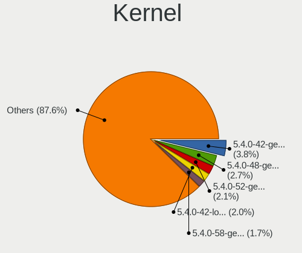

| Version             | Desktops | Percent |
|---------------------|----------|---------|
| 5.4.0-42-generic    | 40       | 3.83%   |
| 5.4.0-48-generic    | 28       | 2.68%   |
| 5.4.0-52-generic    | 22       | 2.11%   |
| 5.4.0-42-lowlatency | 21       | 2.01%   |
| 5.4.0-58-generic    | 18       | 1.72%   |
| 5.4.0-65-generic    | 17       | 1.63%   |
| 5.4.0-54-generic    | 17       | 1.63%   |
| 5.4.0-37-generic    | 17       | 1.63%   |
| 5.4.0-26-generic    | 17       | 1.63%   |
| 5.4.0-29-generic    | 16       | 1.53%   |
| 5.4.0-126-generic   | 16       | 1.53%   |
| 5.4.0-40-lowlatency | 14       | 1.34%   |
| 5.4.0-40-generic    | 14       | 1.34%   |
| 5.4.0-29-lowlatency | 14       | 1.34%   |
| 5.4.0-125-generic   | 14       | 1.34%   |
| 5.4.0-72-generic    | 11       | 1.05%   |
| 5.4.0-70-generic    | 11       | 1.05%   |
| 5.4.0-66-generic    | 11       | 1.05%   |
| 5.4.0-52-lowlatency | 11       | 1.05%   |
| 5.4.0-37-lowlatency | 11       | 1.05%   |
| 5.4.0-91-generic    | 10       | 0.96%   |
| 5.4.0-47-lowlatency | 10       | 0.96%   |
| 5.4.0-45-generic    | 10       | 0.96%   |
| 5.4.0-33-generic    | 10       | 0.96%   |
| 5.4.0-74-generic    | 9        | 0.86%   |
| 5.4.0-48-lowlatency | 9        | 0.86%   |
| 5.4.0-47-generic    | 9        | 0.86%   |
| 5.4.0-156-generic   | 9        | 0.86%   |
| 5.4.0-138-generic   | 9        | 0.86%   |
| 5.4.0-89-generic    | 8        | 0.77%   |
| 5.4.0-81-generic    | 8        | 0.77%   |
| 5.4.0-77-generic    | 8        | 0.77%   |
| 5.4.0-58-lowlatency | 8        | 0.77%   |
| 5.4.0-31-generic    | 8        | 0.77%   |
| 5.11.0-37-generic   | 8        | 0.77%   |
| 5.8.0-50-generic    | 7        | 0.67%   |
| 5.4.0-88-generic    | 7        | 0.67%   |
| 5.4.0-80-generic    | 7        | 0.67%   |
| 5.4.0-73-generic    | 7        | 0.67%   |
| 5.4.0-65-lowlatency | 7        | 0.67%   |

Kernel Family
-------------

Linux kernel without a distro release

| Version | Desktops | Percent |
|---------|----------|---------|
| 5.4.0   | 652      | 72.44%  |
| 5.11.0  | 61       | 6.78%   |
| 5.8.0   | 60       | 6.67%   |
| 5.15.0  | 55       | 6.11%   |
| 5.13.0  | 47       | 5.22%   |
| 6.8.12  | 2        | 0.22%   |
| 5.6.0   | 2        | 0.22%   |
| 5.9.16  | 1        | 0.11%   |
| 5.9.14  | 1        | 0.11%   |
| 5.8.5   | 1        | 0.11%   |
| 5.8.1   | 1        | 0.11%   |
| 5.7.17  | 1        | 0.11%   |
| 5.7.1   | 1        | 0.11%   |
| 5.6.6   | 1        | 0.11%   |
| 5.4.64  | 1        | 0.11%   |
| 5.3.0   | 1        | 0.11%   |
| 5.16.0  | 1        | 0.11%   |
| 5.15.1  | 1        | 0.11%   |
| 5.12.2  | 1        | 0.11%   |
| 5.12.17 | 1        | 0.11%   |
| 5.12.12 | 1        | 0.11%   |
| 5.12.10 | 1        | 0.11%   |
| 5.11.16 | 1        | 0.11%   |
| 5.10.27 | 1        | 0.11%   |
| 5.10.13 | 1        | 0.11%   |
| 4.4.0   | 1        | 0.11%   |
| 4.15.18 | 1        | 0.11%   |
| 4.15.0  | 1        | 0.11%   |

Kernel Major Ver.
-----------------

Linux kernel major version

| Version | Desktops | Percent |
|---------|----------|---------|
| 5.4     | 653      | 72.72%  |
| 5.8     | 62       | 6.9%    |
| 5.11    | 61       | 6.79%   |
| 5.15    | 56       | 6.24%   |
| 5.13    | 47       | 5.23%   |
| 5.6     | 3        | 0.33%   |
| 5.12    | 3        | 0.33%   |
| 6.8     | 2        | 0.22%   |
| 5.9     | 2        | 0.22%   |
| 5.7     | 2        | 0.22%   |
| 5.10    | 2        | 0.22%   |
| 4.15    | 2        | 0.22%   |
| 5.3     | 1        | 0.11%   |
| 5.16    | 1        | 0.11%   |
| 4.4     | 1        | 0.11%   |

Arch
----

OS architecture (x86_64, i586, etc.)

| Name   | Desktops | Percent |
|--------|----------|---------|
| x86_64 | 876      | 99.89%  |
| armv7l | 1        | 0.11%   |

DE
--

Desktop Environment

| Name       | Desktops | Percent |
|------------|----------|---------|
| XFCE       | 840      | 95.78%  |
| GNOME      | 28       | 3.19%   |
| KDE5       | 2        | 0.23%   |
| Cinnamon   | 2        | 0.23%   |
| X-Cinnamon | 1        | 0.11%   |
| MATE       | 1        | 0.11%   |
| LXQt       | 1        | 0.11%   |
| i3         | 1        | 0.11%   |
| GNUstep    | 1        | 0.11%   |

Display Server
--------------

X11 or Wayland

| Name    | Desktops | Percent |
|---------|----------|---------|
| X11     | 847      | 96.47%  |
| Tty     | 23       | 2.62%   |
| Wayland | 4        | 0.46%   |
| Web     | 3        | 0.34%   |
| Unknown | 1        | 0.11%   |

Display Manager
---------------

SDDM, LightDM, etc.

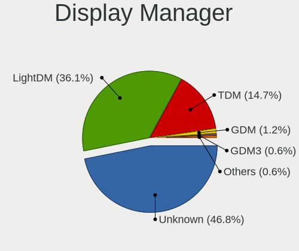

| Name    | Desktops | Percent |
|---------|----------|---------|
| Unknown | 423      | 46.84%  |
| LightDM | 326      | 36.1%   |
| TDM     | 133      | 14.73%  |
| GDM     | 11       | 1.22%   |
| GDM3    | 5        | 0.55%   |
| XDM     | 3        | 0.33%   |
| SLiM    | 1        | 0.11%   |
| SDDM    | 1        | 0.11%   |

OS Lang
-------

Language

| Lang  | Desktops | Percent |
|-------|----------|---------|
| en_US | 278      | 31.63%  |
| de_DE | 100      | 11.38%  |
| fr_FR | 83       | 9.44%   |
| ru_RU | 77       | 8.76%   |
| pt_BR | 43       | 4.89%   |
| en_CA | 38       | 4.32%   |
| en_GB | 36       | 4.1%    |
| it_IT | 31       | 3.53%   |
| C     | 19       | 2.16%   |
| es_ES | 16       | 1.82%   |
| ja_JP | 15       | 1.71%   |
| en_AU | 15       | 1.71%   |
| pl_PL | 13       | 1.48%   |
| nl_NL | 12       | 1.37%   |
| es_AR | 11       | 1.25%   |
| hu_HU | 10       | 1.14%   |
| fr_CA | 6        | 0.68%   |
| fr_BE | 6        | 0.68%   |
| de_AT | 6        | 0.68%   |
| zh_TW | 4        | 0.46%   |
| sv_SE | 4        | 0.46%   |
| ro_RO | 4        | 0.46%   |
| fi_FI | 4        | 0.46%   |
| es_UY | 4        | 0.46%   |
| es_MX | 4        | 0.46%   |
| es_CO | 4        | 0.46%   |
| de_CH | 4        | 0.46%   |
| en_IN | 3        | 0.34%   |
| cs_CZ | 3        | 0.34%   |
| zh_CN | 2        | 0.23%   |
| sl_SI | 2        | 0.23%   |
| ru_UA | 2        | 0.23%   |
| pt_PT | 2        | 0.23%   |
| fr_CH | 2        | 0.23%   |
| en_ZA | 2        | 0.23%   |
| bs_BA | 2        | 0.23%   |
| uk_UA | 1        | 0.11%   |
| th_TH | 1        | 0.11%   |
| nl_BE | 1        | 0.11%   |
| lv_LV | 1        | 0.11%   |

Boot Mode
---------

EFI or BIOS

| Mode | Desktops | Percent |
|------|----------|---------|
| BIOS | 631      | 71.38%  |
| EFI  | 253      | 28.62%  |

Filesystem
----------

Type of filesystem

| Type    | Desktops | Percent |
|---------|----------|---------|
| Ext4    | 815      | 91.68%  |
| Tmpfs   | 22       | 2.47%   |
| Overlay | 21       | 2.36%   |
| Btrfs   | 14       | 1.57%   |
| Zfs     | 11       | 1.24%   |
| Xfs     | 5        | 0.56%   |
| Ext3    | 1        | 0.11%   |

Part. scheme
------------

Scheme of partitioning

| Type    | Desktops | Percent |
|---------|----------|---------|
| Unknown | 513      | 57.71%  |
| MBR     | 192      | 21.6%   |
| GPT     | 184      | 20.7%   |

Dual Boot with Linux/BSD
------------------------

Hosting more than one Linux/BSD

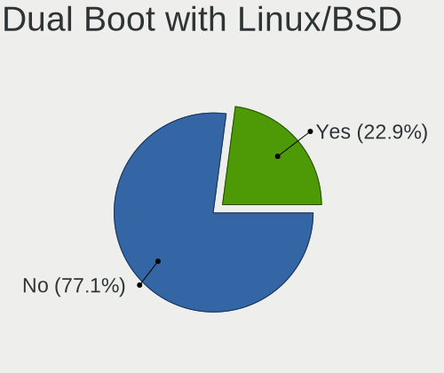

| Dual boot | Desktops | Percent |
|-----------|----------|---------|
| No        | 693      | 77.09%  |
| Yes       | 206      | 22.91%  |

Dual Boot (Win)
---------------

Hosting Linux and Windows

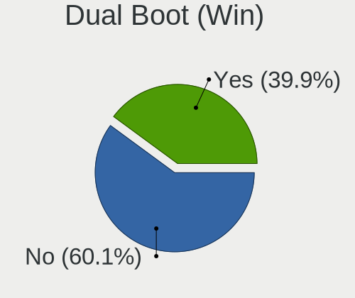

| Dual boot | Desktops | Percent |
|-----------|----------|---------|
| No        | 536      | 60.09%  |
| Yes       | 356      | 39.91%  |

Board
-----

Vendor
------

Motherboard manufacturer

| Name                | Desktops | Percent |
|---------------------|----------|---------|
| ASUSTek Computer    | 194      | 22.12%  |
| Gigabyte Technology | 139      | 15.85%  |
| Dell                | 93       | 10.6%   |
| ASRock              | 81       | 9.24%   |
| Hewlett-Packard     | 80       | 9.12%   |
| MSI                 | 71       | 8.1%    |
| Lenovo              | 30       | 3.42%   |
| Intel               | 27       | 3.08%   |
| Acer                | 26       | 2.96%   |
| ECS                 | 19       | 2.17%   |
| Fujitsu             | 16       | 1.82%   |
| Medion              | 14       | 1.6%    |
| Unknown             | 13       | 1.48%   |
| Pegatron            | 9        | 1.03%   |
| Foxconn             | 7        | 0.8%    |
| Packard Bell        | 5        | 0.57%   |
| eMachines           | 5        | 0.57%   |
| Biostar             | 5        | 0.57%   |
| Fujitsu Siemens     | 4        | 0.46%   |
| Positivo            | 3        | 0.34%   |
| Apple               | 3        | 0.34%   |
| Shuttle             | 2        | 0.23%   |
| NCR                 | 2        | 0.23%   |
| EVGA                | 2        | 0.23%   |
| BCM                 | 2        | 0.23%   |
| AAEON               | 2        | 0.23%   |
| WinFast             | 1        | 0.11%   |
| Standard            | 1        | 0.11%   |
| Semp Toshiba        | 1        | 0.11%   |
| Seco                | 1        | 0.11%   |
| QTQD                | 1        | 0.11%   |
| Qbex                | 1        | 0.11%   |
| PCWare              | 1        | 0.11%   |
| OEM_MB              | 1        | 0.11%   |
| OEM                 | 1        | 0.11%   |
| Nvidia              | 1        | 0.11%   |
| NEC Computers       | 1        | 0.11%   |
| Itautec             | 1        | 0.11%   |
| Insyde              | 1        | 0.11%   |
| INP                 | 1        | 0.11%   |

Model
-----

Motherboard model

| Name                                   | Desktops | Percent |
|----------------------------------------|----------|---------|
| ASUS All Series                        | 26       | 2.96%   |
| Gigabyte H410M S2H                     | 15       | 1.71%   |
| Unknown                                | 15       | 1.71%   |
| Gigabyte H81M-S2V                      | 9        | 1.03%   |
| ECS G31T-M9                            | 9        | 1.03%   |
| Dell OptiPlex 7010                     | 8        | 0.91%   |
| Dell OptiPlex 780                      | 5        | 0.57%   |
| Dell OptiPlex 755                      | 5        | 0.57%   |
| Dell OptiPlex 390                      | 5        | 0.57%   |
| ASUS TUF Gaming X570-PLUS              | 5        | 0.57%   |
| MSI MS-7B79                            | 4        | 0.46%   |
| MSI MS-7721                            | 4        | 0.46%   |
| Intel H61                              | 4        | 0.46%   |
| HP ProDesk 600 G1 SFF                  | 4        | 0.46%   |
| HP Compaq Elite 8300 SFF               | 4        | 0.46%   |
| Gigabyte B450M DS3H                    | 4        | 0.46%   |
| Dell OptiPlex 760                      | 4        | 0.46%   |
| ASRock N68C-S UCC                      | 4        | 0.46%   |
| MSI MS-7A34                            | 3        | 0.34%   |
| MSI MS-7693                            | 3        | 0.34%   |
| HP Z620 Workstation                    | 3        | 0.34%   |
| HP Z420 Workstation                    | 3        | 0.34%   |
| HP EliteDesk 800 G1 SFF                | 3        | 0.34%   |
| HP Compaq dc7900 Convertible Minitower | 3        | 0.34%   |
| HP Compaq 8100 Elite SFF PC            | 3        | 0.34%   |
| HP Compaq 6200 Pro MT PC               | 3        | 0.34%   |
| Gigabyte H61M-USB3V                    | 3        | 0.34%   |
| Fujitsu ESPRIMO E705                   | 3        | 0.34%   |
| Dell Precision WorkStation T7400       | 3        | 0.34%   |
| Dell OptiPlex 990                      | 3        | 0.34%   |
| Dell OptiPlex 9020                     | 3        | 0.34%   |
| Dell OptiPlex 3020                     | 3        | 0.34%   |
| Dell OptiPlex 3010                     | 3        | 0.34%   |
| ASUS TUF Gaming B550M-PLUS             | 3        | 0.34%   |
| ASUS PRIME B450M-A                     | 3        | 0.34%   |
| ASUS P5K                               | 3        | 0.34%   |
| ASUS M5A78L-M/USB3                     | 3        | 0.34%   |
| ASRock B450M Pro4                      | 3        | 0.34%   |
| Apple MacPro5,1                        | 3        | 0.34%   |
| Pegatron NY802AV-ABA p6110t            | 2        | 0.23%   |

Model Family
------------

Motherboard model prefix

| Name                | Desktops | Percent |
|---------------------|----------|---------|
| Dell OptiPlex       | 52       | 5.93%   |
| HP Compaq           | 34       | 3.88%   |
| ASUS PRIME          | 26       | 2.96%   |
| ASUS All            | 26       | 2.96%   |
| Lenovo ThinkCentre  | 21       | 2.39%   |
| Gigabyte H410M      | 15       | 1.71%   |
| Acer Aspire         | 15       | 1.71%   |
| Unknown             | 15       | 1.71%   |
| ASUS TUF            | 14       | 1.6%    |
| Dell Inspiron       | 13       | 1.48%   |
| Fujitsu ESPRIMO     | 12       | 1.37%   |
| Dell Precision      | 11       | 1.25%   |
| HP ProDesk          | 10       | 1.14%   |
| Gigabyte H81M-S2V   | 9        | 1.03%   |
| ECS G31T-M9         | 9        | 1.03%   |
| ASUS M5A78L-M       | 7        | 0.8%    |
| ASUS ROG            | 6        | 0.68%   |
| ASRock B450M        | 6        | 0.68%   |
| Acer Veriton        | 6        | 0.68%   |
| HP EliteDesk        | 5        | 0.57%   |
| Gigabyte B450M      | 5        | 0.57%   |
| Packard Bell IMEDIA | 4        | 0.46%   |
| MSI MS-7B79         | 4        | 0.46%   |
| MSI MS-7721         | 4        | 0.46%   |
| Lenovo ThinkStation | 4        | 0.46%   |
| Intel H61           | 4        | 0.46%   |
| Gigabyte X570       | 4        | 0.46%   |
| Dell Studio         | 4        | 0.46%   |
| ASUS P9X79          | 4        | 0.46%   |
| ASUS P8Z77-V        | 4        | 0.46%   |
| ASUS P8H61-M        | 4        | 0.46%   |
| ASUS P5KPL-AM       | 4        | 0.46%   |
| ASUS P5K            | 4        | 0.46%   |
| ASRock N68C-S       | 4        | 0.46%   |
| MSI MS-7A34         | 3        | 0.34%   |
| MSI MS-7693         | 3        | 0.34%   |
| Lenovo IdeaCentre   | 3        | 0.34%   |
| HP Z620             | 3        | 0.34%   |
| HP Z420             | 3        | 0.34%   |
| HP ProLiant         | 3        | 0.34%   |

MFG Year
--------

Motherboard manufacture year

| Year    | Desktops | Percent |
|---------|----------|---------|
| 2009    | 89       | 10.15%  |
| 2012    | 86       | 9.81%   |
| 2011    | 84       | 9.58%   |
| 2013    | 83       | 9.46%   |
| 2014    | 69       | 7.87%   |
| 2010    | 65       | 7.41%   |
| 2018    | 61       | 6.96%   |
| 2019    | 52       | 5.93%   |
| 2008    | 48       | 5.47%   |
| 2017    | 45       | 5.13%   |
| 2020    | 44       | 5.02%   |
| 2015    | 41       | 4.68%   |
| 2007    | 39       | 4.45%   |
| 2016    | 29       | 3.31%   |
| 2006    | 17       | 1.94%   |
| 2021    | 13       | 1.48%   |
| 2005    | 7        | 0.8%    |
| 2023    | 2        | 0.23%   |
| Unknown | 2        | 0.23%   |
| 2022    | 1        | 0.11%   |

Form Factor
-----------

Physical design of the computer

| Name    | Desktops | Percent |
|---------|----------|---------|
| Desktop | 877      | 100%    |

Secure Boot
-----------

Enabled or disabled

| State    | Desktops | Percent |
|----------|----------|---------|
| Disabled | 854      | 97.38%  |
| Enabled  | 23       | 2.62%   |

Coreboot
--------

Have coreboot on board

| Used | Desktops | Percent |
|------|----------|---------|
| No   | 876      | 99.89%  |
| Yes  | 1        | 0.11%   |

RAM Size
--------

Total RAM memory

| Size in GB      | Desktops | Percent |
|-----------------|----------|---------|
| 3.01-4.0        | 188      | 21.01%  |
| 16.01-24.0      | 177      | 19.78%  |
| 8.01-16.0       | 177      | 19.78%  |
| 4.01-8.0        | 153      | 17.09%  |
| 32.01-64.0      | 79       | 8.83%   |
| 1.01-2.0        | 55       | 6.15%   |
| 64.01-256.0     | 31       | 3.46%   |
| 24.01-32.0      | 17       | 1.9%    |
| 2.01-3.0        | 13       | 1.45%   |
| 0.51-1.0        | 4        | 0.45%   |
| More than 256.0 | 1        | 0.11%   |

RAM Used
--------

Used RAM memory

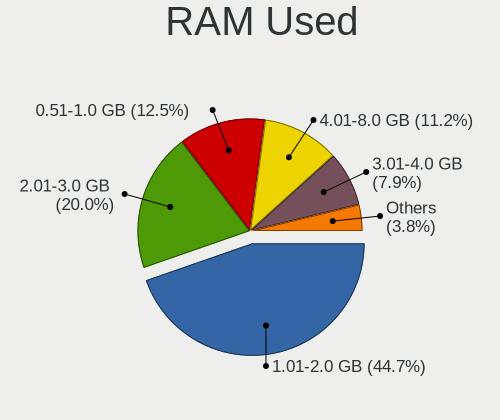

| Used GB    | Desktops | Percent |
|------------|----------|---------|
| 1.01-2.0   | 436      | 44.67%  |
| 2.01-3.0   | 195      | 19.98%  |
| 0.51-1.0   | 122      | 12.5%   |
| 4.01-8.0   | 109      | 11.17%  |
| 3.01-4.0   | 77       | 7.89%   |
| 8.01-16.0  | 28       | 2.87%   |
| 16.01-24.0 | 5        | 0.51%   |
| 24.01-32.0 | 4        | 0.41%   |

Total Drives
------------

Number of drives on board

| Drives | Desktops | Percent |
|--------|----------|---------|
| 1      | 369      | 40.68%  |
| 2      | 262      | 28.89%  |
| 3      | 153      | 16.87%  |
| 4      | 62       | 6.84%   |
| 5      | 32       | 3.53%   |
| 6      | 11       | 1.21%   |
| 7      | 7        | 0.77%   |
| 10     | 3        | 0.33%   |
| 0      | 3        | 0.33%   |
| 9      | 2        | 0.22%   |
| 8      | 2        | 0.22%   |
| 11     | 1        | 0.11%   |

Has CD-ROM
----------

Has CD-ROM on board

| Presented | Desktops | Percent |
|-----------|----------|---------|
| Yes       | 500      | 56.63%  |
| No        | 383      | 43.37%  |

Has Ethernet
------------

Has Ethernet on board

| Presented | Desktops | Percent |
|-----------|----------|---------|
| Yes       | 871      | 99.32%  |
| No        | 6        | 0.68%   |

Has WiFi
--------

Has WiFi module

| Presented | Desktops | Percent |
|-----------|----------|---------|
| No        | 555      | 62.43%  |
| Yes       | 334      | 37.57%  |

Has Bluetooth
-------------

Has Bluetooth module

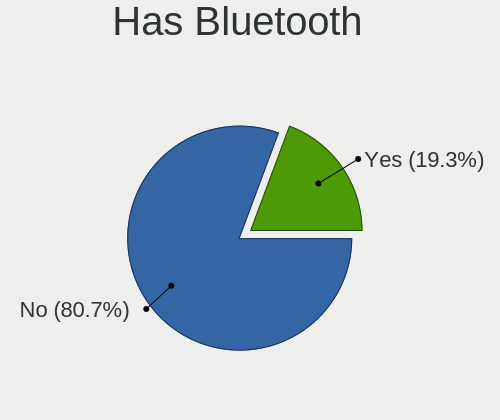

| Presented | Desktops | Percent |
|-----------|----------|---------|
| No        | 718      | 80.67%  |
| Yes       | 172      | 19.33%  |

Location
--------

Country
-------

Geographic location (country)

| Country                | Desktops | Percent |
|------------------------|----------|---------|
| USA                    | 170      | 19.34%  |
| Germany                | 113      | 12.86%  |
| Russia                 | 87       | 9.9%    |
| France                 | 83       | 9.44%   |
| Canada                 | 50       | 5.69%   |
| Brazil                 | 48       | 5.46%   |
| Italy                  | 38       | 4.32%   |
| UK                     | 35       | 3.98%   |
| Netherlands            | 23       | 2.62%   |
| Spain                  | 20       | 2.28%   |
| Japan                  | 17       | 1.93%   |
| Australia              | 17       | 1.93%   |
| Argentina              | 13       | 1.48%   |
| Poland                 | 12       | 1.37%   |
| Ukraine                | 11       | 1.25%   |
| Sweden                 | 10       | 1.14%   |
| Hungary                | 10       | 1.14%   |
| Belgium                | 10       | 1.14%   |
| Austria                | 10       | 1.14%   |
| Romania                | 8        | 0.91%   |
| Finland                | 7        | 0.8%    |
| Switzerland            | 6        | 0.68%   |
| Mexico                 | 6        | 0.68%   |
| Taiwan                 | 5        | 0.57%   |
| Uruguay                | 4        | 0.46%   |
| Portugal               | 4        | 0.46%   |
| Indonesia              | 4        | 0.46%   |
| Czechia                | 4        | 0.46%   |
| Colombia               | 4        | 0.46%   |
| Thailand               | 3        | 0.34%   |
| South Africa           | 3        | 0.34%   |
| Slovenia               | 3        | 0.34%   |
| Latvia                 | 3        | 0.34%   |
| Iran                   | 3        | 0.34%   |
| Greece                 | 3        | 0.34%   |
| Bulgaria               | 3        | 0.34%   |
| Serbia                 | 2        | 0.23%   |
| New Zealand            | 2        | 0.23%   |
| Israel                 | 2        | 0.23%   |
| Bosnia and Herzegovina | 2        | 0.23%   |

City
----

Geographic location (city)

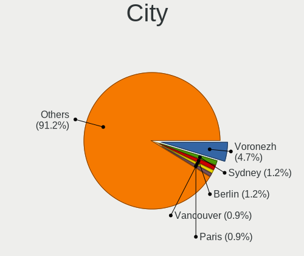

| City           | Desktops | Percent |
|----------------|----------|---------|
| Voronezh       | 43       | 4.66%   |
| Sydney         | 11       | 1.19%   |
| Berlin         | 11       | 1.19%   |
| Vancouver      | 8        | 0.87%   |
| Paris          | 8        | 0.87%   |
| Moscow         | 8        | 0.87%   |
| Milan          | 7        | 0.76%   |
| Sao Paulo      | 6        | 0.65%   |
| Montreal       | 6        | 0.65%   |
| Madrid         | 6        | 0.65%   |
| Hamburg        | 6        | 0.65%   |
| Cologne        | 6        | 0.65%   |
| Budapest       | 6        | 0.65%   |
| Denver         | 5        | 0.54%   |
| Tampere        | 4        | 0.43%   |
| Seattle        | 4        | 0.43%   |
| Rome           | 4        | 0.43%   |
| Munich         | 4        | 0.43%   |
| Helmond        | 4        | 0.43%   |
| Hanover        | 4        | 0.43%   |
| Chicago        | 4        | 0.43%   |
| Buenos Aires   | 4        | 0.43%   |
| Wuppertal      | 3        | 0.33%   |
| Waterford      | 3        | 0.33%   |
| Warsaw         | 3        | 0.33%   |
| Vienna         | 3        | 0.33%   |
| Turin          | 3        | 0.33%   |
| Toronto        | 3        | 0.33%   |
| Suwanee        | 3        | 0.33%   |
| St Petersburg  | 3        | 0.33%   |
| Springfield    | 3        | 0.33%   |
| Saint Paul     | 3        | 0.33%   |
| Rio de Janeiro | 3        | 0.33%   |
| Riga           | 3        | 0.33%   |
| Ottawa         | 3        | 0.33%   |
| Osaka          | 3        | 0.33%   |
| New Taipei     | 3        | 0.33%   |
| Montevideo     | 3        | 0.33%   |
| Kyiv           | 3        | 0.33%   |
| Houston        | 3        | 0.33%   |

Drives
------

Drive Vendor
------------

Hard drive vendors

| Vendor                | Desktops | Drives | Percent |
|-----------------------|----------|--------|---------|
| Seagate               | 337      | 564    | 22.05%  |
| WDC                   | 327      | 516    | 21.4%   |
| Samsung Electronics   | 198      | 302    | 12.96%  |
| Kingston              | 79       | 93     | 5.17%   |
| Hitachi               | 79       | 113    | 5.17%   |
| Toshiba               | 78       | 104    | 5.1%    |
| Crucial               | 54       | 76     | 3.53%   |
| SanDisk               | 51       | 67     | 3.34%   |
| A-DATA Technology     | 25       | 30     | 1.64%   |
| Intel                 | 22       | 35     | 1.44%   |
| Maxtor                | 21       | 28     | 1.37%   |
| Unknown               | 18       | 23     | 1.18%   |
| PNY                   | 15       | 21     | 0.98%   |
| Patriot               | 15       | 18     | 0.98%   |
| Intenso               | 13       | 20     | 0.85%   |
| HGST                  | 13       | 18     | 0.85%   |
| China                 | 13       | 13     | 0.85%   |
| Transcend             | 10       | 11     | 0.65%   |
| OCZ                   | 10       | 15     | 0.65%   |
| Phison                | 7        | 8      | 0.46%   |
| Fujitsu               | 7        | 8      | 0.46%   |
| SK hynix              | 6        | 6      | 0.39%   |
| Hewlett-Packard       | 6        | 13     | 0.39%   |
| SPCC                  | 5        | 13     | 0.33%   |
| Silicon Motion        | 5        | 5      | 0.33%   |
| Micron Technology     | 5        | 6      | 0.33%   |
| Corsair               | 5        | 5      | 0.33%   |
| Apacer                | 5        | 5      | 0.33%   |
| Realtek Semiconductor | 4        | 6      | 0.26%   |
| ASMT                  | 4        | 4      | 0.26%   |
| Team                  | 3        | 4      | 0.2%    |
| Phison Electronics    | 3        | 3      | 0.2%    |
| KIOXIA                | 3        | 8      | 0.2%    |
| KingDian              | 3        | 3      | 0.2%    |
| GOODRAM               | 3        | 4      | 0.2%    |
| XPG                   | 2        | 7      | 0.13%   |
| WD MediaMax           | 2        | 2      | 0.13%   |
| USB3.0                | 2        | 3      | 0.13%   |
| Smartbuy              | 2        | 2      | 0.13%   |
| SABRENT               | 2        | 2      | 0.13%   |

Drive Model
-----------

Hard drive models

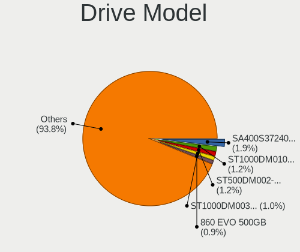

| Model                               | Desktops | Percent |
|-------------------------------------|----------|---------|
| Kingston SA400S37240G 240GB SSD     | 33       | 1.85%   |
| Seagate ST1000DM010-2EP102 1TB      | 22       | 1.23%   |
| Seagate ST500DM002-1BD142 500GB     | 21       | 1.18%   |
| Seagate ST1000DM003-1ER162 1TB      | 18       | 1.01%   |
| Samsung SSD 860 EVO 500GB           | 16       | 0.9%    |
| Seagate ST2000DM001-1CH164 2TB      | 15       | 0.84%   |
| Seagate ST2000DM008-2FR102 2TB      | 12       | 0.67%   |
| Samsung SSD 850 EVO 250GB           | 12       | 0.67%   |
| Toshiba DT01ACA100 1TB              | 10       | 0.56%   |
| Seagate ST4000DM004-2CV104 4TB      | 10       | 0.56%   |
| Seagate ST3500418AS 500GB           | 10       | 0.56%   |
| Seagate ST31000528AS 1TB            | 10       | 0.56%   |
| Seagate ST1000DM003-1CH162 1TB      | 10       | 0.56%   |
| Seagate Expansion 1TB               | 10       | 0.56%   |
| Kingston SA400S37480G 480GB SSD     | 10       | 0.56%   |
| Crucial CT1000MX500SSD1 1TB         | 10       | 0.56%   |
| WDC WD5000AZLX-07K2TA0 500GB        | 9        | 0.51%   |
| Seagate ST31000524AS 1TB            | 9        | 0.51%   |
| Samsung SSD 860 EVO 1TB             | 9        | 0.51%   |
| Patriot Burst 120GB SSD             | 9        | 0.51%   |
| Hitachi HDS721050CLA362 500GB       | 9        | 0.51%   |
| Unknown SD/MMC/MS PRO 128GB         | 8        | 0.45%   |
| Seagate ST380815AS 80GB             | 8        | 0.45%   |
| Seagate ST3250310AS 250GB           | 8        | 0.45%   |
| Kingston SV300S37A120G 120GB SSD    | 8        | 0.45%   |
| WDC WD10EZEX-00BN5A0 1TB            | 7        | 0.39%   |
| Seagate ST3320418AS 320GB           | 7        | 0.39%   |
| Samsung SSD 860 EVO 250GB           | 7        | 0.39%   |
| Samsung NVMe SSD Drive 1TB          | 7        | 0.39%   |
| Samsung HD502HJ 500GB               | 7        | 0.39%   |
| Samsung HD103SJ 1TB                 | 7        | 0.39%   |
| Hitachi HDS721010CLA332 1TB         | 7        | 0.39%   |
| WDC WD20EARX-00PASB0 2TB            | 6        | 0.34%   |
| WDC WD10EZEX-08WN4A0 1TB            | 6        | 0.34%   |
| Toshiba DT01ACA050 500GB            | 6        | 0.34%   |
| Seagate ST500LM012 HN-M500MBB 500GB | 6        | 0.34%   |
| Seagate ST3500413AS 500GB           | 6        | 0.34%   |
| Seagate ST2000DM006-2DM164 2TB      | 6        | 0.34%   |
| Seagate ST2000DM001-9YN164 2TB      | 6        | 0.34%   |
| Seagate ST2000DM001-1ER164 2TB      | 6        | 0.34%   |

HDD Vendor
----------

Hard disk drive vendors

| Vendor              | Desktops | Drives | Percent |
|---------------------|----------|--------|---------|
| Seagate             | 331      | 556    | 36.06%  |
| WDC                 | 298      | 466    | 32.46%  |
| Hitachi             | 79       | 113    | 8.61%   |
| Samsung Electronics | 69       | 93     | 7.52%   |
| Toshiba             | 68       | 91     | 7.41%   |
| Maxtor              | 20       | 27     | 2.18%   |
| HGST                | 13       | 18     | 1.42%   |
| Unknown             | 9        | 12     | 0.98%   |
| Fujitsu             | 7        | 8      | 0.76%   |
| Intenso             | 4        | 5      | 0.44%   |
| Hewlett-Packard     | 4        | 9      | 0.44%   |
| ASMT                | 3        | 3      | 0.33%   |
| WD MediaMax         | 2        | 2      | 0.22%   |
| Apple               | 2        | 3      | 0.22%   |
| USB3.0              | 1        | 2      | 0.11%   |
| TO Exter            | 1        | 1      | 0.11%   |
| SAGE                | 1        | 1      | 0.11%   |
| SABRENT             | 1        | 1      | 0.11%   |
| LaCie               | 1        | 4      | 0.11%   |
| JMicron Technology  | 1        | 1      | 0.11%   |
| ICY BOX             | 1        | 1      | 0.11%   |
| HPE                 | 1        | 4      | 0.11%   |
| ExcelStor           | 1        | 1      | 0.11%   |

SSD Vendor
----------

Solid state drive vendors

| Vendor              | Desktops | Drives | Percent |
|---------------------|----------|--------|---------|
| Samsung Electronics | 108      | 149    | 21.51%  |
| Kingston            | 75       | 87     | 14.94%  |
| Crucial             | 47       | 69     | 9.36%   |
| SanDisk             | 46       | 61     | 9.16%   |
| WDC                 | 33       | 42     | 6.57%   |
| A-DATA Technology   | 21       | 25     | 4.18%   |
| Intel               | 17       | 24     | 3.39%   |
| PNY                 | 15       | 21     | 2.99%   |
| Patriot             | 15       | 18     | 2.99%   |
| China               | 13       | 13     | 2.59%   |
| Transcend           | 9        | 9      | 1.79%   |
| OCZ                 | 9        | 13     | 1.79%   |
| Intenso             | 7        | 9      | 1.39%   |
| Toshiba             | 5        | 8      | 1%      |
| SPCC                | 5        | 13     | 1%      |
| Micron Technology   | 5        | 6      | 1%      |
| Corsair             | 5        | 5      | 1%      |
| Apacer              | 5        | 5      | 1%      |
| SK hynix            | 4        | 4      | 0.8%    |
| Team                | 3        | 4      | 0.6%    |
| KingDian            | 3        | 3      | 0.6%    |
| GOODRAM             | 3        | 4      | 0.6%    |
| Smartbuy            | 2        | 2      | 0.4%    |
| OCZ-VERTEX3         | 2        | 2      | 0.4%    |
| Mushkin             | 2        | 2      | 0.4%    |
| LITEONIT            | 2        | 2      | 0.4%    |
| LITEON              | 2        | 2      | 0.4%    |
| Lexar               | 2        | 2      | 0.4%    |
| Kingmax             | 2        | 2      | 0.4%    |
| Integral            | 2        | 2      | 0.4%    |
| Hewlett-Packard     | 2        | 4      | 0.4%    |
| Emtec               | 2        | 2      | 0.4%    |
| Dogfish             | 2        | 2      | 0.4%    |
| Wintec              | 1        | 1      | 0.2%    |
| WDC WDS             | 1        | 1      | 0.2%    |
| Verbatim            | 1        | 1      | 0.2%    |
| Vaseky              | 1        | 1      | 0.2%    |
| USB3.0              | 1        | 1      | 0.2%    |
| Teclast             | 1        | 1      | 0.2%    |
| Super Talent        | 1        | 1      | 0.2%    |

Drive Kind
----------

HDD or SSD

| Kind    | Desktops | Drives | Percent |
|---------|----------|--------|---------|
| HDD     | 673      | 1422   | 54.19%  |
| SSD     | 434      | 646    | 34.94%  |
| NVMe    | 104      | 158    | 8.37%   |
| Unknown | 24       | 28     | 1.93%   |
| MMC     | 7        | 8      | 0.56%   |

Drive Connector
---------------

SATA, SAS, NVMe, etc.

| Type | Desktops | Drives | Percent |
|------|----------|--------|---------|
| SATA | 846      | 1997   | 82.14%  |
| NVMe | 104      | 158    | 10.1%   |
| SAS  | 73       | 99     | 7.09%   |
| MMC  | 7        | 8      | 0.68%   |

Drive Size
----------

Size of hard drive

| Size in TB | Desktops | Drives | Percent |
|------------|----------|--------|---------|
| 0.01-0.5   | 674      | 1154   | 55.07%  |
| 0.51-1.0   | 309      | 510    | 25.25%  |
| 1.01-2.0   | 120      | 201    | 9.8%    |
| 3.01-4.0   | 43       | 78     | 3.51%   |
| 2.01-3.0   | 39       | 68     | 3.19%   |
| 4.01-10.0  | 37       | 54     | 3.02%   |
| 10.01-20.0 | 2        | 3      | 0.16%   |

Space Total
-----------

Amount of disk space available on the file system

| Size in GB     | Desktops | Percent |
|----------------|----------|---------|
| 101-250        | 255      | 27.96%  |
| 251-500        | 171      | 18.75%  |
| 501-1000       | 139      | 15.24%  |
| 1001-2000      | 101      | 11.07%  |
| More than 3000 | 81       | 8.88%   |
| 51-100         | 57       | 6.25%   |
| 2001-3000      | 43       | 4.71%   |
| 21-50          | 32       | 3.51%   |
| 1-20           | 27       | 2.96%   |
| Unknown        | 6        | 0.66%   |

Space Used
----------

Amount of used disk space

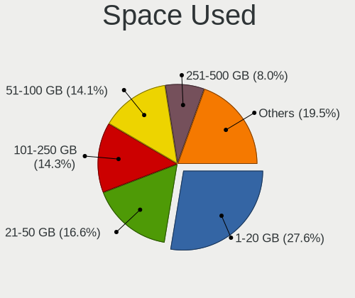

| Used GB        | Desktops | Percent |
|----------------|----------|---------|
| 1-20           | 263      | 27.6%   |
| 21-50          | 158      | 16.58%  |
| 101-250        | 136      | 14.27%  |
| 51-100         | 134      | 14.06%  |
| 251-500        | 76       | 7.97%   |
| 501-1000       | 74       | 7.76%   |
| 1001-2000      | 53       | 5.56%   |
| More than 3000 | 33       | 3.46%   |
| 2001-3000      | 20       | 2.1%    |
| Unknown        | 6        | 0.63%   |

Malfunc. Drives
---------------

Drive models with a malfunction

| Model                            | Desktops | Drives | Percent |
|----------------------------------|----------|--------|---------|
| Hitachi HDS721050CLA362 500GB    | 3        | 3      | 3.13%   |
| WDC WD4000FYYZ-01UL1B1 4TB       | 2        | 3      | 2.08%   |
| WDC WD1002FAEX-00Z3A0 1TB        | 2        | 2      | 2.08%   |
| Seagate ST500DM002-1BD142 500GB  | 2        | 2      | 2.08%   |
| Seagate ST3250318AS 250GB        | 2        | 2      | 2.08%   |
| Seagate ST2000DM001-1CH164 2TB   | 2        | 3      | 2.08%   |
| Seagate ST1000DL002-9TT153 1TB   | 2        | 2      | 2.08%   |
| Samsung Electronics HD103SI 1TB  | 2        | 2      | 2.08%   |
| Samsung Electronics HD081GJ 80GB | 2        | 2      | 2.08%   |
| Kingston SA400S37240G 240GB SSD  | 2        | 2      | 2.08%   |
| WDC WD6400AAKS-22A7B2 640GB      | 1        | 1      | 1.04%   |
| WDC WD6400AAKS-22A7B0 640GB      | 1        | 1      | 1.04%   |
| WDC WD5000LPVX-08V0TT5 500GB     | 1        | 1      | 1.04%   |
| WDC WD5000LPCX-00VHAT0 500GB     | 1        | 1      | 1.04%   |
| WDC WD5000BEVT-22ZAT0 500GB      | 1        | 1      | 1.04%   |
| WDC WD5000AAKX-60U6AA0 500GB     | 1        | 1      | 1.04%   |
| WDC WD5000AAKX-08U6AA0 500GB     | 1        | 1      | 1.04%   |
| WDC WD5000AAKX-08ERMA0 500GB     | 1        | 1      | 1.04%   |
| WDC WD5000AAKS-22V1A0 500GB      | 1        | 1      | 1.04%   |
| WDC WD5000AAKS-00A7B0 500GB      | 1        | 1      | 1.04%   |
| WDC WD400EB-00CPF0 40GB          | 1        | 1      | 1.04%   |
| WDC WD3200BEVT-75ZCT1 320GB      | 1        | 1      | 1.04%   |
| WDC WD3200AVJS-63TBA0 320GB      | 1        | 1      | 1.04%   |
| WDC WD3200AAKS-00L9A0 320GB      | 1        | 1      | 1.04%   |
| WDC WD3200AAJS-60Z0A0 320GB      | 1        | 1      | 1.04%   |
| WDC WD3200AAJS-08L7A0 320GB      | 1        | 1      | 1.04%   |
| WDC WD30EFRX-68EUZN0 3TB         | 1        | 1      | 1.04%   |
| WDC WD20EZRX-00D8PB0 2TB         | 1        | 2      | 1.04%   |
| WDC WD20EFRX-68EUZN0 2TB         | 1        | 1      | 1.04%   |
| WDC WD1600BEVS-22RST0 160GB      | 1        | 1      | 1.04%   |
| WDC WD1600AAJS-00L7A0 160GB      | 1        | 1      | 1.04%   |
| WDC WD10EZRX-00A8LB0 1TB         | 1        | 1      | 1.04%   |
| WDC WD10EZEX-08WN4A0 1TB         | 1        | 1      | 1.04%   |
| WDC WD10EZEX-00RKKA0 1TB         | 1        | 1      | 1.04%   |
| WDC WD10EFRX-68PJCN0 1TB         | 1        | 1      | 1.04%   |
| WDC WD10EFRX-68JCSN0 1TB         | 1        | 1      | 1.04%   |
| WDC WD10EAVS-22D7B0 1TB          | 1        | 1      | 1.04%   |
| WDC WD10EADX-22TDHB0 1TB         | 1        | 1      | 1.04%   |
| WDC WD10EADS-22M2B0 1TB          | 1        | 1      | 1.04%   |
| Toshiba MQ01ABF050 500GB         | 1        | 2      | 1.04%   |

Malfunc. Drive Vendor
---------------------

Vendors of faulty drives

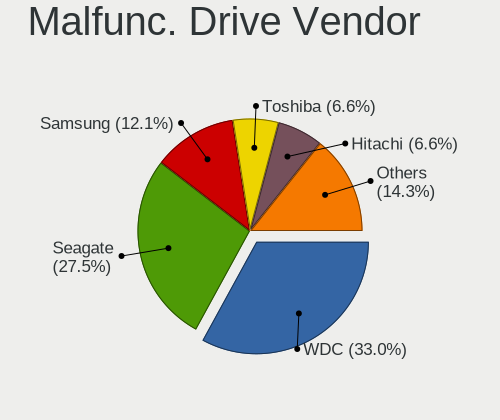

| Vendor              | Desktops | Drives | Percent |
|---------------------|----------|--------|---------|
| WDC                 | 30       | 35     | 32.97%  |
| Seagate             | 25       | 28     | 27.47%  |
| Samsung Electronics | 11       | 14     | 12.09%  |
| Toshiba             | 6        | 7      | 6.59%   |
| Hitachi             | 6        | 6      | 6.59%   |
| Maxtor              | 3        | 3      | 3.3%    |
| Kingston            | 3        | 3      | 3.3%    |
| SK hynix            | 1        | 1      | 1.1%    |
| Intel               | 1        | 1      | 1.1%    |
| ICY BOX             | 1        | 1      | 1.1%    |
| HGST                | 1        | 1      | 1.1%    |
| FORESEE             | 1        | 1      | 1.1%    |
| Avant               | 1        | 1      | 1.1%    |
| A-DATA Technology   | 1        | 1      | 1.1%    |

Malfunc. HDD Vendor
-------------------

Vendors of faulty HDD drives

| Vendor              | Desktops | Drives | Percent |
|---------------------|----------|--------|---------|
| WDC                 | 30       | 35     | 37.04%  |
| Seagate             | 25       | 28     | 30.86%  |
| Samsung Electronics | 9        | 11     | 11.11%  |
| Toshiba             | 6        | 7      | 7.41%   |
| Hitachi             | 6        | 6      | 7.41%   |
| Maxtor              | 3        | 3      | 3.7%    |
| ICY BOX             | 1        | 1      | 1.23%   |
| HGST                | 1        | 1      | 1.23%   |

Malfunc. Drive Kind
-------------------

Kinds of faulty drives

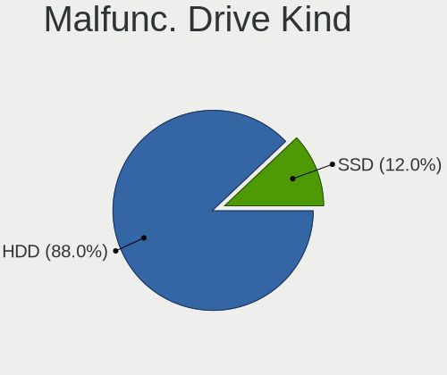

| Kind | Desktops | Drives | Percent |
|------|----------|--------|---------|
| HDD  | 73       | 92     | 87.95%  |
| SSD  | 10       | 11     | 12.05%  |

Failed Drives
-------------

Failed drive models

| Model                            | Desktops | Drives | Percent |
|----------------------------------|----------|--------|---------|
| Toshiba DT01ACA200 2TB           | 1        | 1      | 33.33%  |
| Seagate ST500DM002-1BC142 500GB  | 1        | 1      | 33.33%  |
| A-DATA Technology SP800 32GB SSD | 1        | 1      | 33.33%  |

Failed Drive Vendor
-------------------

Failed drive vendors

| Vendor            | Desktops | Drives | Percent |
|-------------------|----------|--------|---------|
| Toshiba           | 1        | 1      | 33.33%  |
| Seagate           | 1        | 1      | 33.33%  |
| A-DATA Technology | 1        | 1      | 33.33%  |

Drive Status
------------

Number of failed and malfunc. drives

| Status   | Desktops | Drives | Percent |
|----------|----------|--------|---------|
| Detected | 563      | 1547   | 58.89%  |
| Works    | 308      | 609    | 32.22%  |
| Malfunc  | 82       | 103    | 8.58%   |
| Failed   | 3        | 3      | 0.31%   |

Storage controller
------------------

Storage Vendor
--------------

Storage controller vendors

| Vendor                        | Desktops | Percent |
|-------------------------------|----------|---------|
| Intel                         | 609      | 54.86%  |
| AMD                           | 217      | 19.55%  |
| Nvidia                        | 43       | 3.87%   |
| Samsung Electronics           | 40       | 3.6%    |
| ASMedia Technology            | 40       | 3.6%    |
| JMicron Technology            | 35       | 3.15%   |
| Marvell Technology Group      | 30       | 2.7%    |
| VIA Technologies              | 13       | 1.17%   |
| SanDisk                       | 9        | 0.81%   |
| Phison Electronics            | 9        | 0.81%   |
| ADATA Technology              | 9        | 0.81%   |
| Micron/Crucial Technology     | 8        | 0.72%   |
| Silicon Motion                | 6        | 0.54%   |
| Realtek Semiconductor         | 5        | 0.45%   |
| LSI Logic / Symbios Logic     | 5        | 0.45%   |
| Kingston Technology Company   | 5        | 0.45%   |
| Broadcom / LSI                | 5        | 0.45%   |
| Toshiba America Info Systems  | 4        | 0.36%   |
| Silicon Image                 | 3        | 0.27%   |
| Integrated Technology Express | 3        | 0.27%   |
| Promise Technology            | 2        | 0.18%   |
| KIOXIA                        | 2        | 0.18%   |
| Adaptec                       | 2        | 0.18%   |
| SK hynix                      | 1        | 0.09%   |
| Seagate Technology            | 1        | 0.09%   |
| OCZ Technology Group          | 1        | 0.09%   |
| Micron Technology             | 1        | 0.09%   |
| Lite-On Technology            | 1        | 0.09%   |
| Hewlett-Packard               | 1        | 0.09%   |

Storage Model
-------------

Storage controller models

| Model                                                                                   | Desktops | Percent |
|-----------------------------------------------------------------------------------------|----------|---------|
| AMD FCH SATA Controller [AHCI mode]                                                     | 122      | 8.07%   |
| Intel 8 Series/C220 Series Chipset Family 6-port SATA Controller 1 [AHCI mode]          | 66       | 4.37%   |
| Intel NM10/ICH7 Family SATA Controller [IDE mode]                                       | 58       | 3.84%   |
| Intel 6 Series/C200 Series Chipset Family 6 port Desktop SATA AHCI Controller           | 57       | 3.77%   |
| AMD SB7x0/SB8x0/SB9x0 IDE Controller                                                    | 56       | 3.71%   |
| Intel 82801G (ICH7 Family) IDE Controller                                               | 47       | 3.11%   |
| Intel 7 Series/C210 Series Chipset Family 6-port SATA Controller [AHCI mode]            | 43       | 2.85%   |
| Intel SATA Controller [RAID Mode]                                                       | 42       | 2.78%   |
| Intel Q170/Q150/B150/H170/H110/Z170/CM236 Chipset SATA Controller [AHCI Mode]           | 39       | 2.58%   |
| AMD 400 Series Chipset SATA Controller                                                  | 39       | 2.58%   |
| ASMedia ASM1061/ASM1062 Serial ATA Controller                                           | 38       | 2.51%   |
| AMD SB7x0/SB8x0/SB9x0 SATA Controller [AHCI mode]                                       | 38       | 2.51%   |
| AMD SB7x0/SB8x0/SB9x0 SATA Controller [IDE mode]                                        | 35       | 2.32%   |
| Samsung NVMe SSD Controller SM981/PM981/PM983                                           | 27       | 1.79%   |
| Intel 200 Series PCH SATA controller [AHCI mode]                                        | 26       | 1.72%   |
| JMicron JMB363 SATA/IDE Controller                                                      | 25       | 1.65%   |
| Intel 6 Series/C200 Series Chipset Family Desktop SATA Controller (IDE mode, ports 4-5) | 25       | 1.65%   |
| Intel 6 Series/C200 Series Chipset Family Desktop SATA Controller (IDE mode, ports 0-3) | 25       | 1.65%   |
| Nvidia MCP61 SATA Controller                                                            | 23       | 1.52%   |
| Intel 82801I (ICH9 Family) 2 port SATA Controller [IDE mode]                            | 23       | 1.52%   |
| Nvidia MCP61 IDE                                                                        | 19       | 1.26%   |
| Intel 82801IR/IO/IH (ICH9R/DO/DH) 4 port SATA Controller [IDE mode]                     | 19       | 1.26%   |
| Intel 4 Series Chipset PT IDER Controller                                               | 19       | 1.26%   |
| Intel Cannon Lake PCH SATA AHCI Controller                                              | 16       | 1.06%   |
| Intel 400 Series Chipset Family SATA AHCI Controller                                    | 16       | 1.06%   |
| Intel Atom Processor E3800 Series SATA AHCI Controller                                  | 14       | 0.93%   |
| Intel 9 Series Chipset Family SATA Controller [AHCI Mode]                               | 14       | 0.93%   |
| Intel 82801JI (ICH10 Family) 4 port SATA IDE Controller #1                              | 14       | 0.93%   |
| Intel 82801JD/DO (ICH10 Family) SATA AHCI Controller                                    | 14       | 0.93%   |
| Intel 5 Series/3400 Series Chipset 4 port SATA IDE Controller                           | 14       | 0.93%   |
| Intel 82801JI (ICH10 Family) 2 port SATA IDE Controller #2                              | 13       | 0.86%   |
| AMD 300 Series Chipset SATA Controller                                                  | 13       | 0.86%   |
| Intel 82801JI (ICH10 Family) SATA AHCI Controller                                       | 12       | 0.79%   |
| Intel 5 Series/3400 Series Chipset 2 port SATA IDE Controller                           | 12       | 0.79%   |
| Intel C600/X79 series chipset 6-Port SATA AHCI Controller                               | 11       | 0.73%   |
| Intel 82Q35 Express PT IDER Controller                                                  | 11       | 0.73%   |
| AMD A320 Chipset SATA Controller [AHCI mode]                                            | 11       | 0.73%   |
| Intel 5 Series/3400 Series Chipset 6 port SATA AHCI Controller                          | 10       | 0.66%   |
| Nvidia MCP78S [GeForce 8200] IDE                                                        | 9        | 0.6%    |
| ADATA XPG SX8200 Pro PCIe Gen3x4 M.2 2280 Solid State Drive                             | 9        | 0.6%    |

Storage Kind
------------

Kind of storage controller (IDE, SATA, NVMe, SAS, ...)

| Kind | Desktops | Percent |
|------|----------|---------|
| SATA | 632      | 55.44%  |
| IDE  | 332      | 29.12%  |
| NVMe | 101      | 8.86%   |
| RAID | 60       | 5.26%   |
| SAS  | 9        | 0.79%   |
| SCSI | 6        | 0.53%   |

Processor
---------

CPU Vendor
----------

Processor vendors

| Vendor | Desktops | Percent |
|--------|----------|---------|
| Intel  | 620      | 70.7%   |
| AMD    | 256      | 29.19%  |
| ARM    | 1        | 0.11%   |

CPU Model
---------

Processor models

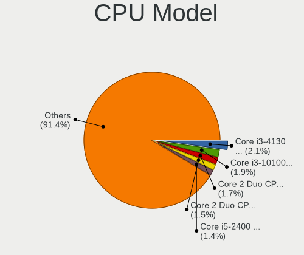

| Model                                       | Desktops | Percent |
|---------------------------------------------|----------|---------|
| Intel Core i3-4130 CPU @ 3.40GHz            | 19       | 2.15%   |
| Intel Core i3-10100 CPU @ 3.60GHz           | 17       | 1.92%   |
| Intel Core 2 Duo CPU E8400 @ 3.00GHz        | 15       | 1.7%    |
| Intel Core 2 Duo CPU E7500 @ 2.93GHz        | 13       | 1.47%   |
| Intel Core i5-2400 CPU @ 3.10GHz            | 12       | 1.36%   |
| Intel Core i7-3770 CPU @ 3.40GHz            | 11       | 1.24%   |
| Intel Core i3-2100 CPU @ 3.10GHz            | 11       | 1.24%   |
| AMD Ryzen 5 2600 Six-Core Processor         | 11       | 1.24%   |
| Intel Core i7-2600 CPU @ 3.40GHz            | 10       | 1.13%   |
| AMD FX-8350 Eight-Core Processor            | 10       | 1.13%   |
| Intel Core i5-4570 CPU @ 3.20GHz            | 9        | 1.02%   |
| Intel Core 2 Quad CPU Q6600 @ 2.40GHz       | 9        | 1.02%   |
| Intel Celeron CPU J1800 @ 2.41GHz           | 9        | 1.02%   |
| Intel Core i7-2600K CPU @ 3.40GHz           | 8        | 0.9%    |
| Intel Core i5-6400 CPU @ 2.70GHz            | 8        | 0.9%    |
| Intel Core i5-3570 CPU @ 3.40GHz            | 8        | 0.9%    |
| Intel Core i5-3470 CPU @ 3.20GHz            | 8        | 0.9%    |
| Intel Core i3-2120 CPU @ 3.30GHz            | 8        | 0.9%    |
| AMD Ryzen 9 3900X 12-Core Processor         | 8        | 0.9%    |
| AMD Ryzen 7 3700X 8-Core Processor          | 8        | 0.9%    |
| Intel Pentium Dual-Core CPU E5300 @ 2.60GHz | 7        | 0.79%   |
| Intel Core i7-6700 CPU @ 3.40GHz            | 7        | 0.79%   |
| Intel Core i5-4460 CPU @ 3.20GHz            | 7        | 0.79%   |
| AMD Ryzen 5 3600 6-Core Processor           | 7        | 0.79%   |
| AMD Ryzen 5 3400G with Radeon Vega Graphics | 7        | 0.79%   |
| AMD Phenom II X4 955 Processor              | 7        | 0.79%   |
| Intel Pentium Dual-Core CPU E6500 @ 2.93GHz | 6        | 0.68%   |
| Intel Core i7-3770K CPU @ 3.50GHz           | 6        | 0.68%   |
| Intel Core i5-2500K CPU @ 3.30GHz           | 6        | 0.68%   |
| Intel Core i3-3220 CPU @ 3.30GHz            | 6        | 0.68%   |
| Intel Core 2 Duo CPU E6550 @ 2.33GHz        | 6        | 0.68%   |
| Intel Pentium Dual-Core CPU E5200 @ 2.50GHz | 5        | 0.57%   |
| Intel Core i7-7700 CPU @ 3.60GHz            | 5        | 0.57%   |
| Intel Core i7-4770 CPU @ 3.40GHz            | 5        | 0.57%   |
| Intel Core i7 CPU 860 @ 2.80GHz             | 5        | 0.57%   |
| Intel Core i5-6500 CPU @ 3.20GHz            | 5        | 0.57%   |
| Intel Core i5-4590 CPU @ 3.30GHz            | 5        | 0.57%   |
| Intel Core i5 CPU 650 @ 3.20GHz             | 5        | 0.57%   |
| Intel Celeron CPU J1900 @ 1.99GHz           | 5        | 0.57%   |
| AMD Ryzen 7 2700X Eight-Core Processor      | 5        | 0.57%   |

CPU Model Family
----------------

Processor model prefix

| Model                   | Desktops | Percent |
|-------------------------|----------|---------|
| Intel Core i5           | 145      | 16.46%  |
| Intel Core i7           | 112      | 12.71%  |
| Intel Core i3           | 86       | 9.76%   |
| Intel Core 2 Duo        | 50       | 5.68%   |
| Intel Celeron           | 48       | 5.45%   |
| Intel Xeon              | 45       | 5.11%   |
| AMD Ryzen 5             | 41       | 4.65%   |
| Intel Pentium Dual-Core | 31       | 3.52%   |
| Intel Pentium           | 31       | 3.52%   |
| AMD FX                  | 30       | 3.41%   |
| Intel Core 2 Quad       | 28       | 3.18%   |
| AMD Ryzen 7             | 26       | 2.95%   |
| AMD Athlon II X2        | 18       | 2.04%   |
| AMD Phenom II X4        | 16       | 1.82%   |
| AMD Ryzen 9             | 13       | 1.48%   |
| AMD Ryzen 3             | 13       | 1.48%   |
| AMD Athlon 64 X2        | 13       | 1.48%   |
| Intel Core 2            | 10       | 1.14%   |
| AMD A8                  | 10       | 1.14%   |
| AMD A10                 | 10       | 1.14%   |
| Other                   | 7        | 0.79%   |
| Intel Pentium Dual      | 7        | 0.79%   |
| Intel Atom              | 7        | 0.79%   |
| AMD Phenom II X6        | 7        | 0.79%   |
| AMD Athlon II X4        | 7        | 0.79%   |
| Intel Core i9           | 6        | 0.68%   |
| Intel Pentium D         | 5        | 0.57%   |
| Intel Pentium 4         | 5        | 0.57%   |
| AMD Phenom              | 5        | 0.57%   |
| AMD Athlon II X3        | 5        | 0.57%   |
| AMD Athlon              | 5        | 0.57%   |
| AMD E                   | 4        | 0.45%   |
| AMD Athlon 64           | 4        | 0.45%   |
| AMD A4                  | 4        | 0.45%   |
| AMD Sempron             | 3        | 0.34%   |
| AMD Ryzen Threadripper  | 3        | 0.34%   |
| AMD E1                  | 3        | 0.34%   |
| AMD A6                  | 3        | 0.34%   |
| Intel Pentium Gold      | 2        | 0.23%   |
| AMD Phenom II X2        | 2        | 0.23%   |

CPU Cores
---------

Number of processor cores

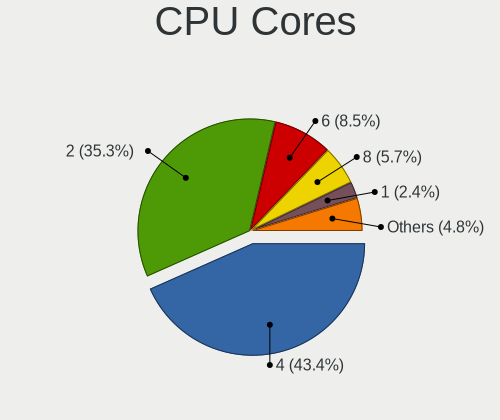

| Number | Desktops | Percent |
|--------|----------|---------|
| 4      | 382      | 43.36%  |
| 2      | 311      | 35.3%   |
| 6      | 75       | 8.51%   |
| 8      | 50       | 5.68%   |
| 1      | 21       | 2.38%   |
| 12     | 16       | 1.82%   |
| 3      | 11       | 1.25%   |
| 16     | 7        | 0.79%   |
| 10     | 3        | 0.34%   |
| 24     | 2        | 0.23%   |
| 20     | 2        | 0.23%   |
| 5      | 1        | 0.11%   |

CPU Sockets
-----------

Number of sockets

| Number | Desktops | Percent |
|--------|----------|---------|
| 1      | 861      | 98.18%  |
| 2      | 16       | 1.82%   |

CPU Threads
-----------

Threads per core (Hyper-Threading)

| Number | Desktops | Percent |
|--------|----------|---------|
| 1      | 489      | 55.63%  |
| 2      | 390      | 44.37%  |

CPU Op-Modes
------------

CPU Operation Modes (32-bit, 64-bit)

| Op mode        | Desktops | Percent |
|----------------|----------|---------|
| 32-bit, 64-bit | 876      | 99.89%  |
| Unknown        | 1        | 0.11%   |

CPU Microcode
-------------

Microcode number

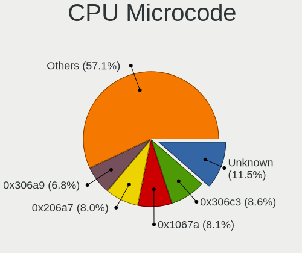

| Number     | Desktops | Percent |
|------------|----------|---------|
| Unknown    | 103      | 11.46%  |
| 0x306c3    | 77       | 8.57%   |
| 0x1067a    | 73       | 8.12%   |
| 0x206a7    | 72       | 8.01%   |
| 0x306a9    | 61       | 6.79%   |
| 0x506e3    | 36       | 4%      |
| 0x010000c8 | 30       | 3.34%   |
| 0x06000852 | 25       | 2.78%   |
| 0x08701021 | 21       | 2.34%   |
| 0x0800820d | 21       | 2.34%   |
| 0xa0653    | 20       | 2.22%   |
| 0x906e9    | 20       | 2.22%   |
| 0x906ea    | 18       | 2%      |
| 0x6fb      | 17       | 1.89%   |
| 0x6fd      | 15       | 1.67%   |
| 0x106e5    | 15       | 1.67%   |
| 0x10676    | 15       | 1.67%   |
| 0x08108109 | 14       | 1.56%   |
| 0x206d7    | 11       | 1.22%   |
| 0x106a5    | 10       | 1.11%   |
| 0x30679    | 9        | 1%      |
| 0x06001119 | 9        | 1%      |
| 0x010000db | 9        | 1%      |
| 0x6f6      | 8        | 0.89%   |
| 0x0700010f | 8        | 0.89%   |
| 0x306f2    | 7        | 0.78%   |
| 0x306e4    | 7        | 0.78%   |
| 0x20655    | 7        | 0.78%   |
| 0x08701013 | 7        | 0.78%   |
| 0x010000dc | 7        | 0.78%   |
| 0x010000c7 | 7        | 0.78%   |
| 0x906ed    | 6        | 0.67%   |
| 0x08001138 | 6        | 0.67%   |
| 0x406c3    | 5        | 0.56%   |
| 0x206c2    | 5        | 0.56%   |
| 0x20652    | 5        | 0.56%   |
| 0x08001137 | 5        | 0.56%   |
| 0x0600063e | 5        | 0.56%   |
| 0x03000027 | 5        | 0.56%   |
| 0xa0671    | 4        | 0.44%   |

CPU Microarch
-------------

Microarchitecture

| Name             | Desktops | Percent |
|------------------|----------|---------|
| Haswell          | 98       | 11.12%  |
| Penryn           | 94       | 10.67%  |
| SandyBridge      | 88       | 9.99%   |
| IvyBridge        | 74       | 8.4%    |
| K10              | 63       | 7.15%   |
| KabyLake         | 55       | 6.24%   |
| Core             | 48       | 5.45%   |
| Skylake          | 41       | 4.65%   |
| Zen+             | 35       | 3.97%   |
| Piledriver       | 35       | 3.97%   |
| Zen 2            | 34       | 3.86%   |
| Nehalem          | 26       | 2.95%   |
| CometLake        | 24       | 2.72%   |
| Silvermont       | 23       | 2.61%   |
| K8 Hammer        | 23       | 2.61%   |
| Zen              | 22       | 2.5%    |
| Westmere         | 18       | 2.04%   |
| NetBurst         | 11       | 1.25%   |
| Zen 3            | 10       | 1.14%   |
| Jaguar           | 8        | 0.91%   |
| Goldmont         | 6        | 0.68%   |
| Excavator        | 6        | 0.68%   |
| K10 Llano        | 5        | 0.57%   |
| Bulldozer        | 5        | 0.57%   |
| Bobcat           | 5        | 0.57%   |
| Unknown          | 5        | 0.57%   |
| Steamroller      | 4        | 0.45%   |
| Broadwell        | 4        | 0.45%   |
| Bonnell          | 4        | 0.45%   |
| Tremont          | 2        | 0.23%   |
| Puma             | 2        | 0.23%   |
| Icelake          | 1        | 0.11%   |
| Goldmont plus    | 1        | 0.11%   |
| Alderlake Hybrid | 1        | 0.11%   |

Graphics
--------

GPU Vendor
----------

Vendors of graphics cards

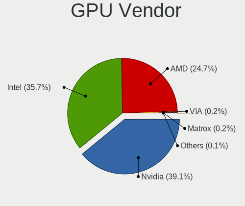

| Vendor                     | Desktops | Percent |
|----------------------------|----------|---------|
| Nvidia                     | 365      | 39.08%  |
| Intel                      | 333      | 35.65%  |
| AMD                        | 231      | 24.73%  |
| VIA Technologies           | 2        | 0.21%   |
| Matrox Electronics Systems | 2        | 0.21%   |
| ASPEED Technology          | 1        | 0.11%   |

GPU Model
---------

Graphics card models

| Model                                                                                    | Desktops | Percent |
|------------------------------------------------------------------------------------------|----------|---------|
| Intel 2nd Generation Core Processor Family Integrated Graphics Controller                | 43       | 4.44%   |
| Intel Xeon E3-1200 v3/4th Gen Core Processor Integrated Graphics Controller              | 42       | 4.33%   |
| Intel 4 Series Chipset Integrated Graphics Controller                                    | 38       | 3.92%   |
| AMD Ellesmere [Radeon RX 470/480/570/570X/580/580X/590]                                  | 32       | 3.3%    |
| Nvidia GK208B [GeForce GT 710]                                                           | 28       | 2.89%   |
| Nvidia GP107 [GeForce GTX 1050 Ti]                                                       | 27       | 2.79%   |
| Intel Xeon E3-1200 v2/3rd Gen Core processor Graphics Controller                         | 24       | 2.48%   |
| Intel 82G33/G31 Express Integrated Graphics Controller                                   | 24       | 2.48%   |
| Intel HD Graphics 530                                                                    | 19       | 1.96%   |
| Intel CometLake-S GT2 [UHD Graphics 630]                                                 | 19       | 1.96%   |
| Intel 4th Generation Core Processor Family Integrated Graphics Controller                | 18       | 1.86%   |
| Nvidia GT218 [GeForce 210]                                                               | 15       | 1.55%   |
| Intel Atom Processor Z36xxx/Z37xxx Series Graphics & Display                             | 15       | 1.55%   |
| AMD Cedar [Radeon HD 5000/6000/7350/8350 Series]                                         | 15       | 1.55%   |
| Nvidia GP108 [GeForce GT 1030]                                                           | 14       | 1.44%   |
| AMD Picasso/Raven 2 [Radeon Vega Series / Radeon Vega Mobile Series]                     | 14       | 1.44%   |
| Nvidia GF108 [GeForce GT 730]                                                            | 13       | 1.34%   |
| Intel CoffeeLake-S GT2 [UHD Graphics 630]                                                | 13       | 1.34%   |
| Intel IvyBridge GT2 [HD Graphics 4000]                                                   | 12       | 1.24%   |
| Nvidia GP104 [GeForce GTX 1070]                                                          | 10       | 1.03%   |
| Nvidia GF119 [GeForce GT 610]                                                            | 10       | 1.03%   |
| Nvidia GM204 [GeForce GTX 970]                                                           | 9        | 0.93%   |
| Nvidia GM107 [GeForce GTX 750 Ti]                                                        | 9        | 0.93%   |
| Intel Atom/Celeron/Pentium Processor x5-E8000/J3xxx/N3xxx Integrated Graphics Controller | 8        | 0.83%   |
| Intel 82Q35 Express Integrated Graphics Controller                                       | 8        | 0.83%   |
| Nvidia TU117 [GeForce GTX 1650]                                                          | 7        | 0.72%   |
| Nvidia G86 [GeForce 8500 GT]                                                             | 7        | 0.72%   |
| Nvidia C61 [GeForce 6150SE nForce 430]                                                   | 7        | 0.72%   |
| Intel 3rd Gen Core processor Graphics Controller                                         | 7        | 0.72%   |
| AMD RS880 [Radeon HD 4250]                                                               | 7        | 0.72%   |
| AMD Raven Ridge [Radeon Vega Series / Radeon Vega Mobile Series]                         | 7        | 0.72%   |
| Nvidia GF108 [GeForce GT 630]                                                            | 6        | 0.62%   |
| AMD Turks XT [Radeon HD 6670/7670]                                                       | 6        | 0.62%   |
| AMD Caicos [Radeon HD 6450/7450/8450 / R5 230 OEM]                                       | 6        | 0.62%   |
| Nvidia TU106 [GeForce RTX 2060 Rev. A]                                                   | 5        | 0.52%   |
| Nvidia GM206 [GeForce GTX 960]                                                           | 5        | 0.52%   |
| Nvidia C61 [GeForce 7025 / nForce 630a]                                                  | 5        | 0.52%   |
| Intel HD Graphics 630                                                                    | 5        | 0.52%   |
| AMD RV710 [Radeon HD 4350/4550]                                                          | 5        | 0.52%   |
| AMD RS880 [Radeon HD 4200]                                                               | 5        | 0.52%   |

GPU Combo
---------

Combinations of graphics cards

| Name                     | Desktops | Percent |
|--------------------------|----------|---------|
| 1 x Nvidia               | 336      | 37.92%  |
| 1 x Intel                | 294      | 33.18%  |
| 1 x AMD                  | 203      | 22.91%  |
| 2 x AMD                  | 15       | 1.69%   |
| Intel + Nvidia           | 15       | 1.69%   |
| Intel + AMD              | 5        | 0.56%   |
| 2 x Nvidia               | 4        | 0.45%   |
| AMD + Nvidia             | 4        | 0.45%   |
| Other                    | 3        | 0.34%   |
| 1 x VIA                  | 2        | 0.23%   |
| 1 x Matrox               | 2        | 0.23%   |
| 2 x AMD + 1 x Nvidia     | 1        | 0.11%   |
| Nvidia + ASPEED          | 1        | 0.11%   |
| Intel + AMD + 1 x Nvidia | 1        | 0.11%   |

GPU Driver
----------

Free vs proprietary

| Driver      | Desktops | Percent |
|-------------|----------|---------|
| Free        | 620      | 69.98%  |
| Proprietary | 237      | 26.75%  |
| Unknown     | 29       | 3.27%   |

GPU Memory
----------

Total video memory

| Size in GB | Desktops | Percent |
|------------|----------|---------|
| Unknown    | 352      | 39.29%  |
| 1.01-2.0   | 139      | 15.51%  |
| 0.51-1.0   | 136      | 15.18%  |
| 0.01-0.5   | 122      | 13.62%  |
| 3.01-4.0   | 75       | 8.37%   |
| 7.01-8.0   | 40       | 4.46%   |
| 5.01-6.0   | 13       | 1.45%   |
| 2.01-3.0   | 8        | 0.89%   |
| 8.01-16.0  | 8        | 0.89%   |
| 4.01-5.0   | 2        | 0.22%   |
| 16.01-24.0 | 1        | 0.11%   |

Monitor
-------

Monitor Vendor
--------------

Monitor vendors

| Vendor                  | Desktops | Percent |
|-------------------------|----------|---------|
| Samsung Electronics     | 137      | 15.07%  |
| Dell                    | 104      | 11.44%  |
| Hewlett-Packard         | 73       | 8.03%   |
| Goldstar                | 65       | 7.15%   |
| Acer                    | 63       | 6.93%   |
| AOC                     | 48       | 5.28%   |
| Philips                 | 46       | 5.06%   |
| Ancor Communications    | 39       | 4.29%   |
| BenQ                    | 29       | 3.19%   |
| LG Electronics          | 25       | 2.75%   |
| Unknown                 | 23       | 2.53%   |
| ViewSonic               | 20       | 2.2%    |
| Sony                    | 17       | 1.87%   |
| Fujitsu Siemens         | 16       | 1.76%   |
| Iiyama                  | 15       | 1.65%   |
| HannStar                | 12       | 1.32%   |
| Panasonic               | 11       | 1.21%   |
| Packard Bell            | 10       | 1.1%    |
| Eizo                    | 10       | 1.1%    |
| PKB                     | 9        | 0.99%   |
| NEC Computers           | 9        | 0.99%   |
| Medion                  | 8        | 0.88%   |
| Lenovo                  | 7        | 0.77%   |
| Vestel Elektronik       | 6        | 0.66%   |
| ASUSTek Computer        | 6        | 0.66%   |
| Vizio                   | 4        | 0.44%   |
| Idek Iiyama             | 4        | 0.44%   |
| Sharp                   | 3        | 0.33%   |
| ONN                     | 3        | 0.33%   |
| MStar                   | 3        | 0.33%   |
| Lenovo Group Limited    | 3        | 0.33%   |
| Haier                   | 3        | 0.33%   |
| Gateway                 | 3        | 0.33%   |
| Chi Mei Optoelectronics | 3        | 0.33%   |
| AGO                     | 3        | 0.33%   |
| Tech Concepts           | 2        | 0.22%   |
| OEM                     | 2        | 0.22%   |
| IOD                     | 2        | 0.22%   |
| Insignia                | 2        | 0.22%   |
| IBM                     | 2        | 0.22%   |

Monitor Model
-------------

Monitor models

| Model                                                                  | Desktops | Percent |
|------------------------------------------------------------------------|----------|---------|
| AOC 24G2W1G5 AOC2402 1920x1080 527x296mm 23.8-inch                     | 15       | 1.56%   |
| PKB LCD Monitor Viseo223DX 1920x1080                                   | 9        | 0.94%   |
| Packard Bell Viseo223DX PKB0385 1920x1080 477x268mm 21.5-inch          | 8        | 0.83%   |
| Ancor Communications ASUS VS197 ACI19F2 1366x768 410x230mm 18.5-inch   | 8        | 0.83%   |
| Panasonic TV MEIA296 1920x1080 698x392mm 31.5-inch                     | 7        | 0.73%   |
| Goldstar W1943 GSM4BAD 1360x768 406x229mm 18.4-inch                    | 7        | 0.73%   |
| Vestel Elektronik 49FHD_LCD_TV VES3700 1920x1080 1280x720mm 57.8-inch  | 6        | 0.62%   |
| Unknown LCD Monitor SAMSUNG 1920x1080                                  | 5        | 0.52%   |
| Samsung Electronics U28E590 SAM0C4D 3840x2160 607x345mm 27.5-inch      | 3        | 0.31%   |
| Samsung Electronics S24F350 SAM0D20 1920x1080 521x293mm 23.5-inch      | 3        | 0.31%   |
| Samsung Electronics S22F350 SAM0D1A 1920x1080 477x268mm 21.5-inch      | 3        | 0.31%   |
| Samsung Electronics LCD Monitor SyncMaster 1280x1024                   | 3        | 0.31%   |
| Philips PHL 243V5 PHLC0D1 1920x1080 521x293mm 23.5-inch                | 3        | 0.31%   |
| Philips 196VL PHLC07F 1366x768 409x230mm 18.5-inch                     | 3        | 0.31%   |
| MStar Demo MST0030 1920x1080 708x398mm 32.0-inch                       | 3        | 0.31%   |
| Hewlett-Packard P19A HWP3087 1280x1024 338x270mm 17.0-inch             | 3        | 0.31%   |
| Hewlett-Packard LE1901w HWP2842 1440x900 410x256mm 19.0-inch           | 3        | 0.31%   |
| Goldstar IPS FULLHD GSM5AB8 1920x1080 480x270mm 21.7-inch              | 3        | 0.31%   |
| Dell U2412M DELA07A 1920x1200 518x324mm 24.1-inch                      | 3        | 0.31%   |
| Dell S2721DS DELA19D 2560x1440 597x336mm 27.0-inch                     | 3        | 0.31%   |
| Dell 1908FP DEL4026 1280x1024 376x301mm 19.0-inch                      | 3        | 0.31%   |
| AOC 1950W AOC1950 1366x768 410x230mm 18.5-inch                         | 3        | 0.31%   |
| Ancor Communications ASUS VS247 ACI249A 1920x1080 521x293mm 23.5-inch  | 3        | 0.31%   |
| ViewSonic VX2250 SERIES VSCCB25 1920x1080 477x268mm 21.5-inch          | 2        | 0.21%   |
| Unknown LCD Monitor SAMSUNG 3840x1080                                  | 2        | 0.21%   |
| Samsung Electronics U32J59x SAM0F33 3840x2160 697x392mm 31.5-inch      | 2        | 0.21%   |
| Samsung Electronics SyncMaster SAM03C2 1680x1050 440x300mm 21.0-inch   | 2        | 0.21%   |
| Samsung Electronics SyncMaster SAM0226 1440x900 410x257mm 19.1-inch    | 2        | 0.21%   |
| Samsung Electronics SyncMaster SAM01E1 1280x1024 376x301mm 19.0-inch   | 2        | 0.21%   |
| Samsung Electronics SMS24A450 SAM083A 1920x1200 518x324mm 24.1-inch    | 2        | 0.21%   |
| Samsung Electronics S24F350 SAM0D21 1920x1080 521x293mm 23.5-inch      | 2        | 0.21%   |
| Samsung Electronics S24D332 SAM0F5E 1920x1080 531x299mm 24.0-inch      | 2        | 0.21%   |
| Samsung Electronics S22E390 SAM0C18 1920x1080 477x268mm 21.5-inch      | 2        | 0.21%   |
| Samsung Electronics S22D390 SAM0B63 1920x1080 477x268mm 21.5-inch      | 2        | 0.21%   |
| Samsung Electronics S22D300 SAM0B3F 1920x1080 477x268mm 21.5-inch      | 2        | 0.21%   |
| Samsung Electronics LS32R75 SAM0F92 3840x2160 697x392mm 31.5-inch      | 2        | 0.21%   |
| Samsung Electronics LCD Monitor SyncMaster 1920x1080                   | 2        | 0.21%   |
| Samsung Electronics LCD Monitor SyncMaster 1680x1050                   | 2        | 0.21%   |
| Samsung Electronics LCD Monitor SyncMaster                             | 2        | 0.21%   |
| Samsung Electronics LCD Monitor SAM0A7D 1920x1080 1060x626mm 48.5-inch | 2        | 0.21%   |

Monitor Resolution
------------------

Monitor screen resolution

| Resolution         | Desktops | Percent |
|--------------------|----------|---------|
| 1920x1080 (FHD)    | 360      | 40.45%  |
| 1280x1024 (SXGA)   | 92       | 10.34%  |
| 1366x768 (WXGA)    | 52       | 5.84%   |
| 3840x2160 (4K)     | 50       | 5.62%   |
| 1680x1050 (WSXGA+) | 47       | 5.28%   |
| 2560x1440 (QHD)    | 45       | 5.06%   |
| 1440x900 (WXGA+)   | 44       | 4.94%   |
| Unknown            | 37       | 4.16%   |
| 1920x1200 (WUXGA)  | 36       | 4.04%   |
| 1600x900 (HD+)     | 26       | 2.92%   |
| 1360x768           | 20       | 2.25%   |
| 3840x1080          | 11       | 1.24%   |
| 1600x1200          | 10       | 1.12%   |
| 1024x768 (XGA)     | 9        | 1.01%   |
| 3440x1440          | 5        | 0.56%   |
| 1280x720 (HD)      | 5        | 0.56%   |
| 5120x1440          | 4        | 0.45%   |
| 2560x1080          | 4        | 0.45%   |
| 1920x540           | 4        | 0.45%   |
| 3200x1080          | 3        | 0.34%   |
| 3840x1200          | 2        | 0.22%   |
| 3286x1080          | 2        | 0.22%   |
| 3200x900           | 2        | 0.22%   |
| 2960x1050          | 2        | 0.22%   |
| 2560x1600          | 2        | 0.22%   |
| 7680x1080          | 1        | 0.11%   |
| 7360x1200          | 1        | 0.11%   |
| 6400x1440          | 1        | 0.11%   |
| 5760x2160          | 1        | 0.11%   |
| 5760x1200          | 1        | 0.11%   |
| 5440x1200          | 1        | 0.11%   |
| 5280x2160          | 1        | 0.11%   |
| 4480x1440          | 1        | 0.11%   |
| 3600x1080          | 1        | 0.11%   |
| 3360x1080          | 1        | 0.11%   |
| 3280x1080          | 1        | 0.11%   |
| 3200x1024          | 1        | 0.11%   |
| 2640x768           | 1        | 0.11%   |
| 2288x1287          | 1        | 0.11%   |
| 2048x1152          | 1        | 0.11%   |

Monitor Diagonal
----------------

Diagonal size in inches

| Inches  | Desktops | Percent |
|---------|----------|---------|
| Unknown | 156      | 17.59%  |
| 24      | 103      | 11.61%  |
| 23      | 87       | 9.81%   |
| 21      | 84       | 9.47%   |
| 19      | 82       | 9.24%   |
| 27      | 64       | 7.22%   |
| 18      | 52       | 5.86%   |
| 17      | 46       | 5.19%   |
| 20      | 37       | 4.17%   |
| 31      | 29       | 3.27%   |
| 22      | 29       | 3.27%   |
| 84      | 15       | 1.69%   |
| 15      | 13       | 1.47%   |
| 32      | 9        | 1.01%   |
| 72      | 8        | 0.9%    |
| 40      | 7        | 0.79%   |
| 34      | 7        | 0.79%   |
| 25      | 6        | 0.68%   |
| 54      | 5        | 0.56%   |
| 52      | 5        | 0.56%   |
| 28      | 5        | 0.56%   |
| 26      | 5        | 0.56%   |
| 14      | 4        | 0.45%   |
| 48      | 3        | 0.34%   |
| 46      | 3        | 0.34%   |
| 37      | 3        | 0.34%   |
| 13      | 3        | 0.34%   |
| 29      | 2        | 0.23%   |
| 12      | 2        | 0.23%   |
| 142     | 1        | 0.11%   |
| 69      | 1        | 0.11%   |
| 65      | 1        | 0.11%   |
| 60      | 1        | 0.11%   |
| 57      | 1        | 0.11%   |
| 49      | 1        | 0.11%   |
| 42      | 1        | 0.11%   |
| 41      | 1        | 0.11%   |
| 39      | 1        | 0.11%   |
| 38      | 1        | 0.11%   |
| 36      | 1        | 0.11%   |

Monitor Width
-------------

Physical width

| Width in mm    | Desktops | Percent |
|----------------|----------|---------|
| 501-600        | 248      | 28.47%  |
| 401-500        | 233      | 26.75%  |
| Unknown        | 156      | 17.91%  |
| 301-350        | 57       | 6.54%   |
| 351-400        | 51       | 5.86%   |
| 601-700        | 41       | 4.71%   |
| 1501-2000      | 24       | 2.76%   |
| 1001-1500      | 19       | 2.18%   |
| 701-800        | 17       | 1.95%   |
| 801-900        | 12       | 1.38%   |
| 201-300        | 10       | 1.15%   |
| 901-1000       | 2        | 0.23%   |
| More than 2000 | 1        | 0.11%   |

Aspect Ratio
------------

Proportional relationship between the width and the height

| Ratio   | Desktops | Percent |
|---------|----------|---------|
| 16/9    | 454      | 53.73%  |
| Unknown | 148      | 17.51%  |
| 16/10   | 117      | 13.85%  |
| 5/4     | 87       | 10.3%   |
| 4/3     | 22       | 2.6%    |
| 21/9    | 7        | 0.83%   |
| 3/2     | 4        | 0.47%   |
| 6/5     | 3        | 0.36%   |
| 1.00    | 2        | 0.24%   |
| 1.96    | 1        | 0.12%   |

Monitor Area
------------

Area in inch

| Area in inch | Desktops | Percent |
|----------------|----------|---------|
| 201-250        | 230      | 26.23%  |
| Unknown        | 156      | 17.79%  |
| 151-200        | 143      | 16.31%  |
| 141-150        | 85       | 9.69%   |
| 301-350        | 66       | 7.53%   |
| 251-300        | 60       | 6.84%   |
| 351-500        | 50       | 5.7%    |
| More than 1000 | 41       | 4.68%   |
| 501-1000       | 19       | 2.17%   |
| 101-110        | 16       | 1.82%   |
| 131-140        | 4        | 0.46%   |
| 71-80          | 3        | 0.34%   |
| 81-90          | 2        | 0.23%   |
| 51-60          | 1        | 0.11%   |
| 91-100         | 1        | 0.11%   |

Pixel Density
-------------

Pixels per inch

| Density | Desktops | Percent |
|---------|----------|---------|
| 51-100  | 508      | 60.55%  |
| Unknown | 156      | 18.59%  |
| 101-120 | 108      | 12.87%  |
| 1-50    | 36       | 4.29%   |
| 121-160 | 27       | 3.22%   |
| 161-240 | 4        | 0.48%   |

Multiple Monitors
-----------------

Total monitors connected

| Total | Desktops | Percent |
|-------|----------|---------|
| 1     | 717      | 80.38%  |
| 2     | 118      | 13.23%  |
| 0     | 45       | 5.04%   |
| 3     | 10       | 1.12%   |
| 4     | 2        | 0.22%   |

Network
-------

Net Controller Vendor
---------------------

Controller vendors

| Vendor                            | Desktops | Percent |
|-----------------------------------|----------|---------|
| Realtek Semiconductor             | 533      | 43.26%  |
| Intel                             | 317      | 25.73%  |
| Qualcomm Atheros                  | 81       | 6.57%   |
| Broadcom                          | 47       | 3.81%   |
| Nvidia                            | 38       | 3.08%   |
| Ralink Technology                 | 27       | 2.19%   |
| TP-Link                           | 25       | 2.03%   |
| Ralink                            | 14       | 1.14%   |
| Qualcomm Atheros Communications   | 14       | 1.14%   |
| Marvell Technology Group          | 13       | 1.06%   |
| D-Link System                     | 12       | 0.97%   |
| NetGear                           | 11       | 0.89%   |
| D-Link                            | 11       | 0.89%   |
| Broadcom Limited                  | 8        | 0.65%   |
| VIA Technologies                  | 7        | 0.57%   |
| Huawei Technologies               | 7        | 0.57%   |
| Belkin Components                 | 6        | 0.49%   |
| Edimax Technology                 | 5        | 0.41%   |
| ASUSTek Computer                  | 5        | 0.41%   |
| Samsung Electronics               | 4        | 0.32%   |
| Microsoft                         | 4        | 0.32%   |
| MediaTek                          | 4        | 0.32%   |
| Linksys                           | 4        | 0.32%   |
| Qualcomm                          | 3        | 0.24%   |
| AVM                               | 3        | 0.24%   |
| Aquantia                          | 3        | 0.24%   |
| Xiaomi                            | 2        | 0.16%   |
| TRENDnet                          | 2        | 0.16%   |
| QinHeng Electronics               | 2        | 0.16%   |
| IMC Networks                      | 2        | 0.16%   |
| Arduino SA                        | 2        | 0.16%   |
| 3Com                              | 2        | 0.16%   |
| ZyXEL Communications              | 1        | 0.08%   |
| Van Ooijen Technische Informatica | 1        | 0.08%   |
| STMicroelectronics                | 1        | 0.08%   |
| Philips (or NXP)                  | 1        | 0.08%   |
| Motorola                          | 1        | 0.08%   |
| Mellanox Technologies             | 1        | 0.08%   |
| Manta                             | 1        | 0.08%   |
| LSI                               | 1        | 0.08%   |

Net Controller Model
--------------------

Controller models

| Model                                                                  | Desktops | Percent |
|------------------------------------------------------------------------|----------|---------|
| Realtek RTL8111/8168/8211/8411 PCI Express Gigabit Ethernet Controller | 427      | 31.99%  |
| Intel 82579LM Gigabit Network Connection (Lewisville)                  | 48       | 3.6%    |
| Realtek RTL810xE PCI Express Fast Ethernet controller                  | 32       | 2.4%    |
| Intel I211 Gigabit Network Connection                                  | 26       | 1.95%   |
| Intel Ethernet Connection I217-LM                                      | 25       | 1.87%   |
| Intel Ethernet Connection (2) I219-V                                   | 25       | 1.87%   |
| Nvidia MCP61 Ethernet                                                  | 22       | 1.65%   |
| Intel 82567LM-3 Gigabit Network Connection                             | 22       | 1.65%   |
| Intel Wi-Fi 6 AX200                                                    | 20       | 1.5%    |
| Intel 82579V Gigabit Network Connection                                | 20       | 1.5%    |
| Realtek RTL8188EUS 802.11n Wireless Network Adapter                    | 14       | 1.05%   |
| Ralink MT7601U Wireless Adapter                                        | 14       | 1.05%   |
| Realtek RTL8125 2.5GbE Controller                                      | 13       | 0.97%   |
| Intel 82574L Gigabit Network Connection                                | 13       | 0.97%   |
| Qualcomm Atheros AR9271 802.11n                                        | 12       | 0.9%    |
| Intel 82566DM-2 Gigabit Network Connection                             | 12       | 0.9%    |
| Realtek RTL-8100/8101L/8139 PCI Fast Ethernet Adapter                  | 11       | 0.82%   |
| Intel Ethernet Connection I217-V                                       | 11       | 0.82%   |
| Intel Ethernet Connection (7) I219-V                                   | 10       | 0.75%   |
| Realtek RTL88x2bu [AC1200 Techkey]                                     | 9        | 0.67%   |
| Realtek RTL8192CU 802.11n WLAN Adapter                                 | 9        | 0.67%   |
| Realtek RTL8188CUS 802.11n WLAN Adapter                                | 9        | 0.67%   |
| Intel Ethernet Connection (2) I219-LM                                  | 9        | 0.67%   |
| Intel Ethernet Connection (2) I218-V                                   | 9        | 0.67%   |
| TP-Link TL-WN823N v2/v3 [Realtek RTL8192EU]                            | 8        | 0.6%    |
| Qualcomm Atheros AR9485 Wireless Network Adapter                       | 8        | 0.6%    |
| Nvidia MCP77 Ethernet                                                  | 8        | 0.6%    |
| Marvell Group 88E8056 PCI-E Gigabit Ethernet Controller                | 8        | 0.6%    |
| Qualcomm Atheros Killer E220x Gigabit Ethernet Controller              | 7        | 0.52%   |
| Intel Dual Band Wireless-AC 3168NGW [Stone Peak]                       | 7        | 0.52%   |
| VIA VT6102/VT6103 [Rhine-II]                                           | 6        | 0.45%   |
| TP-Link TL-WN722N v2/v3 [Realtek RTL8188EUS]                           | 6        | 0.45%   |
| Qualcomm Atheros Attansic L1 Gigabit Ethernet                          | 6        | 0.45%   |
| Qualcomm Atheros AR9462 Wireless Network Adapter                       | 6        | 0.45%   |
| Intel Wi-Fi 5(802.11ac) Wireless-AC 9x6x [Thunder Peak]                | 6        | 0.45%   |
| Broadcom NetLink BCM57780 Gigabit Ethernet PCIe                        | 6        | 0.45%   |
| Broadcom BCM4352 802.11ac Dual Band Wireless Network Adapter           | 6        | 0.45%   |
| Realtek RTL8192EU 802.11b/g/n WLAN Adapter                             | 5        | 0.37%   |
| Qualcomm Atheros AR9287 Wireless Network Adapter (PCI-Express)         | 5        | 0.37%   |
| Qualcomm Atheros AR8151 v2.0 Gigabit Ethernet                          | 5        | 0.37%   |

Wireless Vendor
---------------

Wireless vendors

| Vendor                                | Desktops | Percent |
|---------------------------------------|----------|---------|
| Realtek Semiconductor                 | 90       | 24.59%  |
| Intel                                 | 60       | 16.39%  |
| Qualcomm Atheros                      | 50       | 13.66%  |
| Ralink Technology                     | 27       | 7.38%   |
| TP-Link                               | 25       | 6.83%   |
| Broadcom                              | 18       | 4.92%   |
| Ralink                                | 14       | 3.83%   |
| Qualcomm Atheros Communications       | 14       | 3.83%   |
| NetGear                               | 11       | 3.01%   |
| D-Link                                | 11       | 3.01%   |
| D-Link System                         | 8        | 2.19%   |
| Belkin Components                     | 6        | 1.64%   |
| Edimax Technology                     | 5        | 1.37%   |
| ASUSTek Computer                      | 5        | 1.37%   |
| Microsoft                             | 4        | 1.09%   |
| Linksys                               | 4        | 1.09%   |
| Broadcom Limited                      | 3        | 0.82%   |
| AVM                                   | 3        | 0.82%   |
| TRENDnet                              | 2        | 0.55%   |
| IMC Networks                          | 2        | 0.55%   |
| ZyXEL Communications                  | 1        | 0.27%   |
| Philips (or NXP)                      | 1        | 0.27%   |
| Marvell Technology Group              | 1        | 0.27%   |
| 802.11g Adapter [Linksys WUSB54GC v3] | 1        | 0.27%   |

Wireless Model
--------------

Wireless models

| Model                                                                        | Desktops | Percent |
|------------------------------------------------------------------------------|----------|---------|
| Intel Wi-Fi 6 AX200                                                          | 20       | 5.42%   |
| Realtek RTL8188EUS 802.11n Wireless Network Adapter                          | 14       | 3.79%   |
| Ralink MT7601U Wireless Adapter                                              | 14       | 3.79%   |
| Qualcomm Atheros AR9271 802.11n                                              | 12       | 3.25%   |
| Realtek RTL88x2bu [AC1200 Techkey]                                           | 9        | 2.44%   |
| Realtek RTL8192CU 802.11n WLAN Adapter                                       | 9        | 2.44%   |
| Realtek RTL8188CUS 802.11n WLAN Adapter                                      | 9        | 2.44%   |
| TP-Link TL-WN823N v2/v3 [Realtek RTL8192EU]                                  | 8        | 2.17%   |
| Qualcomm Atheros AR9485 Wireless Network Adapter                             | 8        | 2.17%   |
| Intel Dual Band Wireless-AC 3168NGW [Stone Peak]                             | 7        | 1.9%    |
| TP-Link TL-WN722N v2/v3 [Realtek RTL8188EUS]                                 | 6        | 1.63%   |
| Qualcomm Atheros AR9462 Wireless Network Adapter                             | 6        | 1.63%   |
| Intel Wi-Fi 5(802.11ac) Wireless-AC 9x6x [Thunder Peak]                      | 6        | 1.63%   |
| Broadcom BCM4352 802.11ac Dual Band Wireless Network Adapter                 | 6        | 1.63%   |
| Realtek RTL8192EU 802.11b/g/n WLAN Adapter                                   | 5        | 1.36%   |
| Qualcomm Atheros AR9287 Wireless Network Adapter (PCI-Express)               | 5        | 1.36%   |
| NetGear A6210                                                                | 5        | 1.36%   |
| Intel Wireless 8260                                                          | 5        | 1.36%   |
| Broadcom BCM4360 802.11ac Dual Band Wireless Network Adapter                 | 5        | 1.36%   |
| Realtek RTL8812AE 802.11ac PCIe Wireless Network Adapter                     | 4        | 1.08%   |
| Realtek RTL8192EE PCIe Wireless Network Adapter                              | 4        | 1.08%   |
| Realtek RTL8188FTV 802.11b/g/n 1T1R 2.4G WLAN Adapter                        | 4        | 1.08%   |
| Realtek RTL8188EE Wireless Network Adapter                                   | 4        | 1.08%   |
| Qualcomm Atheros AR93xx Wireless Network Adapter                             | 4        | 1.08%   |
| Qualcomm Atheros AR928X Wireless Network Adapter (PCI-Express)               | 4        | 1.08%   |
| Qualcomm Atheros AR9227 Wireless Network Adapter                             | 4        | 1.08%   |
| Intel Wireless 3160                                                          | 4        | 1.08%   |
| Intel Cannon Lake PCH CNVi WiFi                                              | 4        | 1.08%   |
| Realtek RTL8821CE 802.11ac PCIe Wireless Network Adapter                     | 3        | 0.81%   |
| Realtek RTL8821AE 802.11ac PCIe Wireless Network Adapter                     | 3        | 0.81%   |
| Realtek RTL8188SU 802.11n WLAN Adapter                                       | 3        | 0.81%   |
| Ralink RT2870/RT3070 Wireless Adapter                                        | 3        | 0.81%   |
| Ralink RT2790 Wireless 802.11n 1T/2R PCIe                                    | 3        | 0.81%   |
| Qualcomm Atheros QCA6174 802.11ac Wireless Network Adapter                   | 3        | 0.81%   |
| Qualcomm Atheros AR9285 Wireless Network Adapter (PCI-Express)               | 3        | 0.81%   |
| Intel Wireless 7260                                                          | 3        | 0.81%   |
| Intel Wireless 3165                                                          | 3        | 0.81%   |
| D-Link DWA-160 802.11abgn Xtreme N Dual Band Adapter(rev.B2) [Ralink RT5572] | 3        | 0.81%   |
| TP-Link TL-WN821N v5/v6 [RTL8192EU]                                          | 2        | 0.54%   |
| TP-Link 802.11ac NIC                                                         | 2        | 0.54%   |

Ethernet Vendor
---------------

Ethernet vendors

| Vendor                   | Desktops | Percent |
|--------------------------|----------|---------|
| Realtek Semiconductor    | 488      | 52.59%  |
| Intel                    | 280      | 30.17%  |
| Nvidia                   | 38       | 4.09%   |
| Qualcomm Atheros         | 37       | 3.99%   |
| Broadcom                 | 30       | 3.23%   |
| Marvell Technology Group | 12       | 1.29%   |
| VIA Technologies         | 7        | 0.75%   |
| Huawei Technologies      | 5        | 0.54%   |
| Broadcom Limited         | 5        | 0.54%   |
| MediaTek                 | 4        | 0.43%   |
| D-Link System            | 4        | 0.43%   |
| Qualcomm                 | 3        | 0.32%   |
| Aquantia                 | 3        | 0.32%   |
| Xiaomi                   | 2        | 0.22%   |
| Samsung Electronics      | 2        | 0.22%   |
| 3Com                     | 2        | 0.22%   |
| Mellanox Technologies    | 1        | 0.11%   |
| LG Electronics           | 1        | 0.11%   |
| JMicron Technology       | 1        | 0.11%   |
| DisplayLink              | 1        | 0.11%   |
| Apple                    | 1        | 0.11%   |
| Accton Technology        | 1        | 0.11%   |

Ethernet Model
--------------

Ethernet models

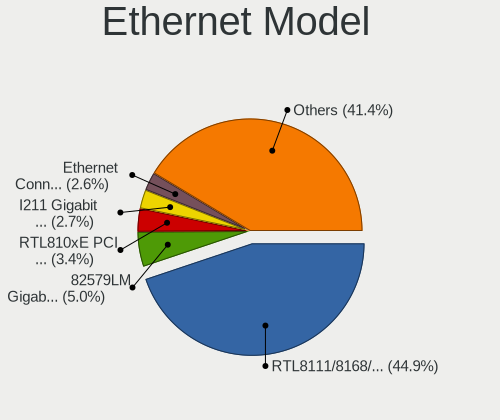

| Model                                                                  | Desktops | Percent |
|------------------------------------------------------------------------|----------|---------|
| Realtek RTL8111/8168/8211/8411 PCI Express Gigabit Ethernet Controller | 427      | 44.85%  |
| Intel 82579LM Gigabit Network Connection (Lewisville)                  | 48       | 5.04%   |
| Realtek RTL810xE PCI Express Fast Ethernet controller                  | 32       | 3.36%   |
| Intel I211 Gigabit Network Connection                                  | 26       | 2.73%   |
| Intel Ethernet Connection I217-LM                                      | 25       | 2.63%   |
| Intel Ethernet Connection (2) I219-V                                   | 25       | 2.63%   |
| Nvidia MCP61 Ethernet                                                  | 22       | 2.31%   |
| Intel 82567LM-3 Gigabit Network Connection                             | 22       | 2.31%   |
| Intel 82579V Gigabit Network Connection                                | 20       | 2.1%    |
| Realtek RTL8125 2.5GbE Controller                                      | 13       | 1.37%   |
| Intel 82574L Gigabit Network Connection                                | 13       | 1.37%   |
| Intel 82566DM-2 Gigabit Network Connection                             | 12       | 1.26%   |
| Realtek RTL-8100/8101L/8139 PCI Fast Ethernet Adapter                  | 11       | 1.16%   |
| Intel Ethernet Connection I217-V                                       | 11       | 1.16%   |
| Intel Ethernet Connection (7) I219-V                                   | 10       | 1.05%   |
| Intel Ethernet Connection (2) I219-LM                                  | 9        | 0.95%   |
| Intel Ethernet Connection (2) I218-V                                   | 9        | 0.95%   |
| Nvidia MCP77 Ethernet                                                  | 8        | 0.84%   |
| Marvell Group 88E8056 PCI-E Gigabit Ethernet Controller                | 8        | 0.84%   |
| Qualcomm Atheros Killer E220x Gigabit Ethernet Controller              | 7        | 0.74%   |
| VIA VT6102/VT6103 [Rhine-II]                                           | 6        | 0.63%   |
| Qualcomm Atheros Attansic L1 Gigabit Ethernet                          | 6        | 0.63%   |
| Broadcom NetLink BCM57780 Gigabit Ethernet PCIe                        | 6        | 0.63%   |
| Qualcomm Atheros AR8151 v2.0 Gigabit Ethernet                          | 5        | 0.53%   |
| Intel I210 Gigabit Network Connection                                  | 5        | 0.53%   |
| Intel 82578DC Gigabit Network Connection                               | 5        | 0.53%   |
| Broadcom NetXtreme BCM5754 Gigabit Ethernet PCI Express                | 5        | 0.53%   |
| Realtek RTL8169 PCI Gigabit Ethernet Controller                        | 4        | 0.42%   |
| Qualcomm Atheros QCA8171 Gigabit Ethernet                              | 4        | 0.42%   |
| Qualcomm Atheros AR8121/AR8113/AR8114 Gigabit or Fast Ethernet         | 4        | 0.42%   |
| Intel 82566DC-2 Gigabit Network Connection                             | 4        | 0.42%   |
| Realtek RTL8153 Gigabit Ethernet Adapter                               | 3        | 0.32%   |
| Qualcomm Atheros AR8152 v2.0 Fast Ethernet                             | 3        | 0.32%   |
| Qualcomm Atheros AR8131 Gigabit Ethernet                               | 3        | 0.32%   |
| Qualcomm Airtel 4G                                                     | 3        | 0.32%   |
| Nvidia MCP51 Ethernet Controller                                       | 3        | 0.32%   |
| MediaTek Infinix SMART 5                                               | 3        | 0.32%   |
| Intel Ethernet Connection (5) I219-LM                                  | 3        | 0.32%   |
| Intel Ethernet Connection (11) I219-V                                  | 3        | 0.32%   |
| Intel 82578DM Gigabit Network Connection                               | 3        | 0.32%   |

Net Controller Kind
-------------------

Ethernet, WiFi or modem

| Kind     | Desktops | Percent |
|----------|----------|---------|
| Ethernet | 871      | 71.45%  |
| WiFi     | 334      | 27.4%   |
| Modem    | 12       | 0.98%   |
| Unknown  | 2        | 0.16%   |

Used Controller
---------------

Currently used network controller

| Kind     | Desktops | Percent |
|----------|----------|---------|
| Ethernet | 690      | 75.99%  |
| WiFi     | 218      | 24.01%  |

NICs
----

Total network controllers on board

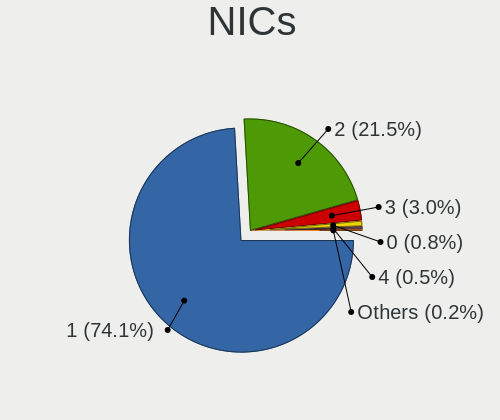

| Total | Desktops | Percent |
|-------|----------|---------|
| 1     | 652      | 74.09%  |
| 2     | 189      | 21.48%  |
| 3     | 26       | 2.95%   |
| 0     | 7        | 0.8%    |
| 4     | 4        | 0.45%   |
| 10    | 1        | 0.11%   |
| 5     | 1        | 0.11%   |

IPv6
----

IPv6 vs IPv4

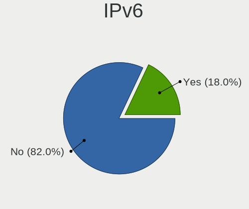

| Used | Desktops | Percent |
|------|----------|---------|
| No   | 731      | 82.04%  |
| Yes  | 160      | 17.96%  |

Bluetooth
---------

Bluetooth Vendor
----------------

Controller vendors

| Vendor                          | Desktops | Percent |
|---------------------------------|----------|---------|
| Intel                           | 58       | 32.58%  |
| Cambridge Silicon Radio         | 45       | 25.28%  |
| Broadcom                        | 19       | 10.67%  |
| Qualcomm Atheros Communications | 13       | 7.3%    |
| ASUSTek Computer                | 9        | 5.06%   |
| Realtek Semiconductor           | 8        | 4.49%   |
| Integrated System Solution      | 5        | 2.81%   |
| IMC Networks                    | 5        | 2.81%   |
| Apple                           | 3        | 1.69%   |
| TP-Link                         | 2        | 1.12%   |
| Lite-On Technology              | 2        | 1.12%   |
| Edimax Technology               | 2        | 1.12%   |
| SiW                             | 1        | 0.56%   |
| Sitecom Europe                  | 1        | 0.56%   |
| Hewlett-Packard                 | 1        | 0.56%   |
| Fujitsu                         | 1        | 0.56%   |
| Dell                            | 1        | 0.56%   |
| Conwise Technology              | 1        | 0.56%   |
| Unknown                         | 1        | 0.56%   |

Bluetooth Model
---------------

Controller models

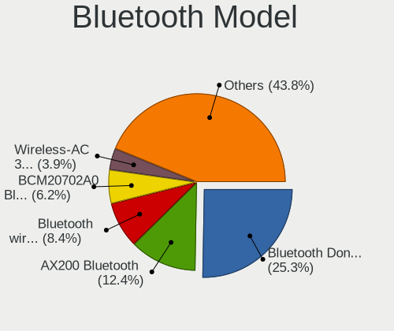

| Model                                                     | Desktops | Percent |
|-----------------------------------------------------------|----------|---------|
| Cambridge Silicon Radio Bluetooth Dongle (HCI mode)       | 45       | 25.28%  |
| Intel AX200 Bluetooth                                     | 22       | 12.36%  |
| Intel Bluetooth wireless interface                        | 15       | 8.43%   |
| Broadcom BCM20702A0 Bluetooth 4.0                         | 11       | 6.18%   |
| Intel Wireless-AC 3168 Bluetooth                          | 7        | 3.93%   |
| Qualcomm Atheros  Bluetooth Device                        | 6        | 3.37%   |
| Intel Wireless-AC 9260 Bluetooth Adapter                  | 6        | 3.37%   |
| Realtek Bluetooth Radio                                   | 5        | 2.81%   |
| Qualcomm Atheros AR3011 Bluetooth                         | 5        | 2.81%   |
| Intel Bluetooth 9460/9560 Jefferson Peak (JfP)            | 5        | 2.81%   |
| Integrated System Solution Bluetooth Device               | 5        | 2.81%   |
| ASUS Broadcom BCM20702A0 Bluetooth                        | 4        | 2.25%   |
| IMC Networks BCM20702A0                                   | 3        | 1.69%   |
| Broadcom ANYCOM Blue USB-UHE 200/250                      | 3        | 1.69%   |
| Apple Built-in Bluetooth 2.0+EDR HCI                      | 3        | 1.69%   |
| TP-Link TP-Link Bluetooth USB Adapter                     | 2        | 1.12%   |
| Realtek  Bluetooth 4.2 Adapter                            | 2        | 1.12%   |
| Lite-On Bluetooth Device                                  | 2        | 1.12%   |
| Intel AX201 Bluetooth                                     | 2        | 1.12%   |
| Broadcom BCM2045 Bluetooth                                | 2        | 1.12%   |
| ASUS Broadcom BCM20702 Single-Chip Bluetooth 4.0 + LE     | 2        | 1.12%   |
| ASUS BCM20702A0                                           | 2        | 1.12%   |
| SiW SiW                                                   | 1        | 0.56%   |
| Sitecom Europe Sitecom bluetooth2.0 class 2 dongle CN-512 | 1        | 0.56%   |
| Realtek RTL8821A Bluetooth                                | 1        | 0.56%   |
| Qualcomm Atheros QCA61x4 Bluetooth 4.0                    | 1        | 0.56%   |
| Qualcomm Atheros AR9462 Bluetooth                         | 1        | 0.56%   |
| Intel AX210 Bluetooth                                     | 1        | 0.56%   |
| IMC Networks Bluetooth Radio                              | 1        | 0.56%   |
| IMC Networks Bluetooth Device                             | 1        | 0.56%   |
| HP Bluetooth 2.0 Interface [Broadcom BCM2045]             | 1        | 0.56%   |
| Fujitsu Bluetooth Device                                  | 1        | 0.56%   |
| Edimax EW-7611ULB 802.11b/g/n and Bluetooth 4.0 Adapter   | 1        | 0.56%   |
| Edimax Bluetooth Adapter                                  | 1        | 0.56%   |
| Dell Wireless 365 Bluetooth                               | 1        | 0.56%   |
| Conwise CW6622                                            | 1        | 0.56%   |
| Broadcom Bluetooth 3.0+HS USB Adapter                     | 1        | 0.56%   |
| Broadcom BCM43142A0 Bluetooth Device                      | 1        | 0.56%   |
| Broadcom BCM20702A0                                       | 1        | 0.56%   |
| ASUS Bluetooth Radio                                      | 1        | 0.56%   |

Sound
-----

Sound Vendor
------------

Sound card vendors

| Vendor                               | Desktops | Percent |
|--------------------------------------|----------|---------|
| Intel                                | 590      | 41.76%  |
| Nvidia                               | 333      | 23.57%  |
| AMD                                  | 293      | 20.74%  |
| Creative Labs                        | 32       | 2.26%   |
| C-Media Electronics                  | 31       | 2.19%   |
| VIA Technologies                     | 15       | 1.06%   |
| Texas Instruments                    | 15       | 1.06%   |
| Logitech                             | 11       | 0.78%   |
| Yamaha                               | 9        | 0.64%   |
| Focusrite-Novation                   | 9        | 0.64%   |
| M-Audio                              | 5        | 0.35%   |
| GN Netcom                            | 5        | 0.35%   |
| JMTek                                | 4        | 0.28%   |
| EGO SYStems                          | 3        | 0.21%   |
| Creative Technology                  | 3        | 0.21%   |
| TerraTec Electronic                  | 2        | 0.14%   |
| TEAC                                 | 2        | 0.14%   |
| SAVITECH                             | 2        | 0.14%   |
| Samson Technologies                  | 2        | 0.14%   |
| Razer USA                            | 2        | 0.14%   |
| Philips (or NXP)                     | 2        | 0.14%   |
| Generalplus Technology               | 2        | 0.14%   |
| ESI Audiotechnik                     | 2        | 0.14%   |
| Corsair                              | 2        | 0.14%   |
| Blue Microphones                     | 2        | 0.14%   |
| Alesis                               | 2        | 0.14%   |
| AKAI Professional M.I.               | 2        | 0.14%   |
| ZOOM                                 | 1        | 0.07%   |
| XMOS                                 | 1        | 0.07%   |
| Xilinx                               | 1        | 0.07%   |
| Thesycon Systemsoftware & Consulting | 1        | 0.07%   |
| Tenx Technology                      | 1        | 0.07%   |
| Syntek                               | 1        | 0.07%   |
| Sony                                 | 1        | 0.07%   |
| Sennheiser Communications            | 1        | 0.07%   |
| Plantronics                          | 1        | 0.07%   |
| Pioneer DJ                           | 1        | 0.07%   |
| Onkyo                                | 1        | 0.07%   |
| Microsoft                            | 1        | 0.07%   |
| Microchip Technology                 | 1        | 0.07%   |

Sound Model
-----------

Sound card models

| Model                                                                      | Desktops | Percent |
|----------------------------------------------------------------------------|----------|---------|
| Intel 6 Series/C200 Series Chipset Family High Definition Audio Controller | 82       | 5.08%   |
| AMD SBx00 Azalia (Intel HDA)                                               | 72       | 4.46%   |
| Intel 8 Series/C220 Series Chipset High Definition Audio Controller        | 71       | 4.4%    |
| Intel NM10/ICH7 Family High Definition Audio Controller                    | 59       | 3.66%   |
| Intel 7 Series/C216 Chipset Family High Definition Audio Controller        | 57       | 3.53%   |
| Intel Xeon E3-1200 v3/4th Gen Core Processor HD Audio Controller           | 55       | 3.41%   |
| Intel 100 Series/C230 Series Chipset Family HD Audio Controller            | 41       | 2.54%   |
| Nvidia GK208 HDMI/DP Audio Controller                                      | 40       | 2.48%   |
| AMD Starship/Matisse HD Audio Controller                                   | 37       | 2.29%   |
| AMD Ellesmere HDMI Audio [Radeon RX 470/480 / 570/580/590]                 | 34       | 2.11%   |
| Intel 82801I (ICH9 Family) HD Audio Controller                             | 33       | 2.04%   |
| AMD Family 17h (Models 00h-0fh) HD Audio Controller                        | 33       | 2.04%   |
| Nvidia GP107GL High Definition Audio Controller                            | 30       | 1.86%   |
| AMD FCH Azalia Controller                                                  | 30       | 1.86%   |
| Intel 200 Series PCH HD Audio                                              | 29       | 1.8%    |
| Intel 82801JI (ICH10 Family) HD Audio Controller                           | 28       | 1.73%   |
| Nvidia GF108 High Definition Audio Controller                              | 27       | 1.67%   |
| Nvidia High Definition Audio Controller                                    | 26       | 1.61%   |
| Intel 5 Series/3400 Series Chipset High Definition Audio                   | 26       | 1.61%   |
| AMD Family 17h/19h/1ah HD Audio Controller                                 | 25       | 1.55%   |
| Nvidia MCP61 High Definition Audio                                         | 23       | 1.43%   |
| Intel 82801JD/DO (ICH10 Family) HD Audio Controller                        | 23       | 1.43%   |
| AMD Oland/Hainan/Cape Verde/Pitcairn HDMI Audio [Radeon HD 7000 Series]    | 23       | 1.43%   |
| AMD Raven/Raven2/Fenghuang HDMI/DP Audio Controller                        | 21       | 1.3%    |
| Intel Cannon Lake PCH cAVS                                                 | 19       | 1.18%   |
| Intel C600/X79 series chipset High Definition Audio Controller             | 17       | 1.05%   |
| Nvidia GF119 HDMI Audio Controller                                         | 16       | 0.99%   |
| Intel Comet Lake PCH-V cAVS                                                | 16       | 0.99%   |
| Intel 9 Series Chipset Family HD Audio Controller                          | 15       | 0.93%   |
| Nvidia GP108 High Definition Audio Controller                              | 14       | 0.87%   |
| Nvidia GP104 High Definition Audio Controller                              | 14       | 0.87%   |
| Nvidia GM107 High Definition Audio Controller [GeForce 940MX]              | 14       | 0.87%   |
| Intel Atom Processor Z36xxx/Z37xxx Series High Definition Audio Controller | 14       | 0.87%   |
| Nvidia GK104 HDMI Audio Controller                                         | 12       | 0.74%   |
| AMD RS880 HDMI Audio [Radeon HD 4200 Series]                               | 12       | 0.74%   |
| AMD Kabini HDMI/DP Audio                                                   | 12       | 0.74%   |
| AMD Cedar HDMI Audio [Radeon HD 5400/6300/7300 Series]                     | 12       | 0.74%   |
| Nvidia GK107 HDMI Audio Controller                                         | 11       | 0.68%   |
| AMD Baffin HDMI/DP Audio [Radeon RX 550 640SP / RX 560/560X]               | 11       | 0.68%   |
| Texas Instruments PCM2902 Audio Codec                                      | 10       | 0.62%   |

Memory
------

Memory Vendor
-------------

Memory module vendors

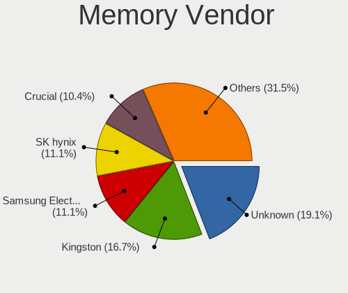

| Vendor              | Desktops | Percent |
|---------------------|----------|---------|
| Unknown             | 88       | 19.13%  |
| Kingston            | 77       | 16.74%  |
| SK hynix            | 51       | 11.09%  |
| Samsung Electronics | 51       | 11.09%  |
| Crucial             | 48       | 10.43%  |
| Corsair             | 38       | 8.26%   |
| Micron Technology   | 24       | 5.22%   |
| G.Skill             | 23       | 5%      |
| Nanya Technology    | 8        | 1.74%   |
| Elpida              | 8        | 1.74%   |
| Patriot             | 7        | 1.52%   |
| Transcend           | 6        | 1.3%    |
| Team                | 6        | 1.3%    |
| GeIL                | 3        | 0.65%   |
| A-DATA Technology   | 3        | 0.65%   |
| Unifosa             | 2        | 0.43%   |
| Smart               | 2        | 0.43%   |
| GOODRAM             | 2        | 0.43%   |
| Walton Chaintech    | 1        | 0.22%   |
| Unknown (0x053E)    | 1        | 0.22%   |
| Toshiba             | 1        | 0.22%   |
| Sesame              | 1        | 0.22%   |
| Ramaxel Technology  | 1        | 0.22%   |
| Qimonda             | 1        | 0.22%   |
| Positivo            | 1        | 0.22%   |
| OCZ                 | 1        | 0.22%   |
| Kreton              | 1        | 0.22%   |
| CSX                 | 1        | 0.22%   |
| Axiom               | 1        | 0.22%   |
| Apacer              | 1        | 0.22%   |
| 9?02                | 1        | 0.22%   |

Memory Model
------------

Memory module models

| Model                                                  | Desktops | Percent |
|--------------------------------------------------------|----------|---------|
| SK hynix RAM HMA82GU6JJR8N-VK 16GB DIMM DDR4 2667MT/s  | 15       | 2.91%   |
| Unknown RAM Module 2GB DIMM SDRAM                      | 9        | 1.75%   |
| Unknown RAM Module 4096MB DIMM 1333MT/s                | 6        | 1.17%   |
| Unknown RAM Module 2048MB DIMM SDRAM                   | 6        | 1.17%   |
| Micron RAM 8JTF51264AZ-1G6E1 4GB DIMM 1600MT/s         | 6        | 1.17%   |
| Unknown RAM Module 2048MB DIMM DDR2 800MT/s            | 5        | 0.97%   |
| Unknown RAM Module 2048MB DIMM 1333MT/s                | 5        | 0.97%   |
| Unknown RAM Module 2048MB DIMM DDR3 1333MT/s           | 4        | 0.78%   |
| Samsung RAM M378B5173DB0-CK0 4096MB DIMM DDR3 1600MT/s | 4        | 0.78%   |
| Patriot RAM PSD38G13332 8GB DIMM DDR3 1333MT/s         | 4        | 0.78%   |
| Kingston RAM 99U5584-010.A00LF 4GB DIMM DDR3 1866MT/s  | 4        | 0.78%   |
| Kingston RAM 99U5469-069.A00LF 4GB DIMM DDR3 1600MT/s  | 4        | 0.78%   |
| Kingston RAM 99U5469-045.A00LF 4GB DIMM DDR3 1600MT/s  | 4        | 0.78%   |
| Crucial RAM CT51264BA160BJ.C8F 4GB DIMM DDR3 1600MT/s  | 4        | 0.78%   |
| Unknown RAM Module 4096MB DIMM DDR3 1333MT/s           | 3        | 0.58%   |
| Unknown RAM Module 2048MB DIMM DDR 800MT/s             | 3        | 0.58%   |
| SK hynix RAM HYMP112U64CP8-S6 1GB DIMM DDR2 800MT/s    | 3        | 0.58%   |
| SK hynix RAM HMT351U6CFR8C-PB 4GB DIMM DDR3 1800MT/s   | 3        | 0.58%   |
| Samsung RAM M378B5773DH0-CH9 2048MB DIMM DDR3 1333MT/s | 3        | 0.58%   |
| Kingston RAM 99U5584-005.A00LF 4GB DIMM DDR3 1600MT/s  | 3        | 0.58%   |
| Corsair RAM CMZ8GX3M2A1600C9 4GB DIMM DDR3 1800MT/s    | 3        | 0.58%   |
| Corsair RAM CMK16GX4M2B3200C16 8GB DIMM DDR4 3600MT/s  | 3        | 0.58%   |
| Unknown RAM Module 8192MB DIMM DDR3 1333MT/s           | 2        | 0.39%   |
| Unknown RAM Module 4096MB DIMM DDR2                    | 2        | 0.39%   |
| Unknown RAM Module 4096MB DIMM DDR 1333MT/s            | 2        | 0.39%   |
| Unknown RAM Module 2GB DIMM DDR2 800MT/s               | 2        | 0.39%   |
| Unknown RAM Module 2GB DIMM 800MT/s                    | 2        | 0.39%   |
| Unknown RAM Module 2048MB DIMM DDR2 667MT/s            | 2        | 0.39%   |
| Unknown RAM Module 2048MB DIMM DDR2 400MT/s            | 2        | 0.39%   |
| Unknown RAM Module 1024MB DIMM DDR2 533MT/s            | 2        | 0.39%   |
| Unknown RAM Module 1024MB DIMM DDR2 400MT/s            | 2        | 0.39%   |
| Unknown RAM Module 1024MB DIMM DDR2                    | 2        | 0.39%   |
| Unknown RAM Module 1024MB DIMM                         | 2        | 0.39%   |
| Transcend RAM TS256MSK64W8N 2GB SODIMM DDR3 1866MT/s   | 2        | 0.39%   |
| SK hynix RAM HMT351U6EFR8C-PB 4GB DIMM DDR3 1600MT/s   | 2        | 0.39%   |
| SK hynix RAM HMT112U6BFR8C-H9 1GB DIMM DDR3 1333MT/s   | 2        | 0.39%   |
| Samsung RAM M378B5773CH0-CH9 2GB DIMM DDR3 1867MT/s    | 2        | 0.39%   |
| Samsung RAM M378B5673FH0-CH9 2GB DIMM DDR3 1600MT/s    | 2        | 0.39%   |
| Samsung RAM M378B5273DH0-CK0 4096MB DIMM DDR3 2200MT/s | 2        | 0.39%   |
| Samsung RAM M378B5273DH0-CH9 4GB DIMM DDR3 2133MT/s    | 2        | 0.39%   |

Memory Kind
-----------

Memory module kinds

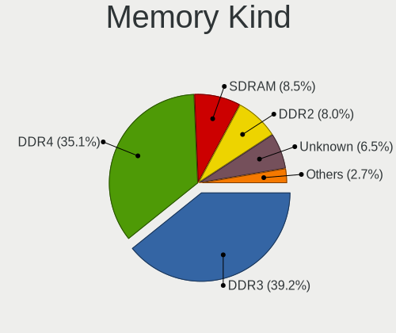

| Kind    | Desktops | Percent |
|---------|----------|---------|
| DDR3    | 162      | 39.23%  |
| DDR4    | 145      | 35.11%  |
| SDRAM   | 35       | 8.47%   |
| DDR2    | 33       | 7.99%   |
| Unknown | 27       | 6.54%   |
| DDR     | 9        | 2.18%   |
| LPDDR4  | 1        | 0.24%   |
| DRAM    | 1        | 0.24%   |

Memory Form Factor
------------------

Physical design of the memory module

| Name    | Desktops | Percent |
|---------|----------|---------|
| DIMM    | 375      | 93.75%  |
| SODIMM  | 24       | 6%      |
| FB-DIMM | 1        | 0.25%   |

Memory Size
-----------

Memory module size

| Size  | Desktops | Percent |
|-------|----------|---------|
| 4096  | 129      | 28.79%  |
| 8192  | 125      | 27.9%   |
| 2048  | 94       | 20.98%  |
| 16384 | 63       | 14.06%  |
| 1024  | 27       | 6.03%   |
| 32768 | 6        | 1.34%   |
| 512   | 4        | 0.89%   |

Memory Speed
------------

Memory module speed

| Speed   | Desktops | Percent |
|---------|----------|---------|
| 1600    | 85       | 18.52%  |
| 1333    | 65       | 14.16%  |
| 2667    | 39       | 8.5%    |
| 2400    | 30       | 6.54%   |
| 800     | 29       | 6.32%   |
| 3200    | 26       | 5.66%   |
| Unknown | 24       | 5.23%   |
| 1866    | 15       | 3.27%   |
| 3600    | 14       | 3.05%   |
| 2133    | 14       | 3.05%   |
| 1867    | 12       | 2.61%   |
| 1800    | 12       | 2.61%   |
| 3000    | 9        | 1.96%   |
| 2666    | 9        | 1.96%   |
| 1066    | 8        | 1.74%   |
| 667     | 8        | 1.74%   |
| 3800    | 6        | 1.31%   |
| 533     | 5        | 1.09%   |
| 3266    | 4        | 0.87%   |
| 2733    | 4        | 0.87%   |
| 2048    | 4        | 0.87%   |
| 400     | 4        | 0.87%   |
| 3733    | 3        | 0.65%   |
| 49926   | 2        | 0.44%   |
| 2448    | 2        | 0.44%   |
| 2200    | 2        | 0.44%   |
| 2000    | 2        | 0.44%   |
| 1639    | 2        | 0.44%   |
| 1334    | 2        | 0.44%   |
| 8400    | 1        | 0.22%   |
| 4333    | 1        | 0.22%   |
| 4000    | 1        | 0.22%   |
| 3866    | 1        | 0.22%   |
| 3666    | 1        | 0.22%   |
| 3400    | 1        | 0.22%   |
| 3100    | 1        | 0.22%   |
| 3066    | 1        | 0.22%   |
| 2933    | 1        | 0.22%   |
| 2866    | 1        | 0.22%   |
| 2800    | 1        | 0.22%   |

Printers & scanners
-------------------

Printer Vendor
--------------

Printer device vendors

| Vendor              | Desktops | Percent |
|---------------------|----------|---------|
| Hewlett-Packard     | 28       | 41.18%  |
| Brother Industries  | 16       | 23.53%  |
| Canon               | 10       | 14.71%  |
| Samsung Electronics | 5        | 7.35%   |
| Zebra               | 4        | 5.88%   |
| Seiko Epson         | 2        | 2.94%   |
| QinHeng Electronics | 1        | 1.47%   |
| Pantum              | 1        | 1.47%   |
| Dymo-CoStar         | 1        | 1.47%   |

Printer Model
-------------

Printer device models

| Model                                                                 | Desktops | Percent |
|-----------------------------------------------------------------------|----------|---------|
| HP LaserJet 400 M401n                                                 | 4        | 5.88%   |
| Zebra ZP 450 Printer                                                  | 3        | 4.41%   |
| Brother HL-5370DW series                                              | 3        | 4.41%   |
| HP OfficeJet Pro 7730 series                                          | 2        | 2.94%   |
| HP LaserJet P1005                                                     | 2        | 2.94%   |
| HP ENVY 4520 series                                                   | 2        | 2.94%   |
| Brother HL-5340 series                                                | 2        | 2.94%   |
| Zebra ZTC ZP 500 (ZPL)                                                | 1        | 1.47%   |
| Seiko Epson ME OFFICE 620F Series/Stylus Office BX305F/BX305FW/TX320F | 1        | 1.47%   |
| Seiko Epson L360 Series                                               | 1        | 1.47%   |
| Samsung Xerox Phaser 3117 Laser Printer                               | 1        | 1.47%   |
| Samsung SCX-4200 series                                               | 1        | 1.47%   |
| Samsung ML-2525W Series                                               | 1        | 1.47%   |
| Samsung M2070 Series                                                  | 1        | 1.47%   |
| Samsung M2020 Series                                                  | 1        | 1.47%   |
| QinHeng CH340S                                                        | 1        | 1.47%   |
| Pantum P2000                                                          | 1        | 1.47%   |
| HP OfficeJet Pro 9010 series                                          | 1        | 1.47%   |
| HP Officejet Pro 6230                                                 | 1        | 1.47%   |
| HP LaserJet P2055 series                                              | 1        | 1.47%   |
| HP LaserJet P2015 series                                              | 1        | 1.47%   |
| HP LaserJet P1006                                                     | 1        | 1.47%   |
| HP LaserJet CP 1025                                                   | 1        | 1.47%   |
| HP LaserJet 1320                                                      | 1        | 1.47%   |
| HP LaserJet 1018                                                      | 1        | 1.47%   |
| HP LaserJet 1015                                                      | 1        | 1.47%   |
| HP HP LaserJet M14-M17                                                | 1        | 1.47%   |
| HP ENVY 6400 series                                                   | 1        | 1.47%   |
| HP Deskjet F4400 series                                               | 1        | 1.47%   |
| HP DeskJet F300 series                                                | 1        | 1.47%   |
| HP DeskJet 5850c                                                      | 1        | 1.47%   |
| HP DeskJet 3700 series                                                | 1        | 1.47%   |
| HP DeskJet 3630 series                                                | 1        | 1.47%   |
| HP Deskjet 3050A                                                      | 1        | 1.47%   |
| HP Color LaserJet CP1215                                              | 1        | 1.47%   |
| Dymo-CoStar DYMO LabelWriter 450 Turbo                                | 1        | 1.47%   |
| Canon TS3100 series                                                   | 1        | 1.47%   |
| Canon TR8500 series                                                   | 1        | 1.47%   |
| Canon PIXMA MX530 Series                                              | 1        | 1.47%   |
| Canon PIXMA MP190                                                     | 1        | 1.47%   |

Scanner Vendor
--------------

Scanner device vendors

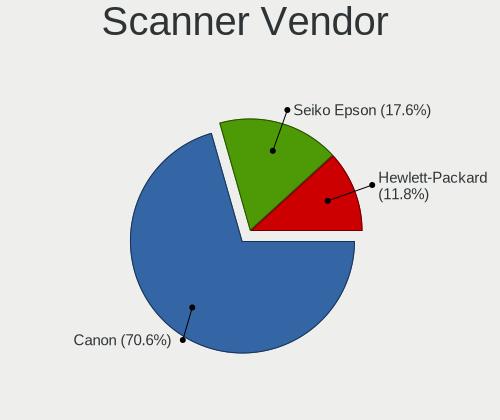

| Vendor          | Desktops | Percent |
|-----------------|----------|---------|
| Canon           | 12       | 70.59%  |
| Seiko Epson     | 3        | 17.65%  |
| Hewlett-Packard | 2        | 11.76%  |

Scanner Model
-------------

Scanner device models

| Model                                                       | Desktops | Percent |
|-------------------------------------------------------------|----------|---------|
| Canon CanoScan LiDE 50/LiDE 35/LiDE 40                      | 3        | 17.65%  |
| Canon CanoScan LiDE 110                                     | 2        | 11.76%  |
| Seiko Epson GT-X770 [Perfection V500]                       | 1        | 5.88%   |
| Seiko Epson GT-8200U/GT-8200UF [Perfection 1650/1650 PHOTO] | 1        | 5.88%   |
| Seiko Epson GT-7700U [Perfection 1240U]                     | 1        | 5.88%   |
| HP ScanJet 82x0C                                            | 1        | 5.88%   |
| HP ScanJet 5590                                             | 1        | 5.88%   |
| Canon CanoScan N670U/N676U/LiDE 20                          | 1        | 5.88%   |
| Canon CanoScan LiDE 90                                      | 1        | 5.88%   |
| Canon CanoScan LIDE 25                                      | 1        | 5.88%   |
| Canon CanoScan LiDE 220                                     | 1        | 5.88%   |
| Canon CanoScan LiDE 210                                     | 1        | 5.88%   |
| Canon CanoScan LiDE 200                                     | 1        | 5.88%   |
| Canon CanoScan LiDE 120                                     | 1        | 5.88%   |

Camera
------

Camera Vendor
-------------

Camera device vendors

| Vendor                        | Desktops | Percent |
|-------------------------------|----------|---------|
| Logitech                      | 52       | 36.11%  |
| Microdia                      | 15       | 10.42%  |
| Microsoft                     | 9        | 6.25%   |
| Generalplus Technology        | 5        | 3.47%   |
| Samsung Electronics           | 4        | 2.78%   |
| MacroSilicon                  | 4        | 2.78%   |
| Jieli Technology              | 4        | 2.78%   |
| Z-Star Microelectronics       | 3        | 2.08%   |
| Trust                         | 3        | 2.08%   |
| Sunplus Innovation Technology | 3        | 2.08%   |
| Realtek Semiconductor         | 3        | 2.08%   |
| KYE Systems (Mouse Systems)   | 3        | 2.08%   |
| Cubeternet                    | 3        | 2.08%   |
| ARC International             | 3        | 2.08%   |
| Apple                         | 3        | 2.08%   |
| Razer USA                     | 2        | 1.39%   |
| Linux Foundation              | 2        | 1.39%   |
| Hewlett-Packard               | 2        | 1.39%   |
| GEMBIRD                       | 2        | 1.39%   |
| Creative Technology           | 2        | 1.39%   |
| Chicony Electronics           | 2        | 1.39%   |
| Arkmicro Technologies         | 2        | 1.39%   |
| 2M UVC CAMERA                 | 2        | 1.39%   |
| USB3.0 HD Audio Capture       | 1        | 0.69%   |
| Sunplus IT                    | 1        | 0.69%   |
| PrehKeyTec                    | 1        | 0.69%   |
| Pixart Imaging                | 1        | 0.69%   |
| OPPO Electronics              | 1        | 0.69%   |
| Nintendo                      | 1        | 0.69%   |
| Mimaki Engineering            | 1        | 0.69%   |
| IMC Networks                  | 1        | 0.69%   |
| Huawei Technologies           | 1        | 0.69%   |
| BUFFALO                       | 1        | 0.69%   |
| Aveo Technology               | 1        | 0.69%   |

Camera Model
------------

Camera device models

| Model                                             | Desktops | Percent |
|---------------------------------------------------|----------|---------|
| Logitech Webcam C270                              | 15       | 10.42%  |
| Logitech HD Pro Webcam C920                       | 8        | 5.56%   |
| Microdia Webcam Vitade AF                         | 5        | 3.47%   |
| Samsung Galaxy series, misc. (MTP mode)           | 4        | 2.78%   |
| MacroSilicon USB Video                            | 4        | 2.78%   |
| Logitech C922 Pro Stream Webcam                   | 4        | 2.78%   |
| Jieli USB PHY 2.0                                 | 4        | 2.78%   |
| Trust Trust USB Camera                            | 3        | 2.08%   |
| Logitech Webcam C170                              | 3        | 2.08%   |
| Logitech QuickCam Pro 9000                        | 3        | 2.08%   |
| Logitech HD Webcam C525                           | 3        | 2.08%   |
| Logitech HD Webcam B910                           | 3        | 2.08%   |
| Generalplus 808 Camera #9 (web-cam mode)          | 3        | 2.08%   |
| ARC International Camera                          | 3        | 2.08%   |
| Apple iPhone 5/5C/5S/6/SE/7/8/X/XR                | 3        | 2.08%   |
| Sunplus FULL HD webcam                            | 2        | 1.39%   |
| Realtek FULL HD 1080P Webcam                      | 2        | 1.39%   |
| Microsoft LifeCam HD-3000                         | 2        | 1.39%   |
| Microsoft LifeCam Cinema                          | 2        | 1.39%   |
| Microdia USB 2.0 Camera                           | 2        | 1.39%   |
| Microdia Sonix USB 2.0 Camera                     | 2        | 1.39%   |
| Microdia Camera                                   | 2        | 1.39%   |
| Logitech Webcam B500                              | 2        | 1.39%   |
| Logitech Logitech Webcam C160                     | 2        | 1.39%   |
| Linux Foundation EEM Gadget                       | 2        | 1.39%   |
| KYE Systems (Mouse Systems) FaceCam 1000X         | 2        | 1.39%   |
| Generalplus GENERAL WEBCAM                        | 2        | 1.39%   |
| GEMBIRD Generic UVC 1.00 camera [AppoTech AX2311] | 2        | 1.39%   |
| Cubeternet GL-UPC822 UVC WebCam                   | 2        | 1.39%   |
| Creative VF0610 Live! Cam Socialize HD            | 2        | 1.39%   |
| Arkmicro USB2.0 PC CAMERA                         | 2        | 1.39%   |
| 2M UVC CAMERA NexiGo N60 FHD Webcam               | 2        | 1.39%   |
| Z-Star Vimicro USB Camera (Altair)                | 1        | 0.69%   |
| Z-Star Venus USB2.0 Camera                        | 1        | 0.69%   |
| Z-Star A4 TECH HD PC Camera                       | 1        | 0.69%   |
| USB3.0 HD Audio Capture USB3.0 HD Video Capture   | 1        | 0.69%   |
| Sunplus IT AUKEY PC-LM1 USB Camera                | 1        | 0.69%   |
| Sunplus USB Camera                                | 1        | 0.69%   |
| Realtek HD 720P Webcam                            | 1        | 0.69%   |
| Razer USA Razer Kiyo Pro                          | 1        | 0.69%   |

Security
--------

Fingerprint Vendor
------------------

Fingerprint sensor vendors

Zero info for selected period =(

Fingerprint Model
-----------------

Fingerprint sensor models

Zero info for selected period =(

Chipcard Vendor
---------------

Chipcard module vendors

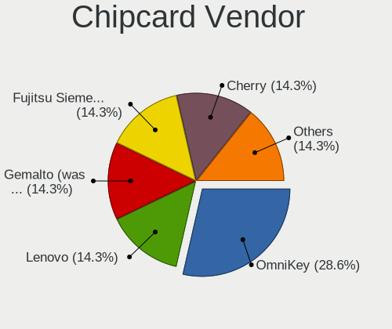

| Vendor                    | Desktops | Percent |
|---------------------------|----------|---------|
| OmniKey                   | 2        | 28.57%  |
| Lenovo                    | 1        | 14.29%  |
| Gemalto (was Gemplus)     | 1        | 14.29%  |
| Fujitsu Siemens Computers | 1        | 14.29%  |
| Cherry                    | 1        | 14.29%  |
| Alcor Micro               | 1        | 14.29%  |

Chipcard Model
--------------

Chipcard module models

| Model                                            | Desktops | Percent |
|--------------------------------------------------|----------|---------|
| OmniKey CardMan 3021 / 3121                      | 2        | 28.57%  |
| Lenovo Smartcard Keyboard                        | 1        | 14.29%  |
| Gemalto (was Gemplus) GemPC Key SmartCard Reader | 1        | 14.29%  |
| Fujitsu Siemens Computers SmartCard Reader 2A    | 1        | 14.29%  |
| Cherry SmartTerminal XX44                        | 1        | 14.29%  |
| Alcor Micro AU9540 Smartcard Reader              | 1        | 14.29%  |

Unsupported
-----------

Unsupported Devices
-------------------

Total unsupported devices on board

| Total | Desktops | Percent |
|-------|----------|---------|
| 0     | 760      | 85.59%  |
| 1     | 101      | 11.37%  |
| 2     | 18       | 2.03%   |
| 3     | 4        | 0.45%   |
| 4     | 3        | 0.34%   |
| 5     | 2        | 0.23%   |

Unsupported Device Types
------------------------

Types of unsupported devices

| Type                     | Desktops | Percent |
|--------------------------|----------|---------|
| Graphics card            | 59       | 40.41%  |
| Net/wireless             | 29       | 19.86%  |
| Communication controller | 17       | 11.64%  |
| Unassigned class         | 10       | 6.85%   |
| Sound                    | 9        | 6.16%   |
| Chipcard                 | 6        | 4.11%   |
| Multimedia controller    | 4        | 2.74%   |
| Camera                   | 3        | 2.05%   |
| Net/ethernet             | 2        | 1.37%   |
| Modem                    | 2        | 1.37%   |
| Card reader              | 2        | 1.37%   |
| Storage/raid             | 1        | 0.68%   |
| Network                  | 1        | 0.68%   |
| Dvb card                 | 1        | 0.68%   |

