Xubuntu 20.04 - Tested Hardware & Statistics (Notebooks)
--------------------------------------------------------

A project to collect tested hardware configurations for Xubuntu 20.04.

Anyone can contribute to this report by the [hw-probe](https://github.com/linuxhw/hw-probe) tool:

    sudo -E hw-probe -all -upload

Please contribute! Especially if your hardware is rare.

Contents
--------

* [ Test Cases ](#test-cases)

* [ System ](#system)
  - [ Kernel                   ](#kernel)
  - [ Kernel Family            ](#kernel-family)
  - [ Kernel Major Ver.        ](#kernel-major-ver)
  - [ Arch                     ](#arch)
  - [ DE                       ](#de)
  - [ Display Server           ](#display-server)
  - [ Display Manager          ](#display-manager)
  - [ OS Lang                  ](#os-lang)
  - [ Boot Mode                ](#boot-mode)
  - [ Filesystem               ](#filesystem)
  - [ Part. scheme             ](#part-scheme)
  - [ Dual Boot with Linux/BSD ](#dual-boot-with-linuxbsd)
  - [ Dual Boot (Win)          ](#dual-boot-win)

* [ Board ](#board)
  - [ Vendor                   ](#vendor)
  - [ Model                    ](#model)
  - [ Model Family             ](#model-family)
  - [ MFG Year                 ](#mfg-year)
  - [ Form Factor              ](#form-factor)
  - [ Secure Boot              ](#secure-boot)
  - [ Coreboot                 ](#coreboot)
  - [ RAM Size                 ](#ram-size)
  - [ RAM Used                 ](#ram-used)
  - [ Total Drives             ](#total-drives)
  - [ Has CD-ROM               ](#has-cd-rom)
  - [ Has Ethernet             ](#has-ethernet)
  - [ Has WiFi                 ](#has-wifi)
  - [ Has Bluetooth            ](#has-bluetooth)

* [ Location ](#location)
  - [ Country                  ](#country)
  - [ City                     ](#city)

* [ Drives ](#drives)
  - [ Drive Vendor             ](#drive-vendor)
  - [ Drive Model              ](#drive-model)
  - [ HDD Vendor               ](#hdd-vendor)
  - [ SSD Vendor               ](#ssd-vendor)
  - [ Drive Kind               ](#drive-kind)
  - [ Drive Connector          ](#drive-connector)
  - [ Drive Size               ](#drive-size)
  - [ Space Total              ](#space-total)
  - [ Space Used               ](#space-used)
  - [ Malfunc. Drives          ](#malfunc-drives)
  - [ Malfunc. Drive Vendor    ](#malfunc-drive-vendor)
  - [ Malfunc. HDD Vendor      ](#malfunc-hdd-vendor)
  - [ Malfunc. Drive Kind      ](#malfunc-drive-kind)
  - [ Failed Drives            ](#failed-drives)
  - [ Failed Drive Vendor      ](#failed-drive-vendor)
  - [ Drive Status             ](#drive-status)

* [ Storage controller ](#storage-controller)
  - [ Storage Vendor           ](#storage-vendor)
  - [ Storage Model            ](#storage-model)
  - [ Storage Kind             ](#storage-kind)

* [ Processor ](#processor)
  - [ CPU Vendor               ](#cpu-vendor)
  - [ CPU Model                ](#cpu-model)
  - [ CPU Model Family         ](#cpu-model-family)
  - [ CPU Cores                ](#cpu-cores)
  - [ CPU Sockets              ](#cpu-sockets)
  - [ CPU Threads              ](#cpu-threads)
  - [ CPU Op-Modes             ](#cpu-op-modes)
  - [ CPU Microcode            ](#cpu-microcode)
  - [ CPU Microarch            ](#cpu-microarch)

* [ Graphics ](#graphics)
  - [ GPU Vendor               ](#gpu-vendor)
  - [ GPU Model                ](#gpu-model)
  - [ GPU Combo                ](#gpu-combo)
  - [ GPU Driver               ](#gpu-driver)
  - [ GPU Memory               ](#gpu-memory)

* [ Monitor ](#monitor)
  - [ Monitor Vendor           ](#monitor-vendor)
  - [ Monitor Model            ](#monitor-model)
  - [ Monitor Resolution       ](#monitor-resolution)
  - [ Monitor Diagonal         ](#monitor-diagonal)
  - [ Monitor Width            ](#monitor-width)
  - [ Aspect Ratio             ](#aspect-ratio)
  - [ Monitor Area             ](#monitor-area)
  - [ Pixel Density            ](#pixel-density)
  - [ Multiple Monitors        ](#multiple-monitors)

* [ Network ](#network)
  - [ Net Controller Vendor    ](#net-controller-vendor)
  - [ Net Controller Model     ](#net-controller-model)
  - [ Wireless Vendor          ](#wireless-vendor)
  - [ Wireless Model           ](#wireless-model)
  - [ Ethernet Vendor          ](#ethernet-vendor)
  - [ Ethernet Model           ](#ethernet-model)
  - [ Net Controller Kind      ](#net-controller-kind)
  - [ Used Controller          ](#used-controller)
  - [ NICs                     ](#nics)
  - [ IPv6                     ](#ipv6)

* [ Bluetooth ](#bluetooth)
  - [ Bluetooth Vendor         ](#bluetooth-vendor)
  - [ Bluetooth Model          ](#bluetooth-model)

* [ Sound ](#sound)
  - [ Sound Vendor             ](#sound-vendor)
  - [ Sound Model              ](#sound-model)

* [ Memory ](#memory)
  - [ Memory Vendor            ](#memory-vendor)
  - [ Memory Model             ](#memory-model)
  - [ Memory Kind              ](#memory-kind)
  - [ Memory Form Factor       ](#memory-form-factor)
  - [ Memory Size              ](#memory-size)
  - [ Memory Speed             ](#memory-speed)

* [ Printers & scanners ](#printers--scanners)
  - [ Printer Vendor           ](#printer-vendor)
  - [ Printer Model            ](#printer-model)
  - [ Scanner Vendor           ](#scanner-vendor)
  - [ Scanner Model            ](#scanner-model)

* [ Camera ](#camera)
  - [ Camera Vendor            ](#camera-vendor)
  - [ Camera Model             ](#camera-model)

* [ Security ](#security)
  - [ Fingerprint Vendor       ](#fingerprint-vendor)
  - [ Fingerprint Model        ](#fingerprint-model)
  - [ Chipcard Vendor          ](#chipcard-vendor)
  - [ Chipcard Model           ](#chipcard-model)

* [ Unsupported ](#unsupported)
  - [ Unsupported Devices      ](#unsupported-devices)
  - [ Unsupported Device Types ](#unsupported-device-types)

Test Cases
----------

Total: 1511

| Vendor        | Model                       | Probe                                                      | Date         |
|---------------|-----------------------------|------------------------------------------------------------|--------------|
| Lenovo        | ThinkPad T14 Gen 3 21AH0... | [39fd38bc98](https://linux-hardware.org/?probe=39fd38bc98) | Sep 28, 2023 |
| ASUSTek       | N550JV                      | [ac27d821ae](https://linux-hardware.org/?probe=ac27d821ae) | Sep 27, 2023 |
| Lenovo        | ThinkPad T14 Gen 3 21AH0... | [add8b61fa2](https://linux-hardware.org/?probe=add8b61fa2) | Aug 24, 2023 |
| Lenovo        | G500 20236                  | [88a569c8ee](https://linux-hardware.org/?probe=88a569c8ee) | Aug 03, 2023 |
| MSI           | PR601/VR603                 | [b982476d84](https://linux-hardware.org/?probe=b982476d84) | Jul 21, 2023 |
| TUXEDO        | N85_N87HCHNHZ               | [f0f2c5a6a7](https://linux-hardware.org/?probe=f0f2c5a6a7) | Jul 17, 2023 |
| TUXEDO        | N85_N87HCHNHZ               | [6070a533c5](https://linux-hardware.org/?probe=6070a533c5) | Jul 17, 2023 |
| Olidata       | Stainer 8050                | [beb3c029a6](https://linux-hardware.org/?probe=beb3c029a6) | Jul 07, 2023 |
| Lenovo        | ThinkPad X260 20F5S4BY00    | [f252a559f2](https://linux-hardware.org/?probe=f252a559f2) | Jul 02, 2023 |
| Alienware     | 18                          | [047bc74541](https://linux-hardware.org/?probe=047bc74541) | Jun 24, 2023 |
| ASUSTek       | N53SV                       | [0908f99494](https://linux-hardware.org/?probe=0908f99494) | Jun 23, 2023 |
| ASUSTek       | N53SV                       | [1999834725](https://linux-hardware.org/?probe=1999834725) | Jun 23, 2023 |
| TUXEDO        | P65xRP                      | [cfefc9c13a](https://linux-hardware.org/?probe=cfefc9c13a) | Jun 20, 2023 |
| Dell          | Latitude E5270              | [49f184b9e9](https://linux-hardware.org/?probe=49f184b9e9) | Jun 13, 2023 |
| Lenovo        | V560                        | [b2564e07cc](https://linux-hardware.org/?probe=b2564e07cc) | Jun 03, 2023 |
| Acer          | Aspire E5-772G              | [ae0b46c29f](https://linux-hardware.org/?probe=ae0b46c29f) | May 28, 2023 |
| Acer          | TravelMate P215-41-G2       | [84d5e196da](https://linux-hardware.org/?probe=84d5e196da) | May 15, 2023 |
| Lenovo        | ThinkPad T61 7661V3L        | [5714171d2a](https://linux-hardware.org/?probe=5714171d2a) | May 14, 2023 |
| Dell          | Latitude E7270              | [62c1cdc600](https://linux-hardware.org/?probe=62c1cdc600) | May 02, 2023 |
| Dell          | Latitude E7270              | [96e1a00bae](https://linux-hardware.org/?probe=96e1a00bae) | May 02, 2023 |
| Sony          | VPCZ13M9E                   | [caf336efc3](https://linux-hardware.org/?probe=caf336efc3) | Apr 28, 2023 |
| ASUSTek       | VivoBook_ASUSLaptop X415... | [76c4edb7f3](https://linux-hardware.org/?probe=76c4edb7f3) | Apr 23, 2023 |
| HP            | ProBook 650 G3              | [704778a577](https://linux-hardware.org/?probe=704778a577) | Apr 19, 2023 |
| Gateway       | LT27                        | [4697cead5f](https://linux-hardware.org/?probe=4697cead5f) | Mar 28, 2023 |
| HP            | Victus by Laptop 16-e0xx... | [a7ff24abc4](https://linux-hardware.org/?probe=a7ff24abc4) | Mar 26, 2023 |
| HP            | Victus by Laptop 16-e0xx... | [8d5a135264](https://linux-hardware.org/?probe=8d5a135264) | Mar 26, 2023 |
| Samsung       | RV408/RV508                 | [5f5efa7edc](https://linux-hardware.org/?probe=5f5efa7edc) | Mar 25, 2023 |
| Samsung       | RV408/RV508                 | [cce3fdd054](https://linux-hardware.org/?probe=cce3fdd054) | Mar 25, 2023 |
| Lenovo        | ThinkBook 13s-IML 20RR      | [a174d9ea53](https://linux-hardware.org/?probe=a174d9ea53) | Mar 17, 2023 |
| Microtech     | ebookPro                    | [cac30f03b1](https://linux-hardware.org/?probe=cac30f03b1) | Mar 06, 2023 |
| Sony          | VPCZ13M9E                   | [b3db404e91](https://linux-hardware.org/?probe=b3db404e91) | Feb 17, 2023 |
| Packard Be... | DOT S                       | [1f57142ffd](https://linux-hardware.org/?probe=1f57142ffd) | Feb 12, 2023 |
| Lenovo        | ThinkPad T430s 23562Z3      | [7338d8375a](https://linux-hardware.org/?probe=7338d8375a) | Feb 09, 2023 |
| HP            | 240 G8 Notebook PC          | [00a3607d18](https://linux-hardware.org/?probe=00a3607d18) | Jan 30, 2023 |
| Lenovo        | ThinkPad T430u 3353A11      | [c93d5da3f1](https://linux-hardware.org/?probe=c93d5da3f1) | Jan 28, 2023 |
| Lenovo        | IdeaPad 330-17AST 81D7      | [f409b1df0b](https://linux-hardware.org/?probe=f409b1df0b) | Jan 27, 2023 |
| Lenovo        | ThinkPad T430u 3353A11      | [cf42b2f763](https://linux-hardware.org/?probe=cf42b2f763) | Jan 26, 2023 |
| Lenovo        | ThinkPad T430u 3353A11      | [34e69693d1](https://linux-hardware.org/?probe=34e69693d1) | Jan 25, 2023 |
| Dell          | Inspiron 3541               | [12d8081c29](https://linux-hardware.org/?probe=12d8081c29) | Jan 23, 2023 |
| Apple         | MacBook4,1                  | [8d876754f3](https://linux-hardware.org/?probe=8d876754f3) | Jan 23, 2023 |
| Apple         | MacBook4,1                  | [f1f61785e5](https://linux-hardware.org/?probe=f1f61785e5) | Jan 23, 2023 |
| Lenovo        | ThinkPad X260 20F5S4BY00    | [873bf3c874](https://linux-hardware.org/?probe=873bf3c874) | Jan 22, 2023 |
| ASUSTek       | N53SN                       | [bc8c82ca9a](https://linux-hardware.org/?probe=bc8c82ca9a) | Jan 21, 2023 |
| Dell          | Inspiron 5391               | [050e28c342](https://linux-hardware.org/?probe=050e28c342) | Jan 20, 2023 |
| Lenovo        | ThinkPad X61 Tablet 7767... | [558f3d0d93](https://linux-hardware.org/?probe=558f3d0d93) | Jan 14, 2023 |
| Acer          | Aspire E5-771               | [dc397ff7f7](https://linux-hardware.org/?probe=dc397ff7f7) | Jan 09, 2023 |
| Samsung       | R530/R730                   | [dd26df5f4f](https://linux-hardware.org/?probe=dd26df5f4f) | Jan 05, 2023 |
| Dell          | Latitude E6420              | [0ac727d853](https://linux-hardware.org/?probe=0ac727d853) | Jan 03, 2023 |
| Dell          | Inspiron 5423               | [14aa07b144](https://linux-hardware.org/?probe=14aa07b144) | Jan 02, 2023 |
| Dell          | Inspiron 5423               | [0c30f220cb](https://linux-hardware.org/?probe=0c30f220cb) | Jan 02, 2023 |
| Clevo         | P170EM                      | [3c8b8bd784](https://linux-hardware.org/?probe=3c8b8bd784) | Dec 22, 2022 |
| HP            | Pavilion dv7                | [075b40bb9e](https://linux-hardware.org/?probe=075b40bb9e) | Dec 21, 2022 |
| HP            | 350 G1                      | [c15f80a386](https://linux-hardware.org/?probe=c15f80a386) | Dec 12, 2022 |
| ASUSTek       | K53SC                       | [57e7bb2427](https://linux-hardware.org/?probe=57e7bb2427) | Dec 05, 2022 |
| ASUSTek       | K53SC                       | [6d21dd6cea](https://linux-hardware.org/?probe=6d21dd6cea) | Nov 30, 2022 |
| Unknown       | Unknown                     | [c119fbb804](https://linux-hardware.org/?probe=c119fbb804) | Nov 22, 2022 |
| HP            | 8540w                       | [3712bfe3cb](https://linux-hardware.org/?probe=3712bfe3cb) | Nov 21, 2022 |
| Dell          | Latitude 5490               | [70b8fb5e89](https://linux-hardware.org/?probe=70b8fb5e89) | Nov 18, 2022 |
| Acer          | Aspire A315-21              | [288b53c471](https://linux-hardware.org/?probe=288b53c471) | Nov 16, 2022 |
| Acer          | Aspire A315-21              | [23ec67e81b](https://linux-hardware.org/?probe=23ec67e81b) | Nov 16, 2022 |
| ASUSTek       | K53U                        | [e947ac0aab](https://linux-hardware.org/?probe=e947ac0aab) | Nov 14, 2022 |
| HP            | Laptop 17-cp0xxx            | [a5575e0c9d](https://linux-hardware.org/?probe=a5575e0c9d) | Nov 12, 2022 |
| HP            | Laptop 17-cp0xxx            | [2e6b12e93d](https://linux-hardware.org/?probe=2e6b12e93d) | Nov 12, 2022 |
| Fujitsu Si... | ESPRIMO Mobile V5535        | [a39cc50a9a](https://linux-hardware.org/?probe=a39cc50a9a) | Nov 07, 2022 |
| HP            | EliteBook Folio 1040 G1     | [f2d6eec645](https://linux-hardware.org/?probe=f2d6eec645) | Nov 06, 2022 |
| Apple         | MacBookAir6,2               | [fa6ec2e89c](https://linux-hardware.org/?probe=fa6ec2e89c) | Nov 03, 2022 |
| Lenovo        | ThinkPad W530 2438CTO       | [1915c9d3b0](https://linux-hardware.org/?probe=1915c9d3b0) | Oct 28, 2022 |
| Dell          | Latitude E6510              | [2cb824b444](https://linux-hardware.org/?probe=2cb824b444) | Oct 27, 2022 |
| Dell          | Latitude E6510              | [ddb0a31443](https://linux-hardware.org/?probe=ddb0a31443) | Oct 26, 2022 |
| Lenovo        | ThinkPad T460 20FMS08H00    | [13422369f7](https://linux-hardware.org/?probe=13422369f7) | Oct 25, 2022 |
| Apple         | MacBookPro6,2               | [927bfd543c](https://linux-hardware.org/?probe=927bfd543c) | Oct 24, 2022 |
| Toshiba       | Satellite C75D-B            | [3e39042f59](https://linux-hardware.org/?probe=3e39042f59) | Oct 23, 2022 |
| Toshiba       | Satellite C75D-B            | [b7412d4350](https://linux-hardware.org/?probe=b7412d4350) | Oct 23, 2022 |
| Lenovo        | IdeaPad 330S-15ARR 81FB     | [4de39d4a1c](https://linux-hardware.org/?probe=4de39d4a1c) | Oct 19, 2022 |
| Dell          | Latitude E5270              | [6f07cdee36](https://linux-hardware.org/?probe=6f07cdee36) | Oct 17, 2022 |
| MSI           | GS40 6QE Phantom            | [76a55aa9f5](https://linux-hardware.org/?probe=76a55aa9f5) | Oct 14, 2022 |
| Lenovo        | ThinkPad T490 20N20046US    | [a698e6de4d](https://linux-hardware.org/?probe=a698e6de4d) | Oct 13, 2022 |
| eMachines     | eME528                      | [502802d50d](https://linux-hardware.org/?probe=502802d50d) | Oct 13, 2022 |
| Dell          | Latitude E5470              | [eee260b733](https://linux-hardware.org/?probe=eee260b733) | Oct 12, 2022 |
| Dell          | Latitude E5470              | [3bbb87ee1b](https://linux-hardware.org/?probe=3bbb87ee1b) | Oct 12, 2022 |
| Lenovo        | ThinkPad T440 20B7A0S200    | [1be1f8f36e](https://linux-hardware.org/?probe=1be1f8f36e) | Oct 09, 2022 |
| HP            | 255 G1                      | [fc9f63bfb6](https://linux-hardware.org/?probe=fc9f63bfb6) | Oct 08, 2022 |
| ASUSTek       | K50ID                       | [05e82f0dd5](https://linux-hardware.org/?probe=05e82f0dd5) | Oct 08, 2022 |
| Acer          | Aspire 5739G                | [9a380f66ea](https://linux-hardware.org/?probe=9a380f66ea) | Oct 08, 2022 |
| Lenovo        | IdeaPad S510p 20298         | [20fb15fcbf](https://linux-hardware.org/?probe=20fb15fcbf) | Oct 06, 2022 |
| Acer          | Extensa 5230                | [8154485976](https://linux-hardware.org/?probe=8154485976) | Oct 04, 2022 |
| Dell          | Inspiron 7520               | [8125b49bea](https://linux-hardware.org/?probe=8125b49bea) | Oct 03, 2022 |
| Acer          | Aspire A315-55G             | [77605e313d](https://linux-hardware.org/?probe=77605e313d) | Oct 01, 2022 |
| Lenovo        | IdeaPad N585 20179          | [0a8aed635a](https://linux-hardware.org/?probe=0a8aed635a) | Sep 28, 2022 |
| Unknown       | Unknown                     | [63b1596d63](https://linux-hardware.org/?probe=63b1596d63) | Sep 24, 2022 |
| Toshiba       | Satellite C55D-B            | [5b2029b4d3](https://linux-hardware.org/?probe=5b2029b4d3) | Sep 24, 2022 |
| Lenovo        | ThinkPad P51s 20HCS00F00    | [5f0dc19f55](https://linux-hardware.org/?probe=5f0dc19f55) | Sep 22, 2022 |
| Dell          | Precision 7750              | [ced8b5a7b2](https://linux-hardware.org/?probe=ced8b5a7b2) | Sep 19, 2022 |
| HP            | Laptop 15-ef1xxx            | [dd55f6960d](https://linux-hardware.org/?probe=dd55f6960d) | Sep 15, 2022 |
| HP            | 1000                        | [65024f3d7a](https://linux-hardware.org/?probe=65024f3d7a) | Sep 13, 2022 |
| Dell          | Inspiron 3537               | [afd2b6555e](https://linux-hardware.org/?probe=afd2b6555e) | Sep 12, 2022 |
| ASUSTek       | X453SA                      | [1446eda5e9](https://linux-hardware.org/?probe=1446eda5e9) | Sep 12, 2022 |
| Dell          | Latitude 9520               | [04188fb6c2](https://linux-hardware.org/?probe=04188fb6c2) | Sep 06, 2022 |
| Apple         | MacBookPro16,1              | [8add31fdfe](https://linux-hardware.org/?probe=8add31fdfe) | Sep 02, 2022 |
| Acer          | Aspire A315-31              | [21d3a4bd56](https://linux-hardware.org/?probe=21d3a4bd56) | Sep 02, 2022 |
| Acer          | Aspire E5-771G              | [76803c2532](https://linux-hardware.org/?probe=76803c2532) | Aug 30, 2022 |
| Acer          | Aspire E5-771G              | [52cc79c6d9](https://linux-hardware.org/?probe=52cc79c6d9) | Aug 29, 2022 |
| Lenovo        | ThinkPad X220 4291V1C       | [8ab56e33c4](https://linux-hardware.org/?probe=8ab56e33c4) | Aug 21, 2022 |
| Lenovo        | ThinkPad T480 20L5000BGE    | [dd53f23249](https://linux-hardware.org/?probe=dd53f23249) | Aug 20, 2022 |
| Packard Be... | EasyNote TJ66               | [96c3144e93](https://linux-hardware.org/?probe=96c3144e93) | Aug 19, 2022 |
| Panasonic     | CF-31XEUAXMF                | [914e54f984](https://linux-hardware.org/?probe=914e54f984) | Aug 13, 2022 |
| Dell          | System XPS L502X            | [1453afc507](https://linux-hardware.org/?probe=1453afc507) | Aug 09, 2022 |
| Lenovo        | ThinkPad E590 20NB002AMH    | [aed42791cd](https://linux-hardware.org/?probe=aed42791cd) | Aug 09, 2022 |
| ASUSTek       | K53SC                       | [15522c32d7](https://linux-hardware.org/?probe=15522c32d7) | Aug 06, 2022 |
| Lenovo        | IdeaPad 330-15IKB 81FE      | [32a99db93e](https://linux-hardware.org/?probe=32a99db93e) | Aug 04, 2022 |
| HP            | Pavilion Laptop 14-dv0xx... | [8aa899fe67](https://linux-hardware.org/?probe=8aa899fe67) | Aug 02, 2022 |
| Lenovo        | IdeaPad 330S-15IKB 81F5     | [e512f0884d](https://linux-hardware.org/?probe=e512f0884d) | Aug 01, 2022 |
| Dell          | Inspiron 5748               | [9113ee6d54](https://linux-hardware.org/?probe=9113ee6d54) | Aug 01, 2022 |
| Unknown       | Unknown                     | [50153bd9ff](https://linux-hardware.org/?probe=50153bd9ff) | Aug 01, 2022 |
| HP            | Pavilion dv2600             | [87651d6efc](https://linux-hardware.org/?probe=87651d6efc) | Jul 31, 2022 |
| Unknown       | Unknown                     | [aa0c007709](https://linux-hardware.org/?probe=aa0c007709) | Jul 31, 2022 |
| Dell          | Vostro 3700                 | [0a4b552d69](https://linux-hardware.org/?probe=0a4b552d69) | Jul 28, 2022 |
| Samsung       | R59P/R60P/R61P              | [d435057109](https://linux-hardware.org/?probe=d435057109) | Jul 28, 2022 |
| Apple         | MacBookPro12,1              | [4db419918b](https://linux-hardware.org/?probe=4db419918b) | Jul 25, 2022 |
| ASUSTek       | N56VZ                       | [3813cc04d1](https://linux-hardware.org/?probe=3813cc04d1) | Jul 22, 2022 |
| HP            | ProBook 640 G8 Notebook ... | [75f71928fe](https://linux-hardware.org/?probe=75f71928fe) | Jul 21, 2022 |
| ASUSTek       | FX503VM                     | [47c70e3628](https://linux-hardware.org/?probe=47c70e3628) | Jul 19, 2022 |
| Lenovo        | ThinkPad W540 20BG001CMN    | [117f9a585b](https://linux-hardware.org/?probe=117f9a585b) | Jul 17, 2022 |
| ASUSTek       | U30Jc                       | [3a6a0ec169](https://linux-hardware.org/?probe=3a6a0ec169) | Jul 17, 2022 |
| Lenovo        | ThinkPad W540 20BG001CMN    | [e408c1236c](https://linux-hardware.org/?probe=e408c1236c) | Jul 17, 2022 |
| Samsung       | R59P/R60P/R61P              | [4773de66cf](https://linux-hardware.org/?probe=4773de66cf) | Jul 15, 2022 |
| ASUSTek       | K53SC                       | [dd45175b9d](https://linux-hardware.org/?probe=dd45175b9d) | Jul 15, 2022 |
| Apple         | MacBookPro15,3              | [a8f8224853](https://linux-hardware.org/?probe=a8f8224853) | Jul 11, 2022 |
| HP            | Laptop 14-bw0xx             | [17b90f7a4b](https://linux-hardware.org/?probe=17b90f7a4b) | Jul 10, 2022 |
| HP            | Laptop 14-bw0xx             | [3b8444274b](https://linux-hardware.org/?probe=3b8444274b) | Jul 10, 2022 |
| Lenovo        | ThinkPad W540 20BG001KGE    | [434091ba07](https://linux-hardware.org/?probe=434091ba07) | Jul 10, 2022 |
| Lenovo        | ThinkPad P14s Gen 2a 21A... | [b2d4e91300](https://linux-hardware.org/?probe=b2d4e91300) | Jul 07, 2022 |
| HP            | EliteBook 845 G8 Noteboo... | [5cff36844a](https://linux-hardware.org/?probe=5cff36844a) | Jul 07, 2022 |
| Lenovo        | G50-70 20351                | [68efa303fa](https://linux-hardware.org/?probe=68efa303fa) | Jul 07, 2022 |
| Chuwi         | FreeBook                    | [3e0b057e38](https://linux-hardware.org/?probe=3e0b057e38) | Jul 07, 2022 |
| Acer          | Aspire E5-571               | [2225f70ee7](https://linux-hardware.org/?probe=2225f70ee7) | Jul 06, 2022 |
| Dell          | Inspiron 5593               | [542470182e](https://linux-hardware.org/?probe=542470182e) | Jul 05, 2022 |
| ASUSTek       | K53SC                       | [ef75149636](https://linux-hardware.org/?probe=ef75149636) | Jul 03, 2022 |
| HP            | Mini 210-1100               | [72289b7641](https://linux-hardware.org/?probe=72289b7641) | Jul 03, 2022 |
| HP            | Mini 210-1100               | [aaa9b86216](https://linux-hardware.org/?probe=aaa9b86216) | Jul 02, 2022 |
| Lenovo        | IdeaPad 330S-15IKB 81F5     | [372d361276](https://linux-hardware.org/?probe=372d361276) | Jun 28, 2022 |
| Lenovo        | ThinkPad P17 Gen 1 20SQS... | [ac9a35e85e](https://linux-hardware.org/?probe=ac9a35e85e) | Jun 27, 2022 |
| HP            | Laptop 15-ef1xxx            | [d0200625ac](https://linux-hardware.org/?probe=d0200625ac) | Jun 27, 2022 |
| Dell          | Inspiron 15-3567            | [e6d22a4d34](https://linux-hardware.org/?probe=e6d22a4d34) | Jun 27, 2022 |
| Lenovo        | ThinkPad T420s 417152U      | [cc52ed5e41](https://linux-hardware.org/?probe=cc52ed5e41) | Jun 26, 2022 |
| HP            | Laptop 15-ef1xxx            | [1d18aab349](https://linux-hardware.org/?probe=1d18aab349) | Jun 23, 2022 |
| Dell          | Inspiron 5570               | [4a61f83195](https://linux-hardware.org/?probe=4a61f83195) | Jun 23, 2022 |
| MSI           | Modern 15 A5M               | [b648b81eca](https://linux-hardware.org/?probe=b648b81eca) | Jun 23, 2022 |
| Dell          | Inspiron 15-3567            | [9538654245](https://linux-hardware.org/?probe=9538654245) | Jun 21, 2022 |
| Acer          | Aspire 7720                 | [3f098cc493](https://linux-hardware.org/?probe=3f098cc493) | Jun 15, 2022 |
| Dynabook      | TECRA A50-J                 | [3f4449202f](https://linux-hardware.org/?probe=3f4449202f) | Jun 14, 2022 |
| Lenovo        | ThinkPad T530 23923MG       | [cf21c4e831](https://linux-hardware.org/?probe=cf21c4e831) | Jun 12, 2022 |
| HP            | 255 G7 Notebook PC          | [0ebaae147d](https://linux-hardware.org/?probe=0ebaae147d) | Jun 12, 2022 |
| Packard Be... | EasyNote TK11BZ             | [f9c69ea1c6](https://linux-hardware.org/?probe=f9c69ea1c6) | Jun 11, 2022 |
| Lenovo        | G505 20240                  | [0b0d5e5252](https://linux-hardware.org/?probe=0b0d5e5252) | Jun 11, 2022 |
| GPU Compan... | GWTN116-3                   | [bd0f56a43c](https://linux-hardware.org/?probe=bd0f56a43c) | Jun 09, 2022 |
| Acer          | Aspire 7720                 | [640b757bc8](https://linux-hardware.org/?probe=640b757bc8) | Jun 08, 2022 |
| ASUSTek       | VivoBook_ASUSLaptop X760... | [674cab9d61](https://linux-hardware.org/?probe=674cab9d61) | Jun 08, 2022 |
| Acer          | Aspire E5-573               | [bb17805ada](https://linux-hardware.org/?probe=bb17805ada) | Jun 08, 2022 |
| Acer          | Aspire 7720                 | [ac4362743a](https://linux-hardware.org/?probe=ac4362743a) | Jun 07, 2022 |
| Lenovo        | ThinkPad T440s 20AQ009DG... | [c4250d2ee2](https://linux-hardware.org/?probe=c4250d2ee2) | Jun 07, 2022 |
| ASUSTek       | TUF Gaming FX505DD_FX505... | [3ee16e0227](https://linux-hardware.org/?probe=3ee16e0227) | Jun 07, 2022 |
| MSI           | PR601/VR603                 | [9763977184](https://linux-hardware.org/?probe=9763977184) | Jun 05, 2022 |
| Dell          | Inspiron N4010              | [49e472d67e](https://linux-hardware.org/?probe=49e472d67e) | Jun 02, 2022 |
| Lenovo        | ThinkPad W510 431963G       | [dfe3e4b66b](https://linux-hardware.org/?probe=dfe3e4b66b) | Jun 02, 2022 |
| Lenovo        | ThinkPad W510 431963G       | [d620bac2cb](https://linux-hardware.org/?probe=d620bac2cb) | Jun 02, 2022 |
| Lenovo        | ThinkPad L13 20R4S4WG00     | [14100804b6](https://linux-hardware.org/?probe=14100804b6) | May 31, 2022 |
| Lenovo        | ThinkPad W510 431963G       | [e46a1497d8](https://linux-hardware.org/?probe=e46a1497d8) | May 31, 2022 |
| Dell          | Latitude 5511               | [bc6fd9e79d](https://linux-hardware.org/?probe=bc6fd9e79d) | May 30, 2022 |
| Medion        | E15407                      | [6e457b6abb](https://linux-hardware.org/?probe=6e457b6abb) | May 29, 2022 |
| Medion        | E15407                      | [a0d6c795e7](https://linux-hardware.org/?probe=a0d6c795e7) | May 29, 2022 |
| TUXEDO        | N14xWU                      | [c20d682e14](https://linux-hardware.org/?probe=c20d682e14) | May 29, 2022 |
| TUXEDO        | N14xWU                      | [8711ac9989](https://linux-hardware.org/?probe=8711ac9989) | May 26, 2022 |
| HP            | Laptop 15-bw0xx             | [f71c048a96](https://linux-hardware.org/?probe=f71c048a96) | May 25, 2022 |
| ASUSTek       | X510UA                      | [51d57b9e53](https://linux-hardware.org/?probe=51d57b9e53) | May 22, 2022 |
| Sony          | VGN-NS21S_S                 | [0c972ad98b](https://linux-hardware.org/?probe=0c972ad98b) | May 21, 2022 |
| HP            | Pavilion dv6000 (RR374EA... | [926749e311](https://linux-hardware.org/?probe=926749e311) | May 21, 2022 |
| Lenovo        | Legion Y540-17IRH-PG0 81... | [086fceea4f](https://linux-hardware.org/?probe=086fceea4f) | May 19, 2022 |
| Lenovo        | ThinkPad T410 2516CTO       | [e4150ff93b](https://linux-hardware.org/?probe=e4150ff93b) | May 19, 2022 |
| ASUSTek       | X101CH                      | [544536b2d8](https://linux-hardware.org/?probe=544536b2d8) | May 16, 2022 |
| ASUSTek       | X101CH                      | [fbcf200ed5](https://linux-hardware.org/?probe=fbcf200ed5) | May 16, 2022 |
| Dell          | Latitude 5580               | [c2f15d647a](https://linux-hardware.org/?probe=c2f15d647a) | May 15, 2022 |
| Lenovo        | ThinkPad X200s 74664SJ      | [65728fda7a](https://linux-hardware.org/?probe=65728fda7a) | May 14, 2022 |
| Lenovo        | IdeaPad L340-17IRH Gamin... | [a3b1829dec](https://linux-hardware.org/?probe=a3b1829dec) | May 13, 2022 |
| AMI           | Cherry Trail CR             | [62744ba7e3](https://linux-hardware.org/?probe=62744ba7e3) | May 12, 2022 |
| ASUSTek       | ASUS TUF Dash F15 FX516P... | [bb4a27a023](https://linux-hardware.org/?probe=bb4a27a023) | May 10, 2022 |
| Dell          | Latitude 7400               | [a0600c38f3](https://linux-hardware.org/?probe=a0600c38f3) | May 09, 2022 |
| HP            | Compaq 6820s                | [1ba74fc299](https://linux-hardware.org/?probe=1ba74fc299) | May 07, 2022 |
| HP            | Compaq 6820s                | [5b027deec0](https://linux-hardware.org/?probe=5b027deec0) | May 07, 2022 |
| Toshiba       | Satellite C70D-B            | [fa4a4b7ffc](https://linux-hardware.org/?probe=fa4a4b7ffc) | May 06, 2022 |
| ASUSTek       | K53SC                       | [1533323fbf](https://linux-hardware.org/?probe=1533323fbf) | May 02, 2022 |
| Lenovo        | ThinkPad X1 Carbon Gen 9... | [981f468940](https://linux-hardware.org/?probe=981f468940) | May 02, 2022 |
| Razer         | Blade Stealth 13 Late 20... | [ba8fa66c1c](https://linux-hardware.org/?probe=ba8fa66c1c) | May 01, 2022 |
| ASUSTek       | K53SC                       | [f2605ba739](https://linux-hardware.org/?probe=f2605ba739) | Apr 29, 2022 |
| Dell          | Inspiron 3135               | [6ca6980f06](https://linux-hardware.org/?probe=6ca6980f06) | Apr 28, 2022 |
| HP            | ProBook 455 G8 Notebook ... | [fc0cea6830](https://linux-hardware.org/?probe=fc0cea6830) | Apr 27, 2022 |
| Dell          | Latitude 7480               | [7e85baf2f4](https://linux-hardware.org/?probe=7e85baf2f4) | Apr 26, 2022 |
| Lenovo        | ThinkPad T440 20B7A0S200    | [0ef99a6615](https://linux-hardware.org/?probe=0ef99a6615) | Apr 24, 2022 |
| ASUSTek       | 1215N                       | [93ad513620](https://linux-hardware.org/?probe=93ad513620) | Apr 24, 2022 |
| Lenovo        | B590 20206                  | [80befa3088](https://linux-hardware.org/?probe=80befa3088) | Apr 23, 2022 |
| Lenovo        | ThinkBook 14 G2 ARE 20VF    | [e87dfd05bc](https://linux-hardware.org/?probe=e87dfd05bc) | Apr 20, 2022 |
| Lenovo        | ThinkBook 14 G2 ARE 20VF    | [fae46ae55c](https://linux-hardware.org/?probe=fae46ae55c) | Apr 20, 2022 |
| HP            | OMEN by Laptop 16-c0xxx     | [d277143404](https://linux-hardware.org/?probe=d277143404) | Apr 20, 2022 |
| HP            | Compaq 6730s                | [4902d2bf25](https://linux-hardware.org/?probe=4902d2bf25) | Apr 16, 2022 |
| Dell          | Latitude E6540              | [94fbc5408f](https://linux-hardware.org/?probe=94fbc5408f) | Apr 15, 2022 |
| HP            | Compaq 6730s                | [755dcc7629](https://linux-hardware.org/?probe=755dcc7629) | Apr 15, 2022 |
| ASUSTek       | ASUS TUF Dash F15 FX516P... | [554040d7b4](https://linux-hardware.org/?probe=554040d7b4) | Apr 14, 2022 |
| Lenovo        | ThinkPad P53 20QNS01C00     | [b320a8cca8](https://linux-hardware.org/?probe=b320a8cca8) | Apr 14, 2022 |
| Lenovo        | ThinkPad E590 20NB0029GE    | [1f9cb1427a](https://linux-hardware.org/?probe=1f9cb1427a) | Apr 13, 2022 |
| Lenovo        | ThinkPad T480s 20L7001PI... | [53c7e12994](https://linux-hardware.org/?probe=53c7e12994) | Apr 13, 2022 |
| Dynabook      | TECRA X40-F                 | [6d6f37f70e](https://linux-hardware.org/?probe=6d6f37f70e) | Apr 13, 2022 |
| HP            | Laptop 15-bw0xx             | [1c15e67e64](https://linux-hardware.org/?probe=1c15e67e64) | Apr 11, 2022 |
| Dell          | OptiPlex 9020               | [6d0445b848](https://linux-hardware.org/?probe=6d0445b848) | Apr 09, 2022 |
| ASUSTek       | K53SC                       | [8b6bb16303](https://linux-hardware.org/?probe=8b6bb16303) | Apr 08, 2022 |
| Toshiba       | NB505                       | [55f9f70b0b](https://linux-hardware.org/?probe=55f9f70b0b) | Apr 08, 2022 |
| HP            | ENVY Sleekbook 6 PC         | [2e5d15f716](https://linux-hardware.org/?probe=2e5d15f716) | Apr 08, 2022 |
| Dell          | Latitude 5521               | [ce1e3c5551](https://linux-hardware.org/?probe=ce1e3c5551) | Apr 07, 2022 |
| Dell          | Inspiron 11-3162            | [8c348f2f1a](https://linux-hardware.org/?probe=8c348f2f1a) | Apr 07, 2022 |
| HP            | Pavilion dv6500             | [2f18112668](https://linux-hardware.org/?probe=2f18112668) | Apr 04, 2022 |
| MSI           | GX70 3CC                    | [0b706f83d3](https://linux-hardware.org/?probe=0b706f83d3) | Apr 02, 2022 |
| Medion        | Crawler E25                 | [6093396d8a](https://linux-hardware.org/?probe=6093396d8a) | Mar 28, 2022 |
| Dell          | Studio 1450                 | [1b7df0163d](https://linux-hardware.org/?probe=1b7df0163d) | Mar 28, 2022 |
| ASUSTek       | K55VD                       | [5c65461fe1](https://linux-hardware.org/?probe=5c65461fe1) | Mar 28, 2022 |
| Dell          | Vostro 3458                 | [a3cb323822](https://linux-hardware.org/?probe=a3cb323822) | Mar 27, 2022 |
| Dell          | Vostro 3458                 | [9e9df1f902](https://linux-hardware.org/?probe=9e9df1f902) | Mar 27, 2022 |
| Toshiba       | NB505                       | [cab0ce252d](https://linux-hardware.org/?probe=cab0ce252d) | Mar 27, 2022 |
| GPU Compan... | GWTC116-2                   | [2e6f1e1946](https://linux-hardware.org/?probe=2e6f1e1946) | Mar 25, 2022 |
| GPU Compan... | GWTC116-2                   | [897adf54cc](https://linux-hardware.org/?probe=897adf54cc) | Mar 24, 2022 |
| HP            | Stream 11 Pro G2 Noteboo... | [879788ce4f](https://linux-hardware.org/?probe=879788ce4f) | Mar 24, 2022 |
| ASUSTek       | U31SD                       | [00cff36d3f](https://linux-hardware.org/?probe=00cff36d3f) | Mar 24, 2022 |
| ASUSTek       | X501A                       | [5c8c010850](https://linux-hardware.org/?probe=5c8c010850) | Mar 22, 2022 |
| Dell          | Latitude 5510               | [d83be08c5d](https://linux-hardware.org/?probe=d83be08c5d) | Mar 21, 2022 |
| HP            | ZBook 15                    | [303748aa9e](https://linux-hardware.org/?probe=303748aa9e) | Mar 21, 2022 |
| HUAWEI        | KPL-W0X                     | [fbe7d7c6b0](https://linux-hardware.org/?probe=fbe7d7c6b0) | Mar 21, 2022 |
| Dell          | Latitude 7490               | [0799e0955b](https://linux-hardware.org/?probe=0799e0955b) | Mar 20, 2022 |
| Lenovo        | ThinkPad T450 20BUS06B00    | [dd40ec296a](https://linux-hardware.org/?probe=dd40ec296a) | Mar 20, 2022 |
| Lenovo        | ThinkPad T450 20BUS06B00    | [fb3591c2f8](https://linux-hardware.org/?probe=fb3591c2f8) | Mar 20, 2022 |
| Dell          | Latitude E6430              | [6503f89ca1](https://linux-hardware.org/?probe=6503f89ca1) | Mar 20, 2022 |
| Samsung       | R530/R730/R540              | [17c8c47d7b](https://linux-hardware.org/?probe=17c8c47d7b) | Mar 18, 2022 |
| ASUSTek       | U31SD                       | [63c0093cea](https://linux-hardware.org/?probe=63c0093cea) | Mar 18, 2022 |
| HP            | ZBook 15                    | [c5d326781a](https://linux-hardware.org/?probe=c5d326781a) | Mar 17, 2022 |
| Dell          | Inspiron 7437               | [83eed6eaef](https://linux-hardware.org/?probe=83eed6eaef) | Mar 14, 2022 |
| Fujitsu Si... | AMILO Xi 3650               | [6f416ff93b](https://linux-hardware.org/?probe=6f416ff93b) | Mar 13, 2022 |
| HP            | Pavilion dv7                | [7cc5311803](https://linux-hardware.org/?probe=7cc5311803) | Mar 13, 2022 |
| HP            | EliteBook 2540p             | [d07352bf9a](https://linux-hardware.org/?probe=d07352bf9a) | Mar 12, 2022 |
| Lenovo        | ThinkPad T14s Gen 1 20T1... | [4f65353f3e](https://linux-hardware.org/?probe=4f65353f3e) | Mar 10, 2022 |
| Acer          | TP-SW5-012-16UW             | [1558c31a17](https://linux-hardware.org/?probe=1558c31a17) | Mar 09, 2022 |
| HP            | Pavilion dv7                | [97b2a4a508](https://linux-hardware.org/?probe=97b2a4a508) | Mar 05, 2022 |
| ASUSTek       | X450CC                      | [835313a116](https://linux-hardware.org/?probe=835313a116) | Mar 03, 2022 |
| HP            | Pavilion dv7                | [b32286ecad](https://linux-hardware.org/?probe=b32286ecad) | Mar 03, 2022 |
| Lenovo        | B590 20208                  | [4a4fd37e32](https://linux-hardware.org/?probe=4a4fd37e32) | Mar 02, 2022 |
| HP            | Notebook PC                 | [2297e2813f](https://linux-hardware.org/?probe=2297e2813f) | Mar 02, 2022 |
| HP            | Pavilion dv7                | [d3a9235dcb](https://linux-hardware.org/?probe=d3a9235dcb) | Mar 02, 2022 |
| ASUSTek       | VivoBook_ASUSLaptop E210... | [4fe25f775d](https://linux-hardware.org/?probe=4fe25f775d) | Mar 01, 2022 |
| Notebook      | PC5x_7xHP_HR_HS             | [d88405b0dc](https://linux-hardware.org/?probe=d88405b0dc) | Mar 01, 2022 |
| ASUSTek       | ASUS TUF Gaming F15 FX50... | [1b5df98df2](https://linux-hardware.org/?probe=1b5df98df2) | Feb 28, 2022 |
| VIT           | P3400                       | [6075d8d8b2](https://linux-hardware.org/?probe=6075d8d8b2) | Feb 28, 2022 |
| Medion        | E16402                      | [1622ca8570](https://linux-hardware.org/?probe=1622ca8570) | Feb 27, 2022 |
| Lenovo        | ThinkPad T510 4384VJM       | [19e8d8425e](https://linux-hardware.org/?probe=19e8d8425e) | Feb 26, 2022 |
| HP            | EliteBook 8560p             | [d440e21050](https://linux-hardware.org/?probe=d440e21050) | Feb 26, 2022 |
| Lenovo        | Unknown                     | [8a5df3c23e](https://linux-hardware.org/?probe=8a5df3c23e) | Feb 25, 2022 |
| Dell          | Vostro V130                 | [75b7360134](https://linux-hardware.org/?probe=75b7360134) | Feb 22, 2022 |
| Dell          | Precision 3561              | [d46fbe1d5f](https://linux-hardware.org/?probe=d46fbe1d5f) | Feb 21, 2022 |
| Lenovo        | ThinkPad T410 2522W6G       | [d2b007cb44](https://linux-hardware.org/?probe=d2b007cb44) | Feb 20, 2022 |
| Gateway       | M-6307                      | [7cda83b770](https://linux-hardware.org/?probe=7cda83b770) | Feb 20, 2022 |
| ASUSTek       | X542URR                     | [ee334867a0](https://linux-hardware.org/?probe=ee334867a0) | Feb 19, 2022 |
| Dell          | Inspiron 5593               | [f4bce4423f](https://linux-hardware.org/?probe=f4bce4423f) | Feb 19, 2022 |
| Dell          | Inspiron 1764               | [475df3f2af](https://linux-hardware.org/?probe=475df3f2af) | Feb 16, 2022 |
| Dell          | Inspiron 1764               | [177f5aac6c](https://linux-hardware.org/?probe=177f5aac6c) | Feb 16, 2022 |
| Sony          | VPCEB3E1E                   | [a0be8de519](https://linux-hardware.org/?probe=a0be8de519) | Feb 13, 2022 |
| HP            | ProBook 650 G3              | [54a5c321be](https://linux-hardware.org/?probe=54a5c321be) | Feb 08, 2022 |
| Lenovo        | ThinkPad W510 431963G       | [a2e027fa38](https://linux-hardware.org/?probe=a2e027fa38) | Feb 07, 2022 |
| Lenovo        | ThinkPad L480 20LS001AMD    | [801aa8fb1e](https://linux-hardware.org/?probe=801aa8fb1e) | Feb 05, 2022 |
| HP            | EliteBook 8530p             | [a2fc96b3dc](https://linux-hardware.org/?probe=a2fc96b3dc) | Feb 05, 2022 |
| HP            | Pavilion 17                 | [f0d4a99870](https://linux-hardware.org/?probe=f0d4a99870) | Feb 04, 2022 |
| Lenovo        | ThinkPad Edge 0301FAG       | [44efd2d456](https://linux-hardware.org/?probe=44efd2d456) | Feb 03, 2022 |
| Lenovo        | ThinkPad Edge 0301FAG       | [2e33681926](https://linux-hardware.org/?probe=2e33681926) | Feb 03, 2022 |
| ASUSTek       | VivoBook_ASUSLaptop X515... | [bba0be98c7](https://linux-hardware.org/?probe=bba0be98c7) | Feb 01, 2022 |
| HP            | EliteBook 745 G3            | [20e43b8b53](https://linux-hardware.org/?probe=20e43b8b53) | Jan 29, 2022 |
| Dell          | Studio 1450                 | [9c2bf5854d](https://linux-hardware.org/?probe=9c2bf5854d) | Jan 28, 2022 |
| Fujitsu       | LIFEBOOK E734               | [3e66e21a1e](https://linux-hardware.org/?probe=3e66e21a1e) | Jan 28, 2022 |
| Dell          | Latitude D630               | [8a0a5b89dd](https://linux-hardware.org/?probe=8a0a5b89dd) | Jan 27, 2022 |
| Dell          | Latitude D630               | [321264426f](https://linux-hardware.org/?probe=321264426f) | Jan 26, 2022 |
| ASUSTek       | N56VZ                       | [6f1b0cf9e0](https://linux-hardware.org/?probe=6f1b0cf9e0) | Jan 26, 2022 |
| HP            | G42                         | [3d3f5f2d07](https://linux-hardware.org/?probe=3d3f5f2d07) | Jan 25, 2022 |
| Lenovo        | ThinkPad E590 20NB002AMH    | [a97c44b274](https://linux-hardware.org/?probe=a97c44b274) | Jan 25, 2022 |
| MSI           | Prestige 15 A11SC           | [71a31ddfac](https://linux-hardware.org/?probe=71a31ddfac) | Jan 25, 2022 |
| TUXEDO        | Pulse 15 Gen1               | [e0197893fc](https://linux-hardware.org/?probe=e0197893fc) | Jan 24, 2022 |
| HP            | ProBook 440 G6              | [b7fb25920a](https://linux-hardware.org/?probe=b7fb25920a) | Jan 23, 2022 |
| HP            | Laptop 17-ca1xxx            | [77545529dc](https://linux-hardware.org/?probe=77545529dc) | Jan 21, 2022 |
| Lenovo        | B590 37612MG                | [cc8d1271b0](https://linux-hardware.org/?probe=cc8d1271b0) | Jan 21, 2022 |
| Lenovo        | ThinkPad W510 431963G       | [6906b181eb](https://linux-hardware.org/?probe=6906b181eb) | Jan 20, 2022 |
| Dell          | Latitude E6330              | [c7b076f945](https://linux-hardware.org/?probe=c7b076f945) | Jan 20, 2022 |
| ASUSTek       | K50IJ                       | [262dcaf21e](https://linux-hardware.org/?probe=262dcaf21e) | Jan 18, 2022 |
| ASUSTek       | K50IJ                       | [5187874180](https://linux-hardware.org/?probe=5187874180) | Jan 18, 2022 |
| HP            | 255 G8 Notebook PC          | [c1f8df4bbd](https://linux-hardware.org/?probe=c1f8df4bbd) | Jan 18, 2022 |
| Dell          | Latitude D630               | [6327eec09e](https://linux-hardware.org/?probe=6327eec09e) | Jan 18, 2022 |
| Lenovo        | ThinkPad W520 42844MG       | [cf460c52bb](https://linux-hardware.org/?probe=cf460c52bb) | Jan 16, 2022 |
| Lenovo        | ThinkPad X260 20F5S22K0Z    | [e83aec04ca](https://linux-hardware.org/?probe=e83aec04ca) | Jan 16, 2022 |
| Lenovo        | IdeaPad 120S-14IAP 81A5     | [d735255913](https://linux-hardware.org/?probe=d735255913) | Jan 15, 2022 |
| Insyde        | Braswell                    | [a5bca1e5e8](https://linux-hardware.org/?probe=a5bca1e5e8) | Jan 14, 2022 |
| Dell          | Latitude 5480               | [d95c781c2e](https://linux-hardware.org/?probe=d95c781c2e) | Jan 14, 2022 |
| Dell          | Latitude 5480               | [d58108295c](https://linux-hardware.org/?probe=d58108295c) | Jan 14, 2022 |
| Lenovo        | ThinkPad T470s W10DG 20J... | [6892ab87e1](https://linux-hardware.org/?probe=6892ab87e1) | Jan 13, 2022 |
| Medion        | Akoya THE TOUCH 10          | [7606a573d6](https://linux-hardware.org/?probe=7606a573d6) | Jan 12, 2022 |
| Lenovo        | IdeaPad S415 Touch 20319    | [d59706fc52](https://linux-hardware.org/?probe=d59706fc52) | Jan 11, 2022 |
| ASUSTek       | K53SC                       | [b01004055c](https://linux-hardware.org/?probe=b01004055c) | Jan 11, 2022 |
| MOTION        | KEX00                       | [8e36590e72](https://linux-hardware.org/?probe=8e36590e72) | Jan 10, 2022 |
| HP            | ENVY Laptop 14-eb0xxx       | [bbcda99dab](https://linux-hardware.org/?probe=bbcda99dab) | Jan 10, 2022 |
| Alienware     | m15 R3                      | [8cff8c6d3f](https://linux-hardware.org/?probe=8cff8c6d3f) | Jan 09, 2022 |
| Acer          | Extensa 5620                | [41a1c7001c](https://linux-hardware.org/?probe=41a1c7001c) | Jan 08, 2022 |
| Sony          | SVF15A190X                  | [6d729a76af](https://linux-hardware.org/?probe=6d729a76af) | Jan 08, 2022 |
| Dell          | Latitude E6500              | [8355df56a3](https://linux-hardware.org/?probe=8355df56a3) | Jan 07, 2022 |
| Gateway       | NV53A                       | [2e67e3a86e](https://linux-hardware.org/?probe=2e67e3a86e) | Jan 05, 2022 |
| HP            | ProBook 640 G1              | [a7f4591b40](https://linux-hardware.org/?probe=a7f4591b40) | Jan 05, 2022 |
| ASUSTek       | N550JV                      | [aefb321446](https://linux-hardware.org/?probe=aefb321446) | Jan 04, 2022 |
| Packard Be... | EasyNote TK87               | [a551958cb8](https://linux-hardware.org/?probe=a551958cb8) | Jan 01, 2022 |
| Dell          | Inspiron N5030              | [127df37eab](https://linux-hardware.org/?probe=127df37eab) | Jan 01, 2022 |
| HP            | G60                         | [08350a2b75](https://linux-hardware.org/?probe=08350a2b75) | Jan 01, 2022 |
| Dell          | Inspiron N5030              | [fc6d58d758](https://linux-hardware.org/?probe=fc6d58d758) | Jan 01, 2022 |
| Dell          | Inspiron 5765               | [c3a91857b3](https://linux-hardware.org/?probe=c3a91857b3) | Jan 01, 2022 |
| Intel         | Crestline & ICH8M Chipse... | [286566a874](https://linux-hardware.org/?probe=286566a874) | Dec 31, 2021 |
| HP            | Laptop 17-cp0xxx            | [596bdeff81](https://linux-hardware.org/?probe=596bdeff81) | Dec 27, 2021 |
| HP            | EliteBook 8440p (VD484AV... | [ba4cf422e7](https://linux-hardware.org/?probe=ba4cf422e7) | Dec 27, 2021 |
| Toshiba       | Satellite C50-A-19U         | [6a61931dde](https://linux-hardware.org/?probe=6a61931dde) | Dec 26, 2021 |
| Acer          | Aspire A515-54G             | [00c1f1b6df](https://linux-hardware.org/?probe=00c1f1b6df) | Dec 26, 2021 |
| MSI           | GP76 Leopard 11UG           | [a14e38d07e](https://linux-hardware.org/?probe=a14e38d07e) | Dec 24, 2021 |
| GPU Compan... | GWTN156-11                  | [2ef30c62b5](https://linux-hardware.org/?probe=2ef30c62b5) | Dec 24, 2021 |
| Samsung       | RV411/RV511/E3511/S3511/... | [6eec25d058](https://linux-hardware.org/?probe=6eec25d058) | Dec 24, 2021 |
| HP            | Pavilion dv7                | [3b47550de1](https://linux-hardware.org/?probe=3b47550de1) | Dec 23, 2021 |
| HP            | Laptop 17-cn1xxx            | [c26a2c5c03](https://linux-hardware.org/?probe=c26a2c5c03) | Dec 22, 2021 |
| Samsung       | RC410/RC510/RC710           | [123bdbfa71](https://linux-hardware.org/?probe=123bdbfa71) | Dec 22, 2021 |
| Google        | Nami                        | [045f17f15d](https://linux-hardware.org/?probe=045f17f15d) | Dec 22, 2021 |
| HP            | Laptop 17-cn1xxx            | [e3c5530718](https://linux-hardware.org/?probe=e3c5530718) | Dec 19, 2021 |
| ASUSTek       | E200HA                      | [bcd4913896](https://linux-hardware.org/?probe=bcd4913896) | Dec 17, 2021 |
| Lenovo        | B50-30 20382                | [7c3c9b5cdd](https://linux-hardware.org/?probe=7c3c9b5cdd) | Dec 17, 2021 |
| Dell          | System XPS L502X            | [4588c107ed](https://linux-hardware.org/?probe=4588c107ed) | Dec 16, 2021 |
| Packard Be... | EasyNote TK13BZ             | [e08d4e940c](https://linux-hardware.org/?probe=e08d4e940c) | Dec 15, 2021 |
| Toshiba       | Satellite A105              | [4bddc587d8](https://linux-hardware.org/?probe=4bddc587d8) | Dec 15, 2021 |
| Gateway       | NV53A                       | [1912b6b8c5](https://linux-hardware.org/?probe=1912b6b8c5) | Dec 14, 2021 |
| ASUSTek       | X55U                        | [6260fe5ca9](https://linux-hardware.org/?probe=6260fe5ca9) | Dec 13, 2021 |
| HP            | Pavilion TS 11              | [1617abd2f4](https://linux-hardware.org/?probe=1617abd2f4) | Dec 12, 2021 |
| Dell          | Inspiron 13-5378            | [22b04adc28](https://linux-hardware.org/?probe=22b04adc28) | Dec 12, 2021 |
| Lenovo        | ThinkPad T14s Gen 1 20UJ... | [9e861e7f7d](https://linux-hardware.org/?probe=9e861e7f7d) | Dec 11, 2021 |
| Lenovo        | ThinkPad T495s 20QKS0SD0... | [615e44dbe8](https://linux-hardware.org/?probe=615e44dbe8) | Dec 11, 2021 |
| ASUSTek       | VivoBook_ASUSLaptop X509... | [204f77ca68](https://linux-hardware.org/?probe=204f77ca68) | Dec 10, 2021 |
| Lenovo        | ThinkPad T61 64669YG        | [f0c57ccd03](https://linux-hardware.org/?probe=f0c57ccd03) | Dec 10, 2021 |
| HP            | EliteBook Folio 9470m       | [c505dc1521](https://linux-hardware.org/?probe=c505dc1521) | Dec 09, 2021 |
| Lenovo        | ThinkPad T510 4384A78       | [2c5d450c67](https://linux-hardware.org/?probe=2c5d450c67) | Dec 08, 2021 |
| Acer          | Aspire 5336                 | [ce9d41eb2f](https://linux-hardware.org/?probe=ce9d41eb2f) | Dec 06, 2021 |
| Acer          | Aspire A315-34              | [b4382c3b38](https://linux-hardware.org/?probe=b4382c3b38) | Dec 04, 2021 |
| Acer          | Aspire A315-34              | [bc211e09fd](https://linux-hardware.org/?probe=bc211e09fd) | Dec 04, 2021 |
| Dixonsxp      | Unknown                     | [9f1502866b](https://linux-hardware.org/?probe=9f1502866b) | Dec 03, 2021 |
| Dixonsxp      | Unknown                     | [093fef7eaa](https://linux-hardware.org/?probe=093fef7eaa) | Dec 03, 2021 |
| TUXEDO        | InfinityBook Pro 14 Gen6    | [674712f2a1](https://linux-hardware.org/?probe=674712f2a1) | Dec 03, 2021 |
| Toshiba       | Satellite L870-196          | [15ed850b16](https://linux-hardware.org/?probe=15ed850b16) | Dec 02, 2021 |
| Dell          | Latitude 5401               | [796c461b16](https://linux-hardware.org/?probe=796c461b16) | Dec 01, 2021 |
| HP            | 2000                        | [f16b490828](https://linux-hardware.org/?probe=f16b490828) | Dec 01, 2021 |
| Acer          | Aspire 5630                 | [90453b887a](https://linux-hardware.org/?probe=90453b887a) | Dec 01, 2021 |
| ASUSTek       | E203NAS                     | [c400f4df81](https://linux-hardware.org/?probe=c400f4df81) | Nov 30, 2021 |
| Samsung       | R530/R730/P590              | [0bbf67316b](https://linux-hardware.org/?probe=0bbf67316b) | Nov 28, 2021 |
| Acer          | Swift SF114-34              | [d0170808b3](https://linux-hardware.org/?probe=d0170808b3) | Nov 27, 2021 |
| Lenovo        | IdeaPad 100-15IBY 80MJ      | [71d58a102c](https://linux-hardware.org/?probe=71d58a102c) | Nov 26, 2021 |
| Lenovo        | IdeaPad 100-15IBY 80MJ      | [d9b3bd7851](https://linux-hardware.org/?probe=d9b3bd7851) | Nov 26, 2021 |
| Lenovo        | IdeaPad Y570 0862           | [c795d5132c](https://linux-hardware.org/?probe=c795d5132c) | Nov 26, 2021 |
| HP            | ProBook 640 G1              | [311cb04cc5](https://linux-hardware.org/?probe=311cb04cc5) | Nov 25, 2021 |
| HP            | Pavilion 17                 | [43944b4f78](https://linux-hardware.org/?probe=43944b4f78) | Nov 24, 2021 |
| HP            | Pavilion dv9700             | [5a583ec569](https://linux-hardware.org/?probe=5a583ec569) | Nov 24, 2021 |
| Lenovo        | Legion Y540-17IRH-PG0 81... | [898f3db0ed](https://linux-hardware.org/?probe=898f3db0ed) | Nov 22, 2021 |
| ASUSTek       | VivoBook_ASUSLaptop X571... | [39d84bdde8](https://linux-hardware.org/?probe=39d84bdde8) | Nov 22, 2021 |
| Alienware     | M17x                        | [13acf7a3f9](https://linux-hardware.org/?probe=13acf7a3f9) | Nov 22, 2021 |
| Lenovo        | Edge 15 80K9                | [65a59cf71c](https://linux-hardware.org/?probe=65a59cf71c) | Nov 22, 2021 |
| Lenovo        | Edge 15 80K9                | [55d87b9d59](https://linux-hardware.org/?probe=55d87b9d59) | Nov 22, 2021 |
| HP            | ProBook 640 G1              | [b75a64f96a](https://linux-hardware.org/?probe=b75a64f96a) | Nov 19, 2021 |
| Lenovo        | ThinkPad T61 766511G        | [e1c74cc580](https://linux-hardware.org/?probe=e1c74cc580) | Nov 19, 2021 |
| HP            | ProBook 650 G3              | [def83e3614](https://linux-hardware.org/?probe=def83e3614) | Nov 19, 2021 |
| MSI           | GT75VR 7RE                  | [02a0e2b5c8](https://linux-hardware.org/?probe=02a0e2b5c8) | Nov 19, 2021 |
| ONE-NETBOO... | A1                          | [aff2f60770](https://linux-hardware.org/?probe=aff2f60770) | Nov 19, 2021 |
| ASUSTek       | ASUS TUF Dash F15 FX516P... | [dfba89a8f0](https://linux-hardware.org/?probe=dfba89a8f0) | Nov 17, 2021 |
| Dell          | Latitude 7370               | [b43fadb11c](https://linux-hardware.org/?probe=b43fadb11c) | Nov 16, 2021 |
| Dell          | XPS 13 9370                 | [343fdf2e23](https://linux-hardware.org/?probe=343fdf2e23) | Nov 16, 2021 |
| Apple         | MacBookPro8,1               | [ea402fa75e](https://linux-hardware.org/?probe=ea402fa75e) | Nov 14, 2021 |
| Dell          | Latitude E6430              | [16f005fd2b](https://linux-hardware.org/?probe=16f005fd2b) | Nov 13, 2021 |
| ASUSTek       | VivoBook_ASUSLaptop X571... | [78651b05bb](https://linux-hardware.org/?probe=78651b05bb) | Nov 13, 2021 |
| HP            | Pavilion TS 11              | [746f0808f4](https://linux-hardware.org/?probe=746f0808f4) | Nov 12, 2021 |
| Dell          | G15 5510                    | [178497a15b](https://linux-hardware.org/?probe=178497a15b) | Nov 12, 2021 |
| ASUSTek       | X501A                       | [f1eb057027](https://linux-hardware.org/?probe=f1eb057027) | Nov 11, 2021 |
| HP            | ZBook 15 G3                 | [3e94ac7df1](https://linux-hardware.org/?probe=3e94ac7df1) | Nov 09, 2021 |
| Lenovo        | ThinkPad T410 2537MT3       | [76965c829b](https://linux-hardware.org/?probe=76965c829b) | Nov 09, 2021 |
| Sony          | VPCF13M1E                   | [9858905cc2](https://linux-hardware.org/?probe=9858905cc2) | Nov 09, 2021 |
| ASUSTek       | ROG Strix G531GT_GL531GT    | [685c3c0f3f](https://linux-hardware.org/?probe=685c3c0f3f) | Nov 08, 2021 |
| ASUSTek       | VivoBook_ASUSLaptop X571... | [d7a0b05df7](https://linux-hardware.org/?probe=d7a0b05df7) | Nov 07, 2021 |
| Lenovo        | ThinkPad E15 Gen 2 20TD0... | [cd1647c038](https://linux-hardware.org/?probe=cd1647c038) | Nov 07, 2021 |
| Dell          | XPS 15 7590                 | [53cfd83c43](https://linux-hardware.org/?probe=53cfd83c43) | Nov 07, 2021 |
| System76      | Oryx Pro                    | [39d1d14e62](https://linux-hardware.org/?probe=39d1d14e62) | Nov 07, 2021 |
| HP            | Pavilion g6                 | [ed14748445](https://linux-hardware.org/?probe=ed14748445) | Nov 07, 2021 |
| ASUSTek       | VivoBook_ASUSLaptop X571... | [b4c93f107b](https://linux-hardware.org/?probe=b4c93f107b) | Nov 07, 2021 |
| Dell          | G3 3500                     | [acc14d7efc](https://linux-hardware.org/?probe=acc14d7efc) | Nov 07, 2021 |
| Dell          | Precision M4600             | [acd5115099](https://linux-hardware.org/?probe=acd5115099) | Nov 06, 2021 |
| MSI           | GL63 8RC                    | [068ed7518b](https://linux-hardware.org/?probe=068ed7518b) | Nov 06, 2021 |
| Dell          | G3 3500                     | [ea3cdd3cc4](https://linux-hardware.org/?probe=ea3cdd3cc4) | Nov 06, 2021 |
| ASUSTek       | VivoBook_ASUSLaptop X512... | [617d2f5444](https://linux-hardware.org/?probe=617d2f5444) | Nov 06, 2021 |
| Lenovo        | ThinkPad T495s 20QJCTO1W... | [305cca4bc8](https://linux-hardware.org/?probe=305cca4bc8) | Nov 06, 2021 |
| ASUSTek       | VivoBook_ASUSLaptop X509... | [0c1490178d](https://linux-hardware.org/?probe=0c1490178d) | Nov 06, 2021 |
| Acer          | Nitro AN715-52              | [d7fe8595a3](https://linux-hardware.org/?probe=d7fe8595a3) | Nov 05, 2021 |
| Lenovo        | ThinkPad X1 Extreme Gen ... | [9d85113feb](https://linux-hardware.org/?probe=9d85113feb) | Nov 05, 2021 |
| Acer          | Nitro AN515-54              | [8859c97474](https://linux-hardware.org/?probe=8859c97474) | Nov 05, 2021 |
| Toshiba       | Satellite P745              | [59b3468fb9](https://linux-hardware.org/?probe=59b3468fb9) | Nov 04, 2021 |
| HP            | ProBook 6450b               | [603fac0b2e](https://linux-hardware.org/?probe=603fac0b2e) | Nov 04, 2021 |
| Dell          | Latitude D630               | [f212896c99](https://linux-hardware.org/?probe=f212896c99) | Nov 04, 2021 |
| Dell          | Precision M4600             | [155f9ec4f4](https://linux-hardware.org/?probe=155f9ec4f4) | Nov 04, 2021 |
| Toshiba       | Satellite C70D-B            | [9fd353eaff](https://linux-hardware.org/?probe=9fd353eaff) | Nov 04, 2021 |
| ASUSTek       | T100TA                      | [fa6b87b50d](https://linux-hardware.org/?probe=fa6b87b50d) | Nov 03, 2021 |
| ASUSTek       | VivoBook_ASUSLaptop X412... | [070b533b05](https://linux-hardware.org/?probe=070b533b05) | Nov 02, 2021 |
| HP            | Compaq Presario CQ61        | [86dd6331fc](https://linux-hardware.org/?probe=86dd6331fc) | Nov 02, 2021 |
| HP            | Pavilion TS 11              | [29af280c0e](https://linux-hardware.org/?probe=29af280c0e) | Nov 01, 2021 |
| ASUSTek       | P2540UA                     | [f10ce209c4](https://linux-hardware.org/?probe=f10ce209c4) | Nov 01, 2021 |
| ASUSTek       | GL553VE                     | [22b5b29b32](https://linux-hardware.org/?probe=22b5b29b32) | Nov 01, 2021 |
| ASUSTek       | VivoBook_ASUSLaptop X571... | [c1965ee087](https://linux-hardware.org/?probe=c1965ee087) | Nov 01, 2021 |
| MSI           | GL63 8RC                    | [ad6c3506c1](https://linux-hardware.org/?probe=ad6c3506c1) | Nov 01, 2021 |
| ASUSTek       | VivoBook_ASUSLaptop X571... | [22728e37fe](https://linux-hardware.org/?probe=22728e37fe) | Oct 31, 2021 |
| ASUSTek       | VivoBook_ASUSLaptop X571... | [68a5bdc18a](https://linux-hardware.org/?probe=68a5bdc18a) | Oct 31, 2021 |
| Dell          | Precision M4600             | [f442df91a1](https://linux-hardware.org/?probe=f442df91a1) | Oct 31, 2021 |
| VIT           | P3400                       | [58cc91aba3](https://linux-hardware.org/?probe=58cc91aba3) | Oct 30, 2021 |
| ASUSTek       | VivoBook_ASUSLaptop X571... | [48434e75fb](https://linux-hardware.org/?probe=48434e75fb) | Oct 28, 2021 |
| ASUSTek       | VivoBook_ASUSLaptop X571... | [13addb7994](https://linux-hardware.org/?probe=13addb7994) | Oct 28, 2021 |
| Lenovo        | ThinkPad W510 431963G       | [5ce9661292](https://linux-hardware.org/?probe=5ce9661292) | Oct 28, 2021 |
| HP            | Compaq 6730s                | [8bc4483616](https://linux-hardware.org/?probe=8bc4483616) | Oct 27, 2021 |
| HP            | Pavilion g4                 | [90f6743fbd](https://linux-hardware.org/?probe=90f6743fbd) | Oct 27, 2021 |
| ASUSTek       | X501A                       | [2e47dd4121](https://linux-hardware.org/?probe=2e47dd4121) | Oct 27, 2021 |
| ASUSTek       | ROG Strix G712LV_G712LV     | [2c2443341f](https://linux-hardware.org/?probe=2c2443341f) | Oct 27, 2021 |
| ASUSTek       | ROG Strix G713QM_G713QM     | [16306ffb37](https://linux-hardware.org/?probe=16306ffb37) | Oct 25, 2021 |
| Toshiba       | Satellite L850              | [066f99ecbc](https://linux-hardware.org/?probe=066f99ecbc) | Oct 25, 2021 |
| Alienware     | m17 R4                      | [5c569c3982](https://linux-hardware.org/?probe=5c569c3982) | Oct 24, 2021 |
| HP            | Compaq 6730s                | [587b440ce4](https://linux-hardware.org/?probe=587b440ce4) | Oct 24, 2021 |
| Lenovo        | IdeaPad 500S-13ISK 80Q2     | [68f1525bef](https://linux-hardware.org/?probe=68f1525bef) | Oct 23, 2021 |
| Lenovo        | IdeaPad 500S-13ISK 80Q2     | [1146299277](https://linux-hardware.org/?probe=1146299277) | Oct 23, 2021 |
| HP            | Compaq Presario CQ61        | [cb8b850048](https://linux-hardware.org/?probe=cb8b850048) | Oct 23, 2021 |
| Sony          | VGN-NR11Z_T                 | [f76ae4b159](https://linux-hardware.org/?probe=f76ae4b159) | Oct 22, 2021 |
| HP            | kip                         | [18f48f3a5b](https://linux-hardware.org/?probe=18f48f3a5b) | Oct 22, 2021 |
| Lenovo        | ThinkPad W510 431963G       | [ba467258aa](https://linux-hardware.org/?probe=ba467258aa) | Oct 21, 2021 |
| HP            | Notebook                    | [fb90bf9dc7](https://linux-hardware.org/?probe=fb90bf9dc7) | Oct 21, 2021 |
| Lenovo        | ThinkPad T420 4180AP3       | [6be3808b94](https://linux-hardware.org/?probe=6be3808b94) | Oct 21, 2021 |
| Lenovo        | IdeaPad U550 20034,3749     | [3bbec8b8fd](https://linux-hardware.org/?probe=3bbec8b8fd) | Oct 21, 2021 |
| Toshiba       | Satellite Pro C850-1G8      | [8ad9f2f898](https://linux-hardware.org/?probe=8ad9f2f898) | Oct 20, 2021 |
| Apple         | MacBookPro11,1              | [7fb2681427](https://linux-hardware.org/?probe=7fb2681427) | Oct 20, 2021 |
| Lenovo        | B5400 s20278Q               | [c71ca98310](https://linux-hardware.org/?probe=c71ca98310) | Oct 19, 2021 |
| Lenovo        | ThinkPad T510 4384A78       | [a2aee507a3](https://linux-hardware.org/?probe=a2aee507a3) | Oct 19, 2021 |
| Lenovo        | ThinkPad T510 4384A78       | [5a3e03b67e](https://linux-hardware.org/?probe=5a3e03b67e) | Oct 19, 2021 |
| Samsung       | R530/R730/P590              | [e76e147759](https://linux-hardware.org/?probe=e76e147759) | Oct 19, 2021 |
| Lenovo        | B50-30 20382                | [235b6e8d1a](https://linux-hardware.org/?probe=235b6e8d1a) | Oct 18, 2021 |
| Acer          | Extensa 5630                | [4823b348aa](https://linux-hardware.org/?probe=4823b348aa) | Oct 18, 2021 |
| Dell          | Inspiron 3537               | [255aca010b](https://linux-hardware.org/?probe=255aca010b) | Oct 18, 2021 |
| Dell          | Latitude E6440              | [640d2341de](https://linux-hardware.org/?probe=640d2341de) | Oct 17, 2021 |
| HP            | 255 G7 Notebook PC          | [28930b356e](https://linux-hardware.org/?probe=28930b356e) | Oct 16, 2021 |
| HUAWEI        | NBLK-WAX9X                  | [b9218a0347](https://linux-hardware.org/?probe=b9218a0347) | Oct 15, 2021 |
| Toshiba       | Satellite A100              | [ef126ad790](https://linux-hardware.org/?probe=ef126ad790) | Oct 13, 2021 |
| Samsung       | 550XCJ/550XCR               | [125473d905](https://linux-hardware.org/?probe=125473d905) | Oct 13, 2021 |
| HP            | OMEN by Laptop              | [6163de66f1](https://linux-hardware.org/?probe=6163de66f1) | Oct 12, 2021 |
| eMachines     | G730                        | [b24afe5dc2](https://linux-hardware.org/?probe=b24afe5dc2) | Oct 12, 2021 |
| HP            | ProBook 650 G4              | [ea1c62ead1](https://linux-hardware.org/?probe=ea1c62ead1) | Oct 12, 2021 |
| Dell          | Latitude 7370               | [348b718b2b](https://linux-hardware.org/?probe=348b718b2b) | Oct 11, 2021 |
| HP            | Notebook                    | [732cc33a53](https://linux-hardware.org/?probe=732cc33a53) | Oct 11, 2021 |
| Dell          | Precision 5540              | [b59369e8e7](https://linux-hardware.org/?probe=b59369e8e7) | Oct 08, 2021 |
| Multilaser    | UB32X                       | [e5e22df913](https://linux-hardware.org/?probe=e5e22df913) | Oct 08, 2021 |
| Lenovo        | ThinkBook 14 G2 ITL 20VD    | [399430cdbe](https://linux-hardware.org/?probe=399430cdbe) | Oct 06, 2021 |
| Lenovo        | ThinkPad E14 20RA0016RT     | [d09fddd2b5](https://linux-hardware.org/?probe=d09fddd2b5) | Oct 06, 2021 |
| Lenovo        | ThinkPad T440s 20AQ009DG... | [697843fefc](https://linux-hardware.org/?probe=697843fefc) | Oct 05, 2021 |
| Lenovo        | ThinkPad T14s Gen 1 20UH... | [9ba5143844](https://linux-hardware.org/?probe=9ba5143844) | Oct 04, 2021 |
| ASUSTek       | X455LD                      | [70b6961d1d](https://linux-hardware.org/?probe=70b6961d1d) | Oct 03, 2021 |
| ASUSTek       | X455LD                      | [7587f9b825](https://linux-hardware.org/?probe=7587f9b825) | Oct 03, 2021 |
| Dell          | Vostro 3550                 | [e8fd995776](https://linux-hardware.org/?probe=e8fd995776) | Oct 03, 2021 |
| Sony          | VGN-NR38E_S                 | [8cb5fc39c1](https://linux-hardware.org/?probe=8cb5fc39c1) | Oct 01, 2021 |
| Fujitsu       | LIFEBOOK E752               | [5cccf30dd4](https://linux-hardware.org/?probe=5cccf30dd4) | Oct 01, 2021 |
| ASUSTek       | K53E                        | [c98e6e26ce](https://linux-hardware.org/?probe=c98e6e26ce) | Oct 01, 2021 |
| Fujitsu Si... | AMILO Pa 1510               | [73a0747f86](https://linux-hardware.org/?probe=73a0747f86) | Sep 29, 2021 |
| Toshiba       | Satellite C55-A             | [97872be09f](https://linux-hardware.org/?probe=97872be09f) | Sep 28, 2021 |
| Toshiba       | Satellite C55-A             | [c79d4daf0a](https://linux-hardware.org/?probe=c79d4daf0a) | Sep 28, 2021 |
| Dell          | Latitude E5530 non-vPro     | [7e710da685](https://linux-hardware.org/?probe=7e710da685) | Sep 27, 2021 |
| Dell          | Latitude E5530 non-vPro     | [87dd9f48a9](https://linux-hardware.org/?probe=87dd9f48a9) | Sep 26, 2021 |
| Dell          | Studio 1558                 | [05f781c843](https://linux-hardware.org/?probe=05f781c843) | Sep 25, 2021 |
| HP            | Compaq 6710b (GB889ET#AB... | [2fcbe348d6](https://linux-hardware.org/?probe=2fcbe348d6) | Sep 24, 2021 |
| Lenovo        | IdeaPad 500-15ACZ 80K4      | [df7ff85482](https://linux-hardware.org/?probe=df7ff85482) | Sep 23, 2021 |
| Lenovo        | IdeaPad 500-15ACZ 80K4      | [36c78f1667](https://linux-hardware.org/?probe=36c78f1667) | Sep 23, 2021 |
| HP            | Notebook                    | [0253eca654](https://linux-hardware.org/?probe=0253eca654) | Sep 22, 2021 |
| HP            | Notebook                    | [9afc140a7e](https://linux-hardware.org/?probe=9afc140a7e) | Sep 22, 2021 |
| ASUSTek       | T100HAN                     | [aabfa3e289](https://linux-hardware.org/?probe=aabfa3e289) | Sep 22, 2021 |
| HP            | Compaq CQ45                 | [87a47d3bc8](https://linux-hardware.org/?probe=87a47d3bc8) | Sep 20, 2021 |
| Clevo         | W760SUB                     | [8ae1ea1d6b](https://linux-hardware.org/?probe=8ae1ea1d6b) | Sep 20, 2021 |
| HP            | ProBook 4510s               | [721b35cbcb](https://linux-hardware.org/?probe=721b35cbcb) | Sep 19, 2021 |
| Lenovo        | G460 0677                   | [6f23b54ef5](https://linux-hardware.org/?probe=6f23b54ef5) | Sep 17, 2021 |
| Dell          | Latitude D630               | [260bb1528f](https://linux-hardware.org/?probe=260bb1528f) | Sep 15, 2021 |
| Dell          | Inspiron 3437               | [67069e48f0](https://linux-hardware.org/?probe=67069e48f0) | Sep 15, 2021 |
| Lenovo        | G480 20150                  | [d7d8be3a08](https://linux-hardware.org/?probe=d7d8be3a08) | Sep 15, 2021 |
| HP            | 15                          | [d88dbb5aa3](https://linux-hardware.org/?probe=d88dbb5aa3) | Sep 12, 2021 |
| HP            | Pavilion dm4                | [a10c76835b](https://linux-hardware.org/?probe=a10c76835b) | Sep 11, 2021 |
| ASUSTek       | VivoBook_ASUSLaptop X521... | [bced59049e](https://linux-hardware.org/?probe=bced59049e) | Sep 11, 2021 |
| HP            | Pavilion dv6                | [e2ad40d8c1](https://linux-hardware.org/?probe=e2ad40d8c1) | Sep 10, 2021 |
| Lenovo        | ThinkPad T520 4243AP1       | [3abbaccc90](https://linux-hardware.org/?probe=3abbaccc90) | Sep 09, 2021 |
| MSI           | GF75 Thin 9SD               | [e70d1b33e1](https://linux-hardware.org/?probe=e70d1b33e1) | Sep 09, 2021 |
| HP            | ProBook 4510s               | [b2e4641005](https://linux-hardware.org/?probe=b2e4641005) | Sep 09, 2021 |
| Dell          | Vostro 1700                 | [3ca698d670](https://linux-hardware.org/?probe=3ca698d670) | Sep 09, 2021 |
| Dell          | Vostro 1700                 | [37bd4db385](https://linux-hardware.org/?probe=37bd4db385) | Sep 09, 2021 |
| Itautec       | Infoway a7420               | [282046f0c0](https://linux-hardware.org/?probe=282046f0c0) | Sep 09, 2021 |
| HP            | G60                         | [065e03350f](https://linux-hardware.org/?probe=065e03350f) | Sep 09, 2021 |
| HP            | G60                         | [4d35031cdf](https://linux-hardware.org/?probe=4d35031cdf) | Sep 09, 2021 |
| Samsung       | 300E4C/300E5C/300E7C        | [7ff32b60eb](https://linux-hardware.org/?probe=7ff32b60eb) | Sep 05, 2021 |
| Dell          | Latitude E4310              | [5e7233f129](https://linux-hardware.org/?probe=5e7233f129) | Sep 05, 2021 |
| Samsung       | 300E4C/300E5C/300E7C        | [631ee4fd97](https://linux-hardware.org/?probe=631ee4fd97) | Sep 05, 2021 |
| Apple         | MacBook9,1                  | [888ca9b5de](https://linux-hardware.org/?probe=888ca9b5de) | Sep 04, 2021 |
| Apple         | MacBook9,1                  | [69119d1952](https://linux-hardware.org/?probe=69119d1952) | Sep 04, 2021 |
| Lenovo        | IdeaPad 5 Pro 16ACH6 82L... | [441840f603](https://linux-hardware.org/?probe=441840f603) | Sep 04, 2021 |
| HP            | 14                          | [9f574ea069](https://linux-hardware.org/?probe=9f574ea069) | Sep 04, 2021 |
| Gateway       | NV57H                       | [5ccb66dc7c](https://linux-hardware.org/?probe=5ccb66dc7c) | Sep 03, 2021 |
| HP            | Pavilion Gaming Laptop 1... | [e47d2dc721](https://linux-hardware.org/?probe=e47d2dc721) | Sep 02, 2021 |
| Acer          | Aspire E1-772               | [2b6d07434a](https://linux-hardware.org/?probe=2b6d07434a) | Sep 01, 2021 |
| HP            | Pavilion Gaming Laptop 1... | [ee916ec895](https://linux-hardware.org/?probe=ee916ec895) | Sep 01, 2021 |
| Acer          | Aspire E1-772               | [4c1d560351](https://linux-hardware.org/?probe=4c1d560351) | Sep 01, 2021 |
| HP            | Notebook                    | [6afc243dea](https://linux-hardware.org/?probe=6afc243dea) | Sep 01, 2021 |
| Lenovo        | ThinkPad X395 20NLS0J400    | [cd2fa55d01](https://linux-hardware.org/?probe=cd2fa55d01) | Sep 01, 2021 |
| HP            | OMEN by Laptop              | [0631958800](https://linux-hardware.org/?probe=0631958800) | Aug 29, 2021 |
| HP            | Pavilion Laptop 15-cc1xx    | [a7cc7fb98c](https://linux-hardware.org/?probe=a7cc7fb98c) | Aug 27, 2021 |
| HP            | 15                          | [8e64e4a38f](https://linux-hardware.org/?probe=8e64e4a38f) | Aug 26, 2021 |
| Lenovo        | ThinkPad T460s 20FAS12E0... | [932fb79537](https://linux-hardware.org/?probe=932fb79537) | Aug 26, 2021 |
| MSI           | PR601/VR603                 | [836a501df0](https://linux-hardware.org/?probe=836a501df0) | Aug 25, 2021 |
| HP            | Pavilion Laptop 15-cc1xx    | [6972dfc45b](https://linux-hardware.org/?probe=6972dfc45b) | Aug 25, 2021 |
| Lenovo        | B40-45 20394                | [551749a1af](https://linux-hardware.org/?probe=551749a1af) | Aug 25, 2021 |
| Notebook      | W970SUW                     | [231346d40a](https://linux-hardware.org/?probe=231346d40a) | Aug 24, 2021 |
| Lenovo        | ThinkPad T460s 20FAS12E0... | [74c2a834e7](https://linux-hardware.org/?probe=74c2a834e7) | Aug 23, 2021 |
| Dell          | Studio 1569                 | [600cbb330c](https://linux-hardware.org/?probe=600cbb330c) | Aug 23, 2021 |
| Lenovo        | IdeaPad 100S-14IBR 80R9     | [08e78aa61d](https://linux-hardware.org/?probe=08e78aa61d) | Aug 23, 2021 |
| ASUSTek       | X501A                       | [e9784e8db3](https://linux-hardware.org/?probe=e9784e8db3) | Aug 21, 2021 |
| Lenovo        | ThinkPad T460s 20FAS12E0... | [fb7ab1b2d1](https://linux-hardware.org/?probe=fb7ab1b2d1) | Aug 20, 2021 |
| Lenovo        | ThinkPad E15 Gen 3 20YHS... | [df5f5f1ab4](https://linux-hardware.org/?probe=df5f5f1ab4) | Aug 20, 2021 |
| HP            | 255 G7 Notebook PC          | [1639c4e352](https://linux-hardware.org/?probe=1639c4e352) | Aug 20, 2021 |
| HP            | 255 G7 Notebook PC          | [a7c72d0be5](https://linux-hardware.org/?probe=a7c72d0be5) | Aug 20, 2021 |
| HP            | Laptop 15s-fq1xxx           | [6651af56b1](https://linux-hardware.org/?probe=6651af56b1) | Aug 19, 2021 |
| Lenovo        | ThinkPad 20AY001DMH         | [d3f7b62a42](https://linux-hardware.org/?probe=d3f7b62a42) | Aug 19, 2021 |
| Apple         | MacBookPro8,1               | [a0e952ee9c](https://linux-hardware.org/?probe=a0e952ee9c) | Aug 19, 2021 |
| Google        | Kip                         | [11ba4592bc](https://linux-hardware.org/?probe=11ba4592bc) | Aug 19, 2021 |
| HP            | ProBook 450 G3              | [37a5e6b984](https://linux-hardware.org/?probe=37a5e6b984) | Aug 18, 2021 |
| HP            | 255 G1                      | [4998946adc](https://linux-hardware.org/?probe=4998946adc) | Aug 18, 2021 |
| Dell          | Vostro 3500                 | [a5b305d6f5](https://linux-hardware.org/?probe=a5b305d6f5) | Aug 18, 2021 |
| HP            | EliteBook 8470p             | [ce21a853bc](https://linux-hardware.org/?probe=ce21a853bc) | Aug 18, 2021 |
| Dell          | Latitude E5520              | [9e4e9c3dea](https://linux-hardware.org/?probe=9e4e9c3dea) | Aug 17, 2021 |
| Lenovo        | B5400 s20278Q               | [24ebde0d00](https://linux-hardware.org/?probe=24ebde0d00) | Aug 17, 2021 |
| Dell          | Latitude E4310              | [489bf81791](https://linux-hardware.org/?probe=489bf81791) | Aug 17, 2021 |
| Lenovo        | ThinkPad W540 20BHS0KY08    | [6ba4712f8d](https://linux-hardware.org/?probe=6ba4712f8d) | Aug 16, 2021 |
| Dell          | Vostro 3491                 | [0f23db87f7](https://linux-hardware.org/?probe=0f23db87f7) | Aug 16, 2021 |
| HP            | ProBook 6470b               | [f42e212309](https://linux-hardware.org/?probe=f42e212309) | Aug 14, 2021 |
| HP            | Compaq 8710w                | [1e1d518b29](https://linux-hardware.org/?probe=1e1d518b29) | Aug 14, 2021 |
| Lenovo        | ThinkPad W540 20BHS1HR00    | [514e20d875](https://linux-hardware.org/?probe=514e20d875) | Aug 14, 2021 |
| HP            | Compaq CQ58                 | [23b1aab5c3](https://linux-hardware.org/?probe=23b1aab5c3) | Aug 13, 2021 |
| Toshiba       | Satellite P205D             | [95f23ff5ec](https://linux-hardware.org/?probe=95f23ff5ec) | Aug 13, 2021 |
| Dell          | Vostro 3491                 | [125085e464](https://linux-hardware.org/?probe=125085e464) | Aug 12, 2021 |
| ASUSTek       | N550JV                      | [a0023fa7d2](https://linux-hardware.org/?probe=a0023fa7d2) | Aug 12, 2021 |
| HP            | EliteBook 840 G3            | [4a660bcb77](https://linux-hardware.org/?probe=4a660bcb77) | Aug 11, 2021 |
| Acer          | Swift SF314-54G             | [0cf6373ba8](https://linux-hardware.org/?probe=0cf6373ba8) | Aug 10, 2021 |
| Lenovo        | ThinkPad X1 Carbon Gen 8... | [adee49adad](https://linux-hardware.org/?probe=adee49adad) | Aug 10, 2021 |
| Toshiba       | Satellite P205D             | [827f451413](https://linux-hardware.org/?probe=827f451413) | Aug 07, 2021 |
| Toshiba       | Satellite P205D             | [a39bd5d78b](https://linux-hardware.org/?probe=a39bd5d78b) | Aug 07, 2021 |
| Toshiba       | Satellite A100              | [7d3f237f02](https://linux-hardware.org/?probe=7d3f237f02) | Aug 07, 2021 |
| UNOWHY        | Y13G010S4EI                 | [a642818617](https://linux-hardware.org/?probe=a642818617) | Aug 06, 2021 |
| Notebook      | P65_P67RGRERA               | [07d63d9efc](https://linux-hardware.org/?probe=07d63d9efc) | Aug 06, 2021 |
| Sony          | VPCF236FM                   | [01a2971d58](https://linux-hardware.org/?probe=01a2971d58) | Aug 06, 2021 |
| Acer          | Aspire ES1-111              | [5f5802297c](https://linux-hardware.org/?probe=5f5802297c) | Aug 05, 2021 |
| ASUSTek       | X455YA                      | [7ceff8b834](https://linux-hardware.org/?probe=7ceff8b834) | Aug 05, 2021 |
| Lenovo        | G460 0677                   | [18dd5bf1b0](https://linux-hardware.org/?probe=18dd5bf1b0) | Aug 05, 2021 |
| Acer          | Swift SF314-54G             | [3bca4552ab](https://linux-hardware.org/?probe=3bca4552ab) | Aug 04, 2021 |
| HP            | 2000                        | [27633bfd4b](https://linux-hardware.org/?probe=27633bfd4b) | Aug 03, 2021 |
| Acer          | Swift SF314-54G             | [8076357ae9](https://linux-hardware.org/?probe=8076357ae9) | Aug 03, 2021 |
| Lenovo        | G460 0677                   | [1563cdbde9](https://linux-hardware.org/?probe=1563cdbde9) | Aug 02, 2021 |
| Lenovo        | ThinkPad E15 Gen 3 20YHS... | [fb919a9b90](https://linux-hardware.org/?probe=fb919a9b90) | Jul 30, 2021 |
| Dell          | Inspiron 15-3567            | [fb839f1401](https://linux-hardware.org/?probe=fb839f1401) | Jul 30, 2021 |
| Lenovo        | ThinkPad T500 2241CG9       | [912d324ee3](https://linux-hardware.org/?probe=912d324ee3) | Jul 29, 2021 |
| Lenovo        | G50-70 20351                | [90e216200b](https://linux-hardware.org/?probe=90e216200b) | Jul 29, 2021 |
| Lenovo        | IdeaPad 330S-15ARR 81FB     | [4e46cf5851](https://linux-hardware.org/?probe=4e46cf5851) | Jul 29, 2021 |
| Sony          | SVE1512C6EB                 | [e1ce6add06](https://linux-hardware.org/?probe=e1ce6add06) | Jul 28, 2021 |
| Dell          | XPS 13 9310                 | [0a30fad96c](https://linux-hardware.org/?probe=0a30fad96c) | Jul 27, 2021 |
| HP            | 15                          | [6b1274ba87](https://linux-hardware.org/?probe=6b1274ba87) | Jul 27, 2021 |
| HP            | 15                          | [28f688d410](https://linux-hardware.org/?probe=28f688d410) | Jul 27, 2021 |
| Lenovo        | IdeaPad 330S-15ARR 81FB     | [9a8bc84b14](https://linux-hardware.org/?probe=9a8bc84b14) | Jul 26, 2021 |
| HP            | Notebook                    | [75e72e2359](https://linux-hardware.org/?probe=75e72e2359) | Jul 24, 2021 |
| Lenovo        | IdeaPad 710S-13ISK 80SW     | [1d0f458592](https://linux-hardware.org/?probe=1d0f458592) | Jul 23, 2021 |
| Dell          | XPS 13 9310                 | [a81a047059](https://linux-hardware.org/?probe=a81a047059) | Jul 23, 2021 |
| Dell          | Inspiron 7560               | [3cc56271ad](https://linux-hardware.org/?probe=3cc56271ad) | Jul 23, 2021 |
| Dell          | Inspiron 7560               | [46032a26c5](https://linux-hardware.org/?probe=46032a26c5) | Jul 23, 2021 |
| Lenovo        | ThinkPad T440s 20AQ009DG... | [a76718434c](https://linux-hardware.org/?probe=a76718434c) | Jul 23, 2021 |
| Toshiba       | PORTEGE R930                | [6141314610](https://linux-hardware.org/?probe=6141314610) | Jul 22, 2021 |
| Dell          | Latitude E6330              | [772c8f269b](https://linux-hardware.org/?probe=772c8f269b) | Jul 21, 2021 |
| HP            | Unknown                     | [3f71deefd5](https://linux-hardware.org/?probe=3f71deefd5) | Jul 20, 2021 |
| Lenovo        | IdeaPad 710S-13ISK 80SW     | [0d3be70373](https://linux-hardware.org/?probe=0d3be70373) | Jul 20, 2021 |
| HP            | Laptop 17-by4xxx            | [d66405d958](https://linux-hardware.org/?probe=d66405d958) | Jul 19, 2021 |
| Dell          | XPS 13 9310                 | [29e1b14111](https://linux-hardware.org/?probe=29e1b14111) | Jul 18, 2021 |
| Fujitsu Si... | AMILO Xi 3650               | [561ed2dd58](https://linux-hardware.org/?probe=561ed2dd58) | Jul 18, 2021 |
| HP            | Laptop 17-ca0xxx            | [838188303a](https://linux-hardware.org/?probe=838188303a) | Jul 17, 2021 |
| Samsung       | R530/R730/P530              | [f95d4bb8f5](https://linux-hardware.org/?probe=f95d4bb8f5) | Jul 17, 2021 |
| Lenovo        | ThinkPad E485 20KU001CGE    | [4a42a910a2](https://linux-hardware.org/?probe=4a42a910a2) | Jul 15, 2021 |
| Samsung       | RV415/RV515/E3415           | [ebbe4a088d](https://linux-hardware.org/?probe=ebbe4a088d) | Jul 15, 2021 |
| HP            | Laptop 17-ca0xxx            | [3f9fb487ad](https://linux-hardware.org/?probe=3f9fb487ad) | Jul 15, 2021 |
| HP            | ProBook 450 G8 Notebook ... | [46fb536e9d](https://linux-hardware.org/?probe=46fb536e9d) | Jul 13, 2021 |
| Lenovo        | ThinkPad W530 24479Q7       | [1feeb254be](https://linux-hardware.org/?probe=1feeb254be) | Jul 12, 2021 |
| Dell          | Inspiron 5485               | [d97549e586](https://linux-hardware.org/?probe=d97549e586) | Jul 11, 2021 |
| Toshiba       | Satellite L300              | [6103626346](https://linux-hardware.org/?probe=6103626346) | Jul 11, 2021 |
| HP            | Pavilion dv6                | [bb0f20f7a9](https://linux-hardware.org/?probe=bb0f20f7a9) | Jul 10, 2021 |
| HP            | ZBook 17 G5                 | [9f1b7a37f2](https://linux-hardware.org/?probe=9f1b7a37f2) | Jul 07, 2021 |
| HP            | Laptop 17-by4xxx            | [bd9ce451e8](https://linux-hardware.org/?probe=bd9ce451e8) | Jul 07, 2021 |
| Acer          | AOD270                      | [c829f9921a](https://linux-hardware.org/?probe=c829f9921a) | Jul 05, 2021 |
| Lenovo        | IdeaPad 110S-11IBR 80WG     | [d14f09dc2d](https://linux-hardware.org/?probe=d14f09dc2d) | Jul 03, 2021 |
| ASUSTek       | S551LN                      | [dc682f3aa6](https://linux-hardware.org/?probe=dc682f3aa6) | Jul 02, 2021 |
| ASUSTek       | S551LN                      | [fca2998afc](https://linux-hardware.org/?probe=fca2998afc) | Jul 02, 2021 |
| Sony          | SVE1512C6EB                 | [76ce4f7188](https://linux-hardware.org/?probe=76ce4f7188) | Jul 01, 2021 |
| Lenovo        | ThinkBook 14 G2 ITL 20VD    | [0854799759](https://linux-hardware.org/?probe=0854799759) | Jul 01, 2021 |
| Lenovo        | ThinkPad T61 7661V9Z        | [ca7c8358f6](https://linux-hardware.org/?probe=ca7c8358f6) | Jul 01, 2021 |
| HP            | EliteBook 8470p             | [e0e0307e93](https://linux-hardware.org/?probe=e0e0307e93) | Jun 30, 2021 |
| ASUSTek       | X501A                       | [0a17576c5f](https://linux-hardware.org/?probe=0a17576c5f) | Jun 30, 2021 |
| HP            | Notebook                    | [998cae7006](https://linux-hardware.org/?probe=998cae7006) | Jun 30, 2021 |
| HP            | Laptop 15-dw0xxx            | [d5ed944b9b](https://linux-hardware.org/?probe=d5ed944b9b) | Jun 29, 2021 |
| Login Info... | LOG-MB47II7                 | [a4a339a28c](https://linux-hardware.org/?probe=a4a339a28c) | Jun 29, 2021 |
| Login Info... | LOG-MB47II7                 | [ad2829b254](https://linux-hardware.org/?probe=ad2829b254) | Jun 29, 2021 |
| Dell          | Inspiron 7773               | [fb0644646a](https://linux-hardware.org/?probe=fb0644646a) | Jun 28, 2021 |
| Dell          | Inspiron 5485               | [6b66b2cf07](https://linux-hardware.org/?probe=6b66b2cf07) | Jun 27, 2021 |
| Dell          | Latitude E6400              | [8d3183f3b8](https://linux-hardware.org/?probe=8d3183f3b8) | Jun 27, 2021 |
| ASUSTek       | K53SD                       | [6e8a57b8cf](https://linux-hardware.org/?probe=6e8a57b8cf) | Jun 26, 2021 |
| HP            | G72                         | [1d1f4771a9](https://linux-hardware.org/?probe=1d1f4771a9) | Jun 26, 2021 |
| Dell          | Latitude E5410              | [b047bdb721](https://linux-hardware.org/?probe=b047bdb721) | Jun 25, 2021 |
| HP            | EliteBook 845 G7 Noteboo... | [e966d318da](https://linux-hardware.org/?probe=e966d318da) | Jun 23, 2021 |
| Acer          | Aspire 7250                 | [e0311af549](https://linux-hardware.org/?probe=e0311af549) | Jun 23, 2021 |
| Medion        | P17609                      | [663f74686e](https://linux-hardware.org/?probe=663f74686e) | Jun 22, 2021 |
| Medion        | P17609                      | [268469bcbb](https://linux-hardware.org/?probe=268469bcbb) | Jun 22, 2021 |
| Lenovo        | ThinkPad L412 44034KG       | [5834d217ea](https://linux-hardware.org/?probe=5834d217ea) | Jun 21, 2021 |
| HP            | EliteBook 850 G1            | [e93b924262](https://linux-hardware.org/?probe=e93b924262) | Jun 20, 2021 |
| Lenovo        | ThinkPad X230 23255JU       | [0a92a62b0e](https://linux-hardware.org/?probe=0a92a62b0e) | Jun 19, 2021 |
| Acer          | Aspire VN7-791              | [ec33c41167](https://linux-hardware.org/?probe=ec33c41167) | Jun 17, 2021 |
| Lenovo        | ThinkPad X270 W10DG 20K5... | [7729db091d](https://linux-hardware.org/?probe=7729db091d) | Jun 17, 2021 |
| Apple         | MacBookAir1,1               | [8492ea1603](https://linux-hardware.org/?probe=8492ea1603) | Jun 15, 2021 |
| Apple         | MacBookAir1,1               | [79b77baeb0](https://linux-hardware.org/?probe=79b77baeb0) | Jun 15, 2021 |
| TUXEDO        | Unknown                     | [bb04e3d7e3](https://linux-hardware.org/?probe=bb04e3d7e3) | Jun 13, 2021 |
| Lenovo        | ThinkPad X270 W10DG 20K5... | [aea22f2fcb](https://linux-hardware.org/?probe=aea22f2fcb) | Jun 13, 2021 |
| Lenovo        | IdeaPad Gaming 3 15IMH05... | [821204c4fa](https://linux-hardware.org/?probe=821204c4fa) | Jun 13, 2021 |
| Dell          | Latitude 7390               | [38724f6fd8](https://linux-hardware.org/?probe=38724f6fd8) | Jun 11, 2021 |
| HP            | Compaq 6730s                | [c2207a656d](https://linux-hardware.org/?probe=c2207a656d) | Jun 10, 2021 |
| Lenovo        | ThinkPad X270 W10DG 20K5... | [f14555d2b6](https://linux-hardware.org/?probe=f14555d2b6) | Jun 09, 2021 |
| ASUSTek       | X510UQ                      | [78ae37cf88](https://linux-hardware.org/?probe=78ae37cf88) | Jun 09, 2021 |
| Quanta        | QL3 TBD                     | [bdb6375793](https://linux-hardware.org/?probe=bdb6375793) | Jun 08, 2021 |
| Fujitsu Si... | AMILO Xi 3650               | [7dd86b4c8f](https://linux-hardware.org/?probe=7dd86b4c8f) | Jun 07, 2021 |
| Sony          | VPCF236FM                   | [91ec4b799a](https://linux-hardware.org/?probe=91ec4b799a) | Jun 07, 2021 |
| HP            | EliteBook 840 G3            | [b16595a449](https://linux-hardware.org/?probe=b16595a449) | Jun 07, 2021 |
| Samsung       | 300E5K/300E5Q               | [5319df9212](https://linux-hardware.org/?probe=5319df9212) | Jun 06, 2021 |
| Dell          | XPS 13 9310                 | [64d9cfa382](https://linux-hardware.org/?probe=64d9cfa382) | Jun 06, 2021 |
| Dell          | XPS 13 9310                 | [b3d1e1b346](https://linux-hardware.org/?probe=b3d1e1b346) | Jun 06, 2021 |
| PLAISIO CO... | TURBO-X                     | [44f5d57c9d](https://linux-hardware.org/?probe=44f5d57c9d) | Jun 06, 2021 |
| PLAISIO CO... | TURBO-X                     | [47473943ab](https://linux-hardware.org/?probe=47473943ab) | Jun 06, 2021 |
| HP            | Laptop 15-dw0xxx            | [4760acae27](https://linux-hardware.org/?probe=4760acae27) | Jun 06, 2021 |
| Acer          | AOD270                      | [bf1409a0a6](https://linux-hardware.org/?probe=bf1409a0a6) | Jun 06, 2021 |
| HP            | Laptop 15-dw0xxx            | [94cafae76b](https://linux-hardware.org/?probe=94cafae76b) | Jun 06, 2021 |
| ASUSTek       | X55U                        | [4a44c680de](https://linux-hardware.org/?probe=4a44c680de) | Jun 05, 2021 |
| HP            | G72                         | [dfae1b630a](https://linux-hardware.org/?probe=dfae1b630a) | Jun 05, 2021 |
| Lenovo        | IdeaPad 330S-15ARR 81FB     | [6710e0bf1c](https://linux-hardware.org/?probe=6710e0bf1c) | Jun 03, 2021 |
| Dell          | Inspiron 1545               | [56dc35f6b4](https://linux-hardware.org/?probe=56dc35f6b4) | Jun 03, 2021 |
| Lenovo        | ThinkPad T430s 2356H9G      | [1c45dc94ec](https://linux-hardware.org/?probe=1c45dc94ec) | Jun 02, 2021 |
| HP            | Laptop 15-da0xxx            | [7fea036197](https://linux-hardware.org/?probe=7fea036197) | Jun 01, 2021 |
| HP            | Pavilion dv7                | [e2cabcdb94](https://linux-hardware.org/?probe=e2cabcdb94) | May 31, 2021 |
| Acer          | Aspire E5-772G              | [fdb63cb152](https://linux-hardware.org/?probe=fdb63cb152) | May 31, 2021 |
| Dell          | Inspiron 1545               | [f0d0f92fd9](https://linux-hardware.org/?probe=f0d0f92fd9) | May 31, 2021 |
| Acer          | Aspire E5-575               | [9756ce58fc](https://linux-hardware.org/?probe=9756ce58fc) | May 31, 2021 |
| Notebook      | N85_87HP6                   | [241e2fc9bd](https://linux-hardware.org/?probe=241e2fc9bd) | May 30, 2021 |
| ASUSTek       | E200HA                      | [c323a8132a](https://linux-hardware.org/?probe=c323a8132a) | May 29, 2021 |
| Lenovo        | ThinkPad T470 20HES0FX00    | [5adbf6a949](https://linux-hardware.org/?probe=5adbf6a949) | May 28, 2021 |
| HP            | Laptop 15-gw0xxx            | [756904bec1](https://linux-hardware.org/?probe=756904bec1) | May 27, 2021 |
| Acer          | Aspire E5-573               | [2427d069a8](https://linux-hardware.org/?probe=2427d069a8) | May 27, 2021 |
| Dell          | Latitude E6330              | [7f740d929f](https://linux-hardware.org/?probe=7f740d929f) | May 25, 2021 |
| Dell          | Latitude E6330              | [3dee60820b](https://linux-hardware.org/?probe=3dee60820b) | May 22, 2021 |
| Lenovo        | ThinkPad P17 Gen 1 20SQS... | [b71f289496](https://linux-hardware.org/?probe=b71f289496) | May 22, 2021 |
| Packard Be... | EasyNote NX69HR             | [1e6a01d9bd](https://linux-hardware.org/?probe=1e6a01d9bd) | May 21, 2021 |
| Toshiba       | Satellite S55-C             | [6b411d236a](https://linux-hardware.org/?probe=6b411d236a) | May 20, 2021 |
| HP            | 250 G7 Notebook PC          | [850cd6457d](https://linux-hardware.org/?probe=850cd6457d) | May 20, 2021 |
| Sony          | VPCF236FM                   | [5e0b431cb8](https://linux-hardware.org/?probe=5e0b431cb8) | May 19, 2021 |
| Schenker      | XMG CORE 14 XCO14L20        | [65baefcf59](https://linux-hardware.org/?probe=65baefcf59) | May 19, 2021 |
| Dell          | Latitude E6320              | [b9503f222c](https://linux-hardware.org/?probe=b9503f222c) | May 19, 2021 |
| Lenovo        | ThinkPad P17 Gen 1 20SQS... | [a177654d13](https://linux-hardware.org/?probe=a177654d13) | May 19, 2021 |
| Dell          | Precision M6500             | [e56c7ef208](https://linux-hardware.org/?probe=e56c7ef208) | May 18, 2021 |
| HP            | ProBook 445 G7              | [ed8c410826](https://linux-hardware.org/?probe=ed8c410826) | May 18, 2021 |
| Toshiba       | Satellite L500D             | [959bafa5bd](https://linux-hardware.org/?probe=959bafa5bd) | May 17, 2021 |
| Lenovo        | ThinkPad R61 8934F9U        | [1747f3d32a](https://linux-hardware.org/?probe=1747f3d32a) | May 17, 2021 |
| Sony          | VPCF236FM                   | [22921fb0b7](https://linux-hardware.org/?probe=22921fb0b7) | May 16, 2021 |
| Apple         | MacBookAir3,2               | [8b2100d9ad](https://linux-hardware.org/?probe=8b2100d9ad) | May 14, 2021 |
| Dell          | Latitude E6330              | [11ae9c15ac](https://linux-hardware.org/?probe=11ae9c15ac) | May 13, 2021 |
| ASUSTek       | 1215N                       | [2e4383bd79](https://linux-hardware.org/?probe=2e4383bd79) | May 13, 2021 |
| HP            | 15                          | [85eb4cc12d](https://linux-hardware.org/?probe=85eb4cc12d) | May 11, 2021 |
| Toshiba       | Satellite L500              | [1ddf49c752](https://linux-hardware.org/?probe=1ddf49c752) | May 10, 2021 |
| HP            | Compaq 6730s                | [3592dd32d6](https://linux-hardware.org/?probe=3592dd32d6) | May 10, 2021 |
| ASUSTek       | UX305FA                     | [17e30b0724](https://linux-hardware.org/?probe=17e30b0724) | May 09, 2021 |
| Acer          | Aspire 5740                 | [ed5c778d4f](https://linux-hardware.org/?probe=ed5c778d4f) | May 09, 2021 |
| Acer          | Swift SF114-32              | [75220f50b9](https://linux-hardware.org/?probe=75220f50b9) | May 08, 2021 |
| Toshiba       | Satellite P755              | [aabbaa4370](https://linux-hardware.org/?probe=aabbaa4370) | May 08, 2021 |
| ASUSTek       | T100HAN                     | [4c3fc6257c](https://linux-hardware.org/?probe=4c3fc6257c) | May 07, 2021 |
| Dell          | Inspiron 3442               | [c8a5492bbe](https://linux-hardware.org/?probe=c8a5492bbe) | May 06, 2021 |
| Dell          | Latitude D630               | [bfcc642ec6](https://linux-hardware.org/?probe=bfcc642ec6) | May 05, 2021 |
| Lenovo        | ThinkPad T495s 20QKS0SD0... | [7065f7bb74](https://linux-hardware.org/?probe=7065f7bb74) | May 02, 2021 |
| Dell          | Inspiron 3442               | [3f22b7b8c7](https://linux-hardware.org/?probe=3f22b7b8c7) | May 02, 2021 |
| ASUSTek       | X553MA                      | [24844a899b](https://linux-hardware.org/?probe=24844a899b) | Apr 30, 2021 |
| ASUSTek       | X553MA                      | [2a6a48781c](https://linux-hardware.org/?probe=2a6a48781c) | Apr 29, 2021 |
| Lenovo        | ZHAOYANG K43c-80 81HX       | [de6628af88](https://linux-hardware.org/?probe=de6628af88) | Apr 27, 2021 |
| HP            | 15                          | [85c3bbf6d2](https://linux-hardware.org/?probe=85c3bbf6d2) | Apr 26, 2021 |
| HP            | 15                          | [8b59240afa](https://linux-hardware.org/?probe=8b59240afa) | Apr 26, 2021 |
| Dell          | Latitude E6540              | [a3f162170c](https://linux-hardware.org/?probe=a3f162170c) | Apr 26, 2021 |
| Lenovo        | ThinkPad X230 2320JPU       | [a3fbebddc1](https://linux-hardware.org/?probe=a3fbebddc1) | Apr 26, 2021 |
| Samsung       | 3570R/370R/470R/450R/510... | [8f49103dc5](https://linux-hardware.org/?probe=8f49103dc5) | Apr 24, 2021 |
| ASUSTek       | T100HAN                     | [fe82c2f357](https://linux-hardware.org/?probe=fe82c2f357) | Apr 23, 2021 |
| Lenovo        | V15-ADA 82C7                | [bf61694de7](https://linux-hardware.org/?probe=bf61694de7) | Apr 22, 2021 |
| Coradir       | Coradir/ES10IS5             | [74f5215b3f](https://linux-hardware.org/?probe=74f5215b3f) | Apr 20, 2021 |
| Lenovo        | B5400 s20278Q               | [48b8cfd930](https://linux-hardware.org/?probe=48b8cfd930) | Apr 20, 2021 |
| ASUSTek       | K52Jr                       | [685e2a3341](https://linux-hardware.org/?probe=685e2a3341) | Apr 20, 2021 |
| Dell          | Vostro V130                 | [36a06dbff2](https://linux-hardware.org/?probe=36a06dbff2) | Apr 19, 2021 |
| Lenovo        | ThinkPad X1 Carbon 7th 2... | [1c4386aedf](https://linux-hardware.org/?probe=1c4386aedf) | Apr 19, 2021 |
| Acer          | Aspire ES1-521              | [6e75e7c288](https://linux-hardware.org/?probe=6e75e7c288) | Apr 19, 2021 |
| Acer          | E1-510                      | [d5a5b71d6a](https://linux-hardware.org/?probe=d5a5b71d6a) | Apr 17, 2021 |
| Acer          | Acadia V1.40                | [46bad3ecf2](https://linux-hardware.org/?probe=46bad3ecf2) | Apr 17, 2021 |
| Dell          | Latitude E5440              | [3423e4a8a9](https://linux-hardware.org/?probe=3423e4a8a9) | Apr 17, 2021 |
| HUAWEI        | KPL-W0X                     | [1797098345](https://linux-hardware.org/?probe=1797098345) | Apr 16, 2021 |
| Lenovo        | V15-ADA 82C7                | [bc633becd7](https://linux-hardware.org/?probe=bc633becd7) | Apr 16, 2021 |
| ASUSTek       | T100HAN                     | [0751d8f0d6](https://linux-hardware.org/?probe=0751d8f0d6) | Apr 15, 2021 |
| MSI           | GS63 7RD                    | [0e3e856520](https://linux-hardware.org/?probe=0e3e856520) | Apr 15, 2021 |
| Acer          | E1-510                      | [a831e2fdb1](https://linux-hardware.org/?probe=a831e2fdb1) | Apr 15, 2021 |
| ASUSTek       | N53SV                       | [fa885b5df7](https://linux-hardware.org/?probe=fa885b5df7) | Apr 14, 2021 |
| Lenovo        | ThinkPad X1 Carbon 7th 2... | [bfe9ff4cf7](https://linux-hardware.org/?probe=bfe9ff4cf7) | Apr 14, 2021 |
| ASUSTek       | T100HAN                     | [e24c5b97f6](https://linux-hardware.org/?probe=e24c5b97f6) | Apr 14, 2021 |
| ASUSTek       | N750JK                      | [38117d02be](https://linux-hardware.org/?probe=38117d02be) | Apr 11, 2021 |
| MSI           | GL62M 7REX                  | [8ee2678b38](https://linux-hardware.org/?probe=8ee2678b38) | Apr 10, 2021 |
| HP            | Pavilion dv6                | [8b9cd8bac1](https://linux-hardware.org/?probe=8b9cd8bac1) | Apr 07, 2021 |
| ASUSTek       | X302LA                      | [e1432d67a7](https://linux-hardware.org/?probe=e1432d67a7) | Apr 06, 2021 |
| Clevo         | M7x0S                       | [e3cc77148f](https://linux-hardware.org/?probe=e3cc77148f) | Apr 06, 2021 |
| Sony          | VPCF236FM                   | [c7f9905fe5](https://linux-hardware.org/?probe=c7f9905fe5) | Apr 05, 2021 |
| Medion        | E7216                       | [df0198f099](https://linux-hardware.org/?probe=df0198f099) | Apr 04, 2021 |
| Dell          | System XPS L702X            | [e15be45763](https://linux-hardware.org/?probe=e15be45763) | Apr 04, 2021 |
| Sony          | VPCF236FM                   | [cb5204d13b](https://linux-hardware.org/?probe=cb5204d13b) | Apr 04, 2021 |
| Lenovo        | ThinkPad R61 8934F9U        | [8e7e380b3b](https://linux-hardware.org/?probe=8e7e380b3b) | Apr 04, 2021 |
| Lenovo        | ThinkPad X200T 7453CTO      | [0e029ba8c4](https://linux-hardware.org/?probe=0e029ba8c4) | Apr 03, 2021 |
| Gateway       | NV57H                       | [2474e1aa77](https://linux-hardware.org/?probe=2474e1aa77) | Apr 03, 2021 |
| Lenovo        | ThinkPad W520 4284A95       | [2cc9f7db66](https://linux-hardware.org/?probe=2cc9f7db66) | Apr 03, 2021 |
| Acer          | Aspire 4741                 | [ddda7566c5](https://linux-hardware.org/?probe=ddda7566c5) | Apr 03, 2021 |
| Acer          | Aspire 4741                 | [5fb915669a](https://linux-hardware.org/?probe=5fb915669a) | Apr 03, 2021 |
| Dell          | Latitude E6330              | [ba3e536b64](https://linux-hardware.org/?probe=ba3e536b64) | Apr 02, 2021 |
| Dell          | Latitude D630               | [3a68abfa65](https://linux-hardware.org/?probe=3a68abfa65) | Mar 31, 2021 |
| ASUSTek       | T100HAN                     | [b16cab1e51](https://linux-hardware.org/?probe=b16cab1e51) | Mar 31, 2021 |
| Dell          | Latitude E6430              | [bf705c8135](https://linux-hardware.org/?probe=bf705c8135) | Mar 30, 2021 |
| Dell          | Inspiron N4030              | [1cc1db9dc1](https://linux-hardware.org/?probe=1cc1db9dc1) | Mar 30, 2021 |
| Lenovo        | ThinkPad X200T 7453CTO      | [815692ace4](https://linux-hardware.org/?probe=815692ace4) | Mar 28, 2021 |
| Toshiba       | Satellite C655D             | [1959880e8f](https://linux-hardware.org/?probe=1959880e8f) | Mar 28, 2021 |
| Dell          | System XPS L502X            | [7986186fbc](https://linux-hardware.org/?probe=7986186fbc) | Mar 28, 2021 |
| Acer          | Ferrari IV                  | [60873d0a0e](https://linux-hardware.org/?probe=60873d0a0e) | Mar 27, 2021 |
| Toshiba       | Satellite E45W-C            | [8429536a24](https://linux-hardware.org/?probe=8429536a24) | Mar 27, 2021 |
| Direkt-Tek    | DTLAPY116-1                 | [e6ff85a54d](https://linux-hardware.org/?probe=e6ff85a54d) | Mar 26, 2021 |
| Lenovo        | ThinkPad X270 W10DG 20K5... | [51a3bc61bb](https://linux-hardware.org/?probe=51a3bc61bb) | Mar 25, 2021 |
| Acer          | Aspire V5-531               | [7aa91d503d](https://linux-hardware.org/?probe=7aa91d503d) | Mar 25, 2021 |
| Acer          | Aspire V5-531               | [15d116776f](https://linux-hardware.org/?probe=15d116776f) | Mar 25, 2021 |
| HP            | EliteBook 850 G3            | [f4c0a5e9a8](https://linux-hardware.org/?probe=f4c0a5e9a8) | Mar 25, 2021 |
| Lenovo        | ThinkPad T420 4236GH6       | [102d74838a](https://linux-hardware.org/?probe=102d74838a) | Mar 25, 2021 |
| Lenovo        | ThinkPad X1 Carbon 3rd 2... | [3d99b46431](https://linux-hardware.org/?probe=3d99b46431) | Mar 25, 2021 |
| Dell          | Latitude E4300              | [7734046382](https://linux-hardware.org/?probe=7734046382) | Mar 25, 2021 |
| Lenovo        | ThinkPad T495 20NJ0015SP    | [f5ed2fe938](https://linux-hardware.org/?probe=f5ed2fe938) | Mar 23, 2021 |
| Toshiba       | Satellite L300              | [7eb9b157fc](https://linux-hardware.org/?probe=7eb9b157fc) | Mar 23, 2021 |
| Toshiba       | Satellite L350D             | [b083513b72](https://linux-hardware.org/?probe=b083513b72) | Mar 23, 2021 |
| Acer          | Aspire A317-52              | [bb22a21887](https://linux-hardware.org/?probe=bb22a21887) | Mar 22, 2021 |
| Acer          | Aspire A317-52              | [655572af16](https://linux-hardware.org/?probe=655572af16) | Mar 22, 2021 |
| Lenovo        | IdeaPad N585                | [081d063f0a](https://linux-hardware.org/?probe=081d063f0a) | Mar 22, 2021 |
| ASUSTek       | X51RL                       | [0451b6db0a](https://linux-hardware.org/?probe=0451b6db0a) | Mar 21, 2021 |
| ASUSTek       | X553MA                      | [01899b17ca](https://linux-hardware.org/?probe=01899b17ca) | Mar 20, 2021 |
| ASUSTek       | K52JT                       | [06ae75152b](https://linux-hardware.org/?probe=06ae75152b) | Mar 20, 2021 |
| Lenovo        | V560                        | [0f271bca24](https://linux-hardware.org/?probe=0f271bca24) | Mar 20, 2021 |
| Lenovo        | V560                        | [841e4c52d6](https://linux-hardware.org/?probe=841e4c52d6) | Mar 20, 2021 |
| Apple         | MacBookAir4,2               | [8a1a88952c](https://linux-hardware.org/?probe=8a1a88952c) | Mar 19, 2021 |
| Lenovo        | Z50-75 80EC                 | [9c2537edc4](https://linux-hardware.org/?probe=9c2537edc4) | Mar 18, 2021 |
| Lenovo        | Z50-75 80EC                 | [0fa936cf65](https://linux-hardware.org/?probe=0fa936cf65) | Mar 18, 2021 |
| HP            | ProBook 430 G5              | [45a9198d77](https://linux-hardware.org/?probe=45a9198d77) | Mar 18, 2021 |
| HP            | EliteBook 840 G2            | [946190bdea](https://linux-hardware.org/?probe=946190bdea) | Mar 18, 2021 |
| Toshiba       | Satellite L775              | [559738d7ef](https://linux-hardware.org/?probe=559738d7ef) | Mar 17, 2021 |
| Lenovo        | B50-70 20384                | [7e50de86dc](https://linux-hardware.org/?probe=7e50de86dc) | Mar 17, 2021 |
| Dell          | Latitude 7480               | [149339b634](https://linux-hardware.org/?probe=149339b634) | Mar 17, 2021 |
| ASUSTek       | K52JT                       | [f58f87e21c](https://linux-hardware.org/?probe=f58f87e21c) | Mar 16, 2021 |
| HP            | Laptop 14s-fq0xxx           | [10c1219043](https://linux-hardware.org/?probe=10c1219043) | Mar 15, 2021 |
| Notebook      | N14xWU                      | [0d11ae6b23](https://linux-hardware.org/?probe=0d11ae6b23) | Mar 15, 2021 |
| HP            | Laptop 15-dw0xxx            | [3a99165c4b](https://linux-hardware.org/?probe=3a99165c4b) | Mar 15, 2021 |
| ASUSTek       | UX305FA                     | [5cfa71c7c9](https://linux-hardware.org/?probe=5cfa71c7c9) | Mar 14, 2021 |
| Toshiba       | PORTEGE R930                | [6e5981a1c8](https://linux-hardware.org/?probe=6e5981a1c8) | Mar 14, 2021 |
| ASUSTek       | UX305FA                     | [4a8a3fbe80](https://linux-hardware.org/?probe=4a8a3fbe80) | Mar 14, 2021 |
| Dell          | Inspiron 5566               | [296f4ef1fc](https://linux-hardware.org/?probe=296f4ef1fc) | Mar 14, 2021 |
| Dell          | Inspiron 5566               | [9d9f8210f0](https://linux-hardware.org/?probe=9d9f8210f0) | Mar 14, 2021 |
| MSI           | GE76 Raider 10UH            | [33402f594e](https://linux-hardware.org/?probe=33402f594e) | Mar 13, 2021 |
| MSI           | GE76 Raider 10UH            | [791c8ef629](https://linux-hardware.org/?probe=791c8ef629) | Mar 13, 2021 |
| Dell          | Inspiron N4030              | [c46b3d0202](https://linux-hardware.org/?probe=c46b3d0202) | Mar 11, 2021 |
| Dell          | Latitude E6330              | [ac5ebc37a0](https://linux-hardware.org/?probe=ac5ebc37a0) | Mar 11, 2021 |
| ASUSTek       | K52JT                       | [b69ca67a4f](https://linux-hardware.org/?probe=b69ca67a4f) | Mar 11, 2021 |
| HP            | 15                          | [08233bfc88](https://linux-hardware.org/?probe=08233bfc88) | Mar 10, 2021 |
| Acer          | Aspire A315-57G             | [f088cd5cf8](https://linux-hardware.org/?probe=f088cd5cf8) | Mar 08, 2021 |
| HP            | Pavilion 17                 | [4c4d69f2f4](https://linux-hardware.org/?probe=4c4d69f2f4) | Mar 08, 2021 |
| Toshiba       | TECRA M7                    | [a40f61b08a](https://linux-hardware.org/?probe=a40f61b08a) | Mar 08, 2021 |
| ASUSTek       | GL553VD                     | [a590a174be](https://linux-hardware.org/?probe=a590a174be) | Mar 07, 2021 |
| MSI           | MS-1727                     | [cb6654e18b](https://linux-hardware.org/?probe=cb6654e18b) | Mar 06, 2021 |
| Dell          | Latitude E6530              | [141e382738](https://linux-hardware.org/?probe=141e382738) | Mar 06, 2021 |
| HP            | Pavilion 15                 | [bf7c710709](https://linux-hardware.org/?probe=bf7c710709) | Mar 05, 2021 |
| Toshiba       | Satellite L350D             | [ef8a29af20](https://linux-hardware.org/?probe=ef8a29af20) | Mar 05, 2021 |
| HP            | Pavilion 15                 | [15bbeb15c3](https://linux-hardware.org/?probe=15bbeb15c3) | Mar 05, 2021 |
| Dell          | XPS 13 7390                 | [ff72c4978e](https://linux-hardware.org/?probe=ff72c4978e) | Mar 03, 2021 |
| Dell          | System XPS L502X            | [9b0f41d77e](https://linux-hardware.org/?probe=9b0f41d77e) | Mar 03, 2021 |
| Schenker      | XMG CORE 17(M20, RTX 206... | [18912b688f](https://linux-hardware.org/?probe=18912b688f) | Mar 03, 2021 |
| Medion        | WIM2220                     | [7f1eead610](https://linux-hardware.org/?probe=7f1eead610) | Mar 01, 2021 |
| Toshiba       | Satellite L300              | [97a2208e46](https://linux-hardware.org/?probe=97a2208e46) | Feb 28, 2021 |
| Dell          | Latitude E6330              | [64767019e5](https://linux-hardware.org/?probe=64767019e5) | Feb 28, 2021 |
| Toshiba       | Satellite L300              | [1d638916dd](https://linux-hardware.org/?probe=1d638916dd) | Feb 27, 2021 |
| ASUSTek       | X550EA                      | [3ccc6c99ce](https://linux-hardware.org/?probe=3ccc6c99ce) | Feb 27, 2021 |
| Fujitsu Si... | LIFEBOOK S7110              | [27cfc26b43](https://linux-hardware.org/?probe=27cfc26b43) | Feb 26, 2021 |
| Lenovo        | ThinkPad T480 20L5000AFR    | [8b1b96af72](https://linux-hardware.org/?probe=8b1b96af72) | Feb 26, 2021 |
| HP            | ProBook 6465b               | [a046d9bd06](https://linux-hardware.org/?probe=a046d9bd06) | Feb 25, 2021 |
| HP            | Pavilion dv6                | [ffde1aad10](https://linux-hardware.org/?probe=ffde1aad10) | Feb 25, 2021 |
| Gateway       | LT40                        | [98f2ce8032](https://linux-hardware.org/?probe=98f2ce8032) | Feb 24, 2021 |
| Lenovo        | ThinkPad X260 20F5S1G104    | [97f3e486f0](https://linux-hardware.org/?probe=97f3e486f0) | Feb 22, 2021 |
| ASUSTek       | K43TK                       | [d004408c66](https://linux-hardware.org/?probe=d004408c66) | Feb 22, 2021 |
| HP            | Compaq 6735b                | [103297afaf](https://linux-hardware.org/?probe=103297afaf) | Feb 22, 2021 |
| Lenovo        | ThinkPad X260 20F5S1G104    | [d4273cb949](https://linux-hardware.org/?probe=d4273cb949) | Feb 22, 2021 |
| Acer          | Aspire ES1-521              | [4d9a43cd2c](https://linux-hardware.org/?probe=4d9a43cd2c) | Feb 22, 2021 |
| Dell          | Latitude E6420              | [5c9fa0347d](https://linux-hardware.org/?probe=5c9fa0347d) | Feb 21, 2021 |
| Samsung       | 350V5C/350V5X/350V4C/350... | [f61ed1e295](https://linux-hardware.org/?probe=f61ed1e295) | Feb 20, 2021 |
| Lenovo        | IdeaPad 330S-15IKB 81F5     | [3a32460b92](https://linux-hardware.org/?probe=3a32460b92) | Feb 19, 2021 |
| ASUSTek       | 1015PE                      | [16f37f6676](https://linux-hardware.org/?probe=16f37f6676) | Feb 18, 2021 |
| Dell          | System XPS L502X            | [c5d51e09ab](https://linux-hardware.org/?probe=c5d51e09ab) | Feb 18, 2021 |
| Toshiba       | TECRA M7                    | [1754c58f4f](https://linux-hardware.org/?probe=1754c58f4f) | Feb 18, 2021 |
| HP            | Pavilion dv2500             | [fd5bd80a7d](https://linux-hardware.org/?probe=fd5bd80a7d) | Feb 18, 2021 |
| Dell          | Inspiron 3442               | [5d25709db0](https://linux-hardware.org/?probe=5d25709db0) | Feb 17, 2021 |
| HP            | Pavilion dv2500             | [532a81acd0](https://linux-hardware.org/?probe=532a81acd0) | Feb 17, 2021 |
| ASUSTek       | N550JK                      | [9d76fe4c9a](https://linux-hardware.org/?probe=9d76fe4c9a) | Feb 16, 2021 |
| HP            | Stream Notebook PC 11       | [1d94335b59](https://linux-hardware.org/?probe=1d94335b59) | Feb 16, 2021 |
| HP            | EliteBook 840 G2            | [299705d145](https://linux-hardware.org/?probe=299705d145) | Feb 15, 2021 |
| Acer          | Aspire ES1-521              | [a8669fea8d](https://linux-hardware.org/?probe=a8669fea8d) | Feb 15, 2021 |
| Apple         | MacBook3,1                  | [8248e0b63a](https://linux-hardware.org/?probe=8248e0b63a) | Feb 14, 2021 |
| Sony          | VGN-NR11Z_T                 | [6ff21c8f17](https://linux-hardware.org/?probe=6ff21c8f17) | Feb 13, 2021 |
| HP            | Pavilion Laptop 14-ce1xx... | [2a1ba44e02](https://linux-hardware.org/?probe=2a1ba44e02) | Feb 12, 2021 |
| Lenovo        | ThinkPad T495s 20QJCTO1W... | [922c8b7dfd](https://linux-hardware.org/?probe=922c8b7dfd) | Feb 11, 2021 |
| Dell          | Latitude D830               | [77e54cbe3e](https://linux-hardware.org/?probe=77e54cbe3e) | Feb 10, 2021 |
| Lenovo        | ThinkPad X201 3680PKG       | [c93bf320d7](https://linux-hardware.org/?probe=c93bf320d7) | Feb 10, 2021 |
| Sony          | VPCEH1AFX                   | [9a652ce0c0](https://linux-hardware.org/?probe=9a652ce0c0) | Feb 10, 2021 |
| HP            | Notebook                    | [e9512b4333](https://linux-hardware.org/?probe=e9512b4333) | Feb 09, 2021 |
| HP            | Notebook                    | [1fa1c10289](https://linux-hardware.org/?probe=1fa1c10289) | Feb 09, 2021 |
| Dell          | Inspiron 5490               | [3644971313](https://linux-hardware.org/?probe=3644971313) | Feb 09, 2021 |
| ASUSTek       | K52JT                       | [f4015df0c9](https://linux-hardware.org/?probe=f4015df0c9) | Feb 08, 2021 |
| ASUSTek       | K56CM                       | [cdb06fd1e3](https://linux-hardware.org/?probe=cdb06fd1e3) | Feb 06, 2021 |
| ASUSTek       | K56CM                       | [177d8987e5](https://linux-hardware.org/?probe=177d8987e5) | Feb 06, 2021 |
| Lenovo        | IdeaPad 3 15IIL05 81WE      | [75c312983b](https://linux-hardware.org/?probe=75c312983b) | Feb 06, 2021 |
| Sony          | SVF1421E2EW                 | [95111e84c2](https://linux-hardware.org/?probe=95111e84c2) | Feb 06, 2021 |
| Sony          | VGN-AR71S                   | [a5c6539aca](https://linux-hardware.org/?probe=a5c6539aca) | Feb 05, 2021 |
| Jumper        | EZbook                      | [084a3c40f3](https://linux-hardware.org/?probe=084a3c40f3) | Feb 05, 2021 |
| Lenovo        | ThinkPad X230 2320JPU       | [62582d4d7f](https://linux-hardware.org/?probe=62582d4d7f) | Feb 03, 2021 |
| Lenovo        | ThinkPad X230 2320JPU       | [0ee5585f96](https://linux-hardware.org/?probe=0ee5585f96) | Feb 03, 2021 |
| Dell          | System XPS L502X            | [1204db7bcd](https://linux-hardware.org/?probe=1204db7bcd) | Feb 03, 2021 |
| Dell          | System XPS L502X            | [7b564d8b8f](https://linux-hardware.org/?probe=7b564d8b8f) | Feb 02, 2021 |
| HP            | Pavilion Gaming Laptop 1... | [7954ba7fc4](https://linux-hardware.org/?probe=7954ba7fc4) | Feb 02, 2021 |
| Lenovo        | ThinkPad E480 20KNCTO1WW    | [56f886b83b](https://linux-hardware.org/?probe=56f886b83b) | Feb 02, 2021 |
| Acer          | AOD257                      | [6516a78368](https://linux-hardware.org/?probe=6516a78368) | Feb 01, 2021 |
| Acer          | AOD257                      | [f435e31f67](https://linux-hardware.org/?probe=f435e31f67) | Feb 01, 2021 |
| Lenovo        | ThinkPad T510 4484Y1X       | [49bbbfe6d1](https://linux-hardware.org/?probe=49bbbfe6d1) | Feb 01, 2021 |
| HP            | ZBook 17 G2                 | [ccf18d4e4e](https://linux-hardware.org/?probe=ccf18d4e4e) | Jan 31, 2021 |
| Lenovo        | G500s 20245                 | [68cd2bf232](https://linux-hardware.org/?probe=68cd2bf232) | Jan 31, 2021 |
| HP            | EliteBook 850 G7 Noteboo... | [529126337c](https://linux-hardware.org/?probe=529126337c) | Jan 31, 2021 |
| HP            | Pavilion Sleekbook 15       | [bf72f555cb](https://linux-hardware.org/?probe=bf72f555cb) | Jan 31, 2021 |
| Dell          | Latitude D630               | [e4bd287d04](https://linux-hardware.org/?probe=e4bd287d04) | Jan 31, 2021 |
| Dell          | Inspiron 7720               | [557eb8d8f0](https://linux-hardware.org/?probe=557eb8d8f0) | Jan 29, 2021 |
| Dell          | Inspiron 7720               | [6239b8c7b8](https://linux-hardware.org/?probe=6239b8c7b8) | Jan 29, 2021 |
| Samsung       | Q330                        | [0120157b2e](https://linux-hardware.org/?probe=0120157b2e) | Jan 28, 2021 |
| HP            | Compaq 15                   | [863dcc43b8](https://linux-hardware.org/?probe=863dcc43b8) | Jan 27, 2021 |
| Toshiba       | Satellite C850-1GL          | [bc5255260e](https://linux-hardware.org/?probe=bc5255260e) | Jan 26, 2021 |
| Dell          | Latitude 7490               | [f7dfec504b](https://linux-hardware.org/?probe=f7dfec504b) | Jan 26, 2021 |
| Dell          | Inspiron 7720               | [923d51902b](https://linux-hardware.org/?probe=923d51902b) | Jan 25, 2021 |
| Clevo         | W760T/M740T/M760T           | [4b75664c6f](https://linux-hardware.org/?probe=4b75664c6f) | Jan 25, 2021 |
| HP            | Pavilion dv6                | [27d7eb5a92](https://linux-hardware.org/?probe=27d7eb5a92) | Jan 25, 2021 |
| Acer          | Aspire E5-571               | [2855a371c3](https://linux-hardware.org/?probe=2855a371c3) | Jan 24, 2021 |
| Lenovo        | ThinkPad W540 20BG001KGE    | [22b00ab4e5](https://linux-hardware.org/?probe=22b00ab4e5) | Jan 23, 2021 |
| HP            | EliteBook 8560p             | [875db98e08](https://linux-hardware.org/?probe=875db98e08) | Jan 23, 2021 |
| HP            | Pavilion g7                 | [1e465cca1b](https://linux-hardware.org/?probe=1e465cca1b) | Jan 22, 2021 |
| Lenovo        | G500 20236                  | [ba6a60bdac](https://linux-hardware.org/?probe=ba6a60bdac) | Jan 20, 2021 |
| Dell          | Inspiron 5490               | [9dab1fde54](https://linux-hardware.org/?probe=9dab1fde54) | Jan 20, 2021 |
| Dell          | Latitude D430               | [e364de4914](https://linux-hardware.org/?probe=e364de4914) | Jan 19, 2021 |
| Dell          | Latitude D430               | [632ede8190](https://linux-hardware.org/?probe=632ede8190) | Jan 19, 2021 |
| ASUSTek       | N56VZ                       | [039ce9b983](https://linux-hardware.org/?probe=039ce9b983) | Jan 19, 2021 |
| HP            | Notebook                    | [5724cfe110](https://linux-hardware.org/?probe=5724cfe110) | Jan 19, 2021 |
| Medion        | WIM2220                     | [ac6c69073e](https://linux-hardware.org/?probe=ac6c69073e) | Jan 17, 2021 |
| Acer          | Aspire 5741                 | [15311207d3](https://linux-hardware.org/?probe=15311207d3) | Jan 17, 2021 |
| HP            | Pavilion Sleekbook 15 PC    | [3cbd0f0cda](https://linux-hardware.org/?probe=3cbd0f0cda) | Jan 17, 2021 |
| Sony          | VPCZ126GG                   | [113406e67d](https://linux-hardware.org/?probe=113406e67d) | Jan 15, 2021 |
| Toshiba       | Satellite Pro C660          | [85263df56a](https://linux-hardware.org/?probe=85263df56a) | Jan 14, 2021 |
| Acer          | Aspire 5733                 | [a6c21535b6](https://linux-hardware.org/?probe=a6c21535b6) | Jan 14, 2021 |
| HP            | Pavilion Gaming Laptop 1... | [80270e2d6e](https://linux-hardware.org/?probe=80270e2d6e) | Jan 13, 2021 |
| Dell          | Inspiron 5584               | [8d9be2defd](https://linux-hardware.org/?probe=8d9be2defd) | Jan 13, 2021 |
| ASUSTek       | BU401LG                     | [38da8474f2](https://linux-hardware.org/?probe=38da8474f2) | Jan 12, 2021 |
| Samsung       | RC410/RC510/RC710           | [3ddef39d9e](https://linux-hardware.org/?probe=3ddef39d9e) | Jan 12, 2021 |
| Lenovo        | ThinkPad X1 Carbon Gen 8... | [33653bbaea](https://linux-hardware.org/?probe=33653bbaea) | Jan 11, 2021 |
| Lenovo        | ThinkPad X1 Carbon Gen 8... | [71609aabd3](https://linux-hardware.org/?probe=71609aabd3) | Jan 11, 2021 |
| Lenovo        | ThinkPad P52 20M9001GMX     | [ffdee2c6e0](https://linux-hardware.org/?probe=ffdee2c6e0) | Jan 11, 2021 |
| Dell          | Latitude E6400              | [83d8d95301](https://linux-hardware.org/?probe=83d8d95301) | Jan 10, 2021 |
| HP            | Laptop 15-ra0xx             | [8227f44e5c](https://linux-hardware.org/?probe=8227f44e5c) | Jan 10, 2021 |
| Toshiba       | Satellite L350D             | [679698e4f1](https://linux-hardware.org/?probe=679698e4f1) | Jan 09, 2021 |
| ASUSTek       | X553MA                      | [a8dacfffee](https://linux-hardware.org/?probe=a8dacfffee) | Jan 09, 2021 |
| Dell          | Latitude E6400              | [a12b8f8f80](https://linux-hardware.org/?probe=a12b8f8f80) | Jan 08, 2021 |
| Lenovo        | G460 20041                  | [f224060be4](https://linux-hardware.org/?probe=f224060be4) | Jan 07, 2021 |
| HP            | Pavilion dv6                | [f7f371d643](https://linux-hardware.org/?probe=f7f371d643) | Jan 05, 2021 |
| Samsung       | 530U3C/530U4C               | [5bc500f949](https://linux-hardware.org/?probe=5bc500f949) | Jan 04, 2021 |
| Lenovo        | IdeaPad 5 14IIL05 81YH      | [d1bdd46e5a](https://linux-hardware.org/?probe=d1bdd46e5a) | Jan 04, 2021 |
| Lenovo        | IdeaPad 5 14IIL05 81YH      | [dbab55b2da](https://linux-hardware.org/?probe=dbab55b2da) | Jan 04, 2021 |
| HP            | OMEN Laptop 15-en0xxx       | [49395e2b5a](https://linux-hardware.org/?probe=49395e2b5a) | Jan 04, 2021 |
| Acer          | Extensa 5230                | [4415e4e70d](https://linux-hardware.org/?probe=4415e4e70d) | Jan 04, 2021 |
| ASUSTek       | K55VD                       | [2df37718ac](https://linux-hardware.org/?probe=2df37718ac) | Jan 04, 2021 |
| AMI           | Intel                       | [0ea3da73ad](https://linux-hardware.org/?probe=0ea3da73ad) | Jan 04, 2021 |
| HP            | Elite x2 1012 G1 Tablet     | [b0b6d27ef9](https://linux-hardware.org/?probe=b0b6d27ef9) | Jan 03, 2021 |
| HP            | Elite x2 1012 G1 Tablet     | [39fa2bb12d](https://linux-hardware.org/?probe=39fa2bb12d) | Jan 03, 2021 |
| HP            | Pavilion dv7                | [69c177d931](https://linux-hardware.org/?probe=69c177d931) | Jan 02, 2021 |
| HP            | Pavilion dv7                | [35bda93da4](https://linux-hardware.org/?probe=35bda93da4) | Jan 02, 2021 |
| Samsung       | 900X3C/900X3D/900X4C/900... | [492bf814a7](https://linux-hardware.org/?probe=492bf814a7) | Dec 31, 2020 |
| HP            | Notebook                    | [638aeddfe5](https://linux-hardware.org/?probe=638aeddfe5) | Dec 29, 2020 |
| Dell          | Inspiron 3541               | [dc6edaf97d](https://linux-hardware.org/?probe=dc6edaf97d) | Dec 29, 2020 |
| HP            | EliteBook 745 G6            | [abbb1bd093](https://linux-hardware.org/?probe=abbb1bd093) | Dec 28, 2020 |
| Notebook      | P9XXEN_EF_ED                | [e12068dde4](https://linux-hardware.org/?probe=e12068dde4) | Dec 28, 2020 |
| Dell          | Inspiron 7348               | [843004563b](https://linux-hardware.org/?probe=843004563b) | Dec 28, 2020 |
| HP            | Pavilion dv7                | [a076317396](https://linux-hardware.org/?probe=a076317396) | Dec 28, 2020 |
| Lenovo        | ThinkPad X250 20CLA3TPJP    | [fbc4b89320](https://linux-hardware.org/?probe=fbc4b89320) | Dec 28, 2020 |
| Fujitsu       | LIFEBOOK E744               | [81daeffb49](https://linux-hardware.org/?probe=81daeffb49) | Dec 28, 2020 |
| HP            | Pavilion Sleekbook 15 PC    | [b5761576fc](https://linux-hardware.org/?probe=b5761576fc) | Dec 27, 2020 |
| Samsung       | RV415/RV515/E3415           | [567058f9d7](https://linux-hardware.org/?probe=567058f9d7) | Dec 27, 2020 |
| Clevo         | W35_37ET                    | [7623914c7d](https://linux-hardware.org/?probe=7623914c7d) | Dec 27, 2020 |
| Acer          | Aspire A515-43              | [cdd77b000b](https://linux-hardware.org/?probe=cdd77b000b) | Dec 27, 2020 |
| Acer          | Aspire A515-55              | [8dae06d8e5](https://linux-hardware.org/?probe=8dae06d8e5) | Dec 24, 2020 |
| Lenovo        | ThinkPad X1 Carbon Gen 8... | [b47b8aade9](https://linux-hardware.org/?probe=b47b8aade9) | Dec 24, 2020 |
| Lenovo        | ThinkPad X1 Carbon Gen 8... | [9c3c5c774e](https://linux-hardware.org/?probe=9c3c5c774e) | Dec 24, 2020 |
| Acer          | Extensa 5235                | [3ddcc1fd9e](https://linux-hardware.org/?probe=3ddcc1fd9e) | Dec 24, 2020 |
| Acer          | Extensa 5235                | [4b5b00203c](https://linux-hardware.org/?probe=4b5b00203c) | Dec 24, 2020 |
| Acer          | Extensa 5235                | [847b5cf2ab](https://linux-hardware.org/?probe=847b5cf2ab) | Dec 24, 2020 |
| HP            | EliteBook 8460p             | [084780fb78](https://linux-hardware.org/?probe=084780fb78) | Dec 23, 2020 |
| Acer          | Extensa 215-31              | [d3dd4986ae](https://linux-hardware.org/?probe=d3dd4986ae) | Dec 23, 2020 |
| HP            | ProBook 450 G5              | [183d05951e](https://linux-hardware.org/?probe=183d05951e) | Dec 22, 2020 |
| HP            | ProBook 430 G5              | [1937524c32](https://linux-hardware.org/?probe=1937524c32) | Dec 22, 2020 |
| HP            | Pavilion dv6                | [5e3b4a96ff](https://linux-hardware.org/?probe=5e3b4a96ff) | Dec 22, 2020 |
| Lenovo        | ThinkPad T500 20567LG       | [9435132c9f](https://linux-hardware.org/?probe=9435132c9f) | Dec 21, 2020 |
| Dell          | XPS L701X                   | [c730aaa61e](https://linux-hardware.org/?probe=c730aaa61e) | Dec 21, 2020 |
| HP            | Laptop 15-db1xxx            | [c7f70318f1](https://linux-hardware.org/?probe=c7f70318f1) | Dec 21, 2020 |
| HP            | Laptop 15-db1xxx            | [03cb85a270](https://linux-hardware.org/?probe=03cb85a270) | Dec 21, 2020 |
| HP            | Laptop 15-db0xxx            | [445ca5b97b](https://linux-hardware.org/?probe=445ca5b97b) | Dec 21, 2020 |
| ASUSTek       | P52F                        | [cffa620df7](https://linux-hardware.org/?probe=cffa620df7) | Dec 19, 2020 |
| Lenovo        | ThinkPad T15 Gen 1 20S60... | [6c3965a41f](https://linux-hardware.org/?probe=6c3965a41f) | Dec 18, 2020 |
| HP            | Pavilion Gaming Laptop 1... | [ca9265e9b1](https://linux-hardware.org/?probe=ca9265e9b1) | Dec 18, 2020 |
| Apple         | MacBookPro14,1              | [16916f679a](https://linux-hardware.org/?probe=16916f679a) | Dec 17, 2020 |
| HP            | EliteBook 2540p             | [0a896a3335](https://linux-hardware.org/?probe=0a896a3335) | Dec 17, 2020 |
| HP            | Pavilion dv7                | [efdb11d251](https://linux-hardware.org/?probe=efdb11d251) | Dec 17, 2020 |
| Sony          | VGN-AR41E                   | [52ca609559](https://linux-hardware.org/?probe=52ca609559) | Dec 17, 2020 |
| Sony          | VGN-AR41E                   | [8e8aaf9c2e](https://linux-hardware.org/?probe=8e8aaf9c2e) | Dec 17, 2020 |
| HP            | ZBook 17 G6                 | [d253ffd0f9](https://linux-hardware.org/?probe=d253ffd0f9) | Dec 16, 2020 |
| Acer          | Acadia V1.45                | [f03c43a6cc](https://linux-hardware.org/?probe=f03c43a6cc) | Dec 16, 2020 |
| Dell          | Inspiron 7348               | [3f25978672](https://linux-hardware.org/?probe=3f25978672) | Dec 15, 2020 |
| Dell          | Inspiron 7348               | [a83aeea4c8](https://linux-hardware.org/?probe=a83aeea4c8) | Dec 15, 2020 |
| Toshiba       | Satellite T110              | [a6aa049d77](https://linux-hardware.org/?probe=a6aa049d77) | Dec 14, 2020 |
| Dell          | Inspiron 5737               | [a91a5b0027](https://linux-hardware.org/?probe=a91a5b0027) | Dec 13, 2020 |
| Dell          | Latitude E5550              | [b515199940](https://linux-hardware.org/?probe=b515199940) | Dec 13, 2020 |
| Sony          | VGN-FZ31M                   | [a66ff4c9f1](https://linux-hardware.org/?probe=a66ff4c9f1) | Dec 13, 2020 |
| HP            | EliteBook 850 G7 Noteboo... | [2494a33ba4](https://linux-hardware.org/?probe=2494a33ba4) | Dec 13, 2020 |
| Dell          | Latitude E6420              | [e5430b607e](https://linux-hardware.org/?probe=e5430b607e) | Dec 13, 2020 |
| Dell          | Latitude E6420              | [5b197971ae](https://linux-hardware.org/?probe=5b197971ae) | Dec 13, 2020 |
| Lenovo        | G50-30 80G0                 | [9e347f10ee](https://linux-hardware.org/?probe=9e347f10ee) | Dec 12, 2020 |
| Lenovo        | ThinkPad T480 20L5000BGE    | [dbfe4f7f45](https://linux-hardware.org/?probe=dbfe4f7f45) | Dec 12, 2020 |
| I-Life Dig... | ZED AIR PRO                 | [98d5a20a00](https://linux-hardware.org/?probe=98d5a20a00) | Dec 12, 2020 |
| Medion        | E6228                       | [c9781fc6c2](https://linux-hardware.org/?probe=c9781fc6c2) | Dec 11, 2020 |
| Medion        | E6228                       | [dffd73069b](https://linux-hardware.org/?probe=dffd73069b) | Dec 11, 2020 |
| Apple         | MacBookAir3,2               | [da600a761d](https://linux-hardware.org/?probe=da600a761d) | Dec 10, 2020 |
| HP            | 15                          | [350e3446db](https://linux-hardware.org/?probe=350e3446db) | Dec 10, 2020 |
| Acer          | Aspire 5630                 | [3833d0f90a](https://linux-hardware.org/?probe=3833d0f90a) | Dec 10, 2020 |
| Dell          | Inspiron 1521               | [8c9ebdaf0f](https://linux-hardware.org/?probe=8c9ebdaf0f) | Dec 10, 2020 |
| ASUSTek       | X550MJ                      | [66ed5909f8](https://linux-hardware.org/?probe=66ed5909f8) | Dec 10, 2020 |
| Alienware     | m15 R3                      | [78038bb251](https://linux-hardware.org/?probe=78038bb251) | Dec 09, 2020 |
| ASUSTek       | P2540UA                     | [318bce5e19](https://linux-hardware.org/?probe=318bce5e19) | Dec 09, 2020 |
| Acer          | Aspire 9300                 | [07a152f778](https://linux-hardware.org/?probe=07a152f778) | Dec 08, 2020 |
| Medion        | Akoya S4220 MD99660         | [b07a7e906e](https://linux-hardware.org/?probe=b07a7e906e) | Dec 07, 2020 |
| HP            | Pavilion dv7                | [b9d9d59b79](https://linux-hardware.org/?probe=b9d9d59b79) | Dec 04, 2020 |
| Dell          | Latitude E5440              | [c88b8d642b](https://linux-hardware.org/?probe=c88b8d642b) | Dec 04, 2020 |
| Dell          | Latitude E5440              | [4ff22fe0e6](https://linux-hardware.org/?probe=4ff22fe0e6) | Dec 04, 2020 |
| Acer          | Aspire 5630                 | [ce8aa59be7](https://linux-hardware.org/?probe=ce8aa59be7) | Dec 04, 2020 |
| Acer          | Aspire A315-21              | [6c9e7e4bad](https://linux-hardware.org/?probe=6c9e7e4bad) | Dec 03, 2020 |
| HP            | Pavilion ZV6100 (EK857EA... | [07c5d7ba93](https://linux-hardware.org/?probe=07c5d7ba93) | Dec 03, 2020 |
| HP            | Pavilion 15                 | [ac2be8ed07](https://linux-hardware.org/?probe=ac2be8ed07) | Dec 02, 2020 |
| Fujitsu       | STYLISTIC Q704              | [caa54ddfda](https://linux-hardware.org/?probe=caa54ddfda) | Dec 02, 2020 |
| Dell          | Inspiron 1545               | [368f2012de](https://linux-hardware.org/?probe=368f2012de) | Dec 02, 2020 |
| Acer          | Aspire A315-21              | [ac50d99982](https://linux-hardware.org/?probe=ac50d99982) | Dec 02, 2020 |
| Alienware     | m15 R3                      | [0ead98cec4](https://linux-hardware.org/?probe=0ead98cec4) | Dec 01, 2020 |
| Lenovo        | Z50-70 20354                | [a03742bc98](https://linux-hardware.org/?probe=a03742bc98) | Dec 01, 2020 |
| Lenovo        | Z50-70 20354                | [1703cc2678](https://linux-hardware.org/?probe=1703cc2678) | Dec 01, 2020 |
| Medion        | E6228                       | [ea3b2898fd](https://linux-hardware.org/?probe=ea3b2898fd) | Nov 30, 2020 |
| HP            | Pavilion ZV6100 (EK857EA... | [93b1f4cfd7](https://linux-hardware.org/?probe=93b1f4cfd7) | Nov 28, 2020 |
| ASUSTek       | VivoBook_ASUS Laptop E40... | [8b7bafb647](https://linux-hardware.org/?probe=8b7bafb647) | Nov 28, 2020 |
| Samsung       | N150P/N210P                 | [0c58a0472f](https://linux-hardware.org/?probe=0c58a0472f) | Nov 28, 2020 |
| HP            | EliteBook 8460p             | [c3ba6d54c1](https://linux-hardware.org/?probe=c3ba6d54c1) | Nov 27, 2020 |
| Dell          | Latitude 7480               | [550fab0637](https://linux-hardware.org/?probe=550fab0637) | Nov 26, 2020 |
| Notebook      | N150CU                      | [d72b191f9e](https://linux-hardware.org/?probe=d72b191f9e) | Nov 26, 2020 |
| Clevo         | P170HMx                     | [7fb9c2c988](https://linux-hardware.org/?probe=7fb9c2c988) | Nov 26, 2020 |
| HP            | 15                          | [8cae83f5f4](https://linux-hardware.org/?probe=8cae83f5f4) | Nov 26, 2020 |
| Dell          | Vostro 5470                 | [7f0e50a415](https://linux-hardware.org/?probe=7f0e50a415) | Nov 25, 2020 |

...

See full list of test cases in the file [Test_Cases.md](</Dist/Xubuntu_20.04/Notebook/Test_Cases.md>).

System
------

Kernel
------

Version of the Linux kernel

| Version             | Notebooks | Percent |
|---------------------|-----------|---------|
| 5.4.0-42-generic    | 51        | 4.3%    |
| 5.11.0-27-generic   | 39        | 3.29%   |
| 5.4.0-29-generic    | 30        | 2.53%   |
| 5.4.0-58-generic    | 27        | 2.28%   |
| 5.4.0-65-generic    | 24        | 2.02%   |
| 5.4.0-52-generic    | 24        | 2.02%   |
| 5.4.0-47-generic    | 24        | 2.02%   |
| 5.4.0-54-generic    | 22        | 1.85%   |
| 5.4.0-48-generic    | 22        | 1.85%   |
| 5.4.0-31-generic    | 21        | 1.77%   |
| 5.4.0-40-generic    | 20        | 1.69%   |
| 5.4.0-42-lowlatency | 18        | 1.52%   |
| 5.4.0-26-generic    | 17        | 1.43%   |
| 5.4.0-37-generic    | 16        | 1.35%   |
| 5.4.0-89-generic    | 15        | 1.26%   |
| 5.4.0-66-generic    | 15        | 1.26%   |
| 5.8.0-53-generic    | 14        | 1.18%   |
| 5.8.0-43-generic    | 14        | 1.18%   |
| 5.4.0-33-generic    | 14        | 1.18%   |
| 5.4.0-67-generic    | 13        | 1.1%    |
| 5.13.0-30-generic   | 13        | 1.1%    |
| 5.4.0-56-generic    | 12        | 1.01%   |
| 5.4.0-29-lowlatency | 12        | 1.01%   |
| 5.8.0-59-generic    | 11        | 0.93%   |
| 5.8.0-55-generic    | 11        | 0.93%   |
| 5.4.0-65-lowlatency | 11        | 0.93%   |
| 5.4.0-53-generic    | 11        | 0.93%   |
| 5.13.0-39-generic   | 11        | 0.93%   |
| 5.11.0-37-generic   | 11        | 0.93%   |
| 5.4.0-77-generic    | 10        | 0.84%   |
| 5.4.0-72-generic    | 10        | 0.84%   |
| 5.4.0-70-generic    | 10        | 0.84%   |
| 5.4.0-58-lowlatency | 10        | 0.84%   |
| 5.11.0-38-generic   | 10        | 0.84%   |
| 5.13.0-35-generic   | 9         | 0.76%   |
| 5.4.0-91-generic    | 8         | 0.67%   |
| 5.4.0-90-generic    | 8         | 0.67%   |
| 5.4.0-81-generic    | 8         | 0.67%   |
| 5.4.0-80-generic    | 8         | 0.67%   |
| 5.4.0-60-generic    | 8         | 0.67%   |

Kernel Family
-------------

Linux kernel without a distro release

| Version | Notebooks | Percent |
|---------|-----------|---------|
| 5.4.0   | 664       | 63.36%  |
| 5.11.0  | 129       | 12.31%  |
| 5.8.0   | 96        | 9.16%   |
| 5.13.0  | 78        | 7.44%   |
| 5.15.0  | 45        | 4.29%   |
| 5.10.0  | 5         | 0.48%   |
| 5.18.0  | 2         | 0.19%   |
| 5.14.0  | 2         | 0.19%   |
| 4.4.254 | 2         | 0.19%   |
| 5.9.6   | 1         | 0.1%    |
| 5.9.0   | 1         | 0.1%    |
| 5.8.18  | 1         | 0.1%    |
| 5.7.7   | 1         | 0.1%    |
| 5.7.6   | 1         | 0.1%    |
| 5.7.0   | 1         | 0.1%    |
| 5.6.19  | 1         | 0.1%    |
| 5.6.14  | 1         | 0.1%    |
| 5.6.0   | 1         | 0.1%    |
| 5.4.67  | 1         | 0.1%    |
| 5.4.209 | 1         | 0.1%    |
| 5.4.107 | 1         | 0.1%    |
| 5.17.0  | 1         | 0.1%    |
| 5.16.0  | 1         | 0.1%    |
| 5.15.85 | 1         | 0.1%    |
| 5.15.36 | 1         | 0.1%    |
| 5.14.9  | 1         | 0.1%    |
| 5.14.8  | 1         | 0.1%    |
| 5.14.2  | 1         | 0.1%    |
| 5.12.12 | 1         | 0.1%    |
| 5.12.10 | 1         | 0.1%    |
| 5.11.11 | 1         | 0.1%    |
| 5.10.33 | 1         | 0.1%    |
| 5.10.11 | 1         | 0.1%    |
| 4.15.0  | 1         | 0.1%    |

Kernel Major Ver.
-----------------

Linux kernel major version

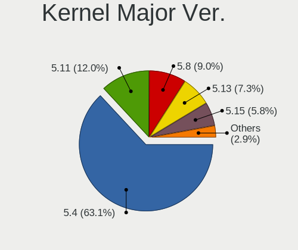

| Version | Notebooks | Percent |
|---------|-----------|---------|
| 5.4     | 667       | 63.65%  |
| 5.11    | 130       | 12.4%   |
| 5.8     | 97        | 9.26%   |
| 5.13    | 78        | 7.44%   |
| 5.15    | 47        | 4.48%   |
| 5.10    | 7         | 0.67%   |
| 5.14    | 5         | 0.48%   |
| 5.7     | 3         | 0.29%   |
| 5.6     | 3         | 0.29%   |
| 5.9     | 2         | 0.19%   |
| 5.18    | 2         | 0.19%   |
| 5.12    | 2         | 0.19%   |
| 4.4     | 2         | 0.19%   |
| 5.17    | 1         | 0.1%    |
| 5.16    | 1         | 0.1%    |
| 4.15    | 1         | 0.1%    |

Arch
----

OS architecture (x86_64, i586, etc.)

| Name   | Notebooks | Percent |
|--------|-----------|---------|
| x86_64 | 1026      | 100%    |

DE
--

Desktop Environment

| Name            | Notebooks | Percent |
|-----------------|-----------|---------|
| XFCE            | 982       | 95.71%  |
| GNOME           | 29        | 2.83%   |
| i3              | 5         | 0.49%   |
| KDE5            | 3         | 0.29%   |
| Unity           | 2         | 0.19%   |
| xmonad          | 1         | 0.1%    |
| MATE            | 1         | 0.1%    |
| ICEWM           | 1         | 0.1%    |
| GNUstep         | 1         | 0.1%    |
| GNOME Flashback | 1         | 0.1%    |

Display Server
--------------

X11 or Wayland

| Name    | Notebooks | Percent |
|---------|-----------|---------|
| X11     | 1012      | 98.64%  |
| Tty     | 9         | 0.88%   |
| Wayland | 5         | 0.49%   |

Display Manager
---------------

SDDM, LightDM, etc.

| Name    | Notebooks | Percent |
|---------|-----------|---------|
| Unknown | 481       | 45.51%  |
| LightDM | 356       | 33.68%  |
| TDM     | 187       | 17.69%  |
| GDM     | 19        | 1.8%    |
| GDM3    | 12        | 1.14%   |
| SDDM    | 2         | 0.19%   |

OS Lang
-------

Language

| Lang  | Notebooks | Percent |
|-------|-----------|---------|
| en_US | 363       | 35.31%  |
| de_DE | 111       | 10.8%   |
| fr_FR | 104       | 10.12%  |
| pt_BR | 63        | 6.13%   |
| it_IT | 57        | 5.54%   |
| C     | 54        | 5.25%   |
| en_GB | 40        | 3.89%   |
| ru_RU | 36        | 3.5%    |
| es_ES | 26        | 2.53%   |
| pl_PL | 21        | 2.04%   |
| en_CA | 13        | 1.26%   |
| en_AU | 10        | 0.97%   |
| nl_NL | 9         | 0.88%   |
| es_AR | 9         | 0.88%   |
| en_IN | 9         | 0.88%   |
| cs_CZ | 9         | 0.88%   |
| ja_JP | 7         | 0.68%   |
| hu_HU | 7         | 0.68%   |
| es_MX | 6         | 0.58%   |
| sv_SE | 5         | 0.49%   |
| ru_UA | 4         | 0.39%   |
| fr_BE | 4         | 0.39%   |
| fi_FI | 4         | 0.39%   |
| es_PE | 4         | 0.39%   |
| pt_PT | 3         | 0.29%   |
| es_CO | 3         | 0.29%   |
| en_SG | 3         | 0.29%   |
| el_GR | 3         | 0.29%   |
| de_CH | 3         | 0.29%   |
| de_AT | 3         | 0.29%   |
| zh_CN | 2         | 0.19%   |
| uk_UA | 2         | 0.19%   |
| tr_TR | 2         | 0.19%   |
| nl_BE | 2         | 0.19%   |
| nb_NO | 2         | 0.19%   |
| lt_LT | 2         | 0.19%   |
| id_ID | 2         | 0.19%   |
| fr_CA | 2         | 0.19%   |
| es_CL | 2         | 0.19%   |
| en_ZA | 2         | 0.19%   |

Boot Mode
---------

EFI or BIOS

| Mode | Notebooks | Percent |
|------|-----------|---------|
| BIOS | 553       | 53.64%  |
| EFI  | 478       | 46.36%  |

Filesystem
----------

Type of filesystem

| Type    | Notebooks | Percent |
|---------|-----------|---------|
| Ext4    | 929       | 90.11%  |
| Overlay | 61        | 5.92%   |
| Btrfs   | 14        | 1.36%   |
| Tmpfs   | 10        | 0.97%   |
| Zfs     | 7         | 0.68%   |
| Xfs     | 3         | 0.29%   |
| Ext2    | 3         | 0.29%   |
| Ext3    | 2         | 0.19%   |
| Unknown | 2         | 0.19%   |

Part. scheme
------------

Scheme of partitioning

| Type    | Notebooks | Percent |
|---------|-----------|---------|
| Unknown | 591       | 57.05%  |
| GPT     | 265       | 25.58%  |
| MBR     | 180       | 17.37%  |

Dual Boot with Linux/BSD
------------------------

Hosting more than one Linux/BSD

| Dual boot | Notebooks | Percent |
|-----------|-----------|---------|
| No        | 897       | 85.84%  |
| Yes       | 148       | 14.16%  |

Dual Boot (Win)
---------------

Hosting Linux and Windows

| Dual boot | Notebooks | Percent |
|-----------|-----------|---------|
| No        | 707       | 68.05%  |
| Yes       | 332       | 31.95%  |

Board
-----

Vendor
------

Motherboard manufacturer

| Name                   | Notebooks | Percent |
|------------------------|-----------|---------|
| Hewlett-Packard        | 214       | 20.86%  |
| Lenovo                 | 196       | 19.1%   |
| Dell                   | 155       | 15.11%  |
| ASUSTek Computer       | 117       | 11.4%   |
| Acer                   | 88        | 8.58%   |
| Toshiba                | 51        | 4.97%   |
| Apple                  | 23        | 2.24%   |
| Samsung Electronics    | 22        | 2.14%   |
| MSI                    | 16        | 1.56%   |
| Sony                   | 15        | 1.46%   |
| Notebook               | 12        | 1.17%   |
| Medion                 | 12        | 1.17%   |
| Packard Bell           | 8         | 0.78%   |
| Clevo                  | 8         | 0.78%   |
| Fujitsu Siemens        | 7         | 0.68%   |
| Fujitsu                | 7         | 0.68%   |
| TUXEDO                 | 5         | 0.49%   |
| Positivo               | 5         | 0.49%   |
| HUAWEI                 | 4         | 0.39%   |
| Gateway                | 4         | 0.39%   |
| Schenker               | 3         | 0.29%   |
| GPU Company            | 3         | 0.29%   |
| Google                 | 3         | 0.29%   |
| Dynabook               | 3         | 0.29%   |
| Alienware              | 3         | 0.29%   |
| Unknown                | 3         | 0.29%   |
| Razer                  | 2         | 0.19%   |
| Multilaser             | 2         | 0.19%   |
| Itautec                | 2         | 0.19%   |
| Intel                  | 2         | 0.19%   |
| Exo                    | 2         | 0.19%   |
| AMI                    | 2         | 0.19%   |
| VIT                    | 1         | 0.1%    |
| UNOWHY                 | 1         | 0.1%    |
| System76               | 1         | 0.1%    |
| Semp Toshiba           | 1         | 0.1%    |
| Quanta                 | 1         | 0.1%    |
| PLAISIO COMPUTERS SA   | 1         | 0.1%    |
| Panasonic              | 1         | 0.1%    |
| ONE-NETBOOK TECHNOLOGY | 1         | 0.1%    |

Model
-----

Motherboard model

| Name                                   | Notebooks | Percent |
|----------------------------------------|-----------|---------|
| HP Notebook                            | 11        | 1.07%   |
| Unknown                                | 10        | 0.97%   |
| Dell Latitude D630                     | 8         | 0.78%   |
| HP Pavilion dv6                        | 6         | 0.58%   |
| Dell Latitude E6430                    | 6         | 0.58%   |
| ASUS VivoBook_ASUSLaptop X571LH_K571LH | 6         | 0.58%   |
| HP Pavilion dv7                        | 5         | 0.49%   |
| HP 15                                  | 5         | 0.49%   |
| HP EliteBook 8560p                     | 4         | 0.39%   |
| Dell Latitude E6330                    | 4         | 0.39%   |
| ASUS K53SC                             | 4         | 0.39%   |
| Toshiba Satellite A100                 | 3         | 0.29%   |
| Toshiba PORTEGE R930                   | 3         | 0.29%   |
| HP ProBook 4540s                       | 3         | 0.29%   |
| HP Presario C700                       | 3         | 0.29%   |
| HP Pavilion Gaming Laptop 15-ec0xxx    | 3         | 0.29%   |
| HP Pavilion g7                         | 3         | 0.29%   |
| HP Pavilion g6                         | 3         | 0.29%   |
| HP Pavilion dv6500                     | 3         | 0.29%   |
| HP Pavilion 17                         | 3         | 0.29%   |
| HP Pavilion 15                         | 3         | 0.29%   |
| HP G42                                 | 3         | 0.29%   |
| HP 255 G7 Notebook PC                  | 3         | 0.29%   |
| Dell Latitude E6540                    | 3         | 0.29%   |
| Dell Latitude E6420                    | 3         | 0.29%   |
| Dell Latitude 7480                     | 3         | 0.29%   |
| Dell Inspiron 7720                     | 3         | 0.29%   |
| Dell Inspiron 5566                     | 3         | 0.29%   |
| ASUS X553MA                            | 3         | 0.29%   |
| ASUS T100HAN                           | 3         | 0.29%   |
| Acer Extensa 5230                      | 3         | 0.29%   |
| Acer Aspire 7720                       | 3         | 0.29%   |
| Toshiba Satellite L350D                | 2         | 0.19%   |
| Medion E6228                           | 2         | 0.19%   |
| Lenovo V560                            | 2         | 0.19%   |
| Lenovo ThinkPad T495s 20QJCTO1WW       | 2         | 0.19%   |
| Lenovo IdeaPad 330S-15ARR 81FB         | 2         | 0.19%   |
| Lenovo IdeaPad 100-15IBY 80MJ          | 2         | 0.19%   |
| Lenovo G500 20236                      | 2         | 0.19%   |
| HUAWEI NBLK-WAX9X                      | 2         | 0.19%   |

Model Family
------------

Motherboard model prefix

| Name                  | Notebooks | Percent |
|-----------------------|-----------|---------|
| Lenovo ThinkPad       | 121       | 11.79%  |
| Dell Latitude         | 69        | 6.73%   |
| Acer Aspire           | 60        | 5.85%   |
| Dell Inspiron         | 52        | 5.07%   |
| HP Pavilion           | 50        | 4.87%   |
| Toshiba Satellite     | 41        | 4%      |
| Lenovo IdeaPad        | 35        | 3.41%   |
| HP EliteBook          | 32        | 3.12%   |
| ASUS VivoBook         | 23        | 2.24%   |
| HP ProBook            | 22        | 2.14%   |
| HP Laptop             | 22        | 2.14%   |
| HP Compaq             | 19        | 1.85%   |
| HP Notebook           | 12        | 1.17%   |
| Dell Vostro           | 12        | 1.17%   |
| Acer Extensa          | 11        | 1.07%   |
| Unknown               | 10        | 0.97%   |
| Packard Bell EasyNote | 7         | 0.68%   |
| HP 255                | 6         | 0.58%   |
| Dell XPS              | 6         | 0.58%   |
| Dell Precision        | 6         | 0.58%   |
| Toshiba PORTEGE       | 5         | 0.49%   |
| HP Presario           | 5         | 0.49%   |
| HP 15                 | 5         | 0.49%   |
| Fujitsu LIFEBOOK      | 5         | 0.49%   |
| HP OMEN               | 4         | 0.39%   |
| HP 250                | 4         | 0.39%   |
| Fujitsu Siemens AMILO | 4         | 0.39%   |
| Dell Studio           | 4         | 0.39%   |
| ASUS K53SC            | 4         | 0.39%   |
| Acer Nitro            | 4         | 0.39%   |
| Samsung R530          | 3         | 0.29%   |
| Lenovo ThinkBook      | 3         | 0.29%   |
| Lenovo B590           | 3         | 0.29%   |
| HP ZBook              | 3         | 0.29%   |
| HP Stream             | 3         | 0.29%   |
| HP G42                | 3         | 0.29%   |
| HP ENVY               | 3         | 0.29%   |
| Dell System           | 3         | 0.29%   |
| ASUS X553MA           | 3         | 0.29%   |
| ASUS T100HAN          | 3         | 0.29%   |

MFG Year
--------

Motherboard manufacture year

| Year | Notebooks | Percent |
|------|-----------|---------|
| 2012 | 104       | 10.14%  |
| 2011 | 103       | 10.04%  |
| 2019 | 82        | 7.99%   |
| 2013 | 82        | 7.99%   |
| 2010 | 81        | 7.89%   |
| 2008 | 67        | 6.53%   |
| 2014 | 65        | 6.34%   |
| 2007 | 61        | 5.95%   |
| 2020 | 60        | 5.85%   |
| 2018 | 60        | 5.85%   |
| 2017 | 60        | 5.85%   |
| 2016 | 50        | 4.87%   |
| 2015 | 44        | 4.29%   |
| 2021 | 43        | 4.19%   |
| 2009 | 43        | 4.19%   |
| 2006 | 14        | 1.36%   |
| 2022 | 4         | 0.39%   |
| 2005 | 3         | 0.29%   |

Form Factor
-----------

Physical design of the computer

| Name     | Notebooks | Percent |
|----------|-----------|---------|
| Notebook | 1026      | 100%    |

Secure Boot
-----------

Enabled or disabled

| State    | Notebooks | Percent |
|----------|-----------|---------|
| Disabled | 941       | 91.27%  |
| Enabled  | 90        | 8.73%   |

Coreboot
--------

Have coreboot on board

| Used | Notebooks | Percent |
|------|-----------|---------|
| No   | 1022      | 99.61%  |
| Yes  | 4         | 0.39%   |

RAM Size
--------

Total RAM memory

| Size in GB      | Notebooks | Percent |
|-----------------|-----------|---------|
| 3.01-4.0        | 331       | 31.95%  |
| 4.01-8.0        | 260       | 25.1%   |
| 8.01-16.0       | 126       | 12.16%  |
| 16.01-24.0      | 124       | 11.97%  |
| 1.01-2.0        | 96        | 9.27%   |
| 32.01-64.0      | 38        | 3.67%   |
| 2.01-3.0        | 26        | 2.51%   |
| 0.51-1.0        | 17        | 1.64%   |
| 64.01-256.0     | 9         | 0.87%   |
| 24.01-32.0      | 7         | 0.68%   |
| More than 256.0 | 1         | 0.1%    |
| 0.01-0.5        | 1         | 0.1%    |

RAM Used
--------

Used RAM memory

| Used GB    | Notebooks | Percent |
|------------|-----------|---------|
| 1.01-2.0   | 514       | 45.81%  |
| 2.01-3.0   | 240       | 21.39%  |
| 0.51-1.0   | 144       | 12.83%  |
| 4.01-8.0   | 104       | 9.27%   |
| 3.01-4.0   | 85        | 7.58%   |
| 8.01-16.0  | 28        | 2.5%    |
| 16.01-24.0 | 3         | 0.27%   |
| 0.01-0.5   | 3         | 0.27%   |
| 24.01-32.0 | 1         | 0.09%   |

Total Drives
------------

Number of drives on board

| Drives | Notebooks | Percent |
|--------|-----------|---------|
| 1      | 764       | 72.9%   |
| 2      | 235       | 22.42%  |
| 3      | 25        | 2.39%   |
| 0      | 18        | 1.72%   |
| 4      | 4         | 0.38%   |
| 7      | 1         | 0.1%    |
| 5      | 1         | 0.1%    |

Has CD-ROM
----------

Has CD-ROM on board

| Presented | Notebooks | Percent |
|-----------|-----------|---------|
| Yes       | 517       | 50.34%  |
| No        | 510       | 49.66%  |

Has Ethernet
------------

Has Ethernet on board

| Presented | Notebooks | Percent |
|-----------|-----------|---------|
| Yes       | 895       | 87.15%  |
| No        | 132       | 12.85%  |

Has WiFi
--------

Has WiFi module

| Presented | Notebooks | Percent |
|-----------|-----------|---------|
| Yes       | 997       | 96.89%  |
| No        | 32        | 3.11%   |

Has Bluetooth
-------------

Has Bluetooth module

| Presented | Notebooks | Percent |
|-----------|-----------|---------|
| Yes       | 659       | 63.37%  |
| No        | 381       | 36.63%  |

Location
--------

Country
-------

Geographic location (country)

| Country     | Notebooks | Percent |
|-------------|-----------|---------|
| USA         | 167       | 16.17%  |
| Germany     | 139       | 13.46%  |
| France      | 108       | 10.45%  |
| Brazil      | 68        | 6.58%   |
| Italy       | 62        | 6%      |
| Russia      | 49        | 4.74%   |
| Canada      | 43        | 4.16%   |
| UK          | 39        | 3.78%   |
| Spain       | 39        | 3.78%   |
| Netherlands | 30        | 2.9%    |
| Poland      | 25        | 2.42%   |
| Belgium     | 14        | 1.36%   |
| Portugal    | 12        | 1.16%   |
| Czechia     | 12        | 1.16%   |
| Argentina   | 12        | 1.16%   |
| Ukraine     | 11        | 1.06%   |
| India       | 11        | 1.06%   |
| Mexico      | 10        | 0.97%   |
| Finland     | 10        | 0.97%   |
| Australia   | 10        | 0.97%   |
| Indonesia   | 9         | 0.87%   |
| Greece      | 9         | 0.87%   |
| Turkey      | 8         | 0.77%   |
| Japan       | 8         | 0.77%   |
| Bulgaria    | 8         | 0.77%   |
| Sweden      | 7         | 0.68%   |
| Norway      | 7         | 0.68%   |
| Hungary     | 7         | 0.68%   |
| Austria     | 6         | 0.58%   |
| Denmark     | 5         | 0.48%   |
| Romania     | 4         | 0.39%   |
| Peru        | 4         | 0.39%   |
| Lithuania   | 4         | 0.39%   |
| Colombia    | 4         | 0.39%   |
| Belarus     | 4         | 0.39%   |
| Slovenia    | 3         | 0.29%   |
| Slovakia    | 3         | 0.29%   |
| Singapore   | 3         | 0.29%   |
| Serbia      | 3         | 0.29%   |
| Iran        | 3         | 0.29%   |

City
----

Geographic location (city)

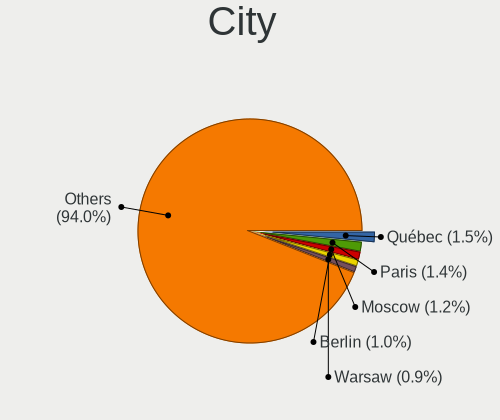

| City              | Notebooks | Percent |
|-------------------|-----------|---------|
| Qubec           | 17        | 1.57%   |
| Paris             | 16        | 1.47%   |
| Moscow            | 12        | 1.1%    |
| Berlin            | 11        | 1.01%   |
| Warsaw            | 10        | 0.92%   |
| Hamburg           | 10        | 0.92%   |
| St Petersburg     | 9         | 0.83%   |
| Rome              | 9         | 0.83%   |
| Amsterdam         | 9         | 0.83%   |
| Munich            | 7         | 0.64%   |
| Athens            | 7         | 0.64%   |
| Sao Paulo         | 6         | 0.55%   |
| Rio de Janeiro    | 6         | 0.55%   |
| Vienna            | 5         | 0.46%   |
| Sofia             | 5         | 0.46%   |
| Pittsburgh        | 5         | 0.46%   |
| Milan             | 5         | 0.46%   |
| Madrid            | 5         | 0.46%   |
| Karlsruhe         | 5         | 0.46%   |
| Helsinki          | 5         | 0.46%   |
| Genoa             | 5         | 0.46%   |
| Frankfurt am Main | 5         | 0.46%   |
| Budapest          | 5         | 0.46%   |
| Barcelona         | 5         | 0.46%   |
| Toronto           | 4         | 0.37%   |
| Mannheim          | 4         | 0.37%   |
| Lisbon            | 4         | 0.37%   |
| Lima              | 4         | 0.37%   |
| Leipzig           | 4         | 0.37%   |
| Kyiv              | 4         | 0.37%   |
| Chicago           | 4         | 0.37%   |
| Biella            | 4         | 0.37%   |
| Yokohama          | 3         | 0.28%   |
| Wroclaw           | 3         | 0.28%   |
| Vilnius           | 3         | 0.28%   |
| Varna             | 3         | 0.28%   |
| Sydney            | 3         | 0.28%   |
| Spring Valley     | 3         | 0.28%   |
| Singapore         | 3         | 0.28%   |
| Shinjuku          | 3         | 0.28%   |

Drives
------

Drive Vendor
------------

Hard drive vendors

| Vendor              | Notebooks | Drives | Percent |
|---------------------|-----------|--------|---------|
| Samsung Electronics | 183       | 230    | 14.98%  |
| Seagate             | 177       | 211    | 14.48%  |
| WDC                 | 158       | 188    | 12.93%  |
| Toshiba             | 111       | 132    | 9.08%   |
| Unknown             | 90        | 110    | 7.36%   |
| Kingston            | 55        | 71     | 4.5%    |
| Hitachi             | 52        | 64     | 4.26%   |
| SanDisk             | 44        | 56     | 3.6%    |
| HGST                | 40        | 47     | 3.27%   |
| SK hynix            | 35        | 42     | 2.86%   |
| Crucial             | 34        | 40     | 2.78%   |
| Intel               | 30        | 44     | 2.45%   |
| Fujitsu             | 22        | 28     | 1.8%    |
| Micron Technology   | 20        | 21     | 1.64%   |
| A-DATA Technology   | 15        | 19     | 1.23%   |
| China               | 11        | 12     | 0.9%    |
| Apple               | 10        | 13     | 0.82%   |
| KIOXIA              | 8         | 10     | 0.65%   |
| Intenso             | 8         | 8      | 0.65%   |
| LITEON              | 7         | 9      | 0.57%   |
| JMicron Technology  | 6         | 6      | 0.49%   |
| Phison              | 5         | 8      | 0.41%   |
| OCZ                 | 5         | 5      | 0.41%   |
| LITEONIT            | 5         | 7      | 0.41%   |
| KingSpec            | 5         | 6      | 0.41%   |
| Transcend           | 4         | 4      | 0.33%   |
| SPCC                | 4         | 5      | 0.33%   |
| PNY                 | 4         | 4      | 0.33%   |
| Apacer              | 4         | 5      | 0.33%   |
| Unknown             | 4         | 4      | 0.33%   |
| SSK                 | 3         | 3      | 0.25%   |
| Patriot             | 3         | 3      | 0.25%   |
| Netac               | 3         | 3      | 0.25%   |
| Hewlett-Packard     | 3         | 2      | 0.25%   |
| USB3.0              | 2         | 2      | 0.16%   |
| Smartbuy            | 2         | 2      | 0.16%   |
| Silicon Motion      | 2         | 2      | 0.16%   |
| Mushkin             | 2         | 2      | 0.16%   |
| GOODRAM             | 2         | 2      | 0.16%   |
| Gigabyte Technology | 2         | 4      | 0.16%   |

Drive Model
-----------

Hard drive models

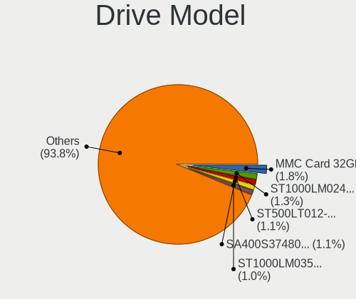

| Model                               | Notebooks | Percent |
|-------------------------------------|-----------|---------|
| Unknown MMC Card  32GB              | 23        | 1.81%   |
| Seagate ST1000LM024 HN-M101MBB 1TB  | 16        | 1.26%   |
| Seagate ST500LT012-1DG142 500GB     | 14        | 1.1%    |
| Seagate ST1000LM035-1RK172 1TB      | 13        | 1.02%   |
| Kingston SA400S37480G 480GB SSD     | 13        | 1.02%   |
| Unknown MMC Card  64GB              | 12        | 0.95%   |
| Seagate ST500LM012 HN-M500MBB 500GB | 12        | 0.95%   |
| Samsung SSD 850 EVO 250GB           | 11        | 0.87%   |
| HGST HTS721010A9E630 1TB            | 11        | 0.87%   |
| Toshiba MQ01ABF050 500GB            | 10        | 0.79%   |
| Unknown MMC Card  128GB             | 9         | 0.71%   |
| Toshiba MQ01ABD100 1TB              | 9         | 0.71%   |
| Seagate ST500LT012-9WS142 500GB     | 9         | 0.71%   |
| SK hynix NVMe SSD Drive 256GB       | 8         | 0.63%   |
| Samsung NVMe SSD Drive 512GB        | 8         | 0.63%   |
| HGST HTS541010A9E680 1TB            | 8         | 0.63%   |
| WDC WD3200BEVT-22ZCT0 320GB         | 7         | 0.55%   |
| Unknown MMC Card  16GB              | 7         | 0.55%   |
| Toshiba MQ04ABF100 1TB              | 7         | 0.55%   |
| Seagate ST9250315AS 250GB           | 7         | 0.55%   |
| Samsung SSD 860 EVO 500GB           | 7         | 0.55%   |
| Samsung SSD 860 EVO 1TB             | 7         | 0.55%   |
| Samsung HM321HI 320GB               | 7         | 0.55%   |
| Kingston SA400S37240G 240GB SSD     | 7         | 0.55%   |
| Kingston SA400S37120G 120GB SSD     | 7         | 0.55%   |
| Hitachi HTS547550A9E384 500GB       | 7         | 0.55%   |
| Crucial CT500MX500SSD1 500GB        | 7         | 0.55%   |
| WDC WD10JPVX-22JC3T0 1TB            | 6         | 0.47%   |
| Seagate ST9750420AS 752GB           | 6         | 0.47%   |
| Seagate ST2000LM007-1R8174 2TB      | 6         | 0.47%   |
| Intel HBRPEKNX0202AO 32GB           | 6         | 0.47%   |
| Intel HBRPEKNX0202A 512GB           | 6         | 0.47%   |
| Seagate ST9500423AS 500GB           | 5         | 0.39%   |
| Seagate ST9320325AS 320GB           | 5         | 0.39%   |
| Samsung SSD 850 EVO 500GB           | 5         | 0.39%   |
| Kingston SV300S37A120G 120GB SSD    | 5         | 0.39%   |
| Kingston SA400S37960G 960GB SSD     | 5         | 0.39%   |
| Hitachi HTS723232A7A364 320GB       | 5         | 0.39%   |
| Crucial CT240BX500SSD1 240GB        | 5         | 0.39%   |
| WDC WD1600BEVT-22ZCT0 160GB         | 4         | 0.32%   |

HDD Vendor
----------

Hard disk drive vendors

| Vendor              | Notebooks | Drives | Percent |
|---------------------|-----------|--------|---------|
| Seagate             | 175       | 208    | 32.11%  |
| WDC                 | 121       | 146    | 22.2%   |
| Toshiba             | 89        | 108    | 16.33%  |
| Hitachi             | 52        | 64     | 9.54%   |
| HGST                | 40        | 47     | 7.34%   |
| Samsung Electronics | 28        | 34     | 5.14%   |
| Fujitsu             | 21        | 27     | 3.85%   |
| Unknown             | 4         | 4      | 0.73%   |
| SSK                 | 3         | 3      | 0.55%   |
| USB3.0              | 2         | 2      | 0.37%   |
| ASMT                | 2         | 4      | 0.37%   |
| SABRENT             | 1         | 1      | 0.18%   |
| Pioneer             | 1         | 1      | 0.18%   |
| Intenso             | 1         | 1      | 0.18%   |
| HGST HTS            | 1         | 1      | 0.18%   |
| CLOVER              | 1         | 1      | 0.18%   |
| ASMedia             | 1         | 1      | 0.18%   |
| ACASIS              | 1         | 1      | 0.18%   |
| Unknown             | 1         | 1      | 0.18%   |

SSD Vendor
----------

Solid state drive vendors

| Vendor              | Notebooks | Drives | Percent |
|---------------------|-----------|--------|---------|
| Samsung Electronics | 97        | 125    | 25.46%  |
| Kingston            | 48        | 63     | 12.6%   |
| Crucial             | 34        | 40     | 8.92%   |
| SanDisk             | 31        | 41     | 8.14%   |
| A-DATA Technology   | 13        | 17     | 3.41%   |
| Micron Technology   | 12        | 12     | 3.15%   |
| WDC                 | 11        | 11     | 2.89%   |
| China               | 11        | 12     | 2.89%   |
| Toshiba             | 10        | 10     | 2.62%   |
| SK hynix            | 10        | 10     | 2.62%   |
| Intel               | 10        | 15     | 2.62%   |
| LITEON              | 7         | 9      | 1.84%   |
| Intenso             | 7         | 7      | 1.84%   |
| Apple               | 6         | 7      | 1.57%   |
| OCZ                 | 5         | 5      | 1.31%   |
| LITEONIT            | 5         | 7      | 1.31%   |
| Unknown             | 4         | 5      | 1.05%   |
| Transcend           | 4         | 4      | 1.05%   |
| SPCC                | 4         | 5      | 1.05%   |
| PNY                 | 4         | 4      | 1.05%   |
| KingSpec            | 4         | 5      | 1.05%   |
| Apacer              | 4         | 5      | 1.05%   |
| Patriot             | 3         | 3      | 0.79%   |
| JMicron Technology  | 3         | 3      | 0.79%   |
| Smartbuy            | 2         | 2      | 0.52%   |
| Netac               | 2         | 2      | 0.52%   |
| Mushkin             | 2         | 2      | 0.52%   |
| Hewlett-Packard     | 2         | 2      | 0.52%   |
| GOODRAM             | 2         | 2      | 0.52%   |
| Gigabyte Technology | 2         | 4      | 0.52%   |
| Drevo               | 2         | 2      | 0.52%   |
| Zheino              | 1         | 1      | 0.26%   |
| TO Exter            | 1         | 1      | 0.26%   |
| TCSUNBOW            | 1         | 1      | 0.26%   |
| SUNEAST             | 1         | 2      | 0.26%   |
| SSSTC               | 1         | 1      | 0.26%   |
| Seagate             | 1         | 1      | 0.26%   |
| OWC                 | 1         | 1      | 0.26%   |
| Microtech           | 1         | 1      | 0.26%   |
| Londisk             | 1         | 1      | 0.26%   |

Drive Kind
----------

HDD or SSD

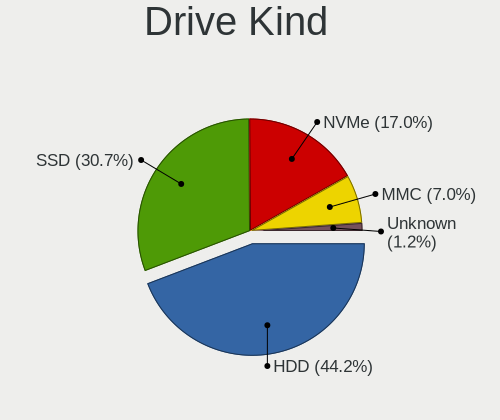

| Kind    | Notebooks | Drives | Percent |
|---------|-----------|--------|---------|
| HDD     | 529       | 655    | 44.75%  |
| SSD     | 356       | 465    | 30.12%  |
| NVMe    | 197       | 243    | 16.67%  |
| MMC     | 85        | 103    | 7.19%   |
| Unknown | 15        | 18     | 1.27%   |

Drive Connector
---------------

SATA, SAS, NVMe, etc.

| Type | Notebooks | Drives | Percent |
|------|-----------|--------|---------|
| SATA | 808       | 1076   | 70.94%  |
| NVMe | 197       | 242    | 17.3%   |
| MMC  | 85        | 103    | 7.46%   |
| SAS  | 49        | 63     | 4.3%    |

Drive Size
----------

Size of hard drive

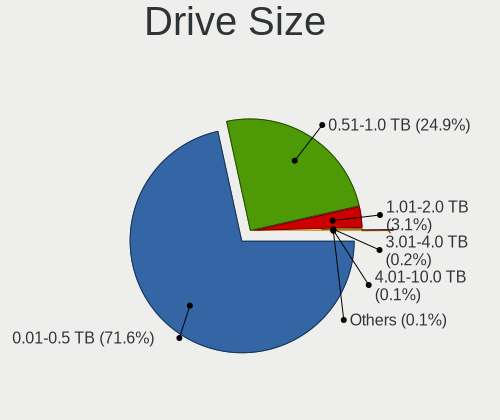

| Size in TB | Notebooks | Drives | Percent |
|------------|-----------|--------|---------|
| 0.01-0.5   | 625       | 802    | 71.27%  |
| 0.51-1.0   | 223       | 279    | 25.43%  |
| 1.01-2.0   | 22        | 24     | 2.51%   |
| 4.01-10.0  | 3         | 9      | 0.34%   |
| 3.01-4.0   | 2         | 4      | 0.23%   |
| 2.01-3.0   | 1         | 1      | 0.11%   |
| 0          | 1         | 1      | 0.11%   |

Space Total
-----------

Amount of disk space available on the file system

| Size in GB     | Notebooks | Percent |
|----------------|-----------|---------|
| 101-250        | 365       | 34.5%   |
| 251-500        | 290       | 27.41%  |
| 501-1000       | 149       | 14.08%  |
| 51-100         | 80        | 7.56%   |
| 21-50          | 62        | 5.86%   |
| 1-20           | 45        | 4.25%   |
| 1001-2000      | 41        | 3.88%   |
| 2001-3000      | 12        | 1.13%   |
| More than 3000 | 8         | 0.76%   |
| Unknown        | 6         | 0.57%   |

Space Used
----------

Amount of used disk space

| Used GB        | Notebooks | Percent |
|----------------|-----------|---------|
| 1-20           | 450       | 40.95%  |
| 21-50          | 213       | 19.38%  |
| 101-250        | 161       | 14.65%  |
| 51-100         | 139       | 12.65%  |
| 251-500        | 77        | 7.01%   |
| 501-1000       | 36        | 3.28%   |
| 1001-2000      | 11        | 1%      |
| Unknown        | 6         | 0.55%   |
| More than 3000 | 3         | 0.27%   |
| 2001-3000      | 3         | 0.27%   |

Malfunc. Drives
---------------

Drive models with a malfunction

| Model                                | Notebooks | Drives | Percent |
|--------------------------------------|-----------|--------|---------|
| Seagate ST1000LM024 HN-M101MBB 1TB   | 4         | 4      | 4.94%   |
| Seagate ST500LT012-9WS142 500GB      | 3         | 3      | 3.7%    |
| Toshiba MQ01ABD100 1TB               | 2         | 3      | 2.47%   |
| Seagate ST9320325AS 320GB            | 2         | 2      | 2.47%   |
| Hitachi HTS545050A7E380 500GB        | 2         | 2      | 2.47%   |
| HGST HTS545050A7E680 500GB           | 2         | 2      | 2.47%   |
| WDC WD7500BPVT-80HXZT3 752GB         | 1         | 1      | 1.23%   |
| WDC WD7500BPKX-00HPJT0 752GB         | 1         | 1      | 1.23%   |
| WDC WD5000BEKT-75KA9T0 500GB         | 1         | 1      | 1.23%   |
| WDC WD1600BJKT-75F4T0 160GB          | 1         | 1      | 1.23%   |
| WDC WD10SPCX-24HWST1 1TB             | 1         | 1      | 1.23%   |
| WDC WD10JPVX-22JC3T0 1TB             | 1         | 2      | 1.23%   |
| WDC WD10JPVT-08A1YT2 1TB             | 1         | 1      | 1.23%   |
| Toshiba MQ01ACF050 500GB             | 1         | 1      | 1.23%   |
| Toshiba MK7575GSX 752GB              | 1         | 1      | 1.23%   |
| Toshiba MK7559GSXP 752GB             | 1         | 2      | 1.23%   |
| Toshiba MK5076GSX 500GB              | 1         | 1      | 1.23%   |
| Toshiba MK5065GSX 500GB              | 1         | 1      | 1.23%   |
| Toshiba MK5059GSXP 500GB             | 1         | 1      | 1.23%   |
| Toshiba MK3276GSX -63 320GB          | 1         | 2      | 1.23%   |
| Toshiba MK3259GSXP 320GB             | 1         | 1      | 1.23%   |
| Toshiba MK2552GSX 250GB              | 1         | 1      | 1.23%   |
| Toshiba MK1665GSX 160GB              | 1         | 1      | 1.23%   |
| SK hynix SH920 2.5 7MM 256GB SSD     | 1         | 1      | 1.23%   |
| SK hynix SC401 SATA 512GB SSD        | 1         | 1      | 1.23%   |
| SK hynix SC308 SATA 512GB SSD        | 1         | 1      | 1.23%   |
| SK hynix BC711 HFM512GD3JX013N 512GB | 1         | 1      | 1.23%   |
| Seagate ST980411ASG 80GB             | 1         | 1      | 1.23%   |
| Seagate ST9750420AS 752GB            | 1         | 2      | 1.23%   |
| Seagate ST95005620AS 500GB           | 1         | 1      | 1.23%   |
| Seagate ST9500423AS 500GB            | 1         | 1      | 1.23%   |
| Seagate ST9500420ASG 500GB           | 1         | 2      | 1.23%   |
| Seagate ST9500325AS 500GB            | 1         | 1      | 1.23%   |
| Seagate ST9320423AS 320GB            | 1         | 1      | 1.23%   |
| Seagate ST9250410AS 250GB            | 1         | 1      | 1.23%   |
| Seagate ST500LM021-1KJ152 500GB      | 1         | 1      | 1.23%   |
| Seagate ST500LM012 HN-M500MBB 500GB  | 1         | 1      | 1.23%   |
| Seagate ST500DM002-1BD142 500GB      | 1         | 1      | 1.23%   |
| Seagate ST320LT020-9YG142 320GB      | 1         | 1      | 1.23%   |
| Seagate ST320LT012-9WS14C 320GB      | 1         | 1      | 1.23%   |

Malfunc. Drive Vendor
---------------------

Vendors of faulty drives

| Vendor              | Notebooks | Drives | Percent |
|---------------------|-----------|--------|---------|
| Seagate             | 24        | 26     | 29.63%  |
| Toshiba             | 12        | 15     | 14.81%  |
| Hitachi             | 8         | 8      | 9.88%   |
| WDC                 | 7         | 8      | 8.64%   |
| SK hynix            | 4         | 4      | 4.94%   |
| HGST                | 4         | 5      | 4.94%   |
| Fujitsu             | 4         | 5      | 4.94%   |
| Samsung Electronics | 3         | 3      | 3.7%    |
| OCZ                 | 2         | 2      | 2.47%   |
| Micron Technology   | 2         | 2      | 2.47%   |
| Intel               | 2         | 2      | 2.47%   |
| A-DATA Technology   | 2         | 3      | 2.47%   |
| SanDisk             | 1         | 1      | 1.23%   |
| Mushkin             | 1         | 1      | 1.23%   |
| LDLC                | 1         | 1      | 1.23%   |
| Kingston            | 1         | 1      | 1.23%   |
| Crucial             | 1         | 1      | 1.23%   |
| China               | 1         | 1      | 1.23%   |
| Apple               | 1         | 1      | 1.23%   |

Malfunc. HDD Vendor
-------------------

Vendors of faulty HDD drives

| Vendor              | Notebooks | Drives | Percent |
|---------------------|-----------|--------|---------|
| Seagate             | 24        | 26     | 39.34%  |
| Toshiba             | 12        | 15     | 19.67%  |
| Hitachi             | 8         | 8      | 13.11%  |
| WDC                 | 7         | 8      | 11.48%  |
| HGST                | 4         | 5      | 6.56%   |
| Fujitsu             | 4         | 5      | 6.56%   |
| Samsung Electronics | 2         | 2      | 3.28%   |

Malfunc. Drive Kind
-------------------

Kinds of faulty drives

| Kind | Notebooks | Drives | Percent |
|------|-----------|--------|---------|
| HDD  | 61        | 69     | 75.31%  |
| SSD  | 18        | 19     | 22.22%  |
| NVMe | 2         | 2      | 2.47%   |

Failed Drives
-------------

Failed drive models

Zero info for selected period =(

Failed Drive Vendor
-------------------

Failed drive vendors

Zero info for selected period =(

Drive Status
------------

Number of failed and malfunc. drives

| Status   | Notebooks | Drives | Percent |
|----------|-----------|--------|---------|
| Detected | 652       | 971    | 61.05%  |
| Works    | 336       | 423    | 31.46%  |
| Malfunc  | 80        | 90     | 7.49%   |

Storage controller
------------------

Storage Vendor
--------------

Storage controller vendors

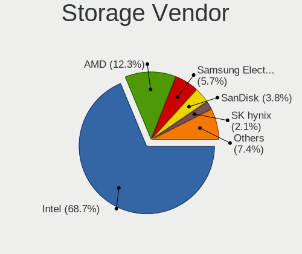

| Vendor                           | Notebooks | Percent |
|----------------------------------|-----------|---------|
| Intel                            | 742       | 68.45%  |
| AMD                              | 136       | 12.55%  |
| Samsung Electronics              | 63        | 5.81%   |
| SanDisk                          | 40        | 3.69%   |
| SK hynix                         | 21        | 1.94%   |
| Nvidia                           | 11        | 1.01%   |
| KIOXIA                           | 11        | 1.01%   |
| Toshiba America Info Systems     | 10        | 0.92%   |
| Micron Technology                | 8         | 0.74%   |
| Kingston Technology Company      | 8         | 0.74%   |
| Silicon Integrated Systems [SiS] | 7         | 0.65%   |
| Phison Electronics               | 5         | 0.46%   |
| Apple                            | 4         | 0.37%   |
| VIA Technologies                 | 3         | 0.28%   |
| Silicon Motion                   | 3         | 0.28%   |
| Silicon Image                    | 2         | 0.18%   |
| Realtek Semiconductor            | 2         | 0.18%   |
| Union Memory (Shenzhen)          | 1         | 0.09%   |
| Seagate Technology               | 1         | 0.09%   |
| Micron/Crucial Technology        | 1         | 0.09%   |
| Lite-On Technology               | 1         | 0.09%   |
| Lenovo                           | 1         | 0.09%   |
| JMicron Technology               | 1         | 0.09%   |
| INNOGRIT                         | 1         | 0.09%   |
| ADATA Technology                 | 1         | 0.09%   |

Storage Model
-------------

Storage controller models

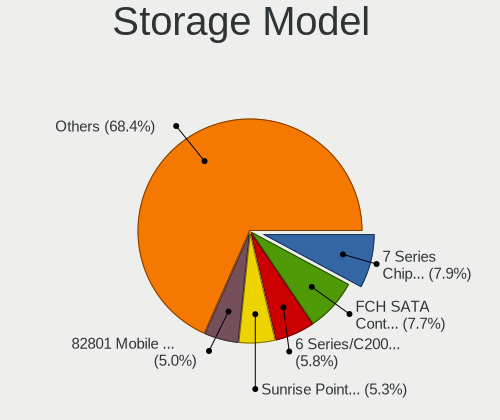

| Model                                                                            | Notebooks | Percent |
|----------------------------------------------------------------------------------|-----------|---------|
| AMD FCH SATA Controller [AHCI mode]                                              | 97        | 7.9%    |
| Intel 7 Series Chipset Family 6-port SATA Controller [AHCI mode]                 | 95        | 7.74%   |
| Intel 6 Series/C200 Series Chipset Family 6 port Mobile SATA AHCI Controller     | 69        | 5.62%   |
| Intel Sunrise Point-LP SATA Controller [AHCI mode]                               | 63        | 5.13%   |
| Intel 82801 Mobile SATA Controller [RAID mode]                                   | 61        | 4.97%   |
| Intel 82801HM/HEM (ICH8M/ICH8M-E) IDE Controller                                 | 58        | 4.72%   |
| Intel 82801IBM/IEM (ICH9M/ICH9M-E) 4 port SATA Controller [AHCI mode]            | 53        | 4.32%   |
| Intel 82801HM/HEM (ICH8M/ICH8M-E) SATA Controller [AHCI mode]                    | 48        | 3.91%   |
| Samsung NVMe SSD Controller SM981/PM981/PM983                                    | 38        | 3.09%   |
| Intel 8 Series SATA Controller 1 [AHCI mode]                                     | 37        | 3.01%   |
| Intel 5 Series/3400 Series Chipset 4 port SATA AHCI Controller                   | 37        | 3.01%   |
| Intel 8 Series/C220 Series Chipset Family 6-port SATA Controller 1 [AHCI mode]   | 31        | 2.52%   |
| Intel 5 Series/3400 Series Chipset 6 port SATA AHCI Controller                   | 24        | 1.95%   |
| AMD SB7x0/SB8x0/SB9x0 SATA Controller [AHCI mode]                                | 22        | 1.79%   |
| Intel Wildcat Point-LP SATA Controller [AHCI Mode]                               | 21        | 1.71%   |
| Intel Celeron/Pentium Silver Processor SATA Controller                           | 20        | 1.63%   |
| Intel Atom Processor E3800 Series SATA AHCI Controller                           | 19        | 1.55%   |
| Intel HM170/QM170 Chipset SATA Controller [AHCI Mode]                            | 18        | 1.47%   |
| Intel NM10/ICH7 Family SATA Controller [AHCI mode]                               | 17        | 1.38%   |
| SanDisk WD Black SN750 / PC SN730 NVMe SSD                                       | 14        | 1.14%   |
| Intel Volume Management Device NVMe RAID Controller                              | 14        | 1.14%   |
| Intel Cannon Lake Mobile PCH SATA AHCI Controller                                | 14        | 1.14%   |
| Samsung NVMe SSD Controller 980                                                  | 13        | 1.06%   |
| KIOXIA NVMe SSD Controller BG4 (DRAM-less)                                       | 11        | 0.9%    |
| Intel Atom/Celeron/Pentium Processor x5-E8000/J3xxx/N3xxx Series SATA Controller | 11        | 0.9%    |
| Intel 82801IBM/IEM (ICH9M/ICH9M-E) 2 port SATA Controller [IDE mode]             | 11        | 0.9%    |
| Intel 82801HM/HEM (ICH8M/ICH8M-E) SATA Controller [IDE mode]                     | 10        | 0.81%   |
| SK hynix Gold P31/BC711/PC711 NVMe Solid State Drive                             | 8         | 0.65%   |
| SanDisk WD Blue SN500 / PC SN520 NVMe SSD                                        | 8         | 0.65%   |
| Intel 82801GBM/GHM (ICH7-M Family) SATA Controller [IDE mode]                    | 8         | 0.65%   |
| Intel 5 Series/3400 Series Chipset 4 port SATA IDE Controller                    | 8         | 0.65%   |
| Intel 5 Series/3400 Series Chipset 2 port SATA IDE Controller                    | 8         | 0.65%   |
| SK hynix BC501 NVMe Solid State Drive                                            | 7         | 0.57%   |
| Intel SSD 660P Series                                                            | 7         | 0.57%   |
| Intel 82801G (ICH7 Family) IDE Controller                                        | 7         | 0.57%   |
| Intel 7 Series Chipset Family 4-port SATA Controller [IDE mode]                  | 7         | 0.57%   |
| Intel 7 Series Chipset Family 2-port SATA Controller [IDE mode]                  | 7         | 0.57%   |
| AMD SB7x0/SB8x0/SB9x0 IDE Controller                                             | 7         | 0.57%   |
| AMD SB600 Non-Raid-5 SATA                                                        | 7         | 0.57%   |
| AMD SB600 IDE                                                                    | 7         | 0.57%   |

Storage Kind
------------

Kind of storage controller (IDE, SATA, NVMe, SAS, ...)

| Kind | Notebooks | Percent |
|------|-----------|---------|
| SATA | 756       | 64.4%   |
| NVMe | 193       | 16.44%  |
| IDE  | 146       | 12.44%  |
| RAID | 79        | 6.73%   |

Processor
---------

CPU Vendor
----------

Processor vendors

| Vendor       | Notebooks | Percent |
|--------------|-----------|---------|
| Intel        | 851       | 82.94%  |
| AMD          | 174       | 16.96%  |
| CentaurHauls | 1         | 0.1%    |

CPU Model
---------

Processor models

| Model                                         | Notebooks | Percent |
|-----------------------------------------------|-----------|---------|
| Intel Core i7-2670QM CPU @ 2.20GHz            | 14        | 1.36%   |
| Intel Core i5-8250U CPU @ 1.60GHz             | 14        | 1.36%   |
| Intel Core i5-6300U CPU @ 2.40GHz             | 12        | 1.17%   |
| Intel Core i7-8550U CPU @ 1.80GHz             | 11        | 1.07%   |
| Intel Core i3-3110M CPU @ 2.40GHz             | 11        | 1.07%   |
| Intel Core i7-10750H CPU @ 2.60GHz            | 10        | 0.97%   |
| Intel Core i5-3320M CPU @ 2.60GHz             | 10        | 0.97%   |
| Intel Core i5-2520M CPU @ 2.50GHz             | 10        | 0.97%   |
| Intel Core i5-1035G1 CPU @ 1.00GHz            | 10        | 0.97%   |
| Intel Core i7-7700HQ CPU @ 2.80GHz            | 9         | 0.88%   |
| Intel Core i5-10210U CPU @ 1.60GHz            | 9         | 0.88%   |
| Intel Core i3 CPU M 370 @ 2.40GHz             | 9         | 0.88%   |
| Intel Core 2 Duo CPU T7100 @ 1.80GHz          | 9         | 0.88%   |
| Intel Celeron CPU N2840 @ 2.16GHz             | 9         | 0.88%   |
| Intel Core i7-3630QM CPU @ 2.40GHz            | 8         | 0.78%   |
| Intel Core i5-4210U CPU @ 1.70GHz             | 8         | 0.78%   |
| Intel Core i5-2450M CPU @ 2.50GHz             | 8         | 0.78%   |
| Intel Core i5 CPU M 520 @ 2.40GHz             | 8         | 0.78%   |
| Intel Core 2 Duo CPU T7500 @ 2.20GHz          | 8         | 0.78%   |
| Intel Atom x5-Z8350 CPU @ 1.44GHz             | 8         | 0.78%   |
| Intel Core i7-9750H CPU @ 2.60GHz             | 7         | 0.68%   |
| Intel Core i7-6700HQ CPU @ 2.60GHz            | 7         | 0.68%   |
| Intel Core i7-10510U CPU @ 1.80GHz            | 7         | 0.68%   |
| Intel Core i5-7200U CPU @ 2.50GHz             | 7         | 0.68%   |
| Intel Core i5-4200U CPU @ 1.60GHz             | 7         | 0.68%   |
| Intel Core i5-3230M CPU @ 2.60GHz             | 7         | 0.68%   |
| Intel Core i5-2410M CPU @ 2.30GHz             | 7         | 0.68%   |
| Intel Core i3 CPU M 380 @ 2.53GHz             | 7         | 0.68%   |
| Intel Core i3 CPU M 350 @ 2.27GHz             | 7         | 0.68%   |
| Intel Core 2 Duo CPU P8400 @ 2.26GHz          | 7         | 0.68%   |
| Intel Celeron N4000 CPU @ 1.10GHz             | 7         | 0.68%   |
| Intel Atom CPU Z3735F @ 1.33GHz               | 7         | 0.68%   |
| Intel 11th Gen Core i7-1165G7 @ 2.80GHz       | 7         | 0.68%   |
| AMD Ryzen 5 3500U with Radeon Vega Mobile Gfx | 7         | 0.68%   |
| AMD Ryzen 5 2500U with Radeon Vega Mobile Gfx | 7         | 0.68%   |
| Intel Pentium Dual-Core CPU T4300 @ 2.10GHz   | 6         | 0.58%   |
| Intel Pentium CPU N3540 @ 2.16GHz             | 6         | 0.58%   |
| Intel Core i7-8565U CPU @ 1.80GHz             | 6         | 0.58%   |
| Intel Core i7-2620M CPU @ 2.70GHz             | 6         | 0.58%   |
| Intel Core i5-6200U CPU @ 2.30GHz             | 6         | 0.58%   |

CPU Model Family
----------------

Processor model prefix

| Model                   | Notebooks | Percent |
|-------------------------|-----------|---------|
| Intel Core i5           | 224       | 21.81%  |
| Intel Core i7           | 197       | 19.18%  |
| Intel Core i3           | 96        | 9.35%   |
| Intel Core 2 Duo        | 91        | 8.86%   |
| Intel Celeron           | 72        | 7.01%   |
| Intel Atom              | 39        | 3.8%    |
| Other                   | 37        | 3.6%    |
| Intel Pentium           | 31        | 3.02%   |
| AMD Ryzen 5             | 21        | 2.04%   |
| Intel Pentium Dual-Core | 17        | 1.66%   |
| AMD Ryzen 7             | 16        | 1.56%   |
| Intel Pentium Dual      | 15        | 1.46%   |
| AMD A6                  | 15        | 1.46%   |
| AMD E1                  | 14        | 1.36%   |
| Intel Core 2            | 13        | 1.27%   |
| AMD A8                  | 13        | 1.27%   |
| AMD Ryzen 7 PRO         | 10        | 0.97%   |
| AMD Turion 64 X2 Mobile | 9         | 0.88%   |
| AMD E                   | 9         | 0.88%   |
| AMD A4                  | 8         | 0.78%   |
| Intel Genuine           | 7         | 0.68%   |
| AMD E2                  | 7         | 0.68%   |
| Intel Pentium Silver    | 6         | 0.58%   |
| AMD Athlon              | 5         | 0.49%   |
| AMD A10                 | 5         | 0.49%   |
| AMD Ryzen 3             | 4         | 0.39%   |
| AMD C-60                | 4         | 0.39%   |
| Intel Core i9           | 3         | 0.29%   |
| Intel Celeron Dual-Core | 3         | 0.29%   |
| AMD Turion 64 Mobile    | 3         | 0.29%   |
| Intel Core m7           | 2         | 0.19%   |
| Intel Core m5           | 2         | 0.19%   |
| AMD Turion              | 2         | 0.19%   |
| AMD Sempron             | 2         | 0.19%   |
| AMD C-50                | 2         | 0.19%   |
| AMD Athlon X2           | 2         | 0.19%   |
| AMD Athlon II           | 2         | 0.19%   |
| Intel Xeon              | 1         | 0.1%    |
| Intel Core m3           | 1         | 0.1%    |
| Intel Core M            | 1         | 0.1%    |

CPU Cores
---------

Number of processor cores

| Number | Notebooks | Percent |
|--------|-----------|---------|
| 2      | 631       | 61.44%  |
| 4      | 290       | 28.24%  |
| 1      | 42        | 4.09%   |
| 6      | 35        | 3.41%   |
| 8      | 26        | 2.53%   |
| 16     | 1         | 0.1%    |
| 14     | 1         | 0.1%    |
| 10     | 1         | 0.1%    |

CPU Sockets
-----------

Number of sockets

| Number | Notebooks | Percent |
|--------|-----------|---------|
| 1      | 1026      | 100%    |

CPU Threads
-----------

Threads per core (Hyper-Threading)

| Number | Notebooks | Percent |
|--------|-----------|---------|
| 2      | 634       | 61.79%  |
| 1      | 392       | 38.21%  |

CPU Op-Modes
------------

CPU Operation Modes (32-bit, 64-bit)

| Op mode        | Notebooks | Percent |
|----------------|-----------|---------|
| 32-bit, 64-bit | 1026      | 100%    |

CPU Microcode
-------------

Microcode number

| Number     | Notebooks | Percent |
|------------|-----------|---------|
| Unknown    | 103       | 9.88%   |
| 0x206a7    | 92        | 8.83%   |
| 0x306a9    | 89        | 8.54%   |
| 0x1067a    | 49        | 4.7%    |
| 0x6fd      | 46        | 4.41%   |
| 0x20655    | 41        | 3.93%   |
| 0x40651    | 34        | 3.26%   |
| 0x306c3    | 31        | 2.98%   |
| 0x406e3    | 30        | 2.88%   |
| 0x806ea    | 28        | 2.69%   |
| 0x30678    | 27        | 2.59%   |
| 0x806ec    | 25        | 2.4%    |
| 0x306d4    | 23        | 2.21%   |
| 0x10676    | 23        | 2.21%   |
| 0x806e9    | 22        | 2.11%   |
| 0x20652    | 22        | 2.11%   |
| 0x05000119 | 20        | 1.92%   |
| 0x806c1    | 19        | 1.82%   |
| 0x406c4    | 18        | 1.73%   |
| 0xa0652    | 17        | 1.63%   |
| 0x906ea    | 15        | 1.44%   |
| 0x706a1    | 14        | 1.34%   |
| 0x106ca    | 14        | 1.34%   |
| 0x07030105 | 14        | 1.34%   |
| 0x706e5    | 12        | 1.15%   |
| 0x6f6      | 12        | 1.15%   |
| 0x406c3    | 12        | 1.15%   |
| 0x08108109 | 12        | 1.15%   |
| 0x906e9    | 11        | 1.06%   |
| 0x08108102 | 11        | 1.06%   |
| 0x0700010f | 10        | 0.96%   |
| 0x6fb      | 9         | 0.86%   |
| 0x906ed    | 7         | 0.67%   |
| 0x6fa      | 7         | 0.67%   |
| 0x03000027 | 7         | 0.67%   |
| 0x706a8    | 6         | 0.58%   |
| 0x506e3    | 6         | 0.58%   |
| 0x0a50000c | 6         | 0.58%   |
| 0x0810100b | 6         | 0.58%   |
| 0x806eb    | 5         | 0.48%   |

CPU Microarch
-------------

Microarchitecture

| Name             | Notebooks | Percent |
|------------------|-----------|---------|
| KabyLake         | 130       | 12.66%  |
| SandyBridge      | 97        | 9.44%   |
| IvyBridge        | 92        | 8.96%   |
| Core             | 80        | 7.79%   |
| Penryn           | 77        | 7.5%    |
| Haswell          | 73        | 7.11%   |
| Westmere         | 69        | 6.72%   |
| Silvermont       | 59        | 5.74%   |
| Skylake          | 42        | 4.09%   |
| Bobcat           | 26        | 2.53%   |
| Zen+             | 24        | 2.34%   |
| TigerLake        | 23        | 2.24%   |
| Broadwell        | 23        | 2.24%   |
| Goldmont plus    | 21        | 2.04%   |
| Puma             | 19        | 1.85%   |
| Bonnell          | 19        | 1.85%   |
| Icelake          | 18        | 1.75%   |
| CometLake        | 18        | 1.75%   |
| K8 Hammer        | 16        | 1.56%   |
| Zen 2            | 13        | 1.27%   |
| Excavator        | 13        | 1.27%   |
| Zen              | 11        | 1.07%   |
| Jaguar           | 11        | 1.07%   |
| Zen 3            | 8         | 0.78%   |
| K8 & K10 hybrid  | 8         | 0.78%   |
| Piledriver       | 7         | 0.68%   |
| K10 Llano        | 7         | 0.68%   |
| Unknown          | 6         | 0.58%   |
| K10              | 5         | 0.49%   |
| Goldmont         | 5         | 0.49%   |
| Nehalem          | 3         | 0.29%   |
| Steamroller      | 2         | 0.19%   |
| Alderlake Hybrid | 2         | 0.19%   |

Graphics
--------

GPU Vendor
----------

Vendors of graphics cards

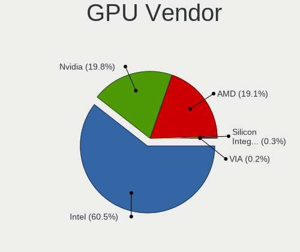

| Vendor                           | Notebooks | Percent |
|----------------------------------|-----------|---------|
| Intel                            | 749       | 60.31%  |
| Nvidia                           | 247       | 19.89%  |
| AMD                              | 238       | 19.16%  |
| Silicon Integrated Systems [SiS] | 4         | 0.32%   |
| VIA Technologies                 | 3         | 0.24%   |
| ASPEED Technology                | 1         | 0.08%   |

GPU Model
---------

Graphics card models

| Model                                                                                    | Notebooks | Percent |
|------------------------------------------------------------------------------------------|-----------|---------|
| Intel 2nd Generation Core Processor Family Integrated Graphics Controller                | 88        | 6.77%   |
| Intel 3rd Gen Core processor Graphics Controller                                         | 86        | 6.62%   |
| Intel Core Processor Integrated Graphics Controller                                      | 55        | 4.23%   |
| Intel Mobile 4 Series Chipset Integrated Graphics Controller                             | 53        | 4.08%   |
| Intel Mobile GM965/GL960 Integrated Graphics Controller (secondary)                      | 40        | 3.08%   |
| Intel Mobile GM965/GL960 Integrated Graphics Controller (primary)                        | 40        | 3.08%   |
| Intel Haswell-ULT Integrated Graphics Controller                                         | 39        | 3%      |
| Intel UHD Graphics 620                                                                   | 31        | 2.39%   |
| Intel Atom/Celeron/Pentium Processor x5-E8000/J3xxx/N3xxx Integrated Graphics Controller | 30        | 2.31%   |
| Intel 4th Gen Core Processor Integrated Graphics Controller                              | 30        | 2.31%   |
| Intel Atom Processor Z36xxx/Z37xxx Series Graphics & Display                             | 29        | 2.23%   |
| Intel Skylake GT2 [HD Graphics 520]                                                      | 27        | 2.08%   |
| AMD Picasso/Raven 2 [Radeon Vega Series / Radeon Vega Mobile Series]                     | 26        | 2%      |
| Intel HD Graphics 620                                                                    | 23        | 1.77%   |
| Intel TigerLake-LP GT2 [Iris Xe Graphics]                                                | 20        | 1.54%   |
| Intel CometLake-U GT2 [UHD Graphics]                                                     | 18        | 1.39%   |
| Intel CometLake-H GT2 [UHD Graphics]                                                     | 18        | 1.39%   |
| Intel CoffeeLake-H GT2 [UHD Graphics 630]                                                | 17        | 1.31%   |
| Intel HD Graphics 5500                                                                   | 16        | 1.23%   |
| Intel WhiskeyLake-U GT2 [UHD Graphics 620]                                               | 15        | 1.15%   |
| Intel GeminiLake [UHD Graphics 600]                                                      | 15        | 1.15%   |
| Nvidia GF117M [GeForce 610M/710M/810M/820M / GT 620M/625M/630M/720M]                     | 14        | 1.08%   |
| Intel Atom Processor D4xx/D5xx/N4xx/N5xx Integrated Graphics Controller                  | 14        | 1.08%   |
| Intel Iris Plus Graphics G1 (Ice Lake)                                                   | 12        | 0.92%   |
| Intel HD Graphics 630                                                                    | 12        | 0.92%   |
| AMD Seymour [Radeon HD 6400M/7400M Series]                                               | 12        | 0.92%   |
| AMD Renoir                                                                               | 12        | 0.92%   |
| Nvidia TU117M [GeForce GTX 1650 Mobile / Max-Q]                                          | 11        | 0.85%   |
| AMD Mullins [Radeon R4/R5 Graphics]                                                      | 11        | 0.85%   |
| AMD Stoney [Radeon R2/R3/R4/R5 Graphics]                                                 | 9         | 0.69%   |
| AMD Raven Ridge [Radeon Vega Series / Radeon Vega Mobile Series]                         | 9         | 0.69%   |
| Nvidia GF108M [GeForce GT 540M]                                                          | 8         | 0.62%   |
| AMD Cezanne [Radeon Vega Series / Radeon Vega Mobile Series]                             | 8         | 0.62%   |
| Nvidia TU117M                                                                            | 7         | 0.54%   |
| Nvidia GT218M [GeForce 310M]                                                             | 7         | 0.54%   |
| AMD Wrestler [Radeon HD 7310]                                                            | 7         | 0.54%   |
| Nvidia TU116M [GeForce GTX 1660 Ti Mobile]                                               | 6         | 0.46%   |
| Intel Mobile 945GM/GMS/GME, 943/940GML Express Integrated Graphics Controller            | 6         | 0.46%   |
| Intel Mobile 945GM/GMS, 943/940GML Express Integrated Graphics Controller                | 6         | 0.46%   |
| Intel HD Graphics 530                                                                    | 6         | 0.46%   |

GPU Combo
---------

Combinations of graphics cards

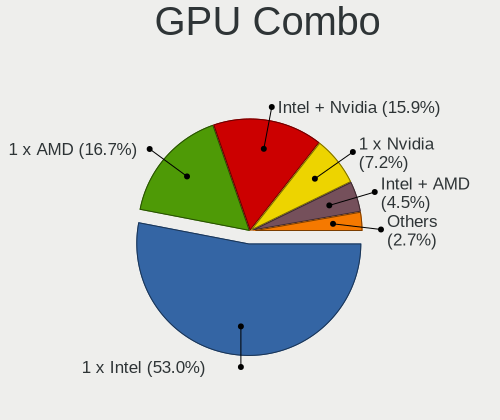

| Name            | Notebooks | Percent |
|-----------------|-----------|---------|
| 1 x Intel       | 545       | 53.07%  |
| 1 x AMD         | 173       | 16.85%  |
| Intel + Nvidia  | 160       | 15.58%  |
| 1 x Nvidia      | 76        | 7.4%    |
| Intel + AMD     | 43        | 4.19%   |
| 2 x AMD         | 11        | 1.07%   |
| AMD + Nvidia    | 11        | 1.07%   |
| 1 x SiS         | 4         | 0.39%   |
| 1 x VIA         | 3         | 0.29%   |
| Nvidia + ASPEED | 1         | 0.1%    |

GPU Driver
----------

Free vs proprietary

| Driver      | Notebooks | Percent |
|-------------|-----------|---------|
| Free        | 877       | 84.98%  |
| Proprietary | 121       | 11.72%  |
| Unknown     | 34        | 3.29%   |

GPU Memory
----------

Total video memory

| Size in GB | Notebooks | Percent |
|------------|-----------|---------|
| Unknown    | 629       | 60.66%  |
| 0.01-0.5   | 167       | 16.1%   |
| 1.01-2.0   | 91        | 8.78%   |
| 0.51-1.0   | 84        | 8.1%    |
| 3.01-4.0   | 42        | 4.05%   |
| 5.01-6.0   | 13        | 1.25%   |
| 7.01-8.0   | 6         | 0.58%   |
| 2.01-3.0   | 3         | 0.29%   |
| 16.01-24.0 | 1         | 0.1%    |
| 8.01-16.0  | 1         | 0.1%    |

Monitor
-------

Monitor Vendor
--------------

Monitor vendors

| Vendor                  | Notebooks | Percent |
|-------------------------|-----------|---------|
| AU Optronics            | 203       | 18.22%  |
| LG Display              | 190       | 17.06%  |
| Samsung Electronics     | 149       | 13.38%  |
| Chimei Innolux          | 124       | 11.13%  |
| BOE                     | 106       | 9.52%   |
| Chi Mei Optoelectronics | 48        | 4.31%   |
| Lenovo                  | 37        | 3.32%   |
| LG Philips              | 24        | 2.15%   |
| Apple                   | 23        | 2.06%   |
| Dell                    | 19        | 1.71%   |
| Goldstar                | 18        | 1.62%   |
| Sharp                   | 14        | 1.26%   |
| InfoVision              | 13        | 1.17%   |
| Hewlett-Packard         | 13        | 1.17%   |
| HannStar                | 10        | 0.9%    |
| Ancor Communications    | 9         | 0.81%   |
| Acer                    | 9         | 0.81%   |
| PANDA                   | 8         | 0.72%   |
| Toshiba                 | 6         | 0.54%   |
| BenQ                    | 6         | 0.54%   |
| ViewSonic               | 5         | 0.45%   |
| Sony                    | 5         | 0.45%   |
| Philips                 | 4         | 0.36%   |
| LPL                     | 4         | 0.36%   |
| LGD                     | 4         | 0.36%   |
| Iiyama                  | 4         | 0.36%   |
| CPT                     | 4         | 0.36%   |
| Panasonic               | 3         | 0.27%   |
| Nvidia                  | 3         | 0.27%   |
| Fujitsu Siemens         | 3         | 0.27%   |
| CSO                     | 3         | 0.27%   |
| AOC                     | 3         | 0.27%   |
| Vizio                   | 2         | 0.18%   |
| MStar                   | 2         | 0.18%   |
| Lenovo Group Limited    | 2         | 0.18%   |
| InnoLux Display         | 2         | 0.18%   |
| ASUSTek Computer        | 2         | 0.18%   |
| Vestel Elektronik       | 1         | 0.09%   |
| Unknown (XXX)           | 1         | 0.09%   |
| UMC                     | 1         | 0.09%   |

Monitor Model
-------------

Monitor models

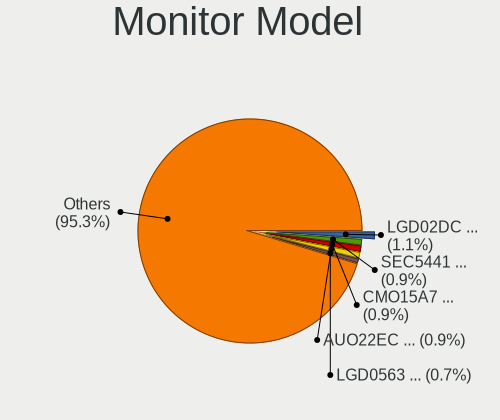

| Model                                                                    | Notebooks | Percent |
|--------------------------------------------------------------------------|-----------|---------|
| LG Display LCD Monitor LGD02DC 1366x768 344x194mm 15.5-inch              | 11        | 0.98%   |
| Chi Mei Optoelectronics LCD Monitor CMO15A7 1366x768 344x193mm 15.5-inch | 11        | 0.98%   |
| Samsung Electronics LCD Monitor SEC5441 1366x768 344x194mm 15.5-inch     | 10        | 0.89%   |
| AU Optronics LCD Monitor AUO22EC 1366x768 344x193mm 15.5-inch            | 10        | 0.89%   |
| LG Display LCD Monitor LGD0563 1920x1080 344x194mm 15.5-inch             | 8         | 0.71%   |
| AU Optronics LCD Monitor AUO26EC 1366x768 344x193mm 15.5-inch            | 8         | 0.71%   |
| Chimei Innolux LCD Monitor CMN14D4 1920x1080 309x173mm 13.9-inch         | 7         | 0.62%   |
| Chimei Innolux LCD Monitor CMN15F5 1920x1080 344x193mm 15.5-inch         | 6         | 0.53%   |
| Chimei Innolux LCD Monitor CMN14C9 1920x1080 309x173mm 13.9-inch         | 6         | 0.53%   |
| AU Optronics LCD Monitor AUO45EC 1366x768 344x193mm 15.5-inch            | 6         | 0.53%   |
| AU Optronics LCD Monitor AUO38ED 1920x1080 344x193mm 15.5-inch           | 6         | 0.53%   |
| LG Display LCD Monitor LGD02E3 1366x768 344x194mm 15.5-inch              | 5         | 0.44%   |
| AU Optronics LCD Monitor AUO21ED 1920x1080 344x194mm 15.5-inch           | 5         | 0.44%   |
| AU Optronics LCD Monitor AUO21EC 1366x768 344x193mm 15.5-inch            | 5         | 0.44%   |
| AU Optronics LCD Monitor AUO10EC 1366x768 344x193mm 15.5-inch            | 5         | 0.44%   |
| Apple LCD Monitor APP9C5F 1280x800 286x179mm 13.3-inch                   | 5         | 0.44%   |
| Samsung Electronics LCD Monitor SEC3345 1280x800 331x207mm 15.4-inch     | 4         | 0.36%   |
| Samsung Electronics LCD Monitor SDC4C48 1920x1080 239x134mm 10.8-inch    | 4         | 0.36%   |
| Samsung Electronics LCD Monitor SDC4752 1366x768 344x194mm 15.5-inch     | 4         | 0.36%   |
| LG Display LCD Monitor LGD046F 1920x1080 345x194mm 15.6-inch             | 4         | 0.36%   |
| LG Display LCD Monitor LGD0456 1366x768 344x194mm 15.5-inch              | 4         | 0.36%   |
| LG Display LCD Monitor LGD033A 1366x768 344x194mm 15.5-inch              | 4         | 0.36%   |
| Lenovo LCD Monitor LEN40B1 1600x900 345x194mm 15.6-inch                  | 4         | 0.36%   |
| Lenovo LCD Monitor LEN40A0 1366x768 309x174mm 14.0-inch                  | 4         | 0.36%   |
| HannStar LCD Monitor HSD03E9 1024x600 220x129mm 10.0-inch                | 4         | 0.36%   |
| Chimei Innolux LCD Monitor CMN15DB 1366x768 344x193mm 15.5-inch          | 4         | 0.36%   |
| Chimei Innolux LCD Monitor CMN1130 1366x768 256x144mm 11.6-inch          | 4         | 0.36%   |
| BOE LCD Monitor BOE06A5 1366x768 344x194mm 15.5-inch                     | 4         | 0.36%   |
| BOE LCD Monitor BOE0687 1920x1080 344x193mm 15.5-inch                    | 4         | 0.36%   |
| AU Optronics LCD Monitor AUO8174 1280x800 331x207mm 15.4-inch            | 4         | 0.36%   |
| AU Optronics LCD Monitor AUO61D2 1024x600 222x125mm 10.0-inch            | 4         | 0.36%   |
| AU Optronics LCD Monitor AUO34ED 1920x1080 344x193mm 15.5-inch           | 4         | 0.36%   |
| AU Optronics LCD Monitor AUO312C 1366x768 293x164mm 13.2-inch            | 4         | 0.36%   |
| AU Optronics LCD Monitor AUO229E 1600x900 382x214mm 17.2-inch            | 4         | 0.36%   |
| AU Optronics LCD Monitor AUO213E 1600x900 309x174mm 14.0-inch            | 4         | 0.36%   |
| AU Optronics LCD Monitor AUO139E 1600x900 382x214mm 17.2-inch            | 4         | 0.36%   |
| AU Optronics LCD Monitor AUO106C 1366x768 277x156mm 12.5-inch            | 4         | 0.36%   |
| Samsung Electronics LCD Monitor SEC5541 1366x768 344x193mm 15.5-inch     | 3         | 0.27%   |
| Samsung Electronics LCD Monitor SEC544B 1600x900 382x215mm 17.3-inch     | 3         | 0.27%   |
| Samsung Electronics LCD Monitor SEC3945 1280x800 331x207mm 15.4-inch     | 3         | 0.27%   |

Monitor Resolution
------------------

Monitor screen resolution

| Resolution         | Notebooks | Percent |
|--------------------|-----------|---------|
| 1366x768 (WXGA)    | 397       | 36.93%  |
| 1920x1080 (FHD)    | 340       | 31.63%  |
| 1280x800 (WXGA)    | 89        | 8.28%   |
| 1600x900 (HD+)     | 74        | 6.88%   |
| 1440x900 (WXGA+)   | 45        | 4.19%   |
| 3840x2160 (4K)     | 31        | 2.88%   |
| 1680x1050 (WSXGA+) | 16        | 1.49%   |
| 1024x600           | 15        | 1.4%    |
| 2560x1440 (QHD)    | 12        | 1.12%   |
| 1920x1200 (WUXGA)  | 12        | 1.12%   |
| 1280x1024 (SXGA)   | 7         | 0.65%   |
| 2560x1600          | 4         | 0.37%   |
| 1360x768           | 4         | 0.37%   |
| 3200x1800 (QHD+)   | 3         | 0.28%   |
| 2880x1800          | 3         | 0.28%   |
| 1920x540           | 3         | 0.28%   |
| 1024x768 (XGA)     | 3         | 0.28%   |
| 3840x2400          | 2         | 0.19%   |
| 2560x1080          | 2         | 0.19%   |
| 2288x1287          | 2         | 0.19%   |
| 1600x1200          | 2         | 0.19%   |
| 3840x1200          | 1         | 0.09%   |
| 3840x1080          | 1         | 0.09%   |
| 3072x1920          | 1         | 0.09%   |
| 2304x1440          | 1         | 0.09%   |
| 1920x1280          | 1         | 0.09%   |
| 1680x945           | 1         | 0.09%   |
| 1280x768           | 1         | 0.09%   |
| 1280x720 (HD)      | 1         | 0.09%   |
| 1024x576           | 1         | 0.09%   |

Monitor Diagonal
----------------

Diagonal size in inches

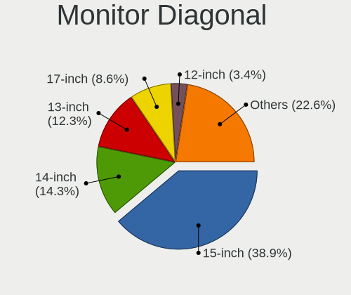

| Inches  | Notebooks | Percent |
|---------|-----------|---------|
| 15      | 440       | 39.29%  |
| 14      | 161       | 14.38%  |
| 13      | 136       | 12.14%  |
| 17      | 99        | 8.84%   |
| 12      | 37        | 3.3%    |
| 24      | 34        | 3.04%   |
| 21      | 26        | 2.32%   |
| 11      | 25        | 2.23%   |
| Unknown | 25        | 2.23%   |
| 27      | 23        | 2.05%   |
| 10      | 17        | 1.52%   |
| 23      | 15        | 1.34%   |
| 18      | 14        | 1.25%   |
| 19      | 10        | 0.89%   |
| 22      | 8         | 0.71%   |
| 16      | 8         | 0.71%   |
| 31      | 6         | 0.54%   |
| 54      | 5         | 0.45%   |
| 84      | 4         | 0.36%   |
| 20      | 4         | 0.36%   |
| 25      | 3         | 0.27%   |
| 72      | 2         | 0.18%   |
| 52      | 2         | 0.18%   |
| 34      | 2         | 0.18%   |
| 32      | 2         | 0.18%   |
| 26      | 2         | 0.18%   |
| 86      | 1         | 0.09%   |
| 58      | 1         | 0.09%   |
| 57      | 1         | 0.09%   |
| 48      | 1         | 0.09%   |
| 47      | 1         | 0.09%   |
| 42      | 1         | 0.09%   |
| 40      | 1         | 0.09%   |
| 39      | 1         | 0.09%   |
| 37      | 1         | 0.09%   |
| 8       | 1         | 0.09%   |

Monitor Width
-------------

Physical width

| Width in mm | Notebooks | Percent |
|-------------|-----------|---------|
| 301-350     | 667       | 59.87%  |
| 201-300     | 138       | 12.39%  |
| 351-400     | 122       | 10.95%  |
| 501-600     | 71        | 6.37%   |
| 401-500     | 53        | 4.76%   |
| Unknown     | 25        | 2.24%   |
| 1001-1500   | 12        | 1.08%   |
| 601-700     | 11        | 0.99%   |
| 1501-2000   | 6         | 0.54%   |
| 701-800     | 4         | 0.36%   |
| 801-900     | 3         | 0.27%   |
| 101-200     | 1         | 0.09%   |
| 901-1000    | 1         | 0.09%   |

Aspect Ratio
------------

Proportional relationship between the width and the height

| Ratio   | Notebooks | Percent |
|---------|-----------|---------|
| 16/9    | 801       | 79.31%  |
| 16/10   | 166       | 16.44%  |
| Unknown | 20        | 1.98%   |
| 5/4     | 7         | 0.69%   |
| 4/3     | 5         | 0.5%    |
| 3/2     | 5         | 0.5%    |
| 21/9    | 2         | 0.2%    |
| 32/9    | 1         | 0.1%    |
| 3.20    | 1         | 0.1%    |
| 0.62    | 1         | 0.1%    |
| 0.56    | 1         | 0.1%    |

Monitor Area
------------

Area in inch

| Area in inch | Notebooks | Percent |
|----------------|-----------|---------|
| 101-110        | 440       | 39.36%  |
| 81-90          | 249       | 22.27%  |
| 121-130        | 80        | 7.16%   |
| 201-250        | 67        | 5.99%   |
| 71-80          | 44        | 3.94%   |
| 61-70          | 37        | 3.31%   |
| 51-60          | 25        | 2.24%   |
| Unknown        | 25        | 2.24%   |
| 301-350        | 24        | 2.15%   |
| 151-200        | 21        | 1.88%   |
| 131-140        | 19        | 1.7%    |
| 41-50          | 17        | 1.52%   |
| More than 1000 | 16        | 1.43%   |
| 251-300        | 13        | 1.16%   |
| 141-150        | 13        | 1.16%   |
| 351-500        | 10        | 0.89%   |
| 501-1000       | 6         | 0.54%   |
| 91-100         | 6         | 0.54%   |
| 111-120        | 5         | 0.45%   |
| 1-40           | 1         | 0.09%   |

Pixel Density
-------------

Pixels per inch

| Density       | Notebooks | Percent |
|---------------|-----------|---------|
| 101-120       | 447       | 40.75%  |
| 121-160       | 347       | 31.63%  |
| 51-100        | 207       | 18.87%  |
| 161-240       | 42        | 3.83%   |
| Unknown       | 25        | 2.28%   |
| 1-50          | 15        | 1.37%   |
| More than 240 | 14        | 1.28%   |

Multiple Monitors
-----------------

Total monitors connected

| Total | Notebooks | Percent |
|-------|-----------|---------|
| 1     | 866       | 82.55%  |
| 2     | 144       | 13.73%  |
| 0     | 29        | 2.76%   |
| 3     | 9         | 0.86%   |
| 4     | 1         | 0.1%    |

Network
-------

Net Controller Vendor
---------------------

Controller vendors

| Vendor                            | Notebooks | Percent |
|-----------------------------------|-----------|---------|
| Realtek Semiconductor             | 520       | 31.31%  |
| Intel                             | 486       | 29.26%  |
| Qualcomm Atheros                  | 275       | 16.56%  |
| Broadcom                          | 150       | 9.03%   |
| Marvell Technology Group          | 36        | 2.17%   |
| Broadcom Limited                  | 28        | 1.69%   |
| Ralink                            | 22        | 1.32%   |
| TP-Link                           | 15        | 0.9%    |
| Samsung Electronics               | 11        | 0.66%   |
| Ralink Technology                 | 11        | 0.66%   |
| JMicron Technology                | 11        | 0.66%   |
| Nvidia                            | 9         | 0.54%   |
| Sierra Wireless                   | 7         | 0.42%   |
| Ericsson Business Mobile Networks | 7         | 0.42%   |
| Silicon Integrated Systems [SiS]  | 6         | 0.36%   |
| MediaTek                          | 6         | 0.36%   |
| Dell                              | 6         | 0.36%   |
| Xiaomi                            | 5         | 0.3%    |
| Huawei Technologies               | 5         | 0.3%    |
| Qualcomm Atheros Communications   | 4         | 0.24%   |
| Attansic Technology               | 4         | 0.24%   |
| Lenovo                            | 3         | 0.18%   |
| Fibocom                           | 3         | 0.18%   |
| DisplayLink                       | 3         | 0.18%   |
| ASIX Electronics                  | 3         | 0.18%   |
| VIA Technologies                  | 2         | 0.12%   |
| Motorola PCS                      | 2         | 0.12%   |
| Hewlett-Packard                   | 2         | 0.12%   |
| Edimax Technology                 | 2         | 0.12%   |
| AMD                               | 2         | 0.12%   |
| ZyDAS                             | 1         | 0.06%   |
| ZTE WCDMA Technologies MSM        | 1         | 0.06%   |
| TRENDnet                          | 1         | 0.06%   |
| Toshiba                           | 1         | 0.06%   |
| Spreadtrum Communications         | 1         | 0.06%   |
| Qualcomm                          | 1         | 0.06%   |
| Novatek Microelectronics          | 1         | 0.06%   |
| NetGear                           | 1         | 0.06%   |
| Linksys                           | 1         | 0.06%   |
| LG Electronics                    | 1         | 0.06%   |

Net Controller Model
--------------------

Controller models

| Model                                                                   | Notebooks | Percent |
|-------------------------------------------------------------------------|-----------|---------|
| Realtek RTL8111/8168/8411 PCI Express Gigabit Ethernet Controller       | 293       | 14.54%  |
| Realtek RTL810xE PCI Express Fast Ethernet controller                   | 135       | 6.7%    |
| Intel 82579LM Gigabit Network Connection (Lewisville)                   | 56        | 2.78%   |
| Qualcomm Atheros QCA9565 / AR9565 Wireless Network Adapter              | 47        | 2.33%   |
| Qualcomm Atheros AR9485 Wireless Network Adapter                        | 46        | 2.28%   |
| Qualcomm Atheros AR9285 Wireless Network Adapter (PCI-Express)          | 43        | 2.13%   |
| Intel Wireless 8265 / 8275                                              | 35        | 1.74%   |
| Broadcom BCM4313 802.11bgn Wireless Network Adapter                     | 35        | 1.74%   |
| Qualcomm Atheros QCA9377 802.11ac Wireless Network Adapter              | 33        | 1.64%   |
| Intel PRO/Wireless 3945ABG [Golan] Network Connection                   | 33        | 1.64%   |
| Intel Centrino Advanced-N 6205 [Taylor Peak]                            | 32        | 1.59%   |
| Intel Wireless 7260                                                     | 31        | 1.54%   |
| Realtek RTL8723BE PCIe Wireless Network Adapter                         | 25        | 1.24%   |
| Intel Wireless 7265                                                     | 25        | 1.24%   |
| Realtek RTL8821CE 802.11ac PCIe Wireless Network Adapter                | 21        | 1.04%   |
| Intel Wi-Fi 6 AX200                                                     | 21        | 1.04%   |
| Qualcomm Atheros AR242x / AR542x Wireless Network Adapter (PCI-Express) | 20        | 0.99%   |
| Intel Wireless 8260                                                     | 19        | 0.94%   |
| Intel 82577LM Gigabit Network Connection                                | 19        | 0.94%   |
| Realtek RTL8188CE 802.11b/g/n WiFi Adapter                              | 17        | 0.84%   |
| Qualcomm Atheros QCA6174 802.11ac Wireless Network Adapter              | 17        | 0.84%   |
| Intel Wi-Fi 6 AX201                                                     | 17        | 0.84%   |
| Intel Centrino Advanced-N 6200                                          | 17        | 0.84%   |
| Realtek RTL8153 Gigabit Ethernet Adapter                                | 16        | 0.79%   |
| Intel Ethernet Connection I217-LM                                       | 16        | 0.79%   |
| Intel Centrino Ultimate-N 6300                                          | 16        | 0.79%   |
| Realtek RTL8822CE 802.11ac PCIe Wireless Network Adapter                | 15        | 0.74%   |
| Intel Comet Lake PCH-LP CNVi WiFi                                       | 15        | 0.74%   |
| Intel Comet Lake PCH CNVi WiFi                                          | 15        | 0.74%   |
| Qualcomm Atheros AR928X Wireless Network Adapter (PCI-Express)          | 14        | 0.69%   |
| Intel Wireless-AC 9260                                                  | 14        | 0.69%   |
| Intel PRO/Wireless 4965 AG or AGN [Kedron] Network Connection           | 14        | 0.69%   |
| Intel 82567LM Gigabit Network Connection                                | 14        | 0.69%   |
| Broadcom BCM43142 802.11b/g/n                                           | 14        | 0.69%   |
| Realtek RTL8188EE Wireless Network Adapter                              | 13        | 0.65%   |
| Intel Ethernet Connection I219-LM                                       | 13        | 0.65%   |
| Intel Centrino Advanced-N 6235                                          | 13        | 0.65%   |
| Ralink RT3290 Wireless 802.11n 1T/1R PCIe                               | 12        | 0.6%    |
| Intel Ethernet Connection (4) I219-LM                                   | 11        | 0.55%   |
| Intel Centrino Wireless-N 1000 [Condor Peak]                            | 11        | 0.55%   |

Wireless Vendor
---------------

Wireless vendors

| Vendor                          | Notebooks | Percent |
|---------------------------------|-----------|---------|
| Intel                           | 459       | 43.67%  |
| Qualcomm Atheros                | 236       | 22.45%  |
| Realtek Semiconductor           | 156       | 14.84%  |
| Broadcom                        | 107       | 10.18%  |
| Ralink                          | 22        | 2.09%   |
| Broadcom Limited                | 14        | 1.33%   |
| TP-Link                         | 13        | 1.24%   |
| Ralink Technology               | 11        | 1.05%   |
| Sierra Wireless                 | 7         | 0.67%   |
| Qualcomm Atheros Communications | 4         | 0.38%   |
| MediaTek                        | 4         | 0.38%   |
| Dell                            | 4         | 0.38%   |
| Fibocom                         | 3         | 0.29%   |
| Hewlett-Packard                 | 2         | 0.19%   |
| Edimax Technology               | 2         | 0.19%   |
| ZyDAS                           | 1         | 0.1%    |
| TRENDnet                        | 1         | 0.1%    |
| Qualcomm                        | 1         | 0.1%    |
| NetGear                         | 1         | 0.1%    |
| Linksys                         | 1         | 0.1%    |
| AVM                             | 1         | 0.1%    |
| ASUSTek Computer                | 1         | 0.1%    |

Wireless Model
--------------

Wireless models

| Model                                                                   | Notebooks | Percent |
|-------------------------------------------------------------------------|-----------|---------|
| Qualcomm Atheros QCA9565 / AR9565 Wireless Network Adapter              | 47        | 4.42%   |
| Qualcomm Atheros AR9485 Wireless Network Adapter                        | 46        | 4.33%   |
| Qualcomm Atheros AR9285 Wireless Network Adapter (PCI-Express)          | 43        | 4.05%   |
| Intel Wireless 8265 / 8275                                              | 35        | 3.29%   |
| Broadcom BCM4313 802.11bgn Wireless Network Adapter                     | 35        | 3.29%   |
| Qualcomm Atheros QCA9377 802.11ac Wireless Network Adapter              | 33        | 3.1%    |
| Intel PRO/Wireless 3945ABG [Golan] Network Connection                   | 33        | 3.1%    |
| Intel Centrino Advanced-N 6205 [Taylor Peak]                            | 32        | 3.01%   |
| Intel Wireless 7260                                                     | 31        | 2.92%   |
| Realtek RTL8723BE PCIe Wireless Network Adapter                         | 25        | 2.35%   |
| Intel Wireless 7265                                                     | 25        | 2.35%   |
| Realtek RTL8821CE 802.11ac PCIe Wireless Network Adapter                | 21        | 1.98%   |
| Intel Wi-Fi 6 AX200                                                     | 21        | 1.98%   |
| Qualcomm Atheros AR242x / AR542x Wireless Network Adapter (PCI-Express) | 20        | 1.88%   |
| Intel Wireless 8260                                                     | 19        | 1.79%   |
| Realtek RTL8188CE 802.11b/g/n WiFi Adapter                              | 17        | 1.6%    |
| Qualcomm Atheros QCA6174 802.11ac Wireless Network Adapter              | 17        | 1.6%    |
| Intel Wi-Fi 6 AX201                                                     | 17        | 1.6%    |
| Intel Centrino Advanced-N 6200                                          | 17        | 1.6%    |
| Intel Centrino Ultimate-N 6300                                          | 16        | 1.51%   |
| Realtek RTL8822CE 802.11ac PCIe Wireless Network Adapter                | 15        | 1.41%   |
| Intel Comet Lake PCH-LP CNVi WiFi                                       | 15        | 1.41%   |
| Intel Comet Lake PCH CNVi WiFi                                          | 15        | 1.41%   |
| Qualcomm Atheros AR928X Wireless Network Adapter (PCI-Express)          | 14        | 1.32%   |
| Intel Wireless-AC 9260                                                  | 14        | 1.32%   |
| Intel PRO/Wireless 4965 AG or AGN [Kedron] Network Connection           | 14        | 1.32%   |
| Broadcom BCM43142 802.11b/g/n                                           | 14        | 1.32%   |
| Realtek RTL8188EE Wireless Network Adapter                              | 13        | 1.22%   |
| Intel Centrino Advanced-N 6235                                          | 13        | 1.22%   |
| Ralink RT3290 Wireless 802.11n 1T/1R PCIe                               | 12        | 1.13%   |
| Intel Centrino Wireless-N 1000 [Condor Peak]                            | 11        | 1.03%   |
| Broadcom BCM4312 802.11b/g LP-PHY                                       | 11        | 1.03%   |
| Realtek RTL8191SEvB Wireless LAN Controller                             | 10        | 0.94%   |
| Intel WiFi Link 5100                                                    | 10        | 0.94%   |
| Intel PRO/Wireless 5100 AGN [Shiloh] Network Connection                 | 10        | 0.94%   |
| Intel Dual Band Wireless-AC 3165 Plus Bluetooth                         | 10        | 0.94%   |
| Intel Wireless 3165                                                     | 9         | 0.85%   |
| Intel Centrino Wireless-N 2230                                          | 9         | 0.85%   |
| Intel Cannon Lake PCH CNVi WiFi                                         | 9         | 0.85%   |
| Realtek 802.11n WLAN Adapter                                            | 8         | 0.75%   |

Ethernet Vendor
---------------

Ethernet vendors

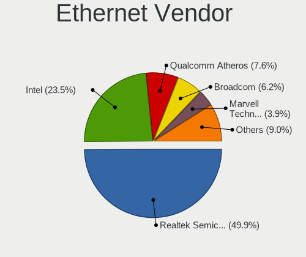

| Vendor                           | Notebooks | Percent |
|----------------------------------|-----------|---------|
| Realtek Semiconductor            | 461       | 49.57%  |
| Intel                            | 217       | 23.33%  |
| Qualcomm Atheros                 | 72        | 7.74%   |
| Broadcom                         | 59        | 6.34%   |
| Marvell Technology Group         | 36        | 3.87%   |
| Broadcom Limited                 | 14        | 1.51%   |
| Samsung Electronics              | 11        | 1.18%   |
| JMicron Technology               | 11        | 1.18%   |
| Nvidia                           | 9         | 0.97%   |
| Silicon Integrated Systems [SiS] | 6         | 0.65%   |
| Xiaomi                           | 5         | 0.54%   |
| Attansic Technology              | 4         | 0.43%   |
| MediaTek                         | 3         | 0.32%   |
| Lenovo                           | 3         | 0.32%   |
| DisplayLink                      | 3         | 0.32%   |
| ASIX Electronics                 | 3         | 0.32%   |
| VIA Technologies                 | 2         | 0.22%   |
| TP-Link                          | 2         | 0.22%   |
| Motorola PCS                     | 2         | 0.22%   |
| Huawei Technologies              | 2         | 0.22%   |
| Spreadtrum Communications        | 1         | 0.11%   |
| LG Electronics                   | 1         | 0.11%   |
| HTC (High Tech Computer)         | 1         | 0.11%   |
| Aquantia                         | 1         | 0.11%   |
| Apple                            | 1         | 0.11%   |

Ethernet Model
--------------

Ethernet models

| Model                                                             | Notebooks | Percent |
|-------------------------------------------------------------------|-----------|---------|
| Realtek RTL8111/8168/8411 PCI Express Gigabit Ethernet Controller | 293       | 31.37%  |
| Realtek RTL810xE PCI Express Fast Ethernet controller             | 135       | 14.45%  |
| Intel 82579LM Gigabit Network Connection (Lewisville)             | 56        | 6%      |
| Intel 82577LM Gigabit Network Connection                          | 19        | 2.03%   |
| Realtek RTL8153 Gigabit Ethernet Adapter                          | 16        | 1.71%   |
| Intel Ethernet Connection I217-LM                                 | 16        | 1.71%   |
| Intel 82567LM Gigabit Network Connection                          | 14        | 1.5%    |
| Intel Ethernet Connection I219-LM                                 | 13        | 1.39%   |
| Intel Ethernet Connection (4) I219-LM                             | 11        | 1.18%   |
| Broadcom NetLink BCM5787M Gigabit Ethernet PCI Express            | 11        | 1.18%   |
| Realtek RTL-8100/8101L/8139 PCI Fast Ethernet Adapter             | 10        | 1.07%   |
| Marvell Group 88E8040 PCI-E Fast Ethernet Controller              | 10        | 1.07%   |
| Qualcomm Atheros QCA8172 Fast Ethernet                            | 9         | 0.96%   |
| Qualcomm Atheros AR8162 Fast Ethernet                             | 9         | 0.96%   |
| Qualcomm Atheros AR8151 v2.0 Gigabit Ethernet                     | 9         | 0.96%   |
| Qualcomm Atheros AR8132 Fast Ethernet                             | 9         | 0.96%   |
| Broadcom NetLink BCM57780 Gigabit Ethernet PCIe                   | 9         | 0.96%   |
| Samsung Galaxy series, misc. (tethering mode)                     | 8         | 0.86%   |
| Qualcomm Atheros AR8161 Gigabit Ethernet                          | 8         | 0.86%   |
| Qualcomm Atheros AR8131 Gigabit Ethernet                          | 8         | 0.86%   |
| Intel Ethernet Connection I218-LM                                 | 8         | 0.86%   |
| Intel Ethernet Connection (4) I219-V                              | 8         | 0.86%   |
| Broadcom NetXtreme BCM5755M Gigabit Ethernet PCI Express          | 8         | 0.86%   |
| Intel 82566MM Gigabit Network Connection                          | 7         | 0.75%   |
| Broadcom NetXtreme BCM5764M Gigabit Ethernet PCIe                 | 7         | 0.75%   |
| Qualcomm Atheros AR8152 v2.0 Fast Ethernet                        | 6         | 0.64%   |
| Marvell Group 88E8055 PCI-E Gigabit Ethernet Controller           | 6         | 0.64%   |
| Marvell Group 88E8039 PCI-E Fast Ethernet Controller              | 6         | 0.64%   |
| JMicron JMC250 PCI Express Gigabit Ethernet Controller            | 6         | 0.64%   |
| Intel Ethernet Connection (3) I218-LM                             | 6         | 0.64%   |
| Intel Ethernet Connection (10) I219-V                             | 6         | 0.64%   |
| Silicon Integrated Systems [SiS] 191 Gigabit Ethernet Adapter     | 5         | 0.54%   |
| JMicron JMC260 PCI Express Fast Ethernet Controller               | 5         | 0.54%   |
| Intel 82579V Gigabit Network Connection                           | 5         | 0.54%   |
| Broadcom NetLink BCM57785 Gigabit Ethernet PCIe                   | 5         | 0.54%   |
| Xiaomi Mi/Redmi series (RNDIS)                                    | 4         | 0.43%   |
| Qualcomm Atheros AR8152 v1.1 Fast Ethernet                        | 4         | 0.43%   |
| Intel PRO/100 VE Network Connection                               | 4         | 0.43%   |
| Intel Ethernet Connection (7) I219-V                              | 4         | 0.43%   |
| Intel Ethernet Connection (7) I219-LM                             | 4         | 0.43%   |

Net Controller Kind
-------------------

Ethernet, WiFi or modem

| Kind     | Notebooks | Percent |
|----------|-----------|---------|
| WiFi     | 997       | 52.23%  |
| Ethernet | 894       | 46.83%  |
| Modem    | 18        | 0.94%   |

Used Controller
---------------

Currently used network controller

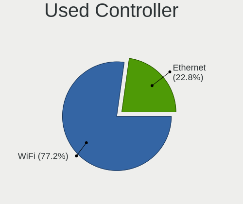

| Kind     | Notebooks | Percent |
|----------|-----------|---------|
| WiFi     | 833       | 77.42%  |
| Ethernet | 243       | 22.58%  |

NICs
----

Total network controllers on board

| Total | Notebooks | Percent |
|-------|-----------|---------|
| 2     | 841       | 81.65%  |
| 1     | 157       | 15.24%  |
| 0     | 27        | 2.62%   |
| 3     | 5         | 0.49%   |

IPv6
----

IPv6 vs IPv4

| Used | Notebooks | Percent |
|------|-----------|---------|
| No   | 875       | 83.41%  |
| Yes  | 174       | 16.59%  |

Bluetooth
---------

Bluetooth Vendor
----------------

Controller vendors

| Vendor                          | Notebooks | Percent |
|---------------------------------|-----------|---------|
| Intel                           | 269       | 40.57%  |
| Qualcomm Atheros Communications | 76        | 11.46%  |
| Realtek Semiconductor           | 65        | 9.8%    |
| Broadcom                        | 62        | 9.35%   |
| Lite-On Technology              | 27        | 4.07%   |
| IMC Networks                    | 26        | 3.92%   |
| Dell                            | 25        | 3.77%   |
| Foxconn / Hon Hai               | 20        | 3.02%   |
| Apple                           | 19        | 2.87%   |
| Hewlett-Packard                 | 18        | 2.71%   |
| Cambridge Silicon Radio         | 17        | 2.56%   |
| Ralink                          | 12        | 1.81%   |
| Toshiba                         | 9         | 1.36%   |
| Chicony Electronics             | 3         | 0.45%   |
| ASUSTek Computer                | 3         | 0.45%   |
| Alps Electric                   | 3         | 0.45%   |
| Realtek                         | 2         | 0.3%    |
| Integrated System Solution      | 2         | 0.3%    |
| Taiyo Yuden                     | 1         | 0.15%   |
| Ralink Technology               | 1         | 0.15%   |
| Qcom                            | 1         | 0.15%   |
| MediaTek                        | 1         | 0.15%   |
| Foxconn International           | 1         | 0.15%   |

Bluetooth Model
---------------

Controller models

| Model                                               | Notebooks | Percent |
|-----------------------------------------------------|-----------|---------|
| Intel Bluetooth wireless interface                  | 119       | 17.92%  |
| Intel AX201 Bluetooth                               | 45        | 6.78%   |
| Realtek Bluetooth Radio                             | 35        | 5.27%   |
| Qualcomm Atheros  Bluetooth Device                  | 32        | 4.82%   |
| Intel Bluetooth 9460/9560 Jefferson Peak (JfP)      | 32        | 4.82%   |
| Intel Centrino Bluetooth Wireless Transceiver       | 23        | 3.46%   |
| Realtek  Bluetooth 4.2 Adapter                      | 22        | 3.31%   |
| Intel AX200 Bluetooth                               | 20        | 3.01%   |
| Cambridge Silicon Radio Bluetooth Dongle (HCI mode) | 17        | 2.56%   |
| Broadcom BCM2045B (BDC-2.1)                         | 15        | 2.26%   |
| Intel Wireless-AC 9260 Bluetooth Adapter            | 13        | 1.96%   |
| Ralink RT3290 Bluetooth                             | 12        | 1.81%   |
| Qualcomm Atheros AR3012 Bluetooth 4.0               | 12        | 1.81%   |
| HP Bluetooth 2.0 Interface [Broadcom BCM2045]       | 12        | 1.81%   |
| Qualcomm Atheros AR3011 Bluetooth                   | 11        | 1.66%   |
| Qualcomm Atheros AR9462 Bluetooth                   | 10        | 1.51%   |
| Lite-On Qualcomm Atheros QCA9377 Bluetooth          | 10        | 1.51%   |
| Lite-On Bluetooth Device                            | 9         | 1.36%   |
| IMC Networks Bluetooth Device                       | 9         | 1.36%   |
| Apple Bluetooth Host Controller                     | 9         | 1.36%   |
| Dell DW375 Bluetooth Module                         | 8         | 1.2%    |
| Realtek RTL8723B Bluetooth                          | 7         | 1.05%   |
| Lite-On Atheros AR3012 Bluetooth                    | 7         | 1.05%   |
| Intel Centrino Advanced-N 6230 Bluetooth adapter    | 7         | 1.05%   |
| Broadcom BCM20702 Bluetooth 4.0 [ThinkPad]          | 7         | 1.05%   |
| Qualcomm Atheros QCA61x4 Bluetooth 4.0              | 6         | 0.9%    |
| Intel Wireless-AC 3168 Bluetooth                    | 6         | 0.9%    |
| HP Broadcom 2070 Bluetooth Combo                    | 6         | 0.9%    |
| Broadcom BCM2045B (BDC-2.1) [Bluetooth Controller]  | 6         | 0.9%    |
| IMC Networks Bluetooth Radio                        | 5         | 0.75%   |
| Dell Wireless 365 Bluetooth                         | 5         | 0.75%   |
| Broadcom BCM2070 Bluetooth Device                   | 5         | 0.75%   |
| Broadcom BCM2070 Bluetooth 2.1 + EDR                | 5         | 0.75%   |
| Intel AX210 Bluetooth                               | 4         | 0.6%    |
| Foxconn / Hon Hai BCM20702A0                        | 4         | 0.6%    |
| Dell Wireless 360 Bluetooth                         | 4         | 0.6%    |
| Dell BCM20702A0 Bluetooth Module                    | 4         | 0.6%    |
| Broadcom HP Portable Valentine                      | 4         | 0.6%    |
| Broadcom HP Portable SoftSailing                    | 4         | 0.6%    |
| Broadcom BCM2045 Bluetooth                          | 4         | 0.6%    |

Sound
-----

Sound Vendor
------------

Sound card vendors

| Vendor                           | Notebooks | Percent |
|----------------------------------|-----------|---------|
| Intel                            | 813       | 66.97%  |
| AMD                              | 193       | 15.9%   |
| Nvidia                           | 128       | 10.54%  |
| C-Media Electronics              | 12        | 0.99%   |
| Logitech                         | 8         | 0.66%   |
| Silicon Integrated Systems [SiS] | 7         | 0.58%   |
| GN Netcom                        | 6         | 0.49%   |
| Lenovo                           | 5         | 0.41%   |
| Realtek Semiconductor            | 4         | 0.33%   |
| VIA Technologies                 | 3         | 0.25%   |
| Plantronics                      | 3         | 0.25%   |
| Generalplus Technology           | 3         | 0.25%   |
| Textech International            | 2         | 0.16%   |
| Texas Instruments                | 2         | 0.16%   |
| Sennheiser Communications        | 2         | 0.16%   |
| Focusrite-Novation               | 2         | 0.16%   |
| Apple                            | 2         | 0.16%   |
| ZOOM                             | 1         | 0.08%   |
| XMOS                             | 1         | 0.08%   |
| TEAC                             | 1         | 0.08%   |
| QinHeng Electronics              | 1         | 0.08%   |
| PreSonus Audio Electronics       | 1         | 0.08%   |
| OLKB                             | 1         | 0.08%   |
| Native Instruments               | 1         | 0.08%   |
| KORG                             | 1         | 0.08%   |
| Elite Silicon                    | 1         | 0.08%   |
| Earth Computer Technologies      | 1         | 0.08%   |
| DSEA A/S                         | 1         | 0.08%   |
| Digidesign                       | 1         | 0.08%   |
| Dell                             | 1         | 0.08%   |
| Creative Technology              | 1         | 0.08%   |
| Corsair                          | 1         | 0.08%   |
| Cambridge Silicon Radio          | 1         | 0.08%   |
| BEHRINGER International          | 1         | 0.08%   |
| ASUSTek Computer                 | 1         | 0.08%   |
| AKAI Professional M.I.           | 1         | 0.08%   |

Sound Model
-----------

Sound card models

| Model                                                                                             | Notebooks | Percent |
|---------------------------------------------------------------------------------------------------|-----------|---------|
| Intel 7 Series/C216 Chipset Family High Definition Audio Controller                               | 113       | 7.79%   |
| Intel Sunrise Point-LP HD Audio                                                                   | 90        | 6.21%   |
| Intel 6 Series/C200 Series Chipset Family High Definition Audio Controller                        | 76        | 5.24%   |
| Intel 5 Series/3400 Series Chipset High Definition Audio                                          | 72        | 4.97%   |
| Intel 82801I (ICH9 Family) HD Audio Controller                                                    | 68        | 4.69%   |
| Intel 82801H (ICH8 Family) HD Audio Controller                                                    | 59        | 4.07%   |
| AMD Family 17h/19h HD Audio Controller                                                            | 59        | 4.07%   |
| AMD FCH Azalia Controller                                                                         | 57        | 3.93%   |
| Intel Haswell-ULT HD Audio Controller                                                             | 39        | 2.69%   |
| Intel 8 Series HD Audio Controller                                                                | 39        | 2.69%   |
| Intel 8 Series/C220 Series Chipset High Definition Audio Controller                               | 34        | 2.34%   |
| AMD SBx00 Azalia (Intel HDA)                                                                      | 34        | 2.34%   |
| AMD Kabini HDMI/DP Audio                                                                          | 34        | 2.34%   |
| Intel NM10/ICH7 Family High Definition Audio Controller                                           | 33        | 2.28%   |
| AMD Raven/Raven2/Fenghuang HDMI/DP Audio Controller                                               | 32        | 2.21%   |
| Intel Xeon E3-1200 v3/4th Gen Core Processor HD Audio Controller                                  | 31        | 2.14%   |
| Intel Wildcat Point-LP High Definition Audio Controller                                           | 23        | 1.59%   |
| Intel Tiger Lake-LP Smart Sound Technology Audio Controller                                       | 23        | 1.59%   |
| Intel Broadwell-U Audio Controller                                                                | 23        | 1.59%   |
| Nvidia GF108 High Definition Audio Controller                                                     | 22        | 1.52%   |
| Intel Cannon Lake PCH cAVS                                                                        | 22        | 1.52%   |
| Intel Atom Processor Z36xxx/Z37xxx Series High Definition Audio Controller                        | 22        | 1.52%   |
| AMD Renoir Radeon High Definition Audio Controller                                                | 22        | 1.52%   |
| Intel Celeron/Pentium Silver Processor High Definition Audio                                      | 21        | 1.45%   |
| AMD Wrestler HDMI Audio                                                                           | 20        | 1.38%   |
| Intel Comet Lake PCH-LP cAVS                                                                      | 19        | 1.31%   |
| Intel Comet Lake PCH cAVS                                                                         | 18        | 1.24%   |
| Intel Atom/Celeron/Pentium Processor x5-E8000/J3xxx/N3xxx Series High Definition Audio Controller | 17        | 1.17%   |
| Intel CM238 HD Audio Controller                                                                   | 15        | 1.03%   |
| Intel Cannon Point-LP High Definition Audio Controller                                            | 15        | 1.03%   |
| Intel Ice Lake-LP Smart Sound Technology Audio Controller                                         | 14        | 0.97%   |
| Nvidia High Definition Audio Controller                                                           | 13        | 0.9%    |
| AMD Family 15h (Models 60h-6fh) Audio Controller                                                  | 12        | 0.83%   |
| Nvidia TU107 GeForce GTX 1650 High Definition Audio Controller                                    | 11        | 0.76%   |
| Nvidia GK107 HDMI Audio Controller                                                                | 10        | 0.69%   |
| AMD High Definition Audio Controller                                                              | 9         | 0.62%   |
| Intel 100 Series/C230 Series Chipset Family HD Audio Controller                                   | 8         | 0.55%   |
| Nvidia GT216 HDMI Audio Controller                                                                | 7         | 0.48%   |
| C-Media Electronics Audio Adapter (Unitek Y-247A)                                                 | 7         | 0.48%   |
| AMD Trinity HDMI Audio Controller                                                                 | 7         | 0.48%   |

Memory
------

Memory Vendor
-------------

Memory module vendors

| Vendor                                           | Notebooks | Percent |
|--------------------------------------------------|-----------|---------|
| Samsung Electronics                              | 165       | 27.5%   |
| SK hynix                                         | 127       | 21.17%  |
| Unknown                                          | 77        | 12.83%  |
| Micron Technology                                | 62        | 10.33%  |
| Kingston                                         | 57        | 9.5%    |
| Ramaxel Technology                               | 18        | 3%      |
| Elpida                                           | 18        | 3%      |
| Crucial                                          | 17        | 2.83%   |
| A-DATA Technology                                | 9         | 1.5%    |
| Unknown (ABCD)                                   | 7         | 1.17%   |
| Smart                                            | 7         | 1.17%   |
| Nanya Technology                                 | 5         | 0.83%   |
| GOODRAM                                          | 4         | 0.67%   |
| G.Skill                                          | 4         | 0.67%   |
| Corsair                                          | 4         | 0.67%   |
| Teikon                                           | 2         | 0.33%   |
| Apacer                                           | 2         | 0.33%   |
| Unknown                                          | 2         | 0.33%   |
| V-GeN                                            | 1         | 0.17%   |
| Unknown (0x36345431323830323145444C335342322020) | 1         | 0.17%   |
| Unknown (0x0043415455000000)                     | 1         | 0.17%   |
| Unifosa                                          | 1         | 0.17%   |
| Transcend                                        | 1         | 0.17%   |
| Timetec                                          | 1         | 0.17%   |
| Smart Brazil                                     | 1         | 0.17%   |
| SHARETRONIC                                      | 1         | 0.17%   |
| Patriot                                          | 1         | 0.17%   |
| Memox                                            | 1         | 0.17%   |
| CSX                                              | 1         | 0.17%   |
| Avant                                            | 1         | 0.17%   |
| ASint Technology                                 | 1         | 0.17%   |

Memory Model
------------

Memory module models

| Model                                                            | Notebooks | Percent |
|------------------------------------------------------------------|-----------|---------|
| SK hynix RAM HMT451S6BFR8A-PB 4GB SODIMM DDR3 1600MT/s           | 10        | 1.56%   |
| SK hynix RAM HMA81GS6JJR8N-VK 8GB SODIMM DDR4 2667MT/s           | 9         | 1.4%    |
| SK hynix RAM HMA81GS6AFR8N-UH 8GB SODIMM DDR4 2667MT/s           | 8         | 1.25%   |
| Samsung RAM M471A5244CB0-CTD 4GB SODIMM DDR4 3266MT/s            | 8         | 1.25%   |
| Unknown (ABCD) RAM 123456789012345678 1GB SODIMM LPDDR4 2400MT/s | 7         | 1.09%   |
| SK hynix RAM HMT351S6CFR8C-PB 4GB SODIMM DDR3 1600MT/s           | 7         | 1.09%   |
| Samsung RAM M471B5273DH0-CH9 4GB SODIMM DDR3 1334MT/s            | 7         | 1.09%   |
| Samsung RAM M471B5273CH0-CH9 4GB SODIMM DDR3 1334MT/s            | 7         | 1.09%   |
| Samsung RAM M471B5173QH0-YK0 4GB SODIMM DDR3 1600MT/s            | 7         | 1.09%   |
| Samsung RAM M471B5173DB0-YK0 4GB SODIMM DDR3 1600MT/s            | 7         | 1.09%   |
| Unknown RAM Module 8192MB SODIMM DDR4 2667MT/s                   | 6         | 0.93%   |
| Unknown RAM Module 2GB SODIMM DDR2 667MT/s                       | 6         | 0.93%   |
| Unknown RAM Module 2048MB SODIMM DDR3 1333MT/s                   | 6         | 0.93%   |
| Unknown RAM Module 2048MB SODIMM DDR2 667MT/s                    | 6         | 0.93%   |
| SK hynix RAM HMT41GS6AFR8A-PB 8192MB SODIMM DDR3 1600MT/s        | 6         | 0.93%   |
| Samsung RAM M471B1G73EB0-YK0 8GB SODIMM DDR3 1600MT/s            | 6         | 0.93%   |
| Unknown RAM Module 4096MB SODIMM DDR3 1333MT/s                   | 5         | 0.78%   |
| Unknown RAM Module 2048MB SODIMM DDR2                            | 5         | 0.78%   |
| Unknown RAM Module 1GB SODIMM DDR2 667MT/s                       | 5         | 0.78%   |
| SK hynix RAM HMT41GS6BFR8A-PB 8GB SODIMM DDR3 1600MT/s           | 5         | 0.78%   |
| Samsung RAM M471A2K43DB1-CTD 16GB SODIMM DDR4 2667MT/s           | 5         | 0.78%   |
| Samsung RAM M471A1K43DB1-CWE 8GB SODIMM DDR4 3200MT/s            | 5         | 0.78%   |
| Samsung RAM M471A1K43BB1-CRC 8GB SODIMM DDR4 2667MT/s            | 5         | 0.78%   |
| SK hynix RAM HMT351S6EFR8A-PB 4GB SODIMM DDR3 1600MT/s           | 4         | 0.62%   |
| SK hynix RAM HMA851S6JJR6N-VK 4GB SODIMM DDR4 2667MT/s           | 4         | 0.62%   |
| Samsung RAM M471B1G73QH0-YK0 8GB SODIMM DDR3 1867MT/s            | 4         | 0.62%   |
| Samsung RAM M471B1G73DB0-YK0 8GB SODIMM DDR3 1600MT/s            | 4         | 0.62%   |
| Samsung RAM M471A5244CB0-CRC 4GB SODIMM DDR4 2667MT/s            | 4         | 0.62%   |
| Samsung RAM M471A2K43CB1-CRC 16GB SODIMM DDR4 2667MT/s           | 4         | 0.62%   |
| Ramaxel RAM RMSA3260ME78HAF-2666 8GB SODIMM DDR4 2667MT/s        | 4         | 0.62%   |
| Micron RAM 8KTF51264HZ-1G6E1 4096MB SODIMM DDR3 1600MT/s         | 4         | 0.62%   |
| Micron RAM 4ATF51264HZ-2G6E1 4GB SODIMM DDR4 2667MT/s            | 4         | 0.62%   |
| Micron RAM 4ATF1G64HZ-3G2E2 8GB SODIMM DDR4 3200MT/s             | 4         | 0.62%   |
| Unknown RAM Module 4096MB SODIMM DDR4 2400MT/s                   | 3         | 0.47%   |
| Unknown RAM Module 4096MB SODIMM DDR3 1600MT/s                   | 3         | 0.47%   |
| Unknown RAM Module 4096MB SODIMM DDR3                            | 3         | 0.47%   |
| Unknown RAM Module 1024MB SODIMM DDR2 667MT/s                    | 3         | 0.47%   |
| SK hynix RAM HYMP125S64CP8-Y5 2GB SODIMM DDR 667MT/s             | 3         | 0.47%   |
| SK hynix RAM HMT351S6BFR8C-H9 4GB SODIMM DDR3 1333MT/s           | 3         | 0.47%   |
| SK hynix RAM HMAA1GS6CMR6N-VK 8GB SODIMM DDR4 2667MT/s           | 3         | 0.47%   |

Memory Kind
-----------

Memory module kinds

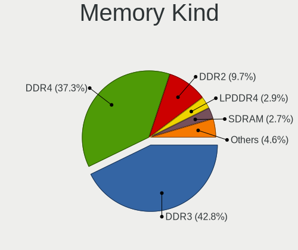

| Kind    | Notebooks | Percent |
|---------|-----------|---------|
| DDR3    | 222       | 42.45%  |
| DDR4    | 195       | 37.28%  |
| DDR2    | 51        | 9.75%   |
| LPDDR4  | 16        | 3.06%   |
| SDRAM   | 15        | 2.87%   |
| LPDDR3  | 14        | 2.68%   |
| Unknown | 6         | 1.15%   |
| DRAM    | 3         | 0.57%   |
| DDR     | 1         | 0.19%   |

Memory Form Factor
------------------

Physical design of the memory module

| Name         | Notebooks | Percent |
|--------------|-----------|---------|
| SODIMM       | 484       | 93.62%  |
| Row Of Chips | 25        | 4.84%   |
| Chip         | 4         | 0.77%   |
| DIMM         | 3         | 0.58%   |
| Unknown      | 1         | 0.19%   |

Memory Size
-----------

Memory module size

| Size  | Notebooks | Percent |
|-------|-----------|---------|
| 4096  | 187       | 32.64%  |
| 8192  | 185       | 32.29%  |
| 2048  | 102       | 17.8%   |
| 16384 | 57        | 9.95%   |
| 1024  | 29        | 5.06%   |
| 32768 | 12        | 2.09%   |
| 512   | 1         | 0.17%   |

Memory Speed
------------

Memory module speed

| Speed   | Notebooks | Percent |
|---------|-----------|---------|
| 1600    | 143       | 26%     |
| 2667    | 112       | 20.36%  |
| 3200    | 56        | 10.18%  |
| 1334    | 38        | 6.91%   |
| 2400    | 37        | 6.73%   |
| 667     | 37        | 6.73%   |
| 1333    | 31        | 5.64%   |
| 2133    | 15        | 2.73%   |
| Unknown | 14        | 2.55%   |
| 4199    | 12        | 2.18%   |
| 800     | 11        | 2%      |
| 1067    | 10        | 1.82%   |
| 3266    | 8         | 1.45%   |
| 1066    | 6         | 1.09%   |
| 4267    | 5         | 0.91%   |
| 1867    | 3         | 0.55%   |
| 1866    | 3         | 0.55%   |
| 975     | 3         | 0.55%   |
| 2048    | 2         | 0.36%   |
| 533     | 2         | 0.36%   |
| 8400    | 1         | 0.18%   |
| 1800    | 1         | 0.18%   |

Printers & scanners
-------------------

Printer Vendor
--------------

Printer device vendors

| Vendor                | Notebooks | Percent |
|-----------------------|-----------|---------|
| Hewlett-Packard       | 4         | 30.77%  |
| Canon                 | 3         | 23.08%  |
| Brother Industries    | 2         | 15.38%  |
| Seiko Epson           | 1         | 7.69%   |
| Prolific Technology   | 1         | 7.69%   |
| Lexmark International | 1         | 7.69%   |
| Kyocera               | 1         | 7.69%   |

Printer Model
-------------

Printer device models

| Model                           | Notebooks | Percent |
|---------------------------------|-----------|---------|
| Seiko Epson L360 Series         | 1         | 7.69%   |
| Prolific PL2305 Parallel Port   | 1         | 7.69%   |
| Lexmark International E360d     | 1         | 7.69%   |
| Kyocera Mita FS-920             | 1         | 7.69%   |
| HP LaserJet P1005               | 1         | 7.69%   |
| HP LaserJet 1320                | 1         | 7.69%   |
| HP DeskJet F2100 Printer series | 1         | 7.69%   |
| HP DeskJet 3700 series          | 1         | 7.69%   |
| Canon TS3300 series             | 1         | 7.69%   |
| Canon LBP6230/6240              | 1         | 7.69%   |
| Canon LBP6000                   | 1         | 7.69%   |
| Brother MFC-L2710DW series      | 1         | 7.69%   |
| Brother HL-L2320D series        | 1         | 7.69%   |

Scanner Vendor
--------------

Scanner device vendors

| Vendor          | Notebooks | Percent |
|-----------------|-----------|---------|
| Seiko Epson     | 1         | 50%     |
| Hewlett-Packard | 1         | 50%     |

Scanner Model
-------------

Scanner device models

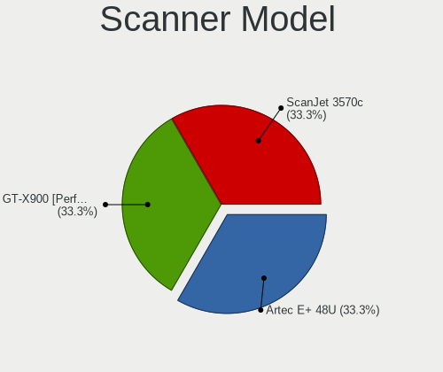

| Model                                            | Notebooks | Percent |
|--------------------------------------------------|-----------|---------|
| Seiko Epson GT-X900 [Perfection V700/V750 Photo] | 1         | 50%     |
| HP ScanJet 3570c                                 | 1         | 50%     |

Camera
------

Camera Vendor
-------------

Camera device vendors

| Vendor                                 | Notebooks | Percent |
|----------------------------------------|-----------|---------|
| Chicony Electronics                    | 255       | 29.11%  |
| Realtek Semiconductor                  | 66        | 7.53%   |
| IMC Networks                           | 66        | 7.53%   |
| Microdia                               | 63        | 7.19%   |
| Sunplus Innovation Technology          | 50        | 5.71%   |
| Suyin                                  | 49        | 5.59%   |
| Bison Electronics                      | 44        | 5.02%   |
| Cheng Uei Precision Industry (Foxlink) | 33        | 3.77%   |
| Quanta                                 | 31        | 3.54%   |
| Lite-On Technology                     | 25        | 2.85%   |
| Apple                                  | 21        | 2.4%    |
| Alcor Micro                            | 20        | 2.28%   |
| Acer                                   | 20        | 2.28%   |
| Silicon Motion                         | 18        | 2.05%   |
| Syntek                                 | 17        | 1.94%   |
| Ricoh                                  | 17        | 1.94%   |
| Samsung Electronics                    | 9         | 1.03%   |
| Logitech                               | 9         | 1.03%   |
| Lenovo                                 | 8         | 0.91%   |
| Luxvisions Innotech Limited            | 6         | 0.68%   |
| Importek                               | 6         | 0.68%   |
| ALi                                    | 6         | 0.68%   |
| Z-Star Microelectronics                | 4         | 0.46%   |
| OmniVision Technologies                | 4         | 0.46%   |
| DigiTech                               | 4         | 0.46%   |
| Primax Electronics                     | 3         | 0.34%   |
| GEMBIRD                                | 3         | 0.34%   |
| Sunplus Technology                     | 2         | 0.23%   |
| icSpring                               | 2         | 0.23%   |
| Genesys Logic                          | 2         | 0.23%   |
| Unknown                                | 1         | 0.11%   |
| Tobii AB                               | 1         | 0.11%   |
| Sonix Technology                       | 1         | 0.11%   |
| Novatek Microelectronics               | 1         | 0.11%   |
| Microsoft                              | 1         | 0.11%   |
| Magic Control Technology               | 1         | 0.11%   |
| MacroSilicon                           | 1         | 0.11%   |
| Intel                                  | 1         | 0.11%   |
| Generalplus Technology                 | 1         | 0.11%   |
| Cubeternet                             | 1         | 0.11%   |

Camera Model
------------

Camera device models

| Model                                                          | Notebooks | Percent |
|----------------------------------------------------------------|-----------|---------|
| Chicony Integrated Camera                                      | 39        | 4.43%   |
| Realtek Integrated_Webcam_HD                                   | 18        | 2.04%   |
| Microdia Integrated_Webcam_HD                                  | 17        | 1.93%   |
| Chicony USB 2.0 Camera                                         | 17        | 1.93%   |
| IMC Networks USB2.0 HD UVC WebCam                              | 15        | 1.7%    |
| Sunplus Integrated_Webcam_HD                                   | 13        | 1.48%   |
| IMC Networks Integrated Camera                                 | 13        | 1.48%   |
| Chicony HP Truevision HD                                       | 13        | 1.48%   |
| Cheng Uei Precision Industry (Foxlink) HP Webcam               | 11        | 1.25%   |
| Lite-On Integrated Camera                                      | 10        | 1.14%   |
| Chicony USB2.0 VGA UVC WebCam                                  | 10        | 1.14%   |
| Chicony HD WebCam                                              | 10        | 1.14%   |
| Syntek Lenovo EasyCamera                                       | 9         | 1.02%   |
| Samsung Galaxy series, misc. (MTP mode)                        | 9         | 1.02%   |
| Microdia Integrated Webcam                                     | 9         | 1.02%   |
| Lite-On HP HD Camera                                           | 9         | 1.02%   |
| IMC Networks USB2.0 VGA UVC WebCam                             | 9         | 1.02%   |
| Chicony TOSHIBA Web Camera - HD                                | 9         | 1.02%   |
| Alcor Micro USB 2.0 Web Camera                                 | 9         | 1.02%   |
| Suyin HP TrueVision HD                                         | 8         | 0.91%   |
| Chicony USB2.0 Camera                                          | 8         | 0.91%   |
| Chicony Lenovo EasyCamera                                      | 8         | 0.91%   |
| Bison Integrated Camera                                        | 8         | 0.91%   |
| Quanta HP TrueVision HD Camera                                 | 7         | 0.79%   |
| Chicony Integrated Camera (1280x720@30)                        | 7         | 0.79%   |
| Suyin 1.3M WebCam (notebook emachines E730, Acer sub-brand)    | 6         | 0.68%   |
| Sunplus HD WebCam                                              | 6         | 0.68%   |
| IMC Networks UVC VGA Webcam                                    | 6         | 0.68%   |
| Chicony HP HD Webcam                                           | 6         | 0.68%   |
| Cheng Uei Precision Industry (Foxlink) HP TrueVision HD Camera | 6         | 0.68%   |
| Bison Lenovo EasyCamera                                        | 6         | 0.68%   |
| Bison HD Webcam                                                | 6         | 0.68%   |
| Apple iPhone 5/5C/5S/6/SE/7/8/X/XR                             | 6         | 0.68%   |
| Apple Built-in iSight                                          | 6         | 0.68%   |
| Acer Lenovo EasyCamera                                         | 6         | 0.68%   |
| Suyin HP TrueVision HD Integrated Webcam                       | 5         | 0.57%   |
| Suyin Acer/HP Integrated Webcam [CN0314]                       | 5         | 0.57%   |
| Sunplus Asus Webcam                                            | 5         | 0.57%   |
| Realtek Lenovo EasyCamera                                      | 5         | 0.57%   |
| Realtek Integrated Webcam HD                                   | 5         | 0.57%   |

Security
--------

Fingerprint Vendor
------------------

Fingerprint sensor vendors

| Vendor                     | Notebooks | Percent |
|----------------------------|-----------|---------|
| Validity Sensors           | 74        | 40.66%  |
| Synaptics                  | 35        | 19.23%  |
| AuthenTec                  | 29        | 15.93%  |
| Upek                       | 14        | 7.69%   |
| Shenzhen Goodix Technology | 9         | 4.95%   |
| LighTuning Technology      | 9         | 4.95%   |
| STMicroelectronics         | 8         | 4.4%    |
| Elan Microelectronics      | 4         | 2.2%    |

Fingerprint Model
-----------------

Fingerprint sensor models

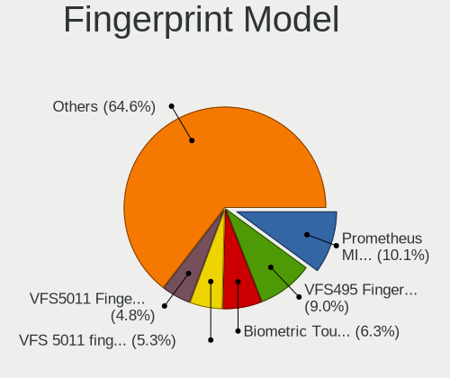

| Model                                                                      | Notebooks | Percent |
|----------------------------------------------------------------------------|-----------|---------|
| Synaptics Prometheus MIS Touch Fingerprint Reader                          | 19        | 10.44%  |
| Validity Sensors VFS495 Fingerprint Reader                                 | 16        | 8.79%   |
| Upek Biometric Touchchip/Touchstrip Fingerprint Sensor                     | 12        | 6.59%   |
| Validity Sensors VFS 5011 fingerprint sensor                               | 10        | 5.49%   |
| Validity Sensors Fingerprint scanner                                       | 9         | 4.95%   |
| AuthenTec AES2501 Fingerprint Sensor                                       | 9         | 4.95%   |
| Validity Sensors VFS5011 Fingerprint Reader                                | 8         | 4.4%    |
| STMicroelectronics Fingerprint Reader                                      | 8         | 4.4%    |
| AuthenTec AES2810                                                          | 8         | 4.4%    |
| Validity Sensors VFS471 Fingerprint Reader                                 | 7         | 3.85%   |
| Validity Sensors VFS451 Fingerprint Reader                                 | 7         | 3.85%   |
| AuthenTec Fingerprint Sensor                                               | 7         | 3.85%   |
| Validity Sensors VFS491                                                    | 6         | 3.3%    |
| Synaptics Metallica MIS Touch Fingerprint Reader                           | 6         | 3.3%    |
| Shenzhen Goodix  FingerPrint Device                                        | 6         | 3.3%    |
| Synaptics Metallica MOH Touch Fingerprint Reader                           | 4         | 2.2%    |
| AuthenTec AES1600                                                          | 4         | 2.2%    |
| Validity Sensors Synaptics WBDI                                            | 3         | 1.65%   |
| LighTuning Fingerprint Reader                                              | 3         | 1.65%   |
| LighTuning ES603 Swipe Fingerprint Sensor                                  | 3         | 1.65%   |
| LighTuning EgisTec Touch Fingerprint Sensor                                | 3         | 1.65%   |
| Validity Sensors VFS Fingerprint sensor                                    | 2         | 1.1%    |
| Validity Sensors Synaptics VFS7552 Touch Fingerprint Sensor with PurePrint | 2         | 1.1%    |
| Validity Sensors Swipe Fingerprint Sensor                                  | 2         | 1.1%    |
| Upek TCS5B Fingerprint sensor                                              | 2         | 1.1%    |
| Shenzhen Goodix Fingerprint Reader                                         | 2         | 1.1%    |
| Elan ELAN:ARM-M4                                                           | 2         | 1.1%    |
| Unknown                                                                    | 2         | 1.1%    |
| Validity Sensors VFS7500 Touch Fingerprint Sensor                          | 1         | 0.55%   |
| Validity Sensors VFS101 Fingerprint Reader                                 | 1         | 0.55%   |
| Synaptics WBDI Fingerprint Reader USB 086                                  | 1         | 0.55%   |
| Synaptics WBDI Device                                                      | 1         | 0.55%   |
| Synaptics  FS7604 Touch Fingerprint Sensor with PurePrint                  | 1         | 0.55%   |
| Synaptics Fingerprint reader [HP G6]                                       | 1         | 0.55%   |
| Shenzhen Goodix FingerPrint                                                | 1         | 0.55%   |
| Elan WBF Fingerprint Sensor                                                | 1         | 0.55%   |
| Elan ELAN:Fingerprint                                                      | 1         | 0.55%   |
| AuthenTec AES2550 Fingerprint Sensor                                       | 1         | 0.55%   |

Chipcard Vendor
---------------

Chipcard module vendors

| Vendor                   | Notebooks | Percent |
|--------------------------|-----------|---------|
| Broadcom                 | 39        | 39%     |
| Alcor Micro              | 25        | 25%     |
| O2 Micro                 | 15        | 15%     |
| Upek                     | 9         | 9%      |
| Lenovo                   | 8         | 8%      |
| Yubico.com               | 1         | 1%      |
| Reiner SCT Kartensysteme | 1         | 1%      |
| OmniKey                  | 1         | 1%      |
| C3PO                     | 1         | 1%      |

Chipcard Model
--------------

Chipcard module models

| Model                                                                        | Notebooks | Percent |
|------------------------------------------------------------------------------|-----------|---------|
| Alcor Micro AU9540 Smartcard Reader                                          | 25        | 25%     |
| Broadcom BCM5880 Secure Applications Processor                               | 15        | 15%     |
| O2 Micro OZ776 CCID Smartcard Reader                                         | 14        | 14%     |
| Broadcom 5880                                                                | 12        | 12%     |
| Upek TouchChip Fingerprint Coprocessor (WBF advanced mode)                   | 9         | 9%      |
| Lenovo Integrated Smart Card Reader                                          | 8         | 8%      |
| Broadcom BCM5880 Secure Applications Processor with fingerprint swipe sensor | 7         | 7%      |
| Broadcom 58200                                                               | 5         | 5%      |
| Yubico.com Yubikey NEO(-N) OTP+CCID                                          | 1         | 1%      |
| Reiner SCT Kartensysteme cyberJack RFID basis contactless smartcard reader   | 1         | 1%      |
| OmniKey CardMan Smart@Link                                                   | 1         | 1%      |
| O2 Micro Oz776 SmartCard Reader                                              | 1         | 1%      |
| C3PO USB SMART CARD READER                                                   | 1         | 1%      |

Unsupported
-----------

Unsupported Devices
-------------------

Total unsupported devices on board

| Total | Notebooks | Percent |
|-------|-----------|---------|
| 0     | 658       | 63.15%  |
| 1     | 297       | 28.5%   |
| 2     | 74        | 7.1%    |
| 3     | 8         | 0.77%   |
| 4     | 2         | 0.19%   |
| 10    | 1         | 0.1%    |
| 6     | 1         | 0.1%    |
| 5     | 1         | 0.1%    |

Unsupported Device Types
------------------------

Types of unsupported devices

| Type                     | Notebooks | Percent |
|--------------------------|-----------|---------|
| Fingerprint reader       | 182       | 37.37%  |
| Graphics card            | 103       | 21.15%  |
| Chipcard                 | 95        | 19.51%  |
| Net/wireless             | 36        | 7.39%   |
| Bluetooth                | 15        | 3.08%   |
| Camera                   | 13        | 2.67%   |
| Storage                  | 11        | 2.26%   |
| Card reader              | 10        | 2.05%   |
| Flash memory             | 5         | 1.03%   |
| Sound                    | 4         | 0.82%   |
| Multimedia controller    | 4         | 0.82%   |
| Net/ethernet             | 3         | 0.62%   |
| Communication controller | 3         | 0.62%   |
| Storage/ide              | 1         | 0.21%   |
| Network                  | 1         | 0.21%   |
| Modem                    | 1         | 0.21%   |

