Xubuntu 20.04 - Tested Hardware & Statistics (Notebooks)
--------------------------------------------------------

A project to collect tested hardware configurations for Xubuntu 20.04.

Anyone can contribute to this report by the [hw-probe](https://github.com/linuxhw/hw-probe) tool:

    sudo -E hw-probe -all -upload

Please contribute! Especially if your hardware is rare.

Contents
--------

* [ Test Cases ](#test-cases)

* [ System ](#system)
  - [ Kernel                   ](#kernel)
  - [ Kernel Family            ](#kernel-family)
  - [ Kernel Major Ver.        ](#kernel-major-ver)
  - [ Arch                     ](#arch)
  - [ DE                       ](#de)
  - [ Display Server           ](#display-server)
  - [ Display Manager          ](#display-manager)
  - [ OS Lang                  ](#os-lang)
  - [ Boot Mode                ](#boot-mode)
  - [ Filesystem               ](#filesystem)
  - [ Part. scheme             ](#part-scheme)
  - [ Dual Boot with Linux/BSD ](#dual-boot-with-linuxbsd)
  - [ Dual Boot (Win)          ](#dual-boot-win)

* [ Board ](#board)
  - [ Vendor                   ](#vendor)
  - [ Model                    ](#model)
  - [ Model Family             ](#model-family)
  - [ MFG Year                 ](#mfg-year)
  - [ Form Factor              ](#form-factor)
  - [ Secure Boot              ](#secure-boot)
  - [ Coreboot                 ](#coreboot)
  - [ RAM Size                 ](#ram-size)
  - [ RAM Used                 ](#ram-used)
  - [ Total Drives             ](#total-drives)
  - [ Has CD-ROM               ](#has-cd-rom)
  - [ Has Ethernet             ](#has-ethernet)
  - [ Has WiFi                 ](#has-wifi)
  - [ Has Bluetooth            ](#has-bluetooth)

* [ Location ](#location)
  - [ Country                  ](#country)
  - [ City                     ](#city)

* [ Drives ](#drives)
  - [ Drive Vendor             ](#drive-vendor)
  - [ Drive Model              ](#drive-model)
  - [ HDD Vendor               ](#hdd-vendor)
  - [ SSD Vendor               ](#ssd-vendor)
  - [ Drive Kind               ](#drive-kind)
  - [ Drive Connector          ](#drive-connector)
  - [ Drive Size               ](#drive-size)
  - [ Space Total              ](#space-total)
  - [ Space Used               ](#space-used)
  - [ Malfunc. Drives          ](#malfunc-drives)
  - [ Malfunc. Drive Vendor    ](#malfunc-drive-vendor)
  - [ Malfunc. HDD Vendor      ](#malfunc-hdd-vendor)
  - [ Malfunc. Drive Kind      ](#malfunc-drive-kind)
  - [ Failed Drives            ](#failed-drives)
  - [ Failed Drive Vendor      ](#failed-drive-vendor)
  - [ Drive Status             ](#drive-status)

* [ Storage controller ](#storage-controller)
  - [ Storage Vendor           ](#storage-vendor)
  - [ Storage Model            ](#storage-model)
  - [ Storage Kind             ](#storage-kind)

* [ Processor ](#processor)
  - [ CPU Vendor               ](#cpu-vendor)
  - [ CPU Model                ](#cpu-model)
  - [ CPU Model Family         ](#cpu-model-family)
  - [ CPU Cores                ](#cpu-cores)
  - [ CPU Sockets              ](#cpu-sockets)
  - [ CPU Threads              ](#cpu-threads)
  - [ CPU Op-Modes             ](#cpu-op-modes)
  - [ CPU Microcode            ](#cpu-microcode)
  - [ CPU Microarch            ](#cpu-microarch)

* [ Graphics ](#graphics)
  - [ GPU Vendor               ](#gpu-vendor)
  - [ GPU Model                ](#gpu-model)
  - [ GPU Combo                ](#gpu-combo)
  - [ GPU Driver               ](#gpu-driver)
  - [ GPU Memory               ](#gpu-memory)

* [ Monitor ](#monitor)
  - [ Monitor Vendor           ](#monitor-vendor)
  - [ Monitor Model            ](#monitor-model)
  - [ Monitor Resolution       ](#monitor-resolution)
  - [ Monitor Diagonal         ](#monitor-diagonal)
  - [ Monitor Width            ](#monitor-width)
  - [ Aspect Ratio             ](#aspect-ratio)
  - [ Monitor Area             ](#monitor-area)
  - [ Pixel Density            ](#pixel-density)
  - [ Multiple Monitors        ](#multiple-monitors)

* [ Network ](#network)
  - [ Net Controller Vendor    ](#net-controller-vendor)
  - [ Net Controller Model     ](#net-controller-model)
  - [ Wireless Vendor          ](#wireless-vendor)
  - [ Wireless Model           ](#wireless-model)
  - [ Ethernet Vendor          ](#ethernet-vendor)
  - [ Ethernet Model           ](#ethernet-model)
  - [ Net Controller Kind      ](#net-controller-kind)
  - [ Used Controller          ](#used-controller)
  - [ NICs                     ](#nics)
  - [ IPv6                     ](#ipv6)

* [ Bluetooth ](#bluetooth)
  - [ Bluetooth Vendor         ](#bluetooth-vendor)
  - [ Bluetooth Model          ](#bluetooth-model)

* [ Sound ](#sound)
  - [ Sound Vendor             ](#sound-vendor)
  - [ Sound Model              ](#sound-model)

* [ Memory ](#memory)
  - [ Memory Vendor            ](#memory-vendor)
  - [ Memory Model             ](#memory-model)
  - [ Memory Kind              ](#memory-kind)
  - [ Memory Form Factor       ](#memory-form-factor)
  - [ Memory Size              ](#memory-size)
  - [ Memory Speed             ](#memory-speed)

* [ Printers & scanners ](#printers--scanners)
  - [ Printer Vendor           ](#printer-vendor)
  - [ Printer Model            ](#printer-model)
  - [ Scanner Vendor           ](#scanner-vendor)
  - [ Scanner Model            ](#scanner-model)

* [ Camera ](#camera)
  - [ Camera Vendor            ](#camera-vendor)
  - [ Camera Model             ](#camera-model)

* [ Security ](#security)
  - [ Fingerprint Vendor       ](#fingerprint-vendor)
  - [ Fingerprint Model        ](#fingerprint-model)
  - [ Chipcard Vendor          ](#chipcard-vendor)
  - [ Chipcard Model           ](#chipcard-model)

* [ Unsupported ](#unsupported)
  - [ Unsupported Devices      ](#unsupported-devices)
  - [ Unsupported Device Types ](#unsupported-device-types)

Test Cases
----------

Total: 1491

| Vendor        | Model                       | Probe                                                      | Date         |
|---------------|-----------------------------|------------------------------------------------------------|--------------|
| ASUSTek       | K53SC                       | [f2605ba739](https://linux-hardware.org/?probe=f2605ba739) | Apr 29, 2022 |
| Dell          | Inspiron 3135               | [6ca6980f06](https://linux-hardware.org/?probe=6ca6980f06) | Apr 28, 2022 |
| HP            | ProBook 455 G8 Notebook ... | [fc0cea6830](https://linux-hardware.org/?probe=fc0cea6830) | Apr 27, 2022 |
| ASUSTek       | K53SC                       | [66e086eeaf](https://linux-hardware.org/?probe=66e086eeaf) | Apr 26, 2022 |
| Dell          | Latitude 7480               | [7e85baf2f4](https://linux-hardware.org/?probe=7e85baf2f4) | Apr 26, 2022 |
| ASUSTek       | K53SC                       | [6676db7948](https://linux-hardware.org/?probe=6676db7948) | Apr 25, 2022 |
| Lenovo        | ThinkPad T440 20B7A0S200    | [0ef99a6615](https://linux-hardware.org/?probe=0ef99a6615) | Apr 24, 2022 |
| ASUSTek       | 1215N                       | [93ad513620](https://linux-hardware.org/?probe=93ad513620) | Apr 24, 2022 |
| Lenovo        | B590 20206                  | [80befa3088](https://linux-hardware.org/?probe=80befa3088) | Apr 23, 2022 |
| Lenovo        | ThinkBook 14 G2 ARE 20VF    | [e87dfd05bc](https://linux-hardware.org/?probe=e87dfd05bc) | Apr 20, 2022 |
| Lenovo        | ThinkBook 14 G2 ARE 20VF    | [fae46ae55c](https://linux-hardware.org/?probe=fae46ae55c) | Apr 20, 2022 |
| HP            | OMEN by Laptop 16-c0xxx     | [d277143404](https://linux-hardware.org/?probe=d277143404) | Apr 20, 2022 |
| HP            | Compaq 6730s                | [4902d2bf25](https://linux-hardware.org/?probe=4902d2bf25) | Apr 16, 2022 |
| Dell          | Latitude E6540              | [94fbc5408f](https://linux-hardware.org/?probe=94fbc5408f) | Apr 15, 2022 |
| HP            | Compaq 6730s                | [755dcc7629](https://linux-hardware.org/?probe=755dcc7629) | Apr 15, 2022 |
| ASUSTek       | ASUS TUF Dash F15 FX516P... | [554040d7b4](https://linux-hardware.org/?probe=554040d7b4) | Apr 14, 2022 |
| Lenovo        | ThinkPad P53 20QNS01C00     | [b320a8cca8](https://linux-hardware.org/?probe=b320a8cca8) | Apr 14, 2022 |
| Lenovo        | ThinkPad E590 20NB0029GE    | [1f9cb1427a](https://linux-hardware.org/?probe=1f9cb1427a) | Apr 13, 2022 |
| Lenovo        | ThinkPad T480s 20L7001PI... | [53c7e12994](https://linux-hardware.org/?probe=53c7e12994) | Apr 13, 2022 |
| Dynabook      | TECRA X40-F                 | [6d6f37f70e](https://linux-hardware.org/?probe=6d6f37f70e) | Apr 13, 2022 |
| HP            | Laptop 15-bw0xx             | [1c15e67e64](https://linux-hardware.org/?probe=1c15e67e64) | Apr 11, 2022 |
| ASUSTek       | K53SC                       | [8b6bb16303](https://linux-hardware.org/?probe=8b6bb16303) | Apr 08, 2022 |
| Toshiba       | NB505                       | [55f9f70b0b](https://linux-hardware.org/?probe=55f9f70b0b) | Apr 08, 2022 |
| HP            | ENVY Sleekbook 6 PC         | [2e5d15f716](https://linux-hardware.org/?probe=2e5d15f716) | Apr 08, 2022 |
| Dell          | Latitude 5521               | [ce1e3c5551](https://linux-hardware.org/?probe=ce1e3c5551) | Apr 07, 2022 |
| Dell          | Inspiron 11-3162            | [8c348f2f1a](https://linux-hardware.org/?probe=8c348f2f1a) | Apr 07, 2022 |
| HP            | Pavilion dv6500             | [2f18112668](https://linux-hardware.org/?probe=2f18112668) | Apr 04, 2022 |
| MSI           | GX70 3CC                    | [0b706f83d3](https://linux-hardware.org/?probe=0b706f83d3) | Apr 02, 2022 |
| Medion        | Crawler E25                 | [6093396d8a](https://linux-hardware.org/?probe=6093396d8a) | Mar 28, 2022 |
| Dell          | Studio 1450                 | [1b7df0163d](https://linux-hardware.org/?probe=1b7df0163d) | Mar 28, 2022 |
| ASUSTek       | K55VD                       | [5c65461fe1](https://linux-hardware.org/?probe=5c65461fe1) | Mar 28, 2022 |
| Dell          | Vostro 3458                 | [a3cb323822](https://linux-hardware.org/?probe=a3cb323822) | Mar 27, 2022 |
| Dell          | Vostro 3458                 | [9e9df1f902](https://linux-hardware.org/?probe=9e9df1f902) | Mar 27, 2022 |
| Toshiba       | NB505                       | [cab0ce252d](https://linux-hardware.org/?probe=cab0ce252d) | Mar 27, 2022 |
| GPU Compan... | GWTC116-2                   | [2e6f1e1946](https://linux-hardware.org/?probe=2e6f1e1946) | Mar 25, 2022 |
| GPU Compan... | GWTC116-2                   | [897adf54cc](https://linux-hardware.org/?probe=897adf54cc) | Mar 24, 2022 |
| HP            | Stream 11 Pro G2 Noteboo... | [879788ce4f](https://linux-hardware.org/?probe=879788ce4f) | Mar 24, 2022 |
| ASUSTek       | U31SD                       | [00cff36d3f](https://linux-hardware.org/?probe=00cff36d3f) | Mar 24, 2022 |
| ASUSTek       | X501A                       | [5c8c010850](https://linux-hardware.org/?probe=5c8c010850) | Mar 22, 2022 |
| Dell          | Latitude 5510               | [d83be08c5d](https://linux-hardware.org/?probe=d83be08c5d) | Mar 21, 2022 |
| HP            | ZBook 15                    | [303748aa9e](https://linux-hardware.org/?probe=303748aa9e) | Mar 21, 2022 |
| HUAWEI        | KPL-W0X                     | [fbe7d7c6b0](https://linux-hardware.org/?probe=fbe7d7c6b0) | Mar 21, 2022 |
| Dell          | Latitude 7490               | [0799e0955b](https://linux-hardware.org/?probe=0799e0955b) | Mar 20, 2022 |
| Lenovo        | ThinkPad T450 20BUS06B00    | [dd40ec296a](https://linux-hardware.org/?probe=dd40ec296a) | Mar 20, 2022 |
| Lenovo        | ThinkPad T450 20BUS06B00    | [fb3591c2f8](https://linux-hardware.org/?probe=fb3591c2f8) | Mar 20, 2022 |
| Dell          | Latitude E6430              | [6503f89ca1](https://linux-hardware.org/?probe=6503f89ca1) | Mar 20, 2022 |
| Samsung       | R530/R730/R540              | [17c8c47d7b](https://linux-hardware.org/?probe=17c8c47d7b) | Mar 18, 2022 |
| ASUSTek       | U31SD                       | [63c0093cea](https://linux-hardware.org/?probe=63c0093cea) | Mar 18, 2022 |
| HP            | ZBook 15                    | [c5d326781a](https://linux-hardware.org/?probe=c5d326781a) | Mar 17, 2022 |
| Dell          | Inspiron 7437               | [83eed6eaef](https://linux-hardware.org/?probe=83eed6eaef) | Mar 14, 2022 |
| Fujitsu Si... | AMILO Xi 3650               | [6f416ff93b](https://linux-hardware.org/?probe=6f416ff93b) | Mar 13, 2022 |
| HP            | Pavilion dv7                | [7cc5311803](https://linux-hardware.org/?probe=7cc5311803) | Mar 13, 2022 |
| HP            | EliteBook 2540p             | [d07352bf9a](https://linux-hardware.org/?probe=d07352bf9a) | Mar 12, 2022 |
| Lenovo        | ThinkPad T14s Gen 1 20T1... | [4f65353f3e](https://linux-hardware.org/?probe=4f65353f3e) | Mar 10, 2022 |
| Acer          | TP-SW5-012-16UW             | [1558c31a17](https://linux-hardware.org/?probe=1558c31a17) | Mar 09, 2022 |
| ASUSTek       | K53SC                       | [117876c3aa](https://linux-hardware.org/?probe=117876c3aa) | Mar 07, 2022 |
| ASUSTek       | K53SC                       | [7eba0c2355](https://linux-hardware.org/?probe=7eba0c2355) | Mar 07, 2022 |
| HP            | Pavilion dv7                | [97b2a4a508](https://linux-hardware.org/?probe=97b2a4a508) | Mar 05, 2022 |
| ASUSTek       | K53SC                       | [8b1f9a1f9c](https://linux-hardware.org/?probe=8b1f9a1f9c) | Mar 04, 2022 |
| ASUSTek       | K53SC                       | [d8687f064f](https://linux-hardware.org/?probe=d8687f064f) | Mar 04, 2022 |
| ASUSTek       | X450CC                      | [835313a116](https://linux-hardware.org/?probe=835313a116) | Mar 03, 2022 |
| HP            | Pavilion dv7                | [b32286ecad](https://linux-hardware.org/?probe=b32286ecad) | Mar 03, 2022 |
| Lenovo        | B590 20208                  | [4a4fd37e32](https://linux-hardware.org/?probe=4a4fd37e32) | Mar 02, 2022 |
| HP            | Notebook PC                 | [2297e2813f](https://linux-hardware.org/?probe=2297e2813f) | Mar 02, 2022 |
| HP            | Pavilion dv7                | [d3a9235dcb](https://linux-hardware.org/?probe=d3a9235dcb) | Mar 02, 2022 |
| ASUSTek       | VivoBook_ASUSLaptop E210... | [4fe25f775d](https://linux-hardware.org/?probe=4fe25f775d) | Mar 01, 2022 |
| Notebook      | PC5x_7xHP_HR_HS             | [d88405b0dc](https://linux-hardware.org/?probe=d88405b0dc) | Mar 01, 2022 |
| ASUSTek       | ASUS TUF Gaming F15 FX50... | [1b5df98df2](https://linux-hardware.org/?probe=1b5df98df2) | Feb 28, 2022 |
| VIT           | P3400                       | [6075d8d8b2](https://linux-hardware.org/?probe=6075d8d8b2) | Feb 28, 2022 |
| Medion        | E16402                      | [1622ca8570](https://linux-hardware.org/?probe=1622ca8570) | Feb 27, 2022 |
| Lenovo        | ThinkPad T510 4384VJM       | [19e8d8425e](https://linux-hardware.org/?probe=19e8d8425e) | Feb 26, 2022 |
| HP            | EliteBook 8560p             | [d440e21050](https://linux-hardware.org/?probe=d440e21050) | Feb 26, 2022 |
| Lenovo        | Unknown                     | [8a5df3c23e](https://linux-hardware.org/?probe=8a5df3c23e) | Feb 25, 2022 |
| Dell          | Vostro V130                 | [75b7360134](https://linux-hardware.org/?probe=75b7360134) | Feb 22, 2022 |
| Dell          | Precision 3561              | [d46fbe1d5f](https://linux-hardware.org/?probe=d46fbe1d5f) | Feb 21, 2022 |
| Lenovo        | ThinkPad T410 2522W6G       | [d2b007cb44](https://linux-hardware.org/?probe=d2b007cb44) | Feb 20, 2022 |
| Gateway       | M-6307                      | [7cda83b770](https://linux-hardware.org/?probe=7cda83b770) | Feb 20, 2022 |
| ASUSTek       | X542URR                     | [ee334867a0](https://linux-hardware.org/?probe=ee334867a0) | Feb 19, 2022 |
| Dell          | Inspiron 5593               | [f4bce4423f](https://linux-hardware.org/?probe=f4bce4423f) | Feb 19, 2022 |
| Dell          | Inspiron 1764               | [475df3f2af](https://linux-hardware.org/?probe=475df3f2af) | Feb 16, 2022 |
| Dell          | Inspiron 1764               | [177f5aac6c](https://linux-hardware.org/?probe=177f5aac6c) | Feb 16, 2022 |
| Sony          | VPCEB3E1E                   | [a0be8de519](https://linux-hardware.org/?probe=a0be8de519) | Feb 13, 2022 |
| HP            | ProBook 650 G3              | [54a5c321be](https://linux-hardware.org/?probe=54a5c321be) | Feb 08, 2022 |
| Lenovo        | ThinkPad W510 431963G       | [a2e027fa38](https://linux-hardware.org/?probe=a2e027fa38) | Feb 07, 2022 |
| Lenovo        | ThinkPad L480 20LS001AMD    | [801aa8fb1e](https://linux-hardware.org/?probe=801aa8fb1e) | Feb 05, 2022 |
| HP            | EliteBook 8530p             | [a2fc96b3dc](https://linux-hardware.org/?probe=a2fc96b3dc) | Feb 05, 2022 |
| HP            | Pavilion 17                 | [f0d4a99870](https://linux-hardware.org/?probe=f0d4a99870) | Feb 04, 2022 |
| Lenovo        | ThinkPad Edge 0301FAG       | [44efd2d456](https://linux-hardware.org/?probe=44efd2d456) | Feb 03, 2022 |
| Lenovo        | ThinkPad Edge 0301FAG       | [2e33681926](https://linux-hardware.org/?probe=2e33681926) | Feb 03, 2022 |
| ASUSTek       | VivoBook_ASUSLaptop X515... | [bba0be98c7](https://linux-hardware.org/?probe=bba0be98c7) | Feb 01, 2022 |
| HP            | EliteBook 745 G3            | [20e43b8b53](https://linux-hardware.org/?probe=20e43b8b53) | Jan 29, 2022 |
| Dell          | Studio 1450                 | [9c2bf5854d](https://linux-hardware.org/?probe=9c2bf5854d) | Jan 28, 2022 |
| Fujitsu       | LIFEBOOK E734               | [3e66e21a1e](https://linux-hardware.org/?probe=3e66e21a1e) | Jan 28, 2022 |
| Dell          | Latitude D630               | [8a0a5b89dd](https://linux-hardware.org/?probe=8a0a5b89dd) | Jan 27, 2022 |
| Dell          | Latitude D630               | [321264426f](https://linux-hardware.org/?probe=321264426f) | Jan 26, 2022 |
| ASUSTek       | N56VZ                       | [6f1b0cf9e0](https://linux-hardware.org/?probe=6f1b0cf9e0) | Jan 26, 2022 |
| HP            | G42                         | [3d3f5f2d07](https://linux-hardware.org/?probe=3d3f5f2d07) | Jan 25, 2022 |
| Lenovo        | ThinkPad E590 20NB002AMH    | [a97c44b274](https://linux-hardware.org/?probe=a97c44b274) | Jan 25, 2022 |
| MSI           | Prestige 15 A11SC           | [71a31ddfac](https://linux-hardware.org/?probe=71a31ddfac) | Jan 25, 2022 |
| TUXEDO        | Pulse 15 Gen1               | [e0197893fc](https://linux-hardware.org/?probe=e0197893fc) | Jan 24, 2022 |
| HP            | ProBook 440 G6              | [b7fb25920a](https://linux-hardware.org/?probe=b7fb25920a) | Jan 23, 2022 |
| HP            | Laptop 17-ca1xxx            | [77545529dc](https://linux-hardware.org/?probe=77545529dc) | Jan 21, 2022 |
| Lenovo        | B590 37612MG                | [cc8d1271b0](https://linux-hardware.org/?probe=cc8d1271b0) | Jan 21, 2022 |
| Lenovo        | ThinkPad W510 431963G       | [6906b181eb](https://linux-hardware.org/?probe=6906b181eb) | Jan 20, 2022 |
| Dell          | Latitude E6330              | [c7b076f945](https://linux-hardware.org/?probe=c7b076f945) | Jan 20, 2022 |
| ASUSTek       | K50IJ                       | [262dcaf21e](https://linux-hardware.org/?probe=262dcaf21e) | Jan 18, 2022 |
| ASUSTek       | K50IJ                       | [5187874180](https://linux-hardware.org/?probe=5187874180) | Jan 18, 2022 |
| HP            | 255 G8 Notebook PC          | [c1f8df4bbd](https://linux-hardware.org/?probe=c1f8df4bbd) | Jan 18, 2022 |
| Dell          | Latitude D630               | [6327eec09e](https://linux-hardware.org/?probe=6327eec09e) | Jan 18, 2022 |
| Lenovo        | ThinkPad W520 42844MG       | [cf460c52bb](https://linux-hardware.org/?probe=cf460c52bb) | Jan 16, 2022 |
| Lenovo        | ThinkPad X260 20F5S22K0Z    | [e83aec04ca](https://linux-hardware.org/?probe=e83aec04ca) | Jan 16, 2022 |
| Lenovo        | IdeaPad 120S-14IAP 81A5     | [d735255913](https://linux-hardware.org/?probe=d735255913) | Jan 15, 2022 |
| Insyde        | Braswell                    | [a5bca1e5e8](https://linux-hardware.org/?probe=a5bca1e5e8) | Jan 14, 2022 |
| Dell          | Latitude 5480               | [d95c781c2e](https://linux-hardware.org/?probe=d95c781c2e) | Jan 14, 2022 |
| Dell          | Latitude 5480               | [d58108295c](https://linux-hardware.org/?probe=d58108295c) | Jan 14, 2022 |
| Lenovo        | ThinkPad T470s W10DG 20J... | [6892ab87e1](https://linux-hardware.org/?probe=6892ab87e1) | Jan 13, 2022 |
| Medion        | Akoya THE TOUCH 10          | [7606a573d6](https://linux-hardware.org/?probe=7606a573d6) | Jan 12, 2022 |
| Lenovo        | IdeaPad S415 Touch 20319    | [d59706fc52](https://linux-hardware.org/?probe=d59706fc52) | Jan 11, 2022 |
| ASUSTek       | K53SC                       | [b01004055c](https://linux-hardware.org/?probe=b01004055c) | Jan 11, 2022 |
| MOTION        | KEX00                       | [8e36590e72](https://linux-hardware.org/?probe=8e36590e72) | Jan 10, 2022 |
| HP            | ENVY Laptop 14-eb0xxx       | [bbcda99dab](https://linux-hardware.org/?probe=bbcda99dab) | Jan 10, 2022 |
| Alienware     | m15 R3                      | [8cff8c6d3f](https://linux-hardware.org/?probe=8cff8c6d3f) | Jan 09, 2022 |
| Acer          | Extensa 5620                | [41a1c7001c](https://linux-hardware.org/?probe=41a1c7001c) | Jan 08, 2022 |
| Sony          | SVF15A190X                  | [6d729a76af](https://linux-hardware.org/?probe=6d729a76af) | Jan 08, 2022 |
| Dell          | Latitude E6500              | [8355df56a3](https://linux-hardware.org/?probe=8355df56a3) | Jan 07, 2022 |
| Gateway       | NV53A                       | [2e67e3a86e](https://linux-hardware.org/?probe=2e67e3a86e) | Jan 05, 2022 |
| HP            | ProBook 640 G1              | [a7f4591b40](https://linux-hardware.org/?probe=a7f4591b40) | Jan 05, 2022 |
| ASUSTek       | N550JV                      | [aefb321446](https://linux-hardware.org/?probe=aefb321446) | Jan 04, 2022 |
| Dell          | Inspiron 3501               | [e071d4f83a](https://linux-hardware.org/?probe=e071d4f83a) | Jan 02, 2022 |
| Packard Be... | EasyNote TK87               | [a551958cb8](https://linux-hardware.org/?probe=a551958cb8) | Jan 01, 2022 |
| Dell          | Inspiron N5030              | [127df37eab](https://linux-hardware.org/?probe=127df37eab) | Jan 01, 2022 |
| HP            | G60                         | [08350a2b75](https://linux-hardware.org/?probe=08350a2b75) | Jan 01, 2022 |
| Dell          | Inspiron N5030              | [fc6d58d758](https://linux-hardware.org/?probe=fc6d58d758) | Jan 01, 2022 |
| Dell          | Inspiron 5765               | [c3a91857b3](https://linux-hardware.org/?probe=c3a91857b3) | Jan 01, 2022 |
| Intel         | Crestline & ICH8M Chipse... | [286566a874](https://linux-hardware.org/?probe=286566a874) | Dec 31, 2021 |
| HP            | Laptop 17-cp0xxx            | [596bdeff81](https://linux-hardware.org/?probe=596bdeff81) | Dec 27, 2021 |
| HP            | EliteBook 8440p (VD484AV... | [ba4cf422e7](https://linux-hardware.org/?probe=ba4cf422e7) | Dec 27, 2021 |
| Toshiba       | Satellite C50-A-19U         | [6a61931dde](https://linux-hardware.org/?probe=6a61931dde) | Dec 26, 2021 |
| Acer          | Aspire A515-54G             | [00c1f1b6df](https://linux-hardware.org/?probe=00c1f1b6df) | Dec 26, 2021 |
| MSI           | GP76 Leopard 11UG           | [a14e38d07e](https://linux-hardware.org/?probe=a14e38d07e) | Dec 24, 2021 |
| GPU Compan... | GWTN156-11                  | [2ef30c62b5](https://linux-hardware.org/?probe=2ef30c62b5) | Dec 24, 2021 |
| Samsung       | RV411/RV511/E3511/S3511/... | [6eec25d058](https://linux-hardware.org/?probe=6eec25d058) | Dec 24, 2021 |
| HP            | Pavilion dv7                | [3b47550de1](https://linux-hardware.org/?probe=3b47550de1) | Dec 23, 2021 |
| HP            | Laptop 17-cn1xxx            | [c26a2c5c03](https://linux-hardware.org/?probe=c26a2c5c03) | Dec 22, 2021 |
| Samsung       | RC410/RC510/RC710           | [123bdbfa71](https://linux-hardware.org/?probe=123bdbfa71) | Dec 22, 2021 |
| Google        | Nami                        | [045f17f15d](https://linux-hardware.org/?probe=045f17f15d) | Dec 22, 2021 |
| ASUSTek       | N550JV                      | [b408946b79](https://linux-hardware.org/?probe=b408946b79) | Dec 20, 2021 |
| HP            | Laptop 17-cn1xxx            | [e3c5530718](https://linux-hardware.org/?probe=e3c5530718) | Dec 19, 2021 |
| ASUSTek       | E200HA                      | [bcd4913896](https://linux-hardware.org/?probe=bcd4913896) | Dec 17, 2021 |
| Lenovo        | B50-30 20382                | [7c3c9b5cdd](https://linux-hardware.org/?probe=7c3c9b5cdd) | Dec 17, 2021 |
| Dell          | System XPS L502X            | [4588c107ed](https://linux-hardware.org/?probe=4588c107ed) | Dec 16, 2021 |
| Packard Be... | EasyNote TK13BZ             | [e08d4e940c](https://linux-hardware.org/?probe=e08d4e940c) | Dec 15, 2021 |
| Toshiba       | Satellite A105              | [4bddc587d8](https://linux-hardware.org/?probe=4bddc587d8) | Dec 15, 2021 |
| Gateway       | NV53A                       | [1912b6b8c5](https://linux-hardware.org/?probe=1912b6b8c5) | Dec 14, 2021 |
| ASUSTek       | X55U                        | [6260fe5ca9](https://linux-hardware.org/?probe=6260fe5ca9) | Dec 13, 2021 |
| HP            | Pavilion TS 11              | [1617abd2f4](https://linux-hardware.org/?probe=1617abd2f4) | Dec 12, 2021 |
| Dell          | Inspiron 13-5378            | [22b04adc28](https://linux-hardware.org/?probe=22b04adc28) | Dec 12, 2021 |
| Lenovo        | ThinkPad T14s Gen 1 20UJ... | [9e861e7f7d](https://linux-hardware.org/?probe=9e861e7f7d) | Dec 11, 2021 |
| Lenovo        | ThinkPad T495s 20QKS0SD0... | [615e44dbe8](https://linux-hardware.org/?probe=615e44dbe8) | Dec 11, 2021 |
| ASUSTek       | VivoBook_ASUSLaptop X509... | [204f77ca68](https://linux-hardware.org/?probe=204f77ca68) | Dec 10, 2021 |
| Lenovo        | ThinkPad T61 64669YG        | [f0c57ccd03](https://linux-hardware.org/?probe=f0c57ccd03) | Dec 10, 2021 |
| HP            | EliteBook Folio 9470m       | [c505dc1521](https://linux-hardware.org/?probe=c505dc1521) | Dec 09, 2021 |
| Lenovo        | ThinkPad T510 4384A78       | [2c5d450c67](https://linux-hardware.org/?probe=2c5d450c67) | Dec 08, 2021 |
| Acer          | Aspire 5336                 | [ce9d41eb2f](https://linux-hardware.org/?probe=ce9d41eb2f) | Dec 06, 2021 |
| Acer          | Aspire A315-34              | [b4382c3b38](https://linux-hardware.org/?probe=b4382c3b38) | Dec 04, 2021 |
| Acer          | Aspire A315-34              | [bc211e09fd](https://linux-hardware.org/?probe=bc211e09fd) | Dec 04, 2021 |
| Toshiba       | Satellite C855              | [7914ab9929](https://linux-hardware.org/?probe=7914ab9929) | Dec 03, 2021 |
| Dixonsxp      | Unknown                     | [9f1502866b](https://linux-hardware.org/?probe=9f1502866b) | Dec 03, 2021 |
| Dixonsxp      | Unknown                     | [093fef7eaa](https://linux-hardware.org/?probe=093fef7eaa) | Dec 03, 2021 |
| TUXEDO        | InfinityBook Pro 14 Gen6    | [674712f2a1](https://linux-hardware.org/?probe=674712f2a1) | Dec 03, 2021 |
| Toshiba       | Satellite L870-196          | [15ed850b16](https://linux-hardware.org/?probe=15ed850b16) | Dec 02, 2021 |
| Dell          | Latitude 5401               | [796c461b16](https://linux-hardware.org/?probe=796c461b16) | Dec 01, 2021 |
| HP            | 2000                        | [f16b490828](https://linux-hardware.org/?probe=f16b490828) | Dec 01, 2021 |
| Acer          | Aspire 5630                 | [90453b887a](https://linux-hardware.org/?probe=90453b887a) | Dec 01, 2021 |
| ASUSTek       | E203NAS                     | [c400f4df81](https://linux-hardware.org/?probe=c400f4df81) | Nov 30, 2021 |
| Samsung       | R530/R730/P590              | [0bbf67316b](https://linux-hardware.org/?probe=0bbf67316b) | Nov 28, 2021 |
| Acer          | Swift SF114-34              | [d0170808b3](https://linux-hardware.org/?probe=d0170808b3) | Nov 27, 2021 |
| Lenovo        | IdeaPad 100-15IBY 80MJ      | [71d58a102c](https://linux-hardware.org/?probe=71d58a102c) | Nov 26, 2021 |
| Lenovo        | IdeaPad 100-15IBY 80MJ      | [d9b3bd7851](https://linux-hardware.org/?probe=d9b3bd7851) | Nov 26, 2021 |
| Lenovo        | IdeaPad Y570 0862           | [c795d5132c](https://linux-hardware.org/?probe=c795d5132c) | Nov 26, 2021 |
| HP            | ProBook 640 G1              | [311cb04cc5](https://linux-hardware.org/?probe=311cb04cc5) | Nov 25, 2021 |
| HP            | Pavilion 17                 | [43944b4f78](https://linux-hardware.org/?probe=43944b4f78) | Nov 24, 2021 |
| HP            | Pavilion dv9700             | [5a583ec569](https://linux-hardware.org/?probe=5a583ec569) | Nov 24, 2021 |
| HP            | Compaq 2510p                | [8bc24dae3e](https://linux-hardware.org/?probe=8bc24dae3e) | Nov 23, 2021 |
| HP            | Compaq 2510p                | [c76241a894](https://linux-hardware.org/?probe=c76241a894) | Nov 22, 2021 |
| Lenovo        | Legion Y540-17IRH-PG0 81... | [898f3db0ed](https://linux-hardware.org/?probe=898f3db0ed) | Nov 22, 2021 |
| ASUSTek       | VivoBook_ASUSLaptop X571... | [39d84bdde8](https://linux-hardware.org/?probe=39d84bdde8) | Nov 22, 2021 |
| Alienware     | M17x                        | [13acf7a3f9](https://linux-hardware.org/?probe=13acf7a3f9) | Nov 22, 2021 |
| Lenovo        | Edge 15 80K9                | [65a59cf71c](https://linux-hardware.org/?probe=65a59cf71c) | Nov 22, 2021 |
| Lenovo        | Edge 15 80K9                | [55d87b9d59](https://linux-hardware.org/?probe=55d87b9d59) | Nov 22, 2021 |
| HP            | ProBook 640 G1              | [b75a64f96a](https://linux-hardware.org/?probe=b75a64f96a) | Nov 19, 2021 |
| Lenovo        | ThinkPad T61 766511G        | [e1c74cc580](https://linux-hardware.org/?probe=e1c74cc580) | Nov 19, 2021 |
| HP            | ProBook 650 G3              | [def83e3614](https://linux-hardware.org/?probe=def83e3614) | Nov 19, 2021 |
| MSI           | GT75VR 7RE                  | [02a0e2b5c8](https://linux-hardware.org/?probe=02a0e2b5c8) | Nov 19, 2021 |
| ONE-NETBOO... | A1                          | [aff2f60770](https://linux-hardware.org/?probe=aff2f60770) | Nov 19, 2021 |
| ASUSTek       | ASUS TUF Dash F15 FX516P... | [dfba89a8f0](https://linux-hardware.org/?probe=dfba89a8f0) | Nov 17, 2021 |
| Dell          | Latitude 7370               | [b43fadb11c](https://linux-hardware.org/?probe=b43fadb11c) | Nov 16, 2021 |
| Dell          | XPS 13 9370                 | [343fdf2e23](https://linux-hardware.org/?probe=343fdf2e23) | Nov 16, 2021 |
| Apple         | MacBookPro8,1               | [ea402fa75e](https://linux-hardware.org/?probe=ea402fa75e) | Nov 14, 2021 |
| Dell          | Latitude E6430              | [16f005fd2b](https://linux-hardware.org/?probe=16f005fd2b) | Nov 13, 2021 |
| ASUSTek       | VivoBook_ASUSLaptop X571... | [78651b05bb](https://linux-hardware.org/?probe=78651b05bb) | Nov 13, 2021 |
| HP            | Pavilion TS 11              | [746f0808f4](https://linux-hardware.org/?probe=746f0808f4) | Nov 12, 2021 |
| Dell          | G15 5510                    | [178497a15b](https://linux-hardware.org/?probe=178497a15b) | Nov 12, 2021 |
| ASUSTek       | X501A                       | [f1eb057027](https://linux-hardware.org/?probe=f1eb057027) | Nov 11, 2021 |
| Samsung       | 905S3G/906S3G/915S3G/930... | [b7306537cc](https://linux-hardware.org/?probe=b7306537cc) | Nov 10, 2021 |
| HP            | ZBook 15 G3                 | [3e94ac7df1](https://linux-hardware.org/?probe=3e94ac7df1) | Nov 09, 2021 |
| Lenovo        | ThinkPad T410 2537MT3       | [76965c829b](https://linux-hardware.org/?probe=76965c829b) | Nov 09, 2021 |
| Sony          | VPCF13M1E                   | [9858905cc2](https://linux-hardware.org/?probe=9858905cc2) | Nov 09, 2021 |
| ASUSTek       | ROG Strix G531GT_GL531GT    | [685c3c0f3f](https://linux-hardware.org/?probe=685c3c0f3f) | Nov 08, 2021 |
| ASUSTek       | VivoBook_ASUSLaptop X571... | [d7a0b05df7](https://linux-hardware.org/?probe=d7a0b05df7) | Nov 07, 2021 |
| Lenovo        | ThinkPad E15 Gen 2 20TD0... | [cd1647c038](https://linux-hardware.org/?probe=cd1647c038) | Nov 07, 2021 |
| Dell          | XPS 15 7590                 | [53cfd83c43](https://linux-hardware.org/?probe=53cfd83c43) | Nov 07, 2021 |
| System76      | Oryx Pro                    | [39d1d14e62](https://linux-hardware.org/?probe=39d1d14e62) | Nov 07, 2021 |
| HP            | Pavilion g6                 | [ed14748445](https://linux-hardware.org/?probe=ed14748445) | Nov 07, 2021 |
| ASUSTek       | VivoBook_ASUSLaptop X571... | [b4c93f107b](https://linux-hardware.org/?probe=b4c93f107b) | Nov 07, 2021 |
| Dell          | G3 3500                     | [acc14d7efc](https://linux-hardware.org/?probe=acc14d7efc) | Nov 07, 2021 |
| Dell          | Precision M4600             | [acd5115099](https://linux-hardware.org/?probe=acd5115099) | Nov 06, 2021 |
| MSI           | GL63 8RC                    | [068ed7518b](https://linux-hardware.org/?probe=068ed7518b) | Nov 06, 2021 |
| Dell          | G3 3500                     | [ea3cdd3cc4](https://linux-hardware.org/?probe=ea3cdd3cc4) | Nov 06, 2021 |
| ASUSTek       | VivoBook_ASUSLaptop X512... | [617d2f5444](https://linux-hardware.org/?probe=617d2f5444) | Nov 06, 2021 |
| Lenovo        | ThinkPad T495s 20QJCTO1W... | [305cca4bc8](https://linux-hardware.org/?probe=305cca4bc8) | Nov 06, 2021 |
| ASUSTek       | VivoBook_ASUSLaptop X509... | [0c1490178d](https://linux-hardware.org/?probe=0c1490178d) | Nov 06, 2021 |
| Acer          | Nitro AN715-52              | [d7fe8595a3](https://linux-hardware.org/?probe=d7fe8595a3) | Nov 05, 2021 |
| Lenovo        | ThinkPad X1 Extreme Gen ... | [9d85113feb](https://linux-hardware.org/?probe=9d85113feb) | Nov 05, 2021 |
| Acer          | Nitro AN515-54              | [8859c97474](https://linux-hardware.org/?probe=8859c97474) | Nov 05, 2021 |
| Toshiba       | Satellite P745              | [59b3468fb9](https://linux-hardware.org/?probe=59b3468fb9) | Nov 04, 2021 |
| HP            | ProBook 6450b               | [603fac0b2e](https://linux-hardware.org/?probe=603fac0b2e) | Nov 04, 2021 |
| Dell          | Latitude D630               | [f212896c99](https://linux-hardware.org/?probe=f212896c99) | Nov 04, 2021 |
| Dell          | Precision M4600             | [155f9ec4f4](https://linux-hardware.org/?probe=155f9ec4f4) | Nov 04, 2021 |
| Toshiba       | Satellite C70D-B            | [9fd353eaff](https://linux-hardware.org/?probe=9fd353eaff) | Nov 04, 2021 |
| ASUSTek       | T100TA                      | [fa6b87b50d](https://linux-hardware.org/?probe=fa6b87b50d) | Nov 03, 2021 |
| ASUSTek       | VivoBook_ASUSLaptop X412... | [070b533b05](https://linux-hardware.org/?probe=070b533b05) | Nov 02, 2021 |
| HP            | Compaq Presario CQ61        | [86dd6331fc](https://linux-hardware.org/?probe=86dd6331fc) | Nov 02, 2021 |
| HP            | Pavilion TS 11              | [29af280c0e](https://linux-hardware.org/?probe=29af280c0e) | Nov 01, 2021 |
| ASUSTek       | P2540UA                     | [f10ce209c4](https://linux-hardware.org/?probe=f10ce209c4) | Nov 01, 2021 |
| ASUSTek       | GL553VE                     | [22b5b29b32](https://linux-hardware.org/?probe=22b5b29b32) | Nov 01, 2021 |
| ASUSTek       | VivoBook_ASUSLaptop X571... | [c1965ee087](https://linux-hardware.org/?probe=c1965ee087) | Nov 01, 2021 |
| MSI           | GL63 8RC                    | [ad6c3506c1](https://linux-hardware.org/?probe=ad6c3506c1) | Nov 01, 2021 |
| ASUSTek       | VivoBook_ASUSLaptop X571... | [22728e37fe](https://linux-hardware.org/?probe=22728e37fe) | Oct 31, 2021 |
| ASUSTek       | VivoBook_ASUSLaptop X571... | [68a5bdc18a](https://linux-hardware.org/?probe=68a5bdc18a) | Oct 31, 2021 |
| Dell          | Precision M4600             | [f442df91a1](https://linux-hardware.org/?probe=f442df91a1) | Oct 31, 2021 |
| VIT           | P3400                       | [58cc91aba3](https://linux-hardware.org/?probe=58cc91aba3) | Oct 30, 2021 |
| ASUSTek       | VivoBook_ASUSLaptop X571... | [48434e75fb](https://linux-hardware.org/?probe=48434e75fb) | Oct 28, 2021 |
| ASUSTek       | VivoBook_ASUSLaptop X571... | [13addb7994](https://linux-hardware.org/?probe=13addb7994) | Oct 28, 2021 |
| Lenovo        | ThinkPad W510 431963G       | [5ce9661292](https://linux-hardware.org/?probe=5ce9661292) | Oct 28, 2021 |
| HP            | Compaq 6730s                | [8bc4483616](https://linux-hardware.org/?probe=8bc4483616) | Oct 27, 2021 |
| HP            | Pavilion g4                 | [90f6743fbd](https://linux-hardware.org/?probe=90f6743fbd) | Oct 27, 2021 |
| ASUSTek       | X501A                       | [2e47dd4121](https://linux-hardware.org/?probe=2e47dd4121) | Oct 27, 2021 |
| ASUSTek       | ROG Strix G712LV_G712LV     | [2c2443341f](https://linux-hardware.org/?probe=2c2443341f) | Oct 27, 2021 |
| ASUSTek       | ROG Strix G713QM_G713QM     | [16306ffb37](https://linux-hardware.org/?probe=16306ffb37) | Oct 25, 2021 |
| Toshiba       | Satellite L850              | [066f99ecbc](https://linux-hardware.org/?probe=066f99ecbc) | Oct 25, 2021 |
| Alienware     | m17 R4                      | [5c569c3982](https://linux-hardware.org/?probe=5c569c3982) | Oct 24, 2021 |
| HP            | Compaq 6730s                | [587b440ce4](https://linux-hardware.org/?probe=587b440ce4) | Oct 24, 2021 |
| Lenovo        | IdeaPad 500S-13ISK 80Q2     | [68f1525bef](https://linux-hardware.org/?probe=68f1525bef) | Oct 23, 2021 |
| Lenovo        | IdeaPad 500S-13ISK 80Q2     | [1146299277](https://linux-hardware.org/?probe=1146299277) | Oct 23, 2021 |
| HP            | Compaq Presario CQ61        | [cb8b850048](https://linux-hardware.org/?probe=cb8b850048) | Oct 23, 2021 |
| Sony          | VGN-NR11Z_T                 | [f76ae4b159](https://linux-hardware.org/?probe=f76ae4b159) | Oct 22, 2021 |
| HP            | kip                         | [18f48f3a5b](https://linux-hardware.org/?probe=18f48f3a5b) | Oct 22, 2021 |
| Lenovo        | ThinkPad W510 431963G       | [ba467258aa](https://linux-hardware.org/?probe=ba467258aa) | Oct 21, 2021 |
| Lenovo        | IdeaPad Gaming 3 15ARH05... | [a271c08df2](https://linux-hardware.org/?probe=a271c08df2) | Oct 21, 2021 |
| HP            | Notebook                    | [fb90bf9dc7](https://linux-hardware.org/?probe=fb90bf9dc7) | Oct 21, 2021 |
| Lenovo        | ThinkPad T420 4180AP3       | [6be3808b94](https://linux-hardware.org/?probe=6be3808b94) | Oct 21, 2021 |
| Lenovo        | IdeaPad U550 20034,3749     | [3bbec8b8fd](https://linux-hardware.org/?probe=3bbec8b8fd) | Oct 21, 2021 |
| Toshiba       | Satellite Pro C850-1G8      | [8ad9f2f898](https://linux-hardware.org/?probe=8ad9f2f898) | Oct 20, 2021 |
| Apple         | MacBookPro11,1              | [7fb2681427](https://linux-hardware.org/?probe=7fb2681427) | Oct 20, 2021 |
| Lenovo        | B5400 s20278Q               | [c71ca98310](https://linux-hardware.org/?probe=c71ca98310) | Oct 19, 2021 |
| Lenovo        | ThinkPad T510 4384A78       | [a2aee507a3](https://linux-hardware.org/?probe=a2aee507a3) | Oct 19, 2021 |
| Lenovo        | ThinkPad T510 4384A78       | [5a3e03b67e](https://linux-hardware.org/?probe=5a3e03b67e) | Oct 19, 2021 |
| Samsung       | R530/R730/P590              | [e76e147759](https://linux-hardware.org/?probe=e76e147759) | Oct 19, 2021 |
| Lenovo        | B50-30 20382                | [235b6e8d1a](https://linux-hardware.org/?probe=235b6e8d1a) | Oct 18, 2021 |
| ASUSTek       | X501A                       | [c776b12bf3](https://linux-hardware.org/?probe=c776b12bf3) | Oct 18, 2021 |
| Acer          | Extensa 5630                | [4823b348aa](https://linux-hardware.org/?probe=4823b348aa) | Oct 18, 2021 |
| Dell          | Inspiron 3537               | [255aca010b](https://linux-hardware.org/?probe=255aca010b) | Oct 18, 2021 |
| Dell          | Latitude E6440              | [640d2341de](https://linux-hardware.org/?probe=640d2341de) | Oct 17, 2021 |
| HP            | 255 G7 Notebook PC          | [28930b356e](https://linux-hardware.org/?probe=28930b356e) | Oct 16, 2021 |
| HUAWEI        | NBLK-WAX9X                  | [b9218a0347](https://linux-hardware.org/?probe=b9218a0347) | Oct 15, 2021 |
| Lenovo        | IdeaPad Gaming 3 15ARH05... | [2a9e8d32e2](https://linux-hardware.org/?probe=2a9e8d32e2) | Oct 15, 2021 |
| Toshiba       | Satellite A100              | [ef126ad790](https://linux-hardware.org/?probe=ef126ad790) | Oct 13, 2021 |
| Samsung       | 550XCJ/550XCR               | [125473d905](https://linux-hardware.org/?probe=125473d905) | Oct 13, 2021 |
| HP            | OMEN by HP Laptop           | [6163de66f1](https://linux-hardware.org/?probe=6163de66f1) | Oct 12, 2021 |
| eMachines     | G730                        | [b24afe5dc2](https://linux-hardware.org/?probe=b24afe5dc2) | Oct 12, 2021 |
| HP            | ProBook 650 G4              | [ea1c62ead1](https://linux-hardware.org/?probe=ea1c62ead1) | Oct 12, 2021 |
| Dell          | Latitude 7370               | [348b718b2b](https://linux-hardware.org/?probe=348b718b2b) | Oct 11, 2021 |
| HP            | Notebook                    | [732cc33a53](https://linux-hardware.org/?probe=732cc33a53) | Oct 11, 2021 |
| Lenovo        | ThinkPad X1 Carbon 2nd 2... | [1dbff2c4f9](https://linux-hardware.org/?probe=1dbff2c4f9) | Oct 09, 2021 |
| Dell          | Precision 5540              | [b59369e8e7](https://linux-hardware.org/?probe=b59369e8e7) | Oct 08, 2021 |
| Multilaser    | UB32X                       | [e5e22df913](https://linux-hardware.org/?probe=e5e22df913) | Oct 08, 2021 |
| Lenovo        | ThinkBook 14 G2 ITL 20VD    | [399430cdbe](https://linux-hardware.org/?probe=399430cdbe) | Oct 06, 2021 |
| Lenovo        | ThinkPad E14 20RA0016RT     | [d09fddd2b5](https://linux-hardware.org/?probe=d09fddd2b5) | Oct 06, 2021 |
| Razer         | Blade Stealth 13 Late 20... | [22033e7185](https://linux-hardware.org/?probe=22033e7185) | Oct 05, 2021 |
| Lenovo        | ThinkPad T440s 20AQ009DG... | [697843fefc](https://linux-hardware.org/?probe=697843fefc) | Oct 05, 2021 |
| Lenovo        | ThinkPad T14s Gen 1 20UH... | [9ba5143844](https://linux-hardware.org/?probe=9ba5143844) | Oct 04, 2021 |
| Lenovo        | ThinkPad T440s 20AQ009DG... | [a46851ea0e](https://linux-hardware.org/?probe=a46851ea0e) | Oct 04, 2021 |
| ASUSTek       | X455LD                      | [70b6961d1d](https://linux-hardware.org/?probe=70b6961d1d) | Oct 03, 2021 |
| ASUSTek       | X455LD                      | [7587f9b825](https://linux-hardware.org/?probe=7587f9b825) | Oct 03, 2021 |
| Dell          | Vostro 3550                 | [e8fd995776](https://linux-hardware.org/?probe=e8fd995776) | Oct 03, 2021 |
| Fujitsu Si... | AMILO Xi 3650               | [2d21e4f267](https://linux-hardware.org/?probe=2d21e4f267) | Oct 01, 2021 |
| Fujitsu Si... | AMILO Xi 3650               | [dee12f3f0e](https://linux-hardware.org/?probe=dee12f3f0e) | Oct 01, 2021 |
| Sony          | VGN-NR38E_S                 | [8cb5fc39c1](https://linux-hardware.org/?probe=8cb5fc39c1) | Oct 01, 2021 |
| Fujitsu       | LIFEBOOK E752               | [5cccf30dd4](https://linux-hardware.org/?probe=5cccf30dd4) | Oct 01, 2021 |
| ASUSTek       | K53E                        | [c98e6e26ce](https://linux-hardware.org/?probe=c98e6e26ce) | Oct 01, 2021 |
| Acer          | Swift SF314-56              | [263d6e38b7](https://linux-hardware.org/?probe=263d6e38b7) | Oct 01, 2021 |
| Fujitsu Si... | AMILO Pa 1510               | [73a0747f86](https://linux-hardware.org/?probe=73a0747f86) | Sep 29, 2021 |
| Toshiba       | Satellite C55-A             | [97872be09f](https://linux-hardware.org/?probe=97872be09f) | Sep 28, 2021 |
| Toshiba       | Satellite C55-A             | [c79d4daf0a](https://linux-hardware.org/?probe=c79d4daf0a) | Sep 28, 2021 |
| Dell          | Latitude E5530 non-vPro     | [7e710da685](https://linux-hardware.org/?probe=7e710da685) | Sep 27, 2021 |
| Dell          | Latitude E5530 non-vPro     | [51346d44d3](https://linux-hardware.org/?probe=51346d44d3) | Sep 26, 2021 |
| Dell          | Latitude E5530 non-vPro     | [87dd9f48a9](https://linux-hardware.org/?probe=87dd9f48a9) | Sep 26, 2021 |
| Dell          | Studio 1558                 | [05f781c843](https://linux-hardware.org/?probe=05f781c843) | Sep 25, 2021 |
| HP            | Compaq 6710b (GB889ET#AB... | [2fcbe348d6](https://linux-hardware.org/?probe=2fcbe348d6) | Sep 24, 2021 |
| Lenovo        | IdeaPad 500-15ACZ 80K4      | [df7ff85482](https://linux-hardware.org/?probe=df7ff85482) | Sep 23, 2021 |
| Lenovo        | IdeaPad 500-15ACZ 80K4      | [36c78f1667](https://linux-hardware.org/?probe=36c78f1667) | Sep 23, 2021 |
| HP            | Notebook                    | [0253eca654](https://linux-hardware.org/?probe=0253eca654) | Sep 22, 2021 |
| HP            | Notebook                    | [9afc140a7e](https://linux-hardware.org/?probe=9afc140a7e) | Sep 22, 2021 |
| ASUSTek       | T100HAN                     | [aabfa3e289](https://linux-hardware.org/?probe=aabfa3e289) | Sep 22, 2021 |
| HP            | Compaq CQ45                 | [87a47d3bc8](https://linux-hardware.org/?probe=87a47d3bc8) | Sep 20, 2021 |
| Clevo         | W760SUB                     | [8ae1ea1d6b](https://linux-hardware.org/?probe=8ae1ea1d6b) | Sep 20, 2021 |
| HP            | ProBook 4510s               | [721b35cbcb](https://linux-hardware.org/?probe=721b35cbcb) | Sep 19, 2021 |
| Lenovo        | G460 0677                   | [6f23b54ef5](https://linux-hardware.org/?probe=6f23b54ef5) | Sep 17, 2021 |
| Dell          | Latitude D630               | [260bb1528f](https://linux-hardware.org/?probe=260bb1528f) | Sep 15, 2021 |
| Dell          | Inspiron 3437               | [67069e48f0](https://linux-hardware.org/?probe=67069e48f0) | Sep 15, 2021 |
| Lenovo        | G480 20150                  | [d7d8be3a08](https://linux-hardware.org/?probe=d7d8be3a08) | Sep 15, 2021 |
| HP            | 15                          | [d88dbb5aa3](https://linux-hardware.org/?probe=d88dbb5aa3) | Sep 12, 2021 |
| HP            | Pavilion dm4                | [a10c76835b](https://linux-hardware.org/?probe=a10c76835b) | Sep 11, 2021 |
| ASUSTek       | VivoBook_ASUSLaptop X521... | [bced59049e](https://linux-hardware.org/?probe=bced59049e) | Sep 11, 2021 |
| HP            | Pavilion dv6                | [e2ad40d8c1](https://linux-hardware.org/?probe=e2ad40d8c1) | Sep 10, 2021 |
| Lenovo        | ThinkPad T520 4243AP1       | [3abbaccc90](https://linux-hardware.org/?probe=3abbaccc90) | Sep 09, 2021 |
| MSI           | GF75 Thin 9SD               | [e70d1b33e1](https://linux-hardware.org/?probe=e70d1b33e1) | Sep 09, 2021 |
| HP            | ProBook 4510s               | [b2e4641005](https://linux-hardware.org/?probe=b2e4641005) | Sep 09, 2021 |
| Dell          | Vostro 1700                 | [3ca698d670](https://linux-hardware.org/?probe=3ca698d670) | Sep 09, 2021 |
| Dell          | Vostro 1700                 | [37bd4db385](https://linux-hardware.org/?probe=37bd4db385) | Sep 09, 2021 |
| Itautec       | Infoway a7420               | [282046f0c0](https://linux-hardware.org/?probe=282046f0c0) | Sep 09, 2021 |
| HP            | G60                         | [065e03350f](https://linux-hardware.org/?probe=065e03350f) | Sep 09, 2021 |
| HP            | G60                         | [4d35031cdf](https://linux-hardware.org/?probe=4d35031cdf) | Sep 09, 2021 |
| Fujitsu Si... | AMILO Xi 3650               | [7bb0f00016](https://linux-hardware.org/?probe=7bb0f00016) | Sep 06, 2021 |
| Samsung       | 300E4C/300E5C/300E7C        | [7ff32b60eb](https://linux-hardware.org/?probe=7ff32b60eb) | Sep 05, 2021 |
| Dell          | Latitude E4310              | [5e7233f129](https://linux-hardware.org/?probe=5e7233f129) | Sep 05, 2021 |
| Samsung       | 300E4C/300E5C/300E7C        | [631ee4fd97](https://linux-hardware.org/?probe=631ee4fd97) | Sep 05, 2021 |
| Apple         | MacBook9,1                  | [888ca9b5de](https://linux-hardware.org/?probe=888ca9b5de) | Sep 04, 2021 |
| Apple         | MacBook9,1                  | [69119d1952](https://linux-hardware.org/?probe=69119d1952) | Sep 04, 2021 |
| Lenovo        | IdeaPad 5 Pro 16ACH6 82L... | [441840f603](https://linux-hardware.org/?probe=441840f603) | Sep 04, 2021 |
| HP            | 14                          | [9f574ea069](https://linux-hardware.org/?probe=9f574ea069) | Sep 04, 2021 |
| Gateway       | NV57H                       | [5ccb66dc7c](https://linux-hardware.org/?probe=5ccb66dc7c) | Sep 03, 2021 |
| HP            | Pavilion Gaming Laptop 1... | [e47d2dc721](https://linux-hardware.org/?probe=e47d2dc721) | Sep 02, 2021 |
| Acer          | Aspire E1-772               | [2b6d07434a](https://linux-hardware.org/?probe=2b6d07434a) | Sep 01, 2021 |
| HP            | Pavilion Gaming Laptop 1... | [ee916ec895](https://linux-hardware.org/?probe=ee916ec895) | Sep 01, 2021 |
| Acer          | Aspire E1-772               | [4c1d560351](https://linux-hardware.org/?probe=4c1d560351) | Sep 01, 2021 |
| HP            | Notebook                    | [6afc243dea](https://linux-hardware.org/?probe=6afc243dea) | Sep 01, 2021 |
| Lenovo        | ThinkPad X395 20NLS0J400    | [cd2fa55d01](https://linux-hardware.org/?probe=cd2fa55d01) | Sep 01, 2021 |
| HP            | OMEN by HP Laptop           | [0631958800](https://linux-hardware.org/?probe=0631958800) | Aug 29, 2021 |
| Lenovo        | G460 0677                   | [c1aef4b748](https://linux-hardware.org/?probe=c1aef4b748) | Aug 27, 2021 |
| HP            | Pavilion Laptop 15-cc1xx    | [a7cc7fb98c](https://linux-hardware.org/?probe=a7cc7fb98c) | Aug 27, 2021 |
| HP            | 15                          | [8e64e4a38f](https://linux-hardware.org/?probe=8e64e4a38f) | Aug 26, 2021 |
| Lenovo        | ThinkPad T460s 20FAS12E0... | [932fb79537](https://linux-hardware.org/?probe=932fb79537) | Aug 26, 2021 |
| ASUSTek       | UX305FA                     | [91b4275b9b](https://linux-hardware.org/?probe=91b4275b9b) | Aug 25, 2021 |
| MSI           | MS-163K Ver                 | [836a501df0](https://linux-hardware.org/?probe=836a501df0) | Aug 25, 2021 |
| HP            | Pavilion Laptop 15-cc1xx    | [6972dfc45b](https://linux-hardware.org/?probe=6972dfc45b) | Aug 25, 2021 |
| Lenovo        | B40-45 20394                | [551749a1af](https://linux-hardware.org/?probe=551749a1af) | Aug 25, 2021 |
| Notebook      | W970SUW                     | [231346d40a](https://linux-hardware.org/?probe=231346d40a) | Aug 24, 2021 |
| Lenovo        | ThinkPad T460s 20FAS12E0... | [74c2a834e7](https://linux-hardware.org/?probe=74c2a834e7) | Aug 23, 2021 |
| Dell          | Studio 1569                 | [600cbb330c](https://linux-hardware.org/?probe=600cbb330c) | Aug 23, 2021 |
| Lenovo        | IdeaPad 100S-14IBR 80R9     | [08e78aa61d](https://linux-hardware.org/?probe=08e78aa61d) | Aug 23, 2021 |
| ASUSTek       | X501A                       | [e9784e8db3](https://linux-hardware.org/?probe=e9784e8db3) | Aug 21, 2021 |
| Lenovo        | ThinkPad T460s 20FAS12E0... | [fb7ab1b2d1](https://linux-hardware.org/?probe=fb7ab1b2d1) | Aug 20, 2021 |
| Lenovo        | ThinkPad E15 Gen 3 20YHS... | [df5f5f1ab4](https://linux-hardware.org/?probe=df5f5f1ab4) | Aug 20, 2021 |
| HP            | 255 G7 Notebook PC          | [1639c4e352](https://linux-hardware.org/?probe=1639c4e352) | Aug 20, 2021 |
| HP            | 255 G7 Notebook PC          | [a7c72d0be5](https://linux-hardware.org/?probe=a7c72d0be5) | Aug 20, 2021 |
| HP            | Laptop 15s-fq1xxx           | [6651af56b1](https://linux-hardware.org/?probe=6651af56b1) | Aug 19, 2021 |
| Lenovo        | ThinkPad 20AY001DMH         | [d3f7b62a42](https://linux-hardware.org/?probe=d3f7b62a42) | Aug 19, 2021 |
| Apple         | MacBookPro8,1               | [a0e952ee9c](https://linux-hardware.org/?probe=a0e952ee9c) | Aug 19, 2021 |
| Google        | Kip                         | [11ba4592bc](https://linux-hardware.org/?probe=11ba4592bc) | Aug 19, 2021 |
| HP            | ProBook 450 G3              | [37a5e6b984](https://linux-hardware.org/?probe=37a5e6b984) | Aug 18, 2021 |
| HP            | 255 G1                      | [4998946adc](https://linux-hardware.org/?probe=4998946adc) | Aug 18, 2021 |
| Dell          | Vostro 3500                 | [a5b305d6f5](https://linux-hardware.org/?probe=a5b305d6f5) | Aug 18, 2021 |
| HP            | EliteBook 8470p             | [ce21a853bc](https://linux-hardware.org/?probe=ce21a853bc) | Aug 18, 2021 |
| Dell          | Latitude E5520              | [9e4e9c3dea](https://linux-hardware.org/?probe=9e4e9c3dea) | Aug 17, 2021 |
| Lenovo        | B5400 s20278Q               | [24ebde0d00](https://linux-hardware.org/?probe=24ebde0d00) | Aug 17, 2021 |
| Dell          | Latitude E4310              | [489bf81791](https://linux-hardware.org/?probe=489bf81791) | Aug 17, 2021 |
| Lenovo        | ThinkPad W540 20BHS0KY08    | [6ba4712f8d](https://linux-hardware.org/?probe=6ba4712f8d) | Aug 16, 2021 |
| Dell          | Vostro 3491                 | [0f23db87f7](https://linux-hardware.org/?probe=0f23db87f7) | Aug 16, 2021 |
| Acer          | Aspire A515-56G             | [795edc5779](https://linux-hardware.org/?probe=795edc5779) | Aug 15, 2021 |
| HP            | ProBook 6470b               | [f42e212309](https://linux-hardware.org/?probe=f42e212309) | Aug 14, 2021 |
| HP            | Compaq 8710w                | [1e1d518b29](https://linux-hardware.org/?probe=1e1d518b29) | Aug 14, 2021 |
| Lenovo        | ThinkPad W540 20BHS1HR00    | [514e20d875](https://linux-hardware.org/?probe=514e20d875) | Aug 14, 2021 |
| HP            | Compaq CQ58                 | [23b1aab5c3](https://linux-hardware.org/?probe=23b1aab5c3) | Aug 13, 2021 |
| Toshiba       | Satellite P205D             | [95f23ff5ec](https://linux-hardware.org/?probe=95f23ff5ec) | Aug 13, 2021 |
| Dell          | Vostro 3491                 | [125085e464](https://linux-hardware.org/?probe=125085e464) | Aug 12, 2021 |
| ASUSTek       | N550JV                      | [a0023fa7d2](https://linux-hardware.org/?probe=a0023fa7d2) | Aug 12, 2021 |
| HP            | EliteBook 840 G3            | [4a660bcb77](https://linux-hardware.org/?probe=4a660bcb77) | Aug 11, 2021 |
| Acer          | Swift SF314-54G             | [0cf6373ba8](https://linux-hardware.org/?probe=0cf6373ba8) | Aug 10, 2021 |
| Lenovo        | ThinkPad X1 Carbon Gen 8... | [adee49adad](https://linux-hardware.org/?probe=adee49adad) | Aug 10, 2021 |
| Toshiba       | Satellite P205D             | [827f451413](https://linux-hardware.org/?probe=827f451413) | Aug 07, 2021 |
| Toshiba       | Satellite P205D             | [a39bd5d78b](https://linux-hardware.org/?probe=a39bd5d78b) | Aug 07, 2021 |
| Toshiba       | Satellite A100              | [7d3f237f02](https://linux-hardware.org/?probe=7d3f237f02) | Aug 07, 2021 |
| UNOWHY        | Y13G010S4EI                 | [a642818617](https://linux-hardware.org/?probe=a642818617) | Aug 06, 2021 |
| Notebook      | P65_P67RGRERA               | [07d63d9efc](https://linux-hardware.org/?probe=07d63d9efc) | Aug 06, 2021 |
| Sony          | VPCF236FM                   | [01a2971d58](https://linux-hardware.org/?probe=01a2971d58) | Aug 06, 2021 |
| Acer          | Aspire ES1-111              | [5f5802297c](https://linux-hardware.org/?probe=5f5802297c) | Aug 05, 2021 |
| ASUSTek       | X455YA                      | [7ceff8b834](https://linux-hardware.org/?probe=7ceff8b834) | Aug 05, 2021 |
| Lenovo        | G460 0677                   | [18dd5bf1b0](https://linux-hardware.org/?probe=18dd5bf1b0) | Aug 05, 2021 |
| Lenovo        | ThinkPad T440s 20AQ009DG... | [e1b9a01371](https://linux-hardware.org/?probe=e1b9a01371) | Aug 05, 2021 |
| Acer          | Swift SF314-54G             | [3bca4552ab](https://linux-hardware.org/?probe=3bca4552ab) | Aug 04, 2021 |
| HP            | 2000                        | [27633bfd4b](https://linux-hardware.org/?probe=27633bfd4b) | Aug 03, 2021 |
| Acer          | Swift SF314-54G             | [8076357ae9](https://linux-hardware.org/?probe=8076357ae9) | Aug 03, 2021 |
| Lenovo        | G460 0677                   | [1563cdbde9](https://linux-hardware.org/?probe=1563cdbde9) | Aug 02, 2021 |
| Lenovo        | ThinkPad E15 Gen 3 20YHS... | [fb919a9b90](https://linux-hardware.org/?probe=fb919a9b90) | Jul 30, 2021 |
| Dell          | Inspiron 15-3567            | [fb839f1401](https://linux-hardware.org/?probe=fb839f1401) | Jul 30, 2021 |
| Lenovo        | ThinkPad T500 2241CG9       | [912d324ee3](https://linux-hardware.org/?probe=912d324ee3) | Jul 29, 2021 |
| Lenovo        | G50-70 20351                | [90e216200b](https://linux-hardware.org/?probe=90e216200b) | Jul 29, 2021 |
| Lenovo        | IdeaPad 330S-15ARR 81FB     | [4e46cf5851](https://linux-hardware.org/?probe=4e46cf5851) | Jul 29, 2021 |
| Sony          | SVE1512C6EB                 | [e1ce6add06](https://linux-hardware.org/?probe=e1ce6add06) | Jul 28, 2021 |
| Lenovo        | IdeaPad 330S-15ARR 81FB     | [ef8167a91a](https://linux-hardware.org/?probe=ef8167a91a) | Jul 28, 2021 |
| Dell          | XPS 13 9310                 | [0a30fad96c](https://linux-hardware.org/?probe=0a30fad96c) | Jul 27, 2021 |
| HP            | 15                          | [6b1274ba87](https://linux-hardware.org/?probe=6b1274ba87) | Jul 27, 2021 |
| HP            | 15                          | [28f688d410](https://linux-hardware.org/?probe=28f688d410) | Jul 27, 2021 |
| Lenovo        | IdeaPad 330S-15ARR 81FB     | [9a8bc84b14](https://linux-hardware.org/?probe=9a8bc84b14) | Jul 26, 2021 |
| Gateway       | NV57H                       | [2a675e84dc](https://linux-hardware.org/?probe=2a675e84dc) | Jul 25, 2021 |
| HP            | Notebook                    | [75e72e2359](https://linux-hardware.org/?probe=75e72e2359) | Jul 24, 2021 |
| Lenovo        | IdeaPad 710S-13ISK 80SW     | [1d0f458592](https://linux-hardware.org/?probe=1d0f458592) | Jul 23, 2021 |
| Dell          | XPS 13 9310                 | [a81a047059](https://linux-hardware.org/?probe=a81a047059) | Jul 23, 2021 |
| Dell          | Inspiron 7560               | [3cc56271ad](https://linux-hardware.org/?probe=3cc56271ad) | Jul 23, 2021 |
| Dell          | Inspiron 7560               | [46032a26c5](https://linux-hardware.org/?probe=46032a26c5) | Jul 23, 2021 |
| Lenovo        | ThinkPad T440s 20AQ009DG... | [a76718434c](https://linux-hardware.org/?probe=a76718434c) | Jul 23, 2021 |
| Toshiba       | PORTEGE R930                | [6141314610](https://linux-hardware.org/?probe=6141314610) | Jul 22, 2021 |
| Dell          | Latitude E6330              | [772c8f269b](https://linux-hardware.org/?probe=772c8f269b) | Jul 21, 2021 |
| HP            | Unknown                     | [3f71deefd5](https://linux-hardware.org/?probe=3f71deefd5) | Jul 20, 2021 |
| Lenovo        | IdeaPad 710S-13ISK 80SW     | [0d3be70373](https://linux-hardware.org/?probe=0d3be70373) | Jul 20, 2021 |
| HP            | Laptop 17-by4xxx            | [d66405d958](https://linux-hardware.org/?probe=d66405d958) | Jul 19, 2021 |
| Dell          | XPS 13 9310                 | [29e1b14111](https://linux-hardware.org/?probe=29e1b14111) | Jul 18, 2021 |
| Fujitsu Si... | AMILO Xi 3650               | [561ed2dd58](https://linux-hardware.org/?probe=561ed2dd58) | Jul 18, 2021 |
| Fujitsu Si... | AMILO Xi 3650               | [b55905f8cb](https://linux-hardware.org/?probe=b55905f8cb) | Jul 18, 2021 |
| HP            | Laptop 17-ca0xxx            | [838188303a](https://linux-hardware.org/?probe=838188303a) | Jul 17, 2021 |
| Samsung       | R530/R730/P530              | [f95d4bb8f5](https://linux-hardware.org/?probe=f95d4bb8f5) | Jul 17, 2021 |
| Lenovo        | ThinkPad E485 20KU001CGE    | [4a42a910a2](https://linux-hardware.org/?probe=4a42a910a2) | Jul 15, 2021 |
| Samsung       | RV415/RV515/E3415           | [ebbe4a088d](https://linux-hardware.org/?probe=ebbe4a088d) | Jul 15, 2021 |
| HP            | Laptop 17-by4xxx            | [c2f8d8c1d5](https://linux-hardware.org/?probe=c2f8d8c1d5) | Jul 15, 2021 |
| HP            | Laptop 17-ca0xxx            | [3f9fb487ad](https://linux-hardware.org/?probe=3f9fb487ad) | Jul 15, 2021 |
| HP            | ProBook 450 G8 Notebook ... | [46fb536e9d](https://linux-hardware.org/?probe=46fb536e9d) | Jul 13, 2021 |
| Lenovo        | ThinkPad W530 24479Q7       | [1feeb254be](https://linux-hardware.org/?probe=1feeb254be) | Jul 12, 2021 |
| HP            | EliteBook Folio 9470m       | [b2b851f7d2](https://linux-hardware.org/?probe=b2b851f7d2) | Jul 12, 2021 |
| Dell          | Inspiron 5485               | [d97549e586](https://linux-hardware.org/?probe=d97549e586) | Jul 11, 2021 |
| ASUSTek       | X541SA                      | [ed8bb15f60](https://linux-hardware.org/?probe=ed8bb15f60) | Jul 11, 2021 |
| Toshiba       | Satellite L300              | [6103626346](https://linux-hardware.org/?probe=6103626346) | Jul 11, 2021 |
| HP            | Pavilion dv6                | [bb0f20f7a9](https://linux-hardware.org/?probe=bb0f20f7a9) | Jul 10, 2021 |
| HP            | ZBook 17 G5                 | [9f1b7a37f2](https://linux-hardware.org/?probe=9f1b7a37f2) | Jul 07, 2021 |
| HP            | Laptop 17-by4xxx            | [bd9ce451e8](https://linux-hardware.org/?probe=bd9ce451e8) | Jul 07, 2021 |
| HP            | Pavilion dv6                | [089a39fe70](https://linux-hardware.org/?probe=089a39fe70) | Jul 07, 2021 |
| Acer          | AOD270                      | [c829f9921a](https://linux-hardware.org/?probe=c829f9921a) | Jul 05, 2021 |
| Lenovo        | IdeaPad 110S-11IBR 80WG     | [d14f09dc2d](https://linux-hardware.org/?probe=d14f09dc2d) | Jul 03, 2021 |
| ASUSTek       | S551LN                      | [dc682f3aa6](https://linux-hardware.org/?probe=dc682f3aa6) | Jul 02, 2021 |
| ASUSTek       | S551LN                      | [fca2998afc](https://linux-hardware.org/?probe=fca2998afc) | Jul 02, 2021 |
| Sony          | SVE1512C6EB                 | [76ce4f7188](https://linux-hardware.org/?probe=76ce4f7188) | Jul 01, 2021 |
| Lenovo        | B5400 s20278Q               | [8c6dc1b3f0](https://linux-hardware.org/?probe=8c6dc1b3f0) | Jul 01, 2021 |
| Lenovo        | ThinkBook 14 G2 ITL 20VD    | [0854799759](https://linux-hardware.org/?probe=0854799759) | Jul 01, 2021 |
| Lenovo        | ThinkPad T61 7661V9Z        | [ca7c8358f6](https://linux-hardware.org/?probe=ca7c8358f6) | Jul 01, 2021 |
| Toshiba       | Satellite L300              | [3ef1e4a833](https://linux-hardware.org/?probe=3ef1e4a833) | Jul 01, 2021 |
| Toshiba       | Satellite L300              | [fc72c91d78](https://linux-hardware.org/?probe=fc72c91d78) | Jul 01, 2021 |
| HP            | EliteBook 8470p             | [e0e0307e93](https://linux-hardware.org/?probe=e0e0307e93) | Jun 30, 2021 |
| ASUSTek       | X501A                       | [0a17576c5f](https://linux-hardware.org/?probe=0a17576c5f) | Jun 30, 2021 |
| HP            | Notebook                    | [998cae7006](https://linux-hardware.org/?probe=998cae7006) | Jun 30, 2021 |
| HP            | Laptop 15-dw0xxx            | [d5ed944b9b](https://linux-hardware.org/?probe=d5ed944b9b) | Jun 29, 2021 |
| Login Info... | LOG-MB47II7                 | [a4a339a28c](https://linux-hardware.org/?probe=a4a339a28c) | Jun 29, 2021 |
| Login Info... | LOG-MB47II7                 | [ad2829b254](https://linux-hardware.org/?probe=ad2829b254) | Jun 29, 2021 |
| Dell          | Inspiron 7773               | [fb0644646a](https://linux-hardware.org/?probe=fb0644646a) | Jun 28, 2021 |
| Dell          | Inspiron 5485               | [6b66b2cf07](https://linux-hardware.org/?probe=6b66b2cf07) | Jun 27, 2021 |
| Dell          | Latitude E6400              | [8d3183f3b8](https://linux-hardware.org/?probe=8d3183f3b8) | Jun 27, 2021 |
| ASUSTek       | K53SD                       | [6e8a57b8cf](https://linux-hardware.org/?probe=6e8a57b8cf) | Jun 26, 2021 |
| HP            | G72                         | [1d1f4771a9](https://linux-hardware.org/?probe=1d1f4771a9) | Jun 26, 2021 |
| HP            | G72                         | [ea32d55971](https://linux-hardware.org/?probe=ea32d55971) | Jun 26, 2021 |
| Dell          | Latitude E5410              | [b047bdb721](https://linux-hardware.org/?probe=b047bdb721) | Jun 25, 2021 |
| HP            | EliteBook 845 G7 Noteboo... | [e966d318da](https://linux-hardware.org/?probe=e966d318da) | Jun 23, 2021 |
| Toshiba       | PORTEGE R930                | [ce5aa11678](https://linux-hardware.org/?probe=ce5aa11678) | Jun 23, 2021 |
| Toshiba       | PORTEGE R930                | [9cdae69a3e](https://linux-hardware.org/?probe=9cdae69a3e) | Jun 23, 2021 |
| Acer          | Aspire 7250                 | [e0311af549](https://linux-hardware.org/?probe=e0311af549) | Jun 23, 2021 |
| Medion        | P17609                      | [663f74686e](https://linux-hardware.org/?probe=663f74686e) | Jun 22, 2021 |
| Medion        | P17609                      | [268469bcbb](https://linux-hardware.org/?probe=268469bcbb) | Jun 22, 2021 |
| Lenovo        | ThinkPad L412 44034KG       | [5834d217ea](https://linux-hardware.org/?probe=5834d217ea) | Jun 21, 2021 |
| HP            | EliteBook 850 G1            | [e93b924262](https://linux-hardware.org/?probe=e93b924262) | Jun 20, 2021 |
| Lenovo        | ThinkPad X230 23255JU       | [0a92a62b0e](https://linux-hardware.org/?probe=0a92a62b0e) | Jun 19, 2021 |
| HP            | Laptop 14-cm0xxx            | [5943266aca](https://linux-hardware.org/?probe=5943266aca) | Jun 18, 2021 |
| HP            | Laptop 14-cm0xxx            | [3b4a122b75](https://linux-hardware.org/?probe=3b4a122b75) | Jun 18, 2021 |
| Dell          | Latitude D630               | [5a7d599c34](https://linux-hardware.org/?probe=5a7d599c34) | Jun 18, 2021 |
| Acer          | Aspire VN7-791              | [ec33c41167](https://linux-hardware.org/?probe=ec33c41167) | Jun 17, 2021 |
| Lenovo        | ThinkPad X270 W10DG 20K5... | [7729db091d](https://linux-hardware.org/?probe=7729db091d) | Jun 17, 2021 |
| Fujitsu       | LIFEBOOK U747               | [117e8bf660](https://linux-hardware.org/?probe=117e8bf660) | Jun 17, 2021 |
| Apple         | MacBookAir1,1               | [8492ea1603](https://linux-hardware.org/?probe=8492ea1603) | Jun 15, 2021 |
| Fujitsu Si... | AMILO Xi 3650               | [76982d6cfe](https://linux-hardware.org/?probe=76982d6cfe) | Jun 15, 2021 |
| Apple         | MacBookAir1,1               | [79b77baeb0](https://linux-hardware.org/?probe=79b77baeb0) | Jun 15, 2021 |
| Intel Clie... | LAPBC510                    | [06421d0916](https://linux-hardware.org/?probe=06421d0916) | Jun 15, 2021 |
| HP            | Stream Laptop 14-cb0XX      | [f88f0c3680](https://linux-hardware.org/?probe=f88f0c3680) | Jun 14, 2021 |
| TUXEDO        | Unknown                     | [bb04e3d7e3](https://linux-hardware.org/?probe=bb04e3d7e3) | Jun 13, 2021 |
| Lenovo        | ThinkPad X270 W10DG 20K5... | [aea22f2fcb](https://linux-hardware.org/?probe=aea22f2fcb) | Jun 13, 2021 |
| Lenovo        | IdeaPad Gaming 3 15IMH05... | [821204c4fa](https://linux-hardware.org/?probe=821204c4fa) | Jun 13, 2021 |
| Lenovo        | ThinkPad X270 W10DG 20K5... | [59c615d3bc](https://linux-hardware.org/?probe=59c615d3bc) | Jun 11, 2021 |
| Dell          | Latitude 7390               | [38724f6fd8](https://linux-hardware.org/?probe=38724f6fd8) | Jun 11, 2021 |
| HP            | Compaq 6730s                | [c2207a656d](https://linux-hardware.org/?probe=c2207a656d) | Jun 10, 2021 |
| Lenovo        | ThinkPad X270 W10DG 20K5... | [f14555d2b6](https://linux-hardware.org/?probe=f14555d2b6) | Jun 09, 2021 |
| ASUSTek       | X510UQ                      | [78ae37cf88](https://linux-hardware.org/?probe=78ae37cf88) | Jun 09, 2021 |
| Quanta        | QL3 TBD                     | [bdb6375793](https://linux-hardware.org/?probe=bdb6375793) | Jun 08, 2021 |
| Fujitsu Si... | AMILO Xi 3650               | [7dd86b4c8f](https://linux-hardware.org/?probe=7dd86b4c8f) | Jun 07, 2021 |
| Sony          | VPCF236FM                   | [91ec4b799a](https://linux-hardware.org/?probe=91ec4b799a) | Jun 07, 2021 |
| HP            | EliteBook 840 G3            | [b16595a449](https://linux-hardware.org/?probe=b16595a449) | Jun 07, 2021 |
| Samsung       | 300E5K/300E5Q               | [5319df9212](https://linux-hardware.org/?probe=5319df9212) | Jun 06, 2021 |
| Dell          | XPS 13 9310                 | [64d9cfa382](https://linux-hardware.org/?probe=64d9cfa382) | Jun 06, 2021 |
| Dell          | XPS 13 9310                 | [b3d1e1b346](https://linux-hardware.org/?probe=b3d1e1b346) | Jun 06, 2021 |
| PLAISIO CO... | TURBO-X                     | [44f5d57c9d](https://linux-hardware.org/?probe=44f5d57c9d) | Jun 06, 2021 |
| PLAISIO CO... | TURBO-X                     | [47473943ab](https://linux-hardware.org/?probe=47473943ab) | Jun 06, 2021 |
| HP            | Laptop 15-dw0xxx            | [4760acae27](https://linux-hardware.org/?probe=4760acae27) | Jun 06, 2021 |
| Acer          | AOD270                      | [bf1409a0a6](https://linux-hardware.org/?probe=bf1409a0a6) | Jun 06, 2021 |
| HP            | Laptop 15-dw0xxx            | [94cafae76b](https://linux-hardware.org/?probe=94cafae76b) | Jun 06, 2021 |
| ASUSTek       | X55U                        | [4a44c680de](https://linux-hardware.org/?probe=4a44c680de) | Jun 05, 2021 |
| HP            | G72                         | [dfae1b630a](https://linux-hardware.org/?probe=dfae1b630a) | Jun 05, 2021 |
| Lenovo        | IdeaPad 330S-15ARR 81FB     | [6710e0bf1c](https://linux-hardware.org/?probe=6710e0bf1c) | Jun 03, 2021 |
| Dell          | Inspiron 1545               | [56dc35f6b4](https://linux-hardware.org/?probe=56dc35f6b4) | Jun 03, 2021 |
| Lenovo        | ThinkPad T430s 2356H9G      | [1c45dc94ec](https://linux-hardware.org/?probe=1c45dc94ec) | Jun 02, 2021 |
| HP            | Laptop 15-da0xxx            | [7fea036197](https://linux-hardware.org/?probe=7fea036197) | Jun 01, 2021 |
| HP            | Pavilion dv7                | [e2cabcdb94](https://linux-hardware.org/?probe=e2cabcdb94) | May 31, 2021 |
| Acer          | Aspire E5-772G              | [fdb63cb152](https://linux-hardware.org/?probe=fdb63cb152) | May 31, 2021 |
| Dell          | Inspiron 1545               | [f0d0f92fd9](https://linux-hardware.org/?probe=f0d0f92fd9) | May 31, 2021 |
| Acer          | Aspire E5-575               | [9756ce58fc](https://linux-hardware.org/?probe=9756ce58fc) | May 31, 2021 |
| Notebook      | N85_87HP6                   | [241e2fc9bd](https://linux-hardware.org/?probe=241e2fc9bd) | May 30, 2021 |
| ASUSTek       | E200HA                      | [c323a8132a](https://linux-hardware.org/?probe=c323a8132a) | May 29, 2021 |
| Lenovo        | ThinkPad T470 20HES0FX00    | [5adbf6a949](https://linux-hardware.org/?probe=5adbf6a949) | May 28, 2021 |
| HP            | Laptop 15-gw0xxx            | [756904bec1](https://linux-hardware.org/?probe=756904bec1) | May 27, 2021 |
| Acer          | Aspire E5-573               | [2427d069a8](https://linux-hardware.org/?probe=2427d069a8) | May 27, 2021 |
| Dell          | Latitude E6330              | [7f740d929f](https://linux-hardware.org/?probe=7f740d929f) | May 25, 2021 |
| Dell          | Latitude E6330              | [e64177c0c5](https://linux-hardware.org/?probe=e64177c0c5) | May 25, 2021 |
| Dell          | Latitude E6330              | [3dee60820b](https://linux-hardware.org/?probe=3dee60820b) | May 22, 2021 |
| Lenovo        | ThinkPad P17 Gen 1 20SQS... | [b71f289496](https://linux-hardware.org/?probe=b71f289496) | May 22, 2021 |
| Packard Be... | EasyNote NX69HR             | [1e6a01d9bd](https://linux-hardware.org/?probe=1e6a01d9bd) | May 21, 2021 |
| Toshiba       | Satellite S55-C             | [6b411d236a](https://linux-hardware.org/?probe=6b411d236a) | May 20, 2021 |
| HP            | 250 G7 Notebook PC          | [850cd6457d](https://linux-hardware.org/?probe=850cd6457d) | May 20, 2021 |
| Sony          | VPCF236FM                   | [5e0b431cb8](https://linux-hardware.org/?probe=5e0b431cb8) | May 19, 2021 |
| Schenker      | XMG CORE 14 XCO14L20        | [65baefcf59](https://linux-hardware.org/?probe=65baefcf59) | May 19, 2021 |
| Dell          | Latitude E6320              | [b9503f222c](https://linux-hardware.org/?probe=b9503f222c) | May 19, 2021 |
| Lenovo        | ThinkPad P17 Gen 1 20SQS... | [a177654d13](https://linux-hardware.org/?probe=a177654d13) | May 19, 2021 |
| Dell          | Precision M6500             | [e56c7ef208](https://linux-hardware.org/?probe=e56c7ef208) | May 18, 2021 |
| HP            | ProBook 445 G7              | [ed8c410826](https://linux-hardware.org/?probe=ed8c410826) | May 18, 2021 |
| HP            | Compaq 6730s                | [8255d1d542](https://linux-hardware.org/?probe=8255d1d542) | May 18, 2021 |
| Toshiba       | Satellite L500D             | [959bafa5bd](https://linux-hardware.org/?probe=959bafa5bd) | May 17, 2021 |
| Lenovo        | ThinkPad R61 8934F9U        | [1747f3d32a](https://linux-hardware.org/?probe=1747f3d32a) | May 17, 2021 |
| Sony          | VPCF236FM                   | [22921fb0b7](https://linux-hardware.org/?probe=22921fb0b7) | May 16, 2021 |
| Sony          | VPCF236FM                   | [82d13555b4](https://linux-hardware.org/?probe=82d13555b4) | May 16, 2021 |
| Apple         | MacBookAir3,2               | [8b2100d9ad](https://linux-hardware.org/?probe=8b2100d9ad) | May 14, 2021 |
| Dell          | Latitude E6330              | [11ae9c15ac](https://linux-hardware.org/?probe=11ae9c15ac) | May 13, 2021 |
| ASUSTek       | 1215N                       | [2e4383bd79](https://linux-hardware.org/?probe=2e4383bd79) | May 13, 2021 |
| HP            | 15                          | [85eb4cc12d](https://linux-hardware.org/?probe=85eb4cc12d) | May 11, 2021 |
| Toshiba       | Satellite L500              | [1ddf49c752](https://linux-hardware.org/?probe=1ddf49c752) | May 10, 2021 |
| HP            | Compaq 6730s                | [3592dd32d6](https://linux-hardware.org/?probe=3592dd32d6) | May 10, 2021 |
| ASUSTek       | UX305FA                     | [17e30b0724](https://linux-hardware.org/?probe=17e30b0724) | May 09, 2021 |
| Acer          | Aspire 5740                 | [ed5c778d4f](https://linux-hardware.org/?probe=ed5c778d4f) | May 09, 2021 |
| Acer          | Swift SF114-32              | [75220f50b9](https://linux-hardware.org/?probe=75220f50b9) | May 08, 2021 |
| Toshiba       | Satellite P755              | [aabbaa4370](https://linux-hardware.org/?probe=aabbaa4370) | May 08, 2021 |
| ASUSTek       | T100HAN                     | [4c3fc6257c](https://linux-hardware.org/?probe=4c3fc6257c) | May 07, 2021 |
| Dell          | Inspiron 3442               | [c8a5492bbe](https://linux-hardware.org/?probe=c8a5492bbe) | May 06, 2021 |
| Dell          | Latitude D630               | [bfcc642ec6](https://linux-hardware.org/?probe=bfcc642ec6) | May 05, 2021 |
| Dell          | Inspiron 3442               | [89962342e7](https://linux-hardware.org/?probe=89962342e7) | May 03, 2021 |
| Sony          | VPCF236FM                   | [8eedd84276](https://linux-hardware.org/?probe=8eedd84276) | May 03, 2021 |
| Lenovo        | ThinkPad T495s 20QKS0SD0... | [7065f7bb74](https://linux-hardware.org/?probe=7065f7bb74) | May 02, 2021 |
| Dell          | Inspiron 3442               | [3f22b7b8c7](https://linux-hardware.org/?probe=3f22b7b8c7) | May 02, 2021 |
| ASUSTek       | X553MA                      | [24844a899b](https://linux-hardware.org/?probe=24844a899b) | Apr 30, 2021 |
| ASUSTek       | X553MA                      | [2a6a48781c](https://linux-hardware.org/?probe=2a6a48781c) | Apr 29, 2021 |
| Lenovo        | ZHAOYANG K43c-80 81HX       | [de6628af88](https://linux-hardware.org/?probe=de6628af88) | Apr 27, 2021 |
| HP            | 15                          | [85c3bbf6d2](https://linux-hardware.org/?probe=85c3bbf6d2) | Apr 26, 2021 |
| HP            | 15                          | [8b59240afa](https://linux-hardware.org/?probe=8b59240afa) | Apr 26, 2021 |
| Dell          | Latitude E6540              | [a3f162170c](https://linux-hardware.org/?probe=a3f162170c) | Apr 26, 2021 |
| Lenovo        | ThinkPad X230 2320JPU       | [a3fbebddc1](https://linux-hardware.org/?probe=a3fbebddc1) | Apr 26, 2021 |
| Lenovo        | ThinkPad X230 2320JPU       | [6103a6583b](https://linux-hardware.org/?probe=6103a6583b) | Apr 26, 2021 |
| Apple         | MacBookAir3,2               | [a4e35aeaa0](https://linux-hardware.org/?probe=a4e35aeaa0) | Apr 25, 2021 |
| Samsung       | 3570R/370R/470R/450R/510... | [8f49103dc5](https://linux-hardware.org/?probe=8f49103dc5) | Apr 24, 2021 |
| ASUSTek       | T100HAN                     | [fe82c2f357](https://linux-hardware.org/?probe=fe82c2f357) | Apr 23, 2021 |
| Lenovo        | V15-ADA 82C7                | [bf61694de7](https://linux-hardware.org/?probe=bf61694de7) | Apr 22, 2021 |
| HP            | OMEN by HP Laptop 15-ce0... | [749002b5ad](https://linux-hardware.org/?probe=749002b5ad) | Apr 20, 2021 |
| HP            | OMEN by HP Laptop 15-ce0... | [aec24cb317](https://linux-hardware.org/?probe=aec24cb317) | Apr 20, 2021 |
| Coradir       | Coradir/ES10IS5             | [74f5215b3f](https://linux-hardware.org/?probe=74f5215b3f) | Apr 20, 2021 |
| Lenovo        | B5400 s20278Q               | [48b8cfd930](https://linux-hardware.org/?probe=48b8cfd930) | Apr 20, 2021 |
| ASUSTek       | K52Jr                       | [685e2a3341](https://linux-hardware.org/?probe=685e2a3341) | Apr 20, 2021 |
| Dell          | Vostro V130                 | [36a06dbff2](https://linux-hardware.org/?probe=36a06dbff2) | Apr 19, 2021 |
| Lenovo        | ThinkPad X1 Carbon 7th 2... | [1c4386aedf](https://linux-hardware.org/?probe=1c4386aedf) | Apr 19, 2021 |
| Acer          | Aspire ES1-521              | [6e75e7c288](https://linux-hardware.org/?probe=6e75e7c288) | Apr 19, 2021 |
| Acer          | E1-510                      | [d5a5b71d6a](https://linux-hardware.org/?probe=d5a5b71d6a) | Apr 17, 2021 |
| Acer          | Aspire 5315                 | [46bad3ecf2](https://linux-hardware.org/?probe=46bad3ecf2) | Apr 17, 2021 |
| Dell          | Precision M4500             | [8c35250407](https://linux-hardware.org/?probe=8c35250407) | Apr 17, 2021 |
| Dell          | Latitude E5440              | [3423e4a8a9](https://linux-hardware.org/?probe=3423e4a8a9) | Apr 17, 2021 |
| Lenovo        | V15-ADA 82C7                | [d1a36f4733](https://linux-hardware.org/?probe=d1a36f4733) | Apr 17, 2021 |
| Dell          | Inspiron 3442               | [5e4006618f](https://linux-hardware.org/?probe=5e4006618f) | Apr 17, 2021 |
| Dell          | Inspiron 3442               | [24ed855998](https://linux-hardware.org/?probe=24ed855998) | Apr 17, 2021 |
| Sony          | VPCF236FM                   | [de40fd5901](https://linux-hardware.org/?probe=de40fd5901) | Apr 16, 2021 |
| HUAWEI        | KPL-W0X                     | [1797098345](https://linux-hardware.org/?probe=1797098345) | Apr 16, 2021 |
| Lenovo        | V15-ADA 82C7                | [bc633becd7](https://linux-hardware.org/?probe=bc633becd7) | Apr 16, 2021 |
| ASUSTek       | T100HAN                     | [0751d8f0d6](https://linux-hardware.org/?probe=0751d8f0d6) | Apr 15, 2021 |
| MSI           | GS63 7RD                    | [0e3e856520](https://linux-hardware.org/?probe=0e3e856520) | Apr 15, 2021 |
| Acer          | E1-510                      | [a831e2fdb1](https://linux-hardware.org/?probe=a831e2fdb1) | Apr 15, 2021 |
| ASUSTek       | N53SV                       | [fa885b5df7](https://linux-hardware.org/?probe=fa885b5df7) | Apr 14, 2021 |
| Lenovo        | ThinkPad X1 Carbon 7th 2... | [bfe9ff4cf7](https://linux-hardware.org/?probe=bfe9ff4cf7) | Apr 14, 2021 |
| ASUSTek       | T100HAN                     | [e24c5b97f6](https://linux-hardware.org/?probe=e24c5b97f6) | Apr 14, 2021 |
| Sony          | VPCF236FM                   | [2cfd70f6f2](https://linux-hardware.org/?probe=2cfd70f6f2) | Apr 13, 2021 |
| ASUSTek       | K50IE                       | [b0bcc6c31c](https://linux-hardware.org/?probe=b0bcc6c31c) | Apr 12, 2021 |
| ASUSTek       | N750JK                      | [38117d02be](https://linux-hardware.org/?probe=38117d02be) | Apr 11, 2021 |
| MSI           | GL62M 7REX                  | [8ee2678b38](https://linux-hardware.org/?probe=8ee2678b38) | Apr 10, 2021 |
| Sony          | VPCF236FM                   | [14a234faf3](https://linux-hardware.org/?probe=14a234faf3) | Apr 07, 2021 |
| HP            | Pavilion dv6                | [8b9cd8bac1](https://linux-hardware.org/?probe=8b9cd8bac1) | Apr 07, 2021 |
| ASUSTek       | X302LA                      | [e1432d67a7](https://linux-hardware.org/?probe=e1432d67a7) | Apr 06, 2021 |
| Clevo         | M7x0S                       | [e3cc77148f](https://linux-hardware.org/?probe=e3cc77148f) | Apr 06, 2021 |
| Sony          | VPCF236FM                   | [c7f9905fe5](https://linux-hardware.org/?probe=c7f9905fe5) | Apr 05, 2021 |
| Medion        | E7216                       | [df0198f099](https://linux-hardware.org/?probe=df0198f099) | Apr 04, 2021 |
| Dell          | System XPS L702X            | [e15be45763](https://linux-hardware.org/?probe=e15be45763) | Apr 04, 2021 |
| Sony          | VPCF236FM                   | [cb5204d13b](https://linux-hardware.org/?probe=cb5204d13b) | Apr 04, 2021 |
| Lenovo        | ThinkPad R61 8934F9U        | [8e7e380b3b](https://linux-hardware.org/?probe=8e7e380b3b) | Apr 04, 2021 |
| Lenovo        | ThinkPad X200T 7453CTO      | [0e029ba8c4](https://linux-hardware.org/?probe=0e029ba8c4) | Apr 03, 2021 |
| Gateway       | NV57H                       | [2474e1aa77](https://linux-hardware.org/?probe=2474e1aa77) | Apr 03, 2021 |
| Lenovo        | ThinkPad W520 4284A95       | [2cc9f7db66](https://linux-hardware.org/?probe=2cc9f7db66) | Apr 03, 2021 |
| Acer          | Aspire 4741                 | [ddda7566c5](https://linux-hardware.org/?probe=ddda7566c5) | Apr 03, 2021 |
| Acer          | Aspire 4741                 | [5fb915669a](https://linux-hardware.org/?probe=5fb915669a) | Apr 03, 2021 |
| Dell          | Latitude E6330              | [ba3e536b64](https://linux-hardware.org/?probe=ba3e536b64) | Apr 02, 2021 |
| Dell          | Latitude D630               | [3a68abfa65](https://linux-hardware.org/?probe=3a68abfa65) | Mar 31, 2021 |
| ASUSTek       | T100HAN                     | [b16cab1e51](https://linux-hardware.org/?probe=b16cab1e51) | Mar 31, 2021 |
| Dell          | Latitude E6430              | [bf705c8135](https://linux-hardware.org/?probe=bf705c8135) | Mar 30, 2021 |
| Dell          | Inspiron N4030              | [1cc1db9dc1](https://linux-hardware.org/?probe=1cc1db9dc1) | Mar 30, 2021 |
| Lenovo        | ThinkPad X200T 7453CTO      | [815692ace4](https://linux-hardware.org/?probe=815692ace4) | Mar 28, 2021 |
| Toshiba       | Satellite C655D             | [1959880e8f](https://linux-hardware.org/?probe=1959880e8f) | Mar 28, 2021 |
| Dell          | System XPS L502X            | [7986186fbc](https://linux-hardware.org/?probe=7986186fbc) | Mar 28, 2021 |
| Acer          | Ferrari IV                  | [60873d0a0e](https://linux-hardware.org/?probe=60873d0a0e) | Mar 27, 2021 |
| Toshiba       | Satellite E45W-C            | [8429536a24](https://linux-hardware.org/?probe=8429536a24) | Mar 27, 2021 |
| Direkt-Tek    | DTLAPY116-1                 | [e6ff85a54d](https://linux-hardware.org/?probe=e6ff85a54d) | Mar 26, 2021 |
| Lenovo        | ThinkPad X270 W10DG 20K5... | [51a3bc61bb](https://linux-hardware.org/?probe=51a3bc61bb) | Mar 25, 2021 |
| Acer          | Aspire V5-531               | [7aa91d503d](https://linux-hardware.org/?probe=7aa91d503d) | Mar 25, 2021 |
| Acer          | Aspire V5-531               | [15d116776f](https://linux-hardware.org/?probe=15d116776f) | Mar 25, 2021 |
| HP            | EliteBook 850 G3            | [f4c0a5e9a8](https://linux-hardware.org/?probe=f4c0a5e9a8) | Mar 25, 2021 |
| Lenovo        | ThinkPad T420 4236GH6       | [102d74838a](https://linux-hardware.org/?probe=102d74838a) | Mar 25, 2021 |
| Lenovo        | ThinkPad X1 Carbon 3rd 2... | [3d99b46431](https://linux-hardware.org/?probe=3d99b46431) | Mar 25, 2021 |
| Dell          | Latitude E4300              | [7734046382](https://linux-hardware.org/?probe=7734046382) | Mar 25, 2021 |
| Lenovo        | ThinkPad T495 20NJ0015SP    | [f5ed2fe938](https://linux-hardware.org/?probe=f5ed2fe938) | Mar 23, 2021 |
| Toshiba       | Satellite L300              | [7eb9b157fc](https://linux-hardware.org/?probe=7eb9b157fc) | Mar 23, 2021 |
| Toshiba       | Satellite L350D             | [b083513b72](https://linux-hardware.org/?probe=b083513b72) | Mar 23, 2021 |
| Acer          | Aspire A317-52              | [bb22a21887](https://linux-hardware.org/?probe=bb22a21887) | Mar 22, 2021 |
| Acer          | Aspire A317-52              | [655572af16](https://linux-hardware.org/?probe=655572af16) | Mar 22, 2021 |
| Lenovo        | IdeaPad N585                | [081d063f0a](https://linux-hardware.org/?probe=081d063f0a) | Mar 22, 2021 |
| ASUSTek       | X51RL                       | [0451b6db0a](https://linux-hardware.org/?probe=0451b6db0a) | Mar 21, 2021 |
| ASUSTek       | X553MA                      | [01899b17ca](https://linux-hardware.org/?probe=01899b17ca) | Mar 20, 2021 |
| ASUSTek       | K52JT                       | [06ae75152b](https://linux-hardware.org/?probe=06ae75152b) | Mar 20, 2021 |
| Lenovo        | V560                        | [0f271bca24](https://linux-hardware.org/?probe=0f271bca24) | Mar 20, 2021 |
| Lenovo        | V560                        | [841e4c52d6](https://linux-hardware.org/?probe=841e4c52d6) | Mar 20, 2021 |
| Dell          | Latitude E5440              | [607794fb85](https://linux-hardware.org/?probe=607794fb85) | Mar 19, 2021 |
| Apple         | MacBookAir4,2               | [8a1a88952c](https://linux-hardware.org/?probe=8a1a88952c) | Mar 19, 2021 |
| Lenovo        | Z50-75 80EC                 | [9c2537edc4](https://linux-hardware.org/?probe=9c2537edc4) | Mar 18, 2021 |
| Lenovo        | Z50-75 80EC                 | [0fa936cf65](https://linux-hardware.org/?probe=0fa936cf65) | Mar 18, 2021 |
| HP            | ProBook 430 G5              | [45a9198d77](https://linux-hardware.org/?probe=45a9198d77) | Mar 18, 2021 |
| HP            | EliteBook 840 G2            | [946190bdea](https://linux-hardware.org/?probe=946190bdea) | Mar 18, 2021 |
| Acer          | Aspire ES1-521              | [118c047dd8](https://linux-hardware.org/?probe=118c047dd8) | Mar 17, 2021 |
| Toshiba       | Satellite L775              | [559738d7ef](https://linux-hardware.org/?probe=559738d7ef) | Mar 17, 2021 |
| Lenovo        | B50-70 20384                | [7e50de86dc](https://linux-hardware.org/?probe=7e50de86dc) | Mar 17, 2021 |
| Dell          | Latitude 7480               | [149339b634](https://linux-hardware.org/?probe=149339b634) | Mar 17, 2021 |
| ASUSTek       | K52JT                       | [f58f87e21c](https://linux-hardware.org/?probe=f58f87e21c) | Mar 16, 2021 |
| HP            | Laptop 14s-fq0xxx           | [10c1219043](https://linux-hardware.org/?probe=10c1219043) | Mar 15, 2021 |
| Notebook      | N14xWU                      | [0d11ae6b23](https://linux-hardware.org/?probe=0d11ae6b23) | Mar 15, 2021 |
| HP            | Laptop 15-dw0xxx            | [3a99165c4b](https://linux-hardware.org/?probe=3a99165c4b) | Mar 15, 2021 |
| ASUSTek       | UX305FA                     | [5cfa71c7c9](https://linux-hardware.org/?probe=5cfa71c7c9) | Mar 14, 2021 |
| Toshiba       | PORTEGE R930                | [6e5981a1c8](https://linux-hardware.org/?probe=6e5981a1c8) | Mar 14, 2021 |
| ASUSTek       | UX305FA                     | [4a8a3fbe80](https://linux-hardware.org/?probe=4a8a3fbe80) | Mar 14, 2021 |
| Dell          | Inspiron 5566               | [296f4ef1fc](https://linux-hardware.org/?probe=296f4ef1fc) | Mar 14, 2021 |
| Dell          | Inspiron 5566               | [9d9f8210f0](https://linux-hardware.org/?probe=9d9f8210f0) | Mar 14, 2021 |
| MSI           | GE76 Raider 10UH            | [33402f594e](https://linux-hardware.org/?probe=33402f594e) | Mar 13, 2021 |
| MSI           | GE76 Raider 10UH            | [791c8ef629](https://linux-hardware.org/?probe=791c8ef629) | Mar 13, 2021 |
| HP            | Pavilion dv6                | [369f0a0cdb](https://linux-hardware.org/?probe=369f0a0cdb) | Mar 12, 2021 |
| Dell          | Inspiron N4030              | [c46b3d0202](https://linux-hardware.org/?probe=c46b3d0202) | Mar 11, 2021 |
| Dell          | Latitude E6330              | [ac5ebc37a0](https://linux-hardware.org/?probe=ac5ebc37a0) | Mar 11, 2021 |
| ASUSTek       | K52JT                       | [b69ca67a4f](https://linux-hardware.org/?probe=b69ca67a4f) | Mar 11, 2021 |
| HP            | 15                          | [08233bfc88](https://linux-hardware.org/?probe=08233bfc88) | Mar 10, 2021 |
| Acer          | Aspire A315-57G             | [f088cd5cf8](https://linux-hardware.org/?probe=f088cd5cf8) | Mar 08, 2021 |
| HP            | Pavilion 17                 | [4c4d69f2f4](https://linux-hardware.org/?probe=4c4d69f2f4) | Mar 08, 2021 |
| Toshiba       | TECRA M7                    | [a40f61b08a](https://linux-hardware.org/?probe=a40f61b08a) | Mar 08, 2021 |
| ASUSTek       | GL553VD                     | [a590a174be](https://linux-hardware.org/?probe=a590a174be) | Mar 07, 2021 |
| MSI           | MS-1727                     | [cb6654e18b](https://linux-hardware.org/?probe=cb6654e18b) | Mar 06, 2021 |
| Dell          | Latitude E6530              | [141e382738](https://linux-hardware.org/?probe=141e382738) | Mar 06, 2021 |
| HP            | Pavilion 15                 | [bf7c710709](https://linux-hardware.org/?probe=bf7c710709) | Mar 05, 2021 |
| Toshiba       | Satellite L350D             | [ef8a29af20](https://linux-hardware.org/?probe=ef8a29af20) | Mar 05, 2021 |
| HP            | Pavilion 15                 | [15bbeb15c3](https://linux-hardware.org/?probe=15bbeb15c3) | Mar 05, 2021 |
| Dell          | XPS 13 7390                 | [ff72c4978e](https://linux-hardware.org/?probe=ff72c4978e) | Mar 03, 2021 |
| Acer          | Aspire V5-552               | [7a32a8a1c3](https://linux-hardware.org/?probe=7a32a8a1c3) | Mar 03, 2021 |
| Dell          | System XPS L502X            | [9b0f41d77e](https://linux-hardware.org/?probe=9b0f41d77e) | Mar 03, 2021 |
| Schenker      | XMG CORE 17(M20, RTX 206... | [18912b688f](https://linux-hardware.org/?probe=18912b688f) | Mar 03, 2021 |
| Dell          | Latitude E6330              | [7209906e7f](https://linux-hardware.org/?probe=7209906e7f) | Mar 01, 2021 |
| Dell          | Latitude E6330              | [214568e8af](https://linux-hardware.org/?probe=214568e8af) | Mar 01, 2021 |
| Medion        | WIM2220                     | [7f1eead610](https://linux-hardware.org/?probe=7f1eead610) | Mar 01, 2021 |
| Medion        | WIM2220                     | [0372afb3fa](https://linux-hardware.org/?probe=0372afb3fa) | Mar 01, 2021 |
| Dell          | Latitude E6330              | [4881888a50](https://linux-hardware.org/?probe=4881888a50) | Feb 28, 2021 |
| Toshiba       | Satellite L300              | [97a2208e46](https://linux-hardware.org/?probe=97a2208e46) | Feb 28, 2021 |
| Dell          | Latitude E6330              | [64767019e5](https://linux-hardware.org/?probe=64767019e5) | Feb 28, 2021 |
| Toshiba       | Satellite L300              | [1d638916dd](https://linux-hardware.org/?probe=1d638916dd) | Feb 27, 2021 |
| ASUSTek       | X550EA                      | [3ccc6c99ce](https://linux-hardware.org/?probe=3ccc6c99ce) | Feb 27, 2021 |
| Fujitsu Si... | LIFEBOOK S7110              | [27cfc26b43](https://linux-hardware.org/?probe=27cfc26b43) | Feb 26, 2021 |
| Lenovo        | ThinkPad T480 20L5000AFR    | [8b1b96af72](https://linux-hardware.org/?probe=8b1b96af72) | Feb 26, 2021 |
| HP            | ProBook 6465b               | [a046d9bd06](https://linux-hardware.org/?probe=a046d9bd06) | Feb 25, 2021 |
| HP            | Pavilion dv6                | [ffde1aad10](https://linux-hardware.org/?probe=ffde1aad10) | Feb 25, 2021 |
| Medion        | WIM2220                     | [c2d91e6afc](https://linux-hardware.org/?probe=c2d91e6afc) | Feb 25, 2021 |
| Gateway       | LT40                        | [98f2ce8032](https://linux-hardware.org/?probe=98f2ce8032) | Feb 24, 2021 |
| Lenovo        | G50-45 80E3                 | [e4fb438978](https://linux-hardware.org/?probe=e4fb438978) | Feb 24, 2021 |
| Lenovo        | ThinkPad X260 20F5S1G104    | [97f3e486f0](https://linux-hardware.org/?probe=97f3e486f0) | Feb 22, 2021 |
| ASUSTek       | K43TK                       | [d004408c66](https://linux-hardware.org/?probe=d004408c66) | Feb 22, 2021 |
| HP            | Compaq 6735b                | [103297afaf](https://linux-hardware.org/?probe=103297afaf) | Feb 22, 2021 |
| Lenovo        | ThinkPad X260 20F5S1G104    | [d4273cb949](https://linux-hardware.org/?probe=d4273cb949) | Feb 22, 2021 |
| Acer          | Aspire ES1-521              | [4d9a43cd2c](https://linux-hardware.org/?probe=4d9a43cd2c) | Feb 22, 2021 |
| Dell          | Latitude E6420              | [5c9fa0347d](https://linux-hardware.org/?probe=5c9fa0347d) | Feb 21, 2021 |
| Samsung       | 350V5C/350V5X/350V4C/350... | [f61ed1e295](https://linux-hardware.org/?probe=f61ed1e295) | Feb 20, 2021 |
| Lenovo        | IdeaPad 330S-15IKB 81F5     | [3a32460b92](https://linux-hardware.org/?probe=3a32460b92) | Feb 19, 2021 |
| ASUSTek       | 1015PE                      | [16f37f6676](https://linux-hardware.org/?probe=16f37f6676) | Feb 18, 2021 |
| Dell          | System XPS L502X            | [c5d51e09ab](https://linux-hardware.org/?probe=c5d51e09ab) | Feb 18, 2021 |
| Toshiba       | TECRA M7                    | [1754c58f4f](https://linux-hardware.org/?probe=1754c58f4f) | Feb 18, 2021 |
| HP            | Pavilion dv2500             | [fd5bd80a7d](https://linux-hardware.org/?probe=fd5bd80a7d) | Feb 18, 2021 |
| Sony          | VGN-NS31M_W                 | [dcc1660569](https://linux-hardware.org/?probe=dcc1660569) | Feb 17, 2021 |
| Dell          | Inspiron 3442               | [5d25709db0](https://linux-hardware.org/?probe=5d25709db0) | Feb 17, 2021 |
| HP            | Pavilion dv2500             | [532a81acd0](https://linux-hardware.org/?probe=532a81acd0) | Feb 17, 2021 |
| Sony          | VGN-NR11Z_T                 | [710eddd1e9](https://linux-hardware.org/?probe=710eddd1e9) | Feb 16, 2021 |
| ASUSTek       | N550JK                      | [9d76fe4c9a](https://linux-hardware.org/?probe=9d76fe4c9a) | Feb 16, 2021 |
| HP            | Stream Notebook PC 11       | [1d94335b59](https://linux-hardware.org/?probe=1d94335b59) | Feb 16, 2021 |
| HP            | EliteBook 840 G2            | [299705d145](https://linux-hardware.org/?probe=299705d145) | Feb 15, 2021 |
| Dell          | Inspiron 7559               | [4d4377253f](https://linux-hardware.org/?probe=4d4377253f) | Feb 15, 2021 |
| Acer          | Aspire ES1-521              | [a8669fea8d](https://linux-hardware.org/?probe=a8669fea8d) | Feb 15, 2021 |
| Apple         | MacBook3,1                  | [8248e0b63a](https://linux-hardware.org/?probe=8248e0b63a) | Feb 14, 2021 |
| Sony          | VGN-NR11Z_T                 | [6ff21c8f17](https://linux-hardware.org/?probe=6ff21c8f17) | Feb 13, 2021 |
| HP            | Pavilion Laptop 14-ce1xx... | [2a1ba44e02](https://linux-hardware.org/?probe=2a1ba44e02) | Feb 12, 2021 |
| Lenovo        | ThinkPad T495s 20QJCTO1W... | [922c8b7dfd](https://linux-hardware.org/?probe=922c8b7dfd) | Feb 11, 2021 |
| Dell          | Latitude D830               | [77e54cbe3e](https://linux-hardware.org/?probe=77e54cbe3e) | Feb 10, 2021 |
| Lenovo        | ThinkPad X201 3680PKG       | [c93bf320d7](https://linux-hardware.org/?probe=c93bf320d7) | Feb 10, 2021 |
| Sony          | VPCEH1AFX                   | [9a652ce0c0](https://linux-hardware.org/?probe=9a652ce0c0) | Feb 10, 2021 |
| HP            | Notebook                    | [e9512b4333](https://linux-hardware.org/?probe=e9512b4333) | Feb 09, 2021 |
| HP            | Notebook                    | [1fa1c10289](https://linux-hardware.org/?probe=1fa1c10289) | Feb 09, 2021 |
| Dell          | Inspiron 5490               | [3644971313](https://linux-hardware.org/?probe=3644971313) | Feb 09, 2021 |
| ASUSTek       | K52JT                       | [1407a69054](https://linux-hardware.org/?probe=1407a69054) | Feb 08, 2021 |
| ASUSTek       | K52JT                       | [f4015df0c9](https://linux-hardware.org/?probe=f4015df0c9) | Feb 08, 2021 |
| ASUSTek       | K56CM                       | [cdb06fd1e3](https://linux-hardware.org/?probe=cdb06fd1e3) | Feb 06, 2021 |
| ASUSTek       | K56CM                       | [177d8987e5](https://linux-hardware.org/?probe=177d8987e5) | Feb 06, 2021 |
| Lenovo        | IdeaPad 3 15IIL05 81WE      | [75c312983b](https://linux-hardware.org/?probe=75c312983b) | Feb 06, 2021 |
| Sony          | SVF1421E2EW                 | [95111e84c2](https://linux-hardware.org/?probe=95111e84c2) | Feb 06, 2021 |
| Sony          | VGN-AR71S                   | [a5c6539aca](https://linux-hardware.org/?probe=a5c6539aca) | Feb 05, 2021 |
| Jumper        | EZbook                      | [084a3c40f3](https://linux-hardware.org/?probe=084a3c40f3) | Feb 05, 2021 |
| Dell          | Latitude E6420              | [a719dfbdd4](https://linux-hardware.org/?probe=a719dfbdd4) | Feb 04, 2021 |
| Lenovo        | ThinkPad X230 2320JPU       | [62582d4d7f](https://linux-hardware.org/?probe=62582d4d7f) | Feb 03, 2021 |
| Lenovo        | ThinkPad X230 2320JPU       | [0ee5585f96](https://linux-hardware.org/?probe=0ee5585f96) | Feb 03, 2021 |
| Dell          | System XPS L502X            | [1204db7bcd](https://linux-hardware.org/?probe=1204db7bcd) | Feb 03, 2021 |
| Dell          | System XPS L502X            | [7b564d8b8f](https://linux-hardware.org/?probe=7b564d8b8f) | Feb 02, 2021 |
| HP            | Pavilion Gaming Laptop 1... | [7954ba7fc4](https://linux-hardware.org/?probe=7954ba7fc4) | Feb 02, 2021 |
| Lenovo        | ThinkPad E480 20KNCTO1WW    | [56f886b83b](https://linux-hardware.org/?probe=56f886b83b) | Feb 02, 2021 |
| Acer          | AOD257                      | [6516a78368](https://linux-hardware.org/?probe=6516a78368) | Feb 01, 2021 |
| Acer          | AOD257                      | [f435e31f67](https://linux-hardware.org/?probe=f435e31f67) | Feb 01, 2021 |
| Lenovo        | ThinkPad T510 4484Y1X       | [49bbbfe6d1](https://linux-hardware.org/?probe=49bbbfe6d1) | Feb 01, 2021 |
| HP            | ZBook 17 G2                 | [ccf18d4e4e](https://linux-hardware.org/?probe=ccf18d4e4e) | Jan 31, 2021 |
| Lenovo        | G500s 20245                 | [68cd2bf232](https://linux-hardware.org/?probe=68cd2bf232) | Jan 31, 2021 |
| HP            | EliteBook 850 G7 Noteboo... | [529126337c](https://linux-hardware.org/?probe=529126337c) | Jan 31, 2021 |
| HP            | Pavilion Sleekbook 15       | [bf72f555cb](https://linux-hardware.org/?probe=bf72f555cb) | Jan 31, 2021 |
| Dell          | Latitude D630               | [e4bd287d04](https://linux-hardware.org/?probe=e4bd287d04) | Jan 31, 2021 |
| HP            | Laptop 17-by2xxx            | [729abf0085](https://linux-hardware.org/?probe=729abf0085) | Jan 30, 2021 |
| Dell          | Inspiron 7720               | [557eb8d8f0](https://linux-hardware.org/?probe=557eb8d8f0) | Jan 29, 2021 |
| Dell          | Inspiron 7720               | [6239b8c7b8](https://linux-hardware.org/?probe=6239b8c7b8) | Jan 29, 2021 |
| Samsung       | Q330                        | [0120157b2e](https://linux-hardware.org/?probe=0120157b2e) | Jan 28, 2021 |
| HP            | Compaq 15                   | [863dcc43b8](https://linux-hardware.org/?probe=863dcc43b8) | Jan 27, 2021 |
| Toshiba       | Satellite C850-1GL          | [bc5255260e](https://linux-hardware.org/?probe=bc5255260e) | Jan 26, 2021 |
| Dell          | Latitude 7490               | [f7dfec504b](https://linux-hardware.org/?probe=f7dfec504b) | Jan 26, 2021 |
| Dell          | Inspiron 7720               | [923d51902b](https://linux-hardware.org/?probe=923d51902b) | Jan 25, 2021 |
| Clevo         | W760T/M740T/M760T           | [4b75664c6f](https://linux-hardware.org/?probe=4b75664c6f) | Jan 25, 2021 |
| HP            | Pavilion dv6                | [27d7eb5a92](https://linux-hardware.org/?probe=27d7eb5a92) | Jan 25, 2021 |
| Acer          | Aspire E5-571               | [2855a371c3](https://linux-hardware.org/?probe=2855a371c3) | Jan 24, 2021 |
| Lenovo        | ThinkPad W540 20BG001KGE    | [22b00ab4e5](https://linux-hardware.org/?probe=22b00ab4e5) | Jan 23, 2021 |
| HP            | EliteBook 8560p             | [875db98e08](https://linux-hardware.org/?probe=875db98e08) | Jan 23, 2021 |
| HP            | Pavilion g7                 | [1e465cca1b](https://linux-hardware.org/?probe=1e465cca1b) | Jan 22, 2021 |
| Lenovo        | G500 20236                  | [ba6a60bdac](https://linux-hardware.org/?probe=ba6a60bdac) | Jan 20, 2021 |
| Dell          | Inspiron 5490               | [9dab1fde54](https://linux-hardware.org/?probe=9dab1fde54) | Jan 20, 2021 |
| Dell          | Latitude D430               | [e364de4914](https://linux-hardware.org/?probe=e364de4914) | Jan 19, 2021 |
| Dell          | Latitude D430               | [632ede8190](https://linux-hardware.org/?probe=632ede8190) | Jan 19, 2021 |
| ASUSTek       | N56VZ                       | [d35ea722a3](https://linux-hardware.org/?probe=d35ea722a3) | Jan 19, 2021 |
| ASUSTek       | N56VZ                       | [039ce9b983](https://linux-hardware.org/?probe=039ce9b983) | Jan 19, 2021 |
| HP            | Notebook                    | [5724cfe110](https://linux-hardware.org/?probe=5724cfe110) | Jan 19, 2021 |
| Lenovo        | ThinkPad X200s 74664SJ      | [2f71936f2d](https://linux-hardware.org/?probe=2f71936f2d) | Jan 18, 2021 |
| Medion        | WIM2220                     | [ac6c69073e](https://linux-hardware.org/?probe=ac6c69073e) | Jan 17, 2021 |
| Medion        | WIM2220                     | [c6c4a9df45](https://linux-hardware.org/?probe=c6c4a9df45) | Jan 17, 2021 |
| Acer          | Aspire 5741                 | [15311207d3](https://linux-hardware.org/?probe=15311207d3) | Jan 17, 2021 |
| HP            | Pavilion Sleekbook 15 PC    | [3cbd0f0cda](https://linux-hardware.org/?probe=3cbd0f0cda) | Jan 17, 2021 |
| Sony          | VPCZ126GG                   | [113406e67d](https://linux-hardware.org/?probe=113406e67d) | Jan 15, 2021 |
| Toshiba       | Satellite Pro C660          | [85263df56a](https://linux-hardware.org/?probe=85263df56a) | Jan 14, 2021 |
| Acer          | Aspire 5733                 | [a6c21535b6](https://linux-hardware.org/?probe=a6c21535b6) | Jan 14, 2021 |
| HP            | Pavilion Gaming Laptop 1... | [80270e2d6e](https://linux-hardware.org/?probe=80270e2d6e) | Jan 13, 2021 |
| Dell          | Inspiron 5584               | [8d9be2defd](https://linux-hardware.org/?probe=8d9be2defd) | Jan 13, 2021 |
| ASUSTek       | BU401LG                     | [38da8474f2](https://linux-hardware.org/?probe=38da8474f2) | Jan 12, 2021 |
| Samsung       | RC410/RC510/RC710           | [3ddef39d9e](https://linux-hardware.org/?probe=3ddef39d9e) | Jan 12, 2021 |
| Lenovo        | ThinkPad X1 Carbon Gen 8... | [33653bbaea](https://linux-hardware.org/?probe=33653bbaea) | Jan 11, 2021 |
| Lenovo        | ThinkPad X1 Carbon Gen 8... | [71609aabd3](https://linux-hardware.org/?probe=71609aabd3) | Jan 11, 2021 |
| Lenovo        | ThinkPad P52 20M9001GMX     | [ffdee2c6e0](https://linux-hardware.org/?probe=ffdee2c6e0) | Jan 11, 2021 |
| Dell          | Latitude E6400              | [83d8d95301](https://linux-hardware.org/?probe=83d8d95301) | Jan 10, 2021 |
| HP            | Laptop 15-ra0xx             | [8227f44e5c](https://linux-hardware.org/?probe=8227f44e5c) | Jan 10, 2021 |
| Toshiba       | Satellite L350D             | [679698e4f1](https://linux-hardware.org/?probe=679698e4f1) | Jan 09, 2021 |
| ASUSTek       | X553MA                      | [a8dacfffee](https://linux-hardware.org/?probe=a8dacfffee) | Jan 09, 2021 |
| Dell          | Latitude E6400              | [a12b8f8f80](https://linux-hardware.org/?probe=a12b8f8f80) | Jan 08, 2021 |
| Lenovo        | G460 20041                  | [f224060be4](https://linux-hardware.org/?probe=f224060be4) | Jan 07, 2021 |
| HP            | Pavilion dv6                | [f7f371d643](https://linux-hardware.org/?probe=f7f371d643) | Jan 05, 2021 |
| Samsung       | 530U3C/530U4C               | [5bc500f949](https://linux-hardware.org/?probe=5bc500f949) | Jan 04, 2021 |
| Lenovo        | IdeaPad 5 14IIL05 81YH      | [d1bdd46e5a](https://linux-hardware.org/?probe=d1bdd46e5a) | Jan 04, 2021 |
| Lenovo        | IdeaPad 5 14IIL05 81YH      | [dbab55b2da](https://linux-hardware.org/?probe=dbab55b2da) | Jan 04, 2021 |
| HP            | OMEN Laptop 15-en0xxx       | [49395e2b5a](https://linux-hardware.org/?probe=49395e2b5a) | Jan 04, 2021 |
| Acer          | Extensa 5230                | [4415e4e70d](https://linux-hardware.org/?probe=4415e4e70d) | Jan 04, 2021 |
| ASUSTek       | K55VD                       | [2df37718ac](https://linux-hardware.org/?probe=2df37718ac) | Jan 04, 2021 |
| AMI           | Intel                       | [0ea3da73ad](https://linux-hardware.org/?probe=0ea3da73ad) | Jan 04, 2021 |
| HP            | Elite x2 1012 G1 Tablet     | [b0b6d27ef9](https://linux-hardware.org/?probe=b0b6d27ef9) | Jan 03, 2021 |
| HP            | Elite x2 1012 G1 Tablet     | [39fa2bb12d](https://linux-hardware.org/?probe=39fa2bb12d) | Jan 03, 2021 |
| HP            | Pavilion dv7                | [69c177d931](https://linux-hardware.org/?probe=69c177d931) | Jan 02, 2021 |
| HP            | Pavilion dv7                | [35bda93da4](https://linux-hardware.org/?probe=35bda93da4) | Jan 02, 2021 |
| Samsung       | 900X3C/900X3D/900X4C/900... | [492bf814a7](https://linux-hardware.org/?probe=492bf814a7) | Dec 31, 2020 |
| HP            | Pavilion dv6                | [fd6d6b5608](https://linux-hardware.org/?probe=fd6d6b5608) | Dec 30, 2020 |
| HP            | Notebook                    | [638aeddfe5](https://linux-hardware.org/?probe=638aeddfe5) | Dec 29, 2020 |
| Dell          | Inspiron 3541               | [dc6edaf97d](https://linux-hardware.org/?probe=dc6edaf97d) | Dec 29, 2020 |
| Dell          | Latitude E6420              | [40ab1e4132](https://linux-hardware.org/?probe=40ab1e4132) | Dec 29, 2020 |
| HP            | Pavilion dv7                | [6f95c95bbc](https://linux-hardware.org/?probe=6f95c95bbc) | Dec 29, 2020 |
| HP            | EliteBook 745 G6            | [abbb1bd093](https://linux-hardware.org/?probe=abbb1bd093) | Dec 28, 2020 |
| Notebook      | P9XXEN_EF_ED                | [e12068dde4](https://linux-hardware.org/?probe=e12068dde4) | Dec 28, 2020 |
| Dell          | Inspiron 7348               | [843004563b](https://linux-hardware.org/?probe=843004563b) | Dec 28, 2020 |
| HP            | 655                         | [a6913cacf3](https://linux-hardware.org/?probe=a6913cacf3) | Dec 28, 2020 |
| HP            | Pavilion dv7                | [a076317396](https://linux-hardware.org/?probe=a076317396) | Dec 28, 2020 |
| Lenovo        | ThinkPad X250 20CLA3TPJP    | [fbc4b89320](https://linux-hardware.org/?probe=fbc4b89320) | Dec 28, 2020 |
| Fujitsu       | LIFEBOOK E744               | [81daeffb49](https://linux-hardware.org/?probe=81daeffb49) | Dec 28, 2020 |
| HP            | Pavilion Sleekbook 15 PC    | [b5761576fc](https://linux-hardware.org/?probe=b5761576fc) | Dec 27, 2020 |
| HP            | 655                         | [2a4c81218e](https://linux-hardware.org/?probe=2a4c81218e) | Dec 27, 2020 |
| Samsung       | RV415/RV515/E3415           | [567058f9d7](https://linux-hardware.org/?probe=567058f9d7) | Dec 27, 2020 |
| Clevo         | W35_37ET                    | [7623914c7d](https://linux-hardware.org/?probe=7623914c7d) | Dec 27, 2020 |
| Acer          | Aspire A515-43              | [cdd77b000b](https://linux-hardware.org/?probe=cdd77b000b) | Dec 27, 2020 |
| Dell          | Latitude E5440              | [41365dfcfc](https://linux-hardware.org/?probe=41365dfcfc) | Dec 26, 2020 |
| Acer          | Aspire A515-55              | [8dae06d8e5](https://linux-hardware.org/?probe=8dae06d8e5) | Dec 24, 2020 |
| Lenovo        | ThinkPad X1 Carbon Gen 8... | [b47b8aade9](https://linux-hardware.org/?probe=b47b8aade9) | Dec 24, 2020 |
| Lenovo        | ThinkPad X1 Carbon Gen 8... | [9c3c5c774e](https://linux-hardware.org/?probe=9c3c5c774e) | Dec 24, 2020 |
| Acer          | Extensa 5235                | [3ddcc1fd9e](https://linux-hardware.org/?probe=3ddcc1fd9e) | Dec 24, 2020 |
| Acer          | Extensa 5235                | [4b5b00203c](https://linux-hardware.org/?probe=4b5b00203c) | Dec 24, 2020 |
| Acer          | Extensa 5235                | [847b5cf2ab](https://linux-hardware.org/?probe=847b5cf2ab) | Dec 24, 2020 |
| HP            | EliteBook 8460p             | [084780fb78](https://linux-hardware.org/?probe=084780fb78) | Dec 23, 2020 |
| Acer          | Extensa 215-31              | [d3dd4986ae](https://linux-hardware.org/?probe=d3dd4986ae) | Dec 23, 2020 |
| Toshiba       | Satellite T215D             | [084f254e1f](https://linux-hardware.org/?probe=084f254e1f) | Dec 23, 2020 |
| Toshiba       | Satellite T215D             | [bdb8fe4e55](https://linux-hardware.org/?probe=bdb8fe4e55) | Dec 23, 2020 |
| HP            | ProBook 450 G5              | [183d05951e](https://linux-hardware.org/?probe=183d05951e) | Dec 22, 2020 |
| HP            | ProBook 430 G5              | [1937524c32](https://linux-hardware.org/?probe=1937524c32) | Dec 22, 2020 |
| HP            | Pavilion dv6                | [5e3b4a96ff](https://linux-hardware.org/?probe=5e3b4a96ff) | Dec 22, 2020 |
| Lenovo        | ThinkPad T500 20567LG       | [9435132c9f](https://linux-hardware.org/?probe=9435132c9f) | Dec 21, 2020 |
| Dell          | XPS L701X                   | [c730aaa61e](https://linux-hardware.org/?probe=c730aaa61e) | Dec 21, 2020 |
| HP            | Laptop 15-db1xxx            | [c7f70318f1](https://linux-hardware.org/?probe=c7f70318f1) | Dec 21, 2020 |
| HP            | Laptop 15-db1xxx            | [03cb85a270](https://linux-hardware.org/?probe=03cb85a270) | Dec 21, 2020 |
| HP            | Laptop 15-db0xxx            | [445ca5b97b](https://linux-hardware.org/?probe=445ca5b97b) | Dec 21, 2020 |
| ASUSTek       | P52F                        | [cffa620df7](https://linux-hardware.org/?probe=cffa620df7) | Dec 19, 2020 |
| Lenovo        | ThinkPad T15 Gen 1 20S60... | [6c3965a41f](https://linux-hardware.org/?probe=6c3965a41f) | Dec 18, 2020 |
| HP            | Pavilion Gaming Laptop 1... | [ca9265e9b1](https://linux-hardware.org/?probe=ca9265e9b1) | Dec 18, 2020 |
| Apple         | MacBookPro14,1              | [16916f679a](https://linux-hardware.org/?probe=16916f679a) | Dec 17, 2020 |
| HP            | EliteBook 2540p             | [0a896a3335](https://linux-hardware.org/?probe=0a896a3335) | Dec 17, 2020 |
| HP            | Pavilion dv7                | [efdb11d251](https://linux-hardware.org/?probe=efdb11d251) | Dec 17, 2020 |
| Sony          | VGN-AR41E                   | [52ca609559](https://linux-hardware.org/?probe=52ca609559) | Dec 17, 2020 |
| Sony          | VGN-AR41E                   | [8e8aaf9c2e](https://linux-hardware.org/?probe=8e8aaf9c2e) | Dec 17, 2020 |
| HP            | ZBook 17 G6                 | [d253ffd0f9](https://linux-hardware.org/?probe=d253ffd0f9) | Dec 16, 2020 |
| Acer          | Aspire 5315                 | [f03c43a6cc](https://linux-hardware.org/?probe=f03c43a6cc) | Dec 16, 2020 |
| Dell          | Latitude E6330              | [3e682ff6e9](https://linux-hardware.org/?probe=3e682ff6e9) | Dec 15, 2020 |
| Dell          | Inspiron 7348               | [3f25978672](https://linux-hardware.org/?probe=3f25978672) | Dec 15, 2020 |
| Lenovo        | IdeaPad 320-15ABR 80XS      | [680d4771b2](https://linux-hardware.org/?probe=680d4771b2) | Dec 15, 2020 |
| Dell          | Inspiron 7348               | [a83aeea4c8](https://linux-hardware.org/?probe=a83aeea4c8) | Dec 15, 2020 |
| Toshiba       | Satellite T110              | [a6aa049d77](https://linux-hardware.org/?probe=a6aa049d77) | Dec 14, 2020 |
| Dell          | Inspiron 5737               | [a91a5b0027](https://linux-hardware.org/?probe=a91a5b0027) | Dec 13, 2020 |
| Dell          | Latitude E5550              | [b515199940](https://linux-hardware.org/?probe=b515199940) | Dec 13, 2020 |
| Sony          | VGN-FZ31M                   | [a66ff4c9f1](https://linux-hardware.org/?probe=a66ff4c9f1) | Dec 13, 2020 |
| HP            | EliteBook 850 G7 Noteboo... | [2494a33ba4](https://linux-hardware.org/?probe=2494a33ba4) | Dec 13, 2020 |
| Dell          | Latitude E6420              | [e5430b607e](https://linux-hardware.org/?probe=e5430b607e) | Dec 13, 2020 |
| Dell          | Latitude E6420              | [5b197971ae](https://linux-hardware.org/?probe=5b197971ae) | Dec 13, 2020 |
| Lenovo        | G50-30 80G0                 | [9e347f10ee](https://linux-hardware.org/?probe=9e347f10ee) | Dec 12, 2020 |
| Lenovo        | ThinkPad T480 20L5000BGE    | [dbfe4f7f45](https://linux-hardware.org/?probe=dbfe4f7f45) | Dec 12, 2020 |
| ASUSTek       | P2540UA                     | [d942045dd7](https://linux-hardware.org/?probe=d942045dd7) | Dec 12, 2020 |
| I-Life Dig... | ZED AIR PRO                 | [98d5a20a00](https://linux-hardware.org/?probe=98d5a20a00) | Dec 12, 2020 |
| Medion        | E6228                       | [c9781fc6c2](https://linux-hardware.org/?probe=c9781fc6c2) | Dec 11, 2020 |
| Medion        | E6228                       | [dffd73069b](https://linux-hardware.org/?probe=dffd73069b) | Dec 11, 2020 |
| ASUSTek       | 1001PX                      | [9f911bde1c](https://linux-hardware.org/?probe=9f911bde1c) | Dec 11, 2020 |
| Apple         | MacBookAir3,2               | [da600a761d](https://linux-hardware.org/?probe=da600a761d) | Dec 10, 2020 |
| HP            | 15                          | [350e3446db](https://linux-hardware.org/?probe=350e3446db) | Dec 10, 2020 |
| Acer          | Aspire 5630                 | [3833d0f90a](https://linux-hardware.org/?probe=3833d0f90a) | Dec 10, 2020 |
| Dell          | Inspiron 1521               | [8c9ebdaf0f](https://linux-hardware.org/?probe=8c9ebdaf0f) | Dec 10, 2020 |
| ASUSTek       | X550MJ                      | [66ed5909f8](https://linux-hardware.org/?probe=66ed5909f8) | Dec 10, 2020 |
| Alienware     | m15 R3                      | [78038bb251](https://linux-hardware.org/?probe=78038bb251) | Dec 09, 2020 |
| ASUSTek       | P2540UA                     | [318bce5e19](https://linux-hardware.org/?probe=318bce5e19) | Dec 09, 2020 |
| Acer          | Aspire 9300                 | [07a152f778](https://linux-hardware.org/?probe=07a152f778) | Dec 08, 2020 |
| Dell          | Latitude E6330              | [65bd3a5686](https://linux-hardware.org/?probe=65bd3a5686) | Dec 07, 2020 |
| Dell          | Latitude E6330              | [9fb5ad4b55](https://linux-hardware.org/?probe=9fb5ad4b55) | Dec 07, 2020 |
| Medion        | Akoya S4220 MD99660         | [b07a7e906e](https://linux-hardware.org/?probe=b07a7e906e) | Dec 07, 2020 |
| HP            | Pavilion dv7                | [b9d9d59b79](https://linux-hardware.org/?probe=b9d9d59b79) | Dec 04, 2020 |
| Dell          | Latitude E5440              | [c88b8d642b](https://linux-hardware.org/?probe=c88b8d642b) | Dec 04, 2020 |
| Dell          | Latitude E5440              | [4ff22fe0e6](https://linux-hardware.org/?probe=4ff22fe0e6) | Dec 04, 2020 |
| Acer          | Aspire 5630                 | [ce8aa59be7](https://linux-hardware.org/?probe=ce8aa59be7) | Dec 04, 2020 |
| Acer          | Aspire A315-21              | [6c9e7e4bad](https://linux-hardware.org/?probe=6c9e7e4bad) | Dec 03, 2020 |
| HP            | Pavilion ZV6100 (EK857EA... | [07c5d7ba93](https://linux-hardware.org/?probe=07c5d7ba93) | Dec 03, 2020 |
| HP            | Pavilion 15                 | [ac2be8ed07](https://linux-hardware.org/?probe=ac2be8ed07) | Dec 02, 2020 |
| Fujitsu       | STYLISTIC Q704              | [caa54ddfda](https://linux-hardware.org/?probe=caa54ddfda) | Dec 02, 2020 |
| Acer          | Aspire 5750                 | [ba47872fd5](https://linux-hardware.org/?probe=ba47872fd5) | Dec 02, 2020 |
| Acer          | Aspire 5750                 | [c4216f5d80](https://linux-hardware.org/?probe=c4216f5d80) | Dec 02, 2020 |
| Dell          | Inspiron 1545               | [368f2012de](https://linux-hardware.org/?probe=368f2012de) | Dec 02, 2020 |
| Acer          | Aspire A315-21              | [ac50d99982](https://linux-hardware.org/?probe=ac50d99982) | Dec 02, 2020 |
| Alienware     | m15 R3                      | [0ead98cec4](https://linux-hardware.org/?probe=0ead98cec4) | Dec 01, 2020 |
| Dell          | Latitude E6330              | [f308f8ef9e](https://linux-hardware.org/?probe=f308f8ef9e) | Dec 01, 2020 |
| Lenovo        | Z50-70 20354                | [a03742bc98](https://linux-hardware.org/?probe=a03742bc98) | Dec 01, 2020 |
| Lenovo        | Z50-70 20354                | [1703cc2678](https://linux-hardware.org/?probe=1703cc2678) | Dec 01, 2020 |
| Medion        | E6228                       | [ea3b2898fd](https://linux-hardware.org/?probe=ea3b2898fd) | Nov 30, 2020 |
| Fujitsu       | STYLISTIC Q704              | [fb4ffd99f1](https://linux-hardware.org/?probe=fb4ffd99f1) | Nov 30, 2020 |
| HP            | Pavilion ZV6100 (EK857EA... | [93b1f4cfd7](https://linux-hardware.org/?probe=93b1f4cfd7) | Nov 28, 2020 |
| ASUSTek       | VivoBook_ASUS Laptop E40... | [8b7bafb647](https://linux-hardware.org/?probe=8b7bafb647) | Nov 28, 2020 |
| Samsung       | N150P/N210P                 | [0c58a0472f](https://linux-hardware.org/?probe=0c58a0472f) | Nov 28, 2020 |
| HP            | EliteBook 8460p             | [c3ba6d54c1](https://linux-hardware.org/?probe=c3ba6d54c1) | Nov 27, 2020 |
| Dell          | Latitude 7480               | [550fab0637](https://linux-hardware.org/?probe=550fab0637) | Nov 26, 2020 |
| Notebook      | N150CU                      | [d72b191f9e](https://linux-hardware.org/?probe=d72b191f9e) | Nov 26, 2020 |
| Clevo         | P170HMx                     | [7fb9c2c988](https://linux-hardware.org/?probe=7fb9c2c988) | Nov 26, 2020 |
| HP            | 15                          | [8cae83f5f4](https://linux-hardware.org/?probe=8cae83f5f4) | Nov 26, 2020 |
| Dell          | Vostro 5470                 | [7f0e50a415](https://linux-hardware.org/?probe=7f0e50a415) | Nov 25, 2020 |
| Lenovo        | G580 2689NHG                | [98ea230530](https://linux-hardware.org/?probe=98ea230530) | Nov 24, 2020 |
| Dell          | Inspiron 5570               | [2074f71e04](https://linux-hardware.org/?probe=2074f71e04) | Nov 24, 2020 |
| MSI           | GT70                        | [a1b226924c](https://linux-hardware.org/?probe=a1b226924c) | Nov 23, 2020 |
| Lenovo        | ThinkPad T400 2765TDG       | [eda69b4a56](https://linux-hardware.org/?probe=eda69b4a56) | Nov 22, 2020 |
| Acer          | Extensa 2519                | [515d8fccc9](https://linux-hardware.org/?probe=515d8fccc9) | Nov 22, 2020 |
| Acer          | Aspire E1-571G              | [49a53faaa4](https://linux-hardware.org/?probe=49a53faaa4) | Nov 22, 2020 |
| Acer          | Aspire VN7-793G             | [79f11201bc](https://linux-hardware.org/?probe=79f11201bc) | Nov 22, 2020 |
| ASUSTek       | 1215B                       | [ade349b4c4](https://linux-hardware.org/?probe=ade349b4c4) | Nov 22, 2020 |
| ASUSTek       | N752VX                      | [4bd973e49c](https://linux-hardware.org/?probe=4bd973e49c) | Nov 22, 2020 |
| Acer          | Aspire E3-111               | [4d3a6bbf1f](https://linux-hardware.org/?probe=4d3a6bbf1f) | Nov 21, 2020 |
| HP            | Pavilion 15                 | [3ac387736a](https://linux-hardware.org/?probe=3ac387736a) | Nov 21, 2020 |
| ASUSTek       | 1215B                       | [fac0ef4c3c](https://linux-hardware.org/?probe=fac0ef4c3c) | Nov 21, 2020 |
| HP            | Pavilion 15                 | [5fbf0650cf](https://linux-hardware.org/?probe=5fbf0650cf) | Nov 21, 2020 |
| Acer          | Aspire 7720                 | [27460225c6](https://linux-hardware.org/?probe=27460225c6) | Nov 21, 2020 |
| HP            | Pavilion Sleekbook 15 PC    | [3c4541bbf8](https://linux-hardware.org/?probe=3c4541bbf8) | Nov 21, 2020 |
| Dell          | Inspiron 5490               | [e07e0b4e45](https://linux-hardware.org/?probe=e07e0b4e45) | Nov 20, 2020 |
| Acer          | Aspire 9300                 | [13f5a3ccc7](https://linux-hardware.org/?probe=13f5a3ccc7) | Nov 20, 2020 |
| HP            | Laptop 17-by0xxx            | [a4d5dd679f](https://linux-hardware.org/?probe=a4d5dd679f) | Nov 20, 2020 |
| HP            | Laptop 17-by0xxx            | [9f67caa394](https://linux-hardware.org/?probe=9f67caa394) | Nov 20, 2020 |
| Dell          | Latitude E6430              | [a1d7b0f9ab](https://linux-hardware.org/?probe=a1d7b0f9ab) | Nov 20, 2020 |
| HP            | EliteBook 840 G1            | [03c7c3bfc7](https://linux-hardware.org/?probe=03c7c3bfc7) | Nov 20, 2020 |
| HP            | EliteBook 840 G1            | [d46cf5e259](https://linux-hardware.org/?probe=d46cf5e259) | Nov 20, 2020 |
| Dell          | Latitude E6330              | [18fd1ee228](https://linux-hardware.org/?probe=18fd1ee228) | Nov 19, 2020 |
| Lenovo        | ThinkPad R61 8935WFB        | [b82d043b71](https://linux-hardware.org/?probe=b82d043b71) | Nov 18, 2020 |
| Dell          | Latitude E6330              | [693462f50c](https://linux-hardware.org/?probe=693462f50c) | Nov 18, 2020 |
| Toshiba       | Satellite C650D             | [630b2da17a](https://linux-hardware.org/?probe=630b2da17a) | Nov 18, 2020 |
| Acer          | Aspire E1-532G              | [dd90b2f3e2](https://linux-hardware.org/?probe=dd90b2f3e2) | Nov 18, 2020 |
| HP            | Pavilion 15                 | [853af87cc9](https://linux-hardware.org/?probe=853af87cc9) | Nov 18, 2020 |
| HP            | Pavilion 15                 | [ff48c24c41](https://linux-hardware.org/?probe=ff48c24c41) | Nov 18, 2020 |
| Acer          | Aspire 5745                 | [2bcfe42ea3](https://linux-hardware.org/?probe=2bcfe42ea3) | Nov 17, 2020 |
| Lenovo        | IdeaPad 320-14IKB 80XK      | [1095dc2ac3](https://linux-hardware.org/?probe=1095dc2ac3) | Nov 17, 2020 |
| HP            | Laptop 15-da0xxx            | [2cc03df5d0](https://linux-hardware.org/?probe=2cc03df5d0) | Nov 16, 2020 |
| ASUSTek       | VivoBook_ASUSLaptop X705... | [a8aff7471b](https://linux-hardware.org/?probe=a8aff7471b) | Nov 16, 2020 |
| ASUSTek       | VivoBook_ASUSLaptop X705... | [8a88ea0405](https://linux-hardware.org/?probe=8a88ea0405) | Nov 16, 2020 |
| Acer          | Aspire 5000                 | [464da49516](https://linux-hardware.org/?probe=464da49516) | Nov 15, 2020 |
| Lenovo        | ThinkPad T530 24292VG       | [3460614c7f](https://linux-hardware.org/?probe=3460614c7f) | Nov 15, 2020 |
| Acer          | Aspire 3100                 | [a572cc3368](https://linux-hardware.org/?probe=a572cc3368) | Nov 15, 2020 |
| Dell          | Latitude 5480               | [ed7aa46a28](https://linux-hardware.org/?probe=ed7aa46a28) | Nov 15, 2020 |
| Dell          | Latitude 5480               | [6ac2d1d34a](https://linux-hardware.org/?probe=6ac2d1d34a) | Nov 15, 2020 |
| Fujitsu       | FMVA0803F                   | [c9a2921775](https://linux-hardware.org/?probe=c9a2921775) | Nov 14, 2020 |
| Lenovo        | ThinkPad T430s 23539MU      | [52b1f1d052](https://linux-hardware.org/?probe=52b1f1d052) | Nov 12, 2020 |
| Acer          | Ferrari IV                  | [88cfdbff04](https://linux-hardware.org/?probe=88cfdbff04) | Nov 11, 2020 |
| Dynabook      | dynabook PORTEGE X30L-G     | [0499612b59](https://linux-hardware.org/?probe=0499612b59) | Nov 10, 2020 |
| Dell          | Latitude E6530              | [3d606b3078](https://linux-hardware.org/?probe=3d606b3078) | Nov 09, 2020 |
| Medion        | WIM2220                     | [f9bd17f677](https://linux-hardware.org/?probe=f9bd17f677) | Nov 08, 2020 |
| Toshiba       | Satellite L750              | [12f811448a](https://linux-hardware.org/?probe=12f811448a) | Nov 08, 2020 |
| HP            | Notebook                    | [c3d389a569](https://linux-hardware.org/?probe=c3d389a569) | Nov 08, 2020 |
| Lenovo        | IdeaPad 100-15IBY 80MJ      | [2fd2c8389d](https://linux-hardware.org/?probe=2fd2c8389d) | Nov 08, 2020 |
| Medion        | WIM2220                     | [e1f3023c5f](https://linux-hardware.org/?probe=e1f3023c5f) | Nov 07, 2020 |
| Medion        | Akoya S4220 MD99660         | [7f1c16bcda](https://linux-hardware.org/?probe=7f1c16bcda) | Nov 06, 2020 |
| Medion        | Akoya S4220 MD99660         | [8fad51c7aa](https://linux-hardware.org/?probe=8fad51c7aa) | Nov 06, 2020 |
| Toshiba       | Satellite L750              | [44061b6a41](https://linux-hardware.org/?probe=44061b6a41) | Nov 05, 2020 |
| ASUSTek       | E203NA                      | [83f3bbfada](https://linux-hardware.org/?probe=83f3bbfada) | Nov 05, 2020 |
| HP            | EliteBook 2760p             | [d1cad27e6f](https://linux-hardware.org/?probe=d1cad27e6f) | Nov 05, 2020 |
| Dell          | Inspiron 3542               | [c0ad42acb0](https://linux-hardware.org/?probe=c0ad42acb0) | Nov 04, 2020 |
| Dell          | Inspiron 3542               | [b5e6f52433](https://linux-hardware.org/?probe=b5e6f52433) | Nov 04, 2020 |
| Packard Be... | EasyNote ENTG81BA           | [554b898a54](https://linux-hardware.org/?probe=554b898a54) | Nov 04, 2020 |
| ASUSTek       | X205TAW                     | [56c7b66e60](https://linux-hardware.org/?probe=56c7b66e60) | Nov 04, 2020 |
| Lenovo        | IdeaPad 330S-15ARR 81FB     | [5a8d4603be](https://linux-hardware.org/?probe=5a8d4603be) | Nov 03, 2020 |
| ASUSTek       | VivoBook 15_ASUS Laptop ... | [4f17218d86](https://linux-hardware.org/?probe=4f17218d86) | Nov 03, 2020 |
| Lenovo        | ThinkPad X200s 74664SJ      | [a44d727393](https://linux-hardware.org/?probe=a44d727393) | Nov 03, 2020 |
| Dell          | Latitude E7250              | [d5e2f8b706](https://linux-hardware.org/?probe=d5e2f8b706) | Nov 01, 2020 |
| Dell          | XPS L701X                   | [d45c9e460b](https://linux-hardware.org/?probe=d45c9e460b) | Nov 01, 2020 |
| Lenovo        | ThinkPad X250 20CLA3TPJP    | [51449a174d](https://linux-hardware.org/?probe=51449a174d) | Nov 01, 2020 |
| HP            | EliteBook 820 G3            | [563415fbf4](https://linux-hardware.org/?probe=563415fbf4) | Oct 31, 2020 |
| Medion        | Akoya S4220 MD99660         | [e1ad39ffe1](https://linux-hardware.org/?probe=e1ad39ffe1) | Oct 31, 2020 |
| Notebook      | NL40_50CU                   | [4497b97240](https://linux-hardware.org/?probe=4497b97240) | Oct 31, 2020 |
| Medion        | Akoya S4220 MD99660         | [bb717a9e21](https://linux-hardware.org/?probe=bb717a9e21) | Oct 31, 2020 |
| Acer          | ASPIRE1420P_MSFT            | [5185b46abc](https://linux-hardware.org/?probe=5185b46abc) | Oct 31, 2020 |
| Notebook      | N13_N140ZU                  | [9994e807e6](https://linux-hardware.org/?probe=9994e807e6) | Oct 30, 2020 |
| ASUSTek       | K56CB                       | [913a11339e](https://linux-hardware.org/?probe=913a11339e) | Oct 30, 2020 |
| HP            | Pavilion dv6500             | [121844b238](https://linux-hardware.org/?probe=121844b238) | Oct 28, 2020 |
| Lenovo        | G505s 20255                 | [178a94abbf](https://linux-hardware.org/?probe=178a94abbf) | Oct 26, 2020 |
| Packard Be... | EasyNote TS11HR             | [4a9c6cd2af](https://linux-hardware.org/?probe=4a9c6cd2af) | Oct 26, 2020 |
| Acer          | Extensa 5230                | [b9b92019bc](https://linux-hardware.org/?probe=b9b92019bc) | Oct 25, 2020 |
| Lenovo        | ThinkPad T500 2241W8Q       | [f507c9b3e5](https://linux-hardware.org/?probe=f507c9b3e5) | Oct 25, 2020 |
| Toshiba       | Satellite P50t-B-113        | [6c087ce8ea](https://linux-hardware.org/?probe=6c087ce8ea) | Oct 24, 2020 |
| Samsung       | 300V3A/300V4A/300V5A/200... | [d1cf725e54](https://linux-hardware.org/?probe=d1cf725e54) | Oct 24, 2020 |
| Lenovo        | ThinkPad X230 2325TRN       | [4ff5dbb2c4](https://linux-hardware.org/?probe=4ff5dbb2c4) | Oct 23, 2020 |
| Acer          | Aspire 5733Z                | [3ac448e0a6](https://linux-hardware.org/?probe=3ac448e0a6) | Oct 23, 2020 |
| Dell          | Vostro 3350                 | [88e849444f](https://linux-hardware.org/?probe=88e849444f) | Oct 22, 2020 |
| Fujitsu Si... | AMILO La1703                | [89eeb34dbc](https://linux-hardware.org/?probe=89eeb34dbc) | Oct 22, 2020 |
| Fujitsu Si... | AMILO La1703                | [bdee704ce9](https://linux-hardware.org/?probe=bdee704ce9) | Oct 22, 2020 |
| Acer          | Aspire A515-55              | [7a2e127540](https://linux-hardware.org/?probe=7a2e127540) | Oct 22, 2020 |
| Lenovo        | ThinkPad X220 42919L5       | [730e9b72a8](https://linux-hardware.org/?probe=730e9b72a8) | Oct 21, 2020 |
| ASUSTek       | N552VW                      | [6893d4927d](https://linux-hardware.org/?probe=6893d4927d) | Oct 20, 2020 |
| Acer          | Aspire A515-55              | [aea22ab01a](https://linux-hardware.org/?probe=aea22ab01a) | Oct 20, 2020 |
| Samsung       | 300V3A/300V4A/300V5A/200... | [039517f9b1](https://linux-hardware.org/?probe=039517f9b1) | Oct 19, 2020 |
| MouseCompu... | NG-N-i5730                  | [7748ae5522](https://linux-hardware.org/?probe=7748ae5522) | Oct 19, 2020 |
| Fujitsu       | LIFEBOOK U904               | [72afc70aea](https://linux-hardware.org/?probe=72afc70aea) | Oct 19, 2020 |
| ASUSTek       | X550EA                      | [27074cf7ae](https://linux-hardware.org/?probe=27074cf7ae) | Oct 18, 2020 |
| Dell          | Inspiron N5110              | [fe557d9bf0](https://linux-hardware.org/?probe=fe557d9bf0) | Oct 18, 2020 |
| Lenovo        | ThinkPad W540 20BG001KGE    | [f7a51ece15](https://linux-hardware.org/?probe=f7a51ece15) | Oct 16, 2020 |
| HP            | 655                         | [8d521629e4](https://linux-hardware.org/?probe=8d521629e4) | Oct 16, 2020 |
| Positivo      | Mobile                      | [211c5d812f](https://linux-hardware.org/?probe=211c5d812f) | Oct 16, 2020 |
| Dell          | Latitude E6330              | [384c71498a](https://linux-hardware.org/?probe=384c71498a) | Oct 15, 2020 |
| Dell          | Latitude E6330              | [566eb3e100](https://linux-hardware.org/?probe=566eb3e100) | Oct 15, 2020 |
| Dynabook      | dynabook PORTEGE X30L-G     | [00ad2832f0](https://linux-hardware.org/?probe=00ad2832f0) | Oct 15, 2020 |
| HP            | Pavilion 15                 | [ded3ec96e6](https://linux-hardware.org/?probe=ded3ec96e6) | Oct 15, 2020 |
| HP            | Pavilion dv6                | [aa66ea4d86](https://linux-hardware.org/?probe=aa66ea4d86) | Oct 15, 2020 |
| Positivo      | Mobile                      | [bcbe9b6892](https://linux-hardware.org/?probe=bcbe9b6892) | Oct 14, 2020 |
| Lenovo        | G50-30 80G0                 | [b12687c62b](https://linux-hardware.org/?probe=b12687c62b) | Oct 12, 2020 |
| ASUSTek       | X540SA                      | [6694a38429](https://linux-hardware.org/?probe=6694a38429) | Oct 11, 2020 |
| OEGStone      | C4100/C5100                 | [b3a5e6dbc7](https://linux-hardware.org/?probe=b3a5e6dbc7) | Oct 11, 2020 |
| HP            | Compaq Presario CQ60        | [57c0796f7d](https://linux-hardware.org/?probe=57c0796f7d) | Oct 10, 2020 |
| HP            | Compaq Presario CQ60        | [ac0d496c41](https://linux-hardware.org/?probe=ac0d496c41) | Oct 10, 2020 |
| HP            | ENVY m7 Notebook            | [c3d45b395f](https://linux-hardware.org/?probe=c3d45b395f) | Oct 10, 2020 |
| HP            | ENVY m7 Notebook            | [22cce93dfc](https://linux-hardware.org/?probe=22cce93dfc) | Oct 10, 2020 |
| HP            | Laptop 15-bs1xx             | [44119852e3](https://linux-hardware.org/?probe=44119852e3) | Oct 09, 2020 |
| Apple         | MacBookPro6,2               | [90be6b4795](https://linux-hardware.org/?probe=90be6b4795) | Oct 09, 2020 |
| ASUSTek       | K53E                        | [57d6280b99](https://linux-hardware.org/?probe=57d6280b99) | Oct 09, 2020 |
| HP            | Laptop 15-bs1xx             | [6d31c59fec](https://linux-hardware.org/?probe=6d31c59fec) | Oct 08, 2020 |
| HP            | Laptop 15-bs1xx             | [0ee356586f](https://linux-hardware.org/?probe=0ee356586f) | Oct 08, 2020 |
| HP            | Compaq 6510b                | [cf190a85ea](https://linux-hardware.org/?probe=cf190a85ea) | Oct 08, 2020 |
| HP            | Compaq 6510b                | [96798436e8](https://linux-hardware.org/?probe=96798436e8) | Oct 08, 2020 |
| Lenovo        | ThinkPad X220 42918F6       | [6a427182ad](https://linux-hardware.org/?probe=6a427182ad) | Oct 07, 2020 |
| ASUSTek       | X540SA                      | [b65be0bf44](https://linux-hardware.org/?probe=b65be0bf44) | Oct 07, 2020 |
| Lenovo        | IdeaPad 100S-11IBY 80R2     | [9c83568b79](https://linux-hardware.org/?probe=9c83568b79) | Oct 07, 2020 |
| HP            | Notebook                    | [5152b94329](https://linux-hardware.org/?probe=5152b94329) | Oct 07, 2020 |
| HP            | G72                         | [9ffd6f9800](https://linux-hardware.org/?probe=9ffd6f9800) | Oct 06, 2020 |
| Dell          | Latitude E6330              | [3eeb1d435a](https://linux-hardware.org/?probe=3eeb1d435a) | Oct 06, 2020 |
| Acer          | Aspire 7720                 | [37ee142080](https://linux-hardware.org/?probe=37ee142080) | Oct 05, 2020 |
| Toshiba       | STI NA 1402                 | [563e501126](https://linux-hardware.org/?probe=563e501126) | Oct 05, 2020 |
| Dell          | XPS L701X                   | [83ccd041f0](https://linux-hardware.org/?probe=83ccd041f0) | Oct 04, 2020 |
| Lenovo        | ThinkPad T430s 23564H3      | [bea20b3463](https://linux-hardware.org/?probe=bea20b3463) | Oct 04, 2020 |
| HP            | Laptop 15-bs1xx             | [55c36c93a4](https://linux-hardware.org/?probe=55c36c93a4) | Oct 03, 2020 |
| HP            | G62                         | [549f82b3ab](https://linux-hardware.org/?probe=549f82b3ab) | Oct 03, 2020 |
| HP            | G62                         | [d5f754a79b](https://linux-hardware.org/?probe=d5f754a79b) | Oct 03, 2020 |
| Toshiba       | STI NA 1402                 | [06bd99a96d](https://linux-hardware.org/?probe=06bd99a96d) | Oct 03, 2020 |
| HP            | EliteBook 8440p             | [a5438c06dc](https://linux-hardware.org/?probe=a5438c06dc) | Oct 02, 2020 |
| HP            | Pavilion g6                 | [877d5394f3](https://linux-hardware.org/?probe=877d5394f3) | Oct 02, 2020 |
| Sony          | VGN-AW11M_H                 | [93eb90689f](https://linux-hardware.org/?probe=93eb90689f) | Oct 02, 2020 |
| HP            | Pavilion dv6                | [aff54ce1c6](https://linux-hardware.org/?probe=aff54ce1c6) | Oct 02, 2020 |
| ASUSTek       | 1001P                       | [2d569d7877](https://linux-hardware.org/?probe=2d569d7877) | Sep 30, 2020 |
| HP            | Pavilion dv6                | [e579b3a47a](https://linux-hardware.org/?probe=e579b3a47a) | Sep 30, 2020 |
| ASUSTek       | K53E                        | [57b9033911](https://linux-hardware.org/?probe=57b9033911) | Sep 30, 2020 |
| Schenker      | SCHENKER_VIA_14_SVI14E20    | [431de74e18](https://linux-hardware.org/?probe=431de74e18) | Sep 29, 2020 |
| ASUSTek       | K53E                        | [bb3b909844](https://linux-hardware.org/?probe=bb3b909844) | Sep 29, 2020 |
| HP            | Pavilion tx1000             | [45aaad469b](https://linux-hardware.org/?probe=45aaad469b) | Sep 29, 2020 |
| Acer          | Aspire SW3-013              | [40c00a9cd5](https://linux-hardware.org/?probe=40c00a9cd5) | Sep 27, 2020 |
| Acer          | Aspire SW3-013              | [2f3245e837](https://linux-hardware.org/?probe=2f3245e837) | Sep 27, 2020 |
| Acer          | Aspire SW3-013              | [271ab121ee](https://linux-hardware.org/?probe=271ab121ee) | Sep 27, 2020 |
| ASUSTek       | K53E                        | [04740b7dad](https://linux-hardware.org/?probe=04740b7dad) | Sep 26, 2020 |
| Dell          | Inspiron 3558               | [853e25d0f9](https://linux-hardware.org/?probe=853e25d0f9) | Sep 26, 2020 |
| Lenovo        | ThinkPad X200s 74664SJ      | [0495038a53](https://linux-hardware.org/?probe=0495038a53) | Sep 26, 2020 |
| Dell          | Inspiron 3558               | [175875ac7b](https://linux-hardware.org/?probe=175875ac7b) | Sep 25, 2020 |
| ASUSTek       | VivoBook 15_ASUS Laptop ... | [a6630164b8](https://linux-hardware.org/?probe=a6630164b8) | Sep 25, 2020 |
| Itautec       | Infoway                     | [5878935978](https://linux-hardware.org/?probe=5878935978) | Sep 25, 2020 |
| Acer          | Extensa 5630                | [c405a4cab9](https://linux-hardware.org/?probe=c405a4cab9) | Sep 24, 2020 |
| Acer          | Extensa 5630                | [12b2e9cf4f](https://linux-hardware.org/?probe=12b2e9cf4f) | Sep 24, 2020 |
| Lenovo        | IdeaPad 5 14ARE05 81YM      | [6e5da39670](https://linux-hardware.org/?probe=6e5da39670) | Sep 24, 2020 |
| Notebook      | W65_67SJ                    | [da03090968](https://linux-hardware.org/?probe=da03090968) | Sep 23, 2020 |
| Lenovo        | S206                        | [b4d2c25f69](https://linux-hardware.org/?probe=b4d2c25f69) | Sep 22, 2020 |
| ASUSTek       | N752VX                      | [357b0ba973](https://linux-hardware.org/?probe=357b0ba973) | Sep 22, 2020 |
| HP            | Compaq 6510b                | [9b9a4b4614](https://linux-hardware.org/?probe=9b9a4b4614) | Sep 22, 2020 |
| Dell          | XPS L701X                   | [e825e50fce](https://linux-hardware.org/?probe=e825e50fce) | Sep 21, 2020 |
| Lenovo        | IdeaPad 5 15ARE05 81YQ      | [e66100f134](https://linux-hardware.org/?probe=e66100f134) | Sep 21, 2020 |
| Lenovo        | ThinkPad T410 2522DS2       | [f0cc956336](https://linux-hardware.org/?probe=f0cc956336) | Sep 21, 2020 |
| Dell          | Latitude E4300              | [b80743fa09](https://linux-hardware.org/?probe=b80743fa09) | Sep 21, 2020 |
| Lenovo        | IdeaPad 130-15AST 81H5      | [3feb39014a](https://linux-hardware.org/?probe=3feb39014a) | Sep 20, 2020 |
| ASUSTek       | F5VL                        | [f385221573](https://linux-hardware.org/?probe=f385221573) | Sep 20, 2020 |
| HP            | ProBook 4540s               | [9423eb5acb](https://linux-hardware.org/?probe=9423eb5acb) | Sep 20, 2020 |
| HUAWEI        | NBLK-WAX9X                  | [9bb6aefa2c](https://linux-hardware.org/?probe=9bb6aefa2c) | Sep 20, 2020 |
| HP            | Compaq 6510b                | [3487aab3a6](https://linux-hardware.org/?probe=3487aab3a6) | Sep 20, 2020 |
| Lenovo        | IdeaPad 100-14IBY 80MH      | [66d1e7ec35](https://linux-hardware.org/?probe=66d1e7ec35) | Sep 20, 2020 |
| Dell          | Latitude E6440              | [f58584fa2c](https://linux-hardware.org/?probe=f58584fa2c) | Sep 20, 2020 |
| Toshiba       | PORTEGE R930                | [bfbb7fc847](https://linux-hardware.org/?probe=bfbb7fc847) | Sep 19, 2020 |
| Lenovo        | ThinkPad T590 20N4004UMB    | [be3d2c8855](https://linux-hardware.org/?probe=be3d2c8855) | Sep 19, 2020 |
| HP            | Compaq 6510b                | [b7382d2141](https://linux-hardware.org/?probe=b7382d2141) | Sep 19, 2020 |
| Acer          | Aspire A515-44G             | [cf221f1b18](https://linux-hardware.org/?probe=cf221f1b18) | Sep 19, 2020 |
| HP            | ProBook 6550b               | [58aeb4c973](https://linux-hardware.org/?probe=58aeb4c973) | Sep 19, 2020 |
| HP            | Pavilion g7                 | [7a81ae667b](https://linux-hardware.org/?probe=7a81ae667b) | Sep 19, 2020 |
| HP            | Pavilion dv6700             | [e514981e11](https://linux-hardware.org/?probe=e514981e11) | Sep 19, 2020 |
| HP            | Pavilion g7                 | [767609618f](https://linux-hardware.org/?probe=767609618f) | Sep 19, 2020 |
| Avell High... | Avell G1555 MUV / A62 MU... | [c2994bb093](https://linux-hardware.org/?probe=c2994bb093) | Sep 18, 2020 |
| Lenovo        | IdeaPad Slim 1-14AST-05 ... | [f5941e6787](https://linux-hardware.org/?probe=f5941e6787) | Sep 17, 2020 |
| Lenovo        | ThinkPad T410 2522DS2       | [3674b6e239](https://linux-hardware.org/?probe=3674b6e239) | Sep 17, 2020 |
| Dell          | Vostro 3550                 | [ef71fe525d](https://linux-hardware.org/?probe=ef71fe525d) | Sep 17, 2020 |
| Lenovo        | IdeaPad Slim 1-14AST-05 ... | [d4d25586c0](https://linux-hardware.org/?probe=d4d25586c0) | Sep 16, 2020 |
| ASUSTek       | VivoBook_ASUS Laptop E40... | [aef0cb23ec](https://linux-hardware.org/?probe=aef0cb23ec) | Sep 16, 2020 |
| Toshiba       | PORTEGE R930                | [06b0062522](https://linux-hardware.org/?probe=06b0062522) | Sep 16, 2020 |
| Toshiba       | QOSMIO F50                  | [b60fe2f9e5](https://linux-hardware.org/?probe=b60fe2f9e5) | Sep 16, 2020 |
| Lenovo        | ThinkPad X220 42918F6       | [bea802e1b6](https://linux-hardware.org/?probe=bea802e1b6) | Sep 16, 2020 |
| Lenovo        | ThinkPad T440p 20AWS24B0... | [8178cca0f9](https://linux-hardware.org/?probe=8178cca0f9) | Sep 16, 2020 |
| Lenovo        | ThinkPad X220 42918F6       | [4693e5b345](https://linux-hardware.org/?probe=4693e5b345) | Sep 15, 2020 |
| Lenovo        | IdeaPad Slim 1-14AST-05 ... | [38af2c7f94](https://linux-hardware.org/?probe=38af2c7f94) | Sep 15, 2020 |
| Lenovo        | IdeaPad G485 QAWGE          | [d2d1e581b0](https://linux-hardware.org/?probe=d2d1e581b0) | Sep 14, 2020 |
| Toshiba       | Satellite U505              | [20507a8670](https://linux-hardware.org/?probe=20507a8670) | Sep 14, 2020 |
| Lenovo        | ThinkPad X200s 74664SJ      | [d58a689a0b](https://linux-hardware.org/?probe=d58a689a0b) | Sep 13, 2020 |
| ASUSTek       | VivoBook_ASUSLaptop X412... | [40bde8d392](https://linux-hardware.org/?probe=40bde8d392) | Sep 11, 2020 |
| Dell          | Latitude E5500              | [eb1361e23c](https://linux-hardware.org/?probe=eb1361e23c) | Sep 11, 2020 |
| Acer          | Swift SF314-42              | [76836fadd2](https://linux-hardware.org/?probe=76836fadd2) | Sep 10, 2020 |
| HP            | ENVY m7 Notebook            | [6f870ff739](https://linux-hardware.org/?probe=6f870ff739) | Sep 10, 2020 |
| ASUSTek       | VivoBook_ASUS Laptop E40... | [203bc3e11d](https://linux-hardware.org/?probe=203bc3e11d) | Sep 09, 2020 |
| Positivo      | S14SL01                     | [3effdfe886](https://linux-hardware.org/?probe=3effdfe886) | Sep 09, 2020 |
| Google        | Auron_Yuna                  | [a4d1cd047b](https://linux-hardware.org/?probe=a4d1cd047b) | Sep 07, 2020 |
| Google        | Auron_Yuna                  | [676f8c83ec](https://linux-hardware.org/?probe=676f8c83ec) | Sep 07, 2020 |
| Dell          | Inspiron 7520               | [c234184be5](https://linux-hardware.org/?probe=c234184be5) | Sep 07, 2020 |
| ASUSTek       | X205TA                      | [84a01a41b1](https://linux-hardware.org/?probe=84a01a41b1) | Sep 06, 2020 |
| HP            | Compaq Presario CQ60        | [5a10409a8a](https://linux-hardware.org/?probe=5a10409a8a) | Sep 06, 2020 |
| Dell          | Inspiron 1520               | [e00620b124](https://linux-hardware.org/?probe=e00620b124) | Sep 06, 2020 |
| Lenovo        | ThinkPad A485 20MVS0N300    | [6ad17e6cf7](https://linux-hardware.org/?probe=6ad17e6cf7) | Sep 05, 2020 |
| HP            | Compaq Presario CQ60        | [ba74dc2ca2](https://linux-hardware.org/?probe=ba74dc2ca2) | Sep 05, 2020 |
| Lenovo        | G780                        | [386777b221](https://linux-hardware.org/?probe=386777b221) | Sep 05, 2020 |
| ASUSTek       | X205TA                      | [57a46b9db8](https://linux-hardware.org/?probe=57a46b9db8) | Sep 05, 2020 |
| Lenovo        | ThinkPad L440 20ASS10F00    | [cb6b544787](https://linux-hardware.org/?probe=cb6b544787) | Sep 04, 2020 |
| HP            | Compaq 6730b (KE717AV)      | [026b6d0abc](https://linux-hardware.org/?probe=026b6d0abc) | Sep 04, 2020 |
| Lenovo        | ThinkPad T480s 20L7001YU... | [a73e5916b6](https://linux-hardware.org/?probe=a73e5916b6) | Sep 04, 2020 |
| HP            | Pavilion g7                 | [7c130ac6c9](https://linux-hardware.org/?probe=7c130ac6c9) | Sep 04, 2020 |
| Fujitsu       | LIFEBOOK S762               | [7d6b9f9f5c](https://linux-hardware.org/?probe=7d6b9f9f5c) | Sep 04, 2020 |
| HP            | Laptop 15s-fq1xxx           | [57d3d832f5](https://linux-hardware.org/?probe=57d3d832f5) | Sep 04, 2020 |
| Dell          | Latitude E4300              | [3e0fb2e03f](https://linux-hardware.org/?probe=3e0fb2e03f) | Sep 03, 2020 |
| Compaq        | PRESARIO CQ-23              | [ab765182a8](https://linux-hardware.org/?probe=ab765182a8) | Sep 02, 2020 |
| Lenovo        | IdeaPad S300 9803           | [ca3bc94ba8](https://linux-hardware.org/?probe=ca3bc94ba8) | Sep 01, 2020 |
| Lenovo        | ThinkPad T410 2522DS2       | [f0e36418ea](https://linux-hardware.org/?probe=f0e36418ea) | Sep 01, 2020 |
| Lenovo        | Legion 5 15ARH05 82B5       | [d038b4c40e](https://linux-hardware.org/?probe=d038b4c40e) | Aug 31, 2020 |
| Toshiba       | PORTEGE R930                | [64ba8fde9d](https://linux-hardware.org/?probe=64ba8fde9d) | Aug 31, 2020 |
| Toshiba       | PORTEGE R930                | [b37b0d860d](https://linux-hardware.org/?probe=b37b0d860d) | Aug 31, 2020 |
| Toshiba       | Satellite Pro P200          | [0490fe7f0a](https://linux-hardware.org/?probe=0490fe7f0a) | Aug 30, 2020 |
| Toshiba       | Satellite Pro P200          | [ff2e799a8c](https://linux-hardware.org/?probe=ff2e799a8c) | Aug 30, 2020 |
| Dell          | Vostro V130                 | [b117f2985f](https://linux-hardware.org/?probe=b117f2985f) | Aug 30, 2020 |
| Lenovo        | ThinkPad X200s 74664SJ      | [efd7cd5751](https://linux-hardware.org/?probe=efd7cd5751) | Aug 29, 2020 |
| HP            | ProBook 4540s               | [615e7d9dfa](https://linux-hardware.org/?probe=615e7d9dfa) | Aug 29, 2020 |
| Lenovo        | 3000 N500 423374G           | [2fcea8b22c](https://linux-hardware.org/?probe=2fcea8b22c) | Aug 28, 2020 |
| Lenovo        | 3000 N500 423374G           | [e7ae81e74c](https://linux-hardware.org/?probe=e7ae81e74c) | Aug 28, 2020 |
| Dell          | Inspiron 1525               | [a5642b7562](https://linux-hardware.org/?probe=a5642b7562) | Aug 28, 2020 |
| Lenovo        | ThinkPad T410 2522DS2       | [c3ce30ea06](https://linux-hardware.org/?probe=c3ce30ea06) | Aug 27, 2020 |
| ASUSTek       | Zephyrus M15 GU502LU_GU5... | [eecce44ac2](https://linux-hardware.org/?probe=eecce44ac2) | Aug 27, 2020 |
| HP            | Compaq 8510p                | [2ea87d13f0](https://linux-hardware.org/?probe=2ea87d13f0) | Aug 26, 2020 |
| ASUSTek       | VivoBook_ASUS Laptop E40... | [c36d93f900](https://linux-hardware.org/?probe=c36d93f900) | Aug 25, 2020 |
| Dell          | Inspiron 7720               | [9f2a48a228](https://linux-hardware.org/?probe=9f2a48a228) | Aug 25, 2020 |
| Acer          | Aspire A315-42              | [5bad10f24c](https://linux-hardware.org/?probe=5bad10f24c) | Aug 24, 2020 |
| Fujitsu       | STYLISTIC Q704              | [dbabe28124](https://linux-hardware.org/?probe=dbabe28124) | Aug 24, 2020 |
| Acer          | Sabine Platform             | [6ce3231440](https://linux-hardware.org/?probe=6ce3231440) | Aug 23, 2020 |
| Fujitsu       | STYLISTIC Q704              | [d1754392e4](https://linux-hardware.org/?probe=d1754392e4) | Aug 23, 2020 |
| Fujitsu       | STYLISTIC Q704              | [5d62e0828a](https://linux-hardware.org/?probe=5d62e0828a) | Aug 23, 2020 |
| HP            | HDX 18                      | [14f2f4a2e9](https://linux-hardware.org/?probe=14f2f4a2e9) | Aug 23, 2020 |
| HP            | EliteBook 8570p             | [d54dcde59f](https://linux-hardware.org/?probe=d54dcde59f) | Aug 23, 2020 |
| Dell          | Inspiron 1525               | [25ba90f7f1](https://linux-hardware.org/?probe=25ba90f7f1) | Aug 23, 2020 |
| HP            | ProBook 4540s               | [d802ce490d](https://linux-hardware.org/?probe=d802ce490d) | Aug 23, 2020 |
| Acer          | Nitro AN515-43              | [4cf98e3cbe](https://linux-hardware.org/?probe=4cf98e3cbe) | Aug 22, 2020 |
| Lenovo        | IdeaPad 320-15IKB 80XL      | [7286ec156e](https://linux-hardware.org/?probe=7286ec156e) | Aug 21, 2020 |
| Samsung       | RF511/RF411/RF711           | [1e45d060b4](https://linux-hardware.org/?probe=1e45d060b4) | Aug 21, 2020 |
| HP            | Compaq 6735s                | [529e1a4543](https://linux-hardware.org/?probe=529e1a4543) | Aug 21, 2020 |
| HP            | Laptop 15-dw0xxx            | [edec3485d0](https://linux-hardware.org/?probe=edec3485d0) | Aug 21, 2020 |
| LG Electro... | P420-N.AE21G                | [6da1523a4e](https://linux-hardware.org/?probe=6da1523a4e) | Aug 21, 2020 |
| Lenovo        | IdeaPad L3 15IML05 81Y3     | [f3b36c38ff](https://linux-hardware.org/?probe=f3b36c38ff) | Aug 19, 2020 |
| ASUSTek       | 1001P                       | [45fc7c3afb](https://linux-hardware.org/?probe=45fc7c3afb) | Aug 19, 2020 |
| HP            | Presario CQ57               | [618315e687](https://linux-hardware.org/?probe=618315e687) | Aug 19, 2020 |
| ASUSTek       | VivoBook_ASUS Laptop E40... | [d053bf3f76](https://linux-hardware.org/?probe=d053bf3f76) | Aug 18, 2020 |
| ASUSTek       | VivoBook_ASUS Laptop E40... | [2551496802](https://linux-hardware.org/?probe=2551496802) | Aug 18, 2020 |
| Acer          | Nitro AN515-43              | [85145bb93c](https://linux-hardware.org/?probe=85145bb93c) | Aug 18, 2020 |
| HP            | Pavilion g6                 | [5e19a0ff8c](https://linux-hardware.org/?probe=5e19a0ff8c) | Aug 17, 2020 |
| Lenovo        | ThinkPad L420 7829AZ2       | [af5c485d91](https://linux-hardware.org/?probe=af5c485d91) | Aug 17, 2020 |
| Positivo      | W253BUQ                     | [7c4e62a873](https://linux-hardware.org/?probe=7c4e62a873) | Aug 16, 2020 |
| Acer          | Aspire 4732Z                | [de0e2d7288](https://linux-hardware.org/?probe=de0e2d7288) | Aug 15, 2020 |
| Toshiba       | Satellite C650              | [4d6e3b95a0](https://linux-hardware.org/?probe=4d6e3b95a0) | Aug 15, 2020 |
| ASUSTek       | ZenBook UX434FAC_UX434FA    | [f644ab6ee2](https://linux-hardware.org/?probe=f644ab6ee2) | Aug 14, 2020 |
| Dell          | Latitude E5500              | [360533c325](https://linux-hardware.org/?probe=360533c325) | Aug 14, 2020 |
| MSI           | MS-163K Ver                 | [fac6732273](https://linux-hardware.org/?probe=fac6732273) | Aug 14, 2020 |
| MSI           | MS-163K Ver                 | [a6b16bba33](https://linux-hardware.org/?probe=a6b16bba33) | Aug 14, 2020 |
| ASUSTek       | 1001P                       | [92e2a05f2d](https://linux-hardware.org/?probe=92e2a05f2d) | Aug 13, 2020 |
| ASUSTek       | 1001P                       | [0ae5a1aab2](https://linux-hardware.org/?probe=0ae5a1aab2) | Aug 13, 2020 |
| HP            | EliteBook 840 G1            | [998c9d10e0](https://linux-hardware.org/?probe=998c9d10e0) | Aug 13, 2020 |
| Lenovo        | ThinkPad T440p 20AWS3UX0... | [4dfd05b279](https://linux-hardware.org/?probe=4dfd05b279) | Aug 13, 2020 |
| Dell          | Latitude E6430              | [f5187f4aef](https://linux-hardware.org/?probe=f5187f4aef) | Aug 12, 2020 |
| Lenovo        | ThinkPad E15 Gen 2 20T80... | [3adcca1e19](https://linux-hardware.org/?probe=3adcca1e19) | Aug 11, 2020 |
| Lenovo        | ThinkPad E15 Gen 2 20T80... | [6633d497ea](https://linux-hardware.org/?probe=6633d497ea) | Aug 11, 2020 |
| ASUSTek       | VivoBook 14_ASUS Laptop ... | [a48c2316a3](https://linux-hardware.org/?probe=a48c2316a3) | Aug 09, 2020 |
| Toshiba       | Satellite C850D-11F         | [1a4440eb8a](https://linux-hardware.org/?probe=1a4440eb8a) | Aug 08, 2020 |
| Toshiba       | Satellite C850D-11F         | [0c919133d7](https://linux-hardware.org/?probe=0c919133d7) | Aug 08, 2020 |
| HP            | Compaq Presario CQ60        | [3de0223506](https://linux-hardware.org/?probe=3de0223506) | Aug 08, 2020 |
| Acer          | Sabine Platform             | [dbbfd9b9be](https://linux-hardware.org/?probe=dbbfd9b9be) | Aug 07, 2020 |
| Toshiba       | Satellite C670D-11K         | [3c59ce7fed](https://linux-hardware.org/?probe=3c59ce7fed) | Aug 07, 2020 |
| Digibras      | NH4CU03                     | [6d195fc501](https://linux-hardware.org/?probe=6d195fc501) | Aug 06, 2020 |
| Digibras      | NH4CU03                     | [57b132081d](https://linux-hardware.org/?probe=57b132081d) | Aug 06, 2020 |
| Apple         | MacBook4,1                  | [a5dbd582ed](https://linux-hardware.org/?probe=a5dbd582ed) | Aug 04, 2020 |
| Dell          | Latitude D630               | [0505fb0e7c](https://linux-hardware.org/?probe=0505fb0e7c) | Aug 04, 2020 |
| HP            | Presario C700               | [db954beda7](https://linux-hardware.org/?probe=db954beda7) | Aug 04, 2020 |
| Apple         | MacBookPro10,1              | [9c24d40f13](https://linux-hardware.org/?probe=9c24d40f13) | Aug 03, 2020 |
| Fujitsu       | STYLISTIC Q704              | [383236dd6c](https://linux-hardware.org/?probe=383236dd6c) | Aug 02, 2020 |
| Fujitsu       | STYLISTIC Q704              | [52a7e36042](https://linux-hardware.org/?probe=52a7e36042) | Aug 02, 2020 |
| HP            | EliteBook 840 G3            | [42ee50d658](https://linux-hardware.org/?probe=42ee50d658) | Aug 02, 2020 |
| HP            | 250 G6 Notebook PC          | [9b0eb8f018](https://linux-hardware.org/?probe=9b0eb8f018) | Aug 01, 2020 |
| Acer          | Aspire 7720                 | [99c73340ba](https://linux-hardware.org/?probe=99c73340ba) | Jul 31, 2020 |
| HP            | 15                          | [337dcd22df](https://linux-hardware.org/?probe=337dcd22df) | Jul 30, 2020 |
| HP            | G42                         | [80828bd820](https://linux-hardware.org/?probe=80828bd820) | Jul 29, 2020 |
| Samsung       | RC410/RC510/RC710           | [ff0e1e29b9](https://linux-hardware.org/?probe=ff0e1e29b9) | Jul 28, 2020 |
| Positivo      | C14RV01                     | [0d536d2855](https://linux-hardware.org/?probe=0d536d2855) | Jul 28, 2020 |
| Lenovo        | IdeaPad 320-15IKB 80YH      | [1020cd5f83](https://linux-hardware.org/?probe=1020cd5f83) | Jul 28, 2020 |
| HP            | Presario C700               | [d03a7b9127](https://linux-hardware.org/?probe=d03a7b9127) | Jul 28, 2020 |
| HP            | Presario C700               | [b6fdfa5ae6](https://linux-hardware.org/?probe=b6fdfa5ae6) | Jul 28, 2020 |
| HP            | Compaq 6535b                | [235208ffe1](https://linux-hardware.org/?probe=235208ffe1) | Jul 27, 2020 |
| Google        | Liara                       | [93778f0294](https://linux-hardware.org/?probe=93778f0294) | Jul 26, 2020 |
| Lenovo        | IdeaPad 330S-15IKB 81F5     | [4976009eba](https://linux-hardware.org/?probe=4976009eba) | Jul 26, 2020 |
| HP            | Pavilion dv4                | [ec2bd27559](https://linux-hardware.org/?probe=ec2bd27559) | Jul 25, 2020 |
| Acer          | Nitro AN515-51              | [9c0b965190](https://linux-hardware.org/?probe=9c0b965190) | Jul 25, 2020 |
| Multilaser    | PC231                       | [348ab5d244](https://linux-hardware.org/?probe=348ab5d244) | Jul 24, 2020 |
| Acer          | Sabine Platform             | [043e933c74](https://linux-hardware.org/?probe=043e933c74) | Jul 24, 2020 |
| Lenovo        | ThinkPad T500 2241W8Q       | [810f713a78](https://linux-hardware.org/?probe=810f713a78) | Jul 24, 2020 |
| Dell          | Inspiron 5566               | [3162979c2e](https://linux-hardware.org/?probe=3162979c2e) | Jul 24, 2020 |
| Positivo      | N1103                       | [552c0c0605](https://linux-hardware.org/?probe=552c0c0605) | Jul 24, 2020 |
| HP            | Presario C700               | [afb4c089f1](https://linux-hardware.org/?probe=afb4c089f1) | Jul 24, 2020 |
| Acer          | Aspire A315-41              | [9818a6e8d5](https://linux-hardware.org/?probe=9818a6e8d5) | Jul 24, 2020 |
| Lenovo        | G460 0677                   | [d22e5d2715](https://linux-hardware.org/?probe=d22e5d2715) | Jul 24, 2020 |
| ASUSTek       | X550CA                      | [24d8f4daa8](https://linux-hardware.org/?probe=24d8f4daa8) | Jul 24, 2020 |
| Dell          | Inspiron 5437               | [a80a673e14](https://linux-hardware.org/?probe=a80a673e14) | Jul 24, 2020 |
| Lenovo        | IdeaPad S145-15IKB 81XM     | [8973f15f3c](https://linux-hardware.org/?probe=8973f15f3c) | Jul 24, 2020 |
| Lenovo        | IdeaPad 330-15IKB 81FD      | [a308ee2a62](https://linux-hardware.org/?probe=a308ee2a62) | Jul 24, 2020 |
| Lenovo        | G400s VILG1                 | [0c8815e6d9](https://linux-hardware.org/?probe=0c8815e6d9) | Jul 24, 2020 |
| Lenovo        | G460 0677                   | [c43dd028ea](https://linux-hardware.org/?probe=c43dd028ea) | Jul 23, 2020 |
| HP            | Presario CQ56               | [93cc43e52e](https://linux-hardware.org/?probe=93cc43e52e) | Jul 23, 2020 |
| HP            | Presario CQ56               | [5eb29c4d14](https://linux-hardware.org/?probe=5eb29c4d14) | Jul 23, 2020 |
| HP            | Notebook                    | [431d1d1482](https://linux-hardware.org/?probe=431d1d1482) | Jul 22, 2020 |
| Lenovo        | IdeaPad 320-15IKB 80YH      | [644eeb1f68](https://linux-hardware.org/?probe=644eeb1f68) | Jul 22, 2020 |
| Dell          | Latitude E6520              | [de12c01408](https://linux-hardware.org/?probe=de12c01408) | Jul 21, 2020 |
| Dell          | Latitude E6520              | [96c9e06362](https://linux-hardware.org/?probe=96c9e06362) | Jul 21, 2020 |
| HP            | Pavilion DV9000 (RY715EA... | [b3c779f8be](https://linux-hardware.org/?probe=b3c779f8be) | Jul 21, 2020 |
| Toshiba       | Satellite C650              | [6d522083a5](https://linux-hardware.org/?probe=6d522083a5) | Jul 20, 2020 |
| HP            | Compaq Presario CQ60        | [79c11f4f35](https://linux-hardware.org/?probe=79c11f4f35) | Jul 19, 2020 |
| Google        | Liara                       | [8f97ef3aad](https://linux-hardware.org/?probe=8f97ef3aad) | Jul 18, 2020 |
| Dell          | Latitude E6520              | [a10e9e710a](https://linux-hardware.org/?probe=a10e9e710a) | Jul 18, 2020 |
| Google        | Liara                       | [c131819f50](https://linux-hardware.org/?probe=c131819f50) | Jul 18, 2020 |
| MSI           | CX61 2QF                    | [47f6147b6e](https://linux-hardware.org/?probe=47f6147b6e) | Jul 18, 2020 |
| ASUSTek       | X201EP                      | [d45bd20693](https://linux-hardware.org/?probe=d45bd20693) | Jul 18, 2020 |
| Lenovo        | ThinkPad W530 24479Q7       | [f4ce1f339d](https://linux-hardware.org/?probe=f4ce1f339d) | Jul 17, 2020 |
| HP            | Pavilion 15                 | [1b5882adc2](https://linux-hardware.org/?probe=1b5882adc2) | Jul 17, 2020 |
| Dell          | Vostro 3360                 | [22cf25df0d](https://linux-hardware.org/?probe=22cf25df0d) | Jul 17, 2020 |
| Toshiba       | Satellite U305              | [a08a02467a](https://linux-hardware.org/?probe=a08a02467a) | Jul 16, 2020 |
| Dell          | Latitude E6520              | [e909029b37](https://linux-hardware.org/?probe=e909029b37) | Jul 15, 2020 |
| Lenovo        | G460 0677                   | [a50b5f4326](https://linux-hardware.org/?probe=a50b5f4326) | Jul 15, 2020 |
| Intel         | Crestline & ICH8M Chipse... | [acc1fde47a](https://linux-hardware.org/?probe=acc1fde47a) | Jul 15, 2020 |
| Dell          | Latitude E6520              | [0a2eeb24d6](https://linux-hardware.org/?probe=0a2eeb24d6) | Jul 15, 2020 |
| ASUSTek       | X751LD                      | [2d9ea757d1](https://linux-hardware.org/?probe=2d9ea757d1) | Jul 14, 2020 |
| ASUSTek       | X751LD                      | [1a4ee704d9](https://linux-hardware.org/?probe=1a4ee704d9) | Jul 14, 2020 |
| Apple         | MacBook7,1                  | [4a2c480573](https://linux-hardware.org/?probe=4a2c480573) | Jul 14, 2020 |
| Toshiba       | Satellite C650              | [f0caedbdd0](https://linux-hardware.org/?probe=f0caedbdd0) | Jul 14, 2020 |
| Dell          | Latitude D630               | [5347cbcf05](https://linux-hardware.org/?probe=5347cbcf05) | Jul 14, 2020 |
| Acer          | Aspire 5750G                | [0f840e8f40](https://linux-hardware.org/?probe=0f840e8f40) | Jul 13, 2020 |
| Acer          | Aspire 5750G                | [c77dba0448](https://linux-hardware.org/?probe=c77dba0448) | Jul 13, 2020 |
| Dell          | Latitude E6520              | [a339b5cccc](https://linux-hardware.org/?probe=a339b5cccc) | Jul 13, 2020 |
| Acer          | AOD257                      | [eb1b54bd86](https://linux-hardware.org/?probe=eb1b54bd86) | Jul 12, 2020 |
| ASUSTek       | 1005PE                      | [0f179f8719](https://linux-hardware.org/?probe=0f179f8719) | Jul 12, 2020 |
| HP            | 250 G7 Notebook PC          | [d78422bc37](https://linux-hardware.org/?probe=d78422bc37) | Jul 11, 2020 |
| Lenovo        | G460 0677                   | [c5a0c92162](https://linux-hardware.org/?probe=c5a0c92162) | Jul 11, 2020 |
| Dell          | Latitude D630               | [77fa436b56](https://linux-hardware.org/?probe=77fa436b56) | Jul 11, 2020 |
| Apple         | MacBook7,1                  | [214192cc63](https://linux-hardware.org/?probe=214192cc63) | Jul 10, 2020 |
| Lenovo        | ThinkPad W530 24479Q7       | [5eb4ce34e7](https://linux-hardware.org/?probe=5eb4ce34e7) | Jul 09, 2020 |
| HP            | Pavilion Notebook           | [fdd8fdf7b1](https://linux-hardware.org/?probe=fdd8fdf7b1) | Jul 09, 2020 |
| Lenovo        | ThinkPad W530 24479Q7       | [f175a940cd](https://linux-hardware.org/?probe=f175a940cd) | Jul 09, 2020 |
| Dell          | Latitude E7270              | [a4e36dcb8e](https://linux-hardware.org/?probe=a4e36dcb8e) | Jul 09, 2020 |
| Toshiba       | Satellite A100              | [6c87fe867b](https://linux-hardware.org/?probe=6c87fe867b) | Jul 07, 2020 |
| Dell          | Latitude E7270              | [360112322b](https://linux-hardware.org/?probe=360112322b) | Jul 07, 2020 |
| Dell          | Inspiron 5559               | [7faeeccd7e](https://linux-hardware.org/?probe=7faeeccd7e) | Jul 07, 2020 |
| Lenovo        | IdeaPad 5 15ARE05 81YQ      | [a253e286bf](https://linux-hardware.org/?probe=a253e286bf) | Jul 06, 2020 |
| HP            | G62                         | [ba604ce99d](https://linux-hardware.org/?probe=ba604ce99d) | Jul 06, 2020 |
| Acer          | Aspire ES1-512              | [35d93bfedf](https://linux-hardware.org/?probe=35d93bfedf) | Jul 04, 2020 |
| Dell          | Latitude E6420              | [f3a048144b](https://linux-hardware.org/?probe=f3a048144b) | Jul 04, 2020 |
| Lenovo        | ThinkPad L470 20J4002FMH    | [f5262493e1](https://linux-hardware.org/?probe=f5262493e1) | Jul 03, 2020 |
| HP            | Stream Laptop 14-ax0XX      | [e37c3a0ba5](https://linux-hardware.org/?probe=e37c3a0ba5) | Jul 03, 2020 |
| TR            | ST Pro-KN                   | [e78b2937ef](https://linux-hardware.org/?probe=e78b2937ef) | Jul 01, 2020 |
| HP            | Pavilion g4                 | [21261aa7d1](https://linux-hardware.org/?probe=21261aa7d1) | Jul 01, 2020 |
| Lenovo        | IdeaPad 5 15ARE05 81YQ      | [c2c3727c6a](https://linux-hardware.org/?probe=c2c3727c6a) | Jun 30, 2020 |
| Toshiba       | PORTEGE R30-A               | [2c94b496ce](https://linux-hardware.org/?probe=2c94b496ce) | Jun 29, 2020 |
| Toshiba       | Satellite C870D-11T         | [dc5b9f0738](https://linux-hardware.org/?probe=dc5b9f0738) | Jun 28, 2020 |
| HP            | ProBook 650 G1              | [51b7fb4eed](https://linux-hardware.org/?probe=51b7fb4eed) | Jun 28, 2020 |
| HP            | ProBook 6460b               | [f1ab7d5b8c](https://linux-hardware.org/?probe=f1ab7d5b8c) | Jun 28, 2020 |
| ASUSTek       | S551LB                      | [0a8aa9f0da](https://linux-hardware.org/?probe=0a8aa9f0da) | Jun 28, 2020 |
| ASUSTek       | S551LB                      | [667945db63](https://linux-hardware.org/?probe=667945db63) | Jun 28, 2020 |
| Intel         | HURONRIVER                  | [e748e1f03d](https://linux-hardware.org/?probe=e748e1f03d) | Jun 28, 2020 |
| Intel         | HURONRIVER                  | [319de108aa](https://linux-hardware.org/?probe=319de108aa) | Jun 28, 2020 |
| CAPTIVA       | Board                       | [a05874290f](https://linux-hardware.org/?probe=a05874290f) | Jun 26, 2020 |
| Unknown       | T3 MRD                      | [e713023e67](https://linux-hardware.org/?probe=e713023e67) | Jun 25, 2020 |
| Dell          | Studio 1535                 | [effa9a2180](https://linux-hardware.org/?probe=effa9a2180) | Jun 25, 2020 |
| HP            | 14                          | [4de0326f3b](https://linux-hardware.org/?probe=4de0326f3b) | Jun 24, 2020 |
| Dell          | Latitude E5510              | [f00a0fb5c0](https://linux-hardware.org/?probe=f00a0fb5c0) | Jun 24, 2020 |
| LIVEFAN       | Unknown                     | [e2374d060c](https://linux-hardware.org/?probe=e2374d060c) | Jun 23, 2020 |
| Dell          | Inspiron 5423               | [cf43eb493f](https://linux-hardware.org/?probe=cf43eb493f) | Jun 22, 2020 |
| HP            | 15                          | [aa5d7e28d3](https://linux-hardware.org/?probe=aa5d7e28d3) | Jun 21, 2020 |
| Dell          | Inspiron 11-3162            | [1591961f13](https://linux-hardware.org/?probe=1591961f13) | Jun 21, 2020 |
| HP            | EliteBook 745 G2            | [9e3d4f423a](https://linux-hardware.org/?probe=9e3d4f423a) | Jun 21, 2020 |
| HP            | EliteBook 745 G2            | [07027013e9](https://linux-hardware.org/?probe=07027013e9) | Jun 21, 2020 |
| Dell          | Latitude E6430              | [742518866d](https://linux-hardware.org/?probe=742518866d) | Jun 21, 2020 |
| Dell          | Latitude E6430              | [a3708e4a03](https://linux-hardware.org/?probe=a3708e4a03) | Jun 21, 2020 |
| Lenovo        | ThinkPad P51 W10DG 20MNS... | [31741c6aa1](https://linux-hardware.org/?probe=31741c6aa1) | Jun 21, 2020 |
| MSI           | MS-163K Ver                 | [76f39989ef](https://linux-hardware.org/?probe=76f39989ef) | Jun 21, 2020 |
| Unknown       | T3 MRD                      | [f6a1ada662](https://linux-hardware.org/?probe=f6a1ada662) | Jun 18, 2020 |
| Unknown       | T3 MRD                      | [998b0f0d52](https://linux-hardware.org/?probe=998b0f0d52) | Jun 18, 2020 |
| HP            | ProBook 6460b               | [4b0b074c7d](https://linux-hardware.org/?probe=4b0b074c7d) | Jun 17, 2020 |
| Dell          | Studio 1535                 | [f472b0b507](https://linux-hardware.org/?probe=f472b0b507) | Jun 17, 2020 |
| Dell          | Studio 1535                 | [dc7f250d15](https://linux-hardware.org/?probe=dc7f250d15) | Jun 17, 2020 |
| MSI           | MS-163K Ver                 | [4818f69283](https://linux-hardware.org/?probe=4818f69283) | Jun 17, 2020 |
| MSI           | MS-163K Ver                 | [5d37279473](https://linux-hardware.org/?probe=5d37279473) | Jun 17, 2020 |
| ASUSTek       | VivoBook_ASUSLaptop X412... | [0293417e94](https://linux-hardware.org/?probe=0293417e94) | Jun 17, 2020 |
| Dell          | Inspiron 3582               | [9ce1f0b968](https://linux-hardware.org/?probe=9ce1f0b968) | Jun 16, 2020 |
| ASUSTek       | F5RL                        | [6a1a56701c](https://linux-hardware.org/?probe=6a1a56701c) | Jun 15, 2020 |
| Acer          | Swift SF314-57G             | [3e717eb1c2](https://linux-hardware.org/?probe=3e717eb1c2) | Jun 14, 2020 |
| Lenovo        | 3000 V200 076433G           | [3d55960409](https://linux-hardware.org/?probe=3d55960409) | Jun 13, 2020 |
| Lenovo        | 3000 V200 076433G           | [1de1a4dbc4](https://linux-hardware.org/?probe=1de1a4dbc4) | Jun 13, 2020 |
| Dell          | G3 3590                     | [f9e9753ae2](https://linux-hardware.org/?probe=f9e9753ae2) | Jun 12, 2020 |
| Acer          | Aspire 5532                 | [ce8deb0caa](https://linux-hardware.org/?probe=ce8deb0caa) | Jun 12, 2020 |
| Acer          | Aspire 5532                 | [cc0f65e016](https://linux-hardware.org/?probe=cc0f65e016) | Jun 12, 2020 |
| Dell          | G3 3590                     | [d4035154be](https://linux-hardware.org/?probe=d4035154be) | Jun 12, 2020 |
| Dell          | Latitude D630               | [93500e7aa5](https://linux-hardware.org/?probe=93500e7aa5) | Jun 11, 2020 |
| HP            | ENVY m7 Notebook            | [7407e48fab](https://linux-hardware.org/?probe=7407e48fab) | Jun 11, 2020 |
| Acer          | Aspire ES1-523              | [ebd72429b9](https://linux-hardware.org/?probe=ebd72429b9) | Jun 10, 2020 |
| Samsung       | 270E5G/270E5U               | [36bfc8f6c5](https://linux-hardware.org/?probe=36bfc8f6c5) | Jun 10, 2020 |
| HP            | ENVY m7 Notebook            | [3927770241](https://linux-hardware.org/?probe=3927770241) | Jun 10, 2020 |
| Toshiba       | TECRA R940                  | [3c4e99be53](https://linux-hardware.org/?probe=3c4e99be53) | Jun 10, 2020 |
| Toshiba       | TECRA R940                  | [feceb292e9](https://linux-hardware.org/?probe=feceb292e9) | Jun 10, 2020 |
| ASUSTek       | VivoBook 15_ASUS Laptop ... | [2f9e1d63ca](https://linux-hardware.org/?probe=2f9e1d63ca) | Jun 10, 2020 |
| Fujitsu       | LIFEBOOK P772               | [0589b2e0a0](https://linux-hardware.org/?probe=0589b2e0a0) | Jun 10, 2020 |
| HP            | Pavilion dv7                | [1f565fe2f3](https://linux-hardware.org/?probe=1f565fe2f3) | Jun 10, 2020 |
| Fujitsu       | LIFEBOOK P772               | [957ad12749](https://linux-hardware.org/?probe=957ad12749) | Jun 09, 2020 |
| HP            | Pavilion dv7                | [2c261d06fc](https://linux-hardware.org/?probe=2c261d06fc) | Jun 09, 2020 |
| HP            | Pavilion dv7                | [618623cb06](https://linux-hardware.org/?probe=618623cb06) | Jun 08, 2020 |
| HP            | 250 G5 Notebook PC          | [bf878163f2](https://linux-hardware.org/?probe=bf878163f2) | Jun 07, 2020 |
| Lenovo        | ThinkPad T430 23499K1       | [ea30f4cbe1](https://linux-hardware.org/?probe=ea30f4cbe1) | Jun 06, 2020 |
| Lenovo        | ThinkPad X1 Carbon 3rd 2... | [9e464080d3](https://linux-hardware.org/?probe=9e464080d3) | Jun 04, 2020 |
| Acer          | Extensa 5630                | [b7a7340c3d](https://linux-hardware.org/?probe=b7a7340c3d) | Jun 04, 2020 |
| Dell          | Inspiron 1525               | [0185bed721](https://linux-hardware.org/?probe=0185bed721) | Jun 04, 2020 |
| HP            | EliteBook 8560p             | [867a7d511c](https://linux-hardware.org/?probe=867a7d511c) | Jun 04, 2020 |
| HP            | Pavilion 15                 | [c9413e0257](https://linux-hardware.org/?probe=c9413e0257) | Jun 04, 2020 |
| Acer          | Extensa 5220                | [355c030bd6](https://linux-hardware.org/?probe=355c030bd6) | Jun 03, 2020 |
| HP            | EliteBook 8560p             | [fdffe7ecc3](https://linux-hardware.org/?probe=fdffe7ecc3) | Jun 03, 2020 |
| Dell          | Inspiron 5755               | [af7730ea54](https://linux-hardware.org/?probe=af7730ea54) | Jun 03, 2020 |
| Apple         | MacBook5,2                  | [140ac80aa0](https://linux-hardware.org/?probe=140ac80aa0) | Jun 02, 2020 |
| Dell          | Latitude E6410              | [0bb101f56b](https://linux-hardware.org/?probe=0bb101f56b) | Jun 02, 2020 |
| HP            | Notebook                    | [e406d5cf9e](https://linux-hardware.org/?probe=e406d5cf9e) | Jun 02, 2020 |
| Lenovo        | Yoga 2 11 20332             | [ae024bfee6](https://linux-hardware.org/?probe=ae024bfee6) | Jun 01, 2020 |
| Lenovo        | Yoga 2 11 20332             | [028577a611](https://linux-hardware.org/?probe=028577a611) | Jun 01, 2020 |
| Lenovo        | Yoga 2 11 20332             | [3ad2ae8185](https://linux-hardware.org/?probe=3ad2ae8185) | Jun 01, 2020 |
| Apple         | MacBookPro5,5               | [8774f73788](https://linux-hardware.org/?probe=8774f73788) | Jun 01, 2020 |
| HP            | Notebook                    | [f449afb80f](https://linux-hardware.org/?probe=f449afb80f) | May 31, 2020 |
| Lenovo        | ThinkPad R500 273232G       | [f739a36965](https://linux-hardware.org/?probe=f739a36965) | May 31, 2020 |
| Lenovo        | V330-14ARR 81B1             | [659d266fe7](https://linux-hardware.org/?probe=659d266fe7) | May 30, 2020 |
| Acer          | Aspire 5251                 | [bb2843d8ef](https://linux-hardware.org/?probe=bb2843d8ef) | May 30, 2020 |
| Lenovo        | ThinkPad X1 Extreme 2nd ... | [b3a2d13cf4](https://linux-hardware.org/?probe=b3a2d13cf4) | May 30, 2020 |
| Positivo      | V142N_4G                    | [d802ce99e3](https://linux-hardware.org/?probe=d802ce99e3) | May 30, 2020 |
| Dell          | Latitude D630               | [f89cfc029e](https://linux-hardware.org/?probe=f89cfc029e) | May 29, 2020 |
| LIVEFAN       | Unknown                     | [529dcde0bb](https://linux-hardware.org/?probe=529dcde0bb) | May 29, 2020 |
| ASUSTek       | S500CA                      | [5ee4fa628a](https://linux-hardware.org/?probe=5ee4fa628a) | May 29, 2020 |
| HP            | EliteBook 6930p             | [1beb03698d](https://linux-hardware.org/?probe=1beb03698d) | May 27, 2020 |
| Apple         | MacBookPro8,2               | [92badc70b3](https://linux-hardware.org/?probe=92badc70b3) | May 27, 2020 |
| Lenovo        | ThinkPad W530 24479Q7       | [b0e7a334cf](https://linux-hardware.org/?probe=b0e7a334cf) | May 26, 2020 |
| Lenovo        | ThinkPad W530 24479Q7       | [288fd814c0](https://linux-hardware.org/?probe=288fd814c0) | May 26, 2020 |
| Dell          | Latitude E6330              | [8255a6bf31](https://linux-hardware.org/?probe=8255a6bf31) | May 26, 2020 |
| Samsung       | N150P/N210P/N220P           | [0cfc0d7106](https://linux-hardware.org/?probe=0cfc0d7106) | May 26, 2020 |
| Toshiba       | PORTEGE R600                | [705c8aa483](https://linux-hardware.org/?probe=705c8aa483) | May 25, 2020 |
| ASUSTek       | F5SL                        | [947c9e7acf](https://linux-hardware.org/?probe=947c9e7acf) | May 25, 2020 |
| ASUSTek       | F5SL                        | [1a9637bd2e](https://linux-hardware.org/?probe=1a9637bd2e) | May 25, 2020 |
| ASUSTek       | F5SL                        | [f61f397a5c](https://linux-hardware.org/?probe=f61f397a5c) | May 25, 2020 |
| HP            | EliteBook 8460p             | [daa996c0be](https://linux-hardware.org/?probe=daa996c0be) | May 24, 2020 |
| Acer          | Aspire 5050                 | [890a8d820f](https://linux-hardware.org/?probe=890a8d820f) | May 24, 2020 |
| Acer          | TravelMate 6594e            | [defbcb9f08](https://linux-hardware.org/?probe=defbcb9f08) | May 24, 2020 |
| Toshiba       | Satellite L745              | [e4b4a942e4](https://linux-hardware.org/?probe=e4b4a942e4) | May 24, 2020 |
| HP            | Laptop 14-cf1xxx            | [40df9d3c34](https://linux-hardware.org/?probe=40df9d3c34) | May 24, 2020 |
| HP            | 250 G5 Notebook PC          | [5729788ce3](https://linux-hardware.org/?probe=5729788ce3) | May 24, 2020 |
| Lenovo        | ThinkPad E480 20KN001NMC    | [1dcc1bede5](https://linux-hardware.org/?probe=1dcc1bede5) | May 24, 2020 |
| Acer          | Aspire ES1-311              | [cb043c4b53](https://linux-hardware.org/?probe=cb043c4b53) | May 24, 2020 |
| Notebook      | N230WU                      | [4c723c24e5](https://linux-hardware.org/?probe=4c723c24e5) | May 23, 2020 |
| ASUSTek       | S500CA                      | [72ff9768d5](https://linux-hardware.org/?probe=72ff9768d5) | May 23, 2020 |
| HP            | ENVY 17                     | [0c49cafa69](https://linux-hardware.org/?probe=0c49cafa69) | May 23, 2020 |
| Medion        | E122X                       | [e371cad88d](https://linux-hardware.org/?probe=e371cad88d) | May 23, 2020 |
| Lenovo        | Flex 2-15 20405             | [07c8fff8c3](https://linux-hardware.org/?probe=07c8fff8c3) | May 23, 2020 |
| Lenovo        | ThinkPad T420 4178A53       | [9962738ccd](https://linux-hardware.org/?probe=9962738ccd) | May 22, 2020 |
| Lenovo        | ThinkPad T61 889701U        | [d23b6592e3](https://linux-hardware.org/?probe=d23b6592e3) | May 22, 2020 |
| Lenovo        | Y50-70 20378                | [85443edb8d](https://linux-hardware.org/?probe=85443edb8d) | May 22, 2020 |
| HP            | ENVY 17                     | [8ad079156b](https://linux-hardware.org/?probe=8ad079156b) | May 22, 2020 |
| Clevo         | P170HMx                     | [b396ced50a](https://linux-hardware.org/?probe=b396ced50a) | May 21, 2020 |
| HP            | Presario C700               | [272a600f69](https://linux-hardware.org/?probe=272a600f69) | May 21, 2020 |
| MSI           | GE65 Raider 9SE             | [25b78cf2ec](https://linux-hardware.org/?probe=25b78cf2ec) | May 20, 2020 |
| Acer          | Aspire E5-771G              | [f7b2da81eb](https://linux-hardware.org/?probe=f7b2da81eb) | May 20, 2020 |
| HP            | ENVY 17                     | [d23283d49c](https://linux-hardware.org/?probe=d23283d49c) | May 19, 2020 |
| HP            | Notebook                    | [035439ee14](https://linux-hardware.org/?probe=035439ee14) | May 18, 2020 |
| Dell          | Inspiron 11-3162            | [a739f2f09d](https://linux-hardware.org/?probe=a739f2f09d) | May 18, 2020 |
| Toshiba       | Satellite Pro U400          | [7114a6459c](https://linux-hardware.org/?probe=7114a6459c) | May 17, 2020 |
| HP            | G42                         | [832933728c](https://linux-hardware.org/?probe=832933728c) | May 17, 2020 |
| Dell          | Inspiron 13-5368            | [3374aba2b6](https://linux-hardware.org/?probe=3374aba2b6) | May 17, 2020 |
| Clevo         | W240EU/W250EUQ/W270EUQ      | [603bccc705](https://linux-hardware.org/?probe=603bccc705) | May 16, 2020 |
| Lenovo        | IdeaPad Z470                | [bc8159c07e](https://linux-hardware.org/?probe=bc8159c07e) | May 16, 2020 |
| Acer          | Aspire_8950G                | [63d11ebb5a](https://linux-hardware.org/?probe=63d11ebb5a) | May 16, 2020 |
| Apple         | MacBookPro2,2               | [e36974f7cc](https://linux-hardware.org/?probe=e36974f7cc) | May 16, 2020 |
| Apple         | MacBookAir1,1               | [90d4b67805](https://linux-hardware.org/?probe=90d4b67805) | May 16, 2020 |
| Dell          | Inspiron 11-3162            | [77a6539920](https://linux-hardware.org/?probe=77a6539920) | May 16, 2020 |
| ASUSTek       | X555LAB                     | [74c38f38a9](https://linux-hardware.org/?probe=74c38f38a9) | May 16, 2020 |
| Apple         | MacBookAir1,1               | [639d199122](https://linux-hardware.org/?probe=639d199122) | May 16, 2020 |
| Lenovo        | ThinkPad T480s 20L7001LM... | [b6a2b0bd14](https://linux-hardware.org/?probe=b6a2b0bd14) | May 16, 2020 |
| Dell          | Inspiron 11-3162            | [a110fbac9d](https://linux-hardware.org/?probe=a110fbac9d) | May 16, 2020 |
| Razer         | Blade                       | [8f9c962e1a](https://linux-hardware.org/?probe=8f9c962e1a) | May 16, 2020 |
| Dell          | Inspiron 11-3162            | [a5b162c5b4](https://linux-hardware.org/?probe=a5b162c5b4) | May 16, 2020 |
| ASUSTek       | X555LAB                     | [c8e1bcf62b](https://linux-hardware.org/?probe=c8e1bcf62b) | May 16, 2020 |
| HP            | Notebook                    | [17b0d4b1b2](https://linux-hardware.org/?probe=17b0d4b1b2) | May 16, 2020 |
| Acer          | Aspire 5741                 | [6ea2978d3e](https://linux-hardware.org/?probe=6ea2978d3e) | May 15, 2020 |
| Notebook      | W65_W67RB                   | [970c88b78b](https://linux-hardware.org/?probe=970c88b78b) | May 15, 2020 |
| Notebook      | W65_W67RB                   | [341206a6dd](https://linux-hardware.org/?probe=341206a6dd) | May 15, 2020 |
| Acer          | Extensa 5630                | [6131a1471a](https://linux-hardware.org/?probe=6131a1471a) | May 15, 2020 |
| Toshiba       | Satellite L505              | [7d745ed98a](https://linux-hardware.org/?probe=7d745ed98a) | May 14, 2020 |
| Toshiba       | Satellite L505              | [93a4312b88](https://linux-hardware.org/?probe=93a4312b88) | May 14, 2020 |
| Dell          | Precision M4800             | [72621ff337](https://linux-hardware.org/?probe=72621ff337) | May 13, 2020 |
| Lenovo        | G50-45 80E3                 | [18edcf9cc0](https://linux-hardware.org/?probe=18edcf9cc0) | May 12, 2020 |
| Dell          | Inspiron 11-3162            | [bcd252aa17](https://linux-hardware.org/?probe=bcd252aa17) | May 12, 2020 |
| Dell          | Inspiron 11-3162            | [afa9d2d85a](https://linux-hardware.org/?probe=afa9d2d85a) | May 12, 2020 |
| ASUSTek       | 1015PE                      | [fe2737f573](https://linux-hardware.org/?probe=fe2737f573) | May 11, 2020 |
| Samsung       | 305E4A/305E5A/305E7A        | [e9ce0e160a](https://linux-hardware.org/?probe=e9ce0e160a) | May 11, 2020 |
| Samsung       | 305E4A/305E5A/305E7A        | [93c6b04873](https://linux-hardware.org/?probe=93c6b04873) | May 11, 2020 |
| Fujitsu Si... | LIFEBOOK C1410              | [af84a18545](https://linux-hardware.org/?probe=af84a18545) | May 11, 2020 |
| Fujitsu Si... | AMILO Xi 2550               | [ecbe56efa5](https://linux-hardware.org/?probe=ecbe56efa5) | May 11, 2020 |
| Fujitsu Si... | AMILO Xi 2550               | [20e12d59df](https://linux-hardware.org/?probe=20e12d59df) | May 11, 2020 |
| ASUSTek       | 1015PE                      | [556e006e89](https://linux-hardware.org/?probe=556e006e89) | May 11, 2020 |
| HP            | Pavilion dv6500             | [84a92bf084](https://linux-hardware.org/?probe=84a92bf084) | May 11, 2020 |
| Positivo      | Mobile                      | [88ab93ca71](https://linux-hardware.org/?probe=88ab93ca71) | May 11, 2020 |
| Positivo      | Mobile                      | [d0895133b1](https://linux-hardware.org/?probe=d0895133b1) | May 11, 2020 |
| Toshiba       | Satellite C50-A-1DV         | [c4f8923ec1](https://linux-hardware.org/?probe=c4f8923ec1) | May 11, 2020 |
| HP            | Pavilion g6                 | [383dfd1cc0](https://linux-hardware.org/?probe=383dfd1cc0) | May 11, 2020 |
| ASUSTek       | VivoBook_ASUSLaptop X509... | [ac3a34c4c0](https://linux-hardware.org/?probe=ac3a34c4c0) | May 11, 2020 |
| Acer          | Extensa 5630                | [fdeefe8947](https://linux-hardware.org/?probe=fdeefe8947) | May 10, 2020 |
| Fujitsu Si... | LIFEBOOK C1410              | [ad96f73112](https://linux-hardware.org/?probe=ad96f73112) | May 10, 2020 |
| Lenovo        | G400s 20244                 | [c53de49fbc](https://linux-hardware.org/?probe=c53de49fbc) | May 10, 2020 |
| Apple         | MacBookAir1,1               | [779a5f09e3](https://linux-hardware.org/?probe=779a5f09e3) | May 09, 2020 |
| Medion        | E5217                       | [4b29f60f4e](https://linux-hardware.org/?probe=4b29f60f4e) | May 09, 2020 |
| MSI           | CX61 2QF                    | [01e152927b](https://linux-hardware.org/?probe=01e152927b) | May 09, 2020 |
| Apple         | MacBookAir1,1               | [506802bbae](https://linux-hardware.org/?probe=506802bbae) | May 09, 2020 |
| Samsung       | NC20/NB20                   | [085b83a79c](https://linux-hardware.org/?probe=085b83a79c) | May 09, 2020 |
| HP            | EliteBook 2570p             | [a91bfd9548](https://linux-hardware.org/?probe=a91bfd9548) | May 09, 2020 |
| HP            | EliteBook 2570p             | [eaa4095c1a](https://linux-hardware.org/?probe=eaa4095c1a) | May 09, 2020 |
| HP            | Compaq 6715b (RM179UA#AB... | [4296f094b5](https://linux-hardware.org/?probe=4296f094b5) | May 09, 2020 |
| HP            | Compaq 6715b (RM179UA#AB... | [7cd227b762](https://linux-hardware.org/?probe=7cd227b762) | May 09, 2020 |
| HP            | Pavilion dm4                | [bd82108066](https://linux-hardware.org/?probe=bd82108066) | May 08, 2020 |
| ASUSTek       | E205SA                      | [a45b866546](https://linux-hardware.org/?probe=a45b866546) | May 08, 2020 |
| HP            | Compaq 6715b (RM179UA#AB... | [d7fbb66b99](https://linux-hardware.org/?probe=d7fbb66b99) | May 08, 2020 |
| Lenovo        | ThinkPad X1 Carbon 7th 2... | [050c997025](https://linux-hardware.org/?probe=050c997025) | May 08, 2020 |
| HP            | Compaq 6715b (RM179UA#AB... | [7687cc3b72](https://linux-hardware.org/?probe=7687cc3b72) | May 08, 2020 |
| Acer          | Aspire ES1-111M             | [0bc279404d](https://linux-hardware.org/?probe=0bc279404d) | May 07, 2020 |
| ASUSTek       | 1015PN                      | [50334e7c7f](https://linux-hardware.org/?probe=50334e7c7f) | May 07, 2020 |
| ASUSTek       | 1015PN                      | [40086824ec](https://linux-hardware.org/?probe=40086824ec) | May 07, 2020 |
| ASUSTek       | 1015PN                      | [0088c78042](https://linux-hardware.org/?probe=0088c78042) | May 07, 2020 |
| Exo           | CloudbookE15                | [b9b02e2bec](https://linux-hardware.org/?probe=b9b02e2bec) | May 06, 2020 |
| ASUSTek       | E205SA                      | [82cb9394d8](https://linux-hardware.org/?probe=82cb9394d8) | May 06, 2020 |
| HP            | Unknown                     | [a264169708](https://linux-hardware.org/?probe=a264169708) | May 06, 2020 |
| Toshiba       | Satellite L755              | [118ae8d50e](https://linux-hardware.org/?probe=118ae8d50e) | May 06, 2020 |
| HP            | Notebook                    | [27e6f036c6](https://linux-hardware.org/?probe=27e6f036c6) | May 05, 2020 |
| Exo           | CloudbookE15                | [651f6e4a76](https://linux-hardware.org/?probe=651f6e4a76) | May 05, 2020 |
| Exo           | CloudbookE15                | [101bb597a7](https://linux-hardware.org/?probe=101bb597a7) | May 05, 2020 |
| Toshiba       | PORTEGE R930                | [cdcaff95eb](https://linux-hardware.org/?probe=cdcaff95eb) | May 04, 2020 |
| Dell          | Inspiron 5566               | [f5f2719121](https://linux-hardware.org/?probe=f5f2719121) | May 04, 2020 |
| ASUSTek       | X55A                        | [4b731fa568](https://linux-hardware.org/?probe=4b731fa568) | May 04, 2020 |
| Lenovo        | ThinkPad P53 20QN004WRT     | [c1903a008d](https://linux-hardware.org/?probe=c1903a008d) | May 03, 2020 |
| HP            | Pavilion 15                 | [40862aa266](https://linux-hardware.org/?probe=40862aa266) | May 02, 2020 |
| HP            | Laptop 14-cf1xxx            | [eb9a4676cb](https://linux-hardware.org/?probe=eb9a4676cb) | May 02, 2020 |
| HP            | Laptop 14-cf1xxx            | [3c99020c53](https://linux-hardware.org/?probe=3c99020c53) | May 01, 2020 |
| Dell          | Precision 7740              | [98f79195c4](https://linux-hardware.org/?probe=98f79195c4) | May 01, 2020 |
| Acer          | Aspire 5742G                | [e43d2cdc83](https://linux-hardware.org/?probe=e43d2cdc83) | Apr 30, 2020 |
| Lenovo        | ThinkPad SL410 2842K3U      | [e3a8739ead](https://linux-hardware.org/?probe=e3a8739ead) | Apr 29, 2020 |
| Lenovo        | ThinkPad Edge E130 3358C... | [2bc6ee441e](https://linux-hardware.org/?probe=2bc6ee441e) | Apr 29, 2020 |
| HP            | Laptop 14-cf1xxx            | [12d882022e](https://linux-hardware.org/?probe=12d882022e) | Apr 29, 2020 |
| ASUSTek       | X401A1                      | [730d39b054](https://linux-hardware.org/?probe=730d39b054) | Apr 29, 2020 |
| HP            | EliteBook 2570p             | [8481b529ee](https://linux-hardware.org/?probe=8481b529ee) | Apr 28, 2020 |
| ASUSTek       | X205TA                      | [78415a9613](https://linux-hardware.org/?probe=78415a9613) | Apr 28, 2020 |
| Acer          | Aspire E1-531               | [c57cc50f1f](https://linux-hardware.org/?probe=c57cc50f1f) | Apr 28, 2020 |
| Acer          | Aspire E1-531               | [fcbff20d29](https://linux-hardware.org/?probe=fcbff20d29) | Apr 28, 2020 |
| Toshiba       | Satellite L755              | [ae82feb6e1](https://linux-hardware.org/?probe=ae82feb6e1) | Apr 28, 2020 |
| Toshiba       | Satellite L755              | [03018cf819](https://linux-hardware.org/?probe=03018cf819) | Apr 28, 2020 |
| Toshiba       | Satellite L755              | [5e6b939d57](https://linux-hardware.org/?probe=5e6b939d57) | Apr 28, 2020 |
| Toshiba       | Satellite L755              | [e869421a7f](https://linux-hardware.org/?probe=e869421a7f) | Apr 28, 2020 |
| HP            | OMEN by HP Laptop           | [afa4e06e15](https://linux-hardware.org/?probe=afa4e06e15) | Apr 27, 2020 |
| Acer          | Aspire ES1-111M             | [ffb05ac445](https://linux-hardware.org/?probe=ffb05ac445) | Apr 27, 2020 |
| Lenovo        | ThinkPad 11e 20D90020US     | [1d8bd2f104](https://linux-hardware.org/?probe=1d8bd2f104) | Apr 26, 2020 |
| Dell          | Latitude E6410              | [294557e292](https://linux-hardware.org/?probe=294557e292) | Apr 25, 2020 |
| HP            | EliteBook 8560p             | [7fe6ce5446](https://linux-hardware.org/?probe=7fe6ce5446) | Apr 24, 2020 |
| Acer          | Extensa 5235                | [b7739ceed9](https://linux-hardware.org/?probe=b7739ceed9) | Apr 23, 2020 |
| Toshiba       | dynabook BX/571KW           | [9ba95d923c](https://linux-hardware.org/?probe=9ba95d923c) | Apr 22, 2020 |
| Dell          | Latitude E6540              | [0a2c664d30](https://linux-hardware.org/?probe=0a2c664d30) | Apr 19, 2020 |
| Dell          | Latitude E6540              | [f1a0f48dbb](https://linux-hardware.org/?probe=f1a0f48dbb) | Apr 18, 2020 |
| Toshiba       | dynabook BX/571KW           | [b8dba9c83d](https://linux-hardware.org/?probe=b8dba9c83d) | Apr 13, 2020 |
| Dell          | Inspiron 5566               | [ede3c6ed12](https://linux-hardware.org/?probe=ede3c6ed12) | Apr 12, 2020 |
| Dell          | Latitude E6540              | [1daf9c5f1a](https://linux-hardware.org/?probe=1daf9c5f1a) | Apr 10, 2020 |
| Dell          | Latitude 3450               | [7b91402f3f](https://linux-hardware.org/?probe=7b91402f3f) | Apr 06, 2020 |
| Dell          | Latitude 3450               | [db82b8f83d](https://linux-hardware.org/?probe=db82b8f83d) | Apr 06, 2020 |
| Acer          | AOD260                      | [c3fe3f443d](https://linux-hardware.org/?probe=c3fe3f443d) | Apr 02, 2020 |
| HP            | ProBook 4540s               | [7d8a63ba3c](https://linux-hardware.org/?probe=7d8a63ba3c) | Feb 19, 2020 |
| ASUSTek       | GL753VD                     | [cc5e432717](https://linux-hardware.org/?probe=cc5e432717) | Feb 02, 2020 |

System
------

Kernel
------

Version of the Linux kernel

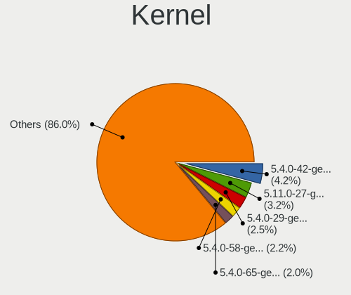

| Version              | Notebooks | Percent |
|----------------------|-----------|---------|
| 5.4.0-42-generic     | 53        | 4.88%   |
| 5.11.0-27-generic    | 38        | 3.5%    |
| 5.4.0-58-generic     | 30        | 2.76%   |
| 5.4.0-29-generic     | 30        | 2.76%   |
| 5.4.0-52-generic     | 27        | 2.49%   |
| 5.4.0-65-generic     | 25        | 2.3%    |
| 5.4.0-47-generic     | 25        | 2.3%    |
| 5.4.0-54-generic     | 23        | 2.12%   |
| 5.4.0-40-generic     | 22        | 2.03%   |
| 5.4.0-48-generic     | 21        | 1.93%   |
| 5.4.0-31-generic     | 21        | 1.93%   |
| 5.4.0-42-lowlatency  | 20        | 1.84%   |
| 5.4.0-26-generic     | 17        | 1.57%   |
| 5.4.0-37-generic     | 16        | 1.47%   |
| 5.4.0-66-generic     | 15        | 1.38%   |
| 5.4.0-33-generic     | 15        | 1.38%   |
| 5.8.0-43-generic     | 14        | 1.29%   |
| 5.4.0-89-generic     | 14        | 1.29%   |
| 5.4.0-67-generic     | 14        | 1.29%   |
| 5.4.0-56-generic     | 14        | 1.29%   |
| 5.8.0-53-generic     | 13        | 1.2%    |
| 5.4.0-65-lowlatency  | 13        | 1.2%    |
| 5.4.0-70-generic     | 12        | 1.1%    |
| 5.4.0-29-lowlatency  | 12        | 1.1%    |
| 5.8.0-59-generic     | 11        | 1.01%   |
| 5.8.0-55-generic     | 11        | 1.01%   |
| 5.4.0-77-generic     | 11        | 1.01%   |
| 5.4.0-58-lowlatency  | 11        | 1.01%   |
| 5.4.0-53-generic     | 11        | 1.01%   |
| 5.13.0-30-generic    | 11        | 1.01%   |
| 5.11.0-37-generic    | 11        | 1.01%   |
| 5.4.0-90-generic     | 10        | 0.92%   |
| 5.4.0-72-generic     | 10        | 0.92%   |
| 5.11.0-38-generic    | 10        | 0.92%   |
| 5.4.0-81-generic     | 9         | 0.83%   |
| 5.4.0-74-generic     | 9         | 0.83%   |
| 5.4.0-52-lowlatency  | 9         | 0.83%   |
| 5.4.0-91-generic     | 8         | 0.74%   |
| 5.4.0-80-generic     | 8         | 0.74%   |
| 5.4.0-60-generic     | 8         | 0.74%   |
| 5.4.0-45-generic     | 8         | 0.74%   |
| 5.4.0-26-lowlatency  | 8         | 0.74%   |
| 5.13.0-39-generic    | 8         | 0.74%   |
| 5.13.0-35-generic    | 8         | 0.74%   |
| 5.11.0-34-generic    | 8         | 0.74%   |
| 5.11.0-25-generic    | 8         | 0.74%   |
| 5.8.0-48-generic     | 7         | 0.64%   |
| 5.8.0-44-generic     | 7         | 0.64%   |
| 5.4.0-73-generic     | 7         | 0.64%   |
| 5.4.0-64-generic     | 7         | 0.64%   |
| 5.4.0-59-generic     | 7         | 0.64%   |
| 5.4.0-40-lowlatency  | 7         | 0.64%   |
| 5.4.0-107-generic    | 7         | 0.64%   |
| 5.11.0-44-generic    | 7         | 0.64%   |
| 5.11.0-43-generic    | 7         | 0.64%   |
| 5.11.0-40-generic    | 7         | 0.64%   |
| 5.11.0-27-lowlatency | 7         | 0.64%   |
| 5.4.0-62-generic     | 6         | 0.55%   |
| 5.4.0-51-generic     | 6         | 0.55%   |
| 5.4.0-48-lowlatency  | 6         | 0.55%   |

Kernel Family
-------------

Linux kernel without a distro release

| Version | Notebooks | Percent |
|---------|-----------|---------|
| 5.4.0   | 647       | 67.68%  |
| 5.11.0  | 131       | 13.7%   |
| 5.8.0   | 102       | 10.67%  |
| 5.13.0  | 46        | 4.81%   |
| 5.10.0  | 5         | 0.52%   |
| 5.7.6   | 2         | 0.21%   |
| 4.4.254 | 2         | 0.21%   |
| 5.9.6   | 1         | 0.1%    |
| 5.9.0   | 1         | 0.1%    |
| 5.8.18  | 1         | 0.1%    |
| 5.7.7   | 1         | 0.1%    |
| 5.7.0   | 1         | 0.1%    |
| 5.6.19  | 1         | 0.1%    |
| 5.6.0   | 1         | 0.1%    |
| 5.4.67  | 1         | 0.1%    |
| 5.4.107 | 1         | 0.1%    |
| 5.15.0  | 1         | 0.1%    |
| 5.14.9  | 1         | 0.1%    |
| 5.14.8  | 1         | 0.1%    |
| 5.14.2  | 1         | 0.1%    |
| 5.14.0  | 1         | 0.1%    |
| 5.13.2  | 1         | 0.1%    |
| 5.12.12 | 1         | 0.1%    |
| 5.12.10 | 1         | 0.1%    |
| 5.11.11 | 1         | 0.1%    |
| 5.10.33 | 1         | 0.1%    |
| 5.10.11 | 1         | 0.1%    |
| 4.15.0  | 1         | 0.1%    |

Kernel Major Ver.
-----------------

Linux kernel major version

| Version | Notebooks | Percent |
|---------|-----------|---------|
| 5.4     | 649       | 67.89%  |
| 5.11    | 132       | 13.81%  |
| 5.8     | 103       | 10.77%  |
| 5.13    | 47        | 4.92%   |
| 5.10    | 7         | 0.73%   |
| 5.7     | 4         | 0.42%   |
| 5.14    | 4         | 0.42%   |
| 5.9     | 2         | 0.21%   |
| 5.6     | 2         | 0.21%   |
| 5.12    | 2         | 0.21%   |
| 4.4     | 2         | 0.21%   |
| 5.15    | 1         | 0.1%    |
| 4.15    | 1         | 0.1%    |

Arch
----

OS architecture (x86_64, i586, etc.)

| Name   | Notebooks | Percent |
|--------|-----------|---------|
| x86_64 | 939       | 100%    |

DE
--

Desktop Environment

| Name            | Notebooks | Percent |
|-----------------|-----------|---------|
| XFCE            | 907       | 96.59%  |
| GNOME           | 20        | 2.13%   |
| i3              | 5         | 0.53%   |
| Unity           | 2         | 0.21%   |
| KDE5            | 2         | 0.21%   |
| MATE            | 1         | 0.11%   |
| ICEWM           | 1         | 0.11%   |
| GNOME Flashback | 1         | 0.11%   |

Display Server
--------------

X11 or Wayland

| Name    | Notebooks | Percent |
|---------|-----------|---------|
| X11     | 927       | 98.72%  |
| Tty     | 8         | 0.85%   |
| Wayland | 4         | 0.43%   |

Display Manager
---------------

SDDM, LightDM, etc.

| Name    | Notebooks | Percent |
|---------|-----------|---------|
| Unknown | 477       | 49.64%  |
| LightDM | 245       | 25.49%  |
| TDM     | 213       | 22.16%  |
| GDM     | 18        | 1.87%   |
| GDM3    | 6         | 0.62%   |
| SDDM    | 2         | 0.21%   |

OS Lang
-------

Language

| Lang  | Notebooks | Percent |
|-------|-----------|---------|
| en_US | 341       | 36.24%  |
| fr_FR | 95        | 10.1%   |
| de_DE | 94        | 9.99%   |
| pt_BR | 61        | 6.48%   |
| C     | 53        | 5.63%   |
| it_IT | 45        | 4.78%   |
| en_GB | 34        | 3.61%   |
| ru_RU | 31        | 3.29%   |
| es_ES | 22        | 2.34%   |
| pl_PL | 19        | 2.02%   |
| en_CA | 12        | 1.28%   |
| en_AU | 10        | 1.06%   |
| nl_NL | 9         | 0.96%   |
| es_AR | 9         | 0.96%   |
| hu_HU | 8         | 0.85%   |
| en_IN | 8         | 0.85%   |
| cs_CZ | 8         | 0.85%   |
| ja_JP | 6         | 0.64%   |
| es_MX | 6         | 0.64%   |
| sv_SE | 5         | 0.53%   |
| ru_UA | 5         | 0.53%   |
| fi_FI | 4         | 0.43%   |
| pt_PT | 3         | 0.32%   |
| fr_BE | 3         | 0.32%   |
| en_SG | 3         | 0.32%   |
| el_GR | 3         | 0.32%   |
| de_CH | 3         | 0.32%   |
| de_AT | 3         | 0.32%   |
| zh_CN | 2         | 0.21%   |
| uk_UA | 2         | 0.21%   |
| tr_TR | 2         | 0.21%   |
| nl_BE | 2         | 0.21%   |
| nb_NO | 2         | 0.21%   |
| lt_LT | 2         | 0.21%   |
| id_ID | 2         | 0.21%   |
| fr_CA | 2         | 0.21%   |
| es_CR | 2         | 0.21%   |
| es_CO | 2         | 0.21%   |
| es_CL | 2         | 0.21%   |
| en_ZA | 2         | 0.21%   |
| da_DK | 2         | 0.21%   |
| bg_BG | 2         | 0.21%   |
| sl_SI | 1         | 0.11%   |
| sk_SK | 1         | 0.11%   |
| es_VE | 1         | 0.11%   |
| es_PE | 1         | 0.11%   |
| es_NI | 1         | 0.11%   |
| es_EC | 1         | 0.11%   |
| en_PH | 1         | 0.11%   |
| en_NZ | 1         | 0.11%   |
| en_IE | 1         | 0.11%   |
| ar_EG | 1         | 0.11%   |

Boot Mode
---------

EFI or BIOS

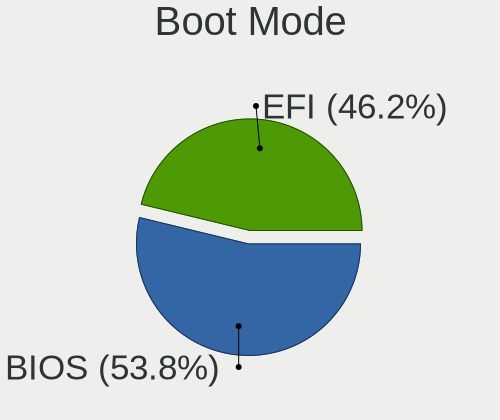

| Mode | Notebooks | Percent |
|------|-----------|---------|
| BIOS | 500       | 53.02%  |
| EFI  | 443       | 46.98%  |

Filesystem
----------

Type of filesystem

| Type    | Notebooks | Percent |
|---------|-----------|---------|
| Ext4    | 851       | 90.63%  |
| Overlay | 59        | 6.28%   |
| Btrfs   | 13        | 1.38%   |
| Zfs     | 7         | 0.75%   |
| Xfs     | 3         | 0.32%   |
| Ext2    | 3         | 0.32%   |
| Unknown | 2         | 0.21%   |
| Ext3    | 1         | 0.11%   |

Part. scheme
------------

Scheme of partitioning

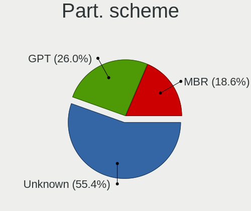

| Type    | Notebooks | Percent |
|---------|-----------|---------|
| Unknown | 564       | 59.94%  |
| GPT     | 236       | 25.08%  |
| MBR     | 141       | 14.98%  |

Dual Boot with Linux/BSD
------------------------

Hosting more than one Linux/BSD

| Dual boot | Notebooks | Percent |
|-----------|-----------|---------|
| No        | 824       | 86.19%  |
| Yes       | 132       | 13.81%  |

Dual Boot (Win)
---------------

Hosting Linux and Windows

| Dual boot | Notebooks | Percent |
|-----------|-----------|---------|
| No        | 644       | 67.86%  |
| Yes       | 305       | 32.14%  |

Board
-----

Vendor
------

Motherboard manufacturer

| Name                        | Notebooks | Percent |
|-----------------------------|-----------|---------|
| Hewlett-Packard             | 206       | 21.94%  |
| Lenovo                      | 175       | 18.64%  |
| Dell                        | 139       | 14.8%   |
| ASUSTek Computer            | 106       | 11.29%  |
| Acer                        | 84        | 8.95%   |
| Toshiba                     | 51        | 5.43%   |
| Samsung Electronics         | 21        | 2.24%   |
| Apple                       | 17        | 1.81%   |
| Sony                        | 14        | 1.49%   |
| MSI                         | 14        | 1.49%   |
| Notebook                    | 12        | 1.28%   |
| Medion                      | 11        | 1.17%   |
| Fujitsu                     | 8         | 0.85%   |
| Positivo                    | 6         | 0.64%   |
| Fujitsu Siemens             | 6         | 0.64%   |
| Clevo                       | 6         | 0.64%   |
| Packard Bell                | 5         | 0.53%   |
| HUAWEI                      | 4         | 0.43%   |
| Schenker                    | 3         | 0.32%   |
| Google                      | 3         | 0.32%   |
| Gateway                     | 3         | 0.32%   |
| TUXEDO                      | 2         | 0.21%   |
| Razer                       | 2         | 0.21%   |
| Multilaser                  | 2         | 0.21%   |
| Itautec                     | 2         | 0.21%   |
| Intel                       | 2         | 0.21%   |
| GPU Company                 | 2         | 0.21%   |
| Exo                         | 2         | 0.21%   |
| Dynabook                    | 2         | 0.21%   |
| Alienware                   | 2         | 0.21%   |
| VIT                         | 1         | 0.11%   |
| UNOWHY                      | 1         | 0.11%   |
| TR                          | 1         | 0.11%   |
| System76                    | 1         | 0.11%   |
| Semp Toshiba                | 1         | 0.11%   |
| Quanta                      | 1         | 0.11%   |
| PLAISIO COMPUTERS SA        | 1         | 0.11%   |
| ONE-NETBOOK TECHNOLOGY      | 1         | 0.11%   |
| OEGStone                    | 1         | 0.11%   |
| MouseComputer               | 1         | 0.11%   |
| MOTION                      | 1         | 0.11%   |
| Login Informatica           | 1         | 0.11%   |
| LIVEFAN                     | 1         | 0.11%   |
| LG Electronics              | 1         | 0.11%   |
| Jumper                      | 1         | 0.11%   |
| Intel Client Systems        | 1         | 0.11%   |
| Insyde                      | 1         | 0.11%   |
| I-Life Digital Technologies | 1         | 0.11%   |
| Dixonsxp                    | 1         | 0.11%   |
| Direkt-Tek                  | 1         | 0.11%   |
| Digibras                    | 1         | 0.11%   |
| Coradir                     | 1         | 0.11%   |
| Compaq                      | 1         | 0.11%   |
| CAPTIVA                     | 1         | 0.11%   |
| Avell High Performance      | 1         | 0.11%   |
| AMI                         | 1         | 0.11%   |
| Unknown                     | 1         | 0.11%   |

Model
-----

Motherboard model

| Name                                   | Notebooks | Percent |
|----------------------------------------|-----------|---------|
| HP Notebook                            | 12        | 1.28%   |
| HP Pavilion dv6                        | 8         | 0.85%   |
| Dell Latitude D630                     | 8         | 0.85%   |
| Unknown                                | 7         | 0.75%   |
| Dell Latitude E6430                    | 6         | 0.64%   |
| ASUS VivoBook_ASUSLaptop X571LH_K571LH | 6         | 0.64%   |
| HP 15                                  | 5         | 0.53%   |
| HP Pavilion dv7                        | 4         | 0.43%   |
| HP EliteBook 8560p                     | 4         | 0.43%   |
| Dell Latitude E6330                    | 4         | 0.43%   |
| Dell Inspiron 5566                     | 4         | 0.43%   |
| Toshiba Satellite A100                 | 3         | 0.32%   |
| Toshiba PORTEGE R930                   | 3         | 0.32%   |
| HP ProBook 4540s                       | 3         | 0.32%   |
| HP Presario C700                       | 3         | 0.32%   |
| HP Pavilion Gaming Laptop 15-ec0xxx    | 3         | 0.32%   |
| HP Pavilion g7                         | 3         | 0.32%   |
| HP Pavilion g6                         | 3         | 0.32%   |
| HP Pavilion dv6500                     | 3         | 0.32%   |
| HP Pavilion 17                         | 3         | 0.32%   |
| HP Pavilion 15                         | 3         | 0.32%   |
| HP G42                                 | 3         | 0.32%   |
| Dell Latitude E6540                    | 3         | 0.32%   |
| Dell Latitude E4300                    | 3         | 0.32%   |
| Dell Latitude 7480                     | 3         | 0.32%   |
| Dell Inspiron 7720                     | 3         | 0.32%   |
| ASUS X553MA                            | 3         | 0.32%   |
| ASUS UX305FA                           | 3         | 0.32%   |
| ASUS T100HAN                           | 3         | 0.32%   |
| Toshiba Satellite L350D                | 2         | 0.21%   |
| Positivo Mobile                        | 2         | 0.21%   |
| Medion E6228                           | 2         | 0.21%   |
| Lenovo ThinkPad T495s 20QJCTO1WW       | 2         | 0.21%   |
| Lenovo IdeaPad 5 15ARE05 81YQ          | 2         | 0.21%   |
| Lenovo IdeaPad 330S-15ARR 81FB         | 2         | 0.21%   |
| Lenovo IdeaPad 100-15IBY 80MJ          | 2         | 0.21%   |
| Lenovo G50-45 80E3                     | 2         | 0.21%   |
| HUAWEI NBLK-WAX9X                      | 2         | 0.21%   |
| HUAWEI KPL-W0X                         | 2         | 0.21%   |
| HP ProBook 640 G1                      | 2         | 0.21%   |
| HP ProBook 430 G5                      | 2         | 0.21%   |
| HP Pavilion g4                         | 2         | 0.21%   |
| HP Pavilion dm4                        | 2         | 0.21%   |
| HP OMEN by HP Laptop                   | 2         | 0.21%   |
| HP Laptop 15-dw0xxx                    | 2         | 0.21%   |
| HP Laptop 15-da0xxx                    | 2         | 0.21%   |
| HP G72                                 | 2         | 0.21%   |
| HP G62                                 | 2         | 0.21%   |
| HP G60                                 | 2         | 0.21%   |
| HP EliteBook Folio 9470m               | 2         | 0.21%   |
| HP EliteBook 8470p                     | 2         | 0.21%   |
| HP EliteBook 8460p                     | 2         | 0.21%   |
| HP EliteBook 840 G1                    | 2         | 0.21%   |
| HP EliteBook 2570p                     | 2         | 0.21%   |
| HP EliteBook 2540p                     | 2         | 0.21%   |
| HP Compaq Presario CQ61                | 2         | 0.21%   |
| HP Compaq Presario CQ60                | 2         | 0.21%   |
| HP Compaq 6730s                        | 2         | 0.21%   |
| HP Compaq 6510b                        | 2         | 0.21%   |
| HP 655                                 | 2         | 0.21%   |

Model Family
------------

Motherboard model prefix

| Name                  | Notebooks | Percent |
|-----------------------|-----------|---------|
| Lenovo ThinkPad       | 104       | 11.08%  |
| Dell Latitude         | 62        | 6.6%    |
| Acer Aspire           | 56        | 5.96%   |
| HP Pavilion           | 48        | 5.11%   |
| Dell Inspiron         | 46        | 4.9%    |
| Toshiba Satellite     | 41        | 4.37%   |
| Lenovo IdeaPad        | 34        | 3.62%   |
| HP EliteBook          | 32        | 3.41%   |
| HP ProBook            | 21        | 2.24%   |
| ASUS VivoBook         | 21        | 2.24%   |
| HP Laptop             | 20        | 2.13%   |
| HP Compaq             | 20        | 2.13%   |
| HP Notebook           | 13        | 1.38%   |
| Dell Vostro           | 11        | 1.17%   |
| Acer Extensa          | 10        | 1.06%   |
| Unknown               | 7         | 0.75%   |
| Fujitsu LIFEBOOK      | 6         | 0.64%   |
| Dell XPS              | 6         | 0.64%   |
| Dell Precision        | 6         | 0.64%   |
| Toshiba PORTEGE       | 5         | 0.53%   |
| Packard Bell EasyNote | 5         | 0.53%   |
| HP Presario           | 5         | 0.53%   |
| HP OMEN               | 5         | 0.53%   |
| HP 15                 | 5         | 0.53%   |
| HP Stream             | 4         | 0.43%   |
| HP 255                | 4         | 0.43%   |
| HP 250                | 4         | 0.43%   |
| Fujitsu Siemens AMILO | 4         | 0.43%   |
| Dell Studio           | 4         | 0.43%   |
| Acer Swift            | 4         | 0.43%   |
| Acer Nitro            | 4         | 0.43%   |
| Samsung R530          | 3         | 0.32%   |
| Lenovo B590           | 3         | 0.32%   |
| HP ZBook              | 3         | 0.32%   |
| HP G42                | 3         | 0.32%   |
| HP ENVY               | 3         | 0.32%   |
| ASUS X553MA           | 3         | 0.32%   |
| ASUS UX305FA          | 3         | 0.32%   |
| ASUS T100HAN          | 3         | 0.32%   |
| ASUS ROG              | 3         | 0.32%   |
| ASUS ASUS             | 3         | 0.32%   |
| Toshiba TECRA         | 2         | 0.21%   |
| Schenker XMG          | 2         | 0.21%   |
| Samsung N150P         | 2         | 0.21%   |
| Razer Blade           | 2         | 0.21%   |
| Positivo Mobile       | 2         | 0.21%   |
| Notebook W65          | 2         | 0.21%   |
| Medion E6228          | 2         | 0.21%   |
| Medion Akoya          | 2         | 0.21%   |
| Lenovo ThinkBook      | 2         | 0.21%   |
| Lenovo G50-45         | 2         | 0.21%   |
| Lenovo G460           | 2         | 0.21%   |
| Lenovo G400s          | 2         | 0.21%   |
| Lenovo 3000           | 2         | 0.21%   |
| Itautec Infoway       | 2         | 0.21%   |
| HUAWEI NBLK-WAX9X     | 2         | 0.21%   |
| HUAWEI KPL-W0X        | 2         | 0.21%   |
| HP G72                | 2         | 0.21%   |
| HP G62                | 2         | 0.21%   |
| HP G60                | 2         | 0.21%   |

MFG Year
--------

Motherboard manufacture year

| Year | Notebooks | Percent |
|------|-----------|---------|
| 2012 | 98        | 10.44%  |
| 2011 | 90        | 9.58%   |
| 2019 | 75        | 7.99%   |
| 2010 | 75        | 7.99%   |
| 2013 | 73        | 7.77%   |
| 2008 | 66        | 7.03%   |
| 2014 | 60        | 6.39%   |
| 2017 | 57        | 6.07%   |
| 2020 | 56        | 5.96%   |
| 2018 | 56        | 5.96%   |
| 2007 | 55        | 5.86%   |
| 2016 | 45        | 4.79%   |
| 2015 | 43        | 4.58%   |
| 2009 | 39        | 4.15%   |
| 2021 | 33        | 3.51%   |
| 2006 | 14        | 1.49%   |
| 2005 | 3         | 0.32%   |
| 2022 | 1         | 0.11%   |

Form Factor
-----------

Physical design of the computer

| Name     | Notebooks | Percent |
|----------|-----------|---------|
| Notebook | 939       | 100%    |

Secure Boot
-----------

Enabled or disabled

| State    | Notebooks | Percent |
|----------|-----------|---------|
| Disabled | 861       | 91.21%  |
| Enabled  | 83        | 8.79%   |

Coreboot
--------

Have coreboot on board

| Used | Notebooks | Percent |
|------|-----------|---------|
| No   | 935       | 99.57%  |
| Yes  | 4         | 0.43%   |

RAM Size
--------

Total RAM memory

| Size in GB  | Notebooks | Percent |
|-------------|-----------|---------|
| 3.01-4.0    | 307       | 32.45%  |
| 4.01-8.0    | 238       | 25.16%  |
| 8.01-16.0   | 115       | 12.16%  |
| 16.01-24.0  | 111       | 11.73%  |
| 1.01-2.0    | 92        | 9.73%   |
| 32.01-64.0  | 31        | 3.28%   |
| 2.01-3.0    | 24        | 2.54%   |
| 0.51-1.0    | 15        | 1.59%   |
| 64.01-256.0 | 8         | 0.85%   |
| 24.01-32.0  | 4         | 0.42%   |
| 0.01-0.5    | 1         | 0.11%   |

RAM Used
--------

Used RAM memory

| Used GB    | Notebooks | Percent |
|------------|-----------|---------|
| 1.01-2.0   | 489       | 47.8%   |
| 2.01-3.0   | 220       | 21.51%  |
| 0.51-1.0   | 131       | 12.81%  |
| 4.01-8.0   | 79        | 7.72%   |
| 3.01-4.0   | 78        | 7.62%   |
| 8.01-16.0  | 22        | 2.15%   |
| 0.01-0.5   | 3         | 0.29%   |
| 24.01-32.0 | 1         | 0.1%    |

Total Drives
------------

Number of drives on board

| Drives | Notebooks | Percent |
|--------|-----------|---------|
| 1      | 700       | 73.15%  |
| 2      | 215       | 22.47%  |
| 3      | 20        | 2.09%   |
| 0      | 16        | 1.67%   |
| 4      | 4         | 0.42%   |
| 7      | 1         | 0.1%    |
| 5      | 1         | 0.1%    |

Has CD-ROM
----------

Has CD-ROM on board

| Presented | Notebooks | Percent |
|-----------|-----------|---------|
| Yes       | 481       | 51.17%  |
| No        | 459       | 48.83%  |

Has Ethernet
------------

Has Ethernet on board

| Presented | Notebooks | Percent |
|-----------|-----------|---------|
| Yes       | 821       | 87.34%  |
| No        | 119       | 12.66%  |

Has WiFi
--------

Has WiFi module

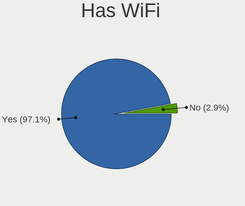

| Presented | Notebooks | Percent |
|-----------|-----------|---------|
| Yes       | 913       | 97.13%  |
| No        | 27        | 2.87%   |

Has Bluetooth
-------------

Has Bluetooth module

| Presented | Notebooks | Percent |
|-----------|-----------|---------|
| Yes       | 608       | 63.93%  |
| No        | 343       | 36.07%  |

Location
--------

Country
-------

Geographic location (country)

| Country             | Notebooks | Percent |
|---------------------|-----------|---------|
| USA                 | 158       | 16.77%  |
| Germany             | 121       | 12.85%  |
| France              | 98        | 10.4%   |
| Brazil              | 64        | 6.79%   |
| Italy               | 50        | 5.31%   |
| Canada              | 42        | 4.46%   |
| Russia              | 39        | 4.14%   |
| Spain               | 34        | 3.61%   |
| UK                  | 33        | 3.5%    |
| Netherlands         | 28        | 2.97%   |
| Poland              | 22        | 2.34%   |
| Ukraine             | 13        | 1.38%   |
| Portugal            | 12        | 1.27%   |
| Belgium             | 12        | 1.27%   |
| Argentina           | 12        | 1.27%   |
| Mexico              | 11        | 1.17%   |
| India               | 10        | 1.06%   |
| Finland             | 10        | 1.06%   |
| Czechia             | 10        | 1.06%   |
| Australia           | 10        | 1.06%   |
| Greece              | 9         | 0.96%   |
| Hungary             | 8         | 0.85%   |
| Turkey              | 7         | 0.74%   |
| Sweden              | 7         | 0.74%   |
| Norway              | 7         | 0.74%   |
| Japan               | 7         | 0.74%   |
| Indonesia           | 7         | 0.74%   |
| Bulgaria            | 7         | 0.74%   |
| Austria             | 7         | 0.74%   |
| Romania             | 6         | 0.64%   |
| Denmark             | 5         | 0.53%   |
| Slovakia            | 4         | 0.42%   |
| Lithuania           | 4         | 0.42%   |
| Costa Rica          | 4         | 0.42%   |
| Chile               | 4         | 0.42%   |
| Algeria             | 4         | 0.42%   |
| Slovenia            | 3         | 0.32%   |
| Singapore           | 3         | 0.32%   |
| Serbia              | 3         | 0.32%   |
| Colombia            | 3         | 0.32%   |
| Belarus             | 3         | 0.32%   |
| Thailand            | 2         | 0.21%   |
| Switzerland         | 2         | 0.21%   |
| South Africa        | 2         | 0.21%   |
| Philippines         | 2         | 0.21%   |
| Luxembourg          | 2         | 0.21%   |
| Iran                | 2         | 0.21%   |
| Estonia             | 2         | 0.21%   |
| China               | 2         | 0.21%   |
| Venezuela           | 1         | 0.11%   |
| Uruguay             | 1         | 0.11%   |
| UAE                 | 1         | 0.11%   |
| Trinidad and Tobago | 1         | 0.11%   |
| Tajikistan          | 1         | 0.11%   |
| Sudan               | 1         | 0.11%   |
| Sri Lanka           | 1         | 0.11%   |
| South Korea         | 1         | 0.11%   |
| Saudi Arabia        | 1         | 0.11%   |
| Puerto Rico         | 1         | 0.11%   |
| Peru                | 1         | 0.11%   |

City
----

Geographic location (city)

| City                     | Notebooks | Percent |
|--------------------------|-----------|---------|
| Qubec                | 18        | 1.82%   |
| Paris                    | 10        | 1.01%   |
| Moscow                   | 10        | 1.01%   |
| Hamburg                  | 10        | 1.01%   |
| Berlin                   | 9         | 0.91%   |
| Warsaw                   | 8         | 0.81%   |
| Rome                     | 8         | 0.81%   |
| Amsterdam                | 8         | 0.81%   |
| St Petersburg            | 7         | 0.71%   |
| Vienna                   | 6         | 0.61%   |
| Rio de Janeiro           | 6         | 0.61%   |
| Munich                   | 6         | 0.61%   |
| Madrid                   | 6         | 0.61%   |
| Frankfurt am Main        | 6         | 0.61%   |
| Athens                   | 6         | 0.61%   |
| Sofia                    | 5         | 0.5%    |
| Sao Paulo                | 5         | 0.5%    |
| Pittsburgh               | 5         | 0.5%    |
| Karlsruhe                | 5         | 0.5%    |
| Denver                   | 5         | 0.5%    |
| Budapest                 | 5         | 0.5%    |
| Milan                    | 4         | 0.4%    |
| Lisbon                   | 4         | 0.4%    |
| Kyiv                     | 4         | 0.4%    |
| Chicago                  | 4         | 0.4%    |
| Vilnius                  | 3         | 0.3%    |
| Toronto                  | 3         | 0.3%    |
| Syracuse                 | 3         | 0.3%    |
| Singapore                | 3         | 0.3%    |
| Montreal                 | 3         | 0.3%    |
| Len                  | 3         | 0.3%    |
| Levis                    | 3         | 0.3%    |
| Leipzig                  | 3         | 0.3%    |
| Krasnodar                | 3         | 0.3%    |
| Ghent                    | 3         | 0.3%    |
| Cologne                  | 3         | 0.3%    |
| Bucharest                | 3         | 0.3%    |
| Bonn                     | 3         | 0.3%    |
| Bogot                | 3         | 0.3%    |
| Barcelona                | 3         | 0.3%    |
| Bamberg                  | 3         | 0.3%    |
| Ankara                   | 3         | 0.3%    |
| Algiers                  | 3         | 0.3%    |
| Wilmington               | 2         | 0.2%    |
| Washington               | 2         | 0.2%    |
| Volta Redonda            | 2         | 0.2%    |
| Vila Nova de Gaia        | 2         | 0.2%    |
| Varna                    | 2         | 0.2%    |
| Ufa                      | 2         | 0.2%    |
| Turku                    | 2         | 0.2%    |
| Turin                    | 2         | 0.2%    |
| Toulon                   | 2         | 0.2%    |
| So Bernardo do Campo | 2         | 0.2%    |
| Sydney                   | 2         | 0.2%    |
| Stuttgart                | 2         | 0.2%    |
| Stroe                    | 2         | 0.2%    |
| St. Petersburg           | 2         | 0.2%    |
| Solbergelva              | 2         | 0.2%    |
| Shinjuku                 | 2         | 0.2%    |
| Seville                  | 2         | 0.2%    |

Drives
------

Drive Vendor
------------

Hard drive vendors

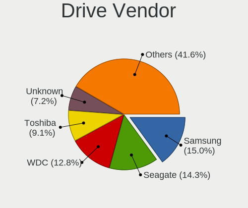

| Vendor              | Notebooks | Drives | Percent |
|---------------------|-----------|--------|---------|
| Seagate             | 164       | 196    | 14.72%  |
| Samsung Electronics | 162       | 202    | 14.54%  |
| WDC                 | 147       | 172    | 13.2%   |
| Toshiba             | 103       | 126    | 9.25%   |
| Unknown             | 82        | 104    | 7.36%   |
| Kingston            | 54        | 73     | 4.85%   |
| Hitachi             | 46        | 54     | 4.13%   |
| SanDisk             | 42        | 57     | 3.77%   |
| HGST                | 40        | 46     | 3.59%   |
| SK Hynix            | 30        | 35     | 2.69%   |
| Crucial             | 30        | 38     | 2.69%   |
| Intel               | 28        | 45     | 2.51%   |
| Fujitsu             | 21        | 30     | 1.89%   |
| Micron Technology   | 17        | 18     | 1.53%   |
| A-DATA Technology   | 14        | 18     | 1.26%   |
| China               | 9         | 10     | 0.81%   |
| LITEON              | 8         | 10     | 0.72%   |
| KIOXIA              | 7         | 9      | 0.63%   |
| JMicron             | 6         | 6      | 0.54%   |
| Intenso             | 6         | 7      | 0.54%   |
| Apple               | 6         | 10     | 0.54%   |
| Phison              | 5         | 6      | 0.45%   |
| OCZ                 | 5         | 5      | 0.45%   |
| LITEONIT            | 5         | 6      | 0.45%   |
| Transcend           | 4         | 4      | 0.36%   |
| PNY                 | 4         | 4      | 0.36%   |
| KingSpec            | 4         | 5      | 0.36%   |
| Apacer              | 4         | 5      | 0.36%   |
| SPCC                | 3         | 4      | 0.27%   |
| Patriot             | 3         | 3      | 0.27%   |
| Netac               | 3         | 3      | 0.27%   |
| Hewlett-Packard     | 3         | 2      | 0.27%   |
| SSK                 | 2         | 2      | 0.18%   |
| Smartbuy            | 2         | 2      | 0.18%   |
| Mushkin             | 2         | 2      | 0.18%   |
| GOODRAM             | 2         | 2      | 0.18%   |
| DREVO               | 2         | 2      | 0.18%   |
| ASMT                | 2         | 4      | 0.18%   |
| Unknown             | 2         | 2      | 0.18%   |
| ZTE                 | 1         | 1      | 0.09%   |
| ZTC-SM20            | 1         | 1      | 0.09%   |
| Zheino              | 1         | 1      | 0.09%   |
| XPG                 | 1         | 1      | 0.09%   |
| USB3.0              | 1         | 1      | 0.09%   |
| UMIS                | 1         | 1      | 0.09%   |
| TO Exter            | 1         | 1      | 0.09%   |
| TCSUNBOW            | 1         | 1      | 0.09%   |
| SUNEAST             | 1         | 2      | 0.09%   |
| SSSTC               | 1         | 1      | 0.09%   |
| Silicon Motion      | 1         | 1      | 0.09%   |
| SABRENT             | 1         | 1      | 0.09%   |
| Pioneer             | 1         | 1      | 0.09%   |
| OWC                 | 1         | 1      | 0.09%   |
| LONDISK             | 1         | 1      | 0.09%   |
| Lexar               | 1         | 1      | 0.09%   |
| Lenovo              | 1         | 1      | 0.09%   |
| LDLC                | 1         | 1      | 0.09%   |
| LaCie               | 1         | 1      | 0.09%   |
| KIOXIA-EXCERIA      | 1         | 1      | 0.09%   |
| Kingmax             | 1         | 1      | 0.09%   |

Drive Model
-----------

Hard drive models

| Model                               | Notebooks | Percent |
|-------------------------------------|-----------|---------|
| Unknown MMC Card  32GB              | 22        | 1.9%    |
| Seagate ST1000LM024 HN-M101MBB 1TB  | 14        | 1.21%   |
| Seagate ST500LT012-1DG142 500GB     | 13        | 1.12%   |
| Seagate ST500LM012 HN-M500MBB 500GB | 13        | 1.12%   |
| Unknown MMC Card  64GB              | 12        | 1.04%   |
| Seagate ST1000LM035-1RK172 1TB      | 12        | 1.04%   |
| Kingston SA400S37480G 480GB SSD     | 12        | 1.04%   |
| Samsung SSD 850 EVO 250GB           | 11        | 0.95%   |
| HGST HTS721010A9E630 1TB            | 11        | 0.95%   |
| Unknown MMC Card  128GB             | 9         | 0.78%   |
| Toshiba MQ01ABF050 500GB            | 9         | 0.78%   |
| Toshiba MQ01ABD100 1TB              | 9         | 0.78%   |
| Seagate ST500LT012-9WS142 500GB     | 9         | 0.78%   |
| SK Hynix NVMe SSD Drive 256GB       | 8         | 0.69%   |
| Samsung SSD 860 EVO 500GB           | 8         | 0.69%   |
| Samsung NVMe SSD Drive 512GB        | 8         | 0.69%   |
| Kingston SA400S37240G 240GB SSD     | 8         | 0.69%   |
| HGST HTS541010A9E680 1TB            | 8         | 0.69%   |
| Unknown MMC Card  16GB              | 7         | 0.61%   |
| Seagate ST9250315AS 250GB           | 7         | 0.61%   |
| Kingston SA400S37120G 120GB SSD     | 7         | 0.61%   |
| Intel HBRPEKNX0202A 512GB           | 7         | 0.61%   |
| WDC WD10JPVX-22JC3T0 1TB            | 6         | 0.52%   |
| Toshiba MQ04ABF100 1TB              | 6         | 0.52%   |
| Seagate ST9320325AS 320GB           | 6         | 0.52%   |
| Samsung HM321HI 320GB               | 6         | 0.52%   |
| Intel HBRPEKNX0202AO 32GB           | 6         | 0.52%   |
| Hitachi HTS723232A7A364 320GB       | 6         | 0.52%   |
| Crucial CT500MX500SSD1 500GB        | 6         | 0.52%   |
| Seagate ST9500423AS 500GB           | 5         | 0.43%   |
| Samsung SSD 860 EVO 1TB             | 5         | 0.43%   |
| Kingston SV300S37A120G 120GB SSD    | 5         | 0.43%   |
| Crucial CT240BX500SSD1 240GB        | 5         | 0.43%   |
| WDC WD1600BEVT-22ZCT0 160GB         | 4         | 0.35%   |
| WDC WD10SPZX-21Z10T0 1TB            | 4         | 0.35%   |
| WDC PC SN730 SDBQNTY-1T00-1001 1TB  | 4         | 0.35%   |
| Unknown SD/MMC/MS PRO 16GB          | 4         | 0.35%   |
| Toshiba MQ01ABD050 500GB            | 4         | 0.35%   |
| Seagate ST9500420AS 500GB           | 4         | 0.35%   |
| Seagate ST500LM021-1KJ152 500GB     | 4         | 0.35%   |
| Seagate ST320LM001 HN-M320MBB 320GB | 4         | 0.35%   |
| Seagate ST2000LM007-1R8174 2TB      | 4         | 0.35%   |
| Seagate ST1000LM049-2GH172 1TB      | 4         | 0.35%   |
| SanDisk SSD PLUS 240GB              | 4         | 0.35%   |
| Sandisk NVMe SSD Drive 256GB        | 4         | 0.35%   |
| Samsung MZVLB512HBJQ-000L7 512GB    | 4         | 0.35%   |
| Samsung HN-M500MBB 500GB            | 4         | 0.35%   |
| Kingston SA400S37960G 960GB SSD     | 4         | 0.35%   |
| JMicron Generic 240GB               | 4         | 0.35%   |
| Hitachi HTS547550A9E384 500GB       | 4         | 0.35%   |
| Hitachi HTS545025B9A300 250GB       | 4         | 0.35%   |
| HGST HTS545050A7E680 500GB          | 4         | 0.35%   |
| HGST HTS545050A7E380 500GB          | 4         | 0.35%   |
| WDC WDS120G2G0A-00JH30 120GB SSD    | 3         | 0.26%   |
| WDC WD5000BEVT-22A0RT0 500GB        | 3         | 0.26%   |
| WDC WD3200BPVT-22JJ5T0 320GB        | 3         | 0.26%   |
| WDC WD3200BEVT-22ZCT0 320GB         | 3         | 0.26%   |
| WDC WD3200BEKT-75PVMT1 320GB        | 3         | 0.26%   |
| WDC WD10SPZX-24Z10T0 1TB            | 3         | 0.26%   |
| WDC WD10JPVX-75JC3T0 1TB            | 3         | 0.26%   |

HDD Vendor
----------

Hard disk drive vendors

| Vendor              | Notebooks | Drives | Percent |
|---------------------|-----------|--------|---------|
| Seagate             | 162       | 193    | 32.27%  |
| WDC                 | 112       | 133    | 22.31%  |
| Toshiba             | 83        | 105    | 16.53%  |
| Hitachi             | 46        | 54     | 9.16%   |
| HGST                | 40        | 46     | 7.97%   |
| Samsung Electronics | 27        | 33     | 5.38%   |
| Fujitsu             | 21        | 30     | 4.18%   |
| Unknown             | 4         | 4      | 0.8%    |
| ASMT                | 2         | 4      | 0.4%    |
| SABRENT             | 1         | 1      | 0.2%    |
| Intenso             | 1         | 2      | 0.2%    |
| HGST HTS            | 1         | 1      | 0.2%    |
| CLOVER              | 1         | 1      | 0.2%    |
| ACASIS              | 1         | 1      | 0.2%    |

SSD Vendor
----------

Solid state drive vendors

| Vendor              | Notebooks | Drives | Percent |
|---------------------|-----------|--------|---------|
| Samsung Electronics | 82        | 106    | 23.63%  |
| Kingston            | 47        | 65     | 13.54%  |
| SanDisk             | 31        | 44     | 8.93%   |
| Crucial             | 30        | 38     | 8.65%   |
| A-DATA Technology   | 13        | 17     | 3.75%   |
| Micron Technology   | 12        | 12     | 3.46%   |
| WDC                 | 10        | 10     | 2.88%   |
| Toshiba             | 9         | 9      | 2.59%   |
| China               | 9         | 10     | 2.59%   |
| SK Hynix            | 8         | 8      | 2.31%   |
| LITEON              | 8         | 10     | 2.31%   |
| Intel               | 7         | 15     | 2.02%   |
| OCZ                 | 5         | 5      | 1.44%   |
| LITEONIT            | 5         | 6      | 1.44%   |
| Intenso             | 5         | 5      | 1.44%   |
| Unknown             | 4         | 5      | 1.15%   |
| Transcend           | 4         | 4      | 1.15%   |
| PNY                 | 4         | 4      | 1.15%   |
| JMicron             | 4         | 4      | 1.15%   |
| Apple               | 4         | 6      | 1.15%   |
| Apacer              | 4         | 5      | 1.15%   |
| SPCC                | 3         | 4      | 0.86%   |
| Patriot             | 3         | 3      | 0.86%   |
| KingSpec            | 3         | 4      | 0.86%   |
| Smartbuy            | 2         | 2      | 0.58%   |
| Netac               | 2         | 2      | 0.58%   |
| Mushkin             | 2         | 2      | 0.58%   |
| Hewlett-Packard     | 2         | 2      | 0.58%   |
| GOODRAM             | 2         | 2      | 0.58%   |
| DREVO               | 2         | 2      | 0.58%   |
| Zheino              | 1         | 1      | 0.29%   |
| USB3.0              | 1         | 1      | 0.29%   |
| TO Exter            | 1         | 1      | 0.29%   |
| TCSUNBOW            | 1         | 1      | 0.29%   |
| SUNEAST             | 1         | 2      | 0.29%   |
| Seagate             | 1         | 1      | 0.29%   |
| Pioneer             | 1         | 1      | 0.29%   |
| OWC                 | 1         | 1      | 0.29%   |
| LONDISK             | 1         | 1      | 0.29%   |
| Lexar               | 1         | 1      | 0.29%   |
| LDLC                | 1         | 1      | 0.29%   |
| KIOXIA-EXCERIA      | 1         | 1      | 0.29%   |
| Kingmax             | 1         | 1      | 0.29%   |
| KingDian            | 1         | 1      | 0.29%   |
| Kingchuxing         | 1         | 2      | 0.29%   |
| INNOVATION IT       | 1         | 1      | 0.29%   |
| Gigabyte Technology | 1         | 1      | 0.29%   |
| EXBOM               | 1         | 1      | 0.29%   |
| DOGFISH             | 1         | 2      | 0.29%   |
| BHT                 | 1         | 1      | 0.29%   |
| ASMedia             | 1         | 1      | 0.29%   |

Drive Kind
----------

HDD or SSD

| Kind    | Notebooks | Drives | Percent |
|---------|-----------|--------|---------|
| HDD     | 488       | 608    | 45.19%  |
| SSD     | 324       | 435    | 30%     |
| NVMe    | 174       | 209    | 16.11%  |
| MMC     | 79        | 100    | 7.31%   |
| Unknown | 15        | 16     | 1.39%   |

Drive Connector
---------------

SATA, SAS, NVMe, etc.

| Type | Notebooks | Drives | Percent |
|------|-----------|--------|---------|
| SATA | 743       | 1001   | 71.44%  |
| NVMe | 174       | 209    | 16.73%  |
| MMC  | 79        | 100    | 7.6%    |
| SAS  | 44        | 58     | 4.23%   |

Drive Size
----------

Size of hard drive

| Size in TB | Notebooks | Drives | Percent |
|------------|-----------|--------|---------|
| 0.01-0.5   | 584       | 753    | 72.1%   |
| 0.51-1.0   | 199       | 252    | 24.57%  |
| 1.01-2.0   | 22        | 26     | 2.72%   |
| 3.01-4.0   | 2         | 7      | 0.25%   |
| 2.01-3.0   | 1         | 2      | 0.12%   |
| 4.01-10.0  | 1         | 2      | 0.12%   |
| 0          | 1         | 1      | 0.12%   |

Space Total
-----------

Amount of disk space available on the file system

| Size in GB     | Notebooks | Percent |
|----------------|-----------|---------|
| 101-250        | 332       | 34.37%  |
| 251-500        | 265       | 27.43%  |
| 501-1000       | 126       | 13.04%  |
| 51-100         | 76        | 7.87%   |
| 21-50          | 62        | 6.42%   |
| 1-20           | 45        | 4.66%   |
| 1001-2000      | 35        | 3.62%   |
| 2001-3000      | 12        | 1.24%   |
| More than 3000 | 9         | 0.93%   |
| Unknown        | 4         | 0.41%   |

Space Used
----------

Amount of used disk space

| Used GB        | Notebooks | Percent |
|----------------|-----------|---------|
| 1-20           | 437       | 43.44%  |
| 21-50          | 194       | 19.28%  |
| 101-250        | 142       | 14.12%  |
| 51-100         | 120       | 11.93%  |
| 251-500        | 63        | 6.26%   |
| 501-1000       | 28        | 2.78%   |
| 1001-2000      | 11        | 1.09%   |
| 2001-3000      | 4         | 0.4%    |
| Unknown        | 4         | 0.4%    |
| More than 3000 | 3         | 0.3%    |

Malfunc. Drives
---------------

Drive models with a malfunction

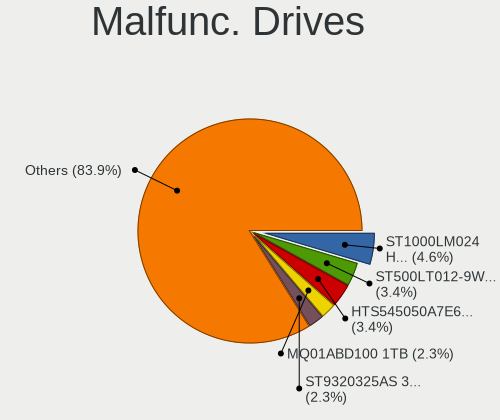

| Model                                               | Notebooks | Drives | Percent |
|-----------------------------------------------------|-----------|--------|---------|
| Seagate ST9320325AS 320GB                           | 3         | 3      | 3.75%   |
| Seagate ST500LT012-9WS142 500GB                     | 3         | 3      | 3.75%   |
| Seagate ST1000LM024 HN-M101MBB 1TB                  | 3         | 3      | 3.75%   |
| WDC WD10JPVX-22JC3T0 1TB                            | 2         | 3      | 2.5%    |
| Toshiba MQ01ABD100 1TB                              | 2         | 2      | 2.5%    |
| Seagate ST500LM012 HN-M500MBB 500GB                 | 2         | 2      | 2.5%    |
| Seagate ST1000LM049-2GH172 1TB                      | 2         | 2      | 2.5%    |
| Hitachi HTS545050A7E380 500GB                       | 2         | 2      | 2.5%    |
| HGST HTS545050A7E680 500GB                          | 2         | 2      | 2.5%    |
| WDC WD7500BPVT-80HXZT3 752GB                        | 1         | 1      | 1.25%   |
| WDC WD7500BPKX-00HPJT0 752GB                        | 1         | 1      | 1.25%   |
| WDC WD3200BEKT-75PVMT1 320GB                        | 1         | 1      | 1.25%   |
| WDC WD2500BEVT-22ZCT0 250GB                         | 1         | 1      | 1.25%   |
| WDC WD1600BJKT-75F4T0 160GB                         | 1         | 1      | 1.25%   |
| WDC WD10SPCX-24HWST1 1TB                            | 1         | 1      | 1.25%   |
| WDC WD10JPVT-08A1YT2 1TB                            | 1         | 1      | 1.25%   |
| Toshiba MK7575GSX 752GB                             | 1         | 1      | 1.25%   |
| Toshiba MK7559GSXP 752GB                            | 1         | 2      | 1.25%   |
| Toshiba MK5076GSX 500GB                             | 1         | 1      | 1.25%   |
| Toshiba MK5065GSX 500GB                             | 1         | 1      | 1.25%   |
| Toshiba MK3276GSX -63 320GB                         | 1         | 2      | 1.25%   |
| Toshiba MK3259GSXP 320GB                            | 1         | 1      | 1.25%   |
| Toshiba MK2552GSX 250GB                             | 1         | 1      | 1.25%   |
| Toshiba MK1637GSX 160GB                             | 1         | 1      | 1.25%   |
| SK Hynix SC401 SATA 512GB SSD                       | 1         | 1      | 1.25%   |
| SK Hynix SC308 SATA 512GB SSD                       | 1         | 1      | 1.25%   |
| SK Hynix BC711 HFM512GD3JX013N 512GB                | 1         | 1      | 1.25%   |
| Seagate ST980411ASG 80GB                            | 1         | 1      | 1.25%   |
| Seagate ST95005620AS 500GB                          | 1         | 1      | 1.25%   |
| Seagate ST9500423AS 500GB                           | 1         | 1      | 1.25%   |
| Seagate ST9500420ASG 500GB                          | 1         | 2      | 1.25%   |
| Seagate ST9500325AS 500GB                           | 1         | 1      | 1.25%   |
| Seagate ST9320423AS 320GB                           | 1         | 1      | 1.25%   |
| Seagate ST9320320AS 320GB                           | 1         | 1      | 1.25%   |
| Seagate ST500LM021-1KJ152 500GB                     | 1         | 1      | 1.25%   |
| Seagate ST320LT020-9YG142 320GB                     | 1         | 1      | 1.25%   |
| Seagate ST320LT012-9WS14C 320GB                     | 1         | 1      | 1.25%   |
| Seagate ST1000LM035-1RK172 1TB                      | 1         | 1      | 1.25%   |
| SanDisk SSD PLUS 480 GB                             | 1         | 1      | 1.25%   |
| Samsung Electronics SSD PM810 2.5 128GB             | 1         | 1      | 1.25%   |
| Samsung Electronics HM320JI 320GB                   | 1         | 1      | 1.25%   |
| OCZ VERTEX3 256GB SSD                               | 1         | 1      | 1.25%   |
| OCZ AGILITY3 120GB SSD                              | 1         | 1      | 1.25%   |
| Mushkin MKNSSDCR480GB-7-A                           | 1         | 1      | 1.25%   |
| Micron Technology MTFDDAV256TBN-1AR1ZABHA 256GB SSD | 1         | 1      | 1.25%   |
| Micron Technology MTFDDAV256TBN-1AR15ABHA 256GB SSD | 1         | 1      | 1.25%   |
| Micron Technology 1100_MTFDDAV256TBN 256GB SSD      | 1         | 1      | 1.25%   |
| LDLC SSD 480GB                                      | 1         | 1      | 1.25%   |
| Kingston SV300S37A120G 120GB SSD                    | 1         | 1      | 1.25%   |
| Intel SSDPEKKW256G7 256GB                           | 1         | 1      | 1.25%   |
| Hitachi HTS725050A9A364 500GB                       | 1         | 1      | 1.25%   |
| Hitachi HTS725032A9A364 320GB                       | 1         | 1      | 1.25%   |
| Hitachi HTS723232A7A364 320GB                       | 1         | 1      | 1.25%   |
| Hitachi HTS547550A9E384 500GB                       | 1         | 1      | 1.25%   |
| Hitachi HTS545016B9A300 160GB                       | 1         | 1      | 1.25%   |
| Hitachi HTS543232A7A384 320GB                       | 1         | 1      | 1.25%   |
| Hitachi HTS543225L9A300 250GB                       | 1         | 1      | 1.25%   |
| HGST HTS721010A9E630 1TB                            | 1         | 2      | 1.25%   |
| HGST HTS541010A9E680 1TB                            | 1         | 1      | 1.25%   |
| Fujitsu MHZ2320BH G2 320GB                          | 1         | 1      | 1.25%   |

Malfunc. Drive Vendor
---------------------

Vendors of faulty drives

| Vendor              | Notebooks | Drives | Percent |
|---------------------|-----------|--------|---------|
| Seagate             | 24        | 25     | 30%     |
| Toshiba             | 10        | 12     | 12.5%   |
| WDC                 | 9         | 10     | 11.25%  |
| Hitachi             | 9         | 9      | 11.25%  |
| HGST                | 4         | 5      | 5%      |
| Fujitsu             | 4         | 6      | 5%      |
| SK Hynix            | 3         | 3      | 3.75%   |
| Micron Technology   | 3         | 3      | 3.75%   |
| Samsung Electronics | 2         | 2      | 2.5%    |
| OCZ                 | 2         | 2      | 2.5%    |
| A-DATA Technology   | 2         | 3      | 2.5%    |
| SanDisk             | 1         | 1      | 1.25%   |
| Mushkin             | 1         | 1      | 1.25%   |
| LDLC                | 1         | 1      | 1.25%   |
| Kingston            | 1         | 1      | 1.25%   |
| Intel               | 1         | 1      | 1.25%   |
| Crucial             | 1         | 1      | 1.25%   |
| China               | 1         | 1      | 1.25%   |
| Apple               | 1         | 1      | 1.25%   |

Malfunc. HDD Vendor
-------------------

Vendors of faulty HDD drives

| Vendor              | Notebooks | Drives | Percent |
|---------------------|-----------|--------|---------|
| Seagate             | 24        | 25     | 39.34%  |
| Toshiba             | 10        | 12     | 16.39%  |
| WDC                 | 9         | 10     | 14.75%  |
| Hitachi             | 9         | 9      | 14.75%  |
| HGST                | 4         | 5      | 6.56%   |
| Fujitsu             | 4         | 6      | 6.56%   |
| Samsung Electronics | 1         | 1      | 1.64%   |

Malfunc. Drive Kind
-------------------

Kinds of faulty drives

| Kind | Notebooks | Drives | Percent |
|------|-----------|--------|---------|
| HDD  | 61        | 68     | 76.25%  |
| SSD  | 17        | 18     | 21.25%  |
| NVMe | 2         | 2      | 2.5%    |

Failed Drives
-------------

Failed drive models

Zero info for selected period =(

Failed Drive Vendor
-------------------

Failed drive vendors

Zero info for selected period =(

Drive Status
------------

Number of failed and malfunc. drives

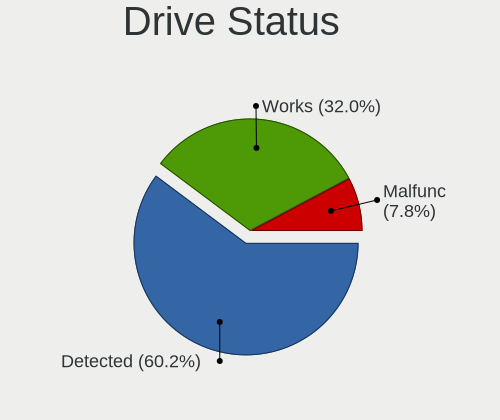

| Status   | Notebooks | Drives | Percent |
|----------|-----------|--------|---------|
| Detected | 601       | 908    | 61.39%  |
| Works    | 298       | 372    | 30.44%  |
| Malfunc  | 80        | 88     | 8.17%   |

Storage controller
------------------

Storage Vendor
--------------

Storage controller vendors

| Vendor                           | Notebooks | Percent |
|----------------------------------|-----------|---------|
| Intel                            | 679       | 68.66%  |
| AMD                              | 132       | 13.35%  |
| Samsung Electronics              | 56        | 5.66%   |
| Sandisk                          | 36        | 3.64%   |
| SK Hynix                         | 18        | 1.82%   |
| Nvidia                           | 11        | 1.11%   |
| Toshiba America Info Systems     | 9         | 0.91%   |
| KIOXIA                           | 9         | 0.91%   |
| Kingston Technology Company      | 7         | 0.71%   |
| Silicon Integrated Systems [SiS] | 6         | 0.61%   |
| Phison Electronics               | 5         | 0.51%   |
| Micron Technology                | 5         | 0.51%   |
| VIA Technologies                 | 3         | 0.3%    |
| Union Memory (Shenzhen)          | 2         | 0.2%    |
| Silicon Motion                   | 2         | 0.2%    |
| Silicon Image                    | 2         | 0.2%    |
| Apple                            | 2         | 0.2%    |
| Seagate Technology               | 1         | 0.1%    |
| Realtek Semiconductor            | 1         | 0.1%    |
| Lenovo                           | 1         | 0.1%    |
| JMicron Technology               | 1         | 0.1%    |
| ADATA Technology                 | 1         | 0.1%    |

Storage Model
-------------

Storage controller models

| Model                                                                            | Notebooks | Percent |
|----------------------------------------------------------------------------------|-----------|---------|
| AMD FCH SATA Controller [AHCI mode]                                              | 96        | 8.54%   |
| Intel 7 Series Chipset Family 6-port SATA Controller [AHCI mode]                 | 88        | 7.83%   |
| Intel 6 Series/C200 Series Chipset Family 6 port Mobile SATA AHCI Controller     | 61        | 5.43%   |
| Intel Sunrise Point-LP SATA Controller [AHCI mode]                               | 55        | 4.89%   |
| Intel 82801HM/HEM (ICH8M/ICH8M-E) IDE Controller                                 | 55        | 4.89%   |
| Intel 82801 Mobile SATA Controller [RAID mode]                                   | 55        | 4.89%   |
| Intel 82801IBM/IEM (ICH9M/ICH9M-E) 4 port SATA Controller [AHCI mode]            | 49        | 4.36%   |
| Intel 82801HM/HEM (ICH8M/ICH8M-E) SATA Controller [AHCI mode]                    | 43        | 3.83%   |
| Samsung NVMe SSD Controller SM981/PM981/PM983                                    | 36        | 3.2%    |
| Intel 5 Series/3400 Series Chipset 4 port SATA AHCI Controller                   | 35        | 3.11%   |
| Intel 8 Series SATA Controller 1 [AHCI mode]                                     | 31        | 2.76%   |
| Intel 8 Series/C220 Series Chipset Family 6-port SATA Controller 1 [AHCI mode]   | 28        | 2.49%   |
| Intel Wildcat Point-LP SATA Controller [AHCI Mode]                               | 22        | 1.96%   |
| Intel 5 Series/3400 Series Chipset 6 port SATA AHCI Controller                   | 20        | 1.78%   |
| Intel Atom Processor E3800 Series SATA AHCI Controller                           | 19        | 1.69%   |
| AMD SB7x0/SB8x0/SB9x0 SATA Controller [AHCI mode]                                | 19        | 1.69%   |
| Intel HM170/QM170 Chipset SATA Controller [AHCI Mode]                            | 18        | 1.6%    |
| Intel Celeron/Pentium Silver Processor SATA Controller                           | 17        | 1.51%   |
| Intel NM10/ICH7 Family SATA Controller [AHCI mode]                               | 14        | 1.25%   |
| Intel Cannon Lake Mobile PCH SATA AHCI Controller                                | 13        | 1.16%   |
| Sandisk WD Black SN750 / PC SN730 NVMe SSD                                       | 12        | 1.07%   |
| Intel Atom/Celeron/Pentium Processor x5-E8000/J3xxx/N3xxx Series SATA Controller | 11        | 0.98%   |
| Intel 82801HM/HEM (ICH8M/ICH8M-E) SATA Controller [IDE mode]                     | 11        | 0.98%   |
| Samsung NVMe SSD Controller 980                                                  | 10        | 0.89%   |
| Intel Volume Management Device NVMe RAID Controller                              | 10        | 0.89%   |
| Intel 82801IBM/IEM (ICH9M/ICH9M-E) 2 port SATA Controller [IDE mode]             | 10        | 0.89%   |
| KIOXIA Non-Volatile memory controller                                            | 9         | 0.8%    |
| Sandisk WD Blue SN500 / PC SN520 NVMe SSD                                        | 8         | 0.71%   |
| Intel Non-Volatile memory controller                                             | 8         | 0.71%   |
| Intel 82801GBM/GHM (ICH7-M Family) SATA Controller [IDE mode]                    | 8         | 0.71%   |
| Intel 5 Series/3400 Series Chipset 4 port SATA IDE Controller                    | 8         | 0.71%   |
| Intel 5 Series/3400 Series Chipset 2 port SATA IDE Controller                    | 8         | 0.71%   |
| SK Hynix BC501 NVMe Solid State Drive                                            | 7         | 0.62%   |
| Intel SSD 660P Series                                                            | 7         | 0.62%   |
| Intel 7 Series Chipset Family 4-port SATA Controller [IDE mode]                  | 7         | 0.62%   |
| Intel 7 Series Chipset Family 2-port SATA Controller [IDE mode]                  | 7         | 0.62%   |
| Sandisk WD Blue SN550 NVMe SSD                                                   | 6         | 0.53%   |
| Intel Comet Lake SATA AHCI Controller                                            | 6         | 0.53%   |
| Intel 82801G (ICH7 Family) IDE Controller                                        | 6         | 0.53%   |
| AMD SB7x0/SB8x0/SB9x0 SATA Controller [IDE mode]                                 | 6         | 0.53%   |
| AMD SB600 Non-Raid-5 SATA                                                        | 6         | 0.53%   |
| AMD SB600 IDE                                                                    | 6         | 0.53%   |
| Toshiba America Info Systems XG6 NVMe SSD Controller                             | 5         | 0.44%   |
| Silicon Integrated Systems [SiS] 5513 IDE Controller                             | 5         | 0.44%   |
| Sandisk Non-Volatile memory controller                                           | 5         | 0.44%   |
| Samsung NVMe SSD Controller SM961/PM961/SM963                                    | 5         | 0.44%   |
| Phison E12 NVMe Controller                                                       | 5         | 0.44%   |
| Micron Non-Volatile memory controller                                            | 5         | 0.44%   |
| Intel Tiger Lake-LP SATA Controller [AHCI mode]                                  | 5         | 0.44%   |
| Intel Ice Lake-LP SATA Controller [AHCI mode]                                    | 5         | 0.44%   |
| Intel Celeron N3350/Pentium N4200/Atom E3900 Series SATA AHCI Controller         | 5         | 0.44%   |
| Intel Cannon Point-LP SATA Controller [AHCI Mode]                                | 5         | 0.44%   |
| AMD SB7x0/SB8x0/SB9x0 IDE Controller                                             | 5         | 0.44%   |
| AMD IXP SB4x0 IDE Controller                                                     | 5         | 0.44%   |
| SK Hynix Gold P31 SSD                                                            | 4         | 0.36%   |
| SK Hynix BC511                                                                   | 4         | 0.36%   |
| Silicon Integrated Systems [SiS] SATA Controller / IDE mode                      | 4         | 0.36%   |
| Samsung NVMe SSD Controller PM9A1/PM9A3/980PRO                                   | 4         | 0.36%   |
| Kingston Company U-SNS8154P3 NVMe SSD                                            | 4         | 0.36%   |
| Intel SSD 600P Series                                                            | 4         | 0.36%   |

Storage Kind
------------

Kind of storage controller (IDE, SATA, NVMe, SAS, ...)

| Kind | Notebooks | Percent |
|------|-----------|---------|
| SATA | 692       | 64.67%  |
| NVMe | 170       | 15.89%  |
| IDE  | 137       | 12.8%   |
| RAID | 71        | 6.64%   |

Processor
---------

CPU Vendor
----------

Processor vendors

| Vendor       | Notebooks | Percent |
|--------------|-----------|---------|
| Intel        | 773       | 82.32%  |
| AMD          | 165       | 17.57%  |
| CentaurHauls | 1         | 0.11%   |

CPU Model
---------

Processor models

| Model                                           | Notebooks | Percent |
|-------------------------------------------------|-----------|---------|
| Intel Core i5-8250U CPU @ 1.60GHz               | 13        | 1.38%   |
| Intel Core i7-7700HQ CPU @ 2.80GHz              | 10        | 1.06%   |
| Intel Core i7-10750H CPU @ 2.60GHz              | 10        | 1.06%   |
| Intel Core i3-3110M CPU @ 2.40GHz               | 10        | 1.06%   |
| Intel Core i7-8550U CPU @ 1.80GHz               | 9         | 0.96%   |
| Intel Core i7-2670QM CPU @ 2.20GHz              | 9         | 0.96%   |
| Intel Core i5-3320M CPU @ 2.60GHz               | 9         | 0.96%   |
| Intel Core 2 Duo CPU T7100 @ 1.80GHz            | 9         | 0.96%   |
| Intel Celeron CPU N2840 @ 2.16GHz               | 9         | 0.96%   |
| Intel Core i5-6300U CPU @ 2.40GHz               | 8         | 0.85%   |
| Intel Core i5-2520M CPU @ 2.50GHz               | 8         | 0.85%   |
| Intel Core i5-2450M CPU @ 2.50GHz               | 8         | 0.85%   |
| Intel Core i5-1035G1 CPU @ 1.00GHz              | 8         | 0.85%   |
| Intel Core i5 CPU M 520 @ 2.40GHz               | 8         | 0.85%   |
| Intel 11th Gen Core i7-1165G7 @ 2.80GHz         | 8         | 0.85%   |
| Intel Core i7-10510U CPU @ 1.80GHz              | 7         | 0.74%   |
| Intel Core i5-7200U CPU @ 2.50GHz               | 7         | 0.74%   |
| Intel Core i5-3340M CPU @ 2.70GHz               | 7         | 0.74%   |
| Intel Core i5-3230M CPU @ 2.60GHz               | 7         | 0.74%   |
| Intel Core i5-2410M CPU @ 2.30GHz               | 7         | 0.74%   |
| Intel Core i3-2330M CPU @ 2.20GHz               | 7         | 0.74%   |
| Intel Core i3 CPU M 380 @ 2.53GHz               | 7         | 0.74%   |
| Intel Core i3 CPU M 370 @ 2.40GHz               | 7         | 0.74%   |
| Intel Core 2 Duo CPU T7500 @ 2.20GHz            | 7         | 0.74%   |
| Intel Core 2 Duo CPU P8400 @ 2.26GHz            | 7         | 0.74%   |
| Intel Celeron N4000 CPU @ 1.10GHz               | 7         | 0.74%   |
| Intel Celeron CPU N3060 @ 1.60GHz               | 7         | 0.74%   |
| Intel Atom x5-Z8350 CPU @ 1.44GHz               | 7         | 0.74%   |
| Intel Atom CPU Z3735F @ 1.33GHz                 | 7         | 0.74%   |
| AMD Ryzen 5 3500U with Radeon Vega Mobile Gfx   | 7         | 0.74%   |
| AMD Ryzen 5 2500U with Radeon Vega Mobile Gfx   | 7         | 0.74%   |
| Intel Pentium Dual CPU T3400 @ 2.16GHz          | 6         | 0.64%   |
| Intel Pentium CPU N3540 @ 2.16GHz               | 6         | 0.64%   |
| Intel Core i7-9750H CPU @ 2.60GHz               | 6         | 0.64%   |
| Intel Core i7-8565U CPU @ 1.80GHz               | 6         | 0.64%   |
| Intel Core i7-6700HQ CPU @ 2.60GHz              | 6         | 0.64%   |
| Intel Core i7-3630QM CPU @ 2.40GHz              | 6         | 0.64%   |
| Intel Core i7-2620M CPU @ 2.70GHz               | 6         | 0.64%   |
| Intel Core i5-6200U CPU @ 2.30GHz               | 6         | 0.64%   |
| Intel Core i5-4210U CPU @ 1.70GHz               | 6         | 0.64%   |
| Intel Core i5-4200U CPU @ 1.60GHz               | 6         | 0.64%   |
| Intel Core i5-10210U CPU @ 1.60GHz              | 6         | 0.64%   |
| Intel Core i3-6006U CPU @ 2.00GHz               | 6         | 0.64%   |
| Intel Core i3 CPU M 350 @ 2.27GHz               | 6         | 0.64%   |
| Intel Core 2 Duo CPU P8600 @ 2.40GHz            | 6         | 0.64%   |
| Intel Atom CPU N450 @ 1.66GHz                   | 6         | 0.64%   |
| AMD E1-1200 APU with Radeon HD Graphics         | 6         | 0.64%   |
| Intel Pentium Dual-Core CPU T4400 @ 2.20GHz     | 5         | 0.53%   |
| Intel Pentium Dual-Core CPU T4300 @ 2.10GHz     | 5         | 0.53%   |
| Intel Core i7-8750H CPU @ 2.20GHz               | 5         | 0.53%   |
| Intel Core i5-5300U CPU @ 2.30GHz               | 5         | 0.53%   |
| Intel Core i3-4030U CPU @ 1.90GHz               | 5         | 0.53%   |
| Intel Core i3 CPU M 330 @ 2.13GHz               | 5         | 0.53%   |
| Intel Core 2 Duo CPU T7250 @ 2.00GHz            | 5         | 0.53%   |
| AMD Ryzen 7 PRO 3700U w/ Radeon Vega Mobile Gfx | 5         | 0.53%   |
| AMD Ryzen 7 4700U with Radeon Graphics          | 5         | 0.53%   |
| Intel Pentium Dual-Core CPU T4200 @ 2.00GHz     | 4         | 0.43%   |
| Intel Pentium Dual CPU T2330 @ 1.60GHz          | 4         | 0.43%   |
| Intel Pentium CPU N3710 @ 1.60GHz               | 4         | 0.43%   |
| Intel Core i7-8650U CPU @ 1.90GHz               | 4         | 0.43%   |

CPU Model Family
----------------

Processor model prefix

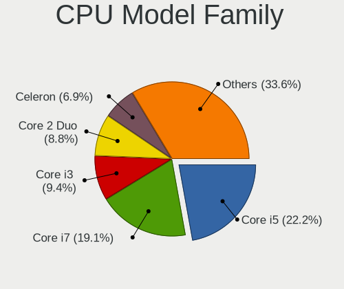

| Model                          | Notebooks | Percent |
|--------------------------------|-----------|---------|
| Intel Core i5                  | 196       | 20.85%  |
| Intel Core i7                  | 174       | 18.51%  |
| Intel Core i3                  | 91        | 9.68%   |
| Intel Core 2 Duo               | 85        | 9.04%   |
| Intel Celeron                  | 69        | 7.34%   |
| Intel Atom                     | 35        | 3.72%   |
| Intel Pentium                  | 32        | 3.4%    |
| Other                          | 29        | 3.09%   |
| AMD Ryzen 5                    | 20        | 2.13%   |
| Intel Pentium Dual-Core        | 17        | 1.81%   |
| AMD Ryzen 7                    | 15        | 1.6%    |
| Intel Pentium Dual             | 14        | 1.49%   |
| AMD A6                         | 14        | 1.49%   |
| Intel Core 2                   | 12        | 1.28%   |
| AMD E1                         | 12        | 1.28%   |
| AMD A8                         | 12        | 1.28%   |
| AMD Turion 64 X2 Mobile        | 9         | 0.96%   |
| AMD E2                         | 9         | 0.96%   |
| AMD Ryzen 7 PRO                | 8         | 0.85%   |
| AMD A4                         | 8         | 0.85%   |
| Intel Genuine                  | 7         | 0.74%   |
| AMD E                          | 7         | 0.74%   |
| AMD A10                        | 6         | 0.64%   |
| Intel Pentium Silver           | 5         | 0.53%   |
| AMD Ryzen 3                    | 4         | 0.43%   |
| AMD C-60                       | 4         | 0.43%   |
| AMD Athlon                     | 4         | 0.43%   |
| AMD Turion 64 Mobile           | 3         | 0.32%   |
| Intel Core m7                  | 2         | 0.21%   |
| Intel Core m5                  | 2         | 0.21%   |
| Intel Core i9                  | 2         | 0.21%   |
| Intel Celeron Dual-Core        | 2         | 0.21%   |
| AMD Turion                     | 2         | 0.21%   |
| AMD Sempron                    | 2         | 0.21%   |
| AMD C-50                       | 2         | 0.21%   |
| AMD Athlon X2                  | 2         | 0.21%   |
| AMD Athlon II                  | 2         | 0.21%   |
| Intel Xeon                     | 1         | 0.11%   |
| Intel Core m3                  | 1         | 0.11%   |
| Intel Core M                   | 1         | 0.11%   |
| Intel Celeron M                | 1         | 0.11%   |
| CentaurHauls VIA Nano          | 1         | 0.11%   |
| AMD V120                       | 1         | 0.11%   |
| AMD Turion X2 Dual-Core Mobile | 1         | 0.11%   |
| AMD Turion II                  | 1         | 0.11%   |
| AMD Turion Dual-Core           | 1         | 0.11%   |
| AMD Ryzen 9                    | 1         | 0.11%   |
| AMD Ryzen 5 PRO                | 1         | 0.11%   |
| AMD Ryzen 3 PRO                | 1         | 0.11%   |
| AMD Quad-Core                  | 1         | 0.11%   |
| AMD PRO A10                    | 1         | 0.11%   |
| AMD Mobile Sempron             | 1         | 0.11%   |
| AMD C-70                       | 1         | 0.11%   |
| AMD C-30                       | 1         | 0.11%   |
| AMD Athlon II Neo              | 1         | 0.11%   |
| AMD Athlon II Dual-Core        | 1         | 0.11%   |
| AMD Athlon 64 X2               | 1         | 0.11%   |
| AMD A12                        | 1         | 0.11%   |

CPU Cores
---------

Number of processor cores

| Number | Notebooks | Percent |
|--------|-----------|---------|
| 2      | 587       | 62.51%  |
| 4      | 261       | 27.8%   |
| 1      | 37        | 3.94%   |
| 6      | 31        | 3.3%    |
| 8      | 22        | 2.34%   |
| 14     | 1         | 0.11%   |

CPU Sockets
-----------

Number of sockets

| Number | Notebooks | Percent |
|--------|-----------|---------|
| 1      | 939       | 100%    |

CPU Threads
-----------

Threads per core (Hyper-Threading)

| Number | Notebooks | Percent |
|--------|-----------|---------|
| 2      | 567       | 60.38%  |
| 1      | 372       | 39.62%  |

CPU Op-Modes
------------

CPU Operation Modes (32-bit, 64-bit)

| Op mode        | Notebooks | Percent |
|----------------|-----------|---------|
| 32-bit, 64-bit | 939       | 100%    |

CPU Microcode
-------------

Microcode number

| Number     | Notebooks | Percent |
|------------|-----------|---------|
| Unknown    | 87        | 9.14%   |
| 0x206a7    | 86        | 9.03%   |
| 0x306a9    | 82        | 8.61%   |
| 0x1067a    | 45        | 4.73%   |
| 0x6fd      | 43        | 4.52%   |
| 0x20655    | 36        | 3.78%   |
| 0x306c3    | 29        | 3.05%   |
| 0x40651    | 28        | 2.94%   |
| 0x406e3    | 27        | 2.84%   |
| 0x30678    | 27        | 2.84%   |
| 0x806ea    | 26        | 2.73%   |
| 0x306d4    | 23        | 2.42%   |
| 0x10676    | 22        | 2.31%   |
| 0x806ec    | 21        | 2.21%   |
| 0x806e9    | 19        | 2%      |
| 0x406c4    | 19        | 2%      |
| 0x20652    | 19        | 2%      |
| 0x05000119 | 18        | 1.89%   |
| 0x806c1    | 16        | 1.68%   |
| 0xa0652    | 15        | 1.58%   |
| 0x906ea    | 15        | 1.58%   |
| 0x07030105 | 14        | 1.47%   |
| 0x706a1    | 13        | 1.37%   |
| 0x906e9    | 12        | 1.26%   |
| 0x106ca    | 12        | 1.26%   |
| 0x08108109 | 12        | 1.26%   |
| 0x706e5    | 11        | 1.16%   |
| 0x6f6      | 11        | 1.16%   |
| 0x406c3    | 11        | 1.16%   |
| 0x08108102 | 11        | 1.16%   |
| 0x0700010f | 9         | 0.95%   |
| 0x6fb      | 8         | 0.84%   |
| 0x03000027 | 7         | 0.74%   |
| 0x906ed    | 6         | 0.63%   |
| 0x6fa      | 6         | 0.63%   |
| 0x506e3    | 6         | 0.63%   |
| 0x0810100b | 6         | 0.63%   |
| 0x06001119 | 6         | 0.63%   |
| 0x806eb    | 5         | 0.53%   |
| 0x506c9    | 5         | 0.53%   |
| 0x10661    | 5         | 0.53%   |
| 0x05000029 | 5         | 0.53%   |
| 0x010000c8 | 5         | 0.53%   |
| 0x806d1    | 4         | 0.42%   |
| 0x706a8    | 4         | 0.42%   |
| 0x106e5    | 4         | 0.42%   |
| 0x08600106 | 4         | 0.42%   |
| 0x08600103 | 4         | 0.42%   |
| 0x02000057 | 4         | 0.42%   |
| 0x30661    | 3         | 0.32%   |
| 0x0a50000c | 3         | 0.32%   |
| 0x07030106 | 3         | 0.32%   |
| 0x06006705 | 3         | 0.32%   |
| 0x02000032 | 3         | 0.32%   |
| 0x0a50000b | 2         | 0.21%   |
| 0x08608103 | 2         | 0.21%   |
| 0x08600104 | 2         | 0.21%   |
| 0x08101007 | 2         | 0.21%   |
| 0x06006118 | 2         | 0.21%   |
| 0x06006110 | 2         | 0.21%   |

CPU Microarch
-------------

Microarchitecture

| Name             | Notebooks | Percent |
|------------------|-----------|---------|
| KabyLake         | 118       | 12.55%  |
| SandyBridge      | 89        | 9.47%   |
| IvyBridge        | 84        | 8.94%   |
| Core             | 74        | 7.87%   |
| Penryn           | 73        | 7.77%   |
| Haswell          | 63        | 6.7%    |
| Westmere         | 61        | 6.49%   |
| Silvermont       | 59        | 6.28%   |
| Skylake          | 36        | 3.83%   |
| Zen+             | 24        | 2.55%   |
| Bobcat           | 24        | 2.55%   |
| Broadwell        | 23        | 2.45%   |
| Puma             | 19        | 2.02%   |
| TigerLake        | 18        | 1.91%   |
| Goldmont plus    | 18        | 1.91%   |
| K8 Hammer        | 16        | 1.7%    |
| IceLake          | 16        | 1.7%    |
| CometLake        | 16        | 1.7%    |
| Bonnell          | 16        | 1.7%    |
| Zen 2            | 13        | 1.38%   |
| Jaguar           | 11        | 1.17%   |
| Excavator        | 11        | 1.17%   |
| Zen              | 10        | 1.06%   |
| Piledriver       | 8         | 0.85%   |
| K8 & K10 hybrid  | 7         | 0.74%   |
| K10 Llano        | 7         | 0.74%   |
| K10              | 6         | 0.64%   |
| Zen 3            | 5         | 0.53%   |
| Goldmont         | 5         | 0.53%   |
| Nehalem          | 4         | 0.43%   |
| Unknown          | 3         | 0.32%   |
| Steamroller      | 2         | 0.21%   |
| Alderlake Hybrid | 1         | 0.11%   |

Graphics
--------

GPU Vendor
----------

Vendors of graphics cards

| Vendor                           | Notebooks | Percent |
|----------------------------------|-----------|---------|
| Intel                            | 682       | 60.41%  |
| AMD                              | 222       | 19.66%  |
| Nvidia                           | 219       | 19.4%   |
| VIA Technologies                 | 3         | 0.27%   |
| Silicon Integrated Systems [SiS] | 3         | 0.27%   |

GPU Model
---------

Graphics card models

| Model                                                                                    | Notebooks | Percent |
|------------------------------------------------------------------------------------------|-----------|---------|
| Intel 2nd Generation Core Processor Family Integrated Graphics Controller                | 80        | 6.76%   |
| Intel 3rd Gen Core processor Graphics Controller                                         | 79        | 6.67%   |
| Intel Mobile 4 Series Chipset Integrated Graphics Controller                             | 50        | 4.22%   |
| Intel Core Processor Integrated Graphics Controller                                      | 48        | 4.05%   |
| Intel Mobile GM965/GL960 Integrated Graphics Controller (secondary)                      | 38        | 3.21%   |
| Intel Mobile GM965/GL960 Integrated Graphics Controller (primary)                        | 38        | 3.21%   |
| Intel Haswell-ULT Integrated Graphics Controller                                         | 32        | 2.7%    |
| Intel Atom/Celeron/Pentium Processor x5-E8000/J3xxx/N3xxx Integrated Graphics Controller | 30        | 2.53%   |
| Intel Atom Processor Z36xxx/Z37xxx Series Graphics & Display                             | 29        | 2.45%   |
| Intel 4th Gen Core Processor Integrated Graphics Controller                              | 29        | 2.45%   |
| Intel UHD Graphics 620                                                                   | 28        | 2.36%   |
| AMD Picasso/Raven 2 [Radeon Vega Series / Radeon Vega Mobile Series]                     | 25        | 2.11%   |
| Intel Skylake GT2 [HD Graphics 520]                                                      | 23        | 1.94%   |
| Intel HD Graphics 620                                                                    | 18        | 1.52%   |
| Intel CoffeeLake-H GT2 [UHD Graphics 630]                                                | 18        | 1.52%   |
| Intel TigerLake-LP GT2 [Iris Xe Graphics]                                                | 16        | 1.35%   |
| Intel HD Graphics 5500                                                                   | 16        | 1.35%   |
| Intel CometLake-U GT2 [UHD Graphics]                                                     | 16        | 1.35%   |
| Intel CometLake-H GT2 [UHD Graphics]                                                     | 16        | 1.35%   |
| Nvidia GF117M [GeForce 610M/710M/810M/820M / GT 620M/625M/630M/720M]                     | 13        | 1.1%    |
| Intel WhiskeyLake-U GT2 [UHD Graphics 620]                                               | 13        | 1.1%    |
| Intel GeminiLake [UHD Graphics 600]                                                      | 13        | 1.1%    |
| AMD Renoir                                                                               | 13        | 1.1%    |
| Intel HD Graphics 630                                                                    | 12        | 1.01%   |
| Intel Atom Processor D4xx/D5xx/N4xx/N5xx Integrated Graphics Controller                  | 12        | 1.01%   |
| AMD Seymour [Radeon HD 6400M/7400M Series]                                               | 12        | 1.01%   |
| Intel Iris Plus Graphics G1 (Ice Lake)                                                   | 10        | 0.84%   |
| AMD Mullins [Radeon R4/R5 Graphics]                                                      | 10        | 0.84%   |
| Nvidia TU117M [GeForce GTX 1650 Mobile / Max-Q]                                          | 9         | 0.76%   |
| AMD Raven Ridge [Radeon Vega Series / Radeon Vega Mobile Series]                         | 9         | 0.76%   |
| Nvidia TU117M                                                                            | 8         | 0.68%   |
| Nvidia GF108M [GeForce GT 540M]                                                          | 7         | 0.59%   |
| Nvidia TU116M [GeForce GTX 1660 Ti Mobile]                                               | 6         | 0.51%   |
| Nvidia GT218M [GeForce 310M]                                                             | 6         | 0.51%   |
| Intel Mobile 945GM/GMS/GME, 943/940GML Express Integrated Graphics Controller            | 6         | 0.51%   |
| Intel Mobile 945GM/GMS, 943/940GML Express Integrated Graphics Controller                | 6         | 0.51%   |
| AMD Wrestler [Radeon HD 7310]                                                            | 6         | 0.51%   |
| AMD Thames [Radeon HD 7500M/7600M Series]                                                | 6         | 0.51%   |
| AMD Stoney [Radeon R2/R3/R4/R5 Graphics]                                                 | 6         | 0.51%   |
| Nvidia GP107M [GeForce GTX 1050 Mobile]                                                  | 5         | 0.42%   |
| Nvidia G72M [Quadro NVS 110M/GeForce Go 7300]                                            | 5         | 0.42%   |
| Intel HD Graphics 530                                                                    | 5         | 0.42%   |
| Intel HD Graphics 500                                                                    | 5         | 0.42%   |
| Intel GeminiLake [UHD Graphics 605]                                                      | 5         | 0.42%   |
| AMD Wani [Radeon R5/R6/R7 Graphics]                                                      | 5         | 0.42%   |
| AMD Topaz XT [Radeon R7 M260/M265 / M340/M360 / M440/M445 / 530/535 / 620/625 Mobile]    | 5         | 0.42%   |
| AMD Thames [Radeon HD 7550M/7570M/7650M]                                                 | 5         | 0.42%   |
| AMD RS880M [Mobility Radeon HD 4225/4250]                                                | 5         | 0.42%   |
| AMD Mullins [Radeon R3 Graphics]                                                         | 5         | 0.42%   |
| AMD Cezanne                                                                              | 5         | 0.42%   |
| Nvidia GT218M [NVS 3100M]                                                                | 4         | 0.34%   |
| Nvidia GP108M [GeForce MX150]                                                            | 4         | 0.34%   |
| Nvidia GP107M [GeForce GTX 1050 Ti Mobile]                                               | 4         | 0.34%   |
| Nvidia GP106M [GeForce GTX 1060 Mobile]                                                  | 4         | 0.34%   |
| Nvidia GM108M [GeForce 940MX]                                                            | 4         | 0.34%   |
| Nvidia GK107M [GeForce GT 650M]                                                          | 4         | 0.34%   |
| Nvidia GK107GLM [Quadro K1100M]                                                          | 4         | 0.34%   |
| Nvidia GF119M [GeForce GT 520M]                                                          | 4         | 0.34%   |
| Nvidia G86M [GeForce 8400M GS]                                                           | 4         | 0.34%   |
| Intel TigerLake-H GT1 [UHD Graphics]                                                     | 4         | 0.34%   |

GPU Combo
---------

Combinations of graphics cards

| Name           | Notebooks | Percent |
|----------------|-----------|---------|
| 1 x Intel      | 503       | 53.57%  |
| 1 x AMD        | 162       | 17.25%  |
| Intel + Nvidia | 140       | 14.91%  |
| 1 x Nvidia     | 68        | 7.24%   |
| Intel + AMD    | 38        | 4.05%   |
| 2 x AMD        | 11        | 1.17%   |
| AMD + Nvidia   | 11        | 1.17%   |
| 1 x VIA        | 3         | 0.32%   |
| 1 x SiS        | 3         | 0.32%   |

GPU Driver
----------

Free vs proprietary

| Driver      | Notebooks | Percent |
|-------------|-----------|---------|
| Free        | 812       | 86.11%  |
| Proprietary | 104       | 11.03%  |
| Unknown     | 27        | 2.86%   |

GPU Memory
----------

Total video memory

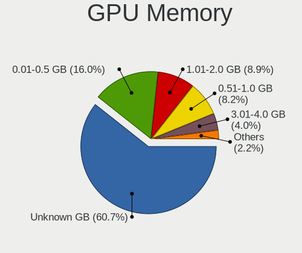

| Size in GB | Notebooks | Percent |
|------------|-----------|---------|
| Unknown    | 571       | 60.42%  |
| 0.01-0.5   | 154       | 16.3%   |
| 1.01-2.0   | 86        | 9.1%    |
| 0.51-1.0   | 74        | 7.83%   |
| 3.01-4.0   | 37        | 3.92%   |
| 5.01-6.0   | 14        | 1.48%   |
| 7.01-8.0   | 6         | 0.63%   |
| 2.01-3.0   | 2         | 0.21%   |
| 8.01-16.0  | 1         | 0.11%   |

Monitor
-------

Monitor Vendor
--------------

Monitor vendors

| Vendor                  | Notebooks | Percent |
|-------------------------|-----------|---------|
| AU Optronics            | 197       | 19.09%  |
| LG Display              | 171       | 16.57%  |
| Samsung Electronics     | 140       | 13.57%  |
| Chimei Innolux          | 111       | 10.76%  |
| BOE                     | 96        | 9.3%    |
| Chi Mei Optoelectronics | 46        | 4.46%   |
| Lenovo                  | 31        | 3%      |
| LG Philips              | 24        | 2.33%   |
| Goldstar                | 18        | 1.74%   |
| Dell                    | 18        | 1.74%   |
| Apple                   | 18        | 1.74%   |
| Sharp                   | 14        | 1.36%   |
| Hewlett-Packard         | 13        | 1.26%   |
| InfoVision              | 11        | 1.07%   |
| HannStar                | 10        | 0.97%   |
| PANDA                   | 8         | 0.78%   |
| Ancor Communications    | 8         | 0.78%   |
| Acer                    | 7         | 0.68%   |
| Toshiba                 | 6         | 0.58%   |
| BenQ                    | 6         | 0.58%   |
| Sony                    | 5         | 0.48%   |
| Iiyama                  | 5         | 0.48%   |
| CPT                     | 5         | 0.48%   |
| Philips                 | 4         | 0.39%   |
| LPL                     | 4         | 0.39%   |
| LGD                     | 4         | 0.39%   |
| ViewSonic               | 3         | 0.29%   |
| Nvidia                  | 3         | 0.29%   |
| AOC                     | 3         | 0.29%   |
| Vizio                   | 2         | 0.19%   |
| Panasonic               | 2         | 0.19%   |
| MStar                   | 2         | 0.19%   |
| Lenovo Group Limited    | 2         | 0.19%   |
| InnoLux Display         | 2         | 0.19%   |
| Fujitsu Siemens         | 2         | 0.19%   |
| CSO                     | 2         | 0.19%   |
| Vestel Elektronik       | 1         | 0.1%    |
| Unknown (XXX)           | 1         | 0.1%    |
| UMC                     | 1         | 0.1%    |
| Sun                     | 1         | 0.1%    |
| SLD                     | 1         | 0.1%    |
| SKY                     | 1         | 0.1%    |
| Seiko/Epson             | 1         | 0.1%    |
| SDC                     | 1         | 0.1%    |
| Sceptre Tech            | 1         | 0.1%    |
| Quanta Display          | 1         | 0.1%    |
| OEM                     | 1         | 0.1%    |
| NSO                     | 1         | 0.1%    |
| NEC Computers           | 1         | 0.1%    |
| MTD                     | 1         | 0.1%    |
| MS_ Nvidia              | 1         | 0.1%    |
| MSI                     | 1         | 0.1%    |
| Medion                  | 1         | 0.1%    |
| Matrox                  | 1         | 0.1%    |
| LNG                     | 1         | 0.1%    |
| KDC                     | 1         | 0.1%    |
| IBM                     | 1         | 0.1%    |
| HRG                     | 1         | 0.1%    |
| Hannspree               | 1         | 0.1%    |
| GKK                     | 1         | 0.1%    |

Monitor Model
-------------

Monitor models

| Model                                                                    | Notebooks | Percent |
|--------------------------------------------------------------------------|-----------|---------|
| AU Optronics LCD Monitor AUO22EC 1366x768 344x193mm 15.5-inch            | 9         | 0.86%   |
| Samsung Electronics LCD Monitor SEC5441 1366x768 309x174mm 14.0-inch     | 8         | 0.77%   |
| LG Display LCD Monitor LGD0563 1920x1080 344x194mm 15.5-inch             | 8         | 0.77%   |
| LG Display LCD Monitor LGD02DC 1366x768 344x194mm 15.5-inch              | 8         | 0.77%   |
| Chi Mei Optoelectronics LCD Monitor CMO15A7 1366x768 344x193mm 15.5-inch | 8         | 0.77%   |
| AU Optronics LCD Monitor AUO26EC 1366x768 344x193mm 15.5-inch            | 8         | 0.77%   |
| Chimei Innolux LCD Monitor CMN14D4 1920x1080 309x173mm 13.9-inch         | 7         | 0.67%   |
| Chimei Innolux LCD Monitor CMN15F5 1920x1080 344x193mm 15.5-inch         | 6         | 0.58%   |
| Chimei Innolux LCD Monitor CMN14C9 1920x1080 309x173mm 13.9-inch         | 6         | 0.58%   |
| AU Optronics LCD Monitor AUO61ED 1920x1080 344x194mm 15.5-inch           | 6         | 0.58%   |
| AU Optronics LCD Monitor AUO45EC 1366x768 344x193mm 15.5-inch            | 6         | 0.58%   |
| AU Optronics LCD Monitor AUO38ED 1920x1080 344x193mm 15.5-inch           | 6         | 0.58%   |
| LG Display LCD Monitor LGD033A 1366x768 344x194mm 15.5-inch              | 5         | 0.48%   |
| LG Display LCD Monitor LGD02E3 1366x768 344x194mm 15.5-inch              | 5         | 0.48%   |
| HannStar HSD101PFW2 HSD03E9 1024x600 222x125mm 10.0-inch                 | 5         | 0.48%   |
| AU Optronics LCD Monitor AUO21EC 1366x768 344x193mm 15.5-inch            | 5         | 0.48%   |
| AU Optronics LCD Monitor AUO10EC 1366x768 344x193mm 15.5-inch            | 5         | 0.48%   |
| LG Display LCD Monitor LGD0456 1366x768 344x194mm 15.5-inch              | 4         | 0.38%   |
| Lenovo LCD Monitor LEN40A0 1366x768 309x174mm 14.0-inch                  | 4         | 0.38%   |
| Chimei Innolux LCD Monitor CMN1130 1366x768 256x144mm 11.6-inch          | 4         | 0.38%   |
| Chi Mei Optoelectronics LCD Monitor CMO15A2 1366x768 344x193mm 15.5-inch | 4         | 0.38%   |
| AU Optronics LCD Monitor AUO8174 1280x800 331x207mm 15.4-inch            | 4         | 0.38%   |
| AU Optronics LCD Monitor AUO34ED 1920x1080 344x193mm 15.5-inch           | 4         | 0.38%   |
| AU Optronics LCD Monitor AUO312C 1366x768 293x164mm 13.2-inch            | 4         | 0.38%   |
| AU Optronics LCD Monitor AUO229E 1600x900 382x214mm 17.2-inch            | 4         | 0.38%   |
| AU Optronics LCD Monitor AUO139E 1600x900 382x214mm 17.2-inch            | 4         | 0.38%   |
| AU Optronics LCD Monitor AUO106C 1366x768 277x156mm 12.5-inch            | 4         | 0.38%   |
| Apple LCD Monitor APP9C5F 1280x800 286x179mm 13.3-inch                   | 4         | 0.38%   |
| Samsung Electronics LCD Monitor SEC5541 1366x768 344x193mm 15.5-inch     | 3         | 0.29%   |
| Samsung Electronics LCD Monitor SEC544B 1600x900 382x214mm 17.2-inch     | 3         | 0.29%   |
| Samsung Electronics LCD Monitor SEC3945 1280x800 331x207mm 15.4-inch     | 3         | 0.29%   |
| Samsung Electronics LCD Monitor SEC3847 1440x900 367x230mm 17.1-inch     | 3         | 0.29%   |
| Samsung Electronics LCD Monitor SEC3345 1280x800 331x207mm 15.4-inch     | 3         | 0.29%   |
| Samsung Electronics LCD Monitor SEC325A 1366x768 344x194mm 15.5-inch     | 3         | 0.29%   |
| Samsung Electronics LCD Monitor SDC4C48 1920x1080 239x134mm 10.8-inch    | 3         | 0.29%   |
| PANDA LCD Monitor NCP004D 1920x1080 344x194mm 15.5-inch                  | 3         | 0.29%   |
| LPL LCD Monitor 1440x900                                                 | 3         | 0.29%   |
| LG Philips LP154WX4-TLAB LPL3D01 1280x800 331x207mm 15.4-inch            | 3         | 0.29%   |
| LG Philips LCD Monitor LPLA002 1440x900 367x230mm 17.1-inch              | 3         | 0.29%   |
| LG Philips LCD Monitor LPL8D00 1280x800 304x190mm 14.1-inch              | 3         | 0.29%   |
| LG Display LCD Monitor LGD0608 1920x1080 309x174mm 14.0-inch             | 3         | 0.29%   |
| LG Display LCD Monitor LGD05E5 1920x1080 344x194mm 15.5-inch             | 3         | 0.29%   |
| LG Display LCD Monitor LGD046F 1920x1080 344x194mm 15.5-inch             | 3         | 0.29%   |
| LG Display LCD Monitor LGD033C 1366x768 309x174mm 14.0-inch              | 3         | 0.29%   |
| LG Display LCD Monitor LGD02EC 1366x768 293x165mm 13.2-inch              | 3         | 0.29%   |
| LG Display LCD Monitor LGD02E9 1366x768 309x174mm 14.0-inch              | 3         | 0.29%   |
| Lenovo LCD Monitor LEN40BA 1920x1080 344x194mm 15.5-inch                 | 3         | 0.29%   |
| Lenovo LCD Monitor LEN40B1 1600x900 345x194mm 15.6-inch                  | 3         | 0.29%   |
| Lenovo LCD Monitor LEN4050 1280x800 331x207mm 15.4-inch                  | 3         | 0.29%   |
| Lenovo LCD Monitor LEN4011 1280x800 261x163mm 12.1-inch                  | 3         | 0.29%   |
| InfoVision LCD Monitor IVO057A 1366x768 309x174mm 14.0-inch              | 3         | 0.29%   |
| HannStar HSD121PHW1 HSD04B6 1366x768 270x150mm 12.2-inch                 | 3         | 0.29%   |
| Chimei Innolux LCD Monitor CMN1728 1600x900 382x215mm 17.3-inch          | 3         | 0.29%   |
| Chimei Innolux LCD Monitor CMN15E6 1366x768 344x193mm 15.5-inch          | 3         | 0.29%   |
| Chimei Innolux LCD Monitor CMN15DC 1366x768 344x193mm 15.5-inch          | 3         | 0.29%   |
| Chimei Innolux LCD Monitor CMN15CA 1366x768 344x193mm 15.5-inch          | 3         | 0.29%   |
| Chimei Innolux LCD Monitor CMN15C9 1366x768 344x193mm 15.5-inch          | 3         | 0.29%   |
| Chimei Innolux LCD Monitor CMN15AB 1366x768 344x194mm 15.5-inch          | 3         | 0.29%   |
| Chimei Innolux LCD Monitor CMN14C4 1366x768 309x173mm 13.9-inch          | 3         | 0.29%   |
| Chimei Innolux LCD Monitor CMN14C3 1366x768 309x173mm 13.9-inch          | 3         | 0.29%   |

Monitor Resolution
------------------

Monitor screen resolution

| Resolution         | Notebooks | Percent |
|--------------------|-----------|---------|
| 1366x768 (WXGA)    | 372       | 37.39%  |
| 1920x1080 (FHD)    | 310       | 31.16%  |
| 1280x800 (WXGA)    | 86        | 8.64%   |
| 1600x900 (HD+)     | 70        | 7.04%   |
| 1440x900 (WXGA+)   | 43        | 4.32%   |
| 3840x2160 (4K)     | 32        | 3.22%   |
| 1680x1050 (WSXGA+) | 15        | 1.51%   |
| 1024x600           | 12        | 1.21%   |
| 2560x1440 (QHD)    | 10        | 1.01%   |
| 1920x1200 (WUXGA)  | 10        | 1.01%   |
| 1280x1024 (SXGA)   | 8         | 0.8%    |
| 1360x768           | 4         | 0.4%    |
| 2880x1800          | 3         | 0.3%    |
| 2560x1600          | 3         | 0.3%    |
| 3200x1800 (QHD+)   | 2         | 0.2%    |
| 2560x1080          | 2         | 0.2%    |
| 1920x540           | 2         | 0.2%    |
| 1024x768 (XGA)     | 2         | 0.2%    |
| 3840x1200          | 1         | 0.1%    |
| 3840x1080          | 1         | 0.1%    |
| 2304x1440          | 1         | 0.1%    |
| 2288x1287          | 1         | 0.1%    |
| 1920x1280          | 1         | 0.1%    |
| 1680x945           | 1         | 0.1%    |
| 1280x768           | 1         | 0.1%    |
| 1280x720 (HD)      | 1         | 0.1%    |
| 1024x576           | 1         | 0.1%    |

Monitor Diagonal
----------------

Diagonal size in inches

| Inches  | Notebooks | Percent |
|---------|-----------|---------|
| 15      | 417       | 40.17%  |
| 14      | 147       | 14.16%  |
| 13      | 129       | 12.43%  |
| 17      | 85        | 8.19%   |
| 12      | 33        | 3.18%   |
| 24      | 31        | 2.99%   |
| 11      | 27        | 2.6%    |
| Unknown | 25        | 2.41%   |
| 21      | 22        | 2.12%   |
| 27      | 19        | 1.83%   |
| 10      | 14        | 1.35%   |
| 18      | 13        | 1.25%   |
| 23      | 12        | 1.16%   |
| 19      | 11        | 1.06%   |
| 22      | 8         | 0.77%   |
| 31      | 7         | 0.67%   |
| 54      | 5         | 0.48%   |
| 16      | 5         | 0.48%   |
| 84      | 3         | 0.29%   |
| 25      | 3         | 0.29%   |
| 20      | 3         | 0.29%   |
| 72      | 2         | 0.19%   |
| 52      | 2         | 0.19%   |
| 40      | 2         | 0.19%   |
| 34      | 2         | 0.19%   |
| 32      | 2         | 0.19%   |
| 26      | 2         | 0.19%   |
| 65      | 1         | 0.1%    |
| 57      | 1         | 0.1%    |
| 48      | 1         | 0.1%    |
| 47      | 1         | 0.1%    |
| 42      | 1         | 0.1%    |
| 37      | 1         | 0.1%    |
| 8       | 1         | 0.1%    |

Monitor Width
-------------

Physical width

| Width in mm | Notebooks | Percent |
|-------------|-----------|---------|
| 301-350     | 627       | 60.87%  |
| 201-300     | 130       | 12.62%  |
| 351-400     | 104       | 10.1%   |
| 501-600     | 61        | 5.92%   |
| 401-500     | 47        | 4.56%   |
| Unknown     | 25        | 2.43%   |
| 601-700     | 11        | 1.07%   |
| 1001-1500   | 11        | 1.07%   |
| 1501-2000   | 5         | 0.49%   |
| 701-800     | 4         | 0.39%   |
| 801-900     | 3         | 0.29%   |
| 101-200     | 1         | 0.1%    |
| 901-1000    | 1         | 0.1%    |

Aspect Ratio
------------

Proportional relationship between the width and the height

| Ratio   | Notebooks | Percent |
|---------|-----------|---------|
| 16/9    | 734       | 79.18%  |
| 16/10   | 153       | 16.5%   |
| Unknown | 20        | 2.16%   |
| 5/4     | 7         | 0.76%   |
| 3/2     | 5         | 0.54%   |
| 4/3     | 3         | 0.32%   |
| 21/9    | 2         | 0.22%   |
| 32/9    | 1         | 0.11%   |
| 3.20    | 1         | 0.11%   |
| 0.62    | 1         | 0.11%   |

Monitor Area
------------

Area in inch

| Area in inch | Notebooks | Percent |
|----------------|-----------|---------|
| 101-110        | 416       | 40.15%  |
| 81-90          | 228       | 22.01%  |
| 121-130        | 67        | 6.47%   |
| 201-250        | 60        | 5.79%   |
| 71-80          | 45        | 4.34%   |
| 61-70          | 33        | 3.19%   |
| 51-60          | 27        | 2.61%   |
| Unknown        | 25        | 2.41%   |
| 301-350        | 20        | 1.93%   |
| 151-200        | 19        | 1.83%   |
| 131-140        | 18        | 1.74%   |
| More than 1000 | 14        | 1.35%   |
| 41-50          | 14        | 1.35%   |
| 251-300        | 12        | 1.16%   |
| 141-150        | 12        | 1.16%   |
| 351-500        | 11        | 1.06%   |
| 501-1000       | 6         | 0.58%   |
| 91-100         | 5         | 0.48%   |
| 111-120        | 3         | 0.29%   |
| 1-40           | 1         | 0.1%    |

Pixel Density
-------------

Pixels per inch

| Density       | Notebooks | Percent |
|---------------|-----------|---------|
| 101-120       | 403       | 39.7%   |
| 121-160       | 331       | 32.61%  |
| 51-100        | 192       | 18.92%  |
| 161-240       | 39        | 3.84%   |
| Unknown       | 25        | 2.46%   |
| 1-50          | 13        | 1.28%   |
| More than 240 | 12        | 1.18%   |

Multiple Monitors
-----------------

Total monitors connected

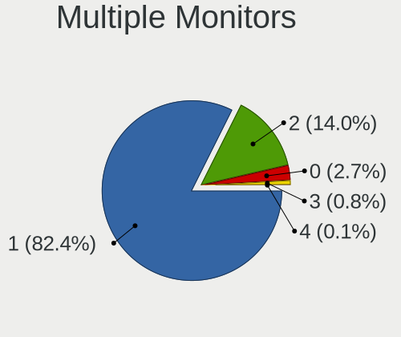

| Total | Notebooks | Percent |
|-------|-----------|---------|
| 1     | 799       | 83.4%   |
| 2     | 128       | 13.36%  |
| 0     | 21        | 2.19%   |
| 3     | 9         | 0.94%   |
| 4     | 1         | 0.1%    |

Network
-------

Net Controller Vendor
---------------------

Controller vendors

| Vendor                            | Notebooks | Percent |
|-----------------------------------|-----------|---------|
| Realtek Semiconductor             | 485       | 32.01%  |
| Intel                             | 440       | 29.04%  |
| Qualcomm Atheros                  | 248       | 16.37%  |
| Broadcom                          | 135       | 8.91%   |
| Marvell Technology Group          | 32        | 2.11%   |
| Broadcom Limited                  | 27        | 1.78%   |
| Ralink                            | 22        | 1.45%   |
| Samsung Electronics               | 11        | 0.73%   |
| Ralink Technology                 | 11        | 0.73%   |
| JMicron Technology                | 10        | 0.66%   |
| TP-Link                           | 9         | 0.59%   |
| Nvidia                            | 9         | 0.59%   |
| Sierra Wireless                   | 8         | 0.53%   |
| Huawei Technologies               | 6         | 0.4%    |
| Ericsson Business Mobile Networks | 6         | 0.4%    |
| Silicon Integrated Systems [SiS]  | 5         | 0.33%   |
| Qualcomm Atheros Communications   | 4         | 0.26%   |
| MediaTek                          | 4         | 0.26%   |
| Xiaomi                            | 3         | 0.2%    |
| Fibocom                           | 3         | 0.2%    |
| DisplayLink                       | 3         | 0.2%    |
| Dell                              | 3         | 0.2%    |
| Attansic Technology               | 3         | 0.2%    |
| ASIX Electronics                  | 3         | 0.2%    |
| VIA Technologies                  | 2         | 0.13%   |
| Motorola PCS                      | 2         | 0.13%   |
| Lenovo                            | 2         | 0.13%   |
| Edimax Technology                 | 2         | 0.13%   |
| AMD                               | 2         | 0.13%   |
| ZyDAS                             | 1         | 0.07%   |
| ZTE WCDMA Technologies MSM        | 1         | 0.07%   |
| TRENDnet                          | 1         | 0.07%   |
| Toshiba                           | 1         | 0.07%   |
| Realtek                           | 1         | 0.07%   |
| Qualcomm                          | 1         | 0.07%   |
| Novatek Microelectronics          | 1         | 0.07%   |
| NetGear                           | 1         | 0.07%   |
| Linksys                           | 1         | 0.07%   |
| LG Electronics                    | 1         | 0.07%   |
| Hewlett-Packard                   | 1         | 0.07%   |
| D-Link                            | 1         | 0.07%   |
| AVM                               | 1         | 0.07%   |
| ASUSTek Computer                  | 1         | 0.07%   |
| Aquantia                          | 1         | 0.07%   |

Net Controller Model
--------------------

Controller models

| Model                                                                   | Notebooks | Percent |
|-------------------------------------------------------------------------|-----------|---------|
| Realtek RTL8111/8168/8411 PCI Express Gigabit Ethernet Controller       | 274       | 14.88%  |
| Realtek RTL810xE PCI Express Fast Ethernet controller                   | 129       | 7.01%   |
| Intel 82579LM Gigabit Network Connection (Lewisville)                   | 51        | 2.77%   |
| Qualcomm Atheros QCA9565 / AR9565 Wireless Network Adapter              | 44        | 2.39%   |
| Qualcomm Atheros AR9485 Wireless Network Adapter                        | 41        | 2.23%   |
| Qualcomm Atheros AR9285 Wireless Network Adapter (PCI-Express)          | 39        | 2.12%   |
| Broadcom BCM4313 802.11bgn Wireless Network Adapter                     | 32        | 1.74%   |
| Intel PRO/Wireless 3945ABG [Golan] Network Connection                   | 31        | 1.68%   |
| Intel Wireless 7260                                                     | 30        | 1.63%   |
| Intel Centrino Advanced-N 6205 [Taylor Peak]                            | 29        | 1.58%   |
| Qualcomm Atheros QCA9377 802.11ac Wireless Network Adapter              | 28        | 1.52%   |
| Intel Wireless 8265 / 8275                                              | 28        | 1.52%   |
| Intel Wireless 7265                                                     | 27        | 1.47%   |
| Realtek RTL8723BE PCIe Wireless Network Adapter                         | 25        | 1.36%   |
| Intel Wi-Fi 6 AX200                                                     | 21        | 1.14%   |
| Realtek RTL8821CE 802.11ac PCIe Wireless Network Adapter                | 18        | 0.98%   |
| Qualcomm Atheros AR242x / AR542x Wireless Network Adapter (PCI-Express) | 18        | 0.98%   |
| Realtek RTL8188CE 802.11b/g/n WiFi Adapter                              | 17        | 0.92%   |
| Qualcomm Atheros QCA6174 802.11ac Wireless Network Adapter              | 17        | 0.92%   |
| Intel 82577LM Gigabit Network Connection                                | 17        | 0.92%   |
| Intel Centrino Advanced-N 6200                                          | 16        | 0.87%   |
| Intel 82567LM Gigabit Network Connection                                | 15        | 0.81%   |
| Realtek RTL8188EE Wireless Network Adapter                              | 14        | 0.76%   |
| Intel Wireless-AC 9260                                                  | 14        | 0.76%   |
| Intel Wireless 8260                                                     | 14        | 0.76%   |
| Intel PRO/Wireless 4965 AG or AGN [Kedron] Network Connection           | 14        | 0.76%   |
| Intel Ethernet Connection I217-LM                                       | 14        | 0.76%   |
| Intel Centrino Ultimate-N 6300                                          | 14        | 0.76%   |
| Realtek RTL8822CE 802.11ac PCIe Wireless Network Adapter                | 13        | 0.71%   |
| Qualcomm Atheros AR928X Wireless Network Adapter (PCI-Express)          | 13        | 0.71%   |
| Intel Wi-Fi 6 AX201                                                     | 13        | 0.71%   |
| Intel Comet Lake PCH CNVi WiFi                                          | 13        | 0.71%   |
| Intel Comet Lake PCH-LP CNVi WiFi                                       | 12        | 0.65%   |
| Intel Centrino Advanced-N 6235                                          | 12        | 0.65%   |
| Broadcom BCM43142 802.11b/g/n                                           | 12        | 0.65%   |
| Realtek RTL8153 Gigabit Ethernet Adapter                                | 11        | 0.6%    |
| Broadcom BCM4312 802.11b/g LP-PHY                                       | 11        | 0.6%    |
| Realtek RTL-8100/8101L/8139 PCI Fast Ethernet Adapter                   | 10        | 0.54%   |
| Ralink RT3290 Wireless 802.11n 1T/1R PCIe                               | 10        | 0.54%   |
| Qualcomm Atheros AR8132 Fast Ethernet                                   | 10        | 0.54%   |
| Intel PRO/Wireless 5100 AGN [Shiloh] Network Connection                 | 10        | 0.54%   |
| Intel Cannon Lake PCH CNVi WiFi                                         | 10        | 0.54%   |
| Broadcom NetLink BCM5787M Gigabit Ethernet PCI Express                  | 10        | 0.54%   |
| Marvell Group 88E8040 PCI-E Fast Ethernet Controller                    | 9         | 0.49%   |
| Intel Wireless 3165                                                     | 9         | 0.49%   |
| Intel WiFi Link 5100                                                    | 9         | 0.49%   |
| Intel Ethernet Connection I219-LM                                       | 9         | 0.49%   |
| Intel Ethernet Connection (4) I219-LM                                   | 9         | 0.49%   |
| Intel Dual Band Wireless-AC 3165 Plus Bluetooth                         | 9         | 0.49%   |
| Intel Centrino Wireless-N 2230                                          | 9         | 0.49%   |
| Intel Centrino Wireless-N 1000 [Condor Peak]                            | 9         | 0.49%   |
| Broadcom NetLink BCM57780 Gigabit Ethernet PCIe                         | 9         | 0.49%   |
| Samsung Galaxy series, misc. (tethering mode)                           | 8         | 0.43%   |
| Realtek RTL8191SEvB Wireless LAN Controller                             | 8         | 0.43%   |
| Qualcomm Atheros AR8162 Fast Ethernet                                   | 8         | 0.43%   |
| Qualcomm Atheros AR8151 v2.0 Gigabit Ethernet                           | 8         | 0.43%   |
| Intel Wireless 3160                                                     | 8         | 0.43%   |
| Intel Ultimate N WiFi Link 5300                                         | 8         | 0.43%   |
| Intel Ethernet Connection I218-LM                                       | 8         | 0.43%   |
| Intel Ethernet Connection (4) I219-V                                    | 8         | 0.43%   |

Wireless Vendor
---------------

Wireless vendors

| Vendor                          | Notebooks | Percent |
|---------------------------------|-----------|---------|
| Intel                           | 417       | 43.44%  |
| Qualcomm Atheros                | 217       | 22.6%   |
| Realtek Semiconductor           | 150       | 15.63%  |
| Broadcom                        | 93        | 9.69%   |
| Ralink                          | 22        | 2.29%   |
| Broadcom Limited                | 13        | 1.35%   |
| Ralink Technology               | 11        | 1.15%   |
| Sierra Wireless                 | 8         | 0.83%   |
| TP-Link                         | 7         | 0.73%   |
| Qualcomm Atheros Communications | 4         | 0.42%   |
| Fibocom                         | 3         | 0.31%   |
| MEDIATEK                        | 2         | 0.21%   |
| Edimax Technology               | 2         | 0.21%   |
| ZyDAS                           | 1         | 0.1%    |
| TRENDnet                        | 1         | 0.1%    |
| Realtek                         | 1         | 0.1%    |
| Qualcomm                        | 1         | 0.1%    |
| NetGear                         | 1         | 0.1%    |
| Linksys                         | 1         | 0.1%    |
| Hewlett-Packard                 | 1         | 0.1%    |
| Dell                            | 1         | 0.1%    |
| D-Link                          | 1         | 0.1%    |
| AVM                             | 1         | 0.1%    |
| ASUSTek Computer                | 1         | 0.1%    |

Wireless Model
--------------

Wireless models

| Model                                                                   | Notebooks | Percent |
|-------------------------------------------------------------------------|-----------|---------|
| Qualcomm Atheros QCA9565 / AR9565 Wireless Network Adapter              | 44        | 4.53%   |
| Qualcomm Atheros AR9485 Wireless Network Adapter                        | 41        | 4.22%   |
| Qualcomm Atheros AR9285 Wireless Network Adapter (PCI-Express)          | 39        | 4.02%   |
| Broadcom BCM4313 802.11bgn Wireless Network Adapter                     | 32        | 3.3%    |
| Intel PRO/Wireless 3945ABG [Golan] Network Connection                   | 31        | 3.19%   |
| Intel Wireless 7260                                                     | 30        | 3.09%   |
| Intel Centrino Advanced-N 6205 [Taylor Peak]                            | 29        | 2.99%   |
| Qualcomm Atheros QCA9377 802.11ac Wireless Network Adapter              | 28        | 2.88%   |
| Intel Wireless 8265 / 8275                                              | 28        | 2.88%   |
| Intel Wireless 7265                                                     | 27        | 2.78%   |
| Realtek RTL8723BE PCIe Wireless Network Adapter                         | 25        | 2.57%   |
| Intel Wi-Fi 6 AX200                                                     | 21        | 2.16%   |
| Realtek RTL8821CE 802.11ac PCIe Wireless Network Adapter                | 18        | 1.85%   |
| Qualcomm Atheros AR242x / AR542x Wireless Network Adapter (PCI-Express) | 18        | 1.85%   |
| Realtek RTL8188CE 802.11b/g/n WiFi Adapter                              | 17        | 1.75%   |
| Qualcomm Atheros QCA6174 802.11ac Wireless Network Adapter              | 17        | 1.75%   |
| Intel Centrino Advanced-N 6200                                          | 16        | 1.65%   |
| Realtek RTL8188EE Wireless Network Adapter                              | 14        | 1.44%   |
| Intel Wireless-AC 9260                                                  | 14        | 1.44%   |
| Intel Wireless 8260                                                     | 14        | 1.44%   |
| Intel PRO/Wireless 4965 AG or AGN [Kedron] Network Connection           | 14        | 1.44%   |
| Intel Centrino Ultimate-N 6300                                          | 14        | 1.44%   |
| Realtek RTL8822CE 802.11ac PCIe Wireless Network Adapter                | 13        | 1.34%   |
| Qualcomm Atheros AR928X Wireless Network Adapter (PCI-Express)          | 13        | 1.34%   |
| Intel Wi-Fi 6 AX201                                                     | 13        | 1.34%   |
| Intel Comet Lake PCH CNVi WiFi                                          | 13        | 1.34%   |
| Intel Comet Lake PCH-LP CNVi WiFi                                       | 12        | 1.24%   |
| Intel Centrino Advanced-N 6235                                          | 12        | 1.24%   |
| Broadcom BCM43142 802.11b/g/n                                           | 12        | 1.24%   |
| Broadcom BCM4312 802.11b/g LP-PHY                                       | 11        | 1.13%   |
| Ralink RT3290 Wireless 802.11n 1T/1R PCIe                               | 10        | 1.03%   |
| Intel PRO/Wireless 5100 AGN [Shiloh] Network Connection                 | 10        | 1.03%   |
| Intel Cannon Lake PCH CNVi WiFi                                         | 10        | 1.03%   |
| Intel Wireless 3165                                                     | 9         | 0.93%   |
| Intel WiFi Link 5100                                                    | 9         | 0.93%   |
| Intel Dual Band Wireless-AC 3165 Plus Bluetooth                         | 9         | 0.93%   |
| Intel Centrino Wireless-N 2230                                          | 9         | 0.93%   |
| Intel Centrino Wireless-N 1000 [Condor Peak]                            | 9         | 0.93%   |
| Realtek RTL8191SEvB Wireless LAN Controller                             | 8         | 0.82%   |
| Intel Wireless 3160                                                     | 8         | 0.82%   |
| Intel Ultimate N WiFi Link 5300                                         | 8         | 0.82%   |
| Realtek RTL8822BE 802.11a/b/g/n/ac WiFi adapter                         | 7         | 0.72%   |
| Ralink RT3090 Wireless 802.11n 1T/1R PCIe                               | 7         | 0.72%   |
| Qualcomm Atheros AR9287 Wireless Network Adapter (PCI-Express)          | 7         | 0.72%   |
| Intel Ice Lake-LP PCH CNVi WiFi                                         | 7         | 0.72%   |
| Realtek RTL8723DE Wireless Network Adapter                              | 6         | 0.62%   |
| Intel Dual Band Wireless-AC 3168NGW [Stone Peak]                        | 6         | 0.62%   |
| Intel Cannon Point-LP CNVi [Wireless-AC]                                | 6         | 0.62%   |
| Broadcom BCM43228 802.11a/b/g/n                                         | 6         | 0.62%   |
| Broadcom BCM43224 802.11a/b/g/n                                         | 6         | 0.62%   |
| Broadcom BCM4321 802.11a/b/g/n                                          | 6         | 0.62%   |
| Realtek RTL8723AE PCIe Wireless Network Adapter                         | 5         | 0.51%   |
| Realtek RTL8187B Wireless 802.11g 54Mbps Network Adapter                | 5         | 0.51%   |
| Intel Gemini Lake PCH CNVi WiFi                                         | 5         | 0.51%   |
| Broadcom BCM43225 802.11b/g/n                                           | 5         | 0.51%   |
| Sierra Wireless EM7305 Modem                                            | 4         | 0.41%   |
| Realtek RTL88x2bu [AC1200 Techkey]                                      | 4         | 0.41%   |
| Realtek 802.11n WLAN Adapter                                            | 4         | 0.41%   |
| Ralink RT2870/RT3070 Wireless Adapter                                   | 4         | 0.41%   |
| Qualcomm Atheros AR9271 802.11n                                         | 4         | 0.41%   |

Ethernet Vendor
---------------

Ethernet vendors

| Vendor                           | Notebooks | Percent |
|----------------------------------|-----------|---------|
| Realtek Semiconductor            | 431       | 50.83%  |
| Intel                            | 191       | 22.52%  |
| Qualcomm Atheros                 | 62        | 7.31%   |
| Broadcom                         | 57        | 6.72%   |
| Marvell Technology Group         | 32        | 3.77%   |
| Broadcom Limited                 | 14        | 1.65%   |
| Samsung Electronics              | 11        | 1.3%    |
| JMicron Technology               | 10        | 1.18%   |
| Nvidia                           | 9         | 1.06%   |
| Silicon Integrated Systems [SiS] | 5         | 0.59%   |
| Xiaomi                           | 3         | 0.35%   |
| DisplayLink                      | 3         | 0.35%   |
| Attansic Technology              | 3         | 0.35%   |
| ASIX Electronics                 | 3         | 0.35%   |
| VIA Technologies                 | 2         | 0.24%   |
| TP-Link                          | 2         | 0.24%   |
| Motorola PCS                     | 2         | 0.24%   |
| MediaTek                         | 2         | 0.24%   |
| Lenovo                           | 2         | 0.24%   |
| Huawei Technologies              | 2         | 0.24%   |
| LG Electronics                   | 1         | 0.12%   |
| Aquantia                         | 1         | 0.12%   |

Ethernet Model
--------------

Ethernet models

| Model                                                                          | Notebooks | Percent |
|--------------------------------------------------------------------------------|-----------|---------|
| Realtek RTL8111/8168/8411 PCI Express Gigabit Ethernet Controller              | 274       | 32.16%  |
| Realtek RTL810xE PCI Express Fast Ethernet controller                          | 129       | 15.14%  |
| Intel 82579LM Gigabit Network Connection (Lewisville)                          | 51        | 5.99%   |
| Intel 82577LM Gigabit Network Connection                                       | 17        | 2%      |
| Intel 82567LM Gigabit Network Connection                                       | 15        | 1.76%   |
| Intel Ethernet Connection I217-LM                                              | 14        | 1.64%   |
| Realtek RTL8153 Gigabit Ethernet Adapter                                       | 11        | 1.29%   |
| Realtek RTL-8100/8101L/8139 PCI Fast Ethernet Adapter                          | 10        | 1.17%   |
| Qualcomm Atheros AR8132 Fast Ethernet                                          | 10        | 1.17%   |
| Broadcom NetLink BCM5787M Gigabit Ethernet PCI Express                         | 10        | 1.17%   |
| Marvell Group 88E8040 PCI-E Fast Ethernet Controller                           | 9         | 1.06%   |
| Intel Ethernet Connection I219-LM                                              | 9         | 1.06%   |
| Intel Ethernet Connection (4) I219-LM                                          | 9         | 1.06%   |
| Broadcom NetLink BCM57780 Gigabit Ethernet PCIe                                | 9         | 1.06%   |
| Samsung Galaxy series, misc. (tethering mode)                                  | 8         | 0.94%   |
| Qualcomm Atheros AR8162 Fast Ethernet                                          | 8         | 0.94%   |
| Qualcomm Atheros AR8151 v2.0 Gigabit Ethernet                                  | 8         | 0.94%   |
| Intel Ethernet Connection I218-LM                                              | 8         | 0.94%   |
| Intel Ethernet Connection (4) I219-V                                           | 8         | 0.94%   |
| Broadcom NetXtreme BCM5755M Gigabit Ethernet PCI Express                       | 8         | 0.94%   |
| Qualcomm Atheros QCA8172 Fast Ethernet                                         | 7         | 0.82%   |
| Qualcomm Atheros AR8161 Gigabit Ethernet                                       | 7         | 0.82%   |
| Intel Ethernet Connection (3) I218-LM                                          | 7         | 0.82%   |
| Intel 82566MM Gigabit Network Connection                                       | 7         | 0.82%   |
| Qualcomm Atheros AR8152 v2.0 Fast Ethernet                                     | 6         | 0.7%    |
| Marvell Group 88E8055 PCI-E Gigabit Ethernet Controller                        | 6         | 0.7%    |
| JMicron JMC250 PCI Express Gigabit Ethernet Controller                         | 6         | 0.7%    |
| Broadcom NetLink BCM57785 Gigabit Ethernet PCIe                                | 6         | 0.7%    |
| Qualcomm Atheros AR8131 Gigabit Ethernet                                       | 5         | 0.59%   |
| Intel Ethernet Connection (10) I219-V                                          | 5         | 0.59%   |
| Intel 82579V Gigabit Network Connection                                        | 5         | 0.59%   |
| Broadcom NetXtreme BCM5764M Gigabit Ethernet PCIe                              | 5         | 0.59%   |
| Silicon Integrated Systems [SiS] 191 Gigabit Ethernet Adapter                  | 4         | 0.47%   |
| Marvell Group 88E8039 PCI-E Fast Ethernet Controller                           | 4         | 0.47%   |
| JMicron JMC260 PCI Express Fast Ethernet Controller                            | 4         | 0.47%   |
| Intel PRO/100 VE Network Connection                                            | 4         | 0.47%   |
| Intel Ethernet Connection (7) I219-V                                           | 4         | 0.47%   |
| Intel Ethernet Connection (7) I219-LM                                          | 4         | 0.47%   |
| Broadcom Limited NetLink BCM5787M Gigabit Ethernet PCI Express                 | 4         | 0.47%   |
| Broadcom Limited NetLink BCM57780 Gigabit Ethernet PCIe                        | 4         | 0.47%   |
| Xiaomi Mi/Redmi series (RNDIS)                                                 | 3         | 0.35%   |
| Samsung GT-I9070 (network tethering, USB debugging enabled)                    | 3         | 0.35%   |
| Qualcomm Atheros QCA8171 Gigabit Ethernet                                      | 3         | 0.35%   |
| Nvidia MCP51 Ethernet Controller                                               | 3         | 0.35%   |
| Marvell Group Yukon Optima 88E8059 [PCIe Gigabit Ethernet Controller with AVB] | 3         | 0.35%   |
| Marvell Group 88E8042 PCI-E Fast Ethernet Controller                           | 3         | 0.35%   |
| Intel Ethernet Connection I217-V                                               | 3         | 0.35%   |
| Intel Ethernet Connection (6) I219-V                                           | 3         | 0.35%   |
| Broadcom NetLink BCM5906M Fast Ethernet PCI Express                            | 3         | 0.35%   |
| Attansic AR8152 v2.0 Fast Ethernet                                             | 3         | 0.35%   |
| ASIX AX88179 Gigabit Ethernet                                                  | 3         | 0.35%   |
| VIA VT6102/VT6103 [Rhine-II]                                                   | 2         | 0.23%   |
| Realtek RTL8125 2.5GbE Controller                                              | 2         | 0.23%   |
| Realtek Realtek Ethernet controller                                            | 2         | 0.23%   |
| Realtek Killer E2600 Gigabit Ethernet Controller                               | 2         | 0.23%   |
| Qualcomm Atheros Killer E220x Gigabit Ethernet Controller                      | 2         | 0.23%   |
| Qualcomm Atheros AR8152 v1.1 Fast Ethernet                                     | 2         | 0.23%   |
| Nvidia MCP79 Ethernet                                                          | 2         | 0.23%   |
| Nvidia MCP77 Ethernet                                                          | 2         | 0.23%   |
| Motorola PCS moto g(30)                                                        | 2         | 0.23%   |

Net Controller Kind
-------------------

Ethernet, WiFi or modem

| Kind     | Notebooks | Percent |
|----------|-----------|---------|
| WiFi     | 913       | 52.14%  |
| Ethernet | 820       | 46.83%  |
| Modem    | 18        | 1.03%   |

Used Controller
---------------

Currently used network controller

| Kind     | Notebooks | Percent |
|----------|-----------|---------|
| WiFi     | 811       | 67.98%  |
| Ethernet | 381       | 31.94%  |
| Modem    | 1         | 0.08%   |

NICs
----

Total network controllers on board

| Total | Notebooks | Percent |
|-------|-----------|---------|
| 2     | 776       | 82.38%  |
| 1     | 137       | 14.54%  |
| 0     | 25        | 2.65%   |
| 3     | 4         | 0.42%   |

IPv6
----

IPv6 vs IPv4

| Used | Notebooks | Percent |
|------|-----------|---------|
| No   | 826       | 86.67%  |
| Yes  | 127       | 13.33%  |

Bluetooth
---------

Bluetooth Vendor
----------------

Controller vendors

| Vendor                          | Notebooks | Percent |
|---------------------------------|-----------|---------|
| Intel                           | 247       | 40.43%  |
| Qualcomm Atheros Communications | 71        | 11.62%  |
| Realtek Semiconductor           | 63        | 10.31%  |
| Broadcom                        | 55        | 9%      |
| Lite-On Technology              | 26        | 4.26%   |
| IMC Networks                    | 24        | 3.93%   |
| Dell                            | 21        | 3.44%   |
| Hewlett-Packard                 | 19        | 3.11%   |
| Foxconn / Hon Hai               | 18        | 2.95%   |
| Cambridge Silicon Radio         | 16        | 2.62%   |
| Apple                           | 15        | 2.45%   |
| Ralink                          | 10        | 1.64%   |
| Toshiba                         | 9         | 1.47%   |
| Ralink Technology               | 3         | 0.49%   |
| Chicony Electronics             | 3         | 0.49%   |
| Alps Electric                   | 3         | 0.49%   |
| Realtek                         | 2         | 0.33%   |
| Integrated System Solution      | 2         | 0.33%   |
| Foxconn International           | 2         | 0.33%   |
| Taiyo Yuden                     | 1         | 0.16%   |
| Qcom                            | 1         | 0.16%   |

Bluetooth Model
---------------

Controller models

| Model                                                                               | Notebooks | Percent |
|-------------------------------------------------------------------------------------|-----------|---------|
| Intel Bluetooth wireless interface                                                  | 112       | 18.3%   |
| Intel Bluetooth Device                                                              | 38        | 6.21%   |
| Realtek Bluetooth Radio                                                             | 31        | 5.07%   |
| Qualcomm Atheros  Bluetooth Device                                                  | 29        | 4.74%   |
| Intel Bluetooth 9460/9560 Jefferson Peak (JfP)                                      | 28        | 4.58%   |
| Realtek  Bluetooth 4.2 Adapter                                                      | 23        | 3.76%   |
| Intel Centrino Bluetooth Wireless Transceiver                                       | 22        | 3.59%   |
| Intel AX200 Bluetooth                                                               | 20        | 3.27%   |
| Lite-On Bluetooth Device                                                            | 18        | 2.94%   |
| Cambridge Silicon Radio Bluetooth Dongle (HCI mode)                                 | 16        | 2.61%   |
| Intel Wireless-AC 9260 Bluetooth Adapter                                            | 13        | 2.12%   |
| HP Bluetooth 2.0 Interface [Broadcom BCM2045]                                       | 13        | 2.12%   |
| Broadcom BCM2045B (BDC-2.1)                                                         | 13        | 2.12%   |
| Qualcomm Atheros AR3012 Bluetooth 4.0                                               | 12        | 1.96%   |
| Qualcomm Atheros AR3011 Bluetooth                                                   | 11        | 1.8%    |
| Ralink RT3290 Bluetooth                                                             | 10        | 1.63%   |
| IMC Networks Bluetooth Device                                                       | 10        | 1.63%   |
| Qualcomm Atheros AR9462 Bluetooth                                                   | 8         | 1.31%   |
| Realtek RTL8723B Bluetooth                                                          | 7         | 1.14%   |
| Broadcom BCM20702 Bluetooth 4.0 [ThinkPad]                                          | 7         | 1.14%   |
| Qualcomm Atheros QCA61x4 Bluetooth 4.0                                              | 6         | 0.98%   |
| Lite-On Atheros AR3012 Bluetooth                                                    | 6         | 0.98%   |
| Intel Wireless-AC 3168 Bluetooth                                                    | 6         | 0.98%   |
| HP Broadcom 2070 Bluetooth Combo                                                    | 6         | 0.98%   |
| Dell DW375 Bluetooth Module                                                         | 6         | 0.98%   |
| Broadcom BCM2045B (BDC-2.1) [Bluetooth Controller]                                  | 6         | 0.98%   |
| Apple Bluetooth Host Controller                                                     | 6         | 0.98%   |
| Intel Centrino Advanced-N 6230 Bluetooth adapter                                    | 5         | 0.82%   |
| IMC Networks Bluetooth Radio                                                        | 5         | 0.82%   |
| Foxconn / Hon Hai BCM20702A0                                                        | 5         | 0.82%   |
| Broadcom HP Portable Valentine                                                      | 5         | 0.82%   |
| Qualcomm Atheros Bluetooth USB Host Controller                                      | 4         | 0.65%   |
| Intel AX210 Bluetooth                                                               | 4         | 0.65%   |
| Dell Wireless 360 Bluetooth                                                         | 4         | 0.65%   |
| Dell BCM20702A0 Bluetooth Module                                                    | 4         | 0.65%   |
| Broadcom HP Portable SoftSailing                                                    | 4         | 0.65%   |
| Broadcom BCM2070 Bluetooth Device                                                   | 4         | 0.65%   |
| Broadcom BCM2070 Bluetooth 2.1 + EDR                                                | 4         | 0.65%   |
| Apple Bluetooth USB Host Controller                                                 | 4         | 0.65%   |
| Toshiba Integrated Bluetooth HCI                                                    | 3         | 0.49%   |
| IMC Networks Bluetooth                                                              | 3         | 0.49%   |
| Dell Wireless 370 Bluetooth Mini-card                                               | 3         | 0.49%   |
| Dell Wireless 365 Bluetooth                                                         | 3         | 0.49%   |
| Chicony Bluetooth (RTL8723BE)                                                       | 3         | 0.49%   |
| Broadcom BCM2045 Bluetooth                                                          | 3         | 0.49%   |
| Apple Bluetooth HCI                                                                 | 3         | 0.49%   |
| Toshiba Integrated Bluetooth (Taiyo Yuden)                                          | 2         | 0.33%   |
| Realtek RTL8821A Bluetooth                                                          | 2         | 0.33%   |
| Realtek Bluetooth Radio                                                             | 2         | 0.33%   |
| Ralink Motorola BC4 Bluetooth 3.0+HS Adapter                                        | 2         | 0.33%   |
| Integrated System Solution KY-BT100 Bluetooth Adapter                               | 2         | 0.33%   |
| IMC Networks Bluetooth USB Host Controller                                          | 2         | 0.33%   |
| IMC Networks Bluetooth module                                                       | 2         | 0.33%   |
| IMC Networks Atheros AR3012 Bluetooth 4.0 Adapter                                   | 2         | 0.33%   |
| Foxconn International BCM43142A0 Bluetooth module                                   | 2         | 0.33%   |
| Foxconn / Hon Hai Foxconn T77H114 BCM2070 [Single-Chip Bluetooth 2.1 + EDR Adapter] | 2         | 0.33%   |
| Foxconn / Hon Hai Bluetooth Device                                                  | 2         | 0.33%   |
| Foxconn / Hon Hai BCM43142A0                                                        | 2         | 0.33%   |
| Broadcom HP Portable Bumble Bee                                                     | 2         | 0.33%   |
| Broadcom BCM43142A0 Bluetooth Device                                                | 2         | 0.33%   |

Sound
-----

Sound Vendor
------------

Sound card vendors

| Vendor                           | Notebooks | Percent |
|----------------------------------|-----------|---------|
| Intel                            | 740       | 66.91%  |
| AMD                              | 183       | 16.55%  |
| Nvidia                           | 113       | 10.22%  |
| C-Media Electronics              | 10        | 0.9%    |
| Logitech                         | 8         | 0.72%   |
| Silicon Integrated Systems [SiS] | 6         | 0.54%   |
| GN Netcom                        | 5         | 0.45%   |
| Realtek Semiconductor            | 4         | 0.36%   |
| VIA Technologies                 | 3         | 0.27%   |
| Plantronics                      | 3         | 0.27%   |
| Lenovo                           | 3         | 0.27%   |
| Generalplus Technology           | 3         | 0.27%   |
| Texas Instruments                | 2         | 0.18%   |
| Sennheiser Communications        | 2         | 0.18%   |
| Focusrite-Novation               | 2         | 0.18%   |
| ZOOM                             | 1         | 0.09%   |
| Yealink Network Technology       | 1         | 0.09%   |
| XMOS                             | 1         | 0.09%   |
| Textech International            | 1         | 0.09%   |
| TEAC                             | 1         | 0.09%   |
| QinHeng Electronics              | 1         | 0.09%   |
| PreSonus Audio Electronics       | 1         | 0.09%   |
| Native Instruments               | 1         | 0.09%   |
| Mackie Designs                   | 1         | 0.09%   |
| KORG                             | 1         | 0.09%   |
| Elite Silicon                    | 1         | 0.09%   |
| Dell                             | 1         | 0.09%   |
| Creative Technology              | 1         | 0.09%   |
| Corsair                          | 1         | 0.09%   |
| Cambridge Silicon Radio          | 1         | 0.09%   |
| Behringer.......                 | 1         | 0.09%   |
| BEHRINGER International          | 1         | 0.09%   |
| ASUSTek Computer                 | 1         | 0.09%   |
| AKAI Professional M.I.           | 1         | 0.09%   |

Sound Model
-----------

Sound card models

| Model                                                                                             | Notebooks | Percent |
|---------------------------------------------------------------------------------------------------|-----------|---------|
| Intel 7 Series/C216 Chipset Family High Definition Audio Controller                               | 105       | 7.93%   |
| Intel Sunrise Point-LP HD Audio                                                                   | 80        | 6.04%   |
| Intel 6 Series/C200 Series Chipset Family High Definition Audio Controller                        | 68        | 5.14%   |
| Intel 5 Series/3400 Series Chipset High Definition Audio                                          | 65        | 4.91%   |
| Intel 82801I (ICH9 Family) HD Audio Controller                                                    | 64        | 4.83%   |
| AMD FCH Azalia Controller                                                                         | 58        | 4.38%   |
| Intel 82801H (ICH8 Family) HD Audio Controller                                                    | 56        | 4.23%   |
| AMD Family 17h/19h HD Audio Controller                                                            | 54        | 4.08%   |
| AMD Kabini HDMI/DP Audio                                                                          | 35        | 2.64%   |
| Intel Haswell-ULT HD Audio Controller                                                             | 32        | 2.42%   |
| Intel 8 Series HD Audio Controller                                                                | 32        | 2.42%   |
| Intel 8 Series/C220 Series Chipset High Definition Audio Controller                               | 31        | 2.34%   |
| AMD SBx00 Azalia (Intel HDA)                                                                      | 31        | 2.34%   |
| AMD Raven/Raven2/Fenghuang HDMI/DP Audio Controller                                               | 31        | 2.34%   |
| Intel Xeon E3-1200 v3/4th Gen Core Processor HD Audio Controller                                  | 29        | 2.19%   |
| Intel NM10/ICH7 Family High Definition Audio Controller                                           | 29        | 2.19%   |
| Intel Wildcat Point-LP High Definition Audio Controller                                           | 23        | 1.74%   |
| Intel Broadwell-U Audio Controller                                                                | 23        | 1.74%   |
| Intel Cannon Lake PCH cAVS                                                                        | 22        | 1.66%   |
| Intel Atom Processor Z36xxx/Z37xxx Series High Definition Audio Controller                        | 22        | 1.66%   |
| Nvidia GF108 High Definition Audio Controller                                                     | 19        | 1.44%   |
| Intel Tiger Lake-LP Smart Sound Technology Audio Controller                                       | 18        | 1.36%   |
| Intel Celeron/Pentium Silver Processor High Definition Audio                                      | 18        | 1.36%   |
| Intel Atom/Celeron/Pentium Processor x5-E8000/J3xxx/N3xxx Series High Definition Audio Controller | 18        | 1.36%   |
| AMD Wrestler HDMI Audio                                                                           | 18        | 1.36%   |
| Intel Comet Lake PCH-LP cAVS                                                                      | 17        | 1.28%   |
| AMD Renoir Radeon High Definition Audio Controller                                                | 17        | 1.28%   |
| Intel Comet Lake PCH cAVS                                                                         | 16        | 1.21%   |
| Intel CM238 HD Audio Controller                                                                   | 15        | 1.13%   |
| Intel Cannon Point-LP High Definition Audio Controller                                            | 13        | 0.98%   |
| Nvidia High Definition Audio Controller                                                           | 12        | 0.91%   |
| Intel Ice Lake-LP Smart Sound Technology Audio Controller                                         | 12        | 0.91%   |
| Nvidia TU107 GeForce GTX 1650 High Definition Audio Controller                                    | 10        | 0.76%   |
| AMD Family 15h (Models 60h-6fh) Audio Controller                                                  | 10        | 0.76%   |
| Nvidia GK107 HDMI Audio Controller                                                                | 8         | 0.6%    |
| AMD Trinity HDMI Audio Controller                                                                 | 8         | 0.6%    |
| AMD BeaverCreek HDMI Audio [Radeon HD 6500D and 6400G-6600G series]                               | 7         | 0.53%   |
| Nvidia TU116 High Definition Audio Controller                                                     | 6         | 0.45%   |
| Nvidia Audio device                                                                               | 6         | 0.45%   |
| Intel 100 Series/C230 Series Chipset Family HD Audio Controller                                   | 6         | 0.45%   |
| AMD High Definition Audio Controller                                                              | 6         | 0.45%   |
| Silicon Integrated Systems [SiS] Azalia Audio Controller                                          | 5         | 0.38%   |
| Nvidia GP107GL High Definition Audio Controller                                                   | 5         | 0.38%   |
| Nvidia GP104 High Definition Audio Controller                                                     | 5         | 0.38%   |
| Nvidia GA104 High Definition Audio Controller                                                     | 5         | 0.38%   |
| Intel Celeron N3350/Pentium N4200/Atom E3900 Series Audio Cluster                                 | 5         | 0.38%   |
| C-Media Electronics Audio Adapter (Unitek Y-247A)                                                 | 5         | 0.38%   |
| AMD Turks HDMI Audio [Radeon HD 6500/6600 / 6700M Series]                                         | 5         | 0.38%   |
| AMD RS880 HDMI Audio [Radeon HD 4200 Series]                                                      | 5         | 0.38%   |
| AMD Caicos HDMI Audio [Radeon HD 6450 / 7450/8450/8490 OEM / R5 230/235/235X OEM]                 | 5         | 0.38%   |
| Nvidia TU106 High Definition Audio Controller                                                     | 4         | 0.3%    |
| Nvidia GP106 High Definition Audio Controller                                                     | 4         | 0.3%    |
| Nvidia GK208 HDMI/DP Audio Controller                                                             | 4         | 0.3%    |
| Intel Tiger Lake-H HD Audio Controller                                                            | 4         | 0.3%    |
| AMD RV710/730 HDMI Audio [Radeon HD 4000 series]                                                  | 4         | 0.3%    |
| AMD Cedar HDMI Audio [Radeon HD 5400/6300/7300 Series]                                            | 4         | 0.3%    |
| VIA Technologies VX900/VT8xxx High Definition Audio Controller                                    | 3         | 0.23%   |
| Realtek Semiconductor USB Audio                                                                   | 3         | 0.23%   |
| Nvidia MCP79 High Definition Audio                                                                | 3         | 0.23%   |
| Nvidia MCP51 High Definition Audio                                                                | 3         | 0.23%   |

Memory
------

Memory Vendor
-------------

Memory module vendors

| Vendor                                           | Notebooks | Percent |
|--------------------------------------------------|-----------|---------|
| Samsung Electronics                              | 154       | 27.75%  |
| SK Hynix                                         | 116       | 20.9%   |
| Unknown                                          | 71        | 12.79%  |
| Micron Technology                                | 57        | 10.27%  |
| Kingston                                         | 53        | 9.55%   |
| Elpida                                           | 17        | 3.06%   |
| Crucial                                          | 16        | 2.88%   |
| Ramaxel Technology                               | 15        | 2.7%    |
| A-DATA Technology                                | 10        | 1.8%    |
| Nanya Technology                                 | 7         | 1.26%   |
| Unknown (ABCD)                                   | 6         | 1.08%   |
| Smart                                            | 6         | 1.08%   |
| Corsair                                          | 5         | 0.9%    |
| GOODRAM                                          | 4         | 0.72%   |
| G.Skill                                          | 3         | 0.54%   |
| Transcend                                        | 2         | 0.36%   |
| Unknown                                          | 2         | 0.36%   |
| V-GeN                                            | 1         | 0.18%   |
| Unknown (0x36345431323830323145444C335342322020) | 1         | 0.18%   |
| Unknown (0x0043415455000000)                     | 1         | 0.18%   |
| Unifosa                                          | 1         | 0.18%   |
| Teikon                                           | 1         | 0.18%   |
| SMART Brazil                                     | 1         | 0.18%   |
| SHARETRONIC                                      | 1         | 0.18%   |
| Memox                                            | 1         | 0.18%   |
| Avant                                            | 1         | 0.18%   |
| ASint Technology                                 | 1         | 0.18%   |
| Apacer                                           | 1         | 0.18%   |

Memory Model
------------

Memory module models

| Model                                                            | Notebooks | Percent |
|------------------------------------------------------------------|-----------|---------|
| SK Hynix RAM HMT451S6BFR8A-PB 4096MB SODIMM DDR3 1600MT/s        | 9         | 1.52%   |
| SK Hynix RAM HMA81GS6JJR8N-VK 8GB SODIMM DDR4 2667MT/s           | 9         | 1.52%   |
| Samsung RAM M471A5244CB0-CTD 4096MB SODIMM DDR4 3266MT/s         | 8         | 1.35%   |
| Samsung RAM M471B5273DH0-CH9 4096MB SODIMM DDR3 1334MT/s         | 7         | 1.18%   |
| Samsung RAM M471B5273CH0-CH9 4GB SODIMM DDR3 1334MT/s            | 7         | 1.18%   |
| Samsung RAM M471B5173DB0-YK0 4096MB SODIMM DDR3 1600MT/s         | 7         | 1.18%   |
| Unknown RAM Module 8192MB SODIMM DDR4 2667MT/s                   | 6         | 1.01%   |
| Unknown RAM Module 2048MB SODIMM DDR3 1333MT/s                   | 6         | 1.01%   |
| Unknown RAM Module 2048MB SODIMM DDR2                            | 6         | 1.01%   |
| Unknown (ABCD) RAM 123456789012345678 3GB SODIMM LPDDR4 2400MT/s | 6         | 1.01%   |
| SK Hynix RAM HMT41GS6AFR8A-PB 8GB SODIMM DDR3 1600MT/s           | 6         | 1.01%   |
| Samsung RAM M471B5173QH0-YK0 4GB SODIMM DDR3 1600MT/s            | 6         | 1.01%   |
| Samsung RAM M471A1K43BB1-CRC 8192MB SODIMM DDR4 2667MT/s         | 6         | 1.01%   |
| Unknown RAM Module 4096MB SODIMM DDR3 1333MT/s                   | 5         | 0.84%   |
| Unknown RAM Module 2GB SODIMM DDR2 667MT/s                       | 5         | 0.84%   |
| SK Hynix RAM HMT41GS6BFR8A-PB 8192MB SODIMM DDR3 1600MT/s        | 5         | 0.84%   |
| Samsung RAM M471A2K43CB1-CRC 16GB SODIMM DDR4 2667MT/s           | 5         | 0.84%   |
| Samsung RAM M471A1K43DB1-CWE 8192MB SODIMM DDR4 3200MT/s         | 5         | 0.84%   |
| Micron RAM 4ATF51264HZ-2G6E1 4GB SODIMM DDR4 2667MT/s            | 5         | 0.84%   |
| Unknown RAM Module 2048MB SODIMM DDR2 667MT/s                    | 4         | 0.68%   |
| SK Hynix RAM HMT351S6EFR8A-PB 4GB SODIMM DDR3 1600MT/s           | 4         | 0.68%   |
| SK Hynix RAM HMT351S6CFR8C-PB 4096MB SODIMM DDR3 1600MT/s        | 4         | 0.68%   |
| SK Hynix RAM HMT351S6BFR8C-H9 4GB SODIMM DDR3 1334MT/s           | 4         | 0.68%   |
| SK Hynix RAM HMA851S6JJR6N-VK 4GB SODIMM DDR4 2667MT/s           | 4         | 0.68%   |
| SK Hynix RAM HMA81GS6AFR8N-UH 8GB SODIMM DDR4 2667MT/s           | 4         | 0.68%   |
| Samsung RAM M471B5773DH0-CH9 2GB SODIMM DDR3 1600MT/s            | 4         | 0.68%   |
| Samsung RAM M471B1G73QH0-YK0 8GB SODIMM DDR3 1600MT/s            | 4         | 0.68%   |
| Samsung RAM M471B1G73EB0-YK0 8192MB SODIMM DDR3 1600MT/s         | 4         | 0.68%   |
| Samsung RAM M471A5244CB0-CRC 4GB SODIMM DDR4 2667MT/s            | 4         | 0.68%   |
| Samsung RAM M471A2K43DB1-CTD 16GB SODIMM DDR4 2667MT/s           | 4         | 0.68%   |
| Ramaxel RAM RMSA3260ME78HAF-2666 8192MB SODIMM DDR4 2667MT/s     | 4         | 0.68%   |
| Micron RAM 4ATF1G64HZ-3G2E2 8GB SODIMM DDR4 3200MT/s             | 4         | 0.68%   |
| Micron RAM 4ATF1G64HZ-3G2E1 8GB SODIMM DDR4 3200MT/s             | 4         | 0.68%   |
| Unknown RAM Module 4096MB SODIMM DDR4 2400MT/s                   | 3         | 0.51%   |
| Unknown RAM Module 4096MB SODIMM DDR3 1600MT/s                   | 3         | 0.51%   |
| Unknown RAM Module 4096MB SODIMM DDR3                            | 3         | 0.51%   |
| Unknown RAM Module 1GB SODIMM DDR2 667MT/s                       | 3         | 0.51%   |
| Unknown RAM Module 1024MB SODIMM DDR2 667MT/s                    | 3         | 0.51%   |
| SK Hynix RAM HYMP125S64CP8-Y5 2048MB SODIMM DDR 667MT/s          | 3         | 0.51%   |
| SK Hynix RAM HMT351S6CFR8C-PB 4GB SODIMM DDR3 1600MT/s           | 3         | 0.51%   |
| SK Hynix RAM HMAA1GS6CMR6N-VK 8GB SODIMM DDR4 2667MT/s           | 3         | 0.51%   |
| SK Hynix RAM HMA851S6CJR6N-VK 4GB SODIMM DDR4 2667MT/s           | 3         | 0.51%   |
| SK Hynix RAM HMA851S6AFR6N-UH 4096MB SODIMM DDR4 2667MT/s        | 3         | 0.51%   |
| Samsung RAM Module 8192MB Row Of Chips LPDDR3 2133MT/s           | 3         | 0.51%   |
| Samsung RAM M471B5673EH1-CF8 2048MB SODIMM DDR3 4199MT/s         | 3         | 0.51%   |
| Samsung RAM M471B5173EB0-YK0 4GB SODIMM DDR3 1600MT/s            | 3         | 0.51%   |
| Samsung RAM M471B1G73DB0-YK0 8GB SODIMM DDR3 1600MT/s            | 3         | 0.51%   |
| Samsung RAM M471A4G43MB1-CTD 32GB SODIMM DDR4 2667MT/s           | 3         | 0.51%   |
| Samsung RAM M471A1G44AB0-CWE 8GB Row Of Chips DDR4 3200MT/s      | 3         | 0.51%   |
| Samsung RAM M471A1G44AB0-CWE 8192MB SODIMM DDR4 3200MT/s         | 3         | 0.51%   |
| Samsung RAM M471A1G44AB0-CTD 8GB SODIMM DDR4 2667MT/s            | 3         | 0.51%   |
| Ramaxel RAM RMSA3270ME86H9F-2666 4GB SODIMM DDR4 2667MT/s        | 3         | 0.51%   |
| Micron RAM 8KTF51264HZ-1G6E1 4GB SODIMM DDR3 1600MT/s            | 3         | 0.51%   |
| Micron RAM 4ATS1G64HZ-2G6E1 8GB SODIMM DDR4 2667MT/s             | 3         | 0.51%   |
| Micron RAM 16KTF1G64HZ-1G6E1 8GB SODIMM DDR3 1600MT/s            | 3         | 0.51%   |
| Kingston RAM KHX1600C9S3L/8G 8192MB SODIMM DDR3 1600MT/s         | 3         | 0.51%   |
| Elpida RAM EBJ41UF8BCS0-DJ-F 4GB SODIMM DDR3 1334MT/s            | 3         | 0.51%   |
| Unknown RAM Module 8192MB SODIMM LPDDR3 1600MT/s                 | 2         | 0.34%   |
| Unknown RAM Module 4096MB SODIMM LPDDR3 1600MT/s                 | 2         | 0.34%   |
| Unknown RAM Module 1024MB SODIMM DDR2                            | 2         | 0.34%   |

Memory Kind
-----------

Memory module kinds

| Kind    | Notebooks | Percent |
|---------|-----------|---------|
| DDR3    | 205       | 43.16%  |
| DDR4    | 176       | 37.05%  |
| DDR2    | 46        | 9.68%   |
| LPDDR4  | 14        | 2.95%   |
| LPDDR3  | 14        | 2.95%   |
| SDRAM   | 12        | 2.53%   |
| Unknown | 5         | 1.05%   |
| DRAM    | 2         | 0.42%   |
| DDR     | 1         | 0.21%   |

Memory Form Factor
------------------

Physical design of the memory module

| Name         | Notebooks | Percent |
|--------------|-----------|---------|
| SODIMM       | 441       | 93.63%  |
| Row Of Chips | 24        | 5.1%    |
| Chip         | 5         | 1.06%   |
| Unknown      | 1         | 0.21%   |

Memory Size
-----------

Memory module size

| Size  | Notebooks | Percent |
|-------|-----------|---------|
| 4096  | 194       | 37.45%  |
| 8192  | 152       | 29.34%  |
| 2048  | 95        | 18.34%  |
| 16384 | 42        | 8.11%   |
| 1024  | 26        | 5.02%   |
| 32768 | 8         | 1.54%   |
| 512   | 1         | 0.19%   |

Memory Speed
------------

Memory module speed

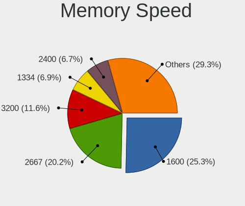

| Speed   | Notebooks | Percent |
|---------|-----------|---------|
| 1600    | 136       | 27.2%   |
| 2667    | 101       | 20.2%   |
| 3200    | 48        | 9.6%    |
| 1334    | 38        | 7.6%    |
| 2400    | 33        | 6.6%    |
| 667     | 31        | 6.2%    |
| 1333    | 28        | 5.6%    |
| 2133    | 16        | 3.2%    |
| Unknown | 13        | 2.6%    |
| 4199    | 9         | 1.8%    |
| 1067    | 9         | 1.8%    |
| 800     | 9         | 1.8%    |
| 3266    | 8         | 1.6%    |
| 1066    | 5         | 1%      |
| 4267    | 4         | 0.8%    |
| 1866    | 3         | 0.6%    |
| 975     | 3         | 0.6%    |
| 1867    | 2         | 0.4%    |
| 533     | 2         | 0.4%    |
| 2048    | 1         | 0.2%    |
| 1639    | 1         | 0.2%    |

Printers & scanners
-------------------

Printer Vendor
--------------

Printer device vendors

| Vendor                | Notebooks | Percent |
|-----------------------|-----------|---------|
| Hewlett-Packard       | 5         | 35.71%  |
| Canon                 | 3         | 21.43%  |
| Brother Industries    | 2         | 14.29%  |
| Seiko Epson           | 1         | 7.14%   |
| Prolific Technology   | 1         | 7.14%   |
| Lexmark International | 1         | 7.14%   |
| Kyocera               | 1         | 7.14%   |

Printer Model
-------------

Printer device models

| Model                           | Notebooks | Percent |
|---------------------------------|-----------|---------|
| Seiko Epson L222 Series         | 1         | 7.14%   |
| Prolific PL2305 Parallel Port   | 1         | 7.14%   |
| Lexmark International E360d     | 1         | 7.14%   |
| Kyocera Mita FS-920             | 1         | 7.14%   |
| HP LaserJet P1005               | 1         | 7.14%   |
| HP LaserJet 1320                | 1         | 7.14%   |
| HP LaserJet 1022                | 1         | 7.14%   |
| HP DeskJet F2100 Printer series | 1         | 7.14%   |
| HP DeskJet 3700 series          | 1         | 7.14%   |
| Canon TS3300 series             | 1         | 7.14%   |
| Canon LBP6230/6240              | 1         | 7.14%   |
| Canon LBP6000                   | 1         | 7.14%   |
| Brother MFC-L2710DW series      | 1         | 7.14%   |
| Brother HL-L2320D series        | 1         | 7.14%   |

Scanner Vendor
--------------

Scanner device vendors

| Vendor          | Notebooks | Percent |
|-----------------|-----------|---------|
| Seiko Epson     | 1         | 33.33%  |
| Hewlett-Packard | 1         | 33.33%  |
| Canon           | 1         | 33.33%  |

Scanner Model
-------------

Scanner device models

| Model                                            | Notebooks | Percent |
|--------------------------------------------------|-----------|---------|
| Seiko Epson GT-X900 [Perfection V700/V750 Photo] | 1         | 33.33%  |
| HP ScanJet 3570c                                 | 1         | 33.33%  |
| Canon CanoScan 4200F                             | 1         | 33.33%  |

Camera
------

Camera Vendor
-------------

Camera device vendors

| Vendor                                 | Notebooks | Percent |
|----------------------------------------|-----------|---------|
| Chicony Electronics                    | 238       | 29.57%  |
| IMC Networks                           | 63        | 7.83%   |
| Realtek Semiconductor                  | 57        | 7.08%   |
| Microdia                               | 56        | 6.96%   |
| Acer                                   | 55        | 6.83%   |
| Suyin                                  | 48        | 5.96%   |
| Sunplus Innovation Technology          | 44        | 5.47%   |
| Cheng Uei Precision Industry (Foxlink) | 33        | 4.1%    |
| Quanta                                 | 29        | 3.6%    |
| Lite-On Technology                     | 25        | 3.11%   |
| Apple                                  | 20        | 2.48%   |
| Silicon Motion                         | 18        | 2.24%   |
| Alcor Micro                            | 16        | 1.99%   |
| Syntek                                 | 15        | 1.86%   |
| Ricoh                                  | 14        | 1.74%   |
| Samsung Electronics                    | 9         | 1.12%   |
| Lenovo                                 | 8         | 0.99%   |
| Importek                               | 7         | 0.87%   |
| Logitech                               | 6         | 0.75%   |
| ALi                                    | 5         | 0.62%   |
| Z-Star Microelectronics                | 4         | 0.5%    |
| OmniVision Technologies                | 4         | 0.5%    |
| Luxvisions Innotech Limited            | 4         | 0.5%    |
| DigiTech                               | 4         | 0.5%    |
| Primax Electronics                     | 3         | 0.37%   |
| GEMBIRD                                | 3         | 0.37%   |
| Sunplus Technology                     | 2         | 0.25%   |
| Genesys Logic                          | 2         | 0.25%   |
| USB Camera                             | 1         | 0.12%   |
| Unknown                                | 1         | 0.12%   |
| Tobii AB                               | 1         | 0.12%   |
| Sonix Technology                       | 1         | 0.12%   |
| Philips (or NXP)                       | 1         | 0.12%   |
| Novatek Microelectronics               | 1         | 0.12%   |
| Microsoft                              | 1         | 0.12%   |
| Magic Control Technology               | 1         | 0.12%   |
| MacroSilicon                           | 1         | 0.12%   |
| Intel                                  | 1         | 0.12%   |
| Generalplus Technology                 | 1         | 0.12%   |
| Creative Technology                    | 1         | 0.12%   |
| ARC International                      | 1         | 0.12%   |

Camera Model
------------

Camera device models

| Model                                                       | Notebooks | Percent |
|-------------------------------------------------------------|-----------|---------|
| Chicony Integrated Camera                                   | 35        | 4.33%   |
| Chicony USB 2.0 Camera                                      | 17        | 2.1%    |
| Realtek Integrated_Webcam_HD                                | 15        | 1.85%   |
| Microdia Integrated_Webcam_HD                               | 14        | 1.73%   |
| IMC Networks USB2.0 HD UVC WebCam                           | 13        | 1.61%   |
| IMC Networks Integrated Camera                              | 13        | 1.61%   |
| Chicony HP Truevision HD                                    | 13        | 1.61%   |
| Cheng Uei Precision Industry (Foxlink) HP Webcam            | 13        | 1.61%   |
| Sunplus Integrated_Webcam_HD                                | 12        | 1.48%   |
| Chicony TOSHIBA Web Camera - HD                             | 12        | 1.48%   |
| Chicony HD WebCam                                           | 12        | 1.48%   |
| Acer Lenovo EasyCamera                                      | 12        | 1.48%   |
| Chicony USB2.0 VGA UVC WebCam                               | 11        | 1.36%   |
| Lite-On Integrated Camera                                   | 10        | 1.24%   |
| Samsung Galaxy A5 (MTP)                                     | 9         | 1.11%   |
| Microdia Integrated Webcam                                  | 9         | 1.11%   |
| Lite-On HP HD Camera                                        | 9         | 1.11%   |
| Acer Integrated Camera                                      | 9         | 1.11%   |
| Syntek Lenovo EasyCamera                                    | 8         | 0.99%   |
| Suyin HP TrueVision HD                                      | 8         | 0.99%   |
| Realtek USB Camera                                          | 8         | 0.99%   |
| IMC Networks USB2.0 VGA UVC WebCam                          | 8         | 0.99%   |
| Chicony Lenovo EasyCamera                                   | 8         | 0.99%   |
| Quanta HP TrueVision HD Camera                              | 7         | 0.87%   |
| Chicony USB2.0 Camera                                       | 7         | 0.87%   |
| Chicony Integrated Camera (1280x720@30)                     | 7         | 0.87%   |
| Apple iPhone 5/5C/5S/6/SE                                   | 7         | 0.87%   |
| Alcor Micro USB 2.0 Web Camera                              | 7         | 0.87%   |
| Suyin 1.3M WebCam (notebook emachines E730, Acer sub-brand) | 6         | 0.74%   |
| Sunplus HD WebCam                                           | 6         | 0.74%   |
| IMC Networks UVC VGA Webcam                                 | 6         | 0.74%   |
| Chicony FJ Camera                                           | 6         | 0.74%   |
| Acer BisonCam, NB Pro                                       | 6         | 0.74%   |
| Suyin HP TrueVision HD Integrated Webcam                    | 5         | 0.62%   |
| Quanta HP Webcam                                            | 5         | 0.62%   |
| Chicony WebCam                                              | 5         | 0.62%   |
| Chicony USB2.0 HD UVC WebCam                                | 5         | 0.62%   |
| Chicony HP HD Webcam [Fixed]                                | 5         | 0.62%   |
| Chicony HP HD Webcam                                        | 5         | 0.62%   |
| Chicony HP HD Camera                                        | 5         | 0.62%   |
| Apple Built-in iSight                                       | 5         | 0.62%   |
| Suyin Acer/HP Integrated Webcam [CN0314]                    | 4         | 0.49%   |
| Suyin Acer CrystalEye Webcam                                | 4         | 0.49%   |
| Sunplus Asus Webcam                                         | 4         | 0.49%   |
| Realtek Integrated Webcam HD                                | 4         | 0.49%   |
| Realtek HP Truevision HD integrated webcam                  | 4         | 0.49%   |
| Realtek Acer 640 x 480 laptop camera                        | 4         | 0.49%   |
| OmniVision OV2640 Webcam                                    | 4         | 0.49%   |
| Microdia Laptop_Integrated_Webcam_HD                        | 4         | 0.49%   |
| Microdia Dell Integrated HD Webcam                          | 4         | 0.49%   |
| IMC Networks USB Camera                                     | 4         | 0.49%   |
| IMC Networks Integrated Webcam                              | 4         | 0.49%   |
| Chicony Webcam-101                                          | 4         | 0.49%   |
| Chicony VGA Webcam                                          | 4         | 0.49%   |
| Chicony HP TrueVision HD Camera                             | 4         | 0.49%   |
| Chicony HD WebCam (Asus N-series)                           | 4         | 0.49%   |
| Chicony HD User Facing                                      | 4         | 0.49%   |
| Chicony Camera                                              | 4         | 0.49%   |
| Acer SunplusIT Integrated Camera                            | 4         | 0.49%   |
| Acer HD Webcam                                              | 4         | 0.49%   |

Security
--------

Fingerprint Vendor
------------------

Fingerprint sensor vendors

| Vendor                     | Notebooks | Percent |
|----------------------------|-----------|---------|
| Validity Sensors           | 71        | 41.28%  |
| Synaptics                  | 34        | 19.77%  |
| AuthenTec                  | 30        | 17.44%  |
| Upek                       | 10        | 5.81%   |
| Shenzhen Goodix Technology | 10        | 5.81%   |
| LighTuning Technology      | 8         | 4.65%   |
| STMicroelectronics         | 6         | 3.49%   |
| Elan Microelectronics      | 3         | 1.74%   |

Fingerprint Model
-----------------

Fingerprint sensor models

| Model                                                                      | Notebooks | Percent |
|----------------------------------------------------------------------------|-----------|---------|
| Synaptics Prometheus MIS Touch Fingerprint Reader                          | 18        | 10.47%  |
| Validity Sensors VFS495 Fingerprint Reader                                 | 15        | 8.72%   |
| AuthenTec AES2501 Fingerprint Sensor                                       | 10        | 5.81%   |
| Validity Sensors VFS 5011 fingerprint sensor                               | 9         | 5.23%   |
| Validity Sensors Fingerprint scanner                                       | 9         | 5.23%   |
| Upek Biometric Touchchip/Touchstrip Fingerprint Sensor                     | 9         | 5.23%   |
| Validity Sensors VFS5011 Fingerprint Reader                                | 8         | 4.65%   |
| AuthenTec AES2810                                                          | 8         | 4.65%   |
| Validity Sensors VFS471 Fingerprint Reader                                 | 7         | 4.07%   |
| Shenzhen Goodix  FingerPrint Device                                        | 7         | 4.07%   |
| AuthenTec Fingerprint Sensor                                               | 7         | 4.07%   |
| Validity Sensors VFS491                                                    | 6         | 3.49%   |
| Validity Sensors VFS451 Fingerprint Reader                                 | 6         | 3.49%   |
| Synaptics Metallica MIS Touch Fingerprint Reader                           | 6         | 3.49%   |
| STMicroelectronics Fingerprint Reader                                      | 6         | 3.49%   |
| Synaptics Metallica MOH Touch Fingerprint Reader                           | 4         | 2.33%   |
| LighTuning EgisTec Touch Fingerprint Sensor                                | 4         | 2.33%   |
| AuthenTec AES1600                                                          | 4         | 2.33%   |
| Validity Sensors Synaptics WBDI                                            | 3         | 1.74%   |
| Unknown                                                                    | 3         | 1.74%   |
| Validity Sensors VFS Fingerprint sensor                                    | 2         | 1.16%   |
| Validity Sensors Synaptics VFS7552 Touch Fingerprint Sensor with PurePrint | 2         | 1.16%   |
| Validity Sensors Swipe Fingerprint Sensor                                  | 2         | 1.16%   |
| Shenzhen Goodix Fingerprint Reader                                         | 2         | 1.16%   |
| LighTuning Fingerprint Reader                                              | 2         | 1.16%   |
| LighTuning ES603 Swipe Fingerprint Sensor                                  | 2         | 1.16%   |
| Elan ELAN:Fingerprint                                                      | 2         | 1.16%   |
| Validity Sensors VFS7500 Touch Fingerprint Sensor                          | 1         | 0.58%   |
| Validity Sensors VFS101 Fingerprint Reader                                 | 1         | 0.58%   |
| Upek TCS5B Fingerprint sensor                                              | 1         | 0.58%   |
| Synaptics WBDI Device                                                      | 1         | 0.58%   |
| Synaptics  VFS7552 Touch Fingerprint Sensor with PurePrint                 | 1         | 0.58%   |
| Synaptics  FS7604 Touch Fingerprint Sensor with PurePrint                  | 1         | 0.58%   |
| Shenzhen Goodix FingerPrint                                                | 1         | 0.58%   |
| Elan ELAN:ARM-M4                                                           | 1         | 0.58%   |
| AuthenTec AES2550 Fingerprint Sensor                                       | 1         | 0.58%   |

Chipcard Vendor
---------------

Chipcard module vendors

| Vendor      | Notebooks | Percent |
|-------------|-----------|---------|
| Broadcom    | 34        | 38.2%   |
| Alcor Micro | 24        | 26.97%  |
| O2 Micro    | 15        | 16.85%  |
| Upek        | 7         | 7.87%   |
| Lenovo      | 7         | 7.87%   |
| OmniKey     | 1         | 1.12%   |
| C3PO        | 1         | 1.12%   |

Chipcard Model
--------------

Chipcard module models

| Model                                                                        | Notebooks | Percent |
|------------------------------------------------------------------------------|-----------|---------|
| Alcor Micro AU9540 Smartcard Reader                                          | 24        | 26.97%  |
| O2 Micro OZ776 CCID Smartcard Reader                                         | 14        | 15.73%  |
| Broadcom BCM5880 Secure Applications Processor                               | 14        | 15.73%  |
| Broadcom BCM5880 Secure Applications Processor with fingerprint swipe sensor | 9         | 10.11%  |
| Upek TouchChip Fingerprint Coprocessor (WBF advanced mode)                   | 7         | 7.87%   |
| Lenovo Integrated Smart Card Reader                                          | 7         | 7.87%   |
| Broadcom 5880                                                                | 7         | 7.87%   |
| Broadcom 58200                                                               | 4         | 4.49%   |
| OmniKey CardMan Smart@Link                                                   | 1         | 1.12%   |
| O2 Micro Oz776 SmartCard Reader                                              | 1         | 1.12%   |
| C3PO USB SMART CARD READER                                                   | 1         | 1.12%   |

Unsupported
-----------

Unsupported Devices
-------------------

Total unsupported devices on board

| Total | Notebooks | Percent |
|-------|-----------|---------|
| 0     | 620       | 65.19%  |
| 1     | 273       | 28.71%  |
| 2     | 50        | 5.26%   |
| 3     | 6         | 0.63%   |
| 10    | 1         | 0.11%   |
| 4     | 1         | 0.11%   |

Unsupported Device Types
------------------------

Types of unsupported devices

| Type                     | Notebooks | Percent |
|--------------------------|-----------|---------|
| Fingerprint reader       | 172       | 43.11%  |
| Chipcard                 | 87        | 21.8%   |
| Graphics card            | 56        | 14.04%  |
| Net/wireless             | 29        | 7.27%   |
| Bluetooth                | 12        | 3.01%   |
| Camera                   | 10        | 2.51%   |
| Storage                  | 9         | 2.26%   |
| Card reader              | 8         | 2.01%   |
| Flash memory             | 5         | 1.25%   |
| Multimedia controller    | 4         | 1%      |
| Net/ethernet             | 3         | 0.75%   |
| Sound                    | 1         | 0.25%   |
| Network                  | 1         | 0.25%   |
| Modem                    | 1         | 0.25%   |
| Communication controller | 1         | 0.25%   |

