Xubuntu 20.04 - Tested Hardware & Statistics
--------------------------------------------

A project to collect tested hardware configurations for Xubuntu 20.04.

Anyone can contribute to this report by the [hw-probe](https://github.com/linuxhw/hw-probe) tool:

    sudo -E hw-probe -all -upload

Please contribute! Especially if your hardware is rare.

This is a report for all computer types. See also reports for [desktops](/Dist/Xubuntu_20.04/Desktop/README.md) and [notebooks](/Dist/Xubuntu_20.04/Notebook/README.md).

Contents
--------

* [ Test Cases ](#test-cases)

* [ System ](#system)
  - [ Kernel                   ](#kernel)
  - [ Kernel Family            ](#kernel-family)
  - [ Kernel Major Ver.        ](#kernel-major-ver)
  - [ Arch                     ](#arch)
  - [ DE                       ](#de)
  - [ Display Server           ](#display-server)
  - [ Display Manager          ](#display-manager)
  - [ OS Lang                  ](#os-lang)
  - [ Boot Mode                ](#boot-mode)
  - [ Filesystem               ](#filesystem)
  - [ Part. scheme             ](#part-scheme)
  - [ Dual Boot with Linux/BSD ](#dual-boot-with-linuxbsd)
  - [ Dual Boot (Win)          ](#dual-boot-win)

* [ Board ](#board)
  - [ Vendor                   ](#vendor)
  - [ Model                    ](#model)
  - [ Model Family             ](#model-family)
  - [ MFG Year                 ](#mfg-year)
  - [ Form Factor              ](#form-factor)
  - [ Secure Boot              ](#secure-boot)
  - [ Coreboot                 ](#coreboot)
  - [ RAM Size                 ](#ram-size)
  - [ RAM Used                 ](#ram-used)
  - [ Total Drives             ](#total-drives)
  - [ Has CD-ROM               ](#has-cd-rom)
  - [ Has Ethernet             ](#has-ethernet)
  - [ Has WiFi                 ](#has-wifi)
  - [ Has Bluetooth            ](#has-bluetooth)

* [ Location ](#location)
  - [ Country                  ](#country)
  - [ City                     ](#city)

* [ Drives ](#drives)
  - [ Drive Vendor             ](#drive-vendor)
  - [ Drive Model              ](#drive-model)
  - [ HDD Vendor               ](#hdd-vendor)
  - [ SSD Vendor               ](#ssd-vendor)
  - [ Drive Kind               ](#drive-kind)
  - [ Drive Connector          ](#drive-connector)
  - [ Drive Size               ](#drive-size)
  - [ Space Total              ](#space-total)
  - [ Space Used               ](#space-used)
  - [ Malfunc. Drives          ](#malfunc-drives)
  - [ Malfunc. Drive Vendor    ](#malfunc-drive-vendor)
  - [ Malfunc. HDD Vendor      ](#malfunc-hdd-vendor)
  - [ Malfunc. Drive Kind      ](#malfunc-drive-kind)
  - [ Failed Drives            ](#failed-drives)
  - [ Failed Drive Vendor      ](#failed-drive-vendor)
  - [ Drive Status             ](#drive-status)

* [ Storage controller ](#storage-controller)
  - [ Storage Vendor           ](#storage-vendor)
  - [ Storage Model            ](#storage-model)
  - [ Storage Kind             ](#storage-kind)

* [ Processor ](#processor)
  - [ CPU Vendor               ](#cpu-vendor)
  - [ CPU Model                ](#cpu-model)
  - [ CPU Model Family         ](#cpu-model-family)
  - [ CPU Cores                ](#cpu-cores)
  - [ CPU Sockets              ](#cpu-sockets)
  - [ CPU Threads              ](#cpu-threads)
  - [ CPU Op-Modes             ](#cpu-op-modes)
  - [ CPU Microcode            ](#cpu-microcode)
  - [ CPU Microarch            ](#cpu-microarch)

* [ Graphics ](#graphics)
  - [ GPU Vendor               ](#gpu-vendor)
  - [ GPU Model                ](#gpu-model)
  - [ GPU Combo                ](#gpu-combo)
  - [ GPU Driver               ](#gpu-driver)
  - [ GPU Memory               ](#gpu-memory)

* [ Monitor ](#monitor)
  - [ Monitor Vendor           ](#monitor-vendor)
  - [ Monitor Model            ](#monitor-model)
  - [ Monitor Resolution       ](#monitor-resolution)
  - [ Monitor Diagonal         ](#monitor-diagonal)
  - [ Monitor Width            ](#monitor-width)
  - [ Aspect Ratio             ](#aspect-ratio)
  - [ Monitor Area             ](#monitor-area)
  - [ Pixel Density            ](#pixel-density)
  - [ Multiple Monitors        ](#multiple-monitors)

* [ Network ](#network)
  - [ Net Controller Vendor    ](#net-controller-vendor)
  - [ Net Controller Model     ](#net-controller-model)
  - [ Wireless Vendor          ](#wireless-vendor)
  - [ Wireless Model           ](#wireless-model)
  - [ Ethernet Vendor          ](#ethernet-vendor)
  - [ Ethernet Model           ](#ethernet-model)
  - [ Net Controller Kind      ](#net-controller-kind)
  - [ Used Controller          ](#used-controller)
  - [ NICs                     ](#nics)
  - [ IPv6                     ](#ipv6)

* [ Bluetooth ](#bluetooth)
  - [ Bluetooth Vendor         ](#bluetooth-vendor)
  - [ Bluetooth Model          ](#bluetooth-model)

* [ Sound ](#sound)
  - [ Sound Vendor             ](#sound-vendor)
  - [ Sound Model              ](#sound-model)

* [ Memory ](#memory)
  - [ Memory Vendor            ](#memory-vendor)
  - [ Memory Model             ](#memory-model)
  - [ Memory Kind              ](#memory-kind)
  - [ Memory Form Factor       ](#memory-form-factor)
  - [ Memory Size              ](#memory-size)
  - [ Memory Speed             ](#memory-speed)

* [ Printers & scanners ](#printers--scanners)
  - [ Printer Vendor           ](#printer-vendor)
  - [ Printer Model            ](#printer-model)
  - [ Scanner Vendor           ](#scanner-vendor)
  - [ Scanner Model            ](#scanner-model)

* [ Camera ](#camera)
  - [ Camera Vendor            ](#camera-vendor)
  - [ Camera Model             ](#camera-model)

* [ Security ](#security)
  - [ Fingerprint Vendor       ](#fingerprint-vendor)
  - [ Fingerprint Model        ](#fingerprint-model)
  - [ Chipcard Vendor          ](#chipcard-vendor)
  - [ Chipcard Model           ](#chipcard-model)

* [ Unsupported ](#unsupported)
  - [ Unsupported Devices      ](#unsupported-devices)
  - [ Unsupported Device Types ](#unsupported-device-types)

Test Cases
----------

Total: 2804

| Vendor        | Model                       | Form-Factor | Probe                                                      | Date         |
|---------------|-----------------------------|-------------|------------------------------------------------------------|--------------|
| MSI           | B75MA-P45                   | Desktop     | [f0b4df8849](https://linux-hardware.org/?probe=f0b4df8849) | Dec 29, 2022 |
| ASRock        | H61M-ITX                    | Desktop     | [0ee8e9bb5b](https://linux-hardware.org/?probe=0ee8e9bb5b) | Dec 28, 2022 |
| Intel         | X79 (INTEL Xeon E5/Corei... | Desktop     | [23dc9112a8](https://linux-hardware.org/?probe=23dc9112a8) | Dec 27, 2022 |
| Gigabyte      | B360M D3H-CF                | Desktop     | [2041ed5cba](https://linux-hardware.org/?probe=2041ed5cba) | Dec 27, 2022 |
| ASUSTek       | P5G41T-M LX                 | Desktop     | [01466a6701](https://linux-hardware.org/?probe=01466a6701) | Dec 25, 2022 |
| ASUSTek       | PRIME B450M-A               | Desktop     | [360e473cf9](https://linux-hardware.org/?probe=360e473cf9) | Dec 22, 2022 |
| Clevo         | P170EM                      | Notebook    | [3c8b8bd784](https://linux-hardware.org/?probe=3c8b8bd784) | Dec 22, 2022 |
| HP            | Pavilion dv7                | Notebook    | [075b40bb9e](https://linux-hardware.org/?probe=075b40bb9e) | Dec 21, 2022 |
| ASUSTek       | P8H61-M LX3 PLUS R2.0       | Desktop     | [82687103ac](https://linux-hardware.org/?probe=82687103ac) | Dec 20, 2022 |
| ASUSTek       | ROG STRIX B450-F GAMING     | Desktop     | [8862992776](https://linux-hardware.org/?probe=8862992776) | Dec 20, 2022 |
| Gigabyte      | B360M D3H-CF                | Desktop     | [6ea891850f](https://linux-hardware.org/?probe=6ea891850f) | Dec 18, 2022 |
| Gigabyte      | B360M D3H-CF                | Desktop     | [0679db84af](https://linux-hardware.org/?probe=0679db84af) | Dec 14, 2022 |
| HP            | 350 G1                      | Notebook    | [c15f80a386](https://linux-hardware.org/?probe=c15f80a386) | Dec 12, 2022 |
| ASUSTek       | K53SC                       | Notebook    | [57e7bb2427](https://linux-hardware.org/?probe=57e7bb2427) | Dec 05, 2022 |
| HP            | 2B34                        | Desktop     | [18ec4a2e66](https://linux-hardware.org/?probe=18ec4a2e66) | Dec 04, 2022 |
| Gigabyte      | GA-880GM-UD2H               | Desktop     | [f6bb91c588](https://linux-hardware.org/?probe=f6bb91c588) | Dec 03, 2022 |
| ASUSTek       | K53SC                       | Notebook    | [6d21dd6cea](https://linux-hardware.org/?probe=6d21dd6cea) | Nov 30, 2022 |
| ASUSTek       | H81M-A                      | Desktop     | [9ed3a001c9](https://linux-hardware.org/?probe=9ed3a001c9) | Nov 23, 2022 |
| Unknown       | Unknown                     | Notebook    | [c119fbb804](https://linux-hardware.org/?probe=c119fbb804) | Nov 22, 2022 |
| ASUSTek       | PRIME X570-PRO              | Desktop     | [7399298a0f](https://linux-hardware.org/?probe=7399298a0f) | Nov 22, 2022 |
| HP            | 8540w                       | Notebook    | [3712bfe3cb](https://linux-hardware.org/?probe=3712bfe3cb) | Nov 21, 2022 |
| ASUSTek       | ROG STRIX B450-F GAMING     | Desktop     | [a5cfd24a43](https://linux-hardware.org/?probe=a5cfd24a43) | Nov 18, 2022 |
| Dell          | Latitude 5490               | Notebook    | [70b8fb5e89](https://linux-hardware.org/?probe=70b8fb5e89) | Nov 18, 2022 |
| Acer          | Aspire A315-21              | Notebook    | [288b53c471](https://linux-hardware.org/?probe=288b53c471) | Nov 16, 2022 |
| Acer          | Aspire A315-21              | Notebook    | [23ec67e81b](https://linux-hardware.org/?probe=23ec67e81b) | Nov 16, 2022 |
| ASUSTek       | K53U                        | Notebook    | [e947ac0aab](https://linux-hardware.org/?probe=e947ac0aab) | Nov 14, 2022 |
| Gigabyte      | H97-HD3                     | Desktop     | [8a2f5e3f03](https://linux-hardware.org/?probe=8a2f5e3f03) | Nov 14, 2022 |
| HP            | Laptop 17-cp0xxx            | Notebook    | [a5575e0c9d](https://linux-hardware.org/?probe=a5575e0c9d) | Nov 12, 2022 |
| HP            | Laptop 17-cp0xxx            | Notebook    | [2e6b12e93d](https://linux-hardware.org/?probe=2e6b12e93d) | Nov 12, 2022 |
| Inventec      | Dell Wyse Thin Client De... | Mini pc     | [27af8e61c5](https://linux-hardware.org/?probe=27af8e61c5) | Nov 10, 2022 |
| ASRock        | Z68 Extreme3 Gen3           | Desktop     | [01cb4ff120](https://linux-hardware.org/?probe=01cb4ff120) | Nov 10, 2022 |
| ASUSTek       | B150M-C                     | Desktop     | [d2dd725b2e](https://linux-hardware.org/?probe=d2dd725b2e) | Nov 09, 2022 |
| ASUSTek       | VM40B                       | Desktop     | [5736f2e2ae](https://linux-hardware.org/?probe=5736f2e2ae) | Nov 08, 2022 |
| Fujitsu Si... | ESPRIMO Mobile V5535        | Notebook    | [a39cc50a9a](https://linux-hardware.org/?probe=a39cc50a9a) | Nov 07, 2022 |
| HP            | EliteBook Folio 1040 G1     | Notebook    | [f2d6eec645](https://linux-hardware.org/?probe=f2d6eec645) | Nov 06, 2022 |
| MSI           | CSM-H87M-G43                | Desktop     | [43ffdafb80](https://linux-hardware.org/?probe=43ffdafb80) | Nov 06, 2022 |
| Gigabyte      | Z390 AORUS ELITE-CF         | Desktop     | [98a3c2457d](https://linux-hardware.org/?probe=98a3c2457d) | Nov 05, 2022 |
| Gigabyte      | Z390 AORUS ELITE-CF         | Desktop     | [1cf71a1b5c](https://linux-hardware.org/?probe=1cf71a1b5c) | Nov 05, 2022 |
| eMachines     | EL1358G                     | Desktop     | [48d6ba4c24](https://linux-hardware.org/?probe=48d6ba4c24) | Nov 03, 2022 |
| eMachines     | EL1358G                     | Desktop     | [1acbe713b6](https://linux-hardware.org/?probe=1acbe713b6) | Nov 03, 2022 |
| Apple         | MacBookAir6,2               | Notebook    | [fa6ec2e89c](https://linux-hardware.org/?probe=fa6ec2e89c) | Nov 03, 2022 |
| Inventec      | Dell Wyse Thin Client De... | Mini pc     | [428b353c2c](https://linux-hardware.org/?probe=428b353c2c) | Nov 01, 2022 |
| ASUSTek       | ROG STRIX B450-F GAMING     | Desktop     | [7a29190887](https://linux-hardware.org/?probe=7a29190887) | Nov 01, 2022 |
| BCM           | MX110HD                     | Desktop     | [60c3eb0c5c](https://linux-hardware.org/?probe=60c3eb0c5c) | Nov 01, 2022 |
| ASUSTek       | P9X79                       | Desktop     | [3af3091881](https://linux-hardware.org/?probe=3af3091881) | Oct 31, 2022 |
| Apple         | Mac-942B5BF58194151B        | All in one  | [32b9b29220](https://linux-hardware.org/?probe=32b9b29220) | Oct 31, 2022 |
| Inventec      | Dell Wyse Thin Client De... | Mini pc     | [caefae88bf](https://linux-hardware.org/?probe=caefae88bf) | Oct 30, 2022 |
| Dell          | 0GY6Y8 A03                  | Desktop     | [1c95e9ba40](https://linux-hardware.org/?probe=1c95e9ba40) | Oct 28, 2022 |
| Lenovo        | ThinkPad W530 2438CTO       | Notebook    | [1915c9d3b0](https://linux-hardware.org/?probe=1915c9d3b0) | Oct 28, 2022 |
| ZOTAC         | ZBOX-EN72080V/EN72070V/E... | Mini pc     | [fef5f08978](https://linux-hardware.org/?probe=fef5f08978) | Oct 27, 2022 |
| Dell          | Latitude E6510              | Notebook    | [2cb824b444](https://linux-hardware.org/?probe=2cb824b444) | Oct 27, 2022 |
| Dell          | Latitude E6510              | Notebook    | [ddb0a31443](https://linux-hardware.org/?probe=ddb0a31443) | Oct 26, 2022 |
| Fujitsu       | D3161-A1 S26361-D3161-A1    | Desktop     | [46d64e9947](https://linux-hardware.org/?probe=46d64e9947) | Oct 25, 2022 |
| Lenovo        | ThinkPad T460 20FMS08H00    | Notebook    | [13422369f7](https://linux-hardware.org/?probe=13422369f7) | Oct 25, 2022 |
| Fujitsu       | D3161-A1 S26361-D3161-A1    | Desktop     | [4ef2a348fc](https://linux-hardware.org/?probe=4ef2a348fc) | Oct 25, 2022 |
| Apple         | MacBookPro6,2               | Notebook    | [927bfd543c](https://linux-hardware.org/?probe=927bfd543c) | Oct 24, 2022 |
| ASRock        | B450M Pro4                  | Desktop     | [23a298a9a5](https://linux-hardware.org/?probe=23a298a9a5) | Oct 23, 2022 |
| Toshiba       | Satellite C75D-B            | Notebook    | [3e39042f59](https://linux-hardware.org/?probe=3e39042f59) | Oct 23, 2022 |
| Toshiba       | Satellite C75D-B            | Notebook    | [b7412d4350](https://linux-hardware.org/?probe=b7412d4350) | Oct 23, 2022 |
| ASUSTek       | PRIME H310M-R R2.0          | Desktop     | [d575515de3](https://linux-hardware.org/?probe=d575515de3) | Oct 20, 2022 |
| Lenovo        | IdeaPad 330S-15ARR 81FB     | Notebook    | [4de39d4a1c](https://linux-hardware.org/?probe=4de39d4a1c) | Oct 19, 2022 |
| Dell          | Latitude E5270              | Notebook    | [6f07cdee36](https://linux-hardware.org/?probe=6f07cdee36) | Oct 17, 2022 |
| MSI           | GS40 6QE Phantom            | Notebook    | [76a55aa9f5](https://linux-hardware.org/?probe=76a55aa9f5) | Oct 14, 2022 |
| Dell          | 0N36HY A09                  | Server      | [464fda30a8](https://linux-hardware.org/?probe=464fda30a8) | Oct 14, 2022 |
| Lenovo        | ThinkPad T490 20N20046US    | Notebook    | [a698e6de4d](https://linux-hardware.org/?probe=a698e6de4d) | Oct 13, 2022 |
| eMachines     | eME528                      | Notebook    | [502802d50d](https://linux-hardware.org/?probe=502802d50d) | Oct 13, 2022 |
| MSI           | A68HM-E33 V2                | Desktop     | [16f5eb4d25](https://linux-hardware.org/?probe=16f5eb4d25) | Oct 12, 2022 |
| Dell          | Latitude E5470              | Notebook    | [eee260b733](https://linux-hardware.org/?probe=eee260b733) | Oct 12, 2022 |
| Dell          | Latitude E5470              | Notebook    | [3bbb87ee1b](https://linux-hardware.org/?probe=3bbb87ee1b) | Oct 12, 2022 |
| Lenovo        | ThinkPad T440 20B7A0S200    | Notebook    | [1be1f8f36e](https://linux-hardware.org/?probe=1be1f8f36e) | Oct 09, 2022 |
| HP            | 255 G1                      | Notebook    | [fc9f63bfb6](https://linux-hardware.org/?probe=fc9f63bfb6) | Oct 08, 2022 |
| ASUSTek       | K50ID                       | Notebook    | [05e82f0dd5](https://linux-hardware.org/?probe=05e82f0dd5) | Oct 08, 2022 |
| Acer          | Aspire 5739G                | Notebook    | [9a380f66ea](https://linux-hardware.org/?probe=9a380f66ea) | Oct 08, 2022 |
| Lenovo        | IdeaPad S510p 20298         | Notebook    | [20fb15fcbf](https://linux-hardware.org/?probe=20fb15fcbf) | Oct 06, 2022 |
| Acer          | Extensa 5230                | Notebook    | [8154485976](https://linux-hardware.org/?probe=8154485976) | Oct 04, 2022 |
| Dell          | Inspiron 7520               | Notebook    | [8125b49bea](https://linux-hardware.org/?probe=8125b49bea) | Oct 03, 2022 |
| Raspberry ... | Raspberry Pi 4 Model B R... | Soc         | [fc4e415fe4](https://linux-hardware.org/?probe=fc4e415fe4) | Oct 02, 2022 |
| Acer          | Aspire A315-55G             | Notebook    | [77605e313d](https://linux-hardware.org/?probe=77605e313d) | Oct 01, 2022 |
| MSI           | A68HM-E33 V2                | Desktop     | [1001ccbbaf](https://linux-hardware.org/?probe=1001ccbbaf) | Sep 30, 2022 |
| ASUSTek       | B85M-G                      | Desktop     | [ba607b91e0](https://linux-hardware.org/?probe=ba607b91e0) | Sep 29, 2022 |
| Lenovo        | IdeaPad N585 20179          | Notebook    | [0a8aed635a](https://linux-hardware.org/?probe=0a8aed635a) | Sep 28, 2022 |
| ASUSTek       | ROG STRIX B450-F GAMING ... | Desktop     | [41cc3cdcfd](https://linux-hardware.org/?probe=41cc3cdcfd) | Sep 26, 2022 |
| ASUSTek       | ROG STRIX B450-F GAMING ... | Desktop     | [d6924eb78d](https://linux-hardware.org/?probe=d6924eb78d) | Sep 26, 2022 |
| Unknown       | Unknown                     | Notebook    | [63b1596d63](https://linux-hardware.org/?probe=63b1596d63) | Sep 24, 2022 |
| Toshiba       | Satellite C55D-B            | Notebook    | [5b2029b4d3](https://linux-hardware.org/?probe=5b2029b4d3) | Sep 24, 2022 |
| Lenovo        | ThinkPad P51s 20HCS00F00    | Notebook    | [5f0dc19f55](https://linux-hardware.org/?probe=5f0dc19f55) | Sep 22, 2022 |
| MSI           | Z77A-G43                    | Desktop     | [4b91f7a270](https://linux-hardware.org/?probe=4b91f7a270) | Sep 19, 2022 |
| Dell          | Precision 7750              | Notebook    | [ced8b5a7b2](https://linux-hardware.org/?probe=ced8b5a7b2) | Sep 19, 2022 |
| Gigabyte      | H410M S2H                   | Desktop     | [d852f09d43](https://linux-hardware.org/?probe=d852f09d43) | Sep 15, 2022 |
| Gigabyte      | H410M S2H                   | Desktop     | [a0bdfffa04](https://linux-hardware.org/?probe=a0bdfffa04) | Sep 15, 2022 |
| Gigabyte      | H410M S2H                   | Desktop     | [196e6b048b](https://linux-hardware.org/?probe=196e6b048b) | Sep 15, 2022 |
| Gigabyte      | H410M S2H                   | Desktop     | [8e95a850da](https://linux-hardware.org/?probe=8e95a850da) | Sep 15, 2022 |
| Gigabyte      | H410M S2H                   | Desktop     | [499d354033](https://linux-hardware.org/?probe=499d354033) | Sep 15, 2022 |
| Gigabyte      | H410M S2H                   | Desktop     | [a830a7b6e5](https://linux-hardware.org/?probe=a830a7b6e5) | Sep 15, 2022 |
| Gigabyte      | H410M S2H                   | Desktop     | [19ba71f923](https://linux-hardware.org/?probe=19ba71f923) | Sep 15, 2022 |
| Gigabyte      | H410M S2H                   | Desktop     | [ad888e4455](https://linux-hardware.org/?probe=ad888e4455) | Sep 15, 2022 |
| Gigabyte      | H410M S2H                   | Desktop     | [d35bf4c513](https://linux-hardware.org/?probe=d35bf4c513) | Sep 15, 2022 |
| Gigabyte      | H410M S2H                   | Desktop     | [dce51bb6d6](https://linux-hardware.org/?probe=dce51bb6d6) | Sep 15, 2022 |
| Gigabyte      | H410M S2H                   | Desktop     | [3bc232858d](https://linux-hardware.org/?probe=3bc232858d) | Sep 15, 2022 |
| Gigabyte      | H410M S2H                   | Desktop     | [ca79460771](https://linux-hardware.org/?probe=ca79460771) | Sep 15, 2022 |
| Gigabyte      | H410M S2H                   | Desktop     | [1e24243624](https://linux-hardware.org/?probe=1e24243624) | Sep 15, 2022 |
| Gigabyte      | H410M S2H                   | Desktop     | [b0625e01e3](https://linux-hardware.org/?probe=b0625e01e3) | Sep 15, 2022 |
| Gigabyte      | H410M S2H                   | Desktop     | [f97cd53683](https://linux-hardware.org/?probe=f97cd53683) | Sep 15, 2022 |
| Gigabyte      | H410M S2H                   | Desktop     | [cd3fc03204](https://linux-hardware.org/?probe=cd3fc03204) | Sep 15, 2022 |
| HP            | Laptop 15-ef1xxx            | Notebook    | [dd55f6960d](https://linux-hardware.org/?probe=dd55f6960d) | Sep 15, 2022 |
| HP            | 1000                        | Notebook    | [65024f3d7a](https://linux-hardware.org/?probe=65024f3d7a) | Sep 13, 2022 |
| Gigabyte      | H510M S2H                   | Desktop     | [f004b06a17](https://linux-hardware.org/?probe=f004b06a17) | Sep 12, 2022 |
| Dell          | Inspiron 3537               | Notebook    | [afd2b6555e](https://linux-hardware.org/?probe=afd2b6555e) | Sep 12, 2022 |
| ASUSTek       | X453SA                      | Notebook    | [1446eda5e9](https://linux-hardware.org/?probe=1446eda5e9) | Sep 12, 2022 |
| MSI           | Z77A-G43                    | Desktop     | [d0e5863756](https://linux-hardware.org/?probe=d0e5863756) | Sep 10, 2022 |
| Dell          | 0T10XW A02                  | Desktop     | [33faaf5341](https://linux-hardware.org/?probe=33faaf5341) | Sep 10, 2022 |
| Dell          | 0R092H                      | Desktop     | [a22af2bad5](https://linux-hardware.org/?probe=a22af2bad5) | Sep 09, 2022 |
| ASRock        | Q1900-ITX                   | Desktop     | [738bae7e52](https://linux-hardware.org/?probe=738bae7e52) | Sep 08, 2022 |
| ASUSTek       | M2N-E                       | Desktop     | [2737c0fd67](https://linux-hardware.org/?probe=2737c0fd67) | Sep 08, 2022 |
| MSI           | MPG X570 GAMING EDGE WIF... | Desktop     | [f714986404](https://linux-hardware.org/?probe=f714986404) | Sep 08, 2022 |
| MSI           | MS-7387                     | Desktop     | [1f49477abf](https://linux-hardware.org/?probe=1f49477abf) | Sep 06, 2022 |
| Dell          | Latitude 9520               | Notebook    | [04188fb6c2](https://linux-hardware.org/?probe=04188fb6c2) | Sep 06, 2022 |
| Dell          | 0NV0M7 A02                  | Desktop     | [23024b776e](https://linux-hardware.org/?probe=23024b776e) | Sep 06, 2022 |
| ASUSTek       | M4A78T-E                    | Desktop     | [6c0537c32c](https://linux-hardware.org/?probe=6c0537c32c) | Sep 05, 2022 |
| Apple         | MacBookPro16,1              | Notebook    | [8add31fdfe](https://linux-hardware.org/?probe=8add31fdfe) | Sep 02, 2022 |
| ECS           | G31T-M9                     | Desktop     | [c3212ee5a3](https://linux-hardware.org/?probe=c3212ee5a3) | Sep 02, 2022 |
| ECS           | G31T-M9                     | Desktop     | [673b33ac0c](https://linux-hardware.org/?probe=673b33ac0c) | Sep 02, 2022 |
| ECS           | G31T-M9                     | Desktop     | [18a2d69632](https://linux-hardware.org/?probe=18a2d69632) | Sep 02, 2022 |
| ECS           | G31T-M9                     | Desktop     | [965107cf86](https://linux-hardware.org/?probe=965107cf86) | Sep 02, 2022 |
| ECS           | G31T-M9                     | Desktop     | [d8f5734dd8](https://linux-hardware.org/?probe=d8f5734dd8) | Sep 02, 2022 |
| ECS           | G31T-M9                     | Desktop     | [b2f37a3080](https://linux-hardware.org/?probe=b2f37a3080) | Sep 02, 2022 |
| ECS           | G31T-M9                     | Desktop     | [91857942dd](https://linux-hardware.org/?probe=91857942dd) | Sep 02, 2022 |
| ECS           | G31T-M9                     | Desktop     | [940fb9c208](https://linux-hardware.org/?probe=940fb9c208) | Sep 02, 2022 |
| ECS           | G31T-M9                     | Desktop     | [10315fa577](https://linux-hardware.org/?probe=10315fa577) | Sep 02, 2022 |
| ECS           | G31T-M9                     | Desktop     | [aedc37e8e4](https://linux-hardware.org/?probe=aedc37e8e4) | Sep 02, 2022 |
| Acer          | Aspire A315-31              | Notebook    | [21d3a4bd56](https://linux-hardware.org/?probe=21d3a4bd56) | Sep 02, 2022 |
| Medion        | H110H4-EM                   | Desktop     | [9f80ee3a09](https://linux-hardware.org/?probe=9f80ee3a09) | Sep 01, 2022 |
| ASUSTek       | TUF Gaming B450-PLUS II     | Desktop     | [efc46d8d23](https://linux-hardware.org/?probe=efc46d8d23) | Sep 01, 2022 |
| Acer          | Aspire E5-771G              | Notebook    | [76803c2532](https://linux-hardware.org/?probe=76803c2532) | Aug 30, 2022 |
| DNI           | SNDTP-1513N 5508015890      | Desktop     | [9570ee789c](https://linux-hardware.org/?probe=9570ee789c) | Aug 30, 2022 |
| Acer          | Aspire E5-771G              | Notebook    | [52cc79c6d9](https://linux-hardware.org/?probe=52cc79c6d9) | Aug 29, 2022 |
| Gigabyte      | H97M-D3H                    | Desktop     | [a8100fcf41](https://linux-hardware.org/?probe=a8100fcf41) | Aug 29, 2022 |
| Gigabyte      | H97M-D3H                    | Desktop     | [f8f42b0857](https://linux-hardware.org/?probe=f8f42b0857) | Aug 29, 2022 |
| Intel         | H61                         | Desktop     | [c829101789](https://linux-hardware.org/?probe=c829101789) | Aug 27, 2022 |
| HP            | 844C                        | Desktop     | [b56856200e](https://linux-hardware.org/?probe=b56856200e) | Aug 23, 2022 |
| Gigabyte      | Z97X-UD3H-CF                | Desktop     | [38fd87d37c](https://linux-hardware.org/?probe=38fd87d37c) | Aug 21, 2022 |
| Lenovo        | ThinkPad X220 4291V1C       | Notebook    | [8ab56e33c4](https://linux-hardware.org/?probe=8ab56e33c4) | Aug 21, 2022 |
| ASUSTek       | Z10PE-D16 WS                | Desktop     | [d9ff119ebe](https://linux-hardware.org/?probe=d9ff119ebe) | Aug 21, 2022 |
| Lenovo        | ThinkPad T480 20L5000BGE    | Notebook    | [dd53f23249](https://linux-hardware.org/?probe=dd53f23249) | Aug 20, 2022 |
| MSI           | X370 KRAIT GAMING           | Desktop     | [ea80c11a16](https://linux-hardware.org/?probe=ea80c11a16) | Aug 20, 2022 |
| Packard Be... | EasyNote TJ66               | Notebook    | [96c3144e93](https://linux-hardware.org/?probe=96c3144e93) | Aug 19, 2022 |
| Dell          | 07T4MC A06                  | Desktop     | [d6c22de1e9](https://linux-hardware.org/?probe=d6c22de1e9) | Aug 18, 2022 |
| Dell          | 0RY007                      | Desktop     | [a863b6949c](https://linux-hardware.org/?probe=a863b6949c) | Aug 16, 2022 |
| ASUSTek       | Z10PE-D16 WS                | Desktop     | [ea40fd79f3](https://linux-hardware.org/?probe=ea40fd79f3) | Aug 15, 2022 |
| Dell          | 0RY007                      | Desktop     | [592206f3e1](https://linux-hardware.org/?probe=592206f3e1) | Aug 14, 2022 |
| Panasonic     | CF-31XEUAXMF                | Notebook    | [914e54f984](https://linux-hardware.org/?probe=914e54f984) | Aug 13, 2022 |
| Dell          | 0RY007                      | Desktop     | [05edd2876d](https://linux-hardware.org/?probe=05edd2876d) | Aug 12, 2022 |
| ASUSTek       | ROG STRIX B450-F GAMING ... | Desktop     | [23005caccd](https://linux-hardware.org/?probe=23005caccd) | Aug 11, 2022 |
| ASRock        | X58 Extreme3                | Desktop     | [81f68d4fc7](https://linux-hardware.org/?probe=81f68d4fc7) | Aug 10, 2022 |
| OEM_MB        | NARRA3                      | Desktop     | [4574011966](https://linux-hardware.org/?probe=4574011966) | Aug 09, 2022 |
| OEM_MB        | NARRA3                      | Desktop     | [8454f0f091](https://linux-hardware.org/?probe=8454f0f091) | Aug 09, 2022 |
| Dell          | System XPS L502X            | Notebook    | [1453afc507](https://linux-hardware.org/?probe=1453afc507) | Aug 09, 2022 |
| Lenovo        | ThinkPad E590 20NB002AMH    | Notebook    | [aed42791cd](https://linux-hardware.org/?probe=aed42791cd) | Aug 09, 2022 |
| ASUSTek       | Z170 PRO GAMING             | Desktop     | [20a93d57e6](https://linux-hardware.org/?probe=20a93d57e6) | Aug 08, 2022 |
| ASUSTek       | K53SC                       | Notebook    | [15522c32d7](https://linux-hardware.org/?probe=15522c32d7) | Aug 06, 2022 |
| Gigabyte      | F2A78M-HD2                  | Desktop     | [64b08b679f](https://linux-hardware.org/?probe=64b08b679f) | Aug 05, 2022 |
| Lenovo        | IdeaPad 330-15IKB 81FE      | Notebook    | [32a99db93e](https://linux-hardware.org/?probe=32a99db93e) | Aug 04, 2022 |
| ASUSTek       | P8Z77-M PRO                 | Desktop     | [b81c8578b9](https://linux-hardware.org/?probe=b81c8578b9) | Aug 03, 2022 |
| HP            | Pavilion Laptop 14-dv0xx... | Notebook    | [8aa899fe67](https://linux-hardware.org/?probe=8aa899fe67) | Aug 02, 2022 |
| Lenovo        | IdeaPad 330S-15IKB 81F5     | Notebook    | [e512f0884d](https://linux-hardware.org/?probe=e512f0884d) | Aug 01, 2022 |
| Dell          | Inspiron 5748               | Notebook    | [9113ee6d54](https://linux-hardware.org/?probe=9113ee6d54) | Aug 01, 2022 |
| Unknown       | Unknown                     | Notebook    | [50153bd9ff](https://linux-hardware.org/?probe=50153bd9ff) | Aug 01, 2022 |
| HP            | Pavilion dv2600             | Notebook    | [87651d6efc](https://linux-hardware.org/?probe=87651d6efc) | Jul 31, 2022 |
| Unknown       | Unknown                     | Notebook    | [aa0c007709](https://linux-hardware.org/?probe=aa0c007709) | Jul 31, 2022 |
| ASUSTek       | P5P43TD PRO                 | Desktop     | [7325fb8135](https://linux-hardware.org/?probe=7325fb8135) | Jul 30, 2022 |
| Intel         | SHARKBAY                    | Desktop     | [bd5b812271](https://linux-hardware.org/?probe=bd5b812271) | Jul 29, 2022 |
| Dell          | Vostro 3700                 | Notebook    | [0a4b552d69](https://linux-hardware.org/?probe=0a4b552d69) | Jul 28, 2022 |
| Samsung       | R59P/R60P/R61P              | Notebook    | [d435057109](https://linux-hardware.org/?probe=d435057109) | Jul 28, 2022 |
| ASUSTek       | P5QL/EPU                    | Desktop     | [797c3b1dc2](https://linux-hardware.org/?probe=797c3b1dc2) | Jul 28, 2022 |
| ASUSTek       | M5A78L-M PLUS/USB3          | Desktop     | [611f1d79e3](https://linux-hardware.org/?probe=611f1d79e3) | Jul 26, 2022 |
| ASUSTek       | M51BC                       | Desktop     | [4d6af73032](https://linux-hardware.org/?probe=4d6af73032) | Jul 26, 2022 |
| Apple         | MacBookPro12,1              | Notebook    | [4db419918b](https://linux-hardware.org/?probe=4db419918b) | Jul 25, 2022 |
| ASUSTek       | N56VZ                       | Notebook    | [3813cc04d1](https://linux-hardware.org/?probe=3813cc04d1) | Jul 22, 2022 |
| HP            | ProBook 640 G8 Notebook ... | Notebook    | [75f71928fe](https://linux-hardware.org/?probe=75f71928fe) | Jul 21, 2022 |
| ASUSTek       | TUF Gaming X570-PLUS        | Desktop     | [e2cd5c8d4b](https://linux-hardware.org/?probe=e2cd5c8d4b) | Jul 20, 2022 |
| ASUSTek       | FX503VM                     | Notebook    | [47c70e3628](https://linux-hardware.org/?probe=47c70e3628) | Jul 19, 2022 |
| Lenovo        | ThinkPad W540 20BG001CMN    | Notebook    | [117f9a585b](https://linux-hardware.org/?probe=117f9a585b) | Jul 17, 2022 |
| ASUSTek       | U30Jc                       | Notebook    | [3a6a0ec169](https://linux-hardware.org/?probe=3a6a0ec169) | Jul 17, 2022 |
| Lenovo        | ThinkPad W540 20BG001CMN    | Notebook    | [e408c1236c](https://linux-hardware.org/?probe=e408c1236c) | Jul 17, 2022 |
| Dell          | 0F6X5P A00                  | Desktop     | [528f781464](https://linux-hardware.org/?probe=528f781464) | Jul 16, 2022 |
| Samsung       | R59P/R60P/R61P              | Notebook    | [4773de66cf](https://linux-hardware.org/?probe=4773de66cf) | Jul 15, 2022 |
| ASUSTek       | K53SC                       | Notebook    | [dd45175b9d](https://linux-hardware.org/?probe=dd45175b9d) | Jul 15, 2022 |
| HP            | 1496                        | Desktop     | [7797b2d6dd](https://linux-hardware.org/?probe=7797b2d6dd) | Jul 14, 2022 |
| ASUSTek       | P8Z77-M PRO                 | Desktop     | [0c70241041](https://linux-hardware.org/?probe=0c70241041) | Jul 13, 2022 |
| ASUSTek       | P8Z77-M PRO                 | Desktop     | [4929b942aa](https://linux-hardware.org/?probe=4929b942aa) | Jul 12, 2022 |
| Apple         | MacBookPro15,3              | Notebook    | [a8f8224853](https://linux-hardware.org/?probe=a8f8224853) | Jul 11, 2022 |
| HP            | Laptop 14-bw0xx             | Notebook    | [17b90f7a4b](https://linux-hardware.org/?probe=17b90f7a4b) | Jul 10, 2022 |
| HP            | Laptop 14-bw0xx             | Notebook    | [3b8444274b](https://linux-hardware.org/?probe=3b8444274b) | Jul 10, 2022 |
| Lenovo        | ThinkPad W540 20BG001KGE    | Notebook    | [434091ba07](https://linux-hardware.org/?probe=434091ba07) | Jul 10, 2022 |
| Gigabyte      | GA-MA78GM-S2H               | Desktop     | [6ed805403a](https://linux-hardware.org/?probe=6ed805403a) | Jul 10, 2022 |
| HP            | 158A                        | Desktop     | [e1bec79951](https://linux-hardware.org/?probe=e1bec79951) | Jul 10, 2022 |
| ASUSTek       | P5KC                        | Desktop     | [0ce9dd5cee](https://linux-hardware.org/?probe=0ce9dd5cee) | Jul 08, 2022 |
| Lenovo        | ThinkPad P14s Gen 2a 21A... | Notebook    | [b2d4e91300](https://linux-hardware.org/?probe=b2d4e91300) | Jul 07, 2022 |
| HP            | EliteBook 845 G8 Noteboo... | Notebook    | [5cff36844a](https://linux-hardware.org/?probe=5cff36844a) | Jul 07, 2022 |
| Lenovo        | G50-70 20351                | Notebook    | [68efa303fa](https://linux-hardware.org/?probe=68efa303fa) | Jul 07, 2022 |
| Chuwi         | FreeBook                    | Notebook    | [3e0b057e38](https://linux-hardware.org/?probe=3e0b057e38) | Jul 07, 2022 |
| Acer          | Aspire E5-571               | Notebook    | [2225f70ee7](https://linux-hardware.org/?probe=2225f70ee7) | Jul 06, 2022 |
| Dell          | Inspiron 5593               | Notebook    | [542470182e](https://linux-hardware.org/?probe=542470182e) | Jul 05, 2022 |
| Gigabyte      | G41M-ES2L                   | Desktop     | [d1aa8fe23d](https://linux-hardware.org/?probe=d1aa8fe23d) | Jul 05, 2022 |
| Dell          | 0GY6Y8 A03                  | Desktop     | [5703355b59](https://linux-hardware.org/?probe=5703355b59) | Jul 04, 2022 |
| ASUSTek       | K53SC                       | Notebook    | [ef75149636](https://linux-hardware.org/?probe=ef75149636) | Jul 03, 2022 |
| HP            | Mini 210-1100               | Notebook    | [72289b7641](https://linux-hardware.org/?probe=72289b7641) | Jul 03, 2022 |
| HP            | Mini 210-1100               | Notebook    | [aaa9b86216](https://linux-hardware.org/?probe=aaa9b86216) | Jul 02, 2022 |
| Gigabyte      | X470 AORUS ULTRA GAMING-... | Desktop     | [3633eb51d4](https://linux-hardware.org/?probe=3633eb51d4) | Jul 01, 2022 |
| ASUSTek       | PRIME H670-PLUS D4          | Desktop     | [8f90bed577](https://linux-hardware.org/?probe=8f90bed577) | Jul 01, 2022 |
| ASUSTek       | M5A97 R2.0                  | Desktop     | [05e7378ad8](https://linux-hardware.org/?probe=05e7378ad8) | Jun 29, 2022 |
| Dell          | 0WMJ54 A01                  | Desktop     | [a55837dc17](https://linux-hardware.org/?probe=a55837dc17) | Jun 29, 2022 |
| ASUSTek       | TUF Gaming X570-PLUS        | Desktop     | [87b9ce1db1](https://linux-hardware.org/?probe=87b9ce1db1) | Jun 28, 2022 |
| Lenovo        | IdeaPad 330S-15IKB 81F5     | Notebook    | [372d361276](https://linux-hardware.org/?probe=372d361276) | Jun 28, 2022 |
| Lenovo        | ThinkPad P17 Gen 1 20SQS... | Notebook    | [ac9a35e85e](https://linux-hardware.org/?probe=ac9a35e85e) | Jun 27, 2022 |
| HP            | Laptop 15-ef1xxx            | Notebook    | [d0200625ac](https://linux-hardware.org/?probe=d0200625ac) | Jun 27, 2022 |
| Dell          | Inspiron 15-3567            | Notebook    | [e6d22a4d34](https://linux-hardware.org/?probe=e6d22a4d34) | Jun 27, 2022 |
| Lenovo        | ThinkPad T420s 417152U      | Notebook    | [cc52ed5e41](https://linux-hardware.org/?probe=cc52ed5e41) | Jun 26, 2022 |
| Dell          | 0HN7XN A00                  | Desktop     | [4562c09862](https://linux-hardware.org/?probe=4562c09862) | Jun 24, 2022 |
| Lenovo        | ThinkCentre A70 7844H9G     | Desktop     | [8cf9d783a3](https://linux-hardware.org/?probe=8cf9d783a3) | Jun 23, 2022 |
| HP            | Laptop 15-ef1xxx            | Notebook    | [1d18aab349](https://linux-hardware.org/?probe=1d18aab349) | Jun 23, 2022 |
| Dell          | Inspiron 5570               | Notebook    | [4a61f83195](https://linux-hardware.org/?probe=4a61f83195) | Jun 23, 2022 |
| MSI           | Modern 15 A5M               | Notebook    | [b648b81eca](https://linux-hardware.org/?probe=b648b81eca) | Jun 23, 2022 |
| Dell          | Inspiron 15-3567            | Notebook    | [9538654245](https://linux-hardware.org/?probe=9538654245) | Jun 21, 2022 |
| ASUSTek       | P8Z77-V                     | Desktop     | [e32a4e0214](https://linux-hardware.org/?probe=e32a4e0214) | Jun 20, 2022 |
| ASUSTek       | M5A78L-M/USB3               | Desktop     | [515b063f08](https://linux-hardware.org/?probe=515b063f08) | Jun 18, 2022 |
| Intel         | NUC7i3BNB J22859-312        | Mini pc     | [89d99d840f](https://linux-hardware.org/?probe=89d99d840f) | Jun 17, 2022 |
| Lenovo        | ThinkCentre M71e 5033AR1    | Desktop     | [dd0f797f78](https://linux-hardware.org/?probe=dd0f797f78) | Jun 17, 2022 |
| ASUSTek       | P8H67-M LE                  | Desktop     | [f340c1d172](https://linux-hardware.org/?probe=f340c1d172) | Jun 17, 2022 |
| Acer          | Aspire 7720                 | Notebook    | [3f098cc493](https://linux-hardware.org/?probe=3f098cc493) | Jun 15, 2022 |
| Dynabook      | TECRA A50-J                 | Notebook    | [3f4449202f](https://linux-hardware.org/?probe=3f4449202f) | Jun 14, 2022 |
| Lenovo        | ThinkPad T530 23923MG       | Notebook    | [cf21c4e831](https://linux-hardware.org/?probe=cf21c4e831) | Jun 12, 2022 |
| HP            | 255 G7 Notebook PC          | Notebook    | [0ebaae147d](https://linux-hardware.org/?probe=0ebaae147d) | Jun 12, 2022 |
| Packard Be... | EasyNote TK11BZ             | Notebook    | [f9c69ea1c6](https://linux-hardware.org/?probe=f9c69ea1c6) | Jun 11, 2022 |
| Lenovo        | G505 20240                  | Notebook    | [0b0d5e5252](https://linux-hardware.org/?probe=0b0d5e5252) | Jun 11, 2022 |
| Intel         | DG33BU AAD79951-407         | Desktop     | [5df0f93da9](https://linux-hardware.org/?probe=5df0f93da9) | Jun 10, 2022 |
| GPU Compan... | GWTN116-3                   | Notebook    | [bd0f56a43c](https://linux-hardware.org/?probe=bd0f56a43c) | Jun 09, 2022 |
| Gigabyte      | H97-HD3                     | Desktop     | [7f48bb6a8a](https://linux-hardware.org/?probe=7f48bb6a8a) | Jun 08, 2022 |
| Acer          | Aspire 7720                 | Notebook    | [640b757bc8](https://linux-hardware.org/?probe=640b757bc8) | Jun 08, 2022 |
| ASUSTek       | VivoBook_ASUSLaptop X760... | Notebook    | [674cab9d61](https://linux-hardware.org/?probe=674cab9d61) | Jun 08, 2022 |
| Lenovo        | CRESCENTBAY SDK0E50510 W... | All in one  | [5eaef9db5a](https://linux-hardware.org/?probe=5eaef9db5a) | Jun 08, 2022 |
| Acer          | Aspire E5-573               | Notebook    | [bb17805ada](https://linux-hardware.org/?probe=bb17805ada) | Jun 08, 2022 |
| Acer          | Aspire 7720                 | Notebook    | [ac4362743a](https://linux-hardware.org/?probe=ac4362743a) | Jun 07, 2022 |
| ASUSTek       | Maximus VII HERO            | Desktop     | [064492c64d](https://linux-hardware.org/?probe=064492c64d) | Jun 07, 2022 |
| Lenovo        | CRESCENTBAY SDK0E50510 W... | All in one  | [0ce0f27bac](https://linux-hardware.org/?probe=0ce0f27bac) | Jun 07, 2022 |
| Lenovo        | ThinkPad T440s 20AQ009DG... | Notebook    | [c4250d2ee2](https://linux-hardware.org/?probe=c4250d2ee2) | Jun 07, 2022 |
| Dell          | 0J1C3P A00                  | Desktop     | [3ee16e0227](https://linux-hardware.org/?probe=3ee16e0227) | Jun 07, 2022 |
| Unknown       | Unknown                     | Soc         | [0c5a37efd2](https://linux-hardware.org/?probe=0c5a37efd2) | Jun 05, 2022 |
| MSI           | PR601/VR603                 | Notebook    | [9763977184](https://linux-hardware.org/?probe=9763977184) | Jun 05, 2022 |
| HP            | 3397                        | Desktop     | [775c6990fd](https://linux-hardware.org/?probe=775c6990fd) | Jun 03, 2022 |
| Dell          | Inspiron N4010              | Notebook    | [49e472d67e](https://linux-hardware.org/?probe=49e472d67e) | Jun 02, 2022 |
| Lenovo        | ThinkPad W510 431963G       | Notebook    | [dfe3e4b66b](https://linux-hardware.org/?probe=dfe3e4b66b) | Jun 02, 2022 |
| Lenovo        | ThinkPad W510 431963G       | Notebook    | [d620bac2cb](https://linux-hardware.org/?probe=d620bac2cb) | Jun 02, 2022 |
| Lenovo        | ThinkPad L13 20R4S4WG00     | Notebook    | [14100804b6](https://linux-hardware.org/?probe=14100804b6) | May 31, 2022 |
| Lenovo        | ThinkPad W510 431963G       | Notebook    | [e46a1497d8](https://linux-hardware.org/?probe=e46a1497d8) | May 31, 2022 |
| Dell          | Latitude 5511               | Notebook    | [bc6fd9e79d](https://linux-hardware.org/?probe=bc6fd9e79d) | May 30, 2022 |
| ASUSTek       | VM60                        | Desktop     | [57bea34864](https://linux-hardware.org/?probe=57bea34864) | May 30, 2022 |
| ASUSTek       | VM60                        | Desktop     | [bf1dcb2901](https://linux-hardware.org/?probe=bf1dcb2901) | May 30, 2022 |
| Medion        | E15407                      | Notebook    | [6e457b6abb](https://linux-hardware.org/?probe=6e457b6abb) | May 29, 2022 |
| Medion        | E15407                      | Notebook    | [a0d6c795e7](https://linux-hardware.org/?probe=a0d6c795e7) | May 29, 2022 |
| TUXEDO        | N14xWU                      | Notebook    | [c20d682e14](https://linux-hardware.org/?probe=c20d682e14) | May 29, 2022 |
| HP            | 2B29                        | Desktop     | [d2ab16d631](https://linux-hardware.org/?probe=d2ab16d631) | May 28, 2022 |
| Pegatron      | Benicia                     | Desktop     | [64aa376623](https://linux-hardware.org/?probe=64aa376623) | May 28, 2022 |
| Apple         | Mac-F4238CC8 PVT            | All in one  | [d6adaef7cc](https://linux-hardware.org/?probe=d6adaef7cc) | May 28, 2022 |
| Apple         | Mac-F4238CC8 PVT            | All in one  | [c848e4649e](https://linux-hardware.org/?probe=c848e4649e) | May 28, 2022 |
| TUXEDO        | N14xWU                      | Notebook    | [8711ac9989](https://linux-hardware.org/?probe=8711ac9989) | May 26, 2022 |
| HP            | Laptop 15-bw0xx             | Notebook    | [f71c048a96](https://linux-hardware.org/?probe=f71c048a96) | May 25, 2022 |
| Gigabyte      | 970A-DS3P                   | Desktop     | [23d890ffc6](https://linux-hardware.org/?probe=23d890ffc6) | May 23, 2022 |
| ASUSTek       | X510UA                      | Notebook    | [51d57b9e53](https://linux-hardware.org/?probe=51d57b9e53) | May 22, 2022 |
| Sony          | VGN-NS21S_S                 | Notebook    | [0c972ad98b](https://linux-hardware.org/?probe=0c972ad98b) | May 21, 2022 |
| HP            | Pavilion dv6000 (RR374EA... | Notebook    | [926749e311](https://linux-hardware.org/?probe=926749e311) | May 21, 2022 |
| Lenovo        | Legion Y540-17IRH-PG0 81... | Notebook    | [086fceea4f](https://linux-hardware.org/?probe=086fceea4f) | May 19, 2022 |
| Lenovo        | ThinkPad T410 2516CTO       | Notebook    | [e4150ff93b](https://linux-hardware.org/?probe=e4150ff93b) | May 19, 2022 |
| Acer          | Aspire G7750                | Desktop     | [28f3018ecc](https://linux-hardware.org/?probe=28f3018ecc) | May 18, 2022 |
| HP            | 158A                        | Desktop     | [dd67e1f8d2](https://linux-hardware.org/?probe=dd67e1f8d2) | May 17, 2022 |
| ASUSTek       | X101CH                      | Notebook    | [544536b2d8](https://linux-hardware.org/?probe=544536b2d8) | May 16, 2022 |
| ASUSTek       | X101CH                      | Notebook    | [fbcf200ed5](https://linux-hardware.org/?probe=fbcf200ed5) | May 16, 2022 |
| Dell          | Latitude 5580               | Notebook    | [c2f15d647a](https://linux-hardware.org/?probe=c2f15d647a) | May 15, 2022 |
| MSI           | AM1I                        | Desktop     | [f22b398676](https://linux-hardware.org/?probe=f22b398676) | May 15, 2022 |
| Lenovo        | ThinkPad X200s 74664SJ      | Notebook    | [65728fda7a](https://linux-hardware.org/?probe=65728fda7a) | May 14, 2022 |
| ECS           | Asterope                    | Desktop     | [a0c032d6f6](https://linux-hardware.org/?probe=a0c032d6f6) | May 14, 2022 |
| Lenovo        | IdeaPad L340-17IRH Gamin... | Notebook    | [a3b1829dec](https://linux-hardware.org/?probe=a3b1829dec) | May 13, 2022 |
| HP            | 82B4                        | Desktop     | [3a1723a2ee](https://linux-hardware.org/?probe=3a1723a2ee) | May 13, 2022 |
| Dell          | 0X2MKR A00                  | All in one  | [cace04f39a](https://linux-hardware.org/?probe=cace04f39a) | May 12, 2022 |
| ASUSTek       | P5KC                        | Desktop     | [bf7fdb19c8](https://linux-hardware.org/?probe=bf7fdb19c8) | May 12, 2022 |
| AMI           | Cherry Trail CR             | Notebook    | [62744ba7e3](https://linux-hardware.org/?probe=62744ba7e3) | May 12, 2022 |
| ASUSTek       | TUF Gaming B550-PLUS        | Desktop     | [bf4afe4481](https://linux-hardware.org/?probe=bf4afe4481) | May 12, 2022 |
| ASUSTek       | B150-PLUS                   | Desktop     | [eb2447cec6](https://linux-hardware.org/?probe=eb2447cec6) | May 11, 2022 |
| ASUSTek       | ASUS TUF Dash F15 FX516P... | Notebook    | [bb4a27a023](https://linux-hardware.org/?probe=bb4a27a023) | May 10, 2022 |
| Dell          | Latitude 7400               | Notebook    | [a0600c38f3](https://linux-hardware.org/?probe=a0600c38f3) | May 09, 2022 |
| Gigabyte      | Z68A-D3-B3                  | Desktop     | [573e425cb6](https://linux-hardware.org/?probe=573e425cb6) | May 08, 2022 |
| HP            | Compaq 6820s                | Notebook    | [1ba74fc299](https://linux-hardware.org/?probe=1ba74fc299) | May 07, 2022 |
| HP            | Compaq 6820s                | Notebook    | [5b027deec0](https://linux-hardware.org/?probe=5b027deec0) | May 07, 2022 |
| HP            | 3397                        | Desktop     | [157ef440d8](https://linux-hardware.org/?probe=157ef440d8) | May 06, 2022 |
| Toshiba       | Satellite C70D-B            | Notebook    | [fa4a4b7ffc](https://linux-hardware.org/?probe=fa4a4b7ffc) | May 06, 2022 |
| Gigabyte      | G33M-DS2R                   | Desktop     | [d4dff7f002](https://linux-hardware.org/?probe=d4dff7f002) | May 04, 2022 |
| HP            | 158A                        | Desktop     | [cb763d6fab](https://linux-hardware.org/?probe=cb763d6fab) | May 04, 2022 |
| ASUSTek       | K53SC                       | Notebook    | [1533323fbf](https://linux-hardware.org/?probe=1533323fbf) | May 02, 2022 |
| Lenovo        | ThinkPad X1 Carbon Gen 9... | Notebook    | [981f468940](https://linux-hardware.org/?probe=981f468940) | May 02, 2022 |
| ASUSTek       | B150-PLUS                   | Desktop     | [e2f5eb0a39](https://linux-hardware.org/?probe=e2f5eb0a39) | May 02, 2022 |
| Razer         | Blade Stealth 13 Late 20... | Notebook    | [ba8fa66c1c](https://linux-hardware.org/?probe=ba8fa66c1c) | May 01, 2022 |
| Unknown       | Intel X79                   | Desktop     | [95d09d79ca](https://linux-hardware.org/?probe=95d09d79ca) | Apr 29, 2022 |
| ASUSTek       | K53SC                       | Notebook    | [f2605ba739](https://linux-hardware.org/?probe=f2605ba739) | Apr 29, 2022 |
| Dell          | Inspiron 3135               | Notebook    | [6ca6980f06](https://linux-hardware.org/?probe=6ca6980f06) | Apr 28, 2022 |
| HP            | ProBook 455 G8 Notebook ... | Notebook    | [fc0cea6830](https://linux-hardware.org/?probe=fc0cea6830) | Apr 27, 2022 |
| Dell          | Latitude 7480               | Notebook    | [7e85baf2f4](https://linux-hardware.org/?probe=7e85baf2f4) | Apr 26, 2022 |
| MSI           | Z390-A PRO                  | Desktop     | [6c64775a71](https://linux-hardware.org/?probe=6c64775a71) | Apr 24, 2022 |
| Lenovo        | ThinkPad T440 20B7A0S200    | Notebook    | [0ef99a6615](https://linux-hardware.org/?probe=0ef99a6615) | Apr 24, 2022 |
| ASUSTek       | 1215N                       | Notebook    | [93ad513620](https://linux-hardware.org/?probe=93ad513620) | Apr 24, 2022 |
| Lenovo        | B590 20206                  | Notebook    | [80befa3088](https://linux-hardware.org/?probe=80befa3088) | Apr 23, 2022 |
| Nvidia        | Tegra                       | Soc         | [36bbd53ec1](https://linux-hardware.org/?probe=36bbd53ec1) | Apr 23, 2022 |
| Gigabyte      | G33M-DS2R                   | Desktop     | [d2cd51f72d](https://linux-hardware.org/?probe=d2cd51f72d) | Apr 22, 2022 |
| Gigabyte      | H310M S2H x.x               | Desktop     | [bde3fa1f37](https://linux-hardware.org/?probe=bde3fa1f37) | Apr 22, 2022 |
| Dell          | 0X2MKR A00                  | All in one  | [5a662b428e](https://linux-hardware.org/?probe=5a662b428e) | Apr 21, 2022 |
| Hardkernel    | ODROID-M1                   | Soc         | [481e87aa23](https://linux-hardware.org/?probe=481e87aa23) | Apr 21, 2022 |
| Lenovo        | ThinkBook 14 G2 ARE 20VF    | Notebook    | [e87dfd05bc](https://linux-hardware.org/?probe=e87dfd05bc) | Apr 20, 2022 |
| Lenovo        | ThinkBook 14 G2 ARE 20VF    | Notebook    | [fae46ae55c](https://linux-hardware.org/?probe=fae46ae55c) | Apr 20, 2022 |
| HP            | OMEN by Laptop 16-c0xxx     | Notebook    | [d277143404](https://linux-hardware.org/?probe=d277143404) | Apr 20, 2022 |
| ASUSTek       | P8Z77-V                     | Desktop     | [40e958c5e1](https://linux-hardware.org/?probe=40e958c5e1) | Apr 19, 2022 |
| Dell          | 0WR7PY A01                  | Desktop     | [6fa162f829](https://linux-hardware.org/?probe=6fa162f829) | Apr 19, 2022 |
| HP            | 18E5                        | Desktop     | [211d35a24b](https://linux-hardware.org/?probe=211d35a24b) | Apr 17, 2022 |
| Fujitsu       | D3091-A1 S26361-D3091-A1    | Desktop     | [d2559a2f19](https://linux-hardware.org/?probe=d2559a2f19) | Apr 17, 2022 |
| Apple         | Mac-F221BEC8                | Desktop     | [32bdb05198](https://linux-hardware.org/?probe=32bdb05198) | Apr 16, 2022 |
| HP            | Compaq 6730s                | Notebook    | [4902d2bf25](https://linux-hardware.org/?probe=4902d2bf25) | Apr 16, 2022 |
| Lenovo        | Gardenia CRB SDK0J40700 ... | All in one  | [521cf503e2](https://linux-hardware.org/?probe=521cf503e2) | Apr 15, 2022 |
| Dell          | Latitude E6540              | Notebook    | [94fbc5408f](https://linux-hardware.org/?probe=94fbc5408f) | Apr 15, 2022 |
| HP            | 21B4 A01                    | Desktop     | [ddd3a601b3](https://linux-hardware.org/?probe=ddd3a601b3) | Apr 15, 2022 |
| HP            | Compaq 6730s                | Notebook    | [755dcc7629](https://linux-hardware.org/?probe=755dcc7629) | Apr 15, 2022 |
| Lenovo        | SHARKBAY 0B98401 PRO        | Desktop     | [0e7314b7c9](https://linux-hardware.org/?probe=0e7314b7c9) | Apr 14, 2022 |
| ASUSTek       | ASUS TUF Dash F15 FX516P... | Notebook    | [554040d7b4](https://linux-hardware.org/?probe=554040d7b4) | Apr 14, 2022 |
| Lenovo        | ThinkPad P53 20QNS01C00     | Notebook    | [b320a8cca8](https://linux-hardware.org/?probe=b320a8cca8) | Apr 14, 2022 |
| Lenovo        | ThinkPad E590 20NB0029GE    | Notebook    | [1f9cb1427a](https://linux-hardware.org/?probe=1f9cb1427a) | Apr 13, 2022 |
| MSI           | B450M MORTAR TITANIUM       | Desktop     | [6b11750e41](https://linux-hardware.org/?probe=6b11750e41) | Apr 13, 2022 |
| Lenovo        | ThinkPad T480s 20L7001PI... | Notebook    | [53c7e12994](https://linux-hardware.org/?probe=53c7e12994) | Apr 13, 2022 |
| Dynabook      | TECRA X40-F                 | Notebook    | [6d6f37f70e](https://linux-hardware.org/?probe=6d6f37f70e) | Apr 13, 2022 |
| Dell          | 0X2MKR A00                  | All in one  | [0123ade8f7](https://linux-hardware.org/?probe=0123ade8f7) | Apr 13, 2022 |
| HP            | Laptop 15-bw0xx             | Notebook    | [1c15e67e64](https://linux-hardware.org/?probe=1c15e67e64) | Apr 11, 2022 |
| Xunlong       | Orange Pi PC                | Soc         | [6280e20fbe](https://linux-hardware.org/?probe=6280e20fbe) | Apr 11, 2022 |
| Acer          | Nitro N50-610               | Desktop     | [f3581a0d9d](https://linux-hardware.org/?probe=f3581a0d9d) | Apr 11, 2022 |
| Dell          | 0GY6Y8 A03                  | Desktop     | [1fb7e31b37](https://linux-hardware.org/?probe=1fb7e31b37) | Apr 10, 2022 |
| Gigabyte      | P55A-UD3                    | Desktop     | [9c6781cf90](https://linux-hardware.org/?probe=9c6781cf90) | Apr 10, 2022 |
| Dell          | 00V62H A01                  | Desktop     | [6d0445b848](https://linux-hardware.org/?probe=6d0445b848) | Apr 09, 2022 |
| ASUSTek       | P5G41T-M LX                 | Desktop     | [db8350499d](https://linux-hardware.org/?probe=db8350499d) | Apr 09, 2022 |
| MSI           | Z77A-G45 GAMING             | Desktop     | [622ecbb225](https://linux-hardware.org/?probe=622ecbb225) | Apr 09, 2022 |
| ASUSTek       | K53SC                       | Notebook    | [8b6bb16303](https://linux-hardware.org/?probe=8b6bb16303) | Apr 08, 2022 |
| ASUSTek       | Maximus V EXTREME           | Desktop     | [3718d92d8a](https://linux-hardware.org/?probe=3718d92d8a) | Apr 08, 2022 |
| ASUSTek       | Maximus V EXTREME           | Desktop     | [f6d9a139de](https://linux-hardware.org/?probe=f6d9a139de) | Apr 08, 2022 |
| Toshiba       | NB505                       | Notebook    | [55f9f70b0b](https://linux-hardware.org/?probe=55f9f70b0b) | Apr 08, 2022 |
| HP            | ENVY Sleekbook 6 PC         | Notebook    | [2e5d15f716](https://linux-hardware.org/?probe=2e5d15f716) | Apr 08, 2022 |
| Fujitsu       | D3161-A1 S26361-D3161-A1    | Desktop     | [b43ffa5ce5](https://linux-hardware.org/?probe=b43ffa5ce5) | Apr 07, 2022 |
| ASUSTek       | M51BC                       | Desktop     | [e205187536](https://linux-hardware.org/?probe=e205187536) | Apr 07, 2022 |
| Dell          | Latitude 5521               | Notebook    | [ce1e3c5551](https://linux-hardware.org/?probe=ce1e3c5551) | Apr 07, 2022 |
| Apple         | Mac-F221BEC8                | Desktop     | [e092f62bc4](https://linux-hardware.org/?probe=e092f62bc4) | Apr 07, 2022 |
| Dell          | Inspiron 11-3162            | Notebook    | [8c348f2f1a](https://linux-hardware.org/?probe=8c348f2f1a) | Apr 07, 2022 |
| Dell          | 0GY6Y8 A03                  | Desktop     | [a971341576](https://linux-hardware.org/?probe=a971341576) | Apr 05, 2022 |
| Dell          | 0X2MKR A00                  | All in one  | [c081f43e18](https://linux-hardware.org/?probe=c081f43e18) | Apr 05, 2022 |
| Dell          | OptiPlex 760                | Desktop     | [fa3babeea9](https://linux-hardware.org/?probe=fa3babeea9) | Apr 04, 2022 |
| HP            | Pavilion dv6500             | Notebook    | [2f18112668](https://linux-hardware.org/?probe=2f18112668) | Apr 04, 2022 |
| Dell          | OptiPlex 760                | Desktop     | [ca42b9f058](https://linux-hardware.org/?probe=ca42b9f058) | Apr 03, 2022 |
| MSI           | GX70 3CC                    | Notebook    | [0b706f83d3](https://linux-hardware.org/?probe=0b706f83d3) | Apr 02, 2022 |
| Gigabyte      | H97-D3H-CF                  | Desktop     | [e7b9989223](https://linux-hardware.org/?probe=e7b9989223) | Apr 02, 2022 |
| HP            | 18E5                        | Desktop     | [3474ce6335](https://linux-hardware.org/?probe=3474ce6335) | Apr 02, 2022 |
| Dell          | 0WM839 A00                  | All in one  | [b5edf6760d](https://linux-hardware.org/?probe=b5edf6760d) | Apr 02, 2022 |
| ASUSTek       | ROG STRIX B450-F GAMING ... | Desktop     | [521a29d065](https://linux-hardware.org/?probe=521a29d065) | Mar 31, 2022 |
| Gigabyte      | E350N WIN8                  | Desktop     | [a56241f1a8](https://linux-hardware.org/?probe=a56241f1a8) | Mar 30, 2022 |
| Dell          | OptiPlex 760                | Desktop     | [1ecb9c1cf3](https://linux-hardware.org/?probe=1ecb9c1cf3) | Mar 29, 2022 |
| Medion        | Crawler E25                 | Notebook    | [6093396d8a](https://linux-hardware.org/?probe=6093396d8a) | Mar 28, 2022 |
| Dell          | Studio 1450                 | Notebook    | [1b7df0163d](https://linux-hardware.org/?probe=1b7df0163d) | Mar 28, 2022 |
| ASUSTek       | K55VD                       | Notebook    | [5c65461fe1](https://linux-hardware.org/?probe=5c65461fe1) | Mar 28, 2022 |
| HP            | 21B4 A01                    | Desktop     | [963752fd6f](https://linux-hardware.org/?probe=963752fd6f) | Mar 28, 2022 |
| Dell          | Vostro 3458                 | Notebook    | [a3cb323822](https://linux-hardware.org/?probe=a3cb323822) | Mar 27, 2022 |
| Dell          | Vostro 3458                 | Notebook    | [9e9df1f902](https://linux-hardware.org/?probe=9e9df1f902) | Mar 27, 2022 |
| Lenovo        | 36FD SDK0J40709 WIN 3259... | All in one  | [75410d5871](https://linux-hardware.org/?probe=75410d5871) | Mar 27, 2022 |
| Toshiba       | NB505                       | Notebook    | [cab0ce252d](https://linux-hardware.org/?probe=cab0ce252d) | Mar 27, 2022 |
| Unknown       | T3 MRD                      | Desktop     | [3e12cb02f8](https://linux-hardware.org/?probe=3e12cb02f8) | Mar 26, 2022 |
| GPU Compan... | GWTC116-2                   | Notebook    | [2e6f1e1946](https://linux-hardware.org/?probe=2e6f1e1946) | Mar 25, 2022 |
| Pegatron      | Benicia                     | Desktop     | [cb852b48fb](https://linux-hardware.org/?probe=cb852b48fb) | Mar 25, 2022 |
| GPU Compan... | GWTC116-2                   | Notebook    | [897adf54cc](https://linux-hardware.org/?probe=897adf54cc) | Mar 24, 2022 |
| ASUSTek       | PRIME H270M-PLUS            | Desktop     | [b27c4a7fe4](https://linux-hardware.org/?probe=b27c4a7fe4) | Mar 24, 2022 |
| HP            | Stream 11 Pro G2 Noteboo... | Notebook    | [879788ce4f](https://linux-hardware.org/?probe=879788ce4f) | Mar 24, 2022 |
| ASUSTek       | U31SD                       | Notebook    | [00cff36d3f](https://linux-hardware.org/?probe=00cff36d3f) | Mar 24, 2022 |
| ASRock        | B550 Phantom Gaming 4       | Desktop     | [39dc1025e9](https://linux-hardware.org/?probe=39dc1025e9) | Mar 24, 2022 |
| Gigabyte      | H310M H x.x                 | Desktop     | [5adb4614c4](https://linux-hardware.org/?probe=5adb4614c4) | Mar 23, 2022 |
| Gigabyte      | H310M H x.x                 | Desktop     | [d277e5c6bc](https://linux-hardware.org/?probe=d277e5c6bc) | Mar 23, 2022 |
| Unknown       | T3 MRD                      | Desktop     | [3ec2149915](https://linux-hardware.org/?probe=3ec2149915) | Mar 23, 2022 |
| ASRock        | B550 Phantom Gaming 4       | Desktop     | [2f0764ceb3](https://linux-hardware.org/?probe=2f0764ceb3) | Mar 23, 2022 |
| ASUSTek       | X501A                       | Notebook    | [5c8c010850](https://linux-hardware.org/?probe=5c8c010850) | Mar 22, 2022 |
| Dell          | Latitude 5510               | Notebook    | [d83be08c5d](https://linux-hardware.org/?probe=d83be08c5d) | Mar 21, 2022 |
| HP            | ZBook 15                    | Notebook    | [303748aa9e](https://linux-hardware.org/?probe=303748aa9e) | Mar 21, 2022 |
| HUAWEI        | KPL-W0X                     | Notebook    | [fbe7d7c6b0](https://linux-hardware.org/?probe=fbe7d7c6b0) | Mar 21, 2022 |
| Dell          | Latitude 7490               | Notebook    | [0799e0955b](https://linux-hardware.org/?probe=0799e0955b) | Mar 20, 2022 |
| ECS           | H87H3-M                     | Desktop     | [f15990212f](https://linux-hardware.org/?probe=f15990212f) | Mar 20, 2022 |
| Lenovo        | ThinkPad T450 20BUS06B00    | Notebook    | [dd40ec296a](https://linux-hardware.org/?probe=dd40ec296a) | Mar 20, 2022 |
| Lenovo        | ThinkPad T450 20BUS06B00    | Notebook    | [fb3591c2f8](https://linux-hardware.org/?probe=fb3591c2f8) | Mar 20, 2022 |
| Dell          | Latitude E6430              | Notebook    | [6503f89ca1](https://linux-hardware.org/?probe=6503f89ca1) | Mar 20, 2022 |
| ASUSTek       | ROG STRIX B450-F GAMING ... | Desktop     | [a226a58819](https://linux-hardware.org/?probe=a226a58819) | Mar 19, 2022 |
| Samsung       | R530/R730/R540              | Notebook    | [17c8c47d7b](https://linux-hardware.org/?probe=17c8c47d7b) | Mar 18, 2022 |
| ASUSTek       | U31SD                       | Notebook    | [63c0093cea](https://linux-hardware.org/?probe=63c0093cea) | Mar 18, 2022 |
| HP            | ZBook 15                    | Notebook    | [c5d326781a](https://linux-hardware.org/?probe=c5d326781a) | Mar 17, 2022 |
| ASUSTek       | A68HM-K                     | Desktop     | [4491d23e02](https://linux-hardware.org/?probe=4491d23e02) | Mar 16, 2022 |
| Dell          | Inspiron 7437               | Notebook    | [83eed6eaef](https://linux-hardware.org/?probe=83eed6eaef) | Mar 14, 2022 |
| Acer          | Aspire X1920                | Desktop     | [2b3d54ec4a](https://linux-hardware.org/?probe=2b3d54ec4a) | Mar 14, 2022 |
| Fujitsu Si... | AMILO Xi 3650               | Notebook    | [6f416ff93b](https://linux-hardware.org/?probe=6f416ff93b) | Mar 13, 2022 |
| Gigabyte      | GA-MA78GM-S2H               | Desktop     | [dfef2d9492](https://linux-hardware.org/?probe=dfef2d9492) | Mar 13, 2022 |
| HP            | Pavilion dv7                | Notebook    | [7cc5311803](https://linux-hardware.org/?probe=7cc5311803) | Mar 13, 2022 |
| Dell          | 0RW199                      | Desktop     | [2298b1db14](https://linux-hardware.org/?probe=2298b1db14) | Mar 13, 2022 |
| HP            | EliteBook 2540p             | Notebook    | [d07352bf9a](https://linux-hardware.org/?probe=d07352bf9a) | Mar 12, 2022 |
| Lenovo        | ThinkPad T14s Gen 1 20T1... | Notebook    | [4f65353f3e](https://linux-hardware.org/?probe=4f65353f3e) | Mar 10, 2022 |
| Acer          | TP-SW5-012-16UW             | Notebook    | [1558c31a17](https://linux-hardware.org/?probe=1558c31a17) | Mar 09, 2022 |
| ASUSTek       | TUF Gaming X570-PRO         | Desktop     | [54c4f70c98](https://linux-hardware.org/?probe=54c4f70c98) | Mar 08, 2022 |
| Acer          | TPDS05 R3700                | Desktop     | [48fc5c9d8b](https://linux-hardware.org/?probe=48fc5c9d8b) | Mar 08, 2022 |
| Fujitsu       | LIFEBOOK T939               | Convertible | [aa341bdff4](https://linux-hardware.org/?probe=aa341bdff4) | Mar 07, 2022 |
| Dell          | 00V62H A00                  | Desktop     | [b9ca0e3bde](https://linux-hardware.org/?probe=b9ca0e3bde) | Mar 07, 2022 |
| Dell          | 00V62H A00                  | Desktop     | [6f5adc1704](https://linux-hardware.org/?probe=6f5adc1704) | Mar 07, 2022 |
| MSI           | B350 TOMAHAWK               | Desktop     | [2525f81966](https://linux-hardware.org/?probe=2525f81966) | Mar 06, 2022 |
| HP            | Pavilion dv7                | Notebook    | [97b2a4a508](https://linux-hardware.org/?probe=97b2a4a508) | Mar 05, 2022 |
| ASUSTek       | X450CC                      | Notebook    | [835313a116](https://linux-hardware.org/?probe=835313a116) | Mar 03, 2022 |
| HP            | Pavilion dv7                | Notebook    | [b32286ecad](https://linux-hardware.org/?probe=b32286ecad) | Mar 03, 2022 |
| Lenovo        | B590 20208                  | Notebook    | [4a4fd37e32](https://linux-hardware.org/?probe=4a4fd37e32) | Mar 02, 2022 |
| HP            | Notebook PC                 | Notebook    | [2297e2813f](https://linux-hardware.org/?probe=2297e2813f) | Mar 02, 2022 |
| HP            | Pavilion dv7                | Notebook    | [d3a9235dcb](https://linux-hardware.org/?probe=d3a9235dcb) | Mar 02, 2022 |
| ASUSTek       | VivoBook_ASUSLaptop E210... | Notebook    | [4fe25f775d](https://linux-hardware.org/?probe=4fe25f775d) | Mar 01, 2022 |
| Notebook      | PC5x_7xHP_HR_HS             | Notebook    | [d88405b0dc](https://linux-hardware.org/?probe=d88405b0dc) | Mar 01, 2022 |
| ASUSTek       | ASUS TUF Gaming F15 FX50... | Notebook    | [1b5df98df2](https://linux-hardware.org/?probe=1b5df98df2) | Feb 28, 2022 |
| Gigabyte      | X570 AORUS MASTER           | Desktop     | [2623cf5090](https://linux-hardware.org/?probe=2623cf5090) | Feb 28, 2022 |
| VIT           | P3400                       | Notebook    | [6075d8d8b2](https://linux-hardware.org/?probe=6075d8d8b2) | Feb 28, 2022 |
| Medion        | E16402                      | Notebook    | [1622ca8570](https://linux-hardware.org/?probe=1622ca8570) | Feb 27, 2022 |
| Lenovo        | NO DPK                      | Desktop     | [a720d5bcaf](https://linux-hardware.org/?probe=a720d5bcaf) | Feb 27, 2022 |
| Lenovo        | ThinkPad T510 4384VJM       | Notebook    | [19e8d8425e](https://linux-hardware.org/?probe=19e8d8425e) | Feb 26, 2022 |
| HP            | EliteBook 8560p             | Notebook    | [d440e21050](https://linux-hardware.org/?probe=d440e21050) | Feb 26, 2022 |
| Lenovo        | Unknown                     | Notebook    | [8a5df3c23e](https://linux-hardware.org/?probe=8a5df3c23e) | Feb 25, 2022 |
| Dell          | 042P49 A02                  | Desktop     | [9efbb51081](https://linux-hardware.org/?probe=9efbb51081) | Feb 25, 2022 |
| LG Electro... | 22V240 FAB3                 | All in one  | [23b20c26f2](https://linux-hardware.org/?probe=23b20c26f2) | Feb 24, 2022 |
| Acer          | TPDS05 R3700                | Desktop     | [df877f2b77](https://linux-hardware.org/?probe=df877f2b77) | Feb 24, 2022 |
| MSI           | G41M-P25                    | Desktop     | [c8ebea2807](https://linux-hardware.org/?probe=c8ebea2807) | Feb 23, 2022 |
| Pegatron      | 2AB5                        | Desktop     | [f2ee067b5f](https://linux-hardware.org/?probe=f2ee067b5f) | Feb 23, 2022 |
| Dell          | Vostro V130                 | Notebook    | [75b7360134](https://linux-hardware.org/?probe=75b7360134) | Feb 22, 2022 |
| ASRock        | K10N78M                     | Desktop     | [f8a578c070](https://linux-hardware.org/?probe=f8a578c070) | Feb 21, 2022 |
| Dell          | Precision 3561              | Notebook    | [d46fbe1d5f](https://linux-hardware.org/?probe=d46fbe1d5f) | Feb 21, 2022 |
| Lenovo        | ThinkPad T410 2522W6G       | Notebook    | [d2b007cb44](https://linux-hardware.org/?probe=d2b007cb44) | Feb 20, 2022 |
| MSI           | A55M-P33                    | Desktop     | [d891e34be9](https://linux-hardware.org/?probe=d891e34be9) | Feb 20, 2022 |
| Gateway       | M-6307                      | Notebook    | [7cda83b770](https://linux-hardware.org/?probe=7cda83b770) | Feb 20, 2022 |
| ASUSTek       | X542URR                     | Notebook    | [ee334867a0](https://linux-hardware.org/?probe=ee334867a0) | Feb 19, 2022 |
| Dell          | Inspiron 5593               | Notebook    | [f4bce4423f](https://linux-hardware.org/?probe=f4bce4423f) | Feb 19, 2022 |
| Dell          | Inspiron 1764               | Notebook    | [475df3f2af](https://linux-hardware.org/?probe=475df3f2af) | Feb 16, 2022 |
| Dell          | Inspiron 1764               | Notebook    | [177f5aac6c](https://linux-hardware.org/?probe=177f5aac6c) | Feb 16, 2022 |
| ASUSTek       | ROG STRIX X570-E GAMING     | Desktop     | [8f1ce82db7](https://linux-hardware.org/?probe=8f1ce82db7) | Feb 15, 2022 |
| MSI           | MEG X570 ACE                | Desktop     | [4cb6628353](https://linux-hardware.org/?probe=4cb6628353) | Feb 14, 2022 |
| MSI           | MEG X570 ACE                | Desktop     | [43ac6b6d18](https://linux-hardware.org/?probe=43ac6b6d18) | Feb 14, 2022 |
| ASUSTek       | TUF Gaming X570-PRO         | Desktop     | [6f11ea4988](https://linux-hardware.org/?probe=6f11ea4988) | Feb 14, 2022 |
| Sony          | VPCEB3E1E                   | Notebook    | [a0be8de519](https://linux-hardware.org/?probe=a0be8de519) | Feb 13, 2022 |
| HP            | 3031h                       | Desktop     | [1475e006cd](https://linux-hardware.org/?probe=1475e006cd) | Feb 13, 2022 |
| ASUSTek       | PRIME H570M-PLUS            | Desktop     | [adc14fca30](https://linux-hardware.org/?probe=adc14fca30) | Feb 12, 2022 |
| Unknown       | Intel X79                   | Desktop     | [f0dd6357fe](https://linux-hardware.org/?probe=f0dd6357fe) | Feb 12, 2022 |
| ASUSTek       | M5A97 R2.0                  | Desktop     | [0301e86e1b](https://linux-hardware.org/?probe=0301e86e1b) | Feb 09, 2022 |
| HP            | ProBook 650 G3              | Notebook    | [54a5c321be](https://linux-hardware.org/?probe=54a5c321be) | Feb 08, 2022 |
| Lenovo        | ThinkPad W510 431963G       | Notebook    | [a2e027fa38](https://linux-hardware.org/?probe=a2e027fa38) | Feb 07, 2022 |
| Unknown       | Intel X79                   | Desktop     | [089b663f84](https://linux-hardware.org/?probe=089b663f84) | Feb 06, 2022 |
| ASUSTek       | TUF Gaming X570-PRO         | Desktop     | [1feae56050](https://linux-hardware.org/?probe=1feae56050) | Feb 06, 2022 |
| Lenovo        | ThinkPad L480 20LS001AMD    | Notebook    | [801aa8fb1e](https://linux-hardware.org/?probe=801aa8fb1e) | Feb 05, 2022 |
| HP            | EliteBook 8530p             | Notebook    | [a2fc96b3dc](https://linux-hardware.org/?probe=a2fc96b3dc) | Feb 05, 2022 |
| Gigabyte      | GA-870A-UD3                 | Desktop     | [e4b5396bf7](https://linux-hardware.org/?probe=e4b5396bf7) | Feb 04, 2022 |
| HP            | Pavilion 17                 | Notebook    | [f0d4a99870](https://linux-hardware.org/?probe=f0d4a99870) | Feb 04, 2022 |
| Lenovo        | ThinkPad Edge 0301FAG       | Notebook    | [44efd2d456](https://linux-hardware.org/?probe=44efd2d456) | Feb 03, 2022 |
| Lenovo        | ThinkPad Edge 0301FAG       | Notebook    | [2e33681926](https://linux-hardware.org/?probe=2e33681926) | Feb 03, 2022 |
| Dell          | 0XCR8D A01                  | Desktop     | [a68034b1e8](https://linux-hardware.org/?probe=a68034b1e8) | Feb 03, 2022 |
| HP            | 872E                        | Mini pc     | [8366a84cdb](https://linux-hardware.org/?probe=8366a84cdb) | Feb 02, 2022 |
| HP            | 872E                        | Mini pc     | [533e06f8ac](https://linux-hardware.org/?probe=533e06f8ac) | Feb 02, 2022 |
| Dell          | 051FJ8 A00                  | Desktop     | [da74a4ea79](https://linux-hardware.org/?probe=da74a4ea79) | Feb 01, 2022 |
| TrekStor      | Primetab T13B               | Tablet      | [172fc399f5](https://linux-hardware.org/?probe=172fc399f5) | Feb 01, 2022 |
| ASUSTek       | VivoBook_ASUSLaptop X515... | Notebook    | [bba0be98c7](https://linux-hardware.org/?probe=bba0be98c7) | Feb 01, 2022 |
| Fujitsu       | D3613-A1 S26361-D3613-A1    | Desktop     | [27b9e98a16](https://linux-hardware.org/?probe=27b9e98a16) | Feb 01, 2022 |
| HP            | EliteBook 745 G3            | Notebook    | [20e43b8b53](https://linux-hardware.org/?probe=20e43b8b53) | Jan 29, 2022 |
| Dell          | Studio 1450                 | Notebook    | [9c2bf5854d](https://linux-hardware.org/?probe=9c2bf5854d) | Jan 28, 2022 |
| ASRock        | M3A UCC                     | Desktop     | [8ca7699b4c](https://linux-hardware.org/?probe=8ca7699b4c) | Jan 28, 2022 |
| Fujitsu       | LIFEBOOK E734               | Notebook    | [3e66e21a1e](https://linux-hardware.org/?probe=3e66e21a1e) | Jan 28, 2022 |
| Pegatron      | Benicia                     | Desktop     | [8d1af3f3af](https://linux-hardware.org/?probe=8d1af3f3af) | Jan 27, 2022 |
| Dell          | Latitude D630               | Notebook    | [8a0a5b89dd](https://linux-hardware.org/?probe=8a0a5b89dd) | Jan 27, 2022 |
| Dell          | Latitude D630               | Notebook    | [321264426f](https://linux-hardware.org/?probe=321264426f) | Jan 26, 2022 |
| ASUSTek       | N56VZ                       | Notebook    | [6f1b0cf9e0](https://linux-hardware.org/?probe=6f1b0cf9e0) | Jan 26, 2022 |
| Unknown       | Unknown                     | Desktop     | [018c871f94](https://linux-hardware.org/?probe=018c871f94) | Jan 25, 2022 |
| HP            | G42                         | Notebook    | [3d3f5f2d07](https://linux-hardware.org/?probe=3d3f5f2d07) | Jan 25, 2022 |
| Lenovo        | ThinkPad E590 20NB002AMH    | Notebook    | [a97c44b274](https://linux-hardware.org/?probe=a97c44b274) | Jan 25, 2022 |
| MSI           | Prestige 15 A11SC           | Notebook    | [71a31ddfac](https://linux-hardware.org/?probe=71a31ddfac) | Jan 25, 2022 |
| TUXEDO        | Pulse 15 Gen1               | Notebook    | [e0197893fc](https://linux-hardware.org/?probe=e0197893fc) | Jan 24, 2022 |
| HP            | ProBook 440 G6              | Notebook    | [b7fb25920a](https://linux-hardware.org/?probe=b7fb25920a) | Jan 23, 2022 |
| HP            | Laptop 17-ca1xxx            | Notebook    | [77545529dc](https://linux-hardware.org/?probe=77545529dc) | Jan 21, 2022 |
| ASUSTek       | H87M-PLUS                   | Desktop     | [986b65d292](https://linux-hardware.org/?probe=986b65d292) | Jan 21, 2022 |
| Lenovo        | B590 37612MG                | Notebook    | [cc8d1271b0](https://linux-hardware.org/?probe=cc8d1271b0) | Jan 21, 2022 |
| Lenovo        | ThinkPad W510 431963G       | Notebook    | [6906b181eb](https://linux-hardware.org/?probe=6906b181eb) | Jan 20, 2022 |
| Dell          | Latitude E6330              | Notebook    | [c7b076f945](https://linux-hardware.org/?probe=c7b076f945) | Jan 20, 2022 |
| HP            | Pavilion x360 Convertibl... | Convertible | [b6de24e7df](https://linux-hardware.org/?probe=b6de24e7df) | Jan 20, 2022 |
| Apple         | Mac-00BE6ED71E35EB86 iMa... | All in one  | [452df44e84](https://linux-hardware.org/?probe=452df44e84) | Jan 20, 2022 |
| Lenovo        | Myrtle CRB SDK0J40700 WI... | Desktop     | [44b718700d](https://linux-hardware.org/?probe=44b718700d) | Jan 19, 2022 |
| ASUSTek       | K50IJ                       | Notebook    | [262dcaf21e](https://linux-hardware.org/?probe=262dcaf21e) | Jan 18, 2022 |
| ASUSTek       | K50IJ                       | Notebook    | [5187874180](https://linux-hardware.org/?probe=5187874180) | Jan 18, 2022 |
| HP            | 255 G8 Notebook PC          | Notebook    | [c1f8df4bbd](https://linux-hardware.org/?probe=c1f8df4bbd) | Jan 18, 2022 |
| Dell          | Latitude D630               | Notebook    | [6327eec09e](https://linux-hardware.org/?probe=6327eec09e) | Jan 18, 2022 |
| Gigabyte      | MZBSWBP-00                  | Desktop     | [a8699a0a00](https://linux-hardware.org/?probe=a8699a0a00) | Jan 18, 2022 |
| Lenovo        | ThinkPad W520 42844MG       | Notebook    | [cf460c52bb](https://linux-hardware.org/?probe=cf460c52bb) | Jan 16, 2022 |
| ASUSTek       | P9X79                       | Desktop     | [2afe3ef5cc](https://linux-hardware.org/?probe=2afe3ef5cc) | Jan 16, 2022 |
| Lenovo        | ThinkPad X260 20F5S22K0Z    | Notebook    | [e83aec04ca](https://linux-hardware.org/?probe=e83aec04ca) | Jan 16, 2022 |
| Dell          | 0PP150 A00                  | Desktop     | [554774c3c8](https://linux-hardware.org/?probe=554774c3c8) | Jan 16, 2022 |
| Lenovo        | IdeaPad 120S-14IAP 81A5     | Notebook    | [d735255913](https://linux-hardware.org/?probe=d735255913) | Jan 15, 2022 |
| Gigabyte      | EX58-UD4P                   | Desktop     | [368d168909](https://linux-hardware.org/?probe=368d168909) | Jan 15, 2022 |
| Insyde        | Braswell                    | Notebook    | [a5bca1e5e8](https://linux-hardware.org/?probe=a5bca1e5e8) | Jan 14, 2022 |
| Dell          | Latitude 5480               | Notebook    | [d95c781c2e](https://linux-hardware.org/?probe=d95c781c2e) | Jan 14, 2022 |
| Dell          | Latitude 5480               | Notebook    | [d58108295c](https://linux-hardware.org/?probe=d58108295c) | Jan 14, 2022 |
| Lenovo        | ThinkCentre A70 7099A5G     | Desktop     | [78902354bb](https://linux-hardware.org/?probe=78902354bb) | Jan 14, 2022 |
| HP            | 829A                        | Mini pc     | [9526ea61c6](https://linux-hardware.org/?probe=9526ea61c6) | Jan 13, 2022 |
| ASUSTek       | M4A78L-M                    | Desktop     | [dfb87ada40](https://linux-hardware.org/?probe=dfb87ada40) | Jan 13, 2022 |
| Lenovo        | ThinkPad T470s W10DG 20J... | Notebook    | [6892ab87e1](https://linux-hardware.org/?probe=6892ab87e1) | Jan 13, 2022 |
| Medion        | Akoya THE TOUCH 10          | Notebook    | [7606a573d6](https://linux-hardware.org/?probe=7606a573d6) | Jan 12, 2022 |
| Lenovo        | IdeaPad S415 Touch 20319    | Notebook    | [d59706fc52](https://linux-hardware.org/?probe=d59706fc52) | Jan 11, 2022 |
| HP            | 3031h                       | Desktop     | [46b02ff904](https://linux-hardware.org/?probe=46b02ff904) | Jan 11, 2022 |
| ASUSTek       | K53SC                       | Notebook    | [b01004055c](https://linux-hardware.org/?probe=b01004055c) | Jan 11, 2022 |
| MOTION        | KEX00                       | Notebook    | [8e36590e72](https://linux-hardware.org/?probe=8e36590e72) | Jan 10, 2022 |
| HP            | 3031h                       | Desktop     | [2e78e6c7f8](https://linux-hardware.org/?probe=2e78e6c7f8) | Jan 10, 2022 |
| HP            | ENVY Laptop 14-eb0xxx       | Notebook    | [bbcda99dab](https://linux-hardware.org/?probe=bbcda99dab) | Jan 10, 2022 |
| Alienware     | m15 R3                      | Notebook    | [8cff8c6d3f](https://linux-hardware.org/?probe=8cff8c6d3f) | Jan 09, 2022 |
| ASUSTek       | H87M-PLUS                   | Desktop     | [eb70946711](https://linux-hardware.org/?probe=eb70946711) | Jan 09, 2022 |
| ASUSTek       | M4A88T-M                    | Desktop     | [7f20d8ac9a](https://linux-hardware.org/?probe=7f20d8ac9a) | Jan 09, 2022 |
| Acer          | Extensa 5620                | Notebook    | [41a1c7001c](https://linux-hardware.org/?probe=41a1c7001c) | Jan 08, 2022 |
| MSI           | H61M-P23                    | Desktop     | [14690b4128](https://linux-hardware.org/?probe=14690b4128) | Jan 08, 2022 |
| Sony          | SVF15A190X                  | Notebook    | [6d729a76af](https://linux-hardware.org/?probe=6d729a76af) | Jan 08, 2022 |
| ASRock        | N68-VS3 UCC                 | Desktop     | [0ea3f1d6fa](https://linux-hardware.org/?probe=0ea3f1d6fa) | Jan 08, 2022 |
| Dell          | 073MMW A03                  | Desktop     | [65c164f304](https://linux-hardware.org/?probe=65c164f304) | Jan 07, 2022 |
| Gigabyte      | GA-970A-D3                  | Desktop     | [0fe418c7b1](https://linux-hardware.org/?probe=0fe418c7b1) | Jan 07, 2022 |
| Gigabyte      | Z97X-UD3H-BK-CF             | Desktop     | [ef69bbfd12](https://linux-hardware.org/?probe=ef69bbfd12) | Jan 07, 2022 |
| Dell          | Latitude E6500              | Notebook    | [8355df56a3](https://linux-hardware.org/?probe=8355df56a3) | Jan 07, 2022 |
| Gateway       | NV53A                       | Notebook    | [2e67e3a86e](https://linux-hardware.org/?probe=2e67e3a86e) | Jan 05, 2022 |
| HP            | ProBook 640 G1              | Notebook    | [a7f4591b40](https://linux-hardware.org/?probe=a7f4591b40) | Jan 05, 2022 |
| HP            | 0AA8h                       | Desktop     | [9abf55a71f](https://linux-hardware.org/?probe=9abf55a71f) | Jan 05, 2022 |
| ASUSTek       | N550JV                      | Notebook    | [aefb321446](https://linux-hardware.org/?probe=aefb321446) | Jan 04, 2022 |
| HP            | 0AA8h                       | Desktop     | [44c9ba4231](https://linux-hardware.org/?probe=44c9ba4231) | Jan 03, 2022 |
| Intel         | DP35DP AAD81073-209         | Desktop     | [f6ec40d0f8](https://linux-hardware.org/?probe=f6ec40d0f8) | Jan 01, 2022 |
| Packard Be... | EasyNote TK87               | Notebook    | [a551958cb8](https://linux-hardware.org/?probe=a551958cb8) | Jan 01, 2022 |
| Dell          | Inspiron N5030              | Notebook    | [127df37eab](https://linux-hardware.org/?probe=127df37eab) | Jan 01, 2022 |
| HP            | G60                         | Notebook    | [08350a2b75](https://linux-hardware.org/?probe=08350a2b75) | Jan 01, 2022 |
| Dell          | Inspiron N5030              | Notebook    | [fc6d58d758](https://linux-hardware.org/?probe=fc6d58d758) | Jan 01, 2022 |
| Dell          | Inspiron 5765               | Notebook    | [c3a91857b3](https://linux-hardware.org/?probe=c3a91857b3) | Jan 01, 2022 |
| ASUSTek       | P5K-E                       | Desktop     | [f1c3532217](https://linux-hardware.org/?probe=f1c3532217) | Dec 31, 2021 |
| Intel         | Crestline & ICH8M Chipse... | Notebook    | [286566a874](https://linux-hardware.org/?probe=286566a874) | Dec 31, 2021 |
| ECS           | G41T-M2                     | Desktop     | [6b4159a357](https://linux-hardware.org/?probe=6b4159a357) | Dec 29, 2021 |
| Intel         | NUC7JYB J67967-404          | Mini pc     | [2ab97853e3](https://linux-hardware.org/?probe=2ab97853e3) | Dec 29, 2021 |
| Intel         | NUC7JYB J67967-404          | Mini pc     | [bc14137c9c](https://linux-hardware.org/?probe=bc14137c9c) | Dec 29, 2021 |
| HP            | Laptop 17-cp0xxx            | Notebook    | [596bdeff81](https://linux-hardware.org/?probe=596bdeff81) | Dec 27, 2021 |
| HP            | EliteBook 8440p (VD484AV... | Notebook    | [ba4cf422e7](https://linux-hardware.org/?probe=ba4cf422e7) | Dec 27, 2021 |
| Gigabyte      | H110M-H-CF                  | Desktop     | [d8a2a90482](https://linux-hardware.org/?probe=d8a2a90482) | Dec 27, 2021 |
| Toshiba       | Satellite C50-A-19U         | Notebook    | [6a61931dde](https://linux-hardware.org/?probe=6a61931dde) | Dec 26, 2021 |
| Acer          | Aspire A515-54G             | Notebook    | [00c1f1b6df](https://linux-hardware.org/?probe=00c1f1b6df) | Dec 26, 2021 |
| Gigabyte      | H110M-H-CF                  | Desktop     | [63b3337725](https://linux-hardware.org/?probe=63b3337725) | Dec 26, 2021 |
| ASRock        | A75M-ITX                    | Desktop     | [1070ea74d9](https://linux-hardware.org/?probe=1070ea74d9) | Dec 25, 2021 |
| MSI           | GP76 Leopard 11UG           | Notebook    | [a14e38d07e](https://linux-hardware.org/?probe=a14e38d07e) | Dec 24, 2021 |
| GPU Compan... | GWTN156-11                  | Notebook    | [2ef30c62b5](https://linux-hardware.org/?probe=2ef30c62b5) | Dec 24, 2021 |
| Samsung       | RV411/RV511/E3511/S3511/... | Notebook    | [6eec25d058](https://linux-hardware.org/?probe=6eec25d058) | Dec 24, 2021 |
| ASRock        | X570M Pro4                  | Desktop     | [602d3e0afd](https://linux-hardware.org/?probe=602d3e0afd) | Dec 23, 2021 |
| HP            | Pavilion dv7                | Notebook    | [3b47550de1](https://linux-hardware.org/?probe=3b47550de1) | Dec 23, 2021 |
| HP            | 3398                        | Desktop     | [759e3821b8](https://linux-hardware.org/?probe=759e3821b8) | Dec 22, 2021 |
| HP            | Laptop 17-cn1xxx            | Notebook    | [c26a2c5c03](https://linux-hardware.org/?probe=c26a2c5c03) | Dec 22, 2021 |
| Samsung       | RC410/RC510/RC710           | Notebook    | [123bdbfa71](https://linux-hardware.org/?probe=123bdbfa71) | Dec 22, 2021 |
| Google        | Nami                        | Notebook    | [045f17f15d](https://linux-hardware.org/?probe=045f17f15d) | Dec 22, 2021 |
| Dell          | 0M5DCD A00                  | Desktop     | [d29b59a855](https://linux-hardware.org/?probe=d29b59a855) | Dec 21, 2021 |
| Gigabyte      | B150M-D3H-CF                | Desktop     | [22f2f5c84b](https://linux-hardware.org/?probe=22f2f5c84b) | Dec 21, 2021 |
| HP            | 18E7                        | Desktop     | [b233eb9f3e](https://linux-hardware.org/?probe=b233eb9f3e) | Dec 20, 2021 |
| ASUSTek       | PRIME H310M-R R2.0          | Desktop     | [32340d057e](https://linux-hardware.org/?probe=32340d057e) | Dec 20, 2021 |
| ASUSTek       | P8H61-M LX3 PLUS R2.0       | Desktop     | [8986819d3f](https://linux-hardware.org/?probe=8986819d3f) | Dec 19, 2021 |
| ASUSTek       | TUF Gaming B550M-PLUS       | Desktop     | [a94bf3ef84](https://linux-hardware.org/?probe=a94bf3ef84) | Dec 19, 2021 |
| HP            | Laptop 17-cn1xxx            | Notebook    | [e3c5530718](https://linux-hardware.org/?probe=e3c5530718) | Dec 19, 2021 |
| Dell          | 0VD5HY A04                  | Desktop     | [2aaa0df82d](https://linux-hardware.org/?probe=2aaa0df82d) | Dec 18, 2021 |
| ASUSTek       | P5GC-MX                     | Desktop     | [499a024e97](https://linux-hardware.org/?probe=499a024e97) | Dec 18, 2021 |
| ASUSTek       | E200HA                      | Notebook    | [bcd4913896](https://linux-hardware.org/?probe=bcd4913896) | Dec 17, 2021 |
| Lenovo        | B50-30 20382                | Notebook    | [7c3c9b5cdd](https://linux-hardware.org/?probe=7c3c9b5cdd) | Dec 17, 2021 |
| Dell          | System XPS L502X            | Notebook    | [4588c107ed](https://linux-hardware.org/?probe=4588c107ed) | Dec 16, 2021 |
| Biostar       | H110MHC                     | Desktop     | [bb74f304fd](https://linux-hardware.org/?probe=bb74f304fd) | Dec 16, 2021 |
| Packard Be... | EasyNote TK13BZ             | Notebook    | [e08d4e940c](https://linux-hardware.org/?probe=e08d4e940c) | Dec 15, 2021 |
| Toshiba       | Satellite A105              | Notebook    | [4bddc587d8](https://linux-hardware.org/?probe=4bddc587d8) | Dec 15, 2021 |
| MSI           | MS-B0501 100                | Desktop     | [ca4048db98](https://linux-hardware.org/?probe=ca4048db98) | Dec 14, 2021 |
| Gigabyte      | EX58-UD4P                   | Desktop     | [aa8da2e23c](https://linux-hardware.org/?probe=aa8da2e23c) | Dec 14, 2021 |
| Gateway       | NV53A                       | Notebook    | [1912b6b8c5](https://linux-hardware.org/?probe=1912b6b8c5) | Dec 14, 2021 |
| ASUSTek       | X55U                        | Notebook    | [6260fe5ca9](https://linux-hardware.org/?probe=6260fe5ca9) | Dec 13, 2021 |
| Dell          | 0T656F A02                  | Desktop     | [c6fcad51e9](https://linux-hardware.org/?probe=c6fcad51e9) | Dec 13, 2021 |
| Gigabyte      | GA-MA78LMT-US2H             | Desktop     | [45a5dc5b06](https://linux-hardware.org/?probe=45a5dc5b06) | Dec 13, 2021 |
| Dell          | 073MMW A00                  | Desktop     | [c5c064c84f](https://linux-hardware.org/?probe=c5c064c84f) | Dec 13, 2021 |
| HP            | Pavilion TS 11              | Notebook    | [1617abd2f4](https://linux-hardware.org/?probe=1617abd2f4) | Dec 12, 2021 |
| ASUSTek       | P8H61-M LX3 PLUS R2.0       | Desktop     | [1f799f28c2](https://linux-hardware.org/?probe=1f799f28c2) | Dec 12, 2021 |
| Dell          | Inspiron 13-5378            | Notebook    | [22b04adc28](https://linux-hardware.org/?probe=22b04adc28) | Dec 12, 2021 |
| ASUSTek       | M51BC                       | Desktop     | [11ff47f723](https://linux-hardware.org/?probe=11ff47f723) | Dec 12, 2021 |
| ASUSTek       | M51BC                       | Desktop     | [0dd637c0b8](https://linux-hardware.org/?probe=0dd637c0b8) | Dec 12, 2021 |
| Lenovo        | ThinkPad T14s Gen 1 20UJ... | Notebook    | [9e861e7f7d](https://linux-hardware.org/?probe=9e861e7f7d) | Dec 11, 2021 |
| Lenovo        | ThinkPad T495s 20QKS0SD0... | Notebook    | [615e44dbe8](https://linux-hardware.org/?probe=615e44dbe8) | Dec 11, 2021 |
| ASUSTek       | P5G41T-M LX                 | Desktop     | [8b03acc524](https://linux-hardware.org/?probe=8b03acc524) | Dec 11, 2021 |
| Lenovo        | ThinkCentre A70 7844H9G     | Desktop     | [1b7f8b1fb9](https://linux-hardware.org/?probe=1b7f8b1fb9) | Dec 11, 2021 |
| ASUSTek       | M5A97 PLUS                  | Desktop     | [8684f34a9e](https://linux-hardware.org/?probe=8684f34a9e) | Dec 10, 2021 |
| ASUSTek       | VivoBook_ASUSLaptop X509... | Notebook    | [204f77ca68](https://linux-hardware.org/?probe=204f77ca68) | Dec 10, 2021 |
| Lenovo        | ThinkPad T61 64669YG        | Notebook    | [f0c57ccd03](https://linux-hardware.org/?probe=f0c57ccd03) | Dec 10, 2021 |
| HP            | EliteBook Folio 9470m       | Notebook    | [c505dc1521](https://linux-hardware.org/?probe=c505dc1521) | Dec 09, 2021 |
| Dell          | 06D7TR A00                  | Desktop     | [a4f61b0f15](https://linux-hardware.org/?probe=a4f61b0f15) | Dec 09, 2021 |
| Lenovo        | ThinkPad T510 4384A78       | Notebook    | [2c5d450c67](https://linux-hardware.org/?probe=2c5d450c67) | Dec 08, 2021 |
| Acer          | Veriton E430 v1.0           | Desktop     | [5c857f1bb6](https://linux-hardware.org/?probe=5c857f1bb6) | Dec 08, 2021 |
| ECS           | Nettle2                     | Desktop     | [bb67b27e67](https://linux-hardware.org/?probe=bb67b27e67) | Dec 07, 2021 |
| Dell          | 01W26N A00                  | Desktop     | [7c3e61ec94](https://linux-hardware.org/?probe=7c3e61ec94) | Dec 06, 2021 |
| Acer          | Aspire 5336                 | Notebook    | [ce9d41eb2f](https://linux-hardware.org/?probe=ce9d41eb2f) | Dec 06, 2021 |
| Acer          | Aspire A315-34              | Notebook    | [b4382c3b38](https://linux-hardware.org/?probe=b4382c3b38) | Dec 04, 2021 |
| Gigabyte      | EP35-DS4                    | Desktop     | [570104ad1e](https://linux-hardware.org/?probe=570104ad1e) | Dec 04, 2021 |
| Acer          | Aspire A315-34              | Notebook    | [bc211e09fd](https://linux-hardware.org/?probe=bc211e09fd) | Dec 04, 2021 |
| Gigabyte      | B450M DS3H-CF               | Desktop     | [2e34a3a698](https://linux-hardware.org/?probe=2e34a3a698) | Dec 04, 2021 |
| Dixonsxp      | Unknown                     | Notebook    | [9f1502866b](https://linux-hardware.org/?probe=9f1502866b) | Dec 03, 2021 |
| Dixonsxp      | Unknown                     | Notebook    | [093fef7eaa](https://linux-hardware.org/?probe=093fef7eaa) | Dec 03, 2021 |
| TUXEDO        | InfinityBook Pro 14 Gen6    | Notebook    | [674712f2a1](https://linux-hardware.org/?probe=674712f2a1) | Dec 03, 2021 |
| Toshiba       | Satellite L870-196          | Notebook    | [15ed850b16](https://linux-hardware.org/?probe=15ed850b16) | Dec 02, 2021 |
| Medion        | H81M-P33                    | Desktop     | [29b3a27675](https://linux-hardware.org/?probe=29b3a27675) | Dec 02, 2021 |
| Dell          | Latitude 5401               | Notebook    | [796c461b16](https://linux-hardware.org/?probe=796c461b16) | Dec 01, 2021 |
| HP            | 2000                        | Notebook    | [f16b490828](https://linux-hardware.org/?probe=f16b490828) | Dec 01, 2021 |
| HP            | 0AA4h                       | Desktop     | [f7438f59ac](https://linux-hardware.org/?probe=f7438f59ac) | Dec 01, 2021 |
| Acer          | Aspire 5630                 | Notebook    | [90453b887a](https://linux-hardware.org/?probe=90453b887a) | Dec 01, 2021 |
| Gigabyte      | X99-UD4-CF                  | Desktop     | [190d1b6a29](https://linux-hardware.org/?probe=190d1b6a29) | Dec 01, 2021 |
| ASUSTek       | E203NAS                     | Notebook    | [c400f4df81](https://linux-hardware.org/?probe=c400f4df81) | Nov 30, 2021 |
| Shuttle       | NC03U                       | Desktop     | [2453ada3ba](https://linux-hardware.org/?probe=2453ada3ba) | Nov 30, 2021 |
| ASUSTek       | H81M-PLUS                   | Desktop     | [6d6caad964](https://linux-hardware.org/?probe=6d6caad964) | Nov 29, 2021 |
| ASUSTek       | A68HM-K                     | Desktop     | [29e9d64420](https://linux-hardware.org/?probe=29e9d64420) | Nov 29, 2021 |
| ASUSTek       | P7P55D                      | Desktop     | [85f288d39b](https://linux-hardware.org/?probe=85f288d39b) | Nov 29, 2021 |
| Samsung       | R530/R730/P590              | Notebook    | [0bbf67316b](https://linux-hardware.org/?probe=0bbf67316b) | Nov 28, 2021 |
| Acer          | EG43LMK                     | Desktop     | [28e31230a4](https://linux-hardware.org/?probe=28e31230a4) | Nov 28, 2021 |
| Acer          | Swift SF114-34              | Notebook    | [d0170808b3](https://linux-hardware.org/?probe=d0170808b3) | Nov 27, 2021 |
| HP            | 0AA8h                       | Desktop     | [1d80d6636e](https://linux-hardware.org/?probe=1d80d6636e) | Nov 26, 2021 |
| Lenovo        | IdeaPad 100-15IBY 80MJ      | Notebook    | [71d58a102c](https://linux-hardware.org/?probe=71d58a102c) | Nov 26, 2021 |
| Lenovo        | IdeaPad 100-15IBY 80MJ      | Notebook    | [d9b3bd7851](https://linux-hardware.org/?probe=d9b3bd7851) | Nov 26, 2021 |
| Lenovo        | IdeaPad Y570 0862           | Notebook    | [c795d5132c](https://linux-hardware.org/?probe=c795d5132c) | Nov 26, 2021 |
| Medion        | H110H4-EM                   | Desktop     | [8b1485f27d](https://linux-hardware.org/?probe=8b1485f27d) | Nov 25, 2021 |
| HP            | ProBook 640 G1              | Notebook    | [311cb04cc5](https://linux-hardware.org/?probe=311cb04cc5) | Nov 25, 2021 |
| HP            | Pavilion 17                 | Notebook    | [43944b4f78](https://linux-hardware.org/?probe=43944b4f78) | Nov 24, 2021 |
| HP            | Pavilion dv9700             | Notebook    | [5a583ec569](https://linux-hardware.org/?probe=5a583ec569) | Nov 24, 2021 |
| ASRock        | B450M Pro4                  | Desktop     | [76361c26c6](https://linux-hardware.org/?probe=76361c26c6) | Nov 24, 2021 |
| ASRock        | N68-GS4 FX R2.0             | Desktop     | [d61128f6f4](https://linux-hardware.org/?probe=d61128f6f4) | Nov 24, 2021 |
| Gigabyte      | Z97X-UD3H-CF                | Desktop     | [fe8ad04ad3](https://linux-hardware.org/?probe=fe8ad04ad3) | Nov 23, 2021 |
| TrekStor      | Primetab T13B               | Tablet      | [19b9435dff](https://linux-hardware.org/?probe=19b9435dff) | Nov 23, 2021 |
| Lenovo        | Legion Y540-17IRH-PG0 81... | Notebook    | [898f3db0ed](https://linux-hardware.org/?probe=898f3db0ed) | Nov 22, 2021 |
| ASUSTek       | VivoBook_ASUSLaptop X571... | Notebook    | [39d84bdde8](https://linux-hardware.org/?probe=39d84bdde8) | Nov 22, 2021 |
| Alienware     | M17x                        | Notebook    | [13acf7a3f9](https://linux-hardware.org/?probe=13acf7a3f9) | Nov 22, 2021 |
| Lenovo        | Edge 15 80K9                | Notebook    | [65a59cf71c](https://linux-hardware.org/?probe=65a59cf71c) | Nov 22, 2021 |
| Lenovo        | Edge 15 80K9                | Notebook    | [55d87b9d59](https://linux-hardware.org/?probe=55d87b9d59) | Nov 22, 2021 |
| ASUSTek       | M3N78-EM                    | Desktop     | [b358f07f1d](https://linux-hardware.org/?probe=b358f07f1d) | Nov 21, 2021 |
| Dell          | 0WMJ54 A01                  | Desktop     | [b1f845a48f](https://linux-hardware.org/?probe=b1f845a48f) | Nov 20, 2021 |
| ASUSTek       | M3N78-EM                    | Desktop     | [930c018424](https://linux-hardware.org/?probe=930c018424) | Nov 20, 2021 |
| Lenovo        | 3734 SDK0L77769 WIN 3423... | All in one  | [53462f848a](https://linux-hardware.org/?probe=53462f848a) | Nov 20, 2021 |
| Dell          | 014GRG A02                  | Desktop     | [c23455dd49](https://linux-hardware.org/?probe=c23455dd49) | Nov 20, 2021 |
| HP            | ProBook 640 G1              | Notebook    | [b75a64f96a](https://linux-hardware.org/?probe=b75a64f96a) | Nov 19, 2021 |
| ASUSTek       | B150-PLUS                   | Desktop     | [3c4c353831](https://linux-hardware.org/?probe=3c4c353831) | Nov 19, 2021 |
| Lenovo        | ThinkPad T61 766511G        | Notebook    | [e1c74cc580](https://linux-hardware.org/?probe=e1c74cc580) | Nov 19, 2021 |
| HP            | ProBook 650 G3              | Notebook    | [def83e3614](https://linux-hardware.org/?probe=def83e3614) | Nov 19, 2021 |
| MSI           | 3666h                       | Desktop     | [21f11d2850](https://linux-hardware.org/?probe=21f11d2850) | Nov 19, 2021 |
| MSI           | GT75VR 7RE                  | Notebook    | [02a0e2b5c8](https://linux-hardware.org/?probe=02a0e2b5c8) | Nov 19, 2021 |
| ONE-NETBOO... | A1                          | Notebook    | [aff2f60770](https://linux-hardware.org/?probe=aff2f60770) | Nov 19, 2021 |
| ASRock        | Z97 Extreme4                | Desktop     | [fc86b0fc2e](https://linux-hardware.org/?probe=fc86b0fc2e) | Nov 18, 2021 |
| MSI           | 3666h                       | Desktop     | [aad8cfbf76](https://linux-hardware.org/?probe=aad8cfbf76) | Nov 18, 2021 |
| ASUSTek       | P5LD2-VM                    | Desktop     | [befbf7345c](https://linux-hardware.org/?probe=befbf7345c) | Nov 17, 2021 |
| ASUSTek       | ASUS TUF Dash F15 FX516P... | Notebook    | [dfba89a8f0](https://linux-hardware.org/?probe=dfba89a8f0) | Nov 17, 2021 |
| HP            | 0AA8h                       | Desktop     | [5cd5f5de04](https://linux-hardware.org/?probe=5cd5f5de04) | Nov 16, 2021 |
| ASRock        | H470 Phantom Gaming 4       | Desktop     | [07ef26c830](https://linux-hardware.org/?probe=07ef26c830) | Nov 16, 2021 |
| Dell          | Latitude 7370               | Notebook    | [b43fadb11c](https://linux-hardware.org/?probe=b43fadb11c) | Nov 16, 2021 |
| Dell          | XPS 13 9370                 | Notebook    | [343fdf2e23](https://linux-hardware.org/?probe=343fdf2e23) | Nov 16, 2021 |
| Apple         | Mac-F2218EC8                | All in one  | [93af642a5d](https://linux-hardware.org/?probe=93af642a5d) | Nov 15, 2021 |
| Apple         | Mac-942B59F58194171B iMa... | All in one  | [dad15363d9](https://linux-hardware.org/?probe=dad15363d9) | Nov 14, 2021 |
| Apple         | MacBookPro8,1               | Notebook    | [ea402fa75e](https://linux-hardware.org/?probe=ea402fa75e) | Nov 14, 2021 |
| Dell          | Latitude E6430              | Notebook    | [16f005fd2b](https://linux-hardware.org/?probe=16f005fd2b) | Nov 13, 2021 |
| Lenovo        | ThinkCentre A58e 0841A2U    | Desktop     | [a8398f9036](https://linux-hardware.org/?probe=a8398f9036) | Nov 13, 2021 |
| ASUSTek       | VivoBook_ASUSLaptop X571... | Notebook    | [78651b05bb](https://linux-hardware.org/?probe=78651b05bb) | Nov 13, 2021 |
| HP            | Pavilion TS 11              | Notebook    | [746f0808f4](https://linux-hardware.org/?probe=746f0808f4) | Nov 12, 2021 |
| Dell          | G15 5510                    | Notebook    | [178497a15b](https://linux-hardware.org/?probe=178497a15b) | Nov 12, 2021 |
| Lenovo        | 3734 SDK0L77769 WIN 3423... | All in one  | [51d1a5ac24](https://linux-hardware.org/?probe=51d1a5ac24) | Nov 12, 2021 |
| ASUSTek       | X501A                       | Notebook    | [f1eb057027](https://linux-hardware.org/?probe=f1eb057027) | Nov 11, 2021 |
| ASUSTek       | PRIME B550M-A               | Desktop     | [269b146e10](https://linux-hardware.org/?probe=269b146e10) | Nov 10, 2021 |
| Fujitsu       | D3417-B2 S26361-D3417-B2    | Desktop     | [ab14080e40](https://linux-hardware.org/?probe=ab14080e40) | Nov 09, 2021 |
| HP            | ZBook 15 G3                 | Notebook    | [3e94ac7df1](https://linux-hardware.org/?probe=3e94ac7df1) | Nov 09, 2021 |
| Lenovo        | ThinkPad T410 2537MT3       | Notebook    | [76965c829b](https://linux-hardware.org/?probe=76965c829b) | Nov 09, 2021 |
| Medion        | H110H4-EM                   | Desktop     | [3ecf7775d6](https://linux-hardware.org/?probe=3ecf7775d6) | Nov 09, 2021 |
| Sony          | VPCF13M1E                   | Notebook    | [9858905cc2](https://linux-hardware.org/?probe=9858905cc2) | Nov 09, 2021 |
| ASUSTek       | PRIME B550M-A               | Desktop     | [9456930b53](https://linux-hardware.org/?probe=9456930b53) | Nov 08, 2021 |
| ASUSTek       | ROG Strix G531GT_GL531GT    | Notebook    | [685c3c0f3f](https://linux-hardware.org/?probe=685c3c0f3f) | Nov 08, 2021 |
| HP            | ENVY x360 Convertible 15... | Convertible | [f40b389872](https://linux-hardware.org/?probe=f40b389872) | Nov 08, 2021 |
| ASUSTek       | VivoBook_ASUSLaptop X571... | Notebook    | [d7a0b05df7](https://linux-hardware.org/?probe=d7a0b05df7) | Nov 07, 2021 |
| ASUSTek       | ROG STRIX B450-F GAMING     | Desktop     | [425b956614](https://linux-hardware.org/?probe=425b956614) | Nov 07, 2021 |
| Lenovo        | ThinkPad E15 Gen 2 20TD0... | Notebook    | [cd1647c038](https://linux-hardware.org/?probe=cd1647c038) | Nov 07, 2021 |
| Dell          | XPS 15 7590                 | Notebook    | [53cfd83c43](https://linux-hardware.org/?probe=53cfd83c43) | Nov 07, 2021 |
| System76      | Oryx Pro                    | Notebook    | [39d1d14e62](https://linux-hardware.org/?probe=39d1d14e62) | Nov 07, 2021 |
| HP            | Pavilion g6                 | Notebook    | [ed14748445](https://linux-hardware.org/?probe=ed14748445) | Nov 07, 2021 |
| ASUSTek       | VivoBook_ASUSLaptop X571... | Notebook    | [b4c93f107b](https://linux-hardware.org/?probe=b4c93f107b) | Nov 07, 2021 |
| NCR           | Pocono BIOS.3.1             | Desktop     | [985620ce15](https://linux-hardware.org/?probe=985620ce15) | Nov 07, 2021 |
| Dell          | G3 3500                     | Notebook    | [acc14d7efc](https://linux-hardware.org/?probe=acc14d7efc) | Nov 07, 2021 |
| Lenovo        | IdeaPadFlex 5 14ARE05 81... | Convertible | [d864187bdc](https://linux-hardware.org/?probe=d864187bdc) | Nov 06, 2021 |
| Dell          | Precision M4600             | Notebook    | [acd5115099](https://linux-hardware.org/?probe=acd5115099) | Nov 06, 2021 |
| MSI           | GL63 8RC                    | Notebook    | [068ed7518b](https://linux-hardware.org/?probe=068ed7518b) | Nov 06, 2021 |
| Dell          | G3 3500                     | Notebook    | [ea3cdd3cc4](https://linux-hardware.org/?probe=ea3cdd3cc4) | Nov 06, 2021 |
| ASUSTek       | VivoBook_ASUSLaptop X512... | Notebook    | [617d2f5444](https://linux-hardware.org/?probe=617d2f5444) | Nov 06, 2021 |
| Lenovo        | ThinkPad T495s 20QJCTO1W... | Notebook    | [305cca4bc8](https://linux-hardware.org/?probe=305cca4bc8) | Nov 06, 2021 |
| ASUSTek       | VivoBook_ASUSLaptop X509... | Notebook    | [0c1490178d](https://linux-hardware.org/?probe=0c1490178d) | Nov 06, 2021 |
| Acer          | Nitro AN715-52              | Notebook    | [d7fe8595a3](https://linux-hardware.org/?probe=d7fe8595a3) | Nov 05, 2021 |
| Lenovo        | ThinkPad X1 Extreme Gen ... | Notebook    | [9d85113feb](https://linux-hardware.org/?probe=9d85113feb) | Nov 05, 2021 |
| HP            | ENVY x360 Convertible 15... | Convertible | [f8c0647646](https://linux-hardware.org/?probe=f8c0647646) | Nov 05, 2021 |
| Acer          | Nitro AN515-54              | Notebook    | [8859c97474](https://linux-hardware.org/?probe=8859c97474) | Nov 05, 2021 |
| Toshiba       | Satellite P745              | Notebook    | [59b3468fb9](https://linux-hardware.org/?probe=59b3468fb9) | Nov 04, 2021 |
| HP            | ProBook 6450b               | Notebook    | [603fac0b2e](https://linux-hardware.org/?probe=603fac0b2e) | Nov 04, 2021 |
| Dell          | Latitude D630               | Notebook    | [f212896c99](https://linux-hardware.org/?probe=f212896c99) | Nov 04, 2021 |
| Dell          | Precision M4600             | Notebook    | [155f9ec4f4](https://linux-hardware.org/?probe=155f9ec4f4) | Nov 04, 2021 |
| Medion        | MS-7366                     | Desktop     | [da9961f1ee](https://linux-hardware.org/?probe=da9961f1ee) | Nov 04, 2021 |
| Toshiba       | Satellite C70D-B            | Notebook    | [9fd353eaff](https://linux-hardware.org/?probe=9fd353eaff) | Nov 04, 2021 |
| ASUSTek       | T100TA                      | Notebook    | [fa6b87b50d](https://linux-hardware.org/?probe=fa6b87b50d) | Nov 03, 2021 |
| ASUSTek       | VivoBook_ASUSLaptop X412... | Notebook    | [070b533b05](https://linux-hardware.org/?probe=070b533b05) | Nov 02, 2021 |
| HP            | Compaq Presario CQ61        | Notebook    | [86dd6331fc](https://linux-hardware.org/?probe=86dd6331fc) | Nov 02, 2021 |
| HP            | Pavilion TS 11              | Notebook    | [29af280c0e](https://linux-hardware.org/?probe=29af280c0e) | Nov 01, 2021 |
| ASUSTek       | P2540UA                     | Notebook    | [f10ce209c4](https://linux-hardware.org/?probe=f10ce209c4) | Nov 01, 2021 |
| ASUSTek       | GL553VE                     | Notebook    | [22b5b29b32](https://linux-hardware.org/?probe=22b5b29b32) | Nov 01, 2021 |
| ASUSTek       | VivoBook_ASUSLaptop X571... | Notebook    | [c1965ee087](https://linux-hardware.org/?probe=c1965ee087) | Nov 01, 2021 |
| MSI           | GL63 8RC                    | Notebook    | [ad6c3506c1](https://linux-hardware.org/?probe=ad6c3506c1) | Nov 01, 2021 |
| ASUSTek       | VivoBook_ASUSLaptop X571... | Notebook    | [22728e37fe](https://linux-hardware.org/?probe=22728e37fe) | Oct 31, 2021 |
| ASUSTek       | VivoBook_ASUSLaptop X571... | Notebook    | [68a5bdc18a](https://linux-hardware.org/?probe=68a5bdc18a) | Oct 31, 2021 |
| Dell          | Precision M4600             | Notebook    | [f442df91a1](https://linux-hardware.org/?probe=f442df91a1) | Oct 31, 2021 |
| Khadas        | VIM3                        | Soc         | [14bc5c234d](https://linux-hardware.org/?probe=14bc5c234d) | Oct 30, 2021 |
| VIT           | P3400                       | Notebook    | [58cc91aba3](https://linux-hardware.org/?probe=58cc91aba3) | Oct 30, 2021 |
| Acer          | Aspire X3990                | Desktop     | [967427d98c](https://linux-hardware.org/?probe=967427d98c) | Oct 29, 2021 |
| Acer          | Aspire X3990                | Desktop     | [7ccc4b3004](https://linux-hardware.org/?probe=7ccc4b3004) | Oct 29, 2021 |
| sunxi         | Libre Computer Board ALL... | Soc         | [8f5ad2889e](https://linux-hardware.org/?probe=8f5ad2889e) | Oct 29, 2021 |
| HP            | 8433 11                     | Desktop     | [6183f8775b](https://linux-hardware.org/?probe=6183f8775b) | Oct 29, 2021 |
| Gigabyte      | X470 AORUS ULTRA GAMING-... | Desktop     | [164b215164](https://linux-hardware.org/?probe=164b215164) | Oct 29, 2021 |
| ASUSTek       | VivoBook_ASUSLaptop X571... | Notebook    | [48434e75fb](https://linux-hardware.org/?probe=48434e75fb) | Oct 28, 2021 |
| ASUSTek       | VivoBook_ASUSLaptop X571... | Notebook    | [13addb7994](https://linux-hardware.org/?probe=13addb7994) | Oct 28, 2021 |
| Lenovo        | ThinkPad W510 431963G       | Notebook    | [5ce9661292](https://linux-hardware.org/?probe=5ce9661292) | Oct 28, 2021 |
| HP            | Compaq 6730s                | Notebook    | [8bc4483616](https://linux-hardware.org/?probe=8bc4483616) | Oct 27, 2021 |
| Khadas        | VIM3                        | Soc         | [ef5d046e03](https://linux-hardware.org/?probe=ef5d046e03) | Oct 27, 2021 |
| HP            | Pavilion g4                 | Notebook    | [90f6743fbd](https://linux-hardware.org/?probe=90f6743fbd) | Oct 27, 2021 |
| ASUSTek       | X501A                       | Notebook    | [2e47dd4121](https://linux-hardware.org/?probe=2e47dd4121) | Oct 27, 2021 |
| ASUSTek       | ROG Strix G712LV_G712LV     | Notebook    | [2c2443341f](https://linux-hardware.org/?probe=2c2443341f) | Oct 27, 2021 |
| ASUSTek       | ROG Strix G713QM_G713QM     | Notebook    | [16306ffb37](https://linux-hardware.org/?probe=16306ffb37) | Oct 25, 2021 |
| ASUSTek       | P5KC                        | Desktop     | [109cb750a6](https://linux-hardware.org/?probe=109cb750a6) | Oct 25, 2021 |
| Toshiba       | Satellite L850              | Notebook    | [066f99ecbc](https://linux-hardware.org/?probe=066f99ecbc) | Oct 25, 2021 |
| Alienware     | m17 R4                      | Notebook    | [5c569c3982](https://linux-hardware.org/?probe=5c569c3982) | Oct 24, 2021 |
| ASUSTek       | TUF Gaming X570-PLUS        | Desktop     | [2b52b81540](https://linux-hardware.org/?probe=2b52b81540) | Oct 24, 2021 |
| HP            | Compaq 6730s                | Notebook    | [587b440ce4](https://linux-hardware.org/?probe=587b440ce4) | Oct 24, 2021 |
| Dell          | 042P49 A00                  | Desktop     | [7bb7c6c3cb](https://linux-hardware.org/?probe=7bb7c6c3cb) | Oct 23, 2021 |
| Lenovo        | IdeaPad 500S-13ISK 80Q2     | Notebook    | [68f1525bef](https://linux-hardware.org/?probe=68f1525bef) | Oct 23, 2021 |
| Lenovo        | IdeaPad 500S-13ISK 80Q2     | Notebook    | [1146299277](https://linux-hardware.org/?probe=1146299277) | Oct 23, 2021 |
| HP            | Compaq Presario CQ61        | Notebook    | [cb8b850048](https://linux-hardware.org/?probe=cb8b850048) | Oct 23, 2021 |
| MSI           | Z97 GAMING 5                | Desktop     | [0273030434](https://linux-hardware.org/?probe=0273030434) | Oct 22, 2021 |
| Sony          | VGN-NR11Z_T                 | Notebook    | [f76ae4b159](https://linux-hardware.org/?probe=f76ae4b159) | Oct 22, 2021 |
| HP            | kip                         | Notebook    | [18f48f3a5b](https://linux-hardware.org/?probe=18f48f3a5b) | Oct 22, 2021 |
| Lenovo        | ThinkPad W510 431963G       | Notebook    | [ba467258aa](https://linux-hardware.org/?probe=ba467258aa) | Oct 21, 2021 |
| HP            | Notebook                    | Notebook    | [fb90bf9dc7](https://linux-hardware.org/?probe=fb90bf9dc7) | Oct 21, 2021 |
| Lenovo        | ThinkPad T420 4180AP3       | Notebook    | [6be3808b94](https://linux-hardware.org/?probe=6be3808b94) | Oct 21, 2021 |
| HP            | 1998                        | Desktop     | [db3a3fbce2](https://linux-hardware.org/?probe=db3a3fbce2) | Oct 21, 2021 |
| Lenovo        | IdeaPad U550 20034,3749     | Notebook    | [3bbec8b8fd](https://linux-hardware.org/?probe=3bbec8b8fd) | Oct 21, 2021 |
| Dell          | 0PU052                      | Desktop     | [7e7d0bc489](https://linux-hardware.org/?probe=7e7d0bc489) | Oct 21, 2021 |
| ASUSTek       | PRIME H310T                 | Desktop     | [b0e10a4766](https://linux-hardware.org/?probe=b0e10a4766) | Oct 20, 2021 |
| MSI           | B350 TOMAHAWK               | Desktop     | [a119d97189](https://linux-hardware.org/?probe=a119d97189) | Oct 20, 2021 |
| Toshiba       | Satellite Pro C850-1G8      | Notebook    | [8ad9f2f898](https://linux-hardware.org/?probe=8ad9f2f898) | Oct 20, 2021 |
| Apple         | MacBookPro11,1              | Notebook    | [7fb2681427](https://linux-hardware.org/?probe=7fb2681427) | Oct 20, 2021 |
| Lenovo        | B5400 s20278Q               | Notebook    | [c71ca98310](https://linux-hardware.org/?probe=c71ca98310) | Oct 19, 2021 |
| Lenovo        | ThinkPad T510 4384A78       | Notebook    | [a2aee507a3](https://linux-hardware.org/?probe=a2aee507a3) | Oct 19, 2021 |
| Lenovo        | ThinkPad T510 4384A78       | Notebook    | [5a3e03b67e](https://linux-hardware.org/?probe=5a3e03b67e) | Oct 19, 2021 |
| Dell          | 0KX11M A04                  | Server      | [df26c4e8c4](https://linux-hardware.org/?probe=df26c4e8c4) | Oct 19, 2021 |
| Samsung       | R530/R730/P590              | Notebook    | [e76e147759](https://linux-hardware.org/?probe=e76e147759) | Oct 19, 2021 |
| ASRock        | G31M-VS2                    | Desktop     | [555bb7179c](https://linux-hardware.org/?probe=555bb7179c) | Oct 19, 2021 |
| MSI           | H170M PRO-VDH               | Desktop     | [63cab5e07f](https://linux-hardware.org/?probe=63cab5e07f) | Oct 19, 2021 |
| MSI           | H170M PRO-VDH               | Desktop     | [355e464f7f](https://linux-hardware.org/?probe=355e464f7f) | Oct 19, 2021 |
| Lenovo        | B50-30 20382                | Notebook    | [235b6e8d1a](https://linux-hardware.org/?probe=235b6e8d1a) | Oct 18, 2021 |
| Acer          | Extensa 5630                | Notebook    | [4823b348aa](https://linux-hardware.org/?probe=4823b348aa) | Oct 18, 2021 |
| HP            | 8717                        | Desktop     | [23f7ea44ce](https://linux-hardware.org/?probe=23f7ea44ce) | Oct 18, 2021 |
| Dell          | Inspiron 3537               | Notebook    | [255aca010b](https://linux-hardware.org/?probe=255aca010b) | Oct 18, 2021 |
| Dell          | Latitude E6440              | Notebook    | [640d2341de](https://linux-hardware.org/?probe=640d2341de) | Oct 17, 2021 |
| HP            | 255 G7 Notebook PC          | Notebook    | [28930b356e](https://linux-hardware.org/?probe=28930b356e) | Oct 16, 2021 |
| Gigabyte      | M68MT-D3P                   | Desktop     | [9debdd654c](https://linux-hardware.org/?probe=9debdd654c) | Oct 15, 2021 |
| NCR           | Pocono BIOS.3.1             | Desktop     | [53cafab8f3](https://linux-hardware.org/?probe=53cafab8f3) | Oct 15, 2021 |
| HUAWEI        | NBLK-WAX9X                  | Notebook    | [b9218a0347](https://linux-hardware.org/?probe=b9218a0347) | Oct 15, 2021 |
| Supermicro    | X8DTH                       | Server      | [ad4abe60cd](https://linux-hardware.org/?probe=ad4abe60cd) | Oct 13, 2021 |
| Toshiba       | Satellite A100              | Notebook    | [ef126ad790](https://linux-hardware.org/?probe=ef126ad790) | Oct 13, 2021 |
| Clientron     | Pineview-D                  | Desktop     | [59bf0b789c](https://linux-hardware.org/?probe=59bf0b789c) | Oct 13, 2021 |
| Samsung       | 550XCJ/550XCR               | Notebook    | [125473d905](https://linux-hardware.org/?probe=125473d905) | Oct 13, 2021 |
| HP            | OMEN by Laptop              | Notebook    | [6163de66f1](https://linux-hardware.org/?probe=6163de66f1) | Oct 12, 2021 |
| ASUSTek       | TUF Gaming B550M-PLUS       | Desktop     | [e922eda008](https://linux-hardware.org/?probe=e922eda008) | Oct 12, 2021 |
| eMachines     | G730                        | Notebook    | [b24afe5dc2](https://linux-hardware.org/?probe=b24afe5dc2) | Oct 12, 2021 |
| Foxconn       | 2AB1h                       | Desktop     | [6216ce3f5c](https://linux-hardware.org/?probe=6216ce3f5c) | Oct 12, 2021 |
| HP            | ProBook 650 G4              | Notebook    | [ea1c62ead1](https://linux-hardware.org/?probe=ea1c62ead1) | Oct 12, 2021 |
| Dell          | Latitude 7370               | Notebook    | [348b718b2b](https://linux-hardware.org/?probe=348b718b2b) | Oct 11, 2021 |
| HP            | Notebook                    | Notebook    | [732cc33a53](https://linux-hardware.org/?probe=732cc33a53) | Oct 11, 2021 |
| MSI           | H170M PRO-VDH               | Desktop     | [56135a7fa6](https://linux-hardware.org/?probe=56135a7fa6) | Oct 11, 2021 |
| MSI           | H170M PRO-VDH               | Desktop     | [d7676eeb32](https://linux-hardware.org/?probe=d7676eeb32) | Oct 11, 2021 |
| Gigabyte      | B450 AORUS ELITE V2         | Desktop     | [c49cbf2f7a](https://linux-hardware.org/?probe=c49cbf2f7a) | Oct 11, 2021 |
| Medion        | B360H4-EM V1.0              | Desktop     | [6d2f43a452](https://linux-hardware.org/?probe=6d2f43a452) | Oct 09, 2021 |
| Gigabyte      | GA-78LMT-USB3 SEx           | Desktop     | [6beb9ddceb](https://linux-hardware.org/?probe=6beb9ddceb) | Oct 09, 2021 |
| Gigabyte      | H510M S2H                   | Desktop     | [77205a87c4](https://linux-hardware.org/?probe=77205a87c4) | Oct 09, 2021 |
| ASUSTek       | PRIME H410M-K               | Desktop     | [a4da124d05](https://linux-hardware.org/?probe=a4da124d05) | Oct 08, 2021 |
| Dell          | Precision 5540              | Notebook    | [b59369e8e7](https://linux-hardware.org/?probe=b59369e8e7) | Oct 08, 2021 |
| Multilaser    | UB32X                       | Notebook    | [e5e22df913](https://linux-hardware.org/?probe=e5e22df913) | Oct 08, 2021 |
| Gigabyte      | X38-DS4                     | Desktop     | [5e06d3cb35](https://linux-hardware.org/?probe=5e06d3cb35) | Oct 08, 2021 |
| Dell          | 05DN3X A00                  | Desktop     | [248c508eb0](https://linux-hardware.org/?probe=248c508eb0) | Oct 07, 2021 |
| Dell          | 05DN3X A00                  | Desktop     | [0735063fbe](https://linux-hardware.org/?probe=0735063fbe) | Oct 07, 2021 |
| Lenovo        | ThinkBook 14 G2 ITL 20VD    | Notebook    | [399430cdbe](https://linux-hardware.org/?probe=399430cdbe) | Oct 06, 2021 |
| Lenovo        | ThinkPad E14 20RA0016RT     | Notebook    | [d09fddd2b5](https://linux-hardware.org/?probe=d09fddd2b5) | Oct 06, 2021 |
| Lenovo        | ThinkCentre A55 92658HG     | Desktop     | [edc1f2768d](https://linux-hardware.org/?probe=edc1f2768d) | Oct 05, 2021 |
| Acer          | Aspire X1430                | Desktop     | [0864e39368](https://linux-hardware.org/?probe=0864e39368) | Oct 05, 2021 |
| Lenovo        | ThinkPad T440s 20AQ009DG... | Notebook    | [697843fefc](https://linux-hardware.org/?probe=697843fefc) | Oct 05, 2021 |
| Lenovo        | ThinkPad T14s Gen 1 20UH... | Notebook    | [9ba5143844](https://linux-hardware.org/?probe=9ba5143844) | Oct 04, 2021 |
| ASUSTek       | X455LD                      | Notebook    | [70b6961d1d](https://linux-hardware.org/?probe=70b6961d1d) | Oct 03, 2021 |
| ASUSTek       | X455LD                      | Notebook    | [7587f9b825](https://linux-hardware.org/?probe=7587f9b825) | Oct 03, 2021 |
| Dell          | Vostro 3550                 | Notebook    | [e8fd995776](https://linux-hardware.org/?probe=e8fd995776) | Oct 03, 2021 |
| MSI           | MPG Z390 GAMING EDGE AC     | Desktop     | [37caf69047](https://linux-hardware.org/?probe=37caf69047) | Oct 02, 2021 |
| Sony          | VGN-NR38E_S                 | Notebook    | [8cb5fc39c1](https://linux-hardware.org/?probe=8cb5fc39c1) | Oct 01, 2021 |
| Fujitsu       | LIFEBOOK E752               | Notebook    | [5cccf30dd4](https://linux-hardware.org/?probe=5cccf30dd4) | Oct 01, 2021 |
| ASUSTek       | K53E                        | Notebook    | [c98e6e26ce](https://linux-hardware.org/?probe=c98e6e26ce) | Oct 01, 2021 |
| ASRock        | Z170 Gaming K4              | Desktop     | [f107c84c00](https://linux-hardware.org/?probe=f107c84c00) | Sep 30, 2021 |
| Insyde        | Harrisonville               | Desktop     | [2b7a8ba5fc](https://linux-hardware.org/?probe=2b7a8ba5fc) | Sep 30, 2021 |
| Fujitsu Si... | AMILO Pa 1510               | Notebook    | [73a0747f86](https://linux-hardware.org/?probe=73a0747f86) | Sep 29, 2021 |
| Apple         | Mac-942B5BF58194151B        | All in one  | [8fa77435f7](https://linux-hardware.org/?probe=8fa77435f7) | Sep 29, 2021 |
| HP            | 2175                        | Desktop     | [856907ec52](https://linux-hardware.org/?probe=856907ec52) | Sep 28, 2021 |
| Toshiba       | Satellite C55-A             | Notebook    | [97872be09f](https://linux-hardware.org/?probe=97872be09f) | Sep 28, 2021 |
| Toshiba       | Satellite C55-A             | Notebook    | [c79d4daf0a](https://linux-hardware.org/?probe=c79d4daf0a) | Sep 28, 2021 |
| ASUSTek       | PRIME H310T                 | Desktop     | [58721f0765](https://linux-hardware.org/?probe=58721f0765) | Sep 28, 2021 |
| Dell          | 0N826N A03                  | Desktop     | [fc1d74c246](https://linux-hardware.org/?probe=fc1d74c246) | Sep 27, 2021 |
| Dell          | Latitude E5530 non-vPro     | Notebook    | [7e710da685](https://linux-hardware.org/?probe=7e710da685) | Sep 27, 2021 |
| Dell          | Latitude E5530 non-vPro     | Notebook    | [87dd9f48a9](https://linux-hardware.org/?probe=87dd9f48a9) | Sep 26, 2021 |
| Dell          | Studio 1558                 | Notebook    | [05f781c843](https://linux-hardware.org/?probe=05f781c843) | Sep 25, 2021 |
| Shenzhen A... | X96 Max                     | Soc         | [ce0d8f233c](https://linux-hardware.org/?probe=ce0d8f233c) | Sep 24, 2021 |
| Shenzhen A... | X96 Max                     | Soc         | [6160d9149f](https://linux-hardware.org/?probe=6160d9149f) | Sep 24, 2021 |
| ASUSTek       | PRIME H510M-K               | Desktop     | [c11c48b5d6](https://linux-hardware.org/?probe=c11c48b5d6) | Sep 24, 2021 |
| HP            | Compaq 6710b (GB889ET#AB... | Notebook    | [2fcbe348d6](https://linux-hardware.org/?probe=2fcbe348d6) | Sep 24, 2021 |
| ASUSTek       | PRIME H510M-K               | Desktop     | [66900d1009](https://linux-hardware.org/?probe=66900d1009) | Sep 24, 2021 |
| Lenovo        | IdeaPad 500-15ACZ 80K4      | Notebook    | [df7ff85482](https://linux-hardware.org/?probe=df7ff85482) | Sep 23, 2021 |
| Lenovo        | IdeaPad 500-15ACZ 80K4      | Notebook    | [36c78f1667](https://linux-hardware.org/?probe=36c78f1667) | Sep 23, 2021 |
| HP            | Notebook                    | Notebook    | [0253eca654](https://linux-hardware.org/?probe=0253eca654) | Sep 22, 2021 |
| HP            | Notebook                    | Notebook    | [9afc140a7e](https://linux-hardware.org/?probe=9afc140a7e) | Sep 22, 2021 |
| HP            | 21F5                        | Desktop     | [d6613e1901](https://linux-hardware.org/?probe=d6613e1901) | Sep 22, 2021 |
| ASUSTek       | T100HAN                     | Notebook    | [aabfa3e289](https://linux-hardware.org/?probe=aabfa3e289) | Sep 22, 2021 |
| AAEON         | GENE-APL5 V1.0              | Desktop     | [7abd7a20df](https://linux-hardware.org/?probe=7abd7a20df) | Sep 21, 2021 |
| HP            | Compaq CQ45                 | Notebook    | [87a47d3bc8](https://linux-hardware.org/?probe=87a47d3bc8) | Sep 20, 2021 |
| Clevo         | W760SUB                     | Notebook    | [8ae1ea1d6b](https://linux-hardware.org/?probe=8ae1ea1d6b) | Sep 20, 2021 |
| HP            | ProBook 4510s               | Notebook    | [721b35cbcb](https://linux-hardware.org/?probe=721b35cbcb) | Sep 19, 2021 |
| NCR           | Pocono                      | Desktop     | [bbd821ad81](https://linux-hardware.org/?probe=bbd821ad81) | Sep 18, 2021 |
| Lenovo        | G460 0677                   | Notebook    | [6f23b54ef5](https://linux-hardware.org/?probe=6f23b54ef5) | Sep 17, 2021 |
| ASUSTek       | P8H67                       | Desktop     | [ad597e71b6](https://linux-hardware.org/?probe=ad597e71b6) | Sep 16, 2021 |
| Dell          | Latitude D630               | Notebook    | [260bb1528f](https://linux-hardware.org/?probe=260bb1528f) | Sep 15, 2021 |
| Dell          | Inspiron 3437               | Notebook    | [67069e48f0](https://linux-hardware.org/?probe=67069e48f0) | Sep 15, 2021 |
| Lenovo        | G480 20150                  | Notebook    | [d7d8be3a08](https://linux-hardware.org/?probe=d7d8be3a08) | Sep 15, 2021 |
| Gigabyte      | B550 AORUS PRO AC           | Desktop     | [ea9fbdbba6](https://linux-hardware.org/?probe=ea9fbdbba6) | Sep 14, 2021 |
| Dell          | 0XHGV1 A00                  | Desktop     | [c7f133cbb9](https://linux-hardware.org/?probe=c7f133cbb9) | Sep 14, 2021 |
| Foxconn       | 2A8C                        | Desktop     | [f7b2ed152f](https://linux-hardware.org/?probe=f7b2ed152f) | Sep 12, 2021 |
| HP            | 15                          | Notebook    | [d88dbb5aa3](https://linux-hardware.org/?probe=d88dbb5aa3) | Sep 12, 2021 |
| HP            | Pavilion dm4                | Notebook    | [a10c76835b](https://linux-hardware.org/?probe=a10c76835b) | Sep 11, 2021 |
| ASUSTek       | VivoBook_ASUSLaptop X521... | Notebook    | [bced59049e](https://linux-hardware.org/?probe=bced59049e) | Sep 11, 2021 |
| Samsung       | 930QCG                      | Convertible | [2169c592d9](https://linux-hardware.org/?probe=2169c592d9) | Sep 11, 2021 |
| HP            | Pavilion dv6                | Notebook    | [e2ad40d8c1](https://linux-hardware.org/?probe=e2ad40d8c1) | Sep 10, 2021 |
| Lenovo        | ThinkPad T520 4243AP1       | Notebook    | [3abbaccc90](https://linux-hardware.org/?probe=3abbaccc90) | Sep 09, 2021 |
| ASUSTek       | M3N18L T-M3N8200            | Desktop     | [bd8410bceb](https://linux-hardware.org/?probe=bd8410bceb) | Sep 09, 2021 |
| MSI           | GF75 Thin 9SD               | Notebook    | [e70d1b33e1](https://linux-hardware.org/?probe=e70d1b33e1) | Sep 09, 2021 |
| HP            | ProBook 4510s               | Notebook    | [b2e4641005](https://linux-hardware.org/?probe=b2e4641005) | Sep 09, 2021 |
| Dell          | Vostro 1700                 | Notebook    | [3ca698d670](https://linux-hardware.org/?probe=3ca698d670) | Sep 09, 2021 |
| Dell          | Vostro 1700                 | Notebook    | [37bd4db385](https://linux-hardware.org/?probe=37bd4db385) | Sep 09, 2021 |
| Itautec       | Infoway a7420               | Notebook    | [282046f0c0](https://linux-hardware.org/?probe=282046f0c0) | Sep 09, 2021 |
| HP            | G60                         | Notebook    | [065e03350f](https://linux-hardware.org/?probe=065e03350f) | Sep 09, 2021 |
| HP            | G60                         | Notebook    | [4d35031cdf](https://linux-hardware.org/?probe=4d35031cdf) | Sep 09, 2021 |
| Biostar       | G41D3C                      | Desktop     | [fc87e33227](https://linux-hardware.org/?probe=fc87e33227) | Sep 07, 2021 |
| ASUSTek       | H170M-PLUS                  | Desktop     | [7b81d32161](https://linux-hardware.org/?probe=7b81d32161) | Sep 07, 2021 |
| Samsung       | 300E4C/300E5C/300E7C        | Notebook    | [7ff32b60eb](https://linux-hardware.org/?probe=7ff32b60eb) | Sep 05, 2021 |
| Apple         | Mac-F2208EC8                | Mini pc     | [452356fda6](https://linux-hardware.org/?probe=452356fda6) | Sep 05, 2021 |
| Dell          | Latitude E4310              | Notebook    | [5e7233f129](https://linux-hardware.org/?probe=5e7233f129) | Sep 05, 2021 |
| Samsung       | 300E4C/300E5C/300E7C        | Notebook    | [631ee4fd97](https://linux-hardware.org/?probe=631ee4fd97) | Sep 05, 2021 |
| Apple         | MacBook9,1                  | Notebook    | [888ca9b5de](https://linux-hardware.org/?probe=888ca9b5de) | Sep 04, 2021 |
| Apple         | MacBook9,1                  | Notebook    | [69119d1952](https://linux-hardware.org/?probe=69119d1952) | Sep 04, 2021 |
| Lenovo        | IdeaPad 5 Pro 16ACH6 82L... | Notebook    | [441840f603](https://linux-hardware.org/?probe=441840f603) | Sep 04, 2021 |
| HP            | 14                          | Notebook    | [9f574ea069](https://linux-hardware.org/?probe=9f574ea069) | Sep 04, 2021 |
| Gateway       | NV57H                       | Notebook    | [5ccb66dc7c](https://linux-hardware.org/?probe=5ccb66dc7c) | Sep 03, 2021 |
| OEM           | BayTrail JHS365             | Desktop     | [e82d82c85b](https://linux-hardware.org/?probe=e82d82c85b) | Sep 03, 2021 |
| ASUSTek       | P8Z68-V LX                  | Desktop     | [899954b326](https://linux-hardware.org/?probe=899954b326) | Sep 02, 2021 |
| Acer          | Aspire XC-603G              | Desktop     | [888a6f7244](https://linux-hardware.org/?probe=888a6f7244) | Sep 02, 2021 |
| HP            | 3032h                       | Desktop     | [4b261dcd37](https://linux-hardware.org/?probe=4b261dcd37) | Sep 02, 2021 |
| Gigabyte      | G41M-ES2L                   | Desktop     | [b9fdcaf2f7](https://linux-hardware.org/?probe=b9fdcaf2f7) | Sep 02, 2021 |
| HP            | Pavilion Gaming Laptop 1... | Notebook    | [e47d2dc721](https://linux-hardware.org/?probe=e47d2dc721) | Sep 02, 2021 |
| Acer          | Aspire E1-772               | Notebook    | [2b6d07434a](https://linux-hardware.org/?probe=2b6d07434a) | Sep 01, 2021 |
| HP            | Pavilion Gaming Laptop 1... | Notebook    | [ee916ec895](https://linux-hardware.org/?probe=ee916ec895) | Sep 01, 2021 |
| Acer          | Aspire E1-772               | Notebook    | [4c1d560351](https://linux-hardware.org/?probe=4c1d560351) | Sep 01, 2021 |
| HP            | Notebook                    | Notebook    | [6afc243dea](https://linux-hardware.org/?probe=6afc243dea) | Sep 01, 2021 |
| Biostar       | G41D3C                      | Desktop     | [985970ad93](https://linux-hardware.org/?probe=985970ad93) | Sep 01, 2021 |
| Biostar       | G41D3C                      | Desktop     | [a94c446d8d](https://linux-hardware.org/?probe=a94c446d8d) | Sep 01, 2021 |
| Lenovo        | ThinkPad X395 20NLS0J400    | Notebook    | [cd2fa55d01](https://linux-hardware.org/?probe=cd2fa55d01) | Sep 01, 2021 |
| MSI           | Z97-G43                     | Desktop     | [364baf5248](https://linux-hardware.org/?probe=364baf5248) | Aug 31, 2021 |
| ASRock        | Q1900M                      | Desktop     | [bdb4eba3e4](https://linux-hardware.org/?probe=bdb4eba3e4) | Aug 31, 2021 |
| HP            | OMEN by Laptop              | Notebook    | [0631958800](https://linux-hardware.org/?probe=0631958800) | Aug 29, 2021 |
| Gigabyte      | B450 I AORUS PRO WIFI-CF    | Desktop     | [89c397b882](https://linux-hardware.org/?probe=89c397b882) | Aug 29, 2021 |
| HP            | Pavilion Laptop 15-cc1xx    | Notebook    | [a7cc7fb98c](https://linux-hardware.org/?probe=a7cc7fb98c) | Aug 27, 2021 |
| HP            | 15                          | Notebook    | [8e64e4a38f](https://linux-hardware.org/?probe=8e64e4a38f) | Aug 26, 2021 |
| Lenovo        | ThinkPad T460s 20FAS12E0... | Notebook    | [932fb79537](https://linux-hardware.org/?probe=932fb79537) | Aug 26, 2021 |
| Lenovo        | SHARKBAY SDK0E50512 STD     | Desktop     | [aa1a98a9d6](https://linux-hardware.org/?probe=aa1a98a9d6) | Aug 25, 2021 |
| MSI           | PR601/VR603                 | Notebook    | [836a501df0](https://linux-hardware.org/?probe=836a501df0) | Aug 25, 2021 |
| HP            | Pavilion Laptop 15-cc1xx    | Notebook    | [6972dfc45b](https://linux-hardware.org/?probe=6972dfc45b) | Aug 25, 2021 |
| Lenovo        | B40-45 20394                | Notebook    | [551749a1af](https://linux-hardware.org/?probe=551749a1af) | Aug 25, 2021 |
| Notebook      | W970SUW                     | Notebook    | [231346d40a](https://linux-hardware.org/?probe=231346d40a) | Aug 24, 2021 |
| Lenovo        | SHARKBAY 0B98401 PRO        | Desktop     | [fae18649fd](https://linux-hardware.org/?probe=fae18649fd) | Aug 24, 2021 |
| Lenovo        | SHARKBAY 0B98401 PRO        | Desktop     | [f0824b7193](https://linux-hardware.org/?probe=f0824b7193) | Aug 24, 2021 |
| Lenovo        | ThinkPad T460s 20FAS12E0... | Notebook    | [74c2a834e7](https://linux-hardware.org/?probe=74c2a834e7) | Aug 23, 2021 |
| Acer          | Aspire TC-885 V:1.1         | Desktop     | [8d43ff5f35](https://linux-hardware.org/?probe=8d43ff5f35) | Aug 23, 2021 |
| Acer          | Aspire TC-885 V:1.1         | Desktop     | [23fcf2122e](https://linux-hardware.org/?probe=23fcf2122e) | Aug 23, 2021 |
| Dell          | Studio 1569                 | Notebook    | [600cbb330c](https://linux-hardware.org/?probe=600cbb330c) | Aug 23, 2021 |
| Gigabyte      | B450M DS3H-CF               | Desktop     | [f128b4ee5a](https://linux-hardware.org/?probe=f128b4ee5a) | Aug 23, 2021 |
| Lenovo        | IdeaPad 100S-14IBR 80R9     | Notebook    | [08e78aa61d](https://linux-hardware.org/?probe=08e78aa61d) | Aug 23, 2021 |
| Acer          | Aspire XC-603G              | Desktop     | [3aca23ef5f](https://linux-hardware.org/?probe=3aca23ef5f) | Aug 22, 2021 |
| Foxconn       | 2A8C                        | Desktop     | [f3ae3bb84c](https://linux-hardware.org/?probe=f3ae3bb84c) | Aug 21, 2021 |
| ASUSTek       | X501A                       | Notebook    | [e9784e8db3](https://linux-hardware.org/?probe=e9784e8db3) | Aug 21, 2021 |
| Alienware     | 0N4R4N A00                  | Desktop     | [bf5947b943](https://linux-hardware.org/?probe=bf5947b943) | Aug 20, 2021 |
| Lenovo        | ThinkPad T460s 20FAS12E0... | Notebook    | [fb7ab1b2d1](https://linux-hardware.org/?probe=fb7ab1b2d1) | Aug 20, 2021 |
| Lenovo        | ThinkPad E15 Gen 3 20YHS... | Notebook    | [df5f5f1ab4](https://linux-hardware.org/?probe=df5f5f1ab4) | Aug 20, 2021 |
| HP            | 255 G7 Notebook PC          | Notebook    | [1639c4e352](https://linux-hardware.org/?probe=1639c4e352) | Aug 20, 2021 |
| HP            | 255 G7 Notebook PC          | Notebook    | [a7c72d0be5](https://linux-hardware.org/?probe=a7c72d0be5) | Aug 20, 2021 |
| ASRock        | A320M-HDV                   | Desktop     | [42ab0a8ca5](https://linux-hardware.org/?probe=42ab0a8ca5) | Aug 20, 2021 |
| Acer          | Aspire X1470                | Desktop     | [79d5cfd4fd](https://linux-hardware.org/?probe=79d5cfd4fd) | Aug 20, 2021 |
| HP            | Laptop 15s-fq1xxx           | Notebook    | [6651af56b1](https://linux-hardware.org/?probe=6651af56b1) | Aug 19, 2021 |
| Lenovo        | ThinkPad 20AY001DMH         | Notebook    | [d3f7b62a42](https://linux-hardware.org/?probe=d3f7b62a42) | Aug 19, 2021 |
| Apple         | MacBookPro8,1               | Notebook    | [a0e952ee9c](https://linux-hardware.org/?probe=a0e952ee9c) | Aug 19, 2021 |
| Google        | Kip                         | Notebook    | [11ba4592bc](https://linux-hardware.org/?probe=11ba4592bc) | Aug 19, 2021 |
| HP            | ProBook 450 G3              | Notebook    | [37a5e6b984](https://linux-hardware.org/?probe=37a5e6b984) | Aug 18, 2021 |
| HP            | 255 G1                      | Notebook    | [4998946adc](https://linux-hardware.org/?probe=4998946adc) | Aug 18, 2021 |
| Dell          | Vostro 3500                 | Notebook    | [a5b305d6f5](https://linux-hardware.org/?probe=a5b305d6f5) | Aug 18, 2021 |
| ASUSTek       | ROG STRIX B450-F GAMING     | Desktop     | [dbb548b728](https://linux-hardware.org/?probe=dbb548b728) | Aug 18, 2021 |
| HP            | EliteBook 8470p             | Notebook    | [ce21a853bc](https://linux-hardware.org/?probe=ce21a853bc) | Aug 18, 2021 |
| Dell          | Latitude E5520              | Notebook    | [9e4e9c3dea](https://linux-hardware.org/?probe=9e4e9c3dea) | Aug 17, 2021 |
| Lenovo        | B5400 s20278Q               | Notebook    | [24ebde0d00](https://linux-hardware.org/?probe=24ebde0d00) | Aug 17, 2021 |
| Dell          | Latitude E4310              | Notebook    | [489bf81791](https://linux-hardware.org/?probe=489bf81791) | Aug 17, 2021 |
| ASUSTek       | ROG STRIX B450-F GAMING     | Desktop     | [4740529a1f](https://linux-hardware.org/?probe=4740529a1f) | Aug 17, 2021 |
| MSI           | Boston                      | Desktop     | [eb189f6da8](https://linux-hardware.org/?probe=eb189f6da8) | Aug 17, 2021 |
| HP            | 0B54h D                     | Desktop     | [f68a448d75](https://linux-hardware.org/?probe=f68a448d75) | Aug 17, 2021 |
| Gateway       | SX2185                      | Desktop     | [6e9745ae09](https://linux-hardware.org/?probe=6e9745ae09) | Aug 17, 2021 |
| HP            | 0B54h D                     | Desktop     | [9fd9d289f2](https://linux-hardware.org/?probe=9fd9d289f2) | Aug 17, 2021 |
| Lenovo        | ThinkPad W540 20BHS0KY08    | Notebook    | [6ba4712f8d](https://linux-hardware.org/?probe=6ba4712f8d) | Aug 16, 2021 |
| Dell          | Vostro 3491                 | Notebook    | [0f23db87f7](https://linux-hardware.org/?probe=0f23db87f7) | Aug 16, 2021 |
| HP            | ProBook 6470b               | Notebook    | [f42e212309](https://linux-hardware.org/?probe=f42e212309) | Aug 14, 2021 |
| ASUSTek       | B85-PLUS                    | Desktop     | [10fd5746f0](https://linux-hardware.org/?probe=10fd5746f0) | Aug 14, 2021 |
| HP            | Compaq 8710w                | Notebook    | [1e1d518b29](https://linux-hardware.org/?probe=1e1d518b29) | Aug 14, 2021 |
| ASRock        | A300M-STX                   | Desktop     | [3ff1b8f6dc](https://linux-hardware.org/?probe=3ff1b8f6dc) | Aug 14, 2021 |
| Lenovo        | ThinkPad W540 20BHS1HR00    | Notebook    | [514e20d875](https://linux-hardware.org/?probe=514e20d875) | Aug 14, 2021 |
| HP            | Compaq CQ58                 | Notebook    | [23b1aab5c3](https://linux-hardware.org/?probe=23b1aab5c3) | Aug 13, 2021 |
| Toshiba       | Satellite P205D             | Notebook    | [95f23ff5ec](https://linux-hardware.org/?probe=95f23ff5ec) | Aug 13, 2021 |
| HP            | ENVY x360 Convertible 15... | Convertible | [2e78e29878](https://linux-hardware.org/?probe=2e78e29878) | Aug 12, 2021 |
| Dell          | Vostro 3491                 | Notebook    | [125085e464](https://linux-hardware.org/?probe=125085e464) | Aug 12, 2021 |
| ASUSTek       | N550JV                      | Notebook    | [a0023fa7d2](https://linux-hardware.org/?probe=a0023fa7d2) | Aug 12, 2021 |
| HP            | 0B54h D                     | Desktop     | [49eb423362](https://linux-hardware.org/?probe=49eb423362) | Aug 11, 2021 |
| HP            | EliteBook 840 G3            | Notebook    | [4a660bcb77](https://linux-hardware.org/?probe=4a660bcb77) | Aug 11, 2021 |
| Acer          | Swift SF314-54G             | Notebook    | [0cf6373ba8](https://linux-hardware.org/?probe=0cf6373ba8) | Aug 10, 2021 |
| Fujitsu       | D3162-A1 S26361-D3162-A1    | Desktop     | [c69570237c](https://linux-hardware.org/?probe=c69570237c) | Aug 10, 2021 |
| Lenovo        | ThinkPad X1 Carbon Gen 8... | Notebook    | [adee49adad](https://linux-hardware.org/?probe=adee49adad) | Aug 10, 2021 |
| Gigabyte      | X99-UD4-CF                  | Desktop     | [0b019ac936](https://linux-hardware.org/?probe=0b019ac936) | Aug 09, 2021 |
| ASUSTek       | H87M-PLUS                   | Desktop     | [c2ed04ce87](https://linux-hardware.org/?probe=c2ed04ce87) | Aug 09, 2021 |
| Intel         | D945GNT AAC96315-402        | Desktop     | [a2d256eee3](https://linux-hardware.org/?probe=a2d256eee3) | Aug 08, 2021 |
| Dell          | 0WMJ54 A00                  | Desktop     | [d577241d35](https://linux-hardware.org/?probe=d577241d35) | Aug 08, 2021 |
| Dell          | Inspiron 7405 2n1           | Convertible | [6f97e49163](https://linux-hardware.org/?probe=6f97e49163) | Aug 08, 2021 |
| Toshiba       | Satellite P205D             | Notebook    | [827f451413](https://linux-hardware.org/?probe=827f451413) | Aug 07, 2021 |
| Toshiba       | Satellite P205D             | Notebook    | [a39bd5d78b](https://linux-hardware.org/?probe=a39bd5d78b) | Aug 07, 2021 |
| Gigabyte      | B450 I AORUS PRO WIFI-CF    | Desktop     | [c45499e754](https://linux-hardware.org/?probe=c45499e754) | Aug 07, 2021 |
| Toshiba       | Satellite A100              | Notebook    | [7d3f237f02](https://linux-hardware.org/?probe=7d3f237f02) | Aug 07, 2021 |
| UNOWHY        | Y13G010S4EI                 | Notebook    | [a642818617](https://linux-hardware.org/?probe=a642818617) | Aug 06, 2021 |
| Gigabyte      | B450 I AORUS PRO WIFI-CF    | Desktop     | [c3ac112d1b](https://linux-hardware.org/?probe=c3ac112d1b) | Aug 06, 2021 |
| Notebook      | P65_P67RGRERA               | Notebook    | [07d63d9efc](https://linux-hardware.org/?probe=07d63d9efc) | Aug 06, 2021 |
| Sony          | VPCF236FM                   | Notebook    | [01a2971d58](https://linux-hardware.org/?probe=01a2971d58) | Aug 06, 2021 |
| Acer          | Aspire ES1-111              | Notebook    | [5f5802297c](https://linux-hardware.org/?probe=5f5802297c) | Aug 05, 2021 |
| ASUSTek       | X455YA                      | Notebook    | [7ceff8b834](https://linux-hardware.org/?probe=7ceff8b834) | Aug 05, 2021 |
| Lenovo        | G460 0677                   | Notebook    | [18dd5bf1b0](https://linux-hardware.org/?probe=18dd5bf1b0) | Aug 05, 2021 |
| Dell          | 0PN455 A00                  | All in one  | [3936fd702b](https://linux-hardware.org/?probe=3936fd702b) | Aug 04, 2021 |
| HP            | EliteBook x360 1040 G7 N... | Convertible | [ca10831a1e](https://linux-hardware.org/?probe=ca10831a1e) | Aug 04, 2021 |
| Acer          | Swift SF314-54G             | Notebook    | [3bca4552ab](https://linux-hardware.org/?probe=3bca4552ab) | Aug 04, 2021 |
| HP            | 1998                        | Desktop     | [e6d0744e85](https://linux-hardware.org/?probe=e6d0744e85) | Aug 04, 2021 |
| HP            | 1998                        | Desktop     | [b3b909d152](https://linux-hardware.org/?probe=b3b909d152) | Aug 04, 2021 |
| HP            | 2000                        | Notebook    | [27633bfd4b](https://linux-hardware.org/?probe=27633bfd4b) | Aug 03, 2021 |
| Acer          | Swift SF314-54G             | Notebook    | [8076357ae9](https://linux-hardware.org/?probe=8076357ae9) | Aug 03, 2021 |
| Lenovo        | G460 0677                   | Notebook    | [1563cdbde9](https://linux-hardware.org/?probe=1563cdbde9) | Aug 02, 2021 |
| HP            | 3646h                       | Desktop     | [60fb363058](https://linux-hardware.org/?probe=60fb363058) | Aug 02, 2021 |
| HP            | 2B29                        | Desktop     | [06babd8c13](https://linux-hardware.org/?probe=06babd8c13) | Aug 01, 2021 |
| HP            | 0B54h D                     | Desktop     | [a7f0b16b1f](https://linux-hardware.org/?probe=a7f0b16b1f) | Jul 31, 2021 |
| ASUSTek       | PRIME B350-PLUS             | Desktop     | [0aae2dd454](https://linux-hardware.org/?probe=0aae2dd454) | Jul 30, 2021 |
| Lenovo        | ThinkPad E15 Gen 3 20YHS... | Notebook    | [fb919a9b90](https://linux-hardware.org/?probe=fb919a9b90) | Jul 30, 2021 |
| Dell          | Inspiron 15-3567            | Notebook    | [fb839f1401](https://linux-hardware.org/?probe=fb839f1401) | Jul 30, 2021 |
| Lenovo        | ThinkPad T500 2241CG9       | Notebook    | [912d324ee3](https://linux-hardware.org/?probe=912d324ee3) | Jul 29, 2021 |
| Lenovo        | G50-70 20351                | Notebook    | [90e216200b](https://linux-hardware.org/?probe=90e216200b) | Jul 29, 2021 |
| Lenovo        | IdeaPad 330S-15ARR 81FB     | Notebook    | [4e46cf5851](https://linux-hardware.org/?probe=4e46cf5851) | Jul 29, 2021 |
| Sony          | SVE1512C6EB                 | Notebook    | [e1ce6add06](https://linux-hardware.org/?probe=e1ce6add06) | Jul 28, 2021 |
| Dell          | XPS 13 9310                 | Notebook    | [0a30fad96c](https://linux-hardware.org/?probe=0a30fad96c) | Jul 27, 2021 |
| HP            | 15                          | Notebook    | [6b1274ba87](https://linux-hardware.org/?probe=6b1274ba87) | Jul 27, 2021 |
| HP            | 15                          | Notebook    | [28f688d410](https://linux-hardware.org/?probe=28f688d410) | Jul 27, 2021 |
| BANGHO        | Suma 1025                   | Tablet      | [a8fd7a9a44](https://linux-hardware.org/?probe=a8fd7a9a44) | Jul 26, 2021 |
| MSI           | MS-7181                     | Desktop     | [f2c624a258](https://linux-hardware.org/?probe=f2c624a258) | Jul 26, 2021 |
| WinFast       | 6100M2MA FAB1.0             | Desktop     | [f994eb2a66](https://linux-hardware.org/?probe=f994eb2a66) | Jul 26, 2021 |
| Intel         | DQ67SW AAG12527-310         | Desktop     | [36a4037b9d](https://linux-hardware.org/?probe=36a4037b9d) | Jul 26, 2021 |
| Dell          | 0MX4YF A01                  | Server      | [15aef595c1](https://linux-hardware.org/?probe=15aef595c1) | Jul 26, 2021 |
| Lenovo        | IdeaPad 330S-15ARR 81FB     | Notebook    | [9a8bc84b14](https://linux-hardware.org/?probe=9a8bc84b14) | Jul 26, 2021 |
| Gigabyte      | GA-MA74GM-S2H               | Desktop     | [69bc249119](https://linux-hardware.org/?probe=69bc249119) | Jul 25, 2021 |
| Gigabyte      | B450 I AORUS PRO WIFI-CF    | Desktop     | [d6e4e7f445](https://linux-hardware.org/?probe=d6e4e7f445) | Jul 25, 2021 |
| Gigabyte      | B450 I AORUS PRO WIFI-CF    | Desktop     | [7d7ebd3f1e](https://linux-hardware.org/?probe=7d7ebd3f1e) | Jul 25, 2021 |
| Gigabyte      | GA-MA74GM-S2H               | Desktop     | [56198fa6c1](https://linux-hardware.org/?probe=56198fa6c1) | Jul 24, 2021 |
| Dell          | 03KWTV A02                  | Desktop     | [b292aa69b5](https://linux-hardware.org/?probe=b292aa69b5) | Jul 24, 2021 |
| Dell          | 0MX4YF A01                  | Server      | [94f41122bf](https://linux-hardware.org/?probe=94f41122bf) | Jul 24, 2021 |
| HP            | Notebook                    | Notebook    | [75e72e2359](https://linux-hardware.org/?probe=75e72e2359) | Jul 24, 2021 |
| HP            | 1589                        | Desktop     | [2885bdaad2](https://linux-hardware.org/?probe=2885bdaad2) | Jul 23, 2021 |
| Lenovo        | IdeaPad 710S-13ISK 80SW     | Notebook    | [1d0f458592](https://linux-hardware.org/?probe=1d0f458592) | Jul 23, 2021 |
| Dell          | XPS 13 9310                 | Notebook    | [a81a047059](https://linux-hardware.org/?probe=a81a047059) | Jul 23, 2021 |
| Dell          | Inspiron 7560               | Notebook    | [3cc56271ad](https://linux-hardware.org/?probe=3cc56271ad) | Jul 23, 2021 |

...

See full list of test cases in the file [Test_Cases.md](</Dist/Xubuntu_20.04/All/Test_Cases.md>).

System
------

Kernel
------

Version of the Linux kernel

| Version             | Computers | Percent |
|---------------------|-----------|---------|
| 5.4.0-42-generic    | 97        | 4.42%   |
| 5.4.0-48-generic    | 54        | 2.46%   |
| 5.11.0-27-generic   | 50        | 2.28%   |
| 5.4.0-52-generic    | 47        | 2.14%   |
| 5.4.0-29-generic    | 46        | 2.1%    |
| 5.4.0-58-generic    | 45        | 2.05%   |
| 5.4.0-65-generic    | 43        | 1.96%   |
| 5.4.0-54-generic    | 40        | 1.82%   |
| 5.4.0-42-lowlatency | 40        | 1.82%   |
| 5.4.0-26-generic    | 38        | 1.73%   |
| 5.4.0-40-generic    | 35        | 1.6%    |
| 5.4.0-47-generic    | 33        | 1.5%    |
| 5.4.0-37-generic    | 33        | 1.5%    |
| 5.4.0-31-generic    | 30        | 1.37%   |
| 5.4.0-29-lowlatency | 27        | 1.23%   |
| 5.4.0-66-generic    | 26        | 1.19%   |
| 5.4.0-33-generic    | 25        | 1.14%   |
| 5.4.0-89-generic    | 23        | 1.05%   |
| 5.8.0-53-generic    | 22        | 1%      |
| 5.4.0-72-generic    | 21        | 0.96%   |
| 5.4.0-70-generic    | 21        | 0.96%   |
| 5.4.0-40-lowlatency | 21        | 0.96%   |
| 5.8.0-43-generic    | 20        | 0.91%   |
| 5.4.0-91-generic    | 20        | 0.91%   |
| 5.13.0-30-generic   | 20        | 0.91%   |
| 5.11.0-37-generic   | 20        | 0.91%   |
| 5.4.0-58-lowlatency | 19        | 0.87%   |
| 5.4.0-56-generic    | 19        | 0.87%   |
| 5.4.0-77-generic    | 18        | 0.82%   |
| 5.4.0-65-lowlatency | 18        | 0.82%   |
| 5.4.0-45-generic    | 18        | 0.82%   |
| 5.4.0-37-lowlatency | 18        | 0.82%   |
| 5.4.0-125-generic   | 18        | 0.82%   |
| 5.4.0-67-generic    | 17        | 0.78%   |
| 5.4.0-53-generic    | 17        | 0.78%   |
| 5.4.0-52-lowlatency | 17        | 0.78%   |
| 5.4.0-126-generic   | 17        | 0.78%   |
| 5.4.0-81-generic    | 16        | 0.73%   |
| 5.4.0-74-generic    | 16        | 0.73%   |
| 5.13.0-39-generic   | 16        | 0.73%   |

Kernel Family
-------------

Linux kernel without a distro release

| Version | Computers | Percent |
|---------|-----------|---------|
| 5.4.0   | 1308      | 67.49%  |
| 5.11.0  | 202       | 10.42%  |
| 5.8.0   | 170       | 8.77%   |
| 5.13.0  | 132       | 6.81%   |
| 5.15.0  | 54        | 2.79%   |
| 5.10.0  | 5         | 0.26%   |
| 5.6.0   | 3         | 0.15%   |
| 5.14.0  | 3         | 0.15%   |
| 5.9.0   | 2         | 0.1%    |
| 5.7.7   | 2         | 0.1%    |
| 5.7.6   | 2         | 0.1%    |
| 5.7.0   | 2         | 0.1%    |
| 5.3.0   | 2         | 0.1%    |
| 5.16.0  | 2         | 0.1%    |
| 5.12.12 | 2         | 0.1%    |
| 5.12.10 | 2         | 0.1%    |
| 4.4.254 | 2         | 0.1%    |
| 4.15.0  | 2         | 0.1%    |
| 5.9.8   | 1         | 0.05%   |
| 5.9.6   | 1         | 0.05%   |
| 5.9.16  | 1         | 0.05%   |
| 5.9.14  | 1         | 0.05%   |
| 5.9.1   | 1         | 0.05%   |
| 5.8.5   | 1         | 0.05%   |
| 5.8.18  | 1         | 0.05%   |
| 5.8.16  | 1         | 0.05%   |
| 5.8.13  | 1         | 0.05%   |
| 5.8.1   | 1         | 0.05%   |
| 5.7.17  | 1         | 0.05%   |
| 5.7.1   | 1         | 0.05%   |
| 5.6.6   | 1         | 0.05%   |
| 5.6.19  | 1         | 0.05%   |
| 5.4.67  | 1         | 0.05%   |
| 5.4.65  | 1         | 0.05%   |
| 5.4.64  | 1         | 0.05%   |
| 5.4.107 | 1         | 0.05%   |
| 5.18.0  | 1         | 0.05%   |
| 5.17.0  | 1         | 0.05%   |
| 5.15.36 | 1         | 0.05%   |
| 5.15.25 | 1         | 0.05%   |

Kernel Major Ver.
-----------------

Linux kernel major version

| Version | Computers | Percent |
|---------|-----------|---------|
| 5.4     | 1312      | 67.77%  |
| 5.11    | 203       | 10.49%  |
| 5.8     | 175       | 9.04%   |
| 5.13    | 132       | 6.82%   |
| 5.15    | 57        | 2.94%   |
| 5.10    | 10        | 0.52%   |
| 5.7     | 8         | 0.41%   |
| 5.9     | 7         | 0.36%   |
| 5.14    | 6         | 0.31%   |
| 5.6     | 5         | 0.26%   |
| 5.12    | 5         | 0.26%   |
| 4.4     | 4         | 0.21%   |
| 4.9     | 3         | 0.15%   |
| 5.3     | 2         | 0.1%    |
| 5.16    | 2         | 0.1%    |
| 4.15    | 2         | 0.1%    |
| 5.18    | 1         | 0.05%   |
| 5.17    | 1         | 0.05%   |
| 4.19    | 1         | 0.05%   |

Arch
----

OS architecture (x86_64, i586, etc.)

| Name    | Computers | Percent |
|---------|-----------|---------|
| x86_64  | 1872      | 98.73%  |
| aarch64 | 19        | 1%      |
| armv7l  | 5         | 0.26%   |

DE
--

Desktop Environment

| Name            | Computers | Percent |
|-----------------|-----------|---------|
| XFCE            | 1818      | 95.89%  |
| GNOME           | 54        | 2.85%   |
| KDE5            | 5         | 0.26%   |
| i3              | 5         | 0.26%   |
| Unity           | 3         | 0.16%   |
| MATE            | 2         | 0.11%   |
| LXQt            | 2         | 0.11%   |
| GNOME Flashback | 2         | 0.11%   |
| Cinnamon        | 2         | 0.11%   |
| xmonad          | 1         | 0.05%   |
| X-Cinnamon      | 1         | 0.05%   |
| ICEWM           | 1         | 0.05%   |

Display Server
--------------

X11 or Wayland

| Name    | Computers | Percent |
|---------|-----------|---------|
| X11     | 1847      | 97.42%  |
| Tty     | 37        | 1.95%   |
| Wayland | 8         | 0.42%   |
| Web     | 3         | 0.16%   |
| Unknown | 1         | 0.05%   |

Display Manager
---------------

SDDM, LightDM, etc.

| Name    | Computers | Percent |
|---------|-----------|---------|
| Unknown | 941       | 48.26%  |
| LightDM | 613       | 31.44%  |
| TDM     | 339       | 17.38%  |
| GDM     | 34        | 1.74%   |
| GDM3    | 16        | 0.82%   |
| SDDM    | 4         | 0.21%   |
| XDM     | 3         | 0.15%   |

OS Lang
-------

Language

| Lang  | Computers | Percent |
|-------|-----------|---------|
| en_US | 640       | 33.68%  |
| de_DE | 207       | 10.89%  |
| fr_FR | 184       | 9.68%   |
| pt_BR | 105       | 5.53%   |
| ru_RU | 93        | 4.89%   |
| it_IT | 87        | 4.58%   |
| C     | 87        | 4.58%   |
| en_GB | 77        | 4.05%   |
| en_CA | 49        | 2.58%   |
| es_ES | 42        | 2.21%   |
| pl_PL | 34        | 1.79%   |
| en_AU | 27        | 1.42%   |
| nl_NL | 21        | 1.11%   |
| ja_JP | 21        | 1.11%   |
| es_AR | 20        | 1.05%   |
| hu_HU | 18        | 0.95%   |
| en_IN | 13        | 0.68%   |
| cs_CZ | 12        | 0.63%   |
| de_AT | 11        | 0.58%   |
| es_MX | 10        | 0.53%   |
| sv_SE | 9         | 0.47%   |
| fr_BE | 9         | 0.47%   |
| fi_FI | 9         | 0.47%   |
| de_CH | 9         | 0.47%   |
| fr_CA | 8         | 0.42%   |
| ru_UA | 6         | 0.32%   |
| es_CO | 6         | 0.32%   |
| pt_PT | 5         | 0.26%   |
| es_PE | 5         | 0.26%   |
| zh_CN | 4         | 0.21%   |
| ro_RO | 4         | 0.21%   |
| en_ZA | 4         | 0.21%   |
| en_NZ | 4         | 0.21%   |
| el_GR | 4         | 0.21%   |
| zh_TW | 3         | 0.16%   |
| uk_UA | 3         | 0.16%   |
| tr_TR | 3         | 0.16%   |
| sl_SI | 3         | 0.16%   |
| nl_BE | 3         | 0.16%   |
| lt_LT | 3         | 0.16%   |

Boot Mode
---------

EFI or BIOS

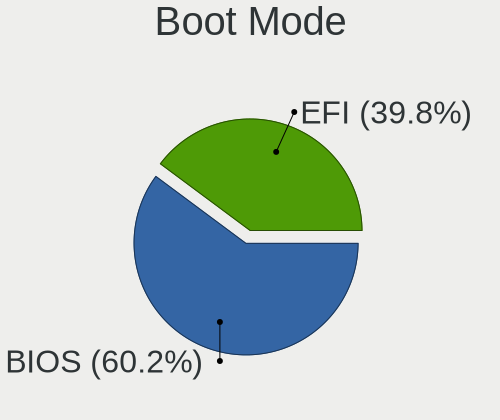

| Mode | Computers | Percent |
|------|-----------|---------|
| BIOS | 1142      | 59.82%  |
| EFI  | 767       | 40.18%  |

Filesystem
----------

Type of filesystem

| Type    | Computers | Percent |
|---------|-----------|---------|
| Ext4    | 1751      | 92.16%  |
| Overlay | 86        | 4.53%   |
| Btrfs   | 28        | 1.47%   |
| Zfs     | 18        | 0.95%   |
| Xfs     | 8         | 0.42%   |
| Ext2    | 4         | 0.21%   |
| Ext3    | 3         | 0.16%   |
| Unknown | 2         | 0.11%   |

Part. scheme
------------

Scheme of partitioning

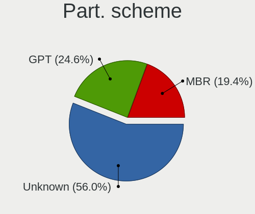

| Type    | Computers | Percent |
|---------|-----------|---------|
| Unknown | 1149      | 60.31%  |
| GPT     | 437       | 22.94%  |
| MBR     | 319       | 16.75%  |

Dual Boot with Linux/BSD
------------------------

Hosting more than one Linux/BSD

| Dual boot | Computers | Percent |
|-----------|-----------|---------|
| No        | 1585      | 82.21%  |
| Yes       | 343       | 17.79%  |

Dual Boot (Win)
---------------

Hosting Linux and Windows

| Dual boot | Computers | Percent |
|-----------|-----------|---------|
| No        | 1241      | 64.57%  |
| Yes       | 681       | 35.43%  |

Board
-----

Vendor
------

Motherboard manufacturer

| Name                    | Computers | Percent |
|-------------------------|-----------|---------|
| Hewlett-Packard         | 309       | 16.3%   |
| ASUSTek Computer        | 286       | 15.08%  |
| Dell                    | 249       | 13.13%  |
| Lenovo                  | 226       | 11.92%  |
| Gigabyte Technology     | 118       | 6.22%   |
| Acer                    | 111       | 5.85%   |
| MSI                     | 81        | 4.27%   |
| ASRock                  | 75        | 3.96%   |
| Toshiba                 | 51        | 2.69%   |
| Apple                   | 40        | 2.11%   |
| Intel                   | 33        | 1.74%   |
| Medion                  | 26        | 1.37%   |
| Samsung Electronics     | 23        | 1.21%   |
| Fujitsu                 | 21        | 1.11%   |
| ECS                     | 19        | 1%      |
| Unknown                 | 18        | 0.95%   |
| Sony                    | 15        | 0.79%   |
| Packard Bell            | 12        | 0.63%   |
| Notebook                | 12        | 0.63%   |
| Fujitsu Siemens         | 11        | 0.58%   |
| Raspberry Pi Foundation | 10        | 0.53%   |
| Positivo                | 8         | 0.42%   |
| Clevo                   | 8         | 0.42%   |
| Pegatron                | 7         | 0.37%   |
| Foxconn                 | 7         | 0.37%   |
| eMachines               | 6         | 0.32%   |
| AMI                     | 5         | 0.26%   |
| HUAWEI                  | 4         | 0.21%   |
| Google                  | 4         | 0.21%   |
| Gateway                 | 4         | 0.21%   |
| Biostar                 | 4         | 0.21%   |
| TUXEDO                  | 3         | 0.16%   |
| Schenker                | 3         | 0.16%   |
| Nvidia                  | 3         | 0.16%   |
| LG Electronics          | 3         | 0.16%   |
| Itautec                 | 3         | 0.16%   |
| GPU Company             | 3         | 0.16%   |
| Dynabook                | 3         | 0.16%   |
| Alienware               | 3         | 0.16%   |
| Supermicro              | 2         | 0.11%   |

Model
-----

Motherboard model

| Name                                   | Computers | Percent |
|----------------------------------------|-----------|---------|
| Unknown                                | 26        | 1.37%   |
| ASUS All Series                        | 17        | 0.9%    |
| Gigabyte H410M S2H                     | 15        | 0.79%   |
| HP Notebook                            | 11        | 0.58%   |
| ECS G31T-M9                            | 9         | 0.47%   |
| Dell OptiPlex 7010                     | 8         | 0.42%   |
| Dell Latitude D630                     | 8         | 0.42%   |
| HP Pavilion dv6                        | 6         | 0.32%   |
| Dell Latitude E6430                    | 6         | 0.32%   |
| ASUS VivoBook_ASUSLaptop X571LH_K571LH | 6         | 0.32%   |
| HP Pavilion dv7                        | 5         | 0.26%   |
| HP 15                                  | 5         | 0.26%   |
| Dell OptiPlex 780                      | 5         | 0.26%   |
| Dell OptiPlex 755                      | 5         | 0.26%   |
| Dell OptiPlex 390                      | 5         | 0.26%   |
| ASUS TUF Gaming X570-PLUS              | 5         | 0.26%   |
| RPi Raspberry Pi 4 Model B Rev 1.4     | 4         | 0.21%   |
| MSI MS-7B79                            | 4         | 0.21%   |
| MSI MS-7721                            | 4         | 0.21%   |
| Intel H61                              | 4         | 0.21%   |
| HP ProDesk 405 G6 Desktop Mini PC      | 4         | 0.21%   |
| HP EliteBook 8560p                     | 4         | 0.21%   |
| HP Compaq Elite 8300 SFF               | 4         | 0.21%   |
| Gigabyte B450M DS3H                    | 4         | 0.21%   |
| Dell OptiPlex 9020                     | 4         | 0.21%   |
| Dell OptiPlex 760                      | 4         | 0.21%   |
| Dell Latitude E6330                    | 4         | 0.21%   |
| ASUS K53SC                             | 4         | 0.21%   |
| ASRock N68C-S UCC                      | 4         | 0.21%   |
| Apple Macmini4,1                       | 4         | 0.21%   |
| Toshiba Satellite A100                 | 3         | 0.16%   |
| Toshiba PORTEGE R930                   | 3         | 0.16%   |
| RPi Raspberry Pi 4 Model B Rev 1.1     | 3         | 0.16%   |
| MSI MS-7A34                            | 3         | 0.16%   |
| MSI MS-7693                            | 3         | 0.16%   |
| HP Z420 Workstation                    | 3         | 0.16%   |
| HP ProDesk 600 G1 SFF                  | 3         | 0.16%   |
| HP ProBook 4540s                       | 3         | 0.16%   |
| HP Presario C700                       | 3         | 0.16%   |
| HP Pavilion Gaming Laptop 15-ec0xxx    | 3         | 0.16%   |

Model Family
------------

Motherboard model prefix

| Name                  | Computers | Percent |
|-----------------------|-----------|---------|
| Lenovo ThinkPad       | 117       | 6.17%   |
| Acer Aspire           | 74        | 3.9%    |
| Dell Latitude         | 67        | 3.53%   |
| Dell Inspiron         | 64        | 3.38%   |
| HP Pavilion           | 54        | 2.85%   |
| HP Compaq             | 53        | 2.8%    |
| Dell OptiPlex         | 51        | 2.69%   |
| Toshiba Satellite     | 41        | 2.16%   |
| Lenovo IdeaPad        | 34        | 1.79%   |
| HP EliteBook          | 34        | 1.79%   |
| ASUS PRIME            | 26        | 1.37%   |
| Unknown               | 26        | 1.37%   |
| HP ProBook            | 22        | 1.16%   |
| HP Laptop             | 22        | 1.16%   |
| ASUS VivoBook         | 22        | 1.16%   |
| Lenovo ThinkCentre    | 19        | 1%      |
| Dell Precision        | 18        | 0.95%   |
| ASUS All              | 17        | 0.9%    |
| Gigabyte H410M        | 15        | 0.79%   |
| Dell Vostro           | 15        | 0.79%   |
| ASUS TUF              | 14        | 0.74%   |
| HP ProDesk            | 12        | 0.63%   |
| HP Notebook           | 12        | 0.63%   |
| Acer Extensa          | 12        | 0.63%   |
| RPi Raspberry         | 10        | 0.53%   |
| Fujitsu ESPRIMO       | 10        | 0.53%   |
| ECS G31T-M9           | 9         | 0.47%   |
| ASUS ROG              | 9         | 0.47%   |
| Dell Studio           | 8         | 0.42%   |
| Packard Bell EasyNote | 7         | 0.37%   |
| HP ENVY               | 7         | 0.37%   |
| Dell XPS              | 7         | 0.37%   |
| Dell PowerEdge        | 7         | 0.37%   |
| Lenovo IdeaCentre     | 6         | 0.32%   |
| HP ProLiant           | 6         | 0.32%   |
| HP EliteDesk          | 6         | 0.32%   |
| HP 255                | 6         | 0.32%   |
| Fujitsu LIFEBOOK      | 6         | 0.32%   |
| ASUS M5A78L-M         | 6         | 0.32%   |
| Toshiba PORTEGE       | 5         | 0.26%   |

MFG Year
--------

Motherboard manufacture year

| Year    | Computers | Percent |
|---------|-----------|---------|
| 2011    | 179       | 9.44%   |
| 2012    | 178       | 9.39%   |
| 2013    | 161       | 8.49%   |
| 2010    | 148       | 7.81%   |
| 2019    | 137       | 7.23%   |
| 2020    | 125       | 6.59%   |
| 2009    | 123       | 6.49%   |
| 2018    | 122       | 6.43%   |
| 2014    | 119       | 6.28%   |
| 2008    | 117       | 6.17%   |
| 2017    | 111       | 5.85%   |
| 2007    | 97        | 5.12%   |
| 2015    | 90        | 4.75%   |
| 2016    | 74        | 3.9%    |
| 2021    | 52        | 2.74%   |
| 2006    | 30        | 1.58%   |
| Unknown | 19        | 1%      |
| 2005    | 10        | 0.53%   |
| 2022    | 4         | 0.21%   |

Form Factor
-----------

Physical design of the computer

| Name           | Computers | Percent |
|----------------|-----------|---------|
| Notebook       | 993       | 52.37%  |
| Desktop        | 798       | 42.09%  |
| Mini pc        | 25        | 1.32%   |
| All in one     | 24        | 1.27%   |
| System on chip | 22        | 1.16%   |
| Convertible    | 20        | 1.05%   |
| Server         | 10        | 0.53%   |
| Tablet         | 4         | 0.21%   |

Secure Boot
-----------

Enabled or disabled

| State    | Computers | Percent |
|----------|-----------|---------|
| Disabled | 1785      | 93.9%   |
| Enabled  | 116       | 6.1%    |

Coreboot
--------

Have coreboot on board

| Used | Computers | Percent |
|------|-----------|---------|
| No   | 1891      | 99.74%  |
| Yes  | 5         | 0.26%   |

RAM Size
--------

Total RAM memory

| Size in GB      | Computers | Percent |
|-----------------|-----------|---------|
| 3.01-4.0        | 518       | 26.98%  |
| 4.01-8.0        | 408       | 21.25%  |
| 16.01-24.0      | 296       | 15.42%  |
| 8.01-16.0       | 296       | 15.42%  |
| 1.01-2.0        | 156       | 8.13%   |
| 32.01-64.0      | 114       | 5.94%   |
| 2.01-3.0        | 42        | 2.19%   |
| 64.01-256.0     | 42        | 2.19%   |
| 0.51-1.0        | 24        | 1.25%   |
| 24.01-32.0      | 22        | 1.15%   |
| More than 256.0 | 1         | 0.05%   |
| 0.01-0.5        | 1         | 0.05%   |

RAM Used
--------

Used RAM memory

| Used GB    | Computers | Percent |
|------------|-----------|---------|
| 1.01-2.0   | 957       | 46.1%   |
| 2.01-3.0   | 443       | 21.34%  |
| 0.51-1.0   | 258       | 12.43%  |
| 4.01-8.0   | 196       | 9.44%   |
| 3.01-4.0   | 152       | 7.32%   |
| 8.01-16.0  | 54        | 2.6%    |
| 16.01-24.0 | 6         | 0.29%   |
| 24.01-32.0 | 5         | 0.24%   |
| 0.01-0.5   | 5         | 0.24%   |

Total Drives
------------

Number of drives on board

| Drives | Computers | Percent |
|--------|-----------|---------|
| 1      | 1137      | 58.49%  |
| 2      | 495       | 25.46%  |
| 3      | 167       | 8.59%   |
| 4      | 64        | 3.29%   |
| 5      | 31        | 1.59%   |
| 0      | 24        | 1.23%   |
| 6      | 11        | 0.57%   |
| 7      | 8         | 0.41%   |
| 10     | 3         | 0.15%   |
| 9      | 2         | 0.1%    |
| 8      | 2         | 0.1%    |

Has CD-ROM
----------

Has CD-ROM on board

| Presented | Computers | Percent |
|-----------|-----------|---------|
| Yes       | 997       | 52.39%  |
| No        | 906       | 47.61%  |

Has Ethernet
------------

Has Ethernet on board

| Presented | Computers | Percent |
|-----------|-----------|---------|
| Yes       | 1729      | 91.14%  |
| No        | 168       | 8.86%   |

Has WiFi
--------

Has WiFi module

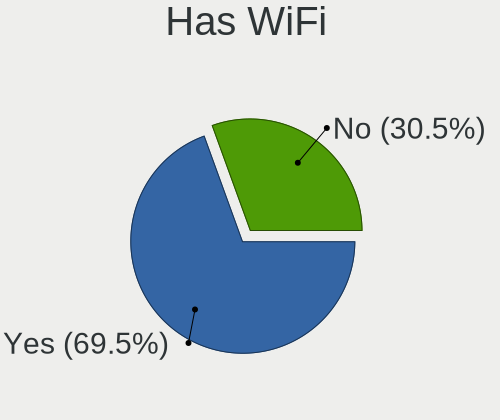

| Presented | Computers | Percent |
|-----------|-----------|---------|
| Yes       | 1346      | 70.43%  |
| No        | 565       | 29.57%  |

Has Bluetooth
-------------

Has Bluetooth module

| Presented | Computers | Percent |
|-----------|-----------|---------|
| No        | 1066      | 55.49%  |
| Yes       | 855       | 44.51%  |

Location
--------

Country
-------

Geographic location (country)

| Country      | Computers | Percent |
|--------------|-----------|---------|
| USA          | 344       | 18.07%  |
| Germany      | 250       | 13.13%  |
| France       | 190       | 9.98%   |
| Brazil       | 114       | 5.99%   |
| Russia       | 109       | 5.72%   |
| Italy        | 100       | 5.25%   |
| Canada       | 94        | 4.94%   |
| UK           | 76        | 3.99%   |
| Spain        | 60        | 3.15%   |
| Netherlands  | 55        | 2.89%   |
| Poland       | 38        | 2%      |
| Australia    | 29        | 1.52%   |
| Japan        | 25        | 1.31%   |
| Argentina    | 24        | 1.26%   |
| Belgium      | 23        | 1.21%   |
| Ukraine      | 22        | 1.16%   |
| Sweden       | 19        | 1%      |
| Hungary      | 19        | 1%      |
| Finland      | 18        | 0.95%   |
| Mexico       | 17        | 0.89%   |
| Portugal     | 16        | 0.84%   |
| Czechia      | 16        | 0.84%   |
| Austria      | 16        | 0.84%   |
| Indonesia    | 13        | 0.68%   |
| India        | 13        | 0.68%   |
| Romania      | 12        | 0.63%   |
| Greece       | 12        | 0.63%   |
| Switzerland  | 11        | 0.58%   |
| Bulgaria     | 10        | 0.53%   |
| Turkey       | 9         | 0.47%   |
| Norway       | 8         | 0.42%   |
| Slovenia     | 7         | 0.37%   |
| Colombia     | 7         | 0.37%   |
| Denmark      | 6         | 0.32%   |
| Thailand     | 5         | 0.26%   |
| South Africa | 5         | 0.26%   |
| Peru         | 5         | 0.26%   |
| New Zealand  | 5         | 0.26%   |
| Lithuania    | 5         | 0.26%   |
| Belarus      | 5         | 0.26%   |

City
----

Geographic location (city)

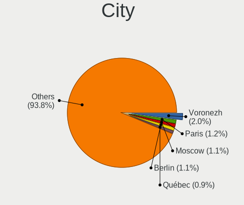

| City              | Computers | Percent |
|-------------------|-----------|---------|
| Voronezh          | 26        | 1.3%    |
| Paris             | 26        | 1.3%    |
| Qubec           | 19        | 0.95%   |
| Berlin            | 19        | 0.95%   |
| Moscow            | 18        | 0.9%    |
| Hamburg           | 16        | 0.8%    |
| Sydney            | 14        | 0.7%    |
| Warsaw            | 13        | 0.65%   |
| Munich            | 13        | 0.65%   |
| Sao Paulo         | 12        | 0.6%    |
| Rome              | 12        | 0.6%    |
| Milan             | 12        | 0.6%    |
| Budapest          | 12        | 0.6%    |
| Amsterdam         | 12        | 0.6%    |
| Madrid            | 11        | 0.55%   |
| Vancouver         | 10        | 0.5%    |
| St Petersburg     | 10        | 0.5%    |
| Rio de Janeiro    | 10        | 0.5%    |
| Montreal          | 9         | 0.45%   |
| Athens            | 9         | 0.45%   |
| Toronto           | 8         | 0.4%    |
| Frankfurt am Main | 8         | 0.4%    |
| Cologne           | 8         | 0.4%    |
| Chicago           | 8         | 0.4%    |
| Barcelona         | 8         | 0.4%    |
| Vienna            | 7         | 0.35%   |
| Kyiv              | 7         | 0.35%   |
| Helsinki          | 7         | 0.35%   |
| Belo Horizonte    | 7         | 0.35%   |
| Lisbon            | 6         | 0.3%    |
| Leipzig           | 6         | 0.3%    |
| Karlsruhe         | 6         | 0.3%    |
| Genoa             | 6         | 0.3%    |
| Springfield       | 5         | 0.25%   |
| Sofia             | 5         | 0.25%   |
| Seattle           | 5         | 0.25%   |
| Saint Paul        | 5         | 0.25%   |
| Pittsburgh        | 5         | 0.25%   |
| Mannheim          | 5         | 0.25%   |
| Lima              | 5         | 0.25%   |

Drives
------

Drive Vendor
------------

Hard drive vendors

| Vendor              | Computers | Drives | Percent |
|---------------------|-----------|--------|---------|
| Seagate             | 489       | 724    | 18.13%  |
| WDC                 | 459       | 656    | 17.02%  |
| Samsung Electronics | 377       | 512    | 13.98%  |
| Toshiba             | 186       | 229    | 6.9%    |
| Unknown             | 134       | 161    | 4.97%   |
| Kingston            | 131       | 160    | 4.86%   |
| Hitachi             | 128       | 172    | 4.75%   |
| SanDisk             | 98        | 127    | 3.63%   |
| Crucial             | 85        | 107    | 3.15%   |
| Intel               | 52        | 78     | 1.93%   |
| HGST                | 52        | 62     | 1.93%   |
| SK hynix            | 42        | 48     | 1.56%   |
| A-DATA Technology   | 41        | 50     | 1.52%   |
| Fujitsu             | 29        | 36     | 1.08%   |
| Micron Technology   | 24        | 26     | 0.89%   |
| China               | 22        | 23     | 0.82%   |
| Maxtor              | 20        | 27     | 0.74%   |
| Patriot             | 18        | 21     | 0.67%   |
| Intenso             | 18        | 25     | 0.67%   |
| PNY                 | 16        | 22     | 0.59%   |
| OCZ                 | 14        | 19     | 0.52%   |
| Phison              | 13        | 17     | 0.48%   |
| Transcend           | 12        | 13     | 0.44%   |
| KIOXIA              | 12        | 17     | 0.44%   |
| Apple               | 12        | 16     | 0.44%   |
| Apacer              | 11        | 13     | 0.41%   |
| LITEON              | 10        | 12     | 0.37%   |
| SPCC                | 8         | 14     | 0.3%    |
| Silicon Motion      | 8         | 8      | 0.3%    |
| LITEONIT            | 7         | 9      | 0.26%   |
| Hewlett-Packard     | 7         | 8      | 0.26%   |
| JMicron Technology  | 6         | 6      | 0.22%   |
| ASMT                | 6         | 8      | 0.22%   |
| KingSpec            | 5         | 6      | 0.19%   |
| GOODRAM             | 5         | 6      | 0.19%   |
| Unknown             | 5         | 5      | 0.19%   |
| USB3.0              | 4         | 5      | 0.15%   |
| Smartbuy            | 4         | 4      | 0.15%   |
| SABRENT             | 4         | 4      | 0.15%   |
| Mushkin             | 4         | 4      | 0.15%   |

Drive Model
-----------

Hard drive models

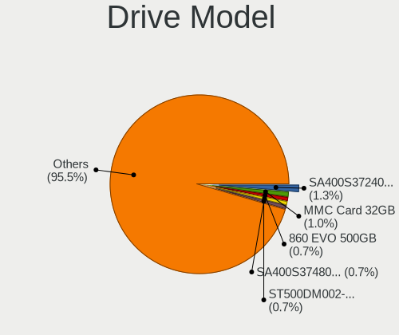

| Model                               | Computers | Percent |
|-------------------------------------|-----------|---------|
| Kingston SA400S37240G 240GB SSD     | 41        | 1.37%   |
| Unknown MMC Card  32GB              | 28        | 0.94%   |
| Seagate ST500DM002-1BD142 500GB     | 23        | 0.77%   |
| Samsung SSD 850 EVO 250GB           | 23        | 0.77%   |
| Kingston SA400S37480G 480GB SSD     | 23        | 0.77%   |
| Samsung SSD 860 EVO 500GB           | 22        | 0.74%   |
| Seagate ST500LT012-1DG142 500GB     | 19        | 0.64%   |
| Seagate ST1000DM010-2EP102 1TB      | 19        | 0.64%   |
| Seagate ST500LM012 HN-M500MBB 500GB | 18        | 0.6%    |
| Unknown MMC Card  64GB              | 17        | 0.57%   |
| Seagate ST1000LM024 HN-M101MBB 1TB  | 17        | 0.57%   |
| Seagate ST1000LM035-1RK172 1TB      | 15        | 0.5%    |
| Samsung SSD 860 EVO 1TB             | 15        | 0.5%    |
| Unknown SD/MMC/MS PRO 64GB          | 13        | 0.44%   |
| Seagate ST3500418AS 500GB           | 13        | 0.44%   |
| Seagate ST2000DM001-1CH164 2TB      | 13        | 0.44%   |
| Seagate Expansion 4TB               | 13        | 0.44%   |
| HGST HTS721010A9E630 1TB            | 13        | 0.44%   |
| Crucial CT500MX500SSD1 500GB        | 13        | 0.44%   |
| Unknown MMC Card  128GB             | 12        | 0.4%    |
| Toshiba MQ01ABF050 500GB            | 12        | 0.4%    |
| Kingston SA400S37120G 120GB SSD     | 12        | 0.4%    |
| Toshiba MQ01ABD100 1TB              | 11        | 0.37%   |
| Seagate ST2000DM008-2FR102 2TB      | 11        | 0.37%   |
| Kingston SV300S37A120G 120GB SSD    | 11        | 0.37%   |
| Crucial CT1000MX500SSD1 1TB         | 11        | 0.37%   |
| Unknown MMC Card  16GB              | 10        | 0.34%   |
| Seagate ST500LT012-9WS142 500GB     | 10        | 0.34%   |
| Seagate ST31000524AS 1TB            | 10        | 0.34%   |
| Seagate ST1000DM003-1CH162 1TB      | 10        | 0.34%   |
| Samsung NVMe SSD Drive 512GB        | 10        | 0.34%   |
| Samsung HM321HI 320GB               | 10        | 0.34%   |
| Toshiba DT01ACA100 1TB              | 9         | 0.3%    |
| Seagate ST4000DM004-2CV104 4TB      | 9         | 0.3%    |
| Seagate ST31000528AS 1TB            | 9         | 0.3%    |
| Samsung SSD 860 EVO 250GB           | 9         | 0.3%    |
| Samsung SSD 850 EVO 500GB           | 9         | 0.3%    |
| Samsung NVMe SSD Drive 1TB          | 9         | 0.3%    |
| Patriot Burst 120GB SSD             | 9         | 0.3%    |
| Hitachi HTS547550A9E384 500GB       | 9         | 0.3%    |

HDD Vendor
----------

Hard disk drive vendors

| Vendor              | Computers | Drives | Percent |
|---------------------|-----------|--------|---------|
| Seagate             | 480       | 712    | 34.29%  |
| WDC                 | 396       | 569    | 28.29%  |
| Toshiba             | 154       | 192    | 11%     |
| Hitachi             | 128       | 172    | 9.14%   |
| Samsung Electronics | 96        | 124    | 6.86%   |
| HGST                | 52        | 62     | 3.71%   |
| Fujitsu             | 28        | 35     | 2%      |
| Maxtor              | 19        | 26     | 1.36%   |
| Unknown             | 14        | 16     | 1%      |
| ASMT                | 6         | 8      | 0.43%   |
| USB3.0              | 4         | 5      | 0.29%   |
| Intenso             | 4         | 5      | 0.29%   |
| WD MediaMax         | 2         | 2      | 0.14%   |
| Hewlett-Packard     | 2         | 2      | 0.14%   |
| Apple               | 2         | 3      | 0.14%   |
| SAGE                | 1         | 1      | 0.07%   |
| Pioneer             | 1         | 1      | 0.07%   |
| PHD 3.0             | 1         | 1      | 0.07%   |
| LaCie               | 1         | 4      | 0.07%   |
| ICY BOX             | 1         | 1      | 0.07%   |
| HPE                 | 1         | 4      | 0.07%   |
| HGST HTS            | 1         | 1      | 0.07%   |
| ExcelStor           | 1         | 1      | 0.07%   |
| CLOVER              | 1         | 1      | 0.07%   |
| ASMedia             | 1         | 1      | 0.07%   |
| Apricorn            | 1         | 1      | 0.07%   |
| ACASIS              | 1         | 1      | 0.07%   |
| Unknown             | 1         | 1      | 0.07%   |

SSD Vendor
----------

Solid state drive vendors

| Vendor              | Computers | Drives | Percent |
|---------------------|-----------|--------|---------|
| Samsung Electronics | 197       | 258    | 22.96%  |
| Kingston            | 120       | 147    | 13.99%  |
| SanDisk             | 78        | 104    | 9.09%   |
| Crucial             | 78        | 100    | 9.09%   |
| WDC                 | 43        | 51     | 5.01%   |
| A-DATA Technology   | 35        | 43     | 4.08%   |
| Intel               | 25        | 37     | 2.91%   |
| China               | 22        | 23     | 2.56%   |
| Patriot             | 18        | 21     | 2.1%    |
| Micron Technology   | 17        | 18     | 1.98%   |
| PNY                 | 16        | 22     | 1.86%   |
| Toshiba             | 15        | 18     | 1.75%   |
| SK hynix            | 13        | 13     | 1.52%   |
| OCZ                 | 13        | 17     | 1.52%   |
| Intenso             | 12        | 14     | 1.4%    |
| Transcend           | 11        | 11     | 1.28%   |
| Apacer              | 11        | 13     | 1.28%   |
| LITEON              | 10        | 12     | 1.17%   |
| SPCC                | 8         | 14     | 0.93%   |
| LITEONIT            | 7         | 9      | 0.82%   |
| Apple               | 6         | 7      | 0.7%    |
| Unknown             | 5         | 6      | 0.58%   |
| GOODRAM             | 5         | 6      | 0.58%   |
| Smartbuy            | 4         | 4      | 0.47%   |
| Mushkin             | 4         | 4      | 0.47%   |
| KingSpec            | 4         | 5      | 0.47%   |
| KingDian            | 4         | 4      | 0.47%   |
| JMicron Technology  | 4         | 4      | 0.47%   |
| Hewlett-Packard     | 4         | 6      | 0.47%   |
| Corsair             | 4         | 4      | 0.47%   |
| Team                | 3         | 4      | 0.35%   |
| Seagate             | 3         | 3      | 0.35%   |
| Lexar               | 3         | 3      | 0.35%   |
| Kingmax             | 3         | 3      | 0.35%   |
| Drevo               | 3         | 3      | 0.35%   |
| TO Exter            | 2         | 2      | 0.23%   |
| SUNEAST             | 2         | 3      | 0.23%   |
| OWC                 | 2         | 2      | 0.23%   |
| OCZ-VERTEX3         | 2         | 2      | 0.23%   |
| Netac               | 2         | 2      | 0.23%   |

Drive Kind
----------

HDD or SSD

| Kind    | Computers | Drives | Percent |
|---------|-----------|--------|---------|
| HDD     | 1152      | 1952   | 48.3%   |
| SSD     | 768       | 1070   | 32.2%   |
| NVMe    | 311       | 397    | 13.04%  |
| MMC     | 117       | 141    | 4.91%   |
| Unknown | 37        | 46     | 1.55%   |

Drive Connector
---------------

SATA, SAS, NVMe, etc.

| Type | Computers | Drives | Percent |
|------|-----------|--------|---------|
| SATA | 1607      | 2914   | 74.67%  |
| NVMe | 308       | 393    | 14.31%  |
| SAS  | 120       | 158    | 5.58%   |
| MMC  | 117       | 141    | 5.44%   |

Drive Size
----------

Size of hard drive

| Size in TB | Computers | Drives | Percent |
|------------|-----------|--------|---------|
| 0.01-0.5   | 1273      | 1904   | 62.99%  |
| 0.51-1.0   | 493       | 702    | 24.39%  |
| 1.01-2.0   | 129       | 207    | 6.38%   |
| 3.01-4.0   | 53        | 88     | 2.62%   |
| 4.01-10.0  | 36        | 59     | 1.78%   |
| 2.01-3.0   | 34        | 59     | 1.68%   |
| 10.01-20.0 | 2         | 2      | 0.1%    |
| 0          | 1         | 1      | 0.05%   |

Space Total
-----------

Amount of disk space available on the file system

| Size in GB     | Computers | Percent |
|----------------|-----------|---------|
| 101-250        | 615       | 31.39%  |
| 251-500        | 459       | 23.43%  |
| 501-1000       | 271       | 13.83%  |
| 51-100         | 142       | 7.25%   |
| 1001-2000      | 137       | 6.99%   |
| 21-50          | 103       | 5.26%   |
| More than 3000 | 88        | 4.49%   |
| 1-20           | 80        | 4.08%   |
| 2001-3000      | 52        | 2.65%   |
| Unknown        | 12        | 0.61%   |

Space Used
----------

Amount of used disk space

| Used GB        | Computers | Percent |
|----------------|-----------|---------|
| 1-20           | 744       | 36.6%   |
| 21-50          | 358       | 17.61%  |
| 101-250        | 292       | 14.36%  |
| 51-100         | 260       | 12.79%  |
| 251-500        | 144       | 7.08%   |
| 501-1000       | 104       | 5.12%   |
| 1001-2000      | 62        | 3.05%   |
| More than 3000 | 35        | 1.72%   |
| 2001-3000      | 22        | 1.08%   |
| Unknown        | 12        | 0.59%   |

Malfunc. Drives
---------------

Drive models with a malfunction

| Model                              | Computers | Drives | Percent |
|------------------------------------|-----------|--------|---------|
| Seagate ST1000LM024 HN-M101MBB 1TB | 4         | 4      | 2.34%   |
| Seagate ST500LT012-9WS142 500GB    | 3         | 3      | 1.75%   |
| Seagate ST500DM002-1BD142 500GB    | 3         | 3      | 1.75%   |
| Hitachi HDS721050CLA362 500GB      | 3         | 3      | 1.75%   |
| WDC WD7500BPKX-00HPJT0 752GB       | 2         | 2      | 1.17%   |
| WDC WD4000FYYZ-01UL1B1 4TB         | 2         | 3      | 1.17%   |
| WDC WD1002FAEX-00Z3A0 1TB          | 2         | 2      | 1.17%   |
| Toshiba MQ01ABD100 1TB             | 2         | 3      | 1.17%   |
| Seagate ST9320325AS 320GB          | 2         | 2      | 1.17%   |
| Seagate ST3250318AS 250GB          | 2         | 2      | 1.17%   |
| Seagate ST2000DM001-1CH164 2TB     | 2         | 3      | 1.17%   |
| Seagate ST1000DL002-9TT153 1TB     | 2         | 2      | 1.17%   |
| Samsung Electronics HD103SI 1TB    | 2         | 2      | 1.17%   |
| Samsung Electronics HD081GJ 80GB   | 2         | 2      | 1.17%   |
| Kingston SA400S37240G 240GB SSD    | 2         | 2      | 1.17%   |
| Hitachi HTS725032A9A364 320GB      | 2         | 2      | 1.17%   |
| Hitachi HTS545050A7E380 500GB      | 2         | 2      | 1.17%   |
| HGST HTS545050A7E680 500GB         | 2         | 2      | 1.17%   |
| WDC WD7500BPVT-80HXZT3 752GB       | 1         | 1      | 0.58%   |
| WDC WD6400AAKS-22A7B2 640GB        | 1         | 1      | 0.58%   |
| WDC WD6400AAKS-22A7B0 640GB        | 1         | 1      | 0.58%   |
| WDC WD5000LPVX-08V0TT5 500GB       | 1         | 1      | 0.58%   |
| WDC WD5000LPCX-00VHAT0 500GB       | 1         | 1      | 0.58%   |
| WDC WD5000BEVT-22ZAT0 500GB        | 1         | 1      | 0.58%   |
| WDC WD5000BEKT-75KA9T0 500GB       | 1         | 1      | 0.58%   |
| WDC WD5000AAKX-60U6AA0 500GB       | 1         | 1      | 0.58%   |
| WDC WD5000AAKX-08U6AA0 500GB       | 1         | 1      | 0.58%   |
| WDC WD5000AAKX-08ERMA0 500GB       | 1         | 1      | 0.58%   |
| WDC WD5000AAKS-22V1A0 500GB        | 1         | 1      | 0.58%   |
| WDC WD5000AAKS-00A7B0 500GB        | 1         | 1      | 0.58%   |
| WDC WD400EB-00CPF0 40GB            | 1         | 1      | 0.58%   |
| WDC WD3200BEVT-75ZCT1 320GB        | 1         | 1      | 0.58%   |
| WDC WD3200AVJS-63TBA0 320GB        | 1         | 1      | 0.58%   |
| WDC WD3200AAKS-00L9A0 320GB        | 1         | 1      | 0.58%   |
| WDC WD3200AAJS-60Z0A0 320GB        | 1         | 1      | 0.58%   |
| WDC WD3200AAJS-08L7A0 320GB        | 1         | 1      | 0.58%   |
| WDC WD30EFRX-68EUZN0 3TB           | 1         | 1      | 0.58%   |
| WDC WD20EZRX-00D8PB0 2TB           | 1         | 2      | 0.58%   |
| WDC WD20EFRX-68EUZN0 2TB           | 1         | 1      | 0.58%   |
| WDC WD1600BJKT-75F4T0 160GB        | 1         | 1      | 0.58%   |

Malfunc. Drive Vendor
---------------------

Vendors of faulty drives

| Vendor              | Computers | Drives | Percent |
|---------------------|-----------|--------|---------|
| Seagate             | 48        | 53     | 28.92%  |
| WDC                 | 36        | 42     | 21.69%  |
| Toshiba             | 16        | 20     | 9.64%   |
| Hitachi             | 14        | 14     | 8.43%   |
| Samsung Electronics | 12        | 15     | 7.23%   |
| SK hynix            | 5         | 5      | 3.01%   |
| HGST                | 5         | 6      | 3.01%   |
| Kingston            | 4         | 4      | 2.41%   |
| Fujitsu             | 4         | 5      | 2.41%   |
| A-DATA Technology   | 3         | 4      | 1.81%   |
| OCZ                 | 2         | 2      | 1.2%    |
| Micron Technology   | 2         | 2      | 1.2%    |
| Maxtor              | 2         | 2      | 1.2%    |
| Intel               | 2         | 2      | 1.2%    |
| Unknown             | 1         | 1      | 0.6%    |
| SanDisk             | 1         | 1      | 0.6%    |
| Mushkin             | 1         | 1      | 0.6%    |
| LDLC                | 1         | 1      | 0.6%    |
| ICY BOX             | 1         | 1      | 0.6%    |
| FORESEE             | 1         | 1      | 0.6%    |
| Crucial             | 1         | 1      | 0.6%    |
| China               | 1         | 1      | 0.6%    |
| Avant               | 1         | 1      | 0.6%    |
| Apple               | 1         | 1      | 0.6%    |
| Apacer              | 1         | 1      | 0.6%    |

Malfunc. HDD Vendor
-------------------

Vendors of faulty HDD drives

| Vendor              | Computers | Drives | Percent |
|---------------------|-----------|--------|---------|
| Seagate             | 48        | 53     | 35.29%  |
| WDC                 | 36        | 42     | 26.47%  |
| Toshiba             | 16        | 20     | 11.76%  |
| Hitachi             | 14        | 14     | 10.29%  |
| Samsung Electronics | 10        | 12     | 7.35%   |
| HGST                | 5         | 6      | 3.68%   |
| Fujitsu             | 4         | 5      | 2.94%   |
| Maxtor              | 2         | 2      | 1.47%   |
| ICY BOX             | 1         | 1      | 0.74%   |

Malfunc. Drive Kind
-------------------

Kinds of faulty drives

| Kind | Computers | Drives | Percent |
|------|-----------|--------|---------|
| HDD  | 128       | 155    | 81.01%  |
| SSD  | 28        | 30     | 17.72%  |
| NVMe | 2         | 2      | 1.27%   |

Failed Drives
-------------

Failed drive models

| Model                            | Computers | Drives | Percent |
|----------------------------------|-----------|--------|---------|
| Toshiba DT01ACA200 2TB           | 1         | 1      | 33.33%  |
| Seagate ST500DM002-1BC142 500GB  | 1         | 1      | 33.33%  |
| A-DATA Technology SP800 32GB SSD | 1         | 1      | 33.33%  |

Failed Drive Vendor
-------------------

Failed drive vendors

| Vendor            | Computers | Drives | Percent |
|-------------------|-----------|--------|---------|
| Toshiba           | 1         | 1      | 33.33%  |
| Seagate           | 1         | 1      | 33.33%  |
| A-DATA Technology | 1         | 1      | 33.33%  |

Drive Status
------------

Number of failed and malfunc. drives

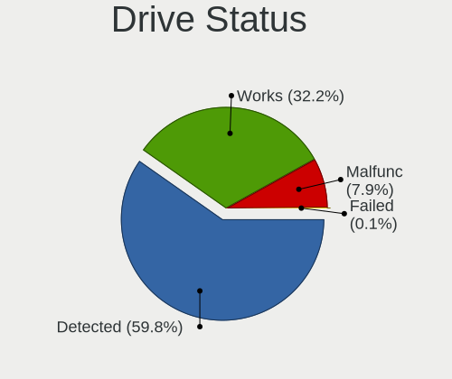

| Status   | Computers | Drives | Percent |
|----------|-----------|--------|---------|
| Detected | 1230      | 2437   | 61.25%  |
| Works    | 619       | 979    | 30.83%  |
| Malfunc  | 156       | 187    | 7.77%   |
| Failed   | 3         | 3      | 0.15%   |

Storage controller
------------------

Storage Vendor
--------------

Storage controller vendors

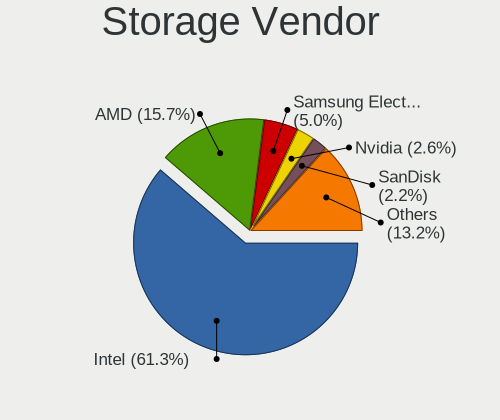

| Vendor                           | Computers | Percent |
|----------------------------------|-----------|---------|
| Intel                            | 1314      | 60.86%  |
| AMD                              | 352       | 16.3%   |
| Samsung Electronics              | 108       | 5%      |
| Nvidia                           | 60        | 2.78%   |
| SanDisk                          | 47        | 2.18%   |
| ASMedia Technology               | 36        | 1.67%   |
| JMicron Technology               | 32        | 1.48%   |
| Marvell Technology Group         | 26        | 1.2%    |
| SK hynix                         | 24        | 1.11%   |
| VIA Technologies                 | 16        | 0.74%   |
| Toshiba America Info Systems     | 14        | 0.65%   |
| Phison Electronics               | 14        | 0.65%   |
| KIOXIA                           | 14        | 0.65%   |
| Kingston Technology Company      | 11        | 0.51%   |
| Silicon Motion                   | 9         | 0.42%   |
| Micron/Crucial Technology        | 9         | 0.42%   |
| LSI Logic / Symbios Logic        | 9         | 0.42%   |
| ADATA Technology                 | 9         | 0.42%   |
| Micron Technology                | 8         | 0.37%   |
| Silicon Integrated Systems [SiS] | 7         | 0.32%   |
| Realtek Semiconductor            | 6         | 0.28%   |
| Silicon Image                    | 5         | 0.23%   |
| Broadcom / LSI                   | 5         | 0.23%   |
| Hewlett-Packard                  | 4         | 0.19%   |
| Apple                            | 4         | 0.19%   |
| Union Memory (Shenzhen)          | 3         | 0.14%   |
| Seagate Technology               | 2         | 0.09%   |
| Promise Technology               | 2         | 0.09%   |
| Integrated Technology Express    | 2         | 0.09%   |
| Adaptec                          | 2         | 0.09%   |
| Solid State Storage Technology   | 1         | 0.05%   |
| OCZ Technology Group             | 1         | 0.05%   |
| Lite-On Technology               | 1         | 0.05%   |
| Lenovo                           | 1         | 0.05%   |
| INNOGRIT                         | 1         | 0.05%   |

Storage Model
-------------

Storage controller models

| Model                                                                                   | Computers | Percent |
|-----------------------------------------------------------------------------------------|-----------|---------|
| AMD FCH SATA Controller [AHCI mode]                                                     | 219       | 8.18%   |
| Intel 7 Series Chipset Family 6-port SATA Controller [AHCI mode]                        | 98        | 3.66%   |
| Intel 8 Series/C220 Series Chipset Family 6-port SATA Controller 1 [AHCI mode]          | 86        | 3.21%   |
| Intel Sunrise Point-LP SATA Controller [AHCI mode]                                      | 69        | 2.58%   |
| Samsung NVMe SSD Controller SM981/PM981/PM983                                           | 68        | 2.54%   |
| Intel 6 Series/C200 Series Chipset Family 6 port Mobile SATA AHCI Controller            | 67        | 2.5%    |
| Intel 82801 Mobile SATA Controller [RAID mode]                                          | 61        | 2.28%   |
| Intel 82801HM/HEM (ICH8M/ICH8M-E) IDE Controller                                        | 60        | 2.24%   |
| Intel 6 Series/C200 Series Chipset Family 6 port Desktop SATA AHCI Controller           | 60        | 2.24%   |
| Intel NM10/ICH7 Family SATA Controller [IDE mode]                                       | 59        | 2.2%    |
| AMD SB7x0/SB8x0/SB9x0 SATA Controller [AHCI mode]                                       | 57        | 2.13%   |
| AMD SB7x0/SB8x0/SB9x0 IDE Controller                                                    | 57        | 2.13%   |
| Intel 82801IBM/IEM (ICH9M/ICH9M-E) 4 port SATA Controller [AHCI mode]                   | 53        | 1.98%   |
| Intel 82801G (ICH7 Family) IDE Controller                                               | 53        | 1.98%   |
| Intel 82801HM/HEM (ICH8M/ICH8M-E) SATA Controller [AHCI mode]                           | 49        | 1.83%   |
| Intel 8 Series SATA Controller 1 [AHCI mode]                                            | 40        | 1.49%   |
| Intel 7 Series/C210 Series Chipset Family 6-port SATA Controller [AHCI mode]            | 40        | 1.49%   |
| AMD SB7x0/SB8x0/SB9x0 SATA Controller [IDE mode]                                        | 39        | 1.46%   |
| AMD 400 Series Chipset SATA Controller                                                  | 38        | 1.42%   |
| Intel 5 Series/3400 Series Chipset 4 port SATA AHCI Controller                          | 36        | 1.35%   |
| Intel Q170/Q150/B150/H170/H110/Z170/CM236 Chipset SATA Controller [AHCI Mode]           | 35        | 1.31%   |
| ASMedia ASM1062 Serial ATA Controller                                                   | 34        | 1.27%   |
| Intel SATA Controller [RAID mode]                                                       | 33        | 1.23%   |
| Intel 5 Series/3400 Series Chipset 6 port SATA AHCI Controller                          | 33        | 1.23%   |
| Intel Atom Processor E3800 Series SATA AHCI Controller                                  | 27        | 1.01%   |
| Intel 200 Series PCH SATA controller [AHCI mode]                                        | 24        | 0.9%    |
| Nvidia MCP61 SATA Controller                                                            | 22        | 0.82%   |
| JMicron JMB363 SATA/IDE Controller                                                      | 22        | 0.82%   |
| Intel Wildcat Point-LP SATA Controller [AHCI Mode]                                      | 22        | 0.82%   |
| Intel 82801I (ICH9 Family) 2 port SATA Controller [IDE mode]                            | 22        | 0.82%   |
| Intel 6 Series/C200 Series Chipset Family Desktop SATA Controller (IDE mode, ports 4-5) | 22        | 0.82%   |
| Intel 6 Series/C200 Series Chipset Family Desktop SATA Controller (IDE mode, ports 0-3) | 22        | 0.82%   |
| Intel Celeron/Pentium Silver Processor SATA Controller                                  | 21        | 0.78%   |
| Intel 5 Series/3400 Series Chipset 4 port SATA IDE Controller                           | 21        | 0.78%   |
| Intel 5 Series/3400 Series Chipset 2 port SATA IDE Controller                           | 19        | 0.71%   |
| Intel 4 Series Chipset PT IDER Controller                                               | 19        | 0.71%   |
| Nvidia MCP61 IDE                                                                        | 18        | 0.67%   |
| Intel 82801IR/IO/IH (ICH9R/DO/DH) 4 port SATA Controller [IDE mode]                     | 18        | 0.67%   |
| Intel NM10/ICH7 Family SATA Controller [AHCI mode]                                      | 17        | 0.64%   |
| Intel HM170/QM170 Chipset SATA Controller [AHCI Mode]                                   | 17        | 0.64%   |

Storage Kind
------------

Kind of storage controller (IDE, SATA, NVMe, SAS, ...)

| Kind | Computers | Percent |
|------|-----------|---------|
| SATA | 1357      | 59.57%  |
| IDE  | 463       | 20.32%  |
| NVMe | 300       | 13.17%  |
| RAID | 142       | 6.23%   |
| SAS  | 9         | 0.4%    |
| SCSI | 7         | 0.31%   |

Processor
---------

CPU Vendor
----------

Processor vendors

| Vendor       | Computers | Percent |
|--------------|-----------|---------|
| Intel        | 1442      | 76.05%  |
| AMD          | 428       | 22.57%  |
| ARM          | 24        | 1.27%   |
| CentaurHauls | 2         | 0.11%   |

CPU Model
---------

Processor models

| Model                                   | Computers | Percent |
|-----------------------------------------|-----------|---------|
| ARM Processor                           | 19        | 1%      |
| Intel Core i3-10100 CPU @ 3.60GHz       | 17        | 0.89%   |
| Intel Core i7-2670QM CPU @ 2.20GHz      | 14        | 0.74%   |
| Intel Core i5-8250U CPU @ 1.60GHz       | 14        | 0.74%   |
| Intel Core 2 Duo CPU E8400 @ 3.00GHz    | 14        | 0.74%   |
| Intel Core i7-8550U CPU @ 1.80GHz       | 13        | 0.68%   |
| Intel Core i5-2400 CPU @ 3.10GHz        | 12        | 0.63%   |
| Intel Core 2 Duo CPU E7500 @ 2.93GHz    | 12        | 0.63%   |
| Intel Atom x5-Z8350 CPU @ 1.44GHz       | 11        | 0.58%   |
| AMD Ryzen 5 2600 Six-Core Processor     | 11        | 0.58%   |
| Intel Core i7-2600 CPU @ 3.40GHz        | 10        | 0.53%   |
| Intel Core i7-10750H CPU @ 2.60GHz      | 10        | 0.53%   |
| Intel Core i5-6300U CPU @ 2.40GHz       | 10        | 0.53%   |
| Intel Core i5-3320M CPU @ 2.60GHz       | 10        | 0.53%   |
| Intel Core i5-1035G1 CPU @ 1.00GHz      | 10        | 0.53%   |
| Intel Core i3-4130 CPU @ 3.40GHz        | 10        | 0.53%   |
| Intel Core i3-3110M CPU @ 2.40GHz       | 10        | 0.53%   |
| Intel Core i3-2100 CPU @ 3.10GHz        | 10        | 0.53%   |
| AMD FX-8350 Eight-Core Processor        | 10        | 0.53%   |
| Intel Core i7-7700HQ CPU @ 2.80GHz      | 9         | 0.47%   |
| Intel Core i7-3770 CPU @ 3.40GHz        | 9         | 0.47%   |
| Intel Core i5-2520M CPU @ 2.50GHz       | 9         | 0.47%   |
| Intel Core i3 CPU M 370 @ 2.40GHz       | 9         | 0.47%   |
| Intel Core 2 Duo CPU T7100 @ 1.80GHz    | 9         | 0.47%   |
| Intel Core 2 Duo CPU P8600 @ 2.40GHz    | 9         | 0.47%   |
| Intel Celeron CPU N2840 @ 2.16GHz       | 9         | 0.47%   |
| Intel 11th Gen Core i7-1165G7 @ 2.80GHz | 9         | 0.47%   |
| Intel Core i7-3630QM CPU @ 2.40GHz      | 8         | 0.42%   |
| Intel Core i7-2600K CPU @ 3.40GHz       | 8         | 0.42%   |
| Intel Core i5-7200U CPU @ 2.50GHz       | 8         | 0.42%   |
| Intel Core i5-6400 CPU @ 2.70GHz        | 8         | 0.42%   |
| Intel Core i5-6200U CPU @ 2.30GHz       | 8         | 0.42%   |
| Intel Core i5-4570 CPU @ 3.20GHz        | 8         | 0.42%   |
| Intel Core i5-4210U CPU @ 1.70GHz       | 8         | 0.42%   |
| Intel Core i5-2450M CPU @ 2.50GHz       | 8         | 0.42%   |
| Intel Core i5-10210U CPU @ 1.60GHz      | 8         | 0.42%   |
| Intel Core i5 CPU M 520 @ 2.40GHz       | 8         | 0.42%   |
| Intel Core i3-2120 CPU @ 3.30GHz        | 8         | 0.42%   |
| Intel Core 2 Quad CPU Q6600 @ 2.40GHz   | 8         | 0.42%   |
| Intel Core 2 Duo CPU P8400 @ 2.26GHz    | 8         | 0.42%   |

CPU Model Family
----------------

Processor model prefix

| Model                   | Computers | Percent |
|-------------------------|-----------|---------|
| Intel Core i5           | 359       | 18.87%  |
| Intel Core i7           | 299       | 15.72%  |
| Intel Core i3           | 169       | 8.89%   |
| Intel Core 2 Duo        | 146       | 7.68%   |
| Intel Celeron           | 113       | 5.94%   |
| Intel Pentium           | 66        | 3.47%   |
| Other                   | 63        | 3.31%   |
| AMD Ryzen 5             | 63        | 3.31%   |
| Intel Xeon              | 52        | 2.73%   |
| Intel Pentium Dual-Core | 48        | 2.52%   |
| Intel Atom              | 46        | 2.42%   |
| AMD Ryzen 7             | 44        | 2.31%   |
| AMD FX                  | 28        | 1.47%   |
| Intel Core 2 Quad       | 26        | 1.37%   |
| AMD A8                  | 23        | 1.21%   |
| Intel Pentium Dual      | 22        | 1.16%   |
| Intel Core 2            | 22        | 1.16%   |
| AMD Athlon II X2        | 18        | 0.95%   |
| AMD A6                  | 18        | 0.95%   |
| AMD Ryzen 3             | 17        | 0.89%   |
| AMD E1                  | 17        | 0.89%   |
| AMD Phenom II X4        | 16        | 0.84%   |
| AMD Athlon 64 X2        | 14        | 0.74%   |
| AMD A10                 | 14        | 0.74%   |
| AMD Ryzen 9             | 13        | 0.68%   |
| AMD E                   | 13        | 0.68%   |
| AMD A4                  | 12        | 0.63%   |
| Intel Core i9           | 9         | 0.47%   |
| AMD Turion 64 X2 Mobile | 9         | 0.47%   |
| AMD Ryzen 7 PRO         | 9         | 0.47%   |
| AMD E2                  | 8         | 0.42%   |
| AMD Athlon              | 8         | 0.42%   |
| Intel Genuine           | 7         | 0.37%   |
| Intel Pentium Silver    | 6         | 0.32%   |
| AMD Ryzen 5 PRO         | 6         | 0.32%   |
| AMD Athlon II X4        | 6         | 0.32%   |
| Intel Pentium D         | 5         | 0.26%   |
| Intel Pentium 4         | 5         | 0.26%   |
| AMD Sempron             | 5         | 0.26%   |
| AMD Phenom II X6        | 5         | 0.26%   |

CPU Cores
---------

Number of processor cores

| Number | Computers | Percent |
|--------|-----------|---------|
| 2      | 923       | 48.58%  |
| 4      | 685       | 36.05%  |
| 6      | 114       | 6%      |
| 8      | 80        | 4.21%   |
| 1      | 59        | 3.11%   |
| 12     | 17        | 0.89%   |
| 3      | 9         | 0.47%   |
| 16     | 7         | 0.37%   |
| 10     | 3         | 0.16%   |
| 24     | 1         | 0.05%   |
| 20     | 1         | 0.05%   |
| 14     | 1         | 0.05%   |

CPU Sockets
-----------

Number of sockets

| Number | Computers | Percent |
|--------|-----------|---------|
| 1      | 1874      | 98.84%  |
| 2      | 22        | 1.16%   |

CPU Threads
-----------

Threads per core (Hyper-Threading)

| Number | Computers | Percent |
|--------|-----------|---------|
| 2      | 1002      | 52.76%  |
| 1      | 897       | 47.24%  |

CPU Op-Modes
------------

CPU Operation Modes (32-bit, 64-bit)

| Op mode        | Computers | Percent |
|----------------|-----------|---------|
| 32-bit, 64-bit | 1879      | 99.1%   |
| Unknown        | 17        | 0.9%    |

CPU Microcode
-------------

Microcode number

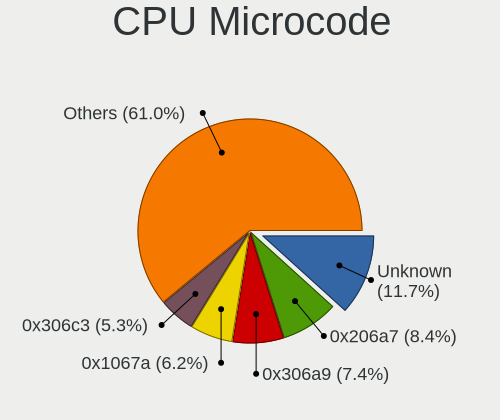

| Number     | Computers | Percent |
|------------|-----------|---------|
| Unknown    | 221       | 11.44%  |
| 0x206a7    | 161       | 8.34%   |
| 0x306a9    | 140       | 7.25%   |
| 0x1067a    | 126       | 6.53%   |
| 0x306c3    | 97        | 5.02%   |
| 0x6fd      | 61        | 3.16%   |
| 0x20655    | 46        | 2.38%   |
| 0x10676    | 38        | 1.97%   |
| 0x506e3    | 37        | 1.92%   |
| 0x40651    | 37        | 1.92%   |
| 0x906ea    | 34        | 1.76%   |
| 0x010000c8 | 33        | 1.71%   |
| 0x806ea    | 32        | 1.66%   |
| 0x30678    | 32        | 1.66%   |
| 0x406e3    | 30        | 1.55%   |
| 0x08108109 | 28        | 1.45%   |
| 0x906e9    | 27        | 1.4%    |
| 0x806ec    | 26        | 1.35%   |
| 0x20652    | 26        | 1.35%   |
| 0x806e9    | 25        | 1.29%   |
| 0x6fb      | 24        | 1.24%   |
| 0x306d4    | 24        | 1.24%   |
| 0x406c4    | 23        | 1.19%   |
| 0x06000852 | 23        | 1.19%   |
| 0x05000119 | 23        | 1.19%   |
| 0x806c1    | 21        | 1.09%   |
| 0x0800820d | 21        | 1.09%   |
| 0x08701021 | 20        | 1.04%   |
| 0xa0653    | 19        | 0.98%   |
| 0x6f6      | 19        | 0.98%   |
| 0x07030105 | 19        | 0.98%   |
| 0xa0652    | 17        | 0.88%   |
| 0x406c3    | 17        | 0.88%   |
| 0x106e5    | 17        | 0.88%   |
| 0x0700010f | 17        | 0.88%   |
| 0x706a1    | 15        | 0.78%   |
| 0x706e5    | 14        | 0.73%   |
| 0x106ca    | 14        | 0.73%   |
| 0x06001119 | 14        | 0.73%   |
| 0x906ed    | 13        | 0.67%   |

CPU Microarch
-------------

Microarchitecture

| Name             | Computers | Percent |
|------------------|-----------|---------|
| KabyLake         | 185       | 9.74%   |
| SandyBridge      | 183       | 9.63%   |
| Penryn           | 176       | 9.26%   |
| Haswell          | 159       | 8.37%   |
| IvyBridge        | 155       | 8.16%   |
| Core             | 124       | 6.53%   |
| Westmere         | 86        | 4.53%   |
| Silvermont       | 79        | 4.16%   |
| Skylake          | 78        | 4.11%   |
| K10              | 64        | 3.37%   |
| Zen+             | 61        | 3.21%   |
| Zen 2            | 50        | 2.63%   |
| CometLake        | 43        | 2.26%   |
| Piledriver       | 41        | 2.16%   |
| K8 Hammer        | 39        | 2.05%   |
| Unknown          | 35        | 1.84%   |
| Zen              | 32        | 1.68%   |
| Bobcat           | 31        | 1.63%   |
| Broadwell        | 29        | 1.53%   |
| Nehalem          | 27        | 1.42%   |
| TigerLake        | 24        | 1.26%   |
| Puma             | 24        | 1.26%   |
| Goldmont plus    | 22        | 1.16%   |
| Icelake          | 21        | 1.11%   |
| Bonnell          | 21        | 1.11%   |
| Jaguar           | 18        | 0.95%   |
| Excavator        | 18        | 0.95%   |
| Zen 3            | 16        | 0.84%   |
| Goldmont         | 16        | 0.84%   |
| K10 Llano        | 12        | 0.63%   |
| NetBurst         | 11        | 0.58%   |
| K8 & K10 hybrid  | 7         | 0.37%   |
| Steamroller      | 6         | 0.32%   |
| Bulldozer        | 5         | 0.26%   |
| Alderlake Hybrid | 2         | 0.11%   |

Graphics
--------

GPU Vendor
----------

Vendors of graphics cards

| Vendor                           | Computers | Percent |
|----------------------------------|-----------|---------|
| Intel                            | 1057      | 49.44%  |
| Nvidia                           | 583       | 27.27%  |
| AMD                              | 476       | 22.26%  |
| Matrox Electronics Systems       | 10        | 0.47%   |
| VIA Technologies                 | 6         | 0.28%   |
| Silicon Integrated Systems [SiS] | 4         | 0.19%   |
| ASPEED Technology                | 2         | 0.09%   |

GPU Model
---------

Graphics card models

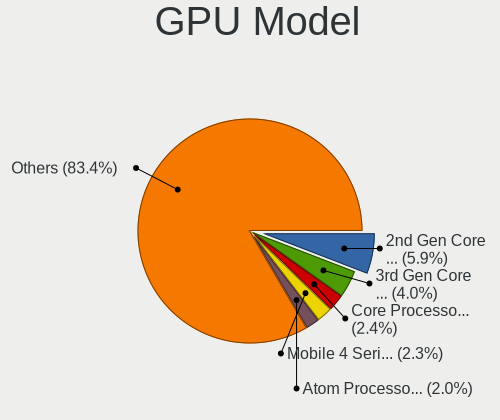

| Model                                                                                    | Computers | Percent |
|------------------------------------------------------------------------------------------|-----------|---------|
| Intel 2nd Generation Core Processor Family Integrated Graphics Controller                | 131       | 5.89%   |
| Intel 3rd Gen Core processor Graphics Controller                                         | 87        | 3.91%   |
| Intel Core Processor Integrated Graphics Controller                                      | 56        | 2.52%   |
| Intel Mobile 4 Series Chipset Integrated Graphics Controller                             | 53        | 2.38%   |
| AMD Picasso/Raven 2 [Radeon Vega Series / Radeon Vega Mobile Series]                     | 42        | 1.89%   |
| Intel Haswell-ULT Integrated Graphics Controller                                         | 41        | 1.84%   |
| Intel Xeon E3-1200 v3/4th Gen Core Processor Integrated Graphics Controller              | 40        | 1.8%    |
| Intel Atom/Celeron/Pentium Processor x5-E8000/J3xxx/N3xxx Integrated Graphics Controller | 40        | 1.8%    |
| Intel Atom Processor Z36xxx/Z37xxx Series Graphics & Display                             | 39        | 1.75%   |
| Intel Mobile GM965/GL960 Integrated Graphics Controller (secondary)                      | 37        | 1.66%   |
| Intel Mobile GM965/GL960 Integrated Graphics Controller (primary)                        | 37        | 1.66%   |
| Intel 4 Series Chipset Integrated Graphics Controller                                    | 37        | 1.66%   |
| Intel UHD Graphics 620                                                                   | 35        | 1.57%   |
| Intel 4th Gen Core Processor Integrated Graphics Controller                              | 31        | 1.39%   |
| AMD Ellesmere [Radeon RX 470/480/570/570X/580/580X/590]                                  | 31        | 1.39%   |
| Nvidia GK208B [GeForce GT 710]                                                           | 28        | 1.26%   |
| Nvidia GP107 [GeForce GTX 1050 Ti]                                                       | 27        | 1.21%   |
| Intel Skylake GT2 [HD Graphics 520]                                                      | 27        | 1.21%   |
| Intel HD Graphics 620                                                                    | 25        | 1.12%   |
| Intel Xeon E3-1200 v2/3rd Gen Core processor Graphics Controller                         | 24        | 1.08%   |
| Intel 82G33/G31 Express Integrated Graphics Controller                                   | 24        | 1.08%   |
| Intel TigerLake-LP GT2 [Iris Xe Graphics]                                                | 22        | 0.99%   |
| Intel HD Graphics 530                                                                    | 22        | 0.99%   |
| AMD Renoir                                                                               | 19        | 0.85%   |
| Intel CometLake-S GT2 [UHD Graphics 630]                                                 | 18        | 0.81%   |
| Intel CometLake-H GT2 [UHD Graphics]                                                     | 18        | 0.81%   |
| Intel WhiskeyLake-U GT2 [UHD Graphics 620]                                               | 17        | 0.76%   |
| Intel CometLake-U GT2 [UHD Graphics]                                                     | 17        | 0.76%   |
| Intel CoffeeLake-H GT2 [UHD Graphics 630]                                                | 17        | 0.76%   |
| AMD Raven Ridge [Radeon Vega Series / Radeon Vega Mobile Series]                         | 17        | 0.76%   |
| Intel HD Graphics 5500                                                                   | 16        | 0.72%   |
| Intel GeminiLake [UHD Graphics 600]                                                      | 16        | 0.72%   |
| Intel HD Graphics 630                                                                    | 15        | 0.67%   |
| AMD Cedar [Radeon HD 5000/6000/7350/8350 Series]                                         | 15        | 0.67%   |
| Nvidia GT218 [GeForce 210]                                                               | 14        | 0.63%   |
| AMD Mullins [Radeon R4/R5 Graphics]                                                      | 14        | 0.63%   |
| Nvidia GF117M [GeForce 610M/710M/810M/820M / GT 620M/625M/630M/720M]                     | 13        | 0.58%   |
| Intel Atom Processor D4xx/D5xx/N4xx/N5xx Integrated Graphics Controller                  | 13        | 0.58%   |
| Nvidia GP108 [GeForce GT 1030]                                                           | 12        | 0.54%   |
| Intel Iris Plus Graphics G1 (Ice Lake)                                                   | 12        | 0.54%   |

GPU Combo
---------

Combinations of graphics cards

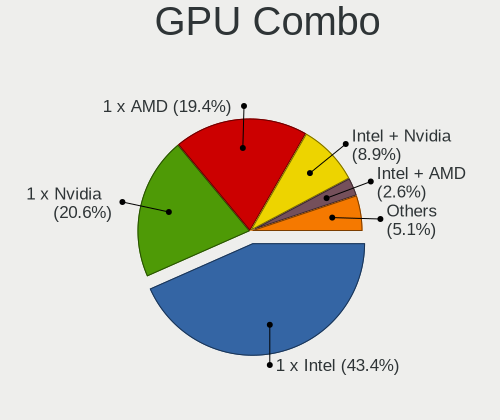

| Name                     | Computers | Percent |
|--------------------------|-----------|---------|
| 1 x Intel                | 826       | 43.36%  |
| 1 x Nvidia               | 392       | 20.58%  |
| 1 x AMD                  | 382       | 20.05%  |
| Intel + Nvidia           | 162       | 8.5%    |
| Intel + AMD              | 48        | 2.52%   |
| Other                    | 26        | 1.36%   |
| 2 x AMD                  | 25        | 1.31%   |
| AMD + Nvidia             | 16        | 0.84%   |
| 1 x Matrox               | 7         | 0.37%   |
| 1 x VIA                  | 6         | 0.31%   |
| 2 x Nvidia               | 4         | 0.21%   |
| 1 x SiS                  | 4         | 0.21%   |
| Nvidia + ASPEED          | 2         | 0.1%    |
| 2 x Nvidia + 1 x Matrox  | 1         | 0.05%   |
| 2 x AMD + 1 x Nvidia     | 1         | 0.05%   |
| Nvidia + Matrox          | 1         | 0.05%   |
| Intel + AMD + 1 x Nvidia | 1         | 0.05%   |
| AMD + Matrox             | 1         | 0.05%   |

GPU Driver
----------

Free vs proprietary

| Driver      | Computers | Percent |
|-------------|-----------|---------|
| Free        | 1490      | 78.01%  |
| Proprietary | 333       | 17.43%  |
| Unknown     | 87        | 4.55%   |

GPU Memory
----------

Total video memory

| Size in GB | Computers | Percent |
|------------|-----------|---------|
| Unknown    | 995       | 51.77%  |
| 0.01-0.5   | 301       | 15.66%  |
| 1.01-2.0   | 212       | 11.03%  |
| 0.51-1.0   | 209       | 10.87%  |
| 3.01-4.0   | 116       | 6.04%   |
| 7.01-8.0   | 42        | 2.19%   |
| 5.01-6.0   | 26        | 1.35%   |
| 2.01-3.0   | 9         | 0.47%   |
| 8.01-16.0  | 9         | 0.47%   |
| 4.01-5.0   | 2         | 0.1%    |
| 16.01-24.0 | 1         | 0.05%   |

Monitor
-------

Monitor Vendor
--------------

Monitor vendors

| Vendor                  | Computers | Percent |
|-------------------------|-----------|---------|
| Samsung Electronics     | 280       | 13.97%  |
| AU Optronics            | 209       | 10.43%  |
| LG Display              | 190       | 9.48%   |
| Chimei Innolux          | 122       | 6.09%   |
| Dell                    | 120       | 5.99%   |
| BOE                     | 111       | 5.54%   |
| Goldstar                | 87        | 4.34%   |
| Hewlett-Packard         | 81        | 4.04%   |
| Acer                    | 72        | 3.59%   |
| AOC                     | 52        | 2.59%   |
| Philips                 | 51        | 2.54%   |
| Chi Mei Optoelectronics | 50        | 2.5%    |
| Lenovo                  | 48        | 2.4%    |
| Ancor Communications    | 41        | 2.05%   |
| BenQ                    | 34        | 1.7%    |
| Apple                   | 32        | 1.6%    |
| ViewSonic               | 24        | 1.2%    |
| LG Philips              | 24        | 1.2%    |
| Unknown                 | 22        | 1.1%    |
| HannStar                | 22        | 1.1%    |
| Sony                    | 21        | 1.05%   |
| LG Electronics          | 21        | 1.05%   |
| Iiyama                  | 21        | 1.05%   |
| Fujitsu Siemens         | 19        | 0.95%   |
| Sharp                   | 17        | 0.85%   |
| Panasonic               | 16        | 0.8%    |
| InfoVision              | 14        | 0.7%    |
| NEC Computers           | 10        | 0.5%    |
| Medion                  | 9         | 0.45%   |
| Eizo                    | 9         | 0.45%   |
| Toshiba                 | 8         | 0.4%    |
| PANDA                   | 8         | 0.4%    |
| Vizio                   | 7         | 0.35%   |
| ASUSTek Computer        | 7         | 0.35%   |
| Vestel Elektronik       | 6         | 0.3%    |
| Lenovo Group Limited    | 5         | 0.25%   |
| MStar                   | 4         | 0.2%    |
| LPL                     | 4         | 0.2%    |
| LGD                     | 4         | 0.2%    |
| Idek Iiyama             | 4         | 0.2%    |

Monitor Model
-------------

Monitor models

| Model                                                                    | Computers | Percent |
|--------------------------------------------------------------------------|-----------|---------|
| AOC 24G2W1G5 AOC2402 1920x1080 527x296mm 23.8-inch                       | 15        | 0.73%   |
| Chi Mei Optoelectronics LCD Monitor CMO15A7 1366x768 344x193mm 15.5-inch | 12        | 0.58%   |
| LG Display LCD Monitor LGD02DC 1366x768 344x194mm 15.5-inch              | 11        | 0.53%   |
| Samsung Electronics LCD Monitor SEC5441 1366x768 344x194mm 15.5-inch     | 9         | 0.44%   |
| AU Optronics LCD Monitor AUO22EC 1366x768 344x193mm 15.5-inch            | 9         | 0.44%   |
| Panasonic TV MEIA296 1920x1080 698x392mm 31.5-inch                       | 8         | 0.39%   |
| LG Display LCD Monitor LGD0563 1920x1080 344x194mm 15.5-inch             | 8         | 0.39%   |
| AU Optronics LCD Monitor AUO26EC 1366x768 344x193mm 15.5-inch            | 8         | 0.39%   |
| Goldstar W1943 GSM4BAD 1360x768 406x229mm 18.4-inch                      | 7         | 0.34%   |
| Chimei Innolux LCD Monitor CMN14D4 1920x1080 309x173mm 13.9-inch         | 7         | 0.34%   |
| AU Optronics LCD Monitor AUO61ED 1920x1080 344x194mm 15.5-inch           | 7         | 0.34%   |
| Vestel Elektronik 40UHD_LCD_TV VES3700 3840x2160 890x500mm 40.2-inch     | 6         | 0.29%   |
| Chimei Innolux LCD Monitor CMN15F5 1920x1080 344x193mm 15.5-inch         | 6         | 0.29%   |
| Chimei Innolux LCD Monitor CMN14C9 1920x1080 309x173mm 13.9-inch         | 6         | 0.29%   |
| AU Optronics LCD Monitor AUO45EC 1366x768 344x193mm 15.5-inch            | 6         | 0.29%   |
| AU Optronics LCD Monitor AUO38ED 1920x1080 344x193mm 15.5-inch           | 6         | 0.29%   |
| Unknown LCD Monitor SAMSUNG 1920x1080                                    | 5         | 0.24%   |
| LG Display LCD Monitor LGD02E3 1366x768 344x194mm 15.5-inch              | 5         | 0.24%   |
| AU Optronics LCD Monitor AUO21ED 1920x1080 344x193mm 15.5-inch           | 5         | 0.24%   |
| AU Optronics LCD Monitor AUO21EC 1366x768 344x193mm 15.5-inch            | 5         | 0.24%   |
| AU Optronics LCD Monitor AUO10EC 1366x768 344x193mm 15.5-inch            | 5         | 0.24%   |
| Samsung Electronics S22F350 SAM0D1A 1920x1080 477x268mm 21.5-inch        | 4         | 0.19%   |
| Samsung Electronics LCD Monitor SEC3345 1280x800 331x207mm 15.4-inch     | 4         | 0.19%   |
| MStar TV MST0030 1920x1080 708x398mm 32.0-inch                           | 4         | 0.19%   |
| LG Display LCD Monitor LGD0456 1366x768 344x194mm 15.5-inch              | 4         | 0.19%   |
| LG Display LCD Monitor LGD033A 1366x768 344x194mm 15.5-inch              | 4         | 0.19%   |
| Lenovo LCD Monitor LEN40B1 1600x900 344x193mm 15.5-inch                  | 4         | 0.19%   |
| Lenovo LCD Monitor LEN40A0 1366x768 309x174mm 14.0-inch                  | 4         | 0.19%   |
| HannStar HSD101PFW2 HSD03E9 1024x600 222x125mm 10.0-inch                 | 4         | 0.19%   |
| Goldstar IPS FULLHD GSM5AB8 1920x1080 480x270mm 21.7-inch                | 4         | 0.19%   |
| Goldstar FULL HD GSM5B55 1920x1080 480x270mm 21.7-inch                   | 4         | 0.19%   |
| Chimei Innolux LCD Monitor CMN15DB 1366x768 344x193mm 15.5-inch          | 4         | 0.19%   |
| Chimei Innolux LCD Monitor CMN14C3 1366x768 309x173mm 13.9-inch          | 4         | 0.19%   |
| Chimei Innolux LCD Monitor CMN1130 1366x768 256x144mm 11.6-inch          | 4         | 0.19%   |
| BOE LCD Monitor BOE06A5 1366x768 344x194mm 15.5-inch                     | 4         | 0.19%   |
| BOE LCD Monitor BOE0687 1920x1080 344x193mm 15.5-inch                    | 4         | 0.19%   |
| AU Optronics LCD Monitor AUO8174 1280x800 331x207mm 15.4-inch            | 4         | 0.19%   |
| AU Optronics LCD Monitor AUO34ED 1920x1080 344x193mm 15.5-inch           | 4         | 0.19%   |
| AU Optronics LCD Monitor AUO312C 1366x768 293x164mm 13.2-inch            | 4         | 0.19%   |
| AU Optronics LCD Monitor AUO229E 1600x900 382x214mm 17.2-inch            | 4         | 0.19%   |

Monitor Resolution
------------------

Monitor screen resolution

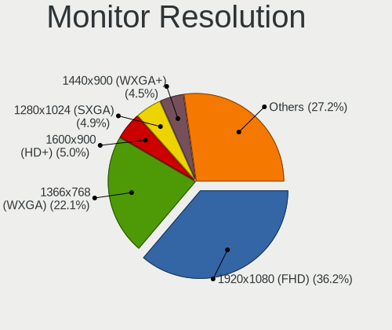

| Resolution         | Computers | Percent |
|--------------------|-----------|---------|
| 1920x1080 (FHD)    | 721       | 37.05%  |
| 1366x768 (WXGA)    | 437       | 22.46%  |
| 1600x900 (HD+)     | 98        | 5.04%   |
| 1280x1024 (SXGA)   | 98        | 5.04%   |
| 1440x900 (WXGA+)   | 93        | 4.78%   |
| 1280x800 (WXGA)    | 87        | 4.47%   |
| 3840x2160 (4K)     | 81        | 4.16%   |
| 1680x1050 (WSXGA+) | 66        | 3.39%   |
| 2560x1440 (QHD)    | 43        | 2.21%   |
| 1920x1200 (WUXGA)  | 43        | 2.21%   |
| Unknown            | 35        | 1.8%    |
| 1360x768           | 23        | 1.18%   |
| 1024x600           | 13        | 0.67%   |
| 3840x1080          | 12        | 0.62%   |
| 1600x1200          | 11        | 0.57%   |
| 1024x768 (XGA)     | 11        | 0.57%   |
| 2560x1600          | 7         | 0.36%   |
| 1920x540           | 7         | 0.36%   |
| 1280x720 (HD)      | 7         | 0.36%   |
| 3440x1440          | 6         | 0.31%   |
| 5120x1440          | 4         | 0.21%   |
| 2560x1080          | 4         | 0.21%   |
| 3840x1200          | 3         | 0.15%   |
| 3200x1800 (QHD+)   | 3         | 0.15%   |
| 3200x1080          | 3         | 0.15%   |
| 2880x1800          | 3         | 0.15%   |
| 2288x1287          | 3         | 0.15%   |
| 3840x2400          | 2         | 0.1%    |
| 3286x1080          | 2         | 0.1%    |
| 3200x900           | 2         | 0.1%    |
| 2960x1050          | 2         | 0.1%    |
| 6400x1440          | 1         | 0.05%   |
| 5760x2160          | 1         | 0.05%   |
| 5760x1200          | 1         | 0.05%   |
| 5280x2160          | 1         | 0.05%   |
| 4480x1440          | 1         | 0.05%   |
| 3600x1080          | 1         | 0.05%   |
| 3360x1080          | 1         | 0.05%   |
| 3280x1080          | 1         | 0.05%   |
| 3200x1024          | 1         | 0.05%   |

Monitor Diagonal
----------------

Diagonal size in inches

| Inches  | Computers | Percent |
|---------|-----------|---------|
| 15      | 455       | 22.92%  |
| 14      | 167       | 8.41%   |
| Unknown | 163       | 8.21%   |
| 13      | 143       | 7.2%    |
| 17      | 141       | 7.1%    |
| 24      | 121       | 6.1%    |
| 23      | 118       | 5.94%   |
| 21      | 104       | 5.24%   |
| 19      | 96        | 4.84%   |
| 27      | 85        | 4.28%   |
| 18      | 60        | 3.02%   |
| 20      | 46        | 2.32%   |
| 22      | 39        | 1.96%   |
| 31      | 38        | 1.91%   |
| 12      | 36        | 1.81%   |
| 11      | 28        | 1.41%   |
| 84      | 19        | 0.96%   |
| 10      | 17        | 0.86%   |
| 72      | 10        | 0.5%    |
| 54      | 9         | 0.45%   |
| 34      | 9         | 0.45%   |
| 16      | 9         | 0.45%   |
| 40      | 8         | 0.4%    |
| 32      | 8         | 0.4%    |
| 26      | 8         | 0.4%    |
| 25      | 8         | 0.4%    |
| 52      | 6         | 0.3%    |
| 48      | 5         | 0.25%   |
| 37      | 4         | 0.2%    |
| 28      | 4         | 0.2%    |
| 57      | 2         | 0.1%    |
| 49      | 2         | 0.1%    |
| 47      | 2         | 0.1%    |
| 46      | 2         | 0.1%    |
| 29      | 2         | 0.1%    |
| 142     | 1         | 0.05%   |
| 74      | 1         | 0.05%   |
| 69      | 1         | 0.05%   |
| 65      | 1         | 0.05%   |
| 60      | 1         | 0.05%   |

Monitor Width
-------------

Physical width

| Width in mm    | Computers | Percent |
|----------------|-----------|---------|
| 301-350        | 730       | 37.21%  |
| 501-600        | 315       | 16.06%  |
| 401-500        | 281       | 14.32%  |
| 351-400        | 169       | 8.61%   |
| Unknown        | 163       | 8.31%   |
| 201-300        | 151       | 7.7%    |
| 601-700        | 57        | 2.91%   |
| 1501-2000      | 31        | 1.58%   |
| 1001-1500      | 30        | 1.53%   |
| 701-800        | 17        | 0.87%   |
| 801-900        | 14        | 0.71%   |
| 901-1000       | 2         | 0.1%    |
| More than 2000 | 1         | 0.05%   |
| 101-200        | 1         | 0.05%   |

Aspect Ratio
------------

Proportional relationship between the width and the height

| Ratio   | Computers | Percent |
|---------|-----------|---------|
| 16/9    | 1245      | 68%     |
| 16/10   | 286       | 15.62%  |
| Unknown | 151       | 8.25%   |
| 5/4     | 96        | 5.24%   |
| 4/3     | 27        | 1.47%   |
| 21/9    | 9         | 0.49%   |
| 3/2     | 8         | 0.44%   |
| 6/5     | 3         | 0.16%   |
| 1.00    | 2         | 0.11%   |
| 32/9    | 1         | 0.05%   |
| 3.20    | 1         | 0.05%   |
| 1.96    | 1         | 0.05%   |
| 0.62    | 1         | 0.05%   |

Monitor Area
------------

Area in inch

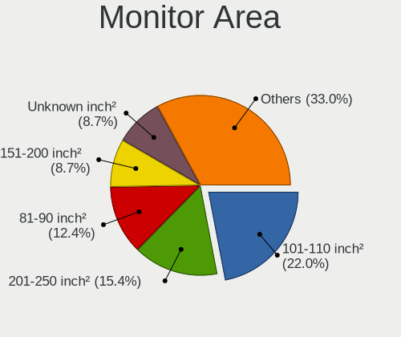

| Area in inch | Computers | Percent |
|----------------|-----------|---------|
| 101-110        | 457       | 23.16%  |
| 201-250        | 309       | 15.66%  |
| 81-90          | 251       | 12.72%  |
| 151-200        | 176       | 8.92%   |
| Unknown        | 163       | 8.26%   |
| 301-350        | 89        | 4.51%   |
| 141-150        | 89        | 4.51%   |
| 121-130        | 77        | 3.9%    |
| 351-500        | 59        | 2.99%   |
| More than 1000 | 57        | 2.89%   |
| 251-300        | 56        | 2.84%   |
| 71-80          | 53        | 2.69%   |
| 61-70          | 34        | 1.72%   |
| 51-60          | 28        | 1.42%   |
| 131-140        | 23        | 1.17%   |
| 501-1000       | 22        | 1.12%   |
| 41-50          | 17        | 0.86%   |
| 91-100         | 7         | 0.35%   |
| 111-120        | 5         | 0.25%   |
| 1-40           | 1         | 0.05%   |

Pixel Density
-------------

Pixels per inch

| Density       | Computers | Percent |
|---------------|-----------|---------|
| 51-100        | 717       | 37.4%   |
| 101-120       | 532       | 27.75%  |
| 121-160       | 388       | 20.24%  |
| Unknown       | 163       | 8.5%    |
| 161-240       | 53        | 2.76%   |
| 1-50          | 50        | 2.61%   |
| More than 240 | 14        | 0.73%   |

Multiple Monitors
-----------------

Total monitors connected

| Total | Computers | Percent |
|-------|-----------|---------|
| 1     | 1567      | 81.4%   |
| 2     | 254       | 13.19%  |
| 0     | 84        | 4.36%   |
| 3     | 17        | 0.88%   |
| 4     | 3         | 0.16%   |

Network
-------

Net Controller Vendor
---------------------

Controller vendors

| Vendor                            | Computers | Percent |
|-----------------------------------|-----------|---------|
| Realtek Semiconductor             | 1019      | 35.54%  |
| Intel                             | 807       | 28.15%  |
| Qualcomm Atheros                  | 349       | 12.17%  |
| Broadcom                          | 212       | 7.39%   |
| Nvidia                            | 49        | 1.71%   |
| Marvell Technology Group          | 47        | 1.64%   |
| Ralink Technology                 | 39        | 1.36%   |
| TP-Link                           | 38        | 1.33%   |
| Broadcom Limited                  | 38        | 1.33%   |
| Ralink                            | 34        | 1.19%   |
| Qualcomm Atheros Communications   | 17        | 0.59%   |
| Samsung Electronics               | 15        | 0.52%   |
| NetGear                           | 13        | 0.45%   |
| Huawei Technologies               | 13        | 0.45%   |
| D-Link System                     | 12        | 0.42%   |
| JMicron Technology                | 11        | 0.38%   |
| MediaTek                          | 10        | 0.35%   |
| Sierra Wireless                   | 9         | 0.31%   |
| D-Link                            | 9         | 0.31%   |
| VIA Technologies                  | 8         | 0.28%   |
| Ericsson Business Mobile Networks | 7         | 0.24%   |
| Edimax Technology                 | 7         | 0.24%   |
| Xiaomi                            | 6         | 0.21%   |
| Silicon Integrated Systems [SiS]  | 6         | 0.21%   |
| DisplayLink                       | 6         | 0.21%   |
| ASUSTek Computer                  | 6         | 0.21%   |
| Lenovo                            | 5         | 0.17%   |
| Dell                              | 5         | 0.17%   |
| Belkin Components                 | 5         | 0.17%   |
| Qualcomm                          | 4         | 0.14%   |
| Microsoft                         | 4         | 0.14%   |
| Linksys                           | 4         | 0.14%   |
| AVM                               | 4         | 0.14%   |
| Attansic Technology               | 4         | 0.14%   |
| ASIX Electronics                  | 4         | 0.14%   |
| Aquantia                          | 4         | 0.14%   |
| TRENDnet                          | 3         | 0.1%    |
| Fibocom                           | 3         | 0.1%    |
| Motorola PCS                      | 2         | 0.07%   |
| LG Electronics                    | 2         | 0.07%   |

Net Controller Model
--------------------

Controller models

| Model                                                                   | Computers | Percent |
|-------------------------------------------------------------------------|-----------|---------|
| Realtek RTL8111/8168/8411 PCI Express Gigabit Ethernet Controller       | 682       | 20.52%  |
| Realtek RTL810xE PCI Express Fast Ethernet controller                   | 165       | 4.97%   |
| Intel 82579LM Gigabit Network Connection (Lewisville)                   | 100       | 3.01%   |
| Qualcomm Atheros AR9485 Wireless Network Adapter                        | 54        | 1.63%   |
| Qualcomm Atheros QCA9565 / AR9565 Wireless Network Adapter              | 49        | 1.47%   |
| Intel Wi-Fi 6 AX200                                                     | 46        | 1.38%   |
| Qualcomm Atheros AR9285 Wireless Network Adapter (PCI-Express)          | 43        | 1.29%   |
| Intel Ethernet Connection I217-LM                                       | 39        | 1.17%   |
| Intel Wireless 8265 / 8275                                              | 37        | 1.11%   |
| Qualcomm Atheros QCA9377 802.11ac Wireless Network Adapter              | 35        | 1.05%   |
| Intel Wireless 7260                                                     | 34        | 1.02%   |
| Broadcom BCM4313 802.11bgn Wireless Network Adapter                     | 34        | 1.02%   |
| Intel PRO/Wireless 3945ABG [Golan] Network Connection                   | 32        | 0.96%   |
| Intel Centrino Advanced-N 6205 [Taylor Peak]                            | 31        | 0.93%   |
| Realtek RTL8723BE PCIe Wireless Network Adapter                         | 28        | 0.84%   |
| Intel Wireless 7265                                                     | 28        | 0.84%   |
| Realtek RTL8821CE 802.11ac PCIe Wireless Network Adapter                | 25        | 0.75%   |
| Intel I211 Gigabit Network Connection                                   | 25        | 0.75%   |
| Intel 82579V Gigabit Network Connection                                 | 24        | 0.72%   |
| Intel 82567LM-3 Gigabit Network Connection                              | 22        | 0.66%   |
| Realtek RTL8153 Gigabit Ethernet Adapter                                | 21        | 0.63%   |
| Realtek RTL-8100/8101L/8139 PCI Fast Ethernet Adapter                   | 21        | 0.63%   |
| Nvidia MCP61 Ethernet                                                   | 21        | 0.63%   |
| Intel Wireless 8260                                                     | 21        | 0.63%   |
| Qualcomm Atheros QCA6174 802.11ac Wireless Network Adapter              | 20        | 0.6%    |
| Qualcomm Atheros AR242x / AR542x Wireless Network Adapter (PCI-Express) | 20        | 0.6%    |
| Intel Wireless-AC 9260                                                  | 20        | 0.6%    |
| Intel Ethernet Connection (2) I219-V                                    | 20        | 0.6%    |
| Qualcomm Atheros AR928X Wireless Network Adapter (PCI-Express)          | 19        | 0.57%   |
| Intel 82577LM Gigabit Network Connection                                | 19        | 0.57%   |
| Realtek RTL8188CE 802.11b/g/n WiFi Adapter                              | 18        | 0.54%   |
| Intel Wi-Fi 6 AX201                                                     | 18        | 0.54%   |
| Realtek RTL8822CE 802.11ac PCIe Wireless Network Adapter                | 17        | 0.51%   |
| Intel Comet Lake PCH CNVi WiFi                                          | 17        | 0.51%   |
| Realtek RTL8188EUS 802.11n Wireless Network Adapter                     | 16        | 0.48%   |
| Realtek RTL8188EE Wireless Network Adapter                              | 16        | 0.48%   |
| Ralink MT7601U Wireless Adapter                                         | 16        | 0.48%   |
| Intel Wireless 3165                                                     | 16        | 0.48%   |
| Intel Dual Band Wireless-AC 3168NGW [Stone Peak]                        | 16        | 0.48%   |
| Intel Centrino Ultimate-N 6300                                          | 16        | 0.48%   |

Wireless Vendor
---------------

Wireless vendors

| Vendor                                | Computers | Percent |
|---------------------------------------|-----------|---------|
| Intel                                 | 530       | 37.06%  |
| Qualcomm Atheros                      | 284       | 19.86%  |
| Realtek Semiconductor                 | 249       | 17.41%  |
| Broadcom                              | 130       | 9.09%   |
| Ralink Technology                     | 39        | 2.73%   |
| TP-Link                               | 36        | 2.52%   |
| Ralink                                | 34        | 2.38%   |
| Broadcom Limited                      | 19        | 1.33%   |
| Qualcomm Atheros Communications       | 17        | 1.19%   |
| NetGear                               | 13        | 0.91%   |
| Sierra Wireless                       | 9         | 0.63%   |
| D-Link                                | 9         | 0.63%   |
| D-Link System                         | 8         | 0.56%   |
| Edimax Technology                     | 7         | 0.49%   |
| ASUSTek Computer                      | 6         | 0.42%   |
| Belkin Components                     | 5         | 0.35%   |
| Microsoft                             | 4         | 0.28%   |
| MediaTek                              | 4         | 0.28%   |
| Linksys                               | 4         | 0.28%   |
| AVM                                   | 4         | 0.28%   |
| TRENDnet                              | 3         | 0.21%   |
| Fibocom                               | 3         | 0.21%   |
| Dell                                  | 3         | 0.21%   |
| IMC Networks                          | 2         | 0.14%   |
| Hewlett-Packard                       | 2         | 0.14%   |
| ZyXEL Communications                  | 1         | 0.07%   |
| ZyDAS                                 | 1         | 0.07%   |
| Qualcomm                              | 1         | 0.07%   |
| Philips (or NXP)                      | 1         | 0.07%   |
| Marvell Technology Group              | 1         | 0.07%   |
| 802.11g Adapter [Linksys WUSB54GC v3] | 1         | 0.07%   |

Wireless Model
--------------

Wireless models

| Model                                                                   | Computers | Percent |
|-------------------------------------------------------------------------|-----------|---------|
| Qualcomm Atheros AR9485 Wireless Network Adapter                        | 54        | 3.73%   |
| Qualcomm Atheros QCA9565 / AR9565 Wireless Network Adapter              | 49        | 3.39%   |
| Intel Wi-Fi 6 AX200                                                     | 46        | 3.18%   |
| Qualcomm Atheros AR9285 Wireless Network Adapter (PCI-Express)          | 43        | 2.97%   |
| Intel Wireless 8265 / 8275                                              | 37        | 2.56%   |
| Qualcomm Atheros QCA9377 802.11ac Wireless Network Adapter              | 35        | 2.42%   |
| Intel Wireless 7260                                                     | 34        | 2.35%   |
| Broadcom BCM4313 802.11bgn Wireless Network Adapter                     | 34        | 2.35%   |
| Intel PRO/Wireless 3945ABG [Golan] Network Connection                   | 32        | 2.21%   |
| Intel Centrino Advanced-N 6205 [Taylor Peak]                            | 31        | 2.14%   |
| Realtek RTL8723BE PCIe Wireless Network Adapter                         | 28        | 1.94%   |
| Intel Wireless 7265                                                     | 28        | 1.94%   |
| Realtek RTL8821CE 802.11ac PCIe Wireless Network Adapter                | 25        | 1.73%   |
| Intel Wireless 8260                                                     | 21        | 1.45%   |
| Qualcomm Atheros QCA6174 802.11ac Wireless Network Adapter              | 20        | 1.38%   |
| Qualcomm Atheros AR242x / AR542x Wireless Network Adapter (PCI-Express) | 20        | 1.38%   |
| Intel Wireless-AC 9260                                                  | 20        | 1.38%   |
| Qualcomm Atheros AR928X Wireless Network Adapter (PCI-Express)          | 19        | 1.31%   |
| Realtek RTL8188CE 802.11b/g/n WiFi Adapter                              | 18        | 1.24%   |
| Intel Wi-Fi 6 AX201                                                     | 18        | 1.24%   |
| Realtek RTL8822CE 802.11ac PCIe Wireless Network Adapter                | 17        | 1.18%   |
| Intel Comet Lake PCH CNVi WiFi                                          | 17        | 1.18%   |
| Realtek RTL8188EUS 802.11n Wireless Network Adapter                     | 16        | 1.11%   |
| Realtek RTL8188EE Wireless Network Adapter                              | 16        | 1.11%   |
| Ralink MT7601U Wireless Adapter                                         | 16        | 1.11%   |
| Intel Wireless 3165                                                     | 16        | 1.11%   |
| Intel Dual Band Wireless-AC 3168NGW [Stone Peak]                        | 16        | 1.11%   |
| Intel Centrino Ultimate-N 6300                                          | 16        | 1.11%   |
| Intel Centrino Advanced-N 6200                                          | 16        | 1.11%   |
| Qualcomm Atheros AR9271 802.11n                                         | 15        | 1.04%   |
| Intel Comet Lake PCH-LP CNVi WiFi                                       | 15        | 1.04%   |
| Broadcom BCM43142 802.11b/g/n                                           | 14        | 0.97%   |
| Realtek RTL88x2bu [AC1200 Techkey]                                      | 13        | 0.9%    |
| Intel Wireless 3160                                                     | 13        | 0.9%    |
| Intel PRO/Wireless 4965 AG or AGN [Kedron] Network Connection           | 13        | 0.9%    |
| Intel Centrino Advanced-N 6235                                          | 13        | 0.9%    |
| Intel Cannon Lake PCH CNVi WiFi                                         | 13        | 0.9%    |
| Realtek RTL8188CUS 802.11n WLAN Adapter                                 | 12        | 0.83%   |
| Ralink RT3290 Wireless 802.11n 1T/1R PCIe                               | 12        | 0.83%   |
| Qualcomm Atheros AR9287 Wireless Network Adapter (PCI-Express)          | 12        | 0.83%   |

Ethernet Vendor
---------------

Ethernet vendors

| Vendor                           | Computers | Percent |
|----------------------------------|-----------|---------|
| Realtek Semiconductor            | 913       | 50.05%  |
| Intel                            | 485       | 26.59%  |
| Broadcom                         | 104       | 5.7%    |
| Qualcomm Atheros                 | 103       | 5.65%   |
| Nvidia                           | 49        | 2.69%   |
| Marvell Technology Group         | 46        | 2.52%   |
| Broadcom Limited                 | 19        | 1.04%   |
| Samsung Electronics              | 15        | 0.82%   |
| JMicron Technology               | 11        | 0.6%    |
| VIA Technologies                 | 8         | 0.44%   |
| Huawei Technologies              | 8         | 0.44%   |
| MediaTek                         | 7         | 0.38%   |
| Xiaomi                           | 6         | 0.33%   |
| Silicon Integrated Systems [SiS] | 6         | 0.33%   |
| DisplayLink                      | 6         | 0.33%   |
| Lenovo                           | 5         | 0.27%   |
| D-Link System                    | 4         | 0.22%   |
| Attansic Technology              | 4         | 0.22%   |
| ASIX Electronics                 | 4         | 0.22%   |
| Aquantia                         | 4         | 0.22%   |
| Qualcomm                         | 3         | 0.16%   |
| TP-Link                          | 2         | 0.11%   |
| Motorola PCS                     | 2         | 0.11%   |
| LG Electronics                   | 2         | 0.11%   |
| Apple                            | 2         | 0.11%   |
| 3Com                             | 2         | 0.11%   |
| Spreadtrum Communications        | 1         | 0.05%   |
| Mellanox Technologies            | 1         | 0.05%   |
| IBM                              | 1         | 0.05%   |
| HTC (High Tech Computer)         | 1         | 0.05%   |

Ethernet Model
--------------

Ethernet models

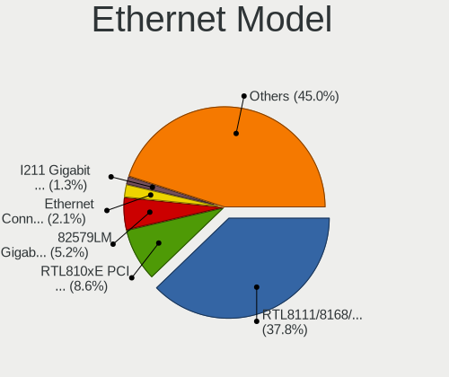

| Model                                                             | Computers | Percent |
|-------------------------------------------------------------------|-----------|---------|
| Realtek RTL8111/8168/8411 PCI Express Gigabit Ethernet Controller | 682       | 36.86%  |
| Realtek RTL810xE PCI Express Fast Ethernet controller             | 165       | 8.92%   |
| Intel 82579LM Gigabit Network Connection (Lewisville)             | 100       | 5.41%   |
| Intel Ethernet Connection I217-LM                                 | 39        | 2.11%   |
| Intel I211 Gigabit Network Connection                             | 25        | 1.35%   |
| Intel 82579V Gigabit Network Connection                           | 24        | 1.3%    |
| Intel 82567LM-3 Gigabit Network Connection                        | 22        | 1.19%   |
| Realtek RTL8153 Gigabit Ethernet Adapter                          | 21        | 1.14%   |
| Realtek RTL-8100/8101L/8139 PCI Fast Ethernet Adapter             | 21        | 1.14%   |
| Nvidia MCP61 Ethernet                                             | 21        | 1.14%   |
| Intel Ethernet Connection (2) I219-V                              | 20        | 1.08%   |
| Intel 82577LM Gigabit Network Connection                          | 19        | 1.03%   |
| Broadcom NetLink BCM57780 Gigabit Ethernet PCIe                   | 16        | 0.86%   |
| Realtek RTL8125 2.5GbE Controller                                 | 15        | 0.81%   |
| Qualcomm Atheros AR8151 v2.0 Gigabit Ethernet                     | 14        | 0.76%   |
| Intel Ethernet Connection I217-V                                  | 14        | 0.76%   |
| Intel 82567LM Gigabit Network Connection                          | 14        | 0.76%   |
| Intel Ethernet Connection (7) I219-V                              | 13        | 0.7%    |
| Intel Ethernet Connection I219-LM                                 | 12        | 0.65%   |
| Intel 82574L Gigabit Network Connection                           | 12        | 0.65%   |
| Intel 82566DM-2 Gigabit Network Connection                        | 12        | 0.65%   |
| Intel Ethernet Connection (4) I219-LM                             | 11        | 0.59%   |
| Broadcom NetLink BCM5787M Gigabit Ethernet PCI Express            | 11        | 0.59%   |
| Samsung Galaxy series, misc. (tethering mode)                     | 10        | 0.54%   |
| Qualcomm Atheros AR8131 Gigabit Ethernet                          | 10        | 0.54%   |
| Nvidia MCP77 Ethernet                                             | 10        | 0.54%   |
| Intel Ethernet Connection (4) I219-V                              | 10        | 0.54%   |
| Intel Ethernet Connection (2) I219-LM                             | 10        | 0.54%   |
| Qualcomm Atheros Killer E220x Gigabit Ethernet Controller         | 9         | 0.49%   |
| Qualcomm Atheros AR8152 v2.0 Fast Ethernet                        | 9         | 0.49%   |
| Qualcomm Atheros AR8132 Fast Ethernet                             | 9         | 0.49%   |
| Marvell Group 88E8040 PCI-E Fast Ethernet Controller              | 9         | 0.49%   |
| Intel Ethernet Connection (2) I218-V                              | 9         | 0.49%   |
| Broadcom NetXtreme BCM5764M Gigabit Ethernet PCIe                 | 9         | 0.49%   |
| Qualcomm Atheros QCA8172 Fast Ethernet                            | 8         | 0.43%   |
| Qualcomm Atheros AR8162 Fast Ethernet                             | 8         | 0.43%   |
| Qualcomm Atheros AR8161 Gigabit Ethernet                          | 8         | 0.43%   |
| Intel Ethernet Connection I218-LM                                 | 8         | 0.43%   |
| Broadcom NetXtreme BCM57765 Gigabit Ethernet PCIe                 | 8         | 0.43%   |
| Broadcom NetXtreme BCM5755M Gigabit Ethernet PCI Express          | 8         | 0.43%   |

Net Controller Kind
-------------------

Ethernet, WiFi or modem

| Kind     | Computers | Percent |
|----------|-----------|---------|
| Ethernet | 1728      | 55.72%  |
| WiFi     | 1346      | 43.41%  |
| Modem    | 25        | 0.81%   |
| Unknown  | 2         | 0.06%   |

Used Controller
---------------

Currently used network controller

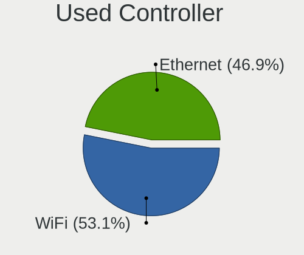

| Kind     | Computers | Percent |
|----------|-----------|---------|
| WiFi     | 1056      | 54.02%  |
| Ethernet | 899       | 45.98%  |

NICs
----

Total network controllers on board

| Total | Computers | Percent |
|-------|-----------|---------|
| 2     | 1035      | 54.39%  |
| 1     | 768       | 40.36%  |
| 0     | 58        | 3.05%   |
| 3     | 29        | 1.52%   |
| 4     | 11        | 0.58%   |
| 10    | 1         | 0.05%   |
| 5     | 1         | 0.05%   |

IPv6
----

IPv6 vs IPv4

| Used | Computers | Percent |
|------|-----------|---------|
| No   | 1617      | 83.87%  |
| Yes  | 311       | 16.13%  |

Bluetooth
---------

Bluetooth Vendor
----------------

Controller vendors

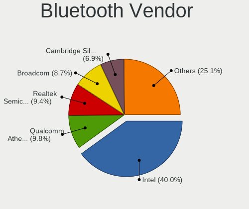

| Vendor                          | Computers | Percent |
|---------------------------------|-----------|---------|
| Intel                           | 345       | 39.93%  |
| Qualcomm Atheros Communications | 90        | 10.42%  |
| Realtek Semiconductor           | 81        | 9.38%   |
| Broadcom                        | 77        | 8.91%   |
| Cambridge Silicon Radio         | 57        | 6.6%    |
| Apple                           | 35        | 4.05%   |
| Lite-On Technology              | 30        | 3.47%   |
| IMC Networks                    | 30        | 3.47%   |
| Dell                            | 25        | 2.89%   |
| Foxconn / Hon Hai               | 19        | 2.2%    |
| Hewlett-Packard                 | 18        | 2.08%   |
| Ralink                          | 12        | 1.39%   |
| ASUSTek Computer                | 10        | 1.16%   |
| Toshiba                         | 9         | 1.04%   |
| Integrated System Solution      | 5         | 0.58%   |
| Alps Electric                   | 4         | 0.46%   |
| Chicony Electronics             | 3         | 0.35%   |
| Realtek                         | 2         | 0.23%   |
| Edimax Technology               | 2         | 0.23%   |
| TP-Link                         | 1         | 0.12%   |
| Taiyo Yuden                     | 1         | 0.12%   |
| Sitecom Europe                  | 1         | 0.12%   |
| Ralink Technology               | 1         | 0.12%   |
| Qcom                            | 1         | 0.12%   |
| MediaTek                        | 1         | 0.12%   |
| Fujitsu                         | 1         | 0.12%   |
| Foxconn International           | 1         | 0.12%   |
| Conwise Technology              | 1         | 0.12%   |
| Unknown                         | 1         | 0.12%   |

Bluetooth Model
---------------

Controller models

| Model                                               | Computers | Percent |
|-----------------------------------------------------|-----------|---------|
| Intel Bluetooth wireless interface                  | 141       | 16.3%   |
| Cambridge Silicon Radio Bluetooth Dongle (HCI mode) | 57        | 6.59%   |
| Intel AX201 Bluetooth                               | 52        | 6.01%   |
| Intel AX200 Bluetooth                               | 47        | 5.43%   |
| Realtek Bluetooth Radio                             | 43        | 4.97%   |
| Qualcomm Atheros  Bluetooth Device                  | 38        | 4.39%   |
| Intel Bluetooth 9460/9560 Jefferson Peak (JfP)      | 36        | 4.16%   |
| Realtek  Bluetooth 4.2 Adapter                      | 25        | 2.89%   |
| Intel Centrino Bluetooth Wireless Transceiver       | 23        | 2.66%   |
| Intel Wireless-AC 9260 Bluetooth Adapter            | 19        | 2.2%    |
| Qualcomm Atheros AR3011 Bluetooth                   | 16        | 1.85%   |
| Intel Wireless-AC 3168 Bluetooth                    | 16        | 1.85%   |
| Broadcom BCM2045B (BDC-2.1)                         | 15        | 1.73%   |
| Qualcomm Atheros AR3012 Bluetooth 4.0               | 13        | 1.5%    |
| Apple Bluetooth Host Controller                     | 13        | 1.5%    |
| Ralink RT3290 Bluetooth                             | 12        | 1.39%   |
| HP Bluetooth 2.0 Interface [Broadcom BCM2045]       | 12        | 1.39%   |
| Qualcomm Atheros AR9462 Bluetooth                   | 11        | 1.27%   |
| Lite-On Bluetooth Device                            | 11        | 1.27%   |
| Broadcom BCM20702A0 Bluetooth 4.0                   | 11        | 1.27%   |
| Lite-On Qualcomm Atheros QCA9377 Bluetooth          | 10        | 1.16%   |
| IMC Networks Bluetooth Device                       | 10        | 1.16%   |
| Realtek RTL8723B Bluetooth                          | 9         | 1.04%   |
| Lite-On Atheros AR3012 Bluetooth                    | 8         | 0.92%   |
| Intel Centrino Advanced-N 6230 Bluetooth adapter    | 8         | 0.92%   |
| Apple Built-in Bluetooth 2.0+EDR HCI                | 8         | 0.92%   |
| Qualcomm Atheros QCA61x4 Bluetooth 4.0              | 7         | 0.81%   |
| Dell DW375 Bluetooth Module                         | 7         | 0.81%   |
| Broadcom BCM20702 Bluetooth 4.0 [ThinkPad]          | 7         | 0.81%   |
| Apple Bluetooth USB Host Controller                 | 7         | 0.81%   |
| Apple Bluetooth HCI                                 | 7         | 0.81%   |
| IMC Networks Bluetooth Radio                        | 6         | 0.69%   |
| HP Broadcom 2070 Bluetooth Combo                    | 6         | 0.69%   |
| Dell Wireless 365 Bluetooth                         | 6         | 0.69%   |
| Broadcom BCM2045B (BDC-2.1) [Bluetooth Controller]  | 6         | 0.69%   |
| Broadcom BCM2045 Bluetooth                          | 6         | 0.69%   |
| Foxconn / Hon Hai BCM20702A0                        | 5         | 0.58%   |
| Broadcom BCM2070 Bluetooth 2.1 + EDR                | 5         | 0.58%   |
| Realtek RTL8821A Bluetooth                          | 4         | 0.46%   |
| Intel AX210 Bluetooth                               | 4         | 0.46%   |

Sound
-----

Sound Vendor
------------

Sound card vendors

| Vendor                           | Computers | Percent |
|----------------------------------|-----------|---------|
| Intel                            | 1360      | 53.54%  |
| AMD                              | 481       | 18.94%  |
| Nvidia                           | 433       | 17.05%  |
| C-Media Electronics              | 41        | 1.61%   |
| Creative Labs                    | 31        | 1.22%   |
| Logitech                         | 20        | 0.79%   |
| VIA Technologies                 | 16        | 0.63%   |
| Texas Instruments                | 14        | 0.55%   |
| GN Netcom                        | 11        | 0.43%   |
| Focusrite-Novation               | 9         | 0.35%   |
| Yamaha                           | 8         | 0.31%   |
| Silicon Integrated Systems [SiS] | 7         | 0.28%   |
| Lenovo                           | 6         | 0.24%   |
| Realtek Semiconductor            | 5         | 0.2%    |
| M-Audio                          | 5         | 0.2%    |
| Generalplus Technology           | 5         | 0.2%    |
| Sennheiser Communications        | 4         | 0.16%   |
| Plantronics                      | 4         | 0.16%   |
| TEAC                             | 3         | 0.12%   |
| JMTek                            | 3         | 0.12%   |
| EGO SYStems                      | 3         | 0.12%   |
| Creative Technology              | 3         | 0.12%   |
| BEHRINGER International          | 3         | 0.12%   |
| AKAI Professional M.I.           | 3         | 0.12%   |
| ZOOM                             | 2         | 0.08%   |
| Textech International            | 2         | 0.08%   |
| TerraTec Electronic              | 2         | 0.08%   |
| SAVITECH                         | 2         | 0.08%   |
| Samson Technologies              | 2         | 0.08%   |
| PreSonus Audio Electronics       | 2         | 0.08%   |
| KORG                             | 2         | 0.08%   |
| ESI Audiotechnik                 | 2         | 0.08%   |
| Corsair                          | 2         | 0.08%   |
| Cambridge Silicon Radio          | 2         | 0.08%   |
| Blue Microphones                 | 2         | 0.08%   |
| ASUSTek Computer                 | 2         | 0.08%   |
| Apple                            | 2         | 0.08%   |
| Alesis                           | 2         | 0.08%   |
| XMOS                             | 1         | 0.04%   |
| Xilinx                           | 1         | 0.04%   |

Sound Model
-----------

Sound card models

| Model                                                                                             | Computers | Percent |
|---------------------------------------------------------------------------------------------------|-----------|---------|
| Intel 7 Series/C216 Chipset Family High Definition Audio Controller                               | 160       | 5.39%   |
| Intel 6 Series/C200 Series Chipset Family High Definition Audio Controller                        | 155       | 5.22%   |
| AMD SBx00 Azalia (Intel HDA)                                                                      | 100       | 3.37%   |
| Intel 82801I (ICH9 Family) HD Audio Controller                                                    | 99        | 3.33%   |
| Intel Sunrise Point-LP HD Audio                                                                   | 97        | 3.27%   |
| Intel 8 Series/C220 Series Chipset High Definition Audio Controller                               | 93        | 3.13%   |
| Intel 5 Series/3400 Series Chipset High Definition Audio                                          | 93        | 3.13%   |
| AMD Family 17h/19h HD Audio Controller                                                            | 91        | 3.07%   |
| Intel NM10/ICH7 Family High Definition Audio Controller                                           | 89        | 3%      |
| AMD FCH Azalia Controller                                                                         | 89        | 3%      |
| Intel Xeon E3-1200 v3/4th Gen Core Processor HD Audio Controller                                  | 75        | 2.53%   |
| Intel 82801H (ICH8 Family) HD Audio Controller                                                    | 66        | 2.22%   |
| AMD Raven/Raven2/Fenghuang HDMI/DP Audio Controller                                               | 56        | 1.89%   |
| AMD Kabini HDMI/DP Audio                                                                          | 47        | 1.58%   |
| Intel 100 Series/C230 Series Chipset Family HD Audio Controller                                   | 43        | 1.45%   |
| Intel Haswell-ULT HD Audio Controller                                                             | 42        | 1.41%   |
| Intel 8 Series HD Audio Controller                                                                | 42        | 1.41%   |
| Nvidia GK208 HDMI/DP Audio Controller                                                             | 41        | 1.38%   |
| Intel Cannon Lake PCH cAVS                                                                        | 41        | 1.38%   |
| Nvidia GF108 High Definition Audio Controller                                                     | 38        | 1.28%   |
| Nvidia High Definition Audio Controller                                                           | 36        | 1.21%   |
| AMD Starship/Matisse HD Audio Controller                                                          | 36        | 1.21%   |
| Nvidia GP107GL High Definition Audio Controller                                                   | 35        | 1.18%   |
| AMD Ellesmere HDMI Audio [Radeon RX 470/480 / 570/580/590]                                        | 33        | 1.11%   |
| AMD Family 17h (Models 00h-0fh) HD Audio Controller                                               | 31        | 1.04%   |
| Intel Atom Processor Z36xxx/Z37xxx Series High Definition Audio Controller                        | 30        | 1.01%   |
| AMD Renoir Radeon High Definition Audio Controller                                                | 30        | 1.01%   |
| Intel 200 Series PCH HD Audio                                                                     | 27        | 0.91%   |
| Intel Broadwell-U Audio Controller                                                                | 25        | 0.84%   |
| AMD Wrestler HDMI Audio                                                                           | 25        | 0.84%   |
| Intel Wildcat Point-LP High Definition Audio Controller                                           | 24        | 0.81%   |
| Intel Tiger Lake-LP Smart Sound Technology Audio Controller                                       | 24        | 0.81%   |
| Intel Atom/Celeron/Pentium Processor x5-E8000/J3xxx/N3xxx Series High Definition Audio Controller | 24        | 0.81%   |
| Intel 82801JI (ICH10 Family) HD Audio Controller                                                  | 24        | 0.81%   |
| Intel Comet Lake PCH cAVS                                                                         | 23        | 0.77%   |
| Intel 82801JD/DO (ICH10 Family) HD Audio Controller                                               | 23        | 0.77%   |
| Nvidia MCP61 High Definition Audio                                                                | 22        | 0.74%   |
| Intel Celeron/Pentium Silver Processor High Definition Audio                                      | 22        | 0.74%   |
| AMD Oland/Hainan/Cape Verde/Pitcairn HDMI Audio [Radeon HD 7000 Series]                           | 22        | 0.74%   |
| Nvidia GK107 HDMI Audio Controller                                                                | 21        | 0.71%   |

Memory
------

Memory Vendor
-------------

Memory module vendors

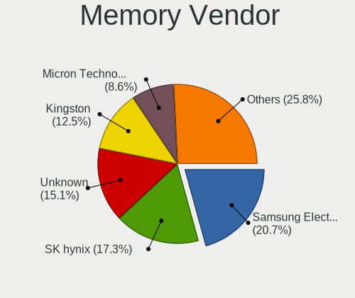

| Vendor                                           | Computers | Percent |
|--------------------------------------------------|-----------|---------|
| Samsung Electronics                              | 223       | 21.71%  |
| SK hynix                                         | 186       | 18.11%  |
| Unknown                                          | 158       | 15.38%  |
| Kingston                                         | 110       | 10.71%  |
| Micron Technology                                | 86        | 8.37%   |
| Crucial                                          | 59        | 5.74%   |
| Corsair                                          | 40        | 3.89%   |
| G.Skill                                          | 27        | 2.63%   |
| Elpida                                           | 27        | 2.63%   |
| Ramaxel Technology                               | 18        | 1.75%   |
| Nanya Technology                                 | 12        | 1.17%   |
| A-DATA Technology                                | 12        | 1.17%   |
| Unknown (ABCD)                                   | 8         | 0.78%   |
| Smart                                            | 8         | 0.78%   |
| Transcend                                        | 7         | 0.68%   |
| Team                                             | 6         | 0.58%   |
| Goodram                                          | 6         | 0.58%   |
| Patriot                                          | 4         | 0.39%   |
| Unifosa                                          | 3         | 0.29%   |
| Apacer                                           | 3         | 0.29%   |
| Timetec                                          | 2         | 0.19%   |
| Teikon                                           | 2         | 0.19%   |
| Avant                                            | 2         | 0.19%   |
| Unknown                                          | 2         | 0.19%   |
| Walton Chaintech                                 | 1         | 0.1%    |
| V-GeN                                            | 1         | 0.1%    |
| Unknown (0x36345431323830323145444C335342322020) | 1         | 0.1%    |
| Unknown (0x0043415455000000)                     | 1         | 0.1%    |
| Toshiba                                          | 1         | 0.1%    |
| Smart Brazil                                     | 1         | 0.1%    |
| SHARETRONIC                                      | 1         | 0.1%    |
| Sesame                                           | 1         | 0.1%    |
| Positivo                                         | 1         | 0.1%    |
| PNY                                              | 1         | 0.1%    |
| Memox                                            | 1         | 0.1%    |
| GeIL                                             | 1         | 0.1%    |
| CSX                                              | 1         | 0.1%    |
| Axiom                                            | 1         | 0.1%    |
| ASint Technology                                 | 1         | 0.1%    |
| 9?02                                             | 1         | 0.1%    |

Memory Model
------------

Memory module models

| Model                                                            | Computers | Percent |
|------------------------------------------------------------------|-----------|---------|
| SK hynix RAM HMA82GU6JJR8N-VK 16GB DIMM DDR4 2667MT/s            | 15        | 1.34%   |
| SK hynix RAM HMT451S6BFR8A-PB 4GB SODIMM DDR3 1600MT/s           | 10        | 0.89%   |
| Unknown RAM Module 2GB DIMM SDRAM                                | 9         | 0.8%    |
| SK hynix RAM HMA81GS6JJR8N-VK 8GB SODIMM DDR4 2667MT/s           | 9         | 0.8%    |
| Samsung RAM M471A5244CB0-CTD 4GB SODIMM DDR4 3266MT/s            | 9         | 0.8%    |
| SK hynix RAM HMA81GS6AFR8N-UH 8GB SODIMM DDR4 2667MT/s           | 8         | 0.71%   |
| Samsung RAM M471B5173QH0-YK0 4GB SODIMM DDR3 1600MT/s            | 8         | 0.71%   |
| Samsung RAM M471B5173DB0-YK0 4GB SODIMM DDR3 1600MT/s            | 8         | 0.71%   |
| Unknown (ABCD) RAM 123456789012345678 2GB SODIMM LPDDR4 2400MT/s | 7         | 0.63%   |
| SK hynix RAM HMT351S6CFR8C-PB 4GB SODIMM DDR3 1600MT/s           | 7         | 0.63%   |
| Samsung RAM M471B5273DH0-CH9 4096MB SODIMM DDR3 1334MT/s         | 7         | 0.63%   |
| Samsung RAM M471B5273CH0-CH9 4GB SODIMM DDR3 1334MT/s            | 7         | 0.63%   |
| Unknown RAM Module 8192MB SODIMM DDR4 2667MT/s                   | 6         | 0.54%   |
| Unknown RAM Module 2GB SODIMM DDR2 667MT/s                       | 6         | 0.54%   |
| Unknown RAM Module 2048MB SODIMM DDR3 1333MT/s                   | 6         | 0.54%   |
| Unknown RAM Module 2048MB DIMM SDRAM                             | 6         | 0.54%   |
| SK hynix RAM HMT41GS6AFR8A-PB 8GB SODIMM DDR3 1600MT/s           | 6         | 0.54%   |
| Samsung RAM M471A1K43DB1-CWE 8GB SODIMM DDR4 3200MT/s            | 6         | 0.54%   |
| Samsung RAM M471A1K43BB1-CRC 8192MB SODIMM DDR4 2667MT/s         | 6         | 0.54%   |
| Micron RAM 8JTF51264AZ-1G6E1 4GB DIMM DDR3 1600MT/s              | 6         | 0.54%   |
| Unknown RAM Module 4096MB SODIMM DDR3 1333MT/s                   | 5         | 0.45%   |
| Unknown RAM Module 4096MB DIMM 1333MT/s                          | 5         | 0.45%   |
| Unknown RAM Module 2048MB SODIMM DDR2 667MT/s                    | 5         | 0.45%   |
| Unknown RAM Module 2048MB SODIMM DDR2                            | 5         | 0.45%   |
| Unknown RAM Module 2048MB DIMM 1333MT/s                          | 5         | 0.45%   |
| Unknown RAM Module 1GB SODIMM DDR2 667MT/s                       | 5         | 0.45%   |
| SK hynix RAM HMT41GS6BFR8A-PB 8GB SODIMM DDR3 1600MT/s           | 5         | 0.45%   |
| Samsung RAM Module 8192MB SODIMM DDR4 3200MT/s                   | 5         | 0.45%   |
| Samsung RAM M471B1G73QH0-YK0 8192MB SODIMM DDR3 1600MT/s         | 5         | 0.45%   |
| Samsung RAM M471B1G73EB0-YK0 8GB SODIMM DDR3 1600MT/s            | 5         | 0.45%   |
| Samsung RAM M471B1G73DB0-YK0 8GB SODIMM DDR3 1600MT/s            | 5         | 0.45%   |
| Samsung RAM M471A2K43DB1-CTD 16GB SODIMM DDR4 2667MT/s           | 5         | 0.45%   |
| Micron RAM 4ATF51264HZ-2G6E1 4GB SODIMM DDR4 2667MT/s            | 5         | 0.45%   |
| Unknown RAM Module 2048MB DIMM DDR3 1333MT/s                     | 4         | 0.36%   |
| Unknown RAM Module 2048MB DIMM DDR2 800MT/s                      | 4         | 0.36%   |
| SK hynix RAM HMT351U6CFR8C-PB 4096MB DIMM DDR3 1800MT/s          | 4         | 0.36%   |
| SK hynix RAM HMT351S6EFR8A-PB 4096MB SODIMM DDR3 1600MT/s        | 4         | 0.36%   |
| SK hynix RAM HMA851S6JJR6N-VK 4GB SODIMM DDR4 2667MT/s           | 4         | 0.36%   |
| SK hynix RAM HMA851S6AFR6N-UH 2GB SODIMM LPDDR4 2667MT/s         | 4         | 0.36%   |
| Samsung RAM Module 8192MB Row Of Chips LPDDR3 2133MT/s           | 4         | 0.36%   |

Memory Kind
-----------

Memory module kinds

| Kind    | Computers | Percent |
|---------|-----------|---------|
| DDR3    | 364       | 40.09%  |
| DDR4    | 336       | 37%     |
| DDR2    | 81        | 8.92%   |
| SDRAM   | 47        | 5.18%   |
| Unknown | 30        | 3.3%    |
| LPDDR4  | 21        | 2.31%   |
| LPDDR3  | 16        | 1.76%   |
| DDR     | 9         | 0.99%   |
| DRAM    | 3         | 0.33%   |
| EEPROM  | 1         | 0.11%   |

Memory Form Factor
------------------

Physical design of the memory module

| Name         | Computers | Percent |
|--------------|-----------|---------|
| SODIMM       | 516       | 57.91%  |
| DIMM         | 336       | 37.71%  |
| Row Of Chips | 32        | 3.59%   |
| Chip         | 5         | 0.56%   |
| FB-DIMM      | 1         | 0.11%   |
| Unknown      | 1         | 0.11%   |

Memory Size
-----------

Memory module size

| Size  | Computers | Percent |
|-------|-----------|---------|
| 4096  | 306       | 31.13%  |
| 8192  | 293       | 29.81%  |
| 2048  | 192       | 19.53%  |
| 16384 | 116       | 11.8%   |
| 1024  | 55        | 5.6%    |
| 32768 | 14        | 1.42%   |
| 512   | 5         | 0.51%   |
| 1536  | 1         | 0.1%    |
| 1     | 1         | 0.1%    |

Memory Speed
------------

Memory module speed

| Speed   | Computers | Percent |
|---------|-----------|---------|
| 1600    | 218       | 22.5%   |
| 2667    | 147       | 15.17%  |
| 1333    | 86        | 8.88%   |
| 3200    | 77        | 7.95%   |
| 2400    | 66        | 6.81%   |
| 667     | 43        | 4.44%   |
| 1334    | 39        | 4.02%   |
| 800     | 39        | 4.02%   |
| Unknown | 38        | 3.92%   |
| 2133    | 36        | 3.72%   |
| 1066    | 16        | 1.65%   |
| 1867    | 15        | 1.55%   |
| 1067    | 15        | 1.55%   |
| 3600    | 14        | 1.44%   |
| 1866    | 13        | 1.34%   |
| 4199    | 12        | 1.24%   |
| 3266    | 10        | 1.03%   |
| 2666    | 10        | 1.03%   |
| 3000    | 8         | 0.83%   |
| 4267    | 7         | 0.72%   |
| 1800    | 7         | 0.72%   |
| 533     | 6         | 0.62%   |
| 3800    | 4         | 0.41%   |
| 2048    | 4         | 0.41%   |
| 400     | 4         | 0.41%   |
| 2733    | 3         | 0.31%   |
| 975     | 3         | 0.31%   |
| 49926   | 2         | 0.21%   |
| 3400    | 2         | 0.21%   |
| 2800    | 2         | 0.21%   |
| 2448    | 2         | 0.21%   |
| 2200    | 2         | 0.21%   |
| 1639    | 2         | 0.21%   |
| 8400    | 1         | 0.1%    |
| 4333    | 1         | 0.1%    |
| 4000    | 1         | 0.1%    |
| 3866    | 1         | 0.1%    |
| 3733    | 1         | 0.1%    |
| 3466    | 1         | 0.1%    |
| 3100    | 1         | 0.1%    |

Printers & scanners
-------------------

Printer Vendor
--------------

Printer device vendors

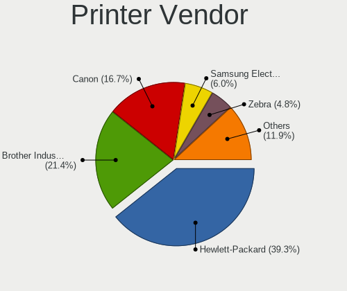

| Vendor                | Computers | Percent |
|-----------------------|-----------|---------|
| Hewlett-Packard       | 32        | 39.02%  |
| Brother Industries    | 18        | 21.95%  |
| Canon                 | 13        | 15.85%  |
| Samsung Electronics   | 5         | 6.1%    |
| Zebra                 | 4         | 4.88%   |
| Seiko Epson           | 3         | 3.66%   |
| STMicroelectronics    | 1         | 1.22%   |
| QinHeng Electronics   | 1         | 1.22%   |
| Prolific Technology   | 1         | 1.22%   |
| Pantum                | 1         | 1.22%   |
| Lexmark International | 1         | 1.22%   |
| Kyocera               | 1         | 1.22%   |
| Dymo-CoStar           | 1         | 1.22%   |

Printer Model
-------------

Printer device models

| Model                                                                 | Computers | Percent |
|-----------------------------------------------------------------------|-----------|---------|
| HP LaserJet 400 M401n                                                 | 4         | 4.88%   |
| Zebra ZP 450 Printer                                                  | 3         | 3.66%   |
| HP LaserJet P1005                                                     | 3         | 3.66%   |
| Brother HL-5370DW series                                              | 3         | 3.66%   |
| Seiko Epson L220 Series                                               | 2         | 2.44%   |
| HP OfficeJet Pro 7730 series                                          | 2         | 2.44%   |
| HP LaserJet 1320                                                      | 2         | 2.44%   |
| HP ENVY 4520 series                                                   | 2         | 2.44%   |
| HP DeskJet 3700 series                                                | 2         | 2.44%   |
| Brother HL-L2320D series                                              | 2         | 2.44%   |
| Brother HL-5340 series                                                | 2         | 2.44%   |
| Zebra ZTC ZP 500 (ZPL)                                                | 1         | 1.22%   |
| STMicroelectronics LED badge -- mini LED display -- 11x44             | 1         | 1.22%   |
| Seiko Epson ME OFFICE 620F Series/Stylus Office BX305F/BX305FW/TX320F | 1         | 1.22%   |
| Samsung Xerox Phaser 3117 Laser Printer                               | 1         | 1.22%   |
| Samsung SCX-4200 series                                               | 1         | 1.22%   |
| Samsung ML-2525W Series                                               | 1         | 1.22%   |
| Samsung M2070 Series                                                  | 1         | 1.22%   |
| Samsung M2020 Series                                                  | 1         | 1.22%   |
| QinHeng CH340S                                                        | 1         | 1.22%   |
| Prolific PL2305 Parallel Port                                         | 1         | 1.22%   |
| Pantum P2000                                                          | 1         | 1.22%   |
| Lexmark International E360d                                           | 1         | 1.22%   |
| Kyocera Mita FS-920                                                   | 1         | 1.22%   |
| HP OfficeJet Pro 9010 series                                          | 1         | 1.22%   |
| HP Officejet Pro 6230                                                 | 1         | 1.22%   |
| HP LaserJet P2055 series                                              | 1         | 1.22%   |
| HP LaserJet P2015 series                                              | 1         | 1.22%   |
| HP LaserJet P1006                                                     | 1         | 1.22%   |
| HP LaserJet M14-M17                                                   | 1         | 1.22%   |
| HP LaserJet CP 1025                                                   | 1         | 1.22%   |
| HP LaserJet 1020                                                      | 1         | 1.22%   |
| HP LaserJet 1018                                                      | 1         | 1.22%   |
| HP LaserJet 1015                                                      | 1         | 1.22%   |
| HP Deskjet F4400 series                                               | 1         | 1.22%   |
| HP DeskJet F300 series                                                | 1         | 1.22%   |
| HP DeskJet F2100 Printer series                                       | 1         | 1.22%   |
| HP DeskJet 5850c                                                      | 1         | 1.22%   |
| HP DeskJet 3630 series                                                | 1         | 1.22%   |
| HP Deskjet 3050A                                                      | 1         | 1.22%   |

Scanner Vendor
--------------

Scanner device vendors

| Vendor          | Computers | Percent |
|-----------------|-----------|---------|
| Canon           | 12        | 63.16%  |
| Seiko Epson     | 4         | 21.05%  |
| Hewlett-Packard | 3         | 15.79%  |

Scanner Model
-------------

Scanner device models

| Model                                                       | Computers | Percent |
|-------------------------------------------------------------|-----------|---------|
| Canon CanoScan LiDE 50/LiDE 35/LiDE 40                      | 3         | 15.79%  |
| Seiko Epson GT-X900 [Perfection V700/V750 Photo]            | 1         | 5.26%   |
| Seiko Epson GT-X770 [Perfection V500]                       | 1         | 5.26%   |
| Seiko Epson GT-8200U/GT-8200UF [Perfection 1650/1650 PHOTO] | 1         | 5.26%   |
| Seiko Epson GT-7700U [Perfection 1240U]                     | 1         | 5.26%   |
| HP ScanJet 82x0C                                            | 1         | 5.26%   |
| HP ScanJet 5590                                             | 1         | 5.26%   |
| HP ScanJet 3570c                                            | 1         | 5.26%   |
| Canon CanoScan N670U/N676U/LiDE 20                          | 1         | 5.26%   |
| Canon CanoScan LiDE 90                                      | 1         | 5.26%   |
| Canon CanoScan LIDE 25                                      | 1         | 5.26%   |
| Canon CanoScan LiDE 220                                     | 1         | 5.26%   |
| Canon CanoScan LiDE 210                                     | 1         | 5.26%   |
| Canon CanoScan LiDE 200                                     | 1         | 5.26%   |
| Canon CanoScan LiDE 120                                     | 1         | 5.26%   |
| Canon CanoScan LiDE 110                                     | 1         | 5.26%   |
| Canon CanoScan LiDE 100                                     | 1         | 5.26%   |

Camera
------

Camera Vendor
-------------

Camera device vendors

| Vendor                                 | Computers | Percent |
|----------------------------------------|-----------|---------|
| Chicony Electronics                    | 256       | 25.05%  |
| Microdia                               | 76        | 7.44%   |
| Realtek Semiconductor                  | 68        | 6.65%   |
| IMC Networks                           | 66        | 6.46%   |
| Acer                                   | 62        | 6.07%   |
| Sunplus Innovation Technology          | 55        | 5.38%   |
| Logitech                               | 53        | 5.19%   |
| Suyin                                  | 49        | 4.79%   |
| Cheng Uei Precision Industry (Foxlink) | 33        | 3.23%   |
| Apple                                  | 33        | 3.23%   |
| Quanta                                 | 32        | 3.13%   |
| Lite-On Technology                     | 26        | 2.54%   |
| Syntek                                 | 24        | 2.35%   |
| Alcor Micro                            | 20        | 1.96%   |
| Silicon Motion                         | 19        | 1.86%   |
| Ricoh                                  | 17        | 1.66%   |
| Samsung Electronics                    | 12        | 1.17%   |
| Microsoft                              | 12        | 1.17%   |
| Lenovo                                 | 8         | 0.78%   |
| Z-Star Microelectronics                | 7         | 0.68%   |
| Importek                               | 6         | 0.59%   |
| Generalplus Technology                 | 6         | 0.59%   |
| MacroSilicon                           | 5         | 0.49%   |
| Luxvisions Innotech Limited            | 5         | 0.49%   |
| Jieli Technology                       | 5         | 0.49%   |
| ALi                                    | 5         | 0.49%   |
| OmniVision Technologies                | 4         | 0.39%   |
| GEMBIRD                                | 4         | 0.39%   |
| DigiTech                               | 4         | 0.39%   |
| ARC International                      | 4         | 0.39%   |
| Trust                                  | 3         | 0.29%   |
| Sunplus Technology                     | 3         | 0.29%   |
| Primax Electronics                     | 3         | 0.29%   |
| Cubeternet                             | 3         | 0.29%   |
| Creative Technology                    | 3         | 0.29%   |
| USB Camera                             | 2         | 0.2%    |
| Unknown                                | 2         | 0.2%    |
| Razer USA                              | 2         | 0.2%    |
| Linux Foundation                       | 2         | 0.2%    |
| KYE Systems (Mouse Systems)            | 2         | 0.2%    |

Camera Model
------------

Camera device models

| Model                                                       | Computers | Percent |
|-------------------------------------------------------------|-----------|---------|
| Chicony Integrated Camera                                   | 39        | 3.8%    |
| Realtek Integrated_Webcam_HD                                | 20        | 1.95%   |
| Chicony USB 2.0 Camera                                      | 18        | 1.75%   |
| Microdia Integrated_Webcam_HD                               | 17        | 1.66%   |
| IMC Networks USB2.0 HD UVC WebCam                           | 15        | 1.46%   |
| Logitech Webcam C270                                        | 14        | 1.36%   |
| IMC Networks Integrated Camera                              | 13        | 1.27%   |
| Chicony HP Truevision HD                                    | 13        | 1.27%   |
| Sunplus Integrated_Webcam_HD                                | 12        | 1.17%   |
| Samsung Galaxy A5 (MTP)                                     | 12        | 1.17%   |
| Chicony TOSHIBA Web Camera - HD                             | 12        | 1.17%   |
| Chicony HD WebCam                                           | 11        | 1.07%   |
| Cheng Uei Precision Industry (Foxlink) HP Webcam            | 11        | 1.07%   |
| Alcor Micro USB 2.0 Camera                                  | 11        | 1.07%   |
| Acer Lenovo EasyCamera                                      | 11        | 1.07%   |
| Acer Integrated Camera                                      | 11        | 1.07%   |
| Microdia Integrated Webcam                                  | 10        | 0.97%   |
| Logitech HD Pro Webcam C920                                 | 10        | 0.97%   |
| Lite-On Integrated Camera                                   | 10        | 0.97%   |
| Chicony USB2.0 VGA UVC WebCam                               | 10        | 0.97%   |
| Apple iPhone5/5C/5S/6                                       | 10        | 0.97%   |
| Apple Built-in iSight                                       | 10        | 0.97%   |
| Syntek Lenovo EasyCamera                                    | 9         | 0.88%   |
| Syntek Integrated Camera                                    | 9         | 0.88%   |
| Lite-On HP HD Camera                                        | 9         | 0.88%   |
| Suyin HP TrueVision HD                                      | 8         | 0.78%   |
| Realtek USB Camera                                          | 8         | 0.78%   |
| IMC Networks USB2.0 VGA UVC WebCam                          | 8         | 0.78%   |
| Chicony Lenovo EasyCamera                                   | 8         | 0.78%   |
| Quanta HP TrueVision HD Camera                              | 7         | 0.68%   |
| Microdia USB 2.0 Camera                                     | 7         | 0.68%   |
| Chicony USB2.0 Camera                                       | 7         | 0.68%   |
| Chicony Integrated Camera (1280x720@30)                     | 7         | 0.68%   |
| Acer BisonCam, NB Pro                                       | 7         | 0.68%   |
| Suyin 1.3M WebCam (notebook emachines E730, Acer sub-brand) | 6         | 0.58%   |
| Sunplus HD WebCam                                           | 6         | 0.58%   |
| IMC Networks UVC VGA Webcam                                 | 6         | 0.58%   |
| Chicony HP HD Webcam                                        | 6         | 0.58%   |
| Chicony FJ Camera                                           | 6         | 0.58%   |
| Apple FaceTime HD Camera (Built-in)                         | 6         | 0.58%   |

Security
--------

Fingerprint Vendor
------------------

Fingerprint sensor vendors

| Vendor                     | Computers | Percent |
|----------------------------|-----------|---------|
| Validity Sensors           | 76        | 41.53%  |
| Synaptics                  | 39        | 21.31%  |
| AuthenTec                  | 29        | 15.85%  |
| Upek                       | 12        | 6.56%   |
| Shenzhen Goodix Technology | 9         | 4.92%   |
| LighTuning Technology      | 7         | 3.83%   |
| STMicroelectronics         | 6         | 3.28%   |
| Elan Microelectronics      | 4         | 2.19%   |
| Samsung Electronics        | 1         | 0.55%   |

Fingerprint Model
-----------------

Fingerprint sensor models

| Model                                                                      | Computers | Percent |
|----------------------------------------------------------------------------|-----------|---------|
| Synaptics Prometheus MIS Touch Fingerprint Reader                          | 19        | 10.38%  |
| Validity Sensors VFS495 Fingerprint Reader                                 | 16        | 8.74%   |
| Upek Biometric Touchchip/Touchstrip Fingerprint Sensor                     | 11        | 6.01%   |
| Validity Sensors VFS 5011 fingerprint sensor                               | 10        | 5.46%   |
| Validity Sensors Fingerprint scanner                                       | 9         | 4.92%   |
| AuthenTec AES2501 Fingerprint Sensor                                       | 9         | 4.92%   |
| Validity Sensors VFS5011 Fingerprint Reader                                | 8         | 4.37%   |
| AuthenTec AES2810                                                          | 8         | 4.37%   |
| Validity Sensors VFS471 Fingerprint Reader                                 | 7         | 3.83%   |
| Validity Sensors VFS451 Fingerprint Reader                                 | 7         | 3.83%   |
| AuthenTec Fingerprint Sensor                                               | 7         | 3.83%   |
| Validity Sensors VFS491                                                    | 6         | 3.28%   |
| Synaptics Metallica MIS Touch Fingerprint Reader                           | 6         | 3.28%   |
| STMicroelectronics Fingerprint Reader                                      | 6         | 3.28%   |
| Shenzhen Goodix  FingerPrint Device                                        | 6         | 3.28%   |
| Unknown                                                                    | 6         | 3.28%   |
| Validity Sensors Synaptics WBDI                                            | 4         | 2.19%   |
| Synaptics Metallica MOH Touch Fingerprint Reader                           | 4         | 2.19%   |
| AuthenTec AES1600                                                          | 4         | 2.19%   |
| Validity Sensors Synaptics VFS7552 Touch Fingerprint Sensor with PurePrint | 3         | 1.64%   |
| LighTuning EgisTec Touch Fingerprint Sensor                                | 3         | 1.64%   |
| Validity Sensors VFS Fingerprint sensor                                    | 2         | 1.09%   |
| Validity Sensors Swipe Fingerprint Sensor                                  | 2         | 1.09%   |
| Synaptics  FS7604 Touch Fingerprint Sensor with PurePrint                  | 2         | 1.09%   |
| Shenzhen Goodix Fingerprint Reader                                         | 2         | 1.09%   |
| LighTuning Fingerprint Reader                                              | 2         | 1.09%   |
| LighTuning ES603 Swipe Fingerprint Sensor                                  | 2         | 1.09%   |
| Elan ELAN:Fingerprint                                                      | 2         | 1.09%   |
| Elan ELAN:ARM-M4                                                           | 2         | 1.09%   |
| Validity Sensors VFS7500 Touch Fingerprint Sensor                          | 1         | 0.55%   |
| Validity Sensors VFS101 Fingerprint Reader                                 | 1         | 0.55%   |
| Upek TCS5B Fingerprint sensor                                              | 1         | 0.55%   |
| Synaptics WBDI Device                                                      | 1         | 0.55%   |
| Synaptics  VFS7552 Touch Fingerprint Sensor with PurePrint                 | 1         | 0.55%   |
| Shenzhen Goodix FingerPrint                                                | 1         | 0.55%   |
| Samsung Fingerprint Sensor Device - 730B                                   | 1         | 0.55%   |
| AuthenTec AES2550 Fingerprint Sensor                                       | 1         | 0.55%   |

Chipcard Vendor
---------------

Chipcard module vendors

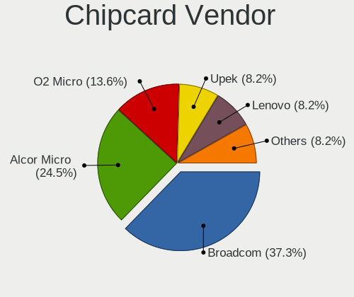

| Vendor                    | Computers | Percent |
|---------------------------|-----------|---------|
| Broadcom                  | 37        | 35.58%  |
| Alcor Micro               | 27        | 25.96%  |
| O2 Micro                  | 15        | 14.42%  |
| Lenovo                    | 9         | 8.65%   |
| Upek                      | 8         | 7.69%   |
| OmniKey                   | 3         | 2.88%   |
| Reiner SCT Kartensysteme  | 1         | 0.96%   |
| Gemalto (was Gemplus)     | 1         | 0.96%   |
| Fujitsu Siemens Computers | 1         | 0.96%   |
| Cherry                    | 1         | 0.96%   |
| C3PO                      | 1         | 0.96%   |

Chipcard Model
--------------

Chipcard module models

| Model                                                                        | Computers | Percent |
|------------------------------------------------------------------------------|-----------|---------|
| Alcor Micro AU9540 Smartcard Reader                                          | 27        | 25.96%  |
| O2 Micro OZ776 CCID Smartcard Reader                                         | 14        | 13.46%  |
| Broadcom BCM5880 Secure Applications Processor                               | 14        | 13.46%  |
| Broadcom 5880                                                                | 11        | 10.58%  |
| Upek TouchChip Fingerprint Coprocessor (WBF advanced mode)                   | 8         | 7.69%   |
| Lenovo Integrated Smart Card Reader                                          | 8         | 7.69%   |
| Broadcom BCM5880 Secure Applications Processor with fingerprint swipe sensor | 7         | 6.73%   |
| Broadcom 58200                                                               | 5         | 4.81%   |
| OmniKey CardMan 3021 / 3121                                                  | 2         | 1.92%   |
| Reiner SCT Kartensysteme cyberJack RFID basis contactless smartcard reader   | 1         | 0.96%   |
| OmniKey CardMan Smart@Link                                                   | 1         | 0.96%   |
| O2 Micro Oz776 SmartCard Reader                                              | 1         | 0.96%   |
| Lenovo Smartcard Keyboard                                                    | 1         | 0.96%   |
| Gemalto (was Gemplus) GemPC Key SmartCard Reader                             | 1         | 0.96%   |
| Fujitsu Siemens Computers SmartCard Reader 2A                                | 1         | 0.96%   |
| Cherry SmartTerminal XX44                                                    | 1         | 0.96%   |
| C3PO USB SMART CARD READER                                                   | 1         | 0.96%   |

Unsupported
-----------

Unsupported Devices
-------------------

Total unsupported devices on board

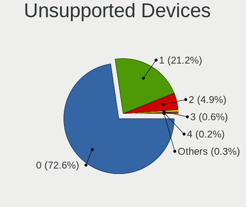

| Total | Computers | Percent |
|-------|-----------|---------|
| 0     | 1426      | 74.27%  |
| 1     | 401       | 20.89%  |
| 2     | 73        | 3.8%    |
| 3     | 9         | 0.47%   |
| 4     | 7         | 0.36%   |
| 5     | 2         | 0.1%    |
| 10    | 1         | 0.05%   |
| 6     | 1         | 0.05%   |

Unsupported Device Types
------------------------

Types of unsupported devices

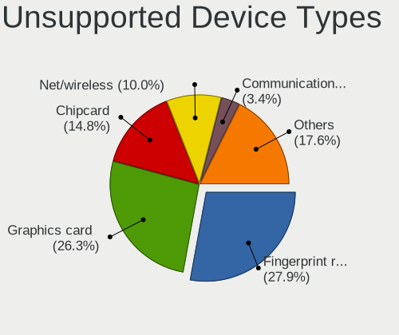

| Type                     | Computers | Percent |
|--------------------------|-----------|---------|
| Fingerprint reader       | 183       | 30.96%  |
| Graphics card            | 111       | 18.78%  |
| Chipcard                 | 99        | 16.75%  |
| Net/wireless             | 66        | 11.17%  |
| Communication controller | 22        | 3.72%   |
| Unassigned class         | 16        | 2.71%   |
| Camera                   | 16        | 2.71%   |
| Bluetooth                | 15        | 2.54%   |
| Sound                    | 13        | 2.2%    |
| Multimedia controller    | 12        | 2.03%   |
| Card reader              | 12        | 2.03%   |
| Storage                  | 10        | 1.69%   |
| Net/ethernet             | 5         | 0.85%   |
| Flash memory             | 5         | 0.85%   |
| Network                  | 2         | 0.34%   |
| Modem                    | 2         | 0.34%   |
| Storage/raid             | 1         | 0.17%   |
| Dvb card                 | 1         | 0.17%   |

