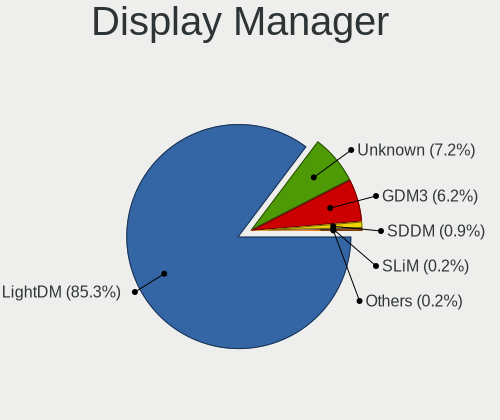
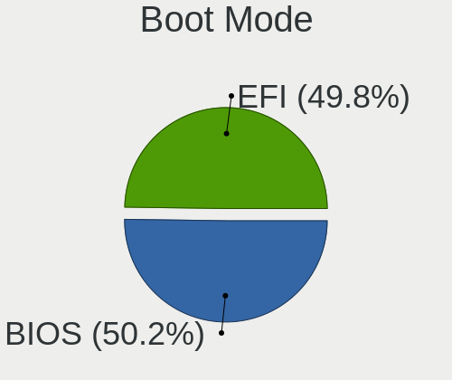
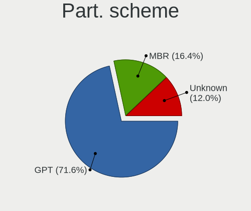
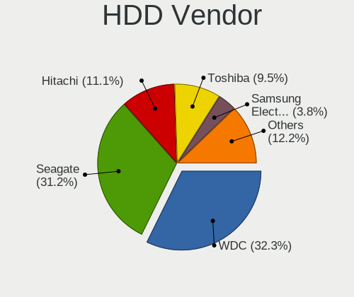
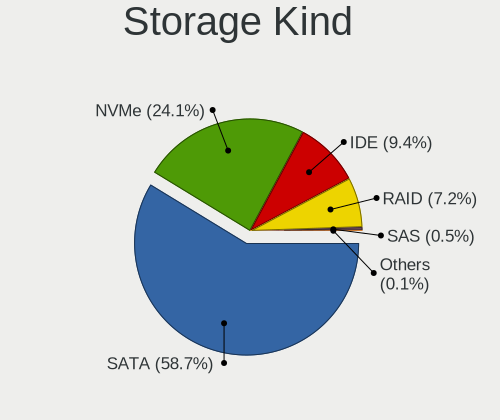
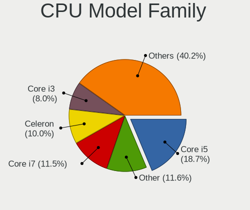
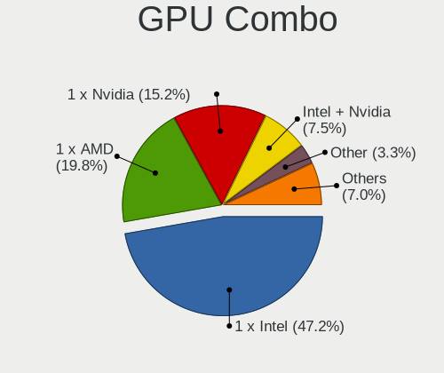
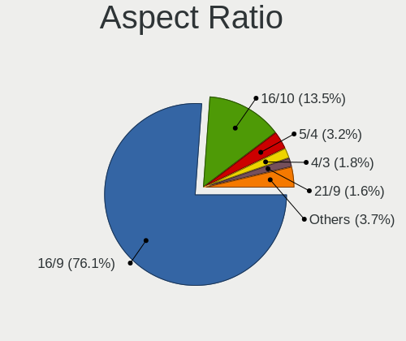
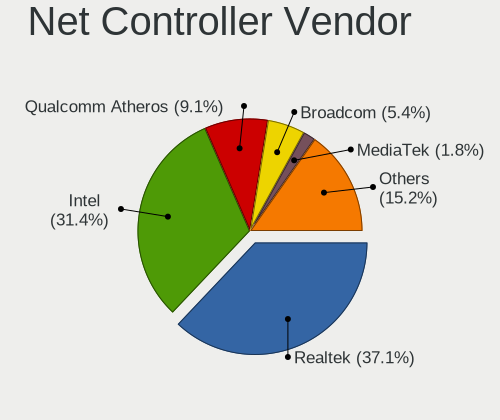
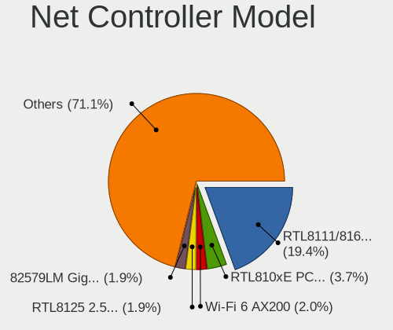

Xubuntu 22.04 - Tested Hardware & Statistics
--------------------------------------------

A project to collect tested hardware configurations for Xubuntu 22.04.

Anyone can contribute to this report by the [hw-probe](https://github.com/linuxhw/hw-probe) tool:

    sudo -E hw-probe -all -upload

Please contribute! Especially if your hardware is rare.

This is a report for all computer types. See also reports for [desktops](/Dist/Xubuntu_22.04/Desktop/README.md) and [notebooks](/Dist/Xubuntu_22.04/Notebook/README.md).

Contents
--------

* [ Test Cases ](#test-cases)

* [ System ](#system)
  - [ Kernel                   ](#kernel)
  - [ Kernel Family            ](#kernel-family)
  - [ Kernel Major Ver.        ](#kernel-major-ver)
  - [ Arch                     ](#arch)
  - [ DE                       ](#de)
  - [ Display Server           ](#display-server)
  - [ Display Manager          ](#display-manager)
  - [ OS Lang                  ](#os-lang)
  - [ Boot Mode                ](#boot-mode)
  - [ Filesystem               ](#filesystem)
  - [ Part. scheme             ](#part-scheme)
  - [ Dual Boot with Linux/BSD ](#dual-boot-with-linuxbsd)
  - [ Dual Boot (Win)          ](#dual-boot-win)

* [ Board ](#board)
  - [ Vendor                   ](#vendor)
  - [ Model                    ](#model)
  - [ Model Family             ](#model-family)
  - [ MFG Year                 ](#mfg-year)
  - [ Form Factor              ](#form-factor)
  - [ Secure Boot              ](#secure-boot)
  - [ Coreboot                 ](#coreboot)
  - [ RAM Size                 ](#ram-size)
  - [ RAM Used                 ](#ram-used)
  - [ Total Drives             ](#total-drives)
  - [ Has CD-ROM               ](#has-cd-rom)
  - [ Has Ethernet             ](#has-ethernet)
  - [ Has WiFi                 ](#has-wifi)
  - [ Has Bluetooth            ](#has-bluetooth)

* [ Location ](#location)
  - [ Country                  ](#country)
  - [ City                     ](#city)

* [ Drives ](#drives)
  - [ Drive Vendor             ](#drive-vendor)
  - [ Drive Model              ](#drive-model)
  - [ HDD Vendor               ](#hdd-vendor)
  - [ SSD Vendor               ](#ssd-vendor)
  - [ Drive Kind               ](#drive-kind)
  - [ Drive Connector          ](#drive-connector)
  - [ Drive Size               ](#drive-size)
  - [ Space Total              ](#space-total)
  - [ Space Used               ](#space-used)
  - [ Malfunc. Drives          ](#malfunc-drives)
  - [ Malfunc. Drive Vendor    ](#malfunc-drive-vendor)
  - [ Malfunc. HDD Vendor      ](#malfunc-hdd-vendor)
  - [ Malfunc. Drive Kind      ](#malfunc-drive-kind)
  - [ Failed Drives            ](#failed-drives)
  - [ Failed Drive Vendor      ](#failed-drive-vendor)
  - [ Drive Status             ](#drive-status)

* [ Storage controller ](#storage-controller)
  - [ Storage Vendor           ](#storage-vendor)
  - [ Storage Model            ](#storage-model)
  - [ Storage Kind             ](#storage-kind)

* [ Processor ](#processor)
  - [ CPU Vendor               ](#cpu-vendor)
  - [ CPU Model                ](#cpu-model)
  - [ CPU Model Family         ](#cpu-model-family)
  - [ CPU Cores                ](#cpu-cores)
  - [ CPU Sockets              ](#cpu-sockets)
  - [ CPU Threads              ](#cpu-threads)
  - [ CPU Op-Modes             ](#cpu-op-modes)
  - [ CPU Microcode            ](#cpu-microcode)
  - [ CPU Microarch            ](#cpu-microarch)

* [ Graphics ](#graphics)
  - [ GPU Vendor               ](#gpu-vendor)
  - [ GPU Model                ](#gpu-model)
  - [ GPU Combo                ](#gpu-combo)
  - [ GPU Driver               ](#gpu-driver)
  - [ GPU Memory               ](#gpu-memory)

* [ Monitor ](#monitor)
  - [ Monitor Vendor           ](#monitor-vendor)
  - [ Monitor Model            ](#monitor-model)
  - [ Monitor Resolution       ](#monitor-resolution)
  - [ Monitor Diagonal         ](#monitor-diagonal)
  - [ Monitor Width            ](#monitor-width)
  - [ Aspect Ratio             ](#aspect-ratio)
  - [ Monitor Area             ](#monitor-area)
  - [ Pixel Density            ](#pixel-density)
  - [ Multiple Monitors        ](#multiple-monitors)

* [ Network ](#network)
  - [ Net Controller Vendor    ](#net-controller-vendor)
  - [ Net Controller Model     ](#net-controller-model)
  - [ Wireless Vendor          ](#wireless-vendor)
  - [ Wireless Model           ](#wireless-model)
  - [ Ethernet Vendor          ](#ethernet-vendor)
  - [ Ethernet Model           ](#ethernet-model)
  - [ Net Controller Kind      ](#net-controller-kind)
  - [ Used Controller          ](#used-controller)
  - [ NICs                     ](#nics)
  - [ IPv6                     ](#ipv6)

* [ Bluetooth ](#bluetooth)
  - [ Bluetooth Vendor         ](#bluetooth-vendor)
  - [ Bluetooth Model          ](#bluetooth-model)

* [ Sound ](#sound)
  - [ Sound Vendor             ](#sound-vendor)
  - [ Sound Model              ](#sound-model)

* [ Memory ](#memory)
  - [ Memory Vendor            ](#memory-vendor)
  - [ Memory Model             ](#memory-model)
  - [ Memory Kind              ](#memory-kind)
  - [ Memory Form Factor       ](#memory-form-factor)
  - [ Memory Size              ](#memory-size)
  - [ Memory Speed             ](#memory-speed)

* [ Printers & scanners ](#printers--scanners)
  - [ Printer Vendor           ](#printer-vendor)
  - [ Printer Model            ](#printer-model)
  - [ Scanner Vendor           ](#scanner-vendor)
  - [ Scanner Model            ](#scanner-model)

* [ Camera ](#camera)
  - [ Camera Vendor            ](#camera-vendor)
  - [ Camera Model             ](#camera-model)

* [ Security ](#security)
  - [ Fingerprint Vendor       ](#fingerprint-vendor)
  - [ Fingerprint Model        ](#fingerprint-model)
  - [ Chipcard Vendor          ](#chipcard-vendor)
  - [ Chipcard Model           ](#chipcard-model)

* [ Unsupported ](#unsupported)
  - [ Unsupported Devices      ](#unsupported-devices)
  - [ Unsupported Device Types ](#unsupported-device-types)

Test Cases
----------

Total: 241

| Vendor        | Model                       | Form-Factor | Probe                                                      | Date         |
|---------------|-----------------------------|-------------|------------------------------------------------------------|--------------|
| Gigabyte      | 970A-DS3P                   | Desktop     | [65231808f8](https://linux-hardware.org/?probe=65231808f8) | Nov 02, 2022 |
| Acer          | Aspire one 1-431            | Notebook    | [09aeb9ec38](https://linux-hardware.org/?probe=09aeb9ec38) | Nov 02, 2022 |
| Lenovo        | Win8 STD MM DPK IPG         | All in one  | [37f3d75177](https://linux-hardware.org/?probe=37f3d75177) | Oct 31, 2022 |
| HP            | Pavilion Notebook           | Notebook    | [411f4cbf40](https://linux-hardware.org/?probe=411f4cbf40) | Oct 30, 2022 |
| Dell          | Inspiron 5490               | Notebook    | [bbea359211](https://linux-hardware.org/?probe=bbea359211) | Oct 28, 2022 |
| Dell          | Inspiron 3421               | Notebook    | [6ebaad0374](https://linux-hardware.org/?probe=6ebaad0374) | Oct 25, 2022 |
| ASUSTek       | TUF Gaming B550M-PLUS       | Desktop     | [3c65639aad](https://linux-hardware.org/?probe=3c65639aad) | Oct 25, 2022 |
| ASUSTek       | X555YI                      | Notebook    | [5d6562117a](https://linux-hardware.org/?probe=5d6562117a) | Oct 25, 2022 |
| ASUSTek       | K30AD_M31AD_M51AD_M32AD     | Desktop     | [7027921568](https://linux-hardware.org/?probe=7027921568) | Oct 25, 2022 |
| Intel         | DH61AG AAG23736-507         | Desktop     | [7fa3b3bc6a](https://linux-hardware.org/?probe=7fa3b3bc6a) | Oct 25, 2022 |
| Dell          | Inspiron 3421               | Notebook    | [d10106fb33](https://linux-hardware.org/?probe=d10106fb33) | Oct 24, 2022 |
| Hardkernel    | ODROID-H2                   | Desktop     | [6398e45c99](https://linux-hardware.org/?probe=6398e45c99) | Oct 24, 2022 |
| HP            | 15                          | Notebook    | [2831771472](https://linux-hardware.org/?probe=2831771472) | Oct 22, 2022 |
| MSI           | A320M PRO-VH                | Desktop     | [5f1aeaf170](https://linux-hardware.org/?probe=5f1aeaf170) | Oct 22, 2022 |
| ASUSTek       | VivoBook_ASUSLaptop X571... | Notebook    | [66418dda52](https://linux-hardware.org/?probe=66418dda52) | Oct 22, 2022 |
| ASUSTek       | Z97-P                       | Desktop     | [f5b8282e1f](https://linux-hardware.org/?probe=f5b8282e1f) | Oct 21, 2022 |
| ASUSTek       | N551ZU                      | Notebook    | [090ebd8eee](https://linux-hardware.org/?probe=090ebd8eee) | Oct 20, 2022 |
| Acer          | Predator PH517-61           | Notebook    | [6f191c90c1](https://linux-hardware.org/?probe=6f191c90c1) | Oct 20, 2022 |
| Acer          | Aspire ES1-331              | Notebook    | [f5ace96d5d](https://linux-hardware.org/?probe=f5ace96d5d) | Oct 19, 2022 |
| HP            | Pavilion Notebook           | Notebook    | [e09755f495](https://linux-hardware.org/?probe=e09755f495) | Oct 18, 2022 |
| Itautec       | ST 4273 ST-4273 Padrao 0... | Desktop     | [8c4af1707c](https://linux-hardware.org/?probe=8c4af1707c) | Oct 17, 2022 |
| MSI           | MS-7309                     | Desktop     | [9d4f0daf60](https://linux-hardware.org/?probe=9d4f0daf60) | Oct 16, 2022 |
| ASUSTek       | P8H67                       | Desktop     | [4f03e84827](https://linux-hardware.org/?probe=4f03e84827) | Oct 16, 2022 |
| Lenovo        | ThinkCentre M58 7373A5G     | Desktop     | [ed6ebf5f98](https://linux-hardware.org/?probe=ed6ebf5f98) | Oct 16, 2022 |
| HP            | 198E                        | Desktop     | [47439edd0e](https://linux-hardware.org/?probe=47439edd0e) | Oct 15, 2022 |
| Gigabyte      | G33M-DS2R                   | Desktop     | [a14ced18eb](https://linux-hardware.org/?probe=a14ced18eb) | Oct 15, 2022 |
| ASUSTek       | VivoBook_ASUSLaptop X509... | Notebook    | [d844ce4115](https://linux-hardware.org/?probe=d844ce4115) | Oct 13, 2022 |
| HP            | Stream Notebook PC 13       | Notebook    | [173cd34bf9](https://linux-hardware.org/?probe=173cd34bf9) | Oct 12, 2022 |
| Unknown       | Unknown                     | Notebook    | [a098b893f4](https://linux-hardware.org/?probe=a098b893f4) | Oct 11, 2022 |
| ASUSTek       | VivoBook_ASUSLaptop X513... | Notebook    | [e2deb8e15e](https://linux-hardware.org/?probe=e2deb8e15e) | Oct 11, 2022 |
| ASUSTek       | M5A97 EVO R2.0              | Desktop     | [c3513de476](https://linux-hardware.org/?probe=c3513de476) | Oct 11, 2022 |
| Dell          | 0WR7PY A03                  | Desktop     | [3598f82c1e](https://linux-hardware.org/?probe=3598f82c1e) | Oct 10, 2022 |
| Lenovo        | ThinkPad L520 5017AL3       | Notebook    | [2e43bb8a31](https://linux-hardware.org/?probe=2e43bb8a31) | Oct 10, 2022 |
| Lenovo        | MIIX 320-10ICR 80XF         | Tablet      | [6580d55237](https://linux-hardware.org/?probe=6580d55237) | Oct 09, 2022 |
| GPU Compan... | GWTN116-3                   | Notebook    | [caf9a63020](https://linux-hardware.org/?probe=caf9a63020) | Oct 08, 2022 |
| HP            | 1589                        | Desktop     | [d50afd3db1](https://linux-hardware.org/?probe=d50afd3db1) | Oct 08, 2022 |
| Lenovo        | ThinkPad T410 2537AF8       | Notebook    | [06dd00b171](https://linux-hardware.org/?probe=06dd00b171) | Oct 08, 2022 |
| Dell          | Latitude 5411               | Notebook    | [4bb05d639f](https://linux-hardware.org/?probe=4bb05d639f) | Oct 08, 2022 |
| Lenovo        | ThinkPad T460s 20FAS30L0... | Notebook    | [ea6a5c970c](https://linux-hardware.org/?probe=ea6a5c970c) | Oct 07, 2022 |
| Lenovo        | ThinkPad P17 Gen 2i 20YU... | Notebook    | [b67d9b67e4](https://linux-hardware.org/?probe=b67d9b67e4) | Oct 06, 2022 |
| ASUSTek       | ET1612I                     | Desktop     | [91fea00cbf](https://linux-hardware.org/?probe=91fea00cbf) | Oct 06, 2022 |
| GPU Compan... | GWTN116-3                   | Notebook    | [b838d87a4b](https://linux-hardware.org/?probe=b838d87a4b) | Oct 05, 2022 |
| Lenovo        | ThinkPad T14s Gen 2a 20X... | Notebook    | [0e52b51f87](https://linux-hardware.org/?probe=0e52b51f87) | Oct 05, 2022 |
| Lenovo        | IdeaPad N585 20179          | Notebook    | [dd6693ffa9](https://linux-hardware.org/?probe=dd6693ffa9) | Oct 05, 2022 |
| Lenovo        | IdeaPad 3 14IML05 81WA      | Notebook    | [986b3c962e](https://linux-hardware.org/?probe=986b3c962e) | Oct 04, 2022 |
| Dell          | Precision 7560              | Notebook    | [877583cc90](https://linux-hardware.org/?probe=877583cc90) | Oct 04, 2022 |
| ASUSTek       | ROG CROSSHAIR VIII DARK ... | Desktop     | [10e3123558](https://linux-hardware.org/?probe=10e3123558) | Oct 03, 2022 |
| Lenovo        | B70-80 80MR                 | Notebook    | [69aec9e100](https://linux-hardware.org/?probe=69aec9e100) | Oct 01, 2022 |
| HP            | Notebook                    | Notebook    | [fec2594d37](https://linux-hardware.org/?probe=fec2594d37) | Oct 01, 2022 |
| HP            | EliteBook 840 G3            | Notebook    | [ddf1904011](https://linux-hardware.org/?probe=ddf1904011) | Oct 01, 2022 |
| Lenovo        | ThinkPad E14 Gen 2 20TA0... | Notebook    | [025a55eab7](https://linux-hardware.org/?probe=025a55eab7) | Sep 30, 2022 |
| Lenovo        | ThinkPad E14 Gen 2 20TA0... | Notebook    | [875b1df312](https://linux-hardware.org/?probe=875b1df312) | Sep 30, 2022 |
| Sony          | SVE1512C6EB                 | Notebook    | [c47a3a5bd7](https://linux-hardware.org/?probe=c47a3a5bd7) | Sep 30, 2022 |
| Lenovo        | ThinkPad T420 42361L0       | Notebook    | [abe6563e67](https://linux-hardware.org/?probe=abe6563e67) | Sep 30, 2022 |
| Dell          | Latitude 5420               | Notebook    | [36ddd1d6d7](https://linux-hardware.org/?probe=36ddd1d6d7) | Sep 30, 2022 |
| Lenovo        | IdeaPad N585 20179          | Notebook    | [dcdafbbd9b](https://linux-hardware.org/?probe=dcdafbbd9b) | Sep 28, 2022 |
| HP            | Pavilion dv7                | Notebook    | [5479c35130](https://linux-hardware.org/?probe=5479c35130) | Sep 28, 2022 |
| Toshiba       | Satellite Pro R50-C         | Notebook    | [834ef0ec59](https://linux-hardware.org/?probe=834ef0ec59) | Sep 27, 2022 |
| Toshiba       | Satellite Pro R50-C         | Notebook    | [564d385b61](https://linux-hardware.org/?probe=564d385b61) | Sep 27, 2022 |
| Dell          | CS24-TY                     | Server      | [029e2bdb60](https://linux-hardware.org/?probe=029e2bdb60) | Sep 27, 2022 |
| MSI           | H170M PRO-VDH               | Desktop     | [f7254adff2](https://linux-hardware.org/?probe=f7254adff2) | Sep 25, 2022 |
| Toshiba       | Satellite C650              | Notebook    | [c7920c2e68](https://linux-hardware.org/?probe=c7920c2e68) | Sep 24, 2022 |
| Packard Be... | EasyNote MH45               | Notebook    | [c312580997](https://linux-hardware.org/?probe=c312580997) | Sep 24, 2022 |
| ASUSTek       | PRIME A320M-K               | Desktop     | [5588f73920](https://linux-hardware.org/?probe=5588f73920) | Sep 24, 2022 |
| ASUSTek       | PRIME A320M-K               | Desktop     | [a83e57d8c1](https://linux-hardware.org/?probe=a83e57d8c1) | Sep 23, 2022 |
| Tactus        | GeoBook 140                 | Notebook    | [7d8700d0e1](https://linux-hardware.org/?probe=7d8700d0e1) | Sep 23, 2022 |
| Dell          | Latitude 5411               | Notebook    | [018a9c569a](https://linux-hardware.org/?probe=018a9c569a) | Sep 23, 2022 |
| HP            | EliteBook 840 G3            | Notebook    | [c3a88ed62d](https://linux-hardware.org/?probe=c3a88ed62d) | Sep 22, 2022 |
| Lenovo        | ThinkPad T61 7659AB7        | Notebook    | [aa07f9c271](https://linux-hardware.org/?probe=aa07f9c271) | Sep 20, 2022 |
| ASUSTek       | A68HM-K                     | Desktop     | [966ae734c2](https://linux-hardware.org/?probe=966ae734c2) | Sep 20, 2022 |
| Lenovo        | ThinkPad T61p 6457A24       | Notebook    | [d98e9a64bd](https://linux-hardware.org/?probe=d98e9a64bd) | Sep 20, 2022 |
| Lenovo        | ThinkPad X220 42918F6       | Notebook    | [69dda668fc](https://linux-hardware.org/?probe=69dda668fc) | Sep 18, 2022 |
| Raspberry ... | Raspberry Pi 4 Model B R... | Soc         | [e2b4056812](https://linux-hardware.org/?probe=e2b4056812) | Sep 18, 2022 |
| ASRock        | 960GC-GS FX                 | Desktop     | [3e40742ff0](https://linux-hardware.org/?probe=3e40742ff0) | Sep 18, 2022 |
| Acer          | Swift SF314-511             | Notebook    | [914d532c78](https://linux-hardware.org/?probe=914d532c78) | Sep 17, 2022 |
| ASUSTek       | ET1612I                     | Desktop     | [0ddd9554cc](https://linux-hardware.org/?probe=0ddd9554cc) | Sep 16, 2022 |
| Pine Micro... | Pine64 Rock64               | Soc         | [dbd6ac01d6](https://linux-hardware.org/?probe=dbd6ac01d6) | Sep 16, 2022 |
| ASUSTek       | PRIME H310M-D R2.0          | Desktop     | [588c189149](https://linux-hardware.org/?probe=588c189149) | Sep 16, 2022 |
| ASUSTek       | PRIME H310M-D R2.0          | Desktop     | [4b94d21772](https://linux-hardware.org/?probe=4b94d21772) | Sep 16, 2022 |
| Dell          | Latitude 7490               | Notebook    | [ce54bcd741](https://linux-hardware.org/?probe=ce54bcd741) | Sep 15, 2022 |
| Dell          | Inspiron 3576               | Notebook    | [02023473b8](https://linux-hardware.org/?probe=02023473b8) | Sep 15, 2022 |
| ASUSTek       | Maximus VII HERO            | Desktop     | [6d40add21a](https://linux-hardware.org/?probe=6d40add21a) | Sep 15, 2022 |
| Dell          | Latitude 7420               | Convertible | [5d119f6255](https://linux-hardware.org/?probe=5d119f6255) | Sep 14, 2022 |
| Dell          | 0DR845                      | Desktop     | [158b3832bc](https://linux-hardware.org/?probe=158b3832bc) | Sep 13, 2022 |
| Dell          | Precision 5540              | Notebook    | [229337f709](https://linux-hardware.org/?probe=229337f709) | Sep 13, 2022 |
| ASUSTek       | K30BD                       | Desktop     | [d6daf0e1f8](https://linux-hardware.org/?probe=d6daf0e1f8) | Sep 13, 2022 |
| ASUSTek       | H61M-C                      | Desktop     | [bb07dfab63](https://linux-hardware.org/?probe=bb07dfab63) | Sep 13, 2022 |
| ASRock        | N68-S3 UCC                  | Desktop     | [e59aa2e1d5](https://linux-hardware.org/?probe=e59aa2e1d5) | Sep 13, 2022 |
| ASRock        | N68-S3 UCC                  | Desktop     | [930da2e105](https://linux-hardware.org/?probe=930da2e105) | Sep 13, 2022 |
| Dell          | 0DR845                      | Desktop     | [f65bf44380](https://linux-hardware.org/?probe=f65bf44380) | Sep 13, 2022 |
| Apple         | Mac-942B5BF58194151B        | All in one  | [3f56f510f8](https://linux-hardware.org/?probe=3f56f510f8) | Sep 12, 2022 |
| Apple         | Mac-942B5BF58194151B        | All in one  | [940507a1ec](https://linux-hardware.org/?probe=940507a1ec) | Sep 12, 2022 |
| ASUSTek       | PRIME A320M-K               | Desktop     | [7b7a1cfeb9](https://linux-hardware.org/?probe=7b7a1cfeb9) | Sep 11, 2022 |
| Dell          | 03NVJ6 A01                  | Desktop     | [3f51b6da48](https://linux-hardware.org/?probe=3f51b6da48) | Sep 10, 2022 |
| Rockchip      | RK3318 BOX                  | Soc         | [bf1aba4ebe](https://linux-hardware.org/?probe=bf1aba4ebe) | Sep 10, 2022 |
| ASUSTek       | ASUS TUF Gaming A15 FA50... | Notebook    | [1f2be56ed4](https://linux-hardware.org/?probe=1f2be56ed4) | Sep 09, 2022 |
| ASUSTek       | ASUS TUF Gaming A15 FA50... | Notebook    | [31717bdcb1](https://linux-hardware.org/?probe=31717bdcb1) | Sep 09, 2022 |
| Intel         | NUC7JYB J67967-404          | Mini pc     | [31a50780b4](https://linux-hardware.org/?probe=31a50780b4) | Sep 08, 2022 |
| Dell          | Inspiron 5406 2n1           | Convertible | [b0412cee20](https://linux-hardware.org/?probe=b0412cee20) | Sep 07, 2022 |
| ASUSTek       | PRIME A320M-C R2.0          | Desktop     | [7649a53341](https://linux-hardware.org/?probe=7649a53341) | Sep 06, 2022 |
| ASUSTek       | K55VD                       | Notebook    | [c1ca471555](https://linux-hardware.org/?probe=c1ca471555) | Sep 06, 2022 |
| ASUSTek       | PRIME B560-PLUS             | Desktop     | [989e0d5d57](https://linux-hardware.org/?probe=989e0d5d57) | Sep 06, 2022 |
| ASUSTek       | PRIME B560-PLUS             | Desktop     | [f51b1f139e](https://linux-hardware.org/?probe=f51b1f139e) | Sep 06, 2022 |
| Panasonic     | CF-D1DVA06F3                | Notebook    | [e3cc43135a](https://linux-hardware.org/?probe=e3cc43135a) | Sep 05, 2022 |
| HP            | 255 G7 Notebook PC          | Notebook    | [dd775ffe8f](https://linux-hardware.org/?probe=dd775ffe8f) | Sep 05, 2022 |
| ASUSTek       | PRIME H270M-PLUS            | Desktop     | [668995f3ff](https://linux-hardware.org/?probe=668995f3ff) | Sep 04, 2022 |
| HP            | Laptop 15-dw0xxx            | Notebook    | [1bd6f2ba6f](https://linux-hardware.org/?probe=1bd6f2ba6f) | Sep 04, 2022 |
| Google        | Kip                         | Notebook    | [e92d971d5e](https://linux-hardware.org/?probe=e92d971d5e) | Sep 04, 2022 |
| ASUSTek       | K30BD                       | Desktop     | [6042bda5d7](https://linux-hardware.org/?probe=6042bda5d7) | Sep 03, 2022 |
| Lenovo        | IdeaPad 120S-14IAP 81A5     | Notebook    | [059bb72ff2](https://linux-hardware.org/?probe=059bb72ff2) | Sep 03, 2022 |
| Google        | Reks                        | Notebook    | [d88eecb32d](https://linux-hardware.org/?probe=d88eecb32d) | Sep 03, 2022 |
| Clientron     | C800                        | Mini pc     | [18fcb4170b](https://linux-hardware.org/?probe=18fcb4170b) | Sep 03, 2022 |
| HP            | EliteBook 2570p             | Notebook    | [506f9da93b](https://linux-hardware.org/?probe=506f9da93b) | Sep 03, 2022 |
| HP            | 8433 11                     | Desktop     | [00868f25c6](https://linux-hardware.org/?probe=00868f25c6) | Aug 31, 2022 |
| sunxi         | Allwinner sun7i (A20) Fa... | Soc         | [632a8a0ad8](https://linux-hardware.org/?probe=632a8a0ad8) | Aug 30, 2022 |
| ASUSTek       | Z97-C                       | Desktop     | [9bdae9239f](https://linux-hardware.org/?probe=9bdae9239f) | Aug 29, 2022 |
| Gigabyte      | GA-MA790FXT-UD5P            | Desktop     | [e692fe97cb](https://linux-hardware.org/?probe=e692fe97cb) | Aug 28, 2022 |
| Dell          | Inspiron N5010              | Notebook    | [b9953ab67e](https://linux-hardware.org/?probe=b9953ab67e) | Aug 27, 2022 |
| Lenovo        | V340-17IWL 81RG             | Notebook    | [f725a87544](https://linux-hardware.org/?probe=f725a87544) | Aug 27, 2022 |
| Lenovo        | 14w 81MQ000JUS              | Notebook    | [d71f12bede](https://linux-hardware.org/?probe=d71f12bede) | Aug 27, 2022 |
| Lenovo        | V340-17IWL 81RG             | Notebook    | [8a689fc0fd](https://linux-hardware.org/?probe=8a689fc0fd) | Aug 27, 2022 |
| ASUSTek       | P8H67-M LE                  | Desktop     | [7bf3626764](https://linux-hardware.org/?probe=7bf3626764) | Aug 25, 2022 |
| Dell          | XPS 13 9380                 | Notebook    | [5bb7561235](https://linux-hardware.org/?probe=5bb7561235) | Aug 25, 2022 |
| Lenovo        | ThinkPad P70 20ERCTO1WW     | Notebook    | [d269aaa456](https://linux-hardware.org/?probe=d269aaa456) | Aug 25, 2022 |
| ASUSTek       | TUF B450-PLUS GAMING        | Desktop     | [c37bc2a345](https://linux-hardware.org/?probe=c37bc2a345) | Aug 24, 2022 |
| ASUSTek       | ASUS TUF Gaming A15 FA50... | Notebook    | [92be7f3368](https://linux-hardware.org/?probe=92be7f3368) | Aug 24, 2022 |
| Acer          | Aspire 5740                 | Notebook    | [5652f2c73d](https://linux-hardware.org/?probe=5652f2c73d) | Aug 24, 2022 |
| Lenovo        | 14w 81MQ000JUS              | Notebook    | [1ff769c6ef](https://linux-hardware.org/?probe=1ff769c6ef) | Aug 23, 2022 |
| Gigabyte      | AB350-Gaming-CF             | Desktop     | [5dabf74b7f](https://linux-hardware.org/?probe=5dabf74b7f) | Aug 21, 2022 |
| HP            | EliteBook 8540p             | Notebook    | [cdd3dd9925](https://linux-hardware.org/?probe=cdd3dd9925) | Aug 19, 2022 |
| Gigabyte      | GA-78LMT-USB3 SEx           | Desktop     | [ed1f055157](https://linux-hardware.org/?probe=ed1f055157) | Aug 19, 2022 |
| Gigabyte      | GA-78LMT-USB3 SEx           | Desktop     | [764eaea2ba](https://linux-hardware.org/?probe=764eaea2ba) | Aug 19, 2022 |
| eMachines     | ET1350                      | Desktop     | [96e9f7aba7](https://linux-hardware.org/?probe=96e9f7aba7) | Aug 18, 2022 |
| Foxconn       | 2ADA                        | Desktop     | [015ccc4b06](https://linux-hardware.org/?probe=015ccc4b06) | Aug 18, 2022 |
| HP            | 8591                        | Desktop     | [4235eb97c1](https://linux-hardware.org/?probe=4235eb97c1) | Aug 18, 2022 |
| Dell          | 0YXT71 A00                  | Desktop     | [def7e10c65](https://linux-hardware.org/?probe=def7e10c65) | Aug 17, 2022 |
| ASUSTek       | K53TA                       | Notebook    | [db6525efb3](https://linux-hardware.org/?probe=db6525efb3) | Aug 15, 2022 |
| ASUSTek       | K30AD_M31AD_M51AD_M32AD     | Desktop     | [b98fcab3a6](https://linux-hardware.org/?probe=b98fcab3a6) | Aug 15, 2022 |
| Lenovo        | ThinkPad T460s 20FAS0Q90... | Notebook    | [644c7518e9](https://linux-hardware.org/?probe=644c7518e9) | Aug 14, 2022 |
| ASUSTek       | X101CH                      | Notebook    | [174bc50211](https://linux-hardware.org/?probe=174bc50211) | Aug 14, 2022 |
| ASUSTek       | ROG CROSSHAIR VIII DARK ... | Desktop     | [fd06db829d](https://linux-hardware.org/?probe=fd06db829d) | Aug 14, 2022 |
| Toshiba       | PT10F                       | Notebook    | [08b7dc52a2](https://linux-hardware.org/?probe=08b7dc52a2) | Aug 12, 2022 |
| Mediacom      | SmartBook 14 FullHD - SB... | Notebook    | [5bb07e1a28](https://linux-hardware.org/?probe=5bb07e1a28) | Aug 11, 2022 |
| MSI           | H310M PRO-M2 PLUS           | Desktop     | [0fadd2421f](https://linux-hardware.org/?probe=0fadd2421f) | Aug 08, 2022 |
| Lenovo        | ThinkPad T460s 20FAS6JY0... | Notebook    | [7d85d4f00b](https://linux-hardware.org/?probe=7d85d4f00b) | Aug 06, 2022 |
| Lenovo        | IdeaPad 120S-14IAP 81A5     | Notebook    | [eeff2bac06](https://linux-hardware.org/?probe=eeff2bac06) | Aug 05, 2022 |
| Acer          | Aspire V3-551G              | Notebook    | [8b0237ee5e](https://linux-hardware.org/?probe=8b0237ee5e) | Aug 03, 2022 |
| Lenovo        | ThinkPad T430 23501K1       | Notebook    | [fdd30ffa23](https://linux-hardware.org/?probe=fdd30ffa23) | Aug 03, 2022 |
| Acer          | Aspire V3-551G              | Notebook    | [4b8ed45c90](https://linux-hardware.org/?probe=4b8ed45c90) | Aug 03, 2022 |
| GMKtec        | NucBox5                     | Notebook    | [5023bc1773](https://linux-hardware.org/?probe=5023bc1773) | Aug 02, 2022 |
| HUAWEI        | BOHK-WAX9X                  | Notebook    | [745f6815cb](https://linux-hardware.org/?probe=745f6815cb) | Jul 30, 2022 |
| ASUSTek       | TUF Gaming B550M-E WIFI     | Desktop     | [01bcafef3c](https://linux-hardware.org/?probe=01bcafef3c) | Jul 30, 2022 |
| ASUSTek       | PRIME A320M-K               | Desktop     | [9a97caa028](https://linux-hardware.org/?probe=9a97caa028) | Jul 28, 2022 |
| Schenker      | WORK (Early 2021)           | Notebook    | [8666cc396a](https://linux-hardware.org/?probe=8666cc396a) | Jul 28, 2022 |
| ASUSTek       | PRIME A320M-K               | Desktop     | [d00325cd68](https://linux-hardware.org/?probe=d00325cd68) | Jul 28, 2022 |
| Lenovo        | SHARKBAY SDK0E50510 WIN     | Desktop     | [da54317b9a](https://linux-hardware.org/?probe=da54317b9a) | Jul 27, 2022 |
| ASUSTek       | X450CP                      | Notebook    | [dceda2fe9d](https://linux-hardware.org/?probe=dceda2fe9d) | Jul 27, 2022 |
| Lenovo        | G50-30 80G0                 | Notebook    | [c380d02bbf](https://linux-hardware.org/?probe=c380d02bbf) | Jul 25, 2022 |
| ASUSTek       | P8H67-M LE                  | Desktop     | [a27a0707b8](https://linux-hardware.org/?probe=a27a0707b8) | Jul 25, 2022 |
| PCWare        | IPX1800E2                   | Desktop     | [4426727633](https://linux-hardware.org/?probe=4426727633) | Jul 24, 2022 |
| MSI           | PRO B660M-A DDR4            | Desktop     | [ba0058e96e](https://linux-hardware.org/?probe=ba0058e96e) | Jul 20, 2022 |
| ASUSTek       | VivoBook_ASUSLaptop X513... | Notebook    | [75b4088788](https://linux-hardware.org/?probe=75b4088788) | Jul 20, 2022 |
| Lenovo        | Win8 STD MM DPK IPG         | All in one  | [5889a04334](https://linux-hardware.org/?probe=5889a04334) | Jul 20, 2022 |
| ASUSTek       | VivoBook_ASUSLaptop X513... | Notebook    | [3c2afd2b5e](https://linux-hardware.org/?probe=3c2afd2b5e) | Jul 20, 2022 |
| HP            | EliteBook 845 G8 Noteboo... | Notebook    | [2a10c24690](https://linux-hardware.org/?probe=2a10c24690) | Jul 20, 2022 |
| Dell          | 0PM2CW A04                  | Server      | [8162a1a915](https://linux-hardware.org/?probe=8162a1a915) | Jul 17, 2022 |
| ASUSTek       | PRIME B450M-A               | Desktop     | [d5a64d7baa](https://linux-hardware.org/?probe=d5a64d7baa) | Jul 16, 2022 |
| Acer          | Aspire E1-532               | Notebook    | [13d38a6632](https://linux-hardware.org/?probe=13d38a6632) | Jul 16, 2022 |
| ASUSTek       | ROG Zephyrus G14 GA401QM... | Notebook    | [a6ae556389](https://linux-hardware.org/?probe=a6ae556389) | Jul 16, 2022 |
| ASUSTek       | X453MA                      | Notebook    | [da05c4539d](https://linux-hardware.org/?probe=da05c4539d) | Jul 11, 2022 |
| MSI           | GF63 Thin 9RCX              | Notebook    | [f2f3db370a](https://linux-hardware.org/?probe=f2f3db370a) | Jul 10, 2022 |
| MSI           | A320M PRO-E                 | Desktop     | [d16a812a12](https://linux-hardware.org/?probe=d16a812a12) | Jul 10, 2022 |
| Acer          | Aspire E5-521               | Notebook    | [7becd2f2df](https://linux-hardware.org/?probe=7becd2f2df) | Jul 10, 2022 |
| ASUSTek       | ZenBook UX435EG_UX435EG     | Notebook    | [51b138f349](https://linux-hardware.org/?probe=51b138f349) | Jul 04, 2022 |
| Lenovo        | V330-15IKB 81AX             | Notebook    | [2f915d68e5](https://linux-hardware.org/?probe=2f915d68e5) | Jul 04, 2022 |
| MSI           | PRO B660M-A DDR4            | Desktop     | [7b470f27d3](https://linux-hardware.org/?probe=7b470f27d3) | Jul 03, 2022 |
| Samsung       | 370E4K                      | Notebook    | [a6512c1606](https://linux-hardware.org/?probe=a6512c1606) | Jul 03, 2022 |
| Dell          | 0GXM1W A00                  | Desktop     | [d48eb55102](https://linux-hardware.org/?probe=d48eb55102) | Jul 01, 2022 |
| HP            | EliteBook 840 G3            | Notebook    | [9ce5b9c45c](https://linux-hardware.org/?probe=9ce5b9c45c) | Jun 30, 2022 |
| Acer          | Aspire E5-521               | Notebook    | [f532d90f38](https://linux-hardware.org/?probe=f532d90f38) | Jun 29, 2022 |
| Standard      | Unknown                     | Notebook    | [1a94acbc05](https://linux-hardware.org/?probe=1a94acbc05) | Jun 29, 2022 |
| Supermicro    | X10SRA                      | Server      | [4646cb2fae](https://linux-hardware.org/?probe=4646cb2fae) | Jun 27, 2022 |
| Standard      | Unknown                     | Notebook    | [93ac825a25](https://linux-hardware.org/?probe=93ac825a25) | Jun 27, 2022 |
| HP            | Pavilion dv5                | Notebook    | [4009a4fd8c](https://linux-hardware.org/?probe=4009a4fd8c) | Jun 24, 2022 |
| MSI           | B450M-A PRO MAX             | Desktop     | [db4763808b](https://linux-hardware.org/?probe=db4763808b) | Jun 22, 2022 |
| Apple         | MacBookPro14,1              | Notebook    | [e9d8c28a34](https://linux-hardware.org/?probe=e9d8c28a34) | Jun 22, 2022 |
| Acer          | Switch SW312-31             | Tablet      | [ded5eaba87](https://linux-hardware.org/?probe=ded5eaba87) | Jun 19, 2022 |
| Google        | Kindred                     | Notebook    | [c12b15c596](https://linux-hardware.org/?probe=c12b15c596) | Jun 17, 2022 |
| Medion        | E2221T MD60684              | Convertible | [559733f94d](https://linux-hardware.org/?probe=559733f94d) | Jun 16, 2022 |
| HP            | ProBook 445 G7              | Notebook    | [f41d413820](https://linux-hardware.org/?probe=f41d413820) | Jun 13, 2022 |
| GPU Compan... | GWTN141-4                   | Notebook    | [ba579cb383](https://linux-hardware.org/?probe=ba579cb383) | Jun 11, 2022 |
| MSI           | G31TM-P21                   | Desktop     | [824dc8a1c9](https://linux-hardware.org/?probe=824dc8a1c9) | Jun 11, 2022 |
| Dell          | Latitude 7280               | Notebook    | [7900c8009a](https://linux-hardware.org/?probe=7900c8009a) | Jun 10, 2022 |
| Chuwi         | GemiBook Pro                | Notebook    | [7bd963dd56](https://linux-hardware.org/?probe=7bd963dd56) | Jun 09, 2022 |
| HP            | Pavilion Laptop 15-eh1xx... | Notebook    | [77a5e1c6f9](https://linux-hardware.org/?probe=77a5e1c6f9) | Jun 08, 2022 |
| ASUSTek       | ROG STRIX B450-F GAMING ... | Desktop     | [33dbe3e5db](https://linux-hardware.org/?probe=33dbe3e5db) | Jun 08, 2022 |
| AMI           | Intel                       | Notebook    | [79b1f29bc4](https://linux-hardware.org/?probe=79b1f29bc4) | Jun 07, 2022 |
| AMI           | Intel                       | Notebook    | [d7746ec6d5](https://linux-hardware.org/?probe=d7746ec6d5) | Jun 07, 2022 |
| Digma         | EVE 15 C413 ES5059EW        | Notebook    | [26eb7d39e1](https://linux-hardware.org/?probe=26eb7d39e1) | Jun 06, 2022 |
| HP            | Pavilion g7                 | Notebook    | [b31de17368](https://linux-hardware.org/?probe=b31de17368) | Jun 06, 2022 |
| Chuwi         | GemiBook Pro                | Notebook    | [e8dd7b95a6](https://linux-hardware.org/?probe=e8dd7b95a6) | Jun 03, 2022 |
| Dell          | Latitude D820               | Notebook    | [8c2336469f](https://linux-hardware.org/?probe=8c2336469f) | Jun 01, 2022 |
| Acer          | Aspire 5740                 | Notebook    | [db6d025d69](https://linux-hardware.org/?probe=db6d025d69) | Jun 01, 2022 |
| LG Electro... | 22V280 FAB1                 | All in one  | [d61829e715](https://linux-hardware.org/?probe=d61829e715) | May 26, 2022 |
| ASUSTek       | PRIME X470-PRO              | Desktop     | [496399846f](https://linux-hardware.org/?probe=496399846f) | May 26, 2022 |
| Acer          | Aspire 5740                 | Notebook    | [2c541b20f6](https://linux-hardware.org/?probe=2c541b20f6) | May 26, 2022 |
| Lenovo        | MAHOBAY NOK                 | Desktop     | [aa8d9cb3b9](https://linux-hardware.org/?probe=aa8d9cb3b9) | May 25, 2022 |
| ASUSTek       | ROG CROSSHAIR VIII DARK ... | Desktop     | [a22a5ebbff](https://linux-hardware.org/?probe=a22a5ebbff) | May 25, 2022 |
| HP            | Mini 5103                   | Notebook    | [aa7f4e957e](https://linux-hardware.org/?probe=aa7f4e957e) | May 23, 2022 |
| ASUSTek       | X99-A II                    | Desktop     | [288a6b3b20](https://linux-hardware.org/?probe=288a6b3b20) | May 23, 2022 |
| MSI           | MPG B550 GAMING EDGE WIF... | Desktop     | [3e34ce179d](https://linux-hardware.org/?probe=3e34ce179d) | May 22, 2022 |
| Google        | Snappy                      | Notebook    | [c88d27b24a](https://linux-hardware.org/?probe=c88d27b24a) | May 20, 2022 |
| Google        | Snappy                      | Notebook    | [9fc85cd49a](https://linux-hardware.org/?probe=9fc85cd49a) | May 20, 2022 |
| Google        | Snappy                      | Notebook    | [cb9e7730ad](https://linux-hardware.org/?probe=cb9e7730ad) | May 20, 2022 |
| Lenovo        | Yoga 7 14ITL5 82BH          | Convertible | [ee3726a591](https://linux-hardware.org/?probe=ee3726a591) | May 19, 2022 |
| Lenovo        | ThinkPad E580 20KS001JGE    | Notebook    | [724c06c08c](https://linux-hardware.org/?probe=724c06c08c) | May 19, 2022 |
| ASUSTek       | UL30A                       | Notebook    | [c121dd37ba](https://linux-hardware.org/?probe=c121dd37ba) | May 16, 2022 |
| Google        | Droid                       | Notebook    | [e938864c93](https://linux-hardware.org/?probe=e938864c93) | May 15, 2022 |
| Fujitsu       | D2917-A1 S26361-D2917-A1    | Desktop     | [6f58937bed](https://linux-hardware.org/?probe=6f58937bed) | May 13, 2022 |
| Unknown       | Unknown                     | Notebook    | [f802e84b8e](https://linux-hardware.org/?probe=f802e84b8e) | May 08, 2022 |
| ASUSTek       | TUF B450M-PRO GAMING        | Desktop     | [bd94a8145a](https://linux-hardware.org/?probe=bd94a8145a) | May 08, 2022 |
| Dell          | Inspiron 7501               | Notebook    | [a8a1e1e3a2](https://linux-hardware.org/?probe=a8a1e1e3a2) | May 07, 2022 |
| ASRock        | X570 Phantom Gaming 4       | Desktop     | [e7ad5ed098](https://linux-hardware.org/?probe=e7ad5ed098) | May 06, 2022 |
| Dell          | Latitude 7420               | Notebook    | [384325350c](https://linux-hardware.org/?probe=384325350c) | May 05, 2022 |
| Google        | Auron_Yuna                  | Notebook    | [795d9af5a7](https://linux-hardware.org/?probe=795d9af5a7) | May 05, 2022 |
| Acer          | Veriton M490G               | Desktop     | [f55983d536](https://linux-hardware.org/?probe=f55983d536) | May 04, 2022 |
| Dell          | XPS M1530                   | Notebook    | [760cae00c1](https://linux-hardware.org/?probe=760cae00c1) | May 03, 2022 |
| ASRock        | P55 Pro                     | Desktop     | [e626676348](https://linux-hardware.org/?probe=e626676348) | May 02, 2022 |
| Dell          | XPS M1530                   | Notebook    | [757d1b099e](https://linux-hardware.org/?probe=757d1b099e) | Apr 30, 2022 |
| ASUSTek       | T100HAN                     | Notebook    | [5ee200cfbe](https://linux-hardware.org/?probe=5ee200cfbe) | Apr 30, 2022 |
| HP            | 09F8h                       | Desktop     | [8605181df9](https://linux-hardware.org/?probe=8605181df9) | Apr 26, 2022 |
| Acer          | Aspire ES1-512              | Notebook    | [f0ed67e309](https://linux-hardware.org/?probe=f0ed67e309) | Apr 26, 2022 |
| Supermicro    | X11SPL-F                    | Server      | [34f6e28125](https://linux-hardware.org/?probe=34f6e28125) | Apr 26, 2022 |
| Lenovo        | IdeaPad 100-15IBY 80MJ      | Notebook    | [bd286b124a](https://linux-hardware.org/?probe=bd286b124a) | Apr 25, 2022 |
| HP            | 255 G8 Notebook PC          | Notebook    | [c16cb4e0d6](https://linux-hardware.org/?probe=c16cb4e0d6) | Apr 24, 2022 |
| Lenovo        | ThinkPad T470s 20HF004MM... | Notebook    | [69a5e98a04](https://linux-hardware.org/?probe=69a5e98a04) | Apr 22, 2022 |
| Lenovo        | ThinkPad T14s Gen 2i 20W... | Notebook    | [3e1029ed36](https://linux-hardware.org/?probe=3e1029ed36) | Apr 22, 2022 |
| HP            | 255 G8 Notebook PC          | Notebook    | [d88db86125](https://linux-hardware.org/?probe=d88db86125) | Apr 20, 2022 |
| HP            | Laptop 15s-fq2xxx           | Notebook    | [b073554afc](https://linux-hardware.org/?probe=b073554afc) | Apr 08, 2022 |
| HP            | Laptop 15s-fq2xxx           | Notebook    | [c3dcb61dd5](https://linux-hardware.org/?probe=c3dcb61dd5) | Apr 02, 2022 |
| Rockchip      | RK3318 BOX                  | Soc         | [6098716d3e](https://linux-hardware.org/?probe=6098716d3e) | Mar 30, 2022 |

System
------

Kernel
------

Version of the Linux kernel

| Version                    | Computers | Percent |
|----------------------------|-----------|---------|
| 5.15.0-47-generic          | 31        | 15.12%  |
| 5.15.0-48-generic          | 24        | 11.71%  |
| 5.15.0-46-generic          | 17        | 8.29%   |
| 5.15.0-27-generic          | 14        | 6.83%   |
| 5.15.0-25-generic          | 14        | 6.83%   |
| 5.15.0-52-generic          | 13        | 6.34%   |
| 5.15.0-41-generic          | 9         | 4.39%   |
| 5.15.0-40-generic          | 9         | 4.39%   |
| 5.15.0-50-generic          | 8         | 3.9%    |
| 5.15.0-43-generic          | 7         | 3.41%   |
| 5.15.0-39-generic          | 6         | 2.93%   |
| 5.15.0-37-generic          | 5         | 2.44%   |
| 5.15.0-35-generic          | 5         | 2.44%   |
| 5.15.0-33-generic          | 4         | 1.95%   |
| 5.15.0-30-generic          | 4         | 1.95%   |
| 5.17.0-1013-oem            | 2         | 0.98%   |
| 5.15.0-50-lowlatency       | 2         | 0.98%   |
| 5.15.0-48-lowlatency       | 2         | 0.98%   |
| 5.15.0-46-lowlatency       | 2         | 0.98%   |
| 6.0.0                      | 1         | 0.49%   |
| 5.4.0-126-generic          | 1         | 0.49%   |
| 5.4.0-122-generic          | 1         | 0.49%   |
| 5.19.5-051905-generic      | 1         | 0.49%   |
| 5.19.1                     | 1         | 0.49%   |
| 5.19.0-8.2-liquorix-amd64  | 1         | 0.49%   |
| 5.19.0-15.2-liquorix-amd64 | 1         | 0.49%   |
| 5.19.0-051900-generic      | 1         | 0.49%   |
| 5.18.12-051812-generic     | 1         | 0.49%   |
| 5.18.0-10.1-liquorix-amd64 | 1         | 0.49%   |
| 5.18.0                     | 1         | 0.49%   |
| 5.17.3-051703-generic      | 1         | 0.49%   |
| 5.17.0-ashpy3-lyesdef      | 1         | 0.49%   |
| 5.17.0-8-generic           | 1         | 0.49%   |
| 5.17.0-1015-oem            | 1         | 0.49%   |
| 5.17.0-1003-oem            | 1         | 0.49%   |
| 5.16.9-051609-generic      | 1         | 0.49%   |
| 5.15.68-rockchip64         | 1         | 0.49%   |
| 5.15.61-bcm2711            | 1         | 0.49%   |
| 5.15.59-rockchip64         | 1         | 0.49%   |
| 5.15.48-sunxi              | 1         | 0.49%   |

Kernel Family
-------------

Linux kernel without a distro release

| Version  | Computers | Percent |
|----------|-----------|---------|
| 5.15.0   | 175       | 87.5%   |
| 5.17.0   | 6         | 3%      |
| 5.19.0   | 3         | 1.5%    |
| 5.4.0    | 2         | 1%      |
| 5.18.0   | 2         | 1%      |
| 6.0.0    | 1         | 0.5%    |
| 5.19.5   | 1         | 0.5%    |
| 5.19.1   | 1         | 0.5%    |
| 5.18.12  | 1         | 0.5%    |
| 5.17.3   | 1         | 0.5%    |
| 5.16.9   | 1         | 0.5%    |
| 5.15.68  | 1         | 0.5%    |
| 5.15.61  | 1         | 0.5%    |
| 5.15.59  | 1         | 0.5%    |
| 5.15.48  | 1         | 0.5%    |
| 5.15.23  | 1         | 0.5%    |
| 4.19.241 | 1         | 0.5%    |

Kernel Major Ver.
-----------------

Linux kernel major version

| Version | Computers | Percent |
|---------|-----------|---------|
| 5.15    | 180       | 90%     |
| 5.17    | 7         | 3.5%    |
| 5.19    | 5         | 2.5%    |
| 5.18    | 3         | 1.5%    |
| 5.4     | 2         | 1%      |
| 6.0     | 1         | 0.5%    |
| 5.16    | 1         | 0.5%    |
| 4.19    | 1         | 0.5%    |

Arch
----

OS architecture (x86_64, i586, etc.)

| Name    | Computers | Percent |
|---------|-----------|---------|
| x86_64  | 193       | 97.47%  |
| aarch64 | 4         | 2.02%   |
| armv7l  | 1         | 0.51%   |

DE
--

Desktop Environment

| Name            | Computers | Percent |
|-----------------|-----------|---------|
| XFCE            | 192       | 96.97%  |
| GNOME           | 4         | 2.02%   |
| i3              | 1         | 0.51%   |
| GNOME Flashback | 1         | 0.51%   |

Display Server
--------------

X11 or Wayland

| Name    | Computers | Percent |
|---------|-----------|---------|
| X11     | 190       | 95.48%  |
| Tty     | 6         | 3.02%   |
| Wayland | 3         | 1.51%   |

Display Manager
---------------

SDDM, LightDM, etc.

| Name    | Computers | Percent |
|---------|-----------|---------|
| LightDM | 177       | 89.39%  |
| Unknown | 10        | 5.05%   |
| GDM3    | 9         | 4.55%   |
| SLiM    | 1         | 0.51%   |
| SDDM    | 1         | 0.51%   |

OS Lang
-------

Language

| Lang  | Computers | Percent |
|-------|-----------|---------|
| en_US | 81        | 40.91%  |
| fr_FR | 24        | 12.12%  |
| it_IT | 20        | 10.1%   |
| de_DE | 19        | 9.6%    |
| pt_BR | 7         | 3.54%   |
| en_GB | 7         | 3.54%   |
| en_CA | 6         | 3.03%   |
| ru_RU | 4         | 2.02%   |
| es_ES | 4         | 2.02%   |
| hu_HU | 3         | 1.52%   |
| en_AU | 3         | 1.52%   |
| nl_NL | 2         | 1.01%   |
| ja_JP | 2         | 1.01%   |
| cs_CZ | 2         | 1.01%   |
| tr_TR | 1         | 0.51%   |
| sv_SE | 1         | 0.51%   |
| nl_BE | 1         | 0.51%   |
| ko_KR | 1         | 0.51%   |
| fr_BE | 1         | 0.51%   |
| fi_FI | 1         | 0.51%   |
| es_MX | 1         | 0.51%   |
| es_CO | 1         | 0.51%   |
| es_CL | 1         | 0.51%   |
| es_AR | 1         | 0.51%   |
| en_ZA | 1         | 0.51%   |
| en_IL | 1         | 0.51%   |
| C     | 1         | 0.51%   |
| bg_BG | 1         | 0.51%   |

Boot Mode
---------

EFI or BIOS

| Mode | Computers | Percent |
|------|-----------|---------|
| EFI  | 104       | 52.53%  |
| BIOS | 94        | 47.47%  |

Filesystem
----------

Type of filesystem

| Type    | Computers | Percent |
|---------|-----------|---------|
| Ext4    | 182       | 91.92%  |
| Overlay | 8         | 4.04%   |
| Zfs     | 4         | 2.02%   |
| Btrfs   | 3         | 1.52%   |
| Ext3    | 1         | 0.51%   |

Part. scheme
------------

Scheme of partitioning

| Type    | Computers | Percent |
|---------|-----------|---------|
| GPT     | 124       | 61.69%  |
| Unknown | 57        | 28.36%  |
| MBR     | 20        | 9.95%   |

Dual Boot with Linux/BSD
------------------------

Hosting more than one Linux/BSD

| Dual boot | Computers | Percent |
|-----------|-----------|---------|
| No        | 174       | 86.57%  |
| Yes       | 27        | 13.43%  |

Dual Boot (Win)
---------------

Hosting Linux and Windows

| Dual boot | Computers | Percent |
|-----------|-----------|---------|
| No        | 132       | 66.67%  |
| Yes       | 66        | 33.33%  |

Board
-----

Vendor
------

Motherboard manufacturer

| Name                    | Computers | Percent |
|-------------------------|-----------|---------|
| ASUSTek Computer        | 43        | 21.72%  |
| Lenovo                  | 32        | 16.16%  |
| Hewlett-Packard         | 26        | 13.13%  |
| Dell                    | 24        | 12.12%  |
| MSI                     | 11        | 5.56%   |
| Acer                    | 11        | 5.56%   |
| Google                  | 5         | 2.53%   |
| Gigabyte Technology     | 5         | 2.53%   |
| Toshiba                 | 3         | 1.52%   |
| GPU Company             | 3         | 1.52%   |
| ASRock                  | 3         | 1.52%   |
| Supermicro              | 2         | 1.01%   |
| Rockchip                | 2         | 1.01%   |
| Apple                   | 2         | 1.01%   |
| Unknown                 | 2         | 1.01%   |
| Tactus                  | 1         | 0.51%   |
| sunxi                   | 1         | 0.51%   |
| Standard                | 1         | 0.51%   |
| Sony                    | 1         | 0.51%   |
| Schenker                | 1         | 0.51%   |
| Samsung Electronics     | 1         | 0.51%   |
| Raspberry Pi Foundation | 1         | 0.51%   |
| Pine Microsystems       | 1         | 0.51%   |
| PCWare                  | 1         | 0.51%   |
| Panasonic               | 1         | 0.51%   |
| Packard Bell            | 1         | 0.51%   |
| Medion                  | 1         | 0.51%   |
| Mediacom                | 1         | 0.51%   |
| LG Electronics          | 1         | 0.51%   |
| Itautec                 | 1         | 0.51%   |
| Intel                   | 1         | 0.51%   |
| HUAWEI                  | 1         | 0.51%   |
| Hardkernel              | 1         | 0.51%   |
| Fujitsu                 | 1         | 0.51%   |
| Foxconn                 | 1         | 0.51%   |
| eMachines               | 1         | 0.51%   |
| Digma                   | 1         | 0.51%   |
| Chuwi                   | 1         | 0.51%   |
| AMI                     | 1         | 0.51%   |

Model
-----

Motherboard model

| Name                                  | Computers | Percent |
|---------------------------------------|-----------|---------|
| ASUS All Series                       | 4         | 2.02%   |
| HP EliteBook 840 G3                   | 3         | 1.52%   |
| Dell OptiPlex 7010                    | 3         | 1.52%   |
| Unknown                               | 3         | 1.52%   |
| Rockchip RK3318 BOX                   | 2         | 1.01%   |
| MSI MS-7D43                           | 2         | 1.01%   |
| MSI MS-7C52                           | 2         | 1.01%   |
| HP Pavilion Notebook                  | 2         | 1.01%   |
| GPU Company GWTN116-3                 | 2         | 1.01%   |
| Dell Latitude 7420                    | 2         | 1.01%   |
| ASUS K30AD_M31AD_M51AD                | 2         | 1.01%   |
| Toshiba Satellite Pro R50-C           | 1         | 0.51%   |
| Toshiba Satellite C650                | 1         | 0.51%   |
| Toshiba PT10F                         | 1         | 0.51%   |
| Tactus GeoBook 140                    | 1         | 0.51%   |
| Supermicro X10SRA                     | 1         | 0.51%   |
| Supermicro Super Server               | 1         | 0.51%   |
| sunxi Allwinner sun7i (A20) Family    | 1         | 0.51%   |
| Sony SVE1512C6EB                      | 1         | 0.51%   |
| Schenker WORK (Early 2021)            | 1         | 0.51%   |
| Samsung 370E4K                        | 1         | 0.51%   |
| RPi Raspberry Pi 4 Model B Rev 1.5    | 1         | 0.51%   |
| Pine Microsystems Pine64 Rock64       | 1         | 0.51%   |
| PCWare IPX1800E2                      | 1         | 0.51%   |
| Panasonic CF-D1DVA06F3                | 1         | 0.51%   |
| Packard Bell EasyNote MH45            | 1         | 0.51%   |
| MSI MS-7C91                           | 1         | 0.51%   |
| MSI MS-7C08                           | 1         | 0.51%   |
| MSI MS-7982                           | 1         | 0.51%   |
| MSI MS-7529                           | 1         | 0.51%   |
| MSI MS-7309                           | 1         | 0.51%   |
| MSI Hyrican PC A320M PRO-E            | 1         | 0.51%   |
| MSI GF63 Thin 9RCX                    | 1         | 0.51%   |
| Medion E2221T MD60684                 | 1         | 0.51%   |
| Mediacom SmartBook 14 FullHD - SB14UC | 1         | 0.51%   |
| LG 22V280-L.BY31P1                    | 1         | 0.51%   |
| Lenovo Yoga 7 14ITL5 82BH             | 1         | 0.51%   |
| Lenovo V340-17IWL 81RG                | 1         | 0.51%   |
| Lenovo V330-15IKB 81AX                | 1         | 0.51%   |
| Lenovo ThinkPad X220 42918F6          | 1         | 0.51%   |

Model Family
------------

Motherboard model prefix

| Name                     | Computers | Percent |
|--------------------------|-----------|---------|
| Lenovo ThinkPad          | 17        | 8.59%   |
| HP Pavilion              | 7         | 3.54%   |
| Dell Latitude            | 7         | 3.54%   |
| ASUS PRIME               | 7         | 3.54%   |
| Acer Aspire              | 7         | 3.54%   |
| HP EliteBook             | 6         | 3.03%   |
| Dell Inspiron            | 6         | 3.03%   |
| Dell OptiPlex            | 5         | 2.53%   |
| Lenovo IdeaPad           | 4         | 2.02%   |
| ASUS VivoBook            | 4         | 2.02%   |
| ASUS All                 | 4         | 2.02%   |
| Lenovo ThinkCentre       | 3         | 1.52%   |
| ASUS TUF                 | 3         | 1.52%   |
| ASUS ROG                 | 3         | 1.52%   |
| Unknown                  | 3         | 1.52%   |
| Toshiba Satellite        | 2         | 1.01%   |
| Rockchip RK3318          | 2         | 1.01%   |
| MSI MS-7D43              | 2         | 1.01%   |
| MSI MS-7C52              | 2         | 1.01%   |
| HP Laptop                | 2         | 1.01%   |
| HP 255                   | 2         | 1.01%   |
| GPU Company GWTN116-3    | 2         | 1.01%   |
| Dell XPS                 | 2         | 1.01%   |
| Dell Precision           | 2         | 1.01%   |
| ASUS K30AD               | 2         | 1.01%   |
| ASUS ASUS                | 2         | 1.01%   |
| Toshiba PT10F            | 1         | 0.51%   |
| Tactus GeoBook           | 1         | 0.51%   |
| Supermicro X10SRA        | 1         | 0.51%   |
| Supermicro Super         | 1         | 0.51%   |
| sunxi Allwinner          | 1         | 0.51%   |
| Sony SVE1512C6EB         | 1         | 0.51%   |
| Schenker WORK            | 1         | 0.51%   |
| Samsung 370E4K           | 1         | 0.51%   |
| RPi Raspberry            | 1         | 0.51%   |
| Pine Microsystems Pine64 | 1         | 0.51%   |
| PCWare IPX1800E2         | 1         | 0.51%   |
| Panasonic CF-D1DVA06F3   | 1         | 0.51%   |
| Packard Bell EasyNote    | 1         | 0.51%   |
| MSI MS-7C91              | 1         | 0.51%   |

MFG Year
--------

Motherboard manufacture year

| Year    | Computers | Percent |
|---------|-----------|---------|
| 2021    | 24        | 12.12%  |
| 2020    | 19        | 9.6%    |
| 2018    | 16        | 8.08%   |
| 2014    | 16        | 8.08%   |
| 2019    | 14        | 7.07%   |
| 2012    | 14        | 7.07%   |
| 2016    | 13        | 6.57%   |
| 2017    | 12        | 6.06%   |
| 2015    | 12        | 6.06%   |
| 2013    | 11        | 5.56%   |
| 2010    | 9         | 4.55%   |
| 2011    | 8         | 4.04%   |
| 2009    | 7         | 3.54%   |
| 2022    | 5         | 2.53%   |
| 2008    | 5         | 2.53%   |
| 2007    | 5         | 2.53%   |
| Unknown | 5         | 2.53%   |
| 2006    | 2         | 1.01%   |
| 2005    | 1         | 0.51%   |

Form Factor
-----------

Physical design of the computer

| Name           | Computers | Percent |
|----------------|-----------|---------|
| Notebook       | 115       | 58.08%  |
| Desktop        | 65        | 32.83%  |
| System on chip | 5         | 2.53%   |
| Convertible    | 4         | 2.02%   |
| Server         | 4         | 2.02%   |
| All in one     | 3         | 1.52%   |
| Tablet         | 2         | 1.01%   |

Secure Boot
-----------

Enabled or disabled

| State    | Computers | Percent |
|----------|-----------|---------|
| Disabled | 183       | 92.42%  |
| Enabled  | 15        | 7.58%   |

Coreboot
--------

Have coreboot on board

| Used | Computers | Percent |
|------|-----------|---------|
| No   | 193       | 97.47%  |
| Yes  | 5         | 2.53%   |

RAM Size
--------

Total RAM memory

| Size in GB  | Computers | Percent |
|-------------|-----------|---------|
| 4.01-8.0    | 55        | 27.64%  |
| 3.01-4.0    | 51        | 25.63%  |
| 16.01-24.0  | 37        | 18.59%  |
| 8.01-16.0   | 21        | 10.55%  |
| 32.01-64.0  | 13        | 6.53%   |
| 1.01-2.0    | 13        | 6.53%   |
| 64.01-256.0 | 5         | 2.51%   |
| 0.51-1.0    | 2         | 1.01%   |
| 24.01-32.0  | 1         | 0.5%    |
| 2.01-3.0    | 1         | 0.5%    |

RAM Used
--------

Used RAM memory

| Used GB   | Computers | Percent |
|-----------|-----------|---------|
| 1.01-2.0  | 94        | 45.85%  |
| 2.01-3.0  | 48        | 23.41%  |
| 3.01-4.0  | 22        | 10.73%  |
| 0.51-1.0  | 17        | 8.29%   |
| 4.01-8.0  | 16        | 7.8%    |
| 8.01-16.0 | 6         | 2.93%   |
| 0.01-0.5  | 2         | 0.98%   |

Total Drives
------------

Number of drives on board

| Drives | Computers | Percent |
|--------|-----------|---------|
| 1      | 128       | 64.32%  |
| 2      | 45        | 22.61%  |
| 3      | 13        | 6.53%   |
| 4      | 9         | 4.52%   |
| 5      | 2         | 1.01%   |
| 7      | 1         | 0.5%    |
| 6      | 1         | 0.5%    |

Has CD-ROM
----------

Has CD-ROM on board

| Presented | Computers | Percent |
|-----------|-----------|---------|
| No        | 115       | 57.79%  |
| Yes       | 84        | 42.21%  |

Has Ethernet
------------

Has Ethernet on board

| Presented | Computers | Percent |
|-----------|-----------|---------|
| Yes       | 159       | 80.3%   |
| No        | 39        | 19.7%   |

Has WiFi
--------

Has WiFi module

| Presented | Computers | Percent |
|-----------|-----------|---------|
| Yes       | 149       | 75.25%  |
| No        | 49        | 24.75%  |

Has Bluetooth
-------------

Has Bluetooth module

| Presented | Computers | Percent |
|-----------|-----------|---------|
| Yes       | 111       | 56.06%  |
| No        | 87        | 43.94%  |

Location
--------

Country
-------

Geographic location (country)

| Country      | Computers | Percent |
|--------------|-----------|---------|
| USA          | 30        | 15.15%  |
| Germany      | 27        | 13.64%  |
| Italy        | 23        | 11.62%  |
| France       | 22        | 11.11%  |
| UK           | 7         | 3.54%   |
| Brazil       | 7         | 3.54%   |
| Sweden       | 6         | 3.03%   |
| Russia       | 6         | 3.03%   |
| Netherlands  | 6         | 3.03%   |
| Canada       | 6         | 3.03%   |
| Belgium      | 4         | 2.02%   |
| Spain        | 3         | 1.52%   |
| Mexico       | 3         | 1.52%   |
| Malaysia     | 3         | 1.52%   |
| Iran         | 3         | 1.52%   |
| Indonesia    | 3         | 1.52%   |
| Hungary      | 3         | 1.52%   |
| Czechia      | 3         | 1.52%   |
| Australia    | 3         | 1.52%   |
| Argentina    | 3         | 1.52%   |
| Turkey       | 2         | 1.01%   |
| Portugal     | 2         | 1.01%   |
| Japan        | 2         | 1.01%   |
| Israel       | 2         | 1.01%   |
| Finland      | 2         | 1.01%   |
| Colombia     | 2         | 1.01%   |
| Vietnam      | 1         | 0.51%   |
| Taiwan       | 1         | 0.51%   |
| South Korea  | 1         | 0.51%   |
| South Africa | 1         | 0.51%   |
| Sint Maarten | 1         | 0.51%   |
| Poland       | 1         | 0.51%   |
| Norway       | 1         | 0.51%   |
| Madagascar   | 1         | 0.51%   |
| India        | 1         | 0.51%   |
| Guernsey     | 1         | 0.51%   |
| Guadeloupe   | 1         | 0.51%   |
| Egypt        | 1         | 0.51%   |
| Chile        | 1         | 0.51%   |
| Bulgaria     | 1         | 0.51%   |

City
----

Geographic location (city)

| City                | Computers | Percent |
|---------------------|-----------|---------|
| Paris               | 5         | 2.48%   |
| Berlin              | 4         | 1.98%   |
| Munich              | 3         | 1.49%   |
| Melbourne           | 3         | 1.49%   |
| Kuala Lumpur        | 3         | 1.49%   |
| Biella              | 3         | 1.49%   |
| Washington          | 2         | 0.99%   |
| Vsters          | 2         | 0.99%   |
| Uppsala             | 2         | 0.99%   |
| Tehran              | 2         | 0.99%   |
| Stuttgart           | 2         | 0.99%   |
| St Petersburg       | 2         | 0.99%   |
| Oklahoma City       | 2         | 0.99%   |
| Milan               | 2         | 0.99%   |
| Leipzig             | 2         | 0.99%   |
| Lavras              | 2         | 0.99%   |
| Jakarta             | 2         | 0.99%   |
| Indianapolis        | 2         | 0.99%   |
| Helsinki            | 2         | 0.99%   |
| Hamburg             | 2         | 0.99%   |
| Farmington          | 2         | 0.99%   |
| Clermont-Ferrand    | 2         | 0.99%   |
| Budapest            | 2         | 0.99%   |
| Auxerre             | 2         | 0.99%   |
| Ankara              | 2         | 0.99%   |
| Yokohama            | 1         | 0.5%    |
| Wierden             | 1         | 0.5%    |
| Waarder             | 1         | 0.5%    |
| Vidin               | 1         | 0.5%    |
| Vicenza             | 1         | 0.5%    |
| Valparaiso de Goias | 1         | 0.5%    |
| Unkel               | 1         | 0.5%    |
| Tustin              | 1         | 0.5%    |
| Treviso             | 1         | 0.5%    |
| Tourouvre           | 1         | 0.5%    |
| Toronto             | 1         | 0.5%    |
| Toamasina           | 1         | 0.5%    |
| Thornton-Cleveleys  | 1         | 0.5%    |
| The Hague           | 1         | 0.5%    |
| Teresina            | 1         | 0.5%    |

Drives
------

Drive Vendor
------------

Hard drive vendors

| Vendor              | Computers | Drives | Percent |
|---------------------|-----------|--------|---------|
| WDC                 | 42        | 51     | 15.16%  |
| Samsung Electronics | 40        | 49     | 14.44%  |
| Seagate             | 34        | 45     | 12.27%  |
| Unknown             | 24        | 27     | 8.66%   |
| Kingston            | 16        | 18     | 5.78%   |
| Toshiba             | 12        | 12     | 4.33%   |
| SK hynix            | 12        | 13     | 4.33%   |
| SanDisk             | 12        | 13     | 4.33%   |
| Hitachi             | 10        | 12     | 3.61%   |
| Intel               | 9         | 9      | 3.25%   |
| PNY                 | 6         | 6      | 2.17%   |
| Crucial             | 6         | 9      | 2.17%   |
| China               | 6         | 7      | 2.17%   |
| HGST                | 5         | 5      | 1.81%   |
| Unknown             | 4         | 4      | 1.44%   |
| Patriot             | 3         | 3      | 1.08%   |
| Micron Technology   | 3         | 3      | 1.08%   |
| Transcend           | 2         | 3      | 0.72%   |
| TO Exter            | 2         | 2      | 0.72%   |
| TEXTORM             | 2         | 2      | 0.72%   |
| Phison              | 2         | 7      | 0.72%   |
| Maxtor              | 2         | 2      | 0.72%   |
| A-DATA Technology   | 2         | 4      | 0.72%   |
| USB3.0              | 1         | 2      | 0.36%   |
| SSSTC               | 1         | 1      | 0.36%   |
| SSK                 | 1         | 1      | 0.36%   |
| SSD0240S            | 1         | 1      | 0.36%   |
| Silicon Motion      | 1         | 1      | 0.36%   |
| OCZ                 | 1         | 1      | 0.36%   |
| Netac               | 1         | 1      | 0.36%   |
| LITEON              | 1         | 1      | 0.36%   |
| Lexar               | 1         | 1      | 0.36%   |
| Lenovo              | 1         | 1      | 0.36%   |
| KIOXIA              | 1         | 1      | 0.36%   |
| KingFast            | 1         | 1      | 0.36%   |
| INNOVATION IT       | 1         | 1      | 0.36%   |
| Hewlett-Packard     | 1         | 3      | 0.36%   |
| FORESEE             | 1         | 1      | 0.36%   |
| Emtec               | 1         | 1      | 0.36%   |
| CHN25SATAS1         | 1         | 1      | 0.36%   |

Drive Model
-----------

Hard drive models

| Model                                  | Computers | Percent |
|----------------------------------------|-----------|---------|
| Samsung SSD 850 EVO 500GB              | 5         | 1.64%   |
| Kingston SA400S37480G 480GB SSD        | 5         | 1.64%   |
| Samsung SSD 860 EVO 500GB              | 4         | 1.31%   |
| Kingston SA400S37240G 240GB SSD        | 4         | 1.31%   |
| Unknown                                | 4         | 1.31%   |
| Unknown MMC Card  32GB                 | 3         | 0.98%   |
| Seagate ST500LM012 HN-M500MBB 500GB    | 3         | 0.98%   |
| Samsung SM963 2.5" NVMe PCIe SSD 256GB | 3         | 0.98%   |
| PNY CS900 120GB SSD                    | 3         | 0.98%   |
| WDC WD10EZEX-00BBHA0 1TB               | 2         | 0.66%   |
| Unknown SA08G  8GB                     | 2         | 0.66%   |
| Unknown MMC64G  64GB                   | 2         | 0.66%   |
| Toshiba MQ01ABF050 500GB               | 2         | 0.66%   |
| Toshiba HDWD110 1TB                    | 2         | 0.66%   |
| Toshiba DT01ACA200 2TB                 | 2         | 0.66%   |
| TO Exter nal USB 3.0 1TB               | 2         | 0.66%   |
| TEXTORM BM5 240GB SSD                  | 2         | 0.66%   |
| SK hynix NVMe SSD Drive 1024GB         | 2         | 0.66%   |
| Seagate ST500LT012-1DG142 500GB        | 2         | 0.66%   |
| Seagate ST500LM000-1EJ162 500GB        | 2         | 0.66%   |
| Seagate ST500DM002-1BD142 500GB        | 2         | 0.66%   |
| Seagate ST4000DM004-2CV104 4TB         | 2         | 0.66%   |
| Seagate ST31000528AS 1TB               | 2         | 0.66%   |
| Seagate ST1000DM003-1SB102 1TB         | 2         | 0.66%   |
| SanDisk SDSSDA240G 240GB               | 2         | 0.66%   |
| SanDisk DF4032  32GB                   | 2         | 0.66%   |
| Samsung SSD 840 Series 120GB           | 2         | 0.66%   |
| Patriot Burst 480GB SSD                | 2         | 0.66%   |
| Intel SSDPEKNU512GZ 512GB              | 2         | 0.66%   |
| Hitachi HDS721050CLA362 500GB          | 2         | 0.66%   |
| Hitachi HDS721010CLA332 1TB            | 2         | 0.66%   |
| HGST HTS541010A9E680 1TB               | 2         | 0.66%   |
| China SATA SSD 120GB                   | 2         | 0.66%   |
| WDC WDS960G2G0C-00AJM0 960GB           | 1         | 0.33%   |
| WDC WDS500G2B0C 500GB                  | 1         | 0.33%   |
| WDC WDS500G2B0B-00YS70 500GB SSD       | 1         | 0.33%   |
| WDC WDS500G2B0A-00SM50 500GB SSD       | 1         | 0.33%   |
| WDC WDS480G2G0A-00JH30 480GB SSD       | 1         | 0.33%   |
| WDC WDS240G2G0B-00EPW0 240GB SSD       | 1         | 0.33%   |
| WDC WDS240G2G0A-00JH30 240GB SSD       | 1         | 0.33%   |

HDD Vendor
----------

Hard disk drive vendors

| Vendor              | Computers | Drives | Percent |
|---------------------|-----------|--------|---------|
| Seagate             | 34        | 45     | 34%     |
| WDC                 | 33        | 41     | 33%     |
| Toshiba             | 10        | 10     | 10%     |
| Hitachi             | 10        | 12     | 10%     |
| HGST                | 5         | 5      | 5%      |
| Samsung Electronics | 4         | 6      | 4%      |
| USB3.0              | 1         | 2      | 1%      |
| Unknown             | 1         | 1      | 1%      |
| Maxtor              | 1         | 1      | 1%      |
| ASMT                | 1         | 1      | 1%      |

SSD Vendor
----------

Solid state drive vendors

| Vendor              | Computers | Drives | Percent |
|---------------------|-----------|--------|---------|
| Samsung Electronics | 21        | 25     | 23.33%  |
| Kingston            | 13        | 13     | 14.44%  |
| China               | 6         | 7      | 6.67%   |
| WDC                 | 5         | 5      | 5.56%   |
| SanDisk             | 5         | 6      | 5.56%   |
| PNY                 | 5         | 5      | 5.56%   |
| Crucial             | 5         | 8      | 5.56%   |
| Patriot             | 3         | 3      | 3.33%   |
| Intel               | 3         | 3      | 3.33%   |
| Transcend           | 2         | 2      | 2.22%   |
| Toshiba             | 2         | 2      | 2.22%   |
| TO Exter            | 2         | 2      | 2.22%   |
| TEXTORM             | 2         | 2      | 2.22%   |
| SK hynix            | 2         | 2      | 2.22%   |
| A-DATA Technology   | 2         | 4      | 2.22%   |
| SSSTC               | 1         | 1      | 1.11%   |
| OCZ                 | 1         | 1      | 1.11%   |
| Netac               | 1         | 1      | 1.11%   |
| Micron Technology   | 1         | 1      | 1.11%   |
| Maxtor              | 1         | 1      | 1.11%   |
| LITEON              | 1         | 1      | 1.11%   |
| KingFast            | 1         | 1      | 1.11%   |
| INNOVATION IT       | 1         | 1      | 1.11%   |
| FORESEE             | 1         | 1      | 1.11%   |
| ASMedia             | 1         | 1      | 1.11%   |
| Apacer              | 1         | 1      | 1.11%   |
| Unknown             | 1         | 1      | 1.11%   |

Drive Kind
----------

HDD or SSD

| Kind    | Computers | Drives | Percent |
|---------|-----------|--------|---------|
| HDD     | 83        | 124    | 32.94%  |
| SSD     | 80        | 101    | 31.75%  |
| NVMe    | 56        | 68     | 22.22%  |
| MMC     | 29        | 34     | 11.51%  |
| Unknown | 4         | 4      | 1.59%   |

Drive Connector
---------------

SATA, SAS, NVMe, etc.

| Type | Computers | Drives | Percent |
|------|-----------|--------|---------|
| SATA | 136       | 216    | 58.62%  |
| NVMe | 56        | 68     | 24.14%  |
| MMC  | 29        | 34     | 12.5%   |
| SAS  | 11        | 13     | 4.74%   |

Drive Size
----------

Size of hard drive

| Size in TB | Computers | Drives | Percent |
|------------|-----------|--------|---------|
| 0.01-0.5   | 107       | 149    | 61.85%  |
| 0.51-1.0   | 45        | 51     | 26.01%  |
| 1.01-2.0   | 9         | 9      | 5.2%    |
| 3.01-4.0   | 7         | 9      | 4.05%   |
| 2.01-3.0   | 2         | 3      | 1.16%   |
| 4.01-10.0  | 2         | 3      | 1.16%   |
| 10.01-20.0 | 1         | 1      | 0.58%   |

Space Total
-----------

Amount of disk space available on the file system

| Size in GB     | Computers | Percent |
|----------------|-----------|---------|
| 251-500        | 50        | 25%     |
| 101-250        | 50        | 25%     |
| 501-1000       | 28        | 14%     |
| 51-100         | 20        | 10%     |
| 1001-2000      | 16        | 8%      |
| 1-20           | 13        | 6.5%    |
| 21-50          | 11        | 5.5%    |
| More than 3000 | 7         | 3.5%    |
| 2001-3000      | 4         | 2%      |
| Unknown        | 1         | 0.5%    |

Space Used
----------

Amount of used disk space

| Used GB        | Computers | Percent |
|----------------|-----------|---------|
| 1-20           | 71        | 35.32%  |
| 21-50          | 44        | 21.89%  |
| 251-500        | 26        | 12.94%  |
| 101-250        | 26        | 12.94%  |
| 51-100         | 17        | 8.46%   |
| 501-1000       | 6         | 2.99%   |
| More than 3000 | 4         | 1.99%   |
| 1001-2000      | 4         | 1.99%   |
| 2001-3000      | 2         | 1%      |
| Unknown        | 1         | 0.5%    |

Malfunc. Drives
---------------

Drive models with a malfunction

| Model                              | Computers | Drives | Percent |
|------------------------------------|-----------|--------|---------|
| WDC WDS480G2G0A-00JH30 480GB SSD   | 1         | 1      | 4%      |
| WDC WDS240G2G0B-00EPW0 240GB SSD   | 1         | 1      | 4%      |
| WDC WD3200AAKS-00L9A0 320GB        | 1         | 1      | 4%      |
| WDC WD2002FYPS-02W3B0 2TB          | 1         | 1      | 4%      |
| WDC WD10EZEX-60ZF5A0 1TB           | 1         | 1      | 4%      |
| WDC WD10EAVS-00D7B1 1TB            | 1         | 1      | 4%      |
| WDC WD10EARS-00Y5B1 1TB            | 1         | 1      | 4%      |
| Toshiba DT01ACA100 1TB             | 1         | 1      | 4%      |
| SSSTC CVB-8D128-HP 128GB           | 1         | 1      | 4%      |
| Seagate ST500LT012-9WS142 500GB    | 1         | 1      | 4%      |
| Seagate ST500LT012-1DG142 500GB    | 1         | 1      | 4%      |
| Seagate ST3750840AS 752GB          | 1         | 1      | 4%      |
| Seagate ST3250318AS 250GB          | 1         | 2      | 4%      |
| Seagate ST1000LM024 HN-M101MBB 1TB | 1         | 1      | 4%      |
| Samsung Electronics HM321HI 320GB  | 1         | 1      | 4%      |
| Maxtor STM3160215AS 160GB          | 1         | 1      | 4%      |
| Kingston SNS4151S332GD 32GB SSD    | 1         | 1      | 4%      |
| Intel SSDSCKKF240H6L 240GB         | 1         | 1      | 4%      |
| Hitachi HTS543212L9A300 120GB      | 1         | 1      | 4%      |
| Hitachi HTS541080G9SA00 80GB       | 1         | 1      | 4%      |
| Hitachi HDS721010CLA332 1TB        | 1         | 1      | 4%      |
| Hitachi HCP725032GLA380 320GB      | 1         | 2      | 4%      |
| HGST HTS725050A7E630 500GB         | 1         | 1      | 4%      |
| HGST HTS541010A9E680 1TB           | 1         | 1      | 4%      |
| Crucial CT128MX100SSD1 128GB       | 1         | 1      | 4%      |

Malfunc. Drive Vendor
---------------------

Vendors of faulty drives

| Vendor              | Computers | Drives | Percent |
|---------------------|-----------|--------|---------|
| WDC                 | 7         | 7      | 28%     |
| Seagate             | 5         | 6      | 20%     |
| Hitachi             | 4         | 5      | 16%     |
| HGST                | 2         | 2      | 8%      |
| Toshiba             | 1         | 1      | 4%      |
| SSSTC               | 1         | 1      | 4%      |
| Samsung Electronics | 1         | 1      | 4%      |
| Maxtor              | 1         | 1      | 4%      |
| Kingston            | 1         | 1      | 4%      |
| Intel               | 1         | 1      | 4%      |
| Crucial             | 1         | 1      | 4%      |

Malfunc. HDD Vendor
-------------------

Vendors of faulty HDD drives

| Vendor              | Computers | Drives | Percent |
|---------------------|-----------|--------|---------|
| WDC                 | 5         | 5      | 26.32%  |
| Seagate             | 5         | 6      | 26.32%  |
| Hitachi             | 4         | 5      | 21.05%  |
| HGST                | 2         | 2      | 10.53%  |
| Toshiba             | 1         | 1      | 5.26%   |
| Samsung Electronics | 1         | 1      | 5.26%   |
| Maxtor              | 1         | 1      | 5.26%   |

Malfunc. Drive Kind
-------------------

Kinds of faulty drives

| Kind | Computers | Drives | Percent |
|------|-----------|--------|---------|
| HDD  | 17        | 21     | 77.27%  |
| SSD  | 5         | 6      | 22.73%  |

Failed Drives
-------------

Failed drive models

Zero info for selected period =(

Failed Drive Vendor
-------------------

Failed drive vendors

Zero info for selected period =(

Drive Status
------------

Number of failed and malfunc. drives

| Status   | Computers | Drives | Percent |
|----------|-----------|--------|---------|
| Works    | 99        | 157    | 46.48%  |
| Detected | 93        | 147    | 43.66%  |
| Malfunc  | 21        | 27     | 9.86%   |

Storage controller
------------------

Storage Vendor
--------------

Storage controller vendors

| Vendor                       | Computers | Percent |
|------------------------------|-----------|---------|
| Intel                        | 122       | 54.71%  |
| AMD                          | 41        | 18.39%  |
| Samsung Electronics          | 16        | 7.17%   |
| SK hynix                     | 10        | 4.48%   |
| SanDisk                      | 7         | 3.14%   |
| Kingston Technology Company  | 4         | 1.79%   |
| Silicon Motion               | 3         | 1.35%   |
| Phison Electronics           | 3         | 1.35%   |
| Nvidia                       | 3         | 1.35%   |
| JMicron Technology           | 3         | 1.35%   |
| ASMedia Technology           | 3         | 1.35%   |
| VIA Technologies             | 1         | 0.45%   |
| Shenzhen Longsys Electronics | 1         | 0.45%   |
| Micron/Crucial Technology    | 1         | 0.45%   |
| Micron Technology            | 1         | 0.45%   |
| Lenovo                       | 1         | 0.45%   |
| KIOXIA                       | 1         | 0.45%   |
| Biwin Storage Technology     | 1         | 0.45%   |
| Apple                        | 1         | 0.45%   |

Storage Model
-------------

Storage controller models

| Model                                                                          | Computers | Percent |
|--------------------------------------------------------------------------------|-----------|---------|
| AMD FCH SATA Controller [AHCI mode]                                            | 31        | 11.57%  |
| Intel 7 Series Chipset Family 6-port SATA Controller [AHCI mode]               | 9         | 3.36%   |
| Intel Sunrise Point-LP SATA Controller [AHCI mode]                             | 8         | 2.99%   |
| Samsung NVMe SSD Controller 980                                                | 7         | 2.61%   |
| Intel Volume Management Device NVMe RAID Controller                            | 7         | 2.61%   |
| Intel 6 Series/C200 Series Chipset Family 6 port Desktop SATA AHCI Controller  | 7         | 2.61%   |
| AMD 400 Series Chipset SATA Controller                                         | 7         | 2.61%   |
| Intel Celeron/Pentium Silver Processor SATA Controller                         | 6         | 2.24%   |
| SK hynix Gold P31 SSD                                                          | 5         | 1.87%   |
| Intel Celeron N3350/Pentium N4200/Atom E3900 Series SATA AHCI Controller       | 5         | 1.87%   |
| Intel Atom Processor E3800 Series SATA AHCI Controller                         | 5         | 1.87%   |
| Intel 6 Series/C200 Series Chipset Family 6 port Mobile SATA AHCI Controller   | 5         | 1.87%   |
| SanDisk WD Black SN750 / PC SN730 NVMe SSD                                     | 4         | 1.49%   |
| Intel 8 Series/C220 Series Chipset Family 6-port SATA Controller 1 [AHCI mode] | 4         | 1.49%   |
| Intel 7 Series/C210 Series Chipset Family 6-port SATA Controller [AHCI mode]   | 4         | 1.49%   |
| AMD FCH SATA Controller D                                                      | 4         | 1.49%   |
| Samsung NVMe SSD Controller SM961/PM961/SM963                                  | 3         | 1.12%   |
| Nvidia MCP61 SATA Controller                                                   | 3         | 1.12%   |
| Nvidia MCP61 IDE                                                               | 3         | 1.12%   |
| Intel Wildcat Point-LP SATA Controller [AHCI Mode]                             | 3         | 1.12%   |
| Intel SATA Controller [RAID mode]                                              | 3         | 1.12%   |
| Intel NM10/ICH7 Family SATA Controller [IDE mode]                              | 3         | 1.12%   |
| Intel 9 Series Chipset Family SATA Controller [AHCI Mode]                      | 3         | 1.12%   |
| Intel 82801HM/HEM (ICH8M/ICH8M-E) SATA Controller [AHCI mode]                  | 3         | 1.12%   |
| Intel 82801HM/HEM (ICH8M/ICH8M-E) IDE Controller                               | 3         | 1.12%   |
| Intel 5 Series/3400 Series Chipset 6 port SATA AHCI Controller                 | 3         | 1.12%   |
| Intel 5 Series/3400 Series Chipset 4 port SATA IDE Controller                  | 3         | 1.12%   |
| Intel 5 Series/3400 Series Chipset 2 port SATA IDE Controller                  | 3         | 1.12%   |
| ASMedia ASM1062 Serial ATA Controller                                          | 3         | 1.12%   |
| AMD SB7x0/SB8x0/SB9x0 SATA Controller [AHCI mode]                              | 3         | 1.12%   |
| AMD SB7x0/SB8x0/SB9x0 IDE Controller                                           | 3         | 1.12%   |
| AMD 500 Series Chipset SATA Controller                                         | 3         | 1.12%   |
| SK hynix PC401 NVMe Solid State Drive 256GB                                    | 2         | 0.75%   |
| SK hynix Non-Volatile memory controller                                        | 2         | 0.75%   |
| Silicon Motion SM2262/SM2262EN SSD Controller                                  | 2         | 0.75%   |
| Samsung NVMe SSD Controller SM981/PM981/PM983                                  | 2         | 0.75%   |
| Samsung NVMe SSD Controller SM951/PM951                                        | 2         | 0.75%   |
| Samsung NVMe SSD Controller PM9A1/PM9A3/980PRO                                 | 2         | 0.75%   |
| Phison E12 NVMe Controller                                                     | 2         | 0.75%   |
| Kingston Company U-SNS8154P3 NVMe SSD                                          | 2         | 0.75%   |

Storage Kind
------------

Kind of storage controller (IDE, SATA, NVMe, SAS, ...)

| Kind | Computers | Percent |
|------|-----------|---------|
| SATA | 136       | 58.12%  |
| NVMe | 56        | 23.93%  |
| IDE  | 27        | 11.54%  |
| RAID | 14        | 5.98%   |
| SAS  | 1         | 0.43%   |

Processor
---------

CPU Vendor
----------

Processor vendors

| Vendor | Computers | Percent |
|--------|-----------|---------|
| Intel  | 144       | 72.73%  |
| AMD    | 49        | 24.75%  |
| ARM    | 5         | 2.53%   |

CPU Model
---------

Processor models

| Model                                       | Computers | Percent |
|---------------------------------------------|-----------|---------|
| Intel Core i5-6300U CPU @ 2.40GHz           | 4         | 2.01%   |
| Intel Celeron CPU N2840 @ 2.16GHz           | 4         | 2.01%   |
| ARM Processor                               | 4         | 2.01%   |
| Intel Core i7-6600U CPU @ 2.60GHz           | 3         | 1.51%   |
| Intel Core i3-3217U CPU @ 1.80GHz           | 3         | 1.51%   |
| Intel Celeron N4020 CPU @ 1.10GHz           | 3         | 1.51%   |
| Intel Celeron CPU N3350 @ 1.10GHz           | 3         | 1.51%   |
| Intel Celeron CPU N3050 @ 1.60GHz           | 3         | 1.51%   |
| Intel 11th Gen Core i7-1165G7 @ 2.80GHz     | 3         | 1.51%   |
| Intel 11th Gen Core i5-1145G7 @ 2.60GHz     | 3         | 1.51%   |
| Intel 11th Gen Core i5-1135G7 @ 2.40GHz     | 3         | 1.51%   |
| AMD Ryzen 7 2700 Eight-Core Processor       | 3         | 1.51%   |
| AMD Ryzen 5 3600 6-Core Processor           | 3         | 1.51%   |
| Intel Core i7-9750H CPU @ 2.60GHz           | 2         | 1.01%   |
| Intel Core i7-8565U CPU @ 1.80GHz           | 2         | 1.01%   |
| Intel Core i7-3630QM CPU @ 2.40GHz          | 2         | 1.01%   |
| Intel Core i5-2520M CPU @ 2.50GHz           | 2         | 1.01%   |
| Intel Core i5-2400S CPU @ 2.50GHz           | 2         | 1.01%   |
| Intel Core i5-10210U CPU @ 1.60GHz          | 2         | 1.01%   |
| Intel Core i5 CPU M 520 @ 2.40GHz           | 2         | 1.01%   |
| Intel Core i3-3240 CPU @ 3.40GHz            | 2         | 1.01%   |
| Intel Core i3 CPU M 330 @ 2.13GHz           | 2         | 1.01%   |
| Intel Core 2 Duo CPU E7300 @ 2.66GHz        | 2         | 1.01%   |
| Intel Celeron CPU N3450 @ 1.10GHz           | 2         | 1.01%   |
| Intel Celeron CPU 847 @ 1.10GHz             | 2         | 1.01%   |
| Intel Celeron 3205U @ 1.50GHz               | 2         | 1.01%   |
| Intel Atom x5-Z8350 CPU @ 1.44GHz           | 2         | 1.01%   |
| Intel 12th Gen Core i7-12700                | 2         | 1.01%   |
| Intel 11th Gen Core i3-1115G4 @ 3.00GHz     | 2         | 1.01%   |
| AMD Ryzen 7 5700U with Radeon Graphics      | 2         | 1.01%   |
| AMD Ryzen 5 PRO 5650U with Radeon Graphics  | 2         | 1.01%   |
| AMD FX-6300 Six-Core Processor              | 2         | 1.01%   |
| AMD A8-6410 APU with AMD Radeon R5 Graphics | 2         | 1.01%   |
| AMD A6-7310 APU with AMD Radeon R4 Graphics | 2         | 1.01%   |
| Intel Xeon Gold 6144 CPU @ 3.50GHz          | 1         | 0.5%    |
| Intel Xeon CPU L5520 @ 2.27GHz              | 1         | 0.5%    |
| Intel Xeon CPU E5-2660 v3 @ 2.60GHz         | 1         | 0.5%    |
| Intel Xeon CPU E5-1650 0 @ 3.20GHz          | 1         | 0.5%    |
| Intel Xeon CPU E3-1505M v5 @ 2.80GHz        | 1         | 0.5%    |
| Intel Xeon CPU E3-1240 V2 @ 3.40GHz         | 1         | 0.5%    |

CPU Model Family
----------------

Processor model prefix

| Model                   | Computers | Percent |
|-------------------------|-----------|---------|
| Intel Core i5           | 35        | 17.59%  |
| Intel Celeron           | 28        | 14.07%  |
| Intel Core i7           | 22        | 11.06%  |
| Other                   | 20        | 10.05%  |
| AMD Ryzen 5             | 12        | 6.03%   |
| Intel Core i3           | 11        | 5.53%   |
| Intel Core 2 Duo        | 9         | 4.52%   |
| AMD Ryzen 7             | 7         | 3.52%   |
| Intel Atom              | 6         | 3.02%   |
| Intel Xeon              | 5         | 2.51%   |
| Intel Pentium           | 5         | 2.51%   |
| AMD A6                  | 5         | 2.51%   |
| AMD Ryzen 9             | 4         | 2.01%   |
| AMD FX                  | 3         | 1.51%   |
| AMD Ryzen 5 PRO         | 2         | 1.01%   |
| AMD Ryzen 3             | 2         | 1.01%   |
| AMD Athlon II X2        | 2         | 1.01%   |
| AMD A8                  | 2         | 1.01%   |
| AMD A10                 | 2         | 1.01%   |
| Intel Xeon Gold         | 1         | 0.5%    |
| Intel Pentium Silver    | 1         | 0.5%    |
| Intel Pentium Dual-Core | 1         | 0.5%    |
| Intel Pentium 4         | 1         | 0.5%    |
| Intel Genuine           | 1         | 0.5%    |
| Intel Core 2 Quad       | 1         | 0.5%    |
| Intel Core 2            | 1         | 0.5%    |
| ARM Allwinner           | 1         | 0.5%    |
| AMD Sempron             | 1         | 0.5%    |
| AMD Ryzen 7 PRO         | 1         | 0.5%    |
| AMD Phenom II X4        | 1         | 0.5%    |
| AMD E2                  | 1         | 0.5%    |
| AMD E1                  | 1         | 0.5%    |
| AMD Athlon II           | 1         | 0.5%    |
| AMD Athlon 64 X2        | 1         | 0.5%    |
| AMD Athlon              | 1         | 0.5%    |
| AMD A4                  | 1         | 0.5%    |

CPU Cores
---------

Number of processor cores

| Number  | Computers | Percent |
|---------|-----------|---------|
| 2       | 84        | 42.21%  |
| 4       | 69        | 34.67%  |
| 6       | 17        | 8.54%   |
| 8       | 14        | 7.04%   |
| 12      | 4         | 2.01%   |
| 1       | 4         | 2.01%   |
| Unknown | 3         | 1.51%   |
| 3       | 2         | 1.01%   |
| 16      | 1         | 0.5%    |
| 10      | 1         | 0.5%    |

CPU Sockets
-----------

Number of sockets

| Number  | Computers | Percent |
|---------|-----------|---------|
| 1       | 194       | 97.98%  |
| Unknown | 3         | 1.52%   |
| 2       | 1         | 0.51%   |

CPU Threads
-----------

Threads per core (Hyper-Threading)

| Number  | Computers | Percent |
|---------|-----------|---------|
| 2       | 113       | 57.07%  |
| 1       | 82        | 41.41%  |
| Unknown | 3         | 1.52%   |

CPU Op-Modes
------------

CPU Operation Modes (32-bit, 64-bit)

| Op mode        | Computers | Percent |
|----------------|-----------|---------|
| 32-bit, 64-bit | 196       | 98.99%  |
| Unknown        | 2         | 1.01%   |

CPU Microcode
-------------

Microcode number

| Number     | Computers | Percent |
|------------|-----------|---------|
| Unknown    | 66        | 33.33%  |
| 0x806c1    | 10        | 5.05%   |
| 0x306a9    | 8         | 4.04%   |
| 0x206a7    | 7         | 3.54%   |
| 0x406e3    | 6         | 3.03%   |
| 0x30678    | 5         | 2.53%   |
| 0x306c3    | 4         | 2.02%   |
| 0xa0652    | 3         | 1.52%   |
| 0x906ea    | 3         | 1.52%   |
| 0x806ec    | 3         | 1.52%   |
| 0x706a8    | 3         | 1.52%   |
| 0x506c9    | 3         | 1.52%   |
| 0x406c4    | 3         | 1.52%   |
| 0x406c3    | 3         | 1.52%   |
| 0x306d4    | 3         | 1.52%   |
| 0x1067a    | 3         | 1.52%   |
| 0x0a50000c | 3         | 1.52%   |
| 0x08701021 | 3         | 1.52%   |
| 0x08608103 | 3         | 1.52%   |
| 0x0800820d | 3         | 1.52%   |
| 0x90672    | 2         | 1.01%   |
| 0x806e9    | 2         | 1.01%   |
| 0x806d1    | 2         | 1.01%   |
| 0x706a1    | 2         | 1.01%   |
| 0x6fb      | 2         | 1.01%   |
| 0x506ca    | 2         | 1.01%   |
| 0x20652    | 2         | 1.01%   |
| 0x106e5    | 2         | 1.01%   |
| 0x10676    | 2         | 1.01%   |
| 0x08108109 | 2         | 1.01%   |
| 0x06000852 | 2         | 1.01%   |
| 0x010000c8 | 2         | 1.01%   |
| 0xa0653    | 1         | 0.51%   |
| 0x906ed    | 1         | 0.51%   |
| 0x906c0    | 1         | 0.51%   |
| 0x806ea    | 1         | 0.51%   |
| 0x6fd      | 1         | 0.51%   |
| 0x6f6      | 1         | 0.51%   |
| 0x506e3    | 1         | 0.51%   |
| 0x50654    | 1         | 0.51%   |

CPU Microarch
-------------

Microarchitecture

| Name             | Computers | Percent |
|------------------|-----------|---------|
| KabyLake         | 18        | 9.05%   |
| IvyBridge        | 15        | 7.54%   |
| Silvermont       | 14        | 7.04%   |
| SandyBridge      | 13        | 6.53%   |
| TigerLake        | 12        | 6.03%   |
| Skylake          | 12        | 6.03%   |
| Haswell          | 9         | 4.52%   |
| Unknown          | 9         | 4.52%   |
| Zen 2            | 8         | 4.02%   |
| Penryn           | 8         | 4.02%   |
| Zen+             | 7         | 3.52%   |
| Zen 3            | 6         | 3.02%   |
| Westmere         | 6         | 3.02%   |
| Goldmont plus    | 6         | 3.02%   |
| Goldmont         | 6         | 3.02%   |
| Core             | 5         | 2.51%   |
| Zen              | 4         | 2.01%   |
| Puma             | 4         | 2.01%   |
| Piledriver       | 4         | 2.01%   |
| K10              | 4         | 2.01%   |
| CometLake        | 4         | 2.01%   |
| Broadwell        | 4         | 2.01%   |
| Nehalem          | 3         | 1.51%   |
| IceLake          | 3         | 1.51%   |
| Excavator        | 3         | 1.51%   |
| K10 Llano        | 2         | 1.01%   |
| Bonnell          | 2         | 1.01%   |
| Alderlake Hybrid | 2         | 1.01%   |
| Tremont          | 1         | 0.5%    |
| Steamroller      | 1         | 0.5%    |
| NetBurst         | 1         | 0.5%    |
| K8 Hammer        | 1         | 0.5%    |
| Jaguar           | 1         | 0.5%    |
| Bobcat           | 1         | 0.5%    |

Graphics
--------

GPU Vendor
----------

Vendors of graphics cards

| Vendor                     | Computers | Percent |
|----------------------------|-----------|---------|
| Intel                      | 122       | 55.71%  |
| Nvidia                     | 48        | 21.92%  |
| AMD                        | 46        | 21%     |
| ASPEED Technology          | 2         | 0.91%   |
| Matrox Electronics Systems | 1         | 0.46%   |

GPU Model
---------

Graphics card models

| Model                                                                                    | Computers | Percent |
|------------------------------------------------------------------------------------------|-----------|---------|
| Intel 2nd Generation Core Processor Family Integrated Graphics Controller                | 11        | 4.87%   |
| Intel TigerLake-LP GT2 [Iris Xe Graphics]                                                | 10        | 4.42%   |
| Intel Skylake GT2 [HD Graphics 520]                                                      | 9         | 3.98%   |
| Intel Atom/Celeron/Pentium Processor x5-E8000/J3xxx/N3xxx Integrated Graphics Controller | 8         | 3.54%   |
| Intel 3rd Gen Core processor Graphics Controller                                         | 7         | 3.1%    |
| Intel Xeon E3-1200 v2/3rd Gen Core processor Graphics Controller                         | 6         | 2.65%   |
| Intel Atom Processor Z36xxx/Z37xxx Series Graphics & Display                             | 6         | 2.65%   |
| Intel HD Graphics 500                                                                    | 5         | 2.21%   |
| Intel GeminiLake [UHD Graphics 600]                                                      | 5         | 2.21%   |
| AMD Mullins [Radeon R4/R5 Graphics]                                                      | 4         | 1.77%   |
| AMD Cezanne                                                                              | 4         | 1.77%   |
| Nvidia GK208B [GeForce GT 710]                                                           | 3         | 1.33%   |
| Intel HD Graphics 620                                                                    | 3         | 1.33%   |
| Intel Core Processor Integrated Graphics Controller                                      | 3         | 1.33%   |
| Intel CometLake-H GT2 [UHD Graphics]                                                     | 3         | 1.33%   |
| Intel CoffeeLake-S GT2 [UHD Graphics 630]                                                | 3         | 1.33%   |
| AMD Lucienne                                                                             | 3         | 1.33%   |
| Nvidia GT216 [GeForce GT 220]                                                            | 2         | 0.88%   |
| Nvidia GP107 [GeForce GTX 1050 Ti]                                                       | 2         | 0.88%   |
| Nvidia GK208B [GeForce GT 730]                                                           | 2         | 0.88%   |
| Intel Xeon E3-1200 v3/4th Gen Core Processor Integrated Graphics Controller              | 2         | 0.88%   |
| Intel WhiskeyLake-U GT2 [UHD Graphics 620]                                               | 2         | 0.88%   |
| Intel UHD Graphics 620                                                                   | 2         | 0.88%   |
| Intel TigerLake-H GT1 [UHD Graphics]                                                     | 2         | 0.88%   |
| Intel Tiger Lake UHD Graphics                                                            | 2         | 0.88%   |
| Intel Mobile GM965/GL960 Integrated Graphics Controller (secondary)                      | 2         | 0.88%   |
| Intel Mobile GM965/GL960 Integrated Graphics Controller (primary)                        | 2         | 0.88%   |
| Intel Mobile 4 Series Chipset Integrated Graphics Controller                             | 2         | 0.88%   |
| Intel HD Graphics                                                                        | 2         | 0.88%   |
| Intel CometLake-U GT2 [UHD Graphics]                                                     | 2         | 0.88%   |
| Intel CoffeeLake-H GT2 [UHD Graphics 630]                                                | 2         | 0.88%   |
| Intel AlderLake-S GT1                                                                    | 2         | 0.88%   |
| Intel 4 Series Chipset Integrated Graphics Controller                                    | 2         | 0.88%   |
| ASPEED Technology ASPEED Graphics Family                                                 | 2         | 0.88%   |
| AMD Whistler [Radeon HD 6630M/6650M/6750M/7670M/7690M]                                   | 2         | 0.88%   |
| AMD Turks XT [Radeon HD 6670/7670]                                                       | 2         | 0.88%   |
| AMD Stoney [Radeon R2/R3/R4/R5 Graphics]                                                 | 2         | 0.88%   |
| AMD Renoir                                                                               | 2         | 0.88%   |
| AMD Raven Ridge [Radeon Vega Series / Radeon Vega Mobile Series]                         | 2         | 0.88%   |
| AMD Jet PRO [Radeon R5 M230 / R7 M260DX / Radeon 520 Mobile]                             | 2         | 0.88%   |

GPU Combo
---------

Combinations of graphics cards

| Name            | Computers | Percent |
|-----------------|-----------|---------|
| 1 x Intel       | 102       | 51.52%  |
| 1 x AMD         | 35        | 17.68%  |
| 1 x Nvidia      | 28        | 14.14%  |
| Intel + Nvidia  | 14        | 7.07%   |
| Other           | 6         | 3.03%   |
| 2 x AMD         | 4         | 2.02%   |
| AMD + Nvidia    | 4         | 2.02%   |
| Nvidia + ASPEED | 2         | 1.01%   |
| Intel + AMD     | 2         | 1.01%   |
| AMD + Matrox    | 1         | 0.51%   |

GPU Driver
----------

Free vs proprietary

| Driver      | Computers | Percent |
|-------------|-----------|---------|
| Free        | 160       | 80.81%  |
| Proprietary | 28        | 14.14%  |
| Unknown     | 10        | 5.05%   |

GPU Memory
----------

Total video memory

| Size in GB | Computers | Percent |
|------------|-----------|---------|
| Unknown    | 142       | 71.72%  |
| 0.01-0.5   | 17        | 8.59%   |
| 1.01-2.0   | 14        | 7.07%   |
| 0.51-1.0   | 12        | 6.06%   |
| 3.01-4.0   | 7         | 3.54%   |
| 8.01-16.0  | 3         | 1.52%   |
| 7.01-8.0   | 2         | 1.01%   |
| 5.01-6.0   | 1         | 0.51%   |

Monitor
-------

Monitor Vendor
--------------

Monitor vendors

| Vendor                  | Computers | Percent |
|-------------------------|-----------|---------|
| Samsung Electronics     | 25        | 12.14%  |
| AU Optronics            | 25        | 12.14%  |
| LG Display              | 22        | 10.68%  |
| Chimei Innolux          | 17        | 8.25%   |
| BOE                     | 16        | 7.77%   |
| Hewlett-Packard         | 12        | 5.83%   |
| Dell                    | 12        | 5.83%   |
| Goldstar                | 7         | 3.4%    |
| Acer                    | 7         | 3.4%    |
| ViewSonic               | 6         | 2.91%   |
| Lenovo                  | 6         | 2.91%   |
| Chi Mei Optoelectronics | 6         | 2.91%   |
| PANDA                   | 4         | 1.94%   |
| Iiyama                  | 4         | 1.94%   |
| Philips                 | 3         | 1.46%   |
| InfoVision              | 3         | 1.46%   |
| AOC                     | 3         | 1.46%   |
| Toshiba                 | 2         | 0.97%   |
| KDC                     | 2         | 0.97%   |
| BenQ                    | 2         | 0.97%   |
| Apple                   | 2         | 0.97%   |
| Ancor Communications    | 2         | 0.97%   |
| ___                     | 1         | 0.49%   |
| Vestel Elektronik       | 1         | 0.49%   |
| TEO                     | 1         | 0.49%   |
| TCL                     | 1         | 0.49%   |
| Sharp                   | 1         | 0.49%   |
| Sceptre Tech            | 1         | 0.49%   |
| RTK                     | 1         | 0.49%   |
| Panasonic               | 1         | 0.49%   |
| Nixeus                  | 1         | 0.49%   |
| Medion                  | 1         | 0.49%   |
| MAG                     | 1         | 0.49%   |
| LG Philips              | 1         | 0.49%   |
| LG Electronics          | 1         | 0.49%   |
| HannStar                | 1         | 0.49%   |
| Fujitsu Siemens         | 1         | 0.49%   |
| Denver                  | 1         | 0.49%   |
| CSO                     | 1         | 0.49%   |
| Unknown                 | 1         | 0.49%   |

Monitor Model
-------------

Monitor models

| Model                                                                    | Computers | Percent |
|--------------------------------------------------------------------------|-----------|---------|
| Chi Mei Optoelectronics LCD Monitor CMO15A7 1366x768 344x193mm 15.5-inch | 3         | 1.45%   |
| LG Display LCD Monitor LGD0514 1920x1080 309x174mm 14.0-inch             | 2         | 0.97%   |
| LG Display LCD Monitor LGD0430 1366x768 345x194mm 15.6-inch              | 2         | 0.97%   |
| Hewlett-Packard 2309 HWP2821 1920x1080 510x287mm 23.0-inch               | 2         | 0.97%   |
| Chimei Innolux LCD Monitor CMN14D4 1920x1080 309x173mm 13.9-inch         | 2         | 0.97%   |
| BOE LCD Monitor BOE0697 1366x768 309x173mm 13.9-inch                     | 2         | 0.97%   |
| AU Optronics LCD Monitor AUO45EC 1366x768 344x193mm 15.5-inch            | 2         | 0.97%   |
| AU Optronics LCD Monitor AUO38ED 1920x1080 344x193mm 15.5-inch           | 2         | 0.97%   |
| ___ LCD Monitor ___1BBC 1920x540 140x90mm 6.6-inch                       | 1         | 0.48%   |
| ViewSonic XG2703-GS VSCBA32 2560x1440 598x336mm 27.0-inch                | 1         | 0.48%   |
| ViewSonic XG2401 SERIES VSCBB31 1920x1080 531x299mm 24.0-inch            | 1         | 0.48%   |
| ViewSonic VX3276-UHD VSC5138 3840x2160 697x392mm 31.5-inch               | 1         | 0.48%   |
| ViewSonic VX2457 VSCB931 1920x1080 521x293mm 23.5-inch                   | 1         | 0.48%   |
| ViewSonic VA1948 SERIES VSCE827 1440x900 408x255mm 18.9-inch             | 1         | 0.48%   |
| ViewSonic LCD Monitor VSC5E32 1920x1080 480x270mm 21.7-inch              | 1         | 0.48%   |
| Vestel Elektronik 50UHD_LCD_TV VES3700 3840x2160 1872x1053mm 84.6-inch   | 1         | 0.48%   |
| Toshiba TV TSB0109 1920x1080 1594x900mm 72.1-inch                        | 1         | 0.48%   |
| Toshiba ScreenXpert TSB8888 1080x2160                                    | 1         | 0.48%   |
| TEO TL765 TEO6700 1280x1024 338x270mm 17.0-inch                          | 1         | 0.48%   |
| TCL LCD TV TCL0030 1920x1080 708x398mm 32.0-inch                         | 1         | 0.48%   |
| Sharp LCD Monitor SHP14BA 1920x1080 344x194mm 15.5-inch                  | 1         | 0.48%   |
| Sceptre Tech Sceptre N43 SPT110C 3840x2160 575x323mm 26.0-inch           | 1         | 0.48%   |
| Samsung Electronics SyncMaster SAM0657 1920x1080                         | 1         | 0.48%   |
| Samsung Electronics SyncMaster SAM0653 1920x1080                         | 1         | 0.48%   |
| Samsung Electronics SyncMaster SAM027C 1680x1050 433x271mm 20.1-inch     | 1         | 0.48%   |
| Samsung Electronics SyncMaster SAM01AE 1600x1200 408x306mm 20.1-inch     | 1         | 0.48%   |
| Samsung Electronics SyncMaster SAM00E5 1280x1024 338x270mm 17.0-inch     | 1         | 0.48%   |
| Samsung Electronics SME1920N SAM06A3 1366x768 410x230mm 18.5-inch        | 1         | 0.48%   |
| Samsung Electronics SM2333TN SAM06FC 1920x1080 477x268mm 21.5-inch       | 1         | 0.48%   |
| Samsung Electronics S24E650 SAM0C86 1920x1200 518x324mm 24.1-inch        | 1         | 0.48%   |
| Samsung Electronics S24D330 SAM0D92 1920x1080 531x299mm 24.0-inch        | 1         | 0.48%   |
| Samsung Electronics S19C150 SAM0AE6 1366x768 410x230mm 18.5-inch         | 1         | 0.48%   |
| Samsung Electronics LCD Monitor SEC4E45 1280x800 331x207mm 15.4-inch     | 1         | 0.48%   |
| Samsung Electronics LCD Monitor SEC4149 1366x768 292x174mm 13.4-inch     | 1         | 0.48%   |
| Samsung Electronics LCD Monitor SEC3849 1366x768 309x174mm 14.0-inch     | 1         | 0.48%   |
| Samsung Electronics LCD Monitor SEC3454 1600x900 382x215mm 17.3-inch     | 1         | 0.48%   |
| Samsung Electronics LCD Monitor SDC4A52 1366x768 344x194mm 15.5-inch     | 1         | 0.48%   |
| Samsung Electronics LCD Monitor SDC4852 1366x768 344x194mm 15.5-inch     | 1         | 0.48%   |
| Samsung Electronics LCD Monitor SDC4161 1920x1080 344x194mm 15.5-inch    | 1         | 0.48%   |
| Samsung Electronics LCD Monitor SDC3654 1600x900 382x215mm 17.3-inch     | 1         | 0.48%   |

Monitor Resolution
------------------

Monitor screen resolution

| Resolution         | Computers | Percent |
|--------------------|-----------|---------|
| 1920x1080 (FHD)    | 89        | 45.18%  |
| 1366x768 (WXGA)    | 46        | 23.35%  |
| 1600x900 (HD+)     | 10        | 5.08%   |
| 1440x900 (WXGA+)   | 9         | 4.57%   |
| 1280x1024 (SXGA)   | 8         | 4.06%   |
| 3840x2160 (4K)     | 7         | 3.55%   |
| 1920x1200 (WUXGA)  | 4         | 2.03%   |
| 1280x800 (WXGA)    | 4         | 2.03%   |
| 2560x1440 (QHD)    | 3         | 1.52%   |
| 1680x1050 (WSXGA+) | 3         | 1.52%   |
| 3840x1600          | 2         | 1.02%   |
| 1360x768           | 2         | 1.02%   |
| 1024x600           | 2         | 1.02%   |
| 2880x1800          | 1         | 0.51%   |
| 2560x1600          | 1         | 0.51%   |
| 2560x1080          | 1         | 0.51%   |
| 2160x1440          | 1         | 0.51%   |
| 1920x540           | 1         | 0.51%   |
| 1600x1200          | 1         | 0.51%   |
| 1366x912           | 1         | 0.51%   |
| 1024x768 (XGA)     | 1         | 0.51%   |

Monitor Diagonal
----------------

Diagonal size in inches

| Inches  | Computers | Percent |
|---------|-----------|---------|
| 15      | 51        | 24.64%  |
| 14      | 26        | 12.56%  |
| 13      | 20        | 9.66%   |
| 23      | 14        | 6.76%   |
| 17      | 14        | 6.76%   |
| 24      | 13        | 6.28%   |
| 27      | 9         | 4.35%   |
| 21      | 9         | 4.35%   |
| 19      | 8         | 3.86%   |
| 18      | 6         | 2.9%    |
| Unknown | 6         | 2.9%    |
| 26      | 5         | 2.42%   |
| 20      | 4         | 1.93%   |
| 11      | 4         | 1.93%   |
| 12      | 3         | 1.45%   |
| 37      | 2         | 0.97%   |
| 31      | 2         | 0.97%   |
| 25      | 2         | 0.97%   |
| 10      | 2         | 0.97%   |
| 84      | 1         | 0.48%   |
| 72      | 1         | 0.48%   |
| 54      | 1         | 0.48%   |
| 32      | 1         | 0.48%   |
| 30      | 1         | 0.48%   |
| 22      | 1         | 0.48%   |
| 6       | 1         | 0.48%   |

Monitor Width
-------------

Physical width

| Width in mm | Computers | Percent |
|-------------|-----------|---------|
| 301-350     | 96        | 46.83%  |
| 501-600     | 42        | 20.49%  |
| 401-500     | 26        | 12.68%  |
| 201-300     | 16        | 7.8%    |
| 351-400     | 9         | 4.39%   |
| Unknown     | 6         | 2.93%   |
| 601-700     | 3         | 1.46%   |
| 801-900     | 2         | 0.98%   |
| 1501-2000   | 2         | 0.98%   |
| 701-800     | 1         | 0.49%   |
| 101-200     | 1         | 0.49%   |
| 1001-1500   | 1         | 0.49%   |

Aspect Ratio
------------

Proportional relationship between the width and the height

| Ratio   | Computers | Percent |
|---------|-----------|---------|
| 16/9    | 150       | 78.53%  |
| 16/10   | 25        | 13.09%  |
| 5/4     | 7         | 3.66%   |
| 4/3     | 3         | 1.57%   |
| 3/2     | 2         | 1.05%   |
| 21/9    | 2         | 1.05%   |
| Unknown | 2         | 1.05%   |

Monitor Area
------------

Area in inch

| Area in inch | Computers | Percent |
|----------------|-----------|---------|
| 101-110        | 51        | 24.88%  |
| 81-90          | 40        | 19.51%  |
| 201-250        | 30        | 14.63%  |
| 151-200        | 17        | 8.29%   |
| 301-350        | 12        | 5.85%   |
| 141-150        | 10        | 4.88%   |
| 71-80          | 7         | 3.41%   |
| 251-300        | 7         | 3.41%   |
| 121-130        | 7         | 3.41%   |
| Unknown        | 6         | 2.93%   |
| 51-60          | 4         | 1.95%   |
| 351-500        | 4         | 1.95%   |
| More than 1000 | 3         | 1.46%   |
| 61-70          | 2         | 0.98%   |
| 41-50          | 2         | 0.98%   |
| 1-40           | 1         | 0.49%   |
| 131-140        | 1         | 0.49%   |
| 501-1000       | 1         | 0.49%   |

Pixel Density
-------------

Pixels per inch

| Density       | Computers | Percent |
|---------------|-----------|---------|
| 51-100        | 71        | 35.15%  |
| 121-160       | 59        | 29.21%  |
| 101-120       | 57        | 28.22%  |
| Unknown       | 6         | 2.97%   |
| More than 240 | 4         | 1.98%   |
| 161-240       | 3         | 1.49%   |
| 1-50          | 2         | 0.99%   |

Multiple Monitors
-----------------

Total monitors connected

| Total | Computers | Percent |
|-------|-----------|---------|
| 1     | 169       | 85.35%  |
| 2     | 21        | 10.61%  |
| 0     | 6         | 3.03%   |
| 3     | 2         | 1.01%   |

Network
-------

Net Controller Vendor
---------------------

Controller vendors

| Vendor                            | Computers | Percent |
|-----------------------------------|-----------|---------|
| Intel                             | 99        | 35.87%  |
| Realtek Semiconductor             | 98        | 35.51%  |
| Qualcomm Atheros                  | 25        | 9.06%   |
| Broadcom                          | 15        | 5.43%   |
| Ralink Technology                 | 4         | 1.45%   |
| Nvidia                            | 3         | 1.09%   |
| MediaTek                          | 3         | 1.09%   |
| Huawei Technologies               | 3         | 1.09%   |
| TP-Link                           | 2         | 0.72%   |
| Sierra Wireless                   | 2         | 0.72%   |
| Samsung Electronics               | 2         | 0.72%   |
| Marvell Technology Group          | 2         | 0.72%   |
| Dell                              | 2         | 0.72%   |
| D-Link System                     | 2         | 0.72%   |
| TRENDnet                          | 1         | 0.36%   |
| Ralink                            | 1         | 0.36%   |
| Qualcomm Atheros Communications   | 1         | 0.36%   |
| Qualcomm                          | 1         | 0.36%   |
| NetGear                           | 1         | 0.36%   |
| Microsoft                         | 1         | 0.36%   |
| Microchip Technology              | 1         | 0.36%   |
| LG Electronics                    | 1         | 0.36%   |
| Hewlett-Packard                   | 1         | 0.36%   |
| Ericsson Business Mobile Networks | 1         | 0.36%   |
| BUFFALO                           | 1         | 0.36%   |
| Broadcom Limited                  | 1         | 0.36%   |
| Attansic Technology               | 1         | 0.36%   |
| Apple                             | 1         | 0.36%   |

Net Controller Model
--------------------

Controller models

| Model                                                             | Computers | Percent |
|-------------------------------------------------------------------|-----------|---------|
| Realtek RTL8111/8168/8411 PCI Express Gigabit Ethernet Controller | 64        | 19.22%  |
| Realtek RTL810xE PCI Express Fast Ethernet controller             | 14        | 4.2%    |
| Intel Wi-Fi 6 AX201                                               | 10        | 3%      |
| Intel 82579LM Gigabit Network Connection (Lewisville)             | 10        | 3%      |
| Qualcomm Atheros QCA9565 / AR9565 Wireless Network Adapter        | 8         | 2.4%    |
| Intel Wi-Fi 6 AX200                                               | 8         | 2.4%    |
| Realtek RTL8821CE 802.11ac PCIe Wireless Network Adapter          | 7         | 2.1%    |
| Intel Wireless 8260                                               | 7         | 2.1%    |
| Realtek RTL8723BE PCIe Wireless Network Adapter                   | 6         | 1.8%    |
| Realtek RTL8125 2.5GbE Controller                                 | 6         | 1.8%    |
| Intel Wireless 3165                                               | 6         | 1.8%    |
| Intel Ethernet Connection I219-LM                                 | 6         | 1.8%    |
| Intel Centrino Advanced-N 6205 [Taylor Peak]                      | 5         | 1.5%    |
| Realtek RTL88x2bu [AC1200 Techkey]                                | 4         | 1.2%    |
| Realtek RTL8822CE 802.11ac PCIe Wireless Network Adapter          | 4         | 1.2%    |
| Realtek RTL8188CE 802.11b/g/n WiFi Adapter                        | 4         | 1.2%    |
| Qualcomm Atheros AR9485 Wireless Network Adapter                  | 4         | 1.2%    |
| Intel Wireless 8265 / 8275                                        | 4         | 1.2%    |
| Intel Wi-Fi 6 AX210/AX211/AX411 160MHz                            | 4         | 1.2%    |
| Intel I211 Gigabit Network Connection                             | 4         | 1.2%    |
| Realtek 802.11n WLAN Adapter                                      | 3         | 0.9%    |
| Nvidia MCP61 Ethernet                                             | 3         | 0.9%    |
| Intel Wireless 7265                                               | 3         | 0.9%    |
| Intel PRO/Wireless 4965 AG or AGN [Kedron] Network Connection     | 3         | 0.9%    |
| Intel Ethernet Connection (2) I218-V                              | 3         | 0.9%    |
| Intel Comet Lake PCH-LP CNVi WiFi                                 | 3         | 0.9%    |
| Intel Comet Lake PCH CNVi WiFi                                    | 3         | 0.9%    |
| Huawei LYA-L09                                                    | 3         | 0.9%    |
| Broadcom BCM43142 802.11b/g/n                                     | 3         | 0.9%    |
| Broadcom BCM4313 802.11bgn Wireless Network Adapter               | 3         | 0.9%    |
| Sierra Wireless EM7455 Qualcomm Snapdragon X7 LTE-A               | 2         | 0.6%    |
| Realtek RTL8153 Gigabit Ethernet Adapter                          | 2         | 0.6%    |
| Realtek 802.11ac NIC                                              | 2         | 0.6%    |
| Ralink MT7601U Wireless Adapter                                   | 2         | 0.6%    |
| Qualcomm Atheros QCA6174 802.11ac Wireless Network Adapter        | 2         | 0.6%    |
| Qualcomm Atheros AR9462 Wireless Network Adapter                  | 2         | 0.6%    |
| Qualcomm Atheros AR93xx Wireless Network Adapter                  | 2         | 0.6%    |
| Qualcomm Atheros AR9285 Wireless Network Adapter (PCI-Express)    | 2         | 0.6%    |
| MediaTek MT7921 802.11ax PCI Express Wireless Network Adapter     | 2         | 0.6%    |
| Intel Wireless 7260                                               | 2         | 0.6%    |

Wireless Vendor
---------------

Wireless vendors

| Vendor                          | Computers | Percent |
|---------------------------------|-----------|---------|
| Intel                           | 72        | 45%     |
| Realtek Semiconductor           | 36        | 22.5%   |
| Qualcomm Atheros                | 23        | 14.38%  |
| Broadcom                        | 9         | 5.63%   |
| Ralink Technology               | 4         | 2.5%    |
| MediaTek                        | 3         | 1.88%   |
| Sierra Wireless                 | 2         | 1.25%   |
| Dell                            | 2         | 1.25%   |
| TRENDnet                        | 1         | 0.63%   |
| TP-Link                         | 1         | 0.63%   |
| Ralink                          | 1         | 0.63%   |
| Qualcomm Atheros Communications | 1         | 0.63%   |
| Qualcomm                        | 1         | 0.63%   |
| NetGear                         | 1         | 0.63%   |
| Microsoft                       | 1         | 0.63%   |
| D-Link System                   | 1         | 0.63%   |
| BUFFALO                         | 1         | 0.63%   |

Wireless Model
--------------

Wireless models

| Model                                                                      | Computers | Percent |
|----------------------------------------------------------------------------|-----------|---------|
| Intel Wi-Fi 6 AX201                                                        | 10        | 6.13%   |
| Qualcomm Atheros QCA9565 / AR9565 Wireless Network Adapter                 | 8         | 4.91%   |
| Intel Wi-Fi 6 AX200                                                        | 8         | 4.91%   |
| Realtek RTL8821CE 802.11ac PCIe Wireless Network Adapter                   | 7         | 4.29%   |
| Intel Wireless 8260                                                        | 7         | 4.29%   |
| Realtek RTL8723BE PCIe Wireless Network Adapter                            | 6         | 3.68%   |
| Intel Wireless 3165                                                        | 6         | 3.68%   |
| Intel Centrino Advanced-N 6205 [Taylor Peak]                               | 5         | 3.07%   |
| Realtek RTL88x2bu [AC1200 Techkey]                                         | 4         | 2.45%   |
| Realtek RTL8822CE 802.11ac PCIe Wireless Network Adapter                   | 4         | 2.45%   |
| Realtek RTL8188CE 802.11b/g/n WiFi Adapter                                 | 4         | 2.45%   |
| Qualcomm Atheros AR9485 Wireless Network Adapter                           | 4         | 2.45%   |
| Intel Wireless 8265 / 8275                                                 | 4         | 2.45%   |
| Intel Wi-Fi 6 AX210/AX211/AX411 160MHz                                     | 4         | 2.45%   |
| Realtek 802.11n WLAN Adapter                                               | 3         | 1.84%   |
| Intel Wireless 7265                                                        | 3         | 1.84%   |
| Intel PRO/Wireless 4965 AG or AGN [Kedron] Network Connection              | 3         | 1.84%   |
| Intel Comet Lake PCH-LP CNVi WiFi                                          | 3         | 1.84%   |
| Intel Comet Lake PCH CNVi WiFi                                             | 3         | 1.84%   |
| Broadcom BCM43142 802.11b/g/n                                              | 3         | 1.84%   |
| Broadcom BCM4313 802.11bgn Wireless Network Adapter                        | 3         | 1.84%   |
| Sierra Wireless EM7455 Qualcomm Snapdragon X7 LTE-A                        | 2         | 1.23%   |
| Realtek 802.11ac NIC                                                       | 2         | 1.23%   |
| Ralink MT7601U Wireless Adapter                                            | 2         | 1.23%   |
| Qualcomm Atheros QCA6174 802.11ac Wireless Network Adapter                 | 2         | 1.23%   |
| Qualcomm Atheros AR9462 Wireless Network Adapter                           | 2         | 1.23%   |
| Qualcomm Atheros AR93xx Wireless Network Adapter                           | 2         | 1.23%   |
| Qualcomm Atheros AR9285 Wireless Network Adapter (PCI-Express)             | 2         | 1.23%   |
| MediaTek MT7921 802.11ax PCI Express Wireless Network Adapter              | 2         | 1.23%   |
| Intel Wireless 7260                                                        | 2         | 1.23%   |
| Intel Dual Band Wireless-AC 3168NGW [Stone Peak]                           | 2         | 1.23%   |
| Intel Dual Band Wireless-AC 3165 Plus Bluetooth                            | 2         | 1.23%   |
| Intel Centrino Wireless-N 1000 [Condor Peak]                               | 2         | 1.23%   |
| TRENDnet TEW-805UB 300Mbps+867Mbps Wireless AC Adapter [Realtek RTL8812AU] | 1         | 0.61%   |
| TP-Link TL-WN821N v5/v6 [RTL8192EU]                                        | 1         | 0.61%   |
| Realtek RTL8852AE 802.11ax PCIe Wireless Network Adapter                   | 1         | 0.61%   |
| Realtek RTL8821AE 802.11ac PCIe Wireless Network Adapter                   | 1         | 0.61%   |
| Realtek RTL8812AE 802.11ac PCIe Wireless Network Adapter                   | 1         | 0.61%   |
| Realtek RTL8723BU 802.11b/g/n WLAN Adapter                                 | 1         | 0.61%   |
| Realtek RTL8192EU 802.11b/g/n WLAN Adapter                                 | 1         | 0.61%   |

Ethernet Vendor
---------------

Ethernet vendors

| Vendor                   | Computers | Percent |
|--------------------------|-----------|---------|
| Realtek Semiconductor    | 84        | 50.91%  |
| Intel                    | 53        | 32.12%  |
| Broadcom                 | 6         | 3.64%   |
| Qualcomm Atheros         | 5         | 3.03%   |
| Nvidia                   | 3         | 1.82%   |
| Huawei Technologies      | 3         | 1.82%   |
| Samsung Electronics      | 2         | 1.21%   |
| Marvell Technology Group | 2         | 1.21%   |
| TP-Link                  | 1         | 0.61%   |
| LG Electronics           | 1         | 0.61%   |
| Hewlett-Packard          | 1         | 0.61%   |
| D-Link System            | 1         | 0.61%   |
| Broadcom Limited         | 1         | 0.61%   |
| Attansic Technology      | 1         | 0.61%   |
| Apple                    | 1         | 0.61%   |

Ethernet Model
--------------

Ethernet models

| Model                                                                          | Computers | Percent |
|--------------------------------------------------------------------------------|-----------|---------|
| Realtek RTL8111/8168/8411 PCI Express Gigabit Ethernet Controller              | 64        | 38.1%   |
| Realtek RTL810xE PCI Express Fast Ethernet controller                          | 14        | 8.33%   |
| Intel 82579LM Gigabit Network Connection (Lewisville)                          | 10        | 5.95%   |
| Realtek RTL8125 2.5GbE Controller                                              | 6         | 3.57%   |
| Intel Ethernet Connection I219-LM                                              | 6         | 3.57%   |
| Intel I211 Gigabit Network Connection                                          | 4         | 2.38%   |
| Nvidia MCP61 Ethernet                                                          | 3         | 1.79%   |
| Intel Ethernet Connection (2) I218-V                                           | 3         | 1.79%   |
| Huawei LYA-L09                                                                 | 3         | 1.79%   |
| Realtek RTL8153 Gigabit Ethernet Adapter                                       | 2         | 1.19%   |
| Intel I210 Gigabit Network Connection                                          | 2         | 1.19%   |
| Intel Ethernet Connection I217-V                                               | 2         | 1.19%   |
| Intel Ethernet Connection (4) I219-LM                                          | 2         | 1.19%   |
| Intel Ethernet Connection (2) I219-V                                           | 2         | 1.19%   |
| Intel 82577LM Gigabit Network Connection                                       | 2         | 1.19%   |
| Intel 82567LM-3 Gigabit Network Connection                                     | 2         | 1.19%   |
| Intel 82566MM Gigabit Network Connection                                       | 2         | 1.19%   |
| TP-Link UE300 10/100/1000 LAN (ethernet mode) [Realtek RTL8153]                | 1         | 0.6%    |
| Samsung GT-I9070 (network tethering, USB debugging enabled)                    | 1         | 0.6%    |
| Samsung Galaxy series, misc. (tethering mode)                                  | 1         | 0.6%    |
| Qualcomm Atheros QCA8172 Fast Ethernet                                         | 1         | 0.6%    |
| Qualcomm Atheros Killer E2500 Gigabit Ethernet Controller                      | 1         | 0.6%    |
| Qualcomm Atheros AR8152 v1.1 Fast Ethernet                                     | 1         | 0.6%    |
| Qualcomm Atheros AR8151 v2.0 Gigabit Ethernet                                  | 1         | 0.6%    |
| Qualcomm Atheros AR8132 Fast Ethernet                                          | 1         | 0.6%    |
| Marvell Group Yukon Optima 88E8059 [PCIe Gigabit Ethernet Controller with AVB] | 1         | 0.6%    |
| Marvell Group 88E8040 PCI-E Fast Ethernet Controller                           | 1         | 0.6%    |
| LG LM-X420xxx/G2 Android Phone (USB tethering mode)                            | 1         | 0.6%    |
| Intel I350 Gigabit Fiber Network Connection                                    | 1         | 0.6%    |
| Intel Ethernet Controller I225-V                                               | 1         | 0.6%    |
| Intel Ethernet Connection I219-V                                               | 1         | 0.6%    |
| Intel Ethernet Connection I217-LM                                              | 1         | 0.6%    |
| Intel Ethernet Connection (7) I219-LM                                          | 1         | 0.6%    |
| Intel Ethernet Connection (4) I219-V                                           | 1         | 0.6%    |
| Intel Ethernet Connection (2) I219-LM                                          | 1         | 0.6%    |
| Intel Ethernet Connection (14) I219-V                                          | 1         | 0.6%    |
| Intel Ethernet Connection (14) I219-LM                                         | 1         | 0.6%    |
| Intel Ethernet Connection (13) I219-V                                          | 1         | 0.6%    |
| Intel Ethernet Connection (13) I219-LM                                         | 1         | 0.6%    |
| Intel Ethernet Connection (11) I219-LM                                         | 1         | 0.6%    |

Net Controller Kind
-------------------

Ethernet, WiFi or modem

| Kind     | Computers | Percent |
|----------|-----------|---------|
| Ethernet | 158       | 51.13%  |
| WiFi     | 149       | 48.22%  |
| Modem    | 2         | 0.65%   |

Used Controller
---------------

Currently used network controller

| Kind     | Computers | Percent |
|----------|-----------|---------|
| WiFi     | 120       | 60.3%   |
| Ethernet | 79        | 39.7%   |

NICs
----

Total network controllers on board

| Total | Computers | Percent |
|-------|-----------|---------|
| 2     | 102       | 51.52%  |
| 1     | 82        | 41.41%  |
| 0     | 11        | 5.56%   |
| 3     | 2         | 1.01%   |
| 4     | 1         | 0.51%   |

IPv6
----

IPv6 vs IPv4

| Used | Computers | Percent |
|------|-----------|---------|
| No   | 130       | 65.33%  |
| Yes  | 69        | 34.67%  |

Bluetooth
---------

Bluetooth Vendor
----------------

Controller vendors

| Vendor                          | Computers | Percent |
|---------------------------------|-----------|---------|
| Intel                           | 56        | 50%     |
| Realtek Semiconductor           | 13        | 11.61%  |
| Broadcom                        | 9         | 8.04%   |
| Cambridge Silicon Radio         | 8         | 7.14%   |
| Lite-On Technology              | 6         | 5.36%   |
| Foxconn / Hon Hai               | 5         | 4.46%   |
| IMC Networks                    | 4         | 3.57%   |
| Qualcomm Atheros Communications | 3         | 2.68%   |
| Toshiba                         | 1         | 0.89%   |
| Realtek                         | 1         | 0.89%   |
| Hewlett-Packard                 | 1         | 0.89%   |
| Fujitsu                         | 1         | 0.89%   |
| Dell                            | 1         | 0.89%   |
| Chicony Electronics             | 1         | 0.89%   |
| Apple                           | 1         | 0.89%   |
| Alps Electric                   | 1         | 0.89%   |

Bluetooth Model
---------------

Controller models

| Model                                               | Computers | Percent |
|-----------------------------------------------------|-----------|---------|
| Intel Bluetooth wireless interface                  | 23        | 20.54%  |
| Intel AX201 Bluetooth                               | 12        | 10.71%  |
| Realtek Bluetooth Radio                             | 9         | 8.04%   |
| Intel AX200 Bluetooth                               | 8         | 7.14%   |
| Cambridge Silicon Radio Bluetooth Dongle (HCI mode) | 8         | 7.14%   |
| Intel Bluetooth 9460/9560 Jefferson Peak (JfP)      | 6         | 5.36%   |
| Intel AX210 Bluetooth                               | 4         | 3.57%   |
| Foxconn / Hon Hai Bluetooth Device                  | 4         | 3.57%   |
| Realtek  Bluetooth 4.2 Adapter                      | 3         | 2.68%   |
| Lite-On Atheros AR3012 Bluetooth                    | 2         | 1.79%   |
| Intel Wireless-AC 3168 Bluetooth                    | 2         | 1.79%   |
| IMC Networks Wireless_Device                        | 2         | 1.79%   |
| IMC Networks Bluetooth Radio                        | 2         | 1.79%   |
| Broadcom BCM43142A0 Bluetooth 4.0                   | 2         | 1.79%   |
| Broadcom BCM20702 Bluetooth 4.0 [ThinkPad]          | 2         | 1.79%   |
| Broadcom BCM2045B (BDC-2.1)                         | 2         | 1.79%   |
| Toshiba Bluetooth Device                            | 1         | 0.89%   |
| Realtek RTL8723B Bluetooth                          | 1         | 0.89%   |
| Realtek Bluetooth Radio                             | 1         | 0.89%   |
| Qualcomm Atheros QCA61x4 Bluetooth 4.0              | 1         | 0.89%   |
| Qualcomm Atheros AR9462 Bluetooth                   | 1         | 0.89%   |
| Qualcomm Atheros AR3012 Bluetooth 4.0               | 1         | 0.89%   |
| Lite-On Qualcomm Atheros Bluetooth                  | 1         | 0.89%   |
| Lite-On Bluetooth Radio                             | 1         | 0.89%   |
| Lite-On Bluetooth Device                            | 1         | 0.89%   |
| Lite-On BCM43142A0                                  | 1         | 0.89%   |
| Intel Centrino Bluetooth Wireless Transceiver       | 1         | 0.89%   |
| HP Broadcom 2070 Bluetooth Combo                    | 1         | 0.89%   |
| Fujitsu Bluetooth Device                            | 1         | 0.89%   |
| Foxconn / Hon Hai Bluetooth USB Host Controller     | 1         | 0.89%   |
| Dell Wireless 350 Bluetooth                         | 1         | 0.89%   |
| Chicony Bluetooth (RTL8723BE)                       | 1         | 0.89%   |
| Broadcom HP Portable SoftSailing                    | 1         | 0.89%   |
| Broadcom BCM2210 Bluetooth                          | 1         | 0.89%   |
| Broadcom BCM20702A0 Bluetooth 4.0                   | 1         | 0.89%   |
| Apple Built-in Bluetooth 2.0+EDR HCI                | 1         | 0.89%   |
| Alps Electric UGTZ4 Bluetooth                       | 1         | 0.89%   |

Sound
-----

Sound Vendor
------------

Sound card vendors

| Vendor                      | Computers | Percent |
|-----------------------------|-----------|---------|
| Intel                       | 137       | 55.92%  |
| AMD                         | 52        | 21.22%  |
| Nvidia                      | 37        | 15.1%   |
| C-Media Electronics         | 3         | 1.22%   |
| Texas Instruments           | 2         | 0.82%   |
| JMTek                       | 2         | 0.82%   |
| Tenx Technology             | 1         | 0.41%   |
| SAVITECH                    | 1         | 0.41%   |
| Samson Technologies         | 1         | 0.41%   |
| Medeli Electronics          | 1         | 0.41%   |
| MAG Technology              | 1         | 0.41%   |
| Logitech                    | 1         | 0.41%   |
| Lenovo                      | 1         | 0.41%   |
| Kingston Technology         | 1         | 0.41%   |
| Generalplus Technology      | 1         | 0.41%   |
| FiiO Electronics Technology | 1         | 0.41%   |
| Corsair                     | 1         | 0.41%   |
| ASUSTek Computer            | 1         | 0.41%   |

Sound Model
-----------

Sound card models

| Model                                                                                             | Computers | Percent |
|---------------------------------------------------------------------------------------------------|-----------|---------|
| Intel Sunrise Point-LP HD Audio                                                                   | 15        | 5.26%   |
| Intel 7 Series/C216 Chipset Family High Definition Audio Controller                               | 13        | 4.56%   |
| Intel 6 Series/C200 Series Chipset Family High Definition Audio Controller                        | 13        | 4.56%   |
| Intel Tiger Lake-LP Smart Sound Technology Audio Controller                                       | 12        | 4.21%   |
| AMD Family 17h/19h HD Audio Controller                                                            | 12        | 4.21%   |
| AMD FCH Azalia Controller                                                                         | 11        | 3.86%   |
| AMD Renoir Radeon High Definition Audio Controller                                                | 9         | 3.16%   |
| Intel 5 Series/3400 Series Chipset High Definition Audio                                          | 8         | 2.81%   |
| AMD Family 17h (Models 00h-0fh) HD Audio Controller                                               | 7         | 2.46%   |
| Nvidia GK208 HDMI/DP Audio Controller                                                             | 6         | 2.11%   |
| Intel Celeron/Pentium Silver Processor High Definition Audio                                      | 6         | 2.11%   |
| Intel Celeron N3350/Pentium N4200/Atom E3900 Series Audio Cluster                                 | 6         | 2.11%   |
| Intel Atom Processor Z36xxx/Z37xxx Series High Definition Audio Controller                        | 6         | 2.11%   |
| AMD Starship/Matisse HD Audio Controller                                                          | 6         | 2.11%   |
| AMD Kabini HDMI/DP Audio                                                                          | 6         | 2.11%   |
| Intel NM10/ICH7 Family High Definition Audio Controller                                           | 5         | 1.75%   |
| Intel 82801I (ICH9 Family) HD Audio Controller                                                    | 5         | 1.75%   |
| Nvidia GP107GL High Definition Audio Controller                                                   | 4         | 1.4%    |
| Intel Atom/Celeron/Pentium Processor x5-E8000/J3xxx/N3xxx Series High Definition Audio Controller | 4         | 1.4%    |
| Intel 82801H (ICH8 Family) HD Audio Controller                                                    | 4         | 1.4%    |
| Intel 8 Series/C220 Series Chipset High Definition Audio Controller                               | 4         | 1.4%    |
| AMD SBx00 Azalia (Intel HDA)                                                                      | 4         | 1.4%    |
| Nvidia MCP61 High Definition Audio                                                                | 3         | 1.05%   |
| Nvidia GT216 HDMI Audio Controller                                                                | 3         | 1.05%   |
| Intel Wildcat Point-LP High Definition Audio Controller                                           | 3         | 1.05%   |
| Intel Comet Lake PCH-LP cAVS                                                                      | 3         | 1.05%   |
| Intel Comet Lake PCH cAVS                                                                         | 3         | 1.05%   |
| Intel Cannon Point-LP High Definition Audio Controller                                            | 3         | 1.05%   |
| Intel Cannon Lake PCH cAVS                                                                        | 3         | 1.05%   |
| Intel Broadwell-U Audio Controller                                                                | 3         | 1.05%   |
| Intel 9 Series Chipset Family HD Audio Controller                                                 | 3         | 1.05%   |
| Intel 200 Series PCH HD Audio                                                                     | 3         | 1.05%   |
| AMD Turks HDMI Audio [Radeon HD 6500/6600 / 6700M Series]                                         | 3         | 1.05%   |
| AMD Raven/Raven2/Fenghuang HDMI/DP Audio Controller                                               | 3         | 1.05%   |
| AMD Family 15h (Models 60h-6fh) Audio Controller                                                  | 3         | 1.05%   |
| Nvidia TU116 High Definition Audio Controller                                                     | 2         | 0.7%    |
| Nvidia TU104 HD Audio Controller                                                                  | 2         | 0.7%    |
| Nvidia GM206 High Definition Audio Controller                                                     | 2         | 0.7%    |
| Nvidia GM204 High Definition Audio Controller                                                     | 2         | 0.7%    |
| Nvidia Audio device                                                                               | 2         | 0.7%    |

Memory
------

Memory Vendor
-------------

Memory module vendors

| Vendor                     | Computers | Percent |
|----------------------------|-----------|---------|
| Samsung Electronics        | 40        | 26.14%  |
| Unknown                    | 26        | 16.99%  |
| SK hynix                   | 24        | 15.69%  |
| Kingston                   | 15        | 9.8%    |
| Micron Technology          | 11        | 7.19%   |
| Crucial                    | 11        | 7.19%   |
| Unknown (ABCD)             | 6         | 3.92%   |
| Corsair                    | 5         | 3.27%   |
| G.Skill                    | 3         | 1.96%   |
| Smart                      | 2         | 1.31%   |
| Nanya Technology           | 2         | 1.31%   |
| Unknown (7F7F7F7F7F7F6B00) | 1         | 0.65%   |
| Ramaxel Technology         | 1         | 0.65%   |
| GLOWAY                     | 1         | 0.65%   |
| Foxline                    | 1         | 0.65%   |
| fef5                       | 1         | 0.65%   |
| Essencore                  | 1         | 0.65%   |
| ASint Technology           | 1         | 0.65%   |
| Unknown                    | 1         | 0.65%   |

Memory Model
------------

Memory module models

| Model                                                                       | Computers | Percent |
|-----------------------------------------------------------------------------|-----------|---------|
| Unknown (ABCD) RAM 123456789012345678 2GB SODIMM LPDDR4 2400MT/s            | 5         | 3.14%   |
| Unknown RAM Module 4GB Chip DDR4 2133MT/s                                   | 3         | 1.89%   |
| Samsung RAM M471A5244CB0-CWE 4GB SODIMM DDR4 3200MT/s                       | 3         | 1.89%   |
| Unknown RAM Module 1GB SODIMM DDR2 667MT/s                                  | 2         | 1.26%   |
| SK hynix RAM HMA81GS6JJR8N-VK 8GB SODIMM DDR4 2667MT/s                      | 2         | 1.26%   |
| Samsung RAM M471B5273DH0-CH9 4GB SODIMM DDR3 1334MT/s                       | 2         | 1.26%   |
| Samsung RAM M471A1K43DB1-CWE 8GB SODIMM DDR4 3200MT/s                       | 2         | 1.26%   |
| Samsung RAM M471A1G44AB0-CWE 8GB SODIMM DDR4 3200MT/s                       | 2         | 1.26%   |
| Kingston RAM 9905713-026.A00G 4GB DIMM DDR4 2667MT/s                        | 2         | 1.26%   |
| Unknown RAM Module 8GB SODIMM DDR4 2667MT/s                                 | 1         | 0.63%   |
| Unknown RAM Module 8GB SODIMM DDR3 1600MT/s                                 | 1         | 0.63%   |
| Unknown RAM Module 8GB SODIMM DDR3 1333MT/s                                 | 1         | 0.63%   |
| Unknown RAM Module 8GB DIMM 1600MT/s                                        | 1         | 0.63%   |
| Unknown RAM Module 4GB SODIMM DDR3 1600MT/s                                 | 1         | 0.63%   |
| Unknown RAM Module 4GB SODIMM DDR3 1333MT/s                                 | 1         | 0.63%   |
| Unknown RAM Module 4GB DIMM SDRAM                                           | 1         | 0.63%   |
| Unknown RAM Module 4GB DIMM DDR3 1333MT/s                                   | 1         | 0.63%   |
| Unknown RAM Module 2GB SODIMM DDR3 1600MT/s                                 | 1         | 0.63%   |
| Unknown RAM Module 2GB SODIMM DDR3 1066MT/s                                 | 1         | 0.63%   |
| Unknown RAM Module 2GB SODIMM DDR2 667MT/s                                  | 1         | 0.63%   |
| Unknown RAM Module 2GB SODIMM 667MT/s                                       | 1         | 0.63%   |
| Unknown RAM Module 2GB DIMM SDRAM                                           | 1         | 0.63%   |
| Unknown RAM Module 2GB DIMM DDR3 1333MT/s                                   | 1         | 0.63%   |
| Unknown RAM Module 2GB DIMM DDR2 1067MT/s                                   | 1         | 0.63%   |
| Unknown RAM Module 2GB DIMM 1333MT/s                                        | 1         | 0.63%   |
| Unknown RAM Module 1GB SODIMM LPDDR3 1600MT/s                               | 1         | 0.63%   |
| Unknown RAM Module 1536MB SODIMM LPDDR4 2133MT/s                            | 1         | 0.63%   |
| Unknown RAM CL17-17-17 D4-2400 16384MB DIMM DDR4 2400MT/s                   | 1         | 0.63%   |
| Unknown RAM 2400 C16 Series 8192MB DIMM DDR4 1200MT/s                       | 1         | 0.63%   |
| Unknown RAM 202020202020202020202020202020202020 4096MB SODIMM DDR2 800MT/s | 1         | 0.63%   |
| Unknown (ABCD) RAM 123456789012345678 8GB DIMM DDR4 2400MT/s                | 1         | 0.63%   |
| Unknown (7F7F7F7F7F7F6B00) RAM 8D7T3MN8-NATP 2GB SODIMM DDR 667MT/s         | 1         | 0.63%   |
| Smart RAM SMS4TDC3C0K0446SCG 4GB SODIMM DDR4 2667MT/s                       | 1         | 0.63%   |
| Smart RAM SF564128CJ8NWMNSEG 4GB SODIMM DDR3 1600MT/s                       | 1         | 0.63%   |
| SK hynix RAM Module 8GB SODIMM DDR4 2133MT/s                                | 1         | 0.63%   |
| SK hynix RAM Module 2GB SODIMM DDR3 1066MT/s                                | 1         | 0.63%   |
| SK hynix RAM Module 2GB Row Of Chips DDR3 1600MT/s                          | 1         | 0.63%   |
| SK hynix RAM Module 16GB DIMM DDR4 2667MT/s                                 | 1         | 0.63%   |
| SK hynix RAM HMT451U7AFR8A-PB 4GB DIMM DDR3 1600MT/s                        | 1         | 0.63%   |
| SK hynix RAM HMT451U6BFR8A-PB 4GB DIMM DDR3 1600MT/s                        | 1         | 0.63%   |

Memory Kind
-----------

Memory module kinds

| Kind    | Computers | Percent |
|---------|-----------|---------|
| DDR4    | 56        | 41.79%  |
| DDR3    | 44        | 32.84%  |
| LPDDR4  | 15        | 11.19%  |
| DDR2    | 5         | 3.73%   |
| Unknown | 5         | 3.73%   |
| LPDDR3  | 4         | 2.99%   |
| SDRAM   | 3         | 2.24%   |
| DDR5    | 1         | 0.75%   |
| DDR     | 1         | 0.75%   |

Memory Form Factor
------------------

Physical design of the memory module

| Name         | Computers | Percent |
|--------------|-----------|---------|
| SODIMM       | 73        | 53.68%  |
| DIMM         | 47        | 34.56%  |
| Row Of Chips | 11        | 8.09%   |
| Chip         | 3         | 2.21%   |
| Unknown      | 2         | 1.47%   |

Memory Size
-----------

Memory module size

| Size  | Computers | Percent |
|-------|-----------|---------|
| 4096  | 49        | 34.75%  |
| 8192  | 47        | 33.33%  |
| 2048  | 20        | 14.18%  |
| 16384 | 15        | 10.64%  |
| 1024  | 5         | 3.55%   |
| 32768 | 4         | 2.84%   |
| 1536  | 1         | 0.71%   |

Memory Speed
------------

Memory module speed

| Speed   | Computers | Percent |
|---------|-----------|---------|
| 1600    | 31        | 21.99%  |
| 3200    | 20        | 14.18%  |
| 2667    | 17        | 12.06%  |
| 2400    | 12        | 8.51%   |
| 2133    | 9         | 6.38%   |
| 1333    | 8         | 5.67%   |
| 667     | 5         | 3.55%   |
| 4267    | 4         | 2.84%   |
| 3600    | 4         | 2.84%   |
| 1334    | 4         | 2.84%   |
| 1066    | 4         | 2.84%   |
| 2666    | 3         | 2.13%   |
| 3000    | 2         | 1.42%   |
| 1867    | 2         | 1.42%   |
| Unknown | 2         | 1.42%   |
| 4800    | 1         | 0.71%   |
| 4266    | 1         | 0.71%   |
| 4199    | 1         | 0.71%   |
| 3733    | 1         | 0.71%   |
| 3400    | 1         | 0.71%   |
| 3266    | 1         | 0.71%   |
| 3020    | 1         | 0.71%   |
| 2800    | 1         | 0.71%   |
| 2134    | 1         | 0.71%   |
| 2000    | 1         | 0.71%   |
| 1800    | 1         | 0.71%   |
| 1776    | 1         | 0.71%   |
| 1067    | 1         | 0.71%   |
| 800     | 1         | 0.71%   |

Printers & scanners
-------------------

Printer Vendor
--------------

Printer device vendors

| Vendor          | Computers | Percent |
|-----------------|-----------|---------|
| Hewlett-Packard | 3         | 60%     |
| Minolta         | 1         | 20%     |
| Canon           | 1         | 20%     |

Printer Model
-------------

Printer device models

| Model                       | Computers | Percent |
|-----------------------------|-----------|---------|
| Minolta PagePro 1300W       | 1         | 20%     |
| HP DeskJet D1360            | 1         | 20%     |
| HP DeskJet 840c             | 1         | 20%     |
| HP Deskjet 3070 B611 series | 1         | 20%     |
| Canon TS3500 series         | 1         | 20%     |

Scanner Vendor
--------------

Scanner device vendors

| Vendor | Computers | Percent |
|--------|-----------|---------|
| Canon  | 1         | 100%    |

Scanner Model
-------------

Scanner device models

| Model                   | Computers | Percent |
|-------------------------|-----------|---------|
| Canon CanoScan LiDE 100 | 1         | 100%    |

Camera
------

Camera Vendor
-------------

Camera device vendors

| Vendor                                 | Computers | Percent |
|----------------------------------------|-----------|---------|
| Chicony Electronics                    | 32        | 25.4%   |
| Realtek Semiconductor                  | 12        | 9.52%   |
| Quanta                                 | 9         | 7.14%   |
| IMC Networks                           | 8         | 6.35%   |
| Microdia                               | 7         | 5.56%   |
| Sunplus Innovation Technology          | 6         | 4.76%   |
| Suyin                                  | 5         | 3.97%   |
| Logitech                               | 5         | 3.97%   |
| Cheng Uei Precision Industry (Foxlink) | 5         | 3.97%   |
| Acer                                   | 5         | 3.97%   |
| Luxvisions Innotech Limited            | 3         | 2.38%   |
| Lite-On Technology                     | 3         | 2.38%   |
| Z-Star Microelectronics                | 2         | 1.59%   |
| Silicon Motion                         | 2         | 1.59%   |
| Microsoft                              | 2         | 1.59%   |
| icSpring                               | 2         | 1.59%   |
| Apple                                  | 2         | 1.59%   |
| Alcor Micro                            | 2         | 1.59%   |
| Xiaomi                                 | 1         | 0.79%   |
| USB Camera CS                          | 1         | 0.79%   |
| Syntek                                 | 1         | 0.79%   |
| SunplusIT                              | 1         | 0.79%   |
| Sunplus Technology                     | 1         | 0.79%   |
| Sonix Technology                       | 1         | 0.79%   |
| Samsung Electronics                    | 1         | 0.79%   |
| Primax Electronics                     | 1         | 0.79%   |
| OmniVision Technologies                | 1         | 0.79%   |
| Lenovo                                 | 1         | 0.79%   |
| KYE Systems (Mouse Systems)            | 1         | 0.79%   |
| Importek                               | 1         | 0.79%   |
| Guillemot                              | 1         | 0.79%   |
| Creative Technology                    | 1         | 0.79%   |

Camera Model
------------

Camera device models

| Model                                               | Computers | Percent |
|-----------------------------------------------------|-----------|---------|
| Chicony Integrated Camera                           | 10        | 7.94%   |
| Sunplus Integrated_Webcam_FHD                       | 3         | 2.38%   |
| Realtek Integrated_Webcam_HD                        | 3         | 2.38%   |
| Microdia Integrated_Webcam_HD                       | 3         | 2.38%   |
| IMC Networks USB2.0 HD UVC WebCam                   | 3         | 2.38%   |
| Sunplus Integrated_Webcam_HD                        | 2         | 1.59%   |
| Realtek HP Truevision HD                            | 2         | 1.59%   |
| Realtek Acer 640 x 480 laptop camera                | 2         | 1.59%   |
| Quanta USB2.0 HD UVC WebCam                         | 2         | 1.59%   |
| Quanta HD User Facing                               | 2         | 1.59%   |
| Logitech HD Pro Webcam C920                         | 2         | 1.59%   |
| Logitech BRIO Ultra HD Webcam                       | 2         | 1.59%   |
| IMC Networks USB2.0 UVC HD Webcam                   | 2         | 1.59%   |
| icSpring camera                                     | 2         | 1.59%   |
| Chicony USB2.0 VGA UVC WebCam                       | 2         | 1.59%   |
| Chicony TOSHIBA Web Camera - HD                     | 2         | 1.59%   |
| Chicony HP Truevision HD                            | 2         | 1.59%   |
| Cheng Uei Precision Industry (Foxlink) HP HD Camera | 2         | 1.59%   |
| Z-Star Traveler TV 6500 SF Dia-scanner              | 1         | 0.79%   |
| Z-Star Lenovo USB2.0 UVC Camera                     | 1         | 0.79%   |
| Xiaomi Mi/Redmi series (PTP)                        | 1         | 0.79%   |
| USB Camera CS USB Camera CS                         | 1         | 0.79%   |
| Syntek Lenovo EasyCamera                            | 1         | 0.79%   |
| Suyin VGA Webcam                                    | 1         | 0.79%   |
| Suyin HP TrueVision HD Integrated Webcam            | 1         | 0.79%   |
| Suyin HD WebCam                                     | 1         | 0.79%   |
| Suyin Asus Integrated Webcam [CN031B]               | 1         | 0.79%   |
| Suyin 1.3M HD WebCam                                | 1         | 0.79%   |
| SunplusIT USB camera                                | 1         | 0.79%   |
| Sunplus HD Camera                                   | 1         | 0.79%   |
| Sunplus Asus Webcam                                 | 1         | 0.79%   |
| Sonix USB2.0 HD UVC WebCam                          | 1         | 0.79%   |
| Silicon Motion ATIV VGA Camera                      | 1         | 0.79%   |
| Silicon Motion 300k Pixel Camera                    | 1         | 0.79%   |
| Samsung Galaxy series, misc. (MTP mode)             | 1         | 0.79%   |
| Realtek USB Camera                                  | 1         | 0.79%   |
| Realtek Streaming Webcam                            | 1         | 0.79%   |
| Realtek Lenovo EasyCamera                           | 1         | 0.79%   |
| Realtek Integrated Webcam_HD                        | 1         | 0.79%   |
| Realtek Integrated Webcam HD                        | 1         | 0.79%   |

Security
--------

Fingerprint Vendor
------------------

Fingerprint sensor vendors

| Vendor                     | Computers | Percent |
|----------------------------|-----------|---------|
| Validity Sensors           | 7         | 41.18%  |
| Synaptics                  | 3         | 17.65%  |
| Upek                       | 2         | 11.76%  |
| STMicroelectronics         | 2         | 11.76%  |
| Shenzhen Goodix Technology | 2         | 11.76%  |
| Elan Microelectronics      | 1         | 5.88%   |

Fingerprint Model
-----------------

Fingerprint sensor models

| Model                                                  | Computers | Percent |
|--------------------------------------------------------|-----------|---------|
| Validity Sensors VFS7500 Touch Fingerprint Sensor      | 4         | 23.53%  |
| Upek Biometric Touchchip/Touchstrip Fingerprint Sensor | 2         | 11.76%  |
| STMicroelectronics Fingerprint Reader                  | 2         | 11.76%  |
| Validity Sensors VFS495 Fingerprint Reader             | 1         | 5.88%   |
| Validity Sensors VFS451 Fingerprint Reader             | 1         | 5.88%   |
| Validity Sensors Synaptics WBDI                        | 1         | 5.88%   |
| Synaptics  WBDI                                        | 1         | 5.88%   |
| Synaptics Prometheus MIS Touch Fingerprint Reader      | 1         | 5.88%   |
| Synaptics Metallica MOH Touch Fingerprint Reader       | 1         | 5.88%   |
| Shenzhen Goodix  Fingerprint Device                    | 1         | 5.88%   |
| Shenzhen Goodix Fingerprint Reader                     | 1         | 5.88%   |
| Elan ELAN:Fingerprint                                  | 1         | 5.88%   |

Chipcard Vendor
---------------

Chipcard module vendors

| Vendor           | Computers | Percent |
|------------------|-----------|---------|
| Broadcom         | 5         | 38.46%  |
| Alcor Micro      | 4         | 30.77%  |
| Lenovo           | 2         | 15.38%  |
| O2 Micro         | 1         | 7.69%   |
| In Focus Systems | 1         | 7.69%   |

Chipcard Model
--------------

Chipcard module models

| Model                                 | Computers | Percent |
|---------------------------------------|-----------|---------|
| Alcor Micro AU9540 Smartcard Reader   | 4         | 30.77%  |
| Broadcom 58200                        | 3         | 23.08%  |
| Lenovo Integrated Smart Card Reader   | 2         | 15.38%  |
| Broadcom 5880                         | 2         | 15.38%  |
| O2 Micro Oz776 SmartCard Reader       | 1         | 7.69%   |
| In Focus Systems EMV Smartcard Reader | 1         | 7.69%   |

Unsupported
-----------

Unsupported Devices
-------------------

Total unsupported devices on board

| Total | Computers | Percent |
|-------|-----------|---------|
| 0     | 143       | 71.5%   |
| 1     | 45        | 22.5%   |
| 2     | 10        | 5%      |
| 5     | 1         | 0.5%    |
| 3     | 1         | 0.5%    |

Unsupported Device Types
------------------------

Types of unsupported devices

| Type                     | Computers | Percent |
|--------------------------|-----------|---------|
| Fingerprint reader       | 16        | 24.24%  |
| Chipcard                 | 13        | 19.7%   |
| Graphics card            | 12        | 18.18%  |
| Camera                   | 6         | 9.09%   |
| Net/wireless             | 5         | 7.58%   |
| Unassigned class         | 3         | 4.55%   |
| Network                  | 3         | 4.55%   |
| Multimedia controller    | 3         | 4.55%   |
| Card reader              | 2         | 3.03%   |
| Sound                    | 1         | 1.52%   |
| Communication controller | 1         | 1.52%   |
| Bluetooth                | 1         | 1.52%   |

