Xubuntu 22.04 - Tested Hardware & Statistics
--------------------------------------------

A project to collect tested hardware configurations for Xubuntu 22.04.

Anyone can contribute to this report by the [hw-probe](https://github.com/linuxhw/hw-probe) tool:

    sudo -E hw-probe -all -upload

Please contribute! Especially if your hardware is rare.

This is a report for all computer types. See also reports for [desktops](/Dist/Xubuntu_22.04/Desktop/README.md) and [notebooks](/Dist/Xubuntu_22.04/Notebook/README.md).

Contents
--------

* [ Test Cases ](#test-cases)

* [ System ](#system)
  - [ Kernel                   ](#kernel)
  - [ Kernel Family            ](#kernel-family)
  - [ Kernel Major Ver.        ](#kernel-major-ver)
  - [ Arch                     ](#arch)
  - [ DE                       ](#de)
  - [ Display Server           ](#display-server)
  - [ Display Manager          ](#display-manager)
  - [ OS Lang                  ](#os-lang)
  - [ Boot Mode                ](#boot-mode)
  - [ Filesystem               ](#filesystem)
  - [ Part. scheme             ](#part-scheme)
  - [ Dual Boot with Linux/BSD ](#dual-boot-with-linuxbsd)
  - [ Dual Boot (Win)          ](#dual-boot-win)

* [ Board ](#board)
  - [ Vendor                   ](#vendor)
  - [ Model                    ](#model)
  - [ Model Family             ](#model-family)
  - [ MFG Year                 ](#mfg-year)
  - [ Form Factor              ](#form-factor)
  - [ Secure Boot              ](#secure-boot)
  - [ Coreboot                 ](#coreboot)
  - [ RAM Size                 ](#ram-size)
  - [ RAM Used                 ](#ram-used)
  - [ Total Drives             ](#total-drives)
  - [ Has CD-ROM               ](#has-cd-rom)
  - [ Has Ethernet             ](#has-ethernet)
  - [ Has WiFi                 ](#has-wifi)
  - [ Has Bluetooth            ](#has-bluetooth)

* [ Location ](#location)
  - [ Country                  ](#country)
  - [ City                     ](#city)

* [ Drives ](#drives)
  - [ Drive Vendor             ](#drive-vendor)
  - [ Drive Model              ](#drive-model)
  - [ HDD Vendor               ](#hdd-vendor)
  - [ SSD Vendor               ](#ssd-vendor)
  - [ Drive Kind               ](#drive-kind)
  - [ Drive Connector          ](#drive-connector)
  - [ Drive Size               ](#drive-size)
  - [ Space Total              ](#space-total)
  - [ Space Used               ](#space-used)
  - [ Malfunc. Drives          ](#malfunc-drives)
  - [ Malfunc. Drive Vendor    ](#malfunc-drive-vendor)
  - [ Malfunc. HDD Vendor      ](#malfunc-hdd-vendor)
  - [ Malfunc. Drive Kind      ](#malfunc-drive-kind)
  - [ Failed Drives            ](#failed-drives)
  - [ Failed Drive Vendor      ](#failed-drive-vendor)
  - [ Drive Status             ](#drive-status)

* [ Storage controller ](#storage-controller)
  - [ Storage Vendor           ](#storage-vendor)
  - [ Storage Model            ](#storage-model)
  - [ Storage Kind             ](#storage-kind)

* [ Processor ](#processor)
  - [ CPU Vendor               ](#cpu-vendor)
  - [ CPU Model                ](#cpu-model)
  - [ CPU Model Family         ](#cpu-model-family)
  - [ CPU Cores                ](#cpu-cores)
  - [ CPU Sockets              ](#cpu-sockets)
  - [ CPU Threads              ](#cpu-threads)
  - [ CPU Op-Modes             ](#cpu-op-modes)
  - [ CPU Microcode            ](#cpu-microcode)
  - [ CPU Microarch            ](#cpu-microarch)

* [ Graphics ](#graphics)
  - [ GPU Vendor               ](#gpu-vendor)
  - [ GPU Model                ](#gpu-model)
  - [ GPU Combo                ](#gpu-combo)
  - [ GPU Driver               ](#gpu-driver)
  - [ GPU Memory               ](#gpu-memory)

* [ Monitor ](#monitor)
  - [ Monitor Vendor           ](#monitor-vendor)
  - [ Monitor Model            ](#monitor-model)
  - [ Monitor Resolution       ](#monitor-resolution)
  - [ Monitor Diagonal         ](#monitor-diagonal)
  - [ Monitor Width            ](#monitor-width)
  - [ Aspect Ratio             ](#aspect-ratio)
  - [ Monitor Area             ](#monitor-area)
  - [ Pixel Density            ](#pixel-density)
  - [ Multiple Monitors        ](#multiple-monitors)

* [ Network ](#network)
  - [ Net Controller Vendor    ](#net-controller-vendor)
  - [ Net Controller Model     ](#net-controller-model)
  - [ Wireless Vendor          ](#wireless-vendor)
  - [ Wireless Model           ](#wireless-model)
  - [ Ethernet Vendor          ](#ethernet-vendor)
  - [ Ethernet Model           ](#ethernet-model)
  - [ Net Controller Kind      ](#net-controller-kind)
  - [ Used Controller          ](#used-controller)
  - [ NICs                     ](#nics)
  - [ IPv6                     ](#ipv6)

* [ Bluetooth ](#bluetooth)
  - [ Bluetooth Vendor         ](#bluetooth-vendor)
  - [ Bluetooth Model          ](#bluetooth-model)

* [ Sound ](#sound)
  - [ Sound Vendor             ](#sound-vendor)
  - [ Sound Model              ](#sound-model)

* [ Memory ](#memory)
  - [ Memory Vendor            ](#memory-vendor)
  - [ Memory Model             ](#memory-model)
  - [ Memory Kind              ](#memory-kind)
  - [ Memory Form Factor       ](#memory-form-factor)
  - [ Memory Size              ](#memory-size)
  - [ Memory Speed             ](#memory-speed)

* [ Printers & scanners ](#printers--scanners)
  - [ Printer Vendor           ](#printer-vendor)
  - [ Printer Model            ](#printer-model)
  - [ Scanner Vendor           ](#scanner-vendor)
  - [ Scanner Model            ](#scanner-model)

* [ Camera ](#camera)
  - [ Camera Vendor            ](#camera-vendor)
  - [ Camera Model             ](#camera-model)

* [ Security ](#security)
  - [ Fingerprint Vendor       ](#fingerprint-vendor)
  - [ Fingerprint Model        ](#fingerprint-model)
  - [ Chipcard Vendor          ](#chipcard-vendor)
  - [ Chipcard Model           ](#chipcard-model)

* [ Unsupported ](#unsupported)
  - [ Unsupported Devices      ](#unsupported-devices)
  - [ Unsupported Device Types ](#unsupported-device-types)

Test Cases
----------

Total: 291

| Vendor        | Model                       | Form-Factor | Probe                                                      | Date         |
|---------------|-----------------------------|-------------|------------------------------------------------------------|--------------|
| HP            | Pavilion dv9000 (RP919EA... | Notebook    | [dcdd31c3d5](https://linux-hardware.org/?probe=dcdd31c3d5) | Nov 30, 2022 |
| ASUSTek       | P8H61-M LX3                 | Desktop     | [87d3950072](https://linux-hardware.org/?probe=87d3950072) | Nov 30, 2022 |
| Lenovo        | IdeaPad Gaming 3 15ARH05... | Notebook    | [89e340c4ec](https://linux-hardware.org/?probe=89e340c4ec) | Nov 30, 2022 |
| MSI           | PRO Z690-A DDR4             | Desktop     | [bd30397e24](https://linux-hardware.org/?probe=bd30397e24) | Nov 29, 2022 |
| MSI           | PRO Z690-A DDR4             | Desktop     | [3b4f834c63](https://linux-hardware.org/?probe=3b4f834c63) | Nov 29, 2022 |
| ASRock        | H270M-ITX/ac                | Desktop     | [dfc381d411](https://linux-hardware.org/?probe=dfc381d411) | Nov 29, 2022 |
| ASUSTek       | TUF B450-PLUS GAMING        | Desktop     | [472530d650](https://linux-hardware.org/?probe=472530d650) | Nov 29, 2022 |
| Lenovo        | G50-80 80E5                 | Notebook    | [1387bf11ea](https://linux-hardware.org/?probe=1387bf11ea) | Nov 28, 2022 |
| Google        | Akemi                       | Notebook    | [89c466ffd4](https://linux-hardware.org/?probe=89c466ffd4) | Nov 28, 2022 |
| HP            | 255 G8 Notebook PC          | Notebook    | [97cf5008bb](https://linux-hardware.org/?probe=97cf5008bb) | Nov 27, 2022 |
| Acer          | Aspire E5-571G              | Notebook    | [7d6eeaf95c](https://linux-hardware.org/?probe=7d6eeaf95c) | Nov 26, 2022 |
| HUAWEI        | BOM-WXX9                    | Notebook    | [59a39475dd](https://linux-hardware.org/?probe=59a39475dd) | Nov 26, 2022 |
| Lenovo        | ThinkBook 15 G2 ITL 20VE    | Notebook    | [bc3563401b](https://linux-hardware.org/?probe=bc3563401b) | Nov 26, 2022 |
| Lenovo        | ThinkPad T430 23501K1       | Notebook    | [46ec8527f5](https://linux-hardware.org/?probe=46ec8527f5) | Nov 25, 2022 |
| sunxi         | LeMaker Banana Pi           | Soc         | [56f65f30b3](https://linux-hardware.org/?probe=56f65f30b3) | Nov 24, 2022 |
| Supermicro    | M12SWA-TF                   | Server      | [199ed733ad](https://linux-hardware.org/?probe=199ed733ad) | Nov 24, 2022 |
| Supermicro    | M12SWA-TF                   | Server      | [8eb4e40bf5](https://linux-hardware.org/?probe=8eb4e40bf5) | Nov 22, 2022 |
| Supermicro    | M12SWA-TF                   | Server      | [b1e3f41ed1](https://linux-hardware.org/?probe=b1e3f41ed1) | Nov 22, 2022 |
| Intel         | AB2L .A004                  | Mini pc     | [6124722e1f](https://linux-hardware.org/?probe=6124722e1f) | Nov 22, 2022 |
| Gigabyte      | A320M-S2H-CF                | Desktop     | [452417fa68](https://linux-hardware.org/?probe=452417fa68) | Nov 21, 2022 |
| Sony          | VPCEH25EN                   | Notebook    | [d9136e5b75](https://linux-hardware.org/?probe=d9136e5b75) | Nov 20, 2022 |
| HP            | 245 G8 Notebook PC          | Notebook    | [4d4f9a0e10](https://linux-hardware.org/?probe=4d4f9a0e10) | Nov 17, 2022 |
| ASUSTek       | M4A88TD-M/USB3              | Desktop     | [8ff2384625](https://linux-hardware.org/?probe=8ff2384625) | Nov 16, 2022 |
| MACHINIST     | X99-RS9 V2.0                | Desktop     | [c9a4863d1f](https://linux-hardware.org/?probe=c9a4863d1f) | Nov 15, 2022 |
| MSI           | PRO H610M-B DDR4            | Desktop     | [5ffe9844bd](https://linux-hardware.org/?probe=5ffe9844bd) | Nov 15, 2022 |
| HP            | 1495                        | Desktop     | [e29c423a17](https://linux-hardware.org/?probe=e29c423a17) | Nov 15, 2022 |
| HP            | ProBook 6450b               | Notebook    | [ee3a2a2ef8](https://linux-hardware.org/?probe=ee3a2a2ef8) | Nov 14, 2022 |
| HP            | Pavilion g6                 | Notebook    | [dc20b80b34](https://linux-hardware.org/?probe=dc20b80b34) | Nov 12, 2022 |
| HP            | EliteBook 840 G3            | Notebook    | [161b81845e](https://linux-hardware.org/?probe=161b81845e) | Nov 11, 2022 |
| ASUSTek       | P8H61-M LX PLUS R2.0        | Desktop     | [b042e75495](https://linux-hardware.org/?probe=b042e75495) | Nov 11, 2022 |
| VIT           | Aptio CRB                   | Mini pc     | [38f39ebccd](https://linux-hardware.org/?probe=38f39ebccd) | Nov 11, 2022 |
| VIT           | Aptio CRB                   | Mini pc     | [d3bbc5ba4f](https://linux-hardware.org/?probe=d3bbc5ba4f) | Nov 11, 2022 |
| Dell          | 0M5DCD A00                  | Desktop     | [ac93b84c08](https://linux-hardware.org/?probe=ac93b84c08) | Nov 10, 2022 |
| HP            | Pavilion g6                 | Notebook    | [9fa4176934](https://linux-hardware.org/?probe=9fa4176934) | Nov 09, 2022 |
| Dell          | 06FW8M A03                  | Server      | [2d4eead63b](https://linux-hardware.org/?probe=2d4eead63b) | Nov 08, 2022 |
| MSI           | A320M PRO-VH                | Desktop     | [70ba1bf558](https://linux-hardware.org/?probe=70ba1bf558) | Nov 08, 2022 |
| Lenovo        | IdeaPad 110-17ACL 80UM      | Notebook    | [0a1efcf166](https://linux-hardware.org/?probe=0a1efcf166) | Nov 08, 2022 |
| MSI           | PRO H610M-B DDR4            | Desktop     | [377df38ed7](https://linux-hardware.org/?probe=377df38ed7) | Nov 08, 2022 |
| MSI           | X370 GAMING PRO CARBON      | Desktop     | [2796faab6c](https://linux-hardware.org/?probe=2796faab6c) | Nov 08, 2022 |
| Lenovo        | ThinkPad T440p 20AN0033R... | Notebook    | [7ca892ad44](https://linux-hardware.org/?probe=7ca892ad44) | Nov 06, 2022 |
| Intel         | D525MW AAE93082-401         | Desktop     | [d37fe5f0b4](https://linux-hardware.org/?probe=d37fe5f0b4) | Nov 06, 2022 |
| Gigabyte      | Z77-DS3H                    | Desktop     | [e97900160b](https://linux-hardware.org/?probe=e97900160b) | Nov 05, 2022 |
| Apple         | Mac-F2268DAE                | All in one  | [2bf5248261](https://linux-hardware.org/?probe=2bf5248261) | Nov 05, 2022 |
| Lenovo        | IdeaPad 3 15ADA6 82KR       | Notebook    | [f1117abc19](https://linux-hardware.org/?probe=f1117abc19) | Nov 05, 2022 |
| Lenovo        | ThinkCentre M90p 3282A9G    | Desktop     | [f60040c1b7](https://linux-hardware.org/?probe=f60040c1b7) | Nov 05, 2022 |
| Lenovo        | ThinkCentre M90p 3282A9G    | Desktop     | [cd87b011a0](https://linux-hardware.org/?probe=cd87b011a0) | Nov 05, 2022 |
| Lenovo        | ThinkPad P51 20HH0014IX     | Notebook    | [e519495581](https://linux-hardware.org/?probe=e519495581) | Nov 04, 2022 |
| HP            | 8054                        | Desktop     | [0f1371d133](https://linux-hardware.org/?probe=0f1371d133) | Nov 03, 2022 |
| ASUSTek       | P8H61-M LX PLUS R2.0        | Desktop     | [423d3158cd](https://linux-hardware.org/?probe=423d3158cd) | Nov 03, 2022 |
| Dell          | Precision M6400             | Notebook    | [b98b318067](https://linux-hardware.org/?probe=b98b318067) | Nov 02, 2022 |
| Gigabyte      | 970A-DS3P                   | Desktop     | [65231808f8](https://linux-hardware.org/?probe=65231808f8) | Nov 02, 2022 |
| Acer          | Aspire one 1-431            | Notebook    | [09aeb9ec38](https://linux-hardware.org/?probe=09aeb9ec38) | Nov 02, 2022 |
| Lenovo        | Win8 STD MM DPK IPG         | All in one  | [37f3d75177](https://linux-hardware.org/?probe=37f3d75177) | Oct 31, 2022 |
| HP            | Pavilion Notebook           | Notebook    | [411f4cbf40](https://linux-hardware.org/?probe=411f4cbf40) | Oct 30, 2022 |
| Dell          | Inspiron 5490               | Notebook    | [bbea359211](https://linux-hardware.org/?probe=bbea359211) | Oct 28, 2022 |
| Dell          | Inspiron 3421               | Notebook    | [6ebaad0374](https://linux-hardware.org/?probe=6ebaad0374) | Oct 25, 2022 |
| ASUSTek       | TUF Gaming B550M-PLUS       | Desktop     | [3c65639aad](https://linux-hardware.org/?probe=3c65639aad) | Oct 25, 2022 |
| ASUSTek       | X555YI                      | Notebook    | [5d6562117a](https://linux-hardware.org/?probe=5d6562117a) | Oct 25, 2022 |
| ASUSTek       | K30AD_M31AD_M51AD_M32AD     | Desktop     | [7027921568](https://linux-hardware.org/?probe=7027921568) | Oct 25, 2022 |
| Intel         | DH61AG AAG23736-507         | Desktop     | [7fa3b3bc6a](https://linux-hardware.org/?probe=7fa3b3bc6a) | Oct 25, 2022 |
| Dell          | Inspiron 3421               | Notebook    | [d10106fb33](https://linux-hardware.org/?probe=d10106fb33) | Oct 24, 2022 |
| Hardkernel    | ODROID-H2                   | Desktop     | [6398e45c99](https://linux-hardware.org/?probe=6398e45c99) | Oct 24, 2022 |
| HP            | 15                          | Notebook    | [2831771472](https://linux-hardware.org/?probe=2831771472) | Oct 22, 2022 |
| MSI           | A320M PRO-VH                | Desktop     | [5f1aeaf170](https://linux-hardware.org/?probe=5f1aeaf170) | Oct 22, 2022 |
| ASUSTek       | VivoBook_ASUSLaptop X571... | Notebook    | [66418dda52](https://linux-hardware.org/?probe=66418dda52) | Oct 22, 2022 |
| ASUSTek       | Z97-P                       | Desktop     | [f5b8282e1f](https://linux-hardware.org/?probe=f5b8282e1f) | Oct 21, 2022 |
| ASUSTek       | N551ZU                      | Notebook    | [090ebd8eee](https://linux-hardware.org/?probe=090ebd8eee) | Oct 20, 2022 |
| Acer          | Predator PH517-61           | Notebook    | [6f191c90c1](https://linux-hardware.org/?probe=6f191c90c1) | Oct 20, 2022 |
| Acer          | Aspire ES1-331              | Notebook    | [f5ace96d5d](https://linux-hardware.org/?probe=f5ace96d5d) | Oct 19, 2022 |
| HP            | Pavilion Notebook           | Notebook    | [e09755f495](https://linux-hardware.org/?probe=e09755f495) | Oct 18, 2022 |
| Itautec       | ST 4273 ST-4273 Padrao 0... | Desktop     | [8c4af1707c](https://linux-hardware.org/?probe=8c4af1707c) | Oct 17, 2022 |
| MSI           | MS-7309                     | Desktop     | [9d4f0daf60](https://linux-hardware.org/?probe=9d4f0daf60) | Oct 16, 2022 |
| ASUSTek       | P8H67                       | Desktop     | [4f03e84827](https://linux-hardware.org/?probe=4f03e84827) | Oct 16, 2022 |
| Lenovo        | ThinkCentre M58 7373A5G     | Desktop     | [ed6ebf5f98](https://linux-hardware.org/?probe=ed6ebf5f98) | Oct 16, 2022 |
| HP            | 198E                        | Desktop     | [47439edd0e](https://linux-hardware.org/?probe=47439edd0e) | Oct 15, 2022 |
| Gigabyte      | G33M-DS2R                   | Desktop     | [a14ced18eb](https://linux-hardware.org/?probe=a14ced18eb) | Oct 15, 2022 |
| ASUSTek       | VivoBook_ASUSLaptop X509... | Notebook    | [d844ce4115](https://linux-hardware.org/?probe=d844ce4115) | Oct 13, 2022 |
| HP            | Stream Notebook PC 13       | Notebook    | [173cd34bf9](https://linux-hardware.org/?probe=173cd34bf9) | Oct 12, 2022 |
| Unknown       | Unknown                     | Notebook    | [a098b893f4](https://linux-hardware.org/?probe=a098b893f4) | Oct 11, 2022 |
| ASUSTek       | VivoBook_ASUSLaptop X513... | Notebook    | [e2deb8e15e](https://linux-hardware.org/?probe=e2deb8e15e) | Oct 11, 2022 |
| ASUSTek       | M5A97 EVO R2.0              | Desktop     | [c3513de476](https://linux-hardware.org/?probe=c3513de476) | Oct 11, 2022 |
| Dell          | 0WR7PY A03                  | Desktop     | [3598f82c1e](https://linux-hardware.org/?probe=3598f82c1e) | Oct 10, 2022 |
| Lenovo        | ThinkPad L520 5017AL3       | Notebook    | [2e43bb8a31](https://linux-hardware.org/?probe=2e43bb8a31) | Oct 10, 2022 |
| Lenovo        | MIIX 320-10ICR 80XF         | Tablet      | [6580d55237](https://linux-hardware.org/?probe=6580d55237) | Oct 09, 2022 |
| GPU Compan... | GWTN116-3                   | Notebook    | [caf9a63020](https://linux-hardware.org/?probe=caf9a63020) | Oct 08, 2022 |
| HP            | 1589                        | Desktop     | [d50afd3db1](https://linux-hardware.org/?probe=d50afd3db1) | Oct 08, 2022 |
| Lenovo        | ThinkPad T410 2537AF8       | Notebook    | [06dd00b171](https://linux-hardware.org/?probe=06dd00b171) | Oct 08, 2022 |
| Dell          | Latitude 5411               | Notebook    | [4bb05d639f](https://linux-hardware.org/?probe=4bb05d639f) | Oct 08, 2022 |
| Lenovo        | ThinkPad T460s 20FAS30L0... | Notebook    | [ea6a5c970c](https://linux-hardware.org/?probe=ea6a5c970c) | Oct 07, 2022 |
| Lenovo        | ThinkPad P17 Gen 2i 20YU... | Notebook    | [b67d9b67e4](https://linux-hardware.org/?probe=b67d9b67e4) | Oct 06, 2022 |
| ASUSTek       | ET1612I                     | Desktop     | [91fea00cbf](https://linux-hardware.org/?probe=91fea00cbf) | Oct 06, 2022 |
| GPU Compan... | GWTN116-3                   | Notebook    | [b838d87a4b](https://linux-hardware.org/?probe=b838d87a4b) | Oct 05, 2022 |
| Lenovo        | ThinkPad T14s Gen 2a 20X... | Notebook    | [0e52b51f87](https://linux-hardware.org/?probe=0e52b51f87) | Oct 05, 2022 |
| Lenovo        | IdeaPad N585 20179          | Notebook    | [dd6693ffa9](https://linux-hardware.org/?probe=dd6693ffa9) | Oct 05, 2022 |
| Lenovo        | IdeaPad 3 14IML05 81WA      | Notebook    | [986b3c962e](https://linux-hardware.org/?probe=986b3c962e) | Oct 04, 2022 |
| Dell          | Precision 7560              | Notebook    | [877583cc90](https://linux-hardware.org/?probe=877583cc90) | Oct 04, 2022 |
| ASUSTek       | ROG CROSSHAIR VIII DARK ... | Desktop     | [10e3123558](https://linux-hardware.org/?probe=10e3123558) | Oct 03, 2022 |
| Lenovo        | B70-80 80MR                 | Notebook    | [69aec9e100](https://linux-hardware.org/?probe=69aec9e100) | Oct 01, 2022 |
| HP            | Notebook                    | Notebook    | [fec2594d37](https://linux-hardware.org/?probe=fec2594d37) | Oct 01, 2022 |
| HP            | EliteBook 840 G3            | Notebook    | [ddf1904011](https://linux-hardware.org/?probe=ddf1904011) | Oct 01, 2022 |
| Lenovo        | ThinkPad E14 Gen 2 20TA0... | Notebook    | [025a55eab7](https://linux-hardware.org/?probe=025a55eab7) | Sep 30, 2022 |
| Lenovo        | ThinkPad E14 Gen 2 20TA0... | Notebook    | [875b1df312](https://linux-hardware.org/?probe=875b1df312) | Sep 30, 2022 |
| Sony          | SVE1512C6EB                 | Notebook    | [c47a3a5bd7](https://linux-hardware.org/?probe=c47a3a5bd7) | Sep 30, 2022 |
| Lenovo        | ThinkPad T420 42361L0       | Notebook    | [abe6563e67](https://linux-hardware.org/?probe=abe6563e67) | Sep 30, 2022 |
| Dell          | Latitude 5420               | Notebook    | [36ddd1d6d7](https://linux-hardware.org/?probe=36ddd1d6d7) | Sep 30, 2022 |
| Lenovo        | IdeaPad N585 20179          | Notebook    | [dcdafbbd9b](https://linux-hardware.org/?probe=dcdafbbd9b) | Sep 28, 2022 |
| HP            | Pavilion dv7                | Notebook    | [5479c35130](https://linux-hardware.org/?probe=5479c35130) | Sep 28, 2022 |
| Toshiba       | Satellite Pro R50-C         | Notebook    | [834ef0ec59](https://linux-hardware.org/?probe=834ef0ec59) | Sep 27, 2022 |
| Toshiba       | Satellite Pro R50-C         | Notebook    | [564d385b61](https://linux-hardware.org/?probe=564d385b61) | Sep 27, 2022 |
| Dell          | CS24-TY                     | Server      | [029e2bdb60](https://linux-hardware.org/?probe=029e2bdb60) | Sep 27, 2022 |
| MSI           | H170M PRO-VDH               | Desktop     | [f7254adff2](https://linux-hardware.org/?probe=f7254adff2) | Sep 25, 2022 |
| Toshiba       | Satellite C650              | Notebook    | [c7920c2e68](https://linux-hardware.org/?probe=c7920c2e68) | Sep 24, 2022 |
| Packard Be... | EasyNote MH45               | Notebook    | [c312580997](https://linux-hardware.org/?probe=c312580997) | Sep 24, 2022 |
| ASUSTek       | PRIME A320M-K               | Desktop     | [5588f73920](https://linux-hardware.org/?probe=5588f73920) | Sep 24, 2022 |
| ASUSTek       | PRIME A320M-K               | Desktop     | [a83e57d8c1](https://linux-hardware.org/?probe=a83e57d8c1) | Sep 23, 2022 |
| Tactus        | GeoBook 140                 | Notebook    | [7d8700d0e1](https://linux-hardware.org/?probe=7d8700d0e1) | Sep 23, 2022 |
| Dell          | Latitude 5411               | Notebook    | [018a9c569a](https://linux-hardware.org/?probe=018a9c569a) | Sep 23, 2022 |
| HP            | EliteBook 840 G3            | Notebook    | [c3a88ed62d](https://linux-hardware.org/?probe=c3a88ed62d) | Sep 22, 2022 |
| Lenovo        | ThinkPad T61 7659AB7        | Notebook    | [aa07f9c271](https://linux-hardware.org/?probe=aa07f9c271) | Sep 20, 2022 |
| ASUSTek       | A68HM-K                     | Desktop     | [966ae734c2](https://linux-hardware.org/?probe=966ae734c2) | Sep 20, 2022 |
| Lenovo        | ThinkPad T61p 6457A24       | Notebook    | [d98e9a64bd](https://linux-hardware.org/?probe=d98e9a64bd) | Sep 20, 2022 |
| Lenovo        | ThinkPad X220 42918F6       | Notebook    | [69dda668fc](https://linux-hardware.org/?probe=69dda668fc) | Sep 18, 2022 |
| Raspberry ... | Raspberry Pi 4 Model B R... | Soc         | [e2b4056812](https://linux-hardware.org/?probe=e2b4056812) | Sep 18, 2022 |
| ASRock        | 960GC-GS FX                 | Desktop     | [3e40742ff0](https://linux-hardware.org/?probe=3e40742ff0) | Sep 18, 2022 |
| Acer          | Swift SF314-511             | Notebook    | [914d532c78](https://linux-hardware.org/?probe=914d532c78) | Sep 17, 2022 |
| ASUSTek       | ET1612I                     | Desktop     | [0ddd9554cc](https://linux-hardware.org/?probe=0ddd9554cc) | Sep 16, 2022 |
| Pine Micro... | Pine64 Rock64               | Soc         | [dbd6ac01d6](https://linux-hardware.org/?probe=dbd6ac01d6) | Sep 16, 2022 |
| ASUSTek       | PRIME H310M-D R2.0          | Desktop     | [588c189149](https://linux-hardware.org/?probe=588c189149) | Sep 16, 2022 |
| ASUSTek       | PRIME H310M-D R2.0          | Desktop     | [4b94d21772](https://linux-hardware.org/?probe=4b94d21772) | Sep 16, 2022 |
| Dell          | Latitude 7490               | Notebook    | [ce54bcd741](https://linux-hardware.org/?probe=ce54bcd741) | Sep 15, 2022 |
| Dell          | Inspiron 3576               | Notebook    | [02023473b8](https://linux-hardware.org/?probe=02023473b8) | Sep 15, 2022 |
| ASUSTek       | Maximus VII HERO            | Desktop     | [6d40add21a](https://linux-hardware.org/?probe=6d40add21a) | Sep 15, 2022 |
| Dell          | Latitude 7420               | Convertible | [5d119f6255](https://linux-hardware.org/?probe=5d119f6255) | Sep 14, 2022 |
| Dell          | 0DR845                      | Desktop     | [158b3832bc](https://linux-hardware.org/?probe=158b3832bc) | Sep 13, 2022 |
| Dell          | Precision 5540              | Notebook    | [229337f709](https://linux-hardware.org/?probe=229337f709) | Sep 13, 2022 |
| ASUSTek       | K30BD                       | Desktop     | [d6daf0e1f8](https://linux-hardware.org/?probe=d6daf0e1f8) | Sep 13, 2022 |
| ASUSTek       | H61M-C                      | Desktop     | [bb07dfab63](https://linux-hardware.org/?probe=bb07dfab63) | Sep 13, 2022 |
| ASRock        | N68-S3 UCC                  | Desktop     | [e59aa2e1d5](https://linux-hardware.org/?probe=e59aa2e1d5) | Sep 13, 2022 |
| ASRock        | N68-S3 UCC                  | Desktop     | [930da2e105](https://linux-hardware.org/?probe=930da2e105) | Sep 13, 2022 |
| Dell          | 0DR845                      | Desktop     | [f65bf44380](https://linux-hardware.org/?probe=f65bf44380) | Sep 13, 2022 |
| Apple         | Mac-942B5BF58194151B        | All in one  | [3f56f510f8](https://linux-hardware.org/?probe=3f56f510f8) | Sep 12, 2022 |
| Apple         | Mac-942B5BF58194151B        | All in one  | [940507a1ec](https://linux-hardware.org/?probe=940507a1ec) | Sep 12, 2022 |
| ASUSTek       | PRIME A320M-K               | Desktop     | [7b7a1cfeb9](https://linux-hardware.org/?probe=7b7a1cfeb9) | Sep 11, 2022 |
| Dell          | 03NVJ6 A01                  | Desktop     | [3f51b6da48](https://linux-hardware.org/?probe=3f51b6da48) | Sep 10, 2022 |
| Rockchip      | RK3318 BOX                  | Soc         | [bf1aba4ebe](https://linux-hardware.org/?probe=bf1aba4ebe) | Sep 10, 2022 |
| ASUSTek       | ASUS TUF Gaming A15 FA50... | Notebook    | [1f2be56ed4](https://linux-hardware.org/?probe=1f2be56ed4) | Sep 09, 2022 |
| ASUSTek       | ASUS TUF Gaming A15 FA50... | Notebook    | [31717bdcb1](https://linux-hardware.org/?probe=31717bdcb1) | Sep 09, 2022 |
| Intel         | NUC7JYB J67967-404          | Mini pc     | [31a50780b4](https://linux-hardware.org/?probe=31a50780b4) | Sep 08, 2022 |
| Dell          | Inspiron 5406 2n1           | Convertible | [b0412cee20](https://linux-hardware.org/?probe=b0412cee20) | Sep 07, 2022 |
| ASUSTek       | PRIME A320M-C R2.0          | Desktop     | [7649a53341](https://linux-hardware.org/?probe=7649a53341) | Sep 06, 2022 |
| ASUSTek       | K55VD                       | Notebook    | [c1ca471555](https://linux-hardware.org/?probe=c1ca471555) | Sep 06, 2022 |
| ASUSTek       | PRIME B560-PLUS             | Desktop     | [989e0d5d57](https://linux-hardware.org/?probe=989e0d5d57) | Sep 06, 2022 |
| ASUSTek       | PRIME B560-PLUS             | Desktop     | [f51b1f139e](https://linux-hardware.org/?probe=f51b1f139e) | Sep 06, 2022 |
| Panasonic     | CF-D1DVA06F3                | Notebook    | [e3cc43135a](https://linux-hardware.org/?probe=e3cc43135a) | Sep 05, 2022 |
| HP            | 255 G7 Notebook PC          | Notebook    | [dd775ffe8f](https://linux-hardware.org/?probe=dd775ffe8f) | Sep 05, 2022 |
| ASUSTek       | PRIME H270M-PLUS            | Desktop     | [668995f3ff](https://linux-hardware.org/?probe=668995f3ff) | Sep 04, 2022 |
| HP            | Laptop 15-dw0xxx            | Notebook    | [1bd6f2ba6f](https://linux-hardware.org/?probe=1bd6f2ba6f) | Sep 04, 2022 |
| Google        | Kip                         | Notebook    | [e92d971d5e](https://linux-hardware.org/?probe=e92d971d5e) | Sep 04, 2022 |
| ASUSTek       | K30BD                       | Desktop     | [6042bda5d7](https://linux-hardware.org/?probe=6042bda5d7) | Sep 03, 2022 |
| Lenovo        | IdeaPad 120S-14IAP 81A5     | Notebook    | [059bb72ff2](https://linux-hardware.org/?probe=059bb72ff2) | Sep 03, 2022 |
| Google        | Reks                        | Notebook    | [d88eecb32d](https://linux-hardware.org/?probe=d88eecb32d) | Sep 03, 2022 |
| Clientron     | C800                        | Mini pc     | [18fcb4170b](https://linux-hardware.org/?probe=18fcb4170b) | Sep 03, 2022 |
| HP            | EliteBook 2570p             | Notebook    | [506f9da93b](https://linux-hardware.org/?probe=506f9da93b) | Sep 03, 2022 |
| HP            | 8433 11                     | Desktop     | [00868f25c6](https://linux-hardware.org/?probe=00868f25c6) | Aug 31, 2022 |
| sunxi         | Allwinner sun7i (A20) Fa... | Soc         | [632a8a0ad8](https://linux-hardware.org/?probe=632a8a0ad8) | Aug 30, 2022 |
| ASUSTek       | Z97-C                       | Desktop     | [9bdae9239f](https://linux-hardware.org/?probe=9bdae9239f) | Aug 29, 2022 |
| Gigabyte      | GA-MA790FXT-UD5P            | Desktop     | [e692fe97cb](https://linux-hardware.org/?probe=e692fe97cb) | Aug 28, 2022 |
| Dell          | Inspiron N5010              | Notebook    | [b9953ab67e](https://linux-hardware.org/?probe=b9953ab67e) | Aug 27, 2022 |
| Lenovo        | V340-17IWL 81RG             | Notebook    | [f725a87544](https://linux-hardware.org/?probe=f725a87544) | Aug 27, 2022 |
| Lenovo        | 14w 81MQ000JUS              | Notebook    | [d71f12bede](https://linux-hardware.org/?probe=d71f12bede) | Aug 27, 2022 |
| Lenovo        | V340-17IWL 81RG             | Notebook    | [8a689fc0fd](https://linux-hardware.org/?probe=8a689fc0fd) | Aug 27, 2022 |
| ASUSTek       | P8H67-M LE                  | Desktop     | [7bf3626764](https://linux-hardware.org/?probe=7bf3626764) | Aug 25, 2022 |
| Dell          | XPS 13 9380                 | Notebook    | [5bb7561235](https://linux-hardware.org/?probe=5bb7561235) | Aug 25, 2022 |
| Lenovo        | ThinkPad P70 20ERCTO1WW     | Notebook    | [d269aaa456](https://linux-hardware.org/?probe=d269aaa456) | Aug 25, 2022 |
| ASUSTek       | TUF B450-PLUS GAMING        | Desktop     | [c37bc2a345](https://linux-hardware.org/?probe=c37bc2a345) | Aug 24, 2022 |
| ASUSTek       | ASUS TUF Gaming A15 FA50... | Notebook    | [92be7f3368](https://linux-hardware.org/?probe=92be7f3368) | Aug 24, 2022 |
| Acer          | Aspire 5740                 | Notebook    | [5652f2c73d](https://linux-hardware.org/?probe=5652f2c73d) | Aug 24, 2022 |
| Lenovo        | 14w 81MQ000JUS              | Notebook    | [1ff769c6ef](https://linux-hardware.org/?probe=1ff769c6ef) | Aug 23, 2022 |
| Gigabyte      | AB350-Gaming-CF             | Desktop     | [5dabf74b7f](https://linux-hardware.org/?probe=5dabf74b7f) | Aug 21, 2022 |
| HP            | EliteBook 8540p             | Notebook    | [cdd3dd9925](https://linux-hardware.org/?probe=cdd3dd9925) | Aug 19, 2022 |
| Gigabyte      | GA-78LMT-USB3 SEx           | Desktop     | [ed1f055157](https://linux-hardware.org/?probe=ed1f055157) | Aug 19, 2022 |
| Gigabyte      | GA-78LMT-USB3 SEx           | Desktop     | [764eaea2ba](https://linux-hardware.org/?probe=764eaea2ba) | Aug 19, 2022 |
| eMachines     | ET1350                      | Desktop     | [96e9f7aba7](https://linux-hardware.org/?probe=96e9f7aba7) | Aug 18, 2022 |
| Foxconn       | 2ADA                        | Desktop     | [015ccc4b06](https://linux-hardware.org/?probe=015ccc4b06) | Aug 18, 2022 |
| HP            | 8591                        | Desktop     | [4235eb97c1](https://linux-hardware.org/?probe=4235eb97c1) | Aug 18, 2022 |
| Dell          | 0YXT71 A00                  | Desktop     | [def7e10c65](https://linux-hardware.org/?probe=def7e10c65) | Aug 17, 2022 |
| ASUSTek       | K53TA                       | Notebook    | [db6525efb3](https://linux-hardware.org/?probe=db6525efb3) | Aug 15, 2022 |
| ASUSTek       | K30AD_M31AD_M51AD_M32AD     | Desktop     | [b98fcab3a6](https://linux-hardware.org/?probe=b98fcab3a6) | Aug 15, 2022 |
| Lenovo        | ThinkPad T460s 20FAS0Q90... | Notebook    | [644c7518e9](https://linux-hardware.org/?probe=644c7518e9) | Aug 14, 2022 |
| ASUSTek       | X101CH                      | Notebook    | [174bc50211](https://linux-hardware.org/?probe=174bc50211) | Aug 14, 2022 |
| ASUSTek       | ROG CROSSHAIR VIII DARK ... | Desktop     | [fd06db829d](https://linux-hardware.org/?probe=fd06db829d) | Aug 14, 2022 |
| Toshiba       | PT10F                       | Notebook    | [08b7dc52a2](https://linux-hardware.org/?probe=08b7dc52a2) | Aug 12, 2022 |
| Mediacom      | SmartBook 14 FullHD - SB... | Notebook    | [5bb07e1a28](https://linux-hardware.org/?probe=5bb07e1a28) | Aug 11, 2022 |
| MSI           | H310M PRO-M2 PLUS           | Desktop     | [0fadd2421f](https://linux-hardware.org/?probe=0fadd2421f) | Aug 08, 2022 |
| Lenovo        | ThinkPad T460s 20FAS6JY0... | Notebook    | [7d85d4f00b](https://linux-hardware.org/?probe=7d85d4f00b) | Aug 06, 2022 |
| Lenovo        | IdeaPad 120S-14IAP 81A5     | Notebook    | [eeff2bac06](https://linux-hardware.org/?probe=eeff2bac06) | Aug 05, 2022 |
| Acer          | Aspire V3-551G              | Notebook    | [8b0237ee5e](https://linux-hardware.org/?probe=8b0237ee5e) | Aug 03, 2022 |
| Lenovo        | ThinkPad T430 23501K1       | Notebook    | [fdd30ffa23](https://linux-hardware.org/?probe=fdd30ffa23) | Aug 03, 2022 |
| Acer          | Aspire V3-551G              | Notebook    | [4b8ed45c90](https://linux-hardware.org/?probe=4b8ed45c90) | Aug 03, 2022 |
| GMKtec        | NucBox5                     | Notebook    | [5023bc1773](https://linux-hardware.org/?probe=5023bc1773) | Aug 02, 2022 |
| HUAWEI        | BOHK-WAX9X                  | Notebook    | [745f6815cb](https://linux-hardware.org/?probe=745f6815cb) | Jul 30, 2022 |
| ASUSTek       | TUF Gaming B550M-E WIFI     | Desktop     | [01bcafef3c](https://linux-hardware.org/?probe=01bcafef3c) | Jul 30, 2022 |
| ASUSTek       | PRIME A320M-K               | Desktop     | [9a97caa028](https://linux-hardware.org/?probe=9a97caa028) | Jul 28, 2022 |
| Schenker      | WORK (Early 2021)           | Notebook    | [8666cc396a](https://linux-hardware.org/?probe=8666cc396a) | Jul 28, 2022 |
| ASUSTek       | PRIME A320M-K               | Desktop     | [d00325cd68](https://linux-hardware.org/?probe=d00325cd68) | Jul 28, 2022 |
| Lenovo        | SHARKBAY SDK0E50510 WIN     | Desktop     | [da54317b9a](https://linux-hardware.org/?probe=da54317b9a) | Jul 27, 2022 |
| ASUSTek       | X450CP                      | Notebook    | [dceda2fe9d](https://linux-hardware.org/?probe=dceda2fe9d) | Jul 27, 2022 |
| Lenovo        | G50-30 80G0                 | Notebook    | [c380d02bbf](https://linux-hardware.org/?probe=c380d02bbf) | Jul 25, 2022 |
| ASUSTek       | P8H67-M LE                  | Desktop     | [a27a0707b8](https://linux-hardware.org/?probe=a27a0707b8) | Jul 25, 2022 |
| PCWare        | IPX1800E2                   | Desktop     | [4426727633](https://linux-hardware.org/?probe=4426727633) | Jul 24, 2022 |
| MSI           | PRO B660M-A DDR4            | Desktop     | [ba0058e96e](https://linux-hardware.org/?probe=ba0058e96e) | Jul 20, 2022 |
| ASUSTek       | VivoBook_ASUSLaptop X513... | Notebook    | [75b4088788](https://linux-hardware.org/?probe=75b4088788) | Jul 20, 2022 |
| Lenovo        | Win8 STD MM DPK IPG         | All in one  | [5889a04334](https://linux-hardware.org/?probe=5889a04334) | Jul 20, 2022 |
| ASUSTek       | VivoBook_ASUSLaptop X513... | Notebook    | [3c2afd2b5e](https://linux-hardware.org/?probe=3c2afd2b5e) | Jul 20, 2022 |
| HP            | EliteBook 845 G8 Noteboo... | Notebook    | [2a10c24690](https://linux-hardware.org/?probe=2a10c24690) | Jul 20, 2022 |
| Dell          | 0PM2CW A04                  | Server      | [8162a1a915](https://linux-hardware.org/?probe=8162a1a915) | Jul 17, 2022 |
| ASUSTek       | PRIME B450M-A               | Desktop     | [d5a64d7baa](https://linux-hardware.org/?probe=d5a64d7baa) | Jul 16, 2022 |
| Acer          | Aspire E1-532               | Notebook    | [13d38a6632](https://linux-hardware.org/?probe=13d38a6632) | Jul 16, 2022 |
| ASUSTek       | ROG Zephyrus G14 GA401QM... | Notebook    | [a6ae556389](https://linux-hardware.org/?probe=a6ae556389) | Jul 16, 2022 |
| ASUSTek       | X453MA                      | Notebook    | [da05c4539d](https://linux-hardware.org/?probe=da05c4539d) | Jul 11, 2022 |
| MSI           | GF63 Thin 9RCX              | Notebook    | [f2f3db370a](https://linux-hardware.org/?probe=f2f3db370a) | Jul 10, 2022 |
| MSI           | A320M PRO-E                 | Desktop     | [d16a812a12](https://linux-hardware.org/?probe=d16a812a12) | Jul 10, 2022 |
| Acer          | Aspire E5-521               | Notebook    | [7becd2f2df](https://linux-hardware.org/?probe=7becd2f2df) | Jul 10, 2022 |
| ASUSTek       | ZenBook UX435EG_UX435EG     | Notebook    | [51b138f349](https://linux-hardware.org/?probe=51b138f349) | Jul 04, 2022 |
| Lenovo        | V330-15IKB 81AX             | Notebook    | [2f915d68e5](https://linux-hardware.org/?probe=2f915d68e5) | Jul 04, 2022 |
| MSI           | PRO B660M-A DDR4            | Desktop     | [7b470f27d3](https://linux-hardware.org/?probe=7b470f27d3) | Jul 03, 2022 |
| Samsung       | 370E4K                      | Notebook    | [a6512c1606](https://linux-hardware.org/?probe=a6512c1606) | Jul 03, 2022 |
| Dell          | 0GXM1W A00                  | Desktop     | [d48eb55102](https://linux-hardware.org/?probe=d48eb55102) | Jul 01, 2022 |
| HP            | EliteBook 840 G3            | Notebook    | [9ce5b9c45c](https://linux-hardware.org/?probe=9ce5b9c45c) | Jun 30, 2022 |
| Acer          | Aspire E5-521               | Notebook    | [f532d90f38](https://linux-hardware.org/?probe=f532d90f38) | Jun 29, 2022 |
| Standard      | Unknown                     | Notebook    | [1a94acbc05](https://linux-hardware.org/?probe=1a94acbc05) | Jun 29, 2022 |
| Supermicro    | X10SRA                      | Server      | [4646cb2fae](https://linux-hardware.org/?probe=4646cb2fae) | Jun 27, 2022 |
| Standard      | Unknown                     | Notebook    | [93ac825a25](https://linux-hardware.org/?probe=93ac825a25) | Jun 27, 2022 |
| HP            | Pavilion dv5                | Notebook    | [4009a4fd8c](https://linux-hardware.org/?probe=4009a4fd8c) | Jun 24, 2022 |
| MSI           | B450M-A PRO MAX             | Desktop     | [db4763808b](https://linux-hardware.org/?probe=db4763808b) | Jun 22, 2022 |
| Apple         | MacBookPro14,1              | Notebook    | [e9d8c28a34](https://linux-hardware.org/?probe=e9d8c28a34) | Jun 22, 2022 |
| Acer          | Switch SW312-31             | Tablet      | [ded5eaba87](https://linux-hardware.org/?probe=ded5eaba87) | Jun 19, 2022 |
| Google        | Kindred                     | Notebook    | [c12b15c596](https://linux-hardware.org/?probe=c12b15c596) | Jun 17, 2022 |
| Medion        | E2221T MD60684              | Convertible | [559733f94d](https://linux-hardware.org/?probe=559733f94d) | Jun 16, 2022 |
| HP            | ProBook 445 G7              | Notebook    | [f41d413820](https://linux-hardware.org/?probe=f41d413820) | Jun 13, 2022 |
| GPU Compan... | GWTN141-4                   | Notebook    | [ba579cb383](https://linux-hardware.org/?probe=ba579cb383) | Jun 11, 2022 |
| MSI           | G31TM-P21                   | Desktop     | [824dc8a1c9](https://linux-hardware.org/?probe=824dc8a1c9) | Jun 11, 2022 |
| Dell          | Latitude 7280               | Notebook    | [7900c8009a](https://linux-hardware.org/?probe=7900c8009a) | Jun 10, 2022 |
| Chuwi         | GemiBook Pro                | Notebook    | [7bd963dd56](https://linux-hardware.org/?probe=7bd963dd56) | Jun 09, 2022 |
| HP            | Pavilion Laptop 15-eh1xx... | Notebook    | [77a5e1c6f9](https://linux-hardware.org/?probe=77a5e1c6f9) | Jun 08, 2022 |
| ASUSTek       | ROG STRIX B450-F GAMING ... | Desktop     | [33dbe3e5db](https://linux-hardware.org/?probe=33dbe3e5db) | Jun 08, 2022 |
| AMI           | Intel                       | Notebook    | [79b1f29bc4](https://linux-hardware.org/?probe=79b1f29bc4) | Jun 07, 2022 |
| AMI           | Intel                       | Notebook    | [d7746ec6d5](https://linux-hardware.org/?probe=d7746ec6d5) | Jun 07, 2022 |
| Digma         | EVE 15 C413 ES5059EW        | Notebook    | [26eb7d39e1](https://linux-hardware.org/?probe=26eb7d39e1) | Jun 06, 2022 |
| HP            | Pavilion g7                 | Notebook    | [b31de17368](https://linux-hardware.org/?probe=b31de17368) | Jun 06, 2022 |
| Chuwi         | GemiBook Pro                | Notebook    | [e8dd7b95a6](https://linux-hardware.org/?probe=e8dd7b95a6) | Jun 03, 2022 |
| Dell          | Latitude D820               | Notebook    | [8c2336469f](https://linux-hardware.org/?probe=8c2336469f) | Jun 01, 2022 |
| Acer          | Aspire 5740                 | Notebook    | [db6d025d69](https://linux-hardware.org/?probe=db6d025d69) | Jun 01, 2022 |
| LG Electro... | 22V280 FAB1                 | All in one  | [d61829e715](https://linux-hardware.org/?probe=d61829e715) | May 26, 2022 |
| ASUSTek       | PRIME X470-PRO              | Desktop     | [496399846f](https://linux-hardware.org/?probe=496399846f) | May 26, 2022 |
| Acer          | Aspire 5740                 | Notebook    | [2c541b20f6](https://linux-hardware.org/?probe=2c541b20f6) | May 26, 2022 |
| Lenovo        | MAHOBAY NOK                 | Desktop     | [aa8d9cb3b9](https://linux-hardware.org/?probe=aa8d9cb3b9) | May 25, 2022 |
| ASUSTek       | ROG CROSSHAIR VIII DARK ... | Desktop     | [a22a5ebbff](https://linux-hardware.org/?probe=a22a5ebbff) | May 25, 2022 |
| HP            | Mini 5103                   | Notebook    | [aa7f4e957e](https://linux-hardware.org/?probe=aa7f4e957e) | May 23, 2022 |
| ASUSTek       | X99-A II                    | Desktop     | [288a6b3b20](https://linux-hardware.org/?probe=288a6b3b20) | May 23, 2022 |
| MSI           | MPG B550 GAMING EDGE WIF... | Desktop     | [3e34ce179d](https://linux-hardware.org/?probe=3e34ce179d) | May 22, 2022 |
| Google        | Snappy                      | Notebook    | [c88d27b24a](https://linux-hardware.org/?probe=c88d27b24a) | May 20, 2022 |
| Google        | Snappy                      | Notebook    | [9fc85cd49a](https://linux-hardware.org/?probe=9fc85cd49a) | May 20, 2022 |
| Google        | Snappy                      | Notebook    | [cb9e7730ad](https://linux-hardware.org/?probe=cb9e7730ad) | May 20, 2022 |
| Lenovo        | Yoga 7 14ITL5 82BH          | Convertible | [ee3726a591](https://linux-hardware.org/?probe=ee3726a591) | May 19, 2022 |
| Lenovo        | ThinkPad E580 20KS001JGE    | Notebook    | [724c06c08c](https://linux-hardware.org/?probe=724c06c08c) | May 19, 2022 |
| ASUSTek       | UL30A                       | Notebook    | [c121dd37ba](https://linux-hardware.org/?probe=c121dd37ba) | May 16, 2022 |
| Google        | Droid                       | Notebook    | [e938864c93](https://linux-hardware.org/?probe=e938864c93) | May 15, 2022 |
| Fujitsu       | D2917-A1 S26361-D2917-A1    | Desktop     | [6f58937bed](https://linux-hardware.org/?probe=6f58937bed) | May 13, 2022 |
| Unknown       | Unknown                     | Notebook    | [f802e84b8e](https://linux-hardware.org/?probe=f802e84b8e) | May 08, 2022 |
| ASUSTek       | TUF B450M-PRO GAMING        | Desktop     | [bd94a8145a](https://linux-hardware.org/?probe=bd94a8145a) | May 08, 2022 |
| Dell          | Inspiron 7501               | Notebook    | [a8a1e1e3a2](https://linux-hardware.org/?probe=a8a1e1e3a2) | May 07, 2022 |
| ASRock        | X570 Phantom Gaming 4       | Desktop     | [e7ad5ed098](https://linux-hardware.org/?probe=e7ad5ed098) | May 06, 2022 |
| Dell          | Latitude 7420               | Notebook    | [384325350c](https://linux-hardware.org/?probe=384325350c) | May 05, 2022 |
| Google        | Auron_Yuna                  | Notebook    | [795d9af5a7](https://linux-hardware.org/?probe=795d9af5a7) | May 05, 2022 |
| Acer          | Veriton M490G               | Desktop     | [f55983d536](https://linux-hardware.org/?probe=f55983d536) | May 04, 2022 |
| Dell          | XPS M1530                   | Notebook    | [760cae00c1](https://linux-hardware.org/?probe=760cae00c1) | May 03, 2022 |
| ASRock        | P55 Pro                     | Desktop     | [e626676348](https://linux-hardware.org/?probe=e626676348) | May 02, 2022 |
| Dell          | XPS M1530                   | Notebook    | [757d1b099e](https://linux-hardware.org/?probe=757d1b099e) | Apr 30, 2022 |
| ASUSTek       | T100HAN                     | Notebook    | [5ee200cfbe](https://linux-hardware.org/?probe=5ee200cfbe) | Apr 30, 2022 |
| HP            | 09F8h                       | Desktop     | [8605181df9](https://linux-hardware.org/?probe=8605181df9) | Apr 26, 2022 |
| Acer          | Aspire ES1-512              | Notebook    | [f0ed67e309](https://linux-hardware.org/?probe=f0ed67e309) | Apr 26, 2022 |
| Supermicro    | X11SPL-F                    | Server      | [34f6e28125](https://linux-hardware.org/?probe=34f6e28125) | Apr 26, 2022 |
| Lenovo        | IdeaPad 100-15IBY 80MJ      | Notebook    | [bd286b124a](https://linux-hardware.org/?probe=bd286b124a) | Apr 25, 2022 |
| HP            | 255 G8 Notebook PC          | Notebook    | [c16cb4e0d6](https://linux-hardware.org/?probe=c16cb4e0d6) | Apr 24, 2022 |
| Lenovo        | ThinkPad T470s 20HF004MM... | Notebook    | [69a5e98a04](https://linux-hardware.org/?probe=69a5e98a04) | Apr 22, 2022 |
| Lenovo        | ThinkPad T14s Gen 2i 20W... | Notebook    | [3e1029ed36](https://linux-hardware.org/?probe=3e1029ed36) | Apr 22, 2022 |
| HP            | 255 G8 Notebook PC          | Notebook    | [d88db86125](https://linux-hardware.org/?probe=d88db86125) | Apr 20, 2022 |
| HP            | Laptop 15s-fq2xxx           | Notebook    | [b073554afc](https://linux-hardware.org/?probe=b073554afc) | Apr 08, 2022 |
| HP            | Laptop 15s-fq2xxx           | Notebook    | [c3dcb61dd5](https://linux-hardware.org/?probe=c3dcb61dd5) | Apr 02, 2022 |
| Rockchip      | RK3318 BOX                  | Soc         | [6098716d3e](https://linux-hardware.org/?probe=6098716d3e) | Mar 30, 2022 |

System
------

Kernel
------

Version of the Linux kernel

| Version                    | Computers | Percent |
|----------------------------|-----------|---------|
| 5.15.0-52-generic          | 33        | 13.36%  |
| 5.15.0-47-generic          | 31        | 12.55%  |
| 5.15.0-48-generic          | 24        | 9.72%   |
| 5.15.0-46-generic          | 17        | 6.88%   |
| 5.15.0-25-generic          | 16        | 6.48%   |
| 5.15.0-27-generic          | 14        | 5.67%   |
| 5.15.0-53-generic          | 11        | 4.45%   |
| 5.15.0-50-generic          | 9         | 3.64%   |
| 5.15.0-41-generic          | 9         | 3.64%   |
| 5.15.0-40-generic          | 9         | 3.64%   |
| 5.15.0-43-generic          | 8         | 3.24%   |
| 5.15.0-39-generic          | 6         | 2.43%   |
| 5.15.0-37-generic          | 5         | 2.02%   |
| 5.15.0-35-generic          | 5         | 2.02%   |
| 5.15.0-33-generic          | 4         | 1.62%   |
| 5.15.0-30-generic          | 4         | 1.62%   |
| 5.17.0-1013-oem            | 2         | 0.81%   |
| 5.15.0-54-generic          | 2         | 0.81%   |
| 5.15.0-50-lowlatency       | 2         | 0.81%   |
| 5.15.0-48-lowlatency       | 2         | 0.81%   |
| 5.15.0-46-lowlatency       | 2         | 0.81%   |
| 6.0.7-x64v3-xanmod1        | 1         | 0.4%    |
| 6.0.0-1007-oem             | 1         | 0.4%    |
| 6.0.0                      | 1         | 0.4%    |
| 5.4.0-126-generic          | 1         | 0.4%    |
| 5.4.0-122-generic          | 1         | 0.4%    |
| 5.19.5-051905-generic      | 1         | 0.4%    |
| 5.19.1                     | 1         | 0.4%    |
| 5.19.0-8.2-liquorix-amd64  | 1         | 0.4%    |
| 5.19.0-15.2-liquorix-amd64 | 1         | 0.4%    |
| 5.19.0-051900-generic      | 1         | 0.4%    |
| 5.18.12-051812-generic     | 1         | 0.4%    |
| 5.18.0-10.1-liquorix-amd64 | 1         | 0.4%    |
| 5.18.0                     | 1         | 0.4%    |
| 5.17.3-051703-generic      | 1         | 0.4%    |
| 5.17.0-ashpy3-lyesdef      | 1         | 0.4%    |
| 5.17.0-8-generic           | 1         | 0.4%    |
| 5.17.0-1020-oem            | 1         | 0.4%    |
| 5.17.0-1015-oem            | 1         | 0.4%    |
| 5.17.0-1003-oem            | 1         | 0.4%    |

Kernel Family
-------------

Linux kernel without a distro release

| Version  | Computers | Percent |
|----------|-----------|---------|
| 5.15.0   | 211       | 87.92%  |
| 5.17.0   | 7         | 2.92%   |
| 5.19.0   | 3         | 1.25%   |
| 6.0.0    | 2         | 0.83%   |
| 5.4.0    | 2         | 0.83%   |
| 5.18.0   | 2         | 0.83%   |
| 6.0.7    | 1         | 0.42%   |
| 5.19.5   | 1         | 0.42%   |
| 5.19.1   | 1         | 0.42%   |
| 5.18.12  | 1         | 0.42%   |
| 5.17.3   | 1         | 0.42%   |
| 5.16.9   | 1         | 0.42%   |
| 5.15.74  | 1         | 0.42%   |
| 5.15.68  | 1         | 0.42%   |
| 5.15.61  | 1         | 0.42%   |
| 5.15.59  | 1         | 0.42%   |
| 5.15.48  | 1         | 0.42%   |
| 5.15.23  | 1         | 0.42%   |
| 4.19.241 | 1         | 0.42%   |

Kernel Major Ver.
-----------------

Linux kernel major version

| Version | Computers | Percent |
|---------|-----------|---------|
| 5.15    | 217       | 90.42%  |
| 5.17    | 8         | 3.33%   |
| 5.19    | 5         | 2.08%   |
| 6.0     | 3         | 1.25%   |
| 5.18    | 3         | 1.25%   |
| 5.4     | 2         | 0.83%   |
| 5.16    | 1         | 0.42%   |
| 4.19    | 1         | 0.42%   |

Arch
----

OS architecture (x86_64, i586, etc.)

| Name    | Computers | Percent |
|---------|-----------|---------|
| x86_64  | 232       | 97.48%  |
| aarch64 | 4         | 1.68%   |
| armv7l  | 2         | 0.84%   |

DE
--

Desktop Environment

| Name            | Computers | Percent |
|-----------------|-----------|---------|
| XFCE            | 232       | 97.48%  |
| GNOME           | 4         | 1.68%   |
| i3              | 1         | 0.42%   |
| GNOME Flashback | 1         | 0.42%   |

Display Server
--------------

X11 or Wayland

| Name    | Computers | Percent |
|---------|-----------|---------|
| X11     | 231       | 96.25%  |
| Tty     | 6         | 2.5%    |
| Wayland | 3         | 1.25%   |

Display Manager
---------------

SDDM, LightDM, etc.

| Name    | Computers | Percent |
|---------|-----------|---------|
| LightDM | 213       | 89.5%   |
| GDM3    | 12        | 5.04%   |
| Unknown | 11        | 4.62%   |
| SLiM    | 1         | 0.42%   |
| SDDM    | 1         | 0.42%   |

OS Lang
-------

Language

| Lang  | Computers | Percent |
|-------|-----------|---------|
| en_US | 96        | 40.34%  |
| fr_FR | 29        | 12.18%  |
| de_DE | 24        | 10.08%  |
| it_IT | 22        | 9.24%   |
| pt_BR | 9         | 3.78%   |
| en_GB | 9         | 3.78%   |
| ru_RU | 6         | 2.52%   |
| en_CA | 6         | 2.52%   |
| es_ES | 4         | 1.68%   |
| hu_HU | 3         | 1.26%   |
| en_AU | 3         | 1.26%   |
| cs_CZ | 3         | 1.26%   |
| tr_TR | 2         | 0.84%   |
| nl_NL | 2         | 0.84%   |
| ja_JP | 2         | 0.84%   |
| C     | 2         | 0.84%   |
| sv_SE | 1         | 0.42%   |
| nl_BE | 1         | 0.42%   |
| ko_KR | 1         | 0.42%   |
| fr_CA | 1         | 0.42%   |
| fr_BE | 1         | 0.42%   |
| fi_FI | 1         | 0.42%   |
| es_VE | 1         | 0.42%   |
| es_MX | 1         | 0.42%   |
| es_CO | 1         | 0.42%   |
| es_CL | 1         | 0.42%   |
| es_AR | 1         | 0.42%   |
| en_ZA | 1         | 0.42%   |
| en_IN | 1         | 0.42%   |
| en_IL | 1         | 0.42%   |
| de_CH | 1         | 0.42%   |
| bg_BG | 1         | 0.42%   |

Boot Mode
---------

EFI or BIOS

| Mode | Computers | Percent |
|------|-----------|---------|
| EFI  | 125       | 52.3%   |
| BIOS | 114       | 47.7%   |

Filesystem
----------

Type of filesystem

| Type    | Computers | Percent |
|---------|-----------|---------|
| Ext4    | 217       | 91.18%  |
| Overlay | 10        | 4.2%    |
| Zfs     | 6         | 2.52%   |
| Btrfs   | 4         | 1.68%   |
| Ext3    | 1         | 0.42%   |

Part. scheme
------------

Scheme of partitioning

| Type    | Computers | Percent |
|---------|-----------|---------|
| GPT     | 158       | 65.02%  |
| Unknown | 60        | 24.69%  |
| MBR     | 25        | 10.29%  |

Dual Boot with Linux/BSD
------------------------

Hosting more than one Linux/BSD

| Dual boot | Computers | Percent |
|-----------|-----------|---------|
| No        | 209       | 86.72%  |
| Yes       | 32        | 13.28%  |

Dual Boot (Win)
---------------

Hosting Linux and Windows

| Dual boot | Computers | Percent |
|-----------|-----------|---------|
| No        | 158       | 66.39%  |
| Yes       | 80        | 33.61%  |

Board
-----

Vendor
------

Motherboard manufacturer

| Name                    | Computers | Percent |
|-------------------------|-----------|---------|
| ASUSTek Computer        | 46        | 19.33%  |
| Lenovo                  | 39        | 16.39%  |
| Hewlett-Packard         | 34        | 14.29%  |
| Dell                    | 27        | 11.34%  |
| MSI                     | 15        | 6.3%    |
| Acer                    | 12        | 5.04%   |
| Gigabyte Technology     | 7         | 2.94%   |
| Google                  | 6         | 2.52%   |
| Supermicro              | 4         | 1.68%   |
| ASRock                  | 4         | 1.68%   |
| Toshiba                 | 3         | 1.26%   |
| Intel                   | 3         | 1.26%   |
| GPU Company             | 3         | 1.26%   |
| Apple                   | 3         | 1.26%   |
| sunxi                   | 2         | 0.84%   |
| Sony                    | 2         | 0.84%   |
| Rockchip                | 2         | 0.84%   |
| HUAWEI                  | 2         | 0.84%   |
| Unknown                 | 2         | 0.84%   |
| VIT                     | 1         | 0.42%   |
| Tactus                  | 1         | 0.42%   |
| Standard                | 1         | 0.42%   |
| Schenker                | 1         | 0.42%   |
| Samsung Electronics     | 1         | 0.42%   |
| Raspberry Pi Foundation | 1         | 0.42%   |
| Pine Microsystems       | 1         | 0.42%   |
| PCWare                  | 1         | 0.42%   |
| Panasonic               | 1         | 0.42%   |
| Packard Bell            | 1         | 0.42%   |
| Medion                  | 1         | 0.42%   |
| Mediacom                | 1         | 0.42%   |
| MACHINIST               | 1         | 0.42%   |
| LG Electronics          | 1         | 0.42%   |
| Itautec                 | 1         | 0.42%   |
| Hardkernel              | 1         | 0.42%   |
| Fujitsu                 | 1         | 0.42%   |
| Foxconn                 | 1         | 0.42%   |
| eMachines               | 1         | 0.42%   |
| Digma                   | 1         | 0.42%   |
| Chuwi                   | 1         | 0.42%   |

Model
-----

Motherboard model

| Name                               | Computers | Percent |
|------------------------------------|-----------|---------|
| HP EliteBook 840 G3                | 4         | 1.68%   |
| ASUS All Series                    | 4         | 1.68%   |
| Dell OptiPlex 7010                 | 3         | 1.26%   |
| Unknown                            | 3         | 1.26%   |
| Rockchip RK3318 BOX                | 2         | 0.84%   |
| MSI MS-7D46                        | 2         | 0.84%   |
| MSI MS-7D43                        | 2         | 0.84%   |
| MSI MS-7C52                        | 2         | 0.84%   |
| HP Pavilion Notebook               | 2         | 0.84%   |
| HP 255 G8 Notebook PC              | 2         | 0.84%   |
| GPU Company GWTN116-3              | 2         | 0.84%   |
| Dell Latitude 7420                 | 2         | 0.84%   |
| ASUS K30AD_M31AD_M51AD             | 2         | 0.84%   |
| VIT Aptio CRB                      | 1         | 0.42%   |
| Toshiba Satellite Pro R50-C        | 1         | 0.42%   |
| Toshiba Satellite C650             | 1         | 0.42%   |
| Toshiba PT10F                      | 1         | 0.42%   |
| Tactus GeoBook 140                 | 1         | 0.42%   |
| Supermicro X10SRA                  | 1         | 0.42%   |
| Supermicro Super Server            | 1         | 0.42%   |
| Supermicro M12SWA-TF               | 1         | 0.42%   |
| Supermicro AS -5014A-TT            | 1         | 0.42%   |
| sunxi LeMaker Banana Pi            | 1         | 0.42%   |
| sunxi Allwinner sun7i (A20) Family | 1         | 0.42%   |
| Sony VPCEH25EN                     | 1         | 0.42%   |
| Sony SVE1512C6EB                   | 1         | 0.42%   |
| Schenker WORK (Early 2021)         | 1         | 0.42%   |
| Samsung 370E4K                     | 1         | 0.42%   |
| RPi Raspberry Pi 4 Model B Rev 1.5 | 1         | 0.42%   |
| Pine Microsystems Pine64 Rock64    | 1         | 0.42%   |
| PCWare IPX1800E2                   | 1         | 0.42%   |
| Panasonic CF-D1DVA06F3             | 1         | 0.42%   |
| Packard Bell EasyNote MH45         | 1         | 0.42%   |
| MSI MS-7D25                        | 1         | 0.42%   |
| MSI MS-7C91                        | 1         | 0.42%   |
| MSI MS-7C08                        | 1         | 0.42%   |
| MSI MS-7A32                        | 1         | 0.42%   |
| MSI MS-7982                        | 1         | 0.42%   |
| MSI MS-7529                        | 1         | 0.42%   |
| MSI MS-7309                        | 1         | 0.42%   |

Model Family
------------

Motherboard model prefix

| Name                  | Computers | Percent |
|-----------------------|-----------|---------|
| Lenovo ThinkPad       | 19        | 7.98%   |
| HP Pavilion           | 9         | 3.78%   |
| Acer Aspire           | 8         | 3.36%   |
| HP EliteBook          | 7         | 2.94%   |
| Dell Latitude         | 7         | 2.94%   |
| ASUS PRIME            | 7         | 2.94%   |
| Lenovo IdeaPad        | 6         | 2.52%   |
| Dell OptiPlex         | 6         | 2.52%   |
| Dell Inspiron         | 6         | 2.52%   |
| Lenovo ThinkCentre    | 4         | 1.68%   |
| ASUS VivoBook         | 4         | 1.68%   |
| ASUS All              | 4         | 1.68%   |
| HP 255                | 3         | 1.26%   |
| Dell Precision        | 3         | 1.26%   |
| ASUS TUF              | 3         | 1.26%   |
| ASUS ROG              | 3         | 1.26%   |
| Unknown               | 3         | 1.26%   |
| Toshiba Satellite     | 2         | 0.84%   |
| Rockchip RK3318       | 2         | 0.84%   |
| MSI MS-7D46           | 2         | 0.84%   |
| MSI MS-7D43           | 2         | 0.84%   |
| MSI MS-7C52           | 2         | 0.84%   |
| HP ProBook            | 2         | 0.84%   |
| HP Laptop             | 2         | 0.84%   |
| HP Compaq             | 2         | 0.84%   |
| GPU Company GWTN116-3 | 2         | 0.84%   |
| Dell XPS              | 2         | 0.84%   |
| Dell PowerEdge        | 2         | 0.84%   |
| ASUS P8H61-M          | 2         | 0.84%   |
| ASUS K30AD            | 2         | 0.84%   |
| ASUS ASUS             | 2         | 0.84%   |
| VIT Aptio             | 1         | 0.42%   |
| Toshiba PT10F         | 1         | 0.42%   |
| Tactus GeoBook        | 1         | 0.42%   |
| Supermicro X10SRA     | 1         | 0.42%   |
| Supermicro Super      | 1         | 0.42%   |
| Supermicro M12SWA-TF  | 1         | 0.42%   |
| Supermicro AS         | 1         | 0.42%   |
| sunxi LeMaker         | 1         | 0.42%   |
| sunxi Allwinner       | 1         | 0.42%   |

MFG Year
--------

Motherboard manufacture year

| Year    | Computers | Percent |
|---------|-----------|---------|
| 2021    | 28        | 11.76%  |
| 2020    | 22        | 9.24%   |
| 2014    | 19        | 7.98%   |
| 2018    | 17        | 7.14%   |
| 2012    | 17        | 7.14%   |
| 2016    | 16        | 6.72%   |
| 2017    | 15        | 6.3%    |
| 2019    | 14        | 5.88%   |
| 2015    | 13        | 5.46%   |
| 2011    | 13        | 5.46%   |
| 2010    | 13        | 5.46%   |
| 2013    | 12        | 5.04%   |
| 2022    | 11        | 4.62%   |
| 2009    | 8         | 3.36%   |
| 2007    | 6         | 2.52%   |
| Unknown | 6         | 2.52%   |
| 2008    | 5         | 2.1%    |
| 2006    | 2         | 0.84%   |
| 2005    | 1         | 0.42%   |

Form Factor
-----------

Physical design of the computer

| Name           | Computers | Percent |
|----------------|-----------|---------|
| Notebook       | 132       | 55.46%  |
| Desktop        | 81        | 34.03%  |
| Server         | 7         | 2.94%   |
| System on chip | 6         | 2.52%   |
| Convertible    | 4         | 1.68%   |
| All in one     | 4         | 1.68%   |
| Tablet         | 2         | 0.84%   |
| Mini pc        | 2         | 0.84%   |

Secure Boot
-----------

Enabled or disabled

| State    | Computers | Percent |
|----------|-----------|---------|
| Disabled | 220       | 92.44%  |
| Enabled  | 18        | 7.56%   |

Coreboot
--------

Have coreboot on board

| Used | Computers | Percent |
|------|-----------|---------|
| No   | 232       | 97.48%  |
| Yes  | 6         | 2.52%   |

RAM Size
--------

Total RAM memory

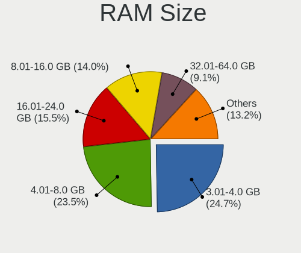

| Size in GB      | Computers | Percent |
|-----------------|-----------|---------|
| 4.01-8.0        | 65        | 27.2%   |
| 3.01-4.0        | 57        | 23.85%  |
| 16.01-24.0      | 43        | 17.99%  |
| 8.01-16.0       | 29        | 12.13%  |
| 32.01-64.0      | 16        | 6.69%   |
| 1.01-2.0        | 15        | 6.28%   |
| 64.01-256.0     | 5         | 2.09%   |
| 24.01-32.0      | 3         | 1.26%   |
| 0.51-1.0        | 3         | 1.26%   |
| 2.01-3.0        | 2         | 0.84%   |
| More than 256.0 | 1         | 0.42%   |

RAM Used
--------

Used RAM memory

| Used GB   | Computers | Percent |
|-----------|-----------|---------|
| 1.01-2.0  | 105       | 42.34%  |
| 2.01-3.0  | 65        | 26.21%  |
| 3.01-4.0  | 24        | 9.68%   |
| 4.01-8.0  | 21        | 8.47%   |
| 0.51-1.0  | 20        | 8.06%   |
| 8.01-16.0 | 10        | 4.03%   |
| 0.01-0.5  | 3         | 1.21%   |

Total Drives
------------

Number of drives on board

| Drives | Computers | Percent |
|--------|-----------|---------|
| 1      | 149       | 62.34%  |
| 2      | 54        | 22.59%  |
| 3      | 15        | 6.28%   |
| 4      | 12        | 5.02%   |
| 5      | 4         | 1.67%   |
| 6      | 3         | 1.26%   |
| 10     | 1         | 0.42%   |
| 7      | 1         | 0.42%   |

Has CD-ROM
----------

Has CD-ROM on board

| Presented | Computers | Percent |
|-----------|-----------|---------|
| No        | 137       | 57.32%  |
| Yes       | 102       | 42.68%  |

Has Ethernet
------------

Has Ethernet on board

| Presented | Computers | Percent |
|-----------|-----------|---------|
| Yes       | 197       | 82.77%  |
| No        | 41        | 17.23%  |

Has WiFi
--------

Has WiFi module

| Presented | Computers | Percent |
|-----------|-----------|---------|
| Yes       | 174       | 73.11%  |
| No        | 64        | 26.89%  |

Has Bluetooth
-------------

Has Bluetooth module

| Presented | Computers | Percent |
|-----------|-----------|---------|
| Yes       | 132       | 55.46%  |
| No        | 106       | 44.54%  |

Location
--------

Country
-------

Geographic location (country)

| Country      | Computers | Percent |
|--------------|-----------|---------|
| USA          | 35        | 14.71%  |
| Germany      | 31        | 13.03%  |
| France       | 28        | 11.76%  |
| Italy        | 25        | 10.5%   |
| Russia       | 10        | 4.2%    |
| UK           | 9         | 3.78%   |
| Brazil       | 8         | 3.36%   |
| Canada       | 7         | 2.94%   |
| Sweden       | 6         | 2.52%   |
| Netherlands  | 6         | 2.52%   |
| Czechia      | 4         | 1.68%   |
| Belgium      | 4         | 1.68%   |
| Turkey       | 3         | 1.26%   |
| Spain        | 3         | 1.26%   |
| Portugal     | 3         | 1.26%   |
| Poland       | 3         | 1.26%   |
| Mexico       | 3         | 1.26%   |
| Malaysia     | 3         | 1.26%   |
| Iran         | 3         | 1.26%   |
| Indonesia    | 3         | 1.26%   |
| India        | 3         | 1.26%   |
| Hungary      | 3         | 1.26%   |
| Australia    | 3         | 1.26%   |
| Argentina    | 3         | 1.26%   |
| Taiwan       | 2         | 0.84%   |
| Japan        | 2         | 0.84%   |
| Israel       | 2         | 0.84%   |
| Greece       | 2         | 0.84%   |
| Finland      | 2         | 0.84%   |
| Colombia     | 2         | 0.84%   |
| Austria      | 2         | 0.84%   |
| Vietnam      | 1         | 0.42%   |
| Venezuela    | 1         | 0.42%   |
| Switzerland  | 1         | 0.42%   |
| South Korea  | 1         | 0.42%   |
| South Africa | 1         | 0.42%   |
| Sint Maarten | 1         | 0.42%   |
| Norway       | 1         | 0.42%   |
| New Zealand  | 1         | 0.42%   |
| Madagascar   | 1         | 0.42%   |

City
----

Geographic location (city)

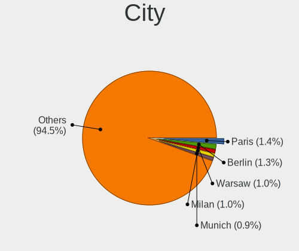

| City                | Computers | Percent |
|---------------------|-----------|---------|
| Paris               | 5         | 2.07%   |
| Berlin              | 4         | 1.65%   |
| Munich              | 3         | 1.24%   |
| Melbourne           | 3         | 1.24%   |
| Kuala Lumpur        | 3         | 1.24%   |
| Biella              | 3         | 1.24%   |
| Ankara              | 3         | 1.24%   |
| Washington          | 2         | 0.83%   |
| Vsters          | 2         | 0.83%   |
| Uppsala             | 2         | 0.83%   |
| Tehran              | 2         | 0.83%   |
| Stuttgart           | 2         | 0.83%   |
| St Petersburg       | 2         | 0.83%   |
| Oklahoma City       | 2         | 0.83%   |
| Mumbai              | 2         | 0.83%   |
| Milan               | 2         | 0.83%   |
| Leipzig             | 2         | 0.83%   |
| Lavras              | 2         | 0.83%   |
| Kazan            | 2         | 0.83%   |
| Jakarta             | 2         | 0.83%   |
| Indianapolis        | 2         | 0.83%   |
| Helsinki            | 2         | 0.83%   |
| Hamburg             | 2         | 0.83%   |
| Farmington          | 2         | 0.83%   |
| Clermont-Ferrand    | 2         | 0.83%   |
| Budapest            | 2         | 0.83%   |
| Brest               | 2         | 0.83%   |
| Auxerre             | 2         | 0.83%   |
| ywiec             | 1         | 0.41%   |
| Yokohama            | 1         | 0.41%   |
| Wierden             | 1         | 0.41%   |
| Wettringen          | 1         | 0.41%   |
| Warsaw              | 1         | 0.41%   |
| Waarder             | 1         | 0.41%   |
| Villach             | 1         | 0.41%   |
| Vidin               | 1         | 0.41%   |
| Vicenza             | 1         | 0.41%   |
| Verona              | 1         | 0.41%   |
| Valparaiso de Goias | 1         | 0.41%   |
| Unkel               | 1         | 0.41%   |

Drives
------

Drive Vendor
------------

Hard drive vendors

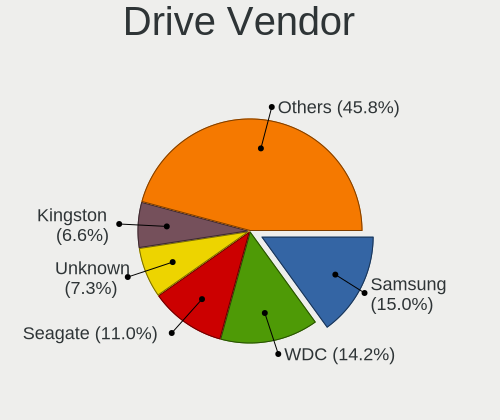

| Vendor              | Computers | Drives | Percent |
|---------------------|-----------|--------|---------|
| WDC                 | 54        | 73     | 15.47%  |
| Samsung Electronics | 49        | 64     | 14.04%  |
| Seagate             | 41        | 53     | 11.75%  |
| Unknown             | 27        | 30     | 7.74%   |
| Kingston            | 19        | 23     | 5.44%   |
| Toshiba             | 17        | 17     | 4.87%   |
| SanDisk             | 16        | 17     | 4.58%   |
| Hitachi             | 14        | 19     | 4.01%   |
| SK hynix            | 13        | 14     | 3.72%   |
| Crucial             | 13        | 16     | 3.72%   |
| Intel               | 11        | 11     | 3.15%   |
| PNY                 | 7         | 7      | 2.01%   |
| HGST                | 7         | 8      | 2.01%   |
| China               | 6         | 7      | 1.72%   |
| Unknown             | 5         | 5      | 1.43%   |
| Patriot             | 4         | 4      | 1.15%   |
| Transcend           | 3         | 4      | 0.86%   |
| Phison              | 3         | 8      | 0.86%   |
| Micron Technology   | 3         | 3      | 0.86%   |
| USB3.0              | 2         | 4      | 0.57%   |
| TO Exter            | 2         | 2      | 0.57%   |
| TEXTORM             | 2         | 2      | 0.57%   |
| Maxtor              | 2         | 2      | 0.57%   |
| ASMT                | 2         | 5      | 0.57%   |
| A-DATA Technology   | 2         | 4      | 0.57%   |
| XPG                 | 1         | 1      | 0.29%   |
| Vaseky              | 1         | 1      | 0.29%   |
| SSSTC               | 1         | 1      | 0.29%   |
| SSK                 | 1         | 1      | 0.29%   |
| SSD0240S            | 1         | 1      | 0.29%   |
| SPCC                | 1         | 1      | 0.29%   |
| Silicon Motion      | 1         | 1      | 0.29%   |
| Phison Electronics  | 1         | 1      | 0.29%   |
| OCZ                 | 1         | 1      | 0.29%   |
| Netac               | 1         | 1      | 0.29%   |
| LITEON              | 1         | 1      | 0.29%   |
| Lexar               | 1         | 1      | 0.29%   |
| Lenovo              | 1         | 1      | 0.29%   |
| KIOXIA              | 1         | 1      | 0.29%   |
| KingFast            | 1         | 1      | 0.29%   |

Drive Model
-----------

Hard drive models

| Model                                             | Computers | Percent |
|---------------------------------------------------|-----------|---------|
| Samsung SSD 860 EVO 500GB                         | 5         | 1.28%   |
| Samsung SSD 850 EVO 500GB                         | 5         | 1.28%   |
| Kingston SA400S37480G 480GB SSD                   | 5         | 1.28%   |
| Crucial CT480BX500SSD1 480GB                      | 5         | 1.28%   |
| Unknown                                           | 5         | 1.28%   |
| Kingston SA400S37240G 240GB SSD                   | 4         | 1.02%   |
| Unknown MMC Card  32GB                            | 3         | 0.77%   |
| Toshiba MQ01ABF050 500GB                          | 3         | 0.77%   |
| Toshiba HDWD110 1TB                               | 3         | 0.77%   |
| Seagate ST500LM012 HN-M500MBB 500GB               | 3         | 0.77%   |
| Seagate ST500DM002-1BD142 500GB                   | 3         | 0.77%   |
| Samsung SSD 840 Series 120GB                      | 3         | 0.77%   |
| Samsung SM963 2.5" NVMe PCIe SSD 256GB            | 3         | 0.77%   |
| PNY CS900 120GB SSD                               | 3         | 0.77%   |
| WDC WD10JPVX-22JC3T0 1TB                          | 2         | 0.51%   |
| WDC WD10JPCX-24UE4T0 1TB                          | 2         | 0.51%   |
| WDC WD10EZEX-00BBHA0 1TB                          | 2         | 0.51%   |
| Unknown SA08G  8GB                                | 2         | 0.51%   |
| Unknown MMC64G  64GB                              | 2         | 0.51%   |
| Toshiba DT01ACA200 2TB                            | 2         | 0.51%   |
| Toshiba DT01ACA050 500GB                          | 2         | 0.51%   |
| TO Exter nal USB 3.0 512GB                        | 2         | 0.51%   |
| TEXTORM BM5 240GB SSD                             | 2         | 0.51%   |
| SK hynix NVMe SSD Drive 1024GB                    | 2         | 0.51%   |
| Seagate ST500LT012-1DG142 500GB                   | 2         | 0.51%   |
| Seagate ST500LM000-1EJ162 500GB                   | 2         | 0.51%   |
| Seagate ST4000DM004-2CV104 4TB                    | 2         | 0.51%   |
| Seagate ST31000528AS 1TB                          | 2         | 0.51%   |
| Seagate ST1000LM024 HN-M101MBB 1TB                | 2         | 0.51%   |
| Seagate ST1000DM003-1SB102 1TB                    | 2         | 0.51%   |
| Sandisk WD Black SN750 / PC SN730 NVMe SSD 1024GB | 2         | 0.51%   |
| SanDisk SDSSDA240G 240GB                          | 2         | 0.51%   |
| SanDisk SD8SN8U-256G-1006 256GB SSD               | 2         | 0.51%   |
| SanDisk DF4032  32GB                              | 2         | 0.51%   |
| Samsung SSD 970 EVO Plus 1TB                      | 2         | 0.51%   |
| Patriot Burst 480GB SSD                           | 2         | 0.51%   |
| Intel SSDPEKNU512GZ 512GB                         | 2         | 0.51%   |
| Hitachi HDS721050CLA362 500GB                     | 2         | 0.51%   |
| Hitachi HDS721010CLA332 1TB                       | 2         | 0.51%   |
| Hitachi HDP725050GLA360 500GB                     | 2         | 0.51%   |

HDD Vendor
----------

Hard disk drive vendors

| Vendor              | Computers | Drives | Percent |
|---------------------|-----------|--------|---------|
| WDC                 | 43        | 60     | 33.08%  |
| Seagate             | 41        | 53     | 31.54%  |
| Toshiba             | 14        | 14     | 10.77%  |
| Hitachi             | 14        | 19     | 10.77%  |
| HGST                | 7         | 8      | 5.38%   |
| Samsung Electronics | 6         | 10     | 4.62%   |
| ASMT                | 2         | 5      | 1.54%   |
| USB3.0              | 1         | 2      | 0.77%   |
| Unknown             | 1         | 1      | 0.77%   |
| Maxtor              | 1         | 1      | 0.77%   |

SSD Vendor
----------

Solid state drive vendors

| Vendor              | Computers | Drives | Percent |
|---------------------|-----------|--------|---------|
| Samsung Electronics | 27        | 33     | 22.69%  |
| Kingston            | 16        | 17     | 13.45%  |
| Crucial             | 12        | 15     | 10.08%  |
| SanDisk             | 8         | 9      | 6.72%   |
| WDC                 | 7         | 7      | 5.88%   |
| PNY                 | 6         | 6      | 5.04%   |
| China               | 6         | 7      | 5.04%   |
| Patriot             | 4         | 4      | 3.36%   |
| Intel               | 4         | 4      | 3.36%   |
| Transcend           | 3         | 3      | 2.52%   |
| Toshiba             | 2         | 2      | 1.68%   |
| TO Exter            | 2         | 2      | 1.68%   |
| TEXTORM             | 2         | 2      | 1.68%   |
| SK hynix            | 2         | 2      | 1.68%   |
| A-DATA Technology   | 2         | 4      | 1.68%   |
| Vaseky              | 1         | 1      | 0.84%   |
| USB3.0              | 1         | 2      | 0.84%   |
| SSSTC               | 1         | 1      | 0.84%   |
| SPCC                | 1         | 1      | 0.84%   |
| OCZ                 | 1         | 1      | 0.84%   |
| Netac               | 1         | 1      | 0.84%   |
| Micron Technology   | 1         | 1      | 0.84%   |
| Maxtor              | 1         | 1      | 0.84%   |
| LITEON              | 1         | 1      | 0.84%   |
| KingFast            | 1         | 1      | 0.84%   |
| Intenso             | 1         | 1      | 0.84%   |
| INNOVATION IT       | 1         | 1      | 0.84%   |
| FORESEE             | 1         | 1      | 0.84%   |
| ASMedia             | 1         | 1      | 0.84%   |
| Apacer              | 1         | 1      | 0.84%   |
| Unknown             | 1         | 1      | 0.84%   |

Drive Kind
----------

HDD or SSD

| Kind    | Computers | Drives | Percent |
|---------|-----------|--------|---------|
| HDD     | 104       | 173    | 33.44%  |
| SSD     | 102       | 134    | 32.8%   |
| NVMe    | 67        | 80     | 21.54%  |
| MMC     | 33        | 38     | 10.61%  |
| Unknown | 5         | 5      | 1.61%   |

Drive Connector
---------------

SATA, SAS, NVMe, etc.

| Type | Computers | Drives | Percent |
|------|-----------|--------|---------|
| SATA | 169       | 289    | 59.93%  |
| NVMe | 67        | 80     | 23.76%  |
| MMC  | 33        | 38     | 11.7%   |
| SAS  | 13        | 23     | 4.61%   |

Drive Size
----------

Size of hard drive

| Size in TB | Computers | Drives | Percent |
|------------|-----------|--------|---------|
| 0.01-0.5   | 135       | 195    | 60.81%  |
| 0.51-1.0   | 53        | 63     | 23.87%  |
| 3.01-4.0   | 14        | 20     | 6.31%   |
| 1.01-2.0   | 12        | 13     | 5.41%   |
| 2.01-3.0   | 3         | 10     | 1.35%   |
| 10.01-20.0 | 3         | 3      | 1.35%   |
| 4.01-10.0  | 2         | 3      | 0.9%    |

Space Total
-----------

Amount of disk space available on the file system

| Size in GB     | Computers | Percent |
|----------------|-----------|---------|
| 101-250        | 60        | 24.9%   |
| 251-500        | 58        | 24.07%  |
| 501-1000       | 31        | 12.86%  |
| 51-100         | 24        | 9.96%   |
| 1001-2000      | 20        | 8.3%    |
| 1-20           | 17        | 7.05%   |
| More than 3000 | 12        | 4.98%   |
| 21-50          | 12        | 4.98%   |
| 2001-3000      | 6         | 2.49%   |
| Unknown        | 1         | 0.41%   |

Space Used
----------

Amount of used disk space

| Used GB        | Computers | Percent |
|----------------|-----------|---------|
| 1-20           | 85        | 34.98%  |
| 21-50          | 51        | 20.99%  |
| 101-250        | 31        | 12.76%  |
| 251-500        | 28        | 11.52%  |
| 51-100         | 24        | 9.88%   |
| 501-1000       | 9         | 3.7%    |
| 1001-2000      | 6         | 2.47%   |
| More than 3000 | 5         | 2.06%   |
| 2001-3000      | 3         | 1.23%   |
| Unknown        | 1         | 0.41%   |

Malfunc. Drives
---------------

Drive models with a malfunction

| Model                                            | Computers | Drives | Percent |
|--------------------------------------------------|-----------|--------|---------|
| WDC WDS480G2G0A-00JH30 480GB SSD                 | 1         | 1      | 2.78%   |
| WDC WDS240G2G0B-00EPW0 240GB SSD                 | 1         | 1      | 2.78%   |
| WDC WD5000AAKX-00ERMA0 500GB                     | 1         | 1      | 2.78%   |
| WDC WD3200AAKS-00L9A0 320GB                      | 1         | 1      | 2.78%   |
| WDC WD20EFRX-68AX9N0 2TB                         | 1         | 1      | 2.78%   |
| WDC WD2002FYPS-02W3B0 2TB                        | 1         | 1      | 2.78%   |
| WDC WD10EZEX-60ZF5A0 1TB                         | 1         | 1      | 2.78%   |
| WDC WD10EAVS-00D7B1 1TB                          | 1         | 1      | 2.78%   |
| WDC WD10EARS-00Y5B1 1TB                          | 1         | 1      | 2.78%   |
| WDC WD1003FBYX-01Y7B1 1TB                        | 1         | 1      | 2.78%   |
| Toshiba DT01ACA100 1TB                           | 1         | 1      | 2.78%   |
| SSSTC CVB-8D128-HP 128GB                         | 1         | 1      | 2.78%   |
| Seagate ST500LT012-9WS142 500GB                  | 1         | 1      | 2.78%   |
| Seagate ST500LT012-1DG142 500GB                  | 1         | 1      | 2.78%   |
| Seagate ST500DM002-1BD142 500GB                  | 1         | 1      | 2.78%   |
| Seagate ST3750840AS 752GB                        | 1         | 1      | 2.78%   |
| Seagate ST3250318AS 250GB                        | 1         | 2      | 2.78%   |
| Seagate ST1000LM024 HN-M101MBB 1TB               | 1         | 1      | 2.78%   |
| SanDisk SSD PLUS 240GB                           | 1         | 1      | 2.78%   |
| Samsung Electronics MZNLH128HBHQ-000H1 128GB SSD | 1         | 1      | 2.78%   |
| Samsung Electronics HM321HI 320GB                | 1         | 2      | 2.78%   |
| Samsung Electronics HD753LJ 752GB                | 1         | 1      | 2.78%   |
| Samsung Electronics HD103SJ 1TB                  | 1         | 1      | 2.78%   |
| Maxtor STM3160215AS 160GB                        | 1         | 1      | 2.78%   |
| Kingston SNS4151S332GD 32GB SSD                  | 1         | 1      | 2.78%   |
| Intel SSDSCKKF240H6L 240GB                       | 1         | 1      | 2.78%   |
| Intel SSDSC2BW080A4 80GB                         | 1         | 1      | 2.78%   |
| Hitachi HTS725050A9A364 500GB                    | 1         | 1      | 2.78%   |
| Hitachi HTS543212L9A300 120GB                    | 1         | 1      | 2.78%   |
| Hitachi HTS541080G9SA00 80GB                     | 1         | 1      | 2.78%   |
| Hitachi HDS721010CLA332 1TB                      | 1         | 1      | 2.78%   |
| Hitachi HCP725032GLA380 320GB                    | 1         | 2      | 2.78%   |
| HGST HTS725050A7E630 500GB                       | 1         | 1      | 2.78%   |
| HGST HTS541010A9E680 1TB                         | 1         | 1      | 2.78%   |
| Crucial CT128MX100SSD1 128GB                     | 1         | 1      | 2.78%   |
| ASMT ASMT105x 3TB                                | 1         | 4      | 2.78%   |

Malfunc. Drive Vendor
---------------------

Vendors of faulty drives

| Vendor              | Computers | Drives | Percent |
|---------------------|-----------|--------|---------|
| WDC                 | 10        | 10     | 28.57%  |
| Seagate             | 6         | 7      | 17.14%  |
| Hitachi             | 5         | 6      | 14.29%  |
| Samsung Electronics | 3         | 5      | 8.57%   |
| Intel               | 2         | 2      | 5.71%   |
| HGST                | 2         | 2      | 5.71%   |
| Toshiba             | 1         | 1      | 2.86%   |
| SSSTC               | 1         | 1      | 2.86%   |
| SanDisk             | 1         | 1      | 2.86%   |
| Maxtor              | 1         | 1      | 2.86%   |
| Kingston            | 1         | 1      | 2.86%   |
| Crucial             | 1         | 1      | 2.86%   |
| ASMT                | 1         | 4      | 2.86%   |

Malfunc. HDD Vendor
-------------------

Vendors of faulty HDD drives

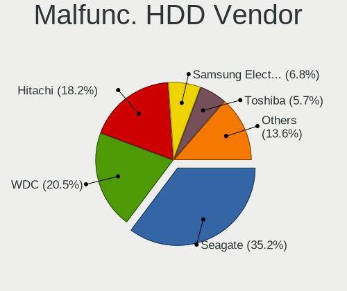

| Vendor              | Computers | Drives | Percent |
|---------------------|-----------|--------|---------|
| WDC                 | 8         | 8      | 30.77%  |
| Seagate             | 6         | 7      | 23.08%  |
| Hitachi             | 5         | 6      | 19.23%  |
| Samsung Electronics | 2         | 4      | 7.69%   |
| HGST                | 2         | 2      | 7.69%   |
| Toshiba             | 1         | 1      | 3.85%   |
| Maxtor              | 1         | 1      | 3.85%   |
| ASMT                | 1         | 4      | 3.85%   |

Malfunc. Drive Kind
-------------------

Kinds of faulty drives

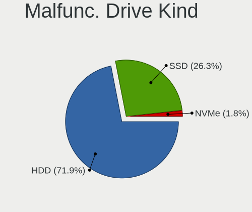

| Kind | Computers | Drives | Percent |
|------|-----------|--------|---------|
| HDD  | 23        | 33     | 74.19%  |
| SSD  | 8         | 9      | 25.81%  |

Failed Drives
-------------

Failed drive models

Zero info for selected period =(

Failed Drive Vendor
-------------------

Failed drive vendors

Zero info for selected period =(

Drive Status
------------

Number of failed and malfunc. drives

| Status   | Computers | Drives | Percent |
|----------|-----------|--------|---------|
| Works    | 125       | 206    | 47.71%  |
| Detected | 107       | 182    | 40.84%  |
| Malfunc  | 30        | 42     | 11.45%  |

Storage controller
------------------

Storage Vendor
--------------

Storage controller vendors

| Vendor                       | Computers | Percent |
|------------------------------|-----------|---------|
| Intel                        | 151       | 54.71%  |
| AMD                          | 51        | 18.48%  |
| Samsung Electronics          | 19        | 6.88%   |
| SK hynix                     | 11        | 3.99%   |
| SanDisk                      | 9         | 3.26%   |
| Kingston Technology Company  | 5         | 1.81%   |
| Phison Electronics           | 4         | 1.45%   |
| ASMedia Technology           | 4         | 1.45%   |
| Silicon Motion               | 3         | 1.09%   |
| Nvidia                       | 3         | 1.09%   |
| JMicron Technology           | 3         | 1.09%   |
| VIA Technologies             | 2         | 0.72%   |
| Toshiba America Info Systems | 1         | 0.36%   |
| Shenzhen Longsys Electronics | 1         | 0.36%   |
| Realtek Semiconductor        | 1         | 0.36%   |
| Micron/Crucial Technology    | 1         | 0.36%   |
| Micron Technology            | 1         | 0.36%   |
| Marvell Technology Group     | 1         | 0.36%   |
| Lenovo                       | 1         | 0.36%   |
| KIOXIA                       | 1         | 0.36%   |
| Biwin Storage Technology     | 1         | 0.36%   |
| Apple                        | 1         | 0.36%   |
| Adaptec                      | 1         | 0.36%   |

Storage Model
-------------

Storage controller models

| Model                                                                                   | Computers | Percent |
|-----------------------------------------------------------------------------------------|-----------|---------|
| AMD FCH SATA Controller [AHCI mode]                                                     | 40        | 12.16%  |
| Intel Sunrise Point-LP SATA Controller [AHCI mode]                                      | 9         | 2.74%   |
| Intel 7 Series Chipset Family 6-port SATA Controller [AHCI mode]                        | 9         | 2.74%   |
| Samsung NVMe SSD Controller 980                                                         | 8         | 2.43%   |
| Intel Volume Management Device NVMe RAID Controller                                     | 8         | 2.43%   |
| Intel 6 Series/C200 Series Chipset Family 6 port Desktop SATA AHCI Controller           | 8         | 2.43%   |
| AMD 400 Series Chipset SATA Controller                                                  | 7         | 2.13%   |
| SK hynix Gold P31/PC711 NVMe Solid State Drive                                          | 6         | 1.82%   |
| Intel Celeron/Pentium Silver Processor SATA Controller                                  | 6         | 1.82%   |
| Intel Celeron N3350/Pentium N4200/Atom E3900 Series SATA AHCI Controller                | 6         | 1.82%   |
| Intel 8 Series/C220 Series Chipset Family 6-port SATA Controller 1 [AHCI mode]          | 6         | 1.82%   |
| Intel 6 Series/C200 Series Chipset Family 6 port Mobile SATA AHCI Controller            | 6         | 1.82%   |
| Intel 5 Series/3400 Series Chipset 6 port SATA AHCI Controller                          | 6         | 1.82%   |
| SanDisk WD Black SN750 / PC SN730 NVMe SSD                                              | 5         | 1.52%   |
| Intel Wildcat Point-LP SATA Controller [AHCI Mode]                                      | 5         | 1.52%   |
| Intel Q170/Q150/B150/H170/H110/Z170/CM236 Chipset SATA Controller [AHCI Mode]           | 5         | 1.52%   |
| Intel Atom Processor E3800 Series SATA AHCI Controller                                  | 5         | 1.52%   |
| Intel Alder Lake-S PCH SATA Controller [AHCI Mode]                                      | 5         | 1.52%   |
| Intel 7 Series/C210 Series Chipset Family 6-port SATA Controller [AHCI mode]            | 5         | 1.52%   |
| Intel 6 Series/C200 Series Chipset Family Desktop SATA Controller (IDE mode, ports 4-5) | 5         | 1.52%   |
| Intel 6 Series/C200 Series Chipset Family Desktop SATA Controller (IDE mode, ports 0-3) | 5         | 1.52%   |
| AMD FCH SATA Controller D                                                               | 5         | 1.52%   |
| ASMedia ASM1062 Serial ATA Controller                                                   | 4         | 1.22%   |
| AMD SB7x0/SB8x0/SB9x0 IDE Controller                                                    | 4         | 1.22%   |
| Samsung NVMe SSD Controller SM981/PM981/PM983                                           | 3         | 0.91%   |
| Samsung NVMe SSD Controller SM961/PM961/SM963                                           | 3         | 0.91%   |
| Samsung NVMe SSD Controller PM9A1/PM9A3/980PRO                                          | 3         | 0.91%   |
| Nvidia MCP61 SATA Controller                                                            | 3         | 0.91%   |
| Nvidia MCP61 IDE                                                                        | 3         | 0.91%   |
| Intel SSD 660P Series                                                                   | 3         | 0.91%   |
| Intel SATA Controller [RAID mode]                                                       | 3         | 0.91%   |
| Intel NM10/ICH7 Family SATA Controller [IDE mode]                                       | 3         | 0.91%   |
| Intel Comet Lake SATA AHCI Controller                                                   | 3         | 0.91%   |
| Intel 9 Series Chipset Family SATA Controller [AHCI Mode]                               | 3         | 0.91%   |
| Intel 82801IBM/IEM (ICH9M/ICH9M-E) 4 port SATA Controller [AHCI mode]                   | 3         | 0.91%   |
| Intel 82801HM/HEM (ICH8M/ICH8M-E) SATA Controller [AHCI mode]                           | 3         | 0.91%   |
| Intel 82801HM/HEM (ICH8M/ICH8M-E) IDE Controller                                        | 3         | 0.91%   |
| Intel 82801G (ICH7 Family) IDE Controller                                               | 3         | 0.91%   |
| Intel 5 Series/3400 Series Chipset 4 port SATA IDE Controller                           | 3         | 0.91%   |
| Intel 5 Series/3400 Series Chipset 2 port SATA IDE Controller                           | 3         | 0.91%   |

Storage Kind
------------

Kind of storage controller (IDE, SATA, NVMe, SAS, ...)

| Kind | Computers | Percent |
|------|-----------|---------|
| SATA | 171       | 59.58%  |
| NVMe | 67        | 23.34%  |
| IDE  | 32        | 11.15%  |
| RAID | 16        | 5.57%   |
| SAS  | 1         | 0.35%   |

Processor
---------

CPU Vendor
----------

Processor vendors

| Vendor | Computers | Percent |
|--------|-----------|---------|
| Intel  | 172       | 72.27%  |
| AMD    | 60        | 25.21%  |
| ARM    | 6         | 2.52%   |

CPU Model
---------

Processor models

| Model                                      | Computers | Percent |
|--------------------------------------------|-----------|---------|
| Intel Core i5-6300U CPU @ 2.40GHz          | 4         | 1.67%   |
| Intel Celeron CPU N3350 @ 1.10GHz          | 4         | 1.67%   |
| Intel Celeron CPU N2840 @ 2.16GHz          | 4         | 1.67%   |
| Intel 11th Gen Core i5-1135G7 @ 2.40GHz    | 4         | 1.67%   |
| ARM Processor                              | 4         | 1.67%   |
| Intel Core i7-6600U CPU @ 2.60GHz          | 3         | 1.26%   |
| Intel Core i3-3217U CPU @ 1.80GHz          | 3         | 1.26%   |
| Intel Celeron N4020 CPU @ 1.10GHz          | 3         | 1.26%   |
| Intel Celeron CPU N3050 @ 1.60GHz          | 3         | 1.26%   |
| Intel 11th Gen Core i7-1165G7 @ 2.80GHz    | 3         | 1.26%   |
| Intel 11th Gen Core i5-1145G7 @ 2.60GHz    | 3         | 1.26%   |
| AMD Ryzen 7 2700 Eight-Core Processor      | 3         | 1.26%   |
| AMD Ryzen 5 5500U with Radeon Graphics     | 3         | 1.26%   |
| AMD Ryzen 5 3600 6-Core Processor          | 3         | 1.26%   |
| Intel Core i7-9750H CPU @ 2.60GHz          | 2         | 0.84%   |
| Intel Core i7-8565U CPU @ 1.80GHz          | 2         | 0.84%   |
| Intel Core i7-3630QM CPU @ 2.40GHz         | 2         | 0.84%   |
| Intel Core i5-6500 CPU @ 3.20GHz           | 2         | 0.84%   |
| Intel Core i5-6200U CPU @ 2.30GHz          | 2         | 0.84%   |
| Intel Core i5-5200U CPU @ 2.20GHz          | 2         | 0.84%   |
| Intel Core i5-3570K CPU @ 3.40GHz          | 2         | 0.84%   |
| Intel Core i5-2520M CPU @ 2.50GHz          | 2         | 0.84%   |
| Intel Core i5-2400S CPU @ 2.50GHz          | 2         | 0.84%   |
| Intel Core i5-2400 CPU @ 3.10GHz           | 2         | 0.84%   |
| Intel Core i5-10210U CPU @ 1.60GHz         | 2         | 0.84%   |
| Intel Core i5 CPU M 520 @ 2.40GHz          | 2         | 0.84%   |
| Intel Core i5 CPU 750 @ 2.67GHz            | 2         | 0.84%   |
| Intel Core i3-3240 CPU @ 3.40GHz           | 2         | 0.84%   |
| Intel Core i3 CPU M 330 @ 2.13GHz          | 2         | 0.84%   |
| Intel Core 2 Duo CPU E7300 @ 2.66GHz       | 2         | 0.84%   |
| Intel Celeron CPU N3450 @ 1.10GHz          | 2         | 0.84%   |
| Intel Celeron CPU 847 @ 1.10GHz            | 2         | 0.84%   |
| Intel Celeron 3205U @ 1.50GHz              | 2         | 0.84%   |
| Intel Atom x5-Z8350 CPU @ 1.44GHz          | 2         | 0.84%   |
| Intel 12th Gen Core i7-12700               | 2         | 0.84%   |
| Intel 12th Gen Core i3-12100               | 2         | 0.84%   |
| Intel 11th Gen Core i3-1115G4 @ 3.00GHz    | 2         | 0.84%   |
| ARM Allwinner sun7i (A20) Family Processor | 2         | 0.84%   |
| AMD Ryzen 7 5700U with Radeon Graphics     | 2         | 0.84%   |
| AMD Ryzen 7 4800H with Radeon Graphics     | 2         | 0.84%   |

CPU Model Family
----------------

Processor model prefix

| Model                   | Computers | Percent |
|-------------------------|-----------|---------|
| Intel Core i5           | 45        | 18.83%  |
| Intel Celeron           | 29        | 12.13%  |
| Other                   | 24        | 10.04%  |
| Intel Core i7           | 24        | 10.04%  |
| Intel Core i3           | 16        | 6.69%   |
| AMD Ryzen 5             | 15        | 6.28%   |
| Intel Core 2 Duo        | 9         | 3.77%   |
| AMD Ryzen 7             | 9         | 3.77%   |
| Intel Xeon              | 7         | 2.93%   |
| Intel Atom              | 7         | 2.93%   |
| Intel Pentium           | 6         | 2.51%   |
| AMD A6                  | 5         | 2.09%   |
| AMD Ryzen 9             | 4         | 1.67%   |
| AMD FX                  | 3         | 1.26%   |
| Intel Core 2            | 2         | 0.84%   |
| ARM Allwinner           | 2         | 0.84%   |
| AMD Ryzen Threadripper  | 2         | 0.84%   |
| AMD Ryzen 5 PRO         | 2         | 0.84%   |
| AMD Ryzen 3             | 2         | 0.84%   |
| AMD E2                  | 2         | 0.84%   |
| AMD Athlon II X2        | 2         | 0.84%   |
| AMD Athlon              | 2         | 0.84%   |
| AMD A8                  | 2         | 0.84%   |
| AMD A4                  | 2         | 0.84%   |
| AMD A10                 | 2         | 0.84%   |
| Intel Xeon Gold         | 1         | 0.42%   |
| Intel Pentium Silver    | 1         | 0.42%   |
| Intel Pentium Dual-Core | 1         | 0.42%   |
| Intel Pentium 4         | 1         | 0.42%   |
| Intel Genuine           | 1         | 0.42%   |
| Intel Core 2 Quad       | 1         | 0.42%   |
| Intel Core 2 Extreme    | 1         | 0.42%   |
| AMD Sempron             | 1         | 0.42%   |
| AMD Ryzen 7 PRO         | 1         | 0.42%   |
| AMD Phenom II X6        | 1         | 0.42%   |
| AMD Phenom II X4        | 1         | 0.42%   |
| AMD E1                  | 1         | 0.42%   |
| AMD Athlon II           | 1         | 0.42%   |
| AMD Athlon 64 X2        | 1         | 0.42%   |

CPU Cores
---------

Number of processor cores

| Number  | Computers | Percent |
|---------|-----------|---------|
| 2       | 98        | 40.83%  |
| 4       | 85        | 35.42%  |
| 6       | 22        | 9.17%   |
| 8       | 16        | 6.67%   |
| 12      | 4         | 1.67%   |
| 1       | 4         | 1.67%   |
| Unknown | 3         | 1.25%   |
| 64      | 2         | 0.83%   |
| 10      | 2         | 0.83%   |
| 3       | 2         | 0.83%   |
| 16      | 1         | 0.42%   |
| 14      | 1         | 0.42%   |

CPU Sockets
-----------

Number of sockets

| Number  | Computers | Percent |
|---------|-----------|---------|
| 1       | 234       | 98.32%  |
| Unknown | 3         | 1.26%   |
| 2       | 1         | 0.42%   |

CPU Threads
-----------

Threads per core (Hyper-Threading)

| Number  | Computers | Percent |
|---------|-----------|---------|
| 2       | 137       | 57.56%  |
| 1       | 98        | 41.18%  |
| Unknown | 3         | 1.26%   |

CPU Op-Modes
------------

CPU Operation Modes (32-bit, 64-bit)

| Op mode        | Computers | Percent |
|----------------|-----------|---------|
| 32-bit, 64-bit | 235       | 98.74%  |
| Unknown        | 3         | 1.26%   |

CPU Microcode
-------------

Microcode number

| Number     | Computers | Percent |
|------------|-----------|---------|
| Unknown    | 80        | 33.47%  |
| 0x806c1    | 11        | 4.6%    |
| 0x306a9    | 9         | 3.77%   |
| 0x206a7    | 8         | 3.35%   |
| 0x406e3    | 6         | 2.51%   |
| 0x306d4    | 5         | 2.09%   |
| 0x30678    | 5         | 2.09%   |
| 0x08608103 | 5         | 2.09%   |
| 0x806ec    | 4         | 1.67%   |
| 0x506c9    | 4         | 1.67%   |
| 0x306c3    | 4         | 1.67%   |
| 0x106e5    | 4         | 1.67%   |
| 0x1067a    | 4         | 1.67%   |
| 0xa0652    | 3         | 1.26%   |
| 0x906ea    | 3         | 1.26%   |
| 0x706a8    | 3         | 1.26%   |
| 0x506e3    | 3         | 1.26%   |
| 0x406c4    | 3         | 1.26%   |
| 0x406c3    | 3         | 1.26%   |
| 0x0a50000c | 3         | 1.26%   |
| 0x08701021 | 3         | 1.26%   |
| 0x08108109 | 3         | 1.26%   |
| 0x0800820d | 3         | 1.26%   |
| 0x90672    | 2         | 0.84%   |
| 0x806e9    | 2         | 0.84%   |
| 0x806d1    | 2         | 0.84%   |
| 0x706a1    | 2         | 0.84%   |
| 0x6fb      | 2         | 0.84%   |
| 0x6f6      | 2         | 0.84%   |
| 0x506ca    | 2         | 0.84%   |
| 0x306f2    | 2         | 0.84%   |
| 0x20655    | 2         | 0.84%   |
| 0x20652    | 2         | 0.84%   |
| 0x10676    | 2         | 0.84%   |
| 0x08600104 | 2         | 0.84%   |
| 0x07030105 | 2         | 0.84%   |
| 0x06000852 | 2         | 0.84%   |
| 0x010000c8 | 2         | 0.84%   |
| 0xb0671    | 1         | 0.42%   |
| 0xa0653    | 1         | 0.42%   |

CPU Microarch
-------------

Microarchitecture

| Name             | Computers | Percent |
|------------------|-----------|---------|
| KabyLake         | 21        | 8.79%   |
| SandyBridge      | 17        | 7.11%   |
| IvyBridge        | 17        | 7.11%   |
| Unknown          | 16        | 6.69%   |
| Skylake          | 15        | 6.28%   |
| Silvermont       | 15        | 6.28%   |
| TigerLake        | 13        | 5.44%   |
| Zen 2            | 12        | 5.02%   |
| Haswell          | 11        | 4.6%    |
| Penryn           | 9         | 3.77%   |
| Zen+             | 8         | 3.35%   |
| Westmere         | 7         | 2.93%   |
| Goldmont         | 7         | 2.93%   |
| Zen 3            | 6         | 2.51%   |
| Goldmont plus    | 6         | 2.51%   |
| Core             | 6         | 2.51%   |
| Broadwell        | 6         | 2.51%   |
| Puma             | 5         | 2.09%   |
| Nehalem          | 5         | 2.09%   |
| K10              | 5         | 2.09%   |
| Zen              | 4         | 1.67%   |
| Piledriver       | 4         | 1.67%   |
| CometLake        | 4         | 1.67%   |
| Icelake          | 3         | 1.26%   |
| Excavator        | 3         | 1.26%   |
| Bonnell          | 3         | 1.26%   |
| K10 Llano        | 2         | 0.84%   |
| Bobcat           | 2         | 0.84%   |
| Alderlake Hybrid | 2         | 0.84%   |
| Tremont          | 1         | 0.42%   |
| Steamroller      | 1         | 0.42%   |
| NetBurst         | 1         | 0.42%   |
| K8 Hammer        | 1         | 0.42%   |
| Jaguar           | 1         | 0.42%   |

Graphics
--------

GPU Vendor
----------

Vendors of graphics cards

| Vendor                     | Computers | Percent |
|----------------------------|-----------|---------|
| Intel                      | 141       | 53.21%  |
| Nvidia                     | 63        | 23.77%  |
| AMD                        | 55        | 20.75%  |
| ASPEED Technology          | 4         | 1.51%   |
| Matrox Electronics Systems | 2         | 0.75%   |

GPU Model
---------

Graphics card models

| Model                                                                                    | Computers | Percent |
|------------------------------------------------------------------------------------------|-----------|---------|
| Intel 2nd Generation Core Processor Family Integrated Graphics Controller                | 14        | 5.15%   |
| Intel TigerLake-LP GT2 [Iris Xe Graphics]                                                | 11        | 4.04%   |
| Intel Skylake GT2 [HD Graphics 520]                                                      | 10        | 3.68%   |
| Intel Atom/Celeron/Pentium Processor x5-E8000/J3xxx/N3xxx Integrated Graphics Controller | 9         | 3.31%   |
| Intel 3rd Gen Core processor Graphics Controller                                         | 7         | 2.57%   |
| Intel Xeon E3-1200 v2/3rd Gen Core processor Graphics Controller                         | 6         | 2.21%   |
| Intel HD Graphics 500                                                                    | 6         | 2.21%   |
| Intel Atom Processor Z36xxx/Z37xxx Series Graphics & Display                             | 6         | 2.21%   |
| Intel GeminiLake [UHD Graphics 600]                                                      | 5         | 1.84%   |
| AMD Lucienne                                                                             | 5         | 1.84%   |
| Nvidia GK208B [GeForce GT 730]                                                           | 4         | 1.47%   |
| Nvidia GK208B [GeForce GT 710]                                                           | 4         | 1.47%   |
| Intel Core Processor Integrated Graphics Controller                                      | 4         | 1.47%   |
| ASPEED Technology ASPEED Graphics Family                                                 | 4         | 1.47%   |
| AMD Mullins [Radeon R4/R5 Graphics]                                                      | 4         | 1.47%   |
| AMD Cezanne [Radeon Vega Series / Radeon Vega Mobile Series]                             | 4         | 1.47%   |
| Intel HD Graphics 620                                                                    | 3         | 1.1%    |
| Intel HD Graphics 5500                                                                   | 3         | 1.1%    |
| Intel CometLake-U GT2 [UHD Graphics]                                                     | 3         | 1.1%    |
| Intel CometLake-H GT2 [UHD Graphics]                                                     | 3         | 1.1%    |
| Intel CoffeeLake-S GT2 [UHD Graphics 630]                                                | 3         | 1.1%    |
| AMD Renoir                                                                               | 3         | 1.1%    |
| Nvidia TU117M [GeForce MX450]                                                            | 2         | 0.74%   |
| Nvidia TU117M                                                                            | 2         | 0.74%   |
| Nvidia GT216 [GeForce GT 220]                                                            | 2         | 0.74%   |
| Nvidia GP107 [GeForce GTX 1050 Ti]                                                       | 2         | 0.74%   |
| Nvidia GF108 [GeForce GT 730]                                                            | 2         | 0.74%   |
| Intel Xeon E3-1200 v3/4th Gen Core Processor Integrated Graphics Controller              | 2         | 0.74%   |
| Intel WhiskeyLake-U GT2 [UHD Graphics 620]                                               | 2         | 0.74%   |
| Intel UHD Graphics 620                                                                   | 2         | 0.74%   |
| Intel TigerLake-H GT1 [UHD Graphics]                                                     | 2         | 0.74%   |
| Intel Tiger Lake-LP GT2 [UHD Graphics G4]                                                | 2         | 0.74%   |
| Intel Mobile GM965/GL960 Integrated Graphics Controller (secondary)                      | 2         | 0.74%   |
| Intel Mobile GM965/GL960 Integrated Graphics Controller (primary)                        | 2         | 0.74%   |
| Intel Mobile 4 Series Chipset Integrated Graphics Controller                             | 2         | 0.74%   |
| Intel HD Graphics 630                                                                    | 2         | 0.74%   |
| Intel HD Graphics 530                                                                    | 2         | 0.74%   |
| Intel HD Graphics                                                                        | 2         | 0.74%   |
| Intel CoffeeLake-H GT2 [UHD Graphics 630]                                                | 2         | 0.74%   |
| Intel Atom Processor D4xx/D5xx/N4xx/N5xx Integrated Graphics Controller                  | 2         | 0.74%   |

GPU Combo
---------

Combinations of graphics cards

| Name            | Computers | Percent |
|-----------------|-----------|---------|
| 1 x Intel       | 116       | 48.74%  |
| 1 x AMD         | 43        | 18.07%  |
| 1 x Nvidia      | 38        | 15.97%  |
| Intel + Nvidia  | 17        | 7.14%   |
| Other           | 7         | 2.94%   |
| AMD + Nvidia    | 5         | 2.1%    |
| 2 x AMD         | 4         | 1.68%   |
| Nvidia + ASPEED | 3         | 1.26%   |
| Intel + AMD     | 2         | 0.84%   |
| 1 x Matrox      | 1         | 0.42%   |
| 1 x ASPEED      | 1         | 0.42%   |
| AMD + Matrox    | 1         | 0.42%   |

GPU Driver
----------

Free vs proprietary

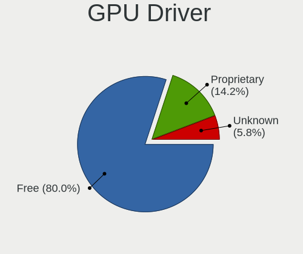

| Driver      | Computers | Percent |
|-------------|-----------|---------|
| Free        | 188       | 78.99%  |
| Proprietary | 39        | 16.39%  |
| Unknown     | 11        | 4.62%   |

GPU Memory
----------

Total video memory

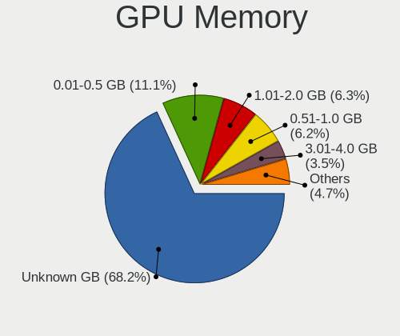

| Size in GB | Computers | Percent |
|------------|-----------|---------|
| Unknown    | 164       | 68.62%  |
| 0.01-0.5   | 23        | 9.62%   |
| 1.01-2.0   | 20        | 8.37%   |
| 0.51-1.0   | 16        | 6.69%   |
| 3.01-4.0   | 9         | 3.77%   |
| 8.01-16.0  | 3         | 1.26%   |
| 7.01-8.0   | 2         | 0.84%   |
| 32.01-64.0 | 1         | 0.42%   |
| 5.01-6.0   | 1         | 0.42%   |

Monitor
-------

Monitor Vendor
--------------

Monitor vendors

| Vendor                  | Computers | Percent |
|-------------------------|-----------|---------|
| Samsung Electronics     | 31        | 12.3%   |
| AU Optronics            | 30        | 11.9%   |
| LG Display              | 26        | 10.32%  |
| Chimei Innolux          | 20        | 7.94%   |
| BOE                     | 18        | 7.14%   |
| Dell                    | 17        | 6.75%   |
| Hewlett-Packard         | 13        | 5.16%   |
| Goldstar                | 9         | 3.57%   |
| Acer                    | 8         | 3.17%   |
| ViewSonic               | 7         | 2.78%   |
| Lenovo                  | 6         | 2.38%   |
| Iiyama                  | 6         | 2.38%   |
| Chi Mei Optoelectronics | 6         | 2.38%   |
| Philips                 | 4         | 1.59%   |
| PANDA                   | 4         | 1.59%   |
| InfoVision              | 4         | 1.59%   |
| BenQ                    | 3         | 1.19%   |
| Apple                   | 3         | 1.19%   |
| AOC                     | 3         | 1.19%   |
| Toshiba                 | 2         | 0.79%   |
| KDC                     | 2         | 0.79%   |
| Ancor Communications    | 2         | 0.79%   |
| ___                     | 1         | 0.4%    |
| Vita                    | 1         | 0.4%    |
| Vestel Elektronik       | 1         | 0.4%    |
| Unknown                 | 1         | 0.4%    |
| TEO                     | 1         | 0.4%    |
| TCL                     | 1         | 0.4%    |
| Sharp                   | 1         | 0.4%    |
| Sceptre Tech            | 1         | 0.4%    |
| SAC                     | 1         | 0.4%    |
| RTK                     | 1         | 0.4%    |
| Panasonic               | 1         | 0.4%    |
| Nixeus                  | 1         | 0.4%    |
| Mi                      | 1         | 0.4%    |
| Medion                  | 1         | 0.4%    |
| MAG                     | 1         | 0.4%    |
| LG Philips              | 1         | 0.4%    |
| LG Electronics          | 1         | 0.4%    |
| HannStar                | 1         | 0.4%    |

Monitor Model
-------------

Monitor models

| Model                                                                    | Computers | Percent |
|--------------------------------------------------------------------------|-----------|---------|
| Chi Mei Optoelectronics LCD Monitor CMO15A7 1366x768 344x193mm 15.5-inch | 3         | 1.17%   |
| ViewSonic VX2457 VSCB931 1920x1080 521x293mm 23.5-inch                   | 2         | 0.78%   |
| Samsung Electronics LCD Monitor SDC4852 1366x768 344x194mm 15.5-inch     | 2         | 0.78%   |
| LG Display LCD Monitor LGD071D 1920x1080 344x194mm 15.5-inch             | 2         | 0.78%   |
| LG Display LCD Monitor LGD0514 1920x1080 309x174mm 14.0-inch             | 2         | 0.78%   |
| LG Display LCD Monitor LGD0430 1366x768 345x194mm 15.6-inch              | 2         | 0.78%   |
| Hewlett-Packard 2309 HWP2821 1920x1080 510x287mm 23.0-inch               | 2         | 0.78%   |
| Chimei Innolux LCD Monitor CMN14D4 1920x1080 309x173mm 13.9-inch         | 2         | 0.78%   |
| BOE LCD Monitor BOE0872 1920x1080 344x194mm 15.5-inch                    | 2         | 0.78%   |
| BOE LCD Monitor BOE0697 1366x768 309x173mm 13.9-inch                     | 2         | 0.78%   |
| AU Optronics LCD Monitor AUO45EC 1366x768 344x193mm 15.5-inch            | 2         | 0.78%   |
| AU Optronics LCD Monitor AUO38ED 1920x1080 344x193mm 15.5-inch           | 2         | 0.78%   |
| AU Optronics LCD Monitor AUO123D 1920x1080 309x173mm 13.9-inch           | 2         | 0.78%   |
| ___ LCD Monitor ___1BBC 1920x540 140x90mm 6.6-inch                       | 1         | 0.39%   |
| Vita V195EW-W VIT1950 1600x900 432x240mm 19.5-inch                       | 1         | 0.39%   |
| ViewSonic XG2703-GS VSCBA32 2560x1440 598x336mm 27.0-inch                | 1         | 0.39%   |
| ViewSonic VX3276-UHD VSC5138 3840x2160 697x392mm 31.5-inch               | 1         | 0.39%   |
| ViewSonic VA2259 Series VSC5E32 1920x1080 476x268mm 21.5-inch            | 1         | 0.39%   |
| ViewSonic VA1948 SERIES VSCE827 1440x900 408x255mm 18.9-inch             | 1         | 0.39%   |
| ViewSonic LCD Monitor VSCBB31 1920x1080 530x300mm 24.0-inch              | 1         | 0.39%   |
| Vestel Elektronik 55UHD_LCD_TV VES3700 3840x2160 1872x1053mm 84.6-inch   | 1         | 0.39%   |
| Unknown LCD Monitor SAMSUNG 1920x1080                                    | 1         | 0.39%   |
| Toshiba TV TSB0109 1920x1080 1594x900mm 72.1-inch                        | 1         | 0.39%   |
| Toshiba ScreenXpert TSB8888 1080x2160                                    | 1         | 0.39%   |
| TEO TL765 TEO6700 1280x1024 338x270mm 17.0-inch                          | 1         | 0.39%   |
| TCL LCD TV TCL0030 1920x1080 708x398mm 32.0-inch                         | 1         | 0.39%   |
| Sharp LCD Monitor SHP14BA 1920x1080 344x194mm 15.5-inch                  | 1         | 0.39%   |
| Sceptre Tech Sceptre N43 SPT110C 3840x2160 575x323mm 26.0-inch           | 1         | 0.39%   |
| Samsung Electronics SyncMaster SAM0657 1920x1080                         | 1         | 0.39%   |
| Samsung Electronics SyncMaster SAM0653 1920x1080                         | 1         | 0.39%   |
| Samsung Electronics SyncMaster SAM027C 1680x1050 433x271mm 20.1-inch     | 1         | 0.39%   |
| Samsung Electronics SyncMaster SAM01AE 1600x1200 408x306mm 20.1-inch     | 1         | 0.39%   |
| Samsung Electronics SyncMaster SAM00E5 1280x1024 338x270mm 17.0-inch     | 1         | 0.39%   |
| Samsung Electronics SME1920N SAM06A3 1366x768 410x230mm 18.5-inch        | 1         | 0.39%   |
| Samsung Electronics SMC23A550U SAM07F3 1920x1080 510x287mm 23.0-inch     | 1         | 0.39%   |
| Samsung Electronics SM2333TN SAM06FC 1920x1080 477x268mm 21.5-inch       | 1         | 0.39%   |
| Samsung Electronics S24E650 SAM0C86 1920x1200 518x324mm 24.1-inch        | 1         | 0.39%   |
| Samsung Electronics S24D330 SAM0D92 1920x1080 531x299mm 24.0-inch        | 1         | 0.39%   |
| Samsung Electronics S24B300 SAM08CC 1920x1080 521x293mm 23.5-inch        | 1         | 0.39%   |
| Samsung Electronics S19C150 SAM0AE6 1366x768 410x230mm 18.5-inch         | 1         | 0.39%   |

Monitor Resolution
------------------

Monitor screen resolution

| Resolution         | Computers | Percent |
|--------------------|-----------|---------|
| 1920x1080 (FHD)    | 108       | 45%     |
| 1366x768 (WXGA)    | 50        | 20.83%  |
| 1600x900 (HD+)     | 16        | 6.67%   |
| 3840x2160 (4K)     | 10        | 4.17%   |
| 1440x900 (WXGA+)   | 10        | 4.17%   |
| 1280x1024 (SXGA)   | 8         | 3.33%   |
| 1920x1200 (WUXGA)  | 7         | 2.92%   |
| 2560x1440 (QHD)    | 5         | 2.08%   |
| 1680x1050 (WSXGA+) | 4         | 1.67%   |
| 1280x800 (WXGA)    | 4         | 1.67%   |
| 1360x768           | 3         | 1.25%   |
| 3840x1600          | 2         | 0.83%   |
| 1024x768 (XGA)     | 2         | 0.83%   |
| 1024x600           | 2         | 0.83%   |
| 3840x1080          | 1         | 0.42%   |
| 2880x1800          | 1         | 0.42%   |
| 2560x1600          | 1         | 0.42%   |
| 2560x1080          | 1         | 0.42%   |
| 2160x1440          | 1         | 0.42%   |
| 1920x540           | 1         | 0.42%   |
| 1600x1200          | 1         | 0.42%   |
| 1366x912           | 1         | 0.42%   |
| Unknown            | 1         | 0.42%   |

Monitor Diagonal
----------------

Diagonal size in inches

| Inches  | Computers | Percent |
|---------|-----------|---------|
| 15      | 60        | 23.72%  |
| 14      | 28        | 11.07%  |
| 13      | 23        | 9.09%   |
| 24      | 20        | 7.91%   |
| 23      | 19        | 7.51%   |
| 17      | 17        | 6.72%   |
| 27      | 14        | 5.53%   |
| 21      | 11        | 4.35%   |
| Unknown | 10        | 3.95%   |
| 19      | 9         | 3.56%   |
| 18      | 8         | 3.16%   |
| 26      | 5         | 1.98%   |
| 20      | 5         | 1.98%   |
| 31      | 4         | 1.58%   |
| 11      | 4         | 1.58%   |
| 12      | 3         | 1.19%   |
| 37      | 2         | 0.79%   |
| 25      | 2         | 0.79%   |
| 10      | 2         | 0.79%   |
| 84      | 1         | 0.4%    |
| 72      | 1         | 0.4%    |
| 54      | 1         | 0.4%    |
| 32      | 1         | 0.4%    |
| 30      | 1         | 0.4%    |
| 22      | 1         | 0.4%    |
| 6       | 1         | 0.4%    |

Monitor Width
-------------

Physical width

| Width in mm | Computers | Percent |
|-------------|-----------|---------|
| 301-350     | 109       | 44.13%  |
| 501-600     | 55        | 22.27%  |
| 401-500     | 32        | 12.96%  |
| 201-300     | 17        | 6.88%   |
| 351-400     | 12        | 4.86%   |
| Unknown     | 10        | 4.05%   |
| 601-700     | 5         | 2.02%   |
| 801-900     | 2         | 0.81%   |
| 1501-2000   | 2         | 0.81%   |
| 701-800     | 1         | 0.4%    |
| 101-200     | 1         | 0.4%    |
| 1001-1500   | 1         | 0.4%    |

Aspect Ratio
------------

Proportional relationship between the width and the height

| Ratio   | Computers | Percent |
|---------|-----------|---------|
| 16/9    | 179       | 77.83%  |
| 16/10   | 30        | 13.04%  |
| 5/4     | 7         | 3.04%   |
| Unknown | 6         | 2.61%   |
| 4/3     | 4         | 1.74%   |
| 3/2     | 2         | 0.87%   |
| 21/9    | 2         | 0.87%   |

Monitor Area
------------

Area in inch

| Area in inch | Computers | Percent |
|----------------|-----------|---------|
| 101-110        | 60        | 24%     |
| 81-90          | 44        | 17.6%   |
| 201-250        | 39        | 15.6%   |
| 151-200        | 21        | 8.4%    |
| 301-350        | 17        | 6.8%    |
| 141-150        | 12        | 4.8%    |
| Unknown        | 10        | 4%      |
| 251-300        | 9         | 3.6%    |
| 71-80          | 8         | 3.2%    |
| 121-130        | 8         | 3.2%    |
| 351-500        | 6         | 2.4%    |
| 51-60          | 4         | 1.6%    |
| More than 1000 | 3         | 1.2%    |
| 131-140        | 3         | 1.2%    |
| 61-70          | 2         | 0.8%    |
| 41-50          | 2         | 0.8%    |
| 1-40           | 1         | 0.4%    |
| 501-1000       | 1         | 0.4%    |

Pixel Density
-------------

Pixels per inch

| Density       | Computers | Percent |
|---------------|-----------|---------|
| 51-100        | 89        | 36.63%  |
| 121-160       | 71        | 29.22%  |
| 101-120       | 63        | 25.93%  |
| Unknown       | 10        | 4.12%   |
| More than 240 | 4         | 1.65%   |
| 161-240       | 4         | 1.65%   |
| 1-50          | 2         | 0.82%   |

Multiple Monitors
-----------------

Total monitors connected

| Total | Computers | Percent |
|-------|-----------|---------|
| 1     | 199       | 83.61%  |
| 2     | 27        | 11.34%  |
| 0     | 7         | 2.94%   |
| 3     | 5         | 2.1%    |

Network
-------

Net Controller Vendor
---------------------

Controller vendors

| Vendor                            | Computers | Percent |
|-----------------------------------|-----------|---------|
| Realtek Semiconductor             | 120       | 35.71%  |
| Intel                             | 120       | 35.71%  |
| Qualcomm Atheros                  | 28        | 8.33%   |
| Broadcom                          | 19        | 5.65%   |
| Ralink Technology                 | 5         | 1.49%   |
| Nvidia                            | 3         | 0.89%   |
| MediaTek                          | 3         | 0.89%   |
| Huawei Technologies               | 3         | 0.89%   |
| TP-Link                           | 2         | 0.6%    |
| Sierra Wireless                   | 2         | 0.6%    |
| Samsung Electronics               | 2         | 0.6%    |
| Ralink                            | 2         | 0.6%    |
| Microchip Technology              | 2         | 0.6%    |
| Marvell Technology Group          | 2         | 0.6%    |
| Insyde Software                   | 2         | 0.6%    |
| Hewlett-Packard                   | 2         | 0.6%    |
| Dell                              | 2         | 0.6%    |
| D-Link System                     | 2         | 0.6%    |
| Broadcom Limited                  | 2         | 0.6%    |
| Aquantia                          | 2         | 0.6%    |
| TRENDnet                          | 1         | 0.3%    |
| Qualcomm Atheros Communications   | 1         | 0.3%    |
| Qualcomm                          | 1         | 0.3%    |
| NetGear                           | 1         | 0.3%    |
| Microsoft                         | 1         | 0.3%    |
| LG Electronics                    | 1         | 0.3%    |
| Ericsson Business Mobile Networks | 1         | 0.3%    |
| D-Link                            | 1         | 0.3%    |
| BUFFALO                           | 1         | 0.3%    |
| Attansic Technology               | 1         | 0.3%    |
| Apple                             | 1         | 0.3%    |

Net Controller Model
--------------------

Controller models

| Model                                                             | Computers | Percent |
|-------------------------------------------------------------------|-----------|---------|
| Realtek RTL8111/8168/8411 PCI Express Gigabit Ethernet Controller | 80        | 19.7%   |
| Realtek RTL810xE PCI Express Fast Ethernet controller             | 16        | 3.94%   |
| Intel Wi-Fi 6 AX201                                               | 11        | 2.71%   |
| Intel 82579LM Gigabit Network Connection (Lewisville)             | 11        | 2.71%   |
| Realtek RTL8821CE 802.11ac PCIe Wireless Network Adapter          | 9         | 2.22%   |
| Qualcomm Atheros QCA9565 / AR9565 Wireless Network Adapter        | 8         | 1.97%   |
| Intel Wireless 8260                                               | 8         | 1.97%   |
| Intel Wi-Fi 6 AX200                                               | 8         | 1.97%   |
| Realtek RTL8822CE 802.11ac PCIe Wireless Network Adapter          | 7         | 1.72%   |
| Realtek RTL8723BE PCIe Wireless Network Adapter                   | 6         | 1.48%   |
| Realtek RTL8125 2.5GbE Controller                                 | 6         | 1.48%   |
| Intel Wireless 3165                                               | 6         | 1.48%   |
| Intel I211 Gigabit Network Connection                             | 6         | 1.48%   |
| Intel Ethernet Connection I219-LM                                 | 6         | 1.48%   |
| Intel Wireless 8265 / 8275                                        | 5         | 1.23%   |
| Intel Centrino Advanced-N 6205 [Taylor Peak]                      | 5         | 1.23%   |
| Realtek RTL88x2bu [AC1200 Techkey]                                | 4         | 0.99%   |
| Realtek RTL8188CE 802.11b/g/n WiFi Adapter                        | 4         | 0.99%   |
| Realtek RTL8153 Gigabit Ethernet Adapter                          | 4         | 0.99%   |
| Qualcomm Atheros AR9485 Wireless Network Adapter                  | 4         | 0.99%   |
| Intel Wireless 3160                                               | 4         | 0.99%   |
| Intel Wi-Fi 6 AX210/AX211/AX411 160MHz                            | 4         | 0.99%   |
| Intel I210 Gigabit Network Connection                             | 4         | 0.99%   |
| Intel Comet Lake PCH-LP CNVi WiFi                                 | 4         | 0.99%   |
| Broadcom BCM4313 802.11bgn Wireless Network Adapter               | 4         | 0.99%   |
| Realtek 802.11n WLAN Adapter                                      | 3         | 0.74%   |
| Realtek 802.11ac NIC                                              | 3         | 0.74%   |
| Qualcomm Atheros AR9285 Wireless Network Adapter (PCI-Express)    | 3         | 0.74%   |
| Nvidia MCP61 Ethernet                                             | 3         | 0.74%   |
| Intel Wireless 7265                                               | 3         | 0.74%   |
| Intel Wireless 7260                                               | 3         | 0.74%   |
| Intel PRO/Wireless 4965 AG or AGN [Kedron] Network Connection     | 3         | 0.74%   |
| Intel Ethernet Connection (2) I219-V                              | 3         | 0.74%   |
| Intel Ethernet Connection (2) I218-V                              | 3         | 0.74%   |
| Intel Comet Lake PCH CNVi WiFi                                    | 3         | 0.74%   |
| Huawei SNE-LX1                                                    | 3         | 0.74%   |
| Broadcom BCM43142 802.11b/g/n                                     | 3         | 0.74%   |
| Sierra Wireless EM7455                                            | 2         | 0.49%   |
| Realtek RTL8188EUS 802.11n Wireless Network Adapter               | 2         | 0.49%   |
| Realtek RTL8188EE Wireless Network Adapter                        | 2         | 0.49%   |

Wireless Vendor
---------------

Wireless vendors

| Vendor                          | Computers | Percent |
|---------------------------------|-----------|---------|
| Intel                           | 82        | 43.62%  |
| Realtek Semiconductor           | 45        | 23.94%  |
| Qualcomm Atheros                | 26        | 13.83%  |
| Broadcom                        | 10        | 5.32%   |
| Ralink Technology               | 5         | 2.66%   |
| MediaTek                        | 3         | 1.6%    |
| Sierra Wireless                 | 2         | 1.06%   |
| Ralink                          | 2         | 1.06%   |
| Hewlett-Packard                 | 2         | 1.06%   |
| Dell                            | 2         | 1.06%   |
| TRENDnet                        | 1         | 0.53%   |
| TP-Link                         | 1         | 0.53%   |
| Qualcomm Atheros Communications | 1         | 0.53%   |
| Qualcomm                        | 1         | 0.53%   |
| NetGear                         | 1         | 0.53%   |
| Microsoft                       | 1         | 0.53%   |
| D-Link System                   | 1         | 0.53%   |
| D-Link                          | 1         | 0.53%   |
| BUFFALO                         | 1         | 0.53%   |

Wireless Model
--------------

Wireless models

| Model                                                                      | Computers | Percent |
|----------------------------------------------------------------------------|-----------|---------|
| Intel Wi-Fi 6 AX201                                                        | 11        | 5.76%   |
| Realtek RTL8821CE 802.11ac PCIe Wireless Network Adapter                   | 9         | 4.71%   |
| Qualcomm Atheros QCA9565 / AR9565 Wireless Network Adapter                 | 8         | 4.19%   |
| Intel Wireless 8260                                                        | 8         | 4.19%   |
| Intel Wi-Fi 6 AX200                                                        | 8         | 4.19%   |
| Realtek RTL8822CE 802.11ac PCIe Wireless Network Adapter                   | 7         | 3.66%   |
| Realtek RTL8723BE PCIe Wireless Network Adapter                            | 6         | 3.14%   |
| Intel Wireless 3165                                                        | 6         | 3.14%   |
| Intel Wireless 8265 / 8275                                                 | 5         | 2.62%   |
| Intel Centrino Advanced-N 6205 [Taylor Peak]                               | 5         | 2.62%   |
| Realtek RTL88x2bu [AC1200 Techkey]                                         | 4         | 2.09%   |
| Realtek RTL8188CE 802.11b/g/n WiFi Adapter                                 | 4         | 2.09%   |
| Qualcomm Atheros AR9485 Wireless Network Adapter                           | 4         | 2.09%   |
| Intel Wireless 3160                                                        | 4         | 2.09%   |
| Intel Wi-Fi 6 AX210/AX211/AX411 160MHz                                     | 4         | 2.09%   |
| Intel Comet Lake PCH-LP CNVi WiFi                                          | 4         | 2.09%   |
| Broadcom BCM4313 802.11bgn Wireless Network Adapter                        | 4         | 2.09%   |
| Realtek 802.11n WLAN Adapter                                               | 3         | 1.57%   |
| Realtek 802.11ac NIC                                                       | 3         | 1.57%   |
| Qualcomm Atheros AR9285 Wireless Network Adapter (PCI-Express)             | 3         | 1.57%   |
| Intel Wireless 7265                                                        | 3         | 1.57%   |
| Intel Wireless 7260                                                        | 3         | 1.57%   |
| Intel PRO/Wireless 4965 AG or AGN [Kedron] Network Connection              | 3         | 1.57%   |
| Intel Comet Lake PCH CNVi WiFi                                             | 3         | 1.57%   |
| Broadcom BCM43142 802.11b/g/n                                              | 3         | 1.57%   |
| Sierra Wireless EM7455                                                     | 2         | 1.05%   |
| Realtek RTL8188EUS 802.11n Wireless Network Adapter                        | 2         | 1.05%   |
| Realtek RTL8188EE Wireless Network Adapter                                 | 2         | 1.05%   |
| Ralink MT7601U Wireless Adapter                                            | 2         | 1.05%   |
| Qualcomm Atheros QCA6174 802.11ac Wireless Network Adapter                 | 2         | 1.05%   |
| Qualcomm Atheros AR9462 Wireless Network Adapter                           | 2         | 1.05%   |
| Qualcomm Atheros AR93xx Wireless Network Adapter                           | 2         | 1.05%   |
| Qualcomm Atheros AR928X Wireless Network Adapter (PCI-Express)             | 2         | 1.05%   |
| MediaTek MT7921 802.11ax PCI Express Wireless Network Adapter              | 2         | 1.05%   |
| Intel PRO/Wireless 3945ABG [Golan] Network Connection                      | 2         | 1.05%   |
| Intel Dual Band Wireless-AC 3168NGW [Stone Peak]                           | 2         | 1.05%   |
| Intel Dual Band Wireless-AC 3165 Plus Bluetooth                            | 2         | 1.05%   |
| Intel Centrino Wireless-N 1000 [Condor Peak]                               | 2         | 1.05%   |
| HP lt4120 Snapdragon X5 LTE                                                | 2         | 1.05%   |
| TRENDnet TEW-805UB 300Mbps+867Mbps Wireless AC Adapter [Realtek RTL8812AU] | 1         | 0.52%   |

Ethernet Vendor
---------------

Ethernet vendors

| Vendor                   | Computers | Percent |
|--------------------------|-----------|---------|
| Realtek Semiconductor    | 104       | 49.76%  |
| Intel                    | 69        | 33.01%  |
| Broadcom                 | 9         | 4.31%   |
| Qualcomm Atheros         | 5         | 2.39%   |
| Nvidia                   | 3         | 1.44%   |
| Huawei Technologies      | 3         | 1.44%   |
| Samsung Electronics      | 2         | 0.96%   |
| Marvell Technology Group | 2         | 0.96%   |
| Insyde Software          | 2         | 0.96%   |
| Broadcom Limited         | 2         | 0.96%   |
| Aquantia                 | 2         | 0.96%   |
| TP-Link                  | 1         | 0.48%   |
| Microchip Technology     | 1         | 0.48%   |
| LG Electronics           | 1         | 0.48%   |
| D-Link System            | 1         | 0.48%   |
| Attansic Technology      | 1         | 0.48%   |
| Apple                    | 1         | 0.48%   |

Ethernet Model
--------------

Ethernet models

| Model                                                                          | Computers | Percent |
|--------------------------------------------------------------------------------|-----------|---------|
| Realtek RTL8111/8168/8411 PCI Express Gigabit Ethernet Controller              | 80        | 37.56%  |
| Realtek RTL810xE PCI Express Fast Ethernet controller                          | 16        | 7.51%   |
| Intel 82579LM Gigabit Network Connection (Lewisville)                          | 11        | 5.16%   |
| Realtek RTL8125 2.5GbE Controller                                              | 6         | 2.82%   |
| Intel I211 Gigabit Network Connection                                          | 6         | 2.82%   |
| Intel Ethernet Connection I219-LM                                              | 6         | 2.82%   |
| Realtek RTL8153 Gigabit Ethernet Adapter                                       | 4         | 1.88%   |
| Intel I210 Gigabit Network Connection                                          | 4         | 1.88%   |
| Nvidia MCP61 Ethernet                                                          | 3         | 1.41%   |
| Intel Ethernet Connection (2) I219-V                                           | 3         | 1.41%   |
| Intel Ethernet Connection (2) I218-V                                           | 3         | 1.41%   |
| Huawei SNE-LX1                                                                 | 3         | 1.41%   |
| Intel Ethernet Controller I225-V                                               | 2         | 0.94%   |
| Intel Ethernet Connection I219-V                                               | 2         | 0.94%   |
| Intel Ethernet Connection I217-V                                               | 2         | 0.94%   |
| Intel Ethernet Connection I217-LM                                              | 2         | 0.94%   |
| Intel Ethernet Connection (4) I219-LM                                          | 2         | 0.94%   |
| Intel Ethernet Connection (2) I219-LM                                          | 2         | 0.94%   |
| Intel Ethernet Connection (17) I219-V                                          | 2         | 0.94%   |
| Intel 82578DM Gigabit Network Connection                                       | 2         | 0.94%   |
| Intel 82577LM Gigabit Network Connection                                       | 2         | 0.94%   |
| Intel 82567LM-3 Gigabit Network Connection                                     | 2         | 0.94%   |
| Intel 82566MM Gigabit Network Connection                                       | 2         | 0.94%   |
| Insyde Software RNDIS/Ethernet Gadget                                          | 2         | 0.94%   |
| Aquantia Ethernet controller                                                   | 2         | 0.94%   |
| TP-Link UE300 10/100/1000 LAN (ethernet mode) [Realtek RTL8153]                | 1         | 0.47%   |
| Samsung GT-I9070 (network tethering, USB debugging enabled)                    | 1         | 0.47%   |
| Samsung Galaxy series, misc. (tethering mode)                                  | 1         | 0.47%   |
| Qualcomm Atheros QCA8172 Fast Ethernet                                         | 1         | 0.47%   |
| Qualcomm Atheros Killer E2500 Gigabit Ethernet Controller                      | 1         | 0.47%   |
| Qualcomm Atheros AR8152 v1.1 Fast Ethernet                                     | 1         | 0.47%   |
| Qualcomm Atheros AR8151 v2.0 Gigabit Ethernet                                  | 1         | 0.47%   |
| Qualcomm Atheros AR8132 Fast Ethernet                                          | 1         | 0.47%   |
| Microchip SMSC9512/9514 Fast Ethernet Adapter                                  | 1         | 0.47%   |
| Marvell Group Yukon Optima 88E8059 [PCIe Gigabit Ethernet Controller with AVB] | 1         | 0.47%   |
| Marvell Group 88E8040 PCI-E Fast Ethernet Controller                           | 1         | 0.47%   |
| LG LM-X420xxx/G2 Android Phone (USB tethering mode)                            | 1         | 0.47%   |
| Intel I350 Gigabit Fiber Network Connection                                    | 1         | 0.47%   |
| Intel Ethernet Connection (7) I219-LM                                          | 1         | 0.47%   |
| Intel Ethernet Connection (5) I219-V                                           | 1         | 0.47%   |

Net Controller Kind
-------------------

Ethernet, WiFi or modem

| Kind     | Computers | Percent |
|----------|-----------|---------|
| Ethernet | 196       | 52.69%  |
| WiFi     | 174       | 46.77%  |
| Modem    | 2         | 0.54%   |

Used Controller
---------------

Currently used network controller

| Kind     | Computers | Percent |
|----------|-----------|---------|
| WiFi     | 138       | 57.5%   |
| Ethernet | 102       | 42.5%   |

NICs
----

Total network controllers on board

| Total | Computers | Percent |
|-------|-----------|---------|
| 2     | 124       | 52.1%   |
| 1     | 97        | 40.76%  |
| 0     | 12        | 5.04%   |
| 3     | 4         | 1.68%   |
| 4     | 1         | 0.42%   |

IPv6
----

IPv6 vs IPv4

| Used | Computers | Percent |
|------|-----------|---------|
| No   | 158       | 65.83%  |
| Yes  | 82        | 34.17%  |

Bluetooth
---------

Bluetooth Vendor
----------------

Controller vendors

| Vendor                          | Computers | Percent |
|---------------------------------|-----------|---------|
| Intel                           | 64        | 47.76%  |
| Realtek Semiconductor           | 18        | 13.43%  |
| Cambridge Silicon Radio         | 11        | 8.21%   |
| Broadcom                        | 9         | 6.72%   |
| Lite-On Technology              | 6         | 4.48%   |
| Qualcomm Atheros Communications | 5         | 3.73%   |
| Foxconn / Hon Hai               | 5         | 3.73%   |
| IMC Networks                    | 4         | 2.99%   |
| Realtek                         | 2         | 1.49%   |
| Hewlett-Packard                 | 2         | 1.49%   |
| Apple                           | 2         | 1.49%   |
| Toshiba                         | 1         | 0.75%   |
| Ralink                          | 1         | 0.75%   |
| Fujitsu                         | 1         | 0.75%   |
| Dell                            | 1         | 0.75%   |
| Chicony Electronics             | 1         | 0.75%   |
| Alps Electric                   | 1         | 0.75%   |

Bluetooth Model
---------------

Controller models

| Model                                               | Computers | Percent |
|-----------------------------------------------------|-----------|---------|
| Intel Bluetooth wireless interface                  | 29        | 21.64%  |
| Realtek Bluetooth Radio                             | 14        | 10.45%  |
| Intel AX201 Bluetooth                               | 14        | 10.45%  |
| Cambridge Silicon Radio Bluetooth Dongle (HCI mode) | 11        | 8.21%   |
| Intel AX200 Bluetooth                               | 8         | 5.97%   |
| Intel Bluetooth 9460/9560 Jefferson Peak (JfP)      | 6         | 4.48%   |
| Intel AX210 Bluetooth                               | 4         | 2.99%   |
| Foxconn / Hon Hai Bluetooth Device                  | 4         | 2.99%   |
| Realtek  Bluetooth 4.2 Adapter                      | 3         | 2.24%   |
| Realtek Bluetooth Radio                             | 2         | 1.49%   |
| Lite-On Atheros AR3012 Bluetooth                    | 2         | 1.49%   |
| Intel Wireless-AC 3168 Bluetooth                    | 2         | 1.49%   |
| IMC Networks Wireless_Device                        | 2         | 1.49%   |
| IMC Networks Bluetooth Radio                        | 2         | 1.49%   |
| Broadcom BCM43142A0 Bluetooth 4.0                   | 2         | 1.49%   |
| Broadcom BCM20702 Bluetooth 4.0 [ThinkPad]          | 2         | 1.49%   |
| Broadcom BCM2045B (BDC-2.1)                         | 2         | 1.49%   |
| Apple Built-in Bluetooth 2.0+EDR HCI                | 2         | 1.49%   |
| Toshiba Bluetooth Device                            | 1         | 0.75%   |
| Realtek RTL8723B Bluetooth                          | 1         | 0.75%   |
| Ralink RT3290 Bluetooth                             | 1         | 0.75%   |
| Qualcomm Atheros  Bluetooth Device                  | 1         | 0.75%   |
| Qualcomm Atheros QCA61x4 Bluetooth 4.0              | 1         | 0.75%   |
| Qualcomm Atheros AR9462 Bluetooth                   | 1         | 0.75%   |
| Qualcomm Atheros AR3012 Bluetooth 4.0               | 1         | 0.75%   |
| Qualcomm Atheros AR3011 Bluetooth                   | 1         | 0.75%   |
| Lite-On Qualcomm Atheros Bluetooth                  | 1         | 0.75%   |
| Lite-On Bluetooth Radio                             | 1         | 0.75%   |
| Lite-On Bluetooth Device                            | 1         | 0.75%   |
| Lite-On BCM43142A0                                  | 1         | 0.75%   |
| Intel Centrino Bluetooth Wireless Transceiver       | 1         | 0.75%   |
| HP Broadcom 2070 Bluetooth Combo                    | 1         | 0.75%   |
| HP Bluetooth 2.0 Interface [Broadcom BCM2045]       | 1         | 0.75%   |
| Fujitsu Bluetooth Device                            | 1         | 0.75%   |
| Foxconn / Hon Hai Bluetooth USB Host Controller     | 1         | 0.75%   |
| Dell Wireless 350 Bluetooth                         | 1         | 0.75%   |
| Chicony Bluetooth (RTL8723BE)                       | 1         | 0.75%   |
| Broadcom HP Portable SoftSailing                    | 1         | 0.75%   |
| Broadcom BCM2210 Bluetooth                          | 1         | 0.75%   |
| Broadcom BCM20702A0 Bluetooth 4.0                   | 1         | 0.75%   |

Sound
-----

Sound Vendor
------------

Sound card vendors

| Vendor                      | Computers | Percent |
|-----------------------------|-----------|---------|
| Intel                       | 164       | 54.3%   |
| AMD                         | 64        | 21.19%  |
| Nvidia                      | 47        | 15.56%  |
| C-Media Electronics         | 4         | 1.32%   |
| Texas Instruments           | 3         | 0.99%   |
| SAVITECH                    | 2         | 0.66%   |
| JMTek                       | 2         | 0.66%   |
| Generalplus Technology      | 2         | 0.66%   |
| ASUSTek Computer            | 2         | 0.66%   |
| Trust International         | 1         | 0.33%   |
| Tenx Technology             | 1         | 0.33%   |
| Samson Technologies         | 1         | 0.33%   |
| Plantronics                 | 1         | 0.33%   |
| Medeli Electronics          | 1         | 0.33%   |
| MAG Technology              | 1         | 0.33%   |
| Logitech                    | 1         | 0.33%   |
| Lenovo                      | 1         | 0.33%   |
| Kingston Technology         | 1         | 0.33%   |
| GN Netcom                   | 1         | 0.33%   |
| FiiO Electronics Technology | 1         | 0.33%   |
| Corsair                     | 1         | 0.33%   |

Sound Model
-----------

Sound card models

| Model                                                                                             | Computers | Percent |
|---------------------------------------------------------------------------------------------------|-----------|---------|
| Intel 6 Series/C200 Series Chipset Family High Definition Audio Controller                        | 18        | 5.11%   |
| Intel Sunrise Point-LP HD Audio                                                                   | 16        | 4.55%   |
| AMD Family 17h/19h HD Audio Controller                                                            | 16        | 4.55%   |
| Intel 7 Series/C216 Chipset Family High Definition Audio Controller                               | 14        | 3.98%   |
| Intel Tiger Lake-LP Smart Sound Technology Audio Controller                                       | 13        | 3.69%   |
| AMD FCH Azalia Controller                                                                         | 13        | 3.69%   |
| AMD Renoir Radeon High Definition Audio Controller                                                | 12        | 3.41%   |
| Intel 5 Series/3400 Series Chipset High Definition Audio                                          | 11        | 3.13%   |
| Nvidia GK208 HDMI/DP Audio Controller                                                             | 9         | 2.56%   |
| AMD Starship/Matisse HD Audio Controller                                                          | 9         | 2.56%   |
| Intel NM10/ICH7 Family High Definition Audio Controller                                           | 7         | 1.99%   |
| Intel Celeron N3350/Pentium N4200/Atom E3900 Series Audio Cluster                                 | 7         | 1.99%   |
| AMD Kabini HDMI/DP Audio                                                                          | 7         | 1.99%   |
| AMD Family 17h (Models 00h-0fh) HD Audio Controller                                               | 7         | 1.99%   |
| Intel Celeron/Pentium Silver Processor High Definition Audio                                      | 6         | 1.7%    |
| Intel Atom Processor Z36xxx/Z37xxx Series High Definition Audio Controller                        | 6         | 1.7%    |
| Intel 82801I (ICH9 Family) HD Audio Controller                                                    | 6         | 1.7%    |
| Intel 8 Series/C220 Series Chipset High Definition Audio Controller                               | 6         | 1.7%    |
| Intel Wildcat Point-LP High Definition Audio Controller                                           | 5         | 1.42%   |
| Intel Broadwell-U Audio Controller                                                                | 5         | 1.42%   |
| Intel Atom/Celeron/Pentium Processor x5-E8000/J3xxx/N3xxx Series High Definition Audio Controller | 5         | 1.42%   |
| Intel Alder Lake-S HD Audio Controller                                                            | 5         | 1.42%   |
| AMD SBx00 Azalia (Intel HDA)                                                                      | 5         | 1.42%   |
| Nvidia GP107GL High Definition Audio Controller                                                   | 4         | 1.14%   |
| Intel Comet Lake PCH-LP cAVS                                                                      | 4         | 1.14%   |
| Intel 82801H (ICH8 Family) HD Audio Controller                                                    | 4         | 1.14%   |
| Intel 200 Series PCH HD Audio                                                                     | 4         | 1.14%   |
| AMD Raven/Raven2/Fenghuang HDMI/DP Audio Controller                                               | 4         | 1.14%   |
| Nvidia MCP61 High Definition Audio                                                                | 3         | 0.85%   |
| Nvidia GT216 HDMI Audio Controller                                                                | 3         | 0.85%   |
| Nvidia GF108 High Definition Audio Controller                                                     | 3         | 0.85%   |
| Intel Xeon E3-1200 v3/4th Gen Core Processor HD Audio Controller                                  | 3         | 0.85%   |
| Intel Comet Lake PCH cAVS                                                                         | 3         | 0.85%   |
| Intel Cannon Point-LP High Definition Audio Controller                                            | 3         | 0.85%   |
| Intel Cannon Lake PCH cAVS                                                                        | 3         | 0.85%   |
| Intel 9 Series Chipset Family HD Audio Controller                                                 | 3         | 0.85%   |
| Intel 100 Series/C230 Series Chipset Family HD Audio Controller                                   | 3         | 0.85%   |
| AMD Turks HDMI Audio [Radeon HD 6500/6600 / 6700M Series]                                         | 3         | 0.85%   |
| AMD Family 15h (Models 60h-6fh) Audio Controller                                                  | 3         | 0.85%   |
| Nvidia TU116 High Definition Audio Controller                                                     | 2         | 0.57%   |

Memory
------

Memory Vendor
-------------

Memory module vendors

| Vendor                     | Computers | Percent |
|----------------------------|-----------|---------|
| Samsung Electronics        | 50        | 26.04%  |
| Unknown                    | 31        | 16.15%  |
| SK hynix                   | 25        | 13.02%  |
| Kingston                   | 20        | 10.42%  |
| Micron Technology          | 16        | 8.33%   |
| Crucial                    | 15        | 7.81%   |
| Unknown (ABCD)             | 7         | 3.65%   |
| G.Skill                    | 5         | 2.6%    |
| Corsair                    | 5         | 2.6%    |
| Ramaxel Technology         | 3         | 1.56%   |
| Smart                      | 2         | 1.04%   |
| Nanya Technology           | 2         | 1.04%   |
| Elpida                     | 2         | 1.04%   |
| Unknown                    | 2         | 1.04%   |
| Unknown (7F7F7F7F7F7F6B00) | 1         | 0.52%   |
| Transcend                  | 1         | 0.52%   |
| GLOWAY                     | 1         | 0.52%   |
| Foxline                    | 1         | 0.52%   |
| fef5                       | 1         | 0.52%   |
| Essencore                  | 1         | 0.52%   |
| ASint Technology           | 1         | 0.52%   |

Memory Model
------------

Memory module models

| Model                                                            | Computers | Percent |
|------------------------------------------------------------------|-----------|---------|
| Unknown (ABCD) RAM 123456789012345678 2GB SODIMM LPDDR4 2400MT/s | 5         | 2.53%   |
| Unknown RAM Module 4GB Chip DDR4 2133MT/s                        | 3         | 1.52%   |
| Samsung RAM M471A5244CB0-CWE 4096MB SODIMM DDR4 3200MT/s         | 3         | 1.52%   |
| Unknown RAM Module 2GB SODIMM DDR2 667MT/s                       | 2         | 1.01%   |
| Unknown RAM Module 1GB SODIMM DDR2 667MT/s                       | 2         | 1.01%   |
| Unknown (ABCD) RAM 123456789012345678 4GB DIMM DDR4 2400MT/s     | 2         | 1.01%   |
| SK hynix RAM Module 8GB SODIMM DDR4 2133MT/s                     | 2         | 1.01%   |
| SK hynix RAM HMA81GS6JJR8N-VK 8GB SODIMM DDR4 2667MT/s           | 2         | 1.01%   |
| Samsung RAM M471B5273DH0-CH9 4GB SODIMM DDR3 1334MT/s            | 2         | 1.01%   |
| Samsung RAM M471B5173EB0-YK0 4GB SODIMM DDR3 1600MT/s            | 2         | 1.01%   |
| Samsung RAM M471A5244CB0-CWE 4GB Row Of Chips DDR4 3200MT/s      | 2         | 1.01%   |
| Samsung RAM M471A1K43DB1-CWE 8192MB SODIMM DDR4 3200MT/s         | 2         | 1.01%   |
| Samsung RAM M471A1K43BB1-CRC 8GB SODIMM DDR4 2667MT/s            | 2         | 1.01%   |
| Samsung RAM M471A1G44AB0-CWE 8GB SODIMM DDR4 3200MT/s            | 2         | 1.01%   |
| Samsung RAM M471A1G44AB0-CWE 8GB Row Of Chips DDR4 3200MT/s      | 2         | 1.01%   |
| Micron RAM 8ATF1G64HZ-3G2R1 8GB SODIMM DDR4 3200MT/s             | 2         | 1.01%   |
| Kingston RAM 9905713-026.A00G 4GB DIMM DDR4 2667MT/s             | 2         | 1.01%   |
| Unknown                                                          | 2         | 1.01%   |
| Unknown RAM Module 8GB SODIMM DDR4 2667MT/s                      | 1         | 0.51%   |
| Unknown RAM Module 8GB SODIMM DDR3 1600MT/s                      | 1         | 0.51%   |
| Unknown RAM Module 8GB SODIMM DDR3 1333MT/s                      | 1         | 0.51%   |
| Unknown RAM Module 8GB DIMM DDR4 2667MT/s                        | 1         | 0.51%   |
| Unknown RAM Module 8GB DIMM DDR3 1333MT/s                        | 1         | 0.51%   |
| Unknown RAM Module 8GB DIMM 1600MT/s                             | 1         | 0.51%   |
| Unknown RAM Module 4GB SODIMM DDR4 2667MT/s                      | 1         | 0.51%   |
| Unknown RAM Module 4GB SODIMM DDR3 1600MT/s                      | 1         | 0.51%   |
| Unknown RAM Module 4GB SODIMM DDR3 1333MT/s                      | 1         | 0.51%   |
| Unknown RAM Module 4GB DIMM SDRAM                                | 1         | 0.51%   |
| Unknown RAM Module 4GB DIMM DDR3 1333MT/s                        | 1         | 0.51%   |
| Unknown RAM Module 2GB SODIMM DDR3 1600MT/s                      | 1         | 0.51%   |
| Unknown RAM Module 2GB SODIMM DDR3 1066MT/s                      | 1         | 0.51%   |
| Unknown RAM Module 2GB SODIMM 667MT/s                            | 1         | 0.51%   |
| Unknown RAM Module 2GB DIMM SDRAM                                | 1         | 0.51%   |
| Unknown RAM Module 2GB DIMM DDR3 800MT/s                         | 1         | 0.51%   |
| Unknown RAM Module 2GB DIMM DDR3 1333MT/s                        | 1         | 0.51%   |
| Unknown RAM Module 2GB DIMM DDR2 1067MT/s                        | 1         | 0.51%   |
| Unknown RAM Module 2GB DIMM 1333MT/s                             | 1         | 0.51%   |
| Unknown RAM Module 1GB SODIMM LPDDR3 1600MT/s                    | 1         | 0.51%   |
| Unknown RAM Module 1536MB SODIMM LPDDR4 2133MT/s                 | 1         | 0.51%   |
| Unknown RAM CL17-17-17 D4-2400 16384MB DIMM DDR4 2400MT/s        | 1         | 0.51%   |

Memory Kind
-----------

Memory module kinds

| Kind    | Computers | Percent |
|---------|-----------|---------|
| DDR4    | 73        | 43.98%  |
| DDR3    | 56        | 33.73%  |
| LPDDR4  | 16        | 9.64%   |
| DDR2    | 6         | 3.61%   |
| Unknown | 5         | 3.01%   |
| SDRAM   | 4         | 2.41%   |
| LPDDR3  | 4         | 2.41%   |
| DDR5    | 1         | 0.6%    |
| DDR     | 1         | 0.6%    |

Memory Form Factor
------------------

Physical design of the memory module

| Name         | Computers | Percent |
|--------------|-----------|---------|
| SODIMM       | 87        | 52.1%   |
| DIMM         | 62        | 37.13%  |
| Row Of Chips | 13        | 7.78%   |
| Chip         | 3         | 1.8%    |
| Unknown      | 2         | 1.2%    |

Memory Size
-----------

Memory module size

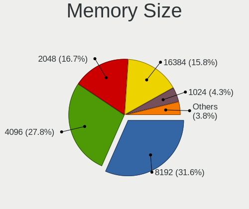

| Size  | Computers | Percent |
|-------|-----------|---------|
| 8192  | 61        | 35.06%  |
| 4096  | 53        | 30.46%  |
| 2048  | 27        | 15.52%  |
| 16384 | 21        | 12.07%  |
| 1024  | 6         | 3.45%   |
| 32768 | 4         | 2.3%    |
| 65536 | 1         | 0.57%   |
| 1536  | 1         | 0.57%   |

Memory Speed
------------

Memory module speed

| Speed   | Computers | Percent |
|---------|-----------|---------|
| 1600    | 36        | 20.69%  |
| 3200    | 29        | 16.67%  |
| 2667    | 22        | 12.64%  |
| 2400    | 15        | 8.62%   |
| 1333    | 11        | 6.32%   |
| 2133    | 10        | 5.75%   |
| 667     | 6         | 3.45%   |
| 1334    | 5         | 2.87%   |
| 4267    | 4         | 2.3%    |
| 3600    | 4         | 2.3%    |
| 1066    | 4         | 2.3%    |
| 3000    | 3         | 1.72%   |
| 2666    | 3         | 1.72%   |
| 1067    | 3         | 1.72%   |
| 1867    | 2         | 1.15%   |
| 800     | 2         | 1.15%   |
| Unknown | 2         | 1.15%   |
| 4800    | 1         | 0.57%   |
| 4266    | 1         | 0.57%   |
| 4199    | 1         | 0.57%   |
| 3733    | 1         | 0.57%   |
| 3400    | 1         | 0.57%   |
| 3266    | 1         | 0.57%   |
| 3020    | 1         | 0.57%   |
| 2800    | 1         | 0.57%   |
| 2134    | 1         | 0.57%   |
| 2000    | 1         | 0.57%   |
| 1800    | 1         | 0.57%   |
| 1776    | 1         | 0.57%   |
| 1648    | 1         | 0.57%   |

Printers & scanners
-------------------

Printer Vendor
--------------

Printer device vendors

| Vendor             | Computers | Percent |
|--------------------|-----------|---------|
| Hewlett-Packard    | 3         | 50%     |
| Minolta            | 1         | 16.67%  |
| Canon              | 1         | 16.67%  |
| Brother Industries | 1         | 16.67%  |

Printer Model
-------------

Printer device models

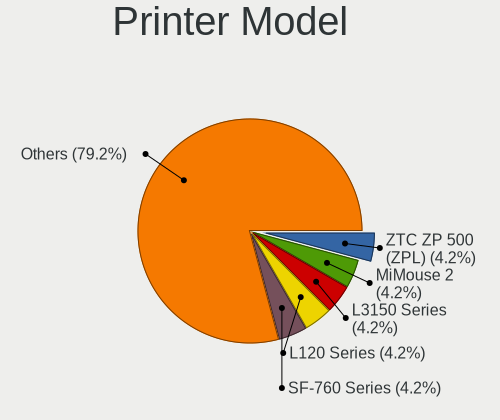

| Model                       | Computers | Percent |
|-----------------------------|-----------|---------|
| Minolta PagePro 1300W       | 1         | 16.67%  |
| HP DeskJet D1360            | 1         | 16.67%  |
| HP DeskJet 840c             | 1         | 16.67%  |
| HP Deskjet 3070 B611 series | 1         | 16.67%  |
| Canon TS3500 series         | 1         | 16.67%  |
| Brother DCP-7040            | 1         | 16.67%  |

Scanner Vendor
--------------

Scanner device vendors

| Vendor      | Computers | Percent |
|-------------|-----------|---------|
| Seiko Epson | 1         | 50%     |
| Canon       | 1         | 50%     |

Scanner Model
-------------

Scanner device models

| Model                                  | Computers | Percent |
|----------------------------------------|-----------|---------|
| Seiko Epson GT-9800F [Perfection 3200] | 1         | 50%     |
| Canon CanoScan LiDE 100                | 1         | 50%     |

Camera
------

Camera Vendor
-------------

Camera device vendors

| Vendor                                 | Computers | Percent |
|----------------------------------------|-----------|---------|
| Chicony Electronics                    | 39        | 26.35%  |
| Realtek Semiconductor                  | 14        | 9.46%   |
| Quanta                                 | 10        | 6.76%   |
| Microdia                               | 9         | 6.08%   |
| IMC Networks                           | 9         | 6.08%   |
| Cheng Uei Precision Industry (Foxlink) | 7         | 4.73%   |
| Suyin                                  | 6         | 4.05%   |
| Sunplus Innovation Technology          | 6         | 4.05%   |
| Logitech                               | 6         | 4.05%   |
| Acer                                   | 6         | 4.05%   |
| Z-Star Microelectronics                | 3         | 2.03%   |
| Lite-On Technology                     | 3         | 2.03%   |
| Apple                                  | 3         | 2.03%   |
| USB Camera                             | 2         | 1.35%   |
| Silicon Motion                         | 2         | 1.35%   |
| Microsoft                              | 2         | 1.35%   |
| Luxvisions Innotech Limited            | 2         | 1.35%   |
| Alcor Micro                            | 2         | 1.35%   |
| Xiongmai                               | 1         | 0.68%   |
| Xiaomi                                 | 1         | 0.68%   |
| USB Camera CS                          | 1         | 0.68%   |
| Syntek                                 | 1         | 0.68%   |
| SunplusIT                              | 1         | 0.68%   |
| Sunplus Technology                     | 1         | 0.68%   |
| Sonix Technology                       | 1         | 0.68%   |
| Samsung Electronics                    | 1         | 0.68%   |
| Ricoh                                  | 1         | 0.68%   |
| Primax Electronics                     | 1         | 0.68%   |
| OmniVision Technologies                | 1         | 0.68%   |
| Lenovo                                 | 1         | 0.68%   |
| KYE Systems (Mouse Systems)            | 1         | 0.68%   |
| Importek                               | 1         | 0.68%   |
| Guillemot                              | 1         | 0.68%   |
| DJKANA19IDX53W                         | 1         | 0.68%   |
| Creative Technology                    | 1         | 0.68%   |

Camera Model
------------

Camera device models

| Model                                               | Computers | Percent |
|-----------------------------------------------------|-----------|---------|
| Chicony Integrated Camera                           | 14        | 9.46%   |
| Sunplus Integrated_Webcam_FHD                       | 3         | 2.03%   |
| Realtek USB Camera                                  | 3         | 2.03%   |
| Realtek Integrated_Webcam_HD                        | 3         | 2.03%   |
| Microdia Integrated_Webcam_HD                       | 3         | 2.03%   |
| IMC Networks USB2.0 HD UVC WebCam                   | 3         | 2.03%   |
| Cheng Uei Precision Industry (Foxlink) HP HD Camera | 3         | 2.03%   |
| USB Camera USB Camera                               | 2         | 1.35%   |
| Suyin HP TrueVision HD Integrated Webcam            | 2         | 1.35%   |
| Sunplus Integrated_Webcam_HD                        | 2         | 1.35%   |
| Realtek HP Truevision HD                            | 2         | 1.35%   |
| Realtek Acer 640 x 480 laptop camera                | 2         | 1.35%   |
| Quanta USB2.0 HD UVC WebCam                         | 2         | 1.35%   |
| Quanta HP Webcam                                    | 2         | 1.35%   |
| Quanta HD User Facing                               | 2         | 1.35%   |
| Microdia Sonix USB 2.0 Camera                       | 2         | 1.35%   |
| Microdia Lenovo EasyCamera                          | 2         | 1.35%   |
| Logitech HD Pro Webcam C920                         | 2         | 1.35%   |
| Logitech BRIO                                       | 2         | 1.35%   |
| IMC Networks USB2.0 UVC HD Webcam                   | 2         | 1.35%   |
| Chicony USB2.0 VGA UVC WebCam                       | 2         | 1.35%   |
| Chicony TOSHIBA Web Camera - HD                     | 2         | 1.35%   |
| Chicony HP Truevision HD                            | 2         | 1.35%   |
| Chicony HD WebCam                                   | 2         | 1.35%   |
| Chicony EasyCamera                                  | 2         | 1.35%   |
| Acer Integrated Camera                              | 2         | 1.35%   |
| Z-Star Vimicro USB Camera (Altair)                  | 1         | 0.68%   |
| Z-Star Traveler TV 6500 SF Dia-scanner              | 1         | 0.68%   |
| Z-Star Lenovo USB2.0 UVC Camera                     | 1         | 0.68%   |
| Xiongmai web camera                                 | 1         | 0.68%   |
| Xiaomi Mi/Redmi series (PTP)                        | 1         | 0.68%   |
| USB Camera CS USB Camera CS                         | 1         | 0.68%   |
| Syntek Lenovo EasyCamera                            | 1         | 0.68%   |
| Suyin VGA Webcam                                    | 1         | 0.68%   |
| Suyin HD WebCam                                     | 1         | 0.68%   |
| Suyin Asus Integrated Webcam [CN031B]               | 1         | 0.68%   |
| Suyin 1.3M HD WebCam                                | 1         | 0.68%   |
| SunplusIT USB camera                                | 1         | 0.68%   |
| Sunplus HD Camera                                   | 1         | 0.68%   |
| Sunplus Asus Webcam                                 | 1         | 0.68%   |

Security
--------

Fingerprint Vendor
------------------

Fingerprint sensor vendors

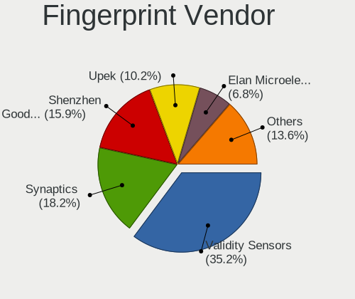

| Vendor                     | Computers | Percent |
|----------------------------|-----------|---------|
| Validity Sensors           | 9         | 45%     |
| Synaptics                  | 3         | 15%     |
| Shenzhen Goodix Technology | 3         | 15%     |
| Upek                       | 2         | 10%     |
| STMicroelectronics         | 2         | 10%     |
| Elan Microelectronics      | 1         | 5%      |

Fingerprint Model
-----------------

Fingerprint sensor models

| Model                                                  | Computers | Percent |
|--------------------------------------------------------|-----------|---------|
| Validity Sensors VFS7500 Touch Fingerprint Sensor      | 4         | 20%     |
| Validity Sensors VFS451 Fingerprint Reader             | 2         | 10%     |
| Validity Sensors Synaptics WBDI                        | 2         | 10%     |
| Upek Biometric Touchchip/Touchstrip Fingerprint Sensor | 2         | 10%     |
| STMicroelectronics Fingerprint Reader                  | 2         | 10%     |
| Shenzhen Goodix  Fingerprint Device                    | 2         | 10%     |
| Validity Sensors VFS495 Fingerprint Reader             | 1         | 5%      |
| Synaptics  WBDI                                        | 1         | 5%      |
| Synaptics Prometheus MIS Touch Fingerprint Reader      | 1         | 5%      |
| Synaptics Metallica MOH Touch Fingerprint Reader       | 1         | 5%      |
| Shenzhen Goodix Fingerprint Reader                     | 1         | 5%      |
| Elan ELAN:Fingerprint                                  | 1         | 5%      |

Chipcard Vendor
---------------

Chipcard module vendors

| Vendor           | Computers | Percent |
|------------------|-----------|---------|
| Broadcom         | 6         | 40%     |
| Alcor Micro      | 5         | 33.33%  |
| Lenovo           | 2         | 13.33%  |
| O2 Micro         | 1         | 6.67%   |
| In Focus Systems | 1         | 6.67%   |

Chipcard Model
--------------

Chipcard module models

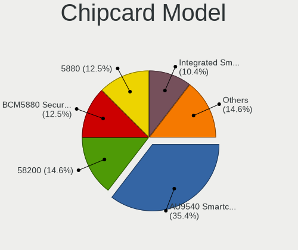

| Model                                          | Computers | Percent |
|------------------------------------------------|-----------|---------|
| Alcor Micro AU9540 Smartcard Reader            | 5         | 33.33%  |
| Broadcom 58200                                 | 3         | 20%     |
| Lenovo Integrated Smart Card Reader            | 2         | 13.33%  |
| Broadcom 5880                                  | 2         | 13.33%  |
| O2 Micro Oz776 SmartCard Reader                | 1         | 6.67%   |
| In Focus Systems EMV Smartcard Reader          | 1         | 6.67%   |
| Broadcom BCM5880 Secure Applications Processor | 1         | 6.67%   |

Unsupported
-----------

Unsupported Devices
-------------------

Total unsupported devices on board

| Total | Computers | Percent |
|-------|-----------|---------|
| 0     | 175       | 72.92%  |
| 1     | 51        | 21.25%  |
| 2     | 12        | 5%      |
| 5     | 1         | 0.42%   |
| 3     | 1         | 0.42%   |

Unsupported Device Types
------------------------

Types of unsupported devices

| Type                     | Computers | Percent |
|--------------------------|-----------|---------|
| Fingerprint reader       | 19        | 25%     |
| Chipcard                 | 15        | 19.74%  |
| Graphics card            | 14        | 18.42%  |
| Net/wireless             | 6         | 7.89%   |
| Camera                   | 6         | 7.89%   |
| Multimedia controller    | 4         | 5.26%   |
| Unassigned class         | 3         | 3.95%   |
| Network                  | 3         | 3.95%   |
| Card reader              | 2         | 2.63%   |
| Bluetooth                | 2         | 2.63%   |
| Sound                    | 1         | 1.32%   |
| Communication controller | 1         | 1.32%   |

