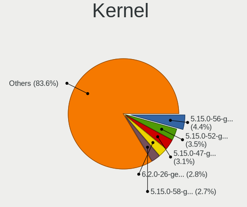
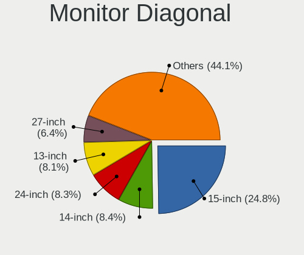
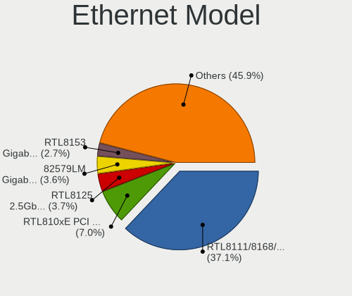
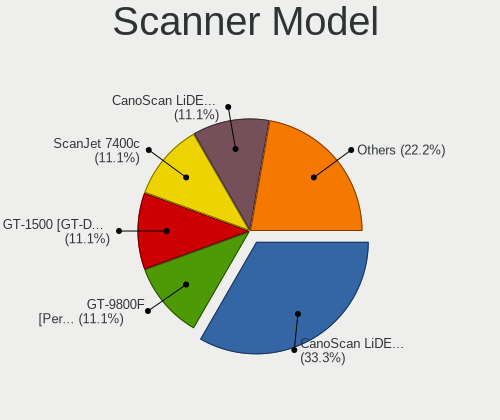

Xubuntu 22.04 - Tested Hardware & Statistics
--------------------------------------------

A project to collect tested hardware configurations for Xubuntu 22.04.

Anyone can contribute to this report by the [hw-probe](https://github.com/linuxhw/hw-probe) tool:

    sudo -E hw-probe -all -upload

Please contribute! Especially if your hardware is rare.

This is a report for all computer types. See also reports for [desktops](/Dist/Xubuntu_22.04/Desktop/README.md) and [notebooks](/Dist/Xubuntu_22.04/Notebook/README.md).

Contents
--------

* [ Test Cases ](#test-cases)

* [ System ](#system)
  - [ Kernel                   ](#kernel)
  - [ Kernel Family            ](#kernel-family)
  - [ Kernel Major Ver.        ](#kernel-major-ver)
  - [ Arch                     ](#arch)
  - [ DE                       ](#de)
  - [ Display Server           ](#display-server)
  - [ Display Manager          ](#display-manager)
  - [ OS Lang                  ](#os-lang)
  - [ Boot Mode                ](#boot-mode)
  - [ Filesystem               ](#filesystem)
  - [ Part. scheme             ](#part-scheme)
  - [ Dual Boot with Linux/BSD ](#dual-boot-with-linuxbsd)
  - [ Dual Boot (Win)          ](#dual-boot-win)

* [ Board ](#board)
  - [ Vendor                   ](#vendor)
  - [ Model                    ](#model)
  - [ Model Family             ](#model-family)
  - [ MFG Year                 ](#mfg-year)
  - [ Form Factor              ](#form-factor)
  - [ Secure Boot              ](#secure-boot)
  - [ Coreboot                 ](#coreboot)
  - [ RAM Size                 ](#ram-size)
  - [ RAM Used                 ](#ram-used)
  - [ Total Drives             ](#total-drives)
  - [ Has CD-ROM               ](#has-cd-rom)
  - [ Has Ethernet             ](#has-ethernet)
  - [ Has WiFi                 ](#has-wifi)
  - [ Has Bluetooth            ](#has-bluetooth)

* [ Location ](#location)
  - [ Country                  ](#country)
  - [ City                     ](#city)

* [ Drives ](#drives)
  - [ Drive Vendor             ](#drive-vendor)
  - [ Drive Model              ](#drive-model)
  - [ HDD Vendor               ](#hdd-vendor)
  - [ SSD Vendor               ](#ssd-vendor)
  - [ Drive Kind               ](#drive-kind)
  - [ Drive Connector          ](#drive-connector)
  - [ Drive Size               ](#drive-size)
  - [ Space Total              ](#space-total)
  - [ Space Used               ](#space-used)
  - [ Malfunc. Drives          ](#malfunc-drives)
  - [ Malfunc. Drive Vendor    ](#malfunc-drive-vendor)
  - [ Malfunc. HDD Vendor      ](#malfunc-hdd-vendor)
  - [ Malfunc. Drive Kind      ](#malfunc-drive-kind)
  - [ Failed Drives            ](#failed-drives)
  - [ Failed Drive Vendor      ](#failed-drive-vendor)
  - [ Drive Status             ](#drive-status)

* [ Storage controller ](#storage-controller)
  - [ Storage Vendor           ](#storage-vendor)
  - [ Storage Model            ](#storage-model)
  - [ Storage Kind             ](#storage-kind)

* [ Processor ](#processor)
  - [ CPU Vendor               ](#cpu-vendor)
  - [ CPU Model                ](#cpu-model)
  - [ CPU Model Family         ](#cpu-model-family)
  - [ CPU Cores                ](#cpu-cores)
  - [ CPU Sockets              ](#cpu-sockets)
  - [ CPU Threads              ](#cpu-threads)
  - [ CPU Op-Modes             ](#cpu-op-modes)
  - [ CPU Microcode            ](#cpu-microcode)
  - [ CPU Microarch            ](#cpu-microarch)

* [ Graphics ](#graphics)
  - [ GPU Vendor               ](#gpu-vendor)
  - [ GPU Model                ](#gpu-model)
  - [ GPU Combo                ](#gpu-combo)
  - [ GPU Driver               ](#gpu-driver)
  - [ GPU Memory               ](#gpu-memory)

* [ Monitor ](#monitor)
  - [ Monitor Vendor           ](#monitor-vendor)
  - [ Monitor Model            ](#monitor-model)
  - [ Monitor Resolution       ](#monitor-resolution)
  - [ Monitor Diagonal         ](#monitor-diagonal)
  - [ Monitor Width            ](#monitor-width)
  - [ Aspect Ratio             ](#aspect-ratio)
  - [ Monitor Area             ](#monitor-area)
  - [ Pixel Density            ](#pixel-density)
  - [ Multiple Monitors        ](#multiple-monitors)

* [ Network ](#network)
  - [ Net Controller Vendor    ](#net-controller-vendor)
  - [ Net Controller Model     ](#net-controller-model)
  - [ Wireless Vendor          ](#wireless-vendor)
  - [ Wireless Model           ](#wireless-model)
  - [ Ethernet Vendor          ](#ethernet-vendor)
  - [ Ethernet Model           ](#ethernet-model)
  - [ Net Controller Kind      ](#net-controller-kind)
  - [ Used Controller          ](#used-controller)
  - [ NICs                     ](#nics)
  - [ IPv6                     ](#ipv6)

* [ Bluetooth ](#bluetooth)
  - [ Bluetooth Vendor         ](#bluetooth-vendor)
  - [ Bluetooth Model          ](#bluetooth-model)

* [ Sound ](#sound)
  - [ Sound Vendor             ](#sound-vendor)
  - [ Sound Model              ](#sound-model)

* [ Memory ](#memory)
  - [ Memory Vendor            ](#memory-vendor)
  - [ Memory Model             ](#memory-model)
  - [ Memory Kind              ](#memory-kind)
  - [ Memory Form Factor       ](#memory-form-factor)
  - [ Memory Size              ](#memory-size)
  - [ Memory Speed             ](#memory-speed)

* [ Printers & scanners ](#printers--scanners)
  - [ Printer Vendor           ](#printer-vendor)
  - [ Printer Model            ](#printer-model)
  - [ Scanner Vendor           ](#scanner-vendor)
  - [ Scanner Model            ](#scanner-model)

* [ Camera ](#camera)
  - [ Camera Vendor            ](#camera-vendor)
  - [ Camera Model             ](#camera-model)

* [ Security ](#security)
  - [ Fingerprint Vendor       ](#fingerprint-vendor)
  - [ Fingerprint Model        ](#fingerprint-model)
  - [ Chipcard Vendor          ](#chipcard-vendor)
  - [ Chipcard Model           ](#chipcard-model)

* [ Unsupported ](#unsupported)
  - [ Unsupported Devices      ](#unsupported-devices)
  - [ Unsupported Device Types ](#unsupported-device-types)

Test Cases
----------

Total: 1220

| Vendor        | Model                       | Form-Factor | Probe                                                      | Date         |
|---------------|-----------------------------|-------------|------------------------------------------------------------|--------------|
| Dell          | Inspiron 15 3515            | Notebook    | [ca2cc3e4ae](https://linux-hardware.org/?probe=ca2cc3e4ae) | Jan 02, 2025 |
| Lenovo        | ThinkPad R61 8918DFG        | Notebook    | [a7030c8afc](https://linux-hardware.org/?probe=a7030c8afc) | Dec 29, 2024 |
| ASUSTek       | X541UVK                     | Notebook    | [e84d6fc1f1](https://linux-hardware.org/?probe=e84d6fc1f1) | Dec 26, 2024 |
| HP            | Pavilion g7                 | Notebook    | [349ddf33a4](https://linux-hardware.org/?probe=349ddf33a4) | Dec 23, 2024 |
| Acer          | Aspire A515-57              | Notebook    | [1e6b1c0777](https://linux-hardware.org/?probe=1e6b1c0777) | Dec 23, 2024 |
| ASUSTek       | M5A78L-M LX PLUS            | Desktop     | [83a10df0af](https://linux-hardware.org/?probe=83a10df0af) | Dec 16, 2024 |
| Lenovo        | V145-15AST 81MT             | Notebook    | [65a80c8ae1](https://linux-hardware.org/?probe=65a80c8ae1) | Dec 15, 2024 |
| Packard Be... | EasyNote MH36               | Notebook    | [f7069c0d8b](https://linux-hardware.org/?probe=f7069c0d8b) | Dec 09, 2024 |
| HP            | 15                          | Notebook    | [9abcf874e9](https://linux-hardware.org/?probe=9abcf874e9) | Nov 28, 2024 |
| Gigabyte      | H110M-S2-CF                 | Desktop     | [61e673309f](https://linux-hardware.org/?probe=61e673309f) | Nov 27, 2024 |
| Gigabyte      | H110M-S2-CF                 | Desktop     | [0d40b44d15](https://linux-hardware.org/?probe=0d40b44d15) | Nov 27, 2024 |
| Lenovo        | V330-15IKB 81AX             | Notebook    | [9b1d667645](https://linux-hardware.org/?probe=9b1d667645) | Nov 23, 2024 |
| Packard Be... | EasyNote TS11HR             | Notebook    | [416650beef](https://linux-hardware.org/?probe=416650beef) | Nov 23, 2024 |
| Pegatron      | 2AC2                        | Desktop     | [24efcbf074](https://linux-hardware.org/?probe=24efcbf074) | Nov 23, 2024 |
| Dell          | 051FJ8 A02                  | Desktop     | [66b7975345](https://linux-hardware.org/?probe=66b7975345) | Nov 20, 2024 |
| HP            | 15                          | Notebook    | [ae229ea058](https://linux-hardware.org/?probe=ae229ea058) | Nov 19, 2024 |
| Lenovo        | ThinkPad A475 20KMS0MR00    | Notebook    | [57d3147d55](https://linux-hardware.org/?probe=57d3147d55) | Nov 18, 2024 |
| Lenovo        | ThinkPad A475 20KMS0MR00    | Notebook    | [54c2687b9b](https://linux-hardware.org/?probe=54c2687b9b) | Nov 16, 2024 |
| HP            | ProBook 650 G1              | Notebook    | [556af0bd7a](https://linux-hardware.org/?probe=556af0bd7a) | Nov 14, 2024 |
| Dell          | Latitude 7340               | Notebook    | [ad73fedd66](https://linux-hardware.org/?probe=ad73fedd66) | Nov 13, 2024 |
| Gigabyte      | B660M DS3H DDR4             | Desktop     | [07bf1053a6](https://linux-hardware.org/?probe=07bf1053a6) | Nov 12, 2024 |
| Acer          | Swift SF314-512             | Notebook    | [78edb25f37](https://linux-hardware.org/?probe=78edb25f37) | Nov 09, 2024 |
| ASUSTek       | TUF Z390-PLUS GAMING        | Desktop     | [09bd105ca4](https://linux-hardware.org/?probe=09bd105ca4) | Nov 09, 2024 |
| Lenovo        | ThinkPad T530 2429A94       | Notebook    | [65b19adb3c](https://linux-hardware.org/?probe=65b19adb3c) | Oct 30, 2024 |
| Lenovo        | ThinkPad X1 Yoga 1st 20F... | Convertible | [6a3c1dda1a](https://linux-hardware.org/?probe=6a3c1dda1a) | Oct 30, 2024 |
| HP            | 3029h                       | Desktop     | [83bfbe4bbe](https://linux-hardware.org/?probe=83bfbe4bbe) | Oct 28, 2024 |
| HP            | EliteBook 830 G8 Noteboo... | Notebook    | [7c3872493b](https://linux-hardware.org/?probe=7c3872493b) | Oct 24, 2024 |
| Lenovo        | ThinkPad X220 42918F6       | Notebook    | [73dfa63259](https://linux-hardware.org/?probe=73dfa63259) | Oct 23, 2024 |
| AZW           | GK mini                     | Mini pc     | [8bcf6d53a1](https://linux-hardware.org/?probe=8bcf6d53a1) | Oct 17, 2024 |
| Google        | Candy                       | Notebook    | [0657332520](https://linux-hardware.org/?probe=0657332520) | Oct 17, 2024 |
| Dell          | Latitude 3540               | Notebook    | [5ab18fa675](https://linux-hardware.org/?probe=5ab18fa675) | Oct 15, 2024 |
| ASRock        | Z370 Pro4                   | Desktop     | [8be5788f0f](https://linux-hardware.org/?probe=8be5788f0f) | Oct 14, 2024 |
| Google        | Reks                        | Notebook    | [7654a0cc4c](https://linux-hardware.org/?probe=7654a0cc4c) | Oct 12, 2024 |
| ASUSTek       | P5E                         | Desktop     | [cdbc95990e](https://linux-hardware.org/?probe=cdbc95990e) | Oct 11, 2024 |
| Lenovo        | ThinkPad L13 Gen 2 20VH0... | Notebook    | [c7823c9fd3](https://linux-hardware.org/?probe=c7823c9fd3) | Oct 05, 2024 |
| Dell          | 0RY007                      | Desktop     | [aef3641a97](https://linux-hardware.org/?probe=aef3641a97) | Oct 03, 2024 |
| Lenovo        | ThinkPad T440s 20AQ009DG... | Notebook    | [b60d9ddc7c](https://linux-hardware.org/?probe=b60d9ddc7c) | Oct 01, 2024 |
| Acer          | Aspire A315-58              | Notebook    | [50a08b9a0d](https://linux-hardware.org/?probe=50a08b9a0d) | Oct 01, 2024 |
| Alienware     | M11xR3                      | Notebook    | [640a59c53a](https://linux-hardware.org/?probe=640a59c53a) | Sep 25, 2024 |
| ASRock        | H510 Pro BTC+               | Desktop     | [a1ae1e84a3](https://linux-hardware.org/?probe=a1ae1e84a3) | Sep 18, 2024 |
| Supermicro    | X8DTN                       | Server      | [3c6d5d3b61](https://linux-hardware.org/?probe=3c6d5d3b61) | Sep 13, 2024 |
| ASUSTek       | ROG STRIX B450-F GAMING     | Desktop     | [12bdde9ebc](https://linux-hardware.org/?probe=12bdde9ebc) | Sep 11, 2024 |
| Gigabyte      | Z87-HD3                     | Desktop     | [5ce754d8ac](https://linux-hardware.org/?probe=5ce754d8ac) | Sep 08, 2024 |
| HP            | EliteBook 2540p             | Notebook    | [7c9759b951](https://linux-hardware.org/?probe=7c9759b951) | Sep 08, 2024 |
| Unknown       | Unknown                     | Desktop     | [76a130d405](https://linux-hardware.org/?probe=76a130d405) | Sep 07, 2024 |
| Gigabyte      | X470 AORUS ULTRA GAMING-... | Desktop     | [f896396077](https://linux-hardware.org/?probe=f896396077) | Sep 04, 2024 |
| Dell          | Latitude 5300               | Notebook    | [2bb6cd074d](https://linux-hardware.org/?probe=2bb6cd074d) | Sep 04, 2024 |
| Packard Be... | IMEDIA S2185                | Desktop     | [2881d2dd1c](https://linux-hardware.org/?probe=2881d2dd1c) | Sep 04, 2024 |
| Dell          | 0P658H A05                  | Server      | [c5009a5fee](https://linux-hardware.org/?probe=c5009a5fee) | Sep 04, 2024 |
| HP            | Pavilion dm4                | Notebook    | [cadd83c1c1](https://linux-hardware.org/?probe=cadd83c1c1) | Sep 04, 2024 |
| MSI           | H81M-P33                    | Desktop     | [e042807dc2](https://linux-hardware.org/?probe=e042807dc2) | Sep 01, 2024 |
| Lenovo        | SHARKBAY SDK0E50510 PRO     | Desktop     | [89910d636e](https://linux-hardware.org/?probe=89910d636e) | Aug 31, 2024 |
| Lenovo        | SHARKBAY SDK0E50510 PRO     | Desktop     | [af2f92a36b](https://linux-hardware.org/?probe=af2f92a36b) | Aug 31, 2024 |
| MSI           | A520M-A PRO                 | Desktop     | [bea9bcf4a7](https://linux-hardware.org/?probe=bea9bcf4a7) | Aug 29, 2024 |
| Acer          | Aspire E1-571               | Notebook    | [3d7216a60a](https://linux-hardware.org/?probe=3d7216a60a) | Aug 21, 2024 |
| HP            | Pavilion dv6                | Notebook    | [d66efbf40c](https://linux-hardware.org/?probe=d66efbf40c) | Aug 20, 2024 |
| Biostar       | B350ET2                     | Desktop     | [435502bdae](https://linux-hardware.org/?probe=435502bdae) | Aug 17, 2024 |
| Biostar       | B350ET2                     | Desktop     | [1c9548b133](https://linux-hardware.org/?probe=1c9548b133) | Aug 17, 2024 |
| HP            | 255 15.6 inch G9 Noteboo... | Notebook    | [ff742887ee](https://linux-hardware.org/?probe=ff742887ee) | Aug 17, 2024 |
| Gigabyte      | F2A88XM-D3H                 | Desktop     | [326191891a](https://linux-hardware.org/?probe=326191891a) | Aug 17, 2024 |
| ASUSTek       | H87-PRO                     | Desktop     | [2df8b23618](https://linux-hardware.org/?probe=2df8b23618) | Aug 15, 2024 |
| MSI           | Z77A-G41                    | Desktop     | [85eb1d0f02](https://linux-hardware.org/?probe=85eb1d0f02) | Aug 09, 2024 |
| Dell          | Latitude 3540               | Notebook    | [c211e993f2](https://linux-hardware.org/?probe=c211e993f2) | Aug 07, 2024 |
| Dell          | Latitude 3540               | Notebook    | [5694031221](https://linux-hardware.org/?probe=5694031221) | Aug 07, 2024 |
| Lenovo        | ThinkPad T440s 20AQ009DG... | Notebook    | [b208c323dd](https://linux-hardware.org/?probe=b208c323dd) | Aug 07, 2024 |
| Unknown       | axera,ax650x                | Soc         | [91d750536e](https://linux-hardware.org/?probe=91d750536e) | Aug 05, 2024 |
| HP            | 1790                        | Desktop     | [8104bc2455](https://linux-hardware.org/?probe=8104bc2455) | Aug 03, 2024 |
| Dell          | Inspiron 3542               | Notebook    | [5914942e68](https://linux-hardware.org/?probe=5914942e68) | Jul 31, 2024 |
| HP            | EliteBook 2540p             | Notebook    | [1d1515aa10](https://linux-hardware.org/?probe=1d1515aa10) | Jul 28, 2024 |
| Dell          | 0P658H A05                  | Server      | [5e284b9d77](https://linux-hardware.org/?probe=5e284b9d77) | Jul 28, 2024 |
| ASRock        | N68-S3 UCC                  | Desktop     | [cc2c1f8fd5](https://linux-hardware.org/?probe=cc2c1f8fd5) | Jul 27, 2024 |
| Lenovo        | IdeaPad N585 20179          | Notebook    | [7be453f1ba](https://linux-hardware.org/?probe=7be453f1ba) | Jul 27, 2024 |
| ASRock        | B550 Phantom Gaming 4       | Desktop     | [475f183aa6](https://linux-hardware.org/?probe=475f183aa6) | Jul 27, 2024 |
| Dell          | Inspiron 3542               | Notebook    | [7dbae4d4d0](https://linux-hardware.org/?probe=7dbae4d4d0) | Jul 26, 2024 |
| OrangePi      | Zero2 W                     | Soc         | [afa5a07c4b](https://linux-hardware.org/?probe=afa5a07c4b) | Jul 25, 2024 |
| ASRock        | N68-S3 UCC                  | Desktop     | [ebee0b577f](https://linux-hardware.org/?probe=ebee0b577f) | Jul 23, 2024 |
| Dell          | 0F5C5X A00                  | Desktop     | [006ce103a9](https://linux-hardware.org/?probe=006ce103a9) | Jul 18, 2024 |
| ASUSTek       | X555YI                      | Notebook    | [5b525693e5](https://linux-hardware.org/?probe=5b525693e5) | Jul 17, 2024 |
| ASUSTek       | M2N68-AM SE2                | Desktop     | [54c2bc8ab6](https://linux-hardware.org/?probe=54c2bc8ab6) | Jul 17, 2024 |
| ASUSTek       | ROG STRIX B760-I GAMING ... | Desktop     | [75dbf5b437](https://linux-hardware.org/?probe=75dbf5b437) | Jul 16, 2024 |
| Dell          | 0XKH0D A02                  | Desktop     | [0781f0c28d](https://linux-hardware.org/?probe=0781f0c28d) | Jul 12, 2024 |
| Dell          | 0XKH0D A02                  | Desktop     | [c2611748dd](https://linux-hardware.org/?probe=c2611748dd) | Jul 12, 2024 |
| Gigabyte      | B550M K                     | Desktop     | [ea2aa30897](https://linux-hardware.org/?probe=ea2aa30897) | Jul 11, 2024 |
| Gigabyte      | B85-HD3                     | Desktop     | [ce9e0e79fb](https://linux-hardware.org/?probe=ce9e0e79fb) | Jul 10, 2024 |
| Acer          | Aspire 5251                 | Notebook    | [ee4236aa4b](https://linux-hardware.org/?probe=ee4236aa4b) | Jul 05, 2024 |
| Acer          | Aspire 5251                 | Notebook    | [738fcb5042](https://linux-hardware.org/?probe=738fcb5042) | Jul 04, 2024 |
| Dell          | Latitude 5411               | Notebook    | [de4b92c6d7](https://linux-hardware.org/?probe=de4b92c6d7) | Jul 02, 2024 |
| Lenovo        | G50-70 20351                | Notebook    | [0a8491e8c6](https://linux-hardware.org/?probe=0a8491e8c6) | Jul 02, 2024 |
| Rockchip      | RK3588 OPi 5 Plus           | Soc         | [ee86f5ecfa](https://linux-hardware.org/?probe=ee86f5ecfa) | Jul 02, 2024 |
| HP            | Pavilion x2 Detachable      | Notebook    | [3f4813d1b6](https://linux-hardware.org/?probe=3f4813d1b6) | Jul 01, 2024 |
| HP            | Laptop 14-bw0xx             | Notebook    | [9ac841dacf](https://linux-hardware.org/?probe=9ac841dacf) | Jun 29, 2024 |
| HP            | 3029h                       | Desktop     | [5be522cd78](https://linux-hardware.org/?probe=5be522cd78) | Jun 28, 2024 |
| HP            | Laptop 15-da0xxx            | Notebook    | [f44a6b32d8](https://linux-hardware.org/?probe=f44a6b32d8) | Jun 27, 2024 |
| Maibenben     | MaiBook M                   | Notebook    | [1e0a97a5f1](https://linux-hardware.org/?probe=1e0a97a5f1) | Jun 24, 2024 |
| Dell          | Inspiron 3542               | Notebook    | [6c9ebe6ce2](https://linux-hardware.org/?probe=6c9ebe6ce2) | Jun 22, 2024 |
| Dell          | 088DT1 A00                  | Desktop     | [63c22aab38](https://linux-hardware.org/?probe=63c22aab38) | Jun 22, 2024 |
| Lenovo        | IdeaPad 700-17ISK 80RV      | Notebook    | [ccdf03b592](https://linux-hardware.org/?probe=ccdf03b592) | Jun 19, 2024 |
| Lenovo        | IdeaPad Pro 5 16ARP8 83A... | Notebook    | [a40ce4c093](https://linux-hardware.org/?probe=a40ce4c093) | Jun 18, 2024 |
| Sony          | VPCCW2S8E                   | Notebook    | [0020b32401](https://linux-hardware.org/?probe=0020b32401) | Jun 17, 2024 |
| Lenovo        | IdeaPad N585 20179          | Notebook    | [04002fe8fb](https://linux-hardware.org/?probe=04002fe8fb) | Jun 17, 2024 |
| MSI           | MS-B1831                    | Desktop     | [8e56f848ac](https://linux-hardware.org/?probe=8e56f848ac) | Jun 16, 2024 |
| HP            | 8643 SMVB                   | Desktop     | [21b770ac23](https://linux-hardware.org/?probe=21b770ac23) | Jun 15, 2024 |
| ASUSTek       | H110M-PLUS                  | Desktop     | [a13acdf786](https://linux-hardware.org/?probe=a13acdf786) | Jun 14, 2024 |
| ASUSTek       | H110M-PLUS                  | Desktop     | [fffccdaea1](https://linux-hardware.org/?probe=fffccdaea1) | Jun 14, 2024 |
| ASUSTek       | ROG ZENITH EXTREME          | Desktop     | [23f82615a3](https://linux-hardware.org/?probe=23f82615a3) | Jun 12, 2024 |
| Notebook      | N85_N87HCHNHZ               | Notebook    | [2094539dff](https://linux-hardware.org/?probe=2094539dff) | Jun 09, 2024 |
| Lenovo        | IdeaPad 100-15IBY 80MJ      | Notebook    | [258aafdc3f](https://linux-hardware.org/?probe=258aafdc3f) | Jun 07, 2024 |
| Dell          | 0M3F6C A01                  | Desktop     | [d9355d53f8](https://linux-hardware.org/?probe=d9355d53f8) | Jun 07, 2024 |
| ASUSTek       | M51AC                       | Desktop     | [8b39e8a250](https://linux-hardware.org/?probe=8b39e8a250) | Jun 06, 2024 |
| Lenovo        | IdeaPad 3 15IML05 81WB      | Notebook    | [055665c491](https://linux-hardware.org/?probe=055665c491) | Jun 05, 2024 |
| ASUSTek       | ET1612I                     | Desktop     | [589954115c](https://linux-hardware.org/?probe=589954115c) | Jun 03, 2024 |
| Dell          | 0FM586                      | Desktop     | [480574c2be](https://linux-hardware.org/?probe=480574c2be) | Jun 03, 2024 |
| Dell          | 0P658H A05                  | Server      | [47c556be06](https://linux-hardware.org/?probe=47c556be06) | Jun 02, 2024 |
| HP            | Pavilion dv7                | Notebook    | [826b443536](https://linux-hardware.org/?probe=826b443536) | May 31, 2024 |
| Dell          | 0FM586                      | Desktop     | [c192f1ab3d](https://linux-hardware.org/?probe=c192f1ab3d) | May 30, 2024 |
| Acer          | Aspire SW5-012              | Notebook    | [39dbf768d7](https://linux-hardware.org/?probe=39dbf768d7) | May 30, 2024 |
| Dell          | XPS 15 9510                 | Notebook    | [7362f68c8c](https://linux-hardware.org/?probe=7362f68c8c) | May 29, 2024 |
| Dell          | Inspiron 3421               | Notebook    | [26c6e28f8c](https://linux-hardware.org/?probe=26c6e28f8c) | May 28, 2024 |
| ASUSTek       | E200HA                      | Notebook    | [528fdeaaba](https://linux-hardware.org/?probe=528fdeaaba) | May 28, 2024 |
| ASUSTek       | K54C                        | Notebook    | [a7e501420d](https://linux-hardware.org/?probe=a7e501420d) | May 27, 2024 |
| ASUSTek       | PRIME B550-PLUS             | Desktop     | [4fb3692ff1](https://linux-hardware.org/?probe=4fb3692ff1) | May 27, 2024 |
| Dell          | 0CRH6C A01                  | Desktop     | [9d92d084e8](https://linux-hardware.org/?probe=9d92d084e8) | May 27, 2024 |
| Medion        | E15309                      | Notebook    | [b095da9dbd](https://linux-hardware.org/?probe=b095da9dbd) | May 26, 2024 |
| Rockchip      | Orange Pi 5                 | Soc         | [59ff8bf9b8](https://linux-hardware.org/?probe=59ff8bf9b8) | May 25, 2024 |
| Lenovo        | ThinkPad W540 20BHS22200    | Notebook    | [4e16082fc6](https://linux-hardware.org/?probe=4e16082fc6) | May 24, 2024 |
| Lenovo        | IdeaPadFlex 3 11ADA05 82... | Convertible | [41d19e4004](https://linux-hardware.org/?probe=41d19e4004) | May 20, 2024 |
| ASUSTek       | ASUS TUF Gaming F15 FX50... | Notebook    | [533a0b51a1](https://linux-hardware.org/?probe=533a0b51a1) | May 18, 2024 |
| Gigabyte      | B360M AORUS Gaming 3-CF     | Desktop     | [2851cf1093](https://linux-hardware.org/?probe=2851cf1093) | May 17, 2024 |
| Dell          | 088DT1 A00                  | Desktop     | [5fdb3e7792](https://linux-hardware.org/?probe=5fdb3e7792) | May 15, 2024 |
| HP            | 8777 01011                  | Mini pc     | [deb8dcec1d](https://linux-hardware.org/?probe=deb8dcec1d) | May 15, 2024 |
| HP            | 3115m                       | Notebook    | [45bdc53959](https://linux-hardware.org/?probe=45bdc53959) | May 14, 2024 |
| Inventec      | Dell Wyse Thin Client De... | Mini pc     | [fa97930352](https://linux-hardware.org/?probe=fa97930352) | May 13, 2024 |
| Acer          | P7YE0                       | Notebook    | [21da78891a](https://linux-hardware.org/?probe=21da78891a) | May 08, 2024 |
| Lenovo        | 7Z74CTO1WW 07               | Server      | [ecd5a5be36](https://linux-hardware.org/?probe=ecd5a5be36) | May 07, 2024 |
| Dell          | 088DT1 A00                  | Desktop     | [edb955bd5e](https://linux-hardware.org/?probe=edb955bd5e) | May 07, 2024 |
| Dell          | Precision 7710              | Notebook    | [c89fe612a1](https://linux-hardware.org/?probe=c89fe612a1) | May 06, 2024 |
| Dell          | Precision 7710              | Notebook    | [52c6c4a64a](https://linux-hardware.org/?probe=52c6c4a64a) | May 06, 2024 |
| Amlogic       | Meson GXL (S905X) P212 D... | Soc         | [1df5ef59da](https://linux-hardware.org/?probe=1df5ef59da) | May 05, 2024 |
| Toshiba       | Satellite A200              | Notebook    | [47b52c0fce](https://linux-hardware.org/?probe=47b52c0fce) | May 02, 2024 |
| Dell          | 0N867P A02                  | Desktop     | [7b2f6946b9](https://linux-hardware.org/?probe=7b2f6946b9) | May 01, 2024 |
| Lenovo        | Yoga 730-13IKB 81CT         | Convertible | [0663c3f0ee](https://linux-hardware.org/?probe=0663c3f0ee) | Apr 30, 2024 |
| Acer          | Aspire A515-44              | Notebook    | [d580243e57](https://linux-hardware.org/?probe=d580243e57) | Apr 30, 2024 |
| Gigabyte      | H110M-S2-CF                 | Desktop     | [e55bcf23cf](https://linux-hardware.org/?probe=e55bcf23cf) | Apr 30, 2024 |
| Acer          | Aspire A515-51              | Notebook    | [083965d3db](https://linux-hardware.org/?probe=083965d3db) | Apr 30, 2024 |
| AZW           | EQ                          | Desktop     | [dc09b0ecbc](https://linux-hardware.org/?probe=dc09b0ecbc) | Apr 29, 2024 |
| AZW           | EQ                          | Desktop     | [9e4f615d36](https://linux-hardware.org/?probe=9e4f615d36) | Apr 29, 2024 |
| HP            | Notebook                    | Notebook    | [0f3465e86c](https://linux-hardware.org/?probe=0f3465e86c) | Apr 28, 2024 |
| Lenovo        | FLEX-14IWL Laptop 81SQ      | Convertible | [afc8b7bd9f](https://linux-hardware.org/?probe=afc8b7bd9f) | Apr 28, 2024 |
| Intel         | AB2L .A001                  | Mini pc     | [b9bb546172](https://linux-hardware.org/?probe=b9bb546172) | Apr 27, 2024 |
| Apple         | MacBookPro7,1               | Notebook    | [b83cef7cdd](https://linux-hardware.org/?probe=b83cef7cdd) | Apr 27, 2024 |
| Lenovo        | ThinkPad W541 20EGS03W15    | Notebook    | [32ac46c0a5](https://linux-hardware.org/?probe=32ac46c0a5) | Apr 27, 2024 |
| HP            | Mini 210-1000               | Notebook    | [26d3ef8d19](https://linux-hardware.org/?probe=26d3ef8d19) | Apr 27, 2024 |
| HP            | Laptop 14-dq0xxx            | Notebook    | [4652a98a00](https://linux-hardware.org/?probe=4652a98a00) | Apr 24, 2024 |
| HP            | Laptop 14-dq0xxx            | Notebook    | [3feeb1bdac](https://linux-hardware.org/?probe=3feeb1bdac) | Apr 24, 2024 |
| Lenovo        | ThinkPad Twist 33474HU      | Notebook    | [98b9979ec3](https://linux-hardware.org/?probe=98b9979ec3) | Apr 23, 2024 |
| Apple         | MacBookPro5,2               | Notebook    | [a5052885f7](https://linux-hardware.org/?probe=a5052885f7) | Apr 22, 2024 |
| ASUSTek       | ASUS TUF Gaming F15 FX50... | Notebook    | [a399c9a39f](https://linux-hardware.org/?probe=a399c9a39f) | Apr 22, 2024 |
| Apple         | MacBookAir6,2               | Notebook    | [37c91e715a](https://linux-hardware.org/?probe=37c91e715a) | Apr 22, 2024 |
| Dell          | 0MN1TX A02                  | Desktop     | [2aa151f159](https://linux-hardware.org/?probe=2aa151f159) | Apr 20, 2024 |
| Dell          | 0MN1TX A02                  | Desktop     | [cfac7f54ed](https://linux-hardware.org/?probe=cfac7f54ed) | Apr 20, 2024 |
| ASUSTek       | TUF Gaming B550M-PLUS       | Desktop     | [5e4c324298](https://linux-hardware.org/?probe=5e4c324298) | Apr 18, 2024 |
| Dell          | XPS 13 9370                 | Notebook    | [2ff2120005](https://linux-hardware.org/?probe=2ff2120005) | Apr 15, 2024 |
| Sony          | VPCF12M1E                   | Notebook    | [a07e465b04](https://linux-hardware.org/?probe=a07e465b04) | Apr 15, 2024 |
| Dell          | 0FF3FN A00                  | Desktop     | [b1bddc88aa](https://linux-hardware.org/?probe=b1bddc88aa) | Apr 15, 2024 |
| Dell          | 0WG864                      | Desktop     | [b430ed12b5](https://linux-hardware.org/?probe=b430ed12b5) | Apr 15, 2024 |
| Sony          | VPCF12M1E                   | Notebook    | [b4adc4cd67](https://linux-hardware.org/?probe=b4adc4cd67) | Apr 13, 2024 |
| ASRock        | A75M-HVS                    | Desktop     | [fc26a8b5fa](https://linux-hardware.org/?probe=fc26a8b5fa) | Apr 12, 2024 |
| Fujitsu       | FujitsuTP7000 -1            | Desktop     | [1d3918f13c](https://linux-hardware.org/?probe=1d3918f13c) | Apr 11, 2024 |
| Dell          | 0FF3FN A00                  | Desktop     | [979d51faa5](https://linux-hardware.org/?probe=979d51faa5) | Apr 10, 2024 |
| Shenzhen M... | F7BFD                       | Desktop     | [98e43e8de4](https://linux-hardware.org/?probe=98e43e8de4) | Apr 09, 2024 |
| Dell          | 02YYK5 A01                  | Desktop     | [cee98f0931](https://linux-hardware.org/?probe=cee98f0931) | Apr 09, 2024 |
| Dell          | 02YYK5 A01                  | Desktop     | [ed8a461ca7](https://linux-hardware.org/?probe=ed8a461ca7) | Apr 09, 2024 |
| Philco        | 14I                         | Notebook    | [c7ac543990](https://linux-hardware.org/?probe=c7ac543990) | Apr 09, 2024 |
| HP            | EliteBook 2540p             | Notebook    | [ac69abc7f8](https://linux-hardware.org/?probe=ac69abc7f8) | Apr 08, 2024 |
| Dell          | XPS 13 9370                 | Notebook    | [a49c3b9526](https://linux-hardware.org/?probe=a49c3b9526) | Apr 08, 2024 |
| HP            | 15                          | Notebook    | [81bbe62a62](https://linux-hardware.org/?probe=81bbe62a62) | Apr 08, 2024 |
| Dell          | 088DT1 A00                  | Desktop     | [c11b83e86b](https://linux-hardware.org/?probe=c11b83e86b) | Apr 08, 2024 |
| Hardkernel    | ODROID-H2                   | Desktop     | [64075f354e](https://linux-hardware.org/?probe=64075f354e) | Apr 07, 2024 |
| Lenovo        | ThinkPad T60 1951FDG        | Notebook    | [3baacd7e39](https://linux-hardware.org/?probe=3baacd7e39) | Apr 07, 2024 |
| Lenovo        | ThinkPad T60 1951FDG        | Notebook    | [48ffb129cb](https://linux-hardware.org/?probe=48ffb129cb) | Apr 06, 2024 |
| Dell          | Latitude 5330               | Notebook    | [3327ec32e4](https://linux-hardware.org/?probe=3327ec32e4) | Apr 06, 2024 |
| Gigabyte      | M68M-S2P                    | Desktop     | [2711aee181](https://linux-hardware.org/?probe=2711aee181) | Apr 05, 2024 |
| Lenovo        | ThinkPad T60 1951FDG        | Notebook    | [690d2ee78f](https://linux-hardware.org/?probe=690d2ee78f) | Apr 05, 2024 |
| HP            | EliteBook 2540p             | Notebook    | [f3587d854e](https://linux-hardware.org/?probe=f3587d854e) | Apr 05, 2024 |
| Clevo         | W240EU/W250EUQ/W270EUQ      | Notebook    | [1479db147d](https://linux-hardware.org/?probe=1479db147d) | Apr 04, 2024 |
| Acer          | Aspire A515-44              | Notebook    | [4b51c98fb6](https://linux-hardware.org/?probe=4b51c98fb6) | Apr 04, 2024 |
| Lenovo        | Legion S7 15IMH5 82BC       | Notebook    | [b57ab21576](https://linux-hardware.org/?probe=b57ab21576) | Apr 03, 2024 |
| Samsung       | 300E4C/300E5C/300E7C        | Notebook    | [dfef032d35](https://linux-hardware.org/?probe=dfef032d35) | Apr 03, 2024 |
| MSI           | X58 Pro                     | Desktop     | [9b0fab5acc](https://linux-hardware.org/?probe=9b0fab5acc) | Apr 02, 2024 |
| Lenovo        | Yoga 730-13IKB 81CT         | Convertible | [9ce8633d67](https://linux-hardware.org/?probe=9ce8633d67) | Apr 02, 2024 |
| ASUSTek       | ROG CROSSHAIR VIII HERO     | Desktop     | [84ed1b3cc5](https://linux-hardware.org/?probe=84ed1b3cc5) | Apr 01, 2024 |
| Lenovo        | IdeaPad 1 15AMN7 82VG       | Notebook    | [0df7a90dcd](https://linux-hardware.org/?probe=0df7a90dcd) | Apr 01, 2024 |
| ASUSTek       | PRIME A320M-K               | Desktop     | [0bd97f775d](https://linux-hardware.org/?probe=0bd97f775d) | Apr 01, 2024 |
| ASUSTek       | PRIME A320M-K               | Desktop     | [d952efad38](https://linux-hardware.org/?probe=d952efad38) | Apr 01, 2024 |
| HP            | EliteBook 2540p             | Notebook    | [1115e42390](https://linux-hardware.org/?probe=1115e42390) | Mar 30, 2024 |
| MSI           | MPG X570S EDGE MAX WIFI     | Desktop     | [a09b8ab7cc](https://linux-hardware.org/?probe=a09b8ab7cc) | Mar 29, 2024 |
| HP            | Elite x2 1012 G1            | Notebook    | [5e19a7d027](https://linux-hardware.org/?probe=5e19a7d027) | Mar 29, 2024 |
| HP            | Elite x2 1012 G1            | Notebook    | [2d13f6d55a](https://linux-hardware.org/?probe=2d13f6d55a) | Mar 29, 2024 |
| Dell          | Latitude E6520              | Notebook    | [b0934dd20e](https://linux-hardware.org/?probe=b0934dd20e) | Mar 27, 2024 |
| Toshiba       | Satellite C70D-B            | Notebook    | [6800119330](https://linux-hardware.org/?probe=6800119330) | Mar 27, 2024 |
| ASUSTek       | PRIME A320M-K/BR            | Desktop     | [62ff739b8b](https://linux-hardware.org/?probe=62ff739b8b) | Mar 27, 2024 |
| ASUSTek       | PRIME A320M-K/BR            | Desktop     | [15137ac3a5](https://linux-hardware.org/?probe=15137ac3a5) | Mar 27, 2024 |
| MSI           | MPG X570S EDGE MAX WIFI     | Desktop     | [ee2674fe55](https://linux-hardware.org/?probe=ee2674fe55) | Mar 26, 2024 |
| Dell          | Latitude E5510              | Notebook    | [3f05300c5e](https://linux-hardware.org/?probe=3f05300c5e) | Mar 26, 2024 |
| Intel         | X99                         | Desktop     | [2479fc825c](https://linux-hardware.org/?probe=2479fc825c) | Mar 25, 2024 |
| ASUSTek       | ROG Zephyrus G14 GA403UI... | Notebook    | [eb09797dad](https://linux-hardware.org/?probe=eb09797dad) | Mar 25, 2024 |
| Lenovo        | ThinkPad L512 2598W2P       | Notebook    | [29d9529699](https://linux-hardware.org/?probe=29d9529699) | Mar 24, 2024 |
| Shenzhen M... | F7BFD                       | Desktop     | [64942ccf25](https://linux-hardware.org/?probe=64942ccf25) | Mar 24, 2024 |
| MACHINIST     | E5-MR9A V1.0                | Desktop     | [24cd2954c5](https://linux-hardware.org/?probe=24cd2954c5) | Mar 24, 2024 |
| ASUSTek       | PRIME A320M-K               | Desktop     | [052a56e30a](https://linux-hardware.org/?probe=052a56e30a) | Mar 23, 2024 |
| Toshiba       | Satellite C70D-B            | Notebook    | [85a82b979c](https://linux-hardware.org/?probe=85a82b979c) | Mar 23, 2024 |
| Lenovo        | SHARKBAY SDK0E50510 PRO     | Desktop     | [e18375e687](https://linux-hardware.org/?probe=e18375e687) | Mar 23, 2024 |
| ASUSTek       | ROG Zephyrus G14 GA403UI... | Notebook    | [4d1bc02be0](https://linux-hardware.org/?probe=4d1bc02be0) | Mar 23, 2024 |
| ASUSTek       | ROG Zephyrus G14 GA403UI... | Notebook    | [0f6120fef2](https://linux-hardware.org/?probe=0f6120fef2) | Mar 23, 2024 |
| HP            | Laptop 15-bs0xx             | Notebook    | [1398cdcdf9](https://linux-hardware.org/?probe=1398cdcdf9) | Mar 22, 2024 |
| MSI           | 760GM-P21                   | Desktop     | [9ea00e6ebb](https://linux-hardware.org/?probe=9ea00e6ebb) | Mar 22, 2024 |
| Intel         | H81                         | Desktop     | [9faff0c332](https://linux-hardware.org/?probe=9faff0c332) | Mar 21, 2024 |
| Gigabyte      | X470 AORUS ULTRA GAMING-... | Desktop     | [9df4721239](https://linux-hardware.org/?probe=9df4721239) | Mar 20, 2024 |
| ASUSTek       | ROG STRIX B550-F GAMING ... | Desktop     | [62f6992f05](https://linux-hardware.org/?probe=62f6992f05) | Mar 20, 2024 |
| eMachines     | eME642G                     | Notebook    | [8759a11aca](https://linux-hardware.org/?probe=8759a11aca) | Mar 20, 2024 |
| Supermicro    | X8DTN                       | Server      | [180b7199c4](https://linux-hardware.org/?probe=180b7199c4) | Mar 19, 2024 |
| HP            | Stream Laptop 14-ds0xxx     | Notebook    | [e003a1215d](https://linux-hardware.org/?probe=e003a1215d) | Mar 19, 2024 |
| Supermicro    | X8DTN                       | Server      | [a7ef5b23a1](https://linux-hardware.org/?probe=a7ef5b23a1) | Mar 18, 2024 |
| ASUSTek       | M5A78L-M/USB3               | Desktop     | [aff15cce95](https://linux-hardware.org/?probe=aff15cce95) | Mar 17, 2024 |
| Lenovo        | G70-70 80HW0014FR           | Notebook    | [8fd24b2766](https://linux-hardware.org/?probe=8fd24b2766) | Mar 17, 2024 |
| Lenovo        | G70-70 80HW0014FR           | Notebook    | [ebb00d0246](https://linux-hardware.org/?probe=ebb00d0246) | Mar 17, 2024 |
| eMachines     | eME642G                     | Notebook    | [7d7230a747](https://linux-hardware.org/?probe=7d7230a747) | Mar 16, 2024 |
| Gigabyte      | X470 AORUS ULTRA GAMING-... | Desktop     | [8f589013b1](https://linux-hardware.org/?probe=8f589013b1) | Mar 15, 2024 |
| Lenovo        | ThinkPad T14s Gen 1 20UJ... | Notebook    | [2d1ccd0458](https://linux-hardware.org/?probe=2d1ccd0458) | Mar 15, 2024 |
| Fujitsu       | FARQ10003                   | Notebook    | [85d8b675fc](https://linux-hardware.org/?probe=85d8b675fc) | Mar 14, 2024 |
| HP            | 2175                        | Desktop     | [f43124076c](https://linux-hardware.org/?probe=f43124076c) | Mar 14, 2024 |
| Dell          | 088DT1 A00                  | Desktop     | [8eb20f3ee6](https://linux-hardware.org/?probe=8eb20f3ee6) | Mar 12, 2024 |
| Dell          | 0J3C2F A02                  | Desktop     | [bebba9cf4a](https://linux-hardware.org/?probe=bebba9cf4a) | Mar 12, 2024 |
| HP            | 250 G6 Notebook PC          | Notebook    | [6b050fbf71](https://linux-hardware.org/?probe=6b050fbf71) | Mar 12, 2024 |
| Dell          | 0FF3FN A00                  | Desktop     | [78dd6f891e](https://linux-hardware.org/?probe=78dd6f891e) | Mar 11, 2024 |
| Lenovo        | ThinkPad T440s 20AQ009DG... | Notebook    | [dd2cc3d3df](https://linux-hardware.org/?probe=dd2cc3d3df) | Mar 11, 2024 |
| Dell          | 0VHXCD A03                  | Desktop     | [4ea894ca73](https://linux-hardware.org/?probe=4ea894ca73) | Mar 10, 2024 |
| Toshiba       | Satellite A200              | Notebook    | [7197835980](https://linux-hardware.org/?probe=7197835980) | Mar 08, 2024 |
| HP            | 3397                        | Desktop     | [571ec29e07](https://linux-hardware.org/?probe=571ec29e07) | Mar 07, 2024 |
| Dell          | Latitude 5280               | Notebook    | [59fcb83d4a](https://linux-hardware.org/?probe=59fcb83d4a) | Mar 07, 2024 |
| Dell          | Latitude 5280               | Notebook    | [eca7be25aa](https://linux-hardware.org/?probe=eca7be25aa) | Mar 07, 2024 |
| Notebook      | W54_55_94_95_97AU,AUQ       | Notebook    | [b16fb5307b](https://linux-hardware.org/?probe=b16fb5307b) | Mar 07, 2024 |
| HP            | 2129                        | Desktop     | [c06e16031f](https://linux-hardware.org/?probe=c06e16031f) | Mar 07, 2024 |
| HP            | 2129                        | Desktop     | [5f2414ecf8](https://linux-hardware.org/?probe=5f2414ecf8) | Mar 07, 2024 |
| HP            | 1998                        | Desktop     | [bd3e35eb3f](https://linux-hardware.org/?probe=bd3e35eb3f) | Mar 06, 2024 |
| ASUSTek       | TUF Gaming FX505DT_FX505... | Notebook    | [23a8bcc014](https://linux-hardware.org/?probe=23a8bcc014) | Mar 06, 2024 |
| Lenovo        | ThinkPad T470p 20J6S00UH... | Notebook    | [b35deb0a8c](https://linux-hardware.org/?probe=b35deb0a8c) | Mar 06, 2024 |
| Lenovo        | ThinkPad A475 20KMS0MR00    | Notebook    | [0351009764](https://linux-hardware.org/?probe=0351009764) | Mar 05, 2024 |
| ASUSTek       | P5Q-PRO                     | Desktop     | [4d165bc18c](https://linux-hardware.org/?probe=4d165bc18c) | Mar 05, 2024 |
| Lenovo        | IdeaPad 5 15ITL05 82FG      | Notebook    | [1c340dbb25](https://linux-hardware.org/?probe=1c340dbb25) | Mar 04, 2024 |
| Dell          | Inspiron 3521               | Notebook    | [9552e898d6](https://linux-hardware.org/?probe=9552e898d6) | Mar 04, 2024 |
| Lenovo        | ThinkPad A475 20KMS0MR00    | Notebook    | [eead5309ca](https://linux-hardware.org/?probe=eead5309ca) | Mar 04, 2024 |
| Gigabyte      | M61PME-S2P                  | Desktop     | [3a3676f133](https://linux-hardware.org/?probe=3a3676f133) | Mar 04, 2024 |
| HP            | EliteBook x360 1030 G2      | Convertible | [fc50b125e5](https://linux-hardware.org/?probe=fc50b125e5) | Mar 04, 2024 |
| HP            | 240 G7 Notebook PC          | Notebook    | [7556bb7dcb](https://linux-hardware.org/?probe=7556bb7dcb) | Mar 04, 2024 |
| Acer          | Extensa 5620                | Notebook    | [184149092e](https://linux-hardware.org/?probe=184149092e) | Mar 02, 2024 |
| Lenovo        | SHARKBAY NOK                | Desktop     | [abfba381b6](https://linux-hardware.org/?probe=abfba381b6) | Mar 02, 2024 |
| Lenovo        | SHARKBAY NOK                | Desktop     | [5d03e50172](https://linux-hardware.org/?probe=5d03e50172) | Mar 02, 2024 |
| HP            | 212A                        | Desktop     | [688db14d79](https://linux-hardware.org/?probe=688db14d79) | Feb 29, 2024 |
| Dell          | Inspiron 15 3520            | Notebook    | [22b06310de](https://linux-hardware.org/?probe=22b06310de) | Feb 29, 2024 |
| ASUSTek       | ROG STRIX B450-F GAMING     | Desktop     | [6b541baebc](https://linux-hardware.org/?probe=6b541baebc) | Feb 28, 2024 |
| Acer          | Aspire 5742G                | Notebook    | [ec33f6391f](https://linux-hardware.org/?probe=ec33f6391f) | Feb 27, 2024 |
| Dell          | Latitude 3590               | Notebook    | [cfd80ed606](https://linux-hardware.org/?probe=cfd80ed606) | Feb 25, 2024 |
| Acer          | Aspire 5742G                | Notebook    | [4ab95b25ed](https://linux-hardware.org/?probe=4ab95b25ed) | Feb 24, 2024 |
| ASUSTek       | Z170-K                      | Desktop     | [790bcad6c3](https://linux-hardware.org/?probe=790bcad6c3) | Feb 23, 2024 |
| Dell          | 088DT1 A00                  | Desktop     | [688b84c15c](https://linux-hardware.org/?probe=688b84c15c) | Feb 23, 2024 |
| HP            | 8777 01011                  | Mini pc     | [7694754fa7](https://linux-hardware.org/?probe=7694754fa7) | Feb 23, 2024 |
| Lenovo        | IdeaPad 330S-15IKB 81F5     | Notebook    | [9cc44f0ff5](https://linux-hardware.org/?probe=9cc44f0ff5) | Feb 22, 2024 |
| Shenzhen M... | F7BFD                       | Desktop     | [ed5d36c89f](https://linux-hardware.org/?probe=ed5d36c89f) | Feb 22, 2024 |
| Intel         | NUC6i7KYB H90766-406        | Mini pc     | [f4df789f90](https://linux-hardware.org/?probe=f4df789f90) | Feb 19, 2024 |
| ASUSTek       | P6T SE                      | Desktop     | [19014495ef](https://linux-hardware.org/?probe=19014495ef) | Feb 18, 2024 |
| Dell          | 088DT1 A00                  | Desktop     | [1442765491](https://linux-hardware.org/?probe=1442765491) | Feb 17, 2024 |
| Dell          | 088DT1 A00                  | Desktop     | [90fc76d5f0](https://linux-hardware.org/?probe=90fc76d5f0) | Feb 17, 2024 |
| Lenovo        | Legion S7 15IMH5 82BC       | Notebook    | [0495f0384b](https://linux-hardware.org/?probe=0495f0384b) | Feb 17, 2024 |
| Intel         | DB75EN                      | Desktop     | [d2fb5b9c49](https://linux-hardware.org/?probe=d2fb5b9c49) | Feb 15, 2024 |
| Intel         | D54250WYK H13922-303        | Desktop     | [2c7d744bc7](https://linux-hardware.org/?probe=2c7d744bc7) | Feb 14, 2024 |
| Toshiba       | dynabook EX/45CW            | Notebook    | [15397b8cd4](https://linux-hardware.org/?probe=15397b8cd4) | Feb 14, 2024 |
| Lenovo        | NOK                         | Desktop     | [ee3d0a6048](https://linux-hardware.org/?probe=ee3d0a6048) | Feb 11, 2024 |
| Lenovo        | ThinkBook 16p Gen 2 20YM    | Notebook    | [3f7984a7cb](https://linux-hardware.org/?probe=3f7984a7cb) | Feb 10, 2024 |
| Toshiba       | Satellite S55-A             | Notebook    | [b8c672ccc5](https://linux-hardware.org/?probe=b8c672ccc5) | Feb 10, 2024 |
| Acer          | Aspire A515-52K             | Notebook    | [08c3bcf367](https://linux-hardware.org/?probe=08c3bcf367) | Feb 07, 2024 |
| Lenovo        | G50-70 20351                | Notebook    | [eebc3497e7](https://linux-hardware.org/?probe=eebc3497e7) | Feb 06, 2024 |
| Lenovo        | NOK                         | Desktop     | [24ed0846b2](https://linux-hardware.org/?probe=24ed0846b2) | Feb 05, 2024 |
| Intel         | DB75EN                      | Desktop     | [0ec38bc63a](https://linux-hardware.org/?probe=0ec38bc63a) | Feb 04, 2024 |
| Intel         | NUC9i5QNB K49247-403        | Mini pc     | [9050f9f095](https://linux-hardware.org/?probe=9050f9f095) | Feb 04, 2024 |
| Fujitsu       | D2990-A1 S26361-D2990-A1    | Desktop     | [a87f78b559](https://linux-hardware.org/?probe=a87f78b559) | Feb 03, 2024 |
| Dell          | 0P658H A05                  | Server      | [38486457e6](https://linux-hardware.org/?probe=38486457e6) | Feb 03, 2024 |
| MSI           | Modern 15 A10M              | Notebook    | [22f3c2e58e](https://linux-hardware.org/?probe=22f3c2e58e) | Feb 02, 2024 |
| Acer          | NC-F5-771G-72XY             | Notebook    | [2f4c6fbadb](https://linux-hardware.org/?probe=2f4c6fbadb) | Feb 02, 2024 |
| Apple         | MacBookPro5,4               | Notebook    | [c22226fe6f](https://linux-hardware.org/?probe=c22226fe6f) | Feb 01, 2024 |
| HP            | EliteBook 840 G1            | Notebook    | [920b1ecb34](https://linux-hardware.org/?probe=920b1ecb34) | Jan 31, 2024 |
| Dell          | Inspiron 1525               | Notebook    | [ad26dae776](https://linux-hardware.org/?probe=ad26dae776) | Jan 30, 2024 |
| Dell          | Inspiron 1525               | Notebook    | [bc4394a85f](https://linux-hardware.org/?probe=bc4394a85f) | Jan 30, 2024 |
| HP            | EliteBook 860 16 inch G1... | Notebook    | [737d54004b](https://linux-hardware.org/?probe=737d54004b) | Jan 29, 2024 |
| ASUSTek       | X205TA                      | Notebook    | [83899dcb83](https://linux-hardware.org/?probe=83899dcb83) | Jan 27, 2024 |
| Lenovo        | ThinkPad T400 6474AW6       | Notebook    | [0ddfcaf599](https://linux-hardware.org/?probe=0ddfcaf599) | Jan 27, 2024 |
| Acer          | Aspire A315-58              | Notebook    | [c85674acbd](https://linux-hardware.org/?probe=c85674acbd) | Jan 26, 2024 |
| PC Special... | NH5x_7xDPx                  | Notebook    | [0f28a5d513](https://linux-hardware.org/?probe=0f28a5d513) | Jan 26, 2024 |
| Intel         | DB75EN                      | Desktop     | [41cea41d1e](https://linux-hardware.org/?probe=41cea41d1e) | Jan 26, 2024 |
| Apple         | MacBook5,1                  | Notebook    | [51346a4084](https://linux-hardware.org/?probe=51346a4084) | Jan 25, 2024 |
| Dell          | Latitude 7340               | Notebook    | [880054b099](https://linux-hardware.org/?probe=880054b099) | Jan 25, 2024 |
| Dell          | 0K240Y A01                  | Desktop     | [fe08501f76](https://linux-hardware.org/?probe=fe08501f76) | Jan 24, 2024 |
| ASUSTek       | ROG Strix G733PZ_G733PZ     | Notebook    | [5a5ec0016f](https://linux-hardware.org/?probe=5a5ec0016f) | Jan 24, 2024 |
| ASUSTek       | ROG STRIX B450-F GAMING     | Desktop     | [d11d529522](https://linux-hardware.org/?probe=d11d529522) | Jan 23, 2024 |
| ASUSTek       | P8P67 DELUXE                | Desktop     | [545e0a6896](https://linux-hardware.org/?probe=545e0a6896) | Jan 23, 2024 |
| Dell          | Inspiron 5567               | Notebook    | [dc061193f2](https://linux-hardware.org/?probe=dc061193f2) | Jan 22, 2024 |
| AOpen         | D2644 S26361-D2644          | Desktop     | [f45673bd59](https://linux-hardware.org/?probe=f45673bd59) | Jan 22, 2024 |
| MSI           | GF63 Thin 11UC              | Notebook    | [b6fa224856](https://linux-hardware.org/?probe=b6fa224856) | Jan 21, 2024 |
| ASUSTek       | TUF B450-PLUS GAMING        | Desktop     | [4254242157](https://linux-hardware.org/?probe=4254242157) | Jan 21, 2024 |
| Intel         | DB75EN                      | Desktop     | [f639799c41](https://linux-hardware.org/?probe=f639799c41) | Jan 21, 2024 |
| Dell          | 0F5C5X A00                  | Desktop     | [f320dddb34](https://linux-hardware.org/?probe=f320dddb34) | Jan 19, 2024 |
| ASUSTek       | H81M-C                      | Desktop     | [bcbb9c099f](https://linux-hardware.org/?probe=bcbb9c099f) | Jan 16, 2024 |
| MSI           | GF63 Thin 11UC              | Notebook    | [6d2801d1d8](https://linux-hardware.org/?probe=6d2801d1d8) | Jan 14, 2024 |
| Gigabyte      | B550 AORUS ELITE AX V2      | Desktop     | [77032de9df](https://linux-hardware.org/?probe=77032de9df) | Jan 14, 2024 |
| Lenovo        | G500 20236                  | Notebook    | [5dacf75c7d](https://linux-hardware.org/?probe=5dacf75c7d) | Jan 12, 2024 |
| Rockchip      | RK3566 OPi 3B               | Soc         | [1ad7806df7](https://linux-hardware.org/?probe=1ad7806df7) | Jan 12, 2024 |
| Lenovo        | 364F SDK0J40700 WIN 3258... | Desktop     | [b6d8783c20](https://linux-hardware.org/?probe=b6d8783c20) | Jan 12, 2024 |
| Dell          | 0T0MHW A03                  | Desktop     | [2ad439d95f](https://linux-hardware.org/?probe=2ad439d95f) | Jan 11, 2024 |
| Lenovo        | ThinkPad P53 20QNS00X00     | Notebook    | [ce397f675e](https://linux-hardware.org/?probe=ce397f675e) | Jan 10, 2024 |
| Microsoft     | Surface Pro 7               | Tablet      | [f02310e366](https://linux-hardware.org/?probe=f02310e366) | Jan 10, 2024 |
| Dell          | Inspiron 14-3452            | Notebook    | [0e47261be0](https://linux-hardware.org/?probe=0e47261be0) | Jan 09, 2024 |
| Dell          | Inspiron 14-3452            | Notebook    | [1834cfc875](https://linux-hardware.org/?probe=1834cfc875) | Jan 09, 2024 |
| MSI           | B550 GAMING GEN3            | Desktop     | [511526bcf7](https://linux-hardware.org/?probe=511526bcf7) | Jan 08, 2024 |
| Apple         | Mac-FFE5EF870D7BA81A iMa... | All in one  | [00ef8580ff](https://linux-hardware.org/?probe=00ef8580ff) | Jan 07, 2024 |
| Apple         | MacBook5,2                  | Notebook    | [2ed16f6a80](https://linux-hardware.org/?probe=2ed16f6a80) | Jan 07, 2024 |
| Lenovo        | IdeaPad 510S-13ISK 80SJ     | Notebook    | [90fe273da6](https://linux-hardware.org/?probe=90fe273da6) | Jan 06, 2024 |
| Lenovo        | Yoga 720-13IKB 81C3         | Convertible | [e131bcc2a6](https://linux-hardware.org/?probe=e131bcc2a6) | Jan 06, 2024 |
| Acer          | Aspire A517-52              | Notebook    | [610817c6c9](https://linux-hardware.org/?probe=610817c6c9) | Jan 05, 2024 |
| Gigabyte      | P55-UD3R                    | Desktop     | [44658131d3](https://linux-hardware.org/?probe=44658131d3) | Jan 05, 2024 |
| Dell          | 0P658H A05                  | Server      | [74f28d91a3](https://linux-hardware.org/?probe=74f28d91a3) | Jan 05, 2024 |
| HP            | Pavilion dv7                | Notebook    | [dc31f854de](https://linux-hardware.org/?probe=dc31f854de) | Jan 04, 2024 |
| Dell          | 0P658H A05                  | Server      | [1ae3680481](https://linux-hardware.org/?probe=1ae3680481) | Jan 01, 2024 |
| Dell          | Latitude 7390               | Notebook    | [8c74383dab](https://linux-hardware.org/?probe=8c74383dab) | Dec 27, 2023 |
| Unknown       | Unknown                     | Desktop     | [1f73670f10](https://linux-hardware.org/?probe=1f73670f10) | Dec 27, 2023 |
| Dell          | Latitude 7390               | Notebook    | [889337bb1c](https://linux-hardware.org/?probe=889337bb1c) | Dec 27, 2023 |
| Lenovo        | ThinkPad T14 Gen 1 20UDC... | Notebook    | [38b1c283b4](https://linux-hardware.org/?probe=38b1c283b4) | Dec 26, 2023 |
| Intel         | DB75EN                      | Desktop     | [c2c820f0d9](https://linux-hardware.org/?probe=c2c820f0d9) | Dec 25, 2023 |
| Intel         | DB75EN                      | Desktop     | [6ec790f3fc](https://linux-hardware.org/?probe=6ec790f3fc) | Dec 24, 2023 |
| eMachines     | E527                        | Notebook    | [cf5b096be7](https://linux-hardware.org/?probe=cf5b096be7) | Dec 22, 2023 |
| Gigabyte      | P35-DS3R                    | Desktop     | [741ad16651](https://linux-hardware.org/?probe=741ad16651) | Dec 22, 2023 |
| MSI           | X570-A PRO                  | Desktop     | [07a7762b25](https://linux-hardware.org/?probe=07a7762b25) | Dec 21, 2023 |
| Lenovo        | Yoga 2 11 20332             | Notebook    | [16a8e6f875](https://linux-hardware.org/?probe=16a8e6f875) | Dec 21, 2023 |
| Sony          | VGN-NW270F                  | Notebook    | [eee640a54d](https://linux-hardware.org/?probe=eee640a54d) | Dec 20, 2023 |
| ASUSTek       | K30AD_M31AD_M51AD_M32AD     | Desktop     | [ee1a222677](https://linux-hardware.org/?probe=ee1a222677) | Dec 20, 2023 |
| HP            | Pavilion dv6                | Notebook    | [4cc379dfbd](https://linux-hardware.org/?probe=4cc379dfbd) | Dec 19, 2023 |
| HP            | Notebook                    | Notebook    | [31d6fc4280](https://linux-hardware.org/?probe=31d6fc4280) | Dec 19, 2023 |
| ASUSTek       | X541UVK                     | Notebook    | [a6ae535887](https://linux-hardware.org/?probe=a6ae535887) | Dec 18, 2023 |
| MSI           | GF63 Thin 11UC              | Notebook    | [06556bd61a](https://linux-hardware.org/?probe=06556bd61a) | Dec 17, 2023 |
| HP            | ZBook Fury 16 G9 Mobile ... | Notebook    | [ce0e0e1bc1](https://linux-hardware.org/?probe=ce0e0e1bc1) | Dec 17, 2023 |
| Apple         | MacBookPro8,1               | Notebook    | [f0ed04c975](https://linux-hardware.org/?probe=f0ed04c975) | Dec 16, 2023 |
| Lenovo        | IdeaPad 1 15AMN7 82VG       | Notebook    | [6a2633018c](https://linux-hardware.org/?probe=6a2633018c) | Dec 15, 2023 |
| Lenovo        | ThinkPad X1 Carbon Gen 1... | Notebook    | [e7ca2f3a6e](https://linux-hardware.org/?probe=e7ca2f3a6e) | Dec 14, 2023 |
| HP            | 212B                        | Desktop     | [1ce8b8d929](https://linux-hardware.org/?probe=1ce8b8d929) | Dec 14, 2023 |
| Intel         | H310 Series                 | Desktop     | [9565b22822](https://linux-hardware.org/?probe=9565b22822) | Dec 13, 2023 |
| Lenovo        | NO DPK                      | Desktop     | [2204183295](https://linux-hardware.org/?probe=2204183295) | Dec 12, 2023 |
| Toshiba       | Satellite Pro C660          | Notebook    | [63cf57fa53](https://linux-hardware.org/?probe=63cf57fa53) | Dec 12, 2023 |
| Dell          | Inspiron 7591               | Notebook    | [10a266d0ff](https://linux-hardware.org/?probe=10a266d0ff) | Dec 12, 2023 |
| ASUSTek       | ROG STRIX B650E-F GAMING... | Desktop     | [e223660e23](https://linux-hardware.org/?probe=e223660e23) | Dec 11, 2023 |
| Lenovo        | ThinkPad T530 2429W1E       | Notebook    | [02a4811e8d](https://linux-hardware.org/?probe=02a4811e8d) | Dec 10, 2023 |
| ASUSTek       | PRIME H510M-A WIFI          | Desktop     | [ba43863b29](https://linux-hardware.org/?probe=ba43863b29) | Dec 09, 2023 |
| Dell          | Inspiron 7591               | Notebook    | [7907f73ee0](https://linux-hardware.org/?probe=7907f73ee0) | Dec 09, 2023 |
| ASUSTek       | PRIME X670-P WIFI           | Desktop     | [74440ebfad](https://linux-hardware.org/?probe=74440ebfad) | Dec 07, 2023 |
| Lenovo        | IdeaPad 3 17ADA05 81W2      | Notebook    | [beaa75c727](https://linux-hardware.org/?probe=beaa75c727) | Dec 06, 2023 |
| ASUSTek       | ASUSLaptop_Q540VJ           | Notebook    | [0c680c33ec](https://linux-hardware.org/?probe=0c680c33ec) | Dec 05, 2023 |
| Lenovo        | 3151 SDK0J40697 WIN 3305... | Mini pc     | [7b1c8f906b](https://linux-hardware.org/?probe=7b1c8f906b) | Dec 04, 2023 |
| Dell          | Latitude 7370               | Notebook    | [30fc1de681](https://linux-hardware.org/?probe=30fc1de681) | Dec 03, 2023 |
| ASUSTek       | VivoBook_ASUSLaptop X515... | Notebook    | [203357a4dd](https://linux-hardware.org/?probe=203357a4dd) | Dec 03, 2023 |
| Intel         | DB75EN                      | Desktop     | [15f11719b5](https://linux-hardware.org/?probe=15f11719b5) | Dec 02, 2023 |
| ASUSTek       | K30AD_M31AD_M51AD_M32AD     | Desktop     | [c8e6af0346](https://linux-hardware.org/?probe=c8e6af0346) | Nov 30, 2023 |
| Dell          | Latitude 7370               | Notebook    | [356b2e9e31](https://linux-hardware.org/?probe=356b2e9e31) | Nov 30, 2023 |
| HP            | ProBook 450 G1              | Notebook    | [7c7825a9c9](https://linux-hardware.org/?probe=7c7825a9c9) | Nov 30, 2023 |
| Apple         | Mac-4BC72D62AD45599E Mac... | Mini pc     | [c179f18d96](https://linux-hardware.org/?probe=c179f18d96) | Nov 27, 2023 |
| ASUSTek       | K30AD_M31AD_M51AD_M32AD     | Desktop     | [4b14c830c0](https://linux-hardware.org/?probe=4b14c830c0) | Nov 26, 2023 |
| MSI           | B250M PRO-VD                | Desktop     | [d3697eee2c](https://linux-hardware.org/?probe=d3697eee2c) | Nov 24, 2023 |
| Lenovo        | ThinkPad T440p 20AN0069U... | Notebook    | [8edef55308](https://linux-hardware.org/?probe=8edef55308) | Nov 24, 2023 |
| Dell          | 0M5DCD A00                  | Desktop     | [78748bcf50](https://linux-hardware.org/?probe=78748bcf50) | Nov 24, 2023 |
| Intel         | DH55TC AAG26116-302         | Desktop     | [0edf2befff](https://linux-hardware.org/?probe=0edf2befff) | Nov 21, 2023 |
| HP            | EliteBook 725 G2            | Notebook    | [b6cfe558cb](https://linux-hardware.org/?probe=b6cfe558cb) | Nov 21, 2023 |
| Gigabyte      | H81M-DS2                    | Desktop     | [9701d268e8](https://linux-hardware.org/?probe=9701d268e8) | Nov 21, 2023 |
| ASUSTek       | VivoBook_ASUSLaptop K350... | Notebook    | [2b84d65d1a](https://linux-hardware.org/?probe=2b84d65d1a) | Nov 20, 2023 |
| Lenovo        | Yoga Creator 7 15IMH05 8... | Notebook    | [d5ccc9cfc9](https://linux-hardware.org/?probe=d5ccc9cfc9) | Nov 20, 2023 |
| Thomson       | N15C8BK2T                   | Notebook    | [e5a62b2035](https://linux-hardware.org/?probe=e5a62b2035) | Nov 18, 2023 |
| HP            | 21B4 A01                    | Desktop     | [73a4740b8f](https://linux-hardware.org/?probe=73a4740b8f) | Nov 18, 2023 |
| Lenovo        | IdeaPad N585 20179          | Notebook    | [b8bca4e3cd](https://linux-hardware.org/?probe=b8bca4e3cd) | Nov 18, 2023 |
| Intel         | DH55TC AAG26116-302         | Desktop     | [8a23e4f586](https://linux-hardware.org/?probe=8a23e4f586) | Nov 16, 2023 |
| Intel         | DH55TC AAG26116-302         | Desktop     | [7fabbf9cb1](https://linux-hardware.org/?probe=7fabbf9cb1) | Nov 16, 2023 |
| OrangePi      | 4 LTS                       | Soc         | [a770db570a](https://linux-hardware.org/?probe=a770db570a) | Nov 15, 2023 |
| Lenovo        | IdeaPad S340-15IIL 81VW     | Notebook    | [6806c7c828](https://linux-hardware.org/?probe=6806c7c828) | Nov 15, 2023 |
| Lenovo        | IdeaPad S300 9803           | Notebook    | [21f7433934](https://linux-hardware.org/?probe=21f7433934) | Nov 15, 2023 |
| Lenovo        | ThinkPad X250 20CLS2P703    | Notebook    | [b15506a2b9](https://linux-hardware.org/?probe=b15506a2b9) | Nov 14, 2023 |
| Dell          | Latitude E5420              | Notebook    | [dc67f70b3b](https://linux-hardware.org/?probe=dc67f70b3b) | Nov 13, 2023 |
| Acer          | Aspire 5740                 | Notebook    | [7deb21f5d9](https://linux-hardware.org/?probe=7deb21f5d9) | Nov 13, 2023 |
| Apple         | MacBookAir4,2               | Notebook    | [aefe53a7b6](https://linux-hardware.org/?probe=aefe53a7b6) | Nov 13, 2023 |
| ASRock        | Z590M-ITX/ax                | Desktop     | [238b7326f1](https://linux-hardware.org/?probe=238b7326f1) | Nov 10, 2023 |
| ASRock        | Z590M-ITX/ax                | Desktop     | [c1a263f3b5](https://linux-hardware.org/?probe=c1a263f3b5) | Nov 08, 2023 |
| OrangePi      | 4 LTS                       | Soc         | [04e71993b5](https://linux-hardware.org/?probe=04e71993b5) | Nov 08, 2023 |
| ASUSTek       | P5K                         | Desktop     | [4870e13f93](https://linux-hardware.org/?probe=4870e13f93) | Nov 08, 2023 |
| Pegatron      | 2AF0                        | Desktop     | [d918aae63e](https://linux-hardware.org/?probe=d918aae63e) | Nov 06, 2023 |
| Lenovo        | G505 20240                  | Notebook    | [ef019ff242](https://linux-hardware.org/?probe=ef019ff242) | Nov 06, 2023 |
| Pegatron      | 2AF0                        | Desktop     | [de892702f8](https://linux-hardware.org/?probe=de892702f8) | Nov 05, 2023 |
| Gigabyte      | B450M DS3H-CF               | Desktop     | [fefb7e12d2](https://linux-hardware.org/?probe=fefb7e12d2) | Nov 05, 2023 |
| Acer          | Aspire TC-885 V:1.1         | Desktop     | [a871f012a2](https://linux-hardware.org/?probe=a871f012a2) | Nov 02, 2023 |
| Medion        | E3223                       | Convertible | [e35701b198](https://linux-hardware.org/?probe=e35701b198) | Oct 31, 2023 |
| AMI           | Intel                       | Notebook    | [98d35ad708](https://linux-hardware.org/?probe=98d35ad708) | Oct 31, 2023 |
| Lenovo        | ThinkBook 16p Gen 2 20YM    | Notebook    | [6273e445bd](https://linux-hardware.org/?probe=6273e445bd) | Oct 30, 2023 |
| OrangePi      | Zero3                       | Soc         | [6d3ecf003f](https://linux-hardware.org/?probe=6d3ecf003f) | Oct 29, 2023 |
| Lenovo        | IdeaPad L340-15API 81LW     | Notebook    | [a718d2e0ba](https://linux-hardware.org/?probe=a718d2e0ba) | Oct 28, 2023 |
| Lenovo        | IdeaPad L340-15API 81LW     | Notebook    | [c866e0068b](https://linux-hardware.org/?probe=c866e0068b) | Oct 28, 2023 |
| Lenovo        | ThinkPad T61 64607EU        | Notebook    | [413cefff03](https://linux-hardware.org/?probe=413cefff03) | Oct 26, 2023 |
| Gigabyte      | H77M-D3H                    | Desktop     | [1d3f58a610](https://linux-hardware.org/?probe=1d3f58a610) | Oct 25, 2023 |
| Acer          | Aspire 5740                 | Notebook    | [78702b9deb](https://linux-hardware.org/?probe=78702b9deb) | Oct 23, 2023 |
| Nuvision      | Aptio CRB                   | Mini pc     | [1f7af8af3e](https://linux-hardware.org/?probe=1f7af8af3e) | Oct 23, 2023 |
| Dell          | Latitude 3490               | Notebook    | [174ee1b12e](https://linux-hardware.org/?probe=174ee1b12e) | Oct 20, 2023 |
| Dell          | 0XKH0D A02                  | Desktop     | [bba36c01cf](https://linux-hardware.org/?probe=bba36c01cf) | Oct 19, 2023 |
| MSI           | B550 GAMING GEN3            | Desktop     | [e657535210](https://linux-hardware.org/?probe=e657535210) | Oct 17, 2023 |
| ASUSTek       | ROG STRIX B550-F GAMING     | Desktop     | [d519c10989](https://linux-hardware.org/?probe=d519c10989) | Oct 16, 2023 |
| Unknown       | Unknown                     | Desktop     | [626c7e1591](https://linux-hardware.org/?probe=626c7e1591) | Oct 16, 2023 |
| HP            | 18E5                        | Desktop     | [d869fcd6dc](https://linux-hardware.org/?probe=d869fcd6dc) | Oct 16, 2023 |
| HP            | 250 G8 Notebook PC          | Notebook    | [949b939768](https://linux-hardware.org/?probe=949b939768) | Oct 16, 2023 |
| ASUSTek       | ROG STRIX B450-F GAMING ... | Desktop     | [18922baf01](https://linux-hardware.org/?probe=18922baf01) | Oct 15, 2023 |
| Acer          | Aspire A317-51K             | Notebook    | [b342c56fc5](https://linux-hardware.org/?probe=b342c56fc5) | Oct 15, 2023 |
| Nuvision      | Aptio CRB                   | Mini pc     | [7f99209a06](https://linux-hardware.org/?probe=7f99209a06) | Oct 15, 2023 |
| ASUSTek       | ROG CROSSHAIR VIII HERO     | Desktop     | [430df05ea3](https://linux-hardware.org/?probe=430df05ea3) | Oct 14, 2023 |
| HP            | 339A                        | Desktop     | [188e7d023e](https://linux-hardware.org/?probe=188e7d023e) | Oct 14, 2023 |
| Dell          | Latitude 7330               | Notebook    | [8632b84be8](https://linux-hardware.org/?probe=8632b84be8) | Oct 14, 2023 |
| Apple         | MacBook8,1                  | Notebook    | [edb8f551bf](https://linux-hardware.org/?probe=edb8f551bf) | Oct 14, 2023 |
| HP            | Laptop 15-dw0xxx            | Notebook    | [b7a193296f](https://linux-hardware.org/?probe=b7a193296f) | Oct 14, 2023 |
| Lenovo        | ThinkPad X1 Carbon Gen 1... | Notebook    | [41ca042a36](https://linux-hardware.org/?probe=41ca042a36) | Oct 14, 2023 |
| Lenovo        | ThinkPad T430u 3352A83      | Notebook    | [c5a829d842](https://linux-hardware.org/?probe=c5a829d842) | Oct 14, 2023 |
| Apple         | MacBook8,1                  | Notebook    | [1a8e527488](https://linux-hardware.org/?probe=1a8e527488) | Oct 13, 2023 |
| Dell          | Latitude 5411               | Notebook    | [48ecb46d24](https://linux-hardware.org/?probe=48ecb46d24) | Oct 09, 2023 |
| MSI           | GP65 Leopard 10SDK          | Notebook    | [6b02c3ce0f](https://linux-hardware.org/?probe=6b02c3ce0f) | Oct 08, 2023 |
| HP            | Pavilion g4                 | Notebook    | [3e5383da88](https://linux-hardware.org/?probe=3e5383da88) | Oct 08, 2023 |
| HP            | Pavilion g4                 | Notebook    | [cab160aff3](https://linux-hardware.org/?probe=cab160aff3) | Oct 08, 2023 |
| AMI           | Aptio CRB                   | Mini pc     | [a92453737d](https://linux-hardware.org/?probe=a92453737d) | Oct 06, 2023 |
| OrangePi      | Zero3                       | Soc         | [a97205648a](https://linux-hardware.org/?probe=a97205648a) | Oct 05, 2023 |
| Nuvision      | Aptio CRB                   | Mini pc     | [a1f4e6f6cc](https://linux-hardware.org/?probe=a1f4e6f6cc) | Oct 05, 2023 |
| HP            | 18E5                        | Desktop     | [653e855c90](https://linux-hardware.org/?probe=653e855c90) | Oct 05, 2023 |
| MSI           | B550 GAMING GEN3            | Desktop     | [870556d425](https://linux-hardware.org/?probe=870556d425) | Oct 04, 2023 |
| Fujitsu Si... | LIFEBOOK T4215              | Notebook    | [392481b855](https://linux-hardware.org/?probe=392481b855) | Oct 04, 2023 |
| HP            | 09F8h                       | Desktop     | [996f1179ba](https://linux-hardware.org/?probe=996f1179ba) | Oct 02, 2023 |
| ASUSTek       | P5Q SE2                     | Desktop     | [df644adbab](https://linux-hardware.org/?probe=df644adbab) | Oct 01, 2023 |
| ASUSTek       | P5Q SE2                     | Desktop     | [2ccade9ad8](https://linux-hardware.org/?probe=2ccade9ad8) | Oct 01, 2023 |
| HP            | 18E5                        | Desktop     | [1f3e02bd3e](https://linux-hardware.org/?probe=1f3e02bd3e) | Oct 01, 2023 |
| Medion        | B660M DS3H AX DDR4          | Desktop     | [1dbbeda8cd](https://linux-hardware.org/?probe=1dbbeda8cd) | Sep 30, 2023 |
| Medion        | B660M DS3H AX DDR4          | Desktop     | [57a42b9ccf](https://linux-hardware.org/?probe=57a42b9ccf) | Sep 30, 2023 |
| Dell          | 0YJPT1 A00                  | Desktop     | [27b01f468d](https://linux-hardware.org/?probe=27b01f468d) | Sep 30, 2023 |
| Lenovo        | NOK                         | Desktop     | [95ba956749](https://linux-hardware.org/?probe=95ba956749) | Sep 28, 2023 |
| Gigabyte      | EX58-UD5                    | Desktop     | [060deb4c88](https://linux-hardware.org/?probe=060deb4c88) | Sep 26, 2023 |
| ASUSTek       | M5A97 R2.0                  | Desktop     | [275018a17e](https://linux-hardware.org/?probe=275018a17e) | Sep 26, 2023 |
| Gigabyte      | F2A68HM-H                   | Desktop     | [f3b7fdc0c1](https://linux-hardware.org/?probe=f3b7fdc0c1) | Sep 26, 2023 |
| Medion        | MS-7848                     | Desktop     | [5ce2a07d18](https://linux-hardware.org/?probe=5ce2a07d18) | Sep 25, 2023 |
| Fujitsu       | LIFEBOOK E734               | Notebook    | [61f61b1b63](https://linux-hardware.org/?probe=61f61b1b63) | Sep 25, 2023 |
| Fujitsu       | LIFEBOOK E734               | Notebook    | [ffb5ff9359](https://linux-hardware.org/?probe=ffb5ff9359) | Sep 25, 2023 |
| Toshiba       | Satellite C50D-A-10E        | Notebook    | [46f0ec000d](https://linux-hardware.org/?probe=46f0ec000d) | Sep 24, 2023 |
| Dell          | XPS 15 9570                 | Notebook    | [fe5f9ad018](https://linux-hardware.org/?probe=fe5f9ad018) | Sep 23, 2023 |
| ASUSTek       | X510UQR                     | Notebook    | [364ee59aef](https://linux-hardware.org/?probe=364ee59aef) | Sep 23, 2023 |
| Fujitsu       | D3432-A1 S26361-D3432-A1    | Desktop     | [c3043092b9](https://linux-hardware.org/?probe=c3043092b9) | Sep 22, 2023 |
| Lenovo        | ThinkPad T14 Gen 3 21AH0... | Notebook    | [a6fd72ec9a](https://linux-hardware.org/?probe=a6fd72ec9a) | Sep 20, 2023 |
| ASUSTek       | TUF Gaming X570-PRO         | Desktop     | [d2fe3f1d44](https://linux-hardware.org/?probe=d2fe3f1d44) | Sep 19, 2023 |
| Lenovo        | ThinkPad T430 2349BG6       | Notebook    | [dbd8f7715f](https://linux-hardware.org/?probe=dbd8f7715f) | Sep 19, 2023 |
| Apple         | MacBookPro5,4               | Notebook    | [f2d4f47a8e](https://linux-hardware.org/?probe=f2d4f47a8e) | Sep 18, 2023 |
| Dell          | Latitude 3520               | Notebook    | [c74d2293dd](https://linux-hardware.org/?probe=c74d2293dd) | Sep 18, 2023 |
| Intel         | NUC11TNBi5 M11904-403       | Mini pc     | [e2504a32cf](https://linux-hardware.org/?probe=e2504a32cf) | Sep 15, 2023 |
| Lenovo        | ThinkPad T450 20BVA01QHV    | Notebook    | [4f0a2bdfdc](https://linux-hardware.org/?probe=4f0a2bdfdc) | Sep 15, 2023 |
| ASUSTek       | K72Dr                       | Notebook    | [46edd6eb72](https://linux-hardware.org/?probe=46edd6eb72) | Sep 15, 2023 |
| Lenovo        | ThinkPad E14 Gen 2 20T60... | Notebook    | [cf69e328c4](https://linux-hardware.org/?probe=cf69e328c4) | Sep 14, 2023 |
| Gigabyte      | F2A68HM-H                   | Desktop     | [08e19ba183](https://linux-hardware.org/?probe=08e19ba183) | Sep 13, 2023 |
| HUAWEI        | BOHK-WAX9X                  | Notebook    | [b6a4327a8b](https://linux-hardware.org/?probe=b6a4327a8b) | Sep 12, 2023 |
| ASUSTek       | ROG Zephyrus G14 GA402XV... | Notebook    | [a51361ebb2](https://linux-hardware.org/?probe=a51361ebb2) | Sep 12, 2023 |
| ASUSTek       | ROG Zephyrus G14 GA402XV... | Notebook    | [00cbde2fb9](https://linux-hardware.org/?probe=00cbde2fb9) | Sep 12, 2023 |
| Medion        | Akoya P2213T                | Notebook    | [7d201de7d6](https://linux-hardware.org/?probe=7d201de7d6) | Sep 11, 2023 |
| ASUSTek       | ASUS TUF Gaming A15 FA50... | Notebook    | [5b93cd5b36](https://linux-hardware.org/?probe=5b93cd5b36) | Sep 11, 2023 |
| Dell          | Vostro 3501                 | Notebook    | [7caa16d219](https://linux-hardware.org/?probe=7caa16d219) | Sep 11, 2023 |
| Olivetti      | OLIBOOK PX5-XXXAES          | Notebook    | [70225c18e1](https://linux-hardware.org/?probe=70225c18e1) | Sep 10, 2023 |
| Lenovo        | ThinkPad X250 20CLA1YJUK    | Notebook    | [a068fec56f](https://linux-hardware.org/?probe=a068fec56f) | Sep 09, 2023 |
| Dell          | XPS 13 9305                 | Notebook    | [b3756f752a](https://linux-hardware.org/?probe=b3756f752a) | Sep 08, 2023 |
| Medion        | Akoya P2213T                | Notebook    | [2464869ce2](https://linux-hardware.org/?probe=2464869ce2) | Sep 06, 2023 |
| AMI           | Aptio CRB                   | Mini pc     | [af67c49814](https://linux-hardware.org/?probe=af67c49814) | Sep 06, 2023 |
| ASUSTek       | P9X79 PRO                   | Desktop     | [1056a6ebb4](https://linux-hardware.org/?probe=1056a6ebb4) | Sep 06, 2023 |
| Dell          | 042P49 A00                  | Desktop     | [b9dddc1ef8](https://linux-hardware.org/?probe=b9dddc1ef8) | Sep 06, 2023 |
| Dell          | 0GY6Y8 A03                  | Desktop     | [da9dc1f5d9](https://linux-hardware.org/?probe=da9dc1f5d9) | Sep 05, 2023 |
| Unknown       | SEI Robotics SEI610         | Soc         | [9b43cf14a3](https://linux-hardware.org/?probe=9b43cf14a3) | Sep 04, 2023 |
| HP            | 198E                        | Desktop     | [7f57cfbacc](https://linux-hardware.org/?probe=7f57cfbacc) | Sep 04, 2023 |
| AMD           | A88K                        | Desktop     | [d58c29d4ad](https://linux-hardware.org/?probe=d58c29d4ad) | Sep 03, 2023 |
| HP            | 2B2C                        | Desktop     | [a24d61a0f4](https://linux-hardware.org/?probe=a24d61a0f4) | Sep 02, 2023 |
| HP            | 198E                        | Desktop     | [3f3cb2e64c](https://linux-hardware.org/?probe=3f3cb2e64c) | Sep 02, 2023 |
| AMD           | A88K                        | Desktop     | [08a455504f](https://linux-hardware.org/?probe=08a455504f) | Sep 01, 2023 |
| HP            | EliteBook 820 G3            | Notebook    | [5ef4c889a4](https://linux-hardware.org/?probe=5ef4c889a4) | Aug 31, 2023 |
| OrangePi      | Zero3                       | Soc         | [34919a3af1](https://linux-hardware.org/?probe=34919a3af1) | Aug 31, 2023 |
| Dell          | Latitude E5510              | Notebook    | [61f6df7426](https://linux-hardware.org/?probe=61f6df7426) | Aug 29, 2023 |
| HP            | Pavilion 17                 | Notebook    | [ba077d7ea1](https://linux-hardware.org/?probe=ba077d7ea1) | Aug 29, 2023 |
| Dell          | XPS 15 9500                 | Notebook    | [74ad31c9de](https://linux-hardware.org/?probe=74ad31c9de) | Aug 29, 2023 |
| TaNix         | TX3 (QZ)                    | Soc         | [f94a46ad17](https://linux-hardware.org/?probe=f94a46ad17) | Aug 28, 2023 |
| Apple         | MacBookPro7,1               | Notebook    | [f520b2dd72](https://linux-hardware.org/?probe=f520b2dd72) | Aug 28, 2023 |
| Unknown       | SEI Robotics SEI610         | Soc         | [9ee073735e](https://linux-hardware.org/?probe=9ee073735e) | Aug 28, 2023 |
| ASUSTek       | ROG Strix G733PY_G733PY     | Notebook    | [b886de0613](https://linux-hardware.org/?probe=b886de0613) | Aug 28, 2023 |
| HP            | Pavilion 17                 | Notebook    | [1d04c114d6](https://linux-hardware.org/?probe=1d04c114d6) | Aug 26, 2023 |
| Gigabyte      | H97N-WIFI                   | Desktop     | [6edcb45992](https://linux-hardware.org/?probe=6edcb45992) | Aug 26, 2023 |
| Toshiba       | Satellite C55D-B            | Notebook    | [b7dce1f6e0](https://linux-hardware.org/?probe=b7dce1f6e0) | Aug 25, 2023 |
| Acer          | Switch SW312-31             | Tablet      | [082e1c2cc1](https://linux-hardware.org/?probe=082e1c2cc1) | Aug 24, 2023 |
| ASUSTek       | M5A99X EVO R2.0             | Desktop     | [4d01543131](https://linux-hardware.org/?probe=4d01543131) | Aug 24, 2023 |
| AZW           | SER V1.0                    | Mini pc     | [a7fbf7edf2](https://linux-hardware.org/?probe=a7fbf7edf2) | Aug 24, 2023 |
| Lenovo        | ThinkPad T460s 20F9003VM... | Notebook    | [e6e076d380](https://linux-hardware.org/?probe=e6e076d380) | Aug 23, 2023 |
| Apple         | Mac-F42386C8 PVT            | All in one  | [b40144bd93](https://linux-hardware.org/?probe=b40144bd93) | Aug 22, 2023 |
| Acer          | TMP255-M                    | Notebook    | [4d5632e2d0](https://linux-hardware.org/?probe=4d5632e2d0) | Aug 22, 2023 |
| ASUSTek       | P8Z68-V GEN3                | Desktop     | [aad70f30d7](https://linux-hardware.org/?probe=aad70f30d7) | Aug 21, 2023 |
| GPU Compan... | GWTN156-5                   | Notebook    | [22efc40cfd](https://linux-hardware.org/?probe=22efc40cfd) | Aug 21, 2023 |
| HP            | Presario CQ42               | Notebook    | [183f035603](https://linux-hardware.org/?probe=183f035603) | Aug 20, 2023 |
| Lenovo        | G50-70 20351                | Notebook    | [a8a0c22567](https://linux-hardware.org/?probe=a8a0c22567) | Aug 20, 2023 |
| HP            | 250 G4 Notebook PC          | Notebook    | [ea6fdc81ab](https://linux-hardware.org/?probe=ea6fdc81ab) | Aug 18, 2023 |
| ASUSTek       | VivoBook_ASUSLaptop X515... | Notebook    | [f626ffa833](https://linux-hardware.org/?probe=f626ffa833) | Aug 17, 2023 |
| Lenovo        | IdeaPad 5 15ABA7 82SG       | Notebook    | [48af3e541c](https://linux-hardware.org/?probe=48af3e541c) | Aug 16, 2023 |
| Lenovo        | IdeaPad 5 15ABA7 82SG       | Notebook    | [5b482b674c](https://linux-hardware.org/?probe=5b482b674c) | Aug 16, 2023 |
| Lenovo        | ThinkPad X250 20CM001RMC    | Notebook    | [618a7e3e29](https://linux-hardware.org/?probe=618a7e3e29) | Aug 14, 2023 |
| Lenovo        | B50-50 80S2                 | Notebook    | [6c897e0c63](https://linux-hardware.org/?probe=6c897e0c63) | Aug 14, 2023 |
| Apple         | Mac-7BA5B2DFE22DDD8C Mac... | Mini pc     | [10d9228c2d](https://linux-hardware.org/?probe=10d9228c2d) | Aug 12, 2023 |
| Lenovo        | IdeaPad Y570 0862           | Notebook    | [0ea140ff49](https://linux-hardware.org/?probe=0ea140ff49) | Aug 12, 2023 |
| ASUSTek       | PRIME B550M-K               | Desktop     | [60de8d6d38](https://linux-hardware.org/?probe=60de8d6d38) | Aug 11, 2023 |
| TaNix         | TX3 (QZ)                    | Soc         | [09000d6461](https://linux-hardware.org/?probe=09000d6461) | Aug 10, 2023 |
| Dell          | Latitude 3540               | Notebook    | [496e3ab340](https://linux-hardware.org/?probe=496e3ab340) | Aug 10, 2023 |
| TaNix         | TX3 (QZ)                    | Soc         | [c05973af65](https://linux-hardware.org/?probe=c05973af65) | Aug 10, 2023 |
| HP            | Laptop 17-cp0xxx            | Notebook    | [c5a255abcb](https://linux-hardware.org/?probe=c5a255abcb) | Aug 10, 2023 |
| Acer          | Aspire TC-885 V:1.1         | Desktop     | [63f0153cfe](https://linux-hardware.org/?probe=63f0153cfe) | Aug 10, 2023 |
| ASUSTek       | X541UVK                     | Notebook    | [77ec1f7364](https://linux-hardware.org/?probe=77ec1f7364) | Aug 09, 2023 |
| Acer          | Aspire 5732Z                | Notebook    | [5a0ee0b4c0](https://linux-hardware.org/?probe=5a0ee0b4c0) | Aug 08, 2023 |
| Acer          | Aspire A515-54G             | Notebook    | [cc5ec06f60](https://linux-hardware.org/?probe=cc5ec06f60) | Aug 08, 2023 |
| Acer          | Aspire A515-54G             | Notebook    | [14e4cbffd4](https://linux-hardware.org/?probe=14e4cbffd4) | Aug 08, 2023 |
| MSI           | MPG B760I EDGE WIFI DDR4    | Desktop     | [150d68269d](https://linux-hardware.org/?probe=150d68269d) | Aug 08, 2023 |
| MSI           | A68HM-E33 V2                | Desktop     | [047ae922f7](https://linux-hardware.org/?probe=047ae922f7) | Aug 07, 2023 |
| Dell          | Latitude 5411               | Notebook    | [2d69739196](https://linux-hardware.org/?probe=2d69739196) | Aug 07, 2023 |
| MSI           | A68HM-E33 V2                | Desktop     | [341fecf811](https://linux-hardware.org/?probe=341fecf811) | Aug 06, 2023 |
| ASUSTek       | PRIME Z790-P WIFI D4        | Desktop     | [13f47a5399](https://linux-hardware.org/?probe=13f47a5399) | Aug 06, 2023 |
| ASUSTek       | M5A78L-M LX3                | Desktop     | [0ffd23b534](https://linux-hardware.org/?probe=0ffd23b534) | Aug 04, 2023 |
| ASUSTek       | P5B-Deluxe                  | Desktop     | [122ba504c1](https://linux-hardware.org/?probe=122ba504c1) | Aug 04, 2023 |
| Lenovo        | 3140 SDK0J40697 WIN 3305... | Desktop     | [a61b8168b7](https://linux-hardware.org/?probe=a61b8168b7) | Aug 02, 2023 |
| ASUSTek       | H97-PLUS                    | Desktop     | [485793f801](https://linux-hardware.org/?probe=485793f801) | Aug 02, 2023 |
| ASRock        | Z490M-ITX/ac                | Desktop     | [80558a1dcd](https://linux-hardware.org/?probe=80558a1dcd) | Aug 02, 2023 |
| Acer          | Aspire A517-52              | Notebook    | [aa9fd10def](https://linux-hardware.org/?probe=aa9fd10def) | Aug 01, 2023 |
| Samsung       | 305E4A/305E5A/305E7A        | Notebook    | [67fbb84480](https://linux-hardware.org/?probe=67fbb84480) | Jul 31, 2023 |
| Acer          | Aspire A517-52              | Notebook    | [1df8f3a3ed](https://linux-hardware.org/?probe=1df8f3a3ed) | Jul 29, 2023 |
| Medion        | Akoya P2213T                | Notebook    | [740da3bf14](https://linux-hardware.org/?probe=740da3bf14) | Jul 29, 2023 |
| Gateway       | NV57H                       | Notebook    | [efc311477f](https://linux-hardware.org/?probe=efc311477f) | Jul 28, 2023 |
| MSI           | H310M PRO-M2 PLUS           | Desktop     | [136cb11fa2](https://linux-hardware.org/?probe=136cb11fa2) | Jul 28, 2023 |
| Samsung       | N250P/N145P                 | Notebook    | [6b6e675a4c](https://linux-hardware.org/?probe=6b6e675a4c) | Jul 28, 2023 |
| Acer          | Extensa 2510                | Notebook    | [b276a715eb](https://linux-hardware.org/?probe=b276a715eb) | Jul 27, 2023 |
| Foxconn       | nT-iBT18/nT-iBT19/nT-iBT... | Desktop     | [23633cafce](https://linux-hardware.org/?probe=23633cafce) | Jul 27, 2023 |
| Toshiba       | STI 005492G                 | Desktop     | [6e73cad7e4](https://linux-hardware.org/?probe=6e73cad7e4) | Jul 27, 2023 |
| MSI           | A520M-A PRO                 | Desktop     | [6a1aa5fbc8](https://linux-hardware.org/?probe=6a1aa5fbc8) | Jul 26, 2023 |
| Acer          | AOD255                      | Notebook    | [4f96dbf750](https://linux-hardware.org/?probe=4f96dbf750) | Jul 25, 2023 |
| Nuvision      | Aptio CRB                   | Mini pc     | [e1db241198](https://linux-hardware.org/?probe=e1db241198) | Jul 24, 2023 |
| Acer          | AOD255                      | Notebook    | [3543f0800e](https://linux-hardware.org/?probe=3543f0800e) | Jul 24, 2023 |
| MSI           | MEGA BOOK GX620             | Notebook    | [184ec8dfc2](https://linux-hardware.org/?probe=184ec8dfc2) | Jul 22, 2023 |
| Lenovo        | IdeaPad 3 15ALC6 82KU       | Notebook    | [38856f8131](https://linux-hardware.org/?probe=38856f8131) | Jul 21, 2023 |
| HP            | Laptop 15s-fq2xxx           | Notebook    | [977443386e](https://linux-hardware.org/?probe=977443386e) | Jul 21, 2023 |
| ASRock        | 960GC-GS FX                 | Desktop     | [187cbf1010](https://linux-hardware.org/?probe=187cbf1010) | Jul 21, 2023 |
| MSI           | H310M PRO-M2 PLUS           | Desktop     | [287298e199](https://linux-hardware.org/?probe=287298e199) | Jul 21, 2023 |
| Itautec       | Infoway w7535               | Notebook    | [bde95c0c99](https://linux-hardware.org/?probe=bde95c0c99) | Jul 21, 2023 |
| Dell          | Inspiron 7415 2-in-1        | Convertible | [94c330e355](https://linux-hardware.org/?probe=94c330e355) | Jul 19, 2023 |
| Thomson       | N15C8BK2T                   | Notebook    | [2e04333da5](https://linux-hardware.org/?probe=2e04333da5) | Jul 19, 2023 |
| Nuvision      | Aptio CRB                   | Mini pc     | [08fc7fff38](https://linux-hardware.org/?probe=08fc7fff38) | Jul 17, 2023 |
| Lenovo        | IdeaPad 330S-15AST 81F9     | Notebook    | [c9a443767b](https://linux-hardware.org/?probe=c9a443767b) | Jul 16, 2023 |
| MSI           | Modern 15 A10RBS            | Notebook    | [fde24c2a13](https://linux-hardware.org/?probe=fde24c2a13) | Jul 15, 2023 |
| Gigabyte      | F2A88XM-D3H                 | Desktop     | [0bd37865ac](https://linux-hardware.org/?probe=0bd37865ac) | Jul 15, 2023 |
| Lenovo        | G50-70 20351                | Notebook    | [d18c64af74](https://linux-hardware.org/?probe=d18c64af74) | Jul 14, 2023 |
| GPU Compan... | GWNC21524                   | Notebook    | [e3e2452c10](https://linux-hardware.org/?probe=e3e2452c10) | Jul 14, 2023 |
| Lenovo        | ThinkPad T480 20L6S01Q3U    | Notebook    | [f6a1f94437](https://linux-hardware.org/?probe=f6a1f94437) | Jul 13, 2023 |
| HP            | Laptop 15s-fq2xxx           | Notebook    | [5aacfb69aa](https://linux-hardware.org/?probe=5aacfb69aa) | Jul 12, 2023 |
| Dell          | 09M8Y8 A01                  | Desktop     | [8807f705d0](https://linux-hardware.org/?probe=8807f705d0) | Jul 12, 2023 |
| HP            | Stream Laptop 14-ds0xxx     | Notebook    | [d4bc86a90a](https://linux-hardware.org/?probe=d4bc86a90a) | Jul 12, 2023 |
| ASRock        | A320M-HD                    | Desktop     | [5477254db4](https://linux-hardware.org/?probe=5477254db4) | Jul 10, 2023 |
| HP            | ProBook 11 G2               | Notebook    | [db2ec8adc8](https://linux-hardware.org/?probe=db2ec8adc8) | Jul 08, 2023 |
| Acer          | Aspire A315-54              | Notebook    | [4aba66ddfb](https://linux-hardware.org/?probe=4aba66ddfb) | Jul 07, 2023 |
| Dell          | Latitude 3540               | Notebook    | [4ebbd2913f](https://linux-hardware.org/?probe=4ebbd2913f) | Jul 06, 2023 |
| ASRock        | Z170 Extreme4               | Desktop     | [abc4554a51](https://linux-hardware.org/?probe=abc4554a51) | Jul 04, 2023 |
| HP            | Compaq Presario CQ60        | Notebook    | [983745a0d2](https://linux-hardware.org/?probe=983745a0d2) | Jul 03, 2023 |
| HP            | Compaq Presario CQ60        | Notebook    | [a5bd493e91](https://linux-hardware.org/?probe=a5bd493e91) | Jul 03, 2023 |
| Google        | Snappy                      | Notebook    | [683d8bf80a](https://linux-hardware.org/?probe=683d8bf80a) | Jul 02, 2023 |
| Google        | Snappy                      | Notebook    | [d3502a53cc](https://linux-hardware.org/?probe=d3502a53cc) | Jul 02, 2023 |
| HP            | Pavilion 17                 | Notebook    | [e6daccb5b9](https://linux-hardware.org/?probe=e6daccb5b9) | Jul 02, 2023 |
| Acer          | Aspire A517-52              | Notebook    | [7c14851b62](https://linux-hardware.org/?probe=7c14851b62) | Jul 02, 2023 |
| MSI           | GF63 Thin 11UC              | Notebook    | [5270a5ddc7](https://linux-hardware.org/?probe=5270a5ddc7) | Jul 01, 2023 |
| Dynabook      | B65/ER                      | Notebook    | [8f6f243e98](https://linux-hardware.org/?probe=8f6f243e98) | Jul 01, 2023 |
| Lenovo        | IdeaPad 100S-14IBR 80R9     | Notebook    | [3f2c5d0eb2](https://linux-hardware.org/?probe=3f2c5d0eb2) | Jul 01, 2023 |
| ASUSTek       | PRIME H610M-K D4            | Desktop     | [196daaa768](https://linux-hardware.org/?probe=196daaa768) | Jun 30, 2023 |
| ASUSTek       | PRIME H610M-K D4            | Desktop     | [8e7db66929](https://linux-hardware.org/?probe=8e7db66929) | Jun 30, 2023 |
| Acer          | Aspire A517-52              | Notebook    | [79f2cae4d6](https://linux-hardware.org/?probe=79f2cae4d6) | Jun 30, 2023 |
| Google        | Fleex                       | Notebook    | [7e3eb2d4f9](https://linux-hardware.org/?probe=7e3eb2d4f9) | Jun 30, 2023 |
| Acer          | Aspire A517-52              | Notebook    | [06d27800c2](https://linux-hardware.org/?probe=06d27800c2) | Jun 29, 2023 |
| Apple         | MacBookPro7,1               | Notebook    | [5a82f91882](https://linux-hardware.org/?probe=5a82f91882) | Jun 28, 2023 |
| Lenovo        | IdeaPad 100S-14IBR 80R9     | Notebook    | [ff919014cd](https://linux-hardware.org/?probe=ff919014cd) | Jun 28, 2023 |
| ASUSTek       | H61M-CS                     | Desktop     | [2878c06857](https://linux-hardware.org/?probe=2878c06857) | Jun 26, 2023 |
| HP            | 339A                        | Desktop     | [ff38f43250](https://linux-hardware.org/?probe=ff38f43250) | Jun 25, 2023 |
| Lenovo        | V15 G4 AMN 82YU             | Notebook    | [338b2e7db3](https://linux-hardware.org/?probe=338b2e7db3) | Jun 25, 2023 |
| Acer          | Aspire 5600                 | Notebook    | [82fd23bd36](https://linux-hardware.org/?probe=82fd23bd36) | Jun 25, 2023 |
| Dell          | Latitude E6410              | Notebook    | [7d1989fd84](https://linux-hardware.org/?probe=7d1989fd84) | Jun 24, 2023 |
| Gigabyte      | F2A88XM-D3H                 | Desktop     | [a39abe1278](https://linux-hardware.org/?probe=a39abe1278) | Jun 24, 2023 |
| Inventec      | 0W63N3 A01                  | Mini pc     | [2e4e948549](https://linux-hardware.org/?probe=2e4e948549) | Jun 22, 2023 |
| Hardkernel    | ODROID-H2                   | Desktop     | [8f879f5566](https://linux-hardware.org/?probe=8f879f5566) | Jun 21, 2023 |
| ASUSTek       | PRIME Z270-K                | Desktop     | [66736b8fbb](https://linux-hardware.org/?probe=66736b8fbb) | Jun 21, 2023 |
| Intel         | H61                         | Desktop     | [d8de2bb1a7](https://linux-hardware.org/?probe=d8de2bb1a7) | Jun 20, 2023 |
| Dell          | Inspiron 5415               | Notebook    | [ade4d4c90c](https://linux-hardware.org/?probe=ade4d4c90c) | Jun 19, 2023 |
| Dell          | 0N4YC8 A00                  | Desktop     | [154f9809e6](https://linux-hardware.org/?probe=154f9809e6) | Jun 18, 2023 |
| Dell          | 0N4YC8 A00                  | Desktop     | [66ce1a98a8](https://linux-hardware.org/?probe=66ce1a98a8) | Jun 18, 2023 |
| Gigabyte      | F2A88XM-D3H                 | Desktop     | [10b3b517f3](https://linux-hardware.org/?probe=10b3b517f3) | Jun 18, 2023 |
| Acer          | Aspire 5600                 | Notebook    | [af924230a1](https://linux-hardware.org/?probe=af924230a1) | Jun 18, 2023 |
| Acer          | Switch SW312-31             | Tablet      | [4f0ec49165](https://linux-hardware.org/?probe=4f0ec49165) | Jun 17, 2023 |
| Unknown       | Minix Neo U9-H              | Soc         | [7b845b4b0b](https://linux-hardware.org/?probe=7b845b4b0b) | Jun 16, 2023 |
| GPU Compan... | GWNC21524                   | Notebook    | [5a31ac8b21](https://linux-hardware.org/?probe=5a31ac8b21) | Jun 15, 2023 |
| Samsung       | 760XDA                      | Notebook    | [f0decf4dbe](https://linux-hardware.org/?probe=f0decf4dbe) | Jun 14, 2023 |
| GPU Compan... | GWTN156-5                   | Notebook    | [b0afd2fa7b](https://linux-hardware.org/?probe=b0afd2fa7b) | Jun 13, 2023 |
| Dell          | Latitude 5411               | Notebook    | [c0292655dd](https://linux-hardware.org/?probe=c0292655dd) | Jun 13, 2023 |
| Xunlong       | Orange Pi PC                | Soc         | [2a93adb1f0](https://linux-hardware.org/?probe=2a93adb1f0) | Jun 12, 2023 |
| HP            | EliteBook 640 14 inch G9... | Notebook    | [69f20a331c](https://linux-hardware.org/?probe=69f20a331c) | Jun 12, 2023 |
| Biostar       | TPower I45                  | Desktop     | [b88767bce0](https://linux-hardware.org/?probe=b88767bce0) | Jun 11, 2023 |
| Toshiba       | Satellite C650              | Notebook    | [162f690841](https://linux-hardware.org/?probe=162f690841) | Jun 09, 2023 |
| MSI           | A55M-E35                    | Desktop     | [7800efb785](https://linux-hardware.org/?probe=7800efb785) | Jun 08, 2023 |
| HP            | Stream Laptop 11-ah0XX      | Notebook    | [2f5adf59a3](https://linux-hardware.org/?probe=2f5adf59a3) | Jun 07, 2023 |
| Dell          | Vostro 15 3510              | Notebook    | [b661a14644](https://linux-hardware.org/?probe=b661a14644) | Jun 07, 2023 |
| Dell          | Precision 5510              | Notebook    | [9888f3aedd](https://linux-hardware.org/?probe=9888f3aedd) | Jun 06, 2023 |
| ASUSTek       | PRIME H410I-PLUS            | Desktop     | [83988ad739](https://linux-hardware.org/?probe=83988ad739) | Jun 06, 2023 |
| HP            | 8768 A                      | Desktop     | [17d0560a85](https://linux-hardware.org/?probe=17d0560a85) | Jun 05, 2023 |
| HP            | 21B4 A01                    | Desktop     | [5d394c52ed](https://linux-hardware.org/?probe=5d394c52ed) | Jun 04, 2023 |
| Fujitsu Si... | LIFEBOOK S7110              | Notebook    | [9161ac00ce](https://linux-hardware.org/?probe=9161ac00ce) | Jun 04, 2023 |
| Gigabyte      | Z690 AORUS ELITE DDR4       | Desktop     | [c716b12ee2](https://linux-hardware.org/?probe=c716b12ee2) | Jun 02, 2023 |
| HP            | Laptop 14s-dq0xxx           | Notebook    | [0017659aa2](https://linux-hardware.org/?probe=0017659aa2) | Jun 01, 2023 |
| Gigabyte      | H270-HD3-CF                 | Desktop     | [d2912dfb69](https://linux-hardware.org/?probe=d2912dfb69) | May 31, 2023 |
| Unknown       | Unknown                     | Notebook    | [9390923473](https://linux-hardware.org/?probe=9390923473) | May 30, 2023 |
| Chuwi         | CoreBook X                  | Notebook    | [f9a2c23bfa](https://linux-hardware.org/?probe=f9a2c23bfa) | May 30, 2023 |
| Unknown       | Unknown                     | Notebook    | [9051961e40](https://linux-hardware.org/?probe=9051961e40) | May 28, 2023 |
| Lenovo        | Legion 5 Pro 16ACH6H 82J... | Notebook    | [3715c09ad3](https://linux-hardware.org/?probe=3715c09ad3) | May 27, 2023 |
| Acer          | Veriton N4620G              | Desktop     | [4f2cc019b8](https://linux-hardware.org/?probe=4f2cc019b8) | May 26, 2023 |
| Dell          | Inspiron 15-3552            | Notebook    | [b2ade78a38](https://linux-hardware.org/?probe=b2ade78a38) | May 24, 2023 |
| Dell          | Latitude E4200              | Notebook    | [f352cc3ee4](https://linux-hardware.org/?probe=f352cc3ee4) | May 22, 2023 |
| Unknown       | 1.0                         | Desktop     | [54d3a069a4](https://linux-hardware.org/?probe=54d3a069a4) | May 22, 2023 |
| Dell          | Vostro 5620                 | Notebook    | [6e87c1ac87](https://linux-hardware.org/?probe=6e87c1ac87) | May 21, 2023 |
| MSI           | MPG B760I EDGE WIFI DDR4    | Desktop     | [9419d4d25c](https://linux-hardware.org/?probe=9419d4d25c) | May 19, 2023 |
| MSI           | B450 TOMAHAWK MAX           | Desktop     | [584948af65](https://linux-hardware.org/?probe=584948af65) | May 19, 2023 |
| MSI           | H310M PRO-M2 PLUS           | Desktop     | [0b802ad297](https://linux-hardware.org/?probe=0b802ad297) | May 19, 2023 |
| Gigabyte      | M68MT-S2                    | Desktop     | [bd7e95bf66](https://linux-hardware.org/?probe=bd7e95bf66) | May 18, 2023 |
| Pegatron      | Benicia                     | Desktop     | [8d49889e39](https://linux-hardware.org/?probe=8d49889e39) | May 18, 2023 |
| Google        | Snappy                      | Notebook    | [d13d8adaf4](https://linux-hardware.org/?probe=d13d8adaf4) | May 17, 2023 |
| Gigabyte      | B550 AORUS ELITE            | Desktop     | [3a7b647f0b](https://linux-hardware.org/?probe=3a7b647f0b) | May 17, 2023 |
| HP            | 09F8h                       | Desktop     | [380bbcda71](https://linux-hardware.org/?probe=380bbcda71) | May 17, 2023 |
| MSI           | MPG B760I EDGE WIFI DDR4    | Desktop     | [f48dba1e04](https://linux-hardware.org/?probe=f48dba1e04) | May 16, 2023 |
| Lenovo        | ThinkPad P50 20EN0013US     | Notebook    | [0b0b5e02cc](https://linux-hardware.org/?probe=0b0b5e02cc) | May 13, 2023 |
| ASUSTek       | P5B-Deluxe                  | Desktop     | [87edc3a632](https://linux-hardware.org/?probe=87edc3a632) | May 12, 2023 |
| Lenovo        | SHARKBAY 0B98401 WIN        | Desktop     | [d5bd5c8930](https://linux-hardware.org/?probe=d5bd5c8930) | May 12, 2023 |
| Fujitsu       | LIFEBOOK P702               | Notebook    | [b1460b51ac](https://linux-hardware.org/?probe=b1460b51ac) | May 12, 2023 |
| HP            | ProBook 640 G1              | Notebook    | [23cff0250a](https://linux-hardware.org/?probe=23cff0250a) | May 12, 2023 |
| Dell          | Vostro 5620                 | Notebook    | [5248735c71](https://linux-hardware.org/?probe=5248735c71) | May 12, 2023 |
| Dell          | Vostro 5620                 | Notebook    | [daa5b232fc](https://linux-hardware.org/?probe=daa5b232fc) | May 12, 2023 |
| ASRock        | Z590M-ITX/ax                | Desktop     | [2d3692d380](https://linux-hardware.org/?probe=2d3692d380) | May 11, 2023 |
| ASRock        | Z590M-ITX/ax                | Desktop     | [3c43bfe7bc](https://linux-hardware.org/?probe=3c43bfe7bc) | May 11, 2023 |
| ASUSTek       | VivoBook_ASUSLaptop X515... | Notebook    | [7b53d1c3dc](https://linux-hardware.org/?probe=7b53d1c3dc) | May 11, 2023 |
| Dell          | Latitude E4310              | Notebook    | [84d1a3fda9](https://linux-hardware.org/?probe=84d1a3fda9) | May 11, 2023 |
| Samsung       | RV410/RV510/S3510/E3510     | Notebook    | [d6a837c94d](https://linux-hardware.org/?probe=d6a837c94d) | May 11, 2023 |
| Unknown       | Kontron BL i.MX8MM OSM-S... | Soc         | [958fed11ae](https://linux-hardware.org/?probe=958fed11ae) | May 10, 2023 |
| Google        | Edgar                       | Notebook    | [372d5c177f](https://linux-hardware.org/?probe=372d5c177f) | May 10, 2023 |
| Gigabyte      | A7 K1                       | Notebook    | [1c37df2d10](https://linux-hardware.org/?probe=1c37df2d10) | May 09, 2023 |
| Google        | Snappy                      | Notebook    | [52836871bb](https://linux-hardware.org/?probe=52836871bb) | May 09, 2023 |
| Google        | Snappy                      | Notebook    | [a026aff306](https://linux-hardware.org/?probe=a026aff306) | May 09, 2023 |
| Lenovo        | ThinkPad P50 20EN0013US     | Notebook    | [0f322b6e3f](https://linux-hardware.org/?probe=0f322b6e3f) | May 08, 2023 |
| Google        | Auron_Yuna                  | Notebook    | [cbd0938f3c](https://linux-hardware.org/?probe=cbd0938f3c) | May 07, 2023 |
| ASUSTek       | P5Q SE2                     | Desktop     | [c7d1eac585](https://linux-hardware.org/?probe=c7d1eac585) | May 07, 2023 |
| HP            | Pavilion dv6                | Notebook    | [a4425e0654](https://linux-hardware.org/?probe=a4425e0654) | May 07, 2023 |
| Apple         | Mac-F2238BAE iMac11,3       | All in one  | [ebafddb3f1](https://linux-hardware.org/?probe=ebafddb3f1) | May 06, 2023 |
| Dell          | Inspiron 15-3567            | Notebook    | [fccfcd375f](https://linux-hardware.org/?probe=fccfcd375f) | May 06, 2023 |
| Gigabyte      | B550 AORUS ELITE            | Desktop     | [307dfb1c46](https://linux-hardware.org/?probe=307dfb1c46) | May 05, 2023 |
| Lenovo        | ThinkPad P50 20EN0013US     | Notebook    | [c693555567](https://linux-hardware.org/?probe=c693555567) | May 05, 2023 |
| MSI           | A68HM-E33 V2                | Desktop     | [bbac197d5d](https://linux-hardware.org/?probe=bbac197d5d) | May 04, 2023 |
| Gigabyte      | B550 AORUS ELITE            | Desktop     | [11e132041b](https://linux-hardware.org/?probe=11e132041b) | May 04, 2023 |
| Dell          | 0GY6Y8 A03                  | Desktop     | [b735e1019b](https://linux-hardware.org/?probe=b735e1019b) | May 03, 2023 |
| Lenovo        | ThinkPad X201 3680MG1       | Notebook    | [3e433a7cfa](https://linux-hardware.org/?probe=3e433a7cfa) | May 03, 2023 |
| HP            | 15                          | Notebook    | [17817f5320](https://linux-hardware.org/?probe=17817f5320) | May 02, 2023 |
| Gigabyte      | X58A-UD3R                   | Desktop     | [36f4134c6b](https://linux-hardware.org/?probe=36f4134c6b) | May 01, 2023 |
| Toshiba       | EQUIUM P200                 | Notebook    | [812a164a8a](https://linux-hardware.org/?probe=812a164a8a) | Apr 30, 2023 |
| Lenovo        | ThinkPad P50 20EN0013US     | Notebook    | [95d59e1bc3](https://linux-hardware.org/?probe=95d59e1bc3) | Apr 28, 2023 |
| ASRock        | Z170 Extreme4               | Desktop     | [b2c012c1e2](https://linux-hardware.org/?probe=b2c012c1e2) | Apr 27, 2023 |
| ASUSTek       | ASUS TUF Gaming A15 FA50... | Notebook    | [dfd3d8a5c5](https://linux-hardware.org/?probe=dfd3d8a5c5) | Apr 27, 2023 |
| MSI           | GP65 Leopard 10SDK          | Notebook    | [fc66ccccde](https://linux-hardware.org/?probe=fc66ccccde) | Apr 27, 2023 |
| Lenovo        | ThinkPad P50 20EN0013US     | Notebook    | [09f98983fd](https://linux-hardware.org/?probe=09f98983fd) | Apr 27, 2023 |
| SGIN          | M15                         | Notebook    | [ac5d947f22](https://linux-hardware.org/?probe=ac5d947f22) | Apr 27, 2023 |
| Radxa         | ROCK Pi 4B                  | Soc         | [4382f0cce7](https://linux-hardware.org/?probe=4382f0cce7) | Apr 27, 2023 |
| HP            | 1632                        | Desktop     | [b818834691](https://linux-hardware.org/?probe=b818834691) | Apr 26, 2023 |
| HP            | 1632                        | Desktop     | [caae9b5992](https://linux-hardware.org/?probe=caae9b5992) | Apr 26, 2023 |
| Dell          | Vostro 1520                 | Notebook    | [ef4bb434d9](https://linux-hardware.org/?probe=ef4bb434d9) | Apr 26, 2023 |
| HP            | 470 17 inch G9 Notebook ... | Notebook    | [6b73c4cb65](https://linux-hardware.org/?probe=6b73c4cb65) | Apr 24, 2023 |
| Lenovo        | ThinkPad T420 4236PA8       | Notebook    | [f45e2448aa](https://linux-hardware.org/?probe=f45e2448aa) | Apr 24, 2023 |
| HP            | ProBook 11 G2               | Notebook    | [43f6a6180a](https://linux-hardware.org/?probe=43f6a6180a) | Apr 24, 2023 |
| Dell          | XPS 13 9333                 | Notebook    | [0fedfa2911](https://linux-hardware.org/?probe=0fedfa2911) | Apr 22, 2023 |
| GPU Compan... | GWTN156-5                   | Notebook    | [4611a1d998](https://linux-hardware.org/?probe=4611a1d998) | Apr 22, 2023 |
| Lenovo        | ThinkPad L14 Gen 3 21C50... | Notebook    | [77cfc9d5b2](https://linux-hardware.org/?probe=77cfc9d5b2) | Apr 22, 2023 |
| HP            | 0AECh D                     | Desktop     | [827246f901](https://linux-hardware.org/?probe=827246f901) | Apr 22, 2023 |
| Apple         | Mac-F2238BAE iMac11,3       | All in one  | [3e1880b375](https://linux-hardware.org/?probe=3e1880b375) | Apr 20, 2023 |
| HP            | ZBook Firefly 16 inch G9... | Notebook    | [194535b314](https://linux-hardware.org/?probe=194535b314) | Apr 19, 2023 |
| Nuvision      | Aptio CRB                   | Mini pc     | [9f2a1a2c93](https://linux-hardware.org/?probe=9f2a1a2c93) | Apr 19, 2023 |
| HP            | ProBook 11 G2               | Notebook    | [222f45e8c6](https://linux-hardware.org/?probe=222f45e8c6) | Apr 18, 2023 |
| HP            | Pavilion g6                 | Notebook    | [4c6934e946](https://linux-hardware.org/?probe=4c6934e946) | Apr 17, 2023 |
| HP            | Pavilion g6                 | Notebook    | [5fc4a56d59](https://linux-hardware.org/?probe=5fc4a56d59) | Apr 17, 2023 |
| ASRock        | N3700-ITX                   | Desktop     | [849679b442](https://linux-hardware.org/?probe=849679b442) | Apr 17, 2023 |
| ASRock        | X370 Killer SLI             | Desktop     | [912a7f830b](https://linux-hardware.org/?probe=912a7f830b) | Apr 16, 2023 |
| Gigabyte      | M68MT-S2                    | Desktop     | [7b5363bc3e](https://linux-hardware.org/?probe=7b5363bc3e) | Apr 16, 2023 |
| HP            | Laptop 17-cp2xxx            | Notebook    | [b901ff7e98](https://linux-hardware.org/?probe=b901ff7e98) | Apr 14, 2023 |
| HP            | Laptop 15s-fq2xxx           | Notebook    | [7f4ed3cfde](https://linux-hardware.org/?probe=7f4ed3cfde) | Apr 13, 2023 |
| Lenovo        | ThinkPad X200s 74664SJ      | Notebook    | [54088fa2e9](https://linux-hardware.org/?probe=54088fa2e9) | Apr 13, 2023 |
| Nuvision      | Aptio CRB                   | Mini pc     | [93fae77e6c](https://linux-hardware.org/?probe=93fae77e6c) | Apr 13, 2023 |
| Lenovo        | ThinkPad X270 W10DG 20K5... | Notebook    | [fcbc0b286f](https://linux-hardware.org/?probe=fcbc0b286f) | Apr 12, 2023 |
| MSI           | Z77A-G43                    | Desktop     | [f44505b54b](https://linux-hardware.org/?probe=f44505b54b) | Apr 12, 2023 |
| Dell          | XPS 13 9305                 | Notebook    | [48b143cc2f](https://linux-hardware.org/?probe=48b143cc2f) | Apr 12, 2023 |
| Medion        | MS-7848                     | Desktop     | [40e46961a4](https://linux-hardware.org/?probe=40e46961a4) | Apr 08, 2023 |
| Dell          | 060J9C A00                  | Mini pc     | [71ee0575d4](https://linux-hardware.org/?probe=71ee0575d4) | Apr 08, 2023 |
| Toshiba       | Satellite L750D             | Notebook    | [d510eabb78](https://linux-hardware.org/?probe=d510eabb78) | Apr 08, 2023 |
| Toshiba       | Satellite L750D             | Notebook    | [3c8c0e7455](https://linux-hardware.org/?probe=3c8c0e7455) | Apr 08, 2023 |
| Apple         | Mac-F4228EC8 DVT            | All in one  | [c7444ac7f0](https://linux-hardware.org/?probe=c7444ac7f0) | Apr 07, 2023 |
| Apple         | Mac-F4228EC8 DVT            | All in one  | [fc1b119dca](https://linux-hardware.org/?probe=fc1b119dca) | Apr 07, 2023 |
| Lenovo        | ThinkPad X1 Carbon Gen 1... | Notebook    | [93cb5f66a1](https://linux-hardware.org/?probe=93cb5f66a1) | Apr 06, 2023 |
| Lenovo        | ThinkPad T14 Gen 3 21AH0... | Notebook    | [2ac5f02bb5](https://linux-hardware.org/?probe=2ac5f02bb5) | Apr 05, 2023 |
| Apple         | MacBookPro8,1               | Notebook    | [c80b7018f6](https://linux-hardware.org/?probe=c80b7018f6) | Apr 05, 2023 |
| Dell          | Latitude E6400              | Notebook    | [5aa68e620c](https://linux-hardware.org/?probe=5aa68e620c) | Apr 04, 2023 |
| Acer          | NU-SF314-42-R3S0            | Notebook    | [6f56806ef1](https://linux-hardware.org/?probe=6f56806ef1) | Apr 04, 2023 |
| ASUSTek       | VivoBook_ASUSLaptop E210... | Notebook    | [3a225208fd](https://linux-hardware.org/?probe=3a225208fd) | Apr 02, 2023 |
| Intel         | NUC11PABi7 K90104-305       | Mini pc     | [f7cdc4223d](https://linux-hardware.org/?probe=f7cdc4223d) | Apr 01, 2023 |
| ASUSTek       | ROG STRIX B360-F GAMING     | Desktop     | [8bc61e0fcd](https://linux-hardware.org/?probe=8bc61e0fcd) | Mar 31, 2023 |
| ASUSTek       | ROG STRIX B360-F GAMING     | Desktop     | [0f26b74917](https://linux-hardware.org/?probe=0f26b74917) | Mar 30, 2023 |
| Medion        | S321X                       | Notebook    | [4c02136dda](https://linux-hardware.org/?probe=4c02136dda) | Mar 30, 2023 |
| Dell          | 0KWVT8 A02                  | Desktop     | [a46eb24b2a](https://linux-hardware.org/?probe=a46eb24b2a) | Mar 29, 2023 |
| MSI           | MS-AA8B 100                 | All in one  | [8f698075ee](https://linux-hardware.org/?probe=8f698075ee) | Mar 27, 2023 |
| Apple         | Mac-4B682C642B45593E iMa... | All in one  | [426c7d7939](https://linux-hardware.org/?probe=426c7d7939) | Mar 25, 2023 |
| HP            | EliteBook 6930p             | Notebook    | [da0d90d69f](https://linux-hardware.org/?probe=da0d90d69f) | Mar 25, 2023 |
| MSI           | H110M PRO-D                 | Desktop     | [a822425dcf](https://linux-hardware.org/?probe=a822425dcf) | Mar 25, 2023 |
| ASUSTek       | P5B-Deluxe                  | Desktop     | [3d8b7a6d89](https://linux-hardware.org/?probe=3d8b7a6d89) | Mar 25, 2023 |
| MSI           | H81M-E33                    | Desktop     | [47f031e68c](https://linux-hardware.org/?probe=47f031e68c) | Mar 25, 2023 |
| Dell          | 00V62H A00                  | Desktop     | [34d3fc12b2](https://linux-hardware.org/?probe=34d3fc12b2) | Mar 25, 2023 |
| Dell          | 00V62H A00                  | Desktop     | [f7aaf1dcd0](https://linux-hardware.org/?probe=f7aaf1dcd0) | Mar 25, 2023 |
| Unknown       | Unknown                     | Notebook    | [fb97269a4d](https://linux-hardware.org/?probe=fb97269a4d) | Mar 24, 2023 |
| Gigabyte      | AERO 15WV8                  | Notebook    | [379c88860a](https://linux-hardware.org/?probe=379c88860a) | Mar 23, 2023 |
| ASRock        | FM2A68M-DG3+                | Desktop     | [204b7c3324](https://linux-hardware.org/?probe=204b7c3324) | Mar 23, 2023 |
| Gigabyte      | B550 AORUS ELITE            | Desktop     | [bbd16627c2](https://linux-hardware.org/?probe=bbd16627c2) | Mar 22, 2023 |
| ASRock        | H270 Pro4                   | Desktop     | [01eb4c8ba5](https://linux-hardware.org/?probe=01eb4c8ba5) | Mar 22, 2023 |
| Gateway       | EC14 Series                 | Notebook    | [fdeb2e4e3b](https://linux-hardware.org/?probe=fdeb2e4e3b) | Mar 22, 2023 |
| Getac         | F110G3                      | Notebook    | [792ac98040](https://linux-hardware.org/?probe=792ac98040) | Mar 22, 2023 |
| HP            | EliteBook 725 G2            | Notebook    | [5112f86dde](https://linux-hardware.org/?probe=5112f86dde) | Mar 21, 2023 |
| ASRock        | Z390M-ITX/ac                | Desktop     | [5c07e530e9](https://linux-hardware.org/?probe=5c07e530e9) | Mar 21, 2023 |
| ASRock        | FM2A68M-DG3+                | Desktop     | [00b550c606](https://linux-hardware.org/?probe=00b550c606) | Mar 18, 2023 |
| Gateway       | EC14 Series                 | Notebook    | [c6ea9d7f10](https://linux-hardware.org/?probe=c6ea9d7f10) | Mar 18, 2023 |
| Lenovo        | IdeaPad 5 15ABA7 82SG       | Notebook    | [182bd8cca1](https://linux-hardware.org/?probe=182bd8cca1) | Mar 16, 2023 |
| MSI           | H81M-E34                    | Desktop     | [4cad3cfe12](https://linux-hardware.org/?probe=4cad3cfe12) | Mar 14, 2023 |
| Lenovo        | ThinkPad E15 20RES05U00     | Notebook    | [7047c529ef](https://linux-hardware.org/?probe=7047c529ef) | Mar 13, 2023 |
| Apple         | Mac-4B682C642B45593E iMa... | All in one  | [a6af61dfb4](https://linux-hardware.org/?probe=a6af61dfb4) | Mar 13, 2023 |
| Google        | Kefka                       | Notebook    | [58abcf00e9](https://linux-hardware.org/?probe=58abcf00e9) | Mar 12, 2023 |
| HP            | 0A64h                       | Desktop     | [d5b197e7f2](https://linux-hardware.org/?probe=d5b197e7f2) | Mar 12, 2023 |
| HP            | 0A64h                       | Desktop     | [14de22ae05](https://linux-hardware.org/?probe=14de22ae05) | Mar 11, 2023 |
| Clevo         | W240EU/W250EUQ/W270EUQ      | Notebook    | [728697bff3](https://linux-hardware.org/?probe=728697bff3) | Mar 11, 2023 |
| Xunlong       | Orange Pi PC Plus           | Soc         | [ac565d5d7d](https://linux-hardware.org/?probe=ac565d5d7d) | Mar 11, 2023 |
| Lenovo        | G50-45 80E3                 | Notebook    | [e2b7d998d8](https://linux-hardware.org/?probe=e2b7d998d8) | Mar 11, 2023 |
| Lenovo        | ThinkPad T510 4384VJZ       | Notebook    | [d9c87b4795](https://linux-hardware.org/?probe=d9c87b4795) | Mar 11, 2023 |
| Foxconn       | ETON                        | Desktop     | [3a087bc020](https://linux-hardware.org/?probe=3a087bc020) | Mar 10, 2023 |
| Xunlong       | Orange Pi PC Plus           | Soc         | [ad41e0e370](https://linux-hardware.org/?probe=ad41e0e370) | Mar 09, 2023 |
| Gigabyte      | H81M-H                      | Desktop     | [6f915814dd](https://linux-hardware.org/?probe=6f915814dd) | Mar 08, 2023 |
| Gigabyte      | H81M-H                      | Desktop     | [5fdd1701df](https://linux-hardware.org/?probe=5fdd1701df) | Mar 08, 2023 |
| Foxconn       | ETON                        | Desktop     | [2afed9b076](https://linux-hardware.org/?probe=2afed9b076) | Mar 08, 2023 |
| Lenovo        | 313C SDK0J40697 WIN 3305... | Desktop     | [44509323b0](https://linux-hardware.org/?probe=44509323b0) | Mar 08, 2023 |
| GPU Compan... | GWTN156-5                   | Notebook    | [2d093cc3ef](https://linux-hardware.org/?probe=2d093cc3ef) | Mar 08, 2023 |
| GPU Compan... | GWTN156-5                   | Notebook    | [57d690358f](https://linux-hardware.org/?probe=57d690358f) | Mar 08, 2023 |
| HP            | ProLiant MicroServer        | Desktop     | [32dedf99a8](https://linux-hardware.org/?probe=32dedf99a8) | Mar 07, 2023 |
| Gigabyte      | B550 AORUS ELITE            | Desktop     | [5bd9a1c0d2](https://linux-hardware.org/?probe=5bd9a1c0d2) | Mar 07, 2023 |
| Toshiba       | Satellite C55D-B            | Notebook    | [963b41587c](https://linux-hardware.org/?probe=963b41587c) | Mar 07, 2023 |
| Acer          | Aspire ES1-572              | Notebook    | [a3dbc9b45e](https://linux-hardware.org/?probe=a3dbc9b45e) | Mar 07, 2023 |
| Lenovo        | G50-45 80E3                 | Notebook    | [ade979391f](https://linux-hardware.org/?probe=ade979391f) | Mar 07, 2023 |
| Lenovo        | IdeaPad 5 15ABA7 82SG       | Notebook    | [9404cddcdf](https://linux-hardware.org/?probe=9404cddcdf) | Mar 07, 2023 |
| MSI           | PRO Z790-A WIFI             | Desktop     | [439ec46914](https://linux-hardware.org/?probe=439ec46914) | Mar 05, 2023 |
| ASUSTek       | PRIME Z270-A                | Desktop     | [ec9c2f21a5](https://linux-hardware.org/?probe=ec9c2f21a5) | Mar 05, 2023 |
| Radxa         | ROCK Pi 4C+                 | Soc         | [e513434675](https://linux-hardware.org/?probe=e513434675) | Mar 04, 2023 |
| Radxa         | ROCK Pi 4C+                 | Soc         | [5c3d9047bd](https://linux-hardware.org/?probe=5c3d9047bd) | Mar 04, 2023 |
| Acer          | Aspire A315-43              | Notebook    | [c9efc71e60](https://linux-hardware.org/?probe=c9efc71e60) | Mar 04, 2023 |
| OEM           | Unknown                     | Desktop     | [d0f1ae246c](https://linux-hardware.org/?probe=d0f1ae246c) | Mar 03, 2023 |
| ASUSTek       | PRIME Z270-A                | Desktop     | [e367c45f3b](https://linux-hardware.org/?probe=e367c45f3b) | Mar 03, 2023 |
| Fujitsu       | D3223-A1 S26361-D3223-A1    | Desktop     | [c803be2765](https://linux-hardware.org/?probe=c803be2765) | Mar 02, 2023 |
| Google        | Nautilus                    | Convertible | [5aff7271ac](https://linux-hardware.org/?probe=5aff7271ac) | Mar 02, 2023 |
| AZW           | GTR V01                     | Mini pc     | [09e66839c3](https://linux-hardware.org/?probe=09e66839c3) | Mar 01, 2023 |
| ASUSTek       | P5KC                        | Desktop     | [45f781ee3a](https://linux-hardware.org/?probe=45f781ee3a) | Feb 28, 2023 |
| Acer          | Aspire 5740                 | Notebook    | [de0d12baa4](https://linux-hardware.org/?probe=de0d12baa4) | Feb 27, 2023 |
| HP            | 655                         | Notebook    | [e6b694526e](https://linux-hardware.org/?probe=e6b694526e) | Feb 26, 2023 |
| Lenovo        | ThinkPad T430u 3353A11      | Notebook    | [3f35f45bf0](https://linux-hardware.org/?probe=3f35f45bf0) | Feb 26, 2023 |
| Gigabyte      | MZBSWBP-00                  | Desktop     | [525ac20362](https://linux-hardware.org/?probe=525ac20362) | Feb 26, 2023 |
| HP            | EliteBook 820 G3            | Notebook    | [75a0fcca48](https://linux-hardware.org/?probe=75a0fcca48) | Feb 25, 2023 |
| HONOR         | BMH-WCX9                    | Notebook    | [634b80ac90](https://linux-hardware.org/?probe=634b80ac90) | Feb 24, 2023 |
| Dell          | Latitude E5470              | Notebook    | [d7c8a049c4](https://linux-hardware.org/?probe=d7c8a049c4) | Feb 24, 2023 |
| MSI           | C847MS-E33                  | Desktop     | [698d950f05](https://linux-hardware.org/?probe=698d950f05) | Feb 24, 2023 |
| Dell          | 0YC03K A03                  | Desktop     | [0101ef8ce7](https://linux-hardware.org/?probe=0101ef8ce7) | Feb 23, 2023 |
| Dell          | Studio 1450                 | Notebook    | [c26228f66f](https://linux-hardware.org/?probe=c26228f66f) | Feb 22, 2023 |
| HP            | Pavilion 15                 | Notebook    | [c33178dcdc](https://linux-hardware.org/?probe=c33178dcdc) | Feb 21, 2023 |
| Lenovo        | Yoga 7 16IAH7 82UF          | Convertible | [c9adb74693](https://linux-hardware.org/?probe=c9adb74693) | Feb 21, 2023 |
| Lenovo        | IdeaPad 320-15IKB 80YH      | Notebook    | [7ac4bb7d51](https://linux-hardware.org/?probe=7ac4bb7d51) | Feb 20, 2023 |
| Lenovo        | IdeaPad 320-15IKB 80YH      | Notebook    | [19e03ac7b2](https://linux-hardware.org/?probe=19e03ac7b2) | Feb 20, 2023 |
| Apple         | Mac-F2238BAE iMac11,3       | All in one  | [51cf60bd9b](https://linux-hardware.org/?probe=51cf60bd9b) | Feb 18, 2023 |
| Sony          | VPCEA3S1E                   | Notebook    | [45d0b9a823](https://linux-hardware.org/?probe=45d0b9a823) | Feb 18, 2023 |
| Intel         | X79                         | Desktop     | [28c9b2590c](https://linux-hardware.org/?probe=28c9b2590c) | Feb 18, 2023 |
| Intel         | X79                         | Desktop     | [89c51847f9](https://linux-hardware.org/?probe=89c51847f9) | Feb 18, 2023 |
| Gigabyte      | Z170XP-SLI-CF               | Desktop     | [8338ee5a0d](https://linux-hardware.org/?probe=8338ee5a0d) | Feb 17, 2023 |
| Gigabyte      | H410M S2 V3                 | Desktop     | [0dbeeea38c](https://linux-hardware.org/?probe=0dbeeea38c) | Feb 16, 2023 |
| MSI           | X370 GAMING PRO CARBON      | Desktop     | [e1bbf14222](https://linux-hardware.org/?probe=e1bbf14222) | Feb 16, 2023 |
| MSI           | X370 GAMING PRO CARBON      | Desktop     | [ba96494c0f](https://linux-hardware.org/?probe=ba96494c0f) | Feb 16, 2023 |
| MSI           | PRO Z690-A WIFI DDR4        | Desktop     | [40c415883e](https://linux-hardware.org/?probe=40c415883e) | Feb 16, 2023 |
| HP            | Pavilion g6                 | Notebook    | [8a53743bd0](https://linux-hardware.org/?probe=8a53743bd0) | Feb 15, 2023 |
| Daten Tecn... | DCM4D-4 v4                  | Notebook    | [d576d16c25](https://linux-hardware.org/?probe=d576d16c25) | Feb 14, 2023 |
| Gigabyte      | B550 AORUS ELITE            | Desktop     | [21ad600245](https://linux-hardware.org/?probe=21ad600245) | Feb 14, 2023 |
| Lenovo        | ThinkPad P16s Gen 1 21CK... | Notebook    | [25dbf25c62](https://linux-hardware.org/?probe=25dbf25c62) | Feb 14, 2023 |
| ASRock        | AOD790GX/128M               | Desktop     | [693f4f40f8](https://linux-hardware.org/?probe=693f4f40f8) | Feb 13, 2023 |
| HP            | Compaq nc6400 (RM741PA#A... | Notebook    | [d556bf453d](https://linux-hardware.org/?probe=d556bf453d) | Feb 13, 2023 |
| Toshiba       | Satellite Pro R50-B         | Notebook    | [0634db3367](https://linux-hardware.org/?probe=0634db3367) | Feb 13, 2023 |
| Dell          | Inspiron 5490               | Notebook    | [f840248d22](https://linux-hardware.org/?probe=f840248d22) | Feb 13, 2023 |
| Dell          | Latitude E5450              | Notebook    | [693f8c9c36](https://linux-hardware.org/?probe=693f8c9c36) | Feb 11, 2023 |
| Rockchip      | Orange Pi 5                 | Soc         | [59a015c31d](https://linux-hardware.org/?probe=59a015c31d) | Feb 11, 2023 |
| Gigabyte      | GA-A75-UD4H                 | Desktop     | [eb4302c6dd](https://linux-hardware.org/?probe=eb4302c6dd) | Feb 10, 2023 |
| Acer          | Extensa 5635ZG              | Notebook    | [dd22b216a9](https://linux-hardware.org/?probe=dd22b216a9) | Feb 08, 2023 |
| HONOR         | NMH-WCX9                    | Notebook    | [d5bb6335d4](https://linux-hardware.org/?probe=d5bb6335d4) | Feb 08, 2023 |
| Acer          | Aspire E5-572G              | Notebook    | [f44e9ce856](https://linux-hardware.org/?probe=f44e9ce856) | Feb 08, 2023 |
| Lenovo        | ThinkPad T15 Gen 1 20S6C... | Notebook    | [262dfe3aa9](https://linux-hardware.org/?probe=262dfe3aa9) | Feb 05, 2023 |
| HP            | 250 G7 Notebook PC          | Notebook    | [9c9aa5e0e0](https://linux-hardware.org/?probe=9c9aa5e0e0) | Feb 03, 2023 |
| HP            | 240 G3                      | Notebook    | [43e56d3ae5](https://linux-hardware.org/?probe=43e56d3ae5) | Feb 03, 2023 |
| HP            | 250 G7 Notebook PC          | Notebook    | [ccf7f4d126](https://linux-hardware.org/?probe=ccf7f4d126) | Feb 03, 2023 |
| HP            | Compaq Presario CQ60        | Notebook    | [c6d48c9847](https://linux-hardware.org/?probe=c6d48c9847) | Feb 03, 2023 |
| HP            | 250 G7 Notebook PC          | Notebook    | [fafb999b1a](https://linux-hardware.org/?probe=fafb999b1a) | Feb 03, 2023 |
| HP            | 250 G7 Notebook PC          | Notebook    | [50076364b8](https://linux-hardware.org/?probe=50076364b8) | Feb 03, 2023 |
| HP            | Pavilion Laptop 15-cc5xx    | Notebook    | [0211cbb448](https://linux-hardware.org/?probe=0211cbb448) | Feb 03, 2023 |
| HUAWEI        | NBD-WXX9                    | Notebook    | [17b77b89e5](https://linux-hardware.org/?probe=17b77b89e5) | Feb 03, 2023 |
| ECS           | SF20PA2                     | Notebook    | [30df19ca2e](https://linux-hardware.org/?probe=30df19ca2e) | Feb 02, 2023 |
| Dell          | 0HFG24 A02                  | Server      | [a05562bc52](https://linux-hardware.org/?probe=a05562bc52) | Feb 02, 2023 |
| Gigabyte      | MZBSWMP-00                  | Desktop     | [894f632950](https://linux-hardware.org/?probe=894f632950) | Feb 01, 2023 |
| Gigabyte      | B550 AORUS ELITE            | Desktop     | [3fac03d01d](https://linux-hardware.org/?probe=3fac03d01d) | Jan 30, 2023 |
| MSI           | PRO B660M-A DDR4            | Desktop     | [0f2037dcd8](https://linux-hardware.org/?probe=0f2037dcd8) | Jan 30, 2023 |
| ASUSTek       | SABERTOOTH 990FX            | Desktop     | [0e28b954b4](https://linux-hardware.org/?probe=0e28b954b4) | Jan 30, 2023 |
| ASUSTek       | SABERTOOTH 990FX            | Desktop     | [10421fe598](https://linux-hardware.org/?probe=10421fe598) | Jan 30, 2023 |
| Gigabyte      | X470 AORUS ULTRA GAMING-... | Desktop     | [6444a93633](https://linux-hardware.org/?probe=6444a93633) | Jan 29, 2023 |
| Lenovo        | ThinkPad P14s Gen 3 21AK... | Notebook    | [e4970ed713](https://linux-hardware.org/?probe=e4970ed713) | Jan 26, 2023 |
| ASUSTek       | X541UVK                     | Notebook    | [64810b20c3](https://linux-hardware.org/?probe=64810b20c3) | Jan 26, 2023 |
| Lenovo        | E41-25 81FS                 | Notebook    | [6de2ea7d90](https://linux-hardware.org/?probe=6de2ea7d90) | Jan 26, 2023 |
| Gigabyte      | B450M S2H                   | Desktop     | [058de08b2b](https://linux-hardware.org/?probe=058de08b2b) | Jan 24, 2023 |
| Acer          | Aspire 5920G                | Notebook    | [89a2c7dc0f](https://linux-hardware.org/?probe=89a2c7dc0f) | Jan 24, 2023 |
| Notebook      | W65_67SZ                    | Notebook    | [74d788dccb](https://linux-hardware.org/?probe=74d788dccb) | Jan 23, 2023 |
| Gigabyte      | B550 AORUS ELITE            | Desktop     | [7e91e49912](https://linux-hardware.org/?probe=7e91e49912) | Jan 23, 2023 |
| Gigabyte      | B550 AORUS ELITE            | Desktop     | [3324fafe5a](https://linux-hardware.org/?probe=3324fafe5a) | Jan 23, 2023 |
| MSI           | MPG B550 GAMING PLUS        | Desktop     | [b5e6a74fcb](https://linux-hardware.org/?probe=b5e6a74fcb) | Jan 22, 2023 |
| Lenovo        | ThinkPad E480 20KNCTO1WW    | Notebook    | [68ff3c02cb](https://linux-hardware.org/?probe=68ff3c02cb) | Jan 22, 2023 |
| Gigabyte      | 8I945GMF                    | Desktop     | [2971006e43](https://linux-hardware.org/?probe=2971006e43) | Jan 21, 2023 |
| Lenovo        | V15 G2 ALC 82KD             | Notebook    | [82c74e5cca](https://linux-hardware.org/?probe=82c74e5cca) | Jan 21, 2023 |
| Dell          | Venue 11 Pro 7139           | Notebook    | [6c3528d4c0](https://linux-hardware.org/?probe=6c3528d4c0) | Jan 20, 2023 |
| HP            | Stream Laptop 11-ah0XX      | Notebook    | [6c83597890](https://linux-hardware.org/?probe=6c83597890) | Jan 19, 2023 |
| Dell          | Inspiron N5110              | Notebook    | [fd8b8416ea](https://linux-hardware.org/?probe=fd8b8416ea) | Jan 19, 2023 |
| Acer          | Aspire A517-51G             | Notebook    | [80712a04ec](https://linux-hardware.org/?probe=80712a04ec) | Jan 18, 2023 |
| MSI           | B450 TOMAHAWK               | Desktop     | [d5ad4c9486](https://linux-hardware.org/?probe=d5ad4c9486) | Jan 17, 2023 |
| MSI           | MAG X570 TOMAHAWK WIFI      | Desktop     | [a49a3ddeaa](https://linux-hardware.org/?probe=a49a3ddeaa) | Jan 17, 2023 |
| ASUSTek       | UX305CA                     | Notebook    | [b831308d6c](https://linux-hardware.org/?probe=b831308d6c) | Jan 16, 2023 |
| Dell          | Latitude E6420              | Notebook    | [3594f88292](https://linux-hardware.org/?probe=3594f88292) | Jan 15, 2023 |
| Gigabyte      | B550M DS3H                  | Desktop     | [d667bf6bb2](https://linux-hardware.org/?probe=d667bf6bb2) | Jan 15, 2023 |
| Gigabyte      | X670 GAMING X AX            | Desktop     | [0277ea7e50](https://linux-hardware.org/?probe=0277ea7e50) | Jan 15, 2023 |
| Lenovo        | ThinkPad L14 Gen 2a 20X5... | Notebook    | [251a926c19](https://linux-hardware.org/?probe=251a926c19) | Jan 14, 2023 |
| Notebook      | NJx0MU                      | Notebook    | [b3711a9adc](https://linux-hardware.org/?probe=b3711a9adc) | Jan 13, 2023 |
| HP            | 873A A01                    | Mini pc     | [5c3be4e9aa](https://linux-hardware.org/?probe=5c3be4e9aa) | Jan 13, 2023 |
| Lenovo        | ThinkCentre M58 7373A5G     | Desktop     | [07a6ffe405](https://linux-hardware.org/?probe=07a6ffe405) | Jan 11, 2023 |
| ASUSTek       | X555YI                      | Notebook    | [4968e51e0b](https://linux-hardware.org/?probe=4968e51e0b) | Jan 10, 2023 |
| Acer          | Veriton N2620G              | Desktop     | [6345424cff](https://linux-hardware.org/?probe=6345424cff) | Jan 07, 2023 |
| Samsung       | 350V5C/350V5X/350V4C/350... | Notebook    | [daca90b2bb](https://linux-hardware.org/?probe=daca90b2bb) | Jan 05, 2023 |
| Samsung       | 350V5C/350V5X/350V4C/350... | Notebook    | [74bacb92f5](https://linux-hardware.org/?probe=74bacb92f5) | Jan 05, 2023 |
| Gigabyte      | Z87N-WIFI                   | Desktop     | [ef5e737fd6](https://linux-hardware.org/?probe=ef5e737fd6) | Jan 04, 2023 |
| MiPi PC       | Mini PC                     | Mini pc     | [776c827bdb](https://linux-hardware.org/?probe=776c827bdb) | Jan 03, 2023 |
| Gigabyte      | J1800N-D2H                  | Desktop     | [f809473b20](https://linux-hardware.org/?probe=f809473b20) | Jan 03, 2023 |
| Gigabyte      | B550 GAMING X V2            | Desktop     | [da1db1e278](https://linux-hardware.org/?probe=da1db1e278) | Jan 02, 2023 |
| HP            | Laptop 17-bs0xx             | Notebook    | [f1494f113b](https://linux-hardware.org/?probe=f1494f113b) | Jan 01, 2023 |
| Acer          | Aspire ES1-131              | Notebook    | [79d4fe0592](https://linux-hardware.org/?probe=79d4fe0592) | Jan 01, 2023 |
| Acer          | Aspire ES1-131              | Notebook    | [aeb6ecee74](https://linux-hardware.org/?probe=aeb6ecee74) | Jan 01, 2023 |
| Unknown       | Intel X79                   | Desktop     | [f26c05e261](https://linux-hardware.org/?probe=f26c05e261) | Dec 31, 2022 |
| Dell          | Latitude E5440              | Notebook    | [9578ad1ea3](https://linux-hardware.org/?probe=9578ad1ea3) | Dec 31, 2022 |
| ASUSTek       | PRIME B450M-K               | Desktop     | [cc1d0776d5](https://linux-hardware.org/?probe=cc1d0776d5) | Dec 30, 2022 |
| Lenovo        | ChiefRiver                  | Desktop     | [847a9e86cd](https://linux-hardware.org/?probe=847a9e86cd) | Dec 30, 2022 |
| HP            | 1998                        | Desktop     | [c3404205e3](https://linux-hardware.org/?probe=c3404205e3) | Dec 29, 2022 |
| HP            | Pavilion 17                 | Notebook    | [4a8c3f4014](https://linux-hardware.org/?probe=4a8c3f4014) | Dec 29, 2022 |
| Acer          | Nitro AN515-55              | Notebook    | [79f628b951](https://linux-hardware.org/?probe=79f628b951) | Dec 29, 2022 |
| HP            | Pavilion 15                 | Notebook    | [15ec0001c5](https://linux-hardware.org/?probe=15ec0001c5) | Dec 29, 2022 |
| HP            | Pavilion 15                 | Notebook    | [e84551a6eb](https://linux-hardware.org/?probe=e84551a6eb) | Dec 29, 2022 |
| HP            | Compaq Presario C700        | Notebook    | [20a055c383](https://linux-hardware.org/?probe=20a055c383) | Dec 29, 2022 |
| Lenovo        | ThinkPad X230 23252S4       | Notebook    | [667dcc287e](https://linux-hardware.org/?probe=667dcc287e) | Dec 28, 2022 |
| HP            | Compaq Presario C700        | Notebook    | [a4d55d44ed](https://linux-hardware.org/?probe=a4d55d44ed) | Dec 28, 2022 |
| Dell          | 040DDP A01                  | Desktop     | [3548fd618d](https://linux-hardware.org/?probe=3548fd618d) | Dec 28, 2022 |
| HIGRADED      | W651UI                      | Notebook    | [66d9d484cd](https://linux-hardware.org/?probe=66d9d484cd) | Dec 27, 2022 |
| Acer          | Veriton NBU                 | Desktop     | [cca454d1bd](https://linux-hardware.org/?probe=cca454d1bd) | Dec 26, 2022 |
| MSI           | Z390-A PRO                  | Desktop     | [9bfeb5727a](https://linux-hardware.org/?probe=9bfeb5727a) | Dec 26, 2022 |
| Toshiba       | Satellite C650              | Notebook    | [89b85889f9](https://linux-hardware.org/?probe=89b85889f9) | Dec 25, 2022 |
| ASRock        | N3700-ITX                   | Desktop     | [dc3f0d5062](https://linux-hardware.org/?probe=dc3f0d5062) | Dec 25, 2022 |
| HP            | Laptop 15-bw0xx             | Notebook    | [3bf8001e85](https://linux-hardware.org/?probe=3bf8001e85) | Dec 24, 2022 |
| HP            | Laptop 15-bw0xx             | Notebook    | [8a5bfa5e66](https://linux-hardware.org/?probe=8a5bfa5e66) | Dec 24, 2022 |
| Lenovo        | ThinkBook 14 G2 ITL 20VD    | Notebook    | [af18889189](https://linux-hardware.org/?probe=af18889189) | Dec 23, 2022 |
| ASUSTek       | G60JX                       | Notebook    | [5e9b0bb890](https://linux-hardware.org/?probe=5e9b0bb890) | Dec 23, 2022 |
| ASRock        | A320M-HDV R4.0              | Desktop     | [41ec48c0e5](https://linux-hardware.org/?probe=41ec48c0e5) | Dec 23, 2022 |
| ASUSTek       | X555LF                      | Notebook    | [bed000b293](https://linux-hardware.org/?probe=bed000b293) | Dec 22, 2022 |
| HP            | 81C9                        | Desktop     | [cb40ddba01](https://linux-hardware.org/?probe=cb40ddba01) | Dec 22, 2022 |
| Acer          | Aspire A114-31              | Notebook    | [850c0c4a65](https://linux-hardware.org/?probe=850c0c4a65) | Dec 22, 2022 |
| Dell          | Latitude E5450              | Notebook    | [652099945b](https://linux-hardware.org/?probe=652099945b) | Dec 21, 2022 |
| Google        | Auron_Yuna                  | Notebook    | [827696b95a](https://linux-hardware.org/?probe=827696b95a) | Dec 21, 2022 |
| HP            | 8594                        | Desktop     | [de0b36257e](https://linux-hardware.org/?probe=de0b36257e) | Dec 21, 2022 |
| Acer          | Aspire 7730ZG               | Notebook    | [bf9325456e](https://linux-hardware.org/?probe=bf9325456e) | Dec 20, 2022 |
| PCWare        | IPMH81G1                    | Desktop     | [3dc25592eb](https://linux-hardware.org/?probe=3dc25592eb) | Dec 20, 2022 |
| Lenovo        | ThinkPad Edge E545 20B20... | Notebook    | [0293f9b7c3](https://linux-hardware.org/?probe=0293f9b7c3) | Dec 20, 2022 |
| ASUSTek       | M4A88T-M/USB3               | Desktop     | [52b5b53173](https://linux-hardware.org/?probe=52b5b53173) | Dec 19, 2022 |
| ASUSTek       | M4A88T-M/USB3               | Desktop     | [64972eb902](https://linux-hardware.org/?probe=64972eb902) | Dec 19, 2022 |
| Sony          | VPCS12V9E                   | Notebook    | [a353c5ef57](https://linux-hardware.org/?probe=a353c5ef57) | Dec 19, 2022 |
| ASUSTek       | ZenBook UX482EA_UX482EA     | Notebook    | [224bdb435d](https://linux-hardware.org/?probe=224bdb435d) | Dec 19, 2022 |
| ASUSTek       | K75VJ                       | Notebook    | [a1b40660b5](https://linux-hardware.org/?probe=a1b40660b5) | Dec 18, 2022 |
| Lenovo        | FLEX-14IWL Laptop 81SQ      | Convertible | [f64e5ab064](https://linux-hardware.org/?probe=f64e5ab064) | Dec 18, 2022 |
| Acer          | Aspire A317-51K             | Notebook    | [b02c6dccc2](https://linux-hardware.org/?probe=b02c6dccc2) | Dec 17, 2022 |
| Packard Be... | PT890-8237A                 | Desktop     | [bb9e8d2cd7](https://linux-hardware.org/?probe=bb9e8d2cd7) | Dec 17, 2022 |
| ASUSTek       | TUF B450-PLUS GAMING        | Desktop     | [fdb9e278dd](https://linux-hardware.org/?probe=fdb9e278dd) | Dec 16, 2022 |
| HUAWEI        | HVY-WXX9                    | Notebook    | [5c6f8cd52d](https://linux-hardware.org/?probe=5c6f8cd52d) | Dec 16, 2022 |
| HUAWEI        | HVY-WXX9                    | Notebook    | [87603a034e](https://linux-hardware.org/?probe=87603a034e) | Dec 15, 2022 |
| ECS           | CMPC                        | Notebook    | [53d853228f](https://linux-hardware.org/?probe=53d853228f) | Dec 14, 2022 |
| Acer          | Switch SW312-31             | Tablet      | [282ef194e5](https://linux-hardware.org/?probe=282ef194e5) | Dec 13, 2022 |
| ASUSTek       | ROG CROSSHAIR VIII DARK ... | Desktop     | [c62c8e69b0](https://linux-hardware.org/?probe=c62c8e69b0) | Dec 12, 2022 |
| HP            | Pavilion Laptop 15-cc5xx    | Notebook    | [0cc39aa03c](https://linux-hardware.org/?probe=0cc39aa03c) | Dec 12, 2022 |
| Microsoft     | Surface Pro 3               | Tablet      | [d65a8640af](https://linux-hardware.org/?probe=d65a8640af) | Dec 11, 2022 |
| HP            | 1497                        | Desktop     | [475049bb79](https://linux-hardware.org/?probe=475049bb79) | Dec 10, 2022 |
| Fusion5       | Lapbook T90B                | Notebook    | [73a67d82fd](https://linux-hardware.org/?probe=73a67d82fd) | Dec 10, 2022 |
| Lenovo        | 3140 SDK0J40697 WIN 3305... | Desktop     | [ef403a3962](https://linux-hardware.org/?probe=ef403a3962) | Dec 10, 2022 |
| HP            | 250 G5 Notebook PC          | Notebook    | [aca71547f1](https://linux-hardware.org/?probe=aca71547f1) | Dec 08, 2022 |
| ASUSTek       | PRIME A320M-K               | Desktop     | [ce802653d4](https://linux-hardware.org/?probe=ce802653d4) | Dec 07, 2022 |
| ASUSTek       | UX31E                       | Notebook    | [e0de9de530](https://linux-hardware.org/?probe=e0de9de530) | Dec 07, 2022 |
| ASUSTek       | PRIME A320M-K               | Desktop     | [e2e47d2d43](https://linux-hardware.org/?probe=e2e47d2d43) | Dec 06, 2022 |
| Apple         | MacBookPro8,1               | Notebook    | [af40c4e286](https://linux-hardware.org/?probe=af40c4e286) | Dec 03, 2022 |
| HP            | Pavilion dv9000 (RP919EA... | Notebook    | [dcdd31c3d5](https://linux-hardware.org/?probe=dcdd31c3d5) | Nov 30, 2022 |
| ASUSTek       | P8H61-M LX3                 | Desktop     | [87d3950072](https://linux-hardware.org/?probe=87d3950072) | Nov 30, 2022 |
| Lenovo        | IdeaPad Gaming 3 15ARH05... | Notebook    | [89e340c4ec](https://linux-hardware.org/?probe=89e340c4ec) | Nov 30, 2022 |
| MSI           | PRO Z690-A DDR4             | Desktop     | [bd30397e24](https://linux-hardware.org/?probe=bd30397e24) | Nov 29, 2022 |
| MSI           | PRO Z690-A DDR4             | Desktop     | [3b4f834c63](https://linux-hardware.org/?probe=3b4f834c63) | Nov 29, 2022 |
| ASRock        | H270M-ITX/ac                | Desktop     | [dfc381d411](https://linux-hardware.org/?probe=dfc381d411) | Nov 29, 2022 |
| ASUSTek       | TUF B450-PLUS GAMING        | Desktop     | [472530d650](https://linux-hardware.org/?probe=472530d650) | Nov 29, 2022 |
| Lenovo        | G50-80 80E5                 | Notebook    | [1387bf11ea](https://linux-hardware.org/?probe=1387bf11ea) | Nov 28, 2022 |
| Google        | Akemi                       | Notebook    | [89c466ffd4](https://linux-hardware.org/?probe=89c466ffd4) | Nov 28, 2022 |
| HP            | 255 G8 Notebook PC          | Notebook    | [97cf5008bb](https://linux-hardware.org/?probe=97cf5008bb) | Nov 27, 2022 |
| Acer          | Aspire E5-571G              | Notebook    | [7d6eeaf95c](https://linux-hardware.org/?probe=7d6eeaf95c) | Nov 26, 2022 |
| HUAWEI        | BOM-WXX9                    | Notebook    | [59a39475dd](https://linux-hardware.org/?probe=59a39475dd) | Nov 26, 2022 |
| Lenovo        | ThinkBook 15 G2 ITL 20VE    | Notebook    | [bc3563401b](https://linux-hardware.org/?probe=bc3563401b) | Nov 26, 2022 |
| Lenovo        | ThinkPad T430 23501K1       | Notebook    | [46ec8527f5](https://linux-hardware.org/?probe=46ec8527f5) | Nov 25, 2022 |
| sunxi         | LeMaker Banana Pi           | Soc         | [56f65f30b3](https://linux-hardware.org/?probe=56f65f30b3) | Nov 24, 2022 |
| Supermicro    | M12SWA-TF                   | Server      | [199ed733ad](https://linux-hardware.org/?probe=199ed733ad) | Nov 24, 2022 |
| Supermicro    | M12SWA-TF                   | Server      | [8eb4e40bf5](https://linux-hardware.org/?probe=8eb4e40bf5) | Nov 22, 2022 |
| Supermicro    | M12SWA-TF                   | Server      | [b1e3f41ed1](https://linux-hardware.org/?probe=b1e3f41ed1) | Nov 22, 2022 |
| Intel         | AB2L .A004                  | Mini pc     | [6124722e1f](https://linux-hardware.org/?probe=6124722e1f) | Nov 22, 2022 |
| Gigabyte      | A320M-S2H-CF                | Desktop     | [452417fa68](https://linux-hardware.org/?probe=452417fa68) | Nov 21, 2022 |
| Sony          | VPCEH25EN                   | Notebook    | [d9136e5b75](https://linux-hardware.org/?probe=d9136e5b75) | Nov 20, 2022 |
| HP            | 245 G8 Notebook PC          | Notebook    | [4d4f9a0e10](https://linux-hardware.org/?probe=4d4f9a0e10) | Nov 17, 2022 |
| ASUSTek       | M4A88TD-M/USB3              | Desktop     | [8ff2384625](https://linux-hardware.org/?probe=8ff2384625) | Nov 16, 2022 |
| MACHINIST     | X99-RS9 V2.0                | Desktop     | [c9a4863d1f](https://linux-hardware.org/?probe=c9a4863d1f) | Nov 15, 2022 |
| MSI           | PRO H610M-B DDR4            | Desktop     | [5ffe9844bd](https://linux-hardware.org/?probe=5ffe9844bd) | Nov 15, 2022 |
| HP            | 1495                        | Desktop     | [e29c423a17](https://linux-hardware.org/?probe=e29c423a17) | Nov 15, 2022 |
| HP            | ProBook 6450b               | Notebook    | [ee3a2a2ef8](https://linux-hardware.org/?probe=ee3a2a2ef8) | Nov 14, 2022 |
| HP            | Pavilion g6                 | Notebook    | [dc20b80b34](https://linux-hardware.org/?probe=dc20b80b34) | Nov 12, 2022 |
| HP            | EliteBook 840 G3            | Notebook    | [161b81845e](https://linux-hardware.org/?probe=161b81845e) | Nov 11, 2022 |
| ASUSTek       | P8H61-M LX PLUS R2.0        | Desktop     | [b042e75495](https://linux-hardware.org/?probe=b042e75495) | Nov 11, 2022 |
| VIT           | Aptio CRB                   | Mini pc     | [38f39ebccd](https://linux-hardware.org/?probe=38f39ebccd) | Nov 11, 2022 |
| VIT           | Aptio CRB                   | Mini pc     | [d3bbc5ba4f](https://linux-hardware.org/?probe=d3bbc5ba4f) | Nov 11, 2022 |
| Dell          | 0M5DCD A00                  | Desktop     | [ac93b84c08](https://linux-hardware.org/?probe=ac93b84c08) | Nov 10, 2022 |
| HP            | Pavilion g6                 | Notebook    | [9fa4176934](https://linux-hardware.org/?probe=9fa4176934) | Nov 09, 2022 |
| Dell          | 06FW8M A03                  | Server      | [2d4eead63b](https://linux-hardware.org/?probe=2d4eead63b) | Nov 08, 2022 |
| MSI           | A320M PRO-VH                | Desktop     | [70ba1bf558](https://linux-hardware.org/?probe=70ba1bf558) | Nov 08, 2022 |
| Lenovo        | IdeaPad 110-17ACL 80UM      | Notebook    | [0a1efcf166](https://linux-hardware.org/?probe=0a1efcf166) | Nov 08, 2022 |
| MSI           | PRO H610M-B DDR4            | Desktop     | [377df38ed7](https://linux-hardware.org/?probe=377df38ed7) | Nov 08, 2022 |
| MSI           | X370 GAMING PRO CARBON      | Desktop     | [2796faab6c](https://linux-hardware.org/?probe=2796faab6c) | Nov 08, 2022 |
| Lenovo        | ThinkPad T440p 20AN0033R... | Notebook    | [7ca892ad44](https://linux-hardware.org/?probe=7ca892ad44) | Nov 06, 2022 |
| Intel         | D525MW AAE93082-401         | Desktop     | [d37fe5f0b4](https://linux-hardware.org/?probe=d37fe5f0b4) | Nov 06, 2022 |
| Gigabyte      | Z77-DS3H                    | Desktop     | [e97900160b](https://linux-hardware.org/?probe=e97900160b) | Nov 05, 2022 |
| Apple         | Mac-F2268DAE                | All in one  | [2bf5248261](https://linux-hardware.org/?probe=2bf5248261) | Nov 05, 2022 |
| Lenovo        | IdeaPad 3 15ADA6 82KR       | Notebook    | [f1117abc19](https://linux-hardware.org/?probe=f1117abc19) | Nov 05, 2022 |
| Lenovo        | ThinkCentre M90p 3282A9G    | Desktop     | [f60040c1b7](https://linux-hardware.org/?probe=f60040c1b7) | Nov 05, 2022 |
| Lenovo        | ThinkCentre M90p 3282A9G    | Desktop     | [cd87b011a0](https://linux-hardware.org/?probe=cd87b011a0) | Nov 05, 2022 |
| Lenovo        | ThinkPad P51 20HH0014IX     | Notebook    | [e519495581](https://linux-hardware.org/?probe=e519495581) | Nov 04, 2022 |
| HP            | 8054                        | Desktop     | [0f1371d133](https://linux-hardware.org/?probe=0f1371d133) | Nov 03, 2022 |
| ASUSTek       | P8H61-M LX PLUS R2.0        | Desktop     | [423d3158cd](https://linux-hardware.org/?probe=423d3158cd) | Nov 03, 2022 |
| Dell          | Precision M6400             | Notebook    | [b98b318067](https://linux-hardware.org/?probe=b98b318067) | Nov 02, 2022 |
| Gigabyte      | 970A-DS3P                   | Desktop     | [65231808f8](https://linux-hardware.org/?probe=65231808f8) | Nov 02, 2022 |
| Acer          | Aspire one 1-431            | Notebook    | [09aeb9ec38](https://linux-hardware.org/?probe=09aeb9ec38) | Nov 02, 2022 |
| Lenovo        | Win8 STD MM DPK IPG         | All in one  | [37f3d75177](https://linux-hardware.org/?probe=37f3d75177) | Oct 31, 2022 |
| HP            | Pavilion Notebook           | Notebook    | [411f4cbf40](https://linux-hardware.org/?probe=411f4cbf40) | Oct 30, 2022 |
| Dell          | Inspiron 5490               | Notebook    | [bbea359211](https://linux-hardware.org/?probe=bbea359211) | Oct 28, 2022 |
| Dell          | Inspiron 3421               | Notebook    | [6ebaad0374](https://linux-hardware.org/?probe=6ebaad0374) | Oct 25, 2022 |
| ASUSTek       | TUF Gaming B550M-PLUS       | Desktop     | [3c65639aad](https://linux-hardware.org/?probe=3c65639aad) | Oct 25, 2022 |
| ASUSTek       | X555YI                      | Notebook    | [5d6562117a](https://linux-hardware.org/?probe=5d6562117a) | Oct 25, 2022 |
| ASUSTek       | K30AD_M31AD_M51AD_M32AD     | Desktop     | [7027921568](https://linux-hardware.org/?probe=7027921568) | Oct 25, 2022 |
| Intel         | DH61AG AAG23736-507         | Desktop     | [7fa3b3bc6a](https://linux-hardware.org/?probe=7fa3b3bc6a) | Oct 25, 2022 |
| Dell          | Inspiron 3421               | Notebook    | [d10106fb33](https://linux-hardware.org/?probe=d10106fb33) | Oct 24, 2022 |
| Hardkernel    | ODROID-H2                   | Desktop     | [6398e45c99](https://linux-hardware.org/?probe=6398e45c99) | Oct 24, 2022 |
| HP            | 15                          | Notebook    | [2831771472](https://linux-hardware.org/?probe=2831771472) | Oct 22, 2022 |
| MSI           | A320M PRO-VH                | Desktop     | [5f1aeaf170](https://linux-hardware.org/?probe=5f1aeaf170) | Oct 22, 2022 |
| ASUSTek       | VivoBook_ASUSLaptop X571... | Notebook    | [66418dda52](https://linux-hardware.org/?probe=66418dda52) | Oct 22, 2022 |
| ASUSTek       | Z97-P                       | Desktop     | [f5b8282e1f](https://linux-hardware.org/?probe=f5b8282e1f) | Oct 21, 2022 |
| ASUSTek       | N551ZU                      | Notebook    | [090ebd8eee](https://linux-hardware.org/?probe=090ebd8eee) | Oct 20, 2022 |
| Acer          | Predator PH517-61           | Notebook    | [6f191c90c1](https://linux-hardware.org/?probe=6f191c90c1) | Oct 20, 2022 |
| Acer          | Aspire ES1-331              | Notebook    | [f5ace96d5d](https://linux-hardware.org/?probe=f5ace96d5d) | Oct 19, 2022 |
| HP            | Pavilion Notebook           | Notebook    | [e09755f495](https://linux-hardware.org/?probe=e09755f495) | Oct 18, 2022 |
| Itautec       | ST 4273 ST-4273 Padrao 0... | Desktop     | [8c4af1707c](https://linux-hardware.org/?probe=8c4af1707c) | Oct 17, 2022 |
| MSI           | MS-7309                     | Desktop     | [9d4f0daf60](https://linux-hardware.org/?probe=9d4f0daf60) | Oct 16, 2022 |

...

See full list of test cases in the file [Test_Cases.md](</Dist/Xubuntu_22.04/All/Test_Cases.md>).

System
------

Kernel
------

Version of the Linux kernel

| Version           | Computers | Percent |
|-------------------|-----------|---------|
| 5.15.0-56-generic | 44        | 4.38%   |
| 5.15.0-52-generic | 35        | 3.48%   |
| 5.15.0-47-generic | 31        | 3.08%   |
| 6.2.0-26-generic  | 28        | 2.79%   |
| 5.15.0-58-generic | 27        | 2.69%   |
| 5.15.0-48-generic | 25        | 2.49%   |
| 6.5.0-26-generic  | 23        | 2.29%   |
| 5.15.0-60-generic | 23        | 2.29%   |
| 5.15.0-25-generic | 22        | 2.19%   |
| 6.2.0-39-generic  | 20        | 1.99%   |
| 5.15.0-67-generic | 20        | 1.99%   |
| 5.15.0-46-generic | 17        | 1.69%   |
| 6.5.0-35-generic  | 15        | 1.49%   |
| 6.2.0-36-generic  | 14        | 1.39%   |
| 6.2.0-32-generic  | 14        | 1.39%   |
| 5.19.0-35-generic | 14        | 1.39%   |
| 5.15.0-71-generic | 14        | 1.39%   |
| 5.15.0-53-generic | 14        | 1.39%   |
| 5.15.0-27-generic | 14        | 1.39%   |
| 6.2.0-37-generic  | 13        | 1.29%   |
| 5.19.0-45-generic | 13        | 1.29%   |
| 5.19.0-41-generic | 13        | 1.29%   |
| 6.5.0-15-generic  | 12        | 1.19%   |
| 5.19.0-46-generic | 12        | 1.19%   |
| 6.5.0-41-generic  | 11        | 1.09%   |
| 6.5.0-25-generic  | 11        | 1.09%   |
| 6.5.0-21-generic  | 11        | 1.09%   |
| 5.15.0-78-generic | 11        | 1.09%   |
| 5.15.0-69-generic | 11        | 1.09%   |
| 5.15.0-43-generic | 11        | 1.09%   |
| 6.5.0-28-generic  | 10        | 1%      |
| 6.5.0-14-generic  | 10        | 1%      |
| 5.19.0-38-generic | 10        | 1%      |
| 5.15.0-91-generic | 10        | 1%      |
| 5.15.0-57-generic | 10        | 1%      |
| 6.8.0-40-generic  | 9         | 0.9%    |
| 5.19.0-50-generic | 9         | 0.9%    |
| 5.19.0-43-generic | 9         | 0.9%    |
| 5.15.0-76-generic | 9         | 0.9%    |
| 5.15.0-50-generic | 9         | 0.9%    |

Kernel Family
-------------

Linux kernel without a distro release

| Version  | Computers | Percent |
|----------|-----------|---------|
| 5.15.0   | 495       | 53.98%  |
| 6.5.0    | 113       | 12.32%  |
| 6.2.0    | 112       | 12.21%  |
| 5.19.0   | 91        | 9.92%   |
| 6.8.0    | 24        | 2.62%   |
| 5.17.0   | 11        | 1.2%    |
| 6.1.0    | 10        | 1.09%   |
| 6.1.31   | 4         | 0.44%   |
| 6.1.30   | 3         | 0.33%   |
| 6.0.0    | 3         | 0.33%   |
| 5.13.0   | 3         | 0.33%   |
| 5.10.110 | 3         | 0.33%   |
| 6.2.7    | 2         | 0.22%   |
| 5.4.0    | 2         | 0.22%   |
| 5.18.0   | 2         | 0.22%   |
| 5.15.93  | 2         | 0.22%   |
| 4.19.241 | 2         | 0.22%   |
| 6.6.2    | 1         | 0.11%   |
| 6.6.16   | 1         | 0.11%   |
| 6.5.7    | 1         | 0.11%   |
| 6.4.8    | 1         | 0.11%   |
| 6.4.15   | 1         | 0.11%   |
| 6.4.0    | 1         | 0.11%   |
| 6.3.3    | 1         | 0.11%   |
| 6.3.12   | 1         | 0.11%   |
| 6.2.9    | 1         | 0.11%   |
| 6.2.2    | 1         | 0.11%   |
| 6.2.10   | 1         | 0.11%   |
| 6.1.6    | 1         | 0.11%   |
| 6.1.50   | 1         | 0.11%   |
| 6.1.43   | 1         | 0.11%   |
| 6.1.10   | 1         | 0.11%   |
| 6.0.9    | 1         | 0.11%   |
| 6.0.7    | 1         | 0.11%   |
| 5.19.5   | 1         | 0.11%   |
| 5.19.17  | 1         | 0.11%   |
| 5.19.13  | 1         | 0.11%   |
| 5.19.1   | 1         | 0.11%   |
| 5.18.5   | 1         | 0.11%   |
| 5.18.12  | 1         | 0.11%   |

Kernel Major Ver.
-----------------

Linux kernel major version

| Version | Computers | Percent |
|---------|-----------|---------|
| 5.15    | 505       | 55.13%  |
| 6.2     | 117       | 12.77%  |
| 6.5     | 114       | 12.45%  |
| 5.19    | 95        | 10.37%  |
| 6.8     | 24        | 2.62%   |
| 6.1     | 20        | 2.18%   |
| 5.17    | 13        | 1.42%   |
| 6.0     | 5         | 0.55%   |
| 5.18    | 4         | 0.44%   |
| 6.4     | 3         | 0.33%   |
| 5.13    | 3         | 0.33%   |
| 5.10    | 3         | 0.33%   |
| 6.6     | 2         | 0.22%   |
| 6.3     | 2         | 0.22%   |
| 5.4     | 2         | 0.22%   |
| 4.19    | 2         | 0.22%   |
| 5.16    | 1         | 0.11%   |
| 4.15    | 1         | 0.11%   |

Arch
----

OS architecture (x86_64, i586, etc.)

| Name    | Computers | Percent |
|---------|-----------|---------|
| x86_64  | 862       | 97.18%  |
| aarch64 | 20        | 2.25%   |
| armv7l  | 5         | 0.56%   |

DE
--

Desktop Environment

| Name            | Computers | Percent |
|-----------------|-----------|---------|
| XFCE            | 865       | 97.19%  |
| GNOME           | 17        | 1.91%   |
| X-Cinnamon      | 2         | 0.22%   |
| i3              | 2         | 0.22%   |
| GNOME Flashback | 2         | 0.22%   |
| LXDE            | 1         | 0.11%   |
| KDE5            | 1         | 0.11%   |

Display Server
--------------

X11 or Wayland

| Name    | Computers | Percent |
|---------|-----------|---------|
| X11     | 845       | 94.62%  |
| Tty     | 34        | 3.81%   |
| Wayland | 11        | 1.23%   |
| Unknown | 2         | 0.22%   |
| Web     | 1         | 0.11%   |

Display Manager
---------------

SDDM, LightDM, etc.

| Name    | Computers | Percent |
|---------|-----------|---------|
| LightDM | 759       | 85.28%  |
| Unknown | 64        | 7.19%   |
| GDM3    | 55        | 6.18%   |
| SDDM    | 8         | 0.9%    |
| SLiM    | 2         | 0.22%   |
| LXDM    | 1         | 0.11%   |
| GDM     | 1         | 0.11%   |

OS Lang
-------

Language

| Lang    | Computers | Percent |
|---------|-----------|---------|
| en_US   | 352       | 39.64%  |
| fr_FR   | 119       | 13.4%   |
| de_DE   | 97        | 10.92%  |
| it_IT   | 50        | 5.63%   |
| pt_BR   | 34        | 3.83%   |
| en_GB   | 32        | 3.6%    |
| ru_RU   | 24        | 2.7%    |
| en_CA   | 22        | 2.48%   |
| es_ES   | 16        | 1.8%    |
| C       | 15        | 1.69%   |
| en_AU   | 14        | 1.58%   |
| pl_PL   | 12        | 1.35%   |
| en_IN   | 9         | 1.01%   |
| cs_CZ   | 8         | 0.9%    |
| nl_NL   | 5         | 0.56%   |
| hu_HU   | 5         | 0.56%   |
| es_AR   | 5         | 0.56%   |
| ja_JP   | 4         | 0.45%   |
| es_VE   | 4         | 0.45%   |
| es_MX   | 4         | 0.45%   |
| de_CH   | 4         | 0.45%   |
| zh_CN   | 3         | 0.34%   |
| tr_TR   | 3         | 0.34%   |
| fr_BE   | 3         | 0.34%   |
| fi_FI   | 3         | 0.34%   |
| es_CO   | 3         | 0.34%   |
| es_CL   | 3         | 0.34%   |
| ru_UA   | 2         | 0.23%   |
| ro_RO   | 2         | 0.23%   |
| nl_BE   | 2         | 0.23%   |
| fr_CA   | 2         | 0.23%   |
| en_ZA   | 2         | 0.23%   |
| en_NZ   | 2         | 0.23%   |
| en_IE   | 2         | 0.23%   |
| de_AT   | 2         | 0.23%   |
| Unknown | 2         | 0.23%   |
| zh_TW   | 1         | 0.11%   |
| sv_SE   | 1         | 0.11%   |
| sl_SI   | 1         | 0.11%   |
| pt_PT   | 1         | 0.11%   |

Boot Mode
---------

EFI or BIOS

| Mode | Computers | Percent |
|------|-----------|---------|
| BIOS | 451       | 50.22%  |
| EFI  | 447       | 49.78%  |

Filesystem
----------

Type of filesystem

| Type    | Computers | Percent |
|---------|-----------|---------|
| Ext4    | 721       | 79.41%  |
| Tmpfs   | 126       | 13.88%  |
| Overlay | 27        | 2.97%   |
| Zfs     | 16        | 1.76%   |
| Btrfs   | 15        | 1.65%   |
| Ext3    | 2         | 0.22%   |
| Xfs     | 1         | 0.11%   |

Part. scheme
------------

Scheme of partitioning

| Type    | Computers | Percent |
|---------|-----------|---------|
| GPT     | 648       | 71.6%   |
| MBR     | 148       | 16.35%  |
| Unknown | 109       | 12.04%  |

Dual Boot with Linux/BSD
------------------------

Hosting more than one Linux/BSD

| Dual boot | Computers | Percent |
|-----------|-----------|---------|
| No        | 770       | 85.37%  |
| Yes       | 132       | 14.63%  |

Dual Boot (Win)
---------------

Hosting Linux and Windows

| Dual boot | Computers | Percent |
|-----------|-----------|---------|
| No        | 625       | 70.07%  |
| Yes       | 267       | 29.93%  |

Board
-----

Vendor
------

Motherboard manufacturer

| Name                | Computers | Percent |
|---------------------|-----------|---------|
| Lenovo              | 143       | 16.12%  |
| ASUSTek Computer    | 127       | 14.32%  |
| Hewlett-Packard     | 123       | 13.87%  |
| Dell                | 112       | 12.63%  |
| Acer                | 50        | 5.64%   |
| MSI                 | 46        | 5.19%   |
| Gigabyte Technology | 46        | 5.19%   |
| Apple               | 23        | 2.59%   |
| ASRock              | 21        | 2.37%   |
| Google              | 16        | 1.8%    |
| Intel               | 15        | 1.69%   |
| Toshiba             | 14        | 1.58%   |
| Unknown             | 13        | 1.47%   |
| Fujitsu             | 8         | 0.9%    |
| Sony                | 7         | 0.79%   |
| Samsung Electronics | 7         | 0.79%   |
| Medion              | 7         | 0.79%   |
| Rockchip            | 6         | 0.68%   |
| Supermicro          | 5         | 0.56%   |
| Packard Bell        | 5         | 0.56%   |
| OrangePi            | 5         | 0.56%   |
| GPU Company         | 5         | 0.56%   |
| Notebook            | 4         | 0.45%   |
| HUAWEI              | 4         | 0.45%   |
| AZW                 | 4         | 0.45%   |
| Pegatron            | 3         | 0.34%   |
| Foxconn             | 3         | 0.34%   |
| eMachines           | 3         | 0.34%   |
| AMI                 | 3         | 0.34%   |
| Xunlong             | 2         | 0.23%   |
| sunxi               | 2         | 0.23%   |
| Radxa               | 2         | 0.23%   |
| PCWare              | 2         | 0.23%   |
| Microsoft           | 2         | 0.23%   |
| MACHINIST           | 2         | 0.23%   |
| Itautec             | 2         | 0.23%   |
| Inventec            | 2         | 0.23%   |
| HONOR               | 2         | 0.23%   |
| Gateway             | 2         | 0.23%   |
| Fujitsu Siemens     | 2         | 0.23%   |

Model
-----

Motherboard model

| Name                                   | Computers | Percent |
|----------------------------------------|-----------|---------|
| Unknown                                | 15        | 1.69%   |
| ASUS All Series                        | 7         | 0.79%   |
| Dell OptiPlex 7010                     | 5         | 0.56%   |
| HP EliteBook 840 G3                    | 4         | 0.45%   |
| Google Snappy                          | 4         | 0.45%   |
| OrangePi Zero3                         | 3         | 0.34%   |
| MSI MS-7D43                            | 3         | 0.34%   |
| MSI MS-7721                            | 3         | 0.34%   |
| Lenovo ThinkCentre M83z 10C20003FR     | 3         | 0.34%   |
| HP Pavilion dv7                        | 3         | 0.34%   |
| HP Pavilion dv6                        | 3         | 0.34%   |
| HP Pavilion 17                         | 3         | 0.34%   |
| HP Laptop 15s-fq2xxx                   | 3         | 0.34%   |
| HP 15                                  | 3         | 0.34%   |
| ASUS PRIME A320M-K                     | 3         | 0.34%   |
| ASUS K30AD_M31AD_M51AD                 | 3         | 0.34%   |
| Apple MacBookPro8,1                    | 3         | 0.34%   |
| Acer Switch SW312-31                   | 3         | 0.34%   |
| Toshiba Satellite A200                 | 2         | 0.23%   |
| Rockchip RK3318 BOX                    | 2         | 0.23%   |
| Rockchip Orange Pi 5                   | 2         | 0.23%   |
| MSI MS-7D46                            | 2         | 0.23%   |
| MSI MS-7D25                            | 2         | 0.23%   |
| MSI MS-7C52                            | 2         | 0.23%   |
| MSI MS-7817                            | 2         | 0.23%   |
| MSI MS-7758                            | 2         | 0.23%   |
| Lenovo V530S-07ICB 10TX0010PB          | 2         | 0.23%   |
| Lenovo ThinkPad P50 20EN0013US         | 2         | 0.23%   |
| Lenovo IdeaPad 5 15ABA7 82SG           | 2         | 0.23%   |
| Lenovo IdeaPad 100-15IBY 80MJ          | 2         | 0.23%   |
| Lenovo IdeaPad 1 15AMN7 82VG           | 2         | 0.23%   |
| Inventec Dell Thin Client Desktop 5060 | 2         | 0.23%   |
| HUAWEI BOHK-WAX9X                      | 2         | 0.23%   |
| HP t620 Quad Core TC                   | 2         | 0.23%   |
| HP Stream Laptop 14-ds0xxx             | 2         | 0.23%   |
| HP Pavilion Notebook                   | 2         | 0.23%   |
| HP Pavilion g7                         | 2         | 0.23%   |
| HP Pavilion g6                         | 2         | 0.23%   |
| HP Pavilion 15                         | 2         | 0.23%   |
| HP Notebook                            | 2         | 0.23%   |

Model Family
------------

Motherboard model prefix

| Name                  | Computers | Percent |
|-----------------------|-----------|---------|
| Lenovo ThinkPad       | 69        | 7.78%   |
| Dell Latitude         | 33        | 3.72%   |
| Acer Aspire           | 32        | 3.61%   |
| Lenovo IdeaPad        | 26        | 2.93%   |
| HP Pavilion           | 26        | 2.93%   |
| Dell Inspiron         | 24        | 2.71%   |
| Dell OptiPlex         | 20        | 2.25%   |
| ASUS PRIME            | 20        | 2.25%   |
| ASUS ROG              | 17        | 1.92%   |
| HP EliteBook          | 16        | 1.8%    |
| Unknown               | 15        | 1.69%   |
| HP Laptop             | 13        | 1.47%   |
| Lenovo ThinkCentre    | 12        | 1.35%   |
| Dell XPS              | 12        | 1.35%   |
| Toshiba Satellite     | 11        | 1.24%   |
| HP Compaq             | 10        | 1.13%   |
| ASUS VivoBook         | 9         | 1.01%   |
| Dell Precision        | 8         | 0.9%    |
| ASUS TUF              | 8         | 0.9%    |
| ASUS All              | 7         | 0.79%   |
| Lenovo Yoga           | 6         | 0.68%   |
| HP ProBook            | 6         | 0.68%   |
| HP EliteDesk          | 5         | 0.56%   |
| Dell Vostro           | 5         | 0.56%   |
| ASUS ASUS             | 5         | 0.56%   |
| HP Stream             | 4         | 0.45%   |
| HP 255                | 4         | 0.45%   |
| HP 250                | 4         | 0.45%   |
| Google Snappy         | 4         | 0.45%   |
| Dell PowerEdge        | 4         | 0.45%   |
| Acer Veriton          | 4         | 0.45%   |
| Packard Bell EasyNote | 3         | 0.34%   |
| OrangePi Zero3        | 3         | 0.34%   |
| MSI MS-7D43           | 3         | 0.34%   |
| MSI MS-7721           | 3         | 0.34%   |
| Lenovo ThinkBook      | 3         | 0.34%   |
| HP 15                 | 3         | 0.34%   |
| Gigabyte B550         | 3         | 0.34%   |
| Fujitsu ESPRIMO       | 3         | 0.34%   |
| ASUS M5A78L-M         | 3         | 0.34%   |

MFG Year
--------

Motherboard manufacture year

| Year    | Computers | Percent |
|---------|-----------|---------|
| 2021    | 74        | 8.34%   |
| 2020    | 69        | 7.78%   |
| 2013    | 68        | 7.67%   |
| 2022    | 58        | 6.54%   |
| 2012    | 58        | 6.54%   |
| 2017    | 57        | 6.43%   |
| 2018    | 56        | 6.31%   |
| 2014    | 55        | 6.2%    |
| 2015    | 53        | 5.98%   |
| 2011    | 52        | 5.86%   |
| 2010    | 48        | 5.41%   |
| 2019    | 44        | 4.96%   |
| 2016    | 44        | 4.96%   |
| 2009    | 33        | 3.72%   |
| 2008    | 29        | 3.27%   |
| 2023    | 28        | 3.16%   |
| Unknown | 25        | 2.82%   |
| 2007    | 24        | 2.71%   |
| 2006    | 8         | 0.9%    |
| 2024    | 2         | 0.23%   |
| 2005    | 2         | 0.23%   |

Form Factor
-----------

Physical design of the computer

| Name           | Computers | Percent |
|----------------|-----------|---------|
| Notebook       | 486       | 54.79%  |
| Desktop        | 316       | 35.63%  |
| System on chip | 24        | 2.71%   |
| Mini pc        | 20        | 2.25%   |
| Convertible    | 14        | 1.58%   |
| Server         | 11        | 1.24%   |
| All in one     | 10        | 1.13%   |
| Tablet         | 6         | 0.68%   |

Secure Boot
-----------

Enabled or disabled

| State    | Computers | Percent |
|----------|-----------|---------|
| Disabled | 821       | 91.53%  |
| Enabled  | 76        | 8.47%   |

Coreboot
--------

Have coreboot on board

| Used | Computers | Percent |
|------|-----------|---------|
| No   | 871       | 98.2%   |
| Yes  | 16        | 1.8%    |

RAM Size
--------

Total RAM memory

| Size in GB      | Computers | Percent |
|-----------------|-----------|---------|
| 3.01-4.0        | 221       | 24.72%  |
| 4.01-8.0        | 210       | 23.49%  |
| 16.01-24.0      | 139       | 15.55%  |
| 8.01-16.0       | 125       | 13.98%  |
| 32.01-64.0      | 81        | 9.06%   |
| 1.01-2.0        | 41        | 4.59%   |
| 64.01-256.0     | 33        | 3.69%   |
| 24.01-32.0      | 18        | 2.01%   |
| 2.01-3.0        | 16        | 1.79%   |
| 0.51-1.0        | 5         | 0.56%   |
| More than 256.0 | 4         | 0.45%   |
| 0.01-0.5        | 1         | 0.11%   |

RAM Used
--------

Used RAM memory

| Used GB    | Computers | Percent |
|------------|-----------|---------|
| 1.01-2.0   | 354       | 36.95%  |
| 2.01-3.0   | 236       | 24.63%  |
| 4.01-8.0   | 123       | 12.84%  |
| 3.01-4.0   | 105       | 10.96%  |
| 0.51-1.0   | 78        | 8.14%   |
| 8.01-16.0  | 45        | 4.7%    |
| 16.01-24.0 | 8         | 0.84%   |
| 0.01-0.5   | 6         | 0.63%   |
| 24.01-32.0 | 2         | 0.21%   |
| 32.01-64.0 | 1         | 0.1%    |

Total Drives
------------

Number of drives on board

| Drives | Computers | Percent |
|--------|-----------|---------|
| 1      | 569       | 63.15%  |
| 2      | 213       | 23.64%  |
| 3      | 58        | 6.44%   |
| 4      | 28        | 3.11%   |
| 5      | 13        | 1.44%   |
| 6      | 8         | 0.89%   |
| 0      | 5         | 0.55%   |
| 7      | 4         | 0.44%   |
| 10     | 1         | 0.11%   |
| 9      | 1         | 0.11%   |
| 8      | 1         | 0.11%   |

Has CD-ROM
----------

Has CD-ROM on board

| Presented | Computers | Percent |
|-----------|-----------|---------|
| No        | 546       | 61.42%  |
| Yes       | 343       | 38.58%  |

Has Ethernet
------------

Has Ethernet on board

| Presented | Computers | Percent |
|-----------|-----------|---------|
| Yes       | 734       | 82.66%  |
| No        | 154       | 17.34%  |

Has WiFi
--------

Has WiFi module

| Presented | Computers | Percent |
|-----------|-----------|---------|
| Yes       | 669       | 75.08%  |
| No        | 222       | 24.92%  |

Has Bluetooth
-------------

Has Bluetooth module

| Presented | Computers | Percent |
|-----------|-----------|---------|
| Yes       | 511       | 57.48%  |
| No        | 378       | 42.52%  |

Location
--------

Country
-------

Geographic location (country)

| Country     | Computers | Percent |
|-------------|-----------|---------|
| USA         | 149       | 16.74%  |
| France      | 122       | 13.71%  |
| Germany     | 116       | 13.03%  |
| Italy       | 55        | 6.18%   |
| Brazil      | 42        | 4.72%   |
| Russia      | 33        | 3.71%   |
| Canada      | 29        | 3.26%   |
| UK          | 28        | 3.15%   |
| Poland      | 25        | 2.81%   |
| Spain       | 19        | 2.13%   |
| Sweden      | 17        | 1.91%   |
| Netherlands | 16        | 1.8%    |
| Czechia     | 15        | 1.69%   |
| Australia   | 14        | 1.57%   |
| India       | 12        | 1.35%   |
| Belgium     | 12        | 1.35%   |
| Mexico      | 11        | 1.24%   |
| Switzerland | 10        | 1.12%   |
| Argentina   | 10        | 1.12%   |
| Japan       | 8         | 0.9%    |
| Austria     | 8         | 0.9%    |
| Colombia    | 7         | 0.79%   |
| China       | 7         | 0.79%   |
| Iran        | 6         | 0.67%   |
| Hungary     | 6         | 0.67%   |
| Greece      | 6         | 0.67%   |
| Serbia      | 5         | 0.56%   |
| Finland     | 5         | 0.56%   |
| Belarus     | 5         | 0.56%   |
| Venezuela   | 4         | 0.45%   |
| Turkey      | 4         | 0.45%   |
| Slovenia    | 4         | 0.45%   |
| Romania     | 4         | 0.45%   |
| Portugal    | 4         | 0.45%   |
| Malaysia    | 4         | 0.45%   |
| Indonesia   | 4         | 0.45%   |
| Denmark     | 4         | 0.45%   |
| Vietnam     | 3         | 0.34%   |
| South Korea | 3         | 0.34%   |
| Pakistan    | 3         | 0.34%   |

City
----

Geographic location (city)

| City             | Computers | Percent |
|------------------|-----------|---------|
| Paris            | 13        | 1.41%   |
| Berlin           | 12        | 1.3%    |
| Warsaw           | 9         | 0.97%   |
| Milan            | 9         | 0.97%   |
| Munich           | 8         | 0.86%   |
| Melbourne        | 8         | 0.86%   |
| Rome             | 7         | 0.76%   |
| Moscow           | 7         | 0.76%   |
| Stuttgart        | 6         | 0.65%   |
| St Petersburg    | 6         | 0.65%   |
| Springfield      | 6         | 0.65%   |
| Hamburg          | 6         | 0.65%   |
| Rio de Janeiro   | 5         | 0.54%   |
| Prague           | 5         | 0.54%   |
| Helsinki         | 5         | 0.54%   |
| Harrisonburg     | 5         | 0.54%   |
| Budapest         | 5         | 0.54%   |
| Amsterdam        | 5         | 0.54%   |
| Valenciennes     | 4         | 0.43%   |
| Uppsala          | 4         | 0.43%   |
| Toulouse         | 4         | 0.43%   |
| Toronto          | 4         | 0.43%   |
| Tehran           | 4         | 0.43%   |
| Sydney           | 4         | 0.43%   |
| Rho              | 4         | 0.43%   |
| Hanover          | 4         | 0.43%   |
| Dublin           | 4         | 0.43%   |
| Copenhagen       | 4         | 0.43%   |
| Bucharest        | 4         | 0.43%   |
| Athens           | 4         | 0.43%   |
| Sombor           | 3         | 0.32%   |
| Santiago de Cali | 3         | 0.32%   |
| Nykvarn          | 3         | 0.32%   |
| North Hills      | 3         | 0.32%   |
| Muncie           | 3         | 0.32%   |
| Minsk            | 3         | 0.32%   |
| Minneapolis      | 3         | 0.32%   |
| Mexico City      | 3         | 0.32%   |
| Madrid           | 3         | 0.32%   |
| London           | 3         | 0.32%   |

Drives
------

Drive Vendor
------------

Hard drive vendors

| Vendor                      | Computers | Drives | Percent |
|-----------------------------|-----------|--------|---------|
| Samsung Electronics         | 189       | 245    | 15.04%  |
| WDC                         | 179       | 271    | 14.24%  |
| Seagate                     | 138       | 187    | 10.98%  |
| Unknown                     | 92        | 121    | 7.32%   |
| Kingston                    | 83        | 105    | 6.6%    |
| SanDisk                     | 71        | 84     | 5.65%   |
| Toshiba                     | 51        | 57     | 4.06%   |
| Hitachi                     | 49        | 83     | 3.9%    |
| Crucial                     | 38        | 45     | 3.02%   |
| SK hynix                    | 36        | 42     | 2.86%   |
| Intel                       | 31        | 36     | 2.47%   |
| Micron Technology           | 19        | 23     | 1.51%   |
| PNY                         | 17        | 23     | 1.35%   |
| HGST                        | 16        | 21     | 1.27%   |
| China                       | 16        | 20     | 1.27%   |
| A-DATA Technology           | 16        | 23     | 1.27%   |
| Unknown                     | 14        | 14     | 1.11%   |
| SPCC                        | 13        | 17     | 1.03%   |
| Intenso                     | 9         | 9      | 0.72%   |
| Phison Electronics          | 8         | 12     | 0.64%   |
| KIOXIA                      | 8         | 11     | 0.64%   |
| Kingston Technology Company | 8         | 13     | 0.64%   |
| Apple                       | 7         | 9      | 0.56%   |
| Transcend                   | 6         | 10     | 0.48%   |
| Phison                      | 6         | 13     | 0.48%   |
| Patriot                     | 6         | 6      | 0.48%   |
| Fujitsu                     | 6         | 6      | 0.48%   |
| Hewlett-Packard             | 5         | 8      | 0.4%    |
| Gigabyte Technology         | 5         | 8      | 0.4%    |
| ASMT                        | 5         | 11     | 0.4%    |
| TO Exter                    | 4         | 5      | 0.32%   |
| Silicon Motion              | 4         | 4      | 0.32%   |
| PHD 3.0                     | 4         | 5      | 0.32%   |
| LITEON                      | 4         | 4      | 0.32%   |
| USB3.0                      | 3         | 5      | 0.24%   |
| Team                        | 3         | 6      | 0.24%   |
| SSK                         | 3         | 3      | 0.24%   |
| Realtek Semiconductor       | 3         | 4      | 0.24%   |
| Netac                       | 3         | 3      | 0.24%   |
| Maxtor                      | 3         | 3      | 0.24%   |

Drive Model
-----------

Hard drive models

| Model                                               | Computers | Percent |
|-----------------------------------------------------|-----------|---------|
| Samsung SSD 860 EVO 500GB                           | 19        | 1.38%   |
| Kingston SA400S37240G 240GB SSD                     | 19        | 1.38%   |
| Unknown                                             | 14        | 1.02%   |
| Kingston SA400S37480G 480GB SSD                     | 11        | 0.8%    |
| Unknown SD/MMC/MS PRO 128GB                         | 10        | 0.73%   |
| Samsung NVMe SSD Controller SM981/PM981/PM983 512GB | 10        | 0.73%   |
| Crucial CT480BX500SSD1 480GB                        | 10        | 0.73%   |
| Unknown MMC Card  32GB                              | 9         | 0.65%   |
| Seagate ST500LT012-1DG142 500GB                     | 9         | 0.65%   |
| Toshiba DT01ACA100 1TB                              | 8         | 0.58%   |
| Seagate ST500DM002-1BD142 500GB                     | 7         | 0.51%   |
| Seagate ST1000DM003-1ER162 1TB                      | 7         | 0.51%   |
| Samsung SSD 850 EVO 500GB                           | 7         | 0.51%   |
| Unknown MMC Card  64GB                              | 6         | 0.44%   |
| Toshiba MQ01ABF050 500GB                            | 6         | 0.44%   |
| Seagate ST1000LM048-2E7172 1TB                      | 6         | 0.44%   |
| Samsung SSD 850 EVO 250GB                           | 6         | 0.44%   |
| Intel SSDPEKNU512GZ 512GB                           | 6         | 0.44%   |
| WDC WD5000AAKX-08U6AA0 500GB                        | 5         | 0.36%   |
| Unknown MMC Card  16GB                              | 5         | 0.36%   |
| Seagate ST2000DM008-2FR102 2TB                      | 5         | 0.36%   |
| Seagate ST1000DM003-1CH162 1TB                      | 5         | 0.36%   |
| SanDisk SDSSDA240G 240GB                            | 5         | 0.36%   |
| SanDisk DF4064  64GB                                | 5         | 0.36%   |
| Samsung SSD 970 EVO Plus 1TB                        | 5         | 0.36%   |
| Samsung SSD 870 QVO 1TB                             | 5         | 0.36%   |
| Samsung SSD 870 EVO 1TB                             | 5         | 0.36%   |
| Kingston SV300S37A120G 120GB SSD                    | 5         | 0.36%   |
| Kingston SA400S37120G 120GB SSD                     | 5         | 0.36%   |
| Crucial CT500MX500SSD1 500GB                        | 5         | 0.36%   |
| WDC WDS500G2B0A-00SM50 500GB SSD                    | 4         | 0.29%   |
| WDC WDS240G2G0A-00JH30 240GB SSD                    | 4         | 0.29%   |
| Unknown MMC Card  128GB                             | 4         | 0.29%   |
| Toshiba HDWD110 1TB                                 | 4         | 0.29%   |
| Toshiba DT01ACA200 2TB                              | 4         | 0.29%   |
| TO Exter nal USB 3.0 1024GB                         | 4         | 0.29%   |
| Seagate ST9500420AS 500GB                           | 4         | 0.29%   |
| Seagate ST500LM012 HN-M500MBB 500GB                 | 4         | 0.29%   |
| Seagate ST500LM000-1EJ162 500GB                     | 4         | 0.29%   |
| Seagate ST1000LM024 HN-M101MBB 1TB                  | 4         | 0.29%   |

HDD Vendor
----------

Hard disk drive vendors

| Vendor              | Computers | Drives | Percent |
|---------------------|-----------|--------|---------|
| WDC                 | 143       | 226    | 32.28%  |
| Seagate             | 138       | 185    | 31.15%  |
| Hitachi             | 49        | 83     | 11.06%  |
| Toshiba             | 42        | 47     | 9.48%   |
| Samsung Electronics | 17        | 21     | 3.84%   |
| HGST                | 16        | 21     | 3.61%   |
| Unknown             | 10        | 12     | 2.26%   |
| Fujitsu             | 6         | 6      | 1.35%   |
| TO Exter            | 4         | 5      | 0.9%    |
| ASMT                | 3         | 9      | 0.68%   |
| Maxtor              | 2         | 2      | 0.45%   |
| Hewlett-Packard     | 2         | 2      | 0.45%   |
| ASMedia             | 2         | 2      | 0.45%   |
| USB3.0              | 1         | 2      | 0.23%   |
| MaxDigital          | 1         | 1      | 0.23%   |
| MARVELL             | 1         | 1      | 0.23%   |
| LaCie               | 1         | 1      | 0.23%   |
| JMicron Technology  | 1         | 1      | 0.23%   |
| ICY BOX             | 1         | 1      | 0.23%   |
| IBM-ESXS            | 1         | 9      | 0.23%   |
| HGST HTS            | 1         | 2      | 0.23%   |
| Apple               | 1         | 1      | 0.23%   |

SSD Vendor
----------

Solid state drive vendors

| Vendor              | Computers | Drives | Percent |
|---------------------|-----------|--------|---------|
| Samsung Electronics | 96        | 121    | 22.43%  |
| Kingston            | 69        | 83     | 16.12%  |
| SanDisk             | 37        | 45     | 8.64%   |
| Crucial             | 33        | 40     | 7.71%   |
| WDC                 | 22        | 24     | 5.14%   |
| PNY                 | 16        | 22     | 3.74%   |
| China               | 16        | 20     | 3.74%   |
| A-DATA Technology   | 15        | 22     | 3.5%    |
| SPCC                | 12        | 14     | 2.8%    |
| Intel               | 11        | 13     | 2.57%   |
| Intenso             | 9         | 9      | 2.1%    |
| Micron Technology   | 7         | 8      | 1.64%   |
| Patriot             | 6         | 6      | 1.4%    |
| Transcend           | 5         | 8      | 1.17%   |
| Toshiba             | 5         | 5      | 1.17%   |
| SK hynix            | 5         | 5      | 1.17%   |
| PHD 3.0             | 4         | 5      | 0.93%   |
| LITEON              | 4         | 4      | 0.93%   |
| KingDian            | 3         | 3      | 0.7%    |
| Apacer              | 3         | 3      | 0.7%    |
| USB3.0              | 2         | 3      | 0.47%   |
| TEXTORM             | 2         | 2      | 0.47%   |
| Team                | 2         | 5      | 0.47%   |
| OCZ                 | 2         | 2      | 0.47%   |
| Netac               | 2         | 2      | 0.47%   |
| LITEONIT            | 2         | 2      | 0.47%   |
| Lexar               | 2         | 2      | 0.47%   |
| Hewlett-Packard     | 2         | 3      | 0.47%   |
| GOODRAM             | 2         | 2      | 0.47%   |
| Gigabyte Technology | 2         | 2      | 0.47%   |
| FORESEE             | 2         | 5      | 0.47%   |
| BHT                 | 2         | 2      | 0.47%   |
| ASMT                | 2         | 2      | 0.47%   |
| Apple               | 2         | 2      | 0.47%   |
| Verbatim            | 1         | 1      | 0.23%   |
| Veno                | 1         | 1      | 0.23%   |
| Vaseky              | 1         | 1      | 0.23%   |
| Timetec             | 1         | 1      | 0.23%   |
| SSSTC               | 1         | 1      | 0.23%   |
| ShiJi               | 1         | 1      | 0.23%   |

Drive Kind
----------

HDD or SSD

| Kind    | Computers | Drives | Percent |
|---------|-----------|--------|---------|
| SSD     | 383       | 518    | 33.77%  |
| HDD     | 375       | 640    | 33.07%  |
| NVMe    | 262       | 359    | 23.1%   |
| MMC     | 98        | 129    | 8.64%   |
| Unknown | 16        | 19     | 1.41%   |

Drive Connector
---------------

SATA, SAS, NVMe, etc.

| Type | Computers | Drives | Percent |
|------|-----------|--------|---------|
| SATA | 621       | 1089   | 59.71%  |
| NVMe | 261       | 355    | 25.1%   |
| MMC  | 98        | 129    | 9.42%   |
| SAS  | 60        | 92     | 5.77%   |

Drive Size
----------

Size of hard drive

| Size in TB | Computers | Drives | Percent |
|------------|-----------|--------|---------|
| 0.01-0.5   | 485       | 702    | 60.55%  |
| 0.51-1.0   | 193       | 283    | 24.09%  |
| 1.01-2.0   | 64        | 84     | 7.99%   |
| 3.01-4.0   | 32        | 50     | 4%      |
| 10.01-20.0 | 10        | 14     | 1.25%   |
| 4.01-10.0  | 9         | 14     | 1.12%   |
| 2.01-3.0   | 8         | 11     | 1%      |

Space Total
-----------

Amount of disk space available on the file system

| Size in GB     | Computers | Percent |
|----------------|-----------|---------|
| 101-250        | 248       | 27.28%  |
| 251-500        | 229       | 25.19%  |
| 501-1000       | 128       | 14.08%  |
| 1001-2000      | 77        | 8.47%   |
| 51-100         | 66        | 7.26%   |
| 1-20           | 55        | 6.05%   |
| More than 3000 | 45        | 4.95%   |
| 21-50          | 37        | 4.07%   |
| 2001-3000      | 23        | 2.53%   |
| Unknown        | 1         | 0.11%   |

Space Used
----------

Amount of used disk space

| Used GB        | Computers | Percent |
|----------------|-----------|---------|
| 1-20           | 293       | 31.1%   |
| 21-50          | 180       | 19.11%  |
| 101-250        | 143       | 15.18%  |
| 51-100         | 111       | 11.78%  |
| 251-500        | 97        | 10.3%   |
| 501-1000       | 53        | 5.63%   |
| 1001-2000      | 34        | 3.61%   |
| 2001-3000      | 16        | 1.7%    |
| More than 3000 | 14        | 1.49%   |
| Unknown        | 1         | 0.11%   |

Malfunc. Drives
---------------

Drive models with a malfunction

| Model                                 | Computers | Drives | Percent |
|---------------------------------------|-----------|--------|---------|
| Seagate ST1000LM024 HN-M101MBB 1TB    | 3         | 3      | 2.44%   |
| Toshiba DT01ACA100 1TB                | 2         | 2      | 1.63%   |
| Seagate ST9500325AS 500GB             | 2         | 2      | 1.63%   |
| Seagate ST500LT012-9WS142 500GB       | 2         | 2      | 1.63%   |
| Seagate ST500LT012-1DG142 500GB       | 2         | 2      | 1.63%   |
| Seagate ST500DM002-1BD142 500GB       | 2         | 2      | 1.63%   |
| Seagate ST320LT007-9ZV142 320GB       | 2         | 2      | 1.63%   |
| Seagate ST1000DM003-1ER162 1TB        | 2         | 2      | 1.63%   |
| WDC WDS480G2G0A-00JH30 480GB SSD      | 1         | 1      | 0.81%   |
| WDC WDS240G2G0B-00EPW0 240GB SSD      | 1         | 1      | 0.81%   |
| WDC WD5000LPVT-08G33T1 500GB          | 1         | 1      | 0.81%   |
| WDC WD5000LPLX-75ZNTT1 500GB          | 1         | 1      | 0.81%   |
| WDC WD5000BEVT-22A0RT0 500GB          | 1         | 1      | 0.81%   |
| WDC WD5000AAKX-60U6AA0 500GB          | 1         | 1      | 0.81%   |
| WDC WD5000AAKX-00ERMA0 500GB          | 1         | 1      | 0.81%   |
| WDC WD3200AVJS-63N9A0 320GB           | 1         | 1      | 0.81%   |
| WDC WD3200AAKS-75B3A0 320GB           | 1         | 2      | 0.81%   |
| WDC WD3200AAKS-00L9A0 320GB           | 1         | 1      | 0.81%   |
| WDC WD2500AAKS-00VSA0 250GB           | 1         | 1      | 0.81%   |
| WDC WD20EFRX-68AX9N0 2TB              | 1         | 1      | 0.81%   |
| WDC WD20EARS-00MVWB0 2TB              | 1         | 1      | 0.81%   |
| WDC WD2002FYPS-02W3B0 2TB             | 1         | 1      | 0.81%   |
| WDC WD1200BEVS-60UST0 120GB           | 1         | 1      | 0.81%   |
| WDC WD10EZEX-60ZF5A0 1TB              | 1         | 1      | 0.81%   |
| WDC WD10EAVS-00D7B1 1TB               | 1         | 1      | 0.81%   |
| WDC WD10EARS-00Y5B1 1TB               | 1         | 1      | 0.81%   |
| WDC WD10EARS-003BB1 1TB               | 1         | 1      | 0.81%   |
| WDC WD1003FBYX-01Y7B1 1TB             | 1         | 1      | 0.81%   |
| WDC WD1001FALS-40Y6A0 1TB             | 1         | 2      | 0.81%   |
| Toshiba MK5065GSXN 500GB              | 1         | 1      | 0.81%   |
| Toshiba MK1633GSG 160GB               | 1         | 2      | 0.81%   |
| Toshiba MK1246GSX 120GB               | 1         | 1      | 0.81%   |
| SSSTC CVB-8D128-HP 128GB SSD          | 1         | 1      | 0.81%   |
| SK hynix HFS256G32TNH-73A0A 256GB SSD | 1         | 1      | 0.81%   |
| Seagate ST9500423AS 500GB             | 1         | 1      | 0.81%   |
| Seagate ST9500420AS 500GB             | 1         | 1      | 0.81%   |
| Seagate ST9500325ASG 500GB            | 1         | 1      | 0.81%   |
| Seagate ST9250410AS 250GB             | 1         | 1      | 0.81%   |
| Seagate ST4000DX001-1CE168 4TB        | 1         | 1      | 0.81%   |
| Seagate ST3750840AS 752GB             | 1         | 1      | 0.81%   |

Malfunc. Drive Vendor
---------------------

Vendors of faulty drives

| Vendor              | Computers | Drives | Percent |
|---------------------|-----------|--------|---------|
| Seagate             | 31        | 32     | 25.62%  |
| WDC                 | 20        | 23     | 16.53%  |
| Hitachi             | 16        | 19     | 13.22%  |
| Samsung Electronics | 9         | 11     | 7.44%   |
| Kingston            | 7         | 8      | 5.79%   |
| Toshiba             | 5         | 6      | 4.13%   |
| SanDisk             | 4         | 4      | 3.31%   |
| Fujitsu             | 4         | 4      | 3.31%   |
| Intel               | 3         | 3      | 2.48%   |
| HGST                | 3         | 5      | 2.48%   |
| Micron Technology   | 2         | 2      | 1.65%   |
| LITEON              | 2         | 2      | 1.65%   |
| Apple               | 2         | 2      | 1.65%   |
| SSSTC               | 1         | 1      | 0.83%   |
| SK hynix            | 1         | 1      | 0.83%   |
| PNY                 | 1         | 1      | 0.83%   |
| Maxtor              | 1         | 1      | 0.83%   |
| JMicron Technology  | 1         | 1      | 0.83%   |
| Intenso             | 1         | 1      | 0.83%   |
| ICY BOX             | 1         | 1      | 0.83%   |
| Hewlett-Packard     | 1         | 1      | 0.83%   |
| Crucial             | 1         | 1      | 0.83%   |
| China               | 1         | 1      | 0.83%   |
| ASMT                | 1         | 4      | 0.83%   |
| A-DATA Technology   | 1         | 1      | 0.83%   |
| Unknown             | 1         | 1      | 0.83%   |

Malfunc. HDD Vendor
-------------------

Vendors of faulty HDD drives

| Vendor              | Computers | Drives | Percent |
|---------------------|-----------|--------|---------|
| Seagate             | 31        | 32     | 35.23%  |
| WDC                 | 18        | 21     | 20.45%  |
| Hitachi             | 16        | 19     | 18.18%  |
| Samsung Electronics | 6         | 8      | 6.82%   |
| Toshiba             | 5         | 6      | 5.68%   |
| Fujitsu             | 4         | 4      | 4.55%   |
| HGST                | 3         | 5      | 3.41%   |
| Maxtor              | 1         | 1      | 1.14%   |
| JMicron Technology  | 1         | 1      | 1.14%   |
| ICY BOX             | 1         | 1      | 1.14%   |
| Hewlett-Packard     | 1         | 1      | 1.14%   |
| ASMT                | 1         | 4      | 1.14%   |

Malfunc. Drive Kind
-------------------

Kinds of faulty drives

| Kind | Computers | Drives | Percent |
|------|-----------|--------|---------|
| HDD  | 82        | 103    | 71.93%  |
| SSD  | 30        | 32     | 26.32%  |
| NVMe | 2         | 2      | 1.75%   |

Failed Drives
-------------

Failed drive models

| Model                           | Computers | Drives | Percent |
|---------------------------------|-----------|--------|---------|
| Seagate ST500LT012-1DG142 500GB | 1         | 3      | 50%     |
| JMicron Technology Tech 250GB   | 1         | 1      | 50%     |

Failed Drive Vendor
-------------------

Failed drive vendors

| Vendor             | Computers | Drives | Percent |
|--------------------|-----------|--------|---------|
| Seagate            | 1         | 3      | 50%     |
| JMicron Technology | 1         | 1      | 50%     |

Drive Status
------------

Number of failed and malfunc. drives

| Status   | Computers | Drives | Percent |
|----------|-----------|--------|---------|
| Works    | 488       | 808    | 49.54%  |
| Detected | 382       | 716    | 38.78%  |
| Malfunc  | 113       | 137    | 11.47%  |
| Failed   | 2         | 4      | 0.2%    |

Storage controller
------------------

Storage Vendor
--------------

Storage controller vendors

| Vendor                           | Computers | Percent |
|----------------------------------|-----------|---------|
| Intel                            | 563       | 53.47%  |
| AMD                              | 166       | 15.76%  |
| Samsung Electronics              | 84        | 7.98%   |
| SanDisk                          | 41        | 3.89%   |
| SK hynix                         | 29        | 2.75%   |
| Kingston Technology Company      | 24        | 2.28%   |
| Phison Electronics               | 20        | 1.9%    |
| JMicron Technology               | 16        | 1.52%   |
| Nvidia                           | 15        | 1.42%   |
| Micron Technology                | 11        | 1.04%   |
| ASMedia Technology               | 10        | 0.95%   |
| Marvell Technology Group         | 9         | 0.85%   |
| KIOXIA                           | 8         | 0.76%   |
| Silicon Motion                   | 7         | 0.66%   |
| Micron/Crucial Technology        | 7         | 0.66%   |
| Realtek Semiconductor            | 6         | 0.57%   |
| Broadcom / LSI                   | 5         | 0.47%   |
| Toshiba America Info Systems     | 4         | 0.38%   |
| MAXIO Technology (Hangzhou)      | 4         | 0.38%   |
| VIA Technologies                 | 3         | 0.28%   |
| Silicon Image                    | 3         | 0.28%   |
| Apple                            | 3         | 0.28%   |
| LSI Logic / Symbios Logic        | 2         | 0.19%   |
| Lenovo                           | 2         | 0.19%   |
| ADATA Technology                 | 2         | 0.19%   |
| Union Memory (Shenzhen)          | 1         | 0.09%   |
| Transcend                        | 1         | 0.09%   |
| Silicon Integrated Systems [SiS] | 1         | 0.09%   |
| Shenzhen Longsys Electronics     | 1         | 0.09%   |
| Netac Technology                 | 1         | 0.09%   |
| INNOGRIT                         | 1         | 0.09%   |
| Hosin Global Electronics         | 1         | 0.09%   |
| Biwin Storage Technology         | 1         | 0.09%   |
| Adaptec                          | 1         | 0.09%   |

Storage Model
-------------

Storage controller models

| Model                                                                            | Computers | Percent |
|----------------------------------------------------------------------------------|-----------|---------|
| AMD FCH SATA Controller [AHCI mode]                                              | 114       | 9.35%   |
| Intel 8 Series/C220 Series Chipset Family 6-port SATA Controller 1 [AHCI mode]   | 49        | 4.02%   |
| Intel Sunrise Point-LP SATA Controller [AHCI mode]                               | 37        | 3.04%   |
| Intel Volume Management Device NVMe RAID Controller                              | 33        | 2.71%   |
| Intel 7 Series Chipset Family 6-port SATA Controller [AHCI mode]                 | 33        | 2.71%   |
| Samsung NVMe SSD Controller SM981/PM981/PM983                                    | 30        | 2.46%   |
| Intel 6 Series/C200 Series Chipset Family 6 port Mobile SATA AHCI Controller     | 25        | 2.05%   |
| Samsung NVMe SSD Controller 980 (DRAM-less)                                      | 22        | 1.8%    |
| Intel 82801IBM/IEM (ICH9M/ICH9M-E) 4 port SATA Controller [AHCI mode]            | 18        | 1.48%   |
| Intel 6 Series/C200 Series Chipset Family 6 port Desktop SATA AHCI Controller    | 18        | 1.48%   |
| Intel SATA Controller [RAID mode]                                                | 17        | 1.39%   |
| Intel Q170/Q150/B150/H170/H110/Z170/CM236 Chipset SATA Controller [AHCI Mode]    | 17        | 1.39%   |
| Intel Celeron/Pentium Silver Processor SATA Controller                           | 17        | 1.39%   |
| Intel 8 Series SATA Controller 1 [AHCI mode]                                     | 17        | 1.39%   |
| AMD 500 Series Chipset SATA Controller                                           | 17        | 1.39%   |
| AMD 400 Series Chipset SATA Controller                                           | 16        | 1.31%   |
| Intel Wildcat Point-LP SATA Controller [AHCI Mode]                               | 15        | 1.23%   |
| Intel 82801HM/HEM (ICH8M/ICH8M-E) IDE Controller                                 | 15        | 1.23%   |
| Intel 82801 Mobile SATA Controller [RAID mode]                                   | 15        | 1.23%   |
| Intel 7 Series/C210 Series Chipset Family 6-port SATA Controller [AHCI mode]     | 15        | 1.23%   |
| AMD SB7x0/SB8x0/SB9x0 SATA Controller [AHCI mode]                                | 15        | 1.23%   |
| AMD SB7x0/SB8x0/SB9x0 IDE Controller                                             | 15        | 1.23%   |
| SK hynix Gold P31/BC711/PC711 NVMe Solid State Drive                             | 14        | 1.15%   |
| Intel 82801HM/HEM (ICH8M/ICH8M-E) SATA Controller [AHCI mode]                    | 14        | 1.15%   |
| Intel 5 Series/3400 Series Chipset 6 port SATA AHCI Controller                   | 14        | 1.15%   |
| SanDisk Extreme Pro / WD Black SN750 / PC SN730 / Red SN700 NVMe SSD             | 13        | 1.07%   |
| Samsung NVMe SSD Controller PM9A1/PM9A3/980PRO                                   | 13        | 1.07%   |
| Intel Tiger Lake-LP SATA Controller                                              | 13        | 1.07%   |
| Samsung NVMe SSD Controller SM961/PM961/SM963                                    | 12        | 0.98%   |
| Intel Celeron N3350/Pentium N4200/Atom E3900 Series SATA AHCI Controller         | 12        | 0.98%   |
| Intel Atom/Celeron/Pentium Processor x5-E8000/J3xxx/N3xxx Series SATA Controller | 12        | 0.98%   |
| Intel Alder Lake-S PCH SATA Controller [AHCI Mode]                               | 12        | 0.98%   |
| Intel 5 Series/3400 Series Chipset 4 port SATA AHCI Controller                   | 12        | 0.98%   |
| JMicron JMB363 SATA/IDE Controller                                               | 11        | 0.9%    |
| Intel SSD 670p Series [Keystone Harbor]                                          | 11        | 0.9%    |
| Intel Cannon Lake PCH SATA AHCI Controller                                       | 11        | 0.9%    |
| Intel 82801G (ICH7 Family) IDE Controller                                        | 11        | 0.9%    |
| Intel 200 Series PCH SATA controller [AHCI mode]                                 | 11        | 0.9%    |
| Intel Atom Processor E3800 Series SATA AHCI Controller                           | 10        | 0.82%   |
| AMD A320 Chipset SATA Controller [AHCI mode]                                     | 10        | 0.82%   |

Storage Kind
------------

Kind of storage controller (IDE, SATA, NVMe, SAS, ...)

| Kind | Computers | Percent |
|------|-----------|---------|
| SATA | 636       | 58.73%  |
| NVMe | 261       | 24.1%   |
| IDE  | 102       | 9.42%   |
| RAID | 78        | 7.2%    |
| SAS  | 5         | 0.46%   |
| SCSI | 1         | 0.09%   |

Processor
---------

CPU Vendor
----------

Processor vendors

| Vendor | Computers | Percent |
|--------|-----------|---------|
| Intel  | 650       | 73.28%  |
| AMD    | 212       | 23.9%   |
| ARM    | 25        | 2.82%   |

CPU Model
---------

Processor models

| Model                                   | Computers | Percent |
|-----------------------------------------|-----------|---------|
| ARM Processor                           | 20        | 2.25%   |
| Intel 11th Gen Core i7-1165G7 @ 2.80GHz | 13        | 1.46%   |
| Intel Celeron CPU N3350 @ 1.10GHz       | 10        | 1.13%   |
| Intel 11th Gen Core i5-1135G7 @ 2.40GHz | 10        | 1.13%   |
| Intel Core i5-7200U CPU @ 2.50GHz       | 9         | 1.01%   |
| AMD Ryzen 5 5500U with Radeon Graphics  | 9         | 1.01%   |
| Intel Core i5-6300U CPU @ 2.40GHz       | 8         | 0.9%    |
| Intel Celeron N4020 CPU @ 1.10GHz       | 7         | 0.79%   |
| AMD Ryzen 5 3600 6-Core Processor       | 7         | 0.79%   |
| Intel Core i7-8550U CPU @ 1.80GHz       | 6         | 0.68%   |
| Intel Core i7-4790 CPU @ 3.60GHz        | 6         | 0.68%   |
| Intel Core i5-2520M CPU @ 2.50GHz       | 6         | 0.68%   |
| Intel Core i3-3217U CPU @ 1.80GHz       | 6         | 0.68%   |
| Intel Core 2 Duo CPU P8600 @ 2.40GHz    | 6         | 0.68%   |
| Intel Celeron CPU N3050 @ 1.60GHz       | 6         | 0.68%   |
| Intel Celeron CPU N2840 @ 2.16GHz       | 6         | 0.68%   |
| Intel Core i5-8265U CPU @ 1.60GHz       | 5         | 0.56%   |
| Intel Core i5-8250U CPU @ 1.60GHz       | 5         | 0.56%   |
| Intel Core i5-4590 CPU @ 3.30GHz        | 5         | 0.56%   |
| Intel Core i5-4210U CPU @ 1.70GHz       | 5         | 0.56%   |
| Intel Core i5 CPU M 520 @ 2.40GHz       | 5         | 0.56%   |
| Intel Core i3-4150 CPU @ 3.50GHz        | 5         | 0.56%   |
| Intel Core i3-2120 CPU @ 3.30GHz        | 5         | 0.56%   |
| Intel Celeron CPU N3060 @ 1.60GHz       | 5         | 0.56%   |
| Intel 12th Gen Core i7-1260P            | 5         | 0.56%   |
| Intel Core i7-9750H CPU @ 2.60GHz       | 4         | 0.45%   |
| Intel Core i7-4770 CPU @ 3.40GHz        | 4         | 0.45%   |
| Intel Core i7-3770 CPU @ 3.40GHz        | 4         | 0.45%   |
| Intel Core i5-6200U CPU @ 2.30GHz       | 4         | 0.45%   |
| Intel Core i5-3320M CPU @ 2.60GHz       | 4         | 0.45%   |
| Intel Core i5-10210U CPU @ 1.60GHz      | 4         | 0.45%   |
| Intel Core i3 CPU M 330 @ 2.13GHz       | 4         | 0.45%   |
| Intel Core 2 Quad CPU Q6600 @ 2.40GHz   | 4         | 0.45%   |
| Intel Celeron N4120 CPU @ 1.10GHz       | 4         | 0.45%   |
| Intel Celeron CPU N3450 @ 1.10GHz       | 4         | 0.45%   |
| Intel Celeron CPU N3160 @ 1.60GHz       | 4         | 0.45%   |
| Intel Celeron CPU 847 @ 1.10GHz         | 4         | 0.45%   |
| Intel 11th Gen Core i3-1115G4 @ 3.00GHz | 4         | 0.45%   |
| AMD Ryzen 7 5700U with Radeon Graphics  | 4         | 0.45%   |
| AMD Ryzen 7 5700G with Radeon Graphics  | 4         | 0.45%   |

CPU Model Family
----------------

Processor model prefix

| Model                   | Computers | Percent |
|-------------------------|-----------|---------|
| Intel Core i5           | 166       | 18.69%  |
| Other                   | 103       | 11.6%   |
| Intel Core i7           | 102       | 11.49%  |
| Intel Celeron           | 89        | 10.02%  |
| Intel Core i3           | 71        | 8%      |
| AMD Ryzen 5             | 50        | 5.63%   |
| Intel Core 2 Duo        | 40        | 4.5%    |
| AMD Ryzen 7             | 34        | 3.83%   |
| Intel Xeon              | 24        | 2.7%    |
| Intel Pentium           | 18        | 2.03%   |
| Intel Atom              | 17        | 1.91%   |
| AMD Ryzen 9             | 14        | 1.58%   |
| AMD A4                  | 11        | 1.24%   |
| AMD A8                  | 10        | 1.13%   |
| AMD A6                  | 9         | 1.01%   |
| Intel Core 2            | 8         | 0.9%    |
| AMD Ryzen 3             | 8         | 0.9%    |
| AMD FX                  | 8         | 0.9%    |
| Intel Pentium Dual-Core | 7         | 0.79%   |
| Intel Core 2 Quad       | 7         | 0.79%   |
| AMD Athlon II X2        | 7         | 0.79%   |
| AMD Ryzen 5 PRO         | 6         | 0.68%   |
| Intel Pentium Dual      | 5         | 0.56%   |
| AMD Ryzen 7 PRO         | 5         | 0.56%   |
| AMD E1                  | 5         | 0.56%   |
| ARM Allwinner           | 4         | 0.45%   |
| AMD Phenom II X4        | 4         | 0.45%   |
| AMD GX                  | 4         | 0.45%   |
| AMD Athlon              | 4         | 0.45%   |
| AMD A10                 | 4         | 0.45%   |
| Intel Genuine           | 3         | 0.34%   |
| AMD Ryzen Threadripper  | 3         | 0.34%   |
| AMD E2                  | 3         | 0.34%   |
| AMD Athlon II           | 3         | 0.34%   |
| AMD Athlon 64 X2        | 3         | 0.34%   |
| Intel Pentium Silver    | 2         | 0.23%   |
| Intel Pentium 4         | 2         | 0.23%   |
| Intel Core i9           | 2         | 0.23%   |
| AMD V120                | 2         | 0.23%   |
| AMD Phenom II X6        | 2         | 0.23%   |

CPU Cores
---------

Number of processor cores

| Number  | Computers | Percent |
|---------|-----------|---------|
| 2       | 370       | 41.62%  |
| 4       | 293       | 32.96%  |
| 6       | 81        | 9.11%   |
| 8       | 57        | 6.41%   |
| 1       | 18        | 2.02%   |
| 10      | 16        | 1.8%    |
| 12      | 13        | 1.46%   |
| Unknown | 13        | 1.46%   |
| 16      | 11        | 1.24%   |
| 14      | 6         | 0.67%   |
| 3       | 4         | 0.45%   |
| 64      | 2         | 0.22%   |
| 24      | 2         | 0.22%   |
| 18      | 2         | 0.22%   |
| 20      | 1         | 0.11%   |

CPU Sockets
-----------

Number of sockets

| Number  | Computers | Percent |
|---------|-----------|---------|
| 1       | 866       | 97.63%  |
| Unknown | 13        | 1.47%   |
| 2       | 8         | 0.9%    |

CPU Threads
-----------

Threads per core (Hyper-Threading)

| Number  | Computers | Percent |
|---------|-----------|---------|
| 2       | 524       | 59.08%  |
| 1       | 350       | 39.46%  |
| Unknown | 13        | 1.47%   |

CPU Op-Modes
------------

CPU Operation Modes (32-bit, 64-bit)

| Op mode        | Computers | Percent |
|----------------|-----------|---------|
| 32-bit, 64-bit | 879       | 99.1%   |
| Unknown        | 6         | 0.68%   |
| 64-bit         | 2         | 0.23%   |

CPU Microcode
-------------

Microcode number

| Number     | Computers | Percent |
|------------|-----------|---------|
| Unknown    | 447       | 49.28%  |
| 0x806c1    | 21        | 2.32%   |
| 0x306c3    | 21        | 2.32%   |
| 0x306a9    | 18        | 1.98%   |
| 0x206a7    | 17        | 1.87%   |
| 0x1067a    | 13        | 1.43%   |
| 0x406e3    | 12        | 1.32%   |
| 0x506c9    | 11        | 1.21%   |
| 0x906ea    | 10        | 1.1%    |
| 0x506e3    | 10        | 1.1%    |
| 0x406c4    | 10        | 1.1%    |
| 0x08608103 | 10        | 1.1%    |
| 0x08108109 | 10        | 1.1%    |
| 0x010000c8 | 10        | 1.1%    |
| 0x806ec    | 9         | 0.99%   |
| 0x20655    | 9         | 0.99%   |
| 0x806e9    | 8         | 0.88%   |
| 0x706a8    | 8         | 0.88%   |
| 0x406c3    | 8         | 0.88%   |
| 0x306d4    | 8         | 0.88%   |
| 0x07030105 | 8         | 0.88%   |
| 0x806ea    | 7         | 0.77%   |
| 0x40651    | 7         | 0.77%   |
| 0x30678    | 7         | 0.77%   |
| 0xa0652    | 6         | 0.66%   |
| 0x20652    | 6         | 0.66%   |
| 0x106e5    | 6         | 0.66%   |
| 0x08701021 | 6         | 0.66%   |
| 0x0800820d | 6         | 0.66%   |
| 0x06006705 | 6         | 0.66%   |
| 0x906e9    | 5         | 0.55%   |
| 0x906a3    | 5         | 0.55%   |
| 0x706a1    | 5         | 0.55%   |
| 0x6fd      | 5         | 0.55%   |
| 0x6f6      | 5         | 0.55%   |
| 0x10676    | 5         | 0.55%   |
| 0x0a50000c | 5         | 0.55%   |
| 0x0700010f | 5         | 0.55%   |
| 0x06000852 | 5         | 0.55%   |
| 0x05000119 | 5         | 0.55%   |

CPU Microarch
-------------

Microarchitecture

| Name             | Computers | Percent |
|------------------|-----------|---------|
| KabyLake         | 91        | 10.2%   |
| Haswell          | 80        | 8.97%   |
| Unknown          | 75        | 8.41%   |
| SandyBridge      | 59        | 6.61%   |
| Penryn           | 47        | 5.27%   |
| IvyBridge        | 47        | 5.27%   |
| Silvermont       | 45        | 5.04%   |
| Skylake          | 42        | 4.71%   |
| Zen 2            | 33        | 3.7%    |
| TigerLake        | 31        | 3.48%   |
| Westmere         | 30        | 3.36%   |
| Core             | 29        | 3.25%   |
| Zen 3            | 28        | 3.14%   |
| Alderlake Hybrid | 27        | 3.03%   |
| Zen+             | 24        | 2.69%   |
| K10              | 21        | 2.35%   |
| Broadwell        | 21        | 2.35%   |
| Goldmont plus    | 20        | 2.24%   |
| CometLake        | 18        | 2.02%   |
| Goldmont         | 16        | 1.79%   |
| Piledriver       | 14        | 1.57%   |
| Excavator        | 14        | 1.57%   |
| Puma             | 12        | 1.35%   |
| IceLake          | 12        | 1.35%   |
| Nehalem          | 11        | 1.23%   |
| Zen              | 9         | 1.01%   |
| Bobcat           | 7         | 0.78%   |
| K10 Llano        | 6         | 0.67%   |
| Jaguar           | 6         | 0.67%   |
| Bonnell          | 6         | 0.67%   |
| Steamroller      | 4         | 0.45%   |
| NetBurst         | 3         | 0.34%   |
| K8 Hammer        | 3         | 0.34%   |
| Tremont          | 1         | 0.11%   |

Graphics
--------

GPU Vendor
----------

Vendors of graphics cards

| Vendor                           | Computers | Percent |
|----------------------------------|-----------|---------|
| Intel                            | 520       | 52.95%  |
| Nvidia                           | 229       | 23.32%  |
| AMD                              | 223       | 22.71%  |
| Matrox Electronics Systems       | 5         | 0.51%   |
| ASPEED Technology                | 4         | 0.41%   |
| Silicon Integrated Systems [SiS] | 1         | 0.1%    |

GPU Model
---------

Graphics card models

| Model                                                                                    | Computers | Percent |
|------------------------------------------------------------------------------------------|-----------|---------|
| Intel 2nd Generation Core Processor Family Integrated Graphics Controller                | 46        | 4.52%   |
| Intel Atom/Celeron/Pentium Processor x5-E8000/J3xxx/N3xxx Integrated Graphics Controller | 29        | 2.85%   |
| Intel TigerLake-LP GT2 [Iris Xe Graphics]                                                | 27        | 2.65%   |
| Intel Xeon E3-1200 v3/4th Gen Core Processor Integrated Graphics Controller              | 24        | 2.36%   |
| Intel 3rd Gen Core processor Graphics Controller                                         | 23        | 2.26%   |
| Intel Skylake GT2 [HD Graphics 520]                                                      | 19        | 1.87%   |
| Intel Mobile 4 Series Chipset Integrated Graphics Controller                             | 18        | 1.77%   |
| Intel GeminiLake [UHD Graphics 600]                                                      | 18        | 1.77%   |
| Intel HD Graphics 620                                                                    | 17        | 1.67%   |
| Intel Haswell-ULT Integrated Graphics Controller                                         | 17        | 1.67%   |
| Intel Atom Processor Z36xxx/Z37xxx Series Graphics & Display                             | 16        | 1.57%   |
| Intel Core Processor Integrated Graphics Controller                                      | 15        | 1.47%   |
| AMD Picasso/Raven 2 [Radeon Vega Series / Radeon Vega Mobile Series]                     | 15        | 1.47%   |
| Nvidia GK208B [GeForce GT 710]                                                           | 14        | 1.38%   |
| Intel UHD Graphics 620                                                                   | 14        | 1.38%   |
| Intel HD Graphics 500                                                                    | 14        | 1.38%   |
| AMD Renoir [Radeon Vega Series / Radeon Vega Mobile Series]                              | 14        | 1.38%   |
| AMD Lucienne                                                                             | 14        | 1.38%   |
| AMD Cezanne [Radeon Vega Series / Radeon Vega Mobile Series]                             | 14        | 1.38%   |
| Intel HD Graphics 5500                                                                   | 13        | 1.28%   |
| Intel HD Graphics 530                                                                    | 13        | 1.28%   |
| Intel CoffeeLake-S GT2 [UHD Graphics 630]                                                | 11        | 1.08%   |
| Intel 4th Gen Core Processor Integrated Graphics Controller                              | 11        | 1.08%   |
| Intel Xeon E3-1200 v2/3rd Gen Core processor Graphics Controller                         | 10        | 0.98%   |
| Intel CometLake-U GT2 [UHD Graphics]                                                     | 10        | 0.98%   |
| Intel CometLake-H GT2 [UHD Graphics]                                                     | 10        | 0.98%   |
| AMD Stoney [Radeon R2/R3/R4/R5 Graphics]                                                 | 9         | 0.88%   |
| Nvidia GP107 [GeForce GTX 1050 Ti]                                                       | 8         | 0.79%   |
| Intel Mobile GM965/GL960 Integrated Graphics Controller (secondary)                      | 8         | 0.79%   |
| Intel Mobile GM965/GL960 Integrated Graphics Controller (primary)                        | 8         | 0.79%   |
| Intel HD Graphics 630                                                                    | 8         | 0.79%   |
| Intel CoffeeLake-H GT2 [UHD Graphics 630]                                                | 8         | 0.79%   |
| AMD Mullins [Radeon R4/R5 Graphics]                                                      | 8         | 0.79%   |
| Intel WhiskeyLake-U GT2 [UHD Graphics 620]                                               | 7         | 0.69%   |
| Intel Alder Lake-P GT2 [Iris Xe Graphics]                                                | 7         | 0.69%   |
| AMD Ellesmere [Radeon RX 470/480/570/570X/580/580X/590]                                  | 7         | 0.69%   |
| Nvidia TU117M [GeForce GTX 1650 Mobile / Max-Q]                                          | 6         | 0.59%   |
| Intel TigerLake-H GT1 [UHD Graphics]                                                     | 6         | 0.59%   |
| Intel Mobile 945GM/GMS/GME, 943/940GML Express Integrated Graphics Controller            | 6         | 0.59%   |
| Intel Mobile 945GM/GMS, 943/940GML Express Integrated Graphics Controller                | 6         | 0.59%   |

GPU Combo
---------

Combinations of graphics cards

| Name               | Computers | Percent |
|--------------------|-----------|---------|
| 1 x Intel          | 420       | 47.24%  |
| 1 x AMD            | 176       | 19.8%   |
| 1 x Nvidia         | 135       | 15.19%  |
| Intel + Nvidia     | 67        | 7.54%   |
| Other              | 29        | 3.26%   |
| AMD + Nvidia       | 20        | 2.25%   |
| Intel + AMD        | 15        | 1.69%   |
| 2 x AMD            | 13        | 1.46%   |
| 1 x Matrox         | 4         | 0.45%   |
| Nvidia + ASPEED    | 3         | 0.34%   |
| 2 x Nvidia         | 2         | 0.22%   |
| Intel + 2 x Nvidia | 2         | 0.22%   |
| 1 x SiS            | 1         | 0.11%   |
| 1 x ASPEED         | 1         | 0.11%   |
| AMD + Matrox       | 1         | 0.11%   |

GPU Driver
----------

Free vs proprietary

| Driver      | Computers | Percent |
|-------------|-----------|---------|
| Free        | 717       | 80.02%  |
| Proprietary | 127       | 14.17%  |
| Unknown     | 52        | 5.8%    |

GPU Memory
----------

Total video memory

| Size in GB | Computers | Percent |
|------------|-----------|---------|
| Unknown    | 612       | 68.15%  |
| 0.01-0.5   | 100       | 11.14%  |
| 1.01-2.0   | 57        | 6.35%   |
| 0.51-1.0   | 56        | 6.24%   |
| 3.01-4.0   | 31        | 3.45%   |
| 5.01-6.0   | 14        | 1.56%   |
| 7.01-8.0   | 13        | 1.45%   |
| 8.01-16.0  | 11        | 1.22%   |
| 2.01-3.0   | 3         | 0.33%   |
| 32.01-64.0 | 1         | 0.11%   |

Monitor
-------

Monitor Vendor
--------------

Monitor vendors

| Vendor                  | Computers | Percent |
|-------------------------|-----------|---------|
| AU Optronics            | 121       | 12.82%  |
| Samsung Electronics     | 99        | 10.49%  |
| LG Display              | 87        | 9.22%   |
| BOE                     | 85        | 9%      |
| Dell                    | 79        | 8.37%   |
| Chimei Innolux          | 63        | 6.67%   |
| Hewlett-Packard         | 43        | 4.56%   |
| Goldstar                | 40        | 4.24%   |
| AOC                     | 28        | 2.97%   |
| Acer                    | 27        | 2.86%   |
| Apple                   | 20        | 2.12%   |
| Lenovo                  | 19        | 2.01%   |
| Philips                 | 17        | 1.8%    |
| BenQ                    | 16        | 1.69%   |
| Ancor Communications    | 16        | 1.69%   |
| ViewSonic               | 13        | 1.38%   |
| Iiyama                  | 13        | 1.38%   |
| InfoVision              | 11        | 1.17%   |
| Chi Mei Optoelectronics | 11        | 1.17%   |
| PANDA                   | 10        | 1.06%   |
| Sharp                   | 9         | 0.95%   |
| Fujitsu Siemens         | 7         | 0.74%   |
| Sony                    | 5         | 0.53%   |
| Sceptre Tech            | 5         | 0.53%   |
| RTK                     | 5         | 0.53%   |
| LG Philips              | 5         | 0.53%   |
| ASUSTek Computer        | 5         | 0.53%   |
| Eizo                    | 4         | 0.42%   |
| Denver                  | 4         | 0.42%   |
| Unknown                 | 3         | 0.32%   |
| Mi                      | 3         | 0.32%   |
| KDC                     | 3         | 0.32%   |
| IBM                     | 3         | 0.32%   |
| HannStar                | 3         | 0.32%   |
| Vizio                   | 2         | 0.21%   |
| Toshiba                 | 2         | 0.21%   |
| SNC                     | 2         | 0.21%   |
| NEC Computers           | 2         | 0.21%   |
| LG Electronics          | 2         | 0.21%   |
| JRY                     | 2         | 0.21%   |

Monitor Model
-------------

Monitor models

| Model                                                                    | Computers | Percent |
|--------------------------------------------------------------------------|-----------|---------|
| Chimei Innolux LCD Monitor CMN15E7 1920x1080 344x193mm 15.5-inch         | 6         | 0.62%   |
| AU Optronics LCD Monitor AUO21ED 1920x1080 344x193mm 15.5-inch           | 6         | 0.62%   |
| AU Optronics LCD Monitor AUO38ED 1920x1080 344x193mm 15.5-inch           | 5         | 0.51%   |
| PANDA LCD Monitor NCP004D 1920x1080 344x194mm 15.5-inch                  | 4         | 0.41%   |
| LG Display LCD Monitor LGD02DC 1366x768 344x194mm 15.5-inch              | 4         | 0.41%   |
| Goldstar HDR WFHD GSM7714 2560x1080 798x334mm 34.1-inch                  | 4         | 0.41%   |
| Chi Mei Optoelectronics LCD Monitor CMO15A7 1366x768 344x193mm 15.5-inch | 4         | 0.41%   |
| AU Optronics LCD Monitor AUO235C 1366x768 256x144mm 11.6-inch            | 4         | 0.41%   |
| Sony LCD Monitor SNY05FA 1366x768 310x170mm 13.9-inch                    | 3         | 0.31%   |
| Samsung Electronics LCD Monitor SEC5441 1280x800 286x179mm 13.3-inch     | 3         | 0.31%   |
| Samsung Electronics LCD Monitor SDC4852 1366x768 344x194mm 15.5-inch     | 3         | 0.31%   |
| Samsung Electronics C27F390 SAM0D32 1920x1080 600x340mm 27.2-inch        | 3         | 0.31%   |
| LG Display LCD Monitor LGD05E5 1920x1080 344x194mm 15.5-inch             | 3         | 0.31%   |
| LG Display LCD Monitor LGD045E 1366x768 309x174mm 14.0-inch              | 3         | 0.31%   |
| LG Display LCD Monitor LGD033A 1366x768 340x190mm 15.3-inch              | 3         | 0.31%   |
| Lenovo LEN-M82-C LEN00A2 1920x1080 476x268mm 21.5-inch                   | 3         | 0.31%   |
| InfoVision LCD Monitor IVO03F4 1920x1080 309x173mm 13.9-inch             | 3         | 0.31%   |
| Goldstar ULTRAWIDE GSM59F1 2560x1080 677x290mm 29.0-inch                 | 3         | 0.31%   |
| Denver PrimetekH3CQC LHCFFFF 3840x1080 1197x337mm 49.0-inch              | 3         | 0.31%   |
| Dell U2415 DELA0B8 1920x1200 520x320mm 24.0-inch                         | 3         | 0.31%   |
| Chimei Innolux LCD Monitor CMN14C3 1366x768 309x173mm 13.9-inch          | 3         | 0.31%   |
| BOE LCD Monitor BOE0757 1366x768 344x194mm 15.5-inch                     | 3         | 0.31%   |
| BOE LCD Monitor BOE0697 1366x768 309x173mm 13.9-inch                     | 3         | 0.31%   |
| BOE LCD Monitor BOE0687 1920x1080 344x193mm 15.5-inch                    | 3         | 0.31%   |
| BenQ GL2450H BNQ78A7 1920x1080 530x300mm 24.0-inch                       | 3         | 0.31%   |
| AU Optronics LCD Monitor AUO573D 1920x1080 309x174mm 14.0-inch           | 3         | 0.31%   |
| AU Optronics LCD Monitor AUO36ED 1920x1080 344x193mm 15.5-inch           | 3         | 0.31%   |
| ViewSonic VX2457 VSCB931 1920x1080 521x293mm 23.5-inch                   | 2         | 0.21%   |
| Unknown LCD Monitor SAMSUNG 1920x1080                                    | 2         | 0.21%   |
| Samsung Electronics LCD Monitor SEC384A 1366x768 344x194mm 15.5-inch     | 2         | 0.21%   |
| Samsung Electronics LCD Monitor SDC4C48 1920x1080 239x134mm 10.8-inch    | 2         | 0.21%   |
| Samsung Electronics LCD Monitor SDC4161 1920x1080 344x194mm 15.5-inch    | 2         | 0.21%   |
| Samsung Electronics LCD Monitor SAM0659 1920x1080                        | 2         | 0.21%   |
| RTK LG AIO FHD RTK2136 1920x1080 477x268mm 21.5-inch                     | 2         | 0.21%   |
| RTK FHD HDR RTK3B3A 1920x1080 344x195mm 15.6-inch                        | 2         | 0.21%   |
| Philips PHL 246V5 PHLC0C5 1920x1080 531x299mm 24.0-inch                  | 2         | 0.21%   |
| Philips PHL 193V5 PHLC0CD 1366x768 410x230mm 18.5-inch                   | 2         | 0.21%   |
| Philips 170S PHL082B 1280x1024 338x270mm 17.0-inch                       | 2         | 0.21%   |
| LG Display LCD Monitor LGD071D 1920x1080 344x194mm 15.5-inch             | 2         | 0.21%   |
| LG Display LCD Monitor LGD059D 1920x1080 309x174mm 14.0-inch             | 2         | 0.21%   |

Monitor Resolution
------------------

Monitor screen resolution

| Resolution         | Computers | Percent |
|--------------------|-----------|---------|
| 1920x1080 (FHD)    | 388       | 42.45%  |
| 1366x768 (WXGA)    | 181       | 19.8%   |
| 1600x900 (HD+)     | 53        | 5.8%    |
| 3840x2160 (4K)     | 39        | 4.27%   |
| 2560x1440 (QHD)    | 39        | 4.27%   |
| 1280x1024 (SXGA)   | 29        | 3.17%   |
| 1280x800 (WXGA)    | 28        | 3.06%   |
| 1920x1200 (WUXGA)  | 27        | 2.95%   |
| 1440x900 (WXGA+)   | 27        | 2.95%   |
| 1680x1050 (WSXGA+) | 23        | 2.52%   |
| 1024x768 (XGA)     | 10        | 1.09%   |
| 2560x1600          | 8         | 0.88%   |
| 3440x1440          | 6         | 0.66%   |
| 2560x1080          | 6         | 0.66%   |
| 1600x1200          | 6         | 0.66%   |
| 1360x768           | 6         | 0.66%   |
| 1024x600           | 4         | 0.44%   |
| 3840x1600          | 3         | 0.33%   |
| 3840x1080          | 3         | 0.33%   |
| 2160x1440          | 3         | 0.33%   |
| Unknown            | 3         | 0.33%   |
| 2880x1800          | 2         | 0.22%   |
| 2256x1504          | 2         | 0.22%   |
| 1920x540           | 2         | 0.22%   |
| 1280x720 (HD)      | 2         | 0.22%   |
| 7680x1080          | 1         | 0.11%   |
| 3840x2400          | 1         | 0.11%   |
| 3456x2160          | 1         | 0.11%   |
| 3200x1800 (QHD+)   | 1         | 0.11%   |
| 2880x1920          | 1         | 0.11%   |
| 2880x1620          | 1         | 0.11%   |
| 2304x1440          | 1         | 0.11%   |
| 2288x1287          | 1         | 0.11%   |
| 2240x1400          | 1         | 0.11%   |
| 2048x1152          | 1         | 0.11%   |
| 1920x515           | 1         | 0.11%   |
| 1920x1280          | 1         | 0.11%   |
| 1366x912           | 1         | 0.11%   |
| 1280x960           | 1         | 0.11%   |

Monitor Diagonal
----------------

Diagonal size in inches

| Inches  | Computers | Percent |
|---------|-----------|---------|
| 15      | 236       | 24.76%  |
| 14      | 80        | 8.39%   |
| 24      | 79        | 8.29%   |
| 13      | 77        | 8.08%   |
| 27      | 61        | 6.4%    |
| 23      | 59        | 6.19%   |
| 17      | 55        | 5.77%   |
| 21      | 52        | 5.46%   |
| 19      | 39        | 4.09%   |
| 18      | 25        | 2.62%   |
| Unknown | 23        | 2.41%   |
| 20      | 21        | 2.2%    |
| 12      | 21        | 2.2%    |
| 31      | 19        | 1.99%   |
| 11      | 18        | 1.89%   |
| 22      | 13        | 1.36%   |
| 34      | 11        | 1.15%   |
| 16      | 11        | 1.15%   |
| 40      | 5         | 0.52%   |
| 32      | 5         | 0.52%   |
| 26      | 5         | 0.52%   |
| 25      | 5         | 0.52%   |
| 10      | 5         | 0.52%   |
| 49      | 4         | 0.42%   |
| 37      | 4         | 0.42%   |
| 84      | 3         | 0.31%   |
| 54      | 3         | 0.31%   |
| 29      | 3         | 0.31%   |
| 72      | 2         | 0.21%   |
| 42      | 2         | 0.21%   |
| 28      | 2         | 0.21%   |
| 142     | 1         | 0.1%    |
| 86      | 1         | 0.1%    |
| 48      | 1         | 0.1%    |
| 30      | 1         | 0.1%    |
| 6       | 1         | 0.1%    |

Monitor Width
-------------

Physical width

| Width in mm    | Computers | Percent |
|----------------|-----------|---------|
| 301-350        | 370       | 39.45%  |
| 501-600        | 193       | 20.58%  |
| 401-500        | 134       | 14.29%  |
| 201-300        | 86        | 9.17%   |
| 351-400        | 59        | 6.29%   |
| 601-700        | 30        | 3.2%    |
| Unknown        | 23        | 2.45%   |
| 701-800        | 16        | 1.71%   |
| 801-900        | 9         | 0.96%   |
| 1001-1500      | 9         | 0.96%   |
| 1501-2000      | 5         | 0.53%   |
| 901-1000       | 2         | 0.21%   |
| More than 2000 | 1         | 0.11%   |
| 101-200        | 1         | 0.11%   |

Aspect Ratio
------------

Proportional relationship between the width and the height

| Ratio   | Computers | Percent |
|---------|-----------|---------|
| 16/9    | 664       | 76.15%  |
| 16/10   | 118       | 13.53%  |
| 5/4     | 28        | 3.21%   |
| 4/3     | 16        | 1.83%   |
| 21/9    | 14        | 1.61%   |
| Unknown | 14        | 1.61%   |
| 3/2     | 8         | 0.92%   |
| 32/9    | 5         | 0.57%   |
| 6/5     | 2         | 0.23%   |
| 3.73    | 1         | 0.11%   |
| 1.00    | 1         | 0.11%   |
| 0.56    | 1         | 0.11%   |

Monitor Area
------------

Area in inch

| Area in inch | Computers | Percent |
|----------------|-----------|---------|
| 101-110        | 234       | 24.76%  |
| 201-250        | 165       | 17.46%  |
| 81-90          | 123       | 13.02%  |
| 151-200        | 80        | 8.47%   |
| 301-350        | 64        | 6.77%   |
| 351-500        | 39        | 4.13%   |
| 141-150        | 38        | 4.02%   |
| 71-80          | 32        | 3.39%   |
| 121-130        | 32        | 3.39%   |
| 251-300        | 23        | 2.43%   |
| Unknown        | 23        | 2.43%   |
| 61-70          | 20        | 2.12%   |
| 51-60          | 18        | 1.9%    |
| 501-1000       | 14        | 1.48%   |
| More than 1000 | 11        | 1.16%   |
| 131-140        | 10        | 1.06%   |
| 111-120        | 8         | 0.85%   |
| 41-50          | 5         | 0.53%   |
| 91-100         | 5         | 0.53%   |
| 1-40           | 1         | 0.11%   |

Pixel Density
-------------

Pixels per inch

| Density       | Computers | Percent |
|---------------|-----------|---------|
| 51-100        | 324       | 35.49%  |
| 101-120       | 260       | 28.48%  |
| 121-160       | 240       | 26.29%  |
| 161-240       | 46        | 5.04%   |
| Unknown       | 23        | 2.52%   |
| More than 240 | 10        | 1.1%    |
| 1-50          | 10        | 1.1%    |

Multiple Monitors
-----------------

Total monitors connected

| Total | Computers | Percent |
|-------|-----------|---------|
| 1     | 721       | 80.38%  |
| 2     | 128       | 14.27%  |
| 0     | 32        | 3.57%   |
| 3     | 16        | 1.78%   |

Network
-------

Net Controller Vendor
---------------------

Controller vendors

| Vendor                            | Computers | Percent |
|-----------------------------------|-----------|---------|
| Realtek Semiconductor             | 484       | 37.06%  |
| Intel                             | 410       | 31.39%  |
| Qualcomm Atheros                  | 119       | 9.11%   |
| Broadcom                          | 71        | 5.44%   |
| MediaTek                          | 23        | 1.76%   |
| Broadcom Limited                  | 20        | 1.53%   |
| Ralink Technology                 | 18        | 1.38%   |
| Marvell Technology Group          | 17        | 1.3%    |
| TP-Link                           | 13        | 1%      |
| Nvidia                            | 13        | 1%      |
| Ralink                            | 10        | 0.77%   |
| ASIX Electronics                  | 10        | 0.77%   |
| Samsung Electronics               | 9         | 0.69%   |
| Sierra Wireless                   | 6         | 0.46%   |
| Qualcomm                          | 6         | 0.46%   |
| Dell                              | 5         | 0.38%   |
| Qualcomm Atheros Communications   | 4         | 0.31%   |
| NetGear                           | 4         | 0.31%   |
| Microchip Technology              | 4         | 0.31%   |
| Huawei Technologies               | 4         | 0.31%   |
| Hewlett-Packard                   | 4         | 0.31%   |
| D-Link System                     | 4         | 0.31%   |
| Xiaomi                            | 3         | 0.23%   |
| Ericsson Business Mobile Networks | 3         | 0.23%   |
| D-Link                            | 3         | 0.23%   |
| Belkin Components                 | 3         | 0.23%   |
| Aquantia                          | 3         | 0.23%   |
| OPPO Electronics                  | 2         | 0.15%   |
| Microsoft                         | 2         | 0.15%   |
| JMicron Technology                | 2         | 0.15%   |
| Insyde Software                   | 2         | 0.15%   |
| DisplayLink                       | 2         | 0.15%   |
| ZyDAS                             | 1         | 0.08%   |
| Zoom Telephonics                  | 1         | 0.08%   |
| Wilocity                          | 1         | 0.08%   |
| TRENDnet                          | 1         | 0.08%   |
| STMicroelectronics                | 1         | 0.08%   |
| SEGGER                            | 1         | 0.08%   |
| NetXen Incorporated               | 1         | 0.08%   |
| MicroPython                       | 1         | 0.08%   |

Net Controller Model
--------------------

Controller models

| Model                                                                  | Computers | Percent |
|------------------------------------------------------------------------|-----------|---------|
| Realtek RTL8111/8168/8211/8411 PCI Express Gigabit Ethernet Controller | 301       | 19.41%  |
| Realtek RTL810xE PCI Express Fast Ethernet controller                  | 57        | 3.68%   |
| Intel Wi-Fi 6 AX200                                                    | 31        | 2%      |
| Realtek RTL8125 2.5GbE Controller                                      | 30        | 1.93%   |
| Intel 82579LM Gigabit Network Connection (Lewisville)                  | 29        | 1.87%   |
| Realtek RTL8821CE 802.11ac PCIe Wireless Network Adapter               | 28        | 1.81%   |
| Intel Wireless 7265                                                    | 24        | 1.55%   |
| Intel Wireless 7260                                                    | 24        | 1.55%   |
| Realtek RTL8153 Gigabit Ethernet Adapter                               | 22        | 1.42%   |
| Intel Wireless 8260                                                    | 22        | 1.42%   |
| Intel Wi-Fi 6 AX201                                                    | 20        | 1.29%   |
| Realtek RTL8822CE 802.11ac PCIe Wireless Network Adapter               | 19        | 1.23%   |
| Qualcomm Atheros QCA9377 802.11ac Wireless Network Adapter             | 18        | 1.16%   |
| Intel Ethernet Connection I217-LM                                      | 18        | 1.16%   |
| Intel Wireless 8265 / 8275                                             | 16        | 1.03%   |
| Qualcomm Atheros QCA9565 / AR9565 Wireless Network Adapter             | 15        | 0.97%   |
| Qualcomm Atheros AR9485 Wireless Network Adapter                       | 15        | 0.97%   |
| Realtek 802.11ac NIC                                                   | 14        | 0.9%    |
| Intel Wi-Fi 6E(802.11ax) AX210/AX1675* 2x2 [Typhoon Peak]              | 14        | 0.9%    |
| Realtek RTL8723BE PCIe Wireless Network Adapter                        | 13        | 0.84%   |
| Qualcomm Atheros AR9285 Wireless Network Adapter (PCI-Express)         | 13        | 0.84%   |
| Intel Wireless 3165                                                    | 13        | 0.84%   |
| Intel I211 Gigabit Network Connection                                  | 13        | 0.84%   |
| Intel Alder Lake-P PCH CNVi WiFi                                       | 13        | 0.84%   |
| Qualcomm Atheros QCA6174 802.11ac Wireless Network Adapter             | 12        | 0.77%   |
| Intel Ethernet Controller I225-V                                       | 12        | 0.77%   |
| Intel Ethernet Connection (2) I219-V                                   | 12        | 0.77%   |
| Ralink MT7601U Wireless Adapter                                        | 11        | 0.71%   |
| Intel Ethernet Connection I219-LM                                      | 11        | 0.71%   |
| Intel Ethernet Connection I217-V                                       | 11        | 0.71%   |
| Broadcom BCM43142 802.11b/g/n                                          | 11        | 0.71%   |
| Intel Dual Band Wireless-AC 3168NGW [Stone Peak]                       | 10        | 0.64%   |
| Intel Comet Lake PCH-LP CNVi WiFi                                      | 10        | 0.64%   |
| Intel Centrino Advanced-N 6205 [Taylor Peak]                           | 10        | 0.64%   |
| Realtek RTL8188EUS 802.11n Wireless Network Adapter                    | 9         | 0.58%   |
| Intel PRO/Wireless 3945ABG [Golan] Network Connection                  | 9         | 0.58%   |
| ASIX AX88179 Gigabit Ethernet                                          | 9         | 0.58%   |
| Realtek RTL8852BE PCIe 802.11ax Wireless Network Controller            | 8         | 0.52%   |
| Realtek RTL8188EE Wireless Network Adapter                             | 8         | 0.52%   |
| Nvidia MCP61 Ethernet                                                  | 8         | 0.52%   |

Wireless Vendor
---------------

Wireless vendors

| Vendor                          | Computers | Percent |
|---------------------------------|-----------|---------|
| Intel                           | 306       | 43.16%  |
| Realtek Semiconductor           | 149       | 21.02%  |
| Qualcomm Atheros                | 103       | 14.53%  |
| Broadcom                        | 44        | 6.21%   |
| MediaTek                        | 20        | 2.82%   |
| Ralink Technology               | 18        | 2.54%   |
| TP-Link                         | 12        | 1.69%   |
| Ralink                          | 10        | 1.41%   |
| Broadcom Limited                | 9         | 1.27%   |
| Sierra Wireless                 | 6         | 0.85%   |
| Qualcomm                        | 5         | 0.71%   |
| Qualcomm Atheros Communications | 4         | 0.56%   |
| NetGear                         | 4         | 0.56%   |
| Dell                            | 3         | 0.42%   |
| D-Link                          | 3         | 0.42%   |
| Belkin Components               | 3         | 0.42%   |
| D-Link System                   | 2         | 0.28%   |
| ZyDAS                           | 1         | 0.14%   |
| Wilocity                        | 1         | 0.14%   |
| TRENDnet                        | 1         | 0.14%   |
| Microsoft                       | 1         | 0.14%   |
| Marvell Technology Group        | 1         | 0.14%   |
| Fibocom                         | 1         | 0.14%   |
| BUFFALO                         | 1         | 0.14%   |
| ASUSTek Computer                | 1         | 0.14%   |

Wireless Model
--------------

Wireless models

| Model                                                          | Computers | Percent |
|----------------------------------------------------------------|-----------|---------|
| Intel Wi-Fi 6 AX200                                            | 31        | 4.29%   |
| Realtek RTL8821CE 802.11ac PCIe Wireless Network Adapter       | 28        | 3.88%   |
| Intel Wireless 7265                                            | 24        | 3.32%   |
| Intel Wireless 7260                                            | 24        | 3.32%   |
| Intel Wireless 8260                                            | 22        | 3.05%   |
| Intel Wi-Fi 6 AX201                                            | 20        | 2.77%   |
| Realtek RTL8822CE 802.11ac PCIe Wireless Network Adapter       | 19        | 2.63%   |
| Qualcomm Atheros QCA9377 802.11ac Wireless Network Adapter     | 18        | 2.49%   |
| Intel Wireless 8265 / 8275                                     | 16        | 2.22%   |
| Qualcomm Atheros QCA9565 / AR9565 Wireless Network Adapter     | 15        | 2.08%   |
| Qualcomm Atheros AR9485 Wireless Network Adapter               | 15        | 2.08%   |
| Realtek 802.11ac NIC                                           | 14        | 1.94%   |
| Intel Wi-Fi 6E(802.11ax) AX210/AX1675* 2x2 [Typhoon Peak]      | 14        | 1.94%   |
| Realtek RTL8723BE PCIe Wireless Network Adapter                | 13        | 1.8%    |
| Qualcomm Atheros AR9285 Wireless Network Adapter (PCI-Express) | 13        | 1.8%    |
| Intel Wireless 3165                                            | 13        | 1.8%    |
| Intel Alder Lake-P PCH CNVi WiFi                               | 13        | 1.8%    |
| Qualcomm Atheros QCA6174 802.11ac Wireless Network Adapter     | 12        | 1.66%   |
| Ralink MT7601U Wireless Adapter                                | 11        | 1.52%   |
| Broadcom BCM43142 802.11b/g/n                                  | 11        | 1.52%   |
| Intel Dual Band Wireless-AC 3168NGW [Stone Peak]               | 10        | 1.39%   |
| Intel Comet Lake PCH-LP CNVi WiFi                              | 10        | 1.39%   |
| Intel Centrino Advanced-N 6205 [Taylor Peak]                   | 10        | 1.39%   |
| Realtek RTL8188EUS 802.11n Wireless Network Adapter            | 9         | 1.25%   |
| Intel PRO/Wireless 3945ABG [Golan] Network Connection          | 9         | 1.25%   |
| Realtek RTL8188EE Wireless Network Adapter                     | 8         | 1.11%   |
| Intel Wireless 3160                                            | 8         | 1.11%   |
| Intel Comet Lake PCH CNVi WiFi                                 | 8         | 1.11%   |
| Intel Centrino Advanced-N 6200                                 | 8         | 1.11%   |
| Broadcom BCM4322 802.11a/b/g/n Wireless LAN Controller         | 8         | 1.11%   |
| Broadcom BCM4313 802.11bgn Wireless Network Adapter            | 8         | 1.11%   |
| Realtek RTL8852BE PCIe 802.11ax Wireless Network Controller    | 7         | 0.97%   |
| Realtek RTL8188CE 802.11b/g/n WiFi Adapter                     | 7         | 0.97%   |
| Qualcomm Atheros AR928X Wireless Network Adapter (PCI-Express) | 7         | 0.97%   |
| MediaTek MT7921 802.11ax PCI Express Wireless Network Adapter  | 7         | 0.97%   |
| Intel PRO/Wireless 4965 AG or AGN [Kedron] Network Connection  | 7         | 0.97%   |
| Intel Centrino Wireless-N 1000 [Condor Peak]                   | 7         | 0.97%   |
| Realtek RTL88x2bu [AC1200 Techkey]                             | 6         | 0.83%   |
| Intel Dual Band Wireless-AC 3165 Plus Bluetooth                | 6         | 0.83%   |
| Realtek RTL8192CU 802.11n WLAN Adapter                         | 5         | 0.69%   |

Ethernet Vendor
---------------

Ethernet vendors

| Vendor                   | Computers | Percent |
|--------------------------|-----------|---------|
| Realtek Semiconductor    | 415       | 52.14%  |
| Intel                    | 219       | 27.51%  |
| Broadcom                 | 36        | 4.52%   |
| Qualcomm Atheros         | 28        | 3.52%   |
| Marvell Technology Group | 16        | 2.01%   |
| Nvidia                   | 13        | 1.63%   |
| Broadcom Limited         | 11        | 1.38%   |
| ASIX Electronics         | 10        | 1.26%   |
| Samsung Electronics      | 7         | 0.88%   |
| Hewlett-Packard          | 4         | 0.5%    |
| Xiaomi                   | 3         | 0.38%   |
| Microchip Technology     | 3         | 0.38%   |
| MediaTek                 | 3         | 0.38%   |
| Huawei Technologies      | 3         | 0.38%   |
| Aquantia                 | 3         | 0.38%   |
| OPPO Electronics         | 2         | 0.25%   |
| JMicron Technology       | 2         | 0.25%   |
| Insyde Software          | 2         | 0.25%   |
| DisplayLink              | 2         | 0.25%   |
| D-Link System            | 2         | 0.25%   |
| TP-Link                  | 1         | 0.13%   |
| Qualcomm                 | 1         | 0.13%   |
| NetXen Incorporated      | 1         | 0.13%   |
| Microsoft                | 1         | 0.13%   |
| Linksys                  | 1         | 0.13%   |
| LG Electronics           | 1         | 0.13%   |
| Lenovo                   | 1         | 0.13%   |
| ICS Advent               | 1         | 0.13%   |
| IBM                      | 1         | 0.13%   |
| Google                   | 1         | 0.13%   |
| Attansic Technology      | 1         | 0.13%   |
| Apple                    | 1         | 0.13%   |

Ethernet Model
--------------

Ethernet models

| Model                                                                  | Computers | Percent |
|------------------------------------------------------------------------|-----------|---------|
| Realtek RTL8111/8168/8211/8411 PCI Express Gigabit Ethernet Controller | 301       | 37.07%  |
| Realtek RTL810xE PCI Express Fast Ethernet controller                  | 57        | 7.02%   |
| Realtek RTL8125 2.5GbE Controller                                      | 30        | 3.69%   |
| Intel 82579LM Gigabit Network Connection (Lewisville)                  | 29        | 3.57%   |
| Realtek RTL8153 Gigabit Ethernet Adapter                               | 22        | 2.71%   |
| Intel Ethernet Connection I217-LM                                      | 18        | 2.22%   |
| Intel I211 Gigabit Network Connection                                  | 13        | 1.6%    |
| Intel Ethernet Controller I225-V                                       | 12        | 1.48%   |
| Intel Ethernet Connection (2) I219-V                                   | 12        | 1.48%   |
| Intel Ethernet Connection I219-LM                                      | 11        | 1.35%   |
| Intel Ethernet Connection I217-V                                       | 11        | 1.35%   |
| ASIX AX88179 Gigabit Ethernet                                          | 9         | 1.11%   |
| Nvidia MCP61 Ethernet                                                  | 8         | 0.99%   |
| Samsung Galaxy series, misc. (tethering mode)                          | 7         | 0.86%   |
| Intel 82579V Gigabit Network Connection                                | 7         | 0.86%   |
| Intel 82577LM Gigabit Network Connection                               | 7         | 0.86%   |
| Intel I210 Gigabit Network Connection                                  | 6         | 0.74%   |
| Intel Ethernet Connection (7) I219-V                                   | 6         | 0.74%   |
| Intel Ethernet Connection (2) I219-LM                                  | 6         | 0.74%   |
| Broadcom NetXtreme BCM5764M Gigabit Ethernet PCIe                      | 6         | 0.74%   |
| Realtek RTL-8100/8101L/8139 PCI Fast Ethernet Adapter                  | 5         | 0.62%   |
| Qualcomm Atheros AR8151 v2.0 Gigabit Ethernet                          | 5         | 0.62%   |
| Qualcomm Atheros AR8131 Gigabit Ethernet                               | 5         | 0.62%   |
| Nvidia MCP79 Ethernet                                                  | 5         | 0.62%   |
| Intel Ethernet Connection (4) I219-LM                                  | 5         | 0.62%   |
| Intel Ethernet Connection (3) I218-LM                                  | 5         | 0.62%   |
| Intel 82567LM Gigabit Network Connection                               | 5         | 0.62%   |
| Broadcom NetXtreme BCM57765 Gigabit Ethernet PCIe                      | 5         | 0.62%   |
| Qualcomm Atheros QCA8172 Fast Ethernet                                 | 4         | 0.49%   |
| Marvell Group 88E8040 PCI-E Fast Ethernet Controller                   | 4         | 0.49%   |
| Intel Ethernet Connection (16) I219-V                                  | 4         | 0.49%   |
| Intel Ethernet Connection (14) I219-V                                  | 4         | 0.49%   |
| Intel Ethernet Connection (13) I219-V                                  | 4         | 0.49%   |
| Intel 82566MM Gigabit Network Connection                               | 4         | 0.49%   |
| HP HP lt4120 Snapdragon X5 LTE                                         | 4         | 0.49%   |
| Qualcomm Atheros AR8161 Gigabit Ethernet                               | 3         | 0.37%   |
| Qualcomm Atheros AR8132 Fast Ethernet                                  | 3         | 0.37%   |
| Marvell Group 88E8057 PCI-E Gigabit Ethernet Controller                | 3         | 0.37%   |
| Intel Ethernet Connection I219-V                                       | 3         | 0.37%   |
| Intel Ethernet Connection (7) I219-LM                                  | 3         | 0.37%   |

Net Controller Kind
-------------------

Ethernet, WiFi or modem

| Kind     | Computers | Percent |
|----------|-----------|---------|
| Ethernet | 733       | 51.73%  |
| WiFi     | 667       | 47.07%  |
| Modem    | 15        | 1.06%   |
| Unknown  | 2         | 0.14%   |

Used Controller
---------------

Currently used network controller

| Kind     | Computers | Percent |
|----------|-----------|---------|
| WiFi     | 546       | 60.07%  |
| Ethernet | 363       | 39.93%  |

NICs
----

Total network controllers on board

| Total | Computers | Percent |
|-------|-----------|---------|
| 2     | 467       | 52.35%  |
| 1     | 357       | 40.02%  |
| 0     | 43        | 4.82%   |
| 3     | 18        | 2.02%   |
| 4     | 4         | 0.45%   |
| 7     | 1         | 0.11%   |
| 6     | 1         | 0.11%   |
| 5     | 1         | 0.11%   |

IPv6
----

IPv6 vs IPv4

| Used | Computers | Percent |
|------|-----------|---------|
| No   | 605       | 67.3%   |
| Yes  | 294       | 32.7%   |

Bluetooth
---------

Bluetooth Vendor
----------------

Controller vendors

| Vendor                          | Computers | Percent |
|---------------------------------|-----------|---------|
| Intel                           | 234       | 45.26%  |
| Realtek Semiconductor           | 72        | 13.93%  |
| Qualcomm Atheros Communications | 31        | 6%      |
| Broadcom                        | 31        | 6%      |
| Cambridge Silicon Radio         | 28        | 5.42%   |
| IMC Networks                    | 20        | 3.87%   |
| Apple                           | 20        | 3.87%   |
| Lite-On Technology              | 19        | 3.68%   |
| Foxconn / Hon Hai               | 19        | 3.68%   |
| Hewlett-Packard                 | 6         | 1.16%   |
| Dell                            | 6         | 1.16%   |
| MediaTek                        | 5         | 0.97%   |
| ASUSTek Computer                | 5         | 0.97%   |
| Realtek                         | 4         | 0.77%   |
| Foxconn International           | 3         | 0.58%   |
| TP-Link                         | 2         | 0.39%   |
| Toshiba                         | 2         | 0.39%   |
| Ralink Technology               | 2         | 0.39%   |
| USI                             | 1         | 0.19%   |
| Taiyo Yuden                     | 1         | 0.19%   |
| Ralink                          | 1         | 0.19%   |
| Micro Star International        | 1         | 0.19%   |
| Marvell Semiconductor           | 1         | 0.19%   |
| Fujitsu                         | 1         | 0.19%   |
| Chicony Electronics             | 1         | 0.19%   |
| Alps Electric                   | 1         | 0.19%   |

Bluetooth Model
---------------

Controller models

| Model                                               | Computers | Percent |
|-----------------------------------------------------|-----------|---------|
| Intel Bluetooth wireless interface                  | 105       | 20.27%  |
| Realtek Bluetooth Radio                             | 45        | 8.69%   |
| Intel AX201 Bluetooth                               | 38        | 7.34%   |
| Intel AX200 Bluetooth                               | 28        | 5.41%   |
| Cambridge Silicon Radio Bluetooth Dongle (HCI mode) | 28        | 5.41%   |
| Intel AX211 Bluetooth                               | 20        | 3.86%   |
| Intel Bluetooth 9460/9560 Jefferson Peak (JfP)      | 19        | 3.67%   |
| Realtek  Bluetooth 4.2 Adapter                      | 14        | 2.7%    |
| Intel Wireless-AC 3168 Bluetooth                    | 10        | 1.93%   |
| Intel AX210 Bluetooth                               | 10        | 1.93%   |
| Qualcomm Atheros  Bluetooth Device                  | 9         | 1.74%   |
| IMC Networks Bluetooth Radio                        | 9         | 1.74%   |
| Apple Bluetooth Host Controller                     | 9         | 1.74%   |
| Lite-On Qualcomm Atheros QCA9377 Bluetooth          | 7         | 1.35%   |
| Foxconn / Hon Hai Bluetooth Device                  | 7         | 1.35%   |
| Realtek 802.11ac WLAN Adapter                       | 6         | 1.16%   |
| Qualcomm Atheros AR3012 Bluetooth 4.0               | 6         | 1.16%   |
| Qualcomm Atheros AR3011 Bluetooth                   | 6         | 1.16%   |
| Foxconn / Hon Hai Wireless_Device                   | 6         | 1.16%   |
| IMC Networks Bluetooth Device                       | 5         | 0.97%   |
| Apple Built-in Bluetooth 2.0+EDR HCI                | 5         | 0.97%   |
| Realtek Bluetooth Radio                             | 4         | 0.77%   |
| Qualcomm Atheros QCA61x4 Bluetooth 4.0              | 4         | 0.77%   |
| Qualcomm Atheros AR9462 Bluetooth                   | 4         | 0.77%   |
| MediaTek Wireless_Device                            | 4         | 0.77%   |
| IMC Networks Wireless_Device                        | 4         | 0.77%   |
| Dell DW375 Bluetooth Module                         | 4         | 0.77%   |
| Broadcom BCM20702A0                                 | 4         | 0.77%   |
| Broadcom BCM20702 Bluetooth 4.0 [ThinkPad]          | 4         | 0.77%   |
| Broadcom BCM2045B (BDC-2.1)                         | 4         | 0.77%   |
| Apple Bluetooth USB Host Controller                 | 4         | 0.77%   |
| Realtek RTL8723B Bluetooth                          | 3         | 0.58%   |
| Lite-On Wireless_Device                             | 3         | 0.58%   |
| Lite-On Bluetooth Device                            | 3         | 0.58%   |
| Lite-On Atheros AR3012 Bluetooth                    | 3         | 0.58%   |
| Intel Centrino Bluetooth Wireless Transceiver       | 3         | 0.58%   |
| HP Broadcom 2070 Bluetooth Combo                    | 3         | 0.58%   |
| HP Bluetooth 2.0 Interface [Broadcom BCM2045]       | 3         | 0.58%   |
| Foxconn International BCM43142A0 Bluetooth module   | 3         | 0.58%   |
| Broadcom BCM43142A0 Bluetooth Device                | 3         | 0.58%   |

Sound
-----

Sound Vendor
------------

Sound card vendors

| Vendor                                       | Computers | Percent |
|----------------------------------------------|-----------|---------|
| Intel                                        | 623       | 54.89%  |
| AMD                                          | 233       | 20.53%  |
| Nvidia                                       | 170       | 14.98%  |
| Creative Labs                                | 10        | 0.88%   |
| C-Media Electronics                          | 10        | 0.88%   |
| Texas Instruments                            | 7         | 0.62%   |
| Logitech                                     | 6         | 0.53%   |
| Tenx Technology                              | 4         | 0.35%   |
| GN Netcom                                    | 4         | 0.35%   |
| Generalplus Technology                       | 4         | 0.35%   |
| ASUSTek Computer                             | 4         | 0.35%   |
| JMTek                                        | 3         | 0.26%   |
| Creative Technology                          | 3         | 0.26%   |
| Zoran Co. Personal Media Division (Nogatech) | 2         | 0.18%   |
| VIA Technologies                             | 2         | 0.18%   |
| Sennheiser Communications                    | 2         | 0.18%   |
| SAVITECH                                     | 2         | 0.18%   |
| Realtek Semiconductor                        | 2         | 0.18%   |
| Micro Star International                     | 2         | 0.18%   |
| Medeli Electronics                           | 2         | 0.18%   |
| M-Audio                                      | 2         | 0.18%   |
| Lenovo                                       | 2         | 0.18%   |
| Hewlett-Packard                              | 2         | 0.18%   |
| Focusrite-Novation                           | 2         | 0.18%   |
| Corsair                                      | 2         | 0.18%   |
| BEHRINGER International                      | 2         | 0.18%   |
| XMOS                                         | 1         | 0.09%   |
| Trust International                          | 1         | 0.09%   |
| Trust                                        | 1         | 0.09%   |
| Textech International                        | 1         | 0.09%   |
| TEAC                                         | 1         | 0.09%   |
| STMicroelectronics                           | 1         | 0.09%   |
| Silicon Integrated Systems [SiS]             | 1         | 0.09%   |
| Samson Technologies                          | 1         | 0.09%   |
| Roland                                       | 1         | 0.09%   |
| Reloop                                       | 1         | 0.09%   |
| Razer USA                                    | 1         | 0.09%   |
| PreSonus Audio Electronics                   | 1         | 0.09%   |
| Plantronics                                  | 1         | 0.09%   |
| Nordic Semiconductor ASA                     | 1         | 0.09%   |

Sound Model
-----------

Sound card models

| Model                                                                                             | Computers | Percent |
|---------------------------------------------------------------------------------------------------|-----------|---------|
| AMD Family 17h/19h/1ah HD Audio Controller                                                        | 80        | 5.87%   |
| Intel Sunrise Point-LP HD Audio                                                                   | 57        | 4.18%   |
| Intel 8 Series/C220 Series Chipset High Definition Audio Controller                               | 52        | 3.82%   |
| Intel 7 Series/C216 Chipset Family High Definition Audio Controller                               | 50        | 3.67%   |
| Intel 6 Series/C200 Series Chipset Family High Definition Audio Controller                        | 49        | 3.6%    |
| AMD Renoir Radeon High Definition Audio Controller                                                | 46        | 3.37%   |
| AMD FCH Azalia Controller                                                                         | 41        | 3.01%   |
| Intel Xeon E3-1200 v3/4th Gen Core Processor HD Audio Controller                                  | 34        | 2.49%   |
| Intel 82801I (ICH9 Family) HD Audio Controller                                                    | 33        | 2.42%   |
| Intel 5 Series/3400 Series Chipset High Definition Audio                                          | 32        | 2.35%   |
| Intel Tiger Lake-LP Smart Sound Technology Audio Controller                                       | 31        | 2.27%   |
| AMD Starship/Matisse HD Audio Controller                                                          | 26        | 1.91%   |
| AMD SBx00 Azalia (Intel HDA)                                                                      | 25        | 1.83%   |
| AMD Kabini HDMI/DP Audio                                                                          | 23        | 1.69%   |
| Intel Atom/Celeron/Pentium Processor x5-E8000/J3xxx/N3xxx Series High Definition Audio Controller | 21        | 1.54%   |
| Nvidia GK208 HDMI/DP Audio Controller                                                             | 20        | 1.47%   |
| Intel NM10/ICH7 Family High Definition Audio Controller                                           | 20        | 1.47%   |
| Intel Celeron/Pentium Silver Processor High Definition Audio                                      | 20        | 1.47%   |
| Intel Cannon Lake PCH cAVS                                                                        | 19        | 1.39%   |
| Intel Haswell-ULT HD Audio Controller                                                             | 18        | 1.32%   |
| Intel Broadwell-U Audio Controller                                                                | 18        | 1.32%   |
| Intel 82801H (ICH8 Family) HD Audio Controller                                                    | 18        | 1.32%   |
| Intel 8 Series HD Audio Controller                                                                | 18        | 1.32%   |
| AMD Raven/Raven2/Fenghuang HDMI/DP Audio Controller                                               | 18        | 1.32%   |
| Intel Wildcat Point-LP High Definition Audio Controller                                           | 17        | 1.25%   |
| Intel 100 Series/C230 Series Chipset Family HD Audio Controller                                   | 17        | 1.25%   |
| Intel Celeron N3350/Pentium N4200/Atom E3900 Series Audio Cluster                                 | 16        | 1.17%   |
| Intel Alder Lake PCH-P High Definition Audio Controller                                           | 16        | 1.17%   |
| Intel Atom Processor Z36xxx/Z37xxx Series High Definition Audio Controller                        | 13        | 0.95%   |
| Intel Comet Lake PCH-LP cAVS                                                                      | 12        | 0.88%   |
| Intel Alder Lake-S HD Audio Controller                                                            | 12        | 0.88%   |
| Intel 200 Series PCH HD Audio                                                                     | 12        | 0.88%   |
| AMD Oland/Hainan/Cape Verde/Pitcairn HDMI Audio [Radeon HD 7000 Series]                           | 12        | 0.88%   |
| AMD Family 15h (Models 60h-6fh) Audio Controller                                                  | 12        | 0.88%   |
| Nvidia GP107GL High Definition Audio Controller                                                   | 11        | 0.81%   |
| Intel Comet Lake PCH cAVS                                                                         | 11        | 0.81%   |
| AMD Rembrandt Radeon High Definition Audio Controller                                             | 11        | 0.81%   |
| Nvidia GM107 High Definition Audio Controller [GeForce 940MX]                                     | 10        | 0.73%   |
| AMD Family 17h (Models 00h-0fh) HD Audio Controller                                               | 10        | 0.73%   |
| Nvidia TU116 High Definition Audio Controller                                                     | 9         | 0.66%   |

Memory
------

Memory Vendor
-------------

Memory module vendors

| Vendor                     | Computers | Percent |
|----------------------------|-----------|---------|
| Samsung Electronics        | 173       | 22.97%  |
| SK hynix                   | 132       | 17.53%  |
| Unknown                    | 90        | 11.95%  |
| Kingston                   | 78        | 10.36%  |
| Micron Technology          | 57        | 7.57%   |
| Crucial                    | 54        | 7.17%   |
| Corsair                    | 32        | 4.25%   |
| Ramaxel Technology         | 20        | 2.66%   |
| G.Skill                    | 20        | 2.66%   |
| Unknown (ABCD)             | 17        | 2.26%   |
| Nanya Technology           | 14        | 1.86%   |
| Unknown                    | 11        | 1.46%   |
| A-DATA Technology          | 8         | 1.06%   |
| Elpida                     | 7         | 0.93%   |
| Smart                      | 6         | 0.8%    |
| Transcend                  | 3         | 0.4%    |
| fef5                       | 3         | 0.4%    |
| V-Color                    | 2         | 0.27%   |
| Silicon Power              | 2         | 0.27%   |
| Unknown (AB)               | 1         | 0.13%   |
| Unknown (7F7F7F7F7F7F6B00) | 1         | 0.13%   |
| Unknown (0x0B15)           | 1         | 0.13%   |
| Unifosa                    | 1         | 0.13%   |
| Timetec                    | 1         | 0.13%   |
| Ramos Technology           | 1         | 0.13%   |
| Qumo                       | 1         | 0.13%   |
| Qimonda                    | 1         | 0.13%   |
| PNY                        | 1         | 0.13%   |
| Mushkin                    | 1         | 0.13%   |
| Micron/Elpida              | 1         | 0.13%   |
| Melco                      | 1         | 0.13%   |
| KETECH                     | 1         | 0.13%   |
| Hikvision                  | 1         | 0.13%   |
| Goldenmars                 | 1         | 0.13%   |
| GLOWAY                     | 1         | 0.13%   |
| GIGA-BYTE                  | 1         | 0.13%   |
| GeIL                       | 1         | 0.13%   |
| Foxline                    | 1         | 0.13%   |
| Essencore                  | 1         | 0.13%   |
| Daten Tecnologia           | 1         | 0.13%   |

Memory Model
------------

Memory module models

| Model                                                            | Computers | Percent |
|------------------------------------------------------------------|-----------|---------|
| Unknown (ABCD) RAM 123456789012345678 2GB SODIMM LPDDR3 2400MT/s | 12        | 1.49%   |
| Unknown                                                          | 11        | 1.37%   |
| Samsung RAM M471B5173DB0-YK0 4GB SODIMM DDR3 1600MT/s            | 10        | 1.24%   |
| Unknown RAM Module 2GB SODIMM DDR2 667MT/s                       | 8         | 1%      |
| SK hynix RAM HMA81GS6DJR8N-XN 8GB SODIMM DDR4 3200MT/s           | 7         | 0.87%   |
| Samsung RAM M471A5244CB0-CTD 4GB SODIMM DDR4 3266MT/s            | 7         | 0.87%   |
| Samsung RAM M471A5244CB0-CWE 4096MB SODIMM DDR4 3200MT/s         | 6         | 0.75%   |
| Samsung RAM M471A5244CB0-CWE 4096MB Row Of Chips DDR4 3200MT/s   | 6         | 0.75%   |
| Unknown (ABCD) RAM 123456789012345678 2GB DIMM DDR3 2400MT/s     | 5         | 0.62%   |
| SK hynix RAM HMT451S6BFR8A-PB 4096MB SODIMM DDR3 1600MT/s        | 5         | 0.62%   |
| SK hynix RAM HMA81GS6AFR8N-UH 8GB SODIMM DDR4 2667MT/s           | 5         | 0.62%   |
| Samsung RAM M471B5773DH0-CH9 2GB SODIMM DDR3 1600MT/s            | 5         | 0.62%   |
| Samsung RAM M471B5773CHS-CH9 2GB SODIMM DDR3 4199MT/s            | 5         | 0.62%   |
| Samsung RAM M471A1G44BB0-CWE 8GB SODIMM DDR4 3200MT/s            | 5         | 0.62%   |
| Unknown RAM Module 4GB Chip DDR4 2133MT/s                        | 4         | 0.5%    |
| Unknown RAM Module 2GB SODIMM DDR3 1333MT/s                      | 4         | 0.5%    |
| Unknown RAM Module 2GB DIMM SDRAM                                | 4         | 0.5%    |
| Unknown RAM Module 2GB DIMM DDR2 800MT/s                         | 4         | 0.5%    |
| Unknown RAM Module 1GB SODIMM DDR2 667MT/s                       | 4         | 0.5%    |
| SK hynix RAM Module 2GB SODIMM DDR3 1600MT/s                     | 4         | 0.5%    |
| SK hynix RAM HMT351S6CFR8C-PB 4GB SODIMM DDR3 1600MT/s           | 4         | 0.5%    |
| SK hynix RAM HMA81GS6JJR8N-VK 8GB SODIMM DDR4 2667MT/s           | 4         | 0.5%    |
| Samsung RAM M471B5273DH0-CH9 4GB SODIMM DDR3 1334MT/s            | 4         | 0.5%    |
| Samsung RAM M471B5173QH0-YK0 4GB SODIMM DDR3 1600MT/s            | 4         | 0.5%    |
| Samsung RAM M471B5173EB0-YK0 4GB SODIMM DDR3 1600MT/s            | 4         | 0.5%    |
| Samsung RAM M471A1K43EB1-CWE 8GB SODIMM DDR4 3200MT/s            | 4         | 0.5%    |
| Samsung RAM M471A1K43DB1-CWE 8GB SODIMM DDR4 3200MT/s            | 4         | 0.5%    |
| Samsung RAM M471A1G44AB0-CWE 8GB SODIMM DDR4 3200MT/s            | 4         | 0.5%    |
| Unknown RAM Module 4GB DIMM DDR3 1333MT/s                        | 3         | 0.37%   |
| Unknown RAM Module 2GB SODIMM DDR3 1600MT/s                      | 3         | 0.37%   |
| Unknown RAM Module 2GB SODIMM DDR2                               | 3         | 0.37%   |
| SK hynix RAM Module 4GB SODIMM DDR3 1600MT/s                     | 3         | 0.37%   |
| SK hynix RAM HMT451S6BFR8A-PB 4GB SODIMM DDR3 1600MT/s           | 3         | 0.37%   |
| SK hynix RAM HMT451S6AFR8A-PB 4GB SODIMM DDR3 1600MT/s           | 3         | 0.37%   |
| SK hynix RAM HMT41GU6MFR8C-PB 8GB DIMM DDR3 1600MT/s             | 3         | 0.37%   |
| SK hynix RAM HMT41GU6BFR8A-PB 8GB DIMM DDR3 2000MT/s             | 3         | 0.37%   |
| SK hynix RAM HMT41GS6BFR8A-PB 8GB SODIMM DDR3 1600MT/s           | 3         | 0.37%   |
| SK hynix RAM HMAA1GS6CJR6N-XN 8GB SODIMM DDR4 3200MT/s           | 3         | 0.37%   |
| SK hynix RAM HMA851S6CJR6N-VK 4GB SODIMM DDR4 2667MT/s           | 3         | 0.37%   |
| SK hynix RAM HMA81GS6DJR8N-VK 8GB SODIMM DDR4 2667MT/s           | 3         | 0.37%   |

Memory Kind
-----------

Memory module kinds

| Kind    | Computers | Percent |
|---------|-----------|---------|
| DDR4    | 258       | 39.63%  |
| DDR3    | 229       | 35.18%  |
| DDR2    | 40        | 6.14%   |
| LPDDR4  | 36        | 5.53%   |
| Unknown | 21        | 3.23%   |
| SDRAM   | 20        | 3.07%   |
| DDR5    | 15        | 2.3%    |
| LPDDR3  | 14        | 2.15%   |
| LPDDR5  | 12        | 1.84%   |
| DRAM    | 4         | 0.61%   |
| DDR     | 2         | 0.31%   |

Memory Form Factor
------------------

Physical design of the memory module

| Name         | Computers | Percent |
|--------------|-----------|---------|
| SODIMM       | 371       | 57.52%  |
| DIMM         | 222       | 34.42%  |
| Row Of Chips | 40        | 6.2%    |
| Unknown      | 7         | 1.09%   |
| Chip         | 5         | 0.78%   |

Memory Size
-----------

Memory module size

| Size  | Computers | Percent |
|-------|-----------|---------|
| 8192  | 222       | 31.62%  |
| 4096  | 195       | 27.78%  |
| 2048  | 117       | 16.67%  |
| 16384 | 111       | 15.81%  |
| 1024  | 30        | 4.27%   |
| 32768 | 22        | 3.13%   |
| 512   | 3         | 0.43%   |
| 65536 | 1         | 0.14%   |
| 1536  | 1         | 0.14%   |

Memory Speed
------------

Memory module speed

| Speed   | Computers | Percent |
|---------|-----------|---------|
| 1600    | 142       | 20.43%  |
| 3200    | 117       | 16.83%  |
| 2667    | 76        | 10.94%  |
| 2400    | 54        | 7.77%   |
| 1333    | 46        | 6.62%   |
| 2133    | 26        | 3.74%   |
| 1334    | 24        | 3.45%   |
| 667     | 24        | 3.45%   |
| Unknown | 14        | 2.01%   |
| 3600    | 13        | 1.87%   |
| 1067    | 13        | 1.87%   |
| 800     | 12        | 1.73%   |
| 1867    | 10        | 1.44%   |
| 4800    | 9         | 1.29%   |
| 6400    | 8         | 1.15%   |
| 4267    | 8         | 1.15%   |
| 3266    | 8         | 1.15%   |
| 1066    | 8         | 1.15%   |
| 2666    | 7         | 1.01%   |
| 4199    | 6         | 0.86%   |
| 2000    | 5         | 0.72%   |
| 1866    | 5         | 0.72%   |
| 1800    | 5         | 0.72%   |
| 3733    | 4         | 0.58%   |
| 3000    | 4         | 0.58%   |
| 7500    | 3         | 0.43%   |
| 5600    | 3         | 0.43%   |
| 3466    | 3         | 0.43%   |
| 2048    | 3         | 0.43%   |
| 6000    | 2         | 0.29%   |
| 4266    | 2         | 0.29%   |
| 4000    | 2         | 0.29%   |
| 3800    | 2         | 0.29%   |
| 3400    | 2         | 0.29%   |
| 2134    | 2         | 0.29%   |
| 1776    | 2         | 0.29%   |
| 1639    | 2         | 0.29%   |
| 975     | 2         | 0.29%   |
| 533     | 2         | 0.29%   |
| 333     | 2         | 0.29%   |

Printers & scanners
-------------------

Printer Vendor
--------------

Printer device vendors

| Vendor              | Computers | Percent |
|---------------------|-----------|---------|
| Hewlett-Packard     | 9         | 37.5%   |
| Samsung Electronics | 3         | 12.5%   |
| Brother Industries  | 3         | 12.5%   |
| Seiko Epson         | 2         | 8.33%   |
| Zebra               | 1         | 4.17%   |
| Xiaomi              | 1         | 4.17%   |
| QinHeng Electronics | 1         | 4.17%   |
| Minolta             | 1         | 4.17%   |
| Kyocera             | 1         | 4.17%   |
| Canon               | 1         | 4.17%   |
| Belkin Components   | 1         | 4.17%   |

Printer Model
-------------

Printer device models

| Model                                  | Computers | Percent |
|----------------------------------------|-----------|---------|
| Zebra ZTC ZP 500 (ZPL)                 | 1         | 4.17%   |
| Xiaomi MiMouse 2                       | 1         | 4.17%   |
| Seiko Epson L3150 Series               | 1         | 4.17%   |
| Seiko Epson L120 Series                | 1         | 4.17%   |
| Samsung SF-760 Series                  | 1         | 4.17%   |
| Samsung ML-1865                        | 1         | 4.17%   |
| Samsung ML-1630 Series                 | 1         | 4.17%   |
| QinHeng CH340S                         | 1         | 4.17%   |
| Minolta PagePro 1300W                  | 1         | 4.17%   |
| Kyocera FS-1300D                       | 1         | 4.17%   |
| HP Officejet 4500 G510n-z              | 1         | 4.17%   |
| HP LaserJet P1102                      | 1         | 4.17%   |
| HP LaserJet 400 M401n                  | 1         | 4.17%   |
| HP ENVY Pro 6400 series                | 1         | 4.17%   |
| HP DeskJet F4100 Printer series        | 1         | 4.17%   |
| HP DeskJet D1360                       | 1         | 4.17%   |
| HP DeskJet 840c                        | 1         | 4.17%   |
| HP DeskJet 810c/812c                   | 1         | 4.17%   |
| HP Deskjet 3070 B611 series            | 1         | 4.17%   |
| Canon TS3500 series                    | 1         | 4.17%   |
| Brother QL-560 Label Printer           | 1         | 4.17%   |
| Brother HL-2030 Laser Printer          | 1         | 4.17%   |
| Brother DCP-7040                       | 1         | 4.17%   |
| Belkin Components IEEE-1284 Controller | 1         | 4.17%   |

Scanner Vendor
--------------

Scanner device vendors

| Vendor          | Computers | Percent |
|-----------------|-----------|---------|
| Canon           | 6         | 66.67%  |
| Seiko Epson     | 2         | 22.22%  |
| Hewlett-Packard | 1         | 11.11%  |

Scanner Model
-------------

Scanner device models

| Model                                  | Computers | Percent |
|----------------------------------------|-----------|---------|
| Canon CanoScan LiDE 100                | 3         | 33.33%  |
| Seiko Epson GT-9800F [Perfection 3200] | 1         | 11.11%  |
| Seiko Epson GT-1500 [GT-D1000]         | 1         | 11.11%  |
| HP ScanJet 7400c                       | 1         | 11.11%  |
| Canon CanoScan LIDE 25                 | 1         | 11.11%  |
| Canon CanoScan LiDE 110                | 1         | 11.11%  |
| Canon CanoScan 4400F                   | 1         | 11.11%  |

Camera
------

Camera Vendor
-------------

Camera device vendors

| Vendor                                 | Computers | Percent |
|----------------------------------------|-----------|---------|
| Chicony Electronics                    | 119       | 22.24%  |
| Realtek Semiconductor                  | 41        | 7.66%   |
| Microdia                               | 38        | 7.1%    |
| IMC Networks                           | 38        | 7.1%    |
| Quanta                                 | 32        | 5.98%   |
| Logitech                               | 30        | 5.61%   |
| Bison Electronics                      | 27        | 5.05%   |
| Sunplus Innovation Technology          | 25        | 4.67%   |
| Cheng Uei Precision Industry (Foxlink) | 24        | 4.49%   |
| Suyin                                  | 18        | 3.36%   |
| Apple                                  | 17        | 3.18%   |
| Syntek                                 | 12        | 2.24%   |
| Luxvisions Innotech Limited            | 10        | 1.87%   |
| Lite-On Technology                     | 10        | 1.87%   |
| Z-Star Microelectronics                | 7         | 1.31%   |
| Silicon Motion                         | 7         | 1.31%   |
| Sonix Technology                       | 6         | 1.12%   |
| Samsung Electronics                    | 6         | 1.12%   |
| Acer                                   | 6         | 1.12%   |
| Ricoh                                  | 5         | 0.93%   |
| Microsoft                              | 5         | 0.93%   |
| Alcor Micro                            | 5         | 0.93%   |
| MacroSilicon                           | 3         | 0.56%   |
| Lenovo                                 | 3         | 0.56%   |
| Jieli Technology                       | 3         | 0.56%   |
| icSpring                               | 3         | 0.56%   |
| Generalplus Technology                 | 3         | 0.56%   |
| USB Camera CS                          | 2         | 0.37%   |
| SunplusIT                              | 2         | 0.37%   |
| Sunplus Technology                     | 2         | 0.37%   |
| Shinetech                              | 2         | 0.37%   |
| KYE Systems (Mouse Systems)            | 2         | 0.37%   |
| Importek                               | 2         | 0.37%   |
| ARC International                      | 2         | 0.37%   |
| Xiongmai                               | 1         | 0.19%   |
| Xiaomi                                 | 1         | 0.19%   |
| Web Camera                             | 1         | 0.19%   |
| ValueHD                                | 1         | 0.19%   |
| Trust                                  | 1         | 0.19%   |
| Ruision                                | 1         | 0.19%   |

Camera Model
------------

Camera device models

| Model                                               | Computers | Percent |
|-----------------------------------------------------|-----------|---------|
| Chicony Integrated Camera                           | 36        | 6.69%   |
| Microdia Integrated_Webcam_HD                       | 13        | 2.42%   |
| Realtek Integrated_Webcam_HD                        | 12        | 2.23%   |
| Sunplus Integrated_Webcam_HD                        | 10        | 1.86%   |
| IMC Networks USB2.0 HD UVC WebCam                   | 10        | 1.86%   |
| Quanta HD User Facing                               | 9         | 1.67%   |
| IMC Networks Integrated Camera                      | 9         | 1.67%   |
| Chicony HD WebCam                                   | 9         | 1.67%   |
| Apple Built-in iSight                               | 9         | 1.67%   |
| Syntek Integrated Camera                            | 8         | 1.49%   |
| Chicony TOSHIBA Web Camera - HD                     | 8         | 1.49%   |
| Bison Integrated Camera                             | 8         | 1.49%   |
| Logitech C922 Pro Stream Webcam                     | 7         | 1.3%    |
| Samsung Galaxy series, misc. (MTP mode)             | 6         | 1.12%   |
| Logitech Webcam C270                                | 6         | 1.12%   |
| Lite-On Integrated Camera                           | 6         | 1.12%   |
| Chicony HP Truevision HD camera                     | 6         | 1.12%   |
| Sunplus Integrated_Webcam_FHD                       | 5         | 0.93%   |
| Quanta HP TrueVision HD Camera                      | 5         | 0.93%   |
| Microdia USB 2.0 Camera                             | 5         | 0.93%   |
| Luxvisions Innotech Limited HP TrueVision HD Camera | 5         | 0.93%   |
| Logitech HD Pro Webcam C920                         | 5         | 0.93%   |
| IMC Networks USB2.0 VGA UVC WebCam                  | 5         | 0.93%   |
| Cheng Uei Precision Industry (Foxlink) HP Webcam    | 5         | 0.93%   |
| Cheng Uei Precision Industry (Foxlink) HP HD Camera | 5         | 0.93%   |
| Bison Lenovo EasyCamera                             | 5         | 0.93%   |
| Realtek Lenovo EasyCamera                           | 4         | 0.74%   |
| Quanta HP Webcam                                    | 4         | 0.74%   |
| Chicony 1.3M Webcam                                 | 4         | 0.74%   |
| Suyin HP TrueVision HD Integrated Webcam            | 3         | 0.56%   |
| Sonix USB2.0 HD UVC WebCam                          | 3         | 0.56%   |
| Realtek Integrated_Webcam_FHD                       | 3         | 0.56%   |
| Realtek Acer 640 x 480 laptop camera                | 3         | 0.56%   |
| Quanta HP HD Camera                                 | 3         | 0.56%   |
| Microdia Webcam Vitade AF                           | 3         | 0.56%   |
| Microdia Sonix USB 2.0 Camera                       | 3         | 0.56%   |
| Logitech BRIO Ultra HD Webcam                       | 3         | 0.56%   |
| IMC Networks ov9734_azurewave_camera                | 3         | 0.56%   |
| icSpring camera                                     | 3         | 0.56%   |
| Chicony USB2.0 VGA UVC WebCam                       | 3         | 0.56%   |

Security
--------

Fingerprint Vendor
------------------

Fingerprint sensor vendors

| Vendor                             | Computers | Percent |
|------------------------------------|-----------|---------|
| Validity Sensors                   | 31        | 35.23%  |
| Synaptics                          | 16        | 18.18%  |
| Shenzhen Goodix Technology         | 14        | 15.91%  |
| Upek                               | 9         | 10.23%  |
| Elan Microelectronics              | 6         | 6.82%   |
| STMicroelectronics                 | 4         | 4.55%   |
| AuthenTec                          | 3         | 3.41%   |
| Realtek USB2.0 Finger Print Bridge | 2         | 2.27%   |
| LighTuning Technology              | 1         | 1.14%   |
| Gingytech                          | 1         | 1.14%   |
| Focal-systems.Corp                 | 1         | 1.14%   |

Fingerprint Model
-----------------

Fingerprint sensor models

| Model                                                           | Computers | Percent |
|-----------------------------------------------------------------|-----------|---------|
| Shenzhen Goodix  Fingerprint Device                             | 10        | 11.36%  |
| Validity Sensors VFS7500 Touch Fingerprint Sensor               | 8         | 9.09%   |
| Upek Biometric Touchchip/Touchstrip Fingerprint Sensor          | 8         | 9.09%   |
| Validity Sensors VFS495 Fingerprint Reader                      | 7         | 7.95%   |
| Validity Sensors Synaptics WBDI                                 | 5         | 5.68%   |
| Synaptics Prometheus MIS Touch Fingerprint Reader               | 5         | 5.68%   |
| Validity Sensors VFS 5011 fingerprint sensor                    | 4         | 4.55%   |
| STMicroelectronics Fingerprint Reader                           | 4         | 4.55%   |
| Elan ELAN:ARM-M4                                                | 4         | 4.55%   |
| Validity Sensors VFS451 Fingerprint Reader                      | 3         | 3.41%   |
| Synaptics  WBDI                                                 | 3         | 3.41%   |
| Synaptics Prometheus Fingerprint Reader                         | 3         | 3.41%   |
| Shenzhen Goodix Fingerprint Reader                              | 3         | 3.41%   |
| Validity Sensors VFS301 Fingerprint Reader                      | 2         | 2.27%   |
| Synaptics UWP WBDI Device                                       | 2         | 2.27%   |
| Realtek USB2.0 Finger Print Bridge FocalTech Fingerprint Device | 2         | 2.27%   |
| AuthenTec AES2501 Fingerprint Sensor                            | 2         | 2.27%   |
| Validity Sensors Synaptics VFS7552 Touch Fingerprint Sensor     | 1         | 1.14%   |
| Validity Sensors Fingerprint scanner                            | 1         | 1.14%   |
| Upek TCS5B Fingerprint sensor                                   | 1         | 1.14%   |
| Synaptics Metallica MOH Touch Fingerprint Reader                | 1         | 1.14%   |
| Synaptics Metallica MIS Touch Fingerprint Reader                | 1         | 1.14%   |
| Synaptics FS7604 Touch Fingerprint Sensor with PurePrint        | 1         | 1.14%   |
| Shenzhen Goodix FingerPrint                                     | 1         | 1.14%   |
| LighTuning Fingerprint Sensor                                   | 1         | 1.14%   |
| Gingytech Fingerprint sensor                                    | 1         | 1.14%   |
| Focal-systems.Corp FT9201Fingerprint.                       | 1         | 1.14%   |
| Elan WBF Fingerprint Sensor                                     | 1         | 1.14%   |
| Elan ELAN:Fingerprint                                           | 1         | 1.14%   |
| AuthenTec AES2810                                               | 1         | 1.14%   |

Chipcard Vendor
---------------

Chipcard module vendors

| Vendor                   | Computers | Percent |
|--------------------------|-----------|---------|
| Broadcom                 | 21        | 43.75%  |
| Alcor Micro              | 17        | 35.42%  |
| Lenovo                   | 5         | 10.42%  |
| O2 Micro                 | 3         | 6.25%   |
| Reiner SCT Kartensysteme | 1         | 2.08%   |
| In Focus Systems         | 1         | 2.08%   |

Chipcard Model
--------------

Chipcard module models

| Model                                                                        | Computers | Percent |
|------------------------------------------------------------------------------|-----------|---------|
| Alcor Micro AU9540 Smartcard Reader                                          | 17        | 35.42%  |
| Broadcom 58200                                                               | 7         | 14.58%  |
| Broadcom BCM5880 Secure Applications Processor                               | 6         | 12.5%   |
| Broadcom 5880                                                                | 6         | 12.5%   |
| Lenovo Integrated Smart Card Reader                                          | 5         | 10.42%  |
| O2 Micro OZ776 CCID Smartcard Reader                                         | 2         | 4.17%   |
| Broadcom BCM5880 Secure Applications Processor with fingerprint swipe sensor | 2         | 4.17%   |
| Reiner SCT Kartensysteme cyberJack one                                       | 1         | 2.08%   |
| O2 Micro Oz776 SmartCard Reader                                              | 1         | 2.08%   |
| In Focus Systems EMV Smartcard Reader                                        | 1         | 2.08%   |

Unsupported
-----------

Unsupported Devices
-------------------

Total unsupported devices on board

| Total | Computers | Percent |
|-------|-----------|---------|
| 0     | 646       | 71.86%  |
| 1     | 192       | 21.36%  |
| 2     | 52        | 5.78%   |
| 3     | 8         | 0.89%   |
| 5     | 1         | 0.11%   |

Unsupported Device Types
------------------------

Types of unsupported devices

| Type                     | Computers | Percent |
|--------------------------|-----------|---------|
| Fingerprint reader       | 85        | 27.51%  |
| Graphics card            | 71        | 22.98%  |
| Chipcard                 | 46        | 14.89%  |
| Camera                   | 25        | 8.09%   |
| Net/wireless             | 21        | 6.8%    |
| Multimedia controller    | 11        | 3.56%   |
| Unassigned class         | 10        | 3.24%   |
| Bluetooth                | 9         | 2.91%   |
| Communication controller | 7         | 2.27%   |
| Network                  | 6         | 1.94%   |
| Storage                  | 5         | 1.62%   |
| Card reader              | 5         | 1.62%   |
| Net/ethernet             | 4         | 1.29%   |
| Sound                    | 3         | 0.97%   |
| Dvb card                 | 1         | 0.32%   |

