Xubuntu 22.04 - Tested Hardware & Statistics (Desktops)
-------------------------------------------------------

A project to collect tested hardware configurations for Xubuntu 22.04.

Anyone can contribute to this report by the [hw-probe](https://github.com/linuxhw/hw-probe) tool:

    sudo -E hw-probe -all -upload

Please contribute! Especially if your hardware is rare.

Contents
--------

* [ Test Cases ](#test-cases)

* [ System ](#system)
  - [ Kernel                   ](#kernel)
  - [ Kernel Family            ](#kernel-family)
  - [ Kernel Major Ver.        ](#kernel-major-ver)
  - [ Arch                     ](#arch)
  - [ DE                       ](#de)
  - [ Display Server           ](#display-server)
  - [ Display Manager          ](#display-manager)
  - [ OS Lang                  ](#os-lang)
  - [ Boot Mode                ](#boot-mode)
  - [ Filesystem               ](#filesystem)
  - [ Part. scheme             ](#part-scheme)
  - [ Dual Boot with Linux/BSD ](#dual-boot-with-linuxbsd)
  - [ Dual Boot (Win)          ](#dual-boot-win)

* [ Board ](#board)
  - [ Vendor                   ](#vendor)
  - [ Model                    ](#model)
  - [ Model Family             ](#model-family)
  - [ MFG Year                 ](#mfg-year)
  - [ Form Factor              ](#form-factor)
  - [ Secure Boot              ](#secure-boot)
  - [ Coreboot                 ](#coreboot)
  - [ RAM Size                 ](#ram-size)
  - [ RAM Used                 ](#ram-used)
  - [ Total Drives             ](#total-drives)
  - [ Has CD-ROM               ](#has-cd-rom)
  - [ Has Ethernet             ](#has-ethernet)
  - [ Has WiFi                 ](#has-wifi)
  - [ Has Bluetooth            ](#has-bluetooth)

* [ Location ](#location)
  - [ Country                  ](#country)
  - [ City                     ](#city)

* [ Drives ](#drives)
  - [ Drive Vendor             ](#drive-vendor)
  - [ Drive Model              ](#drive-model)
  - [ HDD Vendor               ](#hdd-vendor)
  - [ SSD Vendor               ](#ssd-vendor)
  - [ Drive Kind               ](#drive-kind)
  - [ Drive Connector          ](#drive-connector)
  - [ Drive Size               ](#drive-size)
  - [ Space Total              ](#space-total)
  - [ Space Used               ](#space-used)
  - [ Malfunc. Drives          ](#malfunc-drives)
  - [ Malfunc. Drive Vendor    ](#malfunc-drive-vendor)
  - [ Malfunc. HDD Vendor      ](#malfunc-hdd-vendor)
  - [ Malfunc. Drive Kind      ](#malfunc-drive-kind)
  - [ Failed Drives            ](#failed-drives)
  - [ Failed Drive Vendor      ](#failed-drive-vendor)
  - [ Drive Status             ](#drive-status)

* [ Storage controller ](#storage-controller)
  - [ Storage Vendor           ](#storage-vendor)
  - [ Storage Model            ](#storage-model)
  - [ Storage Kind             ](#storage-kind)

* [ Processor ](#processor)
  - [ CPU Vendor               ](#cpu-vendor)
  - [ CPU Model                ](#cpu-model)
  - [ CPU Model Family         ](#cpu-model-family)
  - [ CPU Cores                ](#cpu-cores)
  - [ CPU Sockets              ](#cpu-sockets)
  - [ CPU Threads              ](#cpu-threads)
  - [ CPU Op-Modes             ](#cpu-op-modes)
  - [ CPU Microcode            ](#cpu-microcode)
  - [ CPU Microarch            ](#cpu-microarch)

* [ Graphics ](#graphics)
  - [ GPU Vendor               ](#gpu-vendor)
  - [ GPU Model                ](#gpu-model)
  - [ GPU Combo                ](#gpu-combo)
  - [ GPU Driver               ](#gpu-driver)
  - [ GPU Memory               ](#gpu-memory)

* [ Monitor ](#monitor)
  - [ Monitor Vendor           ](#monitor-vendor)
  - [ Monitor Model            ](#monitor-model)
  - [ Monitor Resolution       ](#monitor-resolution)
  - [ Monitor Diagonal         ](#monitor-diagonal)
  - [ Monitor Width            ](#monitor-width)
  - [ Aspect Ratio             ](#aspect-ratio)
  - [ Monitor Area             ](#monitor-area)
  - [ Pixel Density            ](#pixel-density)
  - [ Multiple Monitors        ](#multiple-monitors)

* [ Network ](#network)
  - [ Net Controller Vendor    ](#net-controller-vendor)
  - [ Net Controller Model     ](#net-controller-model)
  - [ Wireless Vendor          ](#wireless-vendor)
  - [ Wireless Model           ](#wireless-model)
  - [ Ethernet Vendor          ](#ethernet-vendor)
  - [ Ethernet Model           ](#ethernet-model)
  - [ Net Controller Kind      ](#net-controller-kind)
  - [ Used Controller          ](#used-controller)
  - [ NICs                     ](#nics)
  - [ IPv6                     ](#ipv6)

* [ Bluetooth ](#bluetooth)
  - [ Bluetooth Vendor         ](#bluetooth-vendor)
  - [ Bluetooth Model          ](#bluetooth-model)

* [ Sound ](#sound)
  - [ Sound Vendor             ](#sound-vendor)
  - [ Sound Model              ](#sound-model)

* [ Memory ](#memory)
  - [ Memory Vendor            ](#memory-vendor)
  - [ Memory Model             ](#memory-model)
  - [ Memory Kind              ](#memory-kind)
  - [ Memory Form Factor       ](#memory-form-factor)
  - [ Memory Size              ](#memory-size)
  - [ Memory Speed             ](#memory-speed)

* [ Printers & scanners ](#printers--scanners)
  - [ Printer Vendor           ](#printer-vendor)
  - [ Printer Model            ](#printer-model)
  - [ Scanner Vendor           ](#scanner-vendor)
  - [ Scanner Model            ](#scanner-model)

* [ Camera ](#camera)
  - [ Camera Vendor            ](#camera-vendor)
  - [ Camera Model             ](#camera-model)

* [ Security ](#security)
  - [ Fingerprint Vendor       ](#fingerprint-vendor)
  - [ Fingerprint Model        ](#fingerprint-model)
  - [ Chipcard Vendor          ](#chipcard-vendor)
  - [ Chipcard Model           ](#chipcard-model)

* [ Unsupported ](#unsupported)
  - [ Unsupported Devices      ](#unsupported-devices)
  - [ Unsupported Device Types ](#unsupported-device-types)

Test Cases
----------

Total: 478

| Vendor        | Model                       | Probe                                                      | Date         |
|---------------|-----------------------------|------------------------------------------------------------|--------------|
| ASRock        | B450 Pro4                   | [51f2950a0d](https://linux-hardware.org/?probe=51f2950a0d) | Dec 25, 2025 |
| Dell          | 0WR7PY A03                  | [7b32997cf2](https://linux-hardware.org/?probe=7b32997cf2) | Dec 10, 2025 |
| ASUSTek       | PRIME A320M-K               | [33a8fe694d](https://linux-hardware.org/?probe=33a8fe694d) | Oct 29, 2025 |
| Gigabyte      | H110M-S2-CF                 | [261705e25b](https://linux-hardware.org/?probe=261705e25b) | Oct 07, 2025 |
| Medion        | H110H4-EM                   | [9736aa70f5](https://linux-hardware.org/?probe=9736aa70f5) | Sep 09, 2025 |
| Gigabyte      | Z270-HD3P-CF                | [b8498e312f](https://linux-hardware.org/?probe=b8498e312f) | Aug 29, 2025 |
| AZW           | SER V1.0                    | [db19e257b7](https://linux-hardware.org/?probe=db19e257b7) | Aug 01, 2025 |
| ASUSTek       | P8H67-M LE                  | [c4ad575646](https://linux-hardware.org/?probe=c4ad575646) | Jul 30, 2025 |
| Gigabyte      | A520 AORUS ELITE            | [f055011fd7](https://linux-hardware.org/?probe=f055011fd7) | Jul 22, 2025 |
| Gigabyte      | GA-78LMT-USB3               | [cd36452cb2](https://linux-hardware.org/?probe=cd36452cb2) | Jul 21, 2025 |
| Gigabyte      | GA-78LMT-USB3               | [f76b354b32](https://linux-hardware.org/?probe=f76b354b32) | Jul 21, 2025 |
| ASRockRack    | X470D4U2-2T                 | [eb0fbb49a2](https://linux-hardware.org/?probe=eb0fbb49a2) | Jun 10, 2025 |
| Gigabyte      | B550 GAMING X V2            | [ae7ba9f7c6](https://linux-hardware.org/?probe=ae7ba9f7c6) | May 30, 2025 |
| Gigabyte      | Z97X-Gaming 5               | [3e216b1761](https://linux-hardware.org/?probe=3e216b1761) | May 29, 2025 |
| Dell          | 0K240Y A02                  | [8f1ec741a0](https://linux-hardware.org/?probe=8f1ec741a0) | May 28, 2025 |
| Dell          | 0K240Y A02                  | [c9c1fb73ae](https://linux-hardware.org/?probe=c9c1fb73ae) | May 28, 2025 |
| Gigabyte      | N3050ND3H                   | [3745e66d2c](https://linux-hardware.org/?probe=3745e66d2c) | May 26, 2025 |
| Gigabyte      | N3050ND3H                   | [2ef93a7f1c](https://linux-hardware.org/?probe=2ef93a7f1c) | May 25, 2025 |
| Dell          | 0X8DXD A01                  | [f98ffeddc7](https://linux-hardware.org/?probe=f98ffeddc7) | May 12, 2025 |
| Dell          | 09D2HH A00                  | [ef417bed29](https://linux-hardware.org/?probe=ef417bed29) | Apr 28, 2025 |
| Dell          | 04YP6J A02                  | [dc171a8d29](https://linux-hardware.org/?probe=dc171a8d29) | Apr 18, 2025 |
| Gigabyte      | MZBSWAP-K4                  | [7d6782eaa8](https://linux-hardware.org/?probe=7d6782eaa8) | Apr 07, 2025 |
| Dell          | 0GN6JF A01                  | [0f4b7ea2e2](https://linux-hardware.org/?probe=0f4b7ea2e2) | Mar 30, 2025 |
| Acer          | Predator G3-605             | [782bedfef3](https://linux-hardware.org/?probe=782bedfef3) | Mar 16, 2025 |
| Dell          | 07N90W A01                  | [cdfc04728d](https://linux-hardware.org/?probe=cdfc04728d) | Feb 24, 2025 |
| Fujitsu       | D3041-A1 S26361-D3041-A1    | [d16217a656](https://linux-hardware.org/?probe=d16217a656) | Jan 28, 2025 |
| Dell          | 09WH54 A00                  | [d1332901ea](https://linux-hardware.org/?probe=d1332901ea) | Jan 13, 2025 |
| Intel         | D54250WYK H13922-303        | [dc4e6b8688](https://linux-hardware.org/?probe=dc4e6b8688) | Jan 13, 2025 |
| ASUSTek       | M5A78L-M LX PLUS            | [83a10df0af](https://linux-hardware.org/?probe=83a10df0af) | Dec 16, 2024 |
| Gigabyte      | H110M-S2-CF                 | [61e673309f](https://linux-hardware.org/?probe=61e673309f) | Nov 27, 2024 |
| Gigabyte      | H110M-S2-CF                 | [0d40b44d15](https://linux-hardware.org/?probe=0d40b44d15) | Nov 27, 2024 |
| Pegatron      | 2AC2                        | [24efcbf074](https://linux-hardware.org/?probe=24efcbf074) | Nov 23, 2024 |
| Dell          | 051FJ8 A02                  | [66b7975345](https://linux-hardware.org/?probe=66b7975345) | Nov 20, 2024 |
| Gigabyte      | B660M DS3H DDR4             | [07bf1053a6](https://linux-hardware.org/?probe=07bf1053a6) | Nov 12, 2024 |
| ASUSTek       | TUF Z390-PLUS GAMING        | [09bd105ca4](https://linux-hardware.org/?probe=09bd105ca4) | Nov 09, 2024 |
| HP            | 3029h                       | [83bfbe4bbe](https://linux-hardware.org/?probe=83bfbe4bbe) | Oct 28, 2024 |
| ASRock        | Z370 Pro4                   | [8be5788f0f](https://linux-hardware.org/?probe=8be5788f0f) | Oct 14, 2024 |
| ASUSTek       | P5E                         | [cdbc95990e](https://linux-hardware.org/?probe=cdbc95990e) | Oct 11, 2024 |
| Dell          | 0RY007                      | [aef3641a97](https://linux-hardware.org/?probe=aef3641a97) | Oct 03, 2024 |
| ASRock        | H510 Pro BTC+               | [a1ae1e84a3](https://linux-hardware.org/?probe=a1ae1e84a3) | Sep 18, 2024 |
| ASUSTek       | ROG STRIX B450-F GAMING     | [12bdde9ebc](https://linux-hardware.org/?probe=12bdde9ebc) | Sep 11, 2024 |
| Gigabyte      | Z87-HD3                     | [5ce754d8ac](https://linux-hardware.org/?probe=5ce754d8ac) | Sep 08, 2024 |
| Unknown       | Unknown                     | [76a130d405](https://linux-hardware.org/?probe=76a130d405) | Sep 07, 2024 |
| Gigabyte      | X470 AORUS ULTRA GAMING-... | [f896396077](https://linux-hardware.org/?probe=f896396077) | Sep 04, 2024 |
| Packard Be... | IMEDIA S2185                | [2881d2dd1c](https://linux-hardware.org/?probe=2881d2dd1c) | Sep 04, 2024 |
| MSI           | H81M-P33                    | [e042807dc2](https://linux-hardware.org/?probe=e042807dc2) | Sep 01, 2024 |
| Lenovo        | SHARKBAY SDK0E50510 PRO     | [89910d636e](https://linux-hardware.org/?probe=89910d636e) | Aug 31, 2024 |
| Lenovo        | SHARKBAY SDK0E50510 PRO     | [af2f92a36b](https://linux-hardware.org/?probe=af2f92a36b) | Aug 31, 2024 |
| MSI           | A520M-A PRO                 | [bea9bcf4a7](https://linux-hardware.org/?probe=bea9bcf4a7) | Aug 29, 2024 |
| Biostar       | B350ET2                     | [435502bdae](https://linux-hardware.org/?probe=435502bdae) | Aug 17, 2024 |
| Biostar       | B350ET2                     | [1c9548b133](https://linux-hardware.org/?probe=1c9548b133) | Aug 17, 2024 |
| Gigabyte      | F2A88XM-D3H                 | [326191891a](https://linux-hardware.org/?probe=326191891a) | Aug 17, 2024 |
| ASUSTek       | H87-PRO                     | [2df8b23618](https://linux-hardware.org/?probe=2df8b23618) | Aug 15, 2024 |
| MSI           | Z77A-G41                    | [85eb1d0f02](https://linux-hardware.org/?probe=85eb1d0f02) | Aug 09, 2024 |
| HP            | 1790                        | [8104bc2455](https://linux-hardware.org/?probe=8104bc2455) | Aug 03, 2024 |
| ASRock        | N68-S3 UCC                  | [cc2c1f8fd5](https://linux-hardware.org/?probe=cc2c1f8fd5) | Jul 27, 2024 |
| ASRock        | B550 Phantom Gaming 4       | [475f183aa6](https://linux-hardware.org/?probe=475f183aa6) | Jul 27, 2024 |
| ASRock        | N68-S3 UCC                  | [ebee0b577f](https://linux-hardware.org/?probe=ebee0b577f) | Jul 23, 2024 |
| Dell          | 0F5C5X A00                  | [006ce103a9](https://linux-hardware.org/?probe=006ce103a9) | Jul 18, 2024 |
| ASUSTek       | M2N68-AM SE2                | [54c2bc8ab6](https://linux-hardware.org/?probe=54c2bc8ab6) | Jul 17, 2024 |
| ASUSTek       | ROG STRIX B760-I GAMING ... | [75dbf5b437](https://linux-hardware.org/?probe=75dbf5b437) | Jul 16, 2024 |
| Dell          | 0XKH0D A02                  | [0781f0c28d](https://linux-hardware.org/?probe=0781f0c28d) | Jul 12, 2024 |
| Dell          | 0XKH0D A02                  | [c2611748dd](https://linux-hardware.org/?probe=c2611748dd) | Jul 12, 2024 |
| Gigabyte      | B550M K                     | [ea2aa30897](https://linux-hardware.org/?probe=ea2aa30897) | Jul 11, 2024 |
| Gigabyte      | B85-HD3                     | [ce9e0e79fb](https://linux-hardware.org/?probe=ce9e0e79fb) | Jul 10, 2024 |
| HP            | 3029h                       | [5be522cd78](https://linux-hardware.org/?probe=5be522cd78) | Jun 28, 2024 |
| Dell          | 088DT1 A00                  | [63c22aab38](https://linux-hardware.org/?probe=63c22aab38) | Jun 22, 2024 |
| MSI           | MS-B1831                    | [8e56f848ac](https://linux-hardware.org/?probe=8e56f848ac) | Jun 16, 2024 |
| HP            | 8643 SMVB                   | [21b770ac23](https://linux-hardware.org/?probe=21b770ac23) | Jun 15, 2024 |
| ASUSTek       | H110M-PLUS                  | [a13acdf786](https://linux-hardware.org/?probe=a13acdf786) | Jun 14, 2024 |
| ASUSTek       | H110M-PLUS                  | [fffccdaea1](https://linux-hardware.org/?probe=fffccdaea1) | Jun 14, 2024 |
| ASUSTek       | ROG ZENITH EXTREME          | [23f82615a3](https://linux-hardware.org/?probe=23f82615a3) | Jun 12, 2024 |
| Dell          | 0M3F6C A01                  | [d9355d53f8](https://linux-hardware.org/?probe=d9355d53f8) | Jun 07, 2024 |
| ASUSTek       | M51AC                       | [8b39e8a250](https://linux-hardware.org/?probe=8b39e8a250) | Jun 06, 2024 |
| ASUSTek       | ET1612I                     | [589954115c](https://linux-hardware.org/?probe=589954115c) | Jun 03, 2024 |
| Dell          | 0FM586                      | [480574c2be](https://linux-hardware.org/?probe=480574c2be) | Jun 03, 2024 |
| Dell          | 0FM586                      | [c192f1ab3d](https://linux-hardware.org/?probe=c192f1ab3d) | May 30, 2024 |
| ASUSTek       | PRIME B550-PLUS             | [4fb3692ff1](https://linux-hardware.org/?probe=4fb3692ff1) | May 27, 2024 |
| Dell          | 0CRH6C A01                  | [9d92d084e8](https://linux-hardware.org/?probe=9d92d084e8) | May 27, 2024 |
| Gigabyte      | B360M AORUS Gaming 3-CF     | [2851cf1093](https://linux-hardware.org/?probe=2851cf1093) | May 17, 2024 |
| Dell          | 088DT1 A00                  | [5fdb3e7792](https://linux-hardware.org/?probe=5fdb3e7792) | May 15, 2024 |
| Dell          | 088DT1 A00                  | [edb955bd5e](https://linux-hardware.org/?probe=edb955bd5e) | May 07, 2024 |
| Dell          | 0N867P A02                  | [7b2f6946b9](https://linux-hardware.org/?probe=7b2f6946b9) | May 01, 2024 |
| Gigabyte      | H110M-S2-CF                 | [e55bcf23cf](https://linux-hardware.org/?probe=e55bcf23cf) | Apr 30, 2024 |
| AZW           | EQ                          | [dc09b0ecbc](https://linux-hardware.org/?probe=dc09b0ecbc) | Apr 29, 2024 |
| AZW           | EQ                          | [9e4f615d36](https://linux-hardware.org/?probe=9e4f615d36) | Apr 29, 2024 |
| Dell          | 0MN1TX A02                  | [2aa151f159](https://linux-hardware.org/?probe=2aa151f159) | Apr 20, 2024 |
| Dell          | 0MN1TX A02                  | [cfac7f54ed](https://linux-hardware.org/?probe=cfac7f54ed) | Apr 20, 2024 |
| ASUSTek       | TUF Gaming B550M-PLUS       | [5e4c324298](https://linux-hardware.org/?probe=5e4c324298) | Apr 18, 2024 |
| Dell          | 0FF3FN A00                  | [b1bddc88aa](https://linux-hardware.org/?probe=b1bddc88aa) | Apr 15, 2024 |
| Dell          | 0WG864                      | [b430ed12b5](https://linux-hardware.org/?probe=b430ed12b5) | Apr 15, 2024 |
| ASRock        | A75M-HVS                    | [fc26a8b5fa](https://linux-hardware.org/?probe=fc26a8b5fa) | Apr 12, 2024 |
| Fujitsu       | FujitsuTP7000 -1            | [1d3918f13c](https://linux-hardware.org/?probe=1d3918f13c) | Apr 11, 2024 |
| Dell          | 0FF3FN A00                  | [979d51faa5](https://linux-hardware.org/?probe=979d51faa5) | Apr 10, 2024 |
| Shenzhen M... | F7BFD                       | [98e43e8de4](https://linux-hardware.org/?probe=98e43e8de4) | Apr 09, 2024 |
| Dell          | 02YYK5 A01                  | [cee98f0931](https://linux-hardware.org/?probe=cee98f0931) | Apr 09, 2024 |
| Dell          | 02YYK5 A01                  | [ed8a461ca7](https://linux-hardware.org/?probe=ed8a461ca7) | Apr 09, 2024 |
| Dell          | 088DT1 A00                  | [c11b83e86b](https://linux-hardware.org/?probe=c11b83e86b) | Apr 08, 2024 |
| Hardkernel    | ODROID-H2                   | [64075f354e](https://linux-hardware.org/?probe=64075f354e) | Apr 07, 2024 |
| Gigabyte      | M68M-S2P                    | [2711aee181](https://linux-hardware.org/?probe=2711aee181) | Apr 05, 2024 |
| MSI           | X58 Pro                     | [9b0fab5acc](https://linux-hardware.org/?probe=9b0fab5acc) | Apr 02, 2024 |
| ASUSTek       | ROG CROSSHAIR VIII HERO     | [84ed1b3cc5](https://linux-hardware.org/?probe=84ed1b3cc5) | Apr 01, 2024 |
| ASUSTek       | PRIME A320M-K               | [0bd97f775d](https://linux-hardware.org/?probe=0bd97f775d) | Apr 01, 2024 |
| ASUSTek       | PRIME A320M-K               | [d952efad38](https://linux-hardware.org/?probe=d952efad38) | Apr 01, 2024 |
| MSI           | MPG X570S EDGE MAX WIFI     | [a09b8ab7cc](https://linux-hardware.org/?probe=a09b8ab7cc) | Mar 29, 2024 |
| ASUSTek       | PRIME A320M-K/BR            | [62ff739b8b](https://linux-hardware.org/?probe=62ff739b8b) | Mar 27, 2024 |
| ASUSTek       | PRIME A320M-K/BR            | [15137ac3a5](https://linux-hardware.org/?probe=15137ac3a5) | Mar 27, 2024 |
| MSI           | MPG X570S EDGE MAX WIFI     | [ee2674fe55](https://linux-hardware.org/?probe=ee2674fe55) | Mar 26, 2024 |
| Intel         | X99                         | [2479fc825c](https://linux-hardware.org/?probe=2479fc825c) | Mar 25, 2024 |
| Shenzhen M... | F7BFD                       | [64942ccf25](https://linux-hardware.org/?probe=64942ccf25) | Mar 24, 2024 |
| MACHINIST     | E5-MR9A V1.0                | [24cd2954c5](https://linux-hardware.org/?probe=24cd2954c5) | Mar 24, 2024 |
| ASUSTek       | PRIME A320M-K               | [052a56e30a](https://linux-hardware.org/?probe=052a56e30a) | Mar 23, 2024 |
| Lenovo        | SHARKBAY SDK0E50510 PRO     | [e18375e687](https://linux-hardware.org/?probe=e18375e687) | Mar 23, 2024 |
| MSI           | 760GM-P21                   | [9ea00e6ebb](https://linux-hardware.org/?probe=9ea00e6ebb) | Mar 22, 2024 |
| Intel         | H81                         | [9faff0c332](https://linux-hardware.org/?probe=9faff0c332) | Mar 21, 2024 |
| Gigabyte      | X470 AORUS ULTRA GAMING-... | [9df4721239](https://linux-hardware.org/?probe=9df4721239) | Mar 20, 2024 |
| ASUSTek       | ROG STRIX B550-F GAMING ... | [62f6992f05](https://linux-hardware.org/?probe=62f6992f05) | Mar 20, 2024 |
| ASUSTek       | M5A78L-M/USB3               | [aff15cce95](https://linux-hardware.org/?probe=aff15cce95) | Mar 17, 2024 |
| Gigabyte      | X470 AORUS ULTRA GAMING-... | [8f589013b1](https://linux-hardware.org/?probe=8f589013b1) | Mar 15, 2024 |
| HP            | 2175                        | [f43124076c](https://linux-hardware.org/?probe=f43124076c) | Mar 14, 2024 |
| Dell          | 088DT1 A00                  | [8eb20f3ee6](https://linux-hardware.org/?probe=8eb20f3ee6) | Mar 12, 2024 |
| Dell          | 0J3C2F A02                  | [bebba9cf4a](https://linux-hardware.org/?probe=bebba9cf4a) | Mar 12, 2024 |
| Dell          | 0FF3FN A00                  | [78dd6f891e](https://linux-hardware.org/?probe=78dd6f891e) | Mar 11, 2024 |
| Dell          | 0VHXCD A03                  | [4ea894ca73](https://linux-hardware.org/?probe=4ea894ca73) | Mar 10, 2024 |
| HP            | 3397                        | [571ec29e07](https://linux-hardware.org/?probe=571ec29e07) | Mar 07, 2024 |
| HP            | 2129                        | [c06e16031f](https://linux-hardware.org/?probe=c06e16031f) | Mar 07, 2024 |
| HP            | 2129                        | [5f2414ecf8](https://linux-hardware.org/?probe=5f2414ecf8) | Mar 07, 2024 |
| HP            | 1998                        | [bd3e35eb3f](https://linux-hardware.org/?probe=bd3e35eb3f) | Mar 06, 2024 |
| ASUSTek       | P5Q-PRO                     | [4d165bc18c](https://linux-hardware.org/?probe=4d165bc18c) | Mar 05, 2024 |
| Gigabyte      | M61PME-S2P                  | [3a3676f133](https://linux-hardware.org/?probe=3a3676f133) | Mar 04, 2024 |
| Lenovo        | SHARKBAY NOK                | [abfba381b6](https://linux-hardware.org/?probe=abfba381b6) | Mar 02, 2024 |
| Lenovo        | SHARKBAY NOK                | [5d03e50172](https://linux-hardware.org/?probe=5d03e50172) | Mar 02, 2024 |
| HP            | 212A                        | [688db14d79](https://linux-hardware.org/?probe=688db14d79) | Feb 29, 2024 |
| ASUSTek       | ROG STRIX B450-F GAMING     | [6b541baebc](https://linux-hardware.org/?probe=6b541baebc) | Feb 28, 2024 |
| ASUSTek       | Z170-K                      | [790bcad6c3](https://linux-hardware.org/?probe=790bcad6c3) | Feb 23, 2024 |
| Dell          | 088DT1 A00                  | [688b84c15c](https://linux-hardware.org/?probe=688b84c15c) | Feb 23, 2024 |
| Shenzhen M... | F7BFD                       | [ed5d36c89f](https://linux-hardware.org/?probe=ed5d36c89f) | Feb 22, 2024 |
| ASUSTek       | P6T SE                      | [19014495ef](https://linux-hardware.org/?probe=19014495ef) | Feb 18, 2024 |
| Dell          | 088DT1 A00                  | [1442765491](https://linux-hardware.org/?probe=1442765491) | Feb 17, 2024 |
| Dell          | 088DT1 A00                  | [90fc76d5f0](https://linux-hardware.org/?probe=90fc76d5f0) | Feb 17, 2024 |
| Intel         | DB75EN                      | [d2fb5b9c49](https://linux-hardware.org/?probe=d2fb5b9c49) | Feb 15, 2024 |
| Intel         | D54250WYK H13922-303        | [2c7d744bc7](https://linux-hardware.org/?probe=2c7d744bc7) | Feb 14, 2024 |
| Lenovo        | NOK                         | [ee3d0a6048](https://linux-hardware.org/?probe=ee3d0a6048) | Feb 11, 2024 |
| Lenovo        | NOK                         | [24ed0846b2](https://linux-hardware.org/?probe=24ed0846b2) | Feb 05, 2024 |
| Intel         | DB75EN                      | [0ec38bc63a](https://linux-hardware.org/?probe=0ec38bc63a) | Feb 04, 2024 |
| Fujitsu       | D2990-A1 S26361-D2990-A1    | [a87f78b559](https://linux-hardware.org/?probe=a87f78b559) | Feb 03, 2024 |
| Intel         | DB75EN                      | [41cea41d1e](https://linux-hardware.org/?probe=41cea41d1e) | Jan 26, 2024 |
| Dell          | 0K240Y A01                  | [fe08501f76](https://linux-hardware.org/?probe=fe08501f76) | Jan 24, 2024 |
| ASUSTek       | ROG STRIX B450-F GAMING     | [d11d529522](https://linux-hardware.org/?probe=d11d529522) | Jan 23, 2024 |
| ASUSTek       | P8P67 DELUXE                | [545e0a6896](https://linux-hardware.org/?probe=545e0a6896) | Jan 23, 2024 |
| AOpen         | D2644 S26361-D2644          | [f45673bd59](https://linux-hardware.org/?probe=f45673bd59) | Jan 22, 2024 |
| ASUSTek       | TUF B450-PLUS GAMING        | [4254242157](https://linux-hardware.org/?probe=4254242157) | Jan 21, 2024 |
| Intel         | DB75EN                      | [f639799c41](https://linux-hardware.org/?probe=f639799c41) | Jan 21, 2024 |
| Dell          | 0F5C5X A00                  | [f320dddb34](https://linux-hardware.org/?probe=f320dddb34) | Jan 19, 2024 |
| ASUSTek       | H81M-C                      | [bcbb9c099f](https://linux-hardware.org/?probe=bcbb9c099f) | Jan 16, 2024 |
| Gigabyte      | B550 AORUS ELITE AX V2      | [77032de9df](https://linux-hardware.org/?probe=77032de9df) | Jan 14, 2024 |
| Lenovo        | 364F SDK0J40700 WIN 3258... | [b6d8783c20](https://linux-hardware.org/?probe=b6d8783c20) | Jan 12, 2024 |
| Dell          | 0T0MHW A03                  | [2ad439d95f](https://linux-hardware.org/?probe=2ad439d95f) | Jan 11, 2024 |
| MSI           | B550 GAMING GEN3            | [511526bcf7](https://linux-hardware.org/?probe=511526bcf7) | Jan 08, 2024 |
| Gigabyte      | P55-UD3R                    | [44658131d3](https://linux-hardware.org/?probe=44658131d3) | Jan 05, 2024 |
| Unknown       | Unknown                     | [1f73670f10](https://linux-hardware.org/?probe=1f73670f10) | Dec 27, 2023 |
| Intel         | DB75EN                      | [c2c820f0d9](https://linux-hardware.org/?probe=c2c820f0d9) | Dec 25, 2023 |
| Intel         | DB75EN                      | [6ec790f3fc](https://linux-hardware.org/?probe=6ec790f3fc) | Dec 24, 2023 |
| Gigabyte      | P35-DS3R                    | [741ad16651](https://linux-hardware.org/?probe=741ad16651) | Dec 22, 2023 |
| MSI           | X570-A PRO                  | [07a7762b25](https://linux-hardware.org/?probe=07a7762b25) | Dec 21, 2023 |
| ASUSTek       | K30AD_M31AD_M51AD_M32AD     | [ee1a222677](https://linux-hardware.org/?probe=ee1a222677) | Dec 20, 2023 |
| HP            | 212B                        | [1ce8b8d929](https://linux-hardware.org/?probe=1ce8b8d929) | Dec 14, 2023 |
| Intel         | H310 Series                 | [9565b22822](https://linux-hardware.org/?probe=9565b22822) | Dec 13, 2023 |
| Lenovo        | NO DPK                      | [2204183295](https://linux-hardware.org/?probe=2204183295) | Dec 12, 2023 |
| ASUSTek       | ROG STRIX B650E-F GAMING... | [e223660e23](https://linux-hardware.org/?probe=e223660e23) | Dec 11, 2023 |
| ASUSTek       | PRIME H510M-A WIFI          | [ba43863b29](https://linux-hardware.org/?probe=ba43863b29) | Dec 09, 2023 |
| ASUSTek       | PRIME X670-P WIFI           | [74440ebfad](https://linux-hardware.org/?probe=74440ebfad) | Dec 07, 2023 |
| Intel         | DB75EN                      | [15f11719b5](https://linux-hardware.org/?probe=15f11719b5) | Dec 02, 2023 |
| ASUSTek       | K30AD_M31AD_M51AD_M32AD     | [c8e6af0346](https://linux-hardware.org/?probe=c8e6af0346) | Nov 30, 2023 |
| ASUSTek       | K30AD_M31AD_M51AD_M32AD     | [4b14c830c0](https://linux-hardware.org/?probe=4b14c830c0) | Nov 26, 2023 |
| MSI           | B250M PRO-VD                | [d3697eee2c](https://linux-hardware.org/?probe=d3697eee2c) | Nov 24, 2023 |
| Dell          | 0M5DCD A00                  | [78748bcf50](https://linux-hardware.org/?probe=78748bcf50) | Nov 24, 2023 |
| Intel         | DH55TC AAG26116-302         | [0edf2befff](https://linux-hardware.org/?probe=0edf2befff) | Nov 21, 2023 |
| Gigabyte      | H81M-DS2                    | [9701d268e8](https://linux-hardware.org/?probe=9701d268e8) | Nov 21, 2023 |
| HP            | 21B4 A01                    | [73a4740b8f](https://linux-hardware.org/?probe=73a4740b8f) | Nov 18, 2023 |
| Intel         | DH55TC AAG26116-302         | [8a23e4f586](https://linux-hardware.org/?probe=8a23e4f586) | Nov 16, 2023 |
| Intel         | DH55TC AAG26116-302         | [7fabbf9cb1](https://linux-hardware.org/?probe=7fabbf9cb1) | Nov 16, 2023 |
| ASRock        | Z590M-ITX/ax                | [238b7326f1](https://linux-hardware.org/?probe=238b7326f1) | Nov 10, 2023 |
| ASRock        | Z590M-ITX/ax                | [c1a263f3b5](https://linux-hardware.org/?probe=c1a263f3b5) | Nov 08, 2023 |
| ASUSTek       | P5K                         | [4870e13f93](https://linux-hardware.org/?probe=4870e13f93) | Nov 08, 2023 |
| Pegatron      | 2AF0                        | [d918aae63e](https://linux-hardware.org/?probe=d918aae63e) | Nov 06, 2023 |
| Pegatron      | 2AF0                        | [de892702f8](https://linux-hardware.org/?probe=de892702f8) | Nov 05, 2023 |
| Gigabyte      | B450M DS3H-CF               | [fefb7e12d2](https://linux-hardware.org/?probe=fefb7e12d2) | Nov 05, 2023 |
| Acer          | Aspire TC-885 V:1.1         | [a871f012a2](https://linux-hardware.org/?probe=a871f012a2) | Nov 02, 2023 |
| Gigabyte      | H77M-D3H                    | [1d3f58a610](https://linux-hardware.org/?probe=1d3f58a610) | Oct 25, 2023 |
| Dell          | 0XKH0D A02                  | [bba36c01cf](https://linux-hardware.org/?probe=bba36c01cf) | Oct 19, 2023 |
| MSI           | B550 GAMING GEN3            | [e657535210](https://linux-hardware.org/?probe=e657535210) | Oct 17, 2023 |
| ASUSTek       | ROG STRIX B550-F GAMING     | [d519c10989](https://linux-hardware.org/?probe=d519c10989) | Oct 16, 2023 |
| Unknown       | Unknown                     | [626c7e1591](https://linux-hardware.org/?probe=626c7e1591) | Oct 16, 2023 |
| HP            | 18E5                        | [d869fcd6dc](https://linux-hardware.org/?probe=d869fcd6dc) | Oct 16, 2023 |
| ASUSTek       | ROG STRIX B450-F GAMING ... | [18922baf01](https://linux-hardware.org/?probe=18922baf01) | Oct 15, 2023 |
| ASUSTek       | ROG CROSSHAIR VIII HERO     | [430df05ea3](https://linux-hardware.org/?probe=430df05ea3) | Oct 14, 2023 |
| HP            | 339A                        | [188e7d023e](https://linux-hardware.org/?probe=188e7d023e) | Oct 14, 2023 |
| HP            | 18E5                        | [653e855c90](https://linux-hardware.org/?probe=653e855c90) | Oct 05, 2023 |
| MSI           | B550 GAMING GEN3            | [870556d425](https://linux-hardware.org/?probe=870556d425) | Oct 04, 2023 |
| HP            | 09F8h                       | [996f1179ba](https://linux-hardware.org/?probe=996f1179ba) | Oct 02, 2023 |
| ASUSTek       | P5Q SE2                     | [df644adbab](https://linux-hardware.org/?probe=df644adbab) | Oct 01, 2023 |
| ASUSTek       | P5Q SE2                     | [2ccade9ad8](https://linux-hardware.org/?probe=2ccade9ad8) | Oct 01, 2023 |
| HP            | 18E5                        | [1f3e02bd3e](https://linux-hardware.org/?probe=1f3e02bd3e) | Oct 01, 2023 |
| Medion        | B660M DS3H AX DDR4          | [1dbbeda8cd](https://linux-hardware.org/?probe=1dbbeda8cd) | Sep 30, 2023 |
| Medion        | B660M DS3H AX DDR4          | [57a42b9ccf](https://linux-hardware.org/?probe=57a42b9ccf) | Sep 30, 2023 |
| Dell          | 0YJPT1 A00                  | [27b01f468d](https://linux-hardware.org/?probe=27b01f468d) | Sep 30, 2023 |
| Lenovo        | NOK                         | [95ba956749](https://linux-hardware.org/?probe=95ba956749) | Sep 28, 2023 |
| Gigabyte      | EX58-UD5                    | [060deb4c88](https://linux-hardware.org/?probe=060deb4c88) | Sep 26, 2023 |
| ASUSTek       | M5A97 R2.0                  | [275018a17e](https://linux-hardware.org/?probe=275018a17e) | Sep 26, 2023 |
| Gigabyte      | F2A68HM-H                   | [f3b7fdc0c1](https://linux-hardware.org/?probe=f3b7fdc0c1) | Sep 26, 2023 |
| Medion        | MS-7848                     | [5ce2a07d18](https://linux-hardware.org/?probe=5ce2a07d18) | Sep 25, 2023 |
| Fujitsu       | D3432-A1 S26361-D3432-A1    | [c3043092b9](https://linux-hardware.org/?probe=c3043092b9) | Sep 22, 2023 |
| ASUSTek       | TUF Gaming X570-PRO         | [d2fe3f1d44](https://linux-hardware.org/?probe=d2fe3f1d44) | Sep 19, 2023 |
| Gigabyte      | F2A68HM-H                   | [08e19ba183](https://linux-hardware.org/?probe=08e19ba183) | Sep 13, 2023 |
| ASUSTek       | P9X79 PRO                   | [1056a6ebb4](https://linux-hardware.org/?probe=1056a6ebb4) | Sep 06, 2023 |
| Dell          | 042P49 A00                  | [b9dddc1ef8](https://linux-hardware.org/?probe=b9dddc1ef8) | Sep 06, 2023 |
| Dell          | 0GY6Y8 A03                  | [da9dc1f5d9](https://linux-hardware.org/?probe=da9dc1f5d9) | Sep 05, 2023 |
| HP            | 198E                        | [7f57cfbacc](https://linux-hardware.org/?probe=7f57cfbacc) | Sep 04, 2023 |
| AMD           | A88K                        | [d58c29d4ad](https://linux-hardware.org/?probe=d58c29d4ad) | Sep 03, 2023 |
| HP            | 2B2C                        | [a24d61a0f4](https://linux-hardware.org/?probe=a24d61a0f4) | Sep 02, 2023 |
| HP            | 198E                        | [3f3cb2e64c](https://linux-hardware.org/?probe=3f3cb2e64c) | Sep 02, 2023 |
| AMD           | A88K                        | [08a455504f](https://linux-hardware.org/?probe=08a455504f) | Sep 01, 2023 |
| Gigabyte      | H97N-WIFI                   | [6edcb45992](https://linux-hardware.org/?probe=6edcb45992) | Aug 26, 2023 |
| ASUSTek       | M5A99X EVO R2.0             | [4d01543131](https://linux-hardware.org/?probe=4d01543131) | Aug 24, 2023 |
| ASUSTek       | P8Z68-V GEN3                | [aad70f30d7](https://linux-hardware.org/?probe=aad70f30d7) | Aug 21, 2023 |
| ASUSTek       | PRIME B550M-K               | [60de8d6d38](https://linux-hardware.org/?probe=60de8d6d38) | Aug 11, 2023 |
| Acer          | Aspire TC-885 V:1.1         | [63f0153cfe](https://linux-hardware.org/?probe=63f0153cfe) | Aug 10, 2023 |
| MSI           | MPG B760I EDGE WIFI DDR4    | [150d68269d](https://linux-hardware.org/?probe=150d68269d) | Aug 08, 2023 |
| MSI           | A68HM-E33 V2                | [047ae922f7](https://linux-hardware.org/?probe=047ae922f7) | Aug 07, 2023 |
| MSI           | A68HM-E33 V2                | [341fecf811](https://linux-hardware.org/?probe=341fecf811) | Aug 06, 2023 |
| ASUSTek       | PRIME Z790-P WIFI D4        | [13f47a5399](https://linux-hardware.org/?probe=13f47a5399) | Aug 06, 2023 |
| ASUSTek       | M5A78L-M LX3                | [0ffd23b534](https://linux-hardware.org/?probe=0ffd23b534) | Aug 04, 2023 |
| ASUSTek       | P5B-Deluxe                  | [122ba504c1](https://linux-hardware.org/?probe=122ba504c1) | Aug 04, 2023 |
| Lenovo        | 3140 SDK0J40697 WIN 3305... | [a61b8168b7](https://linux-hardware.org/?probe=a61b8168b7) | Aug 02, 2023 |
| ASUSTek       | H97-PLUS                    | [485793f801](https://linux-hardware.org/?probe=485793f801) | Aug 02, 2023 |
| ASRock        | Z490M-ITX/ac                | [80558a1dcd](https://linux-hardware.org/?probe=80558a1dcd) | Aug 02, 2023 |
| MSI           | H310M PRO-M2 PLUS           | [136cb11fa2](https://linux-hardware.org/?probe=136cb11fa2) | Jul 28, 2023 |
| Foxconn       | nT-iBT18/nT-iBT19/nT-iBT... | [23633cafce](https://linux-hardware.org/?probe=23633cafce) | Jul 27, 2023 |
| Toshiba       | STI 005492G                 | [6e73cad7e4](https://linux-hardware.org/?probe=6e73cad7e4) | Jul 27, 2023 |
| MSI           | A520M-A PRO                 | [6a1aa5fbc8](https://linux-hardware.org/?probe=6a1aa5fbc8) | Jul 26, 2023 |
| ASRock        | 960GC-GS FX                 | [187cbf1010](https://linux-hardware.org/?probe=187cbf1010) | Jul 21, 2023 |
| MSI           | H310M PRO-M2 PLUS           | [287298e199](https://linux-hardware.org/?probe=287298e199) | Jul 21, 2023 |
| Gigabyte      | F2A88XM-D3H                 | [0bd37865ac](https://linux-hardware.org/?probe=0bd37865ac) | Jul 15, 2023 |
| Dell          | 09M8Y8 A01                  | [8807f705d0](https://linux-hardware.org/?probe=8807f705d0) | Jul 12, 2023 |
| ASRock        | A320M-HD                    | [5477254db4](https://linux-hardware.org/?probe=5477254db4) | Jul 10, 2023 |
| ASRock        | Z170 Extreme4               | [abc4554a51](https://linux-hardware.org/?probe=abc4554a51) | Jul 04, 2023 |
| ASUSTek       | PRIME H610M-K D4            | [196daaa768](https://linux-hardware.org/?probe=196daaa768) | Jun 30, 2023 |
| ASUSTek       | PRIME H610M-K D4            | [8e7db66929](https://linux-hardware.org/?probe=8e7db66929) | Jun 30, 2023 |
| ASUSTek       | H61M-CS                     | [2878c06857](https://linux-hardware.org/?probe=2878c06857) | Jun 26, 2023 |
| HP            | 339A                        | [ff38f43250](https://linux-hardware.org/?probe=ff38f43250) | Jun 25, 2023 |
| Gigabyte      | F2A88XM-D3H                 | [a39abe1278](https://linux-hardware.org/?probe=a39abe1278) | Jun 24, 2023 |
| Hardkernel    | ODROID-H2                   | [8f879f5566](https://linux-hardware.org/?probe=8f879f5566) | Jun 21, 2023 |
| ASUSTek       | PRIME Z270-K                | [66736b8fbb](https://linux-hardware.org/?probe=66736b8fbb) | Jun 21, 2023 |
| Intel         | H61                         | [d8de2bb1a7](https://linux-hardware.org/?probe=d8de2bb1a7) | Jun 20, 2023 |
| Dell          | 0N4YC8 A00                  | [154f9809e6](https://linux-hardware.org/?probe=154f9809e6) | Jun 18, 2023 |
| Dell          | 0N4YC8 A00                  | [66ce1a98a8](https://linux-hardware.org/?probe=66ce1a98a8) | Jun 18, 2023 |
| Gigabyte      | F2A88XM-D3H                 | [10b3b517f3](https://linux-hardware.org/?probe=10b3b517f3) | Jun 18, 2023 |
| Biostar       | TPower I45                  | [b88767bce0](https://linux-hardware.org/?probe=b88767bce0) | Jun 11, 2023 |
| MSI           | A55M-E35                    | [7800efb785](https://linux-hardware.org/?probe=7800efb785) | Jun 08, 2023 |
| ASUSTek       | PRIME H410I-PLUS            | [83988ad739](https://linux-hardware.org/?probe=83988ad739) | Jun 06, 2023 |
| HP            | 8768 A                      | [17d0560a85](https://linux-hardware.org/?probe=17d0560a85) | Jun 05, 2023 |
| HP            | 21B4 A01                    | [5d394c52ed](https://linux-hardware.org/?probe=5d394c52ed) | Jun 04, 2023 |
| Gigabyte      | Z690 AORUS ELITE DDR4       | [c716b12ee2](https://linux-hardware.org/?probe=c716b12ee2) | Jun 02, 2023 |
| Gigabyte      | H270-HD3-CF                 | [d2912dfb69](https://linux-hardware.org/?probe=d2912dfb69) | May 31, 2023 |
| Acer          | Veriton N4620G              | [4f2cc019b8](https://linux-hardware.org/?probe=4f2cc019b8) | May 26, 2023 |
| Unknown       | 1.0                         | [54d3a069a4](https://linux-hardware.org/?probe=54d3a069a4) | May 22, 2023 |
| MSI           | MPG B760I EDGE WIFI DDR4    | [9419d4d25c](https://linux-hardware.org/?probe=9419d4d25c) | May 19, 2023 |
| MSI           | B450 TOMAHAWK MAX           | [584948af65](https://linux-hardware.org/?probe=584948af65) | May 19, 2023 |
| MSI           | H310M PRO-M2 PLUS           | [0b802ad297](https://linux-hardware.org/?probe=0b802ad297) | May 19, 2023 |
| Gigabyte      | M68MT-S2                    | [bd7e95bf66](https://linux-hardware.org/?probe=bd7e95bf66) | May 18, 2023 |
| Pegatron      | Benicia                     | [8d49889e39](https://linux-hardware.org/?probe=8d49889e39) | May 18, 2023 |
| Gigabyte      | B550 AORUS ELITE            | [3a7b647f0b](https://linux-hardware.org/?probe=3a7b647f0b) | May 17, 2023 |
| HP            | 09F8h                       | [380bbcda71](https://linux-hardware.org/?probe=380bbcda71) | May 17, 2023 |
| MSI           | MPG B760I EDGE WIFI DDR4    | [f48dba1e04](https://linux-hardware.org/?probe=f48dba1e04) | May 16, 2023 |
| ASUSTek       | P5B-Deluxe                  | [87edc3a632](https://linux-hardware.org/?probe=87edc3a632) | May 12, 2023 |
| Lenovo        | SHARKBAY 0B98401 WIN        | [d5bd5c8930](https://linux-hardware.org/?probe=d5bd5c8930) | May 12, 2023 |
| ASRock        | Z590M-ITX/ax                | [2d3692d380](https://linux-hardware.org/?probe=2d3692d380) | May 11, 2023 |
| ASRock        | Z590M-ITX/ax                | [3c43bfe7bc](https://linux-hardware.org/?probe=3c43bfe7bc) | May 11, 2023 |
| ASUSTek       | P5Q SE2                     | [c7d1eac585](https://linux-hardware.org/?probe=c7d1eac585) | May 07, 2023 |
| Gigabyte      | B550 AORUS ELITE            | [307dfb1c46](https://linux-hardware.org/?probe=307dfb1c46) | May 05, 2023 |
| MSI           | A68HM-E33 V2                | [bbac197d5d](https://linux-hardware.org/?probe=bbac197d5d) | May 04, 2023 |
| Gigabyte      | B550 AORUS ELITE            | [11e132041b](https://linux-hardware.org/?probe=11e132041b) | May 04, 2023 |
| Dell          | 0GY6Y8 A03                  | [b735e1019b](https://linux-hardware.org/?probe=b735e1019b) | May 03, 2023 |
| Gigabyte      | X58A-UD3R                   | [36f4134c6b](https://linux-hardware.org/?probe=36f4134c6b) | May 01, 2023 |
| ASRock        | Z170 Extreme4               | [b2c012c1e2](https://linux-hardware.org/?probe=b2c012c1e2) | Apr 27, 2023 |
| HP            | 1632                        | [b818834691](https://linux-hardware.org/?probe=b818834691) | Apr 26, 2023 |
| HP            | 1632                        | [caae9b5992](https://linux-hardware.org/?probe=caae9b5992) | Apr 26, 2023 |
| HP            | 0AECh D                     | [827246f901](https://linux-hardware.org/?probe=827246f901) | Apr 22, 2023 |
| ASRock        | N3700-ITX                   | [849679b442](https://linux-hardware.org/?probe=849679b442) | Apr 17, 2023 |
| ASRock        | X370 Killer SLI             | [912a7f830b](https://linux-hardware.org/?probe=912a7f830b) | Apr 16, 2023 |
| Gigabyte      | M68MT-S2                    | [7b5363bc3e](https://linux-hardware.org/?probe=7b5363bc3e) | Apr 16, 2023 |
| MSI           | Z77A-G43                    | [f44505b54b](https://linux-hardware.org/?probe=f44505b54b) | Apr 12, 2023 |
| Medion        | MS-7848                     | [40e46961a4](https://linux-hardware.org/?probe=40e46961a4) | Apr 08, 2023 |
| ASUSTek       | ROG STRIX B360-F GAMING     | [8bc61e0fcd](https://linux-hardware.org/?probe=8bc61e0fcd) | Mar 31, 2023 |
| ASUSTek       | ROG STRIX B360-F GAMING     | [0f26b74917](https://linux-hardware.org/?probe=0f26b74917) | Mar 30, 2023 |
| Dell          | 0KWVT8 A02                  | [a46eb24b2a](https://linux-hardware.org/?probe=a46eb24b2a) | Mar 29, 2023 |
| MSI           | H110M PRO-D                 | [a822425dcf](https://linux-hardware.org/?probe=a822425dcf) | Mar 25, 2023 |
| ASUSTek       | P5B-Deluxe                  | [3d8b7a6d89](https://linux-hardware.org/?probe=3d8b7a6d89) | Mar 25, 2023 |
| MSI           | H81M-E33                    | [47f031e68c](https://linux-hardware.org/?probe=47f031e68c) | Mar 25, 2023 |
| Dell          | 00V62H A00                  | [34d3fc12b2](https://linux-hardware.org/?probe=34d3fc12b2) | Mar 25, 2023 |
| Dell          | 00V62H A00                  | [f7aaf1dcd0](https://linux-hardware.org/?probe=f7aaf1dcd0) | Mar 25, 2023 |
| ASRock        | FM2A68M-DG3+                | [204b7c3324](https://linux-hardware.org/?probe=204b7c3324) | Mar 23, 2023 |
| Gigabyte      | B550 AORUS ELITE            | [bbd16627c2](https://linux-hardware.org/?probe=bbd16627c2) | Mar 22, 2023 |
| ASRock        | H270 Pro4                   | [01eb4c8ba5](https://linux-hardware.org/?probe=01eb4c8ba5) | Mar 22, 2023 |
| ASRock        | Z390M-ITX/ac                | [5c07e530e9](https://linux-hardware.org/?probe=5c07e530e9) | Mar 21, 2023 |
| ASRock        | FM2A68M-DG3+                | [00b550c606](https://linux-hardware.org/?probe=00b550c606) | Mar 18, 2023 |
| MSI           | H81M-E34                    | [4cad3cfe12](https://linux-hardware.org/?probe=4cad3cfe12) | Mar 14, 2023 |
| HP            | 0A64h                       | [d5b197e7f2](https://linux-hardware.org/?probe=d5b197e7f2) | Mar 12, 2023 |
| HP            | 0A64h                       | [14de22ae05](https://linux-hardware.org/?probe=14de22ae05) | Mar 11, 2023 |
| Foxconn       | ETON                        | [3a087bc020](https://linux-hardware.org/?probe=3a087bc020) | Mar 10, 2023 |
| Gigabyte      | H81M-H                      | [6f915814dd](https://linux-hardware.org/?probe=6f915814dd) | Mar 08, 2023 |
| Gigabyte      | H81M-H                      | [5fdd1701df](https://linux-hardware.org/?probe=5fdd1701df) | Mar 08, 2023 |
| Foxconn       | ETON                        | [2afed9b076](https://linux-hardware.org/?probe=2afed9b076) | Mar 08, 2023 |
| Lenovo        | 313C SDK0J40697 WIN 3305... | [44509323b0](https://linux-hardware.org/?probe=44509323b0) | Mar 08, 2023 |
| HP            | ProLiant MicroServer        | [32dedf99a8](https://linux-hardware.org/?probe=32dedf99a8) | Mar 07, 2023 |
| Gigabyte      | B550 AORUS ELITE            | [5bd9a1c0d2](https://linux-hardware.org/?probe=5bd9a1c0d2) | Mar 07, 2023 |
| MSI           | PRO Z790-A WIFI             | [439ec46914](https://linux-hardware.org/?probe=439ec46914) | Mar 05, 2023 |
| ASUSTek       | PRIME Z270-A                | [ec9c2f21a5](https://linux-hardware.org/?probe=ec9c2f21a5) | Mar 05, 2023 |
| OEM           | Unknown                     | [d0f1ae246c](https://linux-hardware.org/?probe=d0f1ae246c) | Mar 03, 2023 |
| ASUSTek       | PRIME Z270-A                | [e367c45f3b](https://linux-hardware.org/?probe=e367c45f3b) | Mar 03, 2023 |
| Fujitsu       | D3223-A1 S26361-D3223-A1    | [c803be2765](https://linux-hardware.org/?probe=c803be2765) | Mar 02, 2023 |
| ASUSTek       | P5KC                        | [45f781ee3a](https://linux-hardware.org/?probe=45f781ee3a) | Feb 28, 2023 |
| Gigabyte      | MZBSWBP-00                  | [525ac20362](https://linux-hardware.org/?probe=525ac20362) | Feb 26, 2023 |
| MSI           | C847MS-E33                  | [698d950f05](https://linux-hardware.org/?probe=698d950f05) | Feb 24, 2023 |
| Dell          | 0YC03K A03                  | [0101ef8ce7](https://linux-hardware.org/?probe=0101ef8ce7) | Feb 23, 2023 |
| Intel         | X79                         | [28c9b2590c](https://linux-hardware.org/?probe=28c9b2590c) | Feb 18, 2023 |
| Intel         | X79                         | [89c51847f9](https://linux-hardware.org/?probe=89c51847f9) | Feb 18, 2023 |
| Gigabyte      | Z170XP-SLI-CF               | [8338ee5a0d](https://linux-hardware.org/?probe=8338ee5a0d) | Feb 17, 2023 |
| Gigabyte      | H410M S2 V3                 | [0dbeeea38c](https://linux-hardware.org/?probe=0dbeeea38c) | Feb 16, 2023 |
| MSI           | X370 GAMING PRO CARBON      | [e1bbf14222](https://linux-hardware.org/?probe=e1bbf14222) | Feb 16, 2023 |
| MSI           | X370 GAMING PRO CARBON      | [ba96494c0f](https://linux-hardware.org/?probe=ba96494c0f) | Feb 16, 2023 |
| MSI           | PRO Z690-A WIFI DDR4        | [40c415883e](https://linux-hardware.org/?probe=40c415883e) | Feb 16, 2023 |
| Gigabyte      | B550 AORUS ELITE            | [21ad600245](https://linux-hardware.org/?probe=21ad600245) | Feb 14, 2023 |
| ASRock        | AOD790GX/128M               | [693f4f40f8](https://linux-hardware.org/?probe=693f4f40f8) | Feb 13, 2023 |
| Gigabyte      | GA-A75-UD4H                 | [eb4302c6dd](https://linux-hardware.org/?probe=eb4302c6dd) | Feb 10, 2023 |
| Gigabyte      | MZBSWMP-00                  | [894f632950](https://linux-hardware.org/?probe=894f632950) | Feb 01, 2023 |
| Gigabyte      | B550 AORUS ELITE            | [3fac03d01d](https://linux-hardware.org/?probe=3fac03d01d) | Jan 30, 2023 |
| MSI           | PRO B660M-A DDR4            | [0f2037dcd8](https://linux-hardware.org/?probe=0f2037dcd8) | Jan 30, 2023 |
| ASUSTek       | SABERTOOTH 990FX            | [0e28b954b4](https://linux-hardware.org/?probe=0e28b954b4) | Jan 30, 2023 |
| ASUSTek       | SABERTOOTH 990FX            | [10421fe598](https://linux-hardware.org/?probe=10421fe598) | Jan 30, 2023 |
| Gigabyte      | X470 AORUS ULTRA GAMING-... | [6444a93633](https://linux-hardware.org/?probe=6444a93633) | Jan 29, 2023 |
| Gigabyte      | B450M S2H                   | [058de08b2b](https://linux-hardware.org/?probe=058de08b2b) | Jan 24, 2023 |
| Gigabyte      | B550 AORUS ELITE            | [7e91e49912](https://linux-hardware.org/?probe=7e91e49912) | Jan 23, 2023 |
| Gigabyte      | B550 AORUS ELITE            | [3324fafe5a](https://linux-hardware.org/?probe=3324fafe5a) | Jan 23, 2023 |
| MSI           | MPG B550 GAMING PLUS        | [b5e6a74fcb](https://linux-hardware.org/?probe=b5e6a74fcb) | Jan 22, 2023 |
| Gigabyte      | 8I945GMF                    | [2971006e43](https://linux-hardware.org/?probe=2971006e43) | Jan 21, 2023 |
| MSI           | B450 TOMAHAWK               | [d5ad4c9486](https://linux-hardware.org/?probe=d5ad4c9486) | Jan 17, 2023 |
| MSI           | MAG X570 TOMAHAWK WIFI      | [a49a3ddeaa](https://linux-hardware.org/?probe=a49a3ddeaa) | Jan 17, 2023 |
| Gigabyte      | B550M DS3H                  | [d667bf6bb2](https://linux-hardware.org/?probe=d667bf6bb2) | Jan 15, 2023 |
| Gigabyte      | X670 GAMING X AX            | [0277ea7e50](https://linux-hardware.org/?probe=0277ea7e50) | Jan 15, 2023 |
| Lenovo        | ThinkCentre M58 7373A5G     | [07a6ffe405](https://linux-hardware.org/?probe=07a6ffe405) | Jan 11, 2023 |
| Acer          | Veriton N2620G              | [6345424cff](https://linux-hardware.org/?probe=6345424cff) | Jan 07, 2023 |
| Gigabyte      | Z87N-WIFI                   | [ef5e737fd6](https://linux-hardware.org/?probe=ef5e737fd6) | Jan 04, 2023 |
| Gigabyte      | J1800N-D2H                  | [f809473b20](https://linux-hardware.org/?probe=f809473b20) | Jan 03, 2023 |
| Gigabyte      | B550 GAMING X V2            | [da1db1e278](https://linux-hardware.org/?probe=da1db1e278) | Jan 02, 2023 |
| Unknown       | Intel X79                   | [f26c05e261](https://linux-hardware.org/?probe=f26c05e261) | Dec 31, 2022 |
| ASUSTek       | PRIME B450M-K               | [cc1d0776d5](https://linux-hardware.org/?probe=cc1d0776d5) | Dec 30, 2022 |
| Lenovo        | ChiefRiver                  | [847a9e86cd](https://linux-hardware.org/?probe=847a9e86cd) | Dec 30, 2022 |
| HP            | 1998                        | [c3404205e3](https://linux-hardware.org/?probe=c3404205e3) | Dec 29, 2022 |
| Dell          | 040DDP A01                  | [3548fd618d](https://linux-hardware.org/?probe=3548fd618d) | Dec 28, 2022 |
| Acer          | Veriton NBU                 | [cca454d1bd](https://linux-hardware.org/?probe=cca454d1bd) | Dec 26, 2022 |
| MSI           | Z390-A PRO                  | [9bfeb5727a](https://linux-hardware.org/?probe=9bfeb5727a) | Dec 26, 2022 |
| ASRock        | N3700-ITX                   | [dc3f0d5062](https://linux-hardware.org/?probe=dc3f0d5062) | Dec 25, 2022 |
| ASRock        | A320M-HDV R4.0              | [41ec48c0e5](https://linux-hardware.org/?probe=41ec48c0e5) | Dec 23, 2022 |
| HP            | 81C9                        | [cb40ddba01](https://linux-hardware.org/?probe=cb40ddba01) | Dec 22, 2022 |
| HP            | 8594                        | [de0b36257e](https://linux-hardware.org/?probe=de0b36257e) | Dec 21, 2022 |
| PCWare        | IPMH81G1                    | [3dc25592eb](https://linux-hardware.org/?probe=3dc25592eb) | Dec 20, 2022 |
| ASUSTek       | M4A88T-M/USB3               | [52b5b53173](https://linux-hardware.org/?probe=52b5b53173) | Dec 19, 2022 |
| ASUSTek       | M4A88T-M/USB3               | [64972eb902](https://linux-hardware.org/?probe=64972eb902) | Dec 19, 2022 |
| Packard Be... | PT890-8237A                 | [bb9e8d2cd7](https://linux-hardware.org/?probe=bb9e8d2cd7) | Dec 17, 2022 |
| ASUSTek       | TUF B450-PLUS GAMING        | [fdb9e278dd](https://linux-hardware.org/?probe=fdb9e278dd) | Dec 16, 2022 |
| ASUSTek       | ROG CROSSHAIR VIII DARK ... | [c62c8e69b0](https://linux-hardware.org/?probe=c62c8e69b0) | Dec 12, 2022 |
| HP            | 1497                        | [475049bb79](https://linux-hardware.org/?probe=475049bb79) | Dec 10, 2022 |
| Lenovo        | 3140 SDK0J40697 WIN 3305... | [ef403a3962](https://linux-hardware.org/?probe=ef403a3962) | Dec 10, 2022 |
| ASUSTek       | PRIME A320M-K               | [ce802653d4](https://linux-hardware.org/?probe=ce802653d4) | Dec 07, 2022 |
| ASUSTek       | PRIME A320M-K               | [e2e47d2d43](https://linux-hardware.org/?probe=e2e47d2d43) | Dec 06, 2022 |
| ASUSTek       | P8H61-M LX3                 | [87d3950072](https://linux-hardware.org/?probe=87d3950072) | Nov 30, 2022 |
| MSI           | PRO Z690-A DDR4             | [bd30397e24](https://linux-hardware.org/?probe=bd30397e24) | Nov 29, 2022 |
| MSI           | PRO Z690-A DDR4             | [3b4f834c63](https://linux-hardware.org/?probe=3b4f834c63) | Nov 29, 2022 |
| ASRock        | H270M-ITX/ac                | [dfc381d411](https://linux-hardware.org/?probe=dfc381d411) | Nov 29, 2022 |
| ASUSTek       | TUF B450-PLUS GAMING        | [472530d650](https://linux-hardware.org/?probe=472530d650) | Nov 29, 2022 |
| Gigabyte      | A320M-S2H-CF                | [452417fa68](https://linux-hardware.org/?probe=452417fa68) | Nov 21, 2022 |
| ASUSTek       | M4A88TD-M/USB3              | [8ff2384625](https://linux-hardware.org/?probe=8ff2384625) | Nov 16, 2022 |
| MACHINIST     | X99-RS9 V2.0                | [c9a4863d1f](https://linux-hardware.org/?probe=c9a4863d1f) | Nov 15, 2022 |
| MSI           | PRO H610M-B DDR4            | [5ffe9844bd](https://linux-hardware.org/?probe=5ffe9844bd) | Nov 15, 2022 |
| HP            | 1495                        | [e29c423a17](https://linux-hardware.org/?probe=e29c423a17) | Nov 15, 2022 |
| ASUSTek       | P8H61-M LX PLUS R2.0        | [b042e75495](https://linux-hardware.org/?probe=b042e75495) | Nov 11, 2022 |
| Dell          | 0M5DCD A00                  | [ac93b84c08](https://linux-hardware.org/?probe=ac93b84c08) | Nov 10, 2022 |
| MSI           | A320M PRO-VH                | [70ba1bf558](https://linux-hardware.org/?probe=70ba1bf558) | Nov 08, 2022 |
| MSI           | PRO H610M-B DDR4            | [377df38ed7](https://linux-hardware.org/?probe=377df38ed7) | Nov 08, 2022 |
| MSI           | X370 GAMING PRO CARBON      | [2796faab6c](https://linux-hardware.org/?probe=2796faab6c) | Nov 08, 2022 |
| Intel         | D525MW AAE93082-401         | [d37fe5f0b4](https://linux-hardware.org/?probe=d37fe5f0b4) | Nov 06, 2022 |
| Gigabyte      | Z77-DS3H                    | [e97900160b](https://linux-hardware.org/?probe=e97900160b) | Nov 05, 2022 |
| Lenovo        | ThinkCentre M90p 3282A9G    | [f60040c1b7](https://linux-hardware.org/?probe=f60040c1b7) | Nov 05, 2022 |
| Lenovo        | ThinkCentre M90p 3282A9G    | [cd87b011a0](https://linux-hardware.org/?probe=cd87b011a0) | Nov 05, 2022 |
| HP            | 8054                        | [0f1371d133](https://linux-hardware.org/?probe=0f1371d133) | Nov 03, 2022 |
| ASUSTek       | P8H61-M LX PLUS R2.0        | [423d3158cd](https://linux-hardware.org/?probe=423d3158cd) | Nov 03, 2022 |
| Gigabyte      | 970A-DS3P                   | [65231808f8](https://linux-hardware.org/?probe=65231808f8) | Nov 02, 2022 |
| ASUSTek       | TUF Gaming B550M-PLUS       | [3c65639aad](https://linux-hardware.org/?probe=3c65639aad) | Oct 25, 2022 |
| ASUSTek       | K30AD_M31AD_M51AD_M32AD     | [7027921568](https://linux-hardware.org/?probe=7027921568) | Oct 25, 2022 |
| Intel         | DH61AG AAG23736-507         | [7fa3b3bc6a](https://linux-hardware.org/?probe=7fa3b3bc6a) | Oct 25, 2022 |
| Hardkernel    | ODROID-H2                   | [6398e45c99](https://linux-hardware.org/?probe=6398e45c99) | Oct 24, 2022 |
| MSI           | A320M PRO-VH                | [5f1aeaf170](https://linux-hardware.org/?probe=5f1aeaf170) | Oct 22, 2022 |
| ASUSTek       | Z97-P                       | [f5b8282e1f](https://linux-hardware.org/?probe=f5b8282e1f) | Oct 21, 2022 |
| Itautec       | ST 4273 ST-4273 Padrao 0... | [8c4af1707c](https://linux-hardware.org/?probe=8c4af1707c) | Oct 17, 2022 |
| MSI           | MS-7309                     | [9d4f0daf60](https://linux-hardware.org/?probe=9d4f0daf60) | Oct 16, 2022 |
| ASUSTek       | P8H67                       | [4f03e84827](https://linux-hardware.org/?probe=4f03e84827) | Oct 16, 2022 |
| Lenovo        | ThinkCentre M58 7373A5G     | [ed6ebf5f98](https://linux-hardware.org/?probe=ed6ebf5f98) | Oct 16, 2022 |
| HP            | 198E                        | [47439edd0e](https://linux-hardware.org/?probe=47439edd0e) | Oct 15, 2022 |
| Gigabyte      | G33M-DS2R                   | [a14ced18eb](https://linux-hardware.org/?probe=a14ced18eb) | Oct 15, 2022 |
| ASUSTek       | M5A97 EVO R2.0              | [c3513de476](https://linux-hardware.org/?probe=c3513de476) | Oct 11, 2022 |
| Dell          | 0WR7PY A03                  | [3598f82c1e](https://linux-hardware.org/?probe=3598f82c1e) | Oct 10, 2022 |
| HP            | 1589                        | [d50afd3db1](https://linux-hardware.org/?probe=d50afd3db1) | Oct 08, 2022 |
| ASUSTek       | ET1612I                     | [91fea00cbf](https://linux-hardware.org/?probe=91fea00cbf) | Oct 06, 2022 |
| ASUSTek       | ROG CROSSHAIR VIII DARK ... | [10e3123558](https://linux-hardware.org/?probe=10e3123558) | Oct 03, 2022 |
| MSI           | H170M PRO-VDH               | [f7254adff2](https://linux-hardware.org/?probe=f7254adff2) | Sep 25, 2022 |
| ASUSTek       | PRIME A320M-K               | [5588f73920](https://linux-hardware.org/?probe=5588f73920) | Sep 24, 2022 |
| ASUSTek       | PRIME A320M-K               | [a83e57d8c1](https://linux-hardware.org/?probe=a83e57d8c1) | Sep 23, 2022 |
| ASUSTek       | A68HM-K                     | [966ae734c2](https://linux-hardware.org/?probe=966ae734c2) | Sep 20, 2022 |
| ASRock        | 960GC-GS FX                 | [3e40742ff0](https://linux-hardware.org/?probe=3e40742ff0) | Sep 18, 2022 |
| ASUSTek       | ET1612I                     | [0ddd9554cc](https://linux-hardware.org/?probe=0ddd9554cc) | Sep 16, 2022 |
| ASUSTek       | PRIME H310M-D R2.0          | [588c189149](https://linux-hardware.org/?probe=588c189149) | Sep 16, 2022 |
| ASUSTek       | PRIME H310M-D R2.0          | [4b94d21772](https://linux-hardware.org/?probe=4b94d21772) | Sep 16, 2022 |
| ASUSTek       | Maximus VII HERO            | [6d40add21a](https://linux-hardware.org/?probe=6d40add21a) | Sep 15, 2022 |
| Dell          | 0DR845                      | [158b3832bc](https://linux-hardware.org/?probe=158b3832bc) | Sep 13, 2022 |
| ASUSTek       | K30BD                       | [d6daf0e1f8](https://linux-hardware.org/?probe=d6daf0e1f8) | Sep 13, 2022 |
| ASUSTek       | H61M-C                      | [bb07dfab63](https://linux-hardware.org/?probe=bb07dfab63) | Sep 13, 2022 |
| ASRock        | N68-S3 UCC                  | [e59aa2e1d5](https://linux-hardware.org/?probe=e59aa2e1d5) | Sep 13, 2022 |
| ASRock        | N68-S3 UCC                  | [930da2e105](https://linux-hardware.org/?probe=930da2e105) | Sep 13, 2022 |
| Dell          | 0DR845                      | [f65bf44380](https://linux-hardware.org/?probe=f65bf44380) | Sep 13, 2022 |
| ASUSTek       | PRIME A320M-K               | [7b7a1cfeb9](https://linux-hardware.org/?probe=7b7a1cfeb9) | Sep 11, 2022 |
| Dell          | 03NVJ6 A01                  | [3f51b6da48](https://linux-hardware.org/?probe=3f51b6da48) | Sep 10, 2022 |
| ASUSTek       | PRIME A320M-C R2.0          | [7649a53341](https://linux-hardware.org/?probe=7649a53341) | Sep 06, 2022 |
| ASUSTek       | PRIME B560-PLUS             | [989e0d5d57](https://linux-hardware.org/?probe=989e0d5d57) | Sep 06, 2022 |
| ASUSTek       | PRIME B560-PLUS             | [f51b1f139e](https://linux-hardware.org/?probe=f51b1f139e) | Sep 06, 2022 |
| ASUSTek       | PRIME H270M-PLUS            | [668995f3ff](https://linux-hardware.org/?probe=668995f3ff) | Sep 04, 2022 |
| ASUSTek       | K30BD                       | [6042bda5d7](https://linux-hardware.org/?probe=6042bda5d7) | Sep 03, 2022 |
| HP            | 8433 11                     | [00868f25c6](https://linux-hardware.org/?probe=00868f25c6) | Aug 31, 2022 |
| ASUSTek       | Z97-C                       | [9bdae9239f](https://linux-hardware.org/?probe=9bdae9239f) | Aug 29, 2022 |
| Gigabyte      | GA-MA790FXT-UD5P            | [e692fe97cb](https://linux-hardware.org/?probe=e692fe97cb) | Aug 28, 2022 |
| ASUSTek       | P8H67-M LE                  | [7bf3626764](https://linux-hardware.org/?probe=7bf3626764) | Aug 25, 2022 |
| ASUSTek       | TUF B450-PLUS GAMING        | [c37bc2a345](https://linux-hardware.org/?probe=c37bc2a345) | Aug 24, 2022 |
| Gigabyte      | AB350-Gaming-CF             | [5dabf74b7f](https://linux-hardware.org/?probe=5dabf74b7f) | Aug 21, 2022 |
| Gigabyte      | GA-78LMT-USB3 SEx           | [ed1f055157](https://linux-hardware.org/?probe=ed1f055157) | Aug 19, 2022 |
| Gigabyte      | GA-78LMT-USB3 SEx           | [764eaea2ba](https://linux-hardware.org/?probe=764eaea2ba) | Aug 19, 2022 |
| eMachines     | ET1350                      | [96e9f7aba7](https://linux-hardware.org/?probe=96e9f7aba7) | Aug 18, 2022 |
| Foxconn       | 2ADA                        | [015ccc4b06](https://linux-hardware.org/?probe=015ccc4b06) | Aug 18, 2022 |
| HP            | 8591                        | [4235eb97c1](https://linux-hardware.org/?probe=4235eb97c1) | Aug 18, 2022 |
| Dell          | 0YXT71 A00                  | [def7e10c65](https://linux-hardware.org/?probe=def7e10c65) | Aug 17, 2022 |
| ASUSTek       | K30AD_M31AD_M51AD_M32AD     | [b98fcab3a6](https://linux-hardware.org/?probe=b98fcab3a6) | Aug 15, 2022 |
| ASUSTek       | ROG CROSSHAIR VIII DARK ... | [fd06db829d](https://linux-hardware.org/?probe=fd06db829d) | Aug 14, 2022 |
| MSI           | H310M PRO-M2 PLUS           | [0fadd2421f](https://linux-hardware.org/?probe=0fadd2421f) | Aug 08, 2022 |
| ASUSTek       | TUF Gaming B550M-E WIFI     | [01bcafef3c](https://linux-hardware.org/?probe=01bcafef3c) | Jul 30, 2022 |
| ASUSTek       | PRIME A320M-K               | [9a97caa028](https://linux-hardware.org/?probe=9a97caa028) | Jul 28, 2022 |
| ASUSTek       | PRIME A320M-K               | [d00325cd68](https://linux-hardware.org/?probe=d00325cd68) | Jul 28, 2022 |
| Lenovo        | SHARKBAY SDK0E50510 WIN     | [da54317b9a](https://linux-hardware.org/?probe=da54317b9a) | Jul 27, 2022 |
| ASUSTek       | P8H67-M LE                  | [a27a0707b8](https://linux-hardware.org/?probe=a27a0707b8) | Jul 25, 2022 |
| PCWare        | IPX1800E2                   | [4426727633](https://linux-hardware.org/?probe=4426727633) | Jul 24, 2022 |
| MSI           | PRO B660M-A DDR4            | [ba0058e96e](https://linux-hardware.org/?probe=ba0058e96e) | Jul 20, 2022 |
| ASUSTek       | PRIME B450M-A               | [d5a64d7baa](https://linux-hardware.org/?probe=d5a64d7baa) | Jul 16, 2022 |
| MSI           | A320M PRO-E                 | [d16a812a12](https://linux-hardware.org/?probe=d16a812a12) | Jul 10, 2022 |
| MSI           | PRO B660M-A DDR4            | [7b470f27d3](https://linux-hardware.org/?probe=7b470f27d3) | Jul 03, 2022 |
| Dell          | 0GXM1W A00                  | [d48eb55102](https://linux-hardware.org/?probe=d48eb55102) | Jul 01, 2022 |
| MSI           | B450M-A PRO MAX             | [db4763808b](https://linux-hardware.org/?probe=db4763808b) | Jun 22, 2022 |
| MSI           | G31TM-P21                   | [824dc8a1c9](https://linux-hardware.org/?probe=824dc8a1c9) | Jun 11, 2022 |
| ASUSTek       | ROG STRIX B450-F GAMING ... | [33dbe3e5db](https://linux-hardware.org/?probe=33dbe3e5db) | Jun 08, 2022 |
| ASUSTek       | PRIME X470-PRO              | [496399846f](https://linux-hardware.org/?probe=496399846f) | May 26, 2022 |
| Lenovo        | MAHOBAY NOK                 | [aa8d9cb3b9](https://linux-hardware.org/?probe=aa8d9cb3b9) | May 25, 2022 |
| ASUSTek       | ROG CROSSHAIR VIII DARK ... | [a22a5ebbff](https://linux-hardware.org/?probe=a22a5ebbff) | May 25, 2022 |
| ASUSTek       | X99-A II                    | [288a6b3b20](https://linux-hardware.org/?probe=288a6b3b20) | May 23, 2022 |
| MSI           | MPG B550 GAMING EDGE WIF... | [3e34ce179d](https://linux-hardware.org/?probe=3e34ce179d) | May 22, 2022 |
| Fujitsu       | D2917-A1 S26361-D2917-A1    | [6f58937bed](https://linux-hardware.org/?probe=6f58937bed) | May 13, 2022 |
| ASUSTek       | TUF B450M-PRO GAMING        | [bd94a8145a](https://linux-hardware.org/?probe=bd94a8145a) | May 08, 2022 |
| ASRock        | X570 Phantom Gaming 4       | [e7ad5ed098](https://linux-hardware.org/?probe=e7ad5ed098) | May 06, 2022 |
| Acer          | Veriton M490G               | [f55983d536](https://linux-hardware.org/?probe=f55983d536) | May 04, 2022 |
| ASRock        | P55 Pro                     | [e626676348](https://linux-hardware.org/?probe=e626676348) | May 02, 2022 |
| HP            | 09F8h                       | [8605181df9](https://linux-hardware.org/?probe=8605181df9) | Apr 26, 2022 |

System
------

Kernel
------

Version of the Linux kernel

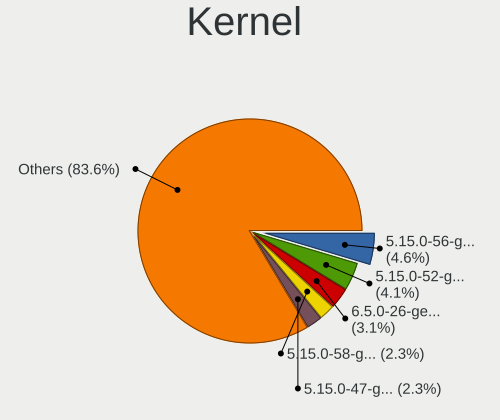

| Version            | Desktops | Percent |
|--------------------|----------|---------|
| 5.15.0-56-generic  | 18       | 4.62%   |
| 5.15.0-52-generic  | 16       | 4.1%    |
| 6.5.0-26-generic   | 12       | 3.08%   |
| 5.15.0-58-generic  | 9        | 2.31%   |
| 5.15.0-47-generic  | 9        | 2.31%   |
| 5.15.0-46-generic  | 9        | 2.31%   |
| 5.15.0-67-generic  | 8        | 2.05%   |
| 5.15.0-60-generic  | 8        | 2.05%   |
| 5.15.0-43-generic  | 8        | 2.05%   |
| 6.5.0-35-generic   | 7        | 1.79%   |
| 6.5.0-14-generic   | 6        | 1.54%   |
| 6.2.0-36-generic   | 6        | 1.54%   |
| 5.19.0-35-generic  | 6        | 1.54%   |
| 5.15.0-48-generic  | 6        | 1.54%   |
| 5.15.0-27-generic  | 6        | 1.54%   |
| 5.15.0-25-generic  | 6        | 1.54%   |
| 6.5.0-25-generic   | 5        | 1.28%   |
| 6.5.0-15-generic   | 5        | 1.28%   |
| 6.2.0-39-generic   | 5        | 1.28%   |
| 6.2.0-37-generic   | 5        | 1.28%   |
| 5.19.0-50-generic  | 5        | 1.28%   |
| 5.19.0-41-generic  | 5        | 1.28%   |
| 5.15.0-97-generic  | 5        | 1.28%   |
| 5.15.0-41-generic  | 5        | 1.28%   |
| 6.8.0-40-generic   | 4        | 1.03%   |
| 6.5.0-41-generic   | 4        | 1.03%   |
| 6.5.0-18-generic   | 4        | 1.03%   |
| 6.2.0-33-generic   | 4        | 1.03%   |
| 6.2.0-26-generic   | 4        | 1.03%   |
| 5.19.0-43-generic  | 4        | 1.03%   |
| 5.15.0-91-generic  | 4        | 1.03%   |
| 5.15.0-84-generic  | 4        | 1.03%   |
| 5.15.0-78-generic  | 4        | 1.03%   |
| 5.15.0-69-generic  | 4        | 1.03%   |
| 5.15.0-57-generic  | 4        | 1.03%   |
| 5.15.0-53-generic  | 4        | 1.03%   |
| 5.15.0-50-generic  | 4        | 1.03%   |
| 5.15.0-112-generic | 4        | 1.03%   |
| 6.5.0-44-generic   | 3        | 0.77%   |
| 6.5.0-21-generic   | 3        | 0.77%   |

Kernel Family
-------------

Linux kernel without a distro release

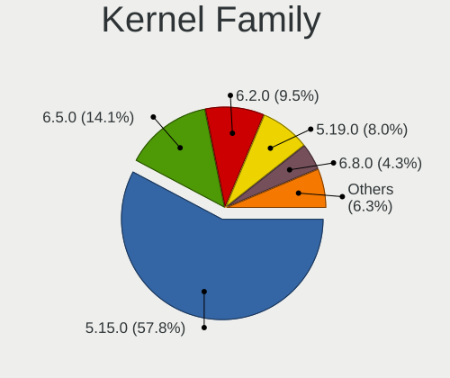

| Version  | Desktops | Percent |
|----------|----------|---------|
| 5.15.0   | 201      | 57.76%  |
| 6.5.0    | 49       | 14.08%  |
| 6.2.0    | 33       | 9.48%   |
| 5.19.0   | 28       | 8.05%   |
| 6.8.0    | 15       | 4.31%   |
| 6.1.0    | 3        | 0.86%   |
| 6.2.7    | 2        | 0.57%   |
| 5.17.0   | 2        | 0.57%   |
| 5.13.0   | 2        | 0.57%   |
| 6.4.8    | 1        | 0.29%   |
| 6.3.3    | 1        | 0.29%   |
| 6.3.12   | 1        | 0.29%   |
| 6.2.2    | 1        | 0.29%   |
| 6.2.10   | 1        | 0.29%   |
| 6.1.10   | 1        | 0.29%   |
| 6.0.0    | 1        | 0.29%   |
| 5.4.0    | 1        | 0.29%   |
| 5.19.13  | 1        | 0.29%   |
| 5.19.1   | 1        | 0.29%   |
| 5.18.0   | 1        | 0.29%   |
| 5.17.5   | 1        | 0.29%   |
| 5.10.110 | 1        | 0.29%   |

Kernel Major Ver.
-----------------

Linux kernel major version

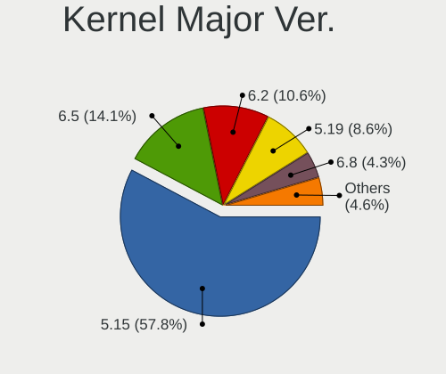

| Version | Desktops | Percent |
|---------|----------|---------|
| 5.15    | 201      | 57.76%  |
| 6.5     | 49       | 14.08%  |
| 6.2     | 37       | 10.63%  |
| 5.19    | 30       | 8.62%   |
| 6.8     | 15       | 4.31%   |
| 6.1     | 4        | 1.15%   |
| 5.17    | 3        | 0.86%   |
| 6.3     | 2        | 0.57%   |
| 5.13    | 2        | 0.57%   |
| 6.4     | 1        | 0.29%   |
| 6.0     | 1        | 0.29%   |
| 5.4     | 1        | 0.29%   |
| 5.18    | 1        | 0.29%   |
| 5.10    | 1        | 0.29%   |

Arch
----

OS architecture (x86_64, i586, etc.)

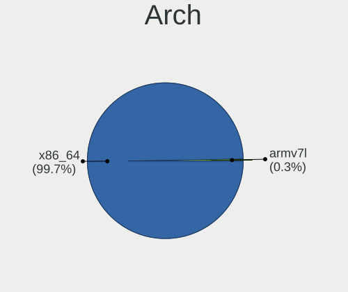

| Name   | Desktops | Percent |
|--------|----------|---------|
| x86_64 | 336      | 99.7%   |
| armv7l | 1        | 0.3%    |

DE
--

Desktop Environment

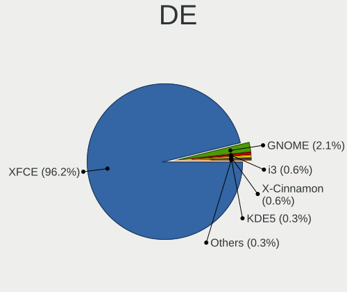

| Name            | Desktops | Percent |
|-----------------|----------|---------|
| XFCE            | 326      | 96.17%  |
| GNOME           | 7        | 2.06%   |
| X-Cinnamon      | 2        | 0.59%   |
| i3              | 2        | 0.59%   |
| KDE5            | 1        | 0.29%   |
| GNOME Flashback | 1        | 0.29%   |

Display Server
--------------

X11 or Wayland

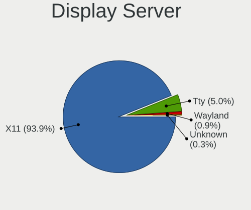

| Name    | Desktops | Percent |
|---------|----------|---------|
| X11     | 321      | 93.86%  |
| Tty     | 17       | 4.97%   |
| Wayland | 3        | 0.88%   |
| Unknown | 1        | 0.29%   |

Display Manager
---------------

SDDM, LightDM, etc.

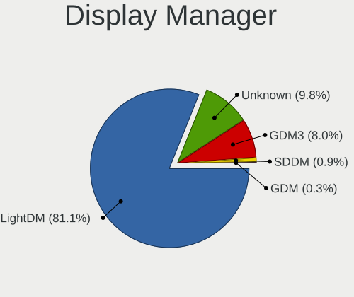

| Name    | Desktops | Percent |
|---------|----------|---------|
| LightDM | 274      | 81.07%  |
| Unknown | 33       | 9.76%   |
| GDM3    | 27       | 7.99%   |
| SDDM    | 3        | 0.89%   |
| GDM     | 1        | 0.3%    |

OS Lang
-------

Language

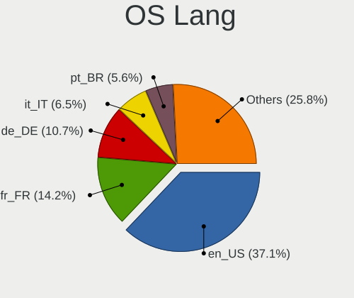

| Lang    | Desktops | Percent |
|---------|----------|---------|
| en_US   | 125      | 37.09%  |
| fr_FR   | 48       | 14.24%  |
| de_DE   | 36       | 10.68%  |
| it_IT   | 22       | 6.53%   |
| pt_BR   | 19       | 5.64%   |
| ru_RU   | 10       | 2.97%   |
| en_CA   | 10       | 2.97%   |
| en_GB   | 9        | 2.67%   |
| en_AU   | 6        | 1.78%   |
| C       | 6        | 1.78%   |
| pl_PL   | 4        | 1.19%   |
| es_ES   | 4        | 1.19%   |
| nl_NL   | 3        | 0.89%   |
| es_AR   | 3        | 0.89%   |
| cs_CZ   | 3        | 0.89%   |
| nl_BE   | 2        | 0.59%   |
| hu_HU   | 2        | 0.59%   |
| fr_CA   | 2        | 0.59%   |
| fi_FI   | 2        | 0.59%   |
| es_CO   | 2        | 0.59%   |
| en_IN   | 2        | 0.59%   |
| Unknown | 2        | 0.59%   |
| tr_TR   | 1        | 0.3%    |
| sv_SE   | 1        | 0.3%    |
| ru_UA   | 1        | 0.3%    |
| ja_JP   | 1        | 0.3%    |
| fr_CH   | 1        | 0.3%    |
| fr_BE   | 1        | 0.3%    |
| es_VE   | 1        | 0.3%    |
| es_NI   | 1        | 0.3%    |
| es_MX   | 1        | 0.3%    |
| es_CR   | 1        | 0.3%    |
| eo      | 1        | 0.3%    |
| en_ZA   | 1        | 0.3%    |
| en_NZ   | 1        | 0.3%    |
| en_IE   | 1        | 0.3%    |
| de_CH   | 1        | 0.3%    |

Boot Mode
---------

EFI or BIOS

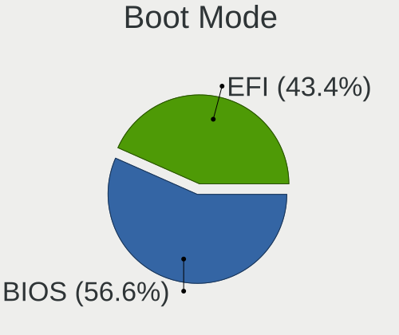

| Mode | Desktops | Percent |
|------|----------|---------|
| BIOS | 192      | 56.64%  |
| EFI  | 147      | 43.36%  |

Filesystem
----------

Type of filesystem

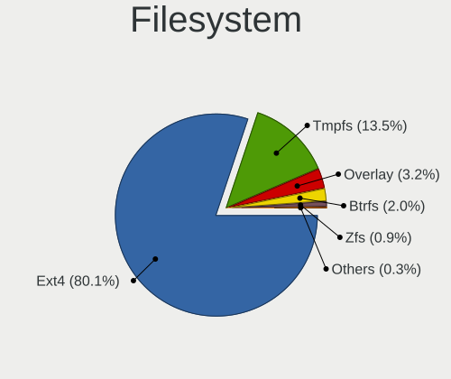

| Type    | Desktops | Percent |
|---------|----------|---------|
| Ext4    | 274      | 80.12%  |
| Tmpfs   | 46       | 13.45%  |
| Overlay | 11       | 3.22%   |
| Btrfs   | 7        | 2.05%   |
| Zfs     | 3        | 0.88%   |
| Ext3    | 1        | 0.29%   |

Part. scheme
------------

Scheme of partitioning

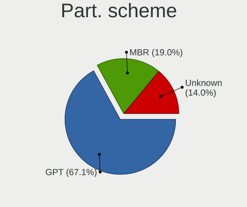

| Type    | Desktops | Percent |
|---------|----------|---------|
| GPT     | 230      | 67.06%  |
| MBR     | 65       | 18.95%  |
| Unknown | 48       | 13.99%  |

Dual Boot with Linux/BSD
------------------------

Hosting more than one Linux/BSD

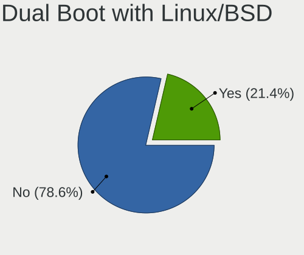

| Dual boot | Desktops | Percent |
|-----------|----------|---------|
| No        | 272      | 78.61%  |
| Yes       | 74       | 21.39%  |

Dual Boot (Win)
---------------

Hosting Linux and Windows

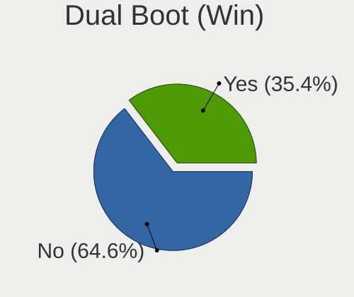

| Dual boot | Desktops | Percent |
|-----------|----------|---------|
| No        | 219      | 64.6%   |
| Yes       | 120      | 35.4%   |

Board
-----

Vendor
------

Motherboard manufacturer

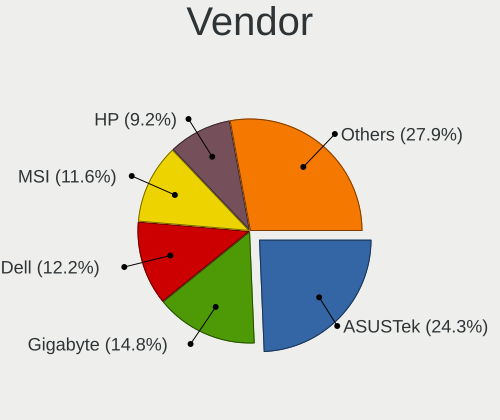

| Name                                 | Desktops | Percent |
|--------------------------------------|----------|---------|
| ASUSTek Computer                     | 82       | 24.33%  |
| Gigabyte Technology                  | 50       | 14.84%  |
| Dell                                 | 41       | 12.17%  |
| MSI                                  | 39       | 11.57%  |
| Hewlett-Packard                      | 31       | 9.2%    |
| ASRock                               | 22       | 6.53%   |
| Lenovo                               | 16       | 4.75%   |
| Intel                                | 11       | 3.26%   |
| Fujitsu                              | 6        | 1.78%   |
| Acer                                 | 6        | 1.78%   |
| Unknown                              | 5        | 1.48%   |
| Pegatron                             | 3        | 0.89%   |
| Medion                               | 3        | 0.89%   |
| Foxconn                              | 3        | 0.89%   |
| PCWare                               | 2        | 0.59%   |
| Packard Bell                         | 2        | 0.59%   |
| MACHINIST                            | 2        | 0.59%   |
| Biostar                              | 2        | 0.59%   |
| AZW                                  | 2        | 0.59%   |
| Shenzhen Meigao Electronic Equipment | 1        | 0.3%    |
| Semp Toshiba                         | 1        | 0.3%    |
| OEM                                  | 1        | 0.3%    |
| Itautec                              | 1        | 0.3%    |
| Hardkernel                           | 1        | 0.3%    |
| eMachines                            | 1        | 0.3%    |
| ASRockRack                           | 1        | 0.3%    |
| AOpen                                | 1        | 0.3%    |
| AMD                                  | 1        | 0.3%    |

Model
-----

Motherboard model

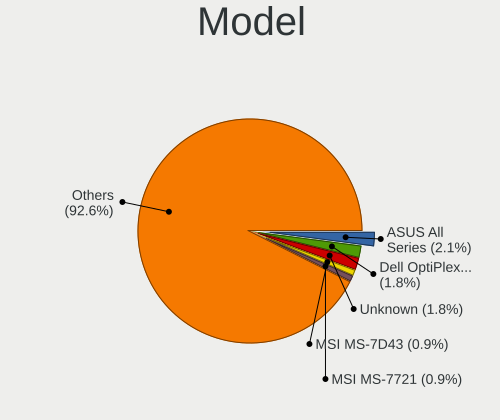

| Name                                            | Desktops | Percent |
|-------------------------------------------------|----------|---------|
| ASUS All Series                                 | 7        | 2.08%   |
| Dell OptiPlex 7010                              | 6        | 1.78%   |
| Unknown                                         | 6        | 1.78%   |
| MSI MS-7D43                                     | 3        | 0.89%   |
| MSI MS-7721                                     | 3        | 0.89%   |
| Lenovo ThinkCentre M83z 10C20003FR              | 3        | 0.89%   |
| ASUS PRIME A320M-K                              | 3        | 0.89%   |
| ASUS K30AD_M31AD_M51AD                          | 3        | 0.89%   |
| MSI MS-7D46                                     | 2        | 0.59%   |
| MSI MS-7D25                                     | 2        | 0.59%   |
| MSI MS-7C52                                     | 2        | 0.59%   |
| MSI MS-7817                                     | 2        | 0.59%   |
| MSI MS-7758                                     | 2        | 0.59%   |
| Lenovo V530S-07ICB 10TX0010PB                   | 2        | 0.59%   |
| Intel D54250WYK H13922-303                      | 2        | 0.59%   |
| HP t620 Quad Core TC                            | 2        | 0.59%   |
| HP EliteDesk 800 G1 SFF                         | 2        | 0.59%   |
| Dell Precision Tower 5810                       | 2        | 0.59%   |
| Dell OptiPlex 9020                              | 2        | 0.59%   |
| Dell OptiPlex 7020                              | 2        | 0.59%   |
| Dell OptiPlex 390                               | 2        | 0.59%   |
| Dell OptiPlex 3020                              | 2        | 0.59%   |
| Dell Inspiron 530                               | 2        | 0.59%   |
| ASUS TUF Gaming B550M-PLUS                      | 2        | 0.59%   |
| ASUS ROG STRIX B450-F GAMING II                 | 2        | 0.59%   |
| ASRock N68-S3 UCC                               | 2        | 0.59%   |
| Shenzhen Meigao Electronic Equipment UM773 Lite | 1        | 0.3%    |
| Semp Toshiba STI                                | 1        | 0.3%    |
| Pegatron p7-1170t                               | 1        | 0.3%    |
| Pegatron FZ132AA-ABF m9456fr                    | 1        | 0.3%    |
| Pegatron 20-b010                                | 1        | 0.3%    |
| PCWare IPX1800E2                                | 1        | 0.3%    |
| PCWare IPMH81G1                                 | 1        | 0.3%    |
| Packard Bell IMEDIA X9305                       | 1        | 0.3%    |
| Packard Bell IMEDIA S2185                       | 1        | 0.3%    |
| MSI Pentino H-Series                            | 1        | 0.3%    |
| MSI MS-7E07                                     | 1        | 0.3%    |
| MSI MS-7D53                                     | 1        | 0.3%    |
| MSI MS-7D40                                     | 1        | 0.3%    |
| MSI MS-7C91                                     | 1        | 0.3%    |

Model Family
------------

Motherboard model prefix

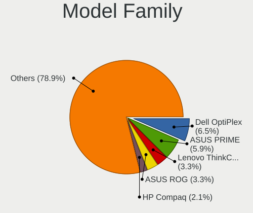

| Name                                       | Desktops | Percent |
|--------------------------------------------|----------|---------|
| Dell OptiPlex                              | 22       | 6.53%   |
| ASUS PRIME                                 | 20       | 5.93%   |
| Lenovo ThinkCentre                         | 11       | 3.26%   |
| ASUS ROG                                   | 11       | 3.26%   |
| HP Compaq                                  | 7        | 2.08%   |
| Dell Precision                             | 7        | 2.08%   |
| ASUS TUF                                   | 7        | 2.08%   |
| ASUS All                                   | 7        | 2.08%   |
| Unknown                                    | 6        | 1.78%   |
| HP EliteDesk                               | 5        | 1.48%   |
| Dell XPS                                   | 4        | 1.19%   |
| Dell Inspiron                              | 4        | 1.19%   |
| Acer Veriton                               | 4        | 1.19%   |
| MSI MS-7D43                                | 3        | 0.89%   |
| MSI MS-7721                                | 3        | 0.89%   |
| Gigabyte B550                              | 3        | 0.89%   |
| Fujitsu ESPRIMO                            | 3        | 0.89%   |
| ASUS M5A78L-M                              | 3        | 0.89%   |
| ASUS K30AD                                 | 3        | 0.89%   |
| Packard Bell IMEDIA                        | 2        | 0.59%   |
| MSI MS-7D46                                | 2        | 0.59%   |
| MSI MS-7D25                                | 2        | 0.59%   |
| MSI MS-7C52                                | 2        | 0.59%   |
| MSI MS-7817                                | 2        | 0.59%   |
| MSI MS-7758                                | 2        | 0.59%   |
| Lenovo V530S-07ICB                         | 2        | 0.59%   |
| Intel D54250WYK                            | 2        | 0.59%   |
| HP t620                                    | 2        | 0.59%   |
| HP ProDesk                                 | 2        | 0.59%   |
| HP Pavilion                                | 2        | 0.59%   |
| HP Desktop                                 | 2        | 0.59%   |
| Gigabyte GA-78LMT-USB3                     | 2        | 0.59%   |
| Gigabyte B550M                             | 2        | 0.59%   |
| Gigabyte B450M                             | 2        | 0.59%   |
| Dell Vostro                                | 2        | 0.59%   |
| ASUS P8H61-M                               | 2        | 0.59%   |
| ASUS M5A97                                 | 2        | 0.59%   |
| ASRock N68-S3                              | 2        | 0.59%   |
| Shenzhen Meigao Electronic Equipment UM773 | 1        | 0.3%    |
| Semp Toshiba STI                           | 1        | 0.3%    |

MFG Year
--------

Motherboard manufacture year

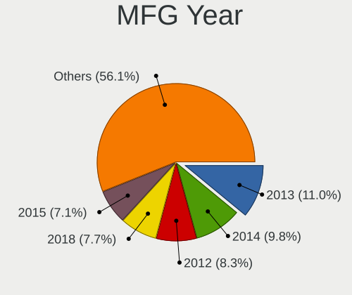

| Year    | Desktops | Percent |
|---------|----------|---------|
| 2013    | 37       | 10.98%  |
| 2014    | 33       | 9.79%   |
| 2012    | 28       | 8.31%   |
| 2018    | 26       | 7.72%   |
| 2015    | 24       | 7.12%   |
| 2021    | 22       | 6.53%   |
| 2010    | 21       | 6.23%   |
| 2020    | 20       | 5.93%   |
| 2011    | 19       | 5.64%   |
| 2017    | 16       | 4.75%   |
| 2016    | 16       | 4.75%   |
| 2019    | 15       | 4.45%   |
| 2009    | 14       | 4.15%   |
| 2022    | 13       | 3.86%   |
| 2007    | 10       | 2.97%   |
| 2023    | 8        | 2.37%   |
| 2008    | 8        | 2.37%   |
| 2006    | 3        | 0.89%   |
| 2005    | 2        | 0.59%   |
| 2025    | 1        | 0.3%    |
| Unknown | 1        | 0.3%    |

Form Factor
-----------

Physical design of the computer

| Name    | Desktops | Percent |
|---------|----------|---------|
| Desktop | 337      | 100%    |

Secure Boot
-----------

Enabled or disabled

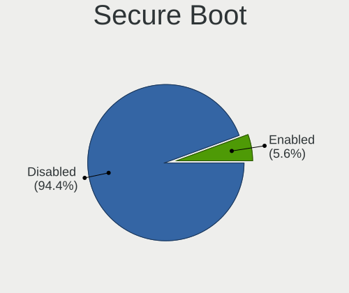

| State    | Desktops | Percent |
|----------|----------|---------|
| Disabled | 320      | 94.4%   |
| Enabled  | 19       | 5.6%    |

Coreboot
--------

Have coreboot on board

| Used | Desktops | Percent |
|------|----------|---------|
| No   | 337      | 100%    |

RAM Size
--------

Total RAM memory

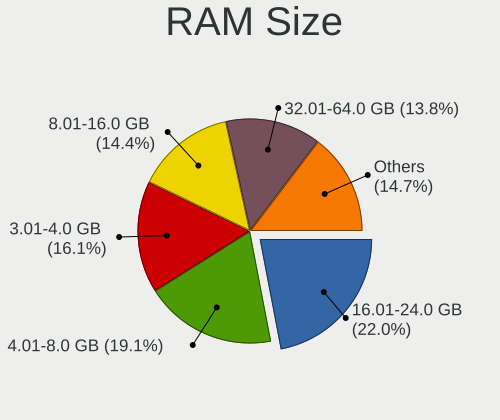

| Size in GB      | Desktops | Percent |
|-----------------|----------|---------|
| 16.01-24.0      | 75       | 21.99%  |
| 4.01-8.0        | 65       | 19.06%  |
| 3.01-4.0        | 55       | 16.13%  |
| 8.01-16.0       | 49       | 14.37%  |
| 32.01-64.0      | 47       | 13.78%  |
| 64.01-256.0     | 22       | 6.45%   |
| 24.01-32.0      | 14       | 4.11%   |
| 1.01-2.0        | 8        | 2.35%   |
| 2.01-3.0        | 4        | 1.17%   |
| More than 256.0 | 1        | 0.29%   |
| 0.01-0.5        | 1        | 0.29%   |

RAM Used
--------

Used RAM memory

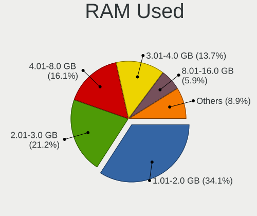

| Used GB    | Desktops | Percent |
|------------|----------|---------|
| 1.01-2.0   | 127      | 34.14%  |
| 2.01-3.0   | 79       | 21.24%  |
| 4.01-8.0   | 60       | 16.13%  |
| 3.01-4.0   | 51       | 13.71%  |
| 8.01-16.0  | 22       | 5.91%   |
| 0.51-1.0   | 22       | 5.91%   |
| 16.01-24.0 | 6        | 1.61%   |
| 0.01-0.5   | 3        | 0.81%   |
| 32.01-64.0 | 1        | 0.27%   |
| 24.01-32.0 | 1        | 0.27%   |

Total Drives
------------

Number of drives on board

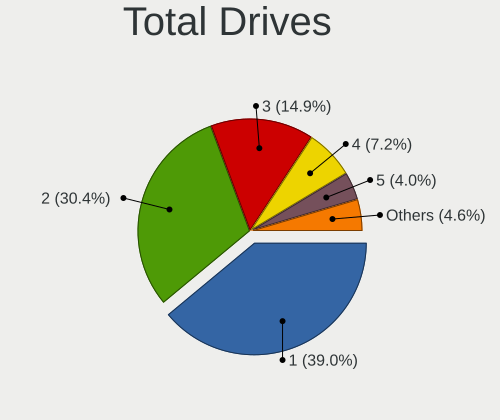

| Drives | Desktops | Percent |
|--------|----------|---------|
| 1      | 136      | 38.97%  |
| 2      | 106      | 30.37%  |
| 3      | 52       | 14.9%   |
| 4      | 25       | 7.16%   |
| 5      | 14       | 4.01%   |
| 6      | 7        | 2.01%   |
| 7      | 4        | 1.15%   |
| 0      | 3        | 0.86%   |
| 10     | 1        | 0.29%   |
| 9      | 1        | 0.29%   |

Has CD-ROM
----------

Has CD-ROM on board

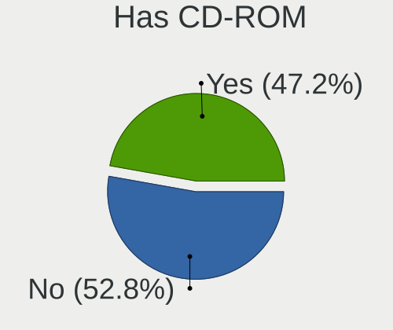

| Presented | Desktops | Percent |
|-----------|----------|---------|
| No        | 179      | 52.8%   |
| Yes       | 160      | 47.2%   |

Has Ethernet
------------

Has Ethernet on board

| Presented | Desktops | Percent |
|-----------|----------|---------|
| Yes       | 333      | 98.81%  |
| No        | 4        | 1.19%   |

Has WiFi
--------

Has WiFi module

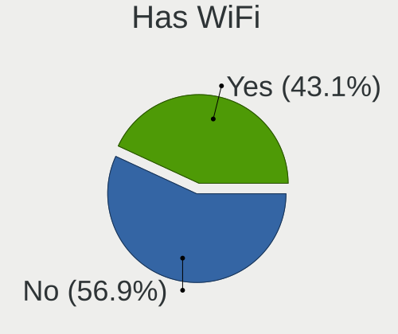

| Presented | Desktops | Percent |
|-----------|----------|---------|
| No        | 194      | 56.89%  |
| Yes       | 147      | 43.11%  |

Has Bluetooth
-------------

Has Bluetooth module

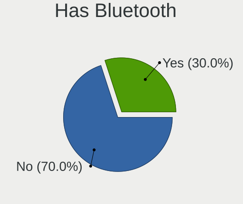

| Presented | Desktops | Percent |
|-----------|----------|---------|
| No        | 238      | 70%     |
| Yes       | 102      | 30%     |

Location
--------

Country
-------

Geographic location (country)

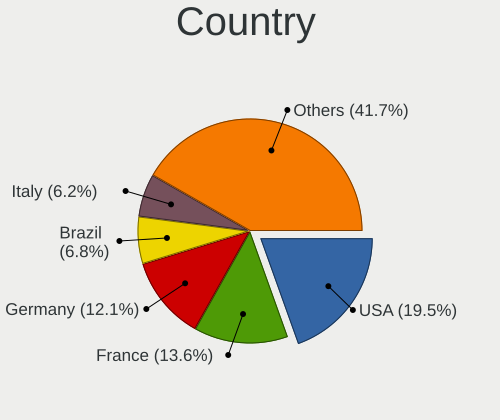

| Country         | Desktops | Percent |
|-----------------|----------|---------|
| USA             | 66       | 19.53%  |
| France          | 46       | 13.61%  |
| Germany         | 41       | 12.13%  |
| Brazil          | 23       | 6.8%    |
| Italy           | 21       | 6.21%   |
| Canada          | 15       | 4.44%   |
| Russia          | 13       | 3.85%   |
| Poland          | 7        | 2.07%   |
| Netherlands     | 7        | 2.07%   |
| Belgium         | 7        | 2.07%   |
| UK              | 6        | 1.78%   |
| Sweden          | 6        | 1.78%   |
| Spain           | 6        | 1.78%   |
| Australia       | 6        | 1.78%   |
| Switzerland     | 4        | 1.18%   |
| Czechia         | 4        | 1.18%   |
| Colombia        | 4        | 1.18%   |
| Argentina       | 4        | 1.18%   |
| Serbia          | 3        | 0.89%   |
| Mexico          | 3        | 0.89%   |
| India           | 3        | 0.89%   |
| Greece          | 3        | 0.89%   |
| Finland         | 3        | 0.89%   |
| Slovakia        | 2        | 0.59%   |
| Portugal        | 2        | 0.59%   |
| Norway          | 2        | 0.59%   |
| Ireland         | 2        | 0.59%   |
| Iran            | 2        | 0.59%   |
| Hungary         | 2        | 0.59%   |
| Costa Rica      | 2        | 0.59%   |
| China           | 2        | 0.59%   |
| Belarus         | 2        | 0.59%   |
| Austria         | 2        | 0.59%   |
| Turkey          | 1        | 0.3%    |
| The Netherlands | 1        | 0.3%    |
| Taiwan          | 1        | 0.3%    |
| South Africa    | 1        | 0.3%    |
| Slovenia        | 1        | 0.3%    |
| Romania         | 1        | 0.3%    |
| Pakistan        | 1        | 0.3%    |

City
----

Geographic location (city)

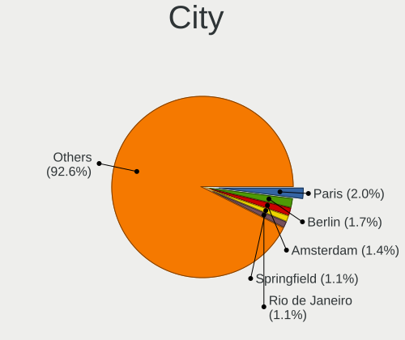

| City             | Desktops | Percent |
|------------------|----------|---------|
| Paris            | 7        | 1.99%   |
| Berlin           | 6        | 1.7%    |
| Amsterdam        | 5        | 1.42%   |
| Springfield      | 4        | 1.14%   |
| Rio de Janeiro   | 4        | 1.14%   |
| Moscow           | 4        | 1.14%   |
| Harrisonburg     | 4        | 1.14%   |
| Sydney           | 3        | 0.85%   |
| Santiago de Cali | 3        | 0.85%   |
| Milan            | 3        | 0.85%   |
| Helsinki         | 3        | 0.85%   |
| Zrenjanin        | 2        | 0.57%   |
| Valenciennes     | 2        | 0.57%   |
| Toulouse         | 2        | 0.57%   |
| Toul             | 2        | 0.57%   |
| Toronto          | 2        | 0.57%   |
| Tehran           | 2        | 0.57%   |
| Stuttgart        | 2        | 0.57%   |
| Schwerte         | 2        | 0.57%   |
| Rome             | 2        | 0.57%   |
| Rho              | 2        | 0.57%   |
| Peterborough     | 2        | 0.57%   |
| Munich           | 2        | 0.57%   |
| Melbourne        | 2        | 0.57%   |
| Mason            | 2        | 0.57%   |
| Litoměřice     | 2        | 0.57%   |
| Lisbon           | 2        | 0.57%   |
| Lake Placid      | 2        | 0.57%   |
| Krasnodar        | 2        | 0.57%   |
| Hanover          | 2        | 0.57%   |
| Gdansk           | 2        | 0.57%   |
| Dublin           | 2        | 0.57%   |
| Denain           | 2        | 0.57%   |
| Clermont-Ferrand | 2        | 0.57%   |
| Budapest         | 2        | 0.57%   |
| Biella           | 2        | 0.57%   |
| Żywiec          | 1        | 0.28%   |
| Yvoir            | 1        | 0.28%   |
| Yangon           | 1        | 0.28%   |
| Wusterhausen     | 1        | 0.28%   |

Drives
------

Drive Vendor
------------

Hard drive vendors

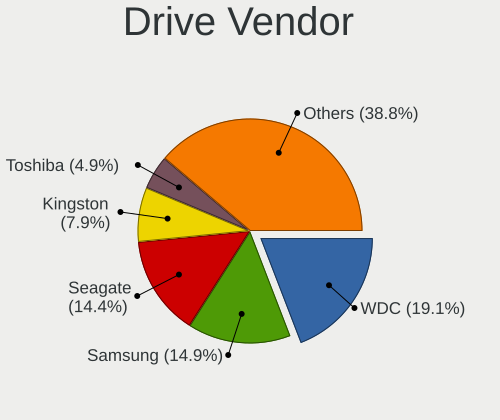

| Vendor                      | Desktops | Drives | Percent |
|-----------------------------|----------|--------|---------|
| WDC                         | 117      | 191    | 19.15%  |
| Samsung Electronics         | 91       | 132    | 14.89%  |
| Seagate                     | 88       | 130    | 14.4%   |
| Kingston                    | 48       | 69     | 7.86%   |
| Toshiba                     | 30       | 33     | 4.91%   |
| SanDisk                     | 26       | 32     | 4.26%   |
| Hitachi                     | 26       | 39     | 4.26%   |
| Crucial                     | 24       | 30     | 3.93%   |
| Unknown                     | 12       | 17     | 1.96%   |
| Intel                       | 11       | 13     | 1.8%    |
| PNY                         | 10       | 16     | 1.64%   |
| China                       | 10       | 11     | 1.64%   |
| HGST                        | 8        | 15     | 1.31%   |
| A-DATA Technology           | 8        | 8      | 1.31%   |
| SPCC                        | 6        | 9      | 0.98%   |
| Intenso                     | 5        | 5      | 0.82%   |
| Hewlett-Packard             | 5        | 6      | 0.82%   |
| Gigabyte Technology         | 5        | 8      | 0.82%   |
| Phison Electronics          | 4        | 7      | 0.65%   |
| Kingston Technology Company | 4        | 8      | 0.65%   |
| ASMT                        | 4        | 7      | 0.65%   |
| Transcend                   | 3        | 4      | 0.49%   |
| PHD 3.0                     | 3        | 4      | 0.49%   |
| Patriot                     | 3        | 3      | 0.49%   |
| Micron Technology           | 3        | 3      | 0.49%   |
| Maxtor                      | 3        | 3      | 0.49%   |
| Lexar                       | 3        | 3      | 0.49%   |
| KIOXIA                      | 3        | 5      | 0.49%   |
| Corsair                     | 3        | 3      | 0.49%   |
| TEXTORM                     | 2        | 2      | 0.33%   |
| SK hynix                    | 2        | 2      | 0.33%   |
| Realtek Semiconductor       | 2        | 2      | 0.33%   |
| OCZ                         | 2        | 2      | 0.33%   |
| Linux                       | 2        | 2      | 0.33%   |
| ADATA Technology            | 2        | 2      | 0.33%   |
| XPG                         | 1        | 1      | 0.16%   |
| Veno                        | 1        | 1      | 0.16%   |
| Vaseky                      | 1        | 1      | 0.16%   |
| USB3.0                      | 1        | 2      | 0.16%   |
| TO Exter                    | 1        | 2      | 0.16%   |

Drive Model
-----------

Hard drive models

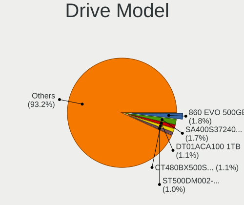

| Model                                              | Desktops | Percent |
|----------------------------------------------------|----------|---------|
| Samsung SSD 860 EVO 500GB                          | 13       | 1.84%   |
| Kingston SA400S37240G 240GB SSD                    | 12       | 1.7%    |
| Toshiba DT01ACA100 1TB                             | 8        | 1.13%   |
| Crucial CT480BX500SSD1 480GB                       | 8        | 1.13%   |
| Seagate ST500DM002-1BD142 500GB                    | 7        | 0.99%   |
| Seagate ST1000DM003-1ER162 1TB                     | 7        | 0.99%   |
| Kingston SA400S37480G 480GB SSD                    | 7        | 0.99%   |
| WDC WD5000AAKX-08U6AA0 500GB                       | 5        | 0.71%   |
| Toshiba HDWD110 1TB                                | 5        | 0.71%   |
| Toshiba DT01ACA200 2TB                             | 5        | 0.71%   |
| Seagate ST2000DM008-2FR102 2TB                     | 5        | 0.71%   |
| Seagate ST2000DM001-1ER164 2TB                     | 5        | 0.71%   |
| Seagate ST1000DM003-1CH162 1TB                     | 5        | 0.71%   |
| Kingston SV300S37A120G 120GB SSD                   | 5        | 0.71%   |
| Unknown SD/MMC/MS PRO 2GB                          | 4        | 0.57%   |
| Seagate ST4000DM004-2CV104 4TB                     | 4        | 0.57%   |
| Seagate ST1000DM003-1SB102 1TB                     | 4        | 0.57%   |
| SanDisk SDSSDA240G 240GB                           | 4        | 0.57%   |
| Samsung SSD 970 EVO Plus 1TB                       | 4        | 0.57%   |
| Samsung SSD 870 QVO 1TB                            | 4        | 0.57%   |
| Samsung SSD 840 Series 120GB                       | 4        | 0.57%   |
| Samsung NVMe SSD Controller SM981/PM981/PM983 1TB  | 4        | 0.57%   |
| Crucial CT1000MX500SSD1 1TB                        | 4        | 0.57%   |
| WDC WDS500G2B0A-00SM50 500GB                       | 3        | 0.43%   |
| WDC WD4000AAJS-00YFA0 400GB                        | 3        | 0.43%   |
| WDC WD10EZEX-08M2NA0 1TB                           | 3        | 0.43%   |
| Seagate ST3500413AS 500GB                          | 3        | 0.43%   |
| Seagate ST1000DM010-2EP102 1TB                     | 3        | 0.43%   |
| Seagate Expansion HDD 4TB                          | 3        | 0.43%   |
| SanDisk NVMe SSD Drive 1TB                         | 3        | 0.43%   |
| Samsung SSD 860 EVO 1TB                            | 3        | 0.43%   |
| Samsung SSD 850 EVO 500GB                          | 3        | 0.43%   |
| Samsung SSD 850 EVO 250GB                          | 3        | 0.43%   |
| Samsung SSD 840 EVO 250GB                          | 3        | 0.43%   |
| Samsung NVMe SSD Controller PM9A1/PM9A3/980PRO 1TB | 3        | 0.43%   |
| Samsung HD250HJ 250GB                              | 3        | 0.43%   |
| PHD 3.0 Silicon-Power 4TB                          | 3        | 0.43%   |
| Kingston SUV400S37120G 120GB SSD                   | 3        | 0.43%   |
| Kingston SA400S37120G 120GB SSD                    | 3        | 0.43%   |
| Kingston SA2000M81000G 1TB                         | 3        | 0.43%   |

HDD Vendor
----------

Hard disk drive vendors

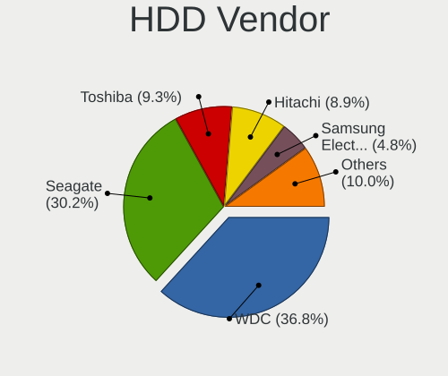

| Vendor              | Desktops | Drives | Percent |
|---------------------|----------|--------|---------|
| WDC                 | 107      | 177    | 36.77%  |
| Seagate             | 88       | 128    | 30.24%  |
| Toshiba             | 27       | 30     | 9.28%   |
| Hitachi             | 26       | 39     | 8.93%   |
| Samsung Electronics | 14       | 18     | 4.81%   |
| HGST                | 8        | 15     | 2.75%   |
| Unknown             | 4        | 5      | 1.37%   |
| ASMT                | 4        | 7      | 1.37%   |
| Maxtor              | 2        | 2      | 0.69%   |
| Hewlett-Packard     | 2        | 2      | 0.69%   |
| USB3.0              | 1        | 2      | 0.34%   |
| TO Exter            | 1        | 2      | 0.34%   |
| SSK                 | 1        | 1      | 0.34%   |
| MaxDigital          | 1        | 1      | 0.34%   |
| MARVELL             | 1        | 1      | 0.34%   |
| LaCie               | 1        | 1      | 0.34%   |
| ICY BOX             | 1        | 1      | 0.34%   |
| ASMedia             | 1        | 1      | 0.34%   |
| Apple               | 1        | 1      | 0.34%   |

SSD Vendor
----------

Solid state drive vendors

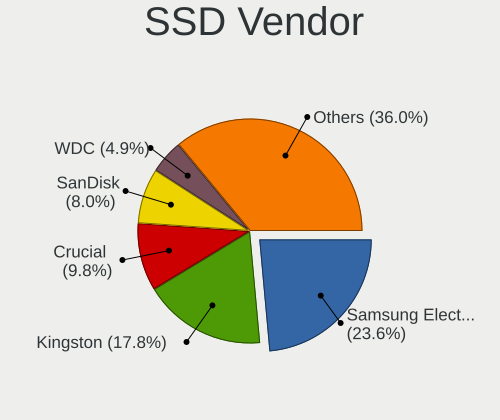

| Vendor              | Desktops | Drives | Percent |
|---------------------|----------|--------|---------|
| Samsung Electronics | 53       | 66     | 23.56%  |
| Kingston            | 40       | 54     | 17.78%  |
| Crucial             | 22       | 28     | 9.78%   |
| SanDisk             | 18       | 22     | 8%      |
| WDC                 | 11       | 12     | 4.89%   |
| China               | 10       | 11     | 4.44%   |
| PNY                 | 9        | 15     | 4%      |
| A-DATA Technology   | 7        | 7      | 3.11%   |
| SPCC                | 6        | 8      | 2.67%   |
| Intenso             | 5        | 5      | 2.22%   |
| Intel               | 5        | 5      | 2.22%   |
| Toshiba             | 3        | 3      | 1.33%   |
| PHD 3.0             | 3        | 4      | 1.33%   |
| Patriot             | 3        | 3      | 1.33%   |
| Transcend           | 2        | 3      | 0.89%   |
| TEXTORM             | 2        | 2      | 0.89%   |
| OCZ                 | 2        | 2      | 0.89%   |
| Micron Technology   | 2        | 2      | 0.89%   |
| Lexar               | 2        | 2      | 0.89%   |
| Hewlett-Packard     | 2        | 3      | 0.89%   |
| Gigabyte Technology | 2        | 2      | 0.89%   |
| Corsair             | 2        | 2      | 0.89%   |
| Veno                | 1        | 1      | 0.44%   |
| Vaseky              | 1        | 1      | 0.44%   |
| Timetec             | 1        | 1      | 0.44%   |
| Team                | 1        | 1      | 0.44%   |
| NT-512              | 1        | 1      | 0.44%   |
| Maxtor              | 1        | 1      | 0.44%   |
| LITEONIT            | 1        | 1      | 0.44%   |
| LITEON              | 1        | 1      | 0.44%   |
| Linux               | 1        | 1      | 0.44%   |
| KIOXIA-EXCERIA      | 1        | 1      | 0.44%   |
| KingFast            | 1        | 1      | 0.44%   |
| KingDian            | 1        | 1      | 0.44%   |
| Fanxiang            | 1        | 1      | 0.44%   |
| Dogfish             | 1        | 1      | 0.44%   |

Drive Kind
----------

HDD or SSD

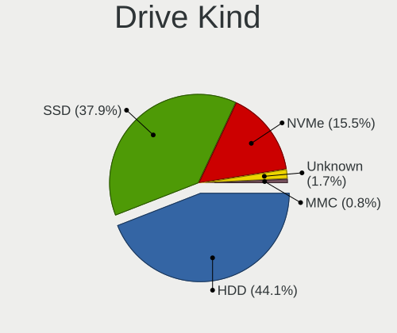

| Kind    | Desktops | Drives | Percent |
|---------|----------|--------|---------|
| HDD     | 227      | 434    | 44.08%  |
| SSD     | 195      | 275    | 37.86%  |
| NVMe    | 80       | 142    | 15.53%  |
| Unknown | 9        | 11     | 1.75%   |
| MMC     | 4        | 6      | 0.78%   |

Drive Connector
---------------

SATA, SAS, NVMe, etc.

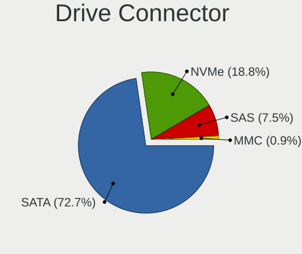

| Type | Desktops | Drives | Percent |
|------|----------|--------|---------|
| SATA | 309      | 664    | 72.71%  |
| NVMe | 80       | 141    | 18.82%  |
| SAS  | 32       | 57     | 7.53%   |
| MMC  | 4        | 6      | 0.94%   |

Drive Size
----------

Size of hard drive

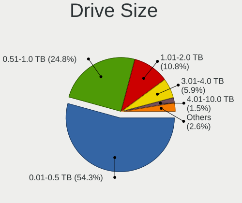

| Size in TB | Desktops | Drives | Percent |
|------------|----------|--------|---------|
| 0.01-0.5   | 247      | 399    | 54.29%  |
| 0.51-1.0   | 113      | 174    | 24.84%  |
| 1.01-2.0   | 49       | 64     | 10.77%  |
| 3.01-4.0   | 27       | 45     | 5.93%   |
| 2.01-3.0   | 7        | 9      | 1.54%   |
| 4.01-10.0  | 7        | 10     | 1.54%   |
| 10.01-20.0 | 5        | 8      | 1.1%    |

Space Total
-----------

Amount of disk space available on the file system

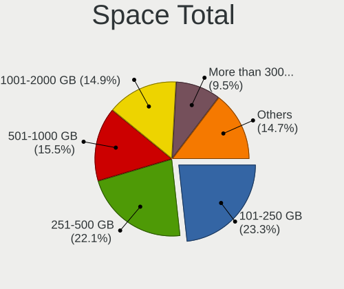

| Size in GB     | Desktops | Percent |
|----------------|----------|---------|
| 101-250        | 81       | 23.28%  |
| 251-500        | 77       | 22.13%  |
| 501-1000       | 54       | 15.52%  |
| 1001-2000      | 52       | 14.94%  |
| More than 3000 | 33       | 9.48%   |
| 2001-3000      | 22       | 6.32%   |
| 51-100         | 11       | 3.16%   |
| 1-20           | 9        | 2.59%   |
| 21-50          | 8        | 2.3%    |
| Unknown        | 1        | 0.29%   |

Space Used
----------

Amount of used disk space

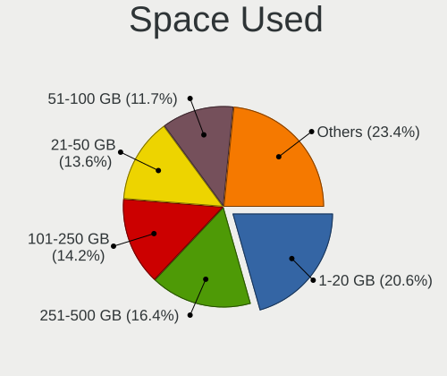

| Used GB        | Desktops | Percent |
|----------------|----------|---------|
| 1-20           | 74       | 20.61%  |
| 251-500        | 59       | 16.43%  |
| 101-250        | 51       | 14.21%  |
| 21-50          | 49       | 13.65%  |
| 51-100         | 42       | 11.7%   |
| 501-1000       | 29       | 8.08%   |
| 1001-2000      | 27       | 7.52%   |
| 2001-3000      | 15       | 4.18%   |
| More than 3000 | 12       | 3.34%   |
| Unknown        | 1        | 0.28%   |

Malfunc. Drives
---------------

Drive models with a malfunction

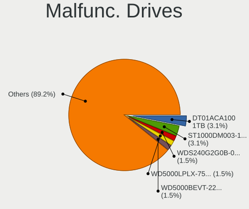

| Model                                    | Desktops | Drives | Percent |
|------------------------------------------|----------|--------|---------|
| Toshiba DT01ACA100 1TB                   | 2        | 2      | 3.08%   |
| Seagate ST1000DM003-1ER162 1TB           | 2        | 2      | 3.08%   |
| WDC WDS240G2G0B-00EPW0 240GB SSD         | 1        | 1      | 1.54%   |
| WDC WD5000LPLX-75ZNTT1 500GB             | 1        | 1      | 1.54%   |
| WDC WD5000BEVT-22A0RT0 500GB             | 1        | 1      | 1.54%   |
| WDC WD5000AAKX-60U6AA0 500GB             | 1        | 1      | 1.54%   |
| WDC WD5000AAKX-00ERMA0 500GB             | 1        | 1      | 1.54%   |
| WDC WD3200AVJS-63N9A0 320GB              | 1        | 1      | 1.54%   |
| WDC WD3200AAKS-75B3A0 320GB              | 1        | 2      | 1.54%   |
| WDC WD3200AAKS-00L9A0 320GB              | 1        | 1      | 1.54%   |
| WDC WD2500AAKS-00VSA0 250GB              | 1        | 1      | 1.54%   |
| WDC WD20EFRX-68AX9N0 2TB                 | 1        | 1      | 1.54%   |
| WDC WD20EARS-00MVWB0 2TB                 | 1        | 1      | 1.54%   |
| WDC WD2003FYYS-05T9B0 2TB                | 1        | 1      | 1.54%   |
| WDC WD2002FYPS-02W3B0 2TB                | 1        | 1      | 1.54%   |
| WDC WD10EZEX-60ZF5A0 1TB                 | 1        | 1      | 1.54%   |
| WDC WD10EAVS-00D7B1 1TB                  | 1        | 1      | 1.54%   |
| WDC WD10EARS-00Y5B1 1TB                  | 1        | 1      | 1.54%   |
| WDC WD10EARS-003BB1 1TB                  | 1        | 1      | 1.54%   |
| WDC WD1003FBYX-01Y7B1 1TB                | 1        | 1      | 1.54%   |
| Seagate ST9250410AS 250GB                | 1        | 1      | 1.54%   |
| Seagate ST500DM002-1BD142 500GB          | 1        | 1      | 1.54%   |
| Seagate ST4000DX001-1CE168 4TB           | 1        | 1      | 1.54%   |
| Seagate ST3750840AS 752GB                | 1        | 1      | 1.54%   |
| Seagate ST3500630AS 500GB                | 1        | 1      | 1.54%   |
| Seagate ST3500414CS 500GB                | 1        | 1      | 1.54%   |
| Seagate ST3250318AS 250GB                | 1        | 3      | 1.54%   |
| Seagate ST3250310AS 250GB                | 1        | 1      | 1.54%   |
| Seagate ST2000DM001-1ER164 2TB           | 1        | 1      | 1.54%   |
| Seagate ST2000DM001-1CH164 2TB           | 1        | 1      | 1.54%   |
| Seagate ST18000NM000J-2TV103 18TB        | 1        | 1      | 1.54%   |
| Seagate ST1000DM010-2EP102 1TB           | 1        | 1      | 1.54%   |
| Seagate ST1000DM003-1CH162 1TB           | 1        | 1      | 1.54%   |
| Samsung Electronics SSD 980 PRO 2TB      | 1        | 1      | 1.54%   |
| Samsung Electronics SSD 840 Series 120GB | 1        | 1      | 1.54%   |
| Samsung Electronics SP2514N 250GB        | 1        | 1      | 1.54%   |
| Samsung Electronics HM321HI 320GB        | 1        | 2      | 1.54%   |
| Samsung Electronics HD753LJ 752GB        | 1        | 1      | 1.54%   |
| Samsung Electronics HD502HJ 500GB        | 1        | 1      | 1.54%   |
| Samsung Electronics HD250HJ 250GB        | 1        | 1      | 1.54%   |

Malfunc. Drive Vendor
---------------------

Vendors of faulty drives

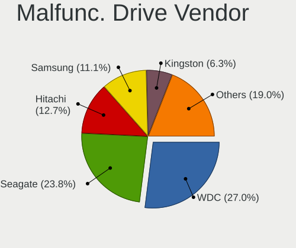

| Vendor              | Desktops | Drives | Percent |
|---------------------|----------|--------|---------|
| WDC                 | 17       | 19     | 26.98%  |
| Seagate             | 15       | 17     | 23.81%  |
| Hitachi             | 8        | 10     | 12.7%   |
| Samsung Electronics | 7        | 9      | 11.11%  |
| Kingston            | 4        | 4      | 6.35%   |
| Toshiba             | 2        | 2      | 3.17%   |
| PNY                 | 1        | 1      | 1.59%   |
| Maxtor              | 1        | 1      | 1.59%   |
| Intel               | 1        | 1      | 1.59%   |
| ICY BOX             | 1        | 1      | 1.59%   |
| HGST                | 1        | 6      | 1.59%   |
| Hewlett-Packard     | 1        | 1      | 1.59%   |
| Crucial             | 1        | 1      | 1.59%   |
| China               | 1        | 1      | 1.59%   |
| ASMT                | 1        | 4      | 1.59%   |
| A-DATA Technology   | 1        | 1      | 1.59%   |

Malfunc. HDD Vendor
-------------------

Vendors of faulty HDD drives

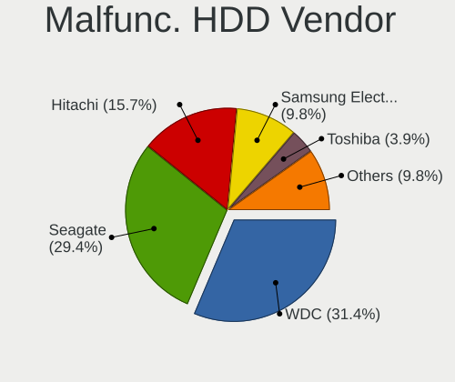

| Vendor              | Desktops | Drives | Percent |
|---------------------|----------|--------|---------|
| WDC                 | 16       | 18     | 31.37%  |
| Seagate             | 15       | 17     | 29.41%  |
| Hitachi             | 8        | 10     | 15.69%  |
| Samsung Electronics | 5        | 7      | 9.8%    |
| Toshiba             | 2        | 2      | 3.92%   |
| Maxtor              | 1        | 1      | 1.96%   |
| ICY BOX             | 1        | 1      | 1.96%   |
| HGST                | 1        | 6      | 1.96%   |
| Hewlett-Packard     | 1        | 1      | 1.96%   |
| ASMT                | 1        | 4      | 1.96%   |

Malfunc. Drive Kind
-------------------

Kinds of faulty drives

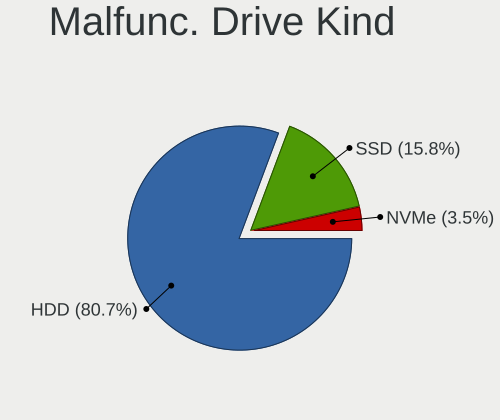

| Kind | Desktops | Drives | Percent |
|------|----------|--------|---------|
| HDD  | 46       | 67     | 80.7%   |
| SSD  | 9        | 10     | 15.79%  |
| NVMe | 2        | 2      | 3.51%   |

Failed Drives
-------------

Failed drive models

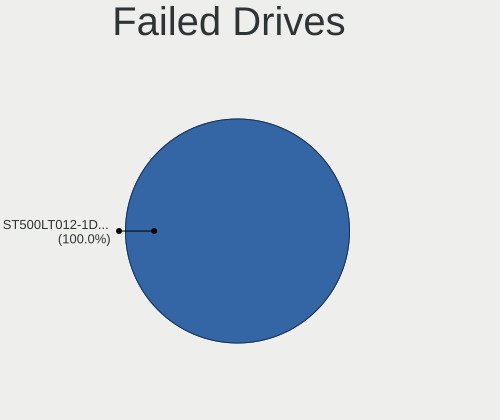

| Model                           | Desktops | Drives | Percent |
|---------------------------------|----------|--------|---------|
| Seagate ST500LT012-1DG142 500GB | 1        | 3      | 100%    |

Failed Drive Vendor
-------------------

Failed drive vendors

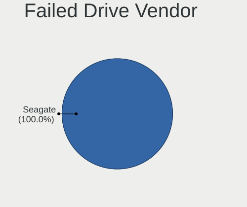

| Vendor  | Desktops | Drives | Percent |
|---------|----------|--------|---------|
| Seagate | 1        | 3      | 100%    |

Drive Status
------------

Number of failed and malfunc. drives

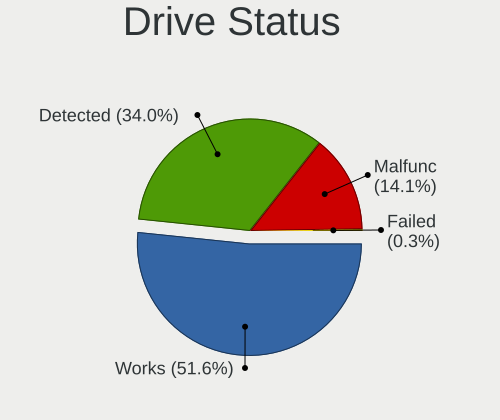

| Status   | Desktops | Drives | Percent |
|----------|----------|--------|---------|
| Works    | 205      | 447    | 51.64%  |
| Detected | 135      | 339    | 34.01%  |
| Malfunc  | 56       | 79     | 14.11%  |
| Failed   | 1        | 3      | 0.25%   |

Storage controller
------------------

Storage Vendor
--------------

Storage controller vendors

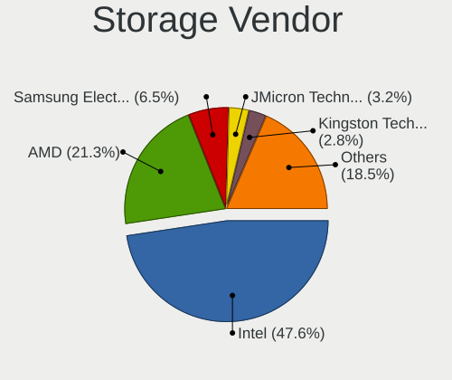

| Vendor                           | Desktops | Percent |
|----------------------------------|----------|---------|
| Intel                            | 221      | 47.63%  |
| AMD                              | 99       | 21.34%  |
| Samsung Electronics              | 30       | 6.47%   |
| JMicron Technology               | 15       | 3.23%   |
| Kingston Technology Company      | 13       | 2.8%    |
| Phison Electronics               | 11       | 2.37%   |
| ASMedia Technology               | 11       | 2.37%   |
| SanDisk                          | 9        | 1.94%   |
| Marvell Technology Group         | 9        | 1.94%   |
| Nvidia                           | 8        | 1.72%   |
| Realtek Semiconductor            | 5        | 1.08%   |
| Silicon Image                    | 4        | 0.86%   |
| VIA Technologies                 | 3        | 0.65%   |
| MAXIO Technology (Hangzhou)      | 3        | 0.65%   |
| KIOXIA                           | 3        | 0.65%   |
| Broadcom / LSI                   | 3        | 0.65%   |
| SK hynix                         | 2        | 0.43%   |
| Silicon Motion                   | 2        | 0.43%   |
| Shenzhen Longsys Electronics     | 2        | 0.43%   |
| Micron/Crucial Technology        | 2        | 0.43%   |
| ADATA Technology                 | 2        | 0.43%   |
| Adaptec                          | 2        | 0.43%   |
| Transcend                        | 1        | 0.22%   |
| Silicon Integrated Systems [SiS] | 1        | 0.22%   |
| Micron Technology                | 1        | 0.22%   |
| LSI Logic / Symbios Logic        | 1        | 0.22%   |
| INNOGRIT                         | 1        | 0.22%   |

Storage Model
-------------

Storage controller models

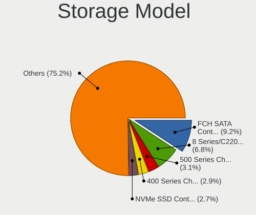

| Model                                                                                   | Desktops | Percent |
|-----------------------------------------------------------------------------------------|----------|---------|
| AMD FCH SATA Controller [AHCI mode]                                                     | 54       | 9.23%   |
| Intel 8 Series/C220 Series Chipset Family 6-port SATA Controller 1 [AHCI mode]          | 40       | 6.84%   |
| AMD 500 Series Chipset SATA Controller                                                  | 18       | 3.08%   |
| AMD 400 Series Chipset SATA Controller                                                  | 17       | 2.91%   |
| Samsung NVMe SSD Controller SM981/PM981/PM983                                           | 16       | 2.74%   |
| Intel 6 Series/C200 Series Chipset Family 6 port Desktop SATA AHCI Controller           | 16       | 2.74%   |
| Intel SATA Controller [RAID mode]                                                       | 15       | 2.56%   |
| Intel 7 Series/C210 Series Chipset Family 6-port SATA Controller [AHCI mode]            | 15       | 2.56%   |
| AMD SB7x0/SB8x0/SB9x0 IDE Controller                                                    | 14       | 2.39%   |
| Intel Alder Lake-S PCH SATA Controller [AHCI Mode]                                      | 13       | 2.22%   |
| Intel 200 Series PCH SATA controller [AHCI mode]                                        | 13       | 2.22%   |
| Intel Q170/Q150/B150/H170/H110/Z170/CM236 Chipset SATA Controller [AHCI Mode]           | 12       | 2.05%   |
| JMicron JMB363 SATA/IDE Controller                                                      | 11       | 1.88%   |
| Intel Cannon Lake PCH SATA AHCI Controller                                              | 11       | 1.88%   |
| AMD A320 Chipset SATA Controller [AHCI mode]                                            | 10       | 1.71%   |
| Intel NM10/ICH7 Family SATA Controller [IDE mode]                                       | 9        | 1.54%   |
| ASMedia ASM1061/ASM1062 Serial ATA Controller                                           | 9        | 1.54%   |
| AMD SB7x0/SB8x0/SB9x0 SATA Controller [IDE mode]                                        | 9        | 1.54%   |
| AMD SB7x0/SB8x0/SB9x0 SATA Controller [AHCI mode]                                       | 9        | 1.54%   |
| Nvidia MCP61 SATA Controller                                                            | 8        | 1.37%   |
| Samsung NVMe SSD Controller PM9A1/PM9A3/980PRO                                          | 7        | 1.2%    |
| Nvidia MCP61 IDE                                                                        | 7        | 1.2%    |
| Intel 9 Series Chipset Family SATA Controller [AHCI Mode]                               | 6        | 1.03%   |
| Intel 82801JI (ICH10 Family) 4 port SATA IDE Controller #1                              | 6        | 1.03%   |
| Intel 82801JI (ICH10 Family) 2 port SATA IDE Controller #2                              | 6        | 1.03%   |
| Intel 82801I (ICH9 Family) 2 port SATA Controller [IDE mode]                            | 6        | 1.03%   |
| Kingston Company A2000 NVMe SSD [SM2263EN]                                              | 5        | 0.85%   |
| Intel C600/X79 series chipset 6-Port SATA AHCI Controller                               | 5        | 0.85%   |
| Intel 82801G (ICH7 Family) IDE Controller                                               | 5        | 0.85%   |
| Intel 7 Series Chipset Family 6-port SATA Controller [AHCI mode]                        | 5        | 0.85%   |
| Intel 6 Series/C200 Series Chipset Family Desktop SATA Controller (IDE mode, ports 4-5) | 5        | 0.85%   |
| Intel 6 Series/C200 Series Chipset Family Desktop SATA Controller (IDE mode, ports 0-3) | 5        | 0.85%   |
| Intel 500 Series Chipset Family SATA AHCI Controller                                    | 5        | 0.85%   |
| SanDisk Extreme Pro / WD Black SN750 / PC SN730 / Red SN700 NVMe SSD                    | 4        | 0.68%   |
| Intel Volume Management Device NVMe RAID Controller                                     | 4        | 0.68%   |
| Intel SSD 670p Series [Keystone Harbor]                                                 | 4        | 0.68%   |
| Intel Raptor Lake SATA AHCI Controller                                                  | 4        | 0.68%   |
| Intel C610/X99 series chipset sSATA Controller [AHCI mode]                              | 4        | 0.68%   |
| Intel 82801IR/IO/IH (ICH9R/DO/DH) 4 port SATA Controller [IDE mode]                     | 4        | 0.68%   |
| Intel 5 Series/3400 Series Chipset 4 port SATA IDE Controller                           | 4        | 0.68%   |

Storage Kind
------------

Kind of storage controller (IDE, SATA, NVMe, SAS, ...)

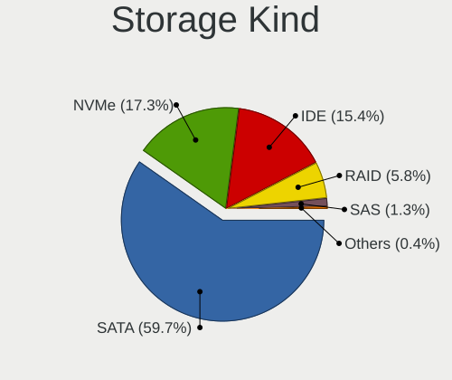

| Kind | Desktops | Percent |
|------|----------|---------|
| SATA | 276      | 59.74%  |
| NVMe | 80       | 17.32%  |
| IDE  | 71       | 15.37%  |
| RAID | 27       | 5.84%   |
| SAS  | 6        | 1.3%    |
| SCSI | 2        | 0.43%   |

Processor
---------

CPU Vendor
----------

Processor vendors

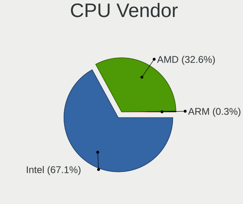

| Vendor | Desktops | Percent |
|--------|----------|---------|
| Intel  | 226      | 67.06%  |
| AMD    | 110      | 32.64%  |
| ARM    | 1        | 0.3%    |

CPU Model
---------

Processor models

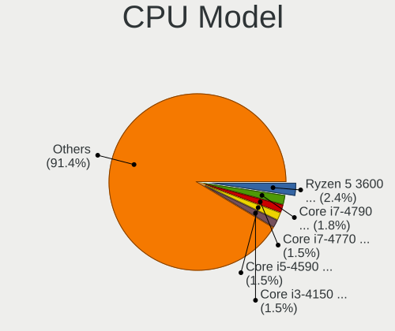

| Model                                       | Desktops | Percent |
|---------------------------------------------|----------|---------|
| AMD Ryzen 5 3600 6-Core Processor           | 8        | 2.37%   |
| Intel Core i7-4790 CPU @ 3.60GHz            | 6        | 1.78%   |
| Intel Core i7-4770 CPU @ 3.40GHz            | 5        | 1.48%   |
| Intel Core i5-4590 CPU @ 3.30GHz            | 5        | 1.48%   |
| Intel Core i3-4150 CPU @ 3.50GHz            | 5        | 1.48%   |
| Intel Core i3-2120 CPU @ 3.30GHz            | 5        | 1.48%   |
| Intel Core i7-3770 CPU @ 3.40GHz            | 4        | 1.18%   |
| Intel Core 2 Quad CPU Q6600 @ 2.40GHz       | 4        | 1.18%   |
| AMD Ryzen 7 5700G with Radeon Graphics      | 4        | 1.18%   |
| AMD Ryzen 7 3800X 8-Core Processor          | 4        | 1.18%   |
| Intel Core i7-7700K CPU @ 4.20GHz           | 3        | 0.89%   |
| Intel Core i7-7700 CPU @ 3.60GHz            | 3        | 0.89%   |
| Intel Core i7-2600K CPU @ 3.40GHz           | 3        | 0.89%   |
| Intel Core i5-9600K CPU @ 3.70GHz           | 3        | 0.89%   |
| Intel Core i5-6500 CPU @ 3.20GHz            | 3        | 0.89%   |
| Intel Core i5-4590S CPU @ 3.00GHz           | 3        | 0.89%   |
| Intel Core i5-4460 CPU @ 3.20GHz            | 3        | 0.89%   |
| Intel Core i5-3570 CPU @ 3.40GHz            | 3        | 0.89%   |
| Intel Core i5-2400 CPU @ 3.10GHz            | 3        | 0.89%   |
| Intel Core 2 Duo CPU E8400 @ 3.00GHz        | 3        | 0.89%   |
| Intel Celeron CPU J1800 @ 2.41GHz           | 3        | 0.89%   |
| Intel Celeron CPU 847 @ 1.10GHz             | 3        | 0.89%   |
| AMD Ryzen 9 5950X 16-Core Processor         | 3        | 0.89%   |
| AMD Ryzen 5 5600X 6-Core Processor          | 3        | 0.89%   |
| AMD Ryzen 5 3400G with Radeon Vega Graphics | 3        | 0.89%   |
| AMD Ryzen 5 2600 Six-Core Processor         | 3        | 0.89%   |
| AMD Phenom II X4 955 Processor              | 3        | 0.89%   |
| AMD FX-6300 Six-Core Processor              | 3        | 0.89%   |
| AMD Athlon II X2 270 Processor              | 3        | 0.89%   |
| Intel Xeon CPU E5-1607 v2 @ 3.00GHz         | 2        | 0.59%   |
| Intel Pentium CPU G4400 @ 3.30GHz           | 2        | 0.59%   |
| Intel Pentium 4 CPU 3.00GHz                 | 2        | 0.59%   |
| Intel Core i7-6700K CPU @ 4.00GHz           | 2        | 0.59%   |
| Intel Core i7-2600 CPU @ 3.40GHz            | 2        | 0.59%   |
| Intel Core i5-9400 CPU @ 2.90GHz            | 2        | 0.59%   |
| Intel Core i5-8500 CPU @ 3.00GHz            | 2        | 0.59%   |
| Intel Core i5-8400 CPU @ 2.80GHz            | 2        | 0.59%   |
| Intel Core i5-4690K CPU @ 3.50GHz           | 2        | 0.59%   |
| Intel Core i5-4590T CPU @ 2.00GHz           | 2        | 0.59%   |
| Intel Core i5-4570T CPU @ 2.90GHz           | 2        | 0.59%   |

CPU Model Family
----------------

Processor model prefix

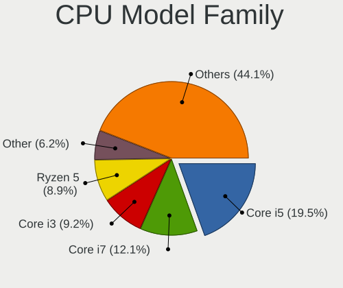

| Model                   | Desktops | Percent |
|-------------------------|----------|---------|
| Intel Core i5           | 66       | 19.53%  |
| Intel Core i7           | 41       | 12.13%  |
| Intel Core i3           | 31       | 9.17%   |
| AMD Ryzen 5             | 30       | 8.88%   |
| Other                   | 21       | 6.21%   |
| Intel Xeon              | 19       | 5.62%   |
| AMD Ryzen 7             | 18       | 5.33%   |
| Intel Celeron           | 17       | 5.03%   |
| Intel Core 2 Duo        | 10       | 2.96%   |
| AMD FX                  | 8        | 2.37%   |
| Intel Core 2 Quad       | 7        | 2.07%   |
| AMD Ryzen 9             | 7        | 2.07%   |
| AMD Athlon II X2        | 7        | 2.07%   |
| Intel Pentium Dual-Core | 5        | 1.48%   |
| Intel Pentium           | 5        | 1.48%   |
| AMD A8                  | 5        | 1.48%   |
| AMD Ryzen 3             | 4        | 1.18%   |
| AMD Phenom II X4        | 4        | 1.18%   |
| AMD Athlon 64 X2        | 3        | 0.89%   |
| AMD Athlon              | 3        | 0.89%   |
| Intel Pentium 4         | 2        | 0.59%   |
| Intel Atom              | 2        | 0.59%   |
| AMD Ryzen 5 PRO         | 2        | 0.59%   |
| AMD Phenom II X6        | 2        | 0.59%   |
| AMD GX                  | 2        | 0.59%   |
| AMD E1                  | 2        | 0.59%   |
| AMD A6                  | 2        | 0.59%   |
| AMD A10                 | 2        | 0.59%   |
| Intel Pentium Dual      | 1        | 0.3%    |
| Intel Pentium D         | 1        | 0.3%    |
| AMD Turion II Neo       | 1        | 0.3%    |
| AMD Sempron             | 1        | 0.3%    |
| AMD Ryzen Threadripper  | 1        | 0.3%    |
| AMD Ryzen 7 PRO         | 1        | 0.3%    |
| AMD Phenom              | 1        | 0.3%    |
| AMD Athlon X4           | 1        | 0.3%    |
| AMD Athlon II X4        | 1        | 0.3%    |
| AMD Athlon II           | 1        | 0.3%    |
| AMD A4                  | 1        | 0.3%    |

CPU Cores
---------

Number of processor cores

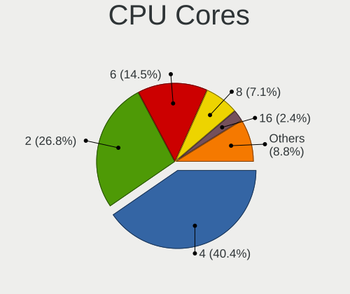

| Number | Desktops | Percent |
|--------|----------|---------|
| 4      | 137      | 40.41%  |
| 2      | 91       | 26.84%  |
| 6      | 49       | 14.45%  |
| 8      | 24       | 7.08%   |
| 16     | 8        | 2.36%   |
| 1      | 8        | 2.36%   |
| 12     | 6        | 1.77%   |
| 10     | 5        | 1.47%   |
| 3      | 4        | 1.18%   |
| 24     | 2        | 0.59%   |
| 18     | 2        | 0.59%   |
| 14     | 2        | 0.59%   |
| 20     | 1        | 0.29%   |

CPU Sockets
-----------

Number of sockets

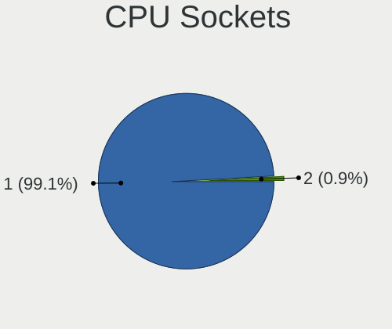

| Number | Desktops | Percent |
|--------|----------|---------|
| 1      | 334      | 99.11%  |
| 2      | 3        | 0.89%   |

CPU Threads
-----------

Threads per core (Hyper-Threading)

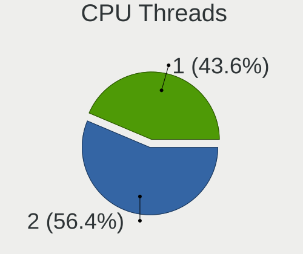

| Number | Desktops | Percent |
|--------|----------|---------|
| 2      | 190      | 56.38%  |
| 1      | 147      | 43.62%  |

CPU Op-Modes
------------

CPU Operation Modes (32-bit, 64-bit)

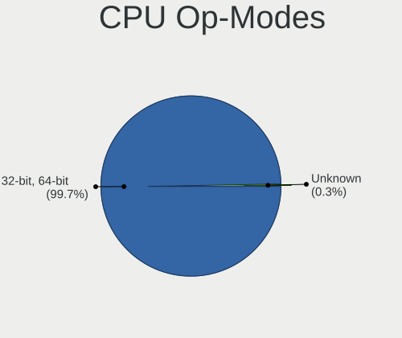

| Op mode        | Desktops | Percent |
|----------------|----------|---------|
| 32-bit, 64-bit | 336      | 99.7%   |
| Unknown        | 1        | 0.3%    |

CPU Microcode
-------------

Microcode number

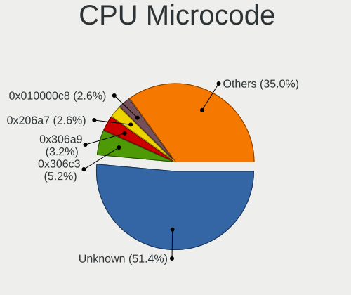

| Number     | Desktops | Percent |
|------------|----------|---------|
| Unknown    | 178      | 51.45%  |
| 0x306c3    | 18       | 5.2%    |
| 0x306a9    | 11       | 3.18%   |
| 0x206a7    | 9        | 2.6%    |
| 0x010000c8 | 9        | 2.6%    |
| 0x506e3    | 6        | 1.73%   |
| 0x08701021 | 6        | 1.73%   |
| 0x0800820d | 6        | 1.73%   |
| 0x06000852 | 6        | 1.73%   |
| 0x906ea    | 5        | 1.45%   |
| 0x1067a    | 5        | 1.45%   |
| 0x90672    | 4        | 1.16%   |
| 0x406c3    | 4        | 1.16%   |
| 0x08108109 | 4        | 1.16%   |
| 0xb0671    | 3        | 0.87%   |
| 0x306e4    | 3        | 0.87%   |
| 0x106e5    | 3        | 0.87%   |
| 0x0700010f | 3        | 0.87%   |
| 0xa0653    | 2        | 0.58%   |
| 0x906e9    | 2        | 0.58%   |
| 0x306f2    | 2        | 0.58%   |
| 0x206d7    | 2        | 0.58%   |
| 0x10676    | 2        | 0.58%   |
| 0x0a50000f | 2        | 0.58%   |
| 0x0a20102b | 2        | 0.58%   |
| 0x0a201016 | 2        | 0.58%   |
| 0x08701030 | 2        | 0.58%   |
| 0x08701013 | 2        | 0.58%   |
| 0x08600109 | 2        | 0.58%   |
| 0x010000c7 | 2        | 0.58%   |
| 0xb06e0    | 1        | 0.29%   |
| 0xa0671    | 1        | 0.29%   |
| 0xa0655    | 1        | 0.29%   |
| 0x906ed    | 1        | 0.29%   |
| 0x906eb    | 1        | 0.29%   |
| 0x706a1    | 1        | 0.29%   |
| 0x6fb      | 1        | 0.29%   |
| 0x506c9    | 1        | 0.29%   |
| 0x406c4    | 1        | 0.29%   |
| 0x40651    | 1        | 0.29%   |

CPU Microarch
-------------

Microarchitecture

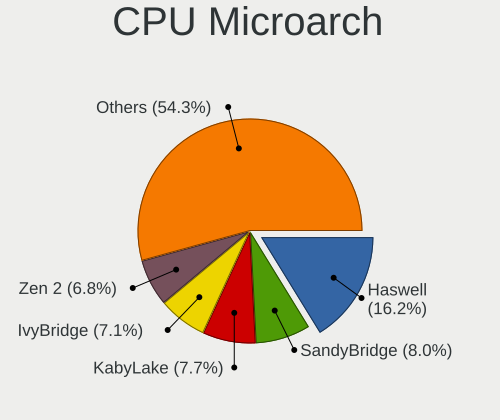

| Name             | Desktops | Percent |
|------------------|----------|---------|
| Haswell          | 55       | 16.22%  |
| SandyBridge      | 27       | 7.96%   |
| KabyLake         | 26       | 7.67%   |
| IvyBridge        | 24       | 7.08%   |
| Zen 2            | 23       | 6.78%   |
| K10              | 17       | 5.01%   |
| Zen 3            | 16       | 4.72%   |
| Penryn           | 16       | 4.72%   |
| Zen+             | 15       | 4.42%   |
| Unknown          | 15       | 4.42%   |
| Skylake          | 13       | 3.83%   |
| Piledriver       | 13       | 3.83%   |
| Alderlake Hybrid | 10       | 2.95%   |
| Silvermont       | 8        | 2.36%   |
| Core             | 8        | 2.36%   |
| CometLake        | 8        | 2.36%   |
| Zen              | 7        | 2.06%   |
| Nehalem          | 7        | 2.06%   |
| Westmere         | 5        | 1.47%   |
| Jaguar           | 4        | 1.18%   |
| NetBurst         | 3        | 0.88%   |
| K8 Hammer        | 3        | 0.88%   |
| Excavator        | 3        | 0.88%   |
| Broadwell        | 3        | 0.88%   |
| Steamroller      | 2        | 0.59%   |
| K10 Llano        | 2        | 0.59%   |
| Bonnell          | 2        | 0.59%   |
| Icelake          | 1        | 0.29%   |
| Goldmont plus    | 1        | 0.29%   |
| Goldmont         | 1        | 0.29%   |
| Bobcat           | 1        | 0.29%   |

Graphics
--------

GPU Vendor
----------

Vendors of graphics cards

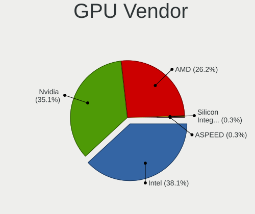

| Vendor                           | Desktops | Percent |
|----------------------------------|----------|---------|
| Intel                            | 138      | 38.12%  |
| Nvidia                           | 127      | 35.08%  |
| AMD                              | 95       | 26.24%  |
| Silicon Integrated Systems [SiS] | 1        | 0.28%   |
| ASPEED Technology                | 1        | 0.28%   |

GPU Model
---------

Graphics card models

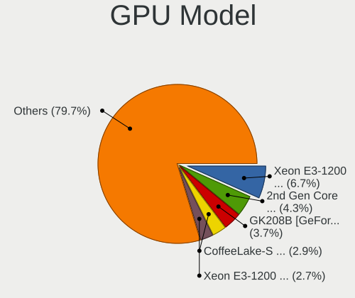

| Model                                                                                    | Desktops | Percent |
|------------------------------------------------------------------------------------------|----------|---------|
| Intel Xeon E3-1200 v3/4th Gen Core Processor Integrated Graphics Controller              | 25       | 6.68%   |
| Intel 2nd Generation Core Processor Family Integrated Graphics Controller                | 16       | 4.28%   |
| Nvidia GK208B [GeForce GT 710]                                                           | 14       | 3.74%   |
| Intel CoffeeLake-S GT2 [UHD Graphics 630]                                                | 11       | 2.94%   |
| Intel Xeon E3-1200 v2/3rd Gen Core processor Graphics Controller                         | 10       | 2.67%   |
| Intel Skylake-S GT2 [HD Graphics 530]                                                    | 10       | 2.67%   |
| Nvidia GP107 [GeForce GTX 1050 Ti]                                                       | 7        | 1.87%   |
| AMD Ellesmere [Radeon RX 470/480/570/570X/580/580X/590]                                  | 7        | 1.87%   |
| Nvidia GK208B [GeForce GT 730]                                                           | 6        | 1.6%    |
| Intel Kaby Lake-S GT2 [HD Graphics 630]                                                  | 6        | 1.6%    |
| Intel CometLake-S GT2 [UHD Graphics 630]                                                 | 6        | 1.6%    |
| AMD Cezanne [Radeon Vega Series / Radeon Vega Mobile Series]                             | 6        | 1.6%    |
| Nvidia GP106 [GeForce GTX 1060 6GB]                                                      | 5        | 1.34%   |
| Intel Atom/Celeron/Pentium Processor x5-E8000/J3xxx/N3xxx Integrated Graphics Controller | 5        | 1.34%   |
| Intel Alder Lake-S GT1 [UHD Graphics 730]                                                | 5        | 1.34%   |
| Intel 4 Series Chipset Integrated Graphics Controller                                    | 5        | 1.34%   |
| Nvidia TU116 [GeForce GTX 1660 SUPER]                                                    | 4        | 1.07%   |
| Nvidia GM107 [GeForce GTX 750 Ti]                                                        | 4        | 1.07%   |
| Nvidia GA106 [GeForce RTX 3060 Lite Hash Rate]                                           | 4        | 1.07%   |
| Intel Alder Lake-S GT1 [UHD Graphics 770]                                                | 4        | 1.07%   |
| Intel 82G33/G31 Express Integrated Graphics Controller                                   | 4        | 1.07%   |
| Intel 4th Generation Core Processor Family Integrated Graphics Controller                | 4        | 1.07%   |
| AMD RS780L [Radeon 3000]                                                                 | 4        | 1.07%   |
| AMD Raven Ridge [Radeon Vega Series / Radeon Vega Mobile Series]                         | 4        | 1.07%   |
| AMD Picasso/Raven 2 [Radeon Vega Series / Radeon Vega Mobile Series]                     | 4        | 1.07%   |
| AMD Navi 10 [Radeon RX 5600 OEM/5600 XT / 5700/5700 XT]                                  | 4        | 1.07%   |
| Nvidia TU116 [GeForce GTX 1660 Ti]                                                       | 3        | 0.8%    |
| Nvidia GM206 [GeForce GTX 950]                                                           | 3        | 0.8%    |
| Nvidia GM204 [GeForce GTX 970]                                                           | 3        | 0.8%    |
| Nvidia GK107 [GeForce GTX 650]                                                           | 3        | 0.8%    |
| Nvidia C61 [GeForce 7025 / nForce 630a]                                                  | 3        | 0.8%    |
| Intel Raptor Lake-S GT1 [UHD Graphics 770]                                               | 3        | 0.8%    |
| Intel Atom Processor Z36xxx/Z37xxx Series Graphics & Display                             | 3        | 0.8%    |
| AMD RV620 LE [Radeon HD 3450]                                                            | 3        | 0.8%    |
| AMD Renoir [Radeon Vega Series / Radeon Vega Mobile Series]                              | 3        | 0.8%    |
| AMD Cedar [Radeon HD 5000/6000/7350/8350 Series]                                         | 3        | 0.8%    |
| AMD Cape Verde PRO [Radeon HD 7750/8740 / R7 250E]                                       | 3        | 0.8%    |
| AMD Caicos [Radeon HD 6450/7450/8450 / R5 230 OEM]                                       | 3        | 0.8%    |
| AMD Baffin [Radeon RX 550 640SP / RX 560/560X]                                           | 3        | 0.8%    |
| Nvidia TU116 [GeForce GTX 1660]                                                          | 2        | 0.53%   |

GPU Combo
---------

Combinations of graphics cards

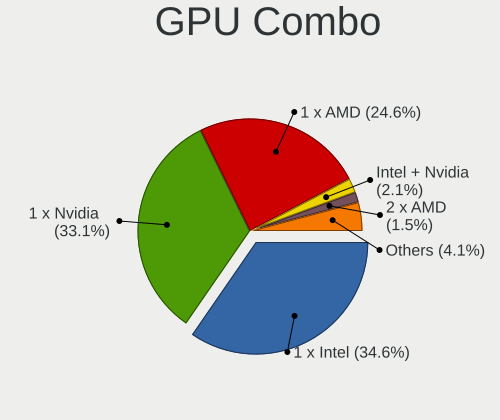

| Name               | Desktops | Percent |
|--------------------|----------|---------|
| 1 x Intel          | 117      | 34.62%  |
| 1 x Nvidia         | 112      | 33.14%  |
| 1 x AMD            | 83       | 24.56%  |
| Intel + Nvidia     | 7        | 2.07%   |
| 2 x AMD            | 5        | 1.48%   |
| AMD + Nvidia       | 5        | 1.48%   |
| Intel + AMD        | 3        | 0.89%   |
| Intel + 2 x Nvidia | 2        | 0.59%   |
| Other              | 1        | 0.3%    |
| 2 x Nvidia         | 1        | 0.3%    |
| 1 x SiS            | 1        | 0.3%    |
| 1 x ASPEED         | 1        | 0.3%    |

GPU Driver
----------

Free vs proprietary

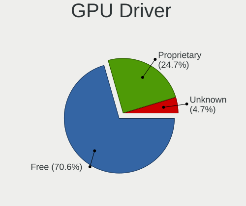

| Driver      | Desktops | Percent |
|-------------|----------|---------|
| Free        | 240      | 70.59%  |
| Proprietary | 84       | 24.71%  |
| Unknown     | 16       | 4.71%   |

GPU Memory
----------

Total video memory

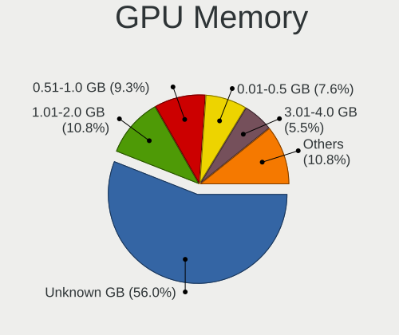

| Size in GB | Desktops | Percent |
|------------|----------|---------|
| Unknown    | 192      | 55.98%  |
| 1.01-2.0   | 37       | 10.79%  |
| 0.51-1.0   | 32       | 9.33%   |
| 0.01-0.5   | 26       | 7.58%   |
| 3.01-4.0   | 19       | 5.54%   |
| 7.01-8.0   | 13       | 3.79%   |
| 5.01-6.0   | 12       | 3.5%    |
| 8.01-16.0  | 9        | 2.62%   |
| 2.01-3.0   | 2        | 0.58%   |
| 4.01-5.0   | 1        | 0.29%   |

Monitor
-------

Monitor Vendor
--------------

Monitor vendors

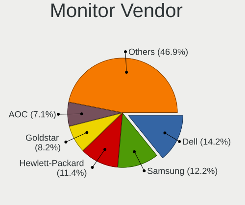

| Vendor               | Desktops | Percent |
|----------------------|----------|---------|
| Dell                 | 50       | 14.2%   |
| Samsung Electronics  | 43       | 12.22%  |
| Hewlett-Packard      | 40       | 11.36%  |
| Goldstar             | 29       | 8.24%   |
| AOC                  | 25       | 7.1%    |
| Acer                 | 20       | 5.68%   |
| Ancor Communications | 16       | 4.55%   |
| Philips              | 13       | 3.69%   |
| BenQ                 | 12       | 3.41%   |
| ViewSonic            | 11       | 3.13%   |
| Iiyama               | 10       | 2.84%   |
| Fujitsu Siemens      | 7        | 1.99%   |
| Lenovo               | 6        | 1.7%    |
| ASUSTek Computer     | 6        | 1.7%    |
| Sceptre Tech         | 4        | 1.14%   |
| Eizo                 | 4        | 1.14%   |
| NEC Computers        | 3        | 0.85%   |
| Unknown              | 2        | 0.57%   |
| RTK                  | 2        | 0.57%   |
| Mi                   | 2        | 0.57%   |
| LG Electronics       | 2        | 0.57%   |
| HannStar             | 2        | 0.57%   |
| Denver               | 2        | 0.57%   |
| Unknown              | 2        | 0.57%   |
| ___                  | 1        | 0.28%   |
| YSP                  | 1        | 0.28%   |
| Vestel Elektronik    | 1        | 0.28%   |
| Unknown (XXX)        | 1        | 0.28%   |
| Unknown (AAA)        | 1        | 0.28%   |
| UGD                  | 1        | 0.28%   |
| Toshiba              | 1        | 0.28%   |
| TEO                  | 1        | 0.28%   |
| Tech Concepts        | 1        | 0.28%   |
| TCL                  | 1        | 0.28%   |
| Sony                 | 1        | 0.28%   |
| SNC                  | 1        | 0.28%   |
| Sharp                | 1        | 0.28%   |
| SGT                  | 1        | 0.28%   |
| RGT                  | 1        | 0.28%   |
| Pixio                | 1        | 0.28%   |

Monitor Model
-------------

Monitor models

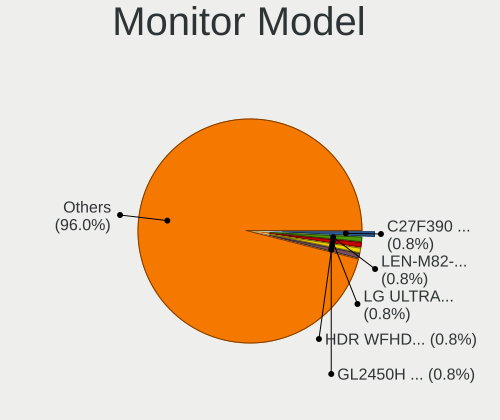

| Model                                                                 | Desktops | Percent |
|-----------------------------------------------------------------------|----------|---------|
| Samsung Electronics C27F390 SAM0D32 1920x1080 598x336mm 27.0-inch     | 3        | 0.79%   |
| Lenovo LEN-M82-C LEN00A2 1920x1080 476x268mm 21.5-inch                | 3        | 0.79%   |
| Goldstar LG ULTRAWIDE GSM59F1 2560x1080 670x280mm 28.6-inch           | 3        | 0.79%   |
| Goldstar HDR WFHD GSM7714 2560x1080 798x334mm 34.1-inch               | 3        | 0.79%   |
| BenQ GL2450H BNQ78A7 1920x1080 531x298mm 24.0-inch                    | 3        | 0.79%   |
| ViewSonic VX2457 VSCB931 1920x1080 521x293mm 23.5-inch                | 2        | 0.53%   |
| Philips PHL 193V5 PHLC0CD 1366x768 410x230mm 18.5-inch                | 2        | 0.53%   |
| Philips 247ELH PHLC085 1920x1080 521x293mm 23.5-inch                  | 2        | 0.53%   |
| Philips 170S PHL082B 1280x1024 338x270mm 17.0-inch                    | 2        | 0.53%   |
| Iiyama PL2377 IVM561D 1920x1080 510x287mm 23.0-inch                   | 2        | 0.53%   |
| Hewlett-Packard w19b/w19e HWP26A1 1440x900 410x256mm 19.0-inch        | 2        | 0.53%   |
| Hewlett-Packard V24e HPN36AC 1920x1080 527x296mm 23.8-inch            | 2        | 0.53%   |
| Hewlett-Packard 2309 HWP2821 1920x1080 510x287mm 23.0-inch            | 2        | 0.53%   |
| HannStar HL205DPB HSD62E0 1600x900 432x240mm 19.5-inch                | 2        | 0.53%   |
| Dell U3011 DEL4065 2560x1600 641x401mm 29.8-inch                      | 2        | 0.53%   |
| Dell S199WFP DELF00A 1440x900 408x255mm 18.9-inch                     | 2        | 0.53%   |
| Dell P2419H DELD0D9 1920x1080 527x296mm 23.8-inch                     | 2        | 0.53%   |
| Dell 2001FP DELA008 1600x1200 367x275mm 18.1-inch                     | 2        | 0.53%   |
| AOC 24G2W1G3 AOC2402 1920x1080 527x296mm 23.8-inch                    | 2        | 0.53%   |
| AOC 2470W AOC2470 1920x1080 521x293mm 23.5-inch                       | 2        | 0.53%   |
| AOC 2270W AOC2270 1920x1080 477x268mm 21.5-inch                       | 2        | 0.53%   |
| AOC 1970W AOC1970 1366x768 410x230mm 18.5-inch                        | 2        | 0.53%   |
| AOC 1950W AOC1950 1366x768 410x230mm 18.5-inch                        | 2        | 0.53%   |
| Ancor Communications VE228 ACI22FA 1920x1080 477x268mm 21.5-inch      | 2        | 0.53%   |
| Ancor Communications PB248 ACI24A3 1920x1200 518x324mm 24.1-inch      | 2        | 0.53%   |
| Ancor Communications ASUS VS229 ACI22C2 1920x1080 477x268mm 21.5-inch | 2        | 0.53%   |
| Unknown                                                               | 2        | 0.53%   |
| ___ LCD Monitor ___1BBC 1920x540 140x90mm 6.6-inch                    | 1        | 0.26%   |
| YSP MF215BH YSP2150 1920x1080 340x255mm 16.7-inch                     | 1        | 0.26%   |
| ViewSonic XG2401 SERIES VSCBB31 1920x1080 531x299mm 24.0-inch         | 1        | 0.26%   |
| ViewSonic VX3276-UHD VSC5138 3840x2160 697x392mm 31.5-inch            | 1        | 0.26%   |
| ViewSonic VX2476 Series VSCD332 1920x1080 527x296mm 23.8-inch         | 1        | 0.26%   |
| ViewSonic VX2452 Series VSCDE2E 1920x1080 521x293mm 23.5-inch         | 1        | 0.26%   |
| ViewSonic VP2365 SERIES VSC7C28 1920x1080 510x290mm 23.1-inch         | 1        | 0.26%   |
| ViewSonic VG2021m VSCE11D 1400x1050 408x306mm 20.1-inch               | 1        | 0.26%   |
| ViewSonic VE710b-2 VSC3919 1280x1024 338x270mm 17.0-inch              | 1        | 0.26%   |
| ViewSonic VA2055 Series VSC3C31 1920x1080 435x239mm 19.5-inch         | 1        | 0.26%   |
| ViewSonic VA1948 SERIES VSCE827 1440x900 408x255mm 18.9-inch          | 1        | 0.26%   |
| Vestel Elektronik 40UHD_LCD_TV VES3700 3840x2160 880x500mm 39.8-inch  | 1        | 0.26%   |
| Unknown LCD Monitor SAMSUNG 1920x1080                                 | 1        | 0.26%   |

Monitor Resolution
------------------

Monitor screen resolution

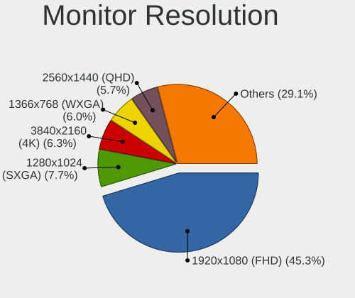

| Resolution         | Desktops | Percent |
|--------------------|----------|---------|
| 1920x1080 (FHD)    | 159      | 45.3%   |
| 1280x1024 (SXGA)   | 27       | 7.69%   |
| 3840x2160 (4K)     | 22       | 6.27%   |
| 1366x768 (WXGA)    | 21       | 5.98%   |
| 2560x1440 (QHD)    | 20       | 5.7%    |
| 1680x1050 (WSXGA+) | 16       | 4.56%   |
| 1600x900 (HD+)     | 16       | 4.56%   |
| 1440x900 (WXGA+)   | 15       | 4.27%   |
| 1920x1200 (WUXGA)  | 9        | 2.56%   |
| 1024x768 (XGA)     | 7        | 1.99%   |
| 1600x1200          | 5        | 1.42%   |
| 1360x768           | 5        | 1.42%   |
| 3840x1080          | 4        | 1.14%   |
| 3440x1440          | 4        | 1.14%   |
| 2560x1600          | 4        | 1.14%   |
| 2560x1080          | 4        | 1.14%   |
| Unknown            | 3        | 0.85%   |
| 3840x1600          | 2        | 0.57%   |
| 1280x720 (HD)      | 2        | 0.57%   |
| 7680x1080          | 1        | 0.28%   |
| 2288x1287          | 1        | 0.28%   |
| 2256x1504          | 1        | 0.28%   |
| 1920x540           | 1        | 0.28%   |
| 1400x1050          | 1        | 0.28%   |
| 1280x960           | 1        | 0.28%   |

Monitor Diagonal
----------------

Diagonal size in inches

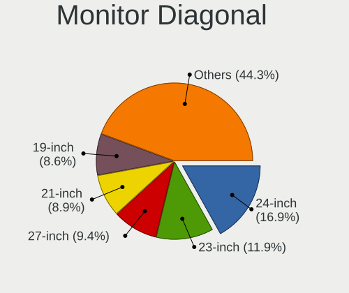

| Inches  | Desktops | Percent |
|---------|----------|---------|
| 24      | 61       | 16.9%   |
| 23      | 43       | 11.91%  |
| 27      | 34       | 9.42%   |
| 21      | 32       | 8.86%   |
| 19      | 31       | 8.59%   |
| 18      | 21       | 5.82%   |
| 20      | 19       | 5.26%   |
| Unknown | 16       | 4.43%   |
| 17      | 15       | 4.16%   |
| 31      | 14       | 3.88%   |
| 22      | 11       | 3.05%   |
| 15      | 11       | 3.05%   |
| 34      | 7        | 1.94%   |
| 63      | 5        | 1.39%   |
| 40      | 5        | 1.39%   |
| 25      | 5        | 1.39%   |
| 32      | 4        | 1.11%   |
| 37      | 3        | 0.83%   |
| 29      | 3        | 0.83%   |
| 26      | 3        | 0.83%   |
| 16      | 3        | 0.83%   |
| 84      | 2        | 0.55%   |
| 72      | 2        | 0.55%   |
| 49      | 2        | 0.55%   |
| 28      | 2        | 0.55%   |
| 142     | 1        | 0.28%   |
| 54      | 1        | 0.28%   |
| 48      | 1        | 0.28%   |
| 42      | 1        | 0.28%   |
| 30      | 1        | 0.28%   |
| 14      | 1        | 0.28%   |
| 6       | 1        | 0.28%   |

Monitor Width
-------------

Physical width

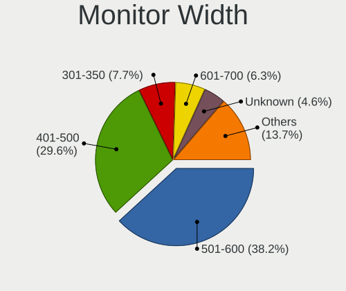

| Width in mm    | Desktops | Percent |
|----------------|----------|---------|
| 501-600        | 134      | 38.18%  |
| 401-500        | 104      | 29.63%  |
| 301-350        | 27       | 7.69%   |
| 601-700        | 22       | 6.27%   |
| Unknown        | 16       | 4.56%   |
| 351-400        | 12       | 3.42%   |
| 701-800        | 11       | 3.13%   |
| 1001-1500      | 9        | 2.56%   |
| 801-900        | 8        | 2.28%   |
| 1501-2000      | 4        | 1.14%   |
| More than 2000 | 1        | 0.28%   |
| 201-300        | 1        | 0.28%   |
| 101-200        | 1        | 0.28%   |
| 901-1000       | 1        | 0.28%   |

Aspect Ratio
------------

Proportional relationship between the width and the height

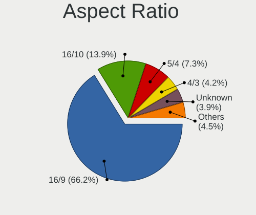

| Ratio   | Desktops | Percent |
|---------|----------|---------|
| 16/9    | 219      | 66.16%  |
| 16/10   | 46       | 13.9%   |
| 5/4     | 24       | 7.25%   |
| 4/3     | 14       | 4.23%   |
| Unknown | 13       | 3.93%   |
| 21/9    | 9        | 2.72%   |
| 32/9    | 2        | 0.6%    |
| 3/2     | 2        | 0.6%    |
| 6/5     | 1        | 0.3%    |
| 1.00    | 1        | 0.3%    |

Monitor Area
------------

Area in inch²

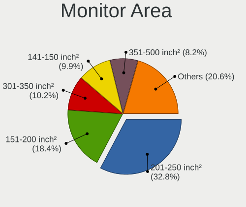

| Area in inch² | Desktops | Percent |
|----------------|----------|---------|
| 201-250        | 116      | 32.77%  |
| 151-200        | 65       | 18.36%  |
| 301-350        | 36       | 10.17%  |
| 141-150        | 35       | 9.89%   |
| 351-500        | 29       | 8.19%   |
| 251-300        | 19       | 5.37%   |
| Unknown        | 16       | 4.52%   |
| More than 1000 | 12       | 3.39%   |
| 101-110        | 11       | 3.11%   |
| 501-1000       | 10       | 2.82%   |
| 111-120        | 2        | 0.56%   |
| 1-40           | 1        | 0.28%   |
| 131-140        | 1        | 0.28%   |
| 91-100         | 1        | 0.28%   |

Pixel Density
-------------

Pixels per inch

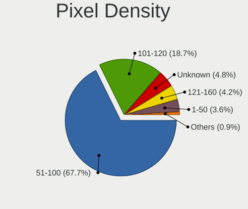

| Density       | Desktops | Percent |
|---------------|----------|---------|
| 51-100        | 224      | 67.67%  |
| 101-120       | 62       | 18.73%  |
| Unknown       | 16       | 4.83%   |
| 121-160       | 14       | 4.23%   |
| 1-50          | 12       | 3.63%   |
| 161-240       | 2        | 0.6%    |
| More than 240 | 1        | 0.3%    |

Multiple Monitors
-----------------

Total monitors connected

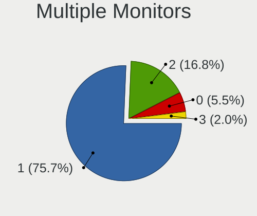

| Total | Desktops | Percent |
|-------|----------|---------|
| 1     | 261      | 75.65%  |
| 2     | 58       | 16.81%  |
| 0     | 19       | 5.51%   |
| 3     | 7        | 2.03%   |

Network
-------

Net Controller Vendor
---------------------

Controller vendors

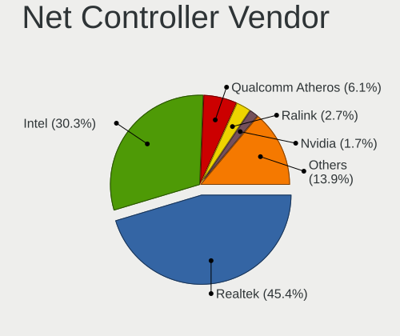

| Vendor                          | Desktops | Percent |
|---------------------------------|----------|---------|
| Realtek Semiconductor           | 216      | 45.38%  |
| Intel                           | 144      | 30.25%  |
| Qualcomm Atheros                | 29       | 6.09%   |
| Ralink Technology               | 13       | 2.73%   |
| Nvidia                          | 8        | 1.68%   |
| Broadcom                        | 7        | 1.47%   |
| TP-Link                         | 6        | 1.26%   |
| Ralink                          | 5        | 1.05%   |
| Broadcom Limited                | 5        | 1.05%   |
| MediaTek                        | 4        | 0.84%   |
| D-Link System                   | 4        | 0.84%   |
| Samsung Electronics             | 3        | 0.63%   |
| NetGear                         | 3        | 0.63%   |
| Marvell Technology Group        | 3        | 0.63%   |
| Qualcomm Atheros Communications | 2        | 0.42%   |
| Microchip Technology            | 2        | 0.42%   |
| D-Link                          | 2        | 0.42%   |
| Belkin Components               | 2        | 0.42%   |
| ASIX Electronics                | 2        | 0.42%   |
| ZyDAS                           | 1        | 0.21%   |
| Zoom Telephonics                | 1        | 0.21%   |
| Xiaomi                          | 1        | 0.21%   |
| Wilocity                        | 1        | 0.21%   |
| TRENDnet                        | 1        | 0.21%   |
| Spreadtrum Communications       | 1        | 0.21%   |
| OPPO Electronics                | 1        | 0.21%   |
| Microsoft                       | 1        | 0.21%   |
| MicroPython                     | 1        | 0.21%   |
| Mellanox Technologies           | 1        | 0.21%   |
| Linksys                         | 1        | 0.21%   |
| ICS Advent                      | 1        | 0.21%   |
| Hyperkin                        | 1        | 0.21%   |
| Dell                            | 1        | 0.21%   |
| ASUSTek Computer                | 1        | 0.21%   |
| Aquantia                        | 1        | 0.21%   |

Net Controller Model
--------------------

Controller models

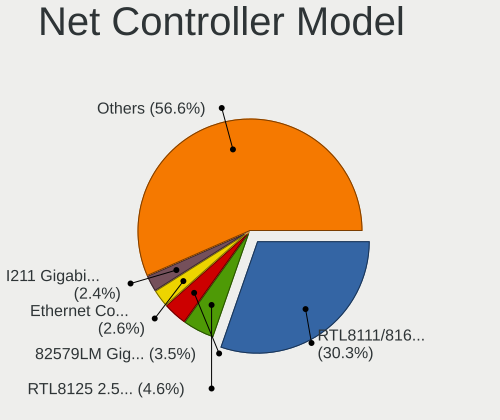

| Model                                                                  | Desktops | Percent |
|------------------------------------------------------------------------|----------|---------|
| Realtek RTL8111/8168/8211/8411 PCI Express Gigabit Ethernet Controller | 164      | 30.31%  |
| Realtek RTL8125 2.5GbE Controller                                      | 25       | 4.62%   |
| Intel 82579LM Gigabit Network Connection (Lewisville)                  | 19       | 3.51%   |
| Intel Ethernet Connection I217-LM                                      | 14       | 2.59%   |
| Intel I211 Gigabit Network Connection                                  | 13       | 2.4%    |
| Intel Wi-Fi 6 AX200                                                    | 12       | 2.22%   |
| Intel Ethernet Connection (2) I219-V                                   | 11       | 2.03%   |
| Ralink MT7601U Wireless Adapter                                        | 10       | 1.85%   |
| Intel Ethernet Controller I225-V                                       | 10       | 1.85%   |
| Intel Ethernet Connection I217-V                                       | 10       | 1.85%   |
| Nvidia MCP61 Ethernet                                                  | 8        | 1.48%   |
| Realtek 802.11ac NIC                                                   | 7        | 1.29%   |
| Intel Wi-Fi 6E(802.11ax) AX210/AX1675* 2x2 [Typhoon Peak]              | 7        | 1.29%   |
| Realtek RTL8188EUS 802.11n Wireless Network Adapter                    | 6        | 1.11%   |
| Realtek RTL810xE PCI Express Fast Ethernet controller                  | 6        | 1.11%   |
| Intel 82579V Gigabit Network Connection                                | 6        | 1.11%   |
| Realtek RTL8821CE 802.11ac PCIe Wireless Network Adapter               | 5        | 0.92%   |
| Intel Wireless 7260                                                    | 5        | 0.92%   |
| Intel Ethernet Connection (7) I219-V                                   | 5        | 0.92%   |
| Realtek RTL8192CU 802.11n WLAN Adapter                                 | 4        | 0.74%   |
| Realtek RTL8188FTV 802.11b/g/n 1T1R 2.4G WLAN Adapter                  | 4        | 0.74%   |
| Realtek RTL8153 Gigabit Ethernet Adapter                               | 4        | 0.74%   |
| Qualcomm Atheros AR9485 Wireless Network Adapter                       | 4        | 0.74%   |
| Qualcomm Atheros AR9462 Wireless Network Adapter                       | 4        | 0.74%   |
| Intel Ethernet Connection (14) I219-V                                  | 4        | 0.74%   |
| Intel Dual Band Wireless-AC 3168NGW [Stone Peak]                       | 4        | 0.74%   |
| Realtek RTL8852BE PCIe 802.11ax Wireless Network Controller            | 3        | 0.55%   |
| Realtek RTL8821AE 802.11ac PCIe Wireless Network Adapter               | 3        | 0.55%   |
| Realtek RTL8192EU 802.11b/g/n WLAN Adapter                             | 3        | 0.55%   |
| Realtek RTL-8100/8101L/8139 PCI Fast Ethernet Adapter                  | 3        | 0.55%   |
| Qualcomm Atheros AR8161 Gigabit Ethernet                               | 3        | 0.55%   |
| Intel Ethernet Connection (2) I219-LM                                  | 3        | 0.55%   |
| Intel Ethernet Connection (2) I218-V                                   | 3        | 0.55%   |
| Intel 700 Series Chipset CNVi WiFi                                     | 3        | 0.55%   |
| TP-Link TL-WN722N v2/v3 [Realtek RTL8188EUS]                           | 2        | 0.37%   |
| Samsung Galaxy series, misc. (tethering mode)                          | 2        | 0.37%   |
| Realtek RTL8812AE 802.11ac PCIe Wireless Network Adapter               | 2        | 0.37%   |
| Ralink RT2790 Wireless 802.11n 1T/2R PCIe                              | 2        | 0.37%   |
| Qualcomm Atheros QCA6174 802.11ac Wireless Network Adapter             | 2        | 0.37%   |
| Qualcomm Atheros AR9271 802.11n                                        | 2        | 0.37%   |

Wireless Vendor
---------------

Wireless vendors

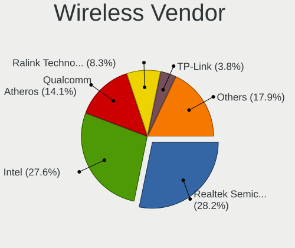

| Vendor                          | Desktops | Percent |
|---------------------------------|----------|---------|
| Realtek Semiconductor           | 44       | 28.21%  |
| Intel                           | 43       | 27.56%  |
| Qualcomm Atheros                | 22       | 14.1%   |
| Ralink Technology               | 13       | 8.33%   |
| TP-Link                         | 6        | 3.85%   |
| Ralink                          | 5        | 3.21%   |
| MediaTek                        | 4        | 2.56%   |
| NetGear                         | 3        | 1.92%   |
| Qualcomm Atheros Communications | 2        | 1.28%   |
| D-Link System                   | 2        | 1.28%   |
| D-Link                          | 2        | 1.28%   |
| Broadcom                        | 2        | 1.28%   |
| Belkin Components               | 2        | 1.28%   |
| ZyDAS                           | 1        | 0.64%   |
| Wilocity                        | 1        | 0.64%   |
| TRENDnet                        | 1        | 0.64%   |
| Dell                            | 1        | 0.64%   |
| Broadcom Limited                | 1        | 0.64%   |
| ASUSTek Computer                | 1        | 0.64%   |

Wireless Model
--------------

Wireless models

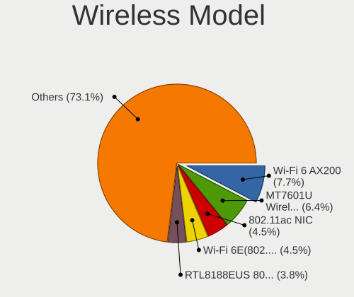

| Model                                                                                 | Desktops | Percent |
|---------------------------------------------------------------------------------------|----------|---------|
| Intel Wi-Fi 6 AX200                                                                   | 12       | 7.69%   |
| Ralink MT7601U Wireless Adapter                                                       | 10       | 6.41%   |
| Realtek 802.11ac NIC                                                                  | 7        | 4.49%   |
| Intel Wi-Fi 6E(802.11ax) AX210/AX1675* 2x2 [Typhoon Peak]                             | 7        | 4.49%   |
| Realtek RTL8188EUS 802.11n Wireless Network Adapter                                   | 6        | 3.85%   |
| Realtek RTL8821CE 802.11ac PCIe Wireless Network Adapter                              | 5        | 3.21%   |
| Intel Wireless 7260                                                                   | 5        | 3.21%   |
| Realtek RTL8192CU 802.11n WLAN Adapter                                                | 4        | 2.56%   |
| Realtek RTL8188FTV 802.11b/g/n 1T1R 2.4G WLAN Adapter                                 | 4        | 2.56%   |
| Qualcomm Atheros AR9485 Wireless Network Adapter                                      | 4        | 2.56%   |
| Qualcomm Atheros AR9462 Wireless Network Adapter                                      | 4        | 2.56%   |
| Intel Dual Band Wireless-AC 3168NGW [Stone Peak]                                      | 4        | 2.56%   |
| Realtek RTL8821AE 802.11ac PCIe Wireless Network Adapter                              | 3        | 1.92%   |
| Realtek RTL8192EU 802.11b/g/n WLAN Adapter                                            | 3        | 1.92%   |
| Intel 700 Series Chipset CNVi WiFi                                                    | 3        | 1.92%   |
| TP-Link TL-WN722N v2/v3 [Realtek RTL8188EUS]                                          | 2        | 1.28%   |
| Realtek RTL8852BE PCIe 802.11ax Wireless Network Controller                           | 2        | 1.28%   |
| Realtek RTL8812AE 802.11ac PCIe Wireless Network Adapter                              | 2        | 1.28%   |
| Ralink RT2790 Wireless 802.11n 1T/2R PCIe                                             | 2        | 1.28%   |
| Qualcomm Atheros QCA6174 802.11ac Wireless Network Adapter                            | 2        | 1.28%   |
| Qualcomm Atheros AR9271 802.11n                                                       | 2        | 1.28%   |
| Qualcomm Atheros AR93xx Wireless Network Adapter                                      | 2        | 1.28%   |
| Qualcomm Atheros AR9287 Wireless Network Adapter (PCI-Express)                        | 2        | 1.28%   |
| Qualcomm Atheros AR9227 Wireless Network Adapter                                      | 2        | 1.28%   |
| Qualcomm Atheros AR5212/5213/2414 Wireless Network Adapter                            | 2        | 1.28%   |
| MediaTek MT7922 802.11ax PCI Express Wireless Network Adapter                         | 2        | 1.28%   |
| MediaTek MT7921K (RZ608) Wi-Fi 6E 80MHz                                               | 2        | 1.28%   |
| Intel Wireless 7265                                                                   | 2        | 1.28%   |
| Intel Wireless 3160                                                                   | 2        | 1.28%   |
| Intel Alder Lake-S PCH CNVi WiFi                                                      | 2        | 1.28%   |
| D-Link System DWA-131 802.11n Wireless N Nano Adapter(rev.A1) [Realtek RTL8192SU]     | 2        | 1.28%   |
| Belkin Components F7D1102 N150/Surf Micro Wireless Adapter v1000 [Realtek RTL8188CUS] | 2        | 1.28%   |
| ZyDAS ZD1211B 802.11g                                                                 | 1        | 0.64%   |
| Wilocity Wil6200 802.11ad Wireless Network Adapter                                    | 1        | 0.64%   |
| TRENDnet TEW-805UB 300Mbps+867Mbps Wireless AC Adapter [Realtek RTL8812AU]            | 1        | 0.64%   |
| TP-Link TL-WN821N v5/v6 [RTL8192EU]                                                   | 1        | 0.64%   |
| TP-Link Archer T4U ver.3                                                              | 1        | 0.64%   |
| TP-Link Archer T3U [Realtek RTL8812BU]                                                | 1        | 0.64%   |
| TP-Link AC600 wireless Realtek RTL8811AU [Archer T2U Nano]                            | 1        | 0.64%   |
| Realtek RTL8812AU 802.11a/b/g/n/ac 2T2R DB WLAN Adapter                               | 1        | 0.64%   |

Ethernet Vendor
---------------

Ethernet vendors

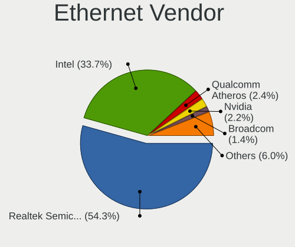

| Vendor                    | Desktops | Percent |
|---------------------------|----------|---------|
| Realtek Semiconductor     | 200      | 54.35%  |
| Intel                     | 124      | 33.7%   |
| Qualcomm Atheros          | 9        | 2.45%   |
| Nvidia                    | 8        | 2.17%   |
| Broadcom                  | 5        | 1.36%   |
| Broadcom Limited          | 4        | 1.09%   |
| Samsung Electronics       | 3        | 0.82%   |
| Marvell Technology Group  | 3        | 0.82%   |
| D-Link System             | 2        | 0.54%   |
| ASIX Electronics          | 2        | 0.54%   |
| Xiaomi                    | 1        | 0.27%   |
| Spreadtrum Communications | 1        | 0.27%   |
| OPPO Electronics          | 1        | 0.27%   |
| Microsoft                 | 1        | 0.27%   |
| Microchip Technology      | 1        | 0.27%   |
| Linksys                   | 1        | 0.27%   |
| ICS Advent                | 1        | 0.27%   |
| Aquantia                  | 1        | 0.27%   |

Ethernet Model
--------------

Ethernet models

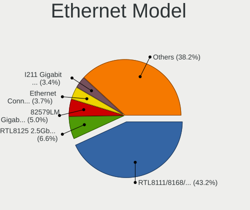

| Model                                                                  | Desktops | Percent |
|------------------------------------------------------------------------|----------|---------|
| Realtek RTL8111/8168/8211/8411 PCI Express Gigabit Ethernet Controller | 164      | 43.16%  |
| Realtek RTL8125 2.5GbE Controller                                      | 25       | 6.58%   |
| Intel 82579LM Gigabit Network Connection (Lewisville)                  | 19       | 5%      |
| Intel Ethernet Connection I217-LM                                      | 14       | 3.68%   |
| Intel I211 Gigabit Network Connection                                  | 13       | 3.42%   |
| Intel Ethernet Connection (2) I219-V                                   | 11       | 2.89%   |
| Intel Ethernet Controller I225-V                                       | 10       | 2.63%   |
| Intel Ethernet Connection I217-V                                       | 10       | 2.63%   |
| Nvidia MCP61 Ethernet                                                  | 8        | 2.11%   |
| Realtek RTL810xE PCI Express Fast Ethernet controller                  | 6        | 1.58%   |
| Intel 82579V Gigabit Network Connection                                | 6        | 1.58%   |
| Intel Ethernet Connection (7) I219-V                                   | 5        | 1.32%   |
| Realtek RTL8153 Gigabit Ethernet Adapter                               | 4        | 1.05%   |
| Intel Ethernet Connection (14) I219-V                                  | 4        | 1.05%   |
| Realtek RTL-8100/8101L/8139 PCI Fast Ethernet Adapter                  | 3        | 0.79%   |
| Qualcomm Atheros AR8161 Gigabit Ethernet                               | 3        | 0.79%   |
| Intel Ethernet Connection (2) I219-LM                                  | 3        | 0.79%   |
| Intel Ethernet Connection (2) I218-V                                   | 3        | 0.79%   |
| Samsung Galaxy series, misc. (tethering mode)                          | 2        | 0.53%   |
| Qualcomm Atheros Attansic L1 Gigabit Ethernet                          | 2        | 0.53%   |
| Marvell Group 88E8056 PCI-E Gigabit Ethernet Controller                | 2        | 0.53%   |
| Intel Ethernet Connection I218-V                                       | 2        | 0.53%   |
| Intel Ethernet Connection (7) I219-LM                                  | 2        | 0.53%   |
| Intel Ethernet Connection (2) I218-LM                                  | 2        | 0.53%   |
| Intel Ethernet Connection (17) I219-V                                  | 2        | 0.53%   |
| Intel 82599ES 10-Gigabit SFI/SFP+ Network Connection                   | 2        | 0.53%   |
| Intel 82578DM Gigabit Network Connection                               | 2        | 0.53%   |
| Intel 82578DC Gigabit Network Connection                               | 2        | 0.53%   |
| Intel 82567LM-3 Gigabit Network Connection                             | 2        | 0.53%   |
| Intel 82562V-2 10/100 Network Connection                               | 2        | 0.53%   |
| Intel 82541PI Gigabit Ethernet Controller                              | 2        | 0.53%   |
| D-Link System DGE-528T Gigabit Ethernet Adapter                        | 2        | 0.53%   |
| ASIX AX88179 Gigabit Ethernet                                          | 2        | 0.53%   |
| Xiaomi Mi/Redmi series (RNDIS + ADB)                                   | 1        | 0.26%   |
| Spreadtrum Android                                                     | 1        | 0.26%   |
| Samsung GT-I9070 (network tethering, USB debugging enabled)            | 1        | 0.26%   |
| Realtek USB 10/100/1G/2.5 LAN                                          | 1        | 0.26%   |
| Realtek RTL8852BE PCIe 802.11ax Wireless Network Controller            | 1        | 0.26%   |
| Realtek Killer E3000 2.5GbE Controller                                 | 1        | 0.26%   |
| Qualcomm Atheros QCA8171 Gigabit Ethernet                              | 1        | 0.26%   |

Net Controller Kind
-------------------

Ethernet, WiFi or modem

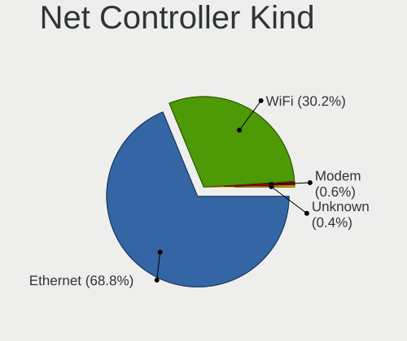

| Kind     | Desktops | Percent |
|----------|----------|---------|
| Ethernet | 333      | 68.8%   |
| WiFi     | 146      | 30.17%  |
| Modem    | 3        | 0.62%   |
| Unknown  | 2        | 0.41%   |

Used Controller
---------------

Currently used network controller

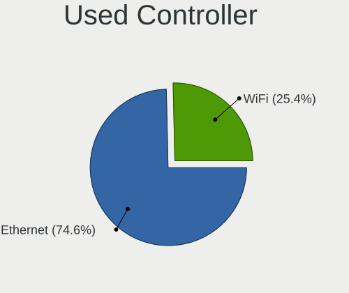

| Kind     | Desktops | Percent |
|----------|----------|---------|
| Ethernet | 265      | 74.65%  |
| WiFi     | 90       | 25.35%  |

NICs
----

Total network controllers on board

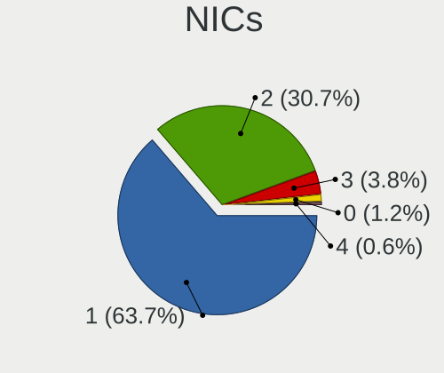

| Total | Desktops | Percent |
|-------|----------|---------|
| 1     | 216      | 63.72%  |
| 2     | 104      | 30.68%  |
| 3     | 13       | 3.83%   |
| 0     | 4        | 1.18%   |
| 4     | 2        | 0.59%   |

IPv6
----

IPv6 vs IPv4

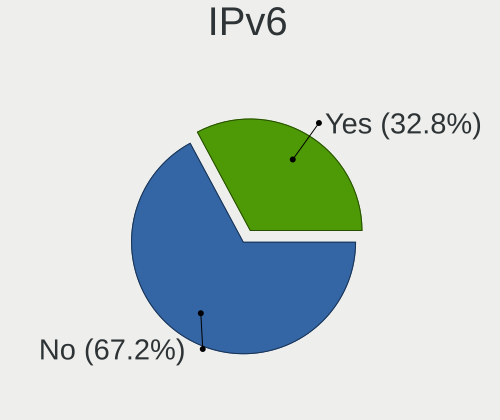

| Used | Desktops | Percent |
|------|----------|---------|
| No   | 229      | 67.16%  |
| Yes  | 112      | 32.84%  |

Bluetooth
---------

Bluetooth Vendor
----------------

Controller vendors

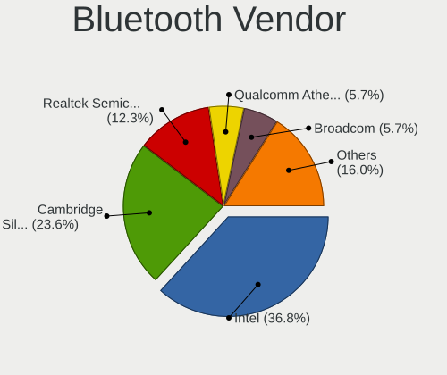

| Vendor                          | Desktops | Percent |
|---------------------------------|----------|---------|
| Intel                           | 39       | 36.79%  |
| Cambridge Silicon Radio         | 25       | 23.58%  |
| Realtek Semiconductor           | 13       | 12.26%  |
| Qualcomm Atheros Communications | 6        | 5.66%   |
| Broadcom                        | 6        | 5.66%   |
| IMC Networks                    | 4        | 3.77%   |
| MediaTek                        | 3        | 2.83%   |
| ASUSTek Computer                | 3        | 2.83%   |
| TP-Link                         | 2        | 1.89%   |
| Lite-On Technology              | 2        | 1.89%   |
| Fujitsu                         | 1        | 0.94%   |
| Foxconn / Hon Hai               | 1        | 0.94%   |
| Edimax Technology               | 1        | 0.94%   |

Bluetooth Model
---------------

Controller models

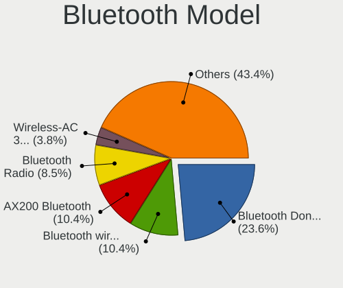

| Model                                               | Desktops | Percent |
|-----------------------------------------------------|----------|---------|
| Cambridge Silicon Radio Bluetooth Dongle (HCI mode) | 25       | 23.58%  |
| Intel Bluetooth wireless interface                  | 11       | 10.38%  |
| Intel AX200 Bluetooth                               | 11       | 10.38%  |
| Realtek Bluetooth Radio                             | 9        | 8.49%   |
| Intel Wireless-AC 3168 Bluetooth                    | 4        | 3.77%   |
| Intel AX210 Bluetooth                               | 4        | 3.77%   |
| Intel AX201 Bluetooth                               | 4        | 3.77%   |
| IMC Networks Bluetooth Radio                        | 4        | 3.77%   |
| Realtek  Bluetooth 4.2 Adapter                      | 3        | 2.83%   |
| MediaTek Wireless_Device                            | 3        | 2.83%   |
| Intel Bluetooth Device                              | 3        | 2.83%   |
| Broadcom BCM20702A0 Bluetooth 4.0                   | 3        | 2.83%   |
| TP-Link TP-T@- UB500 Adapter                        | 2        | 1.89%   |
| Qualcomm Atheros Bluetooth USB Host Controller      | 2        | 1.89%   |
| Qualcomm Atheros AR3011 Bluetooth                   | 2        | 1.89%   |
| Lite-On Bluetooth Device                            | 2        | 1.89%   |
| Intel Bluetooth 9460/9560 Jefferson Peak (JfP)      | 2        | 1.89%   |
| ASUS ASUS USB-BT500                                 | 2        | 1.89%   |
| Realtek RTL8821A Bluetooth                          | 1        | 0.94%   |
| Qualcomm Atheros  Bluetooth Device                  | 1        | 0.94%   |
| Qualcomm Atheros AR9462 Bluetooth                   | 1        | 0.94%   |
| Fujitsu Bluetooth Device                            | 1        | 0.94%   |
| Foxconn / Hon Hai Wireless_Device                   | 1        | 0.94%   |
| Edimax Bluetooth Device                             | 1        | 0.94%   |
| Broadcom HP Portable Bumble Bee                     | 1        | 0.94%   |
| Broadcom BCM2210 Bluetooth                          | 1        | 0.94%   |
| Broadcom BCM20702A0                                 | 1        | 0.94%   |
| ASUS Bluetooth Device                               | 1        | 0.94%   |

Sound
-----

Sound Vendor
------------

Sound card vendors

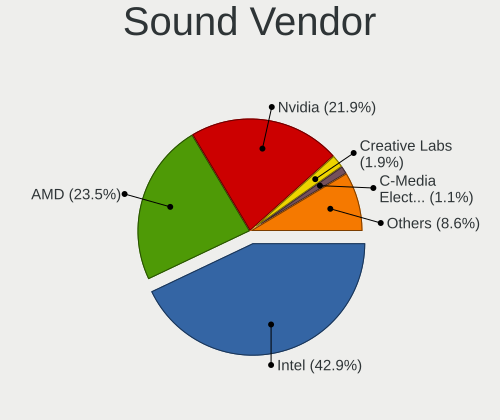

| Vendor                                       | Desktops | Percent |
|----------------------------------------------|----------|---------|
| Intel                                        | 225      | 42.94%  |
| AMD                                          | 123      | 23.47%  |
| Nvidia                                       | 115      | 21.95%  |
| Creative Labs                                | 10       | 1.91%   |
| C-Media Electronics                          | 6        | 1.15%   |
| Texas Instruments                            | 3        | 0.57%   |
| Tenx Technology                              | 3        | 0.57%   |
| Logitech                                     | 3        | 0.57%   |
| SAVITECH                                     | 2        | 0.38%   |
| Micro Star International                     | 2        | 0.38%   |
| Medeli Electronics                           | 2        | 0.38%   |
| Hewlett-Packard                              | 2        | 0.38%   |
| Focusrite-Novation                           | 2        | 0.38%   |
| DSEA A/S                                     | 2        | 0.38%   |
| Corsair                                      | 2        | 0.38%   |
| Zoran Co. Personal Media Division (Nogatech) | 1        | 0.19%   |
| XMOS                                         | 1        | 0.19%   |
| VIA Technologies                             | 1        | 0.19%   |
| STMicroelectronics                           | 1        | 0.19%   |
| Silicon Integrated Systems [SiS]             | 1        | 0.19%   |
| Samson Technologies                          | 1        | 0.19%   |
| Roland                                       | 1        | 0.19%   |
| Reloop                                       | 1        | 0.19%   |
| Razer USA                                    | 1        | 0.19%   |
| PreSonus Audio Electronics                   | 1        | 0.19%   |
| MAG Technology                               | 1        | 0.19%   |
| M-Audio                                      | 1        | 0.19%   |
| Lenovo                                       | 1        | 0.19%   |
| Kingston Technology                          | 1        | 0.19%   |
| JMTek                                        | 1        | 0.19%   |
| Jieli Technology                             | 1        | 0.19%   |
| GN Netcom                                    | 1        | 0.19%   |
| Generalplus Technology                       | 1        | 0.19%   |
| FiiO Electronics Technology                  | 1        | 0.19%   |
| Creative Technology                          | 1        | 0.19%   |
| BEHRINGER International                      | 1        | 0.19%   |
| ASUSTek Computer                             | 1        | 0.19%   |

Sound Model
-----------

Sound card models

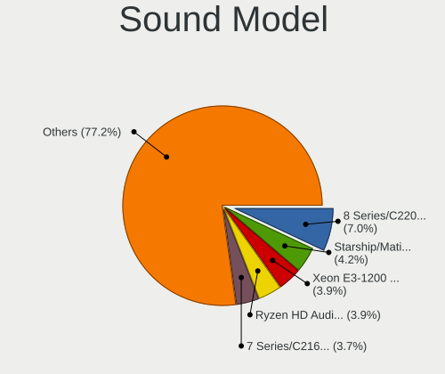

| Model                                                                                             | Desktops | Percent |
|---------------------------------------------------------------------------------------------------|----------|---------|
| Intel 8 Series/C220 Series Chipset High Definition Audio Controller                               | 43       | 7%      |
| AMD Starship/Matisse HD Audio Controller                                                          | 26       | 4.23%   |
| Intel Xeon E3-1200 v3/4th Gen Core Processor HD Audio Controller                                  | 24       | 3.91%   |
| AMD Ryzen HD Audio Controller                                                                     | 24       | 3.91%   |
| Intel 7 Series/C216 Chipset Family High Definition Audio Controller                               | 23       | 3.75%   |
| Intel 6 Series/C200 Series Chipset Family High Definition Audio Controller                        | 21       | 3.42%   |
| Nvidia GK208 HDMI/DP Audio Controller                                                             | 20       | 3.26%   |
| AMD SBx00 Azalia (Intel HDA)                                                                      | 19       | 3.09%   |
| AMD FCH Azalia Controller                                                                         | 16       | 2.61%   |
| Intel 200 Series PCH HD Audio                                                                     | 14       | 2.28%   |
| Intel Alder Lake-S HD Audio Controller                                                            | 12       | 1.95%   |
| Intel Cannon Lake PCH cAVS                                                                        | 11       | 1.79%   |
| Intel 100 Series/C230 Series Chipset Family HD Audio Controller                                   | 11       | 1.79%   |
| AMD Renoir/Cezanne HDMI/DP Audio Controller                                                       | 11       | 1.79%   |
| AMD Oland/Hainan/Cape Verde/Pitcairn HDMI Audio [Radeon HD 7000 Series]                           | 11       | 1.79%   |
| Nvidia GP107GL High Definition Audio Controller                                                   | 10       | 1.63%   |
| Intel NM10/ICH7 Family High Definition Audio Controller                                           | 10       | 1.63%   |
| AMD Family 17h (Models 00h-0fh) HD Audio Controller                                               | 10       | 1.63%   |
| Intel 82801JI (ICH10 Family) HD Audio Controller                                                  | 9        | 1.47%   |
| Intel 82801I (ICH9 Family) HD Audio Controller                                                    | 9        | 1.47%   |
| AMD Ellesmere HDMI Audio [Radeon RX 470/480 / 570/580/590]                                        | 9        | 1.47%   |
| Nvidia TU116 High Definition Audio Controller                                                     | 8        | 1.3%    |
| Nvidia MCP61 High Definition Audio                                                                | 8        | 1.3%    |
| AMD Raven/Raven2/Fenghuang HDMI/DP Audio Controller                                               | 8        | 1.3%    |
| Nvidia GP106 High Definition Audio Controller                                                     | 7        | 1.14%   |
| Nvidia GM107 High Definition Audio Controller [GeForce 940MX]                                     | 7        | 1.14%   |
| Nvidia GK107 HDMI Audio Controller                                                                | 6        | 0.98%   |
| Intel C610/X99 series chipset HD Audio Controller                                                 | 6        | 0.98%   |
| Intel C600/X79 series chipset High Definition Audio Controller                                    | 6        | 0.98%   |
| Intel 9 Series Chipset Family HD Audio Controller                                                 | 6        | 0.98%   |
| Intel 5 Series/3400 Series Chipset High Definition Audio                                          | 6        | 0.98%   |
| AMD Kabini HDMI/DP Audio                                                                          | 6        | 0.98%   |
| AMD Baffin HDMI/DP Audio [Radeon RX 550 640SP / RX 560/560X]                                      | 6        | 0.98%   |
| Intel Atom/Celeron/Pentium Processor x5-E8000/J3xxx/N3xxx Series High Definition Audio Controller | 5        | 0.81%   |
| AMD Navi 10 HDMI Audio                                                                            | 5        | 0.81%   |
| Nvidia GM206 High Definition Audio Controller                                                     | 4        | 0.65%   |
| Nvidia GM204 High Definition Audio Controller                                                     | 4        | 0.65%   |
| Nvidia GF108 High Definition Audio Controller                                                     | 4        | 0.65%   |
| Nvidia GA106 High Definition Audio Controller                                                     | 4        | 0.65%   |
| Intel Smart Sound Technology (SST) Audio Controller                                               | 4        | 0.65%   |

Memory
------

Memory Vendor
-------------

Memory module vendors

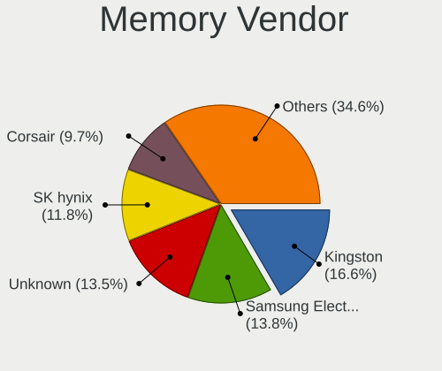

| Vendor              | Desktops | Percent |
|---------------------|----------|---------|
| Kingston            | 48       | 16.61%  |
| Samsung Electronics | 40       | 13.84%  |
| Unknown             | 39       | 13.49%  |
| SK hynix            | 34       | 11.76%  |
| Corsair             | 28       | 9.69%   |
| Crucial             | 27       | 9.34%   |
| G.Skill             | 15       | 5.19%   |
| Unknown             | 9        | 3.11%   |
| Micron Technology   | 8        | 2.77%   |
| Nanya Technology    | 7        | 2.42%   |
| Ramaxel Technology  | 5        | 1.73%   |
| Elpida              | 5        | 1.73%   |
| A-DATA Technology   | 5        | 1.73%   |
| Unknown (ABCD)      | 2        | 0.69%   |
| V-Color             | 1        | 0.35%   |
| Unknown (AB)        | 1        | 0.35%   |
| Unknown (0x0B15)    | 1        | 0.35%   |
| Transcend           | 1        | 0.35%   |
| Timetec             | 1        | 0.35%   |
| Smart               | 1        | 0.35%   |
| Silicon Power       | 1        | 0.35%   |
| Ramos Technology    | 1        | 0.35%   |
| Qumo                | 1        | 0.35%   |
| PNY                 | 1        | 0.35%   |
| Mushkin             | 1        | 0.35%   |
| Melco               | 1        | 0.35%   |
| KETECH              | 1        | 0.35%   |
| GLOWAY              | 1        | 0.35%   |
| GIGA-BYTE           | 1        | 0.35%   |
| GeIL                | 1        | 0.35%   |
| ASint Technology    | 1        | 0.35%   |

Memory Model
------------

Memory module models

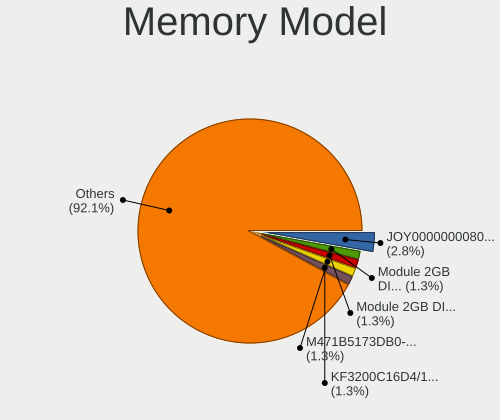

| Model                                                          | Desktops | Percent |
|----------------------------------------------------------------|----------|---------|
| Unknown                                                        | 9        | 2.85%   |
| Unknown RAM Module 2GB DIMM SDRAM                              | 4        | 1.27%   |
| Unknown RAM Module 2GB DIMM DDR2 800MT/s                       | 4        | 1.27%   |
| Samsung RAM M471B5173DB0-YK0 4GB SODIMM DDR3 1600MT/s          | 4        | 1.27%   |
| Kingston RAM KF3200C16D4/16GX 16GB DIMM DDR4 3733MT/s          | 4        | 1.27%   |
| Unknown RAM Module 4GB DIMM DDR3 1333MT/s                      | 3        | 0.95%   |
| Unknown RAM Module 4GB DIMM 1333MT/s                           | 3        | 0.95%   |
| SK hynix RAM HMT41GU6MFR8C-PB 8GB DIMM DDR3 1600MT/s           | 3        | 0.95%   |
| SK hynix RAM HMT41GU6BFR8A-PB 8GB DIMM DDR3 2000MT/s           | 3        | 0.95%   |
| Samsung RAM M378B5173DB0-CK0 4096MB DIMM DDR3 1600MT/s         | 3        | 0.95%   |
| Nanya RAM NT4GC64B8HG0NF-DI 4GB DIMM DDR3 1600MT/s             | 3        | 0.95%   |
| Unknown RAM Module 8GB DIMM DDR3 1333MT/s                      | 2        | 0.63%   |
| Unknown RAM Module 8GB DIMM 1600MT/s                           | 2        | 0.63%   |
| Unknown RAM Module 8GB DIMM 1333MT/s                           | 2        | 0.63%   |
| Unknown RAM Module 4GB DIMM 1600MT/s                           | 2        | 0.63%   |
| Unknown RAM Module 1GB DIMM 800MT/s                            | 2        | 0.63%   |
| Unknown (ABCD) RAM 123456789012345678 2GB DIMM LPDDR4 2133MT/s | 2        | 0.63%   |
| SK hynix RAM HMT451U6AFR8C-PB 4GB DIMM DDR3 1600MT/s           | 2        | 0.63%   |
| SK hynix RAM HMT351U6CFR8C-PB 4GB DIMM DDR3 1800MT/s           | 2        | 0.63%   |
| SK hynix RAM HMA81GU6AFR8N-UH 8GB DIMM DDR4 2400MT/s           | 2        | 0.63%   |
| Samsung RAM M378B5273CH0-CK0 4GB DIMM DDR3 2000MT/s            | 2        | 0.63%   |
| Samsung RAM M378B5173EB0-YK0 4GB DIMM DDR3 1600MT/s            | 2        | 0.63%   |
| Samsung RAM M378B5173EB0-CK0 4GB DIMM DDR3 1600MT/s            | 2        | 0.63%   |
| Samsung RAM M3 78T5663QZ3-CF7 2GB DIMM DDR2 800MT/s            | 2        | 0.63%   |
| Ramaxel RAM RMUA5120ME86H9F-2666 4GB DIMM DDR4 2667MT/s        | 2        | 0.63%   |
| Kingston RAM KHX2666C16/8G 8GiB DIMM DDR4 3466MT/s             | 2        | 0.63%   |
| Kingston RAM KHX1600C10D3/8G 8GB DIMM DDR3 2133MT/s            | 2        | 0.63%   |
| Kingston RAM KF3200C16D4/8GX 8GiB DIMM DDR4 3600MT/s           | 2        | 0.63%   |
| Kingston RAM 9905713-026.A00G 4GB DIMM DDR4 2667MT/s           | 2        | 0.63%   |
| Crucial RAM BLS8G4D26BFSEK.8FBD 8GB DIMM DDR4 2666MT/s         | 2        | 0.63%   |
| Crucial RAM BLS4G3D1609DS1S00. 4GB DIMM DDR3 1600MT/s          | 2        | 0.63%   |
| Corsair RAM CMZ8GX3M2A1600C9 4GB DIMM SDRAM 1800MT/s           | 2        | 0.63%   |
| Corsair RAM CML16GX3M2A1600C10 8GB DIMM DDR3 1600MT/s          | 2        | 0.63%   |
| Corsair RAM CMK16GX4M2B3200C16 8GB DIMM DDR4 3600MT/s          | 2        | 0.63%   |
| A-DATA RAM DDR4 3000 2OZ 8GB DIMM DDR4 3000MT/s                | 2        | 0.63%   |
| V-Color RAM TN4G8C11-H11 4GB DIMM DDR3 1600MT/s                | 1        | 0.32%   |
| Unknown RAM Module 8GB DIMM DDR4 2667MT/s                      | 1        | 0.32%   |
| Unknown RAM Module 4GB DIMM SDRAM                              | 1        | 0.32%   |
| Unknown RAM Module 4GB DIMM DDR2 800MT/s                       | 1        | 0.32%   |
| Unknown RAM Module 4GB DIMM 1066MT/s                           | 1        | 0.32%   |

Memory Kind
-----------

Memory module kinds

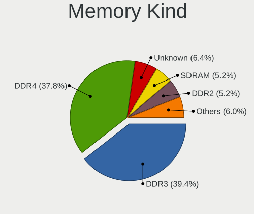

| Kind    | Desktops | Percent |
|---------|----------|---------|
| DDR3    | 99       | 39.44%  |
| DDR4    | 95       | 37.85%  |
| Unknown | 16       | 6.37%   |
| SDRAM   | 13       | 5.18%   |
| DDR2    | 13       | 5.18%   |
| DDR5    | 7        | 2.79%   |
| DRAM    | 3        | 1.2%    |
| LPDDR4  | 2        | 0.8%    |
| LPDDR5  | 1        | 0.4%    |
| LPDDR3  | 1        | 0.4%    |
| DDR     | 1        | 0.4%    |

Memory Form Factor
------------------

Physical design of the memory module

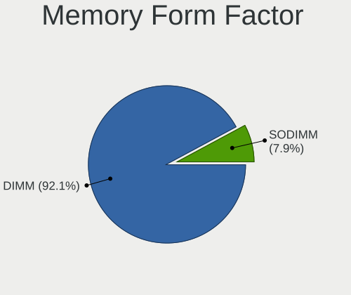

| Name   | Desktops | Percent |
|--------|----------|---------|
| DIMM   | 223      | 92.15%  |
| SODIMM | 19       | 7.85%   |

Memory Size
-----------

Memory module size

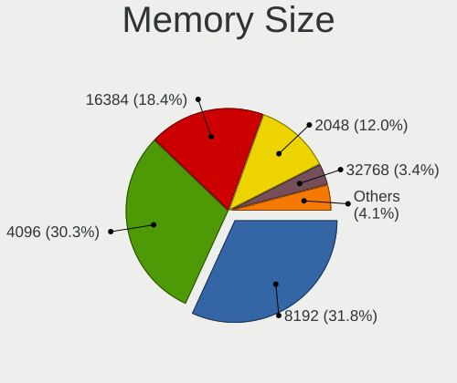

| Size  | Desktops | Percent |
|-------|----------|---------|
| 8192  | 85       | 31.84%  |
| 4096  | 81       | 30.34%  |
| 16384 | 49       | 18.35%  |
| 2048  | 32       | 11.99%  |
| 32768 | 9        | 3.37%   |
| 1024  | 9        | 3.37%   |
| 512   | 2        | 0.75%   |

Memory Speed
------------

Memory module speed

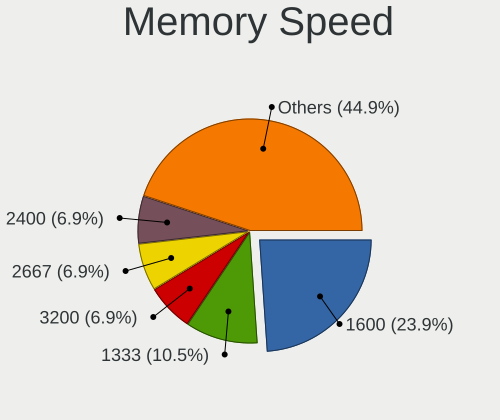

| Speed   | Desktops | Percent |
|---------|----------|---------|
| 1600    | 66       | 23.91%  |
| 1333    | 29       | 10.51%  |
| 3200    | 19       | 6.88%   |
| 2667    | 19       | 6.88%   |
| 2400    | 19       | 6.88%   |
| 3600    | 17       | 6.16%   |
| 2133    | 11       | 3.99%   |
| 800     | 9        | 3.26%   |
| Unknown | 7        | 2.54%   |
| 3733    | 6        | 2.17%   |
| 2666    | 6        | 2.17%   |
| 2000    | 5        | 1.81%   |
| 1866    | 5        | 1.81%   |
| 1800    | 5        | 1.81%   |
| 667     | 5        | 1.81%   |
| 3000    | 4        | 1.45%   |
| 1867    | 4        | 1.45%   |
| 3466    | 3        | 1.09%   |
| 1067    | 3        | 1.09%   |
| 1066    | 3        | 1.09%   |
| 6000    | 2        | 0.72%   |
| 5600    | 2        | 0.72%   |
| 4800    | 2        | 0.72%   |
| 4000    | 2        | 0.72%   |
| 3800    | 2        | 0.72%   |
| 3400    | 2        | 0.72%   |
| 1639    | 2        | 0.72%   |
| 55438   | 1        | 0.36%   |
| 52217   | 1        | 0.36%   |
| 6200    | 1        | 0.36%   |
| 5400    | 1        | 0.36%   |
| 5354    | 1        | 0.36%   |
| 3333    | 1        | 0.36%   |
| 3266    | 1        | 0.36%   |
| 3020    | 1        | 0.36%   |
| 2933    | 1        | 0.36%   |
| 2800    | 1        | 0.36%   |
| 2733    | 1        | 0.36%   |
| 2200    | 1        | 0.36%   |
| 2134    | 1        | 0.36%   |

Printers & scanners
-------------------

Printer Vendor
--------------

Printer device vendors

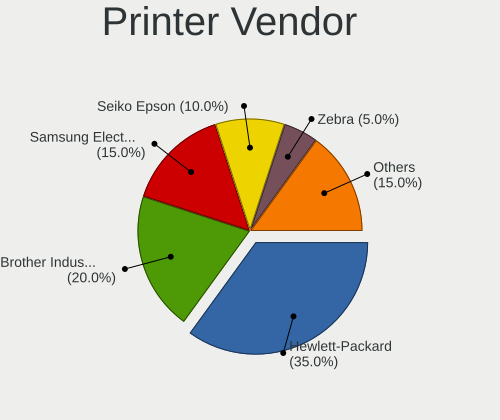

| Vendor              | Desktops | Percent |
|---------------------|----------|---------|
| Hewlett-Packard     | 7        | 35%     |
| Brother Industries  | 4        | 20%     |
| Samsung Electronics | 3        | 15%     |
| Seiko Epson         | 2        | 10%     |
| Zebra               | 1        | 5%      |
| Kyocera             | 1        | 5%      |
| Canon               | 1        | 5%      |
| Belkin Components   | 1        | 5%      |

Printer Model
-------------

Printer device models

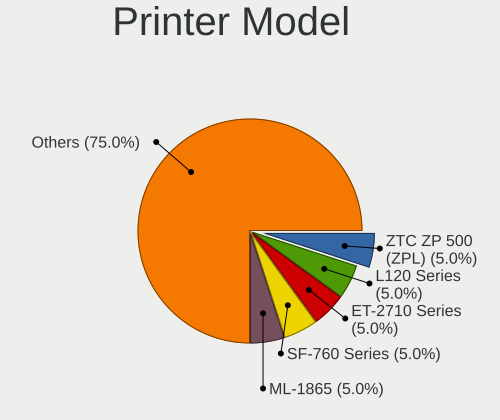

| Model                                  | Desktops | Percent |
|----------------------------------------|----------|---------|
| Zebra ZTC ZP 500 (ZPL)                 | 1        | 5%      |
| Seiko Epson L120 Series                | 1        | 5%      |
| Seiko Epson ET-2710 Series             | 1        | 5%      |
| Samsung SF-760 Series                  | 1        | 5%      |
| Samsung ML-1865                        | 1        | 5%      |
| Samsung ML-1630 Series                 | 1        | 5%      |
| Kyocera FS-1300D                       | 1        | 5%      |
| HP LaserJet P1102                      | 1        | 5%      |
| HP LaserJet 400 M401dne                | 1        | 5%      |
| HP DeskJet F4100 Printer series        | 1        | 5%      |
| HP DeskJet D1360                       | 1        | 5%      |
| HP DeskJet 840c                        | 1        | 5%      |
| HP DeskJet 810c/812c                   | 1        | 5%      |
| HP Deskjet 3070 B611 series            | 1        | 5%      |
| Canon TS3500 series                    | 1        | 5%      |
| Brother QL-560 Label Printer           | 1        | 5%      |
| Brother MFC-9130CW                     | 1        | 5%      |
| Brother HL-2030 Laser Printer          | 1        | 5%      |
| Brother DCP-7040                       | 1        | 5%      |
| Belkin Components IEEE-1284 Controller | 1        | 5%      |

Scanner Vendor
--------------

Scanner device vendors

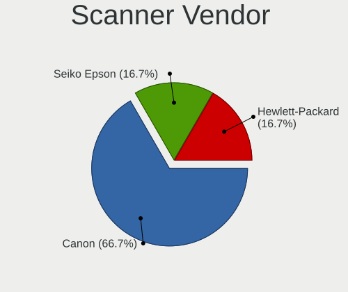

| Vendor          | Desktops | Percent |
|-----------------|----------|---------|
| Canon           | 4        | 66.67%  |
| Seiko Epson     | 1        | 16.67%  |
| Hewlett-Packard | 1        | 16.67%  |

Scanner Model
-------------

Scanner device models

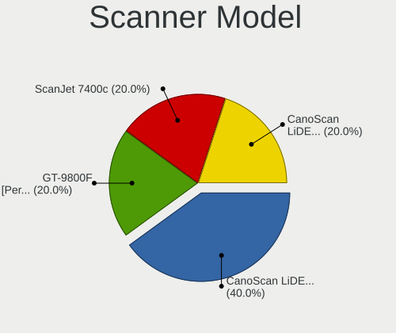

| Model                                  | Desktops | Percent |
|----------------------------------------|----------|---------|
| Canon CanoScan LiDE 100                | 2        | 33.33%  |
| Seiko Epson GT-9800F [Perfection 3200] | 1        | 16.67%  |
| HP ScanJet 7400c                       | 1        | 16.67%  |
| Canon CanoScan LIDE 25                 | 1        | 16.67%  |
| Canon CanoScan LiDE 110                | 1        | 16.67%  |

Camera
------

Camera Vendor
-------------

Camera device vendors

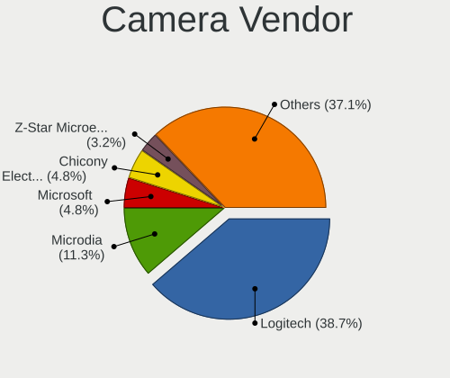

| Vendor                      | Desktops | Percent |
|-----------------------------|----------|---------|
| Logitech                    | 24       | 38.71%  |
| Microdia                    | 7        | 11.29%  |
| Microsoft                   | 3        | 4.84%   |
| Chicony Electronics         | 3        | 4.84%   |
| Z-Star Microelectronics     | 2        | 3.23%   |
| Samsung Electronics         | 2        | 3.23%   |
| Realtek Semiconductor       | 2        | 3.23%   |
| Quanta                      | 2        | 3.23%   |
| KYE Systems (Mouse Systems) | 2        | 3.23%   |
| Jieli Technology            | 2        | 3.23%   |
| Xiaomi                      | 1        | 1.61%   |
| Web Camera                  | 1        | 1.61%   |
| Silicon Motion              | 1        | 1.61%   |
| Ruision                     | 1        | 1.61%   |
| MacroSilicon                | 1        | 1.61%   |
| IMC Networks                | 1        | 1.61%   |
| Hewlett-Packard             | 1        | 1.61%   |
| Guillemot                   | 1        | 1.61%   |
| GenesysLogic Technology     | 1        | 1.61%   |
| Generalplus Technology      | 1        | 1.61%   |
| Creative Technology         | 1        | 1.61%   |
| Apple                       | 1        | 1.61%   |
| AME Optimedia Technology    | 1        | 1.61%   |

Camera Model
------------

Camera device models

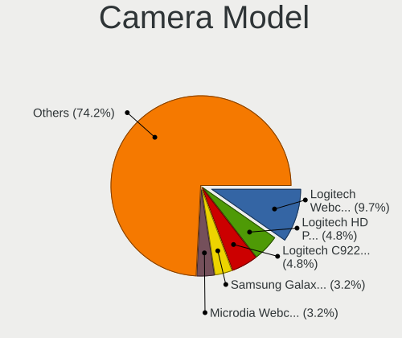

| Model                                          | Desktops | Percent |
|------------------------------------------------|----------|---------|
| Logitech Webcam C270                           | 6        | 9.68%   |
| Logitech HD Pro Webcam C920                    | 3        | 4.84%   |
| Logitech C922 Pro Stream Webcam                | 3        | 4.84%   |
| Samsung Galaxy series, misc. (MTP mode)        | 2        | 3.23%   |
| Microdia Webcam Vitade AF                      | 2        | 3.23%   |
| Microdia USB 2.0 Camera                        | 2        | 3.23%   |
| Microdia Camera                                | 2        | 3.23%   |
| Logitech HD Webcam C525                        | 2        | 3.23%   |
| Logitech BRIO Ultra HD Webcam                  | 2        | 3.23%   |
| Z-Star Vimicro USB2.0 Camera                   | 1        | 1.61%   |
| Z-Star A4 TECH USB2.0 PC Camera E              | 1        | 1.61%   |
| Xiaomi Mi/Redmi series (PTP)                   | 1        | 1.61%   |
| Web Camera Web Camera                          | 1        | 1.61%   |
| Silicon Motion 300k Pixel Camera               | 1        | 1.61%   |
| Ruision UVC Camera                             | 1        | 1.61%   |
| Realtek USB Camera                             | 1        | 1.61%   |
| Realtek FULL HD 1080P Webcam                   | 1        | 1.61%   |
| Quanta HP HD Camera                            | 1        | 1.61%   |
| Quanta HP Display Camera                       | 1        | 1.61%   |
| Microsoft LifeCam VX-800                       | 1        | 1.61%   |
| Microsoft LifeCam VX-2000                      | 1        | 1.61%   |
| Microsoft LifeCam Studio                       | 1        | 1.61%   |
| Microdia Sonix USB 2.0 Camera                  | 1        | 1.61%   |
| MacroSilicon MS210x Video Grabber [EasierCAP]  | 1        | 1.61%   |
| Logitech Webcam C310                           | 1        | 1.61%   |
| Logitech Webcam C300                           | 1        | 1.61%   |
| Logitech Webcam C250                           | 1        | 1.61%   |
| Logitech Webcam C170                           | 1        | 1.61%   |
| Logitech Webcam C110                           | 1        | 1.61%   |
| Logitech Webcam B500                           | 1        | 1.61%   |
| Logitech QuickCam Pro 5000                     | 1        | 1.61%   |
| Logitech C505e HD Webcam                       | 1        | 1.61%   |
| KYE Systems (Mouse Systems) iSlim 2020AF       | 1        | 1.61%   |
| KYE Systems (Mouse Systems) Genius FaceCam 320 | 1        | 1.61%   |
| Jieli USB PHY 2.0                              | 1        | 1.61%   |
| Jieli USB Composite Device                     | 1        | 1.61%   |
| IMC Networks USB2.0 UVC HD Webcam              | 1        | 1.61%   |
| HP Webcam HD 2300                              | 1        | 1.61%   |
| Guillemot Hercules Dualpix Exchange            | 1        | 1.61%   |
| GenesysLogic USB2.0 UVC PC Camera              | 1        | 1.61%   |

Security
--------

Fingerprint Vendor
------------------

Fingerprint sensor vendors

Zero info for selected period =(

Fingerprint Model
-----------------

Fingerprint sensor models

Zero info for selected period =(

Chipcard Vendor
---------------

Chipcard module vendors

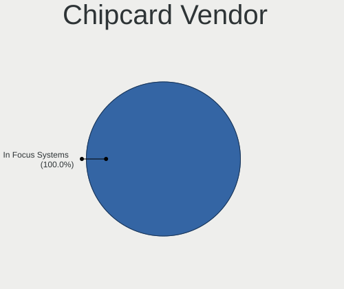

| Vendor                   | Desktops | Percent |
|--------------------------|----------|---------|
| Reiner SCT Kartensysteme | 1        | 50%     |
| In Focus Systems         | 1        | 50%     |

Chipcard Model
--------------

Chipcard module models

| Model                                  | Desktops | Percent |
|----------------------------------------|----------|---------|
| Reiner SCT Kartensysteme cyberJack one | 1        | 50%     |
| In Focus Systems EMV Smartcard Reader  | 1        | 50%     |

Unsupported
-----------

Unsupported Devices
-------------------

Total unsupported devices on board

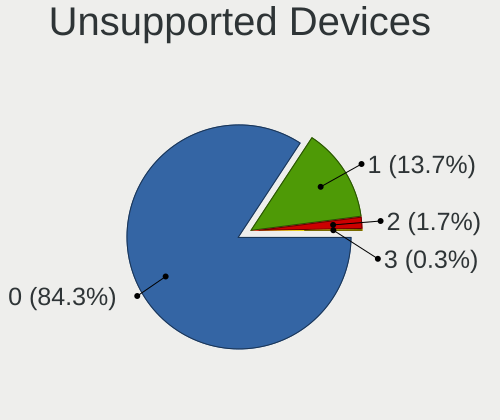

| Total | Desktops | Percent |
|-------|----------|---------|
| 0     | 289      | 84.26%  |
| 1     | 47       | 13.7%   |
| 2     | 6        | 1.75%   |
| 3     | 1        | 0.29%   |

Unsupported Device Types
------------------------

Types of unsupported devices

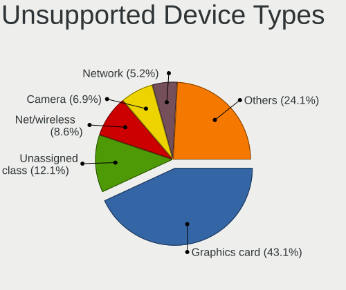

| Type                     | Desktops | Percent |
|--------------------------|----------|---------|
| Graphics card            | 25       | 43.1%   |
| Unassigned class         | 7        | 12.07%  |
| Net/wireless             | 5        | 8.62%   |
| Camera                   | 4        | 6.9%    |
| Network                  | 3        | 5.17%   |
| Net/ethernet             | 3        | 5.17%   |
| Sound                    | 2        | 3.45%   |
| Multimedia controller    | 2        | 3.45%   |
| Communication controller | 2        | 3.45%   |
| Chipcard                 | 2        | 3.45%   |
| Storage                  | 1        | 1.72%   |
| Dvb card                 | 1        | 1.72%   |
| Bluetooth                | 1        | 1.72%   |

