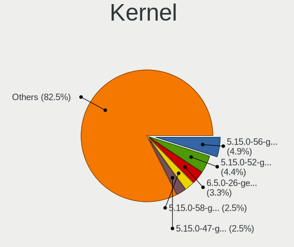
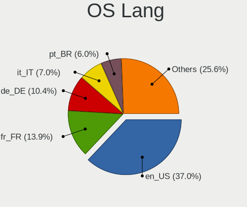
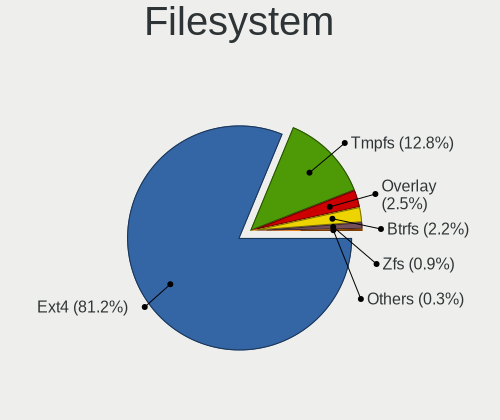
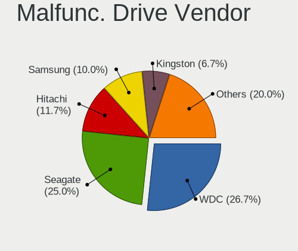
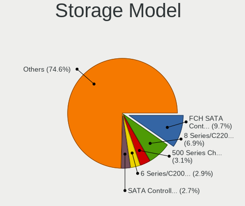
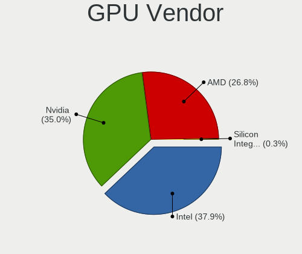
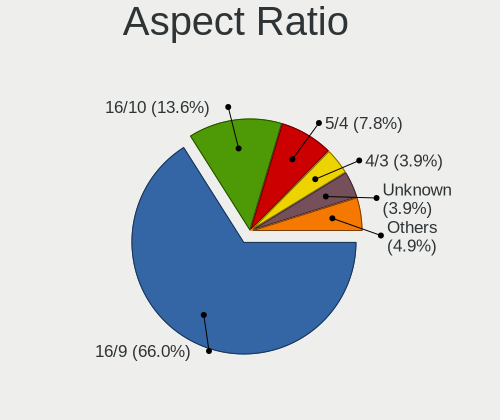
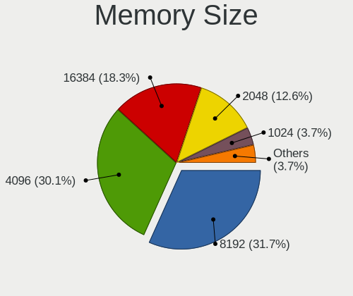
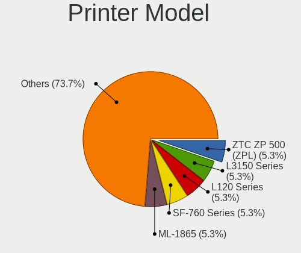

Xubuntu 22.04 - Tested Hardware & Statistics (Desktops)
-------------------------------------------------------

A project to collect tested hardware configurations for Xubuntu 22.04.

Anyone can contribute to this report by the [hw-probe](https://github.com/linuxhw/hw-probe) tool:

    sudo -E hw-probe -all -upload

Please contribute! Especially if your hardware is rare.

Contents
--------

* [ Test Cases ](#test-cases)

* [ System ](#system)
  - [ Kernel                   ](#kernel)
  - [ Kernel Family            ](#kernel-family)
  - [ Kernel Major Ver.        ](#kernel-major-ver)
  - [ Arch                     ](#arch)
  - [ DE                       ](#de)
  - [ Display Server           ](#display-server)
  - [ Display Manager          ](#display-manager)
  - [ OS Lang                  ](#os-lang)
  - [ Boot Mode                ](#boot-mode)
  - [ Filesystem               ](#filesystem)
  - [ Part. scheme             ](#part-scheme)
  - [ Dual Boot with Linux/BSD ](#dual-boot-with-linuxbsd)
  - [ Dual Boot (Win)          ](#dual-boot-win)

* [ Board ](#board)
  - [ Vendor                   ](#vendor)
  - [ Model                    ](#model)
  - [ Model Family             ](#model-family)
  - [ MFG Year                 ](#mfg-year)
  - [ Form Factor              ](#form-factor)
  - [ Secure Boot              ](#secure-boot)
  - [ Coreboot                 ](#coreboot)
  - [ RAM Size                 ](#ram-size)
  - [ RAM Used                 ](#ram-used)
  - [ Total Drives             ](#total-drives)
  - [ Has CD-ROM               ](#has-cd-rom)
  - [ Has Ethernet             ](#has-ethernet)
  - [ Has WiFi                 ](#has-wifi)
  - [ Has Bluetooth            ](#has-bluetooth)

* [ Location ](#location)
  - [ Country                  ](#country)
  - [ City                     ](#city)

* [ Drives ](#drives)
  - [ Drive Vendor             ](#drive-vendor)
  - [ Drive Model              ](#drive-model)
  - [ HDD Vendor               ](#hdd-vendor)
  - [ SSD Vendor               ](#ssd-vendor)
  - [ Drive Kind               ](#drive-kind)
  - [ Drive Connector          ](#drive-connector)
  - [ Drive Size               ](#drive-size)
  - [ Space Total              ](#space-total)
  - [ Space Used               ](#space-used)
  - [ Malfunc. Drives          ](#malfunc-drives)
  - [ Malfunc. Drive Vendor    ](#malfunc-drive-vendor)
  - [ Malfunc. HDD Vendor      ](#malfunc-hdd-vendor)
  - [ Malfunc. Drive Kind      ](#malfunc-drive-kind)
  - [ Failed Drives            ](#failed-drives)
  - [ Failed Drive Vendor      ](#failed-drive-vendor)
  - [ Drive Status             ](#drive-status)

* [ Storage controller ](#storage-controller)
  - [ Storage Vendor           ](#storage-vendor)
  - [ Storage Model            ](#storage-model)
  - [ Storage Kind             ](#storage-kind)

* [ Processor ](#processor)
  - [ CPU Vendor               ](#cpu-vendor)
  - [ CPU Model                ](#cpu-model)
  - [ CPU Model Family         ](#cpu-model-family)
  - [ CPU Cores                ](#cpu-cores)
  - [ CPU Sockets              ](#cpu-sockets)
  - [ CPU Threads              ](#cpu-threads)
  - [ CPU Op-Modes             ](#cpu-op-modes)
  - [ CPU Microcode            ](#cpu-microcode)
  - [ CPU Microarch            ](#cpu-microarch)

* [ Graphics ](#graphics)
  - [ GPU Vendor               ](#gpu-vendor)
  - [ GPU Model                ](#gpu-model)
  - [ GPU Combo                ](#gpu-combo)
  - [ GPU Driver               ](#gpu-driver)
  - [ GPU Memory               ](#gpu-memory)

* [ Monitor ](#monitor)
  - [ Monitor Vendor           ](#monitor-vendor)
  - [ Monitor Model            ](#monitor-model)
  - [ Monitor Resolution       ](#monitor-resolution)
  - [ Monitor Diagonal         ](#monitor-diagonal)
  - [ Monitor Width            ](#monitor-width)
  - [ Aspect Ratio             ](#aspect-ratio)
  - [ Monitor Area             ](#monitor-area)
  - [ Pixel Density            ](#pixel-density)
  - [ Multiple Monitors        ](#multiple-monitors)

* [ Network ](#network)
  - [ Net Controller Vendor    ](#net-controller-vendor)
  - [ Net Controller Model     ](#net-controller-model)
  - [ Wireless Vendor          ](#wireless-vendor)
  - [ Wireless Model           ](#wireless-model)
  - [ Ethernet Vendor          ](#ethernet-vendor)
  - [ Ethernet Model           ](#ethernet-model)
  - [ Net Controller Kind      ](#net-controller-kind)
  - [ Used Controller          ](#used-controller)
  - [ NICs                     ](#nics)
  - [ IPv6                     ](#ipv6)

* [ Bluetooth ](#bluetooth)
  - [ Bluetooth Vendor         ](#bluetooth-vendor)
  - [ Bluetooth Model          ](#bluetooth-model)

* [ Sound ](#sound)
  - [ Sound Vendor             ](#sound-vendor)
  - [ Sound Model              ](#sound-model)

* [ Memory ](#memory)
  - [ Memory Vendor            ](#memory-vendor)
  - [ Memory Model             ](#memory-model)
  - [ Memory Kind              ](#memory-kind)
  - [ Memory Form Factor       ](#memory-form-factor)
  - [ Memory Size              ](#memory-size)
  - [ Memory Speed             ](#memory-speed)

* [ Printers & scanners ](#printers--scanners)
  - [ Printer Vendor           ](#printer-vendor)
  - [ Printer Model            ](#printer-model)
  - [ Scanner Vendor           ](#scanner-vendor)
  - [ Scanner Model            ](#scanner-model)

* [ Camera ](#camera)
  - [ Camera Vendor            ](#camera-vendor)
  - [ Camera Model             ](#camera-model)

* [ Security ](#security)
  - [ Fingerprint Vendor       ](#fingerprint-vendor)
  - [ Fingerprint Model        ](#fingerprint-model)
  - [ Chipcard Vendor          ](#chipcard-vendor)
  - [ Chipcard Model           ](#chipcard-model)

* [ Unsupported ](#unsupported)
  - [ Unsupported Devices      ](#unsupported-devices)
  - [ Unsupported Device Types ](#unsupported-device-types)

Test Cases
----------

Total: 62

| Vendor    | Model                       | Probe                                                      | Date         |
|-----------|-----------------------------|------------------------------------------------------------|--------------|
| MSI       | H170M PRO-VDH               | [f7254adff2](https://linux-hardware.org/?probe=f7254adff2) | Sep 25, 2022 |
| ASUSTek   | PRIME A320M-K               | [5588f73920](https://linux-hardware.org/?probe=5588f73920) | Sep 24, 2022 |
| ASUSTek   | PRIME A320M-K               | [a83e57d8c1](https://linux-hardware.org/?probe=a83e57d8c1) | Sep 23, 2022 |
| ASUSTek   | A68HM-K                     | [966ae734c2](https://linux-hardware.org/?probe=966ae734c2) | Sep 20, 2022 |
| ASRock    | 960GC-GS FX                 | [3e40742ff0](https://linux-hardware.org/?probe=3e40742ff0) | Sep 18, 2022 |
| ASUSTek   | ET1612I                     | [0ddd9554cc](https://linux-hardware.org/?probe=0ddd9554cc) | Sep 16, 2022 |
| ASUSTek   | PRIME H310M-D R2.0          | [588c189149](https://linux-hardware.org/?probe=588c189149) | Sep 16, 2022 |
| ASUSTek   | PRIME H310M-D R2.0          | [4b94d21772](https://linux-hardware.org/?probe=4b94d21772) | Sep 16, 2022 |
| ASUSTek   | Maximus VII HERO            | [6d40add21a](https://linux-hardware.org/?probe=6d40add21a) | Sep 15, 2022 |
| Dell      | 0DR845                      | [158b3832bc](https://linux-hardware.org/?probe=158b3832bc) | Sep 13, 2022 |
| ASUSTek   | K30BD                       | [d6daf0e1f8](https://linux-hardware.org/?probe=d6daf0e1f8) | Sep 13, 2022 |
| ASUSTek   | H61M-C                      | [bb07dfab63](https://linux-hardware.org/?probe=bb07dfab63) | Sep 13, 2022 |
| ASRock    | N68-S3 UCC                  | [e59aa2e1d5](https://linux-hardware.org/?probe=e59aa2e1d5) | Sep 13, 2022 |
| ASRock    | N68-S3 UCC                  | [930da2e105](https://linux-hardware.org/?probe=930da2e105) | Sep 13, 2022 |
| Dell      | 0DR845                      | [f65bf44380](https://linux-hardware.org/?probe=f65bf44380) | Sep 13, 2022 |
| ASUSTek   | PRIME A320M-K               | [7b7a1cfeb9](https://linux-hardware.org/?probe=7b7a1cfeb9) | Sep 11, 2022 |
| Dell      | 03NVJ6 A01                  | [3f51b6da48](https://linux-hardware.org/?probe=3f51b6da48) | Sep 10, 2022 |
| ASUSTek   | PRIME A320M-C R2.0          | [7649a53341](https://linux-hardware.org/?probe=7649a53341) | Sep 06, 2022 |
| ASUSTek   | PRIME B560-PLUS             | [989e0d5d57](https://linux-hardware.org/?probe=989e0d5d57) | Sep 06, 2022 |
| ASUSTek   | PRIME B560-PLUS             | [f51b1f139e](https://linux-hardware.org/?probe=f51b1f139e) | Sep 06, 2022 |
| ASUSTek   | PRIME H270M-PLUS            | [668995f3ff](https://linux-hardware.org/?probe=668995f3ff) | Sep 04, 2022 |
| ASUSTek   | K30BD                       | [6042bda5d7](https://linux-hardware.org/?probe=6042bda5d7) | Sep 03, 2022 |
| HP        | 8433 11                     | [00868f25c6](https://linux-hardware.org/?probe=00868f25c6) | Aug 31, 2022 |
| ASUSTek   | Z97-C                       | [9bdae9239f](https://linux-hardware.org/?probe=9bdae9239f) | Aug 29, 2022 |
| Gigabyte  | GA-MA790FXT-UD5P            | [e692fe97cb](https://linux-hardware.org/?probe=e692fe97cb) | Aug 28, 2022 |
| ASUSTek   | P8H67-M LE                  | [7bf3626764](https://linux-hardware.org/?probe=7bf3626764) | Aug 25, 2022 |
| ASUSTek   | TUF B450-PLUS GAMING        | [c37bc2a345](https://linux-hardware.org/?probe=c37bc2a345) | Aug 24, 2022 |
| Gigabyte  | AB350-Gaming-CF             | [5dabf74b7f](https://linux-hardware.org/?probe=5dabf74b7f) | Aug 21, 2022 |
| Gigabyte  | GA-78LMT-USB3 SEx           | [ed1f055157](https://linux-hardware.org/?probe=ed1f055157) | Aug 19, 2022 |
| Gigabyte  | GA-78LMT-USB3 SEx           | [764eaea2ba](https://linux-hardware.org/?probe=764eaea2ba) | Aug 19, 2022 |
| eMachines | ET1350                      | [96e9f7aba7](https://linux-hardware.org/?probe=96e9f7aba7) | Aug 18, 2022 |
| Foxconn   | 2ADA                        | [015ccc4b06](https://linux-hardware.org/?probe=015ccc4b06) | Aug 18, 2022 |
| HP        | 8591                        | [4235eb97c1](https://linux-hardware.org/?probe=4235eb97c1) | Aug 18, 2022 |
| Dell      | 0YXT71 A00                  | [def7e10c65](https://linux-hardware.org/?probe=def7e10c65) | Aug 17, 2022 |
| ASUSTek   | K30AD_M31AD_M51AD_M32AD     | [b98fcab3a6](https://linux-hardware.org/?probe=b98fcab3a6) | Aug 15, 2022 |
| ASUSTek   | ROG CROSSHAIR VIII DARK ... | [fd06db829d](https://linux-hardware.org/?probe=fd06db829d) | Aug 14, 2022 |
| MSI       | H310M PRO-M2 PLUS           | [0fadd2421f](https://linux-hardware.org/?probe=0fadd2421f) | Aug 08, 2022 |
| ASUSTek   | TUF Gaming B550M-E WIFI     | [01bcafef3c](https://linux-hardware.org/?probe=01bcafef3c) | Jul 30, 2022 |
| ASUSTek   | PRIME A320M-K               | [9a97caa028](https://linux-hardware.org/?probe=9a97caa028) | Jul 28, 2022 |
| ASUSTek   | PRIME A320M-K               | [d00325cd68](https://linux-hardware.org/?probe=d00325cd68) | Jul 28, 2022 |
| Lenovo    | SHARKBAY SDK0E50510 WIN     | [da54317b9a](https://linux-hardware.org/?probe=da54317b9a) | Jul 27, 2022 |
| ASUSTek   | P8H67-M LE                  | [a27a0707b8](https://linux-hardware.org/?probe=a27a0707b8) | Jul 25, 2022 |
| PCWare    | IPX1800E2                   | [4426727633](https://linux-hardware.org/?probe=4426727633) | Jul 24, 2022 |
| MSI       | PRO B660M-A DDR4            | [ba0058e96e](https://linux-hardware.org/?probe=ba0058e96e) | Jul 20, 2022 |
| ASUSTek   | PRIME B450M-A               | [d5a64d7baa](https://linux-hardware.org/?probe=d5a64d7baa) | Jul 16, 2022 |
| MSI       | A320M PRO-E                 | [d16a812a12](https://linux-hardware.org/?probe=d16a812a12) | Jul 10, 2022 |
| MSI       | PRO B660M-A DDR4            | [7b470f27d3](https://linux-hardware.org/?probe=7b470f27d3) | Jul 03, 2022 |
| Dell      | 0GXM1W A00                  | [d48eb55102](https://linux-hardware.org/?probe=d48eb55102) | Jul 01, 2022 |
| MSI       | B450M-A PRO MAX             | [db4763808b](https://linux-hardware.org/?probe=db4763808b) | Jun 22, 2022 |
| MSI       | G31TM-P21                   | [824dc8a1c9](https://linux-hardware.org/?probe=824dc8a1c9) | Jun 11, 2022 |
| ASUSTek   | ROG STRIX B450-F GAMING ... | [33dbe3e5db](https://linux-hardware.org/?probe=33dbe3e5db) | Jun 08, 2022 |
| ASUSTek   | PRIME X470-PRO              | [496399846f](https://linux-hardware.org/?probe=496399846f) | May 26, 2022 |
| Lenovo    | MAHOBAY NOK                 | [aa8d9cb3b9](https://linux-hardware.org/?probe=aa8d9cb3b9) | May 25, 2022 |
| ASUSTek   | ROG CROSSHAIR VIII DARK ... | [a22a5ebbff](https://linux-hardware.org/?probe=a22a5ebbff) | May 25, 2022 |
| ASUSTek   | X99-A II                    | [288a6b3b20](https://linux-hardware.org/?probe=288a6b3b20) | May 23, 2022 |
| MSI       | MPG B550 GAMING EDGE WIF... | [3e34ce179d](https://linux-hardware.org/?probe=3e34ce179d) | May 22, 2022 |
| Fujitsu   | D2917-A1 S26361-D2917-A1    | [6f58937bed](https://linux-hardware.org/?probe=6f58937bed) | May 13, 2022 |
| ASUSTek   | TUF B450M-PRO GAMING        | [bd94a8145a](https://linux-hardware.org/?probe=bd94a8145a) | May 08, 2022 |
| ASRock    | X570 Phantom Gaming 4       | [e7ad5ed098](https://linux-hardware.org/?probe=e7ad5ed098) | May 06, 2022 |
| Acer      | Veriton M490G               | [f55983d536](https://linux-hardware.org/?probe=f55983d536) | May 04, 2022 |
| ASRock    | P55 Pro                     | [e626676348](https://linux-hardware.org/?probe=e626676348) | May 02, 2022 |
| HP        | 09F8h                       | [8605181df9](https://linux-hardware.org/?probe=8605181df9) | Apr 26, 2022 |

System
------

Kernel
------

Version of the Linux kernel

| Version                   | Desktops | Percent |
|---------------------------|----------|---------|
| 5.15.0-46-generic         | 9        | 17.31%  |
| 5.15.0-47-generic         | 8        | 15.38%  |
| 5.15.0-27-generic         | 6        | 11.54%  |
| 5.15.0-41-generic         | 5        | 9.62%   |
| 5.15.0-43-generic         | 4        | 7.69%   |
| 5.15.0-40-generic         | 3        | 5.77%   |
| 5.15.0-48-generic         | 2        | 3.85%   |
| 5.15.0-33-generic         | 2        | 3.85%   |
| 5.15.0-30-generic         | 2        | 3.85%   |
| 5.4.0-122-generic         | 1        | 1.92%   |
| 5.19.1                    | 1        | 1.92%   |
| 5.19.0-8.2-liquorix-amd64 | 1        | 1.92%   |
| 5.18.0                    | 1        | 1.92%   |
| 5.17.0-8-generic          | 1        | 1.92%   |
| 5.17.0-1003-oem           | 1        | 1.92%   |
| 5.15.0-46-lowlatency      | 1        | 1.92%   |
| 5.15.0-39-lowlatency      | 1        | 1.92%   |
| 5.15.0-37-generic         | 1        | 1.92%   |
| 5.15.0-25-generic         | 1        | 1.92%   |
| 5.15.0-18-generic         | 1        | 1.92%   |

Kernel Family
-------------

Linux kernel without a distro release

| Version | Desktops | Percent |
|---------|----------|---------|
| 5.15.0  | 44       | 88%     |
| 5.17.0  | 2        | 4%      |
| 5.4.0   | 1        | 2%      |
| 5.19.1  | 1        | 2%      |
| 5.19.0  | 1        | 2%      |
| 5.18.0  | 1        | 2%      |

Kernel Major Ver.
-----------------

Linux kernel major version

| Version | Desktops | Percent |
|---------|----------|---------|
| 5.15    | 44       | 88%     |
| 5.19    | 2        | 4%      |
| 5.17    | 2        | 4%      |
| 5.4     | 1        | 2%      |
| 5.18    | 1        | 2%      |

Arch
----

OS architecture (x86_64, i586, etc.)

| Name   | Desktops | Percent |
|--------|----------|---------|
| x86_64 | 49       | 100%    |

DE
--

Desktop Environment

| Name  | Desktops | Percent |
|-------|----------|---------|
| XFCE  | 47       | 95.92%  |
| i3    | 1        | 2.04%   |
| GNOME | 1        | 2.04%   |

Display Server
--------------

X11 or Wayland

| Name | Desktops | Percent |
|------|----------|---------|
| X11  | 49       | 98%     |
| Tty  | 1        | 2%      |

Display Manager
---------------

SDDM, LightDM, etc.

| Name    | Desktops | Percent |
|---------|----------|---------|
| LightDM | 43       | 87.76%  |
| GDM3    | 4        | 8.16%   |
| Unknown | 2        | 4.08%   |

OS Lang
-------

Language

| Lang  | Desktops | Percent |
|-------|----------|---------|
| en_US | 14       | 28.57%  |
| fr_FR | 12       | 24.49%  |
| it_IT | 5        | 10.2%   |
| en_CA | 4        | 8.16%   |
| de_DE | 4        | 8.16%   |
| pt_BR | 3        | 6.12%   |
| sv_SE | 1        | 2.04%   |
| ru_RU | 1        | 2.04%   |
| hu_HU | 1        | 2.04%   |
| es_CO | 1        | 2.04%   |
| es_AR | 1        | 2.04%   |
| en_GB | 1        | 2.04%   |
| en_AU | 1        | 2.04%   |

Boot Mode
---------

EFI or BIOS

| Mode | Desktops | Percent |
|------|----------|---------|
| BIOS | 31       | 63.27%  |
| EFI  | 18       | 36.73%  |

Filesystem
----------

Type of filesystem

| Type    | Desktops | Percent |
|---------|----------|---------|
| Ext4    | 45       | 91.84%  |
| Zfs     | 1        | 2.04%   |
| Overlay | 1        | 2.04%   |
| Ext3    | 1        | 2.04%   |
| Btrfs   | 1        | 2.04%   |

Part. scheme
------------

Scheme of partitioning

| Type    | Desktops | Percent |
|---------|----------|---------|
| GPT     | 22       | 44.9%   |
| Unknown | 22       | 44.9%   |
| MBR     | 5        | 10.2%   |

Dual Boot with Linux/BSD
------------------------

Hosting more than one Linux/BSD

| Dual boot | Desktops | Percent |
|-----------|----------|---------|
| No        | 36       | 73.47%  |
| Yes       | 13       | 26.53%  |

Dual Boot (Win)
---------------

Hosting Linux and Windows

| Dual boot | Desktops | Percent |
|-----------|----------|---------|
| No        | 27       | 55.1%   |
| Yes       | 22       | 44.9%   |

Board
-----

Vendor
------

Motherboard manufacturer

| Name                | Desktops | Percent |
|---------------------|----------|---------|
| ASUSTek Computer    | 21       | 42.86%  |
| MSI                 | 8        | 16.33%  |
| Dell                | 4        | 8.16%   |
| Hewlett-Packard     | 3        | 6.12%   |
| Gigabyte Technology | 3        | 6.12%   |
| ASRock              | 3        | 6.12%   |
| Lenovo              | 2        | 4.08%   |
| PCWare              | 1        | 2.04%   |
| Fujitsu             | 1        | 2.04%   |
| Foxconn             | 1        | 2.04%   |
| eMachines           | 1        | 2.04%   |
| Acer                | 1        | 2.04%   |

Model
-----

Motherboard model

| Name                               | Desktops | Percent |
|------------------------------------|----------|---------|
| ASUS All Series                    | 3        | 6.12%   |
| MSI MS-7D43                        | 2        | 4.08%   |
| Dell OptiPlex 7010                 | 2        | 4.08%   |
| PCWare IPX1800E2                   | 1        | 2.04%   |
| MSI MS-7C91                        | 1        | 2.04%   |
| MSI MS-7C52                        | 1        | 2.04%   |
| MSI MS-7C08                        | 1        | 2.04%   |
| MSI MS-7982                        | 1        | 2.04%   |
| MSI MS-7529                        | 1        | 2.04%   |
| MSI Hyrican PC A320M PRO-E         | 1        | 2.04%   |
| Lenovo ThinkCentre M83 10AM0010US  | 1        | 2.04%   |
| Lenovo ThinkCentre M72e 32675L2    | 1        | 2.04%   |
| HP Z1 Entry Tower G5               | 1        | 2.04%   |
| HP Pavilion Desktop 590-p0xxx      | 1        | 2.04%   |
| HP Compaq dc7600 Small Form Factor | 1        | 2.04%   |
| Gigabyte GA-MA790FXT-UD5P          | 1        | 2.04%   |
| Gigabyte GA-78LMT-USB3 6.0         | 1        | 2.04%   |
| Gigabyte AB350-Gaming              | 1        | 2.04%   |
| Fujitsu CELSIUS W380               | 1        | 2.04%   |
| Foxconn p6-2466ef                  | 1        | 2.04%   |
| eMachines ET1352                   | 1        | 2.04%   |
| Dell OptiPlex 780                  | 1        | 2.04%   |
| Dell OptiPlex 755                  | 1        | 2.04%   |
| ASUS TUF Gaming B550M-E WIFI       | 1        | 2.04%   |
| ASUS TUF B450M-PRO GAMING          | 1        | 2.04%   |
| ASUS ROG STRIX B450-F GAMING II    | 1        | 2.04%   |
| ASUS ROG CROSSHAIR VIII DARK HERO  | 1        | 2.04%   |
| ASUS PRIME X470-PRO                | 1        | 2.04%   |
| ASUS PRIME H310M-D R2.0            | 1        | 2.04%   |
| ASUS PRIME H270M-PLUS              | 1        | 2.04%   |
| ASUS PRIME B560-PLUS               | 1        | 2.04%   |
| ASUS PRIME B450M-A                 | 1        | 2.04%   |
| ASUS PRIME A320M-K                 | 1        | 2.04%   |
| ASUS PRIME A320M-C R2.0            | 1        | 2.04%   |
| ASUS P8H67-M LE                    | 1        | 2.04%   |
| ASUS K30BD                         | 1        | 2.04%   |
| ASUS K30AD_M31AD_M51AD             | 1        | 2.04%   |
| ASUS H61M-C                        | 1        | 2.04%   |
| ASUS ET1612I                       | 1        | 2.04%   |
| ASUS A68HM-K                       | 1        | 2.04%   |

Model Family
------------

Motherboard model prefix

| Name                      | Desktops | Percent |
|---------------------------|----------|---------|
| ASUS PRIME                | 7        | 14.29%  |
| Dell OptiPlex             | 4        | 8.16%   |
| ASUS All                  | 3        | 6.12%   |
| MSI MS-7D43               | 2        | 4.08%   |
| Lenovo ThinkCentre        | 2        | 4.08%   |
| ASUS TUF                  | 2        | 4.08%   |
| ASUS ROG                  | 2        | 4.08%   |
| PCWare IPX1800E2          | 1        | 2.04%   |
| MSI MS-7C91               | 1        | 2.04%   |
| MSI MS-7C52               | 1        | 2.04%   |
| MSI MS-7C08               | 1        | 2.04%   |
| MSI MS-7982               | 1        | 2.04%   |
| MSI MS-7529               | 1        | 2.04%   |
| MSI Hyrican               | 1        | 2.04%   |
| HP Z1                     | 1        | 2.04%   |
| HP Pavilion               | 1        | 2.04%   |
| HP Compaq                 | 1        | 2.04%   |
| Gigabyte GA-MA790FXT-UD5P | 1        | 2.04%   |
| Gigabyte GA-78LMT-USB3    | 1        | 2.04%   |
| Gigabyte AB350-Gaming     | 1        | 2.04%   |
| Fujitsu CELSIUS           | 1        | 2.04%   |
| Foxconn p6-2466ef         | 1        | 2.04%   |
| eMachines ET1352          | 1        | 2.04%   |
| ASUS P8H67-M              | 1        | 2.04%   |
| ASUS K30BD                | 1        | 2.04%   |
| ASUS K30AD                | 1        | 2.04%   |
| ASUS H61M-C               | 1        | 2.04%   |
| ASUS ET1612I              | 1        | 2.04%   |
| ASUS A68HM-K              | 1        | 2.04%   |
| ASUS A0000001             | 1        | 2.04%   |
| ASRock X570               | 1        | 2.04%   |
| ASRock P55                | 1        | 2.04%   |
| ASRock N68-S3             | 1        | 2.04%   |
| Acer Veriton              | 1        | 2.04%   |

MFG Year
--------

Motherboard manufacture year

| Year | Desktops | Percent |
|------|----------|---------|
| 2018 | 6        | 12.24%  |
| 2014 | 6        | 12.24%  |
| 2021 | 5        | 10.2%   |
| 2019 | 5        | 10.2%   |
| 2017 | 4        | 8.16%   |
| 2013 | 4        | 8.16%   |
| 2010 | 4        | 8.16%   |
| 2009 | 4        | 8.16%   |
| 2020 | 2        | 4.08%   |
| 2016 | 2        | 4.08%   |
| 2015 | 2        | 4.08%   |
| 2012 | 2        | 4.08%   |
| 2011 | 1        | 2.04%   |
| 2007 | 1        | 2.04%   |
| 2005 | 1        | 2.04%   |

Form Factor
-----------

Physical design of the computer

| Name    | Desktops | Percent |
|---------|----------|---------|
| Desktop | 49       | 100%    |

Secure Boot
-----------

Enabled or disabled

| State    | Desktops | Percent |
|----------|----------|---------|
| Disabled | 47       | 95.92%  |
| Enabled  | 2        | 4.08%   |

Coreboot
--------

Have coreboot on board

| Used | Desktops | Percent |
|------|----------|---------|
| No   | 49       | 100%    |

RAM Size
--------

Total RAM memory

| Size in GB  | Desktops | Percent |
|-------------|----------|---------|
| 16.01-24.0  | 13       | 26.53%  |
| 4.01-8.0    | 11       | 22.45%  |
| 3.01-4.0    | 9        | 18.37%  |
| 8.01-16.0   | 6        | 12.24%  |
| 32.01-64.0  | 5        | 10.2%   |
| 64.01-256.0 | 2        | 4.08%   |
| 1.01-2.0    | 2        | 4.08%   |
| 24.01-32.0  | 1        | 2.04%   |

RAM Used
--------

Used RAM memory

| Used GB   | Desktops | Percent |
|-----------|----------|---------|
| 1.01-2.0  | 25       | 49.02%  |
| 3.01-4.0  | 10       | 19.61%  |
| 2.01-3.0  | 7        | 13.73%  |
| 4.01-8.0  | 5        | 9.8%    |
| 0.51-1.0  | 3        | 5.88%   |
| 8.01-16.0 | 1        | 1.96%   |

Total Drives
------------

Number of drives on board

| Drives | Desktops | Percent |
|--------|----------|---------|
| 1      | 19       | 38%     |
| 2      | 15       | 30%     |
| 3      | 9        | 18%     |
| 4      | 4        | 8%      |
| 5      | 2        | 4%      |
| 7      | 1        | 2%      |

Has CD-ROM
----------

Has CD-ROM on board

| Presented | Desktops | Percent |
|-----------|----------|---------|
| Yes       | 29       | 58%     |
| No        | 21       | 42%     |

Has Ethernet
------------

Has Ethernet on board

| Presented | Desktops | Percent |
|-----------|----------|---------|
| Yes       | 49       | 100%    |

Has WiFi
--------

Has WiFi module

| Presented | Desktops | Percent |
|-----------|----------|---------|
| No        | 30       | 61.22%  |
| Yes       | 19       | 38.78%  |

Has Bluetooth
-------------

Has Bluetooth module

| Presented | Desktops | Percent |
|-----------|----------|---------|
| No        | 36       | 73.47%  |
| Yes       | 13       | 26.53%  |

Location
--------

Country
-------

Geographic location (country)

| Country     | Desktops | Percent |
|-------------|----------|---------|
| France      | 10       | 20.41%  |
| Italy       | 6        | 12.24%  |
| Germany     | 6        | 12.24%  |
| USA         | 5        | 10.2%   |
| Canada      | 4        | 8.16%   |
| Brazil      | 3        | 6.12%   |
| Sweden      | 2        | 4.08%   |
| UK          | 1        | 2.04%   |
| Russia      | 1        | 2.04%   |
| Portugal    | 1        | 2.04%   |
| Netherlands | 1        | 2.04%   |
| Iran        | 1        | 2.04%   |
| Indonesia   | 1        | 2.04%   |
| Hungary     | 1        | 2.04%   |
| Guernsey    | 1        | 2.04%   |
| Guadeloupe  | 1        | 2.04%   |
| Colombia    | 1        | 2.04%   |
| Belgium     | 1        | 2.04%   |
| Australia   | 1        | 2.04%   |
| Argentina   | 1        | 2.04%   |

City
----

Geographic location (city)

| City                | Desktops | Percent |
|---------------------|----------|---------|
| Paris               | 5        | 10%     |
| Clermont-Ferrand    | 2        | 4%      |
| Berlin              | 2        | 4%      |
| Waarder             | 1        | 2%      |
| Vicenza             | 1        | 2%      |
| Valparaiso de Goias | 1        | 2%      |
| Tourouvre           | 1        | 2%      |
| Toronto             | 1        | 2%      |
| Teresina            | 1        | 2%      |
| Tehran              | 1        | 2%      |
| Surrey              | 1        | 2%      |
| St Peter Port       | 1        | 2%      |
| Santiago de Cali    | 1        | 2%      |
| Salzgitter          | 1        | 2%      |
| Sainte-Rose         | 1        | 2%      |
| Pieris              | 1        | 2%      |
| Peterborough        | 1        | 2%      |
| Perth-Andover       | 1        | 2%      |
| Münster            | 1        | 2%      |
| Melbourne           | 1        | 2%      |
| Malmo               | 1        | 2%      |
| Lisbon              | 1        | 2%      |
| Linköping          | 1        | 2%      |
| Lavras              | 1        | 2%      |
| Lansdale            | 1        | 2%      |
| Lancaster           | 1        | 2%      |
| La Plata            | 1        | 2%      |
| Kamensk-Shakhtinsky | 1        | 2%      |
| Jakarta             | 1        | 2%      |
| Ghent               | 1        | 2%      |
| Gera                | 1        | 2%      |
| Élancourt          | 1        | 2%      |
| Edinburgh           | 1        | 2%      |
| Columbus            | 1        | 2%      |
| Caselle Torinese    | 1        | 2%      |
| Camden              | 1        | 2%      |
| Buffalo             | 1        | 2%      |
| Budapest            | 1        | 2%      |
| Bruchsal            | 1        | 2%      |
| Bressuire           | 1        | 2%      |

Drives
------

Drive Vendor
------------

Hard drive vendors

| Vendor              | Desktops | Drives | Percent |
|---------------------|----------|--------|---------|
| WDC                 | 18       | 21     | 19.78%  |
| Seagate             | 16       | 22     | 17.58%  |
| Samsung Electronics | 13       | 18     | 14.29%  |
| Toshiba             | 8        | 8      | 8.79%   |
| Kingston            | 5        | 5      | 5.49%   |
| SanDisk             | 4        | 4      | 4.4%    |
| Crucial             | 4        | 7      | 4.4%    |
| Hitachi             | 3        | 5      | 3.3%    |
| TEXTORM             | 2        | 2      | 2.2%    |
| PNY                 | 2        | 2      | 2.2%    |
| Patriot             | 2        | 2      | 2.2%    |
| Maxtor              | 2        | 2      | 2.2%    |
| China               | 2        | 2      | 2.2%    |
| SK hynix            | 1        | 1      | 1.1%    |
| Phison              | 1        | 4      | 1.1%    |
| OCZ                 | 1        | 1      | 1.1%    |
| Lexar               | 1        | 1      | 1.1%    |
| Intel               | 1        | 1      | 1.1%    |
| HGST                | 1        | 1      | 1.1%    |
| Emtec               | 1        | 1      | 1.1%    |
| CHN25SATAS1         | 1        | 1      | 1.1%    |
| ASMT                | 1        | 1      | 1.1%    |
| Unknown             | 1        | 1      | 1.1%    |

Drive Model
-----------

Hard drive models

| Model                                   | Desktops | Percent |
|-----------------------------------------|----------|---------|
| WDC WD10EZEX-00BBHA0 1TB                | 2        | 1.9%    |
| Toshiba DT01ACA200 2TB                  | 2        | 1.9%    |
| TEXTORM BM5 240GB SSD                   | 2        | 1.9%    |
| Seagate ST500DM002-1BD142 500GB         | 2        | 1.9%    |
| Seagate ST1000DM003-1SB102 1TB          | 2        | 1.9%    |
| SanDisk SDSSDA240G 240GB                | 2        | 1.9%    |
| Samsung SSD 840 Series 120GB            | 2        | 1.9%    |
| Kingston SA400S37480G 480GB SSD         | 2        | 1.9%    |
| Kingston SA400S37240G 240GB SSD         | 2        | 1.9%    |
| Hitachi HDS721010CLA332 1TB             | 2        | 1.9%    |
| WDC WDS240G2G0B-00EPW0 240GB SSD        | 1        | 0.95%   |
| WDC WD800JD-75MSA3 80GB                 | 1        | 0.95%   |
| WDC WD800JD-22MSA1 80GB                 | 1        | 0.95%   |
| WDC WD740ADFD-00NLR5 74GB               | 1        | 0.95%   |
| WDC WD6400BPVT-80HXZT1 640GB            | 1        | 0.95%   |
| WDC WD6400BEVT-80A0RT0 640GB            | 1        | 0.95%   |
| WDC WD5000AVCS-612DY1 500GB             | 1        | 0.95%   |
| WDC WD5000AAKX-60U6AA0 500GB            | 1        | 0.95%   |
| WDC WD5000AAKS-00UU3A0 500GB            | 1        | 0.95%   |
| WDC WD40EZAZ-00SF3B0 4TB                | 1        | 0.95%   |
| WDC WD40EFRX-68N32N0 4TB                | 1        | 0.95%   |
| WDC WD2002FYPS-02W3B0 2TB               | 1        | 0.95%   |
| WDC WD1600JS-60MHB1 160GB               | 1        | 0.95%   |
| WDC WD10EZRZ-00HTKB0 1TB                | 1        | 0.95%   |
| WDC WD10EZEX-60ZF5A0 1TB                | 1        | 0.95%   |
| WDC WD10EZEX-00ZF5A0 1TB                | 1        | 0.95%   |
| WDC WD10EAVS-00D7B1 1TB                 | 1        | 0.95%   |
| WDC WD10EARS-22Y5B1 1TB                 | 1        | 0.95%   |
| WDC WD10EARS-00Y5B1 1TB                 | 1        | 0.95%   |
| Toshiba Q300 120GB SSD                  | 1        | 0.95%   |
| Toshiba MQ01ABD032 320GB                | 1        | 0.95%   |
| Toshiba HDWD120 2TB                     | 1        | 0.95%   |
| Toshiba HDWD110 1TB                     | 1        | 0.95%   |
| Toshiba DT01ACA100 1TB                  | 1        | 0.95%   |
| Toshiba DT01ACA050 500GB                | 1        | 0.95%   |
| SK hynix PC601 HFS512GD9TNG-L2A0A 512GB | 1        | 0.95%   |
| Seagate ST9500420AS 500GB               | 1        | 0.95%   |
| Seagate ST500LM012 HN-M500MBB 500GB     | 1        | 0.95%   |
| Seagate ST500LM000-1EJ162-SSHD 500GB    | 1        | 0.95%   |
| Seagate ST3750840AS 752GB               | 1        | 0.95%   |

HDD Vendor
----------

Hard disk drive vendors

| Vendor              | Desktops | Drives | Percent |
|---------------------|----------|--------|---------|
| WDC                 | 17       | 20     | 34.69%  |
| Seagate             | 16       | 22     | 32.65%  |
| Toshiba             | 7        | 7      | 14.29%  |
| Samsung Electronics | 3        | 5      | 6.12%   |
| Hitachi             | 3        | 5      | 6.12%   |
| Maxtor              | 1        | 1      | 2.04%   |
| HGST                | 1        | 1      | 2.04%   |
| ASMT                | 1        | 1      | 2.04%   |

SSD Vendor
----------

Solid state drive vendors

| Vendor              | Desktops | Drives | Percent |
|---------------------|----------|--------|---------|
| Samsung Electronics | 7        | 8      | 21.88%  |
| SanDisk             | 4        | 4      | 12.5%   |
| Kingston            | 4        | 4      | 12.5%   |
| Crucial             | 4        | 7      | 12.5%   |
| TEXTORM             | 2        | 2      | 6.25%   |
| Patriot             | 2        | 2      | 6.25%   |
| China               | 2        | 2      | 6.25%   |
| WDC                 | 1        | 1      | 3.13%   |
| Toshiba             | 1        | 1      | 3.13%   |
| PNY                 | 1        | 1      | 3.13%   |
| OCZ                 | 1        | 1      | 3.13%   |
| Maxtor              | 1        | 1      | 3.13%   |
| Intel               | 1        | 1      | 3.13%   |
| Unknown             | 1        | 1      | 3.13%   |

Drive Kind
----------

HDD or SSD

| Kind    | Desktops | Drives | Percent |
|---------|----------|--------|---------|
| HDD     | 38       | 62     | 52.05%  |
| SSD     | 24       | 36     | 32.88%  |
| NVMe    | 9        | 13     | 12.33%  |
| Unknown | 2        | 2      | 2.74%   |

Drive Connector
---------------

SATA, SAS, NVMe, etc.

| Type | Desktops | Drives | Percent |
|------|----------|--------|---------|
| SATA | 47       | 95     | 78.33%  |
| NVMe | 9        | 13     | 15%     |
| SAS  | 4        | 5      | 6.67%   |

Drive Size
----------

Size of hard drive

| Size in TB | Desktops | Drives | Percent |
|------------|----------|--------|---------|
| 0.01-0.5   | 34       | 61     | 52.31%  |
| 0.51-1.0   | 21       | 27     | 32.31%  |
| 1.01-2.0   | 7        | 7      | 10.77%  |
| 3.01-4.0   | 2        | 2      | 3.08%   |
| 2.01-3.0   | 1        | 1      | 1.54%   |

Space Total
-----------

Amount of disk space available on the file system

| Size in GB     | Desktops | Percent |
|----------------|----------|---------|
| 101-250        | 14       | 28.57%  |
| 251-500        | 11       | 22.45%  |
| 1001-2000      | 10       | 20.41%  |
| 501-1000       | 6        | 12.24%  |
| More than 3000 | 3        | 6.12%   |
| 2001-3000      | 2        | 4.08%   |
| 21-50          | 1        | 2.04%   |
| 1-20           | 1        | 2.04%   |
| 51-100         | 1        | 2.04%   |

Space Used
----------

Amount of used disk space

| Used GB        | Desktops | Percent |
|----------------|----------|---------|
| 251-500        | 12       | 24%     |
| 21-50          | 10       | 20%     |
| 101-250        | 8        | 16%     |
| 1-20           | 8        | 16%     |
| 51-100         | 5        | 10%     |
| 501-1000       | 3        | 6%      |
| More than 3000 | 2        | 4%      |
| 1001-2000      | 2        | 4%      |

Malfunc. Drives
---------------

Drive models with a malfunction

| Model                            | Desktops | Drives | Percent |
|----------------------------------|----------|--------|---------|
| WDC WDS240G2G0B-00EPW0 240GB SSD | 1        | 1      | 8.33%   |
| WDC WD2002FYPS-02W3B0 2TB        | 1        | 1      | 8.33%   |
| WDC WD10EZEX-60ZF5A0 1TB         | 1        | 1      | 8.33%   |
| WDC WD10EAVS-00D7B1 1TB          | 1        | 1      | 8.33%   |
| WDC WD10EARS-00Y5B1 1TB          | 1        | 1      | 8.33%   |
| Toshiba DT01ACA100 1TB           | 1        | 1      | 8.33%   |
| Seagate ST3750840AS 752GB        | 1        | 1      | 8.33%   |
| Seagate ST3250318AS 250GB        | 1        | 2      | 8.33%   |
| Maxtor STM3160215AS 160GB        | 1        | 1      | 8.33%   |
| Hitachi HDS721010CLA332 1TB      | 1        | 1      | 8.33%   |
| Hitachi HCP725032GLA380 320GB    | 1        | 2      | 8.33%   |
| Crucial CT128MX100SSD1 128GB     | 1        | 1      | 8.33%   |

Malfunc. Drive Vendor
---------------------

Vendors of faulty drives

| Vendor  | Desktops | Drives | Percent |
|---------|----------|--------|---------|
| WDC     | 5        | 5      | 41.67%  |
| Seagate | 2        | 3      | 16.67%  |
| Hitachi | 2        | 3      | 16.67%  |
| Toshiba | 1        | 1      | 8.33%   |
| Maxtor  | 1        | 1      | 8.33%   |
| Crucial | 1        | 1      | 8.33%   |

Malfunc. HDD Vendor
-------------------

Vendors of faulty HDD drives

| Vendor  | Desktops | Drives | Percent |
|---------|----------|--------|---------|
| WDC     | 4        | 4      | 40%     |
| Seagate | 2        | 3      | 20%     |
| Hitachi | 2        | 3      | 20%     |
| Toshiba | 1        | 1      | 10%     |
| Maxtor  | 1        | 1      | 10%     |

Malfunc. Drive Kind
-------------------

Kinds of faulty drives

| Kind | Desktops | Drives | Percent |
|------|----------|--------|---------|
| HDD  | 8        | 12     | 88.89%  |
| SSD  | 1        | 2      | 11.11%  |

Failed Drives
-------------

Failed drive models

Zero info for selected period =(

Failed Drive Vendor
-------------------

Failed drive vendors

Zero info for selected period =(

Drive Status
------------

Number of failed and malfunc. drives

| Status   | Desktops | Drives | Percent |
|----------|----------|--------|---------|
| Works    | 25       | 52     | 46.3%   |
| Detected | 21       | 47     | 38.89%  |
| Malfunc  | 8        | 14     | 14.81%  |

Storage controller
------------------

Storage Vendor
--------------

Storage controller vendors

| Vendor                       | Desktops | Percent |
|------------------------------|----------|---------|
| Intel                        | 28       | 45.16%  |
| AMD                          | 19       | 30.65%  |
| Samsung Electronics          | 4        | 6.45%   |
| Phison Electronics           | 2        | 3.23%   |
| Nvidia                       | 2        | 3.23%   |
| JMicron Technology           | 2        | 3.23%   |
| ASMedia Technology           | 2        | 3.23%   |
| SK hynix                     | 1        | 1.61%   |
| Shenzhen Longsys Electronics | 1        | 1.61%   |
| Kingston Technology Company  | 1        | 1.61%   |

Storage Model
-------------

Storage controller models

| Model                                                                          | Desktops | Percent |
|--------------------------------------------------------------------------------|----------|---------|
| AMD FCH SATA Controller [AHCI mode]                                            | 13       | 15.29%  |
| AMD 400 Series Chipset SATA Controller                                         | 6        | 7.06%   |
| Intel 6 Series/C200 Series Chipset Family 6 port Desktop SATA AHCI Controller  | 4        | 4.71%   |
| Intel SATA Controller [RAID mode]                                              | 3        | 3.53%   |
| AMD FCH SATA Controller D                                                      | 3        | 3.53%   |
| Samsung NVMe SSD Controller SM981/PM981/PM983                                  | 2        | 2.35%   |
| Nvidia MCP61 SATA Controller                                                   | 2        | 2.35%   |
| Nvidia MCP61 IDE                                                               | 2        | 2.35%   |
| JMicron JMB363 SATA/IDE Controller                                             | 2        | 2.35%   |
| Intel NM10/ICH7 Family SATA Controller [IDE mode]                              | 2        | 2.35%   |
| Intel Alder Lake-S PCH SATA Controller [AHCI Mode]                             | 2        | 2.35%   |
| Intel 9 Series Chipset Family SATA Controller [AHCI Mode]                      | 2        | 2.35%   |
| Intel 82801G (ICH7 Family) IDE Controller                                      | 2        | 2.35%   |
| Intel 8 Series/C220 Series Chipset Family 6-port SATA Controller 1 [AHCI mode] | 2        | 2.35%   |
| Intel 7 Series/C210 Series Chipset Family 6-port SATA Controller [AHCI mode]   | 2        | 2.35%   |
| Intel 5 Series/3400 Series Chipset PT IDER Controller                          | 2        | 2.35%   |
| Intel 5 Series/3400 Series Chipset 4 port SATA IDE Controller                  | 2        | 2.35%   |
| Intel 5 Series/3400 Series Chipset 2 port SATA IDE Controller                  | 2        | 2.35%   |
| Intel 200 Series PCH SATA controller [AHCI mode]                               | 2        | 2.35%   |
| ASMedia ASM1062 Serial ATA Controller                                          | 2        | 2.35%   |
| AMD SB7x0/SB8x0/SB9x0 IDE Controller                                           | 2        | 2.35%   |
| AMD 500 Series Chipset SATA Controller                                         | 2        | 2.35%   |
| AMD 300 Series Chipset SATA Controller                                         | 2        | 2.35%   |
| SK hynix Non-Volatile memory controller                                        | 1        | 1.18%   |
| Shenzhen Longsys SM2263EN/SM2263XT-based OEM SSD                               | 1        | 1.18%   |
| Samsung NVMe SSD Controller SM951/PM951                                        | 1        | 1.18%   |
| Samsung NVMe SSD Controller 980                                                | 1        | 1.18%   |
| Phison E18 PCIe4 NVMe Controller                                               | 1        | 1.18%   |
| Phison E12 NVMe Controller                                                     | 1        | 1.18%   |
| Kingston Company A2000 NVMe SSD                                                | 1        | 1.18%   |
| Intel Q170/Q150/B150/H170/H110/Z170/CM236 Chipset SATA Controller [AHCI Mode]  | 1        | 1.18%   |
| Intel Cannon Lake PCH SATA AHCI Controller                                     | 1        | 1.18%   |
| Intel C610/X99 series chipset sSATA Controller [AHCI mode]                     | 1        | 1.18%   |
| Intel Atom Processor E3800 Series SATA AHCI Controller                         | 1        | 1.18%   |
| Intel 82Q35 Express PT IDER Controller                                         | 1        | 1.18%   |
| Intel 82801IR/IO/IH (ICH9R/DO/DH) 6 port SATA Controller [AHCI mode]           | 1        | 1.18%   |
| Intel 7 Series Chipset Family 6-port SATA Controller [AHCI mode]               | 1        | 1.18%   |
| Intel 500 Series Chipset Family SATA AHCI Controller                           | 1        | 1.18%   |
| Intel 5 Series/3400 Series Chipset 6 port SATA AHCI Controller                 | 1        | 1.18%   |
| Intel 4 Series Chipset PT IDER Controller                                      | 1        | 1.18%   |

Storage Kind
------------

Kind of storage controller (IDE, SATA, NVMe, SAS, ...)

| Kind | Desktops | Percent |
|------|----------|---------|
| SATA | 41       | 64.06%  |
| IDE  | 11       | 17.19%  |
| NVMe | 9        | 14.06%  |
| RAID | 3        | 4.69%   |

Processor
---------

CPU Vendor
----------

Processor vendors

| Vendor | Desktops | Percent |
|--------|----------|---------|
| Intel  | 28       | 57.14%  |
| AMD    | 21       | 42.86%  |

CPU Model
---------

Processor models

| Model                                       | Desktops | Percent |
|---------------------------------------------|----------|---------|
| AMD Ryzen 5 3600 6-Core Processor           | 3        | 6%      |
| Intel 12th Gen Core i7-12700                | 2        | 4%      |
| AMD Ryzen 7 2700 Eight-Core Processor       | 2        | 4%      |
| Intel Pentium 4 CPU 3.00GHz                 | 1        | 2%      |
| Intel Core i7-9700 CPU @ 3.00GHz            | 1        | 2%      |
| Intel Core i7-6800K CPU @ 3.40GHz           | 1        | 2%      |
| Intel Core i7-4790K CPU @ 4.00GHz           | 1        | 2%      |
| Intel Core i7-4790 CPU @ 3.60GHz            | 1        | 2%      |
| Intel Core i7-4771 CPU @ 3.50GHz            | 1        | 2%      |
| Intel Core i7-2600 CPU @ 3.40GHz            | 1        | 2%      |
| Intel Core i7 CPU 870 @ 2.93GHz             | 1        | 2%      |
| Intel Core i5-9400 CPU @ 2.90GHz            | 1        | 2%      |
| Intel Core i5-6500 CPU @ 3.20GHz            | 1        | 2%      |
| Intel Core i5-4690 CPU @ 3.50GHz            | 1        | 2%      |
| Intel Core i5-3470T CPU @ 2.90GHz           | 1        | 2%      |
| Intel Core i5-3470 CPU @ 3.20GHz            | 1        | 2%      |
| Intel Core i5-3350P CPU @ 3.10GHz           | 1        | 2%      |
| Intel Core i5-10400 CPU @ 2.90GHz           | 1        | 2%      |
| Intel Core i5 CPU 760 @ 2.80GHz             | 1        | 2%      |
| Intel Core i5 CPU 660 @ 3.33GHz             | 1        | 2%      |
| Intel Core i3-9100 CPU @ 3.60GHz            | 1        | 2%      |
| Intel Core i3-7100 CPU @ 3.90GHz            | 1        | 2%      |
| Intel Core i3-3240 CPU @ 3.40GHz            | 1        | 2%      |
| Intel Core i3-2100 CPU @ 3.10GHz            | 1        | 2%      |
| Intel Core 2 Duo CPU E8400 @ 3.00GHz        | 1        | 2%      |
| Intel Core 2 Duo CPU E7300 @ 2.66GHz        | 1        | 2%      |
| Intel Core 2 Duo CPU E4600 @ 2.40GHz        | 1        | 2%      |
| Intel Celeron CPU J1800 @ 2.41GHz           | 1        | 2%      |
| Intel Celeron CPU 847 @ 1.10GHz             | 1        | 2%      |
| AMD Sempron 3850 APU with Radeon R3         | 1        | 2%      |
| AMD Ryzen 9 5950X 16-Core Processor         | 1        | 2%      |
| AMD Ryzen 9 5900X 12-Core Processor         | 1        | 2%      |
| AMD Ryzen 9 3900X 12-Core Processor         | 1        | 2%      |
| AMD Ryzen 7 PRO 5750G with Radeon Graphics  | 1        | 2%      |
| AMD Ryzen 5 3400G with Radeon Vega Graphics | 1        | 2%      |
| AMD Ryzen 5 2600X Six-Core Processor        | 1        | 2%      |
| AMD Ryzen 5 2600 Six-Core Processor         | 1        | 2%      |
| AMD Ryzen 5 1500X Quad-Core Processor       | 1        | 2%      |
| AMD Ryzen 5 1400 Quad-Core Processor        | 1        | 2%      |
| AMD Ryzen 3 3100 4-Core Processor           | 1        | 2%      |

CPU Model Family
----------------

Processor model prefix

| Model            | Desktops | Percent |
|------------------|----------|---------|
| Intel Core i5    | 9        | 18%     |
| AMD Ryzen 5      | 8        | 16%     |
| Intel Core i7    | 7        | 14%     |
| Intel Core i3    | 4        | 8%      |
| Intel Core 2 Duo | 3        | 6%      |
| AMD Ryzen 9      | 3        | 6%      |
| Other            | 2        | 4%      |
| Intel Celeron    | 2        | 4%      |
| AMD Ryzen 7      | 2        | 4%      |
| AMD Ryzen 3      | 2        | 4%      |
| Intel Pentium 4  | 1        | 2%      |
| AMD Sempron      | 1        | 2%      |
| AMD Ryzen 7 PRO  | 1        | 2%      |
| AMD Phenom II X4 | 1        | 2%      |
| AMD FX           | 1        | 2%      |
| AMD Athlon II X2 | 1        | 2%      |
| AMD Athlon II    | 1        | 2%      |
| AMD A10          | 1        | 2%      |

CPU Cores
---------

Number of processor cores

| Number | Desktops | Percent |
|--------|----------|---------|
| 4      | 19       | 38%     |
| 2      | 12       | 24%     |
| 6      | 7        | 14%     |
| 12     | 4        | 8%      |
| 8      | 4        | 8%      |
| 1      | 2        | 4%      |
| 16     | 1        | 2%      |
| 3      | 1        | 2%      |

CPU Sockets
-----------

Number of sockets

| Number | Desktops | Percent |
|--------|----------|---------|
| 1      | 49       | 100%    |

CPU Threads
-----------

Threads per core (Hyper-Threading)

| Number | Desktops | Percent |
|--------|----------|---------|
| 2      | 31       | 63.27%  |
| 1      | 18       | 36.73%  |

CPU Op-Modes
------------

CPU Operation Modes (32-bit, 64-bit)

| Op mode        | Desktops | Percent |
|----------------|----------|---------|
| 32-bit, 64-bit | 49       | 100%    |

CPU Microcode
-------------

Microcode number

| Number     | Desktops | Percent |
|------------|----------|---------|
| Unknown    | 17       | 34.69%  |
| 0x306a9    | 4        | 8.16%   |
| 0x0800820d | 3        | 6.12%   |
| 0x90672    | 2        | 4.08%   |
| 0x206a7    | 2        | 4.08%   |
| 0x106e5    | 2        | 4.08%   |
| 0x08701021 | 2        | 4.08%   |
| 0xa0653    | 1        | 2.04%   |
| 0x906ed    | 1        | 2.04%   |
| 0x906ea    | 1        | 2.04%   |
| 0x306c3    | 1        | 2.04%   |
| 0x20652    | 1        | 2.04%   |
| 0x1067a    | 1        | 2.04%   |
| 0x10676    | 1        | 2.04%   |
| 0x0a50000c | 1        | 2.04%   |
| 0x0a201016 | 1        | 2.04%   |
| 0x08701013 | 1        | 2.04%   |
| 0x08108109 | 1        | 2.04%   |
| 0x08001138 | 1        | 2.04%   |
| 0x08001137 | 1        | 2.04%   |
| 0x0700010f | 1        | 2.04%   |
| 0x06000852 | 1        | 2.04%   |
| 0x010000c8 | 1        | 2.04%   |
| 0x010000c7 | 1        | 2.04%   |

CPU Microarch
-------------

Microarchitecture

| Name             | Desktops | Percent |
|------------------|----------|---------|
| Zen+             | 5        | 10%     |
| Zen 2            | 5        | 10%     |
| KabyLake         | 4        | 8%      |
| IvyBridge        | 4        | 8%      |
| Haswell          | 4        | 8%      |
| Zen 3            | 3        | 6%      |
| Zen              | 3        | 6%      |
| SandyBridge      | 3        | 6%      |
| K10              | 3        | 6%      |
| Piledriver       | 2        | 4%      |
| Penryn           | 2        | 4%      |
| Nehalem          | 2        | 4%      |
| Alderlake Hybrid | 2        | 4%      |
| Westmere         | 1        | 2%      |
| Skylake          | 1        | 2%      |
| Silvermont       | 1        | 2%      |
| NetBurst         | 1        | 2%      |
| Jaguar           | 1        | 2%      |
| Core             | 1        | 2%      |
| CometLake        | 1        | 2%      |
| Broadwell        | 1        | 2%      |

Graphics
--------

GPU Vendor
----------

Vendors of graphics cards

| Vendor | Desktops | Percent |
|--------|----------|---------|
| Nvidia | 22       | 40%     |
| Intel  | 20       | 36.36%  |
| AMD    | 13       | 23.64%  |

GPU Model
---------

Graphics card models

| Model                                                                       | Desktops | Percent |
|-----------------------------------------------------------------------------|----------|---------|
| Nvidia GK208B [GeForce GT 710]                                              | 3        | 5.45%   |
| Intel Xeon E3-1200 v2/3rd Gen Core processor Graphics Controller            | 3        | 5.45%   |
| Intel CoffeeLake-S GT2 [UHD Graphics 630]                                   | 3        | 5.45%   |
| Intel 2nd Generation Core Processor Family Integrated Graphics Controller   | 3        | 5.45%   |
| Nvidia GT216 [GeForce GT 220]                                               | 2        | 3.64%   |
| Nvidia GK208B [GeForce GT 730]                                              | 2        | 3.64%   |
| Intel AlderLake-S GT1                                                       | 2        | 3.64%   |
| AMD Ellesmere [Radeon RX 470/480/570/570X/580/580X/590]                     | 2        | 3.64%   |
| Nvidia TU116 [GeForce GTX 1660 SUPER]                                       | 1        | 1.82%   |
| Nvidia TU104 [GeForce RTX 2080]                                             | 1        | 1.82%   |
| Nvidia TU104 [GeForce RTX 2060]                                             | 1        | 1.82%   |
| Nvidia GT218 [GeForce 310]                                                  | 1        | 1.82%   |
| Nvidia GP108 [GeForce GT 1030]                                              | 1        | 1.82%   |
| Nvidia GP107GL [Quadro P620]                                                | 1        | 1.82%   |
| Nvidia GP107 [GeForce GTX 1050]                                             | 1        | 1.82%   |
| Nvidia GP107 [GeForce GTX 1050 Ti]                                          | 1        | 1.82%   |
| Nvidia GM206 [GeForce GTX 960]                                              | 1        | 1.82%   |
| Nvidia GM206 [GeForce GTX 950]                                              | 1        | 1.82%   |
| Nvidia GK107 [GeForce GTX 650]                                              | 1        | 1.82%   |
| Nvidia GK104 [GeForce GTX 690]                                              | 1        | 1.82%   |
| Nvidia GF108 [GeForce GT 420]                                               | 1        | 1.82%   |
| Nvidia G96C [GeForce 9500 GT]                                               | 1        | 1.82%   |
| Nvidia C61 [GeForce 7025 / nForce 630a]                                     | 1        | 1.82%   |
| Intel Xeon E3-1200 v3/4th Gen Core Processor Integrated Graphics Controller | 1        | 1.82%   |
| Intel HD Graphics 630                                                       | 1        | 1.82%   |
| Intel HD Graphics 530                                                       | 1        | 1.82%   |
| Intel CometLake-S GT2 [UHD Graphics 630]                                    | 1        | 1.82%   |
| Intel Atom Processor Z36xxx/Z37xxx Series Graphics & Display                | 1        | 1.82%   |
| Intel 82Q35 Express Integrated Graphics Controller                          | 1        | 1.82%   |
| Intel 82G33/G31 Express Integrated Graphics Controller                      | 1        | 1.82%   |
| Intel 82945G/GZ Integrated Graphics Controller                              | 1        | 1.82%   |
| Intel 4 Series Chipset Integrated Graphics Controller                       | 1        | 1.82%   |
| AMD Turks XT [Radeon HD 6670/7670]                                          | 1        | 1.82%   |
| AMD Trinity [Radeon HD 7660D]                                               | 1        | 1.82%   |
| AMD RS780L [Radeon 3000]                                                    | 1        | 1.82%   |
| AMD Redwood XT [Radeon HD 5670/5690/5730]                                   | 1        | 1.82%   |
| AMD Raven Ridge [Radeon Vega Series / Radeon Vega Mobile Series]            | 1        | 1.82%   |
| AMD Navi 21 [Radeon RX 6800/6800 XT / 6900 XT]                              | 1        | 1.82%   |
| AMD Navi 14 [Radeon RX 5500/5500M / Pro 5500M]                              | 1        | 1.82%   |
| AMD Kabini [Radeon HD 8280 / R3 Series]                                     | 1        | 1.82%   |

GPU Combo
---------

Combinations of graphics cards

| Name           | Desktops | Percent |
|----------------|----------|---------|
| 1 x Nvidia     | 18       | 36.73%  |
| 1 x Intel      | 15       | 30.61%  |
| 1 x AMD        | 12       | 24.49%  |
| Intel + Nvidia | 3        | 6.12%   |
| AMD + Nvidia   | 1        | 2.04%   |

GPU Driver
----------

Free vs proprietary

| Driver      | Desktops | Percent |
|-------------|----------|---------|
| Free        | 36       | 73.47%  |
| Proprietary | 11       | 22.45%  |
| Unknown     | 2        | 4.08%   |

GPU Memory
----------

Total video memory

| Size in GB | Desktops | Percent |
|------------|----------|---------|
| Unknown    | 28       | 57.14%  |
| 1.01-2.0   | 8        | 16.33%  |
| 0.51-1.0   | 5        | 10.2%   |
| 0.01-0.5   | 3        | 6.12%   |
| 3.01-4.0   | 2        | 4.08%   |
| 7.01-8.0   | 1        | 2.04%   |
| 5.01-6.0   | 1        | 2.04%   |
| 8.01-16.0  | 1        | 2.04%   |

Monitor
-------

Monitor Vendor
--------------

Monitor vendors

| Vendor                  | Desktops | Percent |
|-------------------------|----------|---------|
| Samsung Electronics     | 9        | 18%     |
| Hewlett-Packard         | 7        | 14%     |
| Dell                    | 6        | 12%     |
| Iiyama                  | 4        | 8%      |
| ViewSonic               | 3        | 6%      |
| Goldstar                | 3        | 6%      |
| Acer                    | 3        | 6%      |
| Philips                 | 2        | 4%      |
| AOC                     | 2        | 4%      |
| Vestel Elektronik       | 1        | 2%      |
| Toshiba                 | 1        | 2%      |
| TEO                     | 1        | 2%      |
| TCL                     | 1        | 2%      |
| MAG                     | 1        | 2%      |
| LG Electronics          | 1        | 2%      |
| Lenovo                  | 1        | 2%      |
| Fujitsu Siemens         | 1        | 2%      |
| Chi Mei Optoelectronics | 1        | 2%      |
| BenQ                    | 1        | 2%      |
| Ancor Communications    | 1        | 2%      |

Monitor Model
-------------

Monitor models

| Model                                                                | Desktops | Percent |
|----------------------------------------------------------------------|----------|---------|
| Hewlett-Packard 2309 HWP2821 1920x1080 510x287mm 23.0-inch           | 2        | 3.92%   |
| ViewSonic XG2401 SERIES VSCBB31 1920x1080 531x299mm 24.0-inch        | 1        | 1.96%   |
| ViewSonic VX3276-UHD VSC5138 3840x2160 697x392mm 31.5-inch           | 1        | 1.96%   |
| ViewSonic VA1948 SERIES VSCE827 1440x900 408x255mm 18.9-inch         | 1        | 1.96%   |
| Vestel Elektronik 24W_LCD_TV VES3700 1920x1080 706x398mm 31.9-inch   | 1        | 1.96%   |
| Toshiba TV TSB0109 1920x1080 1594x900mm 72.1-inch                    | 1        | 1.96%   |
| TEO TL765 TEO6700 1280x1024 338x270mm 17.0-inch                      | 1        | 1.96%   |
| TCL LCD TV TCL0030 1920x1080 708x398mm 32.0-inch                     | 1        | 1.96%   |
| Samsung Electronics SyncMaster SAM0653 1920x1080                     | 1        | 1.96%   |
| Samsung Electronics SyncMaster SAM00E5 1280x1024 338x270mm 17.0-inch | 1        | 1.96%   |
| Samsung Electronics SME1920N SAM06A3 1366x768 410x230mm 18.5-inch    | 1        | 1.96%   |
| Samsung Electronics SM2333TN SAM06FC 1920x1080 477x268mm 21.5-inch   | 1        | 1.96%   |
| Samsung Electronics S24E650 SAM0C86 1920x1200 518x324mm 24.1-inch    | 1        | 1.96%   |
| Samsung Electronics S24D330 SAM0D92 1920x1080 531x299mm 24.0-inch    | 1        | 1.96%   |
| Samsung Electronics S19C150 SAM0AE6 1366x768 410x230mm 18.5-inch     | 1        | 1.96%   |
| Samsung Electronics LCD Monitor SAM07BB 1360x768 410x256mm 19.0-inch | 1        | 1.96%   |
| Samsung Electronics C27F390 SAM0D32 1920x1080 600x340mm 27.2-inch    | 1        | 1.96%   |
| Philips PHL 246V5 PHLC0C5 1920x1080 531x299mm 24.0-inch              | 1        | 1.96%   |
| Philips 221TE PHLC062 1920x1080 476x268mm 21.5-inch                  | 1        | 1.96%   |
| Philips 170S PHL082B 1280x1024 338x270mm 17.0-inch                   | 1        | 1.96%   |
| MAG Monitor MAG1901 1280x1024 320x206mm 15.0-inch                    | 1        | 1.96%   |
| LG Electronics LCD Monitor E2442 1920x1080                           | 1        | 1.96%   |
| Lenovo T2224zD LEN60CB 1920x1080 476x267mm 21.5-inch                 | 1        | 1.96%   |
| Iiyama X2483_2480-DP IVM6129 1920x1080 527x296mm 23.8-inch           | 1        | 1.96%   |
| Iiyama PL2780H IVM6609 1920x1080 600x340mm 27.2-inch                 | 1        | 1.96%   |
| Iiyama PL2377 IVM561D 1920x1080 510x287mm 23.0-inch                  | 1        | 1.96%   |
| Iiyama PL1908W IVM483D 1680x1050 408x255mm 18.9-inch                 | 1        | 1.96%   |
| Hewlett-Packard w1907 HWP26A2 1440x900 408x255mm 18.9-inch           | 1        | 1.96%   |
| Hewlett-Packard LCD Monitor L185b 1024x768                           | 1        | 1.96%   |
| Hewlett-Packard Compaq WF1907 HWP26A4 1440x900 408x255mm 18.9-inch   | 1        | 1.96%   |
| Hewlett-Packard 24yh HPN3504 1920x1080 528x297mm 23.9-inch           | 1        | 1.96%   |
| Hewlett-Packard 2009 HWP2827 1600x900 443x250mm 20.0-inch            | 1        | 1.96%   |
| Goldstar IPS235 GSM587E 1920x1080 510x290mm 23.1-inch                | 1        | 1.96%   |
| Goldstar E2750 GSM57DB 1920x1080 510x290mm 23.1-inch                 | 1        | 1.96%   |
| Goldstar 2D HD TV GSM59C8 1366x768 509x286mm 23.0-inch               | 1        | 1.96%   |
| Fujitsu Siemens W19-1 FUS0594 1440x900 410x256mm 19.0-inch           | 1        | 1.96%   |
| Dell U3818DW DELA0F0 3840x1600 880x367mm 37.5-inch                   | 1        | 1.96%   |
| Dell P2414H DELA09B 1920x1080 527x297mm 23.8-inch                    | 1        | 1.96%   |
| Dell P2210 DEL404E 1680x1050 474x296mm 22.0-inch                     | 1        | 1.96%   |
| Dell E176FP DELA014 1280x1024 338x270mm 17.0-inch                    | 1        | 1.96%   |

Monitor Resolution
------------------

Monitor screen resolution

| Resolution         | Desktops | Percent |
|--------------------|----------|---------|
| 1920x1080 (FHD)    | 22       | 45.83%  |
| 1280x1024 (SXGA)   | 6        | 12.5%   |
| 1366x768 (WXGA)    | 5        | 10.42%  |
| 1440x900 (WXGA+)   | 4        | 8.33%   |
| 3840x2160 (4K)     | 2        | 4.17%   |
| 1680x1050 (WSXGA+) | 2        | 4.17%   |
| 3840x1600          | 1        | 2.08%   |
| 2560x1600          | 1        | 2.08%   |
| 2560x1440 (QHD)    | 1        | 2.08%   |
| 1920x1200 (WUXGA)  | 1        | 2.08%   |
| 1600x900 (HD+)     | 1        | 2.08%   |
| 1360x768           | 1        | 2.08%   |
| 1024x768 (XGA)     | 1        | 2.08%   |

Monitor Diagonal
----------------

Diagonal size in inches

| Inches  | Desktops | Percent |
|---------|----------|---------|
| 24      | 9        | 17.65%  |
| 23      | 7        | 13.73%  |
| 19      | 5        | 9.8%    |
| 17      | 5        | 9.8%    |
| 21      | 4        | 7.84%   |
| 18      | 4        | 7.84%   |
| Unknown | 3        | 5.88%   |
| 31      | 2        | 3.92%   |
| 27      | 2        | 3.92%   |
| 15      | 2        | 3.92%   |
| 84      | 1        | 1.96%   |
| 72      | 1        | 1.96%   |
| 37      | 1        | 1.96%   |
| 32      | 1        | 1.96%   |
| 30      | 1        | 1.96%   |
| 26      | 1        | 1.96%   |
| 22      | 1        | 1.96%   |
| 20      | 1        | 1.96%   |

Monitor Width
-------------

Physical width

| Width in mm | Desktops | Percent |
|-------------|----------|---------|
| 501-600     | 19       | 37.25%  |
| 401-500     | 15       | 29.41%  |
| 301-350     | 7        | 13.73%  |
| 601-700     | 3        | 5.88%   |
| Unknown     | 3        | 5.88%   |
| 1501-2000   | 2        | 3.92%   |
| 801-900     | 1        | 1.96%   |
| 701-800     | 1        | 1.96%   |

Aspect Ratio
------------

Proportional relationship between the width and the height

| Ratio   | Desktops | Percent |
|---------|----------|---------|
| 16/9    | 29       | 60.42%  |
| 16/10   | 11       | 22.92%  |
| 5/4     | 5        | 10.42%  |
| Unknown | 2        | 4.17%   |
| 21/9    | 1        | 2.08%   |

Monitor Area
------------

Area in inch²

| Area in inch² | Desktops | Percent |
|----------------|----------|---------|
| 201-250        | 15       | 30%     |
| 151-200        | 10       | 20%     |
| 141-150        | 8        | 16%     |
| 351-500        | 4        | 8%      |
| 251-300        | 3        | 6%      |
| Unknown        | 3        | 6%      |
| More than 1000 | 2        | 4%      |
| 301-350        | 2        | 4%      |
| 101-110        | 2        | 4%      |
| 501-1000       | 1        | 2%      |

Pixel Density
-------------

Pixels per inch

| Density | Desktops | Percent |
|---------|----------|---------|
| 51-100  | 36       | 73.47%  |
| 101-120 | 8        | 16.33%  |
| Unknown | 3        | 6.12%   |
| 1-50    | 1        | 2.04%   |
| 121-160 | 1        | 2.04%   |

Multiple Monitors
-----------------

Total monitors connected

| Total | Desktops | Percent |
|-------|----------|---------|
| 1     | 44       | 89.8%   |
| 2     | 3        | 6.12%   |
| 3     | 1        | 2.04%   |
| 0     | 1        | 2.04%   |

Network
-------

Net Controller Vendor
---------------------

Controller vendors

| Vendor                          | Desktops | Percent |
|---------------------------------|----------|---------|
| Realtek Semiconductor           | 31       | 46.27%  |
| Intel                           | 21       | 31.34%  |
| Qualcomm Atheros                | 3        | 4.48%   |
| Ralink Technology               | 2        | 2.99%   |
| Nvidia                          | 2        | 2.99%   |
| TRENDnet                        | 1        | 1.49%   |
| Ralink                          | 1        | 1.49%   |
| Qualcomm Atheros Communications | 1        | 1.49%   |
| Microchip Technology            | 1        | 1.49%   |
| Dell                            | 1        | 1.49%   |
| D-Link System                   | 1        | 1.49%   |
| Broadcom Limited                | 1        | 1.49%   |
| Broadcom                        | 1        | 1.49%   |

Net Controller Model
--------------------

Controller models

| Model                                                                             | Desktops | Percent |
|-----------------------------------------------------------------------------------|----------|---------|
| Realtek RTL8111/8168/8411 PCI Express Gigabit Ethernet Controller                 | 24       | 32.88%  |
| Realtek RTL8125 2.5GbE Controller                                                 | 4        | 5.48%   |
| Intel I211 Gigabit Network Connection                                             | 4        | 5.48%   |
| Intel Wi-Fi 6 AX200                                                               | 3        | 4.11%   |
| Intel Ethernet Connection (2) I218-V                                              | 3        | 4.11%   |
| Nvidia MCP61 Ethernet                                                             | 2        | 2.74%   |
| Intel Ethernet Connection (2) I219-V                                              | 2        | 2.74%   |
| Intel 82579LM Gigabit Network Connection (Lewisville)                             | 2        | 2.74%   |
| TRENDnet TEW-805UB 300Mbps+867Mbps Wireless AC Adapter [Realtek RTL8812AU]        | 1        | 1.37%   |
| Realtek RTL8821CE 802.11ac PCIe Wireless Network Adapter                          | 1        | 1.37%   |
| Realtek RTL8821AE 802.11ac PCIe Wireless Network Adapter                          | 1        | 1.37%   |
| Realtek RTL8812AE 802.11ac PCIe Wireless Network Adapter                          | 1        | 1.37%   |
| Realtek RTL8723BE PCIe Wireless Network Adapter                                   | 1        | 1.37%   |
| Realtek RTL8192EU 802.11b/g/n WLAN Adapter                                        | 1        | 1.37%   |
| Realtek RTL8153 Gigabit Ethernet Adapter                                          | 1        | 1.37%   |
| Realtek RTL810xE PCI Express Fast Ethernet controller                             | 1        | 1.37%   |
| Ralink RT2770 Wireless Adapter                                                    | 1        | 1.37%   |
| Ralink MT7601U Wireless Adapter                                                   | 1        | 1.37%   |
| Ralink RT5390R 802.11bgn PCIe Wireless Network Adapter                            | 1        | 1.37%   |
| Qualcomm Atheros AR9271 802.11n                                                   | 1        | 1.37%   |
| Qualcomm Atheros AR9485 Wireless Network Adapter                                  | 1        | 1.37%   |
| Qualcomm Atheros AR93xx Wireless Network Adapter                                  | 1        | 1.37%   |
| Qualcomm Atheros AR9227 Wireless Network Adapter                                  | 1        | 1.37%   |
| Microchip TrueRNG                                                                 | 1        | 1.37%   |
| Intel Ethernet Connection I217-V                                                  | 1        | 1.37%   |
| Intel Ethernet Connection I217-LM                                                 | 1        | 1.37%   |
| Intel Ethernet Connection (7) I219-LM                                             | 1        | 1.37%   |
| Intel Ethernet Connection (14) I219-V                                             | 1        | 1.37%   |
| Intel Dual Band Wireless-AC 3168NGW [Stone Peak]                                  | 1        | 1.37%   |
| Intel 82578DM Gigabit Network Connection                                          | 1        | 1.37%   |
| Intel 82578DC Gigabit Network Connection                                          | 1        | 1.37%   |
| Intel 82567LM-3 Gigabit Network Connection                                        | 1        | 1.37%   |
| Intel 82566DM-2 Gigabit Network Connection                                        | 1        | 1.37%   |
| Dell Wireless 1450 Dual-band (802.11a/b/g) Adapter [Intersil ISL3887]             | 1        | 1.37%   |
| D-Link System DWA-131 802.11n Wireless N Nano Adapter(rev.A1) [Realtek RTL8192SU] | 1        | 1.37%   |
| Broadcom Limited NetXtreme BCM5752 Gigabit Ethernet PCI Express                   | 1        | 1.37%   |
| Broadcom BCM4360 802.11ac Wireless Network Adapter                                | 1        | 1.37%   |

Wireless Vendor
---------------

Wireless vendors

| Vendor                          | Desktops | Percent |
|---------------------------------|----------|---------|
| Realtek Semiconductor           | 5        | 25%     |
| Intel                           | 4        | 20%     |
| Qualcomm Atheros                | 3        | 15%     |
| Ralink Technology               | 2        | 10%     |
| TRENDnet                        | 1        | 5%      |
| Ralink                          | 1        | 5%      |
| Qualcomm Atheros Communications | 1        | 5%      |
| Dell                            | 1        | 5%      |
| D-Link System                   | 1        | 5%      |
| Broadcom                        | 1        | 5%      |

Wireless Model
--------------

Wireless models

| Model                                                                             | Desktops | Percent |
|-----------------------------------------------------------------------------------|----------|---------|
| Intel Wi-Fi 6 AX200                                                               | 3        | 15%     |
| TRENDnet TEW-805UB 300Mbps+867Mbps Wireless AC Adapter [Realtek RTL8812AU]        | 1        | 5%      |
| Realtek RTL8821CE 802.11ac PCIe Wireless Network Adapter                          | 1        | 5%      |
| Realtek RTL8821AE 802.11ac PCIe Wireless Network Adapter                          | 1        | 5%      |
| Realtek RTL8812AE 802.11ac PCIe Wireless Network Adapter                          | 1        | 5%      |
| Realtek RTL8723BE PCIe Wireless Network Adapter                                   | 1        | 5%      |
| Realtek RTL8192EU 802.11b/g/n WLAN Adapter                                        | 1        | 5%      |
| Ralink RT2770 Wireless Adapter                                                    | 1        | 5%      |
| Ralink MT7601U Wireless Adapter                                                   | 1        | 5%      |
| Ralink RT5390R 802.11bgn PCIe Wireless Network Adapter                            | 1        | 5%      |
| Qualcomm Atheros AR9271 802.11n                                                   | 1        | 5%      |
| Qualcomm Atheros AR9485 Wireless Network Adapter                                  | 1        | 5%      |
| Qualcomm Atheros AR93xx Wireless Network Adapter                                  | 1        | 5%      |
| Qualcomm Atheros AR9227 Wireless Network Adapter                                  | 1        | 5%      |
| Intel Dual Band Wireless-AC 3168NGW [Stone Peak]                                  | 1        | 5%      |
| Dell Wireless 1450 Dual-band (802.11a/b/g) Adapter [Intersil ISL3887]             | 1        | 5%      |
| D-Link System DWA-131 802.11n Wireless N Nano Adapter(rev.A1) [Realtek RTL8192SU] | 1        | 5%      |
| Broadcom BCM4360 802.11ac Wireless Network Adapter                                | 1        | 5%      |

Ethernet Vendor
---------------

Ethernet vendors

| Vendor                | Desktops | Percent |
|-----------------------|----------|---------|
| Realtek Semiconductor | 29       | 56.86%  |
| Intel                 | 19       | 37.25%  |
| Nvidia                | 2        | 3.92%   |
| Broadcom Limited      | 1        | 1.96%   |

Ethernet Model
--------------

Ethernet models

| Model                                                             | Desktops | Percent |
|-------------------------------------------------------------------|----------|---------|
| Realtek RTL8111/8168/8411 PCI Express Gigabit Ethernet Controller | 24       | 46.15%  |
| Realtek RTL8125 2.5GbE Controller                                 | 4        | 7.69%   |
| Intel I211 Gigabit Network Connection                             | 4        | 7.69%   |
| Intel Ethernet Connection (2) I218-V                              | 3        | 5.77%   |
| Nvidia MCP61 Ethernet                                             | 2        | 3.85%   |
| Intel Ethernet Connection (2) I219-V                              | 2        | 3.85%   |
| Intel 82579LM Gigabit Network Connection (Lewisville)             | 2        | 3.85%   |
| Realtek RTL8153 Gigabit Ethernet Adapter                          | 1        | 1.92%   |
| Realtek RTL810xE PCI Express Fast Ethernet controller             | 1        | 1.92%   |
| Intel Ethernet Connection I217-V                                  | 1        | 1.92%   |
| Intel Ethernet Connection I217-LM                                 | 1        | 1.92%   |
| Intel Ethernet Connection (7) I219-LM                             | 1        | 1.92%   |
| Intel Ethernet Connection (14) I219-V                             | 1        | 1.92%   |
| Intel 82578DM Gigabit Network Connection                          | 1        | 1.92%   |
| Intel 82578DC Gigabit Network Connection                          | 1        | 1.92%   |
| Intel 82567LM-3 Gigabit Network Connection                        | 1        | 1.92%   |
| Intel 82566DM-2 Gigabit Network Connection                        | 1        | 1.92%   |
| Broadcom Limited NetXtreme BCM5752 Gigabit Ethernet PCI Express   | 1        | 1.92%   |

Net Controller Kind
-------------------

Ethernet, WiFi or modem

| Kind     | Desktops | Percent |
|----------|----------|---------|
| Ethernet | 49       | 71.01%  |
| WiFi     | 19       | 27.54%  |
| Modem    | 1        | 1.45%   |

Used Controller
---------------

Currently used network controller

| Kind     | Desktops | Percent |
|----------|----------|---------|
| Ethernet | 41       | 80.39%  |
| WiFi     | 10       | 19.61%  |

NICs
----

Total network controllers on board

| Total | Desktops | Percent |
|-------|----------|---------|
| 1     | 34       | 69.39%  |
| 2     | 14       | 28.57%  |
| 3     | 1        | 2.04%   |

IPv6
----

IPv6 vs IPv4

| Used | Desktops | Percent |
|------|----------|---------|
| No   | 28       | 57.14%  |
| Yes  | 21       | 42.86%  |

Bluetooth
---------

Bluetooth Vendor
----------------

Controller vendors

| Vendor                  | Desktops | Percent |
|-------------------------|----------|---------|
| Cambridge Silicon Radio | 5        | 38.46%  |
| Intel                   | 4        | 30.77%  |
| Broadcom                | 2        | 15.38%  |
| Realtek Semiconductor   | 1        | 7.69%   |
| IMC Networks            | 1        | 7.69%   |

Bluetooth Model
---------------

Controller models

| Model                                               | Desktops | Percent |
|-----------------------------------------------------|----------|---------|
| Cambridge Silicon Radio Bluetooth Dongle (HCI mode) | 5        | 38.46%  |
| Intel AX200 Bluetooth                               | 3        | 23.08%  |
| Realtek  Bluetooth 4.2 Adapter                      | 1        | 7.69%   |
| Intel Wireless-AC 3168 Bluetooth                    | 1        | 7.69%   |
| IMC Networks Bluetooth Radio                        | 1        | 7.69%   |
| Broadcom BCM2210 Bluetooth                          | 1        | 7.69%   |
| Broadcom BCM20702A0 Bluetooth 4.0                   | 1        | 7.69%   |

Sound
-----

Sound Vendor
------------

Sound card vendors

| Vendor                      | Desktops | Percent |
|-----------------------------|----------|---------|
| Intel                       | 28       | 35.9%   |
| Nvidia                      | 21       | 26.92%  |
| AMD                         | 21       | 26.92%  |
| C-Media Electronics         | 2        | 2.56%   |
| SAVITECH                    | 1        | 1.28%   |
| MAG Technology              | 1        | 1.28%   |
| Logitech                    | 1        | 1.28%   |
| Lenovo                      | 1        | 1.28%   |
| FiiO Electronics Technology | 1        | 1.28%   |
| Corsair                     | 1        | 1.28%   |

Sound Model
-----------

Sound card models

| Model                                                                      | Desktops | Percent |
|----------------------------------------------------------------------------|----------|---------|
| AMD Family 17h (Models 00h-0fh) HD Audio Controller                        | 6        | 6.74%   |
| Nvidia GK208 HDMI/DP Audio Controller                                      | 5        | 5.62%   |
| AMD Starship/Matisse HD Audio Controller                                   | 5        | 5.62%   |
| Intel 6 Series/C200 Series Chipset Family High Definition Audio Controller | 4        | 4.49%   |
| Nvidia GP107GL High Definition Audio Controller                            | 3        | 3.37%   |
| Intel 7 Series/C216 Chipset Family High Definition Audio Controller        | 3        | 3.37%   |
| Intel 5 Series/3400 Series Chipset High Definition Audio                   | 3        | 3.37%   |
| Intel 200 Series PCH HD Audio                                              | 3        | 3.37%   |
| AMD Family 17h/19h HD Audio Controller                                     | 3        | 3.37%   |
| Nvidia TU104 HD Audio Controller                                           | 2        | 2.25%   |
| Nvidia MCP61 High Definition Audio                                         | 2        | 2.25%   |
| Nvidia GT216 HDMI Audio Controller                                         | 2        | 2.25%   |
| Nvidia GM206 High Definition Audio Controller                              | 2        | 2.25%   |
| Intel NM10/ICH7 Family High Definition Audio Controller                    | 2        | 2.25%   |
| Intel Alder Lake-S HD Audio Controller                                     | 2        | 2.25%   |
| Intel 9 Series Chipset Family HD Audio Controller                          | 2        | 2.25%   |
| Intel 8 Series/C220 Series Chipset High Definition Audio Controller        | 2        | 2.25%   |
| AMD SBx00 Azalia (Intel HDA)                                               | 2        | 2.25%   |
| AMD FCH Azalia Controller                                                  | 2        | 2.25%   |
| AMD Ellesmere HDMI Audio [Radeon RX 470/480 / 570/580/590]                 | 2        | 2.25%   |
| SAVITECH PHIREE D1                                                         | 1        | 1.12%   |
| Nvidia TU116 High Definition Audio Controller                              | 1        | 1.12%   |
| Nvidia High Definition Audio Controller                                    | 1        | 1.12%   |
| Nvidia GP108 High Definition Audio Controller                              | 1        | 1.12%   |
| Nvidia GK107 HDMI Audio Controller                                         | 1        | 1.12%   |
| Nvidia GK104 HDMI Audio Controller                                         | 1        | 1.12%   |
| Nvidia GF108 High Definition Audio Controller                              | 1        | 1.12%   |
| MAG Technology ARC AMP DAC                                                 | 1        | 1.12%   |
| Logitech QuickCam PTZ                                                      | 1        | 1.12%   |
| Lenovo T2224zD                                                             | 1        | 1.12%   |
| Intel Xeon E3-1200 v3/4th Gen Core Processor HD Audio Controller           | 1        | 1.12%   |
| Intel Cannon Lake PCH cAVS                                                 | 1        | 1.12%   |
| Intel C610/X99 series chipset HD Audio Controller                          | 1        | 1.12%   |
| Intel Audio device                                                         | 1        | 1.12%   |
| Intel Atom Processor Z36xxx/Z37xxx Series High Definition Audio Controller | 1        | 1.12%   |
| Intel 82801JD/DO (ICH10 Family) HD Audio Controller                        | 1        | 1.12%   |
| Intel 82801I (ICH9 Family) HD Audio Controller                             | 1        | 1.12%   |
| Intel 100 Series/C230 Series Chipset Family HD Audio Controller            | 1        | 1.12%   |
| FiiO Electronics Technology K3                                             | 1        | 1.12%   |
| Corsair HS70 Pro Wireless Gaming Headset                                   | 1        | 1.12%   |

Memory
------

Memory Vendor
-------------

Memory module vendors

| Vendor              | Desktops | Percent |
|---------------------|----------|---------|
| Unknown             | 8        | 21.62%  |
| Kingston            | 8        | 21.62%  |
| Samsung Electronics | 6        | 16.22%  |
| Corsair             | 4        | 10.81%  |
| G.Skill             | 3        | 8.11%   |
| Crucial             | 3        | 8.11%   |
| SK hynix            | 2        | 5.41%   |
| Ramaxel Technology  | 1        | 2.7%    |
| Nanya Technology    | 1        | 2.7%    |
| GLOWAY              | 1        | 2.7%    |

Memory Model
------------

Memory module models

| Model                                                     | Desktops | Percent |
|-----------------------------------------------------------|----------|---------|
| Kingston RAM 9905713-026.A00G 4GB DIMM DDR4 2667MT/s      | 2        | 4.88%   |
| Unknown RAM Module 8GB DIMM 1600MT/s                      | 1        | 2.44%   |
| Unknown RAM Module 4GB DIMM SDRAM                         | 1        | 2.44%   |
| Unknown RAM Module 4GB DIMM DDR3 1333MT/s                 | 1        | 2.44%   |
| Unknown RAM Module 2GB DIMM SDRAM                         | 1        | 2.44%   |
| Unknown RAM Module 2GB DIMM DDR3 1333MT/s                 | 1        | 2.44%   |
| Unknown RAM Module 2GB DIMM 1333MT/s                      | 1        | 2.44%   |
| Unknown RAM CL17-17-17 D4-2400 16384MB DIMM DDR4 2400MT/s | 1        | 2.44%   |
| Unknown RAM 2400 C16 Series 8192MB DIMM DDR4 1200MT/s     | 1        | 2.44%   |
| SK hynix RAM Module 16GB DIMM DDR4 2667MT/s               | 1        | 2.44%   |
| SK hynix RAM HMT451U6BFR8A-PB 4GB DIMM DDR3 1600MT/s      | 1        | 2.44%   |
| SK hynix RAM HMT351U6CFR8C-PB 4GB DIMM DDR3 1800MT/s      | 1        | 2.44%   |
| Samsung RAM Module 2GB DIMM DDR3 1066MT/s                 | 1        | 2.44%   |
| Samsung RAM M471B1G73BH0-CK0 8GB SODIMM DDR3 1600MT/s     | 1        | 2.44%   |
| Samsung RAM M378B5273CH0-CK0 4096MB DIMM DDR3 2000MT/s    | 1        | 2.44%   |
| Samsung RAM M378B5173EB0-CK0 4096MB DIMM DDR3 1600MT/s    | 1        | 2.44%   |
| Samsung RAM M378B5173BH0-CK0 4GB DIMM DDR3 1600MT/s       | 1        | 2.44%   |
| Samsung RAM M378B5173BH0-CH9 4GB DIMM DDR3 1867MT/s       | 1        | 2.44%   |
| Ramaxel RAM RMR5030MN68F9F1600 4GB DIMM DDR3 1600MT/s     | 1        | 2.44%   |
| Nanya RAM M2F4G64CB88B4N-DI 4GB DIMM DDR3 1600MT/s        | 1        | 2.44%   |
| Kingston RAM KP223C-ELD 2GB DIMM DDR3 1600MT/s            | 1        | 2.44%   |
| Kingston RAM KHX3200C16D4/8GX 8GB DIMM DDR4 3600MT/s      | 1        | 2.44%   |
| Kingston RAM KHX1600C10D3/8G 8GB DIMM DDR3 1600MT/s       | 1        | 2.44%   |
| Kingston RAM 99U5702-085.A00G 8GB DIMM DDR4 2666MT/s      | 1        | 2.44%   |
| Kingston RAM 99U5471-002.A01LF 2GB DIMM DDR3 1334MT/s     | 1        | 2.44%   |
| Kingston RAM 99U5471-002.A00LF 2GB DIMM DDR3 1334MT/s     | 1        | 2.44%   |
| Kingston RAM 99U5471-001.A00LF 2GB DIMM DDR3 1334MT/s     | 1        | 2.44%   |
| Kingston RAM 9965745-020.A00G 32GB DIMM DDR4 3600MT/s     | 1        | 2.44%   |
| Kingston RAM 9905471-001.A01LF 2GB DIMM 1600MT/s          | 1        | 2.44%   |
| GLOWAY RAM TAC4U3200E16081C 8GB DIMM DDR4 2400MT/s        | 1        | 2.44%   |
| G.Skill RAM F4-3600C16-32GTRS 32GB DIMM DDR4 3600MT/s     | 1        | 2.44%   |
| G.Skill RAM F4-3200C16-8GFX 8GB DIMM DDR4 3200MT/s        | 1        | 2.44%   |
| G.Skill RAM F3-10666CL9-4GBXL 4GB DIMM DDR3 1333MT/s      | 1        | 2.44%   |
| Crucial RAM CT8G4DFS8266.M8FE 8GB DIMM DDR4 2667MT/s      | 1        | 2.44%   |
| Crucial RAM BLS8G4D26BFSEK.8FBD 8GB DIMM DDR4 2133MT/s    | 1        | 2.44%   |
| Crucial RAM BL8G26C16U4B.8FD 8GB DIMM DDR4 2667MT/s       | 1        | 2.44%   |
| Corsair RAM CMK8GX4M2A2400C16 4GB DIMM DDR4 3020MT/s      | 1        | 2.44%   |
| Corsair RAM CMK8GX4M1A2666C16 8GB DIMM DDR4 3000MT/s      | 1        | 2.44%   |
| Corsair RAM CMK16GX4M2B3200C16 8GB DIMM DDR4 3600MT/s     | 1        | 2.44%   |
| Corsair RAM CMK16GX4M1D3000C16 16GB DIMM DDR4 3000MT/s    | 1        | 2.44%   |

Memory Kind
-----------

Memory module kinds

| Kind    | Desktops | Percent |
|---------|----------|---------|
| DDR4    | 17       | 53.13%  |
| DDR3    | 11       | 34.38%  |
| SDRAM   | 2        | 6.25%   |
| Unknown | 2        | 6.25%   |

Memory Form Factor
------------------

Physical design of the memory module

| Name   | Desktops | Percent |
|--------|----------|---------|
| DIMM   | 31       | 96.88%  |
| SODIMM | 1        | 3.13%   |

Memory Size
-----------

Memory module size

| Size  | Desktops | Percent |
|-------|----------|---------|
| 8192  | 12       | 35.29%  |
| 4096  | 10       | 29.41%  |
| 2048  | 6        | 17.65%  |
| 16384 | 4        | 11.76%  |
| 32768 | 2        | 5.88%   |

Memory Speed
------------

Memory module speed

| Speed   | Desktops | Percent |
|---------|----------|---------|
| 1600    | 6        | 16.67%  |
| 2667    | 5        | 13.89%  |
| 3600    | 4        | 11.11%  |
| 1333    | 4        | 11.11%  |
| 3000    | 2        | 5.56%   |
| 2400    | 2        | 5.56%   |
| 1867    | 2        | 5.56%   |
| Unknown | 2        | 5.56%   |
| 3200    | 1        | 2.78%   |
| 3020    | 1        | 2.78%   |
| 2800    | 1        | 2.78%   |
| 2666    | 1        | 2.78%   |
| 2133    | 1        | 2.78%   |
| 2000    | 1        | 2.78%   |
| 1800    | 1        | 2.78%   |
| 1334    | 1        | 2.78%   |
| 1066    | 1        | 2.78%   |

Printers & scanners
-------------------

Printer Vendor
--------------

Printer device vendors

| Vendor          | Desktops | Percent |
|-----------------|----------|---------|
| Hewlett-Packard | 3        | 75%     |
| Canon           | 1        | 25%     |

Printer Model
-------------

Printer device models

| Model                       | Desktops | Percent |
|-----------------------------|----------|---------|
| HP DeskJet D1360            | 1        | 25%     |
| HP DeskJet 840c             | 1        | 25%     |
| HP Deskjet 3070 B611 series | 1        | 25%     |
| Canon TS3500 series         | 1        | 25%     |

Scanner Vendor
--------------

Scanner device vendors

Zero info for selected period =(

Scanner Model
-------------

Scanner device models

Zero info for selected period =(

Camera
------

Camera Vendor
-------------

Camera device vendors

| Vendor                      | Desktops | Percent |
|-----------------------------|----------|---------|
| Logitech                    | 3        | 25%     |
| Samsung Electronics         | 1        | 8.33%   |
| Realtek Semiconductor       | 1        | 8.33%   |
| Microsoft                   | 1        | 8.33%   |
| Microdia                    | 1        | 8.33%   |
| KYE Systems (Mouse Systems) | 1        | 8.33%   |
| IMC Networks                | 1        | 8.33%   |
| Guillemot                   | 1        | 8.33%   |
| Creative Technology         | 1        | 8.33%   |
| Apple                       | 1        | 8.33%   |

Camera Model
------------

Camera device models

| Model                                    | Desktops | Percent |
|------------------------------------------|----------|---------|
| Logitech HD Pro Webcam C920              | 2        | 16.67%  |
| Samsung Galaxy A5 (MTP)                  | 1        | 8.33%   |
| Realtek Streaming Webcam                 | 1        | 8.33%   |
| Microsoft LifeCam VX-2000                | 1        | 8.33%   |
| Microdia Sonix USB 2.0 Camera            | 1        | 8.33%   |
| Logitech BRIO Ultra HD Webcam            | 1        | 8.33%   |
| KYE Systems (Mouse Systems) iSlim 2020AF | 1        | 8.33%   |
| IMC Networks USB2.0 UVC HD Webcam        | 1        | 8.33%   |
| Guillemot Hercules Dualpix Exchange      | 1        | 8.33%   |
| Creative Live! Cam Sync 1080p            | 1        | 8.33%   |
| Apple iPhone5/5C/5S/6                    | 1        | 8.33%   |

Security
--------

Fingerprint Vendor
------------------

Fingerprint sensor vendors

Zero info for selected period =(

Fingerprint Model
-----------------

Fingerprint sensor models

Zero info for selected period =(

Chipcard Vendor
---------------

Chipcard module vendors

| Vendor           | Desktops | Percent |
|------------------|----------|---------|
| In Focus Systems | 1        | 100%    |

Chipcard Model
--------------

Chipcard module models

| Model                                 | Desktops | Percent |
|---------------------------------------|----------|---------|
| In Focus Systems EMV Smartcard Reader | 1        | 100%    |

Unsupported
-----------

Unsupported Devices
-------------------

Total unsupported devices on board

| Total | Desktops | Percent |
|-------|----------|---------|
| 0     | 42       | 84%     |
| 1     | 4        | 8%      |
| 2     | 3        | 6%      |
| 3     | 1        | 2%      |

Unsupported Device Types
------------------------

Types of unsupported devices

| Type                  | Desktops | Percent |
|-----------------------|----------|---------|
| Graphics card         | 6        | 54.55%  |
| Unassigned class      | 1        | 9.09%   |
| Sound                 | 1        | 9.09%   |
| Multimedia controller | 1        | 9.09%   |
| Chipcard              | 1        | 9.09%   |
| Camera                | 1        | 9.09%   |

