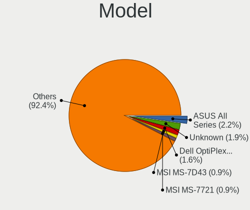
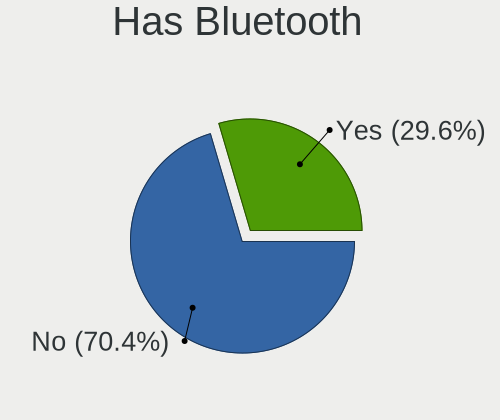
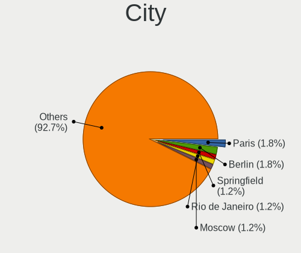
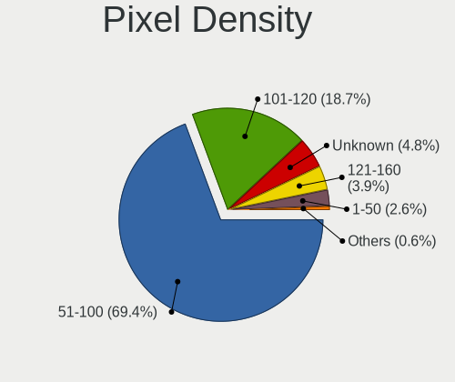
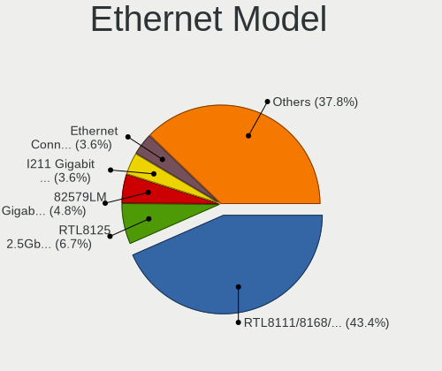
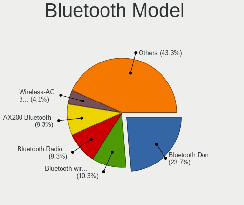
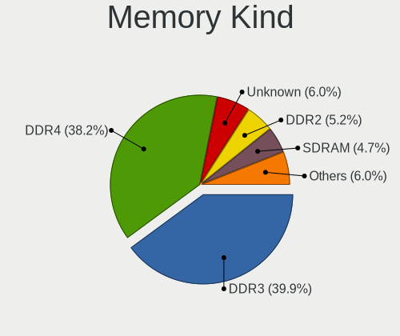
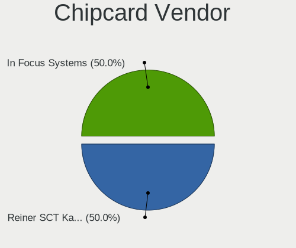

Xubuntu 22.04 - Tested Hardware & Statistics (Desktops)
-------------------------------------------------------

A project to collect tested hardware configurations for Xubuntu 22.04.

Anyone can contribute to this report by the [hw-probe](https://github.com/linuxhw/hw-probe) tool:

    sudo -E hw-probe -all -upload

Please contribute! Especially if your hardware is rare.

Contents
--------

* [ Test Cases ](#test-cases)

* [ System ](#system)
  - [ Kernel                   ](#kernel)
  - [ Kernel Family            ](#kernel-family)
  - [ Kernel Major Ver.        ](#kernel-major-ver)
  - [ Arch                     ](#arch)
  - [ DE                       ](#de)
  - [ Display Server           ](#display-server)
  - [ Display Manager          ](#display-manager)
  - [ OS Lang                  ](#os-lang)
  - [ Boot Mode                ](#boot-mode)
  - [ Filesystem               ](#filesystem)
  - [ Part. scheme             ](#part-scheme)
  - [ Dual Boot with Linux/BSD ](#dual-boot-with-linuxbsd)
  - [ Dual Boot (Win)          ](#dual-boot-win)

* [ Board ](#board)
  - [ Vendor                   ](#vendor)
  - [ Model                    ](#model)
  - [ Model Family             ](#model-family)
  - [ MFG Year                 ](#mfg-year)
  - [ Form Factor              ](#form-factor)
  - [ Secure Boot              ](#secure-boot)
  - [ Coreboot                 ](#coreboot)
  - [ RAM Size                 ](#ram-size)
  - [ RAM Used                 ](#ram-used)
  - [ Total Drives             ](#total-drives)
  - [ Has CD-ROM               ](#has-cd-rom)
  - [ Has Ethernet             ](#has-ethernet)
  - [ Has WiFi                 ](#has-wifi)
  - [ Has Bluetooth            ](#has-bluetooth)

* [ Location ](#location)
  - [ Country                  ](#country)
  - [ City                     ](#city)

* [ Drives ](#drives)
  - [ Drive Vendor             ](#drive-vendor)
  - [ Drive Model              ](#drive-model)
  - [ HDD Vendor               ](#hdd-vendor)
  - [ SSD Vendor               ](#ssd-vendor)
  - [ Drive Kind               ](#drive-kind)
  - [ Drive Connector          ](#drive-connector)
  - [ Drive Size               ](#drive-size)
  - [ Space Total              ](#space-total)
  - [ Space Used               ](#space-used)
  - [ Malfunc. Drives          ](#malfunc-drives)
  - [ Malfunc. Drive Vendor    ](#malfunc-drive-vendor)
  - [ Malfunc. HDD Vendor      ](#malfunc-hdd-vendor)
  - [ Malfunc. Drive Kind      ](#malfunc-drive-kind)
  - [ Failed Drives            ](#failed-drives)
  - [ Failed Drive Vendor      ](#failed-drive-vendor)
  - [ Drive Status             ](#drive-status)

* [ Storage controller ](#storage-controller)
  - [ Storage Vendor           ](#storage-vendor)
  - [ Storage Model            ](#storage-model)
  - [ Storage Kind             ](#storage-kind)

* [ Processor ](#processor)
  - [ CPU Vendor               ](#cpu-vendor)
  - [ CPU Model                ](#cpu-model)
  - [ CPU Model Family         ](#cpu-model-family)
  - [ CPU Cores                ](#cpu-cores)
  - [ CPU Sockets              ](#cpu-sockets)
  - [ CPU Threads              ](#cpu-threads)
  - [ CPU Op-Modes             ](#cpu-op-modes)
  - [ CPU Microcode            ](#cpu-microcode)
  - [ CPU Microarch            ](#cpu-microarch)

* [ Graphics ](#graphics)
  - [ GPU Vendor               ](#gpu-vendor)
  - [ GPU Model                ](#gpu-model)
  - [ GPU Combo                ](#gpu-combo)
  - [ GPU Driver               ](#gpu-driver)
  - [ GPU Memory               ](#gpu-memory)

* [ Monitor ](#monitor)
  - [ Monitor Vendor           ](#monitor-vendor)
  - [ Monitor Model            ](#monitor-model)
  - [ Monitor Resolution       ](#monitor-resolution)
  - [ Monitor Diagonal         ](#monitor-diagonal)
  - [ Monitor Width            ](#monitor-width)
  - [ Aspect Ratio             ](#aspect-ratio)
  - [ Monitor Area             ](#monitor-area)
  - [ Pixel Density            ](#pixel-density)
  - [ Multiple Monitors        ](#multiple-monitors)

* [ Network ](#network)
  - [ Net Controller Vendor    ](#net-controller-vendor)
  - [ Net Controller Model     ](#net-controller-model)
  - [ Wireless Vendor          ](#wireless-vendor)
  - [ Wireless Model           ](#wireless-model)
  - [ Ethernet Vendor          ](#ethernet-vendor)
  - [ Ethernet Model           ](#ethernet-model)
  - [ Net Controller Kind      ](#net-controller-kind)
  - [ Used Controller          ](#used-controller)
  - [ NICs                     ](#nics)
  - [ IPv6                     ](#ipv6)

* [ Bluetooth ](#bluetooth)
  - [ Bluetooth Vendor         ](#bluetooth-vendor)
  - [ Bluetooth Model          ](#bluetooth-model)

* [ Sound ](#sound)
  - [ Sound Vendor             ](#sound-vendor)
  - [ Sound Model              ](#sound-model)

* [ Memory ](#memory)
  - [ Memory Vendor            ](#memory-vendor)
  - [ Memory Model             ](#memory-model)
  - [ Memory Kind              ](#memory-kind)
  - [ Memory Form Factor       ](#memory-form-factor)
  - [ Memory Size              ](#memory-size)
  - [ Memory Speed             ](#memory-speed)

* [ Printers & scanners ](#printers--scanners)
  - [ Printer Vendor           ](#printer-vendor)
  - [ Printer Model            ](#printer-model)
  - [ Scanner Vendor           ](#scanner-vendor)
  - [ Scanner Model            ](#scanner-model)

* [ Camera ](#camera)
  - [ Camera Vendor            ](#camera-vendor)
  - [ Camera Model             ](#camera-model)

* [ Security ](#security)
  - [ Fingerprint Vendor       ](#fingerprint-vendor)
  - [ Fingerprint Model        ](#fingerprint-model)
  - [ Chipcard Vendor          ](#chipcard-vendor)
  - [ Chipcard Model           ](#chipcard-model)

* [ Unsupported ](#unsupported)
  - [ Unsupported Devices      ](#unsupported-devices)
  - [ Unsupported Device Types ](#unsupported-device-types)

Test Cases
----------

Total: 156

| Vendor        | Model                       | Probe                                                      | Date         |
|---------------|-----------------------------|------------------------------------------------------------|--------------|
| ASUSTek       | P5KC                        | [45f781ee3a](https://linux-hardware.org/?probe=45f781ee3a) | Feb 28, 2023 |
| Gigabyte      | MZBSWBP-00                  | [525ac20362](https://linux-hardware.org/?probe=525ac20362) | Feb 26, 2023 |
| MSI           | C847MS-E33                  | [698d950f05](https://linux-hardware.org/?probe=698d950f05) | Feb 24, 2023 |
| Dell          | 0YC03K A03                  | [0101ef8ce7](https://linux-hardware.org/?probe=0101ef8ce7) | Feb 23, 2023 |
| Intel         | X79                         | [28c9b2590c](https://linux-hardware.org/?probe=28c9b2590c) | Feb 18, 2023 |
| Intel         | X79                         | [89c51847f9](https://linux-hardware.org/?probe=89c51847f9) | Feb 18, 2023 |
| Gigabyte      | Z170XP-SLI-CF               | [8338ee5a0d](https://linux-hardware.org/?probe=8338ee5a0d) | Feb 17, 2023 |
| Gigabyte      | H410M S2 V3                 | [0dbeeea38c](https://linux-hardware.org/?probe=0dbeeea38c) | Feb 16, 2023 |
| MSI           | X370 GAMING PRO CARBON      | [e1bbf14222](https://linux-hardware.org/?probe=e1bbf14222) | Feb 16, 2023 |
| MSI           | X370 GAMING PRO CARBON      | [ba96494c0f](https://linux-hardware.org/?probe=ba96494c0f) | Feb 16, 2023 |
| MSI           | PRO Z690-A WIFI DDR4        | [40c415883e](https://linux-hardware.org/?probe=40c415883e) | Feb 16, 2023 |
| Gigabyte      | B550 AORUS ELITE            | [21ad600245](https://linux-hardware.org/?probe=21ad600245) | Feb 14, 2023 |
| ASRock        | AOD790GX/128M               | [693f4f40f8](https://linux-hardware.org/?probe=693f4f40f8) | Feb 13, 2023 |
| Gigabyte      | GA-A75-UD4H                 | [eb4302c6dd](https://linux-hardware.org/?probe=eb4302c6dd) | Feb 10, 2023 |
| Gigabyte      | MZBSWMP-00                  | [894f632950](https://linux-hardware.org/?probe=894f632950) | Feb 01, 2023 |
| Gigabyte      | B550 AORUS ELITE            | [3fac03d01d](https://linux-hardware.org/?probe=3fac03d01d) | Jan 30, 2023 |
| MSI           | PRO B660M-A DDR4            | [0f2037dcd8](https://linux-hardware.org/?probe=0f2037dcd8) | Jan 30, 2023 |
| ASUSTek       | SABERTOOTH 990FX            | [0e28b954b4](https://linux-hardware.org/?probe=0e28b954b4) | Jan 30, 2023 |
| ASUSTek       | SABERTOOTH 990FX            | [10421fe598](https://linux-hardware.org/?probe=10421fe598) | Jan 30, 2023 |
| Gigabyte      | X470 AORUS ULTRA GAMING-... | [6444a93633](https://linux-hardware.org/?probe=6444a93633) | Jan 29, 2023 |
| Gigabyte      | B450M S2H                   | [058de08b2b](https://linux-hardware.org/?probe=058de08b2b) | Jan 24, 2023 |
| Gigabyte      | B550 AORUS ELITE            | [7e91e49912](https://linux-hardware.org/?probe=7e91e49912) | Jan 23, 2023 |
| Gigabyte      | B550 AORUS ELITE            | [3324fafe5a](https://linux-hardware.org/?probe=3324fafe5a) | Jan 23, 2023 |
| MSI           | MPG B550 GAMING PLUS        | [b5e6a74fcb](https://linux-hardware.org/?probe=b5e6a74fcb) | Jan 22, 2023 |
| Gigabyte      | 8I945GMF                    | [2971006e43](https://linux-hardware.org/?probe=2971006e43) | Jan 21, 2023 |
| MSI           | B450 TOMAHAWK               | [d5ad4c9486](https://linux-hardware.org/?probe=d5ad4c9486) | Jan 17, 2023 |
| MSI           | MAG X570 TOMAHAWK WIFI      | [a49a3ddeaa](https://linux-hardware.org/?probe=a49a3ddeaa) | Jan 17, 2023 |
| Gigabyte      | B550M DS3H                  | [d667bf6bb2](https://linux-hardware.org/?probe=d667bf6bb2) | Jan 15, 2023 |
| Gigabyte      | X670 GAMING X AX            | [0277ea7e50](https://linux-hardware.org/?probe=0277ea7e50) | Jan 15, 2023 |
| Lenovo        | ThinkCentre M58 7373A5G     | [07a6ffe405](https://linux-hardware.org/?probe=07a6ffe405) | Jan 11, 2023 |
| Acer          | Veriton N2620G              | [6345424cff](https://linux-hardware.org/?probe=6345424cff) | Jan 07, 2023 |
| Gigabyte      | Z87N-WIFI                   | [ef5e737fd6](https://linux-hardware.org/?probe=ef5e737fd6) | Jan 04, 2023 |
| Gigabyte      | J1800N-D2H                  | [f809473b20](https://linux-hardware.org/?probe=f809473b20) | Jan 03, 2023 |
| Gigabyte      | B550 GAMING X V2            | [da1db1e278](https://linux-hardware.org/?probe=da1db1e278) | Jan 02, 2023 |
| Unknown       | Intel X79                   | [f26c05e261](https://linux-hardware.org/?probe=f26c05e261) | Dec 31, 2022 |
| ASUSTek       | PRIME B450M-K               | [cc1d0776d5](https://linux-hardware.org/?probe=cc1d0776d5) | Dec 30, 2022 |
| Lenovo        | ChiefRiver                  | [847a9e86cd](https://linux-hardware.org/?probe=847a9e86cd) | Dec 30, 2022 |
| HP            | 1998                        | [c3404205e3](https://linux-hardware.org/?probe=c3404205e3) | Dec 29, 2022 |
| Dell          | 040DDP A01                  | [3548fd618d](https://linux-hardware.org/?probe=3548fd618d) | Dec 28, 2022 |
| Acer          | Veriton NBU                 | [cca454d1bd](https://linux-hardware.org/?probe=cca454d1bd) | Dec 26, 2022 |
| MSI           | Z390-A PRO                  | [9bfeb5727a](https://linux-hardware.org/?probe=9bfeb5727a) | Dec 26, 2022 |
| ASRock        | N3700-ITX                   | [dc3f0d5062](https://linux-hardware.org/?probe=dc3f0d5062) | Dec 25, 2022 |
| ASRock        | A320M-HDV R4.0              | [41ec48c0e5](https://linux-hardware.org/?probe=41ec48c0e5) | Dec 23, 2022 |
| HP            | 81C9                        | [cb40ddba01](https://linux-hardware.org/?probe=cb40ddba01) | Dec 22, 2022 |
| HP            | 8594                        | [de0b36257e](https://linux-hardware.org/?probe=de0b36257e) | Dec 21, 2022 |
| PCWare        | IPMH81G1                    | [3dc25592eb](https://linux-hardware.org/?probe=3dc25592eb) | Dec 20, 2022 |
| ASUSTek       | M4A88T-M/USB3               | [52b5b53173](https://linux-hardware.org/?probe=52b5b53173) | Dec 19, 2022 |
| ASUSTek       | M4A88T-M/USB3               | [64972eb902](https://linux-hardware.org/?probe=64972eb902) | Dec 19, 2022 |
| Packard Be... | PT890-8237A                 | [bb9e8d2cd7](https://linux-hardware.org/?probe=bb9e8d2cd7) | Dec 17, 2022 |
| ASUSTek       | TUF B450-PLUS GAMING        | [fdb9e278dd](https://linux-hardware.org/?probe=fdb9e278dd) | Dec 16, 2022 |
| ASUSTek       | ROG CROSSHAIR VIII DARK ... | [c62c8e69b0](https://linux-hardware.org/?probe=c62c8e69b0) | Dec 12, 2022 |
| HP            | 1497                        | [475049bb79](https://linux-hardware.org/?probe=475049bb79) | Dec 10, 2022 |
| Lenovo        | 3140 SDK0J40697 WIN 3305... | [ef403a3962](https://linux-hardware.org/?probe=ef403a3962) | Dec 10, 2022 |
| ASUSTek       | PRIME A320M-K               | [ce802653d4](https://linux-hardware.org/?probe=ce802653d4) | Dec 07, 2022 |
| ASUSTek       | PRIME A320M-K               | [e2e47d2d43](https://linux-hardware.org/?probe=e2e47d2d43) | Dec 06, 2022 |
| ASUSTek       | P8H61-M LX3                 | [87d3950072](https://linux-hardware.org/?probe=87d3950072) | Nov 30, 2022 |
| MSI           | PRO Z690-A DDR4             | [bd30397e24](https://linux-hardware.org/?probe=bd30397e24) | Nov 29, 2022 |
| MSI           | PRO Z690-A DDR4             | [3b4f834c63](https://linux-hardware.org/?probe=3b4f834c63) | Nov 29, 2022 |
| ASRock        | H270M-ITX/ac                | [dfc381d411](https://linux-hardware.org/?probe=dfc381d411) | Nov 29, 2022 |
| ASUSTek       | TUF B450-PLUS GAMING        | [472530d650](https://linux-hardware.org/?probe=472530d650) | Nov 29, 2022 |
| Gigabyte      | A320M-S2H-CF                | [452417fa68](https://linux-hardware.org/?probe=452417fa68) | Nov 21, 2022 |
| ASUSTek       | M4A88TD-M/USB3              | [8ff2384625](https://linux-hardware.org/?probe=8ff2384625) | Nov 16, 2022 |
| MACHINIST     | X99-RS9 V2.0                | [c9a4863d1f](https://linux-hardware.org/?probe=c9a4863d1f) | Nov 15, 2022 |
| MSI           | PRO H610M-B DDR4            | [5ffe9844bd](https://linux-hardware.org/?probe=5ffe9844bd) | Nov 15, 2022 |
| HP            | 1495                        | [e29c423a17](https://linux-hardware.org/?probe=e29c423a17) | Nov 15, 2022 |
| ASUSTek       | P8H61-M LX PLUS R2.0        | [b042e75495](https://linux-hardware.org/?probe=b042e75495) | Nov 11, 2022 |
| Dell          | 0M5DCD A00                  | [ac93b84c08](https://linux-hardware.org/?probe=ac93b84c08) | Nov 10, 2022 |
| MSI           | A320M PRO-VH                | [70ba1bf558](https://linux-hardware.org/?probe=70ba1bf558) | Nov 08, 2022 |
| MSI           | PRO H610M-B DDR4            | [377df38ed7](https://linux-hardware.org/?probe=377df38ed7) | Nov 08, 2022 |
| MSI           | X370 GAMING PRO CARBON      | [2796faab6c](https://linux-hardware.org/?probe=2796faab6c) | Nov 08, 2022 |
| Intel         | D525MW AAE93082-401         | [d37fe5f0b4](https://linux-hardware.org/?probe=d37fe5f0b4) | Nov 06, 2022 |
| Gigabyte      | Z77-DS3H                    | [e97900160b](https://linux-hardware.org/?probe=e97900160b) | Nov 05, 2022 |
| Lenovo        | ThinkCentre M90p 3282A9G    | [f60040c1b7](https://linux-hardware.org/?probe=f60040c1b7) | Nov 05, 2022 |
| Lenovo        | ThinkCentre M90p 3282A9G    | [cd87b011a0](https://linux-hardware.org/?probe=cd87b011a0) | Nov 05, 2022 |
| HP            | 8054                        | [0f1371d133](https://linux-hardware.org/?probe=0f1371d133) | Nov 03, 2022 |
| ASUSTek       | P8H61-M LX PLUS R2.0        | [423d3158cd](https://linux-hardware.org/?probe=423d3158cd) | Nov 03, 2022 |
| Gigabyte      | 970A-DS3P                   | [65231808f8](https://linux-hardware.org/?probe=65231808f8) | Nov 02, 2022 |
| ASUSTek       | TUF Gaming B550M-PLUS       | [3c65639aad](https://linux-hardware.org/?probe=3c65639aad) | Oct 25, 2022 |
| ASUSTek       | K30AD_M31AD_M51AD_M32AD     | [7027921568](https://linux-hardware.org/?probe=7027921568) | Oct 25, 2022 |
| Intel         | DH61AG AAG23736-507         | [7fa3b3bc6a](https://linux-hardware.org/?probe=7fa3b3bc6a) | Oct 25, 2022 |
| Hardkernel    | ODROID-H2                   | [6398e45c99](https://linux-hardware.org/?probe=6398e45c99) | Oct 24, 2022 |
| MSI           | A320M PRO-VH                | [5f1aeaf170](https://linux-hardware.org/?probe=5f1aeaf170) | Oct 22, 2022 |
| ASUSTek       | Z97-P                       | [f5b8282e1f](https://linux-hardware.org/?probe=f5b8282e1f) | Oct 21, 2022 |
| Itautec       | ST 4273 ST-4273 Padrao 0... | [8c4af1707c](https://linux-hardware.org/?probe=8c4af1707c) | Oct 17, 2022 |
| MSI           | MS-7309                     | [9d4f0daf60](https://linux-hardware.org/?probe=9d4f0daf60) | Oct 16, 2022 |
| ASUSTek       | P8H67                       | [4f03e84827](https://linux-hardware.org/?probe=4f03e84827) | Oct 16, 2022 |
| Lenovo        | ThinkCentre M58 7373A5G     | [ed6ebf5f98](https://linux-hardware.org/?probe=ed6ebf5f98) | Oct 16, 2022 |
| HP            | 198E                        | [47439edd0e](https://linux-hardware.org/?probe=47439edd0e) | Oct 15, 2022 |
| Gigabyte      | G33M-DS2R                   | [a14ced18eb](https://linux-hardware.org/?probe=a14ced18eb) | Oct 15, 2022 |
| ASUSTek       | M5A97 EVO R2.0              | [c3513de476](https://linux-hardware.org/?probe=c3513de476) | Oct 11, 2022 |
| Dell          | 0WR7PY A03                  | [3598f82c1e](https://linux-hardware.org/?probe=3598f82c1e) | Oct 10, 2022 |
| HP            | 1589                        | [d50afd3db1](https://linux-hardware.org/?probe=d50afd3db1) | Oct 08, 2022 |
| ASUSTek       | ET1612I                     | [91fea00cbf](https://linux-hardware.org/?probe=91fea00cbf) | Oct 06, 2022 |
| ASUSTek       | ROG CROSSHAIR VIII DARK ... | [10e3123558](https://linux-hardware.org/?probe=10e3123558) | Oct 03, 2022 |
| MSI           | H170M PRO-VDH               | [f7254adff2](https://linux-hardware.org/?probe=f7254adff2) | Sep 25, 2022 |
| ASUSTek       | PRIME A320M-K               | [5588f73920](https://linux-hardware.org/?probe=5588f73920) | Sep 24, 2022 |
| ASUSTek       | PRIME A320M-K               | [a83e57d8c1](https://linux-hardware.org/?probe=a83e57d8c1) | Sep 23, 2022 |
| ASUSTek       | A68HM-K                     | [966ae734c2](https://linux-hardware.org/?probe=966ae734c2) | Sep 20, 2022 |
| ASRock        | 960GC-GS FX                 | [3e40742ff0](https://linux-hardware.org/?probe=3e40742ff0) | Sep 18, 2022 |
| ASUSTek       | ET1612I                     | [0ddd9554cc](https://linux-hardware.org/?probe=0ddd9554cc) | Sep 16, 2022 |
| ASUSTek       | PRIME H310M-D R2.0          | [588c189149](https://linux-hardware.org/?probe=588c189149) | Sep 16, 2022 |
| ASUSTek       | PRIME H310M-D R2.0          | [4b94d21772](https://linux-hardware.org/?probe=4b94d21772) | Sep 16, 2022 |
| ASUSTek       | Maximus VII HERO            | [6d40add21a](https://linux-hardware.org/?probe=6d40add21a) | Sep 15, 2022 |
| Dell          | 0DR845                      | [158b3832bc](https://linux-hardware.org/?probe=158b3832bc) | Sep 13, 2022 |
| ASUSTek       | K30BD                       | [d6daf0e1f8](https://linux-hardware.org/?probe=d6daf0e1f8) | Sep 13, 2022 |
| ASUSTek       | H61M-C                      | [bb07dfab63](https://linux-hardware.org/?probe=bb07dfab63) | Sep 13, 2022 |
| ASRock        | N68-S3 UCC                  | [e59aa2e1d5](https://linux-hardware.org/?probe=e59aa2e1d5) | Sep 13, 2022 |
| ASRock        | N68-S3 UCC                  | [930da2e105](https://linux-hardware.org/?probe=930da2e105) | Sep 13, 2022 |
| Dell          | 0DR845                      | [f65bf44380](https://linux-hardware.org/?probe=f65bf44380) | Sep 13, 2022 |
| ASUSTek       | PRIME A320M-K               | [7b7a1cfeb9](https://linux-hardware.org/?probe=7b7a1cfeb9) | Sep 11, 2022 |
| Dell          | 03NVJ6 A01                  | [3f51b6da48](https://linux-hardware.org/?probe=3f51b6da48) | Sep 10, 2022 |
| ASUSTek       | PRIME A320M-C R2.0          | [7649a53341](https://linux-hardware.org/?probe=7649a53341) | Sep 06, 2022 |
| ASUSTek       | PRIME B560-PLUS             | [989e0d5d57](https://linux-hardware.org/?probe=989e0d5d57) | Sep 06, 2022 |
| ASUSTek       | PRIME B560-PLUS             | [f51b1f139e](https://linux-hardware.org/?probe=f51b1f139e) | Sep 06, 2022 |
| ASUSTek       | PRIME H270M-PLUS            | [668995f3ff](https://linux-hardware.org/?probe=668995f3ff) | Sep 04, 2022 |
| ASUSTek       | K30BD                       | [6042bda5d7](https://linux-hardware.org/?probe=6042bda5d7) | Sep 03, 2022 |
| HP            | 8433 11                     | [00868f25c6](https://linux-hardware.org/?probe=00868f25c6) | Aug 31, 2022 |
| ASUSTek       | Z97-C                       | [9bdae9239f](https://linux-hardware.org/?probe=9bdae9239f) | Aug 29, 2022 |
| Gigabyte      | GA-MA790FXT-UD5P            | [e692fe97cb](https://linux-hardware.org/?probe=e692fe97cb) | Aug 28, 2022 |
| ASUSTek       | P8H67-M LE                  | [7bf3626764](https://linux-hardware.org/?probe=7bf3626764) | Aug 25, 2022 |
| ASUSTek       | TUF B450-PLUS GAMING        | [c37bc2a345](https://linux-hardware.org/?probe=c37bc2a345) | Aug 24, 2022 |
| Gigabyte      | AB350-Gaming-CF             | [5dabf74b7f](https://linux-hardware.org/?probe=5dabf74b7f) | Aug 21, 2022 |
| Gigabyte      | GA-78LMT-USB3 SEx           | [ed1f055157](https://linux-hardware.org/?probe=ed1f055157) | Aug 19, 2022 |
| Gigabyte      | GA-78LMT-USB3 SEx           | [764eaea2ba](https://linux-hardware.org/?probe=764eaea2ba) | Aug 19, 2022 |
| eMachines     | ET1350                      | [96e9f7aba7](https://linux-hardware.org/?probe=96e9f7aba7) | Aug 18, 2022 |
| Foxconn       | 2ADA                        | [015ccc4b06](https://linux-hardware.org/?probe=015ccc4b06) | Aug 18, 2022 |
| HP            | 8591                        | [4235eb97c1](https://linux-hardware.org/?probe=4235eb97c1) | Aug 18, 2022 |
| Dell          | 0YXT71 A00                  | [def7e10c65](https://linux-hardware.org/?probe=def7e10c65) | Aug 17, 2022 |
| ASUSTek       | K30AD_M31AD_M51AD_M32AD     | [b98fcab3a6](https://linux-hardware.org/?probe=b98fcab3a6) | Aug 15, 2022 |
| ASUSTek       | ROG CROSSHAIR VIII DARK ... | [fd06db829d](https://linux-hardware.org/?probe=fd06db829d) | Aug 14, 2022 |
| MSI           | H310M PRO-M2 PLUS           | [0fadd2421f](https://linux-hardware.org/?probe=0fadd2421f) | Aug 08, 2022 |
| ASUSTek       | TUF Gaming B550M-E WIFI     | [01bcafef3c](https://linux-hardware.org/?probe=01bcafef3c) | Jul 30, 2022 |
| ASUSTek       | PRIME A320M-K               | [9a97caa028](https://linux-hardware.org/?probe=9a97caa028) | Jul 28, 2022 |
| ASUSTek       | PRIME A320M-K               | [d00325cd68](https://linux-hardware.org/?probe=d00325cd68) | Jul 28, 2022 |
| Lenovo        | SHARKBAY SDK0E50510 WIN     | [da54317b9a](https://linux-hardware.org/?probe=da54317b9a) | Jul 27, 2022 |
| ASUSTek       | P8H67-M LE                  | [a27a0707b8](https://linux-hardware.org/?probe=a27a0707b8) | Jul 25, 2022 |
| PCWare        | IPX1800E2                   | [4426727633](https://linux-hardware.org/?probe=4426727633) | Jul 24, 2022 |
| MSI           | PRO B660M-A DDR4            | [ba0058e96e](https://linux-hardware.org/?probe=ba0058e96e) | Jul 20, 2022 |
| ASUSTek       | PRIME B450M-A               | [d5a64d7baa](https://linux-hardware.org/?probe=d5a64d7baa) | Jul 16, 2022 |
| MSI           | A320M PRO-E                 | [d16a812a12](https://linux-hardware.org/?probe=d16a812a12) | Jul 10, 2022 |
| MSI           | PRO B660M-A DDR4            | [7b470f27d3](https://linux-hardware.org/?probe=7b470f27d3) | Jul 03, 2022 |
| Dell          | 0GXM1W A00                  | [d48eb55102](https://linux-hardware.org/?probe=d48eb55102) | Jul 01, 2022 |
| MSI           | B450M-A PRO MAX             | [db4763808b](https://linux-hardware.org/?probe=db4763808b) | Jun 22, 2022 |
| MSI           | G31TM-P21                   | [824dc8a1c9](https://linux-hardware.org/?probe=824dc8a1c9) | Jun 11, 2022 |
| ASUSTek       | ROG STRIX B450-F GAMING ... | [33dbe3e5db](https://linux-hardware.org/?probe=33dbe3e5db) | Jun 08, 2022 |
| ASUSTek       | PRIME X470-PRO              | [496399846f](https://linux-hardware.org/?probe=496399846f) | May 26, 2022 |
| Lenovo        | MAHOBAY NOK                 | [aa8d9cb3b9](https://linux-hardware.org/?probe=aa8d9cb3b9) | May 25, 2022 |
| ASUSTek       | ROG CROSSHAIR VIII DARK ... | [a22a5ebbff](https://linux-hardware.org/?probe=a22a5ebbff) | May 25, 2022 |
| ASUSTek       | X99-A II                    | [288a6b3b20](https://linux-hardware.org/?probe=288a6b3b20) | May 23, 2022 |
| MSI           | MPG B550 GAMING EDGE WIF... | [3e34ce179d](https://linux-hardware.org/?probe=3e34ce179d) | May 22, 2022 |
| Fujitsu       | D2917-A1 S26361-D2917-A1    | [6f58937bed](https://linux-hardware.org/?probe=6f58937bed) | May 13, 2022 |
| ASUSTek       | TUF B450M-PRO GAMING        | [bd94a8145a](https://linux-hardware.org/?probe=bd94a8145a) | May 08, 2022 |
| ASRock        | X570 Phantom Gaming 4       | [e7ad5ed098](https://linux-hardware.org/?probe=e7ad5ed098) | May 06, 2022 |
| Acer          | Veriton M490G               | [f55983d536](https://linux-hardware.org/?probe=f55983d536) | May 04, 2022 |
| ASRock        | P55 Pro                     | [e626676348](https://linux-hardware.org/?probe=e626676348) | May 02, 2022 |
| HP            | 09F8h                       | [8605181df9](https://linux-hardware.org/?probe=8605181df9) | Apr 26, 2022 |

System
------

Kernel
------

Version of the Linux kernel

| Version                    | Desktops | Percent |
|----------------------------|----------|---------|
| 5.15.0-56-generic          | 17       | 12.69%  |
| 5.15.0-52-generic          | 16       | 11.94%  |
| 5.15.0-58-generic          | 9        | 6.72%   |
| 5.15.0-47-generic          | 9        | 6.72%   |
| 5.15.0-46-generic          | 9        | 6.72%   |
| 5.15.0-60-generic          | 6        | 4.48%   |
| 5.15.0-48-generic          | 6        | 4.48%   |
| 5.15.0-27-generic          | 6        | 4.48%   |
| 5.15.0-43-generic          | 5        | 3.73%   |
| 5.15.0-41-generic          | 5        | 3.73%   |
| 5.15.0-25-generic          | 5        | 3.73%   |
| 5.15.0-53-generic          | 4        | 2.99%   |
| 5.15.0-50-generic          | 4        | 2.99%   |
| 5.15.0-57-generic          | 3        | 2.24%   |
| 5.15.0-40-generic          | 3        | 2.24%   |
| 5.15.0-60-lowlatency       | 2        | 1.49%   |
| 5.15.0-33-generic          | 2        | 1.49%   |
| 5.15.0-30-generic          | 2        | 1.49%   |
| 6.1.10.mmn                 | 1        | 0.75%   |
| 6.1.0                      | 1        | 0.75%   |
| 6.0.0                      | 1        | 0.75%   |
| 5.4.0-122-generic          | 1        | 0.75%   |
| 5.19.13-xanmod1            | 1        | 0.75%   |
| 5.19.1                     | 1        | 0.75%   |
| 5.19.0-8.2-liquorix-amd64  | 1        | 0.75%   |
| 5.19.0-32-generic          | 1        | 0.75%   |
| 5.19.0-15.2-liquorix-amd64 | 1        | 0.75%   |
| 5.18.0                     | 1        | 0.75%   |
| 5.17.0-8-generic           | 1        | 0.75%   |
| 5.17.0-1003-oem            | 1        | 0.75%   |
| 5.15.0-57-lowlatency       | 1        | 0.75%   |
| 5.15.0-53-lowlatency       | 1        | 0.75%   |
| 5.15.0-50-lowlatency       | 1        | 0.75%   |
| 5.15.0-48-lowlatency       | 1        | 0.75%   |
| 5.15.0-46-lowlatency       | 1        | 0.75%   |
| 5.15.0-39-lowlatency       | 1        | 0.75%   |
| 5.15.0-39-generic          | 1        | 0.75%   |
| 5.15.0-37-generic          | 1        | 0.75%   |
| 5.15.0-18-generic          | 1        | 0.75%   |

Kernel Family
-------------

Linux kernel without a distro release

| Version | Desktops | Percent |
|---------|----------|---------|
| 5.15.0  | 113      | 90.4%   |
| 5.19.0  | 3        | 2.4%    |
| 5.17.0  | 2        | 1.6%    |
| 6.1.10  | 1        | 0.8%    |
| 6.1.0   | 1        | 0.8%    |
| 6.0.0   | 1        | 0.8%    |
| 5.4.0   | 1        | 0.8%    |
| 5.19.13 | 1        | 0.8%    |
| 5.19.1  | 1        | 0.8%    |
| 5.18.0  | 1        | 0.8%    |

Kernel Major Ver.
-----------------

Linux kernel major version

| Version | Desktops | Percent |
|---------|----------|---------|
| 5.15    | 113      | 90.4%   |
| 5.19    | 5        | 4%      |
| 6.1     | 2        | 1.6%    |
| 5.17    | 2        | 1.6%    |
| 6.0     | 1        | 0.8%    |
| 5.4     | 1        | 0.8%    |
| 5.18    | 1        | 0.8%    |

Arch
----

OS architecture (x86_64, i586, etc.)

| Name   | Desktops | Percent |
|--------|----------|---------|
| x86_64 | 122      | 100%    |

DE
--

Desktop Environment

| Name  | Desktops | Percent |
|-------|----------|---------|
| XFCE  | 118      | 96.72%  |
| GNOME | 3        | 2.46%   |
| i3    | 1        | 0.82%   |

Display Server
--------------

X11 or Wayland

| Name | Desktops | Percent |
|------|----------|---------|
| X11  | 120      | 96.77%  |
| Tty  | 4        | 3.23%   |

Display Manager
---------------

SDDM, LightDM, etc.

| Name    | Desktops | Percent |
|---------|----------|---------|
| LightDM | 100      | 81.97%  |
| Unknown | 11       | 9.02%   |
| GDM3    | 9        | 7.38%   |
| SDDM    | 1        | 0.82%   |
| GDM     | 1        | 0.82%   |

OS Lang
-------

Language

| Lang  | Desktops | Percent |
|-------|----------|---------|
| en_US | 37       | 30.33%  |
| fr_FR | 20       | 16.39%  |
| de_DE | 18       | 14.75%  |
| it_IT | 14       | 11.48%  |
| pt_BR | 6        | 4.92%   |
| en_CA | 5        | 4.1%    |
| ru_RU | 4        | 3.28%   |
| nl_NL | 2        | 1.64%   |
| es_AR | 2        | 1.64%   |
| en_GB | 2        | 1.64%   |
| cs_CZ | 2        | 1.64%   |
| sv_SE | 1        | 0.82%   |
| ru_UA | 1        | 0.82%   |
| pl_PL | 1        | 0.82%   |
| hu_HU | 1        | 0.82%   |
| fr_CH | 1        | 0.82%   |
| fr_CA | 1        | 0.82%   |
| es_CO | 1        | 0.82%   |
| en_ZA | 1        | 0.82%   |
| en_AU | 1        | 0.82%   |
| C     | 1        | 0.82%   |

Boot Mode
---------

EFI or BIOS

| Mode | Desktops | Percent |
|------|----------|---------|
| BIOS | 74       | 60.16%  |
| EFI  | 49       | 39.84%  |

Filesystem
----------

Type of filesystem

| Type    | Desktops | Percent |
|---------|----------|---------|
| Ext4    | 111      | 90.98%  |
| Overlay | 4        | 3.28%   |
| Btrfs   | 4        | 3.28%   |
| Zfs     | 2        | 1.64%   |
| Ext3    | 1        | 0.82%   |

Part. scheme
------------

Scheme of partitioning

| Type    | Desktops | Percent |
|---------|----------|---------|
| GPT     | 75       | 60%     |
| Unknown | 28       | 22.4%   |
| MBR     | 22       | 17.6%   |

Dual Boot with Linux/BSD
------------------------

Hosting more than one Linux/BSD

| Dual boot | Desktops | Percent |
|-----------|----------|---------|
| No        | 95       | 77.87%  |
| Yes       | 27       | 22.13%  |

Dual Boot (Win)
---------------

Hosting Linux and Windows

| Dual boot | Desktops | Percent |
|-----------|----------|---------|
| No        | 75       | 60.98%  |
| Yes       | 48       | 39.02%  |

Board
-----

Vendor
------

Motherboard manufacturer

| Name                | Desktops | Percent |
|---------------------|----------|---------|
| ASUSTek Computer    | 33       | 27.05%  |
| Gigabyte Technology | 21       | 17.21%  |
| MSI                 | 20       | 16.39%  |
| Hewlett-Packard     | 11       | 9.02%   |
| Dell                | 8        | 6.56%   |
| ASRock              | 7        | 5.74%   |
| Lenovo              | 6        | 4.92%   |
| Intel               | 3        | 2.46%   |
| Acer                | 3        | 2.46%   |
| PCWare              | 2        | 1.64%   |
| Packard Bell        | 1        | 0.82%   |
| MACHINIST           | 1        | 0.82%   |
| Itautec             | 1        | 0.82%   |
| Hardkernel          | 1        | 0.82%   |
| Fujitsu             | 1        | 0.82%   |
| Foxconn             | 1        | 0.82%   |
| eMachines           | 1        | 0.82%   |
| Unknown             | 1        | 0.82%   |

Model
-----

Motherboard model

| Name                              | Desktops | Percent |
|-----------------------------------|----------|---------|
| ASUS All Series                   | 4        | 3.28%   |
| MSI MS-7D43                       | 3        | 2.46%   |
| Dell OptiPlex 7010                | 3        | 2.46%   |
| MSI MS-7D46                       | 2        | 1.64%   |
| MSI MS-7D25                       | 2        | 1.64%   |
| MSI MS-7C52                       | 2        | 1.64%   |
| ASUS K30AD_M31AD_M51AD            | 2        | 1.64%   |
| PCWare IPX1800E2                  | 1        | 0.82%   |
| PCWare IPMH81G1                   | 1        | 0.82%   |
| Packard Bell IMEDIA X9305         | 1        | 0.82%   |
| MSI MS-7C91                       | 1        | 0.82%   |
| MSI MS-7C84                       | 1        | 0.82%   |
| MSI MS-7C56                       | 1        | 0.82%   |
| MSI MS-7C08                       | 1        | 0.82%   |
| MSI MS-7B98                       | 1        | 0.82%   |
| MSI MS-7A32                       | 1        | 0.82%   |
| MSI MS-7982                       | 1        | 0.82%   |
| MSI MS-7835                       | 1        | 0.82%   |
| MSI MS-7529                       | 1        | 0.82%   |
| MSI MS-7309                       | 1        | 0.82%   |
| MSI Hyrican PC A320M PRO-E        | 1        | 0.82%   |
| MACHINIST X99-RS9 V2.0            | 1        | 0.82%   |
| Lenovo V530S-07ICB 10TX0010PB     | 1        | 0.82%   |
| Lenovo ThinkCentre M90p 3282A9G   | 1        | 0.82%   |
| Lenovo ThinkCentre M83 10AM0010US | 1        | 0.82%   |
| Lenovo ThinkCentre M72e 32675L2   | 1        | 0.82%   |
| Lenovo ThinkCentre M58 7373A5G    | 1        | 0.82%   |
| Lenovo ThinkCentre M32 10BV000CMD | 1        | 0.82%   |
| Itautec Infoway ST-4273           | 1        | 0.82%   |
| Intel X79                         | 1        | 0.82%   |
| Intel DH61AG AAG23736-507         | 1        | 0.82%   |
| Intel D525MW AAE93082-401         | 1        | 0.82%   |
| HP Z420 Workstation               | 1        | 0.82%   |
| HP Z1 Entry Tower G5              | 1        | 0.82%   |
| HP ProDesk 400 G2 MT (TPM DP)     | 1        | 0.82%   |
| HP Pavilion Wave Desktop 600-a0xx | 1        | 0.82%   |
| HP Pavilion Desktop 590-p0xxx     | 1        | 0.82%   |
| HP EliteDesk 800 G5 Desktop Mini  | 1        | 0.82%   |
| HP EliteDesk 800 G2 SFF           | 1        | 0.82%   |
| HP EliteDesk 800 G1 SFF           | 1        | 0.82%   |

Model Family
------------

Motherboard model prefix

| Name                | Desktops | Percent |
|---------------------|----------|---------|
| Dell OptiPlex       | 8        | 6.56%   |
| ASUS PRIME          | 8        | 6.56%   |
| Lenovo ThinkCentre  | 5        | 4.1%    |
| ASUS All            | 4        | 3.28%   |
| MSI MS-7D43         | 3        | 2.46%   |
| HP EliteDesk        | 3        | 2.46%   |
| HP Compaq           | 3        | 2.46%   |
| ASUS TUF            | 3        | 2.46%   |
| Acer Veriton        | 3        | 2.46%   |
| MSI MS-7D46         | 2        | 1.64%   |
| MSI MS-7D25         | 2        | 1.64%   |
| MSI MS-7C52         | 2        | 1.64%   |
| HP Pavilion         | 2        | 1.64%   |
| Gigabyte B550       | 2        | 1.64%   |
| ASUS ROG            | 2        | 1.64%   |
| ASUS P8H61-M        | 2        | 1.64%   |
| ASUS K30AD          | 2        | 1.64%   |
| PCWare IPX1800E2    | 1        | 0.82%   |
| PCWare IPMH81G1     | 1        | 0.82%   |
| Packard Bell IMEDIA | 1        | 0.82%   |
| MSI MS-7C91         | 1        | 0.82%   |
| MSI MS-7C84         | 1        | 0.82%   |
| MSI MS-7C56         | 1        | 0.82%   |
| MSI MS-7C08         | 1        | 0.82%   |
| MSI MS-7B98         | 1        | 0.82%   |
| MSI MS-7A32         | 1        | 0.82%   |
| MSI MS-7982         | 1        | 0.82%   |
| MSI MS-7835         | 1        | 0.82%   |
| MSI MS-7529         | 1        | 0.82%   |
| MSI MS-7309         | 1        | 0.82%   |
| MSI Hyrican         | 1        | 0.82%   |
| MACHINIST X99-RS9   | 1        | 0.82%   |
| Lenovo V530S-07ICB  | 1        | 0.82%   |
| Itautec Infoway     | 1        | 0.82%   |
| Intel X79           | 1        | 0.82%   |
| Intel DH61AG        | 1        | 0.82%   |
| Intel D525MW        | 1        | 0.82%   |
| HP Z420             | 1        | 0.82%   |
| HP Z1               | 1        | 0.82%   |
| HP ProDesk          | 1        | 0.82%   |

MFG Year
--------

Motherboard manufacture year

| Year | Desktops | Percent |
|------|----------|---------|
| 2014 | 15       | 12.3%   |
| 2018 | 14       | 11.48%  |
| 2021 | 10       | 8.2%    |
| 2020 | 9        | 7.38%   |
| 2013 | 9        | 7.38%   |
| 2012 | 9        | 7.38%   |
| 2010 | 9        | 7.38%   |
| 2019 | 7        | 5.74%   |
| 2011 | 7        | 5.74%   |
| 2017 | 6        | 4.92%   |
| 2016 | 6        | 4.92%   |
| 2015 | 6        | 4.92%   |
| 2009 | 4        | 3.28%   |
| 2007 | 4        | 3.28%   |
| 2022 | 3        | 2.46%   |
| 2005 | 2        | 1.64%   |
| 2008 | 1        | 0.82%   |
| 2006 | 1        | 0.82%   |

Form Factor
-----------

Physical design of the computer

| Name    | Desktops | Percent |
|---------|----------|---------|
| Desktop | 122      | 100%    |

Secure Boot
-----------

Enabled or disabled

| State    | Desktops | Percent |
|----------|----------|---------|
| Disabled | 116      | 95.08%  |
| Enabled  | 6        | 4.92%   |

Coreboot
--------

Have coreboot on board

| Used | Desktops | Percent |
|------|----------|---------|
| No   | 122      | 100%    |

RAM Size
--------

Total RAM memory

| Size in GB  | Desktops | Percent |
|-------------|----------|---------|
| 16.01-24.0  | 28       | 22.95%  |
| 4.01-8.0    | 27       | 22.13%  |
| 3.01-4.0    | 22       | 18.03%  |
| 8.01-16.0   | 17       | 13.93%  |
| 32.01-64.0  | 16       | 13.11%  |
| 24.01-32.0  | 5        | 4.1%    |
| 1.01-2.0    | 4        | 3.28%   |
| 64.01-256.0 | 2        | 1.64%   |
| 2.01-3.0    | 1        | 0.82%   |

RAM Used
--------

Used RAM memory

| Used GB   | Desktops | Percent |
|-----------|----------|---------|
| 1.01-2.0  | 57       | 43.85%  |
| 2.01-3.0  | 26       | 20%     |
| 3.01-4.0  | 20       | 15.38%  |
| 4.01-8.0  | 15       | 11.54%  |
| 8.01-16.0 | 6        | 4.62%   |
| 0.51-1.0  | 5        | 3.85%   |
| 0.01-0.5  | 1        | 0.77%   |

Total Drives
------------

Number of drives on board

| Drives | Desktops | Percent |
|--------|----------|---------|
| 1      | 45       | 36%     |
| 2      | 37       | 29.6%   |
| 3      | 21       | 16.8%   |
| 4      | 11       | 8.8%    |
| 5      | 5        | 4%      |
| 7      | 2        | 1.6%    |
| 6      | 2        | 1.6%    |
| 10     | 1        | 0.8%    |
| 9      | 1        | 0.8%    |

Has CD-ROM
----------

Has CD-ROM on board

| Presented | Desktops | Percent |
|-----------|----------|---------|
| No        | 63       | 51.22%  |
| Yes       | 60       | 48.78%  |

Has Ethernet
------------

Has Ethernet on board

| Presented | Desktops | Percent |
|-----------|----------|---------|
| Yes       | 122      | 100%    |

Has WiFi
--------

Has WiFi module

| Presented | Desktops | Percent |
|-----------|----------|---------|
| No        | 80       | 65.57%  |
| Yes       | 42       | 34.43%  |

Has Bluetooth
-------------

Has Bluetooth module

| Presented | Desktops | Percent |
|-----------|----------|---------|
| No        | 93       | 76.23%  |
| Yes       | 29       | 23.77%  |

Location
--------

Country
-------

Geographic location (country)

| Country      | Desktops | Percent |
|--------------|----------|---------|
| Germany      | 22       | 17.89%  |
| France       | 18       | 14.63%  |
| USA          | 14       | 11.38%  |
| Italy        | 14       | 11.38%  |
| Brazil       | 7        | 5.69%   |
| Canada       | 6        | 4.88%   |
| Sweden       | 5        | 4.07%   |
| Russia       | 4        | 3.25%   |
| Netherlands  | 4        | 3.25%   |
| UK           | 2        | 1.63%   |
| Poland       | 2        | 1.63%   |
| Greece       | 2        | 1.63%   |
| Czechia      | 2        | 1.63%   |
| Belgium      | 2        | 1.63%   |
| Belarus      | 2        | 1.63%   |
| Argentina    | 2        | 1.63%   |
| Taiwan       | 1        | 0.81%   |
| Switzerland  | 1        | 0.81%   |
| South Africa | 1        | 0.81%   |
| Slovenia     | 1        | 0.81%   |
| Romania      | 1        | 0.81%   |
| Portugal     | 1        | 0.81%   |
| Norway       | 1        | 0.81%   |
| Mexico       | 1        | 0.81%   |
| Iran         | 1        | 0.81%   |
| Indonesia    | 1        | 0.81%   |
| Hungary      | 1        | 0.81%   |
| Guernsey     | 1        | 0.81%   |
| Guadeloupe   | 1        | 0.81%   |
| Colombia     | 1        | 0.81%   |
| Australia    | 1        | 0.81%   |

City
----

Geographic location (city)

| City                 | Desktops | Percent |
|----------------------|----------|---------|
| Paris                | 5        | 3.94%   |
| Berlin               | 3        | 2.36%   |
| Witten               | 2        | 1.57%   |
| Stuttgart            | 2        | 1.57%   |
| Munich               | 2        | 1.57%   |
| Milan                | 2        | 1.57%   |
| Clermont-Ferrand     | 2        | 1.57%   |
| Biella               | 2        | 1.57%   |
| Almere Stad          | 2        | 1.57%   |
| Żywiec              | 1        | 0.79%   |
| White House          | 1        | 0.79%   |
| Wettringen           | 1        | 0.79%   |
| Washington           | 1        | 0.79%   |
| Waghausel            | 1        | 0.79%   |
| Waarder              | 1        | 0.79%   |
| Vohenstrauss         | 1        | 0.79%   |
| Vohburg an der Donau | 1        | 0.79%   |
| Vicenza              | 1        | 0.79%   |
| Västerås           | 1        | 0.79%   |
| Valparaiso de Goias  | 1        | 0.79%   |
| Uppsala              | 1        | 0.79%   |
| Tourouvre            | 1        | 0.79%   |
| Toronto              | 1        | 0.79%   |
| Tijuana              | 1        | 0.79%   |
| The Hague            | 1        | 0.79%   |
| Teresina             | 1        | 0.79%   |
| Tehran               | 1        | 0.79%   |
| Taichung             | 1        | 0.79%   |
| Surrey               | 1        | 0.79%   |
| Sölvesborg          | 1        | 0.79%   |
| Schopfloch           | 1        | 0.79%   |
| Sassari              | 1        | 0.79%   |
| Santiago de Cali     | 1        | 0.79%   |
| Salzgitter           | 1        | 0.79%   |
| Sainte-Rose          | 1        | 0.79%   |
| Saint-Eustache       | 1        | 0.79%   |
| Saint-Denis          | 1        | 0.79%   |
| Roubaix              | 1        | 0.79%   |
| Rio de Janeiro       | 1        | 0.79%   |
| Rinteln              | 1        | 0.79%   |

Drives
------

Drive Vendor
------------

Hard drive vendors

| Vendor                      | Desktops | Drives | Percent |
|-----------------------------|----------|--------|---------|
| WDC                         | 39       | 62     | 16.6%   |
| Seagate                     | 35       | 50     | 14.89%  |
| Samsung Electronics         | 35       | 45     | 14.89%  |
| Toshiba                     | 18       | 18     | 7.66%   |
| Kingston                    | 17       | 22     | 7.23%   |
| Hitachi                     | 13       | 22     | 5.53%   |
| SanDisk                     | 11       | 15     | 4.68%   |
| Crucial                     | 9        | 14     | 3.83%   |
| PNY                         | 4        | 4      | 1.7%    |
| HGST                        | 4        | 7      | 1.7%    |
| A-DATA Technology           | 4        | 4      | 1.7%    |
| Patriot                     | 3        | 3      | 1.28%   |
| Intel                       | 3        | 3      | 1.28%   |
| China                       | 3        | 3      | 1.28%   |
| Unknown                     | 2        | 2      | 0.85%   |
| TEXTORM                     | 2        | 2      | 0.85%   |
| SK hynix                    | 2        | 2      | 0.85%   |
| OCZ                         | 2        | 2      | 0.85%   |
| Maxtor                      | 2        | 2      | 0.85%   |
| Intenso                     | 2        | 2      | 0.85%   |
| Gigabyte Technology         | 2        | 2      | 0.85%   |
| ASMT                        | 2        | 5      | 0.85%   |
| XPG                         | 1        | 1      | 0.43%   |
| Veno                        | 1        | 1      | 0.43%   |
| Vaseky                      | 1        | 1      | 0.43%   |
| USB3.0                      | 1        | 2      | 0.43%   |
| Silicon Motion              | 1        | 1      | 0.43%   |
| Realtek Semiconductor       | 1        | 1      | 0.43%   |
| Phison Electronics          | 1        | 2      | 0.43%   |
| Phison                      | 1        | 8      | 0.43%   |
| PHD 3.0                     | 1        | 1      | 0.43%   |
| Mushkin                     | 1        | 1      | 0.43%   |
| Linux                       | 1        | 1      | 0.43%   |
| Lexar                       | 1        | 1      | 0.43%   |
| LaCie                       | 1        | 1      | 0.43%   |
| KIOXIA                      | 1        | 1      | 0.43%   |
| Kingston Technology Company | 1        | 2      | 0.43%   |
| KingFast                    | 1        | 1      | 0.43%   |
| KingDian                    | 1        | 1      | 0.43%   |
| HGST HUS                    | 1        | 1      | 0.43%   |

Drive Model
-----------

Hard drive models

| Model                            | Desktops | Percent |
|----------------------------------|----------|---------|
| Kingston SA400S37240G 240GB SSD  | 6        | 2.17%   |
| Crucial CT480BX500SSD1 480GB     | 5        | 1.81%   |
| Toshiba HDWD110 1TB              | 3        | 1.08%   |
| Toshiba DT01ACA200 2TB           | 3        | 1.08%   |
| Seagate ST500DM002-1BD142 500GB  | 3        | 1.08%   |
| Samsung SSD 860 EVO 500GB        | 3        | 1.08%   |
| Samsung SSD 840 Series 120GB     | 3        | 1.08%   |
| Kingston SA400S37480G 480GB SSD  | 3        | 1.08%   |
| WDC WD10EZEX-00BBHA0 1TB         | 2        | 0.72%   |
| Toshiba DT01ACA100 1TB           | 2        | 0.72%   |
| Toshiba DT01ACA050 500GB         | 2        | 0.72%   |
| TEXTORM BM5 240GB SSD            | 2        | 0.72%   |
| Seagate ST500LM000-1EJ162 500GB  | 2        | 0.72%   |
| Seagate ST4000VX007-2DT166 4TB   | 2        | 0.72%   |
| Seagate ST4000DM004-2CV104 4TB   | 2        | 0.72%   |
| Seagate ST31000528AS 1TB         | 2        | 0.72%   |
| Seagate ST3000DM008-2DM166 3TB   | 2        | 0.72%   |
| Seagate ST2000DM008-2FR102 2TB   | 2        | 0.72%   |
| Seagate ST1000DM003-1SB102 1TB   | 2        | 0.72%   |
| Seagate ST1000DM003-1CH162 1TB   | 2        | 0.72%   |
| SanDisk SDSSDA240G 240GB         | 2        | 0.72%   |
| Samsung SSD 970 EVO Plus 250GB   | 2        | 0.72%   |
| Samsung SSD 970 EVO Plus 1TB     | 2        | 0.72%   |
| Samsung SSD 850 EVO 500GB        | 2        | 0.72%   |
| Samsung SSD 850 EVO 250GB        | 2        | 0.72%   |
| Samsung HD250HJ 250GB            | 2        | 0.72%   |
| Kingston SUV400S37120G 120GB SSD | 2        | 0.72%   |
| Kingston SA2000M81000G 1TB       | 2        | 0.72%   |
| Hitachi HDS721050CLA362 500GB    | 2        | 0.72%   |
| Hitachi HDS721010CLA332 1TB      | 2        | 0.72%   |
| Hitachi HDP725050GLA360 500GB    | 2        | 0.72%   |
| Crucial CT500MX500SSD1 500GB     | 2        | 0.72%   |
| A-DATA SU800 256GB SSD           | 2        | 0.72%   |
| XPG GAMMIX S11L 256GB            | 1        | 0.36%   |
| WDC WUH721816ALE6L4 16TB         | 1        | 0.36%   |
| WDC WDS500G2B0A-00SM50 500GB SSD | 1        | 0.36%   |
| WDC WDS250G3X0C-00SJG0 250GB     | 1        | 0.36%   |
| WDC WDS250G2B0B-00YS70 250GB SSD | 1        | 0.36%   |
| WDC WDS240G2G0B-00EPW0 240GB SSD | 1        | 0.36%   |
| WDC WD800JD-75MSA3 80GB          | 1        | 0.36%   |

HDD Vendor
----------

Hard disk drive vendors

| Vendor              | Desktops | Drives | Percent |
|---------------------|----------|--------|---------|
| WDC                 | 36       | 58     | 30.25%  |
| Seagate             | 35       | 49     | 29.41%  |
| Toshiba             | 15       | 15     | 12.61%  |
| Hitachi             | 13       | 22     | 10.92%  |
| Samsung Electronics | 9        | 13     | 7.56%   |
| HGST                | 4        | 7      | 3.36%   |
| ASMT                | 2        | 5      | 1.68%   |
| USB3.0              | 1        | 2      | 0.84%   |
| Unknown             | 1        | 1      | 0.84%   |
| PHD 3.0             | 1        | 1      | 0.84%   |
| Maxtor              | 1        | 1      | 0.84%   |
| LaCie               | 1        | 1      | 0.84%   |

SSD Vendor
----------

Solid state drive vendors

| Vendor              | Desktops | Drives | Percent |
|---------------------|----------|--------|---------|
| Samsung Electronics | 20       | 22     | 23.53%  |
| Kingston            | 14       | 17     | 16.47%  |
| SanDisk             | 9        | 11     | 10.59%  |
| Crucial             | 9        | 14     | 10.59%  |
| A-DATA Technology   | 4        | 4      | 4.71%   |
| WDC                 | 3        | 3      | 3.53%   |
| Toshiba             | 3        | 3      | 3.53%   |
| PNY                 | 3        | 3      | 3.53%   |
| Patriot             | 3        | 3      | 3.53%   |
| China               | 3        | 3      | 3.53%   |
| TEXTORM             | 2        | 2      | 2.35%   |
| OCZ                 | 2        | 2      | 2.35%   |
| Intenso             | 2        | 2      | 2.35%   |
| Intel               | 2        | 2      | 2.35%   |
| Veno                | 1        | 1      | 1.18%   |
| Vaseky              | 1        | 1      | 1.18%   |
| Maxtor              | 1        | 1      | 1.18%   |
| Linux               | 1        | 1      | 1.18%   |
| KingFast            | 1        | 1      | 1.18%   |
| KingDian            | 1        | 1      | 1.18%   |

Drive Kind
----------

HDD or SSD

| Kind    | Desktops | Drives | Percent |
|---------|----------|--------|---------|
| HDD     | 86       | 175    | 46.24%  |
| SSD     | 70       | 97     | 37.63%  |
| NVMe    | 25       | 45     | 13.44%  |
| Unknown | 4        | 4      | 2.15%   |
| MMC     | 1        | 1      | 0.54%   |

Drive Connector
---------------

SATA, SAS, NVMe, etc.

| Type | Desktops | Drives | Percent |
|------|----------|--------|---------|
| SATA | 115      | 255    | 75.66%  |
| NVMe | 25       | 45     | 16.45%  |
| SAS  | 11       | 21     | 7.24%   |
| MMC  | 1        | 1      | 0.66%   |

Drive Size
----------

Size of hard drive

| Size in TB | Desktops | Drives | Percent |
|------------|----------|--------|---------|
| 0.01-0.5   | 95       | 162    | 53.37%  |
| 0.51-1.0   | 45       | 60     | 25.28%  |
| 1.01-2.0   | 18       | 21     | 10.11%  |
| 3.01-4.0   | 13       | 21     | 7.3%    |
| 2.01-3.0   | 5        | 5      | 2.81%   |
| 10.01-20.0 | 1        | 2      | 0.56%   |
| 4.01-10.0  | 1        | 1      | 0.56%   |

Space Total
-----------

Amount of disk space available on the file system

| Size in GB     | Desktops | Percent |
|----------------|----------|---------|
| 101-250        | 30       | 24.19%  |
| 251-500        | 27       | 21.77%  |
| 501-1000       | 18       | 14.52%  |
| 1001-2000      | 17       | 13.71%  |
| More than 3000 | 13       | 10.48%  |
| 2001-3000      | 9        | 7.26%   |
| 21-50          | 5        | 4.03%   |
| 1-20           | 4        | 3.23%   |
| 51-100         | 1        | 0.81%   |

Space Used
----------

Amount of used disk space

| Used GB        | Desktops | Percent |
|----------------|----------|---------|
| 1-20           | 25       | 19.69%  |
| 251-500        | 24       | 18.9%   |
| 21-50          | 21       | 16.54%  |
| 101-250        | 21       | 16.54%  |
| 51-100         | 10       | 7.87%   |
| 501-1000       | 9        | 7.09%   |
| 2001-3000      | 6        | 4.72%   |
| 1001-2000      | 6        | 4.72%   |
| More than 3000 | 5        | 3.94%   |

Malfunc. Drives
---------------

Drive models with a malfunction

| Model                             | Desktops | Drives | Percent |
|-----------------------------------|----------|--------|---------|
| Toshiba DT01ACA100 1TB            | 2        | 2      | 6.9%    |
| WDC WDS240G2G0B-00EPW0 240GB SSD  | 1        | 1      | 3.45%   |
| WDC WD5000AAKX-00ERMA0 500GB      | 1        | 1      | 3.45%   |
| WDC WD3200AAKS-00L9A0 320GB       | 1        | 1      | 3.45%   |
| WDC WD2500AAKS-00VSA0 250GB       | 1        | 1      | 3.45%   |
| WDC WD20EFRX-68AX9N0 2TB          | 1        | 1      | 3.45%   |
| WDC WD20EARS-00MVWB0 2TB          | 1        | 1      | 3.45%   |
| WDC WD2002FYPS-02W3B0 2TB         | 1        | 1      | 3.45%   |
| WDC WD10EZEX-60ZF5A0 1TB          | 1        | 1      | 3.45%   |
| WDC WD10EAVS-00D7B1 1TB           | 1        | 1      | 3.45%   |
| WDC WD10EARS-00Y5B1 1TB           | 1        | 1      | 3.45%   |
| WDC WD1003FBYX-01Y7B1 1TB         | 1        | 1      | 3.45%   |
| Seagate ST9250410AS 250GB         | 1        | 1      | 3.45%   |
| Seagate ST3750840AS 752GB         | 1        | 1      | 3.45%   |
| Seagate ST3250318AS 250GB         | 1        | 2      | 3.45%   |
| Samsung Electronics SP2514N 250GB | 1        | 1      | 3.45%   |
| Samsung Electronics HM321HI 320GB | 1        | 2      | 3.45%   |
| Samsung Electronics HD753LJ 752GB | 1        | 1      | 3.45%   |
| Samsung Electronics HD250HJ 250GB | 1        | 1      | 3.45%   |
| Samsung Electronics HD103SJ 1TB   | 1        | 1      | 3.45%   |
| PNY 69D03094-T 40GB SSD           | 1        | 1      | 3.45%   |
| Maxtor STM3160215AS 160GB         | 1        | 1      | 3.45%   |
| Hitachi HDS722540VLAT20 40GB      | 1        | 1      | 3.45%   |
| Hitachi HDS721010CLA332 1TB       | 1        | 1      | 3.45%   |
| Hitachi HCP725032GLA380 320GB     | 1        | 2      | 3.45%   |
| HGST HUS724040ALA640 4TB          | 1        | 3      | 3.45%   |
| Crucial CT128MX100SSD1 128GB      | 1        | 1      | 3.45%   |
| ASMT ASMT105x 80GB                | 1        | 4      | 3.45%   |

Malfunc. Drive Vendor
---------------------

Vendors of faulty drives

| Vendor              | Desktops | Drives | Percent |
|---------------------|----------|--------|---------|
| WDC                 | 10       | 11     | 37.04%  |
| Samsung Electronics | 4        | 6      | 14.81%  |
| Seagate             | 3        | 4      | 11.11%  |
| Hitachi             | 3        | 4      | 11.11%  |
| Toshiba             | 2        | 2      | 7.41%   |
| PNY                 | 1        | 1      | 3.7%    |
| Maxtor              | 1        | 1      | 3.7%    |
| HGST                | 1        | 3      | 3.7%    |
| Crucial             | 1        | 1      | 3.7%    |
| ASMT                | 1        | 4      | 3.7%    |

Malfunc. HDD Vendor
-------------------

Vendors of faulty HDD drives

| Vendor              | Desktops | Drives | Percent |
|---------------------|----------|--------|---------|
| WDC                 | 9        | 10     | 37.5%   |
| Samsung Electronics | 4        | 6      | 16.67%  |
| Seagate             | 3        | 4      | 12.5%   |
| Hitachi             | 3        | 4      | 12.5%   |
| Toshiba             | 2        | 2      | 8.33%   |
| Maxtor              | 1        | 1      | 4.17%   |
| HGST                | 1        | 3      | 4.17%   |
| ASMT                | 1        | 4      | 4.17%   |

Malfunc. Drive Kind
-------------------

Kinds of faulty drives

| Kind | Desktops | Drives | Percent |
|------|----------|--------|---------|
| HDD  | 21       | 34     | 91.3%   |
| SSD  | 2        | 3      | 8.7%    |

Failed Drives
-------------

Failed drive models

Zero info for selected period =(

Failed Drive Vendor
-------------------

Failed drive vendors

Zero info for selected period =(

Drive Status
------------

Number of failed and malfunc. drives

| Status   | Desktops | Drives | Percent |
|----------|----------|--------|---------|
| Works    | 71       | 150    | 49.31%  |
| Detected | 51       | 135    | 35.42%  |
| Malfunc  | 22       | 37     | 15.28%  |

Storage controller
------------------

Storage Vendor
--------------

Storage controller vendors

| Vendor                       | Desktops | Percent |
|------------------------------|----------|---------|
| Intel                        | 77       | 46.67%  |
| AMD                          | 39       | 23.64%  |
| Samsung Electronics          | 8        | 4.85%   |
| ASMedia Technology           | 6        | 3.64%   |
| Kingston Technology Company  | 5        | 3.03%   |
| Phison Electronics           | 4        | 2.42%   |
| JMicron Technology           | 4        | 2.42%   |
| VIA Technologies             | 3        | 1.82%   |
| SanDisk                      | 3        | 1.82%   |
| Nvidia                       | 3        | 1.82%   |
| SK hynix                     | 2        | 1.21%   |
| Silicon Motion               | 2        | 1.21%   |
| Silicon Image                | 2        | 1.21%   |
| Realtek Semiconductor        | 2        | 1.21%   |
| Shenzhen Longsys Electronics | 1        | 0.61%   |
| Marvell Technology Group     | 1        | 0.61%   |
| KIOXIA                       | 1        | 0.61%   |
| INNOGRIT                     | 1        | 0.61%   |
| Adaptec                      | 1        | 0.61%   |

Storage Model
-------------

Storage controller models

| Model                                                                                   | Desktops | Percent |
|-----------------------------------------------------------------------------------------|----------|---------|
| AMD FCH SATA Controller [AHCI mode]                                                     | 22       | 10.43%  |
| Intel 8 Series/C220 Series Chipset Family 6-port SATA Controller 1 [AHCI mode]          | 9        | 4.27%   |
| AMD 400 Series Chipset SATA Controller                                                  | 9        | 4.27%   |
| Intel Alder Lake-S PCH SATA Controller [AHCI Mode]                                      | 7        | 3.32%   |
| Intel 6 Series/C200 Series Chipset Family 6 port Desktop SATA AHCI Controller           | 7        | 3.32%   |
| AMD 500 Series Chipset SATA Controller                                                  | 7        | 3.32%   |
| Intel 7 Series/C210 Series Chipset Family 6-port SATA Controller [AHCI mode]            | 6        | 2.84%   |
| AMD SB7x0/SB8x0/SB9x0 IDE Controller                                                    | 6        | 2.84%   |
| AMD FCH SATA Controller D                                                               | 6        | 2.84%   |
| Samsung NVMe SSD Controller SM981/PM981/PM983                                           | 5        | 2.37%   |
| Intel Q170/Q150/B150/H170/H110/Z170/CM236 Chipset SATA Controller [AHCI Mode]           | 5        | 2.37%   |
| ASMedia ASM1062 Serial ATA Controller                                                   | 5        | 2.37%   |
| Kingston Company A2000 NVMe SSD                                                         | 4        | 1.9%    |
| Intel SATA Controller [RAID mode]                                                       | 4        | 1.9%    |
| Intel Cannon Lake PCH SATA AHCI Controller                                              | 4        | 1.9%    |
| Intel 7 Series Chipset Family 6-port SATA Controller [AHCI mode]                        | 4        | 1.9%    |
| Intel 6 Series/C200 Series Chipset Family Desktop SATA Controller (IDE mode, ports 4-5) | 4        | 1.9%    |
| Intel 6 Series/C200 Series Chipset Family Desktop SATA Controller (IDE mode, ports 0-3) | 4        | 1.9%    |
| AMD SB7x0/SB8x0/SB9x0 SATA Controller [AHCI mode]                                       | 4        | 1.9%    |
| Nvidia MCP61 SATA Controller                                                            | 3        | 1.42%   |
| Nvidia MCP61 IDE                                                                        | 3        | 1.42%   |
| JMicron JMB363 SATA/IDE Controller                                                      | 3        | 1.42%   |
| Intel NM10/ICH7 Family SATA Controller [IDE mode]                                       | 3        | 1.42%   |
| Intel 9 Series Chipset Family SATA Controller [AHCI Mode]                               | 3        | 1.42%   |
| Intel 200 Series PCH SATA controller [AHCI mode]                                        | 3        | 1.42%   |
| AMD SB7x0/SB8x0/SB9x0 SATA Controller [IDE mode]                                        | 3        | 1.42%   |
| VIA VT6415 PATA IDE Host Controller                                                     | 2        | 0.95%   |
| Silicon Motion SM2263EN/SM2263XT SSD Controller                                         | 2        | 0.95%   |
| Silicon Image SiI 3114 [SATALink/SATARaid] Serial ATA Controller                        | 2        | 0.95%   |
| SanDisk WD Black SN750 / PC SN730 NVMe SSD                                              | 2        | 0.95%   |
| Phison E18 PCIe4 NVMe Controller                                                        | 2        | 0.95%   |
| Intel Atom/Celeron/Pentium Processor x5-E8000/J3xxx/N3xxx Series SATA Controller        | 2        | 0.95%   |
| Intel Atom Processor E3800 Series SATA AHCI Controller                                  | 2        | 0.95%   |
| Intel 82801I (ICH9 Family) 2 port SATA Controller [IDE mode]                            | 2        | 0.95%   |
| Intel 82801G (ICH7 Family) IDE Controller                                               | 2        | 0.95%   |
| Intel 500 Series Chipset Family SATA AHCI Controller                                    | 2        | 0.95%   |
| Intel 5 Series/3400 Series Chipset PT IDER Controller                                   | 2        | 0.95%   |
| Intel 5 Series/3400 Series Chipset 6 port SATA AHCI Controller                          | 2        | 0.95%   |
| Intel 5 Series/3400 Series Chipset 4 port SATA IDE Controller                           | 2        | 0.95%   |
| Intel 5 Series/3400 Series Chipset 2 port SATA IDE Controller                           | 2        | 0.95%   |

Storage Kind
------------

Kind of storage controller (IDE, SATA, NVMe, SAS, ...)

| Kind | Desktops | Percent |
|------|----------|---------|
| SATA | 103      | 63.19%  |
| IDE  | 26       | 15.95%  |
| NVMe | 25       | 15.34%  |
| RAID | 8        | 4.91%   |
| SAS  | 1        | 0.61%   |

Processor
---------

CPU Vendor
----------

Processor vendors

| Vendor | Desktops | Percent |
|--------|----------|---------|
| Intel  | 79       | 64.75%  |
| AMD    | 43       | 35.25%  |

CPU Model
---------

Processor models

| Model                                       | Desktops | Percent |
|---------------------------------------------|----------|---------|
| AMD Ryzen 5 3600 6-Core Processor           | 4        | 3.25%   |
| Intel Celeron CPU 847 @ 1.10GHz             | 3        | 2.44%   |
| AMD Ryzen 5 3400G with Radeon Vega Graphics | 3        | 2.44%   |
| Intel Pentium 4 CPU 3.00GHz                 | 2        | 1.63%   |
| Intel Core i5-6500 CPU @ 3.20GHz            | 2        | 1.63%   |
| Intel Core i5-4590 CPU @ 3.30GHz            | 2        | 1.63%   |
| Intel Core i5-3570K CPU @ 3.40GHz           | 2        | 1.63%   |
| Intel Core i5-2400 CPU @ 3.10GHz            | 2        | 1.63%   |
| Intel Core i3-9100 CPU @ 3.60GHz            | 2        | 1.63%   |
| Intel Core i3-3240 CPU @ 3.40GHz            | 2        | 1.63%   |
| Intel Core i3-2100 CPU @ 3.10GHz            | 2        | 1.63%   |
| Intel Core 2 Quad CPU Q6600 @ 2.40GHz       | 2        | 1.63%   |
| Intel Core 2 Duo CPU E7300 @ 2.66GHz        | 2        | 1.63%   |
| Intel Celeron CPU J1800 @ 2.41GHz           | 2        | 1.63%   |
| Intel 12th Gen Core i7-12700                | 2        | 1.63%   |
| Intel 12th Gen Core i3-12100                | 2        | 1.63%   |
| AMD Ryzen 7 3800X 8-Core Processor          | 2        | 1.63%   |
| AMD Ryzen 7 2700 Eight-Core Processor       | 2        | 1.63%   |
| AMD Ryzen 5 2600 Six-Core Processor         | 2        | 1.63%   |
| AMD Phenom II X4 955 Processor              | 2        | 1.63%   |
| AMD FX-6300 Six-Core Processor              | 2        | 1.63%   |
| Intel Xeon CPU E5-2689 0 @ 2.60GHz          | 1        | 0.81%   |
| Intel Xeon CPU E5-2666 v3 @ 2.90GHz         | 1        | 0.81%   |
| Intel Xeon CPU E5-2658 v2 @ 2.40GHz         | 1        | 0.81%   |
| Intel Xeon CPU E5-1650 0 @ 3.20GHz          | 1        | 0.81%   |
| Intel Pentium CPU N3700 @ 1.60GHz           | 1        | 0.81%   |
| Intel Core i7-9700 CPU @ 3.00GHz            | 1        | 0.81%   |
| Intel Core i7-6800K CPU @ 3.40GHz           | 1        | 0.81%   |
| Intel Core i7-6700K CPU @ 4.00GHz           | 1        | 0.81%   |
| Intel Core i7-4790K CPU @ 4.00GHz           | 1        | 0.81%   |
| Intel Core i7-4790 CPU @ 3.60GHz            | 1        | 0.81%   |
| Intel Core i7-4771 CPU @ 3.50GHz            | 1        | 0.81%   |
| Intel Core i7-4770 CPU @ 3.40GHz            | 1        | 0.81%   |
| Intel Core i7-2600K CPU @ 3.40GHz           | 1        | 0.81%   |
| Intel Core i7-2600 CPU @ 3.40GHz            | 1        | 0.81%   |
| Intel Core i7 CPU 870 @ 2.93GHz             | 1        | 0.81%   |
| Intel Core i5-9600K CPU @ 3.70GHz           | 1        | 0.81%   |
| Intel Core i5-9400 CPU @ 2.90GHz            | 1        | 0.81%   |
| Intel Core i5-8400 CPU @ 2.80GHz            | 1        | 0.81%   |
| Intel Core i5-6400T CPU @ 2.20GHz           | 1        | 0.81%   |

CPU Model Family
----------------

Processor model prefix

| Model             | Desktops | Percent |
|-------------------|----------|---------|
| Intel Core i5     | 24       | 19.51%  |
| AMD Ryzen 5       | 17       | 13.82%  |
| Intel Core i3     | 13       | 10.57%  |
| Intel Core i7     | 10       | 8.13%   |
| Intel Celeron     | 10       | 8.13%   |
| Other             | 7        | 5.69%   |
| AMD Ryzen 7       | 6        | 4.88%   |
| Intel Xeon        | 4        | 3.25%   |
| Intel Core 2 Duo  | 4        | 3.25%   |
| Intel Core 2 Quad | 3        | 2.44%   |
| AMD Ryzen 9       | 3        | 2.44%   |
| AMD Phenom II X4  | 3        | 2.44%   |
| AMD FX            | 3        | 2.44%   |
| Intel Pentium 4   | 2        | 1.63%   |
| AMD Ryzen 3       | 2        | 1.63%   |
| AMD Athlon II X2  | 2        | 1.63%   |
| Intel Pentium     | 1        | 0.81%   |
| Intel Atom        | 1        | 0.81%   |
| AMD Sempron       | 1        | 0.81%   |
| AMD Ryzen 7 PRO   | 1        | 0.81%   |
| AMD Phenom II X6  | 1        | 0.81%   |
| AMD Athlon II     | 1        | 0.81%   |
| AMD Athlon 64 X2  | 1        | 0.81%   |
| AMD Athlon        | 1        | 0.81%   |
| AMD A8            | 1        | 0.81%   |
| AMD A10           | 1        | 0.81%   |

CPU Cores
---------

Number of processor cores

| Number | Desktops | Percent |
|--------|----------|---------|
| 4      | 53       | 42.74%  |
| 2      | 29       | 23.39%  |
| 6      | 19       | 15.32%  |
| 8      | 9        | 7.26%   |
| 12     | 5        | 4.03%   |
| 1      | 3        | 2.42%   |
| 10     | 2        | 1.61%   |
| 3      | 2        | 1.61%   |
| 16     | 1        | 0.81%   |
| 14     | 1        | 0.81%   |

CPU Sockets
-----------

Number of sockets

| Number | Desktops | Percent |
|--------|----------|---------|
| 1      | 122      | 100%    |

CPU Threads
-----------

Threads per core (Hyper-Threading)

| Number | Desktops | Percent |
|--------|----------|---------|
| 2      | 69       | 56.56%  |
| 1      | 53       | 43.44%  |

CPU Op-Modes
------------

CPU Operation Modes (32-bit, 64-bit)

| Op mode        | Desktops | Percent |
|----------------|----------|---------|
| 32-bit, 64-bit | 122      | 100%    |

CPU Microcode
-------------

Microcode number

| Number     | Desktops | Percent |
|------------|----------|---------|
| Unknown    | 44       | 35.77%  |
| 0x306c3    | 8        | 6.5%    |
| 0x306a9    | 6        | 4.88%   |
| 0x206a7    | 6        | 4.88%   |
| 0x0800820d | 5        | 4.07%   |
| 0x08701021 | 4        | 3.25%   |
| 0x90672    | 3        | 2.44%   |
| 0x506e3    | 3        | 2.44%   |
| 0x106e5    | 3        | 2.44%   |
| 0x010000c8 | 3        | 2.44%   |
| 0x906ea    | 2        | 1.63%   |
| 0x406c3    | 2        | 1.63%   |
| 0x206d7    | 2        | 1.63%   |
| 0x10676    | 2        | 1.63%   |
| 0x0a201016 | 2        | 1.63%   |
| 0x08108109 | 2        | 1.63%   |
| 0x06000852 | 2        | 1.63%   |
| 0xb0671    | 1        | 0.81%   |
| 0xa0653    | 1        | 0.81%   |
| 0x906ed    | 1        | 0.81%   |
| 0x906eb    | 1        | 0.81%   |
| 0x706a1    | 1        | 0.81%   |
| 0x6fb      | 1        | 0.81%   |
| 0x406c4    | 1        | 0.81%   |
| 0x306f2    | 1        | 0.81%   |
| 0x306e4    | 1        | 0.81%   |
| 0x30679    | 1        | 0.81%   |
| 0x20652    | 1        | 0.81%   |
| 0x106ca    | 1        | 0.81%   |
| 0x1067a    | 1        | 0.81%   |
| 0x0a601201 | 1        | 0.81%   |
| 0x0a50000c | 1        | 0.81%   |
| 0x0a20120a | 1        | 0.81%   |
| 0x08701013 | 1        | 0.81%   |
| 0x08600106 | 1        | 0.81%   |
| 0x08101016 | 1        | 0.81%   |
| 0x08001138 | 1        | 0.81%   |
| 0x08001137 | 1        | 0.81%   |
| 0x0700010f | 1        | 0.81%   |
| 0x010000db | 1        | 0.81%   |

CPU Microarch
-------------

Microarchitecture

| Name             | Desktops | Percent |
|------------------|----------|---------|
| SandyBridge      | 13       | 10.57%  |
| Haswell          | 13       | 10.57%  |
| Zen 2            | 11       | 8.94%   |
| IvyBridge        | 10       | 8.13%   |
| Zen+             | 9        | 7.32%   |
| KabyLake         | 8        | 6.5%    |
| K10              | 7        | 5.69%   |
| Zen 3            | 5        | 4.07%   |
| Skylake          | 5        | 4.07%   |
| Silvermont       | 5        | 4.07%   |
| Unknown          | 5        | 4.07%   |
| Zen              | 4        | 3.25%   |
| Piledriver       | 4        | 3.25%   |
| Penryn           | 4        | 3.25%   |
| Nehalem          | 3        | 2.44%   |
| Core             | 3        | 2.44%   |
| Alderlake Hybrid | 3        | 2.44%   |
| NetBurst         | 2        | 1.63%   |
| CometLake        | 2        | 1.63%   |
| Westmere         | 1        | 0.81%   |
| K8 Hammer        | 1        | 0.81%   |
| K10 Llano        | 1        | 0.81%   |
| Jaguar           | 1        | 0.81%   |
| Goldmont plus    | 1        | 0.81%   |
| Broadwell        | 1        | 0.81%   |
| Bonnell          | 1        | 0.81%   |

Graphics
--------

GPU Vendor
----------

Vendors of graphics cards

| Vendor | Desktops | Percent |
|--------|----------|---------|
| Intel  | 55       | 41.67%  |
| Nvidia | 44       | 33.33%  |
| AMD    | 33       | 25%     |

GPU Model
---------

Graphics card models

| Model                                                                                    | Desktops | Percent |
|------------------------------------------------------------------------------------------|----------|---------|
| Intel 2nd Generation Core Processor Family Integrated Graphics Controller                | 9        | 6.82%   |
| Intel Xeon E3-1200 v3/4th Gen Core Processor Integrated Graphics Controller              | 7        | 5.3%    |
| Nvidia GK208B [GeForce GT 710]                                                           | 6        | 4.55%   |
| Intel Xeon E3-1200 v2/3rd Gen Core processor Graphics Controller                         | 5        | 3.79%   |
| Intel HD Graphics 530                                                                    | 5        | 3.79%   |
| Intel CoffeeLake-S GT2 [UHD Graphics 630]                                                | 5        | 3.79%   |
| Nvidia GK208B [GeForce GT 730]                                                           | 4        | 3.03%   |
| AMD Ellesmere [Radeon RX 470/480/570/570X/580/580X/590]                                  | 4        | 3.03%   |
| Nvidia GP107 [GeForce GTX 1050 Ti]                                                       | 3        | 2.27%   |
| Intel Atom/Celeron/Pentium Processor x5-E8000/J3xxx/N3xxx Integrated Graphics Controller | 3        | 2.27%   |
| Intel AlderLake-S GT1                                                                    | 3        | 2.27%   |
| Nvidia GT216 [GeForce GT 220]                                                            | 2        | 1.52%   |
| Nvidia GP108 [GeForce GT 1030]                                                           | 2        | 1.52%   |
| Nvidia GM206 [GeForce GTX 950]                                                           | 2        | 1.52%   |
| Nvidia GF108 [GeForce GT 730]                                                            | 2        | 1.52%   |
| Intel HD Graphics 630                                                                    | 2        | 1.52%   |
| Intel CometLake-S GT2 [UHD Graphics 630]                                                 | 2        | 1.52%   |
| Intel Atom Processor Z36xxx/Z37xxx Series Graphics & Display                             | 2        | 1.52%   |
| Intel Alder Lake-S GT1 [UHD Graphics 730]                                                | 2        | 1.52%   |
| Intel 4 Series Chipset Integrated Graphics Controller                                    | 2        | 1.52%   |
| AMD Turks XT [Radeon HD 6670/7670]                                                       | 2        | 1.52%   |
| AMD RS880 [Radeon HD 4250]                                                               | 2        | 1.52%   |
| AMD Raven Ridge [Radeon Vega Series / Radeon Vega Mobile Series]                         | 2        | 1.52%   |
| AMD Picasso/Raven 2 [Radeon Vega Series / Radeon Vega Mobile Series]                     | 2        | 1.52%   |
| AMD Caicos [Radeon HD 6450/7450/8450 / R5 230 OEM]                                       | 2        | 1.52%   |
| AMD Baffin [Radeon RX 550 640SP / RX 560/560X]                                           | 2        | 1.52%   |
| Nvidia TU116 [GeForce GTX 1660 SUPER]                                                    | 1        | 0.76%   |
| Nvidia TU106 [GeForce RTX 2060 SUPER]                                                    | 1        | 0.76%   |
| Nvidia TU104 [GeForce RTX 2080]                                                          | 1        | 0.76%   |
| Nvidia TU104 [GeForce RTX 2070 SUPER]                                                    | 1        | 0.76%   |
| Nvidia TU104 [GeForce RTX 2060]                                                          | 1        | 0.76%   |
| Nvidia GT218 [GeForce 310]                                                               | 1        | 0.76%   |
| Nvidia GP107GL [Quadro P620]                                                             | 1        | 0.76%   |
| Nvidia GP107 [GeForce GTX 1050]                                                          | 1        | 0.76%   |
| Nvidia GP106 [GeForce GTX 1060 3GB]                                                      | 1        | 0.76%   |
| Nvidia GM206 [GeForce GTX 960]                                                           | 1        | 0.76%   |
| Nvidia GM204 [GeForce GTX 980]                                                           | 1        | 0.76%   |
| Nvidia GM204 [GeForce GTX 970]                                                           | 1        | 0.76%   |
| Nvidia GM107 [GeForce GTX 750 Ti]                                                        | 1        | 0.76%   |
| Nvidia GK107 [GeForce GTX 650]                                                           | 1        | 0.76%   |

GPU Combo
---------

Combinations of graphics cards

| Name           | Desktops | Percent |
|----------------|----------|---------|
| 1 x Intel      | 46       | 37.7%   |
| 1 x Nvidia     | 40       | 32.79%  |
| 1 x AMD        | 31       | 25.41%  |
| Intel + Nvidia | 3        | 2.46%   |
| Intel + AMD    | 1        | 0.82%   |
| AMD + Nvidia   | 1        | 0.82%   |

GPU Driver
----------

Free vs proprietary

| Driver      | Desktops | Percent |
|-------------|----------|---------|
| Free        | 90       | 73.77%  |
| Proprietary | 29       | 23.77%  |
| Unknown     | 3        | 2.46%   |

GPU Memory
----------

Total video memory

| Size in GB | Desktops | Percent |
|------------|----------|---------|
| Unknown    | 74       | 60.16%  |
| 1.01-2.0   | 18       | 14.63%  |
| 0.51-1.0   | 10       | 8.13%   |
| 3.01-4.0   | 6        | 4.88%   |
| 0.01-0.5   | 6        | 4.88%   |
| 7.01-8.0   | 5        | 4.07%   |
| 8.01-16.0  | 2        | 1.63%   |
| 5.01-6.0   | 1        | 0.81%   |
| 2.01-3.0   | 1        | 0.81%   |

Monitor
-------

Monitor Vendor
--------------

Monitor vendors

| Vendor                  | Desktops | Percent |
|-------------------------|----------|---------|
| Samsung Electronics     | 19       | 15.2%   |
| Dell                    | 19       | 15.2%   |
| Hewlett-Packard         | 14       | 11.2%   |
| Goldstar                | 9        | 7.2%    |
| AOC                     | 9        | 7.2%    |
| Acer                    | 9        | 7.2%    |
| ViewSonic               | 6        | 4.8%    |
| Iiyama                  | 5        | 4%      |
| Philips                 | 4        | 3.2%    |
| BenQ                    | 4        | 3.2%    |
| Lenovo                  | 2        | 1.6%    |
| Fujitsu Siemens         | 2        | 1.6%    |
| Ancor Communications    | 2        | 1.6%    |
| ___                     | 1        | 0.8%    |
| Vestel Elektronik       | 1        | 0.8%    |
| Unknown                 | 1        | 0.8%    |
| Toshiba                 | 1        | 0.8%    |
| TEO                     | 1        | 0.8%    |
| TCL                     | 1        | 0.8%    |
| Packard Bell            | 1        | 0.8%    |
| Mi                      | 1        | 0.8%    |
| MAG                     | 1        | 0.8%    |
| LG Electronics          | 1        | 0.8%    |
| IBM                     | 1        | 0.8%    |
| Gateway                 | 1        | 0.8%    |
| Envision Peripherals    | 1        | 0.8%    |
| eMachines               | 1        | 0.8%    |
| Elo Touch               | 1        | 0.8%    |
| Eizo                    | 1        | 0.8%    |
| Denver                  | 1        | 0.8%    |
| Compal                  | 1        | 0.8%    |
| Chi Mei Optoelectronics | 1        | 0.8%    |
| ASUSTek Computer        | 1        | 0.8%    |
| Unknown                 | 1        | 0.8%    |

Monitor Model
-------------

Monitor models

| Model                                                                | Desktops | Percent |
|----------------------------------------------------------------------|----------|---------|
| ViewSonic VX2457 VSCB931 1920x1080 521x293mm 23.5-inch               | 2        | 1.5%    |
| Philips 170S PHL082B 1280x1024 338x270mm 17.0-inch                   | 2        | 1.5%    |
| Hewlett-Packard 2309 HWP2821 1920x1080 510x287mm 23.0-inch           | 2        | 1.5%    |
| ___ LCD Monitor ___1BBC 1920x540 140x90mm 6.6-inch                   | 1        | 0.75%   |
| ViewSonic XG2401 SERIES VSCBB31 1920x1080 531x299mm 24.0-inch        | 1        | 0.75%   |
| ViewSonic VX3276-UHD VSC5138 2048x1152 700x390mm 31.5-inch           | 1        | 0.75%   |
| ViewSonic VP2365 SERIES VSC7C28 1920x1080 509x286mm 23.0-inch        | 1        | 0.75%   |
| ViewSonic VA1948 SERIES VSCE827 1440x900 408x255mm 18.9-inch         | 1        | 0.75%   |
| Vestel Elektronik 42 FHD_LCD-TV VES3700 1920x540                     | 1        | 0.75%   |
| Unknown LCD Monitor SAMSUNG 1920x1080                                | 1        | 0.75%   |
| Toshiba TV TSB0109 1920x1080                                         | 1        | 0.75%   |
| TEO TL765 TEO6700 1280x1024 338x270mm 17.0-inch                      | 1        | 0.75%   |
| TCL LCD TV TCL0030 1920x1080 708x398mm 32.0-inch                     | 1        | 0.75%   |
| Samsung Electronics SyncMaster SAM0653 1920x1080                     | 1        | 0.75%   |
| Samsung Electronics SyncMaster SAM03E3 1680x1050 433x271mm 20.1-inch | 1        | 0.75%   |
| Samsung Electronics SyncMaster SAM01AE 1600x1200 408x306mm 20.1-inch | 1        | 0.75%   |
| Samsung Electronics SyncMaster SAM00E5 1280x1024 338x270mm 17.0-inch | 1        | 0.75%   |
| Samsung Electronics SME1920N SAM06A3 1366x768 410x230mm 18.5-inch    | 1        | 0.75%   |
| Samsung Electronics SMB2430L SAM0645 1920x1080 521x293mm 23.5-inch   | 1        | 0.75%   |
| Samsung Electronics SM2333TN SAM06FC 1920x1080 477x268mm 21.5-inch   | 1        | 0.75%   |
| Samsung Electronics S24E650 SAM0C86 1920x1200 518x324mm 24.1-inch    | 1        | 0.75%   |
| Samsung Electronics S24D330 SAM0D92 1920x1080 531x299mm 24.0-inch    | 1        | 0.75%   |
| Samsung Electronics S24B300 SAM08CC 1920x1080 521x293mm 23.5-inch    | 1        | 0.75%   |
| Samsung Electronics S22F350 SAM0D1A 1920x1080 477x268mm 21.5-inch    | 1        | 0.75%   |
| Samsung Electronics S19C150 SAM0AE6 1366x768 410x230mm 18.5-inch     | 1        | 0.75%   |
| Samsung Electronics LCD Monitor SMB2430L 3840x1080                   | 1        | 0.75%   |
| Samsung Electronics LCD Monitor SMB2430L                             | 1        | 0.75%   |
| Samsung Electronics LCD Monitor SAM07BB 1360x768 410x256mm 19.0-inch | 1        | 0.75%   |
| Samsung Electronics LCD Monitor SAM0659 1920x1080                    | 1        | 0.75%   |
| Samsung Electronics LCD Monitor S22E450 1920x1080                    | 1        | 0.75%   |
| Samsung Electronics LC34G55T SAM711A 3440x1440 798x334mm 34.1-inch   | 1        | 0.75%   |
| Samsung Electronics C27R50x SAM0F9E 1920x1080 598x336mm 27.0-inch    | 1        | 0.75%   |
| Samsung Electronics C27FG7x SAM0E41 1920x1080 598x337mm 27.0-inch    | 1        | 0.75%   |
| Samsung Electronics C27F390 SAM0D32 1920x1080 598x336mm 27.0-inch    | 1        | 0.75%   |
| Philips PHL 274E5 PHLC0C8 1920x1080 598x336mm 27.0-inch              | 1        | 0.75%   |
| Philips PHL 246V5 PHLC0C5 1920x1080 531x299mm 24.0-inch              | 1        | 0.75%   |
| Philips 221TE PHLC062 1920x1080 476x268mm 21.5-inch                  | 1        | 0.75%   |
| Packard Bell Viseo 230Ws PKB00C1 1920x1080 509x286mm 23.0-inch       | 1        | 0.75%   |
| Mi Monitor XMI23C3 1920x1080 527x293mm 23.7-inch                     | 1        | 0.75%   |
| MAG Monitor MAG1901 1280x1024 320x206mm 15.0-inch                    | 1        | 0.75%   |

Monitor Resolution
------------------

Monitor screen resolution

| Resolution         | Desktops | Percent |
|--------------------|----------|---------|
| 1920x1080 (FHD)    | 55       | 45.08%  |
| 1280x1024 (SXGA)   | 10       | 8.2%    |
| 1366x768 (WXGA)    | 9        | 7.38%   |
| 3840x2160 (4K)     | 6        | 4.92%   |
| 1680x1050 (WSXGA+) | 6        | 4.92%   |
| 1440x900 (WXGA+)   | 6        | 4.92%   |
| 1600x900 (HD+)     | 5        | 4.1%    |
| 2560x1440 (QHD)    | 4        | 3.28%   |
| 1920x1200 (WUXGA)  | 3        | 2.46%   |
| 1024x768 (XGA)     | 3        | 2.46%   |
| 3840x1600          | 2        | 1.64%   |
| 3840x1080          | 2        | 1.64%   |
| 3440x1440          | 2        | 1.64%   |
| 2560x1600          | 2        | 1.64%   |
| 1600x1200          | 2        | 1.64%   |
| 1360x768           | 2        | 1.64%   |
| Unknown            | 2        | 1.64%   |
| 1920x540           | 1        | 0.82%   |

Monitor Diagonal
----------------

Diagonal size in inches

| Inches  | Desktops | Percent |
|---------|----------|---------|
| 24      | 21       | 16.41%  |
| 23      | 17       | 13.28%  |
| 27      | 12       | 9.38%   |
| 21      | 9        | 7.03%   |
| 19      | 9        | 7.03%   |
| 18      | 9        | 7.03%   |
| Unknown | 9        | 7.03%   |
| 17      | 8        | 6.25%   |
| 20      | 7        | 5.47%   |
| 31      | 4        | 3.13%   |
| 22      | 4        | 3.13%   |
| 15      | 4        | 3.13%   |
| 40      | 2        | 1.56%   |
| 37      | 2        | 1.56%   |
| 34      | 2        | 1.56%   |
| 26      | 2        | 1.56%   |
| 84      | 1        | 0.78%   |
| 72      | 1        | 0.78%   |
| 32      | 1        | 0.78%   |
| 30      | 1        | 0.78%   |
| 29      | 1        | 0.78%   |
| 25      | 1        | 0.78%   |
| 6       | 1        | 0.78%   |

Monitor Width
-------------

Physical width

| Width in mm | Desktops | Percent |
|-------------|----------|---------|
| 501-600     | 47       | 38.52%  |
| 401-500     | 36       | 29.51%  |
| 301-350     | 12       | 9.84%   |
| Unknown     | 9        | 7.38%   |
| 601-700     | 7        | 5.74%   |
| 801-900     | 4        | 3.28%   |
| 701-800     | 3        | 2.46%   |
| 1501-2000   | 2        | 1.64%   |
| 351-400     | 1        | 0.82%   |
| 101-200     | 1        | 0.82%   |

Aspect Ratio
------------

Proportional relationship between the width and the height

| Ratio   | Desktops | Percent |
|---------|----------|---------|
| 16/9    | 72       | 61.54%  |
| 16/10   | 20       | 17.09%  |
| 5/4     | 9        | 7.69%   |
| Unknown | 7        | 5.98%   |
| 4/3     | 5        | 4.27%   |
| 21/9    | 4        | 3.42%   |

Monitor Area
------------

Area in inch²

| Area in inch² | Desktops | Percent |
|----------------|----------|---------|
| 201-250        | 41       | 33.06%  |
| 151-200        | 21       | 16.94%  |
| 141-150        | 16       | 12.9%   |
| 301-350        | 13       | 10.48%  |
| 351-500        | 9        | 7.26%   |
| Unknown        | 9        | 7.26%   |
| 251-300        | 5        | 4.03%   |
| 101-110        | 4        | 3.23%   |
| 501-1000       | 3        | 2.42%   |
| More than 1000 | 2        | 1.61%   |
| 1-40           | 1        | 0.81%   |

Pixel Density
-------------

Pixels per inch

| Density       | Desktops | Percent |
|---------------|----------|---------|
| 51-100        | 86       | 72.88%  |
| 101-120       | 17       | 14.41%  |
| Unknown       | 9        | 7.63%   |
| 121-160       | 4        | 3.39%   |
| More than 240 | 1        | 0.85%   |
| 1-50          | 1        | 0.85%   |

Multiple Monitors
-----------------

Total monitors connected

| Total | Desktops | Percent |
|-------|----------|---------|
| 1     | 99       | 81.15%  |
| 2     | 15       | 12.3%   |
| 0     | 5        | 4.1%    |
| 3     | 3        | 2.46%   |

Network
-------

Net Controller Vendor
---------------------

Controller vendors

| Vendor                          | Desktops | Percent |
|---------------------------------|----------|---------|
| Realtek Semiconductor           | 82       | 49.4%   |
| Intel                           | 51       | 30.72%  |
| Qualcomm Atheros                | 11       | 6.63%   |
| Ralink Technology               | 3        | 1.81%   |
| Nvidia                          | 3        | 1.81%   |
| D-Link System                   | 2        | 1.2%    |
| Broadcom                        | 2        | 1.2%    |
| ZyDAS                           | 1        | 0.6%    |
| TRENDnet                        | 1        | 0.6%    |
| TP-Link                         | 1        | 0.6%    |
| Ralink                          | 1        | 0.6%    |
| Qualcomm Atheros Communications | 1        | 0.6%    |
| NetGear                         | 1        | 0.6%    |
| Microchip Technology            | 1        | 0.6%    |
| MediaTek                        | 1        | 0.6%    |
| Marvell Technology Group        | 1        | 0.6%    |
| Dell                            | 1        | 0.6%    |
| Broadcom Limited                | 1        | 0.6%    |
| ASIX Electronics                | 1        | 0.6%    |

Net Controller Model
--------------------

Controller models

| Model                                                                      | Desktops | Percent |
|----------------------------------------------------------------------------|----------|---------|
| Realtek RTL8111/8168/8411 PCI Express Gigabit Ethernet Controller          | 65       | 35.52%  |
| Realtek RTL8125 2.5GbE Controller                                          | 10       | 5.46%   |
| Intel I211 Gigabit Network Connection                                      | 7        | 3.83%   |
| Intel 82579LM Gigabit Network Connection (Lewisville)                      | 7        | 3.83%   |
| Intel Wi-Fi 6 AX200                                                        | 5        | 2.73%   |
| Intel Ethernet Connection (2) I219-V                                       | 4        | 2.19%   |
| Qualcomm Atheros AR9462 Wireless Network Adapter                           | 3        | 1.64%   |
| Nvidia MCP61 Ethernet                                                      | 3        | 1.64%   |
| Intel Ethernet Connection I217-V                                           | 3        | 1.64%   |
| Intel Ethernet Connection I217-LM                                          | 3        | 1.64%   |
| Intel Ethernet Connection (2) I218-V                                       | 3        | 1.64%   |
| Realtek RTL8188EUS 802.11n Wireless Network Adapter                        | 2        | 1.09%   |
| Realtek RTL8153 Gigabit Ethernet Adapter                                   | 2        | 1.09%   |
| Realtek 802.11ac NIC                                                       | 2        | 1.09%   |
| Qualcomm Atheros AR93xx Wireless Network Adapter                           | 2        | 1.09%   |
| Intel Wireless 3160                                                        | 2        | 1.09%   |
| Intel Ethernet Controller I225-V                                           | 2        | 1.09%   |
| Intel Ethernet Connection (7) I219-LM                                      | 2        | 1.09%   |
| Intel Ethernet Connection (17) I219-V                                      | 2        | 1.09%   |
| Intel Dual Band Wireless-AC 3168NGW [Stone Peak]                           | 2        | 1.09%   |
| Intel 82579V Gigabit Network Connection                                    | 2        | 1.09%   |
| Intel 82578DM Gigabit Network Connection                                   | 2        | 1.09%   |
| Intel 82567LM-3 Gigabit Network Connection                                 | 2        | 1.09%   |
| ZyDAS ZD1211B 802.11g                                                      | 1        | 0.55%   |
| TRENDnet TEW-805UB 300Mbps+867Mbps Wireless AC Adapter [Realtek RTL8812AU] | 1        | 0.55%   |
| TP-Link TL-WN821N v5/v6 [RTL8192EU]                                        | 1        | 0.55%   |
| Realtek USB 10/100/1G/2.5G LAN                                             | 1        | 0.55%   |
| Realtek RTL8821CE 802.11ac PCIe Wireless Network Adapter                   | 1        | 0.55%   |
| Realtek RTL8821AE 802.11ac PCIe Wireless Network Adapter                   | 1        | 0.55%   |
| Realtek RTL8812AE 802.11ac PCIe Wireless Network Adapter                   | 1        | 0.55%   |
| Realtek RTL8723BE PCIe Wireless Network Adapter                            | 1        | 0.55%   |
| Realtek RTL8192EU 802.11b/g/n WLAN Adapter                                 | 1        | 0.55%   |
| Realtek RTL8192CU 802.11n WLAN Adapter                                     | 1        | 0.55%   |
| Realtek RTL8192CE PCIe Wireless Network Adapter                            | 1        | 0.55%   |
| Realtek RTL810xE PCI Express Fast Ethernet controller                      | 1        | 0.55%   |
| Realtek RTL-8100/8101L/8139 PCI Fast Ethernet Adapter                      | 1        | 0.55%   |
| Ralink RT2770 Wireless Adapter                                             | 1        | 0.55%   |
| Ralink RT2501/RT2573 Wireless Adapter                                      | 1        | 0.55%   |
| Ralink MT7601U Wireless Adapter                                            | 1        | 0.55%   |
| Ralink RT5390R 802.11bgn PCIe Wireless Network Adapter                     | 1        | 0.55%   |

Wireless Vendor
---------------

Wireless vendors

| Vendor                          | Desktops | Percent |
|---------------------------------|----------|---------|
| Intel                           | 13       | 27.66%  |
| Realtek Semiconductor           | 11       | 23.4%   |
| Qualcomm Atheros                | 10       | 21.28%  |
| Ralink Technology               | 3        | 6.38%   |
| ZyDAS                           | 1        | 2.13%   |
| TRENDnet                        | 1        | 2.13%   |
| TP-Link                         | 1        | 2.13%   |
| Ralink                          | 1        | 2.13%   |
| Qualcomm Atheros Communications | 1        | 2.13%   |
| NetGear                         | 1        | 2.13%   |
| MediaTek                        | 1        | 2.13%   |
| Dell                            | 1        | 2.13%   |
| D-Link System                   | 1        | 2.13%   |
| Broadcom                        | 1        | 2.13%   |

Wireless Model
--------------

Wireless models

| Model                                                                             | Desktops | Percent |
|-----------------------------------------------------------------------------------|----------|---------|
| Intel Wi-Fi 6 AX200                                                               | 5        | 10.64%  |
| Qualcomm Atheros AR9462 Wireless Network Adapter                                  | 3        | 6.38%   |
| Realtek RTL8188EUS 802.11n Wireless Network Adapter                               | 2        | 4.26%   |
| Realtek 802.11ac NIC                                                              | 2        | 4.26%   |
| Qualcomm Atheros AR93xx Wireless Network Adapter                                  | 2        | 4.26%   |
| Intel Wireless 3160                                                               | 2        | 4.26%   |
| Intel Dual Band Wireless-AC 3168NGW [Stone Peak]                                  | 2        | 4.26%   |
| ZyDAS ZD1211B 802.11g                                                             | 1        | 2.13%   |
| TRENDnet TEW-805UB 300Mbps+867Mbps Wireless AC Adapter [Realtek RTL8812AU]        | 1        | 2.13%   |
| TP-Link TL-WN821N v5/v6 [RTL8192EU]                                               | 1        | 2.13%   |
| Realtek RTL8821CE 802.11ac PCIe Wireless Network Adapter                          | 1        | 2.13%   |
| Realtek RTL8821AE 802.11ac PCIe Wireless Network Adapter                          | 1        | 2.13%   |
| Realtek RTL8812AE 802.11ac PCIe Wireless Network Adapter                          | 1        | 2.13%   |
| Realtek RTL8723BE PCIe Wireless Network Adapter                                   | 1        | 2.13%   |
| Realtek RTL8192EU 802.11b/g/n WLAN Adapter                                        | 1        | 2.13%   |
| Realtek RTL8192CU 802.11n WLAN Adapter                                            | 1        | 2.13%   |
| Realtek RTL8192CE PCIe Wireless Network Adapter                                   | 1        | 2.13%   |
| Ralink RT2770 Wireless Adapter                                                    | 1        | 2.13%   |
| Ralink RT2501/RT2573 Wireless Adapter                                             | 1        | 2.13%   |
| Ralink MT7601U Wireless Adapter                                                   | 1        | 2.13%   |
| Ralink RT5390R 802.11bgn PCIe Wireless Network Adapter                            | 1        | 2.13%   |
| Qualcomm Atheros AR9271 802.11n                                                   | 1        | 2.13%   |
| Qualcomm Atheros AR9485 Wireless Network Adapter                                  | 1        | 2.13%   |
| Qualcomm Atheros AR9287 Wireless Network Adapter (PCI-Express)                    | 1        | 2.13%   |
| Qualcomm Atheros AR9227 Wireless Network Adapter                                  | 1        | 2.13%   |
| Qualcomm Atheros AR5413/AR5414 Wireless Network Adapter [AR5006X(S) 802.11abg]    | 1        | 2.13%   |
| Qualcomm Atheros AR5212/5213/2414 Wireless Network Adapter                        | 1        | 2.13%   |
| NetGear WG111v3 54 Mbps Wireless [realtek RTL8187B]                               | 1        | 2.13%   |
| MediaTek MT7922 802.11ax PCI Express Wireless Network Adapter                     | 1        | 2.13%   |
| Intel Wireless 7265                                                               | 1        | 2.13%   |
| Intel Wireless 7260                                                               | 1        | 2.13%   |
| Intel Wi-Fi 6 AX210/AX211/AX411 160MHz                                            | 1        | 2.13%   |
| Intel Alder Lake-S PCH CNVi WiFi                                                  | 1        | 2.13%   |
| Dell Wireless 1450 Dual-band (802.11a/b/g) Adapter [Intersil ISL3887]             | 1        | 2.13%   |
| D-Link System DWA-131 802.11n Wireless N Nano Adapter(rev.A1) [Realtek RTL8192SU] | 1        | 2.13%   |
| Broadcom BCM4360 802.11ac Wireless Network Adapter                                | 1        | 2.13%   |

Ethernet Vendor
---------------

Ethernet vendors

| Vendor                   | Desktops | Percent |
|--------------------------|----------|---------|
| Realtek Semiconductor    | 78       | 59.09%  |
| Intel                    | 44       | 33.33%  |
| Nvidia                   | 3        | 2.27%   |
| Qualcomm Atheros         | 2        | 1.52%   |
| Marvell Technology Group | 1        | 0.76%   |
| D-Link System            | 1        | 0.76%   |
| Broadcom Limited         | 1        | 0.76%   |
| Broadcom                 | 1        | 0.76%   |
| ASIX Electronics         | 1        | 0.76%   |

Ethernet Model
--------------

Ethernet models

| Model                                                             | Desktops | Percent |
|-------------------------------------------------------------------|----------|---------|
| Realtek RTL8111/8168/8411 PCI Express Gigabit Ethernet Controller | 65       | 48.15%  |
| Realtek RTL8125 2.5GbE Controller                                 | 10       | 7.41%   |
| Intel I211 Gigabit Network Connection                             | 7        | 5.19%   |
| Intel 82579LM Gigabit Network Connection (Lewisville)             | 7        | 5.19%   |
| Intel Ethernet Connection (2) I219-V                              | 4        | 2.96%   |
| Nvidia MCP61 Ethernet                                             | 3        | 2.22%   |
| Intel Ethernet Connection I217-V                                  | 3        | 2.22%   |
| Intel Ethernet Connection I217-LM                                 | 3        | 2.22%   |
| Intel Ethernet Connection (2) I218-V                              | 3        | 2.22%   |
| Realtek RTL8153 Gigabit Ethernet Adapter                          | 2        | 1.48%   |
| Intel Ethernet Controller I225-V                                  | 2        | 1.48%   |
| Intel Ethernet Connection (7) I219-LM                             | 2        | 1.48%   |
| Intel Ethernet Connection (17) I219-V                             | 2        | 1.48%   |
| Intel 82579V Gigabit Network Connection                           | 2        | 1.48%   |
| Intel 82578DM Gigabit Network Connection                          | 2        | 1.48%   |
| Intel 82567LM-3 Gigabit Network Connection                        | 2        | 1.48%   |
| Realtek USB 10/100/1G/2.5G LAN                                    | 1        | 0.74%   |
| Realtek RTL810xE PCI Express Fast Ethernet controller             | 1        | 0.74%   |
| Realtek RTL-8100/8101L/8139 PCI Fast Ethernet Adapter             | 1        | 0.74%   |
| Qualcomm Atheros Attansic L1 Gigabit Ethernet                     | 1        | 0.74%   |
| Qualcomm Atheros AR8161 Gigabit Ethernet                          | 1        | 0.74%   |
| Marvell Group 88E8053 PCI-E Gigabit Ethernet Controller           | 1        | 0.74%   |
| Intel Ethernet Connection (7) I219-V                              | 1        | 0.74%   |
| Intel Ethernet Connection (2) I219-LM                             | 1        | 0.74%   |
| Intel Ethernet Connection (14) I219-V                             | 1        | 0.74%   |
| Intel 82578DC Gigabit Network Connection                          | 1        | 0.74%   |
| Intel 82566DM-2 Gigabit Network Connection                        | 1        | 0.74%   |
| Intel 82541GI Gigabit Ethernet Controller                         | 1        | 0.74%   |
| D-Link System DGE-528T Gigabit Ethernet Adapter                   | 1        | 0.74%   |
| Broadcom NetXtreme BCM5704 Gigabit Ethernet                       | 1        | 0.74%   |
| Broadcom Limited NetXtreme BCM5752 Gigabit Ethernet PCI Express   | 1        | 0.74%   |
| ASIX AX88179 Gigabit Ethernet                                     | 1        | 0.74%   |

Net Controller Kind
-------------------

Ethernet, WiFi or modem

| Kind     | Desktops | Percent |
|----------|----------|---------|
| Ethernet | 122      | 73.94%  |
| WiFi     | 42       | 25.45%  |
| Modem    | 1        | 0.61%   |

Used Controller
---------------

Currently used network controller

| Kind     | Desktops | Percent |
|----------|----------|---------|
| Ethernet | 103      | 81.75%  |
| WiFi     | 23       | 18.25%  |

NICs
----

Total network controllers on board

| Total | Desktops | Percent |
|-------|----------|---------|
| 1     | 86       | 69.92%  |
| 2     | 32       | 26.02%  |
| 3     | 4        | 3.25%   |
| 4     | 1        | 0.81%   |

IPv6
----

IPv6 vs IPv4

| Used | Desktops | Percent |
|------|----------|---------|
| No   | 77       | 62.1%   |
| Yes  | 47       | 37.9%   |

Bluetooth
---------

Bluetooth Vendor
----------------

Controller vendors

| Vendor                  | Desktops | Percent |
|-------------------------|----------|---------|
| Intel                   | 12       | 38.71%  |
| Cambridge Silicon Radio | 11       | 35.48%  |
| Realtek Semiconductor   | 2        | 6.45%   |
| Broadcom                | 2        | 6.45%   |
| MediaTek                | 1        | 3.23%   |
| Lite-On Technology      | 1        | 3.23%   |
| IMC Networks            | 1        | 3.23%   |
| Fujitsu                 | 1        | 3.23%   |

Bluetooth Model
---------------

Controller models

| Model                                               | Desktops | Percent |
|-----------------------------------------------------|----------|---------|
| Cambridge Silicon Radio Bluetooth Dongle (HCI mode) | 11       | 35.48%  |
| Intel AX200 Bluetooth                               | 5        | 16.13%  |
| Intel Bluetooth wireless interface                  | 4        | 12.9%   |
| Intel Wireless-AC 3168 Bluetooth                    | 2        | 6.45%   |
| Realtek  Bluetooth 4.2 Adapter                      | 1        | 3.23%   |
| Realtek Bluetooth Radio                             | 1        | 3.23%   |
| MediaTek Wireless_Device                            | 1        | 3.23%   |
| Lite-On Bluetooth Device                            | 1        | 3.23%   |
| Intel AX201 Bluetooth                               | 1        | 3.23%   |
| IMC Networks Bluetooth Radio                        | 1        | 3.23%   |
| Fujitsu Bluetooth Device                            | 1        | 3.23%   |
| Broadcom BCM2210 Bluetooth                          | 1        | 3.23%   |
| Broadcom BCM20702A0 Bluetooth 4.0                   | 1        | 3.23%   |

Sound
-----

Sound Vendor
------------

Sound card vendors

| Vendor                      | Desktops | Percent |
|-----------------------------|----------|---------|
| Intel                       | 79       | 43.17%  |
| AMD                         | 46       | 25.14%  |
| Nvidia                      | 41       | 22.4%   |
| C-Media Electronics         | 3        | 1.64%   |
| SAVITECH                    | 2        | 1.09%   |
| VIA Technologies            | 1        | 0.55%   |
| Samson Technologies         | 1        | 0.55%   |
| Medeli Electronics          | 1        | 0.55%   |
| MAG Technology              | 1        | 0.55%   |
| Logitech                    | 1        | 0.55%   |
| Lenovo                      | 1        | 0.55%   |
| Kingston Technology         | 1        | 0.55%   |
| Hewlett-Packard             | 1        | 0.55%   |
| GN Netcom                   | 1        | 0.55%   |
| FiiO Electronics Technology | 1        | 0.55%   |
| Creative Labs               | 1        | 0.55%   |
| Corsair                     | 1        | 0.55%   |

Sound Model
-----------

Sound card models

| Model                                                                                             | Desktops | Percent |
|---------------------------------------------------------------------------------------------------|----------|---------|
| AMD Starship/Matisse HD Audio Controller                                                          | 12       | 5.63%   |
| Intel 6 Series/C200 Series Chipset Family High Definition Audio Controller                        | 11       | 5.16%   |
| Nvidia GK208 HDMI/DP Audio Controller                                                             | 10       | 4.69%   |
| Intel 8 Series/C220 Series Chipset High Definition Audio Controller                               | 10       | 4.69%   |
| Intel 7 Series/C216 Chipset Family High Definition Audio Controller                               | 10       | 4.69%   |
| AMD SBx00 Azalia (Intel HDA)                                                                      | 8        | 3.76%   |
| Intel Xeon E3-1200 v3/4th Gen Core Processor HD Audio Controller                                  | 7        | 3.29%   |
| Intel Alder Lake-S HD Audio Controller                                                            | 7        | 3.29%   |
| AMD Family 17h/19h HD Audio Controller                                                            | 7        | 3.29%   |
| AMD Family 17h (Models 00h-0fh) HD Audio Controller                                               | 7        | 3.29%   |
| Nvidia GP107GL High Definition Audio Controller                                                   | 5        | 2.35%   |
| Intel 100 Series/C230 Series Chipset Family HD Audio Controller                                   | 5        | 2.35%   |
| Intel NM10/ICH7 Family High Definition Audio Controller                                           | 4        | 1.88%   |
| Intel Cannon Lake PCH cAVS                                                                        | 4        | 1.88%   |
| Intel 5 Series/3400 Series Chipset High Definition Audio                                          | 4        | 1.88%   |
| Intel 200 Series PCH HD Audio                                                                     | 4        | 1.88%   |
| AMD Raven/Raven2/Fenghuang HDMI/DP Audio Controller                                               | 4        | 1.88%   |
| AMD Ellesmere HDMI Audio [Radeon RX 470/480 / 570/580/590]                                        | 4        | 1.88%   |
| AMD Baffin HDMI/DP Audio [Radeon RX 550 640SP / RX 560/560X]                                      | 4        | 1.88%   |
| Nvidia TU104 HD Audio Controller                                                                  | 3        | 1.41%   |
| Nvidia MCP61 High Definition Audio                                                                | 3        | 1.41%   |
| Nvidia GM206 High Definition Audio Controller                                                     | 3        | 1.41%   |
| Nvidia GF108 High Definition Audio Controller                                                     | 3        | 1.41%   |
| Intel Atom/Celeron/Pentium Processor x5-E8000/J3xxx/N3xxx Series High Definition Audio Controller | 3        | 1.41%   |
| Intel 9 Series Chipset Family HD Audio Controller                                                 | 3        | 1.41%   |
| Intel 82801I (ICH9 Family) HD Audio Controller                                                    | 3        | 1.41%   |
| AMD FCH Azalia Controller                                                                         | 3        | 1.41%   |
| Nvidia GT216 HDMI Audio Controller                                                                | 2        | 0.94%   |
| Nvidia GP108 High Definition Audio Controller                                                     | 2        | 0.94%   |
| Nvidia GM204 High Definition Audio Controller                                                     | 2        | 0.94%   |
| Intel C600/X79 series chipset High Definition Audio Controller                                    | 2        | 0.94%   |
| Intel Audio device                                                                                | 2        | 0.94%   |
| Intel Atom Processor Z36xxx/Z37xxx Series High Definition Audio Controller                        | 2        | 0.94%   |
| Intel 82801JD/DO (ICH10 Family) HD Audio Controller                                               | 2        | 0.94%   |
| C-Media Electronics Audio Adapter (Unitek Y-247A)                                                 | 2        | 0.94%   |
| AMD Turks HDMI Audio [Radeon HD 6500/6600 / 6700M Series]                                         | 2        | 0.94%   |
| AMD RS880 HDMI Audio [Radeon HD 4200 Series]                                                      | 2        | 0.94%   |
| AMD Renoir Radeon High Definition Audio Controller                                                | 2        | 0.94%   |
| AMD Oland/Hainan/Cape Verde/Pitcairn HDMI Audio [Radeon HD 7000 Series]                           | 2        | 0.94%   |
| AMD Navi 21/23 HDMI/DP Audio Controller                                                           | 2        | 0.94%   |

Memory
------

Memory Vendor
-------------

Memory module vendors

| Vendor              | Desktops | Percent |
|---------------------|----------|---------|
| Kingston            | 21       | 20.39%  |
| Unknown             | 18       | 17.48%  |
| Samsung Electronics | 13       | 12.62%  |
| Crucial             | 12       | 11.65%  |
| G.Skill             | 8        | 7.77%   |
| SK hynix            | 7        | 6.8%    |
| Corsair             | 5        | 4.85%   |
| Ramaxel Technology  | 4        | 3.88%   |
| Micron Technology   | 3        | 2.91%   |
| Nanya Technology    | 2        | 1.94%   |
| Unknown             | 2        | 1.94%   |
| Unknown (ABCD)      | 1        | 0.97%   |
| Transcend           | 1        | 0.97%   |
| Timetec             | 1        | 0.97%   |
| Qumo                | 1        | 0.97%   |
| GLOWAY              | 1        | 0.97%   |
| Elpida              | 1        | 0.97%   |
| ASint Technology    | 1        | 0.97%   |
| A-DATA Technology   | 1        | 0.97%   |

Memory Model
------------

Memory module models

| Model                                                          | Desktops | Percent |
|----------------------------------------------------------------|----------|---------|
| Unknown RAM Module 4GB DIMM DDR3 1333MT/s                      | 3        | 2.75%   |
| Unknown RAM Module 8GB DIMM DDR3 1333MT/s                      | 2        | 1.83%   |
| Kingston RAM KF3200C16D4/16GX 16GB DIMM DDR4 3200MT/s          | 2        | 1.83%   |
| Kingston RAM 9905713-026.A00G 4GB DIMM DDR4 2667MT/s           | 2        | 1.83%   |
| Unknown                                                        | 2        | 1.83%   |
| Unknown RAM Module 8GB DIMM DDR4 2667MT/s                      | 1        | 0.92%   |
| Unknown RAM Module 8GB DIMM 1600MT/s                           | 1        | 0.92%   |
| Unknown RAM Module 4GB DIMM SDRAM                              | 1        | 0.92%   |
| Unknown RAM Module 4GB DIMM 1600MT/s                           | 1        | 0.92%   |
| Unknown RAM Module 2GB DIMM SDRAM                              | 1        | 0.92%   |
| Unknown RAM Module 2GB DIMM DDR3 800MT/s                       | 1        | 0.92%   |
| Unknown RAM Module 2GB DIMM DDR3 1333MT/s                      | 1        | 0.92%   |
| Unknown RAM Module 2GB DIMM DDR2 400MT/s                       | 1        | 0.92%   |
| Unknown RAM Module 2GB DIMM DDR2 1067MT/s                      | 1        | 0.92%   |
| Unknown RAM Module 2GB DIMM DDR2                               | 1        | 0.92%   |
| Unknown RAM Module 2GB DIMM 1333MT/s                           | 1        | 0.92%   |
| Unknown RAM Module 1GB DIMM DDR2                               | 1        | 0.92%   |
| Unknown RAM CL17-17-17 D4-2400 16384MB DIMM DDR4 2400MT/s      | 1        | 0.92%   |
| Unknown RAM 2400 C16 Series 8192MB DIMM DDR4 1200MT/s          | 1        | 0.92%   |
| Unknown (ABCD) RAM 123456789012345678 2GB DIMM LPDDR4 2400MT/s | 1        | 0.92%   |
| Transcend RAM Module 2GB DIMM DDR3 1333MT/s                    | 1        | 0.92%   |
| Timetec RAM UD3-1333 4GB DIMM DDR3 1333MT/s                    | 1        | 0.92%   |
| SK hynix RAM Module 8GB SODIMM DDR4 3200MT/s                   | 1        | 0.92%   |
| SK hynix RAM Module 2GB SODIMM DDR3 1600MT/s                   | 1        | 0.92%   |
| SK hynix RAM Module 16GB DIMM DDR4 2667MT/s                    | 1        | 0.92%   |
| SK hynix RAM HMT451U6BFR8A-PB 4GB DIMM DDR3 1648MT/s           | 1        | 0.92%   |
| SK hynix RAM HMT451S6BFR8A-PB 4GB DIMM DDR3 1600MT/s           | 1        | 0.92%   |
| SK hynix RAM HMT351U7EFR8C-PB 4GB DIMM DDR3 1600MT/s           | 1        | 0.92%   |
| SK hynix RAM HMT351U6CFR8C-PB 4GB DIMM DDR3 1800MT/s           | 1        | 0.92%   |
| SK hynix RAM HMT351S6CFR8C-H9 4GB DIMM DDR3 1333MT/s           | 1        | 0.92%   |
| Samsung RAM Module 2GB DIMM DDR3 1333MT/s                      | 1        | 0.92%   |
| Samsung RAM Module 2GB DIMM DDR3 1066MT/s                      | 1        | 0.92%   |
| Samsung RAM M471B1G73BH0-CK0 8GB SODIMM DDR3 1600MT/s          | 1        | 0.92%   |
| Samsung RAM M393B1K70DH0 8GB DIMM DDR3 1866MT/s                | 1        | 0.92%   |
| Samsung RAM M391B5773DH0-CK0 2GB DIMM DDR3 1600MT/s            | 1        | 0.92%   |
| Samsung RAM M391B5673GB0-CH9 2GB DIMM DDR3 1333MT/s            | 1        | 0.92%   |
| Samsung RAM M378B5273CH0-CK0 4GB DIMM DDR3 2000MT/s            | 1        | 0.92%   |
| Samsung RAM M378B5173EB0-CK0 4GB DIMM DDR3 1600MT/s            | 1        | 0.92%   |
| Samsung RAM M378B5173DB0-CK0 4096MB DIMM DDR3 1600MT/s         | 1        | 0.92%   |
| Samsung RAM M378B5173BH0-CK0 4GB DIMM DDR3 1600MT/s            | 1        | 0.92%   |

Memory Kind
-----------

Memory module kinds

| Kind    | Desktops | Percent |
|---------|----------|---------|
| DDR3    | 38       | 44.19%  |
| DDR4    | 37       | 43.02%  |
| SDRAM   | 3        | 3.49%   |
| DDR2    | 3        | 3.49%   |
| Unknown | 3        | 3.49%   |
| LPDDR4  | 1        | 1.16%   |
| DDR5    | 1        | 1.16%   |

Memory Form Factor
------------------

Physical design of the memory module

| Name   | Desktops | Percent |
|--------|----------|---------|
| DIMM   | 80       | 94.12%  |
| SODIMM | 5        | 5.88%   |

Memory Size
-----------

Memory module size

| Size  | Desktops | Percent |
|-------|----------|---------|
| 8192  | 31       | 32.98%  |
| 4096  | 29       | 30.85%  |
| 2048  | 15       | 15.96%  |
| 16384 | 14       | 14.89%  |
| 1024  | 3        | 3.19%   |
| 32768 | 2        | 2.13%   |

Memory Speed
------------

Memory module speed

| Speed   | Desktops | Percent |
|---------|----------|---------|
| 1600    | 22       | 23.16%  |
| 1333    | 15       | 15.79%  |
| 2667    | 9        | 9.47%   |
| 3200    | 7        | 7.37%   |
| 2400    | 7        | 7.37%   |
| 3600    | 4        | 4.21%   |
| 3000    | 4        | 4.21%   |
| Unknown | 3        | 3.16%   |
| 3466    | 2        | 2.11%   |
| 2666    | 2        | 2.11%   |
| 2133    | 2        | 2.11%   |
| 1867    | 2        | 2.11%   |
| 1866    | 2        | 2.11%   |
| 6000    | 1        | 1.05%   |
| 4000    | 1        | 1.05%   |
| 3866    | 1        | 1.05%   |
| 3400    | 1        | 1.05%   |
| 3020    | 1        | 1.05%   |
| 2800    | 1        | 1.05%   |
| 2000    | 1        | 1.05%   |
| 1800    | 1        | 1.05%   |
| 1648    | 1        | 1.05%   |
| 1334    | 1        | 1.05%   |
| 1067    | 1        | 1.05%   |
| 1066    | 1        | 1.05%   |
| 800     | 1        | 1.05%   |
| 400     | 1        | 1.05%   |

Printers & scanners
-------------------

Printer Vendor
--------------

Printer device vendors

| Vendor              | Desktops | Percent |
|---------------------|----------|---------|
| Hewlett-Packard     | 3        | 42.86%  |
| Brother Industries  | 2        | 28.57%  |
| Samsung Electronics | 1        | 14.29%  |
| Canon               | 1        | 14.29%  |

Printer Model
-------------

Printer device models

| Model                         | Desktops | Percent |
|-------------------------------|----------|---------|
| Samsung SF-760 Series         | 1        | 14.29%  |
| HP DeskJet D1360              | 1        | 14.29%  |
| HP DeskJet 840c               | 1        | 14.29%  |
| HP Deskjet 3070 B611 series   | 1        | 14.29%  |
| Canon TS3500 series           | 1        | 14.29%  |
| Brother HL-2030 Laser Printer | 1        | 14.29%  |
| Brother DCP-7040              | 1        | 14.29%  |

Scanner Vendor
--------------

Scanner device vendors

| Vendor          | Desktops | Percent |
|-----------------|----------|---------|
| Canon           | 3        | 60%     |
| Seiko Epson     | 1        | 20%     |
| Hewlett-Packard | 1        | 20%     |

Scanner Model
-------------

Scanner device models

| Model                                  | Desktops | Percent |
|----------------------------------------|----------|---------|
| Canon CanoScan LiDE 100                | 2        | 40%     |
| Seiko Epson GT-9800F [Perfection 3200] | 1        | 20%     |
| HP ScanJet 7400c                       | 1        | 20%     |
| Canon CanoScan LiDE 110                | 1        | 20%     |

Camera
------

Camera Vendor
-------------

Camera device vendors

| Vendor                      | Desktops | Percent |
|-----------------------------|----------|---------|
| Logitech                    | 6        | 28.57%  |
| Microdia                    | 4        | 19.05%  |
| Realtek Semiconductor       | 2        | 9.52%   |
| Microsoft                   | 2        | 9.52%   |
| Xiaomi                      | 1        | 4.76%   |
| Samsung Electronics         | 1        | 4.76%   |
| KYE Systems (Mouse Systems) | 1        | 4.76%   |
| IMC Networks                | 1        | 4.76%   |
| Guillemot                   | 1        | 4.76%   |
| Creative Technology         | 1        | 4.76%   |
| Apple                       | 1        | 4.76%   |

Camera Model
------------

Camera device models

| Model                                    | Desktops | Percent |
|------------------------------------------|----------|---------|
| Realtek FULL HD 1080P Webcam             | 2        | 9.52%   |
| Logitech HD Pro Webcam C920              | 2        | 9.52%   |
| Xiaomi Mi/Redmi series (PTP)             | 1        | 4.76%   |
| Samsung Galaxy A5 (MTP)                  | 1        | 4.76%   |
| Microsoft Microsoft LifeCam Studio     | 1        | 4.76%   |
| Microsoft LifeCam VX-2000                | 1        | 4.76%   |
| Microdia Webcam Vitade AF                | 1        | 4.76%   |
| Microdia USB 2.0 Camera                  | 1        | 4.76%   |
| Microdia Sonix USB 2.0 Camera            | 1        | 4.76%   |
| Microdia Camera                          | 1        | 4.76%   |
| Logitech Webcam C300                     | 1        | 4.76%   |
| Logitech HD Webcam C525                  | 1        | 4.76%   |
| Logitech C922 Pro Stream Webcam          | 1        | 4.76%   |
| Logitech BRIO Ultra HD Webcam            | 1        | 4.76%   |
| KYE Systems (Mouse Systems) iSlim 2020AF | 1        | 4.76%   |
| IMC Networks USB2.0 UVC HD Webcam        | 1        | 4.76%   |
| Guillemot Hercules Dualpix Exchange      | 1        | 4.76%   |
| Creative Live! Cam Sync 1080p            | 1        | 4.76%   |
| Apple iPhone 5/5C/5S/6/SE                | 1        | 4.76%   |

Security
--------

Fingerprint Vendor
------------------

Fingerprint sensor vendors

Zero info for selected period =(

Fingerprint Model
-----------------

Fingerprint sensor models

Zero info for selected period =(

Chipcard Vendor
---------------

Chipcard module vendors

| Vendor                   | Desktops | Percent |
|--------------------------|----------|---------|
| Reiner SCT Kartensysteme | 1        | 50%     |
| In Focus Systems         | 1        | 50%     |

Chipcard Model
--------------

Chipcard module models

| Model                                  | Desktops | Percent |
|----------------------------------------|----------|---------|
| Reiner SCT Kartensysteme cyberJack one | 1        | 50%     |
| In Focus Systems EMV Smartcard Reader  | 1        | 50%     |

Unsupported
-----------

Unsupported Devices
-------------------

Total unsupported devices on board

| Total | Desktops | Percent |
|-------|----------|---------|
| 0     | 110      | 89.43%  |
| 1     | 9        | 7.32%   |
| 2     | 3        | 2.44%   |
| 3     | 1        | 0.81%   |

Unsupported Device Types
------------------------

Types of unsupported devices

| Type                  | Desktops | Percent |
|-----------------------|----------|---------|
| Graphics card         | 8        | 50%     |
| Multimedia controller | 2        | 12.5%   |
| Chipcard              | 2        | 12.5%   |
| Camera                | 2        | 12.5%   |
| Unassigned class      | 1        | 6.25%   |
| Sound                 | 1        | 6.25%   |

