Xubuntu 22.04 - Tested Hardware & Statistics (Notebooks)
--------------------------------------------------------

A project to collect tested hardware configurations for Xubuntu 22.04.

Anyone can contribute to this report by the [hw-probe](https://github.com/linuxhw/hw-probe) tool:

    sudo -E hw-probe -all -upload

Please contribute! Especially if your hardware is rare.

Contents
--------

* [ Test Cases ](#test-cases)

* [ System ](#system)
  - [ Kernel                   ](#kernel)
  - [ Kernel Family            ](#kernel-family)
  - [ Kernel Major Ver.        ](#kernel-major-ver)
  - [ Arch                     ](#arch)
  - [ DE                       ](#de)
  - [ Display Server           ](#display-server)
  - [ Display Manager          ](#display-manager)
  - [ OS Lang                  ](#os-lang)
  - [ Boot Mode                ](#boot-mode)
  - [ Filesystem               ](#filesystem)
  - [ Part. scheme             ](#part-scheme)
  - [ Dual Boot with Linux/BSD ](#dual-boot-with-linuxbsd)
  - [ Dual Boot (Win)          ](#dual-boot-win)

* [ Board ](#board)
  - [ Vendor                   ](#vendor)
  - [ Model                    ](#model)
  - [ Model Family             ](#model-family)
  - [ MFG Year                 ](#mfg-year)
  - [ Form Factor              ](#form-factor)
  - [ Secure Boot              ](#secure-boot)
  - [ Coreboot                 ](#coreboot)
  - [ RAM Size                 ](#ram-size)
  - [ RAM Used                 ](#ram-used)
  - [ Total Drives             ](#total-drives)
  - [ Has CD-ROM               ](#has-cd-rom)
  - [ Has Ethernet             ](#has-ethernet)
  - [ Has WiFi                 ](#has-wifi)
  - [ Has Bluetooth            ](#has-bluetooth)

* [ Location ](#location)
  - [ Country                  ](#country)
  - [ City                     ](#city)

* [ Drives ](#drives)
  - [ Drive Vendor             ](#drive-vendor)
  - [ Drive Model              ](#drive-model)
  - [ HDD Vendor               ](#hdd-vendor)
  - [ SSD Vendor               ](#ssd-vendor)
  - [ Drive Kind               ](#drive-kind)
  - [ Drive Connector          ](#drive-connector)
  - [ Drive Size               ](#drive-size)
  - [ Space Total              ](#space-total)
  - [ Space Used               ](#space-used)
  - [ Malfunc. Drives          ](#malfunc-drives)
  - [ Malfunc. Drive Vendor    ](#malfunc-drive-vendor)
  - [ Malfunc. HDD Vendor      ](#malfunc-hdd-vendor)
  - [ Malfunc. Drive Kind      ](#malfunc-drive-kind)
  - [ Failed Drives            ](#failed-drives)
  - [ Failed Drive Vendor      ](#failed-drive-vendor)
  - [ Drive Status             ](#drive-status)

* [ Storage controller ](#storage-controller)
  - [ Storage Vendor           ](#storage-vendor)
  - [ Storage Model            ](#storage-model)
  - [ Storage Kind             ](#storage-kind)

* [ Processor ](#processor)
  - [ CPU Vendor               ](#cpu-vendor)
  - [ CPU Model                ](#cpu-model)
  - [ CPU Model Family         ](#cpu-model-family)
  - [ CPU Cores                ](#cpu-cores)
  - [ CPU Sockets              ](#cpu-sockets)
  - [ CPU Threads              ](#cpu-threads)
  - [ CPU Op-Modes             ](#cpu-op-modes)
  - [ CPU Microcode            ](#cpu-microcode)
  - [ CPU Microarch            ](#cpu-microarch)

* [ Graphics ](#graphics)
  - [ GPU Vendor               ](#gpu-vendor)
  - [ GPU Model                ](#gpu-model)
  - [ GPU Combo                ](#gpu-combo)
  - [ GPU Driver               ](#gpu-driver)
  - [ GPU Memory               ](#gpu-memory)

* [ Monitor ](#monitor)
  - [ Monitor Vendor           ](#monitor-vendor)
  - [ Monitor Model            ](#monitor-model)
  - [ Monitor Resolution       ](#monitor-resolution)
  - [ Monitor Diagonal         ](#monitor-diagonal)
  - [ Monitor Width            ](#monitor-width)
  - [ Aspect Ratio             ](#aspect-ratio)
  - [ Monitor Area             ](#monitor-area)
  - [ Pixel Density            ](#pixel-density)
  - [ Multiple Monitors        ](#multiple-monitors)

* [ Network ](#network)
  - [ Net Controller Vendor    ](#net-controller-vendor)
  - [ Net Controller Model     ](#net-controller-model)
  - [ Wireless Vendor          ](#wireless-vendor)
  - [ Wireless Model           ](#wireless-model)
  - [ Ethernet Vendor          ](#ethernet-vendor)
  - [ Ethernet Model           ](#ethernet-model)
  - [ Net Controller Kind      ](#net-controller-kind)
  - [ Used Controller          ](#used-controller)
  - [ NICs                     ](#nics)
  - [ IPv6                     ](#ipv6)

* [ Bluetooth ](#bluetooth)
  - [ Bluetooth Vendor         ](#bluetooth-vendor)
  - [ Bluetooth Model          ](#bluetooth-model)

* [ Sound ](#sound)
  - [ Sound Vendor             ](#sound-vendor)
  - [ Sound Model              ](#sound-model)

* [ Memory ](#memory)
  - [ Memory Vendor            ](#memory-vendor)
  - [ Memory Model             ](#memory-model)
  - [ Memory Kind              ](#memory-kind)
  - [ Memory Form Factor       ](#memory-form-factor)
  - [ Memory Size              ](#memory-size)
  - [ Memory Speed             ](#memory-speed)

* [ Printers & scanners ](#printers--scanners)
  - [ Printer Vendor           ](#printer-vendor)
  - [ Printer Model            ](#printer-model)
  - [ Scanner Vendor           ](#scanner-vendor)
  - [ Scanner Model            ](#scanner-model)

* [ Camera ](#camera)
  - [ Camera Vendor            ](#camera-vendor)
  - [ Camera Model             ](#camera-model)

* [ Security ](#security)
  - [ Fingerprint Vendor       ](#fingerprint-vendor)
  - [ Fingerprint Model        ](#fingerprint-model)
  - [ Chipcard Vendor          ](#chipcard-vendor)
  - [ Chipcard Model           ](#chipcard-model)

* [ Unsupported ](#unsupported)
  - [ Unsupported Devices      ](#unsupported-devices)
  - [ Unsupported Device Types ](#unsupported-device-types)

Test Cases
----------

Total: 682

| Vendor        | Model                       | Probe                                                      | Date         |
|---------------|-----------------------------|------------------------------------------------------------|--------------|
| ASUSTek       | T100HAN                     | [c7df26701e](https://linux-hardware.org/?probe=c7df26701e) | Jan 03, 2026 |
| Acer          | Aspire E5-771G              | [35d04177f4](https://linux-hardware.org/?probe=35d04177f4) | Dec 23, 2025 |
| Lenovo        | IdeaPad 320-15ISK 80XH      | [3ca7bf1a68](https://linux-hardware.org/?probe=3ca7bf1a68) | Nov 16, 2025 |
| Lenovo        | IdeaPad 320-15ISK 80XH      | [1bdbfd82d8](https://linux-hardware.org/?probe=1bdbfd82d8) | Nov 16, 2025 |
| Dell          | Latitude E4300              | [c5e0ea5ed3](https://linux-hardware.org/?probe=c5e0ea5ed3) | Oct 07, 2025 |
| Apple         | MacBook6,1                  | [b2d237ff99](https://linux-hardware.org/?probe=b2d237ff99) | Sep 26, 2025 |
| Dell          | G3 3579                     | [08f64d0e91](https://linux-hardware.org/?probe=08f64d0e91) | Sep 18, 2025 |
| Toshiba       | TECRA A50-A                 | [a4afe1b0c8](https://linux-hardware.org/?probe=a4afe1b0c8) | Sep 12, 2025 |
| HP            | ZBook 17 G3                 | [94181a63aa](https://linux-hardware.org/?probe=94181a63aa) | Aug 29, 2025 |
| Acer          | Aspire one 1-431            | [f7c14c5561](https://linux-hardware.org/?probe=f7c14c5561) | Jul 28, 2025 |
| Acer          | Aspire 7739ZG               | [56a56c8810](https://linux-hardware.org/?probe=56a56c8810) | Jul 21, 2025 |
| Lenovo        | ThinkPad X220 Tablet 429... | [a67a7af07b](https://linux-hardware.org/?probe=a67a7af07b) | Jul 10, 2025 |
| HP            | Victus by Laptop 16-e0xx... | [2acb7680de](https://linux-hardware.org/?probe=2acb7680de) | May 23, 2025 |
| Dell          | Inspiron 7520               | [59a05dbbfe](https://linux-hardware.org/?probe=59a05dbbfe) | May 02, 2025 |
| Lenovo        | ThinkBook 16 G5+ APH 21K... | [3e10ae4c6d](https://linux-hardware.org/?probe=3e10ae4c6d) | Apr 22, 2025 |
| HP            | Pavilion Laptop 14-bk0xx    | [7721b6732c](https://linux-hardware.org/?probe=7721b6732c) | Apr 16, 2025 |
| Lenovo        | ThinkPad P16v Gen 1 21FE... | [aea006a546](https://linux-hardware.org/?probe=aea006a546) | Apr 08, 2025 |
| Lenovo        | ThinkPad P16v Gen 1 21FE... | [e6778c5cbf](https://linux-hardware.org/?probe=e6778c5cbf) | Apr 08, 2025 |
| Dell          | Latitude 5411               | [50e44370d5](https://linux-hardware.org/?probe=50e44370d5) | Apr 05, 2025 |
| Intel         | H81U                        | [d04b5fb57d](https://linux-hardware.org/?probe=d04b5fb57d) | Mar 21, 2025 |
| MSI           | Modern 15 A5M               | [8e70dd34ba](https://linux-hardware.org/?probe=8e70dd34ba) | Mar 21, 2025 |
| Lenovo        | ThinkPad T430 2347G4U       | [ce9c81b769](https://linux-hardware.org/?probe=ce9c81b769) | Mar 17, 2025 |
| PC Special... | NH5x_7xDPx                  | [46ac90a9c2](https://linux-hardware.org/?probe=46ac90a9c2) | Mar 07, 2025 |
| ASUSTek       | GL502VM                     | [82f8d204e4](https://linux-hardware.org/?probe=82f8d204e4) | Feb 23, 2025 |
| Lenovo        | G550 20023                  | [f9f8de8a01](https://linux-hardware.org/?probe=f9f8de8a01) | Feb 19, 2025 |
| HP            | Pavilion Laptop 14-bk0xx    | [6432ee069f](https://linux-hardware.org/?probe=6432ee069f) | Feb 14, 2025 |
| Dell          | Inspiron 15 3520            | [77b4da5e12](https://linux-hardware.org/?probe=77b4da5e12) | Feb 07, 2025 |
| Fujitsu Si... | AMILO La1703                | [30d37a66f4](https://linux-hardware.org/?probe=30d37a66f4) | Feb 05, 2025 |
| Acer          | Aspire A315-33              | [5e8c75e023](https://linux-hardware.org/?probe=5e8c75e023) | Jan 29, 2025 |
| Acer          | Aspire A315-33              | [c4f546783c](https://linux-hardware.org/?probe=c4f546783c) | Jan 29, 2025 |
| Sony          | VPCS13L9E                   | [5cbe2b53cf](https://linux-hardware.org/?probe=5cbe2b53cf) | Jan 25, 2025 |
| Lenovo        | IdeaPad 330S-15IKB 81F5     | [e27afefb0e](https://linux-hardware.org/?probe=e27afefb0e) | Jan 12, 2025 |
| Lenovo        | ThinkBook 15 G4 ABA 21DL    | [8591f7eb34](https://linux-hardware.org/?probe=8591f7eb34) | Jan 10, 2025 |
| Dell          | Inspiron 15 3515            | [ca2cc3e4ae](https://linux-hardware.org/?probe=ca2cc3e4ae) | Jan 02, 2025 |
| Lenovo        | ThinkPad R61 8918DFG        | [a7030c8afc](https://linux-hardware.org/?probe=a7030c8afc) | Dec 29, 2024 |
| ASUSTek       | X541UVK                     | [e84d6fc1f1](https://linux-hardware.org/?probe=e84d6fc1f1) | Dec 26, 2024 |
| HP            | Pavilion g7                 | [349ddf33a4](https://linux-hardware.org/?probe=349ddf33a4) | Dec 23, 2024 |
| Acer          | Aspire A515-57              | [1e6b1c0777](https://linux-hardware.org/?probe=1e6b1c0777) | Dec 23, 2024 |
| Lenovo        | V145-15AST 81MT             | [65a80c8ae1](https://linux-hardware.org/?probe=65a80c8ae1) | Dec 15, 2024 |
| Packard Be... | EasyNote MH36               | [f7069c0d8b](https://linux-hardware.org/?probe=f7069c0d8b) | Dec 09, 2024 |
| HP            | 15                          | [9abcf874e9](https://linux-hardware.org/?probe=9abcf874e9) | Nov 28, 2024 |
| Lenovo        | V330-15IKB 81AX             | [9b1d667645](https://linux-hardware.org/?probe=9b1d667645) | Nov 23, 2024 |
| Packard Be... | EasyNote TS11HR             | [416650beef](https://linux-hardware.org/?probe=416650beef) | Nov 23, 2024 |
| HP            | 15                          | [ae229ea058](https://linux-hardware.org/?probe=ae229ea058) | Nov 19, 2024 |
| Lenovo        | ThinkPad A475 20KMS0MR00    | [57d3147d55](https://linux-hardware.org/?probe=57d3147d55) | Nov 18, 2024 |
| Lenovo        | ThinkPad A475 20KMS0MR00    | [54c2687b9b](https://linux-hardware.org/?probe=54c2687b9b) | Nov 16, 2024 |
| HP            | ProBook 650 G1              | [556af0bd7a](https://linux-hardware.org/?probe=556af0bd7a) | Nov 14, 2024 |
| Dell          | Latitude 7340               | [ad73fedd66](https://linux-hardware.org/?probe=ad73fedd66) | Nov 13, 2024 |
| Acer          | Swift SF314-512             | [78edb25f37](https://linux-hardware.org/?probe=78edb25f37) | Nov 09, 2024 |
| Lenovo        | ThinkPad T530 2429A94       | [65b19adb3c](https://linux-hardware.org/?probe=65b19adb3c) | Oct 30, 2024 |
| HP            | EliteBook 830 G8 Noteboo... | [7c3872493b](https://linux-hardware.org/?probe=7c3872493b) | Oct 24, 2024 |
| Lenovo        | ThinkPad X220 42918F6       | [73dfa63259](https://linux-hardware.org/?probe=73dfa63259) | Oct 23, 2024 |
| Google        | Candy                       | [0657332520](https://linux-hardware.org/?probe=0657332520) | Oct 17, 2024 |
| Dell          | Latitude 3540               | [5ab18fa675](https://linux-hardware.org/?probe=5ab18fa675) | Oct 15, 2024 |
| Google        | Reks                        | [7654a0cc4c](https://linux-hardware.org/?probe=7654a0cc4c) | Oct 12, 2024 |
| Lenovo        | ThinkPad L13 Gen 2 20VH0... | [c7823c9fd3](https://linux-hardware.org/?probe=c7823c9fd3) | Oct 05, 2024 |
| Lenovo        | ThinkPad T440s 20AQ009DG... | [b60d9ddc7c](https://linux-hardware.org/?probe=b60d9ddc7c) | Oct 01, 2024 |
| Acer          | Aspire A315-58              | [50a08b9a0d](https://linux-hardware.org/?probe=50a08b9a0d) | Oct 01, 2024 |
| Alienware     | M11xR3                      | [640a59c53a](https://linux-hardware.org/?probe=640a59c53a) | Sep 25, 2024 |
| HP            | EliteBook 2540p             | [7c9759b951](https://linux-hardware.org/?probe=7c9759b951) | Sep 08, 2024 |
| Dell          | Latitude 5300               | [2bb6cd074d](https://linux-hardware.org/?probe=2bb6cd074d) | Sep 04, 2024 |
| HP            | Pavilion dm4                | [cadd83c1c1](https://linux-hardware.org/?probe=cadd83c1c1) | Sep 04, 2024 |
| Acer          | Aspire E1-571               | [3d7216a60a](https://linux-hardware.org/?probe=3d7216a60a) | Aug 21, 2024 |
| HP            | Pavilion dv6                | [d66efbf40c](https://linux-hardware.org/?probe=d66efbf40c) | Aug 20, 2024 |
| HP            | 255 15.6 inch G9 Noteboo... | [ff742887ee](https://linux-hardware.org/?probe=ff742887ee) | Aug 17, 2024 |
| Dell          | Latitude 3540               | [c211e993f2](https://linux-hardware.org/?probe=c211e993f2) | Aug 07, 2024 |
| Dell          | Latitude 3540               | [5694031221](https://linux-hardware.org/?probe=5694031221) | Aug 07, 2024 |
| Lenovo        | ThinkPad T440s 20AQ009DG... | [b208c323dd](https://linux-hardware.org/?probe=b208c323dd) | Aug 07, 2024 |
| Dell          | Inspiron 3542               | [5914942e68](https://linux-hardware.org/?probe=5914942e68) | Jul 31, 2024 |
| HP            | EliteBook 2540p             | [1d1515aa10](https://linux-hardware.org/?probe=1d1515aa10) | Jul 28, 2024 |
| Lenovo        | IdeaPad N585 20179          | [7be453f1ba](https://linux-hardware.org/?probe=7be453f1ba) | Jul 27, 2024 |
| Dell          | Inspiron 3542               | [7dbae4d4d0](https://linux-hardware.org/?probe=7dbae4d4d0) | Jul 26, 2024 |
| ASUSTek       | X555YI                      | [5b525693e5](https://linux-hardware.org/?probe=5b525693e5) | Jul 17, 2024 |
| Acer          | Aspire 5251                 | [ee4236aa4b](https://linux-hardware.org/?probe=ee4236aa4b) | Jul 05, 2024 |
| Acer          | Aspire 5251                 | [738fcb5042](https://linux-hardware.org/?probe=738fcb5042) | Jul 04, 2024 |
| Dell          | Latitude 5411               | [de4b92c6d7](https://linux-hardware.org/?probe=de4b92c6d7) | Jul 02, 2024 |
| Lenovo        | G50-70 20351                | [0a8491e8c6](https://linux-hardware.org/?probe=0a8491e8c6) | Jul 02, 2024 |
| HP            | Pavilion x2 Detachable      | [3f4813d1b6](https://linux-hardware.org/?probe=3f4813d1b6) | Jul 01, 2024 |
| HP            | Laptop 14-bw0xx             | [9ac841dacf](https://linux-hardware.org/?probe=9ac841dacf) | Jun 29, 2024 |
| HP            | Laptop 15-da0xxx            | [f44a6b32d8](https://linux-hardware.org/?probe=f44a6b32d8) | Jun 27, 2024 |
| Maibenben     | MaiBook M                   | [1e0a97a5f1](https://linux-hardware.org/?probe=1e0a97a5f1) | Jun 24, 2024 |
| Dell          | Inspiron 3542               | [6c9ebe6ce2](https://linux-hardware.org/?probe=6c9ebe6ce2) | Jun 22, 2024 |
| Lenovo        | IdeaPad 700-17ISK 80RV      | [ccdf03b592](https://linux-hardware.org/?probe=ccdf03b592) | Jun 19, 2024 |
| Lenovo        | IdeaPad Pro 5 16ARP8 83A... | [a40ce4c093](https://linux-hardware.org/?probe=a40ce4c093) | Jun 18, 2024 |
| Sony          | VPCCW2S8E                   | [0020b32401](https://linux-hardware.org/?probe=0020b32401) | Jun 17, 2024 |
| Lenovo        | IdeaPad N585 20179          | [04002fe8fb](https://linux-hardware.org/?probe=04002fe8fb) | Jun 17, 2024 |
| Notebook      | N85_N87HCHNHZ               | [2094539dff](https://linux-hardware.org/?probe=2094539dff) | Jun 09, 2024 |
| Lenovo        | IdeaPad 100-15IBY 80MJ      | [258aafdc3f](https://linux-hardware.org/?probe=258aafdc3f) | Jun 07, 2024 |
| Lenovo        | IdeaPad 3 15IML05 81WB      | [055665c491](https://linux-hardware.org/?probe=055665c491) | Jun 05, 2024 |
| HP            | Pavilion dv7                | [826b443536](https://linux-hardware.org/?probe=826b443536) | May 31, 2024 |
| Acer          | Aspire SW5-012              | [39dbf768d7](https://linux-hardware.org/?probe=39dbf768d7) | May 30, 2024 |
| Dell          | XPS 15 9510                 | [7362f68c8c](https://linux-hardware.org/?probe=7362f68c8c) | May 29, 2024 |
| Dell          | Inspiron 3421               | [26c6e28f8c](https://linux-hardware.org/?probe=26c6e28f8c) | May 28, 2024 |
| ASUSTek       | E200HA                      | [528fdeaaba](https://linux-hardware.org/?probe=528fdeaaba) | May 28, 2024 |
| ASUSTek       | K54C                        | [a7e501420d](https://linux-hardware.org/?probe=a7e501420d) | May 27, 2024 |
| Medion        | E15309                      | [b095da9dbd](https://linux-hardware.org/?probe=b095da9dbd) | May 26, 2024 |
| Lenovo        | ThinkPad W540 20BHS22200    | [4e16082fc6](https://linux-hardware.org/?probe=4e16082fc6) | May 24, 2024 |
| ASUSTek       | ASUS TUF Gaming F15 FX50... | [533a0b51a1](https://linux-hardware.org/?probe=533a0b51a1) | May 18, 2024 |
| HP            | 3115m                       | [45bdc53959](https://linux-hardware.org/?probe=45bdc53959) | May 14, 2024 |
| Acer          | P7YE0                       | [21da78891a](https://linux-hardware.org/?probe=21da78891a) | May 08, 2024 |
| Dell          | Precision 7710              | [c89fe612a1](https://linux-hardware.org/?probe=c89fe612a1) | May 06, 2024 |
| Dell          | Precision 7710              | [52c6c4a64a](https://linux-hardware.org/?probe=52c6c4a64a) | May 06, 2024 |
| Toshiba       | Satellite A200              | [47b52c0fce](https://linux-hardware.org/?probe=47b52c0fce) | May 02, 2024 |
| Acer          | Aspire A515-44              | [d580243e57](https://linux-hardware.org/?probe=d580243e57) | Apr 30, 2024 |
| Acer          | Aspire A515-51              | [083965d3db](https://linux-hardware.org/?probe=083965d3db) | Apr 30, 2024 |
| HP            | Notebook                    | [0f3465e86c](https://linux-hardware.org/?probe=0f3465e86c) | Apr 28, 2024 |
| Apple         | MacBookPro7,1               | [b83cef7cdd](https://linux-hardware.org/?probe=b83cef7cdd) | Apr 27, 2024 |
| Lenovo        | ThinkPad W541 20EGS03W15    | [32ac46c0a5](https://linux-hardware.org/?probe=32ac46c0a5) | Apr 27, 2024 |
| HP            | Mini 210-1000               | [26d3ef8d19](https://linux-hardware.org/?probe=26d3ef8d19) | Apr 27, 2024 |
| HP            | Laptop 14-dq0xxx            | [4652a98a00](https://linux-hardware.org/?probe=4652a98a00) | Apr 24, 2024 |
| HP            | Laptop 14-dq0xxx            | [3feeb1bdac](https://linux-hardware.org/?probe=3feeb1bdac) | Apr 24, 2024 |
| Lenovo        | ThinkPad Twist 33474HU      | [98b9979ec3](https://linux-hardware.org/?probe=98b9979ec3) | Apr 23, 2024 |
| Apple         | MacBookPro5,2               | [a5052885f7](https://linux-hardware.org/?probe=a5052885f7) | Apr 22, 2024 |
| ASUSTek       | ASUS TUF Gaming F15 FX50... | [a399c9a39f](https://linux-hardware.org/?probe=a399c9a39f) | Apr 22, 2024 |
| Apple         | MacBookAir6,2               | [37c91e715a](https://linux-hardware.org/?probe=37c91e715a) | Apr 22, 2024 |
| Dell          | XPS 13 9370                 | [2ff2120005](https://linux-hardware.org/?probe=2ff2120005) | Apr 15, 2024 |
| Sony          | VPCF12M1E                   | [a07e465b04](https://linux-hardware.org/?probe=a07e465b04) | Apr 15, 2024 |
| Sony          | VPCF12M1E                   | [b4adc4cd67](https://linux-hardware.org/?probe=b4adc4cd67) | Apr 13, 2024 |
| Philco        | 14I                         | [c7ac543990](https://linux-hardware.org/?probe=c7ac543990) | Apr 09, 2024 |
| HP            | EliteBook 2540p             | [ac69abc7f8](https://linux-hardware.org/?probe=ac69abc7f8) | Apr 08, 2024 |
| Dell          | XPS 13 9370                 | [a49c3b9526](https://linux-hardware.org/?probe=a49c3b9526) | Apr 08, 2024 |
| HP            | 15                          | [81bbe62a62](https://linux-hardware.org/?probe=81bbe62a62) | Apr 08, 2024 |
| Lenovo        | ThinkPad T60 1951FDG        | [3baacd7e39](https://linux-hardware.org/?probe=3baacd7e39) | Apr 07, 2024 |
| Lenovo        | ThinkPad T60 1951FDG        | [48ffb129cb](https://linux-hardware.org/?probe=48ffb129cb) | Apr 06, 2024 |
| Dell          | Latitude 5330               | [3327ec32e4](https://linux-hardware.org/?probe=3327ec32e4) | Apr 06, 2024 |
| Lenovo        | ThinkPad T60 1951FDG        | [690d2ee78f](https://linux-hardware.org/?probe=690d2ee78f) | Apr 05, 2024 |
| HP            | EliteBook 2540p             | [f3587d854e](https://linux-hardware.org/?probe=f3587d854e) | Apr 05, 2024 |
| Clevo         | W240EU/W250EUQ/W270EUQ      | [1479db147d](https://linux-hardware.org/?probe=1479db147d) | Apr 04, 2024 |
| Acer          | Aspire A515-44              | [4b51c98fb6](https://linux-hardware.org/?probe=4b51c98fb6) | Apr 04, 2024 |
| Lenovo        | Legion S7 15IMH5 82BC       | [b57ab21576](https://linux-hardware.org/?probe=b57ab21576) | Apr 03, 2024 |
| Samsung       | 300E4C/300E5C/300E7C        | [dfef032d35](https://linux-hardware.org/?probe=dfef032d35) | Apr 03, 2024 |
| Lenovo        | IdeaPad 1 15AMN7 82VG       | [0df7a90dcd](https://linux-hardware.org/?probe=0df7a90dcd) | Apr 01, 2024 |
| HP            | EliteBook 2540p             | [1115e42390](https://linux-hardware.org/?probe=1115e42390) | Mar 30, 2024 |
| HP            | Elite x2 1012 G1            | [5e19a7d027](https://linux-hardware.org/?probe=5e19a7d027) | Mar 29, 2024 |
| HP            | Elite x2 1012 G1            | [2d13f6d55a](https://linux-hardware.org/?probe=2d13f6d55a) | Mar 29, 2024 |
| Dell          | Latitude E6520              | [b0934dd20e](https://linux-hardware.org/?probe=b0934dd20e) | Mar 27, 2024 |
| Toshiba       | Satellite C70D-B            | [6800119330](https://linux-hardware.org/?probe=6800119330) | Mar 27, 2024 |
| Dell          | Latitude E5510              | [3f05300c5e](https://linux-hardware.org/?probe=3f05300c5e) | Mar 26, 2024 |
| ASUSTek       | ROG Zephyrus G14 GA403UI... | [eb09797dad](https://linux-hardware.org/?probe=eb09797dad) | Mar 25, 2024 |
| Lenovo        | ThinkPad L512 2598W2P       | [29d9529699](https://linux-hardware.org/?probe=29d9529699) | Mar 24, 2024 |
| Toshiba       | Satellite C70D-B            | [85a82b979c](https://linux-hardware.org/?probe=85a82b979c) | Mar 23, 2024 |
| ASUSTek       | ROG Zephyrus G14 GA403UI... | [4d1bc02be0](https://linux-hardware.org/?probe=4d1bc02be0) | Mar 23, 2024 |
| ASUSTek       | ROG Zephyrus G14 GA403UI... | [0f6120fef2](https://linux-hardware.org/?probe=0f6120fef2) | Mar 23, 2024 |
| HP            | Laptop 15-bs0xx             | [1398cdcdf9](https://linux-hardware.org/?probe=1398cdcdf9) | Mar 22, 2024 |
| eMachines     | eME642G                     | [8759a11aca](https://linux-hardware.org/?probe=8759a11aca) | Mar 20, 2024 |
| HP            | Stream Laptop 14-ds0xxx     | [e003a1215d](https://linux-hardware.org/?probe=e003a1215d) | Mar 19, 2024 |
| Lenovo        | G70-70 80HW0014FR           | [8fd24b2766](https://linux-hardware.org/?probe=8fd24b2766) | Mar 17, 2024 |
| Lenovo        | G70-70 80HW0014FR           | [ebb00d0246](https://linux-hardware.org/?probe=ebb00d0246) | Mar 17, 2024 |
| eMachines     | eME642G                     | [7d7230a747](https://linux-hardware.org/?probe=7d7230a747) | Mar 16, 2024 |
| Lenovo        | ThinkPad T14s Gen 1 20UJ... | [2d1ccd0458](https://linux-hardware.org/?probe=2d1ccd0458) | Mar 15, 2024 |
| Fujitsu       | FARQ10003                   | [85d8b675fc](https://linux-hardware.org/?probe=85d8b675fc) | Mar 14, 2024 |
| HP            | 250 G6 Notebook PC          | [6b050fbf71](https://linux-hardware.org/?probe=6b050fbf71) | Mar 12, 2024 |
| Lenovo        | ThinkPad T440s 20AQ009DG... | [dd2cc3d3df](https://linux-hardware.org/?probe=dd2cc3d3df) | Mar 11, 2024 |
| Toshiba       | Satellite A200              | [7197835980](https://linux-hardware.org/?probe=7197835980) | Mar 08, 2024 |
| Dell          | Latitude 5280               | [59fcb83d4a](https://linux-hardware.org/?probe=59fcb83d4a) | Mar 07, 2024 |
| Dell          | Latitude 5280               | [eca7be25aa](https://linux-hardware.org/?probe=eca7be25aa) | Mar 07, 2024 |
| Notebook      | W54_55_94_95_97AU,AUQ       | [b16fb5307b](https://linux-hardware.org/?probe=b16fb5307b) | Mar 07, 2024 |
| ASUSTek       | TUF Gaming FX505DT_FX505... | [23a8bcc014](https://linux-hardware.org/?probe=23a8bcc014) | Mar 06, 2024 |
| Lenovo        | ThinkPad T470p 20J6S00UH... | [b35deb0a8c](https://linux-hardware.org/?probe=b35deb0a8c) | Mar 06, 2024 |
| Lenovo        | ThinkPad A475 20KMS0MR00    | [0351009764](https://linux-hardware.org/?probe=0351009764) | Mar 05, 2024 |
| Lenovo        | IdeaPad 5 15ITL05 82FG      | [1c340dbb25](https://linux-hardware.org/?probe=1c340dbb25) | Mar 04, 2024 |
| Dell          | Inspiron 3521               | [9552e898d6](https://linux-hardware.org/?probe=9552e898d6) | Mar 04, 2024 |
| Lenovo        | ThinkPad A475 20KMS0MR00    | [eead5309ca](https://linux-hardware.org/?probe=eead5309ca) | Mar 04, 2024 |
| HP            | 240 G7 Notebook PC          | [7556bb7dcb](https://linux-hardware.org/?probe=7556bb7dcb) | Mar 04, 2024 |
| Acer          | Extensa 5620                | [184149092e](https://linux-hardware.org/?probe=184149092e) | Mar 02, 2024 |
| Dell          | Inspiron 15 3520            | [22b06310de](https://linux-hardware.org/?probe=22b06310de) | Feb 29, 2024 |
| Acer          | Aspire 5742G                | [ec33f6391f](https://linux-hardware.org/?probe=ec33f6391f) | Feb 27, 2024 |
| Dell          | Latitude 3590               | [cfd80ed606](https://linux-hardware.org/?probe=cfd80ed606) | Feb 25, 2024 |
| Acer          | Aspire 5742G                | [4ab95b25ed](https://linux-hardware.org/?probe=4ab95b25ed) | Feb 24, 2024 |
| Lenovo        | IdeaPad 330S-15IKB 81F5     | [9cc44f0ff5](https://linux-hardware.org/?probe=9cc44f0ff5) | Feb 22, 2024 |
| Lenovo        | Legion S7 15IMH5 82BC       | [0495f0384b](https://linux-hardware.org/?probe=0495f0384b) | Feb 17, 2024 |
| Toshiba       | dynabook EX/45CW            | [15397b8cd4](https://linux-hardware.org/?probe=15397b8cd4) | Feb 14, 2024 |
| Lenovo        | ThinkBook 16p Gen 2 20YM    | [3f7984a7cb](https://linux-hardware.org/?probe=3f7984a7cb) | Feb 10, 2024 |
| Toshiba       | Satellite S55-A             | [b8c672ccc5](https://linux-hardware.org/?probe=b8c672ccc5) | Feb 10, 2024 |
| Acer          | Aspire A515-52K             | [08c3bcf367](https://linux-hardware.org/?probe=08c3bcf367) | Feb 07, 2024 |
| Lenovo        | G50-70 20351                | [eebc3497e7](https://linux-hardware.org/?probe=eebc3497e7) | Feb 06, 2024 |
| MSI           | Modern 15 A10M              | [22f3c2e58e](https://linux-hardware.org/?probe=22f3c2e58e) | Feb 02, 2024 |
| Acer          | NC-F5-771G-72XY             | [2f4c6fbadb](https://linux-hardware.org/?probe=2f4c6fbadb) | Feb 02, 2024 |
| Apple         | MacBookPro5,4               | [c22226fe6f](https://linux-hardware.org/?probe=c22226fe6f) | Feb 01, 2024 |
| HP            | EliteBook 840 G1            | [920b1ecb34](https://linux-hardware.org/?probe=920b1ecb34) | Jan 31, 2024 |
| Dell          | Inspiron 1525               | [ad26dae776](https://linux-hardware.org/?probe=ad26dae776) | Jan 30, 2024 |
| Dell          | Inspiron 1525               | [bc4394a85f](https://linux-hardware.org/?probe=bc4394a85f) | Jan 30, 2024 |
| HP            | EliteBook 860 16 inch G1... | [737d54004b](https://linux-hardware.org/?probe=737d54004b) | Jan 29, 2024 |
| ASUSTek       | X205TA                      | [83899dcb83](https://linux-hardware.org/?probe=83899dcb83) | Jan 27, 2024 |
| Lenovo        | ThinkPad T400 6474AW6       | [0ddfcaf599](https://linux-hardware.org/?probe=0ddfcaf599) | Jan 27, 2024 |
| Acer          | Aspire A315-58              | [c85674acbd](https://linux-hardware.org/?probe=c85674acbd) | Jan 26, 2024 |
| PC Special... | NH5x_7xDPx                  | [0f28a5d513](https://linux-hardware.org/?probe=0f28a5d513) | Jan 26, 2024 |
| Apple         | MacBook5,1                  | [51346a4084](https://linux-hardware.org/?probe=51346a4084) | Jan 25, 2024 |
| Dell          | Latitude 7340               | [880054b099](https://linux-hardware.org/?probe=880054b099) | Jan 25, 2024 |
| ASUSTek       | ROG Strix G733PZ_G733PZ     | [5a5ec0016f](https://linux-hardware.org/?probe=5a5ec0016f) | Jan 24, 2024 |
| Dell          | Inspiron 5567               | [dc061193f2](https://linux-hardware.org/?probe=dc061193f2) | Jan 22, 2024 |
| MSI           | GF63 Thin 11UC              | [b6fa224856](https://linux-hardware.org/?probe=b6fa224856) | Jan 21, 2024 |
| MSI           | GF63 Thin 11UC              | [6d2801d1d8](https://linux-hardware.org/?probe=6d2801d1d8) | Jan 14, 2024 |
| Lenovo        | G500 20236                  | [5dacf75c7d](https://linux-hardware.org/?probe=5dacf75c7d) | Jan 12, 2024 |
| Lenovo        | ThinkPad P53 20QNS00X00     | [ce397f675e](https://linux-hardware.org/?probe=ce397f675e) | Jan 10, 2024 |
| Dell          | Inspiron 14-3452            | [0e47261be0](https://linux-hardware.org/?probe=0e47261be0) | Jan 09, 2024 |
| Dell          | Inspiron 14-3452            | [1834cfc875](https://linux-hardware.org/?probe=1834cfc875) | Jan 09, 2024 |
| Apple         | MacBook5,2                  | [2ed16f6a80](https://linux-hardware.org/?probe=2ed16f6a80) | Jan 07, 2024 |
| Lenovo        | IdeaPad 510S-13ISK 80SJ     | [90fe273da6](https://linux-hardware.org/?probe=90fe273da6) | Jan 06, 2024 |
| Acer          | Aspire A517-52              | [610817c6c9](https://linux-hardware.org/?probe=610817c6c9) | Jan 05, 2024 |
| HP            | Pavilion dv7                | [dc31f854de](https://linux-hardware.org/?probe=dc31f854de) | Jan 04, 2024 |
| Dell          | Latitude 7390               | [8c74383dab](https://linux-hardware.org/?probe=8c74383dab) | Dec 27, 2023 |
| Dell          | Latitude 7390               | [889337bb1c](https://linux-hardware.org/?probe=889337bb1c) | Dec 27, 2023 |
| Lenovo        | ThinkPad T14 Gen 1 20UDC... | [38b1c283b4](https://linux-hardware.org/?probe=38b1c283b4) | Dec 26, 2023 |
| eMachines     | E527                        | [cf5b096be7](https://linux-hardware.org/?probe=cf5b096be7) | Dec 22, 2023 |
| Lenovo        | Yoga 2 11 20332             | [16a8e6f875](https://linux-hardware.org/?probe=16a8e6f875) | Dec 21, 2023 |
| Sony          | VGN-NW270F                  | [eee640a54d](https://linux-hardware.org/?probe=eee640a54d) | Dec 20, 2023 |
| HP            | Pavilion dv6                | [4cc379dfbd](https://linux-hardware.org/?probe=4cc379dfbd) | Dec 19, 2023 |
| HP            | Notebook                    | [31d6fc4280](https://linux-hardware.org/?probe=31d6fc4280) | Dec 19, 2023 |
| ASUSTek       | X541UVK                     | [a6ae535887](https://linux-hardware.org/?probe=a6ae535887) | Dec 18, 2023 |
| MSI           | GF63 Thin 11UC              | [06556bd61a](https://linux-hardware.org/?probe=06556bd61a) | Dec 17, 2023 |
| HP            | ZBook Fury 16 G9 Mobile ... | [ce0e0e1bc1](https://linux-hardware.org/?probe=ce0e0e1bc1) | Dec 17, 2023 |
| Apple         | MacBookPro8,1               | [f0ed04c975](https://linux-hardware.org/?probe=f0ed04c975) | Dec 16, 2023 |
| Lenovo        | IdeaPad 1 15AMN7 82VG       | [6a2633018c](https://linux-hardware.org/?probe=6a2633018c) | Dec 15, 2023 |
| Lenovo        | ThinkPad X1 Carbon Gen 1... | [e7ca2f3a6e](https://linux-hardware.org/?probe=e7ca2f3a6e) | Dec 14, 2023 |
| Toshiba       | Satellite Pro C660          | [63cf57fa53](https://linux-hardware.org/?probe=63cf57fa53) | Dec 12, 2023 |
| Dell          | Inspiron 7591               | [10a266d0ff](https://linux-hardware.org/?probe=10a266d0ff) | Dec 12, 2023 |
| Lenovo        | ThinkPad T530 2429W1E       | [02a4811e8d](https://linux-hardware.org/?probe=02a4811e8d) | Dec 10, 2023 |
| Dell          | Inspiron 7591               | [7907f73ee0](https://linux-hardware.org/?probe=7907f73ee0) | Dec 09, 2023 |
| Lenovo        | IdeaPad 3 17ADA05 81W2      | [beaa75c727](https://linux-hardware.org/?probe=beaa75c727) | Dec 06, 2023 |
| ASUSTek       | ASUSLaptop_Q540VJ           | [0c680c33ec](https://linux-hardware.org/?probe=0c680c33ec) | Dec 05, 2023 |
| Dell          | Latitude 7370               | [30fc1de681](https://linux-hardware.org/?probe=30fc1de681) | Dec 03, 2023 |
| ASUSTek       | VivoBook_ASUSLaptop X515... | [203357a4dd](https://linux-hardware.org/?probe=203357a4dd) | Dec 03, 2023 |
| Dell          | Latitude 7370               | [356b2e9e31](https://linux-hardware.org/?probe=356b2e9e31) | Nov 30, 2023 |
| HP            | ProBook 450 G1              | [7c7825a9c9](https://linux-hardware.org/?probe=7c7825a9c9) | Nov 30, 2023 |
| Lenovo        | ThinkPad T440p 20AN0069U... | [8edef55308](https://linux-hardware.org/?probe=8edef55308) | Nov 24, 2023 |
| HP            | EliteBook 725 G2            | [b6cfe558cb](https://linux-hardware.org/?probe=b6cfe558cb) | Nov 21, 2023 |
| ASUSTek       | VivoBook_ASUSLaptop K350... | [2b84d65d1a](https://linux-hardware.org/?probe=2b84d65d1a) | Nov 20, 2023 |
| Lenovo        | Yoga Creator 7 15IMH05 8... | [d5ccc9cfc9](https://linux-hardware.org/?probe=d5ccc9cfc9) | Nov 20, 2023 |
| Thomson       | N15C8BK2T                   | [e5a62b2035](https://linux-hardware.org/?probe=e5a62b2035) | Nov 18, 2023 |
| Lenovo        | IdeaPad N585 20179          | [b8bca4e3cd](https://linux-hardware.org/?probe=b8bca4e3cd) | Nov 18, 2023 |
| Lenovo        | IdeaPad S340-15IIL 81VW     | [6806c7c828](https://linux-hardware.org/?probe=6806c7c828) | Nov 15, 2023 |
| Lenovo        | IdeaPad S300 9803           | [21f7433934](https://linux-hardware.org/?probe=21f7433934) | Nov 15, 2023 |
| Lenovo        | ThinkPad X250 20CLS2P703    | [b15506a2b9](https://linux-hardware.org/?probe=b15506a2b9) | Nov 14, 2023 |
| Dell          | Latitude E5420              | [dc67f70b3b](https://linux-hardware.org/?probe=dc67f70b3b) | Nov 13, 2023 |
| Acer          | Aspire 5740                 | [7deb21f5d9](https://linux-hardware.org/?probe=7deb21f5d9) | Nov 13, 2023 |
| Apple         | MacBookAir4,2               | [aefe53a7b6](https://linux-hardware.org/?probe=aefe53a7b6) | Nov 13, 2023 |
| Lenovo        | G505 20240                  | [ef019ff242](https://linux-hardware.org/?probe=ef019ff242) | Nov 06, 2023 |
| AMI           | Intel                       | [98d35ad708](https://linux-hardware.org/?probe=98d35ad708) | Oct 31, 2023 |
| Lenovo        | ThinkBook 16p Gen 2 20YM    | [6273e445bd](https://linux-hardware.org/?probe=6273e445bd) | Oct 30, 2023 |
| Lenovo        | IdeaPad L340-15API 81LW     | [a718d2e0ba](https://linux-hardware.org/?probe=a718d2e0ba) | Oct 28, 2023 |
| Lenovo        | IdeaPad L340-15API 81LW     | [c866e0068b](https://linux-hardware.org/?probe=c866e0068b) | Oct 28, 2023 |
| Lenovo        | ThinkPad T61 64607EU        | [413cefff03](https://linux-hardware.org/?probe=413cefff03) | Oct 26, 2023 |
| Acer          | Aspire 5740                 | [78702b9deb](https://linux-hardware.org/?probe=78702b9deb) | Oct 23, 2023 |
| Dell          | Latitude 3490               | [174ee1b12e](https://linux-hardware.org/?probe=174ee1b12e) | Oct 20, 2023 |
| HP            | 250 G8 Notebook PC          | [949b939768](https://linux-hardware.org/?probe=949b939768) | Oct 16, 2023 |
| Acer          | Aspire A317-51K             | [b342c56fc5](https://linux-hardware.org/?probe=b342c56fc5) | Oct 15, 2023 |
| Dell          | Latitude 7330               | [8632b84be8](https://linux-hardware.org/?probe=8632b84be8) | Oct 14, 2023 |
| Apple         | MacBook8,1                  | [edb8f551bf](https://linux-hardware.org/?probe=edb8f551bf) | Oct 14, 2023 |
| HP            | Laptop 15-dw0xxx            | [b7a193296f](https://linux-hardware.org/?probe=b7a193296f) | Oct 14, 2023 |
| Lenovo        | ThinkPad X1 Carbon Gen 1... | [41ca042a36](https://linux-hardware.org/?probe=41ca042a36) | Oct 14, 2023 |
| Lenovo        | ThinkPad T430u 3352A83      | [c5a829d842](https://linux-hardware.org/?probe=c5a829d842) | Oct 14, 2023 |
| Apple         | MacBook8,1                  | [1a8e527488](https://linux-hardware.org/?probe=1a8e527488) | Oct 13, 2023 |
| Dell          | Latitude 5411               | [48ecb46d24](https://linux-hardware.org/?probe=48ecb46d24) | Oct 09, 2023 |
| MSI           | GP65 Leopard 10SDK          | [6b02c3ce0f](https://linux-hardware.org/?probe=6b02c3ce0f) | Oct 08, 2023 |
| HP            | Pavilion g4                 | [3e5383da88](https://linux-hardware.org/?probe=3e5383da88) | Oct 08, 2023 |
| HP            | Pavilion g4                 | [cab160aff3](https://linux-hardware.org/?probe=cab160aff3) | Oct 08, 2023 |
| Fujitsu Si... | LIFEBOOK T4215              | [392481b855](https://linux-hardware.org/?probe=392481b855) | Oct 04, 2023 |
| Fujitsu       | LIFEBOOK E734               | [61f61b1b63](https://linux-hardware.org/?probe=61f61b1b63) | Sep 25, 2023 |
| Fujitsu       | LIFEBOOK E734               | [ffb5ff9359](https://linux-hardware.org/?probe=ffb5ff9359) | Sep 25, 2023 |
| Toshiba       | Satellite C50D-A-10E        | [46f0ec000d](https://linux-hardware.org/?probe=46f0ec000d) | Sep 24, 2023 |
| Dell          | XPS 15 9570                 | [fe5f9ad018](https://linux-hardware.org/?probe=fe5f9ad018) | Sep 23, 2023 |
| ASUSTek       | X510UQR                     | [364ee59aef](https://linux-hardware.org/?probe=364ee59aef) | Sep 23, 2023 |
| Lenovo        | ThinkPad T14 Gen 3 21AH0... | [a6fd72ec9a](https://linux-hardware.org/?probe=a6fd72ec9a) | Sep 20, 2023 |
| Lenovo        | ThinkPad T430 2349BG6       | [dbd8f7715f](https://linux-hardware.org/?probe=dbd8f7715f) | Sep 19, 2023 |
| Apple         | MacBookPro5,4               | [f2d4f47a8e](https://linux-hardware.org/?probe=f2d4f47a8e) | Sep 18, 2023 |
| Dell          | Latitude 3520               | [c74d2293dd](https://linux-hardware.org/?probe=c74d2293dd) | Sep 18, 2023 |
| Lenovo        | ThinkPad T450 20BVA01QHV    | [4f0a2bdfdc](https://linux-hardware.org/?probe=4f0a2bdfdc) | Sep 15, 2023 |
| ASUSTek       | K72Dr                       | [46edd6eb72](https://linux-hardware.org/?probe=46edd6eb72) | Sep 15, 2023 |
| Lenovo        | ThinkPad E14 Gen 2 20T60... | [cf69e328c4](https://linux-hardware.org/?probe=cf69e328c4) | Sep 14, 2023 |
| HUAWEI        | BOHK-WAX9X                  | [b6a4327a8b](https://linux-hardware.org/?probe=b6a4327a8b) | Sep 12, 2023 |
| ASUSTek       | ROG Zephyrus G14 GA402XV... | [a51361ebb2](https://linux-hardware.org/?probe=a51361ebb2) | Sep 12, 2023 |
| ASUSTek       | ROG Zephyrus G14 GA402XV... | [00cbde2fb9](https://linux-hardware.org/?probe=00cbde2fb9) | Sep 12, 2023 |
| Medion        | Akoya P2213T                | [7d201de7d6](https://linux-hardware.org/?probe=7d201de7d6) | Sep 11, 2023 |
| ASUSTek       | ASUS TUF Gaming A15 FA50... | [5b93cd5b36](https://linux-hardware.org/?probe=5b93cd5b36) | Sep 11, 2023 |
| Dell          | Vostro 3501                 | [7caa16d219](https://linux-hardware.org/?probe=7caa16d219) | Sep 11, 2023 |
| Olivetti      | OLIBOOK PX5-XXXAES          | [70225c18e1](https://linux-hardware.org/?probe=70225c18e1) | Sep 10, 2023 |
| Lenovo        | ThinkPad X250 20CLA1YJUK    | [a068fec56f](https://linux-hardware.org/?probe=a068fec56f) | Sep 09, 2023 |
| Dell          | XPS 13 9305                 | [b3756f752a](https://linux-hardware.org/?probe=b3756f752a) | Sep 08, 2023 |
| Medion        | Akoya P2213T                | [2464869ce2](https://linux-hardware.org/?probe=2464869ce2) | Sep 06, 2023 |
| HP            | EliteBook 820 G3            | [5ef4c889a4](https://linux-hardware.org/?probe=5ef4c889a4) | Aug 31, 2023 |
| Dell          | Latitude E5510              | [61f6df7426](https://linux-hardware.org/?probe=61f6df7426) | Aug 29, 2023 |
| HP            | Pavilion 17                 | [ba077d7ea1](https://linux-hardware.org/?probe=ba077d7ea1) | Aug 29, 2023 |
| Dell          | XPS 15 9500                 | [74ad31c9de](https://linux-hardware.org/?probe=74ad31c9de) | Aug 29, 2023 |
| Apple         | MacBookPro7,1               | [f520b2dd72](https://linux-hardware.org/?probe=f520b2dd72) | Aug 28, 2023 |
| ASUSTek       | ROG Strix G733PY_G733PY     | [b886de0613](https://linux-hardware.org/?probe=b886de0613) | Aug 28, 2023 |
| HP            | Pavilion 17                 | [1d04c114d6](https://linux-hardware.org/?probe=1d04c114d6) | Aug 26, 2023 |
| Toshiba       | Satellite C55D-B            | [b7dce1f6e0](https://linux-hardware.org/?probe=b7dce1f6e0) | Aug 25, 2023 |
| Lenovo        | ThinkPad T460s 20F9003VM... | [e6e076d380](https://linux-hardware.org/?probe=e6e076d380) | Aug 23, 2023 |
| Acer          | TMP255-M                    | [4d5632e2d0](https://linux-hardware.org/?probe=4d5632e2d0) | Aug 22, 2023 |
| GPU Compan... | GWTN156-5                   | [22efc40cfd](https://linux-hardware.org/?probe=22efc40cfd) | Aug 21, 2023 |
| HP            | Presario CQ42               | [183f035603](https://linux-hardware.org/?probe=183f035603) | Aug 20, 2023 |
| Lenovo        | G50-70 20351                | [a8a0c22567](https://linux-hardware.org/?probe=a8a0c22567) | Aug 20, 2023 |
| HP            | 250 G4 Notebook PC          | [ea6fdc81ab](https://linux-hardware.org/?probe=ea6fdc81ab) | Aug 18, 2023 |
| ASUSTek       | VivoBook_ASUSLaptop X515... | [f626ffa833](https://linux-hardware.org/?probe=f626ffa833) | Aug 17, 2023 |
| Lenovo        | IdeaPad 5 15ABA7 82SG       | [48af3e541c](https://linux-hardware.org/?probe=48af3e541c) | Aug 16, 2023 |
| Lenovo        | IdeaPad 5 15ABA7 82SG       | [5b482b674c](https://linux-hardware.org/?probe=5b482b674c) | Aug 16, 2023 |
| Lenovo        | ThinkPad X250 20CM001RMC    | [618a7e3e29](https://linux-hardware.org/?probe=618a7e3e29) | Aug 14, 2023 |
| Lenovo        | B50-50 80S2                 | [6c897e0c63](https://linux-hardware.org/?probe=6c897e0c63) | Aug 14, 2023 |
| Lenovo        | IdeaPad Y570 0862           | [0ea140ff49](https://linux-hardware.org/?probe=0ea140ff49) | Aug 12, 2023 |
| Dell          | Latitude 3540               | [496e3ab340](https://linux-hardware.org/?probe=496e3ab340) | Aug 10, 2023 |
| HP            | Laptop 17-cp0xxx            | [c5a255abcb](https://linux-hardware.org/?probe=c5a255abcb) | Aug 10, 2023 |
| ASUSTek       | X541UVK                     | [77ec1f7364](https://linux-hardware.org/?probe=77ec1f7364) | Aug 09, 2023 |
| Acer          | Aspire 5732Z                | [5a0ee0b4c0](https://linux-hardware.org/?probe=5a0ee0b4c0) | Aug 08, 2023 |
| Acer          | Aspire A515-54G             | [cc5ec06f60](https://linux-hardware.org/?probe=cc5ec06f60) | Aug 08, 2023 |
| Acer          | Aspire A515-54G             | [14e4cbffd4](https://linux-hardware.org/?probe=14e4cbffd4) | Aug 08, 2023 |
| Dell          | Latitude 5411               | [2d69739196](https://linux-hardware.org/?probe=2d69739196) | Aug 07, 2023 |
| Acer          | Aspire A517-52              | [aa9fd10def](https://linux-hardware.org/?probe=aa9fd10def) | Aug 01, 2023 |
| Samsung       | 305E4A/305E5A/305E7A        | [67fbb84480](https://linux-hardware.org/?probe=67fbb84480) | Jul 31, 2023 |
| Acer          | Aspire A517-52              | [1df8f3a3ed](https://linux-hardware.org/?probe=1df8f3a3ed) | Jul 29, 2023 |
| Medion        | Akoya P2213T                | [740da3bf14](https://linux-hardware.org/?probe=740da3bf14) | Jul 29, 2023 |
| Gateway       | NV57H                       | [efc311477f](https://linux-hardware.org/?probe=efc311477f) | Jul 28, 2023 |
| Samsung       | N250P/N145P                 | [6b6e675a4c](https://linux-hardware.org/?probe=6b6e675a4c) | Jul 28, 2023 |
| Acer          | Extensa 2510                | [b276a715eb](https://linux-hardware.org/?probe=b276a715eb) | Jul 27, 2023 |
| Acer          | AOD255                      | [4f96dbf750](https://linux-hardware.org/?probe=4f96dbf750) | Jul 25, 2023 |
| Acer          | AOD255                      | [3543f0800e](https://linux-hardware.org/?probe=3543f0800e) | Jul 24, 2023 |
| MSI           | MEGA BOOK GX620             | [184ec8dfc2](https://linux-hardware.org/?probe=184ec8dfc2) | Jul 22, 2023 |
| Lenovo        | IdeaPad 3 15ALC6 82KU       | [38856f8131](https://linux-hardware.org/?probe=38856f8131) | Jul 21, 2023 |
| HP            | Laptop 15s-fq2xxx           | [977443386e](https://linux-hardware.org/?probe=977443386e) | Jul 21, 2023 |
| Itautec       | Infoway w7535               | [bde95c0c99](https://linux-hardware.org/?probe=bde95c0c99) | Jul 21, 2023 |
| Thomson       | N15C8BK2T                   | [2e04333da5](https://linux-hardware.org/?probe=2e04333da5) | Jul 19, 2023 |
| Lenovo        | IdeaPad 330S-15AST 81F9     | [c9a443767b](https://linux-hardware.org/?probe=c9a443767b) | Jul 16, 2023 |
| MSI           | Modern 15 A10RBS            | [fde24c2a13](https://linux-hardware.org/?probe=fde24c2a13) | Jul 15, 2023 |
| Lenovo        | G50-70 20351                | [d18c64af74](https://linux-hardware.org/?probe=d18c64af74) | Jul 14, 2023 |
| GPU Compan... | GWNC21524                   | [e3e2452c10](https://linux-hardware.org/?probe=e3e2452c10) | Jul 14, 2023 |
| Lenovo        | ThinkPad T480 20L6S01Q3U    | [f6a1f94437](https://linux-hardware.org/?probe=f6a1f94437) | Jul 13, 2023 |
| HP            | Laptop 15s-fq2xxx           | [5aacfb69aa](https://linux-hardware.org/?probe=5aacfb69aa) | Jul 12, 2023 |
| HP            | Stream Laptop 14-ds0xxx     | [d4bc86a90a](https://linux-hardware.org/?probe=d4bc86a90a) | Jul 12, 2023 |
| HP            | ProBook 11 G2               | [db2ec8adc8](https://linux-hardware.org/?probe=db2ec8adc8) | Jul 08, 2023 |
| Acer          | Aspire A315-54              | [4aba66ddfb](https://linux-hardware.org/?probe=4aba66ddfb) | Jul 07, 2023 |
| Dell          | Latitude 3540               | [4ebbd2913f](https://linux-hardware.org/?probe=4ebbd2913f) | Jul 06, 2023 |
| HP            | Compaq Presario CQ60        | [983745a0d2](https://linux-hardware.org/?probe=983745a0d2) | Jul 03, 2023 |
| HP            | Compaq Presario CQ60        | [a5bd493e91](https://linux-hardware.org/?probe=a5bd493e91) | Jul 03, 2023 |
| Google        | Snappy                      | [683d8bf80a](https://linux-hardware.org/?probe=683d8bf80a) | Jul 02, 2023 |
| Google        | Snappy                      | [d3502a53cc](https://linux-hardware.org/?probe=d3502a53cc) | Jul 02, 2023 |
| HP            | Pavilion 17                 | [e6daccb5b9](https://linux-hardware.org/?probe=e6daccb5b9) | Jul 02, 2023 |
| Acer          | Aspire A517-52              | [7c14851b62](https://linux-hardware.org/?probe=7c14851b62) | Jul 02, 2023 |
| MSI           | GF63 Thin 11UC              | [5270a5ddc7](https://linux-hardware.org/?probe=5270a5ddc7) | Jul 01, 2023 |
| Dynabook      | B65/ER                      | [8f6f243e98](https://linux-hardware.org/?probe=8f6f243e98) | Jul 01, 2023 |
| Lenovo        | IdeaPad 100S-14IBR 80R9     | [3f2c5d0eb2](https://linux-hardware.org/?probe=3f2c5d0eb2) | Jul 01, 2023 |
| Acer          | Aspire A517-52              | [79f2cae4d6](https://linux-hardware.org/?probe=79f2cae4d6) | Jun 30, 2023 |
| Google        | Fleex                       | [7e3eb2d4f9](https://linux-hardware.org/?probe=7e3eb2d4f9) | Jun 30, 2023 |
| Acer          | Aspire A517-52              | [06d27800c2](https://linux-hardware.org/?probe=06d27800c2) | Jun 29, 2023 |
| Apple         | MacBookPro7,1               | [5a82f91882](https://linux-hardware.org/?probe=5a82f91882) | Jun 28, 2023 |
| Lenovo        | IdeaPad 100S-14IBR 80R9     | [ff919014cd](https://linux-hardware.org/?probe=ff919014cd) | Jun 28, 2023 |
| Lenovo        | V15 G4 AMN 82YU             | [338b2e7db3](https://linux-hardware.org/?probe=338b2e7db3) | Jun 25, 2023 |
| Acer          | Aspire 5600                 | [82fd23bd36](https://linux-hardware.org/?probe=82fd23bd36) | Jun 25, 2023 |
| Dell          | Latitude E6410              | [7d1989fd84](https://linux-hardware.org/?probe=7d1989fd84) | Jun 24, 2023 |
| Dell          | Inspiron 5415               | [ade4d4c90c](https://linux-hardware.org/?probe=ade4d4c90c) | Jun 19, 2023 |
| Acer          | Aspire 5600                 | [af924230a1](https://linux-hardware.org/?probe=af924230a1) | Jun 18, 2023 |
| GPU Compan... | GWNC21524                   | [5a31ac8b21](https://linux-hardware.org/?probe=5a31ac8b21) | Jun 15, 2023 |
| Samsung       | 760XDA                      | [f0decf4dbe](https://linux-hardware.org/?probe=f0decf4dbe) | Jun 14, 2023 |
| GPU Compan... | GWTN156-5                   | [b0afd2fa7b](https://linux-hardware.org/?probe=b0afd2fa7b) | Jun 13, 2023 |
| Dell          | Latitude 5411               | [c0292655dd](https://linux-hardware.org/?probe=c0292655dd) | Jun 13, 2023 |
| HP            | EliteBook 640 14 inch G9... | [69f20a331c](https://linux-hardware.org/?probe=69f20a331c) | Jun 12, 2023 |
| Toshiba       | Satellite C650              | [162f690841](https://linux-hardware.org/?probe=162f690841) | Jun 09, 2023 |
| HP            | Stream Laptop 11-ah0XX      | [2f5adf59a3](https://linux-hardware.org/?probe=2f5adf59a3) | Jun 07, 2023 |
| Dell          | Vostro 15 3510              | [b661a14644](https://linux-hardware.org/?probe=b661a14644) | Jun 07, 2023 |
| Dell          | Precision 5510              | [9888f3aedd](https://linux-hardware.org/?probe=9888f3aedd) | Jun 06, 2023 |
| Fujitsu Si... | LIFEBOOK S7110              | [9161ac00ce](https://linux-hardware.org/?probe=9161ac00ce) | Jun 04, 2023 |
| HP            | Laptop 14s-dq0xxx           | [0017659aa2](https://linux-hardware.org/?probe=0017659aa2) | Jun 01, 2023 |
| Unknown       | Unknown                     | [9390923473](https://linux-hardware.org/?probe=9390923473) | May 30, 2023 |
| Chuwi         | CoreBook X                  | [f9a2c23bfa](https://linux-hardware.org/?probe=f9a2c23bfa) | May 30, 2023 |
| Unknown       | Unknown                     | [9051961e40](https://linux-hardware.org/?probe=9051961e40) | May 28, 2023 |
| Lenovo        | Legion 5 Pro 16ACH6H 82J... | [3715c09ad3](https://linux-hardware.org/?probe=3715c09ad3) | May 27, 2023 |
| Dell          | Inspiron 15-3552            | [b2ade78a38](https://linux-hardware.org/?probe=b2ade78a38) | May 24, 2023 |
| Dell          | Latitude E4200              | [f352cc3ee4](https://linux-hardware.org/?probe=f352cc3ee4) | May 22, 2023 |
| Dell          | Vostro 5620                 | [6e87c1ac87](https://linux-hardware.org/?probe=6e87c1ac87) | May 21, 2023 |
| Google        | Snappy                      | [d13d8adaf4](https://linux-hardware.org/?probe=d13d8adaf4) | May 17, 2023 |
| Lenovo        | ThinkPad P50 20EN0013US     | [0b0b5e02cc](https://linux-hardware.org/?probe=0b0b5e02cc) | May 13, 2023 |
| Fujitsu       | LIFEBOOK P702               | [b1460b51ac](https://linux-hardware.org/?probe=b1460b51ac) | May 12, 2023 |
| HP            | ProBook 640 G1              | [23cff0250a](https://linux-hardware.org/?probe=23cff0250a) | May 12, 2023 |
| Dell          | Vostro 5620                 | [5248735c71](https://linux-hardware.org/?probe=5248735c71) | May 12, 2023 |
| Dell          | Vostro 5620                 | [daa5b232fc](https://linux-hardware.org/?probe=daa5b232fc) | May 12, 2023 |
| ASUSTek       | VivoBook_ASUSLaptop X515... | [7b53d1c3dc](https://linux-hardware.org/?probe=7b53d1c3dc) | May 11, 2023 |
| Dell          | Latitude E4310              | [84d1a3fda9](https://linux-hardware.org/?probe=84d1a3fda9) | May 11, 2023 |
| Samsung       | RV410/RV510/S3510/E3510     | [d6a837c94d](https://linux-hardware.org/?probe=d6a837c94d) | May 11, 2023 |
| Google        | Edgar                       | [372d5c177f](https://linux-hardware.org/?probe=372d5c177f) | May 10, 2023 |
| Gigabyte      | A7 K1                       | [1c37df2d10](https://linux-hardware.org/?probe=1c37df2d10) | May 09, 2023 |
| Google        | Snappy                      | [52836871bb](https://linux-hardware.org/?probe=52836871bb) | May 09, 2023 |
| Google        | Snappy                      | [a026aff306](https://linux-hardware.org/?probe=a026aff306) | May 09, 2023 |
| Lenovo        | ThinkPad P50 20EN0013US     | [0f322b6e3f](https://linux-hardware.org/?probe=0f322b6e3f) | May 08, 2023 |
| Google        | Auron_Yuna                  | [cbd0938f3c](https://linux-hardware.org/?probe=cbd0938f3c) | May 07, 2023 |
| HP            | Pavilion dv6                | [a4425e0654](https://linux-hardware.org/?probe=a4425e0654) | May 07, 2023 |
| Dell          | Inspiron 15-3567            | [fccfcd375f](https://linux-hardware.org/?probe=fccfcd375f) | May 06, 2023 |
| Lenovo        | ThinkPad P50 20EN0013US     | [c693555567](https://linux-hardware.org/?probe=c693555567) | May 05, 2023 |
| Lenovo        | ThinkPad X201 3680MG1       | [3e433a7cfa](https://linux-hardware.org/?probe=3e433a7cfa) | May 03, 2023 |
| HP            | 15                          | [17817f5320](https://linux-hardware.org/?probe=17817f5320) | May 02, 2023 |
| Toshiba       | EQUIUM P200                 | [812a164a8a](https://linux-hardware.org/?probe=812a164a8a) | Apr 30, 2023 |
| Lenovo        | ThinkPad P50 20EN0013US     | [95d59e1bc3](https://linux-hardware.org/?probe=95d59e1bc3) | Apr 28, 2023 |
| ASUSTek       | ASUS TUF Gaming A15 FA50... | [dfd3d8a5c5](https://linux-hardware.org/?probe=dfd3d8a5c5) | Apr 27, 2023 |
| MSI           | GP65 Leopard 10SDK          | [fc66ccccde](https://linux-hardware.org/?probe=fc66ccccde) | Apr 27, 2023 |
| Lenovo        | ThinkPad P50 20EN0013US     | [09f98983fd](https://linux-hardware.org/?probe=09f98983fd) | Apr 27, 2023 |
| SGIN          | M15                         | [ac5d947f22](https://linux-hardware.org/?probe=ac5d947f22) | Apr 27, 2023 |
| Dell          | Vostro 1520                 | [ef4bb434d9](https://linux-hardware.org/?probe=ef4bb434d9) | Apr 26, 2023 |
| HP            | 470 17 inch G9 Notebook ... | [6b73c4cb65](https://linux-hardware.org/?probe=6b73c4cb65) | Apr 24, 2023 |
| Lenovo        | ThinkPad T420 4236PA8       | [f45e2448aa](https://linux-hardware.org/?probe=f45e2448aa) | Apr 24, 2023 |
| HP            | ProBook 11 G2               | [43f6a6180a](https://linux-hardware.org/?probe=43f6a6180a) | Apr 24, 2023 |
| Dell          | XPS 13 9333                 | [0fedfa2911](https://linux-hardware.org/?probe=0fedfa2911) | Apr 22, 2023 |
| GPU Compan... | GWTN156-5                   | [4611a1d998](https://linux-hardware.org/?probe=4611a1d998) | Apr 22, 2023 |
| Lenovo        | ThinkPad L14 Gen 3 21C50... | [77cfc9d5b2](https://linux-hardware.org/?probe=77cfc9d5b2) | Apr 22, 2023 |
| HP            | ZBook Firefly 16 inch G9... | [194535b314](https://linux-hardware.org/?probe=194535b314) | Apr 19, 2023 |
| HP            | ProBook 11 G2               | [222f45e8c6](https://linux-hardware.org/?probe=222f45e8c6) | Apr 18, 2023 |
| HP            | Pavilion g6                 | [4c6934e946](https://linux-hardware.org/?probe=4c6934e946) | Apr 17, 2023 |
| HP            | Pavilion g6                 | [5fc4a56d59](https://linux-hardware.org/?probe=5fc4a56d59) | Apr 17, 2023 |
| HP            | Laptop 17-cp2xxx            | [b901ff7e98](https://linux-hardware.org/?probe=b901ff7e98) | Apr 14, 2023 |
| HP            | Laptop 15s-fq2xxx           | [7f4ed3cfde](https://linux-hardware.org/?probe=7f4ed3cfde) | Apr 13, 2023 |
| Lenovo        | ThinkPad X200s 74664SJ      | [54088fa2e9](https://linux-hardware.org/?probe=54088fa2e9) | Apr 13, 2023 |
| Lenovo        | ThinkPad X270 W10DG 20K5... | [fcbc0b286f](https://linux-hardware.org/?probe=fcbc0b286f) | Apr 12, 2023 |
| Dell          | XPS 13 9305                 | [48b143cc2f](https://linux-hardware.org/?probe=48b143cc2f) | Apr 12, 2023 |
| Toshiba       | Satellite L750D             | [d510eabb78](https://linux-hardware.org/?probe=d510eabb78) | Apr 08, 2023 |
| Toshiba       | Satellite L750D             | [3c8c0e7455](https://linux-hardware.org/?probe=3c8c0e7455) | Apr 08, 2023 |
| Lenovo        | ThinkPad X1 Carbon Gen 1... | [93cb5f66a1](https://linux-hardware.org/?probe=93cb5f66a1) | Apr 06, 2023 |
| Lenovo        | ThinkPad T14 Gen 3 21AH0... | [2ac5f02bb5](https://linux-hardware.org/?probe=2ac5f02bb5) | Apr 05, 2023 |
| Apple         | MacBookPro8,1               | [c80b7018f6](https://linux-hardware.org/?probe=c80b7018f6) | Apr 05, 2023 |
| Dell          | Latitude E6400              | [5aa68e620c](https://linux-hardware.org/?probe=5aa68e620c) | Apr 04, 2023 |
| Acer          | NU-SF314-42-R3S0            | [6f56806ef1](https://linux-hardware.org/?probe=6f56806ef1) | Apr 04, 2023 |
| ASUSTek       | VivoBook_ASUSLaptop E210... | [3a225208fd](https://linux-hardware.org/?probe=3a225208fd) | Apr 02, 2023 |
| Medion        | S321X                       | [4c02136dda](https://linux-hardware.org/?probe=4c02136dda) | Mar 30, 2023 |
| HP            | EliteBook 6930p             | [da0d90d69f](https://linux-hardware.org/?probe=da0d90d69f) | Mar 25, 2023 |
| Unknown       | Unknown                     | [fb97269a4d](https://linux-hardware.org/?probe=fb97269a4d) | Mar 24, 2023 |
| Gigabyte      | AERO 15WV8                  | [379c88860a](https://linux-hardware.org/?probe=379c88860a) | Mar 23, 2023 |
| Gateway       | EC14 Series                 | [fdeb2e4e3b](https://linux-hardware.org/?probe=fdeb2e4e3b) | Mar 22, 2023 |
| Getac         | F110G3                      | [792ac98040](https://linux-hardware.org/?probe=792ac98040) | Mar 22, 2023 |
| HP            | EliteBook 725 G2            | [5112f86dde](https://linux-hardware.org/?probe=5112f86dde) | Mar 21, 2023 |
| Gateway       | EC14 Series                 | [c6ea9d7f10](https://linux-hardware.org/?probe=c6ea9d7f10) | Mar 18, 2023 |
| Lenovo        | IdeaPad 5 15ABA7 82SG       | [182bd8cca1](https://linux-hardware.org/?probe=182bd8cca1) | Mar 16, 2023 |
| Lenovo        | ThinkPad E15 20RES05U00     | [7047c529ef](https://linux-hardware.org/?probe=7047c529ef) | Mar 13, 2023 |
| Google        | Kefka                       | [58abcf00e9](https://linux-hardware.org/?probe=58abcf00e9) | Mar 12, 2023 |
| Clevo         | W240EU/W250EUQ/W270EUQ      | [728697bff3](https://linux-hardware.org/?probe=728697bff3) | Mar 11, 2023 |
| Lenovo        | G50-45 80E3                 | [e2b7d998d8](https://linux-hardware.org/?probe=e2b7d998d8) | Mar 11, 2023 |
| Lenovo        | ThinkPad T510 4384VJZ       | [d9c87b4795](https://linux-hardware.org/?probe=d9c87b4795) | Mar 11, 2023 |
| GPU Compan... | GWTN156-5                   | [2d093cc3ef](https://linux-hardware.org/?probe=2d093cc3ef) | Mar 08, 2023 |
| GPU Compan... | GWTN156-5                   | [57d690358f](https://linux-hardware.org/?probe=57d690358f) | Mar 08, 2023 |
| Toshiba       | Satellite C55D-B            | [963b41587c](https://linux-hardware.org/?probe=963b41587c) | Mar 07, 2023 |
| Acer          | Aspire ES1-572              | [a3dbc9b45e](https://linux-hardware.org/?probe=a3dbc9b45e) | Mar 07, 2023 |
| Lenovo        | G50-45 80E3                 | [ade979391f](https://linux-hardware.org/?probe=ade979391f) | Mar 07, 2023 |
| Lenovo        | IdeaPad 5 15ABA7 82SG       | [9404cddcdf](https://linux-hardware.org/?probe=9404cddcdf) | Mar 07, 2023 |
| Acer          | Aspire A315-43              | [c9efc71e60](https://linux-hardware.org/?probe=c9efc71e60) | Mar 04, 2023 |
| Acer          | Aspire 5740                 | [de0d12baa4](https://linux-hardware.org/?probe=de0d12baa4) | Feb 27, 2023 |
| HP            | 655                         | [e6b694526e](https://linux-hardware.org/?probe=e6b694526e) | Feb 26, 2023 |
| Lenovo        | ThinkPad T430u 3353A11      | [3f35f45bf0](https://linux-hardware.org/?probe=3f35f45bf0) | Feb 26, 2023 |
| HP            | EliteBook 820 G3            | [75a0fcca48](https://linux-hardware.org/?probe=75a0fcca48) | Feb 25, 2023 |
| HONOR         | BMH-WCX9                    | [634b80ac90](https://linux-hardware.org/?probe=634b80ac90) | Feb 24, 2023 |
| Dell          | Latitude E5470              | [d7c8a049c4](https://linux-hardware.org/?probe=d7c8a049c4) | Feb 24, 2023 |
| Dell          | Studio 1450                 | [c26228f66f](https://linux-hardware.org/?probe=c26228f66f) | Feb 22, 2023 |
| HP            | Pavilion 15                 | [c33178dcdc](https://linux-hardware.org/?probe=c33178dcdc) | Feb 21, 2023 |
| Lenovo        | IdeaPad 320-15IKB 80YH      | [7ac4bb7d51](https://linux-hardware.org/?probe=7ac4bb7d51) | Feb 20, 2023 |
| Lenovo        | IdeaPad 320-15IKB 80YH      | [19e03ac7b2](https://linux-hardware.org/?probe=19e03ac7b2) | Feb 20, 2023 |
| Sony          | VPCEA3S1E                   | [45d0b9a823](https://linux-hardware.org/?probe=45d0b9a823) | Feb 18, 2023 |
| HP            | Pavilion g6                 | [8a53743bd0](https://linux-hardware.org/?probe=8a53743bd0) | Feb 15, 2023 |
| Daten Tecn... | DCM4D-4 v4                  | [d576d16c25](https://linux-hardware.org/?probe=d576d16c25) | Feb 14, 2023 |
| Lenovo        | ThinkPad P16s Gen 1 21CK... | [25dbf25c62](https://linux-hardware.org/?probe=25dbf25c62) | Feb 14, 2023 |
| HP            | Compaq nc6400 (RM741PA#A... | [d556bf453d](https://linux-hardware.org/?probe=d556bf453d) | Feb 13, 2023 |
| Toshiba       | Satellite Pro R50-B         | [0634db3367](https://linux-hardware.org/?probe=0634db3367) | Feb 13, 2023 |
| Dell          | Inspiron 5490               | [f840248d22](https://linux-hardware.org/?probe=f840248d22) | Feb 13, 2023 |
| Dell          | Latitude E5450              | [693f8c9c36](https://linux-hardware.org/?probe=693f8c9c36) | Feb 11, 2023 |
| Acer          | Extensa 5635ZG              | [dd22b216a9](https://linux-hardware.org/?probe=dd22b216a9) | Feb 08, 2023 |
| HONOR         | NMH-WCX9                    | [d5bb6335d4](https://linux-hardware.org/?probe=d5bb6335d4) | Feb 08, 2023 |
| Acer          | Aspire E5-572G              | [f44e9ce856](https://linux-hardware.org/?probe=f44e9ce856) | Feb 08, 2023 |
| Lenovo        | ThinkPad T15 Gen 1 20S6C... | [262dfe3aa9](https://linux-hardware.org/?probe=262dfe3aa9) | Feb 05, 2023 |
| HP            | 250 G7 Notebook PC          | [9c9aa5e0e0](https://linux-hardware.org/?probe=9c9aa5e0e0) | Feb 03, 2023 |
| HP            | 240 G3                      | [43e56d3ae5](https://linux-hardware.org/?probe=43e56d3ae5) | Feb 03, 2023 |
| HP            | 250 G7 Notebook PC          | [ccf7f4d126](https://linux-hardware.org/?probe=ccf7f4d126) | Feb 03, 2023 |
| HP            | Compaq Presario CQ60        | [c6d48c9847](https://linux-hardware.org/?probe=c6d48c9847) | Feb 03, 2023 |
| HP            | 250 G7 Notebook PC          | [fafb999b1a](https://linux-hardware.org/?probe=fafb999b1a) | Feb 03, 2023 |
| HP            | 250 G7 Notebook PC          | [50076364b8](https://linux-hardware.org/?probe=50076364b8) | Feb 03, 2023 |
| HP            | Pavilion Laptop 15-cc5xx    | [0211cbb448](https://linux-hardware.org/?probe=0211cbb448) | Feb 03, 2023 |
| HUAWEI        | NBD-WXX9                    | [17b77b89e5](https://linux-hardware.org/?probe=17b77b89e5) | Feb 03, 2023 |
| ECS           | SF20PA2                     | [30df19ca2e](https://linux-hardware.org/?probe=30df19ca2e) | Feb 02, 2023 |
| Lenovo        | ThinkPad P14s Gen 3 21AK... | [e4970ed713](https://linux-hardware.org/?probe=e4970ed713) | Jan 26, 2023 |
| ASUSTek       | X541UVK                     | [64810b20c3](https://linux-hardware.org/?probe=64810b20c3) | Jan 26, 2023 |
| Lenovo        | E41-25 81FS                 | [6de2ea7d90](https://linux-hardware.org/?probe=6de2ea7d90) | Jan 26, 2023 |
| Acer          | Aspire 5920G                | [89a2c7dc0f](https://linux-hardware.org/?probe=89a2c7dc0f) | Jan 24, 2023 |
| Notebook      | W65_67SZ                    | [74d788dccb](https://linux-hardware.org/?probe=74d788dccb) | Jan 23, 2023 |
| Lenovo        | ThinkPad E480 20KNCTO1WW    | [68ff3c02cb](https://linux-hardware.org/?probe=68ff3c02cb) | Jan 22, 2023 |
| Lenovo        | V15 G2 ALC 82KD             | [82c74e5cca](https://linux-hardware.org/?probe=82c74e5cca) | Jan 21, 2023 |
| Dell          | Venue 11 Pro 7139           | [6c3528d4c0](https://linux-hardware.org/?probe=6c3528d4c0) | Jan 20, 2023 |
| HP            | Stream Laptop 11-ah0XX      | [6c83597890](https://linux-hardware.org/?probe=6c83597890) | Jan 19, 2023 |
| Dell          | Inspiron N5110              | [fd8b8416ea](https://linux-hardware.org/?probe=fd8b8416ea) | Jan 19, 2023 |
| Acer          | Aspire A517-51G             | [80712a04ec](https://linux-hardware.org/?probe=80712a04ec) | Jan 18, 2023 |
| ASUSTek       | UX305CA                     | [b831308d6c](https://linux-hardware.org/?probe=b831308d6c) | Jan 16, 2023 |
| Dell          | Latitude E6420              | [3594f88292](https://linux-hardware.org/?probe=3594f88292) | Jan 15, 2023 |
| Lenovo        | ThinkPad L14 Gen 2a 20X5... | [251a926c19](https://linux-hardware.org/?probe=251a926c19) | Jan 14, 2023 |
| Notebook      | NJx0MU                      | [b3711a9adc](https://linux-hardware.org/?probe=b3711a9adc) | Jan 13, 2023 |
| ASUSTek       | X555YI                      | [4968e51e0b](https://linux-hardware.org/?probe=4968e51e0b) | Jan 10, 2023 |
| Samsung       | 350V5C/350V5X/350V4C/350... | [daca90b2bb](https://linux-hardware.org/?probe=daca90b2bb) | Jan 05, 2023 |
| Samsung       | 350V5C/350V5X/350V4C/350... | [74bacb92f5](https://linux-hardware.org/?probe=74bacb92f5) | Jan 05, 2023 |
| HP            | Laptop 17-bs0xx             | [f1494f113b](https://linux-hardware.org/?probe=f1494f113b) | Jan 01, 2023 |
| Acer          | Aspire ES1-131              | [79d4fe0592](https://linux-hardware.org/?probe=79d4fe0592) | Jan 01, 2023 |
| Acer          | Aspire ES1-131              | [aeb6ecee74](https://linux-hardware.org/?probe=aeb6ecee74) | Jan 01, 2023 |
| Dell          | Latitude E5440              | [9578ad1ea3](https://linux-hardware.org/?probe=9578ad1ea3) | Dec 31, 2022 |
| HP            | Pavilion 17                 | [4a8c3f4014](https://linux-hardware.org/?probe=4a8c3f4014) | Dec 29, 2022 |
| Acer          | Nitro AN515-55              | [79f628b951](https://linux-hardware.org/?probe=79f628b951) | Dec 29, 2022 |
| HP            | Pavilion 15                 | [15ec0001c5](https://linux-hardware.org/?probe=15ec0001c5) | Dec 29, 2022 |
| HP            | Pavilion 15                 | [e84551a6eb](https://linux-hardware.org/?probe=e84551a6eb) | Dec 29, 2022 |
| HP            | Compaq Presario C700        | [20a055c383](https://linux-hardware.org/?probe=20a055c383) | Dec 29, 2022 |
| Lenovo        | ThinkPad X230 23252S4       | [667dcc287e](https://linux-hardware.org/?probe=667dcc287e) | Dec 28, 2022 |
| HP            | Compaq Presario C700        | [a4d55d44ed](https://linux-hardware.org/?probe=a4d55d44ed) | Dec 28, 2022 |
| HIGRADED      | W651UI                      | [66d9d484cd](https://linux-hardware.org/?probe=66d9d484cd) | Dec 27, 2022 |
| Toshiba       | Satellite C650              | [89b85889f9](https://linux-hardware.org/?probe=89b85889f9) | Dec 25, 2022 |
| HP            | Laptop 15-bw0xx             | [3bf8001e85](https://linux-hardware.org/?probe=3bf8001e85) | Dec 24, 2022 |
| HP            | Laptop 15-bw0xx             | [8a5bfa5e66](https://linux-hardware.org/?probe=8a5bfa5e66) | Dec 24, 2022 |
| Lenovo        | ThinkBook 14 G2 ITL 20VD    | [af18889189](https://linux-hardware.org/?probe=af18889189) | Dec 23, 2022 |
| ASUSTek       | G60JX                       | [5e9b0bb890](https://linux-hardware.org/?probe=5e9b0bb890) | Dec 23, 2022 |
| ASUSTek       | X555LF                      | [bed000b293](https://linux-hardware.org/?probe=bed000b293) | Dec 22, 2022 |
| Acer          | Aspire A114-31              | [850c0c4a65](https://linux-hardware.org/?probe=850c0c4a65) | Dec 22, 2022 |
| Dell          | Latitude E5450              | [652099945b](https://linux-hardware.org/?probe=652099945b) | Dec 21, 2022 |
| Google        | Auron_Yuna                  | [827696b95a](https://linux-hardware.org/?probe=827696b95a) | Dec 21, 2022 |
| Acer          | Aspire 7730ZG               | [bf9325456e](https://linux-hardware.org/?probe=bf9325456e) | Dec 20, 2022 |
| Lenovo        | ThinkPad Edge E545 20B20... | [0293f9b7c3](https://linux-hardware.org/?probe=0293f9b7c3) | Dec 20, 2022 |
| Sony          | VPCS12V9E                   | [a353c5ef57](https://linux-hardware.org/?probe=a353c5ef57) | Dec 19, 2022 |
| ASUSTek       | ZenBook UX482EA_UX482EA     | [224bdb435d](https://linux-hardware.org/?probe=224bdb435d) | Dec 19, 2022 |
| ASUSTek       | K75VJ                       | [a1b40660b5](https://linux-hardware.org/?probe=a1b40660b5) | Dec 18, 2022 |
| Acer          | Aspire A317-51K             | [b02c6dccc2](https://linux-hardware.org/?probe=b02c6dccc2) | Dec 17, 2022 |
| HUAWEI        | HVY-WXX9                    | [5c6f8cd52d](https://linux-hardware.org/?probe=5c6f8cd52d) | Dec 16, 2022 |
| HUAWEI        | HVY-WXX9                    | [87603a034e](https://linux-hardware.org/?probe=87603a034e) | Dec 15, 2022 |
| ECS           | CMPC                        | [53d853228f](https://linux-hardware.org/?probe=53d853228f) | Dec 14, 2022 |
| HP            | Pavilion Laptop 15-cc5xx    | [0cc39aa03c](https://linux-hardware.org/?probe=0cc39aa03c) | Dec 12, 2022 |
| Fusion5       | Lapbook T90B                | [73a67d82fd](https://linux-hardware.org/?probe=73a67d82fd) | Dec 10, 2022 |
| HP            | 250 G5 Notebook PC          | [aca71547f1](https://linux-hardware.org/?probe=aca71547f1) | Dec 08, 2022 |
| ASUSTek       | UX31E                       | [e0de9de530](https://linux-hardware.org/?probe=e0de9de530) | Dec 07, 2022 |
| Apple         | MacBookPro8,1               | [af40c4e286](https://linux-hardware.org/?probe=af40c4e286) | Dec 03, 2022 |
| HP            | Pavilion dv9000 (RP919EA... | [dcdd31c3d5](https://linux-hardware.org/?probe=dcdd31c3d5) | Nov 30, 2022 |
| Lenovo        | IdeaPad Gaming 3 15ARH05... | [89e340c4ec](https://linux-hardware.org/?probe=89e340c4ec) | Nov 30, 2022 |
| Lenovo        | G50-80 80E5                 | [1387bf11ea](https://linux-hardware.org/?probe=1387bf11ea) | Nov 28, 2022 |
| Google        | Akemi                       | [89c466ffd4](https://linux-hardware.org/?probe=89c466ffd4) | Nov 28, 2022 |
| HP            | 255 G8 Notebook PC          | [97cf5008bb](https://linux-hardware.org/?probe=97cf5008bb) | Nov 27, 2022 |
| Acer          | Aspire E5-571G              | [7d6eeaf95c](https://linux-hardware.org/?probe=7d6eeaf95c) | Nov 26, 2022 |
| HUAWEI        | BOM-WXX9                    | [59a39475dd](https://linux-hardware.org/?probe=59a39475dd) | Nov 26, 2022 |
| Lenovo        | ThinkBook 15 G2 ITL 20VE    | [bc3563401b](https://linux-hardware.org/?probe=bc3563401b) | Nov 26, 2022 |
| Lenovo        | ThinkPad T430 23501K1       | [46ec8527f5](https://linux-hardware.org/?probe=46ec8527f5) | Nov 25, 2022 |
| Sony          | VPCEH25EN                   | [d9136e5b75](https://linux-hardware.org/?probe=d9136e5b75) | Nov 20, 2022 |
| HP            | 245 G8 Notebook PC          | [4d4f9a0e10](https://linux-hardware.org/?probe=4d4f9a0e10) | Nov 17, 2022 |
| HP            | ProBook 6450b               | [ee3a2a2ef8](https://linux-hardware.org/?probe=ee3a2a2ef8) | Nov 14, 2022 |
| HP            | Pavilion g6                 | [dc20b80b34](https://linux-hardware.org/?probe=dc20b80b34) | Nov 12, 2022 |
| HP            | EliteBook 840 G3            | [161b81845e](https://linux-hardware.org/?probe=161b81845e) | Nov 11, 2022 |
| HP            | Pavilion g6                 | [9fa4176934](https://linux-hardware.org/?probe=9fa4176934) | Nov 09, 2022 |
| Lenovo        | IdeaPad 110-17ACL 80UM      | [0a1efcf166](https://linux-hardware.org/?probe=0a1efcf166) | Nov 08, 2022 |
| Lenovo        | ThinkPad T440p 20AN0033R... | [7ca892ad44](https://linux-hardware.org/?probe=7ca892ad44) | Nov 06, 2022 |
| Lenovo        | IdeaPad 3 15ADA6 82KR       | [f1117abc19](https://linux-hardware.org/?probe=f1117abc19) | Nov 05, 2022 |
| Lenovo        | ThinkPad P51 20HH0014IX     | [e519495581](https://linux-hardware.org/?probe=e519495581) | Nov 04, 2022 |
| Dell          | Precision M6400             | [b98b318067](https://linux-hardware.org/?probe=b98b318067) | Nov 02, 2022 |
| Acer          | Aspire one 1-431            | [09aeb9ec38](https://linux-hardware.org/?probe=09aeb9ec38) | Nov 02, 2022 |
| HP            | Pavilion Notebook           | [411f4cbf40](https://linux-hardware.org/?probe=411f4cbf40) | Oct 30, 2022 |
| Dell          | Inspiron 5490               | [bbea359211](https://linux-hardware.org/?probe=bbea359211) | Oct 28, 2022 |
| Dell          | Inspiron 3421               | [6ebaad0374](https://linux-hardware.org/?probe=6ebaad0374) | Oct 25, 2022 |
| ASUSTek       | X555YI                      | [5d6562117a](https://linux-hardware.org/?probe=5d6562117a) | Oct 25, 2022 |
| Dell          | Inspiron 3421               | [d10106fb33](https://linux-hardware.org/?probe=d10106fb33) | Oct 24, 2022 |
| HP            | 15                          | [2831771472](https://linux-hardware.org/?probe=2831771472) | Oct 22, 2022 |
| ASUSTek       | VivoBook_ASUSLaptop X571... | [66418dda52](https://linux-hardware.org/?probe=66418dda52) | Oct 22, 2022 |
| ASUSTek       | N551ZU                      | [090ebd8eee](https://linux-hardware.org/?probe=090ebd8eee) | Oct 20, 2022 |
| Acer          | Predator PH517-61           | [6f191c90c1](https://linux-hardware.org/?probe=6f191c90c1) | Oct 20, 2022 |
| Acer          | Aspire ES1-331              | [f5ace96d5d](https://linux-hardware.org/?probe=f5ace96d5d) | Oct 19, 2022 |
| HP            | Pavilion Notebook           | [e09755f495](https://linux-hardware.org/?probe=e09755f495) | Oct 18, 2022 |
| ASUSTek       | VivoBook_ASUSLaptop X509... | [d844ce4115](https://linux-hardware.org/?probe=d844ce4115) | Oct 13, 2022 |
| HP            | Stream Notebook PC 13       | [173cd34bf9](https://linux-hardware.org/?probe=173cd34bf9) | Oct 12, 2022 |
| Unknown       | Unknown                     | [a098b893f4](https://linux-hardware.org/?probe=a098b893f4) | Oct 11, 2022 |
| ASUSTek       | VivoBook_ASUSLaptop X513... | [e2deb8e15e](https://linux-hardware.org/?probe=e2deb8e15e) | Oct 11, 2022 |
| Lenovo        | ThinkPad L520 5017AL3       | [2e43bb8a31](https://linux-hardware.org/?probe=2e43bb8a31) | Oct 10, 2022 |
| GPU Compan... | GWTN116-3                   | [caf9a63020](https://linux-hardware.org/?probe=caf9a63020) | Oct 08, 2022 |
| Lenovo        | ThinkPad T410 2537AF8       | [06dd00b171](https://linux-hardware.org/?probe=06dd00b171) | Oct 08, 2022 |
| Dell          | Latitude 5411               | [4bb05d639f](https://linux-hardware.org/?probe=4bb05d639f) | Oct 08, 2022 |
| Lenovo        | ThinkPad T460s 20FAS30L0... | [ea6a5c970c](https://linux-hardware.org/?probe=ea6a5c970c) | Oct 07, 2022 |
| Lenovo        | ThinkPad P17 Gen 2i 20YU... | [b67d9b67e4](https://linux-hardware.org/?probe=b67d9b67e4) | Oct 06, 2022 |
| GPU Compan... | GWTN116-3                   | [b838d87a4b](https://linux-hardware.org/?probe=b838d87a4b) | Oct 05, 2022 |
| Lenovo        | ThinkPad T14s Gen 2a 20X... | [0e52b51f87](https://linux-hardware.org/?probe=0e52b51f87) | Oct 05, 2022 |
| Lenovo        | IdeaPad N585 20179          | [dd6693ffa9](https://linux-hardware.org/?probe=dd6693ffa9) | Oct 05, 2022 |
| Lenovo        | IdeaPad 3 14IML05 81WA      | [986b3c962e](https://linux-hardware.org/?probe=986b3c962e) | Oct 04, 2022 |
| Dell          | Precision 7560              | [877583cc90](https://linux-hardware.org/?probe=877583cc90) | Oct 04, 2022 |
| Lenovo        | B70-80 80MR                 | [69aec9e100](https://linux-hardware.org/?probe=69aec9e100) | Oct 01, 2022 |
| HP            | Notebook                    | [fec2594d37](https://linux-hardware.org/?probe=fec2594d37) | Oct 01, 2022 |
| HP            | EliteBook 840 G3            | [ddf1904011](https://linux-hardware.org/?probe=ddf1904011) | Oct 01, 2022 |
| Lenovo        | ThinkPad E14 Gen 2 20TA0... | [025a55eab7](https://linux-hardware.org/?probe=025a55eab7) | Sep 30, 2022 |
| Lenovo        | ThinkPad E14 Gen 2 20TA0... | [875b1df312](https://linux-hardware.org/?probe=875b1df312) | Sep 30, 2022 |
| Sony          | SVE1512C6EB                 | [c47a3a5bd7](https://linux-hardware.org/?probe=c47a3a5bd7) | Sep 30, 2022 |
| Lenovo        | ThinkPad T420 42361L0       | [abe6563e67](https://linux-hardware.org/?probe=abe6563e67) | Sep 30, 2022 |
| Dell          | Latitude 5420               | [36ddd1d6d7](https://linux-hardware.org/?probe=36ddd1d6d7) | Sep 30, 2022 |
| Lenovo        | IdeaPad N585 20179          | [dcdafbbd9b](https://linux-hardware.org/?probe=dcdafbbd9b) | Sep 28, 2022 |
| HP            | Pavilion dv7                | [5479c35130](https://linux-hardware.org/?probe=5479c35130) | Sep 28, 2022 |
| Toshiba       | Satellite Pro R50-C         | [834ef0ec59](https://linux-hardware.org/?probe=834ef0ec59) | Sep 27, 2022 |
| Toshiba       | Satellite Pro R50-C         | [564d385b61](https://linux-hardware.org/?probe=564d385b61) | Sep 27, 2022 |
| Toshiba       | Satellite C650              | [c7920c2e68](https://linux-hardware.org/?probe=c7920c2e68) | Sep 24, 2022 |
| Packard Be... | EasyNote MH45               | [c312580997](https://linux-hardware.org/?probe=c312580997) | Sep 24, 2022 |
| Tactus        | GeoBook 140                 | [7d8700d0e1](https://linux-hardware.org/?probe=7d8700d0e1) | Sep 23, 2022 |
| Dell          | Latitude 5411               | [018a9c569a](https://linux-hardware.org/?probe=018a9c569a) | Sep 23, 2022 |
| HP            | EliteBook 840 G3            | [c3a88ed62d](https://linux-hardware.org/?probe=c3a88ed62d) | Sep 22, 2022 |
| Lenovo        | ThinkPad T61 7659AB7        | [aa07f9c271](https://linux-hardware.org/?probe=aa07f9c271) | Sep 20, 2022 |
| Lenovo        | ThinkPad T61p 6457A24       | [d98e9a64bd](https://linux-hardware.org/?probe=d98e9a64bd) | Sep 20, 2022 |
| Lenovo        | ThinkPad X220 42918F6       | [69dda668fc](https://linux-hardware.org/?probe=69dda668fc) | Sep 18, 2022 |
| Acer          | Swift SF314-511             | [914d532c78](https://linux-hardware.org/?probe=914d532c78) | Sep 17, 2022 |
| Dell          | Latitude 7490               | [ce54bcd741](https://linux-hardware.org/?probe=ce54bcd741) | Sep 15, 2022 |
| Dell          | Inspiron 3576               | [02023473b8](https://linux-hardware.org/?probe=02023473b8) | Sep 15, 2022 |
| Dell          | Precision 5540              | [229337f709](https://linux-hardware.org/?probe=229337f709) | Sep 13, 2022 |
| ASUSTek       | ASUS TUF Gaming A15 FA50... | [1f2be56ed4](https://linux-hardware.org/?probe=1f2be56ed4) | Sep 09, 2022 |
| ASUSTek       | ASUS TUF Gaming A15 FA50... | [31717bdcb1](https://linux-hardware.org/?probe=31717bdcb1) | Sep 09, 2022 |
| ASUSTek       | K55VD                       | [c1ca471555](https://linux-hardware.org/?probe=c1ca471555) | Sep 06, 2022 |
| Panasonic     | CF-D1DVA06F3                | [e3cc43135a](https://linux-hardware.org/?probe=e3cc43135a) | Sep 05, 2022 |
| HP            | 255 G7 Notebook PC          | [dd775ffe8f](https://linux-hardware.org/?probe=dd775ffe8f) | Sep 05, 2022 |
| HP            | Laptop 15-dw0xxx            | [1bd6f2ba6f](https://linux-hardware.org/?probe=1bd6f2ba6f) | Sep 04, 2022 |
| Google        | Kip                         | [e92d971d5e](https://linux-hardware.org/?probe=e92d971d5e) | Sep 04, 2022 |
| Lenovo        | IdeaPad 120S-14IAP 81A5     | [059bb72ff2](https://linux-hardware.org/?probe=059bb72ff2) | Sep 03, 2022 |
| Google        | Reks                        | [d88eecb32d](https://linux-hardware.org/?probe=d88eecb32d) | Sep 03, 2022 |
| HP            | EliteBook 2570p             | [506f9da93b](https://linux-hardware.org/?probe=506f9da93b) | Sep 03, 2022 |
| Dell          | Inspiron N5010              | [b9953ab67e](https://linux-hardware.org/?probe=b9953ab67e) | Aug 27, 2022 |
| Lenovo        | V340-17IWL 81RG             | [f725a87544](https://linux-hardware.org/?probe=f725a87544) | Aug 27, 2022 |
| Lenovo        | 14w 81MQ000JUS              | [d71f12bede](https://linux-hardware.org/?probe=d71f12bede) | Aug 27, 2022 |
| Lenovo        | V340-17IWL 81RG             | [8a689fc0fd](https://linux-hardware.org/?probe=8a689fc0fd) | Aug 27, 2022 |
| Dell          | XPS 13 9380                 | [5bb7561235](https://linux-hardware.org/?probe=5bb7561235) | Aug 25, 2022 |
| Lenovo        | ThinkPad P70 20ERCTO1WW     | [d269aaa456](https://linux-hardware.org/?probe=d269aaa456) | Aug 25, 2022 |
| ASUSTek       | ASUS TUF Gaming A15 FA50... | [92be7f3368](https://linux-hardware.org/?probe=92be7f3368) | Aug 24, 2022 |
| Acer          | Aspire 5740                 | [5652f2c73d](https://linux-hardware.org/?probe=5652f2c73d) | Aug 24, 2022 |
| Lenovo        | 14w 81MQ000JUS              | [1ff769c6ef](https://linux-hardware.org/?probe=1ff769c6ef) | Aug 23, 2022 |
| HP            | EliteBook 8540p             | [cdd3dd9925](https://linux-hardware.org/?probe=cdd3dd9925) | Aug 19, 2022 |
| ASUSTek       | K53TA                       | [db6525efb3](https://linux-hardware.org/?probe=db6525efb3) | Aug 15, 2022 |
| Lenovo        | ThinkPad T460s 20FAS0Q90... | [644c7518e9](https://linux-hardware.org/?probe=644c7518e9) | Aug 14, 2022 |
| ASUSTek       | X101CH                      | [174bc50211](https://linux-hardware.org/?probe=174bc50211) | Aug 14, 2022 |
| Toshiba       | PT10F                       | [08b7dc52a2](https://linux-hardware.org/?probe=08b7dc52a2) | Aug 12, 2022 |
| Mediacom      | SmartBook 14 FullHD - SB... | [5bb07e1a28](https://linux-hardware.org/?probe=5bb07e1a28) | Aug 11, 2022 |
| Lenovo        | ThinkPad T460s 20FAS6JY0... | [7d85d4f00b](https://linux-hardware.org/?probe=7d85d4f00b) | Aug 06, 2022 |
| Lenovo        | IdeaPad 120S-14IAP 81A5     | [eeff2bac06](https://linux-hardware.org/?probe=eeff2bac06) | Aug 05, 2022 |
| Acer          | Aspire V3-551G              | [8b0237ee5e](https://linux-hardware.org/?probe=8b0237ee5e) | Aug 03, 2022 |
| Lenovo        | ThinkPad T430 23501K1       | [fdd30ffa23](https://linux-hardware.org/?probe=fdd30ffa23) | Aug 03, 2022 |
| Acer          | Aspire V3-551G              | [4b8ed45c90](https://linux-hardware.org/?probe=4b8ed45c90) | Aug 03, 2022 |
| GMKtec        | NucBox5                     | [5023bc1773](https://linux-hardware.org/?probe=5023bc1773) | Aug 02, 2022 |
| HUAWEI        | BOHK-WAX9X                  | [745f6815cb](https://linux-hardware.org/?probe=745f6815cb) | Jul 30, 2022 |
| Schenker      | WORK (Early 2021)           | [8666cc396a](https://linux-hardware.org/?probe=8666cc396a) | Jul 28, 2022 |
| ASUSTek       | X450CP                      | [dceda2fe9d](https://linux-hardware.org/?probe=dceda2fe9d) | Jul 27, 2022 |
| Lenovo        | G50-30 80G0                 | [c380d02bbf](https://linux-hardware.org/?probe=c380d02bbf) | Jul 25, 2022 |
| ASUSTek       | VivoBook_ASUSLaptop X513... | [75b4088788](https://linux-hardware.org/?probe=75b4088788) | Jul 20, 2022 |
| ASUSTek       | VivoBook_ASUSLaptop X513... | [3c2afd2b5e](https://linux-hardware.org/?probe=3c2afd2b5e) | Jul 20, 2022 |
| HP            | EliteBook 845 G8 Noteboo... | [2a10c24690](https://linux-hardware.org/?probe=2a10c24690) | Jul 20, 2022 |
| Acer          | Aspire E1-532               | [13d38a6632](https://linux-hardware.org/?probe=13d38a6632) | Jul 16, 2022 |
| ASUSTek       | ROG Zephyrus G14 GA401QM... | [a6ae556389](https://linux-hardware.org/?probe=a6ae556389) | Jul 16, 2022 |
| ASUSTek       | X453MA                      | [da05c4539d](https://linux-hardware.org/?probe=da05c4539d) | Jul 11, 2022 |
| MSI           | GF63 Thin 9RCX              | [f2f3db370a](https://linux-hardware.org/?probe=f2f3db370a) | Jul 10, 2022 |
| Acer          | Aspire E5-521               | [7becd2f2df](https://linux-hardware.org/?probe=7becd2f2df) | Jul 10, 2022 |
| ASUSTek       | ZenBook UX435EG_UX435EG     | [51b138f349](https://linux-hardware.org/?probe=51b138f349) | Jul 04, 2022 |
| Lenovo        | V330-15IKB 81AX             | [2f915d68e5](https://linux-hardware.org/?probe=2f915d68e5) | Jul 04, 2022 |
| Samsung       | 370E4K                      | [a6512c1606](https://linux-hardware.org/?probe=a6512c1606) | Jul 03, 2022 |
| HP            | EliteBook 840 G3            | [9ce5b9c45c](https://linux-hardware.org/?probe=9ce5b9c45c) | Jun 30, 2022 |
| Acer          | Aspire E5-521               | [f532d90f38](https://linux-hardware.org/?probe=f532d90f38) | Jun 29, 2022 |
| Standard      | Unknown                     | [1a94acbc05](https://linux-hardware.org/?probe=1a94acbc05) | Jun 29, 2022 |
| Standard      | Unknown                     | [93ac825a25](https://linux-hardware.org/?probe=93ac825a25) | Jun 27, 2022 |
| HP            | Pavilion dv5                | [4009a4fd8c](https://linux-hardware.org/?probe=4009a4fd8c) | Jun 24, 2022 |
| Apple         | MacBookPro14,1              | [e9d8c28a34](https://linux-hardware.org/?probe=e9d8c28a34) | Jun 22, 2022 |
| Google        | Kindred                     | [c12b15c596](https://linux-hardware.org/?probe=c12b15c596) | Jun 17, 2022 |
| HP            | ProBook 445 G7              | [f41d413820](https://linux-hardware.org/?probe=f41d413820) | Jun 13, 2022 |
| GPU Compan... | GWTN141-4                   | [ba579cb383](https://linux-hardware.org/?probe=ba579cb383) | Jun 11, 2022 |
| Dell          | Latitude 7280               | [7900c8009a](https://linux-hardware.org/?probe=7900c8009a) | Jun 10, 2022 |
| Chuwi         | GemiBook Pro                | [7bd963dd56](https://linux-hardware.org/?probe=7bd963dd56) | Jun 09, 2022 |
| HP            | Pavilion Laptop 15-eh1xx... | [77a5e1c6f9](https://linux-hardware.org/?probe=77a5e1c6f9) | Jun 08, 2022 |
| AMI           | Intel                       | [79b1f29bc4](https://linux-hardware.org/?probe=79b1f29bc4) | Jun 07, 2022 |
| AMI           | Intel                       | [d7746ec6d5](https://linux-hardware.org/?probe=d7746ec6d5) | Jun 07, 2022 |
| Digma         | EVE 15 C413 ES5059EW        | [26eb7d39e1](https://linux-hardware.org/?probe=26eb7d39e1) | Jun 06, 2022 |
| HP            | Pavilion g7                 | [b31de17368](https://linux-hardware.org/?probe=b31de17368) | Jun 06, 2022 |
| Chuwi         | GemiBook Pro                | [e8dd7b95a6](https://linux-hardware.org/?probe=e8dd7b95a6) | Jun 03, 2022 |
| Dell          | Latitude D820               | [8c2336469f](https://linux-hardware.org/?probe=8c2336469f) | Jun 01, 2022 |
| Acer          | Aspire 5740                 | [db6d025d69](https://linux-hardware.org/?probe=db6d025d69) | Jun 01, 2022 |
| Acer          | Aspire 5740                 | [2c541b20f6](https://linux-hardware.org/?probe=2c541b20f6) | May 26, 2022 |
| HP            | Mini 5103                   | [aa7f4e957e](https://linux-hardware.org/?probe=aa7f4e957e) | May 23, 2022 |
| Google        | Snappy                      | [c88d27b24a](https://linux-hardware.org/?probe=c88d27b24a) | May 20, 2022 |
| Google        | Snappy                      | [9fc85cd49a](https://linux-hardware.org/?probe=9fc85cd49a) | May 20, 2022 |
| Google        | Snappy                      | [cb9e7730ad](https://linux-hardware.org/?probe=cb9e7730ad) | May 20, 2022 |
| Lenovo        | ThinkPad E580 20KS001JGE    | [724c06c08c](https://linux-hardware.org/?probe=724c06c08c) | May 19, 2022 |
| ASUSTek       | UL30A                       | [c121dd37ba](https://linux-hardware.org/?probe=c121dd37ba) | May 16, 2022 |
| Google        | Droid                       | [e938864c93](https://linux-hardware.org/?probe=e938864c93) | May 15, 2022 |
| Unknown       | Unknown                     | [f802e84b8e](https://linux-hardware.org/?probe=f802e84b8e) | May 08, 2022 |
| Dell          | Inspiron 7501               | [a8a1e1e3a2](https://linux-hardware.org/?probe=a8a1e1e3a2) | May 07, 2022 |
| Dell          | Latitude 7420               | [384325350c](https://linux-hardware.org/?probe=384325350c) | May 05, 2022 |
| Google        | Auron_Yuna                  | [795d9af5a7](https://linux-hardware.org/?probe=795d9af5a7) | May 05, 2022 |
| Dell          | XPS M1530                   | [760cae00c1](https://linux-hardware.org/?probe=760cae00c1) | May 03, 2022 |
| Dell          | XPS M1530                   | [757d1b099e](https://linux-hardware.org/?probe=757d1b099e) | Apr 30, 2022 |
| ASUSTek       | T100HAN                     | [5ee200cfbe](https://linux-hardware.org/?probe=5ee200cfbe) | Apr 30, 2022 |
| Acer          | Aspire ES1-512              | [f0ed67e309](https://linux-hardware.org/?probe=f0ed67e309) | Apr 26, 2022 |
| Lenovo        | IdeaPad 100-15IBY 80MJ      | [bd286b124a](https://linux-hardware.org/?probe=bd286b124a) | Apr 25, 2022 |
| HP            | 255 G8 Notebook PC          | [c16cb4e0d6](https://linux-hardware.org/?probe=c16cb4e0d6) | Apr 24, 2022 |
| Lenovo        | ThinkPad T470s 20HF004MM... | [69a5e98a04](https://linux-hardware.org/?probe=69a5e98a04) | Apr 22, 2022 |
| Lenovo        | ThinkPad T14s Gen 2i 20W... | [3e1029ed36](https://linux-hardware.org/?probe=3e1029ed36) | Apr 22, 2022 |
| HP            | 255 G8 Notebook PC          | [d88db86125](https://linux-hardware.org/?probe=d88db86125) | Apr 20, 2022 |
| HP            | Laptop 15s-fq2xxx           | [b073554afc](https://linux-hardware.org/?probe=b073554afc) | Apr 08, 2022 |
| HP            | Laptop 15s-fq2xxx           | [c3dcb61dd5](https://linux-hardware.org/?probe=c3dcb61dd5) | Apr 02, 2022 |

...

See full list of test cases in the file [Test_Cases.md](</Dist/Xubuntu_22.04/Notebook/Test_Cases.md>).

System
------

Kernel
------

Version of the Linux kernel

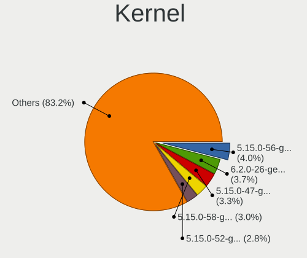

| Version            | Notebooks | Percent |
|--------------------|-----------|---------|
| 5.15.0-56-generic  | 23        | 4.04%   |
| 6.2.0-26-generic   | 21        | 3.68%   |
| 5.15.0-47-generic  | 19        | 3.33%   |
| 5.15.0-58-generic  | 17        | 2.98%   |
| 5.15.0-52-generic  | 16        | 2.81%   |
| 5.15.0-48-generic  | 16        | 2.81%   |
| 5.15.0-25-generic  | 14        | 2.46%   |
| 5.15.0-60-generic  | 13        | 2.28%   |
| 6.2.0-39-generic   | 12        | 2.11%   |
| 6.2.0-32-generic   | 11        | 1.93%   |
| 6.5.0-26-generic   | 10        | 1.75%   |
| 5.15.0-71-generic  | 10        | 1.75%   |
| 5.15.0-67-generic  | 10        | 1.75%   |
| 5.19.0-45-generic  | 9         | 1.58%   |
| 5.19.0-38-generic  | 9         | 1.58%   |
| 6.5.0-35-generic   | 8         | 1.4%    |
| 6.5.0-21-generic   | 8         | 1.4%    |
| 5.19.0-46-generic  | 8         | 1.4%    |
| 5.19.0-41-generic  | 8         | 1.4%    |
| 5.15.0-46-generic  | 8         | 1.4%    |
| 6.5.0-41-generic   | 7         | 1.23%   |
| 6.2.0-37-generic   | 7         | 1.23%   |
| 6.2.0-36-generic   | 7         | 1.23%   |
| 5.19.0-35-generic  | 7         | 1.23%   |
| 5.15.0-78-generic  | 7         | 1.23%   |
| 5.15.0-53-generic  | 7         | 1.23%   |
| 5.15.0-27-generic  | 7         | 1.23%   |
| 6.5.0-28-generic   | 6         | 1.05%   |
| 5.15.0-91-generic  | 6         | 1.05%   |
| 5.15.0-76-generic  | 6         | 1.05%   |
| 5.15.0-57-generic  | 6         | 1.05%   |
| 5.15.0-39-generic  | 6         | 1.05%   |
| 5.15.0-101-generic | 6         | 1.05%   |
| 6.8.0-45-generic   | 5         | 0.88%   |
| 6.5.0-25-generic   | 5         | 0.88%   |
| 6.5.0-18-generic   | 5         | 0.88%   |
| 5.19.0-50-generic  | 5         | 0.88%   |
| 5.19.0-43-generic  | 5         | 0.88%   |
| 5.19.0-32-generic  | 5         | 0.88%   |
| 5.15.0-69-generic  | 5         | 0.88%   |

Kernel Family
-------------

Linux kernel without a distro release

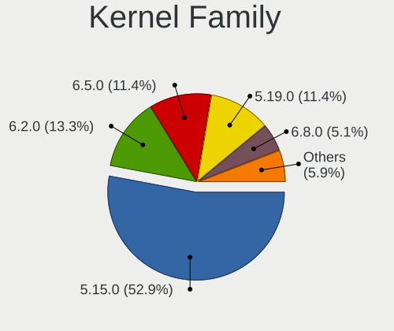

| Version  | Notebooks | Percent |
|----------|-----------|---------|
| 5.15.0   | 279       | 52.94%  |
| 6.2.0    | 70        | 13.28%  |
| 6.5.0    | 60        | 11.39%  |
| 5.19.0   | 60        | 11.39%  |
| 6.8.0    | 27        | 5.12%   |
| 5.17.0   | 9         | 1.71%   |
| 6.1.0    | 6         | 1.14%   |
| 6.0.0    | 2         | 0.38%   |
| 4.19.241 | 2         | 0.38%   |
| 6.4.15   | 1         | 0.19%   |
| 6.4.0    | 1         | 0.19%   |
| 6.1.6    | 1         | 0.19%   |
| 6.0.9    | 1         | 0.19%   |
| 6.0.7    | 1         | 0.19%   |
| 5.4.0    | 1         | 0.19%   |
| 5.19.5   | 1         | 0.19%   |
| 5.19.17  | 1         | 0.19%   |
| 5.18.0   | 1         | 0.19%   |
| 5.17.3   | 1         | 0.19%   |
| 5.13.0   | 1         | 0.19%   |
| 4.15.13  | 1         | 0.19%   |

Kernel Major Ver.
-----------------

Linux kernel major version

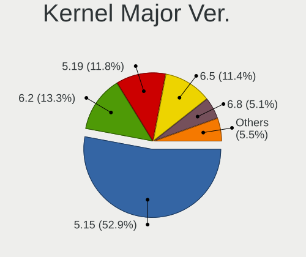

| Version | Notebooks | Percent |
|---------|-----------|---------|
| 5.15    | 279       | 52.94%  |
| 6.2     | 70        | 13.28%  |
| 5.19    | 62        | 11.76%  |
| 6.5     | 60        | 11.39%  |
| 6.8     | 27        | 5.12%   |
| 5.17    | 10        | 1.9%    |
| 6.1     | 7         | 1.33%   |
| 6.0     | 4         | 0.76%   |
| 6.4     | 2         | 0.38%   |
| 4.19    | 2         | 0.38%   |
| 5.4     | 1         | 0.19%   |
| 5.18    | 1         | 0.19%   |
| 5.13    | 1         | 0.19%   |
| 4.15    | 1         | 0.19%   |

Arch
----

OS architecture (x86_64, i586, etc.)

| Name   | Notebooks | Percent |
|--------|-----------|---------|
| x86_64 | 509       | 100%    |

DE
--

Desktop Environment

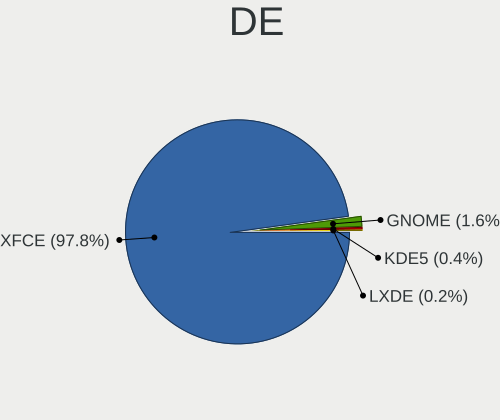

| Name  | Notebooks | Percent |
|-------|-----------|---------|
| XFCE  | 498       | 97.84%  |
| GNOME | 8         | 1.57%   |
| KDE5  | 2         | 0.39%   |
| LXDE  | 1         | 0.2%    |

Display Server
--------------

X11 or Wayland

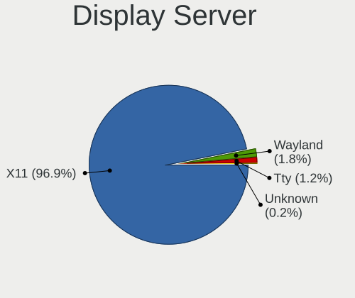

| Name    | Notebooks | Percent |
|---------|-----------|---------|
| X11     | 493       | 96.86%  |
| Wayland | 9         | 1.77%   |
| Tty     | 6         | 1.18%   |
| Unknown | 1         | 0.2%    |

Display Manager
---------------

SDDM, LightDM, etc.

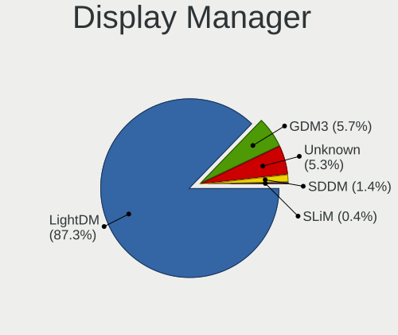

| Name    | Notebooks | Percent |
|---------|-----------|---------|
| LightDM | 445       | 87.25%  |
| GDM3    | 29        | 5.69%   |
| Unknown | 27        | 5.29%   |
| SDDM    | 7         | 1.37%   |
| SLiM    | 2         | 0.39%   |

OS Lang
-------

Language

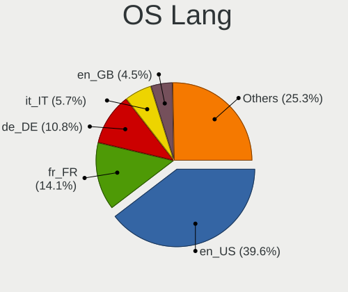

| Lang       | Notebooks | Percent |
|------------|-----------|---------|
| en_US      | 202       | 39.61%  |
| fr_FR      | 72        | 14.12%  |
| de_DE      | 55        | 10.78%  |
| it_IT      | 29        | 5.69%   |
| en_GB      | 23        | 4.51%   |
| pt_BR      | 13        | 2.55%   |
| en_CA      | 13        | 2.55%   |
| ru_RU      | 11        | 2.16%   |
| es_ES      | 10        | 1.96%   |
| pl_PL      | 9         | 1.76%   |
| C          | 8         | 1.57%   |
| en_IN      | 7         | 1.37%   |
| en_AU      | 5         | 0.98%   |
| cs_CZ      | 5         | 0.98%   |
| nl_NL      | 3         | 0.59%   |
| ja_JP      | 3         | 0.59%   |
| hu_HU      | 3         | 0.59%   |
| es_MX      | 3         | 0.59%   |
| es_CL      | 3         | 0.59%   |
| tr_TR      | 2         | 0.39%   |
| ro_RO      | 2         | 0.39%   |
| pt_PT      | 2         | 0.39%   |
| fr_BE      | 2         | 0.39%   |
| es_VE      | 2         | 0.39%   |
| de_CH      | 2         | 0.39%   |
| de_AT      | 2         | 0.39%   |
| zh_TW      | 1         | 0.2%    |
| zh_CN      | 1         | 0.2%    |
| sl_SI      | 1         | 0.2%    |
| ru_UA      | 1         | 0.2%    |
| nl_BE      | 1         | 0.2%    |
| lt_LT      | 1         | 0.2%    |
| it_IT@euro | 1         | 0.2%    |
| es_UY      | 1         | 0.2%    |
| es_CO      | 1         | 0.2%    |
| es_AR      | 1         | 0.2%    |
| en_ZA      | 1         | 0.2%    |
| en_NZ      | 1         | 0.2%    |
| en_IL      | 1         | 0.2%    |
| en_IE      | 1         | 0.2%    |

Boot Mode
---------

EFI or BIOS

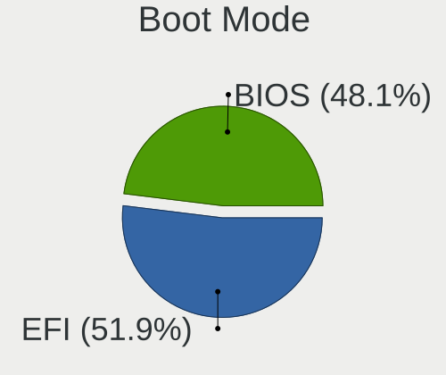

| Mode | Notebooks | Percent |
|------|-----------|---------|
| EFI  | 268       | 51.94%  |
| BIOS | 248       | 48.06%  |

Filesystem
----------

Type of filesystem

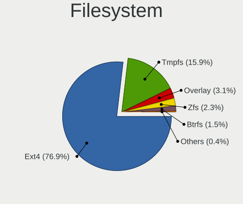

| Type    | Notebooks | Percent |
|---------|-----------|---------|
| Ext4    | 402       | 76.86%  |
| Tmpfs   | 83        | 15.87%  |
| Overlay | 16        | 3.06%   |
| Zfs     | 12        | 2.29%   |
| Btrfs   | 8         | 1.53%   |
| Xfs     | 1         | 0.19%   |
| Ext3    | 1         | 0.19%   |

Part. scheme
------------

Scheme of partitioning

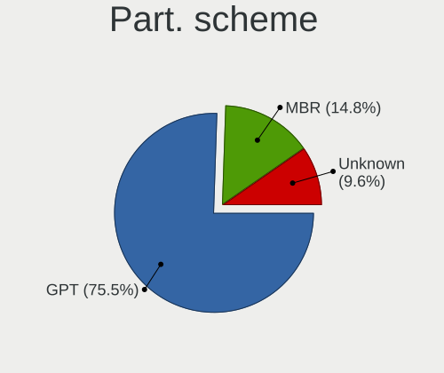

| Type    | Notebooks | Percent |
|---------|-----------|---------|
| GPT     | 392       | 75.53%  |
| MBR     | 77        | 14.84%  |
| Unknown | 50        | 9.63%   |

Dual Boot with Linux/BSD
------------------------

Hosting more than one Linux/BSD

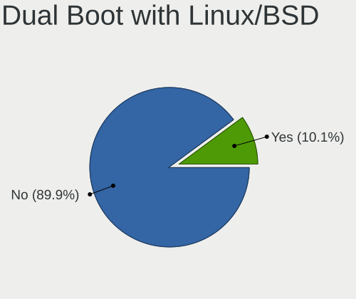

| Dual boot | Notebooks | Percent |
|-----------|-----------|---------|
| No        | 463       | 89.9%   |
| Yes       | 52        | 10.1%   |

Dual Boot (Win)
---------------

Hosting Linux and Windows

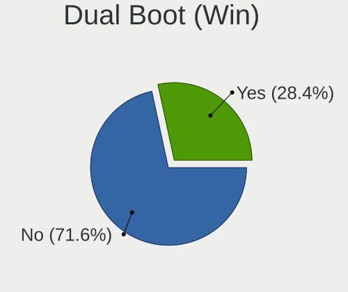

| Dual boot | Notebooks | Percent |
|-----------|-----------|---------|
| No        | 366       | 71.62%  |
| Yes       | 145       | 28.38%  |

Board
-----

Vendor
------

Motherboard manufacturer

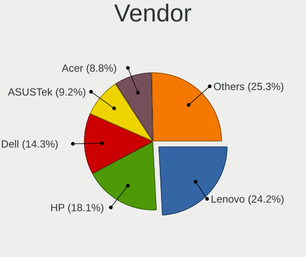

| Name                | Notebooks | Percent |
|---------------------|-----------|---------|
| Lenovo              | 123       | 24.17%  |
| Hewlett-Packard     | 92        | 18.07%  |
| Dell                | 73        | 14.34%  |
| ASUSTek Computer    | 47        | 9.23%   |
| Acer                | 45        | 8.84%   |
| Toshiba             | 15        | 2.95%   |
| Google              | 15        | 2.95%   |
| Apple               | 15        | 2.95%   |
| Sony                | 8         | 1.57%   |
| Samsung Electronics | 7         | 1.38%   |
| MSI                 | 7         | 1.38%   |
| GPU Company         | 5         | 0.98%   |
| Notebook            | 4         | 0.79%   |
| HUAWEI              | 4         | 0.79%   |
| Unknown             | 4         | 0.79%   |
| Packard Bell        | 3         | 0.59%   |
| Medion              | 3         | 0.59%   |
| Fujitsu             | 3         | 0.59%   |
| HONOR               | 2         | 0.39%   |
| Gigabyte Technology | 2         | 0.39%   |
| Gateway             | 2         | 0.39%   |
| Fujitsu Siemens     | 2         | 0.39%   |
| eMachines           | 2         | 0.39%   |
| Chuwi               | 2         | 0.39%   |
| AMI                 | 2         | 0.39%   |
| Thomson             | 1         | 0.2%    |
| Tactus              | 1         | 0.2%    |
| Standard            | 1         | 0.2%    |
| SGIN                | 1         | 0.2%    |
| Schenker            | 1         | 0.2%    |
| Philco              | 1         | 0.2%    |
| PC Specialist       | 1         | 0.2%    |
| Panasonic           | 1         | 0.2%    |
| Olivetti            | 1         | 0.2%    |
| Mediacom            | 1         | 0.2%    |
| Maibenben           | 1         | 0.2%    |
| Itautec             | 1         | 0.2%    |
| Intel               | 1         | 0.2%    |
| HIGRADED            | 1         | 0.2%    |
| Getac               | 1         | 0.2%    |

Model
-----

Motherboard model

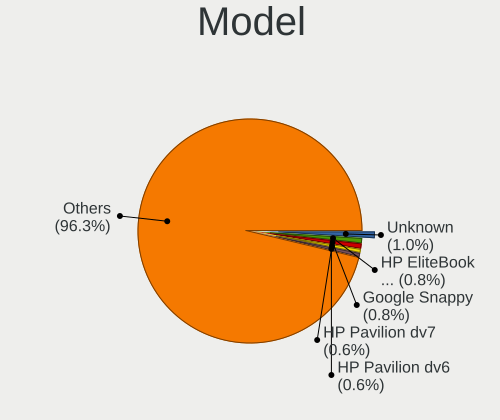

| Name                                     | Notebooks | Percent |
|------------------------------------------|-----------|---------|
| Unknown                                  | 5         | 0.98%   |
| HP EliteBook 840 G3                      | 4         | 0.79%   |
| Google Snappy                            | 4         | 0.79%   |
| HP Pavilion dv7                          | 3         | 0.59%   |
| HP Pavilion dv6                          | 3         | 0.59%   |
| HP Pavilion 17                           | 3         | 0.59%   |
| HP Laptop 15s-fq2xxx                     | 3         | 0.59%   |
| HP 15                                    | 3         | 0.59%   |
| Apple MacBookPro8,1                      | 3         | 0.59%   |
| Toshiba Satellite A200                   | 2         | 0.39%   |
| Lenovo ThinkPad P50 20EN0013US           | 2         | 0.39%   |
| Lenovo IdeaPad 5 15ABA7 82SG             | 2         | 0.39%   |
| Lenovo IdeaPad 100-15IBY 80MJ            | 2         | 0.39%   |
| Lenovo IdeaPad 1 15AMN7 82VG             | 2         | 0.39%   |
| HUAWEI BOHK-WAX9X                        | 2         | 0.39%   |
| HP Stream Laptop 14-ds0xxx               | 2         | 0.39%   |
| HP Pavilion Notebook                     | 2         | 0.39%   |
| HP Pavilion g7                           | 2         | 0.39%   |
| HP Pavilion g6                           | 2         | 0.39%   |
| HP Pavilion 15                           | 2         | 0.39%   |
| HP Notebook                              | 2         | 0.39%   |
| HP EliteBook 820 G3                      | 2         | 0.39%   |
| HP 255 G8 Notebook PC                    | 2         | 0.39%   |
| GPU Company GWTN116-3                    | 2         | 0.39%   |
| Google Reks                              | 2         | 0.39%   |
| Google Auron_Yuna                        | 2         | 0.39%   |
| Dell XPS 13 9305                         | 2         | 0.39%   |
| Dell Latitude E5510                      | 2         | 0.39%   |
| Dell Latitude E5450                      | 2         | 0.39%   |
| Dell Latitude 5411                       | 2         | 0.39%   |
| Dell Latitude 3540                       | 2         | 0.39%   |
| Dell Inspiron 3421                       | 2         | 0.39%   |
| ASUS X541UVK                             | 2         | 0.39%   |
| ASUS T100HAN                             | 2         | 0.39%   |
| ASUS ROG Zephyrus G14 GA403UI_GA403UI    | 2         | 0.39%   |
| ASUS ASUS TUF Gaming A15 FA507RE_FA507RE | 2         | 0.39%   |
| Apple MacBookPro7,1                      | 2         | 0.39%   |
| Apple MacBookPro5,4                      | 2         | 0.39%   |
| AMI Intel                                | 2         | 0.39%   |
| Toshiba TECRA A50-A                      | 1         | 0.2%    |

Model Family
------------

Motherboard model prefix

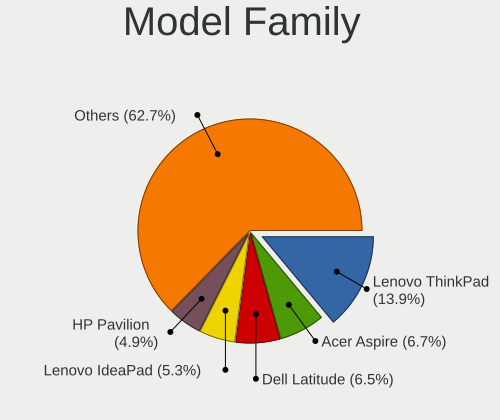

| Name                     | Notebooks | Percent |
|--------------------------|-----------|---------|
| Lenovo ThinkPad          | 71        | 13.95%  |
| Acer Aspire              | 34        | 6.68%   |
| Dell Latitude            | 33        | 6.48%   |
| Lenovo IdeaPad           | 27        | 5.3%    |
| HP Pavilion              | 25        | 4.91%   |
| Dell Inspiron            | 19        | 3.73%   |
| HP EliteBook             | 15        | 2.95%   |
| HP Laptop                | 13        | 2.55%   |
| Toshiba Satellite        | 11        | 2.16%   |
| Dell XPS                 | 9         | 1.77%   |
| ASUS VivoBook            | 9         | 1.77%   |
| HP ProBook               | 6         | 1.18%   |
| ASUS ROG                 | 6         | 1.18%   |
| Lenovo ThinkBook         | 5         | 0.98%   |
| Dell Precision           | 5         | 0.98%   |
| ASUS ASUS                | 5         | 0.98%   |
| Unknown                  | 5         | 0.98%   |
| HP Stream                | 4         | 0.79%   |
| HP 255                   | 4         | 0.79%   |
| HP 250                   | 4         | 0.79%   |
| Google Snappy            | 4         | 0.79%   |
| Dell Vostro              | 4         | 0.79%   |
| Packard Bell EasyNote    | 3         | 0.59%   |
| MSI Modern               | 3         | 0.59%   |
| HP ZBook                 | 3         | 0.59%   |
| HP Compaq                | 3         | 0.59%   |
| HP 15                    | 3         | 0.59%   |
| Apple MacBookPro8        | 3         | 0.59%   |
| Apple MacBookPro5        | 3         | 0.59%   |
| Acer Extensa             | 3         | 0.59%   |
| MSI GF63                 | 2         | 0.39%   |
| Lenovo Yoga              | 2         | 0.39%   |
| Lenovo V15               | 2         | 0.39%   |
| HUAWEI BOHK-WAX9X        | 2         | 0.39%   |
| HP Notebook              | 2         | 0.39%   |
| HP Mini                  | 2         | 0.39%   |
| GPU Company GWTN116-3    | 2         | 0.39%   |
| Google Reks              | 2         | 0.39%   |
| Google Auron             | 2         | 0.39%   |
| Fujitsu Siemens LIFEBOOK | 2         | 0.39%   |

MFG Year
--------

Motherboard manufacture year

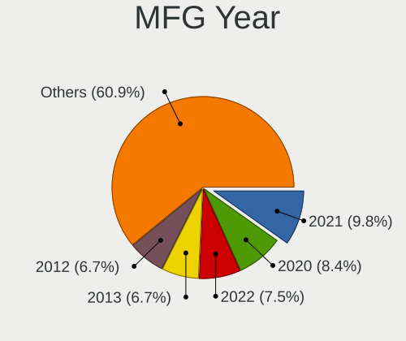

| Year    | Notebooks | Percent |
|---------|-----------|---------|
| 2021    | 50        | 9.82%   |
| 2020    | 43        | 8.45%   |
| 2022    | 38        | 7.47%   |
| 2013    | 34        | 6.68%   |
| 2012    | 34        | 6.68%   |
| 2017    | 32        | 6.29%   |
| 2016    | 31        | 6.09%   |
| 2015    | 31        | 6.09%   |
| 2011    | 31        | 6.09%   |
| 2010    | 28        | 5.5%    |
| 2019    | 27        | 5.3%    |
| 2014    | 25        | 4.91%   |
| 2018    | 24        | 4.72%   |
| 2009    | 22        | 4.32%   |
| 2008    | 21        | 4.13%   |
| 2023    | 17        | 3.34%   |
| 2007    | 13        | 2.55%   |
| 2006    | 5         | 0.98%   |
| 2024    | 2         | 0.39%   |
| Unknown | 1         | 0.2%    |

Form Factor
-----------

Physical design of the computer

| Name     | Notebooks | Percent |
|----------|-----------|---------|
| Notebook | 509       | 100%    |

Secure Boot
-----------

Enabled or disabled

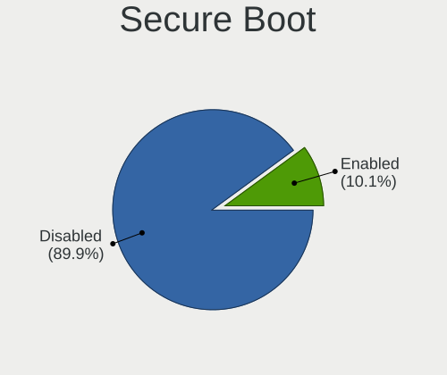

| State    | Notebooks | Percent |
|----------|-----------|---------|
| Disabled | 465       | 89.94%  |
| Enabled  | 52        | 10.06%  |

Coreboot
--------

Have coreboot on board

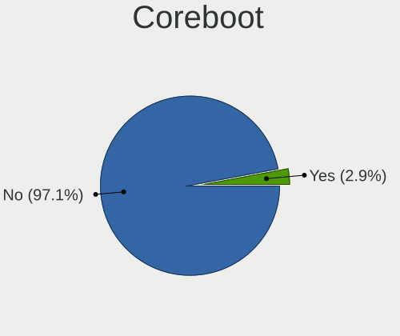

| Used | Notebooks | Percent |
|------|-----------|---------|
| No   | 494       | 97.05%  |
| Yes  | 15        | 2.95%   |

RAM Size
--------

Total RAM memory

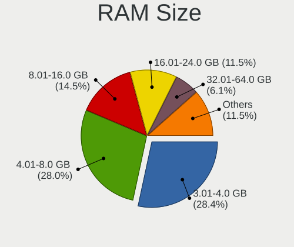

| Size in GB  | Notebooks | Percent |
|-------------|-----------|---------|
| 3.01-4.0    | 145       | 28.38%  |
| 4.01-8.0    | 143       | 27.98%  |
| 8.01-16.0   | 74        | 14.48%  |
| 16.01-24.0  | 59        | 11.55%  |
| 32.01-64.0  | 31        | 6.07%   |
| 1.01-2.0    | 26        | 5.09%   |
| 2.01-3.0    | 12        | 2.35%   |
| 64.01-256.0 | 12        | 2.35%   |
| 24.01-32.0  | 8         | 1.57%   |
| 0.51-1.0    | 1         | 0.2%    |

RAM Used
--------

Used RAM memory

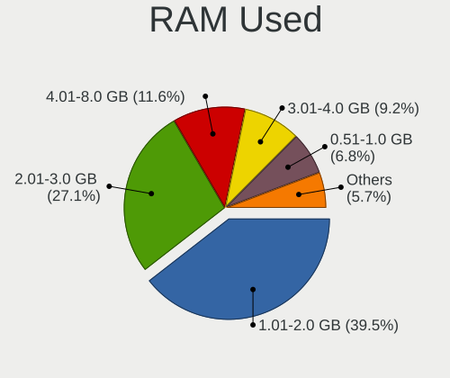

| Used GB    | Notebooks | Percent |
|------------|-----------|---------|
| 1.01-2.0   | 214       | 39.48%  |
| 2.01-3.0   | 147       | 27.12%  |
| 4.01-8.0   | 63        | 11.62%  |
| 3.01-4.0   | 50        | 9.23%   |
| 0.51-1.0   | 37        | 6.83%   |
| 8.01-16.0  | 25        | 4.61%   |
| 16.01-24.0 | 5         | 0.92%   |
| 24.01-32.0 | 1         | 0.18%   |

Total Drives
------------

Number of drives on board

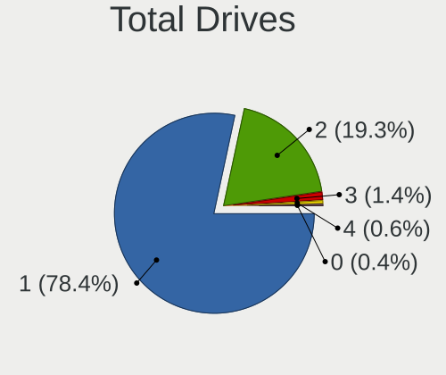

| Drives | Notebooks | Percent |
|--------|-----------|---------|
| 1      | 402       | 78.36%  |
| 2      | 99        | 19.3%   |
| 3      | 7         | 1.36%   |
| 4      | 3         | 0.58%   |
| 0      | 2         | 0.39%   |

Has CD-ROM
----------

Has CD-ROM on board

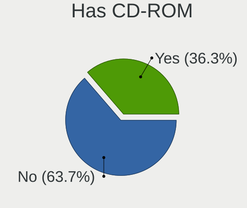

| Presented | Notebooks | Percent |
|-----------|-----------|---------|
| No        | 324       | 63.65%  |
| Yes       | 185       | 36.35%  |

Has Ethernet
------------

Has Ethernet on board

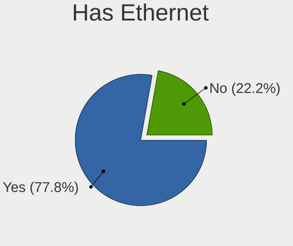

| Presented | Notebooks | Percent |
|-----------|-----------|---------|
| Yes       | 396       | 77.8%   |
| No        | 113       | 22.2%   |

Has WiFi
--------

Has WiFi module

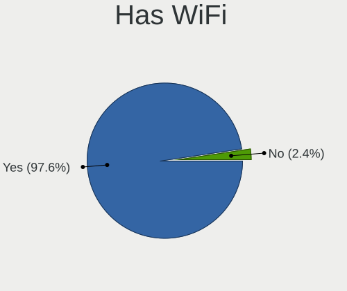

| Presented | Notebooks | Percent |
|-----------|-----------|---------|
| Yes       | 497       | 97.64%  |
| No        | 12        | 2.36%   |

Has Bluetooth
-------------

Has Bluetooth module

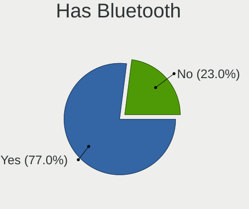

| Presented | Notebooks | Percent |
|-----------|-----------|---------|
| Yes       | 392       | 77.01%  |
| No        | 117       | 22.99%  |

Location
--------

Country
-------

Geographic location (country)

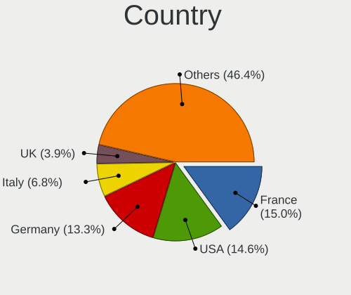

| Country     | Notebooks | Percent |
|-------------|-----------|---------|
| France      | 77        | 15.01%  |
| USA         | 75        | 14.62%  |
| Germany     | 68        | 13.26%  |
| Italy       | 35        | 6.82%   |
| UK          | 20        | 3.9%    |
| Brazil      | 18        | 3.51%   |
| Russia      | 17        | 3.31%   |
| Poland      | 16        | 3.12%   |
| Canada      | 13        | 2.53%   |
| Sweden      | 12        | 2.34%   |
| Spain       | 11        | 2.14%   |
| India       | 10        | 1.95%   |
| Czechia     | 10        | 1.95%   |
| Netherlands | 9         | 1.75%   |
| Mexico      | 9         | 1.75%   |
| Japan       | 6         | 1.17%   |
| Austria     | 6         | 1.17%   |
| Switzerland | 5         | 0.97%   |
| Belgium     | 5         | 0.97%   |
| Australia   | 5         | 0.97%   |
| Argentina   | 5         | 0.97%   |
| Iran        | 4         | 0.78%   |
| Hungary     | 4         | 0.78%   |
| Vietnam     | 3         | 0.58%   |
| Venezuela   | 3         | 0.58%   |
| Slovenia    | 3         | 0.58%   |
| Romania     | 3         | 0.58%   |
| Malaysia    | 3         | 0.58%   |
| Israel      | 3         | 0.58%   |
| Indonesia   | 3         | 0.58%   |
| Greece      | 3         | 0.58%   |
| Denmark     | 3         | 0.58%   |
| Colombia    | 3         | 0.58%   |
| Chile       | 3         | 0.58%   |
| Bulgaria    | 3         | 0.58%   |
| Belarus     | 3         | 0.58%   |
| Turkey      | 2         | 0.39%   |
| South Korea | 2         | 0.39%   |
| Pakistan    | 2         | 0.39%   |
| New Zealand | 2         | 0.39%   |

City
----

Geographic location (city)

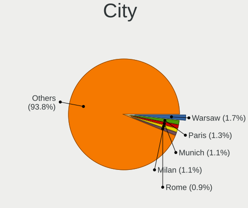

| City          | Notebooks | Percent |
|---------------|-----------|---------|
| Warsaw        | 9         | 1.68%   |
| Paris         | 7         | 1.31%   |
| Munich        | 6         | 1.12%   |
| Milan         | 6         | 1.12%   |
| Rome          | 5         | 0.93%   |
| Hamburg       | 5         | 0.93%   |
| Berlin        | 5         | 0.93%   |
| St Petersburg | 4         | 0.75%   |
| Prague        | 4         | 0.75%   |
| Melbourne     | 4         | 0.75%   |
| Uppsala       | 3         | 0.56%   |
| Toulouse      | 3         | 0.56%   |
| Stuttgart     | 3         | 0.56%   |
| North Hills   | 3         | 0.56%   |
| Moscow        | 3         | 0.56%   |
| Minneapolis   | 3         | 0.56%   |
| Los Angeles   | 3         | 0.56%   |
| Lincoln       | 3         | 0.56%   |
| Kuala Lumpur  | 3         | 0.56%   |
| Copenhagen    | 3         | 0.56%   |
| Burgnac       | 3         | 0.56%   |
| Budapest      | 3         | 0.56%   |
| Bucharest     | 3         | 0.56%   |
| Bordeaux      | 3         | 0.56%   |
| Athens        | 3         | 0.56%   |
| York          | 2         | 0.37%   |
| Washington    | 2         | 0.37%   |
| Vienna        | 2         | 0.37%   |
| Vancouver     | 2         | 0.37%   |
| Valenciennes  | 2         | 0.37%   |
| Tehran        | 2         | 0.37%   |
| Stockholm     | 2         | 0.37%   |
| Springfield   | 2         | 0.37%   |
| Soave         | 2         | 0.37%   |
| Seville       | 2         | 0.37%   |
| Santiago      | 2         | 0.37%   |
| Saint-Estephe | 2         | 0.37%   |
| Rochester     | 2         | 0.37%   |
| Rho           | 2         | 0.37%   |
| Puteaux       | 2         | 0.37%   |

Drives
------

Drive Vendor
------------

Hard drive vendors

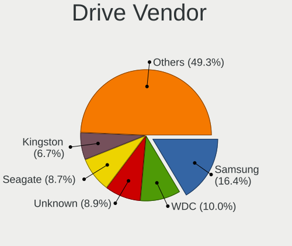

| Vendor                      | Notebooks | Drives | Percent |
|-----------------------------|-----------|--------|---------|
| Samsung Electronics         | 98        | 115    | 16.39%  |
| WDC                         | 60        | 72     | 10.03%  |
| Unknown                     | 53        | 70     | 8.86%   |
| Seagate                     | 52        | 62     | 8.7%    |
| Kingston                    | 40        | 43     | 6.69%   |
| SanDisk                     | 35        | 43     | 5.85%   |
| SK hynix                    | 32        | 39     | 5.35%   |
| Hitachi                     | 22        | 24     | 3.68%   |
| Toshiba                     | 21        | 23     | 3.51%   |
| Micron Technology           | 20        | 24     | 3.34%   |
| Intel                       | 17        | 20     | 2.84%   |
| Crucial                     | 14        | 14     | 2.34%   |
| A-DATA Technology           | 9         | 16     | 1.51%   |
| HGST                        | 8         | 9      | 1.34%   |
| SPCC                        | 7         | 9      | 1.17%   |
| China                       | 7         | 10     | 1.17%   |
| PNY                         | 6         | 6      | 1%      |
| Fujitsu                     | 6         | 6      | 1%      |
| Phison                      | 5         | 5      | 0.84%   |
| KIOXIA                      | 5         | 6      | 0.84%   |
| Phison Electronics          | 4         | 6      | 0.67%   |
| Intenso                     | 4         | 4      | 0.67%   |
| Apple                       | 4         | 6      | 0.67%   |
| Transcend                   | 3         | 4      | 0.5%    |
| TO Exter                    | 3         | 3      | 0.5%    |
| Patriot                     | 3         | 3      | 0.5%    |
| Netac                       | 3         | 3      | 0.5%    |
| LITEON                      | 3         | 3      | 0.5%    |
| Kingston Technology Company | 3         | 4      | 0.5%    |
| Apacer                      | 3         | 3      | 0.5%    |
| Unknown                     | 3         | 3      | 0.5%    |
| USB3.0                      | 2         | 3      | 0.33%   |
| UMIS                        | 2         | 2      | 0.33%   |
| Team                        | 2         | 5      | 0.33%   |
| Silicon Motion              | 2         | 2      | 0.33%   |
| Lenovo                      | 2         | 2      | 0.33%   |
| KingDian                    | 2         | 2      | 0.33%   |
| JMicron Technology          | 2         | 2      | 0.33%   |
| GOODRAM                     | 2         | 2      | 0.33%   |
| FORESEE                     | 2         | 5      | 0.33%   |

Drive Model
-----------

Hard drive models

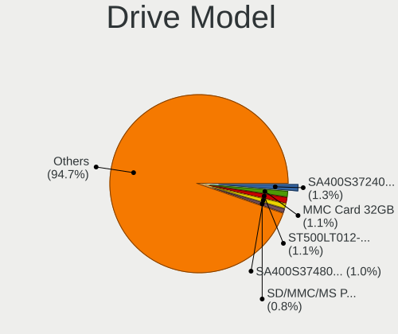

| Model                                             | Notebooks | Percent |
|---------------------------------------------------|-----------|---------|
| Kingston SA400S37240G 240GB SSD                   | 8         | 1.29%   |
| Unknown MMC Card  32GB                            | 7         | 1.13%   |
| Seagate ST500LT012-1DG142 500GB                   | 7         | 1.13%   |
| Kingston SA400S37480G 480GB SSD                   | 6         | 0.97%   |
| Unknown SD/MMC/MS PRO 2GB                         | 5         | 0.81%   |
| Seagate ST1000LM048-2E7172 1TB                    | 5         | 0.81%   |
| Seagate ST1000LM024 HN-M101MBB 1TB                | 5         | 0.81%   |
| Samsung SSD 860 EVO 500GB                         | 5         | 0.81%   |
| Samsung NVMe SSD Controller SM981/PM981/PM983 1TB | 5         | 0.81%   |
| Toshiba MQ01ABF050 500GB                          | 4         | 0.65%   |
| Kingston SA400S37120G 120GB SSD                   | 4         | 0.65%   |
| Intel SSDPEKNU512GZ 512GB                         | 4         | 0.65%   |
| WDC WDS240G2G0A-00JH30 240GB SSD                  | 3         | 0.48%   |
| WDC WD10SPZX-21Z10T0 1TB                          | 3         | 0.48%   |
| Unknown MMC Card  16GB                            | 3         | 0.48%   |
| Unknown MMC Card  128GB                           | 3         | 0.48%   |
| Toshiba MQ04ABF100 1TB                            | 3         | 0.48%   |
| TO Exter nal USB 3.0 250GB                        | 3         | 0.48%   |
| Seagate ST500LM012 HN-M500MBB 500GB               | 3         | 0.48%   |
| Seagate ST1000LM035-1RK172 1TB                    | 3         | 0.48%   |
| SanDisk DF4032  32GB                              | 3         | 0.48%   |
| Samsung SSD 870 QVO 4TB                           | 3         | 0.48%   |
| Samsung SSD 870 EVO 1TB                           | 3         | 0.48%   |
| Samsung SSD 850 EVO 500GB                         | 3         | 0.48%   |
| Samsung SSD 850 EVO 250GB                         | 3         | 0.48%   |
| Samsung NVMe SSD Drive 256GB                      | 3         | 0.48%   |
| Samsung MZALQ512HALU-000L2 512GB                  | 3         | 0.48%   |
| KIOXIA KBG40ZNS256G NVMe 256GB                    | 3         | 0.48%   |
| Hitachi HTS547550A9E384 500GB                     | 3         | 0.48%   |
| Hitachi HTS545050A7E380 500GB                     | 3         | 0.48%   |
| HGST HTS541010A9E680 1TB                          | 3         | 0.48%   |
| A-DATA SU650 240GB SSD                            | 3         | 0.48%   |
| Unknown                                           | 3         | 0.48%   |
| WDC WDS250G2B0A 250GB SSD                         | 2         | 0.32%   |
| WDC WD5000LPCX-24C6HT0 500GB                      | 2         | 0.32%   |
| WDC WD3200BEVT-22ZCT0 320GB                       | 2         | 0.32%   |
| WDC WD10JPVX-22JC3T0 1TB                          | 2         | 0.32%   |
| WDC WD10JPCX-24UE4T0 1TB                          | 2         | 0.32%   |
| WDC PC SN530 SDBPNPZ-512G-1036 512GB              | 2         | 0.32%   |
| USB3.0 Super Speed 500GB                          | 2         | 0.32%   |

HDD Vendor
----------

Hard disk drive vendors

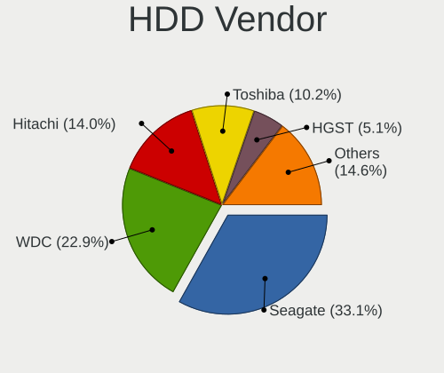

| Vendor              | Notebooks | Drives | Percent |
|---------------------|-----------|--------|---------|
| Seagate             | 52        | 62     | 33.12%  |
| WDC                 | 36        | 44     | 22.93%  |
| Hitachi             | 22        | 24     | 14.01%  |
| Toshiba             | 16        | 17     | 10.19%  |
| HGST                | 8         | 9      | 5.1%    |
| Fujitsu             | 6         | 6      | 3.82%   |
| Unknown             | 5         | 6      | 3.18%   |
| Samsung Electronics | 4         | 4      | 2.55%   |
| TO Exter            | 3         | 3      | 1.91%   |
| USB3.0              | 2         | 3      | 1.27%   |
| SSK                 | 1         | 2      | 0.64%   |
| JMicron Technology  | 1         | 1      | 0.64%   |
| HGST HTS            | 1         | 2      | 0.64%   |

SSD Vendor
----------

Solid state drive vendors

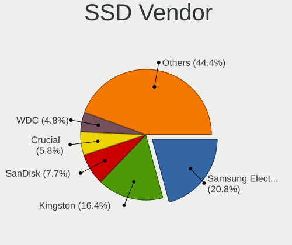

| Vendor              | Notebooks | Drives | Percent |
|---------------------|-----------|--------|---------|
| Samsung Electronics | 43        | 53     | 20.77%  |
| Kingston            | 34        | 36     | 16.43%  |
| SanDisk             | 16        | 20     | 7.73%   |
| Crucial             | 12        | 12     | 5.8%    |
| WDC                 | 10        | 10     | 4.83%   |
| A-DATA Technology   | 9         | 16     | 4.35%   |
| Micron Technology   | 8         | 9      | 3.86%   |
| China               | 7         | 10     | 3.38%   |
| SPCC                | 6         | 6      | 2.9%    |
| PNY                 | 6         | 6      | 2.9%    |
| SK hynix            | 5         | 5      | 2.42%   |
| Intel               | 5         | 7      | 2.42%   |
| Intenso             | 4         | 4      | 1.93%   |
| Transcend           | 3         | 3      | 1.45%   |
| Patriot             | 3         | 3      | 1.45%   |
| LITEON              | 3         | 3      | 1.45%   |
| Apacer              | 3         | 3      | 1.45%   |
| Toshiba             | 2         | 2      | 0.97%   |
| Netac               | 2         | 2      | 0.97%   |
| KingDian            | 2         | 2      | 0.97%   |
| GOODRAM             | 2         | 2      | 0.97%   |
| FORESEE             | 2         | 5      | 0.97%   |
| BHT                 | 2         | 2      | 0.97%   |
| Apple               | 2         | 2      | 0.97%   |
| Verbatim            | 1         | 1      | 0.48%   |
| Team                | 1         | 4      | 0.48%   |
| SSSTC               | 1         | 1      | 0.48%   |
| ShiJi               | 1         | 1      | 0.48%   |
| PHD 3.0             | 1         | 1      | 0.48%   |
| LITEONIT            | 1         | 1      | 0.48%   |
| KIOXIA-EXCERIA      | 1         | 1      | 0.48%   |
| KingSpec            | 1         | 1      | 0.48%   |
| Kimtigo             | 1         | 1      | 0.48%   |
| INNOVATION IT       | 1         | 1      | 0.48%   |
| HEORIADY            | 1         | 1      | 0.48%   |
| FIKWOT              | 1         | 1      | 0.48%   |
| EVM                 | 1         | 1      | 0.48%   |
| ASMT                | 1         | 4      | 0.48%   |
| addlink             | 1         | 1      | 0.48%   |
| Unknown             | 1         | 1      | 0.48%   |

Drive Kind
----------

HDD or SSD

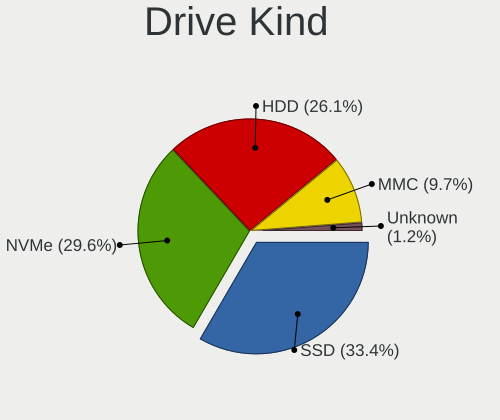

| Kind    | Notebooks | Drives | Percent |
|---------|-----------|--------|---------|
| SSD     | 192       | 245    | 33.39%  |
| NVMe    | 170       | 209    | 29.57%  |
| HDD     | 150       | 183    | 26.09%  |
| MMC     | 56        | 73     | 9.74%   |
| Unknown | 7         | 7      | 1.22%   |

Drive Connector
---------------

SATA, SAS, NVMe, etc.

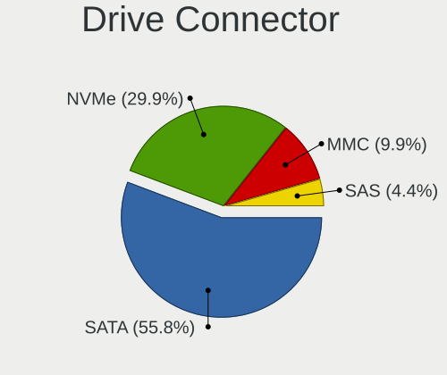

| Type | Notebooks | Drives | Percent |
|------|-----------|--------|---------|
| SATA | 315       | 401    | 55.75%  |
| NVMe | 169       | 208    | 29.91%  |
| MMC  | 56        | 73     | 9.91%   |
| SAS  | 25        | 35     | 4.42%   |

Drive Size
----------

Size of hard drive

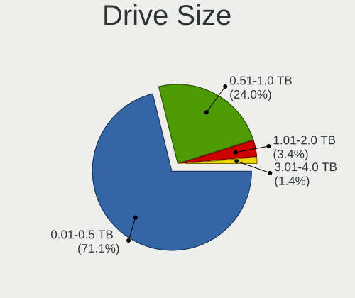

| Size in TB | Notebooks | Drives | Percent |
|------------|-----------|--------|---------|
| 0.01-0.5   | 249       | 308    | 71.14%  |
| 0.51-1.0   | 84        | 98     | 24%     |
| 1.01-2.0   | 12        | 17     | 3.43%   |
| 3.01-4.0   | 5         | 5      | 1.43%   |

Space Total
-----------

Amount of disk space available on the file system

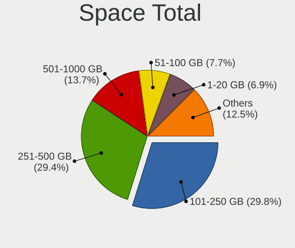

| Size in GB     | Notebooks | Percent |
|----------------|-----------|---------|
| 101-250        | 155       | 29.81%  |
| 251-500        | 153       | 29.42%  |
| 501-1000       | 71        | 13.65%  |
| 51-100         | 40        | 7.69%   |
| 1-20           | 36        | 6.92%   |
| 21-50          | 26        | 5%      |
| 1001-2000      | 26        | 5%      |
| More than 3000 | 10        | 1.92%   |
| 2001-3000      | 2         | 0.38%   |
| Unknown        | 1         | 0.19%   |

Space Used
----------

Amount of used disk space

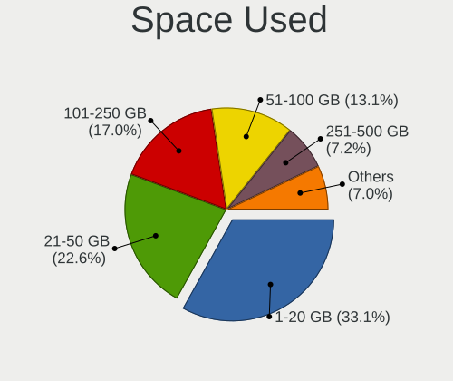

| Used GB        | Notebooks | Percent |
|----------------|-----------|---------|
| 1-20           | 179       | 33.09%  |
| 21-50          | 122       | 22.55%  |
| 101-250        | 92        | 17.01%  |
| 51-100         | 71        | 13.12%  |
| 251-500        | 39        | 7.21%   |
| 501-1000       | 27        | 4.99%   |
| 1001-2000      | 8         | 1.48%   |
| More than 3000 | 1         | 0.18%   |
| 2001-3000      | 1         | 0.18%   |
| Unknown        | 1         | 0.18%   |

Malfunc. Drives
---------------

Drive models with a malfunction

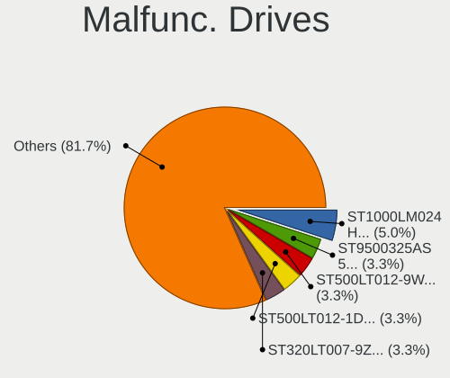

| Model                                               | Notebooks | Drives | Percent |
|-----------------------------------------------------|-----------|--------|---------|
| Seagate ST1000LM024 HN-M101MBB 1TB                  | 3         | 3      | 5%      |
| Seagate ST9500325AS 500GB                           | 2         | 2      | 3.33%   |
| Seagate ST500LT012-9WS142 500GB                     | 2         | 2      | 3.33%   |
| Seagate ST500LT012-1DG142 500GB                     | 2         | 2      | 3.33%   |
| Seagate ST320LT007-9ZV142 320GB                     | 2         | 2      | 3.33%   |
| WDC WDS480G2G0A-00JH30 480GB SSD                    | 1         | 1      | 1.67%   |
| WDC WD5000LPVT-08G33T1 500GB                        | 1         | 1      | 1.67%   |
| WDC WD1200BEVS-60UST0 120GB                         | 1         | 1      | 1.67%   |
| WDC WD10JPVX-22JC3T0 1TB                            | 1         | 1      | 1.67%   |
| Toshiba MK5065GSXN 500GB                            | 1         | 1      | 1.67%   |
| Toshiba MK1633GSG 160GB                             | 1         | 2      | 1.67%   |
| Toshiba MK1246GSX 120GB                             | 1         | 1      | 1.67%   |
| SSSTC CVB-8D128-HP 128GB                            | 1         | 1      | 1.67%   |
| SK hynix HFS256G32TNH-73A0A 256GB SSD               | 1         | 1      | 1.67%   |
| Seagate ST9500423AS 500GB                           | 1         | 1      | 1.67%   |
| Seagate ST9500420AS 500GB                           | 1         | 1      | 1.67%   |
| Seagate ST9500325ASG 500GB                          | 1         | 1      | 1.67%   |
| Seagate ST1000LM 035-1RK172 1TB                     | 1         | 1      | 1.67%   |
| SanDisk SSD PLUS 480GB                              | 1         | 1      | 1.67%   |
| SanDisk SSD PLUS 240GB                              | 1         | 1      | 1.67%   |
| SanDisk SD9SN8W-128G-1006 128GB SSD                 | 1         | 1      | 1.67%   |
| Samsung Electronics SSD PM810 FDE 2.5 128GB         | 1         | 1      | 1.67%   |
| Samsung Electronics MZNLH128HBHQ-000H1 128GB SSD    | 1         | 1      | 1.67%   |
| Samsung Electronics HM160HC 160GB                   | 1         | 1      | 1.67%   |
| Micron Technology MTFDDAV256TBN 256GB SSD           | 1         | 1      | 1.67%   |
| Micron Technology MTFDDAK512TBN-1AR1ZABHA 512GB SSD | 1         | 1      | 1.67%   |
| Micron Technology 1100_MTFDDAV512TBN 512GB SSD      | 1         | 1      | 1.67%   |
| LITEON LCH-512V2S 512GB SSD                         | 1         | 1      | 1.67%   |
| LITEON CV8-8E128-HP 128GB SSD                       | 1         | 1      | 1.67%   |
| Kingston SNS4151S332GD 32GB SSD                     | 1         | 2      | 1.67%   |
| Kingston SNS4151S316GD 16GB SSD                     | 1         | 1      | 1.67%   |
| Kingston OM8S1S3128K-AH 128GB SSD                   | 1         | 1      | 1.67%   |
| JMicron Technology Generic 320GB                    | 1         | 1      | 1.67%   |
| Intenso SSD Sata III 250GB                          | 1         | 1      | 1.67%   |
| Intel SSDSCKKF240H6L 240GB                          | 1         | 1      | 1.67%   |
| Hitachi HTS725050A9A364 500GB                       | 1         | 1      | 1.67%   |
| Hitachi HTS545032A7E380 320GB                       | 1         | 1      | 1.67%   |
| Hitachi HTS545025B9SA02 250GB                       | 1         | 2      | 1.67%   |
| Hitachi HTS543232A7A384 320GB                       | 1         | 1      | 1.67%   |
| Hitachi HTS543225A7A384 250GB                       | 1         | 1      | 1.67%   |

Malfunc. Drive Vendor
---------------------

Vendors of faulty drives

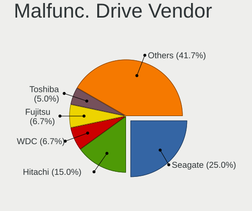

| Vendor              | Notebooks | Drives | Percent |
|---------------------|-----------|--------|---------|
| Seagate             | 15        | 15     | 25%     |
| Hitachi             | 9         | 10     | 15%     |
| WDC                 | 4         | 4      | 6.67%   |
| Fujitsu             | 4         | 4      | 6.67%   |
| Toshiba             | 3         | 4      | 5%      |
| SanDisk             | 3         | 3      | 5%      |
| Samsung Electronics | 3         | 3      | 5%      |
| Micron Technology   | 3         | 3      | 5%      |
| Kingston            | 3         | 4      | 5%      |
| LITEON              | 2         | 2      | 3.33%   |
| HGST                | 2         | 2      | 3.33%   |
| Apple               | 2         | 2      | 3.33%   |
| SSSTC               | 1         | 1      | 1.67%   |
| SK hynix            | 1         | 1      | 1.67%   |
| JMicron Technology  | 1         | 1      | 1.67%   |
| Intenso             | 1         | 1      | 1.67%   |
| Intel               | 1         | 1      | 1.67%   |
| A-DATA Technology   | 1         | 1      | 1.67%   |
| Unknown             | 1         | 1      | 1.67%   |

Malfunc. HDD Vendor
-------------------

Vendors of faulty HDD drives

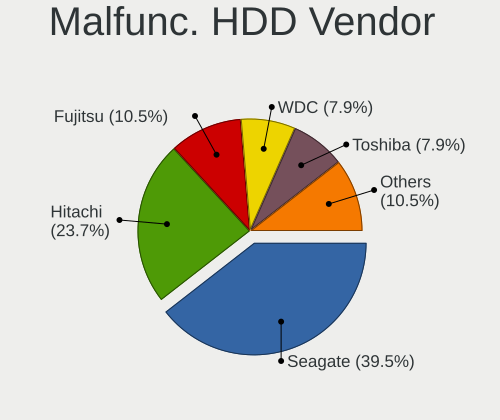

| Vendor              | Notebooks | Drives | Percent |
|---------------------|-----------|--------|---------|
| Seagate             | 15        | 15     | 39.47%  |
| Hitachi             | 9         | 10     | 23.68%  |
| Fujitsu             | 4         | 4      | 10.53%  |
| WDC                 | 3         | 3      | 7.89%   |
| Toshiba             | 3         | 4      | 7.89%   |
| HGST                | 2         | 2      | 5.26%   |
| Samsung Electronics | 1         | 1      | 2.63%   |
| JMicron Technology  | 1         | 1      | 2.63%   |

Malfunc. Drive Kind
-------------------

Kinds of faulty drives

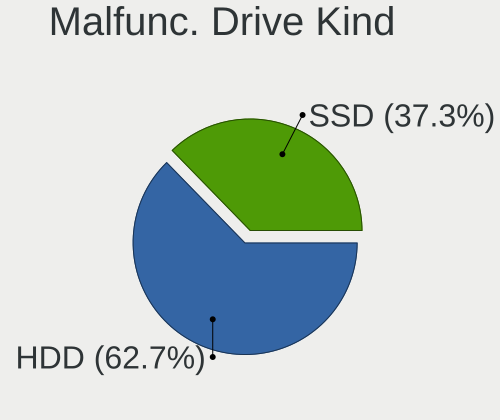

| Kind | Notebooks | Drives | Percent |
|------|-----------|--------|---------|
| HDD  | 37        | 40     | 62.71%  |
| SSD  | 22        | 23     | 37.29%  |

Failed Drives
-------------

Failed drive models

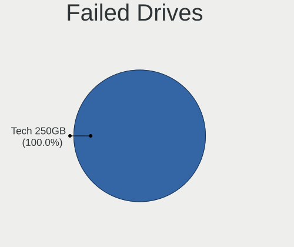

| Model                         | Notebooks | Drives | Percent |
|-------------------------------|-----------|--------|---------|
| JMicron Technology Tech 250GB | 1         | 1      | 100%    |

Failed Drive Vendor
-------------------

Failed drive vendors

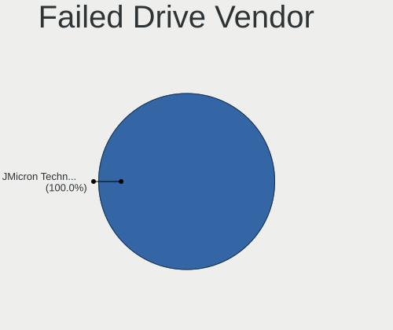

| Vendor             | Notebooks | Drives | Percent |
|--------------------|-----------|--------|---------|
| JMicron Technology | 1         | 1      | 100%    |

Drive Status
------------

Number of failed and malfunc. drives

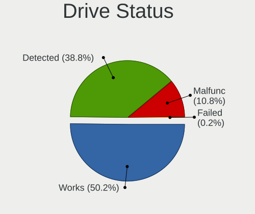

| Status   | Notebooks | Drives | Percent |
|----------|-----------|--------|---------|
| Works    | 273       | 324    | 50.18%  |
| Detected | 211       | 329    | 38.79%  |
| Malfunc  | 59        | 63     | 10.85%  |
| Failed   | 1         | 1      | 0.18%   |

Storage controller
------------------

Storage Vendor
--------------

Storage controller vendors

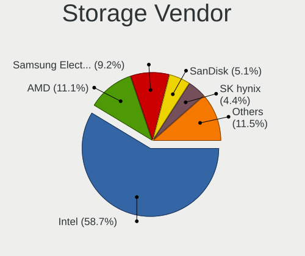

| Vendor                                  | Notebooks | Percent |
|-----------------------------------------|-----------|---------|
| Intel                                   | 332       | 58.66%  |
| AMD                                     | 63        | 11.13%  |
| Samsung Electronics                     | 52        | 9.19%   |
| SanDisk                                 | 29        | 5.12%   |
| SK hynix                                | 25        | 4.42%   |
| Micron Technology                       | 11        | 1.94%   |
| Kingston Technology Company             | 10        | 1.77%   |
| Phison Electronics                      | 9         | 1.59%   |
| Nvidia                                  | 8         | 1.41%   |
| KIOXIA                                  | 5         | 0.88%   |
| Toshiba America Info Systems            | 3         | 0.53%   |
| Silicon Motion                          | 3         | 0.53%   |
| Micron/Crucial Technology               | 3         | 0.53%   |
| Realtek Semiconductor                   | 2         | 0.35%   |
| MAXIO Technology (Hangzhou)             | 2         | 0.35%   |
| Lenovo                                  | 2         | 0.35%   |
| Apple                                   | 2         | 0.35%   |
| Union Memory (Shenzhen)                 | 1         | 0.18%   |
| Shenzhen Unionmemory Information System | 1         | 0.18%   |
| Netac Technology                        | 1         | 0.18%   |
| Marvell Technology Group                | 1         | 0.18%   |
| Hosin Global Electronics                | 1         | 0.18%   |

Storage Model
-------------

Storage controller models

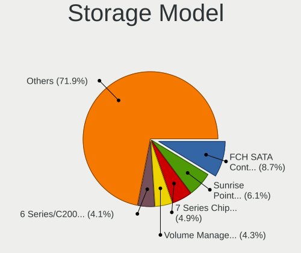

| Model                                                                            | Notebooks | Percent |
|----------------------------------------------------------------------------------|-----------|---------|
| AMD FCH SATA Controller [AHCI mode]                                              | 53        | 8.7%    |
| Intel Sunrise Point-LP SATA Controller [AHCI mode]                               | 37        | 6.08%   |
| Intel 7 Series Chipset Family 6-port SATA Controller [AHCI mode]                 | 30        | 4.93%   |
| Intel Volume Management Device NVMe RAID Controller                              | 26        | 4.27%   |
| Intel 6 Series/C200 Series Chipset Family 6 port Mobile SATA AHCI Controller     | 25        | 4.11%   |
| Intel 82801IBM/IEM (ICH9M/ICH9M-E) 4 port SATA Controller [AHCI mode]            | 19        | 3.12%   |
| Samsung NVMe SSD Controller 980 (DRAM-less)                                      | 18        | 2.96%   |
| Intel 8 Series SATA Controller 1 [AHCI mode]                                     | 17        | 2.79%   |
| Samsung NVMe SSD Controller SM981/PM981/PM983                                    | 15        | 2.46%   |
| Intel Wildcat Point-LP SATA Controller [AHCI Mode]                               | 15        | 2.46%   |
| Intel 82801 Mobile SATA Controller [RAID mode]                                   | 15        | 2.46%   |
| Intel 5 Series/3400 Series Chipset 4 port SATA AHCI Controller                   | 14        | 2.3%    |
| Intel 82801HM/HEM (ICH8M/ICH8M-E) IDE Controller                                 | 13        | 2.13%   |
| SK hynix Gold P31/BC711/PC711 NVMe Solid State Drive                             | 12        | 1.97%   |
| Intel Celeron/Pentium Silver Processor SATA Controller                           | 12        | 1.97%   |
| Intel 82801HM/HEM (ICH8M/ICH8M-E) SATA Controller [AHCI mode]                    | 12        | 1.97%   |
| Intel 8 Series/C220 Series Chipset Family 6-port SATA Controller 1 [AHCI mode]   | 12        | 1.97%   |
| Intel Tiger Lake-LP SATA Controller                                              | 11        | 1.81%   |
| Intel 5 Series/3400 Series Chipset 6 port SATA AHCI Controller                   | 10        | 1.64%   |
| SanDisk Extreme Pro / WD Black SN750 / PC SN730 / Red SN700 NVMe SSD             | 8         | 1.31%   |
| Intel Atom/Celeron/Pentium Processor x5-E8000/J3xxx/N3xxx Series SATA Controller | 8         | 1.31%   |
| Samsung NVMe SSD Controller SM961/PM961/SM963                                    | 7         | 1.15%   |
| Samsung NVMe SSD Controller PM9A1/PM9A3/980PRO                                   | 7         | 1.15%   |
| Intel SSD 670p Series [Keystone Harbor]                                          | 7         | 1.15%   |
| Intel Q170/Q150/B150/H170/H110/Z170/CM236 Chipset SATA Controller [AHCI Mode]    | 7         | 1.15%   |
| Intel Atom Processor E3800 Series SATA AHCI Controller                           | 7         | 1.15%   |
| SanDisk Ultra 3D / WD PC SN530, IX SN530, Blue SN550 NVMe SSD (DRAM-less)        | 6         | 0.99%   |
| Nvidia MCP79 AHCI Controller                                                     | 6         | 0.99%   |
| Intel Comet Lake SATA AHCI Controller                                            | 6         | 0.99%   |
| Intel Celeron N3350/Pentium N4200/Atom E3900 Series SATA AHCI Controller         | 6         | 0.99%   |
| Intel 400 Series Chipset Family SATA AHCI Controller                             | 6         | 0.99%   |
| AMD SB7x0/SB8x0/SB9x0 SATA Controller [AHCI mode]                                | 6         | 0.99%   |
| SK hynix PC611 NVMe Solid State Drive                                            | 5         | 0.82%   |
| Micron 2450 NVMe SSD [HendrixV] (DRAM-less)                                      | 5         | 0.82%   |
| Intel Cannon Lake Mobile PCH SATA AHCI Controller                                | 5         | 0.82%   |
| Intel 82801IBM/IEM (ICH9M/ICH9M-E) 2 port SATA Controller [IDE mode]             | 5         | 0.82%   |
| Intel 82801G (ICH7 Family) IDE Controller                                        | 5         | 0.82%   |
| Samsung NVMe SSD Controller PM9B1 (DRAM-less)                                    | 4         | 0.66%   |
| Phison PS5013-E13 PCIe3 NVMe Controller (DRAM-less)                              | 4         | 0.66%   |
| Intel SSD 660P Series                                                            | 4         | 0.66%   |

Storage Kind
------------

Kind of storage controller (IDE, SATA, NVMe, SAS, ...)

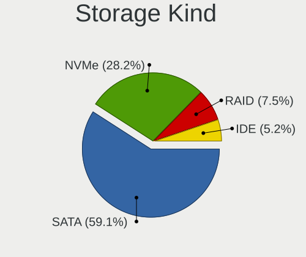

| Kind | Notebooks | Percent |
|------|-----------|---------|
| SATA | 354       | 59.1%   |
| NVMe | 169       | 28.21%  |
| RAID | 45        | 7.51%   |
| IDE  | 31        | 5.18%   |

Processor
---------

CPU Vendor
----------

Processor vendors

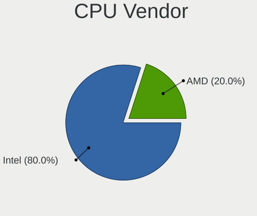

| Vendor | Notebooks | Percent |
|--------|-----------|---------|
| Intel  | 407       | 79.96%  |
| AMD    | 102       | 20.04%  |

CPU Model
---------

Processor models

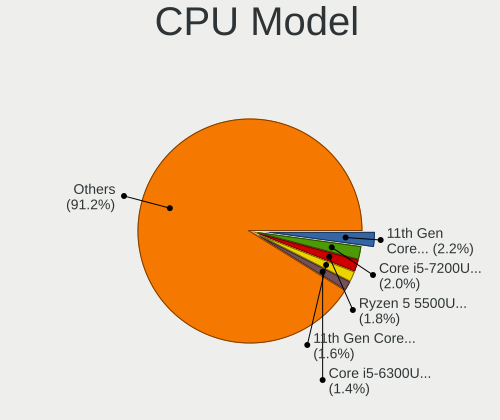

| Model                                   | Notebooks | Percent |
|-----------------------------------------|-----------|---------|
| Intel 11th Gen Core i7-1165G7 @ 2.80GHz | 11        | 2.16%   |
| Intel Core i5-7200U CPU @ 2.50GHz       | 10        | 1.96%   |
| AMD Ryzen 5 5500U with Radeon Graphics  | 9         | 1.77%   |
| Intel 11th Gen Core i5-1135G7 @ 2.40GHz | 8         | 1.57%   |
| Intel Core i5-6300U CPU @ 2.40GHz       | 7         | 1.38%   |
| Intel Celeron N4020 CPU @ 1.10GHz       | 7         | 1.38%   |
| Intel Core i3-3217U CPU @ 1.80GHz       | 6         | 1.18%   |
| Intel Core 2 Duo CPU P8600 @ 2.40GHz    | 6         | 1.18%   |
| Intel Celeron CPU N3350 @ 1.10GHz       | 6         | 1.18%   |
| Intel Celeron CPU N3060 @ 1.60GHz       | 6         | 1.18%   |
| Intel Celeron CPU N3050 @ 1.60GHz       | 6         | 1.18%   |
| Intel Celeron CPU N2840 @ 2.16GHz       | 6         | 1.18%   |
| Intel Core i7-8550U CPU @ 1.80GHz       | 5         | 0.98%   |
| Intel Core i5-4210U CPU @ 1.70GHz       | 5         | 0.98%   |
| Intel Core i5-3320M CPU @ 2.60GHz       | 5         | 0.98%   |
| Intel Core i5-2520M CPU @ 2.50GHz       | 5         | 0.98%   |
| Intel Core i5 CPU M 520 @ 2.40GHz       | 5         | 0.98%   |
| Intel 12th Gen Core i7-1260P            | 5         | 0.98%   |
| Intel Core i7-9750H CPU @ 2.60GHz       | 4         | 0.79%   |
| Intel Core i7-6700HQ CPU @ 2.60GHz      | 4         | 0.79%   |
| Intel Core i5-8265U CPU @ 1.60GHz       | 4         | 0.79%   |
| Intel Core i5-8250U CPU @ 1.60GHz       | 4         | 0.79%   |
| Intel Core i5-6200U CPU @ 2.30GHz       | 4         | 0.79%   |
| Intel Core i5-10210U CPU @ 1.60GHz      | 4         | 0.79%   |
| Intel Core i3 CPU M 330 @ 2.13GHz       | 4         | 0.79%   |
| Intel Celeron CPU N3450 @ 1.10GHz       | 4         | 0.79%   |
| Intel 11th Gen Core i3-1115G4 @ 3.00GHz | 4         | 0.79%   |
| AMD Ryzen 7 5700U with Radeon Graphics  | 4         | 0.79%   |
| Intel Core i7-7500U CPU @ 2.70GHz       | 3         | 0.59%   |
| Intel Core i7-6600U CPU @ 2.60GHz       | 3         | 0.59%   |
| Intel Core i7-10750H CPU @ 2.60GHz      | 3         | 0.59%   |
| Intel Core i7-10510U CPU @ 1.80GHz      | 3         | 0.59%   |
| Intel Core i3-6006U CPU @ 2.00GHz       | 3         | 0.59%   |
| Intel Core i3-5005U CPU @ 2.00GHz       | 3         | 0.59%   |
| Intel Core 2 Duo CPU P8800 @ 2.66GHz    | 3         | 0.59%   |
| Intel Core 2 CPU T7200 @ 2.00GHz        | 3         | 0.59%   |
| Intel Celeron N4120 CPU @ 1.10GHz       | 3         | 0.59%   |
| Intel Celeron CPU N3160 @ 1.60GHz       | 3         | 0.59%   |
| Intel Celeron 3205U @ 1.50GHz           | 3         | 0.59%   |
| Intel Atom x5-Z8300 CPU @ 1.44GHz       | 3         | 0.59%   |

CPU Model Family
----------------

Processor model prefix

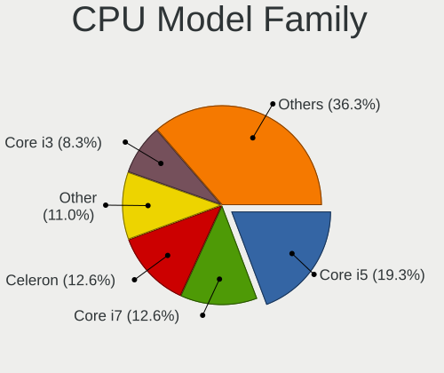

| Model                   | Notebooks | Percent |
|-------------------------|-----------|---------|
| Intel Core i5           | 98        | 19.25%  |
| Intel Core i7           | 64        | 12.57%  |
| Intel Celeron           | 64        | 12.57%  |
| Other                   | 56        | 11%     |
| Intel Core i3           | 42        | 8.25%   |
| Intel Core 2 Duo        | 32        | 6.29%   |
| AMD Ryzen 5             | 22        | 4.32%   |
| AMD Ryzen 7             | 20        | 3.93%   |
| Intel Atom              | 13        | 2.55%   |
| Intel Pentium           | 10        | 1.96%   |
| AMD A4                  | 10        | 1.96%   |
| Intel Core 2            | 7         | 1.38%   |
| AMD A6                  | 7         | 1.38%   |
| AMD Ryzen 9             | 6         | 1.18%   |
| AMD Ryzen 7 PRO         | 5         | 0.98%   |
| AMD A8                  | 5         | 0.98%   |
| Intel Pentium Dual-Core | 4         | 0.79%   |
| Intel Pentium Dual      | 4         | 0.79%   |
| AMD Ryzen 3             | 4         | 0.79%   |
| Intel Genuine           | 3         | 0.59%   |
| AMD Ryzen 5 PRO         | 3         | 0.59%   |
| AMD E2                  | 3         | 0.59%   |
| AMD E1                  | 3         | 0.59%   |
| Intel Xeon              | 2         | 0.39%   |
| Intel Pentium Silver    | 2         | 0.39%   |
| Intel Core i9           | 2         | 0.39%   |
| AMD V120                | 2         | 0.39%   |
| AMD E                   | 2         | 0.39%   |
| AMD Athlon II           | 2         | 0.39%   |
| AMD A10                 | 2         | 0.39%   |
| Intel Core m7           | 1         | 0.2%    |
| Intel Core m5           | 1         | 0.2%    |
| Intel Core m3           | 1         | 0.2%    |
| Intel Core M            | 1         | 0.2%    |
| Intel Core 2 Extreme    | 1         | 0.2%    |
| Intel Celeron Dual-Core | 1         | 0.2%    |
| AMD PRO A10             | 1         | 0.2%    |
| AMD FX                  | 1         | 0.2%    |
| AMD C-70                | 1         | 0.2%    |
| AMD Athlon              | 1         | 0.2%    |

CPU Cores
---------

Number of processor cores

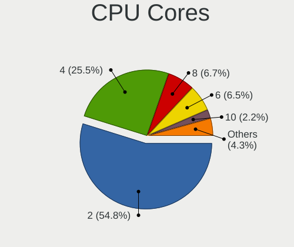

| Number | Notebooks | Percent |
|--------|-----------|---------|
| 2      | 279       | 54.81%  |
| 4      | 130       | 25.54%  |
| 8      | 34        | 6.68%   |
| 6      | 33        | 6.48%   |
| 10     | 11        | 2.16%   |
| 1      | 10        | 1.96%   |
| 12     | 6         | 1.18%   |
| 16     | 3         | 0.59%   |
| 14     | 3         | 0.59%   |

CPU Sockets
-----------

Number of sockets

| Number | Notebooks | Percent |
|--------|-----------|---------|
| 1      | 509       | 100%    |

CPU Threads
-----------

Threads per core (Hyper-Threading)

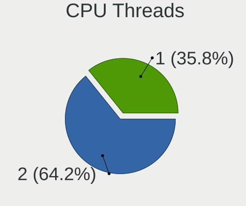

| Number | Notebooks | Percent |
|--------|-----------|---------|
| 2      | 327       | 64.24%  |
| 1      | 182       | 35.76%  |

CPU Op-Modes
------------

CPU Operation Modes (32-bit, 64-bit)

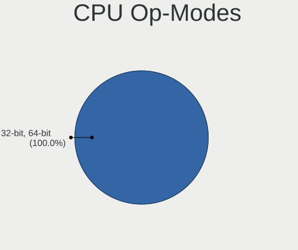

| Op mode        | Notebooks | Percent |
|----------------|-----------|---------|
| 32-bit, 64-bit | 509       | 100%    |

CPU Microcode
-------------

Microcode number

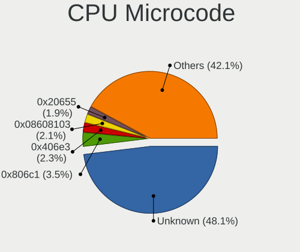

| Number     | Notebooks | Percent |
|------------|-----------|---------|
| Unknown    | 250       | 48.08%  |
| 0x806c1    | 18        | 3.46%   |
| 0x406e3    | 12        | 2.31%   |
| 0x08608103 | 11        | 2.12%   |
| 0x20655    | 10        | 1.92%   |
| 0x1067a    | 9         | 1.73%   |
| 0x806ec    | 8         | 1.54%   |
| 0x706a8    | 8         | 1.54%   |
| 0x306d4    | 8         | 1.54%   |
| 0x206a7    | 8         | 1.54%   |
| 0x806ea    | 7         | 1.35%   |
| 0x306a9    | 7         | 1.35%   |
| 0xa0652    | 6         | 1.15%   |
| 0x806e9    | 6         | 1.15%   |
| 0x506c9    | 6         | 1.15%   |
| 0x406c4    | 6         | 1.15%   |
| 0x406c3    | 6         | 1.15%   |
| 0x30678    | 6         | 1.15%   |
| 0x07030105 | 6         | 1.15%   |
| 0x06006705 | 6         | 1.15%   |
| 0x906ea    | 5         | 0.96%   |
| 0x6fd      | 5         | 0.96%   |
| 0x506e3    | 5         | 0.96%   |
| 0x40651    | 5         | 0.96%   |
| 0x20652    | 5         | 0.96%   |
| 0x0a50000c | 5         | 0.96%   |
| 0x08108109 | 5         | 0.96%   |
| 0x906a3    | 4         | 0.77%   |
| 0x6f6      | 4         | 0.77%   |
| 0x05000119 | 4         | 0.77%   |
| 0x906e9    | 3         | 0.58%   |
| 0x906a4    | 3         | 0.58%   |
| 0x806d1    | 3         | 0.58%   |
| 0x6fb      | 3         | 0.58%   |
| 0x306c3    | 3         | 0.58%   |
| 0x10676    | 3         | 0.58%   |
| 0x08600106 | 3         | 0.58%   |
| 0x08600104 | 3         | 0.58%   |
| 0x03000027 | 3         | 0.58%   |
| 0x706a1    | 2         | 0.38%   |

CPU Microarch
-------------

Microarchitecture

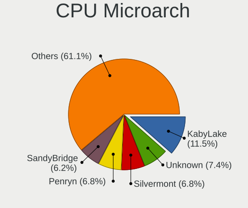

| Name             | Notebooks | Percent |
|------------------|-----------|---------|
| KabyLake         | 59        | 11.52%  |
| Unknown          | 38        | 7.42%   |
| Silvermont       | 35        | 6.84%   |
| Penryn           | 35        | 6.84%   |
| SandyBridge      | 32        | 6.25%   |
| Skylake          | 31        | 6.05%   |
| Haswell          | 30        | 5.86%   |
| TigerLake        | 26        | 5.08%   |
| Westmere         | 25        | 4.88%   |
| IvyBridge        | 24        | 4.69%   |
| Core             | 20        | 3.91%   |
| Broadwell        | 17        | 3.32%   |
| Alderlake Hybrid | 17        | 3.32%   |
| Goldmont plus    | 15        | 2.93%   |
| Zen 3            | 12        | 2.34%   |
| Zen 2            | 11        | 2.15%   |
| Excavator        | 11        | 2.15%   |
| Puma             | 10        | 1.95%   |
| Goldmont         | 10        | 1.95%   |
| CometLake        | 10        | 1.95%   |
| Zen+             | 9         | 1.76%   |
| Icelake          | 9         | 1.76%   |
| Bobcat           | 6         | 1.17%   |
| K10 Llano        | 4         | 0.78%   |
| K10              | 4         | 0.78%   |
| Bonnell          | 4         | 0.78%   |
| Steamroller      | 2         | 0.39%   |
| Piledriver       | 2         | 0.39%   |
| Jaguar           | 2         | 0.39%   |
| Tremont          | 1         | 0.2%    |
| Nehalem          | 1         | 0.2%    |

Graphics
--------

GPU Vendor
----------

Vendors of graphics cards

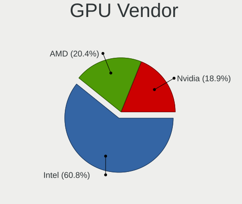

| Vendor | Notebooks | Percent |
|--------|-----------|---------|
| Intel  | 367       | 60.76%  |
| AMD    | 123       | 20.36%  |
| Nvidia | 114       | 18.87%  |

GPU Model
---------

Graphics card models

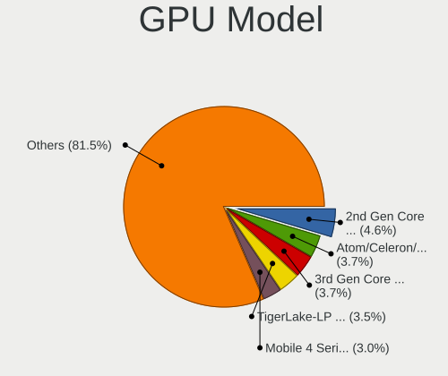

| Model                                                                                    | Notebooks | Percent |
|------------------------------------------------------------------------------------------|-----------|---------|
| Intel 2nd Generation Core Processor Family Integrated Graphics Controller                | 29        | 4.63%   |
| Intel Atom/Celeron/Pentium Processor x5-E8000/J3xxx/N3xxx Integrated Graphics Controller | 23        | 3.67%   |
| Intel 3rd Gen Core processor Graphics Controller                                         | 23        | 3.67%   |
| Intel TigerLake-LP GT2 [Iris Xe Graphics]                                                | 22        | 3.51%   |
| Intel Mobile 4 Series Chipset Integrated Graphics Controller                             | 19        | 3.04%   |
| Intel Skylake-U GT2 [HD Graphics 520]                                                    | 18        | 2.88%   |
| Intel Haswell-ULT Integrated Graphics Controller                                         | 17        | 2.72%   |
| Intel Kaby Lake-U GT2 [HD Graphics 620]                                                  | 16        | 2.56%   |
| Intel Core Processor Integrated Graphics Controller                                      | 16        | 2.56%   |
| AMD Lucienne                                                                             | 14        | 2.24%   |
| Intel GeminiLake [UHD Graphics 600]                                                      | 13        | 2.08%   |
| Intel Broadwell-U GT2 [HD Graphics 5500]                                                 | 13        | 2.08%   |
| Intel Kaby Lake-R GT2 [UHD Graphics 620]                                                 | 12        | 1.92%   |
| Intel Atom Processor Z36xxx/Z37xxx Series Graphics & Display                             | 12        | 1.92%   |
| Intel 4th Gen Core Processor Integrated Graphics Controller                              | 12        | 1.92%   |
| AMD Renoir [Radeon Vega Series / Radeon Vega Mobile Series]                              | 11        | 1.76%   |
| Intel CometLake-H GT2 [UHD Graphics]                                                     | 10        | 1.6%    |
| Intel Apollo Lake GT1 [HD Graphics 500]                                                  | 10        | 1.6%    |
| Intel CometLake-U GT2 [UHD Graphics]                                                     | 9         | 1.44%   |
| AMD Stoney [Radeon R2/R3/R4/R5 Graphics]                                                 | 8         | 1.28%   |
| AMD Picasso/Raven 2 [Radeon Vega Series / Radeon Vega Mobile Series]                     | 8         | 1.28%   |
| Nvidia TU117M [GeForce GTX 1650 Mobile / Max-Q]                                          | 7         | 1.12%   |
| Intel Mobile GM965/GL960 Integrated Graphics Controller (secondary)                      | 7         | 1.12%   |
| Intel Mobile GM965/GL960 Integrated Graphics Controller (primary)                        | 7         | 1.12%   |
| Intel CoffeeLake-H GT2 [UHD Graphics 630]                                                | 7         | 1.12%   |
| AMD Cezanne [Radeon Vega Series / Radeon Vega Mobile Series]                             | 7         | 1.12%   |
| Intel WhiskeyLake-U GT2 [UHD Graphics 620]                                               | 6         | 0.96%   |
| Intel TigerLake-H GT1 [UHD Graphics]                                                     | 6         | 0.96%   |
| Intel Mobile 945GM/GMS/GME, 943/940GML Express Integrated Graphics Controller            | 6         | 0.96%   |
| Intel Mobile 945GM/GMS, 943/940GML Express Integrated Graphics Controller                | 6         | 0.96%   |
| Intel Alder Lake-P GT2 [Iris Xe Graphics]                                                | 6         | 0.96%   |
| AMD Mullins [Radeon R4/R5 Graphics]                                                      | 6         | 0.96%   |
| Nvidia GM108M [GeForce 840M]                                                             | 5         | 0.8%    |
| Nvidia C79 [GeForce 9400M]                                                               | 5         | 0.8%    |
| Intel Skylake-H GT2 [HD Graphics 530]                                                    | 5         | 0.8%    |
| Intel Raptor Lake-P [Iris Xe Graphics]                                                   | 5         | 0.8%    |
| Intel Alder Lake-UP3 GT2 [Iris Xe Graphics]                                              | 5         | 0.8%    |
| AMD Park [Mobility Radeon HD 5430/5450/5470]                                             | 5         | 0.8%    |
| AMD Barcelo                                                                              | 5         | 0.8%    |
| Nvidia GA107M [GeForce RTX 3050 Ti Mobile]                                               | 4         | 0.64%   |

GPU Combo
---------

Combinations of graphics cards

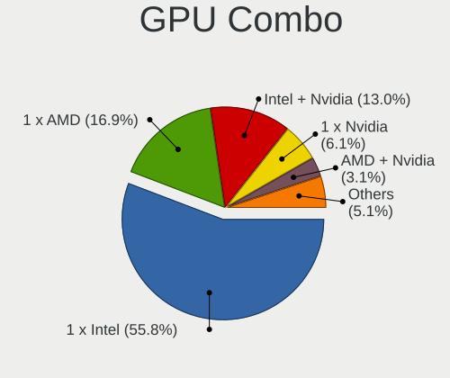

| Name           | Notebooks | Percent |
|----------------|-----------|---------|
| 1 x Intel      | 284       | 55.8%   |
| 1 x AMD        | 86        | 16.9%   |
| Intel + Nvidia | 66        | 12.97%  |
| 1 x Nvidia     | 31        | 6.09%   |
| AMD + Nvidia   | 16        | 3.14%   |
| Intel + AMD    | 13        | 2.55%   |
| 2 x AMD        | 8         | 1.57%   |
| Other          | 4         | 0.79%   |
| 2 x Nvidia     | 1         | 0.2%    |

GPU Driver
----------

Free vs proprietary

| Driver      | Notebooks | Percent |
|-------------|-----------|---------|
| Free        | 462       | 89.53%  |
| Proprietary | 37        | 7.17%   |
| Unknown     | 17        | 3.29%   |

GPU Memory
----------

Total video memory

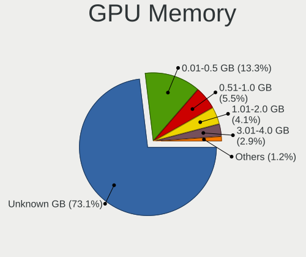

| Size in GB | Notebooks | Percent |
|------------|-----------|---------|
| Unknown    | 375       | 73.1%   |
| 0.01-0.5   | 68        | 13.26%  |
| 0.51-1.0   | 28        | 5.46%   |
| 1.01-2.0   | 21        | 4.09%   |
| 3.01-4.0   | 15        | 2.92%   |
| 5.01-6.0   | 4         | 0.78%   |
| 7.01-8.0   | 1         | 0.19%   |
| 8.01-16.0  | 1         | 0.19%   |

Monitor
-------

Monitor Vendor
--------------

Monitor vendors

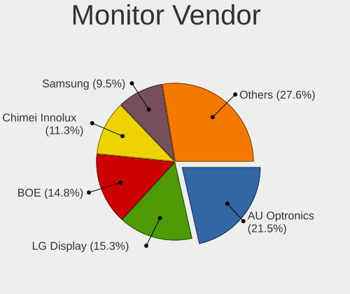

| Vendor                  | Notebooks | Percent |
|-------------------------|-----------|---------|
| AU Optronics            | 122       | 21.48%  |
| LG Display              | 87        | 15.32%  |
| BOE                     | 84        | 14.79%  |
| Chimei Innolux          | 64        | 11.27%  |
| Samsung Electronics     | 54        | 9.51%   |
| Dell                    | 21        | 3.7%    |
| Lenovo                  | 14        | 2.46%   |
| Apple                   | 14        | 2.46%   |
| Chi Mei Optoelectronics | 10        | 1.76%   |
| PANDA                   | 9         | 1.58%   |
| Goldstar                | 8         | 1.41%   |
| Sharp                   | 7         | 1.23%   |
| InfoVision              | 7         | 1.23%   |
| Acer                    | 6         | 1.06%   |
| Philips                 | 5         | 0.88%   |
| LG Philips              | 5         | 0.88%   |
| Hewlett-Packard         | 5         | 0.88%   |
| Sony                    | 4         | 0.7%    |
| BenQ                    | 4         | 0.7%    |
| Vizio                   | 2         | 0.35%   |
| ViewSonic               | 2         | 0.35%   |
| Toshiba                 | 2         | 0.35%   |
| KDC                     | 2         | 0.35%   |
| Iiyama                  | 2         | 0.35%   |
| IBM                     | 2         | 0.35%   |
| CSO                     | 2         | 0.35%   |
| CPT                     | 2         | 0.35%   |
| Wacom                   | 1         | 0.18%   |
| TMX                     | 1         | 0.18%   |
| SNC                     | 1         | 0.18%   |
| Sceptre Tech            | 1         | 0.18%   |
| SANSUI                  | 1         | 0.18%   |
| SAC                     | 1         | 0.18%   |
| Quanta Display          | 1         | 0.18%   |
| Panasonic               | 1         | 0.18%   |
| Olevia                  | 1         | 0.18%   |
| NEC Computers           | 1         | 0.18%   |
| Insignia                | 1         | 0.18%   |
| Hyundai ImageQuest      | 1         | 0.18%   |
| HUAWEI                  | 1         | 0.18%   |

Monitor Model
-------------

Monitor models

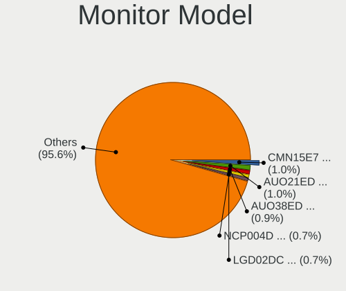

| Model                                                                    | Notebooks | Percent |
|--------------------------------------------------------------------------|-----------|---------|
| Chimei Innolux LCD Monitor CMN15E7 1920x1080 344x193mm 15.5-inch         | 6         | 1.05%   |
| AU Optronics LCD Monitor AUO21ED 1920x1080 344x193mm 15.5-inch           | 6         | 1.05%   |
| AU Optronics LCD Monitor AUO38ED 1920x1080 344x193mm 15.5-inch           | 5         | 0.87%   |
| PANDA LCD Monitor NCP004D 1920x1080 344x194mm 15.5-inch                  | 4         | 0.7%    |
| LG Display LCD Monitor LGD02DC 1366x768 344x194mm 15.5-inch              | 4         | 0.7%    |
| AU Optronics LCD Monitor AUO235C 1366x768 256x144mm 11.6-inch            | 4         | 0.7%    |
| Sony Nvidia Defaul t Flat Panel SNY05FA 1366x768 309x174mm 14.0-inch     | 3         | 0.52%   |
| Samsung Electronics LCD Monitor SEC5441 1280x800 331x207mm 15.4-inch     | 3         | 0.52%   |
| Samsung Electronics LCD Monitor SDC4852 1366x768 344x194mm 15.5-inch     | 3         | 0.52%   |
| LG Display LCD Monitor LGD05E5 1920x1080 344x194mm 15.5-inch             | 3         | 0.52%   |
| LG Display LCD Monitor LGD045E 1366x768 310x174mm 14.0-inch              | 3         | 0.52%   |
| LG Display LCD Monitor LGD033A 1366x768 344x194mm 15.5-inch              | 3         | 0.52%   |
| Chimei Innolux LCD Monitor CMN14C3 1366x768 309x173mm 13.9-inch          | 3         | 0.52%   |
| Chi Mei Optoelectronics LCD Monitor CMO15A7 1366x768 344x193mm 15.5-inch | 3         | 0.52%   |
| BOE LCD Monitor BOE08C2 1920x1080 344x194mm 15.5-inch                    | 3         | 0.52%   |
| BOE LCD Monitor BOE0757 1366x768 344x194mm 15.5-inch                     | 3         | 0.52%   |
| BOE LCD Monitor BOE0697 1366x768 309x173mm 13.9-inch                     | 3         | 0.52%   |
| BOE LCD Monitor BOE0687 1920x1080 344x193mm 15.5-inch                    | 3         | 0.52%   |
| AU Optronics LCD Monitor AUO573D 1920x1080 309x174mm 14.0-inch           | 3         | 0.52%   |
| AU Optronics LCD Monitor AUO36ED 1920x1080 344x193mm 15.5-inch           | 3         | 0.52%   |
| AU Optronics LCD Monitor AUO139E 1600x900 382x214mm 17.2-inch            | 3         | 0.52%   |
| Samsung Electronics LCD Monitor SEC384A 1366x768 344x194mm 15.5-inch     | 2         | 0.35%   |
| Samsung Electronics LCD Monitor SDC4C48 1920x1080 293x165mm 13.2-inch    | 2         | 0.35%   |
| Samsung Electronics LCD Monitor SDC4161 1920x1080 344x194mm 15.5-inch    | 2         | 0.35%   |
| LG Display LCD Monitor LGD071D 1920x1080 344x194mm 15.5-inch             | 2         | 0.35%   |
| LG Display LCD Monitor LGD059D 1920x1080 309x174mm 14.0-inch             | 2         | 0.35%   |
| LG Display LCD Monitor LGD0563 1920x1080 344x194mm 15.5-inch             | 2         | 0.35%   |
| LG Display LCD Monitor LGD0521 1920x1080 309x174mm 14.0-inch             | 2         | 0.35%   |
| LG Display LCD Monitor LGD0514 1920x1080 309x174mm 14.0-inch             | 2         | 0.35%   |
| LG Display LCD Monitor LGD04D0 1366x768 344x194mm 15.5-inch              | 2         | 0.35%   |
| LG Display LCD Monitor LGD0437 1920x1080 276x156mm 12.5-inch             | 2         | 0.35%   |
| LG Display LCD Monitor LGD0430 1366x768 345x194mm 15.6-inch              | 2         | 0.35%   |
| LG Display LCD Monitor LGD039F 1366x768 345x194mm 15.6-inch              | 2         | 0.35%   |
| LG Display LCD Monitor LGD034D 1366x768 344x194mm 15.5-inch              | 2         | 0.35%   |
| LG Display LCD Monitor LGD0289 1600x900 382x215mm 17.3-inch              | 2         | 0.35%   |
| Lenovo LEN P27h-10 LEN61AF 2560x1440 597x336mm 27.0-inch                 | 2         | 0.35%   |
| Lenovo LCD Monitor LEN40B1 1600x900 345x194mm 15.6-inch                  | 2         | 0.35%   |
| Lenovo LCD Monitor LEN40B0 1366x768 344x194mm 15.5-inch                  | 2         | 0.35%   |
| Lenovo LCD Monitor LEN4011 1280x800 261x163mm 12.1-inch                  | 2         | 0.35%   |
| IBM LCD Monitor IBM2887 1680x1050 331x207mm 15.4-inch                    | 2         | 0.35%   |

Monitor Resolution
------------------

Monitor screen resolution

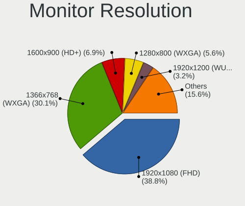

| Resolution         | Notebooks | Percent |
|--------------------|-----------|---------|
| 1920x1080 (FHD)    | 209       | 38.78%  |
| 1366x768 (WXGA)    | 162       | 30.06%  |
| 1600x900 (HD+)     | 37        | 6.86%   |
| 1280x800 (WXGA)    | 30        | 5.57%   |
| 1920x1200 (WUXGA)  | 17        | 3.15%   |
| 2560x1440 (QHD)    | 14        | 2.6%    |
| 3840x2160 (4K)     | 13        | 2.41%   |
| 1440x900 (WXGA+)   | 13        | 2.41%   |
| 1680x1050 (WSXGA+) | 10        | 1.86%   |
| 2560x1600          | 4         | 0.74%   |
| 1280x1024 (SXGA)   | 4         | 0.74%   |
| 1024x600           | 4         | 0.74%   |
| 1024x768 (XGA)     | 3         | 0.56%   |
| 2880x1800          | 2         | 0.37%   |
| 2160x1440          | 2         | 0.37%   |
| 3840x2400          | 1         | 0.19%   |
| 3840x1600          | 1         | 0.19%   |
| 3456x2160          | 1         | 0.19%   |
| 3440x1440          | 1         | 0.19%   |
| 3200x1800 (QHD+)   | 1         | 0.19%   |
| 2880x1620          | 1         | 0.19%   |
| 2560x1080          | 1         | 0.19%   |
| 2304x1440          | 1         | 0.19%   |
| 2240x1400          | 1         | 0.19%   |
| 1920x540           | 1         | 0.19%   |
| 1920x515           | 1         | 0.19%   |
| 1920x1280          | 1         | 0.19%   |
| 1600x1200          | 1         | 0.19%   |
| 1366x912           | 1         | 0.19%   |
| 1360x768           | 1         | 0.19%   |

Monitor Diagonal
----------------

Diagonal size in inches

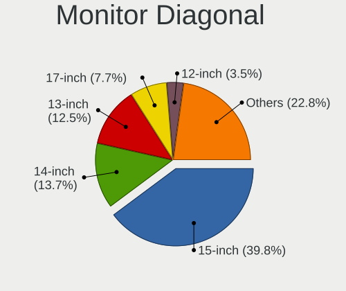

| Inches  | Notebooks | Percent |
|---------|-----------|---------|
| 15      | 227       | 39.82%  |
| 14      | 78        | 13.68%  |
| 13      | 71        | 12.46%  |
| 17      | 44        | 7.72%   |
| 12      | 20        | 3.51%   |
| 27      | 18        | 3.16%   |
| 24      | 18        | 3.16%   |
| 11      | 17        | 2.98%   |
| 23      | 14        | 2.46%   |
| 21      | 12        | 2.11%   |
| 16      | 11        | 1.93%   |
| Unknown | 6         | 1.05%   |
| 22      | 5         | 0.88%   |
| 18      | 5         | 0.88%   |
| 10      | 5         | 0.88%   |
| 19      | 4         | 0.7%    |
| 31      | 3         | 0.53%   |
| 32      | 2         | 0.35%   |
| 86      | 1         | 0.18%   |
| 84      | 1         | 0.18%   |
| 63      | 1         | 0.18%   |
| 42      | 1         | 0.18%   |
| 37      | 1         | 0.18%   |
| 34      | 1         | 0.18%   |
| 29      | 1         | 0.18%   |
| 26      | 1         | 0.18%   |
| 25      | 1         | 0.18%   |
| 20      | 1         | 0.18%   |

Monitor Width
-------------

Physical width

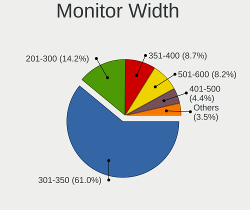

| Width in mm | Notebooks | Percent |
|-------------|-----------|---------|
| 301-350     | 344       | 60.99%  |
| 201-300     | 80        | 14.18%  |
| 351-400     | 49        | 8.69%   |
| 501-600     | 46        | 8.16%   |
| 401-500     | 25        | 4.43%   |
| 601-700     | 6         | 1.06%   |
| Unknown     | 6         | 1.06%   |
| 701-800     | 3         | 0.53%   |
| 1001-1500   | 2         | 0.35%   |
| 801-900     | 1         | 0.18%   |
| 1501-2000   | 1         | 0.18%   |
| 901-1000    | 1         | 0.18%   |

Aspect Ratio
------------

Proportional relationship between the width and the height

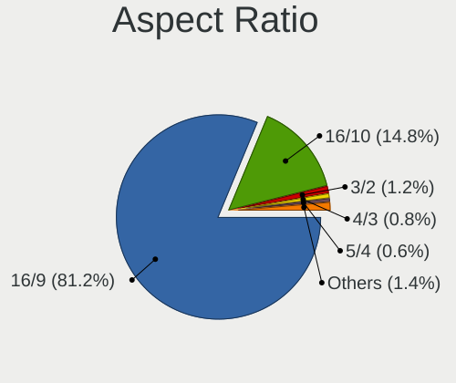

| Ratio   | Notebooks | Percent |
|---------|-----------|---------|
| 16/9    | 416       | 81.25%  |
| 16/10   | 76        | 14.84%  |
| 3/2     | 6         | 1.17%   |
| 4/3     | 4         | 0.78%   |
| 5/4     | 3         | 0.59%   |
| 21/9    | 2         | 0.39%   |
| 6/5     | 1         | 0.2%    |
| 32/9    | 1         | 0.2%    |
| 3.73    | 1         | 0.2%    |
| 0.56    | 1         | 0.2%    |
| Unknown | 1         | 0.2%    |

Monitor Area
------------

Area in inch²

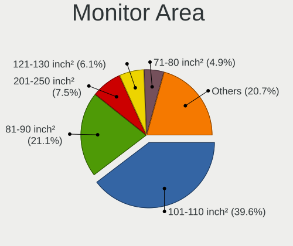

| Area in inch² | Notebooks | Percent |
|----------------|-----------|---------|
| 101-110        | 226       | 39.65%  |
| 81-90          | 120       | 21.05%  |
| 201-250        | 43        | 7.54%   |
| 121-130        | 35        | 6.14%   |
| 71-80          | 28        | 4.91%   |
| 61-70          | 19        | 3.33%   |
| 301-350        | 18        | 3.16%   |
| 51-60          | 17        | 2.98%   |
| 151-200        | 9         | 1.58%   |
| 131-140        | 9         | 1.58%   |
| 111-120        | 8         | 1.4%    |
| 351-500        | 7         | 1.23%   |
| 251-300        | 6         | 1.05%   |
| Unknown        | 6         | 1.05%   |
| 41-50          | 5         | 0.88%   |
| 141-150        | 5         | 0.88%   |
| 91-100         | 4         | 0.7%    |
| More than 1000 | 3         | 0.53%   |
| 501-1000       | 2         | 0.35%   |

Pixel Density
-------------

Pixels per inch

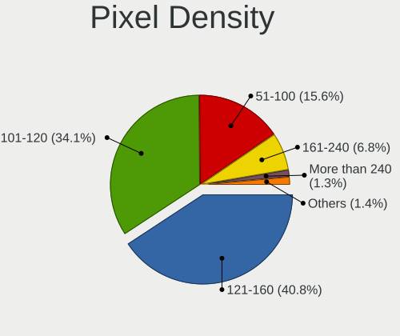

| Density       | Notebooks | Percent |
|---------------|-----------|---------|
| 121-160       | 227       | 40.75%  |
| 101-120       | 190       | 34.11%  |
| 51-100        | 87        | 15.62%  |
| 161-240       | 38        | 6.82%   |
| More than 240 | 7         | 1.26%   |
| Unknown       | 6         | 1.08%   |
| 1-50          | 2         | 0.36%   |

Multiple Monitors
-----------------

Total monitors connected

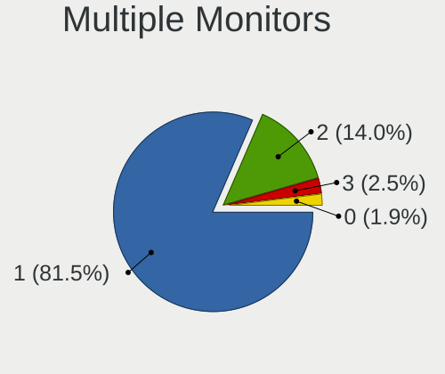

| Total | Notebooks | Percent |
|-------|-----------|---------|
| 1     | 419       | 81.52%  |
| 2     | 72        | 14.01%  |
| 3     | 13        | 2.53%   |
| 0     | 10        | 1.95%   |

Network
-------

Net Controller Vendor
---------------------

Controller vendors

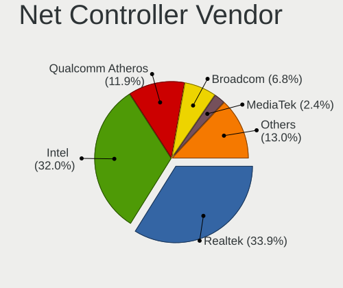

| Vendor                            | Notebooks | Percent |
|-----------------------------------|-----------|---------|
| Realtek Semiconductor             | 268       | 33.88%  |
| Intel                             | 253       | 31.98%  |
| Qualcomm Atheros                  | 94        | 11.88%  |
| Broadcom                          | 54        | 6.83%   |
| MediaTek                          | 19        | 2.4%    |
| Broadcom Limited                  | 12        | 1.52%   |
| Marvell Technology Group          | 11        | 1.39%   |
| TP-Link                           | 7         | 0.88%   |
| Sierra Wireless                   | 6         | 0.76%   |
| Samsung Electronics               | 6         | 0.76%   |
| Qualcomm                          | 6         | 0.76%   |
| Nvidia                            | 6         | 0.76%   |
| ASIX Electronics                  | 6         | 0.76%   |
| Ralink                            | 5         | 0.63%   |
| Ralink Technology                 | 4         | 0.51%   |
| Dell                              | 4         | 0.51%   |
| Huawei Technologies               | 3         | 0.38%   |
| Hewlett-Packard                   | 3         | 0.38%   |
| Ericsson Business Mobile Networks | 3         | 0.38%   |
| Xiaomi                            | 2         | 0.25%   |
| Shenzhen Goodix Technology        | 2         | 0.25%   |
| Qualcomm Atheros Communications   | 2         | 0.25%   |
| JMicron Technology                | 2         | 0.25%   |
| DisplayLink                       | 2         | 0.25%   |
| SEGGER                            | 1         | 0.13%   |
| OPPO Electronics                  | 1         | 0.13%   |
| NetGear                           | 1         | 0.13%   |
| Microchip Technology              | 1         | 0.13%   |
| LG Electronics                    | 1         | 0.13%   |
| Lenovo                            | 1         | 0.13%   |
| Google                            | 1         | 0.13%   |
| D-Link                            | 1         | 0.13%   |
| BUFFALO                           | 1         | 0.13%   |
| Attansic Technology               | 1         | 0.13%   |
| Apple                             | 1         | 0.13%   |

Net Controller Model
--------------------

Controller models

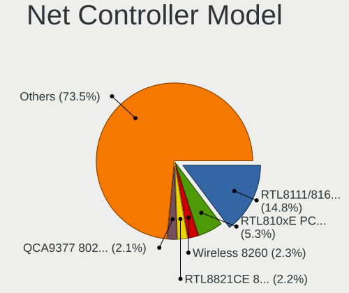

| Model                                                                  | Notebooks | Percent |
|------------------------------------------------------------------------|-----------|---------|
| Realtek RTL8111/8168/8211/8411 PCI Express Gigabit Ethernet Controller | 143       | 14.76%  |
| Realtek RTL810xE PCI Express Fast Ethernet controller                  | 51        | 5.26%   |
| Intel Wireless 8260                                                    | 22        | 2.27%   |
| Realtek RTL8821CE 802.11ac PCIe Wireless Network Adapter               | 21        | 2.17%   |
| Qualcomm Atheros QCA9377 802.11ac Wireless Network Adapter             | 20        | 2.06%   |
| Intel Wireless 7260                                                    | 20        | 2.06%   |
| Realtek RTL8822CE 802.11ac PCIe Wireless Network Adapter               | 18        | 1.86%   |
| Realtek RTL8153 Gigabit Ethernet Adapter                               | 17        | 1.75%   |
| Intel Wireless 7265                                                    | 17        | 1.75%   |
| Intel Wi-Fi 6 AX200                                                    | 17        | 1.75%   |
| Intel Wi-Fi 6 AX201                                                    | 15        | 1.55%   |
| Qualcomm Atheros QCA9565 / AR9565 Wireless Network Adapter             | 14        | 1.44%   |
| Intel 82579LM Gigabit Network Connection (Lewisville)                  | 14        | 1.44%   |
| Realtek RTL8723BE PCIe Wireless Network Adapter                        | 13        | 1.34%   |
| Qualcomm Atheros AR9285 Wireless Network Adapter (PCI-Express)         | 13        | 1.34%   |
| Intel Wireless 8265 / 8275                                             | 13        | 1.34%   |
| Qualcomm Atheros AR9485 Wireless Network Adapter                       | 12        | 1.24%   |
| Intel Centrino Advanced-N 6205 [Taylor Peak]                           | 12        | 1.24%   |
| Intel Alder Lake-P PCH CNVi WiFi                                       | 12        | 1.24%   |
| Broadcom BCM43142 802.11b/g/n                                          | 11        | 1.14%   |
| Qualcomm Atheros QCA6174 802.11ac Wireless Network Adapter             | 10        | 1.03%   |
| Intel Ethernet Connection I219-LM                                      | 10        | 1.03%   |
| Intel PRO/Wireless 3945ABG [Golan] Network Connection                  | 9         | 0.93%   |
| Intel Comet Lake PCH-LP CNVi WiFi                                      | 9         | 0.93%   |
| Intel Centrino Advanced-N 6200                                         | 9         | 0.93%   |
| MediaTek MT7921 802.11ax PCIe Wireless Network Adapter [Filogic 330]   | 8         | 0.83%   |
| Intel Wireless 3165                                                    | 8         | 0.83%   |
| Intel Comet Lake PCH CNVi WiFi                                         | 8         | 0.83%   |
| Broadcom BCM4322 802.11a/b/g/n Wireless LAN Controller                 | 8         | 0.83%   |
| Broadcom BCM4313 802.11bgn Wireless Network Adapter                    | 8         | 0.83%   |
| Intel PRO/Wireless 4965 AG or AGN [Kedron] Network Connection          | 7         | 0.72%   |
| Intel Dual Band Wireless-AC 3165 Plus Bluetooth                        | 7         | 0.72%   |
| Intel Centrino Wireless-N 1000 [Condor Peak]                           | 7         | 0.72%   |
| Intel 82577LM Gigabit Network Connection                               | 7         | 0.72%   |
| Realtek RTL88x2bu [AC1200 Techkey]                                     | 6         | 0.62%   |
| Realtek RTL8852BE PCIe 802.11ax Wireless Network Controller            | 6         | 0.62%   |
| Realtek RTL8188EE Wireless Network Adapter                             | 6         | 0.62%   |
| Realtek RTL8188CE 802.11b/g/n WiFi Adapter                             | 6         | 0.62%   |
| Qualcomm Atheros AR8131 Gigabit Ethernet                               | 6         | 0.62%   |
| Nvidia MCP79 Ethernet                                                  | 6         | 0.62%   |

Wireless Vendor
---------------

Wireless vendors

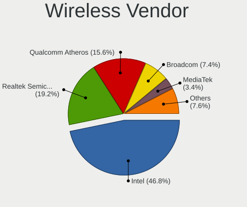

| Vendor                          | Notebooks | Percent |
|---------------------------------|-----------|---------|
| Intel                           | 246       | 46.77%  |
| Realtek Semiconductor           | 101       | 19.2%   |
| Qualcomm Atheros                | 82        | 15.59%  |
| Broadcom                        | 39        | 7.41%   |
| MediaTek                        | 18        | 3.42%   |
| TP-Link                         | 6         | 1.14%   |
| Sierra Wireless                 | 6         | 1.14%   |
| Qualcomm                        | 6         | 1.14%   |
| Broadcom Limited                | 6         | 1.14%   |
| Ralink                          | 5         | 0.95%   |
| Ralink Technology               | 4         | 0.76%   |
| Qualcomm Atheros Communications | 2         | 0.38%   |
| Dell                            | 2         | 0.38%   |
| NetGear                         | 1         | 0.19%   |
| D-Link                          | 1         | 0.19%   |
| BUFFALO                         | 1         | 0.19%   |

Wireless Model
--------------

Wireless models

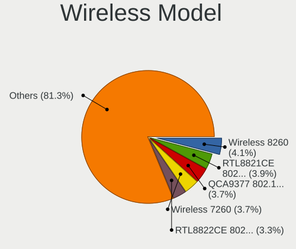

| Model                                                                | Notebooks | Percent |
|----------------------------------------------------------------------|-----------|---------|
| Intel Wireless 8260                                                  | 22        | 4.08%   |
| Realtek RTL8821CE 802.11ac PCIe Wireless Network Adapter             | 21        | 3.9%    |
| Qualcomm Atheros QCA9377 802.11ac Wireless Network Adapter           | 20        | 3.71%   |
| Intel Wireless 7260                                                  | 20        | 3.71%   |
| Realtek RTL8822CE 802.11ac PCIe Wireless Network Adapter             | 18        | 3.34%   |
| Intel Wireless 7265                                                  | 17        | 3.15%   |
| Intel Wi-Fi 6 AX200                                                  | 17        | 3.15%   |
| Intel Wi-Fi 6 AX201                                                  | 15        | 2.78%   |
| Qualcomm Atheros QCA9565 / AR9565 Wireless Network Adapter           | 14        | 2.6%    |
| Realtek RTL8723BE PCIe Wireless Network Adapter                      | 13        | 2.41%   |
| Qualcomm Atheros AR9285 Wireless Network Adapter (PCI-Express)       | 13        | 2.41%   |
| Intel Wireless 8265 / 8275                                           | 13        | 2.41%   |
| Qualcomm Atheros AR9485 Wireless Network Adapter                     | 12        | 2.23%   |
| Intel Centrino Advanced-N 6205 [Taylor Peak]                         | 12        | 2.23%   |
| Broadcom BCM43142 802.11b/g/n                                        | 11        | 2.04%   |
| Qualcomm Atheros QCA6174 802.11ac Wireless Network Adapter           | 10        | 1.86%   |
| Intel PRO/Wireless 3945ABG [Golan] Network Connection                | 9         | 1.67%   |
| Intel Comet Lake PCH-LP CNVi WiFi                                    | 9         | 1.67%   |
| Intel Centrino Advanced-N 6200                                       | 9         | 1.67%   |
| MediaTek MT7921 802.11ax PCIe Wireless Network Adapter [Filogic 330] | 8         | 1.48%   |
| Intel Wireless 3165                                                  | 8         | 1.48%   |
| Intel Comet Lake PCH CNVi WiFi                                       | 8         | 1.48%   |
| Intel Alder Lake-P PCH CNVi WiFi                                     | 8         | 1.48%   |
| Broadcom BCM4322 802.11a/b/g/n Wireless LAN Controller               | 8         | 1.48%   |
| Broadcom BCM4313 802.11bgn Wireless Network Adapter                  | 8         | 1.48%   |
| Intel PRO/Wireless 4965 AG or AGN [Kedron] Network Connection        | 7         | 1.3%    |
| Intel Dual Band Wireless-AC 3165 Plus Bluetooth                      | 7         | 1.3%    |
| Intel Centrino Wireless-N 1000 [Condor Peak]                         | 7         | 1.3%    |
| Realtek RTL88x2bu [AC1200 Techkey]                                   | 6         | 1.11%   |
| Realtek RTL8852BE PCIe 802.11ax Wireless Network Controller          | 6         | 1.11%   |
| Realtek RTL8188EE Wireless Network Adapter                           | 6         | 1.11%   |
| Realtek RTL8188CE 802.11b/g/n WiFi Adapter                           | 6         | 1.11%   |
| Intel Wi-Fi 6E(802.11ax) AX210/AX1675* 2x2 [Typhoon Peak]            | 6         | 1.11%   |
| Intel Dual Band Wireless-AC 3168NGW [Stone Peak]                     | 6         | 1.11%   |
| Realtek 802.11n WLAN Adapter                                         | 5         | 0.93%   |
| Qualcomm QCNFA765 Wireless Network Adapter                           | 5         | 0.93%   |
| Qualcomm Atheros AR928X Wireless Network Adapter (PCI-Express)       | 5         | 0.93%   |
| MediaTek MT7922 802.11ax PCI Express Wireless Network Adapter        | 5         | 0.93%   |
| Intel Wireless 3160                                                  | 5         | 0.93%   |
| Intel Raptor Lake PCH CNVi WiFi                                      | 5         | 0.93%   |

Ethernet Vendor
---------------

Ethernet vendors

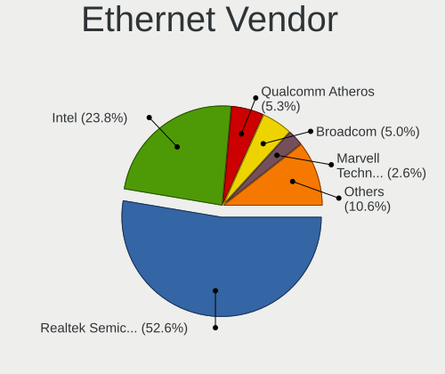

| Vendor                   | Notebooks | Percent |
|--------------------------|-----------|---------|
| Realtek Semiconductor    | 219       | 52.64%  |
| Intel                    | 99        | 23.8%   |
| Qualcomm Atheros         | 22        | 5.29%   |
| Broadcom                 | 21        | 5.05%   |
| Marvell Technology Group | 11        | 2.64%   |
| Samsung Electronics      | 6         | 1.44%   |
| Nvidia                   | 6         | 1.44%   |
| Broadcom Limited         | 6         | 1.44%   |
| ASIX Electronics         | 6         | 1.44%   |
| Hewlett-Packard          | 3         | 0.72%   |
| Xiaomi                   | 2         | 0.48%   |
| JMicron Technology       | 2         | 0.48%   |
| Huawei Technologies      | 2         | 0.48%   |
| DisplayLink              | 2         | 0.48%   |
| TP-Link                  | 1         | 0.24%   |
| OPPO Electronics         | 1         | 0.24%   |
| Microchip Technology     | 1         | 0.24%   |
| MediaTek                 | 1         | 0.24%   |
| LG Electronics           | 1         | 0.24%   |
| Lenovo                   | 1         | 0.24%   |
| Google                   | 1         | 0.24%   |
| Attansic Technology      | 1         | 0.24%   |
| Apple                    | 1         | 0.24%   |

Ethernet Model
--------------

Ethernet models

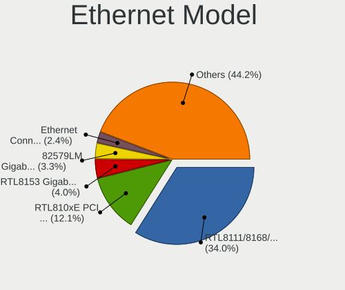

| Model                                                                          | Notebooks | Percent |
|--------------------------------------------------------------------------------|-----------|---------|
| Realtek RTL8111/8168/8211/8411 PCI Express Gigabit Ethernet Controller         | 143       | 33.97%  |
| Realtek RTL810xE PCI Express Fast Ethernet controller                          | 51        | 12.11%  |
| Realtek RTL8153 Gigabit Ethernet Adapter                                       | 17        | 4.04%   |
| Intel 82579LM Gigabit Network Connection (Lewisville)                          | 14        | 3.33%   |
| Intel Ethernet Connection I219-LM                                              | 10        | 2.38%   |
| Intel 82577LM Gigabit Network Connection                                       | 7         | 1.66%   |
| Qualcomm Atheros AR8131 Gigabit Ethernet                                       | 6         | 1.43%   |
| Nvidia MCP79 Ethernet                                                          | 6         | 1.43%   |
| Intel Ethernet Connection I217-LM                                              | 6         | 1.43%   |
| Intel 82567LM Gigabit Network Connection                                       | 6         | 1.43%   |
| ASIX AX88179 Gigabit Ethernet                                                  | 6         | 1.43%   |
| Samsung Galaxy series, misc. (tethering mode)                                  | 5         | 1.19%   |
| Intel Ethernet Connection (4) I219-LM                                          | 5         | 1.19%   |
| Intel Ethernet Connection (3) I218-LM                                          | 5         | 1.19%   |
| Qualcomm Atheros QCA8172 Fast Ethernet                                         | 4         | 0.95%   |
| Qualcomm Atheros AR8151 v2.0 Gigabit Ethernet                                  | 4         | 0.95%   |
| Marvell Group 88E8040 PCI-E Fast Ethernet Controller                           | 4         | 0.95%   |
| Intel Ethernet Connection (2) I219-LM                                          | 4         | 0.95%   |
| Intel Ethernet Connection (16) I219-V                                          | 4         | 0.95%   |
| Intel Ethernet Connection (13) I219-V                                          | 4         | 0.95%   |
| Intel Alder Lake-P PCH CNVi WiFi                                               | 4         | 0.95%   |
| Realtek RTL8125 2.5GbE Controller                                              | 3         | 0.71%   |
| Qualcomm Atheros AR8132 Fast Ethernet                                          | 3         | 0.71%   |
| Marvell Group 88E8057 PCI-E Gigabit Ethernet Controller                        | 3         | 0.71%   |
| Intel Ethernet Connection I219-V                                               | 3         | 0.71%   |
| Intel 82566MM Gigabit Network Connection                                       | 3         | 0.71%   |
| HP HP lt4120 Snapdragon X5 LTE                                                 | 3         | 0.71%   |
| Broadcom NetXtreme BCM57765 Gigabit Ethernet PCIe                              | 3         | 0.71%   |
| Broadcom NetXtreme BCM5764M Gigabit Ethernet PCIe                              | 3         | 0.71%   |
| Broadcom NetLink BCM57785 Gigabit Ethernet PCIe                                | 3         | 0.71%   |
| Broadcom NetLink BCM57780 Gigabit Ethernet PCIe                                | 3         | 0.71%   |
| Broadcom Limited NetXtreme BCM5761e Gigabit Ethernet PCIe                      | 3         | 0.71%   |
| Realtek RTL-8100/8101L/8139 PCI Fast Ethernet Adapter                          | 2         | 0.48%   |
| Qualcomm Atheros AR8152 v2.0 Fast Ethernet                                     | 2         | 0.48%   |
| Marvell Group Yukon Optima 88E8059 [PCIe Gigabit Ethernet Controller with AVB] | 2         | 0.48%   |
| Marvell Group 88E8055 PCI-E Gigabit Ethernet Controller                        | 2         | 0.48%   |
| JMicron JMC250 PCI Express Gigabit Ethernet Controller                         | 2         | 0.48%   |
| Intel Ethernet Connection I218-LM                                              | 2         | 0.48%   |
| Intel Ethernet Connection I217-V                                               | 2         | 0.48%   |
| Intel Ethernet Connection (6) I219-V                                           | 2         | 0.48%   |

Net Controller Kind
-------------------

Ethernet, WiFi or modem

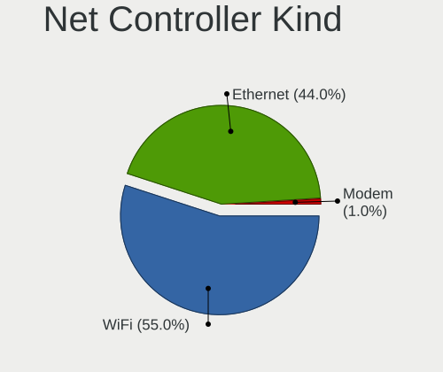

| Kind     | Notebooks | Percent |
|----------|-----------|---------|
| WiFi     | 495       | 55%     |
| Ethernet | 396       | 44%     |
| Modem    | 9         | 1%      |

Used Controller
---------------

Currently used network controller

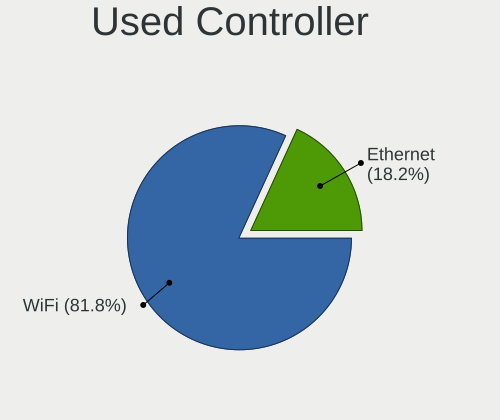

| Kind     | Notebooks | Percent |
|----------|-----------|---------|
| WiFi     | 437       | 81.84%  |
| Ethernet | 97        | 18.16%  |

NICs
----

Total network controllers on board

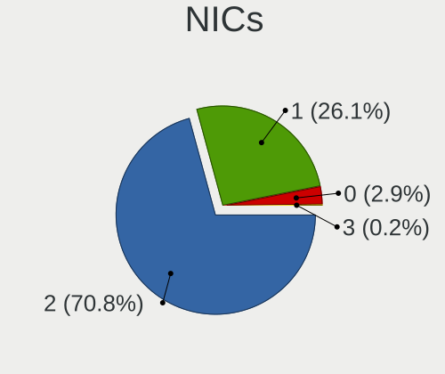

| Total | Notebooks | Percent |
|-------|-----------|---------|
| 2     | 361       | 70.78%  |
| 1     | 133       | 26.08%  |
| 0     | 15        | 2.94%   |
| 3     | 1         | 0.2%    |

IPv6
----

IPv6 vs IPv4

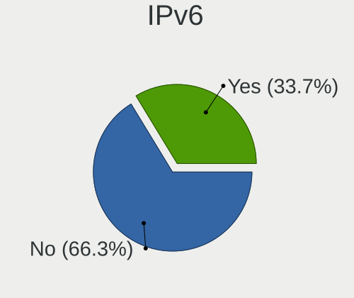

| Used | Notebooks | Percent |
|------|-----------|---------|
| No   | 344       | 66.28%  |
| Yes  | 175       | 33.72%  |

Bluetooth
---------

Bluetooth Vendor
----------------

Controller vendors

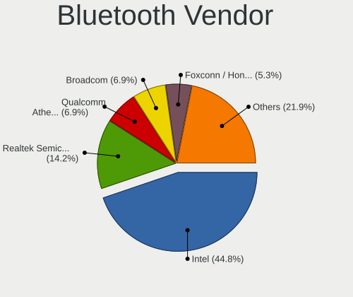

| Vendor                          | Notebooks | Percent |
|---------------------------------|-----------|---------|
| Intel                           | 176       | 44.78%  |
| Realtek Semiconductor           | 56        | 14.25%  |
| Qualcomm Atheros Communications | 27        | 6.87%   |
| Broadcom                        | 27        | 6.87%   |
| Foxconn / Hon Hai               | 21        | 5.34%   |
| Lite-On Technology              | 19        | 4.83%   |
| IMC Networks                    | 17        | 4.33%   |
| Apple                           | 13        | 3.31%   |
| Hewlett-Packard                 | 6         | 1.53%   |
| Dell                            | 6         | 1.53%   |
| Realtek                         | 4         | 1.02%   |
| Foxconn International           | 3         | 0.76%   |
| Cambridge Silicon Radio         | 3         | 0.76%   |
| USI                             | 2         | 0.51%   |
| Toshiba                         | 2         | 0.51%   |
| Ralink Technology               | 2         | 0.51%   |
| MediaTek                        | 2         | 0.51%   |
| ASUSTek Computer                | 2         | 0.51%   |
| Taiyo Yuden                     | 1         | 0.25%   |
| Ralink                          | 1         | 0.25%   |
| Micro Star International        | 1         | 0.25%   |
| Chicony Electronics             | 1         | 0.25%   |
| Alps Electric                   | 1         | 0.25%   |

Bluetooth Model
---------------

Controller models

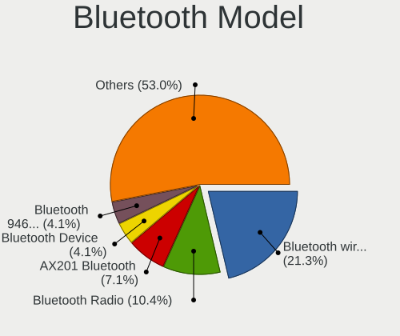

| Model                                                                               | Notebooks | Percent |
|-------------------------------------------------------------------------------------|-----------|---------|
| Intel Bluetooth wireless interface                                                  | 84        | 21.32%  |
| Realtek Bluetooth Radio                                                             | 41        | 10.41%  |
| Intel AX201 Bluetooth                                                               | 28        | 7.11%   |
| Intel Bluetooth Device                                                              | 16        | 4.06%   |
| Intel Bluetooth 9460/9560 Jefferson Peak (JfP)                                      | 16        | 4.06%   |
| Intel AX200 Bluetooth                                                               | 15        | 3.81%   |
| Realtek  Bluetooth 4.2 Adapter                                                      | 10        | 2.54%   |
| Qualcomm Atheros  Bluetooth Device                                                  | 9         | 2.28%   |
| Apple Bluetooth Host Controller                                                     | 9         | 2.28%   |
| Lite-On Qualcomm Atheros QCA9377 Bluetooth                                          | 8         | 2.03%   |
| Foxconn / Hon Hai Bluetooth Device                                                  | 7         | 1.78%   |
| Qualcomm Atheros AR3012 Bluetooth 4.0                                               | 6         | 1.52%   |
| Intel Wireless-AC 3168 Bluetooth                                                    | 6         | 1.52%   |
| Intel AX210 Bluetooth                                                               | 6         | 1.52%   |
| IMC Networks Bluetooth Radio                                                        | 6         | 1.52%   |
| IMC Networks Bluetooth Device                                                       | 5         | 1.27%   |
| Foxconn / Hon Hai Wireless_Device                                                   | 5         | 1.27%   |
| Broadcom BCM20702 Bluetooth 4.0 [ThinkPad]                                          | 5         | 1.27%   |
| Broadcom BCM2045B (BDC-2.1)                                                         | 5         | 1.27%   |
| Realtek Bluetooth Radio                                                             | 4         | 1.02%   |
| Qualcomm Atheros QCA61x4 Bluetooth 4.0                                              | 4         | 1.02%   |
| Qualcomm Atheros AR3011 Bluetooth                                                   | 4         | 1.02%   |
| Intel Centrino Bluetooth Wireless Transceiver                                       | 4         | 1.02%   |
| IMC Networks Wireless_Device                                                        | 4         | 1.02%   |
| Dell DW375 Bluetooth Module                                                         | 4         | 1.02%   |
| Realtek RTL8723B Bluetooth                                                          | 3         | 0.76%   |
| Qualcomm Atheros AR9462 Bluetooth                                                   | 3         | 0.76%   |
| Lite-On Wireless_Device                                                             | 3         | 0.76%   |
| Lite-On Atheros AR3012 Bluetooth                                                    | 3         | 0.76%   |
| HP Broadcom 2070 Bluetooth Combo                                                    | 3         | 0.76%   |
| HP Bluetooth 2.0 Interface [Broadcom BCM2045]                                       | 3         | 0.76%   |
| Foxconn International BCM43142A0 Bluetooth module                                   | 3         | 0.76%   |
| Foxconn / Hon Hai MediaTek Bluetooth Adapter                                        | 3         | 0.76%   |
| Foxconn / Hon Hai Foxconn T77H114 BCM2070 [Single-Chip Bluetooth 2.1 + EDR Adapter] | 3         | 0.76%   |
| Cambridge Silicon Radio Bluetooth Dongle (HCI mode)                                 | 3         | 0.76%   |
| Broadcom BCM43142A0 Bluetooth Device                                                | 3         | 0.76%   |
| Broadcom BCM20702A0                                                                 | 3         | 0.76%   |
| USI Bluetooth Device                                                                | 2         | 0.51%   |
| Ralink CSR BS8510                                                                   | 2         | 0.51%   |
| Lite-On Bluetooth Device                                                            | 2         | 0.51%   |

Sound
-----

Sound Vendor
------------

Sound card vendors

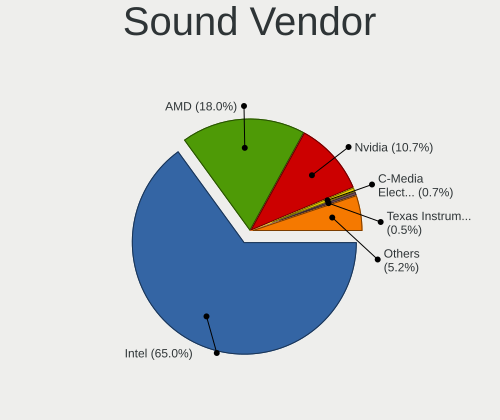

| Vendor                  | Notebooks | Percent |
|-------------------------|-----------|---------|
| Intel                   | 390       | 65%     |
| AMD                     | 108       | 18%     |
| Nvidia                  | 64        | 10.67%  |
| C-Media Electronics     | 4         | 0.67%   |
| Texas Instruments       | 3         | 0.5%    |
| Logitech                | 3         | 0.5%    |
| GN Netcom               | 3         | 0.5%    |
| Realtek Semiconductor   | 2         | 0.33%   |
| Lenovo                  | 2         | 0.33%   |
| JMTek                   | 2         | 0.33%   |
| Generalplus Technology  | 2         | 0.33%   |
| ASUSTek Computer        | 2         | 0.33%   |
| Textech International   | 1         | 0.17%   |
| Tenx Technology         | 1         | 0.17%   |
| TEAC                    | 1         | 0.17%   |
| Razer USA               | 1         | 0.17%   |
| Microchip Technology    | 1         | 0.17%   |
| M-Audio                 | 1         | 0.17%   |
| KTMicro                 | 1         | 0.17%   |
| HiBy                    | 1         | 0.17%   |
| Hewlett-Packard         | 1         | 0.17%   |
| GYROCOM C&C             | 1         | 0.17%   |
| DSEA A/S                | 1         | 0.17%   |
| Creative Technology     | 1         | 0.17%   |
| Conexant Systems        | 1         | 0.17%   |
| Bose                    | 1         | 0.17%   |
| BEHRINGER International | 1         | 0.17%   |

Sound Model
-----------

Sound card models

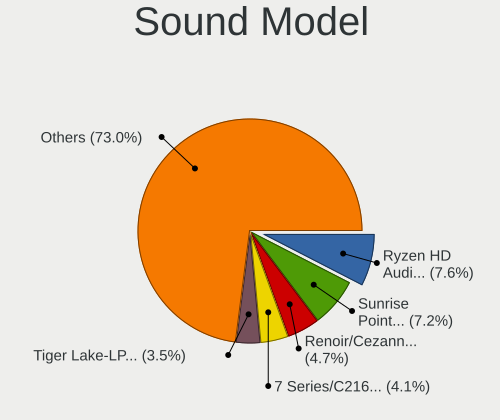

| Model                                                                                             | Notebooks | Percent |
|---------------------------------------------------------------------------------------------------|-----------|---------|
| AMD Ryzen HD Audio Controller                                                                     | 56        | 7.57%   |
| Intel Sunrise Point-LP HD Audio                                                                   | 53        | 7.16%   |
| AMD Renoir/Cezanne HDMI/DP Audio Controller                                                       | 35        | 4.73%   |
| Intel 7 Series/C216 Chipset Family High Definition Audio Controller                               | 30        | 4.05%   |
| Intel Tiger Lake-LP Smart Sound Technology Audio Controller                                       | 26        | 3.51%   |
| Intel 82801I (ICH9 Family) HD Audio Controller                                                    | 26        | 3.51%   |
| Intel 6 Series/C200 Series Chipset Family High Definition Audio Controller                        | 26        | 3.51%   |
| Intel 5 Series/3400 Series Chipset High Definition Audio                                          | 26        | 3.51%   |
| AMD FCH Azalia Controller                                                                         | 23        | 3.11%   |
| Intel Haswell-ULT HD Audio Controller                                                             | 18        | 2.43%   |
| Intel 8 Series HD Audio Controller                                                                | 18        | 2.43%   |
| Intel Wildcat Point-LP High Definition Audio Controller                                           | 17        | 2.3%    |
| Intel Broadwell-U Audio Controller                                                                | 17        | 2.3%    |
| Intel Atom/Celeron/Pentium Processor x5-E8000/J3xxx/N3xxx Series High Definition Audio Controller | 16        | 2.16%   |
| Intel Celeron/Pentium Silver Processor High Definition Audio                                      | 15        | 2.03%   |
| Intel Alder Lake PCH-P High Definition Audio Controller                                           | 15        | 2.03%   |
| AMD Kabini HDMI/DP Audio                                                                          | 15        | 2.03%   |
| Intel 82801H (ICH8 Family) HD Audio Controller                                                    | 14        | 1.89%   |
| Intel Xeon E3-1200 v3/4th Gen Core Processor HD Audio Controller                                  | 12        | 1.62%   |
| Intel 8 Series/C220 Series Chipset High Definition Audio Controller                               | 12        | 1.62%   |
| Intel NM10/ICH7 Family High Definition Audio Controller                                           | 11        | 1.49%   |
| AMD Radeon High Definition Audio Controller                                                       | 11        | 1.49%   |
| AMD Family 15h (Models 60h-6fh) Audio Controller                                                  | 11        | 1.49%   |
| Intel Comet Lake PCH-LP cAVS                                                                      | 10        | 1.35%   |
| Intel Comet Lake PCH cAVS                                                                         | 10        | 1.35%   |
| Intel Celeron N3350/Pentium N4200/Atom E3900 Series Audio Cluster                                 | 10        | 1.35%   |
| Intel Atom Processor Z36xxx/Z37xxx Series High Definition Audio Controller                        | 10        | 1.35%   |
| Intel 100 Series/C230 Series Chipset Family HD Audio Controller                                   | 9         | 1.22%   |
| Intel Cannon Point-LP High Definition Audio Controller                                            | 8         | 1.08%   |
| AMD High Definition Audio Controller                                                              | 8         | 1.08%   |
| Nvidia TU107 GeForce GTX 1650 High Definition Audio Controller                                    | 7         | 0.95%   |
| Intel Cannon Lake PCH cAVS                                                                        | 7         | 0.95%   |
| AMD SBx00 Azalia (Intel HDA)                                                                      | 7         | 0.95%   |
| AMD Raven/Raven2/Fenghuang HDMI/DP Audio Controller                                               | 7         | 0.95%   |
| Nvidia MCP79 High Definition Audio                                                                | 6         | 0.81%   |
| Nvidia GF108 High Definition Audio Controller                                                     | 6         | 0.81%   |
| Nvidia GA107 High Definition Audio Controller                                                     | 6         | 0.81%   |
| Intel Tiger Lake-H HD Audio Controller                                                            | 6         | 0.81%   |
| Intel Raptor Lake-P/U/H cAVS                                                                      | 6         | 0.81%   |
| AMD Wrestler HDMI Audio                                                                           | 6         | 0.81%   |

Memory
------

Memory Vendor
-------------

Memory module vendors

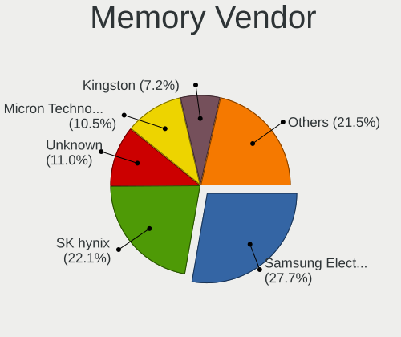

| Vendor                     | Notebooks | Percent |
|----------------------------|-----------|---------|
| Samsung Electronics        | 124       | 27.74%  |
| SK hynix                   | 99        | 22.15%  |
| Unknown                    | 49        | 10.96%  |
| Micron Technology          | 47        | 10.51%  |
| Kingston                   | 32        | 7.16%   |
| Crucial                    | 25        | 5.59%   |
| Ramaxel Technology         | 13        | 2.91%   |
| Unknown (ABCD)             | 11        | 2.46%   |
| Nanya Technology           | 6         | 1.34%   |
| Corsair                    | 6         | 1.34%   |
| G.Skill                    | 5         | 1.12%   |
| Smart                      | 4         | 0.89%   |
| A-DATA Technology          | 4         | 0.89%   |
| Unknown                    | 4         | 0.89%   |
| fef5                       | 3         | 0.67%   |
| Transcend                  | 2         | 0.45%   |
| Elpida                     | 2         | 0.45%   |
| V-Color                    | 1         | 0.22%   |
| Unknown (7F7F7F7F7F7F6B00) | 1         | 0.22%   |
| Unifosa                    | 1         | 0.22%   |
| Silicon Power              | 1         | 0.22%   |
| Qimonda                    | 1         | 0.22%   |
| Micron/Elpida              | 1         | 0.22%   |
| Foxline                    | 1         | 0.22%   |
| Essencore                  | 1         | 0.22%   |
| Daten Tecnologia           | 1         | 0.22%   |
| Avant                      | 1         | 0.22%   |
| 48spaces                   | 1         | 0.22%   |

Memory Model
------------

Memory module models

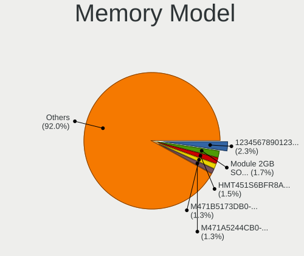

| Model                                                            | Notebooks | Percent |
|------------------------------------------------------------------|-----------|---------|
| Unknown (ABCD) RAM 123456789012345678 2GB SODIMM LPDDR4 2400MT/s | 11        | 2.31%   |
| Unknown RAM Module 2GB SODIMM DDR2 667MT/s                       | 8         | 1.68%   |
| SK hynix RAM HMT451S6BFR8A-PB 4GB SODIMM DDR3 1600MT/s           | 7         | 1.47%   |
| SK hynix RAM HMA81GS6DJR8N-XN 8GB SODIMM DDR4 3200MT/s           | 6         | 1.26%   |
| Samsung RAM M471B5173DB0-YK0 4GB SODIMM DDR3 1600MT/s            | 6         | 1.26%   |
| Samsung RAM M471A5244CB0-CWE 4GB SODIMM DDR4 3200MT/s            | 6         | 1.26%   |
| Samsung RAM M471A1G44BB0-CWE 8GB SODIMM DDR4 3200MT/s            | 6         | 1.26%   |
| SK hynix RAM HMA81GS6AFR8N-UH 8GB SODIMM DDR4 2667MT/s           | 5         | 1.05%   |
| Samsung RAM M471B5773DH0-CH9 2GB SODIMM DDR3 1600MT/s            | 5         | 1.05%   |
| Samsung RAM M471B5773CHS-CH9 2GB SODIMM DDR3 4199MT/s            | 5         | 1.05%   |
| Samsung RAM M471A5244CB0-CWE 4GB Row Of Chips DDR4 3200MT/s      | 5         | 1.05%   |
| Samsung RAM M471A5244CB0-CTD 4GB SODIMM DDR4 3266MT/s            | 5         | 1.05%   |
| Unknown RAM Module 4GB Chip DDR4 2133MT/s                        | 4         | 0.84%   |
| Unknown RAM Module 1GB SODIMM DDR2 667MT/s                       | 4         | 0.84%   |
| SK hynix RAM HMT351S6CFR8C-PB 4GB SODIMM DDR3 1600MT/s           | 4         | 0.84%   |
| SK hynix RAM HMA81GS6JJR8N-VK 8GB SODIMM DDR4 2667MT/s           | 4         | 0.84%   |
| Samsung RAM M471B5273DH0-CH9 4GB SODIMM DDR3 1600MT/s            | 4         | 0.84%   |
| Samsung RAM M471B5173QH0-YK0 4GB SODIMM DDR3 1600MT/s            | 4         | 0.84%   |
| Samsung RAM M471B5173EB0-YK0 4GB SODIMM DDR3 1600MT/s            | 4         | 0.84%   |
| Samsung RAM M471A1G44AB0-CWE 8GiB SODIMM DDR4 3200MT/s           | 4         | 0.84%   |
| Unknown                                                          | 4         | 0.84%   |
| Unknown RAM Module 2GB SODIMM DDR3 1600MT/s                      | 3         | 0.63%   |
| Unknown RAM Module 2GB SODIMM DDR3 1333MT/s                      | 3         | 0.63%   |
| Unknown RAM Module 2GB SODIMM DDR2                               | 3         | 0.63%   |
| SK hynix RAM Module 4GB SODIMM DDR3 1600MT/s                     | 3         | 0.63%   |
| SK hynix RAM Module 2GB SODIMM DDR3 1600MT/s                     | 3         | 0.63%   |
| SK hynix RAM HMT451S6AFR8A-PB 4GB SODIMM DDR3 1600MT/s           | 3         | 0.63%   |
| SK hynix RAM HMT41GS6BFR8A-PB 8GB SODIMM DDR3 2667MT/s           | 3         | 0.63%   |
| SK hynix RAM HMAA1GS6CJR6N-XN 8GB SODIMM DDR4 3200MT/s           | 3         | 0.63%   |
| SK hynix RAM HMA851S6CJR6N-VK 4GB SODIMM DDR4 2667MT/s           | 3         | 0.63%   |
| Samsung RAM Module 8GB SODIMM DDR4 2133MT/s                      | 3         | 0.63%   |
| Samsung RAM M471B5273CH0-CH9 4GB SODIMM DDR3 1334MT/s            | 3         | 0.63%   |
| Samsung RAM M471B2873FHS-CH9 1GB SODIMM DDR3 1333MT/s            | 3         | 0.63%   |
| Samsung RAM M471A5244CB0-CRC 4GB SODIMM DDR4 2667MT/s            | 3         | 0.63%   |
| Samsung RAM M471A1K43EB1-CWE 8GB SODIMM DDR4 3200MT/s            | 3         | 0.63%   |
| Samsung RAM M471A1K43DB1-CWE 8GB SODIMM DDR4 3200MT/s            | 3         | 0.63%   |
| Samsung RAM K4F8E304HB-MGCJ 1GB LPDDR4 2400MT/s                  | 3         | 0.63%   |
| Nanya RAM NT2GC64B88B0NS-CG 2048MB SODIMM DDR3 1334MT/s          | 3         | 0.63%   |
| Micron RAM Module 2GB SODIMM DDR3 1333MT/s                       | 3         | 0.63%   |
| Micron RAM 8ATF1G64HZ-3G2R1 8GB SODIMM DDR4 3200MT/s             | 3         | 0.63%   |

Memory Kind
-----------

Memory module kinds

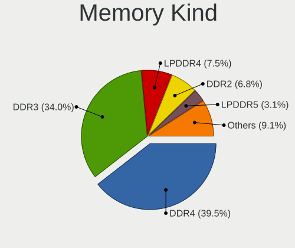

| Kind    | Notebooks | Percent |
|---------|-----------|---------|
| DDR4    | 152       | 39.48%  |
| DDR3    | 131       | 34.03%  |
| LPDDR4  | 29        | 7.53%   |
| DDR2    | 26        | 6.75%   |
| LPDDR5  | 12        | 3.12%   |
| SDRAM   | 10        | 2.6%    |
| LPDDR3  | 9         | 2.34%   |
| DDR5    | 9         | 2.34%   |
| Unknown | 6         | 1.56%   |
| DDR     | 1         | 0.26%   |

Memory Form Factor
------------------

Physical design of the memory module

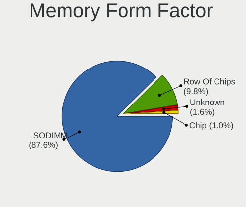

| Name         | Notebooks | Percent |
|--------------|-----------|---------|
| SODIMM       | 339       | 87.6%   |
| Row Of Chips | 38        | 9.82%   |
| Unknown      | 6         | 1.55%   |
| Chip         | 4         | 1.03%   |

Memory Size
-----------

Memory module size

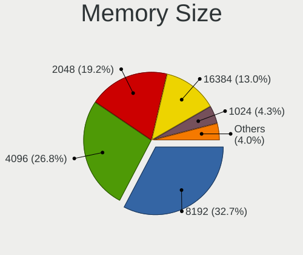

| Size  | Notebooks | Percent |
|-------|-----------|---------|
| 8192  | 138       | 32.7%   |
| 4096  | 113       | 26.78%  |
| 2048  | 81        | 19.19%  |
| 16384 | 55        | 13.03%  |
| 1024  | 18        | 4.27%   |
| 32768 | 15        | 3.55%   |
| 1536  | 1         | 0.24%   |
| 512   | 1         | 0.24%   |

Memory Speed
------------

Memory module speed

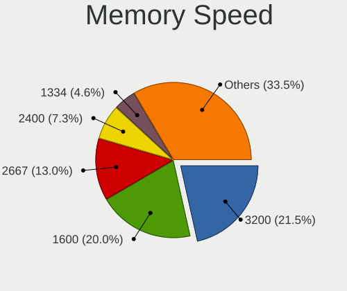

| Speed   | Notebooks | Percent |
|---------|-----------|---------|
| 3200    | 88        | 21.52%  |
| 1600    | 82        | 20.05%  |
| 2667    | 53        | 12.96%  |
| 2400    | 30        | 7.33%   |
| 1334    | 19        | 4.65%   |
| 2133    | 18        | 4.4%    |
| 667     | 17        | 4.16%   |
| 1333    | 16        | 3.91%   |
| 1067    | 10        | 2.44%   |
| 4267    | 8         | 1.96%   |
| Unknown | 8         | 1.96%   |
| 6400    | 7         | 1.71%   |
| 4800    | 7         | 1.71%   |
| 4199    | 7         | 1.71%   |
| 3266    | 5         | 1.22%   |
| 7500    | 4         | 0.98%   |
| 800     | 4         | 0.98%   |
| 2048    | 3         | 0.73%   |
| 1867    | 3         | 0.73%   |
| 8400    | 2         | 0.49%   |
| 5600    | 2         | 0.49%   |
| 4266    | 2         | 0.49%   |
| 1776    | 2         | 0.49%   |
| 1066    | 2         | 0.49%   |
| 975     | 2         | 0.49%   |
| 533     | 2         | 0.49%   |
| 333     | 2         | 0.49%   |
| 5500    | 1         | 0.24%   |
| 3733    | 1         | 0.24%   |
| 3000    | 1         | 0.24%   |
| 2134    | 1         | 0.24%   |

Printers & scanners
-------------------

Printer Vendor
--------------

Printer device vendors

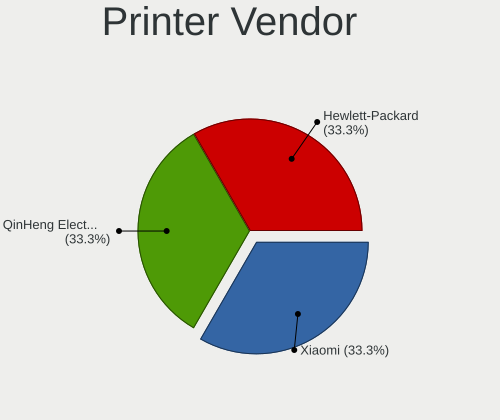

| Vendor              | Notebooks | Percent |
|---------------------|-----------|---------|
| Xiaomi              | 1         | 33.33%  |
| QinHeng Electronics | 1         | 33.33%  |
| Hewlett-Packard     | 1         | 33.33%  |

Printer Model
-------------

Printer device models

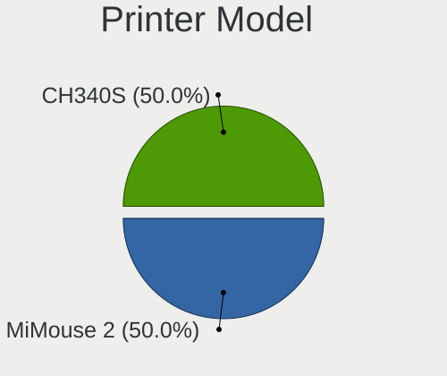

| Model                     | Notebooks | Percent |
|---------------------------|-----------|---------|
| Xiaomi MiMouse 2          | 1         | 33.33%  |
| QinHeng CH340S            | 1         | 33.33%  |
| HP Officejet 4500 G510n-z | 1         | 33.33%  |

Scanner Vendor
--------------

Scanner device vendors

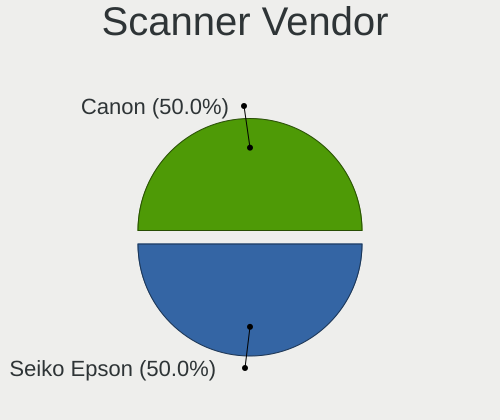

| Vendor      | Notebooks | Percent |
|-------------|-----------|---------|
| Seiko Epson | 1         | 50%     |
| Canon       | 1         | 50%     |

Scanner Model
-------------

Scanner device models

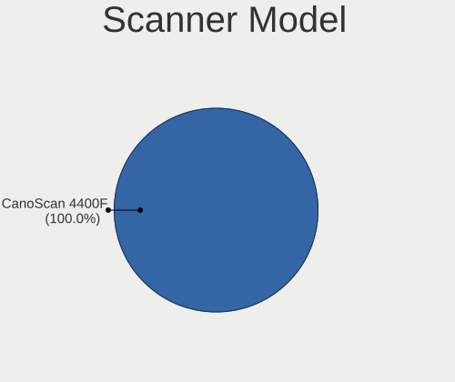

| Model                          | Notebooks | Percent |
|--------------------------------|-----------|---------|
| Seiko Epson GT-1500 [GT-D1000] | 1         | 50%     |
| Canon CanoScan 4400F           | 1         | 50%     |

Camera
------

Camera Vendor
-------------

Camera device vendors

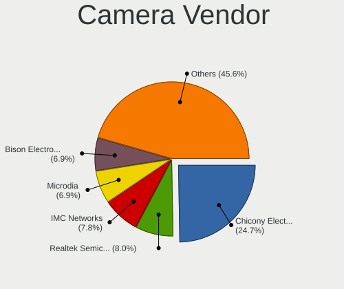

| Vendor                                 | Notebooks | Percent |
|----------------------------------------|-----------|---------|
| Chicony Electronics                    | 114       | 24.73%  |
| Realtek Semiconductor                  | 37        | 8.03%   |
| IMC Networks                           | 36        | 7.81%   |
| Microdia                               | 32        | 6.94%   |
| Bison Electronics                      | 32        | 6.94%   |
| Quanta                                 | 31        | 6.72%   |
| Cheng Uei Precision Industry (Foxlink) | 25        | 5.42%   |
| Sunplus Innovation Technology          | 24        | 5.21%   |
| Suyin                                  | 19        | 4.12%   |
| Syntek                                 | 12        | 2.6%    |
| Luxvisions Innotech Limited            | 12        | 2.6%    |
| Lite-On Technology                     | 11        | 2.39%   |
| Apple                                  | 11        | 2.39%   |
| Silicon Motion                         | 7         | 1.52%   |
| Logitech                               | 7         | 1.52%   |
| Sonix Technology                       | 6         | 1.3%    |
| Ricoh                                  | 6         | 1.3%    |
| Z-Star Microelectronics                | 3         | 0.65%   |
| Samsung Electronics                    | 3         | 0.65%   |
| Lenovo                                 | 3         | 0.65%   |
| icSpring                               | 3         | 0.65%   |
| Alcor Micro                            | 3         | 0.65%   |
| USB Camera CS                          | 2         | 0.43%   |
| SunplusIT                              | 2         | 0.43%   |
| Shinetech                              | 2         | 0.43%   |
| Importek                               | 2         | 0.43%   |
| Generalplus Technology                 | 2         | 0.43%   |
| Xiongmai                               | 1         | 0.22%   |
| ValueHD                                | 1         | 0.22%   |
| Trust                                  | 1         | 0.22%   |
| Sunplus Technology                     | 1         | 0.22%   |
| Primax Electronics                     | 1         | 0.22%   |
| OYT Tech                               | 1         | 0.22%   |
| OmniVision Technologies                | 1         | 0.22%   |
| MacroSilicon                           | 1         | 0.22%   |
| Genesys Logic                          | 1         | 0.22%   |
| DigiTech                               | 1         | 0.22%   |
| Arkmicro Technologies                  | 1         | 0.22%   |
| Alpha Imaging Technology               | 1         | 0.22%   |
| Acer                                   | 1         | 0.22%   |

Camera Model
------------

Camera device models

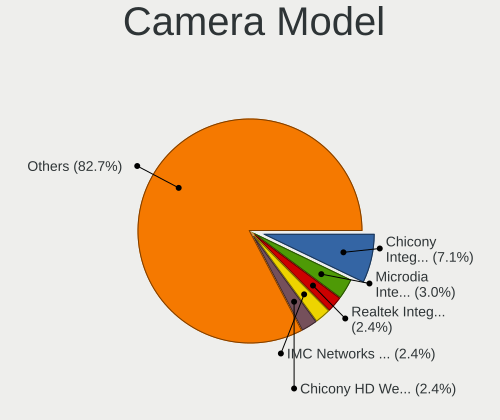

| Model                                               | Notebooks | Percent |
|-----------------------------------------------------|-----------|---------|
| Chicony Integrated Camera                           | 33        | 7.14%   |
| Microdia Integrated_Webcam_HD                       | 14        | 3.03%   |
| Realtek Integrated_Webcam_HD                        | 11        | 2.38%   |
| IMC Networks USB2.0 HD UVC WebCam                   | 11        | 2.38%   |
| Chicony HD WebCam                                   | 11        | 2.38%   |
| Sunplus Integrated_Webcam_HD                        | 9         | 1.95%   |
| Quanta HD User Facing                               | 9         | 1.95%   |
| Chicony TOSHIBA Web Camera - HD                     | 9         | 1.95%   |
| Bison Integrated Camera                             | 9         | 1.95%   |
| Syntek Integrated Camera                            | 8         | 1.73%   |
| IMC Networks Integrated Camera                      | 8         | 1.73%   |
| Apple Built-in iSight                               | 7         | 1.52%   |
| Lite-On Integrated Camera                           | 6         | 1.3%    |
| Chicony HP Truevision HD camera                     | 6         | 1.3%    |
| Quanta HP TrueVision HD Camera                      | 5         | 1.08%   |
| Luxvisions Innotech Limited HP TrueVision HD Camera | 5         | 1.08%   |
| IMC Networks USB2.0 VGA UVC WebCam                  | 5         | 1.08%   |
| Cheng Uei Precision Industry (Foxlink) HP Webcam    | 5         | 1.08%   |
| Cheng Uei Precision Industry (Foxlink) HP HD Camera | 5         | 1.08%   |
| Bison Lenovo EasyCamera                             | 5         | 1.08%   |
| Sunplus Integrated_Webcam_FHD                       | 4         | 0.87%   |
| Realtek Lenovo EasyCamera                           | 4         | 0.87%   |
| Quanta HP Webcam                                    | 4         | 0.87%   |
| Chicony Chicony USB2.0 Camera                       | 4         | 0.87%   |
| Chicony 1.3M Webcam                                 | 4         | 0.87%   |
| Suyin HP TrueVision HD Integrated Webcam            | 3         | 0.65%   |
| Sonix USB2.0 HD UVC WebCam                          | 3         | 0.65%   |
| Samsung Galaxy series, misc. (MTP mode)             | 3         | 0.65%   |
| Ricoh Sony Visual Communication Camera              | 3         | 0.65%   |
| Realtek Integrated_Webcam_FHD                       | 3         | 0.65%   |
| Realtek Acer 640 x 480 laptop camera                | 3         | 0.65%   |
| Microdia USB 2.0 Camera                             | 3         | 0.65%   |
| Luxvisions Innotech Limited Integrated RGB Camera   | 3         | 0.65%   |
| Logitech C922 Pro Stream Webcam                     | 3         | 0.65%   |
| Lite-On HP HD Webcam                                | 3         | 0.65%   |
| IMC Networks ov9734_azurewave_camera                | 3         | 0.65%   |
| icSpring camera                                     | 3         | 0.65%   |
| Chicony VGA WebCam                                  | 3         | 0.65%   |
| Chicony USB2.0 VGA UVC WebCam                       | 3         | 0.65%   |
| Chicony HP TrueVision HD                            | 3         | 0.65%   |

Security
--------

Fingerprint Vendor
------------------

Fingerprint sensor vendors

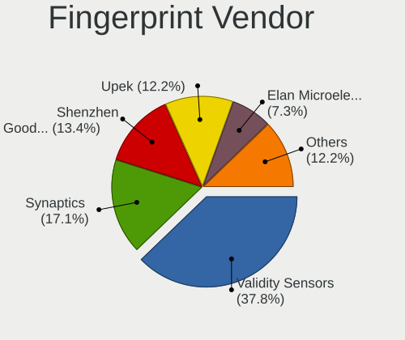

| Vendor                             | Notebooks | Percent |
|------------------------------------|-----------|---------|
| Validity Sensors                   | 31        | 37.8%   |
| Synaptics                          | 14        | 17.07%  |
| Shenzhen Goodix Technology         | 11        | 13.41%  |
| Upek                               | 10        | 12.2%   |
| Elan Microelectronics              | 6         | 7.32%   |
| STMicroelectronics                 | 4         | 4.88%   |
| AuthenTec                          | 3         | 3.66%   |
| Realtek USB2.0 Finger Print Bridge | 2         | 2.44%   |
| Focal-systems.Corp                 | 1         | 1.22%   |

Fingerprint Model
-----------------

Fingerprint sensor models

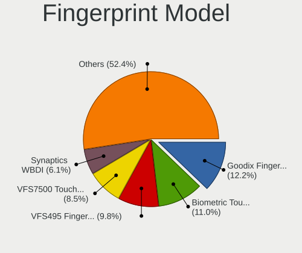

| Model                                                           | Notebooks | Percent |
|-----------------------------------------------------------------|-----------|---------|
| Shenzhen Goodix  Fingerprint Device                             | 10        | 12.2%   |
| Upek Biometric Touchchip/Touchstrip Fingerprint Sensor          | 9         | 10.98%  |
| Validity Sensors VFS495 Fingerprint Reader                      | 8         | 9.76%   |
| Validity Sensors VFS7500 Touch Fingerprint Sensor               | 7         | 8.54%   |
| Validity Sensors Synaptics WBDI                                 | 5         | 6.1%    |
| Synaptics Prometheus MIS Touch Fingerprint Reader               | 5         | 6.1%    |
| Validity Sensors VFS 5011 fingerprint sensor                    | 4         | 4.88%   |
| STMicroelectronics Fingerprint Reader                           | 4         | 4.88%   |
| Elan ELAN:ARM-M4                                                | 4         | 4.88%   |
| Validity Sensors VFS451 Fingerprint Reader                      | 3         | 3.66%   |
| Synaptics Prometheus Fingerprint Reader                         | 3         | 3.66%   |
| Validity Sensors VFS301 Fingerprint Reader                      | 2         | 2.44%   |
| Synaptics UWP WBDI Device                                       | 2         | 2.44%   |
| Realtek USB2.0 Finger Print Bridge FocalTech Fingerprint Device | 2         | 2.44%   |
| Elan ELAN:Fingerprint                                           | 2         | 2.44%   |
| AuthenTec AES2501 Fingerprint Sensor                            | 2         | 2.44%   |
| Validity Sensors VFS Fingerprint sensor                         | 1         | 1.22%   |
| Validity Sensors Fingerprint scanner                            | 1         | 1.22%   |
| Upek TCS5B Fingerprint sensor                                   | 1         | 1.22%   |
| Synaptics  WBDI                                                 | 1         | 1.22%   |
| Synaptics Metallica MOH Touch Fingerprint Reader                | 1         | 1.22%   |
| Synaptics Metallica MIS Touch Fingerprint Reader                | 1         | 1.22%   |
| Synaptics FS7604 Touch Fingerprint Sensor with PurePrint        | 1         | 1.22%   |
| Shenzhen Goodix FingerPrint                                     | 1         | 1.22%   |
| Focal-systems.Corp FT9201Fingerprint.                           | 1         | 1.22%   |
| AuthenTec AES2810                                               | 1         | 1.22%   |

Chipcard Vendor
---------------

Chipcard module vendors

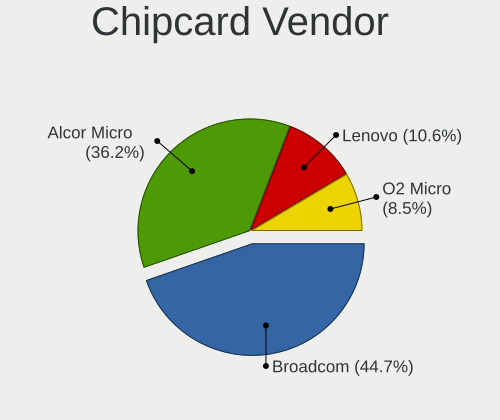

| Vendor      | Notebooks | Percent |
|-------------|-----------|---------|
| Broadcom    | 21        | 44.68%  |
| Alcor Micro | 17        | 36.17%  |
| Lenovo      | 5         | 10.64%  |
| O2 Micro    | 4         | 8.51%   |

Chipcard Model
--------------

Chipcard module models

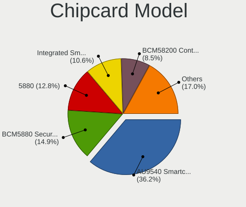

| Model                                                                        | Notebooks | Percent |
|------------------------------------------------------------------------------|-----------|---------|
| Alcor Micro AU9540 Smartcard Reader                                          | 17        | 36.17%  |
| Broadcom BCM5880 Secure Applications Processor                               | 7         | 14.89%  |
| Broadcom 5880                                                                | 6         | 12.77%  |
| Lenovo Integrated Smart Card Reader                                          | 5         | 10.64%  |
| Broadcom BCM58200 ControlVault 3 (FingerPrint sensor + Contacted SmartCard)  | 4         | 8.51%   |
| O2 Micro OZ776 CCID Smartcard Reader                                         | 3         | 6.38%   |
| Broadcom BCM5880 Secure Applications Processor with fingerprint swipe sensor | 2         | 4.26%   |
| Broadcom 58200                                                               | 2         | 4.26%   |
| O2 Micro Oz776 SmartCard Reader                                              | 1         | 2.13%   |

Unsupported
-----------

Unsupported Devices
-------------------

Total unsupported devices on board

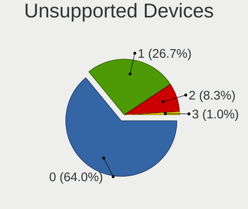

| Total | Notebooks | Percent |
|-------|-----------|---------|
| 0     | 331       | 64.02%  |
| 1     | 138       | 26.69%  |
| 2     | 43        | 8.32%   |
| 3     | 5         | 0.97%   |

Unsupported Device Types
------------------------

Types of unsupported devices

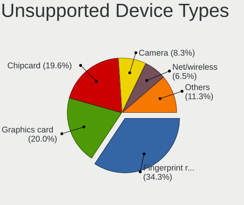

| Type                     | Notebooks | Percent |
|--------------------------|-----------|---------|
| Fingerprint reader       | 79        | 34.35%  |
| Graphics card            | 46        | 20%     |
| Chipcard                 | 45        | 19.57%  |
| Camera                   | 19        | 8.26%   |
| Net/wireless             | 15        | 6.52%   |
| Bluetooth                | 8         | 3.48%   |
| Card reader              | 5         | 2.17%   |
| Storage                  | 4         | 1.74%   |
| Network                  | 3         | 1.3%    |
| Multimedia controller    | 3         | 1.3%    |
| Communication controller | 2         | 0.87%   |
| Net/ethernet             | 1         | 0.43%   |

