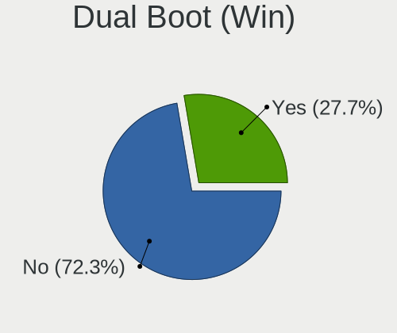
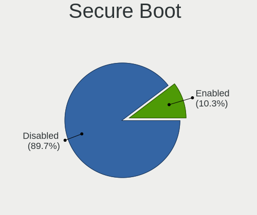
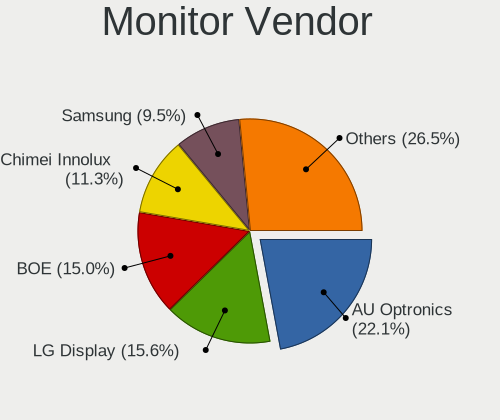
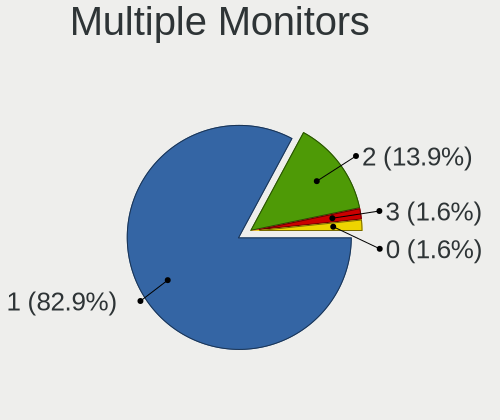
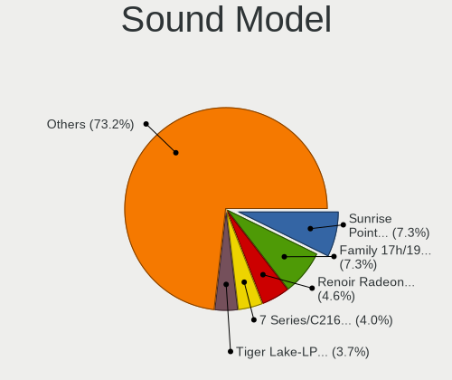

Xubuntu 22.04 - Tested Hardware & Statistics (Notebooks)
--------------------------------------------------------

A project to collect tested hardware configurations for Xubuntu 22.04.

Anyone can contribute to this report by the [hw-probe](https://github.com/linuxhw/hw-probe) tool:

    sudo -E hw-probe -all -upload

Please contribute! Especially if your hardware is rare.

Contents
--------

* [ Test Cases ](#test-cases)

* [ System ](#system)
  - [ Kernel                   ](#kernel)
  - [ Kernel Family            ](#kernel-family)
  - [ Kernel Major Ver.        ](#kernel-major-ver)
  - [ Arch                     ](#arch)
  - [ DE                       ](#de)
  - [ Display Server           ](#display-server)
  - [ Display Manager          ](#display-manager)
  - [ OS Lang                  ](#os-lang)
  - [ Boot Mode                ](#boot-mode)
  - [ Filesystem               ](#filesystem)
  - [ Part. scheme             ](#part-scheme)
  - [ Dual Boot with Linux/BSD ](#dual-boot-with-linuxbsd)
  - [ Dual Boot (Win)          ](#dual-boot-win)

* [ Board ](#board)
  - [ Vendor                   ](#vendor)
  - [ Model                    ](#model)
  - [ Model Family             ](#model-family)
  - [ MFG Year                 ](#mfg-year)
  - [ Form Factor              ](#form-factor)
  - [ Secure Boot              ](#secure-boot)
  - [ Coreboot                 ](#coreboot)
  - [ RAM Size                 ](#ram-size)
  - [ RAM Used                 ](#ram-used)
  - [ Total Drives             ](#total-drives)
  - [ Has CD-ROM               ](#has-cd-rom)
  - [ Has Ethernet             ](#has-ethernet)
  - [ Has WiFi                 ](#has-wifi)
  - [ Has Bluetooth            ](#has-bluetooth)

* [ Location ](#location)
  - [ Country                  ](#country)
  - [ City                     ](#city)

* [ Drives ](#drives)
  - [ Drive Vendor             ](#drive-vendor)
  - [ Drive Model              ](#drive-model)
  - [ HDD Vendor               ](#hdd-vendor)
  - [ SSD Vendor               ](#ssd-vendor)
  - [ Drive Kind               ](#drive-kind)
  - [ Drive Connector          ](#drive-connector)
  - [ Drive Size               ](#drive-size)
  - [ Space Total              ](#space-total)
  - [ Space Used               ](#space-used)
  - [ Malfunc. Drives          ](#malfunc-drives)
  - [ Malfunc. Drive Vendor    ](#malfunc-drive-vendor)
  - [ Malfunc. HDD Vendor      ](#malfunc-hdd-vendor)
  - [ Malfunc. Drive Kind      ](#malfunc-drive-kind)
  - [ Failed Drives            ](#failed-drives)
  - [ Failed Drive Vendor      ](#failed-drive-vendor)
  - [ Drive Status             ](#drive-status)

* [ Storage controller ](#storage-controller)
  - [ Storage Vendor           ](#storage-vendor)
  - [ Storage Model            ](#storage-model)
  - [ Storage Kind             ](#storage-kind)

* [ Processor ](#processor)
  - [ CPU Vendor               ](#cpu-vendor)
  - [ CPU Model                ](#cpu-model)
  - [ CPU Model Family         ](#cpu-model-family)
  - [ CPU Cores                ](#cpu-cores)
  - [ CPU Sockets              ](#cpu-sockets)
  - [ CPU Threads              ](#cpu-threads)
  - [ CPU Op-Modes             ](#cpu-op-modes)
  - [ CPU Microcode            ](#cpu-microcode)
  - [ CPU Microarch            ](#cpu-microarch)

* [ Graphics ](#graphics)
  - [ GPU Vendor               ](#gpu-vendor)
  - [ GPU Model                ](#gpu-model)
  - [ GPU Combo                ](#gpu-combo)
  - [ GPU Driver               ](#gpu-driver)
  - [ GPU Memory               ](#gpu-memory)

* [ Monitor ](#monitor)
  - [ Monitor Vendor           ](#monitor-vendor)
  - [ Monitor Model            ](#monitor-model)
  - [ Monitor Resolution       ](#monitor-resolution)
  - [ Monitor Diagonal         ](#monitor-diagonal)
  - [ Monitor Width            ](#monitor-width)
  - [ Aspect Ratio             ](#aspect-ratio)
  - [ Monitor Area             ](#monitor-area)
  - [ Pixel Density            ](#pixel-density)
  - [ Multiple Monitors        ](#multiple-monitors)

* [ Network ](#network)
  - [ Net Controller Vendor    ](#net-controller-vendor)
  - [ Net Controller Model     ](#net-controller-model)
  - [ Wireless Vendor          ](#wireless-vendor)
  - [ Wireless Model           ](#wireless-model)
  - [ Ethernet Vendor          ](#ethernet-vendor)
  - [ Ethernet Model           ](#ethernet-model)
  - [ Net Controller Kind      ](#net-controller-kind)
  - [ Used Controller          ](#used-controller)
  - [ NICs                     ](#nics)
  - [ IPv6                     ](#ipv6)

* [ Bluetooth ](#bluetooth)
  - [ Bluetooth Vendor         ](#bluetooth-vendor)
  - [ Bluetooth Model          ](#bluetooth-model)

* [ Sound ](#sound)
  - [ Sound Vendor             ](#sound-vendor)
  - [ Sound Model              ](#sound-model)

* [ Memory ](#memory)
  - [ Memory Vendor            ](#memory-vendor)
  - [ Memory Model             ](#memory-model)
  - [ Memory Kind              ](#memory-kind)
  - [ Memory Form Factor       ](#memory-form-factor)
  - [ Memory Size              ](#memory-size)
  - [ Memory Speed             ](#memory-speed)

* [ Printers & scanners ](#printers--scanners)
  - [ Printer Vendor           ](#printer-vendor)
  - [ Printer Model            ](#printer-model)
  - [ Scanner Vendor           ](#scanner-vendor)
  - [ Scanner Model            ](#scanner-model)

* [ Camera ](#camera)
  - [ Camera Vendor            ](#camera-vendor)
  - [ Camera Model             ](#camera-model)

* [ Security ](#security)
  - [ Fingerprint Vendor       ](#fingerprint-vendor)
  - [ Fingerprint Model        ](#fingerprint-model)
  - [ Chipcard Vendor          ](#chipcard-vendor)
  - [ Chipcard Model           ](#chipcard-model)

* [ Unsupported ](#unsupported)
  - [ Unsupported Devices      ](#unsupported-devices)
  - [ Unsupported Device Types ](#unsupported-device-types)

Test Cases
----------

Total: 403

| Vendor        | Model                       | Probe                                                      | Date         |
|---------------|-----------------------------|------------------------------------------------------------|--------------|
| Medion        | Akoya P2213T                | [2464869ce2](https://linux-hardware.org/?probe=2464869ce2) | Sep 06, 2023 |
| HP            | EliteBook 820 G3            | [5ef4c889a4](https://linux-hardware.org/?probe=5ef4c889a4) | Aug 31, 2023 |
| Dell          | Latitude E5510              | [61f6df7426](https://linux-hardware.org/?probe=61f6df7426) | Aug 29, 2023 |
| HP            | Pavilion 17                 | [ba077d7ea1](https://linux-hardware.org/?probe=ba077d7ea1) | Aug 29, 2023 |
| Dell          | XPS 15 9500                 | [74ad31c9de](https://linux-hardware.org/?probe=74ad31c9de) | Aug 29, 2023 |
| Apple         | MacBookPro7,1               | [f520b2dd72](https://linux-hardware.org/?probe=f520b2dd72) | Aug 28, 2023 |
| ASUSTek       | ROG Strix G733PY_G733PY     | [b886de0613](https://linux-hardware.org/?probe=b886de0613) | Aug 28, 2023 |
| HP            | Pavilion 17                 | [1d04c114d6](https://linux-hardware.org/?probe=1d04c114d6) | Aug 26, 2023 |
| Toshiba       | Satellite C55D-B            | [b7dce1f6e0](https://linux-hardware.org/?probe=b7dce1f6e0) | Aug 25, 2023 |
| Lenovo        | ThinkPad T460s 20F9003VM... | [e6e076d380](https://linux-hardware.org/?probe=e6e076d380) | Aug 23, 2023 |
| Acer          | TMP255-M                    | [4d5632e2d0](https://linux-hardware.org/?probe=4d5632e2d0) | Aug 22, 2023 |
| GPU Compan... | GWTN156-5                   | [22efc40cfd](https://linux-hardware.org/?probe=22efc40cfd) | Aug 21, 2023 |
| HP            | Presario CQ42               | [183f035603](https://linux-hardware.org/?probe=183f035603) | Aug 20, 2023 |
| Lenovo        | G50-70 20351                | [a8a0c22567](https://linux-hardware.org/?probe=a8a0c22567) | Aug 20, 2023 |
| HP            | 250 G4 Notebook PC          | [ea6fdc81ab](https://linux-hardware.org/?probe=ea6fdc81ab) | Aug 18, 2023 |
| ASUSTek       | VivoBook_ASUSLaptop X515... | [f626ffa833](https://linux-hardware.org/?probe=f626ffa833) | Aug 17, 2023 |
| Lenovo        | IdeaPad 5 15ABA7 82SG       | [48af3e541c](https://linux-hardware.org/?probe=48af3e541c) | Aug 16, 2023 |
| Lenovo        | IdeaPad 5 15ABA7 82SG       | [5b482b674c](https://linux-hardware.org/?probe=5b482b674c) | Aug 16, 2023 |
| Lenovo        | ThinkPad X250 20CM001RMC    | [618a7e3e29](https://linux-hardware.org/?probe=618a7e3e29) | Aug 14, 2023 |
| Lenovo        | B50-50 80S2                 | [6c897e0c63](https://linux-hardware.org/?probe=6c897e0c63) | Aug 14, 2023 |
| Lenovo        | IdeaPad Y570 0862           | [0ea140ff49](https://linux-hardware.org/?probe=0ea140ff49) | Aug 12, 2023 |
| Dell          | Latitude 3540               | [496e3ab340](https://linux-hardware.org/?probe=496e3ab340) | Aug 10, 2023 |
| HP            | Laptop 17-cp0xxx            | [c5a255abcb](https://linux-hardware.org/?probe=c5a255abcb) | Aug 10, 2023 |
| ASUSTek       | X541UVK                     | [77ec1f7364](https://linux-hardware.org/?probe=77ec1f7364) | Aug 09, 2023 |
| Acer          | Aspire 5732Z                | [5a0ee0b4c0](https://linux-hardware.org/?probe=5a0ee0b4c0) | Aug 08, 2023 |
| Acer          | Aspire A515-54G             | [cc5ec06f60](https://linux-hardware.org/?probe=cc5ec06f60) | Aug 08, 2023 |
| Acer          | Aspire A515-54G             | [14e4cbffd4](https://linux-hardware.org/?probe=14e4cbffd4) | Aug 08, 2023 |
| Dell          | Latitude 5411               | [2d69739196](https://linux-hardware.org/?probe=2d69739196) | Aug 07, 2023 |
| Acer          | Aspire A517-52              | [aa9fd10def](https://linux-hardware.org/?probe=aa9fd10def) | Aug 01, 2023 |
| Samsung       | 305E4A/305E5A/305E7A        | [67fbb84480](https://linux-hardware.org/?probe=67fbb84480) | Jul 31, 2023 |
| Acer          | Aspire A517-52              | [1df8f3a3ed](https://linux-hardware.org/?probe=1df8f3a3ed) | Jul 29, 2023 |
| Medion        | Akoya P2213T                | [740da3bf14](https://linux-hardware.org/?probe=740da3bf14) | Jul 29, 2023 |
| Gateway       | NV57H                       | [efc311477f](https://linux-hardware.org/?probe=efc311477f) | Jul 28, 2023 |
| Samsung       | N250P/N145P                 | [6b6e675a4c](https://linux-hardware.org/?probe=6b6e675a4c) | Jul 28, 2023 |
| Acer          | Extensa 2510                | [b276a715eb](https://linux-hardware.org/?probe=b276a715eb) | Jul 27, 2023 |
| Acer          | AOD255                      | [4f96dbf750](https://linux-hardware.org/?probe=4f96dbf750) | Jul 25, 2023 |
| Acer          | AOD255                      | [3543f0800e](https://linux-hardware.org/?probe=3543f0800e) | Jul 24, 2023 |
| MSI           | MEGA BOOK GX620             | [184ec8dfc2](https://linux-hardware.org/?probe=184ec8dfc2) | Jul 22, 2023 |
| Lenovo        | IdeaPad 3 15ALC6 82KU       | [38856f8131](https://linux-hardware.org/?probe=38856f8131) | Jul 21, 2023 |
| HP            | Laptop 15s-fq2xxx           | [977443386e](https://linux-hardware.org/?probe=977443386e) | Jul 21, 2023 |
| Itautec       | Infoway w7535               | [bde95c0c99](https://linux-hardware.org/?probe=bde95c0c99) | Jul 21, 2023 |
| Thomson       | N15C8BK2T                   | [2e04333da5](https://linux-hardware.org/?probe=2e04333da5) | Jul 19, 2023 |
| Lenovo        | IdeaPad 330S-15AST 81F9     | [c9a443767b](https://linux-hardware.org/?probe=c9a443767b) | Jul 16, 2023 |
| MSI           | Modern 15 A10RBS            | [fde24c2a13](https://linux-hardware.org/?probe=fde24c2a13) | Jul 15, 2023 |
| Lenovo        | G50-70 20351                | [d18c64af74](https://linux-hardware.org/?probe=d18c64af74) | Jul 14, 2023 |
| GPU Compan... | GWNC21524                   | [e3e2452c10](https://linux-hardware.org/?probe=e3e2452c10) | Jul 14, 2023 |
| Lenovo        | ThinkPad T480 20L6S01Q3U    | [f6a1f94437](https://linux-hardware.org/?probe=f6a1f94437) | Jul 13, 2023 |
| HP            | Laptop 15s-fq2xxx           | [5aacfb69aa](https://linux-hardware.org/?probe=5aacfb69aa) | Jul 12, 2023 |
| HP            | Stream Laptop 14-ds0xxx     | [d4bc86a90a](https://linux-hardware.org/?probe=d4bc86a90a) | Jul 12, 2023 |
| HP            | ProBook 11 G2               | [db2ec8adc8](https://linux-hardware.org/?probe=db2ec8adc8) | Jul 08, 2023 |
| Acer          | Aspire A315-54              | [4aba66ddfb](https://linux-hardware.org/?probe=4aba66ddfb) | Jul 07, 2023 |
| Dell          | Latitude 3540               | [4ebbd2913f](https://linux-hardware.org/?probe=4ebbd2913f) | Jul 06, 2023 |
| HP            | Compaq Presario CQ60        | [983745a0d2](https://linux-hardware.org/?probe=983745a0d2) | Jul 03, 2023 |
| HP            | Compaq Presario CQ60        | [a5bd493e91](https://linux-hardware.org/?probe=a5bd493e91) | Jul 03, 2023 |
| Google        | Snappy                      | [683d8bf80a](https://linux-hardware.org/?probe=683d8bf80a) | Jul 02, 2023 |
| Google        | Snappy                      | [d3502a53cc](https://linux-hardware.org/?probe=d3502a53cc) | Jul 02, 2023 |
| HP            | Pavilion 17                 | [e6daccb5b9](https://linux-hardware.org/?probe=e6daccb5b9) | Jul 02, 2023 |
| Acer          | Aspire A517-52              | [7c14851b62](https://linux-hardware.org/?probe=7c14851b62) | Jul 02, 2023 |
| MSI           | GF63 Thin 11UC              | [5270a5ddc7](https://linux-hardware.org/?probe=5270a5ddc7) | Jul 01, 2023 |
| Dynabook      | B65/ER                      | [8f6f243e98](https://linux-hardware.org/?probe=8f6f243e98) | Jul 01, 2023 |
| Lenovo        | IdeaPad 100S-14IBR 80R9     | [3f2c5d0eb2](https://linux-hardware.org/?probe=3f2c5d0eb2) | Jul 01, 2023 |
| Acer          | Aspire A517-52              | [79f2cae4d6](https://linux-hardware.org/?probe=79f2cae4d6) | Jun 30, 2023 |
| Google        | Fleex                       | [7e3eb2d4f9](https://linux-hardware.org/?probe=7e3eb2d4f9) | Jun 30, 2023 |
| Acer          | Aspire A517-52              | [06d27800c2](https://linux-hardware.org/?probe=06d27800c2) | Jun 29, 2023 |
| Apple         | MacBookPro7,1               | [5a82f91882](https://linux-hardware.org/?probe=5a82f91882) | Jun 28, 2023 |
| Lenovo        | IdeaPad 100S-14IBR 80R9     | [ff919014cd](https://linux-hardware.org/?probe=ff919014cd) | Jun 28, 2023 |
| Lenovo        | V15 G4 AMN 82YU             | [338b2e7db3](https://linux-hardware.org/?probe=338b2e7db3) | Jun 25, 2023 |
| Acer          | Aspire 5600                 | [82fd23bd36](https://linux-hardware.org/?probe=82fd23bd36) | Jun 25, 2023 |
| Dell          | Latitude E6410              | [7d1989fd84](https://linux-hardware.org/?probe=7d1989fd84) | Jun 24, 2023 |
| Dell          | Inspiron 5415               | [ade4d4c90c](https://linux-hardware.org/?probe=ade4d4c90c) | Jun 19, 2023 |
| Acer          | Aspire 5600                 | [af924230a1](https://linux-hardware.org/?probe=af924230a1) | Jun 18, 2023 |
| GPU Compan... | GWNC21524                   | [5a31ac8b21](https://linux-hardware.org/?probe=5a31ac8b21) | Jun 15, 2023 |
| Samsung       | 760XDA                      | [f0decf4dbe](https://linux-hardware.org/?probe=f0decf4dbe) | Jun 14, 2023 |
| GPU Compan... | GWTN156-5                   | [b0afd2fa7b](https://linux-hardware.org/?probe=b0afd2fa7b) | Jun 13, 2023 |
| Dell          | Latitude 5411               | [c0292655dd](https://linux-hardware.org/?probe=c0292655dd) | Jun 13, 2023 |
| HP            | EliteBook 640 14 inch G9... | [69f20a331c](https://linux-hardware.org/?probe=69f20a331c) | Jun 12, 2023 |
| Toshiba       | Satellite C650              | [162f690841](https://linux-hardware.org/?probe=162f690841) | Jun 09, 2023 |
| HP            | Stream Laptop 11-ah0XX      | [2f5adf59a3](https://linux-hardware.org/?probe=2f5adf59a3) | Jun 07, 2023 |
| Dell          | Vostro 15 3510              | [b661a14644](https://linux-hardware.org/?probe=b661a14644) | Jun 07, 2023 |
| Dell          | Precision 5510              | [9888f3aedd](https://linux-hardware.org/?probe=9888f3aedd) | Jun 06, 2023 |
| Fujitsu Si... | LIFEBOOK S7110              | [9161ac00ce](https://linux-hardware.org/?probe=9161ac00ce) | Jun 04, 2023 |
| HP            | Laptop 14s-dq0xxx           | [0017659aa2](https://linux-hardware.org/?probe=0017659aa2) | Jun 01, 2023 |
| Unknown       | Unknown                     | [9390923473](https://linux-hardware.org/?probe=9390923473) | May 30, 2023 |
| Chuwi         | CoreBook X                  | [f9a2c23bfa](https://linux-hardware.org/?probe=f9a2c23bfa) | May 30, 2023 |
| Unknown       | Unknown                     | [9051961e40](https://linux-hardware.org/?probe=9051961e40) | May 28, 2023 |
| Lenovo        | Legion 5 Pro 16ACH6H 82J... | [3715c09ad3](https://linux-hardware.org/?probe=3715c09ad3) | May 27, 2023 |
| Dell          | Inspiron 15-3552            | [b2ade78a38](https://linux-hardware.org/?probe=b2ade78a38) | May 24, 2023 |
| Dell          | Latitude E4200              | [f352cc3ee4](https://linux-hardware.org/?probe=f352cc3ee4) | May 22, 2023 |
| Dell          | Vostro 5620                 | [6e87c1ac87](https://linux-hardware.org/?probe=6e87c1ac87) | May 21, 2023 |
| Google        | Snappy                      | [d13d8adaf4](https://linux-hardware.org/?probe=d13d8adaf4) | May 17, 2023 |
| Lenovo        | ThinkPad P50 20EN0013US     | [0b0b5e02cc](https://linux-hardware.org/?probe=0b0b5e02cc) | May 13, 2023 |
| Fujitsu       | LIFEBOOK P702               | [b1460b51ac](https://linux-hardware.org/?probe=b1460b51ac) | May 12, 2023 |
| HP            | ProBook 640 G1              | [23cff0250a](https://linux-hardware.org/?probe=23cff0250a) | May 12, 2023 |
| Dell          | Vostro 5620                 | [5248735c71](https://linux-hardware.org/?probe=5248735c71) | May 12, 2023 |
| Dell          | Vostro 5620                 | [daa5b232fc](https://linux-hardware.org/?probe=daa5b232fc) | May 12, 2023 |
| ASUSTek       | VivoBook_ASUSLaptop X515... | [7b53d1c3dc](https://linux-hardware.org/?probe=7b53d1c3dc) | May 11, 2023 |
| Dell          | Latitude E4310              | [84d1a3fda9](https://linux-hardware.org/?probe=84d1a3fda9) | May 11, 2023 |
| Samsung       | RV410/RV510/S3510/E3510     | [d6a837c94d](https://linux-hardware.org/?probe=d6a837c94d) | May 11, 2023 |
| Google        | Edgar                       | [372d5c177f](https://linux-hardware.org/?probe=372d5c177f) | May 10, 2023 |
| Gigabyte      | A7 K1                       | [1c37df2d10](https://linux-hardware.org/?probe=1c37df2d10) | May 09, 2023 |
| Google        | Snappy                      | [52836871bb](https://linux-hardware.org/?probe=52836871bb) | May 09, 2023 |
| Google        | Snappy                      | [a026aff306](https://linux-hardware.org/?probe=a026aff306) | May 09, 2023 |
| Lenovo        | ThinkPad P50 20EN0013US     | [0f322b6e3f](https://linux-hardware.org/?probe=0f322b6e3f) | May 08, 2023 |
| Google        | Auron_Yuna                  | [cbd0938f3c](https://linux-hardware.org/?probe=cbd0938f3c) | May 07, 2023 |
| HP            | Pavilion dv6                | [a4425e0654](https://linux-hardware.org/?probe=a4425e0654) | May 07, 2023 |
| Dell          | Inspiron 15-3567            | [fccfcd375f](https://linux-hardware.org/?probe=fccfcd375f) | May 06, 2023 |
| Lenovo        | ThinkPad P50 20EN0013US     | [c693555567](https://linux-hardware.org/?probe=c693555567) | May 05, 2023 |
| Lenovo        | ThinkPad X201 3680MG1       | [3e433a7cfa](https://linux-hardware.org/?probe=3e433a7cfa) | May 03, 2023 |
| HP            | 15                          | [17817f5320](https://linux-hardware.org/?probe=17817f5320) | May 02, 2023 |
| Toshiba       | EQUIUM P200                 | [812a164a8a](https://linux-hardware.org/?probe=812a164a8a) | Apr 30, 2023 |
| Lenovo        | ThinkPad P50 20EN0013US     | [95d59e1bc3](https://linux-hardware.org/?probe=95d59e1bc3) | Apr 28, 2023 |
| ASUSTek       | ASUS TUF Gaming A15 FA50... | [dfd3d8a5c5](https://linux-hardware.org/?probe=dfd3d8a5c5) | Apr 27, 2023 |
| MSI           | GP65 Leopard 10SDK          | [fc66ccccde](https://linux-hardware.org/?probe=fc66ccccde) | Apr 27, 2023 |
| Lenovo        | ThinkPad P50 20EN0013US     | [09f98983fd](https://linux-hardware.org/?probe=09f98983fd) | Apr 27, 2023 |
| SGIN          | M15                         | [ac5d947f22](https://linux-hardware.org/?probe=ac5d947f22) | Apr 27, 2023 |
| Dell          | Vostro 1520                 | [ef4bb434d9](https://linux-hardware.org/?probe=ef4bb434d9) | Apr 26, 2023 |
| HP            | 470 17 inch G9 Notebook ... | [6b73c4cb65](https://linux-hardware.org/?probe=6b73c4cb65) | Apr 24, 2023 |
| Lenovo        | ThinkPad T420 4236PA8       | [f45e2448aa](https://linux-hardware.org/?probe=f45e2448aa) | Apr 24, 2023 |
| HP            | ProBook 11 G2               | [43f6a6180a](https://linux-hardware.org/?probe=43f6a6180a) | Apr 24, 2023 |
| Dell          | XPS 13 9333                 | [0fedfa2911](https://linux-hardware.org/?probe=0fedfa2911) | Apr 22, 2023 |
| GPU Compan... | GWTN156-5                   | [4611a1d998](https://linux-hardware.org/?probe=4611a1d998) | Apr 22, 2023 |
| Lenovo        | ThinkPad L14 Gen 3 21C50... | [77cfc9d5b2](https://linux-hardware.org/?probe=77cfc9d5b2) | Apr 22, 2023 |
| HP            | ZBook Firefly 16 inch G9... | [194535b314](https://linux-hardware.org/?probe=194535b314) | Apr 19, 2023 |
| HP            | ProBook 11 G2               | [222f45e8c6](https://linux-hardware.org/?probe=222f45e8c6) | Apr 18, 2023 |
| HP            | Pavilion g6                 | [4c6934e946](https://linux-hardware.org/?probe=4c6934e946) | Apr 17, 2023 |
| HP            | Pavilion g6                 | [5fc4a56d59](https://linux-hardware.org/?probe=5fc4a56d59) | Apr 17, 2023 |
| HP            | Laptop 17-cp2xxx            | [b901ff7e98](https://linux-hardware.org/?probe=b901ff7e98) | Apr 14, 2023 |
| HP            | Laptop 15s-fq2xxx           | [7f4ed3cfde](https://linux-hardware.org/?probe=7f4ed3cfde) | Apr 13, 2023 |
| Lenovo        | ThinkPad X200s 74664SJ      | [54088fa2e9](https://linux-hardware.org/?probe=54088fa2e9) | Apr 13, 2023 |
| Lenovo        | ThinkPad X270 W10DG 20K5... | [fcbc0b286f](https://linux-hardware.org/?probe=fcbc0b286f) | Apr 12, 2023 |
| Dell          | XPS 13 9305                 | [48b143cc2f](https://linux-hardware.org/?probe=48b143cc2f) | Apr 12, 2023 |
| Toshiba       | Satellite L750D             | [d510eabb78](https://linux-hardware.org/?probe=d510eabb78) | Apr 08, 2023 |
| Toshiba       | Satellite L750D             | [3c8c0e7455](https://linux-hardware.org/?probe=3c8c0e7455) | Apr 08, 2023 |
| Lenovo        | ThinkPad X1 Carbon Gen 1... | [93cb5f66a1](https://linux-hardware.org/?probe=93cb5f66a1) | Apr 06, 2023 |
| Lenovo        | ThinkPad T14 Gen 3 21AH0... | [2ac5f02bb5](https://linux-hardware.org/?probe=2ac5f02bb5) | Apr 05, 2023 |
| Apple         | MacBookPro8,1               | [c80b7018f6](https://linux-hardware.org/?probe=c80b7018f6) | Apr 05, 2023 |
| Dell          | Latitude E6400              | [5aa68e620c](https://linux-hardware.org/?probe=5aa68e620c) | Apr 04, 2023 |
| Acer          | NU-SF314-42-R3S0            | [6f56806ef1](https://linux-hardware.org/?probe=6f56806ef1) | Apr 04, 2023 |
| ASUSTek       | VivoBook_ASUSLaptop E210... | [3a225208fd](https://linux-hardware.org/?probe=3a225208fd) | Apr 02, 2023 |
| Medion        | S321X                       | [4c02136dda](https://linux-hardware.org/?probe=4c02136dda) | Mar 30, 2023 |
| HP            | EliteBook 6930p             | [da0d90d69f](https://linux-hardware.org/?probe=da0d90d69f) | Mar 25, 2023 |
| Unknown       | Unknown                     | [fb97269a4d](https://linux-hardware.org/?probe=fb97269a4d) | Mar 24, 2023 |
| Gigabyte      | AERO 15WV8                  | [379c88860a](https://linux-hardware.org/?probe=379c88860a) | Mar 23, 2023 |
| Gateway       | EC14 Series                 | [fdeb2e4e3b](https://linux-hardware.org/?probe=fdeb2e4e3b) | Mar 22, 2023 |
| Getac         | F110G3                      | [792ac98040](https://linux-hardware.org/?probe=792ac98040) | Mar 22, 2023 |
| HP            | EliteBook 725 G2            | [5112f86dde](https://linux-hardware.org/?probe=5112f86dde) | Mar 21, 2023 |
| Gateway       | EC14 Series                 | [c6ea9d7f10](https://linux-hardware.org/?probe=c6ea9d7f10) | Mar 18, 2023 |
| Lenovo        | IdeaPad 5 15ABA7 82SG       | [182bd8cca1](https://linux-hardware.org/?probe=182bd8cca1) | Mar 16, 2023 |
| Lenovo        | ThinkPad E15 20RES05U00     | [7047c529ef](https://linux-hardware.org/?probe=7047c529ef) | Mar 13, 2023 |
| Google        | Kefka                       | [58abcf00e9](https://linux-hardware.org/?probe=58abcf00e9) | Mar 12, 2023 |
| Clevo         | W240EU/W250EUQ/W270EUQ      | [728697bff3](https://linux-hardware.org/?probe=728697bff3) | Mar 11, 2023 |
| Lenovo        | G50-45 80E3                 | [e2b7d998d8](https://linux-hardware.org/?probe=e2b7d998d8) | Mar 11, 2023 |
| Lenovo        | ThinkPad T510 4384VJZ       | [d9c87b4795](https://linux-hardware.org/?probe=d9c87b4795) | Mar 11, 2023 |
| GPU Compan... | GWTN156-5                   | [2d093cc3ef](https://linux-hardware.org/?probe=2d093cc3ef) | Mar 08, 2023 |
| GPU Compan... | GWTN156-5                   | [57d690358f](https://linux-hardware.org/?probe=57d690358f) | Mar 08, 2023 |
| Toshiba       | Satellite C55D-B            | [963b41587c](https://linux-hardware.org/?probe=963b41587c) | Mar 07, 2023 |
| Acer          | Aspire ES1-572              | [a3dbc9b45e](https://linux-hardware.org/?probe=a3dbc9b45e) | Mar 07, 2023 |
| Lenovo        | G50-45 80E3                 | [ade979391f](https://linux-hardware.org/?probe=ade979391f) | Mar 07, 2023 |
| Lenovo        | IdeaPad 5 15ABA7 82SG       | [9404cddcdf](https://linux-hardware.org/?probe=9404cddcdf) | Mar 07, 2023 |
| Acer          | Aspire A315-43              | [c9efc71e60](https://linux-hardware.org/?probe=c9efc71e60) | Mar 04, 2023 |
| Acer          | Aspire 5740                 | [de0d12baa4](https://linux-hardware.org/?probe=de0d12baa4) | Feb 27, 2023 |
| HP            | 655                         | [e6b694526e](https://linux-hardware.org/?probe=e6b694526e) | Feb 26, 2023 |
| Lenovo        | ThinkPad T430u 3353A11      | [3f35f45bf0](https://linux-hardware.org/?probe=3f35f45bf0) | Feb 26, 2023 |
| HP            | EliteBook 820 G3            | [75a0fcca48](https://linux-hardware.org/?probe=75a0fcca48) | Feb 25, 2023 |
| HONOR         | BMH-WCX9                    | [634b80ac90](https://linux-hardware.org/?probe=634b80ac90) | Feb 24, 2023 |
| Dell          | Latitude E5470              | [d7c8a049c4](https://linux-hardware.org/?probe=d7c8a049c4) | Feb 24, 2023 |
| Dell          | Studio 1450                 | [c26228f66f](https://linux-hardware.org/?probe=c26228f66f) | Feb 22, 2023 |
| HP            | Pavilion 15                 | [c33178dcdc](https://linux-hardware.org/?probe=c33178dcdc) | Feb 21, 2023 |
| Lenovo        | IdeaPad 320-15IKB 80YH      | [7ac4bb7d51](https://linux-hardware.org/?probe=7ac4bb7d51) | Feb 20, 2023 |
| Lenovo        | IdeaPad 320-15IKB 80YH      | [19e03ac7b2](https://linux-hardware.org/?probe=19e03ac7b2) | Feb 20, 2023 |
| Sony          | VPCEA3S1E                   | [45d0b9a823](https://linux-hardware.org/?probe=45d0b9a823) | Feb 18, 2023 |
| HP            | Pavilion g6                 | [8a53743bd0](https://linux-hardware.org/?probe=8a53743bd0) | Feb 15, 2023 |
| Daten Tecn... | DCM4D-4 v4                  | [d576d16c25](https://linux-hardware.org/?probe=d576d16c25) | Feb 14, 2023 |
| Lenovo        | ThinkPad P16s Gen 1 21CK... | [25dbf25c62](https://linux-hardware.org/?probe=25dbf25c62) | Feb 14, 2023 |
| HP            | Compaq nc6400 (RM741PA#A... | [d556bf453d](https://linux-hardware.org/?probe=d556bf453d) | Feb 13, 2023 |
| Toshiba       | Satellite Pro R50-B         | [0634db3367](https://linux-hardware.org/?probe=0634db3367) | Feb 13, 2023 |
| Dell          | Inspiron 5490               | [f840248d22](https://linux-hardware.org/?probe=f840248d22) | Feb 13, 2023 |
| Dell          | Latitude E5450              | [693f8c9c36](https://linux-hardware.org/?probe=693f8c9c36) | Feb 11, 2023 |
| Acer          | Extensa 5635ZG              | [dd22b216a9](https://linux-hardware.org/?probe=dd22b216a9) | Feb 08, 2023 |
| HONOR         | NMH-WCX9                    | [d5bb6335d4](https://linux-hardware.org/?probe=d5bb6335d4) | Feb 08, 2023 |
| Acer          | Aspire E5-572G              | [f44e9ce856](https://linux-hardware.org/?probe=f44e9ce856) | Feb 08, 2023 |
| Lenovo        | ThinkPad T15 Gen 1 20S6C... | [262dfe3aa9](https://linux-hardware.org/?probe=262dfe3aa9) | Feb 05, 2023 |
| HP            | 250 G7 Notebook PC          | [9c9aa5e0e0](https://linux-hardware.org/?probe=9c9aa5e0e0) | Feb 03, 2023 |
| HP            | 240 G3                      | [43e56d3ae5](https://linux-hardware.org/?probe=43e56d3ae5) | Feb 03, 2023 |
| HP            | 250 G7 Notebook PC          | [ccf7f4d126](https://linux-hardware.org/?probe=ccf7f4d126) | Feb 03, 2023 |
| HP            | Compaq Presario CQ60        | [c6d48c9847](https://linux-hardware.org/?probe=c6d48c9847) | Feb 03, 2023 |
| HP            | 250 G7 Notebook PC          | [fafb999b1a](https://linux-hardware.org/?probe=fafb999b1a) | Feb 03, 2023 |
| HP            | 250 G7 Notebook PC          | [50076364b8](https://linux-hardware.org/?probe=50076364b8) | Feb 03, 2023 |
| HP            | Pavilion Laptop 15-cc5xx    | [0211cbb448](https://linux-hardware.org/?probe=0211cbb448) | Feb 03, 2023 |
| HUAWEI        | NBD-WXX9                    | [17b77b89e5](https://linux-hardware.org/?probe=17b77b89e5) | Feb 03, 2023 |
| ECS           | SF20PA2                     | [30df19ca2e](https://linux-hardware.org/?probe=30df19ca2e) | Feb 02, 2023 |
| Lenovo        | ThinkPad P14s Gen 3 21AK... | [e4970ed713](https://linux-hardware.org/?probe=e4970ed713) | Jan 26, 2023 |
| ASUSTek       | X541UVK                     | [64810b20c3](https://linux-hardware.org/?probe=64810b20c3) | Jan 26, 2023 |
| Lenovo        | E41-25 81FS                 | [6de2ea7d90](https://linux-hardware.org/?probe=6de2ea7d90) | Jan 26, 2023 |
| Acer          | Aspire 5920G                | [89a2c7dc0f](https://linux-hardware.org/?probe=89a2c7dc0f) | Jan 24, 2023 |
| Notebook      | W65_67SZ                    | [74d788dccb](https://linux-hardware.org/?probe=74d788dccb) | Jan 23, 2023 |
| Lenovo        | ThinkPad E480 20KNCTO1WW    | [68ff3c02cb](https://linux-hardware.org/?probe=68ff3c02cb) | Jan 22, 2023 |
| Lenovo        | V15 G2 ALC 82KD             | [82c74e5cca](https://linux-hardware.org/?probe=82c74e5cca) | Jan 21, 2023 |
| Dell          | Venue 11 Pro 7139           | [6c3528d4c0](https://linux-hardware.org/?probe=6c3528d4c0) | Jan 20, 2023 |
| HP            | Stream Laptop 11-ah0XX      | [6c83597890](https://linux-hardware.org/?probe=6c83597890) | Jan 19, 2023 |
| Dell          | Inspiron N5110              | [fd8b8416ea](https://linux-hardware.org/?probe=fd8b8416ea) | Jan 19, 2023 |
| Acer          | Aspire A517-51G             | [80712a04ec](https://linux-hardware.org/?probe=80712a04ec) | Jan 18, 2023 |
| ASUSTek       | UX305CA                     | [b831308d6c](https://linux-hardware.org/?probe=b831308d6c) | Jan 16, 2023 |
| Dell          | Latitude E6420              | [3594f88292](https://linux-hardware.org/?probe=3594f88292) | Jan 15, 2023 |
| Lenovo        | ThinkPad L14 Gen 2a 20X5... | [251a926c19](https://linux-hardware.org/?probe=251a926c19) | Jan 14, 2023 |
| Notebook      | NJx0MU                      | [b3711a9adc](https://linux-hardware.org/?probe=b3711a9adc) | Jan 13, 2023 |
| ASUSTek       | X555YI                      | [4968e51e0b](https://linux-hardware.org/?probe=4968e51e0b) | Jan 10, 2023 |
| Samsung       | 350V5C/350V5X/350V4C/350... | [daca90b2bb](https://linux-hardware.org/?probe=daca90b2bb) | Jan 05, 2023 |
| Samsung       | 350V5C/350V5X/350V4C/350... | [74bacb92f5](https://linux-hardware.org/?probe=74bacb92f5) | Jan 05, 2023 |
| HP            | Laptop 17-bs0xx             | [f1494f113b](https://linux-hardware.org/?probe=f1494f113b) | Jan 01, 2023 |
| Acer          | Aspire ES1-131              | [79d4fe0592](https://linux-hardware.org/?probe=79d4fe0592) | Jan 01, 2023 |
| Acer          | Aspire ES1-131              | [aeb6ecee74](https://linux-hardware.org/?probe=aeb6ecee74) | Jan 01, 2023 |
| Dell          | Latitude E5440              | [9578ad1ea3](https://linux-hardware.org/?probe=9578ad1ea3) | Dec 31, 2022 |
| HP            | Pavilion 17                 | [4a8c3f4014](https://linux-hardware.org/?probe=4a8c3f4014) | Dec 29, 2022 |
| Acer          | Nitro AN515-55              | [79f628b951](https://linux-hardware.org/?probe=79f628b951) | Dec 29, 2022 |
| HP            | Pavilion 15                 | [15ec0001c5](https://linux-hardware.org/?probe=15ec0001c5) | Dec 29, 2022 |
| HP            | Pavilion 15                 | [e84551a6eb](https://linux-hardware.org/?probe=e84551a6eb) | Dec 29, 2022 |
| HP            | Compaq Presario C700        | [20a055c383](https://linux-hardware.org/?probe=20a055c383) | Dec 29, 2022 |
| Lenovo        | ThinkPad X230 23252S4       | [667dcc287e](https://linux-hardware.org/?probe=667dcc287e) | Dec 28, 2022 |
| HP            | Compaq Presario C700        | [a4d55d44ed](https://linux-hardware.org/?probe=a4d55d44ed) | Dec 28, 2022 |
| HIGRADED      | W651UI                      | [66d9d484cd](https://linux-hardware.org/?probe=66d9d484cd) | Dec 27, 2022 |
| Toshiba       | Satellite C650              | [89b85889f9](https://linux-hardware.org/?probe=89b85889f9) | Dec 25, 2022 |
| HP            | Laptop 15-bw0xx             | [3bf8001e85](https://linux-hardware.org/?probe=3bf8001e85) | Dec 24, 2022 |
| HP            | Laptop 15-bw0xx             | [8a5bfa5e66](https://linux-hardware.org/?probe=8a5bfa5e66) | Dec 24, 2022 |
| Lenovo        | ThinkBook 14 G2 ITL 20VD    | [af18889189](https://linux-hardware.org/?probe=af18889189) | Dec 23, 2022 |
| ASUSTek       | G60JX                       | [5e9b0bb890](https://linux-hardware.org/?probe=5e9b0bb890) | Dec 23, 2022 |
| ASUSTek       | X555LF                      | [bed000b293](https://linux-hardware.org/?probe=bed000b293) | Dec 22, 2022 |
| Acer          | Aspire A114-31              | [850c0c4a65](https://linux-hardware.org/?probe=850c0c4a65) | Dec 22, 2022 |
| Dell          | Latitude E5450              | [652099945b](https://linux-hardware.org/?probe=652099945b) | Dec 21, 2022 |
| Google        | Auron_Yuna                  | [827696b95a](https://linux-hardware.org/?probe=827696b95a) | Dec 21, 2022 |
| Acer          | Aspire 7730ZG               | [bf9325456e](https://linux-hardware.org/?probe=bf9325456e) | Dec 20, 2022 |
| Lenovo        | ThinkPad Edge E545 20B20... | [0293f9b7c3](https://linux-hardware.org/?probe=0293f9b7c3) | Dec 20, 2022 |
| Sony          | VPCS12V9E                   | [a353c5ef57](https://linux-hardware.org/?probe=a353c5ef57) | Dec 19, 2022 |
| ASUSTek       | ZenBook UX482EA_UX482EA     | [224bdb435d](https://linux-hardware.org/?probe=224bdb435d) | Dec 19, 2022 |
| ASUSTek       | K75VJ                       | [a1b40660b5](https://linux-hardware.org/?probe=a1b40660b5) | Dec 18, 2022 |
| Acer          | Aspire A317-51K             | [b02c6dccc2](https://linux-hardware.org/?probe=b02c6dccc2) | Dec 17, 2022 |
| HUAWEI        | HVY-WXX9                    | [5c6f8cd52d](https://linux-hardware.org/?probe=5c6f8cd52d) | Dec 16, 2022 |
| HUAWEI        | HVY-WXX9                    | [87603a034e](https://linux-hardware.org/?probe=87603a034e) | Dec 15, 2022 |
| ECS           | CMPC                        | [53d853228f](https://linux-hardware.org/?probe=53d853228f) | Dec 14, 2022 |
| HP            | Pavilion Laptop 15-cc5xx    | [0cc39aa03c](https://linux-hardware.org/?probe=0cc39aa03c) | Dec 12, 2022 |
| Fusion5       | Lapbook T90B                | [73a67d82fd](https://linux-hardware.org/?probe=73a67d82fd) | Dec 10, 2022 |
| HP            | 250 G5 Notebook PC          | [aca71547f1](https://linux-hardware.org/?probe=aca71547f1) | Dec 08, 2022 |
| ASUSTek       | UX31E                       | [e0de9de530](https://linux-hardware.org/?probe=e0de9de530) | Dec 07, 2022 |
| Apple         | MacBookPro8,1               | [af40c4e286](https://linux-hardware.org/?probe=af40c4e286) | Dec 03, 2022 |
| HP            | Pavilion dv9000 (RP919EA... | [dcdd31c3d5](https://linux-hardware.org/?probe=dcdd31c3d5) | Nov 30, 2022 |
| Lenovo        | IdeaPad Gaming 3 15ARH05... | [89e340c4ec](https://linux-hardware.org/?probe=89e340c4ec) | Nov 30, 2022 |
| Lenovo        | G50-80 80E5                 | [1387bf11ea](https://linux-hardware.org/?probe=1387bf11ea) | Nov 28, 2022 |
| Google        | Akemi                       | [89c466ffd4](https://linux-hardware.org/?probe=89c466ffd4) | Nov 28, 2022 |
| HP            | 255 G8 Notebook PC          | [97cf5008bb](https://linux-hardware.org/?probe=97cf5008bb) | Nov 27, 2022 |
| Acer          | Aspire E5-571G              | [7d6eeaf95c](https://linux-hardware.org/?probe=7d6eeaf95c) | Nov 26, 2022 |
| HUAWEI        | BOM-WXX9                    | [59a39475dd](https://linux-hardware.org/?probe=59a39475dd) | Nov 26, 2022 |
| Lenovo        | ThinkBook 15 G2 ITL 20VE    | [bc3563401b](https://linux-hardware.org/?probe=bc3563401b) | Nov 26, 2022 |
| Lenovo        | ThinkPad T430 23501K1       | [46ec8527f5](https://linux-hardware.org/?probe=46ec8527f5) | Nov 25, 2022 |
| Sony          | VPCEH25EN                   | [d9136e5b75](https://linux-hardware.org/?probe=d9136e5b75) | Nov 20, 2022 |
| HP            | 245 G8 Notebook PC          | [4d4f9a0e10](https://linux-hardware.org/?probe=4d4f9a0e10) | Nov 17, 2022 |
| HP            | ProBook 6450b               | [ee3a2a2ef8](https://linux-hardware.org/?probe=ee3a2a2ef8) | Nov 14, 2022 |
| HP            | Pavilion g6                 | [dc20b80b34](https://linux-hardware.org/?probe=dc20b80b34) | Nov 12, 2022 |
| HP            | EliteBook 840 G3            | [161b81845e](https://linux-hardware.org/?probe=161b81845e) | Nov 11, 2022 |
| HP            | Pavilion g6                 | [9fa4176934](https://linux-hardware.org/?probe=9fa4176934) | Nov 09, 2022 |
| Lenovo        | IdeaPad 110-17ACL 80UM      | [0a1efcf166](https://linux-hardware.org/?probe=0a1efcf166) | Nov 08, 2022 |
| Lenovo        | ThinkPad T440p 20AN0033R... | [7ca892ad44](https://linux-hardware.org/?probe=7ca892ad44) | Nov 06, 2022 |
| Lenovo        | IdeaPad 3 15ADA6 82KR       | [f1117abc19](https://linux-hardware.org/?probe=f1117abc19) | Nov 05, 2022 |
| Lenovo        | ThinkPad P51 20HH0014IX     | [e519495581](https://linux-hardware.org/?probe=e519495581) | Nov 04, 2022 |
| Dell          | Precision M6400             | [b98b318067](https://linux-hardware.org/?probe=b98b318067) | Nov 02, 2022 |
| Acer          | Aspire one 1-431            | [09aeb9ec38](https://linux-hardware.org/?probe=09aeb9ec38) | Nov 02, 2022 |
| HP            | Pavilion Notebook           | [411f4cbf40](https://linux-hardware.org/?probe=411f4cbf40) | Oct 30, 2022 |
| Dell          | Inspiron 5490               | [bbea359211](https://linux-hardware.org/?probe=bbea359211) | Oct 28, 2022 |
| Dell          | Inspiron 3421               | [6ebaad0374](https://linux-hardware.org/?probe=6ebaad0374) | Oct 25, 2022 |
| ASUSTek       | X555YI                      | [5d6562117a](https://linux-hardware.org/?probe=5d6562117a) | Oct 25, 2022 |
| Dell          | Inspiron 3421               | [d10106fb33](https://linux-hardware.org/?probe=d10106fb33) | Oct 24, 2022 |
| HP            | 15                          | [2831771472](https://linux-hardware.org/?probe=2831771472) | Oct 22, 2022 |
| ASUSTek       | VivoBook_ASUSLaptop X571... | [66418dda52](https://linux-hardware.org/?probe=66418dda52) | Oct 22, 2022 |
| ASUSTek       | N551ZU                      | [090ebd8eee](https://linux-hardware.org/?probe=090ebd8eee) | Oct 20, 2022 |
| Acer          | Predator PH517-61           | [6f191c90c1](https://linux-hardware.org/?probe=6f191c90c1) | Oct 20, 2022 |
| Acer          | Aspire ES1-331              | [f5ace96d5d](https://linux-hardware.org/?probe=f5ace96d5d) | Oct 19, 2022 |
| HP            | Pavilion Notebook           | [e09755f495](https://linux-hardware.org/?probe=e09755f495) | Oct 18, 2022 |
| ASUSTek       | VivoBook_ASUSLaptop X509... | [d844ce4115](https://linux-hardware.org/?probe=d844ce4115) | Oct 13, 2022 |
| HP            | Stream Notebook PC 13       | [173cd34bf9](https://linux-hardware.org/?probe=173cd34bf9) | Oct 12, 2022 |
| Unknown       | Unknown                     | [a098b893f4](https://linux-hardware.org/?probe=a098b893f4) | Oct 11, 2022 |
| ASUSTek       | VivoBook_ASUSLaptop X513... | [e2deb8e15e](https://linux-hardware.org/?probe=e2deb8e15e) | Oct 11, 2022 |
| Lenovo        | ThinkPad L520 5017AL3       | [2e43bb8a31](https://linux-hardware.org/?probe=2e43bb8a31) | Oct 10, 2022 |
| GPU Compan... | GWTN116-3                   | [caf9a63020](https://linux-hardware.org/?probe=caf9a63020) | Oct 08, 2022 |
| Lenovo        | ThinkPad T410 2537AF8       | [06dd00b171](https://linux-hardware.org/?probe=06dd00b171) | Oct 08, 2022 |
| Dell          | Latitude 5411               | [4bb05d639f](https://linux-hardware.org/?probe=4bb05d639f) | Oct 08, 2022 |
| Lenovo        | ThinkPad T460s 20FAS30L0... | [ea6a5c970c](https://linux-hardware.org/?probe=ea6a5c970c) | Oct 07, 2022 |
| Lenovo        | ThinkPad P17 Gen 2i 20YU... | [b67d9b67e4](https://linux-hardware.org/?probe=b67d9b67e4) | Oct 06, 2022 |
| GPU Compan... | GWTN116-3                   | [b838d87a4b](https://linux-hardware.org/?probe=b838d87a4b) | Oct 05, 2022 |
| Lenovo        | ThinkPad T14s Gen 2a 20X... | [0e52b51f87](https://linux-hardware.org/?probe=0e52b51f87) | Oct 05, 2022 |
| Lenovo        | IdeaPad N585 20179          | [dd6693ffa9](https://linux-hardware.org/?probe=dd6693ffa9) | Oct 05, 2022 |
| Lenovo        | IdeaPad 3 14IML05 81WA      | [986b3c962e](https://linux-hardware.org/?probe=986b3c962e) | Oct 04, 2022 |
| Dell          | Precision 7560              | [877583cc90](https://linux-hardware.org/?probe=877583cc90) | Oct 04, 2022 |
| Lenovo        | B70-80 80MR                 | [69aec9e100](https://linux-hardware.org/?probe=69aec9e100) | Oct 01, 2022 |
| HP            | Notebook                    | [fec2594d37](https://linux-hardware.org/?probe=fec2594d37) | Oct 01, 2022 |
| HP            | EliteBook 840 G3            | [ddf1904011](https://linux-hardware.org/?probe=ddf1904011) | Oct 01, 2022 |
| Lenovo        | ThinkPad E14 Gen 2 20TA0... | [025a55eab7](https://linux-hardware.org/?probe=025a55eab7) | Sep 30, 2022 |
| Lenovo        | ThinkPad E14 Gen 2 20TA0... | [875b1df312](https://linux-hardware.org/?probe=875b1df312) | Sep 30, 2022 |
| Sony          | SVE1512C6EB                 | [c47a3a5bd7](https://linux-hardware.org/?probe=c47a3a5bd7) | Sep 30, 2022 |
| Lenovo        | ThinkPad T420 42361L0       | [abe6563e67](https://linux-hardware.org/?probe=abe6563e67) | Sep 30, 2022 |
| Dell          | Latitude 5420               | [36ddd1d6d7](https://linux-hardware.org/?probe=36ddd1d6d7) | Sep 30, 2022 |
| Lenovo        | IdeaPad N585 20179          | [dcdafbbd9b](https://linux-hardware.org/?probe=dcdafbbd9b) | Sep 28, 2022 |
| HP            | Pavilion dv7                | [5479c35130](https://linux-hardware.org/?probe=5479c35130) | Sep 28, 2022 |
| Toshiba       | Satellite Pro R50-C         | [834ef0ec59](https://linux-hardware.org/?probe=834ef0ec59) | Sep 27, 2022 |
| Toshiba       | Satellite Pro R50-C         | [564d385b61](https://linux-hardware.org/?probe=564d385b61) | Sep 27, 2022 |
| Toshiba       | Satellite C650              | [c7920c2e68](https://linux-hardware.org/?probe=c7920c2e68) | Sep 24, 2022 |
| Packard Be... | EasyNote MH45               | [c312580997](https://linux-hardware.org/?probe=c312580997) | Sep 24, 2022 |
| Tactus        | GeoBook 140                 | [7d8700d0e1](https://linux-hardware.org/?probe=7d8700d0e1) | Sep 23, 2022 |
| Dell          | Latitude 5411               | [018a9c569a](https://linux-hardware.org/?probe=018a9c569a) | Sep 23, 2022 |
| HP            | EliteBook 840 G3            | [c3a88ed62d](https://linux-hardware.org/?probe=c3a88ed62d) | Sep 22, 2022 |
| Lenovo        | ThinkPad T61 7659AB7        | [aa07f9c271](https://linux-hardware.org/?probe=aa07f9c271) | Sep 20, 2022 |
| Lenovo        | ThinkPad T61p 6457A24       | [d98e9a64bd](https://linux-hardware.org/?probe=d98e9a64bd) | Sep 20, 2022 |
| Lenovo        | ThinkPad X220 42918F6       | [69dda668fc](https://linux-hardware.org/?probe=69dda668fc) | Sep 18, 2022 |
| Acer          | Swift SF314-511             | [914d532c78](https://linux-hardware.org/?probe=914d532c78) | Sep 17, 2022 |
| Dell          | Latitude 7490               | [ce54bcd741](https://linux-hardware.org/?probe=ce54bcd741) | Sep 15, 2022 |
| Dell          | Inspiron 3576               | [02023473b8](https://linux-hardware.org/?probe=02023473b8) | Sep 15, 2022 |
| Dell          | Precision 5540              | [229337f709](https://linux-hardware.org/?probe=229337f709) | Sep 13, 2022 |
| ASUSTek       | ASUS TUF Gaming A15 FA50... | [1f2be56ed4](https://linux-hardware.org/?probe=1f2be56ed4) | Sep 09, 2022 |
| ASUSTek       | ASUS TUF Gaming A15 FA50... | [31717bdcb1](https://linux-hardware.org/?probe=31717bdcb1) | Sep 09, 2022 |
| ASUSTek       | K55VD                       | [c1ca471555](https://linux-hardware.org/?probe=c1ca471555) | Sep 06, 2022 |
| Panasonic     | CF-D1DVA06F3                | [e3cc43135a](https://linux-hardware.org/?probe=e3cc43135a) | Sep 05, 2022 |
| HP            | 255 G7 Notebook PC          | [dd775ffe8f](https://linux-hardware.org/?probe=dd775ffe8f) | Sep 05, 2022 |
| HP            | Laptop 15-dw0xxx            | [1bd6f2ba6f](https://linux-hardware.org/?probe=1bd6f2ba6f) | Sep 04, 2022 |
| Google        | Kip                         | [e92d971d5e](https://linux-hardware.org/?probe=e92d971d5e) | Sep 04, 2022 |
| Lenovo        | IdeaPad 120S-14IAP 81A5     | [059bb72ff2](https://linux-hardware.org/?probe=059bb72ff2) | Sep 03, 2022 |
| Google        | Reks                        | [d88eecb32d](https://linux-hardware.org/?probe=d88eecb32d) | Sep 03, 2022 |
| HP            | EliteBook 2570p             | [506f9da93b](https://linux-hardware.org/?probe=506f9da93b) | Sep 03, 2022 |
| Dell          | Inspiron N5010              | [b9953ab67e](https://linux-hardware.org/?probe=b9953ab67e) | Aug 27, 2022 |
| Lenovo        | V340-17IWL 81RG             | [f725a87544](https://linux-hardware.org/?probe=f725a87544) | Aug 27, 2022 |
| Lenovo        | 14w 81MQ000JUS              | [d71f12bede](https://linux-hardware.org/?probe=d71f12bede) | Aug 27, 2022 |
| Lenovo        | V340-17IWL 81RG             | [8a689fc0fd](https://linux-hardware.org/?probe=8a689fc0fd) | Aug 27, 2022 |
| Dell          | XPS 13 9380                 | [5bb7561235](https://linux-hardware.org/?probe=5bb7561235) | Aug 25, 2022 |
| Lenovo        | ThinkPad P70 20ERCTO1WW     | [d269aaa456](https://linux-hardware.org/?probe=d269aaa456) | Aug 25, 2022 |
| ASUSTek       | ASUS TUF Gaming A15 FA50... | [92be7f3368](https://linux-hardware.org/?probe=92be7f3368) | Aug 24, 2022 |
| Acer          | Aspire 5740                 | [5652f2c73d](https://linux-hardware.org/?probe=5652f2c73d) | Aug 24, 2022 |
| Lenovo        | 14w 81MQ000JUS              | [1ff769c6ef](https://linux-hardware.org/?probe=1ff769c6ef) | Aug 23, 2022 |
| HP            | EliteBook 8540p             | [cdd3dd9925](https://linux-hardware.org/?probe=cdd3dd9925) | Aug 19, 2022 |
| ASUSTek       | K53TA                       | [db6525efb3](https://linux-hardware.org/?probe=db6525efb3) | Aug 15, 2022 |
| Lenovo        | ThinkPad T460s 20FAS0Q90... | [644c7518e9](https://linux-hardware.org/?probe=644c7518e9) | Aug 14, 2022 |
| ASUSTek       | X101CH                      | [174bc50211](https://linux-hardware.org/?probe=174bc50211) | Aug 14, 2022 |
| Toshiba       | PT10F                       | [08b7dc52a2](https://linux-hardware.org/?probe=08b7dc52a2) | Aug 12, 2022 |
| Mediacom      | SmartBook 14 FullHD - SB... | [5bb07e1a28](https://linux-hardware.org/?probe=5bb07e1a28) | Aug 11, 2022 |
| Lenovo        | ThinkPad T460s 20FAS6JY0... | [7d85d4f00b](https://linux-hardware.org/?probe=7d85d4f00b) | Aug 06, 2022 |
| Lenovo        | IdeaPad 120S-14IAP 81A5     | [eeff2bac06](https://linux-hardware.org/?probe=eeff2bac06) | Aug 05, 2022 |
| Acer          | Aspire V3-551G              | [8b0237ee5e](https://linux-hardware.org/?probe=8b0237ee5e) | Aug 03, 2022 |
| Lenovo        | ThinkPad T430 23501K1       | [fdd30ffa23](https://linux-hardware.org/?probe=fdd30ffa23) | Aug 03, 2022 |
| Acer          | Aspire V3-551G              | [4b8ed45c90](https://linux-hardware.org/?probe=4b8ed45c90) | Aug 03, 2022 |
| GMKtec        | NucBox5                     | [5023bc1773](https://linux-hardware.org/?probe=5023bc1773) | Aug 02, 2022 |
| HUAWEI        | BOHK-WAX9X                  | [745f6815cb](https://linux-hardware.org/?probe=745f6815cb) | Jul 30, 2022 |
| Schenker      | WORK (Early 2021)           | [8666cc396a](https://linux-hardware.org/?probe=8666cc396a) | Jul 28, 2022 |
| ASUSTek       | X450CP                      | [dceda2fe9d](https://linux-hardware.org/?probe=dceda2fe9d) | Jul 27, 2022 |
| Lenovo        | G50-30 80G0                 | [c380d02bbf](https://linux-hardware.org/?probe=c380d02bbf) | Jul 25, 2022 |
| ASUSTek       | VivoBook_ASUSLaptop X513... | [75b4088788](https://linux-hardware.org/?probe=75b4088788) | Jul 20, 2022 |
| ASUSTek       | VivoBook_ASUSLaptop X513... | [3c2afd2b5e](https://linux-hardware.org/?probe=3c2afd2b5e) | Jul 20, 2022 |
| HP            | EliteBook 845 G8 Noteboo... | [2a10c24690](https://linux-hardware.org/?probe=2a10c24690) | Jul 20, 2022 |
| Acer          | Aspire E1-532               | [13d38a6632](https://linux-hardware.org/?probe=13d38a6632) | Jul 16, 2022 |
| ASUSTek       | ROG Zephyrus G14 GA401QM... | [a6ae556389](https://linux-hardware.org/?probe=a6ae556389) | Jul 16, 2022 |
| ASUSTek       | X453MA                      | [da05c4539d](https://linux-hardware.org/?probe=da05c4539d) | Jul 11, 2022 |
| MSI           | GF63 Thin 9RCX              | [f2f3db370a](https://linux-hardware.org/?probe=f2f3db370a) | Jul 10, 2022 |
| Acer          | Aspire E5-521               | [7becd2f2df](https://linux-hardware.org/?probe=7becd2f2df) | Jul 10, 2022 |
| ASUSTek       | ZenBook UX435EG_UX435EG     | [51b138f349](https://linux-hardware.org/?probe=51b138f349) | Jul 04, 2022 |
| Lenovo        | V330-15IKB 81AX             | [2f915d68e5](https://linux-hardware.org/?probe=2f915d68e5) | Jul 04, 2022 |
| Samsung       | 370E4K                      | [a6512c1606](https://linux-hardware.org/?probe=a6512c1606) | Jul 03, 2022 |
| HP            | EliteBook 840 G3            | [9ce5b9c45c](https://linux-hardware.org/?probe=9ce5b9c45c) | Jun 30, 2022 |
| Acer          | Aspire E5-521               | [f532d90f38](https://linux-hardware.org/?probe=f532d90f38) | Jun 29, 2022 |
| Standard      | Unknown                     | [1a94acbc05](https://linux-hardware.org/?probe=1a94acbc05) | Jun 29, 2022 |
| Standard      | Unknown                     | [93ac825a25](https://linux-hardware.org/?probe=93ac825a25) | Jun 27, 2022 |
| HP            | Pavilion dv5                | [4009a4fd8c](https://linux-hardware.org/?probe=4009a4fd8c) | Jun 24, 2022 |
| Apple         | MacBookPro14,1              | [e9d8c28a34](https://linux-hardware.org/?probe=e9d8c28a34) | Jun 22, 2022 |
| Google        | Kindred                     | [c12b15c596](https://linux-hardware.org/?probe=c12b15c596) | Jun 17, 2022 |
| HP            | ProBook 445 G7              | [f41d413820](https://linux-hardware.org/?probe=f41d413820) | Jun 13, 2022 |
| GPU Compan... | GWTN141-4                   | [ba579cb383](https://linux-hardware.org/?probe=ba579cb383) | Jun 11, 2022 |
| Dell          | Latitude 7280               | [7900c8009a](https://linux-hardware.org/?probe=7900c8009a) | Jun 10, 2022 |
| Chuwi         | GemiBook Pro                | [7bd963dd56](https://linux-hardware.org/?probe=7bd963dd56) | Jun 09, 2022 |
| HP            | Pavilion Laptop 15-eh1xx... | [77a5e1c6f9](https://linux-hardware.org/?probe=77a5e1c6f9) | Jun 08, 2022 |
| AMI           | Intel                       | [79b1f29bc4](https://linux-hardware.org/?probe=79b1f29bc4) | Jun 07, 2022 |
| AMI           | Intel                       | [d7746ec6d5](https://linux-hardware.org/?probe=d7746ec6d5) | Jun 07, 2022 |
| Digma         | EVE 15 C413 ES5059EW        | [26eb7d39e1](https://linux-hardware.org/?probe=26eb7d39e1) | Jun 06, 2022 |
| HP            | Pavilion g7                 | [b31de17368](https://linux-hardware.org/?probe=b31de17368) | Jun 06, 2022 |
| Chuwi         | GemiBook Pro                | [e8dd7b95a6](https://linux-hardware.org/?probe=e8dd7b95a6) | Jun 03, 2022 |
| Dell          | Latitude D820               | [8c2336469f](https://linux-hardware.org/?probe=8c2336469f) | Jun 01, 2022 |
| Acer          | Aspire 5740                 | [db6d025d69](https://linux-hardware.org/?probe=db6d025d69) | Jun 01, 2022 |
| Acer          | Aspire 5740                 | [2c541b20f6](https://linux-hardware.org/?probe=2c541b20f6) | May 26, 2022 |
| HP            | Mini 5103                   | [aa7f4e957e](https://linux-hardware.org/?probe=aa7f4e957e) | May 23, 2022 |
| Google        | Snappy                      | [c88d27b24a](https://linux-hardware.org/?probe=c88d27b24a) | May 20, 2022 |
| Google        | Snappy                      | [9fc85cd49a](https://linux-hardware.org/?probe=9fc85cd49a) | May 20, 2022 |
| Google        | Snappy                      | [cb9e7730ad](https://linux-hardware.org/?probe=cb9e7730ad) | May 20, 2022 |
| Lenovo        | ThinkPad E580 20KS001JGE    | [724c06c08c](https://linux-hardware.org/?probe=724c06c08c) | May 19, 2022 |
| ASUSTek       | UL30A                       | [c121dd37ba](https://linux-hardware.org/?probe=c121dd37ba) | May 16, 2022 |
| Google        | Droid                       | [e938864c93](https://linux-hardware.org/?probe=e938864c93) | May 15, 2022 |
| Unknown       | Unknown                     | [f802e84b8e](https://linux-hardware.org/?probe=f802e84b8e) | May 08, 2022 |
| Dell          | Inspiron 7501               | [a8a1e1e3a2](https://linux-hardware.org/?probe=a8a1e1e3a2) | May 07, 2022 |
| Dell          | Latitude 7420               | [384325350c](https://linux-hardware.org/?probe=384325350c) | May 05, 2022 |
| Google        | Auron_Yuna                  | [795d9af5a7](https://linux-hardware.org/?probe=795d9af5a7) | May 05, 2022 |
| Dell          | XPS M1530                   | [760cae00c1](https://linux-hardware.org/?probe=760cae00c1) | May 03, 2022 |
| Dell          | XPS M1530                   | [757d1b099e](https://linux-hardware.org/?probe=757d1b099e) | Apr 30, 2022 |
| ASUSTek       | T100HAN                     | [5ee200cfbe](https://linux-hardware.org/?probe=5ee200cfbe) | Apr 30, 2022 |
| Acer          | Aspire ES1-512              | [f0ed67e309](https://linux-hardware.org/?probe=f0ed67e309) | Apr 26, 2022 |
| Lenovo        | IdeaPad 100-15IBY 80MJ      | [bd286b124a](https://linux-hardware.org/?probe=bd286b124a) | Apr 25, 2022 |
| HP            | 255 G8 Notebook PC          | [c16cb4e0d6](https://linux-hardware.org/?probe=c16cb4e0d6) | Apr 24, 2022 |
| Lenovo        | ThinkPad T470s 20HF004MM... | [69a5e98a04](https://linux-hardware.org/?probe=69a5e98a04) | Apr 22, 2022 |
| Lenovo        | ThinkPad T14s Gen 2i 20W... | [3e1029ed36](https://linux-hardware.org/?probe=3e1029ed36) | Apr 22, 2022 |
| HP            | 255 G8 Notebook PC          | [d88db86125](https://linux-hardware.org/?probe=d88db86125) | Apr 20, 2022 |
| HP            | Laptop 15s-fq2xxx           | [b073554afc](https://linux-hardware.org/?probe=b073554afc) | Apr 08, 2022 |
| HP            | Laptop 15s-fq2xxx           | [c3dcb61dd5](https://linux-hardware.org/?probe=c3dcb61dd5) | Apr 02, 2022 |

System
------

Kernel
------

Version of the Linux kernel

| Version              | Notebooks | Percent |
|----------------------|-----------|---------|
| 5.15.0-56-generic    | 23        | 6.82%   |
| 5.15.0-47-generic    | 19        | 5.64%   |
| 5.15.0-58-generic    | 17        | 5.04%   |
| 5.15.0-52-generic    | 16        | 4.75%   |
| 5.15.0-48-generic    | 16        | 4.75%   |
| 5.15.0-60-generic    | 13        | 3.86%   |
| 5.15.0-25-generic    | 13        | 3.86%   |
| 6.2.0-26-generic     | 12        | 3.56%   |
| 5.15.0-67-generic    | 10        | 2.97%   |
| 5.19.0-45-generic    | 9         | 2.67%   |
| 5.19.0-38-generic    | 9         | 2.67%   |
| 5.15.0-71-generic    | 9         | 2.67%   |
| 5.19.0-46-generic    | 8         | 2.37%   |
| 5.19.0-41-generic    | 8         | 2.37%   |
| 5.15.0-46-generic    | 8         | 2.37%   |
| 5.19.0-35-generic    | 7         | 2.08%   |
| 5.15.0-53-generic    | 7         | 2.08%   |
| 5.15.0-27-generic    | 7         | 2.08%   |
| 5.15.0-78-generic    | 6         | 1.78%   |
| 5.15.0-76-generic    | 6         | 1.78%   |
| 5.15.0-57-generic    | 6         | 1.78%   |
| 5.15.0-39-generic    | 6         | 1.78%   |
| 5.19.0-43-generic    | 5         | 1.48%   |
| 5.15.0-69-generic    | 5         | 1.48%   |
| 5.15.0-50-generic    | 5         | 1.48%   |
| 5.15.0-43-generic    | 5         | 1.48%   |
| 5.15.0-40-generic    | 5         | 1.48%   |
| 5.15.0-35-generic    | 5         | 1.48%   |
| 5.19.0-42-generic    | 4         | 1.19%   |
| 5.19.0-32-generic    | 4         | 1.19%   |
| 5.15.0-71-lowlatency | 4         | 1.19%   |
| 5.15.0-41-generic    | 4         | 1.19%   |
| 5.19.0-50-generic    | 3         | 0.89%   |
| 5.17.0-1020-oem      | 3         | 0.89%   |
| 5.15.0-79-generic    | 3         | 0.89%   |
| 5.15.0-70-generic    | 3         | 0.89%   |
| 5.15.0-37-generic    | 3         | 0.89%   |
| 5.17.0-1013-oem      | 2         | 0.59%   |
| 5.15.0-73-generic    | 2         | 0.59%   |
| 5.15.0-72-generic    | 2         | 0.59%   |

Kernel Family
-------------

Linux kernel without a distro release

| Version  | Notebooks | Percent |
|----------|-----------|---------|
| 5.15.0   | 221       | 69.94%  |
| 5.19.0   | 57        | 18.04%  |
| 6.2.0    | 13        | 4.11%   |
| 5.17.0   | 9         | 2.85%   |
| 6.1.0    | 4         | 1.27%   |
| 6.0.0    | 2         | 0.63%   |
| 6.4.0    | 1         | 0.32%   |
| 6.1.6    | 1         | 0.32%   |
| 6.0.9    | 1         | 0.32%   |
| 6.0.7    | 1         | 0.32%   |
| 5.4.0    | 1         | 0.32%   |
| 5.19.5   | 1         | 0.32%   |
| 5.18.0   | 1         | 0.32%   |
| 5.17.3   | 1         | 0.32%   |
| 5.13.0   | 1         | 0.32%   |
| 4.19.241 | 1         | 0.32%   |

Kernel Major Ver.
-----------------

Linux kernel major version

| Version | Notebooks | Percent |
|---------|-----------|---------|
| 5.15    | 221       | 69.94%  |
| 5.19    | 58        | 18.35%  |
| 6.2     | 13        | 4.11%   |
| 5.17    | 10        | 3.16%   |
| 6.1     | 5         | 1.58%   |
| 6.0     | 4         | 1.27%   |
| 6.4     | 1         | 0.32%   |
| 5.4     | 1         | 0.32%   |
| 5.18    | 1         | 0.32%   |
| 5.13    | 1         | 0.32%   |
| 4.19    | 1         | 0.32%   |

Arch
----

OS architecture (x86_64, i586, etc.)

| Name   | Notebooks | Percent |
|--------|-----------|---------|
| x86_64 | 311       | 100%    |

DE
--

Desktop Environment

| Name  | Notebooks | Percent |
|-------|-----------|---------|
| XFCE  | 303       | 97.43%  |
| GNOME | 8         | 2.57%   |

Display Server
--------------

X11 or Wayland

| Name    | Notebooks | Percent |
|---------|-----------|---------|
| X11     | 299       | 96.14%  |
| Wayland | 7         | 2.25%   |
| Tty     | 5         | 1.61%   |

Display Manager
---------------

SDDM, LightDM, etc.

| Name    | Notebooks | Percent |
|---------|-----------|---------|
| LightDM | 276       | 88.75%  |
| GDM3    | 16        | 5.14%   |
| Unknown | 14        | 4.5%    |
| SDDM    | 3         | 0.96%   |
| SLiM    | 2         | 0.64%   |

OS Lang
-------

Language

| Lang  | Notebooks | Percent |
|-------|-----------|---------|
| en_US | 130       | 41.8%   |
| de_DE | 37        | 11.9%   |
| fr_FR | 36        | 11.58%  |
| it_IT | 18        | 5.79%   |
| en_GB | 15        | 4.82%   |
| pt_BR | 8         | 2.57%   |
| es_ES | 7         | 2.25%   |
| ru_RU | 6         | 1.93%   |
| en_CA | 6         | 1.93%   |
| pl_PL | 5         | 1.61%   |
| en_AU | 5         | 1.61%   |
| en_IN | 4         | 1.29%   |
| cs_CZ | 4         | 1.29%   |
| nl_NL | 3         | 0.96%   |
| tr_TR | 2         | 0.64%   |
| ja_JP | 2         | 0.64%   |
| hu_HU | 2         | 0.64%   |
| es_MX | 2         | 0.64%   |
| C     | 2         | 0.64%   |
| zh_TW | 1         | 0.32%   |
| zh_CN | 1         | 0.32%   |
| ru_UA | 1         | 0.32%   |
| ro_RO | 1         | 0.32%   |
| pt_PT | 1         | 0.32%   |
| nl_BE | 1         | 0.32%   |
| lt_LT | 1         | 0.32%   |
| fr_BE | 1         | 0.32%   |
| es_VE | 1         | 0.32%   |
| es_CO | 1         | 0.32%   |
| es_CL | 1         | 0.32%   |
| en_IL | 1         | 0.32%   |
| en_IE | 1         | 0.32%   |
| el_GR | 1         | 0.32%   |
| de_CH | 1         | 0.32%   |
| de_AT | 1         | 0.32%   |
| bg_BG | 1         | 0.32%   |

Boot Mode
---------

EFI or BIOS

| Mode | Notebooks | Percent |
|------|-----------|---------|
| EFI  | 170       | 53.97%  |
| BIOS | 145       | 46.03%  |

Filesystem
----------

Type of filesystem

| Type    | Notebooks | Percent |
|---------|-----------|---------|
| Ext4    | 267       | 84.23%  |
| Tmpfs   | 22        | 6.94%   |
| Zfs     | 10        | 3.15%   |
| Overlay | 10        | 3.15%   |
| Btrfs   | 7         | 2.21%   |
| Xfs     | 1         | 0.32%   |

Part. scheme
------------

Scheme of partitioning

| Type    | Notebooks | Percent |
|---------|-----------|---------|
| GPT     | 237       | 74.76%  |
| MBR     | 43        | 13.56%  |
| Unknown | 37        | 11.67%  |

Dual Boot with Linux/BSD
------------------------

Hosting more than one Linux/BSD

| Dual boot | Notebooks | Percent |
|-----------|-----------|---------|
| No        | 290       | 91.48%  |
| Yes       | 27        | 8.52%   |

Dual Boot (Win)
---------------

Hosting Linux and Windows

| Dual boot | Notebooks | Percent |
|-----------|-----------|---------|
| No        | 230       | 73.95%  |
| Yes       | 81        | 26.05%  |

Board
-----

Vendor
------

Motherboard manufacturer

| Name                | Notebooks | Percent |
|---------------------|-----------|---------|
| Lenovo              | 68        | 21.86%  |
| Hewlett-Packard     | 61        | 19.61%  |
| Dell                | 40        | 12.86%  |
| ASUSTek Computer    | 29        | 9.32%   |
| Acer                | 29        | 9.32%   |
| Google              | 13        | 4.18%   |
| Toshiba             | 7         | 2.25%   |
| Samsung Electronics | 6         | 1.93%   |
| MSI                 | 5         | 1.61%   |
| GPU Company         | 5         | 1.61%   |
| Apple               | 5         | 1.61%   |
| Sony                | 4         | 1.29%   |
| Unknown             | 4         | 1.29%   |
| HUAWEI              | 3         | 0.96%   |
| Notebook            | 2         | 0.64%   |
| Medion              | 2         | 0.64%   |
| HONOR               | 2         | 0.64%   |
| Gigabyte Technology | 2         | 0.64%   |
| Gateway             | 2         | 0.64%   |
| Chuwi               | 2         | 0.64%   |
| Thomson             | 1         | 0.32%   |
| Tactus              | 1         | 0.32%   |
| Standard            | 1         | 0.32%   |
| SGIN                | 1         | 0.32%   |
| Schenker            | 1         | 0.32%   |
| Panasonic           | 1         | 0.32%   |
| Packard Bell        | 1         | 0.32%   |
| Mediacom            | 1         | 0.32%   |
| Itautec             | 1         | 0.32%   |
| HIGRADED            | 1         | 0.32%   |
| Getac               | 1         | 0.32%   |
| Fusion5             | 1         | 0.32%   |
| Fujitsu Siemens     | 1         | 0.32%   |
| Fujitsu             | 1         | 0.32%   |
| ECS                 | 1         | 0.32%   |
| Dynabook            | 1         | 0.32%   |
| Digma               | 1         | 0.32%   |
| Daten Tecnologia    | 1         | 0.32%   |
| Clevo               | 1         | 0.32%   |
| AMI                 | 1         | 0.32%   |

Model
-----

Motherboard model

| Name                                                                                     | Notebooks | Percent |
|------------------------------------------------------------------------------------------|-----------|---------|
| Unknown                                                                                  | 5         | 1.61%   |
| HP EliteBook 840 G3                                                                      | 4         | 1.29%   |
| Google Snappy                                                                            | 4         | 1.29%   |
| HP Pavilion 17                                                                           | 3         | 0.96%   |
| HP Laptop 15s-fq2xxx                                                                     | 3         | 0.96%   |
| Lenovo ThinkPad P50 20EN0013US                                                           | 2         | 0.64%   |
| Lenovo IdeaPad 5 15ABA7 82SG                                                             | 2         | 0.64%   |
| HP Pavilion Notebook                                                                     | 2         | 0.64%   |
| HP Pavilion g6                                                                           | 2         | 0.64%   |
| HP Pavilion 15                                                                           | 2         | 0.64%   |
| HP EliteBook 820 G3                                                                      | 2         | 0.64%   |
| HP 255 G8 Notebook PC                                                                    | 2         | 0.64%   |
| GPU Company GWTN116-3                                                                    | 2         | 0.64%   |
| Google Auron_Yuna                                                                        | 2         | 0.64%   |
| Dell Latitude E5450                                                                      | 2         | 0.64%   |
| ASUS ASUS TUF Gaming A15 FA507RE_FA507RE                                                 | 2         | 0.64%   |
| Apple MacBookPro8,1                                                                      | 2         | 0.64%   |
| Apple MacBookPro7,1                                                                      | 2         | 0.64%   |
| Toshiba Satellite Pro R50-C                                                              | 1         | 0.32%   |
| Toshiba Satellite Pro R50-B                                                              | 1         | 0.32%   |
| Toshiba Satellite L750D                                                                  | 1         | 0.32%   |
| Toshiba Satellite C650                                                                   | 1         | 0.32%   |
| Toshiba Satellite C55D-B                                                                 | 1         | 0.32%   |
| Toshiba PT10F                                                                            | 1         | 0.32%   |
| Toshiba EQUIUM P200                                                                      | 1         | 0.32%   |
| Thomson N15C8BK2T                                                                        | 1         | 0.32%   |
| Tactus GeoBook 140                                                                       | 1         | 0.32%   |
| Sony VPCS12V9E                                                                           | 1         | 0.32%   |
| Sony VPCEH25EN                                                                           | 1         | 0.32%   |
| Sony VPCEA3S1E                                                                           | 1         | 0.32%   |
| Sony SVE1512C6EB                                                                         | 1         | 0.32%   |
| SGIN M15                                                                                 | 1         | 0.32%   |
| Schenker WORK (Early 2021)                                                               | 1         | 0.32%   |
| Samsung RV410/RV510/S3510/E3510                                                          | 1         | 0.32%   |
| Samsung N250P/N145P                                                                      | 1         | 0.32%   |
| Samsung 760XDA                                                                           | 1         | 0.32%   |
| Samsung 370E4K                                                                           | 1         | 0.32%   |
| Samsung 350V5C/350V5X/350V4C/350V4X/351V5C/351V5X/351V4C/351V4X/3540VC/3540VX/3440VC/344 | 1         | 0.32%   |
| Samsung 305E4A/305E5A/305E7A                                                             | 1         | 0.32%   |
| Panasonic CF-D1DVA06F3                                                                   | 1         | 0.32%   |

Model Family
------------

Motherboard model prefix

| Name                  | Notebooks | Percent |
|-----------------------|-----------|---------|
| Lenovo ThinkPad       | 41        | 13.18%  |
| Acer Aspire           | 22        | 7.07%   |
| Dell Latitude         | 17        | 5.47%   |
| HP Pavilion           | 16        | 5.14%   |
| Lenovo IdeaPad        | 13        | 4.18%   |
| HP EliteBook          | 12        | 3.86%   |
| HP Laptop             | 9         | 2.89%   |
| Dell Inspiron         | 9         | 2.89%   |
| ASUS VivoBook         | 7         | 2.25%   |
| Toshiba Satellite     | 5         | 1.61%   |
| Dell XPS              | 5         | 1.61%   |
| Unknown               | 5         | 1.61%   |
| HP ProBook            | 4         | 1.29%   |
| Google Snappy         | 4         | 1.29%   |
| Dell Precision        | 4         | 1.29%   |
| HP Stream             | 3         | 0.96%   |
| HP Compaq             | 3         | 0.96%   |
| HP 255                | 3         | 0.96%   |
| HP 250                | 3         | 0.96%   |
| Dell Vostro           | 3         | 0.96%   |
| ASUS ASUS             | 3         | 0.96%   |
| MSI GF63              | 2         | 0.64%   |
| Lenovo V15            | 2         | 0.64%   |
| Lenovo ThinkBook      | 2         | 0.64%   |
| GPU Company GWTN116-3 | 2         | 0.64%   |
| Google Auron          | 2         | 0.64%   |
| ASUS ZenBook          | 2         | 0.64%   |
| ASUS ROG              | 2         | 0.64%   |
| Apple MacBookPro8     | 2         | 0.64%   |
| Apple MacBookPro7     | 2         | 0.64%   |
| Acer Extensa          | 2         | 0.64%   |
| Toshiba PT10F         | 1         | 0.32%   |
| Toshiba EQUIUM        | 1         | 0.32%   |
| Thomson N15C8BK2T     | 1         | 0.32%   |
| Tactus GeoBook        | 1         | 0.32%   |
| Sony VPCS12V9E        | 1         | 0.32%   |
| Sony VPCEH25EN        | 1         | 0.32%   |
| Sony VPCEA3S1E        | 1         | 0.32%   |
| Sony SVE1512C6EB      | 1         | 0.32%   |
| SGIN M15              | 1         | 0.32%   |

MFG Year
--------

Motherboard manufacture year

| Year | Notebooks | Percent |
|------|-----------|---------|
| 2021 | 38        | 12.22%  |
| 2020 | 32        | 10.29%  |
| 2022 | 25        | 8.04%   |
| 2015 | 23        | 7.4%    |
| 2011 | 21        | 6.75%   |
| 2016 | 20        | 6.43%   |
| 2014 | 18        | 5.79%   |
| 2013 | 18        | 5.79%   |
| 2017 | 17        | 5.47%   |
| 2019 | 15        | 4.82%   |
| 2012 | 15        | 4.82%   |
| 2010 | 15        | 4.82%   |
| 2009 | 14        | 4.5%    |
| 2018 | 12        | 3.86%   |
| 2008 | 11        | 3.54%   |
| 2007 | 8         | 2.57%   |
| 2023 | 6         | 1.93%   |
| 2006 | 3         | 0.96%   |

Form Factor
-----------

Physical design of the computer

| Name     | Notebooks | Percent |
|----------|-----------|---------|
| Notebook | 311       | 100%    |

Secure Boot
-----------

Enabled or disabled

| State    | Notebooks | Percent |
|----------|-----------|---------|
| Disabled | 285       | 90.76%  |
| Enabled  | 29        | 9.24%   |

Coreboot
--------

Have coreboot on board

| Used | Notebooks | Percent |
|------|-----------|---------|
| No   | 298       | 95.82%  |
| Yes  | 13        | 4.18%   |

RAM Size
--------

Total RAM memory

| Size in GB  | Notebooks | Percent |
|-------------|-----------|---------|
| 3.01-4.0    | 98        | 31.51%  |
| 4.01-8.0    | 90        | 28.94%  |
| 8.01-16.0   | 39        | 12.54%  |
| 16.01-24.0  | 37        | 11.9%   |
| 32.01-64.0  | 14        | 4.5%    |
| 1.01-2.0    | 14        | 4.5%    |
| 64.01-256.0 | 9         | 2.89%   |
| 2.01-3.0    | 5         | 1.61%   |
| 24.01-32.0  | 4         | 1.29%   |
| 0.51-1.0    | 1         | 0.32%   |

RAM Used
--------

Used RAM memory

| Used GB    | Notebooks | Percent |
|------------|-----------|---------|
| 1.01-2.0   | 142       | 43.69%  |
| 2.01-3.0   | 91        | 28%     |
| 3.01-4.0   | 28        | 8.62%   |
| 4.01-8.0   | 26        | 8%      |
| 0.51-1.0   | 25        | 7.69%   |
| 8.01-16.0  | 10        | 3.08%   |
| 16.01-24.0 | 2         | 0.62%   |
| 24.01-32.0 | 1         | 0.31%   |

Total Drives
------------

Number of drives on board

| Drives | Notebooks | Percent |
|--------|-----------|---------|
| 1      | 246       | 79.1%   |
| 2      | 56        | 18.01%  |
| 3      | 5         | 1.61%   |
| 4      | 2         | 0.64%   |
| 0      | 2         | 0.64%   |

Has CD-ROM
----------

Has CD-ROM on board

| Presented | Notebooks | Percent |
|-----------|-----------|---------|
| No        | 198       | 63.67%  |
| Yes       | 113       | 36.33%  |

Has Ethernet
------------

Has Ethernet on board

| Presented | Notebooks | Percent |
|-----------|-----------|---------|
| Yes       | 236       | 75.88%  |
| No        | 75        | 24.12%  |

Has WiFi
--------

Has WiFi module

| Presented | Notebooks | Percent |
|-----------|-----------|---------|
| Yes       | 308       | 99.04%  |
| No        | 3         | 0.96%   |

Has Bluetooth
-------------

Has Bluetooth module

| Presented | Notebooks | Percent |
|-----------|-----------|---------|
| Yes       | 244       | 78.46%  |
| No        | 67        | 21.54%  |

Location
--------

Country
-------

Geographic location (country)

| Country      | Notebooks | Percent |
|--------------|-----------|---------|
| USA          | 50        | 16.03%  |
| Germany      | 45        | 14.42%  |
| France       | 42        | 13.46%  |
| Italy        | 21        | 6.73%   |
| UK           | 14        | 4.49%   |
| Brazil       | 10        | 3.21%   |
| Russia       | 9         | 2.88%   |
| Poland       | 9         | 2.88%   |
| Netherlands  | 8         | 2.56%   |
| Spain        | 7         | 2.24%   |
| India        | 7         | 2.24%   |
| Czechia      | 7         | 2.24%   |
| Sweden       | 6         | 1.92%   |
| Mexico       | 6         | 1.92%   |
| Canada       | 6         | 1.92%   |
| Australia    | 5         | 1.6%    |
| Austria      | 4         | 1.28%   |
| Malaysia     | 3         | 0.96%   |
| Japan        | 3         | 0.96%   |
| Iran         | 3         | 0.96%   |
| Denmark      | 3         | 0.96%   |
| Belgium      | 3         | 0.96%   |
| Vietnam      | 2         | 0.64%   |
| Venezuela    | 2         | 0.64%   |
| Turkey       | 2         | 0.64%   |
| Switzerland  | 2         | 0.64%   |
| South Korea  | 2         | 0.64%   |
| Israel       | 2         | 0.64%   |
| Indonesia    | 2         | 0.64%   |
| Hungary      | 2         | 0.64%   |
| Greece       | 2         | 0.64%   |
| Colombia     | 2         | 0.64%   |
| Belarus      | 2         | 0.64%   |
| Argentina    | 2         | 0.64%   |
| Ukraine      | 1         | 0.32%   |
| Slovenia     | 1         | 0.32%   |
| Sint Maarten | 1         | 0.32%   |
| Romania      | 1         | 0.32%   |
| Portugal     | 1         | 0.32%   |
| Panama       | 1         | 0.32%   |

City
----

Geographic location (city)

| City          | Notebooks | Percent |
|---------------|-----------|---------|
| Warsaw        | 5         | 1.56%   |
| Paris         | 5         | 1.56%   |
| Munich        | 5         | 1.56%   |
| Milan         | 4         | 1.25%   |
| Melbourne     | 4         | 1.25%   |
| Uppsala       | 3         | 0.93%   |
| North Hills   | 3         | 0.93%   |
| Kuala Lumpur  | 3         | 0.93%   |
| Hamburg       | 3         | 0.93%   |
| Copenhagen    | 3         | 0.93%   |
| Bordeaux      | 3         | 0.93%   |
| Stuttgart     | 2         | 0.62%   |
| St Petersburg | 2         | 0.62%   |
| Springfield   | 2         | 0.62%   |
| Rome          | 2         | 0.62%   |
| Rochester     | 2         | 0.62%   |
| Rho           | 2         | 0.62%   |
| Puebla City   | 2         | 0.62%   |
| Prague        | 2         | 0.62%   |
| Palmyra       | 2         | 0.62%   |
| Oklahoma City | 2         | 0.62%   |
| Oberhausen    | 2         | 0.62%   |
| Nykvarn       | 2         | 0.62%   |
| Mumbai        | 2         | 0.62%   |
| Moscow        | 2         | 0.62%   |
| Mexico City   | 2         | 0.62%   |
| London        | 2         | 0.62%   |
| Lincoln       | 2         | 0.62%   |
| Leipzig       | 2         | 0.62%   |
| Juiz de Fora  | 2         | 0.62%   |
| Indianapolis  | 2         | 0.62%   |
| Hanover       | 2         | 0.62%   |
| Farmington    | 2         | 0.62%   |
| Brest         | 2         | 0.62%   |
| Berlin        | 2         | 0.62%   |
| Belfort       | 2         | 0.62%   |
| Auxerre       | 2         | 0.62%   |
| Athens        | 2         | 0.62%   |
| Ankara        | 2         | 0.62%   |
| York          | 1         | 0.31%   |

Drives
------

Drive Vendor
------------

Hard drive vendors

| Vendor                      | Notebooks | Drives | Percent |
|-----------------------------|-----------|--------|---------|
| Samsung Electronics         | 62        | 68     | 17.32%  |
| Unknown                     | 36        | 45     | 10.06%  |
| WDC                         | 35        | 40     | 9.78%   |
| Seagate                     | 33        | 39     | 9.22%   |
| SK hynix                    | 19        | 24     | 5.31%   |
| SanDisk                     | 19        | 22     | 5.31%   |
| Kingston                    | 19        | 21     | 5.31%   |
| Hitachi                     | 14        | 14     | 3.91%   |
| Intel                       | 11        | 12     | 3.07%   |
| Toshiba                     | 10        | 10     | 2.79%   |
| Crucial                     | 10        | 10     | 2.79%   |
| Micron Technology           | 8         | 11     | 2.23%   |
| HGST                        | 7         | 8      | 1.96%   |
| PNY                         | 5         | 5      | 1.4%    |
| Phison                      | 5         | 5      | 1.4%    |
| A-DATA Technology           | 5         | 9      | 1.4%    |
| SPCC                        | 4         | 4      | 1.12%   |
| Fujitsu                     | 4         | 4      | 1.12%   |
| China                       | 4         | 5      | 1.12%   |
| Transcend                   | 3         | 4      | 0.84%   |
| Kingston Technology Company | 3         | 4      | 0.84%   |
| Unknown                     | 3         | 3      | 0.84%   |
| TO Exter                    | 2         | 2      | 0.56%   |
| Silicon Motion              | 2         | 2      | 0.56%   |
| Netac                       | 2         | 2      | 0.56%   |
| LITEON                      | 2         | 2      | 0.56%   |
| Lenovo                      | 2         | 2      | 0.56%   |
| FORESEE                     | 2         | 5      | 0.56%   |
| Apacer                      | 2         | 2      | 0.56%   |
| XrayDisk                    | 1         | 1      | 0.28%   |
| USB3.0                      | 1         | 2      | 0.28%   |
| UMIS                        | 1         | 1      | 0.28%   |
| Team                        | 1         | 4      | 0.28%   |
| SSSTC                       | 1         | 1      | 0.28%   |
| SSD0240S                    | 1         | 1      | 0.28%   |
| ShiJi                       | 1         | 2      | 0.28%   |
| Realtek Semiconductor       | 1         | 1      | 0.28%   |
| Realtek                     | 1         | 1      | 0.28%   |
| Phison Electronics          | 1         | 1      | 0.28%   |
| Patriot                     | 1         | 1      | 0.28%   |

Drive Model
-----------

Hard drive models

| Model                                           | Notebooks | Percent |
|-------------------------------------------------|-----------|---------|
| Unknown MMC Card  32GB                          | 6         | 1.63%   |
| Seagate ST500LT012-1DG142 500GB                 | 4         | 1.08%   |
| Seagate ST1000LM048-2E7172 1TB                  | 4         | 1.08%   |
| Unknown SD/MMC/MS PRO 1GB                       | 3         | 0.81%   |
| Unknown MMC Card  128GB                         | 3         | 0.81%   |
| Toshiba MQ04ABF100 1TB                          | 3         | 0.81%   |
| Seagate ST1000LM024 HN-M101MBB 1TB              | 3         | 0.81%   |
| Samsung SSD 870 QVO 4TB                         | 3         | 0.81%   |
| Samsung SSD 860 EVO 500GB                       | 3         | 0.81%   |
| Samsung SSD 850 EVO 500GB                       | 3         | 0.81%   |
| Samsung PM963 2.5" NVMe PCIe SSD 256GB          | 3         | 0.81%   |
| Kingston SA400S37480G 480GB SSD                 | 3         | 0.81%   |
| Intel SSDPEKNU512GZ 512GB                       | 3         | 0.81%   |
| HGST HTS541010A9E680 1TB                        | 3         | 0.81%   |
| Unknown                                         | 3         | 0.81%   |
| WDC WD3200BEVT-22ZCT0 320GB                     | 2         | 0.54%   |
| WDC WD10JPCX-24UE4T0 1TB                        | 2         | 0.54%   |
| WDC PC SN530 SDBPNPZ-512G-1036 512GB            | 2         | 0.54%   |
| Unknown SA08G  8GB                              | 2         | 0.54%   |
| Unknown MMC64G  64GB                            | 2         | 0.54%   |
| Unknown DF4016  16GB                            | 2         | 0.54%   |
| TO Exter nal USB 3.0 2TB                        | 2         | 0.54%   |
| Seagate ST500LT012-9WS142 500GB                 | 2         | 0.54%   |
| Seagate ST500LM012 HN-M500MBB 500GB             | 2         | 0.54%   |
| Seagate ST1000LM035-1RK172 1TB                  | 2         | 0.54%   |
| Seagate ST1000LM014-1EJ164 1TB                  | 2         | 0.54%   |
| Sandisk WD Blue SN500 / PC SN520 NVMe SSD 512GB | 2         | 0.54%   |
| SanDisk DF4032  32GB                            | 2         | 0.54%   |
| Samsung SSD 980 PRO 2TB                         | 2         | 0.54%   |
| Samsung SSD 980 500GB                           | 2         | 0.54%   |
| Samsung SSD 870 EVO 500GB                       | 2         | 0.54%   |
| Samsung SSD 850 EVO 250GB                       | 2         | 0.54%   |
| Samsung MZALQ512HALU-000L2 512GB                | 2         | 0.54%   |
| PNY CS900 120GB SSD                             | 2         | 0.54%   |
| Phison 311CD0512GB                              | 2         | 0.54%   |
| Micron MTFDKCD512TFK 512GB                      | 2         | 0.54%   |
| Kingston SA400S37240G 240GB SSD                 | 2         | 0.54%   |
| Hitachi HTS547550A9E384 500GB                   | 2         | 0.54%   |
| Hitachi HTS545050A7E380 500GB                   | 2         | 0.54%   |
| HGST HTS545050A7E380 500GB                      | 2         | 0.54%   |

HDD Vendor
----------

Hard disk drive vendors

| Vendor              | Notebooks | Drives | Percent |
|---------------------|-----------|--------|---------|
| Seagate             | 33        | 39     | 34.74%  |
| WDC                 | 22        | 26     | 23.16%  |
| Hitachi             | 14        | 14     | 14.74%  |
| Toshiba             | 9         | 9      | 9.47%   |
| HGST                | 7         | 8      | 7.37%   |
| Fujitsu             | 4         | 4      | 4.21%   |
| Unknown             | 3         | 4      | 3.16%   |
| Samsung Electronics | 2         | 2      | 2.11%   |
| USB3.0              | 1         | 2      | 1.05%   |

SSD Vendor
----------

Solid state drive vendors

| Vendor              | Notebooks | Drives | Percent |
|---------------------|-----------|--------|---------|
| Samsung Electronics | 28        | 33     | 22.95%  |
| Kingston            | 17        | 18     | 13.93%  |
| SanDisk             | 10        | 13     | 8.2%    |
| Crucial             | 8         | 8      | 6.56%   |
| WDC                 | 5         | 5      | 4.1%    |
| PNY                 | 5         | 5      | 4.1%    |
| A-DATA Technology   | 5         | 9      | 4.1%    |
| SPCC                | 4         | 4      | 3.28%   |
| China               | 4         | 5      | 3.28%   |
| Transcend           | 3         | 3      | 2.46%   |
| Micron Technology   | 3         | 4      | 2.46%   |
| TO Exter            | 2         | 2      | 1.64%   |
| SK hynix            | 2         | 2      | 1.64%   |
| Netac               | 2         | 2      | 1.64%   |
| LITEON              | 2         | 2      | 1.64%   |
| Intel               | 2         | 2      | 1.64%   |
| FORESEE             | 2         | 5      | 1.64%   |
| Apacer              | 2         | 2      | 1.64%   |
| Team                | 1         | 4      | 0.82%   |
| SSSTC               | 1         | 1      | 0.82%   |
| ShiJi               | 1         | 1      | 0.82%   |
| Patriot             | 1         | 1      | 0.82%   |
| LITEONIT            | 1         | 1      | 0.82%   |
| KingSpec            | 1         | 1      | 0.82%   |
| KingDian            | 1         | 1      | 0.82%   |
| Kimtigo             | 1         | 1      | 0.82%   |
| JMicron Technology  | 1         | 1      | 0.82%   |
| Intenso             | 1         | 1      | 0.82%   |
| INNOVATION IT       | 1         | 1      | 0.82%   |
| EVM                 | 1         | 1      | 0.82%   |
| BHT                 | 1         | 1      | 0.82%   |
| ASMT                | 1         | 4      | 0.82%   |
| addlink             | 1         | 1      | 0.82%   |
| Unknown             | 1         | 1      | 0.82%   |

Drive Kind
----------

HDD or SSD

| Kind    | Notebooks | Drives | Percent |
|---------|-----------|--------|---------|
| SSD     | 112       | 146    | 32.09%  |
| NVMe    | 102       | 112    | 29.23%  |
| HDD     | 92        | 108    | 26.36%  |
| MMC     | 39        | 48     | 11.17%  |
| Unknown | 4         | 4      | 1.15%   |

Drive Connector
---------------

SATA, SAS, NVMe, etc.

| Type | Notebooks | Drives | Percent |
|------|-----------|--------|---------|
| SATA | 192       | 239    | 55.33%  |
| NVMe | 101       | 111    | 29.11%  |
| MMC  | 39        | 48     | 11.24%  |
| SAS  | 15        | 20     | 4.32%   |

Drive Size
----------

Size of hard drive

| Size in TB | Notebooks | Drives | Percent |
|------------|-----------|--------|---------|
| 0.01-0.5   | 147       | 177    | 68.69%  |
| 0.51-1.0   | 53        | 62     | 24.77%  |
| 1.01-2.0   | 11        | 12     | 5.14%   |
| 3.01-4.0   | 3         | 3      | 1.4%    |

Space Total
-----------

Amount of disk space available on the file system

| Size in GB     | Notebooks | Percent |
|----------------|-----------|---------|
| 251-500        | 94        | 29.65%  |
| 101-250        | 94        | 29.65%  |
| 501-1000       | 38        | 11.99%  |
| 51-100         | 26        | 8.2%    |
| 1-20           | 24        | 7.57%   |
| 21-50          | 20        | 6.31%   |
| 1001-2000      | 13        | 4.1%    |
| More than 3000 | 5         | 1.58%   |
| 2001-3000      | 2         | 0.63%   |
| Unknown        | 1         | 0.32%   |

Space Used
----------

Amount of used disk space

| Used GB        | Notebooks | Percent |
|----------------|-----------|---------|
| 1-20           | 128       | 39.38%  |
| 21-50          | 73        | 22.46%  |
| 101-250        | 49        | 15.08%  |
| 51-100         | 41        | 12.62%  |
| 251-500        | 14        | 4.31%   |
| 501-1000       | 13        | 4%      |
| 1001-2000      | 4         | 1.23%   |
| More than 3000 | 1         | 0.31%   |
| 2001-3000      | 1         | 0.31%   |
| Unknown        | 1         | 0.31%   |

Malfunc. Drives
---------------

Drive models with a malfunction

| Model                                            | Notebooks | Drives | Percent |
|--------------------------------------------------|-----------|--------|---------|
| Seagate ST500LT012-9WS142 500GB                  | 2         | 2      | 5.26%   |
| Seagate ST500LT012-1DG142 500GB                  | 2         | 2      | 5.26%   |
| Seagate ST1000LM024 HN-M101MBB 1TB               | 2         | 2      | 5.26%   |
| WDC WDS480G2G0A-00JH30 480GB SSD                 | 1         | 1      | 2.63%   |
| WDC WD1200BEVS-60UST0 120GB                      | 1         | 1      | 2.63%   |
| Toshiba MK1246GSX 120GB                          | 1         | 1      | 2.63%   |
| SSSTC CVB-8D128-HP 128GB                         | 1         | 1      | 2.63%   |
| Seagate ST9500325ASG 500GB                       | 1         | 1      | 2.63%   |
| Seagate ST9500325AS 500GB                        | 1         | 1      | 2.63%   |
| Seagate ST320LT007-9ZV142 320GB                  | 1         | 1      | 2.63%   |
| Seagate ST1000LM 035-1RK172 1TB                  | 1         | 1      | 2.63%   |
| SanDisk SSD PLUS 480GB                           | 1         | 1      | 2.63%   |
| SanDisk SSD PLUS 240GB                           | 1         | 1      | 2.63%   |
| Samsung Electronics SSD PM810 FDE 2.5 128GB      | 1         | 1      | 2.63%   |
| Samsung Electronics MZNLH128HBHQ-000H1 128GB SSD | 1         | 1      | 2.63%   |
| Samsung Electronics HM160HC 160GB                | 1         | 1      | 2.63%   |
| LITEON LCH-512V2S 512GB SSD                      | 1         | 1      | 2.63%   |
| Kingston SNS4151S332GD 32GB SSD                  | 1         | 2      | 2.63%   |
| Kingston SNS4151S316GD 16GB SSD                  | 1         | 1      | 2.63%   |
| Kingston OM8S1S3128K-AH 128GB SSD                | 1         | 1      | 2.63%   |
| JMicron Technology Generic 1TB                   | 1         | 1      | 2.63%   |
| Intel SSDSCKKF240H6L 240GB                       | 1         | 1      | 2.63%   |
| Hitachi HTS725050A9A364 500GB                    | 1         | 1      | 2.63%   |
| Hitachi HTS545032A7E380 320GB                    | 1         | 1      | 2.63%   |
| Hitachi HTS545025B9SA02 250GB                    | 1         | 1      | 2.63%   |
| Hitachi HTS543216L9A300 160GB                    | 1         | 1      | 2.63%   |
| Hitachi HTS543212L9A300 120GB                    | 1         | 1      | 2.63%   |
| Hitachi HTS541080G9SA00 80GB                     | 1         | 1      | 2.63%   |
| HGST HTS725050A7E630 500GB                       | 1         | 1      | 2.63%   |
| HGST HTS541010A9E680 1TB                         | 1         | 1      | 2.63%   |
| Fujitsu MHZ2250BH G2 250GB                       | 1         | 1      | 2.63%   |
| Fujitsu MHZ2160BJ FFS G2 160GB                   | 1         | 1      | 2.63%   |
| Fujitsu MHY2160BH 160GB                          | 1         | 1      | 2.63%   |
| Fujitsu MHW2060BH 64GB                           | 1         | 1      | 2.63%   |
| Unknown                                          | 1         | 1      | 2.63%   |

Malfunc. Drive Vendor
---------------------

Vendors of faulty drives

| Vendor              | Notebooks | Drives | Percent |
|---------------------|-----------|--------|---------|
| Seagate             | 10        | 10     | 26.32%  |
| Hitachi             | 6         | 6      | 15.79%  |
| Fujitsu             | 4         | 4      | 10.53%  |
| Samsung Electronics | 3         | 3      | 7.89%   |
| Kingston            | 3         | 4      | 7.89%   |
| WDC                 | 2         | 2      | 5.26%   |
| SanDisk             | 2         | 2      | 5.26%   |
| HGST                | 2         | 2      | 5.26%   |
| Toshiba             | 1         | 1      | 2.63%   |
| SSSTC               | 1         | 1      | 2.63%   |
| LITEON              | 1         | 1      | 2.63%   |
| JMicron Technology  | 1         | 1      | 2.63%   |
| Intel               | 1         | 1      | 2.63%   |
| Unknown             | 1         | 1      | 2.63%   |

Malfunc. HDD Vendor
-------------------

Vendors of faulty HDD drives

| Vendor              | Notebooks | Drives | Percent |
|---------------------|-----------|--------|---------|
| Seagate             | 10        | 10     | 40%     |
| Hitachi             | 6         | 6      | 24%     |
| Fujitsu             | 4         | 4      | 16%     |
| HGST                | 2         | 2      | 8%      |
| WDC                 | 1         | 1      | 4%      |
| Toshiba             | 1         | 1      | 4%      |
| Samsung Electronics | 1         | 1      | 4%      |

Malfunc. Drive Kind
-------------------

Kinds of faulty drives

| Kind | Notebooks | Drives | Percent |
|------|-----------|--------|---------|
| HDD  | 25        | 25     | 65.79%  |
| SSD  | 13        | 14     | 34.21%  |

Failed Drives
-------------

Failed drive models

Zero info for selected period =(

Failed Drive Vendor
-------------------

Failed drive vendors

Zero info for selected period =(

Drive Status
------------

Number of failed and malfunc. drives

| Status   | Notebooks | Drives | Percent |
|----------|-----------|--------|---------|
| Works    | 165       | 191    | 50%     |
| Detected | 128       | 188    | 38.79%  |
| Malfunc  | 37        | 39     | 11.21%  |

Storage controller
------------------

Storage Vendor
--------------

Storage controller vendors

| Vendor                       | Notebooks | Percent |
|------------------------------|-----------|---------|
| Intel                        | 206       | 59.88%  |
| AMD                          | 45        | 13.08%  |
| Samsung Electronics          | 33        | 9.59%   |
| SK hynix                     | 16        | 4.65%   |
| SanDisk                      | 15        | 4.36%   |
| Kingston Technology Company  | 6         | 1.74%   |
| Phison Electronics           | 5         | 1.45%   |
| Micron Technology            | 4         | 1.16%   |
| Silicon Motion               | 3         | 0.87%   |
| Nvidia                       | 2         | 0.58%   |
| Micron/Crucial Technology    | 2         | 0.58%   |
| Lenovo                       | 2         | 0.58%   |
| Union Memory (Shenzhen)      | 1         | 0.29%   |
| Toshiba America Info Systems | 1         | 0.29%   |
| Realtek Semiconductor        | 1         | 0.29%   |
| KIOXIA                       | 1         | 0.29%   |
| Apple                        | 1         | 0.29%   |

Storage Model
-------------

Storage controller models

| Model                                                                            | Notebooks | Percent |
|----------------------------------------------------------------------------------|-----------|---------|
| AMD FCH SATA Controller [AHCI mode]                                              | 40        | 10.9%   |
| Intel Sunrise Point-LP SATA Controller [AHCI mode]                               | 22        | 5.99%   |
| Samsung NVMe SSD Controller 980                                                  | 16        | 4.36%   |
| Intel 7 Series Chipset Family 6-port SATA Controller [AHCI mode]                 | 16        | 4.36%   |
| Intel 6 Series/C200 Series Chipset Family 6 port Mobile SATA AHCI Controller     | 14        | 3.81%   |
| Intel Volume Management Device NVMe RAID Controller                              | 13        | 3.54%   |
| Intel 82801IBM/IEM (ICH9M/ICH9M-E) 4 port SATA Controller [AHCI mode]            | 13        | 3.54%   |
| Intel Wildcat Point-LP SATA Controller [AHCI Mode]                               | 11        | 3%      |
| Intel Celeron/Pentium Silver Processor SATA Controller                           | 11        | 3%      |
| Intel 82801 Mobile SATA Controller [RAID mode]                                   | 10        | 2.72%   |
| Intel 8 Series SATA Controller 1 [AHCI mode]                                     | 10        | 2.72%   |
| SK hynix Gold P31/BC711/PC711 NVMe Solid State Drive                             | 8         | 2.18%   |
| Intel Tiger Lake-LP SATA Controller                                              | 7         | 1.91%   |
| Intel Atom/Celeron/Pentium Processor x5-E8000/J3xxx/N3xxx Series SATA Controller | 7         | 1.91%   |
| Intel 82801HM/HEM (ICH8M/ICH8M-E) IDE Controller                                 | 7         | 1.91%   |
| Intel 5 Series/3400 Series Chipset 4 port SATA AHCI Controller                   | 7         | 1.91%   |
| Intel Q170/Q150/B150/H170/H110/Z170/CM236 Chipset SATA Controller [AHCI Mode]    | 6         | 1.63%   |
| Intel Celeron N3350/Pentium N4200/Atom E3900 Series SATA AHCI Controller         | 6         | 1.63%   |
| Intel 82801HM/HEM (ICH8M/ICH8M-E) SATA Controller [AHCI mode]                    | 6         | 1.63%   |
| Intel 5 Series/3400 Series Chipset 6 port SATA AHCI Controller                   | 6         | 1.63%   |
| Samsung NVMe SSD Controller SM981/PM981/PM983                                    | 5         | 1.36%   |
| Samsung NVMe SSD Controller SM961/PM961/SM963                                    | 5         | 1.36%   |
| Intel Comet Lake SATA AHCI Controller                                            | 5         | 1.36%   |
| SanDisk WD Black SN750 / PC SN730 NVMe SSD                                       | 4         | 1.09%   |
| Samsung NVMe SSD Controller PM9A1/PM9A3/980PRO                                   | 4         | 1.09%   |
| Intel SSD 670p Series [Keystone Harbor]                                          | 4         | 1.09%   |
| Intel SSD 660P Series                                                            | 4         | 1.09%   |
| Intel Cannon Point-LP SATA Controller [AHCI Mode]                                | 4         | 1.09%   |
| Intel Atom Processor E3800 Series SATA AHCI Controller                           | 4         | 1.09%   |
| Intel 8 Series/C220 Series Chipset Family 6-port SATA Controller 1 [AHCI mode]   | 4         | 1.09%   |
| Intel 400 Series Chipset Family SATA AHCI Controller                             | 4         | 1.09%   |
| SK hynix PC401 NVMe Solid State Drive 256GB                                      | 3         | 0.82%   |
| SanDisk WD Blue SN550 NVMe SSD                                                   | 3         | 0.82%   |
| Phison PS5013 E13 NVMe Controller                                                | 3         | 0.82%   |
| Intel 82801IBM/IEM (ICH9M/ICH9M-E) 2 port SATA Controller [IDE mode]             | 3         | 0.82%   |
| Intel 82801G (ICH7 Family) IDE Controller                                        | 3         | 0.82%   |
| AMD FCH SATA Controller [IDE mode]                                               | 3         | 0.82%   |
| SK hynix PC611 NVMe Solid State Drive                                            | 2         | 0.54%   |
| SK hynix BC511 NVMe SSD                                                          | 2         | 0.54%   |
| SanDisk WD Blue SN500 / PC SN520 NVMe SSD                                        | 2         | 0.54%   |

Storage Kind
------------

Kind of storage controller (IDE, SATA, NVMe, SAS, ...)

| Kind | Notebooks | Percent |
|------|-----------|---------|
| SATA | 221       | 60.88%  |
| NVMe | 101       | 27.82%  |
| RAID | 23        | 6.34%   |
| IDE  | 18        | 4.96%   |

Processor
---------

CPU Vendor
----------

Processor vendors

| Vendor | Notebooks | Percent |
|--------|-----------|---------|
| Intel  | 249       | 80.06%  |
| AMD    | 62        | 19.94%  |

CPU Model
---------

Processor models

| Model                                       | Notebooks | Percent |
|---------------------------------------------|-----------|---------|
| Intel 11th Gen Core i7-1165G7 @ 2.80GHz     | 8         | 2.57%   |
| AMD Ryzen 5 5500U with Radeon Graphics      | 8         | 2.57%   |
| Intel Core i5-6300U CPU @ 2.40GHz           | 7         | 2.25%   |
| Intel Celeron N4020 CPU @ 1.10GHz           | 6         | 1.93%   |
| Intel Celeron CPU N3350 @ 1.10GHz           | 6         | 1.93%   |
| Intel 11th Gen Core i5-1135G7 @ 2.40GHz     | 6         | 1.93%   |
| Intel Celeron CPU N3060 @ 1.60GHz           | 5         | 1.61%   |
| Intel Celeron CPU N3050 @ 1.60GHz           | 5         | 1.61%   |
| Intel Core i5-7200U CPU @ 2.50GHz           | 4         | 1.29%   |
| Intel Core i5-6200U CPU @ 2.30GHz           | 4         | 1.29%   |
| Intel Core i5-4210U CPU @ 1.70GHz           | 4         | 1.29%   |
| Intel Core i5-2520M CPU @ 2.50GHz           | 4         | 1.29%   |
| Intel Core i5 CPU M 520 @ 2.40GHz           | 4         | 1.29%   |
| Intel Core i3-3217U CPU @ 1.80GHz           | 4         | 1.29%   |
| Intel Core 2 Duo CPU P8600 @ 2.40GHz        | 4         | 1.29%   |
| Intel Celeron CPU N3450 @ 1.10GHz           | 4         | 1.29%   |
| Intel Celeron CPU N2840 @ 2.16GHz           | 4         | 1.29%   |
| Intel 12th Gen Core i7-1260P                | 4         | 1.29%   |
| Intel Core i7-6600U CPU @ 2.60GHz           | 3         | 0.96%   |
| Intel Core i7-10510U CPU @ 1.80GHz          | 3         | 0.96%   |
| Intel Core i5-10210U CPU @ 1.60GHz          | 3         | 0.96%   |
| Intel Core 2 Duo CPU P8800 @ 2.66GHz        | 3         | 0.96%   |
| Intel Core 2 CPU T7200 @ 2.00GHz            | 3         | 0.96%   |
| Intel Celeron 3205U @ 1.50GHz               | 3         | 0.96%   |
| Intel 11th Gen Core i3-1115G4 @ 3.00GHz     | 3         | 0.96%   |
| AMD Ryzen 7 5700U with Radeon Graphics      | 3         | 0.96%   |
| AMD Ryzen 5 PRO 5650U with Radeon Graphics  | 3         | 0.96%   |
| AMD A8-6410 APU with AMD Radeon R5 Graphics | 3         | 0.96%   |
| Intel Pentium Silver N5030 CPU @ 1.10GHz    | 2         | 0.64%   |
| Intel Core i7-9750H CPU @ 2.60GHz           | 2         | 0.64%   |
| Intel Core i7-8565U CPU @ 1.80GHz           | 2         | 0.64%   |
| Intel Core i7-8550U CPU @ 1.80GHz           | 2         | 0.64%   |
| Intel Core i7-7500U CPU @ 2.70GHz           | 2         | 0.64%   |
| Intel Core i7-6700HQ CPU @ 2.60GHz          | 2         | 0.64%   |
| Intel Core i7-3630QM CPU @ 2.40GHz          | 2         | 0.64%   |
| Intel Core i7-10750H CPU @ 2.60GHz          | 2         | 0.64%   |
| Intel Core i5-8265U CPU @ 1.60GHz           | 2         | 0.64%   |
| Intel Core i5-8250U CPU @ 1.60GHz           | 2         | 0.64%   |
| Intel Core i5-5200U CPU @ 2.20GHz           | 2         | 0.64%   |
| Intel Core i5-3320M CPU @ 2.60GHz           | 2         | 0.64%   |

CPU Model Family
----------------

Processor model prefix

| Model                   | Notebooks | Percent |
|-------------------------|-----------|---------|
| Intel Core i5           | 66        | 21.22%  |
| Intel Celeron           | 48        | 15.43%  |
| Other                   | 33        | 10.61%  |
| Intel Core i7           | 33        | 10.61%  |
| Intel Core i3           | 22        | 7.07%   |
| Intel Core 2 Duo        | 16        | 5.14%   |
| AMD Ryzen 5             | 15        | 4.82%   |
| AMD Ryzen 7             | 10        | 3.22%   |
| Intel Atom              | 6         | 1.93%   |
| AMD A6                  | 6         | 1.93%   |
| Intel Pentium           | 5         | 1.61%   |
| Intel Core 2            | 5         | 1.61%   |
| AMD A8                  | 5         | 1.61%   |
| AMD A4                  | 5         | 1.61%   |
| Intel Pentium Dual-Core | 3         | 0.96%   |
| Intel Pentium Dual      | 3         | 0.96%   |
| Intel Genuine           | 3         | 0.96%   |
| AMD Ryzen 5 PRO         | 3         | 0.96%   |
| AMD E1                  | 3         | 0.96%   |
| Intel Pentium Silver    | 2         | 0.64%   |
| AMD Ryzen 9             | 2         | 0.64%   |
| AMD Ryzen 7 PRO         | 2         | 0.64%   |
| AMD Ryzen 3             | 2         | 0.64%   |
| AMD E2                  | 2         | 0.64%   |
| AMD A10                 | 2         | 0.64%   |
| Intel Xeon              | 1         | 0.32%   |
| Intel Core m3           | 1         | 0.32%   |
| Intel Core i9           | 1         | 0.32%   |
| Intel Core 2 Extreme    | 1         | 0.32%   |
| Intel Celeron Dual-Core | 1         | 0.32%   |
| AMD V120                | 1         | 0.32%   |
| AMD FX                  | 1         | 0.32%   |
| AMD E                   | 1         | 0.32%   |
| AMD Athlon              | 1         | 0.32%   |

CPU Cores
---------

Number of processor cores

| Number | Notebooks | Percent |
|--------|-----------|---------|
| 2      | 178       | 57.23%  |
| 4      | 80        | 25.72%  |
| 6      | 22        | 7.07%   |
| 8      | 17        | 5.47%   |
| 12     | 5         | 1.61%   |
| 1      | 5         | 1.61%   |
| 10     | 3         | 0.96%   |
| 16     | 1         | 0.32%   |

CPU Sockets
-----------

Number of sockets

| Number | Notebooks | Percent |
|--------|-----------|---------|
| 1      | 311       | 100%    |

CPU Threads
-----------

Threads per core (Hyper-Threading)

| Number | Notebooks | Percent |
|--------|-----------|---------|
| 2      | 197       | 63.34%  |
| 1      | 114       | 36.66%  |

CPU Op-Modes
------------

CPU Operation Modes (32-bit, 64-bit)

| Op mode        | Notebooks | Percent |
|----------------|-----------|---------|
| 32-bit, 64-bit | 311       | 100%    |

CPU Microcode
-------------

Microcode number

| Number     | Notebooks | Percent |
|------------|-----------|---------|
| Unknown    | 111       | 34.91%  |
| 0x806c1    | 18        | 5.66%   |
| 0x406e3    | 12        | 3.77%   |
| 0x08608103 | 9         | 2.83%   |
| 0x706a8    | 8         | 2.52%   |
| 0x306d4    | 8         | 2.52%   |
| 0x1067a    | 8         | 2.52%   |
| 0x306a9    | 7         | 2.2%    |
| 0x20655    | 7         | 2.2%    |
| 0x806ec    | 6         | 1.89%   |
| 0x506c9    | 6         | 1.89%   |
| 0x30678    | 6         | 1.89%   |
| 0x806ea    | 5         | 1.57%   |
| 0x6fd      | 5         | 1.57%   |
| 0x406c4    | 5         | 1.57%   |
| 0x206a7    | 5         | 1.57%   |
| 0x07030105 | 5         | 1.57%   |
| 0xa0652    | 4         | 1.26%   |
| 0x806e9    | 4         | 1.26%   |
| 0x6f6      | 4         | 1.26%   |
| 0x406c3    | 4         | 1.26%   |
| 0x40651    | 4         | 1.26%   |
| 0x06006705 | 4         | 1.26%   |
| 0x906ea    | 3         | 0.94%   |
| 0x906a3    | 3         | 0.94%   |
| 0x806d1    | 3         | 0.94%   |
| 0x6fb      | 3         | 0.94%   |
| 0x506e3    | 3         | 0.94%   |
| 0x10676    | 3         | 0.94%   |
| 0x05000119 | 3         | 0.94%   |
| 0x906a4    | 2         | 0.63%   |
| 0x706a1    | 2         | 0.63%   |
| 0x506ca    | 2         | 0.63%   |
| 0x306c3    | 2         | 0.63%   |
| 0x20652    | 2         | 0.63%   |
| 0x0a50000d | 2         | 0.63%   |
| 0x0a50000c | 2         | 0.63%   |
| 0x08a00006 | 2         | 0.63%   |
| 0x08608102 | 2         | 0.63%   |
| 0x08600104 | 2         | 0.63%   |

CPU Microarch
-------------

Microarchitecture

| Name             | Notebooks | Percent |
|------------------|-----------|---------|
| KabyLake         | 32        | 10.26%  |
| Skylake          | 23        | 7.37%   |
| Silvermont       | 22        | 7.05%   |
| Unknown          | 22        | 7.05%   |
| TigerLake        | 20        | 6.41%   |
| Penryn           | 20        | 6.41%   |
| SandyBridge      | 18        | 5.77%   |
| Westmere         | 14        | 4.49%   |
| Haswell          | 14        | 4.49%   |
| IvyBridge        | 13        | 4.17%   |
| Goldmont plus    | 13        | 4.17%   |
| Core             | 13        | 4.17%   |
| Broadwell        | 12        | 3.85%   |
| Goldmont         | 10        | 3.21%   |
| Zen 3            | 8         | 2.56%   |
| Puma             | 8         | 2.56%   |
| Excavator        | 7         | 2.24%   |
| CometLake        | 6         | 1.92%   |
| Alderlake Hybrid | 6         | 1.92%   |
| Zen 2            | 5         | 1.6%    |
| Icelake          | 5         | 1.6%    |
| Zen+             | 4         | 1.28%   |
| Bobcat           | 4         | 1.28%   |
| K10 Llano        | 3         | 0.96%   |
| Bonnell          | 3         | 0.96%   |
| Steamroller      | 2         | 0.64%   |
| Piledriver       | 2         | 0.64%   |
| Tremont          | 1         | 0.32%   |
| Nehalem          | 1         | 0.32%   |
| K10              | 1         | 0.32%   |

Graphics
--------

GPU Vendor
----------

Vendors of graphics cards

| Vendor | Notebooks | Percent |
|--------|-----------|---------|
| Intel  | 227       | 62.88%  |
| AMD    | 73        | 20.22%  |
| Nvidia | 61        | 16.9%   |

GPU Model
---------

Graphics card models

| Model                                                                                    | Notebooks | Percent |
|------------------------------------------------------------------------------------------|-----------|---------|
| Intel TigerLake-LP GT2 [Iris Xe Graphics]                                                | 17        | 4.53%   |
| Intel Skylake GT2 [HD Graphics 520]                                                      | 17        | 4.53%   |
| Intel 2nd Generation Core Processor Family Integrated Graphics Controller                | 17        | 4.53%   |
| Intel Atom/Celeron/Pentium Processor x5-E8000/J3xxx/N3xxx Integrated Graphics Controller | 16        | 4.27%   |
| Intel 3rd Gen Core processor Graphics Controller                                         | 13        | 3.47%   |
| Intel Mobile 4 Series Chipset Integrated Graphics Controller                             | 12        | 3.2%    |
| AMD Lucienne                                                                             | 12        | 3.2%    |
| Intel GeminiLake [UHD Graphics 600]                                                      | 11        | 2.93%   |
| Intel HD Graphics 500                                                                    | 10        | 2.67%   |
| Intel HD Graphics 5500                                                                   | 9         | 2.4%    |
| Intel Haswell-ULT Integrated Graphics Controller                                         | 9         | 2.4%    |
| Intel Core Processor Integrated Graphics Controller                                      | 9         | 2.4%    |
| Intel HD Graphics 620                                                                    | 8         | 2.13%   |
| Intel CometLake-U GT2 [UHD Graphics]                                                     | 7         | 1.87%   |
| Intel CometLake-H GT2 [UHD Graphics]                                                     | 6         | 1.6%    |
| Intel Atom Processor Z36xxx/Z37xxx Series Graphics & Display                             | 6         | 1.6%    |
| Nvidia GM108M [GeForce 840M]                                                             | 5         | 1.33%   |
| Intel UHD Graphics 620                                                                   | 5         | 1.33%   |
| Intel Alder Lake-P Integrated Graphics Controller                                        | 5         | 1.33%   |
| AMD Stoney [Radeon R2/R3/R4/R5 Graphics]                                                 | 5         | 1.33%   |
| AMD Renoir                                                                               | 5         | 1.33%   |
| AMD Mullins [Radeon R4/R5 Graphics]                                                      | 5         | 1.33%   |
| AMD Cezanne [Radeon Vega Series / Radeon Vega Mobile Series]                             | 5         | 1.33%   |
| Intel WhiskeyLake-U GT2 [UHD Graphics 620]                                               | 4         | 1.07%   |
| Intel TigerLake-H GT1 [UHD Graphics]                                                     | 4         | 1.07%   |
| Intel Mobile GM965/GL960 Integrated Graphics Controller (secondary)                      | 4         | 1.07%   |
| Intel Mobile GM965/GL960 Integrated Graphics Controller (primary)                        | 4         | 1.07%   |
| Intel Mobile 945GM/GMS/GME, 943/940GML Express Integrated Graphics Controller            | 4         | 1.07%   |
| Intel Mobile 945GM/GMS, 943/940GML Express Integrated Graphics Controller                | 4         | 1.07%   |
| Intel 4th Gen Core Processor Integrated Graphics Controller                              | 4         | 1.07%   |
| Nvidia TU117M [GeForce MX450]                                                            | 3         | 0.8%    |
| Nvidia GM107GLM [Quadro M1000M]                                                          | 3         | 0.8%    |
| Nvidia GA107M [GeForce RTX 3050 Ti Mobile]                                               | 3         | 0.8%    |
| Intel Tiger Lake-LP GT2 [UHD Graphics G4]                                                | 3         | 0.8%    |
| Intel HD Graphics 530                                                                    | 3         | 0.8%    |
| Intel HD Graphics                                                                        | 3         | 0.8%    |
| Intel CoffeeLake-H GT2 [UHD Graphics 630]                                                | 3         | 0.8%    |
| AMD Rembrandt [Radeon 680M]                                                              | 3         | 0.8%    |
| AMD Picasso/Raven 2 [Radeon Vega Series / Radeon Vega Mobile Series]                     | 3         | 0.8%    |
| AMD Park [Mobility Radeon HD 5430/5450/5470]                                             | 3         | 0.8%    |

GPU Combo
---------

Combinations of graphics cards

| Name           | Notebooks | Percent |
|----------------|-----------|---------|
| 1 x Intel      | 180       | 57.88%  |
| 1 x AMD        | 54        | 17.36%  |
| Intel + Nvidia | 37        | 11.9%   |
| 1 x Nvidia     | 17        | 5.47%   |
| AMD + Nvidia   | 7         | 2.25%   |
| 2 x AMD        | 6         | 1.93%   |
| Intel + AMD    | 6         | 1.93%   |
| Other          | 4         | 1.29%   |

GPU Driver
----------

Free vs proprietary

| Driver      | Notebooks | Percent |
|-------------|-----------|---------|
| Free        | 281       | 89.78%  |
| Proprietary | 27        | 8.63%   |
| Unknown     | 5         | 1.6%    |

GPU Memory
----------

Total video memory

| Size in GB | Notebooks | Percent |
|------------|-----------|---------|
| Unknown    | 232       | 74.12%  |
| 0.01-0.5   | 41        | 13.1%   |
| 1.01-2.0   | 14        | 4.47%   |
| 0.51-1.0   | 14        | 4.47%   |
| 3.01-4.0   | 9         | 2.88%   |
| 7.01-8.0   | 1         | 0.32%   |
| 5.01-6.0   | 1         | 0.32%   |
| 8.01-16.0  | 1         | 0.32%   |

Monitor
-------

Monitor Vendor
--------------

Monitor vendors

| Vendor                  | Notebooks | Percent |
|-------------------------|-----------|---------|
| AU Optronics            | 76        | 22.09%  |
| LG Display              | 53        | 15.41%  |
| BOE                     | 53        | 15.41%  |
| Chimei Innolux          | 44        | 12.79%  |
| Samsung Electronics     | 30        | 8.72%   |
| Dell                    | 12        | 3.49%   |
| Chi Mei Optoelectronics | 8         | 2.33%   |
| Lenovo                  | 7         | 2.03%   |
| PANDA                   | 6         | 1.74%   |
| Goldstar                | 6         | 1.74%   |
| LG Philips              | 5         | 1.45%   |
| InfoVision              | 5         | 1.45%   |
| Apple                   | 5         | 1.45%   |
| Sharp                   | 4         | 1.16%   |
| Vizio                   | 2         | 0.58%   |
| ViewSonic               | 2         | 0.58%   |
| Sony                    | 2         | 0.58%   |
| Philips                 | 2         | 0.58%   |
| KDC                     | 2         | 0.58%   |
| Iiyama                  | 2         | 0.58%   |
| Hewlett-Packard         | 2         | 0.58%   |
| BenQ                    | 2         | 0.58%   |
| Acer                    | 2         | 0.58%   |
| Toshiba                 | 1         | 0.29%   |
| Sceptre Tech            | 1         | 0.29%   |
| SAC                     | 1         | 0.29%   |
| Quanta Display          | 1         | 0.29%   |
| Panasonic               | 1         | 0.29%   |
| Olevia                  | 1         | 0.29%   |
| HannStar                | 1         | 0.29%   |
| GreenWood               | 1         | 0.29%   |
| CSO                     | 1         | 0.29%   |
| CPT                     | 1         | 0.29%   |
| AOC                     | 1         | 0.29%   |
| ADI                     | 1         | 0.29%   |

Monitor Model
-------------

Monitor models

| Model                                                                    | Notebooks | Percent |
|--------------------------------------------------------------------------|-----------|---------|
| Chimei Innolux LCD Monitor CMN15E7 1920x1080 344x193mm 15.5-inch         | 4         | 1.16%   |
| Samsung Electronics LCD Monitor SDC4852 1366x768 344x194mm 15.5-inch     | 3         | 0.87%   |
| LG Display LCD Monitor LGD02DC 1366x768 344x194mm 15.5-inch              | 3         | 0.87%   |
| Chi Mei Optoelectronics LCD Monitor CMO15A7 1366x768 344x193mm 15.5-inch | 3         | 0.87%   |
| AU Optronics LCD Monitor AUO235C 1366x768 256x144mm 11.6-inch            | 3         | 0.87%   |
| AU Optronics LCD Monitor AUO21ED 1920x1080 344x193mm 15.5-inch           | 3         | 0.87%   |
| Sony LCD Monitor SNY05FA 1366x768 340x190mm 15.3-inch                    | 2         | 0.58%   |
| Samsung Electronics LCD Monitor SEC5441 1280x800 331x207mm 15.4-inch     | 2         | 0.58%   |
| PANDA LCD Monitor NCP004D 1920x1080 344x194mm 15.5-inch                  | 2         | 0.58%   |
| LG Display LCD Monitor LGD071D 1920x1080 344x194mm 15.5-inch             | 2         | 0.58%   |
| LG Display LCD Monitor LGD0521 1920x1080 309x174mm 14.0-inch             | 2         | 0.58%   |
| LG Display LCD Monitor LGD0514 1920x1080 309x174mm 14.0-inch             | 2         | 0.58%   |
| LG Display LCD Monitor LGD045E 1366x768 310x174mm 14.0-inch              | 2         | 0.58%   |
| LG Display LCD Monitor LGD0430 1366x768 345x194mm 15.6-inch              | 2         | 0.58%   |
| LG Display LCD Monitor LGD034D 1366x768 344x194mm 15.5-inch              | 2         | 0.58%   |
| Lenovo LCD Monitor LEN40B1 1600x900 344x194mm 15.5-inch                  | 2         | 0.58%   |
| Lenovo LCD Monitor LEN4011 1280x800 261x163mm 12.1-inch                  | 2         | 0.58%   |
| Chimei Innolux P140ZKA-BZ1 CMN8C02 2160x1440 296x197mm 14.0-inch         | 2         | 0.58%   |
| Chimei Innolux LCD Monitor CMN15F5 1920x1080 344x193mm 15.5-inch         | 2         | 0.58%   |
| Chimei Innolux LCD Monitor CMN15E6 1366x768 344x193mm 15.5-inch          | 2         | 0.58%   |
| Chimei Innolux LCD Monitor CMN15BE 1366x768 344x194mm 15.5-inch          | 2         | 0.58%   |
| Chimei Innolux LCD Monitor CMN153C 1920x1080 344x193mm 15.5-inch         | 2         | 0.58%   |
| Chimei Innolux LCD Monitor CMN14C3 1366x768 309x173mm 13.9-inch          | 2         | 0.58%   |
| Chimei Innolux LCD Monitor CMN1139 1366x768 256x144mm 11.6-inch          | 2         | 0.58%   |
| BOE LCD Monitor BOE092E 1920x1080 310x173mm 14.0-inch                    | 2         | 0.58%   |
| BOE LCD Monitor BOE08C2 1920x1080 344x194mm 15.5-inch                    | 2         | 0.58%   |
| BOE LCD Monitor BOE0872 1920x1080 344x194mm 15.5-inch                    | 2         | 0.58%   |
| BOE LCD Monitor BOE0757 1366x768 344x194mm 15.5-inch                     | 2         | 0.58%   |
| BOE LCD Monitor BOE0697 1366x768 309x173mm 13.9-inch                     | 2         | 0.58%   |
| BOE LCD Monitor BOE0687 1920x1080 344x193mm 15.5-inch                    | 2         | 0.58%   |
| AU Optronics LCD Monitor AUO45EC 1366x768 344x193mm 15.5-inch            | 2         | 0.58%   |
| AU Optronics LCD Monitor AUO403D 1920x1080 309x173mm 13.9-inch           | 2         | 0.58%   |
| AU Optronics LCD Monitor AUO38ED 1920x1080 344x193mm 15.5-inch           | 2         | 0.58%   |
| AU Optronics LCD Monitor AUO36ED 1920x1080 344x193mm 15.5-inch           | 2         | 0.58%   |
| AU Optronics LCD Monitor AUO219E 1600x900 382x214mm 17.2-inch            | 2         | 0.58%   |
| AU Optronics LCD Monitor AUO123D 1920x1080 309x173mm 13.9-inch           | 2         | 0.58%   |
| AU Optronics LCD Monitor AUO106C 1366x768 276x155mm 12.5-inch            | 2         | 0.58%   |
| Apple Color LCD APP9CC7 1280x800 286x179mm 13.3-inch                     | 2         | 0.58%   |
| Vizio E420VO VIZ0070 1920x1080 930x523mm 42.0-inch                       | 1         | 0.29%   |
| Vizio E320VL VIZ0067 1920x1080 698x393mm 31.5-inch                       | 1         | 0.29%   |

Monitor Resolution
------------------

Monitor screen resolution

| Resolution         | Notebooks | Percent |
|--------------------|-----------|---------|
| 1920x1080 (FHD)    | 132       | 40.24%  |
| 1366x768 (WXGA)    | 105       | 32.01%  |
| 1600x900 (HD+)     | 24        | 7.32%   |
| 1280x800 (WXGA)    | 18        | 5.49%   |
| 3840x2160 (4K)     | 11        | 3.35%   |
| 1920x1200 (WUXGA)  | 10        | 3.05%   |
| 1440x900 (WXGA+)   | 7         | 2.13%   |
| 2560x1440 (QHD)    | 5         | 1.52%   |
| 1024x600           | 3         | 0.91%   |
| 2160x1440          | 2         | 0.61%   |
| 1680x1050 (WSXGA+) | 2         | 0.61%   |
| 3840x2400          | 1         | 0.3%    |
| 3440x1440          | 1         | 0.3%    |
| 2880x1800          | 1         | 0.3%    |
| 2560x1080          | 1         | 0.3%    |
| 1920x515           | 1         | 0.3%    |
| 1366x912           | 1         | 0.3%    |
| 1360x768           | 1         | 0.3%    |
| 1280x1024 (SXGA)   | 1         | 0.3%    |
| 1024x768 (XGA)     | 1         | 0.3%    |

Monitor Diagonal
----------------

Diagonal size in inches

| Inches  | Notebooks | Percent |
|---------|-----------|---------|
| 15      | 138       | 40.12%  |
| 14      | 54        | 15.7%   |
| 13      | 44        | 12.79%  |
| 17      | 28        | 8.14%   |
| 11      | 13        | 3.78%   |
| 27      | 12        | 3.49%   |
| 12      | 12        | 3.49%   |
| 23      | 8         | 2.33%   |
| 24      | 6         | 1.74%   |
| 21      | 5         | 1.45%   |
| 16      | 5         | 1.45%   |
| Unknown | 4         | 1.16%   |
| 10      | 3         | 0.87%   |
| 34      | 2         | 0.58%   |
| 31      | 2         | 0.58%   |
| 26      | 2         | 0.58%   |
| 18      | 2         | 0.58%   |
| 42      | 1         | 0.29%   |
| 32      | 1         | 0.29%   |
| 20      | 1         | 0.29%   |
| 19      | 1         | 0.29%   |

Monitor Width
-------------

Physical width

| Width in mm | Notebooks | Percent |
|-------------|-----------|---------|
| 301-350     | 217       | 63.64%  |
| 201-300     | 47        | 13.78%  |
| 351-400     | 31        | 9.09%   |
| 501-600     | 25        | 7.33%   |
| 401-500     | 9         | 2.64%   |
| 601-700     | 4         | 1.17%   |
| Unknown     | 4         | 1.17%   |
| 701-800     | 3         | 0.88%   |
| 901-1000    | 1         | 0.29%   |

Aspect Ratio
------------

Proportional relationship between the width and the height

| Ratio   | Notebooks | Percent |
|---------|-----------|---------|
| 16/9    | 265       | 84.39%  |
| 16/10   | 37        | 11.78%  |
| 3/2     | 5         | 1.59%   |
| 4/3     | 2         | 0.64%   |
| 21/9    | 2         | 0.64%   |
| 6/5     | 1         | 0.32%   |
| 3.73    | 1         | 0.32%   |
| Unknown | 1         | 0.32%   |

Monitor Area
------------

Area in inch

| Area in inch | Notebooks | Percent |
|----------------|-----------|---------|
| 101-110        | 137       | 39.94%  |
| 81-90          | 84        | 24.49%  |
| 121-130        | 22        | 6.41%   |
| 201-250        | 17        | 4.96%   |
| 71-80          | 14        | 4.08%   |
| 51-60          | 13        | 3.79%   |
| 301-350        | 13        | 3.79%   |
| 61-70          | 11        | 3.21%   |
| 131-140        | 7         | 2.04%   |
| 351-500        | 5         | 1.46%   |
| 151-200        | 4         | 1.17%   |
| Unknown        | 4         | 1.17%   |
| 41-50          | 3         | 0.87%   |
| 111-120        | 3         | 0.87%   |
| 251-300        | 2         | 0.58%   |
| 91-100         | 2         | 0.58%   |
| 141-150        | 1         | 0.29%   |
| 501-1000       | 1         | 0.29%   |

Pixel Density
-------------

Pixels per inch

| Density       | Notebooks | Percent |
|---------------|-----------|---------|
| 121-160       | 150       | 44.51%  |
| 101-120       | 113       | 33.53%  |
| 51-100        | 49        | 14.54%  |
| 161-240       | 17        | 5.04%   |
| More than 240 | 4         | 1.19%   |
| Unknown       | 4         | 1.19%   |

Multiple Monitors
-----------------

Total monitors connected

| Total | Notebooks | Percent |
|-------|-----------|---------|
| 1     | 263       | 84.57%  |
| 2     | 40        | 12.86%  |
| 3     | 4         | 1.29%   |
| 0     | 4         | 1.29%   |

Network
-------

Net Controller Vendor
---------------------

Controller vendors

| Vendor                            | Notebooks | Percent |
|-----------------------------------|-----------|---------|
| Intel                             | 164       | 34.89%  |
| Realtek Semiconductor             | 163       | 34.68%  |
| Qualcomm Atheros                  | 55        | 11.7%   |
| Broadcom                          | 29        | 6.17%   |
| MediaTek                          | 9         | 1.91%   |
| Marvell Technology Group          | 6         | 1.28%   |
| Sierra Wireless                   | 5         | 1.06%   |
| Qualcomm                          | 5         | 1.06%   |
| Dell                              | 4         | 0.85%   |
| Broadcom Limited                  | 4         | 0.85%   |
| TP-Link                           | 3         | 0.64%   |
| Samsung Electronics               | 3         | 0.64%   |
| Ralink Technology                 | 2         | 0.43%   |
| Ralink                            | 2         | 0.43%   |
| Huawei Technologies               | 2         | 0.43%   |
| Hewlett-Packard                   | 2         | 0.43%   |
| Xiaomi                            | 1         | 0.21%   |
| Qualcomm Atheros Communications   | 1         | 0.21%   |
| OPPO Electronics                  | 1         | 0.21%   |
| Microchip Technology              | 1         | 0.21%   |
| LG Electronics                    | 1         | 0.21%   |
| JMicron Technology                | 1         | 0.21%   |
| Ericsson Business Mobile Networks | 1         | 0.21%   |
| D-Link                            | 1         | 0.21%   |
| BUFFALO                           | 1         | 0.21%   |
| Attansic Technology               | 1         | 0.21%   |
| ASIX Electronics                  | 1         | 0.21%   |
| Apple                             | 1         | 0.21%   |

Net Controller Model
--------------------

Controller models

| Model                                                             | Notebooks | Percent |
|-------------------------------------------------------------------|-----------|---------|
| Realtek RTL8111/8168/8411 PCI Express Gigabit Ethernet Controller | 87        | 14.92%  |
| Realtek RTL810xE PCI Express Fast Ethernet controller             | 32        | 5.49%   |
| Intel Wireless 8260                                               | 18        | 3.09%   |
| Realtek RTL8821CE 802.11ac PCIe Wireless Network Adapter          | 15        | 2.57%   |
| Realtek RTL8822CE 802.11ac PCIe Wireless Network Adapter          | 13        | 2.23%   |
| Intel Wireless 7265                                               | 12        | 2.06%   |
| Qualcomm Atheros QCA9565 / AR9565 Wireless Network Adapter        | 11        | 1.89%   |
| Intel Wireless 7260                                               | 11        | 1.89%   |
| Intel Wi-Fi 6 AX201                                               | 11        | 1.89%   |
| Realtek RTL8723BE PCIe Wireless Network Adapter                   | 10        | 1.72%   |
| Intel Wi-Fi 6 AX200                                               | 10        | 1.72%   |
| Intel Ethernet Connection I219-LM                                 | 10        | 1.72%   |
| Qualcomm Atheros QCA9377 802.11ac Wireless Network Adapter        | 9         | 1.54%   |
| Qualcomm Atheros AR9485 Wireless Network Adapter                  | 9         | 1.54%   |
| Qualcomm Atheros AR9285 Wireless Network Adapter (PCI-Express)    | 9         | 1.54%   |
| Intel Centrino Advanced-N 6205 [Taylor Peak]                      | 8         | 1.37%   |
| Intel 82579LM Gigabit Network Connection (Lewisville)             | 8         | 1.37%   |
| Intel Comet Lake PCH-LP CNVi WiFi                                 | 7         | 1.2%    |
| Broadcom BCM43142 802.11b/g/n                                     | 7         | 1.2%    |
| Realtek RTL88x2bu [AC1200 Techkey]                                | 6         | 1.03%   |
| Realtek RTL8153 Gigabit Ethernet Adapter                          | 6         | 1.03%   |
| Intel Wireless 8265 / 8275                                        | 6         | 1.03%   |
| Intel Wireless 3165                                               | 6         | 1.03%   |
| Intel Wi-Fi 6 AX210/AX211/AX411 160MHz                            | 6         | 1.03%   |
| Intel PRO/Wireless 3945ABG [Golan] Network Connection             | 6         | 1.03%   |
| Intel Centrino Advanced-N 6200                                    | 6         | 1.03%   |
| Intel Alder Lake-P PCH CNVi WiFi                                  | 6         | 1.03%   |
| Intel 82577LM Gigabit Network Connection                          | 6         | 1.03%   |
| Realtek 802.11n WLAN Adapter                                      | 5         | 0.86%   |
| Intel Wireless 3160                                               | 5         | 0.86%   |
| Intel Comet Lake PCH CNVi WiFi                                    | 5         | 0.86%   |
| Intel Centrino Wireless-N 1000 [Condor Peak]                      | 5         | 0.86%   |
| Qualcomm QCNFA765 Wireless Network Adapter                        | 4         | 0.69%   |
| Qualcomm Atheros QCA6174 802.11ac Wireless Network Adapter        | 4         | 0.69%   |
| Qualcomm Atheros AR928X Wireless Network Adapter (PCI-Express)    | 4         | 0.69%   |
| Qualcomm Atheros AR8131 Gigabit Ethernet                          | 4         | 0.69%   |
| MediaTek MT7921 802.11ax PCI Express Wireless Network Adapter     | 4         | 0.69%   |
| Intel Ultimate N WiFi Link 5300                                   | 4         | 0.69%   |
| Intel PRO/Wireless 4965 AG or AGN [Kedron] Network Connection     | 4         | 0.69%   |
| Intel Dual Band Wireless-AC 3168NGW [Stone Peak]                  | 4         | 0.69%   |

Wireless Vendor
---------------

Wireless vendors

| Vendor                          | Notebooks | Percent |
|---------------------------------|-----------|---------|
| Intel                           | 162       | 49.39%  |
| Realtek Semiconductor           | 65        | 19.82%  |
| Qualcomm Atheros                | 51        | 15.55%  |
| Broadcom                        | 19        | 5.79%   |
| MediaTek                        | 9         | 2.74%   |
| Sierra Wireless                 | 5         | 1.52%   |
| Qualcomm                        | 5         | 1.52%   |
| TP-Link                         | 2         | 0.61%   |
| Ralink Technology               | 2         | 0.61%   |
| Ralink                          | 2         | 0.61%   |
| Dell                            | 2         | 0.61%   |
| Qualcomm Atheros Communications | 1         | 0.3%    |
| D-Link                          | 1         | 0.3%    |
| BUFFALO                         | 1         | 0.3%    |
| Broadcom Limited                | 1         | 0.3%    |

Wireless Model
--------------

Wireless models

| Model                                                                   | Notebooks | Percent |
|-------------------------------------------------------------------------|-----------|---------|
| Intel Wireless 8260                                                     | 18        | 5.36%   |
| Realtek RTL8821CE 802.11ac PCIe Wireless Network Adapter                | 15        | 4.46%   |
| Realtek RTL8822CE 802.11ac PCIe Wireless Network Adapter                | 13        | 3.87%   |
| Intel Wireless 7265                                                     | 12        | 3.57%   |
| Qualcomm Atheros QCA9565 / AR9565 Wireless Network Adapter              | 11        | 3.27%   |
| Intel Wireless 7260                                                     | 11        | 3.27%   |
| Intel Wi-Fi 6 AX201                                                     | 11        | 3.27%   |
| Realtek RTL8723BE PCIe Wireless Network Adapter                         | 10        | 2.98%   |
| Intel Wi-Fi 6 AX200                                                     | 10        | 2.98%   |
| Qualcomm Atheros QCA9377 802.11ac Wireless Network Adapter              | 9         | 2.68%   |
| Qualcomm Atheros AR9485 Wireless Network Adapter                        | 9         | 2.68%   |
| Qualcomm Atheros AR9285 Wireless Network Adapter (PCI-Express)          | 9         | 2.68%   |
| Intel Centrino Advanced-N 6205 [Taylor Peak]                            | 8         | 2.38%   |
| Intel Comet Lake PCH-LP CNVi WiFi                                       | 7         | 2.08%   |
| Broadcom BCM43142 802.11b/g/n                                           | 7         | 2.08%   |
| Realtek RTL88x2bu [AC1200 Techkey]                                      | 6         | 1.79%   |
| Intel Wireless 8265 / 8275                                              | 6         | 1.79%   |
| Intel Wireless 3165                                                     | 6         | 1.79%   |
| Intel Wi-Fi 6 AX210/AX211/AX411 160MHz                                  | 6         | 1.79%   |
| Intel PRO/Wireless 3945ABG [Golan] Network Connection                   | 6         | 1.79%   |
| Intel Centrino Advanced-N 6200                                          | 6         | 1.79%   |
| Intel Alder Lake-P PCH CNVi WiFi                                        | 6         | 1.79%   |
| Realtek 802.11n WLAN Adapter                                            | 5         | 1.49%   |
| Intel Wireless 3160                                                     | 5         | 1.49%   |
| Intel Comet Lake PCH CNVi WiFi                                          | 5         | 1.49%   |
| Intel Centrino Wireless-N 1000 [Condor Peak]                            | 5         | 1.49%   |
| Qualcomm QCNFA765 Wireless Network Adapter                              | 4         | 1.19%   |
| Qualcomm Atheros QCA6174 802.11ac Wireless Network Adapter              | 4         | 1.19%   |
| Qualcomm Atheros AR928X Wireless Network Adapter (PCI-Express)          | 4         | 1.19%   |
| MediaTek MT7921 802.11ax PCI Express Wireless Network Adapter           | 4         | 1.19%   |
| Intel Ultimate N WiFi Link 5300                                         | 4         | 1.19%   |
| Intel PRO/Wireless 4965 AG or AGN [Kedron] Network Connection           | 4         | 1.19%   |
| Intel Dual Band Wireless-AC 3168NGW [Stone Peak]                        | 4         | 1.19%   |
| Intel Dual Band Wireless-AC 3165 Plus Bluetooth                         | 4         | 1.19%   |
| Intel Centrino Ultimate-N 6300                                          | 4         | 1.19%   |
| Broadcom BCM4313 802.11bgn Wireless Network Adapter                     | 4         | 1.19%   |
| Sierra Wireless EM7455                                                  | 3         | 0.89%   |
| Realtek RTL8852BE PCIe 802.11ax Wireless Network Controller             | 3         | 0.89%   |
| Realtek RTL8188CE 802.11b/g/n WiFi Adapter                              | 3         | 0.89%   |
| Qualcomm Atheros AR242x / AR542x Wireless Network Adapter (PCI-Express) | 3         | 0.89%   |

Ethernet Vendor
---------------

Ethernet vendors

| Vendor                   | Notebooks | Percent |
|--------------------------|-----------|---------|
| Realtek Semiconductor    | 130       | 53.5%   |
| Intel                    | 63        | 25.93%  |
| Broadcom                 | 14        | 5.76%   |
| Qualcomm Atheros         | 11        | 4.53%   |
| Marvell Technology Group | 6         | 2.47%   |
| Samsung Electronics      | 3         | 1.23%   |
| Broadcom Limited         | 3         | 1.23%   |
| Huawei Technologies      | 2         | 0.82%   |
| Hewlett-Packard          | 2         | 0.82%   |
| Xiaomi                   | 1         | 0.41%   |
| TP-Link                  | 1         | 0.41%   |
| OPPO Electronics         | 1         | 0.41%   |
| Microchip Technology     | 1         | 0.41%   |
| LG Electronics           | 1         | 0.41%   |
| JMicron Technology       | 1         | 0.41%   |
| Attansic Technology      | 1         | 0.41%   |
| ASIX Electronics         | 1         | 0.41%   |
| Apple                    | 1         | 0.41%   |

Ethernet Model
--------------

Ethernet models

| Model                                                                          | Notebooks | Percent |
|--------------------------------------------------------------------------------|-----------|---------|
| Realtek RTL8111/8168/8411 PCI Express Gigabit Ethernet Controller              | 87        | 35.66%  |
| Realtek RTL810xE PCI Express Fast Ethernet controller                          | 32        | 13.11%  |
| Intel Ethernet Connection I219-LM                                              | 10        | 4.1%    |
| Intel 82579LM Gigabit Network Connection (Lewisville)                          | 8         | 3.28%   |
| Realtek RTL8153 Gigabit Ethernet Adapter                                       | 6         | 2.46%   |
| Intel 82577LM Gigabit Network Connection                                       | 6         | 2.46%   |
| Qualcomm Atheros AR8131 Gigabit Ethernet                                       | 4         | 1.64%   |
| Intel 82567LM Gigabit Network Connection                                       | 4         | 1.64%   |
| Marvell Group 88E8040 PCI-E Fast Ethernet Controller                           | 3         | 1.23%   |
| Intel Ethernet Connection I219-V                                               | 3         | 1.23%   |
| Intel Ethernet Connection (4) I219-LM                                          | 3         | 1.23%   |
| Intel Ethernet Connection (3) I218-LM                                          | 3         | 1.23%   |
| Intel Ethernet Connection (16) I219-V                                          | 3         | 1.23%   |
| Intel Ethernet Connection (13) I219-V                                          | 3         | 1.23%   |
| Broadcom NetXtreme BCM5764M Gigabit Ethernet PCIe                              | 3         | 1.23%   |
| Samsung Galaxy series, misc. (tethering mode)                                  | 2         | 0.82%   |
| Realtek RTL8125 2.5GbE Controller                                              | 2         | 0.82%   |
| Realtek RTL-8100/8101L/8139 PCI Fast Ethernet Adapter                          | 2         | 0.82%   |
| Qualcomm Atheros AR8132 Fast Ethernet                                          | 2         | 0.82%   |
| Marvell Group Yukon Optima 88E8059 [PCIe Gigabit Ethernet Controller with AVB] | 2         | 0.82%   |
| Intel Ethernet Connection I217-LM                                              | 2         | 0.82%   |
| Intel Ethernet Connection (2) I219-V                                           | 2         | 0.82%   |
| Intel Ethernet Connection (2) I219-LM                                          | 2         | 0.82%   |
| Intel 82566MM Gigabit Network Connection                                       | 2         | 0.82%   |
| Huawei MLA-L11                                                                 | 2         | 0.82%   |
| HP HP lt4120 Snapdragon X5 LTE                                                 | 2         | 0.82%   |
| Broadcom NetXtreme BCM57786 Gigabit Ethernet PCIe                              | 2         | 0.82%   |
| Broadcom NetXtreme BCM57765 Gigabit Ethernet PCIe                              | 2         | 0.82%   |
| Broadcom Limited NetXtreme BCM5761e Gigabit Ethernet PCIe                      | 2         | 0.82%   |
| Xiaomi Mi/Redmi series (RNDIS)                                                 | 1         | 0.41%   |
| TP-Link UE300 10/100/1000 LAN (ethernet mode) [Realtek RTL8153]                | 1         | 0.41%   |
| Samsung GT-I9070 (network tethering, USB debugging enabled)                    | 1         | 0.41%   |
| Realtek RTL8152 Fast Ethernet Adapter                                          | 1         | 0.41%   |
| Realtek Killer E2600 Gigabit Ethernet Controller                               | 1         | 0.41%   |
| Qualcomm Atheros QCA8172 Fast Ethernet                                         | 1         | 0.41%   |
| Qualcomm Atheros Killer E2500 Gigabit Ethernet Controller                      | 1         | 0.41%   |
| Qualcomm Atheros AR8152 v2.0 Fast Ethernet                                     | 1         | 0.41%   |
| Qualcomm Atheros AR8152 v1.1 Fast Ethernet                                     | 1         | 0.41%   |
| Qualcomm Atheros AR8151 v2.0 Gigabit Ethernet                                  | 1         | 0.41%   |
| OPPO OnePlus Nord                                                              | 1         | 0.41%   |

Net Controller Kind
-------------------

Ethernet, WiFi or modem

| Kind     | Notebooks | Percent |
|----------|-----------|---------|
| WiFi     | 308       | 56.31%  |
| Ethernet | 236       | 43.14%  |
| Modem    | 3         | 0.55%   |

Used Controller
---------------

Currently used network controller

| Kind     | Notebooks | Percent |
|----------|-----------|---------|
| WiFi     | 272       | 83.44%  |
| Ethernet | 54        | 16.56%  |

NICs
----

Total network controllers on board

| Total | Notebooks | Percent |
|-------|-----------|---------|
| 2     | 221       | 71.06%  |
| 1     | 80        | 25.72%  |
| 0     | 10        | 3.22%   |

IPv6
----

IPv6 vs IPv4

| Used | Notebooks | Percent |
|------|-----------|---------|
| No   | 209       | 66.35%  |
| Yes  | 106       | 33.65%  |

Bluetooth
---------

Bluetooth Vendor
----------------

Controller vendors

| Vendor                          | Notebooks | Percent |
|---------------------------------|-----------|---------|
| Intel                           | 113       | 46.12%  |
| Realtek Semiconductor           | 39        | 15.92%  |
| Broadcom                        | 17        | 6.94%   |
| Qualcomm Atheros Communications | 13        | 5.31%   |
| Lite-On Technology              | 13        | 5.31%   |
| Foxconn / Hon Hai               | 13        | 5.31%   |
| IMC Networks                    | 10        | 4.08%   |
| Hewlett-Packard                 | 4         | 1.63%   |
| Dell                            | 4         | 1.63%   |
| Apple                           | 4         | 1.63%   |
| Realtek                         | 3         | 1.22%   |
| Cambridge Silicon Radio         | 2         | 0.82%   |
| ASUSTek Computer                | 2         | 0.82%   |
| USI                             | 1         | 0.41%   |
| Toshiba                         | 1         | 0.41%   |
| Taiyo Yuden                     | 1         | 0.41%   |
| Ralink                          | 1         | 0.41%   |
| Micro Star International        | 1         | 0.41%   |
| Foxconn International           | 1         | 0.41%   |
| Chicony Electronics             | 1         | 0.41%   |
| Alps Electric                   | 1         | 0.41%   |

Bluetooth Model
---------------

Controller models

| Model                                                                               | Notebooks | Percent |
|-------------------------------------------------------------------------------------|-----------|---------|
| Intel Bluetooth wireless interface                                                  | 56        | 22.76%  |
| Realtek Bluetooth Radio                                                             | 32        | 13.01%  |
| Intel AX201 Bluetooth                                                               | 20        | 8.13%   |
| Intel Bluetooth Device                                                              | 10        | 4.07%   |
| Intel Bluetooth 9460/9560 Jefferson Peak (JfP)                                      | 10        | 4.07%   |
| Intel AX200 Bluetooth                                                               | 9         | 3.66%   |
| Realtek  Bluetooth 4.2 Adapter                                                      | 6         | 2.44%   |
| Intel AX210 Bluetooth                                                               | 6         | 2.44%   |
| Foxconn / Hon Hai Bluetooth Device                                                  | 6         | 2.44%   |
| Qualcomm Atheros AR3012 Bluetooth 4.0                                               | 4         | 1.63%   |
| Lite-On Qualcomm Atheros QCA9377 Bluetooth                                          | 4         | 1.63%   |
| Broadcom BCM2045B (BDC-2.1)                                                         | 4         | 1.63%   |
| Apple Bluetooth Host Controller                                                     | 4         | 1.63%   |
| Realtek 802.11ac WLAN Adapter                                                       | 3         | 1.22%   |
| Qualcomm Atheros  Bluetooth Device                                                  | 3         | 1.22%   |
| Qualcomm Atheros AR3011 Bluetooth                                                   | 3         | 1.22%   |
| Lite-On Atheros AR3012 Bluetooth                                                    | 3         | 1.22%   |
| IMC Networks Wireless_Device                                                        | 3         | 1.22%   |
| IMC Networks Bluetooth Radio                                                        | 3         | 1.22%   |
| HP Bluetooth 2.0 Interface [Broadcom BCM2045]                                       | 3         | 1.22%   |
| Broadcom BCM43142A0 Bluetooth Device                                                | 3         | 1.22%   |
| Qualcomm Atheros QCA61x4 Bluetooth 4.0                                              | 2         | 0.81%   |
| Lite-On Wireless_Device                                                             | 2         | 0.81%   |
| Intel Centrino Bluetooth Wireless Transceiver                                       | 2         | 0.81%   |
| IMC Networks Bluetooth Device                                                       | 2         | 0.81%   |
| Foxconn / Hon Hai Wireless_Device                                                   | 2         | 0.81%   |
| Foxconn / Hon Hai Foxconn T77H114 BCM2070 [Single-Chip Bluetooth 2.1 + EDR Adapter] | 2         | 0.81%   |
| Dell DW375 Bluetooth Module                                                         | 2         | 0.81%   |
| Cambridge Silicon Radio Bluetooth Dongle (HCI mode)                                 | 2         | 0.81%   |
| Broadcom BCM43142A0 Bluetooth 4.0                                                   | 2         | 0.81%   |
| Broadcom BCM20702 Bluetooth 4.0 [ThinkPad]                                          | 2         | 0.81%   |
| Broadcom BCM2045 Bluetooth                                                          | 2         | 0.81%   |
| USI Bluetooth Device                                                                | 1         | 0.41%   |
| Toshiba Bluetooth Device                                                            | 1         | 0.41%   |
| Taiyo Yuden Bluetooth Device (V2.0+EDR)                                             | 1         | 0.41%   |
| Realtek RTL8723A Bluetooth                                                          | 1         | 0.41%   |
| Ralink RT3290 Bluetooth                                                             | 1         | 0.41%   |
| Qualcomm Atheros AR9462 Bluetooth                                                   | 1         | 0.41%   |
| Micro Star International Bluetooth EDR Device                                       | 1         | 0.41%   |
| Lite-On Qualcomm Atheros Bluetooth                                                  | 1         | 0.41%   |

Sound
-----

Sound Vendor
------------

Sound card vendors

| Vendor                  | Notebooks | Percent |
|-------------------------|-----------|---------|
| Intel                   | 244       | 68.93%  |
| AMD                     | 64        | 18.08%  |
| Nvidia                  | 26        | 7.34%   |
| Texas Instruments       | 3         | 0.85%   |
| C-Media Electronics     | 3         | 0.85%   |
| JMTek                   | 2         | 0.56%   |
| Generalplus Technology  | 2         | 0.56%   |
| ASUSTek Computer        | 2         | 0.56%   |
| Textech International   | 1         | 0.28%   |
| Tenx Technology         | 1         | 0.28%   |
| Realtek Semiconductor   | 1         | 0.28%   |
| M-Audio                 | 1         | 0.28%   |
| GN Netcom               | 1         | 0.28%   |
| DCMT Technology         | 1         | 0.28%   |
| Conexant Systems        | 1         | 0.28%   |
| BEHRINGER International | 1         | 0.28%   |

Sound Model
-----------

Sound card models

| Model                                                                                             | Notebooks | Percent |
|---------------------------------------------------------------------------------------------------|-----------|---------|
| Intel Sunrise Point-LP HD Audio                                                                   | 32        | 7.34%   |
| AMD Family 17h/19h HD Audio Controller                                                            | 30        | 6.88%   |
| AMD Renoir Radeon High Definition Audio Controller                                                | 24        | 5.5%    |
| Intel Tiger Lake-LP Smart Sound Technology Audio Controller                                       | 20        | 4.59%   |
| Intel 82801I (ICH9 Family) HD Audio Controller                                                    | 18        | 4.13%   |
| AMD FCH Azalia Controller                                                                         | 18        | 4.13%   |
| Intel 7 Series/C216 Chipset Family High Definition Audio Controller                               | 16        | 3.67%   |
| Intel 6 Series/C200 Series Chipset Family High Definition Audio Controller                        | 15        | 3.44%   |
| Intel 5 Series/3400 Series Chipset High Definition Audio                                          | 15        | 3.44%   |
| Intel Celeron/Pentium Silver Processor High Definition Audio                                      | 13        | 2.98%   |
| Intel Atom/Celeron/Pentium Processor x5-E8000/J3xxx/N3xxx Series High Definition Audio Controller | 13        | 2.98%   |
| Intel Wildcat Point-LP High Definition Audio Controller                                           | 12        | 2.75%   |
| Intel Broadwell-U Audio Controller                                                                | 12        | 2.75%   |
| Intel Haswell-ULT HD Audio Controller                                                             | 10        | 2.29%   |
| Intel Celeron N3350/Pentium N4200/Atom E3900 Series Audio Cluster                                 | 10        | 2.29%   |
| Intel 8 Series HD Audio Controller                                                                | 10        | 2.29%   |
| AMD Kabini HDMI/DP Audio                                                                          | 10        | 2.29%   |
| Intel NM10/ICH7 Family High Definition Audio Controller                                           | 8         | 1.83%   |
| Intel Comet Lake PCH-LP cAVS                                                                      | 8         | 1.83%   |
| Intel 82801H (ICH8 Family) HD Audio Controller                                                    | 8         | 1.83%   |
| Intel Alder Lake PCH-P High Definition Audio Controller                                           | 7         | 1.61%   |
| AMD Family 15h (Models 60h-6fh) Audio Controller                                                  | 7         | 1.61%   |
| Intel Comet Lake PCH cAVS                                                                         | 6         | 1.38%   |
| Intel Cannon Point-LP High Definition Audio Controller                                            | 6         | 1.38%   |
| Intel Atom Processor Z36xxx/Z37xxx Series High Definition Audio Controller                        | 6         | 1.38%   |
| Intel 100 Series/C230 Series Chipset Family HD Audio Controller                                   | 5         | 1.15%   |
| AMD High Definition Audio Controller                                                              | 5         | 1.15%   |
| Nvidia Audio device                                                                               | 4         | 0.92%   |
| Intel Xeon E3-1200 v3/4th Gen Core Processor HD Audio Controller                                  | 4         | 0.92%   |
| Intel Tiger Lake-H HD Audio Controller                                                            | 4         | 0.92%   |
| Intel 8 Series/C220 Series Chipset High Definition Audio Controller                               | 4         | 0.92%   |
| AMD Wrestler HDMI Audio                                                                           | 4         | 0.92%   |
| Nvidia TU107 GeForce GTX 1650 High Definition Audio Controller                                    | 3         | 0.69%   |
| Nvidia High Definition Audio Controller                                                           | 3         | 0.69%   |
| Nvidia GM107 High Definition Audio Controller [GeForce 940MX]                                     | 3         | 0.69%   |
| Intel Cannon Lake PCH cAVS                                                                        | 3         | 0.69%   |
| AMD Rembrandt Radeon High Definition Audio Controller                                             | 3         | 0.69%   |
| AMD Raven/Raven2/Fenghuang HDMI/DP Audio Controller                                               | 3         | 0.69%   |
| AMD Cedar HDMI Audio [Radeon HD 5400/6300/7300 Series]                                            | 3         | 0.69%   |
| AMD BeaverCreek HDMI Audio [Radeon HD 6500D and 6400G-6600G series]                               | 3         | 0.69%   |

Memory
------

Memory Vendor
-------------

Memory module vendors

| Vendor                     | Notebooks | Percent |
|----------------------------|-----------|---------|
| Samsung Electronics        | 81        | 29.67%  |
| SK hynix                   | 54        | 19.78%  |
| Unknown                    | 33        | 12.09%  |
| Micron Technology          | 26        | 9.52%   |
| Kingston                   | 19        | 6.96%   |
| Crucial                    | 16        | 5.86%   |
| Unknown (ABCD)             | 10        | 3.66%   |
| Ramaxel Technology         | 6         | 2.2%    |
| Smart                      | 3         | 1.1%    |
| Nanya Technology           | 3         | 1.1%    |
| G.Skill                    | 3         | 1.1%    |
| fef5                       | 3         | 1.1%    |
| A-DATA Technology          | 3         | 1.1%    |
| Transcend                  | 2         | 0.73%   |
| Elpida                     | 2         | 0.73%   |
| V-Color                    | 1         | 0.37%   |
| Unknown (7F7F7F7F7F7F6B00) | 1         | 0.37%   |
| Unifosa                    | 1         | 0.37%   |
| Qimonda                    | 1         | 0.37%   |
| Foxline                    | 1         | 0.37%   |
| Essencore                  | 1         | 0.37%   |
| Daten Tecnologia           | 1         | 0.37%   |
| Avant                      | 1         | 0.37%   |
| 48spaces                   | 1         | 0.37%   |

Memory Model
------------

Memory module models

| Model                                                            | Notebooks | Percent |
|------------------------------------------------------------------|-----------|---------|
| Unknown (ABCD) RAM 123456789012345678 4GB SODIMM LPDDR4 2400MT/s | 10        | 3.48%   |
| SK hynix RAM HMA81GS6DJR8N-XN 8GB SODIMM DDR4 3200MT/s           | 6         | 2.09%   |
| Samsung RAM M471B5773CHS-CH9 2048MB SODIMM DDR3 4199MT/s         | 5         | 1.74%   |
| Samsung RAM M471A5244CB0-CWE 4GB SODIMM DDR4 3200MT/s            | 5         | 1.74%   |
| Unknown RAM Module 4GB Chip DDR4 2133MT/s                        | 4         | 1.39%   |
| Unknown RAM Module 2GB SODIMM DDR2 667MT/s                       | 4         | 1.39%   |
| SK hynix RAM HMT451S6BFR8A-PB 4GB SODIMM DDR3 1600MT/s           | 4         | 1.39%   |
| Samsung RAM M471B5273DH0-CH9 4GB SODIMM DDR3 1334MT/s            | 4         | 1.39%   |
| Samsung RAM M471A5244CB0-CWE 4GB Row Of Chips DDR4 3200MT/s      | 4         | 1.39%   |
| Unknown RAM Module 1GB SODIMM DDR2 667MT/s                       | 3         | 1.05%   |
| SK hynix RAM HMT451S6AFR8A-PB 4GB SODIMM DDR3 1600MT/s           | 3         | 1.05%   |
| Samsung RAM Module 8GB SODIMM DDR4 2133MT/s                      | 3         | 1.05%   |
| Samsung RAM M471B5773DH0-CH9 2GB SODIMM DDR3 1600MT/s            | 3         | 1.05%   |
| Samsung RAM M471B5273CH0-CH9 4GB SODIMM DDR3 1334MT/s            | 3         | 1.05%   |
| Samsung RAM M471B5173QH0-YK0 4GB SODIMM DDR3 1600MT/s            | 3         | 1.05%   |
| Samsung RAM M471B5173EB0-YK0 4GB SODIMM DDR3 1600MT/s            | 3         | 1.05%   |
| Samsung RAM M471B5173DB0-YK0 4GB SODIMM DDR3 1600MT/s            | 3         | 1.05%   |
| Samsung RAM M471A5244CB0-CTD 4GB SODIMM DDR4 3266MT/s            | 3         | 1.05%   |
| Samsung RAM M471A1G44BB0-CWE 8GB SODIMM DDR4 3200MT/s            | 3         | 1.05%   |
| Samsung RAM K4F8E304HB-MGCJ 1GB LPDDR4 2400MT/s                  | 3         | 1.05%   |
| fef5 RAM K4F8E304HB-MGCJ 1GB 2400MT/s                            | 3         | 1.05%   |
| Unknown RAM Module 8GB SODIMM DDR3 1600MT/s                      | 2         | 0.7%    |
| Unknown RAM Module 4GB SODIMM DDR4 2667MT/s                      | 2         | 0.7%    |
| SK hynix RAM Module 8GB SODIMM DDR4 2133MT/s                     | 2         | 0.7%    |
| SK hynix RAM Module 4GB SODIMM DDR3 1600MT/s                     | 2         | 0.7%    |
| SK hynix RAM Module 2GB SODIMM DDR3 1600MT/s                     | 2         | 0.7%    |
| SK hynix RAM HYMP125S64CP8-S6 2GB SODIMM DDR 975MT/s             | 2         | 0.7%    |
| SK hynix RAM HMT425S6CFR6A-PB 2048MB SODIMM DDR3 1600MT/s        | 2         | 0.7%    |
| SK hynix RAM HMT41GS6BFR8A-PB 8192MB SODIMM DDR3 1600MT/s        | 2         | 0.7%    |
| SK hynix RAM HMT41GS6AFR8A-PB 8GB SODIMM DDR3 1600MT/s           | 2         | 0.7%    |
| SK hynix RAM HMAA1GS6CJR6N-XN 8GB SODIMM DDR4 3200MT/s           | 2         | 0.7%    |
| SK hynix RAM HMA851S6DJR6N-XN 4GB SODIMM DDR4 3200MT/s           | 2         | 0.7%    |
| SK hynix RAM HMA81GS6JJR8N-VK 8GB SODIMM DDR4 2667MT/s           | 2         | 0.7%    |
| SK hynix RAM HMA81GS6AFR8N-UH 8GB SODIMM DDR4 2667MT/s           | 2         | 0.7%    |
| SK hynix RAM HCNNNCPMMLXR-NEE 2GB Row Of Chips LPDDR4 4267MT/s   | 2         | 0.7%    |
| Samsung RAM M471A2G44AM0-CWE 16GB SODIMM DDR4 3200MT/s           | 2         | 0.7%    |
| Samsung RAM M471A1K43DB1-CWE 8GB SODIMM DDR4 3200MT/s            | 2         | 0.7%    |
| Samsung RAM M471A1K43CB1-CRC 8GB SODIMM DDR4 2667MT/s            | 2         | 0.7%    |
| Samsung RAM M471A1K43BB1-CRC 8GB SODIMM DDR4 2667MT/s            | 2         | 0.7%    |
| Samsung RAM M471A1G44AB0-CWE 8GB SODIMM DDR4 3200MT/s            | 2         | 0.7%    |

Memory Kind
-----------

Memory module kinds

| Kind    | Notebooks | Percent |
|---------|-----------|---------|
| DDR4    | 94        | 40%     |
| DDR3    | 74        | 31.49%  |
| LPDDR4  | 25        | 10.64%  |
| DDR2    | 18        | 7.66%   |
| SDRAM   | 7         | 2.98%   |
| LPDDR3  | 5         | 2.13%   |
| LPDDR5  | 4         | 1.7%    |
| Unknown | 4         | 1.7%    |
| DDR5    | 3         | 1.28%   |
| DDR     | 1         | 0.43%   |

Memory Form Factor
------------------

Physical design of the memory module

| Name         | Notebooks | Percent |
|--------------|-----------|---------|
| SODIMM       | 202       | 86.32%  |
| Row Of Chips | 22        | 9.4%    |
| Unknown      | 6         | 2.56%   |
| Chip         | 4         | 1.71%   |

Memory Size
-----------

Memory module size

| Size  | Notebooks | Percent |
|-------|-----------|---------|
| 8192  | 84        | 33.47%  |
| 4096  | 65        | 25.9%   |
| 2048  | 49        | 19.52%  |
| 16384 | 33        | 13.15%  |
| 1024  | 12        | 4.78%   |
| 32768 | 6         | 2.39%   |
| 1536  | 1         | 0.4%    |
| 512   | 1         | 0.4%    |

Memory Speed
------------

Memory module speed

| Speed   | Notebooks | Percent |
|---------|-----------|---------|
| 3200    | 55        | 22.73%  |
| 1600    | 51        | 21.07%  |
| 2667    | 25        | 10.33%  |
| 2400    | 20        | 8.26%   |
| 2133    | 14        | 5.79%   |
| 1334    | 11        | 4.55%   |
| 667     | 11        | 4.55%   |
| 4267    | 6         | 2.48%   |
| 1333    | 6         | 2.48%   |
| 4199    | 5         | 2.07%   |
| 1067    | 5         | 2.07%   |
| Unknown | 4         | 1.65%   |
| 6400    | 3         | 1.24%   |
| 4800    | 3         | 1.24%   |
| 3266    | 3         | 1.24%   |
| 800     | 3         | 1.24%   |
| 4266    | 2         | 0.83%   |
| 2048    | 2         | 0.83%   |
| 1867    | 2         | 0.83%   |
| 1066    | 2         | 0.83%   |
| 975     | 2         | 0.83%   |
| 533     | 2         | 0.83%   |
| 5500    | 1         | 0.41%   |
| 3733    | 1         | 0.41%   |
| 2134    | 1         | 0.41%   |
| 1776    | 1         | 0.41%   |
| 333     | 1         | 0.41%   |

Printers & scanners
-------------------

Printer Vendor
--------------

Printer device vendors

Zero info for selected period =(

Printer Model
-------------

Printer device models

Zero info for selected period =(

Scanner Vendor
--------------

Scanner device vendors

| Vendor | Notebooks | Percent |
|--------|-----------|---------|
| Canon  | 1         | 100%    |

Scanner Model
-------------

Scanner device models

| Model                | Notebooks | Percent |
|----------------------|-----------|---------|
| Canon CanoScan 4400F | 1         | 100%    |

Camera
------

Camera Vendor
-------------

Camera device vendors

| Vendor                                 | Notebooks | Percent |
|----------------------------------------|-----------|---------|
| Chicony Electronics                    | 77        | 26.74%  |
| Quanta                                 | 23        | 7.99%   |
| Microdia                               | 21        | 7.29%   |
| Realtek Semiconductor                  | 20        | 6.94%   |
| IMC Networks                           | 20        | 6.94%   |
| Cheng Uei Precision Industry (Foxlink) | 19        | 6.6%    |
| Sunplus Innovation Technology          | 17        | 5.9%    |
| Suyin                                  | 14        | 4.86%   |
| Bison Electronics                      | 11        | 3.82%   |
| Luxvisions Innotech Limited            | 7         | 2.43%   |
| Syntek                                 | 5         | 1.74%   |
| Logitech                               | 5         | 1.74%   |
| Acer                                   | 5         | 1.74%   |
| Silicon Motion                         | 4         | 1.39%   |
| Lite-On Technology                     | 4         | 1.39%   |
| Z-Star Microelectronics                | 3         | 1.04%   |
| Ricoh                                  | 3         | 1.04%   |
| Lenovo                                 | 3         | 1.04%   |
| icSpring                               | 3         | 1.04%   |
| Apple                                  | 3         | 1.04%   |
| Alcor Micro                            | 3         | 1.04%   |
| USB Camera CS                          | 2         | 0.69%   |
| SunplusIT                              | 2         | 0.69%   |
| Sonix Technology                       | 2         | 0.69%   |
| Samsung Electronics                    | 2         | 0.69%   |
| Xiongmai                               | 1         | 0.35%   |
| ValueHD                                | 1         | 0.35%   |
| Primax Electronics                     | 1         | 0.35%   |
| OYT Tech                               | 1         | 0.35%   |
| OmniVision Technologies                | 1         | 0.35%   |
| MacroSilicon                           | 1         | 0.35%   |
| Importek                               | 1         | 0.35%   |
| DigiTech                               | 1         | 0.35%   |
| Alpha Imaging Technology               | 1         | 0.35%   |
| Unknown                                | 1         | 0.35%   |

Camera Model
------------

Camera device models

| Model                                               | Notebooks | Percent |
|-----------------------------------------------------|-----------|---------|
| Chicony Integrated Camera                           | 25        | 8.65%   |
| Microdia Integrated_Webcam_HD                       | 8         | 2.77%   |
| Quanta HD User Facing                               | 7         | 2.42%   |
| Chicony HD WebCam                                   | 7         | 2.42%   |
| Sunplus Integrated_Webcam_HD                        | 6         | 2.08%   |
| IMC Networks USB2.0 HD UVC WebCam                   | 6         | 2.08%   |
| Cheng Uei Precision Industry (Foxlink) HP HD Camera | 5         | 1.73%   |
| Luxvisions Innotech Limited HP TrueVision HD Camera | 4         | 1.38%   |
| IMC Networks USB2.0 VGA UVC WebCam                  | 4         | 1.38%   |
| Chicony TOSHIBA Web Camera - HD                     | 4         | 1.38%   |
| Chicony HP Truevision HD camera                     | 4         | 1.38%   |
| Cheng Uei Precision Industry (Foxlink) HP Webcam    | 4         | 1.38%   |
| Syntek Integrated Camera                            | 3         | 1.04%   |
| Suyin HP TrueVision HD Integrated Webcam            | 3         | 1.04%   |
| Sunplus Integrated_Webcam_FHD                       | 3         | 1.04%   |
| Realtek Integrated_Webcam_HD                        | 3         | 1.04%   |
| Realtek Acer 640 x 480 laptop camera                | 3         | 1.04%   |
| Quanta HP Webcam                                    | 3         | 1.04%   |
| Quanta HP TrueVision HD Camera                      | 3         | 1.04%   |
| IMC Networks Integrated Camera                      | 3         | 1.04%   |
| icSpring camera                                     | 3         | 1.04%   |
| Chicony USB2.0 Camera                               | 3         | 1.04%   |
| Chicony HP Truevision HD                            | 3         | 1.04%   |
| Chicony EasyCamera                                  | 3         | 1.04%   |
| Bison SunplusIT Integrated Camera                   | 3         | 1.04%   |
| Bison Integrated Camera                             | 3         | 1.04%   |
| USB Camera CS USB Camera CS                         | 2         | 0.69%   |
| Suyin Acer/HP Integrated Webcam [CN0314]            | 2         | 0.69%   |
| Samsung Galaxy series, misc. (MTP mode)             | 2         | 0.69%   |
| Realtek USB2.0-Camera                               | 2         | 0.69%   |
| Realtek USB Camera                                  | 2         | 0.69%   |
| Realtek Lenovo EasyCamera                           | 2         | 0.69%   |
| Realtek HP Truevision HD                            | 2         | 0.69%   |
| Realtek HD WebCam                                   | 2         | 0.69%   |
| Quanta VGA WebCam                                   | 2         | 0.69%   |
| Quanta USB2.0 HD UVC WebCam                         | 2         | 0.69%   |
| Quanta HP Wide Vision HD Camera                     | 2         | 0.69%   |
| Quanta HP HD Camera                                 | 2         | 0.69%   |
| Microdia Sonix USB 2.0 Camera                       | 2         | 0.69%   |
| Microdia Lenovo EasyCamera                          | 2         | 0.69%   |

Security
--------

Fingerprint Vendor
------------------

Fingerprint sensor vendors

| Vendor                             | Notebooks | Percent |
|------------------------------------|-----------|---------|
| Validity Sensors                   | 18        | 35.29%  |
| Shenzhen Goodix Technology         | 9         | 17.65%  |
| Upek                               | 7         | 13.73%  |
| Synaptics                          | 7         | 13.73%  |
| Elan Microelectronics              | 4         | 7.84%   |
| STMicroelectronics                 | 2         | 3.92%   |
| AuthenTec                          | 2         | 3.92%   |
| Realtek USB2.0 Finger Print Bridge | 1         | 1.96%   |
| Focal-systems.Corp                 | 1         | 1.96%   |

Fingerprint Model
-----------------

Fingerprint sensor models

| Model                                                           | Notebooks | Percent |
|-----------------------------------------------------------------|-----------|---------|
| Shenzhen Goodix  FingerPrint Device                             | 8         | 15.69%  |
| Validity Sensors VFS7500 Touch Fingerprint Sensor               | 7         | 13.73%  |
| Upek Biometric Touchchip/Touchstrip Fingerprint Sensor          | 6         | 11.76%  |
| Validity Sensors VFS495 Fingerprint Reader                      | 4         | 7.84%   |
| Validity Sensors Synaptics WBDI                                 | 3         | 5.88%   |
| Elan ELAN:ARM-M4                                                | 3         | 5.88%   |
| Validity Sensors VFS451 Fingerprint Reader                      | 2         | 3.92%   |
| Synaptics UWP WBDI Device                                       | 2         | 3.92%   |
| Synaptics Prometheus MIS Touch Fingerprint Reader               | 2         | 3.92%   |
| STMicroelectronics Fingerprint Reader                           | 2         | 3.92%   |
| Validity Sensors VFS301 Fingerprint Reader                      | 1         | 1.96%   |
| Validity Sensors VFS 5011 fingerprint sensor                    | 1         | 1.96%   |
| Upek TCS5B Fingerprint sensor                                   | 1         | 1.96%   |
| Synaptics  WBDI                                                 | 1         | 1.96%   |
| Synaptics Metallica MOH Touch Fingerprint Reader                | 1         | 1.96%   |
| Synaptics Metallica MIS Touch Fingerprint Reader                | 1         | 1.96%   |
| Shenzhen Goodix FingerPrint                                     | 1         | 1.96%   |
| Realtek USB2.0 Finger Print Bridge FocalTech Fingerprint Device | 1         | 1.96%   |
| Focal-systems.Corp FT9201Fingerprint.                           | 1         | 1.96%   |
| Elan ELAN:Fingerprint                                           | 1         | 1.96%   |
| AuthenTec AES2810                                               | 1         | 1.96%   |
| AuthenTec AES2501 Fingerprint Sensor                            | 1         | 1.96%   |

Chipcard Vendor
---------------

Chipcard module vendors

| Vendor      | Notebooks | Percent |
|-------------|-----------|---------|
| Broadcom    | 12        | 40%     |
| Alcor Micro | 12        | 40%     |
| O2 Micro    | 3         | 10%     |
| Lenovo      | 3         | 10%     |

Chipcard Model
--------------

Chipcard module models

| Model                                                                        | Notebooks | Percent |
|------------------------------------------------------------------------------|-----------|---------|
| Alcor Micro AU9540 Smartcard Reader                                          | 12        | 40%     |
| Broadcom BCM5880 Secure Applications Processor                               | 5         | 16.67%  |
| Lenovo Integrated Smart Card Reader                                          | 3         | 10%     |
| Broadcom 5880                                                                | 3         | 10%     |
| O2 Micro OZ776 CCID Smartcard Reader                                         | 2         | 6.67%   |
| Broadcom BCM5880 Secure Applications Processor with fingerprint swipe sensor | 2         | 6.67%   |
| Broadcom 58200                                                               | 2         | 6.67%   |
| O2 Micro Oz776 SmartCard Reader                                              | 1         | 3.33%   |

Unsupported
-----------

Unsupported Devices
-------------------

Total unsupported devices on board

| Total | Notebooks | Percent |
|-------|-----------|---------|
| 0     | 205       | 65.29%  |
| 1     | 82        | 26.11%  |
| 2     | 23        | 7.32%   |
| 3     | 4         | 1.27%   |

Unsupported Device Types
------------------------

Types of unsupported devices

| Type                     | Notebooks | Percent |
|--------------------------|-----------|---------|
| Fingerprint reader       | 49        | 36.3%   |
| Chipcard                 | 29        | 21.48%  |
| Graphics card            | 18        | 13.33%  |
| Camera                   | 12        | 8.89%   |
| Net/wireless             | 9         | 6.67%   |
| Bluetooth                | 5         | 3.7%    |
| Card reader              | 4         | 2.96%   |
| Network                  | 3         | 2.22%   |
| Storage                  | 2         | 1.48%   |
| Communication controller | 2         | 1.48%   |
| Net/ethernet             | 1         | 0.74%   |
| Multimedia controller    | 1         | 0.74%   |

