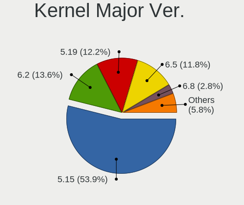
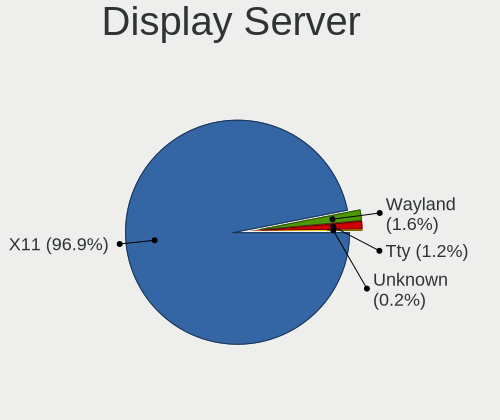
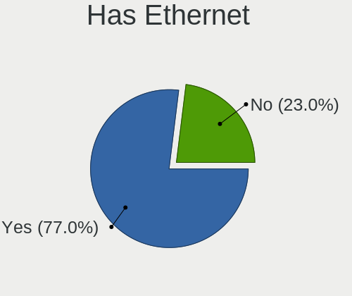
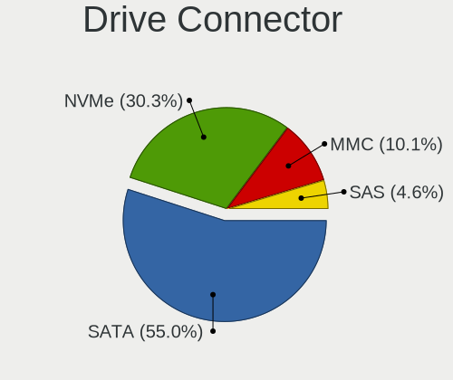
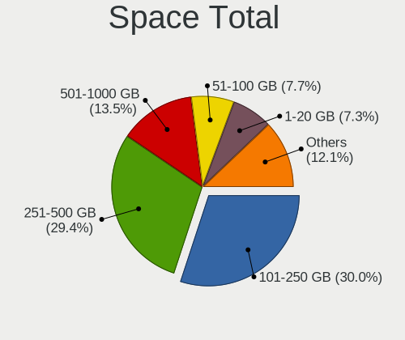
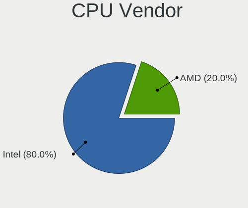
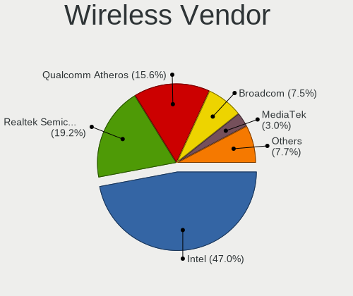
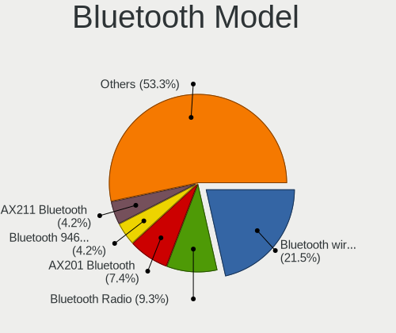

Xubuntu 22.04 - Tested Hardware & Statistics (Notebooks)
--------------------------------------------------------

A project to collect tested hardware configurations for Xubuntu 22.04.

Anyone can contribute to this report by the [hw-probe](https://github.com/linuxhw/hw-probe) tool:

    sudo -E hw-probe -all -upload

Please contribute! Especially if your hardware is rare.

Contents
--------

* [ Test Cases ](#test-cases)

* [ System ](#system)
  - [ Kernel                   ](#kernel)
  - [ Kernel Family            ](#kernel-family)
  - [ Kernel Major Ver.        ](#kernel-major-ver)
  - [ Arch                     ](#arch)
  - [ DE                       ](#de)
  - [ Display Server           ](#display-server)
  - [ Display Manager          ](#display-manager)
  - [ OS Lang                  ](#os-lang)
  - [ Boot Mode                ](#boot-mode)
  - [ Filesystem               ](#filesystem)
  - [ Part. scheme             ](#part-scheme)
  - [ Dual Boot with Linux/BSD ](#dual-boot-with-linuxbsd)
  - [ Dual Boot (Win)          ](#dual-boot-win)

* [ Board ](#board)
  - [ Vendor                   ](#vendor)
  - [ Model                    ](#model)
  - [ Model Family             ](#model-family)
  - [ MFG Year                 ](#mfg-year)
  - [ Form Factor              ](#form-factor)
  - [ Secure Boot              ](#secure-boot)
  - [ Coreboot                 ](#coreboot)
  - [ RAM Size                 ](#ram-size)
  - [ RAM Used                 ](#ram-used)
  - [ Total Drives             ](#total-drives)
  - [ Has CD-ROM               ](#has-cd-rom)
  - [ Has Ethernet             ](#has-ethernet)
  - [ Has WiFi                 ](#has-wifi)
  - [ Has Bluetooth            ](#has-bluetooth)

* [ Location ](#location)
  - [ Country                  ](#country)
  - [ City                     ](#city)

* [ Drives ](#drives)
  - [ Drive Vendor             ](#drive-vendor)
  - [ Drive Model              ](#drive-model)
  - [ HDD Vendor               ](#hdd-vendor)
  - [ SSD Vendor               ](#ssd-vendor)
  - [ Drive Kind               ](#drive-kind)
  - [ Drive Connector          ](#drive-connector)
  - [ Drive Size               ](#drive-size)
  - [ Space Total              ](#space-total)
  - [ Space Used               ](#space-used)
  - [ Malfunc. Drives          ](#malfunc-drives)
  - [ Malfunc. Drive Vendor    ](#malfunc-drive-vendor)
  - [ Malfunc. HDD Vendor      ](#malfunc-hdd-vendor)
  - [ Malfunc. Drive Kind      ](#malfunc-drive-kind)
  - [ Failed Drives            ](#failed-drives)
  - [ Failed Drive Vendor      ](#failed-drive-vendor)
  - [ Drive Status             ](#drive-status)

* [ Storage controller ](#storage-controller)
  - [ Storage Vendor           ](#storage-vendor)
  - [ Storage Model            ](#storage-model)
  - [ Storage Kind             ](#storage-kind)

* [ Processor ](#processor)
  - [ CPU Vendor               ](#cpu-vendor)
  - [ CPU Model                ](#cpu-model)
  - [ CPU Model Family         ](#cpu-model-family)
  - [ CPU Cores                ](#cpu-cores)
  - [ CPU Sockets              ](#cpu-sockets)
  - [ CPU Threads              ](#cpu-threads)
  - [ CPU Op-Modes             ](#cpu-op-modes)
  - [ CPU Microcode            ](#cpu-microcode)
  - [ CPU Microarch            ](#cpu-microarch)

* [ Graphics ](#graphics)
  - [ GPU Vendor               ](#gpu-vendor)
  - [ GPU Model                ](#gpu-model)
  - [ GPU Combo                ](#gpu-combo)
  - [ GPU Driver               ](#gpu-driver)
  - [ GPU Memory               ](#gpu-memory)

* [ Monitor ](#monitor)
  - [ Monitor Vendor           ](#monitor-vendor)
  - [ Monitor Model            ](#monitor-model)
  - [ Monitor Resolution       ](#monitor-resolution)
  - [ Monitor Diagonal         ](#monitor-diagonal)
  - [ Monitor Width            ](#monitor-width)
  - [ Aspect Ratio             ](#aspect-ratio)
  - [ Monitor Area             ](#monitor-area)
  - [ Pixel Density            ](#pixel-density)
  - [ Multiple Monitors        ](#multiple-monitors)

* [ Network ](#network)
  - [ Net Controller Vendor    ](#net-controller-vendor)
  - [ Net Controller Model     ](#net-controller-model)
  - [ Wireless Vendor          ](#wireless-vendor)
  - [ Wireless Model           ](#wireless-model)
  - [ Ethernet Vendor          ](#ethernet-vendor)
  - [ Ethernet Model           ](#ethernet-model)
  - [ Net Controller Kind      ](#net-controller-kind)
  - [ Used Controller          ](#used-controller)
  - [ NICs                     ](#nics)
  - [ IPv6                     ](#ipv6)

* [ Bluetooth ](#bluetooth)
  - [ Bluetooth Vendor         ](#bluetooth-vendor)
  - [ Bluetooth Model          ](#bluetooth-model)

* [ Sound ](#sound)
  - [ Sound Vendor             ](#sound-vendor)
  - [ Sound Model              ](#sound-model)

* [ Memory ](#memory)
  - [ Memory Vendor            ](#memory-vendor)
  - [ Memory Model             ](#memory-model)
  - [ Memory Kind              ](#memory-kind)
  - [ Memory Form Factor       ](#memory-form-factor)
  - [ Memory Size              ](#memory-size)
  - [ Memory Speed             ](#memory-speed)

* [ Printers & scanners ](#printers--scanners)
  - [ Printer Vendor           ](#printer-vendor)
  - [ Printer Model            ](#printer-model)
  - [ Scanner Vendor           ](#scanner-vendor)
  - [ Scanner Model            ](#scanner-model)

* [ Camera ](#camera)
  - [ Camera Vendor            ](#camera-vendor)
  - [ Camera Model             ](#camera-model)

* [ Security ](#security)
  - [ Fingerprint Vendor       ](#fingerprint-vendor)
  - [ Fingerprint Model        ](#fingerprint-model)
  - [ Chipcard Vendor          ](#chipcard-vendor)
  - [ Chipcard Model           ](#chipcard-model)

* [ Unsupported ](#unsupported)
  - [ Unsupported Devices      ](#unsupported-devices)
  - [ Unsupported Device Types ](#unsupported-device-types)

Test Cases
----------

Total: 116

| Vendor        | Model                       | Probe                                                      | Date         |
|---------------|-----------------------------|------------------------------------------------------------|--------------|
| Lenovo        | B70-80 80MR                 | [69aec9e100](https://linux-hardware.org/?probe=69aec9e100) | Oct 01, 2022 |
| HP            | Notebook                    | [fec2594d37](https://linux-hardware.org/?probe=fec2594d37) | Oct 01, 2022 |
| HP            | EliteBook 840 G3            | [ddf1904011](https://linux-hardware.org/?probe=ddf1904011) | Oct 01, 2022 |
| Lenovo        | ThinkPad E14 Gen 2 20TA0... | [025a55eab7](https://linux-hardware.org/?probe=025a55eab7) | Sep 30, 2022 |
| Lenovo        | ThinkPad E14 Gen 2 20TA0... | [875b1df312](https://linux-hardware.org/?probe=875b1df312) | Sep 30, 2022 |
| Sony          | SVE1512C6EB                 | [c47a3a5bd7](https://linux-hardware.org/?probe=c47a3a5bd7) | Sep 30, 2022 |
| Lenovo        | ThinkPad T420 42361L0       | [abe6563e67](https://linux-hardware.org/?probe=abe6563e67) | Sep 30, 2022 |
| Dell          | Latitude 5420               | [36ddd1d6d7](https://linux-hardware.org/?probe=36ddd1d6d7) | Sep 30, 2022 |
| Lenovo        | IdeaPad N585 20179          | [dcdafbbd9b](https://linux-hardware.org/?probe=dcdafbbd9b) | Sep 28, 2022 |
| HP            | Pavilion dv7                | [5479c35130](https://linux-hardware.org/?probe=5479c35130) | Sep 28, 2022 |
| Toshiba       | Satellite Pro R50-C         | [834ef0ec59](https://linux-hardware.org/?probe=834ef0ec59) | Sep 27, 2022 |
| Toshiba       | Satellite Pro R50-C         | [564d385b61](https://linux-hardware.org/?probe=564d385b61) | Sep 27, 2022 |
| Toshiba       | Satellite C650              | [c7920c2e68](https://linux-hardware.org/?probe=c7920c2e68) | Sep 24, 2022 |
| Packard Be... | EasyNote MH45               | [c312580997](https://linux-hardware.org/?probe=c312580997) | Sep 24, 2022 |
| Tactus        | GeoBook 140                 | [7d8700d0e1](https://linux-hardware.org/?probe=7d8700d0e1) | Sep 23, 2022 |
| Dell          | Latitude 5411               | [018a9c569a](https://linux-hardware.org/?probe=018a9c569a) | Sep 23, 2022 |
| HP            | EliteBook 840 G3            | [c3a88ed62d](https://linux-hardware.org/?probe=c3a88ed62d) | Sep 22, 2022 |
| Lenovo        | ThinkPad T61 7659AB7        | [aa07f9c271](https://linux-hardware.org/?probe=aa07f9c271) | Sep 20, 2022 |
| Lenovo        | ThinkPad T61p 6457A24       | [d98e9a64bd](https://linux-hardware.org/?probe=d98e9a64bd) | Sep 20, 2022 |
| Lenovo        | ThinkPad X220 42918F6       | [69dda668fc](https://linux-hardware.org/?probe=69dda668fc) | Sep 18, 2022 |
| Acer          | Swift SF314-511             | [914d532c78](https://linux-hardware.org/?probe=914d532c78) | Sep 17, 2022 |
| Dell          | Latitude 7490               | [ce54bcd741](https://linux-hardware.org/?probe=ce54bcd741) | Sep 15, 2022 |
| Dell          | Inspiron 3576               | [02023473b8](https://linux-hardware.org/?probe=02023473b8) | Sep 15, 2022 |
| Dell          | Precision 5540              | [229337f709](https://linux-hardware.org/?probe=229337f709) | Sep 13, 2022 |
| ASUSTek       | ASUS TUF Gaming A15 FA50... | [1f2be56ed4](https://linux-hardware.org/?probe=1f2be56ed4) | Sep 09, 2022 |
| ASUSTek       | ASUS TUF Gaming A15 FA50... | [31717bdcb1](https://linux-hardware.org/?probe=31717bdcb1) | Sep 09, 2022 |
| ASUSTek       | K55VD                       | [c1ca471555](https://linux-hardware.org/?probe=c1ca471555) | Sep 06, 2022 |
| Panasonic     | CF-D1DVA06F3                | [e3cc43135a](https://linux-hardware.org/?probe=e3cc43135a) | Sep 05, 2022 |
| HP            | 255 G7 Notebook PC          | [dd775ffe8f](https://linux-hardware.org/?probe=dd775ffe8f) | Sep 05, 2022 |
| HP            | Laptop 15-dw0xxx            | [1bd6f2ba6f](https://linux-hardware.org/?probe=1bd6f2ba6f) | Sep 04, 2022 |
| Google        | Kip                         | [e92d971d5e](https://linux-hardware.org/?probe=e92d971d5e) | Sep 04, 2022 |
| Lenovo        | IdeaPad 120S-14IAP 81A5     | [059bb72ff2](https://linux-hardware.org/?probe=059bb72ff2) | Sep 03, 2022 |
| Google        | Reks                        | [d88eecb32d](https://linux-hardware.org/?probe=d88eecb32d) | Sep 03, 2022 |
| HP            | EliteBook 2570p             | [506f9da93b](https://linux-hardware.org/?probe=506f9da93b) | Sep 03, 2022 |
| Dell          | Inspiron N5010              | [b9953ab67e](https://linux-hardware.org/?probe=b9953ab67e) | Aug 27, 2022 |
| Lenovo        | V340-17IWL 81RG             | [f725a87544](https://linux-hardware.org/?probe=f725a87544) | Aug 27, 2022 |
| Lenovo        | 14w 81MQ000JUS              | [d71f12bede](https://linux-hardware.org/?probe=d71f12bede) | Aug 27, 2022 |
| Lenovo        | V340-17IWL 81RG             | [8a689fc0fd](https://linux-hardware.org/?probe=8a689fc0fd) | Aug 27, 2022 |
| Dell          | XPS 13 9380                 | [5bb7561235](https://linux-hardware.org/?probe=5bb7561235) | Aug 25, 2022 |
| Lenovo        | ThinkPad P70 20ERCTO1WW     | [d269aaa456](https://linux-hardware.org/?probe=d269aaa456) | Aug 25, 2022 |
| ASUSTek       | ASUS TUF Gaming A15 FA50... | [92be7f3368](https://linux-hardware.org/?probe=92be7f3368) | Aug 24, 2022 |
| Acer          | Aspire 5740                 | [5652f2c73d](https://linux-hardware.org/?probe=5652f2c73d) | Aug 24, 2022 |
| Lenovo        | 14w 81MQ000JUS              | [1ff769c6ef](https://linux-hardware.org/?probe=1ff769c6ef) | Aug 23, 2022 |
| HP            | EliteBook 8540p             | [cdd3dd9925](https://linux-hardware.org/?probe=cdd3dd9925) | Aug 19, 2022 |
| ASUSTek       | K53TA                       | [db6525efb3](https://linux-hardware.org/?probe=db6525efb3) | Aug 15, 2022 |
| Lenovo        | ThinkPad T460s 20FAS0Q90... | [644c7518e9](https://linux-hardware.org/?probe=644c7518e9) | Aug 14, 2022 |
| ASUSTek       | X101CH                      | [174bc50211](https://linux-hardware.org/?probe=174bc50211) | Aug 14, 2022 |
| Toshiba       | PT10F                       | [08b7dc52a2](https://linux-hardware.org/?probe=08b7dc52a2) | Aug 12, 2022 |
| Mediacom      | SmartBook 14 FullHD - SB... | [5bb07e1a28](https://linux-hardware.org/?probe=5bb07e1a28) | Aug 11, 2022 |
| Lenovo        | ThinkPad T460s 20FAS6JY0... | [7d85d4f00b](https://linux-hardware.org/?probe=7d85d4f00b) | Aug 06, 2022 |
| Lenovo        | IdeaPad 120S-14IAP 81A5     | [eeff2bac06](https://linux-hardware.org/?probe=eeff2bac06) | Aug 05, 2022 |
| Acer          | Aspire V3-551G              | [8b0237ee5e](https://linux-hardware.org/?probe=8b0237ee5e) | Aug 03, 2022 |
| Lenovo        | ThinkPad T430 23501K1       | [fdd30ffa23](https://linux-hardware.org/?probe=fdd30ffa23) | Aug 03, 2022 |
| Acer          | Aspire V3-551G              | [4b8ed45c90](https://linux-hardware.org/?probe=4b8ed45c90) | Aug 03, 2022 |
| GMKtec        | NucBox5                     | [5023bc1773](https://linux-hardware.org/?probe=5023bc1773) | Aug 02, 2022 |
| HUAWEI        | BOHK-WAX9X                  | [745f6815cb](https://linux-hardware.org/?probe=745f6815cb) | Jul 30, 2022 |
| Schenker      | WORK (Early 2021)           | [8666cc396a](https://linux-hardware.org/?probe=8666cc396a) | Jul 28, 2022 |
| ASUSTek       | X450CP                      | [dceda2fe9d](https://linux-hardware.org/?probe=dceda2fe9d) | Jul 27, 2022 |
| Lenovo        | G50-30 80G0                 | [c380d02bbf](https://linux-hardware.org/?probe=c380d02bbf) | Jul 25, 2022 |
| ASUSTek       | VivoBook_ASUSLaptop X513... | [75b4088788](https://linux-hardware.org/?probe=75b4088788) | Jul 20, 2022 |
| ASUSTek       | VivoBook_ASUSLaptop X513... | [3c2afd2b5e](https://linux-hardware.org/?probe=3c2afd2b5e) | Jul 20, 2022 |
| HP            | EliteBook 845 G8 Noteboo... | [2a10c24690](https://linux-hardware.org/?probe=2a10c24690) | Jul 20, 2022 |
| Acer          | Aspire E1-532               | [13d38a6632](https://linux-hardware.org/?probe=13d38a6632) | Jul 16, 2022 |
| ASUSTek       | ROG Zephyrus G14 GA401QM... | [a6ae556389](https://linux-hardware.org/?probe=a6ae556389) | Jul 16, 2022 |
| ASUSTek       | X453MA                      | [da05c4539d](https://linux-hardware.org/?probe=da05c4539d) | Jul 11, 2022 |
| MSI           | GF63 Thin 9RCX              | [f2f3db370a](https://linux-hardware.org/?probe=f2f3db370a) | Jul 10, 2022 |
| Acer          | Aspire E5-521               | [7becd2f2df](https://linux-hardware.org/?probe=7becd2f2df) | Jul 10, 2022 |
| Acer          | Aspire E5-521               | [f27a09f9eb](https://linux-hardware.org/?probe=f27a09f9eb) | Jul 07, 2022 |
| ASUSTek       | ZenBook UX435EG_UX435EG     | [51b138f349](https://linux-hardware.org/?probe=51b138f349) | Jul 04, 2022 |
| Lenovo        | V330-15IKB 81AX             | [2f915d68e5](https://linux-hardware.org/?probe=2f915d68e5) | Jul 04, 2022 |
| Samsung       | 370E4K                      | [a6512c1606](https://linux-hardware.org/?probe=a6512c1606) | Jul 03, 2022 |
| HP            | EliteBook 840 G3            | [9ce5b9c45c](https://linux-hardware.org/?probe=9ce5b9c45c) | Jun 30, 2022 |
| Acer          | Aspire E5-521               | [717281a3f9](https://linux-hardware.org/?probe=717281a3f9) | Jun 29, 2022 |
| Acer          | Aspire E5-521               | [f532d90f38](https://linux-hardware.org/?probe=f532d90f38) | Jun 29, 2022 |
| Standard      | Unknown                     | [1a94acbc05](https://linux-hardware.org/?probe=1a94acbc05) | Jun 29, 2022 |
| Standard      | Unknown                     | [93ac825a25](https://linux-hardware.org/?probe=93ac825a25) | Jun 27, 2022 |
| HP            | Pavilion dv5                | [4009a4fd8c](https://linux-hardware.org/?probe=4009a4fd8c) | Jun 24, 2022 |
| Apple         | MacBookPro14,1              | [e9d8c28a34](https://linux-hardware.org/?probe=e9d8c28a34) | Jun 22, 2022 |
| Google        | Kindred                     | [c12b15c596](https://linux-hardware.org/?probe=c12b15c596) | Jun 17, 2022 |
| HP            | ProBook 445 G7              | [f41d413820](https://linux-hardware.org/?probe=f41d413820) | Jun 13, 2022 |
| GPU Compan... | GWTN141-4                   | [ba579cb383](https://linux-hardware.org/?probe=ba579cb383) | Jun 11, 2022 |
| Dell          | Latitude 7280               | [7900c8009a](https://linux-hardware.org/?probe=7900c8009a) | Jun 10, 2022 |
| Chuwi         | GemiBook Pro                | [7bd963dd56](https://linux-hardware.org/?probe=7bd963dd56) | Jun 09, 2022 |
| HP            | Pavilion Laptop 15-eh1xx... | [77a5e1c6f9](https://linux-hardware.org/?probe=77a5e1c6f9) | Jun 08, 2022 |
| AMI           | Intel                       | [79b1f29bc4](https://linux-hardware.org/?probe=79b1f29bc4) | Jun 07, 2022 |
| AMI           | Intel                       | [d7746ec6d5](https://linux-hardware.org/?probe=d7746ec6d5) | Jun 07, 2022 |
| Chuwi         | GemiBook Pro                | [2d31db0d12](https://linux-hardware.org/?probe=2d31db0d12) | Jun 07, 2022 |
| Digma         | EVE 15 C413 ES5059EW        | [26eb7d39e1](https://linux-hardware.org/?probe=26eb7d39e1) | Jun 06, 2022 |
| HP            | Pavilion g7                 | [b31de17368](https://linux-hardware.org/?probe=b31de17368) | Jun 06, 2022 |
| Chuwi         | GemiBook Pro                | [48738fc474](https://linux-hardware.org/?probe=48738fc474) | Jun 06, 2022 |
| Chuwi         | GemiBook Pro                | [e8dd7b95a6](https://linux-hardware.org/?probe=e8dd7b95a6) | Jun 03, 2022 |
| Dell          | Latitude D820               | [8c2336469f](https://linux-hardware.org/?probe=8c2336469f) | Jun 01, 2022 |
| Acer          | Aspire 5740                 | [db6d025d69](https://linux-hardware.org/?probe=db6d025d69) | Jun 01, 2022 |
| Acer          | Aspire 5740                 | [2c541b20f6](https://linux-hardware.org/?probe=2c541b20f6) | May 26, 2022 |
| HP            | Mini 5103                   | [aa7f4e957e](https://linux-hardware.org/?probe=aa7f4e957e) | May 23, 2022 |
| Google        | Snappy                      | [c88d27b24a](https://linux-hardware.org/?probe=c88d27b24a) | May 20, 2022 |
| Google        | Snappy                      | [9fc85cd49a](https://linux-hardware.org/?probe=9fc85cd49a) | May 20, 2022 |
| Google        | Snappy                      | [cb9e7730ad](https://linux-hardware.org/?probe=cb9e7730ad) | May 20, 2022 |
| Lenovo        | ThinkPad E580 20KS001JGE    | [724c06c08c](https://linux-hardware.org/?probe=724c06c08c) | May 19, 2022 |
| ASUSTek       | UL30A                       | [c121dd37ba](https://linux-hardware.org/?probe=c121dd37ba) | May 16, 2022 |
| Google        | Droid                       | [e938864c93](https://linux-hardware.org/?probe=e938864c93) | May 15, 2022 |
| Unknown       | Unknown                     | [f802e84b8e](https://linux-hardware.org/?probe=f802e84b8e) | May 08, 2022 |
| Dell          | Inspiron 7501               | [a8a1e1e3a2](https://linux-hardware.org/?probe=a8a1e1e3a2) | May 07, 2022 |
| Dell          | Latitude 7420               | [384325350c](https://linux-hardware.org/?probe=384325350c) | May 05, 2022 |
| Google        | Auron_Yuna                  | [795d9af5a7](https://linux-hardware.org/?probe=795d9af5a7) | May 05, 2022 |
| Dell          | XPS M1530                   | [760cae00c1](https://linux-hardware.org/?probe=760cae00c1) | May 03, 2022 |
| Dell          | XPS M1530                   | [757d1b099e](https://linux-hardware.org/?probe=757d1b099e) | Apr 30, 2022 |
| ASUSTek       | T100HAN                     | [5ee200cfbe](https://linux-hardware.org/?probe=5ee200cfbe) | Apr 30, 2022 |
| Acer          | Aspire ES1-512              | [f0ed67e309](https://linux-hardware.org/?probe=f0ed67e309) | Apr 26, 2022 |
| Lenovo        | IdeaPad 100-15IBY 80MJ      | [bd286b124a](https://linux-hardware.org/?probe=bd286b124a) | Apr 25, 2022 |
| HP            | 255 G8 Notebook PC          | [c16cb4e0d6](https://linux-hardware.org/?probe=c16cb4e0d6) | Apr 24, 2022 |
| Lenovo        | ThinkPad T470s 20HF004MM... | [69a5e98a04](https://linux-hardware.org/?probe=69a5e98a04) | Apr 22, 2022 |
| Lenovo        | ThinkPad T14s Gen 2i 20W... | [3e1029ed36](https://linux-hardware.org/?probe=3e1029ed36) | Apr 22, 2022 |
| HP            | 255 G8 Notebook PC          | [d88db86125](https://linux-hardware.org/?probe=d88db86125) | Apr 20, 2022 |
| HP            | Laptop 15s-fq2xxx           | [b073554afc](https://linux-hardware.org/?probe=b073554afc) | Apr 08, 2022 |
| HP            | Laptop 15s-fq2xxx           | [c3dcb61dd5](https://linux-hardware.org/?probe=c3dcb61dd5) | Apr 02, 2022 |

System
------

Kernel
------

Version of the Linux kernel

| Version                      | Notebooks | Percent |
|------------------------------|-----------|---------|
| 5.15.0-47-generic            | 17        | 18.28%  |
| 5.15.0-48-generic            | 9         | 9.68%   |
| 5.15.0-25-generic            | 9         | 9.68%   |
| 5.15.0-46-generic            | 8         | 8.6%    |
| 5.15.0-27-generic            | 7         | 7.53%   |
| 5.15.0-40-generic            | 5         | 5.38%   |
| 5.15.0-39-generic            | 5         | 5.38%   |
| 5.15.0-35-generic            | 5         | 5.38%   |
| 5.15.0-41-generic            | 4         | 4.3%    |
| 5.15.0-43-generic            | 3         | 3.23%   |
| 5.15.0-37-generic            | 3         | 3.23%   |
| 5.17.0-1013-oem              | 2         | 2.15%   |
| 5.15.0-33-generic            | 2         | 2.15%   |
| 5.4.0-126-generic            | 1         | 1.08%   |
| 5.19.5-051905-generic        | 1         | 1.08%   |
| 5.19.0-051900-generic        | 1         | 1.08%   |
| 5.18.0-10.1-liquorix-amd64   | 1         | 1.08%   |
| 5.17.3-051703-generic        | 1         | 1.08%   |
| 5.17.0-ashpy3-lyesdef        | 1         | 1.08%   |
| 5.17.0-1015-oem              | 1         | 1.08%   |
| 5.15.0-50-lowlatency         | 1         | 1.08%   |
| 5.15.0-48-lowlatency         | 1         | 1.08%   |
| 5.15.0-46-lowlatency         | 1         | 1.08%   |
| 5.15.0-30-generic            | 1         | 1.08%   |
| 5.15.0-27-lowlatency         | 1         | 1.08%   |
| 5.15.0-1011-intel-iotg       | 1         | 1.08%   |
| 4.19.241-13212-ge9b0bab46475 | 1         | 1.08%   |

Kernel Family
-------------

Linux kernel without a distro release

| Version  | Notebooks | Percent |
|----------|-----------|---------|
| 5.15.0   | 81        | 89.01%  |
| 5.17.0   | 4         | 4.4%    |
| 5.4.0    | 1         | 1.1%    |
| 5.19.5   | 1         | 1.1%    |
| 5.19.0   | 1         | 1.1%    |
| 5.18.0   | 1         | 1.1%    |
| 5.17.3   | 1         | 1.1%    |
| 4.19.241 | 1         | 1.1%    |

Kernel Major Ver.
-----------------

Linux kernel major version

| Version | Notebooks | Percent |
|---------|-----------|---------|
| 5.15    | 81        | 89.01%  |
| 5.17    | 5         | 5.49%   |
| 5.19    | 2         | 2.2%    |
| 5.4     | 1         | 1.1%    |
| 5.18    | 1         | 1.1%    |
| 4.19    | 1         | 1.1%    |

Arch
----

OS architecture (x86_64, i586, etc.)

| Name   | Notebooks | Percent |
|--------|-----------|---------|
| x86_64 | 91        | 100%    |

DE
--

Desktop Environment

| Name  | Notebooks | Percent |
|-------|-----------|---------|
| XFCE  | 88        | 96.7%   |
| GNOME | 3         | 3.3%    |

Display Server
--------------

X11 or Wayland

| Name    | Notebooks | Percent |
|---------|-----------|---------|
| X11     | 88        | 96.7%   |
| Wayland | 2         | 2.2%    |
| Tty     | 1         | 1.1%    |

Display Manager
---------------

SDDM, LightDM, etc.

| Name    | Notebooks | Percent |
|---------|-----------|---------|
| LightDM | 82        | 90.11%  |
| Unknown | 5         | 5.49%   |
| GDM3    | 2         | 2.2%    |
| SLiM    | 1         | 1.1%    |
| SDDM    | 1         | 1.1%    |

OS Lang
-------

Language

| Lang  | Notebooks | Percent |
|-------|-----------|---------|
| en_US | 43        | 47.25%  |
| de_DE | 10        | 10.99%  |
| fr_FR | 9         | 9.89%   |
| it_IT | 5         | 5.49%   |
| en_GB | 5         | 5.49%   |
| es_ES | 3         | 3.3%    |
| ru_RU | 2         | 2.2%    |
| pt_BR | 2         | 2.2%    |
| en_AU | 2         | 2.2%    |
| tr_TR | 1         | 1.1%    |
| nl_NL | 1         | 1.1%    |
| nl_BE | 1         | 1.1%    |
| ja_JP | 1         | 1.1%    |
| hu_HU | 1         | 1.1%    |
| es_CL | 1         | 1.1%    |
| en_CA | 1         | 1.1%    |
| cs_CZ | 1         | 1.1%    |
| C     | 1         | 1.1%    |
| bg_BG | 1         | 1.1%    |

Boot Mode
---------

EFI or BIOS

| Mode | Notebooks | Percent |
|------|-----------|---------|
| EFI  | 52        | 57.14%  |
| BIOS | 39        | 42.86%  |

Filesystem
----------

Type of filesystem

| Type    | Notebooks | Percent |
|---------|-----------|---------|
| Ext4    | 84        | 92.31%  |
| Zfs     | 3         | 3.3%    |
| Overlay | 3         | 3.3%    |
| Btrfs   | 1         | 1.1%    |

Part. scheme
------------

Scheme of partitioning

| Type    | Notebooks | Percent |
|---------|-----------|---------|
| GPT     | 54        | 59.34%  |
| Unknown | 33        | 36.26%  |
| MBR     | 4         | 4.4%    |

Dual Boot with Linux/BSD
------------------------

Hosting more than one Linux/BSD

| Dual boot | Notebooks | Percent |
|-----------|-----------|---------|
| No        | 86        | 93.48%  |
| Yes       | 6         | 6.52%   |

Dual Boot (Win)
---------------

Hosting Linux and Windows

| Dual boot | Notebooks | Percent |
|-----------|-----------|---------|
| No        | 66        | 72.53%  |
| Yes       | 25        | 27.47%  |

Board
-----

Vendor
------

Motherboard manufacturer

| Name                | Notebooks | Percent |
|---------------------|-----------|---------|
| Lenovo              | 20        | 21.98%  |
| Hewlett-Packard     | 17        | 18.68%  |
| Dell                | 12        | 13.19%  |
| ASUSTek Computer    | 12        | 13.19%  |
| Acer                | 6         | 6.59%   |
| Google              | 5         | 5.49%   |
| Toshiba             | 3         | 3.3%    |
| Tactus              | 1         | 1.1%    |
| Standard            | 1         | 1.1%    |
| Sony                | 1         | 1.1%    |
| Schenker            | 1         | 1.1%    |
| Samsung Electronics | 1         | 1.1%    |
| Panasonic           | 1         | 1.1%    |
| Packard Bell        | 1         | 1.1%    |
| MSI                 | 1         | 1.1%    |
| Mediacom            | 1         | 1.1%    |
| HUAWEI              | 1         | 1.1%    |
| GPU Company         | 1         | 1.1%    |
| Digma               | 1         | 1.1%    |
| Chuwi               | 1         | 1.1%    |
| Apple               | 1         | 1.1%    |
| AMI                 | 1         | 1.1%    |
| Unknown             | 1         | 1.1%    |

Model
-----

Motherboard model

| Name                                   | Notebooks | Percent |
|----------------------------------------|-----------|---------|
| HP EliteBook 840 G3                    | 3         | 3.3%    |
| Unknown                                | 2         | 2.2%    |
| Toshiba Satellite Pro R50-C            | 1         | 1.1%    |
| Toshiba Satellite C650                 | 1         | 1.1%    |
| Toshiba PT10F                          | 1         | 1.1%    |
| Tactus GeoBook 140                     | 1         | 1.1%    |
| Sony SVE1512C6EB                       | 1         | 1.1%    |
| Schenker WORK (Early 2021)             | 1         | 1.1%    |
| Samsung 370E4K                         | 1         | 1.1%    |
| Panasonic CF-D1DVA06F3                 | 1         | 1.1%    |
| Packard Bell EasyNote MH45             | 1         | 1.1%    |
| MSI GF63 Thin 9RCX                     | 1         | 1.1%    |
| Mediacom SmartBook 14 FullHD - SB14UC  | 1         | 1.1%    |
| Lenovo V340-17IWL 81RG                 | 1         | 1.1%    |
| Lenovo V330-15IKB 81AX                 | 1         | 1.1%    |
| Lenovo ThinkPad X220 42918F6           | 1         | 1.1%    |
| Lenovo ThinkPad T61p 6457A24           | 1         | 1.1%    |
| Lenovo ThinkPad T61 7659AB7            | 1         | 1.1%    |
| Lenovo ThinkPad T470s 20HF004MMX       | 1         | 1.1%    |
| Lenovo ThinkPad T460s 20FAS6JY00       | 1         | 1.1%    |
| Lenovo ThinkPad T460s 20FAS0Q900       | 1         | 1.1%    |
| Lenovo ThinkPad T430 23501K1           | 1         | 1.1%    |
| Lenovo ThinkPad T420 42361L0           | 1         | 1.1%    |
| Lenovo ThinkPad T14s Gen 2i 20WM00B9MX | 1         | 1.1%    |
| Lenovo ThinkPad P70 20ERCTO1WW         | 1         | 1.1%    |
| Lenovo ThinkPad E580 20KS001JGE        | 1         | 1.1%    |
| Lenovo ThinkPad E14 Gen 2 20TA00JLAU   | 1         | 1.1%    |
| Lenovo IdeaPad N585 20179              | 1         | 1.1%    |
| Lenovo IdeaPad 120S-14IAP 81A5         | 1         | 1.1%    |
| Lenovo IdeaPad 100-15IBY 80MJ          | 1         | 1.1%    |
| Lenovo G50-30 80G0                     | 1         | 1.1%    |
| Lenovo B70-80 80MR                     | 1         | 1.1%    |
| Lenovo 14w 81MQ000JUS                  | 1         | 1.1%    |
| HUAWEI BOHK-WAX9X                      | 1         | 1.1%    |
| HP ProBook 445 G7                      | 1         | 1.1%    |
| HP Pavilion Laptop 15-eh1xxx           | 1         | 1.1%    |
| HP Pavilion g7                         | 1         | 1.1%    |
| HP Pavilion dv7                        | 1         | 1.1%    |
| HP Pavilion dv5                        | 1         | 1.1%    |
| HP Notebook                            | 1         | 1.1%    |

Model Family
------------

Motherboard model prefix

| Name                   | Notebooks | Percent |
|------------------------|-----------|---------|
| Lenovo ThinkPad        | 12        | 13.19%  |
| HP EliteBook           | 6         | 6.59%   |
| Dell Latitude          | 6         | 6.59%   |
| Acer Aspire            | 5         | 5.49%   |
| HP Pavilion            | 4         | 4.4%    |
| Lenovo IdeaPad         | 3         | 3.3%    |
| Dell Inspiron          | 3         | 3.3%    |
| Toshiba Satellite      | 2         | 2.2%    |
| HP Laptop              | 2         | 2.2%    |
| HP 255                 | 2         | 2.2%    |
| Dell XPS               | 2         | 2.2%    |
| ASUS ASUS              | 2         | 2.2%    |
| Unknown                | 2         | 2.2%    |
| Toshiba PT10F          | 1         | 1.1%    |
| Tactus GeoBook         | 1         | 1.1%    |
| Sony SVE1512C6EB       | 1         | 1.1%    |
| Schenker WORK          | 1         | 1.1%    |
| Samsung 370E4K         | 1         | 1.1%    |
| Panasonic CF-D1DVA06F3 | 1         | 1.1%    |
| Packard Bell EasyNote  | 1         | 1.1%    |
| MSI GF63               | 1         | 1.1%    |
| Mediacom SmartBook     | 1         | 1.1%    |
| Lenovo V340-17IWL      | 1         | 1.1%    |
| Lenovo V330-15IKB      | 1         | 1.1%    |
| Lenovo G50-30          | 1         | 1.1%    |
| Lenovo B70-80          | 1         | 1.1%    |
| Lenovo 14w             | 1         | 1.1%    |
| HUAWEI BOHK-WAX9X      | 1         | 1.1%    |
| HP ProBook             | 1         | 1.1%    |
| HP Notebook            | 1         | 1.1%    |
| HP Mini                | 1         | 1.1%    |
| GPU Company GWTN141-4  | 1         | 1.1%    |
| Google Snappy          | 1         | 1.1%    |
| Google Reks            | 1         | 1.1%    |
| Google Kip             | 1         | 1.1%    |
| Google Kindred         | 1         | 1.1%    |
| Google Auron           | 1         | 1.1%    |
| Digma EVE              | 1         | 1.1%    |
| Dell Precision         | 1         | 1.1%    |
| Chuwi GemiBook         | 1         | 1.1%    |

MFG Year
--------

Motherboard manufacture year

| Year | Notebooks | Percent |
|------|-----------|---------|
| 2021 | 13        | 14.29%  |
| 2020 | 10        | 10.99%  |
| 2019 | 7         | 7.69%   |
| 2012 | 7         | 7.69%   |
| 2017 | 6         | 6.59%   |
| 2016 | 6         | 6.59%   |
| 2015 | 6         | 6.59%   |
| 2022 | 5         | 5.49%   |
| 2018 | 5         | 5.49%   |
| 2014 | 5         | 5.49%   |
| 2011 | 5         | 5.49%   |
| 2010 | 4         | 4.4%    |
| 2008 | 4         | 4.4%    |
| 2013 | 3         | 3.3%    |
| 2009 | 2         | 2.2%    |
| 2007 | 2         | 2.2%    |
| 2006 | 1         | 1.1%    |

Form Factor
-----------

Physical design of the computer

| Name     | Notebooks | Percent |
|----------|-----------|---------|
| Notebook | 91        | 100%    |

Secure Boot
-----------

Enabled or disabled

| State    | Notebooks | Percent |
|----------|-----------|---------|
| Disabled | 82        | 90.11%  |
| Enabled  | 9         | 9.89%   |

Coreboot
--------

Have coreboot on board

| Used | Notebooks | Percent |
|------|-----------|---------|
| No   | 86        | 94.51%  |
| Yes  | 5         | 5.49%   |

RAM Size
--------

Total RAM memory

| Size in GB  | Notebooks | Percent |
|-------------|-----------|---------|
| 4.01-8.0    | 33        | 36.26%  |
| 3.01-4.0    | 27        | 29.67%  |
| 16.01-24.0  | 12        | 13.19%  |
| 8.01-16.0   | 8         | 8.79%   |
| 32.01-64.0  | 4         | 4.4%    |
| 1.01-2.0    | 4         | 4.4%    |
| 2.01-3.0    | 1         | 1.1%    |
| 64.01-256.0 | 1         | 1.1%    |
| 0.51-1.0    | 1         | 1.1%    |

RAM Used
--------

Used RAM memory

| Used GB   | Notebooks | Percent |
|-----------|-----------|---------|
| 1.01-2.0  | 43        | 46.24%  |
| 2.01-3.0  | 29        | 31.18%  |
| 0.51-1.0  | 8         | 8.6%    |
| 3.01-4.0  | 7         | 7.53%   |
| 4.01-8.0  | 5         | 5.38%   |
| 8.01-16.0 | 1         | 1.08%   |

Total Drives
------------

Number of drives on board

| Drives | Notebooks | Percent |
|--------|-----------|---------|
| 1      | 78        | 85.71%  |
| 2      | 13        | 14.29%  |

Has CD-ROM
----------

Has CD-ROM on board

| Presented | Notebooks | Percent |
|-----------|-----------|---------|
| No        | 56        | 61.54%  |
| Yes       | 35        | 38.46%  |

Has Ethernet
------------

Has Ethernet on board

| Presented | Notebooks | Percent |
|-----------|-----------|---------|
| Yes       | 67        | 73.63%  |
| No        | 24        | 26.37%  |

Has WiFi
--------

Has WiFi module

| Presented | Notebooks | Percent |
|-----------|-----------|---------|
| Yes       | 89        | 97.8%   |
| No        | 2         | 2.2%    |

Has Bluetooth
-------------

Has Bluetooth module

| Presented | Notebooks | Percent |
|-----------|-----------|---------|
| Yes       | 67        | 73.63%  |
| No        | 24        | 26.37%  |

Location
--------

Country
-------

Geographic location (country)

| Country     | Notebooks | Percent |
|-------------|-----------|---------|
| USA         | 18        | 19.78%  |
| Germany     | 12        | 13.19%  |
| France      | 9         | 9.89%   |
| Italy       | 8         | 8.79%   |
| UK          | 5         | 5.49%   |
| Russia      | 4         | 4.4%    |
| Sweden      | 3         | 3.3%    |
| Spain       | 2         | 2.2%    |
| Netherlands | 2         | 2.2%    |
| Mexico      | 2         | 2.2%    |
| Indonesia   | 2         | 2.2%    |
| Czechia     | 2         | 2.2%    |
| Brazil      | 2         | 2.2%    |
| Belgium     | 2         | 2.2%    |
| Australia   | 2         | 2.2%    |
| Vietnam     | 1         | 1.1%    |
| Turkey      | 1         | 1.1%    |
| Malaysia    | 1         | 1.1%    |
| Madagascar  | 1         | 1.1%    |
| Japan       | 1         | 1.1%    |
| Israel      | 1         | 1.1%    |
| Iran        | 1         | 1.1%    |
| India       | 1         | 1.1%    |
| Hungary     | 1         | 1.1%    |
| Finland     | 1         | 1.1%    |
| Egypt       | 1         | 1.1%    |
| Colombia    | 1         | 1.1%    |
| Chile       | 1         | 1.1%    |
| Bulgaria    | 1         | 1.1%    |
| Austria     | 1         | 1.1%    |
| Argentina   | 1         | 1.1%    |

City
----

Geographic location (city)

| City              | Notebooks | Percent |
|-------------------|-----------|---------|
| Uppsala           | 2         | 2.15%   |
| St Petersburg     | 2         | 2.15%   |
| Oklahoma City     | 2         | 2.15%   |
| Melbourne         | 2         | 2.15%   |
| Leipzig           | 2         | 2.15%   |
| Farmington        | 2         | 2.15%   |
| Auxerre           | 2         | 2.15%   |
| Yokohama          | 1         | 1.08%   |
| Washington        | 1         | 1.08%   |
| Vidin             | 1         | 1.08%   |
| Västerås        | 1         | 1.08%   |
| Tustin            | 1         | 1.08%   |
| Treviso           | 1         | 1.08%   |
| Toamasina         | 1         | 1.08%   |
| Surabaya          | 1         | 1.08%   |
| Stuttgart         | 1         | 1.08%   |
| Sombrio           | 1         | 1.08%   |
| Schmalkalden      | 1         | 1.08%   |
| Schaarbeek        | 1         | 1.08%   |
| Santiago          | 1         | 1.08%   |
| Saint-Gilles      | 1         | 1.08%   |
| Rome              | 1         | 1.08%   |
| Rochester         | 1         | 1.08%   |
| Puebla City       | 1         | 1.08%   |
| Pontault-Combault | 1         | 1.08%   |
| Poggibonsi        | 1         | 1.08%   |
| Pilsen            | 1         | 1.08%   |
| Peckham           | 1         | 1.08%   |
| Palma             | 1         | 1.08%   |
| Nuenen            | 1         | 1.08%   |
| Niihama           | 1         | 1.08%   |
| New Rochelle      | 1         | 1.08%   |
| Munich            | 1         | 1.08%   |
| Muncie            | 1         | 1.08%   |
| Mumbai            | 1         | 1.08%   |
| Mulhouse          | 1         | 1.08%   |
| Moscow            | 1         | 1.08%   |
| Monteux           | 1         | 1.08%   |
| Minneapolis       | 1         | 1.08%   |
| Mexico City       | 1         | 1.08%   |

Drives
------

Drive Vendor
------------

Hard drive vendors

| Vendor              | Notebooks | Drives | Percent |
|---------------------|-----------|--------|---------|
| Samsung Electronics | 21        | 23     | 21.65%  |
| WDC                 | 11        | 12     | 11.34%  |
| Seagate             | 10        | 12     | 10.31%  |
| Unknown             | 9         | 11     | 9.28%   |
| SK hynix            | 8         | 8      | 8.25%   |
| Kingston            | 6         | 7      | 6.19%   |
| Hitachi             | 4         | 4      | 4.12%   |
| Intel               | 3         | 3      | 3.09%   |
| China               | 3         | 3      | 3.09%   |
| SanDisk             | 2         | 2      | 2.06%   |
| PNY                 | 2         | 2      | 2.06%   |
| Micron Technology   | 2         | 2      | 2.06%   |
| Crucial             | 2         | 2      | 2.06%   |
| USB3.0              | 1         | 2      | 1.03%   |
| Toshiba             | 1         | 1      | 1.03%   |
| SSSTC               | 1         | 1      | 1.03%   |
| Silicon Motion      | 1         | 1      | 1.03%   |
| Phison              | 1         | 1      | 1.03%   |
| Patriot             | 1         | 1      | 1.03%   |
| Netac               | 1         | 1      | 1.03%   |
| LITEON              | 1         | 1      | 1.03%   |
| Lenovo              | 1         | 1      | 1.03%   |
| INNOVATION IT       | 1         | 1      | 1.03%   |
| FORESEE             | 1         | 1      | 1.03%   |
| Apple               | 1         | 2      | 1.03%   |
| A-DATA Technology   | 1         | 3      | 1.03%   |
| Unknown             | 1         | 1      | 1.03%   |

Drive Model
-----------

Hard drive models

| Model                                  | Notebooks | Percent |
|----------------------------------------|-----------|---------|
| Samsung SSD 860 EVO 500GB              | 3         | 2.94%   |
| Samsung SSD 850 EVO 500GB              | 3         | 2.94%   |
| Samsung NVMe SSD Drive 256GB           | 3         | 2.94%   |
| Seagate ST500LT012-1DG142 500GB        | 2         | 1.96%   |
| Seagate ST500LM012 HN-M500MBB 500GB    | 2         | 1.96%   |
| SanDisk DF4032  32GB                   | 2         | 1.96%   |
| PNY CS900 120GB SSD                    | 2         | 1.96%   |
| Intel SSDPEKNU512GZ 512GB              | 2         | 1.96%   |
| WDC WDS960G2G0C-00AJM0 960GB           | 1         | 0.98%   |
| WDC WDS500G2B0C 500GB                  | 1         | 0.98%   |
| WDC WDS500G2B0B-00YS70 500GB SSD       | 1         | 0.98%   |
| WDC WDS240G2G0A-00JH30 240GB SSD       | 1         | 0.98%   |
| WDC WDS100T3X0C-00SJG0 1TB             | 1         | 0.98%   |
| WDC WD7500BPVT-60HXZT3 752GB           | 1         | 0.98%   |
| WDC WD3200LPVX-75V0TT0 320GB           | 1         | 0.98%   |
| WDC WD3200BEVT-22ZCT0 320GB            | 1         | 0.98%   |
| WDC WD10SPZX-22Z10T1 1TB               | 1         | 0.98%   |
| WDC WD10JPVX-22JC3T0 1TB               | 1         | 0.98%   |
| WDC WD10JPCX-24UE4T0 1TB               | 1         | 0.98%   |
| WDC PC SN730 SDBQNTY-256G-1001 256GB   | 1         | 0.98%   |
| USB3.0 Super Speed 240GB               | 1         | 0.98%   |
| Unknown SD32G  32GB                    | 1         | 0.98%   |
| Unknown SD16G  16GB                    | 1         | 0.98%   |
| Unknown SD08G  8GB                     | 1         | 0.98%   |
| Unknown NCard  32GB                    | 1         | 0.98%   |
| Unknown GE8QT  256GB                   | 1         | 0.98%   |
| Unknown DA4064  64GB                   | 1         | 0.98%   |
| Unknown DA4032  32GB                   | 1         | 0.98%   |
| Unknown CGND3R  64GB                   | 1         | 0.98%   |
| Unknown Biwin  64GB                    | 1         | 0.98%   |
| Unknown AJNB4R  16GB                   | 1         | 0.98%   |
| Toshiba MQ01ABF050 500GB               | 1         | 0.98%   |
| SSSTC CVB-8D128-HP 128GB SSD           | 1         | 0.98%   |
| SK hynix SKHynix_HFM512GD3HX015N 512GB | 1         | 0.98%   |
| SK hynix SC311 SATA 256GB SSD          | 1         | 0.98%   |
| SK hynix PC611 NVMe 256GB              | 1         | 0.98%   |
| SK hynix PC401 NVMe 256GB              | 1         | 0.98%   |
| SK hynix PC401 NVMe 1TB                | 1         | 0.98%   |
| SK hynix NVMe SSD Drive 1024GB         | 1         | 0.98%   |
| SK hynix HFS128G39TND-N210A 128GB SSD  | 1         | 0.98%   |

HDD Vendor
----------

Hard disk drive vendors

| Vendor  | Notebooks | Drives | Percent |
|---------|-----------|--------|---------|
| Seagate | 10        | 12     | 45.45%  |
| WDC     | 6         | 6      | 27.27%  |
| Hitachi | 4         | 4      | 18.18%  |
| USB3.0  | 1         | 2      | 4.55%   |
| Toshiba | 1         | 1      | 4.55%   |

SSD Vendor
----------

Solid state drive vendors

| Vendor              | Notebooks | Drives | Percent |
|---------------------|-----------|--------|---------|
| Samsung Electronics | 10        | 11     | 30.3%   |
| Kingston            | 5         | 5      | 15.15%  |
| China               | 3         | 3      | 9.09%   |
| WDC                 | 2         | 2      | 6.06%   |
| SK hynix            | 2         | 2      | 6.06%   |
| PNY                 | 2         | 2      | 6.06%   |
| SSSTC               | 1         | 1      | 3.03%   |
| Patriot             | 1         | 1      | 3.03%   |
| Netac               | 1         | 1      | 3.03%   |
| Micron Technology   | 1         | 1      | 3.03%   |
| LITEON              | 1         | 1      | 3.03%   |
| INNOVATION IT       | 1         | 1      | 3.03%   |
| FORESEE             | 1         | 1      | 3.03%   |
| Crucial             | 1         | 1      | 3.03%   |
| A-DATA Technology   | 1         | 3      | 3.03%   |

Drive Kind
----------

HDD or SSD

| Kind | Notebooks | Drives | Percent |
|------|-----------|--------|---------|
| SSD  | 33        | 36     | 33.67%  |
| NVMe | 32        | 34     | 32.65%  |
| HDD  | 21        | 25     | 21.43%  |
| MMC  | 12        | 14     | 12.24%  |

Drive Connector
---------------

SATA, SAS, NVMe, etc.

| Type | Notebooks | Drives | Percent |
|------|-----------|--------|---------|
| SATA | 53        | 59     | 54.08%  |
| NVMe | 32        | 34     | 32.65%  |
| MMC  | 12        | 14     | 12.24%  |
| SAS  | 1         | 2      | 1.02%   |

Drive Size
----------

Size of hard drive

| Size in TB | Notebooks | Drives | Percent |
|------------|-----------|--------|---------|
| 0.01-0.5   | 45        | 52     | 83.33%  |
| 0.51-1.0   | 8         | 8      | 14.81%  |
| 1.01-2.0   | 1         | 1      | 1.85%   |

Space Total
-----------

Amount of disk space available on the file system

| Size in GB     | Notebooks | Percent |
|----------------|-----------|---------|
| 101-250        | 27        | 29.03%  |
| 251-500        | 25        | 26.88%  |
| 51-100         | 13        | 13.98%  |
| 501-1000       | 12        | 12.9%   |
| 1-20           | 7         | 7.53%   |
| 21-50          | 6         | 6.45%   |
| More than 3000 | 1         | 1.08%   |
| 1001-2000      | 1         | 1.08%   |
| Unknown        | 1         | 1.08%   |

Space Used
----------

Amount of used disk space

| Used GB  | Notebooks | Percent |
|----------|-----------|---------|
| 1-20     | 40        | 43.01%  |
| 21-50    | 22        | 23.66%  |
| 101-250  | 12        | 12.9%   |
| 51-100   | 10        | 10.75%  |
| 251-500  | 6         | 6.45%   |
| 501-1000 | 2         | 2.15%   |
| Unknown  | 1         | 1.08%   |

Malfunc. Drives
---------------

Drive models with a malfunction

| Model                              | Notebooks | Drives | Percent |
|------------------------------------|-----------|--------|---------|
| SSSTC CVB-8D128-HP 128GB SSD       | 1         | 1      | 14.29%  |
| Seagate ST500LT012-9WS142 500GB    | 1         | 1      | 14.29%  |
| Seagate ST500LT012-1DG142 500GB    | 1         | 1      | 14.29%  |
| Seagate ST1000LM024 HN-M101MBB 1TB | 1         | 1      | 14.29%  |
| Kingston SNS4151S332GD 32GB SSD    | 1         | 1      | 14.29%  |
| Hitachi HTS543212L9A300 120GB      | 1         | 1      | 14.29%  |
| Hitachi HTS541080G9SA00 80GB       | 1         | 1      | 14.29%  |

Malfunc. Drive Vendor
---------------------

Vendors of faulty drives

| Vendor   | Notebooks | Drives | Percent |
|----------|-----------|--------|---------|
| Seagate  | 3         | 3      | 42.86%  |
| Hitachi  | 2         | 2      | 28.57%  |
| SSSTC    | 1         | 1      | 14.29%  |
| Kingston | 1         | 1      | 14.29%  |

Malfunc. HDD Vendor
-------------------

Vendors of faulty HDD drives

| Vendor  | Notebooks | Drives | Percent |
|---------|-----------|--------|---------|
| Seagate | 3         | 3      | 60%     |
| Hitachi | 2         | 2      | 40%     |

Malfunc. Drive Kind
-------------------

Kinds of faulty drives

| Kind | Notebooks | Drives | Percent |
|------|-----------|--------|---------|
| HDD  | 5         | 5      | 71.43%  |
| SSD  | 2         | 2      | 28.57%  |

Failed Drives
-------------

Failed drive models

Zero info for selected period =(

Failed Drive Vendor
-------------------

Failed drive vendors

Zero info for selected period =(

Drive Status
------------

Number of failed and malfunc. drives

| Status   | Notebooks | Drives | Percent |
|----------|-----------|--------|---------|
| Works    | 46        | 50     | 48.94%  |
| Detected | 41        | 52     | 43.62%  |
| Malfunc  | 7         | 7      | 7.45%   |

Storage controller
------------------

Storage Vendor
--------------

Storage controller vendors

| Vendor                      | Notebooks | Percent |
|-----------------------------|-----------|---------|
| Intel                       | 58        | 58.59%  |
| AMD                         | 13        | 13.13%  |
| Samsung Electronics         | 11        | 11.11%  |
| SK hynix                    | 6         | 6.06%   |
| SanDisk                     | 4         | 4.04%   |
| Kingston Technology Company | 2         | 2.02%   |
| Silicon Motion              | 1         | 1.01%   |
| Phison Electronics          | 1         | 1.01%   |
| Micron/Crucial Technology   | 1         | 1.01%   |
| Lenovo                      | 1         | 1.01%   |
| Apple                       | 1         | 1.01%   |

Storage Model
-------------

Storage controller models

| Model                                                                         | Notebooks | Percent |
|-------------------------------------------------------------------------------|-----------|---------|
| AMD FCH SATA Controller [AHCI mode]                                           | 12        | 11.65%  |
| Intel 7 Series Chipset Family 6-port SATA Controller [AHCI mode]              | 7         | 6.8%    |
| Intel Sunrise Point-LP SATA Controller [AHCI mode]                            | 6         | 5.83%   |
| Samsung NVMe SSD Controller 980                                               | 5         | 4.85%   |
| Intel Celeron N3350/Pentium N4200/Atom E3900 Series SATA AHCI Controller      | 4         | 3.88%   |
| Intel Atom Processor E3800 Series SATA AHCI Controller                        | 4         | 3.88%   |
| Intel 6 Series/C200 Series Chipset Family 6 port Mobile SATA AHCI Controller  | 4         | 3.88%   |
| SK hynix Gold P31 SSD                                                         | 3         | 2.91%   |
| Samsung NVMe SSD Controller SM961/PM961/SM963                                 | 3         | 2.91%   |
| Intel Wildcat Point-LP SATA Controller [AHCI Mode]                            | 3         | 2.91%   |
| Intel Volume Management Device NVMe RAID Controller                           | 3         | 2.91%   |
| SK hynix PC401 NVMe Solid State Drive 256GB                                   | 2         | 1.94%   |
| SanDisk WD Black SN750 / PC SN730 NVMe SSD                                    | 2         | 1.94%   |
| Samsung NVMe SSD Controller PM9A1/PM9A3/980PRO                                | 2         | 1.94%   |
| Kingston Company U-SNS8154P3 NVMe SSD                                         | 2         | 1.94%   |
| Intel Non-Volatile memory controller                                          | 2         | 1.94%   |
| Intel Celeron/Pentium Silver Processor SATA Controller                        | 2         | 1.94%   |
| Intel Cannon Lake Mobile PCH SATA AHCI Controller                             | 2         | 1.94%   |
| Intel 82801IBM/IEM (ICH9M/ICH9M-E) 4 port SATA Controller [AHCI mode]         | 2         | 1.94%   |
| Intel 82801HM/HEM (ICH8M/ICH8M-E) SATA Controller [AHCI mode]                 | 2         | 1.94%   |
| Intel 82801HM/HEM (ICH8M/ICH8M-E) IDE Controller                              | 2         | 1.94%   |
| Intel 5 Series/3400 Series Chipset 6 port SATA AHCI Controller                | 2         | 1.94%   |
| Intel 5 Series/3400 Series Chipset 4 port SATA AHCI Controller                | 2         | 1.94%   |
| Intel 400 Series Chipset Family SATA AHCI Controller                          | 2         | 1.94%   |
| SK hynix Non-Volatile memory controller                                       | 1         | 0.97%   |
| Silicon Motion SM2263EN/SM2263XT SSD Controller                               | 1         | 0.97%   |
| SanDisk WD Blue SN550 NVMe SSD                                                | 1         | 0.97%   |
| SanDisk Non-Volatile memory controller                                        | 1         | 0.97%   |
| Samsung NVMe SSD Controller SM951/PM951                                       | 1         | 0.97%   |
| Phison E12 NVMe Controller                                                    | 1         | 0.97%   |
| Micron/Crucial P2 NVMe PCIe SSD                                               | 1         | 0.97%   |
| Lenovo Non-Volatile memory controller                                         | 1         | 0.97%   |
| Intel SSD Pro 7600p/760p/E 6100p Series                                       | 1         | 0.97%   |
| Intel Q170/Q150/B150/H170/H110/Z170/CM236 Chipset SATA Controller [AHCI Mode] | 1         | 0.97%   |
| Intel NM10/ICH7 Family SATA Controller [IDE mode]                             | 1         | 0.97%   |
| Intel NM10/ICH7 Family SATA Controller [AHCI mode]                            | 1         | 0.97%   |
| Intel Jasper Lake SATA AHCI Controller                                        | 1         | 0.97%   |
| Intel Ice Lake-LP SATA Controller [AHCI mode]                                 | 1         | 0.97%   |
| Intel Cannon Point-LP SATA Controller [AHCI Mode]                             | 1         | 0.97%   |
| Intel 82801IBM/IEM (ICH9M/ICH9M-E) 2 port SATA Controller [IDE mode]          | 1         | 0.97%   |

Storage Kind
------------

Kind of storage controller (IDE, SATA, NVMe, SAS, ...)

| Kind | Notebooks | Percent |
|------|-----------|---------|
| SATA | 61        | 59.22%  |
| NVMe | 32        | 31.07%  |
| IDE  | 6         | 5.83%   |
| RAID | 4         | 3.88%   |

Processor
---------

CPU Vendor
----------

Processor vendors

| Vendor | Notebooks | Percent |
|--------|-----------|---------|
| Intel  | 74        | 81.32%  |
| AMD    | 17        | 18.68%  |

CPU Model
---------

Processor models

| Model                                       | Notebooks | Percent |
|---------------------------------------------|-----------|---------|
| Intel Core i5-6300U CPU @ 2.40GHz           | 4         | 4.4%    |
| Intel Celeron CPU N2840 @ 2.16GHz           | 4         | 4.4%    |
| Intel Celeron CPU N3350 @ 1.10GHz           | 3         | 3.3%    |
| Intel Core i7-9750H CPU @ 2.60GHz           | 2         | 2.2%    |
| Intel Core i7-6600U CPU @ 2.60GHz           | 2         | 2.2%    |
| Intel Core i7-3630QM CPU @ 2.40GHz          | 2         | 2.2%    |
| Intel Core i3-3217U CPU @ 1.80GHz           | 2         | 2.2%    |
| Intel Core i3 CPU M 330 @ 2.13GHz           | 2         | 2.2%    |
| Intel Celeron CPU N3450 @ 1.10GHz           | 2         | 2.2%    |
| Intel Celeron 3205U @ 1.50GHz               | 2         | 2.2%    |
| Intel 11th Gen Core i5-1145G7 @ 2.60GHz     | 2         | 2.2%    |
| Intel 11th Gen Core i5-1135G7 @ 2.40GHz     | 2         | 2.2%    |
| Intel 11th Gen Core i3-1115G4 @ 3.00GHz     | 2         | 2.2%    |
| AMD Ryzen 7 5700U with Radeon Graphics      | 2         | 2.2%    |
| Intel Xeon CPU E3-1505M v5 @ 2.80GHz        | 1         | 1.1%    |
| Intel Pentium Silver N5030 CPU @ 1.10GHz    | 1         | 1.1%    |
| Intel Pentium Dual-Core CPU T4200 @ 2.00GHz | 1         | 1.1%    |
| Intel Pentium CPU P6000 @ 1.87GHz           | 1         | 1.1%    |
| Intel Pentium CPU B980 @ 2.40GHz            | 1         | 1.1%    |
| Intel Pentium CPU 5405U @ 2.30GHz           | 1         | 1.1%    |
| Intel Genuine CPU U7300 @ 1.30GHz           | 1         | 1.1%    |
| Intel Core i7-8565U CPU @ 1.80GHz           | 1         | 1.1%    |
| Intel Core i7-8550U CPU @ 1.80GHz           | 1         | 1.1%    |
| Intel Core i7-7500U CPU @ 2.70GHz           | 1         | 1.1%    |
| Intel Core i7-10850H CPU @ 2.70GHz          | 1         | 1.1%    |
| Intel Core i5-8250U CPU @ 1.60GHz           | 1         | 1.1%    |
| Intel Core i5-7360U CPU @ 2.30GHz           | 1         | 1.1%    |
| Intel Core i5-7300U CPU @ 2.60GHz           | 1         | 1.1%    |
| Intel Core i5-7200U CPU @ 2.50GHz           | 1         | 1.1%    |
| Intel Core i5-5200U CPU @ 2.20GHz           | 1         | 1.1%    |
| Intel Core i5-3320M CPU @ 2.60GHz           | 1         | 1.1%    |
| Intel Core i5-2540M CPU @ 2.60GHz           | 1         | 1.1%    |
| Intel Core i5-2520M CPU @ 2.50GHz           | 1         | 1.1%    |
| Intel Core i5-2410M CPU @ 2.30GHz           | 1         | 1.1%    |
| Intel Core i5-1035G1 CPU @ 1.00GHz          | 1         | 1.1%    |
| Intel Core i5-10300H CPU @ 2.50GHz          | 1         | 1.1%    |
| Intel Core i5 CPU M 520 @ 2.40GHz           | 1         | 1.1%    |
| Intel Core i3-6006U CPU @ 2.00GHz           | 1         | 1.1%    |
| Intel Core 2 Duo CPU T7700 @ 2.40GHz        | 1         | 1.1%    |
| Intel Core 2 Duo CPU T7300 @ 2.00GHz        | 1         | 1.1%    |

CPU Model Family
----------------

Processor model prefix

| Model                   | Notebooks | Percent |
|-------------------------|-----------|---------|
| Intel Celeron           | 19        | 20.88%  |
| Intel Core i5           | 16        | 17.58%  |
| Intel Core i7           | 10        | 10.99%  |
| Other                   | 8         | 8.79%   |
| Intel Core i3           | 5         | 5.49%   |
| Intel Core 2 Duo        | 4         | 4.4%    |
| Intel Atom              | 4         | 4.4%    |
| AMD Ryzen 7             | 4         | 4.4%    |
| AMD A6                  | 4         | 4.4%    |
| Intel Pentium           | 3         | 3.3%    |
| AMD Ryzen 5             | 3         | 3.3%    |
| Intel Xeon              | 1         | 1.1%    |
| Intel Pentium Silver    | 1         | 1.1%    |
| Intel Pentium Dual-Core | 1         | 1.1%    |
| Intel Genuine           | 1         | 1.1%    |
| Intel Core 2            | 1         | 1.1%    |
| AMD Ryzen 9             | 1         | 1.1%    |
| AMD Ryzen 5 PRO         | 1         | 1.1%    |
| AMD E2                  | 1         | 1.1%    |
| AMD E1                  | 1         | 1.1%    |
| AMD A8                  | 1         | 1.1%    |
| AMD A4                  | 1         | 1.1%    |

CPU Cores
---------

Number of processor cores

| Number | Notebooks | Percent |
|--------|-----------|---------|
| 2      | 52        | 57.14%  |
| 4      | 26        | 28.57%  |
| 6      | 6         | 6.59%   |
| 8      | 5         | 5.49%   |
| 1      | 2         | 2.2%    |

CPU Sockets
-----------

Number of sockets

| Number | Notebooks | Percent |
|--------|-----------|---------|
| 1      | 91        | 100%    |

CPU Threads
-----------

Threads per core (Hyper-Threading)

| Number | Notebooks | Percent |
|--------|-----------|---------|
| 2      | 52        | 57.14%  |
| 1      | 39        | 42.86%  |

CPU Op-Modes
------------

CPU Operation Modes (32-bit, 64-bit)

| Op mode        | Notebooks | Percent |
|----------------|-----------|---------|
| 32-bit, 64-bit | 91        | 100%    |

CPU Microcode
-------------

Microcode number

| Number     | Notebooks | Percent |
|------------|-----------|---------|
| Unknown    | 31        | 34.07%  |
| 0x806c1    | 7         | 7.69%   |
| 0x30678    | 5         | 5.49%   |
| 0x406e3    | 4         | 4.4%    |
| 0x306d4    | 3         | 3.3%    |
| 0x08608103 | 3         | 3.3%    |
| 0xa0652    | 2         | 2.2%    |
| 0x906ea    | 2         | 2.2%    |
| 0x806ec    | 2         | 2.2%    |
| 0x806e9    | 2         | 2.2%    |
| 0x6fb      | 2         | 2.2%    |
| 0x506ca    | 2         | 2.2%    |
| 0x506c9    | 2         | 2.2%    |
| 0x406c3    | 2         | 2.2%    |
| 0x306a9    | 2         | 2.2%    |
| 0x206a7    | 2         | 2.2%    |
| 0x1067a    | 2         | 2.2%    |
| 0x906c0    | 1         | 1.1%    |
| 0x806ea    | 1         | 1.1%    |
| 0x706a8    | 1         | 1.1%    |
| 0x6f6      | 1         | 1.1%    |
| 0x506e3    | 1         | 1.1%    |
| 0x406c4    | 1         | 1.1%    |
| 0x40651    | 1         | 1.1%    |
| 0x30661    | 1         | 1.1%    |
| 0x20655    | 1         | 1.1%    |
| 0x20652    | 1         | 1.1%    |
| 0x0a50000c | 1         | 1.1%    |
| 0x0a404101 | 1         | 1.1%    |
| 0x08600104 | 1         | 1.1%    |
| 0x08108109 | 1         | 1.1%    |
| 0x06006705 | 1         | 1.1%    |
| 0x03000027 | 1         | 1.1%    |

CPU Microarch
-------------

Microarchitecture

| Name          | Notebooks | Percent |
|---------------|-----------|---------|
| KabyLake      | 11        | 12.09%  |
| TigerLake     | 8         | 8.79%   |
| Skylake       | 8         | 8.79%   |
| Silvermont    | 8         | 8.79%   |
| IvyBridge     | 6         | 6.59%   |
| SandyBridge   | 5         | 5.49%   |
| Goldmont      | 5         | 5.49%   |
| Westmere      | 4         | 4.4%    |
| Penryn        | 4         | 4.4%    |
| Unknown       | 4         | 4.4%    |
| Core          | 3         | 3.3%    |
| Broadwell     | 3         | 3.3%    |
| Zen 3         | 2         | 2.2%    |
| Zen 2         | 2         | 2.2%    |
| Puma          | 2         | 2.2%    |
| K10 Llano     | 2         | 2.2%    |
| Goldmont plus | 2         | 2.2%    |
| Excavator     | 2         | 2.2%    |
| CometLake     | 2         | 2.2%    |
| Bonnell       | 2         | 2.2%    |
| Zen+          | 1         | 1.1%    |
| Tremont       | 1         | 1.1%    |
| Piledriver    | 1         | 1.1%    |
| IceLake       | 1         | 1.1%    |
| Haswell       | 1         | 1.1%    |
| Bobcat        | 1         | 1.1%    |

Graphics
--------

GPU Vendor
----------

Vendors of graphics cards

| Vendor | Notebooks | Percent |
|--------|-----------|---------|
| Intel  | 69        | 66.99%  |
| AMD    | 20        | 19.42%  |
| Nvidia | 14        | 13.59%  |

GPU Model
---------

Graphics card models

| Model                                                                                    | Notebooks | Percent |
|------------------------------------------------------------------------------------------|-----------|---------|
| Intel Skylake GT2 [HD Graphics 520]                                                      | 7         | 6.54%   |
| Intel TigerLake-LP GT2 [Iris Xe Graphics]                                                | 6         | 5.61%   |
| Intel 3rd Gen Core processor Graphics Controller                                         | 6         | 5.61%   |
| Intel HD Graphics 500                                                                    | 5         | 4.67%   |
| Intel Atom Processor Z36xxx/Z37xxx Series Graphics & Display                             | 5         | 4.67%   |
| Intel 2nd Generation Core Processor Family Integrated Graphics Controller                | 5         | 4.67%   |
| Intel HD Graphics 620                                                                    | 3         | 2.8%    |
| Intel Atom/Celeron/Pentium Processor x5-E8000/J3xxx/N3xxx Integrated Graphics Controller | 3         | 2.8%    |
| AMD Lucienne                                                                             | 3         | 2.8%    |
| Intel UHD Graphics 620                                                                   | 2         | 1.87%   |
| Intel Tiger Lake UHD Graphics                                                            | 2         | 1.87%   |
| Intel Mobile 4 Series Chipset Integrated Graphics Controller                             | 2         | 1.87%   |
| Intel HD Graphics                                                                        | 2         | 1.87%   |
| Intel Core Processor Integrated Graphics Controller                                      | 2         | 1.87%   |
| Intel CometLake-H GT2 [UHD Graphics]                                                     | 2         | 1.87%   |
| Intel CoffeeLake-H GT2 [UHD Graphics 630]                                                | 2         | 1.87%   |
| AMD Stoney [Radeon R2/R3/R4/R5 Graphics]                                                 | 2         | 1.87%   |
| AMD Renoir                                                                               | 2         | 1.87%   |
| AMD Mullins [Radeon R4/R5 Graphics]                                                      | 2         | 1.87%   |
| AMD Cezanne                                                                              | 2         | 1.87%   |
| Nvidia TU117M [GeForce MX450]                                                            | 1         | 0.93%   |
| Nvidia TU117GLM [Quadro T1000 Mobile]                                                    | 1         | 0.93%   |
| Nvidia TU116M [GeForce GTX 1660 Ti Mobile]                                               | 1         | 0.93%   |
| Nvidia GT216M [NVS 5100M]                                                                | 1         | 0.93%   |
| Nvidia GP108M [GeForce MX250]                                                            | 1         | 0.93%   |
| Nvidia GP107M [GeForce GTX 1050 Ti Mobile]                                               | 1         | 0.93%   |
| Nvidia GM204GLM [Quadro M4000M]                                                          | 1         | 0.93%   |
| Nvidia GK208BM [GeForce 920M]                                                            | 1         | 0.93%   |
| Nvidia GF119M [GeForce 610M]                                                             | 1         | 0.93%   |
| Nvidia GA107M [GeForce RTX 3050 Ti Mobile]                                               | 1         | 0.93%   |
| Nvidia GA106M [GeForce RTX 3060 Mobile / Max-Q]                                          | 1         | 0.93%   |
| Nvidia G96CM [GeForce 9600M GT]                                                          | 1         | 0.93%   |
| Nvidia G84M [GeForce 8600M GT]                                                           | 1         | 0.93%   |
| Nvidia G84GLM [Quadro FX 570M]                                                           | 1         | 0.93%   |
| Intel WhiskeyLake-U GT2 [UHD Graphics 620]                                               | 1         | 0.93%   |
| Intel Mobile GM965/GL960 Integrated Graphics Controller (secondary)                      | 1         | 0.93%   |
| Intel Mobile GM965/GL960 Integrated Graphics Controller (primary)                        | 1         | 0.93%   |
| Intel Mobile 945GM/GMS/GME, 943/940GML Express Integrated Graphics Controller            | 1         | 0.93%   |
| Intel Mobile 945GM/GMS, 943/940GML Express Integrated Graphics Controller                | 1         | 0.93%   |
| Intel JasperLake [UHD Graphics]                                                          | 1         | 0.93%   |

GPU Combo
---------

Combinations of graphics cards

| Name           | Notebooks | Percent |
|----------------|-----------|---------|
| 1 x Intel      | 59        | 64.84%  |
| 1 x AMD        | 13        | 14.29%  |
| Intel + Nvidia | 7         | 7.69%   |
| 1 x Nvidia     | 4         | 4.4%    |
| AMD + Nvidia   | 3         | 3.3%    |
| 2 x AMD        | 2         | 2.2%    |
| Intel + AMD    | 2         | 2.2%    |
| Other          | 1         | 1.1%    |

GPU Driver
----------

Free vs proprietary

| Driver      | Notebooks | Percent |
|-------------|-----------|---------|
| Free        | 82        | 90.11%  |
| Proprietary | 7         | 7.69%   |
| Unknown     | 2         | 2.2%    |

GPU Memory
----------

Total video memory

| Size in GB | Notebooks | Percent |
|------------|-----------|---------|
| Unknown    | 75        | 82.42%  |
| 0.01-0.5   | 9         | 9.89%   |
| 1.01-2.0   | 3         | 3.3%    |
| 0.51-1.0   | 3         | 3.3%    |
| 3.01-4.0   | 1         | 1.1%    |

Monitor
-------

Monitor Vendor
--------------

Monitor vendors

| Vendor                  | Notebooks | Percent |
|-------------------------|-----------|---------|
| AU Optronics            | 20        | 20.2%   |
| LG Display              | 17        | 17.17%  |
| Samsung Electronics     | 11        | 11.11%  |
| BOE                     | 11        | 11.11%  |
| Chimei Innolux          | 10        | 10.1%   |
| PANDA                   | 4         | 4.04%   |
| Dell                    | 4         | 4.04%   |
| Chi Mei Optoelectronics | 4         | 4.04%   |
| Lenovo                  | 2         | 2.02%   |
| InfoVision              | 2         | 2.02%   |
| Goldstar                | 2         | 2.02%   |
| ViewSonic               | 1         | 1.01%   |
| Toshiba                 | 1         | 1.01%   |
| Sharp                   | 1         | 1.01%   |
| Sceptre Tech            | 1         | 1.01%   |
| Philips                 | 1         | 1.01%   |
| Panasonic               | 1         | 1.01%   |
| LG Philips              | 1         | 1.01%   |
| KDC                     | 1         | 1.01%   |
| HannStar                | 1         | 1.01%   |
| CSO                     | 1         | 1.01%   |
| BenQ                    | 1         | 1.01%   |
| Apple                   | 1         | 1.01%   |

Monitor Model
-------------

Monitor models

| Model                                                                    | Notebooks | Percent |
|--------------------------------------------------------------------------|-----------|---------|
| LG Display LCD Monitor LGD0430 1366x768 345x194mm 15.6-inch              | 2         | 2.02%   |
| Chi Mei Optoelectronics LCD Monitor CMO15A7 1366x768 344x193mm 15.5-inch | 2         | 2.02%   |
| BOE LCD Monitor BOE0697 1366x768 309x173mm 13.9-inch                     | 2         | 2.02%   |
| AU Optronics LCD Monitor AUO38ED 1920x1080 344x193mm 15.5-inch           | 2         | 2.02%   |
| ViewSonic XG2703-GS VSCBA32 2560x1440 598x336mm 27.0-inch                | 1         | 1.01%   |
| Toshiba ScreenXpert TSB8888 1080x2160                                    | 1         | 1.01%   |
| Sharp LCD Monitor SHP14BA 1920x1080 344x194mm 15.5-inch                  | 1         | 1.01%   |
| Sceptre Tech Sceptre N43 SPT110C 3840x2160 575x323mm 26.0-inch           | 1         | 1.01%   |
| Samsung Electronics SyncMaster SAM027C 1680x1050 433x271mm 20.1-inch     | 1         | 1.01%   |
| Samsung Electronics LCD Monitor SEC4E45 1280x800 331x207mm 15.4-inch     | 1         | 1.01%   |
| Samsung Electronics LCD Monitor SEC4149 1366x768 292x174mm 13.4-inch     | 1         | 1.01%   |
| Samsung Electronics LCD Monitor SEC3849 1366x768 309x174mm 14.0-inch     | 1         | 1.01%   |
| Samsung Electronics LCD Monitor SEC3454 1600x900 382x215mm 17.3-inch     | 1         | 1.01%   |
| Samsung Electronics LCD Monitor SDC4A52 1366x768 344x194mm 15.5-inch     | 1         | 1.01%   |
| Samsung Electronics LCD Monitor SDC4852 1366x768 344x194mm 15.5-inch     | 1         | 1.01%   |
| Samsung Electronics LCD Monitor SDC4161 1920x1080 344x194mm 15.5-inch    | 1         | 1.01%   |
| Samsung Electronics LCD Monitor SAM7048 1360x768 522x293mm 23.6-inch     | 1         | 1.01%   |
| Samsung Electronics LCD Monitor SAM0530 1360x768                         | 1         | 1.01%   |
| Samsung Electronics LCD Monitor SAM03BC 1920x1080                        | 1         | 1.01%   |
| Philips PHL 273V7 PHLC156 1920x1080 598x336mm 27.0-inch                  | 1         | 1.01%   |
| PANDA LCD Monitor NCP005E 1920x1080 309x174mm 14.0-inch                  | 1         | 1.01%   |
| PANDA LCD Monitor NCP004D 1920x1080 344x194mm 15.5-inch                  | 1         | 1.01%   |
| PANDA LCD Monitor NCP0046 1920x1080 344x194mm 15.5-inch                  | 1         | 1.01%   |
| PANDA LCD Monitor NCP0040 1920x1080 344x194mm 15.5-inch                  | 1         | 1.01%   |
| Panasonic TDM13O56 MEI96A2 3000x2000 285x190mm 13.5-inch                 | 1         | 1.01%   |
| LG Philips LCD Monitor LPL3B01 1280x800 331x207mm 15.4-inch              | 1         | 1.01%   |
| LG Display LP156WH2-TLAA LGD0230 1366x768 344x194mm 15.5-inch            | 1         | 1.01%   |
| LG Display LCD Monitor LGD071D 1920x1080 344x194mm 15.5-inch             | 1         | 1.01%   |
| LG Display LCD Monitor LGD06D6 1920x1080 309x174mm 14.0-inch             | 1         | 1.01%   |
| LG Display LCD Monitor LGD06C3 1920x1080 309x174mm 14.0-inch             | 1         | 1.01%   |
| LG Display LCD Monitor LGD0551 1920x1080 309x174mm 14.0-inch             | 1         | 1.01%   |
| LG Display LCD Monitor LGD0521 1920x1080 309x174mm 14.0-inch             | 1         | 1.01%   |
| LG Display LCD Monitor LGD0514 1920x1080 309x174mm 14.0-inch             | 1         | 1.01%   |
| LG Display LCD Monitor LGD04D1 1366x768 344x194mm 15.5-inch              | 1         | 1.01%   |
| LG Display LCD Monitor LGD044F 1920x1080 345x194mm 15.6-inch             | 1         | 1.01%   |
| LG Display LCD Monitor LGD0362 1600x900 309x174mm 14.0-inch              | 1         | 1.01%   |
| LG Display LCD Monitor LGD033F 1366x768 310x174mm 14.0-inch              | 1         | 1.01%   |
| LG Display LCD Monitor LGD033C 1366x768 309x174mm 14.0-inch              | 1         | 1.01%   |
| LG Display LCD Monitor LGD033A 1366x768 344x194mm 15.5-inch              | 1         | 1.01%   |
| LG Display LCD Monitor LGD02DC 1366x768 344x194mm 15.5-inch              | 1         | 1.01%   |

Monitor Resolution
------------------

Monitor screen resolution

| Resolution         | Notebooks | Percent |
|--------------------|-----------|---------|
| 1920x1080 (FHD)    | 39        | 41.05%  |
| 1366x768 (WXGA)    | 31        | 32.63%  |
| 1600x900 (HD+)     | 6         | 6.32%   |
| 3840x2160 (4K)     | 4         | 4.21%   |
| 1280x800 (WXGA)    | 3         | 3.16%   |
| 1440x900 (WXGA+)   | 2         | 2.11%   |
| 1024x600           | 2         | 2.11%   |
| 2880x1800          | 1         | 1.05%   |
| 2560x1440 (QHD)    | 1         | 1.05%   |
| 2160x1440          | 1         | 1.05%   |
| 1920x1200 (WUXGA)  | 1         | 1.05%   |
| 1680x1050 (WSXGA+) | 1         | 1.05%   |
| 1366x912           | 1         | 1.05%   |
| 1360x768           | 1         | 1.05%   |
| 1280x1024 (SXGA)   | 1         | 1.05%   |

Monitor Diagonal
----------------

Diagonal size in inches

| Inches  | Notebooks | Percent |
|---------|-----------|---------|
| 15      | 38        | 38.38%  |
| 14      | 18        | 18.18%  |
| 13      | 16        | 16.16%  |
| 17      | 5         | 5.05%   |
| 27      | 4         | 4.04%   |
| 23      | 3         | 3.03%   |
| 12      | 3         | 3.03%   |
| 26      | 2         | 2.02%   |
| 21      | 2         | 2.02%   |
| 11      | 2         | 2.02%   |
| 10      | 2         | 2.02%   |
| Unknown | 2         | 2.02%   |
| 20      | 1         | 1.01%   |
| 18      | 1         | 1.01%   |

Monitor Width
-------------

Physical width

| Width in mm | Notebooks | Percent |
|-------------|-----------|---------|
| 301-350     | 67        | 67.68%  |
| 201-300     | 12        | 12.12%  |
| 501-600     | 9         | 9.09%   |
| 351-400     | 5         | 5.05%   |
| 401-500     | 4         | 4.04%   |
| Unknown     | 2         | 2.02%   |

Aspect Ratio
------------

Proportional relationship between the width and the height

| Ratio | Notebooks | Percent |
|-------|-----------|---------|
| 16/9  | 78        | 87.64%  |
| 16/10 | 8         | 8.99%   |
| 3/2   | 2         | 2.25%   |
| 4/3   | 1         | 1.12%   |

Monitor Area
------------

Area in inch²

| Area in inch² | Notebooks | Percent |
|----------------|-----------|---------|
| 101-110        | 38        | 38.38%  |
| 81-90          | 30        | 30.3%   |
| 71-80          | 5         | 5.05%   |
| 301-350        | 5         | 5.05%   |
| 201-250        | 5         | 5.05%   |
| 121-130        | 4         | 4.04%   |
| 61-70          | 2         | 2.02%   |
| 51-60          | 2         | 2.02%   |
| 41-50          | 2         | 2.02%   |
| 151-200        | 2         | 2.02%   |
| Unknown        | 2         | 2.02%   |
| 251-300        | 1         | 1.01%   |
| 131-140        | 1         | 1.01%   |

Pixel Density
-------------

Pixels per inch

| Density       | Notebooks | Percent |
|---------------|-----------|---------|
| 121-160       | 41        | 41.84%  |
| 101-120       | 33        | 33.67%  |
| 51-100        | 16        | 16.33%  |
| More than 240 | 3         | 3.06%   |
| 161-240       | 3         | 3.06%   |
| Unknown       | 2         | 2.04%   |

Multiple Monitors
-----------------

Total monitors connected

| Total | Notebooks | Percent |
|-------|-----------|---------|
| 1     | 75        | 82.42%  |
| 2     | 14        | 15.38%  |
| 0     | 2         | 2.2%    |

Network
-------

Net Controller Vendor
---------------------

Controller vendors

| Vendor                            | Notebooks | Percent |
|-----------------------------------|-----------|---------|
| Intel                             | 49        | 37.69%  |
| Realtek Semiconductor             | 42        | 32.31%  |
| Qualcomm Atheros                  | 15        | 11.54%  |
| Broadcom                          | 9         | 6.92%   |
| MediaTek                          | 3         | 2.31%   |
| Sierra Wireless                   | 2         | 1.54%   |
| Marvell Technology Group          | 2         | 1.54%   |
| TP-Link                           | 1         | 0.77%   |
| Samsung Electronics               | 1         | 0.77%   |
| Huawei Technologies               | 1         | 0.77%   |
| Hewlett-Packard                   | 1         | 0.77%   |
| Ericsson Business Mobile Networks | 1         | 0.77%   |
| Dell                              | 1         | 0.77%   |
| BUFFALO                           | 1         | 0.77%   |
| Attansic Technology               | 1         | 0.77%   |

Net Controller Model
--------------------

Controller models

| Model                                                             | Notebooks | Percent |
|-------------------------------------------------------------------|-----------|---------|
| Realtek RTL8111/8168/8411 PCI Express Gigabit Ethernet Controller | 24        | 14.29%  |
| Realtek RTL810xE PCI Express Fast Ethernet controller             | 9         | 5.36%   |
| Intel Wireless 8260                                               | 6         | 3.57%   |
| Intel Wi-Fi 6 AX201                                               | 6         | 3.57%   |
| Realtek RTL8821CE 802.11ac PCIe Wireless Network Adapter          | 5         | 2.98%   |
| Qualcomm Atheros QCA9565 / AR9565 Wireless Network Adapter        | 5         | 2.98%   |
| Intel Ethernet Connection I219-LM                                 | 5         | 2.98%   |
| Intel 82579LM Gigabit Network Connection (Lewisville)             | 5         | 2.98%   |
| Realtek RTL8822CE 802.11ac PCIe Wireless Network Adapter          | 4         | 2.38%   |
| Realtek 802.11ac NIC                                              | 4         | 2.38%   |
| Intel Wireless 8265 / 8275                                        | 4         | 2.38%   |
| Intel Wireless 3165                                               | 4         | 2.38%   |
| Intel Wi-Fi 6 AX200                                               | 4         | 2.38%   |
| Intel Centrino Advanced-N 6205 [Taylor Peak]                      | 4         | 2.38%   |
| Realtek RTL8723BE PCIe Wireless Network Adapter                   | 3         | 1.79%   |
| Realtek RTL8188CE 802.11b/g/n WiFi Adapter                        | 3         | 1.79%   |
| Qualcomm Atheros AR9485 Wireless Network Adapter                  | 3         | 1.79%   |
| Broadcom BCM4313 802.11bgn Wireless Network Adapter               | 3         | 1.79%   |
| Sierra Wireless EM7455                                            | 2         | 1.19%   |
| Qualcomm Atheros QCA6174 802.11ac Wireless Network Adapter        | 2         | 1.19%   |
| Qualcomm Atheros AR9285 Wireless Network Adapter (PCI-Express)    | 2         | 1.19%   |
| MediaTek MT7921 802.11ax PCI Express Wireless Network Adapter     | 2         | 1.19%   |
| Intel Wireless 7265                                               | 2         | 1.19%   |
| Intel Wireless 7260                                               | 2         | 1.19%   |
| Intel PRO/Wireless 4965 AG or AGN [Kedron] Network Connection     | 2         | 1.19%   |
| Intel Ethernet Connection (4) I219-LM                             | 2         | 1.19%   |
| Intel Dual Band Wireless-AC 3165 Plus Bluetooth                   | 2         | 1.19%   |
| Intel Comet Lake PCH CNVi WiFi                                    | 2         | 1.19%   |
| Intel Centrino Wireless-N 1000 [Condor Peak]                      | 2         | 1.19%   |
| Intel 82566MM Gigabit Network Connection                          | 2         | 1.19%   |
| TP-Link UE300 10/100/1000 LAN (ethernet mode) [Realtek RTL8153]   | 1         | 0.6%    |
| Samsung GT-I9070 (network tethering, USB debugging enabled)       | 1         | 0.6%    |
| Realtek RTL8852AE 802.11ax PCIe Wireless Network Adapter          | 1         | 0.6%    |
| Realtek RTL8723BU 802.11b/g/n WLAN Adapter                        | 1         | 0.6%    |
| Realtek RTL8187B Wireless 802.11g 54Mbps Network Adapter          | 1         | 0.6%    |
| Realtek RTL8153 Gigabit Ethernet Adapter                          | 1         | 0.6%    |
| Realtek 802.11n WLAN Adapter                                      | 1         | 0.6%    |
| Qualcomm Atheros QCA8172 Fast Ethernet                            | 1         | 0.6%    |
| Qualcomm Atheros AR9462 Wireless Network Adapter                  | 1         | 0.6%    |
| Qualcomm Atheros AR928X Wireless Network Adapter (PCI-Express)    | 1         | 0.6%    |

Wireless Vendor
---------------

Wireless vendors

| Vendor                | Notebooks | Percent |
|-----------------------|-----------|---------|
| Intel                 | 48        | 50%     |
| Realtek Semiconductor | 21        | 21.88%  |
| Qualcomm Atheros      | 14        | 14.58%  |
| Broadcom              | 6         | 6.25%   |
| MediaTek              | 3         | 3.13%   |
| Sierra Wireless       | 2         | 2.08%   |
| Dell                  | 1         | 1.04%   |
| BUFFALO               | 1         | 1.04%   |

Wireless Model
--------------

Wireless models

| Model                                                          | Notebooks | Percent |
|----------------------------------------------------------------|-----------|---------|
| Intel Wireless 8260                                            | 6         | 6.12%   |
| Intel Wi-Fi 6 AX201                                            | 6         | 6.12%   |
| Realtek RTL8821CE 802.11ac PCIe Wireless Network Adapter       | 5         | 5.1%    |
| Qualcomm Atheros QCA9565 / AR9565 Wireless Network Adapter     | 5         | 5.1%    |
| Realtek RTL8822CE 802.11ac PCIe Wireless Network Adapter       | 4         | 4.08%   |
| Realtek 802.11ac NIC                                           | 4         | 4.08%   |
| Intel Wireless 8265 / 8275                                     | 4         | 4.08%   |
| Intel Wireless 3165                                            | 4         | 4.08%   |
| Intel Wi-Fi 6 AX200                                            | 4         | 4.08%   |
| Intel Centrino Advanced-N 6205 [Taylor Peak]                   | 4         | 4.08%   |
| Realtek RTL8723BE PCIe Wireless Network Adapter                | 3         | 3.06%   |
| Realtek RTL8188CE 802.11b/g/n WiFi Adapter                     | 3         | 3.06%   |
| Qualcomm Atheros AR9485 Wireless Network Adapter               | 3         | 3.06%   |
| Broadcom BCM4313 802.11bgn Wireless Network Adapter            | 3         | 3.06%   |
| Sierra Wireless EM7455                                         | 2         | 2.04%   |
| Qualcomm Atheros QCA6174 802.11ac Wireless Network Adapter     | 2         | 2.04%   |
| Qualcomm Atheros AR9285 Wireless Network Adapter (PCI-Express) | 2         | 2.04%   |
| MediaTek MT7921 802.11ax PCI Express Wireless Network Adapter  | 2         | 2.04%   |
| Intel Wireless 7265                                            | 2         | 2.04%   |
| Intel Wireless 7260                                            | 2         | 2.04%   |
| Intel PRO/Wireless 4965 AG or AGN [Kedron] Network Connection  | 2         | 2.04%   |
| Intel Dual Band Wireless-AC 3165 Plus Bluetooth                | 2         | 2.04%   |
| Intel Comet Lake PCH CNVi WiFi                                 | 2         | 2.04%   |
| Intel Centrino Wireless-N 1000 [Condor Peak]                   | 2         | 2.04%   |
| Realtek RTL8852AE 802.11ax PCIe Wireless Network Adapter       | 1         | 1.02%   |
| Realtek RTL8723BU 802.11b/g/n WLAN Adapter                     | 1         | 1.02%   |
| Realtek RTL8187B Wireless 802.11g 54Mbps Network Adapter       | 1         | 1.02%   |
| Realtek 802.11n WLAN Adapter                                   | 1         | 1.02%   |
| Qualcomm Atheros AR9462 Wireless Network Adapter               | 1         | 1.02%   |
| Qualcomm Atheros AR928X Wireless Network Adapter (PCI-Express) | 1         | 1.02%   |
| MediaTek WiFi                                                  | 1         | 1.02%   |
| Intel Wireless 3160                                            | 1         | 1.02%   |
| Intel PRO/Wireless 5100 AGN [Shiloh] Network Connection        | 1         | 1.02%   |
| Intel PRO/Wireless 3945ABG [Golan] Network Connection          | 1         | 1.02%   |
| Intel Ice Lake-LP PCH CNVi WiFi                                | 1         | 1.02%   |
| Intel Comet Lake PCH-LP CNVi WiFi                              | 1         | 1.02%   |
| Intel Centrino Wireless-N 2230                                 | 1         | 1.02%   |
| Intel Centrino Advanced-N 6200                                 | 1         | 1.02%   |
| Intel Cannon Lake PCH CNVi WiFi                                | 1         | 1.02%   |
| Dell DW5816e Snapdragon™ X7 LTE                           | 1         | 1.02%   |

Ethernet Vendor
---------------

Ethernet vendors

| Vendor                   | Notebooks | Percent |
|--------------------------|-----------|---------|
| Realtek Semiconductor    | 34        | 49.28%  |
| Intel                    | 21        | 30.43%  |
| Qualcomm Atheros         | 4         | 5.8%    |
| Broadcom                 | 3         | 4.35%   |
| Marvell Technology Group | 2         | 2.9%    |
| TP-Link                  | 1         | 1.45%   |
| Samsung Electronics      | 1         | 1.45%   |
| Huawei Technologies      | 1         | 1.45%   |
| Hewlett-Packard          | 1         | 1.45%   |
| Attansic Technology      | 1         | 1.45%   |

Ethernet Model
--------------

Ethernet models

| Model                                                                          | Notebooks | Percent |
|--------------------------------------------------------------------------------|-----------|---------|
| Realtek RTL8111/8168/8411 PCI Express Gigabit Ethernet Controller              | 24        | 34.78%  |
| Realtek RTL810xE PCI Express Fast Ethernet controller                          | 9         | 13.04%  |
| Intel Ethernet Connection I219-LM                                              | 5         | 7.25%   |
| Intel 82579LM Gigabit Network Connection (Lewisville)                          | 5         | 7.25%   |
| Intel Ethernet Connection (4) I219-LM                                          | 2         | 2.9%    |
| Intel 82566MM Gigabit Network Connection                                       | 2         | 2.9%    |
| TP-Link UE300 10/100/1000 LAN (ethernet mode) [Realtek RTL8153]                | 1         | 1.45%   |
| Samsung GT-I9070 (network tethering, USB debugging enabled)                    | 1         | 1.45%   |
| Realtek RTL8153 Gigabit Ethernet Adapter                                       | 1         | 1.45%   |
| Qualcomm Atheros QCA8172 Fast Ethernet                                         | 1         | 1.45%   |
| Qualcomm Atheros AR8152 v1.1 Fast Ethernet                                     | 1         | 1.45%   |
| Qualcomm Atheros AR8151 v2.0 Gigabit Ethernet                                  | 1         | 1.45%   |
| Qualcomm Atheros AR8132 Fast Ethernet                                          | 1         | 1.45%   |
| Marvell Group Yukon Optima 88E8059 [PCIe Gigabit Ethernet Controller with AVB] | 1         | 1.45%   |
| Marvell Group 88E8040 PCI-E Fast Ethernet Controller                           | 1         | 1.45%   |
| Intel Ethernet Connection I219-V                                               | 1         | 1.45%   |
| Intel Ethernet Connection (4) I219-V                                           | 1         | 1.45%   |
| Intel Ethernet Connection (2) I219-LM                                          | 1         | 1.45%   |
| Intel Ethernet Connection (13) I219-V                                          | 1         | 1.45%   |
| Intel Ethernet Connection (13) I219-LM                                         | 1         | 1.45%   |
| Intel Ethernet Connection (11) I219-LM                                         | 1         | 1.45%   |
| Intel 82577LM Gigabit Network Connection                                       | 1         | 1.45%   |
| Huawei YAL-L21                                                                 | 1         | 1.45%   |
| HP lt4120 Snapdragon X5 LTE                                                    | 1         | 1.45%   |
| Broadcom NetXtreme BCM57786 Gigabit Ethernet PCIe                              | 1         | 1.45%   |
| Broadcom NetXtreme BCM5752 Gigabit Ethernet PCI Express                        | 1         | 1.45%   |
| Broadcom NetLink BCM57780 Gigabit Ethernet PCIe                                | 1         | 1.45%   |
| Attansic AR8152 v2.0 Fast Ethernet                                             | 1         | 1.45%   |

Net Controller Kind
-------------------

Ethernet, WiFi or modem

| Kind     | Notebooks | Percent |
|----------|-----------|---------|
| WiFi     | 89        | 56.69%  |
| Ethernet | 67        | 42.68%  |
| Modem    | 1         | 0.64%   |

Used Controller
---------------

Currently used network controller

| Kind     | Notebooks | Percent |
|----------|-----------|---------|
| WiFi     | 77        | 81.91%  |
| Ethernet | 17        | 18.09%  |

NICs
----

Total network controllers on board

| Total | Notebooks | Percent |
|-------|-----------|---------|
| 2     | 62        | 68.13%  |
| 1     | 25        | 27.47%  |
| 0     | 4         | 4.4%    |

IPv6
----

IPv6 vs IPv4

| Used | Notebooks | Percent |
|------|-----------|---------|
| No   | 62        | 67.39%  |
| Yes  | 30        | 32.61%  |

Bluetooth
---------

Bluetooth Vendor
----------------

Controller vendors

| Vendor                          | Notebooks | Percent |
|---------------------------------|-----------|---------|
| Intel                           | 35        | 52.24%  |
| Realtek Semiconductor           | 10        | 14.93%  |
| Lite-On Technology              | 5         | 7.46%   |
| Foxconn / Hon Hai               | 3         | 4.48%   |
| Broadcom                        | 3         | 4.48%   |
| Qualcomm Atheros Communications | 2         | 2.99%   |
| IMC Networks                    | 2         | 2.99%   |
| Toshiba                         | 1         | 1.49%   |
| Realtek                         | 1         | 1.49%   |
| Hewlett-Packard                 | 1         | 1.49%   |
| Dell                            | 1         | 1.49%   |
| Chicony Electronics             | 1         | 1.49%   |
| Cambridge Silicon Radio         | 1         | 1.49%   |
| Alps Electric                   | 1         | 1.49%   |

Bluetooth Model
---------------

Controller models

| Model                                               | Notebooks | Percent |
|-----------------------------------------------------|-----------|---------|
| Intel Bluetooth wireless interface                  | 19        | 28.36%  |
| Intel AX201 Bluetooth                               | 8         | 11.94%  |
| Realtek Bluetooth Radio                             | 7         | 10.45%  |
| Intel AX200 Bluetooth                               | 4         | 5.97%   |
| Intel Bluetooth 9460/9560 Jefferson Peak (JfP)      | 3         | 4.48%   |
| Realtek  Bluetooth 4.2 Adapter                      | 2         | 2.99%   |
| Lite-On Atheros AR3012 Bluetooth                    | 2         | 2.99%   |
| IMC Networks Wireless_Device                        | 2         | 2.99%   |
| Foxconn / Hon Hai Bluetooth Device                  | 2         | 2.99%   |
| Broadcom BCM20702 Bluetooth 4.0 [ThinkPad]          | 2         | 2.99%   |
| Toshiba Bluetooth Device                            | 1         | 1.49%   |
| Realtek RTL8723B Bluetooth                          | 1         | 1.49%   |
| Realtek Bluetooth Radio                             | 1         | 1.49%   |
| Qualcomm Atheros QCA61x4 Bluetooth 4.0              | 1         | 1.49%   |
| Qualcomm Atheros AR3012 Bluetooth 4.0               | 1         | 1.49%   |
| Lite-On Bluetooth Radio                             | 1         | 1.49%   |
| Lite-On Bluetooth Device                            | 1         | 1.49%   |
| Lite-On BCM43142A0                                  | 1         | 1.49%   |
| Intel Centrino Bluetooth Wireless Transceiver       | 1         | 1.49%   |
| HP Broadcom 2070 Bluetooth Combo                    | 1         | 1.49%   |
| Foxconn / Hon Hai Bluetooth USB Host Controller     | 1         | 1.49%   |
| Dell Wireless 350 Bluetooth                         | 1         | 1.49%   |
| Chicony Bluetooth (RTL8723BE)                       | 1         | 1.49%   |
| Cambridge Silicon Radio Bluetooth Dongle (HCI mode) | 1         | 1.49%   |
| Broadcom HP Portable SoftSailing                    | 1         | 1.49%   |
| Alps Electric UGTZ4 Bluetooth                       | 1         | 1.49%   |

Sound
-----

Sound Vendor
------------

Sound card vendors

| Vendor                 | Notebooks | Percent |
|------------------------|-----------|---------|
| Intel                  | 72        | 71.29%  |
| AMD                    | 17        | 16.83%  |
| Nvidia                 | 6         | 5.94%   |
| JMTek                  | 2         | 1.98%   |
| Texas Instruments      | 1         | 0.99%   |
| Tenx Technology        | 1         | 0.99%   |
| Generalplus Technology | 1         | 0.99%   |
| ASUSTek Computer       | 1         | 0.99%   |

Sound Model
-----------

Sound card models

| Model                                                                                             | Notebooks | Percent |
|---------------------------------------------------------------------------------------------------|-----------|---------|
| Intel Sunrise Point-LP HD Audio                                                                   | 13        | 10.74%  |
| Intel Tiger Lake-LP Smart Sound Technology Audio Controller                                       | 8         | 6.61%   |
| AMD Family 17h/19h HD Audio Controller                                                            | 8         | 6.61%   |
| Intel 7 Series/C216 Chipset Family High Definition Audio Controller                               | 7         | 5.79%   |
| AMD Renoir Radeon High Definition Audio Controller                                                | 7         | 5.79%   |
| AMD FCH Azalia Controller                                                                         | 6         | 4.96%   |
| Intel Celeron N3350/Pentium N4200/Atom E3900 Series Audio Cluster                                 | 5         | 4.13%   |
| Intel Atom Processor Z36xxx/Z37xxx Series High Definition Audio Controller                        | 5         | 4.13%   |
| Intel 6 Series/C200 Series Chipset Family High Definition Audio Controller                        | 4         | 3.31%   |
| Intel 5 Series/3400 Series Chipset High Definition Audio                                          | 4         | 3.31%   |
| Intel Wildcat Point-LP High Definition Audio Controller                                           | 3         | 2.48%   |
| Intel NM10/ICH7 Family High Definition Audio Controller                                           | 3         | 2.48%   |
| Intel Broadwell-U Audio Controller                                                                | 3         | 2.48%   |
| Intel 82801I (ICH9 Family) HD Audio Controller                                                    | 3         | 2.48%   |
| Intel 82801H (ICH8 Family) HD Audio Controller                                                    | 3         | 2.48%   |
| Intel Comet Lake PCH cAVS                                                                         | 2         | 1.65%   |
| Intel Celeron/Pentium Silver Processor High Definition Audio                                      | 2         | 1.65%   |
| Intel Cannon Point-LP High Definition Audio Controller                                            | 2         | 1.65%   |
| Intel Cannon Lake PCH cAVS                                                                        | 2         | 1.65%   |
| AMD Kabini HDMI/DP Audio                                                                          | 2         | 1.65%   |
| AMD High Definition Audio Controller                                                              | 2         | 1.65%   |
| AMD Family 15h (Models 60h-6fh) Audio Controller                                                  | 2         | 1.65%   |
| AMD BeaverCreek HDMI Audio [Radeon HD 6500D and 6400G-6600G series]                               | 2         | 1.65%   |
| Texas Instruments PCM2902 Audio Codec                                                             | 1         | 0.83%   |
| Tenx Technology USB AUDIO                                                                         | 1         | 0.83%   |
| Nvidia TU116 High Definition Audio Controller                                                     | 1         | 0.83%   |
| Nvidia GT216 HDMI Audio Controller                                                                | 1         | 0.83%   |
| Nvidia GM204 High Definition Audio Controller                                                     | 1         | 0.83%   |
| Nvidia GK208 HDMI/DP Audio Controller                                                             | 1         | 0.83%   |
| Nvidia GA106 High Definition Audio Controller                                                     | 1         | 0.83%   |
| Nvidia Audio device                                                                               | 1         | 0.83%   |
| JMTek USB PnP Audio Device                                                                        | 1         | 0.83%   |
| JMTek USB Audio Device                                                                            | 1         | 0.83%   |
| Intel Jasper Lake HD Audio                                                                        | 1         | 0.83%   |
| Intel Ice Lake-LP Smart Sound Technology Audio Controller                                         | 1         | 0.83%   |
| Intel Haswell-ULT HD Audio Controller                                                             | 1         | 0.83%   |
| Intel Comet Lake PCH-LP cAVS                                                                      | 1         | 0.83%   |
| Intel Atom/Celeron/Pentium Processor x5-E8000/J3xxx/N3xxx Series High Definition Audio Controller | 1         | 0.83%   |
| Intel 8 Series HD Audio Controller                                                                | 1         | 0.83%   |
| Intel 100 Series/C230 Series Chipset Family HD Audio Controller                                   | 1         | 0.83%   |

Memory
------

Memory Vendor
-------------

Memory module vendors

| Vendor                     | Notebooks | Percent |
|----------------------------|-----------|---------|
| Samsung Electronics        | 21        | 31.34%  |
| SK hynix                   | 13        | 19.4%   |
| Unknown                    | 12        | 17.91%  |
| Micron Technology          | 8         | 11.94%  |
| Crucial                    | 4         | 5.97%   |
| Unknown (ABCD)             | 3         | 4.48%   |
| Unknown (7F7F7F7F7F7F6B00) | 1         | 1.49%   |
| Smart                      | 1         | 1.49%   |
| Kingston                   | 1         | 1.49%   |
| Foxline                    | 1         | 1.49%   |
| fef5                       | 1         | 1.49%   |
| Essencore                  | 1         | 1.49%   |

Memory Model
------------

Memory module models

| Model                                                                       | Notebooks | Percent |
|-----------------------------------------------------------------------------|-----------|---------|
| Unknown (ABCD) RAM 123456789012345678 1GB SODIMM LPDDR4 2400MT/s            | 3         | 4.48%   |
| Unknown RAM Module 4GB Chip DDR4 2133MT/s                                   | 2         | 2.99%   |
| SK hynix RAM HMA81GS6JJR8N-VK 8GB SODIMM DDR4 2667MT/s                      | 2         | 2.99%   |
| Samsung RAM M471B5273DH0-CH9 4GB SODIMM DDR3 1334MT/s                       | 2         | 2.99%   |
| Samsung RAM M471A1G44AB0-CWE 8GB SODIMM DDR4 3200MT/s                       | 2         | 2.99%   |
| Unknown RAM Module 8GB SODIMM DDR3 1600MT/s                                 | 1         | 1.49%   |
| Unknown RAM Module 8GB SODIMM DDR3 1333MT/s                                 | 1         | 1.49%   |
| Unknown RAM Module 4GB SODIMM DDR3 1333MT/s                                 | 1         | 1.49%   |
| Unknown RAM Module 2GB SODIMM DDR3 1600MT/s                                 | 1         | 1.49%   |
| Unknown RAM Module 2GB SODIMM DDR3 1066MT/s                                 | 1         | 1.49%   |
| Unknown RAM Module 2GB SODIMM DDR2 667MT/s                                  | 1         | 1.49%   |
| Unknown RAM Module 2GB SODIMM 667MT/s                                       | 1         | 1.49%   |
| Unknown RAM Module 1GB SODIMM DDR2 667MT/s                                  | 1         | 1.49%   |
| Unknown RAM Module 1536MB SODIMM LPDDR4 2133MT/s                            | 1         | 1.49%   |
| Unknown RAM 202020202020202020202020202020202020 4096MB SODIMM DDR2 800MT/s | 1         | 1.49%   |
| Unknown (7F7F7F7F7F7F6B00) RAM 8D7T3MN8-NATP 2GB SODIMM DDR 667MT/s         | 1         | 1.49%   |
| Smart RAM SF564128CJ8NWMNSEG 4096MB SODIMM DDR3 1600MT/s                    | 1         | 1.49%   |
| SK hynix RAM Module 8GB SODIMM DDR4 2133MT/s                                | 1         | 1.49%   |
| SK hynix RAM HMT425S6AFR6A-PB 2GB DDR3 1600MT/s                             | 1         | 1.49%   |
| SK hynix RAM HMT41GS6BFR8A-PB 8GB SODIMM DDR3 1600MT/s                      | 1         | 1.49%   |
| SK hynix RAM HMT41GS6AFR8A-PB 8GB SODIMM DDR3 1600MT/s                      | 1         | 1.49%   |
| SK hynix RAM HMT351S6CFR8C-PB 4GB SODIMM DDR3 1600MT/s                      | 1         | 1.49%   |
| SK hynix RAM HMA851S6DJR6N-XN 4GB SODIMM DDR4 3200MT/s                      | 1         | 1.49%   |
| SK hynix RAM HMA851S6CJR6N-VK 4GB Row Of Chips DDR4 2667MT/s                | 1         | 1.49%   |
| SK hynix RAM HMA82GS7MFR8N-TF 16GB SODIMM DDR4 2133MT/s                     | 1         | 1.49%   |
| SK hynix RAM HMA81GS6DJR8N-XN 8GB SODIMM DDR4 3200MT/s                      | 1         | 1.49%   |
| SK hynix RAM HCNNNCPMMLXR-NEE 2GB Row Of Chips LPDDR4 4267MT/s              | 1         | 1.49%   |
| SK hynix RAM H9CCNNNBJTALAR-NVD 4GB Row Of Chips LPDDR3 2133MT/s            | 1         | 1.49%   |
| Samsung RAM UBE3D4AA-MGCR 2GB Row Of Chips LPDDR4 4267MT/s                  | 1         | 1.49%   |
| Samsung RAM U6E3S4AA-MGCR 4GB Row Of Chips LPDDR4 4267MT/s                  | 1         | 1.49%   |
| Samsung RAM Module 8GB SODIMM DDR4 2133MT/s                                 | 1         | 1.49%   |
| Samsung RAM Module 16GB SODIMM DDR4 3200MT/s                                | 1         | 1.49%   |
| Samsung RAM M471B5674QH0-YK0 2048MB SODIMM DDR3 1600MT/s                    | 1         | 1.49%   |
| Samsung RAM M471B5673FH0-CH9 2GB SODIMM DDR3 1334MT/s                       | 1         | 1.49%   |
| Samsung RAM M471B5173EB0-YK0 4GB SODIMM DDR3 1600MT/s                       | 1         | 1.49%   |
| Samsung RAM M471B5173BH0-CK0 4GB SODIMM DDR3 1600MT/s                       | 1         | 1.49%   |
| Samsung RAM M471A5244CB0-CWE 4GB SODIMM DDR4 3200MT/s                       | 1         | 1.49%   |
| Samsung RAM M471A5244CB0-CTD 4GB SODIMM DDR4 3266MT/s                       | 1         | 1.49%   |
| Samsung RAM M471A5143EB0-CPB 4GB SODIMM DDR4 2133MT/s                       | 1         | 1.49%   |
| Samsung RAM M471A2K43DB1-CWE 16GB SODIMM DDR4 3200MT/s                      | 1         | 1.49%   |

Memory Kind
-----------

Memory module kinds

| Kind    | Notebooks | Percent |
|---------|-----------|---------|
| DDR4    | 24        | 39.34%  |
| DDR3    | 16        | 26.23%  |
| LPDDR4  | 11        | 18.03%  |
| LPDDR3  | 3         | 4.92%   |
| DDR2    | 3         | 4.92%   |
| Unknown | 2         | 3.28%   |
| DDR5    | 1         | 1.64%   |
| DDR     | 1         | 1.64%   |

Memory Form Factor
------------------

Physical design of the memory module

| Name         | Notebooks | Percent |
|--------------|-----------|---------|
| SODIMM       | 50        | 80.65%  |
| Row Of Chips | 8         | 12.9%   |
| Chip         | 2         | 3.23%   |
| Unknown      | 2         | 3.23%   |

Memory Size
-----------

Memory module size

| Size  | Notebooks | Percent |
|-------|-----------|---------|
| 4096  | 21        | 34.43%  |
| 8192  | 20        | 32.79%  |
| 2048  | 9         | 14.75%  |
| 16384 | 7         | 11.48%  |
| 1024  | 2         | 3.28%   |
| 32768 | 1         | 1.64%   |
| 1536  | 1         | 1.64%   |

Memory Speed
------------

Memory module speed

| Speed | Notebooks | Percent |
|-------|-----------|---------|
| 3200  | 13        | 20.97%  |
| 1600  | 11        | 17.74%  |
| 2667  | 7         | 11.29%  |
| 2133  | 7         | 11.29%  |
| 2400  | 5         | 8.06%   |
| 4267  | 4         | 6.45%   |
| 667   | 4         | 6.45%   |
| 1334  | 3         | 4.84%   |
| 1333  | 2         | 3.23%   |
| 4800  | 1         | 1.61%   |
| 3733  | 1         | 1.61%   |
| 3266  | 1         | 1.61%   |
| 1776  | 1         | 1.61%   |
| 1066  | 1         | 1.61%   |
| 800   | 1         | 1.61%   |

Printers & scanners
-------------------

Printer Vendor
--------------

Printer device vendors

Zero info for selected period =(

Printer Model
-------------

Printer device models

Zero info for selected period =(

Scanner Vendor
--------------

Scanner device vendors

Zero info for selected period =(

Scanner Model
-------------

Scanner device models

Zero info for selected period =(

Camera
------

Camera Vendor
-------------

Camera device vendors

| Vendor                                 | Notebooks | Percent |
|----------------------------------------|-----------|---------|
| Chicony Electronics                    | 24        | 29.63%  |
| Quanta                                 | 7         | 8.64%   |
| Realtek Semiconductor                  | 6         | 7.41%   |
| Sunplus Innovation Technology          | 5         | 6.17%   |
| Microdia                               | 5         | 6.17%   |
| Suyin                                  | 4         | 4.94%   |
| Cheng Uei Precision Industry (Foxlink) | 4         | 4.94%   |
| Acer                                   | 4         | 4.94%   |
| Luxvisions Innotech Limited            | 3         | 3.7%    |
| Lite-On Technology                     | 3         | 3.7%    |
| IMC Networks                           | 3         | 3.7%    |
| Silicon Motion                         | 2         | 2.47%   |
| Alcor Micro                            | 2         | 2.47%   |
| Z-Star Microelectronics                | 1         | 1.23%   |
| USB Camera CS                          | 1         | 1.23%   |
| Syntek                                 | 1         | 1.23%   |
| SunplusIT                              | 1         | 1.23%   |
| Sonix Technology                       | 1         | 1.23%   |
| Primax Electronics                     | 1         | 1.23%   |
| OmniVision Technologies                | 1         | 1.23%   |
| Logitech                               | 1         | 1.23%   |
| Importek                               | 1         | 1.23%   |

Camera Model
------------

Camera device models

| Model                                                | Notebooks | Percent |
|------------------------------------------------------|-----------|---------|
| Chicony integrated camera                            | 6         | 7.41%   |
| Sunplus Integrated_Webcam_HD                         | 2         | 2.47%   |
| Sunplus Integrated_Webcam_FHD                        | 2         | 2.47%   |
| Quanta HD User Facing                                | 2         | 2.47%   |
| Microdia Integrated_Webcam_HD                        | 2         | 2.47%   |
| IMC Networks USB2.0 HD UVC WebCam                    | 2         | 2.47%   |
| Chicony TOSHIBA Web Camera - HD                      | 2         | 2.47%   |
| Cheng Uei Precision Industry (Foxlink) HP HD Camera  | 2         | 2.47%   |
| Z-Star Traveler TV 6500 SF Dia-scanner               | 1         | 1.23%   |
| USB Camera CS USB Camera CS                          | 1         | 1.23%   |
| Syntek Lenovo EasyCamera                             | 1         | 1.23%   |
| Suyin HP TrueVision HD Integrated Webcam             | 1         | 1.23%   |
| Suyin HD WebCam                                      | 1         | 1.23%   |
| Suyin Asus Integrated Webcam [CN031B]                | 1         | 1.23%   |
| Suyin 1.3M HD WebCam                                 | 1         | 1.23%   |
| SunplusIT USB camera                                 | 1         | 1.23%   |
| Sunplus ASUS USB2.0 Webcam                           | 1         | 1.23%   |
| Sonix USB2.0 HD UVC WebCam                           | 1         | 1.23%   |
| Silicon Motion ATIV VGA Camera                       | 1         | 1.23%   |
| Silicon Motion 300k Pixel Camera                     | 1         | 1.23%   |
| Realtek USB Camera                                   | 1         | 1.23%   |
| Realtek Lenovo EasyCamera                            | 1         | 1.23%   |
| Realtek Integrated_Webcam_HD                         | 1         | 1.23%   |
| Realtek Integrated Webcam_HD                         | 1         | 1.23%   |
| Realtek HP Truevision HD                             | 1         | 1.23%   |
| Realtek Acer 640 x 480 laptop camera                 | 1         | 1.23%   |
| Quanta USB2.0 HD UVC WebCam                          | 1         | 1.23%   |
| Quanta Lenovo EasyCamera                             | 1         | 1.23%   |
| Quanta HP Webcam                                     | 1         | 1.23%   |
| Quanta HP TrueVision HD Camera                       | 1         | 1.23%   |
| Quanta HP HD Camera                                  | 1         | 1.23%   |
| Primax Villem                                        | 1         | 1.23%   |
| OmniVision OV2640 Webcam                             | 1         | 1.23%   |
| Microdia Webcam Vitade AF                            | 1         | 1.23%   |
| Microdia Lenovo EasyCamera                           | 1         | 1.23%   |
| Microdia 1.3 MPixel Integrated Webcam                | 1         | 1.23%   |
| Luxvisions Innotech Limited Integrated Camera        | 1         | 1.23%   |
| Luxvisions Innotech Limited HP Wide Vision HD Camera | 1         | 1.23%   |
| Luxvisions Innotech Limited HP TrueVision HD Camera  | 1         | 1.23%   |
| Logitech BRIO Ultra HD Webcam                        | 1         | 1.23%   |

Security
--------

Fingerprint Vendor
------------------

Fingerprint sensor vendors

| Vendor                     | Notebooks | Percent |
|----------------------------|-----------|---------|
| Validity Sensors           | 6         | 46.15%  |
| Synaptics                  | 2         | 15.38%  |
| STMicroelectronics         | 2         | 15.38%  |
| Upek                       | 1         | 7.69%   |
| Shenzhen Goodix Technology | 1         | 7.69%   |
| Elan Microelectronics      | 1         | 7.69%   |

Fingerprint Model
-----------------

Fingerprint sensor models

| Model                                                  | Notebooks | Percent |
|--------------------------------------------------------|-----------|---------|
| Validity Sensors VFS7500 Touch Fingerprint Sensor      | 3         | 23.08%  |
| STMicroelectronics Fingerprint Reader                  | 2         | 15.38%  |
| Validity Sensors VFS495 Fingerprint Reader             | 1         | 7.69%   |
| Validity Sensors VFS451 Fingerprint Reader             | 1         | 7.69%   |
| Validity Sensors Synaptics WBDI                        | 1         | 7.69%   |
| Upek Biometric Touchchip/Touchstrip Fingerprint Sensor | 1         | 7.69%   |
| Synaptics  WBDI                                        | 1         | 7.69%   |
| Synaptics Metallica MOH Touch Fingerprint Reader       | 1         | 7.69%   |
| Shenzhen Goodix  Fingerprint Device                    | 1         | 7.69%   |
| Elan ELAN:Fingerprint                                  | 1         | 7.69%   |

Chipcard Vendor
---------------

Chipcard module vendors

| Vendor      | Notebooks | Percent |
|-------------|-----------|---------|
| Broadcom    | 4         | 40%     |
| Alcor Micro | 4         | 40%     |
| O2 Micro    | 1         | 10%     |
| Lenovo      | 1         | 10%     |

Chipcard Model
--------------

Chipcard module models

| Model                               | Notebooks | Percent |
|-------------------------------------|-----------|---------|
| Alcor Micro AU9540 Smartcard Reader | 4         | 40%     |
| Broadcom 5880                       | 2         | 20%     |
| Broadcom 58200                      | 2         | 20%     |
| O2 Micro Oz776 SmartCard Reader     | 1         | 10%     |
| Lenovo Integrated Smart Card Reader | 1         | 10%     |

Unsupported
-----------

Unsupported Devices
-------------------

Total unsupported devices on board

| Total | Notebooks | Percent |
|-------|-----------|---------|
| 0     | 59        | 64.13%  |
| 1     | 27        | 29.35%  |
| 2     | 6         | 6.52%   |

Unsupported Device Types
------------------------

Types of unsupported devices

| Type                  | Notebooks | Percent |
|-----------------------|-----------|---------|
| Fingerprint reader    | 12        | 33.33%  |
| Chipcard              | 10        | 27.78%  |
| Net/wireless          | 4         | 11.11%  |
| Graphics card         | 4         | 11.11%  |
| Camera                | 3         | 8.33%   |
| Network               | 1         | 2.78%   |
| Multimedia controller | 1         | 2.78%   |
| Card reader           | 1         | 2.78%   |

