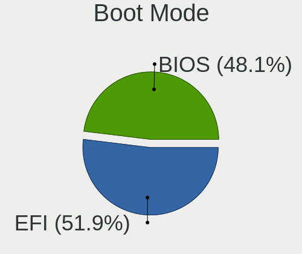
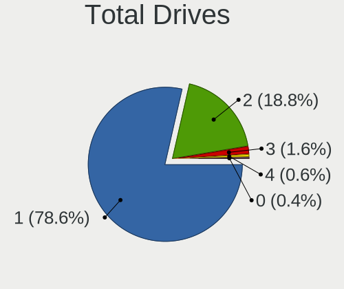
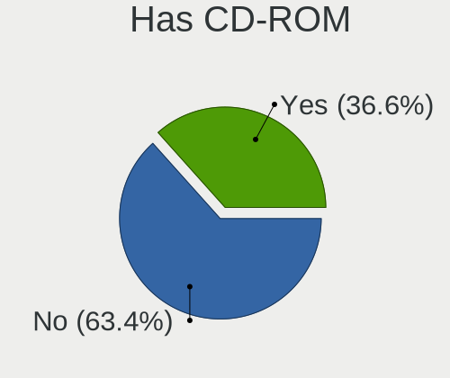
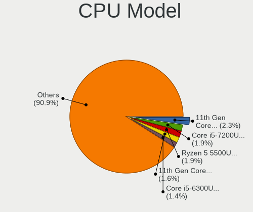
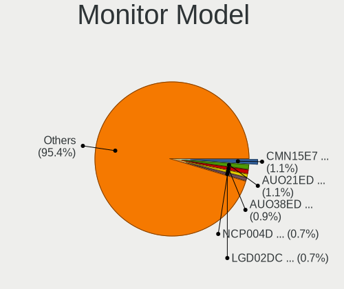
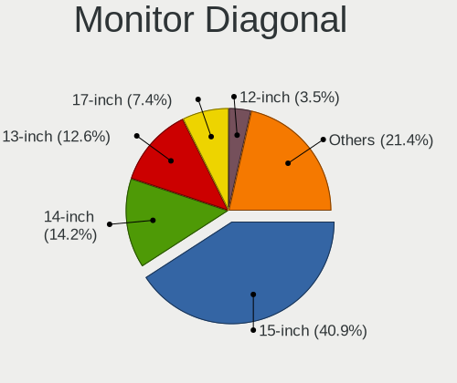
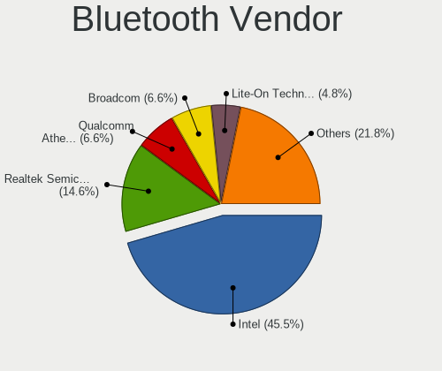
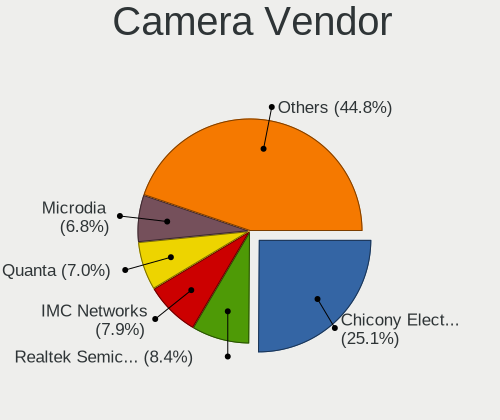
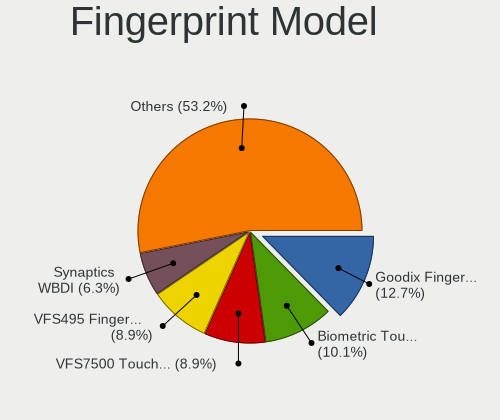

Xubuntu 22.04 - Tested Hardware & Statistics (Notebooks)
--------------------------------------------------------

A project to collect tested hardware configurations for Xubuntu 22.04.

Anyone can contribute to this report by the [hw-probe](https://github.com/linuxhw/hw-probe) tool:

    sudo -E hw-probe -all -upload

Please contribute! Especially if your hardware is rare.

Contents
--------

* [ Test Cases ](#test-cases)

* [ System ](#system)
  - [ Kernel                   ](#kernel)
  - [ Kernel Family            ](#kernel-family)
  - [ Kernel Major Ver.        ](#kernel-major-ver)
  - [ Arch                     ](#arch)
  - [ DE                       ](#de)
  - [ Display Server           ](#display-server)
  - [ Display Manager          ](#display-manager)
  - [ OS Lang                  ](#os-lang)
  - [ Boot Mode                ](#boot-mode)
  - [ Filesystem               ](#filesystem)
  - [ Part. scheme             ](#part-scheme)
  - [ Dual Boot with Linux/BSD ](#dual-boot-with-linuxbsd)
  - [ Dual Boot (Win)          ](#dual-boot-win)

* [ Board ](#board)
  - [ Vendor                   ](#vendor)
  - [ Model                    ](#model)
  - [ Model Family             ](#model-family)
  - [ MFG Year                 ](#mfg-year)
  - [ Form Factor              ](#form-factor)
  - [ Secure Boot              ](#secure-boot)
  - [ Coreboot                 ](#coreboot)
  - [ RAM Size                 ](#ram-size)
  - [ RAM Used                 ](#ram-used)
  - [ Total Drives             ](#total-drives)
  - [ Has CD-ROM               ](#has-cd-rom)
  - [ Has Ethernet             ](#has-ethernet)
  - [ Has WiFi                 ](#has-wifi)
  - [ Has Bluetooth            ](#has-bluetooth)

* [ Location ](#location)
  - [ Country                  ](#country)
  - [ City                     ](#city)

* [ Drives ](#drives)
  - [ Drive Vendor             ](#drive-vendor)
  - [ Drive Model              ](#drive-model)
  - [ HDD Vendor               ](#hdd-vendor)
  - [ SSD Vendor               ](#ssd-vendor)
  - [ Drive Kind               ](#drive-kind)
  - [ Drive Connector          ](#drive-connector)
  - [ Drive Size               ](#drive-size)
  - [ Space Total              ](#space-total)
  - [ Space Used               ](#space-used)
  - [ Malfunc. Drives          ](#malfunc-drives)
  - [ Malfunc. Drive Vendor    ](#malfunc-drive-vendor)
  - [ Malfunc. HDD Vendor      ](#malfunc-hdd-vendor)
  - [ Malfunc. Drive Kind      ](#malfunc-drive-kind)
  - [ Failed Drives            ](#failed-drives)
  - [ Failed Drive Vendor      ](#failed-drive-vendor)
  - [ Drive Status             ](#drive-status)

* [ Storage controller ](#storage-controller)
  - [ Storage Vendor           ](#storage-vendor)
  - [ Storage Model            ](#storage-model)
  - [ Storage Kind             ](#storage-kind)

* [ Processor ](#processor)
  - [ CPU Vendor               ](#cpu-vendor)
  - [ CPU Model                ](#cpu-model)
  - [ CPU Model Family         ](#cpu-model-family)
  - [ CPU Cores                ](#cpu-cores)
  - [ CPU Sockets              ](#cpu-sockets)
  - [ CPU Threads              ](#cpu-threads)
  - [ CPU Op-Modes             ](#cpu-op-modes)
  - [ CPU Microcode            ](#cpu-microcode)
  - [ CPU Microarch            ](#cpu-microarch)

* [ Graphics ](#graphics)
  - [ GPU Vendor               ](#gpu-vendor)
  - [ GPU Model                ](#gpu-model)
  - [ GPU Combo                ](#gpu-combo)
  - [ GPU Driver               ](#gpu-driver)
  - [ GPU Memory               ](#gpu-memory)

* [ Monitor ](#monitor)
  - [ Monitor Vendor           ](#monitor-vendor)
  - [ Monitor Model            ](#monitor-model)
  - [ Monitor Resolution       ](#monitor-resolution)
  - [ Monitor Diagonal         ](#monitor-diagonal)
  - [ Monitor Width            ](#monitor-width)
  - [ Aspect Ratio             ](#aspect-ratio)
  - [ Monitor Area             ](#monitor-area)
  - [ Pixel Density            ](#pixel-density)
  - [ Multiple Monitors        ](#multiple-monitors)

* [ Network ](#network)
  - [ Net Controller Vendor    ](#net-controller-vendor)
  - [ Net Controller Model     ](#net-controller-model)
  - [ Wireless Vendor          ](#wireless-vendor)
  - [ Wireless Model           ](#wireless-model)
  - [ Ethernet Vendor          ](#ethernet-vendor)
  - [ Ethernet Model           ](#ethernet-model)
  - [ Net Controller Kind      ](#net-controller-kind)
  - [ Used Controller          ](#used-controller)
  - [ NICs                     ](#nics)
  - [ IPv6                     ](#ipv6)

* [ Bluetooth ](#bluetooth)
  - [ Bluetooth Vendor         ](#bluetooth-vendor)
  - [ Bluetooth Model          ](#bluetooth-model)

* [ Sound ](#sound)
  - [ Sound Vendor             ](#sound-vendor)
  - [ Sound Model              ](#sound-model)

* [ Memory ](#memory)
  - [ Memory Vendor            ](#memory-vendor)
  - [ Memory Model             ](#memory-model)
  - [ Memory Kind              ](#memory-kind)
  - [ Memory Form Factor       ](#memory-form-factor)
  - [ Memory Size              ](#memory-size)
  - [ Memory Speed             ](#memory-speed)

* [ Printers & scanners ](#printers--scanners)
  - [ Printer Vendor           ](#printer-vendor)
  - [ Printer Model            ](#printer-model)
  - [ Scanner Vendor           ](#scanner-vendor)
  - [ Scanner Model            ](#scanner-model)

* [ Camera ](#camera)
  - [ Camera Vendor            ](#camera-vendor)
  - [ Camera Model             ](#camera-model)

* [ Security ](#security)
  - [ Fingerprint Vendor       ](#fingerprint-vendor)
  - [ Fingerprint Model        ](#fingerprint-model)
  - [ Chipcard Vendor          ](#chipcard-vendor)
  - [ Chipcard Model           ](#chipcard-model)

* [ Unsupported ](#unsupported)
  - [ Unsupported Devices      ](#unsupported-devices)
  - [ Unsupported Device Types ](#unsupported-device-types)

Test Cases
----------

Total: 159

| Vendor        | Model                       | Probe                                                      | Date         |
|---------------|-----------------------------|------------------------------------------------------------|--------------|
| HP            | Pavilion dv9000 (RP919EA... | [dcdd31c3d5](https://linux-hardware.org/?probe=dcdd31c3d5) | Nov 30, 2022 |
| Lenovo        | IdeaPad Gaming 3 15ARH05... | [89e340c4ec](https://linux-hardware.org/?probe=89e340c4ec) | Nov 30, 2022 |
| Lenovo        | G50-80 80E5                 | [1387bf11ea](https://linux-hardware.org/?probe=1387bf11ea) | Nov 28, 2022 |
| Google        | Akemi                       | [89c466ffd4](https://linux-hardware.org/?probe=89c466ffd4) | Nov 28, 2022 |
| HP            | 255 G8 Notebook PC          | [97cf5008bb](https://linux-hardware.org/?probe=97cf5008bb) | Nov 27, 2022 |
| Acer          | Aspire E5-571G              | [7d6eeaf95c](https://linux-hardware.org/?probe=7d6eeaf95c) | Nov 26, 2022 |
| HUAWEI        | BOM-WXX9                    | [59a39475dd](https://linux-hardware.org/?probe=59a39475dd) | Nov 26, 2022 |
| Lenovo        | ThinkBook 15 G2 ITL 20VE    | [bc3563401b](https://linux-hardware.org/?probe=bc3563401b) | Nov 26, 2022 |
| Lenovo        | ThinkPad T430 23501K1       | [46ec8527f5](https://linux-hardware.org/?probe=46ec8527f5) | Nov 25, 2022 |
| Sony          | VPCEH25EN                   | [d9136e5b75](https://linux-hardware.org/?probe=d9136e5b75) | Nov 20, 2022 |
| HP            | 245 G8 Notebook PC          | [4d4f9a0e10](https://linux-hardware.org/?probe=4d4f9a0e10) | Nov 17, 2022 |
| HP            | ProBook 6450b               | [ee3a2a2ef8](https://linux-hardware.org/?probe=ee3a2a2ef8) | Nov 14, 2022 |
| HP            | Pavilion g6                 | [dc20b80b34](https://linux-hardware.org/?probe=dc20b80b34) | Nov 12, 2022 |
| HP            | EliteBook 840 G3            | [161b81845e](https://linux-hardware.org/?probe=161b81845e) | Nov 11, 2022 |
| HP            | Pavilion g6                 | [9fa4176934](https://linux-hardware.org/?probe=9fa4176934) | Nov 09, 2022 |
| Lenovo        | IdeaPad 110-17ACL 80UM      | [0a1efcf166](https://linux-hardware.org/?probe=0a1efcf166) | Nov 08, 2022 |
| Lenovo        | ThinkPad T440p 20AN0033R... | [7ca892ad44](https://linux-hardware.org/?probe=7ca892ad44) | Nov 06, 2022 |
| Lenovo        | IdeaPad 3 15ADA6 82KR       | [f1117abc19](https://linux-hardware.org/?probe=f1117abc19) | Nov 05, 2022 |
| Lenovo        | ThinkPad P51 20HH0014IX     | [e519495581](https://linux-hardware.org/?probe=e519495581) | Nov 04, 2022 |
| Dell          | Precision M6400             | [b98b318067](https://linux-hardware.org/?probe=b98b318067) | Nov 02, 2022 |
| Acer          | Aspire one 1-431            | [09aeb9ec38](https://linux-hardware.org/?probe=09aeb9ec38) | Nov 02, 2022 |
| HP            | Pavilion Notebook           | [411f4cbf40](https://linux-hardware.org/?probe=411f4cbf40) | Oct 30, 2022 |
| Dell          | Inspiron 5490               | [bbea359211](https://linux-hardware.org/?probe=bbea359211) | Oct 28, 2022 |
| Dell          | Inspiron 3421               | [6ebaad0374](https://linux-hardware.org/?probe=6ebaad0374) | Oct 25, 2022 |
| ASUSTek       | X555YI                      | [5d6562117a](https://linux-hardware.org/?probe=5d6562117a) | Oct 25, 2022 |
| Dell          | Inspiron 3421               | [d10106fb33](https://linux-hardware.org/?probe=d10106fb33) | Oct 24, 2022 |
| HP            | 15                          | [2831771472](https://linux-hardware.org/?probe=2831771472) | Oct 22, 2022 |
| ASUSTek       | VivoBook_ASUSLaptop X571... | [66418dda52](https://linux-hardware.org/?probe=66418dda52) | Oct 22, 2022 |
| ASUSTek       | N551ZU                      | [090ebd8eee](https://linux-hardware.org/?probe=090ebd8eee) | Oct 20, 2022 |
| Acer          | Predator PH517-61           | [6f191c90c1](https://linux-hardware.org/?probe=6f191c90c1) | Oct 20, 2022 |
| Acer          | Aspire ES1-331              | [f5ace96d5d](https://linux-hardware.org/?probe=f5ace96d5d) | Oct 19, 2022 |
| HP            | Pavilion Notebook           | [e09755f495](https://linux-hardware.org/?probe=e09755f495) | Oct 18, 2022 |
| ASUSTek       | VivoBook_ASUSLaptop X509... | [d844ce4115](https://linux-hardware.org/?probe=d844ce4115) | Oct 13, 2022 |
| HP            | Stream Notebook PC 13       | [173cd34bf9](https://linux-hardware.org/?probe=173cd34bf9) | Oct 12, 2022 |
| Unknown       | Unknown                     | [a098b893f4](https://linux-hardware.org/?probe=a098b893f4) | Oct 11, 2022 |
| ASUSTek       | VivoBook_ASUSLaptop X513... | [e2deb8e15e](https://linux-hardware.org/?probe=e2deb8e15e) | Oct 11, 2022 |
| Lenovo        | ThinkPad L520 5017AL3       | [2e43bb8a31](https://linux-hardware.org/?probe=2e43bb8a31) | Oct 10, 2022 |
| GPU Compan... | GWTN116-3                   | [caf9a63020](https://linux-hardware.org/?probe=caf9a63020) | Oct 08, 2022 |
| Lenovo        | ThinkPad T410 2537AF8       | [06dd00b171](https://linux-hardware.org/?probe=06dd00b171) | Oct 08, 2022 |
| Dell          | Latitude 5411               | [4bb05d639f](https://linux-hardware.org/?probe=4bb05d639f) | Oct 08, 2022 |
| Lenovo        | ThinkPad T460s 20FAS30L0... | [ea6a5c970c](https://linux-hardware.org/?probe=ea6a5c970c) | Oct 07, 2022 |
| Lenovo        | ThinkPad P17 Gen 2i 20YU... | [b67d9b67e4](https://linux-hardware.org/?probe=b67d9b67e4) | Oct 06, 2022 |
| GPU Compan... | GWTN116-3                   | [b838d87a4b](https://linux-hardware.org/?probe=b838d87a4b) | Oct 05, 2022 |
| Lenovo        | ThinkPad T14s Gen 2a 20X... | [0e52b51f87](https://linux-hardware.org/?probe=0e52b51f87) | Oct 05, 2022 |
| Lenovo        | IdeaPad N585 20179          | [dd6693ffa9](https://linux-hardware.org/?probe=dd6693ffa9) | Oct 05, 2022 |
| Lenovo        | IdeaPad 3 14IML05 81WA      | [986b3c962e](https://linux-hardware.org/?probe=986b3c962e) | Oct 04, 2022 |
| Dell          | Precision 7560              | [877583cc90](https://linux-hardware.org/?probe=877583cc90) | Oct 04, 2022 |
| Lenovo        | B70-80 80MR                 | [69aec9e100](https://linux-hardware.org/?probe=69aec9e100) | Oct 01, 2022 |
| HP            | Notebook                    | [fec2594d37](https://linux-hardware.org/?probe=fec2594d37) | Oct 01, 2022 |
| HP            | EliteBook 840 G3            | [ddf1904011](https://linux-hardware.org/?probe=ddf1904011) | Oct 01, 2022 |
| Lenovo        | ThinkPad E14 Gen 2 20TA0... | [025a55eab7](https://linux-hardware.org/?probe=025a55eab7) | Sep 30, 2022 |
| Lenovo        | ThinkPad E14 Gen 2 20TA0... | [875b1df312](https://linux-hardware.org/?probe=875b1df312) | Sep 30, 2022 |
| Sony          | SVE1512C6EB                 | [c47a3a5bd7](https://linux-hardware.org/?probe=c47a3a5bd7) | Sep 30, 2022 |
| Lenovo        | ThinkPad T420 42361L0       | [abe6563e67](https://linux-hardware.org/?probe=abe6563e67) | Sep 30, 2022 |
| Dell          | Latitude 5420               | [36ddd1d6d7](https://linux-hardware.org/?probe=36ddd1d6d7) | Sep 30, 2022 |
| Lenovo        | IdeaPad N585 20179          | [dcdafbbd9b](https://linux-hardware.org/?probe=dcdafbbd9b) | Sep 28, 2022 |
| HP            | Pavilion dv7                | [5479c35130](https://linux-hardware.org/?probe=5479c35130) | Sep 28, 2022 |
| Toshiba       | Satellite Pro R50-C         | [834ef0ec59](https://linux-hardware.org/?probe=834ef0ec59) | Sep 27, 2022 |
| Toshiba       | Satellite Pro R50-C         | [564d385b61](https://linux-hardware.org/?probe=564d385b61) | Sep 27, 2022 |
| Toshiba       | Satellite C650              | [c7920c2e68](https://linux-hardware.org/?probe=c7920c2e68) | Sep 24, 2022 |
| Packard Be... | EasyNote MH45               | [c312580997](https://linux-hardware.org/?probe=c312580997) | Sep 24, 2022 |
| Tactus        | GeoBook 140                 | [7d8700d0e1](https://linux-hardware.org/?probe=7d8700d0e1) | Sep 23, 2022 |
| Dell          | Latitude 5411               | [018a9c569a](https://linux-hardware.org/?probe=018a9c569a) | Sep 23, 2022 |
| HP            | EliteBook 840 G3            | [c3a88ed62d](https://linux-hardware.org/?probe=c3a88ed62d) | Sep 22, 2022 |
| Lenovo        | ThinkPad T61 7659AB7        | [aa07f9c271](https://linux-hardware.org/?probe=aa07f9c271) | Sep 20, 2022 |
| Lenovo        | ThinkPad T61p 6457A24       | [d98e9a64bd](https://linux-hardware.org/?probe=d98e9a64bd) | Sep 20, 2022 |
| Lenovo        | ThinkPad X220 42918F6       | [69dda668fc](https://linux-hardware.org/?probe=69dda668fc) | Sep 18, 2022 |
| Acer          | Swift SF314-511             | [914d532c78](https://linux-hardware.org/?probe=914d532c78) | Sep 17, 2022 |
| Dell          | Latitude 7490               | [ce54bcd741](https://linux-hardware.org/?probe=ce54bcd741) | Sep 15, 2022 |
| Dell          | Inspiron 3576               | [02023473b8](https://linux-hardware.org/?probe=02023473b8) | Sep 15, 2022 |
| Dell          | Precision 5540              | [229337f709](https://linux-hardware.org/?probe=229337f709) | Sep 13, 2022 |
| ASUSTek       | ASUS TUF Gaming A15 FA50... | [1f2be56ed4](https://linux-hardware.org/?probe=1f2be56ed4) | Sep 09, 2022 |
| ASUSTek       | ASUS TUF Gaming A15 FA50... | [31717bdcb1](https://linux-hardware.org/?probe=31717bdcb1) | Sep 09, 2022 |
| ASUSTek       | K55VD                       | [c1ca471555](https://linux-hardware.org/?probe=c1ca471555) | Sep 06, 2022 |
| Panasonic     | CF-D1DVA06F3                | [e3cc43135a](https://linux-hardware.org/?probe=e3cc43135a) | Sep 05, 2022 |
| HP            | 255 G7 Notebook PC          | [dd775ffe8f](https://linux-hardware.org/?probe=dd775ffe8f) | Sep 05, 2022 |
| HP            | Laptop 15-dw0xxx            | [1bd6f2ba6f](https://linux-hardware.org/?probe=1bd6f2ba6f) | Sep 04, 2022 |
| Google        | Kip                         | [e92d971d5e](https://linux-hardware.org/?probe=e92d971d5e) | Sep 04, 2022 |
| Lenovo        | IdeaPad 120S-14IAP 81A5     | [059bb72ff2](https://linux-hardware.org/?probe=059bb72ff2) | Sep 03, 2022 |
| Google        | Reks                        | [d88eecb32d](https://linux-hardware.org/?probe=d88eecb32d) | Sep 03, 2022 |
| HP            | EliteBook 2570p             | [506f9da93b](https://linux-hardware.org/?probe=506f9da93b) | Sep 03, 2022 |
| Dell          | Inspiron N5010              | [b9953ab67e](https://linux-hardware.org/?probe=b9953ab67e) | Aug 27, 2022 |
| Lenovo        | V340-17IWL 81RG             | [f725a87544](https://linux-hardware.org/?probe=f725a87544) | Aug 27, 2022 |
| Lenovo        | 14w 81MQ000JUS              | [d71f12bede](https://linux-hardware.org/?probe=d71f12bede) | Aug 27, 2022 |
| Lenovo        | V340-17IWL 81RG             | [8a689fc0fd](https://linux-hardware.org/?probe=8a689fc0fd) | Aug 27, 2022 |
| Dell          | XPS 13 9380                 | [5bb7561235](https://linux-hardware.org/?probe=5bb7561235) | Aug 25, 2022 |
| Lenovo        | ThinkPad P70 20ERCTO1WW     | [d269aaa456](https://linux-hardware.org/?probe=d269aaa456) | Aug 25, 2022 |
| ASUSTek       | ASUS TUF Gaming A15 FA50... | [92be7f3368](https://linux-hardware.org/?probe=92be7f3368) | Aug 24, 2022 |
| Acer          | Aspire 5740                 | [5652f2c73d](https://linux-hardware.org/?probe=5652f2c73d) | Aug 24, 2022 |
| Lenovo        | 14w 81MQ000JUS              | [1ff769c6ef](https://linux-hardware.org/?probe=1ff769c6ef) | Aug 23, 2022 |
| HP            | EliteBook 8540p             | [cdd3dd9925](https://linux-hardware.org/?probe=cdd3dd9925) | Aug 19, 2022 |
| ASUSTek       | K53TA                       | [db6525efb3](https://linux-hardware.org/?probe=db6525efb3) | Aug 15, 2022 |
| Lenovo        | ThinkPad T460s 20FAS0Q90... | [644c7518e9](https://linux-hardware.org/?probe=644c7518e9) | Aug 14, 2022 |
| ASUSTek       | X101CH                      | [174bc50211](https://linux-hardware.org/?probe=174bc50211) | Aug 14, 2022 |
| Toshiba       | PT10F                       | [08b7dc52a2](https://linux-hardware.org/?probe=08b7dc52a2) | Aug 12, 2022 |
| Mediacom      | SmartBook 14 FullHD - SB... | [5bb07e1a28](https://linux-hardware.org/?probe=5bb07e1a28) | Aug 11, 2022 |
| Lenovo        | ThinkPad T460s 20FAS6JY0... | [7d85d4f00b](https://linux-hardware.org/?probe=7d85d4f00b) | Aug 06, 2022 |
| Lenovo        | IdeaPad 120S-14IAP 81A5     | [eeff2bac06](https://linux-hardware.org/?probe=eeff2bac06) | Aug 05, 2022 |
| Acer          | Aspire V3-551G              | [8b0237ee5e](https://linux-hardware.org/?probe=8b0237ee5e) | Aug 03, 2022 |
| Lenovo        | ThinkPad T430 23501K1       | [fdd30ffa23](https://linux-hardware.org/?probe=fdd30ffa23) | Aug 03, 2022 |
| Acer          | Aspire V3-551G              | [4b8ed45c90](https://linux-hardware.org/?probe=4b8ed45c90) | Aug 03, 2022 |
| GMKtec        | NucBox5                     | [5023bc1773](https://linux-hardware.org/?probe=5023bc1773) | Aug 02, 2022 |
| HUAWEI        | BOHK-WAX9X                  | [745f6815cb](https://linux-hardware.org/?probe=745f6815cb) | Jul 30, 2022 |
| Schenker      | WORK (Early 2021)           | [8666cc396a](https://linux-hardware.org/?probe=8666cc396a) | Jul 28, 2022 |
| ASUSTek       | X450CP                      | [dceda2fe9d](https://linux-hardware.org/?probe=dceda2fe9d) | Jul 27, 2022 |
| Lenovo        | G50-30 80G0                 | [c380d02bbf](https://linux-hardware.org/?probe=c380d02bbf) | Jul 25, 2022 |
| ASUSTek       | VivoBook_ASUSLaptop X513... | [75b4088788](https://linux-hardware.org/?probe=75b4088788) | Jul 20, 2022 |
| ASUSTek       | VivoBook_ASUSLaptop X513... | [3c2afd2b5e](https://linux-hardware.org/?probe=3c2afd2b5e) | Jul 20, 2022 |
| HP            | EliteBook 845 G8 Noteboo... | [2a10c24690](https://linux-hardware.org/?probe=2a10c24690) | Jul 20, 2022 |
| Acer          | Aspire E1-532               | [13d38a6632](https://linux-hardware.org/?probe=13d38a6632) | Jul 16, 2022 |
| ASUSTek       | ROG Zephyrus G14 GA401QM... | [a6ae556389](https://linux-hardware.org/?probe=a6ae556389) | Jul 16, 2022 |
| ASUSTek       | X453MA                      | [da05c4539d](https://linux-hardware.org/?probe=da05c4539d) | Jul 11, 2022 |
| MSI           | GF63 Thin 9RCX              | [f2f3db370a](https://linux-hardware.org/?probe=f2f3db370a) | Jul 10, 2022 |
| Acer          | Aspire E5-521               | [7becd2f2df](https://linux-hardware.org/?probe=7becd2f2df) | Jul 10, 2022 |
| ASUSTek       | ZenBook UX435EG_UX435EG     | [51b138f349](https://linux-hardware.org/?probe=51b138f349) | Jul 04, 2022 |
| Lenovo        | V330-15IKB 81AX             | [2f915d68e5](https://linux-hardware.org/?probe=2f915d68e5) | Jul 04, 2022 |
| Samsung       | 370E4K                      | [a6512c1606](https://linux-hardware.org/?probe=a6512c1606) | Jul 03, 2022 |
| HP            | EliteBook 840 G3            | [9ce5b9c45c](https://linux-hardware.org/?probe=9ce5b9c45c) | Jun 30, 2022 |
| Acer          | Aspire E5-521               | [f532d90f38](https://linux-hardware.org/?probe=f532d90f38) | Jun 29, 2022 |
| Standard      | Unknown                     | [1a94acbc05](https://linux-hardware.org/?probe=1a94acbc05) | Jun 29, 2022 |
| Standard      | Unknown                     | [93ac825a25](https://linux-hardware.org/?probe=93ac825a25) | Jun 27, 2022 |
| HP            | Pavilion dv5                | [4009a4fd8c](https://linux-hardware.org/?probe=4009a4fd8c) | Jun 24, 2022 |
| Apple         | MacBookPro14,1              | [e9d8c28a34](https://linux-hardware.org/?probe=e9d8c28a34) | Jun 22, 2022 |
| Google        | Kindred                     | [c12b15c596](https://linux-hardware.org/?probe=c12b15c596) | Jun 17, 2022 |
| HP            | ProBook 445 G7              | [f41d413820](https://linux-hardware.org/?probe=f41d413820) | Jun 13, 2022 |
| GPU Compan... | GWTN141-4                   | [ba579cb383](https://linux-hardware.org/?probe=ba579cb383) | Jun 11, 2022 |
| Dell          | Latitude 7280               | [7900c8009a](https://linux-hardware.org/?probe=7900c8009a) | Jun 10, 2022 |
| Chuwi         | GemiBook Pro                | [7bd963dd56](https://linux-hardware.org/?probe=7bd963dd56) | Jun 09, 2022 |
| HP            | Pavilion Laptop 15-eh1xx... | [77a5e1c6f9](https://linux-hardware.org/?probe=77a5e1c6f9) | Jun 08, 2022 |
| AMI           | Intel                       | [79b1f29bc4](https://linux-hardware.org/?probe=79b1f29bc4) | Jun 07, 2022 |
| AMI           | Intel                       | [d7746ec6d5](https://linux-hardware.org/?probe=d7746ec6d5) | Jun 07, 2022 |
| Digma         | EVE 15 C413 ES5059EW        | [26eb7d39e1](https://linux-hardware.org/?probe=26eb7d39e1) | Jun 06, 2022 |
| HP            | Pavilion g7                 | [b31de17368](https://linux-hardware.org/?probe=b31de17368) | Jun 06, 2022 |
| Chuwi         | GemiBook Pro                | [e8dd7b95a6](https://linux-hardware.org/?probe=e8dd7b95a6) | Jun 03, 2022 |
| Dell          | Latitude D820               | [8c2336469f](https://linux-hardware.org/?probe=8c2336469f) | Jun 01, 2022 |
| Acer          | Aspire 5740                 | [db6d025d69](https://linux-hardware.org/?probe=db6d025d69) | Jun 01, 2022 |
| Acer          | Aspire 5740                 | [2c541b20f6](https://linux-hardware.org/?probe=2c541b20f6) | May 26, 2022 |
| HP            | Mini 5103                   | [aa7f4e957e](https://linux-hardware.org/?probe=aa7f4e957e) | May 23, 2022 |
| Google        | Snappy                      | [c88d27b24a](https://linux-hardware.org/?probe=c88d27b24a) | May 20, 2022 |
| Google        | Snappy                      | [9fc85cd49a](https://linux-hardware.org/?probe=9fc85cd49a) | May 20, 2022 |
| Google        | Snappy                      | [cb9e7730ad](https://linux-hardware.org/?probe=cb9e7730ad) | May 20, 2022 |
| Lenovo        | ThinkPad E580 20KS001JGE    | [724c06c08c](https://linux-hardware.org/?probe=724c06c08c) | May 19, 2022 |
| ASUSTek       | UL30A                       | [c121dd37ba](https://linux-hardware.org/?probe=c121dd37ba) | May 16, 2022 |
| Google        | Droid                       | [e938864c93](https://linux-hardware.org/?probe=e938864c93) | May 15, 2022 |
| Unknown       | Unknown                     | [f802e84b8e](https://linux-hardware.org/?probe=f802e84b8e) | May 08, 2022 |
| Dell          | Inspiron 7501               | [a8a1e1e3a2](https://linux-hardware.org/?probe=a8a1e1e3a2) | May 07, 2022 |
| Dell          | Latitude 7420               | [384325350c](https://linux-hardware.org/?probe=384325350c) | May 05, 2022 |
| Google        | Auron_Yuna                  | [795d9af5a7](https://linux-hardware.org/?probe=795d9af5a7) | May 05, 2022 |
| Dell          | XPS M1530                   | [760cae00c1](https://linux-hardware.org/?probe=760cae00c1) | May 03, 2022 |
| Dell          | XPS M1530                   | [757d1b099e](https://linux-hardware.org/?probe=757d1b099e) | Apr 30, 2022 |
| ASUSTek       | T100HAN                     | [5ee200cfbe](https://linux-hardware.org/?probe=5ee200cfbe) | Apr 30, 2022 |
| Acer          | Aspire ES1-512              | [f0ed67e309](https://linux-hardware.org/?probe=f0ed67e309) | Apr 26, 2022 |
| Lenovo        | IdeaPad 100-15IBY 80MJ      | [bd286b124a](https://linux-hardware.org/?probe=bd286b124a) | Apr 25, 2022 |
| HP            | 255 G8 Notebook PC          | [c16cb4e0d6](https://linux-hardware.org/?probe=c16cb4e0d6) | Apr 24, 2022 |
| Lenovo        | ThinkPad T470s 20HF004MM... | [69a5e98a04](https://linux-hardware.org/?probe=69a5e98a04) | Apr 22, 2022 |
| Lenovo        | ThinkPad T14s Gen 2i 20W... | [3e1029ed36](https://linux-hardware.org/?probe=3e1029ed36) | Apr 22, 2022 |
| HP            | 255 G8 Notebook PC          | [d88db86125](https://linux-hardware.org/?probe=d88db86125) | Apr 20, 2022 |
| HP            | Laptop 15s-fq2xxx           | [b073554afc](https://linux-hardware.org/?probe=b073554afc) | Apr 08, 2022 |
| HP            | Laptop 15s-fq2xxx           | [c3dcb61dd5](https://linux-hardware.org/?probe=c3dcb61dd5) | Apr 02, 2022 |

System
------

Kernel
------

Version of the Linux kernel

| Version                      | Notebooks | Percent |
|------------------------------|-----------|---------|
| 5.15.0-47-generic            | 19        | 14.07%  |
| 5.15.0-48-generic            | 16        | 11.85%  |
| 5.15.0-52-generic            | 15        | 11.11%  |
| 5.15.0-25-generic            | 13        | 9.63%   |
| 5.15.0-46-generic            | 8         | 5.93%   |
| 5.15.0-27-generic            | 7         | 5.19%   |
| 5.15.0-53-generic            | 5         | 3.7%    |
| 5.15.0-50-generic            | 5         | 3.7%    |
| 5.15.0-40-generic            | 5         | 3.7%    |
| 5.15.0-39-generic            | 5         | 3.7%    |
| 5.15.0-35-generic            | 5         | 3.7%    |
| 5.15.0-41-generic            | 4         | 2.96%   |
| 5.15.0-43-generic            | 3         | 2.22%   |
| 5.15.0-37-generic            | 3         | 2.22%   |
| 5.17.0-1013-oem              | 2         | 1.48%   |
| 5.15.0-33-generic            | 2         | 1.48%   |
| 6.0.7-x64v3-xanmod1          | 1         | 0.74%   |
| 6.0.0-1007-oem               | 1         | 0.74%   |
| 5.4.0-126-generic            | 1         | 0.74%   |
| 5.19.5-051905-generic        | 1         | 0.74%   |
| 5.19.0-051900-generic        | 1         | 0.74%   |
| 5.18.0-10.1-liquorix-amd64   | 1         | 0.74%   |
| 5.17.3-051703-generic        | 1         | 0.74%   |
| 5.17.0-ashpy3-lyesdef        | 1         | 0.74%   |
| 5.17.0-1020-oem              | 1         | 0.74%   |
| 5.17.0-1015-oem              | 1         | 0.74%   |
| 5.15.0-54-generic            | 1         | 0.74%   |
| 5.15.0-50-lowlatency         | 1         | 0.74%   |
| 5.15.0-48-lowlatency         | 1         | 0.74%   |
| 5.15.0-46-lowlatency         | 1         | 0.74%   |
| 5.15.0-30-generic            | 1         | 0.74%   |
| 5.15.0-27-lowlatency         | 1         | 0.74%   |
| 5.15.0-1011-intel-iotg       | 1         | 0.74%   |
| 4.19.241-13212-ge9b0bab46475 | 1         | 0.74%   |

Kernel Family
-------------

Linux kernel without a distro release

| Version  | Notebooks | Percent |
|----------|-----------|---------|
| 5.15.0   | 119       | 90.15%  |
| 5.17.0   | 5         | 3.79%   |
| 6.0.7    | 1         | 0.76%   |
| 6.0.0    | 1         | 0.76%   |
| 5.4.0    | 1         | 0.76%   |
| 5.19.5   | 1         | 0.76%   |
| 5.19.0   | 1         | 0.76%   |
| 5.18.0   | 1         | 0.76%   |
| 5.17.3   | 1         | 0.76%   |
| 4.19.241 | 1         | 0.76%   |

Kernel Major Ver.
-----------------

Linux kernel major version

| Version | Notebooks | Percent |
|---------|-----------|---------|
| 5.15    | 119       | 90.15%  |
| 5.17    | 6         | 4.55%   |
| 6.0     | 2         | 1.52%   |
| 5.19    | 2         | 1.52%   |
| 5.4     | 1         | 0.76%   |
| 5.18    | 1         | 0.76%   |
| 4.19    | 1         | 0.76%   |

Arch
----

OS architecture (x86_64, i586, etc.)

| Name   | Notebooks | Percent |
|--------|-----------|---------|
| x86_64 | 132       | 100%    |

DE
--

Desktop Environment

| Name  | Notebooks | Percent |
|-------|-----------|---------|
| XFCE  | 129       | 97.73%  |
| GNOME | 3         | 2.27%   |

Display Server
--------------

X11 or Wayland

| Name    | Notebooks | Percent |
|---------|-----------|---------|
| X11     | 128       | 96.97%  |
| Wayland | 3         | 2.27%   |
| Tty     | 1         | 0.76%   |

Display Manager
---------------

SDDM, LightDM, etc.

| Name    | Notebooks | Percent |
|---------|-----------|---------|
| LightDM | 118       | 89.39%  |
| GDM3    | 6         | 4.55%   |
| Unknown | 6         | 4.55%   |
| SLiM    | 1         | 0.76%   |
| SDDM    | 1         | 0.76%   |

OS Lang
-------

Language

| Lang  | Notebooks | Percent |
|-------|-----------|---------|
| en_US | 61        | 46.21%  |
| de_DE | 14        | 10.61%  |
| fr_FR | 12        | 9.09%   |
| it_IT | 10        | 7.58%   |
| en_GB | 6         | 4.55%   |
| pt_BR | 3         | 2.27%   |
| es_ES | 3         | 2.27%   |
| tr_TR | 2         | 1.52%   |
| ru_RU | 2         | 1.52%   |
| hu_HU | 2         | 1.52%   |
| en_CA | 2         | 1.52%   |
| en_AU | 2         | 1.52%   |
| cs_CZ | 2         | 1.52%   |
| nl_NL | 1         | 0.76%   |
| nl_BE | 1         | 0.76%   |
| ja_JP | 1         | 0.76%   |
| fr_BE | 1         | 0.76%   |
| es_MX | 1         | 0.76%   |
| es_CL | 1         | 0.76%   |
| en_IN | 1         | 0.76%   |
| en_IL | 1         | 0.76%   |
| de_CH | 1         | 0.76%   |
| C     | 1         | 0.76%   |
| bg_BG | 1         | 0.76%   |

Boot Mode
---------

EFI or BIOS

| Mode | Notebooks | Percent |
|------|-----------|---------|
| EFI  | 78        | 59.09%  |
| BIOS | 54        | 40.91%  |

Filesystem
----------

Type of filesystem

| Type    | Notebooks | Percent |
|---------|-----------|---------|
| Ext4    | 119       | 90.15%  |
| Overlay | 7         | 5.3%    |
| Zfs     | 4         | 3.03%   |
| Btrfs   | 2         | 1.52%   |

Part. scheme
------------

Scheme of partitioning

| Type    | Notebooks | Percent |
|---------|-----------|---------|
| GPT     | 94        | 70.15%  |
| Unknown | 31        | 23.13%  |
| MBR     | 9         | 6.72%   |

Dual Boot with Linux/BSD
------------------------

Hosting more than one Linux/BSD

| Dual boot | Notebooks | Percent |
|-----------|-----------|---------|
| No        | 124       | 92.54%  |
| Yes       | 10        | 7.46%   |

Dual Boot (Win)
---------------

Hosting Linux and Windows

| Dual boot | Notebooks | Percent |
|-----------|-----------|---------|
| No        | 92        | 69.7%   |
| Yes       | 40        | 30.3%   |

Board
-----

Vendor
------

Motherboard manufacturer

| Name                | Notebooks | Percent |
|---------------------|-----------|---------|
| Lenovo              | 32        | 24.24%  |
| Hewlett-Packard     | 27        | 20.45%  |
| ASUSTek Computer    | 17        | 12.88%  |
| Dell                | 16        | 12.12%  |
| Acer                | 10        | 7.58%   |
| Google              | 6         | 4.55%   |
| Toshiba             | 3         | 2.27%   |
| GPU Company         | 3         | 2.27%   |
| Sony                | 2         | 1.52%   |
| HUAWEI              | 2         | 1.52%   |
| Unknown             | 2         | 1.52%   |
| Tactus              | 1         | 0.76%   |
| Standard            | 1         | 0.76%   |
| Schenker            | 1         | 0.76%   |
| Samsung Electronics | 1         | 0.76%   |
| Panasonic           | 1         | 0.76%   |
| Packard Bell        | 1         | 0.76%   |
| MSI                 | 1         | 0.76%   |
| Mediacom            | 1         | 0.76%   |
| Digma               | 1         | 0.76%   |
| Chuwi               | 1         | 0.76%   |
| Apple               | 1         | 0.76%   |
| AMI                 | 1         | 0.76%   |

Model
-----

Motherboard model

| Name                                   | Notebooks | Percent |
|----------------------------------------|-----------|---------|
| HP EliteBook 840 G3                    | 4         | 3.03%   |
| Unknown                                | 3         | 2.27%   |
| HP Pavilion Notebook                   | 2         | 1.52%   |
| HP 255 G8 Notebook PC                  | 2         | 1.52%   |
| GPU Company GWTN116-3                  | 2         | 1.52%   |
| Toshiba Satellite Pro R50-C            | 1         | 0.76%   |
| Toshiba Satellite C650                 | 1         | 0.76%   |
| Toshiba PT10F                          | 1         | 0.76%   |
| Tactus GeoBook 140                     | 1         | 0.76%   |
| Sony VPCEH25EN                         | 1         | 0.76%   |
| Sony SVE1512C6EB                       | 1         | 0.76%   |
| Schenker WORK (Early 2021)             | 1         | 0.76%   |
| Samsung 370E4K                         | 1         | 0.76%   |
| Panasonic CF-D1DVA06F3                 | 1         | 0.76%   |
| Packard Bell EasyNote MH45             | 1         | 0.76%   |
| MSI GF63 Thin 9RCX                     | 1         | 0.76%   |
| Mediacom SmartBook 14 FullHD - SB14UC  | 1         | 0.76%   |
| Lenovo V340-17IWL 81RG                 | 1         | 0.76%   |
| Lenovo V330-15IKB 81AX                 | 1         | 0.76%   |
| Lenovo ThinkPad X220 42918F6           | 1         | 0.76%   |
| Lenovo ThinkPad T61p 6457A24           | 1         | 0.76%   |
| Lenovo ThinkPad T61 7659AB7            | 1         | 0.76%   |
| Lenovo ThinkPad T470s 20HF004MMX       | 1         | 0.76%   |
| Lenovo ThinkPad T460s 20FAS6JY00       | 1         | 0.76%   |
| Lenovo ThinkPad T460s 20FAS30L01       | 1         | 0.76%   |
| Lenovo ThinkPad T460s 20FAS0Q900       | 1         | 0.76%   |
| Lenovo ThinkPad T440p 20AN0033RT       | 1         | 0.76%   |
| Lenovo ThinkPad T430 23501K1           | 1         | 0.76%   |
| Lenovo ThinkPad T420 42361L0           | 1         | 0.76%   |
| Lenovo ThinkPad T410 2537AF8           | 1         | 0.76%   |
| Lenovo ThinkPad T14s Gen 2i 20WM00B9MX | 1         | 0.76%   |
| Lenovo ThinkPad T14s Gen 2a 20XF004RUS | 1         | 0.76%   |
| Lenovo ThinkPad P70 20ERCTO1WW         | 1         | 0.76%   |
| Lenovo ThinkPad P51 20HH0014IX         | 1         | 0.76%   |
| Lenovo ThinkPad P17 Gen 2i 20YU002LUS  | 1         | 0.76%   |
| Lenovo ThinkPad L520 5017AL3           | 1         | 0.76%   |
| Lenovo ThinkPad E580 20KS001JGE        | 1         | 0.76%   |
| Lenovo ThinkPad E14 Gen 2 20TA00JLAU   | 1         | 0.76%   |
| Lenovo ThinkBook 15 G2 ITL 20VE        | 1         | 0.76%   |
| Lenovo IdeaPad N585 20179              | 1         | 0.76%   |

Model Family
------------

Motherboard model prefix

| Name                   | Notebooks | Percent |
|------------------------|-----------|---------|
| Lenovo ThinkPad        | 19        | 14.39%  |
| HP Pavilion            | 8         | 6.06%   |
| Acer Aspire            | 8         | 6.06%   |
| HP EliteBook           | 7         | 5.3%    |
| Lenovo IdeaPad         | 6         | 4.55%   |
| Dell Latitude          | 6         | 4.55%   |
| Dell Inspiron          | 5         | 3.79%   |
| ASUS VivoBook          | 4         | 3.03%   |
| HP 255                 | 3         | 2.27%   |
| Dell Precision         | 3         | 2.27%   |
| Unknown                | 3         | 2.27%   |
| Toshiba Satellite      | 2         | 1.52%   |
| HP ProBook             | 2         | 1.52%   |
| HP Laptop              | 2         | 1.52%   |
| GPU Company GWTN116-3  | 2         | 1.52%   |
| Dell XPS               | 2         | 1.52%   |
| ASUS ASUS              | 2         | 1.52%   |
| Toshiba PT10F          | 1         | 0.76%   |
| Tactus GeoBook         | 1         | 0.76%   |
| Sony VPCEH25EN         | 1         | 0.76%   |
| Sony SVE1512C6EB       | 1         | 0.76%   |
| Schenker WORK          | 1         | 0.76%   |
| Samsung 370E4K         | 1         | 0.76%   |
| Panasonic CF-D1DVA06F3 | 1         | 0.76%   |
| Packard Bell EasyNote  | 1         | 0.76%   |
| MSI GF63               | 1         | 0.76%   |
| Mediacom SmartBook     | 1         | 0.76%   |
| Lenovo V340-17IWL      | 1         | 0.76%   |
| Lenovo V330-15IKB      | 1         | 0.76%   |
| Lenovo ThinkBook       | 1         | 0.76%   |
| Lenovo G50-80          | 1         | 0.76%   |
| Lenovo G50-30          | 1         | 0.76%   |
| Lenovo B70-80          | 1         | 0.76%   |
| Lenovo 14w             | 1         | 0.76%   |
| HUAWEI BOM-WXX9        | 1         | 0.76%   |
| HUAWEI BOHK-WAX9X      | 1         | 0.76%   |
| HP Stream              | 1         | 0.76%   |
| HP Notebook            | 1         | 0.76%   |
| HP Mini                | 1         | 0.76%   |
| HP 245                 | 1         | 0.76%   |

MFG Year
--------

Motherboard manufacture year

| Year | Notebooks | Percent |
|------|-----------|---------|
| 2021 | 20        | 15.15%  |
| 2020 | 16        | 12.12%  |
| 2016 | 12        | 9.09%   |
| 2015 | 10        | 7.58%   |
| 2019 | 8         | 6.06%   |
| 2014 | 8         | 6.06%   |
| 2012 | 8         | 6.06%   |
| 2011 | 8         | 6.06%   |
| 2017 | 7         | 5.3%    |
| 2022 | 6         | 4.55%   |
| 2018 | 6         | 4.55%   |
| 2013 | 5         | 3.79%   |
| 2010 | 5         | 3.79%   |
| 2009 | 4         | 3.03%   |
| 2008 | 4         | 3.03%   |
| 2007 | 4         | 3.03%   |
| 2006 | 1         | 0.76%   |

Form Factor
-----------

Physical design of the computer

| Name     | Notebooks | Percent |
|----------|-----------|---------|
| Notebook | 132       | 100%    |

Secure Boot
-----------

Enabled or disabled

| State    | Notebooks | Percent |
|----------|-----------|---------|
| Disabled | 121       | 91.67%  |
| Enabled  | 11        | 8.33%   |

Coreboot
--------

Have coreboot on board

| Used | Notebooks | Percent |
|------|-----------|---------|
| No   | 126       | 95.45%  |
| Yes  | 6         | 4.55%   |

RAM Size
--------

Total RAM memory

| Size in GB  | Notebooks | Percent |
|-------------|-----------|---------|
| 4.01-8.0    | 43        | 32.58%  |
| 3.01-4.0    | 39        | 29.55%  |
| 16.01-24.0  | 18        | 13.64%  |
| 8.01-16.0   | 16        | 12.12%  |
| 1.01-2.0    | 7         | 5.3%    |
| 32.01-64.0  | 5         | 3.79%   |
| 64.01-256.0 | 2         | 1.52%   |
| 2.01-3.0    | 1         | 0.76%   |
| 0.51-1.0    | 1         | 0.76%   |

RAM Used
--------

Used RAM memory

| Used GB   | Notebooks | Percent |
|-----------|-----------|---------|
| 1.01-2.0  | 60        | 44.12%  |
| 2.01-3.0  | 45        | 33.09%  |
| 0.51-1.0  | 12        | 8.82%   |
| 3.01-4.0  | 9         | 6.62%   |
| 4.01-8.0  | 6         | 4.41%   |
| 8.01-16.0 | 4         | 2.94%   |

Total Drives
------------

Number of drives on board

| Drives | Notebooks | Percent |
|--------|-----------|---------|
| 1      | 103       | 78.03%  |
| 2      | 26        | 19.7%   |
| 4      | 2         | 1.52%   |
| 3      | 1         | 0.76%   |

Has CD-ROM
----------

Has CD-ROM on board

| Presented | Notebooks | Percent |
|-----------|-----------|---------|
| No        | 82        | 62.12%  |
| Yes       | 50        | 37.88%  |

Has Ethernet
------------

Has Ethernet on board

| Presented | Notebooks | Percent |
|-----------|-----------|---------|
| Yes       | 102       | 77.27%  |
| No        | 30        | 22.73%  |

Has WiFi
--------

Has WiFi module

| Presented | Notebooks | Percent |
|-----------|-----------|---------|
| Yes       | 130       | 98.48%  |
| No        | 2         | 1.52%   |

Has Bluetooth
-------------

Has Bluetooth module

| Presented | Notebooks | Percent |
|-----------|-----------|---------|
| Yes       | 102       | 77.27%  |
| No        | 30        | 22.73%  |

Location
--------

Country
-------

Geographic location (country)

| Country      | Notebooks | Percent |
|--------------|-----------|---------|
| USA          | 24        | 18.18%  |
| Germany      | 17        | 12.88%  |
| France       | 13        | 9.85%   |
| Italy        | 12        | 9.09%   |
| UK           | 6         | 4.55%   |
| Russia       | 5         | 3.79%   |
| Netherlands  | 4         | 3.03%   |
| Sweden       | 3         | 2.27%   |
| Mexico       | 3         | 2.27%   |
| Malaysia     | 3         | 2.27%   |
| India        | 3         | 2.27%   |
| Czechia      | 3         | 2.27%   |
| Belgium      | 3         | 2.27%   |
| Turkey       | 2         | 1.52%   |
| Spain        | 2         | 1.52%   |
| Israel       | 2         | 1.52%   |
| Iran         | 2         | 1.52%   |
| Indonesia    | 2         | 1.52%   |
| Hungary      | 2         | 1.52%   |
| Brazil       | 2         | 1.52%   |
| Austria      | 2         | 1.52%   |
| Australia    | 2         | 1.52%   |
| Argentina    | 2         | 1.52%   |
| Vietnam      | 1         | 0.76%   |
| Switzerland  | 1         | 0.76%   |
| Sint Maarten | 1         | 0.76%   |
| Portugal     | 1         | 0.76%   |
| Poland       | 1         | 0.76%   |
| Madagascar   | 1         | 0.76%   |
| Japan        | 1         | 0.76%   |
| Finland      | 1         | 0.76%   |
| Egypt        | 1         | 0.76%   |
| Colombia     | 1         | 0.76%   |
| Chile        | 1         | 0.76%   |
| Canada       | 1         | 0.76%   |
| Bulgaria     | 1         | 0.76%   |

City
----

Geographic location (city)

| City                   | Notebooks | Percent |
|------------------------|-----------|---------|
| Kuala Lumpur           | 3         | 2.24%   |
| Uppsala                | 2         | 1.49%   |
| St Petersburg          | 2         | 1.49%   |
| Oklahoma City          | 2         | 1.49%   |
| Munich                 | 2         | 1.49%   |
| Mumbai                 | 2         | 1.49%   |
| Milan                  | 2         | 1.49%   |
| Melbourne              | 2         | 1.49%   |
| Leipzig                | 2         | 1.49%   |
| Indianapolis           | 2         | 1.49%   |
| Hamburg                | 2         | 1.49%   |
| Farmington             | 2         | 1.49%   |
| Brest                  | 2         | 1.49%   |
| Auxerre                | 2         | 1.49%   |
| Ankara                 | 2         | 1.49%   |
| Yokohama               | 1         | 0.75%   |
| Wierden                | 1         | 0.75%   |
| Washington             | 1         | 0.75%   |
| Warsaw                 | 1         | 0.75%   |
| Villach                | 1         | 0.75%   |
| Vidin                  | 1         | 0.75%   |
| Verona                 | 1         | 0.75%   |
| Västerås             | 1         | 0.75%   |
| Tustin                 | 1         | 0.75%   |
| Treviso                | 1         | 0.75%   |
| Toamasina              | 1         | 0.75%   |
| Tehran                 | 1         | 0.75%   |
| Surabaya               | 1         | 0.75%   |
| Stuttgart              | 1         | 0.75%   |
| Sombrio                | 1         | 0.75%   |
| Smiths Falls           | 1         | 0.75%   |
| Shrewsbury             | 1         | 0.75%   |
| Seattle                | 1         | 0.75%   |
| Schwarzenberg          | 1         | 0.75%   |
| Schmalkalden           | 1         | 0.75%   |
| Schaarbeek             | 1         | 0.75%   |
| Santiago               | 1         | 0.75%   |
| San Miguel de Tucumán | 1         | 0.75%   |
| San Luis Potosí City  | 1         | 0.75%   |
| San Diego              | 1         | 0.75%   |

Drives
------

Drive Vendor
------------

Hard drive vendors

| Vendor              | Notebooks | Drives | Percent |
|---------------------|-----------|--------|---------|
| Samsung Electronics | 26        | 29     | 16.56%  |
| WDC                 | 19        | 20     | 12.1%   |
| Unknown             | 19        | 22     | 12.1%   |
| Seagate             | 14        | 16     | 8.92%   |
| SK hynix            | 11        | 12     | 7.01%   |
| Kingston            | 8         | 9      | 5.1%    |
| Intel               | 7         | 7      | 4.46%   |
| SanDisk             | 6         | 6      | 3.82%   |
| Crucial             | 6         | 6      | 3.82%   |
| Hitachi             | 5         | 5      | 3.18%   |
| Transcend           | 3         | 4      | 1.91%   |
| PNY                 | 3         | 3      | 1.91%   |
| Micron Technology   | 3         | 3      | 1.91%   |
| HGST                | 3         | 3      | 1.91%   |
| China               | 3         | 4      | 1.91%   |
| Toshiba             | 2         | 2      | 1.27%   |
| TO Exter            | 2         | 2      | 1.27%   |
| Phison              | 2         | 2      | 1.27%   |
| A-DATA Technology   | 2         | 4      | 1.27%   |
| USB3.0              | 1         | 2      | 0.64%   |
| SSSTC               | 1         | 1      | 0.64%   |
| SSD0240S            | 1         | 1      | 0.64%   |
| Silicon Motion      | 1         | 1      | 0.64%   |
| Patriot             | 1         | 1      | 0.64%   |
| Netac               | 1         | 1      | 0.64%   |
| LITEON              | 1         | 1      | 0.64%   |
| Lenovo              | 1         | 1      | 0.64%   |
| INNOVATION IT       | 1         | 1      | 0.64%   |
| FORESEE             | 1         | 1      | 0.64%   |
| Apple               | 1         | 2      | 0.64%   |
| Apacer              | 1         | 1      | 0.64%   |
| Unknown             | 1         | 1      | 0.64%   |

Drive Model
-----------

Hard drive models

| Model                                  | Notebooks | Percent |
|----------------------------------------|-----------|---------|
| Samsung SSD 860 EVO 500GB              | 3         | 1.83%   |
| Samsung SSD 850 EVO 500GB              | 3         | 1.83%   |
| Samsung SM963 2.5" NVMe PCIe SSD 256GB | 3         | 1.83%   |
| WDC WD10JPCX-24UE4T0 1TB               | 2         | 1.22%   |
| Unknown SA08G  8GB                     | 2         | 1.22%   |
| Unknown MMC64G  64GB                   | 2         | 1.22%   |
| Unknown MMC Card  32GB                 | 2         | 1.22%   |
| TO Exter nal USB 3.0 512GB             | 2         | 1.22%   |
| Seagate ST500LT012-1DG142 500GB        | 2         | 1.22%   |
| Seagate ST500LM012 HN-M500MBB 500GB    | 2         | 1.22%   |
| Seagate ST1000LM024 HN-M101MBB 1TB     | 2         | 1.22%   |
| SanDisk DF4032  32GB                   | 2         | 1.22%   |
| PNY CS900 120GB SSD                    | 2         | 1.22%   |
| Kingston SA400S37480G 480GB SSD        | 2         | 1.22%   |
| Intel SSDPEKNU512GZ 512GB              | 2         | 1.22%   |
| HGST HTS541010A9E680 1TB               | 2         | 1.22%   |
| WDC WDS960G2G0C-00AJM0 960GB           | 1         | 0.61%   |
| WDC WDS500G2B0C 500GB                  | 1         | 0.61%   |
| WDC WDS500G2B0B-00YS70 500GB SSD       | 1         | 0.61%   |
| WDC WDS480G2G0A-00JH30 480GB SSD       | 1         | 0.61%   |
| WDC WDS240G2G0A-00JH30 240GB SSD       | 1         | 0.61%   |
| WDC WDS100T3X0C-00SJG0 1TB             | 1         | 0.61%   |
| WDC WD7500BPVT-60HXZT3 752GB           | 1         | 0.61%   |
| WDC WD5000LPCX-00VHAT0 500GB           | 1         | 0.61%   |
| WDC WD3200LPVX-75V0TT0 320GB           | 1         | 0.61%   |
| WDC WD3200BEVT-22ZCT0 320GB            | 1         | 0.61%   |
| WDC WD10SPZX-80Z10T2 1TB               | 1         | 0.61%   |
| WDC WD10SPZX-22Z10T1 1TB               | 1         | 0.61%   |
| WDC WD10SPZX-00Z10T0 1TB               | 1         | 0.61%   |
| WDC WD10JPVX-22JC3T0 1TB               | 1         | 0.61%   |
| WDC WD10JPVT-55A1YT0 1TB               | 1         | 0.61%   |
| WDC WD Blue SA510 2.5 500GB            | 1         | 0.61%   |
| WDC PC SN730 SDBQNTY-256G-1001 256GB   | 1         | 0.61%   |
| WDC PC SN530 SDBPMPZ-256G-1101 256GB   | 1         | 0.61%   |
| USB3.0 Super Speed 200GB               | 1         | 0.61%   |
| Unknown USD  128GB                     | 1         | 0.61%   |
| Unknown SD64G  64GB                    | 1         | 0.61%   |
| Unknown SD32G  32GB                    | 1         | 0.61%   |
| Unknown SD16G  16GB                    | 1         | 0.61%   |
| Unknown SD08G  8GB                     | 1         | 0.61%   |

HDD Vendor
----------

Hard disk drive vendors

| Vendor  | Notebooks | Drives | Percent |
|---------|-----------|--------|---------|
| Seagate | 14        | 16     | 40%     |
| WDC     | 11        | 11     | 31.43%  |
| Hitachi | 5         | 5      | 14.29%  |
| HGST    | 3         | 3      | 8.57%   |
| Unknown | 1         | 1      | 2.86%   |
| Toshiba | 1         | 1      | 2.86%   |

SSD Vendor
----------

Solid state drive vendors

| Vendor              | Notebooks | Drives | Percent |
|---------------------|-----------|--------|---------|
| Samsung Electronics | 13        | 15     | 23.21%  |
| Kingston            | 7         | 7      | 12.5%   |
| Crucial             | 5         | 5      | 8.93%   |
| WDC                 | 4         | 4      | 7.14%   |
| Transcend           | 3         | 3      | 5.36%   |
| PNY                 | 3         | 3      | 5.36%   |
| China               | 3         | 4      | 5.36%   |
| TO Exter            | 2         | 2      | 3.57%   |
| SK hynix            | 2         | 2      | 3.57%   |
| SanDisk             | 2         | 2      | 3.57%   |
| A-DATA Technology   | 2         | 4      | 3.57%   |
| USB3.0              | 1         | 2      | 1.79%   |
| SSSTC               | 1         | 1      | 1.79%   |
| Patriot             | 1         | 1      | 1.79%   |
| Netac               | 1         | 1      | 1.79%   |
| Micron Technology   | 1         | 1      | 1.79%   |
| LITEON              | 1         | 1      | 1.79%   |
| Intel               | 1         | 1      | 1.79%   |
| INNOVATION IT       | 1         | 1      | 1.79%   |
| FORESEE             | 1         | 1      | 1.79%   |
| Apacer              | 1         | 1      | 1.79%   |

Drive Kind
----------

HDD or SSD

| Kind    | Notebooks | Drives | Percent |
|---------|-----------|--------|---------|
| SSD     | 50        | 62     | 32.68%  |
| NVMe    | 47        | 50     | 30.72%  |
| HDD     | 34        | 37     | 22.22%  |
| MMC     | 21        | 24     | 13.73%  |
| Unknown | 1         | 1      | 0.65%   |

Drive Connector
---------------

SATA, SAS, NVMe, etc.

| Type | Notebooks | Drives | Percent |
|------|-----------|--------|---------|
| SATA | 78        | 94     | 51.66%  |
| NVMe | 47        | 50     | 31.13%  |
| MMC  | 21        | 24     | 13.91%  |
| SAS  | 5         | 6      | 3.31%   |

Drive Size
----------

Size of hard drive

| Size in TB | Notebooks | Drives | Percent |
|------------|-----------|--------|---------|
| 0.01-0.5   | 64        | 75     | 73.56%  |
| 0.51-1.0   | 20        | 21     | 22.99%  |
| 1.01-2.0   | 2         | 2      | 2.3%    |
| 3.01-4.0   | 1         | 1      | 1.15%   |

Space Total
-----------

Amount of disk space available on the file system

| Size in GB     | Notebooks | Percent |
|----------------|-----------|---------|
| 101-250        | 39        | 29.1%   |
| 251-500        | 37        | 27.61%  |
| 51-100         | 17        | 12.69%  |
| 501-1000       | 16        | 11.94%  |
| 1-20           | 11        | 8.21%   |
| 21-50          | 8         | 5.97%   |
| 1001-2000      | 4         | 2.99%   |
| More than 3000 | 1         | 0.75%   |
| Unknown        | 1         | 0.75%   |

Space Used
----------

Amount of used disk space

| Used GB   | Notebooks | Percent |
|-----------|-----------|---------|
| 1-20      | 59        | 43.7%   |
| 21-50     | 32        | 23.7%   |
| 51-100    | 17        | 12.59%  |
| 101-250   | 14        | 10.37%  |
| 251-500   | 7         | 5.19%   |
| 501-1000  | 4         | 2.96%   |
| 1001-2000 | 1         | 0.74%   |
| Unknown   | 1         | 0.74%   |

Malfunc. Drives
---------------

Drive models with a malfunction

| Model                                            | Notebooks | Drives | Percent |
|--------------------------------------------------|-----------|--------|---------|
| WDC WDS480G2G0A-00JH30 480GB SSD                 | 1         | 1      | 7.14%   |
| SSSTC CVB-8D128-HP 128GB                         | 1         | 1      | 7.14%   |
| Seagate ST500LT012-9WS142 500GB                  | 1         | 1      | 7.14%   |
| Seagate ST500LT012-1DG142 500GB                  | 1         | 1      | 7.14%   |
| Seagate ST1000LM024 HN-M101MBB 1TB               | 1         | 1      | 7.14%   |
| SanDisk SSD PLUS 240GB                           | 1         | 1      | 7.14%   |
| Samsung Electronics MZNLH128HBHQ-000H1 128GB SSD | 1         | 1      | 7.14%   |
| Kingston SNS4151S332GD 32GB SSD                  | 1         | 1      | 7.14%   |
| Intel SSDSCKKF240H6L 240GB                       | 1         | 1      | 7.14%   |
| Hitachi HTS725050A9A364 500GB                    | 1         | 1      | 7.14%   |
| Hitachi HTS543212L9A300 120GB                    | 1         | 1      | 7.14%   |
| Hitachi HTS541080G9SA00 80GB                     | 1         | 1      | 7.14%   |
| HGST HTS725050A7E630 500GB                       | 1         | 1      | 7.14%   |
| HGST HTS541010A9E680 1TB                         | 1         | 1      | 7.14%   |

Malfunc. Drive Vendor
---------------------

Vendors of faulty drives

| Vendor              | Notebooks | Drives | Percent |
|---------------------|-----------|--------|---------|
| Seagate             | 3         | 3      | 21.43%  |
| Hitachi             | 3         | 3      | 21.43%  |
| HGST                | 2         | 2      | 14.29%  |
| WDC                 | 1         | 1      | 7.14%   |
| SSSTC               | 1         | 1      | 7.14%   |
| SanDisk             | 1         | 1      | 7.14%   |
| Samsung Electronics | 1         | 1      | 7.14%   |
| Kingston            | 1         | 1      | 7.14%   |
| Intel               | 1         | 1      | 7.14%   |

Malfunc. HDD Vendor
-------------------

Vendors of faulty HDD drives

| Vendor  | Notebooks | Drives | Percent |
|---------|-----------|--------|---------|
| Seagate | 3         | 3      | 37.5%   |
| Hitachi | 3         | 3      | 37.5%   |
| HGST    | 2         | 2      | 25%     |

Malfunc. Drive Kind
-------------------

Kinds of faulty drives

| Kind | Notebooks | Drives | Percent |
|------|-----------|--------|---------|
| HDD  | 8         | 8      | 57.14%  |
| SSD  | 6         | 6      | 42.86%  |

Failed Drives
-------------

Failed drive models

Zero info for selected period =(

Failed Drive Vendor
-------------------

Failed drive vendors

Zero info for selected period =(

Drive Status
------------

Number of failed and malfunc. drives

| Status   | Notebooks | Drives | Percent |
|----------|-----------|--------|---------|
| Works    | 69        | 81     | 49.29%  |
| Detected | 57        | 79     | 40.71%  |
| Malfunc  | 14        | 14     | 10%     |

Storage controller
------------------

Storage Vendor
--------------

Storage controller vendors

| Vendor                       | Notebooks | Percent |
|------------------------------|-----------|---------|
| Intel                        | 84        | 57.14%  |
| AMD                          | 23        | 15.65%  |
| Samsung Electronics          | 13        | 8.84%   |
| SK hynix                     | 9         | 6.12%   |
| SanDisk                      | 7         | 4.76%   |
| Silicon Motion               | 2         | 1.36%   |
| Phison Electronics           | 2         | 1.36%   |
| Kingston Technology Company  | 2         | 1.36%   |
| Toshiba America Info Systems | 1         | 0.68%   |
| Micron/Crucial Technology    | 1         | 0.68%   |
| Micron Technology            | 1         | 0.68%   |
| Lenovo                       | 1         | 0.68%   |
| Apple                        | 1         | 0.68%   |

Storage Model
-------------

Storage controller models

| Model                                                                         | Notebooks | Percent |
|-------------------------------------------------------------------------------|-----------|---------|
| AMD FCH SATA Controller [AHCI mode]                                           | 22        | 13.84%  |
| Intel Sunrise Point-LP SATA Controller [AHCI mode]                            | 9         | 5.66%   |
| Intel 7 Series Chipset Family 6-port SATA Controller [AHCI mode]              | 8         | 5.03%   |
| Samsung NVMe SSD Controller 980                                               | 7         | 4.4%    |
| Intel 6 Series/C200 Series Chipset Family 6 port Mobile SATA AHCI Controller  | 6         | 3.77%   |
| SK hynix Gold P31/PC711 NVMe Solid State Drive                                | 5         | 3.14%   |
| Intel Wildcat Point-LP SATA Controller [AHCI Mode]                            | 5         | 3.14%   |
| Intel Volume Management Device NVMe RAID Controller                           | 5         | 3.14%   |
| Intel Celeron/Pentium Silver Processor SATA Controller                        | 4         | 2.52%   |
| Intel Celeron N3350/Pentium N4200/Atom E3900 Series SATA AHCI Controller      | 4         | 2.52%   |
| Intel Atom Processor E3800 Series SATA AHCI Controller                        | 4         | 2.52%   |
| SanDisk WD Black SN750 / PC SN730 NVMe SSD                                    | 3         | 1.89%   |
| Samsung NVMe SSD Controller SM961/PM961/SM963                                 | 3         | 1.89%   |
| Intel SSD 660P Series                                                         | 3         | 1.89%   |
| Intel Comet Lake SATA AHCI Controller                                         | 3         | 1.89%   |
| Intel 82801IBM/IEM (ICH9M/ICH9M-E) 4 port SATA Controller [AHCI mode]         | 3         | 1.89%   |
| Intel 82801HM/HEM (ICH8M/ICH8M-E) SATA Controller [AHCI mode]                 | 3         | 1.89%   |
| Intel 82801HM/HEM (ICH8M/ICH8M-E) IDE Controller                              | 3         | 1.89%   |
| Intel 5 Series/3400 Series Chipset 6 port SATA AHCI Controller                | 3         | 1.89%   |
| SK hynix PC401 NVMe Solid State Drive 256GB                                   | 2         | 1.26%   |
| SanDisk Non-Volatile memory controller                                        | 2         | 1.26%   |
| Samsung NVMe SSD Controller PM9A1/PM9A3/980PRO                                | 2         | 1.26%   |
| Kingston Company U-SNS8154P3 NVMe SSD                                         | 2         | 1.26%   |
| Intel Tiger Lake-LP SATA Controller                                           | 2         | 1.26%   |
| Intel Q170/Q150/B150/H170/H110/Z170/CM236 Chipset SATA Controller [AHCI Mode] | 2         | 1.26%   |
| Intel Non-Volatile memory controller                                          | 2         | 1.26%   |
| Intel Cannon Point-LP SATA Controller [AHCI Mode]                             | 2         | 1.26%   |
| Intel Cannon Lake Mobile PCH SATA AHCI Controller                             | 2         | 1.26%   |
| Intel 82801 Mobile SATA Controller [RAID mode]                                | 2         | 1.26%   |
| Intel 5 Series/3400 Series Chipset 4 port SATA AHCI Controller                | 2         | 1.26%   |
| Intel 400 Series Chipset Family SATA AHCI Controller                          | 2         | 1.26%   |
| Toshiba America Info Systems XG4 NVMe SSD Controller                          | 1         | 0.63%   |
| SK hynix Non-Volatile memory controller                                       | 1         | 0.63%   |
| SK hynix BC511                                                                | 1         | 0.63%   |
| Silicon Motion SM2263EN/SM2263XT SSD Controller                               | 1         | 0.63%   |
| Silicon Motion SM2262/SM2262EN SSD Controller                                 | 1         | 0.63%   |
| SanDisk WD Blue SN550 NVMe SSD                                                | 1         | 0.63%   |
| SanDisk WD Blue SN500 / PC SN520 NVMe SSD                                     | 1         | 0.63%   |
| Samsung NVMe SSD Controller SM951/PM951                                       | 1         | 0.63%   |
| Phison PS5013 E13 NVMe Controller                                             | 1         | 0.63%   |

Storage Kind
------------

Kind of storage controller (IDE, SATA, NVMe, SAS, ...)

| Kind | Notebooks | Percent |
|------|-----------|---------|
| SATA | 94        | 59.87%  |
| NVMe | 47        | 29.94%  |
| IDE  | 9         | 5.73%   |
| RAID | 7         | 4.46%   |

Processor
---------

CPU Vendor
----------

Processor vendors

| Vendor | Notebooks | Percent |
|--------|-----------|---------|
| Intel  | 103       | 78.03%  |
| AMD    | 29        | 21.97%  |

CPU Model
---------

Processor models

| Model                                       | Notebooks | Percent |
|---------------------------------------------|-----------|---------|
| Intel Core i5-6300U CPU @ 2.40GHz           | 4         | 3.03%   |
| Intel Celeron CPU N2840 @ 2.16GHz           | 4         | 3.03%   |
| Intel Core i7-6600U CPU @ 2.60GHz           | 3         | 2.27%   |
| Intel Core i3-3217U CPU @ 1.80GHz           | 3         | 2.27%   |
| Intel Celeron N4020 CPU @ 1.10GHz           | 3         | 2.27%   |
| Intel Celeron CPU N3350 @ 1.10GHz           | 3         | 2.27%   |
| Intel Celeron CPU N3050 @ 1.60GHz           | 3         | 2.27%   |
| Intel 11th Gen Core i5-1135G7 @ 2.40GHz     | 3         | 2.27%   |
| AMD Ryzen 5 5500U with Radeon Graphics      | 3         | 2.27%   |
| Intel Core i7-9750H CPU @ 2.60GHz           | 2         | 1.52%   |
| Intel Core i7-8565U CPU @ 1.80GHz           | 2         | 1.52%   |
| Intel Core i7-3630QM CPU @ 2.40GHz          | 2         | 1.52%   |
| Intel Core i5-6200U CPU @ 2.30GHz           | 2         | 1.52%   |
| Intel Core i5-5200U CPU @ 2.20GHz           | 2         | 1.52%   |
| Intel Core i5-2520M CPU @ 2.50GHz           | 2         | 1.52%   |
| Intel Core i5-10210U CPU @ 1.60GHz          | 2         | 1.52%   |
| Intel Core i5 CPU M 520 @ 2.40GHz           | 2         | 1.52%   |
| Intel Core i3 CPU M 330 @ 2.13GHz           | 2         | 1.52%   |
| Intel Celeron CPU N3450 @ 1.10GHz           | 2         | 1.52%   |
| Intel Celeron 3205U @ 1.50GHz               | 2         | 1.52%   |
| Intel 11th Gen Core i7-1165G7 @ 2.80GHz     | 2         | 1.52%   |
| Intel 11th Gen Core i5-1145G7 @ 2.60GHz     | 2         | 1.52%   |
| Intel 11th Gen Core i3-1115G4 @ 3.00GHz     | 2         | 1.52%   |
| AMD Ryzen 7 5700U with Radeon Graphics      | 2         | 1.52%   |
| AMD Ryzen 7 4800H with Radeon Graphics      | 2         | 1.52%   |
| AMD Ryzen 5 PRO 5650U with Radeon Graphics  | 2         | 1.52%   |
| AMD A8-6410 APU with AMD Radeon R5 Graphics | 2         | 1.52%   |
| AMD A6-7310 APU with AMD Radeon R4 Graphics | 2         | 1.52%   |
| Intel Xeon CPU E3-1505M v5 @ 2.80GHz        | 1         | 0.76%   |
| Intel Pentium Silver N5030 CPU @ 1.10GHz    | 1         | 0.76%   |
| Intel Pentium Dual-Core CPU T4200 @ 2.00GHz | 1         | 0.76%   |
| Intel Pentium CPU P6000 @ 1.87GHz           | 1         | 0.76%   |
| Intel Pentium CPU B980 @ 2.40GHz            | 1         | 0.76%   |
| Intel Pentium CPU 5405U @ 2.30GHz           | 1         | 0.76%   |
| Intel Genuine CPU U7300 @ 1.30GHz           | 1         | 0.76%   |
| Intel Core i7-8550U CPU @ 1.80GHz           | 1         | 0.76%   |
| Intel Core i7-7700HQ CPU @ 2.80GHz          | 1         | 0.76%   |
| Intel Core i7-7500U CPU @ 2.70GHz           | 1         | 0.76%   |
| Intel Core i7-4910MQ CPU @ 2.90GHz          | 1         | 0.76%   |
| Intel Core i7-10850H CPU @ 2.70GHz          | 1         | 0.76%   |

CPU Model Family
----------------

Processor model prefix

| Model                   | Notebooks | Percent |
|-------------------------|-----------|---------|
| Intel Core i5           | 24        | 18.18%  |
| Intel Celeron           | 24        | 18.18%  |
| Intel Core i7           | 15        | 11.36%  |
| Other                   | 12        | 9.09%   |
| Intel Core i3           | 9         | 6.82%   |
| AMD Ryzen 7             | 6         | 4.55%   |
| Intel Core 2 Duo        | 5         | 3.79%   |
| AMD Ryzen 5             | 5         | 3.79%   |
| AMD A6                  | 5         | 3.79%   |
| Intel Atom              | 4         | 3.03%   |
| Intel Pentium           | 3         | 2.27%   |
| Intel Core 2            | 2         | 1.52%   |
| AMD Ryzen 5 PRO         | 2         | 1.52%   |
| AMD E2                  | 2         | 1.52%   |
| AMD A8                  | 2         | 1.52%   |
| AMD A4                  | 2         | 1.52%   |
| Intel Xeon              | 1         | 0.76%   |
| Intel Pentium Silver    | 1         | 0.76%   |
| Intel Pentium Dual-Core | 1         | 0.76%   |
| Intel Genuine           | 1         | 0.76%   |
| Intel Core 2 Extreme    | 1         | 0.76%   |
| AMD Ryzen 9             | 1         | 0.76%   |
| AMD FX                  | 1         | 0.76%   |
| AMD E1                  | 1         | 0.76%   |
| AMD Athlon              | 1         | 0.76%   |
| AMD A10                 | 1         | 0.76%   |

CPU Cores
---------

Number of processor cores

| Number | Notebooks | Percent |
|--------|-----------|---------|
| 2      | 74        | 56.06%  |
| 4      | 37        | 28.03%  |
| 6      | 10        | 7.58%   |
| 8      | 9         | 6.82%   |
| 1      | 2         | 1.52%   |

CPU Sockets
-----------

Number of sockets

| Number | Notebooks | Percent |
|--------|-----------|---------|
| 1      | 132       | 100%    |

CPU Threads
-----------

Threads per core (Hyper-Threading)

| Number | Notebooks | Percent |
|--------|-----------|---------|
| 2      | 80        | 60.61%  |
| 1      | 52        | 39.39%  |

CPU Op-Modes
------------

CPU Operation Modes (32-bit, 64-bit)

| Op mode        | Notebooks | Percent |
|----------------|-----------|---------|
| 32-bit, 64-bit | 132       | 100%    |

CPU Microcode
-------------

Microcode number

| Number     | Notebooks | Percent |
|------------|-----------|---------|
| Unknown    | 40        | 30.3%   |
| 0x806c1    | 9         | 6.82%   |
| 0x406e3    | 6         | 4.55%   |
| 0x306d4    | 5         | 3.79%   |
| 0x30678    | 5         | 3.79%   |
| 0x08608103 | 5         | 3.79%   |
| 0x806ec    | 4         | 3.03%   |
| 0xa0652    | 3         | 2.27%   |
| 0x706a8    | 3         | 2.27%   |
| 0x406c3    | 3         | 2.27%   |
| 0x306a9    | 3         | 2.27%   |
| 0x206a7    | 3         | 2.27%   |
| 0x1067a    | 3         | 2.27%   |
| 0x906ea    | 2         | 1.52%   |
| 0x806e9    | 2         | 1.52%   |
| 0x806d1    | 2         | 1.52%   |
| 0x6fb      | 2         | 1.52%   |
| 0x6f6      | 2         | 1.52%   |
| 0x506ca    | 2         | 1.52%   |
| 0x506c9    | 2         | 1.52%   |
| 0x20655    | 2         | 1.52%   |
| 0x0a50000c | 2         | 1.52%   |
| 0x08600104 | 2         | 1.52%   |
| 0x08108109 | 2         | 1.52%   |
| 0x07030105 | 2         | 1.52%   |
| 0x906e9    | 1         | 0.76%   |
| 0x906c0    | 1         | 0.76%   |
| 0x806ea    | 1         | 0.76%   |
| 0x6fd      | 1         | 0.76%   |
| 0x506e3    | 1         | 0.76%   |
| 0x406c4    | 1         | 0.76%   |
| 0x40651    | 1         | 0.76%   |
| 0x30661    | 1         | 0.76%   |
| 0x20652    | 1         | 0.76%   |
| 0x0a404101 | 1         | 0.76%   |
| 0x08008206 | 1         | 0.76%   |
| 0x06006705 | 1         | 0.76%   |
| 0x06006110 | 1         | 0.76%   |
| 0x06003106 | 1         | 0.76%   |
| 0x05000119 | 1         | 0.76%   |

CPU Microarch
-------------

Microarchitecture

| Name          | Notebooks | Percent |
|---------------|-----------|---------|
| KabyLake      | 16        | 12.12%  |
| Skylake       | 11        | 8.33%   |
| Silvermont    | 11        | 8.33%   |
| TigerLake     | 10        | 7.58%   |
| SandyBridge   | 7         | 5.3%    |
| IvyBridge     | 7         | 5.3%    |
| Westmere      | 6         | 4.55%   |
| Unknown       | 6         | 4.55%   |
| Puma          | 5         | 3.79%   |
| Penryn        | 5         | 3.79%   |
| Goldmont      | 5         | 3.79%   |
| Core          | 5         | 3.79%   |
| Broadwell     | 5         | 3.79%   |
| Goldmont plus | 4         | 3.03%   |
| Zen+          | 3         | 2.27%   |
| Zen 3         | 3         | 2.27%   |
| Zen 2         | 3         | 2.27%   |
| Icelake       | 3         | 2.27%   |
| Excavator     | 3         | 2.27%   |
| CometLake     | 3         | 2.27%   |
| K10 Llano     | 2         | 1.52%   |
| Haswell       | 2         | 1.52%   |
| Bonnell       | 2         | 1.52%   |
| Bobcat        | 2         | 1.52%   |
| Tremont       | 1         | 0.76%   |
| Steamroller   | 1         | 0.76%   |
| Piledriver    | 1         | 0.76%   |

Graphics
--------

GPU Vendor
----------

Vendors of graphics cards

| Vendor | Notebooks | Percent |
|--------|-----------|---------|
| Intel  | 94        | 61.84%  |
| AMD    | 32        | 21.05%  |
| Nvidia | 26        | 17.11%  |

GPU Model
---------

Graphics card models

| Model                                                                                    | Notebooks | Percent |
|------------------------------------------------------------------------------------------|-----------|---------|
| Intel Skylake GT2 [HD Graphics 520]                                                      | 10        | 6.29%   |
| Intel TigerLake-LP GT2 [Iris Xe Graphics]                                                | 8         | 5.03%   |
| Intel 3rd Gen Core processor Graphics Controller                                         | 7         | 4.4%    |
| Intel Atom/Celeron/Pentium Processor x5-E8000/J3xxx/N3xxx Integrated Graphics Controller | 6         | 3.77%   |
| Intel 2nd Generation Core Processor Family Integrated Graphics Controller                | 6         | 3.77%   |
| Intel HD Graphics 500                                                                    | 5         | 3.14%   |
| Intel Atom Processor Z36xxx/Z37xxx Series Graphics & Display                             | 5         | 3.14%   |
| AMD Lucienne                                                                             | 5         | 3.14%   |
| Intel Core Processor Integrated Graphics Controller                                      | 4         | 2.52%   |
| AMD Mullins [Radeon R4/R5 Graphics]                                                      | 4         | 2.52%   |
| Intel HD Graphics 620                                                                    | 3         | 1.89%   |
| Intel HD Graphics 5500                                                                   | 3         | 1.89%   |
| Intel GeminiLake [UHD Graphics 600]                                                      | 3         | 1.89%   |
| Intel CometLake-U GT2 [UHD Graphics]                                                     | 3         | 1.89%   |
| Intel CometLake-H GT2 [UHD Graphics]                                                     | 3         | 1.89%   |
| AMD Renoir                                                                               | 3         | 1.89%   |
| AMD Cezanne [Radeon Vega Series / Radeon Vega Mobile Series]                             | 3         | 1.89%   |
| Nvidia TU117M [GeForce MX450]                                                            | 2         | 1.26%   |
| Nvidia TU117M                                                                            | 2         | 1.26%   |
| Intel WhiskeyLake-U GT2 [UHD Graphics 620]                                               | 2         | 1.26%   |
| Intel UHD Graphics 620                                                                   | 2         | 1.26%   |
| Intel TigerLake-H GT1 [UHD Graphics]                                                     | 2         | 1.26%   |
| Intel Tiger Lake-LP GT2 [UHD Graphics G4]                                                | 2         | 1.26%   |
| Intel Mobile GM965/GL960 Integrated Graphics Controller (secondary)                      | 2         | 1.26%   |
| Intel Mobile GM965/GL960 Integrated Graphics Controller (primary)                        | 2         | 1.26%   |
| Intel Mobile 4 Series Chipset Integrated Graphics Controller                             | 2         | 1.26%   |
| Intel HD Graphics                                                                        | 2         | 1.26%   |
| Intel CoffeeLake-H GT2 [UHD Graphics 630]                                                | 2         | 1.26%   |
| AMD Stoney [Radeon R2/R3/R4/R5 Graphics]                                                 | 2         | 1.26%   |
| AMD Picasso/Raven 2 [Radeon Vega Series / Radeon Vega Mobile Series]                     | 2         | 1.26%   |
| AMD Jet PRO [Radeon R5 M230 / R7 M260DX / Radeon 520 Mobile]                             | 2         | 1.26%   |
| Nvidia TU117GLM [T1200 Laptop GPU]                                                       | 1         | 0.63%   |
| Nvidia TU117GLM [Quadro T1000 Mobile]                                                    | 1         | 0.63%   |
| Nvidia TU116M [GeForce GTX 1660 Ti Mobile]                                               | 1         | 0.63%   |
| Nvidia GT216M [NVS 5100M]                                                                | 1         | 0.63%   |
| Nvidia GP108M [GeForce MX250]                                                            | 1         | 0.63%   |
| Nvidia GP108M [GeForce MX230]                                                            | 1         | 0.63%   |
| Nvidia GP107M [GeForce GTX 1050 Ti Mobile]                                               | 1         | 0.63%   |
| Nvidia GM204GLM [Quadro M4000M]                                                          | 1         | 0.63%   |
| Nvidia GM108M [GeForce 840M]                                                             | 1         | 0.63%   |

GPU Combo
---------

Combinations of graphics cards

| Name           | Notebooks | Percent |
|----------------|-----------|---------|
| 1 x Intel      | 77        | 58.33%  |
| 1 x AMD        | 22        | 16.67%  |
| Intel + Nvidia | 14        | 10.61%  |
| 1 x Nvidia     | 8         | 6.06%   |
| 2 x AMD        | 4         | 3.03%   |
| AMD + Nvidia   | 4         | 3.03%   |
| Intel + AMD    | 2         | 1.52%   |
| Other          | 1         | 0.76%   |

GPU Driver
----------

Free vs proprietary

| Driver      | Notebooks | Percent |
|-------------|-----------|---------|
| Free        | 114       | 86.36%  |
| Proprietary | 16        | 12.12%  |
| Unknown     | 2         | 1.52%   |

GPU Memory
----------

Total video memory

| Size in GB | Notebooks | Percent |
|------------|-----------|---------|
| Unknown    | 98        | 74.24%  |
| 0.01-0.5   | 17        | 12.88%  |
| 0.51-1.0   | 7         | 5.3%    |
| 1.01-2.0   | 5         | 3.79%   |
| 3.01-4.0   | 4         | 3.03%   |
| 7.01-8.0   | 1         | 0.76%   |

Monitor
-------

Monitor Vendor
--------------

Monitor vendors

| Vendor                  | Notebooks | Percent |
|-------------------------|-----------|---------|
| AU Optronics            | 30        | 20.55%  |
| LG Display              | 25        | 17.12%  |
| Chimei Innolux          | 18        | 12.33%  |
| BOE                     | 18        | 12.33%  |
| Samsung Electronics     | 15        | 10.27%  |
| Dell                    | 5         | 3.42%   |
| Chi Mei Optoelectronics | 5         | 3.42%   |
| PANDA                   | 4         | 2.74%   |
| Lenovo                  | 4         | 2.74%   |
| InfoVision              | 3         | 2.05%   |
| Goldstar                | 3         | 2.05%   |
| KDC                     | 2         | 1.37%   |
| ViewSonic               | 1         | 0.68%   |
| Toshiba                 | 1         | 0.68%   |
| Sharp                   | 1         | 0.68%   |
| Sceptre Tech            | 1         | 0.68%   |
| SAC                     | 1         | 0.68%   |
| Philips                 | 1         | 0.68%   |
| Panasonic               | 1         | 0.68%   |
| LG Philips              | 1         | 0.68%   |
| Iiyama                  | 1         | 0.68%   |
| HannStar                | 1         | 0.68%   |
| CSO                     | 1         | 0.68%   |
| BenQ                    | 1         | 0.68%   |
| Apple                   | 1         | 0.68%   |
| Acer                    | 1         | 0.68%   |

Monitor Model
-------------

Monitor models

| Model                                                                    | Notebooks | Percent |
|--------------------------------------------------------------------------|-----------|---------|
| Samsung Electronics LCD Monitor SDC4852 1366x768 344x194mm 15.5-inch     | 2         | 1.36%   |
| LG Display LCD Monitor LGD071D 1920x1080 344x194mm 15.5-inch             | 2         | 1.36%   |
| LG Display LCD Monitor LGD0514 1920x1080 309x174mm 14.0-inch             | 2         | 1.36%   |
| LG Display LCD Monitor LGD0430 1366x768 345x194mm 15.6-inch              | 2         | 1.36%   |
| Chi Mei Optoelectronics LCD Monitor CMO15A7 1366x768 344x193mm 15.5-inch | 2         | 1.36%   |
| BOE LCD Monitor BOE0872 1920x1080 344x194mm 15.5-inch                    | 2         | 1.36%   |
| BOE LCD Monitor BOE0697 1366x768 309x173mm 13.9-inch                     | 2         | 1.36%   |
| AU Optronics LCD Monitor AUO45EC 1366x768 344x193mm 15.5-inch            | 2         | 1.36%   |
| AU Optronics LCD Monitor AUO38ED 1920x1080 344x193mm 15.5-inch           | 2         | 1.36%   |
| AU Optronics LCD Monitor AUO123D 1920x1080 309x173mm 13.9-inch           | 2         | 1.36%   |
| ViewSonic XG2703-GS VSCBA32 2560x1440 598x336mm 27.0-inch                | 1         | 0.68%   |
| Toshiba ScreenXpert TSB8888 1080x2160                                    | 1         | 0.68%   |
| Sharp LCD Monitor SHP14BA 1920x1080 344x194mm 15.5-inch                  | 1         | 0.68%   |
| Sceptre Tech Sceptre N43 SPT110C 3840x2160 575x323mm 26.0-inch           | 1         | 0.68%   |
| Samsung Electronics SyncMaster SAM027C 1680x1050 433x271mm 20.1-inch     | 1         | 0.68%   |
| Samsung Electronics SMC23A550U SAM07F3 1920x1080 510x287mm 23.0-inch     | 1         | 0.68%   |
| Samsung Electronics LCD Monitor SEC5443 1920x1200 367x230mm 17.1-inch    | 1         | 0.68%   |
| Samsung Electronics LCD Monitor SEC4E45 1280x800 331x207mm 15.4-inch     | 1         | 0.68%   |
| Samsung Electronics LCD Monitor SEC4149 1366x768 292x174mm 13.4-inch     | 1         | 0.68%   |
| Samsung Electronics LCD Monitor SEC3849 1366x768 309x174mm 14.0-inch     | 1         | 0.68%   |
| Samsung Electronics LCD Monitor SEC3454 1600x900 382x215mm 17.3-inch     | 1         | 0.68%   |
| Samsung Electronics LCD Monitor SDC4A52 1366x768 344x194mm 15.5-inch     | 1         | 0.68%   |
| Samsung Electronics LCD Monitor SDC4161 1920x1080 344x194mm 15.5-inch    | 1         | 0.68%   |
| Samsung Electronics LCD Monitor SDC3654 1600x900 382x215mm 17.3-inch     | 1         | 0.68%   |
| Samsung Electronics LCD Monitor SAM7048 1360x768 522x293mm 23.6-inch     | 1         | 0.68%   |
| Samsung Electronics LCD Monitor SAM0530 1360x768                         | 1         | 0.68%   |
| Samsung Electronics LCD Monitor SAM03BC 1920x1080                        | 1         | 0.68%   |
| SAC LED MONITOR SACE324 1600x900 477x268mm 21.5-inch                     | 1         | 0.68%   |
| Philips PHL 273V7 PHLC156 1920x1080 598x336mm 27.0-inch                  | 1         | 0.68%   |
| PANDA LCD Monitor NCP005E 1920x1080 309x174mm 14.0-inch                  | 1         | 0.68%   |
| PANDA LCD Monitor NCP004D 1920x1080 344x194mm 15.5-inch                  | 1         | 0.68%   |
| PANDA LCD Monitor NCP0046 1920x1080 344x194mm 15.5-inch                  | 1         | 0.68%   |
| PANDA LCD Monitor NCP0040 1920x1080 344x194mm 15.5-inch                  | 1         | 0.68%   |
| Panasonic LCD Monitor MEI96A2 2560x1440 309x173mm 13.9-inch              | 1         | 0.68%   |
| LG Philips LCD Monitor LPL3B01 1280x800 331x207mm 15.4-inch              | 1         | 0.68%   |
| LG Display LP156WH2-TLAA LGD0230 1366x768 344x194mm 15.5-inch            | 1         | 0.68%   |
| LG Display LCD Monitor LGD06D6 1920x1080 309x174mm 14.0-inch             | 1         | 0.68%   |
| LG Display LCD Monitor LGD06C3 1920x1080 309x174mm 14.0-inch             | 1         | 0.68%   |
| LG Display LCD Monitor LGD05BE 1920x1080 380x210mm 17.1-inch             | 1         | 0.68%   |
| LG Display LCD Monitor LGD0563 1920x1080 344x194mm 15.5-inch             | 1         | 0.68%   |

Monitor Resolution
------------------

Monitor screen resolution

| Resolution         | Notebooks | Percent |
|--------------------|-----------|---------|
| 1920x1080 (FHD)    | 59        | 42.14%  |
| 1366x768 (WXGA)    | 43        | 30.71%  |
| 1600x900 (HD+)     | 12        | 8.57%   |
| 3840x2160 (4K)     | 6         | 4.29%   |
| 1440x900 (WXGA+)   | 4         | 2.86%   |
| 1280x800 (WXGA)    | 4         | 2.86%   |
| 1920x1200 (WUXGA)  | 3         | 2.14%   |
| 1024x600           | 2         | 1.43%   |
| 2880x1800          | 1         | 0.71%   |
| 2560x1440 (QHD)    | 1         | 0.71%   |
| 2160x1440          | 1         | 0.71%   |
| 1680x1050 (WSXGA+) | 1         | 0.71%   |
| 1366x912           | 1         | 0.71%   |
| 1360x768           | 1         | 0.71%   |
| 1280x1024 (SXGA)   | 1         | 0.71%   |

Monitor Diagonal
----------------

Diagonal size in inches

| Inches  | Notebooks | Percent |
|---------|-----------|---------|
| 15      | 56        | 38.36%  |
| 14      | 27        | 18.49%  |
| 13      | 21        | 14.38%  |
| 17      | 11        | 7.53%   |
| 27      | 5         | 3.42%   |
| 23      | 5         | 3.42%   |
| 11      | 4         | 2.74%   |
| 21      | 3         | 2.05%   |
| 12      | 3         | 2.05%   |
| Unknown | 3         | 2.05%   |
| 26      | 2         | 1.37%   |
| 24      | 2         | 1.37%   |
| 10      | 2         | 1.37%   |
| 20      | 1         | 0.68%   |
| 18      | 1         | 0.68%   |

Monitor Width
-------------

Physical width

| Width in mm | Notebooks | Percent |
|-------------|-----------|---------|
| 301-350     | 96        | 66.21%  |
| 201-300     | 17        | 11.72%  |
| 501-600     | 13        | 8.97%   |
| 351-400     | 11        | 7.59%   |
| 401-500     | 5         | 3.45%   |
| Unknown     | 3         | 2.07%   |

Aspect Ratio
------------

Proportional relationship between the width and the height

| Ratio   | Notebooks | Percent |
|---------|-----------|---------|
| 16/9    | 114       | 86.36%  |
| 16/10   | 14        | 10.61%  |
| 3/2     | 2         | 1.52%   |
| 4/3     | 1         | 0.76%   |
| Unknown | 1         | 0.76%   |

Monitor Area
------------

Area in inch²

| Area in inch² | Notebooks | Percent |
|----------------|-----------|---------|
| 101-110        | 56        | 38.36%  |
| 81-90          | 41        | 28.08%  |
| 71-80          | 8         | 5.48%   |
| 201-250        | 8         | 5.48%   |
| 121-130        | 8         | 5.48%   |
| 301-350        | 6         | 4.11%   |
| 51-60          | 4         | 2.74%   |
| 151-200        | 3         | 2.05%   |
| 131-140        | 3         | 2.05%   |
| Unknown        | 3         | 2.05%   |
| 61-70          | 2         | 1.37%   |
| 41-50          | 2         | 1.37%   |
| 251-300        | 2         | 1.37%   |

Pixel Density
-------------

Pixels per inch

| Density       | Notebooks | Percent |
|---------------|-----------|---------|
| 121-160       | 65        | 45.14%  |
| 101-120       | 45        | 31.25%  |
| 51-100        | 24        | 16.67%  |
| 161-240       | 4         | 2.78%   |
| More than 240 | 3         | 2.08%   |
| Unknown       | 3         | 2.08%   |

Multiple Monitors
-----------------

Total monitors connected

| Total | Notebooks | Percent |
|-------|-----------|---------|
| 1     | 111       | 84.09%  |
| 2     | 17        | 12.88%  |
| 3     | 2         | 1.52%   |
| 0     | 2         | 1.52%   |

Network
-------

Net Controller Vendor
---------------------

Controller vendors

| Vendor                            | Notebooks | Percent |
|-----------------------------------|-----------|---------|
| Intel                             | 71        | 36.22%  |
| Realtek Semiconductor             | 65        | 33.16%  |
| Qualcomm Atheros                  | 21        | 10.71%  |
| Broadcom                          | 13        | 6.63%   |
| MediaTek                          | 3         | 1.53%   |
| Sierra Wireless                   | 2         | 1.02%   |
| Samsung Electronics               | 2         | 1.02%   |
| Marvell Technology Group          | 2         | 1.02%   |
| Huawei Technologies               | 2         | 1.02%   |
| Hewlett-Packard                   | 2         | 1.02%   |
| TP-Link                           | 1         | 0.51%   |
| Ralink Technology                 | 1         | 0.51%   |
| Ralink                            | 1         | 0.51%   |
| Qualcomm                          | 1         | 0.51%   |
| Microchip Technology              | 1         | 0.51%   |
| LG Electronics                    | 1         | 0.51%   |
| Ericsson Business Mobile Networks | 1         | 0.51%   |
| Dell                              | 1         | 0.51%   |
| D-Link                            | 1         | 0.51%   |
| BUFFALO                           | 1         | 0.51%   |
| Broadcom Limited                  | 1         | 0.51%   |
| Attansic Technology               | 1         | 0.51%   |
| Apple                             | 1         | 0.51%   |

Net Controller Model
--------------------

Controller models

| Model                                                             | Notebooks | Percent |
|-------------------------------------------------------------------|-----------|---------|
| Realtek RTL8111/8168/8411 PCI Express Gigabit Ethernet Controller | 37        | 14.74%  |
| Realtek RTL810xE PCI Express Fast Ethernet controller             | 15        | 5.98%   |
| Qualcomm Atheros QCA9565 / AR9565 Wireless Network Adapter        | 8         | 3.19%   |
| Intel Wireless 8260                                               | 8         | 3.19%   |
| Intel Wi-Fi 6 AX201                                               | 8         | 3.19%   |
| Realtek RTL8822CE 802.11ac PCIe Wireless Network Adapter          | 7         | 2.79%   |
| Realtek RTL8821CE 802.11ac PCIe Wireless Network Adapter          | 7         | 2.79%   |
| Intel Ethernet Connection I219-LM                                 | 6         | 2.39%   |
| Realtek RTL8723BE PCIe Wireless Network Adapter                   | 5         | 1.99%   |
| Intel Wireless 8265 / 8275                                        | 5         | 1.99%   |
| Intel Centrino Advanced-N 6205 [Taylor Peak]                      | 5         | 1.99%   |
| Intel 82579LM Gigabit Network Connection (Lewisville)             | 5         | 1.99%   |
| Realtek RTL88x2bu [AC1200 Techkey]                                | 4         | 1.59%   |
| Intel Wireless 3165                                               | 4         | 1.59%   |
| Intel Wi-Fi 6 AX210/AX211/AX411 160MHz                            | 4         | 1.59%   |
| Intel Wi-Fi 6 AX200                                               | 4         | 1.59%   |
| Intel Comet Lake PCH-LP CNVi WiFi                                 | 4         | 1.59%   |
| Broadcom BCM4313 802.11bgn Wireless Network Adapter               | 4         | 1.59%   |
| Realtek RTL8188CE 802.11b/g/n WiFi Adapter                        | 3         | 1.2%    |
| Realtek 802.11n WLAN Adapter                                      | 3         | 1.2%    |
| Qualcomm Atheros AR9485 Wireless Network Adapter                  | 3         | 1.2%    |
| Qualcomm Atheros AR9285 Wireless Network Adapter (PCI-Express)    | 3         | 1.2%    |
| Intel Wireless 7260                                               | 3         | 1.2%    |
| Intel Wireless 3160                                               | 3         | 1.2%    |
| Intel PRO/Wireless 4965 AG or AGN [Kedron] Network Connection     | 3         | 1.2%    |
| Intel Comet Lake PCH CNVi WiFi                                    | 3         | 1.2%    |
| Broadcom BCM43142 802.11b/g/n                                     | 3         | 1.2%    |
| Sierra Wireless EM7455                                            | 2         | 0.8%    |
| Realtek RTL8153 Gigabit Ethernet Adapter                          | 2         | 0.8%    |
| Qualcomm Atheros QCA6174 802.11ac Wireless Network Adapter        | 2         | 0.8%    |
| MediaTek MT7921 802.11ax PCI Express Wireless Network Adapter     | 2         | 0.8%    |
| Intel Wireless 7265                                               | 2         | 0.8%    |
| Intel PRO/Wireless 3945ABG [Golan] Network Connection             | 2         | 0.8%    |
| Intel Ethernet Connection I219-V                                  | 2         | 0.8%    |
| Intel Ethernet Connection (4) I219-LM                             | 2         | 0.8%    |
| Intel Dual Band Wireless-AC 3165 Plus Bluetooth                   | 2         | 0.8%    |
| Intel Centrino Wireless-N 1000 [Condor Peak]                      | 2         | 0.8%    |
| Intel 82577LM Gigabit Network Connection                          | 2         | 0.8%    |
| Intel 82566MM Gigabit Network Connection                          | 2         | 0.8%    |
| Huawei SNE-LX1                                                    | 2         | 0.8%    |

Wireless Vendor
---------------

Wireless vendors

| Vendor                | Notebooks | Percent |
|-----------------------|-----------|---------|
| Intel                 | 69        | 48.59%  |
| Realtek Semiconductor | 32        | 22.54%  |
| Qualcomm Atheros      | 19        | 13.38%  |
| Broadcom              | 9         | 6.34%   |
| MediaTek              | 3         | 2.11%   |
| Sierra Wireless       | 2         | 1.41%   |
| Hewlett-Packard       | 2         | 1.41%   |
| Ralink Technology     | 1         | 0.7%    |
| Ralink                | 1         | 0.7%    |
| Qualcomm              | 1         | 0.7%    |
| Dell                  | 1         | 0.7%    |
| D-Link                | 1         | 0.7%    |
| BUFFALO               | 1         | 0.7%    |

Wireless Model
--------------

Wireless models

| Model                                                          | Notebooks | Percent |
|----------------------------------------------------------------|-----------|---------|
| Qualcomm Atheros QCA9565 / AR9565 Wireless Network Adapter     | 8         | 5.52%   |
| Intel Wireless 8260                                            | 8         | 5.52%   |
| Intel Wi-Fi 6 AX201                                            | 8         | 5.52%   |
| Realtek RTL8822CE 802.11ac PCIe Wireless Network Adapter       | 7         | 4.83%   |
| Realtek RTL8821CE 802.11ac PCIe Wireless Network Adapter       | 7         | 4.83%   |
| Realtek RTL8723BE PCIe Wireless Network Adapter                | 5         | 3.45%   |
| Intel Wireless 8265 / 8275                                     | 5         | 3.45%   |
| Intel Centrino Advanced-N 6205 [Taylor Peak]                   | 5         | 3.45%   |
| Realtek RTL88x2bu [AC1200 Techkey]                             | 4         | 2.76%   |
| Intel Wireless 3165                                            | 4         | 2.76%   |
| Intel Wi-Fi 6 AX210/AX211/AX411 160MHz                         | 4         | 2.76%   |
| Intel Wi-Fi 6 AX200                                            | 4         | 2.76%   |
| Intel Comet Lake PCH-LP CNVi WiFi                              | 4         | 2.76%   |
| Broadcom BCM4313 802.11bgn Wireless Network Adapter            | 4         | 2.76%   |
| Realtek RTL8188CE 802.11b/g/n WiFi Adapter                     | 3         | 2.07%   |
| Realtek 802.11n WLAN Adapter                                   | 3         | 2.07%   |
| Qualcomm Atheros AR9485 Wireless Network Adapter               | 3         | 2.07%   |
| Qualcomm Atheros AR9285 Wireless Network Adapter (PCI-Express) | 3         | 2.07%   |
| Intel Wireless 7260                                            | 3         | 2.07%   |
| Intel Wireless 3160                                            | 3         | 2.07%   |
| Intel PRO/Wireless 4965 AG or AGN [Kedron] Network Connection  | 3         | 2.07%   |
| Intel Comet Lake PCH CNVi WiFi                                 | 3         | 2.07%   |
| Broadcom BCM43142 802.11b/g/n                                  | 3         | 2.07%   |
| Sierra Wireless EM7455                                         | 2         | 1.38%   |
| Qualcomm Atheros QCA6174 802.11ac Wireless Network Adapter     | 2         | 1.38%   |
| MediaTek MT7921 802.11ax PCI Express Wireless Network Adapter  | 2         | 1.38%   |
| Intel Wireless 7265                                            | 2         | 1.38%   |
| Intel PRO/Wireless 3945ABG [Golan] Network Connection          | 2         | 1.38%   |
| Intel Dual Band Wireless-AC 3165 Plus Bluetooth                | 2         | 1.38%   |
| Intel Centrino Wireless-N 1000 [Condor Peak]                   | 2         | 1.38%   |
| HP lt4120 Snapdragon X5 LTE                                    | 2         | 1.38%   |
| Realtek RTL8852AE 802.11ax PCIe Wireless Network Adapter       | 1         | 0.69%   |
| Realtek RTL8723BU 802.11b/g/n WLAN Adapter                     | 1         | 0.69%   |
| Realtek RTL8188SU 802.11n WLAN Adapter                         | 1         | 0.69%   |
| Realtek RTL8188EE Wireless Network Adapter                     | 1         | 0.69%   |
| Realtek RTL8187B Wireless 802.11g 54Mbps Network Adapter       | 1         | 0.69%   |
| Realtek 802.11ac NIC                                           | 1         | 0.69%   |
| Ralink MT7601U Wireless Adapter                                | 1         | 0.69%   |
| Ralink RT3290 Wireless 802.11n 1T/1R PCIe                      | 1         | 0.69%   |
| Qualcomm QCNFA765 Wireless Network Adapter                     | 1         | 0.69%   |

Ethernet Vendor
---------------

Ethernet vendors

| Vendor                   | Notebooks | Percent |
|--------------------------|-----------|---------|
| Realtek Semiconductor    | 54        | 51.43%  |
| Intel                    | 30        | 28.57%  |
| Qualcomm Atheros         | 5         | 4.76%   |
| Broadcom                 | 4         | 3.81%   |
| Samsung Electronics      | 2         | 1.9%    |
| Marvell Technology Group | 2         | 1.9%    |
| Huawei Technologies      | 2         | 1.9%    |
| TP-Link                  | 1         | 0.95%   |
| Microchip Technology     | 1         | 0.95%   |
| LG Electronics           | 1         | 0.95%   |
| Broadcom Limited         | 1         | 0.95%   |
| Attansic Technology      | 1         | 0.95%   |
| Apple                    | 1         | 0.95%   |

Ethernet Model
--------------

Ethernet models

| Model                                                                          | Notebooks | Percent |
|--------------------------------------------------------------------------------|-----------|---------|
| Realtek RTL8111/8168/8411 PCI Express Gigabit Ethernet Controller              | 37        | 35.24%  |
| Realtek RTL810xE PCI Express Fast Ethernet controller                          | 15        | 14.29%  |
| Intel Ethernet Connection I219-LM                                              | 6         | 5.71%   |
| Intel 82579LM Gigabit Network Connection (Lewisville)                          | 5         | 4.76%   |
| Realtek RTL8153 Gigabit Ethernet Adapter                                       | 2         | 1.9%    |
| Intel Ethernet Connection I219-V                                               | 2         | 1.9%    |
| Intel Ethernet Connection (4) I219-LM                                          | 2         | 1.9%    |
| Intel 82577LM Gigabit Network Connection                                       | 2         | 1.9%    |
| Intel 82566MM Gigabit Network Connection                                       | 2         | 1.9%    |
| Huawei SNE-LX1                                                                 | 2         | 1.9%    |
| TP-Link UE300 10/100/1000 LAN (ethernet mode) [Realtek RTL8153]                | 1         | 0.95%   |
| Samsung GT-I9070 (network tethering, USB debugging enabled)                    | 1         | 0.95%   |
| Samsung Galaxy series, misc. (tethering mode)                                  | 1         | 0.95%   |
| Qualcomm Atheros QCA8172 Fast Ethernet                                         | 1         | 0.95%   |
| Qualcomm Atheros Killer E2500 Gigabit Ethernet Controller                      | 1         | 0.95%   |
| Qualcomm Atheros AR8152 v1.1 Fast Ethernet                                     | 1         | 0.95%   |
| Qualcomm Atheros AR8151 v2.0 Gigabit Ethernet                                  | 1         | 0.95%   |
| Qualcomm Atheros AR8132 Fast Ethernet                                          | 1         | 0.95%   |
| Microchip SMSC9512/9514 Fast Ethernet Adapter                                  | 1         | 0.95%   |
| Marvell Group Yukon Optima 88E8059 [PCIe Gigabit Ethernet Controller with AVB] | 1         | 0.95%   |
| Marvell Group 88E8040 PCI-E Fast Ethernet Controller                           | 1         | 0.95%   |
| LG LM-X420xxx/G2 Android Phone (USB tethering mode)                            | 1         | 0.95%   |
| Intel Ethernet Controller I225-V                                               | 1         | 0.95%   |
| Intel Ethernet Connection I217-LM                                              | 1         | 0.95%   |
| Intel Ethernet Connection (5) I219-V                                           | 1         | 0.95%   |
| Intel Ethernet Connection (4) I219-V                                           | 1         | 0.95%   |
| Intel Ethernet Connection (2) I219-LM                                          | 1         | 0.95%   |
| Intel Ethernet Connection (14) I219-LM                                         | 1         | 0.95%   |
| Intel Ethernet Connection (13) I219-V                                          | 1         | 0.95%   |
| Intel Ethernet Connection (13) I219-LM                                         | 1         | 0.95%   |
| Intel Ethernet Connection (11) I219-LM                                         | 1         | 0.95%   |
| Intel 82577LC Gigabit Network Connection                                       | 1         | 0.95%   |
| Intel 82573L Gigabit Ethernet Controller                                       | 1         | 0.95%   |
| Broadcom NetXtreme BCM57786 Gigabit Ethernet PCIe                              | 1         | 0.95%   |
| Broadcom NetXtreme BCM5752 Gigabit Ethernet PCI Express                        | 1         | 0.95%   |
| Broadcom NetLink BCM5906M Fast Ethernet PCI Express                            | 1         | 0.95%   |
| Broadcom NetLink BCM57780 Gigabit Ethernet PCIe                                | 1         | 0.95%   |
| Broadcom Limited NetXtreme BCM5761e Gigabit Ethernet PCIe                      | 1         | 0.95%   |
| Attansic AR8152 v2.0 Fast Ethernet                                             | 1         | 0.95%   |
| Apple Ethernet Adapter [A1277]                                                 | 1         | 0.95%   |

Net Controller Kind
-------------------

Ethernet, WiFi or modem

| Kind     | Notebooks | Percent |
|----------|-----------|---------|
| WiFi     | 130       | 55.79%  |
| Ethernet | 102       | 43.78%  |
| Modem    | 1         | 0.43%   |

Used Controller
---------------

Currently used network controller

| Kind     | Notebooks | Percent |
|----------|-----------|---------|
| WiFi     | 110       | 80.88%  |
| Ethernet | 26        | 19.12%  |

NICs
----

Total network controllers on board

| Total | Notebooks | Percent |
|-------|-----------|---------|
| 2     | 93        | 70.45%  |
| 1     | 33        | 25%     |
| 0     | 6         | 4.55%   |

IPv6
----

IPv6 vs IPv4

| Used | Notebooks | Percent |
|------|-----------|---------|
| No   | 87        | 65.41%  |
| Yes  | 46        | 34.59%  |

Bluetooth
---------

Bluetooth Vendor
----------------

Controller vendors

| Vendor                          | Notebooks | Percent |
|---------------------------------|-----------|---------|
| Intel                           | 51        | 50%     |
| Realtek Semiconductor           | 15        | 14.71%  |
| Broadcom                        | 7         | 6.86%   |
| Lite-On Technology              | 6         | 5.88%   |
| Qualcomm Atheros Communications | 5         | 4.9%    |
| Foxconn / Hon Hai               | 5         | 4.9%    |
| IMC Networks                    | 3         | 2.94%   |
| Realtek                         | 2         | 1.96%   |
| Hewlett-Packard                 | 2         | 1.96%   |
| Toshiba                         | 1         | 0.98%   |
| Ralink                          | 1         | 0.98%   |
| Dell                            | 1         | 0.98%   |
| Chicony Electronics             | 1         | 0.98%   |
| Cambridge Silicon Radio         | 1         | 0.98%   |
| Alps Electric                   | 1         | 0.98%   |

Bluetooth Model
---------------

Controller models

| Model                                               | Notebooks | Percent |
|-----------------------------------------------------|-----------|---------|
| Intel Bluetooth wireless interface                  | 25        | 24.51%  |
| Realtek Bluetooth Radio                             | 12        | 11.76%  |
| Intel AX201 Bluetooth                               | 11        | 10.78%  |
| Intel Bluetooth 9460/9560 Jefferson Peak (JfP)      | 6         | 5.88%   |
| Intel AX210 Bluetooth                               | 4         | 3.92%   |
| Intel AX200 Bluetooth                               | 4         | 3.92%   |
| Foxconn / Hon Hai Bluetooth Device                  | 4         | 3.92%   |
| Realtek  Bluetooth 4.2 Adapter                      | 2         | 1.96%   |
| Realtek Bluetooth Radio                             | 2         | 1.96%   |
| Lite-On Atheros AR3012 Bluetooth                    | 2         | 1.96%   |
| IMC Networks Wireless_Device                        | 2         | 1.96%   |
| Broadcom BCM43142A0 Bluetooth 4.0                   | 2         | 1.96%   |
| Broadcom BCM20702 Bluetooth 4.0 [ThinkPad]          | 2         | 1.96%   |
| Broadcom BCM2045B (BDC-2.1)                         | 2         | 1.96%   |
| Toshiba Bluetooth Device                            | 1         | 0.98%   |
| Realtek RTL8723B Bluetooth                          | 1         | 0.98%   |
| Ralink RT3290 Bluetooth                             | 1         | 0.98%   |
| Qualcomm Atheros  Bluetooth Device                  | 1         | 0.98%   |
| Qualcomm Atheros QCA61x4 Bluetooth 4.0              | 1         | 0.98%   |
| Qualcomm Atheros AR9462 Bluetooth                   | 1         | 0.98%   |
| Qualcomm Atheros AR3012 Bluetooth 4.0               | 1         | 0.98%   |
| Qualcomm Atheros AR3011 Bluetooth                   | 1         | 0.98%   |
| Lite-On Qualcomm Atheros Bluetooth                  | 1         | 0.98%   |
| Lite-On Bluetooth Radio                             | 1         | 0.98%   |
| Lite-On Bluetooth Device                            | 1         | 0.98%   |
| Lite-On BCM43142A0                                  | 1         | 0.98%   |
| Intel Centrino Bluetooth Wireless Transceiver       | 1         | 0.98%   |
| IMC Networks Bluetooth Radio                        | 1         | 0.98%   |
| HP Broadcom 2070 Bluetooth Combo                    | 1         | 0.98%   |
| HP Bluetooth 2.0 Interface [Broadcom BCM2045]       | 1         | 0.98%   |
| Foxconn / Hon Hai Bluetooth USB Host Controller     | 1         | 0.98%   |
| Dell Wireless 350 Bluetooth                         | 1         | 0.98%   |
| Chicony Bluetooth (RTL8723BE)                       | 1         | 0.98%   |
| Cambridge Silicon Radio Bluetooth Dongle (HCI mode) | 1         | 0.98%   |
| Broadcom HP Portable SoftSailing                    | 1         | 0.98%   |
| Alps Electric UGTZ4 Bluetooth                       | 1         | 0.98%   |

Sound
-----

Sound Vendor
------------

Sound card vendors

| Vendor                 | Notebooks | Percent |
|------------------------|-----------|---------|
| Intel                  | 101       | 67.33%  |
| AMD                    | 29        | 19.33%  |
| Nvidia                 | 11        | 7.33%   |
| Texas Instruments      | 2         | 1.33%   |
| JMTek                  | 2         | 1.33%   |
| Generalplus Technology | 2         | 1.33%   |
| Tenx Technology        | 1         | 0.67%   |
| C-Media Electronics    | 1         | 0.67%   |
| ASUSTek Computer       | 1         | 0.67%   |

Sound Model
-----------

Sound card models

| Model                                                                                             | Notebooks | Percent |
|---------------------------------------------------------------------------------------------------|-----------|---------|
| Intel Sunrise Point-LP HD Audio                                                                   | 16        | 8.74%   |
| AMD Family 17h/19h HD Audio Controller                                                            | 12        | 6.56%   |
| AMD FCH Azalia Controller                                                                         | 11        | 6.01%   |
| Intel Tiger Lake-LP Smart Sound Technology Audio Controller                                       | 10        | 5.46%   |
| AMD Renoir Radeon High Definition Audio Controller                                                | 10        | 5.46%   |
| Intel 7 Series/C216 Chipset Family High Definition Audio Controller                               | 8         | 4.37%   |
| Intel 6 Series/C200 Series Chipset Family High Definition Audio Controller                        | 6         | 3.28%   |
| Intel 5 Series/3400 Series Chipset High Definition Audio                                          | 6         | 3.28%   |
| AMD Kabini HDMI/DP Audio                                                                          | 6         | 3.28%   |
| Intel Wildcat Point-LP High Definition Audio Controller                                           | 5         | 2.73%   |
| Intel Celeron N3350/Pentium N4200/Atom E3900 Series Audio Cluster                                 | 5         | 2.73%   |
| Intel Broadwell-U Audio Controller                                                                | 5         | 2.73%   |
| Intel Atom Processor Z36xxx/Z37xxx Series High Definition Audio Controller                        | 5         | 2.73%   |
| Intel NM10/ICH7 Family High Definition Audio Controller                                           | 4         | 2.19%   |
| Intel Comet Lake PCH-LP cAVS                                                                      | 4         | 2.19%   |
| Intel Celeron/Pentium Silver Processor High Definition Audio                                      | 4         | 2.19%   |
| Intel Atom/Celeron/Pentium Processor x5-E8000/J3xxx/N3xxx Series High Definition Audio Controller | 4         | 2.19%   |
| Intel 82801I (ICH9 Family) HD Audio Controller                                                    | 4         | 2.19%   |
| Intel 82801H (ICH8 Family) HD Audio Controller                                                    | 4         | 2.19%   |
| Intel Comet Lake PCH cAVS                                                                         | 3         | 1.64%   |
| Intel Cannon Point-LP High Definition Audio Controller                                            | 3         | 1.64%   |
| AMD Family 15h (Models 60h-6fh) Audio Controller                                                  | 3         | 1.64%   |
| Nvidia TU107 GeForce GTX 1650 High Definition Audio Controller                                    | 2         | 1.09%   |
| Nvidia Audio device                                                                               | 2         | 1.09%   |
| Intel Tiger Lake-H HD Audio Controller                                                            | 2         | 1.09%   |
| Intel Cannon Lake PCH cAVS                                                                        | 2         | 1.09%   |
| Generalplus Technology USB Audio Device                                                           | 2         | 1.09%   |
| AMD Wrestler HDMI Audio                                                                           | 2         | 1.09%   |
| AMD Raven/Raven2/Fenghuang HDMI/DP Audio Controller                                               | 2         | 1.09%   |
| AMD High Definition Audio Controller                                                              | 2         | 1.09%   |
| AMD BeaverCreek HDMI Audio [Radeon HD 6500D and 6400G-6600G series]                               | 2         | 1.09%   |
| Texas Instruments PCM2902 Audio Codec                                                             | 1         | 0.55%   |
| Texas Instruments PCM2704 16-bit stereo audio DAC                                                 | 1         | 0.55%   |
| Tenx Technology USB AUDIO                                                                         | 1         | 0.55%   |
| Nvidia TU116 High Definition Audio Controller                                                     | 1         | 0.55%   |
| Nvidia GT216 HDMI Audio Controller                                                                | 1         | 0.55%   |
| Nvidia GM204 High Definition Audio Controller                                                     | 1         | 0.55%   |
| Nvidia GM107 High Definition Audio Controller [GeForce 940MX]                                     | 1         | 0.55%   |
| Nvidia GK208 HDMI/DP Audio Controller                                                             | 1         | 0.55%   |
| Nvidia GF119 HDMI Audio Controller                                                                | 1         | 0.55%   |

Memory
------

Memory Vendor
-------------

Memory module vendors

| Vendor                     | Notebooks | Percent |
|----------------------------|-----------|---------|
| Samsung Electronics        | 33        | 30%     |
| SK hynix                   | 19        | 17.27%  |
| Unknown                    | 17        | 15.45%  |
| Micron Technology          | 14        | 12.73%  |
| Kingston                   | 7         | 6.36%   |
| Crucial                    | 7         | 6.36%   |
| Unknown (ABCD)             | 5         | 4.55%   |
| Ramaxel Technology         | 2         | 1.82%   |
| Unknown (7F7F7F7F7F7F6B00) | 1         | 0.91%   |
| Smart                      | 1         | 0.91%   |
| Foxline                    | 1         | 0.91%   |
| fef5                       | 1         | 0.91%   |
| Essencore                  | 1         | 0.91%   |
| Elpida                     | 1         | 0.91%   |

Memory Model
------------

Memory module models

| Model                                                                       | Notebooks | Percent |
|-----------------------------------------------------------------------------|-----------|---------|
| Unknown (ABCD) RAM 123456789012345678 2GB SODIMM LPDDR4 2400MT/s            | 5         | 4.46%   |
| Unknown RAM Module 4GB Chip DDR4 2133MT/s                                   | 3         | 2.68%   |
| Samsung RAM M471A5244CB0-CWE 4096MB SODIMM DDR4 3200MT/s                    | 3         | 2.68%   |
| Unknown RAM Module 2GB SODIMM DDR2 667MT/s                                  | 2         | 1.79%   |
| Unknown RAM Module 1GB SODIMM DDR2 667MT/s                                  | 2         | 1.79%   |
| SK hynix RAM Module 8GB SODIMM DDR4 2133MT/s                                | 2         | 1.79%   |
| SK hynix RAM HMA81GS6JJR8N-VK 8GB SODIMM DDR4 2667MT/s                      | 2         | 1.79%   |
| Samsung RAM M471B5273DH0-CH9 4GB SODIMM DDR3 1334MT/s                       | 2         | 1.79%   |
| Samsung RAM M471B5173EB0-YK0 4GB SODIMM DDR3 1600MT/s                       | 2         | 1.79%   |
| Samsung RAM M471A5244CB0-CWE 4GB Row Of Chips DDR4 3200MT/s                 | 2         | 1.79%   |
| Samsung RAM M471A1K43BB1-CRC 8GB SODIMM DDR4 2667MT/s                       | 2         | 1.79%   |
| Samsung RAM M471A1G44AB0-CWE 8GB SODIMM DDR4 3200MT/s                       | 2         | 1.79%   |
| Micron RAM 8ATF1G64HZ-3G2R1 8GB SODIMM DDR4 3200MT/s                        | 2         | 1.79%   |
| Unknown RAM Module 8GB SODIMM DDR4 2667MT/s                                 | 1         | 0.89%   |
| Unknown RAM Module 8GB SODIMM DDR3 1600MT/s                                 | 1         | 0.89%   |
| Unknown RAM Module 8GB SODIMM DDR3 1333MT/s                                 | 1         | 0.89%   |
| Unknown RAM Module 4GB SODIMM DDR4 2667MT/s                                 | 1         | 0.89%   |
| Unknown RAM Module 4GB SODIMM DDR3 1333MT/s                                 | 1         | 0.89%   |
| Unknown RAM Module 2GB SODIMM DDR3 1600MT/s                                 | 1         | 0.89%   |
| Unknown RAM Module 2GB SODIMM DDR3 1066MT/s                                 | 1         | 0.89%   |
| Unknown RAM Module 2GB SODIMM 667MT/s                                       | 1         | 0.89%   |
| Unknown RAM Module 1536MB SODIMM LPDDR4 2133MT/s                            | 1         | 0.89%   |
| Unknown RAM 202020202020202020202020202020202020 4096MB SODIMM DDR2 800MT/s | 1         | 0.89%   |
| Unknown (7F7F7F7F7F7F6B00) RAM 8D7T3MN8-NATP 2GB SODIMM DDR 667MT/s         | 1         | 0.89%   |
| Smart RAM SF564128CJ8NWMNSEG 4GB SODIMM DDR3 1600MT/s                       | 1         | 0.89%   |
| SK hynix RAM Module 2GB Row Of Chips DDR3 1600MT/s                          | 1         | 0.89%   |
| SK hynix RAM HMT451S6AFR8A-PB 4GB SODIMM DDR3 1600MT/s                      | 1         | 0.89%   |
| SK hynix RAM HMT425S6AFR6A-PB 2GB DDR3 1600MT/s                             | 1         | 0.89%   |
| SK hynix RAM HMT41GS6BFR8A-PB 8GB SODIMM DDR3 1600MT/s                      | 1         | 0.89%   |
| SK hynix RAM HMT41GS6AFR8A-PB 8GB SODIMM DDR3 1600MT/s                      | 1         | 0.89%   |
| SK hynix RAM HMT351S6CFR8C-PB 4GB SODIMM DDR3 1600MT/s                      | 1         | 0.89%   |
| SK hynix RAM HMAA1GS6CJR6N-XN 8GB SODIMM DDR4 3200MT/s                      | 1         | 0.89%   |
| SK hynix RAM HMA851S6DJR6N-XN 4GB SODIMM DDR4 3200MT/s                      | 1         | 0.89%   |
| SK hynix RAM HMA851S6CJR6N-VK 4GB Row Of Chips DDR4 2667MT/s                | 1         | 0.89%   |
| SK hynix RAM HMA82GS7MFR8N-TF 16GB SODIMM DDR4 2133MT/s                     | 1         | 0.89%   |
| SK hynix RAM HMA81GS6DJR8N-XN 8GB SODIMM DDR4 3200MT/s                      | 1         | 0.89%   |
| SK hynix RAM HMA81GS6AFR8N-UH 8GB SODIMM DDR4 2667MT/s                      | 1         | 0.89%   |
| SK hynix RAM HMA81GS6AFR8N-UH 8GB SODIMM DDR4 2400MT/s                      | 1         | 0.89%   |
| SK hynix RAM HCNNNCPMMLXR-NEE 2GB Row Of Chips LPDDR4 4267MT/s              | 1         | 0.89%   |
| SK hynix RAM H9CCNNNBJTALAR-NVD 4096MB Row Of Chips LPDDR3 2133MT/s         | 1         | 0.89%   |

Memory Kind
-----------

Memory module kinds

| Kind    | Notebooks | Percent |
|---------|-----------|---------|
| DDR4    | 40        | 42.11%  |
| DDR3    | 28        | 29.47%  |
| LPDDR4  | 14        | 14.74%  |
| DDR2    | 5         | 5.26%   |
| LPDDR3  | 3         | 3.16%   |
| Unknown | 2         | 2.11%   |
| SDRAM   | 1         | 1.05%   |
| DDR5    | 1         | 1.05%   |
| DDR     | 1         | 1.05%   |

Memory Form Factor
------------------

Physical design of the memory module

| Name         | Notebooks | Percent |
|--------------|-----------|---------|
| SODIMM       | 80        | 82.47%  |
| Row Of Chips | 12        | 12.37%  |
| Chip         | 3         | 3.09%   |
| Unknown      | 2         | 2.06%   |

Memory Size
-----------

Memory module size

| Size  | Notebooks | Percent |
|-------|-----------|---------|
| 8192  | 37        | 37.76%  |
| 4096  | 32        | 32.65%  |
| 2048  | 14        | 14.29%  |
| 16384 | 9         | 9.18%   |
| 1024  | 3         | 3.06%   |
| 32768 | 2         | 2.04%   |
| 1536  | 1         | 1.02%   |

Memory Speed
------------

Memory module speed

| Speed | Notebooks | Percent |
|-------|-----------|---------|
| 3200  | 22        | 22.45%  |
| 1600  | 20        | 20.41%  |
| 2667  | 12        | 12.24%  |
| 2400  | 9         | 9.18%   |
| 2133  | 9         | 9.18%   |
| 667   | 6         | 6.12%   |
| 4267  | 4         | 4.08%   |
| 1334  | 4         | 4.08%   |
| 1333  | 2         | 2.04%   |
| 4800  | 1         | 1.02%   |
| 4266  | 1         | 1.02%   |
| 4199  | 1         | 1.02%   |
| 3733  | 1         | 1.02%   |
| 3266  | 1         | 1.02%   |
| 2134  | 1         | 1.02%   |
| 1776  | 1         | 1.02%   |
| 1067  | 1         | 1.02%   |
| 1066  | 1         | 1.02%   |
| 800   | 1         | 1.02%   |

Printers & scanners
-------------------

Printer Vendor
--------------

Printer device vendors

Zero info for selected period =(

Printer Model
-------------

Printer device models

Zero info for selected period =(

Scanner Vendor
--------------

Scanner device vendors

Zero info for selected period =(

Scanner Model
-------------

Scanner device models

Zero info for selected period =(

Camera
------

Camera Vendor
-------------

Camera device vendors

| Vendor                                 | Notebooks | Percent |
|----------------------------------------|-----------|---------|
| Chicony Electronics                    | 38        | 30.89%  |
| Realtek Semiconductor                  | 11        | 8.94%   |
| Quanta                                 | 10        | 8.13%   |
| Microdia                               | 8         | 6.5%    |
| IMC Networks                           | 8         | 6.5%    |
| Cheng Uei Precision Industry (Foxlink) | 7         | 5.69%   |
| Suyin                                  | 6         | 4.88%   |
| Sunplus Innovation Technology          | 5         | 4.07%   |
| Acer                                   | 5         | 4.07%   |
| Lite-On Technology                     | 3         | 2.44%   |
| Z-Star Microelectronics                | 2         | 1.63%   |
| USB Camera                             | 2         | 1.63%   |
| Silicon Motion                         | 2         | 1.63%   |
| Luxvisions Innotech Limited            | 2         | 1.63%   |
| Alcor Micro                            | 2         | 1.63%   |
| Xiongmai                               | 1         | 0.81%   |
| USB Camera CS                          | 1         | 0.81%   |
| Syntek                                 | 1         | 0.81%   |
| SunplusIT                              | 1         | 0.81%   |
| Sonix Technology                       | 1         | 0.81%   |
| Ricoh                                  | 1         | 0.81%   |
| Primax Electronics                     | 1         | 0.81%   |
| OmniVision Technologies                | 1         | 0.81%   |
| Logitech                               | 1         | 0.81%   |
| Lenovo                                 | 1         | 0.81%   |
| Importek                               | 1         | 0.81%   |
| DJKANA19IDX53W                         | 1         | 0.81%   |

Camera Model
------------

Camera device models

| Model                                               | Notebooks | Percent |
|-----------------------------------------------------|-----------|---------|
| Chicony Integrated Camera                           | 14        | 11.38%  |
| Microdia Integrated_Webcam_HD                       | 3         | 2.44%   |
| IMC Networks USB2.0 HD UVC WebCam                   | 3         | 2.44%   |
| Cheng Uei Precision Industry (Foxlink) HP HD Camera | 3         | 2.44%   |
| USB Camera USB Camera                               | 2         | 1.63%   |
| Suyin HP TrueVision HD Integrated Webcam            | 2         | 1.63%   |
| Sunplus Integrated_Webcam_HD                        | 2         | 1.63%   |
| Sunplus Integrated_Webcam_FHD                       | 2         | 1.63%   |
| Realtek USB Camera                                  | 2         | 1.63%   |
| Realtek Integrated_Webcam_HD                        | 2         | 1.63%   |
| Realtek HP Truevision HD                            | 2         | 1.63%   |
| Realtek Acer 640 x 480 laptop camera                | 2         | 1.63%   |
| Quanta USB2.0 HD UVC WebCam                         | 2         | 1.63%   |
| Quanta HP Webcam                                    | 2         | 1.63%   |
| Quanta HD User Facing                               | 2         | 1.63%   |
| Microdia Lenovo EasyCamera                          | 2         | 1.63%   |
| Chicony USB2.0 VGA UVC WebCam                       | 2         | 1.63%   |
| Chicony TOSHIBA Web Camera - HD                     | 2         | 1.63%   |
| Chicony HP Truevision HD                            | 2         | 1.63%   |
| Chicony HD WebCam                                   | 2         | 1.63%   |
| Chicony EasyCamera                                  | 2         | 1.63%   |
| Z-Star Vimicro USB Camera (Altair)                  | 1         | 0.81%   |
| Z-Star Traveler TV 6500 SF Dia-scanner              | 1         | 0.81%   |
| Xiongmai web camera                                 | 1         | 0.81%   |
| USB Camera CS USB Camera CS                         | 1         | 0.81%   |
| Syntek Lenovo EasyCamera                            | 1         | 0.81%   |
| Suyin VGA Webcam                                    | 1         | 0.81%   |
| Suyin HD WebCam                                     | 1         | 0.81%   |
| Suyin Asus Integrated Webcam [CN031B]               | 1         | 0.81%   |
| Suyin 1.3M HD WebCam                                | 1         | 0.81%   |
| SunplusIT USB camera                                | 1         | 0.81%   |
| Sunplus Asus Webcam                                 | 1         | 0.81%   |
| Sonix USB2.0 HD UVC WebCam                          | 1         | 0.81%   |
| Silicon Motion ATIV VGA Camera                      | 1         | 0.81%   |
| Silicon Motion 300k Pixel Camera                    | 1         | 0.81%   |
| Ricoh Integrated Webcam                             | 1         | 0.81%   |
| Realtek Lenovo EasyCamera                           | 1         | 0.81%   |
| Realtek Integrated Webcam_HD                        | 1         | 0.81%   |
| Realtek Integrated Webcam HD                        | 1         | 0.81%   |
| Quanta Lenovo EasyCamera                            | 1         | 0.81%   |

Security
--------

Fingerprint Vendor
------------------

Fingerprint sensor vendors

| Vendor                     | Notebooks | Percent |
|----------------------------|-----------|---------|
| Validity Sensors           | 9         | 47.37%  |
| Synaptics                  | 3         | 15.79%  |
| Upek                       | 2         | 10.53%  |
| STMicroelectronics         | 2         | 10.53%  |
| Shenzhen Goodix Technology | 2         | 10.53%  |
| Elan Microelectronics      | 1         | 5.26%   |

Fingerprint Model
-----------------

Fingerprint sensor models

| Model                                                  | Notebooks | Percent |
|--------------------------------------------------------|-----------|---------|
| Validity Sensors VFS7500 Touch Fingerprint Sensor      | 4         | 21.05%  |
| Validity Sensors VFS451 Fingerprint Reader             | 2         | 10.53%  |
| Validity Sensors Synaptics WBDI                        | 2         | 10.53%  |
| Upek Biometric Touchchip/Touchstrip Fingerprint Sensor | 2         | 10.53%  |
| STMicroelectronics Fingerprint Reader                  | 2         | 10.53%  |
| Shenzhen Goodix  Fingerprint Device                    | 2         | 10.53%  |
| Validity Sensors VFS495 Fingerprint Reader             | 1         | 5.26%   |
| Synaptics  WBDI                                        | 1         | 5.26%   |
| Synaptics Prometheus MIS Touch Fingerprint Reader      | 1         | 5.26%   |
| Synaptics Metallica MOH Touch Fingerprint Reader       | 1         | 5.26%   |
| Elan ELAN:Fingerprint                                  | 1         | 5.26%   |

Chipcard Vendor
---------------

Chipcard module vendors

| Vendor      | Notebooks | Percent |
|-------------|-----------|---------|
| Broadcom    | 5         | 38.46%  |
| Alcor Micro | 5         | 38.46%  |
| Lenovo      | 2         | 15.38%  |
| O2 Micro    | 1         | 7.69%   |

Chipcard Model
--------------

Chipcard module models

| Model                                          | Notebooks | Percent |
|------------------------------------------------|-----------|---------|
| Alcor Micro AU9540 Smartcard Reader            | 5         | 38.46%  |
| Lenovo Integrated Smart Card Reader            | 2         | 15.38%  |
| Broadcom 5880                                  | 2         | 15.38%  |
| Broadcom 58200                                 | 2         | 15.38%  |
| O2 Micro Oz776 SmartCard Reader                | 1         | 7.69%   |
| Broadcom BCM5880 Secure Applications Processor | 1         | 7.69%   |

Unsupported
-----------

Unsupported Devices
-------------------

Total unsupported devices on board

| Total | Notebooks | Percent |
|-------|-----------|---------|
| 0     | 85        | 63.91%  |
| 1     | 39        | 29.32%  |
| 2     | 9         | 6.77%   |

Unsupported Device Types
------------------------

Types of unsupported devices

| Type                  | Notebooks | Percent |
|-----------------------|-----------|---------|
| Fingerprint reader    | 18        | 33.33%  |
| Chipcard              | 13        | 24.07%  |
| Net/wireless          | 6         | 11.11%  |
| Graphics card         | 5         | 9.26%   |
| Camera                | 4         | 7.41%   |
| Network               | 3         | 5.56%   |
| Card reader           | 2         | 3.7%    |
| Bluetooth             | 2         | 3.7%    |
| Multimedia controller | 1         | 1.85%   |

