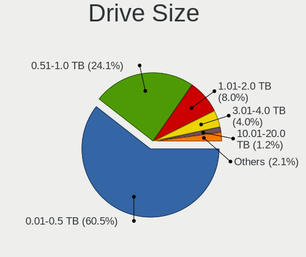
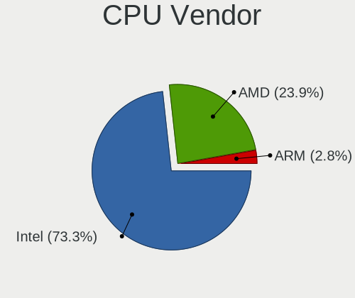
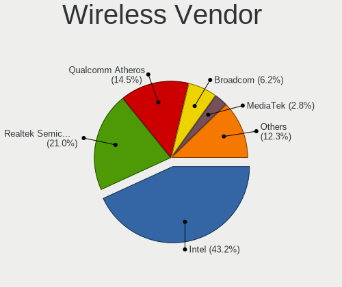
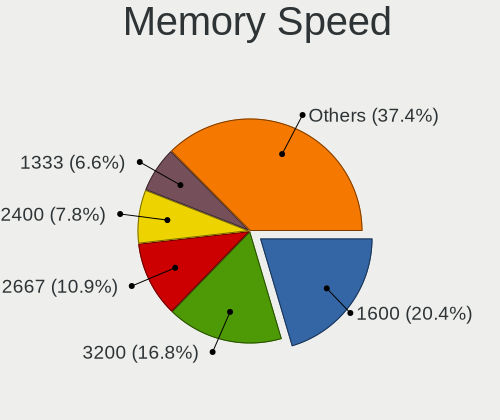

Xubuntu 22.04 - Tested Hardware & Statistics
--------------------------------------------

A project to collect tested hardware configurations for Xubuntu 22.04.

Anyone can contribute to this report by the [hw-probe](https://github.com/linuxhw/hw-probe) tool:

    sudo -E hw-probe -all -upload

Please contribute! Especially if your hardware is rare.

This is a report for all computer types. See also reports for [desktops](/Dist/Xubuntu_22.04/Desktop/README.md) and [notebooks](/Dist/Xubuntu_22.04/Notebook/README.md).

Contents
--------

* [ Test Cases ](#test-cases)

* [ System ](#system)
  - [ Kernel                   ](#kernel)
  - [ Kernel Family            ](#kernel-family)
  - [ Kernel Major Ver.        ](#kernel-major-ver)
  - [ Arch                     ](#arch)
  - [ DE                       ](#de)
  - [ Display Server           ](#display-server)
  - [ Display Manager          ](#display-manager)
  - [ OS Lang                  ](#os-lang)
  - [ Boot Mode                ](#boot-mode)
  - [ Filesystem               ](#filesystem)
  - [ Part. scheme             ](#part-scheme)
  - [ Dual Boot with Linux/BSD ](#dual-boot-with-linuxbsd)
  - [ Dual Boot (Win)          ](#dual-boot-win)

* [ Board ](#board)
  - [ Vendor                   ](#vendor)
  - [ Model                    ](#model)
  - [ Model Family             ](#model-family)
  - [ MFG Year                 ](#mfg-year)
  - [ Form Factor              ](#form-factor)
  - [ Secure Boot              ](#secure-boot)
  - [ Coreboot                 ](#coreboot)
  - [ RAM Size                 ](#ram-size)
  - [ RAM Used                 ](#ram-used)
  - [ Total Drives             ](#total-drives)
  - [ Has CD-ROM               ](#has-cd-rom)
  - [ Has Ethernet             ](#has-ethernet)
  - [ Has WiFi                 ](#has-wifi)
  - [ Has Bluetooth            ](#has-bluetooth)

* [ Location ](#location)
  - [ Country                  ](#country)
  - [ City                     ](#city)

* [ Drives ](#drives)
  - [ Drive Vendor             ](#drive-vendor)
  - [ Drive Model              ](#drive-model)
  - [ HDD Vendor               ](#hdd-vendor)
  - [ SSD Vendor               ](#ssd-vendor)
  - [ Drive Kind               ](#drive-kind)
  - [ Drive Connector          ](#drive-connector)
  - [ Drive Size               ](#drive-size)
  - [ Space Total              ](#space-total)
  - [ Space Used               ](#space-used)
  - [ Malfunc. Drives          ](#malfunc-drives)
  - [ Malfunc. Drive Vendor    ](#malfunc-drive-vendor)
  - [ Malfunc. HDD Vendor      ](#malfunc-hdd-vendor)
  - [ Malfunc. Drive Kind      ](#malfunc-drive-kind)
  - [ Failed Drives            ](#failed-drives)
  - [ Failed Drive Vendor      ](#failed-drive-vendor)
  - [ Drive Status             ](#drive-status)

* [ Storage controller ](#storage-controller)
  - [ Storage Vendor           ](#storage-vendor)
  - [ Storage Model            ](#storage-model)
  - [ Storage Kind             ](#storage-kind)

* [ Processor ](#processor)
  - [ CPU Vendor               ](#cpu-vendor)
  - [ CPU Model                ](#cpu-model)
  - [ CPU Model Family         ](#cpu-model-family)
  - [ CPU Cores                ](#cpu-cores)
  - [ CPU Sockets              ](#cpu-sockets)
  - [ CPU Threads              ](#cpu-threads)
  - [ CPU Op-Modes             ](#cpu-op-modes)
  - [ CPU Microcode            ](#cpu-microcode)
  - [ CPU Microarch            ](#cpu-microarch)

* [ Graphics ](#graphics)
  - [ GPU Vendor               ](#gpu-vendor)
  - [ GPU Model                ](#gpu-model)
  - [ GPU Combo                ](#gpu-combo)
  - [ GPU Driver               ](#gpu-driver)
  - [ GPU Memory               ](#gpu-memory)

* [ Monitor ](#monitor)
  - [ Monitor Vendor           ](#monitor-vendor)
  - [ Monitor Model            ](#monitor-model)
  - [ Monitor Resolution       ](#monitor-resolution)
  - [ Monitor Diagonal         ](#monitor-diagonal)
  - [ Monitor Width            ](#monitor-width)
  - [ Aspect Ratio             ](#aspect-ratio)
  - [ Monitor Area             ](#monitor-area)
  - [ Pixel Density            ](#pixel-density)
  - [ Multiple Monitors        ](#multiple-monitors)

* [ Network ](#network)
  - [ Net Controller Vendor    ](#net-controller-vendor)
  - [ Net Controller Model     ](#net-controller-model)
  - [ Wireless Vendor          ](#wireless-vendor)
  - [ Wireless Model           ](#wireless-model)
  - [ Ethernet Vendor          ](#ethernet-vendor)
  - [ Ethernet Model           ](#ethernet-model)
  - [ Net Controller Kind      ](#net-controller-kind)
  - [ Used Controller          ](#used-controller)
  - [ NICs                     ](#nics)
  - [ IPv6                     ](#ipv6)

* [ Bluetooth ](#bluetooth)
  - [ Bluetooth Vendor         ](#bluetooth-vendor)
  - [ Bluetooth Model          ](#bluetooth-model)

* [ Sound ](#sound)
  - [ Sound Vendor             ](#sound-vendor)
  - [ Sound Model              ](#sound-model)

* [ Memory ](#memory)
  - [ Memory Vendor            ](#memory-vendor)
  - [ Memory Model             ](#memory-model)
  - [ Memory Kind              ](#memory-kind)
  - [ Memory Form Factor       ](#memory-form-factor)
  - [ Memory Size              ](#memory-size)
  - [ Memory Speed             ](#memory-speed)

* [ Printers & scanners ](#printers--scanners)
  - [ Printer Vendor           ](#printer-vendor)
  - [ Printer Model            ](#printer-model)
  - [ Scanner Vendor           ](#scanner-vendor)
  - [ Scanner Model            ](#scanner-model)

* [ Camera ](#camera)
  - [ Camera Vendor            ](#camera-vendor)
  - [ Camera Model             ](#camera-model)

* [ Security ](#security)
  - [ Fingerprint Vendor       ](#fingerprint-vendor)
  - [ Fingerprint Model        ](#fingerprint-model)
  - [ Chipcard Vendor          ](#chipcard-vendor)
  - [ Chipcard Model           ](#chipcard-model)

* [ Unsupported ](#unsupported)
  - [ Unsupported Devices      ](#unsupported-devices)
  - [ Unsupported Device Types ](#unsupported-device-types)

Test Cases
----------

Total: 498

| Vendor        | Model                       | Form-Factor | Probe                                                      | Date         |
|---------------|-----------------------------|-------------|------------------------------------------------------------|--------------|
| Intel         | NUC11PABi7 K90104-305       | Mini pc     | [f7cdc4223d](https://linux-hardware.org/?probe=f7cdc4223d) | Apr 01, 2023 |
| ASUSTek       | ROG STRIX B360-F GAMING     | Desktop     | [8bc61e0fcd](https://linux-hardware.org/?probe=8bc61e0fcd) | Mar 31, 2023 |
| ASUSTek       | ROG STRIX B360-F GAMING     | Desktop     | [0f26b74917](https://linux-hardware.org/?probe=0f26b74917) | Mar 30, 2023 |
| Medion        | S321X                       | Notebook    | [4c02136dda](https://linux-hardware.org/?probe=4c02136dda) | Mar 30, 2023 |
| Dell          | 0KWVT8 A02                  | Desktop     | [a46eb24b2a](https://linux-hardware.org/?probe=a46eb24b2a) | Mar 29, 2023 |
| MSI           | MS-AA8B 100                 | All in one  | [8f698075ee](https://linux-hardware.org/?probe=8f698075ee) | Mar 27, 2023 |
| Apple         | Mac-4B682C642B45593E iMa... | All in one  | [426c7d7939](https://linux-hardware.org/?probe=426c7d7939) | Mar 25, 2023 |
| HP            | EliteBook 6930p             | Notebook    | [da0d90d69f](https://linux-hardware.org/?probe=da0d90d69f) | Mar 25, 2023 |
| MSI           | H110M PRO-D                 | Desktop     | [a822425dcf](https://linux-hardware.org/?probe=a822425dcf) | Mar 25, 2023 |
| ASUSTek       | P5B-Deluxe                  | Desktop     | [3d8b7a6d89](https://linux-hardware.org/?probe=3d8b7a6d89) | Mar 25, 2023 |
| MSI           | H81M-E33                    | Desktop     | [47f031e68c](https://linux-hardware.org/?probe=47f031e68c) | Mar 25, 2023 |
| Dell          | 00V62H A00                  | Desktop     | [34d3fc12b2](https://linux-hardware.org/?probe=34d3fc12b2) | Mar 25, 2023 |
| Dell          | 00V62H A00                  | Desktop     | [f7aaf1dcd0](https://linux-hardware.org/?probe=f7aaf1dcd0) | Mar 25, 2023 |
| Unknown       | Unknown                     | Notebook    | [fb97269a4d](https://linux-hardware.org/?probe=fb97269a4d) | Mar 24, 2023 |
| Gigabyte      | AERO 15WV8                  | Notebook    | [379c88860a](https://linux-hardware.org/?probe=379c88860a) | Mar 23, 2023 |
| ASRock        | FM2A68M-DG3+                | Desktop     | [204b7c3324](https://linux-hardware.org/?probe=204b7c3324) | Mar 23, 2023 |
| Gigabyte      | B550 AORUS ELITE            | Desktop     | [bbd16627c2](https://linux-hardware.org/?probe=bbd16627c2) | Mar 22, 2023 |
| ASRock        | H270 Pro4                   | Desktop     | [01eb4c8ba5](https://linux-hardware.org/?probe=01eb4c8ba5) | Mar 22, 2023 |
| Gateway       | EC14 Series                 | Notebook    | [fdeb2e4e3b](https://linux-hardware.org/?probe=fdeb2e4e3b) | Mar 22, 2023 |
| Getac         | F110G3                      | Notebook    | [792ac98040](https://linux-hardware.org/?probe=792ac98040) | Mar 22, 2023 |
| HP            | EliteBook 725 G2            | Notebook    | [5112f86dde](https://linux-hardware.org/?probe=5112f86dde) | Mar 21, 2023 |
| ASRock        | Z390M-ITX/ac                | Desktop     | [5c07e530e9](https://linux-hardware.org/?probe=5c07e530e9) | Mar 21, 2023 |
| ASRock        | FM2A68M-DG3+                | Desktop     | [00b550c606](https://linux-hardware.org/?probe=00b550c606) | Mar 18, 2023 |
| Gateway       | EC14 Series                 | Notebook    | [c6ea9d7f10](https://linux-hardware.org/?probe=c6ea9d7f10) | Mar 18, 2023 |
| Lenovo        | IdeaPad 5 15ABA7 82SG       | Notebook    | [182bd8cca1](https://linux-hardware.org/?probe=182bd8cca1) | Mar 16, 2023 |
| MSI           | H81M-E34                    | Desktop     | [4cad3cfe12](https://linux-hardware.org/?probe=4cad3cfe12) | Mar 14, 2023 |
| Lenovo        | ThinkPad E15 20RES05U00     | Notebook    | [7047c529ef](https://linux-hardware.org/?probe=7047c529ef) | Mar 13, 2023 |
| Apple         | Mac-4B682C642B45593E iMa... | All in one  | [a6af61dfb4](https://linux-hardware.org/?probe=a6af61dfb4) | Mar 13, 2023 |
| Google        | Kefka                       | Notebook    | [58abcf00e9](https://linux-hardware.org/?probe=58abcf00e9) | Mar 12, 2023 |
| HP            | 0A64h                       | Desktop     | [d5b197e7f2](https://linux-hardware.org/?probe=d5b197e7f2) | Mar 12, 2023 |
| HP            | 0A64h                       | Desktop     | [14de22ae05](https://linux-hardware.org/?probe=14de22ae05) | Mar 11, 2023 |
| Clevo         | W240EU/W250EUQ/W270EUQ      | Notebook    | [728697bff3](https://linux-hardware.org/?probe=728697bff3) | Mar 11, 2023 |
| Xunlong       | Orange Pi PC Plus           | Soc         | [ac565d5d7d](https://linux-hardware.org/?probe=ac565d5d7d) | Mar 11, 2023 |
| Lenovo        | G50-45 80E3                 | Notebook    | [e2b7d998d8](https://linux-hardware.org/?probe=e2b7d998d8) | Mar 11, 2023 |
| Lenovo        | ThinkPad T510 4384VJZ       | Notebook    | [d9c87b4795](https://linux-hardware.org/?probe=d9c87b4795) | Mar 11, 2023 |
| Foxconn       | ETON                        | Desktop     | [3a087bc020](https://linux-hardware.org/?probe=3a087bc020) | Mar 10, 2023 |
| Xunlong       | Orange Pi PC Plus           | Soc         | [ad41e0e370](https://linux-hardware.org/?probe=ad41e0e370) | Mar 09, 2023 |
| Gigabyte      | H81M-H                      | Desktop     | [6f915814dd](https://linux-hardware.org/?probe=6f915814dd) | Mar 08, 2023 |
| Gigabyte      | H81M-H                      | Desktop     | [5fdd1701df](https://linux-hardware.org/?probe=5fdd1701df) | Mar 08, 2023 |
| Foxconn       | ETON                        | Desktop     | [2afed9b076](https://linux-hardware.org/?probe=2afed9b076) | Mar 08, 2023 |
| Lenovo        | 313C SDK0J40697 WIN 3305... | Desktop     | [44509323b0](https://linux-hardware.org/?probe=44509323b0) | Mar 08, 2023 |
| GPU Compan... | GWTN156-5                   | Notebook    | [2d093cc3ef](https://linux-hardware.org/?probe=2d093cc3ef) | Mar 08, 2023 |
| GPU Compan... | GWTN156-5                   | Notebook    | [57d690358f](https://linux-hardware.org/?probe=57d690358f) | Mar 08, 2023 |
| HP            | ProLiant MicroServer        | Desktop     | [32dedf99a8](https://linux-hardware.org/?probe=32dedf99a8) | Mar 07, 2023 |
| Gigabyte      | B550 AORUS ELITE            | Desktop     | [5bd9a1c0d2](https://linux-hardware.org/?probe=5bd9a1c0d2) | Mar 07, 2023 |
| Toshiba       | Satellite C55D-B            | Notebook    | [963b41587c](https://linux-hardware.org/?probe=963b41587c) | Mar 07, 2023 |
| Acer          | Aspire ES1-572              | Notebook    | [a3dbc9b45e](https://linux-hardware.org/?probe=a3dbc9b45e) | Mar 07, 2023 |
| Lenovo        | G50-45 80E3                 | Notebook    | [ade979391f](https://linux-hardware.org/?probe=ade979391f) | Mar 07, 2023 |
| Lenovo        | IdeaPad 5 15ABA7 82SG       | Notebook    | [9404cddcdf](https://linux-hardware.org/?probe=9404cddcdf) | Mar 07, 2023 |
| MSI           | PRO Z790-A WIFI             | Desktop     | [439ec46914](https://linux-hardware.org/?probe=439ec46914) | Mar 05, 2023 |
| ASUSTek       | PRIME Z270-A                | Desktop     | [ec9c2f21a5](https://linux-hardware.org/?probe=ec9c2f21a5) | Mar 05, 2023 |
| Radxa         | ROCK Pi 4C+                 | Soc         | [e513434675](https://linux-hardware.org/?probe=e513434675) | Mar 04, 2023 |
| Radxa         | ROCK Pi 4C+                 | Soc         | [5c3d9047bd](https://linux-hardware.org/?probe=5c3d9047bd) | Mar 04, 2023 |
| Acer          | Aspire A315-43              | Notebook    | [c9efc71e60](https://linux-hardware.org/?probe=c9efc71e60) | Mar 04, 2023 |
| OEM           | Unknown                     | Desktop     | [d0f1ae246c](https://linux-hardware.org/?probe=d0f1ae246c) | Mar 03, 2023 |
| ASUSTek       | PRIME Z270-A                | Desktop     | [e367c45f3b](https://linux-hardware.org/?probe=e367c45f3b) | Mar 03, 2023 |
| Fujitsu       | D3223-A1 S26361-D3223-A1    | Desktop     | [c803be2765](https://linux-hardware.org/?probe=c803be2765) | Mar 02, 2023 |
| Google        | Nautilus                    | Convertible | [5aff7271ac](https://linux-hardware.org/?probe=5aff7271ac) | Mar 02, 2023 |
| AZW           | GTR V01                     | Mini pc     | [09e66839c3](https://linux-hardware.org/?probe=09e66839c3) | Mar 01, 2023 |
| ASUSTek       | P5KC                        | Desktop     | [45f781ee3a](https://linux-hardware.org/?probe=45f781ee3a) | Feb 28, 2023 |
| Acer          | Aspire 5740                 | Notebook    | [de0d12baa4](https://linux-hardware.org/?probe=de0d12baa4) | Feb 27, 2023 |
| HP            | 655                         | Notebook    | [e6b694526e](https://linux-hardware.org/?probe=e6b694526e) | Feb 26, 2023 |
| Lenovo        | ThinkPad T430u 3353A11      | Notebook    | [3f35f45bf0](https://linux-hardware.org/?probe=3f35f45bf0) | Feb 26, 2023 |
| Gigabyte      | MZBSWBP-00                  | Desktop     | [525ac20362](https://linux-hardware.org/?probe=525ac20362) | Feb 26, 2023 |
| HP            | EliteBook 820 G3            | Notebook    | [75a0fcca48](https://linux-hardware.org/?probe=75a0fcca48) | Feb 25, 2023 |
| HONOR         | BMH-WCX9                    | Notebook    | [634b80ac90](https://linux-hardware.org/?probe=634b80ac90) | Feb 24, 2023 |
| Dell          | Latitude E5470              | Notebook    | [d7c8a049c4](https://linux-hardware.org/?probe=d7c8a049c4) | Feb 24, 2023 |
| MSI           | C847MS-E33                  | Desktop     | [698d950f05](https://linux-hardware.org/?probe=698d950f05) | Feb 24, 2023 |
| Dell          | 0YC03K A03                  | Desktop     | [0101ef8ce7](https://linux-hardware.org/?probe=0101ef8ce7) | Feb 23, 2023 |
| Dell          | Studio 1450                 | Notebook    | [c26228f66f](https://linux-hardware.org/?probe=c26228f66f) | Feb 22, 2023 |
| HP            | Pavilion 15                 | Notebook    | [c33178dcdc](https://linux-hardware.org/?probe=c33178dcdc) | Feb 21, 2023 |
| Lenovo        | Yoga 7 16IAH7 82UF          | Convertible | [c9adb74693](https://linux-hardware.org/?probe=c9adb74693) | Feb 21, 2023 |
| Lenovo        | IdeaPad 320-15IKB 80YH      | Notebook    | [7ac4bb7d51](https://linux-hardware.org/?probe=7ac4bb7d51) | Feb 20, 2023 |
| Lenovo        | IdeaPad 320-15IKB 80YH      | Notebook    | [19e03ac7b2](https://linux-hardware.org/?probe=19e03ac7b2) | Feb 20, 2023 |
| Apple         | Mac-F2238BAE iMac11,3       | All in one  | [51cf60bd9b](https://linux-hardware.org/?probe=51cf60bd9b) | Feb 18, 2023 |
| Sony          | VPCEA3S1E                   | Notebook    | [45d0b9a823](https://linux-hardware.org/?probe=45d0b9a823) | Feb 18, 2023 |
| Intel         | X79                         | Desktop     | [28c9b2590c](https://linux-hardware.org/?probe=28c9b2590c) | Feb 18, 2023 |
| Intel         | X79                         | Desktop     | [89c51847f9](https://linux-hardware.org/?probe=89c51847f9) | Feb 18, 2023 |
| Gigabyte      | Z170XP-SLI-CF               | Desktop     | [8338ee5a0d](https://linux-hardware.org/?probe=8338ee5a0d) | Feb 17, 2023 |
| Gigabyte      | H410M S2 V3                 | Desktop     | [0dbeeea38c](https://linux-hardware.org/?probe=0dbeeea38c) | Feb 16, 2023 |
| MSI           | X370 GAMING PRO CARBON      | Desktop     | [e1bbf14222](https://linux-hardware.org/?probe=e1bbf14222) | Feb 16, 2023 |
| MSI           | X370 GAMING PRO CARBON      | Desktop     | [ba96494c0f](https://linux-hardware.org/?probe=ba96494c0f) | Feb 16, 2023 |
| MSI           | PRO Z690-A WIFI DDR4        | Desktop     | [40c415883e](https://linux-hardware.org/?probe=40c415883e) | Feb 16, 2023 |
| HP            | Pavilion g6                 | Notebook    | [8a53743bd0](https://linux-hardware.org/?probe=8a53743bd0) | Feb 15, 2023 |
| Daten Tecn... | DCM4D-4 v4                  | Notebook    | [d576d16c25](https://linux-hardware.org/?probe=d576d16c25) | Feb 14, 2023 |
| Gigabyte      | B550 AORUS ELITE            | Desktop     | [21ad600245](https://linux-hardware.org/?probe=21ad600245) | Feb 14, 2023 |
| Lenovo        | ThinkPad P16s Gen 1 21CK... | Notebook    | [25dbf25c62](https://linux-hardware.org/?probe=25dbf25c62) | Feb 14, 2023 |
| ASRock        | AOD790GX/128M               | Desktop     | [693f4f40f8](https://linux-hardware.org/?probe=693f4f40f8) | Feb 13, 2023 |
| HP            | Compaq nc6400 (RM741PA#A... | Notebook    | [d556bf453d](https://linux-hardware.org/?probe=d556bf453d) | Feb 13, 2023 |
| Toshiba       | Satellite Pro R50-B         | Notebook    | [0634db3367](https://linux-hardware.org/?probe=0634db3367) | Feb 13, 2023 |
| Dell          | Inspiron 5490               | Notebook    | [f840248d22](https://linux-hardware.org/?probe=f840248d22) | Feb 13, 2023 |
| Dell          | Latitude E5450              | Notebook    | [693f8c9c36](https://linux-hardware.org/?probe=693f8c9c36) | Feb 11, 2023 |
| Rockchip      | Orange Pi 5                 | Soc         | [59a015c31d](https://linux-hardware.org/?probe=59a015c31d) | Feb 11, 2023 |
| Gigabyte      | GA-A75-UD4H                 | Desktop     | [eb4302c6dd](https://linux-hardware.org/?probe=eb4302c6dd) | Feb 10, 2023 |
| Acer          | Extensa 5635ZG              | Notebook    | [dd22b216a9](https://linux-hardware.org/?probe=dd22b216a9) | Feb 08, 2023 |
| HONOR         | NMH-WCX9                    | Notebook    | [d5bb6335d4](https://linux-hardware.org/?probe=d5bb6335d4) | Feb 08, 2023 |
| Acer          | Aspire E5-572G              | Notebook    | [f44e9ce856](https://linux-hardware.org/?probe=f44e9ce856) | Feb 08, 2023 |
| Lenovo        | ThinkPad T15 Gen 1 20S6C... | Notebook    | [262dfe3aa9](https://linux-hardware.org/?probe=262dfe3aa9) | Feb 05, 2023 |
| HP            | 250 G7 Notebook PC          | Notebook    | [9c9aa5e0e0](https://linux-hardware.org/?probe=9c9aa5e0e0) | Feb 03, 2023 |
| HP            | 240 G3                      | Notebook    | [43e56d3ae5](https://linux-hardware.org/?probe=43e56d3ae5) | Feb 03, 2023 |
| HP            | 250 G7 Notebook PC          | Notebook    | [ccf7f4d126](https://linux-hardware.org/?probe=ccf7f4d126) | Feb 03, 2023 |
| HP            | Compaq Presario CQ60        | Notebook    | [c6d48c9847](https://linux-hardware.org/?probe=c6d48c9847) | Feb 03, 2023 |
| HP            | 250 G7 Notebook PC          | Notebook    | [fafb999b1a](https://linux-hardware.org/?probe=fafb999b1a) | Feb 03, 2023 |
| HP            | 250 G7 Notebook PC          | Notebook    | [50076364b8](https://linux-hardware.org/?probe=50076364b8) | Feb 03, 2023 |
| HP            | Pavilion Laptop 15-cc5xx    | Notebook    | [0211cbb448](https://linux-hardware.org/?probe=0211cbb448) | Feb 03, 2023 |
| HUAWEI        | NBD-WXX9                    | Notebook    | [17b77b89e5](https://linux-hardware.org/?probe=17b77b89e5) | Feb 03, 2023 |
| ECS           | SF20PA2                     | Notebook    | [30df19ca2e](https://linux-hardware.org/?probe=30df19ca2e) | Feb 02, 2023 |
| Dell          | 0HFG24 A02                  | Server      | [a05562bc52](https://linux-hardware.org/?probe=a05562bc52) | Feb 02, 2023 |
| Gigabyte      | MZBSWMP-00                  | Desktop     | [894f632950](https://linux-hardware.org/?probe=894f632950) | Feb 01, 2023 |
| Gigabyte      | B550 AORUS ELITE            | Desktop     | [3fac03d01d](https://linux-hardware.org/?probe=3fac03d01d) | Jan 30, 2023 |
| MSI           | PRO B660M-A DDR4            | Desktop     | [0f2037dcd8](https://linux-hardware.org/?probe=0f2037dcd8) | Jan 30, 2023 |
| ASUSTek       | SABERTOOTH 990FX            | Desktop     | [0e28b954b4](https://linux-hardware.org/?probe=0e28b954b4) | Jan 30, 2023 |
| ASUSTek       | SABERTOOTH 990FX            | Desktop     | [10421fe598](https://linux-hardware.org/?probe=10421fe598) | Jan 30, 2023 |
| Gigabyte      | X470 AORUS ULTRA GAMING-... | Desktop     | [6444a93633](https://linux-hardware.org/?probe=6444a93633) | Jan 29, 2023 |
| Lenovo        | ThinkPad P14s Gen 3 21AK... | Notebook    | [e4970ed713](https://linux-hardware.org/?probe=e4970ed713) | Jan 26, 2023 |
| ASUSTek       | X541UVK                     | Notebook    | [64810b20c3](https://linux-hardware.org/?probe=64810b20c3) | Jan 26, 2023 |
| Lenovo        | E41-25 81FS                 | Notebook    | [6de2ea7d90](https://linux-hardware.org/?probe=6de2ea7d90) | Jan 26, 2023 |
| Gigabyte      | B450M S2H                   | Desktop     | [058de08b2b](https://linux-hardware.org/?probe=058de08b2b) | Jan 24, 2023 |
| Acer          | Aspire 5920G                | Notebook    | [89a2c7dc0f](https://linux-hardware.org/?probe=89a2c7dc0f) | Jan 24, 2023 |
| Notebook      | W65_67SZ                    | Notebook    | [74d788dccb](https://linux-hardware.org/?probe=74d788dccb) | Jan 23, 2023 |
| Gigabyte      | B550 AORUS ELITE            | Desktop     | [7e91e49912](https://linux-hardware.org/?probe=7e91e49912) | Jan 23, 2023 |
| Gigabyte      | B550 AORUS ELITE            | Desktop     | [3324fafe5a](https://linux-hardware.org/?probe=3324fafe5a) | Jan 23, 2023 |
| MSI           | MPG B550 GAMING PLUS        | Desktop     | [b5e6a74fcb](https://linux-hardware.org/?probe=b5e6a74fcb) | Jan 22, 2023 |
| Lenovo        | ThinkPad E480 20KNCTO1WW    | Notebook    | [68ff3c02cb](https://linux-hardware.org/?probe=68ff3c02cb) | Jan 22, 2023 |
| Gigabyte      | 8I945GMF                    | Desktop     | [2971006e43](https://linux-hardware.org/?probe=2971006e43) | Jan 21, 2023 |
| Lenovo        | V15 G2 ALC 82KD             | Notebook    | [82c74e5cca](https://linux-hardware.org/?probe=82c74e5cca) | Jan 21, 2023 |
| Dell          | Venue 11 Pro 7139           | Notebook    | [6c3528d4c0](https://linux-hardware.org/?probe=6c3528d4c0) | Jan 20, 2023 |
| HP            | Stream Laptop 11-ah0XX      | Notebook    | [6c83597890](https://linux-hardware.org/?probe=6c83597890) | Jan 19, 2023 |
| Dell          | Inspiron N5110              | Notebook    | [fd8b8416ea](https://linux-hardware.org/?probe=fd8b8416ea) | Jan 19, 2023 |
| Acer          | Aspire A517-51G             | Notebook    | [80712a04ec](https://linux-hardware.org/?probe=80712a04ec) | Jan 18, 2023 |
| MSI           | B450 TOMAHAWK               | Desktop     | [d5ad4c9486](https://linux-hardware.org/?probe=d5ad4c9486) | Jan 17, 2023 |
| MSI           | MAG X570 TOMAHAWK WIFI      | Desktop     | [a49a3ddeaa](https://linux-hardware.org/?probe=a49a3ddeaa) | Jan 17, 2023 |
| ASUSTek       | UX305CA                     | Notebook    | [b831308d6c](https://linux-hardware.org/?probe=b831308d6c) | Jan 16, 2023 |
| Dell          | Latitude E6420              | Notebook    | [3594f88292](https://linux-hardware.org/?probe=3594f88292) | Jan 15, 2023 |
| Gigabyte      | B550M DS3H                  | Desktop     | [d667bf6bb2](https://linux-hardware.org/?probe=d667bf6bb2) | Jan 15, 2023 |
| Gigabyte      | X670 GAMING X AX            | Desktop     | [0277ea7e50](https://linux-hardware.org/?probe=0277ea7e50) | Jan 15, 2023 |
| Lenovo        | ThinkPad L14 Gen 2a 20X5... | Notebook    | [251a926c19](https://linux-hardware.org/?probe=251a926c19) | Jan 14, 2023 |
| Notebook      | NJx0MU                      | Notebook    | [b3711a9adc](https://linux-hardware.org/?probe=b3711a9adc) | Jan 13, 2023 |
| HP            | 873A A01                    | Mini pc     | [5c3be4e9aa](https://linux-hardware.org/?probe=5c3be4e9aa) | Jan 13, 2023 |
| Lenovo        | ThinkCentre M58 7373A5G     | Desktop     | [07a6ffe405](https://linux-hardware.org/?probe=07a6ffe405) | Jan 11, 2023 |
| ASUSTek       | X555YI                      | Notebook    | [4968e51e0b](https://linux-hardware.org/?probe=4968e51e0b) | Jan 10, 2023 |
| Acer          | Veriton N2620G              | Desktop     | [6345424cff](https://linux-hardware.org/?probe=6345424cff) | Jan 07, 2023 |
| Samsung       | 350V5C/350V5X/350V4C/350... | Notebook    | [daca90b2bb](https://linux-hardware.org/?probe=daca90b2bb) | Jan 05, 2023 |
| Samsung       | 350V5C/350V5X/350V4C/350... | Notebook    | [74bacb92f5](https://linux-hardware.org/?probe=74bacb92f5) | Jan 05, 2023 |
| Gigabyte      | Z87N-WIFI                   | Desktop     | [ef5e737fd6](https://linux-hardware.org/?probe=ef5e737fd6) | Jan 04, 2023 |
| MiPi PC       | Mini PC                     | Mini pc     | [776c827bdb](https://linux-hardware.org/?probe=776c827bdb) | Jan 03, 2023 |
| Gigabyte      | J1800N-D2H                  | Desktop     | [f809473b20](https://linux-hardware.org/?probe=f809473b20) | Jan 03, 2023 |
| Gigabyte      | B550 GAMING X V2            | Desktop     | [da1db1e278](https://linux-hardware.org/?probe=da1db1e278) | Jan 02, 2023 |
| HP            | Laptop 17-bs0xx             | Notebook    | [f1494f113b](https://linux-hardware.org/?probe=f1494f113b) | Jan 01, 2023 |
| Acer          | Aspire ES1-131              | Notebook    | [79d4fe0592](https://linux-hardware.org/?probe=79d4fe0592) | Jan 01, 2023 |
| Acer          | Aspire ES1-131              | Notebook    | [aeb6ecee74](https://linux-hardware.org/?probe=aeb6ecee74) | Jan 01, 2023 |
| Unknown       | Intel X79                   | Desktop     | [f26c05e261](https://linux-hardware.org/?probe=f26c05e261) | Dec 31, 2022 |
| Dell          | Latitude E5440              | Notebook    | [9578ad1ea3](https://linux-hardware.org/?probe=9578ad1ea3) | Dec 31, 2022 |
| ASUSTek       | PRIME B450M-K               | Desktop     | [cc1d0776d5](https://linux-hardware.org/?probe=cc1d0776d5) | Dec 30, 2022 |
| Lenovo        | ChiefRiver                  | Desktop     | [847a9e86cd](https://linux-hardware.org/?probe=847a9e86cd) | Dec 30, 2022 |
| HP            | 1998                        | Desktop     | [c3404205e3](https://linux-hardware.org/?probe=c3404205e3) | Dec 29, 2022 |
| HP            | Pavilion 17                 | Notebook    | [4a8c3f4014](https://linux-hardware.org/?probe=4a8c3f4014) | Dec 29, 2022 |
| Acer          | Nitro AN515-55              | Notebook    | [79f628b951](https://linux-hardware.org/?probe=79f628b951) | Dec 29, 2022 |
| HP            | Pavilion 15                 | Notebook    | [15ec0001c5](https://linux-hardware.org/?probe=15ec0001c5) | Dec 29, 2022 |
| HP            | Pavilion 15                 | Notebook    | [e84551a6eb](https://linux-hardware.org/?probe=e84551a6eb) | Dec 29, 2022 |
| HP            | Compaq Presario C700        | Notebook    | [20a055c383](https://linux-hardware.org/?probe=20a055c383) | Dec 29, 2022 |
| Lenovo        | ThinkPad X230 23252S4       | Notebook    | [667dcc287e](https://linux-hardware.org/?probe=667dcc287e) | Dec 28, 2022 |
| HP            | Compaq Presario C700        | Notebook    | [a4d55d44ed](https://linux-hardware.org/?probe=a4d55d44ed) | Dec 28, 2022 |
| Dell          | 040DDP A01                  | Desktop     | [3548fd618d](https://linux-hardware.org/?probe=3548fd618d) | Dec 28, 2022 |
| HIGRADED      | W651UI                      | Notebook    | [66d9d484cd](https://linux-hardware.org/?probe=66d9d484cd) | Dec 27, 2022 |
| Acer          | Veriton NBU                 | Desktop     | [cca454d1bd](https://linux-hardware.org/?probe=cca454d1bd) | Dec 26, 2022 |
| MSI           | Z390-A PRO                  | Desktop     | [9bfeb5727a](https://linux-hardware.org/?probe=9bfeb5727a) | Dec 26, 2022 |
| Toshiba       | Satellite C650              | Notebook    | [89b85889f9](https://linux-hardware.org/?probe=89b85889f9) | Dec 25, 2022 |
| ASRock        | N3700-ITX                   | Desktop     | [dc3f0d5062](https://linux-hardware.org/?probe=dc3f0d5062) | Dec 25, 2022 |
| HP            | Laptop 15-bw0xx             | Notebook    | [3bf8001e85](https://linux-hardware.org/?probe=3bf8001e85) | Dec 24, 2022 |
| HP            | Laptop 15-bw0xx             | Notebook    | [8a5bfa5e66](https://linux-hardware.org/?probe=8a5bfa5e66) | Dec 24, 2022 |
| Lenovo        | ThinkBook 14 G2 ITL 20VD    | Notebook    | [af18889189](https://linux-hardware.org/?probe=af18889189) | Dec 23, 2022 |
| ASUSTek       | G60JX                       | Notebook    | [5e9b0bb890](https://linux-hardware.org/?probe=5e9b0bb890) | Dec 23, 2022 |
| ASRock        | A320M-HDV R4.0              | Desktop     | [41ec48c0e5](https://linux-hardware.org/?probe=41ec48c0e5) | Dec 23, 2022 |
| ASUSTek       | X555LF                      | Notebook    | [bed000b293](https://linux-hardware.org/?probe=bed000b293) | Dec 22, 2022 |
| HP            | 81C9                        | Desktop     | [cb40ddba01](https://linux-hardware.org/?probe=cb40ddba01) | Dec 22, 2022 |
| Acer          | Aspire A114-31              | Notebook    | [850c0c4a65](https://linux-hardware.org/?probe=850c0c4a65) | Dec 22, 2022 |
| Dell          | Latitude E5450              | Notebook    | [652099945b](https://linux-hardware.org/?probe=652099945b) | Dec 21, 2022 |
| Google        | Auron_Yuna                  | Notebook    | [827696b95a](https://linux-hardware.org/?probe=827696b95a) | Dec 21, 2022 |
| HP            | 8594                        | Desktop     | [de0b36257e](https://linux-hardware.org/?probe=de0b36257e) | Dec 21, 2022 |
| Acer          | Aspire 7730ZG               | Notebook    | [bf9325456e](https://linux-hardware.org/?probe=bf9325456e) | Dec 20, 2022 |
| PCWare        | IPMH81G1                    | Desktop     | [3dc25592eb](https://linux-hardware.org/?probe=3dc25592eb) | Dec 20, 2022 |
| Lenovo        | ThinkPad Edge E545 20B20... | Notebook    | [0293f9b7c3](https://linux-hardware.org/?probe=0293f9b7c3) | Dec 20, 2022 |
| ASUSTek       | M4A88T-M/USB3               | Desktop     | [52b5b53173](https://linux-hardware.org/?probe=52b5b53173) | Dec 19, 2022 |
| ASUSTek       | M4A88T-M/USB3               | Desktop     | [64972eb902](https://linux-hardware.org/?probe=64972eb902) | Dec 19, 2022 |
| Sony          | VPCS12V9E                   | Notebook    | [a353c5ef57](https://linux-hardware.org/?probe=a353c5ef57) | Dec 19, 2022 |
| ASUSTek       | ZenBook UX482EA_UX482EA     | Notebook    | [224bdb435d](https://linux-hardware.org/?probe=224bdb435d) | Dec 19, 2022 |
| ASUSTek       | K75VJ                       | Notebook    | [a1b40660b5](https://linux-hardware.org/?probe=a1b40660b5) | Dec 18, 2022 |
| Lenovo        | FLEX-14IWL Laptop 81SQ      | Convertible | [f64e5ab064](https://linux-hardware.org/?probe=f64e5ab064) | Dec 18, 2022 |
| Acer          | Aspire A317-51K             | Notebook    | [b02c6dccc2](https://linux-hardware.org/?probe=b02c6dccc2) | Dec 17, 2022 |
| Packard Be... | PT890-8237A                 | Desktop     | [bb9e8d2cd7](https://linux-hardware.org/?probe=bb9e8d2cd7) | Dec 17, 2022 |
| ASUSTek       | TUF B450-PLUS GAMING        | Desktop     | [fdb9e278dd](https://linux-hardware.org/?probe=fdb9e278dd) | Dec 16, 2022 |
| HUAWEI        | HVY-WXX9                    | Notebook    | [5c6f8cd52d](https://linux-hardware.org/?probe=5c6f8cd52d) | Dec 16, 2022 |
| HUAWEI        | HVY-WXX9                    | Notebook    | [87603a034e](https://linux-hardware.org/?probe=87603a034e) | Dec 15, 2022 |
| ECS           | CMPC                        | Notebook    | [53d853228f](https://linux-hardware.org/?probe=53d853228f) | Dec 14, 2022 |
| Acer          | Switch SW312-31             | Tablet      | [282ef194e5](https://linux-hardware.org/?probe=282ef194e5) | Dec 13, 2022 |
| ASUSTek       | ROG CROSSHAIR VIII DARK ... | Desktop     | [c62c8e69b0](https://linux-hardware.org/?probe=c62c8e69b0) | Dec 12, 2022 |
| HP            | Pavilion Laptop 15-cc5xx    | Notebook    | [0cc39aa03c](https://linux-hardware.org/?probe=0cc39aa03c) | Dec 12, 2022 |
| Microsoft     | Surface Pro 3               | Tablet      | [d65a8640af](https://linux-hardware.org/?probe=d65a8640af) | Dec 11, 2022 |
| HP            | 1497                        | Desktop     | [475049bb79](https://linux-hardware.org/?probe=475049bb79) | Dec 10, 2022 |
| Fusion5       | Lapbook T90B                | Notebook    | [73a67d82fd](https://linux-hardware.org/?probe=73a67d82fd) | Dec 10, 2022 |
| Lenovo        | 3140 SDK0J40697 WIN 3305... | Desktop     | [ef403a3962](https://linux-hardware.org/?probe=ef403a3962) | Dec 10, 2022 |
| HP            | 250 G5 Notebook PC          | Notebook    | [aca71547f1](https://linux-hardware.org/?probe=aca71547f1) | Dec 08, 2022 |
| ASUSTek       | PRIME A320M-K               | Desktop     | [ce802653d4](https://linux-hardware.org/?probe=ce802653d4) | Dec 07, 2022 |
| ASUSTek       | UX31E                       | Notebook    | [e0de9de530](https://linux-hardware.org/?probe=e0de9de530) | Dec 07, 2022 |
| ASUSTek       | PRIME A320M-K               | Desktop     | [e2e47d2d43](https://linux-hardware.org/?probe=e2e47d2d43) | Dec 06, 2022 |
| Apple         | MacBookPro8,1               | Notebook    | [af40c4e286](https://linux-hardware.org/?probe=af40c4e286) | Dec 03, 2022 |
| HP            | Pavilion dv9000 (RP919EA... | Notebook    | [dcdd31c3d5](https://linux-hardware.org/?probe=dcdd31c3d5) | Nov 30, 2022 |
| ASUSTek       | P8H61-M LX3                 | Desktop     | [87d3950072](https://linux-hardware.org/?probe=87d3950072) | Nov 30, 2022 |
| Lenovo        | IdeaPad Gaming 3 15ARH05... | Notebook    | [89e340c4ec](https://linux-hardware.org/?probe=89e340c4ec) | Nov 30, 2022 |
| MSI           | PRO Z690-A DDR4             | Desktop     | [bd30397e24](https://linux-hardware.org/?probe=bd30397e24) | Nov 29, 2022 |
| MSI           | PRO Z690-A DDR4             | Desktop     | [3b4f834c63](https://linux-hardware.org/?probe=3b4f834c63) | Nov 29, 2022 |
| ASRock        | H270M-ITX/ac                | Desktop     | [dfc381d411](https://linux-hardware.org/?probe=dfc381d411) | Nov 29, 2022 |
| ASUSTek       | TUF B450-PLUS GAMING        | Desktop     | [472530d650](https://linux-hardware.org/?probe=472530d650) | Nov 29, 2022 |
| Lenovo        | G50-80 80E5                 | Notebook    | [1387bf11ea](https://linux-hardware.org/?probe=1387bf11ea) | Nov 28, 2022 |
| Google        | Akemi                       | Notebook    | [89c466ffd4](https://linux-hardware.org/?probe=89c466ffd4) | Nov 28, 2022 |
| HP            | 255 G8 Notebook PC          | Notebook    | [97cf5008bb](https://linux-hardware.org/?probe=97cf5008bb) | Nov 27, 2022 |
| Acer          | Aspire E5-571G              | Notebook    | [7d6eeaf95c](https://linux-hardware.org/?probe=7d6eeaf95c) | Nov 26, 2022 |
| HUAWEI        | BOM-WXX9                    | Notebook    | [59a39475dd](https://linux-hardware.org/?probe=59a39475dd) | Nov 26, 2022 |
| Lenovo        | ThinkBook 15 G2 ITL 20VE    | Notebook    | [bc3563401b](https://linux-hardware.org/?probe=bc3563401b) | Nov 26, 2022 |
| Lenovo        | ThinkPad T430 23501K1       | Notebook    | [46ec8527f5](https://linux-hardware.org/?probe=46ec8527f5) | Nov 25, 2022 |
| sunxi         | LeMaker Banana Pi           | Soc         | [56f65f30b3](https://linux-hardware.org/?probe=56f65f30b3) | Nov 24, 2022 |
| Supermicro    | M12SWA-TF                   | Server      | [199ed733ad](https://linux-hardware.org/?probe=199ed733ad) | Nov 24, 2022 |
| Supermicro    | M12SWA-TF                   | Server      | [8eb4e40bf5](https://linux-hardware.org/?probe=8eb4e40bf5) | Nov 22, 2022 |
| Supermicro    | M12SWA-TF                   | Server      | [b1e3f41ed1](https://linux-hardware.org/?probe=b1e3f41ed1) | Nov 22, 2022 |
| Intel         | AB2L .A004                  | Mini pc     | [6124722e1f](https://linux-hardware.org/?probe=6124722e1f) | Nov 22, 2022 |
| Gigabyte      | A320M-S2H-CF                | Desktop     | [452417fa68](https://linux-hardware.org/?probe=452417fa68) | Nov 21, 2022 |
| Sony          | VPCEH25EN                   | Notebook    | [d9136e5b75](https://linux-hardware.org/?probe=d9136e5b75) | Nov 20, 2022 |
| HP            | 245 G8 Notebook PC          | Notebook    | [4d4f9a0e10](https://linux-hardware.org/?probe=4d4f9a0e10) | Nov 17, 2022 |
| ASUSTek       | M4A88TD-M/USB3              | Desktop     | [8ff2384625](https://linux-hardware.org/?probe=8ff2384625) | Nov 16, 2022 |
| MACHINIST     | X99-RS9 V2.0                | Desktop     | [c9a4863d1f](https://linux-hardware.org/?probe=c9a4863d1f) | Nov 15, 2022 |
| MSI           | PRO H610M-B DDR4            | Desktop     | [5ffe9844bd](https://linux-hardware.org/?probe=5ffe9844bd) | Nov 15, 2022 |
| HP            | 1495                        | Desktop     | [e29c423a17](https://linux-hardware.org/?probe=e29c423a17) | Nov 15, 2022 |
| HP            | ProBook 6450b               | Notebook    | [ee3a2a2ef8](https://linux-hardware.org/?probe=ee3a2a2ef8) | Nov 14, 2022 |
| HP            | Pavilion g6                 | Notebook    | [dc20b80b34](https://linux-hardware.org/?probe=dc20b80b34) | Nov 12, 2022 |
| HP            | EliteBook 840 G3            | Notebook    | [161b81845e](https://linux-hardware.org/?probe=161b81845e) | Nov 11, 2022 |
| ASUSTek       | P8H61-M LX PLUS R2.0        | Desktop     | [b042e75495](https://linux-hardware.org/?probe=b042e75495) | Nov 11, 2022 |
| VIT           | Aptio CRB                   | Mini pc     | [38f39ebccd](https://linux-hardware.org/?probe=38f39ebccd) | Nov 11, 2022 |
| VIT           | Aptio CRB                   | Mini pc     | [d3bbc5ba4f](https://linux-hardware.org/?probe=d3bbc5ba4f) | Nov 11, 2022 |
| Dell          | 0M5DCD A00                  | Desktop     | [ac93b84c08](https://linux-hardware.org/?probe=ac93b84c08) | Nov 10, 2022 |
| HP            | Pavilion g6                 | Notebook    | [9fa4176934](https://linux-hardware.org/?probe=9fa4176934) | Nov 09, 2022 |
| Dell          | 06FW8M A03                  | Server      | [2d4eead63b](https://linux-hardware.org/?probe=2d4eead63b) | Nov 08, 2022 |
| MSI           | A320M PRO-VH                | Desktop     | [70ba1bf558](https://linux-hardware.org/?probe=70ba1bf558) | Nov 08, 2022 |
| Lenovo        | IdeaPad 110-17ACL 80UM      | Notebook    | [0a1efcf166](https://linux-hardware.org/?probe=0a1efcf166) | Nov 08, 2022 |
| MSI           | PRO H610M-B DDR4            | Desktop     | [377df38ed7](https://linux-hardware.org/?probe=377df38ed7) | Nov 08, 2022 |
| MSI           | X370 GAMING PRO CARBON      | Desktop     | [2796faab6c](https://linux-hardware.org/?probe=2796faab6c) | Nov 08, 2022 |
| Lenovo        | ThinkPad T440p 20AN0033R... | Notebook    | [7ca892ad44](https://linux-hardware.org/?probe=7ca892ad44) | Nov 06, 2022 |
| Intel         | D525MW AAE93082-401         | Desktop     | [d37fe5f0b4](https://linux-hardware.org/?probe=d37fe5f0b4) | Nov 06, 2022 |
| Gigabyte      | Z77-DS3H                    | Desktop     | [e97900160b](https://linux-hardware.org/?probe=e97900160b) | Nov 05, 2022 |
| Apple         | Mac-F2268DAE                | All in one  | [2bf5248261](https://linux-hardware.org/?probe=2bf5248261) | Nov 05, 2022 |
| Lenovo        | IdeaPad 3 15ADA6 82KR       | Notebook    | [f1117abc19](https://linux-hardware.org/?probe=f1117abc19) | Nov 05, 2022 |
| Lenovo        | ThinkCentre M90p 3282A9G    | Desktop     | [f60040c1b7](https://linux-hardware.org/?probe=f60040c1b7) | Nov 05, 2022 |
| Lenovo        | ThinkCentre M90p 3282A9G    | Desktop     | [cd87b011a0](https://linux-hardware.org/?probe=cd87b011a0) | Nov 05, 2022 |
| Lenovo        | ThinkPad P51 20HH0014IX     | Notebook    | [e519495581](https://linux-hardware.org/?probe=e519495581) | Nov 04, 2022 |
| HP            | 8054                        | Desktop     | [0f1371d133](https://linux-hardware.org/?probe=0f1371d133) | Nov 03, 2022 |
| ASUSTek       | P8H61-M LX PLUS R2.0        | Desktop     | [423d3158cd](https://linux-hardware.org/?probe=423d3158cd) | Nov 03, 2022 |
| Dell          | Precision M6400             | Notebook    | [b98b318067](https://linux-hardware.org/?probe=b98b318067) | Nov 02, 2022 |
| Gigabyte      | 970A-DS3P                   | Desktop     | [65231808f8](https://linux-hardware.org/?probe=65231808f8) | Nov 02, 2022 |
| Acer          | Aspire one 1-431            | Notebook    | [09aeb9ec38](https://linux-hardware.org/?probe=09aeb9ec38) | Nov 02, 2022 |
| Lenovo        | Win8 STD MM DPK IPG         | All in one  | [37f3d75177](https://linux-hardware.org/?probe=37f3d75177) | Oct 31, 2022 |
| HP            | Pavilion Notebook           | Notebook    | [411f4cbf40](https://linux-hardware.org/?probe=411f4cbf40) | Oct 30, 2022 |
| Dell          | Inspiron 5490               | Notebook    | [bbea359211](https://linux-hardware.org/?probe=bbea359211) | Oct 28, 2022 |
| Dell          | Inspiron 3421               | Notebook    | [6ebaad0374](https://linux-hardware.org/?probe=6ebaad0374) | Oct 25, 2022 |
| ASUSTek       | TUF Gaming B550M-PLUS       | Desktop     | [3c65639aad](https://linux-hardware.org/?probe=3c65639aad) | Oct 25, 2022 |
| ASUSTek       | X555YI                      | Notebook    | [5d6562117a](https://linux-hardware.org/?probe=5d6562117a) | Oct 25, 2022 |
| ASUSTek       | K30AD_M31AD_M51AD_M32AD     | Desktop     | [7027921568](https://linux-hardware.org/?probe=7027921568) | Oct 25, 2022 |
| Intel         | DH61AG AAG23736-507         | Desktop     | [7fa3b3bc6a](https://linux-hardware.org/?probe=7fa3b3bc6a) | Oct 25, 2022 |
| Dell          | Inspiron 3421               | Notebook    | [d10106fb33](https://linux-hardware.org/?probe=d10106fb33) | Oct 24, 2022 |
| Hardkernel    | ODROID-H2                   | Desktop     | [6398e45c99](https://linux-hardware.org/?probe=6398e45c99) | Oct 24, 2022 |
| HP            | 15                          | Notebook    | [2831771472](https://linux-hardware.org/?probe=2831771472) | Oct 22, 2022 |
| MSI           | A320M PRO-VH                | Desktop     | [5f1aeaf170](https://linux-hardware.org/?probe=5f1aeaf170) | Oct 22, 2022 |
| ASUSTek       | VivoBook_ASUSLaptop X571... | Notebook    | [66418dda52](https://linux-hardware.org/?probe=66418dda52) | Oct 22, 2022 |
| ASUSTek       | Z97-P                       | Desktop     | [f5b8282e1f](https://linux-hardware.org/?probe=f5b8282e1f) | Oct 21, 2022 |
| ASUSTek       | N551ZU                      | Notebook    | [090ebd8eee](https://linux-hardware.org/?probe=090ebd8eee) | Oct 20, 2022 |
| Acer          | Predator PH517-61           | Notebook    | [6f191c90c1](https://linux-hardware.org/?probe=6f191c90c1) | Oct 20, 2022 |
| Acer          | Aspire ES1-331              | Notebook    | [f5ace96d5d](https://linux-hardware.org/?probe=f5ace96d5d) | Oct 19, 2022 |
| HP            | Pavilion Notebook           | Notebook    | [e09755f495](https://linux-hardware.org/?probe=e09755f495) | Oct 18, 2022 |
| Itautec       | ST 4273 ST-4273 Padrao 0... | Desktop     | [8c4af1707c](https://linux-hardware.org/?probe=8c4af1707c) | Oct 17, 2022 |
| MSI           | MS-7309                     | Desktop     | [9d4f0daf60](https://linux-hardware.org/?probe=9d4f0daf60) | Oct 16, 2022 |
| ASUSTek       | P8H67                       | Desktop     | [4f03e84827](https://linux-hardware.org/?probe=4f03e84827) | Oct 16, 2022 |
| Lenovo        | ThinkCentre M58 7373A5G     | Desktop     | [ed6ebf5f98](https://linux-hardware.org/?probe=ed6ebf5f98) | Oct 16, 2022 |
| HP            | 198E                        | Desktop     | [47439edd0e](https://linux-hardware.org/?probe=47439edd0e) | Oct 15, 2022 |
| Gigabyte      | G33M-DS2R                   | Desktop     | [a14ced18eb](https://linux-hardware.org/?probe=a14ced18eb) | Oct 15, 2022 |
| ASUSTek       | VivoBook_ASUSLaptop X509... | Notebook    | [d844ce4115](https://linux-hardware.org/?probe=d844ce4115) | Oct 13, 2022 |
| HP            | Stream Notebook PC 13       | Notebook    | [173cd34bf9](https://linux-hardware.org/?probe=173cd34bf9) | Oct 12, 2022 |
| Unknown       | Unknown                     | Notebook    | [a098b893f4](https://linux-hardware.org/?probe=a098b893f4) | Oct 11, 2022 |
| ASUSTek       | VivoBook_ASUSLaptop X513... | Notebook    | [e2deb8e15e](https://linux-hardware.org/?probe=e2deb8e15e) | Oct 11, 2022 |
| ASUSTek       | M5A97 EVO R2.0              | Desktop     | [c3513de476](https://linux-hardware.org/?probe=c3513de476) | Oct 11, 2022 |
| Dell          | 0WR7PY A03                  | Desktop     | [3598f82c1e](https://linux-hardware.org/?probe=3598f82c1e) | Oct 10, 2022 |
| Lenovo        | ThinkPad L520 5017AL3       | Notebook    | [2e43bb8a31](https://linux-hardware.org/?probe=2e43bb8a31) | Oct 10, 2022 |
| Lenovo        | MIIX 320-10ICR 80XF         | Tablet      | [6580d55237](https://linux-hardware.org/?probe=6580d55237) | Oct 09, 2022 |
| GPU Compan... | GWTN116-3                   | Notebook    | [caf9a63020](https://linux-hardware.org/?probe=caf9a63020) | Oct 08, 2022 |
| HP            | 1589                        | Desktop     | [d50afd3db1](https://linux-hardware.org/?probe=d50afd3db1) | Oct 08, 2022 |
| Lenovo        | ThinkPad T410 2537AF8       | Notebook    | [06dd00b171](https://linux-hardware.org/?probe=06dd00b171) | Oct 08, 2022 |
| Dell          | Latitude 5411               | Notebook    | [4bb05d639f](https://linux-hardware.org/?probe=4bb05d639f) | Oct 08, 2022 |
| Lenovo        | ThinkPad T460s 20FAS30L0... | Notebook    | [ea6a5c970c](https://linux-hardware.org/?probe=ea6a5c970c) | Oct 07, 2022 |
| Lenovo        | ThinkPad P17 Gen 2i 20YU... | Notebook    | [b67d9b67e4](https://linux-hardware.org/?probe=b67d9b67e4) | Oct 06, 2022 |
| ASUSTek       | ET1612I                     | Desktop     | [91fea00cbf](https://linux-hardware.org/?probe=91fea00cbf) | Oct 06, 2022 |
| GPU Compan... | GWTN116-3                   | Notebook    | [b838d87a4b](https://linux-hardware.org/?probe=b838d87a4b) | Oct 05, 2022 |
| Lenovo        | ThinkPad T14s Gen 2a 20X... | Notebook    | [0e52b51f87](https://linux-hardware.org/?probe=0e52b51f87) | Oct 05, 2022 |
| Lenovo        | IdeaPad N585 20179          | Notebook    | [dd6693ffa9](https://linux-hardware.org/?probe=dd6693ffa9) | Oct 05, 2022 |
| Lenovo        | IdeaPad 3 14IML05 81WA      | Notebook    | [986b3c962e](https://linux-hardware.org/?probe=986b3c962e) | Oct 04, 2022 |
| Dell          | Precision 7560              | Notebook    | [877583cc90](https://linux-hardware.org/?probe=877583cc90) | Oct 04, 2022 |
| ASUSTek       | ROG CROSSHAIR VIII DARK ... | Desktop     | [10e3123558](https://linux-hardware.org/?probe=10e3123558) | Oct 03, 2022 |
| Lenovo        | B70-80 80MR                 | Notebook    | [69aec9e100](https://linux-hardware.org/?probe=69aec9e100) | Oct 01, 2022 |
| HP            | Notebook                    | Notebook    | [fec2594d37](https://linux-hardware.org/?probe=fec2594d37) | Oct 01, 2022 |
| HP            | EliteBook 840 G3            | Notebook    | [ddf1904011](https://linux-hardware.org/?probe=ddf1904011) | Oct 01, 2022 |
| Lenovo        | ThinkPad E14 Gen 2 20TA0... | Notebook    | [025a55eab7](https://linux-hardware.org/?probe=025a55eab7) | Sep 30, 2022 |
| Lenovo        | ThinkPad E14 Gen 2 20TA0... | Notebook    | [875b1df312](https://linux-hardware.org/?probe=875b1df312) | Sep 30, 2022 |
| Sony          | SVE1512C6EB                 | Notebook    | [c47a3a5bd7](https://linux-hardware.org/?probe=c47a3a5bd7) | Sep 30, 2022 |
| Lenovo        | ThinkPad T420 42361L0       | Notebook    | [abe6563e67](https://linux-hardware.org/?probe=abe6563e67) | Sep 30, 2022 |
| Dell          | Latitude 5420               | Notebook    | [36ddd1d6d7](https://linux-hardware.org/?probe=36ddd1d6d7) | Sep 30, 2022 |
| Lenovo        | IdeaPad N585 20179          | Notebook    | [dcdafbbd9b](https://linux-hardware.org/?probe=dcdafbbd9b) | Sep 28, 2022 |
| HP            | Pavilion dv7                | Notebook    | [5479c35130](https://linux-hardware.org/?probe=5479c35130) | Sep 28, 2022 |
| Toshiba       | Satellite Pro R50-C         | Notebook    | [834ef0ec59](https://linux-hardware.org/?probe=834ef0ec59) | Sep 27, 2022 |
| Toshiba       | Satellite Pro R50-C         | Notebook    | [564d385b61](https://linux-hardware.org/?probe=564d385b61) | Sep 27, 2022 |
| Dell          | CS24-TY                     | Server      | [029e2bdb60](https://linux-hardware.org/?probe=029e2bdb60) | Sep 27, 2022 |
| MSI           | H170M PRO-VDH               | Desktop     | [f7254adff2](https://linux-hardware.org/?probe=f7254adff2) | Sep 25, 2022 |
| Toshiba       | Satellite C650              | Notebook    | [c7920c2e68](https://linux-hardware.org/?probe=c7920c2e68) | Sep 24, 2022 |
| Packard Be... | EasyNote MH45               | Notebook    | [c312580997](https://linux-hardware.org/?probe=c312580997) | Sep 24, 2022 |
| ASUSTek       | PRIME A320M-K               | Desktop     | [5588f73920](https://linux-hardware.org/?probe=5588f73920) | Sep 24, 2022 |
| ASUSTek       | PRIME A320M-K               | Desktop     | [a83e57d8c1](https://linux-hardware.org/?probe=a83e57d8c1) | Sep 23, 2022 |
| Tactus        | GeoBook 140                 | Notebook    | [7d8700d0e1](https://linux-hardware.org/?probe=7d8700d0e1) | Sep 23, 2022 |
| Dell          | Latitude 5411               | Notebook    | [018a9c569a](https://linux-hardware.org/?probe=018a9c569a) | Sep 23, 2022 |
| HP            | EliteBook 840 G3            | Notebook    | [c3a88ed62d](https://linux-hardware.org/?probe=c3a88ed62d) | Sep 22, 2022 |
| Lenovo        | ThinkPad T61 7659AB7        | Notebook    | [aa07f9c271](https://linux-hardware.org/?probe=aa07f9c271) | Sep 20, 2022 |
| ASUSTek       | A68HM-K                     | Desktop     | [966ae734c2](https://linux-hardware.org/?probe=966ae734c2) | Sep 20, 2022 |
| Lenovo        | ThinkPad T61p 6457A24       | Notebook    | [d98e9a64bd](https://linux-hardware.org/?probe=d98e9a64bd) | Sep 20, 2022 |
| Lenovo        | ThinkPad X220 42918F6       | Notebook    | [69dda668fc](https://linux-hardware.org/?probe=69dda668fc) | Sep 18, 2022 |
| Raspberry ... | Raspberry Pi 4 Model B R... | Soc         | [e2b4056812](https://linux-hardware.org/?probe=e2b4056812) | Sep 18, 2022 |
| ASRock        | 960GC-GS FX                 | Desktop     | [3e40742ff0](https://linux-hardware.org/?probe=3e40742ff0) | Sep 18, 2022 |
| Acer          | Swift SF314-511             | Notebook    | [914d532c78](https://linux-hardware.org/?probe=914d532c78) | Sep 17, 2022 |
| ASUSTek       | ET1612I                     | Desktop     | [0ddd9554cc](https://linux-hardware.org/?probe=0ddd9554cc) | Sep 16, 2022 |
| Pine Micro... | Pine64 Rock64               | Soc         | [dbd6ac01d6](https://linux-hardware.org/?probe=dbd6ac01d6) | Sep 16, 2022 |
| ASUSTek       | PRIME H310M-D R2.0          | Desktop     | [588c189149](https://linux-hardware.org/?probe=588c189149) | Sep 16, 2022 |
| ASUSTek       | PRIME H310M-D R2.0          | Desktop     | [4b94d21772](https://linux-hardware.org/?probe=4b94d21772) | Sep 16, 2022 |
| Dell          | Latitude 7490               | Notebook    | [ce54bcd741](https://linux-hardware.org/?probe=ce54bcd741) | Sep 15, 2022 |
| Dell          | Inspiron 3576               | Notebook    | [02023473b8](https://linux-hardware.org/?probe=02023473b8) | Sep 15, 2022 |
| ASUSTek       | Maximus VII HERO            | Desktop     | [6d40add21a](https://linux-hardware.org/?probe=6d40add21a) | Sep 15, 2022 |
| Dell          | Latitude 7420               | Convertible | [5d119f6255](https://linux-hardware.org/?probe=5d119f6255) | Sep 14, 2022 |
| Dell          | 0DR845                      | Desktop     | [158b3832bc](https://linux-hardware.org/?probe=158b3832bc) | Sep 13, 2022 |
| Dell          | Precision 5540              | Notebook    | [229337f709](https://linux-hardware.org/?probe=229337f709) | Sep 13, 2022 |
| ASUSTek       | K30BD                       | Desktop     | [d6daf0e1f8](https://linux-hardware.org/?probe=d6daf0e1f8) | Sep 13, 2022 |
| ASUSTek       | H61M-C                      | Desktop     | [bb07dfab63](https://linux-hardware.org/?probe=bb07dfab63) | Sep 13, 2022 |
| ASRock        | N68-S3 UCC                  | Desktop     | [e59aa2e1d5](https://linux-hardware.org/?probe=e59aa2e1d5) | Sep 13, 2022 |
| ASRock        | N68-S3 UCC                  | Desktop     | [930da2e105](https://linux-hardware.org/?probe=930da2e105) | Sep 13, 2022 |
| Dell          | 0DR845                      | Desktop     | [f65bf44380](https://linux-hardware.org/?probe=f65bf44380) | Sep 13, 2022 |
| Apple         | Mac-942B5BF58194151B        | All in one  | [3f56f510f8](https://linux-hardware.org/?probe=3f56f510f8) | Sep 12, 2022 |
| Apple         | Mac-942B5BF58194151B        | All in one  | [940507a1ec](https://linux-hardware.org/?probe=940507a1ec) | Sep 12, 2022 |
| ASUSTek       | PRIME A320M-K               | Desktop     | [7b7a1cfeb9](https://linux-hardware.org/?probe=7b7a1cfeb9) | Sep 11, 2022 |
| Dell          | 03NVJ6 A01                  | Desktop     | [3f51b6da48](https://linux-hardware.org/?probe=3f51b6da48) | Sep 10, 2022 |
| Rockchip      | RK3318 BOX                  | Soc         | [bf1aba4ebe](https://linux-hardware.org/?probe=bf1aba4ebe) | Sep 10, 2022 |
| ASUSTek       | ASUS TUF Gaming A15 FA50... | Notebook    | [1f2be56ed4](https://linux-hardware.org/?probe=1f2be56ed4) | Sep 09, 2022 |
| ASUSTek       | ASUS TUF Gaming A15 FA50... | Notebook    | [31717bdcb1](https://linux-hardware.org/?probe=31717bdcb1) | Sep 09, 2022 |
| Intel         | NUC7JYB J67967-404          | Mini pc     | [31a50780b4](https://linux-hardware.org/?probe=31a50780b4) | Sep 08, 2022 |
| Dell          | Inspiron 5406 2n1           | Convertible | [b0412cee20](https://linux-hardware.org/?probe=b0412cee20) | Sep 07, 2022 |
| ASUSTek       | PRIME A320M-C R2.0          | Desktop     | [7649a53341](https://linux-hardware.org/?probe=7649a53341) | Sep 06, 2022 |
| ASUSTek       | K55VD                       | Notebook    | [c1ca471555](https://linux-hardware.org/?probe=c1ca471555) | Sep 06, 2022 |
| ASUSTek       | PRIME B560-PLUS             | Desktop     | [989e0d5d57](https://linux-hardware.org/?probe=989e0d5d57) | Sep 06, 2022 |
| ASUSTek       | PRIME B560-PLUS             | Desktop     | [f51b1f139e](https://linux-hardware.org/?probe=f51b1f139e) | Sep 06, 2022 |
| Panasonic     | CF-D1DVA06F3                | Notebook    | [e3cc43135a](https://linux-hardware.org/?probe=e3cc43135a) | Sep 05, 2022 |
| HP            | 255 G7 Notebook PC          | Notebook    | [dd775ffe8f](https://linux-hardware.org/?probe=dd775ffe8f) | Sep 05, 2022 |
| ASUSTek       | PRIME H270M-PLUS            | Desktop     | [668995f3ff](https://linux-hardware.org/?probe=668995f3ff) | Sep 04, 2022 |
| HP            | Laptop 15-dw0xxx            | Notebook    | [1bd6f2ba6f](https://linux-hardware.org/?probe=1bd6f2ba6f) | Sep 04, 2022 |
| Google        | Kip                         | Notebook    | [e92d971d5e](https://linux-hardware.org/?probe=e92d971d5e) | Sep 04, 2022 |
| ASUSTek       | K30BD                       | Desktop     | [6042bda5d7](https://linux-hardware.org/?probe=6042bda5d7) | Sep 03, 2022 |
| Lenovo        | IdeaPad 120S-14IAP 81A5     | Notebook    | [059bb72ff2](https://linux-hardware.org/?probe=059bb72ff2) | Sep 03, 2022 |
| Google        | Reks                        | Notebook    | [d88eecb32d](https://linux-hardware.org/?probe=d88eecb32d) | Sep 03, 2022 |
| Clientron     | C800                        | Mini pc     | [18fcb4170b](https://linux-hardware.org/?probe=18fcb4170b) | Sep 03, 2022 |
| HP            | EliteBook 2570p             | Notebook    | [506f9da93b](https://linux-hardware.org/?probe=506f9da93b) | Sep 03, 2022 |
| HP            | 8433 11                     | Desktop     | [00868f25c6](https://linux-hardware.org/?probe=00868f25c6) | Aug 31, 2022 |
| sunxi         | Allwinner sun7i (A20) Fa... | Soc         | [632a8a0ad8](https://linux-hardware.org/?probe=632a8a0ad8) | Aug 30, 2022 |
| ASUSTek       | Z97-C                       | Desktop     | [9bdae9239f](https://linux-hardware.org/?probe=9bdae9239f) | Aug 29, 2022 |
| Gigabyte      | GA-MA790FXT-UD5P            | Desktop     | [e692fe97cb](https://linux-hardware.org/?probe=e692fe97cb) | Aug 28, 2022 |
| Dell          | Inspiron N5010              | Notebook    | [b9953ab67e](https://linux-hardware.org/?probe=b9953ab67e) | Aug 27, 2022 |
| Lenovo        | V340-17IWL 81RG             | Notebook    | [f725a87544](https://linux-hardware.org/?probe=f725a87544) | Aug 27, 2022 |
| Lenovo        | 14w 81MQ000JUS              | Notebook    | [d71f12bede](https://linux-hardware.org/?probe=d71f12bede) | Aug 27, 2022 |
| Lenovo        | V340-17IWL 81RG             | Notebook    | [8a689fc0fd](https://linux-hardware.org/?probe=8a689fc0fd) | Aug 27, 2022 |
| ASUSTek       | P8H67-M LE                  | Desktop     | [7bf3626764](https://linux-hardware.org/?probe=7bf3626764) | Aug 25, 2022 |
| Dell          | XPS 13 9380                 | Notebook    | [5bb7561235](https://linux-hardware.org/?probe=5bb7561235) | Aug 25, 2022 |
| Lenovo        | ThinkPad P70 20ERCTO1WW     | Notebook    | [d269aaa456](https://linux-hardware.org/?probe=d269aaa456) | Aug 25, 2022 |
| ASUSTek       | TUF B450-PLUS GAMING        | Desktop     | [c37bc2a345](https://linux-hardware.org/?probe=c37bc2a345) | Aug 24, 2022 |
| ASUSTek       | ASUS TUF Gaming A15 FA50... | Notebook    | [92be7f3368](https://linux-hardware.org/?probe=92be7f3368) | Aug 24, 2022 |
| Acer          | Aspire 5740                 | Notebook    | [5652f2c73d](https://linux-hardware.org/?probe=5652f2c73d) | Aug 24, 2022 |
| Lenovo        | 14w 81MQ000JUS              | Notebook    | [1ff769c6ef](https://linux-hardware.org/?probe=1ff769c6ef) | Aug 23, 2022 |
| Gigabyte      | AB350-Gaming-CF             | Desktop     | [5dabf74b7f](https://linux-hardware.org/?probe=5dabf74b7f) | Aug 21, 2022 |
| HP            | EliteBook 8540p             | Notebook    | [cdd3dd9925](https://linux-hardware.org/?probe=cdd3dd9925) | Aug 19, 2022 |
| Gigabyte      | GA-78LMT-USB3 SEx           | Desktop     | [ed1f055157](https://linux-hardware.org/?probe=ed1f055157) | Aug 19, 2022 |
| Gigabyte      | GA-78LMT-USB3 SEx           | Desktop     | [764eaea2ba](https://linux-hardware.org/?probe=764eaea2ba) | Aug 19, 2022 |
| eMachines     | ET1350                      | Desktop     | [96e9f7aba7](https://linux-hardware.org/?probe=96e9f7aba7) | Aug 18, 2022 |
| Foxconn       | 2ADA                        | Desktop     | [015ccc4b06](https://linux-hardware.org/?probe=015ccc4b06) | Aug 18, 2022 |
| HP            | 8591                        | Desktop     | [4235eb97c1](https://linux-hardware.org/?probe=4235eb97c1) | Aug 18, 2022 |
| Dell          | 0YXT71 A00                  | Desktop     | [def7e10c65](https://linux-hardware.org/?probe=def7e10c65) | Aug 17, 2022 |
| ASUSTek       | K53TA                       | Notebook    | [db6525efb3](https://linux-hardware.org/?probe=db6525efb3) | Aug 15, 2022 |
| ASUSTek       | K30AD_M31AD_M51AD_M32AD     | Desktop     | [b98fcab3a6](https://linux-hardware.org/?probe=b98fcab3a6) | Aug 15, 2022 |
| Lenovo        | ThinkPad T460s 20FAS0Q90... | Notebook    | [644c7518e9](https://linux-hardware.org/?probe=644c7518e9) | Aug 14, 2022 |
| ASUSTek       | X101CH                      | Notebook    | [174bc50211](https://linux-hardware.org/?probe=174bc50211) | Aug 14, 2022 |
| ASUSTek       | ROG CROSSHAIR VIII DARK ... | Desktop     | [fd06db829d](https://linux-hardware.org/?probe=fd06db829d) | Aug 14, 2022 |
| Toshiba       | PT10F                       | Notebook    | [08b7dc52a2](https://linux-hardware.org/?probe=08b7dc52a2) | Aug 12, 2022 |
| Mediacom      | SmartBook 14 FullHD - SB... | Notebook    | [5bb07e1a28](https://linux-hardware.org/?probe=5bb07e1a28) | Aug 11, 2022 |
| MSI           | H310M PRO-M2 PLUS           | Desktop     | [0fadd2421f](https://linux-hardware.org/?probe=0fadd2421f) | Aug 08, 2022 |
| Lenovo        | ThinkPad T460s 20FAS6JY0... | Notebook    | [7d85d4f00b](https://linux-hardware.org/?probe=7d85d4f00b) | Aug 06, 2022 |
| Lenovo        | IdeaPad 120S-14IAP 81A5     | Notebook    | [eeff2bac06](https://linux-hardware.org/?probe=eeff2bac06) | Aug 05, 2022 |
| Acer          | Aspire V3-551G              | Notebook    | [8b0237ee5e](https://linux-hardware.org/?probe=8b0237ee5e) | Aug 03, 2022 |
| Lenovo        | ThinkPad T430 23501K1       | Notebook    | [fdd30ffa23](https://linux-hardware.org/?probe=fdd30ffa23) | Aug 03, 2022 |
| Acer          | Aspire V3-551G              | Notebook    | [4b8ed45c90](https://linux-hardware.org/?probe=4b8ed45c90) | Aug 03, 2022 |
| GMKtec        | NucBox5                     | Notebook    | [5023bc1773](https://linux-hardware.org/?probe=5023bc1773) | Aug 02, 2022 |
| HUAWEI        | BOHK-WAX9X                  | Notebook    | [745f6815cb](https://linux-hardware.org/?probe=745f6815cb) | Jul 30, 2022 |
| ASUSTek       | TUF Gaming B550M-E WIFI     | Desktop     | [01bcafef3c](https://linux-hardware.org/?probe=01bcafef3c) | Jul 30, 2022 |
| ASUSTek       | PRIME A320M-K               | Desktop     | [9a97caa028](https://linux-hardware.org/?probe=9a97caa028) | Jul 28, 2022 |
| Schenker      | WORK (Early 2021)           | Notebook    | [8666cc396a](https://linux-hardware.org/?probe=8666cc396a) | Jul 28, 2022 |
| ASUSTek       | PRIME A320M-K               | Desktop     | [d00325cd68](https://linux-hardware.org/?probe=d00325cd68) | Jul 28, 2022 |
| Lenovo        | SHARKBAY SDK0E50510 WIN     | Desktop     | [da54317b9a](https://linux-hardware.org/?probe=da54317b9a) | Jul 27, 2022 |
| ASUSTek       | X450CP                      | Notebook    | [dceda2fe9d](https://linux-hardware.org/?probe=dceda2fe9d) | Jul 27, 2022 |
| Lenovo        | G50-30 80G0                 | Notebook    | [c380d02bbf](https://linux-hardware.org/?probe=c380d02bbf) | Jul 25, 2022 |
| ASUSTek       | P8H67-M LE                  | Desktop     | [a27a0707b8](https://linux-hardware.org/?probe=a27a0707b8) | Jul 25, 2022 |
| PCWare        | IPX1800E2                   | Desktop     | [4426727633](https://linux-hardware.org/?probe=4426727633) | Jul 24, 2022 |
| MSI           | PRO B660M-A DDR4            | Desktop     | [ba0058e96e](https://linux-hardware.org/?probe=ba0058e96e) | Jul 20, 2022 |
| ASUSTek       | VivoBook_ASUSLaptop X513... | Notebook    | [75b4088788](https://linux-hardware.org/?probe=75b4088788) | Jul 20, 2022 |
| Lenovo        | Win8 STD MM DPK IPG         | All in one  | [5889a04334](https://linux-hardware.org/?probe=5889a04334) | Jul 20, 2022 |
| ASUSTek       | VivoBook_ASUSLaptop X513... | Notebook    | [3c2afd2b5e](https://linux-hardware.org/?probe=3c2afd2b5e) | Jul 20, 2022 |
| HP            | EliteBook 845 G8 Noteboo... | Notebook    | [2a10c24690](https://linux-hardware.org/?probe=2a10c24690) | Jul 20, 2022 |
| Dell          | 0PM2CW A04                  | Server      | [8162a1a915](https://linux-hardware.org/?probe=8162a1a915) | Jul 17, 2022 |
| ASUSTek       | PRIME B450M-A               | Desktop     | [d5a64d7baa](https://linux-hardware.org/?probe=d5a64d7baa) | Jul 16, 2022 |
| Acer          | Aspire E1-532               | Notebook    | [13d38a6632](https://linux-hardware.org/?probe=13d38a6632) | Jul 16, 2022 |
| ASUSTek       | ROG Zephyrus G14 GA401QM... | Notebook    | [a6ae556389](https://linux-hardware.org/?probe=a6ae556389) | Jul 16, 2022 |
| ASUSTek       | X453MA                      | Notebook    | [da05c4539d](https://linux-hardware.org/?probe=da05c4539d) | Jul 11, 2022 |
| MSI           | GF63 Thin 9RCX              | Notebook    | [f2f3db370a](https://linux-hardware.org/?probe=f2f3db370a) | Jul 10, 2022 |
| MSI           | A320M PRO-E                 | Desktop     | [d16a812a12](https://linux-hardware.org/?probe=d16a812a12) | Jul 10, 2022 |
| Acer          | Aspire E5-521               | Notebook    | [7becd2f2df](https://linux-hardware.org/?probe=7becd2f2df) | Jul 10, 2022 |
| ASUSTek       | ZenBook UX435EG_UX435EG     | Notebook    | [51b138f349](https://linux-hardware.org/?probe=51b138f349) | Jul 04, 2022 |
| Lenovo        | V330-15IKB 81AX             | Notebook    | [2f915d68e5](https://linux-hardware.org/?probe=2f915d68e5) | Jul 04, 2022 |
| MSI           | PRO B660M-A DDR4            | Desktop     | [7b470f27d3](https://linux-hardware.org/?probe=7b470f27d3) | Jul 03, 2022 |
| Samsung       | 370E4K                      | Notebook    | [a6512c1606](https://linux-hardware.org/?probe=a6512c1606) | Jul 03, 2022 |
| Dell          | 0GXM1W A00                  | Desktop     | [d48eb55102](https://linux-hardware.org/?probe=d48eb55102) | Jul 01, 2022 |
| HP            | EliteBook 840 G3            | Notebook    | [9ce5b9c45c](https://linux-hardware.org/?probe=9ce5b9c45c) | Jun 30, 2022 |
| Acer          | Aspire E5-521               | Notebook    | [f532d90f38](https://linux-hardware.org/?probe=f532d90f38) | Jun 29, 2022 |
| Standard      | Unknown                     | Notebook    | [1a94acbc05](https://linux-hardware.org/?probe=1a94acbc05) | Jun 29, 2022 |
| Supermicro    | X10SRA                      | Server      | [4646cb2fae](https://linux-hardware.org/?probe=4646cb2fae) | Jun 27, 2022 |
| Standard      | Unknown                     | Notebook    | [93ac825a25](https://linux-hardware.org/?probe=93ac825a25) | Jun 27, 2022 |
| HP            | Pavilion dv5                | Notebook    | [4009a4fd8c](https://linux-hardware.org/?probe=4009a4fd8c) | Jun 24, 2022 |
| MSI           | B450M-A PRO MAX             | Desktop     | [db4763808b](https://linux-hardware.org/?probe=db4763808b) | Jun 22, 2022 |
| Apple         | MacBookPro14,1              | Notebook    | [e9d8c28a34](https://linux-hardware.org/?probe=e9d8c28a34) | Jun 22, 2022 |
| Acer          | Switch SW312-31             | Tablet      | [ded5eaba87](https://linux-hardware.org/?probe=ded5eaba87) | Jun 19, 2022 |
| Google        | Kindred                     | Notebook    | [c12b15c596](https://linux-hardware.org/?probe=c12b15c596) | Jun 17, 2022 |
| Medion        | E2221T MD60684              | Convertible | [559733f94d](https://linux-hardware.org/?probe=559733f94d) | Jun 16, 2022 |
| HP            | ProBook 445 G7              | Notebook    | [f41d413820](https://linux-hardware.org/?probe=f41d413820) | Jun 13, 2022 |
| GPU Compan... | GWTN141-4                   | Notebook    | [ba579cb383](https://linux-hardware.org/?probe=ba579cb383) | Jun 11, 2022 |
| MSI           | G31TM-P21                   | Desktop     | [824dc8a1c9](https://linux-hardware.org/?probe=824dc8a1c9) | Jun 11, 2022 |
| Dell          | Latitude 7280               | Notebook    | [7900c8009a](https://linux-hardware.org/?probe=7900c8009a) | Jun 10, 2022 |
| Chuwi         | GemiBook Pro                | Notebook    | [7bd963dd56](https://linux-hardware.org/?probe=7bd963dd56) | Jun 09, 2022 |
| HP            | Pavilion Laptop 15-eh1xx... | Notebook    | [77a5e1c6f9](https://linux-hardware.org/?probe=77a5e1c6f9) | Jun 08, 2022 |
| ASUSTek       | ROG STRIX B450-F GAMING ... | Desktop     | [33dbe3e5db](https://linux-hardware.org/?probe=33dbe3e5db) | Jun 08, 2022 |
| AMI           | Intel                       | Notebook    | [79b1f29bc4](https://linux-hardware.org/?probe=79b1f29bc4) | Jun 07, 2022 |
| AMI           | Intel                       | Notebook    | [d7746ec6d5](https://linux-hardware.org/?probe=d7746ec6d5) | Jun 07, 2022 |
| Digma         | EVE 15 C413 ES5059EW        | Notebook    | [26eb7d39e1](https://linux-hardware.org/?probe=26eb7d39e1) | Jun 06, 2022 |
| HP            | Pavilion g7                 | Notebook    | [b31de17368](https://linux-hardware.org/?probe=b31de17368) | Jun 06, 2022 |
| Chuwi         | GemiBook Pro                | Notebook    | [e8dd7b95a6](https://linux-hardware.org/?probe=e8dd7b95a6) | Jun 03, 2022 |
| Dell          | Latitude D820               | Notebook    | [8c2336469f](https://linux-hardware.org/?probe=8c2336469f) | Jun 01, 2022 |
| Acer          | Aspire 5740                 | Notebook    | [db6d025d69](https://linux-hardware.org/?probe=db6d025d69) | Jun 01, 2022 |
| LG Electro... | 22V280 FAB1                 | All in one  | [d61829e715](https://linux-hardware.org/?probe=d61829e715) | May 26, 2022 |
| ASUSTek       | PRIME X470-PRO              | Desktop     | [496399846f](https://linux-hardware.org/?probe=496399846f) | May 26, 2022 |
| Acer          | Aspire 5740                 | Notebook    | [2c541b20f6](https://linux-hardware.org/?probe=2c541b20f6) | May 26, 2022 |
| Lenovo        | MAHOBAY NOK                 | Desktop     | [aa8d9cb3b9](https://linux-hardware.org/?probe=aa8d9cb3b9) | May 25, 2022 |
| ASUSTek       | ROG CROSSHAIR VIII DARK ... | Desktop     | [a22a5ebbff](https://linux-hardware.org/?probe=a22a5ebbff) | May 25, 2022 |
| HP            | Mini 5103                   | Notebook    | [aa7f4e957e](https://linux-hardware.org/?probe=aa7f4e957e) | May 23, 2022 |
| ASUSTek       | X99-A II                    | Desktop     | [288a6b3b20](https://linux-hardware.org/?probe=288a6b3b20) | May 23, 2022 |
| MSI           | MPG B550 GAMING EDGE WIF... | Desktop     | [3e34ce179d](https://linux-hardware.org/?probe=3e34ce179d) | May 22, 2022 |
| Google        | Snappy                      | Notebook    | [c88d27b24a](https://linux-hardware.org/?probe=c88d27b24a) | May 20, 2022 |
| Google        | Snappy                      | Notebook    | [9fc85cd49a](https://linux-hardware.org/?probe=9fc85cd49a) | May 20, 2022 |
| Google        | Snappy                      | Notebook    | [cb9e7730ad](https://linux-hardware.org/?probe=cb9e7730ad) | May 20, 2022 |
| Lenovo        | Yoga 7 14ITL5 82BH          | Convertible | [ee3726a591](https://linux-hardware.org/?probe=ee3726a591) | May 19, 2022 |
| Lenovo        | ThinkPad E580 20KS001JGE    | Notebook    | [724c06c08c](https://linux-hardware.org/?probe=724c06c08c) | May 19, 2022 |
| ASUSTek       | UL30A                       | Notebook    | [c121dd37ba](https://linux-hardware.org/?probe=c121dd37ba) | May 16, 2022 |
| Google        | Droid                       | Notebook    | [e938864c93](https://linux-hardware.org/?probe=e938864c93) | May 15, 2022 |
| Fujitsu       | D2917-A1 S26361-D2917-A1    | Desktop     | [6f58937bed](https://linux-hardware.org/?probe=6f58937bed) | May 13, 2022 |
| Unknown       | Unknown                     | Notebook    | [f802e84b8e](https://linux-hardware.org/?probe=f802e84b8e) | May 08, 2022 |
| ASUSTek       | TUF B450M-PRO GAMING        | Desktop     | [bd94a8145a](https://linux-hardware.org/?probe=bd94a8145a) | May 08, 2022 |
| Dell          | Inspiron 7501               | Notebook    | [a8a1e1e3a2](https://linux-hardware.org/?probe=a8a1e1e3a2) | May 07, 2022 |
| ASRock        | X570 Phantom Gaming 4       | Desktop     | [e7ad5ed098](https://linux-hardware.org/?probe=e7ad5ed098) | May 06, 2022 |
| Dell          | Latitude 7420               | Notebook    | [384325350c](https://linux-hardware.org/?probe=384325350c) | May 05, 2022 |
| Google        | Auron_Yuna                  | Notebook    | [795d9af5a7](https://linux-hardware.org/?probe=795d9af5a7) | May 05, 2022 |
| Acer          | Veriton M490G               | Desktop     | [f55983d536](https://linux-hardware.org/?probe=f55983d536) | May 04, 2022 |
| Dell          | XPS M1530                   | Notebook    | [760cae00c1](https://linux-hardware.org/?probe=760cae00c1) | May 03, 2022 |
| ASRock        | P55 Pro                     | Desktop     | [e626676348](https://linux-hardware.org/?probe=e626676348) | May 02, 2022 |
| Dell          | XPS M1530                   | Notebook    | [757d1b099e](https://linux-hardware.org/?probe=757d1b099e) | Apr 30, 2022 |
| ASUSTek       | T100HAN                     | Notebook    | [5ee200cfbe](https://linux-hardware.org/?probe=5ee200cfbe) | Apr 30, 2022 |
| HP            | 09F8h                       | Desktop     | [8605181df9](https://linux-hardware.org/?probe=8605181df9) | Apr 26, 2022 |
| Acer          | Aspire ES1-512              | Notebook    | [f0ed67e309](https://linux-hardware.org/?probe=f0ed67e309) | Apr 26, 2022 |
| Supermicro    | X11SPL-F                    | Server      | [34f6e28125](https://linux-hardware.org/?probe=34f6e28125) | Apr 26, 2022 |
| Lenovo        | IdeaPad 100-15IBY 80MJ      | Notebook    | [bd286b124a](https://linux-hardware.org/?probe=bd286b124a) | Apr 25, 2022 |
| HP            | 255 G8 Notebook PC          | Notebook    | [c16cb4e0d6](https://linux-hardware.org/?probe=c16cb4e0d6) | Apr 24, 2022 |
| Lenovo        | ThinkPad T470s 20HF004MM... | Notebook    | [69a5e98a04](https://linux-hardware.org/?probe=69a5e98a04) | Apr 22, 2022 |
| Lenovo        | ThinkPad T14s Gen 2i 20W... | Notebook    | [3e1029ed36](https://linux-hardware.org/?probe=3e1029ed36) | Apr 22, 2022 |
| HP            | 255 G8 Notebook PC          | Notebook    | [d88db86125](https://linux-hardware.org/?probe=d88db86125) | Apr 20, 2022 |
| HP            | Laptop 15s-fq2xxx           | Notebook    | [b073554afc](https://linux-hardware.org/?probe=b073554afc) | Apr 08, 2022 |
| HP            | Laptop 15s-fq2xxx           | Notebook    | [c3dcb61dd5](https://linux-hardware.org/?probe=c3dcb61dd5) | Apr 02, 2022 |
| Rockchip      | RK3318 BOX                  | Soc         | [6098716d3e](https://linux-hardware.org/?probe=6098716d3e) | Mar 30, 2022 |

System
------

Kernel
------

Version of the Linux kernel

| Version              | Computers | Percent |
|----------------------|-----------|---------|
| 5.15.0-56-generic    | 43        | 10.34%  |
| 5.15.0-52-generic    | 35        | 8.41%   |
| 5.15.0-47-generic    | 31        | 7.45%   |
| 5.15.0-58-generic    | 27        | 6.49%   |
| 5.15.0-48-generic    | 25        | 6.01%   |
| 5.15.0-60-generic    | 21        | 5.05%   |
| 5.15.0-25-generic    | 20        | 4.81%   |
| 5.15.0-67-generic    | 19        | 4.57%   |
| 5.15.0-46-generic    | 17        | 4.09%   |
| 5.15.0-53-generic    | 14        | 3.37%   |
| 5.15.0-27-generic    | 14        | 3.37%   |
| 5.19.0-35-generic    | 12        | 2.88%   |
| 5.15.0-57-generic    | 9         | 2.16%   |
| 5.15.0-50-generic    | 9         | 2.16%   |
| 5.15.0-43-generic    | 9         | 2.16%   |
| 5.15.0-41-generic    | 9         | 2.16%   |
| 5.15.0-40-generic    | 9         | 2.16%   |
| 5.15.0-39-generic    | 6         | 1.44%   |
| 5.19.0-32-generic    | 5         | 1.2%    |
| 5.15.0-37-generic    | 5         | 1.2%    |
| 5.15.0-35-generic    | 5         | 1.2%    |
| 5.15.0-33-generic    | 4         | 0.96%   |
| 5.15.0-30-generic    | 4         | 0.96%   |
| 6.1.0-1006-oem       | 2         | 0.48%   |
| 5.17.0-1020-oem      | 2         | 0.48%   |
| 5.17.0-1013-oem      | 2         | 0.48%   |
| 5.15.0-69-generic    | 2         | 0.48%   |
| 5.15.0-60-lowlatency | 2         | 0.48%   |
| 5.15.0-54-generic    | 2         | 0.48%   |
| 5.15.0-50-lowlatency | 2         | 0.48%   |
| 5.15.0-48-lowlatency | 2         | 0.48%   |
| 5.15.0-46-lowlatency | 2         | 0.48%   |
| 6.2.9-060209-generic | 1         | 0.24%   |
| 6.2.7-060207-generic | 1         | 0.24%   |
| 6.2.2-060202-generic | 1         | 0.24%   |
| 6.1.6-060106-generic | 1         | 0.24%   |
| 6.1.10.mmn           | 1         | 0.24%   |
| 6.1.0                | 1         | 0.24%   |
| 6.0.9-060009-generic | 1         | 0.24%   |
| 6.0.7-x64v3-xanmod1  | 1         | 0.24%   |

Kernel Family
-------------

Linux kernel without a distro release

| Version  | Computers | Percent |
|----------|-----------|---------|
| 5.15.0   | 334       | 84.13%  |
| 5.19.0   | 22        | 5.54%   |
| 5.17.0   | 9         | 2.27%   |
| 6.1.0    | 3         | 0.76%   |
| 6.0.0    | 2         | 0.5%    |
| 5.4.0    | 2         | 0.5%    |
| 5.18.0   | 2         | 0.5%    |
| 6.2.9    | 1         | 0.25%   |
| 6.2.7    | 1         | 0.25%   |
| 6.2.2    | 1         | 0.25%   |
| 6.1.6    | 1         | 0.25%   |
| 6.1.10   | 1         | 0.25%   |
| 6.0.9    | 1         | 0.25%   |
| 6.0.7    | 1         | 0.25%   |
| 5.19.5   | 1         | 0.25%   |
| 5.19.13  | 1         | 0.25%   |
| 5.19.1   | 1         | 0.25%   |
| 5.18.12  | 1         | 0.25%   |
| 5.17.3   | 1         | 0.25%   |
| 5.16.9   | 1         | 0.25%   |
| 5.15.93  | 1         | 0.25%   |
| 5.15.89  | 1         | 0.25%   |
| 5.15.74  | 1         | 0.25%   |
| 5.15.68  | 1         | 0.25%   |
| 5.15.61  | 1         | 0.25%   |
| 5.15.59  | 1         | 0.25%   |
| 5.15.48  | 1         | 0.25%   |
| 5.15.23  | 1         | 0.25%   |
| 5.10.110 | 1         | 0.25%   |
| 4.19.241 | 1         | 0.25%   |

Kernel Major Ver.
-----------------

Linux kernel major version

| Version | Computers | Percent |
|---------|-----------|---------|
| 5.15    | 342       | 86.15%  |
| 5.19    | 25        | 6.3%    |
| 5.17    | 10        | 2.52%   |
| 6.1     | 5         | 1.26%   |
| 6.0     | 4         | 1.01%   |
| 6.2     | 3         | 0.76%   |
| 5.18    | 3         | 0.76%   |
| 5.4     | 2         | 0.5%    |
| 5.16    | 1         | 0.25%   |
| 5.10    | 1         | 0.25%   |
| 4.19    | 1         | 0.25%   |

Arch
----

OS architecture (x86_64, i586, etc.)

| Name    | Computers | Percent |
|---------|-----------|---------|
| x86_64  | 385       | 97.72%  |
| aarch64 | 6         | 1.52%   |
| armv7l  | 3         | 0.76%   |

DE
--

Desktop Environment

| Name            | Computers | Percent |
|-----------------|-----------|---------|
| XFCE            | 380       | 96.45%  |
| GNOME           | 11        | 2.79%   |
| KDE5            | 1         | 0.25%   |
| i3              | 1         | 0.25%   |
| GNOME Flashback | 1         | 0.25%   |

Display Server
--------------

X11 or Wayland

| Name    | Computers | Percent |
|---------|-----------|---------|
| X11     | 381       | 96.21%  |
| Tty     | 10        | 2.53%   |
| Wayland | 5         | 1.26%   |

Display Manager
---------------

SDDM, LightDM, etc.

| Name    | Computers | Percent |
|---------|-----------|---------|
| LightDM | 344       | 87.31%  |
| Unknown | 24        | 6.09%   |
| GDM3    | 21        | 5.33%   |
| SLiM    | 2         | 0.51%   |
| SDDM    | 2         | 0.51%   |
| GDM     | 1         | 0.25%   |

OS Lang
-------

Language

| Lang  | Computers | Percent |
|-------|-----------|---------|
| en_US | 153       | 38.83%  |
| de_DE | 52        | 13.2%   |
| fr_FR | 45        | 11.42%  |
| it_IT | 25        | 6.35%   |
| pt_BR | 15        | 3.81%   |
| ru_RU | 13        | 3.3%    |
| en_GB | 13        | 3.3%    |
| en_CA | 10        | 2.54%   |
| es_ES | 7         | 1.78%   |
| cs_CZ | 6         | 1.52%   |
| nl_NL | 5         | 1.27%   |
| en_AU | 5         | 1.27%   |
| C     | 4         | 1.02%   |
| tr_TR | 3         | 0.76%   |
| hu_HU | 3         | 0.76%   |
| en_IN | 3         | 0.76%   |
| ru_UA | 2         | 0.51%   |
| ja_JP | 2         | 0.51%   |
| es_VE | 2         | 0.51%   |
| es_MX | 2         | 0.51%   |
| es_CO | 2         | 0.51%   |
| es_AR | 2         | 0.51%   |
| de_CH | 2         | 0.51%   |
| zh_CN | 1         | 0.25%   |
| sv_SE | 1         | 0.25%   |
| ro_RO | 1         | 0.25%   |
| pt_PT | 1         | 0.25%   |
| pl_PL | 1         | 0.25%   |
| nl_BE | 1         | 0.25%   |
| ko_KR | 1         | 0.25%   |
| fr_CH | 1         | 0.25%   |
| fr_CA | 1         | 0.25%   |
| fr_BE | 1         | 0.25%   |
| fi_FI | 1         | 0.25%   |
| es_CL | 1         | 0.25%   |
| en_ZA | 1         | 0.25%   |
| en_IL | 1         | 0.25%   |
| en_IE | 1         | 0.25%   |
| el_GR | 1         | 0.25%   |
| bg_BG | 1         | 0.25%   |

Boot Mode
---------

EFI or BIOS

| Mode | Computers | Percent |
|------|-----------|---------|
| EFI  | 205       | 51.64%  |
| BIOS | 192       | 48.36%  |

Filesystem
----------

Type of filesystem

| Type    | Computers | Percent |
|---------|-----------|---------|
| Ext4    | 356       | 90.36%  |
| Overlay | 16        | 4.06%   |
| Btrfs   | 12        | 3.05%   |
| Zfs     | 9         | 2.28%   |
| Ext3    | 1         | 0.25%   |

Part. scheme
------------

Scheme of partitioning

| Type    | Computers | Percent |
|---------|-----------|---------|
| GPT     | 270       | 66.83%  |
| Unknown | 71        | 17.57%  |
| MBR     | 63        | 15.59%  |

Dual Boot with Linux/BSD
------------------------

Hosting more than one Linux/BSD

| Dual boot | Computers | Percent |
|-----------|-----------|---------|
| No        | 344       | 86.65%  |
| Yes       | 53        | 13.35%  |

Dual Boot (Win)
---------------

Hosting Linux and Windows

| Dual boot | Computers | Percent |
|-----------|-----------|---------|
| No        | 274       | 69.37%  |
| Yes       | 121       | 30.63%  |

Board
-----

Vendor
------

Motherboard manufacturer

| Name                    | Computers | Percent |
|-------------------------|-----------|---------|
| Lenovo                  | 60        | 15.23%  |
| ASUSTek Computer        | 60        | 15.23%  |
| Hewlett-Packard         | 57        | 14.47%  |
| Dell                    | 40        | 10.15%  |
| Acer                    | 26        | 6.6%    |
| MSI                     | 25        | 6.35%   |
| Gigabyte Technology     | 23        | 5.84%   |
| ASRock                  | 10        | 2.54%   |
| Google                  | 8         | 2.03%   |
| Apple                   | 6         | 1.52%   |
| Toshiba                 | 5         | 1.27%   |
| Intel                   | 5         | 1.27%   |
| Supermicro              | 4         | 1.02%   |
| Sony                    | 4         | 1.02%   |
| GPU Company             | 4         | 1.02%   |
| Unknown                 | 4         | 1.02%   |
| Rockchip                | 3         | 0.76%   |
| HUAWEI                  | 3         | 0.76%   |
| sunxi                   | 2         | 0.51%   |
| Samsung Electronics     | 2         | 0.51%   |
| PCWare                  | 2         | 0.51%   |
| Packard Bell            | 2         | 0.51%   |
| Notebook                | 2         | 0.51%   |
| Medion                  | 2         | 0.51%   |
| HONOR                   | 2         | 0.51%   |
| Fujitsu                 | 2         | 0.51%   |
| Foxconn                 | 2         | 0.51%   |
| Xunlong                 | 1         | 0.25%   |
| VIT                     | 1         | 0.25%   |
| Tactus                  | 1         | 0.25%   |
| Standard                | 1         | 0.25%   |
| Schenker                | 1         | 0.25%   |
| Raspberry Pi Foundation | 1         | 0.25%   |
| Radxa                   | 1         | 0.25%   |
| Pine Microsystems       | 1         | 0.25%   |
| Panasonic               | 1         | 0.25%   |
| OEM                     | 1         | 0.25%   |
| MiPi PC                 | 1         | 0.25%   |
| Microsoft               | 1         | 0.25%   |
| Mediacom                | 1         | 0.25%   |

Model
-----

Motherboard model

| Name                                                                                     | Computers | Percent |
|------------------------------------------------------------------------------------------|-----------|---------|
| Unknown                                                                                  | 6         | 1.52%   |
| HP EliteBook 840 G3                                                                      | 4         | 1.02%   |
| ASUS All Series                                                                          | 4         | 1.02%   |
| MSI MS-7D43                                                                              | 3         | 0.76%   |
| Dell OptiPlex 7010                                                                       | 3         | 0.76%   |
| Rockchip RK3318 BOX                                                                      | 2         | 0.51%   |
| MSI MS-7D46                                                                              | 2         | 0.51%   |
| MSI MS-7D25                                                                              | 2         | 0.51%   |
| MSI MS-7C52                                                                              | 2         | 0.51%   |
| MSI MS-7817                                                                              | 2         | 0.51%   |
| HP Pavilion Notebook                                                                     | 2         | 0.51%   |
| HP Pavilion 15                                                                           | 2         | 0.51%   |
| HP 255 G8 Notebook PC                                                                    | 2         | 0.51%   |
| GPU Company GWTN116-3                                                                    | 2         | 0.51%   |
| Dell Latitude E5450                                                                      | 2         | 0.51%   |
| Dell Latitude 7420                                                                       | 2         | 0.51%   |
| ASUS K30AD_M31AD_M51AD                                                                   | 2         | 0.51%   |
| Acer Switch SW312-31                                                                     | 2         | 0.51%   |
| Xunlong Orange Pi PC Plus                                                                | 1         | 0.25%   |
| VIT Aptio CRB                                                                            | 1         | 0.25%   |
| Toshiba Satellite Pro R50-C                                                              | 1         | 0.25%   |
| Toshiba Satellite Pro R50-B                                                              | 1         | 0.25%   |
| Toshiba Satellite C650                                                                   | 1         | 0.25%   |
| Toshiba Satellite C55D-B                                                                 | 1         | 0.25%   |
| Toshiba PT10F                                                                            | 1         | 0.25%   |
| Tactus GeoBook 140                                                                       | 1         | 0.25%   |
| Supermicro X10SRA                                                                        | 1         | 0.25%   |
| Supermicro Super Server                                                                  | 1         | 0.25%   |
| Supermicro M12SWA-TF                                                                     | 1         | 0.25%   |
| Supermicro AS -5014A-TT                                                                  | 1         | 0.25%   |
| sunxi LeMaker Banana Pi                                                                  | 1         | 0.25%   |
| sunxi Allwinner sun7i (A20) Family                                                       | 1         | 0.25%   |
| Sony VPCS12V9E                                                                           | 1         | 0.25%   |
| Sony VPCEH25EN                                                                           | 1         | 0.25%   |
| Sony VPCEA3S1E                                                                           | 1         | 0.25%   |
| Sony SVE1512C6EB                                                                         | 1         | 0.25%   |
| Schenker WORK (Early 2021)                                                               | 1         | 0.25%   |
| Samsung 370E4K                                                                           | 1         | 0.25%   |
| Samsung 350V5C/350V5X/350V4C/350V4X/351V5C/351V5X/351V4C/351V4X/3540VC/3540VX/3440VC/344 | 1         | 0.25%   |
| Rockchip Orange Pi 5                                                                     | 1         | 0.25%   |

Model Family
------------

Motherboard model prefix

| Name                  | Computers | Percent |
|-----------------------|-----------|---------|
| Lenovo ThinkPad       | 29        | 7.36%   |
| Acer Aspire           | 17        | 4.31%   |
| HP Pavilion           | 14        | 3.55%   |
| Dell Latitude         | 12        | 3.05%   |
| HP EliteBook          | 10        | 2.54%   |
| Dell OptiPlex         | 9         | 2.28%   |
| ASUS PRIME            | 9         | 2.28%   |
| Lenovo IdeaPad        | 8         | 2.03%   |
| HP Compaq             | 7         | 1.78%   |
| Dell Inspiron         | 7         | 1.78%   |
| Lenovo ThinkCentre    | 6         | 1.52%   |
| Unknown               | 6         | 1.52%   |
| Toshiba Satellite     | 4         | 1.02%   |
| HP Laptop             | 4         | 1.02%   |
| ASUS VivoBook         | 4         | 1.02%   |
| ASUS ROG              | 4         | 1.02%   |
| ASUS All              | 4         | 1.02%   |
| MSI MS-7D43           | 3         | 0.76%   |
| HP EliteDesk          | 3         | 0.76%   |
| HP 255                | 3         | 0.76%   |
| Dell XPS              | 3         | 0.76%   |
| Dell Precision        | 3         | 0.76%   |
| Dell PowerEdge        | 3         | 0.76%   |
| ASUS TUF              | 3         | 0.76%   |
| Acer Veriton          | 3         | 0.76%   |
| Rockchip RK3318       | 2         | 0.51%   |
| MSI MS-7D46           | 2         | 0.51%   |
| MSI MS-7D25           | 2         | 0.51%   |
| MSI MS-7C52           | 2         | 0.51%   |
| MSI MS-7817           | 2         | 0.51%   |
| Lenovo Yoga           | 2         | 0.51%   |
| Lenovo ThinkBook      | 2         | 0.51%   |
| HP Stream             | 2         | 0.51%   |
| HP ProBook            | 2         | 0.51%   |
| HP 250                | 2         | 0.51%   |
| GPU Company GWTN116-3 | 2         | 0.51%   |
| Gigabyte B550         | 2         | 0.51%   |
| ASUS ZenBook          | 2         | 0.51%   |
| ASUS P8H61-M          | 2         | 0.51%   |
| ASUS K30AD            | 2         | 0.51%   |

MFG Year
--------

Motherboard manufacture year

| Year    | Computers | Percent |
|---------|-----------|---------|
| 2021    | 38        | 9.64%   |
| 2014    | 34        | 8.63%   |
| 2020    | 33        | 8.38%   |
| 2018    | 30        | 7.61%   |
| 2017    | 28        | 7.11%   |
| 2016    | 26        | 6.6%    |
| 2013    | 25        | 6.35%   |
| 2012    | 25        | 6.35%   |
| 2015    | 22        | 5.58%   |
| 2019    | 21        | 5.33%   |
| 2011    | 21        | 5.33%   |
| 2022    | 20        | 5.08%   |
| 2010    | 20        | 5.08%   |
| 2009    | 14        | 3.55%   |
| 2007    | 12        | 3.05%   |
| 2008    | 9         | 2.28%   |
| Unknown | 9         | 2.28%   |
| 2006    | 3         | 0.76%   |
| 2023    | 2         | 0.51%   |
| 2005    | 2         | 0.51%   |

Form Factor
-----------

Physical design of the computer

| Name           | Computers | Percent |
|----------------|-----------|---------|
| Notebook       | 213       | 54.06%  |
| Desktop        | 140       | 35.53%  |
| System on chip | 9         | 2.28%   |
| Server         | 8         | 2.03%   |
| Convertible    | 7         | 1.78%   |
| All in one     | 7         | 1.78%   |
| Mini pc        | 6         | 1.52%   |
| Tablet         | 4         | 1.02%   |

Secure Boot
-----------

Enabled or disabled

| State    | Computers | Percent |
|----------|-----------|---------|
| Disabled | 362       | 91.88%  |
| Enabled  | 32        | 8.12%   |

Coreboot
--------

Have coreboot on board

| Used | Computers | Percent |
|------|-----------|---------|
| No   | 386       | 97.97%  |
| Yes  | 8         | 2.03%   |

RAM Size
--------

Total RAM memory

| Size in GB      | Computers | Percent |
|-----------------|-----------|---------|
| 3.01-4.0        | 103       | 26.08%  |
| 4.01-8.0        | 101       | 25.57%  |
| 16.01-24.0      | 69        | 17.47%  |
| 8.01-16.0       | 49        | 12.41%  |
| 32.01-64.0      | 30        | 7.59%   |
| 1.01-2.0        | 19        | 4.81%   |
| 64.01-256.0     | 8         | 2.03%   |
| 24.01-32.0      | 7         | 1.77%   |
| 2.01-3.0        | 4         | 1.01%   |
| 0.51-1.0        | 4         | 1.01%   |
| More than 256.0 | 1         | 0.25%   |

RAM Used
--------

Used RAM memory

| Used GB   | Computers | Percent |
|-----------|-----------|---------|
| 1.01-2.0  | 178       | 43.52%  |
| 2.01-3.0  | 104       | 25.43%  |
| 3.01-4.0  | 40        | 9.78%   |
| 4.01-8.0  | 38        | 9.29%   |
| 0.51-1.0  | 30        | 7.33%   |
| 8.01-16.0 | 16        | 3.91%   |
| 0.01-0.5  | 3         | 0.73%   |

Total Drives
------------

Number of drives on board

| Drives | Computers | Percent |
|--------|-----------|---------|
| 1      | 239       | 60.2%   |
| 2      | 98        | 24.69%  |
| 3      | 28        | 7.05%   |
| 4      | 16        | 4.03%   |
| 5      | 6         | 1.51%   |
| 6      | 4         | 1.01%   |
| 7      | 2         | 0.5%    |
| 0      | 2         | 0.5%    |
| 10     | 1         | 0.25%   |
| 9      | 1         | 0.25%   |

Has CD-ROM
----------

Has CD-ROM on board

| Presented | Computers | Percent |
|-----------|-----------|---------|
| No        | 233       | 58.99%  |
| Yes       | 162       | 41.01%  |

Has Ethernet
------------

Has Ethernet on board

| Presented | Computers | Percent |
|-----------|-----------|---------|
| Yes       | 331       | 84.01%  |
| No        | 63        | 15.99%  |

Has WiFi
--------

Has WiFi module

| Presented | Computers | Percent |
|-----------|-----------|---------|
| Yes       | 288       | 73.1%   |
| No        | 106       | 26.9%   |

Has Bluetooth
-------------

Has Bluetooth module

| Presented | Computers | Percent |
|-----------|-----------|---------|
| Yes       | 226       | 57.36%  |
| No        | 168       | 42.64%  |

Location
--------

Country
-------

Geographic location (country)

| Country     | Computers | Percent |
|-------------|-----------|---------|
| USA         | 63        | 15.91%  |
| Germany     | 60        | 15.15%  |
| France      | 48        | 12.12%  |
| Italy       | 29        | 7.32%   |
| Brazil      | 17        | 4.29%   |
| Russia      | 16        | 4.04%   |
| UK          | 12        | 3.03%   |
| Netherlands | 12        | 3.03%   |
| Canada      | 11        | 2.78%   |
| Sweden      | 8         | 2.02%   |
| Czechia     | 8         | 2.02%   |
| Mexico      | 7         | 1.77%   |
| Spain       | 6         | 1.52%   |
| Poland      | 6         | 1.52%   |
| India       | 6         | 1.52%   |
| Switzerland | 5         | 1.26%   |
| Belgium     | 5         | 1.26%   |
| Australia   | 5         | 1.26%   |
| Turkey      | 4         | 1.01%   |
| Iran        | 4         | 1.01%   |
| Colombia    | 4         | 1.01%   |
| Belarus     | 4         | 1.01%   |
| Argentina   | 4         | 1.01%   |
| Venezuela   | 3         | 0.76%   |
| Portugal    | 3         | 0.76%   |
| Malaysia    | 3         | 0.76%   |
| Indonesia   | 3         | 0.76%   |
| Hungary     | 3         | 0.76%   |
| Greece      | 3         | 0.76%   |
| Taiwan      | 2         | 0.51%   |
| Slovenia    | 2         | 0.51%   |
| Romania     | 2         | 0.51%   |
| Norway      | 2         | 0.51%   |
| Japan       | 2         | 0.51%   |
| Israel      | 2         | 0.51%   |
| Finland     | 2         | 0.51%   |
| China       | 2         | 0.51%   |
| Bulgaria    | 2         | 0.51%   |
| Austria     | 2         | 0.51%   |
| Vietnam     | 1         | 0.25%   |

City
----

Geographic location (city)

| City             | Computers | Percent |
|------------------|-----------|---------|
| Paris            | 9         | 2.21%   |
| Munich           | 6         | 1.47%   |
| Berlin           | 6         | 1.47%   |
| Milan            | 5         | 1.23%   |
| Melbourne        | 5         | 1.23%   |
| Stuttgart        | 4         | 0.98%   |
| Uppsala          | 3         | 0.74%   |
| Moscow           | 3         | 0.74%   |
| Kuala Lumpur     | 3         | 0.74%   |
| Biella           | 3         | 0.74%   |
| Ankara           | 3         | 0.74%   |
| Witten           | 2         | 0.49%   |
| Washington       | 2         | 0.49%   |
| Warsaw           | 2         | 0.49%   |
| Vsters       | 2         | 0.49%   |
| Toronto          | 2         | 0.49%   |
| Tehran           | 2         | 0.49%   |
| St Petersburg    | 2         | 0.49%   |
| Springfield      | 2         | 0.49%   |
| Santiago de Cali | 2         | 0.49%   |
| Rochester        | 2         | 0.49%   |
| Rio de Janeiro   | 2         | 0.49%   |
| Puebla City      | 2         | 0.49%   |
| Pilsen           | 2         | 0.49%   |
| Olathe           | 2         | 0.49%   |
| Oklahoma City    | 2         | 0.49%   |
| Oberhausen       | 2         | 0.49%   |
| Mumbai           | 2         | 0.49%   |
| Minsk            | 2         | 0.49%   |
| Mexico City      | 2         | 0.49%   |
| Lincoln          | 2         | 0.49%   |
| Leipzig          | 2         | 0.49%   |
| Lavras           | 2         | 0.49%   |
| Kazan         | 2         | 0.49%   |
| Jakarta          | 2         | 0.49%   |
| Indianapolis     | 2         | 0.49%   |
| Helsinki         | 2         | 0.49%   |
| Hanover          | 2         | 0.49%   |
| Hamburg          | 2         | 0.49%   |
| Farmington       | 2         | 0.49%   |

Drives
------

Drive Vendor
------------

Hard drive vendors

| Vendor                      | Computers | Drives | Percent |
|-----------------------------|-----------|--------|---------|
| Samsung Electronics         | 86        | 105    | 15.06%  |
| WDC                         | 81        | 113    | 14.19%  |
| Seagate                     | 68        | 87     | 11.91%  |
| Unknown                     | 42        | 49     | 7.36%   |
| SanDisk                     | 30        | 35     | 5.25%   |
| Kingston                    | 30        | 37     | 5.25%   |
| Toshiba                     | 28        | 29     | 4.9%    |
| Hitachi                     | 22        | 31     | 3.85%   |
| Crucial                     | 19        | 24     | 3.33%   |
| SK hynix                    | 18        | 20     | 3.15%   |
| Intel                       | 15        | 15     | 2.63%   |
| HGST                        | 11        | 16     | 1.93%   |
| PNY                         | 10        | 10     | 1.75%   |
| A-DATA Technology           | 10        | 13     | 1.75%   |
| China                       | 9         | 10     | 1.58%   |
| Micron Technology           | 6         | 6      | 1.05%   |
| Unknown                     | 6         | 6      | 1.05%   |
| Phison                      | 5         | 12     | 0.88%   |
| Patriot                     | 4         | 4      | 0.7%    |
| Transcend                   | 3         | 4      | 0.53%   |
| SPCC                        | 3         | 3      | 0.53%   |
| Silicon Motion              | 3         | 3      | 0.53%   |
| Intenso                     | 3         | 3      | 0.53%   |
| USB3.0                      | 2         | 4      | 0.35%   |
| TO Exter                    | 2         | 2      | 0.35%   |
| TEXTORM                     | 2         | 2      | 0.35%   |
| OCZ                         | 2         | 2      | 0.35%   |
| Maxtor                      | 2         | 2      | 0.35%   |
| LITEON                      | 2         | 2      | 0.35%   |
| KIOXIA                      | 2         | 2      | 0.35%   |
| Kingston Technology Company | 2         | 4      | 0.35%   |
| Hewlett-Packard             | 2         | 4      | 0.35%   |
| Gigabyte Technology         | 2         | 2      | 0.35%   |
| Fujitsu                     | 2         | 2      | 0.35%   |
| FORESEE                     | 2         | 2      | 0.35%   |
| ASMT                        | 2         | 5      | 0.35%   |
| Apple                       | 2         | 3      | 0.35%   |
| Apacer                      | 2         | 2      | 0.35%   |
| XPG                         | 1         | 1      | 0.18%   |
| Veno                        | 1         | 1      | 0.18%   |

Drive Model
-----------

Hard drive models

| Model                                  | Computers | Percent |
|----------------------------------------|-----------|---------|
| Samsung SSD 860 EVO 500GB              | 8         | 1.27%   |
| Kingston SA400S37240G 240GB SSD        | 7         | 1.11%   |
| Samsung SSD 850 EVO 500GB              | 6         | 0.95%   |
| Kingston SA400S37480G 480GB SSD        | 6         | 0.95%   |
| Crucial CT480BX500SSD1 480GB           | 6         | 0.95%   |
| Unknown                                | 6         | 0.95%   |
| Unknown MMC Card  32GB                 | 4         | 0.63%   |
| Seagate ST500DM002-1BD142 500GB        | 4         | 0.63%   |
| Unknown SD/MMC/MS PRO 64GB             | 3         | 0.47%   |
| Toshiba MQ04ABF100 1TB                 | 3         | 0.47%   |
| Toshiba MQ01ABF050 500GB               | 3         | 0.47%   |
| Toshiba HDWD110 1TB                    | 3         | 0.47%   |
| Toshiba DT01ACA200 2TB                 | 3         | 0.47%   |
| Toshiba DT01ACA100 1TB                 | 3         | 0.47%   |
| Seagate ST500LT012-1DG142 500GB        | 3         | 0.47%   |
| Seagate ST500LM012 HN-M500MBB 500GB    | 3         | 0.47%   |
| Seagate ST500LM000-1EJ162 500GB        | 3         | 0.47%   |
| Seagate ST1000LM024 HN-M101MBB 1TB     | 3         | 0.47%   |
| Seagate ST1000DM003-1SB102 1TB         | 3         | 0.47%   |
| SanDisk SDSSDA240G 240GB               | 3         | 0.47%   |
| SanDisk DF4064  64GB                   | 3         | 0.47%   |
| Samsung SSD 850 EVO 250GB              | 3         | 0.47%   |
| Samsung SSD 840 Series 120GB           | 3         | 0.47%   |
| Samsung SM963 2.5" NVMe PCIe SSD 256GB | 3         | 0.47%   |
| PNY CS900 120GB SSD                    | 3         | 0.47%   |
| Hitachi HDS721050CLA362 500GB          | 3         | 0.47%   |
| HGST HTS541010A9E680 1TB               | 3         | 0.47%   |
| WDC WD20EARS-00MVWB0 2TB               | 2         | 0.32%   |
| WDC WD10JPVX-22JC3T0 1TB               | 2         | 0.32%   |
| WDC WD10JPCX-24UE4T0 1TB               | 2         | 0.32%   |
| WDC WD10EZRZ-00HTKB0 1TB               | 2         | 0.32%   |
| WDC WD10EZEX-00BBHA0 1TB               | 2         | 0.32%   |
| WDC PC SN530 SDBPNPZ-512G-1036 512GB   | 2         | 0.32%   |
| Unknown SA08G  8GB                     | 2         | 0.32%   |
| Unknown NCard  32GB                    | 2         | 0.32%   |
| Unknown MMC64G  64GB                   | 2         | 0.32%   |
| Unknown MMC Card  7GB                  | 2         | 0.32%   |
| Unknown MMC Card  128GB                | 2         | 0.32%   |
| Unknown DA4032  32GB                   | 2         | 0.32%   |
| Toshiba DT01ACA050 500GB               | 2         | 0.32%   |

HDD Vendor
----------

Hard disk drive vendors

| Vendor              | Computers | Drives | Percent |
|---------------------|-----------|--------|---------|
| Seagate             | 68        | 85     | 31.63%  |
| WDC                 | 66        | 95     | 30.7%   |
| Toshiba             | 24        | 25     | 11.16%  |
| Hitachi             | 22        | 31     | 10.23%  |
| HGST                | 11        | 16     | 5.12%   |
| Samsung Electronics | 10        | 14     | 4.65%   |
| Unknown             | 3         | 4      | 1.4%    |
| USB3.0              | 2         | 4      | 0.93%   |
| Fujitsu             | 2         | 2      | 0.93%   |
| ASMT                | 2         | 5      | 0.93%   |
| PHD 3.0             | 1         | 1      | 0.47%   |
| Maxtor              | 1         | 1      | 0.47%   |
| LaCie               | 1         | 1      | 0.47%   |
| Hewlett-Packard     | 1         | 1      | 0.47%   |
| ASMedia             | 1         | 1      | 0.47%   |

SSD Vendor
----------

Solid state drive vendors

| Vendor              | Computers | Drives | Percent |
|---------------------|-----------|--------|---------|
| Samsung Electronics | 46        | 55     | 23.47%  |
| Kingston            | 25        | 29     | 12.76%  |
| Crucial             | 18        | 23     | 9.18%   |
| SanDisk             | 16        | 19     | 8.16%   |
| A-DATA Technology   | 10        | 13     | 5.1%    |
| PNY                 | 9         | 9      | 4.59%   |
| China               | 9         | 10     | 4.59%   |
| WDC                 | 8         | 9      | 4.08%   |
| Intel               | 6         | 6      | 3.06%   |
| Patriot             | 4         | 4      | 2.04%   |
| Transcend           | 3         | 3      | 1.53%   |
| Toshiba             | 3         | 3      | 1.53%   |
| SPCC                | 3         | 3      | 1.53%   |
| Micron Technology   | 3         | 3      | 1.53%   |
| Intenso             | 3         | 3      | 1.53%   |
| TO Exter            | 2         | 2      | 1.02%   |
| TEXTORM             | 2         | 2      | 1.02%   |
| SK hynix            | 2         | 2      | 1.02%   |
| OCZ                 | 2         | 2      | 1.02%   |
| LITEON              | 2         | 2      | 1.02%   |
| FORESEE             | 2         | 2      | 1.02%   |
| Apacer              | 2         | 2      | 1.02%   |
| Veno                | 1         | 1      | 0.51%   |
| Vaseky              | 1         | 1      | 0.51%   |
| Team                | 1         | 1      | 0.51%   |
| SSSTC               | 1         | 1      | 0.51%   |
| Netac               | 1         | 1      | 0.51%   |
| Maxtor              | 1         | 1      | 0.51%   |
| LITEONIT            | 1         | 1      | 0.51%   |
| Linux               | 1         | 1      | 0.51%   |
| KingFast            | 1         | 1      | 0.51%   |
| KingDian            | 1         | 1      | 0.51%   |
| Kimtigo             | 1         | 1      | 0.51%   |
| JMicron Technology  | 1         | 1      | 0.51%   |
| INNOVATION IT       | 1         | 1      | 0.51%   |
| EVM                 | 1         | 1      | 0.51%   |
| addlink             | 1         | 1      | 0.51%   |
| Unknown             | 1         | 1      | 0.51%   |

Drive Kind
----------

HDD or SSD

| Kind    | Computers | Drives | Percent |
|---------|-----------|--------|---------|
| HDD     | 177       | 286    | 34.64%  |
| SSD     | 172       | 222    | 33.66%  |
| NVMe    | 106       | 133    | 20.74%  |
| MMC     | 48        | 55     | 9.39%   |
| Unknown | 8         | 9      | 1.57%   |

Drive Connector
---------------

SATA, SAS, NVMe, etc.

| Type | Computers | Drives | Percent |
|------|-----------|--------|---------|
| SATA | 288       | 479    | 61.67%  |
| NVMe | 106       | 133    | 22.7%   |
| MMC  | 48        | 55     | 10.28%  |
| SAS  | 25        | 38     | 5.35%   |

Drive Size
----------

Size of hard drive

| Size in TB | Computers | Drives | Percent |
|------------|-----------|--------|---------|
| 0.01-0.5   | 222       | 316    | 59.04%  |
| 0.51-1.0   | 94        | 111    | 25%     |
| 1.01-2.0   | 32        | 41     | 8.51%   |
| 3.01-4.0   | 17        | 26     | 4.52%   |
| 2.01-3.0   | 5         | 6      | 1.33%   |
| 4.01-10.0  | 4         | 5      | 1.06%   |
| 10.01-20.0 | 2         | 3      | 0.53%   |

Space Total
-----------

Amount of disk space available on the file system

| Size in GB     | Computers | Percent |
|----------------|-----------|---------|
| 101-250        | 112       | 28.07%  |
| 251-500        | 90        | 22.56%  |
| 501-1000       | 54        | 13.53%  |
| 1001-2000      | 35        | 8.77%   |
| 51-100         | 30        | 7.52%   |
| 1-20           | 28        | 7.02%   |
| More than 3000 | 20        | 5.01%   |
| 21-50          | 19        | 4.76%   |
| 2001-3000      | 10        | 2.51%   |
| Unknown        | 1         | 0.25%   |

Space Used
----------

Amount of used disk space

| Used GB        | Computers | Percent |
|----------------|-----------|---------|
| 1-20           | 143       | 35.48%  |
| 21-50          | 78        | 19.35%  |
| 101-250        | 52        | 12.9%   |
| 51-100         | 45        | 11.17%  |
| 251-500        | 40        | 9.93%   |
| 501-1000       | 18        | 4.47%   |
| 1001-2000      | 12        | 2.98%   |
| More than 3000 | 7         | 1.74%   |
| 2001-3000      | 7         | 1.74%   |
| Unknown        | 1         | 0.25%   |

Malfunc. Drives
---------------

Drive models with a malfunction

| Model                                            | Computers | Drives | Percent |
|--------------------------------------------------|-----------|--------|---------|
| Toshiba DT01ACA100 1TB                           | 2         | 2      | 3.23%   |
| Seagate ST500LT012-9WS142 500GB                  | 2         | 2      | 3.23%   |
| Seagate ST1000LM024 HN-M101MBB 1TB               | 2         | 2      | 3.23%   |
| WDC WDS480G2G0A-00JH30 480GB SSD                 | 1         | 1      | 1.61%   |
| WDC WDS240G2G0B-00EPW0 240GB SSD                 | 1         | 1      | 1.61%   |
| WDC WD5000AAKX-00ERMA0 500GB                     | 1         | 1      | 1.61%   |
| WDC WD3200AAKS-00L9A0 320GB                      | 1         | 1      | 1.61%   |
| WDC WD2500AAKS-00VSA0 250GB                      | 1         | 1      | 1.61%   |
| WDC WD20EFRX-68AX9N0 2TB                         | 1         | 1      | 1.61%   |
| WDC WD20EARS-00MVWB0 2TB                         | 1         | 1      | 1.61%   |
| WDC WD2002FYPS-02W3B0 2TB                        | 1         | 1      | 1.61%   |
| WDC WD1200BEVS-60UST0 120GB                      | 1         | 1      | 1.61%   |
| WDC WD10EZEX-60ZF5A0 1TB                         | 1         | 1      | 1.61%   |
| WDC WD10EAVS-00D7B1 1TB                          | 1         | 1      | 1.61%   |
| WDC WD10EARS-00Y5B1 1TB                          | 1         | 1      | 1.61%   |
| WDC WD1003FBYX-01Y7B1 1TB                        | 1         | 1      | 1.61%   |
| WDC WD1001FALS-40Y6A0 1TB                        | 1         | 1      | 1.61%   |
| SSSTC CVB-8D128-HP 128GB                         | 1         | 1      | 1.61%   |
| Seagate ST9500325ASG 500GB                       | 1         | 1      | 1.61%   |
| Seagate ST9500325AS 500GB                        | 1         | 1      | 1.61%   |
| Seagate ST9250410AS 250GB                        | 1         | 1      | 1.61%   |
| Seagate ST500LT012-1DG142 500GB                  | 1         | 1      | 1.61%   |
| Seagate ST500DM002-1BD142 500GB                  | 1         | 1      | 1.61%   |
| Seagate ST3750840AS 752GB                        | 1         | 1      | 1.61%   |
| Seagate ST3250318AS 250GB                        | 1         | 2      | 1.61%   |
| Seagate ST320LT007-9ZV142 320GB                  | 1         | 1      | 1.61%   |
| Seagate ST1000LM 035-1RK172 1TB                  | 1         | 1      | 1.61%   |
| Seagate ST1000DM003-1ER162 1TB                   | 1         | 1      | 1.61%   |
| SanDisk SSD PLUS 240GB                           | 1         | 1      | 1.61%   |
| Samsung Electronics SP2514N 250GB                | 1         | 1      | 1.61%   |
| Samsung Electronics MZNLH128HBHQ-000H1 128GB SSD | 1         | 1      | 1.61%   |
| Samsung Electronics HM321HI 320GB                | 1         | 2      | 1.61%   |
| Samsung Electronics HD753LJ 752GB                | 1         | 1      | 1.61%   |
| Samsung Electronics HD250HJ 250GB                | 1         | 1      | 1.61%   |
| Samsung Electronics HD103SJ 1TB                  | 1         | 1      | 1.61%   |
| PNY 69D03094-T 40GB SSD                          | 1         | 1      | 1.61%   |
| Maxtor STM3160215AS 160GB                        | 1         | 1      | 1.61%   |
| LITEON LCH-512V2S 512GB SSD                      | 1         | 1      | 1.61%   |
| Kingston SNS4151S332GD 32GB SSD                  | 1         | 2      | 1.61%   |
| JMicron Technology Generic 500GB                 | 1         | 1      | 1.61%   |

Malfunc. Drive Vendor
---------------------

Vendors of faulty drives

| Vendor              | Computers | Drives | Percent |
|---------------------|-----------|--------|---------|
| Seagate             | 14        | 15     | 23.33%  |
| WDC                 | 13        | 14     | 21.67%  |
| Hitachi             | 7         | 8      | 11.67%  |
| Samsung Electronics | 5         | 7      | 8.33%   |
| Intel               | 3         | 3      | 5%      |
| HGST                | 3         | 5      | 5%      |
| Toshiba             | 2         | 2      | 3.33%   |
| Fujitsu             | 2         | 2      | 3.33%   |
| SSSTC               | 1         | 1      | 1.67%   |
| SanDisk             | 1         | 1      | 1.67%   |
| PNY                 | 1         | 1      | 1.67%   |
| Maxtor              | 1         | 1      | 1.67%   |
| LITEON              | 1         | 1      | 1.67%   |
| Kingston            | 1         | 2      | 1.67%   |
| JMicron Technology  | 1         | 1      | 1.67%   |
| Hewlett-Packard     | 1         | 1      | 1.67%   |
| Crucial             | 1         | 1      | 1.67%   |
| ASMT                | 1         | 4      | 1.67%   |
| Unknown             | 1         | 1      | 1.67%   |

Malfunc. HDD Vendor
-------------------

Vendors of faulty HDD drives

| Vendor              | Computers | Drives | Percent |
|---------------------|-----------|--------|---------|
| Seagate             | 14        | 15     | 30.43%  |
| WDC                 | 11        | 12     | 23.91%  |
| Hitachi             | 7         | 8      | 15.22%  |
| Samsung Electronics | 4         | 6      | 8.7%    |
| HGST                | 3         | 5      | 6.52%   |
| Toshiba             | 2         | 2      | 4.35%   |
| Fujitsu             | 2         | 2      | 4.35%   |
| Maxtor              | 1         | 1      | 2.17%   |
| Hewlett-Packard     | 1         | 1      | 2.17%   |
| ASMT                | 1         | 4      | 2.17%   |

Malfunc. Drive Kind
-------------------

Kinds of faulty drives

| Kind | Computers | Drives | Percent |
|------|-----------|--------|---------|
| HDD  | 43        | 56     | 76.79%  |
| SSD  | 13        | 15     | 23.21%  |

Failed Drives
-------------

Failed drive models

Zero info for selected period =(

Failed Drive Vendor
-------------------

Failed drive vendors

Zero info for selected period =(

Drive Status
------------

Number of failed and malfunc. drives

| Status   | Computers | Drives | Percent |
|----------|-----------|--------|---------|
| Works    | 212       | 327    | 48.29%  |
| Detected | 173       | 307    | 39.41%  |
| Malfunc  | 54        | 71     | 12.3%   |

Storage controller
------------------

Storage Vendor
--------------

Storage controller vendors

| Vendor                       | Computers | Percent |
|------------------------------|-----------|---------|
| Intel                        | 257       | 55.75%  |
| AMD                          | 80        | 17.35%  |
| Samsung Electronics          | 35        | 7.59%   |
| SK hynix                     | 16        | 3.47%   |
| SanDisk                      | 16        | 3.47%   |
| Kingston Technology Company  | 9         | 1.95%   |
| Phison Electronics           | 7         | 1.52%   |
| Silicon Motion               | 6         | 1.3%    |
| ASMedia Technology           | 6         | 1.3%    |
| JMicron Technology           | 5         | 1.08%   |
| VIA Technologies             | 3         | 0.65%   |
| Nvidia                       | 3         | 0.65%   |
| Silicon Image                | 2         | 0.43%   |
| Realtek Semiconductor        | 2         | 0.43%   |
| Micron Technology            | 2         | 0.43%   |
| KIOXIA                       | 2         | 0.43%   |
| Toshiba America Info Systems | 1         | 0.22%   |
| Shenzhen Longsys Electronics | 1         | 0.22%   |
| Micron/Crucial Technology    | 1         | 0.22%   |
| Marvell Technology Group     | 1         | 0.22%   |
| Lenovo                       | 1         | 0.22%   |
| INNOGRIT                     | 1         | 0.22%   |
| Broadcom / LSI               | 1         | 0.22%   |
| Biwin Storage Technology     | 1         | 0.22%   |
| Apple                        | 1         | 0.22%   |
| Adaptec                      | 1         | 0.22%   |

Storage Model
-------------

Storage controller models

| Model                                                                                   | Computers | Percent |
|-----------------------------------------------------------------------------------------|-----------|---------|
| AMD FCH SATA Controller [AHCI mode]                                                     | 60        | 11.15%  |
| Intel Sunrise Point-LP SATA Controller [AHCI mode]                                      | 19        | 3.53%   |
| Intel 7 Series Chipset Family 6-port SATA Controller [AHCI mode]                        | 18        | 3.35%   |
| Intel 8 Series/C220 Series Chipset Family 6-port SATA Controller 1 [AHCI mode]          | 16        | 2.97%   |
| Samsung NVMe SSD Controller 980                                                         | 14        | 2.6%    |
| SK hynix Gold P31/PC711 NVMe Solid State Drive                                          | 11        | 2.04%   |
| Intel Volume Management Device NVMe RAID Controller                                     | 10        | 1.86%   |
| AMD 400 Series Chipset SATA Controller                                                  | 10        | 1.86%   |
| Samsung NVMe SSD Controller SM981/PM981/PM983                                           | 9         | 1.67%   |
| Intel Q170/Q150/B150/H170/H110/Z170/CM236 Chipset SATA Controller [AHCI Mode]           | 9         | 1.67%   |
| Intel 82801IBM/IEM (ICH9M/ICH9M-E) 4 port SATA Controller [AHCI mode]                   | 9         | 1.67%   |
| Intel 6 Series/C200 Series Chipset Family 6 port Mobile SATA AHCI Controller            | 9         | 1.67%   |
| Intel 6 Series/C200 Series Chipset Family 6 port Desktop SATA AHCI Controller           | 9         | 1.67%   |
| Intel Wildcat Point-LP SATA Controller [AHCI Mode]                                      | 8         | 1.49%   |
| Intel Celeron/Pentium Silver Processor SATA Controller                                  | 8         | 1.49%   |
| Intel Celeron N3350/Pentium N4200/Atom E3900 Series SATA AHCI Controller                | 8         | 1.49%   |
| Intel Atom/Celeron/Pentium Processor x5-E8000/J3xxx/N3xxx Series SATA Controller        | 8         | 1.49%   |
| Intel 5 Series/3400 Series Chipset 6 port SATA AHCI Controller                          | 8         | 1.49%   |
| Intel Alder Lake-S PCH SATA Controller [AHCI Mode]                                      | 7         | 1.3%    |
| AMD SB7x0/SB8x0/SB9x0 IDE Controller                                                    | 7         | 1.3%    |
| AMD 500 Series Chipset SATA Controller                                                  | 7         | 1.3%    |
| SanDisk WD Black SN750 / PC SN730 NVMe SSD                                              | 6         | 1.12%   |
| Intel NM10/ICH7 Family SATA Controller [IDE mode]                                       | 6         | 1.12%   |
| Intel Cannon Lake PCH SATA AHCI Controller                                              | 6         | 1.12%   |
| Intel Atom Processor E3800 Series SATA AHCI Controller                                  | 6         | 1.12%   |
| Intel 82801HM/HEM (ICH8M/ICH8M-E) IDE Controller                                        | 6         | 1.12%   |
| Intel 82801G (ICH7 Family) IDE Controller                                               | 6         | 1.12%   |
| Intel 82801 Mobile SATA Controller [RAID mode]                                          | 6         | 1.12%   |
| Intel 8 Series SATA Controller 1 [AHCI mode]                                            | 6         | 1.12%   |
| Intel 7 Series/C210 Series Chipset Family 6-port SATA Controller [AHCI mode]            | 6         | 1.12%   |
| Intel 200 Series PCH SATA controller [AHCI mode]                                        | 6         | 1.12%   |
| AMD FCH SATA Controller D                                                               | 6         | 1.12%   |
| Samsung NVMe SSD Controller PM9A1/PM9A3/980PRO                                          | 5         | 0.93%   |
| Kingston Company A2000 NVMe SSD                                                         | 5         | 0.93%   |
| Intel Tiger Lake-LP SATA Controller                                                     | 5         | 0.93%   |
| Intel SATA Controller [RAID mode]                                                       | 5         | 0.93%   |
| Intel 82801HM/HEM (ICH8M/ICH8M-E) SATA Controller [AHCI mode]                           | 5         | 0.93%   |
| Intel 6 Series/C200 Series Chipset Family Desktop SATA Controller (IDE mode, ports 4-5) | 5         | 0.93%   |
| Intel 6 Series/C200 Series Chipset Family Desktop SATA Controller (IDE mode, ports 0-3) | 5         | 0.93%   |
| Intel 5 Series/3400 Series Chipset 4 port SATA AHCI Controller                          | 5         | 0.93%   |

Storage Kind
------------

Kind of storage controller (IDE, SATA, NVMe, SAS, ...)

| Kind | Computers | Percent |
|------|-----------|---------|
| SATA | 293       | 61.68%  |
| NVMe | 106       | 22.32%  |
| IDE  | 48        | 10.11%  |
| RAID | 27        | 5.68%   |
| SAS  | 1         | 0.21%   |

Processor
---------

CPU Vendor
----------

Processor vendors

| Vendor | Computers | Percent |
|--------|-----------|---------|
| Intel  | 290       | 73.6%   |
| AMD    | 95        | 24.11%  |
| ARM    | 9         | 2.28%   |

CPU Model
---------

Processor models

| Model                                       | Computers | Percent |
|---------------------------------------------|-----------|---------|
| Intel 11th Gen Core i7-1165G7 @ 2.80GHz     | 6         | 1.52%   |
| ARM Processor                               | 6         | 1.52%   |
| AMD Ryzen 5 5500U with Radeon Graphics      | 6         | 1.52%   |
| Intel Core i5-6300U CPU @ 2.40GHz           | 5         | 1.27%   |
| Intel 11th Gen Core i5-1135G7 @ 2.40GHz     | 5         | 1.27%   |
| Intel Core i3-3217U CPU @ 1.80GHz           | 4         | 1.01%   |
| Intel Celeron CPU N3350 @ 1.10GHz           | 4         | 1.01%   |
| Intel Celeron CPU N3060 @ 1.60GHz           | 4         | 1.01%   |
| Intel Celeron CPU N3050 @ 1.60GHz           | 4         | 1.01%   |
| Intel Celeron CPU N2840 @ 2.16GHz           | 4         | 1.01%   |
| Intel Celeron CPU 847 @ 1.10GHz             | 4         | 1.01%   |
| AMD Ryzen 5 3600 6-Core Processor           | 4         | 1.01%   |
| Intel Core i7-6600U CPU @ 2.60GHz           | 3         | 0.76%   |
| Intel Core i5-7200U CPU @ 2.50GHz           | 3         | 0.76%   |
| Intel Core i5-6200U CPU @ 2.30GHz           | 3         | 0.76%   |
| Intel Core i5-2520M CPU @ 2.50GHz           | 3         | 0.76%   |
| Intel Core i5 CPU M 520 @ 2.40GHz           | 3         | 0.76%   |
| Intel Celeron N4020 CPU @ 1.10GHz           | 3         | 0.76%   |
| Intel Celeron CPU N3450 @ 1.10GHz           | 3         | 0.76%   |
| Intel Atom x5-Z8350 CPU @ 1.44GHz           | 3         | 0.76%   |
| Intel 11th Gen Core i5-1145G7 @ 2.60GHz     | 3         | 0.76%   |
| Intel 11th Gen Core i3-1115G4 @ 3.00GHz     | 3         | 0.76%   |
| AMD Ryzen 7 2700 Eight-Core Processor       | 3         | 0.76%   |
| AMD Ryzen 5 PRO 5650U with Radeon Graphics  | 3         | 0.76%   |
| AMD Ryzen 5 3400G with Radeon Vega Graphics | 3         | 0.76%   |
| AMD A8-6410 APU with AMD Radeon R5 Graphics | 3         | 0.76%   |
| Intel Pentium CPU N4200 @ 1.10GHz           | 2         | 0.51%   |
| Intel Pentium 4 CPU 3.00GHz                 | 2         | 0.51%   |
| Intel Core i7-9750H CPU @ 2.60GHz           | 2         | 0.51%   |
| Intel Core i7-8565U CPU @ 1.80GHz           | 2         | 0.51%   |
| Intel Core i7-8550U CPU @ 1.80GHz           | 2         | 0.51%   |
| Intel Core i7-7500U CPU @ 2.70GHz           | 2         | 0.51%   |
| Intel Core i7-4790 CPU @ 3.60GHz            | 2         | 0.51%   |
| Intel Core i7-3630QM CPU @ 2.40GHz          | 2         | 0.51%   |
| Intel Core i7-10510U CPU @ 1.80GHz          | 2         | 0.51%   |
| Intel Core i5-9600K CPU @ 3.70GHz           | 2         | 0.51%   |
| Intel Core i5-8250U CPU @ 1.60GHz           | 2         | 0.51%   |
| Intel Core i5-7360U CPU @ 2.30GHz           | 2         | 0.51%   |
| Intel Core i5-6500 CPU @ 3.20GHz            | 2         | 0.51%   |
| Intel Core i5-5200U CPU @ 2.20GHz           | 2         | 0.51%   |

CPU Model Family
----------------

Processor model prefix

| Model                   | Computers | Percent |
|-------------------------|-----------|---------|
| Intel Core i5           | 80        | 20.25%  |
| Intel Celeron           | 47        | 11.9%   |
| Intel Core i7           | 39        | 9.87%   |
| Other                   | 37        | 9.37%   |
| Intel Core i3           | 31        | 7.85%   |
| AMD Ryzen 5             | 28        | 7.09%   |
| Intel Core 2 Duo        | 14        | 3.54%   |
| AMD Ryzen 7             | 12        | 3.04%   |
| Intel Xeon              | 10        | 2.53%   |
| Intel Pentium           | 9         | 2.28%   |
| Intel Atom              | 9         | 2.28%   |
| AMD A8                  | 7         | 1.77%   |
| AMD Ryzen 9             | 5         | 1.27%   |
| AMD A6                  | 5         | 1.27%   |
| Intel Pentium Dual-Core | 4         | 1.01%   |
| AMD FX                  | 4         | 1.01%   |
| Intel Genuine           | 3         | 0.76%   |
| Intel Core 2 Quad       | 3         | 0.76%   |
| Intel Core 2            | 3         | 0.76%   |
| ARM Allwinner           | 3         | 0.76%   |
| AMD Ryzen 5 PRO         | 3         | 0.76%   |
| AMD Ryzen 3             | 3         | 0.76%   |
| AMD Phenom II X4        | 3         | 0.76%   |
| AMD E1                  | 3         | 0.76%   |
| AMD A10                 | 3         | 0.76%   |
| Intel Pentium Dual      | 2         | 0.51%   |
| Intel Pentium 4         | 2         | 0.51%   |
| AMD Ryzen Threadripper  | 2         | 0.51%   |
| AMD Ryzen 7 PRO         | 2         | 0.51%   |
| AMD E2                  | 2         | 0.51%   |
| AMD Athlon II X2        | 2         | 0.51%   |
| AMD Athlon 64 X2        | 2         | 0.51%   |
| AMD Athlon              | 2         | 0.51%   |
| AMD A4                  | 2         | 0.51%   |
| Intel Xeon Gold         | 1         | 0.25%   |
| Intel Pentium Silver    | 1         | 0.25%   |
| Intel Core m3           | 1         | 0.25%   |
| Intel Core 2 Extreme    | 1         | 0.25%   |
| AMD Turion II Neo       | 1         | 0.25%   |
| AMD Sempron             | 1         | 0.25%   |

CPU Cores
---------

Number of processor cores

| Number  | Computers | Percent |
|---------|-----------|---------|
| 2       | 174       | 43.94%  |
| 4       | 135       | 34.09%  |
| 6       | 38        | 9.6%    |
| 8       | 22        | 5.56%   |
| 12      | 6         | 1.52%   |
| 1       | 6         | 1.52%   |
| 16      | 3         | 0.76%   |
| 10      | 3         | 0.76%   |
| Unknown | 3         | 0.76%   |
| 64      | 2         | 0.51%   |
| 14      | 2         | 0.51%   |
| 3       | 2         | 0.51%   |

CPU Sockets
-----------

Number of sockets

| Number  | Computers | Percent |
|---------|-----------|---------|
| 1       | 388       | 98.48%  |
| 2       | 3         | 0.76%   |
| Unknown | 3         | 0.76%   |

CPU Threads
-----------

Threads per core (Hyper-Threading)

| Number  | Computers | Percent |
|---------|-----------|---------|
| 2       | 230       | 58.38%  |
| 1       | 161       | 40.86%  |
| Unknown | 3         | 0.76%   |

CPU Op-Modes
------------

CPU Operation Modes (32-bit, 64-bit)

| Op mode        | Computers | Percent |
|----------------|-----------|---------|
| 32-bit, 64-bit | 390       | 98.98%  |
| Unknown        | 4         | 1.02%   |

CPU Microcode
-------------

Microcode number

| Number     | Computers | Percent |
|------------|-----------|---------|
| Unknown    | 136       | 34.26%  |
| 0x806c1    | 15        | 3.78%   |
| 0x306c3    | 13        | 3.27%   |
| 0x306a9    | 13        | 3.27%   |
| 0x406e3    | 10        | 2.52%   |
| 0x206a7    | 10        | 2.52%   |
| 0x406c4    | 8         | 2.02%   |
| 0x306d4    | 7         | 1.76%   |
| 0x08608103 | 7         | 1.76%   |
| 0x906ea    | 6         | 1.51%   |
| 0x806ec    | 6         | 1.51%   |
| 0x506c9    | 6         | 1.51%   |
| 0x406c3    | 6         | 1.51%   |
| 0x106e5    | 6         | 1.51%   |
| 0x1067a    | 6         | 1.51%   |
| 0x806e9    | 5         | 1.26%   |
| 0x506e3    | 5         | 1.26%   |
| 0x30678    | 5         | 1.26%   |
| 0x0800820d | 5         | 1.26%   |
| 0xa0652    | 4         | 1.01%   |
| 0x706a8    | 4         | 1.01%   |
| 0x6fb      | 4         | 1.01%   |
| 0x40651    | 4         | 1.01%   |
| 0x20655    | 4         | 1.01%   |
| 0x08701021 | 4         | 1.01%   |
| 0x08108109 | 4         | 1.01%   |
| 0x07030105 | 4         | 1.01%   |
| 0x010000c8 | 4         | 1.01%   |
| 0x906e9    | 3         | 0.76%   |
| 0x90672    | 3         | 0.76%   |
| 0x806ea    | 3         | 0.76%   |
| 0x706a1    | 3         | 0.76%   |
| 0x6fd      | 3         | 0.76%   |
| 0x20652    | 3         | 0.76%   |
| 0x10676    | 3         | 0.76%   |
| 0x0a50000c | 3         | 0.76%   |
| 0xb0671    | 2         | 0.5%    |
| 0x906a3    | 2         | 0.5%    |
| 0x806d1    | 2         | 0.5%    |
| 0x6f6      | 2         | 0.5%    |

CPU Microarch
-------------

Microarchitecture

| Name             | Computers | Percent |
|------------------|-----------|---------|
| KabyLake         | 41        | 10.38%  |
| Haswell          | 30        | 7.59%   |
| Silvermont       | 27        | 6.84%   |
| SandyBridge      | 27        | 6.84%   |
| Unknown          | 27        | 6.84%   |
| Skylake          | 23        | 5.82%   |
| IvyBridge        | 23        | 5.82%   |
| TigerLake        | 18        | 4.56%   |
| Penryn           | 18        | 4.56%   |
| Zen 2            | 16        | 4.05%   |
| Zen+             | 13        | 3.29%   |
| Core             | 13        | 3.29%   |
| Zen 3            | 11        | 2.78%   |
| Westmere         | 10        | 2.53%   |
| Broadwell        | 10        | 2.53%   |
| Goldmont         | 9         | 2.28%   |
| K10              | 8         | 2.03%   |
| Goldmont plus    | 8         | 2.03%   |
| Puma             | 7         | 1.77%   |
| Nehalem          | 7         | 1.77%   |
| Piledriver       | 6         | 1.52%   |
| Excavator        | 6         | 1.52%   |
| CometLake        | 6         | 1.52%   |
| Zen              | 5         | 1.27%   |
| Alderlake Hybrid | 5         | 1.27%   |
| IceLake          | 4         | 1.01%   |
| K10 Llano        | 3         | 0.76%   |
| Bonnell          | 3         | 0.76%   |
| Bobcat           | 3         | 0.76%   |
| Steamroller      | 2         | 0.51%   |
| NetBurst         | 2         | 0.51%   |
| K8 Hammer        | 2         | 0.51%   |
| Tremont          | 1         | 0.25%   |
| Jaguar           | 1         | 0.25%   |

Graphics
--------

GPU Vendor
----------

Vendors of graphics cards

| Vendor                     | Computers | Percent |
|----------------------------|-----------|---------|
| Intel                      | 234       | 53.3%   |
| Nvidia                     | 99        | 22.55%  |
| AMD                        | 99        | 22.55%  |
| ASPEED Technology          | 4         | 0.91%   |
| Matrox Electronics Systems | 3         | 0.68%   |

GPU Model
---------

Graphics card models

| Model                                                                                    | Computers | Percent |
|------------------------------------------------------------------------------------------|-----------|---------|
| Intel 2nd Generation Core Processor Family Integrated Graphics Controller                | 22        | 4.87%   |
| Intel Atom/Celeron/Pentium Processor x5-E8000/J3xxx/N3xxx Integrated Graphics Controller | 19        | 4.2%    |
| Intel TigerLake-LP GT2 [Iris Xe Graphics]                                                | 15        | 3.32%   |
| Intel Skylake GT2 [HD Graphics 520]                                                      | 13        | 2.88%   |
| Intel 3rd Gen Core processor Graphics Controller                                         | 12        | 2.65%   |
| Intel Xeon E3-1200 v3/4th Gen Core Processor Integrated Graphics Controller              | 10        | 2.21%   |
| AMD Lucienne                                                                             | 9         | 1.99%   |
| Intel Atom Processor Z36xxx/Z37xxx Series Graphics & Display                             | 8         | 1.77%   |
| Nvidia GK208B [GeForce GT 710]                                                           | 7         | 1.55%   |
| Intel HD Graphics 620                                                                    | 7         | 1.55%   |
| Intel HD Graphics 5500                                                                   | 7         | 1.55%   |
| Intel HD Graphics 500                                                                    | 7         | 1.55%   |
| Intel GeminiLake [UHD Graphics 600]                                                      | 7         | 1.55%   |
| Intel Xeon E3-1200 v2/3rd Gen Core processor Graphics Controller                         | 6         | 1.33%   |
| Intel Mobile 4 Series Chipset Integrated Graphics Controller                             | 6         | 1.33%   |
| Intel HD Graphics 530                                                                    | 6         | 1.33%   |
| AMD Picasso/Raven 2 [Radeon Vega Series / Radeon Vega Mobile Series]                     | 6         | 1.33%   |
| AMD Cezanne [Radeon Vega Series / Radeon Vega Mobile Series]                             | 6         | 1.33%   |
| Intel Haswell-ULT Integrated Graphics Controller                                         | 5         | 1.11%   |
| Intel CometLake-U GT2 [UHD Graphics]                                                     | 5         | 1.11%   |
| Intel CoffeeLake-S GT2 [UHD Graphics 630]                                                | 5         | 1.11%   |
| AMD Mullins [Radeon R4/R5 Graphics]                                                      | 5         | 1.11%   |
| AMD Ellesmere [Radeon RX 470/480/570/570X/580/580X/590]                                  | 5         | 1.11%   |
| Nvidia GP107 [GeForce GTX 1050 Ti]                                                       | 4         | 0.88%   |
| Nvidia GM108M [GeForce 840M]                                                             | 4         | 0.88%   |
| Nvidia GK208B [GeForce GT 730]                                                           | 4         | 0.88%   |
| Intel UHD Graphics 620                                                                   | 4         | 0.88%   |
| Intel HD Graphics 630                                                                    | 4         | 0.88%   |
| Intel Core Processor Integrated Graphics Controller                                      | 4         | 0.88%   |
| Intel CometLake-H GT2 [UHD Graphics]                                                     | 4         | 0.88%   |
| ASPEED Technology ASPEED Graphics Family                                                 | 4         | 0.88%   |
| AMD Renoir                                                                               | 4         | 0.88%   |
| Nvidia TU117M [GeForce MX450]                                                            | 3         | 0.66%   |
| Intel WhiskeyLake-U GT2 [UHD Graphics 620]                                               | 3         | 0.66%   |
| Intel Tiger Lake-LP GT2 [UHD Graphics G4]                                                | 3         | 0.66%   |
| Intel Mobile GM965/GL960 Integrated Graphics Controller (secondary)                      | 3         | 0.66%   |
| Intel Mobile GM965/GL960 Integrated Graphics Controller (primary)                        | 3         | 0.66%   |
| Intel CoffeeLake-H GT2 [UHD Graphics 630]                                                | 3         | 0.66%   |
| Intel AlderLake-S GT1                                                                    | 3         | 0.66%   |
| Intel 4th Gen Core Processor Integrated Graphics Controller                              | 3         | 0.66%   |

GPU Combo
---------

Combinations of graphics cards

| Name            | Computers | Percent |
|-----------------|-----------|---------|
| 1 x Intel       | 189       | 47.97%  |
| 1 x AMD         | 78        | 19.8%   |
| 1 x Nvidia      | 60        | 15.23%  |
| Intel + Nvidia  | 30        | 7.61%   |
| Other           | 10        | 2.54%   |
| 2 x AMD         | 7         | 1.78%   |
| Intel + AMD     | 7         | 1.78%   |
| AMD + Nvidia    | 6         | 1.52%   |
| Nvidia + ASPEED | 3         | 0.76%   |
| 1 x Matrox      | 2         | 0.51%   |
| 1 x ASPEED      | 1         | 0.25%   |
| AMD + Matrox    | 1         | 0.25%   |

GPU Driver
----------

Free vs proprietary

| Driver      | Computers | Percent |
|-------------|-----------|---------|
| Free        | 318       | 80.71%  |
| Proprietary | 57        | 14.47%  |
| Unknown     | 19        | 4.82%   |

GPU Memory
----------

Total video memory

| Size in GB | Computers | Percent |
|------------|-----------|---------|
| Unknown    | 271       | 68.26%  |
| 0.01-0.5   | 43        | 10.83%  |
| 1.01-2.0   | 28        | 7.05%   |
| 0.51-1.0   | 25        | 6.3%    |
| 3.01-4.0   | 15        | 3.78%   |
| 7.01-8.0   | 6         | 1.51%   |
| 8.01-16.0  | 5         | 1.26%   |
| 5.01-6.0   | 2         | 0.5%    |
| 32.01-64.0 | 1         | 0.25%   |
| 2.01-3.0   | 1         | 0.25%   |

Monitor
-------

Monitor Vendor
--------------

Monitor vendors

| Vendor                  | Computers | Percent |
|-------------------------|-----------|---------|
| AU Optronics            | 57        | 14.11%  |
| Samsung Electronics     | 44        | 10.89%  |
| BOE                     | 37        | 9.16%   |
| LG Display              | 35        | 8.66%   |
| Dell                    | 33        | 8.17%   |
| Chimei Innolux          | 27        | 6.68%   |
| Goldstar                | 16        | 3.96%   |
| Hewlett-Packard         | 14        | 3.47%   |
| Acer                    | 12        | 2.97%   |
| AOC                     | 11        | 2.72%   |
| Lenovo                  | 9         | 2.23%   |
| ViewSonic               | 8         | 1.98%   |
| Chi Mei Optoelectronics | 8         | 1.98%   |
| Iiyama                  | 7         | 1.73%   |
| BenQ                    | 7         | 1.73%   |
| Philips                 | 6         | 1.49%   |
| Apple                   | 6         | 1.49%   |
| PANDA                   | 5         | 1.24%   |
| InfoVision              | 5         | 1.24%   |
| Ancor Communications    | 4         | 0.99%   |
| RTK                     | 3         | 0.74%   |
| LG Philips              | 3         | 0.74%   |
| KDC                     | 3         | 0.74%   |
| Fujitsu Siemens         | 3         | 0.74%   |
| Vizio                   | 2         | 0.5%    |
| Unknown                 | 2         | 0.5%    |
| Toshiba                 | 2         | 0.5%    |
| Sony                    | 2         | 0.5%    |
| Envision Peripherals    | 2         | 0.5%    |
| Eizo                    | 2         | 0.5%    |
| ___                     | 1         | 0.25%   |
| Vita                    | 1         | 0.25%   |
| Vestel Elektronik       | 1         | 0.25%   |
| TEO                     | 1         | 0.25%   |
| TCL                     | 1         | 0.25%   |
| SNC                     | 1         | 0.25%   |
| Sharp                   | 1         | 0.25%   |
| Sceptre Tech            | 1         | 0.25%   |
| SAC                     | 1         | 0.25%   |
| Quanta Display          | 1         | 0.25%   |

Monitor Model
-------------

Monitor models

| Model                                                                    | Computers | Percent |
|--------------------------------------------------------------------------|-----------|---------|
| Chi Mei Optoelectronics LCD Monitor CMO15A7 1366x768 344x193mm 15.5-inch | 4         | 0.97%   |
| Chimei Innolux LCD Monitor CMN15E7 1920x1080 344x193mm 15.5-inch         | 3         | 0.73%   |
| ViewSonic VX2457 VSCB931 1920x1080 521x293mm 23.5-inch                   | 2         | 0.48%   |
| Sony LCD Monitor SNY05FA 1366x768 340x190mm 15.3-inch                    | 2         | 0.48%   |
| Samsung Electronics LCD Monitor SDC4852 3840x2160 344x194mm 15.5-inch    | 2         | 0.48%   |
| RTK AIO PC RTK2136 1600x900 432x239mm 19.4-inch                          | 2         | 0.48%   |
| Philips 170S PHL082B 1280x1024 338x270mm 17.0-inch                       | 2         | 0.48%   |
| PANDA LCD Monitor NCP004D 1920x1080 344x194mm 15.5-inch                  | 2         | 0.48%   |
| LG Display LCD Monitor LGD071D 1920x1080 344x194mm 15.5-inch             | 2         | 0.48%   |
| LG Display LCD Monitor LGD0514 1920x1080 309x174mm 14.0-inch             | 2         | 0.48%   |
| LG Display LCD Monitor LGD0430 1366x768 345x194mm 15.6-inch              | 2         | 0.48%   |
| Lenovo LCD Monitor LEN40B1 1600x900 344x194mm 15.5-inch                  | 2         | 0.48%   |
| InfoVision LCD Monitor IVO03F4 1920x1080 344x193mm 15.5-inch             | 2         | 0.48%   |
| Hewlett-Packard 2309 HWP2821 1920x1080 510x287mm 23.0-inch               | 2         | 0.48%   |
| Chimei Innolux LCD Monitor CMN15F5 1920x1080 344x193mm 15.5-inch         | 2         | 0.48%   |
| Chimei Innolux LCD Monitor CMN14D4 1920x1080 309x173mm 13.9-inch         | 2         | 0.48%   |
| Chimei Innolux LCD Monitor CMN14C3 1366x768 309x173mm 13.9-inch          | 2         | 0.48%   |
| Chimei Innolux LCD Monitor CMN1139 1366x768 256x144mm 11.6-inch          | 2         | 0.48%   |
| BOE LCD Monitor BOE0872 1920x1080 344x194mm 15.5-inch                    | 2         | 0.48%   |
| BOE LCD Monitor BOE0697 1366x768 309x173mm 13.9-inch                     | 2         | 0.48%   |
| BOE LCD Monitor BOE0687 1920x1080 344x193mm 15.5-inch                    | 2         | 0.48%   |
| AU Optronics LCD Monitor AUO45EC 1366x768 344x193mm 15.5-inch            | 2         | 0.48%   |
| AU Optronics LCD Monitor AUO38ED 1920x1080 344x193mm 15.5-inch           | 2         | 0.48%   |
| AU Optronics LCD Monitor AUO36ED 1920x1080 344x193mm 15.5-inch           | 2         | 0.48%   |
| AU Optronics LCD Monitor AUO235C 1366x768 256x144mm 11.6-inch            | 2         | 0.48%   |
| AU Optronics LCD Monitor AUO21ED 1920x1080 344x194mm 15.5-inch           | 2         | 0.48%   |
| AU Optronics LCD Monitor AUO219E 1600x900 382x214mm 17.2-inch            | 2         | 0.48%   |
| AU Optronics LCD Monitor AUO123D 1920x1080 309x173mm 13.9-inch           | 2         | 0.48%   |
| AOC U34G2G4R3 AOC3402 3440x1440 797x334mm 34.0-inch                      | 2         | 0.48%   |
| AOC 1970W AOC1970 1366x768 410x230mm 18.5-inch                           | 2         | 0.48%   |
| ___ LCD Monitor ___1BBC 1920x540 140x90mm 6.6-inch                       | 1         | 0.24%   |
| Vizio M220VA VIZ0070 1920x1080 476x268mm 21.5-inch                       | 1         | 0.24%   |
| Vizio E320VT VIZ0067 1920x1080 698x392mm 31.5-inch                       | 1         | 0.24%   |
| Vita V195EW-W VIT1950 1600x900 432x240mm 19.5-inch                       | 1         | 0.24%   |
| ViewSonic XG2703-GS VSCBA32 2560x1440 598x336mm 27.0-inch                | 1         | 0.24%   |
| ViewSonic XG2401 SERIES VSCBB31 1920x1080 531x299mm 24.0-inch            | 1         | 0.24%   |
| ViewSonic VX3276-UHD VSC5138 3840x2160 697x392mm 31.5-inch               | 1         | 0.24%   |
| ViewSonic VP2365 SERIES VSC7C28 1920x1080 509x286mm 23.0-inch            | 1         | 0.24%   |
| ViewSonic VA2259 Series VSC5E32 1920x1080 476x268mm 21.5-inch            | 1         | 0.24%   |
| ViewSonic VA1948 SERIES VSCE827 1440x900 408x255mm 18.9-inch             | 1         | 0.24%   |

Monitor Resolution
------------------

Monitor screen resolution

| Resolution         | Computers | Percent |
|--------------------|-----------|---------|
| 1920x1080 (FHD)    | 173       | 44.47%  |
| 1366x768 (WXGA)    | 81        | 20.82%  |
| 1600x900 (HD+)     | 27        | 6.94%   |
| 1280x1024 (SXGA)   | 13        | 3.34%   |
| 3840x2160 (4K)     | 12        | 3.08%   |
| 1440x900 (WXGA+)   | 12        | 3.08%   |
| 2560x1440 (QHD)    | 11        | 2.83%   |
| 1920x1200 (WUXGA)  | 11        | 2.83%   |
| 1280x800 (WXGA)    | 9         | 2.31%   |
| 1680x1050 (WSXGA+) | 7         | 1.8%    |
| 1024x768 (XGA)     | 4         | 1.03%   |
| 3840x1080          | 3         | 0.77%   |
| 3440x1440          | 3         | 0.77%   |
| 2560x1600          | 3         | 0.77%   |
| 1360x768           | 3         | 0.77%   |
| 3840x1600          | 2         | 0.51%   |
| 2160x1440          | 2         | 0.51%   |
| 1600x1200          | 2         | 0.51%   |
| 1024x600           | 2         | 0.51%   |
| Unknown            | 2         | 0.51%   |
| 2880x1800          | 1         | 0.26%   |
| 2560x1080          | 1         | 0.26%   |
| 2288x1287          | 1         | 0.26%   |
| 2048x1152          | 1         | 0.26%   |
| 1920x540           | 1         | 0.26%   |
| 1920x515           | 1         | 0.26%   |
| 1366x912           | 1         | 0.26%   |

Monitor Diagonal
----------------

Diagonal size in inches

| Inches  | Computers | Percent |
|---------|-----------|---------|
| 15      | 100       | 24.57%  |
| 14      | 39        | 9.58%   |
| 13      | 36        | 8.85%   |
| 23      | 31        | 7.62%   |
| 24      | 27        | 6.63%   |
| 17      | 26        | 6.39%   |
| 27      | 24        | 5.9%    |
| 21      | 20        | 4.91%   |
| Unknown | 15        | 3.69%   |
| 19      | 14        | 3.44%   |
| 18      | 12        | 2.95%   |
| 20      | 9         | 2.21%   |
| 11      | 8         | 1.97%   |
| 12      | 7         | 1.72%   |
| 31      | 5         | 1.23%   |
| 26      | 5         | 1.23%   |
| 22      | 4         | 0.98%   |
| 34      | 3         | 0.74%   |
| 16      | 3         | 0.74%   |
| 54      | 2         | 0.49%   |
| 40      | 2         | 0.49%   |
| 37      | 2         | 0.49%   |
| 25      | 2         | 0.49%   |
| 10      | 2         | 0.49%   |
| 142     | 1         | 0.25%   |
| 84      | 1         | 0.25%   |
| 72      | 1         | 0.25%   |
| 49      | 1         | 0.25%   |
| 42      | 1         | 0.25%   |
| 32      | 1         | 0.25%   |
| 30      | 1         | 0.25%   |
| 29      | 1         | 0.25%   |
| 6       | 1         | 0.25%   |

Monitor Width
-------------

Physical width

| Width in mm    | Computers | Percent |
|----------------|-----------|---------|
| 301-350        | 172       | 43%     |
| 501-600        | 81        | 20.25%  |
| 401-500        | 54        | 13.5%   |
| 201-300        | 30        | 7.5%    |
| 351-400        | 23        | 5.75%   |
| Unknown        | 15        | 3.75%   |
| 601-700        | 9         | 2.25%   |
| 801-900        | 4         | 1%      |
| 701-800        | 4         | 1%      |
| 1001-1500      | 3         | 0.75%   |
| 1501-2000      | 2         | 0.5%    |
| More than 2000 | 1         | 0.25%   |
| 101-200        | 1         | 0.25%   |
| 901-1000       | 1         | 0.25%   |

Aspect Ratio
------------

Proportional relationship between the width and the height

| Ratio   | Computers | Percent |
|---------|-----------|---------|
| 16/9    | 290       | 77.33%  |
| 16/10   | 47        | 12.53%  |
| 5/4     | 12        | 3.2%    |
| Unknown | 9         | 2.4%    |
| 4/3     | 7         | 1.87%   |
| 21/9    | 5         | 1.33%   |
| 3/2     | 2         | 0.53%   |
| 32/9    | 1         | 0.27%   |
| 3.73    | 1         | 0.27%   |
| 1.00    | 1         | 0.27%   |

Monitor Area
------------

Area in inch

| Area in inch | Computers | Percent |
|----------------|-----------|---------|
| 101-110        | 99        | 24.63%  |
| 201-250        | 65        | 16.17%  |
| 81-90          | 64        | 15.92%  |
| 151-200        | 33        | 8.21%   |
| 301-350        | 27        | 6.72%   |
| 141-150        | 18        | 4.48%   |
| Unknown        | 15        | 3.73%   |
| 121-130        | 13        | 3.23%   |
| 71-80          | 11        | 2.74%   |
| 351-500        | 11        | 2.74%   |
| 251-300        | 10        | 2.49%   |
| 51-60          | 8         | 1.99%   |
| 61-70          | 6         | 1.49%   |
| More than 1000 | 5         | 1.24%   |
| 131-140        | 5         | 1.24%   |
| 501-1000       | 5         | 1.24%   |
| 41-50          | 2         | 0.5%    |
| 111-120        | 2         | 0.5%    |
| 91-100         | 2         | 0.5%    |
| 1-40           | 1         | 0.25%   |

Pixel Density
-------------

Pixels per inch

| Density       | Computers | Percent |
|---------------|-----------|---------|
| 51-100        | 138       | 35.2%   |
| 121-160       | 115       | 29.34%  |
| 101-120       | 108       | 27.55%  |
| Unknown       | 15        | 3.83%   |
| 161-240       | 8         | 2.04%   |
| More than 240 | 4         | 1.02%   |
| 1-50          | 4         | 1.02%   |

Multiple Monitors
-----------------

Total monitors connected

| Total | Computers | Percent |
|-------|-----------|---------|
| 1     | 330       | 83.76%  |
| 2     | 43        | 10.91%  |
| 0     | 15        | 3.81%   |
| 3     | 6         | 1.52%   |

Network
-------

Net Controller Vendor
---------------------

Controller vendors

| Vendor                            | Computers | Percent |
|-----------------------------------|-----------|---------|
| Realtek Semiconductor             | 213       | 37.17%  |
| Intel                             | 188       | 32.81%  |
| Qualcomm Atheros                  | 60        | 10.47%  |
| Broadcom                          | 31        | 5.41%   |
| MediaTek                          | 7         | 1.22%   |
| Ralink Technology                 | 6         | 1.05%   |
| Marvell Technology Group          | 6         | 1.05%   |
| Broadcom Limited                  | 5         | 0.87%   |
| Qualcomm                          | 4         | 0.7%    |
| Dell                              | 4         | 0.7%    |
| TP-Link                           | 3         | 0.52%   |
| Sierra Wireless                   | 3         | 0.52%   |
| Nvidia                            | 3         | 0.52%   |
| Huawei Technologies               | 3         | 0.52%   |
| Aquantia                          | 3         | 0.52%   |
| Xiaomi                            | 2         | 0.35%   |
| Samsung Electronics               | 2         | 0.35%   |
| Ralink                            | 2         | 0.35%   |
| Qualcomm Atheros Communications   | 2         | 0.35%   |
| OPPO Electronics                  | 2         | 0.35%   |
| Microchip Technology              | 2         | 0.35%   |
| Insyde Software                   | 2         | 0.35%   |
| Hewlett-Packard                   | 2         | 0.35%   |
| D-Link System                     | 2         | 0.35%   |
| ASIX Electronics                  | 2         | 0.35%   |
| ZyDAS                             | 1         | 0.17%   |
| TRENDnet                          | 1         | 0.17%   |
| NetGear                           | 1         | 0.17%   |
| Microsoft                         | 1         | 0.17%   |
| Mellanox Technologies             | 1         | 0.17%   |
| LG Electronics                    | 1         | 0.17%   |
| Fibocom                           | 1         | 0.17%   |
| Ericsson Business Mobile Networks | 1         | 0.17%   |
| D-Link                            | 1         | 0.17%   |
| BUFFALO                           | 1         | 0.17%   |
| Belkin Components                 | 1         | 0.17%   |
| Attansic Technology               | 1         | 0.17%   |
| Arduino SA                        | 1         | 0.17%   |
| Apple                             | 1         | 0.17%   |

Net Controller Model
--------------------

Controller models

| Model                                                             | Computers | Percent |
|-------------------------------------------------------------------|-----------|---------|
| Realtek RTL8111/8168/8411 PCI Express Gigabit Ethernet Controller | 148       | 21.7%   |
| Realtek RTL810xE PCI Express Fast Ethernet controller             | 25        | 3.67%   |
| Intel Wi-Fi 6 AX201                                               | 14        | 2.05%   |
| Intel 82579LM Gigabit Network Connection (Lewisville)             | 14        | 2.05%   |
| Intel Wi-Fi 6 AX200                                               | 13        | 1.91%   |
| Realtek RTL8125 2.5GbE Controller                                 | 11        | 1.61%   |
| Qualcomm Atheros AR9485 Wireless Network Adapter                  | 11        | 1.61%   |
| Intel Wireless 8260                                               | 11        | 1.61%   |
| Realtek RTL8822CE 802.11ac PCIe Wireless Network Adapter          | 10        | 1.47%   |
| Realtek RTL8821CE 802.11ac PCIe Wireless Network Adapter          | 10        | 1.47%   |
| Qualcomm Atheros QCA9565 / AR9565 Wireless Network Adapter        | 10        | 1.47%   |
| Intel Wireless 7265                                               | 10        | 1.47%   |
| Intel Wireless 3165                                               | 8         | 1.17%   |
| Intel I211 Gigabit Network Connection                             | 8         | 1.17%   |
| Intel Ethernet Connection I219-LM                                 | 8         | 1.17%   |
| Intel Dual Band Wireless-AC 3168NGW [Stone Peak]                  | 8         | 1.17%   |
| Intel Wireless 7260                                               | 7         | 1.03%   |
| Intel Wi-Fi 6 AX210/AX211/AX411 160MHz                            | 7         | 1.03%   |
| Realtek RTL8723BE PCIe Wireless Network Adapter                   | 6         | 0.88%   |
| Realtek RTL8153 Gigabit Ethernet Adapter                          | 6         | 0.88%   |
| Qualcomm Atheros AR9285 Wireless Network Adapter (PCI-Express)    | 6         | 0.88%   |
| Intel Wireless 3160                                               | 6         | 0.88%   |
| Intel Ethernet Connection (2) I219-V                              | 6         | 0.88%   |
| Intel Comet Lake PCH-LP CNVi WiFi                                 | 6         | 0.88%   |
| Intel Centrino Advanced-N 6205 [Taylor Peak]                      | 6         | 0.88%   |
| Broadcom BCM43142 802.11b/g/n                                     | 6         | 0.88%   |
| Realtek RTL88x2bu [AC1200 Techkey]                                | 5         | 0.73%   |
| Realtek 802.11ac NIC                                              | 5         | 0.73%   |
| Qualcomm Atheros QCA9377 802.11ac Wireless Network Adapter        | 5         | 0.73%   |
| Qualcomm Atheros AR928X Wireless Network Adapter (PCI-Express)    | 5         | 0.73%   |
| Intel Wireless 8265 / 8275                                        | 5         | 0.73%   |
| Intel Ethernet Controller I225-V                                  | 5         | 0.73%   |
| Intel Ethernet Connection I217-LM                                 | 5         | 0.73%   |
| Realtek RTL8188CE 802.11b/g/n WiFi Adapter                        | 4         | 0.59%   |
| Qualcomm QCNFA765 Wireless Network Adapter                        | 4         | 0.59%   |
| Qualcomm Atheros AR9462 Wireless Network Adapter                  | 4         | 0.59%   |
| Qualcomm Atheros AR8131 Gigabit Ethernet                          | 4         | 0.59%   |
| Intel PRO/Wireless 4965 AG or AGN [Kedron] Network Connection     | 4         | 0.59%   |
| Intel PRO/Wireless 3945ABG [Golan] Network Connection             | 4         | 0.59%   |
| Intel I210 Gigabit Network Connection                             | 4         | 0.59%   |

Wireless Vendor
---------------

Wireless vendors

| Vendor                          | Computers | Percent |
|---------------------------------|-----------|---------|
| Intel                           | 138       | 44.66%  |
| Realtek Semiconductor           | 60        | 19.42%  |
| Qualcomm Atheros                | 55        | 17.8%   |
| Broadcom                        | 16        | 5.18%   |
| MediaTek                        | 7         | 2.27%   |
| Ralink Technology               | 6         | 1.94%   |
| Qualcomm                        | 4         | 1.29%   |
| Sierra Wireless                 | 3         | 0.97%   |
| Dell                            | 3         | 0.97%   |
| TP-Link                         | 2         | 0.65%   |
| Ralink                          | 2         | 0.65%   |
| Qualcomm Atheros Communications | 2         | 0.65%   |
| ZyDAS                           | 1         | 0.32%   |
| TRENDnet                        | 1         | 0.32%   |
| NetGear                         | 1         | 0.32%   |
| Microsoft                       | 1         | 0.32%   |
| Marvell Technology Group        | 1         | 0.32%   |
| Fibocom                         | 1         | 0.32%   |
| D-Link System                   | 1         | 0.32%   |
| D-Link                          | 1         | 0.32%   |
| BUFFALO                         | 1         | 0.32%   |
| Broadcom Limited                | 1         | 0.32%   |
| Belkin Components               | 1         | 0.32%   |

Wireless Model
--------------

Wireless models

| Model                                                          | Computers | Percent |
|----------------------------------------------------------------|-----------|---------|
| Intel Wi-Fi 6 AX201                                            | 14        | 4.46%   |
| Intel Wi-Fi 6 AX200                                            | 13        | 4.14%   |
| Qualcomm Atheros AR9485 Wireless Network Adapter               | 11        | 3.5%    |
| Intel Wireless 8260                                            | 11        | 3.5%    |
| Realtek RTL8822CE 802.11ac PCIe Wireless Network Adapter       | 10        | 3.18%   |
| Realtek RTL8821CE 802.11ac PCIe Wireless Network Adapter       | 10        | 3.18%   |
| Qualcomm Atheros QCA9565 / AR9565 Wireless Network Adapter     | 10        | 3.18%   |
| Intel Wireless 7265                                            | 10        | 3.18%   |
| Intel Wireless 3165                                            | 8         | 2.55%   |
| Intel Dual Band Wireless-AC 3168NGW [Stone Peak]               | 8         | 2.55%   |
| Intel Wireless 7260                                            | 7         | 2.23%   |
| Intel Wi-Fi 6 AX210/AX211/AX411 160MHz                         | 7         | 2.23%   |
| Realtek RTL8723BE PCIe Wireless Network Adapter                | 6         | 1.91%   |
| Qualcomm Atheros AR9285 Wireless Network Adapter (PCI-Express) | 6         | 1.91%   |
| Intel Wireless 3160                                            | 6         | 1.91%   |
| Intel Comet Lake PCH-LP CNVi WiFi                              | 6         | 1.91%   |
| Intel Centrino Advanced-N 6205 [Taylor Peak]                   | 6         | 1.91%   |
| Broadcom BCM43142 802.11b/g/n                                  | 6         | 1.91%   |
| Realtek RTL88x2bu [AC1200 Techkey]                             | 5         | 1.59%   |
| Realtek 802.11ac NIC                                           | 5         | 1.59%   |
| Qualcomm Atheros QCA9377 802.11ac Wireless Network Adapter     | 5         | 1.59%   |
| Qualcomm Atheros AR928X Wireless Network Adapter (PCI-Express) | 5         | 1.59%   |
| Intel Wireless 8265 / 8275                                     | 5         | 1.59%   |
| Realtek RTL8188CE 802.11b/g/n WiFi Adapter                     | 4         | 1.27%   |
| Qualcomm QCNFA765 Wireless Network Adapter                     | 4         | 1.27%   |
| Qualcomm Atheros AR9462 Wireless Network Adapter               | 4         | 1.27%   |
| Intel PRO/Wireless 4965 AG or AGN [Kedron] Network Connection  | 4         | 1.27%   |
| Intel PRO/Wireless 3945ABG [Golan] Network Connection          | 4         | 1.27%   |
| Intel Dual Band Wireless-AC 3165 Plus Bluetooth                | 4         | 1.27%   |
| Intel Comet Lake PCH CNVi WiFi                                 | 4         | 1.27%   |
| Broadcom BCM4313 802.11bgn Wireless Network Adapter            | 4         | 1.27%   |
| Realtek 802.11n WLAN Adapter                                   | 3         | 0.96%   |
| Ralink MT7601U Wireless Adapter                                | 3         | 0.96%   |
| Qualcomm Atheros QCA6174 802.11ac Wireless Network Adapter     | 3         | 0.96%   |
| Qualcomm Atheros AR93xx Wireless Network Adapter               | 3         | 0.96%   |
| Qualcomm Atheros AR9287 Wireless Network Adapter (PCI-Express) | 3         | 0.96%   |
| Intel Centrino Wireless-N 1000 [Condor Peak]                   | 3         | 0.96%   |
| Intel Centrino Advanced-N 6200                                 | 3         | 0.96%   |
| Sierra Wireless EM7455                                         | 2         | 0.64%   |
| Realtek RTL8821AE 802.11ac PCIe Wireless Network Adapter       | 2         | 0.64%   |

Ethernet Vendor
---------------

Ethernet vendors

| Vendor                   | Computers | Percent |
|--------------------------|-----------|---------|
| Realtek Semiconductor    | 190       | 53.52%  |
| Intel                    | 101       | 28.45%  |
| Broadcom                 | 17        | 4.79%   |
| Qualcomm Atheros         | 11        | 3.1%    |
| Marvell Technology Group | 5         | 1.41%   |
| Broadcom Limited         | 4         | 1.13%   |
| Nvidia                   | 3         | 0.85%   |
| Huawei Technologies      | 3         | 0.85%   |
| Aquantia                 | 3         | 0.85%   |
| Xiaomi                   | 2         | 0.56%   |
| Samsung Electronics      | 2         | 0.56%   |
| OPPO Electronics         | 2         | 0.56%   |
| Insyde Software          | 2         | 0.56%   |
| Hewlett-Packard          | 2         | 0.56%   |
| ASIX Electronics         | 2         | 0.56%   |
| TP-Link                  | 1         | 0.28%   |
| Microchip Technology     | 1         | 0.28%   |
| LG Electronics           | 1         | 0.28%   |
| D-Link System            | 1         | 0.28%   |
| Attansic Technology      | 1         | 0.28%   |
| Apple                    | 1         | 0.28%   |

Ethernet Model
--------------

Ethernet models

| Model                                                                          | Computers | Percent |
|--------------------------------------------------------------------------------|-----------|---------|
| Realtek RTL8111/8168/8411 PCI Express Gigabit Ethernet Controller              | 148       | 40.77%  |
| Realtek RTL810xE PCI Express Fast Ethernet controller                          | 25        | 6.89%   |
| Intel 82579LM Gigabit Network Connection (Lewisville)                          | 14        | 3.86%   |
| Realtek RTL8125 2.5GbE Controller                                              | 11        | 3.03%   |
| Intel I211 Gigabit Network Connection                                          | 8         | 2.2%    |
| Intel Ethernet Connection I219-LM                                              | 8         | 2.2%    |
| Realtek RTL8153 Gigabit Ethernet Adapter                                       | 6         | 1.65%   |
| Intel Ethernet Connection (2) I219-V                                           | 6         | 1.65%   |
| Intel Ethernet Controller I225-V                                               | 5         | 1.38%   |
| Intel Ethernet Connection I217-LM                                              | 5         | 1.38%   |
| Qualcomm Atheros AR8131 Gigabit Ethernet                                       | 4         | 1.1%    |
| Intel I210 Gigabit Network Connection                                          | 4         | 1.1%    |
| Intel Ethernet Connection I217-V                                               | 4         | 1.1%    |
| Nvidia MCP61 Ethernet                                                          | 3         | 0.83%   |
| Intel Ethernet Connection (7) I219-V                                           | 3         | 0.83%   |
| Intel Ethernet Connection (2) I219-LM                                          | 3         | 0.83%   |
| Intel Ethernet Connection (2) I218-V                                           | 3         | 0.83%   |
| Intel Ethernet Connection (13) I219-V                                          | 3         | 0.83%   |
| Intel 82577LM Gigabit Network Connection                                       | 3         | 0.83%   |
| Huawei ANA-NX9                                                                 | 3         | 0.83%   |
| Broadcom NetXtreme BCM5764M Gigabit Ethernet PCIe                              | 3         | 0.83%   |
| Realtek RTL-8100/8101L/8139 PCI Fast Ethernet Adapter                          | 2         | 0.55%   |
| OPPO RMX3263                                                                   | 2         | 0.55%   |
| Marvell Group Yukon Optima 88E8059 [PCIe Gigabit Ethernet Controller with AVB] | 2         | 0.55%   |
| Intel Ethernet Connection I219-V                                               | 2         | 0.55%   |
| Intel Ethernet Connection (7) I219-LM                                          | 2         | 0.55%   |
| Intel Ethernet Connection (4) I219-LM                                          | 2         | 0.55%   |
| Intel Ethernet Connection (3) I218-LM                                          | 2         | 0.55%   |
| Intel Ethernet Connection (17) I219-V                                          | 2         | 0.55%   |
| Intel 82579V Gigabit Network Connection                                        | 2         | 0.55%   |
| Intel 82578DM Gigabit Network Connection                                       | 2         | 0.55%   |
| Intel 82567LM-3 Gigabit Network Connection                                     | 2         | 0.55%   |
| Intel 82566MM Gigabit Network Connection                                       | 2         | 0.55%   |
| Insyde Software RNDIS/Ethernet Gadget                                          | 2         | 0.55%   |
| HP lt4120 Snapdragon X5 LTE                                                    | 2         | 0.55%   |
| Broadcom NetXtreme BCM57765 Gigabit Ethernet PCIe                              | 2         | 0.55%   |
| Aquantia FastLinQ Edge 10Gbit Network Adapter                                  | 2         | 0.55%   |
| Xiaomi Mi/Redmi series (RNDIS)                                                 | 1         | 0.28%   |
| Xiaomi Mi/Redmi series (RNDIS + ADB)                                           | 1         | 0.28%   |
| TP-Link UE300 10/100/1000 LAN (ethernet mode) [Realtek RTL8153]                | 1         | 0.28%   |

Net Controller Kind
-------------------

Ethernet, WiFi or modem

| Kind     | Computers | Percent |
|----------|-----------|---------|
| Ethernet | 330       | 53.05%  |
| WiFi     | 287       | 46.14%  |
| Modem    | 4         | 0.64%   |
| Unknown  | 1         | 0.16%   |

Used Controller
---------------

Currently used network controller

| Kind     | Computers | Percent |
|----------|-----------|---------|
| WiFi     | 231       | 57.18%  |
| Ethernet | 173       | 42.82%  |

NICs
----

Total network controllers on board

| Total | Computers | Percent |
|-------|-----------|---------|
| 2     | 215       | 54.43%  |
| 1     | 153       | 38.73%  |
| 0     | 17        | 4.3%    |
| 3     | 7         | 1.77%   |
| 4     | 3         | 0.76%   |

IPv6
----

IPv6 vs IPv4

| Used | Computers | Percent |
|------|-----------|---------|
| No   | 261       | 65.58%  |
| Yes  | 137       | 34.42%  |

Bluetooth
---------

Bluetooth Vendor
----------------

Controller vendors

| Vendor                          | Computers | Percent |
|---------------------------------|-----------|---------|
| Intel                           | 107       | 46.72%  |
| Realtek Semiconductor           | 25        | 10.92%  |
| Broadcom                        | 16        | 6.99%   |
| Cambridge Silicon Radio         | 15        | 6.55%   |
| Qualcomm Atheros Communications | 11        | 4.8%    |
| Lite-On Technology              | 10        | 4.37%   |
| Foxconn / Hon Hai               | 10        | 4.37%   |
| IMC Networks                    | 9         | 3.93%   |
| Apple                           | 5         | 2.18%   |
| Hewlett-Packard                 | 4         | 1.75%   |
| Realtek                         | 3         | 1.31%   |
| MediaTek                        | 2         | 0.87%   |
| Dell                            | 2         | 0.87%   |
| ASUSTek Computer                | 2         | 0.87%   |
| USI                             | 1         | 0.44%   |
| Toshiba                         | 1         | 0.44%   |
| Ralink                          | 1         | 0.44%   |
| Marvell Semiconductor           | 1         | 0.44%   |
| Fujitsu                         | 1         | 0.44%   |
| Foxconn International           | 1         | 0.44%   |
| Chicony Electronics             | 1         | 0.44%   |
| Alps Electric                   | 1         | 0.44%   |

Bluetooth Model
---------------

Controller models

| Model                                                                               | Computers | Percent |
|-------------------------------------------------------------------------------------|-----------|---------|
| Intel Bluetooth wireless interface                                                  | 47        | 20.52%  |
| Intel AX201 Bluetooth                                                               | 21        | 9.17%   |
| Realtek Bluetooth Radio                                                             | 17        | 7.42%   |
| Cambridge Silicon Radio Bluetooth Dongle (HCI mode)                                 | 15        | 6.55%   |
| Intel AX200 Bluetooth                                                               | 13        | 5.68%   |
| Intel Wireless-AC 3168 Bluetooth                                                    | 8         | 3.49%   |
| Realtek  Bluetooth 4.2 Adapter                                                      | 6         | 2.62%   |
| Intel Bluetooth 9460/9560 Jefferson Peak (JfP)                                      | 6         | 2.62%   |
| Intel AX210 Bluetooth                                                               | 6         | 2.62%   |
| Foxconn / Hon Hai Bluetooth Device                                                  | 6         | 2.62%   |
| IMC Networks Bluetooth Radio                                                        | 4         | 1.75%   |
| Realtek Bluetooth Radio                                                             | 3         | 1.31%   |
| Qualcomm Atheros AR3012 Bluetooth 4.0                                               | 3         | 1.31%   |
| Intel Bluetooth Device                                                              | 3         | 1.31%   |
| HP Bluetooth 2.0 Interface [Broadcom BCM2045]                                       | 3         | 1.31%   |
| Broadcom BCM2045B (BDC-2.1)                                                         | 3         | 1.31%   |
| Apple Built-in Bluetooth 2.0+EDR HCI                                                | 3         | 1.31%   |
| Qualcomm Atheros  Bluetooth Device                                                  | 2         | 0.87%   |
| Qualcomm Atheros QCA61x4 Bluetooth 4.0                                              | 2         | 0.87%   |
| Qualcomm Atheros AR3011 Bluetooth                                                   | 2         | 0.87%   |
| MediaTek Wireless_Device                                                            | 2         | 0.87%   |
| Lite-On Qualcomm Atheros QCA9377 Bluetooth                                          | 2         | 0.87%   |
| Lite-On Bluetooth Device                                                            | 2         | 0.87%   |
| Lite-On Atheros AR3012 Bluetooth                                                    | 2         | 0.87%   |
| Intel Centrino Bluetooth Wireless Transceiver                                       | 2         | 0.87%   |
| IMC Networks Wireless_Device                                                        | 2         | 0.87%   |
| Foxconn / Hon Hai Foxconn T77H114 BCM2070 [Single-Chip Bluetooth 2.1 + EDR Adapter] | 2         | 0.87%   |
| Broadcom BCM43142A0 Bluetooth Device                                                | 2         | 0.87%   |
| Broadcom BCM43142A0 Bluetooth 4.0                                                   | 2         | 0.87%   |
| Broadcom BCM20702 Bluetooth 4.0 [ThinkPad]                                          | 2         | 0.87%   |
| Broadcom BCM2045 Bluetooth                                                          | 2         | 0.87%   |
| USI Bluetooth Device                                                                | 1         | 0.44%   |
| Toshiba Bluetooth Device                                                            | 1         | 0.44%   |
| Realtek RTL8723B Bluetooth                                                          | 1         | 0.44%   |
| Realtek RTL8723A Bluetooth                                                          | 1         | 0.44%   |
| Ralink RT3290 Bluetooth                                                             | 1         | 0.44%   |
| Qualcomm Atheros Bluetooth USB Host Controller                                      | 1         | 0.44%   |
| Qualcomm Atheros AR9462 Bluetooth                                                   | 1         | 0.44%   |
| Marvell Bluetooth and Wireless LAN Composite Device                                 | 1         | 0.44%   |
| Lite-On Wireless_Device                                                             | 1         | 0.44%   |

Sound
-----

Sound Vendor
------------

Sound card vendors

| Vendor                      | Computers | Percent |
|-----------------------------|-----------|---------|
| Intel                       | 279       | 57.06%  |
| AMD                         | 105       | 21.47%  |
| Nvidia                      | 68        | 13.91%  |
| C-Media Electronics         | 5         | 1.02%   |
| Texas Instruments           | 4         | 0.82%   |
| Generalplus Technology      | 3         | 0.61%   |
| SAVITECH                    | 2         | 0.41%   |
| JMTek                       | 2         | 0.41%   |
| ASUSTek Computer            | 2         | 0.41%   |
| VIA Technologies            | 1         | 0.2%    |
| Trust International         | 1         | 0.2%    |
| Tenx Technology             | 1         | 0.2%    |
| STMicroelectronics          | 1         | 0.2%    |
| Samson Technologies         | 1         | 0.2%    |
| Plantronics                 | 1         | 0.2%    |
| Micro Star International    | 1         | 0.2%    |
| Medeli Electronics          | 1         | 0.2%    |
| MAG Technology              | 1         | 0.2%    |
| Logitech                    | 1         | 0.2%    |
| Lenovo                      | 1         | 0.2%    |
| Kingston Technology         | 1         | 0.2%    |
| Hewlett-Packard             | 1         | 0.2%    |
| GN Netcom                   | 1         | 0.2%    |
| FiiO Electronics Technology | 1         | 0.2%    |
| Creative Technology         | 1         | 0.2%    |
| Creative Labs               | 1         | 0.2%    |
| Corsair                     | 1         | 0.2%    |
| Conexant Systems            | 1         | 0.2%    |

Sound Model
-----------

Sound card models

| Model                                                                                             | Computers | Percent |
|---------------------------------------------------------------------------------------------------|-----------|---------|
| AMD Family 17h/19h HD Audio Controller                                                            | 29        | 4.97%   |
| Intel Sunrise Point-LP HD Audio                                                                   | 28        | 4.79%   |
| Intel 7 Series/C216 Chipset Family High Definition Audio Controller                               | 24        | 4.11%   |
| Intel 6 Series/C200 Series Chipset Family High Definition Audio Controller                        | 23        | 3.94%   |
| AMD Renoir Radeon High Definition Audio Controller                                                | 20        | 3.42%   |
| AMD FCH Azalia Controller                                                                         | 20        | 3.42%   |
| Intel Tiger Lake-LP Smart Sound Technology Audio Controller                                       | 18        | 3.08%   |
| Intel 8 Series/C220 Series Chipset High Definition Audio Controller                               | 18        | 3.08%   |
| Intel 5 Series/3400 Series Chipset High Definition Audio                                          | 16        | 2.74%   |
| Intel Xeon E3-1200 v3/4th Gen Core Processor HD Audio Controller                                  | 14        | 2.4%    |
| Intel Atom/Celeron/Pentium Processor x5-E8000/J3xxx/N3xxx Series High Definition Audio Controller | 14        | 2.4%    |
| Intel 82801I (ICH9 Family) HD Audio Controller                                                    | 14        | 2.4%    |
| AMD Starship/Matisse HD Audio Controller                                                          | 14        | 2.4%    |
| Nvidia GK208 HDMI/DP Audio Controller                                                             | 12        | 2.05%   |
| Intel NM10/ICH7 Family High Definition Audio Controller                                           | 11        | 1.88%   |
| AMD Kabini HDMI/DP Audio                                                                          | 11        | 1.88%   |
| Intel Wildcat Point-LP High Definition Audio Controller                                           | 9         | 1.54%   |
| Intel Celeron N3350/Pentium N4200/Atom E3900 Series Audio Cluster                                 | 9         | 1.54%   |
| Intel Broadwell-U Audio Controller                                                                | 9         | 1.54%   |
| AMD SBx00 Azalia (Intel HDA)                                                                      | 9         | 1.54%   |
| Intel Celeron/Pentium Silver Processor High Definition Audio                                      | 8         | 1.37%   |
| Intel Cannon Lake PCH cAVS                                                                        | 8         | 1.37%   |
| Intel 82801H (ICH8 Family) HD Audio Controller                                                    | 8         | 1.37%   |
| AMD Raven/Raven2/Fenghuang HDMI/DP Audio Controller                                               | 8         | 1.37%   |
| AMD Family 17h (Models 00h-0fh) HD Audio Controller                                               | 8         | 1.37%   |
| Intel Atom Processor Z36xxx/Z37xxx Series High Definition Audio Controller                        | 7         | 1.2%    |
| Intel Alder Lake-S HD Audio Controller                                                            | 7         | 1.2%    |
| Intel 200 Series PCH HD Audio                                                                     | 7         | 1.2%    |
| Intel 100 Series/C230 Series Chipset Family HD Audio Controller                                   | 7         | 1.2%    |
| Nvidia GP107GL High Definition Audio Controller                                                   | 6         | 1.03%   |
| Intel Haswell-ULT HD Audio Controller                                                             | 6         | 1.03%   |
| Intel Comet Lake PCH-LP cAVS                                                                      | 6         | 1.03%   |
| Intel 8 Series HD Audio Controller                                                                | 6         | 1.03%   |
| AMD Family 15h (Models 60h-6fh) Audio Controller                                                  | 5         | 0.86%   |
| AMD Ellesmere HDMI Audio [Radeon RX 470/480 / 570/580/590]                                        | 5         | 0.86%   |
| AMD Baffin HDMI/DP Audio [Radeon RX 550 640SP / RX 560/560X]                                      | 5         | 0.86%   |
| Nvidia High Definition Audio Controller                                                           | 4         | 0.68%   |
| Nvidia GF108 High Definition Audio Controller                                                     | 4         | 0.68%   |
| Nvidia Audio device                                                                               | 4         | 0.68%   |
| Intel Comet Lake PCH cAVS                                                                         | 4         | 0.68%   |

Memory
------

Memory Vendor
-------------

Memory module vendors

| Vendor                     | Computers | Percent |
|----------------------------|-----------|---------|
| Samsung Electronics        | 79        | 24.01%  |
| Unknown                    | 49        | 14.89%  |
| SK hynix                   | 44        | 13.37%  |
| Kingston                   | 41        | 12.46%  |
| Micron Technology          | 28        | 8.51%   |
| Crucial                    | 23        | 6.99%   |
| G.Skill                    | 11        | 3.34%   |
| Ramaxel Technology         | 10        | 3.04%   |
| Unknown (ABCD)             | 8         | 2.43%   |
| Corsair                    | 7         | 2.13%   |
| Elpida                     | 5         | 1.52%   |
| Transcend                  | 3         | 0.91%   |
| Nanya Technology           | 3         | 0.91%   |
| Smart                      | 2         | 0.61%   |
| A-DATA Technology          | 2         | 0.61%   |
| Unknown                    | 2         | 0.61%   |
| V-Color                    | 1         | 0.3%    |
| Unknown (7F7F7F7F7F7F6B00) | 1         | 0.3%    |
| Timetec                    | 1         | 0.3%    |
| Qumo                       | 1         | 0.3%    |
| Qimonda                    | 1         | 0.3%    |
| GLOWAY                     | 1         | 0.3%    |
| Foxline                    | 1         | 0.3%    |
| fef5                       | 1         | 0.3%    |
| Essencore                  | 1         | 0.3%    |
| Daten Tecnologia           | 1         | 0.3%    |
| Avant                      | 1         | 0.3%    |
| ASint Technology           | 1         | 0.3%    |

Memory Model
------------

Memory module models

| Model                                                            | Computers | Percent |
|------------------------------------------------------------------|-----------|---------|
| Unknown (ABCD) RAM 123456789012345678 2GB SODIMM LPDDR4 2400MT/s | 6         | 1.76%   |
| Unknown RAM Module 2GB SODIMM DDR2 667MT/s                       | 4         | 1.18%   |
| Samsung RAM M471B5273DH0-CH9 4GB SODIMM DDR3 1334MT/s            | 4         | 1.18%   |
| Samsung RAM M471A5244CB0-CWE 4GB SODIMM DDR4 3200MT/s            | 4         | 1.18%   |
| Samsung RAM M471A5244CB0-CWE 4GB Row Of Chips DDR4 3200MT/s      | 4         | 1.18%   |
| Unknown RAM Module 4GB DIMM DDR3 1333MT/s                        | 3         | 0.88%   |
| Unknown RAM Module 4GB Chip DDR4 2133MT/s                        | 3         | 0.88%   |
| Unknown RAM Module 1GB SODIMM DDR2 667MT/s                       | 3         | 0.88%   |
| Samsung RAM M471B5173EB0-YK0 4GB SODIMM DDR3 1600MT/s            | 3         | 0.88%   |
| Samsung RAM M471A1K43DB1-CWE 8GB SODIMM DDR4 3200MT/s            | 3         | 0.88%   |
| Samsung RAM M471A1G44AB0-CWE 8GB Row Of Chips DDR4 3200MT/s      | 3         | 0.88%   |
| Unknown RAM Module 8GB SODIMM DDR3 1600MT/s                      | 2         | 0.59%   |
| Unknown RAM Module 8GB DIMM DDR3 1333MT/s                        | 2         | 0.59%   |
| Unknown RAM Module 2GB SODIMM DDR3 1600MT/s                      | 2         | 0.59%   |
| Unknown RAM Module 1GB SODIMM LPDDR3 1600MT/s                    | 2         | 0.59%   |
| Unknown (ABCD) RAM 123456789012345678 1GB DIMM DDR3 2400MT/s     | 2         | 0.59%   |
| SK hynix RAM Module 8GB SODIMM DDR4 2133MT/s                     | 2         | 0.59%   |
| SK hynix RAM Module 4GB SODIMM DDR3 1600MT/s                     | 2         | 0.59%   |
| SK hynix RAM Module 2GB SODIMM DDR3 1600MT/s                     | 2         | 0.59%   |
| SK hynix RAM HMT451S6BFR8A-PB 4GB SODIMM DDR3 1600MT/s           | 2         | 0.59%   |
| SK hynix RAM HMT451S6AFR8A-PB 4GB SODIMM DDR3 1600MT/s           | 2         | 0.59%   |
| SK hynix RAM HMAA1GS6CJR6N-XN 8GB SODIMM DDR4 3200MT/s           | 2         | 0.59%   |
| SK hynix RAM HMA851S6DJR6N-XN 4GB SODIMM DDR4 3200MT/s           | 2         | 0.59%   |
| SK hynix RAM HMA81GS6JJR8N-VK 8GB SODIMM DDR4 2667MT/s           | 2         | 0.59%   |
| SK hynix RAM HMA81GS6DJR8N-XN 8GB SODIMM DDR4 3200MT/s           | 2         | 0.59%   |
| SK hynix RAM HCNNNCPMMLXR-NEE 2GB Row Of Chips LPDDR4 4267MT/s   | 2         | 0.59%   |
| Samsung RAM Module 8GB SODIMM DDR4 2133MT/s                      | 2         | 0.59%   |
| Samsung RAM M471B5773DH0-CH9 2GB SODIMM DDR3 1600MT/s            | 2         | 0.59%   |
| Samsung RAM M471B5173QH0-YK0 4GB SODIMM DDR3 1600MT/s            | 2         | 0.59%   |
| Samsung RAM M471B5173DB0-YK0 4GB SODIMM DDR3 1600MT/s            | 2         | 0.59%   |
| Samsung RAM M471A5244CB0-CTD 4GB SODIMM DDR4 3266MT/s            | 2         | 0.59%   |
| Samsung RAM M471A1K43BB1-CRC 8GB SODIMM DDR4 2667MT/s            | 2         | 0.59%   |
| Samsung RAM M471A1G44AB0-CWE 8GB SODIMM DDR4 3200MT/s            | 2         | 0.59%   |
| Samsung RAM K4E8E324EB-EGCF 2GB LPDDR3 1867MT/s                  | 2         | 0.59%   |
| Ramaxel RAM RMUA5120ME86H9F-2666 4GB DIMM DDR4 2667MT/s          | 2         | 0.59%   |
| Micron RAM Module 2GB SODIMM DDR3 1333MT/s                       | 2         | 0.59%   |
| Micron RAM 8KTF51264HZ-1G6E1 4GB SODIMM DDR3 1600MT/s            | 2         | 0.59%   |
| Micron RAM 8ATF1G64HZ-3G2R1 8GB SODIMM DDR4 3200MT/s             | 2         | 0.59%   |
| Kingston RAM KHX2666C16/8G 8GB DIMM DDR4 3466MT/s                | 2         | 0.59%   |
| Kingston RAM KF3200C16D4/16GX 16GB DIMM DDR4 3200MT/s            | 2         | 0.59%   |

Memory Kind
-----------

Memory module kinds

| Kind    | Computers | Percent |
|---------|-----------|---------|
| DDR4    | 117       | 41.64%  |
| DDR3    | 103       | 36.65%  |
| LPDDR4  | 19        | 6.76%   |
| DDR2    | 13        | 4.63%   |
| LPDDR3  | 8         | 2.85%   |
| Unknown | 8         | 2.85%   |
| SDRAM   | 6         | 2.14%   |
| DDR5    | 3         | 1.07%   |
| LPDDR5  | 2         | 0.71%   |
| DRAM    | 1         | 0.36%   |
| DDR     | 1         | 0.36%   |

Memory Form Factor
------------------

Physical design of the memory module

| Name         | Computers | Percent |
|--------------|-----------|---------|
| SODIMM       | 155       | 54.77%  |
| DIMM         | 101       | 35.69%  |
| Row Of Chips | 20        | 7.07%   |
| Unknown      | 4         | 1.41%   |
| Chip         | 3         | 1.06%   |

Memory Size
-----------

Memory module size

| Size  | Computers | Percent |
|-------|-----------|---------|
| 4096  | 97        | 32.33%  |
| 8192  | 96        | 32%     |
| 2048  | 50        | 16.67%  |
| 16384 | 38        | 12.67%  |
| 1024  | 10        | 3.33%   |
| 32768 | 6         | 2%      |
| 65536 | 1         | 0.33%   |
| 1536  | 1         | 0.33%   |
| 512   | 1         | 0.33%   |

Memory Speed
------------

Memory module speed

| Speed   | Computers | Percent |
|---------|-----------|---------|
| 1600    | 71        | 23.91%  |
| 3200    | 47        | 15.82%  |
| 2667    | 32        | 10.77%  |
| 2400    | 25        | 8.42%   |
| 1333    | 23        | 7.74%   |
| 2133    | 16        | 5.39%   |
| 667     | 10        | 3.37%   |
| 1334    | 7         | 2.36%   |
| 4267    | 5         | 1.68%   |
| 3600    | 5         | 1.68%   |
| 1867    | 5         | 1.68%   |
| Unknown | 5         | 1.68%   |
| 3000    | 4         | 1.35%   |
| 1067    | 4         | 1.35%   |
| 1066    | 4         | 1.35%   |
| 3466    | 3         | 1.01%   |
| 2666    | 3         | 1.01%   |
| 6400    | 2         | 0.67%   |
| 4800    | 2         | 0.67%   |
| 3266    | 2         | 0.67%   |
| 1866    | 2         | 0.67%   |
| 800     | 2         | 0.67%   |
| 6000    | 1         | 0.34%   |
| 5354    | 1         | 0.34%   |
| 4266    | 1         | 0.34%   |
| 4199    | 1         | 0.34%   |
| 4000    | 1         | 0.34%   |
| 3866    | 1         | 0.34%   |
| 3733    | 1         | 0.34%   |
| 3400    | 1         | 0.34%   |
| 3020    | 1         | 0.34%   |
| 2800    | 1         | 0.34%   |
| 2134    | 1         | 0.34%   |
| 2048    | 1         | 0.34%   |
| 2000    | 1         | 0.34%   |
| 1800    | 1         | 0.34%   |
| 1776    | 1         | 0.34%   |
| 1648    | 1         | 0.34%   |
| 533     | 1         | 0.34%   |
| 400     | 1         | 0.34%   |

Printers & scanners
-------------------

Printer Vendor
--------------

Printer device vendors

| Vendor              | Computers | Percent |
|---------------------|-----------|---------|
| Hewlett-Packard     | 3         | 37.5%   |
| Brother Industries  | 2         | 25%     |
| Samsung Electronics | 1         | 12.5%   |
| Minolta             | 1         | 12.5%   |
| Canon               | 1         | 12.5%   |

Printer Model
-------------

Printer device models

| Model                         | Computers | Percent |
|-------------------------------|-----------|---------|
| Samsung SF-760 Series         | 1         | 12.5%   |
| Minolta PagePro 1300W         | 1         | 12.5%   |
| HP DeskJet D1360              | 1         | 12.5%   |
| HP DeskJet 840c               | 1         | 12.5%   |
| HP Deskjet 3070 B611 series   | 1         | 12.5%   |
| Canon TS3500 series           | 1         | 12.5%   |
| Brother HL-2030 Laser Printer | 1         | 12.5%   |
| Brother DCP-7040              | 1         | 12.5%   |

Scanner Vendor
--------------

Scanner device vendors

| Vendor          | Computers | Percent |
|-----------------|-----------|---------|
| Canon           | 4         | 66.67%  |
| Seiko Epson     | 1         | 16.67%  |
| Hewlett-Packard | 1         | 16.67%  |

Scanner Model
-------------

Scanner device models

| Model                                  | Computers | Percent |
|----------------------------------------|-----------|---------|
| Canon CanoScan LiDE 100                | 3         | 50%     |
| Seiko Epson GT-9800F [Perfection 3200] | 1         | 16.67%  |
| HP ScanJet 7400c                       | 1         | 16.67%  |
| Canon CanoScan LiDE 110                | 1         | 16.67%  |

Camera
------

Camera Vendor
-------------

Camera device vendors

| Vendor                                 | Computers | Percent |
|----------------------------------------|-----------|---------|
| Chicony Electronics                    | 60        | 24.9%   |
| Realtek Semiconductor                  | 21        | 8.71%   |
| Quanta                                 | 17        | 7.05%   |
| Microdia                               | 16        | 6.64%   |
| IMC Networks                           | 16        | 6.64%   |
| Cheng Uei Precision Industry (Foxlink) | 15        | 6.22%   |
| Sunplus Innovation Technology          | 14        | 5.81%   |
| Suyin                                  | 13        | 5.39%   |
| Logitech                               | 9         | 3.73%   |
| Acer                                   | 9         | 3.73%   |
| Apple                                  | 5         | 2.07%   |
| Z-Star Microelectronics                | 4         | 1.66%   |
| Luxvisions Innotech Limited            | 4         | 1.66%   |
| Microsoft                              | 3         | 1.24%   |
| Lite-On Technology                     | 3         | 1.24%   |
| Alcor Micro                            | 3         | 1.24%   |
| USB Camera                             | 2         | 0.83%   |
| Syntek                                 | 2         | 0.83%   |
| Silicon Motion                         | 2         | 0.83%   |
| Ricoh                                  | 2         | 0.83%   |
| Lenovo                                 | 2         | 0.83%   |
| Xiongmai                               | 1         | 0.41%   |
| Xiaomi                                 | 1         | 0.41%   |
| USB Camera CS                          | 1         | 0.41%   |
| SunplusIT                              | 1         | 0.41%   |
| Sunplus Technology                     | 1         | 0.41%   |
| Sonix Technology                       | 1         | 0.41%   |
| Samsung Electronics                    | 1         | 0.41%   |
| Primax Electronics                     | 1         | 0.41%   |
| OYT Tech                               | 1         | 0.41%   |
| OmniVision Technologies                | 1         | 0.41%   |
| MacroSilicon                           | 1         | 0.41%   |
| KYE Systems (Mouse Systems)            | 1         | 0.41%   |
| Importek                               | 1         | 0.41%   |
| Guillemot                              | 1         | 0.41%   |
| Creative Technology                    | 1         | 0.41%   |
| Bison Electronics                      | 1         | 0.41%   |
| ARC International                      | 1         | 0.41%   |
| Alpha Imaging Technology               | 1         | 0.41%   |
| Unknown                                | 1         | 0.41%   |

Camera Model
------------

Camera device models

| Model                                               | Computers | Percent |
|-----------------------------------------------------|-----------|---------|
| Chicony Integrated Camera                           | 20        | 8.23%   |
| Realtek Integrated_Webcam_HD                        | 5         | 2.06%   |
| Chicony HD WebCam                                   | 5         | 2.06%   |
| Sunplus Integrated_Webcam_HD                        | 4         | 1.65%   |
| Quanta HD User Facing                               | 4         | 1.65%   |
| IMC Networks USB2.0 HD UVC WebCam                   | 4         | 1.65%   |
| IMC Networks Integrated Camera                      | 4         | 1.65%   |
| Cheng Uei Precision Industry (Foxlink) HP HD Camera | 4         | 1.65%   |
| Sunplus Integrated_Webcam_FHD                       | 3         | 1.23%   |
| Realtek Acer 640 x 480 laptop camera                | 3         | 1.23%   |
| Quanta HP TrueVision HD Camera                      | 3         | 1.23%   |
| Microdia Sonix USB 2.0 Camera                       | 3         | 1.23%   |
| Microdia Integrated_Webcam_HD                       | 3         | 1.23%   |
| Logitech C922 Pro Stream Webcam                     | 3         | 1.23%   |
| Chicony TOSHIBA Web Camera - HD                     | 3         | 1.23%   |
| Chicony EasyCamera                                  | 3         | 1.23%   |
| Cheng Uei Precision Industry (Foxlink) HP Webcam    | 3         | 1.23%   |
| Acer Integrated Camera                              | 3         | 1.23%   |
| USB Camera USB Camera                               | 2         | 0.82%   |
| Suyin HP TrueVision HD Integrated Webcam            | 2         | 0.82%   |
| Suyin Acer/HP Integrated Webcam [CN0314]            | 2         | 0.82%   |
| Realtek USB Camera                                  | 2         | 0.82%   |
| Realtek Lenovo EasyCamera                           | 2         | 0.82%   |
| Realtek HP Truevision HD                            | 2         | 0.82%   |
| Realtek FULL HD 1080P Webcam                        | 2         | 0.82%   |
| Quanta USB2.0 HD UVC WebCam                         | 2         | 0.82%   |
| Quanta HP Webcam                                    | 2         | 0.82%   |
| Quanta HP HD Camera                                 | 2         | 0.82%   |
| Microdia Webcam Vitade AF                           | 2         | 0.82%   |
| Microdia USB 2.0 Camera                             | 2         | 0.82%   |
| Microdia Lenovo EasyCamera                          | 2         | 0.82%   |
| Logitech HD Pro Webcam C920                         | 2         | 0.82%   |
| Logitech BRIO Ultra HD Webcam                       | 2         | 0.82%   |
| Lenovo Integrated Webcam [R5U877]                   | 2         | 0.82%   |
| IMC Networks USB2.0 VGA UVC WebCam                  | 2         | 0.82%   |
| IMC Networks USB2.0 UVC HD Webcam                   | 2         | 0.82%   |
| IMC Networks ov9734_azurewave_camera                | 2         | 0.82%   |
| IMC Networks HD Camera                              | 2         | 0.82%   |
| Chicony VGA Webcam                                  | 2         | 0.82%   |
| Chicony USB2.0 VGA UVC WebCam                       | 2         | 0.82%   |

Security
--------

Fingerprint Vendor
------------------

Fingerprint sensor vendors

| Vendor                     | Computers | Percent |
|----------------------------|-----------|---------|
| Validity Sensors           | 11        | 28.95%  |
| Shenzhen Goodix Technology | 9         | 23.68%  |
| Upek                       | 6         | 15.79%  |
| Synaptics                  | 6         | 15.79%  |
| STMicroelectronics         | 2         | 5.26%   |
| LighTuning Technology      | 1         | 2.63%   |
| Focal-systems.Corp         | 1         | 2.63%   |
| Elan Microelectronics      | 1         | 2.63%   |
| AuthenTec                  | 1         | 2.63%   |

Fingerprint Model
-----------------

Fingerprint sensor models

| Model                                                  | Computers | Percent |
|--------------------------------------------------------|-----------|---------|
| Shenzhen Goodix  FingerPrint Device                    | 6         | 15.79%  |
| Upek Biometric Touchchip/Touchstrip Fingerprint Sensor | 5         | 13.16%  |
| Validity Sensors VFS7500 Touch Fingerprint Sensor      | 4         | 10.53%  |
| Validity Sensors VFS495 Fingerprint Reader             | 3         | 7.89%   |
| Shenzhen Goodix Fingerprint Reader                     | 3         | 7.89%   |
| Validity Sensors VFS451 Fingerprint Reader             | 2         | 5.26%   |
| Validity Sensors Synaptics WBDI                        | 2         | 5.26%   |
| Synaptics UWP WBDI Device                              | 2         | 5.26%   |
| Synaptics Prometheus MIS Touch Fingerprint Reader      | 2         | 5.26%   |
| STMicroelectronics Fingerprint Reader                  | 2         | 5.26%   |
| Upek TCS5B Fingerprint sensor                          | 1         | 2.63%   |
| Synaptics  WBDI                                        | 1         | 2.63%   |
| Synaptics Metallica MOH Touch Fingerprint Reader       | 1         | 2.63%   |
| LighTuning Fingerprint Sensor                          | 1         | 2.63%   |
| Focal-systems.Corp FT9201Fingerprint.                  | 1         | 2.63%   |
| Elan ELAN:Fingerprint                                  | 1         | 2.63%   |
| AuthenTec AES2501 Fingerprint Sensor                   | 1         | 2.63%   |

Chipcard Vendor
---------------

Chipcard module vendors

| Vendor                   | Computers | Percent |
|--------------------------|-----------|---------|
| Broadcom                 | 9         | 40.91%  |
| Alcor Micro              | 7         | 31.82%  |
| O2 Micro                 | 2         | 9.09%   |
| Lenovo                   | 2         | 9.09%   |
| Reiner SCT Kartensysteme | 1         | 4.55%   |
| In Focus Systems         | 1         | 4.55%   |

Chipcard Model
--------------

Chipcard module models

| Model                                                                        | Computers | Percent |
|------------------------------------------------------------------------------|-----------|---------|
| Alcor Micro AU9540 Smartcard Reader                                          | 7         | 31.82%  |
| Broadcom 5880                                                                | 3         | 13.64%  |
| Broadcom 58200                                                               | 3         | 13.64%  |
| Lenovo Integrated Smart Card Reader                                          | 2         | 9.09%   |
| Broadcom BCM5880 Secure Applications Processor                               | 2         | 9.09%   |
| Reiner SCT Kartensysteme cyberJack one                                       | 1         | 4.55%   |
| O2 Micro Oz776 SmartCard Reader                                              | 1         | 4.55%   |
| O2 Micro OZ776 CCID Smartcard Reader                                         | 1         | 4.55%   |
| In Focus Systems EMV Smartcard Reader                                        | 1         | 4.55%   |
| Broadcom BCM5880 Secure Applications Processor with fingerprint swipe sensor | 1         | 4.55%   |

Unsupported
-----------

Unsupported Devices
-------------------

Total unsupported devices on board

| Total | Computers | Percent |
|-------|-----------|---------|
| 0     | 290       | 73.23%  |
| 1     | 81        | 20.45%  |
| 2     | 19        | 4.8%    |
| 3     | 5         | 1.26%   |
| 5     | 1         | 0.25%   |

Unsupported Device Types
------------------------

Types of unsupported devices

| Type                     | Computers | Percent |
|--------------------------|-----------|---------|
| Fingerprint reader       | 37        | 28.24%  |
| Graphics card            | 24        | 18.32%  |
| Chipcard                 | 22        | 16.79%  |
| Camera                   | 10        | 7.63%   |
| Net/wireless             | 8         | 6.11%   |
| Multimedia controller    | 6         | 4.58%   |
| Bluetooth                | 5         | 3.82%   |
| Unassigned class         | 4         | 3.05%   |
| Communication controller | 4         | 3.05%   |
| Card reader              | 4         | 3.05%   |
| Network                  | 3         | 2.29%   |
| Net/ethernet             | 2         | 1.53%   |
| Storage                  | 1         | 0.76%   |
| Sound                    | 1         | 0.76%   |

