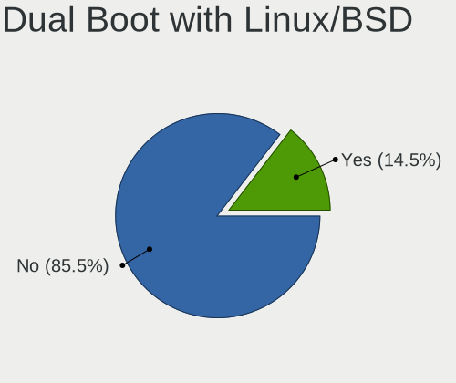
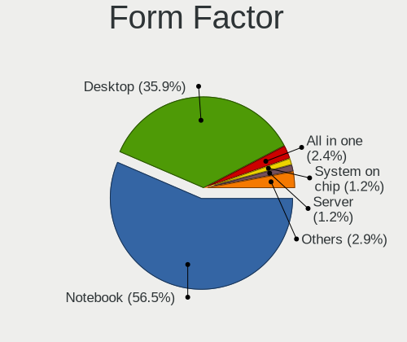
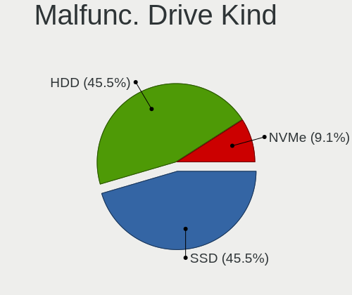
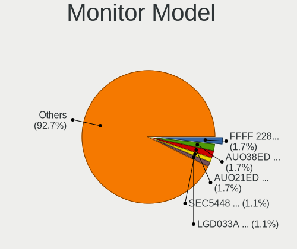
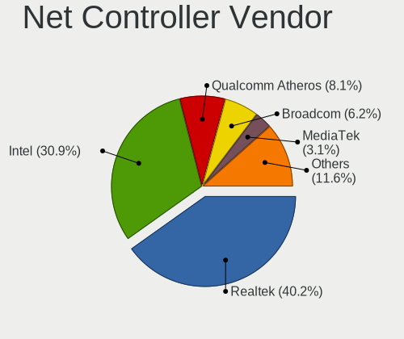

Xubuntu 24.04 - Tested Hardware & Statistics
--------------------------------------------

A project to collect tested hardware configurations for Xubuntu 24.04.

Anyone can contribute to this report by the [hw-probe](https://github.com/linuxhw/hw-probe) tool:

    sudo -E hw-probe -all -upload

Please contribute! Especially if your hardware is rare.

This is a report for all computer types. See also reports for [desktops](/Dist/Xubuntu_24.04/Desktop/README.md) and [notebooks](/Dist/Xubuntu_24.04/Notebook/README.md).

Contents
--------

* [ Test Cases ](#test-cases)

* [ System ](#system)
  - [ Kernel                   ](#kernel)
  - [ Kernel Family            ](#kernel-family)
  - [ Kernel Major Ver.        ](#kernel-major-ver)
  - [ Arch                     ](#arch)
  - [ DE                       ](#de)
  - [ Display Server           ](#display-server)
  - [ Display Manager          ](#display-manager)
  - [ OS Lang                  ](#os-lang)
  - [ Boot Mode                ](#boot-mode)
  - [ Filesystem               ](#filesystem)
  - [ Part. scheme             ](#part-scheme)
  - [ Dual Boot with Linux/BSD ](#dual-boot-with-linuxbsd)
  - [ Dual Boot (Win)          ](#dual-boot-win)

* [ Board ](#board)
  - [ Vendor                   ](#vendor)
  - [ Model                    ](#model)
  - [ Model Family             ](#model-family)
  - [ MFG Year                 ](#mfg-year)
  - [ Form Factor              ](#form-factor)
  - [ Secure Boot              ](#secure-boot)
  - [ Coreboot                 ](#coreboot)
  - [ RAM Size                 ](#ram-size)
  - [ RAM Used                 ](#ram-used)
  - [ Total Drives             ](#total-drives)
  - [ Has CD-ROM               ](#has-cd-rom)
  - [ Has Ethernet             ](#has-ethernet)
  - [ Has WiFi                 ](#has-wifi)
  - [ Has Bluetooth            ](#has-bluetooth)

* [ Location ](#location)
  - [ Country                  ](#country)
  - [ City                     ](#city)

* [ Drives ](#drives)
  - [ Drive Vendor             ](#drive-vendor)
  - [ Drive Model              ](#drive-model)
  - [ HDD Vendor               ](#hdd-vendor)
  - [ SSD Vendor               ](#ssd-vendor)
  - [ Drive Kind               ](#drive-kind)
  - [ Drive Connector          ](#drive-connector)
  - [ Drive Size               ](#drive-size)
  - [ Space Total              ](#space-total)
  - [ Space Used               ](#space-used)
  - [ Malfunc. Drives          ](#malfunc-drives)
  - [ Malfunc. Drive Vendor    ](#malfunc-drive-vendor)
  - [ Malfunc. HDD Vendor      ](#malfunc-hdd-vendor)
  - [ Malfunc. Drive Kind      ](#malfunc-drive-kind)
  - [ Failed Drives            ](#failed-drives)
  - [ Failed Drive Vendor      ](#failed-drive-vendor)
  - [ Drive Status             ](#drive-status)

* [ Storage controller ](#storage-controller)
  - [ Storage Vendor           ](#storage-vendor)
  - [ Storage Model            ](#storage-model)
  - [ Storage Kind             ](#storage-kind)

* [ Processor ](#processor)
  - [ CPU Vendor               ](#cpu-vendor)
  - [ CPU Model                ](#cpu-model)
  - [ CPU Model Family         ](#cpu-model-family)
  - [ CPU Cores                ](#cpu-cores)
  - [ CPU Sockets              ](#cpu-sockets)
  - [ CPU Threads              ](#cpu-threads)
  - [ CPU Op-Modes             ](#cpu-op-modes)
  - [ CPU Microcode            ](#cpu-microcode)
  - [ CPU Microarch            ](#cpu-microarch)

* [ Graphics ](#graphics)
  - [ GPU Vendor               ](#gpu-vendor)
  - [ GPU Model                ](#gpu-model)
  - [ GPU Combo                ](#gpu-combo)
  - [ GPU Driver               ](#gpu-driver)
  - [ GPU Memory               ](#gpu-memory)

* [ Monitor ](#monitor)
  - [ Monitor Vendor           ](#monitor-vendor)
  - [ Monitor Model            ](#monitor-model)
  - [ Monitor Resolution       ](#monitor-resolution)
  - [ Monitor Diagonal         ](#monitor-diagonal)
  - [ Monitor Width            ](#monitor-width)
  - [ Aspect Ratio             ](#aspect-ratio)
  - [ Monitor Area             ](#monitor-area)
  - [ Pixel Density            ](#pixel-density)
  - [ Multiple Monitors        ](#multiple-monitors)

* [ Network ](#network)
  - [ Net Controller Vendor    ](#net-controller-vendor)
  - [ Net Controller Model     ](#net-controller-model)
  - [ Wireless Vendor          ](#wireless-vendor)
  - [ Wireless Model           ](#wireless-model)
  - [ Ethernet Vendor          ](#ethernet-vendor)
  - [ Ethernet Model           ](#ethernet-model)
  - [ Net Controller Kind      ](#net-controller-kind)
  - [ Used Controller          ](#used-controller)
  - [ NICs                     ](#nics)
  - [ IPv6                     ](#ipv6)

* [ Bluetooth ](#bluetooth)
  - [ Bluetooth Vendor         ](#bluetooth-vendor)
  - [ Bluetooth Model          ](#bluetooth-model)

* [ Sound ](#sound)
  - [ Sound Vendor             ](#sound-vendor)
  - [ Sound Model              ](#sound-model)

* [ Memory ](#memory)
  - [ Memory Vendor            ](#memory-vendor)
  - [ Memory Model             ](#memory-model)
  - [ Memory Kind              ](#memory-kind)
  - [ Memory Form Factor       ](#memory-form-factor)
  - [ Memory Size              ](#memory-size)
  - [ Memory Speed             ](#memory-speed)

* [ Printers & scanners ](#printers--scanners)
  - [ Printer Vendor           ](#printer-vendor)
  - [ Printer Model            ](#printer-model)
  - [ Scanner Vendor           ](#scanner-vendor)
  - [ Scanner Model            ](#scanner-model)

* [ Camera ](#camera)
  - [ Camera Vendor            ](#camera-vendor)
  - [ Camera Model             ](#camera-model)

* [ Security ](#security)
  - [ Fingerprint Vendor       ](#fingerprint-vendor)
  - [ Fingerprint Model        ](#fingerprint-model)
  - [ Chipcard Vendor          ](#chipcard-vendor)
  - [ Chipcard Model           ](#chipcard-model)

* [ Unsupported ](#unsupported)
  - [ Unsupported Devices      ](#unsupported-devices)
  - [ Unsupported Device Types ](#unsupported-device-types)

Test Cases
----------

Total: 215

| Vendor        | Model                       | Form-Factor | Probe                                                      | Date         |
|---------------|-----------------------------|-------------|------------------------------------------------------------|--------------|
| ASUSTek       | ROG Zephyrus G16 GU605MV... | Notebook    | [b360a75763](https://linux-hardware.org/?probe=b360a75763) | Jan 05, 2025 |
| Gigabyte      | X470 AORUS ULTRA GAMING-... | Desktop     | [99e9eae159](https://linux-hardware.org/?probe=99e9eae159) | Jan 05, 2025 |
| Fujitsu       | D3183-A1 S26361-D3183-A1    | Desktop     | [3696f797a8](https://linux-hardware.org/?probe=3696f797a8) | Jan 04, 2025 |
| Intel         | DH61CR AAG14064-204         | Desktop     | [0b1feaadef](https://linux-hardware.org/?probe=0b1feaadef) | Jan 04, 2025 |
| Dell          | 0FF3FN A00                  | Desktop     | [7015b068fb](https://linux-hardware.org/?probe=7015b068fb) | Jan 03, 2025 |
| Dell          | 0FF3FN A00                  | Desktop     | [24dd59cb38](https://linux-hardware.org/?probe=24dd59cb38) | Jan 03, 2025 |
| Lenovo        | ThinkPad SL410 2842EVC      | Notebook    | [344aabb4c4](https://linux-hardware.org/?probe=344aabb4c4) | Jan 01, 2025 |
| Lenovo        | G400s VILG1                 | Notebook    | [5363dba88d](https://linux-hardware.org/?probe=5363dba88d) | Dec 31, 2024 |
| Lenovo        | G510 20238                  | Notebook    | [d970da31bf](https://linux-hardware.org/?probe=d970da31bf) | Dec 31, 2024 |
| Toshiba       | Satellite C55-C             | Notebook    | [709c9b508d](https://linux-hardware.org/?probe=709c9b508d) | Dec 30, 2024 |
| Toshiba       | Satellite C55-C             | Notebook    | [dc3315e8ad](https://linux-hardware.org/?probe=dc3315e8ad) | Dec 29, 2024 |
| HP            | Laptop 15-bs1xx             | Notebook    | [39fde8f5ca](https://linux-hardware.org/?probe=39fde8f5ca) | Dec 29, 2024 |
| Dell          | Vostro 3558                 | Notebook    | [b480d52ec1](https://linux-hardware.org/?probe=b480d52ec1) | Dec 29, 2024 |
| ASUSTek       | Vivobook Go E1404FA_E140... | Notebook    | [5b91ae868c](https://linux-hardware.org/?probe=5b91ae868c) | Dec 29, 2024 |
| ASUSTek       | M5A78L-M LX3                | Desktop     | [9436b53810](https://linux-hardware.org/?probe=9436b53810) | Dec 28, 2024 |
| Intel         | H61 V1.6B                   | Desktop     | [a60c63d4f8](https://linux-hardware.org/?probe=a60c63d4f8) | Dec 28, 2024 |
| ASRock        | G31M-GS                     | Desktop     | [43edae3bca](https://linux-hardware.org/?probe=43edae3bca) | Dec 27, 2024 |
| ASUSTek       | X510UQR                     | Notebook    | [84503b8cca](https://linux-hardware.org/?probe=84503b8cca) | Dec 26, 2024 |
| Google        | Cave                        | Notebook    | [bd961db2f9](https://linux-hardware.org/?probe=bd961db2f9) | Dec 25, 2024 |
| Gigabyte      | H410M H V3                  | Desktop     | [411d54ea0e](https://linux-hardware.org/?probe=411d54ea0e) | Dec 24, 2024 |
| HP            | EliteBook 2540p             | Notebook    | [1f59b3e296](https://linux-hardware.org/?probe=1f59b3e296) | Dec 24, 2024 |
| HP            | EliteBook 2540p             | Notebook    | [2729bde753](https://linux-hardware.org/?probe=2729bde753) | Dec 24, 2024 |
| BESSTAR Te... | HX90                        | Desktop     | [11b30e17f3](https://linux-hardware.org/?probe=11b30e17f3) | Dec 23, 2024 |
| Gigabyte      | H410M H V3                  | Desktop     | [8d38a80f8d](https://linux-hardware.org/?probe=8d38a80f8d) | Dec 23, 2024 |
| ASRock        | B75M                        | Desktop     | [b5d292db3a](https://linux-hardware.org/?probe=b5d292db3a) | Dec 18, 2024 |
| Fujitsu Si... | AMILO Xi 3650               | Notebook    | [62988b3cd2](https://linux-hardware.org/?probe=62988b3cd2) | Dec 15, 2024 |
| Lenovo        | SHARKBAY 0B98401 PRO        | Desktop     | [f25016b0a2](https://linux-hardware.org/?probe=f25016b0a2) | Dec 14, 2024 |
| Lenovo        | ThinkPad X250 20CLS35P00    | Notebook    | [f07bee115e](https://linux-hardware.org/?probe=f07bee115e) | Dec 12, 2024 |
| AZW           | EQ                          | Mini pc     | [e8ad67f29d](https://linux-hardware.org/?probe=e8ad67f29d) | Dec 11, 2024 |
| ASRock        | G31M-GS                     | Desktop     | [769e2a4b35](https://linux-hardware.org/?probe=769e2a4b35) | Dec 11, 2024 |
| Dell          | 0HY9JP A00                  | Desktop     | [d65f5e1d9f](https://linux-hardware.org/?probe=d65f5e1d9f) | Dec 10, 2024 |
| ASUSTek       | TP410UA                     | Convertible | [c29847d5bc](https://linux-hardware.org/?probe=c29847d5bc) | Dec 07, 2024 |
| Lenovo        | IdeaPad 3 14ALC6 82KT       | Notebook    | [4b0d54bc10](https://linux-hardware.org/?probe=4b0d54bc10) | Dec 06, 2024 |
| Medion        | Akoya P2214T                | Notebook    | [0c9f9d15b7](https://linux-hardware.org/?probe=0c9f9d15b7) | Dec 04, 2024 |
| ASUSTek       | PB50                        | Desktop     | [4c089afc7d](https://linux-hardware.org/?probe=4c089afc7d) | Dec 03, 2024 |
| Lenovo        | ThinkPad T590 20N40033GE    | Notebook    | [4c47ccfa06](https://linux-hardware.org/?probe=4c47ccfa06) | Dec 02, 2024 |
| Lenovo        | ThinkPad T590 20N40033GE    | Notebook    | [618f8af0fb](https://linux-hardware.org/?probe=618f8af0fb) | Dec 02, 2024 |
| Lenovo        | Legion Slim 5 16AHP9 83D... | Notebook    | [7454798a5c](https://linux-hardware.org/?probe=7454798a5c) | Nov 30, 2024 |
| HP            | Notebook                    | Notebook    | [f6aaab07ba](https://linux-hardware.org/?probe=f6aaab07ba) | Nov 29, 2024 |
| Lenovo        | Bantry CRB SDK0J40709 WI... | Desktop     | [02fadfe7cc](https://linux-hardware.org/?probe=02fadfe7cc) | Nov 28, 2024 |
| Lenovo        | Bantry CRB SDK0J40709 WI... | Desktop     | [a0f78ace36](https://linux-hardware.org/?probe=a0f78ace36) | Nov 28, 2024 |
| HP            | ProBook 4330s               | Notebook    | [a2218163e8](https://linux-hardware.org/?probe=a2218163e8) | Nov 27, 2024 |
| ASRock        | G31M-S                      | Desktop     | [eb86f2cd39](https://linux-hardware.org/?probe=eb86f2cd39) | Nov 25, 2024 |
| HP            | Notebook                    | Notebook    | [b00a743ec2](https://linux-hardware.org/?probe=b00a743ec2) | Nov 24, 2024 |
| Acer          | Aspire ES1-523              | Notebook    | [a0b86901ed](https://linux-hardware.org/?probe=a0b86901ed) | Nov 22, 2024 |
| ASUSTek       | X751MA                      | Notebook    | [1b27d931c8](https://linux-hardware.org/?probe=1b27d931c8) | Nov 22, 2024 |
| HP            | ProBook 455 G2              | Notebook    | [a739af0867](https://linux-hardware.org/?probe=a739af0867) | Nov 19, 2024 |
| Dell          | Inspiron 5570               | Notebook    | [f000fe5bb8](https://linux-hardware.org/?probe=f000fe5bb8) | Nov 19, 2024 |
| ASUSTek       | ROG CROSSHAIR VIII DARK ... | Desktop     | [f12649ad72](https://linux-hardware.org/?probe=f12649ad72) | Nov 18, 2024 |
| HP            | EliteBook 840 G5            | Notebook    | [7beeeb1653](https://linux-hardware.org/?probe=7beeeb1653) | Nov 15, 2024 |
| HP            | EliteBook 840 G5            | Notebook    | [70cca43b11](https://linux-hardware.org/?probe=70cca43b11) | Nov 14, 2024 |
| Intel         | BIRCHSTREAM E63448-400      | Server      | [f71eae46a6](https://linux-hardware.org/?probe=f71eae46a6) | Nov 14, 2024 |
| Gigabyte      | Z790 UD AX                  | Desktop     | [e7d2ae557b](https://linux-hardware.org/?probe=e7d2ae557b) | Nov 13, 2024 |
| Fujitsu Si... | AMILO Xa 2528               | Notebook    | [6391255449](https://linux-hardware.org/?probe=6391255449) | Nov 13, 2024 |
| Apple         | Mac-F2218EA9                | All in one  | [6bbab3b46c](https://linux-hardware.org/?probe=6bbab3b46c) | Nov 13, 2024 |
| Foxconn       | H61MXT1/F2/-S/-V            | Desktop     | [a45a575296](https://linux-hardware.org/?probe=a45a575296) | Nov 12, 2024 |
| Dell          | Inspiron 1525               | Notebook    | [96262de2eb](https://linux-hardware.org/?probe=96262de2eb) | Nov 10, 2024 |
| Gigabyte      | G41M-ES2L                   | Desktop     | [d1d98f5e59](https://linux-hardware.org/?probe=d1d98f5e59) | Nov 10, 2024 |
| HP            | ProBook 455 G2              | Notebook    | [6fe664f991](https://linux-hardware.org/?probe=6fe664f991) | Nov 09, 2024 |
| HP            | EliteBook 2540p             | Notebook    | [0b808f5fdb](https://linux-hardware.org/?probe=0b808f5fdb) | Nov 04, 2024 |
| HP            | EliteBook 2540p             | Notebook    | [ef768f0f93](https://linux-hardware.org/?probe=ef768f0f93) | Nov 04, 2024 |
| MSI           | PRO B550M-P GEN3            | Desktop     | [c13f813eba](https://linux-hardware.org/?probe=c13f813eba) | Nov 04, 2024 |
| Gigabyte      | GA-MA69G-S3H                | Desktop     | [155af677bf](https://linux-hardware.org/?probe=155af677bf) | Nov 03, 2024 |
| Dell          | Inspiron 3593               | Notebook    | [ce28048d27](https://linux-hardware.org/?probe=ce28048d27) | Nov 02, 2024 |
| Lenovo        | 36FE SDK0J40700 WIN 3258... | All in one  | [e3bb8b6d1f](https://linux-hardware.org/?probe=e3bb8b6d1f) | Oct 31, 2024 |
| HP            | 859B                        | Desktop     | [75749e37f1](https://linux-hardware.org/?probe=75749e37f1) | Oct 31, 2024 |
| Dell          | Inspiron 5567               | Notebook    | [cff441fb06](https://linux-hardware.org/?probe=cff441fb06) | Oct 30, 2024 |
| BANGHO        | Suma 1025                   | Tablet      | [9dc2d138b4](https://linux-hardware.org/?probe=9dc2d138b4) | Oct 30, 2024 |
| BANGHO        | Suma 1025                   | Tablet      | [9ba3946dee](https://linux-hardware.org/?probe=9ba3946dee) | Oct 30, 2024 |
| HP            | 250 15.6 inch G9 Noteboo... | Notebook    | [6c33a69b77](https://linux-hardware.org/?probe=6c33a69b77) | Oct 29, 2024 |
| Toshiba       | Satellite Pro C50-A-1C9     | Notebook    | [09c875c667](https://linux-hardware.org/?probe=09c875c667) | Oct 28, 2024 |
| Dell          | 0P658H A05                  | Server      | [5ca3522b87](https://linux-hardware.org/?probe=5ca3522b87) | Oct 27, 2024 |
| Dell          | 0P658H A05                  | Server      | [8aecda16f1](https://linux-hardware.org/?probe=8aecda16f1) | Oct 27, 2024 |
| HP            | Pavilion g7                 | Notebook    | [1d62587da9](https://linux-hardware.org/?probe=1d62587da9) | Oct 24, 2024 |
| HP            | 250 15.6 inch G9 Noteboo... | Notebook    | [80e86c27ad](https://linux-hardware.org/?probe=80e86c27ad) | Oct 23, 2024 |
| HP            | 83E9                        | Desktop     | [b3ae37412e](https://linux-hardware.org/?probe=b3ae37412e) | Oct 23, 2024 |
| Lenovo        | IdeaPad Pro 5 14IMH9 83D... | Notebook    | [45055f8225](https://linux-hardware.org/?probe=45055f8225) | Oct 22, 2024 |
| HP            | Compaq CQ58                 | Notebook    | [745f176ea5](https://linux-hardware.org/?probe=745f176ea5) | Oct 16, 2024 |
| Toshiba       | Satellite Pro C50-A-1C9     | Notebook    | [18b2fad0cc](https://linux-hardware.org/?probe=18b2fad0cc) | Oct 16, 2024 |
| ASUSTek       | VivoBook_ASUSLaptop X150... | Notebook    | [6062104c08](https://linux-hardware.org/?probe=6062104c08) | Oct 16, 2024 |
| ASRock        | 970M Pro3                   | Desktop     | [d3e4fb691b](https://linux-hardware.org/?probe=d3e4fb691b) | Oct 16, 2024 |
| Acer          | Aspire TC-710 V:1.1         | Desktop     | [f08a4f01c7](https://linux-hardware.org/?probe=f08a4f01c7) | Oct 15, 2024 |
| HP            | ENVY 14                     | Notebook    | [d5f1ec9d65](https://linux-hardware.org/?probe=d5f1ec9d65) | Oct 14, 2024 |
| Apple         | MacBookPro6,2               | Notebook    | [967ef3aa22](https://linux-hardware.org/?probe=967ef3aa22) | Oct 12, 2024 |
| Gigabyte      | X470 AORUS ULTRA GAMING-... | Desktop     | [903f8e6923](https://linux-hardware.org/?probe=903f8e6923) | Oct 12, 2024 |
| HP            | 82A2                        | Desktop     | [f5c82a12b7](https://linux-hardware.org/?probe=f5c82a12b7) | Oct 12, 2024 |
| Apple         | MacBookPro9,1               | Notebook    | [b98264ba07](https://linux-hardware.org/?probe=b98264ba07) | Oct 12, 2024 |
| HP            | Pavilion g6                 | Notebook    | [bec0b24e36](https://linux-hardware.org/?probe=bec0b24e36) | Oct 11, 2024 |
| ASUSTek       | P5Q-PRO                     | Desktop     | [60db33116f](https://linux-hardware.org/?probe=60db33116f) | Oct 09, 2024 |
| Positivo      | W2150G-V2 11184041          | All in one  | [ddf5e843a5](https://linux-hardware.org/?probe=ddf5e843a5) | Oct 03, 2024 |
| Dell          | Vostro 3560                 | Notebook    | [e156004a52](https://linux-hardware.org/?probe=e156004a52) | Oct 01, 2024 |
| MSI           | GL73 8RE                    | Notebook    | [f8ea57ec02](https://linux-hardware.org/?probe=f8ea57ec02) | Oct 01, 2024 |
| Acer          | Aspire TC-710 V:1.1         | Desktop     | [243099814f](https://linux-hardware.org/?probe=243099814f) | Oct 01, 2024 |
| Notebook      | NJx0MU                      | Notebook    | [292a3746c0](https://linux-hardware.org/?probe=292a3746c0) | Sep 29, 2024 |
| Lenovo        | Yoga Pro 9 16IRP8 83BY      | Notebook    | [eb1917ce7b](https://linux-hardware.org/?probe=eb1917ce7b) | Sep 28, 2024 |
| Dell          | Latitude 7480               | Notebook    | [d3d014ada7](https://linux-hardware.org/?probe=d3d014ada7) | Sep 27, 2024 |
| GPU Compan... | GWTN141-4                   | Notebook    | [23a59baf4c](https://linux-hardware.org/?probe=23a59baf4c) | Sep 26, 2024 |
| System76      | Pangolin                    | Notebook    | [95c7382d2b](https://linux-hardware.org/?probe=95c7382d2b) | Sep 24, 2024 |
| MSI           | PRO B550M-P GEN3            | Desktop     | [0d355df0ac](https://linux-hardware.org/?probe=0d355df0ac) | Sep 23, 2024 |
| MSI           | PRO B550M-P GEN3            | Desktop     | [51f9d6568b](https://linux-hardware.org/?probe=51f9d6568b) | Sep 23, 2024 |
| ASUSTek       | ZenBook UX534FTC_UX533FT... | Notebook    | [18e8157e5c](https://linux-hardware.org/?probe=18e8157e5c) | Sep 22, 2024 |
| Unknown       | Unknown                     | Notebook    | [556cdc2448](https://linux-hardware.org/?probe=556cdc2448) | Sep 21, 2024 |
| Unknown       | Unknown                     | Notebook    | [7e13c15a7b](https://linux-hardware.org/?probe=7e13c15a7b) | Sep 21, 2024 |
| ECS           | Nettle3                     | Desktop     | [805686f76b](https://linux-hardware.org/?probe=805686f76b) | Sep 21, 2024 |
| Gigabyte      | B650E AORUS PRO X USB4      | Desktop     | [d1c1277774](https://linux-hardware.org/?probe=d1c1277774) | Sep 20, 2024 |
| Gigabyte      | P55-UD3                     | Desktop     | [6d3fbd2a9b](https://linux-hardware.org/?probe=6d3fbd2a9b) | Sep 17, 2024 |
| HP            | 8A96 11                     | Desktop     | [4a8df6b044](https://linux-hardware.org/?probe=4a8df6b044) | Sep 17, 2024 |
| ASUSTek       | ROG CROSSHAIR VIII DARK ... | Desktop     | [12e603b654](https://linux-hardware.org/?probe=12e603b654) | Sep 15, 2024 |
| Lenovo        | SKYBAY NOK                  | Desktop     | [8f7dbb486d](https://linux-hardware.org/?probe=8f7dbb486d) | Sep 14, 2024 |
| Google        | Snappy                      | Notebook    | [4dc99ec7c5](https://linux-hardware.org/?probe=4dc99ec7c5) | Sep 14, 2024 |
| ECS           | Nettle3                     | Desktop     | [578c7331e4](https://linux-hardware.org/?probe=578c7331e4) | Sep 13, 2024 |
| MSI           | B550-A PRO                  | Desktop     | [0cbd62775a](https://linux-hardware.org/?probe=0cbd62775a) | Sep 13, 2024 |
| HP            | EliteBook 745 G5            | Notebook    | [49efe4433a](https://linux-hardware.org/?probe=49efe4433a) | Sep 13, 2024 |
| Lenovo        | G50-30 80G0                 | Notebook    | [ee69b44d21](https://linux-hardware.org/?probe=ee69b44d21) | Sep 09, 2024 |
| ASUSTek       | M51BC                       | Desktop     | [5c0e68a9cf](https://linux-hardware.org/?probe=5c0e68a9cf) | Sep 09, 2024 |
| Dell          | Precision M4600             | Notebook    | [1301902f3b](https://linux-hardware.org/?probe=1301902f3b) | Sep 06, 2024 |
| HP            | EliteBook 840 G1            | Notebook    | [744d4d925a](https://linux-hardware.org/?probe=744d4d925a) | Sep 05, 2024 |
| Lenovo        | G50-30 80G0                 | Notebook    | [eaa7e8d7c1](https://linux-hardware.org/?probe=eaa7e8d7c1) | Sep 04, 2024 |
| HP            | ProBook 645 G3              | Notebook    | [49013f7886](https://linux-hardware.org/?probe=49013f7886) | Sep 03, 2024 |
| HP            | 18E4                        | Desktop     | [c35e92df21](https://linux-hardware.org/?probe=c35e92df21) | Sep 03, 2024 |
| Gigabyte      | P55-UD3                     | Desktop     | [53864e5ccf](https://linux-hardware.org/?probe=53864e5ccf) | Sep 02, 2024 |
| Gigabyte      | P55-UD3                     | Desktop     | [6fbeb76c6a](https://linux-hardware.org/?probe=6fbeb76c6a) | Sep 02, 2024 |
| HP            | 8777 01011                  | Mini pc     | [85604280d8](https://linux-hardware.org/?probe=85604280d8) | Aug 31, 2024 |
| Lenovo        | ThinkPad L460 20FVS1BC0S    | Notebook    | [37cbd62ca6](https://linux-hardware.org/?probe=37cbd62ca6) | Aug 28, 2024 |
| MSI           | MAG B550 TOMAHAWK MAX WI... | Desktop     | [0ffefcc1f1](https://linux-hardware.org/?probe=0ffefcc1f1) | Aug 26, 2024 |
| HP            | 0B48h                       | Desktop     | [ac50d6a5f7](https://linux-hardware.org/?probe=ac50d6a5f7) | Aug 25, 2024 |
| ASUSTek       | VivoBook_ASUSLaptop X150... | Notebook    | [75931341d7](https://linux-hardware.org/?probe=75931341d7) | Aug 25, 2024 |
| HP            | 0B48h                       | Desktop     | [7ac220ff90](https://linux-hardware.org/?probe=7ac220ff90) | Aug 25, 2024 |
| Positivo      | Q4128C-S                    | Notebook    | [85bbf83b0b](https://linux-hardware.org/?probe=85bbf83b0b) | Aug 23, 2024 |
| Acer          | Aspire XC-885 V:1.1         | Desktop     | [15c0568e70](https://linux-hardware.org/?probe=15c0568e70) | Aug 23, 2024 |
| Lenovo        | IdeaPad 3 15IIL05 81WE      | Notebook    | [fda381da20](https://linux-hardware.org/?probe=fda381da20) | Aug 22, 2024 |
| Google        | Sand                        | Notebook    | [46ff8107da](https://linux-hardware.org/?probe=46ff8107da) | Aug 21, 2024 |
| Lenovo        | B50-30 80ES                 | Notebook    | [e0122960d3](https://linux-hardware.org/?probe=e0122960d3) | Aug 20, 2024 |
| Unknown       | FH5251                      | Desktop     | [50afcad45f](https://linux-hardware.org/?probe=50afcad45f) | Aug 19, 2024 |
| MSI           | MAG B550 TOMAHAWK MAX WI... | Desktop     | [6cb977f422](https://linux-hardware.org/?probe=6cb977f422) | Aug 18, 2024 |
| Lenovo        | IdeaPad 5 15ITL05 82FG      | Notebook    | [f4350e4e44](https://linux-hardware.org/?probe=f4350e4e44) | Aug 17, 2024 |
| Lenovo        | ThinkPad E485 20KU000CCD    | Notebook    | [86d2276d54](https://linux-hardware.org/?probe=86d2276d54) | Aug 16, 2024 |
| MSI           | B450M/ac                    | Desktop     | [be62424ac6](https://linux-hardware.org/?probe=be62424ac6) | Aug 14, 2024 |
| MSI           | B450M/ac                    | Desktop     | [442a4c144c](https://linux-hardware.org/?probe=442a4c144c) | Aug 14, 2024 |
| Lenovo        | ThinkPad T470s 20HGS0US0... | Notebook    | [84337f8394](https://linux-hardware.org/?probe=84337f8394) | Aug 13, 2024 |
| ASUSTek       | X705UAR                     | Notebook    | [7120b40e86](https://linux-hardware.org/?probe=7120b40e86) | Aug 13, 2024 |
| Lenovo        | Legion 5 15ACH6 82JW        | Notebook    | [c81f8dd4de](https://linux-hardware.org/?probe=c81f8dd4de) | Aug 11, 2024 |
| Dell          | Latitude E4300              | Notebook    | [5e3477a1b2](https://linux-hardware.org/?probe=5e3477a1b2) | Aug 11, 2024 |
| ASRock        | X600M-STX                   | Desktop     | [94cf713435](https://linux-hardware.org/?probe=94cf713435) | Aug 10, 2024 |
| Acer          | Aspire A317-53              | Notebook    | [0697fd4b7d](https://linux-hardware.org/?probe=0697fd4b7d) | Aug 08, 2024 |
| Acer          | Aspire A317-53              | Notebook    | [7275c379a9](https://linux-hardware.org/?probe=7275c379a9) | Aug 08, 2024 |
| Gigabyte      | 970A-DS3P                   | Desktop     | [e2b516fa74](https://linux-hardware.org/?probe=e2b516fa74) | Aug 07, 2024 |
| Lenovo        | Legion 5 15IAH7H 82RB       | Notebook    | [1d7ea5d209](https://linux-hardware.org/?probe=1d7ea5d209) | Aug 06, 2024 |
| Chuwi         | CoreBook X                  | Notebook    | [bcdc21a44e](https://linux-hardware.org/?probe=bcdc21a44e) | Aug 05, 2024 |
| ASUSTek       | N53SV                       | Notebook    | [f8b8da7d99](https://linux-hardware.org/?probe=f8b8da7d99) | Aug 01, 2024 |
| Lenovo        | IdeaPad N585 20179          | Notebook    | [701e0f9aa6](https://linux-hardware.org/?probe=701e0f9aa6) | Jul 30, 2024 |
| System76      | Pangolin                    | Notebook    | [39af172bfc](https://linux-hardware.org/?probe=39af172bfc) | Jul 29, 2024 |
| HUAWEI        | BOHK-WAX9X                  | Notebook    | [7c2e75f1ab](https://linux-hardware.org/?probe=7c2e75f1ab) | Jul 29, 2024 |
| ASUSTek       | ROG CROSSHAIR VIII DARK ... | Desktop     | [26c71d4462](https://linux-hardware.org/?probe=26c71d4462) | Jul 26, 2024 |
| ASUSTek       | SABERTOOTH 990FX R2.0       | Desktop     | [4882975a0e](https://linux-hardware.org/?probe=4882975a0e) | Jul 25, 2024 |
| Gigabyte      | 970A-DS3P                   | Desktop     | [be21c5a7f3](https://linux-hardware.org/?probe=be21c5a7f3) | Jul 25, 2024 |
| Unknown       | Orange Pi 5 Plus            | Soc         | [09737f7741](https://linux-hardware.org/?probe=09737f7741) | Jul 25, 2024 |
| MSI           | MPG B550 GAMING EDGE WIF... | Desktop     | [798d35210d](https://linux-hardware.org/?probe=798d35210d) | Jul 20, 2024 |
| Apple         | MacBookPro9,1               | Notebook    | [42cf0b2779](https://linux-hardware.org/?probe=42cf0b2779) | Jul 19, 2024 |
| ASUSTek       | PRIME B560-PLUS             | Desktop     | [4f05ba0751](https://linux-hardware.org/?probe=4f05ba0751) | Jul 18, 2024 |
| Gigabyte      | B550 AORUS ELITE            | Desktop     | [755fd67459](https://linux-hardware.org/?probe=755fd67459) | Jul 17, 2024 |
| Acer          | Aspire XC-885 V:1.1         | Desktop     | [9302be7b15](https://linux-hardware.org/?probe=9302be7b15) | Jul 16, 2024 |
| Lenovo        | 0B98401 WIN                 | Desktop     | [f711cc08e2](https://linux-hardware.org/?probe=f711cc08e2) | Jul 16, 2024 |
| ASUSTek       | VivoBook_ASUSLaptop E410... | Notebook    | [fc3bff82fa](https://linux-hardware.org/?probe=fc3bff82fa) | Jul 12, 2024 |
| ASUSTek       | VivoBook_ASUSLaptop E410... | Notebook    | [7bea648431](https://linux-hardware.org/?probe=7bea648431) | Jul 12, 2024 |
| MSI           | GF63 Thin 9RCX              | Notebook    | [c9e9bfbbef](https://linux-hardware.org/?probe=c9e9bfbbef) | Jul 11, 2024 |
| Lenovo        | IdeaPad 700-17ISK 80RV      | Notebook    | [679136a996](https://linux-hardware.org/?probe=679136a996) | Jul 09, 2024 |
| Gigabyte      | B550 AORUS ELITE            | Desktop     | [9d2570fead](https://linux-hardware.org/?probe=9d2570fead) | Jul 09, 2024 |
| ASUSTek       | TUF B450M-PRO GAMING        | Desktop     | [01e4be1d25](https://linux-hardware.org/?probe=01e4be1d25) | Jul 07, 2024 |
| Pegatron      | Eureka3                     | Desktop     | [28c1c2dc17](https://linux-hardware.org/?probe=28c1c2dc17) | Jul 07, 2024 |
| HP            | ProLiant ML310e Gen8        | Desktop     | [11f1a32973](https://linux-hardware.org/?probe=11f1a32973) | Jul 06, 2024 |
| ASUSTek       | 1215N                       | Notebook    | [2f21b9e533](https://linux-hardware.org/?probe=2f21b9e533) | Jul 06, 2024 |
| Notebook      | PE60RNE_RND_RNC             | Notebook    | [82b61a10fa](https://linux-hardware.org/?probe=82b61a10fa) | Jul 03, 2024 |
| HP            | ProBook 430 G1              | Notebook    | [979d9c3cba](https://linux-hardware.org/?probe=979d9c3cba) | Jun 30, 2024 |
| Pegatron      | Benicia                     | Desktop     | [794c6e94ca](https://linux-hardware.org/?probe=794c6e94ca) | Jun 30, 2024 |
| Dell          | Inspiron 7501               | Notebook    | [e3de7681b2](https://linux-hardware.org/?probe=e3de7681b2) | Jun 30, 2024 |
| ASUSTek       | VivoBook_ASUSLaptop X513... | Notebook    | [4ace4ec7d7](https://linux-hardware.org/?probe=4ace4ec7d7) | Jun 26, 2024 |
| Google        | Candy                       | Notebook    | [df8341aeba](https://linux-hardware.org/?probe=df8341aeba) | Jun 26, 2024 |
| Xunlong       | Orange Pi 5 Plus            | Soc         | [72fd015c0c](https://linux-hardware.org/?probe=72fd015c0c) | Jun 23, 2024 |
| ASUSTek       | P55VA                       | Notebook    | [d29924ad3f](https://linux-hardware.org/?probe=d29924ad3f) | Jun 18, 2024 |
| Unknown       | Phitronics G31VS-M          | Desktop     | [3dc51ab2b2](https://linux-hardware.org/?probe=3dc51ab2b2) | Jun 18, 2024 |
| Gigabyte      | Z790 AORUS ELITE AX         | Desktop     | [1221242e81](https://linux-hardware.org/?probe=1221242e81) | Jun 14, 2024 |
| MOXA          | V2400A                      | Notebook    | [90eb7f3d35](https://linux-hardware.org/?probe=90eb7f3d35) | Jun 13, 2024 |
| Dell          | Inspiron 5570               | Notebook    | [f5c26979ee](https://linux-hardware.org/?probe=f5c26979ee) | Jun 13, 2024 |
| Acer          | Aspire X1430                | Desktop     | [3d3d2f7d99](https://linux-hardware.org/?probe=3d3d2f7d99) | Jun 10, 2024 |
| Acer          | Aspire X1430                | Desktop     | [afbf613945](https://linux-hardware.org/?probe=afbf613945) | Jun 10, 2024 |
| Apple         | MacBookPro11,4              | Notebook    | [edd1f3a769](https://linux-hardware.org/?probe=edd1f3a769) | Jun 10, 2024 |
| Xunlong       | Orange Pi 5 Plus            | Soc         | [5d7dc73759](https://linux-hardware.org/?probe=5d7dc73759) | Jun 09, 2024 |
| Google        | Lindar                      | Notebook    | [27c9d1d626](https://linux-hardware.org/?probe=27c9d1d626) | Jun 06, 2024 |
| Lenovo        | ThinkPad E14 Gen 5 21JRC... | Notebook    | [5f45e3b98b](https://linux-hardware.org/?probe=5f45e3b98b) | Jun 04, 2024 |
| Unknown       | Unknown                     | Notebook    | [6bfe624c55](https://linux-hardware.org/?probe=6bfe624c55) | Jun 03, 2024 |
| Unknown       | E142                        | Notebook    | [631c390a54](https://linux-hardware.org/?probe=631c390a54) | Jun 02, 2024 |
| ASUSTek       | ROG STRIX B450-F GAMING ... | Desktop     | [5d292de909](https://linux-hardware.org/?probe=5d292de909) | May 30, 2024 |
| Lenovo        | MAHOBAY                     | Desktop     | [00e6135e76](https://linux-hardware.org/?probe=00e6135e76) | May 29, 2024 |
| Lenovo        | 31900059 STD                | All in one  | [462e531e2a](https://linux-hardware.org/?probe=462e531e2a) | May 25, 2024 |
| Lenovo        | ThinkPad X270 20HMS25S00    | Notebook    | [253d2e5692](https://linux-hardware.org/?probe=253d2e5692) | May 23, 2024 |
| Notebook      | W35xSTQ_370ST               | Notebook    | [2df5ac1a6b](https://linux-hardware.org/?probe=2df5ac1a6b) | May 22, 2024 |
| Foxconn       | 2AA9                        | Desktop     | [5f74bfe795](https://linux-hardware.org/?probe=5f74bfe795) | May 15, 2024 |
| Gigabyte      | GA-880GA-UD3H               | Desktop     | [b22a389add](https://linux-hardware.org/?probe=b22a389add) | May 13, 2024 |
| Apple         | MacBookPro11,4              | Notebook    | [bf55c6b8fb](https://linux-hardware.org/?probe=bf55c6b8fb) | May 13, 2024 |
| MSI           | 890GXM-G65                  | Desktop     | [78941f1cb6](https://linux-hardware.org/?probe=78941f1cb6) | May 12, 2024 |
| Sony          | VPCEH3S1E                   | Notebook    | [5bef66930b](https://linux-hardware.org/?probe=5bef66930b) | May 12, 2024 |
| ASUSTek       | ASUS TUF Gaming F15 FX50... | Notebook    | [07215d5104](https://linux-hardware.org/?probe=07215d5104) | May 10, 2024 |
| Acer          | Extensa 7630EZ              | Notebook    | [7c14697b75](https://linux-hardware.org/?probe=7c14697b75) | May 09, 2024 |
| ASUSTek       | TUF B350M-PLUS GAMING       | Desktop     | [e31ea5ab17](https://linux-hardware.org/?probe=e31ea5ab17) | May 06, 2024 |
| MACHINIST     | X99 G7 V1.0                 | Desktop     | [47f648047f](https://linux-hardware.org/?probe=47f648047f) | May 04, 2024 |
| MACHINIST     | X99 G7 V1.0                 | Desktop     | [017f1471b0](https://linux-hardware.org/?probe=017f1471b0) | May 04, 2024 |
| Acer          | Aspire E5-521G              | Notebook    | [0236376455](https://linux-hardware.org/?probe=0236376455) | Apr 30, 2024 |
| HP            | ENVY x360 2-in-1 Laptop ... | Convertible | [4c598291cb](https://linux-hardware.org/?probe=4c598291cb) | Apr 27, 2024 |
| HP            | Notebook                    | Notebook    | [98ad243a7d](https://linux-hardware.org/?probe=98ad243a7d) | Apr 26, 2024 |
| Lenovo        | 0B98401 WIN                 | Desktop     | [4fa3e985a9](https://linux-hardware.org/?probe=4fa3e985a9) | Apr 15, 2024 |
| HP            | ENVY x360 2-in-1 Laptop ... | Convertible | [1999efa32b](https://linux-hardware.org/?probe=1999efa32b) | Apr 10, 2024 |
| Dell          | Latitude E7240              | Notebook    | [ccabe8257d](https://linux-hardware.org/?probe=ccabe8257d) | Mar 23, 2024 |
| Dell          | Latitude E7240              | Notebook    | [cce23d2d34](https://linux-hardware.org/?probe=cce23d2d34) | Mar 22, 2024 |
| Lenovo        | ThinkPad T480 20L6S9UL00    | Notebook    | [c72bd35164](https://linux-hardware.org/?probe=c72bd35164) | Feb 22, 2024 |

System
------

Kernel
------

Version of the Linux kernel

| Version                         | Computers | Percent |
|---------------------------------|-----------|---------|
| 6.8.0-31-generic                | 24        | 13.33%  |
| 6.8.0-41-generic                | 21        | 11.67%  |
| 6.8.0-51-generic                | 15        | 8.33%   |
| 6.8.0-49-generic                | 14        | 7.78%   |
| 6.8.0-45-generic                | 14        | 7.78%   |
| 6.8.0-48-generic                | 12        | 6.67%   |
| 6.8.0-47-generic                | 11        | 6.11%   |
| 6.8.0-36-generic                | 11        | 6.11%   |
| 6.8.0-40-generic                | 10        | 5.56%   |
| 6.8.0-39-generic                | 9         | 5%      |
| 6.8.0-38-generic                | 6         | 3.33%   |
| 6.8.0-35-generic                | 6         | 3.33%   |
| 6.8.0-44-generic                | 5         | 2.78%   |
| 6.8.0-50-generic                | 2         | 1.11%   |
| 6.8.0-22-generic                | 2         | 1.11%   |
| 6.9.1-060901-generic            | 1         | 0.56%   |
| 6.8.0-47-lowlatency             | 1         | 0.56%   |
| 6.8.0-36-lowlatency             | 1         | 0.56%   |
| 6.8.0-31-lowlatency             | 1         | 0.56%   |
| 6.8.0-11-generic                | 1         | 0.56%   |
| 6.8.0-1010-oem                  | 1         | 0.56%   |
| 6.6.0-14-generic                | 1         | 0.56%   |
| 6.5.0-41-generic                | 1         | 0.56%   |
| 6.4.0-gnu-testo                 | 1         | 0.56%   |
| 6.12.3-061203-generic           | 1         | 0.56%   |
| 6.12.0                          | 1         | 0.56%   |
| 6.11.0-061100-generic           | 1         | 0.56%   |
| 6.11.0                          | 1         | 0.56%   |
| 6.10.10-1-liquorix-amd64        | 1         | 0.56%   |
| 6.10.10-061010-generic          | 1         | 0.56%   |
| 6.10.1                          | 1         | 0.56%   |
| 6.10.0-rc4-edge-rockchip-rk3588 | 1         | 0.56%   |
| 6.1.43-vendor-rk35xx            | 1         | 0.56%   |

Kernel Family
-------------

Linux kernel without a distro release

| Version | Computers | Percent |
|---------|-----------|---------|
| 6.8.0   | 159       | 92.44%  |
| 6.11.0  | 2         | 1.16%   |
| 6.10.10 | 2         | 1.16%   |
| 6.9.1   | 1         | 0.58%   |
| 6.6.0   | 1         | 0.58%   |
| 6.5.0   | 1         | 0.58%   |
| 6.4.0   | 1         | 0.58%   |
| 6.12.3  | 1         | 0.58%   |
| 6.12.0  | 1         | 0.58%   |
| 6.10.1  | 1         | 0.58%   |
| 6.10.0  | 1         | 0.58%   |
| 6.1.43  | 1         | 0.58%   |

Kernel Major Ver.
-----------------

Linux kernel major version

| Version | Computers | Percent |
|---------|-----------|---------|
| 6.8     | 159       | 92.44%  |
| 6.10    | 4         | 2.33%   |
| 6.12    | 2         | 1.16%   |
| 6.11    | 2         | 1.16%   |
| 6.9     | 1         | 0.58%   |
| 6.6     | 1         | 0.58%   |
| 6.5     | 1         | 0.58%   |
| 6.4     | 1         | 0.58%   |
| 6.1     | 1         | 0.58%   |

Arch
----

OS architecture (x86_64, i586, etc.)

| Name    | Computers | Percent |
|---------|-----------|---------|
| x86_64  | 168       | 98.82%  |
| aarch64 | 2         | 1.18%   |

DE
--

Desktop Environment

| Name  | Computers | Percent |
|-------|-----------|---------|
| XFCE  | 165       | 97.06%  |
| GNOME | 3         | 1.76%   |
| LXQt  | 1         | 0.59%   |
| i3    | 1         | 0.59%   |

Display Server
--------------

X11 or Wayland

| Name    | Computers | Percent |
|---------|-----------|---------|
| X11     | 166       | 97.65%  |
| Tty     | 3         | 1.76%   |
| Wayland | 1         | 0.59%   |

Display Manager
---------------

SDDM, LightDM, etc.

| Name    | Computers | Percent |
|---------|-----------|---------|
| LightDM | 147       | 86.47%  |
| Unknown | 13        | 7.65%   |
| GDM3    | 6         | 3.53%   |
| SDDM    | 4         | 2.35%   |

OS Lang
-------

Language

| Lang  | Computers | Percent |
|-------|-----------|---------|
| en_US | 67        | 39.41%  |
| de_DE | 26        | 15.29%  |
| C     | 17        | 10%     |
| fr_FR | 15        | 8.82%   |
| pt_BR | 7         | 4.12%   |
| it_IT | 6         | 3.53%   |
| es_ES | 6         | 3.53%   |
| en_GB | 6         | 3.53%   |
| pl_PL | 3         | 1.76%   |
| en_CA | 3         | 1.76%   |
| zh_CN | 2         | 1.18%   |
| ru_RU | 2         | 1.18%   |
| nl_NL | 2         | 1.18%   |
| cs_CZ | 2         | 1.18%   |
| ja_JP | 1         | 0.59%   |
| hu_HU | 1         | 0.59%   |
| eu_ES | 1         | 0.59%   |
| es_AR | 1         | 0.59%   |
| de_AT | 1         | 0.59%   |
| da_DK | 1         | 0.59%   |

Boot Mode
---------

EFI or BIOS

| Mode | Computers | Percent |
|------|-----------|---------|
| BIOS | 96        | 56.14%  |
| EFI  | 75        | 43.86%  |

Filesystem
----------

Type of filesystem

| Type    | Computers | Percent |
|---------|-----------|---------|
| Ext4    | 89        | 52.05%  |
| Tmpfs   | 69        | 40.35%  |
| Overlay | 9         | 5.26%   |
| Zfs     | 2         | 1.17%   |
| Xfs     | 1         | 0.58%   |
| Ext3    | 1         | 0.58%   |

Part. scheme
------------

Scheme of partitioning

| Type    | Computers | Percent |
|---------|-----------|---------|
| GPT     | 144       | 84.71%  |
| Unknown | 14        | 8.24%   |
| MBR     | 12        | 7.06%   |

Dual Boot with Linux/BSD
------------------------

Hosting more than one Linux/BSD

| Dual boot | Computers | Percent |
|-----------|-----------|---------|
| No        | 147       | 85.47%  |
| Yes       | 25        | 14.53%  |

Dual Boot (Win)
---------------

Hosting Linux and Windows

| Dual boot | Computers | Percent |
|-----------|-----------|---------|
| No        | 123       | 71.93%  |
| Yes       | 48        | 28.07%  |

Board
-----

Vendor
------

Motherboard manufacturer

| Name                | Computers | Percent |
|---------------------|-----------|---------|
| Lenovo              | 30        | 17.65%  |
| Hewlett-Packard     | 25        | 14.71%  |
| ASUSTek Computer    | 24        | 14.12%  |
| Dell                | 15        | 8.82%   |
| Gigabyte Technology | 11        | 6.47%   |
| MSI                 | 8         | 4.71%   |
| Acer                | 7         | 4.12%   |
| Unknown             | 6         | 3.53%   |
| ASRock              | 5         | 2.94%   |
| Apple               | 5         | 2.94%   |
| Google              | 4         | 2.35%   |
| Notebook            | 3         | 1.76%   |
| Intel               | 3         | 1.76%   |
| Toshiba             | 2         | 1.18%   |
| Positivo            | 2         | 1.18%   |
| Pegatron            | 2         | 1.18%   |
| Fujitsu Siemens     | 2         | 1.18%   |
| Foxconn             | 2         | 1.18%   |
| Xunlong             | 1         | 0.59%   |
| System76            | 1         | 0.59%   |
| Sony                | 1         | 0.59%   |
| MOXA                | 1         | 0.59%   |
| Medion              | 1         | 0.59%   |
| MACHINIST           | 1         | 0.59%   |
| HUAWEI              | 1         | 0.59%   |
| GPU Company         | 1         | 0.59%   |
| Fujitsu             | 1         | 0.59%   |
| ECS                 | 1         | 0.59%   |
| Chuwi               | 1         | 0.59%   |
| BESSTAR Tech        | 1         | 0.59%   |
| BANGHO              | 1         | 0.59%   |
| AZW                 | 1         | 0.59%   |

Model
-----

Motherboard model

| Name                                 | Computers | Percent |
|--------------------------------------|-----------|---------|
| Unknown                              | 6         | 3.53%   |
| MSI MS-7C91                          | 2         | 1.18%   |
| Lenovo G50-30 80G0                   | 2         | 1.18%   |
| HP Notebook                          | 2         | 1.18%   |
| Dell Inspiron 5570                   | 2         | 1.18%   |
| Apple MacBookPro9,1                  | 2         | 1.18%   |
| Xunlong Orange Pi 5 Plus             | 1         | 0.59%   |
| Toshiba Satellite Pro C50-A-1C9      | 1         | 0.59%   |
| Toshiba Satellite C55-C              | 1         | 0.59%   |
| System76 Pangolin                    | 1         | 0.59%   |
| Sony VPCEH3S1E                       | 1         | 0.59%   |
| Positivo Q4128C-S                    | 1         | 0.59%   |
| Positivo C4120N20A-21                | 1         | 0.59%   |
| Pegatron NY803AAR-ABA p6150t         | 1         | 0.59%   |
| Pegatron FR644AA-ABF a6636fr         | 1         | 0.59%   |
| Notebook W35xSTQ_370ST               | 1         | 0.59%   |
| Notebook PE60RNE_RND_RNC             | 1         | 0.59%   |
| Notebook NJx0MU                      | 1         | 0.59%   |
| MSI MS-7D95                          | 1         | 0.59%   |
| MSI MS-7C56                          | 1         | 0.59%   |
| MSI MS-7642                          | 1         | 0.59%   |
| MSI GL73 8RE                         | 1         | 0.59%   |
| MSI GF63 Thin 9RCX                   | 1         | 0.59%   |
| MSI B450M/ac                         | 1         | 0.59%   |
| MOXA V2400A                          | 1         | 0.59%   |
| Medion Akoya P2214T                  | 1         | 0.59%   |
| MACHINIST X99 G7 V1.0                | 1         | 0.59%   |
| Lenovo Yoga Pro 9 16IRP8 83BY        | 1         | 0.59%   |
| Lenovo ThinkStation S30 43512E6      | 1         | 0.59%   |
| Lenovo ThinkPad X270 20HMS25S00      | 1         | 0.59%   |
| Lenovo ThinkPad T590 20N40033GE      | 1         | 0.59%   |
| Lenovo ThinkPad T480 20L6S9UL00      | 1         | 0.59%   |
| Lenovo ThinkPad T470s 20HGS0US00     | 1         | 0.59%   |
| Lenovo ThinkPad SL410 2842EVC        | 1         | 0.59%   |
| Lenovo ThinkPad L460 20FVS1BC0S      | 1         | 0.59%   |
| Lenovo ThinkPad E485 20KU000CCD      | 1         | 0.59%   |
| Lenovo ThinkPad E14 Gen 5 21JRCTO1WW | 1         | 0.59%   |
| Lenovo ThinkCentre M83 10AM0009US    | 1         | 0.59%   |
| Lenovo ThinkCentre M82 2756AT9       | 1         | 0.59%   |
| Lenovo Legion Slim 5 16AHP9 83DH     | 1         | 0.59%   |

Model Family
------------

Motherboard model prefix

| Name                  | Computers | Percent |
|-----------------------|-----------|---------|
| Lenovo ThinkPad       | 8         | 4.71%   |
| Lenovo IdeaPad        | 6         | 3.53%   |
| Dell Inspiron         | 6         | 3.53%   |
| Acer Aspire           | 6         | 3.53%   |
| Unknown               | 6         | 3.53%   |
| ASUS VivoBook         | 5         | 2.94%   |
| HP ProBook            | 4         | 2.35%   |
| HP EliteBook          | 4         | 2.35%   |
| Lenovo Legion         | 3         | 1.76%   |
| Dell Latitude         | 3         | 1.76%   |
| ASUS ROG              | 3         | 1.76%   |
| Toshiba Satellite     | 2         | 1.18%   |
| MSI MS-7C91           | 2         | 1.18%   |
| Lenovo ThinkCentre    | 2         | 1.18%   |
| Lenovo IdeaCentre     | 2         | 1.18%   |
| Lenovo G50-30         | 2         | 1.18%   |
| HP ProDesk            | 2         | 1.18%   |
| HP Pavilion           | 2         | 1.18%   |
| HP Notebook           | 2         | 1.18%   |
| HP ENVY               | 2         | 1.18%   |
| HP EliteDesk          | 2         | 1.18%   |
| Gigabyte Z790         | 2         | 1.18%   |
| Fujitsu Siemens AMILO | 2         | 1.18%   |
| Dell Vostro           | 2         | 1.18%   |
| ASUS TUF              | 2         | 1.18%   |
| Apple MacBookPro9     | 2         | 1.18%   |
| Xunlong Orange        | 1         | 0.59%   |
| System76 Pangolin     | 1         | 0.59%   |
| Sony VPCEH3S1E        | 1         | 0.59%   |
| Positivo Q4128C-S     | 1         | 0.59%   |
| Positivo C4120N20A-21 | 1         | 0.59%   |
| Pegatron NY803AAR-ABA | 1         | 0.59%   |
| Pegatron FR644AA-ABF  | 1         | 0.59%   |
| Notebook W35xSTQ      | 1         | 0.59%   |
| Notebook PE60RNE      | 1         | 0.59%   |
| Notebook NJx0MU       | 1         | 0.59%   |
| MSI MS-7D95           | 1         | 0.59%   |
| MSI MS-7C56           | 1         | 0.59%   |
| MSI MS-7642           | 1         | 0.59%   |
| MSI GL73              | 1         | 0.59%   |

MFG Year
--------

Motherboard manufacture year

| Year    | Computers | Percent |
|---------|-----------|---------|
| 2013    | 13        | 7.65%   |
| 2023    | 12        | 7.06%   |
| 2021    | 12        | 7.06%   |
| 2017    | 12        | 7.06%   |
| 2012    | 12        | 7.06%   |
| 2019    | 11        | 6.47%   |
| 2010    | 11        | 6.47%   |
| 2024    | 10        | 5.88%   |
| 2022    | 10        | 5.88%   |
| 2014    | 10        | 5.88%   |
| 2020    | 9         | 5.29%   |
| 2015    | 9         | 5.29%   |
| 2011    | 9         | 5.29%   |
| 2018    | 8         | 4.71%   |
| 2008    | 8         | 4.71%   |
| 2009    | 6         | 3.53%   |
| 2016    | 3         | 1.76%   |
| Unknown | 3         | 1.76%   |
| 2007    | 2         | 1.18%   |

Form Factor
-----------

Physical design of the computer

| Name           | Computers | Percent |
|----------------|-----------|---------|
| Notebook       | 96        | 56.47%  |
| Desktop        | 61        | 35.88%  |
| All in one     | 4         | 2.35%   |
| System on chip | 2         | 1.18%   |
| Convertible    | 2         | 1.18%   |
| Mini pc        | 2         | 1.18%   |
| Server         | 2         | 1.18%   |
| Tablet         | 1         | 0.59%   |

Secure Boot
-----------

Enabled or disabled

| State    | Computers | Percent |
|----------|-----------|---------|
| Disabled | 159       | 93.53%  |
| Enabled  | 11        | 6.47%   |

Coreboot
--------

Have coreboot on board

| Used | Computers | Percent |
|------|-----------|---------|
| No   | 166       | 97.65%  |
| Yes  | 4         | 2.35%   |

RAM Size
--------

Total RAM memory

| Size in GB      | Computers | Percent |
|-----------------|-----------|---------|
| 4.01-8.0        | 46        | 27.06%  |
| 16.01-24.0      | 32        | 18.82%  |
| 3.01-4.0        | 27        | 15.88%  |
| 8.01-16.0       | 27        | 15.88%  |
| 32.01-64.0      | 15        | 8.82%   |
| 64.01-256.0     | 9         | 5.29%   |
| 1.01-2.0        | 5         | 2.94%   |
| 2.01-3.0        | 4         | 2.35%   |
| 24.01-32.0      | 3         | 1.76%   |
| More than 256.0 | 2         | 1.18%   |

RAM Used
--------

Used RAM memory

| Used GB    | Computers | Percent |
|------------|-----------|---------|
| 1.01-2.0   | 68        | 38.86%  |
| 2.01-3.0   | 52        | 29.71%  |
| 3.01-4.0   | 19        | 10.86%  |
| 4.01-8.0   | 16        | 9.14%   |
| 8.01-16.0  | 10        | 5.71%   |
| 0.51-1.0   | 9         | 5.14%   |
| 32.01-64.0 | 1         | 0.57%   |

Total Drives
------------

Number of drives on board

| Drives | Computers | Percent |
|--------|-----------|---------|
| 1      | 106       | 61.99%  |
| 2      | 40        | 23.39%  |
| 3      | 14        | 8.19%   |
| 4      | 4         | 2.34%   |
| 5      | 2         | 1.17%   |
| 0      | 2         | 1.17%   |
| 8      | 1         | 0.58%   |
| 7      | 1         | 0.58%   |
| 6      | 1         | 0.58%   |

Has CD-ROM
----------

Has CD-ROM on board

| Presented | Computers | Percent |
|-----------|-----------|---------|
| No        | 107       | 62.21%  |
| Yes       | 65        | 37.79%  |

Has Ethernet
------------

Has Ethernet on board

| Presented | Computers | Percent |
|-----------|-----------|---------|
| Yes       | 144       | 84.71%  |
| No        | 26        | 15.29%  |

Has WiFi
--------

Has WiFi module

| Presented | Computers | Percent |
|-----------|-----------|---------|
| Yes       | 132       | 77.19%  |
| No        | 39        | 22.81%  |

Has Bluetooth
-------------

Has Bluetooth module

| Presented | Computers | Percent |
|-----------|-----------|---------|
| Yes       | 109       | 63.74%  |
| No        | 62        | 36.26%  |

Location
--------

Country
-------

Geographic location (country)

| Country         | Computers | Percent |
|-----------------|-----------|---------|
| USA             | 36        | 21.18%  |
| Germany         | 24        | 14.12%  |
| France          | 15        | 8.82%   |
| Italy           | 12        | 7.06%   |
| Canada          | 9         | 5.29%   |
| Brazil          | 8         | 4.71%   |
| UK              | 7         | 4.12%   |
| Spain           | 6         | 3.53%   |
| Austria         | 5         | 2.94%   |
| Poland          | 4         | 2.35%   |
| Ukraine         | 3         | 1.76%   |
| Sweden          | 3         | 1.76%   |
| Russia          | 3         | 1.76%   |
| Czechia         | 3         | 1.76%   |
| Argentina       | 3         | 1.76%   |
| Peru            | 2         | 1.18%   |
| Pakistan        | 2         | 1.18%   |
| Isle of Man     | 2         | 1.18%   |
| India           | 2         | 1.18%   |
| China           | 2         | 1.18%   |
| Vietnam         | 1         | 0.59%   |
| The Netherlands | 1         | 0.59%   |
| Switzerland     | 1         | 0.59%   |
| Serbia          | 1         | 0.59%   |
| Romania         | 1         | 0.59%   |
| Norway          | 1         | 0.59%   |
| Netherlands     | 1         | 0.59%   |
| Nepal           | 1         | 0.59%   |
| Mexico          | 1         | 0.59%   |
| Malaysia        | 1         | 0.59%   |
| Japan           | 1         | 0.59%   |
| Hungary         | 1         | 0.59%   |
| Greece          | 1         | 0.59%   |
| Estonia         | 1         | 0.59%   |
| Egypt           | 1         | 0.59%   |
| Denmark         | 1         | 0.59%   |
| Bulgaria        | 1         | 0.59%   |
| Australia       | 1         | 0.59%   |
| Algeria         | 1         | 0.59%   |

City
----

Geographic location (city)

| City           | Computers | Percent |
|----------------|-----------|---------|
| Vienna         | 3         | 1.74%   |
| Paris          | 3         | 1.74%   |
| Moscow         | 3         | 1.74%   |
| Lviv           | 3         | 1.74%   |
| Stuttgart      | 2         | 1.16%   |
| Rochester      | 2         | 1.16%   |
| Ramsey         | 2         | 1.16%   |
| Prague         | 2         | 1.16%   |
| Padova         | 2         | 1.16%   |
| Nuremberg      | 2         | 1.16%   |
| Neuruppin      | 2         | 1.16%   |
| Longueuil      | 2         | 1.16%   |
| Lima           | 2         | 1.16%   |
| Krakow         | 2         | 1.16%   |
| Houston        | 2         | 1.16%   |
| Hanover        | 2         | 1.16%   |
| Hamburg        | 2         | 1.16%   |
| California     | 2         | 1.16%   |
| Berlin         | 2         | 1.16%   |
| Arlington      | 2         | 1.16%   |
| ywiec        | 1         | 0.58%   |
| Zurich         | 1         | 0.58%   |
| Yuba City      | 1         | 0.58%   |
| Xalapa         | 1         | 0.58%   |
| Winnipeg       | 1         | 0.58%   |
| West Lafayette | 1         | 0.58%   |
| Vanves         | 1         | 0.58%   |
| Uppsala        | 1         | 0.58%   |
| Traun          | 1         | 0.58%   |
| Toul           | 1         | 0.58%   |
| Tokyo          | 1         | 0.58%   |
| Thessaloniki   | 1         | 0.58%   |
| Teterow        | 1         | 0.58%   |
| Tavant         | 1         | 0.58%   |
| Tampa          | 1         | 0.58%   |
| Tallinn        | 1         | 0.58%   |
| Surrey         | 1         | 0.58%   |
| Suchedniow     | 1         | 0.58%   |
| Stockholm      | 1         | 0.58%   |
| Solingen       | 1         | 0.58%   |

Drives
------

Drive Vendor
------------

Hard drive vendors

| Vendor                      | Computers | Drives | Percent |
|-----------------------------|-----------|--------|---------|
| Samsung Electronics         | 41        | 49     | 16.67%  |
| Seagate                     | 27        | 35     | 10.98%  |
| WDC                         | 25        | 29     | 10.16%  |
| Sandisk                     | 18        | 21     | 7.32%   |
| Kingston                    | 16        | 18     | 6.5%    |
| Crucial                     | 16        | 19     | 6.5%    |
| Toshiba                     | 13        | 14     | 5.28%   |
| Unknown                     | 12        | 12     | 4.88%   |
| SK hynix                    | 9         | 10     | 3.66%   |
| Micron Technology           | 5         | 5      | 2.03%   |
| Hitachi                     | 5         | 9      | 2.03%   |
| SPCC                        | 4         | 4      | 1.63%   |
| Intenso                     | 4         | 4      | 1.63%   |
| KIOXIA                      | 3         | 3      | 1.22%   |
| Intel                       | 3         | 4      | 1.22%   |
| China                       | 3         | 3      | 1.22%   |
| Team                        | 2         | 2      | 0.81%   |
| PNY                         | 2         | 2      | 0.81%   |
| Phison Electronics          | 2         | 2      | 0.81%   |
| Phison                      | 2         | 7      | 0.81%   |
| MAXIO Technology (Hangzhou) | 2         | 2      | 0.81%   |
| JMicron Technology          | 2         | 2      | 0.81%   |
| ADATA Technology            | 2         | 2      | 0.81%   |
| A-DATA Technology           | 2         | 3      | 0.81%   |
| Union Memory (Shenzhen)     | 1         | 1      | 0.41%   |
| UMIS                        | 1         | 1      | 0.41%   |
| Transcend                   | 1         | 1      | 0.41%   |
| Synology                    | 1         | 2      | 0.41%   |
| SSK Port                    | 1         | 1      | 0.41%   |
| SATA SSD                    | 1         | 1      | 0.41%   |
| SABRENT                     | 1         | 1      | 0.41%   |
| Realtek                     | 1         | 1      | 0.41%   |
| Micron/Crucial Technology   | 1         | 2      | 0.41%   |
| LITEONIT                    | 1         | 1      | 0.41%   |
| KIOXIA-EXCERIA              | 1         | 1      | 0.41%   |
| KingSpec                    | 1         | 1      | 0.41%   |
| Integral                    | 1         | 1      | 0.41%   |
| Inateck                     | 1         | 1      | 0.41%   |
| IBM-ESXS                    | 1         | 2      | 0.41%   |
| HUSKY                       | 1         | 1      | 0.41%   |

Drive Model
-----------

Hard drive models

| Model                                    | Computers | Percent |
|------------------------------------------|-----------|---------|
| Kingston SA400S37240G 240GB SSD          | 4         | 1.52%   |
| Toshiba MQ04ABF100 1TB                   | 3         | 1.14%   |
| Toshiba MQ01ABD100 1TB                   | 3         | 1.14%   |
| Seagate ST1000DM003-1CH162 1TB           | 3         | 1.14%   |
| Samsung SSD 860 EVO 500GB                | 3         | 1.14%   |
| Kingston SA400S37480G 480GB SSD          | 3         | 1.14%   |
| WDC WD10JPVT-00A1YT0 1TB                 | 2         | 0.76%   |
| Unknown SD/MMC/MS PRO 128GB              | 2         | 0.76%   |
| Unknown MMC Card  64GB                   | 2         | 0.76%   |
| Unknown MMC Card  128GB                  | 2         | 0.76%   |
| SPCC Solid State Disk 256GB              | 2         | 0.76%   |
| Seagate ST9500420AS 500GB                | 2         | 0.76%   |
| Seagate ST500DM002-1BD142 500GB          | 2         | 0.76%   |
| Seagate ST3500413AS 500GB                | 2         | 0.76%   |
| Seagate ST1500LM006 HN-M151RAD 1TB       | 2         | 0.76%   |
| Seagate ST1000LM035-1RK172 1TB           | 2         | 0.76%   |
| Sandisk WD_BLACK SN770 2TB               | 2         | 0.76%   |
| SanDisk NVMe SSD Drive 1TB               | 2         | 0.76%   |
| Samsung SSD 850 EVO 250GB                | 2         | 0.76%   |
| Samsung SSD 840 EVO 250GB                | 2         | 0.76%   |
| Samsung HD161GJ 160GB                    | 2         | 0.76%   |
| PNY CS1311 240GB SSD                     | 2         | 0.76%   |
| Micron MTFDDAV256TBN-1AR15ABHA 256GB SSD | 2         | 0.76%   |
| Crucial CT500MX500SSD1 500GB             | 2         | 0.76%   |
| Crucial CT240BX500SSD1 240GB             | 2         | 0.76%   |
| WDC WDS500G2B0C 500GB                    | 1         | 0.38%   |
| WDC WDS500G2B0A 500GB SSD                | 1         | 0.38%   |
| WDC WDBNCE0010PNC 1TB SSD                | 1         | 0.38%   |
| WDC WD7500BPVX-60JC3T0 752GB             | 1         | 0.38%   |
| WDC WD6400AACS-00G8B1 640GB              | 1         | 0.38%   |
| WDC WD5003AZEX-00K1GA0 500GB             | 1         | 0.38%   |
| WDC WD5000LPVX-00V0TT0 500GB             | 1         | 0.38%   |
| WDC WD5000AAKX-221CA1 500GB              | 1         | 0.38%   |
| WDC WD4000AAJS-00YFA0 400GB              | 1         | 0.38%   |
| WDC WD3200BPVT-22JJ5T0 320GB             | 1         | 0.38%   |
| WDC WD3200AAJS-56M0A0 320GB              | 1         | 0.38%   |
| WDC WD20EZAZ-00L9GB0 2TB                 | 1         | 0.38%   |
| WDC WD1600AAJS-07PSA0 160GB              | 1         | 0.38%   |
| WDC WD10SPZX-75Z10T2 1TB                 | 1         | 0.38%   |
| WDC WD10SPZX-75Z10T1 1TB                 | 1         | 0.38%   |

HDD Vendor
----------

Hard disk drive vendors

| Vendor              | Computers | Drives | Percent |
|---------------------|-----------|--------|---------|
| Seagate             | 25        | 33     | 33.33%  |
| WDC                 | 19        | 22     | 25.33%  |
| Toshiba             | 10        | 11     | 13.33%  |
| Samsung Electronics | 5         | 5      | 6.67%   |
| Hitachi             | 5         | 9      | 6.67%   |
| Unknown             | 2         | 2      | 2.67%   |
| Intenso             | 2         | 2      | 2.67%   |
| Synology            | 1         | 2      | 1.33%   |
| SABRENT             | 1         | 1      | 1.33%   |
| JMicron Technology  | 1         | 1      | 1.33%   |
| Inateck             | 1         | 1      | 1.33%   |
| IBM-ESXS            | 1         | 2      | 1.33%   |
| HGST                | 1         | 1      | 1.33%   |
| Fujitsu             | 1         | 1      | 1.33%   |

SSD Vendor
----------

Solid state drive vendors

| Vendor              | Computers | Drives | Percent |
|---------------------|-----------|--------|---------|
| Samsung Electronics | 16        | 17     | 17.98%  |
| Kingston            | 14        | 15     | 15.73%  |
| Crucial             | 11        | 13     | 12.36%  |
| SanDisk             | 10        | 12     | 11.24%  |
| WDC                 | 4         | 4      | 4.49%   |
| SPCC                | 4         | 4      | 4.49%   |
| Micron Technology   | 3         | 3      | 3.37%   |
| China               | 3         | 3      | 3.37%   |
| Team                | 2         | 2      | 2.25%   |
| PNY                 | 2         | 2      | 2.25%   |
| Intenso             | 2         | 2      | 2.25%   |
| Intel               | 2         | 2      | 2.25%   |
| A-DATA Technology   | 2         | 3      | 2.25%   |
| Transcend           | 1         | 1      | 1.12%   |
| Toshiba             | 1         | 1      | 1.12%   |
| SSK Port            | 1         | 1      | 1.12%   |
| SK hynix            | 1         | 1      | 1.12%   |
| Seagate             | 1         | 1      | 1.12%   |
| SATA SSD            | 1         | 1      | 1.12%   |
| LITEONIT            | 1         | 1      | 1.12%   |
| KIOXIA-EXCERIA      | 1         | 1      | 1.12%   |
| KingSpec            | 1         | 1      | 1.12%   |
| Integral            | 1         | 1      | 1.12%   |
| HUSKY               | 1         | 1      | 1.12%   |
| GOODRAM             | 1         | 1      | 1.12%   |
| FORESEE             | 1         | 1      | 1.12%   |
| Acer                | 1         | 1      | 1.12%   |

Drive Kind
----------

HDD or SSD

| Kind    | Computers | Drives | Percent |
|---------|-----------|--------|---------|
| SSD     | 80        | 96     | 36.04%  |
| HDD     | 64        | 93     | 28.83%  |
| NVMe    | 63        | 87     | 28.38%  |
| MMC     | 11        | 11     | 4.95%   |
| Unknown | 4         | 4      | 1.8%    |

Drive Connector
---------------

SATA, SAS, NVMe, etc.

| Type | Computers | Drives | Percent |
|------|-----------|--------|---------|
| SATA | 120       | 178    | 57.97%  |
| NVMe | 63        | 86     | 30.43%  |
| SAS  | 13        | 16     | 6.28%   |
| MMC  | 11        | 11     | 5.31%   |

Drive Size
----------

Size of hard drive

| Size in TB | Computers | Drives | Percent |
|------------|-----------|--------|---------|
| 0.01-0.5   | 86        | 118    | 57.33%  |
| 0.51-1.0   | 48        | 55     | 32%     |
| 1.01-2.0   | 9         | 9      | 6%      |
| 3.01-4.0   | 4         | 4      | 2.67%   |
| 10.01-20.0 | 2         | 2      | 1.33%   |
| 2.01-3.0   | 1         | 1      | 0.67%   |

Space Total
-----------

Amount of disk space available on the file system

| Size in GB     | Computers | Percent |
|----------------|-----------|---------|
| 101-250        | 41        | 23.7%   |
| 251-500        | 39        | 22.54%  |
| 501-1000       | 25        | 14.45%  |
| 1001-2000      | 20        | 11.56%  |
| 1-20           | 16        | 9.25%   |
| 51-100         | 11        | 6.36%   |
| 2001-3000      | 7         | 4.05%   |
| More than 3000 | 6         | 3.47%   |
| 21-50          | 6         | 3.47%   |
| Unknown        | 2         | 1.16%   |

Space Used
----------

Amount of used disk space

| Used GB        | Computers | Percent |
|----------------|-----------|---------|
| 1-20           | 80        | 45.98%  |
| 21-50          | 23        | 13.22%  |
| 101-250        | 21        | 12.07%  |
| 51-100         | 16        | 9.2%    |
| 251-500        | 15        | 8.62%   |
| 1001-2000      | 7         | 4.02%   |
| 501-1000       | 7         | 4.02%   |
| More than 3000 | 2         | 1.15%   |
| Unknown        | 2         | 1.15%   |
| 2001-3000      | 1         | 0.57%   |

Malfunc. Drives
---------------

Drive models with a malfunction

| Model                                                                        | Computers | Drives | Percent |
|------------------------------------------------------------------------------|-----------|--------|---------|
| Seagate ST500DM002-1BD142 500GB                                              | 2         | 2      | 15.38%  |
| WDC WD6400AACS-00G8B1 640GB                                                  | 1         | 1      | 7.69%   |
| WDC WD Blue SA510 2.5 500GB                                                  | 1         | 1      | 7.69%   |
| Toshiba HDWD130 3TB                                                          | 1         | 1      | 7.69%   |
| Seagate ST500LM000-1EJ162 500GB                                              | 1         | 1      | 7.69%   |
| Seagate ST1000LM035-1RK172 1TB                                               | 1         | 1      | 7.69%   |
| Samsung Electronics SP2004C 200GB                                            | 1         | 1      | 7.69%   |
| Micron Technology 1100_MTFDDAV512TBN 512GB SSD                               | 1         | 1      | 7.69%   |
| Kingston SKC6001024G 1024GB SSD                                              | 1         | 1      | 7.69%   |
| Kingston SA400S37240G 240GB SSD                                              | 1         | 1      | 7.69%   |
| ADATA Technology XPG SX8200 Pro PCIe Gen3x4 M.2 2280 Solid State Drive 256GB | 1         | 1      | 7.69%   |
| Acer GT500A 512G SSD                                                         | 1         | 1      | 7.69%   |

Malfunc. Drive Vendor
---------------------

Vendors of faulty drives

| Vendor              | Computers | Drives | Percent |
|---------------------|-----------|--------|---------|
| Seagate             | 4         | 4      | 30.77%  |
| WDC                 | 2         | 2      | 15.38%  |
| Kingston            | 2         | 2      | 15.38%  |
| Toshiba             | 1         | 1      | 7.69%   |
| Samsung Electronics | 1         | 1      | 7.69%   |
| Micron Technology   | 1         | 1      | 7.69%   |
| ADATA Technology    | 1         | 1      | 7.69%   |
| Acer                | 1         | 1      | 7.69%   |

Malfunc. HDD Vendor
-------------------

Vendors of faulty HDD drives

| Vendor              | Computers | Drives | Percent |
|---------------------|-----------|--------|---------|
| Seagate             | 4         | 4      | 57.14%  |
| WDC                 | 1         | 1      | 14.29%  |
| Toshiba             | 1         | 1      | 14.29%  |
| Samsung Electronics | 1         | 1      | 14.29%  |

Malfunc. Drive Kind
-------------------

Kinds of faulty drives

| Kind | Computers | Drives | Percent |
|------|-----------|--------|---------|
| SSD  | 5         | 5      | 45.45%  |
| HDD  | 5         | 7      | 45.45%  |
| NVMe | 1         | 1      | 9.09%   |

Failed Drives
-------------

Failed drive models

Zero info for selected period =(

Failed Drive Vendor
-------------------

Failed drive vendors

Zero info for selected period =(

Drive Status
------------

Number of failed and malfunc. drives

| Status   | Computers | Drives | Percent |
|----------|-----------|--------|---------|
| Detected | 95        | 153    | 51.91%  |
| Works    | 78        | 125    | 42.62%  |
| Malfunc  | 10        | 13     | 5.46%   |

Storage controller
------------------

Storage Vendor
--------------

Storage controller vendors

| Vendor                       | Computers | Percent |
|------------------------------|-----------|---------|
| Intel                        | 101       | 45.5%   |
| AMD                          | 39        | 17.57%  |
| Samsung Electronics          | 21        | 9.46%   |
| SanDisk                      | 12        | 5.41%   |
| SK hynix                     | 7         | 3.15%   |
| Micron/Crucial Technology    | 6         | 2.7%    |
| Phison Electronics           | 5         | 2.25%   |
| JMicron Technology           | 4         | 1.8%    |
| Nvidia                       | 3         | 1.35%   |
| Micron Technology            | 3         | 1.35%   |
| MAXIO Technology (Hangzhou)  | 3         | 1.35%   |
| KIOXIA                       | 3         | 1.35%   |
| Kingston Technology Company  | 3         | 1.35%   |
| ASMedia Technology           | 3         | 1.35%   |
| ADATA Technology             | 3         | 1.35%   |
| Toshiba America Info Systems | 2         | 0.9%    |
| Union Memory (Shenzhen)      | 1         | 0.45%   |
| Solidigm                     | 1         | 0.45%   |
| Marvell Technology Group     | 1         | 0.45%   |
| LSI Logic / Symbios Logic    | 1         | 0.45%   |

Storage Model
-------------

Storage controller models

| Model                                                                          | Computers | Percent |
|--------------------------------------------------------------------------------|-----------|---------|
| AMD FCH SATA Controller [AHCI mode]                                            | 19        | 7.6%    |
| Samsung NVMe SSD Controller SM981/PM981/PM983                                  | 8         | 3.2%    |
| Intel Sunrise Point-LP SATA Controller [AHCI mode]                             | 8         | 3.2%    |
| AMD SB7x0/SB8x0/SB9x0 SATA Controller [AHCI mode]                              | 8         | 3.2%    |
| Intel 82801 Mobile SATA Controller [RAID mode]                                 | 7         | 2.8%    |
| AMD SB7x0/SB8x0/SB9x0 IDE Controller                                           | 7         | 2.8%    |
| Samsung NVMe SSD Controller 980 (DRAM-less)                                    | 6         | 2.4%    |
| Intel Atom Processor E3800 Series SATA AHCI Controller                         | 6         | 2.4%    |
| Intel 7 Series Chipset Family 6-port SATA Controller [AHCI mode]               | 6         | 2.4%    |
| Intel 6 Series/C200 Series Chipset Family 6 port Mobile SATA AHCI Controller   | 5         | 2%      |
| AMD 500 Series Chipset SATA Controller                                         | 5         | 2%      |
| SanDisk WD Black SN770 / PC SN740 256GB / PC SN560 (DRAM-less) NVMe SSD        | 4         | 1.6%    |
| Intel Volume Management Device NVMe RAID Controller                            | 4         | 1.6%    |
| Intel Tiger Lake-LP SATA Controller                                            | 4         | 1.6%    |
| Intel NM10/ICH7 Family SATA Controller [IDE mode]                              | 4         | 1.6%    |
| Intel 8 Series/C220 Series Chipset Family 6-port SATA Controller 1 [AHCI mode] | 4         | 1.6%    |
| Intel 7 Series/C210 Series Chipset Family 6-port SATA Controller [AHCI mode]   | 4         | 1.6%    |
| AMD 400 Series Chipset SATA Controller                                         | 4         | 1.6%    |
| SK hynix Gold P31/BC711/PC711 NVMe Solid State Drive                           | 3         | 1.2%    |
| SK hynix BC901 NVMe Solid State Drive (DRAM-less)                              | 3         | 1.2%    |
| Samsung NVMe SSD Controller PM9A1/PM9A3/980PRO                                 | 3         | 1.2%    |
| KIOXIA NVMe SSD Controller BG5 (DRAM-less)                                     | 3         | 1.2%    |
| Intel Raptor Lake SATA AHCI Controller                                         | 3         | 1.2%    |
| Intel 82801JI (ICH10 Family) 4 port SATA IDE Controller #1                     | 3         | 1.2%    |
| Intel 82801G (ICH7 Family) IDE Controller                                      | 3         | 1.2%    |
| Intel 8 Series SATA Controller 1 [AHCI mode]                                   | 3         | 1.2%    |
| Intel 6 Series/C200 Series Chipset Family 6 port Desktop SATA AHCI Controller  | 3         | 1.2%    |
| ASMedia ASM1061/ASM1062 Serial ATA Controller                                  | 3         | 1.2%    |
| Samsung NVMe SSD Controller PM9C1a (DRAM-less)                                 | 2         | 0.8%    |
| Phison PS5013-E13 PCIe3 NVMe Controller (DRAM-less)                            | 2         | 0.8%    |
| Micron/Crucial P5 Plus NVMe PCIe SSD                                           | 2         | 0.8%    |
| Micron/Crucial P2 [Nick P2] / P3 / P3 Plus NVMe PCIe SSD (DRAM-less)           | 2         | 0.8%    |
| MAXIO (Hangzhou) NVMe SSD Controller MAP1202 (DRAM-less)                       | 2         | 0.8%    |
| JMicron JMB363 SATA/IDE Controller                                             | 2         | 0.8%    |
| Intel Wildcat Point-LP SATA Controller [AHCI Mode]                             | 2         | 0.8%    |
| Intel Volume Management Device NVMe RAID Controller Intel Corporation          | 2         | 0.8%    |
| Intel SATA Controller [RAID mode]                                              | 2         | 0.8%    |
| Intel Q170/Q150/B150/H170/H110/Z170/CM236 Chipset SATA Controller [AHCI Mode]  | 2         | 0.8%    |
| Intel Ice Lake-LP SATA Controller [AHCI mode]                                  | 2         | 0.8%    |
| Intel Comet Lake SATA AHCI Controller                                          | 2         | 0.8%    |

Storage Kind
------------

Kind of storage controller (IDE, SATA, NVMe, SAS, ...)

| Kind | Computers | Percent |
|------|-----------|---------|
| SATA | 119       | 53.36%  |
| NVMe | 64        | 28.7%   |
| IDE  | 23        | 10.31%  |
| RAID | 16        | 7.17%   |
| SAS  | 1         | 0.45%   |

Processor
---------

CPU Vendor
----------

Processor vendors

| Vendor | Computers | Percent |
|--------|-----------|---------|
| Intel  | 120       | 70.59%  |
| AMD    | 48        | 28.24%  |
| ARM    | 2         | 1.18%   |

CPU Model
---------

Processor models

| Model                                       | Computers | Percent |
|---------------------------------------------|-----------|---------|
| Intel 11th Gen Core i5-1135G7 @ 2.40GHz     | 3         | 1.76%   |
| AMD Ryzen 5 3600 6-Core Processor           | 3         | 1.76%   |
| Intel Core Ultra 9 185H                     | 2         | 1.18%   |
| Intel Core i7-8650U CPU @ 1.90GHz           | 2         | 1.18%   |
| Intel Core i7-8550U CPU @ 1.80GHz           | 2         | 1.18%   |
| Intel Core i5-8250U CPU @ 1.60GHz           | 2         | 1.18%   |
| Intel Core i5-7300U CPU @ 2.60GHz           | 2         | 1.18%   |
| Intel Core i5-7200U CPU @ 2.50GHz           | 2         | 1.18%   |
| Intel Core i5-2450M CPU @ 2.50GHz           | 2         | 1.18%   |
| Intel Core i5-1035G1 CPU @ 1.00GHz          | 2         | 1.18%   |
| Intel Core i3-3110M CPU @ 2.40GHz           | 2         | 1.18%   |
| Intel Core 2 Duo CPU E7500 @ 2.93GHz        | 2         | 1.18%   |
| Intel Celeron N4020 CPU @ 1.10GHz           | 2         | 1.18%   |
| Intel Celeron CPU N3350 @ 1.10GHz           | 2         | 1.18%   |
| Intel Celeron CPU N2840 @ 2.16GHz           | 2         | 1.18%   |
| Intel Atom CPU D525 @ 1.80GHz               | 2         | 1.18%   |
| ARM Processor                               | 2         | 1.18%   |
| AMD Phenom II X4 955 Processor              | 2         | 1.18%   |
| AMD FX-8350 Eight-Core Processor            | 2         | 1.18%   |
| AMD E1-1200 APU with Radeon HD Graphics     | 2         | 1.18%   |
| AMD A8-7410 APU with AMD Radeon R5 Graphics | 2         | 1.18%   |
| Intel Xeon CPU E7- 8870 @ 2.40GHz           | 1         | 0.59%   |
| Intel Xeon CPU E5-2673 v3 @ 2.40GHz         | 1         | 0.59%   |
| Intel Xeon CPU E5-1620 v2 @ 3.70GHz         | 1         | 0.59%   |
| Intel Xeon 6980P                            | 1         | 0.59%   |
| Intel Pentium Gold 7505 @ 2.00GHz           | 1         | 0.59%   |
| Intel Pentium Dual-Core CPU T4200 @ 2.00GHz | 1         | 0.59%   |
| Intel Pentium Dual-Core CPU E5300 @ 2.60GHz | 1         | 0.59%   |
| Intel Pentium CPU N3540 @ 2.16GHz           | 1         | 0.59%   |
| Intel Pentium CPU G620 @ 2.60GHz            | 1         | 0.59%   |
| Intel Pentium CPU 4417U @ 2.30GHz           | 1         | 0.59%   |
| Intel Core m3-6Y30 CPU @ 0.90GHz            | 1         | 0.59%   |
| Intel Core i9-14900K                        | 1         | 0.59%   |
| Intel Core i7-9750H CPU @ 2.60GHz           | 1         | 0.59%   |
| Intel Core i7-8750H CPU @ 2.20GHz           | 1         | 0.59%   |
| Intel Core i7-7600U CPU @ 2.80GHz           | 1         | 0.59%   |
| Intel Core i7-6700HQ CPU @ 2.60GHz          | 1         | 0.59%   |
| Intel Core i7-5500U CPU @ 2.40GHz           | 1         | 0.59%   |
| Intel Core i7-4770HQ CPU @ 2.20GHz          | 1         | 0.59%   |
| Intel Core i7-4770 CPU @ 3.40GHz            | 1         | 0.59%   |

CPU Model Family
----------------

Processor model prefix

| Model                   | Computers | Percent |
|-------------------------|-----------|---------|
| Intel Core i5           | 27        | 15.88%  |
| Intel Core i7           | 26        | 15.29%  |
| Intel Celeron           | 17        | 10%     |
| Other                   | 16        | 9.41%   |
| AMD Ryzen 5             | 14        | 8.24%   |
| Intel Core i3           | 11        | 6.47%   |
| Intel Core 2 Duo        | 8         | 4.71%   |
| AMD FX                  | 5         | 2.94%   |
| Intel Xeon              | 4         | 2.35%   |
| AMD Ryzen 7             | 4         | 2.35%   |
| AMD A8                  | 4         | 2.35%   |
| Intel Pentium           | 3         | 1.76%   |
| Intel Atom              | 3         | 1.76%   |
| AMD Ryzen 9             | 3         | 1.76%   |
| Intel Pentium Dual-Core | 2         | 1.18%   |
| Intel Core              | 2         | 1.18%   |
| AMD Ryzen 5 PRO         | 2         | 1.18%   |
| AMD Ryzen 3             | 2         | 1.18%   |
| AMD Phenom II X4        | 2         | 1.18%   |
| AMD E1                  | 2         | 1.18%   |
| Intel Pentium Gold      | 1         | 0.59%   |
| Intel Core m3           | 1         | 0.59%   |
| Intel Core i9           | 1         | 0.59%   |
| Intel Core 2 Quad       | 1         | 0.59%   |
| AMD Turion 64 X2 Mobile | 1         | 0.59%   |
| AMD Ryzen 7 PRO         | 1         | 0.59%   |
| AMD Phenom II X6        | 1         | 0.59%   |
| AMD Phenom              | 1         | 0.59%   |
| AMD E                   | 1         | 0.59%   |
| AMD Athlon II X4        | 1         | 0.59%   |
| AMD Athlon II X2        | 1         | 0.59%   |
| AMD A6                  | 1         | 0.59%   |
| AMD A10                 | 1         | 0.59%   |

CPU Cores
---------

Number of processor cores

| Number | Computers | Percent |
|--------|-----------|---------|
| 2      | 65        | 38.24%  |
| 4      | 62        | 36.47%  |
| 6      | 16        | 9.41%   |
| 8      | 7         | 4.12%   |
| 16     | 5         | 2.94%   |
| 14     | 5         | 2.94%   |
| 1      | 3         | 1.76%   |
| 10     | 2         | 1.18%   |
| 3      | 2         | 1.18%   |
| 256    | 1         | 0.59%   |
| 24     | 1         | 0.59%   |
| 12     | 1         | 0.59%   |

CPU Sockets
-----------

Number of sockets

| Number | Computers | Percent |
|--------|-----------|---------|
| 1      | 168       | 98.82%  |
| 2      | 2         | 1.18%   |

CPU Threads
-----------

Threads per core (Hyper-Threading)

| Number | Computers | Percent |
|--------|-----------|---------|
| 2      | 110       | 64.71%  |
| 1      | 60        | 35.29%  |

CPU Op-Modes
------------

CPU Operation Modes (32-bit, 64-bit)

| Op mode        | Computers | Percent |
|----------------|-----------|---------|
| 32-bit, 64-bit | 169       | 99.41%  |
| Unknown        | 1         | 0.59%   |

CPU Microcode
-------------

Microcode number

| Number  | Computers | Percent |
|---------|-----------|---------|
| Unknown | 170       | 100%    |

CPU Microarch
-------------

Microarchitecture

| Name              | Computers | Percent |
|-------------------|-----------|---------|
| KabyLake          | 23        | 13.53%  |
| IvyBridge         | 13        | 7.65%   |
| Unknown           | 12        | 7.06%   |
| Silvermont        | 11        | 6.47%   |
| Penryn            | 10        | 5.88%   |
| SandyBridge       | 9         | 5.29%   |
| Haswell           | 9         | 5.29%   |
| Alderlake Hybrid  | 8         | 4.71%   |
| Zen 3             | 7         | 4.12%   |
| K10               | 6         | 3.53%   |
| TigerLake         | 5         | 2.94%   |
| Skylake           | 5         | 2.94%   |
| Piledriver        | 5         | 2.94%   |
| Zen+              | 4         | 2.35%   |
| Zen 2             | 4         | 2.35%   |
| Zen               | 4         | 2.35%   |
| Westmere          | 3         | 1.76%   |
| Puma              | 3         | 1.76%   |
| IceLake           | 3         | 1.76%   |
| Core              | 3         | 1.76%   |
| CometLake         | 3         | 1.76%   |
| Bobcat            | 3         | 1.76%   |
| Steamroller       | 2         | 1.18%   |
| Nehalem           | 2         | 1.18%   |
| Goldmont plus     | 2         | 1.18%   |
| Goldmont          | 2         | 1.18%   |
| Broadwell         | 2         | 1.18%   |
| Bonnell           | 2         | 1.18%   |
| Sapphire Rapids   | 1         | 0.59%   |
| Meteorlake Hybrid | 1         | 0.59%   |
| K8 Hammer         | 1         | 0.59%   |
| K10 Llano         | 1         | 0.59%   |
| Excavator         | 1         | 0.59%   |

Graphics
--------

GPU Vendor
----------

Vendors of graphics cards

| Vendor                     | Computers | Percent |
|----------------------------|-----------|---------|
| Intel                      | 100       | 51.02%  |
| AMD                        | 50        | 25.51%  |
| Nvidia                     | 43        | 21.94%  |
| Matrox Electronics Systems | 2         | 1.02%   |
| ASPEED Technology          | 1         | 0.51%   |

GPU Model
---------

Graphics card models

| Model                                                                                    | Computers | Percent |
|------------------------------------------------------------------------------------------|-----------|---------|
| Intel Atom Processor Z36xxx/Z37xxx Series Graphics & Display                             | 8         | 4.04%   |
| Intel 3rd Gen Core processor Graphics Controller                                         | 8         | 4.04%   |
| Intel UHD Graphics 620                                                                   | 6         | 3.03%   |
| Intel 2nd Generation Core Processor Family Integrated Graphics Controller                | 6         | 3.03%   |
| Intel HD Graphics 620                                                                    | 5         | 2.53%   |
| Intel TigerLake-LP GT2 [Iris Xe Graphics]                                                | 3         | 1.52%   |
| Intel Raptor Lake-S GT1 [UHD Graphics 770]                                               | 3         | 1.52%   |
| Intel Raptor Lake-P [Iris Xe Graphics]                                                   | 3         | 1.52%   |
| Intel Mobile 4 Series Chipset Integrated Graphics Controller                             | 3         | 1.52%   |
| Intel Haswell-ULT Integrated Graphics Controller                                         | 3         | 1.52%   |
| Intel Atom/Celeron/Pentium Processor x5-E8000/J3xxx/N3xxx Integrated Graphics Controller | 3         | 1.52%   |
| Intel 82G33/G31 Express Integrated Graphics Controller                                   | 3         | 1.52%   |
| AMD Topaz XT [Radeon R7 M260/M265 / M340/M360 / M440/M445 / 530/535 / 620/625 Mobile]    | 3         | 1.52%   |
| AMD Raven Ridge [Radeon Vega Series / Radeon Vega Mobile Series]                         | 3         | 1.52%   |
| AMD Mullins [Radeon R4/R5 Graphics]                                                      | 3         | 1.52%   |
| AMD Cezanne [Radeon Vega Series / Radeon Vega Mobile Series]                             | 3         | 1.52%   |
| Nvidia GP106 [GeForce GTX 1060 6GB]                                                      | 2         | 1.01%   |
| Nvidia GM107 [GeForce GTX 750 Ti]                                                        | 2         | 1.01%   |
| Nvidia GK107M [GeForce GT 650M Mac Edition]                                              | 2         | 1.01%   |
| Nvidia AD106M [GeForce RTX 4070 Max-Q / Mobile]                                          | 2         | 1.01%   |
| Intel Xeon E3-1200 v3/4th Gen Core Processor Integrated Graphics Controller              | 2         | 1.01%   |
| Intel WhiskeyLake-U GT2 [UHD Graphics 620]                                               | 2         | 1.01%   |
| Intel Tiger Lake-LP GT2 [UHD Graphics G4]                                                | 2         | 1.01%   |
| Intel Meteor Lake-P [Intel Arc Graphics]                                                 | 2         | 1.01%   |
| Intel Iris Plus Graphics G1 (Ice Lake)                                                   | 2         | 1.01%   |
| Intel HD Graphics 5500                                                                   | 2         | 1.01%   |
| Intel HD Graphics 530                                                                    | 2         | 1.01%   |
| Intel HD Graphics 500                                                                    | 2         | 1.01%   |
| Intel GeminiLake [UHD Graphics 600]                                                      | 2         | 1.01%   |
| Intel Core Processor Integrated Graphics Controller                                      | 2         | 1.01%   |
| Intel CometLake-U GT2 [UHD Graphics]                                                     | 2         | 1.01%   |
| Intel CoffeeLake-S GT2 [UHD Graphics 630]                                                | 2         | 1.01%   |
| Intel CoffeeLake-H GT2 [UHD Graphics 630]                                                | 2         | 1.01%   |
| Intel Atom Processor D4xx/D5xx/N4xx/N5xx Integrated Graphics Controller                  | 2         | 1.01%   |
| Intel 4th Gen Core Processor Integrated Graphics Controller                              | 2         | 1.01%   |
| AMD Wrestler [Radeon HD 7310]                                                            | 2         | 1.01%   |
| AMD RS780L [Radeon 3000]                                                                 | 2         | 1.01%   |
| AMD Picasso/Raven 2 [Radeon Vega Series / Radeon Vega Mobile Series]                     | 2         | 1.01%   |
| AMD Phoenix1                                                                             | 2         | 1.01%   |
| AMD Navi 32 [Radeon RX 7700 XT / 7800 XT]                                                | 2         | 1.01%   |

GPU Combo
---------

Combinations of graphics cards

| Name           | Computers | Percent |
|----------------|-----------|---------|
| 1 x Intel      | 71        | 41.76%  |
| 1 x AMD        | 41        | 24.12%  |
| 1 x Nvidia     | 22        | 12.94%  |
| Intel + Nvidia | 20        | 11.76%  |
| Intel + AMD    | 7         | 4.12%   |
| Other          | 2         | 1.18%   |
| 2 x Intel      | 2         | 1.18%   |
| 1 x Matrox     | 2         | 1.18%   |
| 2 x AMD        | 1         | 0.59%   |
| 1 x ASPEED     | 1         | 0.59%   |
| AMD + Nvidia   | 1         | 0.59%   |

GPU Driver
----------

Free vs proprietary

| Driver      | Computers | Percent |
|-------------|-----------|---------|
| Free        | 137       | 80.12%  |
| Proprietary | 18        | 10.53%  |
| Unknown     | 16        | 9.36%   |

GPU Memory
----------

Total video memory

| Size in GB | Computers | Percent |
|------------|-----------|---------|
| Unknown    | 124       | 72.94%  |
| 0.01-0.5   | 13        | 7.65%   |
| 0.51-1.0   | 9         | 5.29%   |
| 3.01-4.0   | 7         | 4.12%   |
| 1.01-2.0   | 5         | 2.94%   |
| 7.01-8.0   | 4         | 2.35%   |
| 5.01-6.0   | 4         | 2.35%   |
| 8.01-16.0  | 2         | 1.18%   |
| 2.01-3.0   | 1         | 0.59%   |
| 16.01-24.0 | 1         | 0.59%   |

Monitor
-------

Monitor Vendor
--------------

Monitor vendors

| Vendor                  | Computers | Percent |
|-------------------------|-----------|---------|
| Samsung Electronics     | 26        | 14.94%  |
| AU Optronics            | 24        | 13.79%  |
| Chimei Innolux          | 17        | 9.77%   |
| Dell                    | 14        | 8.05%   |
| BOE                     | 13        | 7.47%   |
| LG Display              | 11        | 6.32%   |
| Hewlett-Packard         | 7         | 4.02%   |
| Goldstar                | 6         | 3.45%   |
| BenQ                    | 6         | 3.45%   |
| Philips                 | 5         | 2.87%   |
| Apple                   | 5         | 2.87%   |
| Acer                    | 5         | 2.87%   |
| Lenovo                  | 4         | 2.3%    |
| Unknown                 | 3         | 1.72%   |
| Toshiba                 | 2         | 1.15%   |
| Iiyama                  | 2         | 1.15%   |
| HannStar                | 2         | 1.15%   |
| Chi Mei Optoelectronics | 2         | 1.15%   |
| AOC                     | 2         | 1.15%   |
| Ancor Communications    | 2         | 1.15%   |
| Westinghouse            | 1         | 0.57%   |
| ViewSonic               | 1         | 0.57%   |
| VIE                     | 1         | 0.57%   |
| Vestel                  | 1         | 0.57%   |
| Sony                    | 1         | 0.57%   |
| Sceptre Tech            | 1         | 0.57%   |
| PANDA                   | 1         | 0.57%   |
| NEC Computers           | 1         | 0.57%   |
| KDC                     | 1         | 0.57%   |
| IOD                     | 1         | 0.57%   |
| InfoVision              | 1         | 0.57%   |
| HKC                     | 1         | 0.57%   |
| Gigabyte Technology     | 1         | 0.57%   |
| CSO                     | 1         | 0.57%   |
| CHO                     | 1         | 0.57%   |
| Belinea                 | 1         | 0.57%   |

Monitor Model
-------------

Monitor models

| Model                                                                   | Computers | Percent |
|-------------------------------------------------------------------------|-----------|---------|
| Unknown LCD Monitor FFFF 2288x1287 2550x2550mm 142.0-inch               | 3         | 1.69%   |
| AU Optronics LCD Monitor AUO38ED 1920x1080 344x193mm 15.5-inch          | 3         | 1.69%   |
| AU Optronics LCD Monitor AUO21ED 1920x1080 344x193mm 15.5-inch          | 3         | 1.69%   |
| Samsung Electronics LCD Monitor SEC5448 1920x1080 344x194mm 15.5-inch   | 2         | 1.13%   |
| LG Display LCD Monitor LGD033A 1366x768 340x190mm 15.3-inch             | 2         | 1.13%   |
| Iiyama PL2278H IVM5624 1920x1080 477x268mm 21.5-inch                    | 2         | 1.13%   |
| Hewlett-Packard P242va HWP3238 1920x1080 531x299mm 24.0-inch            | 2         | 1.13%   |
| Chimei Innolux LCD Monitor CMN15DC 1366x768 344x193mm 15.5-inch         | 2         | 1.13%   |
| Chimei Innolux LCD Monitor CMN14D4 1920x1080 309x173mm 13.9-inch        | 2         | 1.13%   |
| AU Optronics LCD Monitor AUO235C 1366x768 256x144mm 11.6-inch           | 2         | 1.13%   |
| AU Optronics LCD Monitor AUO226D 1920x1080 276x155mm 12.5-inch          | 2         | 1.13%   |
| Apple Color LCD APP9CA4 1440x900 331x207mm 15.4-inch                    | 2         | 1.13%   |
| Westinghouse VR-3225 WDT6400 1920x1080 710x400mm 32.1-inch              | 1         | 0.56%   |
| ViewSonic VA2447-FHD VSC303B 1920x1080 527x296mm 23.8-inch              | 1         | 0.56%   |
| VIE H238G100 VIE0C80 1920x1080 527x296mm 23.8-inch                      | 1         | 0.56%   |
| Vestel LCD Monitor 55UHD_LCD_TV 1920x1080                               | 1         | 0.56%   |
| Toshiba TV TSB0109 1920x1080 1594x900mm 72.1-inch                       | 1         | 0.56%   |
| Toshiba LCD Monitor LCD2207 1280x800 287x180mm 13.3-inch                | 1         | 0.56%   |
| Sony TV SNYAB03 1920x1080                                               | 1         | 0.56%   |
| Sceptre Tech Sceptre Z27 SPT6B0B 3840x2160 598x336mm 27.0-inch          | 1         | 0.56%   |
| Samsung Electronics SyncMaster SAM047D 1360x768 410x230mm 18.5-inch     | 1         | 0.56%   |
| Samsung Electronics SyncMaster SAM0471 1360x768 344x194mm 15.5-inch     | 1         | 0.56%   |
| Samsung Electronics SyncMaster SAM0375 1680x1050 494x320mm 23.2-inch    | 1         | 0.56%   |
| Samsung Electronics SyncMaster SAM0192 1280x1024 340x270mm 17.1-inch    | 1         | 0.56%   |
| Samsung Electronics SyncMaster SAM0115 1280x1024 376x301mm 19.0-inch    | 1         | 0.56%   |
| Samsung Electronics SyncMaster SAM00E5 1280x1024 338x270mm 17.0-inch    | 1         | 0.56%   |
| Samsung Electronics S24D340 SAM0BBB 1920x1080 531x299mm 24.0-inch       | 1         | 0.56%   |
| Samsung Electronics S24C31x SAM7311 1920x1080 527x296mm 23.8-inch       | 1         | 0.56%   |
| Samsung Electronics Odyssey G95C SAM74AE 3840x1080 1193x336mm 48.8-inch | 1         | 0.56%   |
| Samsung Electronics LCD Monitor SEC5441 1280x800 286x179mm 13.3-inch    | 1         | 0.56%   |
| Samsung Electronics LCD Monitor SEC4B41 1280x800 261x163mm 12.1-inch    | 1         | 0.56%   |
| Samsung Electronics LCD Monitor SEC4345 1366x768 309x174mm 14.0-inch    | 1         | 0.56%   |
| Samsung Electronics LCD Monitor SEC4254 1366x768 322x181mm 14.5-inch    | 1         | 0.56%   |
| Samsung Electronics LCD Monitor SEC4251 1366x768 344x194mm 15.5-inch    | 1         | 0.56%   |
| Samsung Electronics LCD Monitor SEC3358 1280x800 331x207mm 15.4-inch    | 1         | 0.56%   |
| Samsung Electronics LCD Monitor SEC315A 1366x768 340x190mm 15.3-inch    | 1         | 0.56%   |
| Samsung Electronics LCD Monitor SDC4447 1366x768 344x193mm 15.5-inch    | 1         | 0.56%   |
| Samsung Electronics LCD Monitor SDC419F 2880x1800 302x189mm 14.0-inch   | 1         | 0.56%   |
| Samsung Electronics LCD Monitor SDC4166 2880x1800 289x186mm 13.5-inch   | 1         | 0.56%   |
| Samsung Electronics LCD Monitor SDC4141 1366x768 344x194mm 15.5-inch    | 1         | 0.56%   |

Monitor Resolution
------------------

Monitor screen resolution

| Resolution         | Computers | Percent |
|--------------------|-----------|---------|
| 1920x1080 (FHD)    | 76        | 44.44%  |
| 1366x768 (WXGA)    | 37        | 21.64%  |
| 1280x1024 (SXGA)   | 8         | 4.68%   |
| 3840x2160 (4K)     | 7         | 4.09%   |
| 1680x1050 (WSXGA+) | 7         | 4.09%   |
| 1600x900 (HD+)     | 5         | 2.92%   |
| 1920x1200 (WUXGA)  | 4         | 2.34%   |
| 2880x1800          | 3         | 1.75%   |
| 2560x1080          | 3         | 1.75%   |
| 2288x1287          | 3         | 1.75%   |
| 1440x900 (WXGA+)   | 3         | 1.75%   |
| 1280x800 (WXGA)    | 3         | 1.75%   |
| 3440x1440          | 2         | 1.17%   |
| 2560x1600          | 2         | 1.17%   |
| 2560x1440 (QHD)    | 2         | 1.17%   |
| 3840x1600          | 1         | 0.58%   |
| 3840x1080          | 1         | 0.58%   |
| 3200x2000          | 1         | 0.58%   |
| 2160x1440          | 1         | 0.58%   |
| 1360x768           | 1         | 0.58%   |
| Unknown            | 1         | 0.58%   |

Monitor Diagonal
----------------

Diagonal size in inches

| Inches  | Computers | Percent |
|---------|-----------|---------|
| 15      | 44        | 24.86%  |
| 24      | 14        | 7.91%   |
| 14      | 14        | 7.91%   |
| 17      | 12        | 6.78%   |
| 21      | 11        | 6.21%   |
| 13      | 11        | 6.21%   |
| 27      | 10        | 5.65%   |
| 23      | 8         | 4.52%   |
| 16      | 6         | 3.39%   |
| 19      | 5         | 2.82%   |
| 18      | 5         | 2.82%   |
| 12      | 5         | 2.82%   |
| 20      | 4         | 2.26%   |
| 11      | 4         | 2.26%   |
| 142     | 3         | 1.69%   |
| 34      | 3         | 1.69%   |
| Unknown | 3         | 1.69%   |
| 72      | 2         | 1.13%   |
| 40      | 2         | 1.13%   |
| 22      | 2         | 1.13%   |
| 84      | 1         | 0.56%   |
| 65      | 1         | 0.56%   |
| 48      | 1         | 0.56%   |
| 39      | 1         | 0.56%   |
| 37      | 1         | 0.56%   |
| 32      | 1         | 0.56%   |
| 31      | 1         | 0.56%   |
| 26      | 1         | 0.56%   |
| 10      | 1         | 0.56%   |

Monitor Width
-------------

Physical width

| Width in mm    | Computers | Percent |
|----------------|-----------|---------|
| 301-350        | 71        | 40.57%  |
| 501-600        | 31        | 17.71%  |
| 401-500        | 23        | 13.14%  |
| 201-300        | 16        | 9.14%   |
| 351-400        | 13        | 7.43%   |
| 701-800        | 4         | 2.29%   |
| More than 2000 | 3         | 1.71%   |
| 801-900        | 3         | 1.71%   |
| 1501-2000      | 3         | 1.71%   |
| Unknown        | 3         | 1.71%   |
| 601-700        | 2         | 1.14%   |
| 1001-1500      | 2         | 1.14%   |
| 901-1000       | 1         | 0.57%   |

Aspect Ratio
------------

Proportional relationship between the width and the height

| Ratio   | Computers | Percent |
|---------|-----------|---------|
| 16/9    | 121       | 72.46%  |
| 16/10   | 23        | 13.77%  |
| 5/4     | 7         | 4.19%   |
| 21/9    | 5         | 2.99%   |
| 1.00    | 3         | 1.8%    |
| Unknown | 3         | 1.8%    |
| 3/2     | 2         | 1.2%    |
| 4/3     | 1         | 0.6%    |
| 32/9    | 1         | 0.6%    |
| 2.12    | 1         | 0.6%    |

Monitor Area
------------

Area in inch

| Area in inch | Computers | Percent |
|----------------|-----------|---------|
| 101-110        | 45        | 25.71%  |
| 201-250        | 29        | 16.57%  |
| 81-90          | 21        | 12%     |
| 151-200        | 11        | 6.29%   |
| 301-350        | 10        | 5.71%   |
| 141-150        | 9         | 5.14%   |
| 121-130        | 8         | 4.57%   |
| More than 1000 | 7         | 4%      |
| 351-500        | 6         | 3.43%   |
| 61-70          | 5         | 2.86%   |
| 71-80          | 4         | 2.29%   |
| 51-60          | 4         | 2.29%   |
| 111-120        | 4         | 2.29%   |
| 501-1000       | 4         | 2.29%   |
| 251-300        | 3         | 1.71%   |
| Unknown        | 3         | 1.71%   |
| 41-50          | 1         | 0.57%   |
| 131-140        | 1         | 0.57%   |

Pixel Density
-------------

Pixels per inch

| Density       | Computers | Percent |
|---------------|-----------|---------|
| 101-120       | 55        | 32.16%  |
| 51-100        | 50        | 29.24%  |
| 121-160       | 42        | 24.56%  |
| 161-240       | 13        | 7.6%    |
| 1-50          | 5         | 2.92%   |
| More than 240 | 3         | 1.75%   |
| Unknown       | 3         | 1.75%   |

Multiple Monitors
-----------------

Total monitors connected

| Total | Computers | Percent |
|-------|-----------|---------|
| 1     | 155       | 91.18%  |
| 2     | 13        | 7.65%   |
| 4     | 1         | 0.59%   |
| 3     | 1         | 0.59%   |

Network
-------

Net Controller Vendor
---------------------

Controller vendors

| Vendor                          | Computers | Percent |
|---------------------------------|-----------|---------|
| Realtek Semiconductor           | 104       | 40.15%  |
| Intel                           | 80        | 30.89%  |
| Qualcomm Atheros                | 21        | 8.11%   |
| Broadcom                        | 16        | 6.18%   |
| MediaTek                        | 8         | 3.09%   |
| TP-Link                         | 3         | 1.16%   |
| Sierra Wireless                 | 3         | 1.16%   |
| Nvidia                          | 3         | 1.16%   |
| ASIX Electronics                | 3         | 1.16%   |
| Samsung Electronics             | 2         | 0.77%   |
| Ralink Technology               | 2         | 0.77%   |
| Marvell Technology Group        | 2         | 0.77%   |
| U-Blox                          | 1         | 0.39%   |
| Ralink                          | 1         | 0.39%   |
| Qualcomm Atheros Communications | 1         | 0.39%   |
| OPPO Electronics                | 1         | 0.39%   |
| Mercucys                        | 1         | 0.39%   |
| Huawei Technologies             | 1         | 0.39%   |
| Fujitsu Siemens Computers       | 1         | 0.39%   |
| Fibocom                         | 1         | 0.39%   |
| Dell                            | 1         | 0.39%   |
| D-Link                          | 1         | 0.39%   |
| Broadcom Limited                | 1         | 0.39%   |
| Attansic Technology             | 1         | 0.39%   |

Net Controller Model
--------------------

Controller models

| Model                                                                  | Computers | Percent |
|------------------------------------------------------------------------|-----------|---------|
| Realtek RTL8111/8168/8211/8411 PCI Express Gigabit Ethernet Controller | 67        | 22.26%  |
| Realtek RTL810xE PCI Express Fast Ethernet controller                  | 15        | 4.98%   |
| Realtek RTL8125 2.5GbE Controller                                      | 12        | 3.99%   |
| Intel Wireless 8265 / 8275                                             | 7         | 2.33%   |
| Realtek RTL8723BE PCIe Wireless Network Adapter                        | 6         | 1.99%   |
| Realtek RTL8821CE 802.11ac PCIe Wireless Network Adapter               | 5         | 1.66%   |
| Qualcomm Atheros QCA9377 802.11ac Wireless Network Adapter             | 5         | 1.66%   |
| Intel Wi-Fi 6E(802.11ax) AX210/AX1675* 2x2 [Typhoon Peak]              | 5         | 1.66%   |
| Intel Ethernet Connection (4) I219-LM                                  | 5         | 1.66%   |
| Intel 82579LM Gigabit Network Connection (Lewisville)                  | 5         | 1.66%   |
| Realtek RTL8822CE 802.11ac PCIe Wireless Network Adapter               | 4         | 1.33%   |
| Intel Wireless 7265                                                    | 4         | 1.33%   |
| Intel Wireless 7260                                                    | 4         | 1.33%   |
| Intel Wi-Fi 6 AX201                                                    | 4         | 1.33%   |
| Intel I211 Gigabit Network Connection                                  | 4         | 1.33%   |
| Qualcomm Atheros QCA9565 / AR9565 Wireless Network Adapter             | 3         | 1%      |
| Qualcomm Atheros QCA8171 Gigabit Ethernet                              | 3         | 1%      |
| MediaTek Wi-Fi 6E MT7902 Wireless Network Adapter                      | 3         | 1%      |
| Intel Wireless 3165                                                    | 3         | 1%      |
| Intel Wireless 3160                                                    | 3         | 1%      |
| Intel Wi-Fi 6 AX200                                                    | 3         | 1%      |
| Broadcom BCM43142 802.11b/g/n                                          | 3         | 1%      |
| Broadcom BCM4313 802.11bgn Wireless Network Adapter                    | 3         | 1%      |
| Sierra Wireless AirPrime MC7455 3G/4G LTE Modem                        | 2         | 0.66%   |
| Samsung Galaxy series, misc. (tethering mode)                          | 2         | 0.66%   |
| Realtek RTL8852BE PCIe 802.11ax Wireless Network Controller            | 2         | 0.66%   |
| Realtek RTL8153 Gigabit Ethernet Adapter                               | 2         | 0.66%   |
| Realtek 802.11ac NIC                                                   | 2         | 0.66%   |
| Qualcomm Atheros QCA8172 Fast Ethernet                                 | 2         | 0.66%   |
| Qualcomm Atheros AR928X Wireless Network Adapter (PCI-Express)         | 2         | 0.66%   |
| Qualcomm Atheros AR9285 Wireless Network Adapter (PCI-Express)         | 2         | 0.66%   |
| MediaTek MT7922 802.11ax PCI Express Wireless Network Adapter          | 2         | 0.66%   |
| MediaTek MT7921K (RZ608) Wi-Fi 6E 80MHz                                | 2         | 0.66%   |
| Intel WiFi Link 5100                                                   | 2         | 0.66%   |
| Intel Raptor Lake-S PCH CNVi WiFi                                      | 2         | 0.66%   |
| Intel Raptor Lake PCH CNVi WiFi                                        | 2         | 0.66%   |
| Intel Meteor Lake PCH CNVi WiFi                                        | 2         | 0.66%   |
| Intel Ice Lake-LP PCH CNVi WiFi                                        | 2         | 0.66%   |
| Intel Ethernet Connection I218-LM                                      | 2         | 0.66%   |
| Intel Ethernet Connection I217-LM                                      | 2         | 0.66%   |

Wireless Vendor
---------------

Wireless vendors

| Vendor                          | Computers | Percent |
|---------------------------------|-----------|---------|
| Intel                           | 66        | 46.48%  |
| Realtek Semiconductor           | 26        | 18.31%  |
| Qualcomm Atheros                | 15        | 10.56%  |
| Broadcom                        | 12        | 8.45%   |
| MediaTek                        | 6         | 4.23%   |
| TP-Link                         | 3         | 2.11%   |
| Sierra Wireless                 | 3         | 2.11%   |
| Ralink Technology               | 2         | 1.41%   |
| Ralink                          | 1         | 0.7%    |
| Qualcomm Atheros Communications | 1         | 0.7%    |
| Mercucys                        | 1         | 0.7%    |
| Marvell Technology Group        | 1         | 0.7%    |
| Fujitsu Siemens Computers       | 1         | 0.7%    |
| Fibocom                         | 1         | 0.7%    |
| Dell                            | 1         | 0.7%    |
| D-Link                          | 1         | 0.7%    |
| Broadcom Limited                | 1         | 0.7%    |

Wireless Model
--------------

Wireless models

| Model                                                          | Computers | Percent |
|----------------------------------------------------------------|-----------|---------|
| Intel Wireless 8265 / 8275                                     | 7         | 4.86%   |
| Realtek RTL8723BE PCIe Wireless Network Adapter                | 6         | 4.17%   |
| Realtek RTL8821CE 802.11ac PCIe Wireless Network Adapter       | 5         | 3.47%   |
| Qualcomm Atheros QCA9377 802.11ac Wireless Network Adapter     | 5         | 3.47%   |
| Intel Wi-Fi 6E(802.11ax) AX210/AX1675* 2x2 [Typhoon Peak]      | 5         | 3.47%   |
| Realtek RTL8822CE 802.11ac PCIe Wireless Network Adapter       | 4         | 2.78%   |
| Intel Wireless 7265                                            | 4         | 2.78%   |
| Intel Wireless 7260                                            | 4         | 2.78%   |
| Intel Wi-Fi 6 AX201                                            | 4         | 2.78%   |
| Qualcomm Atheros QCA9565 / AR9565 Wireless Network Adapter     | 3         | 2.08%   |
| MediaTek Wi-Fi 6E MT7902 Wireless Network Adapter              | 3         | 2.08%   |
| Intel Wireless 3165                                            | 3         | 2.08%   |
| Intel Wireless 3160                                            | 3         | 2.08%   |
| Intel Wi-Fi 6 AX200                                            | 3         | 2.08%   |
| Broadcom BCM43142 802.11b/g/n                                  | 3         | 2.08%   |
| Broadcom BCM4313 802.11bgn Wireless Network Adapter            | 3         | 2.08%   |
| Sierra Wireless AirPrime MC7455 3G/4G LTE Modem                | 2         | 1.39%   |
| Realtek RTL8852BE PCIe 802.11ax Wireless Network Controller    | 2         | 1.39%   |
| Realtek 802.11ac NIC                                           | 2         | 1.39%   |
| Qualcomm Atheros AR928X Wireless Network Adapter (PCI-Express) | 2         | 1.39%   |
| Qualcomm Atheros AR9285 Wireless Network Adapter (PCI-Express) | 2         | 1.39%   |
| MediaTek MT7921K (RZ608) Wi-Fi 6E 80MHz                        | 2         | 1.39%   |
| Intel WiFi Link 5100                                           | 2         | 1.39%   |
| Intel Raptor Lake-S PCH CNVi WiFi                              | 2         | 1.39%   |
| Intel Raptor Lake PCH CNVi WiFi                                | 2         | 1.39%   |
| Intel Meteor Lake PCH CNVi WiFi                                | 2         | 1.39%   |
| Intel Ice Lake-LP PCH CNVi WiFi                                | 2         | 1.39%   |
| Intel Dual Band Wireless-AC 3168NGW [Stone Peak]               | 2         | 1.39%   |
| Intel Comet Lake PCH-LP CNVi WiFi                              | 2         | 1.39%   |
| Intel Centrino Wireless-N 2230                                 | 2         | 1.39%   |
| Intel Centrino Wireless-N 1000 [Condor Peak]                   | 2         | 1.39%   |
| Intel Centrino Advanced-N 6235                                 | 2         | 1.39%   |
| Intel Cannon Lake PCH CNVi WiFi                                | 2         | 1.39%   |
| Intel Alder Lake-P PCH CNVi WiFi                               | 2         | 1.39%   |
| Broadcom BCM4331 802.11a/b/g/n                                 | 2         | 1.39%   |
| TP-Link TL-WN823N v2/v3 [Realtek RTL8192EU]                    | 1         | 0.69%   |
| TP-Link TL-WN722N v2/v3 [Realtek RTL8188EUS]                   | 1         | 0.69%   |
| TP-Link Archer T2U PLUS [RTL8821AU]                            | 1         | 0.69%   |
| Sierra Wireless EM7455                                         | 1         | 0.69%   |
| Realtek RTL8821AE 802.11ac PCIe Wireless Network Adapter       | 1         | 0.69%   |

Ethernet Vendor
---------------

Ethernet vendors

| Vendor                   | Computers | Percent |
|--------------------------|-----------|---------|
| Realtek Semiconductor    | 96        | 62.75%  |
| Intel                    | 29        | 18.95%  |
| Qualcomm Atheros         | 7         | 4.58%   |
| Broadcom                 | 7         | 4.58%   |
| Nvidia                   | 3         | 1.96%   |
| ASIX Electronics         | 3         | 1.96%   |
| Samsung Electronics      | 2         | 1.31%   |
| MediaTek                 | 2         | 1.31%   |
| OPPO Electronics         | 1         | 0.65%   |
| Marvell Technology Group | 1         | 0.65%   |
| Huawei Technologies      | 1         | 0.65%   |
| Attansic Technology      | 1         | 0.65%   |

Ethernet Model
--------------

Ethernet models

| Model                                                                  | Computers | Percent |
|------------------------------------------------------------------------|-----------|---------|
| Realtek RTL8111/8168/8211/8411 PCI Express Gigabit Ethernet Controller | 67        | 42.95%  |
| Realtek RTL810xE PCI Express Fast Ethernet controller                  | 15        | 9.62%   |
| Realtek RTL8125 2.5GbE Controller                                      | 12        | 7.69%   |
| Intel Ethernet Connection (4) I219-LM                                  | 5         | 3.21%   |
| Intel 82579LM Gigabit Network Connection (Lewisville)                  | 5         | 3.21%   |
| Intel I211 Gigabit Network Connection                                  | 4         | 2.56%   |
| Qualcomm Atheros QCA8171 Gigabit Ethernet                              | 3         | 1.92%   |
| Samsung Galaxy series, misc. (tethering mode)                          | 2         | 1.28%   |
| Realtek RTL8153 Gigabit Ethernet Adapter                               | 2         | 1.28%   |
| Qualcomm Atheros QCA8172 Fast Ethernet                                 | 2         | 1.28%   |
| Intel Ethernet Connection I218-LM                                      | 2         | 1.28%   |
| Intel Ethernet Connection I217-LM                                      | 2         | 1.28%   |
| Broadcom NetXtreme BCM57765 Gigabit Ethernet PCIe                      | 2         | 1.28%   |
| Broadcom NetXtreme BCM5764M Gigabit Ethernet PCIe                      | 2         | 1.28%   |
| ASIX AX88179 Gigabit Ethernet                                          | 2         | 1.28%   |
| Realtek RTL8152 Fast Ethernet Adapter                                  | 1         | 0.64%   |
| Realtek RTL-8100/8101L/8139 PCI Fast Ethernet Adapter                  | 1         | 0.64%   |
| Qualcomm Atheros AR8151 v2.0 Gigabit Ethernet                          | 1         | 0.64%   |
| Qualcomm Atheros AR8121/AR8113/AR8114 Gigabit or Fast Ethernet         | 1         | 0.64%   |
| OPPO OnePlus Nord 4                                                    | 1         | 0.64%   |
| Nvidia MCP79 Ethernet                                                  | 1         | 0.64%   |
| Nvidia MCP61 Ethernet                                                  | 1         | 0.64%   |
| Nvidia MCP51 Ethernet Controller                                       | 1         | 0.64%   |
| MediaTek WLAN controller                                               | 1         | 0.64%   |
| MediaTek MT7922 802.11ax PCI Express Wireless Network Adapter          | 1         | 0.64%   |
| Marvell Group 88E8040 PCI-E Fast Ethernet Controller                   | 1         | 0.64%   |
| Intel I210 Gigabit Network Connection                                  | 1         | 0.64%   |
| Intel Ethernet Controller X710 for 10GBASE-T                           | 1         | 0.64%   |
| Intel Ethernet Controller I226-V                                       | 1         | 0.64%   |
| Intel Ethernet Connection I219-V                                       | 1         | 0.64%   |
| Intel Ethernet Connection (6) I219-V                                   | 1         | 0.64%   |
| Intel Ethernet Connection (14) I219-V                                  | 1         | 0.64%   |
| Intel Ethernet Connection (13) I219-V                                  | 1         | 0.64%   |
| Intel 82579V Gigabit Network Connection                                | 1         | 0.64%   |
| Intel 82578DM Gigabit Network Connection                               | 1         | 0.64%   |
| Intel 82577LM Gigabit Network Connection                               | 1         | 0.64%   |
| Intel 82567LM Gigabit Network Connection                               | 1         | 0.64%   |
| Intel 82567LF Gigabit Network Connection                               | 1         | 0.64%   |
| Huawei E353/E3131                                                      | 1         | 0.64%   |
| Broadcom NetXtreme II BCM5709 Gigabit Ethernet                         | 1         | 0.64%   |

Net Controller Kind
-------------------

Ethernet, WiFi or modem

| Kind     | Computers | Percent |
|----------|-----------|---------|
| Ethernet | 144       | 51.99%  |
| WiFi     | 132       | 47.65%  |
| Modem    | 1         | 0.36%   |

Used Controller
---------------

Currently used network controller

| Kind     | Computers | Percent |
|----------|-----------|---------|
| WiFi     | 107       | 56.61%  |
| Ethernet | 82        | 43.39%  |

NICs
----

Total network controllers on board

| Total | Computers | Percent |
|-------|-----------|---------|
| 2     | 90        | 52.94%  |
| 1     | 69        | 40.59%  |
| 3     | 8         | 4.71%   |
| 0     | 2         | 1.18%   |
| 7     | 1         | 0.59%   |

IPv6
----

IPv6 vs IPv4

| Used | Computers | Percent |
|------|-----------|---------|
| No   | 121       | 71.18%  |
| Yes  | 49        | 28.82%  |

Bluetooth
---------

Bluetooth Vendor
----------------

Controller vendors

| Vendor                          | Computers | Percent |
|---------------------------------|-----------|---------|
| Intel                           | 57        | 51.82%  |
| Realtek Semiconductor           | 15        | 13.64%  |
| IMC Networks                    | 7         | 6.36%   |
| Qualcomm Atheros Communications | 5         | 4.55%   |
| Lite-On Technology              | 4         | 3.64%   |
| Apple                           | 4         | 3.64%   |
| MediaTek                        | 3         | 2.73%   |
| Cambridge Silicon Radio         | 3         | 2.73%   |
| TP-Link                         | 2         | 1.82%   |
| Foxconn / Hon Hai               | 2         | 1.82%   |
| Dell                            | 2         | 1.82%   |
| Broadcom                        | 2         | 1.82%   |
| Toshiba                         | 1         | 0.91%   |
| Realtek                         | 1         | 0.91%   |
| Ralink                          | 1         | 0.91%   |
| Hewlett-Packard                 | 1         | 0.91%   |

Bluetooth Model
---------------

Controller models

| Model                                               | Computers | Percent |
|-----------------------------------------------------|-----------|---------|
| Intel Bluetooth wireless interface                  | 22        | 20%     |
| Realtek Bluetooth Radio                             | 8         | 7.27%   |
| Intel AX211 Bluetooth                               | 8         | 7.27%   |
| Intel Bluetooth 9460/9560 Jefferson Peak (JfP)      | 7         | 6.36%   |
| Intel Centrino Bluetooth Wireless Transceiver       | 5         | 4.55%   |
| Intel AX210 Bluetooth                               | 4         | 3.64%   |
| Intel AX201 Bluetooth                               | 4         | 3.64%   |
| Realtek RTL8723B Bluetooth                          | 3         | 2.73%   |
| MediaTek Wireless_Device                            | 3         | 2.73%   |
| Intel AX200 Bluetooth                               | 3         | 2.73%   |
| IMC Networks Wireless_Device                        | 3         | 2.73%   |
| Cambridge Silicon Radio Bluetooth Dongle (HCI mode) | 3         | 2.73%   |
| TP-Link TP-Link Bluetooth USB Adapter               | 2         | 1.82%   |
| Realtek 802.11ac WLAN Adapter                       | 2         | 1.82%   |
| Qualcomm Atheros  Bluetooth Device                  | 2         | 1.82%   |
| Intel Wireless-AC 3168 Bluetooth                    | 2         | 1.82%   |
| IMC Networks Bluetooth module                       | 2         | 1.82%   |
| Foxconn / Hon Hai Wireless_Device                   | 2         | 1.82%   |
| Apple Bluetooth USB Host Controller                 | 2         | 1.82%   |
| Apple Bluetooth Host Controller                     | 2         | 1.82%   |
| Toshiba BCM43142A0                                  | 1         | 0.91%   |
| Realtek RTL8821A Bluetooth                          | 1         | 0.91%   |
| Realtek  Bluetooth 4.2 Adapter                      | 1         | 0.91%   |
| Realtek Bluetooth Radio                             | 1         | 0.91%   |
| Ralink RT3290 Bluetooth                             | 1         | 0.91%   |
| Qualcomm Atheros QCA61x4 Bluetooth 4.0              | 1         | 0.91%   |
| Qualcomm Atheros AR3012 Bluetooth                   | 1         | 0.91%   |
| Qualcomm Atheros AR3011 Bluetooth                   | 1         | 0.91%   |
| Lite-On Qualcomm Atheros QCA9377 Bluetooth          | 1         | 0.91%   |
| Lite-On Bluetooth Radio                             | 1         | 0.91%   |
| Lite-On BCM43142A0                                  | 1         | 0.91%   |
| Lite-On Atheros AR3012 Bluetooth                    | 1         | 0.91%   |
| Intel Wireless-AC 9260 Bluetooth Adapter            | 1         | 0.91%   |
| Intel Centrino Advanced-N 6230 Bluetooth adapter    | 1         | 0.91%   |
| IMC Networks Bluetooth Radio                        | 1         | 0.91%   |
| IMC Networks Bluetooth Device                       | 1         | 0.91%   |
| HP Broadcom 2070 Bluetooth Combo                    | 1         | 0.91%   |
| Dell Wireless 365 Bluetooth                         | 1         | 0.91%   |
| Dell DW375 Bluetooth Module                         | 1         | 0.91%   |
| Broadcom HP Portable Valentine                      | 1         | 0.91%   |

Sound
-----

Sound Vendor
------------

Sound card vendors

| Vendor                  | Computers | Percent |
|-------------------------|-----------|---------|
| Intel                   | 115       | 54.76%  |
| AMD                     | 49        | 23.33%  |
| Nvidia                  | 32        | 15.24%  |
| Texas Instruments       | 4         | 1.9%    |
| Logitech                | 2         | 0.95%   |
| C-Media Electronics     | 2         | 0.95%   |
| Xitel                   | 1         | 0.48%   |
| Plantronics             | 1         | 0.48%   |
| MAG Technology          | 1         | 0.48%   |
| Jieli Technology        | 1         | 0.48%   |
| DEXP BK-20              | 1         | 0.48%   |
| BEHRINGER International | 1         | 0.48%   |

Sound Model
-----------

Sound card models

| Model                                                                      | Computers | Percent |
|----------------------------------------------------------------------------|-----------|---------|
| AMD Family 17h/19h/1ah HD Audio Controller                                 | 17        | 6.64%   |
| Intel Sunrise Point-LP HD Audio                                            | 14        | 5.47%   |
| Intel 7 Series/C216 Chipset Family High Definition Audio Controller        | 11        | 4.3%    |
| AMD SBx00 Azalia (Intel HDA)                                               | 11        | 4.3%    |
| Intel 6 Series/C200 Series Chipset Family High Definition Audio Controller | 9         | 3.52%   |
| Intel Atom Processor Z36xxx/Z37xxx Series High Definition Audio Controller | 8         | 3.13%   |
| AMD FCH Azalia Controller                                                  | 8         | 3.13%   |
| Intel 8 Series/C220 Series Chipset High Definition Audio Controller        | 6         | 2.34%   |
| AMD Starship/Matisse HD Audio Controller                                   | 6         | 2.34%   |
| AMD Rembrandt Radeon High Definition Audio Controller                      | 6         | 2.34%   |
| Intel Tiger Lake-LP Smart Sound Technology Audio Controller                | 5         | 1.95%   |
| Intel NM10/ICH7 Family High Definition Audio Controller                    | 5         | 1.95%   |
| Intel 82801I (ICH9 Family) HD Audio Controller                             | 5         | 1.95%   |
| AMD Renoir Radeon High Definition Audio Controller                         | 5         | 1.95%   |
| AMD Raven/Raven2/Fenghuang HDMI/DP Audio Controller                        | 5         | 1.95%   |
| Nvidia GP106 High Definition Audio Controller                              | 4         | 1.56%   |
| Nvidia GK107 HDMI Audio Controller                                         | 4         | 1.56%   |
| Intel Xeon E3-1200 v3/4th Gen Core Processor HD Audio Controller           | 4         | 1.56%   |
| Intel Cannon Lake PCH cAVS                                                 | 4         | 1.56%   |
| Intel 5 Series/3400 Series Chipset High Definition Audio                   | 4         | 1.56%   |
| AMD Kabini HDMI/DP Audio                                                   | 4         | 1.56%   |
| Intel Raptor Lake High Definition Audio Controller                         | 3         | 1.17%   |
| Intel Ice Lake-LP Smart Sound Technology Audio Controller                  | 3         | 1.17%   |
| Intel Haswell-ULT HD Audio Controller                                      | 3         | 1.17%   |
| Intel Comet Lake PCH-LP cAVS                                               | 3         | 1.17%   |
| Intel Cannon Point-LP High Definition Audio Controller                     | 3         | 1.17%   |
| Intel Alder Lake PCH-P High Definition Audio Controller                    | 3         | 1.17%   |
| Intel 8 Series HD Audio Controller                                         | 3         | 1.17%   |
| Intel 100 Series/C230 Series Chipset Family HD Audio Controller            | 3         | 1.17%   |
| AMD Wrestler HDMI Audio                                                    | 3         | 1.17%   |
| AMD Navi 31 HDMI/DP Audio                                                  | 3         | 1.17%   |
| Texas Instruments PCM2902 Audio Codec                                      | 2         | 0.78%   |
| Nvidia High Definition Audio Controller                                    | 2         | 0.78%   |
| Nvidia GM107 High Definition Audio Controller [GeForce 940MX]              | 2         | 0.78%   |
| Nvidia GF108 High Definition Audio Controller                              | 2         | 0.78%   |
| Nvidia GA104 High Definition Audio Controller                              | 2         | 0.78%   |
| Intel Wildcat Point-LP High Definition Audio Controller                    | 2         | 0.78%   |
| Intel Smart Sound Technology (SST) Audio Controller                        | 2         | 0.78%   |
| Intel Raptor Lake-P/U/H cAVS                                               | 2         | 0.78%   |
| Intel Meteor Lake-P HD Audio Controller                                    | 2         | 0.78%   |

Memory
------

Memory Vendor
-------------

Memory module vendors

| Vendor                                  | Computers | Percent |
|-----------------------------------------|-----------|---------|
| SK hynix                                | 26        | 21.49%  |
| Samsung Electronics                     | 23        | 19.01%  |
| Micron Technology                       | 16        | 13.22%  |
| Kingston                                | 15        | 12.4%   |
| Unknown                                 | 12        | 9.92%   |
| G.Skill                                 | 5         | 4.13%   |
| Crucial                                 | 4         | 3.31%   |
| Corsair                                 | 4         | 3.31%   |
| Ramaxel Technology                      | 3         | 2.48%   |
| A-DATA Technology                       | 3         | 2.48%   |
| Elpida                                  | 2         | 1.65%   |
| Unknown (ABCD)                          | 1         | 0.83%   |
| Transcend                               | 1         | 0.83%   |
| Team                                    | 1         | 0.83%   |
| Smart                                   | 1         | 0.83%   |
| Silicon Power Computer & Communications | 1         | 0.83%   |
| Hikvision                               | 1         | 0.83%   |
| Foxline                                 | 1         | 0.83%   |
| fef5                                    | 1         | 0.83%   |

Memory Model
------------

Memory module models

| Model                                                            | Computers | Percent |
|------------------------------------------------------------------|-----------|---------|
| Unknown RAM Module 8GB DIMM DDR3 1600MT/s                        | 2         | 1.47%   |
| Unknown RAM Module 4GB DIMM 1333MT/s                             | 2         | 1.47%   |
| Unknown RAM Module 2GB DIMM SDRAM                                | 2         | 1.47%   |
| Unknown RAM Module 2GB DIMM 1333MT/s                             | 2         | 1.47%   |
| SK hynix RAM HYMP112U64CP8-S6 1GB DIMM DDR2 800MT/s              | 2         | 1.47%   |
| SK hynix RAM HMAA1GS6CJR6N-XN 8GB SODIMM DDR4 3200MT/s           | 2         | 1.47%   |
| SK hynix RAM HMA81GS6AFR8N-UH 8GB SODIMM DDR4 2667MT/s           | 2         | 1.47%   |
| Micron RAM 4ATF1G64HZ-3G2F1 8GB SODIMM DDR4 3200MT/s             | 2         | 1.47%   |
| Unknown RAM Module 8GB DIMM 667MT/s                              | 1         | 0.74%   |
| Unknown RAM Module 4GB DIMM 667MT/s                              | 1         | 0.74%   |
| Unknown RAM Module 2GB SODIMM DDR3 800MT/s                       | 1         | 0.74%   |
| Unknown RAM Module 2GB SODIMM DDR3 1333MT/s                      | 1         | 0.74%   |
| Unknown RAM Module 2GB SODIMM DDR2 800MT/s                       | 1         | 0.74%   |
| Unknown RAM Module 2GB DIMM DDR2 667MT/s                         | 1         | 0.74%   |
| Unknown RAM Module 1GB DIMM SDRAM                                | 1         | 0.74%   |
| Unknown RAM DDR4 NB 16G 2666 16384MB SODIMM DDR4 2667MT/s        | 1         | 0.74%   |
| Unknown (ABCD) RAM 123456789012345678 2GB SODIMM LPDDR3 2400MT/s | 1         | 0.74%   |
| Transcend RAM JM1066KSN-4G 4GB SODIMM DDR3 1067MT/s              | 1         | 0.74%   |
| Team RAM TEAMGROUP-SD4-3200 16GB SODIMM DDR4 3200MT/s            | 1         | 0.74%   |
| Smart RAM SH5641G8FH8N6TNSQG 8GB DIMM DDR3 1600MT/s              | 1         | 0.74%   |
| SK hynix RAM HMT451S6BFR8A-PB 4GB SODIMM DDR3 1600MT/s           | 1         | 0.74%   |
| SK hynix RAM HMT42GR7CMR4C-G7 16GB DIMM DDR3 1066MT/s            | 1         | 0.74%   |
| SK hynix RAM HMT42GR7BMR4C-G7 16GB DIMM 1067MT/s                 | 1         | 0.74%   |
| SK hynix RAM HMT425S6AFR6A-PB 2GB SODIMM DDR3 3200MT/s           | 1         | 0.74%   |
| SK hynix RAM HMT41GU6DFR8A-PB 8GB DIMM DDR3 1600MT/s             | 1         | 0.74%   |
| SK hynix RAM HMT351S6CFR8C-PB 4GB SODIMM DDR3 1600MT/s           | 1         | 0.74%   |
| SK hynix RAM HMT351S6BFR8C-H9 4GB SODIMM DDR3 1333MT/s           | 1         | 0.74%   |
| SK hynix RAM HMT325S6BFR8C-H9 2GB SODIMM DDR3 1333MT/s           | 1         | 0.74%   |
| SK hynix RAM HMT125S6TFR8C-H9 2GB SODIMM DDR3 1334MT/s           | 1         | 0.74%   |
| SK hynix RAM HMA851S6DJR6N-XN 4GB SODIMM DDR4 3200MT/s           | 1         | 0.74%   |
| SK hynix RAM HMA851S6CJR6N-VK 4GB Row Of Chips DDR4 2667MT/s     | 1         | 0.74%   |
| SK hynix RAM HMA851S6AFR6N-UH 4GB SODIMM DDR4 2667MT/s           | 1         | 0.74%   |
| SK hynix RAM HMA82GS6AFR8N-UH 16GB SODIMM DDR4 2667MT/s          | 1         | 0.74%   |
| SK hynix RAM HMA81GS6DJR8N-VK 8GB SODIMM DDR4 2667MT/s           | 1         | 0.74%   |
| SK hynix RAM HMA81GS6AFR8N-UH 8GB SODIMM DDR4 2400MT/s           | 1         | 0.74%   |
| SK hynix RAM HMA451S6AFR8N-TF 4GB SODIMM DDR4 2133MT/s           | 1         | 0.74%   |
| SK hynix RAM HMA425S6AFR6N-UH 2GB SODIMM DDR4 2400MT/s           | 1         | 0.74%   |
| SK hynix RAM HMA41GS6AFR8N-TF 8GB SODIMM DDR4 2667MT/s           | 1         | 0.74%   |
| SK hynix RAM H9JCNNNFA5MLYR-N6E 8GB SODIMM LPDDR5 6400MT/s       | 1         | 0.74%   |
| SK hynix RAM H9JCNNNCP3MLYR-N6E 4GB SODIMM LPDDR5 6400MT/s       | 1         | 0.74%   |

Memory Kind
-----------

Memory module kinds

| Kind    | Computers | Percent |
|---------|-----------|---------|
| DDR4    | 41        | 39.81%  |
| DDR3    | 32        | 31.07%  |
| DDR5    | 8         | 7.77%   |
| LPDDR4  | 6         | 5.83%   |
| LPDDR5  | 5         | 4.85%   |
| SDRAM   | 4         | 3.88%   |
| Unknown | 4         | 3.88%   |
| DDR2    | 3         | 2.91%   |

Memory Form Factor
------------------

Physical design of the memory module

| Name         | Computers | Percent |
|--------------|-----------|---------|
| SODIMM       | 57        | 55.88%  |
| DIMM         | 33        | 32.35%  |
| Row Of Chips | 9         | 8.82%   |
| Unknown      | 3         | 2.94%   |

Memory Size
-----------

Memory module size

| Size  | Computers | Percent |
|-------|-----------|---------|
| 8192  | 44        | 37.29%  |
| 4096  | 27        | 22.88%  |
| 16384 | 19        | 16.1%   |
| 2048  | 15        | 12.71%  |
| 32768 | 6         | 5.08%   |
| 1024  | 6         | 5.08%   |
| 65536 | 1         | 0.85%   |

Memory Speed
------------

Memory module speed

| Speed   | Computers | Percent |
|---------|-----------|---------|
| 2667    | 19        | 17.43%  |
| 1600    | 18        | 16.51%  |
| 3200    | 15        | 13.76%  |
| 1333    | 7         | 6.42%   |
| 2400    | 6         | 5.5%    |
| 1067    | 5         | 4.59%   |
| 4800    | 4         | 3.67%   |
| 3733    | 4         | 3.67%   |
| 800     | 4         | 3.67%   |
| 3600    | 3         | 2.75%   |
| 7467    | 2         | 1.83%   |
| 6400    | 2         | 1.83%   |
| 2133    | 2         | 1.83%   |
| 1867    | 2         | 1.83%   |
| 1334    | 2         | 1.83%   |
| 1066    | 2         | 1.83%   |
| 667     | 2         | 1.83%   |
| Unknown | 2         | 1.83%   |
| 8800    | 1         | 0.92%   |
| 7500    | 1         | 0.92%   |
| 6800    | 1         | 0.92%   |
| 6000    | 1         | 0.92%   |
| 5600    | 1         | 0.92%   |
| 4267    | 1         | 0.92%   |
| 3000    | 1         | 0.92%   |
| 533     | 1         | 0.92%   |

Printers & scanners
-------------------

Printer Vendor
--------------

Printer device vendors

| Vendor              | Computers | Percent |
|---------------------|-----------|---------|
| Brother Industries  | 2         | 50%     |
| Samsung Electronics | 1         | 25%     |
| Prolific Technology | 1         | 25%     |

Printer Model
-------------

Printer device models

| Model                         | Computers | Percent |
|-------------------------------|-----------|---------|
| Samsung M2020 Series          | 1         | 25%     |
| Prolific PL2305 Parallel Port | 1         | 25%     |
| Brother MFC-L2710DW series    | 1         | 25%     |
| Brother HL-5370DW series      | 1         | 25%     |

Scanner Vendor
--------------

Scanner device vendors

| Vendor | Computers | Percent |
|--------|-----------|---------|
| Canon  | 1         | 100%    |

Scanner Model
-------------

Scanner device models

| Model                              | Computers | Percent |
|------------------------------------|-----------|---------|
| Canon CanoScan N670U/N676U/LiDE 20 | 1         | 100%    |

Camera
------

Camera Vendor
-------------

Camera device vendors

| Vendor                                 | Computers | Percent |
|----------------------------------------|-----------|---------|
| Chicony Electronics                    | 17        | 17.35%  |
| Microdia                               | 11        | 11.22%  |
| IMC Networks                           | 11        | 11.22%  |
| Bison Electronics                      | 9         | 9.18%   |
| Realtek Semiconductor                  | 7         | 7.14%   |
| Syntek                                 | 6         | 6.12%   |
| Sunplus Innovation Technology          | 4         | 4.08%   |
| ShineTech                              | 4         | 4.08%   |
| Logitech                               | 4         | 4.08%   |
| Apple                                  | 4         | 4.08%   |
| Luxvisions Innotech Limited            | 3         | 3.06%   |
| Cheng Uei Precision Industry (Foxlink) | 3         | 3.06%   |
| Quanta                                 | 2         | 2.04%   |
| Lite-On Technology                     | 2         | 2.04%   |
| ARC International                      | 2         | 2.04%   |
| Acer                                   | 2         | 2.04%   |
| Tobii Technology AB                    | 1         | 1.02%   |
| Sonix Technology                       | 1         | 1.02%   |
| Samsung Electronics                    | 1         | 1.02%   |
| Microsoft                              | 1         | 1.02%   |
| Lenovo                                 | 1         | 1.02%   |
| Jieli Technology                       | 1         | 1.02%   |
| Cubeternet                             | 1         | 1.02%   |

Camera Model
------------

Camera device models

| Model                                               | Computers | Percent |
|-----------------------------------------------------|-----------|---------|
| Syntek Integrated Camera                            | 4         | 4.08%   |
| Chicony Integrated Camera                           | 4         | 4.08%   |
| ShineTech USB2.0 HD UVC WebCam                      | 3         | 3.06%   |
| Microdia USB 2.0 Camera                             | 3         | 3.06%   |
| Microdia Integrated Webcam                          | 3         | 3.06%   |
| Chicony HP TrueVision HD                            | 3         | 3.06%   |
| Bison Lenovo EasyCamera                             | 3         | 3.06%   |
| Syntek Lenovo EasyCamera                            | 2         | 2.04%   |
| Realtek USB Camera                                  | 2         | 2.04%   |
| Realtek Integrated_Webcam_HD                        | 2         | 2.04%   |
| Microdia Integrated_Webcam_HD                       | 2         | 2.04%   |
| Luxvisions Innotech Limited HP TrueVision HD Camera | 2         | 2.04%   |
| Lite-On HP HD Camera                                | 2         | 2.04%   |
| IMC Networks USB2.0 VGA UVC WebCam                  | 2         | 2.04%   |
| IMC Networks Integrated Camera                      | 2         | 2.04%   |
| Cheng Uei Precision Industry (Foxlink) HP HD Webcam | 2         | 2.04%   |
| Bison HD Webcam                                     | 2         | 2.04%   |
| ARC International Camera                            | 2         | 2.04%   |
| Apple FaceTime HD Camera                            | 2         | 2.04%   |
| Apple Built-in iSight                               | 2         | 2.04%   |
| Tobii AB EyeChip                                    | 1         | 1.02%   |
| Sunplus NexiGo N950P 4K Webcam                      | 1         | 1.02%   |
| Sunplus MTD Camera                                  | 1         | 1.02%   |
| Sunplus Integrated_Webcam_HD                        | 1         | 1.02%   |
| Sunplus DICOTA 4K                                   | 1         | 1.02%   |
| Sonix USB2.0 VGAUVC WebCam                          | 1         | 1.02%   |
| Shinetech USB2.0 FHD UVC WebCam                     | 1         | 1.02%   |
| Samsung Galaxy series, misc. (MTP mode)             | 1         | 1.02%   |
| Realtek Integrated Webcam HD                        | 1         | 1.02%   |
| Realtek Integrated Webcam                           | 1         | 1.02%   |
| Realtek Acer 640 x 480 laptop camera                | 1         | 1.02%   |
| Quanta USB2.0 HD UVC WebCam                         | 1         | 1.02%   |
| Quanta HP Truevision HD                             | 1         | 1.02%   |
| Microsoft LifeCam VX-800                            | 1         | 1.02%   |
| Microdia Sony Visual Communication Camera           | 1         | 1.02%   |
| Microdia Lenovo EasyCamera                          | 1         | 1.02%   |
| Microdia Integrated_Webcam_2M                       | 1         | 1.02%   |
| Luxvisions Innotech Limited Integrated RGB Camera   | 1         | 1.02%   |
| Logitech Webcam Pro 9000                            | 1         | 1.02%   |
| Logitech Webcam C270                                | 1         | 1.02%   |

Security
--------

Fingerprint Vendor
------------------

Fingerprint sensor vendors

| Vendor                     | Computers | Percent |
|----------------------------|-----------|---------|
| Validity Sensors           | 7         | 53.85%  |
| Shenzhen Goodix Technology | 4         | 30.77%  |
| Synaptics                  | 2         | 15.38%  |

Fingerprint Model
-----------------

Fingerprint sensor models

| Model                                                                      | Computers | Percent |
|----------------------------------------------------------------------------|-----------|---------|
| Shenzhen Goodix  FingerPrint Device                                        | 4         | 30.77%  |
| Validity Sensors VFS495 Fingerprint Reader                                 | 3         | 23.08%  |
| Validity Sensors Synaptics VFS7552 Touch Fingerprint Sensor with PurePrint | 2         | 15.38%  |
| Validity Sensors VFS5011 Fingerprint Reader                                | 1         | 7.69%   |
| Validity Sensors VFS451 Fingerprint Reader                                 | 1         | 7.69%   |
| Synaptics Prometheus MIS Touch Fingerprint Reader                          | 1         | 7.69%   |
| Synaptics Metallica MIS Touch Fingerprint Reader                           | 1         | 7.69%   |

Chipcard Vendor
---------------

Chipcard module vendors

| Vendor      | Computers | Percent |
|-------------|-----------|---------|
| Broadcom    | 2         | 66.67%  |
| Alcor Micro | 1         | 33.33%  |

Chipcard Model
--------------

Chipcard module models

| Model                                          | Computers | Percent |
|------------------------------------------------|-----------|---------|
| Broadcom BCM5880 Secure Applications Processor | 2         | 66.67%  |
| Alcor Micro AU9540 Smartcard Reader            | 1         | 33.33%  |

Unsupported
-----------

Unsupported Devices
-------------------

Total unsupported devices on board

| Total | Computers | Percent |
|-------|-----------|---------|
| 0     | 136       | 79.53%  |
| 1     | 26        | 15.2%   |
| 2     | 6         | 3.51%   |
| 7     | 1         | 0.58%   |
| 5     | 1         | 0.58%   |
| 3     | 1         | 0.58%   |

Unsupported Device Types
------------------------

Types of unsupported devices

| Type                     | Computers | Percent |
|--------------------------|-----------|---------|
| Fingerprint reader       | 11        | 25.58%  |
| Net/wireless             | 8         | 18.6%   |
| Graphics card            | 7         | 16.28%  |
| Camera                   | 4         | 9.3%    |
| Chipcard                 | 3         | 6.98%   |
| Multimedia controller    | 2         | 4.65%   |
| Communication controller | 2         | 4.65%   |
| Storage/nvme             | 1         | 2.33%   |
| Storage/ata              | 1         | 2.33%   |
| Storage                  | 1         | 2.33%   |
| Sound                    | 1         | 2.33%   |
| Dvb card                 | 1         | 2.33%   |
| Bluetooth                | 1         | 2.33%   |

