Xubuntu 24.04 - Tested Hardware & Statistics (Desktops)
-------------------------------------------------------

A project to collect tested hardware configurations for Xubuntu 24.04.

Anyone can contribute to this report by the [hw-probe](https://github.com/linuxhw/hw-probe) tool:

    sudo -E hw-probe -all -upload

Please contribute! Especially if your hardware is rare.

Contents
--------

* [ Test Cases ](#test-cases)

* [ System ](#system)
  - [ Kernel                   ](#kernel)
  - [ Kernel Family            ](#kernel-family)
  - [ Kernel Major Ver.        ](#kernel-major-ver)
  - [ Arch                     ](#arch)
  - [ DE                       ](#de)
  - [ Display Server           ](#display-server)
  - [ Display Manager          ](#display-manager)
  - [ OS Lang                  ](#os-lang)
  - [ Boot Mode                ](#boot-mode)
  - [ Filesystem               ](#filesystem)
  - [ Part. scheme             ](#part-scheme)
  - [ Dual Boot with Linux/BSD ](#dual-boot-with-linuxbsd)
  - [ Dual Boot (Win)          ](#dual-boot-win)

* [ Board ](#board)
  - [ Vendor                   ](#vendor)
  - [ Model                    ](#model)
  - [ Model Family             ](#model-family)
  - [ MFG Year                 ](#mfg-year)
  - [ Form Factor              ](#form-factor)
  - [ Secure Boot              ](#secure-boot)
  - [ Coreboot                 ](#coreboot)
  - [ RAM Size                 ](#ram-size)
  - [ RAM Used                 ](#ram-used)
  - [ Total Drives             ](#total-drives)
  - [ Has CD-ROM               ](#has-cd-rom)
  - [ Has Ethernet             ](#has-ethernet)
  - [ Has WiFi                 ](#has-wifi)
  - [ Has Bluetooth            ](#has-bluetooth)

* [ Location ](#location)
  - [ Country                  ](#country)
  - [ City                     ](#city)

* [ Drives ](#drives)
  - [ Drive Vendor             ](#drive-vendor)
  - [ Drive Model              ](#drive-model)
  - [ HDD Vendor               ](#hdd-vendor)
  - [ SSD Vendor               ](#ssd-vendor)
  - [ Drive Kind               ](#drive-kind)
  - [ Drive Connector          ](#drive-connector)
  - [ Drive Size               ](#drive-size)
  - [ Space Total              ](#space-total)
  - [ Space Used               ](#space-used)
  - [ Malfunc. Drives          ](#malfunc-drives)
  - [ Malfunc. Drive Vendor    ](#malfunc-drive-vendor)
  - [ Malfunc. HDD Vendor      ](#malfunc-hdd-vendor)
  - [ Malfunc. Drive Kind      ](#malfunc-drive-kind)
  - [ Failed Drives            ](#failed-drives)
  - [ Failed Drive Vendor      ](#failed-drive-vendor)
  - [ Drive Status             ](#drive-status)

* [ Storage controller ](#storage-controller)
  - [ Storage Vendor           ](#storage-vendor)
  - [ Storage Model            ](#storage-model)
  - [ Storage Kind             ](#storage-kind)

* [ Processor ](#processor)
  - [ CPU Vendor               ](#cpu-vendor)
  - [ CPU Model                ](#cpu-model)
  - [ CPU Model Family         ](#cpu-model-family)
  - [ CPU Cores                ](#cpu-cores)
  - [ CPU Sockets              ](#cpu-sockets)
  - [ CPU Threads              ](#cpu-threads)
  - [ CPU Op-Modes             ](#cpu-op-modes)
  - [ CPU Microcode            ](#cpu-microcode)
  - [ CPU Microarch            ](#cpu-microarch)

* [ Graphics ](#graphics)
  - [ GPU Vendor               ](#gpu-vendor)
  - [ GPU Model                ](#gpu-model)
  - [ GPU Combo                ](#gpu-combo)
  - [ GPU Driver               ](#gpu-driver)
  - [ GPU Memory               ](#gpu-memory)

* [ Monitor ](#monitor)
  - [ Monitor Vendor           ](#monitor-vendor)
  - [ Monitor Model            ](#monitor-model)
  - [ Monitor Resolution       ](#monitor-resolution)
  - [ Monitor Diagonal         ](#monitor-diagonal)
  - [ Monitor Width            ](#monitor-width)
  - [ Aspect Ratio             ](#aspect-ratio)
  - [ Monitor Area             ](#monitor-area)
  - [ Pixel Density            ](#pixel-density)
  - [ Multiple Monitors        ](#multiple-monitors)

* [ Network ](#network)
  - [ Net Controller Vendor    ](#net-controller-vendor)
  - [ Net Controller Model     ](#net-controller-model)
  - [ Wireless Vendor          ](#wireless-vendor)
  - [ Wireless Model           ](#wireless-model)
  - [ Ethernet Vendor          ](#ethernet-vendor)
  - [ Ethernet Model           ](#ethernet-model)
  - [ Net Controller Kind      ](#net-controller-kind)
  - [ Used Controller          ](#used-controller)
  - [ NICs                     ](#nics)
  - [ IPv6                     ](#ipv6)

* [ Bluetooth ](#bluetooth)
  - [ Bluetooth Vendor         ](#bluetooth-vendor)
  - [ Bluetooth Model          ](#bluetooth-model)

* [ Sound ](#sound)
  - [ Sound Vendor             ](#sound-vendor)
  - [ Sound Model              ](#sound-model)

* [ Memory ](#memory)
  - [ Memory Vendor            ](#memory-vendor)
  - [ Memory Model             ](#memory-model)
  - [ Memory Kind              ](#memory-kind)
  - [ Memory Form Factor       ](#memory-form-factor)
  - [ Memory Size              ](#memory-size)
  - [ Memory Speed             ](#memory-speed)

* [ Printers & scanners ](#printers--scanners)
  - [ Printer Vendor           ](#printer-vendor)
  - [ Printer Model            ](#printer-model)
  - [ Scanner Vendor           ](#scanner-vendor)
  - [ Scanner Model            ](#scanner-model)

* [ Camera ](#camera)
  - [ Camera Vendor            ](#camera-vendor)
  - [ Camera Model             ](#camera-model)

* [ Security ](#security)
  - [ Fingerprint Vendor       ](#fingerprint-vendor)
  - [ Fingerprint Model        ](#fingerprint-model)
  - [ Chipcard Vendor          ](#chipcard-vendor)
  - [ Chipcard Model           ](#chipcard-model)

* [ Unsupported ](#unsupported)
  - [ Unsupported Devices      ](#unsupported-devices)
  - [ Unsupported Device Types ](#unsupported-device-types)

Test Cases
----------

Total: 208

| Vendor        | Model                       | Probe                                                      | Date         |
|---------------|-----------------------------|------------------------------------------------------------|--------------|
| ASUSTek       | B150-PLUS                   | [5e426e3ad4](https://linux-hardware.org/?probe=5e426e3ad4) | Dec 28, 2025 |
| Lenovo        | 0B98401 PRO                 | [673b67a1df](https://linux-hardware.org/?probe=673b67a1df) | Dec 27, 2025 |
| ASUSTek       | P7P55D                      | [54fcabe14f](https://linux-hardware.org/?probe=54fcabe14f) | Dec 25, 2025 |
| HP            | 1587h                       | [ee137884ce](https://linux-hardware.org/?probe=ee137884ce) | Dec 18, 2025 |
| Dell          | 0FF3FN A00                  | [b34954685a](https://linux-hardware.org/?probe=b34954685a) | Dec 17, 2025 |
| Dell          | 0FF3FN A00                  | [daa446a97b](https://linux-hardware.org/?probe=daa446a97b) | Dec 15, 2025 |
| MSI           | Z170A SLI                   | [be9741eb97](https://linux-hardware.org/?probe=be9741eb97) | Dec 14, 2025 |
| Gigabyte      | H61M-S2PV                   | [66075d2559](https://linux-hardware.org/?probe=66075d2559) | Dec 08, 2025 |
| Medion        | H110H4-EM                   | [dd94d4a416](https://linux-hardware.org/?probe=dd94d4a416) | Dec 04, 2025 |
| Lenovo        | 310B SDK0J40697 WIN 3305... | [c40a0c84c4](https://linux-hardware.org/?probe=c40a0c84c4) | Dec 01, 2025 |
| Gigabyte      | B150M-D3H-CF                | [132c56f729](https://linux-hardware.org/?probe=132c56f729) | Nov 22, 2025 |
| Gigabyte      | B650M GAMING X AX           | [6776f19283](https://linux-hardware.org/?probe=6776f19283) | Nov 11, 2025 |
| MSI           | K9A2VM                      | [c6f427589a](https://linux-hardware.org/?probe=c6f427589a) | Nov 08, 2025 |
| MSI           | K9A2VM                      | [08c8b7d079](https://linux-hardware.org/?probe=08c8b7d079) | Nov 08, 2025 |
| Positivo      | POS-RIH470EM 11178483       | [37ee9f4759](https://linux-hardware.org/?probe=37ee9f4759) | Nov 03, 2025 |
| Gigabyte      | H81M-S2V                    | [093ed66aac](https://linux-hardware.org/?probe=093ed66aac) | Nov 02, 2025 |
| MSI           | Z170A SLI                   | [759e9d1b08](https://linux-hardware.org/?probe=759e9d1b08) | Oct 30, 2025 |
| HP            | 212B                        | [16f18f460f](https://linux-hardware.org/?probe=16f18f460f) | Oct 28, 2025 |
| Gigabyte      | GA-78LMT-USB3 SEx           | [85e53f329b](https://linux-hardware.org/?probe=85e53f329b) | Oct 22, 2025 |
| ASUSTek       | P7P55D                      | [2289b2f93b](https://linux-hardware.org/?probe=2289b2f93b) | Oct 16, 2025 |
| Packard Be... | WMCP78M                     | [5bcdcde379](https://linux-hardware.org/?probe=5bcdcde379) | Oct 12, 2025 |
| C&T Soluti... | RCO10X0 Series 100          | [c08f4730e4](https://linux-hardware.org/?probe=c08f4730e4) | Oct 09, 2025 |
| C&T Soluti... | RCO10X0 Series 100          | [4c175cf7d0](https://linux-hardware.org/?probe=4c175cf7d0) | Oct 08, 2025 |
| MSI           | PRO B650M-P                 | [e4b7f5072f](https://linux-hardware.org/?probe=e4b7f5072f) | Oct 04, 2025 |
| ASUSTek       | M5A97 LE R2.0               | [5541afe218](https://linux-hardware.org/?probe=5541afe218) | Oct 03, 2025 |
| Gigabyte      | B550 AORUS ELITE            | [7182519e06](https://linux-hardware.org/?probe=7182519e06) | Oct 03, 2025 |
| ASUSTek       | P8H61-M LE                  | [85a6d22667](https://linux-hardware.org/?probe=85a6d22667) | Sep 28, 2025 |
| Lenovo        | MAHOBAY NO DPK              | [16ef4b8f5a](https://linux-hardware.org/?probe=16ef4b8f5a) | Sep 28, 2025 |
| Gigabyte      | B85M-DS3H                   | [9423d16066](https://linux-hardware.org/?probe=9423d16066) | Sep 28, 2025 |
| Dell          | 042P49 A00                  | [3660960c12](https://linux-hardware.org/?probe=3660960c12) | Sep 25, 2025 |
| HP            | 83E9                        | [addefaff73](https://linux-hardware.org/?probe=addefaff73) | Sep 25, 2025 |
| HP            | 8184 X4                     | [78de963a36](https://linux-hardware.org/?probe=78de963a36) | Sep 24, 2025 |
| ASUSTek       | ProArt X870E-CREATOR WIF... | [e81385f5b1](https://linux-hardware.org/?probe=e81385f5b1) | Sep 21, 2025 |
| HP            | 158A                        | [7fb5c6f734](https://linux-hardware.org/?probe=7fb5c6f734) | Sep 20, 2025 |
| HP            | 158A                        | [9ce806a2e2](https://linux-hardware.org/?probe=9ce806a2e2) | Sep 20, 2025 |
| Gigabyte      | GA-78LMT-USB3 R2 sex        | [8507d9348d](https://linux-hardware.org/?probe=8507d9348d) | Sep 17, 2025 |
| Gigabyte      | B550 AORUS ELITE            | [98a22edb0f](https://linux-hardware.org/?probe=98a22edb0f) | Sep 16, 2025 |
| Lenovo        | MAHOBAY NO DPK              | [6e8658f69e](https://linux-hardware.org/?probe=6e8658f69e) | Sep 15, 2025 |
| HP            | 339A                        | [9c57273d96](https://linux-hardware.org/?probe=9c57273d96) | Sep 15, 2025 |
| Medion        | MS-7728                     | [59d272cb60](https://linux-hardware.org/?probe=59d272cb60) | Sep 14, 2025 |
| Lenovo        | SHARKBAY SDK0E50510 PRO ... | [2981cae94e](https://linux-hardware.org/?probe=2981cae94e) | Sep 13, 2025 |
| ASUSTek       | TUF Gaming B650-PLUS        | [0414190d1c](https://linux-hardware.org/?probe=0414190d1c) | Sep 12, 2025 |
| Gigabyte      | B550 AORUS ELITE            | [6f79b2d547](https://linux-hardware.org/?probe=6f79b2d547) | Sep 06, 2025 |
| Lenovo        | 3140 SDK0J40697 WIN 3305... | [bb82c6aea0](https://linux-hardware.org/?probe=bb82c6aea0) | Sep 04, 2025 |
| Packard Be... | IMEDIA S3840                | [b765052057](https://linux-hardware.org/?probe=b765052057) | Sep 01, 2025 |
| Fujitsu       | D3183-A1 S26361-D3183-A1    | [89a51a3044](https://linux-hardware.org/?probe=89a51a3044) | Aug 23, 2025 |
| ASUSTek       | P8P67 DELUXE                | [f46380e7d1](https://linux-hardware.org/?probe=f46380e7d1) | Aug 22, 2025 |
| Gigabyte      | B360M D3H-CF                | [ffcd7e1ab2](https://linux-hardware.org/?probe=ffcd7e1ab2) | Aug 22, 2025 |
| Dell          | 0GM819                      | [a790ca8027](https://linux-hardware.org/?probe=a790ca8027) | Aug 22, 2025 |
| MSI           | A520M-A PRO                 | [ab38974843](https://linux-hardware.org/?probe=ab38974843) | Aug 21, 2025 |
| Intel         | DZ68DB AAG27985-101         | [3586422b38](https://linux-hardware.org/?probe=3586422b38) | Aug 18, 2025 |
| Gigabyte      | B550M AORUS ELITE           | [31a59781ee](https://linux-hardware.org/?probe=31a59781ee) | Aug 06, 2025 |
| ASUSTek       | ROG ZENITH EXTREME          | [66199c03a6](https://linux-hardware.org/?probe=66199c03a6) | Jul 31, 2025 |
| ASUSTek       | PRIME X670-P WIFI           | [dc7426a790](https://linux-hardware.org/?probe=dc7426a790) | Jul 10, 2025 |
| HP            | 3048h                       | [459571fab0](https://linux-hardware.org/?probe=459571fab0) | Jul 10, 2025 |
| HP            | 3048h                       | [faa55eb659](https://linux-hardware.org/?probe=faa55eb659) | Jul 10, 2025 |
| HP            | 3397                        | [e2225593fd](https://linux-hardware.org/?probe=e2225593fd) | Jul 01, 2025 |
| Gigabyte      | B650 AORUS ELITE AX V2      | [6abcd7e33d](https://linux-hardware.org/?probe=6abcd7e33d) | Jun 30, 2025 |
| Gigabyte      | B650 AORUS ELITE AX V2      | [8f49cf453f](https://linux-hardware.org/?probe=8f49cf453f) | Jun 30, 2025 |
| ASRock        | B250 Pro4                   | [e6bb1c0e8f](https://linux-hardware.org/?probe=e6bb1c0e8f) | Jun 30, 2025 |
| ASUSTek       | M5A78L-M LX PLUS            | [750fe8f3da](https://linux-hardware.org/?probe=750fe8f3da) | Jun 27, 2025 |
| Gigabyte      | Z690 UD                     | [31262a28b1](https://linux-hardware.org/?probe=31262a28b1) | Jun 26, 2025 |
| Lenovo        | SHARKBAY 0C48431 WIN        | [dd4a3075d0](https://linux-hardware.org/?probe=dd4a3075d0) | Jun 24, 2025 |
| Dell          | 0VRWRC A00                  | [4d9eaa7cb1](https://linux-hardware.org/?probe=4d9eaa7cb1) | Jun 24, 2025 |
| Unknown       | Unknown                     | [adaa4267c4](https://linux-hardware.org/?probe=adaa4267c4) | Jun 19, 2025 |
| Unknown       | Unknown                     | [24d0cdd808](https://linux-hardware.org/?probe=24d0cdd808) | Jun 19, 2025 |
| PCWare        | IPX1800G1                   | [f270319f91](https://linux-hardware.org/?probe=f270319f91) | Jun 18, 2025 |
| Gigabyte      | X470 AORUS ULTRA GAMING-... | [d3a0c2f6e7](https://linux-hardware.org/?probe=d3a0c2f6e7) | Jun 14, 2025 |
| Dell          | 02YYK5 A01                  | [64936da66a](https://linux-hardware.org/?probe=64936da66a) | Jun 13, 2025 |
| Dell          | 02YYK5 A01                  | [2181b53bf9](https://linux-hardware.org/?probe=2181b53bf9) | Jun 13, 2025 |
| Dell          | 0XT4CY A02                  | [55bfd5a55e](https://linux-hardware.org/?probe=55bfd5a55e) | Jun 06, 2025 |
| Intel         | X99                         | [a74dc7fb22](https://linux-hardware.org/?probe=a74dc7fb22) | Jun 05, 2025 |
| ASUSTek       | PRIME B650-PLUS             | [4ecea22956](https://linux-hardware.org/?probe=4ecea22956) | Jun 05, 2025 |
| Gigabyte      | H510M H V2                  | [acc268f166](https://linux-hardware.org/?probe=acc268f166) | Jun 04, 2025 |
| ASUSTek       | PRIME B650-PLUS             | [6019182266](https://linux-hardware.org/?probe=6019182266) | Jun 03, 2025 |
| Gigabyte      | H110M-S2H-CF                | [db6768265f](https://linux-hardware.org/?probe=db6768265f) | Jun 02, 2025 |
| MSI           | X79A-GD45 Plus              | [cf9f503e11](https://linux-hardware.org/?probe=cf9f503e11) | May 29, 2025 |
| AZW           | SER V1                      | [98404ae024](https://linux-hardware.org/?probe=98404ae024) | May 26, 2025 |
| Intel         | X99                         | [14f83a3418](https://linux-hardware.org/?probe=14f83a3418) | May 16, 2025 |
| ASUSTek       | PRIME B550M-K               | [3ab81516ed](https://linux-hardware.org/?probe=3ab81516ed) | May 15, 2025 |
| Dell          | 0XFWHV A00                  | [efb0c3b2e1](https://linux-hardware.org/?probe=efb0c3b2e1) | May 14, 2025 |
| Gigabyte      | B250M-DS3H-CF               | [4db92d0bbd](https://linux-hardware.org/?probe=4db92d0bbd) | May 12, 2025 |
| Lenovo        | 312A SDK0J40697 WIN 3305... | [16e68543f3](https://linux-hardware.org/?probe=16e68543f3) | May 11, 2025 |
| ASUSTek       | ROG ZENITH EXTREME          | [e4f6f922d7](https://linux-hardware.org/?probe=e4f6f922d7) | May 10, 2025 |
| Huanan        | X99-F8D PLUS V1.3           | [35006977e7](https://linux-hardware.org/?probe=35006977e7) | May 10, 2025 |
| MSI           | B450M PRO-VDH PLUS          | [5c0e6cfa15](https://linux-hardware.org/?probe=5c0e6cfa15) | May 07, 2025 |
| Gigabyte      | B550 AORUS ELITE            | [15e69dc916](https://linux-hardware.org/?probe=15e69dc916) | May 06, 2025 |
| HP            | 3397                        | [d338c5f1c1](https://linux-hardware.org/?probe=d338c5f1c1) | May 06, 2025 |
| Gigabyte      | X470 AORUS ULTRA GAMING-... | [4b33656ca5](https://linux-hardware.org/?probe=4b33656ca5) | Apr 29, 2025 |
| ASUSTek       | TUF Gaming B650-PLUS        | [b0ced8e214](https://linux-hardware.org/?probe=b0ced8e214) | Apr 28, 2025 |
| Gigabyte      | H61M-S2PV                   | [d073c4fe2b](https://linux-hardware.org/?probe=d073c4fe2b) | Apr 20, 2025 |
| Gigabyte      | H61M-S2PV                   | [87254251a0](https://linux-hardware.org/?probe=87254251a0) | Apr 20, 2025 |
| ASUSTek       | TUF Gaming B850-PLUS WIF... | [37343483c6](https://linux-hardware.org/?probe=37343483c6) | Apr 20, 2025 |
| MSI           | H110M PRO-VH PLUS           | [63e38a34e3](https://linux-hardware.org/?probe=63e38a34e3) | Apr 17, 2025 |
| HP            | 1494                        | [9841c91918](https://linux-hardware.org/?probe=9841c91918) | Apr 15, 2025 |
| ASUSTek       | H170-PRO                    | [d2f0275464](https://linux-hardware.org/?probe=d2f0275464) | Apr 13, 2025 |
| Gigabyte      | X470 AORUS ULTRA GAMING-... | [0f1f5c84af](https://linux-hardware.org/?probe=0f1f5c84af) | Apr 11, 2025 |
| HP            | 339A                        | [295b9a148a](https://linux-hardware.org/?probe=295b9a148a) | Apr 10, 2025 |
| Gigabyte      | GA-MA790GP-UD4H             | [10ff265098](https://linux-hardware.org/?probe=10ff265098) | Apr 07, 2025 |
| MSI           | H110M PRO-VH PLUS           | [e1736cb98b](https://linux-hardware.org/?probe=e1736cb98b) | Apr 02, 2025 |
| Dell          | 0F6X5P A00                  | [aab8bed677](https://linux-hardware.org/?probe=aab8bed677) | Mar 24, 2025 |
| Hardkernel    | ODROID-H4                   | [4f1c6103db](https://linux-hardware.org/?probe=4f1c6103db) | Mar 20, 2025 |
| ASUSTek       | TUF Gaming B550M-PLUS       | [b82c293036](https://linux-hardware.org/?probe=b82c293036) | Mar 18, 2025 |
| Intel         | H61 V1.6B                   | [4aca9ed8f8](https://linux-hardware.org/?probe=4aca9ed8f8) | Mar 17, 2025 |
| Gigabyte      | X470 AORUS ULTRA GAMING-... | [c69c01b451](https://linux-hardware.org/?probe=c69c01b451) | Mar 16, 2025 |
| Google        | Panther                     | [33638be546](https://linux-hardware.org/?probe=33638be546) | Mar 16, 2025 |
| Vorke         | V1 Plus                     | [f01c6d5e75](https://linux-hardware.org/?probe=f01c6d5e75) | Mar 15, 2025 |
| HP            | 3397                        | [7f230c5c37](https://linux-hardware.org/?probe=7f230c5c37) | Feb 25, 2025 |
| Lenovo        | SKYBAY SDK0J40705 WIN 34... | [76f8e49e1a](https://linux-hardware.org/?probe=76f8e49e1a) | Feb 25, 2025 |
| Lenovo        | SKYBAY SDK0J40705 WIN 34... | [11768e4140](https://linux-hardware.org/?probe=11768e4140) | Feb 25, 2025 |
| Gigabyte      | GA-78LMT-USB3 SEx           | [8edc2cd5dc](https://linux-hardware.org/?probe=8edc2cd5dc) | Feb 23, 2025 |
| ASUSTek       | PRIME B550M-K               | [1d1539d333](https://linux-hardware.org/?probe=1d1539d333) | Feb 22, 2025 |
| ASRock        | A520M-HDVP/DASH             | [70fc12ec91](https://linux-hardware.org/?probe=70fc12ec91) | Feb 13, 2025 |
| Lenovo        | SKYBAY NOK                  | [260de37902](https://linux-hardware.org/?probe=260de37902) | Feb 12, 2025 |
| ASUSTek       | PRIME B550-PLUS             | [1f930397b7](https://linux-hardware.org/?probe=1f930397b7) | Feb 12, 2025 |
| Lenovo        | SKYBAY NOK                  | [1d6c7d8b42](https://linux-hardware.org/?probe=1d6c7d8b42) | Feb 09, 2025 |
| Dell          | 0FF3FN A00                  | [a2769ee425](https://linux-hardware.org/?probe=a2769ee425) | Feb 03, 2025 |
| Huanan        | X99-F8D PLUS V1.3           | [97b3244934](https://linux-hardware.org/?probe=97b3244934) | Jan 31, 2025 |
| Huanan        | X99-F8D PLUS V1.3           | [2dcc62b591](https://linux-hardware.org/?probe=2dcc62b591) | Jan 31, 2025 |
| Gigabyte      | P55A-UD3                    | [3d2918ae8c](https://linux-hardware.org/?probe=3d2918ae8c) | Jan 25, 2025 |
| Unknown       | Intel X79                   | [477fce703f](https://linux-hardware.org/?probe=477fce703f) | Jan 19, 2025 |
| MSI           | MPG X570S EDGE MAX WIFI     | [114f715280](https://linux-hardware.org/?probe=114f715280) | Jan 17, 2025 |
| HP            | 0AA8h                       | [188b9a473f](https://linux-hardware.org/?probe=188b9a473f) | Jan 14, 2025 |
| Gigabyte      | MZBAYAB-00                  | [e732aee4ce](https://linux-hardware.org/?probe=e732aee4ce) | Jan 08, 2025 |
| Gigabyte      | MZBAYAB-00                  | [85e7890a78](https://linux-hardware.org/?probe=85e7890a78) | Jan 08, 2025 |
| Gigabyte      | X470 AORUS ULTRA GAMING-... | [99e9eae159](https://linux-hardware.org/?probe=99e9eae159) | Jan 05, 2025 |
| Fujitsu       | D3183-A1 S26361-D3183-A1    | [3696f797a8](https://linux-hardware.org/?probe=3696f797a8) | Jan 04, 2025 |
| Intel         | DH61CR AAG14064-204         | [0b1feaadef](https://linux-hardware.org/?probe=0b1feaadef) | Jan 04, 2025 |
| Dell          | 0FF3FN A00                  | [7015b068fb](https://linux-hardware.org/?probe=7015b068fb) | Jan 03, 2025 |
| Dell          | 0FF3FN A00                  | [24dd59cb38](https://linux-hardware.org/?probe=24dd59cb38) | Jan 03, 2025 |
| ASUSTek       | M5A78L-M LX3                | [9436b53810](https://linux-hardware.org/?probe=9436b53810) | Dec 28, 2024 |
| Intel         | H61 V1.6B                   | [a60c63d4f8](https://linux-hardware.org/?probe=a60c63d4f8) | Dec 28, 2024 |
| ASRock        | G31M-GS                     | [43edae3bca](https://linux-hardware.org/?probe=43edae3bca) | Dec 27, 2024 |
| Gigabyte      | H410M H V3                  | [411d54ea0e](https://linux-hardware.org/?probe=411d54ea0e) | Dec 24, 2024 |
| BESSTAR Te... | HX90                        | [11b30e17f3](https://linux-hardware.org/?probe=11b30e17f3) | Dec 23, 2024 |
| Gigabyte      | H410M H V3                  | [8d38a80f8d](https://linux-hardware.org/?probe=8d38a80f8d) | Dec 23, 2024 |
| ASRock        | B75M                        | [b5d292db3a](https://linux-hardware.org/?probe=b5d292db3a) | Dec 18, 2024 |
| Lenovo        | SHARKBAY 0B98401 PRO        | [f25016b0a2](https://linux-hardware.org/?probe=f25016b0a2) | Dec 14, 2024 |
| ASRock        | G31M-GS                     | [769e2a4b35](https://linux-hardware.org/?probe=769e2a4b35) | Dec 11, 2024 |
| Dell          | 0HY9JP A00                  | [d65f5e1d9f](https://linux-hardware.org/?probe=d65f5e1d9f) | Dec 10, 2024 |
| ASUSTek       | PB50                        | [4c089afc7d](https://linux-hardware.org/?probe=4c089afc7d) | Dec 03, 2024 |
| Lenovo        | Bantry CRB SDK0J40709 WI... | [02fadfe7cc](https://linux-hardware.org/?probe=02fadfe7cc) | Nov 28, 2024 |
| Lenovo        | Bantry CRB SDK0J40709 WI... | [a0f78ace36](https://linux-hardware.org/?probe=a0f78ace36) | Nov 28, 2024 |
| ASRock        | G31M-S                      | [eb86f2cd39](https://linux-hardware.org/?probe=eb86f2cd39) | Nov 25, 2024 |
| ASUSTek       | ROG CROSSHAIR VIII DARK ... | [f12649ad72](https://linux-hardware.org/?probe=f12649ad72) | Nov 18, 2024 |
| Gigabyte      | Z790 UD AX                  | [e7d2ae557b](https://linux-hardware.org/?probe=e7d2ae557b) | Nov 13, 2024 |
| Foxconn       | H61MXT1/F2/-S/-V            | [a45a575296](https://linux-hardware.org/?probe=a45a575296) | Nov 12, 2024 |
| Gigabyte      | G41M-ES2L                   | [d1d98f5e59](https://linux-hardware.org/?probe=d1d98f5e59) | Nov 10, 2024 |
| MSI           | PRO B550M-P GEN3            | [c13f813eba](https://linux-hardware.org/?probe=c13f813eba) | Nov 04, 2024 |
| Gigabyte      | GA-MA69G-S3H                | [155af677bf](https://linux-hardware.org/?probe=155af677bf) | Nov 03, 2024 |
| HP            | 859B                        | [75749e37f1](https://linux-hardware.org/?probe=75749e37f1) | Oct 31, 2024 |
| HP            | 83E9                        | [b3ae37412e](https://linux-hardware.org/?probe=b3ae37412e) | Oct 23, 2024 |
| ASRock        | 970M Pro3                   | [d3e4fb691b](https://linux-hardware.org/?probe=d3e4fb691b) | Oct 16, 2024 |
| Acer          | Aspire TC-710 V:1.1         | [f08a4f01c7](https://linux-hardware.org/?probe=f08a4f01c7) | Oct 15, 2024 |
| Gigabyte      | X470 AORUS ULTRA GAMING-... | [903f8e6923](https://linux-hardware.org/?probe=903f8e6923) | Oct 12, 2024 |
| HP            | 82A2                        | [f5c82a12b7](https://linux-hardware.org/?probe=f5c82a12b7) | Oct 12, 2024 |
| ASUSTek       | P5Q-PRO                     | [60db33116f](https://linux-hardware.org/?probe=60db33116f) | Oct 09, 2024 |
| Acer          | Aspire TC-710 V:1.1         | [243099814f](https://linux-hardware.org/?probe=243099814f) | Oct 01, 2024 |
| MSI           | PRO B550M-P GEN3            | [0d355df0ac](https://linux-hardware.org/?probe=0d355df0ac) | Sep 23, 2024 |
| MSI           | PRO B550M-P GEN3            | [51f9d6568b](https://linux-hardware.org/?probe=51f9d6568b) | Sep 23, 2024 |
| ECS           | Nettle3                     | [805686f76b](https://linux-hardware.org/?probe=805686f76b) | Sep 21, 2024 |
| Gigabyte      | B650E AORUS PRO X USB4      | [d1c1277774](https://linux-hardware.org/?probe=d1c1277774) | Sep 20, 2024 |
| Gigabyte      | P55-UD3                     | [6d3fbd2a9b](https://linux-hardware.org/?probe=6d3fbd2a9b) | Sep 17, 2024 |
| HP            | 8A96 11                     | [4a8df6b044](https://linux-hardware.org/?probe=4a8df6b044) | Sep 17, 2024 |
| ASUSTek       | ROG CROSSHAIR VIII DARK ... | [12e603b654](https://linux-hardware.org/?probe=12e603b654) | Sep 15, 2024 |
| Lenovo        | SKYBAY NOK                  | [8f7dbb486d](https://linux-hardware.org/?probe=8f7dbb486d) | Sep 14, 2024 |
| ECS           | Nettle3                     | [578c7331e4](https://linux-hardware.org/?probe=578c7331e4) | Sep 13, 2024 |
| MSI           | B550-A PRO                  | [0cbd62775a](https://linux-hardware.org/?probe=0cbd62775a) | Sep 13, 2024 |
| ASUSTek       | M51BC                       | [5c0e68a9cf](https://linux-hardware.org/?probe=5c0e68a9cf) | Sep 09, 2024 |
| HP            | 18E4                        | [c35e92df21](https://linux-hardware.org/?probe=c35e92df21) | Sep 03, 2024 |
| Gigabyte      | P55-UD3                     | [53864e5ccf](https://linux-hardware.org/?probe=53864e5ccf) | Sep 02, 2024 |
| Gigabyte      | P55-UD3                     | [6fbeb76c6a](https://linux-hardware.org/?probe=6fbeb76c6a) | Sep 02, 2024 |
| MSI           | MAG B550 TOMAHAWK MAX WI... | [0ffefcc1f1](https://linux-hardware.org/?probe=0ffefcc1f1) | Aug 26, 2024 |
| HP            | 0B48h                       | [ac50d6a5f7](https://linux-hardware.org/?probe=ac50d6a5f7) | Aug 25, 2024 |
| HP            | 0B48h                       | [7ac220ff90](https://linux-hardware.org/?probe=7ac220ff90) | Aug 25, 2024 |
| Acer          | Aspire XC-885 V:1.1         | [15c0568e70](https://linux-hardware.org/?probe=15c0568e70) | Aug 23, 2024 |
| Unknown       | FH5251                      | [50afcad45f](https://linux-hardware.org/?probe=50afcad45f) | Aug 19, 2024 |
| MSI           | MAG B550 TOMAHAWK MAX WI... | [6cb977f422](https://linux-hardware.org/?probe=6cb977f422) | Aug 18, 2024 |
| MSI           | B450M/ac                    | [be62424ac6](https://linux-hardware.org/?probe=be62424ac6) | Aug 14, 2024 |
| MSI           | B450M/ac                    | [442a4c144c](https://linux-hardware.org/?probe=442a4c144c) | Aug 14, 2024 |
| ASRock        | X600M-STX                   | [94cf713435](https://linux-hardware.org/?probe=94cf713435) | Aug 10, 2024 |
| Gigabyte      | 970A-DS3P                   | [e2b516fa74](https://linux-hardware.org/?probe=e2b516fa74) | Aug 07, 2024 |
| ASUSTek       | ROG CROSSHAIR VIII DARK ... | [26c71d4462](https://linux-hardware.org/?probe=26c71d4462) | Jul 26, 2024 |
| ASUSTek       | SABERTOOTH 990FX R2.0       | [4882975a0e](https://linux-hardware.org/?probe=4882975a0e) | Jul 25, 2024 |
| Gigabyte      | 970A-DS3P                   | [be21c5a7f3](https://linux-hardware.org/?probe=be21c5a7f3) | Jul 25, 2024 |
| MSI           | MPG B550 GAMING EDGE WIF... | [798d35210d](https://linux-hardware.org/?probe=798d35210d) | Jul 20, 2024 |
| ASUSTek       | PRIME B560-PLUS             | [4f05ba0751](https://linux-hardware.org/?probe=4f05ba0751) | Jul 18, 2024 |
| Gigabyte      | B550 AORUS ELITE            | [755fd67459](https://linux-hardware.org/?probe=755fd67459) | Jul 17, 2024 |
| Acer          | Aspire XC-885 V:1.1         | [9302be7b15](https://linux-hardware.org/?probe=9302be7b15) | Jul 16, 2024 |
| Lenovo        | 0B98401 WIN                 | [f711cc08e2](https://linux-hardware.org/?probe=f711cc08e2) | Jul 16, 2024 |
| Gigabyte      | B550 AORUS ELITE            | [9d2570fead](https://linux-hardware.org/?probe=9d2570fead) | Jul 09, 2024 |
| ASUSTek       | TUF B450M-PRO GAMING        | [01e4be1d25](https://linux-hardware.org/?probe=01e4be1d25) | Jul 07, 2024 |
| Pegatron      | Eureka3                     | [28c1c2dc17](https://linux-hardware.org/?probe=28c1c2dc17) | Jul 07, 2024 |
| HP            | ProLiant ML310e Gen8        | [11f1a32973](https://linux-hardware.org/?probe=11f1a32973) | Jul 06, 2024 |
| Pegatron      | Benicia                     | [794c6e94ca](https://linux-hardware.org/?probe=794c6e94ca) | Jun 30, 2024 |
| Unknown       | Phitronics G31VS-M          | [3dc51ab2b2](https://linux-hardware.org/?probe=3dc51ab2b2) | Jun 18, 2024 |
| Gigabyte      | Z790 AORUS ELITE AX         | [1221242e81](https://linux-hardware.org/?probe=1221242e81) | Jun 14, 2024 |
| Acer          | Aspire X1430                | [3d3d2f7d99](https://linux-hardware.org/?probe=3d3d2f7d99) | Jun 10, 2024 |
| Acer          | Aspire X1430                | [afbf613945](https://linux-hardware.org/?probe=afbf613945) | Jun 10, 2024 |
| ASUSTek       | ROG STRIX B450-F GAMING ... | [5d292de909](https://linux-hardware.org/?probe=5d292de909) | May 30, 2024 |
| Lenovo        | MAHOBAY                     | [00e6135e76](https://linux-hardware.org/?probe=00e6135e76) | May 29, 2024 |
| Foxconn       | 2AA9                        | [5f74bfe795](https://linux-hardware.org/?probe=5f74bfe795) | May 15, 2024 |
| Gigabyte      | GA-880GA-UD3H               | [b22a389add](https://linux-hardware.org/?probe=b22a389add) | May 13, 2024 |
| MSI           | 890GXM-G65                  | [78941f1cb6](https://linux-hardware.org/?probe=78941f1cb6) | May 12, 2024 |
| ASUSTek       | TUF B350M-PLUS GAMING       | [e31ea5ab17](https://linux-hardware.org/?probe=e31ea5ab17) | May 06, 2024 |
| MACHINIST     | X99 G7 V1.0                 | [47f648047f](https://linux-hardware.org/?probe=47f648047f) | May 04, 2024 |
| MACHINIST     | X99 G7 V1.0                 | [017f1471b0](https://linux-hardware.org/?probe=017f1471b0) | May 04, 2024 |
| Lenovo        | 0B98401 WIN                 | [4fa3e985a9](https://linux-hardware.org/?probe=4fa3e985a9) | Apr 15, 2024 |

System
------

Kernel
------

Version of the Linux kernel

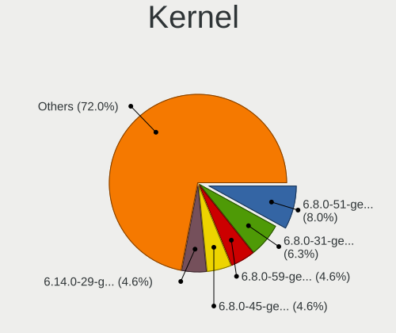

| Version              | Desktops | Percent |
|----------------------|----------|---------|
| 6.8.0-51-generic     | 14       | 8%      |
| 6.8.0-31-generic     | 11       | 6.29%   |
| 6.8.0-59-generic     | 8        | 4.57%   |
| 6.8.0-45-generic     | 8        | 4.57%   |
| 6.14.0-29-generic    | 8        | 4.57%   |
| 6.8.0-60-generic     | 7        | 4%      |
| 6.11.0-26-generic    | 7        | 4%      |
| 6.8.0-52-generic     | 6        | 3.43%   |
| 6.8.0-55-generic     | 5        | 2.86%   |
| 6.8.0-49-generic     | 5        | 2.86%   |
| 6.8.0-48-generic     | 5        | 2.86%   |
| 6.8.0-36-generic     | 5        | 2.86%   |
| 6.8.0-57-generic     | 4        | 2.29%   |
| 6.8.0-41-generic     | 4        | 2.29%   |
| 6.8.0-40-generic     | 4        | 2.29%   |
| 6.8.0-38-generic     | 4        | 2.29%   |
| 6.14.0-33-generic    | 4        | 2.29%   |
| 6.8.0-87-generic     | 3        | 1.71%   |
| 6.8.0-86-generic     | 3        | 1.71%   |
| 6.8.0-79-generic     | 3        | 1.71%   |
| 6.8.0-62-generic     | 3        | 1.71%   |
| 6.8.0-53-generic     | 3        | 1.71%   |
| 6.8.0-44-generic     | 3        | 1.71%   |
| 6.14.0-27-generic    | 3        | 1.71%   |
| 6.11.0-19-generic    | 3        | 1.71%   |
| 6.8.0-90-generic     | 2        | 1.14%   |
| 6.8.0-85-generic     | 2        | 1.14%   |
| 6.8.0-83-generic     | 2        | 1.14%   |
| 6.8.0-78-generic     | 2        | 1.14%   |
| 6.8.0-71-generic     | 2        | 1.14%   |
| 6.8.0-47-generic     | 2        | 1.14%   |
| 6.8.0-39-generic     | 2        | 1.14%   |
| 6.8.0-35-generic     | 2        | 1.14%   |
| 6.14.0-37-generic    | 2        | 1.14%   |
| 6.14.0-36-generic    | 2        | 1.14%   |
| 6.11.0-17-generic    | 2        | 1.14%   |
| 6.9.0-060900-generic | 1        | 0.57%   |
| 6.8.0-88-lowlatency  | 1        | 0.57%   |
| 6.8.0-88-generic     | 1        | 0.57%   |
| 6.8.0-87-lowlatency  | 1        | 0.57%   |

Kernel Family
-------------

Linux kernel without a distro release

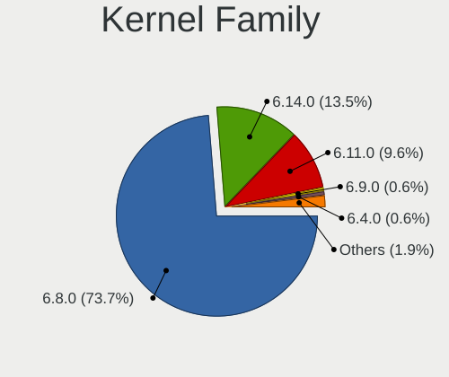

| Version | Desktops | Percent |
|---------|----------|---------|
| 6.8.0   | 115      | 73.72%  |
| 6.14.0  | 21       | 13.46%  |
| 6.11.0  | 15       | 9.62%   |
| 6.9.0   | 1        | 0.64%   |
| 6.4.0   | 1        | 0.64%   |
| 6.12.0  | 1        | 0.64%   |
| 6.10.10 | 1        | 0.64%   |
| 6.10.1  | 1        | 0.64%   |

Kernel Major Ver.
-----------------

Linux kernel major version

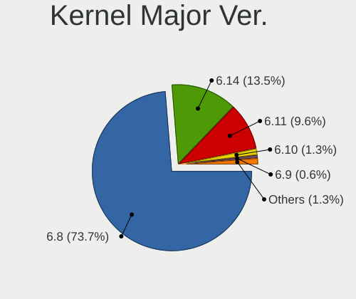

| Version | Desktops | Percent |
|---------|----------|---------|
| 6.8     | 115      | 73.72%  |
| 6.14    | 21       | 13.46%  |
| 6.11    | 15       | 9.62%   |
| 6.10    | 2        | 1.28%   |
| 6.9     | 1        | 0.64%   |
| 6.4     | 1        | 0.64%   |
| 6.12    | 1        | 0.64%   |

Arch
----

OS architecture (x86_64, i586, etc.)

| Name   | Desktops | Percent |
|--------|----------|---------|
| x86_64 | 151      | 100%    |

DE
--

Desktop Environment

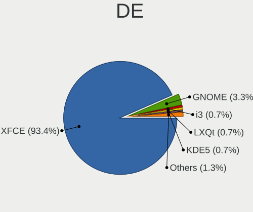

| Name            | Desktops | Percent |
|-----------------|----------|---------|
| XFCE            | 142      | 93.42%  |
| GNOME           | 5        | 3.29%   |
| LXQt            | 1        | 0.66%   |
| KDE5            | 1        | 0.66%   |
| i3              | 1        | 0.66%   |
| GNOME Flashback | 1        | 0.66%   |
| Budgie          | 1        | 0.66%   |

Display Server
--------------

X11 or Wayland

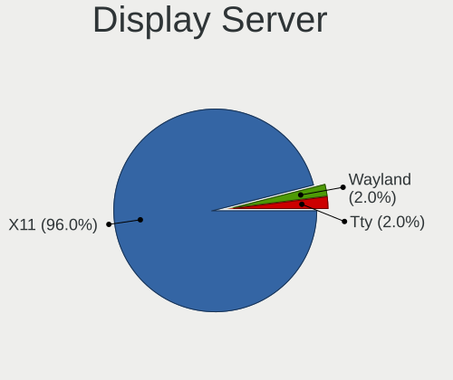

| Name    | Desktops | Percent |
|---------|----------|---------|
| X11     | 145      | 96.03%  |
| Wayland | 3        | 1.99%   |
| Tty     | 3        | 1.99%   |

Display Manager
---------------

SDDM, LightDM, etc.

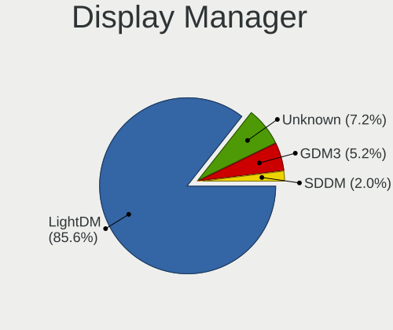

| Name    | Desktops | Percent |
|---------|----------|---------|
| LightDM | 131      | 85.62%  |
| Unknown | 11       | 7.19%   |
| GDM3    | 8        | 5.23%   |
| SDDM    | 3        | 1.96%   |

OS Lang
-------

Language

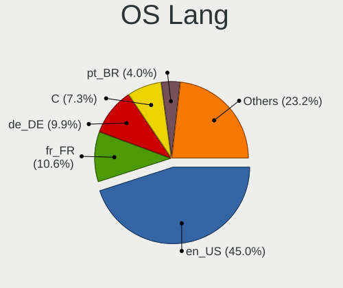

| Lang  | Desktops | Percent |
|-------|----------|---------|
| en_US | 68       | 45.03%  |
| fr_FR | 16       | 10.6%   |
| de_DE | 15       | 9.93%   |
| C     | 11       | 7.28%   |
| pt_BR | 6        | 3.97%   |
| es_ES | 6        | 3.97%   |
| it_IT | 5        | 3.31%   |
| en_GB | 5        | 3.31%   |
| en_CA | 4        | 2.65%   |
| cs_CZ | 3        | 1.99%   |
| ru_RU | 2        | 1.32%   |
| pl_PL | 2        | 1.32%   |
| fr_CA | 2        | 1.32%   |
| nl_NL | 1        | 0.66%   |
| nl_BE | 1        | 0.66%   |
| ja_JP | 1        | 0.66%   |
| eu_ES | 1        | 0.66%   |
| el_GR | 1        | 0.66%   |
| de_AT | 1        | 0.66%   |

Boot Mode
---------

EFI or BIOS

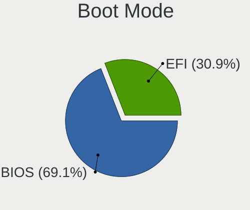

| Mode | Desktops | Percent |
|------|----------|---------|
| BIOS | 105      | 69.08%  |
| EFI  | 47       | 30.92%  |

Filesystem
----------

Type of filesystem

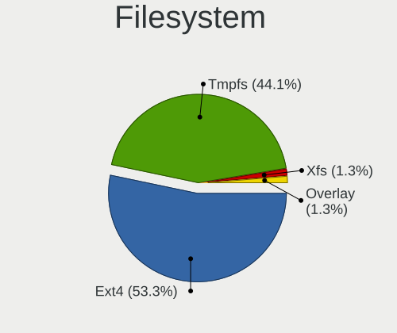

| Type    | Desktops | Percent |
|---------|----------|---------|
| Ext4    | 81       | 53.29%  |
| Tmpfs   | 67       | 44.08%  |
| Xfs     | 2        | 1.32%   |
| Overlay | 2        | 1.32%   |

Part. scheme
------------

Scheme of partitioning

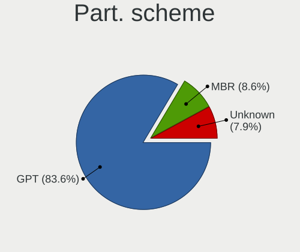

| Type    | Desktops | Percent |
|---------|----------|---------|
| GPT     | 127      | 83.55%  |
| MBR     | 13       | 8.55%   |
| Unknown | 12       | 7.89%   |

Dual Boot with Linux/BSD
------------------------

Hosting more than one Linux/BSD

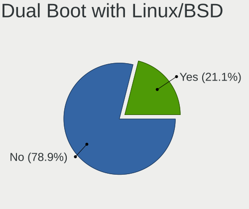

| Dual boot | Desktops | Percent |
|-----------|----------|---------|
| No        | 120      | 78.95%  |
| Yes       | 32       | 21.05%  |

Dual Boot (Win)
---------------

Hosting Linux and Windows

| Dual boot | Desktops | Percent |
|-----------|----------|---------|
| No        | 101      | 66.01%  |
| Yes       | 52       | 33.99%  |

Board
-----

Vendor
------

Motherboard manufacturer

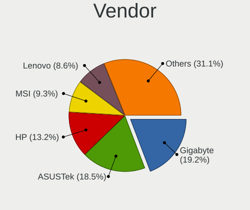

| Name                | Desktops | Percent |
|---------------------|----------|---------|
| Gigabyte Technology | 29       | 19.21%  |
| ASUSTek Computer    | 28       | 18.54%  |
| Hewlett-Packard     | 20       | 13.25%  |
| MSI                 | 14       | 9.27%   |
| Lenovo              | 13       | 8.61%   |
| Dell                | 9        | 5.96%   |
| ASRock              | 7        | 4.64%   |
| Intel               | 4        | 2.65%   |
| Unknown             | 4        | 2.65%   |
| Acer                | 3        | 1.99%   |
| Pegatron            | 2        | 1.32%   |
| Packard Bell        | 2        | 1.32%   |
| Medion              | 2        | 1.32%   |
| Foxconn             | 2        | 1.32%   |
| Vorke               | 1        | 0.66%   |
| Positivo            | 1        | 0.66%   |
| PCWare              | 1        | 0.66%   |
| MACHINIST           | 1        | 0.66%   |
| Huanan              | 1        | 0.66%   |
| Hardkernel          | 1        | 0.66%   |
| Google              | 1        | 0.66%   |
| Fujitsu             | 1        | 0.66%   |
| ECS                 | 1        | 0.66%   |
| C&T Solution        | 1        | 0.66%   |
| BESSTAR Tech        | 1        | 0.66%   |
| AZW                 | 1        | 0.66%   |

Model
-----

Motherboard model

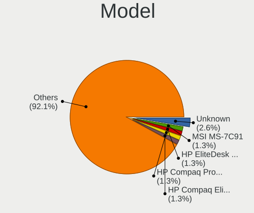

| Name                                | Desktops | Percent |
|-------------------------------------|----------|---------|
| Unknown                             | 4        | 2.65%   |
| MSI MS-7C91                         | 2        | 1.32%   |
| HP EliteDesk 705 G4 DM 65W (TAA)    | 2        | 1.32%   |
| HP Compaq Pro 6300 SFF              | 2        | 1.32%   |
| HP Compaq Elite 8300 SFF            | 2        | 1.32%   |
| Gigabyte GA-78LMT-USB3 6.0          | 2        | 1.32%   |
| ASUS PRIME B550M-K                  | 2        | 1.32%   |
| ASUS P7P55D                         | 2        | 1.32%   |
| Vorke V1 Plus                       | 1        | 0.66%   |
| Positivo C6300                      | 1        | 0.66%   |
| Pegatron NY803AAR-ABA p6150t        | 1        | 0.66%   |
| Pegatron FR644AA-ABF a6636fr        | 1        | 0.66%   |
| PCWare IPX1800G1                    | 1        | 0.66%   |
| Packard Bell IMEDIA S3840           | 1        | 0.66%   |
| Packard Bell IMEDIA S3210           | 1        | 0.66%   |
| MSI MS-7E27                         | 1        | 0.66%   |
| MSI MS-7D95                         | 1        | 0.66%   |
| MSI MS-7D53                         | 1        | 0.66%   |
| MSI MS-7C56                         | 1        | 0.66%   |
| MSI MS-7A38                         | 1        | 0.66%   |
| MSI MS-7A15                         | 1        | 0.66%   |
| MSI MS-7998                         | 1        | 0.66%   |
| MSI MS-7760                         | 1        | 0.66%   |
| MSI MS-7642                         | 1        | 0.66%   |
| MSI MS-7501                         | 1        | 0.66%   |
| MSI B450M/ac                        | 1        | 0.66%   |
| MSI 5860                            | 1        | 0.66%   |
| Medion MS-7728                      | 1        | 0.66%   |
| Medion Akoya P2120 D MD8836/2452    | 1        | 0.66%   |
| MACHINIST X99 G7 V1.0               | 1        | 0.66%   |
| Lenovo V530S-07ICB MT-M 10TX-009    | 1        | 0.66%   |
| Lenovo ThinkStation S30 43512E6     | 1        | 0.66%   |
| Lenovo ThinkCentre M92p 32381A9     | 1        | 0.66%   |
| Lenovo ThinkCentre M910q 10MUS0B600 | 1        | 0.66%   |
| Lenovo ThinkCentre M83 10ANS08H00   | 1        | 0.66%   |
| Lenovo ThinkCentre M83 10ANS05R00   | 1        | 0.66%   |
| Lenovo ThinkCentre M83 10AM0009US   | 1        | 0.66%   |
| Lenovo ThinkCentre M82 2756AT9      | 1        | 0.66%   |
| Lenovo ThinkCentre M73 10B5A002NZ   | 1        | 0.66%   |
| Lenovo ThinkCentre M720t 10SQ0067IX | 1        | 0.66%   |

Model Family
------------

Motherboard model prefix

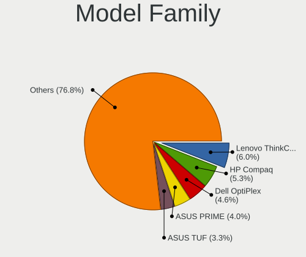

| Name                   | Desktops | Percent |
|------------------------|----------|---------|
| Lenovo ThinkCentre     | 9        | 5.96%   |
| HP Compaq              | 8        | 5.3%    |
| Dell OptiPlex          | 7        | 4.64%   |
| ASUS PRIME             | 6        | 3.97%   |
| ASUS TUF               | 5        | 3.31%   |
| Unknown                | 4        | 2.65%   |
| HP EliteDesk           | 3        | 1.99%   |
| Gigabyte GA-78LMT-USB3 | 3        | 1.99%   |
| ASUS ROG               | 3        | 1.99%   |
| Acer Aspire            | 3        | 1.99%   |
| Packard Bell IMEDIA    | 2        | 1.32%   |
| MSI MS-7C91            | 2        | 1.32%   |
| HP ProDesk             | 2        | 1.32%   |
| Gigabyte Z790          | 2        | 1.32%   |
| ASUS P7P55D            | 2        | 1.32%   |
| ASUS M5A78L-M          | 2        | 1.32%   |
| Vorke V1               | 1        | 0.66%   |
| Positivo C6300         | 1        | 0.66%   |
| Pegatron NY803AAR-ABA  | 1        | 0.66%   |
| Pegatron FR644AA-ABF   | 1        | 0.66%   |
| PCWare IPX1800G1       | 1        | 0.66%   |
| MSI MS-7E27            | 1        | 0.66%   |
| MSI MS-7D95            | 1        | 0.66%   |
| MSI MS-7D53            | 1        | 0.66%   |
| MSI MS-7C56            | 1        | 0.66%   |
| MSI MS-7A38            | 1        | 0.66%   |
| MSI MS-7A15            | 1        | 0.66%   |
| MSI MS-7998            | 1        | 0.66%   |
| MSI MS-7760            | 1        | 0.66%   |
| MSI MS-7642            | 1        | 0.66%   |
| MSI MS-7501            | 1        | 0.66%   |
| MSI B450M              | 1        | 0.66%   |
| MSI 5860               | 1        | 0.66%   |
| Medion MS-7728         | 1        | 0.66%   |
| Medion Akoya           | 1        | 0.66%   |
| MACHINIST X99          | 1        | 0.66%   |
| Lenovo V530S-07ICB     | 1        | 0.66%   |
| Lenovo ThinkStation    | 1        | 0.66%   |
| Lenovo IdeaCentre      | 1        | 0.66%   |
| Lenovo H50-55          | 1        | 0.66%   |

MFG Year
--------

Motherboard manufacture year

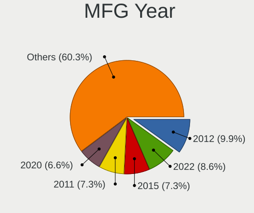

| Year | Desktops | Percent |
|------|----------|---------|
| 2012 | 15       | 9.93%   |
| 2022 | 13       | 8.61%   |
| 2015 | 11       | 7.28%   |
| 2011 | 11       | 7.28%   |
| 2020 | 10       | 6.62%   |
| 2009 | 10       | 6.62%   |
| 2023 | 9        | 5.96%   |
| 2019 | 9        | 5.96%   |
| 2013 | 9        | 5.96%   |
| 2021 | 8        | 5.3%    |
| 2014 | 8        | 5.3%    |
| 2024 | 7        | 4.64%   |
| 2016 | 7        | 4.64%   |
| 2010 | 6        | 3.97%   |
| 2008 | 6        | 3.97%   |
| 2018 | 5        | 3.31%   |
| 2017 | 4        | 2.65%   |
| 2007 | 3        | 1.99%   |

Form Factor
-----------

Physical design of the computer

| Name    | Desktops | Percent |
|---------|----------|---------|
| Desktop | 151      | 100%    |

Secure Boot
-----------

Enabled or disabled

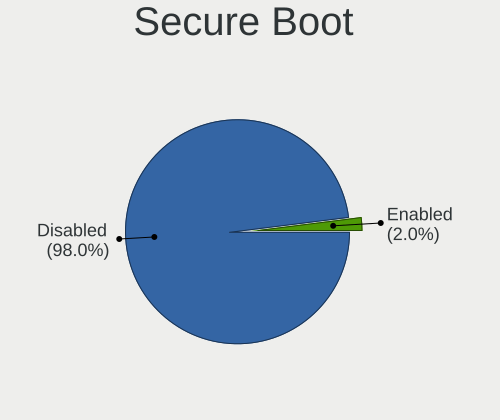

| State    | Desktops | Percent |
|----------|----------|---------|
| Disabled | 148      | 98.01%  |
| Enabled  | 3        | 1.99%   |

Coreboot
--------

Have coreboot on board

| Used | Desktops | Percent |
|------|----------|---------|
| No   | 150      | 99.34%  |
| Yes  | 1        | 0.66%   |

RAM Size
--------

Total RAM memory

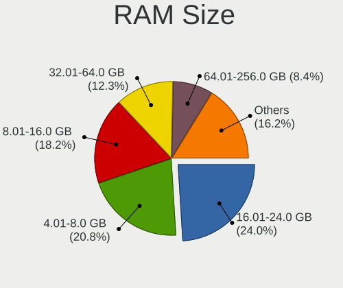

| Size in GB      | Desktops | Percent |
|-----------------|----------|---------|
| 16.01-24.0      | 37       | 24.03%  |
| 4.01-8.0        | 32       | 20.78%  |
| 8.01-16.0       | 28       | 18.18%  |
| 32.01-64.0      | 19       | 12.34%  |
| 64.01-256.0     | 13       | 8.44%   |
| 3.01-4.0        | 9        | 5.84%   |
| 24.01-32.0      | 8        | 5.19%   |
| 2.01-3.0        | 4        | 2.6%    |
| 1.01-2.0        | 3        | 1.95%   |
| More than 256.0 | 1        | 0.65%   |

RAM Used
--------

Used RAM memory

| Used GB    | Desktops | Percent |
|------------|----------|---------|
| 1.01-2.0   | 49       | 30.06%  |
| 2.01-3.0   | 44       | 26.99%  |
| 4.01-8.0   | 25       | 15.34%  |
| 3.01-4.0   | 21       | 12.88%  |
| 8.01-16.0  | 14       | 8.59%   |
| 0.51-1.0   | 8        | 4.91%   |
| 24.01-32.0 | 1        | 0.61%   |
| 16.01-24.0 | 1        | 0.61%   |

Total Drives
------------

Number of drives on board

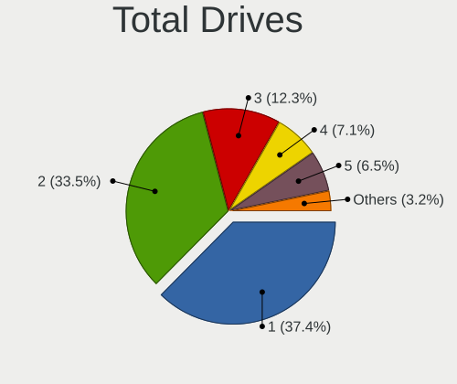

| Drives | Desktops | Percent |
|--------|----------|---------|
| 1      | 58       | 37.42%  |
| 2      | 52       | 33.55%  |
| 3      | 19       | 12.26%  |
| 4      | 11       | 7.1%    |
| 5      | 10       | 6.45%   |
| 6      | 3        | 1.94%   |
| 7      | 1        | 0.65%   |
| 0      | 1        | 0.65%   |

Has CD-ROM
----------

Has CD-ROM on board

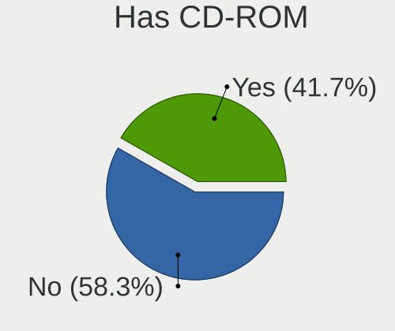

| Presented | Desktops | Percent |
|-----------|----------|---------|
| No        | 88       | 58.28%  |
| Yes       | 63       | 41.72%  |

Has Ethernet
------------

Has Ethernet on board

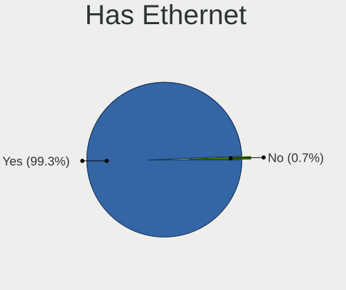

| Presented | Desktops | Percent |
|-----------|----------|---------|
| Yes       | 150      | 99.34%  |
| No        | 1        | 0.66%   |

Has WiFi
--------

Has WiFi module

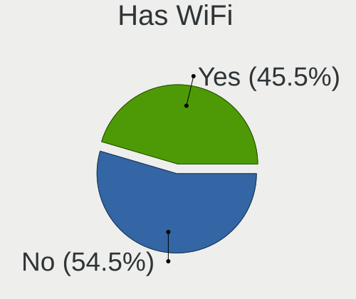

| Presented | Desktops | Percent |
|-----------|----------|---------|
| No        | 84       | 54.55%  |
| Yes       | 70       | 45.45%  |

Has Bluetooth
-------------

Has Bluetooth module

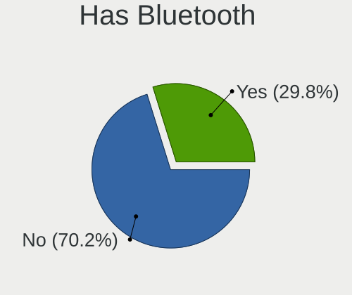

| Presented | Desktops | Percent |
|-----------|----------|---------|
| No        | 106      | 70.2%   |
| Yes       | 45       | 29.8%   |

Location
--------

Country
-------

Geographic location (country)

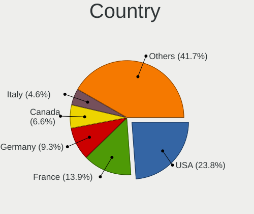

| Country         | Desktops | Percent |
|-----------------|----------|---------|
| USA             | 36       | 23.84%  |
| France          | 21       | 13.91%  |
| Germany         | 14       | 9.27%   |
| Canada          | 10       | 6.62%   |
| Italy           | 7        | 4.64%   |
| Brazil          | 7        | 4.64%   |
| Spain           | 5        | 3.31%   |
| Russia          | 5        | 3.31%   |
| Austria         | 5        | 3.31%   |
| UK              | 4        | 2.65%   |
| Ukraine         | 3        | 1.99%   |
| Norway          | 3        | 1.99%   |
| Netherlands     | 3        | 1.99%   |
| Czechia         | 3        | 1.99%   |
| Poland          | 2        | 1.32%   |
| Isle of Man     | 2        | 1.32%   |
| India           | 2        | 1.32%   |
| Belgium         | 2        | 1.32%   |
| Australia       | 2        | 1.32%   |
| Vietnam         | 1        | 0.66%   |
| The Netherlands | 1        | 0.66%   |
| Sweden          | 1        | 0.66%   |
| Serbia          | 1        | 0.66%   |
| Portugal        | 1        | 0.66%   |
| Peru            | 1        | 0.66%   |
| New Zealand     | 1        | 0.66%   |
| Mexico          | 1        | 0.66%   |
| Japan           | 1        | 0.66%   |
| Greece          | 1        | 0.66%   |
| Egypt           | 1        | 0.66%   |
| Croatia         | 1        | 0.66%   |
| Costa Rica      | 1        | 0.66%   |
| Argentina       | 1        | 0.66%   |
| Algeria         | 1        | 0.66%   |

City
----

Geographic location (city)

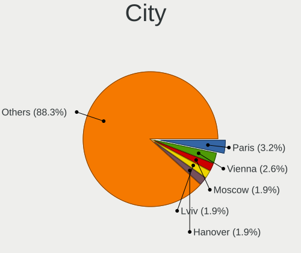

| City                      | Desktops | Percent |
|---------------------------|----------|---------|
| Paris                     | 5        | 3.25%   |
| Vienna                    | 4        | 2.6%    |
| Moscow                    | 3        | 1.95%   |
| Lviv                      | 3        | 1.95%   |
| Hanover                   | 3        | 1.95%   |
| Berlin                    | 3        | 1.95%   |
| Rochester                 | 2        | 1.3%    |
| Ramsey                    | 2        | 1.3%    |
| Prague                    | 2        | 1.3%    |
| Padova                    | 2        | 1.3%    |
| Mississauga               | 2        | 1.3%    |
| Louisville                | 2        | 1.3%    |
| Longueuil                 | 2        | 1.3%    |
| Houston                   | 2        | 1.3%    |
| Birmingham                | 2        | 1.3%    |
| Xalapa                    | 1        | 0.65%   |
| Villefranche-de-Lauragais | 1        | 0.65%   |
| Villach                   | 1        | 0.65%   |
| Vernon                    | 1        | 0.65%   |
| Vanves                    | 1        | 0.65%   |
| Valdosta                  | 1        | 0.65%   |
| Ulyanovsk                 | 1        | 0.65%   |
| Traverse City             | 1        | 0.65%   |
| Toul                      | 1        | 0.65%   |
| Toronto                   | 1        | 0.65%   |
| Tokyo                     | 1        | 0.65%   |
| Thunder Bay               | 1        | 0.65%   |
| Thouars                   | 1        | 0.65%   |
| Tampa                     | 1        | 0.65%   |
| Surrey                    | 1        | 0.65%   |
| Stourbridge               | 1        | 0.65%   |
| Stockach                  | 1        | 0.65%   |
| St Petersburg             | 1        | 0.65%   |
| Seattle                   | 1        | 0.65%   |
| Santa Cruz do Sul         | 1        | 0.65%   |
| Reutlingen                | 1        | 0.65%   |
| Reno                      | 1        | 0.65%   |
| Remington                 | 1        | 0.65%   |
| Redding                   | 1        | 0.65%   |
| Rab                       | 1        | 0.65%   |

Drives
------

Drive Vendor
------------

Hard drive vendors

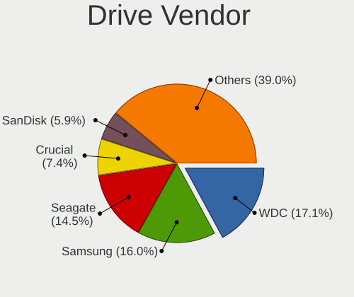

| Vendor                         | Desktops | Drives | Percent |
|--------------------------------|----------|--------|---------|
| WDC                            | 46       | 65     | 17.1%   |
| Samsung Electronics            | 43       | 63     | 15.99%  |
| Seagate                        | 39       | 53     | 14.5%   |
| Crucial                        | 20       | 26     | 7.43%   |
| SanDisk                        | 16       | 27     | 5.95%   |
| Kingston                       | 13       | 15     | 4.83%   |
| Toshiba                        | 7        | 9      | 2.6%    |
| Hitachi                        | 5        | 5      | 1.86%   |
| HGST                           | 5        | 19     | 1.86%   |
| Unknown                        | 4        | 4      | 1.49%   |
| PNY                            | 4        | 5      | 1.49%   |
| JMicron Technology             | 4        | 7      | 1.49%   |
| China                          | 4        | 5      | 1.49%   |
| Transcend                      | 3        | 3      | 1.12%   |
| SPCC                           | 3        | 3      | 1.12%   |
| SK hynix                       | 3        | 4      | 1.12%   |
| Phison                         | 3        | 8      | 1.12%   |
| Patriot                        | 3        | 3      | 1.12%   |
| Micron Technology              | 3        | 3      | 1.12%   |
| Intenso                        | 3        | 3      | 1.12%   |
| Micron/Crucial Technology      | 2        | 3      | 0.74%   |
| Lexar                          | 2        | 2      | 0.74%   |
| HPE                            | 2        | 2      | 0.74%   |
| ADATA Technology               | 2        | 2      | 0.74%   |
| Unknown                        | 2        | 2      | 0.74%   |
| Vi550                          | 1        | 1      | 0.37%   |
| ValueTech                      | 1        | 1      | 0.37%   |
| Team                           | 1        | 1      | 0.37%   |
| Synology                       | 1        | 2      | 0.37%   |
| Solid State Storage Technology | 1        | 1      | 0.37%   |
| Shenzhen                       | 1        | 1      | 0.37%   |
| Realtek Semiconductor          | 1        | 2      | 0.37%   |
| Phison Electronics             | 1        | 1      | 0.37%   |
| OEM                            | 1        | 1      | 0.37%   |
| OCZ                            | 1        | 1      | 0.37%   |
| MAXIO Technology (Hangzhou)    | 1        | 1      | 0.37%   |
| MaxDigital                     | 1        | 1      | 0.37%   |
| LITEON                         | 1        | 1      | 0.37%   |
| Lexar 51                       | 1        | 1      | 0.37%   |
| KIOXIA-EXCERIA                 | 1        | 1      | 0.37%   |

Drive Model
-----------

Hard drive models

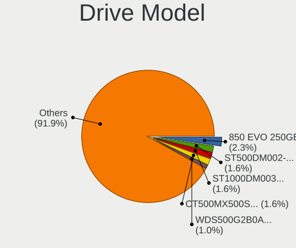

| Model                                              | Desktops | Percent |
|----------------------------------------------------|----------|---------|
| Samsung SSD 850 EVO 250GB                          | 7        | 2.27%   |
| Seagate ST500DM002-1BD142 500GB                    | 5        | 1.62%   |
| Seagate ST1000DM003-1CH162 1TB                     | 5        | 1.62%   |
| Crucial CT500MX500SSD1 500GB                       | 5        | 1.62%   |
| WDC WDS500G2B0A-00SM50 500GB                       | 3        | 0.97%   |
| Seagate ST4000DM004-2CV104 4TB                     | 3        | 0.97%   |
| Sandisk WD_BLACK SN770 2TB                         | 3        | 0.97%   |
| Samsung SSD 840 EVO 250GB                          | 3        | 0.97%   |
| Kingston SA400S37240G 240GB SSD                    | 3        | 0.97%   |
| WDC WD20PURX-64PFUY0 2TB                           | 2        | 0.65%   |
| WDC WD20EZRZ-00Z5HB0 2TB                           | 2        | 0.65%   |
| WDC WD20EARS-60MVWB0 2TB                           | 2        | 0.65%   |
| WDC WD10JPVT-00A1YT0 1TB                           | 2        | 0.65%   |
| WDC WD10EACS-00D6B0 1TB                            | 2        | 0.65%   |
| Unknown SD/MMC/MS PRO 2GB                          | 2        | 0.65%   |
| Unknown External 2TB                               | 2        | 0.65%   |
| Seagate ST9500420AS 500GB                          | 2        | 0.65%   |
| Seagate ST3500418AS 500GB                          | 2        | 0.65%   |
| Seagate ST3500413AS 500GB                          | 2        | 0.65%   |
| Seagate ST2000DM008-2FR102 2TB                     | 2        | 0.65%   |
| Seagate ST2000DM001-1ER164 2TB                     | 2        | 0.65%   |
| Seagate ST2000DM001-1CH164 2TB                     | 2        | 0.65%   |
| Seagate ST1500LM006 HN-M151RAD 1TB                 | 2        | 0.65%   |
| Seagate ST1000DM003-1SB102 1TB                     | 2        | 0.65%   |
| SanDisk SSD PLUS 1000GB                            | 2        | 0.65%   |
| SanDisk SDSSDH3 500G                               | 2        | 0.65%   |
| Samsung SSD 990 PRO 2TB                            | 2        | 0.65%   |
| Samsung SSD 980 1TB                                | 2        | 0.65%   |
| Samsung SSD 870 QVO 1TB                            | 2        | 0.65%   |
| Samsung NVMe SSD Controller SM981/PM981/PM983 1TB  | 2        | 0.65%   |
| Samsung NVMe SSD Controller PM9A1/PM9A3/980PRO 1TB | 2        | 0.65%   |
| Samsung HD322HJ 320GB                              | 2        | 0.65%   |
| Samsung HD161GJ 160GB                              | 2        | 0.65%   |
| PNY CS1311 240GB SSD                               | 2        | 0.65%   |
| Lexar 512GB SSD                                    | 2        | 0.65%   |
| JMicron Tech 250GB                                 | 2        | 0.65%   |
| HGST HUS724030ALS640 3TB                           | 2        | 0.65%   |
| Crucial CT480BX500SSD1 480GB                       | 2        | 0.65%   |
| Crucial CT1000P5PSSD8 1TB                          | 2        | 0.65%   |
| China SSD 128GB                                    | 2        | 0.65%   |

HDD Vendor
----------

Hard disk drive vendors

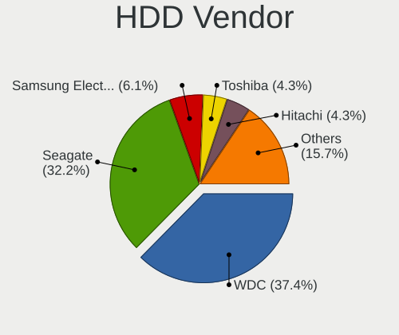

| Vendor              | Desktops | Drives | Percent |
|---------------------|----------|--------|---------|
| WDC                 | 43       | 59     | 37.39%  |
| Seagate             | 37       | 51     | 32.17%  |
| Samsung Electronics | 7        | 8      | 6.09%   |
| Toshiba             | 5        | 7      | 4.35%   |
| Hitachi             | 5        | 5      | 4.35%   |
| HGST                | 5        | 19     | 4.35%   |
| Unknown             | 4        | 4      | 3.48%   |
| JMicron Technology  | 2        | 5      | 1.74%   |
| HPE                 | 2        | 2      | 1.74%   |
| Synology            | 1        | 2      | 0.87%   |
| Shenzhen            | 1        | 1      | 0.87%   |
| OEM                 | 1        | 1      | 0.87%   |
| MaxDigital          | 1        | 1      | 0.87%   |
| Intenso             | 1        | 1      | 0.87%   |

SSD Vendor
----------

Solid state drive vendors

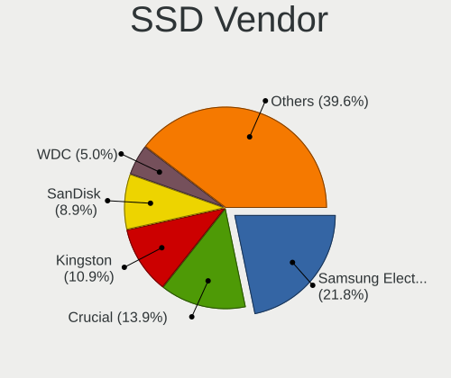

| Vendor              | Desktops | Drives | Percent |
|---------------------|----------|--------|---------|
| Samsung Electronics | 22       | 25     | 21.78%  |
| Crucial             | 14       | 19     | 13.86%  |
| Kingston            | 11       | 12     | 10.89%  |
| SanDisk             | 9        | 16     | 8.91%   |
| WDC                 | 5        | 5      | 4.95%   |
| PNY                 | 4        | 5      | 3.96%   |
| China               | 4        | 5      | 3.96%   |
| Transcend           | 3        | 3      | 2.97%   |
| Micron Technology   | 3        | 3      | 2.97%   |
| SPCC                | 2        | 2      | 1.98%   |
| Patriot             | 2        | 2      | 1.98%   |
| Lexar               | 2        | 2      | 1.98%   |
| Intenso             | 2        | 2      | 1.98%   |
| Vi550               | 1        | 1      | 0.99%   |
| ValueTech           | 1        | 1      | 0.99%   |
| Toshiba             | 1        | 1      | 0.99%   |
| Team                | 1        | 1      | 0.99%   |
| SK hynix            | 1        | 1      | 0.99%   |
| Seagate             | 1        | 1      | 0.99%   |
| OCZ                 | 1        | 1      | 0.99%   |
| LITEON              | 1        | 1      | 0.99%   |
| Lexar 51            | 1        | 1      | 0.99%   |
| KIOXIA-EXCERIA      | 1        | 1      | 0.99%   |
| Intel               | 1        | 1      | 0.99%   |
| HUSKY               | 1        | 2      | 0.99%   |
| HOGE                | 1        | 1      | 0.99%   |
| GOODRAM             | 1        | 2      | 0.99%   |
| General             | 1        | 1      | 0.99%   |
| FORESEE             | 1        | 1      | 0.99%   |
| Apacer A            | 1        | 1      | 0.99%   |
| A-DATA Technology   | 1        | 2      | 0.99%   |

Drive Kind
----------

HDD or SSD

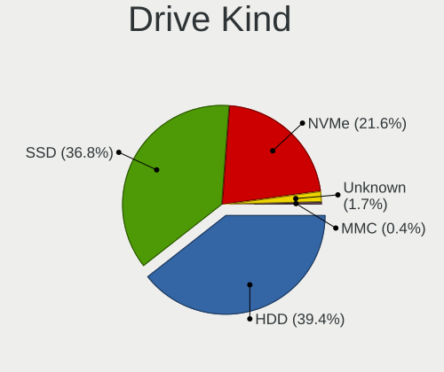

| Kind    | Desktops | Drives | Percent |
|---------|----------|--------|---------|
| HDD     | 91       | 166    | 39.39%  |
| SSD     | 85       | 122    | 36.8%   |
| NVMe    | 50       | 85     | 21.65%  |
| Unknown | 4        | 4      | 1.73%   |
| MMC     | 1        | 1      | 0.43%   |

Drive Connector
---------------

SATA, SAS, NVMe, etc.

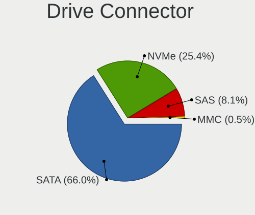

| Type | Desktops | Drives | Percent |
|------|----------|--------|---------|
| SATA | 130      | 265    | 65.99%  |
| NVMe | 50       | 85     | 25.38%  |
| SAS  | 16       | 27     | 8.12%   |
| MMC  | 1        | 1      | 0.51%   |

Drive Size
----------

Size of hard drive

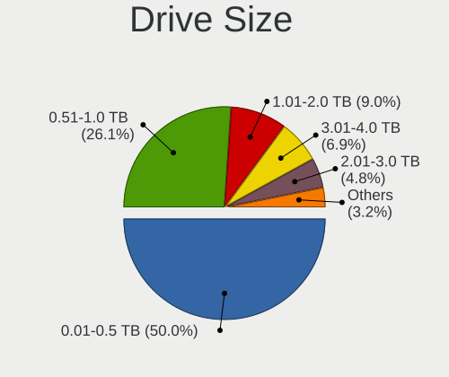

| Size in TB | Desktops | Drives | Percent |
|------------|----------|--------|---------|
| 0.01-0.5   | 94       | 144    | 50%     |
| 0.51-1.0   | 49       | 71     | 26.06%  |
| 1.01-2.0   | 17       | 25     | 9.04%   |
| 3.01-4.0   | 13       | 19     | 6.91%   |
| 2.01-3.0   | 9        | 23     | 4.79%   |
| 10.01-20.0 | 3        | 3      | 1.6%    |
| 4.01-10.0  | 2        | 2      | 1.06%   |
| 20.01-50.0 | 1        | 1      | 0.53%   |

Space Total
-----------

Amount of disk space available on the file system

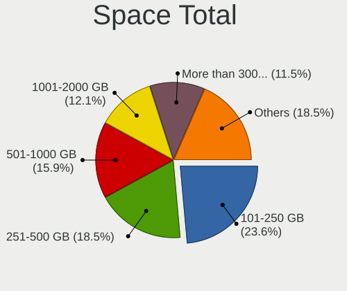

| Size in GB     | Desktops | Percent |
|----------------|----------|---------|
| 101-250        | 37       | 23.57%  |
| 251-500        | 29       | 18.47%  |
| 501-1000       | 25       | 15.92%  |
| 1001-2000      | 19       | 12.1%   |
| More than 3000 | 18       | 11.46%  |
| 2001-3000      | 10       | 6.37%   |
| 1-20           | 7        | 4.46%   |
| 51-100         | 6        | 3.82%   |
| 21-50          | 4        | 2.55%   |
| Unknown        | 2        | 1.27%   |

Space Used
----------

Amount of used disk space

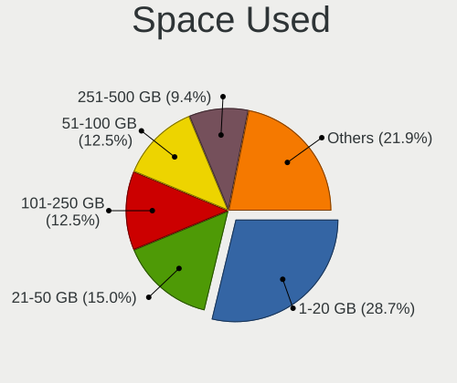

| Used GB        | Desktops | Percent |
|----------------|----------|---------|
| 1-20           | 46       | 28.75%  |
| 21-50          | 24       | 15%     |
| 101-250        | 20       | 12.5%   |
| 51-100         | 20       | 12.5%   |
| 251-500        | 15       | 9.38%   |
| 501-1000       | 13       | 8.13%   |
| More than 3000 | 9        | 5.63%   |
| 1001-2000      | 8        | 5%      |
| 2001-3000      | 3        | 1.88%   |
| Unknown        | 2        | 1.25%   |

Malfunc. Drives
---------------

Drive models with a malfunction

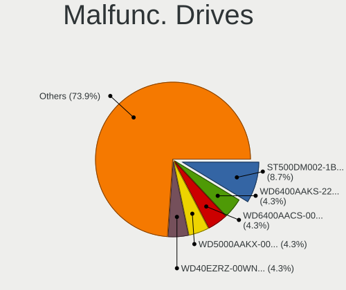

| Model                             | Desktops | Drives | Percent |
|-----------------------------------|----------|--------|---------|
| Seagate ST500DM002-1BD142 500GB   | 2        | 2      | 8.7%    |
| WDC WD6400AAKS-22A7B2 640GB       | 1        | 1      | 4.35%   |
| WDC WD6400AACS-00G8B1 640GB       | 1        | 1      | 4.35%   |
| WDC WD5000AAKX-00ERMA0 500GB      | 1        | 1      | 4.35%   |
| WDC WD40EZRZ-00WN9B0 4TB          | 1        | 1      | 4.35%   |
| WDC WD2500AAKX-08U6AA0 250GB      | 1        | 1      | 4.35%   |
| WDC WD2003FYYS-05T9B0 2TB         | 1        | 1      | 4.35%   |
| WDC WD1601ABYS-18C0A0 160GB       | 1        | 1      | 4.35%   |
| WDC WD10PURX-64E5EY0 1TB          | 1        | 2      | 4.35%   |
| WDC WD1002FAEX-00Z3A0 1TB         | 1        | 1      | 4.35%   |
| Toshiba HDWD130 3TB               | 1        | 1      | 4.35%   |
| Seagate ST3500418AS 500GB         | 1        | 1      | 4.35%   |
| Seagate ST3000NC000-1CX166 3TB    | 1        | 1      | 4.35%   |
| Seagate ST16000NE000-2RW103 16TB  | 1        | 1      | 4.35%   |
| Seagate ST1000DM003-9YN162 1TB    | 1        | 1      | 4.35%   |
| Seagate ST1000DM003-1CH162 1TB    | 1        | 1      | 4.35%   |
| Samsung Electronics SP2004C 200GB | 1        | 1      | 4.35%   |
| Samsung Electronics HM321HI 320GB | 1        | 1      | 4.35%   |
| Samsung Electronics HD322HJ 320GB | 1        | 1      | 4.35%   |
| OCZ VERTEX4 256GB SSD             | 1        | 1      | 4.35%   |
| Kingston SKC600512G 512GB SSD     | 1        | 1      | 4.35%   |
| Kingston SA400S37240G 240GB SSD   | 1        | 1      | 4.35%   |

Malfunc. Drive Vendor
---------------------

Vendors of faulty drives

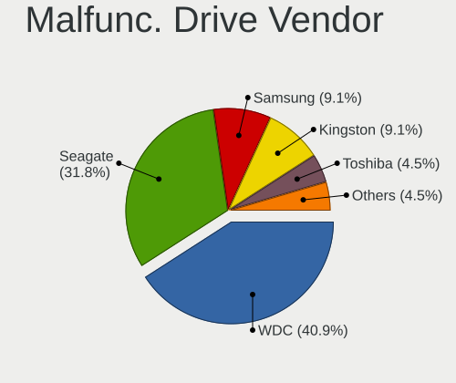

| Vendor              | Desktops | Drives | Percent |
|---------------------|----------|--------|---------|
| WDC                 | 9        | 10     | 40.91%  |
| Seagate             | 7        | 7      | 31.82%  |
| Samsung Electronics | 2        | 3      | 9.09%   |
| Kingston            | 2        | 2      | 9.09%   |
| Toshiba             | 1        | 1      | 4.55%   |
| OCZ                 | 1        | 1      | 4.55%   |

Malfunc. HDD Vendor
-------------------

Vendors of faulty HDD drives

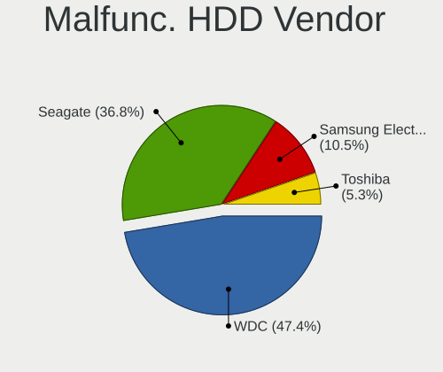

| Vendor              | Desktops | Drives | Percent |
|---------------------|----------|--------|---------|
| WDC                 | 9        | 10     | 47.37%  |
| Seagate             | 7        | 7      | 36.84%  |
| Samsung Electronics | 2        | 3      | 10.53%  |
| Toshiba             | 1        | 1      | 5.26%   |

Malfunc. Drive Kind
-------------------

Kinds of faulty drives

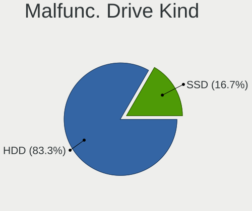

| Kind | Desktops | Drives | Percent |
|------|----------|--------|---------|
| HDD  | 15       | 21     | 83.33%  |
| SSD  | 3        | 3      | 16.67%  |

Failed Drives
-------------

Failed drive models

Zero info for selected period =(

Failed Drive Vendor
-------------------

Failed drive vendors

Zero info for selected period =(

Drive Status
------------

Number of failed and malfunc. drives

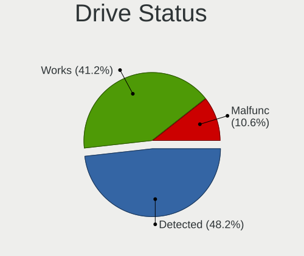

| Status   | Desktops | Drives | Percent |
|----------|----------|--------|---------|
| Detected | 82       | 208    | 48.24%  |
| Works    | 70       | 146    | 41.18%  |
| Malfunc  | 18       | 24     | 10.59%  |

Storage controller
------------------

Storage Vendor
--------------

Storage controller vendors

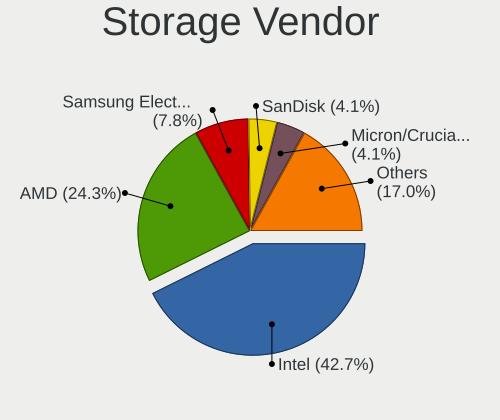

| Vendor                         | Desktops | Percent |
|--------------------------------|----------|---------|
| Intel                          | 93       | 42.66%  |
| AMD                            | 53       | 24.31%  |
| Samsung Electronics            | 17       | 7.8%    |
| SanDisk                        | 9        | 4.13%   |
| Micron/Crucial Technology      | 9        | 4.13%   |
| JMicron Technology             | 6        | 2.75%   |
| Phison Electronics             | 5        | 2.29%   |
| Marvell Technology Group       | 3        | 1.38%   |
| Kingston Technology Company    | 3        | 1.38%   |
| ASMedia Technology             | 3        | 1.38%   |
| SK hynix                       | 2        | 0.92%   |
| Realtek Semiconductor          | 2        | 0.92%   |
| Nvidia                         | 2        | 0.92%   |
| MAXIO Technology (Hangzhou)    | 2        | 0.92%   |
| Broadcom / LSI                 | 2        | 0.92%   |
| ADATA Technology               | 2        | 0.92%   |
| Toshiba America Info Systems   | 1        | 0.46%   |
| Solid State Storage Technology | 1        | 0.46%   |
| Silicon Motion                 | 1        | 0.46%   |
| Integrated Technology Express  | 1        | 0.46%   |
| HighPoint Technologies         | 1        | 0.46%   |

Storage Model
-------------

Storage controller models

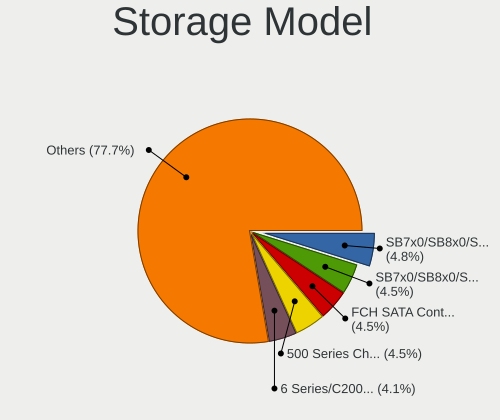

| Model                                                                                   | Desktops | Percent |
|-----------------------------------------------------------------------------------------|----------|---------|
| AMD SB7x0/SB8x0/SB9x0 IDE Controller                                                    | 13       | 4.83%   |
| AMD SB7x0/SB8x0/SB9x0 SATA Controller [AHCI mode]                                       | 12       | 4.46%   |
| AMD FCH SATA Controller [AHCI mode]                                                     | 12       | 4.46%   |
| AMD 500 Series Chipset SATA Controller                                                  | 12       | 4.46%   |
| Intel 6 Series/C200 Series Chipset Family 6 port Desktop SATA AHCI Controller           | 11       | 4.09%   |
| Intel Q170/Q150/B150/H170/H110/Z170/CM236 Chipset SATA Controller [AHCI Mode]           | 10       | 3.72%   |
| Intel 7 Series/C210 Series Chipset Family 6-port SATA Controller [AHCI mode]            | 10       | 3.72%   |
| Intel 8 Series/C220 Series Chipset Family 6-port SATA Controller 1 [AHCI mode]          | 9        | 3.35%   |
| AMD 600 Series Chipset SATA Controller                                                  | 9        | 3.35%   |
| Intel SATA Controller [RAID Mode]                                                       | 7        | 2.6%    |
| Samsung NVMe SSD Controller SM981/PM981/PM983                                           | 6        | 2.23%   |
| SanDisk WD SN560/SN740/SN770/SN5000 NVMe SSD                                            | 5        | 1.86%   |
| Intel Cannon Lake PCH SATA AHCI Controller                                              | 5        | 1.86%   |
| AMD SB7x0/SB8x0/SB9x0 SATA Controller [IDE mode]                                        | 5        | 1.86%   |
| AMD 400 Series Chipset SATA Controller                                                  | 5        | 1.86%   |
| Intel NM10/ICH7 Family SATA Controller [IDE mode]                                       | 4        | 1.49%   |
| Intel 6 Series/C200 Series Chipset Family Desktop SATA Controller (IDE mode, ports 4-5) | 4        | 1.49%   |
| Intel 6 Series/C200 Series Chipset Family Desktop SATA Controller (IDE mode, ports 0-3) | 4        | 1.49%   |
| Samsung NVMe SSD Controller PM9A1/PM9A3/980PRO                                          | 3        | 1.12%   |
| Samsung NVMe SSD Controller 980 (DRAM-less)                                             | 3        | 1.12%   |
| Micron/Crucial P5 Plus NVMe PCIe SSD                                                    | 3        | 1.12%   |
| Micron/Crucial P2 [Nick P2] / P3 / P3 Plus NVMe PCIe SSD (DRAM-less)                    | 3        | 1.12%   |
| JMicron JMB363 SATA/IDE Controller                                                      | 3        | 1.12%   |
| Intel Raptor Lake SATA AHCI Controller                                                  | 3        | 1.12%   |
| Intel Atom Processor E3800 Series SATA AHCI Controller                                  | 3        | 1.12%   |
| Intel 82801G (ICH7 Family) IDE Controller                                               | 3        | 1.12%   |
| Intel 5 Series/3400 Series Chipset 4 port SATA IDE Controller                           | 3        | 1.12%   |
| Intel 5 Series/3400 Series Chipset 2 port SATA IDE Controller                           | 3        | 1.12%   |
| Intel 200 Series PCH SATA controller [AHCI mode]                                        | 3        | 1.12%   |
| ASMedia ASM1061/ASM1062 Serial ATA Controller                                           | 3        | 1.12%   |
| AMD 300 Series Chipset SATA Controller                                                  | 3        | 1.12%   |
| Samsung NVMe SSD Controller SM961/PM961/SM963                                           | 2        | 0.74%   |
| Samsung NVMe SSD Controller S4LV008[Pascal]                                             | 2        | 0.74%   |
| Realtek RTS5765DL NVMe SSD Controller (DRAM-less)                                       | 2        | 0.74%   |
| Phison E12 NVMe Controller                                                              | 2        | 0.74%   |
| MAXIO (Hangzhou) NVMe SSD Controller MAP1202 (DRAM-less)                                | 2        | 0.74%   |
| Intel Comet Lake SATA AHCI Controller                                                   | 2        | 0.74%   |
| Intel C610/X99 series chipset sSATA Controller [AHCI mode]                              | 2        | 0.74%   |
| Intel C602 chipset 4-Port SATA Storage Control Unit                                     | 2        | 0.74%   |
| Intel C600/X79 series chipset IDE-r Controller                                          | 2        | 0.74%   |

Storage Kind
------------

Kind of storage controller (IDE, SATA, NVMe, SAS, ...)

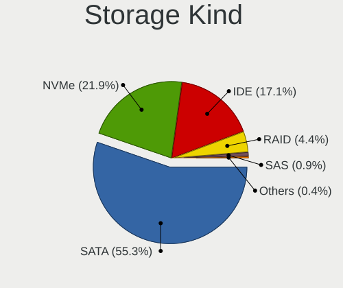

| Kind | Desktops | Percent |
|------|----------|---------|
| SATA | 126      | 55.26%  |
| NVMe | 50       | 21.93%  |
| IDE  | 39       | 17.11%  |
| RAID | 10       | 4.39%   |
| SAS  | 2        | 0.88%   |
| SCSI | 1        | 0.44%   |

Processor
---------

CPU Vendor
----------

Processor vendors

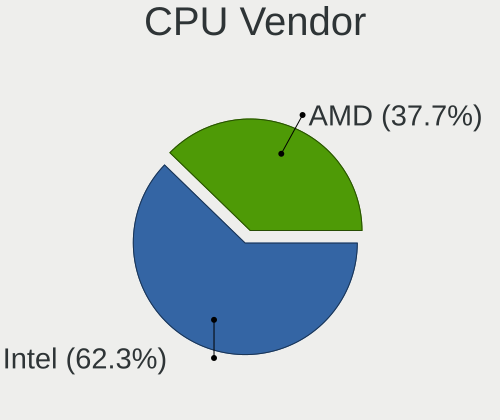

| Vendor | Desktops | Percent |
|--------|----------|---------|
| Intel  | 94       | 62.25%  |
| AMD    | 57       | 37.75%  |

CPU Model
---------

Processor models

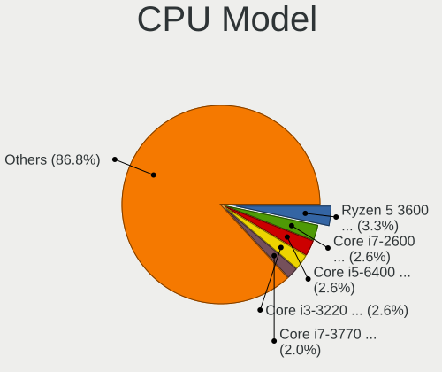

| Model                                           | Desktops | Percent |
|-------------------------------------------------|----------|---------|
| AMD Ryzen 5 3600 6-Core Processor               | 5        | 3.29%   |
| Intel Core i7-2600 CPU @ 3.40GHz                | 4        | 2.63%   |
| Intel Core i5-6400 CPU @ 2.70GHz                | 4        | 2.63%   |
| Intel Core i3-3220 CPU @ 3.30GHz                | 4        | 2.63%   |
| Intel Core i7-3770 CPU @ 3.40GHz                | 3        | 1.97%   |
| Intel Core i5 CPU 760 @ 2.80GHz                 | 3        | 1.97%   |
| AMD Ryzen 9 9950X 16-Core Processor             | 3        | 1.97%   |
| AMD FX-8350 Eight-Core Processor                | 3        | 1.97%   |
| Intel Xeon CPU E5-2697 v2 @ 2.70GHz             | 2        | 1.32%   |
| Intel Core i7-4770 CPU @ 3.40GHz                | 2        | 1.32%   |
| Intel Core i7-2600K CPU @ 3.40GHz               | 2        | 1.32%   |
| Intel Core i5-9400 CPU @ 2.90GHz                | 2        | 1.32%   |
| Intel Core i5-7500 CPU @ 3.40GHz                | 2        | 1.32%   |
| Intel Core i5-6600 CPU @ 3.30GHz                | 2        | 1.32%   |
| Intel Core i5-3470T CPU @ 2.90GHz               | 2        | 1.32%   |
| Intel Core i5-3470 CPU @ 3.20GHz                | 2        | 1.32%   |
| Intel Core i3-6100 CPU @ 3.70GHz                | 2        | 1.32%   |
| Intel Core i3-2100 CPU @ 3.10GHz                | 2        | 1.32%   |
| Intel Core 2 Duo CPU E8400 @ 3.00GHz            | 2        | 1.32%   |
| Intel Core 2 Duo CPU E7500 @ 2.93GHz            | 2        | 1.32%   |
| Intel Celeron CPU J1900 @ 1.99GHz               | 2        | 1.32%   |
| AMD Ryzen 9 5950X 16-Core Processor             | 2        | 1.32%   |
| AMD Ryzen 5 PRO 4650G with Radeon Graphics      | 2        | 1.32%   |
| AMD Ryzen 5 PRO 2400G with Radeon Vega Graphics | 2        | 1.32%   |
| AMD Ryzen 5 8600G w/ Radeon 760M Graphics       | 2        | 1.32%   |
| AMD Ryzen 5 5600 6-Core Processor               | 2        | 1.32%   |
| AMD Ryzen 5 2600 Six-Core Processor             | 2        | 1.32%   |
| AMD Phenom II X4 955 Processor                  | 2        | 1.32%   |
| AMD FX-8300 Eight-Core Processor                | 2        | 1.32%   |
| AMD FX-6300 Six-Core Processor                  | 2        | 1.32%   |
| Intel Xeon CPU E5-2690 0 @ 2.90GHz              | 1        | 0.66%   |
| Intel Xeon CPU E5-2680 v4 @ 2.40GHz             | 1        | 0.66%   |
| Intel Xeon CPU E5-2673 v4 @ 2.30GHz             | 1        | 0.66%   |
| Intel Xeon CPU E5-2673 v3 @ 2.40GHz             | 1        | 0.66%   |
| Intel Xeon CPU E5-2620 0 @ 2.00GHz              | 1        | 0.66%   |
| Intel Xeon CPU E5-1650 v3 @ 3.50GHz             | 1        | 0.66%   |
| Intel Xeon CPU E5-1620 v2 @ 3.70GHz             | 1        | 0.66%   |
| Intel Pentium Dual-Core CPU E5300 @ 2.60GHz     | 1        | 0.66%   |
| Intel Pentium CPU G620 @ 2.60GHz                | 1        | 0.66%   |
| Intel Pentium CPU 4405U @ 2.10GHz               | 1        | 0.66%   |

CPU Model Family
----------------

Processor model prefix

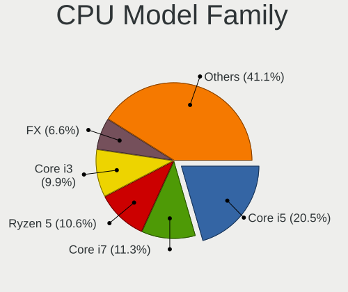

| Model                   | Desktops | Percent |
|-------------------------|----------|---------|
| Intel Core i5           | 31       | 20.53%  |
| Intel Core i7           | 17       | 11.26%  |
| AMD Ryzen 5             | 16       | 10.6%   |
| Intel Core i3           | 15       | 9.93%   |
| AMD FX                  | 10       | 6.62%   |
| Intel Xeon              | 8        | 5.3%    |
| AMD Ryzen 9             | 7        | 4.64%   |
| AMD Ryzen 7             | 7        | 4.64%   |
| Intel Core 2 Duo        | 6        | 3.97%   |
| Intel Celeron           | 6        | 3.97%   |
| Other                   | 5        | 3.31%   |
| AMD Ryzen 5 PRO         | 4        | 2.65%   |
| AMD Phenom II X4        | 3        | 1.99%   |
| Intel Pentium           | 2        | 1.32%   |
| AMD Athlon II X2        | 2        | 1.32%   |
| Intel Pentium Dual-Core | 1        | 0.66%   |
| Intel Core i9           | 1        | 0.66%   |
| Intel Core 2 Quad       | 1        | 0.66%   |
| Intel Atom              | 1        | 0.66%   |
| AMD Ryzen Threadripper  | 1        | 0.66%   |
| AMD Ryzen 7 PRO         | 1        | 0.66%   |
| AMD Phenom II X6        | 1        | 0.66%   |
| AMD Phenom              | 1        | 0.66%   |
| AMD E                   | 1        | 0.66%   |
| AMD Athlon II X4        | 1        | 0.66%   |
| AMD Athlon 64 X2        | 1        | 0.66%   |
| AMD A10                 | 1        | 0.66%   |

CPU Cores
---------

Number of processor cores

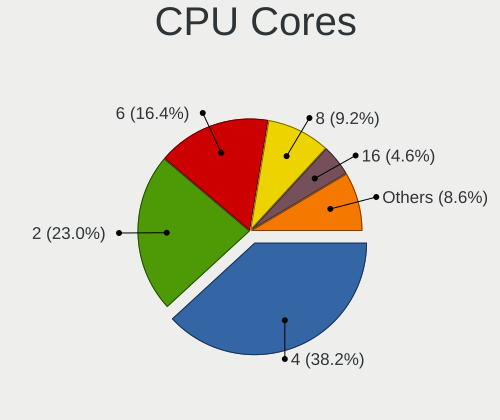

| Number | Desktops | Percent |
|--------|----------|---------|
| 4      | 58       | 38.16%  |
| 2      | 35       | 23.03%  |
| 6      | 25       | 16.45%  |
| 8      | 14       | 9.21%   |
| 16     | 7        | 4.61%   |
| 12     | 5        | 3.29%   |
| 3      | 3        | 1.97%   |
| 40     | 1        | 0.66%   |
| 28     | 1        | 0.66%   |
| 24     | 1        | 0.66%   |
| 14     | 1        | 0.66%   |
| 1      | 1        | 0.66%   |

CPU Sockets
-----------

Number of sockets

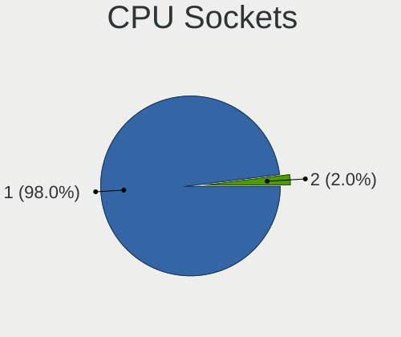

| Number | Desktops | Percent |
|--------|----------|---------|
| 1      | 149      | 98.03%  |
| 2      | 3        | 1.97%   |

CPU Threads
-----------

Threads per core (Hyper-Threading)

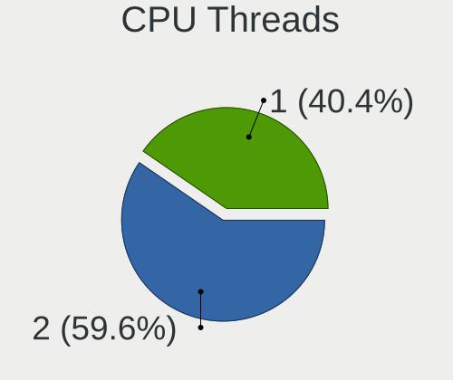

| Number | Desktops | Percent |
|--------|----------|---------|
| 2      | 90       | 59.6%   |
| 1      | 61       | 40.4%   |

CPU Op-Modes
------------

CPU Operation Modes (32-bit, 64-bit)

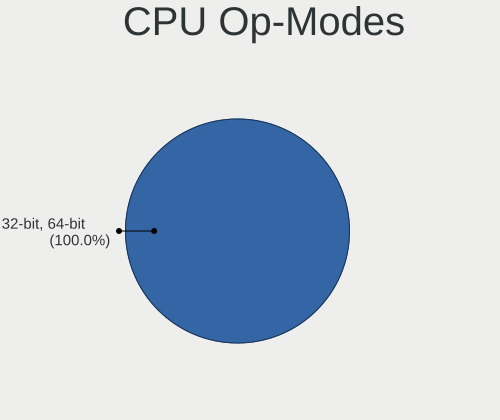

| Op mode        | Desktops | Percent |
|----------------|----------|---------|
| 32-bit, 64-bit | 151      | 100%    |

CPU Microcode
-------------

Microcode number

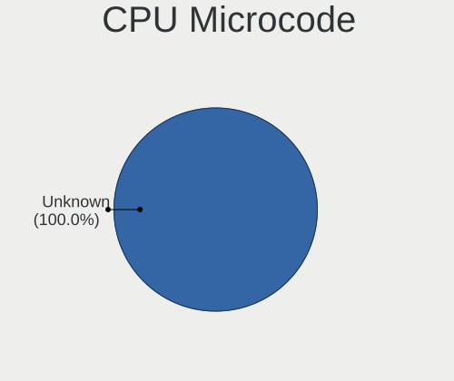

| Number  | Desktops | Percent |
|---------|----------|---------|
| Unknown | 151      | 100%    |

CPU Microarch
-------------

Microarchitecture

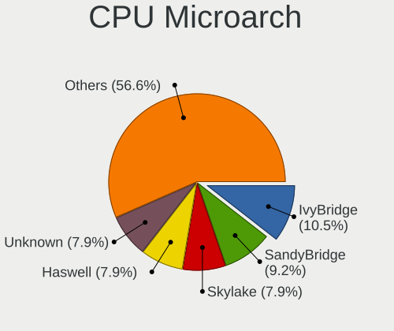

| Name             | Desktops | Percent |
|------------------|----------|---------|
| IvyBridge        | 16       | 10.53%  |
| SandyBridge      | 14       | 9.21%   |
| Skylake          | 12       | 7.89%   |
| Haswell          | 12       | 7.89%   |
| Unknown          | 12       | 7.89%   |
| Piledriver       | 10       | 6.58%   |
| Zen 3            | 9        | 5.92%   |
| KabyLake         | 9        | 5.92%   |
| Zen 2            | 8        | 5.26%   |
| K10              | 8        | 5.26%   |
| Penryn           | 7        | 4.61%   |
| Nehalem          | 5        | 3.29%   |
| Zen+             | 4        | 2.63%   |
| Zen              | 4        | 2.63%   |
| CometLake        | 4        | 2.63%   |
| Alderlake Hybrid | 4        | 2.63%   |
| Silvermont       | 3        | 1.97%   |
| Core             | 3        | 1.97%   |
| Broadwell        | 2        | 1.32%   |
| Steamroller      | 1        | 0.66%   |
| K8 Hammer        | 1        | 0.66%   |
| Gracemont        | 1        | 0.66%   |
| Goldmont         | 1        | 0.66%   |
| Bonnell          | 1        | 0.66%   |
| Bobcat           | 1        | 0.66%   |

Graphics
--------

GPU Vendor
----------

Vendors of graphics cards

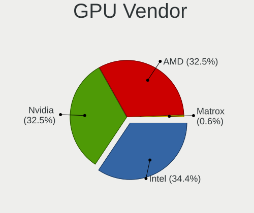

| Vendor                     | Desktops | Percent |
|----------------------------|----------|---------|
| Intel                      | 55       | 34.38%  |
| Nvidia                     | 52       | 32.5%   |
| AMD                        | 52       | 32.5%   |
| Matrox Electronics Systems | 1        | 0.63%   |

GPU Model
---------

Graphics card models

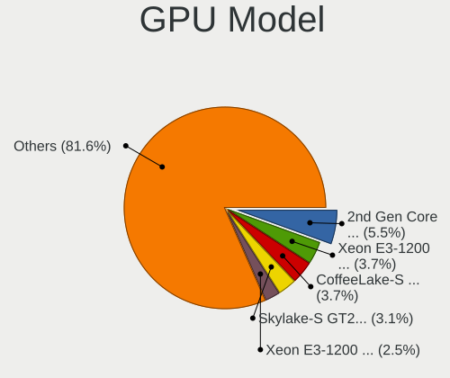

| Model                                                                       | Desktops | Percent |
|-----------------------------------------------------------------------------|----------|---------|
| Intel 2nd Generation Core Processor Family Integrated Graphics Controller   | 9        | 5.52%   |
| Intel Xeon E3-1200 v2/3rd Gen Core processor Graphics Controller            | 6        | 3.68%   |
| Intel CoffeeLake-S GT2 [UHD Graphics 630]                                   | 6        | 3.68%   |
| Intel Skylake-S GT2 [HD Graphics 530]                                       | 5        | 3.07%   |
| Intel Xeon E3-1200 v3/4th Gen Core Processor Integrated Graphics Controller | 4        | 2.45%   |
| AMD RS780L [Radeon 3000]                                                    | 4        | 2.45%   |
| AMD Granite Ridge [Radeon Graphics]                                         | 4        | 2.45%   |
| AMD Ellesmere [Radeon RX 470/480/570/570X/580/580X/590]                     | 4        | 2.45%   |
| Nvidia GT218 [GeForce 210]                                                  | 3        | 1.84%   |
| Nvidia GP108 [GeForce GT 1030]                                              | 3        | 1.84%   |
| Nvidia GP106 [GeForce GTX 1060 6GB]                                         | 3        | 1.84%   |
| Nvidia GK208B [GeForce GT 730]                                              | 3        | 1.84%   |
| Intel Raptor Lake-S GT1 [UHD Graphics 770]                                  | 3        | 1.84%   |
| Intel Atom Processor Z36xxx/Z37xxx Series Graphics & Display                | 3        | 1.84%   |
| Intel 82G33/G31 Express Integrated Graphics Controller                      | 3        | 1.84%   |
| Intel 4th Generation Core Processor Family Integrated Graphics Controller   | 3        | 1.84%   |
| AMD Navi 32 [Radeon RX 7700 XT / 7800 XT]                                   | 3        | 1.84%   |
| AMD Cezanne [Radeon Vega Series / Radeon Vega Mobile Series]                | 3        | 1.84%   |
| Nvidia GP106 [GeForce GTX 1060 3GB]                                         | 2        | 1.23%   |
| Nvidia GP104 [GeForce GTX 1070]                                             | 2        | 1.23%   |
| Nvidia GM206 [GeForce GTX 960]                                              | 2        | 1.23%   |
| Nvidia GM107 [GeForce GTX 750 Ti]                                           | 2        | 1.23%   |
| Nvidia G96C [GeForce 9500 GT]                                               | 2        | 1.23%   |
| Intel Kaby Lake-S GT2 [HD Graphics 630]                                     | 2        | 1.23%   |
| Intel IvyBridge GT2 [HD Graphics 4000]                                      | 2        | 1.23%   |
| Intel CometLake-S GT2 [UHD Graphics 630]                                    | 2        | 1.23%   |
| Intel Alder Lake-N [UHD Graphics]                                           | 2        | 1.23%   |
| AMD Renoir [Radeon Vega Series / Radeon Vega Mobile Series]                 | 2        | 1.23%   |
| AMD Raven Ridge [Radeon Vega Series / Radeon Vega Mobile Series]            | 2        | 1.23%   |
| AMD Raphael                                                                 | 2        | 1.23%   |
| AMD Phoenix1                                                                | 2        | 1.23%   |
| AMD Navi 23 [Radeon RX 6600/6600 XT/6600M]                                  | 2        | 1.23%   |
| AMD Lexa PRO [Radeon 540/540X/550/550X / RX 540X/550/550X]                  | 2        | 1.23%   |
| Nvidia TU117 [GeForce GTX 1650]                                             | 1        | 0.61%   |
| Nvidia TU116 [GeForce GTX 1660 SUPER]                                       | 1        | 0.61%   |
| Nvidia TU106 [GeForce GTX 1650]                                             | 1        | 0.61%   |
| Nvidia TU104 [GeForce RTX 2060]                                             | 1        | 0.61%   |
| Nvidia GT218 [NVS 300]                                                      | 1        | 0.61%   |
| Nvidia GT218 [GeForce 310]                                                  | 1        | 0.61%   |
| Nvidia GP107 [GeForce GTX 1050 Ti]                                          | 1        | 0.61%   |

GPU Combo
---------

Combinations of graphics cards

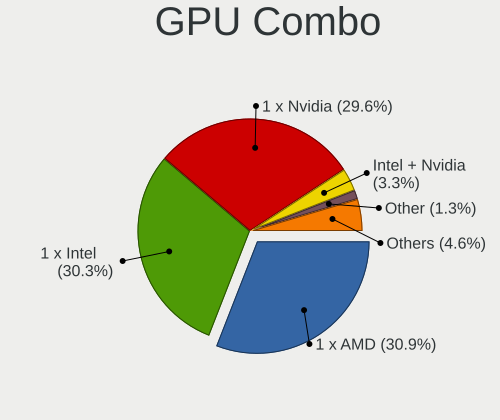

| Name           | Desktops | Percent |
|----------------|----------|---------|
| 1 x AMD        | 47       | 30.92%  |
| 1 x Intel      | 46       | 30.26%  |
| 1 x Nvidia     | 45       | 29.61%  |
| Intel + Nvidia | 5        | 3.29%   |
| Other          | 2        | 1.32%   |
| 2 x AMD        | 2        | 1.32%   |
| AMD + Nvidia   | 2        | 1.32%   |
| 2 x Intel      | 1        | 0.66%   |
| 1 x Matrox     | 1        | 0.66%   |
| Intel + AMD    | 1        | 0.66%   |

GPU Driver
----------

Free vs proprietary

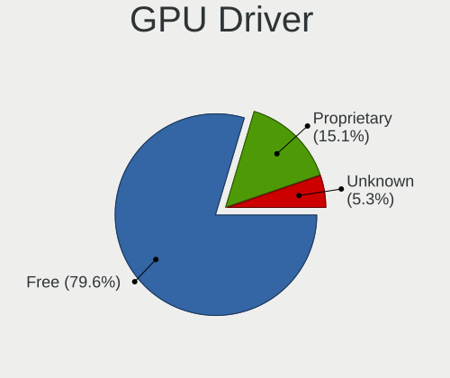

| Driver      | Desktops | Percent |
|-------------|----------|---------|
| Free        | 121      | 79.61%  |
| Proprietary | 23       | 15.13%  |
| Unknown     | 8        | 5.26%   |

GPU Memory
----------

Total video memory

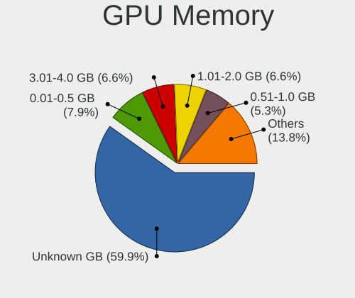

| Size in GB | Desktops | Percent |
|------------|----------|---------|
| Unknown    | 91       | 59.87%  |
| 0.01-0.5   | 12       | 7.89%   |
| 3.01-4.0   | 10       | 6.58%   |
| 1.01-2.0   | 10       | 6.58%   |
| 0.51-1.0   | 8        | 5.26%   |
| 7.01-8.0   | 7        | 4.61%   |
| 5.01-6.0   | 5        | 3.29%   |
| 8.01-16.0  | 5        | 3.29%   |
| 2.01-3.0   | 2        | 1.32%   |
| 16.01-24.0 | 2        | 1.32%   |

Monitor
-------

Monitor Vendor
--------------

Monitor vendors

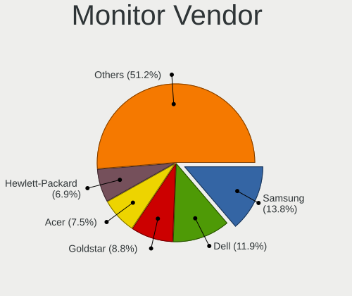

| Vendor               | Desktops | Percent |
|----------------------|----------|---------|
| Samsung Electronics  | 22       | 13.75%  |
| Dell                 | 19       | 11.88%  |
| Goldstar             | 14       | 8.75%   |
| Acer                 | 12       | 7.5%    |
| Hewlett-Packard      | 11       | 6.88%   |
| BenQ                 | 9        | 5.63%   |
| Philips              | 7        | 4.38%   |
| Iiyama               | 7        | 4.38%   |
| AOC                  | 6        | 3.75%   |
| Unknown              | 5        | 3.13%   |
| Ancor Communications | 4        | 2.5%    |
| ViewSonic            | 3        | 1.88%   |
| Sony                 | 3        | 1.88%   |
| ASUSTek Computer     | 3        | 1.88%   |
| Vizio                | 2        | 1.25%   |
| Toshiba              | 2        | 1.25%   |
| Sharp                | 2        | 1.25%   |
| Mi                   | 2        | 1.25%   |
| Xiaomi               | 1        | 0.63%   |
| Westinghouse         | 1        | 0.63%   |
| VIE                  | 1        | 0.63%   |
| Vestel               | 1        | 0.63%   |
| Unknown (XXX)        | 1        | 0.63%   |
| TEO                  | 1        | 0.63%   |
| STD                  | 1        | 0.63%   |
| Sceptre Tech         | 1        | 0.63%   |
| Positivo             | 1        | 0.63%   |
| Pixio                | 1        | 0.63%   |
| NEC Computers        | 1        | 0.63%   |
| MStar                | 1        | 0.63%   |
| Monoprice            | 1        | 0.63%   |
| Medion               | 1        | 0.63%   |
| LG Electronics       | 1        | 0.63%   |
| ITE                  | 1        | 0.63%   |
| IOD                  | 1        | 0.63%   |
| IBM                  | 1        | 0.63%   |
| HKC                  | 1        | 0.63%   |
| HannStar             | 1        | 0.63%   |
| Gigabyte Technology  | 1        | 0.63%   |
| Fujitsu Siemens      | 1        | 0.63%   |

Monitor Model
-------------

Monitor models

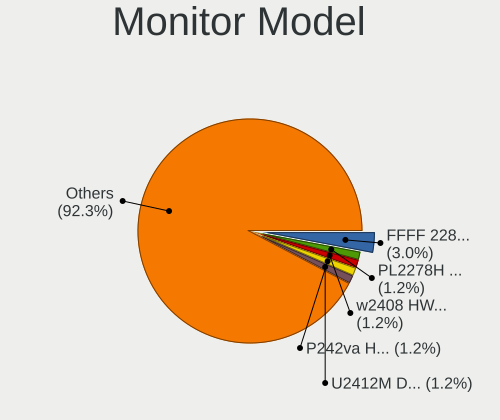

| Model                                                                | Desktops | Percent |
|----------------------------------------------------------------------|----------|---------|
| Unknown LCD Monitor FFFF 2288x1287 2550x2550mm 142.0-inch            | 5        | 2.96%   |
| Iiyama PL2278H IVM5624 1920x1080 477x268mm 21.5-inch                 | 2        | 1.18%   |
| Hewlett-Packard w2408 HWP26CF 1920x1200 518x324mm 24.1-inch          | 2        | 1.18%   |
| Hewlett-Packard P242va HWP3238 1920x1080 531x299mm 24.0-inch         | 2        | 1.18%   |
| Dell U2412M DELA07A 1920x1200 518x324mm 24.1-inch                    | 2        | 1.18%   |
| Dell SE2717H/HX DELD0A1 1920x1080 598x336mm 27.0-inch                | 2        | 1.18%   |
| Acer V226HQL ACR032D 1920x1080 477x268mm 21.5-inch                   | 2        | 1.18%   |
| Acer K242HL ACR03E3 1920x1080 531x299mm 24.0-inch                    | 2        | 1.18%   |
| Xiaomi Mi TV XMD00E1 1440x900 708x398mm 32.0-inch                    | 1        | 0.59%   |
| Westinghouse VR-3225 WDT6400 1920x1080 710x400mm 32.1-inch           | 1        | 0.59%   |
| Vizio VA19L HDTV10T VIZ0019 1360x768 410x230mm 18.5-inch             | 1        | 0.59%   |
| Vizio E500i-B1 VIZ1004 1920x1080 1095x616mm 49.5-inch                | 1        | 0.59%   |
| Vizio E321VL VIZ0083 1920x1080 700x400mm 31.7-inch                   | 1        | 0.59%   |
| ViewSonic VA2732-FHD VSC0D3A 1920x1080 598x336mm 27.0-inch           | 1        | 0.59%   |
| ViewSonic VA2447-FHD VSC303B 1920x1080 527x296mm 23.8-inch           | 1        | 0.59%   |
| ViewSonic VA2246 SERIES VSC6F2E 1920x1080 477x268mm 21.5-inch        | 1        | 0.59%   |
| VIE AC-939386 VIE0C80 1920x1080 520x310mm 23.8-inch                  | 1        | 0.59%   |
| Vestel LCD Monitor 55UHD_LCD_TV 1920x1080                            | 1        | 0.59%   |
| Unknown (XXX) HDMI XXX6410 2560x1440 597x336mm 27.0-inch             | 1        | 0.59%   |
| Toshiba TV TSB0206 1920x1080                                         | 1        | 0.59%   |
| Toshiba TV TSB0109 1920x1080 1594x900mm 72.1-inch                    | 1        | 0.59%   |
| TEO TL765 TEO6700 1280x1024 338x270mm 17.0-inch                      | 1        | 0.59%   |
| STD HDMI TV STD00C7 1920x1080 698x392mm 31.5-inch                    | 1        | 0.59%   |
| Sony TV SNY5304 1600x900                                             | 1        | 0.59%   |
| Sony TV SNY2C02 1920x1080 886x498mm 40.0-inch                        | 1        | 0.59%   |
| Sony TV *00 SNY3705 3840x2160 1218x685mm 55.0-inch                   | 1        | 0.59%   |
| Sharp LC-43LB371C SHP4353 1920x1080 940x529mm 42.5-inch              | 1        | 0.59%   |
| Sharp LC-32LB150U SHP3233 1920x1080 698x392mm 31.5-inch              | 1        | 0.59%   |
| Sceptre Tech Sceptre Z27 SPT6B0B 3840x2160 598x336mm 27.0-inch       | 1        | 0.59%   |
| Samsung Electronics T27C370 SAM0ADE 1920x1080 598x336mm 27.0-inch    | 1        | 0.59%   |
| Samsung Electronics T24C550 SAM0AA1 1920x1080 521x293mm 23.5-inch    | 1        | 0.59%   |
| Samsung Electronics SyncMaster SAM047D 1360x768 410x230mm 18.5-inch  | 1        | 0.59%   |
| Samsung Electronics SyncMaster SAM0471 1360x768 344x194mm 15.5-inch  | 1        | 0.59%   |
| Samsung Electronics SyncMaster SAM0375 1680x1050 494x320mm 23.2-inch | 1        | 0.59%   |
| Samsung Electronics SyncMaster SAM0373 1680x1050 459x296mm 21.5-inch | 1        | 0.59%   |
| Samsung Electronics SyncMaster SAM0192 1280x1024 338x270mm 17.0-inch | 1        | 0.59%   |
| Samsung Electronics SyncMaster SAM016C 1280x1024 376x301mm 19.0-inch | 1        | 0.59%   |
| Samsung Electronics SyncMaster SAM011F 1280x1024 376x301mm 19.0-inch | 1        | 0.59%   |
| Samsung Electronics SyncMaster SAM0115 1280x1024 376x301mm 19.0-inch | 1        | 0.59%   |
| Samsung Electronics SyncMaster SAM00E5 1280x1024 338x270mm 17.0-inch | 1        | 0.59%   |

Monitor Resolution
------------------

Monitor screen resolution

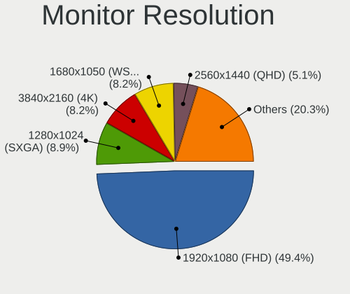

| Resolution         | Desktops | Percent |
|--------------------|----------|---------|
| 1920x1080 (FHD)    | 78       | 49.37%  |
| 1280x1024 (SXGA)   | 14       | 8.86%   |
| 3840x2160 (4K)     | 13       | 8.23%   |
| 1680x1050 (WSXGA+) | 13       | 8.23%   |
| 2560x1440 (QHD)    | 8        | 5.06%   |
| 1920x1200 (WUXGA)  | 6        | 3.8%    |
| 2288x1287          | 5        | 3.16%   |
| 1600x900 (HD+)     | 4        | 2.53%   |
| 3440x1440          | 3        | 1.9%    |
| 2560x1080          | 3        | 1.9%    |
| 1366x768 (WXGA)    | 3        | 1.9%    |
| 1360x768           | 3        | 1.9%    |
| 7680x1080          | 1        | 0.63%   |
| 3840x1600          | 1        | 0.63%   |
| 3840x1080          | 1        | 0.63%   |
| 1920x540           | 1        | 0.63%   |
| Unknown            | 1        | 0.63%   |

Monitor Diagonal
----------------

Diagonal size in inches

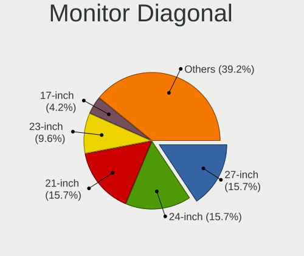

| Inches  | Desktops | Percent |
|---------|----------|---------|
| 27      | 26       | 15.66%  |
| 24      | 26       | 15.66%  |
| 21      | 26       | 15.66%  |
| 23      | 16       | 9.64%   |
| 17      | 7        | 4.22%   |
| 20      | 6        | 3.61%   |
| 19      | 6        | 3.61%   |
| 142     | 5        | 3.01%   |
| 34      | 5        | 3.01%   |
| 31      | 5        | 3.01%   |
| 22      | 5        | 3.01%   |
| 18      | 5        | 3.01%   |
| 65      | 3        | 1.81%   |
| 15      | 3        | 1.81%   |
| Unknown | 3        | 1.81%   |
| 72      | 2        | 1.2%    |
| 40      | 2        | 1.2%    |
| 32      | 2        | 1.2%    |
| 85      | 1        | 0.6%    |
| 84      | 1        | 0.6%    |
| 74      | 1        | 0.6%    |
| 58      | 1        | 0.6%    |
| 55      | 1        | 0.6%    |
| 54      | 1        | 0.6%    |
| 48      | 1        | 0.6%    |
| 39      | 1        | 0.6%    |
| 37      | 1        | 0.6%    |
| 28      | 1        | 0.6%    |
| 25      | 1        | 0.6%    |
| 16      | 1        | 0.6%    |
| 14      | 1        | 0.6%    |

Monitor Width
-------------

Physical width

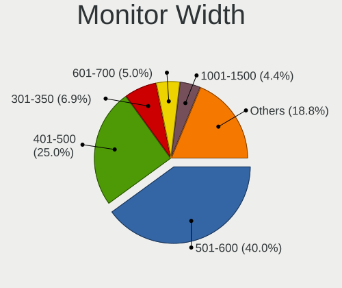

| Width in mm    | Desktops | Percent |
|----------------|----------|---------|
| 501-600        | 64       | 40%     |
| 401-500        | 40       | 25%     |
| 301-350        | 11       | 6.88%   |
| 601-700        | 8        | 5%      |
| 701-800        | 7        | 4.38%   |
| 1001-1500      | 7        | 4.38%   |
| More than 2000 | 5        | 3.13%   |
| 351-400        | 5        | 3.13%   |
| 1501-2000      | 5        | 3.13%   |
| 801-900        | 3        | 1.88%   |
| Unknown        | 3        | 1.88%   |
| 201-300        | 1        | 0.63%   |
| 901-1000       | 1        | 0.63%   |

Aspect Ratio
------------

Proportional relationship between the width and the height

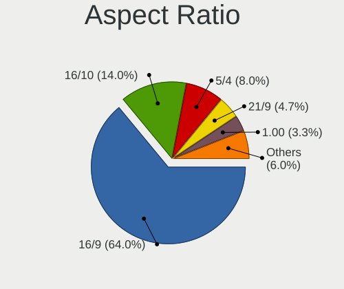

| Ratio   | Desktops | Percent |
|---------|----------|---------|
| 16/9    | 96       | 64%     |
| 16/10   | 21       | 14%     |
| 5/4     | 12       | 8%      |
| 21/9    | 7        | 4.67%   |
| 1.00    | 5        | 3.33%   |
| 4/3     | 3        | 2%      |
| Unknown | 3        | 2%      |
| 32/9    | 1        | 0.67%   |
| 3/2     | 1        | 0.67%   |
| 2.12    | 1        | 0.67%   |

Monitor Area
------------

Area in inch²

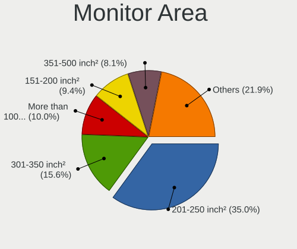

| Area in inch² | Desktops | Percent |
|----------------|----------|---------|
| 201-250        | 56       | 35%     |
| 301-350        | 25       | 15.63%  |
| More than 1000 | 16       | 10%     |
| 151-200        | 15       | 9.38%   |
| 351-500        | 13       | 8.13%   |
| 141-150        | 12       | 7.5%    |
| 251-300        | 11       | 6.88%   |
| 101-110        | 4        | 2.5%    |
| 501-1000       | 4        | 2.5%    |
| Unknown        | 3        | 1.88%   |
| 121-130        | 1        | 0.63%   |

Pixel Density
-------------

Pixels per inch

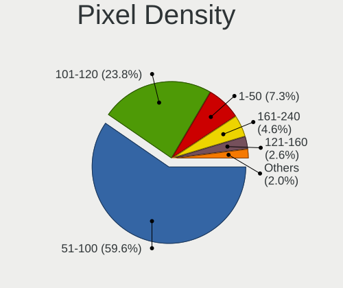

| Density | Desktops | Percent |
|---------|----------|---------|
| 51-100  | 90       | 59.6%   |
| 101-120 | 36       | 23.84%  |
| 1-50    | 11       | 7.28%   |
| 161-240 | 7        | 4.64%   |
| 121-160 | 4        | 2.65%   |
| Unknown | 3        | 1.99%   |

Multiple Monitors
-----------------

Total monitors connected

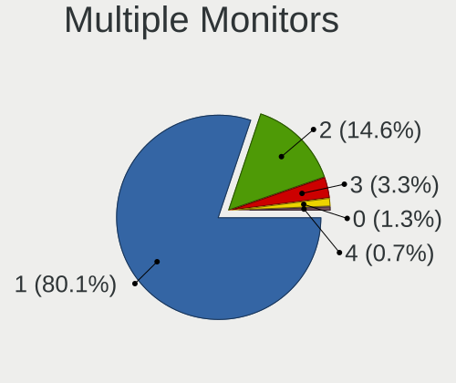

| Total | Desktops | Percent |
|-------|----------|---------|
| 1     | 121      | 80.13%  |
| 2     | 22       | 14.57%  |
| 3     | 5        | 3.31%   |
| 0     | 2        | 1.32%   |
| 4     | 1        | 0.66%   |

Network
-------

Net Controller Vendor
---------------------

Controller vendors

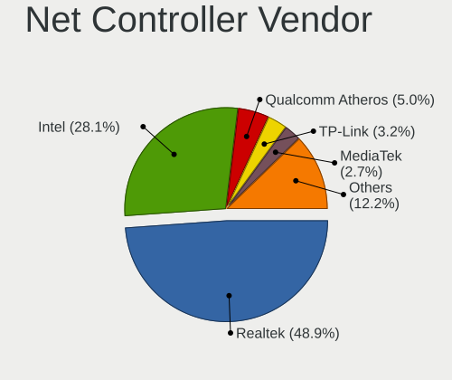

| Vendor                          | Desktops | Percent |
|---------------------------------|----------|---------|
| Realtek Semiconductor           | 108      | 48.87%  |
| Intel                           | 62       | 28.05%  |
| Qualcomm Atheros                | 11       | 4.98%   |
| TP-Link                         | 7        | 3.17%   |
| MediaTek                        | 6        | 2.71%   |
| Broadcom                        | 3        | 1.36%   |
| Ralink Technology               | 2        | 0.9%    |
| Nvidia                          | 2        | 0.9%    |
| NetGear                         | 2        | 0.9%    |
| DisplayLink                     | 2        | 0.9%    |
| D-Link System                   | 2        | 0.9%    |
| Wilocity                        | 1        | 0.45%   |
| U-Blox                          | 1        | 0.45%   |
| TRENDnet                        | 1        | 0.45%   |
| Samsung Electronics             | 1        | 0.45%   |
| Ralink                          | 1        | 0.45%   |
| Qualcomm Atheros Communications | 1        | 0.45%   |
| Microsoft                       | 1        | 0.45%   |
| Mercucys                        | 1        | 0.45%   |
| Marvell Technology Group        | 1        | 0.45%   |
| D-Link                          | 1        | 0.45%   |
| Cvitek                          | 1        | 0.45%   |
| Broadcom Limited                | 1        | 0.45%   |
| Aquantia                        | 1        | 0.45%   |
| AboCom Systems                  | 1        | 0.45%   |

Net Controller Model
--------------------

Controller models

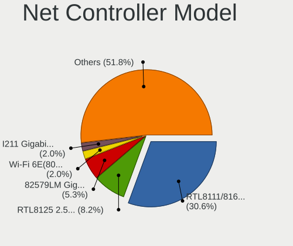

| Model                                                                         | Desktops | Percent |
|-------------------------------------------------------------------------------|----------|---------|
| Realtek RTL8111/8168/8211/8411 PCI Express Gigabit Ethernet Controller        | 75       | 30.61%  |
| Realtek RTL8125 2.5GbE Controller                                             | 20       | 8.16%   |
| Intel 82579LM Gigabit Network Connection (Lewisville)                         | 13       | 5.31%   |
| Intel Wi-Fi 6E(802.11ax) AX210/AX1675* 2x2 [Typhoon Peak]                     | 5        | 2.04%   |
| Intel I211 Gigabit Network Connection                                         | 5        | 2.04%   |
| Intel Ethernet Connection I217-LM                                             | 5        | 2.04%   |
| Intel 82579V Gigabit Network Connection                                       | 5        | 2.04%   |
| Realtek RTL810xE PCI Express Fast Ethernet controller                         | 4        | 1.63%   |
| Intel Wi-Fi 6 AX200                                                           | 4        | 1.63%   |
| Realtek 802.11ac NIC                                                          | 3        | 1.22%   |
| Intel Wireless 8265 / 8275                                                    | 3        | 1.22%   |
| Intel Ethernet Controller I226-V                                              | 3        | 1.22%   |
| Intel Ethernet Connection (2) I219-V                                          | 3        | 1.22%   |
| TP-Link TL-WN722N v2/v3 [Realtek RTL8188EUS]                                  | 2        | 0.82%   |
| TP-Link 802.11ac WLAN Adapter                                                 | 2        | 0.82%   |
| Realtek RTL8852BE PCIe 802.11ax Wireless Network Controller                   | 2        | 0.82%   |
| Realtek RTL8192CU 802.11n WLAN Adapter                                        | 2        | 0.82%   |
| Realtek RTL8153 Gigabit Ethernet Adapter                                      | 2        | 0.82%   |
| Realtek RTL-8100/8101L/8139 PCI Fast Ethernet Adapter                         | 2        | 0.82%   |
| Qualcomm Atheros QCA6174 802.11ac Wireless Network Adapter                    | 2        | 0.82%   |
| Qualcomm Atheros AR9485 Wireless Network Adapter                              | 2        | 0.82%   |
| Qualcomm Atheros AR2413/AR2414 Wireless Network Adapter [AR5005G(S) 802.11bg] | 2        | 0.82%   |
| MediaTek MT7921K (RZ608) Wi-Fi 6E 80MHz                                       | 2        | 0.82%   |
| Intel Wireless 3165                                                           | 2        | 0.82%   |
| Intel Ethernet Connection (7) I219-V                                          | 2        | 0.82%   |
| Intel 82574L Gigabit Network Connection                                       | 2        | 0.82%   |
| Intel 82566DM-2 Gigabit Network Connection                                    | 2        | 0.82%   |
| Intel 700 Series Chipset CNVi WiFi                                            | 2        | 0.82%   |
| DisplayLink Dell 4-in-1 Adapter                                               | 2        | 0.82%   |
| Wilocity Wil6200 802.11ad Wireless Network Adapter                            | 1        | 0.41%   |
| U-Blox [u-blox 7]                                                             | 1        | 0.41%   |
| TRENDnet TEW-805UB 300Mbps+867Mbps Wireless AC Adapter [Realtek RTL8812AU]    | 1        | 0.41%   |
| TP-Link TL-WN823N v2/v3 [Realtek RTL8192EU]                                   | 1        | 0.41%   |
| TP-Link Archer T4UH v2 [Realtek RTL8812AU]                                    | 1        | 0.41%   |
| TP-Link Archer T2U PLUS [RTL8821AU]                                           | 1        | 0.41%   |
| Samsung Galaxy series, misc. (tethering mode)                                 | 1        | 0.41%   |
| Realtek RTL8922AE 802.11be PCIe Wireless Network Adapter                      | 1        | 0.41%   |
| Realtek RTL8852CE PCIe 802.11ax Wireless Network Controller                   | 1        | 0.41%   |
| Realtek RTL8821CE 802.11ac PCIe Wireless Network Adapter                      | 1        | 0.41%   |
| Realtek RTL8821AE 802.11ac PCIe Wireless Network Adapter                      | 1        | 0.41%   |

Wireless Vendor
---------------

Wireless vendors

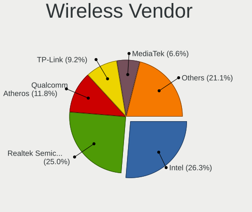

| Vendor                          | Desktops | Percent |
|---------------------------------|----------|---------|
| Intel                           | 20       | 26.32%  |
| Realtek Semiconductor           | 19       | 25%     |
| Qualcomm Atheros                | 9        | 11.84%  |
| TP-Link                         | 7        | 9.21%   |
| MediaTek                        | 5        | 6.58%   |
| Ralink Technology               | 2        | 2.63%   |
| NetGear                         | 2        | 2.63%   |
| D-Link System                   | 2        | 2.63%   |
| Wilocity                        | 1        | 1.32%   |
| TRENDnet                        | 1        | 1.32%   |
| Ralink                          | 1        | 1.32%   |
| Qualcomm Atheros Communications | 1        | 1.32%   |
| Microsoft                       | 1        | 1.32%   |
| Mercucys                        | 1        | 1.32%   |
| Marvell Technology Group        | 1        | 1.32%   |
| D-Link                          | 1        | 1.32%   |
| Broadcom                        | 1        | 1.32%   |
| AboCom Systems                  | 1        | 1.32%   |

Wireless Model
--------------

Wireless models

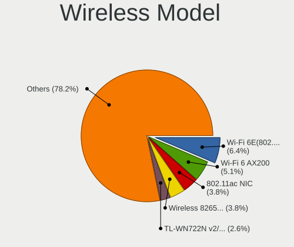

| Model                                                                         | Desktops | Percent |
|-------------------------------------------------------------------------------|----------|---------|
| Intel Wi-Fi 6E(802.11ax) AX210/AX1675* 2x2 [Typhoon Peak]                     | 5        | 6.41%   |
| Intel Wi-Fi 6 AX200                                                           | 4        | 5.13%   |
| Realtek 802.11ac NIC                                                          | 3        | 3.85%   |
| Intel Wireless 8265 / 8275                                                    | 3        | 3.85%   |
| TP-Link TL-WN722N v2/v3 [Realtek RTL8188EUS]                                  | 2        | 2.56%   |
| TP-Link 802.11ac WLAN Adapter                                                 | 2        | 2.56%   |
| Realtek RTL8852BE PCIe 802.11ax Wireless Network Controller                   | 2        | 2.56%   |
| Realtek RTL8192CU 802.11n WLAN Adapter                                        | 2        | 2.56%   |
| Qualcomm Atheros QCA6174 802.11ac Wireless Network Adapter                    | 2        | 2.56%   |
| Qualcomm Atheros AR9485 Wireless Network Adapter                              | 2        | 2.56%   |
| Qualcomm Atheros AR2413/AR2414 Wireless Network Adapter [AR5005G(S) 802.11bg] | 2        | 2.56%   |
| MediaTek MT7921K (RZ608) Wi-Fi 6E 80MHz                                       | 2        | 2.56%   |
| Intel Wireless 3165                                                           | 2        | 2.56%   |
| Intel 700 Series Chipset CNVi WiFi                                            | 2        | 2.56%   |
| Wilocity Wil6200 802.11ad Wireless Network Adapter                            | 1        | 1.28%   |
| TRENDnet TEW-805UB 300Mbps+867Mbps Wireless AC Adapter [Realtek RTL8812AU]    | 1        | 1.28%   |
| TP-Link TL-WN823N v2/v3 [Realtek RTL8192EU]                                   | 1        | 1.28%   |
| TP-Link Archer T4UH v2 [Realtek RTL8812AU]                                    | 1        | 1.28%   |
| TP-Link Archer T2U PLUS [RTL8821AU]                                           | 1        | 1.28%   |
| Realtek RTL8922AE 802.11be PCIe Wireless Network Adapter                      | 1        | 1.28%   |
| Realtek RTL8852CE PCIe 802.11ax Wireless Network Controller                   | 1        | 1.28%   |
| Realtek RTL8821CE 802.11ac PCIe Wireless Network Adapter                      | 1        | 1.28%   |
| Realtek RTL8821AE 802.11ac PCIe Wireless Network Adapter                      | 1        | 1.28%   |
| Realtek RTL8814AU 802.11a/b/g/n/ac Wireless Adapter                           | 1        | 1.28%   |
| Realtek RTL8813AE 802.11ac PCIe Wireless Network Adapter                      | 1        | 1.28%   |
| Realtek RTL8812AE 802.11ac PCIe Wireless Network Adapter                      | 1        | 1.28%   |
| Realtek RTL8723BE PCIe Wireless Network Adapter                               | 1        | 1.28%   |
| Realtek RTL8192EE PCIe Wireless Network Adapter                               | 1        | 1.28%   |
| Realtek RTL8188GU 802.11n WLAN Adapter (After Modeswitch)                     | 1        | 1.28%   |
| Realtek RTL8188EUS 802.11n Wireless Network Adapter                           | 1        | 1.28%   |
| Realtek RTL-8185 IEEE 802.11a/b/g Wireless LAN Controller                     | 1        | 1.28%   |
| Realtek 802.11ac WLAN Adapter                                                 | 1        | 1.28%   |
| Ralink RT5370 Wireless Adapter                                                | 1        | 1.28%   |
| Ralink MT7601U Wireless Adapter                                               | 1        | 1.28%   |
| Ralink RT5392 PCIe Wireless Network Adapter                                   | 1        | 1.28%   |
| Qualcomm Atheros AR9271 802.11n                                               | 1        | 1.28%   |
| Qualcomm Atheros AR9462 Wireless Network Adapter                              | 1        | 1.28%   |
| Qualcomm Atheros AR928X Wireless Network Adapter (PCI-Express)                | 1        | 1.28%   |
| Qualcomm Atheros AR9285 Wireless Network Adapter (PCI-Express)                | 1        | 1.28%   |
| NetGear WNA1100 Wireless-N 150 [Atheros AR9271]                               | 1        | 1.28%   |

Ethernet Vendor
---------------

Ethernet vendors

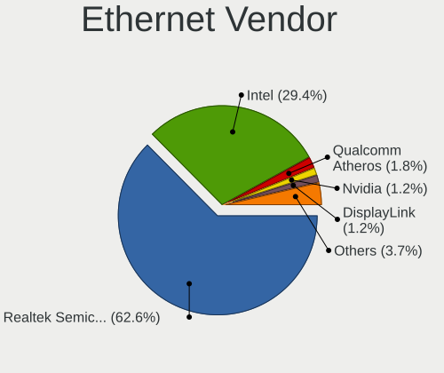

| Vendor                | Desktops | Percent |
|-----------------------|----------|---------|
| Realtek Semiconductor | 102      | 62.58%  |
| Intel                 | 48       | 29.45%  |
| Qualcomm Atheros      | 3        | 1.84%   |
| Nvidia                | 2        | 1.23%   |
| DisplayLink           | 2        | 1.23%   |
| Broadcom              | 2        | 1.23%   |
| Samsung Electronics   | 1        | 0.61%   |
| MediaTek              | 1        | 0.61%   |
| Broadcom Limited      | 1        | 0.61%   |
| Aquantia              | 1        | 0.61%   |

Ethernet Model
--------------

Ethernet models

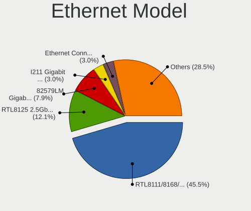

| Model                                                                           | Desktops | Percent |
|---------------------------------------------------------------------------------|----------|---------|
| Realtek RTL8111/8168/8211/8411 PCI Express Gigabit Ethernet Controller          | 75       | 45.45%  |
| Realtek RTL8125 2.5GbE Controller                                               | 20       | 12.12%  |
| Intel 82579LM Gigabit Network Connection (Lewisville)                           | 13       | 7.88%   |
| Intel I211 Gigabit Network Connection                                           | 5        | 3.03%   |
| Intel Ethernet Connection I217-LM                                               | 5        | 3.03%   |
| Intel 82579V Gigabit Network Connection                                         | 5        | 3.03%   |
| Realtek RTL810xE PCI Express Fast Ethernet controller                           | 4        | 2.42%   |
| Intel Ethernet Controller I226-V                                                | 3        | 1.82%   |
| Intel Ethernet Connection (2) I219-V                                            | 3        | 1.82%   |
| Realtek RTL8153 Gigabit Ethernet Adapter                                        | 2        | 1.21%   |
| Realtek RTL-8100/8101L/8139 PCI Fast Ethernet Adapter                           | 2        | 1.21%   |
| Intel Ethernet Connection (7) I219-V                                            | 2        | 1.21%   |
| Intel 82574L Gigabit Network Connection                                         | 2        | 1.21%   |
| Intel 82566DM-2 Gigabit Network Connection                                      | 2        | 1.21%   |
| DisplayLink Dell 4-in-1 Adapter                                                 | 2        | 1.21%   |
| Samsung Galaxy series, misc. (tethering mode)                                   | 1        | 0.61%   |
| Qualcomm Atheros QCA8171 Gigabit Ethernet                                       | 1        | 0.61%   |
| Qualcomm Atheros AR8151 v2.0 Gigabit Ethernet                                   | 1        | 0.61%   |
| Qualcomm Atheros AR8121/AR8113/AR8114 Gigabit or Fast Ethernet                  | 1        | 0.61%   |
| Nvidia MCP77 Ethernet                                                           | 1        | 0.61%   |
| Nvidia MCP61 Ethernet                                                           | 1        | 0.61%   |
| MediaTek A015                                                                   | 1        | 0.61%   |
| Intel I350 Gigabit Network Connection                                           | 1        | 0.61%   |
| Intel I210 Gigabit Network Connection                                           | 1        | 0.61%   |
| Intel Ethernet Connection (7) I219-LM                                           | 1        | 0.61%   |
| Intel Ethernet Connection (2) I219-LM                                           | 1        | 0.61%   |
| Intel Ethernet Connection (2) I218-LM                                           | 1        | 0.61%   |
| Intel Ethernet Connection (14) I219-V                                           | 1        | 0.61%   |
| Intel Ethernet Connection (11) I219-V                                           | 1        | 0.61%   |
| Intel 82578DM Gigabit Network Connection                                        | 1        | 0.61%   |
| Intel 82567LM-3 Gigabit Network Connection                                      | 1        | 0.61%   |
| Broadcom NetXtreme BCM5717 Gigabit Ethernet PCIe                                | 1        | 0.61%   |
| Broadcom NetLink BCM57788 Gigabit Ethernet PCIe                                 | 1        | 0.61%   |
| Broadcom Limited NetXtreme BCM5722 Gigabit Ethernet PCI Express                 | 1        | 0.61%   |
| Aquantia AQtion AQC113CS NBase-T/IEEE 802.3an Ethernet Controller [Antigua 10G] | 1        | 0.61%   |

Net Controller Kind
-------------------

Ethernet, WiFi or modem

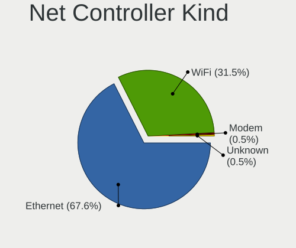

| Kind     | Desktops | Percent |
|----------|----------|---------|
| Ethernet | 150      | 67.57%  |
| WiFi     | 70       | 31.53%  |
| Modem    | 1        | 0.45%   |
| Unknown  | 1        | 0.45%   |

Used Controller
---------------

Currently used network controller

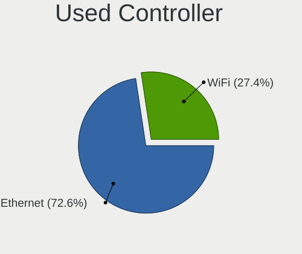

| Kind     | Desktops | Percent |
|----------|----------|---------|
| Ethernet | 114      | 72.61%  |
| WiFi     | 43       | 27.39%  |

NICs
----

Total network controllers on board

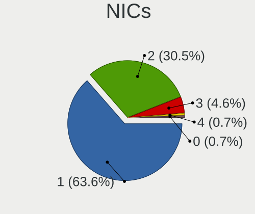

| Total | Desktops | Percent |
|-------|----------|---------|
| 1     | 96       | 63.58%  |
| 2     | 46       | 30.46%  |
| 3     | 7        | 4.64%   |
| 4     | 1        | 0.66%   |
| 0     | 1        | 0.66%   |

IPv6
----

IPv6 vs IPv4

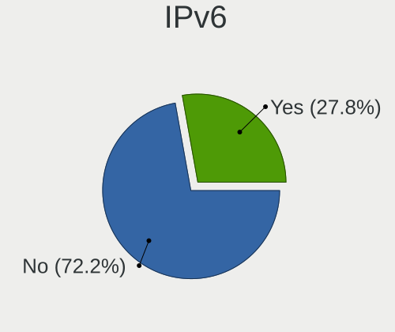

| Used | Desktops | Percent |
|------|----------|---------|
| No   | 109      | 72.19%  |
| Yes  | 42       | 27.81%  |

Bluetooth
---------

Bluetooth Vendor
----------------

Controller vendors

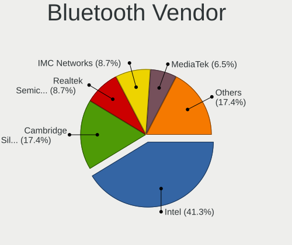

| Vendor                          | Desktops | Percent |
|---------------------------------|----------|---------|
| Intel                           | 19       | 41.3%   |
| Cambridge Silicon Radio         | 8        | 17.39%  |
| Realtek Semiconductor           | 4        | 8.7%    |
| IMC Networks                    | 4        | 8.7%    |
| MediaTek                        | 3        | 6.52%   |
| TP-Link                         | 2        | 4.35%   |
| Foxconn / Hon Hai               | 2        | 4.35%   |
| Qualcomm Atheros Communications | 1        | 2.17%   |
| Broadcom                        | 1        | 2.17%   |
| ASUSTek Computer                | 1        | 2.17%   |
| Unknown                         | 1        | 2.17%   |

Bluetooth Model
---------------

Controller models

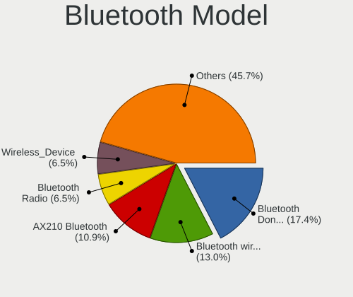

| Model                                               | Desktops | Percent |
|-----------------------------------------------------|----------|---------|
| Cambridge Silicon Radio Bluetooth Dongle (HCI mode) | 8        | 17.39%  |
| Intel Bluetooth wireless interface                  | 6        | 13.04%  |
| Intel AX210 Bluetooth                               | 5        | 10.87%  |
| Realtek Bluetooth Radio                             | 3        | 6.52%   |
| MediaTek Wireless_Device                            | 3        | 6.52%   |
| Intel AX200 Bluetooth                               | 3        | 6.52%   |
| IMC Networks Bluetooth Radio                        | 3        | 6.52%   |
| TP-Link TP-T@- UB500 Adapter                        | 2        | 4.35%   |
| Intel Bluetooth Device                              | 2        | 4.35%   |
| Intel Bluetooth 9460/9560 Jefferson Peak (JfP)      | 2        | 4.35%   |
| Foxconn / Hon Hai Wireless_Device                   | 2        | 4.35%   |
| Realtek RTL8821A Bluetooth                          | 1        | 2.17%   |
| Qualcomm Atheros QCA61x4 Bluetooth 4.0              | 1        | 2.17%   |
| Intel Wireless-AC 3168 Bluetooth                    | 1        | 2.17%   |
| IMC Networks Bluetooth Device                       | 1        | 2.17%   |
| Broadcom BCM20702A0 Bluetooth 4.0                   | 1        | 2.17%   |
| ASUS Bluetooth Device                               | 1        | 2.17%   |
| Unknown                                             | 1        | 2.17%   |

Sound
-----

Sound Vendor
------------

Sound card vendors

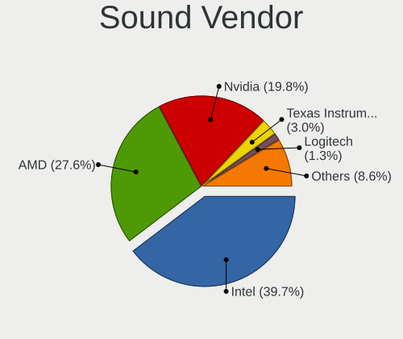

| Vendor                                       | Desktops | Percent |
|----------------------------------------------|----------|---------|
| Intel                                        | 92       | 39.66%  |
| AMD                                          | 64       | 27.59%  |
| Nvidia                                       | 46       | 19.83%  |
| Texas Instruments                            | 7        | 3.02%   |
| Logitech                                     | 3        | 1.29%   |
| Razer USA                                    | 2        | 0.86%   |
| GN Netcom                                    | 2        | 0.86%   |
| Corsair                                      | 2        | 0.86%   |
| Zoran Co. Personal Media Division (Nogatech) | 1        | 0.43%   |
| Xitel                                        | 1        | 0.43%   |
| USB MICROPHONE                               | 1        | 0.43%   |
| Thesycon Systemsoftware & Consulting         | 1        | 0.43%   |
| MV-SILICON                                   | 1        | 0.43%   |
| Micro Star International                     | 1        | 0.43%   |
| MAG Technology                               | 1        | 0.43%   |
| KTMicro                                      | 1        | 0.43%   |
| Jieli Technology                             | 1        | 0.43%   |
| Focusrite-Novation                           | 1        | 0.43%   |
| Cyber Acoustics                              | 1        | 0.43%   |
| Creative Labs                                | 1        | 0.43%   |
| C-Media Electronics                          | 1        | 0.43%   |
| ASUSTek Computer                             | 1        | 0.43%   |

Sound Model
-----------

Sound card models

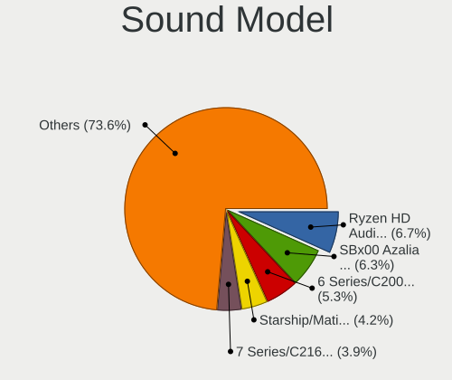

| Model                                                                      | Desktops | Percent |
|----------------------------------------------------------------------------|----------|---------|
| AMD Ryzen HD Audio Controller                                              | 19       | 6.69%   |
| AMD SBx00 Azalia (Intel HDA)                                               | 18       | 6.34%   |
| Intel 6 Series/C200 Series Chipset Family High Definition Audio Controller | 15       | 5.28%   |
| AMD Starship/Matisse HD Audio Controller                                   | 12       | 4.23%   |
| Intel 7 Series/C216 Chipset Family High Definition Audio Controller        | 11       | 3.87%   |
| Intel 8 Series/C220 Series Chipset High Definition Audio Controller        | 10       | 3.52%   |
| Intel 100 Series/C230 Series Chipset Family HD Audio Controller            | 10       | 3.52%   |
| AMD Radeon High Definition Audio Controller                                | 9        | 3.17%   |
| Intel Xeon E3-1200 v3/4th Gen Core Processor HD Audio Controller           | 7        | 2.46%   |
| Intel Cannon Lake PCH cAVS                                                 | 6        | 2.11%   |
| AMD Navi 21/23 HDMI/DP Audio Controller                                    | 6        | 2.11%   |
| Nvidia High Definition Audio Controller                                    | 5        | 1.76%   |
| Nvidia GP106 High Definition Audio Controller                              | 5        | 1.76%   |
| AMD Renoir/Cezanne HDMI/DP Audio Controller                                | 5        | 1.76%   |
| AMD Navi 31 HDMI/DP Audio                                                  | 5        | 1.76%   |
| Nvidia GK208 HDMI/DP Audio Controller                                      | 4        | 1.41%   |
| Intel NM10/ICH7 Family High Definition Audio Controller                    | 4        | 1.41%   |
| Intel 5 Series/3400 Series Chipset High Definition Audio                   | 4        | 1.41%   |
| Intel 200 Series PCH HD Audio                                              | 4        | 1.41%   |
| AMD Oland/Hainan/Cape Verde/Pitcairn HDMI Audio [Radeon HD 7000 Series]    | 4        | 1.41%   |
| AMD Family 17h (Models 00h-0fh) HD Audio Controller                        | 4        | 1.41%   |
| AMD Ellesmere HDMI Audio [Radeon RX 470/480 / 570/580/590]                 | 4        | 1.41%   |
| Texas Instruments PCM2902 Audio Codec                                      | 3        | 1.06%   |
| Nvidia GP108 High Definition Audio Controller                              | 3        | 1.06%   |
| Nvidia GP104 High Definition Audio Controller                              | 3        | 1.06%   |
| Nvidia GM107 High Definition Audio Controller [GeForce 940MX]              | 3        | 1.06%   |
| Intel Raptor Lake High Definition Audio Controller                         | 3        | 1.06%   |
| Intel C610/X99 series chipset HD Audio Controller                          | 3        | 1.06%   |
| Intel C600/X79 series chipset High Definition Audio Controller             | 3        | 1.06%   |
| Intel Atom Processor Z36xxx/Z37xxx Series High Definition Audio Controller | 3        | 1.06%   |
| Intel 82801I (ICH9 Family) HD Audio Controller                             | 3        | 1.06%   |
| AMD Raven/Raven2/Fenghuang HDMI/DP Audio Controller                        | 3        | 1.06%   |
| Nvidia GM206 High Definition Audio Controller                              | 2        | 0.7%    |
| Nvidia GK107 HDMI Audio Controller                                         | 2        | 0.7%    |
| Nvidia GF116 High Definition Audio Controller                              | 2        | 0.7%    |
| Intel Smart Sound Technology (SST) Audio Controller                        | 2        | 0.7%    |
| Intel Comet Lake PCH cAVS                                                  | 2        | 0.7%    |
| Intel Alder Lake-N PCH High Definition Audio Controller                    | 2        | 0.7%    |
| Intel 82801JI (ICH10 Family) HD Audio Controller                           | 2        | 0.7%    |
| AMD RS780 HDMI Audio [Radeon 3000/3100 / HD 3200/3300]                     | 2        | 0.7%    |

Memory
------

Memory Vendor
-------------

Memory module vendors

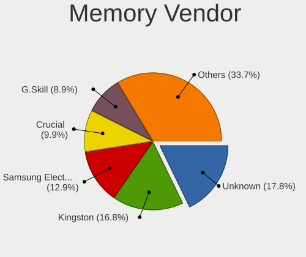

| Vendor              | Desktops | Percent |
|---------------------|----------|---------|
| Unknown             | 18       | 17.82%  |
| Kingston            | 17       | 16.83%  |
| Samsung Electronics | 13       | 12.87%  |
| Crucial             | 10       | 9.9%    |
| G.Skill             | 9        | 8.91%   |
| Corsair             | 9        | 8.91%   |
| SK hynix            | 6        | 5.94%   |
| Micron Technology   | 6        | 5.94%   |
| Ramaxel Technology  | 3        | 2.97%   |
| Smart               | 2        | 1.98%   |
| A-DATA Technology   | 2        | 1.98%   |
| Unknown             | 2        | 1.98%   |
| Unknown (0x0BF7)    | 1        | 0.99%   |
| Team                | 1        | 0.99%   |
| Patriot Memory      | 1        | 0.99%   |
| Elpida              | 1        | 0.99%   |

Memory Model
------------

Memory module models

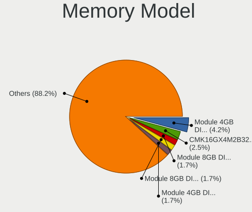

| Model                                                     | Desktops | Percent |
|-----------------------------------------------------------|----------|---------|
| Unknown RAM Module 4GB DIMM 1333MT/s                      | 5        | 4.2%    |
| Corsair RAM CMK16GX4M2B3200C16 8GB DIMM DDR4 3600MT/s     | 3        | 2.52%   |
| Unknown RAM Module 8GB DIMM DDR3 1600MT/s                 | 2        | 1.68%   |
| Unknown RAM Module 8GB DIMM 1333MT/s                      | 2        | 1.68%   |
| Unknown RAM Module 4GB DIMM DDR3 1333MT/s                 | 2        | 1.68%   |
| Unknown RAM Module 2GB DIMM SDRAM                         | 2        | 1.68%   |
| Unknown RAM Module 2GB DIMM DDR 1333MT/s                  | 2        | 1.68%   |
| Unknown RAM Module 2GB DIMM 1333MT/s                      | 2        | 1.68%   |
| SK hynix RAM HYMP112U64CP8-S6 1GB DIMM DDR2 800MT/s       | 2        | 1.68%   |
| Samsung RAM M386B4G70DM0 32GB DIMM DDR3 1866MT/s          | 2        | 1.68%   |
| Ramaxel RAM RMR5030EF68F9W1600 4GB DIMM DDR3 1600MT/s     | 2        | 1.68%   |
| Unknown                                                   | 2        | 1.68%   |
| Unknown RAM Module 8GB DIMM DDR 1333MT/s                  | 1        | 0.84%   |
| Unknown RAM Module 8GB DIMM 667MT/s                       | 1        | 0.84%   |
| Unknown RAM Module 4GB DIMM DDR 1333MT/s                  | 1        | 0.84%   |
| Unknown RAM Module 4GB DIMM 667MT/s                       | 1        | 0.84%   |
| Unknown RAM Module 2GB SODIMM DDR3 800MT/s                | 1        | 0.84%   |
| Unknown RAM Module 2GB DIMM DDR3 1333MT/s                 | 1        | 0.84%   |
| Unknown RAM Module 2GB DIMM DDR2 667MT/s                  | 1        | 0.84%   |
| Unknown RAM Module 2GB DIMM 800MT/s                       | 1        | 0.84%   |
| Unknown RAM Module 1GB DIMM SDRAM                         | 1        | 0.84%   |
| Unknown (0x0BF7) RAM DDR-C300 8GB SODIMM DDR4 3200MT/s    | 1        | 0.84%   |
| Team RAM TEAMGROUP-SD4-3200 16GB SODIMM DDR4 3200MT/s     | 1        | 0.84%   |
| Smart RAM SH564568FH8NWPHSFR 2GB DIMM DDR3 1333MT/s       | 1        | 0.84%   |
| Smart RAM SH5641G8FH8N6TNSQG 8GB DIMM DDR3 1600MT/s       | 1        | 0.84%   |
| SK hynix RAM HMT41GU6DFR8A-PB 8GB DIMM DDR3 1600MT/s      | 1        | 0.84%   |
| SK hynix RAM HMT41GS6BFR8A-PB 8GB DIMM DDR3 1600MT/s      | 1        | 0.84%   |
| SK hynix RAM HMT351U6EFR8C-PB 4GB DIMM DDR3 1600MT/s      | 1        | 0.84%   |
| SK hynix RAM HMT325U6CFR8C-H9 2GB DIMM DDR3 1333MT/s      | 1        | 0.84%   |
| Samsung RAM Module 8GB DIMM DDR4 2667MT/s                 | 1        | 0.84%   |
| Samsung RAM Module 4GB DIMM DDR3 1333MT/s                 | 1        | 0.84%   |
| Samsung RAM M471B5173QH0-YK0 4GB SODIMM DDR3 1600MT/s     | 1        | 0.84%   |
| Samsung RAM M425R2GA3PB0-CWMOD 16GiB SODIMM DDR5 5600MT/s | 1        | 0.84%   |
| Samsung RAM M393A4K40BB1-CRC 32GB DIMM DDR4 2400MT/s      | 1        | 0.84%   |
| Samsung RAM M378B5773DH0-CK0 2GB DIMM DDR3 1600MT/s       | 1        | 0.84%   |
| Samsung RAM M378B5273EB0-CK0 4GB DIMM DDR3 1800MT/s       | 1        | 0.84%   |
| Samsung RAM M378B5273DH0-CH9 4GB DIMM DDR3 2133MT/s       | 1        | 0.84%   |
| Samsung RAM M378B5273CH0-CH9 4GB DIMM DDR3 1867MT/s       | 1        | 0.84%   |
| Samsung RAM M378B2873EH1-CH9 1GB DIMM DDR3 1334MT/s       | 1        | 0.84%   |
| Samsung RAM M378B1G73QH0 8GB DIMM DDR3 1866MT/s           | 1        | 0.84%   |

Memory Kind
-----------

Memory module kinds

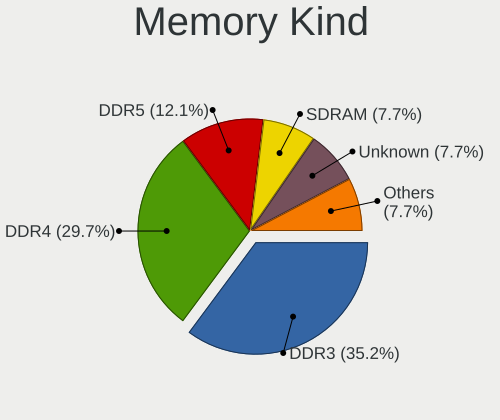

| Kind    | Desktops | Percent |
|---------|----------|---------|
| DDR3    | 32       | 35.16%  |
| DDR4    | 27       | 29.67%  |
| DDR5    | 11       | 12.09%  |
| SDRAM   | 7        | 7.69%   |
| Unknown | 7        | 7.69%   |
| DDR2    | 4        | 4.4%    |
| DDR     | 2        | 2.2%    |
| DRAM    | 1        | 1.1%    |

Memory Form Factor
------------------

Physical design of the memory module

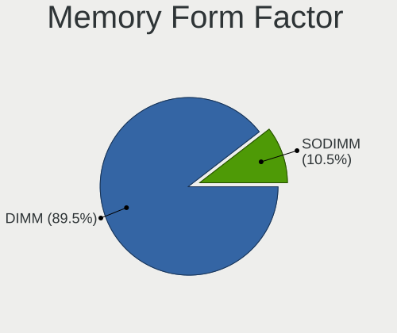

| Name   | Desktops | Percent |
|--------|----------|---------|
| DIMM   | 77       | 89.53%  |
| SODIMM | 9        | 10.47%  |

Memory Size
-----------

Memory module size

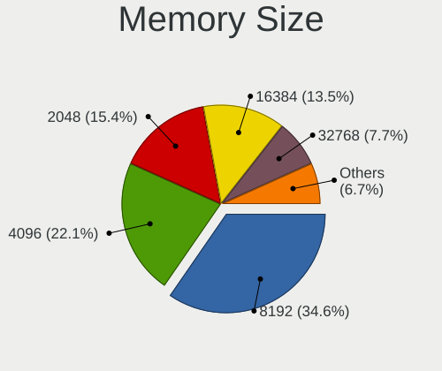

| Size  | Desktops | Percent |
|-------|----------|---------|
| 8192  | 36       | 34.62%  |
| 4096  | 23       | 22.12%  |
| 2048  | 16       | 15.38%  |
| 16384 | 14       | 13.46%  |
| 32768 | 8        | 7.69%   |
| 1024  | 7        | 6.73%   |

Memory Speed
------------

Memory module speed

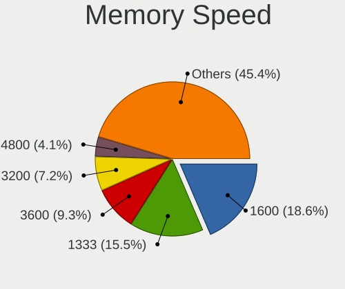

| Speed   | Desktops | Percent |
|---------|----------|---------|
| 1600    | 18       | 18.56%  |
| 1333    | 15       | 15.46%  |
| 3600    | 9        | 9.28%   |
| 3200    | 7        | 7.22%   |
| 4800    | 4        | 4.12%   |
| 800     | 4        | 4.12%   |
| 3733    | 3        | 3.09%   |
| 2667    | 3        | 3.09%   |
| 2400    | 3        | 3.09%   |
| 2133    | 3        | 3.09%   |
| 1866    | 3        | 3.09%   |
| 667     | 3        | 3.09%   |
| 6000    | 2        | 2.06%   |
| 1800    | 2        | 2.06%   |
| Unknown | 2        | 2.06%   |
| 6800    | 1        | 1.03%   |
| 6400    | 1        | 1.03%   |
| 5600    | 1        | 1.03%   |
| 5200    | 1        | 1.03%   |
| 5000    | 1        | 1.03%   |
| 3666    | 1        | 1.03%   |
| 3000    | 1        | 1.03%   |
| 2866    | 1        | 1.03%   |
| 2733    | 1        | 1.03%   |
| 2666    | 1        | 1.03%   |
| 1867    | 1        | 1.03%   |
| 1639    | 1        | 1.03%   |
| 1334    | 1        | 1.03%   |
| 1331    | 1        | 1.03%   |
| 1066    | 1        | 1.03%   |
| 533     | 1        | 1.03%   |

Printers & scanners
-------------------

Printer Vendor
--------------

Printer device vendors

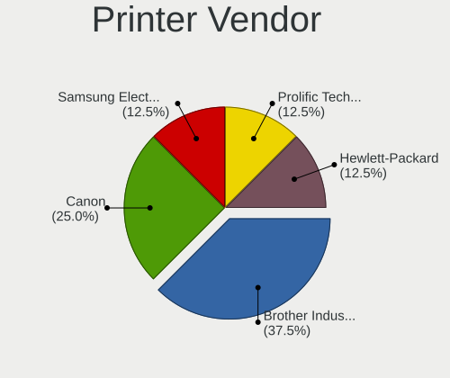

| Vendor              | Desktops | Percent |
|---------------------|----------|---------|
| Brother Industries  | 3        | 37.5%   |
| Canon               | 2        | 25%     |
| Samsung Electronics | 1        | 12.5%   |
| Prolific Technology | 1        | 12.5%   |
| Hewlett-Packard     | 1        | 12.5%   |

Printer Model
-------------

Printer device models

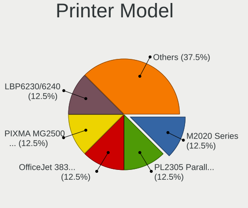

| Model                         | Desktops | Percent |
|-------------------------------|----------|---------|
| Samsung M2020 Series          | 1        | 12.5%   |
| Prolific PL2305 Parallel Port | 1        | 12.5%   |
| HP OfficeJet 3830 series      | 1        | 12.5%   |
| Canon PIXMA MG2500 Series     | 1        | 12.5%   |
| Canon LBP6230/6240            | 1        | 12.5%   |
| Brother MFC-L2860DWE          | 1        | 12.5%   |
| Brother MFC-L2710DW series    | 1        | 12.5%   |
| Brother HL-5370DW series      | 1        | 12.5%   |

Scanner Vendor
--------------

Scanner device vendors

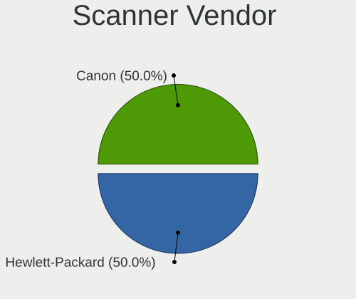

| Vendor          | Desktops | Percent |
|-----------------|----------|---------|
| Hewlett-Packard | 1        | 50%     |
| Canon           | 1        | 50%     |

Scanner Model
-------------

Scanner device models

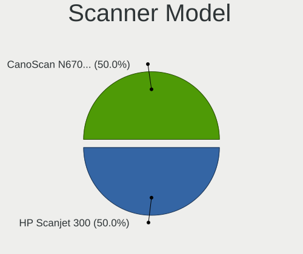

| Model                              | Desktops | Percent |
|------------------------------------|----------|---------|
| HP HP Scanjet 300                  | 1        | 50%     |
| Canon CanoScan N670U/N676U/LiDE 20 | 1        | 50%     |

Camera
------

Camera Vendor
-------------

Camera device vendors

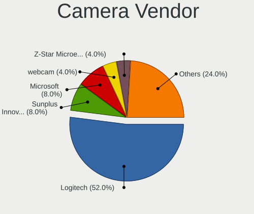

| Vendor                        | Desktops | Percent |
|-------------------------------|----------|---------|
| Logitech                      | 13       | 52%     |
| Sunplus Innovation Technology | 2        | 8%      |
| Microsoft                     | 2        | 8%      |
| Z-Star Microelectronics       | 1        | 4%      |
| YGTek                         | 1        | 4%      |
| webcam                        | 1        | 4%      |
| Tobii Technology AB           | 1        | 4%      |
| Samsung Electronics           | 1        | 4%      |
| Microdia                      | 1        | 4%      |
| Jieli Technology              | 1        | 4%      |
| GEMBIRD                       | 1        | 4%      |

Camera Model
------------

Camera device models

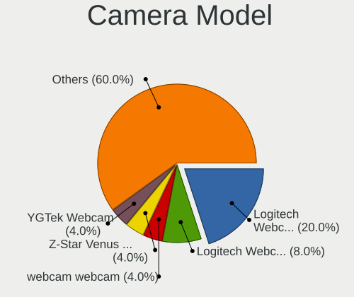

| Model                                             | Desktops | Percent |
|---------------------------------------------------|----------|---------|
| Logitech Webcam C270                              | 5        | 20%     |
| Logitech Webcam Pro 9000                          | 2        | 8%      |
| Z-Star Venus USB2.0 Camera                        | 1        | 4%      |
| YGTek Webcam                                      | 1        | 4%      |
| webcam webcam                                     | 1        | 4%      |
| Tobii AB EyeChip                                  | 1        | 4%      |
| Sunplus NexiGo N940P 2K Webcam                    | 1        | 4%      |
| Sunplus Integrated Camera                         | 1        | 4%      |
| Samsung Galaxy series, misc. (MTP mode)           | 1        | 4%      |
| Microsoft LifeCam VX-800                          | 1        | 4%      |
| Microsoft LifeCam Studio                          | 1        | 4%      |
| Microdia UGREEN Camera                            | 1        | 4%      |
| Logitech Webcam C310                              | 1        | 4%      |
| Logitech Webcam C170                              | 1        | 4%      |
| Logitech HD Webcam C910                           | 1        | 4%      |
| Logitech HD Pro Webcam C920                       | 1        | 4%      |
| Logitech C922 Pro Stream Webcam                   | 1        | 4%      |
| Logitech BRIO Ultra HD Webcam                     | 1        | 4%      |
| Jieli USB Composite Device                        | 1        | 4%      |
| GEMBIRD Generic UVC 1.00 camera [AppoTech AX2311] | 1        | 4%      |

Security
--------

Fingerprint Vendor
------------------

Fingerprint sensor vendors

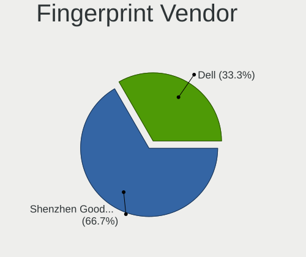

| Vendor                     | Desktops | Percent |
|----------------------------|----------|---------|
| Shenzhen Goodix Technology | 2        | 66.67%  |
| Dell                       | 1        | 33.33%  |

Fingerprint Model
-----------------

Fingerprint sensor models

| Model                                          | Desktops | Percent |
|------------------------------------------------|----------|---------|
| Shenzhen Goodix  Fingerprint Device            | 2        | 66.67%  |
| Dell MS819 Wired Mouse With Fingerprint Reader | 1        | 33.33%  |

Chipcard Vendor
---------------

Chipcard module vendors

Zero info for selected period =(

Chipcard Model
--------------

Chipcard module models

Zero info for selected period =(

Unsupported
-----------

Unsupported Devices
-------------------

Total unsupported devices on board

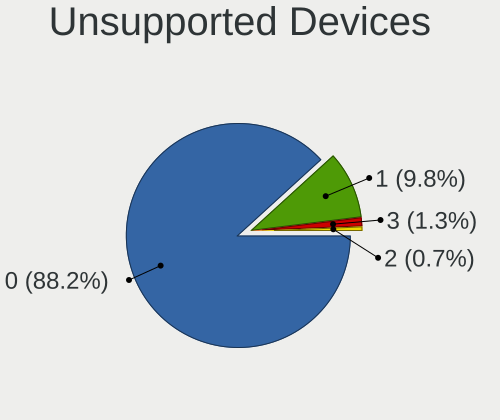

| Total | Desktops | Percent |
|-------|----------|---------|
| 0     | 135      | 88.24%  |
| 1     | 15       | 9.8%    |
| 3     | 2        | 1.31%   |
| 2     | 1        | 0.65%   |

Unsupported Device Types
------------------------

Types of unsupported devices

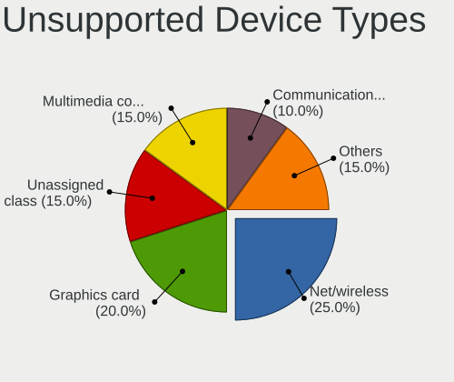

| Type                     | Desktops | Percent |
|--------------------------|----------|---------|
| Net/wireless             | 5        | 25%     |
| Graphics card            | 4        | 20%     |
| Unassigned class         | 3        | 15%     |
| Multimedia controller    | 3        | 15%     |
| Communication controller | 2        | 10%     |
| Storage/raid             | 1        | 5%      |
| Dvb card                 | 1        | 5%      |
| Camera                   | 1        | 5%      |

