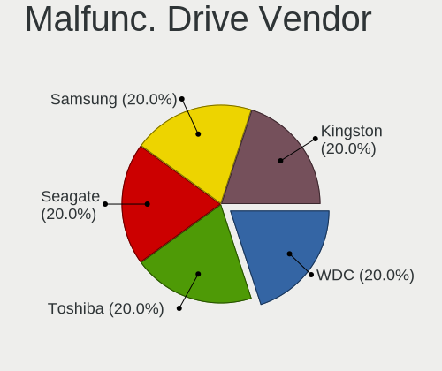
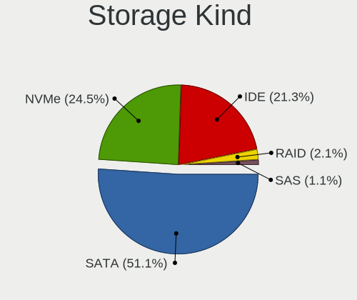

Xubuntu 24.04 - Tested Hardware & Statistics (Desktops)
-------------------------------------------------------

A project to collect tested hardware configurations for Xubuntu 24.04.

Anyone can contribute to this report by the [hw-probe](https://github.com/linuxhw/hw-probe) tool:

    sudo -E hw-probe -all -upload

Please contribute! Especially if your hardware is rare.

Contents
--------

* [ Test Cases ](#test-cases)

* [ System ](#system)
  - [ Kernel                   ](#kernel)
  - [ Kernel Family            ](#kernel-family)
  - [ Kernel Major Ver.        ](#kernel-major-ver)
  - [ Arch                     ](#arch)
  - [ DE                       ](#de)
  - [ Display Server           ](#display-server)
  - [ Display Manager          ](#display-manager)
  - [ OS Lang                  ](#os-lang)
  - [ Boot Mode                ](#boot-mode)
  - [ Filesystem               ](#filesystem)
  - [ Part. scheme             ](#part-scheme)
  - [ Dual Boot with Linux/BSD ](#dual-boot-with-linuxbsd)
  - [ Dual Boot (Win)          ](#dual-boot-win)

* [ Board ](#board)
  - [ Vendor                   ](#vendor)
  - [ Model                    ](#model)
  - [ Model Family             ](#model-family)
  - [ MFG Year                 ](#mfg-year)
  - [ Form Factor              ](#form-factor)
  - [ Secure Boot              ](#secure-boot)
  - [ Coreboot                 ](#coreboot)
  - [ RAM Size                 ](#ram-size)
  - [ RAM Used                 ](#ram-used)
  - [ Total Drives             ](#total-drives)
  - [ Has CD-ROM               ](#has-cd-rom)
  - [ Has Ethernet             ](#has-ethernet)
  - [ Has WiFi                 ](#has-wifi)
  - [ Has Bluetooth            ](#has-bluetooth)

* [ Location ](#location)
  - [ Country                  ](#country)
  - [ City                     ](#city)

* [ Drives ](#drives)
  - [ Drive Vendor             ](#drive-vendor)
  - [ Drive Model              ](#drive-model)
  - [ HDD Vendor               ](#hdd-vendor)
  - [ SSD Vendor               ](#ssd-vendor)
  - [ Drive Kind               ](#drive-kind)
  - [ Drive Connector          ](#drive-connector)
  - [ Drive Size               ](#drive-size)
  - [ Space Total              ](#space-total)
  - [ Space Used               ](#space-used)
  - [ Malfunc. Drives          ](#malfunc-drives)
  - [ Malfunc. Drive Vendor    ](#malfunc-drive-vendor)
  - [ Malfunc. HDD Vendor      ](#malfunc-hdd-vendor)
  - [ Malfunc. Drive Kind      ](#malfunc-drive-kind)
  - [ Failed Drives            ](#failed-drives)
  - [ Failed Drive Vendor      ](#failed-drive-vendor)
  - [ Drive Status             ](#drive-status)

* [ Storage controller ](#storage-controller)
  - [ Storage Vendor           ](#storage-vendor)
  - [ Storage Model            ](#storage-model)
  - [ Storage Kind             ](#storage-kind)

* [ Processor ](#processor)
  - [ CPU Vendor               ](#cpu-vendor)
  - [ CPU Model                ](#cpu-model)
  - [ CPU Model Family         ](#cpu-model-family)
  - [ CPU Cores                ](#cpu-cores)
  - [ CPU Sockets              ](#cpu-sockets)
  - [ CPU Threads              ](#cpu-threads)
  - [ CPU Op-Modes             ](#cpu-op-modes)
  - [ CPU Microcode            ](#cpu-microcode)
  - [ CPU Microarch            ](#cpu-microarch)

* [ Graphics ](#graphics)
  - [ GPU Vendor               ](#gpu-vendor)
  - [ GPU Model                ](#gpu-model)
  - [ GPU Combo                ](#gpu-combo)
  - [ GPU Driver               ](#gpu-driver)
  - [ GPU Memory               ](#gpu-memory)

* [ Monitor ](#monitor)
  - [ Monitor Vendor           ](#monitor-vendor)
  - [ Monitor Model            ](#monitor-model)
  - [ Monitor Resolution       ](#monitor-resolution)
  - [ Monitor Diagonal         ](#monitor-diagonal)
  - [ Monitor Width            ](#monitor-width)
  - [ Aspect Ratio             ](#aspect-ratio)
  - [ Monitor Area             ](#monitor-area)
  - [ Pixel Density            ](#pixel-density)
  - [ Multiple Monitors        ](#multiple-monitors)

* [ Network ](#network)
  - [ Net Controller Vendor    ](#net-controller-vendor)
  - [ Net Controller Model     ](#net-controller-model)
  - [ Wireless Vendor          ](#wireless-vendor)
  - [ Wireless Model           ](#wireless-model)
  - [ Ethernet Vendor          ](#ethernet-vendor)
  - [ Ethernet Model           ](#ethernet-model)
  - [ Net Controller Kind      ](#net-controller-kind)
  - [ Used Controller          ](#used-controller)
  - [ NICs                     ](#nics)
  - [ IPv6                     ](#ipv6)

* [ Bluetooth ](#bluetooth)
  - [ Bluetooth Vendor         ](#bluetooth-vendor)
  - [ Bluetooth Model          ](#bluetooth-model)

* [ Sound ](#sound)
  - [ Sound Vendor             ](#sound-vendor)
  - [ Sound Model              ](#sound-model)

* [ Memory ](#memory)
  - [ Memory Vendor            ](#memory-vendor)
  - [ Memory Model             ](#memory-model)
  - [ Memory Kind              ](#memory-kind)
  - [ Memory Form Factor       ](#memory-form-factor)
  - [ Memory Size              ](#memory-size)
  - [ Memory Speed             ](#memory-speed)

* [ Printers & scanners ](#printers--scanners)
  - [ Printer Vendor           ](#printer-vendor)
  - [ Printer Model            ](#printer-model)
  - [ Scanner Vendor           ](#scanner-vendor)
  - [ Scanner Model            ](#scanner-model)

* [ Camera ](#camera)
  - [ Camera Vendor            ](#camera-vendor)
  - [ Camera Model             ](#camera-model)

* [ Security ](#security)
  - [ Fingerprint Vendor       ](#fingerprint-vendor)
  - [ Fingerprint Model        ](#fingerprint-model)
  - [ Chipcard Vendor          ](#chipcard-vendor)
  - [ Chipcard Model           ](#chipcard-model)

* [ Unsupported ](#unsupported)
  - [ Unsupported Devices      ](#unsupported-devices)
  - [ Unsupported Device Types ](#unsupported-device-types)

Test Cases
----------

Total: 83

| Vendor        | Model                       | Probe                                                      | Date         |
|---------------|-----------------------------|------------------------------------------------------------|--------------|
| Gigabyte      | X470 AORUS ULTRA GAMING-... | [99e9eae159](https://linux-hardware.org/?probe=99e9eae159) | Jan 05, 2025 |
| Fujitsu       | D3183-A1 S26361-D3183-A1    | [3696f797a8](https://linux-hardware.org/?probe=3696f797a8) | Jan 04, 2025 |
| Intel         | DH61CR AAG14064-204         | [0b1feaadef](https://linux-hardware.org/?probe=0b1feaadef) | Jan 04, 2025 |
| Dell          | 0FF3FN A00                  | [7015b068fb](https://linux-hardware.org/?probe=7015b068fb) | Jan 03, 2025 |
| Dell          | 0FF3FN A00                  | [24dd59cb38](https://linux-hardware.org/?probe=24dd59cb38) | Jan 03, 2025 |
| ASUSTek       | M5A78L-M LX3                | [9436b53810](https://linux-hardware.org/?probe=9436b53810) | Dec 28, 2024 |
| Intel         | H61 V1.6B                   | [a60c63d4f8](https://linux-hardware.org/?probe=a60c63d4f8) | Dec 28, 2024 |
| ASRock        | G31M-GS                     | [43edae3bca](https://linux-hardware.org/?probe=43edae3bca) | Dec 27, 2024 |
| Gigabyte      | H410M H V3                  | [411d54ea0e](https://linux-hardware.org/?probe=411d54ea0e) | Dec 24, 2024 |
| BESSTAR Te... | HX90                        | [11b30e17f3](https://linux-hardware.org/?probe=11b30e17f3) | Dec 23, 2024 |
| Gigabyte      | H410M H V3                  | [8d38a80f8d](https://linux-hardware.org/?probe=8d38a80f8d) | Dec 23, 2024 |
| ASRock        | B75M                        | [b5d292db3a](https://linux-hardware.org/?probe=b5d292db3a) | Dec 18, 2024 |
| Lenovo        | SHARKBAY 0B98401 PRO        | [f25016b0a2](https://linux-hardware.org/?probe=f25016b0a2) | Dec 14, 2024 |
| ASRock        | G31M-GS                     | [769e2a4b35](https://linux-hardware.org/?probe=769e2a4b35) | Dec 11, 2024 |
| Dell          | 0HY9JP A00                  | [d65f5e1d9f](https://linux-hardware.org/?probe=d65f5e1d9f) | Dec 10, 2024 |
| ASUSTek       | PB50                        | [4c089afc7d](https://linux-hardware.org/?probe=4c089afc7d) | Dec 03, 2024 |
| Lenovo        | Bantry CRB SDK0J40709 WI... | [02fadfe7cc](https://linux-hardware.org/?probe=02fadfe7cc) | Nov 28, 2024 |
| Lenovo        | Bantry CRB SDK0J40709 WI... | [a0f78ace36](https://linux-hardware.org/?probe=a0f78ace36) | Nov 28, 2024 |
| ASRock        | G31M-S                      | [eb86f2cd39](https://linux-hardware.org/?probe=eb86f2cd39) | Nov 25, 2024 |
| ASUSTek       | ROG CROSSHAIR VIII DARK ... | [f12649ad72](https://linux-hardware.org/?probe=f12649ad72) | Nov 18, 2024 |
| Gigabyte      | Z790 UD AX                  | [e7d2ae557b](https://linux-hardware.org/?probe=e7d2ae557b) | Nov 13, 2024 |
| Foxconn       | H61MXT1/F2/-S/-V            | [a45a575296](https://linux-hardware.org/?probe=a45a575296) | Nov 12, 2024 |
| Gigabyte      | G41M-ES2L                   | [d1d98f5e59](https://linux-hardware.org/?probe=d1d98f5e59) | Nov 10, 2024 |
| MSI           | PRO B550M-P GEN3            | [c13f813eba](https://linux-hardware.org/?probe=c13f813eba) | Nov 04, 2024 |
| Gigabyte      | GA-MA69G-S3H                | [155af677bf](https://linux-hardware.org/?probe=155af677bf) | Nov 03, 2024 |
| HP            | 859B                        | [75749e37f1](https://linux-hardware.org/?probe=75749e37f1) | Oct 31, 2024 |
| HP            | 83E9                        | [b3ae37412e](https://linux-hardware.org/?probe=b3ae37412e) | Oct 23, 2024 |
| ASRock        | 970M Pro3                   | [d3e4fb691b](https://linux-hardware.org/?probe=d3e4fb691b) | Oct 16, 2024 |
| Acer          | Aspire TC-710 V:1.1         | [f08a4f01c7](https://linux-hardware.org/?probe=f08a4f01c7) | Oct 15, 2024 |
| Gigabyte      | X470 AORUS ULTRA GAMING-... | [903f8e6923](https://linux-hardware.org/?probe=903f8e6923) | Oct 12, 2024 |
| HP            | 82A2                        | [f5c82a12b7](https://linux-hardware.org/?probe=f5c82a12b7) | Oct 12, 2024 |
| ASUSTek       | P5Q-PRO                     | [60db33116f](https://linux-hardware.org/?probe=60db33116f) | Oct 09, 2024 |
| Acer          | Aspire TC-710 V:1.1         | [243099814f](https://linux-hardware.org/?probe=243099814f) | Oct 01, 2024 |
| MSI           | PRO B550M-P GEN3            | [0d355df0ac](https://linux-hardware.org/?probe=0d355df0ac) | Sep 23, 2024 |
| MSI           | PRO B550M-P GEN3            | [51f9d6568b](https://linux-hardware.org/?probe=51f9d6568b) | Sep 23, 2024 |
| ECS           | Nettle3                     | [805686f76b](https://linux-hardware.org/?probe=805686f76b) | Sep 21, 2024 |
| Gigabyte      | B650E AORUS PRO X USB4      | [d1c1277774](https://linux-hardware.org/?probe=d1c1277774) | Sep 20, 2024 |
| Gigabyte      | P55-UD3                     | [6d3fbd2a9b](https://linux-hardware.org/?probe=6d3fbd2a9b) | Sep 17, 2024 |
| HP            | 8A96 11                     | [4a8df6b044](https://linux-hardware.org/?probe=4a8df6b044) | Sep 17, 2024 |
| ASUSTek       | ROG CROSSHAIR VIII DARK ... | [12e603b654](https://linux-hardware.org/?probe=12e603b654) | Sep 15, 2024 |
| Lenovo        | SKYBAY NOK                  | [8f7dbb486d](https://linux-hardware.org/?probe=8f7dbb486d) | Sep 14, 2024 |
| ECS           | Nettle3                     | [578c7331e4](https://linux-hardware.org/?probe=578c7331e4) | Sep 13, 2024 |
| MSI           | B550-A PRO                  | [0cbd62775a](https://linux-hardware.org/?probe=0cbd62775a) | Sep 13, 2024 |
| ASUSTek       | M51BC                       | [5c0e68a9cf](https://linux-hardware.org/?probe=5c0e68a9cf) | Sep 09, 2024 |
| HP            | 18E4                        | [c35e92df21](https://linux-hardware.org/?probe=c35e92df21) | Sep 03, 2024 |
| Gigabyte      | P55-UD3                     | [53864e5ccf](https://linux-hardware.org/?probe=53864e5ccf) | Sep 02, 2024 |
| Gigabyte      | P55-UD3                     | [6fbeb76c6a](https://linux-hardware.org/?probe=6fbeb76c6a) | Sep 02, 2024 |
| MSI           | MAG B550 TOMAHAWK MAX WI... | [0ffefcc1f1](https://linux-hardware.org/?probe=0ffefcc1f1) | Aug 26, 2024 |
| HP            | 0B48h                       | [ac50d6a5f7](https://linux-hardware.org/?probe=ac50d6a5f7) | Aug 25, 2024 |
| HP            | 0B48h                       | [7ac220ff90](https://linux-hardware.org/?probe=7ac220ff90) | Aug 25, 2024 |
| Acer          | Aspire XC-885 V:1.1         | [15c0568e70](https://linux-hardware.org/?probe=15c0568e70) | Aug 23, 2024 |
| Unknown       | FH5251                      | [50afcad45f](https://linux-hardware.org/?probe=50afcad45f) | Aug 19, 2024 |
| MSI           | MAG B550 TOMAHAWK MAX WI... | [6cb977f422](https://linux-hardware.org/?probe=6cb977f422) | Aug 18, 2024 |
| MSI           | B450M/ac                    | [be62424ac6](https://linux-hardware.org/?probe=be62424ac6) | Aug 14, 2024 |
| MSI           | B450M/ac                    | [442a4c144c](https://linux-hardware.org/?probe=442a4c144c) | Aug 14, 2024 |
| ASRock        | X600M-STX                   | [94cf713435](https://linux-hardware.org/?probe=94cf713435) | Aug 10, 2024 |
| Gigabyte      | 970A-DS3P                   | [e2b516fa74](https://linux-hardware.org/?probe=e2b516fa74) | Aug 07, 2024 |
| ASUSTek       | ROG CROSSHAIR VIII DARK ... | [26c71d4462](https://linux-hardware.org/?probe=26c71d4462) | Jul 26, 2024 |
| ASUSTek       | SABERTOOTH 990FX R2.0       | [4882975a0e](https://linux-hardware.org/?probe=4882975a0e) | Jul 25, 2024 |
| Gigabyte      | 970A-DS3P                   | [be21c5a7f3](https://linux-hardware.org/?probe=be21c5a7f3) | Jul 25, 2024 |
| MSI           | MPG B550 GAMING EDGE WIF... | [798d35210d](https://linux-hardware.org/?probe=798d35210d) | Jul 20, 2024 |
| ASUSTek       | PRIME B560-PLUS             | [4f05ba0751](https://linux-hardware.org/?probe=4f05ba0751) | Jul 18, 2024 |
| Gigabyte      | B550 AORUS ELITE            | [755fd67459](https://linux-hardware.org/?probe=755fd67459) | Jul 17, 2024 |
| Acer          | Aspire XC-885 V:1.1         | [9302be7b15](https://linux-hardware.org/?probe=9302be7b15) | Jul 16, 2024 |
| Lenovo        | 0B98401 WIN                 | [f711cc08e2](https://linux-hardware.org/?probe=f711cc08e2) | Jul 16, 2024 |
| Gigabyte      | B550 AORUS ELITE            | [9d2570fead](https://linux-hardware.org/?probe=9d2570fead) | Jul 09, 2024 |
| ASUSTek       | TUF B450M-PRO GAMING        | [01e4be1d25](https://linux-hardware.org/?probe=01e4be1d25) | Jul 07, 2024 |
| Pegatron      | Eureka3                     | [28c1c2dc17](https://linux-hardware.org/?probe=28c1c2dc17) | Jul 07, 2024 |
| HP            | ProLiant ML310e Gen8        | [11f1a32973](https://linux-hardware.org/?probe=11f1a32973) | Jul 06, 2024 |
| Pegatron      | Benicia                     | [794c6e94ca](https://linux-hardware.org/?probe=794c6e94ca) | Jun 30, 2024 |
| Unknown       | Phitronics G31VS-M          | [3dc51ab2b2](https://linux-hardware.org/?probe=3dc51ab2b2) | Jun 18, 2024 |
| Gigabyte      | Z790 AORUS ELITE AX         | [1221242e81](https://linux-hardware.org/?probe=1221242e81) | Jun 14, 2024 |
| Acer          | Aspire X1430                | [3d3d2f7d99](https://linux-hardware.org/?probe=3d3d2f7d99) | Jun 10, 2024 |
| Acer          | Aspire X1430                | [afbf613945](https://linux-hardware.org/?probe=afbf613945) | Jun 10, 2024 |
| ASUSTek       | ROG STRIX B450-F GAMING ... | [5d292de909](https://linux-hardware.org/?probe=5d292de909) | May 30, 2024 |
| Lenovo        | MAHOBAY                     | [00e6135e76](https://linux-hardware.org/?probe=00e6135e76) | May 29, 2024 |
| Foxconn       | 2AA9                        | [5f74bfe795](https://linux-hardware.org/?probe=5f74bfe795) | May 15, 2024 |
| Gigabyte      | GA-880GA-UD3H               | [b22a389add](https://linux-hardware.org/?probe=b22a389add) | May 13, 2024 |
| MSI           | 890GXM-G65                  | [78941f1cb6](https://linux-hardware.org/?probe=78941f1cb6) | May 12, 2024 |
| ASUSTek       | TUF B350M-PLUS GAMING       | [e31ea5ab17](https://linux-hardware.org/?probe=e31ea5ab17) | May 06, 2024 |
| MACHINIST     | X99 G7 V1.0                 | [47f648047f](https://linux-hardware.org/?probe=47f648047f) | May 04, 2024 |
| MACHINIST     | X99 G7 V1.0                 | [017f1471b0](https://linux-hardware.org/?probe=017f1471b0) | May 04, 2024 |
| Lenovo        | 0B98401 WIN                 | [4fa3e985a9](https://linux-hardware.org/?probe=4fa3e985a9) | Apr 15, 2024 |

System
------

Kernel
------

Version of the Linux kernel

| Version                  | Desktops | Percent |
|--------------------------|----------|---------|
| 6.8.0-31-generic         | 10       | 14.71%  |
| 6.8.0-51-generic         | 9        | 13.24%  |
| 6.8.0-45-generic         | 7        | 10.29%  |
| 6.8.0-48-generic         | 5        | 7.35%   |
| 6.8.0-36-generic         | 5        | 7.35%   |
| 6.8.0-49-generic         | 4        | 5.88%   |
| 6.8.0-41-generic         | 4        | 5.88%   |
| 6.8.0-40-generic         | 4        | 5.88%   |
| 6.8.0-38-generic         | 4        | 5.88%   |
| 6.8.0-44-generic         | 3        | 4.41%   |
| 6.8.0-39-generic         | 2        | 2.94%   |
| 6.8.0-35-generic         | 2        | 2.94%   |
| 6.8.0-50-generic         | 1        | 1.47%   |
| 6.8.0-47-lowlatency      | 1        | 1.47%   |
| 6.8.0-47-generic         | 1        | 1.47%   |
| 6.8.0-22-generic         | 1        | 1.47%   |
| 6.4.0-gnu-testo          | 1        | 1.47%   |
| 6.12.0                   | 1        | 1.47%   |
| 6.11.0                   | 1        | 1.47%   |
| 6.10.10-1-liquorix-amd64 | 1        | 1.47%   |
| 6.10.1                   | 1        | 1.47%   |

Kernel Family
-------------

Linux kernel without a distro release

| Version | Desktops | Percent |
|---------|----------|---------|
| 6.8.0   | 58       | 92.06%  |
| 6.4.0   | 1        | 1.59%   |
| 6.12.0  | 1        | 1.59%   |
| 6.11.0  | 1        | 1.59%   |
| 6.10.10 | 1        | 1.59%   |
| 6.10.1  | 1        | 1.59%   |

Kernel Major Ver.
-----------------

Linux kernel major version

| Version | Desktops | Percent |
|---------|----------|---------|
| 6.8     | 58       | 92.06%  |
| 6.10    | 2        | 3.17%   |
| 6.4     | 1        | 1.59%   |
| 6.12    | 1        | 1.59%   |
| 6.11    | 1        | 1.59%   |

Arch
----

OS architecture (x86_64, i586, etc.)

| Name   | Desktops | Percent |
|--------|----------|---------|
| x86_64 | 61       | 100%    |

DE
--

Desktop Environment

| Name  | Desktops | Percent |
|-------|----------|---------|
| XFCE  | 57       | 93.44%  |
| GNOME | 2        | 3.28%   |
| LXQt  | 1        | 1.64%   |
| i3    | 1        | 1.64%   |

Display Server
--------------

X11 or Wayland

| Name    | Desktops | Percent |
|---------|----------|---------|
| X11     | 59       | 96.72%  |
| Wayland | 1        | 1.64%   |
| Tty     | 1        | 1.64%   |

Display Manager
---------------

SDDM, LightDM, etc.

| Name    | Desktops | Percent |
|---------|----------|---------|
| LightDM | 50       | 81.97%  |
| Unknown | 8        | 13.11%  |
| SDDM    | 2        | 3.28%   |
| GDM3    | 1        | 1.64%   |

OS Lang
-------

Language

| Lang  | Desktops | Percent |
|-------|----------|---------|
| en_US | 25       | 40.98%  |
| de_DE | 7        | 11.48%  |
| fr_FR | 5        | 8.2%    |
| C     | 5        | 8.2%    |
| pt_BR | 4        | 6.56%   |
| en_CA | 3        | 4.92%   |
| it_IT | 2        | 3.28%   |
| es_ES | 2        | 3.28%   |
| en_GB | 2        | 3.28%   |
| pl_PL | 1        | 1.64%   |
| nl_NL | 1        | 1.64%   |
| ja_JP | 1        | 1.64%   |
| eu_ES | 1        | 1.64%   |
| de_AT | 1        | 1.64%   |
| cs_CZ | 1        | 1.64%   |

Boot Mode
---------

EFI or BIOS

| Mode | Desktops | Percent |
|------|----------|---------|
| BIOS | 44       | 72.13%  |
| EFI  | 17       | 27.87%  |

Filesystem
----------

Type of filesystem

| Type    | Desktops | Percent |
|---------|----------|---------|
| Ext4    | 31       | 50.82%  |
| Tmpfs   | 28       | 45.9%   |
| Xfs     | 1        | 1.64%   |
| Overlay | 1        | 1.64%   |

Part. scheme
------------

Scheme of partitioning

| Type    | Desktops | Percent |
|---------|----------|---------|
| GPT     | 44       | 72.13%  |
| MBR     | 9        | 14.75%  |
| Unknown | 8        | 13.11%  |

Dual Boot with Linux/BSD
------------------------

Hosting more than one Linux/BSD

| Dual boot | Desktops | Percent |
|-----------|----------|---------|
| No        | 53       | 85.48%  |
| Yes       | 9        | 14.52%  |

Dual Boot (Win)
---------------

Hosting Linux and Windows

| Dual boot | Desktops | Percent |
|-----------|----------|---------|
| No        | 42       | 67.74%  |
| Yes       | 20       | 32.26%  |

Board
-----

Vendor
------

Motherboard manufacturer

| Name                | Desktops | Percent |
|---------------------|----------|---------|
| Gigabyte Technology | 11       | 18.03%  |
| ASUSTek Computer    | 10       | 16.39%  |
| Hewlett-Packard     | 7        | 11.48%  |
| MSI                 | 6        | 9.84%   |
| Lenovo              | 5        | 8.2%    |
| ASRock              | 5        | 8.2%    |
| Acer                | 3        | 4.92%   |
| Pegatron            | 2        | 3.28%   |
| Intel               | 2        | 3.28%   |
| Foxconn             | 2        | 3.28%   |
| Dell                | 2        | 3.28%   |
| Unknown             | 2        | 3.28%   |
| MACHINIST           | 1        | 1.64%   |
| Fujitsu             | 1        | 1.64%   |
| ECS                 | 1        | 1.64%   |
| BESSTAR Tech        | 1        | 1.64%   |

Model
-----

Motherboard model

| Name                                    | Desktops | Percent |
|-----------------------------------------|----------|---------|
| MSI MS-7C91                             | 2        | 3.28%   |
| Unknown                                 | 2        | 3.28%   |
| Pegatron NY803AAR-ABA p6150t            | 1        | 1.64%   |
| Pegatron FR644AA-ABF a6636fr            | 1        | 1.64%   |
| MSI MS-7D95                             | 1        | 1.64%   |
| MSI MS-7C56                             | 1        | 1.64%   |
| MSI MS-7642                             | 1        | 1.64%   |
| MSI B450M/ac                            | 1        | 1.64%   |
| MACHINIST X99 G7 V1.0                   | 1        | 1.64%   |
| Lenovo ThinkStation S30 43512E6         | 1        | 1.64%   |
| Lenovo ThinkCentre M83 10AM0009US       | 1        | 1.64%   |
| Lenovo ThinkCentre M82 2756AT9          | 1        | 1.64%   |
| Lenovo IdeaCentre Y700-34ISH 90DF003SPL | 1        | 1.64%   |
| Lenovo H50-55 90BG003JUS                | 1        | 1.64%   |
| Intel H61 V1.6B                         | 1        | 1.64%   |
| Intel DH61CR AAG14064-204               | 1        | 1.64%   |
| HP Z200 SFF Workstation                 | 1        | 1.64%   |
| HP ProLiant ML310e Gen8                 | 1        | 1.64%   |
| HP ProDesk 400 G6 SFF                   | 1        | 1.64%   |
| HP ProDesk 400 G4 SFF                   | 1        | 1.64%   |
| HP OMEN by 45L Gaming Desktop GT22-2xxx | 1        | 1.64%   |
| HP EliteDesk 800 G1 TWR                 | 1        | 1.64%   |
| HP EliteDesk 705 G4 DM 65W (TAA)        | 1        | 1.64%   |
| Gigabyte Z790 UD AX                     | 1        | 1.64%   |
| Gigabyte Z790 AORUS ELITE AX            | 1        | 1.64%   |
| Gigabyte X470 AORUS ULTRA GAMING        | 1        | 1.64%   |
| Gigabyte P55-UD3                        | 1        | 1.64%   |
| Gigabyte H410M H V3                     | 1        | 1.64%   |
| Gigabyte GA-MA69G-S3H                   | 1        | 1.64%   |
| Gigabyte GA-880GA-UD3H                  | 1        | 1.64%   |
| Gigabyte G41M-ES2L                      | 1        | 1.64%   |
| Gigabyte B650E AORUS PRO X USB4         | 1        | 1.64%   |
| Gigabyte B550 AORUS ELITE               | 1        | 1.64%   |
| Gigabyte 970A-DS3P                      | 1        | 1.64%   |
| Fujitsu ESPRIMO Q910                    | 1        | 1.64%   |
| Foxconn Prime Series                    | 1        | 1.64%   |
| Foxconn p6523w                          | 1        | 1.64%   |
| ECS D5468AT-ABA ALONPAV                 | 1        | 1.64%   |
| Dell Studio XPS 7100                    | 1        | 1.64%   |
| Dell OptiPlex 790                       | 1        | 1.64%   |

Model Family
------------

Motherboard model prefix

| Name                   | Desktops | Percent |
|------------------------|----------|---------|
| Acer Aspire            | 3        | 4.92%   |
| MSI MS-7C91            | 2        | 3.28%   |
| Lenovo ThinkCentre     | 2        | 3.28%   |
| HP ProDesk             | 2        | 3.28%   |
| HP EliteDesk           | 2        | 3.28%   |
| Gigabyte Z790          | 2        | 3.28%   |
| ASUS TUF               | 2        | 3.28%   |
| ASUS ROG               | 2        | 3.28%   |
| Unknown                | 2        | 3.28%   |
| Pegatron NY803AAR-ABA  | 1        | 1.64%   |
| Pegatron FR644AA-ABF   | 1        | 1.64%   |
| MSI MS-7D95            | 1        | 1.64%   |
| MSI MS-7C56            | 1        | 1.64%   |
| MSI MS-7642            | 1        | 1.64%   |
| MSI B450M              | 1        | 1.64%   |
| MACHINIST X99          | 1        | 1.64%   |
| Lenovo ThinkStation    | 1        | 1.64%   |
| Lenovo IdeaCentre      | 1        | 1.64%   |
| Lenovo H50-55          | 1        | 1.64%   |
| Intel H61              | 1        | 1.64%   |
| Intel DH61CR           | 1        | 1.64%   |
| HP Z200                | 1        | 1.64%   |
| HP ProLiant            | 1        | 1.64%   |
| HP OMEN                | 1        | 1.64%   |
| Gigabyte X470          | 1        | 1.64%   |
| Gigabyte P55-UD3       | 1        | 1.64%   |
| Gigabyte H410M         | 1        | 1.64%   |
| Gigabyte GA-MA69G-S3H  | 1        | 1.64%   |
| Gigabyte GA-880GA-UD3H | 1        | 1.64%   |
| Gigabyte G41M-ES2L     | 1        | 1.64%   |
| Gigabyte B650E         | 1        | 1.64%   |
| Gigabyte B550          | 1        | 1.64%   |
| Gigabyte 970A-DS3P     | 1        | 1.64%   |
| Fujitsu ESPRIMO        | 1        | 1.64%   |
| Foxconn Prime          | 1        | 1.64%   |
| Foxconn p6523w         | 1        | 1.64%   |
| ECS D5468AT-ABA        | 1        | 1.64%   |
| Dell Studio            | 1        | 1.64%   |
| Dell OptiPlex          | 1        | 1.64%   |
| BESSTAR Tech HX90      | 1        | 1.64%   |

MFG Year
--------

Motherboard manufacture year

| Year | Desktops | Percent |
|------|----------|---------|
| 2013 | 6        | 9.84%   |
| 2022 | 5        | 8.2%    |
| 2012 | 5        | 8.2%    |
| 2010 | 5        | 8.2%    |
| 2008 | 5        | 8.2%    |
| 2023 | 4        | 6.56%   |
| 2021 | 4        | 6.56%   |
| 2020 | 4        | 6.56%   |
| 2015 | 4        | 6.56%   |
| 2011 | 4        | 6.56%   |
| 2009 | 4        | 6.56%   |
| 2019 | 3        | 4.92%   |
| 2024 | 2        | 3.28%   |
| 2018 | 2        | 3.28%   |
| 2017 | 2        | 3.28%   |
| 2014 | 1        | 1.64%   |
| 2007 | 1        | 1.64%   |

Form Factor
-----------

Physical design of the computer

| Name    | Desktops | Percent |
|---------|----------|---------|
| Desktop | 61       | 100%    |

Secure Boot
-----------

Enabled or disabled

| State    | Desktops | Percent |
|----------|----------|---------|
| Disabled | 58       | 95.08%  |
| Enabled  | 3        | 4.92%   |

Coreboot
--------

Have coreboot on board

| Used | Desktops | Percent |
|------|----------|---------|
| No   | 61       | 100%    |

RAM Size
--------

Total RAM memory

| Size in GB  | Desktops | Percent |
|-------------|----------|---------|
| 16.01-24.0  | 14       | 22.95%  |
| 4.01-8.0    | 12       | 19.67%  |
| 8.01-16.0   | 12       | 19.67%  |
| 32.01-64.0  | 9        | 14.75%  |
| 64.01-256.0 | 6        | 9.84%   |
| 1.01-2.0    | 3        | 4.92%   |
| 3.01-4.0    | 2        | 3.28%   |
| 2.01-3.0    | 2        | 3.28%   |
| 24.01-32.0  | 1        | 1.64%   |

RAM Used
--------

Used RAM memory

| Used GB   | Desktops | Percent |
|-----------|----------|---------|
| 1.01-2.0  | 24       | 37.5%   |
| 2.01-3.0  | 18       | 28.13%  |
| 4.01-8.0  | 6        | 9.38%   |
| 3.01-4.0  | 6        | 9.38%   |
| 8.01-16.0 | 6        | 9.38%   |
| 0.51-1.0  | 4        | 6.25%   |

Total Drives
------------

Number of drives on board

| Drives | Desktops | Percent |
|--------|----------|---------|
| 1      | 25       | 40.32%  |
| 2      | 22       | 35.48%  |
| 3      | 8        | 12.9%   |
| 4      | 3        | 4.84%   |
| 5      | 2        | 3.23%   |
| 7      | 1        | 1.61%   |
| 6      | 1        | 1.61%   |

Has CD-ROM
----------

Has CD-ROM on board

| Presented | Desktops | Percent |
|-----------|----------|---------|
| No        | 37       | 60.66%  |
| Yes       | 24       | 39.34%  |

Has Ethernet
------------

Has Ethernet on board

| Presented | Desktops | Percent |
|-----------|----------|---------|
| Yes       | 60       | 98.36%  |
| No        | 1        | 1.64%   |

Has WiFi
--------

Has WiFi module

| Presented | Desktops | Percent |
|-----------|----------|---------|
| No        | 35       | 56.45%  |
| Yes       | 27       | 43.55%  |

Has Bluetooth
-------------

Has Bluetooth module

| Presented | Desktops | Percent |
|-----------|----------|---------|
| No        | 43       | 70.49%  |
| Yes       | 18       | 29.51%  |

Location
--------

Country
-------

Geographic location (country)

| Country     | Desktops | Percent |
|-------------|----------|---------|
| USA         | 16       | 26.23%  |
| Germany     | 7        | 11.48%  |
| France      | 5        | 8.2%    |
| Canada      | 5        | 8.2%    |
| Italy       | 4        | 6.56%   |
| Brazil      | 4        | 6.56%   |
| Ukraine     | 3        | 4.92%   |
| Austria     | 3        | 4.92%   |
| Isle of Man | 2        | 3.28%   |
| UK          | 1        | 1.64%   |
| Sweden      | 1        | 1.64%   |
| Spain       | 1        | 1.64%   |
| Poland      | 1        | 1.64%   |
| Peru        | 1        | 1.64%   |
| Norway      | 1        | 1.64%   |
| Netherlands | 1        | 1.64%   |
| Mexico      | 1        | 1.64%   |
| Japan       | 1        | 1.64%   |
| Egypt       | 1        | 1.64%   |
| Czechia     | 1        | 1.64%   |
| Australia   | 1        | 1.64%   |

City
----

Geographic location (city)

| City             | Desktops | Percent |
|------------------|----------|---------|
| Vienna           | 3        | 4.84%   |
| Lviv             | 3        | 4.84%   |
| Rochester        | 2        | 3.23%   |
| Ramsey           | 2        | 3.23%   |
| Longueuil        | 2        | 3.23%   |
| Houston          | 2        | 3.23%   |
| Hanover          | 2        | 3.23%   |
| Berlin           | 2        | 3.23%   |
| Xalapa           | 1        | 1.61%   |
| Vanves           | 1        | 1.61%   |
| Toul             | 1        | 1.61%   |
| Tokyo            | 1        | 1.61%   |
| Tampa            | 1        | 1.61%   |
| Surrey           | 1        | 1.61%   |
| Seattle          | 1        | 1.61%   |
| Reno             | 1        | 1.61%   |
| Plainwell        | 1        | 1.61%   |
| Phoenix          | 1        | 1.61%   |
| Paris            | 1        | 1.61%   |
| Para de Minas    | 1        | 1.61%   |
| Padova           | 1        | 1.61%   |
| Oslo             | 1        | 1.61%   |
| Naples           | 1        | 1.61%   |
| Munich           | 1        | 1.61%   |
| Morsain          | 1        | 1.61%   |
| Montgomery       | 1        | 1.61%   |
| Metairie         | 1        | 1.61%   |
| Maxeville        | 1        | 1.61%   |
| Litoměřice     | 1        | 1.61%   |
| Linköping       | 1        | 1.61%   |
| Lima             | 1        | 1.61%   |
| Leipzig          | 1        | 1.61%   |
| Leighton Buzzard | 1        | 1.61%   |
| Legnaro          | 1        | 1.61%   |
| Lavras           | 1        | 1.61%   |
| Krakow           | 1        | 1.61%   |
| Hilversum        | 1        | 1.61%   |
| Herne            | 1        | 1.61%   |
| Harrow           | 1        | 1.61%   |
| Grossenluder     | 1        | 1.61%   |

Drives
------

Drive Vendor
------------

Hard drive vendors

| Vendor                    | Desktops | Drives | Percent |
|---------------------------|----------|--------|---------|
| Samsung Electronics       | 21       | 25     | 19.44%  |
| Seagate                   | 17       | 25     | 15.74%  |
| WDC                       | 15       | 19     | 13.89%  |
| Sandisk                   | 9        | 12     | 8.33%   |
| Kingston                  | 6        | 7      | 5.56%   |
| Crucial                   | 4        | 7      | 3.7%    |
| Toshiba                   | 3        | 4      | 2.78%   |
| Unknown                   | 2        | 2      | 1.85%   |
| SPCC                      | 2        | 2      | 1.85%   |
| SK hynix                  | 2        | 3      | 1.85%   |
| PNY                       | 2        | 2      | 1.85%   |
| Phison                    | 2        | 7      | 1.85%   |
| JMicron Technology        | 2        | 2      | 1.85%   |
| Intenso                   | 2        | 2      | 1.85%   |
| Hitachi                   | 2        | 2      | 1.85%   |
| China                     | 2        | 2      | 1.85%   |
| Team                      | 1        | 1      | 0.93%   |
| Synology                  | 1        | 2      | 0.93%   |
| Phison Electronics        | 1        | 1      | 0.93%   |
| Micron/Crucial Technology | 1        | 2      | 0.93%   |
| KIOXIA-EXCERIA            | 1        | 1      | 0.93%   |
| Intel                     | 1        | 1      | 0.93%   |
| HUSKY                     | 1        | 1      | 0.93%   |
| HPE                       | 1        | 1      | 0.93%   |
| HGST                      | 1        | 1      | 0.93%   |
| GOODRAM                   | 1        | 1      | 0.93%   |
| Gigabyte Technology       | 1        | 2      | 0.93%   |
| Corsair                   | 1        | 1      | 0.93%   |
| ADATA Technology          | 1        | 1      | 0.93%   |
| A-DATA Technology         | 1        | 2      | 0.93%   |
| Unknown                   | 1        | 1      | 0.93%   |

Drive Model
-----------

Hard drive models

| Model                                 | Desktops | Percent |
|---------------------------------------|----------|---------|
| Seagate ST1000DM003-1CH162 1TB        | 3        | 2.46%   |
| WDC WD10JPVT-00A1YT0 1TB              | 2        | 1.64%   |
| Unknown SD/MMC/MS PRO 128GB           | 2        | 1.64%   |
| Seagate ST9500420AS 500GB             | 2        | 1.64%   |
| Seagate ST3500413AS 500GB             | 2        | 1.64%   |
| Seagate ST1500LM006 HN-M151RAD 1TB    | 2        | 1.64%   |
| Sandisk WD_BLACK SN770 2TB            | 2        | 1.64%   |
| Samsung SSD 850 EVO 250GB             | 2        | 1.64%   |
| Samsung SSD 840 EVO 250GB             | 2        | 1.64%   |
| Samsung HD161GJ 160GB                 | 2        | 1.64%   |
| PNY CS1311 240GB SSD                  | 2        | 1.64%   |
| Kingston SA400S37240G 240GB SSD       | 2        | 1.64%   |
| WDC WD7500BPVX-60JC3T0 752GB          | 1        | 0.82%   |
| WDC WD6400AACS-00G8B1 640GB           | 1        | 0.82%   |
| WDC WD5003AZEX-00K1GA0 500GB          | 1        | 0.82%   |
| WDC WD5000LPVX-00V0TT0 500GB          | 1        | 0.82%   |
| WDC WD5000AAKX-221CA1 500GB           | 1        | 0.82%   |
| WDC WD4000AAJS-00YFA0 400GB           | 1        | 0.82%   |
| WDC WD3200AAJS-56M0A0 320GB           | 1        | 0.82%   |
| WDC WD20EZAZ-00L9GB0 2TB              | 1        | 0.82%   |
| WDC WD1600AAJS-07PSA0 160GB           | 1        | 0.82%   |
| WDC WD10SPZX-00Z10T0 1TB              | 1        | 0.82%   |
| WDC WD10EZRZ-00HTKB0 1TB              | 1        | 0.82%   |
| WDC WD10EZEX-60WN4A0 1TB              | 1        | 0.82%   |
| WDC WD10EALX-009BA0 1TB               | 1        | 0.82%   |
| WDC WD1001FAES-75W7A0 1TB             | 1        | 0.82%   |
| WDC WD Blue SA510 M.2 2280 250GB      | 1        | 0.82%   |
| WDC PC SN720 SDAPNTW-256G-1006 256GB  | 1        | 0.82%   |
| Toshiba THNSN5512GPU7 512GB           | 1        | 0.82%   |
| Toshiba MQ04ABF100 1TB                | 1        | 0.82%   |
| Toshiba HDWD130 3TB                   | 1        | 0.82%   |
| Team T253X2128G 128GB SSD             | 1        | 0.82%   |
| Synology Storage                      | 1        | 0.82%   |
| SPCC Solid State Disk 4TB             | 1        | 0.82%   |
| SPCC Solid State Disk 128GB           | 1        | 0.82%   |
| SK hynix HFS250G32TND-N1A2A 250GB SSD | 1        | 0.82%   |
| SK hynix BC501 NVMe 256GB             | 1        | 0.82%   |
| Seagate ST500LM021-1KJ152 500GB       | 1        | 0.82%   |
| Seagate ST500DM002-1BD142 500GB       | 1        | 0.82%   |
| Seagate ST4000DM004-2CV104 4TB        | 1        | 0.82%   |

HDD Vendor
----------

Hard disk drive vendors

| Vendor              | Desktops | Drives | Percent |
|---------------------|----------|--------|---------|
| Seagate             | 15       | 23     | 34.09%  |
| WDC                 | 14       | 17     | 31.82%  |
| Samsung Electronics | 5        | 5      | 11.36%  |
| Unknown             | 2        | 2      | 4.55%   |
| Toshiba             | 2        | 3      | 4.55%   |
| Hitachi             | 2        | 2      | 4.55%   |
| Synology            | 1        | 2      | 2.27%   |
| JMicron Technology  | 1        | 1      | 2.27%   |
| Intenso             | 1        | 1      | 2.27%   |
| HGST                | 1        | 1      | 2.27%   |

SSD Vendor
----------

Solid state drive vendors

| Vendor              | Desktops | Drives | Percent |
|---------------------|----------|--------|---------|
| Samsung Electronics | 9        | 9      | 23.68%  |
| Kingston            | 6        | 7      | 15.79%  |
| SanDisk             | 5        | 7      | 13.16%  |
| SPCC                | 2        | 2      | 5.26%   |
| PNY                 | 2        | 2      | 5.26%   |
| Crucial             | 2        | 4      | 5.26%   |
| China               | 2        | 2      | 5.26%   |
| WDC                 | 1        | 1      | 2.63%   |
| Team                | 1        | 1      | 2.63%   |
| SK hynix            | 1        | 1      | 2.63%   |
| Seagate             | 1        | 1      | 2.63%   |
| KIOXIA-EXCERIA      | 1        | 1      | 2.63%   |
| Intenso             | 1        | 1      | 2.63%   |
| Intel               | 1        | 1      | 2.63%   |
| HUSKY               | 1        | 1      | 2.63%   |
| GOODRAM             | 1        | 1      | 2.63%   |
| A-DATA Technology   | 1        | 2      | 2.63%   |

Drive Kind
----------

HDD or SSD

| Kind    | Desktops | Drives | Percent |
|---------|----------|--------|---------|
| HDD     | 35       | 57     | 36.84%  |
| SSD     | 33       | 44     | 34.74%  |
| NVMe    | 23       | 37     | 24.21%  |
| Unknown | 4        | 4      | 4.21%   |

Drive Connector
---------------

SATA, SAS, NVMe, etc.

| Type | Desktops | Drives | Percent |
|------|----------|--------|---------|
| SATA | 51       | 98     | 63.75%  |
| NVMe | 23       | 37     | 28.75%  |
| SAS  | 6        | 7      | 7.5%    |

Drive Size
----------

Size of hard drive

| Size in TB | Desktops | Drives | Percent |
|------------|----------|--------|---------|
| 0.01-0.5   | 40       | 65     | 54.79%  |
| 0.51-1.0   | 22       | 25     | 30.14%  |
| 1.01-2.0   | 6        | 6      | 8.22%   |
| 3.01-4.0   | 3        | 3      | 4.11%   |
| 2.01-3.0   | 1        | 1      | 1.37%   |
| 10.01-20.0 | 1        | 1      | 1.37%   |

Space Total
-----------

Amount of disk space available on the file system

| Size in GB     | Desktops | Percent |
|----------------|----------|---------|
| 251-500        | 14       | 22.22%  |
| 101-250        | 12       | 19.05%  |
| 1001-2000      | 10       | 15.87%  |
| 501-1000       | 8        | 12.7%   |
| More than 3000 | 5        | 7.94%   |
| 2001-3000      | 4        | 6.35%   |
| 1-20           | 3        | 4.76%   |
| 51-100         | 3        | 4.76%   |
| 21-50          | 2        | 3.17%   |
| Unknown        | 2        | 3.17%   |

Space Used
----------

Amount of used disk space

| Used GB        | Desktops | Percent |
|----------------|----------|---------|
| 1-20           | 21       | 33.33%  |
| 21-50          | 10       | 15.87%  |
| 101-250        | 7        | 11.11%  |
| 251-500        | 6        | 9.52%   |
| 51-100         | 6        | 9.52%   |
| 1001-2000      | 5        | 7.94%   |
| 501-1000       | 3        | 4.76%   |
| More than 3000 | 2        | 3.17%   |
| Unknown        | 2        | 3.17%   |
| 2001-3000      | 1        | 1.59%   |

Malfunc. Drives
---------------

Drive models with a malfunction

| Model                             | Desktops | Drives | Percent |
|-----------------------------------|----------|--------|---------|
| WDC WD6400AACS-00G8B1 640GB       | 1        | 1      | 20%     |
| Toshiba HDWD130 3TB               | 1        | 1      | 20%     |
| Seagate ST500DM002-1BD142 500GB   | 1        | 1      | 20%     |
| Samsung Electronics SP2004C 200GB | 1        | 1      | 20%     |
| Kingston SA400S37240G 240GB SSD   | 1        | 1      | 20%     |

Malfunc. Drive Vendor
---------------------

Vendors of faulty drives

| Vendor              | Desktops | Drives | Percent |
|---------------------|----------|--------|---------|
| WDC                 | 1        | 1      | 20%     |
| Toshiba             | 1        | 1      | 20%     |
| Seagate             | 1        | 1      | 20%     |
| Samsung Electronics | 1        | 1      | 20%     |
| Kingston            | 1        | 1      | 20%     |

Malfunc. HDD Vendor
-------------------

Vendors of faulty HDD drives

| Vendor              | Desktops | Drives | Percent |
|---------------------|----------|--------|---------|
| WDC                 | 1        | 1      | 25%     |
| Toshiba             | 1        | 1      | 25%     |
| Seagate             | 1        | 1      | 25%     |
| Samsung Electronics | 1        | 1      | 25%     |

Malfunc. Drive Kind
-------------------

Kinds of faulty drives

| Kind | Desktops | Drives | Percent |
|------|----------|--------|---------|
| HDD  | 2        | 4      | 66.67%  |
| SSD  | 1        | 1      | 33.33%  |

Failed Drives
-------------

Failed drive models

Zero info for selected period =(

Failed Drive Vendor
-------------------

Failed drive vendors

Zero info for selected period =(

Drive Status
------------

Number of failed and malfunc. drives

| Status   | Desktops | Drives | Percent |
|----------|----------|--------|---------|
| Detected | 35       | 85     | 53.85%  |
| Works    | 27       | 52     | 41.54%  |
| Malfunc  | 3        | 5      | 4.62%   |

Storage controller
------------------

Storage Vendor
--------------

Storage controller vendors

| Vendor                       | Desktops | Percent |
|------------------------------|----------|---------|
| Intel                        | 32       | 34.04%  |
| AMD                          | 27       | 28.72%  |
| Samsung Electronics          | 9        | 9.57%   |
| SanDisk                      | 6        | 6.38%   |
| Phison Electronics           | 4        | 4.26%   |
| Micron/Crucial Technology    | 4        | 4.26%   |
| JMicron Technology           | 4        | 4.26%   |
| ASMedia Technology           | 3        | 3.19%   |
| Toshiba America Info Systems | 1        | 1.06%   |
| SK hynix                     | 1        | 1.06%   |
| Nvidia                       | 1        | 1.06%   |
| Marvell Technology Group     | 1        | 1.06%   |
| ADATA Technology             | 1        | 1.06%   |

Storage Model
-------------

Storage controller models

| Model                                                                          | Desktops | Percent |
|--------------------------------------------------------------------------------|----------|---------|
| AMD SB7x0/SB8x0/SB9x0 SATA Controller [AHCI mode]                              | 8        | 6.9%    |
| AMD FCH SATA Controller [AHCI mode]                                            | 8        | 6.9%    |
| AMD SB7x0/SB8x0/SB9x0 IDE Controller                                           | 7        | 6.03%   |
| AMD 500 Series Chipset SATA Controller                                         | 5        | 4.31%   |
| Samsung NVMe SSD Controller SM981/PM981/PM983                                  | 4        | 3.45%   |
| Intel NM10/ICH7 Family SATA Controller [IDE mode]                              | 4        | 3.45%   |
| Intel 7 Series/C210 Series Chipset Family 6-port SATA Controller [AHCI mode]   | 4        | 3.45%   |
| AMD 400 Series Chipset SATA Controller                                         | 4        | 3.45%   |
| SanDisk WD Black SN770 / PC SN740 256GB / PC SN560 (DRAM-less) NVMe SSD        | 3        | 2.59%   |
| Intel Raptor Lake SATA AHCI Controller                                         | 3        | 2.59%   |
| Intel 82801G (ICH7 Family) IDE Controller                                      | 3        | 2.59%   |
| Intel 6 Series/C200 Series Chipset Family 6 port Desktop SATA AHCI Controller  | 3        | 2.59%   |
| ASMedia ASM1061/ASM1062 Serial ATA Controller                                  | 3        | 2.59%   |
| Samsung NVMe SSD Controller 980 (DRAM-less)                                    | 2        | 1.72%   |
| Micron/Crucial P5 Plus NVMe PCIe SSD                                           | 2        | 1.72%   |
| JMicron JMB363 SATA/IDE Controller                                             | 2        | 1.72%   |
| Intel SATA Controller [RAID mode]                                              | 2        | 1.72%   |
| Intel Q170/Q150/B150/H170/H110/Z170/CM236 Chipset SATA Controller [AHCI Mode]  | 2        | 1.72%   |
| Intel Cannon Lake PCH SATA AHCI Controller                                     | 2        | 1.72%   |
| Intel 82801JI (ICH10 Family) 4 port SATA IDE Controller #1                     | 2        | 1.72%   |
| Intel 8 Series/C220 Series Chipset Family 6-port SATA Controller 1 [AHCI mode] | 2        | 1.72%   |
| Intel 500 Series Chipset Family SATA AHCI Controller                           | 2        | 1.72%   |
| AMD SB7x0/SB8x0/SB9x0 SATA Controller [IDE mode]                               | 2        | 1.72%   |
| AMD 300 Series Chipset SATA Controller                                         | 2        | 1.72%   |
| Toshiba America Info Systems XG3 NVMe SSD Controller                           | 1        | 0.86%   |
| SK hynix BC501 NVMe Solid State Drive                                          | 1        | 0.86%   |
| SanDisk WD PC SN810 / Black SN850 NVMe SSD                                     | 1        | 0.86%   |
| Sandisk WD Black SN850X NVMe SSD                                               | 1        | 0.86%   |
| SanDisk Extreme Pro / WD Black 2018/SN750/PC SN720 NVMe SSD                    | 1        | 0.86%   |
| Samsung NVMe SSD Controller S4LV008[Pascal]                                    | 1        | 0.86%   |
| Samsung NVMe SSD Controller PM9C1a (DRAM-less)                                 | 1        | 0.86%   |
| Samsung NVMe SSD Controller PM9A1/PM9A3/980PRO                                 | 1        | 0.86%   |
| Phison PS5013-E13 PCIe3 NVMe Controller (DRAM-less)                            | 1        | 0.86%   |
| Phison E8 PCIe3 x2 NVMe Controller                                             | 1        | 0.86%   |
| Phison E18 PCIe4 NVMe Controller                                               | 1        | 0.86%   |
| Phison E12 NVMe Controller                                                     | 1        | 0.86%   |
| Nvidia MCP61 SATA Controller                                                   | 1        | 0.86%   |
| Nvidia MCP61 IDE                                                               | 1        | 0.86%   |
| Micron/Crucial T705 NVMe PCIe SSD                                              | 1        | 0.86%   |
| Micron/Crucial P2 [Nick P2] / P3 / P3 Plus NVMe PCIe SSD (DRAM-less)           | 1        | 0.86%   |

Storage Kind
------------

Kind of storage controller (IDE, SATA, NVMe, SAS, ...)

| Kind | Desktops | Percent |
|------|----------|---------|
| SATA | 48       | 51.06%  |
| NVMe | 23       | 24.47%  |
| IDE  | 20       | 21.28%  |
| RAID | 2        | 2.13%   |
| SAS  | 1        | 1.06%   |

Processor
---------

CPU Vendor
----------

Processor vendors

| Vendor | Desktops | Percent |
|--------|----------|---------|
| Intel  | 32       | 52.46%  |
| AMD    | 29       | 47.54%  |

CPU Model
---------

Processor models

| Model                                       | Desktops | Percent |
|---------------------------------------------|----------|---------|
| AMD Ryzen 5 3600 6-Core Processor           | 3        | 4.92%   |
| Intel Core 2 Duo CPU E7500 @ 2.93GHz        | 2        | 3.28%   |
| AMD Phenom II X4 955 Processor              | 2        | 3.28%   |
| AMD FX-8350 Eight-Core Processor            | 2        | 3.28%   |
| Intel Xeon CPU E5-2673 v3 @ 2.40GHz         | 1        | 1.64%   |
| Intel Xeon CPU E5-1620 v2 @ 3.70GHz         | 1        | 1.64%   |
| Intel Pentium Dual-Core CPU E5300 @ 2.60GHz | 1        | 1.64%   |
| Intel Pentium CPU G620 @ 2.60GHz            | 1        | 1.64%   |
| Intel Core i9-14900K                        | 1        | 1.64%   |
| Intel Core i7-4770 CPU @ 3.40GHz            | 1        | 1.64%   |
| Intel Core i7-2600 CPU @ 3.40GHz            | 1        | 1.64%   |
| Intel Core i7-10700F CPU @ 2.90GHz          | 1        | 1.64%   |
| Intel Core i7 CPU 870 @ 2.93GHz             | 1        | 1.64%   |
| Intel Core i5-9500 CPU @ 3.00GHz            | 1        | 1.64%   |
| Intel Core i5-7500 CPU @ 3.40GHz            | 1        | 1.64%   |
| Intel Core i5-6600 CPU @ 3.30GHz            | 1        | 1.64%   |
| Intel Core i5-6400 CPU @ 2.70GHz            | 1        | 1.64%   |
| Intel Core i5-4590S CPU @ 3.00GHz           | 1        | 1.64%   |
| Intel Core i5-3470T CPU @ 2.90GHz           | 1        | 1.64%   |
| Intel Core i5-2500 CPU @ 3.30GHz            | 1        | 1.64%   |
| Intel Core i5-10400 CPU @ 2.90GHz           | 1        | 1.64%   |
| Intel Core i5 CPU 750 @ 2.67GHz             | 1        | 1.64%   |
| Intel Core i3-9100 CPU @ 3.60GHz            | 1        | 1.64%   |
| Intel Core i3-3245 CPU @ 3.40GHz            | 1        | 1.64%   |
| Intel Core i3-3240 CPU @ 3.40GHz            | 1        | 1.64%   |
| Intel Core i3-3220 CPU @ 3.30GHz            | 1        | 1.64%   |
| Intel Core i3-2100 CPU @ 3.10GHz            | 1        | 1.64%   |
| Intel Core 2 Quad CPU Q6600 @ 2.40GHz       | 1        | 1.64%   |
| Intel Core 2 Duo CPU E8400 @ 3.00GHz        | 1        | 1.64%   |
| Intel Celeron CPU E3300 @ 2.50GHz           | 1        | 1.64%   |
| Intel Celeron CPU 430 @ 1.80GHz             | 1        | 1.64%   |
| Intel Atom CPU D525 @ 1.80GHz               | 1        | 1.64%   |
| Intel 13th Gen Core i7-13700                | 1        | 1.64%   |
| Intel 13th Gen Core i5-13600K               | 1        | 1.64%   |
| AMD Ryzen 9 9950X 16-Core Processor         | 1        | 1.64%   |
| AMD Ryzen 9 5950X 16-Core Processor         | 1        | 1.64%   |
| AMD Ryzen 9 5900HX with Radeon Graphics     | 1        | 1.64%   |
| AMD Ryzen 7 PRO 5750G with Radeon Graphics  | 1        | 1.64%   |
| AMD Ryzen 7 5700G with Radeon Graphics      | 1        | 1.64%   |
| AMD Ryzen 7 2700 Eight-Core Processor       | 1        | 1.64%   |

CPU Model Family
----------------

Processor model prefix

| Model                   | Desktops | Percent |
|-------------------------|----------|---------|
| Intel Core i5           | 9        | 14.75%  |
| AMD Ryzen 5             | 9        | 14.75%  |
| Intel Core i3           | 5        | 8.2%    |
| AMD FX                  | 5        | 8.2%    |
| Intel Core i7           | 4        | 6.56%   |
| Intel Core 2 Duo        | 3        | 4.92%   |
| AMD Ryzen 9             | 3        | 4.92%   |
| Other                   | 2        | 3.28%   |
| Intel Xeon              | 2        | 3.28%   |
| Intel Celeron           | 2        | 3.28%   |
| AMD Ryzen 7             | 2        | 3.28%   |
| AMD Phenom II X4        | 2        | 3.28%   |
| Intel Pentium Dual-Core | 1        | 1.64%   |
| Intel Pentium           | 1        | 1.64%   |
| Intel Core i9           | 1        | 1.64%   |
| Intel Core 2 Quad       | 1        | 1.64%   |
| Intel Atom              | 1        | 1.64%   |
| AMD Ryzen 7 PRO         | 1        | 1.64%   |
| AMD Ryzen 5 PRO         | 1        | 1.64%   |
| AMD Phenom II X6        | 1        | 1.64%   |
| AMD Phenom              | 1        | 1.64%   |
| AMD E                   | 1        | 1.64%   |
| AMD Athlon II X4        | 1        | 1.64%   |
| AMD Athlon II X2        | 1        | 1.64%   |
| AMD A10                 | 1        | 1.64%   |

CPU Cores
---------

Number of processor cores

| Number | Desktops | Percent |
|--------|----------|---------|
| 4      | 21       | 34.43%  |
| 2      | 16       | 26.23%  |
| 6      | 10       | 16.39%  |
| 8      | 5        | 8.2%    |
| 16     | 3        | 4.92%   |
| 3      | 2        | 3.28%   |
| 24     | 1        | 1.64%   |
| 14     | 1        | 1.64%   |
| 12     | 1        | 1.64%   |
| 1      | 1        | 1.64%   |

CPU Sockets
-----------

Number of sockets

| Number | Desktops | Percent |
|--------|----------|---------|
| 1      | 61       | 100%    |

CPU Threads
-----------

Threads per core (Hyper-Threading)

| Number | Desktops | Percent |
|--------|----------|---------|
| 2      | 35       | 57.38%  |
| 1      | 26       | 42.62%  |

CPU Op-Modes
------------

CPU Operation Modes (32-bit, 64-bit)

| Op mode        | Desktops | Percent |
|----------------|----------|---------|
| 32-bit, 64-bit | 61       | 100%    |

CPU Microcode
-------------

Microcode number

| Number  | Desktops | Percent |
|---------|----------|---------|
| Unknown | 61       | 100%    |

CPU Microarch
-------------

Microarchitecture

| Name             | Desktops | Percent |
|------------------|----------|---------|
| K10              | 6        | 9.84%   |
| Zen 3            | 5        | 8.2%    |
| Piledriver       | 5        | 8.2%    |
| Penryn           | 5        | 8.2%    |
| IvyBridge        | 5        | 8.2%    |
| Zen 2            | 4        | 6.56%   |
| SandyBridge      | 4        | 6.56%   |
| Zen+             | 3        | 4.92%   |
| KabyLake         | 3        | 4.92%   |
| Haswell          | 3        | 4.92%   |
| Alderlake Hybrid | 3        | 4.92%   |
| Zen              | 2        | 3.28%   |
| Skylake          | 2        | 3.28%   |
| Nehalem          | 2        | 3.28%   |
| Core             | 2        | 3.28%   |
| CometLake        | 2        | 3.28%   |
| Unknown          | 2        | 3.28%   |
| Steamroller      | 1        | 1.64%   |
| Bonnell          | 1        | 1.64%   |
| Bobcat           | 1        | 1.64%   |

Graphics
--------

GPU Vendor
----------

Vendors of graphics cards

| Vendor                     | Desktops | Percent |
|----------------------------|----------|---------|
| AMD                        | 25       | 37.88%  |
| Nvidia                     | 21       | 31.82%  |
| Intel                      | 19       | 28.79%  |
| Matrox Electronics Systems | 1        | 1.52%   |

GPU Model
---------

Graphics card models

| Model                                                                       | Desktops | Percent |
|-----------------------------------------------------------------------------|----------|---------|
| Intel Raptor Lake-S GT1 [UHD Graphics 770]                                  | 3        | 4.55%   |
| Intel 82G33/G31 Express Integrated Graphics Controller                      | 3        | 4.55%   |
| Intel 2nd Generation Core Processor Family Integrated Graphics Controller   | 3        | 4.55%   |
| AMD Cezanne [Radeon Vega Series / Radeon Vega Mobile Series]                | 3        | 4.55%   |
| Nvidia GP106 [GeForce GTX 1060 6GB]                                         | 2        | 3.03%   |
| Nvidia GM107 [GeForce GTX 750 Ti]                                           | 2        | 3.03%   |
| Intel Xeon E3-1200 v3/4th Gen Core Processor Integrated Graphics Controller | 2        | 3.03%   |
| Intel CoffeeLake-S GT2 [UHD Graphics 630]                                   | 2        | 3.03%   |
| AMD RS780L [Radeon 3000]                                                    | 2        | 3.03%   |
| AMD Navi 32 [Radeon RX 7700 XT / 7800 XT]                                   | 2        | 3.03%   |
| Nvidia TU116 [GeForce GTX 1660 SUPER]                                       | 1        | 1.52%   |
| Nvidia TU106 [GeForce GTX 1650]                                             | 1        | 1.52%   |
| Nvidia TU104 [GeForce RTX 2060]                                             | 1        | 1.52%   |
| Nvidia GT218 [GeForce 210]                                                  | 1        | 1.52%   |
| Nvidia GP107 [GeForce GTX 1050 Ti]                                          | 1        | 1.52%   |
| Nvidia GP106 [GeForce GTX 1060 3GB]                                         | 1        | 1.52%   |
| Nvidia GK208B [GeForce GT 730]                                              | 1        | 1.52%   |
| Nvidia GK107GL [Quadro K600]                                                | 1        | 1.52%   |
| Nvidia GK107GL [Quadro K2000]                                               | 1        | 1.52%   |
| Nvidia GF116 [GeForce GTX 550 Ti]                                           | 1        | 1.52%   |
| Nvidia GA104 [GeForce RTX 3060 Ti Lite Hash Rate]                           | 1        | 1.52%   |
| Nvidia G98 [GeForce 8400 GS Rev. 2]                                         | 1        | 1.52%   |
| Nvidia G96C [GeForce 9500 GT]                                               | 1        | 1.52%   |
| Nvidia G92 [GeForce 9800 GTX+]                                              | 1        | 1.52%   |
| Nvidia G70 [GeForce 7800 GTX]                                               | 1        | 1.52%   |
| Nvidia AD104 [GeForce RTX 4070 Ti]                                          | 1        | 1.52%   |
| Nvidia AD102 [GeForce RTX 4090]                                             | 1        | 1.52%   |
| Matrox Electronics Systems MGA G200EH                                       | 1        | 1.52%   |
| Intel Xeon E3-1200 v2/3rd Gen Core processor Graphics Controller            | 1        | 1.52%   |
| Intel IvyBridge GT2 [HD Graphics 4000]                                      | 1        | 1.52%   |
| Intel HD Graphics 630                                                       | 1        | 1.52%   |
| Intel HD Graphics 530                                                       | 1        | 1.52%   |
| Intel CometLake-S GT2 [UHD Graphics 630]                                    | 1        | 1.52%   |
| Intel Atom Processor D4xx/D5xx/N4xx/N5xx Integrated Graphics Controller     | 1        | 1.52%   |
| AMD Wrestler [Radeon HD 6320]                                               | 1        | 1.52%   |
| AMD RV620 LE [Radeon HD 3450]                                               | 1        | 1.52%   |
| AMD RV610 [Radeon HD 2400 PRO]                                              | 1        | 1.52%   |
| AMD Raven Ridge [Radeon Vega Series / Radeon Vega Mobile Series]            | 1        | 1.52%   |
| AMD Picasso/Raven 2 [Radeon Vega Series / Radeon Vega Mobile Series]        | 1        | 1.52%   |
| AMD Phoenix1                                                                | 1        | 1.52%   |

GPU Combo
---------

Combinations of graphics cards

| Name           | Desktops | Percent |
|----------------|----------|---------|
| 1 x AMD        | 25       | 40.98%  |
| 1 x Nvidia     | 16       | 26.23%  |
| 1 x Intel      | 13       | 21.31%  |
| Intel + Nvidia | 5        | 8.2%    |
| 2 x Intel      | 1        | 1.64%   |
| 1 x Matrox     | 1        | 1.64%   |

GPU Driver
----------

Free vs proprietary

| Driver      | Desktops | Percent |
|-------------|----------|---------|
| Free        | 49       | 80.33%  |
| Proprietary | 12       | 19.67%  |

GPU Memory
----------

Total video memory

| Size in GB | Desktops | Percent |
|------------|----------|---------|
| Unknown    | 32       | 52.46%  |
| 0.01-0.5   | 6        | 9.84%   |
| 0.51-1.0   | 5        | 8.2%    |
| 5.01-6.0   | 4        | 6.56%   |
| 3.01-4.0   | 4        | 6.56%   |
| 1.01-2.0   | 4        | 6.56%   |
| 7.01-8.0   | 2        | 3.28%   |
| 8.01-16.0  | 2        | 3.28%   |
| 2.01-3.0   | 1        | 1.64%   |
| 16.01-24.0 | 1        | 1.64%   |

Monitor
-------

Monitor Vendor
--------------

Monitor vendors

| Vendor               | Desktops | Percent |
|----------------------|----------|---------|
| Samsung Electronics  | 9        | 15%     |
| Dell                 | 9        | 15%     |
| Goldstar             | 6        | 10%     |
| Philips              | 5        | 8.33%   |
| Hewlett-Packard      | 5        | 8.33%   |
| BenQ                 | 5        | 8.33%   |
| Acer                 | 4        | 6.67%   |
| Iiyama               | 2        | 3.33%   |
| AOC                  | 2        | 3.33%   |
| Westinghouse         | 1        | 1.67%   |
| ViewSonic            | 1        | 1.67%   |
| VIE                  | 1        | 1.67%   |
| Vestel               | 1        | 1.67%   |
| Unknown              | 1        | 1.67%   |
| Toshiba              | 1        | 1.67%   |
| Sceptre Tech         | 1        | 1.67%   |
| NEC Computers        | 1        | 1.67%   |
| IOD                  | 1        | 1.67%   |
| HKC                  | 1        | 1.67%   |
| HannStar             | 1        | 1.67%   |
| Gigabyte Technology  | 1        | 1.67%   |
| Ancor Communications | 1        | 1.67%   |

Monitor Model
-------------

Monitor models

| Model                                                                   | Desktops | Percent |
|-------------------------------------------------------------------------|----------|---------|
| Iiyama PL2278H IVM5624 1920x1080 477x268mm 21.5-inch                    | 2        | 3.17%   |
| Hewlett-Packard P242va HWP3238 1920x1080 531x299mm 24.0-inch            | 2        | 3.17%   |
| Westinghouse VR-3225 WDT6400 1920x1080 710x400mm 32.1-inch              | 1        | 1.59%   |
| ViewSonic VA2447-FHD VSC303B 1920x1080 527x296mm 23.8-inch              | 1        | 1.59%   |
| VIE H238G100 VIE0C80 1920x1080 527x296mm 23.8-inch                      | 1        | 1.59%   |
| Vestel LCD Monitor 55UHD_LCD_TV 1920x1080                               | 1        | 1.59%   |
| Unknown LCD Monitor FFFF 2288x1287 2550x2550mm 142.0-inch               | 1        | 1.59%   |
| Toshiba TV TSB0109 1920x1080 1594x900mm 72.1-inch                       | 1        | 1.59%   |
| Sceptre Tech Sceptre Z27 SPT6B0B 3840x2160 598x336mm 27.0-inch          | 1        | 1.59%   |
| Samsung Electronics SyncMaster SAM047D 1360x768 410x230mm 18.5-inch     | 1        | 1.59%   |
| Samsung Electronics SyncMaster SAM0471 1360x768 344x194mm 15.5-inch     | 1        | 1.59%   |
| Samsung Electronics SyncMaster SAM0375 1680x1050 494x320mm 23.2-inch    | 1        | 1.59%   |
| Samsung Electronics SyncMaster SAM0192 1280x1024 340x270mm 17.1-inch    | 1        | 1.59%   |
| Samsung Electronics SyncMaster SAM0115 1280x1024 376x301mm 19.0-inch    | 1        | 1.59%   |
| Samsung Electronics SyncMaster SAM00E5 1280x1024 338x270mm 17.0-inch    | 1        | 1.59%   |
| Samsung Electronics Odyssey G95C SAM74AE 3840x1080 1193x336mm 48.8-inch | 1        | 1.59%   |
| Samsung Electronics LCD Monitor SAM0DF7 3840x2160 1210x680mm 54.6-inch  | 1        | 1.59%   |
| Samsung Electronics C34H89x SAM0E26 3440x1440 797x333mm 34.0-inch       | 1        | 1.59%   |
| Samsung Electronics C27F390 SAM0D32 1920x1080 600x340mm 27.2-inch       | 1        | 1.59%   |
| Philips UHDTV PHL098B 3840x2160 1440x810mm 65.0-inch                    | 1        | 1.59%   |
| Philips PHL BDM4037U PHLC142 3840x2160 885x498mm 40.0-inch              | 1        | 1.59%   |
| Philips PHL 278E1 PHLC217 3840x2160 597x336mm 27.0-inch                 | 1        | 1.59%   |
| Philips PHL 221V8L PHLC30F 1920x1080 479x260mm 21.5-inch                | 1        | 1.59%   |
| Philips LCD Monitor PHL 246E9Q 1920x1080                                | 1        | 1.59%   |
| Philips 226V4 PHLC0B1 1920x1080 477x268mm 21.5-inch                     | 1        | 1.59%   |
| NEC Computers LCD72VM NEC6659 1280x1024 338x270mm 17.0-inch             | 1        | 1.59%   |
| IOD KH2760V-UZ IOD43A2 3840x2160 597x336mm 27.0-inch                    | 1        | 1.59%   |
| HKC 27N5C HKC2794 1920x1080 597x336mm 27.0-inch                         | 1        | 1.59%   |
| Hewlett-Packard w2408 HWP26CF 1920x1200 518x324mm 24.1-inch             | 1        | 1.59%   |
| Hewlett-Packard w2007 HWP26A6 1680x1050 433x271mm 20.1-inch             | 1        | 1.59%   |
| Hewlett-Packard S2331 HWP2907 1920x1080 509x286mm 23.0-inch             | 1        | 1.59%   |
| HannStar HL205DPB HSD62E0 1600x900 430x240mm 19.4-inch                  | 1        | 1.59%   |
| Goldstar W2261 GSM56CE 1920x1080 477x268mm 21.5-inch                    | 1        | 1.59%   |
| Goldstar ULTRAWIDE GSM59F1 2560x1080 677x290mm 29.0-inch                | 1        | 1.59%   |
| Goldstar IPS235 GSM587E 1920x1080 510x290mm 23.1-inch                   | 1        | 1.59%   |
| Goldstar HDR WQHD+ GSM774D 3840x1600 879x366mm 37.5-inch                | 1        | 1.59%   |
| Goldstar F720P GSM4395 1920x1440 310x230mm 15.2-inch                    | 1        | 1.59%   |
| Goldstar E2242 GSM58BE 1920x1080 477x268mm 21.5-inch                    | 1        | 1.59%   |
| Gigabyte Technology M27Q P GBT2718 2560x1440 597x336mm 27.0-inch        | 1        | 1.59%   |
| Dell U4025QW DEL4310 2560x1080 929x392mm 39.7-inch                      | 1        | 1.59%   |

Monitor Resolution
------------------

Monitor screen resolution

| Resolution         | Desktops | Percent |
|--------------------|----------|---------|
| 1920x1080 (FHD)    | 29       | 49.15%  |
| 1280x1024 (SXGA)   | 6        | 10.17%  |
| 3840x2160 (4K)     | 5        | 8.47%   |
| 1680x1050 (WSXGA+) | 4        | 6.78%   |
| 3440x1440          | 2        | 3.39%   |
| 2560x1440 (QHD)    | 2        | 3.39%   |
| 2560x1080          | 2        | 3.39%   |
| 1920x1200 (WUXGA)  | 2        | 3.39%   |
| 1600x900 (HD+)     | 2        | 3.39%   |
| 3840x1600          | 1        | 1.69%   |
| 3840x1080          | 1        | 1.69%   |
| 2288x1287          | 1        | 1.69%   |
| 1366x768 (WXGA)    | 1        | 1.69%   |
| 1360x768           | 1        | 1.69%   |

Monitor Diagonal
----------------

Diagonal size in inches

| Inches  | Desktops | Percent |
|---------|----------|---------|
| 24      | 10       | 15.87%  |
| 21      | 10       | 15.87%  |
| 23      | 7        | 11.11%  |
| 27      | 6        | 9.52%   |
| 17      | 4        | 6.35%   |
| 34      | 3        | 4.76%   |
| 20      | 3        | 4.76%   |
| 40      | 2        | 3.17%   |
| 19      | 2        | 3.17%   |
| 15      | 2        | 3.17%   |
| Unknown | 2        | 3.17%   |
| 142     | 1        | 1.59%   |
| 84      | 1        | 1.59%   |
| 72      | 1        | 1.59%   |
| 65      | 1        | 1.59%   |
| 48      | 1        | 1.59%   |
| 39      | 1        | 1.59%   |
| 37      | 1        | 1.59%   |
| 32      | 1        | 1.59%   |
| 31      | 1        | 1.59%   |
| 22      | 1        | 1.59%   |
| 18      | 1        | 1.59%   |
| 16      | 1        | 1.59%   |

Monitor Width
-------------

Physical width

| Width in mm    | Desktops | Percent |
|----------------|----------|---------|
| 501-600        | 21       | 34.43%  |
| 401-500        | 15       | 24.59%  |
| 301-350        | 7        | 11.48%  |
| 701-800        | 4        | 6.56%   |
| 801-900        | 3        | 4.92%   |
| 601-700        | 2        | 3.28%   |
| 1501-2000      | 2        | 3.28%   |
| 1001-1500      | 2        | 3.28%   |
| Unknown        | 2        | 3.28%   |
| More than 2000 | 1        | 1.64%   |
| 351-400        | 1        | 1.64%   |
| 901-1000       | 1        | 1.64%   |

Aspect Ratio
------------

Proportional relationship between the width and the height

| Ratio   | Desktops | Percent |
|---------|----------|---------|
| 16/9    | 35       | 61.4%   |
| 5/4     | 5        | 8.77%   |
| 21/9    | 5        | 8.77%   |
| 16/10   | 5        | 8.77%   |
| Unknown | 2        | 3.51%   |
| 4/3     | 1        | 1.75%   |
| 32/9    | 1        | 1.75%   |
| 3/2     | 1        | 1.75%   |
| 2.12    | 1        | 1.75%   |
| 1.00    | 1        | 1.75%   |

Monitor Area
------------

Area in inch²

| Area in inch² | Desktops | Percent |
|----------------|----------|---------|
| 201-250        | 23       | 37.7%   |
| 351-500        | 6        | 9.84%   |
| 151-200        | 6        | 9.84%   |
| 301-350        | 5        | 8.2%    |
| 141-150        | 5        | 8.2%    |
| More than 1000 | 4        | 6.56%   |
| 501-1000       | 4        | 6.56%   |
| 251-300        | 3        | 4.92%   |
| 101-110        | 2        | 3.28%   |
| Unknown        | 2        | 3.28%   |
| 121-130        | 1        | 1.64%   |

Pixel Density
-------------

Pixels per inch

| Density | Desktops | Percent |
|---------|----------|---------|
| 51-100  | 32       | 55.17%  |
| 101-120 | 18       | 31.03%  |
| 161-240 | 3        | 5.17%   |
| 1-50    | 2        | 3.45%   |
| Unknown | 2        | 3.45%   |
| 121-160 | 1        | 1.72%   |

Multiple Monitors
-----------------

Total monitors connected

| Total | Desktops | Percent |
|-------|----------|---------|
| 1     | 53       | 86.89%  |
| 2     | 6        | 9.84%   |
| 4     | 1        | 1.64%   |
| 3     | 1        | 1.64%   |

Network
-------

Net Controller Vendor
---------------------

Controller vendors

| Vendor                          | Desktops | Percent |
|---------------------------------|----------|---------|
| Realtek Semiconductor           | 45       | 52.94%  |
| Intel                           | 22       | 25.88%  |
| Qualcomm Atheros                | 4        | 4.71%   |
| MediaTek                        | 3        | 3.53%   |
| TP-Link                         | 2        | 2.35%   |
| Broadcom                        | 2        | 2.35%   |
| Samsung Electronics             | 1        | 1.18%   |
| Ralink Technology               | 1        | 1.18%   |
| Qualcomm Atheros Communications | 1        | 1.18%   |
| Nvidia                          | 1        | 1.18%   |
| Mercucys                        | 1        | 1.18%   |
| Marvell Technology Group        | 1        | 1.18%   |
| D-Link                          | 1        | 1.18%   |

Net Controller Model
--------------------

Controller models

| Model                                                                  | Desktops | Percent |
|------------------------------------------------------------------------|----------|---------|
| Realtek RTL8111/8168/8211/8411 PCI Express Gigabit Ethernet Controller | 29       | 30.85%  |
| Realtek RTL8125 2.5GbE Controller                                      | 8        | 8.51%   |
| Realtek RTL810xE PCI Express Fast Ethernet controller                  | 4        | 4.26%   |
| Intel I211 Gigabit Network Connection                                  | 4        | 4.26%   |
| Intel 82579LM Gigabit Network Connection (Lewisville)                  | 4        | 4.26%   |
| Realtek 802.11ac NIC                                                   | 2        | 2.13%   |
| Intel Wi-Fi 6E(802.11ax) AX210/AX1675* 2x2 [Typhoon Peak]              | 2        | 2.13%   |
| Intel Wi-Fi 6 AX200                                                    | 2        | 2.13%   |
| Intel Raptor Lake-S PCH CNVi WiFi                                      | 2        | 2.13%   |
| Intel Ethernet Connection I217-LM                                      | 2        | 2.13%   |
| TP-Link TL-WN823N v2/v3 [Realtek RTL8192EU]                            | 1        | 1.06%   |
| TP-Link TL-WN722N v2/v3 [Realtek RTL8188EUS]                           | 1        | 1.06%   |
| Samsung Galaxy series, misc. (tethering mode)                          | 1        | 1.06%   |
| Realtek RTL8852BE PCIe 802.11ax Wireless Network Controller            | 1        | 1.06%   |
| Realtek RTL8821AE 802.11ac PCIe Wireless Network Adapter               | 1        | 1.06%   |
| Realtek RTL8814AU 802.11a/b/g/n/ac Wireless Adapter                    | 1        | 1.06%   |
| Realtek RTL8813AE 802.11ac PCIe Wireless Network Adapter               | 1        | 1.06%   |
| Realtek RTL8812AE 802.11ac PCIe Wireless Network Adapter               | 1        | 1.06%   |
| Realtek RTL8153 Gigabit Ethernet Adapter                               | 1        | 1.06%   |
| Realtek RTL-8185 IEEE 802.11a/b/g Wireless LAN Controller              | 1        | 1.06%   |
| Realtek RTL-8100/8101L/8139 PCI Fast Ethernet Adapter                  | 1        | 1.06%   |
| Ralink RT5370 Wireless Adapter                                         | 1        | 1.06%   |
| Qualcomm Atheros QCA8171 Gigabit Ethernet                              | 1        | 1.06%   |
| Qualcomm Atheros QCA6174 802.11ac Wireless Network Adapter             | 1        | 1.06%   |
| Qualcomm Atheros AR9271 802.11n                                        | 1        | 1.06%   |
| Qualcomm Atheros AR928X Wireless Network Adapter (PCI-Express)         | 1        | 1.06%   |
| Qualcomm Atheros AR8121/AR8113/AR8114 Gigabit or Fast Ethernet         | 1        | 1.06%   |
| Nvidia MCP61 Ethernet                                                  | 1        | 1.06%   |
| Mercucys 802.11n NIC                                                   | 1        | 1.06%   |
| MediaTek WLAN controller                                               | 1        | 1.06%   |
| MediaTek MT7922 802.11ax PCI Express Wireless Network Adapter          | 1        | 1.06%   |
| MediaTek MT7921K (RZ608) Wi-Fi 6E 80MHz                                | 1        | 1.06%   |
| Marvell Group 88W8361 [TopDog] 802.11n Wireless                        | 1        | 1.06%   |
| Intel Wireless 8265 / 8275                                             | 1        | 1.06%   |
| Intel Wireless 7260                                                    | 1        | 1.06%   |
| Intel Wireless 3165                                                    | 1        | 1.06%   |
| Intel Ethernet Controller I226-V                                       | 1        | 1.06%   |
| Intel Ethernet Connection (14) I219-V                                  | 1        | 1.06%   |
| Intel Dual Band Wireless-AC 3168NGW [Stone Peak]                       | 1        | 1.06%   |
| Intel 82579V Gigabit Network Connection                                | 1        | 1.06%   |

Wireless Vendor
---------------

Wireless vendors

| Vendor                          | Desktops | Percent |
|---------------------------------|----------|---------|
| Intel                           | 10       | 35.71%  |
| Realtek Semiconductor           | 7        | 25%     |
| TP-Link                         | 2        | 7.14%   |
| Qualcomm Atheros                | 2        | 7.14%   |
| MediaTek                        | 2        | 7.14%   |
| Ralink Technology               | 1        | 3.57%   |
| Qualcomm Atheros Communications | 1        | 3.57%   |
| Mercucys                        | 1        | 3.57%   |
| Marvell Technology Group        | 1        | 3.57%   |
| D-Link                          | 1        | 3.57%   |

Wireless Model
--------------

Wireless models

| Model                                                                        | Desktops | Percent |
|------------------------------------------------------------------------------|----------|---------|
| Realtek 802.11ac NIC                                                         | 2        | 6.67%   |
| Intel Wi-Fi 6E(802.11ax) AX210/AX1675* 2x2 [Typhoon Peak]                    | 2        | 6.67%   |
| Intel Wi-Fi 6 AX200                                                          | 2        | 6.67%   |
| Intel Raptor Lake-S PCH CNVi WiFi                                            | 2        | 6.67%   |
| TP-Link TL-WN823N v2/v3 [Realtek RTL8192EU]                                  | 1        | 3.33%   |
| TP-Link TL-WN722N v2/v3 [Realtek RTL8188EUS]                                 | 1        | 3.33%   |
| Realtek RTL8852BE PCIe 802.11ax Wireless Network Controller                  | 1        | 3.33%   |
| Realtek RTL8821AE 802.11ac PCIe Wireless Network Adapter                     | 1        | 3.33%   |
| Realtek RTL8814AU 802.11a/b/g/n/ac Wireless Adapter                          | 1        | 3.33%   |
| Realtek RTL8813AE 802.11ac PCIe Wireless Network Adapter                     | 1        | 3.33%   |
| Realtek RTL8812AE 802.11ac PCIe Wireless Network Adapter                     | 1        | 3.33%   |
| Realtek RTL-8185 IEEE 802.11a/b/g Wireless LAN Controller                    | 1        | 3.33%   |
| Ralink RT5370 Wireless Adapter                                               | 1        | 3.33%   |
| Qualcomm Atheros QCA6174 802.11ac Wireless Network Adapter                   | 1        | 3.33%   |
| Qualcomm Atheros AR9271 802.11n                                              | 1        | 3.33%   |
| Qualcomm Atheros AR928X Wireless Network Adapter (PCI-Express)               | 1        | 3.33%   |
| Mercucys 802.11n NIC                                                         | 1        | 3.33%   |
| MediaTek MT7922 802.11ax PCI Express Wireless Network Adapter                | 1        | 3.33%   |
| MediaTek MT7921K (RZ608) Wi-Fi 6E 80MHz                                      | 1        | 3.33%   |
| Marvell Group 88W8361 [TopDog] 802.11n Wireless                              | 1        | 3.33%   |
| Intel Wireless 8265 / 8275                                                   | 1        | 3.33%   |
| Intel Wireless 7260                                                          | 1        | 3.33%   |
| Intel Wireless 3165                                                          | 1        | 3.33%   |
| Intel Dual Band Wireless-AC 3168NGW [Stone Peak]                             | 1        | 3.33%   |
| D-Link DWA-182 Wireless AC Dualband Adapter(rev.C) [Realtek RTL8812AU]       | 1        | 3.33%   |
| D-Link DWA-160 802.11abgn Xtreme N Dual Band Adapter(rev.B2) [Ralink RT5572] | 1        | 3.33%   |

Ethernet Vendor
---------------

Ethernet vendors

| Vendor                | Desktops | Percent |
|-----------------------|----------|---------|
| Realtek Semiconductor | 43       | 67.19%  |
| Intel                 | 14       | 21.88%  |
| Qualcomm Atheros      | 2        | 3.13%   |
| Broadcom              | 2        | 3.13%   |
| Samsung Electronics   | 1        | 1.56%   |
| Nvidia                | 1        | 1.56%   |
| MediaTek              | 1        | 1.56%   |

Ethernet Model
--------------

Ethernet models

| Model                                                                  | Desktops | Percent |
|------------------------------------------------------------------------|----------|---------|
| Realtek RTL8111/8168/8211/8411 PCI Express Gigabit Ethernet Controller | 29       | 45.31%  |
| Realtek RTL8125 2.5GbE Controller                                      | 8        | 12.5%   |
| Realtek RTL810xE PCI Express Fast Ethernet controller                  | 4        | 6.25%   |
| Intel I211 Gigabit Network Connection                                  | 4        | 6.25%   |
| Intel 82579LM Gigabit Network Connection (Lewisville)                  | 4        | 6.25%   |
| Intel Ethernet Connection I217-LM                                      | 2        | 3.13%   |
| Samsung Galaxy series, misc. (tethering mode)                          | 1        | 1.56%   |
| Realtek RTL8153 Gigabit Ethernet Adapter                               | 1        | 1.56%   |
| Realtek RTL-8100/8101L/8139 PCI Fast Ethernet Adapter                  | 1        | 1.56%   |
| Qualcomm Atheros QCA8171 Gigabit Ethernet                              | 1        | 1.56%   |
| Qualcomm Atheros AR8121/AR8113/AR8114 Gigabit or Fast Ethernet         | 1        | 1.56%   |
| Nvidia MCP61 Ethernet                                                  | 1        | 1.56%   |
| MediaTek WLAN controller                                               | 1        | 1.56%   |
| Intel Ethernet Controller I226-V                                       | 1        | 1.56%   |
| Intel Ethernet Connection (14) I219-V                                  | 1        | 1.56%   |
| Intel 82579V Gigabit Network Connection                                | 1        | 1.56%   |
| Intel 82578DM Gigabit Network Connection                               | 1        | 1.56%   |
| Broadcom NetXtreme BCM5717 Gigabit Ethernet PCIe                       | 1        | 1.56%   |
| Broadcom NetLink BCM57788 Gigabit Ethernet PCIe                        | 1        | 1.56%   |

Net Controller Kind
-------------------

Ethernet, WiFi or modem

| Kind     | Desktops | Percent |
|----------|----------|---------|
| Ethernet | 60       | 68.97%  |
| WiFi     | 27       | 31.03%  |

Used Controller
---------------

Currently used network controller

| Kind     | Desktops | Percent |
|----------|----------|---------|
| Ethernet | 47       | 72.31%  |
| WiFi     | 18       | 27.69%  |

NICs
----

Total network controllers on board

| Total | Desktops | Percent |
|-------|----------|---------|
| 1     | 39       | 63.93%  |
| 2     | 18       | 29.51%  |
| 3     | 3        | 4.92%   |
| 0     | 1        | 1.64%   |

IPv6
----

IPv6 vs IPv4

| Used | Desktops | Percent |
|------|----------|---------|
| No   | 46       | 75.41%  |
| Yes  | 15       | 24.59%  |

Bluetooth
---------

Bluetooth Vendor
----------------

Controller vendors

| Vendor                          | Desktops | Percent |
|---------------------------------|----------|---------|
| Intel                           | 10       | 55.56%  |
| TP-Link                         | 2        | 11.11%  |
| Realtek Semiconductor           | 2        | 11.11%  |
| MediaTek                        | 2        | 11.11%  |
| Qualcomm Atheros Communications | 1        | 5.56%   |
| Foxconn / Hon Hai               | 1        | 5.56%   |

Bluetooth Model
---------------

Controller models

| Model                                  | Desktops | Percent |
|----------------------------------------|----------|---------|
| Intel Bluetooth wireless interface     | 3        | 16.67%  |
| TP-Link TP-Link Bluetooth USB Adapter  | 2        | 11.11%  |
| MediaTek Wireless_Device               | 2        | 11.11%  |
| Intel AX211 Bluetooth                  | 2        | 11.11%  |
| Intel AX210 Bluetooth                  | 2        | 11.11%  |
| Intel AX200 Bluetooth                  | 2        | 11.11%  |
| Realtek RTL8821A Bluetooth             | 1        | 5.56%   |
| Realtek Bluetooth Radio                | 1        | 5.56%   |
| Qualcomm Atheros QCA61x4 Bluetooth 4.0 | 1        | 5.56%   |
| Intel Wireless-AC 3168 Bluetooth       | 1        | 5.56%   |
| Foxconn / Hon Hai Wireless_Device      | 1        | 5.56%   |

Sound
-----

Sound Vendor
------------

Sound card vendors

| Vendor              | Desktops | Percent |
|---------------------|----------|---------|
| Intel               | 31       | 34.07%  |
| AMD                 | 31       | 34.07%  |
| Nvidia              | 18       | 19.78%  |
| Texas Instruments   | 4        | 4.4%    |
| Logitech            | 2        | 2.2%    |
| Xitel               | 1        | 1.1%    |
| MAG Technology      | 1        | 1.1%    |
| Jieli Technology    | 1        | 1.1%    |
| DEXP BK-20          | 1        | 1.1%    |
| C-Media Electronics | 1        | 1.1%    |

Sound Model
-----------

Sound card models

| Model                                                                      | Desktops | Percent |
|----------------------------------------------------------------------------|----------|---------|
| AMD SBx00 Azalia (Intel HDA)                                               | 11       | 9.82%   |
| AMD Family 17h/19h/1ah HD Audio Controller                                 | 7        | 6.25%   |
| AMD Starship/Matisse HD Audio Controller                                   | 6        | 5.36%   |
| Intel NM10/ICH7 Family High Definition Audio Controller                    | 4        | 3.57%   |
| Intel 7 Series/C216 Chipset Family High Definition Audio Controller        | 4        | 3.57%   |
| Nvidia GP106 High Definition Audio Controller                              | 3        | 2.68%   |
| Intel Raptor Lake High Definition Audio Controller                         | 3        | 2.68%   |
| Intel 8 Series/C220 Series Chipset High Definition Audio Controller        | 3        | 2.68%   |
| Intel 6 Series/C200 Series Chipset Family High Definition Audio Controller | 3        | 2.68%   |
| AMD Renoir Radeon High Definition Audio Controller                         | 3        | 2.68%   |
| AMD Navi 31 HDMI/DP Audio                                                  | 3        | 2.68%   |
| Texas Instruments PCM2902 Audio Codec                                      | 2        | 1.79%   |
| Nvidia GM107 High Definition Audio Controller [GeForce 940MX]              | 2        | 1.79%   |
| Nvidia GK107 HDMI Audio Controller                                         | 2        | 1.79%   |
| Intel Xeon E3-1200 v3/4th Gen Core Processor HD Audio Controller           | 2        | 1.79%   |
| Intel Smart Sound Technology (SST) Audio Controller                        | 2        | 1.79%   |
| Intel Cannon Lake PCH cAVS                                                 | 2        | 1.79%   |
| Intel 82801JI (ICH10 Family) HD Audio Controller                           | 2        | 1.79%   |
| Intel 5 Series/3400 Series Chipset High Definition Audio                   | 2        | 1.79%   |
| Intel 100 Series/C230 Series Chipset Family HD Audio Controller            | 2        | 1.79%   |
| AMD Rembrandt Radeon High Definition Audio Controller                      | 2        | 1.79%   |
| AMD Raven/Raven2/Fenghuang HDMI/DP Audio Controller                        | 2        | 1.79%   |
| AMD Oland/Hainan/Cape Verde/Pitcairn HDMI Audio [Radeon HD 7000 Series]    | 2        | 1.79%   |
| AMD Navi 21/23 HDMI/DP Audio Controller                                    | 2        | 1.79%   |
| AMD Family 17h (Models 00h-0fh) HD Audio Controller                        | 2        | 1.79%   |
| Xitel INport                                                               | 1        | 0.89%   |
| Texas Instruments PCM2902C Audio CODEC                                     | 1        | 0.89%   |
| Texas Instruments PCM2900C Audio CODEC                                     | 1        | 0.89%   |
| Nvidia TU116 High Definition Audio Controller                              | 1        | 0.89%   |
| Nvidia TU106 High Definition Audio Controller                              | 1        | 0.89%   |
| Nvidia TU104 HD Audio Controller                                           | 1        | 0.89%   |
| Nvidia MCP61 High Definition Audio                                         | 1        | 0.89%   |
| Nvidia High Definition Audio Controller                                    | 1        | 0.89%   |
| Nvidia GP107GL High Definition Audio Controller                            | 1        | 0.89%   |
| Nvidia GK208 HDMI/DP Audio Controller                                      | 1        | 0.89%   |
| Nvidia GF116 High Definition Audio Controller                              | 1        | 0.89%   |
| Nvidia GA104 High Definition Audio Controller                              | 1        | 0.89%   |
| Nvidia AD104 High Definition Audio Controller                              | 1        | 0.89%   |
| Nvidia AD102 High Definition Audio Controller                              | 1        | 0.89%   |
| MAG Technology ARC AMP DAC                                                 | 1        | 0.89%   |

Memory
------

Memory Vendor
-------------

Memory module vendors

| Vendor              | Desktops | Percent |
|---------------------|----------|---------|
| Unknown             | 9        | 21.43%  |
| Kingston            | 9        | 21.43%  |
| Samsung Electronics | 4        | 9.52%   |
| Corsair             | 4        | 9.52%   |
| SK hynix            | 3        | 7.14%   |
| Micron Technology   | 3        | 7.14%   |
| G.Skill             | 3        | 7.14%   |
| A-DATA Technology   | 2        | 4.76%   |
| Team                | 1        | 2.38%   |
| Smart               | 1        | 2.38%   |
| Ramaxel Technology  | 1        | 2.38%   |
| Elpida              | 1        | 2.38%   |
| Crucial             | 1        | 2.38%   |

Memory Model
------------

Memory module models

| Model                                                   | Desktops | Percent |
|---------------------------------------------------------|----------|---------|
| Unknown RAM Module 8GB DIMM DDR3 1600MT/s               | 2        | 3.92%   |
| Unknown RAM Module 4GB DIMM 1333MT/s                    | 2        | 3.92%   |
| Unknown RAM Module 2GB DIMM SDRAM                       | 2        | 3.92%   |
| Unknown RAM Module 2GB DIMM 1333MT/s                    | 2        | 3.92%   |
| SK hynix RAM HYMP112U64CP8-S6 1GB DIMM DDR2 800MT/s     | 2        | 3.92%   |
| Unknown RAM Module 8GB DIMM 667MT/s                     | 1        | 1.96%   |
| Unknown RAM Module 4GB DIMM 667MT/s                     | 1        | 1.96%   |
| Unknown RAM Module 2GB SODIMM DDR3 800MT/s              | 1        | 1.96%   |
| Unknown RAM Module 2GB DIMM DDR2 667MT/s                | 1        | 1.96%   |
| Unknown RAM Module 1GB DIMM SDRAM                       | 1        | 1.96%   |
| Team RAM TEAMGROUP-SD4-3200 16GB SODIMM DDR4 3200MT/s   | 1        | 1.96%   |
| Smart RAM SH5641G8FH8N6TNSQG 8GB DIMM DDR3 1600MT/s     | 1        | 1.96%   |
| SK hynix RAM HMT41GU6DFR8A-PB 8GB DIMM DDR3 1600MT/s    | 1        | 1.96%   |
| Samsung RAM Module 8GB DIMM DDR4 2667MT/s               | 1        | 1.96%   |
| Samsung RAM M378B5273DH0-CH9 4GB DIMM DDR3 2133MT/s     | 1        | 1.96%   |
| Samsung RAM M378B5273CH0-CH9 4GB DIMM DDR3 1867MT/s     | 1        | 1.96%   |
| Samsung RAM M378B2873EH1-CH9 1024MB DIMM DDR3 1334MT/s  | 1        | 1.96%   |
| Samsung RAM M378B1G73EB0-YK0 8GB DIMM DDR3 1600MT/s     | 1        | 1.96%   |
| Ramaxel RAM RMR5040ME68FAF1600 8GB DIMM DDR3 1600MT/s   | 1        | 1.96%   |
| Ramaxel RAM RMR5030ME68F9F1600 4GB DIMM DDR3 1600MT/s   | 1        | 1.96%   |
| Micron RAM Module 8GB SODIMM DDR4 2667MT/s              | 1        | 1.96%   |
| Micron RAM 16JTF1G64AZ-1G6E1 8GB DIMM DDR3 1600MT/s     | 1        | 1.96%   |
| Micron RAM 16HTF12864AY-53EB1 1GB DIMM DDR2 533MT/s     | 1        | 1.96%   |
| Kingston RAM Module 16GB DIMM DDR5 4800MT/s             | 1        | 1.96%   |
| Kingston RAM Module 16GB DIMM DDR4 2400MT/s             | 1        | 1.96%   |
| Kingston RAM KTW149-ELD 1GB DIMM 1333MT/s               | 1        | 1.96%   |
| Kingston RAM KHX3200C16D4/8GX 8GB DIMM DDR4 3733MT/s    | 1        | 1.96%   |
| Kingston RAM KF560C30-32 32GB DIMM DDR5 6000MT/s        | 1        | 1.96%   |
| Kingston RAM KF556C40-16 16GB DIMM DDR5 6800MT/s        | 1        | 1.96%   |
| Kingston RAM K66GKY-HYA 8GB DIMM DDR3 1333MT/s          | 1        | 1.96%   |
| Kingston RAM K66GKY-ETB 8GB DIMM DDR3 1600MT/s          | 1        | 1.96%   |
| Kingston RAM HP52U40S8HA-16FRAE 16GB DIMM DDR5 4800MT/s | 1        | 1.96%   |
| Kingston RAM HP497156-C01-ELDW 1GB DIMM DDR3 1066MT/s   | 1        | 1.96%   |
| Kingston RAM ACR128X64D3U1333C9 1GB DIMM 1333MT/s       | 1        | 1.96%   |
| Kingston RAM 9965745-020.A00G 32GB DIMM DDR4 3600MT/s   | 1        | 1.96%   |
| G.Skill RAM F4-3600C16-32GTRS 32GB DIMM DDR4 3600MT/s   | 1        | 1.96%   |
| G.Skill RAM F4-3200C16-8GIS 8GB DIMM DDR4 3200MT/s      | 1        | 1.96%   |
| G.Skill RAM F4-3200C16-8GFX 8GB DIMM DDR4 3200MT/s      | 1        | 1.96%   |
| Elpida RAM EBJ21UE8BDF0-DJ-F 2GB DIMM DDR3 1333MT/s     | 1        | 1.96%   |
| Crucial RAM BL8G26C16U4B.8FD 8GB DIMM DDR4 2667MT/s     | 1        | 1.96%   |

Memory Kind
-----------

Memory module kinds

| Kind    | Desktops | Percent |
|---------|----------|---------|
| DDR4    | 13       | 35.14%  |
| DDR3    | 11       | 29.73%  |
| SDRAM   | 4        | 10.81%  |
| DDR5    | 4        | 10.81%  |
| Unknown | 3        | 8.11%   |
| DDR2    | 2        | 5.41%   |

Memory Form Factor
------------------

Physical design of the memory module

| Name   | Desktops | Percent |
|--------|----------|---------|
| DIMM   | 32       | 91.43%  |
| SODIMM | 3        | 8.57%   |

Memory Size
-----------

Memory module size

| Size  | Desktops | Percent |
|-------|----------|---------|
| 8192  | 15       | 34.09%  |
| 2048  | 8        | 18.18%  |
| 4096  | 7        | 15.91%  |
| 32768 | 5        | 11.36%  |
| 1024  | 5        | 11.36%  |
| 16384 | 4        | 9.09%   |

Memory Speed
------------

Memory module speed

| Speed   | Desktops | Percent |
|---------|----------|---------|
| 1600    | 6        | 15%     |
| 1333    | 5        | 12.5%   |
| 3600    | 3        | 7.5%    |
| 3200    | 3        | 7.5%    |
| 2667    | 3        | 7.5%    |
| 800     | 3        | 7.5%    |
| 4800    | 2        | 5%      |
| 3733    | 2        | 5%      |
| 667     | 2        | 5%      |
| Unknown | 2        | 5%      |
| 6800    | 1        | 2.5%    |
| 6000    | 1        | 2.5%    |
| 3000    | 1        | 2.5%    |
| 2400    | 1        | 2.5%    |
| 2133    | 1        | 2.5%    |
| 1867    | 1        | 2.5%    |
| 1334    | 1        | 2.5%    |
| 1066    | 1        | 2.5%    |
| 533     | 1        | 2.5%    |

Printers & scanners
-------------------

Printer Vendor
--------------

Printer device vendors

| Vendor              | Desktops | Percent |
|---------------------|----------|---------|
| Brother Industries  | 2        | 50%     |
| Samsung Electronics | 1        | 25%     |
| Prolific Technology | 1        | 25%     |

Printer Model
-------------

Printer device models

| Model                         | Desktops | Percent |
|-------------------------------|----------|---------|
| Samsung M2020 Series          | 1        | 25%     |
| Prolific PL2305 Parallel Port | 1        | 25%     |
| Brother MFC-L2710DW series    | 1        | 25%     |
| Brother HL-5370DW series      | 1        | 25%     |

Scanner Vendor
--------------

Scanner device vendors

| Vendor | Desktops | Percent |
|--------|----------|---------|
| Canon  | 1        | 100%    |

Scanner Model
-------------

Scanner device models

| Model                              | Desktops | Percent |
|------------------------------------|----------|---------|
| Canon CanoScan N670U/N676U/LiDE 20 | 1        | 100%    |

Camera
------

Camera Vendor
-------------

Camera device vendors

| Vendor                        | Desktops | Percent |
|-------------------------------|----------|---------|
| Logitech                      | 3        | 37.5%   |
| Tobii Technology AB           | 1        | 12.5%   |
| Sunplus Innovation Technology | 1        | 12.5%   |
| Microsoft                     | 1        | 12.5%   |
| Microdia                      | 1        | 12.5%   |
| Jieli Technology              | 1        | 12.5%   |

Camera Model
------------

Camera device models

| Model                          | Desktops | Percent |
|--------------------------------|----------|---------|
| Tobii AB EyeChip               | 1        | 12.5%   |
| Sunplus NexiGo N950P 4K Webcam | 1        | 12.5%   |
| Microsoft LifeCam VX-800       | 1        | 12.5%   |
| Microdia USB 2.0 Camera        | 1        | 12.5%   |
| Logitech Webcam Pro 9000       | 1        | 12.5%   |
| Logitech Webcam C270           | 1        | 12.5%   |
| Logitech BRIO Ultra HD Webcam  | 1        | 12.5%   |
| Jieli USB Composite Device     | 1        | 12.5%   |

Security
--------

Fingerprint Vendor
------------------

Fingerprint sensor vendors

| Vendor                     | Desktops | Percent |
|----------------------------|----------|---------|
| Shenzhen Goodix Technology | 2        | 100%    |

Fingerprint Model
-----------------

Fingerprint sensor models

| Model                               | Desktops | Percent |
|-------------------------------------|----------|---------|
| Shenzhen Goodix  Fingerprint Device | 2        | 100%    |

Chipcard Vendor
---------------

Chipcard module vendors

Zero info for selected period =(

Chipcard Model
--------------

Chipcard module models

Zero info for selected period =(

Unsupported
-----------

Unsupported Devices
-------------------

Total unsupported devices on board

| Total | Desktops | Percent |
|-------|----------|---------|
| 0     | 54       | 88.52%  |
| 1     | 7        | 11.48%  |

Unsupported Device Types
------------------------

Types of unsupported devices

| Type                     | Desktops | Percent |
|--------------------------|----------|---------|
| Net/wireless             | 3        | 42.86%  |
| Graphics card            | 1        | 14.29%  |
| Dvb card                 | 1        | 14.29%  |
| Communication controller | 1        | 14.29%  |
| Camera                   | 1        | 14.29%  |

