Xubuntu 24.04 - Tested Hardware & Statistics (Notebooks)
--------------------------------------------------------

A project to collect tested hardware configurations for Xubuntu 24.04.

Anyone can contribute to this report by the [hw-probe](https://github.com/linuxhw/hw-probe) tool:

    sudo -E hw-probe -all -upload

Please contribute! Especially if your hardware is rare.

Contents
--------

* [ Test Cases ](#test-cases)

* [ System ](#system)
  - [ Kernel                   ](#kernel)
  - [ Kernel Family            ](#kernel-family)
  - [ Kernel Major Ver.        ](#kernel-major-ver)
  - [ Arch                     ](#arch)
  - [ DE                       ](#de)
  - [ Display Server           ](#display-server)
  - [ Display Manager          ](#display-manager)
  - [ OS Lang                  ](#os-lang)
  - [ Boot Mode                ](#boot-mode)
  - [ Filesystem               ](#filesystem)
  - [ Part. scheme             ](#part-scheme)
  - [ Dual Boot with Linux/BSD ](#dual-boot-with-linuxbsd)
  - [ Dual Boot (Win)          ](#dual-boot-win)

* [ Board ](#board)
  - [ Vendor                   ](#vendor)
  - [ Model                    ](#model)
  - [ Model Family             ](#model-family)
  - [ MFG Year                 ](#mfg-year)
  - [ Form Factor              ](#form-factor)
  - [ Secure Boot              ](#secure-boot)
  - [ Coreboot                 ](#coreboot)
  - [ RAM Size                 ](#ram-size)
  - [ RAM Used                 ](#ram-used)
  - [ Total Drives             ](#total-drives)
  - [ Has CD-ROM               ](#has-cd-rom)
  - [ Has Ethernet             ](#has-ethernet)
  - [ Has WiFi                 ](#has-wifi)
  - [ Has Bluetooth            ](#has-bluetooth)

* [ Location ](#location)
  - [ Country                  ](#country)
  - [ City                     ](#city)

* [ Drives ](#drives)
  - [ Drive Vendor             ](#drive-vendor)
  - [ Drive Model              ](#drive-model)
  - [ HDD Vendor               ](#hdd-vendor)
  - [ SSD Vendor               ](#ssd-vendor)
  - [ Drive Kind               ](#drive-kind)
  - [ Drive Connector          ](#drive-connector)
  - [ Drive Size               ](#drive-size)
  - [ Space Total              ](#space-total)
  - [ Space Used               ](#space-used)
  - [ Malfunc. Drives          ](#malfunc-drives)
  - [ Malfunc. Drive Vendor    ](#malfunc-drive-vendor)
  - [ Malfunc. HDD Vendor      ](#malfunc-hdd-vendor)
  - [ Malfunc. Drive Kind      ](#malfunc-drive-kind)
  - [ Failed Drives            ](#failed-drives)
  - [ Failed Drive Vendor      ](#failed-drive-vendor)
  - [ Drive Status             ](#drive-status)

* [ Storage controller ](#storage-controller)
  - [ Storage Vendor           ](#storage-vendor)
  - [ Storage Model            ](#storage-model)
  - [ Storage Kind             ](#storage-kind)

* [ Processor ](#processor)
  - [ CPU Vendor               ](#cpu-vendor)
  - [ CPU Model                ](#cpu-model)
  - [ CPU Model Family         ](#cpu-model-family)
  - [ CPU Cores                ](#cpu-cores)
  - [ CPU Sockets              ](#cpu-sockets)
  - [ CPU Threads              ](#cpu-threads)
  - [ CPU Op-Modes             ](#cpu-op-modes)
  - [ CPU Microcode            ](#cpu-microcode)
  - [ CPU Microarch            ](#cpu-microarch)

* [ Graphics ](#graphics)
  - [ GPU Vendor               ](#gpu-vendor)
  - [ GPU Model                ](#gpu-model)
  - [ GPU Combo                ](#gpu-combo)
  - [ GPU Driver               ](#gpu-driver)
  - [ GPU Memory               ](#gpu-memory)

* [ Monitor ](#monitor)
  - [ Monitor Vendor           ](#monitor-vendor)
  - [ Monitor Model            ](#monitor-model)
  - [ Monitor Resolution       ](#monitor-resolution)
  - [ Monitor Diagonal         ](#monitor-diagonal)
  - [ Monitor Width            ](#monitor-width)
  - [ Aspect Ratio             ](#aspect-ratio)
  - [ Monitor Area             ](#monitor-area)
  - [ Pixel Density            ](#pixel-density)
  - [ Multiple Monitors        ](#multiple-monitors)

* [ Network ](#network)
  - [ Net Controller Vendor    ](#net-controller-vendor)
  - [ Net Controller Model     ](#net-controller-model)
  - [ Wireless Vendor          ](#wireless-vendor)
  - [ Wireless Model           ](#wireless-model)
  - [ Ethernet Vendor          ](#ethernet-vendor)
  - [ Ethernet Model           ](#ethernet-model)
  - [ Net Controller Kind      ](#net-controller-kind)
  - [ Used Controller          ](#used-controller)
  - [ NICs                     ](#nics)
  - [ IPv6                     ](#ipv6)

* [ Bluetooth ](#bluetooth)
  - [ Bluetooth Vendor         ](#bluetooth-vendor)
  - [ Bluetooth Model          ](#bluetooth-model)

* [ Sound ](#sound)
  - [ Sound Vendor             ](#sound-vendor)
  - [ Sound Model              ](#sound-model)

* [ Memory ](#memory)
  - [ Memory Vendor            ](#memory-vendor)
  - [ Memory Model             ](#memory-model)
  - [ Memory Kind              ](#memory-kind)
  - [ Memory Form Factor       ](#memory-form-factor)
  - [ Memory Size              ](#memory-size)
  - [ Memory Speed             ](#memory-speed)

* [ Printers & scanners ](#printers--scanners)
  - [ Printer Vendor           ](#printer-vendor)
  - [ Printer Model            ](#printer-model)
  - [ Scanner Vendor           ](#scanner-vendor)
  - [ Scanner Model            ](#scanner-model)

* [ Camera ](#camera)
  - [ Camera Vendor            ](#camera-vendor)
  - [ Camera Model             ](#camera-model)

* [ Security ](#security)
  - [ Fingerprint Vendor       ](#fingerprint-vendor)
  - [ Fingerprint Model        ](#fingerprint-model)
  - [ Chipcard Vendor          ](#chipcard-vendor)
  - [ Chipcard Model           ](#chipcard-model)

* [ Unsupported ](#unsupported)
  - [ Unsupported Devices      ](#unsupported-devices)
  - [ Unsupported Device Types ](#unsupported-device-types)

Test Cases
----------

Total: 316

| Vendor        | Model                       | Probe                                                      | Date         |
|---------------|-----------------------------|------------------------------------------------------------|--------------|
| Lenovo        | ThinkBook 14 G6 ABP 21KJ    | [de19a93522](https://linux-hardware.org/?probe=de19a93522) | Dec 31, 2025 |
| MSI           | GF63 Thin 11UC              | [8e34722e5b](https://linux-hardware.org/?probe=8e34722e5b) | Dec 28, 2025 |
| Lenovo        | ThinkPad P16 Gen 3 21RQC... | [55b55a6f86](https://linux-hardware.org/?probe=55b55a6f86) | Dec 25, 2025 |
| Dell          | Precision M6500             | [8a883b6743](https://linux-hardware.org/?probe=8a883b6743) | Dec 24, 2025 |
| TongFang      | GM7IX0N                     | [71dfa6c4aa](https://linux-hardware.org/?probe=71dfa6c4aa) | Dec 24, 2025 |
| TongFang      | GM7IX0N                     | [0ec8cd8588](https://linux-hardware.org/?probe=0ec8cd8588) | Dec 24, 2025 |
| Lenovo        | IdeaPad Slim 3 15ABR8 82... | [3dc3f50112](https://linux-hardware.org/?probe=3dc3f50112) | Dec 18, 2025 |
| Lenovo        | IdeaPad Slim 3 15ABR8 82... | [87cc6bf203](https://linux-hardware.org/?probe=87cc6bf203) | Dec 18, 2025 |
| Framework     | Laptop 13 (AMD Ryzen AI ... | [6248e5282a](https://linux-hardware.org/?probe=6248e5282a) | Dec 16, 2025 |
| Framework     | Laptop 13 (AMD Ryzen AI ... | [d4384698d2](https://linux-hardware.org/?probe=d4384698d2) | Dec 16, 2025 |
| Dell          | Latitude 5431               | [3653ed7c47](https://linux-hardware.org/?probe=3653ed7c47) | Dec 16, 2025 |
| Lenovo        | IdeaPad 100-15IBD 80QQ      | [76c49f6157](https://linux-hardware.org/?probe=76c49f6157) | Dec 12, 2025 |
| Acer          | Swift SF114-32              | [7d71b0b7fe](https://linux-hardware.org/?probe=7d71b0b7fe) | Dec 07, 2025 |
| HP            | OmniBook 5 Laptop 16-af1... | [56d9d4d650](https://linux-hardware.org/?probe=56d9d4d650) | Dec 05, 2025 |
| HP            | ProBook 4520s               | [8343c8860b](https://linux-hardware.org/?probe=8343c8860b) | Dec 05, 2025 |
| HP            | EliteBook 640 14 inch G9... | [0f27f1eaa4](https://linux-hardware.org/?probe=0f27f1eaa4) | Dec 05, 2025 |
| Lenovo        | ThinkPad P15 Gen 1 20SUS... | [363dea3e0e](https://linux-hardware.org/?probe=363dea3e0e) | Dec 04, 2025 |
| Lenovo        | ThinkPad T480 20L6SE5A00    | [5a6395dfbd](https://linux-hardware.org/?probe=5a6395dfbd) | Dec 02, 2025 |
| ASUSTek       | ASUS TUF Gaming A15 FA50... | [3fe3c09aae](https://linux-hardware.org/?probe=3fe3c09aae) | Nov 29, 2025 |
| Acer          | Aspire V3-571G              | [5bf19ee308](https://linux-hardware.org/?probe=5bf19ee308) | Nov 29, 2025 |
| Acer          | Aspire V3-571G              | [e5464d1add](https://linux-hardware.org/?probe=e5464d1add) | Nov 29, 2025 |
| ASUSTek       | K75VM                       | [c59d54d799](https://linux-hardware.org/?probe=c59d54d799) | Nov 26, 2025 |
| MSI           | GE73VR 7RF                  | [178da2c413](https://linux-hardware.org/?probe=178da2c413) | Nov 23, 2025 |
| Lenovo        | ThinkPad X131e 336735U      | [dc7d2aa500](https://linux-hardware.org/?probe=dc7d2aa500) | Nov 22, 2025 |
| Lenovo        | Legion Y530-15ICH 81FV      | [43cb991203](https://linux-hardware.org/?probe=43cb991203) | Nov 22, 2025 |
| Apple         | MacBookPro11,4              | [2f3c0a72a7](https://linux-hardware.org/?probe=2f3c0a72a7) | Nov 21, 2025 |
| Lenovo        | ThinkPad X201 3323A3G       | [1e2045a193](https://linux-hardware.org/?probe=1e2045a193) | Nov 18, 2025 |
| HP            | EliteBook 830 G6            | [2756765643](https://linux-hardware.org/?probe=2756765643) | Nov 16, 2025 |
| ASUSTek       | X58C                        | [acfc2f6c86](https://linux-hardware.org/?probe=acfc2f6c86) | Nov 10, 2025 |
| Dell          | Latitude E5470              | [82a483c87b](https://linux-hardware.org/?probe=82a483c87b) | Nov 09, 2025 |
| ASUSTek       | P751JA                      | [11675d931e](https://linux-hardware.org/?probe=11675d931e) | Nov 08, 2025 |
| Lenovo        | ThinkPad L480 20LS0017GE    | [d517d6efda](https://linux-hardware.org/?probe=d517d6efda) | Nov 08, 2025 |
| Acer          | Aspire A315-34              | [5982922c98](https://linux-hardware.org/?probe=5982922c98) | Nov 08, 2025 |
| Lenovo        | IdeaPad 3 15ITL6 82H8       | [f2bb76ea3e](https://linux-hardware.org/?probe=f2bb76ea3e) | Nov 06, 2025 |
| Samsung       | Q210/P210                   | [f7635041fe](https://linux-hardware.org/?probe=f7635041fe) | Nov 06, 2025 |
| Samsung       | Q210/P210                   | [b6090f0b48](https://linux-hardware.org/?probe=b6090f0b48) | Nov 06, 2025 |
| Lenovo        | IdeaPad S340-15IWL 81N8     | [0e1f1d4129](https://linux-hardware.org/?probe=0e1f1d4129) | Nov 02, 2025 |
| Dell          | Inspiron N5030              | [89141076b5](https://linux-hardware.org/?probe=89141076b5) | Nov 02, 2025 |
| Lenovo        | Flex 2-14 20404             | [f7283cc94e](https://linux-hardware.org/?probe=f7283cc94e) | Oct 27, 2025 |
| ASUSTek       | N76VB                       | [909189b355](https://linux-hardware.org/?probe=909189b355) | Oct 25, 2025 |
| Dell          | Latitude D531               | [1d0865a60f](https://linux-hardware.org/?probe=1d0865a60f) | Oct 24, 2025 |
| Acer          | Aspire A15-61M              | [8f551f4ea6](https://linux-hardware.org/?probe=8f551f4ea6) | Oct 24, 2025 |
| Alienware     | Area-51m                    | [61b695d0d3](https://linux-hardware.org/?probe=61b695d0d3) | Oct 24, 2025 |
| Fujitsu Si... | AMILO Xi 3650               | [eb320d6a4d](https://linux-hardware.org/?probe=eb320d6a4d) | Oct 24, 2025 |
| Dell          | Latitude D531               | [072c6e8cd9](https://linux-hardware.org/?probe=072c6e8cd9) | Oct 21, 2025 |
| Lenovo        | IdeaPad S340-15IWL 81N8     | [5ec78f225c](https://linux-hardware.org/?probe=5ec78f225c) | Oct 19, 2025 |
| Apple         | MacBookPro9,2               | [29419a0c7d](https://linux-hardware.org/?probe=29419a0c7d) | Oct 16, 2025 |
| Lenovo        | ThinkPad T400 2768W3A       | [5bf365f4a6](https://linux-hardware.org/?probe=5bf365f4a6) | Oct 10, 2025 |
| Lenovo        | ThinkPad L14 Gen 1 20U6S... | [1bc0dcdbc1](https://linux-hardware.org/?probe=1bc0dcdbc1) | Oct 09, 2025 |
| Haier         | Y11C                        | [a6e697f34a](https://linux-hardware.org/?probe=a6e697f34a) | Oct 04, 2025 |
| ASUSTek       | VivoBook_ASUSLaptop MJ40... | [af1660b718](https://linux-hardware.org/?probe=af1660b718) | Oct 04, 2025 |
| Wortmann      | 1220695_1470205             | [3fa470346b](https://linux-hardware.org/?probe=3fa470346b) | Sep 29, 2025 |
| Acer          | Aspire A515-43              | [e5e983737f](https://linux-hardware.org/?probe=e5e983737f) | Sep 24, 2025 |
| Apple         | MacBookAir7,1               | [d6ee5c408b](https://linux-hardware.org/?probe=d6ee5c408b) | Sep 23, 2025 |
| HP            | Pavilion dv6                | [b5a872ca89](https://linux-hardware.org/?probe=b5a872ca89) | Sep 23, 2025 |
| Apple         | MacBookAir7,1               | [269ea74f92](https://linux-hardware.org/?probe=269ea74f92) | Sep 23, 2025 |
| Lenovo        | G550 2958                   | [b97c4fd7f5](https://linux-hardware.org/?probe=b97c4fd7f5) | Sep 21, 2025 |
| Google        | Gallop                      | [7022ee5f6b](https://linux-hardware.org/?probe=7022ee5f6b) | Sep 16, 2025 |
| Haier         | Y11C                        | [2f901b3289](https://linux-hardware.org/?probe=2f901b3289) | Sep 14, 2025 |
| Toshiba       | Satellite P55W-C            | [3269fe9f2c](https://linux-hardware.org/?probe=3269fe9f2c) | Sep 13, 2025 |
| Toshiba       | Satellite P55W-C            | [0841ba965a](https://linux-hardware.org/?probe=0841ba965a) | Sep 13, 2025 |
| Haier         | Y11C                        | [328a9d04e3](https://linux-hardware.org/?probe=328a9d04e3) | Sep 12, 2025 |
| Medion        | S321X                       | [aea5daa29e](https://linux-hardware.org/?probe=aea5daa29e) | Sep 11, 2025 |
| HP            | Laptop 15-bw0xx             | [312fc16f0e](https://linux-hardware.org/?probe=312fc16f0e) | Sep 08, 2025 |
| Fujitsu Si... | AMILO Li3710                | [ee11059377](https://linux-hardware.org/?probe=ee11059377) | Sep 07, 2025 |
| Lenovo        | Z51-70 80K6                 | [b70fefe4d7](https://linux-hardware.org/?probe=b70fefe4d7) | Aug 27, 2025 |
| Acer          | Aspire A315-21              | [344fb2c6f9](https://linux-hardware.org/?probe=344fb2c6f9) | Aug 27, 2025 |
| ASUSTek       | K55A                        | [d5b5b40327](https://linux-hardware.org/?probe=d5b5b40327) | Aug 27, 2025 |
| Apple         | MacBookPro10,1              | [59911574aa](https://linux-hardware.org/?probe=59911574aa) | Aug 27, 2025 |
| Lenovo        | B50-70 20384                | [1abea8916c](https://linux-hardware.org/?probe=1abea8916c) | Aug 26, 2025 |
| Lenovo        | ThinkPad X1 Carbon Gen 1... | [664f78ee87](https://linux-hardware.org/?probe=664f78ee87) | Aug 22, 2025 |
| ASUSTek       | X553MA                      | [14112305b8](https://linux-hardware.org/?probe=14112305b8) | Aug 20, 2025 |
| ASUSTek       | VivoBook_ASUSLaptop X415... | [22644f085c](https://linux-hardware.org/?probe=22644f085c) | Aug 13, 2025 |
| Acer          | Predator PH317-53           | [4711e25bca](https://linux-hardware.org/?probe=4711e25bca) | Aug 12, 2025 |
| HP            | EliteBook 8460p             | [07cedb882f](https://linux-hardware.org/?probe=07cedb882f) | Aug 11, 2025 |
| Fujitsu Si... | ESPRIMO Mobile V5535        | [0775eca339](https://linux-hardware.org/?probe=0775eca339) | Jul 30, 2025 |
| Dell          | Latitude 2120               | [68e5266d42](https://linux-hardware.org/?probe=68e5266d42) | Jul 27, 2025 |
| Lenovo        | ThinkPad X13 Gen 1 20T20... | [05afacf28b](https://linux-hardware.org/?probe=05afacf28b) | Jul 24, 2025 |
| Lenovo        | ThinkPad T14 Gen 1 20S1S... | [9f1d85ab15](https://linux-hardware.org/?probe=9f1d85ab15) | Jul 22, 2025 |
| ASUSTek       | VivoBook_ASUSLaptop X170... | [7879460329](https://linux-hardware.org/?probe=7879460329) | Jul 17, 2025 |
| Samsung       | RV411/RV511/E3511/S3511/... | [03b8a6b9d1](https://linux-hardware.org/?probe=03b8a6b9d1) | Jul 16, 2025 |
| HP            | Pavilion dv4                | [c353ef9842](https://linux-hardware.org/?probe=c353ef9842) | Jul 15, 2025 |
| HP            | ZBook 15 G6                 | [b192e07ca0](https://linux-hardware.org/?probe=b192e07ca0) | Jul 11, 2025 |
| Acer          | Aspire 5935                 | [7e4c1eee07](https://linux-hardware.org/?probe=7e4c1eee07) | Jul 09, 2025 |
| Lenovo        | B50-70 20384                | [0f4359783b](https://linux-hardware.org/?probe=0f4359783b) | Jul 09, 2025 |
| Samsung       | SR700                       | [e49218c134](https://linux-hardware.org/?probe=e49218c134) | Jul 07, 2025 |
| Google        | Fleex                       | [f3ec4d36fa](https://linux-hardware.org/?probe=f3ec4d36fa) | Jul 05, 2025 |
| Dell          | Latitude E6440              | [dc3b1c1c1e](https://linux-hardware.org/?probe=dc3b1c1c1e) | Jul 04, 2025 |
| Fujitsu Si... | AMILO Xi 3650               | [89eba71be3](https://linux-hardware.org/?probe=89eba71be3) | Jul 04, 2025 |
| ASUSTek       | VivoBook_ASUSLaptop X170... | [c1ac3fa0a2](https://linux-hardware.org/?probe=c1ac3fa0a2) | Jul 01, 2025 |
| ASUSTek       | VivoBook_ASUSLaptop X170... | [38a76ac6bd](https://linux-hardware.org/?probe=38a76ac6bd) | Jul 01, 2025 |
| HP            | ProBook 450 G1              | [3b2047bcdb](https://linux-hardware.org/?probe=3b2047bcdb) | Jun 29, 2025 |
| Dell          | Latitude E6540              | [4db632383b](https://linux-hardware.org/?probe=4db632383b) | Jun 28, 2025 |
| Toshiba       | TECRA A10                   | [f60bcfccec](https://linux-hardware.org/?probe=f60bcfccec) | Jun 28, 2025 |
| ASUSTek       | X751MA                      | [4086e4cc1d](https://linux-hardware.org/?probe=4086e4cc1d) | Jun 25, 2025 |
| HP            | Pavilion 15                 | [1344d4308e](https://linux-hardware.org/?probe=1344d4308e) | Jun 25, 2025 |
| Lenovo        | IdeaPad Pro 5 16AKP10 83... | [24654ecad3](https://linux-hardware.org/?probe=24654ecad3) | Jun 17, 2025 |
| Lenovo        | ThinkPad T61p 64577WM       | [3d2b5117eb](https://linux-hardware.org/?probe=3d2b5117eb) | Jun 14, 2025 |
| Lenovo        | ThinkPad X1 Carbon Gen 9... | [c8c0de98d1](https://linux-hardware.org/?probe=c8c0de98d1) | Jun 12, 2025 |
| Lenovo        | Legion Pro 7 16IAX10H 83... | [00920646e3](https://linux-hardware.org/?probe=00920646e3) | Jun 10, 2025 |
| HP            | ProBook 4515s               | [8e6f687795](https://linux-hardware.org/?probe=8e6f687795) | Jun 10, 2025 |
| Lenovo        | Legion Pro 7 16IAX10H 83... | [57d996afdc](https://linux-hardware.org/?probe=57d996afdc) | Jun 10, 2025 |
| HP            | Pavilion Notebook           | [9a32ea36d2](https://linux-hardware.org/?probe=9a32ea36d2) | Jun 10, 2025 |
| Clevo         | E512xQ/E4129                | [9522c2d793](https://linux-hardware.org/?probe=9522c2d793) | Jun 10, 2025 |
| Acer          | NC-ES1-512-C162             | [55444ed159](https://linux-hardware.org/?probe=55444ed159) | Jun 07, 2025 |
| HP            | EliteBook 2540p             | [31ec162bc4](https://linux-hardware.org/?probe=31ec162bc4) | Jun 05, 2025 |
| Clevo         | E512xQ/E4129                | [7efc6be571](https://linux-hardware.org/?probe=7efc6be571) | Jun 02, 2025 |
| HP            | Pavilion dv6                | [46f3f3db57](https://linux-hardware.org/?probe=46f3f3db57) | May 27, 2025 |
| ASUSTek       | VivoBook_ASUSLaptop X350... | [199d667db4](https://linux-hardware.org/?probe=199d667db4) | May 24, 2025 |
| Lenovo        | ThinkPad P52 20M9S1GQ01     | [94ddaca6cb](https://linux-hardware.org/?probe=94ddaca6cb) | May 24, 2025 |
| Dell          | Precision 5530              | [940acf3f36](https://linux-hardware.org/?probe=940acf3f36) | May 21, 2025 |
| Dell          | Latitude E6440              | [eb6691d7d9](https://linux-hardware.org/?probe=eb6691d7d9) | May 18, 2025 |
| Lenovo        | ThinkPad T580 20LAS02K0A    | [9ef1d51c50](https://linux-hardware.org/?probe=9ef1d51c50) | May 18, 2025 |
| HP            | Pavilion dv6                | [b5543651a1](https://linux-hardware.org/?probe=b5543651a1) | May 17, 2025 |
| Haier         | Y11C                        | [f053f785fd](https://linux-hardware.org/?probe=f053f785fd) | May 17, 2025 |
| Dell          | Inspiron 3541               | [cc1a5f0d16](https://linux-hardware.org/?probe=cc1a5f0d16) | May 17, 2025 |
| HP            | Pavilion 17                 | [c7ab04e9fc](https://linux-hardware.org/?probe=c7ab04e9fc) | May 16, 2025 |
| HP            | Pavilion 17                 | [3c12b63bf2](https://linux-hardware.org/?probe=3c12b63bf2) | May 16, 2025 |
| HP            | ProBook 430 G5              | [f0d6b68e6e](https://linux-hardware.org/?probe=f0d6b68e6e) | May 16, 2025 |
| HP            | ProBook 430 G5              | [db1782751e](https://linux-hardware.org/?probe=db1782751e) | May 16, 2025 |
| HP            | G72                         | [2e8729d24c](https://linux-hardware.org/?probe=2e8729d24c) | May 15, 2025 |
| HP            | G72                         | [757e3d7211](https://linux-hardware.org/?probe=757e3d7211) | May 14, 2025 |
| Toshiba       | Satellite L645              | [76b40554cf](https://linux-hardware.org/?probe=76b40554cf) | May 11, 2025 |
| Dell          | Inspiron N5110              | [14a0ca2091](https://linux-hardware.org/?probe=14a0ca2091) | May 10, 2025 |
| Haier         | Y11C                        | [37d34163ab](https://linux-hardware.org/?probe=37d34163ab) | May 09, 2025 |
| Samsung       | SR700                       | [9e59d26a3b](https://linux-hardware.org/?probe=9e59d26a3b) | May 07, 2025 |
| MSI           | GF63 Thin 11UC              | [0307b55704](https://linux-hardware.org/?probe=0307b55704) | May 07, 2025 |
| Toshiba       | Satellite L645              | [d80cdaf6bd](https://linux-hardware.org/?probe=d80cdaf6bd) | May 06, 2025 |
| Acer          | Aspire V3-772               | [a7bf66b45c](https://linux-hardware.org/?probe=a7bf66b45c) | May 05, 2025 |
| Acer          | Aspire A515-55              | [452915d4db](https://linux-hardware.org/?probe=452915d4db) | May 03, 2025 |
| Acer          | Aspire E5-532T              | [304217d829](https://linux-hardware.org/?probe=304217d829) | May 02, 2025 |
| Lenovo        | IdeaPad Gaming 3 15IMH05... | [b5cb63275a](https://linux-hardware.org/?probe=b5cb63275a) | May 02, 2025 |
| HP            | Laptop 15-dw3xxx            | [9f999e2d74](https://linux-hardware.org/?probe=9f999e2d74) | May 01, 2025 |
| ASUSTek       | K50IJ                       | [851e65659a](https://linux-hardware.org/?probe=851e65659a) | Apr 29, 2025 |
| Fujitsu Si... | AMILO Xi 3650               | [ad0a1225d3](https://linux-hardware.org/?probe=ad0a1225d3) | Apr 27, 2025 |
| Packard Be... | EasyNote LV11HC             | [2c6b03ea46](https://linux-hardware.org/?probe=2c6b03ea46) | Apr 25, 2025 |
| Toshiba       | Satellite L645              | [ddc93cf56f](https://linux-hardware.org/?probe=ddc93cf56f) | Apr 22, 2025 |
| Google        | Link                        | [8ab01fd094](https://linux-hardware.org/?probe=8ab01fd094) | Apr 10, 2025 |
| HP            | Pavilion dv6700             | [25e2425679](https://linux-hardware.org/?probe=25e2425679) | Apr 10, 2025 |
| HP            | Pavilion dv6700             | [ea0be0b1a9](https://linux-hardware.org/?probe=ea0be0b1a9) | Apr 10, 2025 |
| Positivo      | W940TU-TV                   | [71bb267a7d](https://linux-hardware.org/?probe=71bb267a7d) | Mar 31, 2025 |
| Dell          | Studio 1558                 | [8b8f7cfe7f](https://linux-hardware.org/?probe=8b8f7cfe7f) | Mar 31, 2025 |
| Gateway       | EC14 Series                 | [1d07145715](https://linux-hardware.org/?probe=1d07145715) | Mar 30, 2025 |
| Gateway       | EC14 Series                 | [58229cc4f4](https://linux-hardware.org/?probe=58229cc4f4) | Mar 30, 2025 |
| Acer          | Aspire A315-21              | [c697c88302](https://linux-hardware.org/?probe=c697c88302) | Mar 24, 2025 |
| Sony          | VPCEH3S1E                   | [554a1d424c](https://linux-hardware.org/?probe=554a1d424c) | Mar 23, 2025 |
| Lenovo        | ThinkBook 13s G3 ACN 20Y... | [b6f9d430de](https://linux-hardware.org/?probe=b6f9d430de) | Mar 19, 2025 |
| TUXEDO        | InfinityBook Pro 15 v5      | [4ebfda5697](https://linux-hardware.org/?probe=4ebfda5697) | Mar 17, 2025 |
| Lenovo        | ThinkPad T14 Gen 5 21MCC... | [dbc8df9aa8](https://linux-hardware.org/?probe=dbc8df9aa8) | Mar 17, 2025 |
| Samsung       | 905S3G/906S3G/915S3G/930... | [befa9fae1d](https://linux-hardware.org/?probe=befa9fae1d) | Mar 16, 2025 |
| Samsung       | 905S3G/906S3G/915S3G/930... | [3517ecbc86](https://linux-hardware.org/?probe=3517ecbc86) | Mar 16, 2025 |
| Sony          | VPCEH3S1E                   | [0fc988e0f5](https://linux-hardware.org/?probe=0fc988e0f5) | Mar 15, 2025 |
| Acer          | Aspire E1-571G              | [7a075e9da0](https://linux-hardware.org/?probe=7a075e9da0) | Mar 15, 2025 |
| Acer          | Aspire E1-571G              | [b377004716](https://linux-hardware.org/?probe=b377004716) | Mar 15, 2025 |
| HP            | EliteBook Revolve 810 G2    | [1cb15049c7](https://linux-hardware.org/?probe=1cb15049c7) | Mar 15, 2025 |
| Acer          | TravelMate 5335             | [d4cffbdbfa](https://linux-hardware.org/?probe=d4cffbdbfa) | Mar 14, 2025 |
| Acer          | TravelMate 5335             | [5cbc16c0e7](https://linux-hardware.org/?probe=5cbc16c0e7) | Mar 14, 2025 |
| Acer          | Aspire ES1-523              | [59dd73b46e](https://linux-hardware.org/?probe=59dd73b46e) | Mar 12, 2025 |
| Acer          | Aspire V3-771               | [728e486f10](https://linux-hardware.org/?probe=728e486f10) | Mar 12, 2025 |
| Lenovo        | ThinkPad P14s Gen 4 21HG... | [6684b9ee3c](https://linux-hardware.org/?probe=6684b9ee3c) | Mar 12, 2025 |
| Acer          | Aspire 4752                 | [51068a585b](https://linux-hardware.org/?probe=51068a585b) | Mar 10, 2025 |
| Toshiba       | Satellite L300              | [e810ce14ab](https://linux-hardware.org/?probe=e810ce14ab) | Mar 09, 2025 |
| Acer          | Aspire E5-573G              | [15588152d6](https://linux-hardware.org/?probe=15588152d6) | Mar 07, 2025 |
| Dell          | Vostro 7580                 | [3130f9d593](https://linux-hardware.org/?probe=3130f9d593) | Mar 06, 2025 |
| Lenovo        | ThinkPad T16 Gen 1 21BV0... | [ca5632d51c](https://linux-hardware.org/?probe=ca5632d51c) | Mar 06, 2025 |
| Lenovo        | G580 20157                  | [159fc90a60](https://linux-hardware.org/?probe=159fc90a60) | Mar 06, 2025 |
| Dell          | Inspiron 5767               | [e6dea300a2](https://linux-hardware.org/?probe=e6dea300a2) | Mar 05, 2025 |
| HP            | OMEN by Laptop 15-ce0xx     | [c4cc932e01](https://linux-hardware.org/?probe=c4cc932e01) | Mar 04, 2025 |
| Apple         | MacBookAir5,2               | [595e94acc5](https://linux-hardware.org/?probe=595e94acc5) | Mar 02, 2025 |
| Lenovo        | ThinkPad A285 20MXS05R00    | [7f3bfb696b](https://linux-hardware.org/?probe=7f3bfb696b) | Mar 02, 2025 |
| HP            | Pavilion dv5                | [de40ca7081](https://linux-hardware.org/?probe=de40ca7081) | Feb 28, 2025 |
| HP            | Pavilion dv5                | [e0172b341b](https://linux-hardware.org/?probe=e0172b341b) | Feb 28, 2025 |
| Apple         | MacBookPro9,2               | [1557db135a](https://linux-hardware.org/?probe=1557db135a) | Feb 26, 2025 |
| Notebook      | NJ50_70CU                   | [47852bad5b](https://linux-hardware.org/?probe=47852bad5b) | Feb 22, 2025 |
| Dell          | Latitude 5450               | [fbe26da58c](https://linux-hardware.org/?probe=fbe26da58c) | Feb 20, 2025 |
| Lenovo        | ThinkPad A275 20KCS08300    | [5ac7159c57](https://linux-hardware.org/?probe=5ac7159c57) | Feb 18, 2025 |
| Dell          | Inspiron 5748               | [f030dd0264](https://linux-hardware.org/?probe=f030dd0264) | Feb 17, 2025 |
| ASUSTek       | VivoBook_ASUSLaptop X509... | [fa6c030313](https://linux-hardware.org/?probe=fa6c030313) | Feb 15, 2025 |
| HP            | Laptop 15-dw3xxx            | [37f94d2bde](https://linux-hardware.org/?probe=37f94d2bde) | Feb 13, 2025 |
| Acer          | Aspire E5-575               | [a8b8a6c78b](https://linux-hardware.org/?probe=a8b8a6c78b) | Feb 13, 2025 |
| Haier         | Y11C                        | [ab2e4174f8](https://linux-hardware.org/?probe=ab2e4174f8) | Feb 13, 2025 |
| Haier         | Y11C                        | [d4ac7d573c](https://linux-hardware.org/?probe=d4ac7d573c) | Feb 11, 2025 |
| HP            | Pavilion 11 x360 PC         | [fb8d0702e6](https://linux-hardware.org/?probe=fb8d0702e6) | Feb 09, 2025 |
| HP            | Laptop 15-fd0xxx            | [75516c8226](https://linux-hardware.org/?probe=75516c8226) | Feb 07, 2025 |
| HP            | Pavilion 17                 | [04d69a7333](https://linux-hardware.org/?probe=04d69a7333) | Feb 06, 2025 |
| Dell          | Inspiron 1525               | [ed4916ff6c](https://linux-hardware.org/?probe=ed4916ff6c) | Feb 02, 2025 |
| Lenovo        | ThinkPad P50 20EQS20D00     | [9cb74fbf3d](https://linux-hardware.org/?probe=9cb74fbf3d) | Jan 31, 2025 |
| Lenovo        | ThinkPad P50 20EQS20D00     | [9eb93c4f69](https://linux-hardware.org/?probe=9eb93c4f69) | Jan 31, 2025 |
| Lenovo        | ThinkPad T450s 20BWS1U60... | [b7c2061856](https://linux-hardware.org/?probe=b7c2061856) | Jan 31, 2025 |
| ASUSTek       | 1201N                       | [3ab2d10f2e](https://linux-hardware.org/?probe=3ab2d10f2e) | Jan 29, 2025 |
| ASUSTek       | 1201N                       | [2514318ed9](https://linux-hardware.org/?probe=2514318ed9) | Jan 29, 2025 |
| HP            | Pavilion 17                 | [37fbdecd11](https://linux-hardware.org/?probe=37fbdecd11) | Jan 28, 2025 |
| HP            | Pavilion 17                 | [9305fd8085](https://linux-hardware.org/?probe=9305fd8085) | Jan 24, 2025 |
| HP            | EliteBook 1050 G1           | [0e824d086a](https://linux-hardware.org/?probe=0e824d086a) | Jan 24, 2025 |
| Acer          | Aspire A315-59              | [a53d704491](https://linux-hardware.org/?probe=a53d704491) | Jan 17, 2025 |
| Acer          | Aspire A315-59              | [699c9e20a8](https://linux-hardware.org/?probe=699c9e20a8) | Jan 17, 2025 |
| ASUSTek       | X751NA                      | [97c4a058a6](https://linux-hardware.org/?probe=97c4a058a6) | Jan 16, 2025 |
| HP            | ProBook 440 14 inch G10 ... | [26258a6b39](https://linux-hardware.org/?probe=26258a6b39) | Jan 14, 2025 |
| Acer          | Aspire E5-575               | [76ff1d98ca](https://linux-hardware.org/?probe=76ff1d98ca) | Jan 14, 2025 |
| Acer          | Aspire E5-575               | [c1da83d3c3](https://linux-hardware.org/?probe=c1da83d3c3) | Jan 12, 2025 |
| HP            | Notebook                    | [69cbfaad97](https://linux-hardware.org/?probe=69cbfaad97) | Jan 10, 2025 |
| ASUSTek       | ROG Zephyrus G16 GU605MV... | [b360a75763](https://linux-hardware.org/?probe=b360a75763) | Jan 05, 2025 |
| Lenovo        | ThinkPad SL410 2842EVC      | [344aabb4c4](https://linux-hardware.org/?probe=344aabb4c4) | Jan 01, 2025 |
| Lenovo        | G400s VILG1                 | [5363dba88d](https://linux-hardware.org/?probe=5363dba88d) | Dec 31, 2024 |
| Lenovo        | G510 20238                  | [d970da31bf](https://linux-hardware.org/?probe=d970da31bf) | Dec 31, 2024 |
| Toshiba       | Satellite C55-C             | [709c9b508d](https://linux-hardware.org/?probe=709c9b508d) | Dec 30, 2024 |
| Toshiba       | Satellite C55-C             | [dc3315e8ad](https://linux-hardware.org/?probe=dc3315e8ad) | Dec 29, 2024 |
| HP            | Laptop 15-bs1xx             | [39fde8f5ca](https://linux-hardware.org/?probe=39fde8f5ca) | Dec 29, 2024 |
| Dell          | Vostro 3558                 | [b480d52ec1](https://linux-hardware.org/?probe=b480d52ec1) | Dec 29, 2024 |
| ASUSTek       | Vivobook Go E1404FA_E140... | [5b91ae868c](https://linux-hardware.org/?probe=5b91ae868c) | Dec 29, 2024 |
| ASUSTek       | X510UQR                     | [84503b8cca](https://linux-hardware.org/?probe=84503b8cca) | Dec 26, 2024 |
| Google        | Cave                        | [bd961db2f9](https://linux-hardware.org/?probe=bd961db2f9) | Dec 25, 2024 |
| HP            | EliteBook 2540p             | [1f59b3e296](https://linux-hardware.org/?probe=1f59b3e296) | Dec 24, 2024 |
| HP            | EliteBook 2540p             | [2729bde753](https://linux-hardware.org/?probe=2729bde753) | Dec 24, 2024 |
| Fujitsu Si... | AMILO Xi 3650               | [62988b3cd2](https://linux-hardware.org/?probe=62988b3cd2) | Dec 15, 2024 |
| Lenovo        | ThinkPad X250 20CLS35P00    | [f07bee115e](https://linux-hardware.org/?probe=f07bee115e) | Dec 12, 2024 |
| Lenovo        | IdeaPad 3 14ALC6 82KT       | [4b0d54bc10](https://linux-hardware.org/?probe=4b0d54bc10) | Dec 06, 2024 |
| Medion        | Akoya P2214T                | [0c9f9d15b7](https://linux-hardware.org/?probe=0c9f9d15b7) | Dec 04, 2024 |
| Lenovo        | ThinkPad T590 20N40033GE    | [4c47ccfa06](https://linux-hardware.org/?probe=4c47ccfa06) | Dec 02, 2024 |
| Lenovo        | ThinkPad T590 20N40033GE    | [618f8af0fb](https://linux-hardware.org/?probe=618f8af0fb) | Dec 02, 2024 |
| Lenovo        | Legion Slim 5 16AHP9 83D... | [7454798a5c](https://linux-hardware.org/?probe=7454798a5c) | Nov 30, 2024 |
| HP            | Notebook                    | [f6aaab07ba](https://linux-hardware.org/?probe=f6aaab07ba) | Nov 29, 2024 |
| HP            | ProBook 4330s               | [a2218163e8](https://linux-hardware.org/?probe=a2218163e8) | Nov 27, 2024 |
| HP            | Notebook                    | [b00a743ec2](https://linux-hardware.org/?probe=b00a743ec2) | Nov 24, 2024 |
| Acer          | Aspire ES1-523              | [a0b86901ed](https://linux-hardware.org/?probe=a0b86901ed) | Nov 22, 2024 |
| ASUSTek       | X751MA                      | [1b27d931c8](https://linux-hardware.org/?probe=1b27d931c8) | Nov 22, 2024 |
| HP            | ProBook 455 G2              | [a739af0867](https://linux-hardware.org/?probe=a739af0867) | Nov 19, 2024 |
| Dell          | Inspiron 5570               | [f000fe5bb8](https://linux-hardware.org/?probe=f000fe5bb8) | Nov 19, 2024 |
| HP            | EliteBook 840 G5            | [7beeeb1653](https://linux-hardware.org/?probe=7beeeb1653) | Nov 15, 2024 |
| HP            | EliteBook 840 G5            | [70cca43b11](https://linux-hardware.org/?probe=70cca43b11) | Nov 14, 2024 |
| Fujitsu Si... | AMILO Xa 2528               | [6391255449](https://linux-hardware.org/?probe=6391255449) | Nov 13, 2024 |
| Dell          | Inspiron 1525               | [96262de2eb](https://linux-hardware.org/?probe=96262de2eb) | Nov 10, 2024 |
| HP            | ProBook 455 G2              | [6fe664f991](https://linux-hardware.org/?probe=6fe664f991) | Nov 09, 2024 |
| HP            | EliteBook 2540p             | [0b808f5fdb](https://linux-hardware.org/?probe=0b808f5fdb) | Nov 04, 2024 |
| HP            | EliteBook 2540p             | [ef768f0f93](https://linux-hardware.org/?probe=ef768f0f93) | Nov 04, 2024 |
| Dell          | Inspiron 3593               | [ce28048d27](https://linux-hardware.org/?probe=ce28048d27) | Nov 02, 2024 |
| Dell          | Inspiron 5567               | [cff441fb06](https://linux-hardware.org/?probe=cff441fb06) | Oct 30, 2024 |
| HP            | 250 15.6 inch G9 Noteboo... | [6c33a69b77](https://linux-hardware.org/?probe=6c33a69b77) | Oct 29, 2024 |
| Toshiba       | Satellite Pro C50-A-1C9     | [09c875c667](https://linux-hardware.org/?probe=09c875c667) | Oct 28, 2024 |
| HP            | Pavilion g7                 | [1d62587da9](https://linux-hardware.org/?probe=1d62587da9) | Oct 24, 2024 |
| HP            | 250 15.6 inch G9 Noteboo... | [80e86c27ad](https://linux-hardware.org/?probe=80e86c27ad) | Oct 23, 2024 |
| Lenovo        | IdeaPad Pro 5 14IMH9 83D... | [45055f8225](https://linux-hardware.org/?probe=45055f8225) | Oct 22, 2024 |
| HP            | Compaq CQ58                 | [745f176ea5](https://linux-hardware.org/?probe=745f176ea5) | Oct 16, 2024 |
| Toshiba       | Satellite Pro C50-A-1C9     | [18b2fad0cc](https://linux-hardware.org/?probe=18b2fad0cc) | Oct 16, 2024 |
| ASUSTek       | VivoBook_ASUSLaptop X150... | [6062104c08](https://linux-hardware.org/?probe=6062104c08) | Oct 16, 2024 |
| HP            | ENVY 14                     | [d5f1ec9d65](https://linux-hardware.org/?probe=d5f1ec9d65) | Oct 14, 2024 |
| Apple         | MacBookPro6,2               | [967ef3aa22](https://linux-hardware.org/?probe=967ef3aa22) | Oct 12, 2024 |
| Apple         | MacBookPro9,1               | [b98264ba07](https://linux-hardware.org/?probe=b98264ba07) | Oct 12, 2024 |
| HP            | Pavilion g6                 | [bec0b24e36](https://linux-hardware.org/?probe=bec0b24e36) | Oct 11, 2024 |
| Dell          | Vostro 3560                 | [e156004a52](https://linux-hardware.org/?probe=e156004a52) | Oct 01, 2024 |
| MSI           | GL73 8RE                    | [f8ea57ec02](https://linux-hardware.org/?probe=f8ea57ec02) | Oct 01, 2024 |
| Notebook      | NJx0MU                      | [292a3746c0](https://linux-hardware.org/?probe=292a3746c0) | Sep 29, 2024 |
| Lenovo        | Yoga Pro 9 16IRP8 83BY      | [eb1917ce7b](https://linux-hardware.org/?probe=eb1917ce7b) | Sep 28, 2024 |
| Dell          | Latitude 7480               | [d3d014ada7](https://linux-hardware.org/?probe=d3d014ada7) | Sep 27, 2024 |
| GPU Compan... | GWTN141-4                   | [23a59baf4c](https://linux-hardware.org/?probe=23a59baf4c) | Sep 26, 2024 |
| System76      | Pangolin                    | [95c7382d2b](https://linux-hardware.org/?probe=95c7382d2b) | Sep 24, 2024 |
| ASUSTek       | ZenBook UX534FTC_UX533FT... | [18e8157e5c](https://linux-hardware.org/?probe=18e8157e5c) | Sep 22, 2024 |
| Unknown       | Unknown                     | [556cdc2448](https://linux-hardware.org/?probe=556cdc2448) | Sep 21, 2024 |
| Unknown       | Unknown                     | [7e13c15a7b](https://linux-hardware.org/?probe=7e13c15a7b) | Sep 21, 2024 |
| Google        | Snappy                      | [4dc99ec7c5](https://linux-hardware.org/?probe=4dc99ec7c5) | Sep 14, 2024 |
| HP            | EliteBook 745 G5            | [49efe4433a](https://linux-hardware.org/?probe=49efe4433a) | Sep 13, 2024 |
| Lenovo        | G50-30 80G0                 | [ee69b44d21](https://linux-hardware.org/?probe=ee69b44d21) | Sep 09, 2024 |
| Dell          | Precision M4600             | [1301902f3b](https://linux-hardware.org/?probe=1301902f3b) | Sep 06, 2024 |
| HP            | EliteBook 840 G1            | [744d4d925a](https://linux-hardware.org/?probe=744d4d925a) | Sep 05, 2024 |
| Lenovo        | G50-30 80G0                 | [eaa7e8d7c1](https://linux-hardware.org/?probe=eaa7e8d7c1) | Sep 04, 2024 |
| HP            | ProBook 645 G3              | [49013f7886](https://linux-hardware.org/?probe=49013f7886) | Sep 03, 2024 |
| Lenovo        | ThinkPad L460 20FVS1BC0S    | [37cbd62ca6](https://linux-hardware.org/?probe=37cbd62ca6) | Aug 28, 2024 |
| ASUSTek       | VivoBook_ASUSLaptop X150... | [75931341d7](https://linux-hardware.org/?probe=75931341d7) | Aug 25, 2024 |
| Positivo      | Q4128C-S                    | [85bbf83b0b](https://linux-hardware.org/?probe=85bbf83b0b) | Aug 23, 2024 |
| Lenovo        | IdeaPad 3 15IIL05 81WE      | [fda381da20](https://linux-hardware.org/?probe=fda381da20) | Aug 22, 2024 |
| Google        | Sand                        | [46ff8107da](https://linux-hardware.org/?probe=46ff8107da) | Aug 21, 2024 |
| Lenovo        | B50-30 80ES                 | [e0122960d3](https://linux-hardware.org/?probe=e0122960d3) | Aug 20, 2024 |
| Lenovo        | IdeaPad 5 15ITL05 82FG      | [f4350e4e44](https://linux-hardware.org/?probe=f4350e4e44) | Aug 17, 2024 |
| Lenovo        | ThinkPad E485 20KU000CCD    | [86d2276d54](https://linux-hardware.org/?probe=86d2276d54) | Aug 16, 2024 |
| Lenovo        | ThinkPad T470s 20HGS0US0... | [84337f8394](https://linux-hardware.org/?probe=84337f8394) | Aug 13, 2024 |
| ASUSTek       | X705UAR                     | [7120b40e86](https://linux-hardware.org/?probe=7120b40e86) | Aug 13, 2024 |
| Lenovo        | Legion 5 15ACH6 82JW        | [c81f8dd4de](https://linux-hardware.org/?probe=c81f8dd4de) | Aug 11, 2024 |
| Dell          | Latitude E4300              | [5e3477a1b2](https://linux-hardware.org/?probe=5e3477a1b2) | Aug 11, 2024 |
| Acer          | Aspire A317-53              | [0697fd4b7d](https://linux-hardware.org/?probe=0697fd4b7d) | Aug 08, 2024 |
| Acer          | Aspire A317-53              | [7275c379a9](https://linux-hardware.org/?probe=7275c379a9) | Aug 08, 2024 |
| Lenovo        | Legion 5 15IAH7H 82RB       | [1d7ea5d209](https://linux-hardware.org/?probe=1d7ea5d209) | Aug 06, 2024 |
| Chuwi         | CoreBook X                  | [bcdc21a44e](https://linux-hardware.org/?probe=bcdc21a44e) | Aug 05, 2024 |
| ASUSTek       | N53SV                       | [f8b8da7d99](https://linux-hardware.org/?probe=f8b8da7d99) | Aug 01, 2024 |
| Lenovo        | IdeaPad N585 20179          | [701e0f9aa6](https://linux-hardware.org/?probe=701e0f9aa6) | Jul 30, 2024 |
| System76      | Pangolin                    | [39af172bfc](https://linux-hardware.org/?probe=39af172bfc) | Jul 29, 2024 |
| HUAWEI        | BOHK-WAX9X                  | [7c2e75f1ab](https://linux-hardware.org/?probe=7c2e75f1ab) | Jul 29, 2024 |
| Apple         | MacBookPro9,1               | [42cf0b2779](https://linux-hardware.org/?probe=42cf0b2779) | Jul 19, 2024 |
| ASUSTek       | VivoBook_ASUSLaptop E410... | [fc3bff82fa](https://linux-hardware.org/?probe=fc3bff82fa) | Jul 12, 2024 |
| ASUSTek       | VivoBook_ASUSLaptop E410... | [7bea648431](https://linux-hardware.org/?probe=7bea648431) | Jul 12, 2024 |
| MSI           | GF63 Thin 9RCX              | [c9e9bfbbef](https://linux-hardware.org/?probe=c9e9bfbbef) | Jul 11, 2024 |
| Lenovo        | IdeaPad 700-17ISK 80RV      | [679136a996](https://linux-hardware.org/?probe=679136a996) | Jul 09, 2024 |
| ASUSTek       | 1215N                       | [2f21b9e533](https://linux-hardware.org/?probe=2f21b9e533) | Jul 06, 2024 |
| Notebook      | PE60RNE_RND_RNC             | [82b61a10fa](https://linux-hardware.org/?probe=82b61a10fa) | Jul 03, 2024 |
| HP            | ProBook 430 G1              | [979d9c3cba](https://linux-hardware.org/?probe=979d9c3cba) | Jun 30, 2024 |
| Dell          | Inspiron 7501               | [e3de7681b2](https://linux-hardware.org/?probe=e3de7681b2) | Jun 30, 2024 |
| ASUSTek       | VivoBook_ASUSLaptop X513... | [4ace4ec7d7](https://linux-hardware.org/?probe=4ace4ec7d7) | Jun 26, 2024 |
| Google        | Candy                       | [df8341aeba](https://linux-hardware.org/?probe=df8341aeba) | Jun 26, 2024 |
| ASUSTek       | P55VA                       | [d29924ad3f](https://linux-hardware.org/?probe=d29924ad3f) | Jun 18, 2024 |
| MOXA          | V2400A                      | [90eb7f3d35](https://linux-hardware.org/?probe=90eb7f3d35) | Jun 13, 2024 |
| Dell          | Inspiron 5570               | [f5c26979ee](https://linux-hardware.org/?probe=f5c26979ee) | Jun 13, 2024 |
| Apple         | MacBookPro11,4              | [edd1f3a769](https://linux-hardware.org/?probe=edd1f3a769) | Jun 10, 2024 |
| Google        | Lindar                      | [27c9d1d626](https://linux-hardware.org/?probe=27c9d1d626) | Jun 06, 2024 |
| Lenovo        | ThinkPad E14 Gen 5 21JRC... | [5f45e3b98b](https://linux-hardware.org/?probe=5f45e3b98b) | Jun 04, 2024 |
| Unknown       | Unknown                     | [6bfe624c55](https://linux-hardware.org/?probe=6bfe624c55) | Jun 03, 2024 |
| Unknown       | E142                        | [631c390a54](https://linux-hardware.org/?probe=631c390a54) | Jun 02, 2024 |
| Lenovo        | ThinkPad X270 20HMS25S00    | [253d2e5692](https://linux-hardware.org/?probe=253d2e5692) | May 23, 2024 |
| Notebook      | W35xSTQ_370ST               | [2df5ac1a6b](https://linux-hardware.org/?probe=2df5ac1a6b) | May 22, 2024 |
| Apple         | MacBookPro11,4              | [bf55c6b8fb](https://linux-hardware.org/?probe=bf55c6b8fb) | May 13, 2024 |
| Sony          | VPCEH3S1E                   | [5bef66930b](https://linux-hardware.org/?probe=5bef66930b) | May 12, 2024 |
| ASUSTek       | ASUS TUF Gaming F15 FX50... | [07215d5104](https://linux-hardware.org/?probe=07215d5104) | May 10, 2024 |
| Acer          | Extensa 7630EZ              | [7c14697b75](https://linux-hardware.org/?probe=7c14697b75) | May 09, 2024 |
| Acer          | Aspire E5-521G              | [0236376455](https://linux-hardware.org/?probe=0236376455) | Apr 30, 2024 |
| HP            | Notebook                    | [98ad243a7d](https://linux-hardware.org/?probe=98ad243a7d) | Apr 26, 2024 |
| Dell          | Latitude E7240              | [ccabe8257d](https://linux-hardware.org/?probe=ccabe8257d) | Mar 23, 2024 |
| Dell          | Latitude E7240              | [cce23d2d34](https://linux-hardware.org/?probe=cce23d2d34) | Mar 22, 2024 |
| Lenovo        | ThinkPad T480 20L6S9UL00    | [c72bd35164](https://linux-hardware.org/?probe=c72bd35164) | Feb 22, 2024 |

System
------

Kernel
------

Version of the Linux kernel

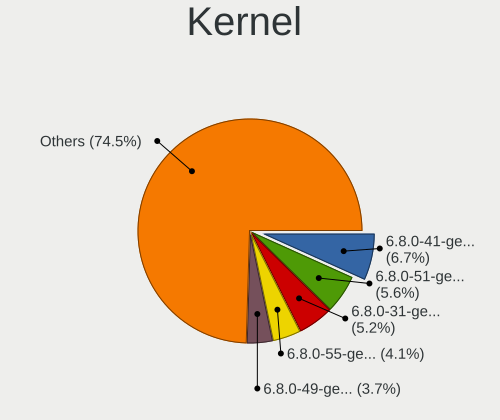

| Version           | Notebooks | Percent |
|-------------------|-----------|---------|
| 6.8.0-41-generic  | 18        | 6.74%   |
| 6.8.0-51-generic  | 15        | 5.62%   |
| 6.8.0-31-generic  | 14        | 5.24%   |
| 6.8.0-55-generic  | 11        | 4.12%   |
| 6.8.0-49-generic  | 10        | 3.75%   |
| 6.14.0-36-generic | 8         | 3%      |
| 6.14.0-29-generic | 8         | 3%      |
| 6.8.0-60-generic  | 7         | 2.62%   |
| 6.8.0-52-generic  | 7         | 2.62%   |
| 6.8.0-47-generic  | 7         | 2.62%   |
| 6.8.0-39-generic  | 7         | 2.62%   |
| 6.14.0-33-generic | 7         | 2.62%   |
| 6.11.0-26-generic | 7         | 2.62%   |
| 6.8.0-59-generic  | 6         | 2.25%   |
| 6.8.0-53-generic  | 6         | 2.25%   |
| 6.8.0-45-generic  | 6         | 2.25%   |
| 6.8.0-40-generic  | 6         | 2.25%   |
| 6.8.0-36-generic  | 6         | 2.25%   |
| 6.14.0-35-generic | 6         | 2.25%   |
| 6.11.0-25-generic | 6         | 2.25%   |
| 6.8.0-63-generic  | 5         | 1.87%   |
| 6.8.0-48-generic  | 5         | 1.87%   |
| 6.11.0-21-generic | 5         | 1.87%   |
| 6.8.0-90-generic  | 4         | 1.5%    |
| 6.8.0-35-generic  | 4         | 1.5%    |
| 6.11.0-29-generic | 4         | 1.5%    |
| 6.11.0-17-generic | 4         | 1.5%    |
| 6.8.0-88-generic  | 3         | 1.12%   |
| 6.8.0-71-generic  | 3         | 1.12%   |
| 6.8.0-58-generic  | 3         | 1.12%   |
| 6.8.0-54-generic  | 3         | 1.12%   |
| 6.14.0-37-generic | 3         | 1.12%   |
| 6.14.0-27-generic | 3         | 1.12%   |
| 6.11.0-28-generic | 3         | 1.12%   |
| 6.11.0-24-generic | 3         | 1.12%   |
| 6.11.0-19-generic | 3         | 1.12%   |
| 6.8.0-85-generic  | 2         | 0.75%   |
| 6.8.0-79-generic  | 2         | 0.75%   |
| 6.8.0-78-generic  | 2         | 0.75%   |
| 6.8.0-44-generic  | 2         | 0.75%   |

Kernel Family
-------------

Linux kernel without a distro release

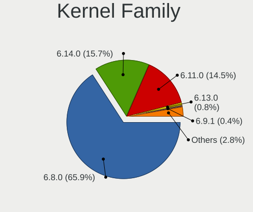

| Version | Notebooks | Percent |
|---------|-----------|---------|
| 6.8.0   | 164       | 65.86%  |
| 6.14.0  | 39        | 15.66%  |
| 6.11.0  | 36        | 14.46%  |
| 6.13.0  | 2         | 0.8%    |
| 6.9.1   | 1         | 0.4%    |
| 6.8.7   | 1         | 0.4%    |
| 6.6.0   | 1         | 0.4%    |
| 6.5.0   | 1         | 0.4%    |
| 6.17.6  | 1         | 0.4%    |
| 6.12.3  | 1         | 0.4%    |
| 6.10.10 | 1         | 0.4%    |
| 5.15.0  | 1         | 0.4%    |

Kernel Major Ver.
-----------------

Linux kernel major version

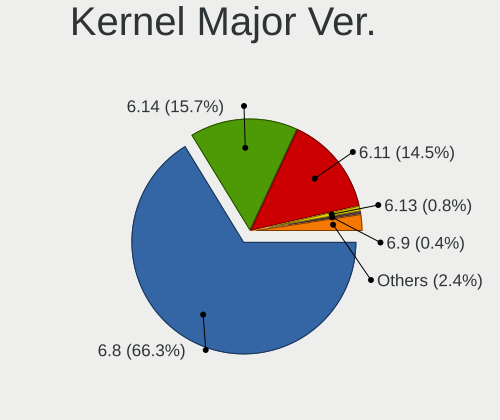

| Version | Notebooks | Percent |
|---------|-----------|---------|
| 6.8     | 165       | 66.27%  |
| 6.14    | 39        | 15.66%  |
| 6.11    | 36        | 14.46%  |
| 6.13    | 2         | 0.8%    |
| 6.9     | 1         | 0.4%    |
| 6.6     | 1         | 0.4%    |
| 6.5     | 1         | 0.4%    |
| 6.17    | 1         | 0.4%    |
| 6.12    | 1         | 0.4%    |
| 6.10    | 1         | 0.4%    |
| 5.15    | 1         | 0.4%    |

Arch
----

OS architecture (x86_64, i586, etc.)

| Name   | Notebooks | Percent |
|--------|-----------|---------|
| x86_64 | 249       | 100%    |

DE
--

Desktop Environment

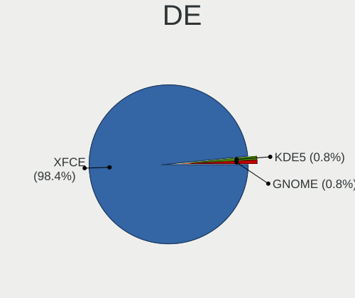

| Name  | Notebooks | Percent |
|-------|-----------|---------|
| XFCE  | 245       | 98.39%  |
| KDE5  | 2         | 0.8%    |
| GNOME | 2         | 0.8%    |

Display Server
--------------

X11 or Wayland

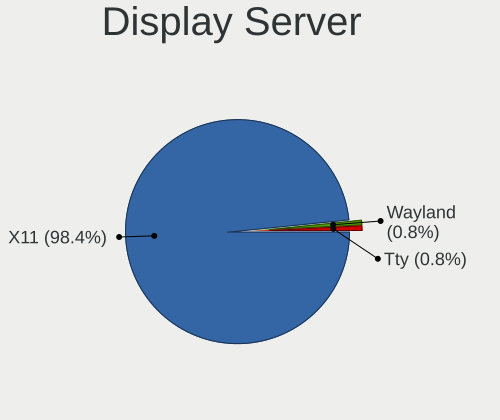

| Name    | Notebooks | Percent |
|---------|-----------|---------|
| X11     | 245       | 98.39%  |
| Wayland | 2         | 0.8%    |
| Tty     | 2         | 0.8%    |

Display Manager
---------------

SDDM, LightDM, etc.

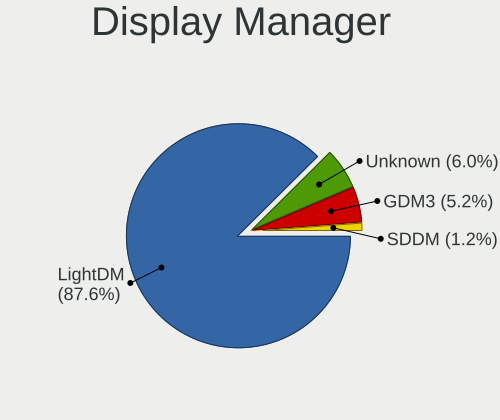

| Name    | Notebooks | Percent |
|---------|-----------|---------|
| LightDM | 218       | 87.55%  |
| Unknown | 15        | 6.02%   |
| GDM3    | 13        | 5.22%   |
| SDDM    | 3         | 1.2%    |

OS Lang
-------

Language

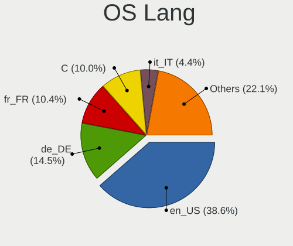

| Lang    | Notebooks | Percent |
|---------|-----------|---------|
| en_US   | 96        | 38.55%  |
| de_DE   | 36        | 14.46%  |
| fr_FR   | 26        | 10.44%  |
| C       | 25        | 10.04%  |
| it_IT   | 11        | 4.42%   |
| es_ES   | 8         | 3.21%   |
| ru_RU   | 7         | 2.81%   |
| pl_PL   | 7         | 2.81%   |
| en_GB   | 7         | 2.81%   |
| pt_BR   | 5         | 2.01%   |
| hu_HU   | 3         | 1.2%    |
| zh_CN   | 2         | 0.8%    |
| en_CA   | 2         | 0.8%    |
| da_DK   | 2         | 0.8%    |
| cs_CZ   | 2         | 0.8%    |
| tr_TR   | 1         | 0.4%    |
| nl_NL   | 1         | 0.4%    |
| nb_NO   | 1         | 0.4%    |
| fr_CA   | 1         | 0.4%    |
| es_AR   | 1         | 0.4%    |
| en_NZ   | 1         | 0.4%    |
| en_IE   | 1         | 0.4%    |
| en_AU   | 1         | 0.4%    |
| de_CH   | 1         | 0.4%    |
| Unknown | 1         | 0.4%    |

Boot Mode
---------

EFI or BIOS

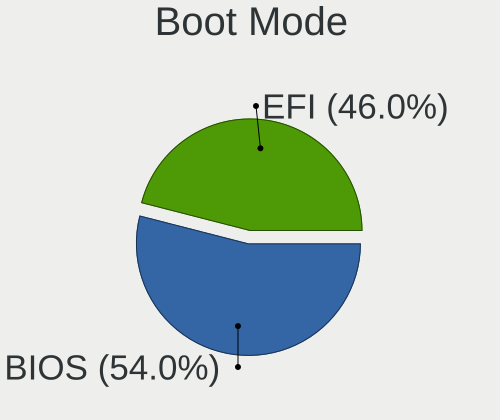

| Mode | Notebooks | Percent |
|------|-----------|---------|
| BIOS | 135       | 54%     |
| EFI  | 115       | 46%     |

Filesystem
----------

Type of filesystem

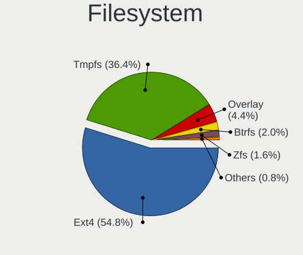

| Type    | Notebooks | Percent |
|---------|-----------|---------|
| Ext4    | 137       | 54.8%   |
| Tmpfs   | 91        | 36.4%   |
| Overlay | 11        | 4.4%    |
| Btrfs   | 5         | 2%      |
| Zfs     | 4         | 1.6%    |
| Xfs     | 1         | 0.4%    |
| Ext3    | 1         | 0.4%    |

Part. scheme
------------

Scheme of partitioning

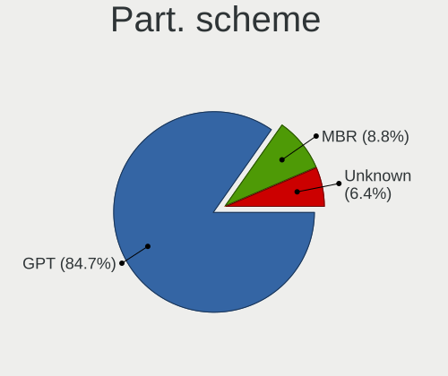

| Type    | Notebooks | Percent |
|---------|-----------|---------|
| GPT     | 211       | 84.74%  |
| MBR     | 22        | 8.84%   |
| Unknown | 16        | 6.43%   |

Dual Boot with Linux/BSD
------------------------

Hosting more than one Linux/BSD

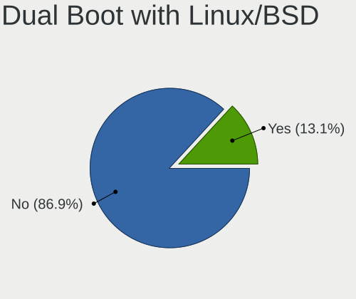

| Dual boot | Notebooks | Percent |
|-----------|-----------|---------|
| No        | 218       | 86.85%  |
| Yes       | 33        | 13.15%  |

Dual Boot (Win)
---------------

Hosting Linux and Windows

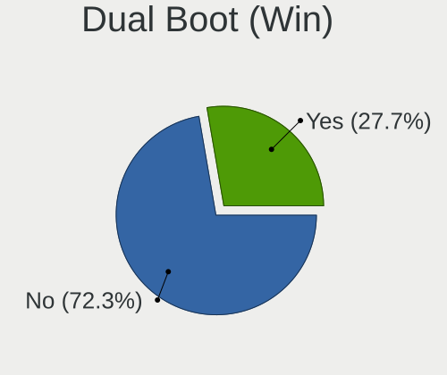

| Dual boot | Notebooks | Percent |
|-----------|-----------|---------|
| No        | 180       | 72.29%  |
| Yes       | 69        | 27.71%  |

Board
-----

Vendor
------

Motherboard manufacturer

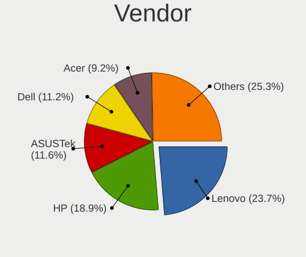

| Name                | Notebooks | Percent |
|---------------------|-----------|---------|
| Lenovo              | 59        | 23.69%  |
| Hewlett-Packard     | 47        | 18.88%  |
| ASUSTek Computer    | 29        | 11.65%  |
| Dell                | 28        | 11.24%  |
| Acer                | 23        | 9.24%   |
| Apple               | 10        | 4.02%   |
| Google              | 7         | 2.81%   |
| Toshiba             | 6         | 2.41%   |
| Samsung Electronics | 4         | 1.61%   |
| Notebook            | 4         | 1.61%   |
| MSI                 | 4         | 1.61%   |
| Fujitsu Siemens     | 4         | 1.61%   |
| Haier               | 3         | 1.2%    |
| Unknown             | 3         | 1.2%    |
| Positivo            | 2         | 0.8%    |
| Medion              | 2         | 0.8%    |
| Wortmann AG         | 1         | 0.4%    |
| TUXEDO              | 1         | 0.4%    |
| TongFang            | 1         | 0.4%    |
| System76            | 1         | 0.4%    |
| Sony                | 1         | 0.4%    |
| Packard Bell        | 1         | 0.4%    |
| MOXA                | 1         | 0.4%    |
| HUAWEI              | 1         | 0.4%    |
| GPU Company         | 1         | 0.4%    |
| Gateway             | 1         | 0.4%    |
| Framework           | 1         | 0.4%    |
| Clevo               | 1         | 0.4%    |
| Chuwi               | 1         | 0.4%    |
| Alienware           | 1         | 0.4%    |

Model
-----

Motherboard model

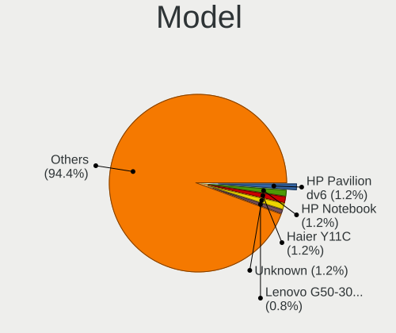

| Name                                     | Notebooks | Percent |
|------------------------------------------|-----------|---------|
| HP Pavilion dv6                          | 3         | 1.2%    |
| HP Notebook                              | 3         | 1.2%    |
| Haier Y11C                               | 3         | 1.2%    |
| Unknown                                  | 3         | 1.2%    |
| Lenovo G50-30 80G0                       | 2         | 0.8%    |
| HP Pavilion 17                           | 2         | 0.8%    |
| HP G72                                   | 2         | 0.8%    |
| HP EliteBook 2540p                       | 2         | 0.8%    |
| Dell Inspiron 5570                       | 2         | 0.8%    |
| ASUS VivoBook_ASUSLaptop X1704VA_X1704VA | 2         | 0.8%    |
| Apple MacBookPro9,2                      | 2         | 0.8%    |
| Apple MacBookPro9,1                      | 2         | 0.8%    |
| Apple MacBookPro11,4                     | 2         | 0.8%    |
| Wortmann AG 1220695_1470205              | 1         | 0.4%    |
| TUXEDO InfinityBook Pro 15 v5            | 1         | 0.4%    |
| Toshiba TECRA A10                        | 1         | 0.4%    |
| Toshiba Satellite Pro C50-A-1C9          | 1         | 0.4%    |
| Toshiba Satellite P55W-C                 | 1         | 0.4%    |
| Toshiba Satellite L645                   | 1         | 0.4%    |
| Toshiba Satellite L300                   | 1         | 0.4%    |
| Toshiba Satellite C55-C                  | 1         | 0.4%    |
| TongFang GM7IX0N                         | 1         | 0.4%    |
| System76 Pangolin                        | 1         | 0.4%    |
| Sony VPCEH3S1E                           | 1         | 0.4%    |
| Samsung SR700                            | 1         | 0.4%    |
| Samsung RV411/RV511/E3511/S3511/RV711    | 1         | 0.4%    |
| Samsung Q210/P210                        | 1         | 0.4%    |
| Samsung 905S3G/906S3G/915S3G/9305SG      | 1         | 0.4%    |
| Positivo W940TU-TV                       | 1         | 0.4%    |
| Positivo Q4128C-S                        | 1         | 0.4%    |
| Packard Bell EasyNote LV11HC             | 1         | 0.4%    |
| Notebook W35xSTQ_370ST                   | 1         | 0.4%    |
| Notebook PE60RNE_RND_RNC                 | 1         | 0.4%    |
| Notebook NJx0MU                          | 1         | 0.4%    |
| Notebook NJ50_70CU                       | 1         | 0.4%    |
| MSI GL73 8RE                             | 1         | 0.4%    |
| MSI GF63 Thin 9RCX                       | 1         | 0.4%    |
| MSI GF63 Thin 11UC                       | 1         | 0.4%    |
| MSI GE73VR 7RF                           | 1         | 0.4%    |
| MOXA V2400A                              | 1         | 0.4%    |

Model Family
------------

Motherboard model prefix

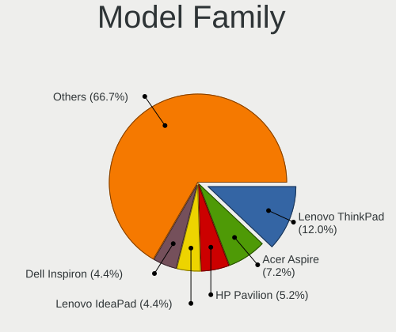

| Name                  | Notebooks | Percent |
|-----------------------|-----------|---------|
| Lenovo ThinkPad       | 30        | 12.05%  |
| Acer Aspire           | 18        | 7.23%   |
| HP Pavilion           | 13        | 5.22%   |
| Lenovo IdeaPad        | 11        | 4.42%   |
| Dell Inspiron         | 11        | 4.42%   |
| ASUS Vivobook         | 11        | 4.42%   |
| HP EliteBook          | 10        | 4.02%   |
| Dell Latitude         | 10        | 4.02%   |
| HP ProBook            | 9         | 3.61%   |
| Toshiba Satellite     | 5         | 2.01%   |
| Lenovo Legion         | 5         | 2.01%   |
| HP Laptop             | 4         | 1.61%   |
| Apple MacBookPro9     | 4         | 1.61%   |
| HP Notebook           | 3         | 1.2%    |
| Haier Y11C            | 3         | 1.2%    |
| Fujitsu Siemens AMILO | 3         | 1.2%    |
| Dell Vostro           | 3         | 1.2%    |
| Dell Precision        | 3         | 1.2%    |
| Unknown               | 3         | 1.2%    |
| MSI GF63              | 2         | 0.8%    |
| Lenovo ThinkBook      | 2         | 0.8%    |
| Lenovo G50-30         | 2         | 0.8%    |
| HP G72                | 2         | 0.8%    |
| Apple MacBookPro11    | 2         | 0.8%    |
| Wortmann AG 1220695   | 1         | 0.4%    |
| TUXEDO InfinityBook   | 1         | 0.4%    |
| Toshiba TECRA         | 1         | 0.4%    |
| TongFang GM7IX0N      | 1         | 0.4%    |
| System76 Pangolin     | 1         | 0.4%    |
| Sony VPCEH3S1E        | 1         | 0.4%    |
| Samsung SR700         | 1         | 0.4%    |
| Samsung RV411         | 1         | 0.4%    |
| Samsung Q210          | 1         | 0.4%    |
| Samsung 905S3G        | 1         | 0.4%    |
| Positivo W940TU-TV    | 1         | 0.4%    |
| Positivo Q4128C-S     | 1         | 0.4%    |
| Packard Bell EasyNote | 1         | 0.4%    |
| Notebook W35xSTQ      | 1         | 0.4%    |
| Notebook PE60RNE      | 1         | 0.4%    |
| Notebook NJx0MU       | 1         | 0.4%    |

MFG Year
--------

Motherboard manufacture year

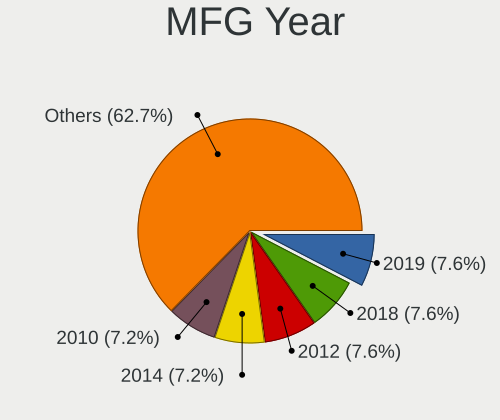

| Year    | Notebooks | Percent |
|---------|-----------|---------|
| 2019    | 19        | 7.63%   |
| 2018    | 19        | 7.63%   |
| 2012    | 19        | 7.63%   |
| 2014    | 18        | 7.23%   |
| 2010    | 18        | 7.23%   |
| 2017    | 16        | 6.43%   |
| 2013    | 16        | 6.43%   |
| 2008    | 15        | 6.02%   |
| 2023    | 14        | 5.62%   |
| 2021    | 14        | 5.62%   |
| 2020    | 13        | 5.22%   |
| 2015    | 13        | 5.22%   |
| 2024    | 11        | 4.42%   |
| 2022    | 8         | 3.21%   |
| 2016    | 8         | 3.21%   |
| 2011    | 8         | 3.21%   |
| 2009    | 8         | 3.21%   |
| 2025    | 6         | 2.41%   |
| 2007    | 5         | 2.01%   |
| Unknown | 1         | 0.4%    |

Form Factor
-----------

Physical design of the computer

| Name     | Notebooks | Percent |
|----------|-----------|---------|
| Notebook | 249       | 100%    |

Secure Boot
-----------

Enabled or disabled

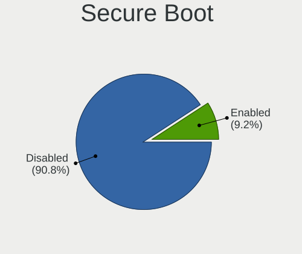

| State    | Notebooks | Percent |
|----------|-----------|---------|
| Disabled | 228       | 90.84%  |
| Enabled  | 23        | 9.16%   |

Coreboot
--------

Have coreboot on board

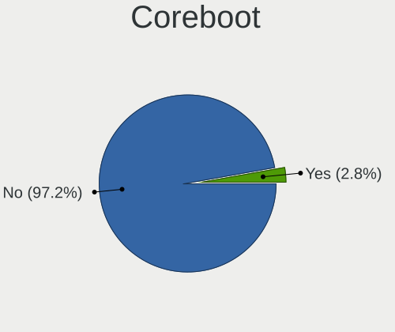

| Used | Notebooks | Percent |
|------|-----------|---------|
| No   | 242       | 97.19%  |
| Yes  | 7         | 2.81%   |

RAM Size
--------

Total RAM memory

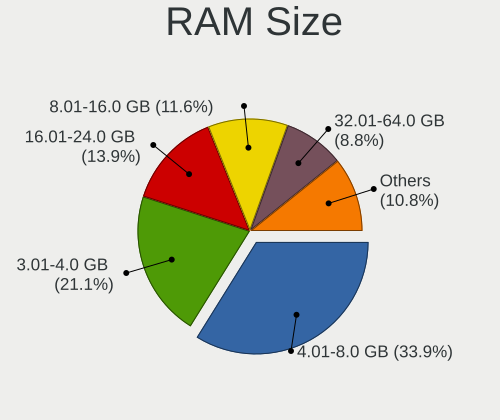

| Size in GB  | Notebooks | Percent |
|-------------|-----------|---------|
| 4.01-8.0    | 85        | 33.86%  |
| 3.01-4.0    | 53        | 21.12%  |
| 16.01-24.0  | 35        | 13.94%  |
| 8.01-16.0   | 29        | 11.55%  |
| 32.01-64.0  | 22        | 8.76%   |
| 64.01-256.0 | 9         | 3.59%   |
| 2.01-3.0    | 8         | 3.19%   |
| 1.01-2.0    | 7         | 2.79%   |
| 24.01-32.0  | 3         | 1.2%    |

RAM Used
--------

Used RAM memory

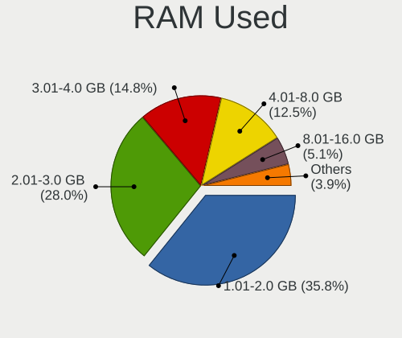

| Used GB    | Notebooks | Percent |
|------------|-----------|---------|
| 1.01-2.0   | 92        | 35.8%   |
| 2.01-3.0   | 72        | 28.02%  |
| 3.01-4.0   | 38        | 14.79%  |
| 4.01-8.0   | 32        | 12.45%  |
| 8.01-16.0  | 13        | 5.06%   |
| 0.51-1.0   | 9         | 3.5%    |
| 16.01-24.0 | 1         | 0.39%   |

Total Drives
------------

Number of drives on board

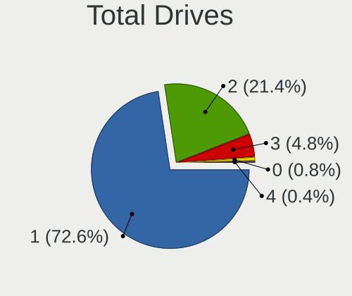

| Drives | Notebooks | Percent |
|--------|-----------|---------|
| 1      | 183       | 72.62%  |
| 2      | 54        | 21.43%  |
| 3      | 12        | 4.76%   |
| 0      | 2         | 0.79%   |
| 4      | 1         | 0.4%    |

Has CD-ROM
----------

Has CD-ROM on board

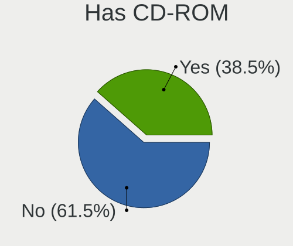

| Presented | Notebooks | Percent |
|-----------|-----------|---------|
| No        | 155       | 61.51%  |
| Yes       | 97        | 38.49%  |

Has Ethernet
------------

Has Ethernet on board

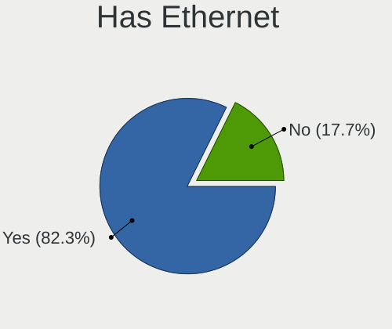

| Presented | Notebooks | Percent |
|-----------|-----------|---------|
| Yes       | 205       | 82.33%  |
| No        | 44        | 17.67%  |

Has WiFi
--------

Has WiFi module

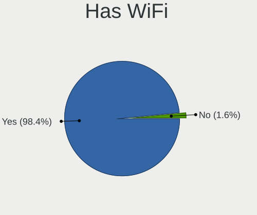

| Presented | Notebooks | Percent |
|-----------|-----------|---------|
| Yes       | 245       | 98.39%  |
| No        | 4         | 1.61%   |

Has Bluetooth
-------------

Has Bluetooth module

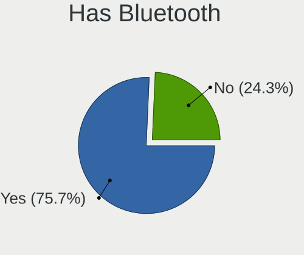

| Presented | Notebooks | Percent |
|-----------|-----------|---------|
| Yes       | 190       | 75.7%   |
| No        | 61        | 24.3%   |

Location
--------

Country
-------

Geographic location (country)

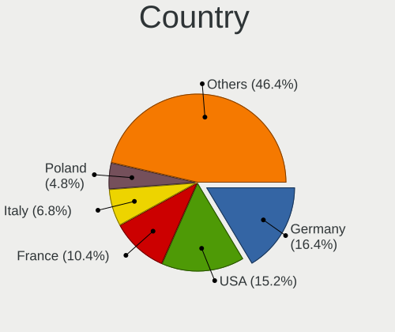

| Country         | Notebooks | Percent |
|-----------------|-----------|---------|
| Germany         | 41        | 16.4%   |
| USA             | 38        | 15.2%   |
| France          | 26        | 10.4%   |
| Italy           | 17        | 6.8%    |
| Poland          | 12        | 4.8%    |
| UK              | 11        | 4.4%    |
| Spain           | 11        | 4.4%    |
| Russia          | 8         | 3.2%    |
| Brazil          | 7         | 2.8%    |
| Canada          | 6         | 2.4%    |
| Pakistan        | 5         | 2%      |
| Australia       | 5         | 2%      |
| Argentina       | 5         | 2%      |
| India           | 4         | 1.6%    |
| Bulgaria        | 4         | 1.6%    |
| Switzerland     | 3         | 1.2%    |
| New Zealand     | 3         | 1.2%    |
| Hungary         | 3         | 1.2%    |
| Czechia         | 3         | 1.2%    |
| Austria         | 3         | 1.2%    |
| The Netherlands | 2         | 0.8%    |
| Sweden          | 2         | 0.8%    |
| Romania         | 2         | 0.8%    |
| Norway          | 2         | 0.8%    |
| Indonesia       | 2         | 0.8%    |
| Denmark         | 2         | 0.8%    |
| China           | 2         | 0.8%    |
| Vietnam         | 1         | 0.4%    |
| Venezuela       | 1         | 0.4%    |
| Uruguay         | 1         | 0.4%    |
| Ukraine         | 1         | 0.4%    |
| Turkey          | 1         | 0.4%    |
| Thailand        | 1         | 0.4%    |
| South Africa    | 1         | 0.4%    |
| Serbia          | 1         | 0.4%    |
| Portugal        | 1         | 0.4%    |
| Nepal           | 1         | 0.4%    |
| Morocco         | 1         | 0.4%    |
| Malaysia        | 1         | 0.4%    |
| Kazakhstan      | 1         | 0.4%    |

City
----

Geographic location (city)

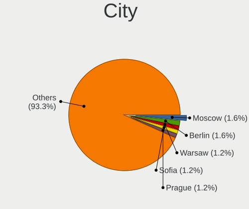

| City                    | Notebooks | Percent |
|-------------------------|-----------|---------|
| Moscow                  | 4         | 1.57%   |
| Berlin                  | 4         | 1.57%   |
| Warsaw                  | 3         | 1.18%   |
| Sofia                   | 3         | 1.18%   |
| Prague                  | 3         | 1.18%   |
| Paris                   | 3         | 1.18%   |
| Karachi                 | 3         | 1.18%   |
| Hamburg                 | 3         | 1.18%   |
| Sydney                  | 2         | 0.79%   |
| Stuttgart               | 2         | 0.79%   |
| Reutlingen              | 2         | 0.79%   |
| Pescara                 | 2         | 0.79%   |
| Nuremberg               | 2         | 0.79%   |
| Neuruppin               | 2         | 0.79%   |
| Milan                   | 2         | 0.79%   |
| Leland                  | 2         | 0.79%   |
| Le Mans                 | 2         | 0.79%   |
| Cologne                 | 2         | 0.79%   |
| Bristol                 | 2         | 0.79%   |
| Brisbane                | 2         | 0.79%   |
| Żywiec                 | 1         | 0.39%   |
| Zurich                  | 1         | 0.39%   |
| Yuba City               | 1         | 0.39%   |
| Winnipeg                | 1         | 0.39%   |
| Wil                     | 1         | 0.39%   |
| Wiesbaden               | 1         | 0.39%   |
| West Lafayette          | 1         | 0.39%   |
| Wellin                  | 1         | 0.39%   |
| Virignin                | 1         | 0.39%   |
| Villepinte              | 1         | 0.39%   |
| Villefranche-sur-Saône | 1         | 0.39%   |
| Villach                 | 1         | 0.39%   |
| Vendas Novas            | 1         | 0.39%   |
| Uppsala                 | 1         | 0.39%   |
| Turin                   | 1         | 0.39%   |
| Tulungagung             | 1         | 0.39%   |
| Tulette                 | 1         | 0.39%   |
| Tula                    | 1         | 0.39%   |
| Troutdale               | 1         | 0.39%   |
| Trieste                 | 1         | 0.39%   |

Drives
------

Drive Vendor
------------

Hard drive vendors

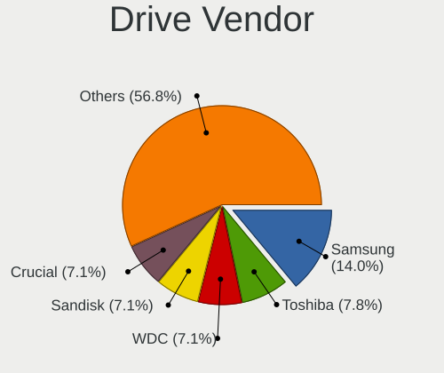

| Vendor                      | Notebooks | Drives | Percent |
|-----------------------------|-----------|--------|---------|
| Samsung Electronics         | 43        | 53     | 13.96%  |
| Toshiba                     | 24        | 27     | 7.79%   |
| WDC                         | 22        | 25     | 7.14%   |
| Sandisk                     | 22        | 23     | 7.14%   |
| Crucial                     | 22        | 22     | 7.14%   |
| Kingston                    | 21        | 23     | 6.82%   |
| Seagate                     | 19        | 20     | 6.17%   |
| Unknown                     | 17        | 18     | 5.52%   |
| SK hynix                    | 14        | 15     | 4.55%   |
| Hitachi                     | 10        | 12     | 3.25%   |
| Micron Technology           | 8         | 8      | 2.6%    |
| HGST                        | 8         | 9      | 2.6%    |
| KIOXIA                      | 6         | 6      | 1.95%   |
| Apple                       | 6         | 6      | 1.95%   |
| Intel                       | 5         | 9      | 1.62%   |
| Lexar                       | 4         | 5      | 1.3%    |
| Kingston Technology Company | 4         | 5      | 1.3%    |
| China                       | 4         | 4      | 1.3%    |
| Patriot                     | 3         | 3      | 0.97%   |
| Intenso                     | 3         | 3      | 0.97%   |
| Fujitsu                     | 3         | 6      | 0.97%   |
| Vi550                       | 2         | 3      | 0.65%   |
| UMIS                        | 2         | 3      | 0.65%   |
| Transcend                   | 2         | 2      | 0.65%   |
| SPCC                        | 2         | 2      | 0.65%   |
| PNY                         | 2         | 4      | 0.65%   |
| Phison Electronics          | 2         | 2      | 0.65%   |
| MAXIO Technology (Hangzhou) | 2         | 2      | 0.65%   |
| LDLC                        | 2         | 2      | 0.65%   |
| Union Memory (Shenzhen)     | 1         | 1      | 0.32%   |
| Team                        | 1         | 1      | 0.32%   |
| Silicon Motion              | 1         | 1      | 0.32%   |
| SATA SSD                    | 1         | 1      | 0.32%   |
| SABRENT                     | 1         | 1      | 0.32%   |
| Realtek                     | 1         | 1      | 0.32%   |
| Netac                       | 1         | 1      | 0.32%   |
| Mass                        | 1         | 1      | 0.32%   |
| LITEONIT                    | 1         | 1      | 0.32%   |
| LITEON                      | 1         | 2      | 0.32%   |
| Lenovo                      | 1         | 1      | 0.32%   |

Drive Model
-----------

Hard drive models

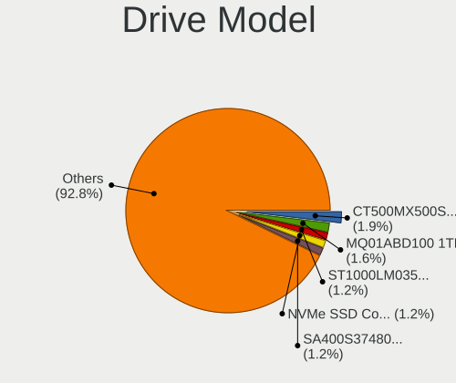

| Model                                             | Notebooks | Percent |
|---------------------------------------------------|-----------|---------|
| Crucial CT500MX500SSD1 500GB                      | 6         | 1.88%   |
| Toshiba MQ01ABD100 1TB                            | 5         | 1.56%   |
| Seagate ST1000LM035-1RK172 1TB                    | 4         | 1.25%   |
| Samsung NVMe SSD Controller SM981/PM981/PM983 1TB | 4         | 1.25%   |
| Kingston SA400S37480G 480GB SSD                   | 4         | 1.25%   |
| Unknown MMC Card  128GB                           | 3         | 0.94%   |
| Toshiba MQ01ABD050 500GB                          | 3         | 0.94%   |
| SanDisk NVMe SSD Drive 1TB                        | 3         | 0.94%   |
| Samsung SSD 850 EVO 250GB                         | 3         | 0.94%   |
| Kingston SA400S37240G 240GB SSD                   | 3         | 0.94%   |
| HGST HTS541010B7E610 1TB                          | 3         | 0.94%   |
| HGST HTS541010A9E680 1TB                          | 3         | 0.94%   |
| Crucial CT1000BX500SSD1 1TB                       | 3         | 0.94%   |
| Unknown SD32G  32GB                               | 2         | 0.63%   |
| Unknown MMC Card  64GB                            | 2         | 0.63%   |
| Toshiba MQ01ABF050 500GB                          | 2         | 0.63%   |
| Toshiba MQ01ABD050V 500GB                         | 2         | 0.63%   |
| SPCC Solid State Disk 256GB                       | 2         | 0.63%   |
| Seagate ST500LT012-1DG142 500GB                   | 2         | 0.63%   |
| Seagate ST500LM012 HN-M500MBB 500GB               | 2         | 0.63%   |
| Samsung SSD 860 EVO 500GB                         | 2         | 0.63%   |
| Samsung SSD 850 EVO 500GB                         | 2         | 0.63%   |
| Patriot P210 256GB SSD                            | 2         | 0.63%   |
| Micron MTFDKBA512QGN-1BN1AABGA 512GB              | 2         | 0.63%   |
| Micron MTFDDAV256TBN-1AR15ABHA 256GB SSD          | 2         | 0.63%   |
| LDLC F6+M.2 480 480GB SSD                         | 2         | 0.63%   |
| Kingston Company OM3PDP3 NVMe SSD 256GB           | 2         | 0.63%   |
| Kingston SKC400S37512G 512GB SSD                  | 2         | 0.63%   |
| HGST HTS721010A9E630 1TB                          | 2         | 0.63%   |
| Crucial CT480BX500SSD1 480GB                      | 2         | 0.63%   |
| Crucial CT1000MX500SSD1 1TB                       | 2         | 0.63%   |
| Apple HDD HTS545050A7E362 500GB                   | 2         | 0.63%   |
| WDC WDS500G2B0C 500GB                             | 1         | 0.31%   |
| WDC WDS500G2B0A 500GB SSD                         | 1         | 0.31%   |
| WDC WDBNCE0010PNC 1TB SSD                         | 1         | 0.31%   |
| WDC WD7500BPVT-75HXZT3 752GB                      | 1         | 0.31%   |
| WDC WD5000LPVX-22V0TT0 500GB                      | 1         | 0.31%   |
| WDC WD5000BPVT-22HXZT3 500GB                      | 1         | 0.31%   |
| WDC WD3200BPVT-80JJ5T0 320GB                      | 1         | 0.31%   |
| WDC WD2500BEVT-24A23T0 250GB                      | 1         | 0.31%   |

HDD Vendor
----------

Hard disk drive vendors

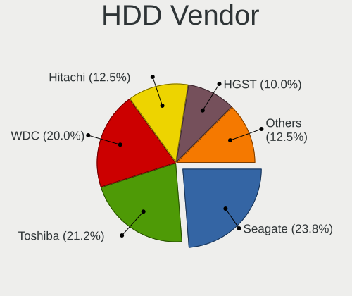

| Vendor              | Notebooks | Drives | Percent |
|---------------------|-----------|--------|---------|
| Seagate             | 19        | 20     | 23.75%  |
| Toshiba             | 17        | 19     | 21.25%  |
| WDC                 | 16        | 18     | 20%     |
| Hitachi             | 10        | 12     | 12.5%   |
| HGST                | 8         | 9      | 10%     |
| Fujitsu             | 3         | 6      | 3.75%   |
| Apple               | 2         | 2      | 2.5%    |
| Samsung Electronics | 1         | 1      | 1.25%   |
| SABRENT             | 1         | 1      | 1.25%   |
| Intenso             | 1         | 1      | 1.25%   |
| Inateck             | 1         | 1      | 1.25%   |
| External            | 1         | 2      | 1.25%   |

SSD Vendor
----------

Solid state drive vendors

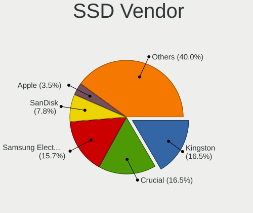

| Vendor              | Notebooks | Drives | Percent |
|---------------------|-----------|--------|---------|
| Kingston            | 19        | 19     | 16.52%  |
| Crucial             | 19        | 19     | 16.52%  |
| Samsung Electronics | 18        | 21     | 15.65%  |
| SanDisk             | 9         | 10     | 7.83%   |
| Apple               | 4         | 4      | 3.48%   |
| WDC                 | 3         | 3      | 2.61%   |
| Toshiba             | 3         | 3      | 2.61%   |
| Patriot             | 3         | 3      | 2.61%   |
| Micron Technology   | 3         | 3      | 2.61%   |
| Lexar               | 3         | 4      | 2.61%   |
| China               | 3         | 3      | 2.61%   |
| Vi550               | 2         | 3      | 1.74%   |
| Transcend           | 2         | 2      | 1.74%   |
| SPCC                | 2         | 2      | 1.74%   |
| PNY                 | 2         | 3      | 1.74%   |
| LDLC                | 2         | 2      | 1.74%   |
| Intenso             | 2         | 2      | 1.74%   |
| Team                | 1         | 1      | 0.87%   |
| SK hynix            | 1         | 1      | 0.87%   |
| SATA SSD            | 1         | 1      | 0.87%   |
| Netac               | 1         | 1      | 0.87%   |
| LITEONIT            | 1         | 1      | 0.87%   |
| LITEON              | 1         | 2      | 0.87%   |
| KingSpec            | 1         | 1      | 0.87%   |
| Intel               | 1         | 4      | 0.87%   |
| Integral            | 1         | 1      | 0.87%   |
| INNOVATION IT       | 1         | 1      | 0.87%   |
| GOODRAM             | 1         | 1      | 0.87%   |
| FORESEE             | 1         | 1      | 0.87%   |
| Fanxiang            | 1         | 1      | 0.87%   |
| AMD                 | 1         | 1      | 0.87%   |
| Acer                | 1         | 1      | 0.87%   |
| A-DATA Technology   | 1         | 2      | 0.87%   |

Drive Kind
----------

HDD or SSD

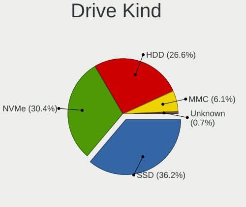

| Kind    | Notebooks | Drives | Percent |
|---------|-----------|--------|---------|
| SSD     | 106       | 127    | 36.18%  |
| NVMe    | 89        | 109    | 30.38%  |
| HDD     | 78        | 92     | 26.62%  |
| MMC     | 18        | 19     | 6.14%   |
| Unknown | 2         | 2      | 0.68%   |

Drive Connector
---------------

SATA, SAS, NVMe, etc.

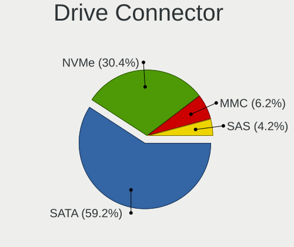

| Type | Notebooks | Drives | Percent |
|------|-----------|--------|---------|
| SATA | 171       | 208    | 59.17%  |
| NVMe | 88        | 107    | 30.45%  |
| MMC  | 18        | 19     | 6.23%   |
| SAS  | 12        | 15     | 4.15%   |

Drive Size
----------

Size of hard drive

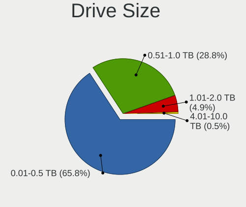

| Size in TB | Notebooks | Drives | Percent |
|------------|-----------|--------|---------|
| 0.01-0.5   | 121       | 147    | 65.76%  |
| 0.51-1.0   | 53        | 61     | 28.8%   |
| 1.01-2.0   | 9         | 10     | 4.89%   |
| 4.01-10.0  | 1         | 1      | 0.54%   |

Space Total
-----------

Amount of disk space available on the file system

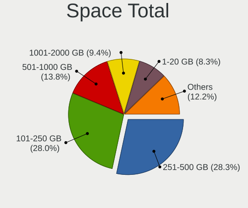

| Size in GB     | Notebooks | Percent |
|----------------|-----------|---------|
| 251-500        | 72        | 28.35%  |
| 101-250        | 71        | 27.95%  |
| 501-1000       | 35        | 13.78%  |
| 1001-2000      | 24        | 9.45%   |
| 1-20           | 21        | 8.27%   |
| 51-100         | 15        | 5.91%   |
| 21-50          | 9         | 3.54%   |
| More than 3000 | 3         | 1.18%   |
| 2001-3000      | 3         | 1.18%   |
| Unknown        | 1         | 0.39%   |

Space Used
----------

Amount of used disk space

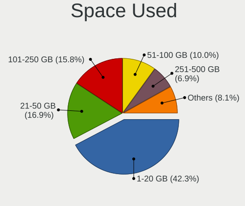

| Used GB        | Notebooks | Percent |
|----------------|-----------|---------|
| 1-20           | 110       | 42.31%  |
| 21-50          | 44        | 16.92%  |
| 101-250        | 41        | 15.77%  |
| 51-100         | 26        | 10%     |
| 251-500        | 18        | 6.92%   |
| 501-1000       | 14        | 5.38%   |
| 1001-2000      | 4         | 1.54%   |
| More than 3000 | 2         | 0.77%   |
| Unknown        | 1         | 0.38%   |

Malfunc. Drives
---------------

Drive models with a malfunction

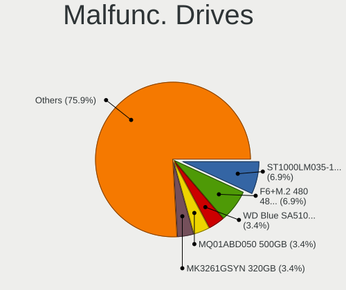

| Model                                                                         | Notebooks | Drives | Percent |
|-------------------------------------------------------------------------------|-----------|--------|---------|
| Seagate ST1000LM035-1RK172 1TB                                                | 2         | 2      | 6.9%    |
| LDLC F6+M.2 480 480GB SSD                                                     | 2         | 2      | 6.9%    |
| WDC WD Blue SA510 2.5 500GB                                                   | 1         | 1      | 3.45%   |
| Toshiba MQ01ABD050 500GB                                                      | 1         | 1      | 3.45%   |
| Toshiba MK3261GSYN 320GB                                                      | 1         | 1      | 3.45%   |
| Seagate ST9250410AS 250GB                                                     | 1         | 1      | 3.45%   |
| Seagate ST9160827AS 160GB                                                     | 1         | 1      | 3.45%   |
| Seagate ST500LM000-1EJ162 500GB                                               | 1         | 1      | 3.45%   |
| Seagate ST320LT007-9ZV142 320GB                                               | 1         | 1      | 3.45%   |
| Seagate ST1000LX015-1U7172 1TB                                                | 1         | 1      | 3.45%   |
| SanDisk SSD i100 32GB                                                         | 1         | 1      | 3.45%   |
| SanDisk SD6SN1M-256G-1006 256GB SSD                                           | 1         | 1      | 3.45%   |
| Samsung Electronics SSD 870 EVO 1TB                                           | 1         | 1      | 3.45%   |
| Samsung Electronics MZVL22T0HBLB-00BL7 2TB                                    | 1         | 1      | 3.45%   |
| Netac SSD 512GB                                                               | 1         | 1      | 3.45%   |
| Micron Technology 1100_MTFDDAV512TBN 512GB SSD                                | 1         | 1      | 3.45%   |
| Kingston SKC6001024G 1TB SSD                                                  | 1         | 1      | 3.45%   |
| Kingston SA400S37480G 480GB SSD                                               | 1         | 1      | 3.45%   |
| Hitachi HTS725050A9A364 500GB                                                 | 1         | 1      | 3.45%   |
| Hitachi HTS725032A9A364 320GB                                                 | 1         | 1      | 3.45%   |
| Hitachi HTS547575A9E384 752GB                                                 | 1         | 1      | 3.45%   |
| Hitachi HTS545050A7E380 500GB                                                 | 1         | 1      | 3.45%   |
| HGST HTS721010A9E630 1TB                                                      | 1         | 1      | 3.45%   |
| HGST HTS541010B7E610 1TB                                                      | 1         | 2      | 3.45%   |
| China SSD 180GB                                                               | 1         | 1      | 3.45%   |
| ADATA Technology XPG SX8200 Pro PCIe Gen3x4 M.2 2280 Solid State Drive 1024GB | 1         | 1      | 3.45%   |
| Acer GT500A 512G SSD                                                          | 1         | 1      | 3.45%   |

Malfunc. Drive Vendor
---------------------

Vendors of faulty drives

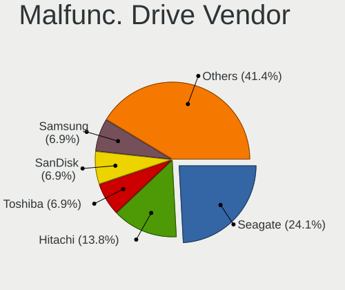

| Vendor              | Notebooks | Drives | Percent |
|---------------------|-----------|--------|---------|
| Seagate             | 7         | 7      | 24.14%  |
| Hitachi             | 4         | 4      | 13.79%  |
| Toshiba             | 2         | 2      | 6.9%    |
| SanDisk             | 2         | 2      | 6.9%    |
| Samsung Electronics | 2         | 2      | 6.9%    |
| LDLC                | 2         | 2      | 6.9%    |
| Kingston            | 2         | 2      | 6.9%    |
| HGST                | 2         | 3      | 6.9%    |
| WDC                 | 1         | 1      | 3.45%   |
| Netac               | 1         | 1      | 3.45%   |
| Micron Technology   | 1         | 1      | 3.45%   |
| China               | 1         | 1      | 3.45%   |
| ADATA Technology    | 1         | 1      | 3.45%   |
| Acer                | 1         | 1      | 3.45%   |

Malfunc. HDD Vendor
-------------------

Vendors of faulty HDD drives

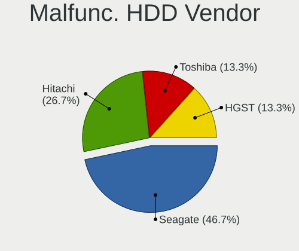

| Vendor  | Notebooks | Drives | Percent |
|---------|-----------|--------|---------|
| Seagate | 7         | 7      | 46.67%  |
| Hitachi | 4         | 4      | 26.67%  |
| Toshiba | 2         | 2      | 13.33%  |
| HGST    | 2         | 3      | 13.33%  |

Malfunc. Drive Kind
-------------------

Kinds of faulty drives

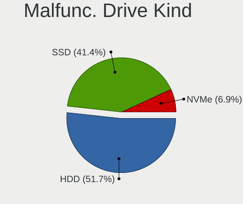

| Kind | Notebooks | Drives | Percent |
|------|-----------|--------|---------|
| HDD  | 15        | 16     | 51.72%  |
| SSD  | 12        | 12     | 41.38%  |
| NVMe | 2         | 2      | 6.9%    |

Failed Drives
-------------

Failed drive models

Zero info for selected period =(

Failed Drive Vendor
-------------------

Failed drive vendors

Zero info for selected period =(

Drive Status
------------

Number of failed and malfunc. drives

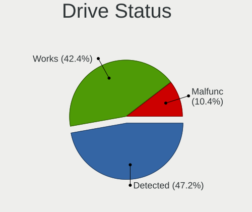

| Status   | Notebooks | Drives | Percent |
|----------|-----------|--------|---------|
| Detected | 127       | 166    | 47.21%  |
| Works    | 114       | 153    | 42.38%  |
| Malfunc  | 28        | 30     | 10.41%  |

Storage controller
------------------

Storage Vendor
--------------

Storage controller vendors

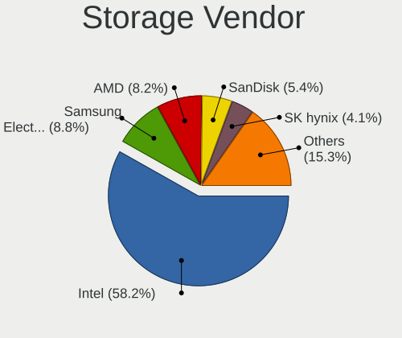

| Vendor                           | Notebooks | Percent |
|----------------------------------|-----------|---------|
| Intel                            | 171       | 58.16%  |
| Samsung Electronics              | 26        | 8.84%   |
| AMD                              | 24        | 8.16%   |
| SanDisk                          | 16        | 5.44%   |
| SK hynix                         | 12        | 4.08%   |
| Kingston Technology Company      | 8         | 2.72%   |
| KIOXIA                           | 6         | 2.04%   |
| Micron Technology                | 5         | 1.7%    |
| Toshiba America Info Systems     | 4         | 1.36%   |
| Phison Electronics               | 3         | 1.02%   |
| Micron/Crucial Technology        | 3         | 1.02%   |
| MAXIO Technology (Hangzhou)      | 3         | 1.02%   |
| Union Memory (Shenzhen)          | 2         | 0.68%   |
| Silicon Integrated Systems [SiS] | 2         | 0.68%   |
| Nvidia                           | 2         | 0.68%   |
| ADATA Technology                 | 2         | 0.68%   |
| Solidigm                         | 1         | 0.34%   |
| Silicon Motion                   | 1         | 0.34%   |
| Shenzhen Longsys Electronics     | 1         | 0.34%   |
| Marvell Technology Group         | 1         | 0.34%   |
| Lenovo                           | 1         | 0.34%   |

Storage Model
-------------

Storage controller models

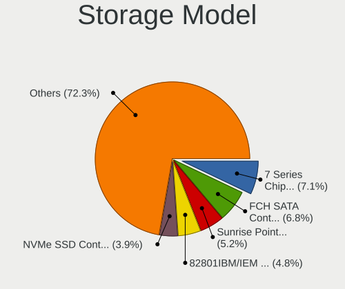

| Model                                                                            | Notebooks | Percent |
|----------------------------------------------------------------------------------|-----------|---------|
| Intel 7 Series Chipset Family 6-port SATA Controller [AHCI mode]                 | 22        | 7.1%    |
| AMD FCH SATA Controller [AHCI mode]                                              | 21        | 6.77%   |
| Intel Sunrise Point-LP SATA Controller [AHCI mode]                               | 16        | 5.16%   |
| Intel 82801IBM/IEM (ICH9M/ICH9M-E) 4 port SATA Controller [AHCI mode]            | 15        | 4.84%   |
| Samsung NVMe SSD Controller SM981/PM981/PM983                                    | 12        | 3.87%   |
| Intel Volume Management Device NVMe RAID Controller                              | 10        | 3.23%   |
| Intel 82801 Mobile SATA Controller [RAID mode]                                   | 10        | 3.23%   |
| Intel Cannon Lake Mobile PCH SATA AHCI Controller                                | 8         | 2.58%   |
| Intel Atom Processor E3800 Series SATA AHCI Controller                           | 8         | 2.58%   |
| Intel 6 Series/C200 Series Chipset Family 6 port Mobile SATA AHCI Controller     | 8         | 2.58%   |
| Intel 5 Series/3400 Series Chipset 4 port SATA AHCI Controller                   | 8         | 2.58%   |
| Intel Wildcat Point-LP SATA Controller [AHCI Mode]                               | 7         | 2.26%   |
| Intel Tiger Lake-LP SATA Controller                                              | 7         | 2.26%   |
| Intel 8 Series/C220 Series Chipset Family 6-port SATA Controller 1 [AHCI mode]   | 7         | 2.26%   |
| Intel 8 Series SATA Controller 1 [AHCI mode]                                     | 7         | 2.26%   |
| SK hynix BC901 NVMe Solid State Drive (DRAM-less)                                | 5         | 1.61%   |
| SanDisk WD SN560/SN740/SN770/SN5000 NVMe SSD                                     | 5         | 1.61%   |
| Samsung NVMe SSD Controller 980 (DRAM-less)                                      | 5         | 1.61%   |
| Intel 5 Series/3400 Series Chipset 6 port SATA AHCI Controller                   | 5         | 1.61%   |
| SK hynix Gold P31/BC711/PC711 NVMe Solid State Drive                             | 4         | 1.29%   |
| Samsung NVMe SSD Controller PM9A1/PM9A3/980PRO                                   | 4         | 1.29%   |
| KIOXIA NVMe SSD Controller BG5 (DRAM-less)                                       | 4         | 1.29%   |
| Intel Comet Lake SATA AHCI Controller                                            | 4         | 1.29%   |
| Intel 82801HM/HEM (ICH8M/ICH8M-E) SATA Controller [AHCI mode]                    | 4         | 1.29%   |
| Intel 82801HM/HEM (ICH8M/ICH8M-E) IDE Controller                                 | 4         | 1.29%   |
| Micron 2500 NVMe SSD (DRAM-less)                                                 | 3         | 0.97%   |
| Kingston Company OM3PDP3 NVMe SSD                                                | 3         | 0.97%   |
| Intel RST Volume Management Device Controller                                    | 3         | 0.97%   |
| Intel Ice Lake-LP SATA Controller [AHCI mode]                                    | 3         | 0.97%   |
| Intel HM170/QM170 Chipset SATA Controller [AHCI Mode]                            | 3         | 0.97%   |
| Intel Celeron/Pentium Silver Processor SATA Controller                           | 3         | 0.97%   |
| Intel Atom/Celeron/Pentium Processor x5-E8000/J3xxx/N3xxx Series SATA Controller | 3         | 0.97%   |
| Toshiba America Info Systems XG5 NVMe SSD Controller                             | 2         | 0.65%   |
| Silicon Integrated Systems [SiS] SATA Controller / IDE mode                      | 2         | 0.65%   |
| Sandisk WD PC SN740 NVMe SSD 512GB (DRAM-less)                                   | 2         | 0.65%   |
| Sandisk WD PC SN5000S M.2 2280 NVMe SSD (DRAM-less)                              | 2         | 0.65%   |
| Samsung NVMe SSD Controller PM9C1a (DRAM-less)                                   | 2         | 0.65%   |
| MAXIO (Hangzhou) NVMe SSD Controller MAP1202 (DRAM-less)                         | 2         | 0.65%   |
| Intel SSD DC P4101/Pro 7600p/760p/E 6100p Series                                 | 2         | 0.65%   |
| Intel NM10/ICH7 Family SATA Controller [AHCI mode]                               | 2         | 0.65%   |

Storage Kind
------------

Kind of storage controller (IDE, SATA, NVMe, SAS, ...)

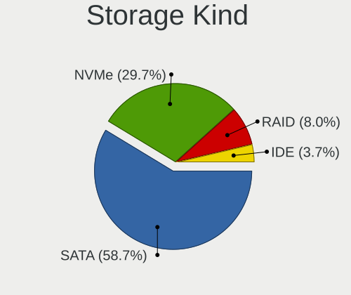

| Kind | Notebooks | Percent |
|------|-----------|---------|
| SATA | 176       | 58.67%  |
| NVMe | 89        | 29.67%  |
| RAID | 24        | 8%      |
| IDE  | 11        | 3.67%   |

Processor
---------

CPU Vendor
----------

Processor vendors

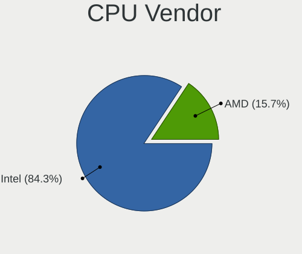

| Vendor | Notebooks | Percent |
|--------|-----------|---------|
| Intel  | 210       | 84.34%  |
| AMD    | 39        | 15.66%  |

CPU Model
---------

Processor models

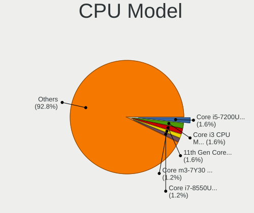

| Model                                       | Notebooks | Percent |
|---------------------------------------------|-----------|---------|
| Intel Core i5-7200U CPU @ 2.50GHz           | 4         | 1.61%   |
| Intel Core i3 CPU M 370 @ 2.40GHz           | 4         | 1.61%   |
| Intel 11th Gen Core i5-1135G7 @ 2.40GHz     | 4         | 1.61%   |
| Intel Core m3-7Y30 CPU @ 1.00GHz            | 3         | 1.2%    |
| Intel Core i7-8550U CPU @ 1.80GHz           | 3         | 1.2%    |
| Intel Core i7-5500U CPU @ 2.40GHz           | 3         | 1.2%    |
| Intel Core i5-8250U CPU @ 1.60GHz           | 3         | 1.2%    |
| Intel Core i5-3210M CPU @ 2.50GHz           | 3         | 1.2%    |
| Intel Core i5-2450M CPU @ 2.50GHz           | 3         | 1.2%    |
| Intel Core i5-1035G1 CPU @ 1.00GHz          | 3         | 1.2%    |
| Intel Core i5-10210U CPU @ 1.60GHz          | 3         | 1.2%    |
| Intel Core i3-5005U CPU @ 2.00GHz           | 3         | 1.2%    |
| Intel Celeron N4020 CPU @ 1.10GHz           | 3         | 1.2%    |
| Intel Celeron CPU N2840 @ 2.16GHz           | 3         | 1.2%    |
| Intel 11th Gen Core i3-1115G4 @ 3.00GHz     | 3         | 1.2%    |
| Intel Pentium Dual-Core CPU T4500 @ 2.30GHz | 2         | 0.8%    |
| Intel Pentium Dual CPU T3200 @ 2.00GHz      | 2         | 0.8%    |
| Intel Pentium CPU N3540 @ 2.16GHz           | 2         | 0.8%    |
| Intel Pentium CPU 2020M @ 2.40GHz           | 2         | 0.8%    |
| Intel Core Ultra 9 185H                     | 2         | 0.8%    |
| Intel Core i7-9750H CPU @ 2.60GHz           | 2         | 0.8%    |
| Intel Core i7-8850H CPU @ 2.60GHz           | 2         | 0.8%    |
| Intel Core i7-8750H CPU @ 2.20GHz           | 2         | 0.8%    |
| Intel Core i7-8650U CPU @ 1.90GHz           | 2         | 0.8%    |
| Intel Core i7-7700HQ CPU @ 2.80GHz          | 2         | 0.8%    |
| Intel Core i7-4770HQ CPU @ 2.20GHz          | 2         | 0.8%    |
| Intel Core i7-4702MQ CPU @ 2.20GHz          | 2         | 0.8%    |
| Intel Core i7-3632QM CPU @ 2.20GHz          | 2         | 0.8%    |
| Intel Core i7-3615QM CPU @ 2.30GHz          | 2         | 0.8%    |
| Intel Core i7-10510U CPU @ 1.80GHz          | 2         | 0.8%    |
| Intel Core i5-7300U CPU @ 2.60GHz           | 2         | 0.8%    |
| Intel Core i5-6200U CPU @ 2.30GHz           | 2         | 0.8%    |
| Intel Core i5-4310M CPU @ 2.70GHz           | 2         | 0.8%    |
| Intel Core i5-4210U CPU @ 1.70GHz           | 2         | 0.8%    |
| Intel Core i5-4200M CPU @ 2.50GHz           | 2         | 0.8%    |
| Intel Core i5 CPU M 480 @ 2.67GHz           | 2         | 0.8%    |
| Intel Core i3-4005U CPU @ 1.70GHz           | 2         | 0.8%    |
| Intel Core i3-3110M CPU @ 2.40GHz           | 2         | 0.8%    |
| Intel Core 2 Duo CPU T9600 @ 2.80GHz        | 2         | 0.8%    |
| Intel Core 2 Duo CPU P7350 @ 2.00GHz        | 2         | 0.8%    |

CPU Model Family
----------------

Processor model prefix

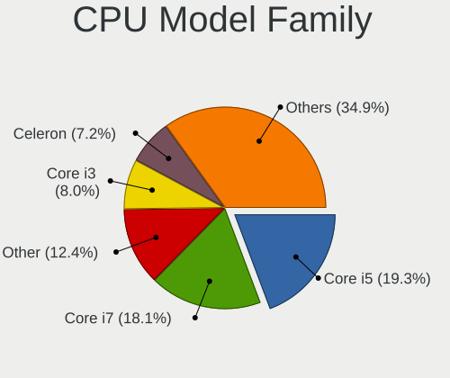

| Model                   | Notebooks | Percent |
|-------------------------|-----------|---------|
| Intel Core i5           | 48        | 19.28%  |
| Intel Core i7           | 45        | 18.07%  |
| Other                   | 31        | 12.45%  |
| Intel Core i3           | 20        | 8.03%   |
| Intel Celeron           | 18        | 7.23%   |
| Intel Core 2 Duo        | 11        | 4.42%   |
| Intel Pentium           | 10        | 4.02%   |
| AMD Ryzen 5             | 7         | 2.81%   |
| Intel Pentium Dual      | 5         | 2.01%   |
| Intel Core m3           | 5         | 2.01%   |
| Intel Core              | 5         | 2.01%   |
| Intel Pentium Dual-Core | 4         | 1.61%   |
| Intel Atom              | 4         | 1.61%   |
| AMD Ryzen 7             | 4         | 1.61%   |
| AMD A8                  | 4         | 1.61%   |
| AMD A6                  | 4         | 1.61%   |
| AMD Ryzen 5 PRO         | 3         | 1.2%    |
| AMD Ryzen 3             | 3         | 1.2%    |
| Intel Pentium Silver    | 2         | 0.8%    |
| Intel Core i9           | 2         | 0.8%    |
| AMD Turion 64 X2 Mobile | 2         | 0.8%    |
| AMD E1                  | 2         | 0.8%    |
| Intel Xeon              | 1         | 0.4%    |
| Intel Pentium Gold      | 1         | 0.4%    |
| Intel Genuine           | 1         | 0.4%    |
| Intel Celeron Dual-Core | 1         | 0.4%    |
| AMD Turion II Dual-Core | 1         | 0.4%    |
| AMD Ryzen 7 PRO         | 1         | 0.4%    |
| AMD Quad-Core           | 1         | 0.4%    |
| AMD PRO A10             | 1         | 0.4%    |
| AMD Athlon              | 1         | 0.4%    |
| AMD A10                 | 1         | 0.4%    |

CPU Cores
---------

Number of processor cores

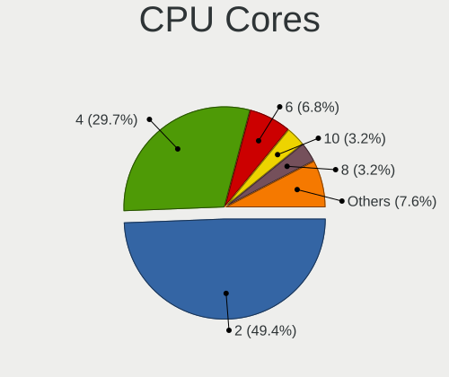

| Number | Notebooks | Percent |
|--------|-----------|---------|
| 2      | 123       | 49.4%   |
| 4      | 74        | 29.72%  |
| 6      | 17        | 6.83%   |
| 10     | 8         | 3.21%   |
| 8      | 8         | 3.21%   |
| 14     | 6         | 2.41%   |
| 1      | 5         | 2.01%   |
| 24     | 3         | 1.2%    |
| 12     | 3         | 1.2%    |
| 16     | 2         | 0.8%    |

CPU Sockets
-----------

Number of sockets

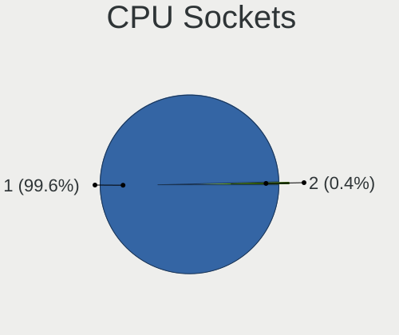

| Number | Notebooks | Percent |
|--------|-----------|---------|
| 1      | 248       | 99.6%   |
| 2      | 1         | 0.4%    |

CPU Threads
-----------

Threads per core (Hyper-Threading)

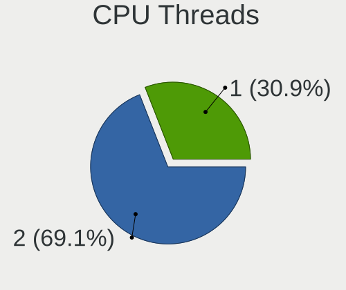

| Number | Notebooks | Percent |
|--------|-----------|---------|
| 2      | 172       | 69.08%  |
| 1      | 77        | 30.92%  |

CPU Op-Modes
------------

CPU Operation Modes (32-bit, 64-bit)

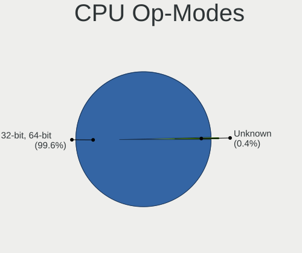

| Op mode        | Notebooks | Percent |
|----------------|-----------|---------|
| 32-bit, 64-bit | 248       | 99.6%   |
| Unknown        | 1         | 0.4%    |

CPU Microcode
-------------

Microcode number

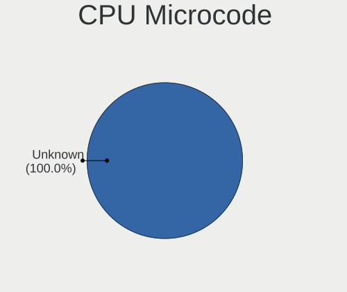

| Number  | Notebooks | Percent |
|---------|-----------|---------|
| Unknown | 249       | 100%    |

CPU Microarch
-------------

Microarchitecture

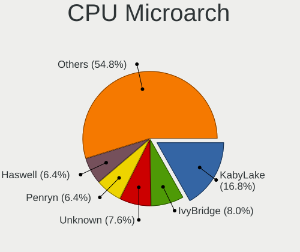

| Name              | Notebooks | Percent |
|-------------------|-----------|---------|
| KabyLake          | 42        | 16.8%   |
| IvyBridge         | 20        | 8%      |
| Unknown           | 19        | 7.6%    |
| Penryn            | 16        | 6.4%    |
| Haswell           | 16        | 6.4%    |
| Silvermont        | 14        | 5.6%    |
| Westmere          | 13        | 5.2%    |
| SandyBridge       | 12        | 4.8%    |
| Alderlake Hybrid  | 11        | 4.4%    |
| TigerLake         | 10        | 4%      |
| Core              | 8         | 3.2%    |
| Broadwell         | 8         | 3.2%    |
| Skylake           | 6         | 2.4%    |
| Zen 3             | 5         | 2%      |
| Puma              | 5         | 2%      |
| Icelake           | 5         | 2%      |
| Goldmont plus     | 4         | 1.6%    |
| Excavator         | 4         | 1.6%    |
| CometLake         | 4         | 1.6%    |
| Zen+              | 3         | 1.2%    |
| Zen               | 3         | 1.2%    |
| Goldmont          | 3         | 1.2%    |
| Bonnell           | 3         | 1.2%    |
| Nehalem           | 2         | 0.8%    |
| Meteorlake Hybrid | 2         | 0.8%    |
| K8 Hammer         | 2         | 0.8%    |
| Bobcat            | 2         | 0.8%    |
| Zen 2             | 1         | 0.4%    |
| Tremont           | 1         | 0.4%    |
| Steamroller       | 1         | 0.4%    |
| Piledriver        | 1         | 0.4%    |
| Lunarlake Hybrid  | 1         | 0.4%    |
| K10 Llano         | 1         | 0.4%    |
| K10               | 1         | 0.4%    |
| Jaguar            | 1         | 0.4%    |

Graphics
--------

GPU Vendor
----------

Vendors of graphics cards

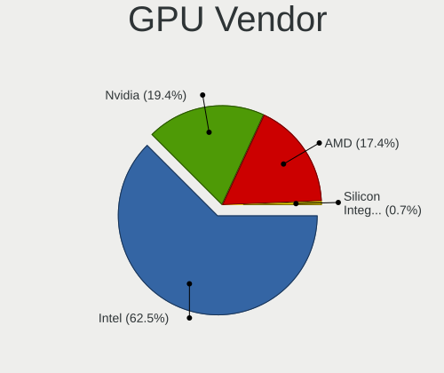

| Vendor                           | Notebooks | Percent |
|----------------------------------|-----------|---------|
| Intel                            | 190       | 62.5%   |
| Nvidia                           | 59        | 19.41%  |
| AMD                              | 53        | 17.43%  |
| Silicon Integrated Systems [SiS] | 2         | 0.66%   |

GPU Model
---------

Graphics card models

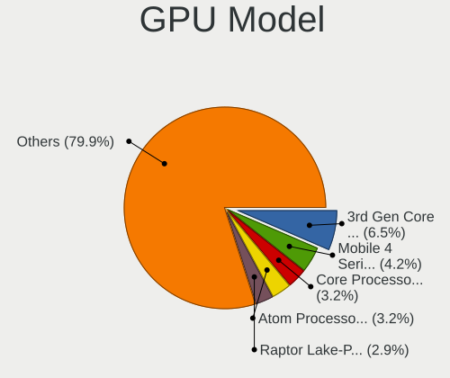

| Model                                                                                    | Notebooks | Percent |
|------------------------------------------------------------------------------------------|-----------|---------|
| Intel 3rd Gen Core processor Graphics Controller                                         | 20        | 6.47%   |
| Intel Mobile 4 Series Chipset Integrated Graphics Controller                             | 13        | 4.21%   |
| Intel Core Processor Integrated Graphics Controller                                      | 10        | 3.24%   |
| Intel Atom Processor Z36xxx/Z37xxx Series Graphics & Display                             | 10        | 3.24%   |
| Intel Raptor Lake-P [Iris Xe Graphics]                                                   | 9         | 2.91%   |
| Intel Kaby Lake-R GT2 [UHD Graphics 620]                                                 | 9         | 2.91%   |
| Intel 2nd Generation Core Processor Family Integrated Graphics Controller                | 9         | 2.91%   |
| Intel CoffeeLake-H GT2 [UHD Graphics 630]                                                | 8         | 2.59%   |
| Intel Kaby Lake-U GT2 [HD Graphics 620]                                                  | 7         | 2.27%   |
| Intel Haswell-ULT Integrated Graphics Controller                                         | 7         | 2.27%   |
| Intel Broadwell-U GT2 [HD Graphics 5500]                                                 | 7         | 2.27%   |
| Intel 4th Gen Core Processor Integrated Graphics Controller                              | 7         | 2.27%   |
| Intel TigerLake-LP GT2 [Iris Xe Graphics]                                                | 6         | 1.94%   |
| Intel CometLake-U GT2 [UHD Graphics]                                                     | 5         | 1.62%   |
| AMD Mullins [Radeon R4/R5 Graphics]                                                      | 5         | 1.62%   |
| Intel Tiger Lake-LP GT2 [UHD Graphics G4]                                                | 4         | 1.29%   |
| Intel Atom/Celeron/Pentium Processor x5-E8000/J3xxx/N3xxx Integrated Graphics Controller | 4         | 1.29%   |
| AMD Topaz XT [Radeon R7 M260/M265 / M340/M360 / M440/M445 / 530/535 / 620/625 Mobile]    | 4         | 1.29%   |
| AMD Park [Mobility Radeon HD 5430/5450/5470]                                             | 4         | 1.29%   |
| Nvidia GP107M [GeForce GTX 1050 Mobile]                                                  | 3         | 0.97%   |
| Nvidia GK107M [GeForce GT 650M Mac Edition]                                              | 3         | 0.97%   |
| Nvidia GF117M [GeForce 610M/710M/810M/820M / GT 620M/625M/630M/720M]                     | 3         | 0.97%   |
| Nvidia G98M [GeForce 9200M GS]                                                           | 3         | 0.97%   |
| Intel WhiskeyLake-U GT2 [UHD Graphics 620]                                               | 3         | 0.97%   |
| Intel Mobile GM965/GL960 Integrated Graphics Controller (secondary)                      | 3         | 0.97%   |
| Intel Mobile GM965/GL960 Integrated Graphics Controller (primary)                        | 3         | 0.97%   |
| Intel Kaby Lake-Y GT2 [HD Graphics 615]                                                  | 3         | 0.97%   |
| Intel Iris Plus Graphics G1 (Ice Lake)                                                   | 3         | 0.97%   |
| Intel GeminiLake [UHD Graphics 600]                                                      | 3         | 0.97%   |
| Intel Alder Lake-UP3 GT2 [Iris Xe Graphics]                                              | 3         | 0.97%   |
| AMD Raven Ridge [Radeon Vega Series / Radeon Vega Mobile Series]                         | 3         | 0.97%   |
| AMD Picasso/Raven 2 [Radeon Vega Series / Radeon Vega Mobile Series]                     | 3         | 0.97%   |
| AMD HawkPoint1                                                                           | 3         | 0.97%   |
| AMD Barcelo                                                                              | 3         | 0.97%   |
| Silicon Integrated Systems [SiS] 771/671 PCIE VGA Display Adapter                        | 2         | 0.65%   |
| Nvidia TU117M [GeForce GTX 1650 Mobile / Max-Q]                                          | 2         | 0.65%   |
| Nvidia GP106M [GeForce GTX 1060 Mobile]                                                  | 2         | 0.65%   |
| Nvidia GK208BM [GeForce 920M]                                                            | 2         | 0.65%   |
| Nvidia GF108M [GeForce GT 620M/630M/635M/640M LE]                                        | 2         | 0.65%   |
| Nvidia AD106M [GeForce RTX 4070 Max-Q / Mobile]                                          | 2         | 0.65%   |

GPU Combo
---------

Combinations of graphics cards

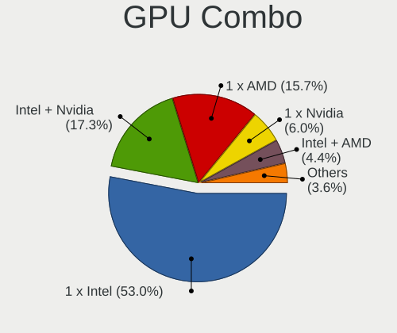

| Name           | Notebooks | Percent |
|----------------|-----------|---------|
| 1 x Intel      | 132       | 53.01%  |
| Intel + Nvidia | 43        | 17.27%  |
| 1 x AMD        | 39        | 15.66%  |
| 1 x Nvidia     | 15        | 6.02%   |
| Intel + AMD    | 11        | 4.42%   |
| 2 x Intel      | 4         | 1.61%   |
| 2 x AMD        | 2         | 0.8%    |
| 1 x SiS        | 2         | 0.8%    |
| AMD + Nvidia   | 1         | 0.4%    |

GPU Driver
----------

Free vs proprietary

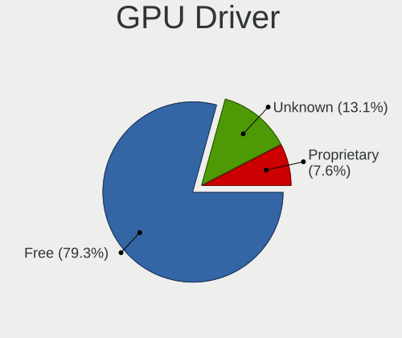

| Driver      | Notebooks | Percent |
|-------------|-----------|---------|
| Free        | 199       | 79.28%  |
| Unknown     | 33        | 13.15%  |
| Proprietary | 19        | 7.57%   |

GPU Memory
----------

Total video memory

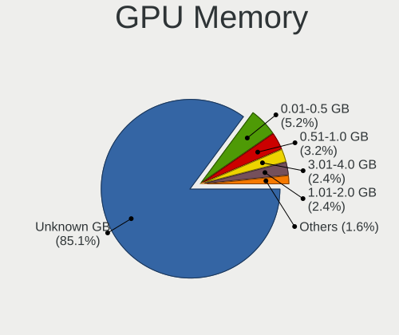

| Size in GB | Notebooks | Percent |
|------------|-----------|---------|
| Unknown    | 212       | 85.14%  |
| 0.01-0.5   | 13        | 5.22%   |
| 0.51-1.0   | 8         | 3.21%   |
| 3.01-4.0   | 6         | 2.41%   |
| 1.01-2.0   | 6         | 2.41%   |
| 7.01-8.0   | 4         | 1.61%   |

Monitor
-------

Monitor Vendor
--------------

Monitor vendors

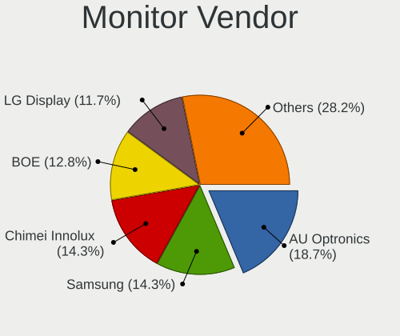

| Vendor                  | Notebooks | Percent |
|-------------------------|-----------|---------|
| AU Optronics            | 51        | 18.68%  |
| Samsung Electronics     | 39        | 14.29%  |
| Chimei Innolux          | 39        | 14.29%  |
| BOE                     | 35        | 12.82%  |
| LG Display              | 32        | 11.72%  |
| Lenovo                  | 10        | 3.66%   |
| Chi Mei Optoelectronics | 10        | 3.66%   |
| Apple                   | 10        | 3.66%   |
| Dell                    | 9         | 3.3%    |
| KDC                     | 4         | 1.47%   |
| Sharp                   | 3         | 1.1%    |
| Goldstar                | 3         | 1.1%    |
| Acer                    | 3         | 1.1%    |
| InfoVision              | 2         | 0.73%   |
| Hewlett-Packard         | 2         | 0.73%   |
| HannStar                | 2         | 0.73%   |
| Ancor Communications    | 2         | 0.73%   |
| ViewSonic               | 1         | 0.37%   |
| Unknown                 | 1         | 0.37%   |
| Toshiba                 | 1         | 0.37%   |
| Sony                    | 1         | 0.37%   |
| Philips                 | 1         | 0.37%   |
| PANDA                   | 1         | 0.37%   |
| Olevia                  | 1         | 0.37%   |
| NEC Computers           | 1         | 0.37%   |
| LG Philips              | 1         | 0.37%   |
| Iiyama                  | 1         | 0.37%   |
| HKC                     | 1         | 0.37%   |
| DPL                     | 1         | 0.37%   |
| CSOT                    | 1         | 0.37%   |
| CSO                     | 1         | 0.37%   |
| CHO                     | 1         | 0.37%   |
| BenQ                    | 1         | 0.37%   |
| Belinea                 | 1         | 0.37%   |

Monitor Model
-------------

Monitor models

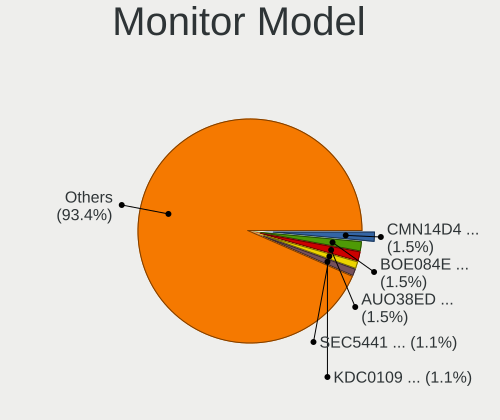

| Model                                                                     | Notebooks | Percent |
|---------------------------------------------------------------------------|-----------|---------|
| Chimei Innolux LCD Monitor CMN14D4 1920x1080 309x173mm 13.9-inch          | 4         | 1.46%   |
| BOE LCD Monitor BOE084E 1920x1080 382x215mm 17.3-inch                     | 4         | 1.46%   |
| AU Optronics LCD Monitor AUO38ED 1920x1080 344x193mm 15.5-inch            | 4         | 1.46%   |
| Samsung Electronics LCD Monitor SEC5441 1280x800 331x207mm 15.4-inch      | 3         | 1.09%   |
| KDC LCD Monitor KDC0109 1366x768 256x144mm 11.6-inch                      | 3         | 1.09%   |
| Chimei Innolux LCD Monitor CMN15E7 1920x1080 344x193mm 15.5-inch          | 3         | 1.09%   |
| Chi Mei Optoelectronics LCD Monitor CMO1720 1920x1080 382x215mm 17.3-inch | 3         | 1.09%   |
| AU Optronics LCD Monitor AUO22EC 1366x768 344x193mm 15.5-inch             | 3         | 1.09%   |
| AU Optronics LCD Monitor AUO21ED 1920x1080 344x193mm 15.5-inch            | 3         | 1.09%   |
| Samsung Electronics LCD Monitor SEC5448 1920x1080 344x194mm 15.5-inch     | 2         | 0.73%   |
| Samsung Electronics LCD Monitor SEC4B41 1280x800 261x163mm 12.1-inch      | 2         | 0.73%   |
| Samsung Electronics LCD Monitor SEC3651 1366x768 344x194mm 15.5-inch      | 2         | 0.73%   |
| Samsung Electronics LCD Monitor SEC3358 1280x800 331x207mm 15.4-inch      | 2         | 0.73%   |
| Samsung Electronics LCD Monitor SDC3654 1600x900 382x215mm 17.3-inch      | 2         | 0.73%   |
| LG Display LCD Monitor LGD0521 1920x1080 309x174mm 14.0-inch              | 2         | 0.73%   |
| LG Display LCD Monitor LGD033A 1366x768 344x194mm 15.5-inch               | 2         | 0.73%   |
| LG Display LCD Monitor LGD027A 1600x900 382x215mm 17.3-inch               | 2         | 0.73%   |
| HannStar HSD121PHW1 HSD04B6 1366x768 270x150mm 12.2-inch                  | 2         | 0.73%   |
| Chimei Innolux LCD Monitor CMN1747 1920x1080 381x214mm 17.2-inch          | 2         | 0.73%   |
| Chimei Innolux LCD Monitor CMN15F6 1920x1080 344x193mm 15.5-inch          | 2         | 0.73%   |
| Chimei Innolux LCD Monitor CMN15F5 1920x1080 344x193mm 15.5-inch          | 2         | 0.73%   |
| Chimei Innolux LCD Monitor CMN15DC 1366x768 344x193mm 15.5-inch           | 2         | 0.73%   |
| Chi Mei Optoelectronics LCD Monitor CMO1721 1600x900 382x215mm 17.3-inch  | 2         | 0.73%   |
| Chi Mei Optoelectronics LCD Monitor CMO15A7 1366x768 344x193mm 15.5-inch  | 2         | 0.73%   |
| BOE LCD Monitor BOE06A4 1366x768 344x194mm 15.5-inch                      | 2         | 0.73%   |
| AU Optronics LCD Monitor AUO499F 1920x1080 344x194mm 15.5-inch            | 2         | 0.73%   |
| AU Optronics LCD Monitor AUO26EC 1366x768 344x193mm 15.5-inch             | 2         | 0.73%   |
| AU Optronics LCD Monitor AUO235C 1366x768 256x144mm 11.6-inch             | 2         | 0.73%   |
| AU Optronics LCD Monitor AUO229E 1600x900 382x214mm 17.2-inch             | 2         | 0.73%   |
| AU Optronics LCD Monitor AUO226D 1920x1080 276x155mm 12.5-inch            | 2         | 0.73%   |
| Apple LCD Monitor APP9CC3 1280x800 286x179mm 13.3-inch                    | 2         | 0.73%   |
| Apple Color LCD APPA02E 2880x1800 331x207mm 15.4-inch                     | 2         | 0.73%   |
| Apple Color LCD APP9CA4 1440x900 331x207mm 15.4-inch                      | 2         | 0.73%   |
| ViewSonic TD2220-2 VSC052C 1920x1080 480x270mm 21.7-inch                  | 1         | 0.36%   |
| Unknown LCD Monitor FFFF 2288x1287 2550x2550mm 142.0-inch                 | 1         | 0.36%   |
| Toshiba LCD Monitor LCD2207 1280x800 287x180mm 13.3-inch                  | 1         | 0.36%   |
| Sony TV SNYAB03 1920x1080                                                 | 1         | 0.36%   |
| Sharp LQ156M1JW01 SHP14C3 1920x1080 344x194mm 15.5-inch                   | 1         | 0.36%   |
| Sharp LCD Monitor SHP149A 1920x1080 344x194mm 15.5-inch                   | 1         | 0.36%   |
| Sharp LCD Monitor SHP143B 3840x2160 346x194mm 15.6-inch                   | 1         | 0.36%   |

Monitor Resolution
------------------

Monitor screen resolution

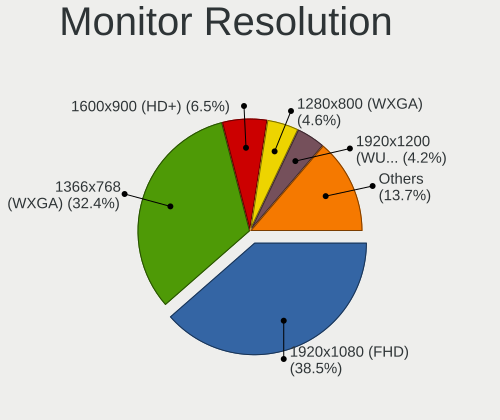

| Resolution         | Notebooks | Percent |
|--------------------|-----------|---------|
| 1920x1080 (FHD)    | 101       | 38.55%  |
| 1366x768 (WXGA)    | 85        | 32.44%  |
| 1600x900 (HD+)     | 17        | 6.49%   |
| 1280x800 (WXGA)    | 12        | 4.58%   |
| 1920x1200 (WUXGA)  | 11        | 4.2%    |
| 1440x900 (WXGA+)   | 6         | 2.29%   |
| 2880x1800          | 5         | 1.91%   |
| 3840x2160 (4K)     | 4         | 1.53%   |
| 2560x1600          | 3         | 1.15%   |
| 2560x1440 (QHD)    | 3         | 1.15%   |
| 1280x1024 (SXGA)   | 3         | 1.15%   |
| Unknown            | 3         | 1.15%   |
| 1680x1050 (WSXGA+) | 2         | 0.76%   |
| 3840x2400          | 1         | 0.38%   |
| 3440x1440          | 1         | 0.38%   |
| 3200x2000          | 1         | 0.38%   |
| 2880x1920          | 1         | 0.38%   |
| 2560x1700          | 1         | 0.38%   |
| 2288x1287          | 1         | 0.38%   |
| 2160x1440          | 1         | 0.38%   |

Monitor Diagonal
----------------

Diagonal size in inches

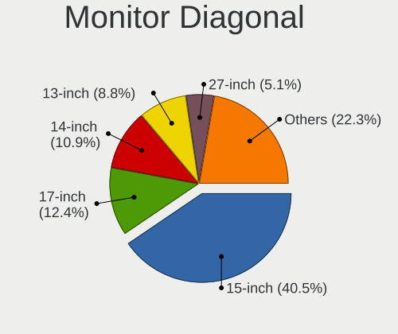

| Inches  | Notebooks | Percent |
|---------|-----------|---------|
| 15      | 111       | 40.51%  |
| 17      | 34        | 12.41%  |
| 14      | 30        | 10.95%  |
| 13      | 24        | 8.76%   |
| 27      | 14        | 5.11%   |
| 11      | 12        | 4.38%   |
| 12      | 11        | 4.01%   |
| 24      | 8         | 2.92%   |
| 16      | 7         | 2.55%   |
| 21      | 5         | 1.82%   |
| 23      | 3         | 1.09%   |
| 19      | 3         | 1.09%   |
| 18      | 3         | 1.09%   |
| Unknown | 3         | 1.09%   |
| 142     | 1         | 0.36%   |
| 72      | 1         | 0.36%   |
| 34      | 1         | 0.36%   |
| 22      | 1         | 0.36%   |
| 20      | 1         | 0.36%   |
| 10      | 1         | 0.36%   |

Monitor Width
-------------

Physical width

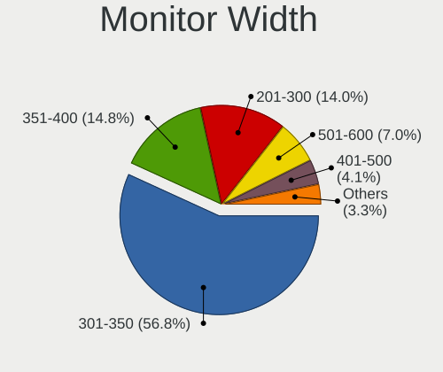

| Width in mm    | Notebooks | Percent |
|----------------|-----------|---------|
| 301-350        | 154       | 56.83%  |
| 351-400        | 40        | 14.76%  |
| 201-300        | 38        | 14.02%  |
| 501-600        | 19        | 7.01%   |
| 401-500        | 11        | 4.06%   |
| 601-700        | 3         | 1.11%   |
| Unknown        | 3         | 1.11%   |
| More than 2000 | 1         | 0.37%   |
| 701-800        | 1         | 0.37%   |
| 1501-2000      | 1         | 0.37%   |

Aspect Ratio
------------

Proportional relationship between the width and the height

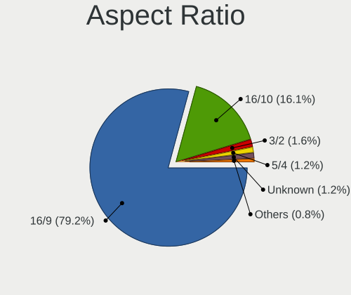

| Ratio   | Notebooks | Percent |
|---------|-----------|---------|
| 16/9    | 202       | 79.22%  |
| 16/10   | 41        | 16.08%  |
| 3/2     | 4         | 1.57%   |
| 5/4     | 3         | 1.18%   |
| Unknown | 3         | 1.18%   |
| 21/9    | 1         | 0.39%   |
| 1.00    | 1         | 0.39%   |

Monitor Area
------------

Area in inch²

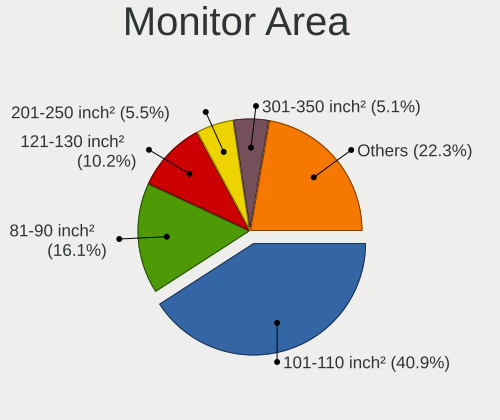

| Area in inch² | Notebooks | Percent |
|----------------|-----------|---------|
| 101-110        | 112       | 40.88%  |
| 81-90          | 44        | 16.06%  |
| 121-130        | 28        | 10.22%  |
| 201-250        | 15        | 5.47%   |
| 301-350        | 14        | 5.11%   |
| 51-60          | 12        | 4.38%   |
| 71-80          | 11        | 4.01%   |
| 61-70          | 10        | 3.65%   |
| 111-120        | 6         | 2.19%   |
| 151-200        | 5         | 1.82%   |
| 131-140        | 5         | 1.82%   |
| 141-150        | 4         | 1.46%   |
| Unknown        | 3         | 1.09%   |
| More than 1000 | 2         | 0.73%   |
| 351-500        | 1         | 0.36%   |
| 41-50          | 1         | 0.36%   |
| 251-300        | 1         | 0.36%   |

Pixel Density
-------------

Pixels per inch

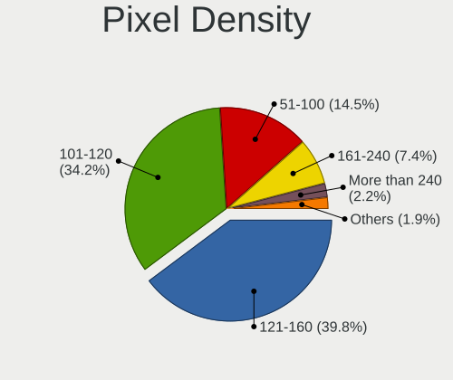

| Density       | Notebooks | Percent |
|---------------|-----------|---------|
| 121-160       | 107       | 39.78%  |
| 101-120       | 92        | 34.2%   |
| 51-100        | 39        | 14.5%   |
| 161-240       | 20        | 7.43%   |
| More than 240 | 6         | 2.23%   |
| Unknown       | 3         | 1.12%   |
| 1-50          | 2         | 0.74%   |

Multiple Monitors
-----------------

Total monitors connected

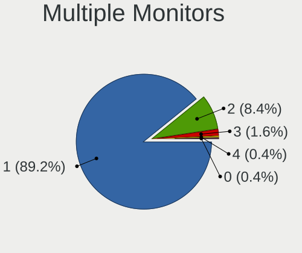

| Total | Notebooks | Percent |
|-------|-----------|---------|
| 1     | 222       | 89.16%  |
| 2     | 21        | 8.43%   |
| 3     | 4         | 1.61%   |
| 4     | 1         | 0.4%    |
| 0     | 1         | 0.4%    |

Network
-------

Net Controller Vendor
---------------------

Controller vendors

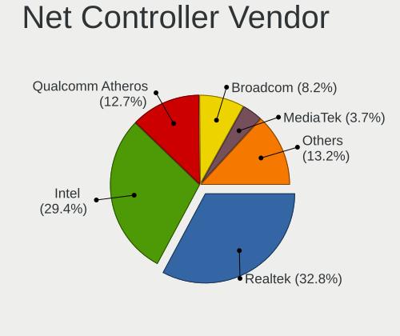

| Vendor                                 | Notebooks | Percent |
|----------------------------------------|-----------|---------|
| Realtek Semiconductor                  | 132       | 32.84%  |
| Intel                                  | 118       | 29.35%  |
| Qualcomm Atheros                       | 51        | 12.69%  |
| Broadcom                               | 33        | 8.21%   |
| MediaTek                               | 15        | 3.73%   |
| Broadcom Limited                       | 7         | 1.74%   |
| ASIX Electronics                       | 5         | 1.24%   |
| TP-Link                                | 4         | 1%      |
| Sierra Wireless                        | 4         | 1%      |
| Marvell Technology Group               | 4         | 1%      |
| Silicon Integrated Systems [SiS]       | 2         | 0.5%    |
| Ralink Technology                      | 2         | 0.5%    |
| Ralink                                 | 2         | 0.5%    |
| Qualcomm Atheros Communications        | 2         | 0.5%    |
| OPPO Electronics                       | 2         | 0.5%    |
| Fibocom                                | 2         | 0.5%    |
| U-Blox                                 | 1         | 0.25%   |
| Suzhou Motorcomm Electronic Technology | 1         | 0.25%   |
| STMicroelectronics                     | 1         | 0.25%   |
| Shenzhen Goodix Technology             | 1         | 0.25%   |
| Samsung Electronics                    | 1         | 0.25%   |
| Qualcomm                               | 1         | 0.25%   |
| Nvidia                                 | 1         | 0.25%   |
| Linksys                                | 1         | 0.25%   |
| Lenovo                                 | 1         | 0.25%   |
| JMicron Technology                     | 1         | 0.25%   |
| Huawei Technologies                    | 1         | 0.25%   |
| Fujitsu Siemens Computers              | 1         | 0.25%   |
| DisplayLink                            | 1         | 0.25%   |
| Dell                                   | 1         | 0.25%   |
| D-Link System                          | 1         | 0.25%   |
| D-Link                                 | 1         | 0.25%   |
| Attansic Technology                    | 1         | 0.25%   |

Net Controller Model
--------------------

Controller models

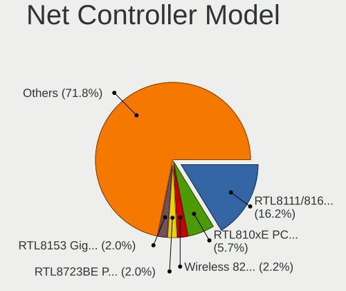

| Model                                                                  | Notebooks | Percent |
|------------------------------------------------------------------------|-----------|---------|
| Realtek RTL8111/8168/8211/8411 PCI Express Gigabit Ethernet Controller | 80        | 16.23%  |
| Realtek RTL810xE PCI Express Fast Ethernet controller                  | 28        | 5.68%   |
| Intel Wireless 8265 / 8275                                             | 11        | 2.23%   |
| Realtek RTL8723BE PCIe Wireless Network Adapter                        | 10        | 2.03%   |
| Realtek RTL8153 Gigabit Ethernet Adapter                               | 10        | 2.03%   |
| Qualcomm Atheros QCA9377 802.11ac Wireless Network Adapter             | 10        | 2.03%   |
| Qualcomm Atheros AR9285 Wireless Network Adapter (PCI-Express)         | 8         | 1.62%   |
| Broadcom BCM4313 802.11bgn Wireless Network Adapter                    | 8         | 1.62%   |
| Qualcomm Atheros QCA9565 / AR9565 Wireless Network Adapter             | 7         | 1.42%   |
| MediaTek MT7902 802.11ax PCIe Wireless Network Adapter [Filogic 310]   | 7         | 1.42%   |
| Intel Wi-Fi 6 AX201                                                    | 7         | 1.42%   |
| Intel Wireless 7265                                                    | 6         | 1.22%   |
| Intel Ethernet Connection (4) I219-LM                                  | 6         | 1.22%   |
| Intel Comet Lake PCH-LP CNVi WiFi                                      | 6         | 1.22%   |
| Qualcomm Atheros AR9485 Wireless Network Adapter                       | 5         | 1.01%   |
| Intel Wireless 3165                                                    | 5         | 1.01%   |
| Intel WiFi Link 5100                                                   | 5         | 1.01%   |
| Intel Raptor Lake PCH CNVi WiFi                                        | 5         | 1.01%   |
| Intel Cannon Lake PCH CNVi WiFi                                        | 5         | 1.01%   |
| Broadcom BCM43142 802.11b/g/n                                          | 5         | 1.01%   |
| Realtek RTL8852BE PCIe 802.11ax Wireless Network Controller            | 4         | 0.81%   |
| Realtek RTL8822CE 802.11ac PCIe Wireless Network Adapter               | 4         | 0.81%   |
| Realtek RTL8821CE 802.11ac PCIe Wireless Network Adapter               | 4         | 0.81%   |
| Qualcomm Atheros AR9462 Wireless Network Adapter                       | 4         | 0.81%   |
| Intel Wireless 7260                                                    | 4         | 0.81%   |
| Intel Wireless 3160                                                    | 4         | 0.81%   |
| Intel Wi-Fi 6 AX200                                                    | 4         | 0.81%   |
| Intel Centrino Wireless-N 1000 [Condor Peak]                           | 4         | 0.81%   |
| Broadcom NetXtreme BCM57765 Gigabit Ethernet PCIe                      | 4         | 0.81%   |
| Broadcom BCM4331 802.11a/b/g/n                                         | 4         | 0.81%   |
| ASIX AX88179 Gigabit Ethernet                                          | 4         | 0.81%   |
| Realtek RTL8822BE 802.11a/b/g/n/ac WiFi adapter                        | 3         | 0.61%   |
| Realtek RTL8188EE Wireless Network Adapter                             | 3         | 0.61%   |
| Qualcomm Atheros QCA6174 802.11ac Wireless Network Adapter             | 3         | 0.61%   |
| Qualcomm Atheros AR8151 v2.0 Gigabit Ethernet                          | 3         | 0.61%   |
| Intel Wireless 8260                                                    | 3         | 0.61%   |
| Intel Wi-Fi 5(802.11ac) Wireless-AC 9x6x [Thunder Peak]                | 3         | 0.61%   |
| Intel Ice Lake-LP PCH CNVi WiFi                                        | 3         | 0.61%   |
| Intel Gemini Lake PCH CNVi WiFi                                        | 3         | 0.61%   |
| Intel Ethernet Connection I218-LM                                      | 3         | 0.61%   |

Wireless Vendor
---------------

Wireless vendors

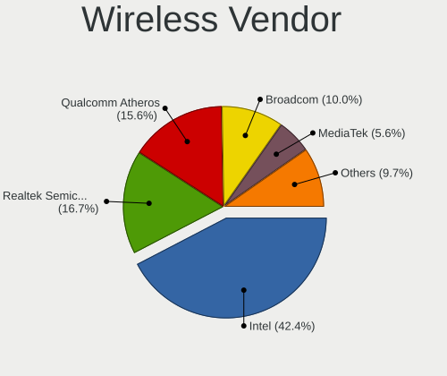

| Vendor                          | Notebooks | Percent |
|---------------------------------|-----------|---------|
| Intel                           | 114       | 42.38%  |
| Realtek Semiconductor           | 45        | 16.73%  |
| Qualcomm Atheros                | 42        | 15.61%  |
| Broadcom                        | 27        | 10.04%  |
| MediaTek                        | 15        | 5.58%   |
| TP-Link                         | 4         | 1.49%   |
| Sierra Wireless                 | 4         | 1.49%   |
| Broadcom Limited                | 4         | 1.49%   |
| Ralink Technology               | 2         | 0.74%   |
| Ralink                          | 2         | 0.74%   |
| Qualcomm Atheros Communications | 2         | 0.74%   |
| Fibocom                         | 2         | 0.74%   |
| Qualcomm                        | 1         | 0.37%   |
| Linksys                         | 1         | 0.37%   |
| Fujitsu Siemens Computers       | 1         | 0.37%   |
| Dell                            | 1         | 0.37%   |
| D-Link System                   | 1         | 0.37%   |
| D-Link                          | 1         | 0.37%   |

Wireless Model
--------------

Wireless models

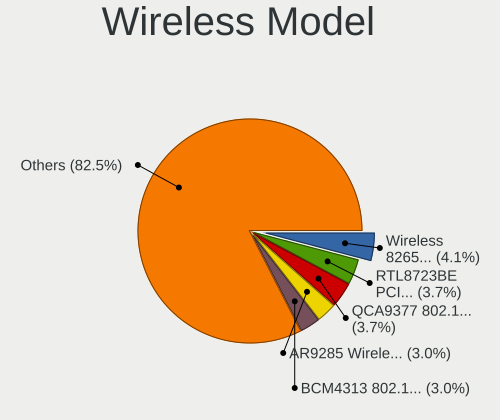

| Model                                                                   | Notebooks | Percent |
|-------------------------------------------------------------------------|-----------|---------|
| Intel Wireless 8265 / 8275                                              | 11        | 4.09%   |
| Realtek RTL8723BE PCIe Wireless Network Adapter                         | 10        | 3.72%   |
| Qualcomm Atheros QCA9377 802.11ac Wireless Network Adapter              | 10        | 3.72%   |
| Qualcomm Atheros AR9285 Wireless Network Adapter (PCI-Express)          | 8         | 2.97%   |
| Broadcom BCM4313 802.11bgn Wireless Network Adapter                     | 8         | 2.97%   |
| Qualcomm Atheros QCA9565 / AR9565 Wireless Network Adapter              | 7         | 2.6%    |
| MediaTek MT7902 802.11ax PCIe Wireless Network Adapter [Filogic 310]    | 7         | 2.6%    |
| Intel Wi-Fi 6 AX201                                                     | 7         | 2.6%    |
| Intel Wireless 7265                                                     | 6         | 2.23%   |
| Intel Comet Lake PCH-LP CNVi WiFi                                       | 6         | 2.23%   |
| Qualcomm Atheros AR9485 Wireless Network Adapter                        | 5         | 1.86%   |
| Intel Wireless 3165                                                     | 5         | 1.86%   |
| Intel WiFi Link 5100                                                    | 5         | 1.86%   |
| Intel Raptor Lake PCH CNVi WiFi                                         | 5         | 1.86%   |
| Intel Cannon Lake PCH CNVi WiFi                                         | 5         | 1.86%   |
| Broadcom BCM43142 802.11b/g/n                                           | 5         | 1.86%   |
| Realtek RTL8852BE PCIe 802.11ax Wireless Network Controller             | 4         | 1.49%   |
| Realtek RTL8822CE 802.11ac PCIe Wireless Network Adapter                | 4         | 1.49%   |
| Realtek RTL8821CE 802.11ac PCIe Wireless Network Adapter                | 4         | 1.49%   |
| Qualcomm Atheros AR9462 Wireless Network Adapter                        | 4         | 1.49%   |
| Intel Wireless 7260                                                     | 4         | 1.49%   |
| Intel Wireless 3160                                                     | 4         | 1.49%   |
| Intel Wi-Fi 6 AX200                                                     | 4         | 1.49%   |
| Intel Centrino Wireless-N 1000 [Condor Peak]                            | 4         | 1.49%   |
| Broadcom BCM4331 802.11a/b/g/n                                          | 4         | 1.49%   |
| Realtek RTL8822BE 802.11a/b/g/n/ac WiFi adapter                         | 3         | 1.12%   |
| Realtek RTL8188EE Wireless Network Adapter                              | 3         | 1.12%   |
| Qualcomm Atheros QCA6174 802.11ac Wireless Network Adapter              | 3         | 1.12%   |
| Intel Wireless 8260                                                     | 3         | 1.12%   |
| Intel Wi-Fi 5(802.11ac) Wireless-AC 9x6x [Thunder Peak]                 | 3         | 1.12%   |
| Intel Ice Lake-LP PCH CNVi WiFi                                         | 3         | 1.12%   |
| Intel Gemini Lake PCH CNVi WiFi                                         | 3         | 1.12%   |
| Intel Centrino Ultimate-N 6300                                          | 3         | 1.12%   |
| Broadcom BCM43224 802.11a/b/g/n                                         | 3         | 1.12%   |
| Sierra Wireless EM7455                                                  | 2         | 0.74%   |
| Sierra Wireless AirPrime MC7455 3G/4G LTE Modem                         | 2         | 0.74%   |
| Realtek RTL8191SEvB Wireless LAN Controller                             | 2         | 0.74%   |
| Realtek RTL8188EUS 802.11n Wireless Network Adapter                     | 2         | 0.74%   |
| Realtek 802.11ac NIC                                                    | 2         | 0.74%   |
| Qualcomm Atheros AR242x / AR542x Wireless Network Adapter (PCI-Express) | 2         | 0.74%   |

Ethernet Vendor
---------------

Ethernet vendors

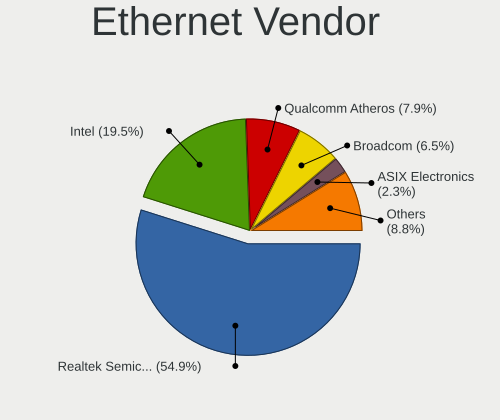

| Vendor                                 | Notebooks | Percent |
|----------------------------------------|-----------|---------|
| Realtek Semiconductor                  | 118       | 54.88%  |
| Intel                                  | 42        | 19.53%  |
| Qualcomm Atheros                       | 17        | 7.91%   |
| Broadcom                               | 14        | 6.51%   |
| ASIX Electronics                       | 5         | 2.33%   |
| Marvell Technology Group               | 4         | 1.86%   |
| Broadcom Limited                       | 3         | 1.4%    |
| Silicon Integrated Systems [SiS]       | 2         | 0.93%   |
| OPPO Electronics                       | 2         | 0.93%   |
| Suzhou Motorcomm Electronic Technology | 1         | 0.47%   |
| Samsung Electronics                    | 1         | 0.47%   |
| Nvidia                                 | 1         | 0.47%   |
| Lenovo                                 | 1         | 0.47%   |
| JMicron Technology                     | 1         | 0.47%   |
| Huawei Technologies                    | 1         | 0.47%   |
| DisplayLink                            | 1         | 0.47%   |
| Attansic Technology                    | 1         | 0.47%   |

Ethernet Model
--------------

Ethernet models

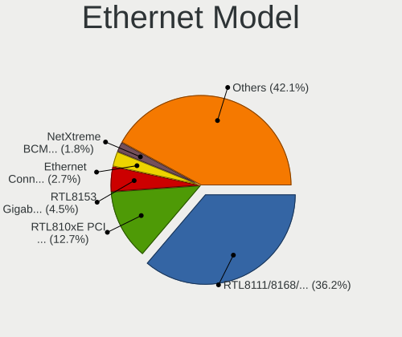

| Model                                                                  | Notebooks | Percent |
|------------------------------------------------------------------------|-----------|---------|
| Realtek RTL8111/8168/8211/8411 PCI Express Gigabit Ethernet Controller | 80        | 36.2%   |
| Realtek RTL810xE PCI Express Fast Ethernet controller                  | 28        | 12.67%  |
| Realtek RTL8153 Gigabit Ethernet Adapter                               | 10        | 4.52%   |
| Intel Ethernet Connection (4) I219-LM                                  | 6         | 2.71%   |
| Broadcom NetXtreme BCM57765 Gigabit Ethernet PCIe                      | 4         | 1.81%   |
| ASIX AX88179 Gigabit Ethernet                                          | 4         | 1.81%   |
| Qualcomm Atheros AR8151 v2.0 Gigabit Ethernet                          | 3         | 1.36%   |
| Intel Ethernet Connection I218-LM                                      | 3         | 1.36%   |
| Intel 82577LM Gigabit Network Connection                               | 3         | 1.36%   |
| Intel 82567LM Gigabit Network Connection                               | 3         | 1.36%   |
| Broadcom NetXtreme BCM5764M Gigabit Ethernet PCIe                      | 3         | 1.36%   |
| Broadcom NetLink BCM57785 Gigabit Ethernet PCIe                        | 3         | 1.36%   |
| Silicon Integrated Systems [SiS] 191 Gigabit Ethernet Adapter          | 2         | 0.9%    |
| Qualcomm Atheros QCA8172 Fast Ethernet                                 | 2         | 0.9%    |
| Qualcomm Atheros QCA8171 Gigabit Ethernet                              | 2         | 0.9%    |
| Qualcomm Atheros Killer E2500 Gigabit Ethernet Controller              | 2         | 0.9%    |
| OPPO Ace 3V                                                            | 2         | 0.9%    |
| Marvell Group 88E8055 PCI-E Gigabit Ethernet Controller                | 2         | 0.9%    |
| Intel Ethernet Connection I217-LM                                      | 2         | 0.9%    |
| Intel Ethernet Connection (7) I219-LM                                  | 2         | 0.9%    |
| Intel Ethernet Connection (4) I219-V                                   | 2         | 0.9%    |
| Intel Ethernet Connection (23) I219-LM                                 | 2         | 0.9%    |
| Intel Ethernet Connection (16) I219-LM                                 | 2         | 0.9%    |
| Intel 82579LM Gigabit Network Connection (Lewisville)                  | 2         | 0.9%    |
| Broadcom Limited NetLink BCM57780 Gigabit Ethernet PCIe                | 2         | 0.9%    |
| Suzhou Motorcomm Electronic YT6801 Gigabit Ethernet Controller         | 1         | 0.45%   |
| Samsung Galaxy series, misc. (tethering mode)                          | 1         | 0.45%   |
| Realtek USB 10/100/1G/2.5G/5G LAN                                      | 1         | 0.45%   |
| Realtek USB 10/100/1G/2.5 LAN                                          | 1         | 0.45%   |
| Realtek RTL8152 Fast Ethernet Adapter                                  | 1         | 0.45%   |
| Realtek RTL8125 2.5GbE Controller                                      | 1         | 0.45%   |
| Realtek Killer E3000 2.5GbE Controller                                 | 1         | 0.45%   |
| Qualcomm Atheros Killer E2400 Gigabit Ethernet Controller              | 1         | 0.45%   |
| Qualcomm Atheros AR8162 Fast Ethernet                                  | 1         | 0.45%   |
| Qualcomm Atheros AR8161 Gigabit Ethernet                               | 1         | 0.45%   |
| Qualcomm Atheros AR8152 v2.0 Fast Ethernet                             | 1         | 0.45%   |
| Qualcomm Atheros AR8152 v1.1 Fast Ethernet                             | 1         | 0.45%   |
| Qualcomm Atheros AR8132 Fast Ethernet                                  | 1         | 0.45%   |
| Qualcomm Atheros AR8131 Gigabit Ethernet                               | 1         | 0.45%   |
| Qualcomm Atheros AR8121/AR8113/AR8114 Gigabit or Fast Ethernet         | 1         | 0.45%   |

Net Controller Kind
-------------------

Ethernet, WiFi or modem

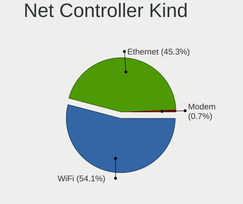

| Kind     | Notebooks | Percent |
|----------|-----------|---------|
| WiFi     | 245       | 54.08%  |
| Ethernet | 205       | 45.25%  |
| Modem    | 3         | 0.66%   |

Used Controller
---------------

Currently used network controller

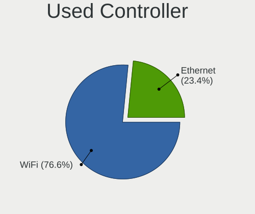

| Kind     | Notebooks | Percent |
|----------|-----------|---------|
| WiFi     | 209       | 76.56%  |
| Ethernet | 64        | 23.44%  |

NICs
----

Total network controllers on board

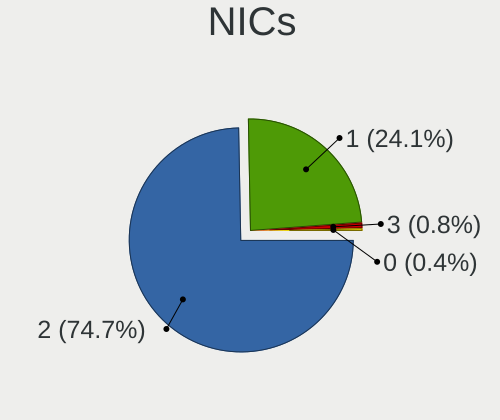

| Total | Notebooks | Percent |
|-------|-----------|---------|
| 2     | 186       | 74.7%   |
| 1     | 60        | 24.1%   |
| 3     | 2         | 0.8%    |
| 0     | 1         | 0.4%    |

IPv6
----

IPv6 vs IPv4

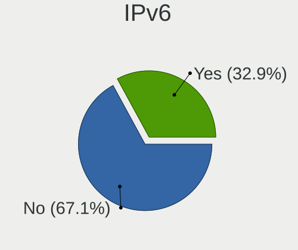

| Used | Notebooks | Percent |
|------|-----------|---------|
| No   | 167       | 67.07%  |
| Yes  | 82        | 32.93%  |

Bluetooth
---------

Bluetooth Vendor
----------------

Controller vendors

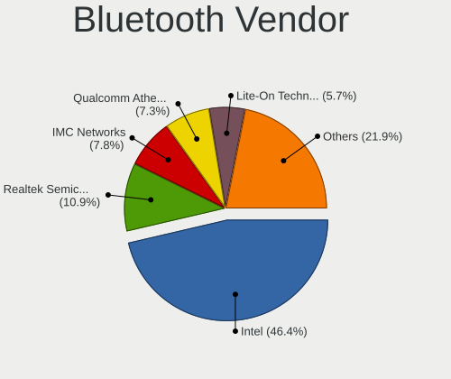

| Vendor                          | Notebooks | Percent |
|---------------------------------|-----------|---------|
| Intel                           | 89        | 46.35%  |
| Realtek Semiconductor           | 21        | 10.94%  |
| IMC Networks                    | 15        | 7.81%   |
| Qualcomm Atheros Communications | 14        | 7.29%   |
| Lite-On Technology              | 11        | 5.73%   |
| Apple                           | 10        | 5.21%   |
| Broadcom                        | 7         | 3.65%   |
| Foxconn / Hon Hai               | 6         | 3.13%   |
| MediaTek                        | 4         | 2.08%   |
| Cambridge Silicon Radio         | 4         | 2.08%   |
| Hewlett-Packard                 | 3         | 1.56%   |
| Dell                            | 3         | 1.56%   |
| USI                             | 1         | 0.52%   |
| Toshiba                         | 1         | 0.52%   |
| Realtek                         | 1         | 0.52%   |
| Ralink                          | 1         | 0.52%   |
| ASUSTek Computer                | 1         | 0.52%   |

Bluetooth Model
---------------

Controller models

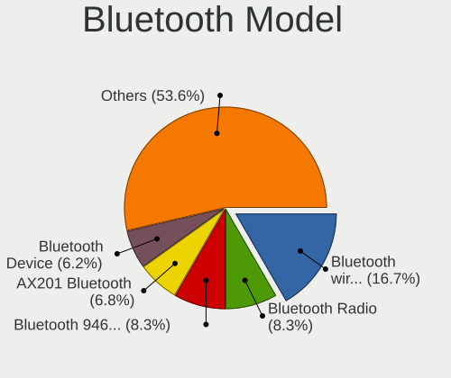

| Model                                               | Notebooks | Percent |
|-----------------------------------------------------|-----------|---------|
| Intel Bluetooth wireless interface                  | 32        | 16.67%  |
| Realtek Bluetooth Radio                             | 16        | 8.33%   |
| Intel Bluetooth 9460/9560 Jefferson Peak (JfP)      | 16        | 8.33%   |
| Intel AX201 Bluetooth                               | 13        | 6.77%   |
| Intel Bluetooth Device                              | 12        | 6.25%   |
| IMC Networks Wireless_Device                        | 8         | 4.17%   |
| Lite-On Qualcomm Atheros QCA9377 Bluetooth          | 5         | 2.6%    |
| Intel Centrino Bluetooth Wireless Transceiver       | 5         | 2.6%    |
| Apple Bluetooth USB Host Controller                 | 5         | 2.6%    |
| Qualcomm Atheros  Bluetooth Device                  | 4         | 2.08%   |
| MediaTek Wireless_Device                            | 4         | 2.08%   |
| Cambridge Silicon Radio Bluetooth Dongle (HCI mode) | 4         | 2.08%   |
| Apple Bluetooth Host Controller                     | 4         | 2.08%   |
| Qualcomm Atheros QCA61x4 Bluetooth 4.0              | 3         | 1.56%   |
| Qualcomm Atheros AR3011 Bluetooth                   | 3         | 1.56%   |
| Intel Wireless-AC 9260 Bluetooth Adapter            | 3         | 1.56%   |
| Intel AX200 Bluetooth                               | 3         | 1.56%   |
| IMC Networks Bluetooth Radio                        | 3         | 1.56%   |
| Realtek RTL8723B Bluetooth                          | 2         | 1.04%   |
| Realtek  Bluetooth 4.2 Adapter                      | 2         | 1.04%   |
| Qualcomm Atheros AR3012 Bluetooth 4.0               | 2         | 1.04%   |
| Qualcomm Atheros AR3012 Bluetooth                   | 2         | 1.04%   |
| Lite-On Atheros AR3012 Bluetooth                    | 2         | 1.04%   |
| Intel Wireless-AC 3168 Bluetooth                    | 2         | 1.04%   |
| Intel Centrino Advanced-N 6230 Bluetooth adapter    | 2         | 1.04%   |
| IMC Networks Bluetooth module                       | 2         | 1.04%   |
| HP Broadcom 2070 Bluetooth Combo                    | 2         | 1.04%   |
| Foxconn / Hon Hai Wireless_Device                   | 2         | 1.04%   |
| Foxconn / Hon Hai Bluetooth Device                  | 2         | 1.04%   |
| Dell DW375 Bluetooth Module                         | 2         | 1.04%   |
| Broadcom BCM43142A0 Bluetooth 4.0                   | 2         | 1.04%   |
| USI Bluetooth Device                                | 1         | 0.52%   |
| Toshiba BCM43142A0                                  | 1         | 0.52%   |
| Realtek RTL8822BE Bluetooth 4.2 Adapter             | 1         | 0.52%   |
| Realtek Bluetooth Radio                             | 1         | 0.52%   |
| Ralink RT3290 Bluetooth                             | 1         | 0.52%   |
| Lite-On Bluetooth Radio                             | 1         | 0.52%   |
| Lite-On Bluetooth Device                            | 1         | 0.52%   |
| Lite-On BCM43142A0                                  | 1         | 0.52%   |
| Lite-On Atheros Bluetooth                           | 1         | 0.52%   |

Sound
-----

Sound Vendor
------------

Sound card vendors

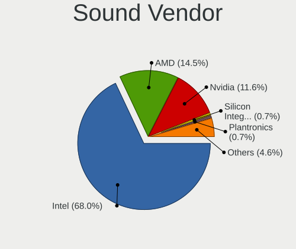

| Vendor                           | Notebooks | Percent |
|----------------------------------|-----------|---------|
| Intel                            | 206       | 67.99%  |
| AMD                              | 44        | 14.52%  |
| Nvidia                           | 35        | 11.55%  |
| Silicon Integrated Systems [SiS] | 2         | 0.66%   |
| Plantronics                      | 2         | 0.66%   |
| Hewlett-Packard                  | 2         | 0.66%   |
| C-Media Electronics              | 2         | 0.66%   |
| Tenx Technology                  | 1         | 0.33%   |
| Samsung Electronics              | 1         | 0.33%   |
| liyuany                          | 1         | 0.33%   |
| Lenovo                           | 1         | 0.33%   |
| Jieli Technology                 | 1         | 0.33%   |
| GYROCOM C&C                      | 1         | 0.33%   |
| GN Netcom                        | 1         | 0.33%   |
| DSEA A/S                         | 1         | 0.33%   |
| Conexant Systems                 | 1         | 0.33%   |
| BEHRINGER International          | 1         | 0.33%   |

Sound Model
-----------

Sound card models

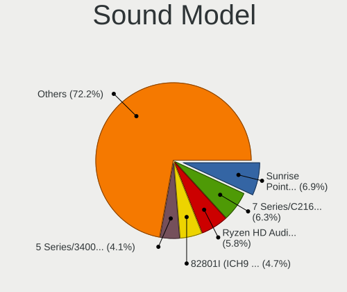

| Model                                                                                             | Notebooks | Percent |
|---------------------------------------------------------------------------------------------------|-----------|---------|
| Intel Sunrise Point-LP HD Audio                                                                   | 25        | 6.89%   |
| Intel 7 Series/C216 Chipset Family High Definition Audio Controller                               | 23        | 6.34%   |
| AMD Ryzen HD Audio Controller                                                                     | 21        | 5.79%   |
| Intel 82801I (ICH9 Family) HD Audio Controller                                                    | 17        | 4.68%   |
| Intel 5 Series/3400 Series Chipset High Definition Audio                                          | 15        | 4.13%   |
| AMD FCH Azalia Controller                                                                         | 11        | 3.03%   |
| Intel Tiger Lake-LP Smart Sound Technology Audio Controller                                       | 10        | 2.75%   |
| Intel Cannon Lake PCH cAVS                                                                        | 10        | 2.75%   |
| Intel Atom Processor Z36xxx/Z37xxx Series High Definition Audio Controller                        | 10        | 2.75%   |
| Intel Raptor Lake-P/U/H cAVS                                                                      | 9         | 2.48%   |
| Intel 8 Series/C220 Series Chipset High Definition Audio Controller                               | 9         | 2.48%   |
| Intel 6 Series/C200 Series Chipset Family High Definition Audio Controller                        | 9         | 2.48%   |
| Intel Wildcat Point-LP High Definition Audio Controller                                           | 8         | 2.2%    |
| Intel Broadwell-U Audio Controller                                                                | 8         | 2.2%    |
| AMD Radeon High Definition Audio Controller                                                       | 8         | 2.2%    |
| AMD Kabini HDMI/DP Audio                                                                          | 8         | 2.2%    |
| Intel Xeon E3-1200 v3/4th Gen Core Processor HD Audio Controller                                  | 7         | 1.93%   |
| Intel Haswell-ULT HD Audio Controller                                                             | 7         | 1.93%   |
| Intel Comet Lake PCH-LP cAVS                                                                      | 7         | 1.93%   |
| Intel Alder Lake PCH-P High Definition Audio Controller                                           | 7         | 1.93%   |
| Intel 8 Series HD Audio Controller                                                                | 7         | 1.93%   |
| AMD Renoir/Cezanne HDMI/DP Audio Controller                                                       | 6         | 1.65%   |
| AMD Raven/Raven2/Fenghuang HDMI/DP Audio Controller                                               | 6         | 1.65%   |
| Intel 82801H (ICH8 Family) HD Audio Controller                                                    | 5         | 1.38%   |
| Nvidia GP107GL High Definition Audio Controller                                                   | 4         | 1.1%    |
| Nvidia GK107 HDMI Audio Controller                                                                | 4         | 1.1%    |
| Nvidia GF108 High Definition Audio Controller                                                     | 4         | 1.1%    |
| Intel Ice Lake-LP Smart Sound Technology Audio Controller                                         | 4         | 1.1%    |
| Intel Celeron/Pentium Silver Processor High Definition Audio                                      | 4         | 1.1%    |
| Intel Cannon Point-LP High Definition Audio Controller                                            | 4         | 1.1%    |
| AMD Family 15h (Models 60h-6fh) Audio Controller                                                  | 4         | 1.1%    |
| AMD Cedar HDMI Audio [Radeon HD 5400/6300/7300 Series]                                            | 4         | 1.1%    |
| Nvidia TU107 GeForce GTX 1650 High Definition Audio Controller                                    | 3         | 0.83%   |
| Intel Celeron N3350/Pentium N4200/Atom E3900 Series Audio Cluster                                 | 3         | 0.83%   |
| Intel Atom/Celeron/Pentium Processor x5-E8000/J3xxx/N3xxx Series High Definition Audio Controller | 3         | 0.83%   |
| Silicon Integrated Systems [SiS] Azalia Audio Controller                                          | 2         | 0.55%   |
| Nvidia High Definition Audio Controller                                                           | 2         | 0.55%   |
| Nvidia GP106 High Definition Audio Controller                                                     | 2         | 0.55%   |
| Nvidia GK208 HDMI/DP Audio Controller                                                             | 2         | 0.55%   |
| Nvidia AD107 High Definition Audio Controller                                                     | 2         | 0.55%   |

Memory
------

Memory Vendor
-------------

Memory module vendors

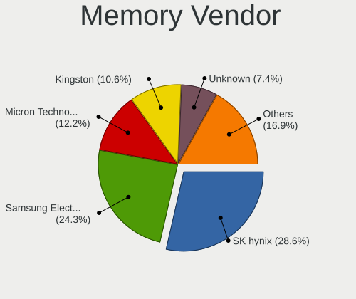

| Vendor                                  | Notebooks | Percent |
|-----------------------------------------|-----------|---------|
| SK hynix                                | 54        | 28.57%  |
| Samsung Electronics                     | 46        | 24.34%  |
| Micron Technology                       | 23        | 12.17%  |
| Kingston                                | 20        | 10.58%  |
| Unknown                                 | 14        | 7.41%   |
| Ramaxel Technology                      | 5         | 2.65%   |
| Crucial                                 | 5         | 2.65%   |
| A-DATA Technology                       | 4         | 2.12%   |
| Spectek                                 | 3         | 1.59%   |
| G.Skill                                 | 3         | 1.59%   |
| Unknown (ABCD)                          | 1         | 0.53%   |
| Transcend                               | 1         | 0.53%   |
| Timetec                                 | 1         | 0.53%   |
| Team                                    | 1         | 0.53%   |
| Silicon Power Computer & Communications | 1         | 0.53%   |
| PKI                                     | 1         | 0.53%   |
| Nanya Technology                        | 1         | 0.53%   |
| Foxline                                 | 1         | 0.53%   |
| ff                                      | 1         | 0.53%   |
| fef5                                    | 1         | 0.53%   |
| Elpida                                  | 1         | 0.53%   |
| 4ea5                                    | 1         | 0.53%   |

Memory Model
------------

Memory module models

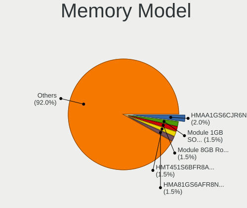

| Model                                                            | Notebooks | Percent |
|------------------------------------------------------------------|-----------|---------|
| SK hynix RAM HMAA1GS6CJR6N-XN 8GB SODIMM DDR4 3200MT/s           | 4         | 2%      |
| Unknown RAM Module 1GB SODIMM DDR2 667MT/s                       | 3         | 1.5%    |
| Spectek RAM Module 8GB Row Of Chips LPDDR3 1600MT/s              | 3         | 1.5%    |
| SK hynix RAM HMT451S6BFR8A-PB 4GB SODIMM DDR3 1600MT/s           | 3         | 1.5%    |
| SK hynix RAM HMA81GS6AFR8N-UH 8GB SODIMM DDR4 2667MT/s           | 3         | 1.5%    |
| Unknown RAM Module 2GB SODIMM DDR2 667MT/s                       | 2         | 1%      |
| SK hynix RAM HMA81GS6DJR8N-XN 8GB SODIMM DDR4 3200MT/s           | 2         | 1%      |
| SK hynix RAM HMA81GS6AFR8N-UH 8GB SODIMM DDR4 3200MT/s           | 2         | 1%      |
| Samsung RAM M471B5173QH0-YK0 4GB SODIMM DDR3 1600MT/s            | 2         | 1%      |
| Samsung RAM M471B5173DB0-YK0 4GB SODIMM DDR3 1600MT/s            | 2         | 1%      |
| Samsung RAM M471A5244CB0-CTD 4GB SODIMM DDR4 3266MT/s            | 2         | 1%      |
| Samsung RAM M471A2G44AM0-CWE 16GB SODIMM DDR4 3200MT/s           | 2         | 1%      |
| Samsung RAM M471A1K43EB1-CWE 8GB SODIMM DDR4 3200MT/s            | 2         | 1%      |
| Samsung RAM M471A1K43CB1-CTD 8GB SODIMM DDR4 3200MT/s            | 2         | 1%      |
| Samsung RAM M471A1K43CB1-CRC 8GB SODIMM DDR4 8400MT/s            | 2         | 1%      |
| Samsung RAM K3KL9L90CM-MGCT 4GB Row Of Chips LPDDR5 7500MT/s     | 2         | 1%      |
| Ramaxel RAM RMT3160ED58E9W1600 4GB SODIMM DDR3 1600MT/s          | 2         | 1%      |
| Ramaxel RAM RMT3020EF48E8W1333 2GB SODIMM DDR3 1334MT/s          | 2         | 1%      |
| Micron RAM 8KTF51264HZ-1G6E1 4GB SODIMM DDR3 1600MT/s            | 2         | 1%      |
| Micron RAM 8JSF25664HZ-1G4D1 2GB SODIMM DDR3 1334MT/s            | 2         | 1%      |
| Micron RAM 4ATF51264HZ-2G6E1 4GB SODIMM DDR4 2667MT/s            | 2         | 1%      |
| Micron RAM 4ATF1G64HZ-3G2F1 8GB SODIMM DDR4 3200MT/s             | 2         | 1%      |
| G.Skill RAM F4-2666C19-8GRS 8GB SODIMM DDR4 2667MT/s             | 2         | 1%      |
| Crucial RAM CT102464BF160B.C16 8GB SODIMM DDR3 1600MT/s          | 2         | 1%      |
| Unknown RAM Module 8GB SODIMM DDR3 1600MT/s                      | 1         | 0.5%    |
| Unknown RAM Module 8GB SODIMM DDR3 1333MT/s                      | 1         | 0.5%    |
| Unknown RAM Module 4GB SODIMM DDR4 2400MT/s                      | 1         | 0.5%    |
| Unknown RAM Module 4GB SODIMM DDR3 1600MT/s                      | 1         | 0.5%    |
| Unknown RAM Module 2GB SODIMM SDRAM                              | 1         | 0.5%    |
| Unknown RAM Module 2GB SODIMM DRAM                               | 1         | 0.5%    |
| Unknown RAM Module 2GB SODIMM DDR3 1333MT/s                      | 1         | 0.5%    |
| Unknown RAM Module 2GB SODIMM DDR2 800MT/s                       | 1         | 0.5%    |
| Unknown RAM Module 2GB SODIMM DDR2 533MT/s                       | 1         | 0.5%    |
| Unknown RAM Module 2GB SODIMM 800MT/s                            | 1         | 0.5%    |
| Unknown RAM DDR4 NB 16G 2666 16384MB SODIMM DDR4 2667MT/s        | 1         | 0.5%    |
| Unknown (ABCD) RAM 123456789012345678 2GB SODIMM LPDDR4 2400MT/s | 1         | 0.5%    |
| Transcend RAM JM1066KSN-4G 4GB SODIMM DDR3 1067MT/s              | 1         | 0.5%    |
| Timetec RAM SD4-2400 8GB SODIMM DDR4 2400MT/s                    | 1         | 0.5%    |
| Team RAM TEAMGROUP-SD3-1600 8GB SODIMM DDR3 1600MT/s             | 1         | 0.5%    |
| SK hynix RAM Module 8GB SODIMM DDR4 2133MT/s                     | 1         | 0.5%    |

Memory Kind
-----------

Memory module kinds

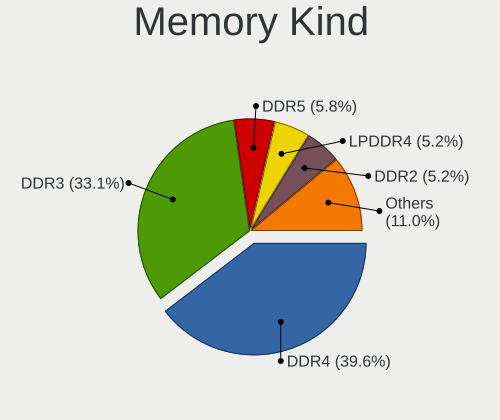

| Kind    | Notebooks | Percent |
|---------|-----------|---------|
| DDR4    | 61        | 39.61%  |
| DDR3    | 51        | 33.12%  |
| DDR5    | 9         | 5.84%   |
| LPDDR4  | 8         | 5.19%   |
| DDR2    | 8         | 5.19%   |
| LPDDR5  | 7         | 4.55%   |
| LPDDR3  | 4         | 2.6%    |
| SDRAM   | 3         | 1.95%   |
| Unknown | 2         | 1.3%    |
| DRAM    | 1         | 0.65%   |

Memory Form Factor
------------------

Physical design of the memory module

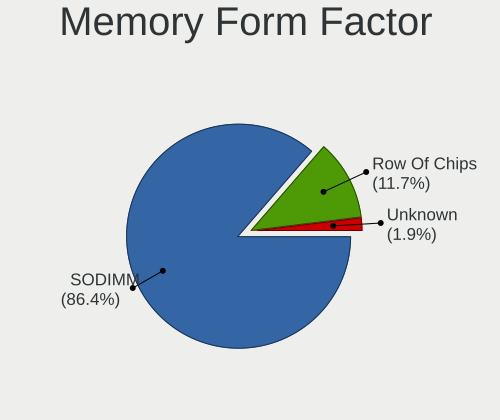

| Name         | Notebooks | Percent |
|--------------|-----------|---------|
| SODIMM       | 133       | 86.36%  |
| Row Of Chips | 18        | 11.69%  |
| Unknown      | 3         | 1.95%   |

Memory Size
-----------

Memory module size

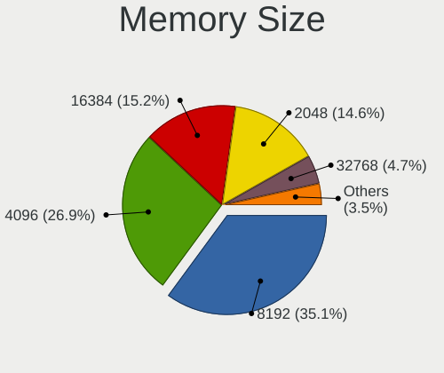

| Size  | Notebooks | Percent |
|-------|-----------|---------|
| 8192  | 60        | 35.09%  |
| 4096  | 46        | 26.9%   |
| 16384 | 26        | 15.2%   |
| 2048  | 25        | 14.62%  |
| 32768 | 8         | 4.68%   |
| 1024  | 5         | 2.92%   |
| 49152 | 1         | 0.58%   |

Memory Speed
------------

Memory module speed

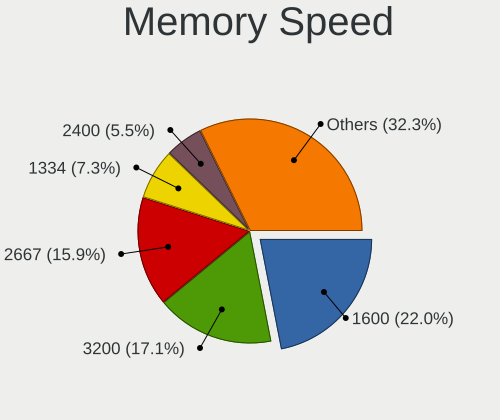

| Speed   | Notebooks | Percent |
|---------|-----------|---------|
| 1600    | 36        | 21.95%  |
| 3200    | 28        | 17.07%  |
| 2667    | 26        | 15.85%  |
| 1334    | 12        | 7.32%   |
| 2400    | 9         | 5.49%   |
| 5600    | 7         | 4.27%   |
| 2133    | 5         | 3.05%   |
| 800     | 5         | 3.05%   |
| 1333    | 4         | 2.44%   |
| 1067    | 4         | 2.44%   |
| 8400    | 3         | 1.83%   |
| 7500    | 3         | 1.83%   |
| 667     | 3         | 1.83%   |
| 6400    | 2         | 1.22%   |
| 4800    | 2         | 1.22%   |
| 3733    | 2         | 1.22%   |
| 3266    | 2         | 1.22%   |
| Unknown | 2         | 1.22%   |
| 8533    | 1         | 0.61%   |
| 7467    | 1         | 0.61%   |
| 4267    | 1         | 0.61%   |
| 4199    | 1         | 0.61%   |
| 2933    | 1         | 0.61%   |
| 1867    | 1         | 0.61%   |
| 1639    | 1         | 0.61%   |
| 1066    | 1         | 0.61%   |
| 533     | 1         | 0.61%   |

Printers & scanners
-------------------

Printer Vendor
--------------

Printer device vendors

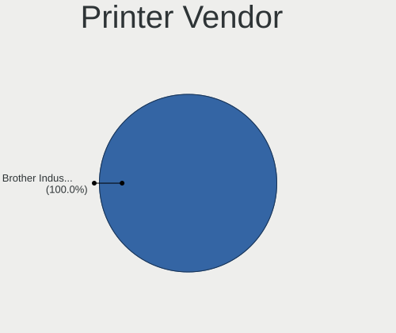

| Vendor             | Notebooks | Percent |
|--------------------|-----------|---------|
| Brother Industries | 1         | 100%    |

Printer Model
-------------

Printer device models

| Model                  | Notebooks | Percent |
|------------------------|-----------|---------|
| Brother HL-1110 series | 1         | 100%    |

Scanner Vendor
--------------

Scanner device vendors

Zero info for selected period =(

Scanner Model
-------------

Scanner device models

Zero info for selected period =(

Camera
------

Camera Vendor
-------------

Camera device vendors

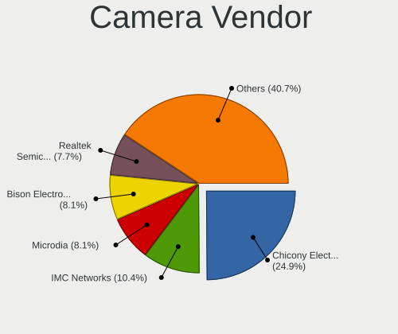

| Vendor                                 | Notebooks | Percent |
|----------------------------------------|-----------|---------|
| Chicony Electronics                    | 55        | 24.89%  |
| IMC Networks                           | 23        | 10.41%  |
| Microdia                               | 18        | 8.14%   |
| Bison Electronics                      | 18        | 8.14%   |
| Realtek Semiconductor                  | 17        | 7.69%   |
| Suyin                                  | 12        | 5.43%   |
| Sunplus Innovation Technology          | 12        | 5.43%   |
| Quanta                                 | 9         | 4.07%   |
| Syntek                                 | 8         | 3.62%   |
| Apple                                  | 7         | 3.17%   |
| Luxvisions Innotech Limited            | 6         | 2.71%   |
| Cheng Uei Precision Industry (Foxlink) | 6         | 2.71%   |
| Silicon Motion                         | 4         | 1.81%   |
| ShineTech                              | 4         | 1.81%   |
| Lite-On Technology                     | 4         | 1.81%   |
| Sonix Technology                       | 2         | 0.9%    |
| Primax Electronics                     | 2         | 0.9%    |
| Lenovo                                 | 2         | 0.9%    |
| ARC International                      | 2         | 0.9%    |
| Z-Star Microelectronics                | 1         | 0.45%   |
| Samsung Electronics                    | 1         | 0.45%   |
| Ricoh                                  | 1         | 0.45%   |
| Logitech                               | 1         | 0.45%   |
| Genesys Logic                          | 1         | 0.45%   |
| Generalplus Technology                 | 1         | 0.45%   |
| Geek szitman                           | 1         | 0.45%   |
| Framework                              | 1         | 0.45%   |
| Cubeternet                             | 1         | 0.45%   |
| Alcor Micro                            | 1         | 0.45%   |

Camera Model
------------

Camera device models

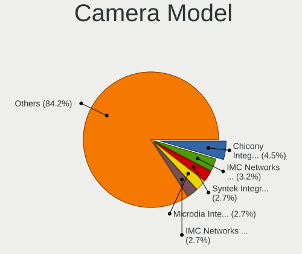

| Model                                               | Notebooks | Percent |
|-----------------------------------------------------|-----------|---------|
| Chicony Integrated Camera                           | 10        | 4.52%   |
| IMC Networks Integrated Camera                      | 7         | 3.17%   |
| Syntek Integrated Camera                            | 6         | 2.71%   |
| Microdia Integrated Webcam                          | 6         | 2.71%   |
| IMC Networks USB2.0 HD UVC WebCam                   | 6         | 2.71%   |
| Sunplus HD WebCam                                   | 5         | 2.26%   |
| Microdia Integrated_Webcam_HD                       | 5         | 2.26%   |
| Realtek Integrated_Webcam_HD                        | 4         | 1.81%   |
| Chicony HP Truevision HD                            | 4         | 1.81%   |
| Chicony HD WebCam                                   | 4         | 1.81%   |
| Bison SunplusIT Integrated Camera                   | 4         | 1.81%   |
| Bison Lenovo EasyCamera                             | 4         | 1.81%   |
| Apple FaceTime HD Camera                            | 4         | 1.81%   |
| ShineTech USB2.0 HD UVC WebCam                      | 3         | 1.36%   |
| Realtek USB Camera                                  | 3         | 1.36%   |
| Quanta HD User Facing                               | 3         | 1.36%   |
| Lite-On HP HD Camera                                | 3         | 1.36%   |
| IMC Networks USB2.0 VGA UVC WebCam                  | 3         | 1.36%   |
| Chicony USB 2.0Camera                               | 3         | 1.36%   |
| Chicony Integrated Camera (1280x720@30)             | 3         | 1.36%   |
| Chicony HP TrueVision HD Camera                     | 3         | 1.36%   |
| Cheng Uei Precision Industry (Foxlink) HP HD Webcam | 3         | 1.36%   |
| Bison Integrated Camera                             | 3         | 1.36%   |
| Suyin HP Webcam                                     | 2         | 0.9%    |
| Suyin HP Truevision HD                              | 2         | 0.9%    |
| Suyin HP Integrated Webcam                          | 2         | 0.9%    |
| Sunplus Integrated_Webcam_HD                        | 2         | 0.9%    |
| Realtek HD Webcam                                   | 2         | 0.9%    |
| Realtek Acer 640 x 480 laptop camera                | 2         | 0.9%    |
| Primax HP Webcam-101                                | 2         | 0.9%    |
| Microdia USB 2.0 Camera                             | 2         | 0.9%    |
| Luxvisions Innotech Limited Integrated Camera       | 2         | 0.9%    |
| Luxvisions Innotech Limited HP TrueVision HD Camera | 2         | 0.9%    |
| Chicony USB2.0 VGA UVC WebCam                       | 2         | 0.9%    |
| Chicony USB2.0 Camera                               | 2         | 0.9%    |
| Chicony HP Webcam [2 MP Macro]                      | 2         | 0.9%    |
| Chicony HP HD Camera                                | 2         | 0.9%    |
| Cheng Uei Precision Industry (Foxlink) Webcam       | 2         | 0.9%    |
| Bison Lenovo Integrated Webcam                      | 2         | 0.9%    |
| Bison HD Webcam                                     | 2         | 0.9%    |

Security
--------

Fingerprint Vendor
------------------

Fingerprint sensor vendors

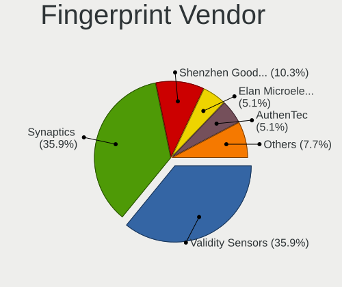

| Vendor                     | Notebooks | Percent |
|----------------------------|-----------|---------|
| Validity Sensors           | 14        | 35.9%   |
| Synaptics                  | 14        | 35.9%   |
| Shenzhen Goodix Technology | 4         | 10.26%  |
| Elan Microelectronics      | 2         | 5.13%   |
| AuthenTec                  | 2         | 5.13%   |
| Upek                       | 1         | 2.56%   |
| STMicroelectronics         | 1         | 2.56%   |
| LighTuning Technology      | 1         | 2.56%   |

Fingerprint Model
-----------------

Fingerprint sensor models

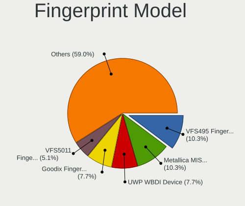

| Model                                                                      | Notebooks | Percent |
|----------------------------------------------------------------------------|-----------|---------|
| Validity Sensors VFS495 Fingerprint Reader                                 | 4         | 10.26%  |
| Synaptics Metallica MIS Touch Fingerprint Reader                           | 4         | 10.26%  |
| Synaptics UWP WBDI Device                                                  | 3         | 7.69%   |
| Shenzhen Goodix  FingerPrint Device                                        | 3         | 7.69%   |
| Validity Sensors VFS5011 Fingerprint Reader                                | 2         | 5.13%   |
| Validity Sensors VFS301 Fingerprint Reader                                 | 2         | 5.13%   |
| Validity Sensors Synaptics VFS7552 Touch Fingerprint Sensor with PurePrint | 2         | 5.13%   |
| Synaptics Prometheus MIS Touch Fingerprint Reader                          | 2         | 5.13%   |
| Synaptics Prometheus Fingerprint Reader                                    | 2         | 5.13%   |
| Synaptics Fingerprint reader [HP G6]                                       | 2         | 5.13%   |
| Validity Sensors VFS7500 Touch Fingerprint Sensor                          | 1         | 2.56%   |
| Validity Sensors VFS471 Fingerprint Reader                                 | 1         | 2.56%   |
| Validity Sensors VFS451 Fingerprint Reader                                 | 1         | 2.56%   |
| Validity Sensors VFS 5011 fingerprint sensor                               | 1         | 2.56%   |
| Upek Biometric Touchchip/Touchstrip Fingerprint Sensor                     | 1         | 2.56%   |
| STMicroelectronics Fingerprint Reader                                      | 1         | 2.56%   |
| Shenzhen Goodix Fingerprint Reader                                         | 1         | 2.56%   |
| LighTuning EgisTec Touch Fingerprint Sensor                                | 1         | 2.56%   |
| Elan ELAN:Fingerprint                                                      | 1         | 2.56%   |
| Elan ELAN:ARM-M4                                                           | 1         | 2.56%   |
| AuthenTec AES2810                                                          | 1         | 2.56%   |
| AuthenTec AES1600                                                          | 1         | 2.56%   |
| Unknown                                                                    | 1         | 2.56%   |

Chipcard Vendor
---------------

Chipcard module vendors

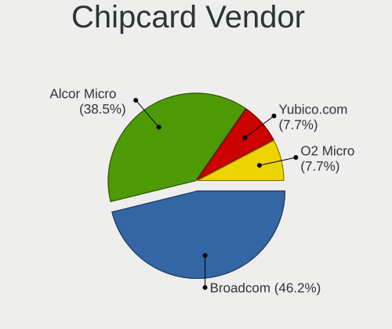

| Vendor      | Notebooks | Percent |
|-------------|-----------|---------|
| Broadcom    | 6         | 46.15%  |
| Alcor Micro | 5         | 38.46%  |
| Yubico.com  | 1         | 7.69%   |
| O2 Micro    | 1         | 7.69%   |

Chipcard Model
--------------

Chipcard module models

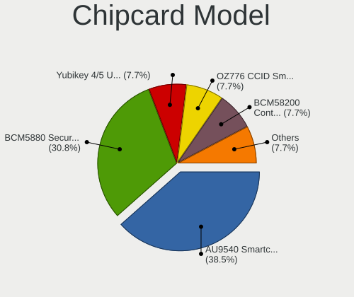

| Model                                                                       | Notebooks | Percent |
|-----------------------------------------------------------------------------|-----------|---------|
| Alcor Micro AU9540 Smartcard Reader                                         | 5         | 38.46%  |
| Broadcom BCM5880 Secure Applications Processor                              | 4         | 30.77%  |
| Yubico.com Yubikey 4/5 U2F+CCID                                             | 1         | 7.69%   |
| O2 Micro OZ776 CCID Smartcard Reader                                        | 1         | 7.69%   |
| Broadcom BCM58200 ControlVault 3 (FingerPrint sensor + Contacted SmartCard) | 1         | 7.69%   |
| Broadcom 58200                                                              | 1         | 7.69%   |

Unsupported
-----------

Unsupported Devices
-------------------

Total unsupported devices on board

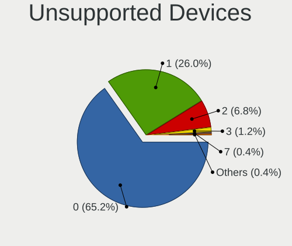

| Total | Notebooks | Percent |
|-------|-----------|---------|
| 0     | 163       | 65.2%   |
| 1     | 65        | 26%     |
| 2     | 17        | 6.8%    |
| 3     | 3         | 1.2%    |
| 7     | 1         | 0.4%    |
| 5     | 1         | 0.4%    |

Unsupported Device Types
------------------------

Types of unsupported devices

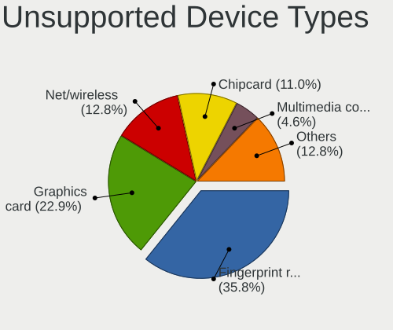

| Type                     | Notebooks | Percent |
|--------------------------|-----------|---------|
| Fingerprint reader       | 39        | 35.78%  |
| Graphics card            | 25        | 22.94%  |
| Net/wireless             | 14        | 12.84%  |
| Chipcard                 | 12        | 11.01%  |
| Multimedia controller    | 5         | 4.59%   |
| Camera                   | 4         | 3.67%   |
| Net/ethernet             | 2         | 1.83%   |
| Communication controller | 2         | 1.83%   |
| Storage/nvme             | 1         | 0.92%   |
| Storage/ata              | 1         | 0.92%   |
| Storage                  | 1         | 0.92%   |
| Sound                    | 1         | 0.92%   |
| Card reader              | 1         | 0.92%   |
| Bluetooth                | 1         | 0.92%   |

