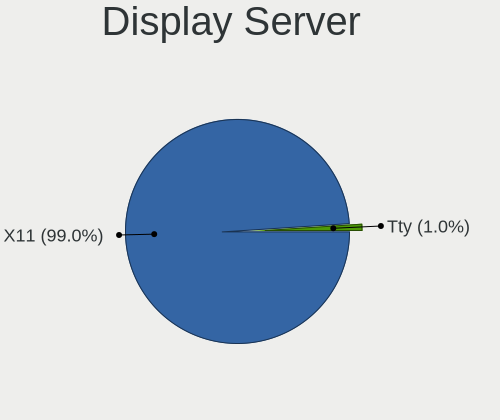
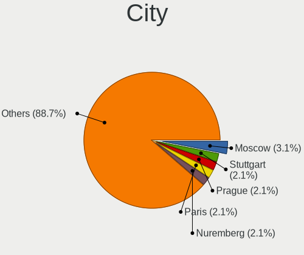
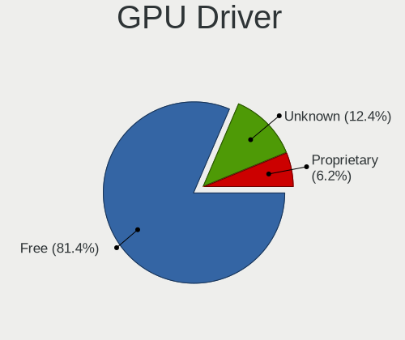
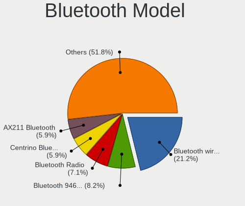
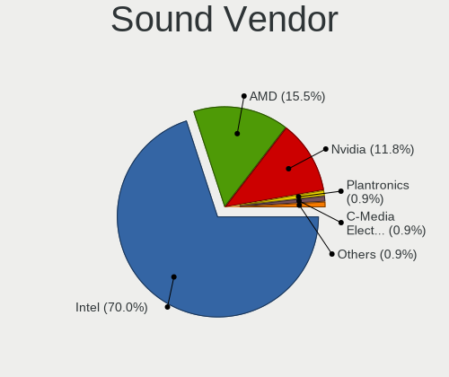
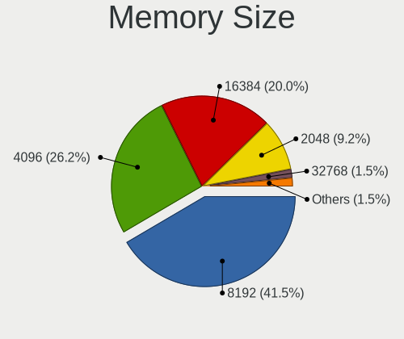

Xubuntu 24.04 - Tested Hardware & Statistics (Notebooks)
--------------------------------------------------------

A project to collect tested hardware configurations for Xubuntu 24.04.

Anyone can contribute to this report by the [hw-probe](https://github.com/linuxhw/hw-probe) tool:

    sudo -E hw-probe -all -upload

Please contribute! Especially if your hardware is rare.

Contents
--------

* [ Test Cases ](#test-cases)

* [ System ](#system)
  - [ Kernel                   ](#kernel)
  - [ Kernel Family            ](#kernel-family)
  - [ Kernel Major Ver.        ](#kernel-major-ver)
  - [ Arch                     ](#arch)
  - [ DE                       ](#de)
  - [ Display Server           ](#display-server)
  - [ Display Manager          ](#display-manager)
  - [ OS Lang                  ](#os-lang)
  - [ Boot Mode                ](#boot-mode)
  - [ Filesystem               ](#filesystem)
  - [ Part. scheme             ](#part-scheme)
  - [ Dual Boot with Linux/BSD ](#dual-boot-with-linuxbsd)
  - [ Dual Boot (Win)          ](#dual-boot-win)

* [ Board ](#board)
  - [ Vendor                   ](#vendor)
  - [ Model                    ](#model)
  - [ Model Family             ](#model-family)
  - [ MFG Year                 ](#mfg-year)
  - [ Form Factor              ](#form-factor)
  - [ Secure Boot              ](#secure-boot)
  - [ Coreboot                 ](#coreboot)
  - [ RAM Size                 ](#ram-size)
  - [ RAM Used                 ](#ram-used)
  - [ Total Drives             ](#total-drives)
  - [ Has CD-ROM               ](#has-cd-rom)
  - [ Has Ethernet             ](#has-ethernet)
  - [ Has WiFi                 ](#has-wifi)
  - [ Has Bluetooth            ](#has-bluetooth)

* [ Location ](#location)
  - [ Country                  ](#country)
  - [ City                     ](#city)

* [ Drives ](#drives)
  - [ Drive Vendor             ](#drive-vendor)
  - [ Drive Model              ](#drive-model)
  - [ HDD Vendor               ](#hdd-vendor)
  - [ SSD Vendor               ](#ssd-vendor)
  - [ Drive Kind               ](#drive-kind)
  - [ Drive Connector          ](#drive-connector)
  - [ Drive Size               ](#drive-size)
  - [ Space Total              ](#space-total)
  - [ Space Used               ](#space-used)
  - [ Malfunc. Drives          ](#malfunc-drives)
  - [ Malfunc. Drive Vendor    ](#malfunc-drive-vendor)
  - [ Malfunc. HDD Vendor      ](#malfunc-hdd-vendor)
  - [ Malfunc. Drive Kind      ](#malfunc-drive-kind)
  - [ Failed Drives            ](#failed-drives)
  - [ Failed Drive Vendor      ](#failed-drive-vendor)
  - [ Drive Status             ](#drive-status)

* [ Storage controller ](#storage-controller)
  - [ Storage Vendor           ](#storage-vendor)
  - [ Storage Model            ](#storage-model)
  - [ Storage Kind             ](#storage-kind)

* [ Processor ](#processor)
  - [ CPU Vendor               ](#cpu-vendor)
  - [ CPU Model                ](#cpu-model)
  - [ CPU Model Family         ](#cpu-model-family)
  - [ CPU Cores                ](#cpu-cores)
  - [ CPU Sockets              ](#cpu-sockets)
  - [ CPU Threads              ](#cpu-threads)
  - [ CPU Op-Modes             ](#cpu-op-modes)
  - [ CPU Microcode            ](#cpu-microcode)
  - [ CPU Microarch            ](#cpu-microarch)

* [ Graphics ](#graphics)
  - [ GPU Vendor               ](#gpu-vendor)
  - [ GPU Model                ](#gpu-model)
  - [ GPU Combo                ](#gpu-combo)
  - [ GPU Driver               ](#gpu-driver)
  - [ GPU Memory               ](#gpu-memory)

* [ Monitor ](#monitor)
  - [ Monitor Vendor           ](#monitor-vendor)
  - [ Monitor Model            ](#monitor-model)
  - [ Monitor Resolution       ](#monitor-resolution)
  - [ Monitor Diagonal         ](#monitor-diagonal)
  - [ Monitor Width            ](#monitor-width)
  - [ Aspect Ratio             ](#aspect-ratio)
  - [ Monitor Area             ](#monitor-area)
  - [ Pixel Density            ](#pixel-density)
  - [ Multiple Monitors        ](#multiple-monitors)

* [ Network ](#network)
  - [ Net Controller Vendor    ](#net-controller-vendor)
  - [ Net Controller Model     ](#net-controller-model)
  - [ Wireless Vendor          ](#wireless-vendor)
  - [ Wireless Model           ](#wireless-model)
  - [ Ethernet Vendor          ](#ethernet-vendor)
  - [ Ethernet Model           ](#ethernet-model)
  - [ Net Controller Kind      ](#net-controller-kind)
  - [ Used Controller          ](#used-controller)
  - [ NICs                     ](#nics)
  - [ IPv6                     ](#ipv6)

* [ Bluetooth ](#bluetooth)
  - [ Bluetooth Vendor         ](#bluetooth-vendor)
  - [ Bluetooth Model          ](#bluetooth-model)

* [ Sound ](#sound)
  - [ Sound Vendor             ](#sound-vendor)
  - [ Sound Model              ](#sound-model)

* [ Memory ](#memory)
  - [ Memory Vendor            ](#memory-vendor)
  - [ Memory Model             ](#memory-model)
  - [ Memory Kind              ](#memory-kind)
  - [ Memory Form Factor       ](#memory-form-factor)
  - [ Memory Size              ](#memory-size)
  - [ Memory Speed             ](#memory-speed)

* [ Printers & scanners ](#printers--scanners)
  - [ Printer Vendor           ](#printer-vendor)
  - [ Printer Model            ](#printer-model)
  - [ Scanner Vendor           ](#scanner-vendor)
  - [ Scanner Model            ](#scanner-model)

* [ Camera ](#camera)
  - [ Camera Vendor            ](#camera-vendor)
  - [ Camera Model             ](#camera-model)

* [ Security ](#security)
  - [ Fingerprint Vendor       ](#fingerprint-vendor)
  - [ Fingerprint Model        ](#fingerprint-model)
  - [ Chipcard Vendor          ](#chipcard-vendor)
  - [ Chipcard Model           ](#chipcard-model)

* [ Unsupported ](#unsupported)
  - [ Unsupported Devices      ](#unsupported-devices)
  - [ Unsupported Device Types ](#unsupported-device-types)

Test Cases
----------

Total: 115

| Vendor        | Model                       | Probe                                                      | Date         |
|---------------|-----------------------------|------------------------------------------------------------|--------------|
| ASUSTek       | ROG Zephyrus G16 GU605MV... | [b360a75763](https://linux-hardware.org/?probe=b360a75763) | Jan 05, 2025 |
| Lenovo        | ThinkPad SL410 2842EVC      | [344aabb4c4](https://linux-hardware.org/?probe=344aabb4c4) | Jan 01, 2025 |
| Lenovo        | G400s VILG1                 | [5363dba88d](https://linux-hardware.org/?probe=5363dba88d) | Dec 31, 2024 |
| Lenovo        | G510 20238                  | [d970da31bf](https://linux-hardware.org/?probe=d970da31bf) | Dec 31, 2024 |
| Toshiba       | Satellite C55-C             | [709c9b508d](https://linux-hardware.org/?probe=709c9b508d) | Dec 30, 2024 |
| Toshiba       | Satellite C55-C             | [dc3315e8ad](https://linux-hardware.org/?probe=dc3315e8ad) | Dec 29, 2024 |
| HP            | Laptop 15-bs1xx             | [39fde8f5ca](https://linux-hardware.org/?probe=39fde8f5ca) | Dec 29, 2024 |
| Dell          | Vostro 3558                 | [b480d52ec1](https://linux-hardware.org/?probe=b480d52ec1) | Dec 29, 2024 |
| ASUSTek       | Vivobook Go E1404FA_E140... | [5b91ae868c](https://linux-hardware.org/?probe=5b91ae868c) | Dec 29, 2024 |
| ASUSTek       | X510UQR                     | [84503b8cca](https://linux-hardware.org/?probe=84503b8cca) | Dec 26, 2024 |
| Google        | Cave                        | [bd961db2f9](https://linux-hardware.org/?probe=bd961db2f9) | Dec 25, 2024 |
| HP            | EliteBook 2540p             | [1f59b3e296](https://linux-hardware.org/?probe=1f59b3e296) | Dec 24, 2024 |
| HP            | EliteBook 2540p             | [2729bde753](https://linux-hardware.org/?probe=2729bde753) | Dec 24, 2024 |
| Fujitsu Si... | AMILO Xi 3650               | [62988b3cd2](https://linux-hardware.org/?probe=62988b3cd2) | Dec 15, 2024 |
| Lenovo        | ThinkPad X250 20CLS35P00    | [f07bee115e](https://linux-hardware.org/?probe=f07bee115e) | Dec 12, 2024 |
| Lenovo        | IdeaPad 3 14ALC6 82KT       | [4b0d54bc10](https://linux-hardware.org/?probe=4b0d54bc10) | Dec 06, 2024 |
| Medion        | Akoya P2214T                | [0c9f9d15b7](https://linux-hardware.org/?probe=0c9f9d15b7) | Dec 04, 2024 |
| Lenovo        | ThinkPad T590 20N40033GE    | [4c47ccfa06](https://linux-hardware.org/?probe=4c47ccfa06) | Dec 02, 2024 |
| Lenovo        | ThinkPad T590 20N40033GE    | [618f8af0fb](https://linux-hardware.org/?probe=618f8af0fb) | Dec 02, 2024 |
| Lenovo        | Legion Slim 5 16AHP9 83D... | [7454798a5c](https://linux-hardware.org/?probe=7454798a5c) | Nov 30, 2024 |
| HP            | Notebook                    | [f6aaab07ba](https://linux-hardware.org/?probe=f6aaab07ba) | Nov 29, 2024 |
| HP            | ProBook 4330s               | [a2218163e8](https://linux-hardware.org/?probe=a2218163e8) | Nov 27, 2024 |
| HP            | Notebook                    | [b00a743ec2](https://linux-hardware.org/?probe=b00a743ec2) | Nov 24, 2024 |
| Acer          | Aspire ES1-523              | [a0b86901ed](https://linux-hardware.org/?probe=a0b86901ed) | Nov 22, 2024 |
| ASUSTek       | X751MA                      | [1b27d931c8](https://linux-hardware.org/?probe=1b27d931c8) | Nov 22, 2024 |
| HP            | ProBook 455 G2              | [a739af0867](https://linux-hardware.org/?probe=a739af0867) | Nov 19, 2024 |
| Dell          | Inspiron 5570               | [f000fe5bb8](https://linux-hardware.org/?probe=f000fe5bb8) | Nov 19, 2024 |
| HP            | EliteBook 840 G5            | [7beeeb1653](https://linux-hardware.org/?probe=7beeeb1653) | Nov 15, 2024 |
| HP            | EliteBook 840 G5            | [70cca43b11](https://linux-hardware.org/?probe=70cca43b11) | Nov 14, 2024 |
| Fujitsu Si... | AMILO Xa 2528               | [6391255449](https://linux-hardware.org/?probe=6391255449) | Nov 13, 2024 |
| Dell          | Inspiron 1525               | [96262de2eb](https://linux-hardware.org/?probe=96262de2eb) | Nov 10, 2024 |
| HP            | ProBook 455 G2              | [6fe664f991](https://linux-hardware.org/?probe=6fe664f991) | Nov 09, 2024 |
| HP            | EliteBook 2540p             | [0b808f5fdb](https://linux-hardware.org/?probe=0b808f5fdb) | Nov 04, 2024 |
| HP            | EliteBook 2540p             | [ef768f0f93](https://linux-hardware.org/?probe=ef768f0f93) | Nov 04, 2024 |
| Dell          | Inspiron 3593               | [ce28048d27](https://linux-hardware.org/?probe=ce28048d27) | Nov 02, 2024 |
| Dell          | Inspiron 5567               | [cff441fb06](https://linux-hardware.org/?probe=cff441fb06) | Oct 30, 2024 |
| HP            | 250 15.6 inch G9 Noteboo... | [6c33a69b77](https://linux-hardware.org/?probe=6c33a69b77) | Oct 29, 2024 |
| Toshiba       | Satellite Pro C50-A-1C9     | [09c875c667](https://linux-hardware.org/?probe=09c875c667) | Oct 28, 2024 |
| HP            | Pavilion g7                 | [1d62587da9](https://linux-hardware.org/?probe=1d62587da9) | Oct 24, 2024 |
| HP            | 250 15.6 inch G9 Noteboo... | [80e86c27ad](https://linux-hardware.org/?probe=80e86c27ad) | Oct 23, 2024 |
| Lenovo        | IdeaPad Pro 5 14IMH9 83D... | [45055f8225](https://linux-hardware.org/?probe=45055f8225) | Oct 22, 2024 |
| HP            | Compaq CQ58                 | [745f176ea5](https://linux-hardware.org/?probe=745f176ea5) | Oct 16, 2024 |
| Toshiba       | Satellite Pro C50-A-1C9     | [18b2fad0cc](https://linux-hardware.org/?probe=18b2fad0cc) | Oct 16, 2024 |
| ASUSTek       | VivoBook_ASUSLaptop X150... | [6062104c08](https://linux-hardware.org/?probe=6062104c08) | Oct 16, 2024 |
| HP            | ENVY 14                     | [d5f1ec9d65](https://linux-hardware.org/?probe=d5f1ec9d65) | Oct 14, 2024 |
| Apple         | MacBookPro6,2               | [967ef3aa22](https://linux-hardware.org/?probe=967ef3aa22) | Oct 12, 2024 |
| Apple         | MacBookPro9,1               | [b98264ba07](https://linux-hardware.org/?probe=b98264ba07) | Oct 12, 2024 |
| HP            | Pavilion g6                 | [bec0b24e36](https://linux-hardware.org/?probe=bec0b24e36) | Oct 11, 2024 |
| Dell          | Vostro 3560                 | [e156004a52](https://linux-hardware.org/?probe=e156004a52) | Oct 01, 2024 |
| MSI           | GL73 8RE                    | [f8ea57ec02](https://linux-hardware.org/?probe=f8ea57ec02) | Oct 01, 2024 |
| Notebook      | NJx0MU                      | [292a3746c0](https://linux-hardware.org/?probe=292a3746c0) | Sep 29, 2024 |
| Lenovo        | Yoga Pro 9 16IRP8 83BY      | [eb1917ce7b](https://linux-hardware.org/?probe=eb1917ce7b) | Sep 28, 2024 |
| Dell          | Latitude 7480               | [d3d014ada7](https://linux-hardware.org/?probe=d3d014ada7) | Sep 27, 2024 |
| GPU Compan... | GWTN141-4                   | [23a59baf4c](https://linux-hardware.org/?probe=23a59baf4c) | Sep 26, 2024 |
| System76      | Pangolin                    | [95c7382d2b](https://linux-hardware.org/?probe=95c7382d2b) | Sep 24, 2024 |
| ASUSTek       | ZenBook UX534FTC_UX533FT... | [18e8157e5c](https://linux-hardware.org/?probe=18e8157e5c) | Sep 22, 2024 |
| Unknown       | Unknown                     | [556cdc2448](https://linux-hardware.org/?probe=556cdc2448) | Sep 21, 2024 |
| Unknown       | Unknown                     | [7e13c15a7b](https://linux-hardware.org/?probe=7e13c15a7b) | Sep 21, 2024 |
| Google        | Snappy                      | [4dc99ec7c5](https://linux-hardware.org/?probe=4dc99ec7c5) | Sep 14, 2024 |
| HP            | EliteBook 745 G5            | [49efe4433a](https://linux-hardware.org/?probe=49efe4433a) | Sep 13, 2024 |
| Lenovo        | G50-30 80G0                 | [ee69b44d21](https://linux-hardware.org/?probe=ee69b44d21) | Sep 09, 2024 |
| Dell          | Precision M4600             | [1301902f3b](https://linux-hardware.org/?probe=1301902f3b) | Sep 06, 2024 |
| HP            | EliteBook 840 G1            | [744d4d925a](https://linux-hardware.org/?probe=744d4d925a) | Sep 05, 2024 |
| Lenovo        | G50-30 80G0                 | [eaa7e8d7c1](https://linux-hardware.org/?probe=eaa7e8d7c1) | Sep 04, 2024 |
| HP            | ProBook 645 G3              | [49013f7886](https://linux-hardware.org/?probe=49013f7886) | Sep 03, 2024 |
| Lenovo        | ThinkPad L460 20FVS1BC0S    | [37cbd62ca6](https://linux-hardware.org/?probe=37cbd62ca6) | Aug 28, 2024 |
| ASUSTek       | VivoBook_ASUSLaptop X150... | [75931341d7](https://linux-hardware.org/?probe=75931341d7) | Aug 25, 2024 |
| Positivo      | Q4128C-S                    | [85bbf83b0b](https://linux-hardware.org/?probe=85bbf83b0b) | Aug 23, 2024 |
| Lenovo        | IdeaPad 3 15IIL05 81WE      | [fda381da20](https://linux-hardware.org/?probe=fda381da20) | Aug 22, 2024 |
| Google        | Sand                        | [46ff8107da](https://linux-hardware.org/?probe=46ff8107da) | Aug 21, 2024 |
| Lenovo        | B50-30 80ES                 | [e0122960d3](https://linux-hardware.org/?probe=e0122960d3) | Aug 20, 2024 |
| Lenovo        | IdeaPad 5 15ITL05 82FG      | [f4350e4e44](https://linux-hardware.org/?probe=f4350e4e44) | Aug 17, 2024 |
| Lenovo        | ThinkPad E485 20KU000CCD    | [86d2276d54](https://linux-hardware.org/?probe=86d2276d54) | Aug 16, 2024 |
| Lenovo        | ThinkPad T470s 20HGS0US0... | [84337f8394](https://linux-hardware.org/?probe=84337f8394) | Aug 13, 2024 |
| ASUSTek       | X705UAR                     | [7120b40e86](https://linux-hardware.org/?probe=7120b40e86) | Aug 13, 2024 |
| Lenovo        | Legion 5 15ACH6 82JW        | [c81f8dd4de](https://linux-hardware.org/?probe=c81f8dd4de) | Aug 11, 2024 |
| Dell          | Latitude E4300              | [5e3477a1b2](https://linux-hardware.org/?probe=5e3477a1b2) | Aug 11, 2024 |
| Acer          | Aspire A317-53              | [0697fd4b7d](https://linux-hardware.org/?probe=0697fd4b7d) | Aug 08, 2024 |
| Acer          | Aspire A317-53              | [7275c379a9](https://linux-hardware.org/?probe=7275c379a9) | Aug 08, 2024 |
| Lenovo        | Legion 5 15IAH7H 82RB       | [1d7ea5d209](https://linux-hardware.org/?probe=1d7ea5d209) | Aug 06, 2024 |
| Chuwi         | CoreBook X                  | [bcdc21a44e](https://linux-hardware.org/?probe=bcdc21a44e) | Aug 05, 2024 |
| ASUSTek       | N53SV                       | [f8b8da7d99](https://linux-hardware.org/?probe=f8b8da7d99) | Aug 01, 2024 |
| Lenovo        | IdeaPad N585 20179          | [701e0f9aa6](https://linux-hardware.org/?probe=701e0f9aa6) | Jul 30, 2024 |
| System76      | Pangolin                    | [39af172bfc](https://linux-hardware.org/?probe=39af172bfc) | Jul 29, 2024 |
| HUAWEI        | BOHK-WAX9X                  | [7c2e75f1ab](https://linux-hardware.org/?probe=7c2e75f1ab) | Jul 29, 2024 |
| Apple         | MacBookPro9,1               | [42cf0b2779](https://linux-hardware.org/?probe=42cf0b2779) | Jul 19, 2024 |
| ASUSTek       | VivoBook_ASUSLaptop E410... | [fc3bff82fa](https://linux-hardware.org/?probe=fc3bff82fa) | Jul 12, 2024 |
| ASUSTek       | VivoBook_ASUSLaptop E410... | [7bea648431](https://linux-hardware.org/?probe=7bea648431) | Jul 12, 2024 |
| MSI           | GF63 Thin 9RCX              | [c9e9bfbbef](https://linux-hardware.org/?probe=c9e9bfbbef) | Jul 11, 2024 |
| Lenovo        | IdeaPad 700-17ISK 80RV      | [679136a996](https://linux-hardware.org/?probe=679136a996) | Jul 09, 2024 |
| ASUSTek       | 1215N                       | [2f21b9e533](https://linux-hardware.org/?probe=2f21b9e533) | Jul 06, 2024 |
| Notebook      | PE60RNE_RND_RNC             | [82b61a10fa](https://linux-hardware.org/?probe=82b61a10fa) | Jul 03, 2024 |
| HP            | ProBook 430 G1              | [979d9c3cba](https://linux-hardware.org/?probe=979d9c3cba) | Jun 30, 2024 |
| Dell          | Inspiron 7501               | [e3de7681b2](https://linux-hardware.org/?probe=e3de7681b2) | Jun 30, 2024 |
| ASUSTek       | VivoBook_ASUSLaptop X513... | [4ace4ec7d7](https://linux-hardware.org/?probe=4ace4ec7d7) | Jun 26, 2024 |
| Google        | Candy                       | [df8341aeba](https://linux-hardware.org/?probe=df8341aeba) | Jun 26, 2024 |
| ASUSTek       | P55VA                       | [d29924ad3f](https://linux-hardware.org/?probe=d29924ad3f) | Jun 18, 2024 |
| MOXA          | V2400A                      | [90eb7f3d35](https://linux-hardware.org/?probe=90eb7f3d35) | Jun 13, 2024 |
| Dell          | Inspiron 5570               | [f5c26979ee](https://linux-hardware.org/?probe=f5c26979ee) | Jun 13, 2024 |
| Apple         | MacBookPro11,4              | [edd1f3a769](https://linux-hardware.org/?probe=edd1f3a769) | Jun 10, 2024 |
| Google        | Lindar                      | [27c9d1d626](https://linux-hardware.org/?probe=27c9d1d626) | Jun 06, 2024 |
| Lenovo        | ThinkPad E14 Gen 5 21JRC... | [5f45e3b98b](https://linux-hardware.org/?probe=5f45e3b98b) | Jun 04, 2024 |
| Unknown       | Unknown                     | [6bfe624c55](https://linux-hardware.org/?probe=6bfe624c55) | Jun 03, 2024 |
| Unknown       | E142                        | [631c390a54](https://linux-hardware.org/?probe=631c390a54) | Jun 02, 2024 |
| Lenovo        | ThinkPad X270 20HMS25S00    | [253d2e5692](https://linux-hardware.org/?probe=253d2e5692) | May 23, 2024 |
| Notebook      | W35xSTQ_370ST               | [2df5ac1a6b](https://linux-hardware.org/?probe=2df5ac1a6b) | May 22, 2024 |
| Apple         | MacBookPro11,4              | [bf55c6b8fb](https://linux-hardware.org/?probe=bf55c6b8fb) | May 13, 2024 |
| Sony          | VPCEH3S1E                   | [5bef66930b](https://linux-hardware.org/?probe=5bef66930b) | May 12, 2024 |
| ASUSTek       | ASUS TUF Gaming F15 FX50... | [07215d5104](https://linux-hardware.org/?probe=07215d5104) | May 10, 2024 |
| Acer          | Extensa 7630EZ              | [7c14697b75](https://linux-hardware.org/?probe=7c14697b75) | May 09, 2024 |
| Acer          | Aspire E5-521G              | [0236376455](https://linux-hardware.org/?probe=0236376455) | Apr 30, 2024 |
| HP            | Notebook                    | [98ad243a7d](https://linux-hardware.org/?probe=98ad243a7d) | Apr 26, 2024 |
| Dell          | Latitude E7240              | [ccabe8257d](https://linux-hardware.org/?probe=ccabe8257d) | Mar 23, 2024 |
| Dell          | Latitude E7240              | [cce23d2d34](https://linux-hardware.org/?probe=cce23d2d34) | Mar 22, 2024 |
| Lenovo        | ThinkPad T480 20L6S9UL00    | [c72bd35164](https://linux-hardware.org/?probe=c72bd35164) | Feb 22, 2024 |

System
------

Kernel
------

Version of the Linux kernel

| Version                | Notebooks | Percent |
|------------------------|-----------|---------|
| 6.8.0-41-generic       | 16        | 16.16%  |
| 6.8.0-31-generic       | 13        | 13.13%  |
| 6.8.0-49-generic       | 9         | 9.09%   |
| 6.8.0-47-generic       | 7         | 7.07%   |
| 6.8.0-39-generic       | 7         | 7.07%   |
| 6.8.0-51-generic       | 6         | 6.06%   |
| 6.8.0-45-generic       | 6         | 6.06%   |
| 6.8.0-40-generic       | 6         | 6.06%   |
| 6.8.0-36-generic       | 6         | 6.06%   |
| 6.8.0-48-generic       | 5         | 5.05%   |
| 6.8.0-35-generic       | 4         | 4.04%   |
| 6.8.0-44-generic       | 2         | 2.02%   |
| 6.8.0-38-generic       | 2         | 2.02%   |
| 6.9.1-060901-generic   | 1         | 1.01%   |
| 6.8.0-36-lowlatency    | 1         | 1.01%   |
| 6.8.0-31-lowlatency    | 1         | 1.01%   |
| 6.8.0-11-generic       | 1         | 1.01%   |
| 6.8.0-1010-oem         | 1         | 1.01%   |
| 6.6.0-14-generic       | 1         | 1.01%   |
| 6.5.0-41-generic       | 1         | 1.01%   |
| 6.12.3-061203-generic  | 1         | 1.01%   |
| 6.11.0-061100-generic  | 1         | 1.01%   |
| 6.10.10-061010-generic | 1         | 1.01%   |

Kernel Family
-------------

Linux kernel without a distro release

| Version | Notebooks | Percent |
|---------|-----------|---------|
| 6.8.0   | 90        | 93.75%  |
| 6.9.1   | 1         | 1.04%   |
| 6.6.0   | 1         | 1.04%   |
| 6.5.0   | 1         | 1.04%   |
| 6.12.3  | 1         | 1.04%   |
| 6.11.0  | 1         | 1.04%   |
| 6.10.10 | 1         | 1.04%   |

Kernel Major Ver.
-----------------

Linux kernel major version

| Version | Notebooks | Percent |
|---------|-----------|---------|
| 6.8     | 90        | 93.75%  |
| 6.9     | 1         | 1.04%   |
| 6.6     | 1         | 1.04%   |
| 6.5     | 1         | 1.04%   |
| 6.12    | 1         | 1.04%   |
| 6.11    | 1         | 1.04%   |
| 6.10    | 1         | 1.04%   |

Arch
----

OS architecture (x86_64, i586, etc.)

| Name   | Notebooks | Percent |
|--------|-----------|---------|
| x86_64 | 96        | 100%    |

DE
--

Desktop Environment

| Name | Notebooks | Percent |
|------|-----------|---------|
| XFCE | 96        | 100%    |

Display Server
--------------

X11 or Wayland

| Name | Notebooks | Percent |
|------|-----------|---------|
| X11  | 95        | 98.96%  |
| Tty  | 1         | 1.04%   |

Display Manager
---------------

SDDM, LightDM, etc.

| Name    | Notebooks | Percent |
|---------|-----------|---------|
| LightDM | 84        | 87.5%   |
| GDM3    | 5         | 5.21%   |
| Unknown | 5         | 5.21%   |
| SDDM    | 2         | 2.08%   |

OS Lang
-------

Language

| Lang  | Notebooks | Percent |
|-------|-----------|---------|
| en_US | 36        | 37.5%   |
| de_DE | 19        | 19.79%  |
| C     | 12        | 12.5%   |
| fr_FR | 10        | 10.42%  |
| en_GB | 4         | 4.17%   |
| it_IT | 3         | 3.13%   |
| zh_CN | 2         | 2.08%   |
| ru_RU | 2         | 2.08%   |
| pt_BR | 2         | 2.08%   |
| pl_PL | 2         | 2.08%   |
| hu_HU | 1         | 1.04%   |
| es_ES | 1         | 1.04%   |
| da_DK | 1         | 1.04%   |
| cs_CZ | 1         | 1.04%   |

Boot Mode
---------

EFI or BIOS

| Mode | Notebooks | Percent |
|------|-----------|---------|
| BIOS | 50        | 51.55%  |
| EFI  | 47        | 48.45%  |

Filesystem
----------

Type of filesystem

| Type    | Notebooks | Percent |
|---------|-----------|---------|
| Ext4    | 48        | 49.48%  |
| Tmpfs   | 38        | 39.18%  |
| Overlay | 8         | 8.25%   |
| Zfs     | 2         | 2.06%   |
| Ext3    | 1         | 1.03%   |

Part. scheme
------------

Scheme of partitioning

| Type    | Notebooks | Percent |
|---------|-----------|---------|
| GPT     | 87        | 90.63%  |
| Unknown | 6         | 6.25%   |
| MBR     | 3         | 3.13%   |

Dual Boot with Linux/BSD
------------------------

Hosting more than one Linux/BSD

| Dual boot | Notebooks | Percent |
|-----------|-----------|---------|
| No        | 83        | 85.57%  |
| Yes       | 14        | 14.43%  |

Dual Boot (Win)
---------------

Hosting Linux and Windows

| Dual boot | Notebooks | Percent |
|-----------|-----------|---------|
| No        | 72        | 75%     |
| Yes       | 24        | 25%     |

Board
-----

Vendor
------

Motherboard manufacturer

| Name             | Notebooks | Percent |
|------------------|-----------|---------|
| Lenovo           | 23        | 23.96%  |
| Hewlett-Packard  | 16        | 16.67%  |
| ASUSTek Computer | 13        | 13.54%  |
| Dell             | 12        | 12.5%   |
| Google           | 4         | 4.17%   |
| Apple            | 4         | 4.17%   |
| Acer             | 4         | 4.17%   |
| Notebook         | 3         | 3.13%   |
| Unknown          | 3         | 3.13%   |
| Toshiba          | 2         | 2.08%   |
| MSI              | 2         | 2.08%   |
| Fujitsu Siemens  | 2         | 2.08%   |
| System76         | 1         | 1.04%   |
| Sony             | 1         | 1.04%   |
| Positivo         | 1         | 1.04%   |
| MOXA             | 1         | 1.04%   |
| Medion           | 1         | 1.04%   |
| HUAWEI           | 1         | 1.04%   |
| GPU Company      | 1         | 1.04%   |
| Chuwi            | 1         | 1.04%   |

Model
-----

Motherboard model

| Name                                 | Notebooks | Percent |
|--------------------------------------|-----------|---------|
| Unknown                              | 3         | 3.13%   |
| Lenovo G50-30 80G0                   | 2         | 2.08%   |
| HP Notebook                          | 2         | 2.08%   |
| Dell Inspiron 5570                   | 2         | 2.08%   |
| Apple MacBookPro9,1                  | 2         | 2.08%   |
| Toshiba Satellite Pro C50-A-1C9      | 1         | 1.04%   |
| Toshiba Satellite C55-C              | 1         | 1.04%   |
| System76 Pangolin                    | 1         | 1.04%   |
| Sony VPCEH3S1E                       | 1         | 1.04%   |
| Positivo Q4128C-S                    | 1         | 1.04%   |
| Notebook W35xSTQ_370ST               | 1         | 1.04%   |
| Notebook PE60RNE_RND_RNC             | 1         | 1.04%   |
| Notebook NJx0MU                      | 1         | 1.04%   |
| MSI GL73 8RE                         | 1         | 1.04%   |
| MSI GF63 Thin 9RCX                   | 1         | 1.04%   |
| MOXA V2400A                          | 1         | 1.04%   |
| Medion Akoya P2214T                  | 1         | 1.04%   |
| Lenovo Yoga Pro 9 16IRP8 83BY        | 1         | 1.04%   |
| Lenovo ThinkPad X270 20HMS25S00      | 1         | 1.04%   |
| Lenovo ThinkPad T590 20N40033GE      | 1         | 1.04%   |
| Lenovo ThinkPad T480 20L6S9UL00      | 1         | 1.04%   |
| Lenovo ThinkPad T470s 20HGS0US00     | 1         | 1.04%   |
| Lenovo ThinkPad SL410 2842EVC        | 1         | 1.04%   |
| Lenovo ThinkPad L460 20FVS1BC0S      | 1         | 1.04%   |
| Lenovo ThinkPad E485 20KU000CCD      | 1         | 1.04%   |
| Lenovo ThinkPad E14 Gen 5 21JRCTO1WW | 1         | 1.04%   |
| Lenovo Legion Slim 5 16AHP9 83DH     | 1         | 1.04%   |
| Lenovo Legion 5 15IAH7H 82RB         | 1         | 1.04%   |
| Lenovo Legion 5 15ACH6 82JW          | 1         | 1.04%   |
| Lenovo IdeaPad Pro 5 14IMH9 83D2     | 1         | 1.04%   |
| Lenovo IdeaPad N585 20179            | 1         | 1.04%   |
| Lenovo IdeaPad 700-17ISK 80RV        | 1         | 1.04%   |
| Lenovo IdeaPad 5 15ITL05 82FG        | 1         | 1.04%   |
| Lenovo IdeaPad 3 15IIL05 81WE        | 1         | 1.04%   |
| Lenovo IdeaPad 3 14ALC6 82KT         | 1         | 1.04%   |
| Lenovo G510 20238                    | 1         | 1.04%   |
| Lenovo G400s VILG1                   | 1         | 1.04%   |
| Lenovo B50-30 80ES                   | 1         | 1.04%   |
| HUAWEI BOHK-WAX9X                    | 1         | 1.04%   |
| HP ProBook 645 G3                    | 1         | 1.04%   |

Model Family
------------

Motherboard model prefix

| Name                  | Notebooks | Percent |
|-----------------------|-----------|---------|
| Lenovo ThinkPad       | 8         | 8.33%   |
| Lenovo IdeaPad        | 6         | 6.25%   |
| Dell Inspiron         | 6         | 6.25%   |
| ASUS Vivobook         | 5         | 5.21%   |
| HP ProBook            | 4         | 4.17%   |
| HP EliteBook          | 4         | 4.17%   |
| Lenovo Legion         | 3         | 3.13%   |
| Dell Latitude         | 3         | 3.13%   |
| Acer Aspire           | 3         | 3.13%   |
| Unknown               | 3         | 3.13%   |
| Toshiba Satellite     | 2         | 2.08%   |
| Lenovo G50-30         | 2         | 2.08%   |
| HP Pavilion           | 2         | 2.08%   |
| HP Notebook           | 2         | 2.08%   |
| Fujitsu Siemens AMILO | 2         | 2.08%   |
| Dell Vostro           | 2         | 2.08%   |
| Apple MacBookPro9     | 2         | 2.08%   |
| System76 Pangolin     | 1         | 1.04%   |
| Sony VPCEH3S1E        | 1         | 1.04%   |
| Positivo Q4128C-S     | 1         | 1.04%   |
| Notebook W35xSTQ      | 1         | 1.04%   |
| Notebook PE60RNE      | 1         | 1.04%   |
| Notebook NJx0MU       | 1         | 1.04%   |
| MSI GL73              | 1         | 1.04%   |
| MSI GF63              | 1         | 1.04%   |
| MOXA V2400A           | 1         | 1.04%   |
| Medion Akoya          | 1         | 1.04%   |
| Lenovo Yoga           | 1         | 1.04%   |
| Lenovo G510           | 1         | 1.04%   |
| Lenovo G400s          | 1         | 1.04%   |
| Lenovo B50-30         | 1         | 1.04%   |
| HUAWEI BOHK-WAX9X     | 1         | 1.04%   |
| HP Laptop             | 1         | 1.04%   |
| HP ENVY               | 1         | 1.04%   |
| HP Compaq             | 1         | 1.04%   |
| HP 250                | 1         | 1.04%   |
| GPU Company GWTN141-4 | 1         | 1.04%   |
| Google Snappy         | 1         | 1.04%   |
| Google Lindar         | 1         | 1.04%   |
| Google Cave           | 1         | 1.04%   |

MFG Year
--------

Motherboard manufacture year

| Year    | Notebooks | Percent |
|---------|-----------|---------|
| 2017    | 10        | 10.42%  |
| 2021    | 8         | 8.33%   |
| 2023    | 7         | 7.29%   |
| 2019    | 7         | 7.29%   |
| 2014    | 7         | 7.29%   |
| 2013    | 7         | 7.29%   |
| 2012    | 7         | 7.29%   |
| 2024    | 6         | 6.25%   |
| 2010    | 6         | 6.25%   |
| 2020    | 5         | 5.21%   |
| 2018    | 5         | 5.21%   |
| 2015    | 5         | 5.21%   |
| 2011    | 4         | 4.17%   |
| 2022    | 3         | 3.13%   |
| 2016    | 3         | 3.13%   |
| 2008    | 3         | 3.13%   |
| 2009    | 1         | 1.04%   |
| 2007    | 1         | 1.04%   |
| Unknown | 1         | 1.04%   |

Form Factor
-----------

Physical design of the computer

| Name     | Notebooks | Percent |
|----------|-----------|---------|
| Notebook | 96        | 100%    |

Secure Boot
-----------

Enabled or disabled

| State    | Notebooks | Percent |
|----------|-----------|---------|
| Disabled | 89        | 92.71%  |
| Enabled  | 7         | 7.29%   |

Coreboot
--------

Have coreboot on board

| Used | Notebooks | Percent |
|------|-----------|---------|
| No   | 92        | 95.83%  |
| Yes  | 4         | 4.17%   |

RAM Size
--------

Total RAM memory

| Size in GB  | Notebooks | Percent |
|-------------|-----------|---------|
| 4.01-8.0    | 31        | 32.29%  |
| 3.01-4.0    | 22        | 22.92%  |
| 16.01-24.0  | 16        | 16.67%  |
| 8.01-16.0   | 14        | 14.58%  |
| 32.01-64.0  | 5         | 5.21%   |
| 64.01-256.0 | 3         | 3.13%   |
| 24.01-32.0  | 2         | 2.08%   |
| 2.01-3.0    | 2         | 2.08%   |
| 1.01-2.0    | 1         | 1.04%   |

RAM Used
--------

Used RAM memory

| Used GB   | Notebooks | Percent |
|-----------|-----------|---------|
| 1.01-2.0  | 43        | 43.88%  |
| 2.01-3.0  | 28        | 28.57%  |
| 3.01-4.0  | 12        | 12.24%  |
| 4.01-8.0  | 10        | 10.2%   |
| 0.51-1.0  | 3         | 3.06%   |
| 8.01-16.0 | 2         | 2.04%   |

Total Drives
------------

Number of drives on board

| Drives | Notebooks | Percent |
|--------|-----------|---------|
| 1      | 71        | 73.96%  |
| 2      | 17        | 17.71%  |
| 3      | 5         | 5.21%   |
| 0      | 2         | 2.08%   |
| 4      | 1         | 1.04%   |

Has CD-ROM
----------

Has CD-ROM on board

| Presented | Notebooks | Percent |
|-----------|-----------|---------|
| No        | 61        | 62.24%  |
| Yes       | 37        | 37.76%  |

Has Ethernet
------------

Has Ethernet on board

| Presented | Notebooks | Percent |
|-----------|-----------|---------|
| Yes       | 73        | 76.04%  |
| No        | 23        | 23.96%  |

Has WiFi
--------

Has WiFi module

| Presented | Notebooks | Percent |
|-----------|-----------|---------|
| Yes       | 94        | 97.92%  |
| No        | 2         | 2.08%   |

Has Bluetooth
-------------

Has Bluetooth module

| Presented | Notebooks | Percent |
|-----------|-----------|---------|
| Yes       | 84        | 86.6%   |
| No        | 13        | 13.4%   |

Location
--------

Country
-------

Geographic location (country)

| Country     | Notebooks | Percent |
|-------------|-----------|---------|
| Germany     | 17        | 17.71%  |
| USA         | 15        | 15.63%  |
| France      | 10        | 10.42%  |
| Italy       | 7         | 7.29%   |
| UK          | 6         | 6.25%   |
| Spain       | 4         | 4.17%   |
| Russia      | 3         | 3.13%   |
| Poland      | 3         | 3.13%   |
| Canada      | 3         | 3.13%   |
| Brazil      | 3         | 3.13%   |
| Sweden      | 2         | 2.08%   |
| Pakistan    | 2         | 2.08%   |
| India       | 2         | 2.08%   |
| Czechia     | 2         | 2.08%   |
| China       | 2         | 2.08%   |
| Austria     | 2         | 2.08%   |
| Vietnam     | 1         | 1.04%   |
| Switzerland | 1         | 1.04%   |
| Serbia      | 1         | 1.04%   |
| Romania     | 1         | 1.04%   |
| Nepal       | 1         | 1.04%   |
| Malaysia    | 1         | 1.04%   |
| Hungary     | 1         | 1.04%   |
| Greece      | 1         | 1.04%   |
| Estonia     | 1         | 1.04%   |
| Denmark     | 1         | 1.04%   |
| Bulgaria    | 1         | 1.04%   |
| Argentina   | 1         | 1.04%   |
| Algeria     | 1         | 1.04%   |

City
----

Geographic location (city)

| City             | Notebooks | Percent |
|------------------|-----------|---------|
| Moscow           | 3         | 3.09%   |
| Stuttgart        | 2         | 2.06%   |
| Prague           | 2         | 2.06%   |
| Paris            | 2         | 2.06%   |
| Nuremberg        | 2         | 2.06%   |
| Neuruppin        | 2         | 2.06%   |
| Hamburg          | 2         | 2.06%   |
| Żywiec          | 1         | 1.03%   |
| Zurich           | 1         | 1.03%   |
| Yuba City        | 1         | 1.03%   |
| Winnipeg         | 1         | 1.03%   |
| West Lafayette   | 1         | 1.03%   |
| Uppsala          | 1         | 1.03%   |
| Traun            | 1         | 1.03%   |
| Thessaloniki     | 1         | 1.03%   |
| Teterow          | 1         | 1.03%   |
| Tavant           | 1         | 1.03%   |
| Tallinn          | 1         | 1.03%   |
| Suchedniow       | 1         | 1.03%   |
| Stockholm        | 1         | 1.03%   |
| Solingen         | 1         | 1.03%   |
| Slagelse         | 1         | 1.03%   |
| Settimo Milanese | 1         | 1.03%   |
| San Francisco    | 1         | 1.03%   |
| Salzburg         | 1         | 1.03%   |
| Salvador         | 1         | 1.03%   |
| Rayleigh         | 1         | 1.03%   |
| Philadelphia     | 1         | 1.03%   |
| Pescasseroli     | 1         | 1.03%   |
| Pescara          | 1         | 1.03%   |
| Périgueux       | 1         | 1.03%   |
| Pazardzhik       | 1         | 1.03%   |
| Oxford           | 1         | 1.03%   |
| Newmarket        | 1         | 1.03%   |
| Mysore           | 1         | 1.03%   |
| Murcia           | 1         | 1.03%   |
| Montpellier      | 1         | 1.03%   |
| Milan            | 1         | 1.03%   |
| Ludwigsburg      | 1         | 1.03%   |
| Liverpool        | 1         | 1.03%   |

Drives
------

Drive Vendor
------------

Hard drive vendors

| Vendor                      | Notebooks | Drives | Percent |
|-----------------------------|-----------|--------|---------|
| Samsung Electronics         | 18        | 22     | 14.88%  |
| Crucial                     | 11        | 11     | 9.09%   |
| Unknown                     | 9         | 9      | 7.44%   |
| Toshiba                     | 9         | 9      | 7.44%   |
| Sandisk                     | 9         | 9      | 7.44%   |
| WDC                         | 8         | 8      | 6.61%   |
| Seagate                     | 8         | 8      | 6.61%   |
| Kingston                    | 8         | 9      | 6.61%   |
| SK hynix                    | 7         | 7      | 5.79%   |
| Micron Technology           | 5         | 5      | 4.13%   |
| SPCC                        | 2         | 2      | 1.65%   |
| KIOXIA                      | 2         | 2      | 1.65%   |
| Intenso                     | 2         | 2      | 1.65%   |
| Intel                       | 2         | 3      | 1.65%   |
| Hitachi                     | 2         | 2      | 1.65%   |
| Union Memory (Shenzhen)     | 1         | 1      | 0.83%   |
| UMIS                        | 1         | 1      | 0.83%   |
| Transcend                   | 1         | 1      | 0.83%   |
| Team                        | 1         | 1      | 0.83%   |
| SATA SSD                    | 1         | 1      | 0.83%   |
| SABRENT                     | 1         | 1      | 0.83%   |
| Realtek                     | 1         | 1      | 0.83%   |
| Phison Electronics          | 1         | 1      | 0.83%   |
| MAXIO Technology (Hangzhou) | 1         | 1      | 0.83%   |
| LITEONIT                    | 1         | 1      | 0.83%   |
| KingSpec                    | 1         | 1      | 0.83%   |
| Integral                    | 1         | 1      | 0.83%   |
| Inateck                     | 1         | 1      | 0.83%   |
| Hikvision                   | 1         | 1      | 0.83%   |
| Fujitsu                     | 1         | 1      | 0.83%   |
| FORESEE                     | 1         | 1      | 0.83%   |
| China                       | 1         | 1      | 0.83%   |
| ADATA Technology            | 1         | 1      | 0.83%   |
| Acer                        | 1         | 1      | 0.83%   |

Drive Model
-----------

Hard drive models

| Model                                        | Notebooks | Percent |
|----------------------------------------------|-----------|---------|
| Toshiba MQ01ABD100 1TB                       | 3         | 2.4%    |
| Unknown MMC Card  64GB                       | 2         | 1.6%    |
| Unknown MMC Card  128GB                      | 2         | 1.6%    |
| SPCC Solid State Disk 256GB                  | 2         | 1.6%    |
| Seagate ST1000LM035-1RK172 1TB               | 2         | 1.6%    |
| SanDisk NVMe SSD Drive 1TB                   | 2         | 1.6%    |
| Samsung SSD 860 EVO 500GB                    | 2         | 1.6%    |
| Micron MTFDDAV256TBN-1AR15ABHA 256GB SSD     | 2         | 1.6%    |
| Kingston SA400S37480G 480GB SSD              | 2         | 1.6%    |
| Kingston SA400S37240G 240GB SSD              | 2         | 1.6%    |
| Crucial CT500MX500SSD1 500GB                 | 2         | 1.6%    |
| WDC WDS500G2B0C 500GB                        | 1         | 0.8%    |
| WDC WDS500G2B0A 500GB SSD                    | 1         | 0.8%    |
| WDC WD10SPZX-75Z10T2 1TB                     | 1         | 0.8%    |
| WDC WD10SPZX-75Z10T1 1TB                     | 1         | 0.8%    |
| WDC WD10SPZX-17Z10T1 1TB                     | 1         | 0.8%    |
| WDC WD10JPVX-22JC3T0 1TB                     | 1         | 0.8%    |
| WDC WD Blue SA510 2.5 500GB                  | 1         | 0.8%    |
| WDC PC SN520 SDAPMUW-512G                    | 1         | 0.8%    |
| Unknown SE64G  64GB                          | 1         | 0.8%    |
| Unknown SD32G  32GB                          | 1         | 0.8%    |
| Unknown NVMe SSD Drive 512GB                 | 1         | 0.8%    |
| Unknown hB8aP  32GB                          | 1         | 0.8%    |
| Unknown HAG2e  16GB                          | 1         | 0.8%    |
| Union Memory (Shenzhen) NVMe 256G SSD device | 1         | 0.8%    |
| UMIS LENSE40256GMSP34MESTB3A 256GB           | 1         | 0.8%    |
| Transcend TS128GMSA230S 128GB SSD            | 1         | 0.8%    |
| Toshiba TR150 480GB SSD                      | 1         | 0.8%    |
| Toshiba MQ04ABF100 1TB                       | 1         | 0.8%    |
| Toshiba MQ01ABF050 500GB                     | 1         | 0.8%    |
| Toshiba MQ01ABD050 500GB                     | 1         | 0.8%    |
| Toshiba MK1665GSX 160GB                      | 1         | 0.8%    |
| Toshiba KXG50ZNV256G 256GB                   | 1         | 0.8%    |
| Team T253X1120G 120GB SSD                    | 1         | 0.8%    |
| SK hynix SKHynix_HFS512GEJ4X112N 512GB       | 1         | 0.8%    |
| SK hynix SKHynix_HFS512GDE9X084N 512GB       | 1         | 0.8%    |
| SK hynix SKHynix_HFM128GD3HX015N 128GB       | 1         | 0.8%    |
| SK hynix HFS512GEJ9X108N 512GB               | 1         | 0.8%    |
| SK hynix HFS001TEJ9X108N 1TB                 | 1         | 0.8%    |
| SK hynix HCG8e  64GB                         | 1         | 0.8%    |

HDD Vendor
----------

Hard disk drive vendors

| Vendor  | Notebooks | Drives | Percent |
|---------|-----------|--------|---------|
| Seagate | 8         | 8      | 32%     |
| Toshiba | 7         | 7      | 28%     |
| WDC     | 4         | 4      | 16%     |
| Hitachi | 2         | 2      | 8%      |
| SABRENT | 1         | 1      | 4%      |
| Intenso | 1         | 1      | 4%      |
| Inateck | 1         | 1      | 4%      |
| Fujitsu | 1         | 1      | 4%      |

SSD Vendor
----------

Solid state drive vendors

| Vendor              | Notebooks | Drives | Percent |
|---------------------|-----------|--------|---------|
| Crucial             | 9         | 9      | 19.57%  |
| Kingston            | 7         | 7      | 15.22%  |
| Samsung Electronics | 6         | 7      | 13.04%  |
| SanDisk             | 5         | 5      | 10.87%  |
| Micron Technology   | 3         | 3      | 6.52%   |
| WDC                 | 2         | 2      | 4.35%   |
| SPCC                | 2         | 2      | 4.35%   |
| Transcend           | 1         | 1      | 2.17%   |
| Toshiba             | 1         | 1      | 2.17%   |
| Team                | 1         | 1      | 2.17%   |
| SATA SSD            | 1         | 1      | 2.17%   |
| LITEONIT            | 1         | 1      | 2.17%   |
| KingSpec            | 1         | 1      | 2.17%   |
| Intenso             | 1         | 1      | 2.17%   |
| Intel               | 1         | 1      | 2.17%   |
| Integral            | 1         | 1      | 2.17%   |
| FORESEE             | 1         | 1      | 2.17%   |
| China               | 1         | 1      | 2.17%   |
| Acer                | 1         | 1      | 2.17%   |

Drive Kind
----------

HDD or SSD

| Kind | Notebooks | Drives | Percent |
|------|-----------|--------|---------|
| SSD  | 42        | 47     | 37.84%  |
| NVMe | 35        | 45     | 31.53%  |
| HDD  | 24        | 25     | 21.62%  |
| MMC  | 10        | 10     | 9.01%   |

Drive Connector
---------------

SATA, SAS, NVMe, etc.

| Type | Notebooks | Drives | Percent |
|------|-----------|--------|---------|
| SATA | 61        | 66     | 54.46%  |
| NVMe | 35        | 44     | 31.25%  |
| MMC  | 10        | 10     | 8.93%   |
| SAS  | 6         | 7      | 5.36%   |

Drive Size
----------

Size of hard drive

| Size in TB | Notebooks | Drives | Percent |
|------------|-----------|--------|---------|
| 0.01-0.5   | 41        | 47     | 62.12%  |
| 0.51-1.0   | 21        | 21     | 31.82%  |
| 1.01-2.0   | 3         | 3      | 4.55%   |
| 3.01-4.0   | 1         | 1      | 1.52%   |

Space Total
-----------

Amount of disk space available on the file system

| Size in GB     | Notebooks | Percent |
|----------------|-----------|---------|
| 101-250        | 27        | 27.84%  |
| 251-500        | 23        | 23.71%  |
| 501-1000       | 14        | 14.43%  |
| 1-20           | 13        | 13.4%   |
| 1001-2000      | 8         | 8.25%   |
| 51-100         | 5         | 5.15%   |
| 21-50          | 3         | 3.09%   |
| 2001-3000      | 3         | 3.09%   |
| More than 3000 | 1         | 1.03%   |

Space Used
----------

Amount of used disk space

| Used GB   | Notebooks | Percent |
|-----------|-----------|---------|
| 1-20      | 53        | 54.08%  |
| 101-250   | 13        | 13.27%  |
| 21-50     | 12        | 12.24%  |
| 51-100    | 8         | 8.16%   |
| 251-500   | 7         | 7.14%   |
| 501-1000  | 3         | 3.06%   |
| 1001-2000 | 2         | 2.04%   |

Malfunc. Drives
---------------

Drive models with a malfunction

| Model                                                                        | Notebooks | Drives | Percent |
|------------------------------------------------------------------------------|-----------|--------|---------|
| WDC WD Blue SA510 2.5 500GB                                                  | 1         | 1      | 14.29%  |
| Seagate ST500LM000-1EJ162 500GB                                              | 1         | 1      | 14.29%  |
| Seagate ST1000LM035-1RK172 1TB                                               | 1         | 1      | 14.29%  |
| Micron Technology 1100_MTFDDAV512TBN 512GB SSD                               | 1         | 1      | 14.29%  |
| Kingston SKC6001024G 1024GB SSD                                              | 1         | 1      | 14.29%  |
| ADATA Technology XPG SX8200 Pro PCIe Gen3x4 M.2 2280 Solid State Drive 256GB | 1         | 1      | 14.29%  |
| Acer GT500A 512G SSD                                                         | 1         | 1      | 14.29%  |

Malfunc. Drive Vendor
---------------------

Vendors of faulty drives

| Vendor            | Notebooks | Drives | Percent |
|-------------------|-----------|--------|---------|
| Seagate           | 2         | 2      | 28.57%  |
| WDC               | 1         | 1      | 14.29%  |
| Micron Technology | 1         | 1      | 14.29%  |
| Kingston          | 1         | 1      | 14.29%  |
| ADATA Technology  | 1         | 1      | 14.29%  |
| Acer              | 1         | 1      | 14.29%  |

Malfunc. HDD Vendor
-------------------

Vendors of faulty HDD drives

| Vendor  | Notebooks | Drives | Percent |
|---------|-----------|--------|---------|
| Seagate | 2         | 2      | 100%    |

Malfunc. Drive Kind
-------------------

Kinds of faulty drives

| Kind | Notebooks | Drives | Percent |
|------|-----------|--------|---------|
| SSD  | 4         | 4      | 57.14%  |
| HDD  | 2         | 2      | 28.57%  |
| NVMe | 1         | 1      | 14.29%  |

Failed Drives
-------------

Failed drive models

Zero info for selected period =(

Failed Drive Vendor
-------------------

Failed drive vendors

Zero info for selected period =(

Drive Status
------------

Number of failed and malfunc. drives

| Status   | Notebooks | Drives | Percent |
|----------|-----------|--------|---------|
| Detected | 54        | 61     | 52.43%  |
| Works    | 43        | 59     | 41.75%  |
| Malfunc  | 6         | 7      | 5.83%   |

Storage controller
------------------

Storage Vendor
--------------

Storage controller vendors

| Vendor                       | Notebooks | Percent |
|------------------------------|-----------|---------|
| Intel                        | 62        | 54.39%  |
| AMD                          | 12        | 10.53%  |
| Samsung Electronics          | 11        | 9.65%   |
| SK hynix                     | 6         | 5.26%   |
| SanDisk                      | 6         | 5.26%   |
| Micron/Crucial Technology    | 2         | 1.75%   |
| Micron Technology            | 2         | 1.75%   |
| MAXIO Technology (Hangzhou)  | 2         | 1.75%   |
| KIOXIA                       | 2         | 1.75%   |
| Kingston Technology Company  | 2         | 1.75%   |
| ADATA Technology             | 2         | 1.75%   |
| Union Memory (Shenzhen)      | 1         | 0.88%   |
| Toshiba America Info Systems | 1         | 0.88%   |
| Solidigm                     | 1         | 0.88%   |
| Phison Electronics           | 1         | 0.88%   |
| Nvidia                       | 1         | 0.88%   |

Storage Model
-------------

Storage controller models

| Model                                                                            | Notebooks | Percent |
|----------------------------------------------------------------------------------|-----------|---------|
| AMD FCH SATA Controller [AHCI mode]                                              | 11        | 9.17%   |
| Intel Sunrise Point-LP SATA Controller [AHCI mode]                               | 7         | 5.83%   |
| Intel 82801 Mobile SATA Controller [RAID mode]                                   | 7         | 5.83%   |
| Intel 7 Series Chipset Family 6-port SATA Controller [AHCI mode]                 | 6         | 5%      |
| Intel 6 Series/C200 Series Chipset Family 6 port Mobile SATA AHCI Controller     | 5         | 4.17%   |
| Samsung NVMe SSD Controller SM981/PM981/PM983                                    | 4         | 3.33%   |
| Samsung NVMe SSD Controller 980 (DRAM-less)                                      | 4         | 3.33%   |
| Intel Volume Management Device NVMe RAID Controller                              | 4         | 3.33%   |
| Intel Tiger Lake-LP SATA Controller                                              | 4         | 3.33%   |
| Intel Atom Processor E3800 Series SATA AHCI Controller                           | 4         | 3.33%   |
| SK hynix Gold P31/BC711/PC711 NVMe Solid State Drive                             | 3         | 2.5%    |
| SK hynix BC901 NVMe Solid State Drive (DRAM-less)                                | 3         | 2.5%    |
| Intel 8 Series SATA Controller 1 [AHCI mode]                                     | 3         | 2.5%    |
| KIOXIA NVMe SSD Controller BG5 (DRAM-less)                                       | 2         | 1.67%   |
| Intel Wildcat Point-LP SATA Controller [AHCI Mode]                               | 2         | 1.67%   |
| Intel Volume Management Device NVMe RAID Controller Intel Corporation            | 2         | 1.67%   |
| Intel Ice Lake-LP SATA Controller [AHCI mode]                                    | 2         | 1.67%   |
| Intel Cannon Lake Mobile PCH SATA AHCI Controller                                | 2         | 1.67%   |
| Intel Atom/Celeron/Pentium Processor x5-E8000/J3xxx/N3xxx Series SATA Controller | 2         | 1.67%   |
| Intel 82801IBM/IEM (ICH9M/ICH9M-E) 4 port SATA Controller [AHCI mode]            | 2         | 1.67%   |
| Intel 8 Series/C220 Series Chipset Family 6-port SATA Controller 1 [AHCI mode]   | 2         | 1.67%   |
| Union Memory (Shenzhen) AH631 PCIe 3.0 NVMe SSD 256GB                            | 1         | 0.83%   |
| Toshiba America Info Systems XG5 NVMe SSD Controller                             | 1         | 0.83%   |
| Solidigm P41 Plus NVMe SSD (DRAM-less) [Echo Harbor]                             | 1         | 0.83%   |
| Sandisk WD PC SN740 NVMe SSD 512GB (DRAM-less)                                   | 1         | 0.83%   |
| Sandisk WD PC SN5000S M.2 2280 NVMe SSD (DRAM-less)                              | 1         | 0.83%   |
| Sandisk WD Blue SN580 NVMe SSD (DRAM-less)                                       | 1         | 0.83%   |
| SanDisk WD Black SN770 / PC SN740 256GB / PC SN560 (DRAM-less) NVMe SSD          | 1         | 0.83%   |
| SanDisk Ultra 3D / WD PC SN530, IX SN530, Blue SN550 NVMe SSD (DRAM-less)        | 1         | 0.83%   |
| SanDisk PC SN520 x2 M.2 2242 NVMe SSD                                            | 1         | 0.83%   |
| Samsung NVMe SSD Controller SM961/PM961/SM963                                    | 1         | 0.83%   |
| Samsung NVMe SSD Controller PM9C1a (DRAM-less)                                   | 1         | 0.83%   |
| Samsung NVMe SSD Controller PM9A1/PM9A3/980PRO                                   | 1         | 0.83%   |
| Phison PS5013-E13 PCIe3 NVMe Controller (DRAM-less)                              | 1         | 0.83%   |
| Nvidia MCP51 Serial ATA Controller                                               | 1         | 0.83%   |
| Nvidia MCP51 IDE                                                                 | 1         | 0.83%   |
| Micron/Crucial T500 NVMe PCIe SSD                                                | 1         | 0.83%   |
| Micron/Crucial P2 [Nick P2] / P3 / P3 Plus NVMe PCIe SSD (DRAM-less)             | 1         | 0.83%   |
| Micron 3400 NVMe SSD [Hendrix]                                                   | 1         | 0.83%   |
| Micron 2210 NVMe SSD [Cobain]                                                    | 1         | 0.83%   |

Storage Kind
------------

Kind of storage controller (IDE, SATA, NVMe, SAS, ...)

| Kind | Notebooks | Percent |
|------|-----------|---------|
| SATA | 64        | 55.65%  |
| NVMe | 36        | 31.3%   |
| RAID | 13        | 11.3%   |
| IDE  | 2         | 1.74%   |

Processor
---------

CPU Vendor
----------

Processor vendors

| Vendor | Notebooks | Percent |
|--------|-----------|---------|
| Intel  | 78        | 81.25%  |
| AMD    | 18        | 18.75%  |

CPU Model
---------

Processor models

| Model                                       | Notebooks | Percent |
|---------------------------------------------|-----------|---------|
| Intel 11th Gen Core i5-1135G7 @ 2.40GHz     | 3         | 3.13%   |
| Intel Core Ultra 9 185H                     | 2         | 2.08%   |
| Intel Core i7-8650U CPU @ 1.90GHz           | 2         | 2.08%   |
| Intel Core i7-8550U CPU @ 1.80GHz           | 2         | 2.08%   |
| Intel Core i5-8250U CPU @ 1.60GHz           | 2         | 2.08%   |
| Intel Core i5-7300U CPU @ 2.60GHz           | 2         | 2.08%   |
| Intel Core i5-2450M CPU @ 2.50GHz           | 2         | 2.08%   |
| Intel Core i5-1035G1 CPU @ 1.00GHz          | 2         | 2.08%   |
| Intel Core i3-3110M CPU @ 2.40GHz           | 2         | 2.08%   |
| Intel Celeron CPU N3350 @ 1.10GHz           | 2         | 2.08%   |
| Intel Celeron CPU N2840 @ 2.16GHz           | 2         | 2.08%   |
| AMD E1-1200 APU with Radeon HD Graphics     | 2         | 2.08%   |
| AMD A8-7410 APU with AMD Radeon R5 Graphics | 2         | 2.08%   |
| Intel Pentium Gold 7505 @ 2.00GHz           | 1         | 1.04%   |
| Intel Pentium Dual-Core CPU T4200 @ 2.00GHz | 1         | 1.04%   |
| Intel Pentium CPU N3540 @ 2.16GHz           | 1         | 1.04%   |
| Intel Pentium CPU 4417U @ 2.30GHz           | 1         | 1.04%   |
| Intel Core m3-6Y30 CPU @ 0.90GHz            | 1         | 1.04%   |
| Intel Core i7-9750H CPU @ 2.60GHz           | 1         | 1.04%   |
| Intel Core i7-8750H CPU @ 2.20GHz           | 1         | 1.04%   |
| Intel Core i7-7600U CPU @ 2.80GHz           | 1         | 1.04%   |
| Intel Core i7-6700HQ CPU @ 2.60GHz          | 1         | 1.04%   |
| Intel Core i7-5500U CPU @ 2.40GHz           | 1         | 1.04%   |
| Intel Core i7-4770HQ CPU @ 2.20GHz          | 1         | 1.04%   |
| Intel Core i7-4702MQ CPU @ 2.20GHz          | 1         | 1.04%   |
| Intel Core i7-3720QM CPU @ 2.60GHz          | 1         | 1.04%   |
| Intel Core i7-3632QM CPU @ 2.20GHz          | 1         | 1.04%   |
| Intel Core i7-3615QM CPU @ 2.30GHz          | 1         | 1.04%   |
| Intel Core i7-3517UE CPU @ 1.70GHz          | 1         | 1.04%   |
| Intel Core i7-2720QM CPU @ 2.20GHz          | 1         | 1.04%   |
| Intel Core i7-2670QM CPU @ 2.20GHz          | 1         | 1.04%   |
| Intel Core i7-2630QM CPU @ 2.00GHz          | 1         | 1.04%   |
| Intel Core i7-1065G7 CPU @ 1.30GHz          | 1         | 1.04%   |
| Intel Core i7-10510U CPU @ 1.80GHz          | 1         | 1.04%   |
| Intel Core i7 CPU M 620 @ 2.67GHz           | 1         | 1.04%   |
| Intel Core i7 CPU L 640 @ 2.13GHz           | 1         | 1.04%   |
| Intel Core i5-8265U CPU @ 1.60GHz           | 1         | 1.04%   |
| Intel Core i5-8259U CPU @ 2.30GHz           | 1         | 1.04%   |
| Intel Core i5-7200U CPU @ 2.50GHz           | 1         | 1.04%   |
| Intel Core i5-4310U CPU @ 2.00GHz           | 1         | 1.04%   |

CPU Model Family
----------------

Processor model prefix

| Model                   | Notebooks | Percent |
|-------------------------|-----------|---------|
| Intel Core i7           | 22        | 22.92%  |
| Intel Core i5           | 17        | 17.71%  |
| Other                   | 11        | 11.46%  |
| Intel Celeron           | 11        | 11.46%  |
| Intel Core i3           | 5         | 5.21%   |
| Intel Core 2 Duo        | 4         | 4.17%   |
| AMD Ryzen 5             | 4         | 4.17%   |
| AMD A8                  | 4         | 4.17%   |
| Intel Pentium           | 2         | 2.08%   |
| Intel Core              | 2         | 2.08%   |
| Intel Atom              | 2         | 2.08%   |
| AMD Ryzen 7             | 2         | 2.08%   |
| AMD Ryzen 3             | 2         | 2.08%   |
| AMD E1                  | 2         | 2.08%   |
| Intel Pentium Gold      | 1         | 1.04%   |
| Intel Pentium Dual-Core | 1         | 1.04%   |
| Intel Core m3           | 1         | 1.04%   |
| AMD Turion 64 X2 Mobile | 1         | 1.04%   |
| AMD Ryzen 5 PRO         | 1         | 1.04%   |
| AMD A6                  | 1         | 1.04%   |

CPU Cores
---------

Number of processor cores

| Number | Notebooks | Percent |
|--------|-----------|---------|
| 2      | 41        | 42.71%  |
| 4      | 39        | 40.63%  |
| 6      | 5         | 5.21%   |
| 14     | 4         | 4.17%   |
| 16     | 2         | 2.08%   |
| 8      | 2         | 2.08%   |
| 1      | 2         | 2.08%   |
| 10     | 1         | 1.04%   |

CPU Sockets
-----------

Number of sockets

| Number | Notebooks | Percent |
|--------|-----------|---------|
| 1      | 96        | 100%    |

CPU Threads
-----------

Threads per core (Hyper-Threading)

| Number | Notebooks | Percent |
|--------|-----------|---------|
| 2      | 69        | 71.88%  |
| 1      | 27        | 28.13%  |

CPU Op-Modes
------------

CPU Operation Modes (32-bit, 64-bit)

| Op mode        | Notebooks | Percent |
|----------------|-----------|---------|
| 32-bit, 64-bit | 95        | 98.96%  |
| Unknown        | 1         | 1.04%   |

CPU Microcode
-------------

Microcode number

| Number  | Notebooks | Percent |
|---------|-----------|---------|
| Unknown | 96        | 100%    |

CPU Microarch
-------------

Microarchitecture

| Name              | Notebooks | Percent |
|-------------------|-----------|---------|
| KabyLake          | 17        | 17.71%  |
| Silvermont        | 9         | 9.38%   |
| IvyBridge         | 8         | 8.33%   |
| Unknown           | 7         | 7.29%   |
| Haswell           | 6         | 6.25%   |
| TigerLake         | 5         | 5.21%   |
| SandyBridge       | 5         | 5.21%   |
| Penryn            | 4         | 4.17%   |
| Alderlake Hybrid  | 4         | 4.17%   |
| Skylake           | 3         | 3.13%   |
| Puma              | 3         | 3.13%   |
| IceLake           | 3         | 3.13%   |
| Zen 3             | 2         | 2.08%   |
| Zen               | 2         | 2.08%   |
| Westmere          | 2         | 2.08%   |
| Goldmont          | 2         | 2.08%   |
| Broadwell         | 2         | 2.08%   |
| Bobcat            | 2         | 2.08%   |
| Zen+              | 1         | 1.04%   |
| Steamroller       | 1         | 1.04%   |
| Meteorlake Hybrid | 1         | 1.04%   |
| K8 Hammer         | 1         | 1.04%   |
| K10 Llano         | 1         | 1.04%   |
| Goldmont plus     | 1         | 1.04%   |
| Excavator         | 1         | 1.04%   |
| Core              | 1         | 1.04%   |
| CometLake         | 1         | 1.04%   |
| Bonnell           | 1         | 1.04%   |

Graphics
--------

GPU Vendor
----------

Vendors of graphics cards

| Vendor | Notebooks | Percent |
|--------|-----------|---------|
| Intel  | 74        | 62.18%  |
| AMD    | 24        | 20.17%  |
| Nvidia | 21        | 17.65%  |

GPU Model
---------

Graphics card models

| Model                                                                                    | Notebooks | Percent |
|------------------------------------------------------------------------------------------|-----------|---------|
| Intel 3rd Gen Core processor Graphics Controller                                         | 8         | 6.61%   |
| Intel UHD Graphics 620                                                                   | 6         | 4.96%   |
| Intel Atom Processor Z36xxx/Z37xxx Series Graphics & Display                             | 6         | 4.96%   |
| Intel HD Graphics 620                                                                    | 4         | 3.31%   |
| Intel TigerLake-LP GT2 [Iris Xe Graphics]                                                | 3         | 2.48%   |
| Intel Raptor Lake-P [Iris Xe Graphics]                                                   | 3         | 2.48%   |
| Intel Mobile 4 Series Chipset Integrated Graphics Controller                             | 3         | 2.48%   |
| Intel Haswell-ULT Integrated Graphics Controller                                         | 3         | 2.48%   |
| Intel Atom/Celeron/Pentium Processor x5-E8000/J3xxx/N3xxx Integrated Graphics Controller | 3         | 2.48%   |
| Intel 2nd Generation Core Processor Family Integrated Graphics Controller                | 3         | 2.48%   |
| AMD Topaz XT [Radeon R7 M260/M265 / M340/M360 / M440/M445 / 530/535 / 620/625 Mobile]    | 3         | 2.48%   |
| AMD Mullins [Radeon R4/R5 Graphics]                                                      | 3         | 2.48%   |
| Nvidia GK107M [GeForce GT 650M Mac Edition]                                              | 2         | 1.65%   |
| Nvidia AD106M [GeForce RTX 4070 Max-Q / Mobile]                                          | 2         | 1.65%   |
| Intel Tiger Lake-LP GT2 [UHD Graphics G4]                                                | 2         | 1.65%   |
| Intel Meteor Lake-P [Intel Arc Graphics]                                                 | 2         | 1.65%   |
| Intel Iris Plus Graphics G1 (Ice Lake)                                                   | 2         | 1.65%   |
| Intel HD Graphics 5500                                                                   | 2         | 1.65%   |
| Intel HD Graphics 500                                                                    | 2         | 1.65%   |
| Intel Core Processor Integrated Graphics Controller                                      | 2         | 1.65%   |
| Intel CometLake-U GT2 [UHD Graphics]                                                     | 2         | 1.65%   |
| Intel CoffeeLake-H GT2 [UHD Graphics 630]                                                | 2         | 1.65%   |
| Intel 4th Gen Core Processor Integrated Graphics Controller                              | 2         | 1.65%   |
| AMD Wrestler [Radeon HD 7310]                                                            | 2         | 1.65%   |
| AMD Raven Ridge [Radeon Vega Series / Radeon Vega Mobile Series]                         | 2         | 1.65%   |
| Nvidia TU117M [GeForce GTX 1650 Mobile / Max-Q]                                          | 1         | 0.83%   |
| Nvidia TU117BM [GeForce GTX 1650 Mobile Refresh]                                         | 1         | 0.83%   |
| Nvidia GT218M [ION 2]                                                                    | 1         | 0.83%   |
| Nvidia GT216M [GeForce GT 330M]                                                          | 1         | 0.83%   |
| Nvidia GP108M [GeForce MX150]                                                            | 1         | 0.83%   |
| Nvidia GP107M [GeForce GTX 1050 Ti Mobile]                                               | 1         | 0.83%   |
| Nvidia GP106M [GeForce GTX 1060 Mobile]                                                  | 1         | 0.83%   |
| Nvidia GM108M [GeForce 940MX]                                                            | 1         | 0.83%   |
| Nvidia GM107M [GeForce GTX 950M]                                                         | 1         | 0.83%   |
| Nvidia GK106M [GeForce GTX 765M]                                                         | 1         | 0.83%   |
| Nvidia GF119M [GeForce 410M]                                                             | 1         | 0.83%   |
| Nvidia GF117M [GeForce 610M/710M/810M/820M / GT 620M/625M/630M/720M]                     | 1         | 0.83%   |
| Nvidia GF108M [GeForce GT 540M]                                                          | 1         | 0.83%   |
| Nvidia GF108GLM [Quadro 1000M]                                                           | 1         | 0.83%   |
| Nvidia GA104M [Geforce RTX 3070 Ti Laptop GPU]                                           | 1         | 0.83%   |

GPU Combo
---------

Combinations of graphics cards

| Name           | Notebooks | Percent |
|----------------|-----------|---------|
| 1 x Intel      | 51        | 53.13%  |
| Intel + Nvidia | 15        | 15.63%  |
| 1 x AMD        | 15        | 15.63%  |
| Intel + AMD    | 7         | 7.29%   |
| 1 x Nvidia     | 5         | 5.21%   |
| 2 x Intel      | 1         | 1.04%   |
| 2 x AMD        | 1         | 1.04%   |
| AMD + Nvidia   | 1         | 1.04%   |

GPU Driver
----------

Free vs proprietary

| Driver      | Notebooks | Percent |
|-------------|-----------|---------|
| Free        | 79        | 81.44%  |
| Unknown     | 12        | 12.37%  |
| Proprietary | 6         | 6.19%   |

GPU Memory
----------

Total video memory

| Size in GB | Notebooks | Percent |
|------------|-----------|---------|
| Unknown    | 81        | 84.38%  |
| 0.01-0.5   | 6         | 6.25%   |
| 0.51-1.0   | 4         | 4.17%   |
| 7.01-8.0   | 2         | 2.08%   |
| 3.01-4.0   | 2         | 2.08%   |
| 1.01-2.0   | 1         | 1.04%   |

Monitor
-------

Monitor Vendor
--------------

Monitor vendors

| Vendor                  | Notebooks | Percent |
|-------------------------|-----------|---------|
| AU Optronics            | 22        | 21.57%  |
| Samsung Electronics     | 16        | 15.69%  |
| Chimei Innolux          | 16        | 15.69%  |
| BOE                     | 12        | 11.76%  |
| LG Display              | 11        | 10.78%  |
| Dell                    | 4         | 3.92%   |
| Apple                   | 4         | 3.92%   |
| Lenovo                  | 3         | 2.94%   |
| Chi Mei Optoelectronics | 2         | 1.96%   |
| Unknown                 | 1         | 0.98%   |
| Toshiba                 | 1         | 0.98%   |
| Sony                    | 1         | 0.98%   |
| PANDA                   | 1         | 0.98%   |
| KDC                     | 1         | 0.98%   |
| InfoVision              | 1         | 0.98%   |
| HannStar                | 1         | 0.98%   |
| CSO                     | 1         | 0.98%   |
| CHO                     | 1         | 0.98%   |
| Belinea                 | 1         | 0.98%   |
| Ancor Communications    | 1         | 0.98%   |
| Acer                    | 1         | 0.98%   |

Monitor Model
-------------

Monitor models

| Model                                                                 | Notebooks | Percent |
|-----------------------------------------------------------------------|-----------|---------|
| AU Optronics LCD Monitor AUO38ED 1920x1080 344x193mm 15.5-inch        | 3         | 2.94%   |
| AU Optronics LCD Monitor AUO21ED 1920x1080 344x193mm 15.5-inch        | 3         | 2.94%   |
| Samsung Electronics LCD Monitor SEC5448 1920x1080 344x194mm 15.5-inch | 2         | 1.96%   |
| LG Display LCD Monitor LGD033A 1366x768 340x190mm 15.3-inch           | 2         | 1.96%   |
| Chimei Innolux LCD Monitor CMN15DC 1366x768 344x193mm 15.5-inch       | 2         | 1.96%   |
| Chimei Innolux LCD Monitor CMN14D4 1920x1080 309x173mm 13.9-inch      | 2         | 1.96%   |
| AU Optronics LCD Monitor AUO235C 1366x768 256x144mm 11.6-inch         | 2         | 1.96%   |
| AU Optronics LCD Monitor AUO226D 1920x1080 276x155mm 12.5-inch        | 2         | 1.96%   |
| Apple Color LCD APP9CA4 1440x900 331x207mm 15.4-inch                  | 2         | 1.96%   |
| Unknown LCD Monitor FFFF 2288x1287 2550x2550mm 142.0-inch             | 1         | 0.98%   |
| Toshiba LCD Monitor LCD2207 1280x800 287x180mm 13.3-inch              | 1         | 0.98%   |
| Sony TV SNYAB03 1920x1080                                             | 1         | 0.98%   |
| Samsung Electronics S24D340 SAM0BBB 1920x1080 531x299mm 24.0-inch     | 1         | 0.98%   |
| Samsung Electronics S24C31x SAM7311 1920x1080 527x296mm 23.8-inch     | 1         | 0.98%   |
| Samsung Electronics LCD Monitor SEC5441 1280x800 286x179mm 13.3-inch  | 1         | 0.98%   |
| Samsung Electronics LCD Monitor SEC4B41 1280x800 261x163mm 12.1-inch  | 1         | 0.98%   |
| Samsung Electronics LCD Monitor SEC4345 1366x768 309x174mm 14.0-inch  | 1         | 0.98%   |
| Samsung Electronics LCD Monitor SEC4254 1366x768 322x181mm 14.5-inch  | 1         | 0.98%   |
| Samsung Electronics LCD Monitor SEC4251 1366x768 344x194mm 15.5-inch  | 1         | 0.98%   |
| Samsung Electronics LCD Monitor SEC3358 1280x800 331x207mm 15.4-inch  | 1         | 0.98%   |
| Samsung Electronics LCD Monitor SEC315A 1366x768 340x190mm 15.3-inch  | 1         | 0.98%   |
| Samsung Electronics LCD Monitor SDC4447 1366x768 344x193mm 15.5-inch  | 1         | 0.98%   |
| Samsung Electronics LCD Monitor SDC419F 2880x1800 302x189mm 14.0-inch | 1         | 0.98%   |
| Samsung Electronics LCD Monitor SDC4141 1366x768 344x194mm 15.5-inch  | 1         | 0.98%   |
| Samsung Electronics LCD Monitor SDC3652 1366x768 344x194mm 15.5-inch  | 1         | 0.98%   |
| Samsung Electronics ATNA60DL01-0  SDC41A3                             | 1         | 0.98%   |
| PANDA LCD Monitor NCP0046 1920x1080 344x194mm 15.5-inch               | 1         | 0.98%   |
| LG Display LCD Monitor LGD0599 1920x1080 309x174mm 14.0-inch          | 1         | 0.98%   |
| LG Display LCD Monitor LGD0521 1920x1080 309x174mm 14.0-inch          | 1         | 0.98%   |
| LG Display LCD Monitor LGD04F2 1366x768 309x174mm 14.0-inch           | 1         | 0.98%   |
| LG Display LCD Monitor LGD0469 1920x1080 382x215mm 17.3-inch          | 1         | 0.98%   |
| LG Display LCD Monitor LGD0465 1366x768 344x194mm 15.5-inch           | 1         | 0.98%   |
| LG Display LCD Monitor LGD0395 1366x768 344x194mm 15.5-inch           | 1         | 0.98%   |
| LG Display LCD Monitor LGD0354 1366x768 293x165mm 13.2-inch           | 1         | 0.98%   |
| LG Display LCD Monitor LGD02F1 1366x768 344x194mm 15.5-inch           | 1         | 0.98%   |
| LG Display LCD Monitor LGD01DA 1366x768 294x166mm 13.3-inch           | 1         | 0.98%   |
| Lenovo LCD Monitor LEN8BA2 3200x2000 344x215mm 16.0-inch              | 1         | 0.98%   |
| Lenovo LCD Monitor LEN40BA 1920x1080 344x194mm 15.5-inch              | 1         | 0.98%   |
| Lenovo LCD Monitor LEN40A0 1366x768 309x174mm 14.0-inch               | 1         | 0.98%   |
| KDC LCD Monitor KDC0607 1366x768 309x174mm 14.0-inch                  | 1         | 0.98%   |

Monitor Resolution
------------------

Monitor screen resolution

| Resolution         | Notebooks | Percent |
|--------------------|-----------|---------|
| 1920x1080 (FHD)    | 42        | 42%     |
| 1366x768 (WXGA)    | 34        | 34%     |
| 1600x900 (HD+)     | 3         | 3%      |
| 1440x900 (WXGA+)   | 3         | 3%      |
| 1280x800 (WXGA)    | 3         | 3%      |
| 3840x2160 (4K)     | 2         | 2%      |
| 2880x1800          | 2         | 2%      |
| 2560x1600          | 2         | 2%      |
| 1680x1050 (WSXGA+) | 2         | 2%      |
| 1280x1024 (SXGA)   | 2         | 2%      |
| 3200x2000          | 1         | 1%      |
| 2288x1287          | 1         | 1%      |
| 2160x1440          | 1         | 1%      |
| 1920x1200 (WUXGA)  | 1         | 1%      |
| Unknown            | 1         | 1%      |

Monitor Diagonal
----------------

Diagonal size in inches

| Inches  | Notebooks | Percent |
|---------|-----------|---------|
| 15      | 42        | 41.18%  |
| 14      | 14        | 13.73%  |
| 13      | 9         | 8.82%   |
| 17      | 8         | 7.84%   |
| 12      | 5         | 4.9%    |
| 24      | 4         | 3.92%   |
| 16      | 4         | 3.92%   |
| 11      | 4         | 3.92%   |
| 19      | 3         | 2.94%   |
| 18      | 3         | 2.94%   |
| 27      | 2         | 1.96%   |
| 142     | 1         | 0.98%   |
| 72      | 1         | 0.98%   |
| 22      | 1         | 0.98%   |
| Unknown | 1         | 0.98%   |

Monitor Width
-------------

Physical width

| Width in mm    | Notebooks | Percent |
|----------------|-----------|---------|
| 301-350        | 62        | 60.78%  |
| 201-300        | 14        | 13.73%  |
| 351-400        | 12        | 11.76%  |
| 501-600        | 6         | 5.88%   |
| 401-500        | 5         | 4.9%    |
| More than 2000 | 1         | 0.98%   |
| 1501-2000      | 1         | 0.98%   |
| Unknown        | 1         | 0.98%   |

Aspect Ratio
------------

Proportional relationship between the width and the height

| Ratio   | Notebooks | Percent |
|---------|-----------|---------|
| 16/9    | 78        | 79.59%  |
| 16/10   | 15        | 15.31%  |
| 5/4     | 2         | 2.04%   |
| 3/2     | 1         | 1.02%   |
| 1.00    | 1         | 1.02%   |
| Unknown | 1         | 1.02%   |

Monitor Area
------------

Area in inch²

| Area in inch² | Notebooks | Percent |
|----------------|-----------|---------|
| 101-110        | 43        | 42.16%  |
| 81-90          | 19        | 18.63%  |
| 121-130        | 7         | 6.86%   |
| 61-70          | 5         | 4.9%    |
| 201-250        | 5         | 4.9%    |
| 71-80          | 4         | 3.92%   |
| 51-60          | 4         | 3.92%   |
| 151-200        | 3         | 2.94%   |
| 141-150        | 3         | 2.94%   |
| 111-120        | 3         | 2.94%   |
| More than 1000 | 2         | 1.96%   |
| 301-350        | 2         | 1.96%   |
| 131-140        | 1         | 0.98%   |
| Unknown        | 1         | 0.98%   |

Pixel Density
-------------

Pixels per inch

| Density       | Notebooks | Percent |
|---------------|-----------|---------|
| 121-160       | 38        | 37.62%  |
| 101-120       | 35        | 34.65%  |
| 51-100        | 13        | 12.87%  |
| 161-240       | 10        | 9.9%    |
| More than 240 | 2         | 1.98%   |
| 1-50          | 2         | 1.98%   |
| Unknown       | 1         | 0.99%   |

Multiple Monitors
-----------------

Total monitors connected

| Total | Notebooks | Percent |
|-------|-----------|---------|
| 1     | 89        | 92.71%  |
| 2     | 7         | 7.29%   |

Network
-------

Net Controller Vendor
---------------------

Controller vendors

| Vendor                    | Notebooks | Percent |
|---------------------------|-----------|---------|
| Intel                     | 52        | 33.77%  |
| Realtek Semiconductor     | 50        | 32.47%  |
| Qualcomm Atheros          | 16        | 10.39%  |
| Broadcom                  | 12        | 7.79%   |
| MediaTek                  | 5         | 3.25%   |
| Sierra Wireless           | 3         | 1.95%   |
| ASIX Electronics          | 3         | 1.95%   |
| U-Blox                    | 1         | 0.65%   |
| Samsung Electronics       | 1         | 0.65%   |
| Ralink Technology         | 1         | 0.65%   |
| Ralink                    | 1         | 0.65%   |
| OPPO Electronics          | 1         | 0.65%   |
| Nvidia                    | 1         | 0.65%   |
| Marvell Technology Group  | 1         | 0.65%   |
| Huawei Technologies       | 1         | 0.65%   |
| Fujitsu Siemens Computers | 1         | 0.65%   |
| Fibocom                   | 1         | 0.65%   |
| Dell                      | 1         | 0.65%   |
| Broadcom Limited          | 1         | 0.65%   |
| Attansic Technology       | 1         | 0.65%   |

Net Controller Model
--------------------

Controller models

| Model                                                                  | Notebooks | Percent |
|------------------------------------------------------------------------|-----------|---------|
| Realtek RTL8111/8168/8211/8411 PCI Express Gigabit Ethernet Controller | 33        | 18.13%  |
| Realtek RTL810xE PCI Express Fast Ethernet controller                  | 10        | 5.49%   |
| Realtek RTL8723BE PCIe Wireless Network Adapter                        | 5         | 2.75%   |
| Qualcomm Atheros QCA9377 802.11ac Wireless Network Adapter             | 5         | 2.75%   |
| Intel Wireless 8265 / 8275                                             | 5         | 2.75%   |
| Intel Ethernet Connection (4) I219-LM                                  | 5         | 2.75%   |
| Realtek RTL8822CE 802.11ac PCIe Wireless Network Adapter               | 4         | 2.2%    |
| Intel Wireless 7265                                                    | 4         | 2.2%    |
| Intel Wi-Fi 6 AX201                                                    | 4         | 2.2%    |
| Realtek RTL8821CE 802.11ac PCIe Wireless Network Adapter               | 3         | 1.65%   |
| Qualcomm Atheros QCA9565 / AR9565 Wireless Network Adapter             | 3         | 1.65%   |
| MediaTek Wi-Fi 6E MT7902 Wireless Network Adapter                      | 3         | 1.65%   |
| Intel Wireless 7260                                                    | 3         | 1.65%   |
| Intel Wireless 3160                                                    | 3         | 1.65%   |
| Broadcom BCM43142 802.11b/g/n                                          | 3         | 1.65%   |
| Broadcom BCM4313 802.11bgn Wireless Network Adapter                    | 3         | 1.65%   |
| Sierra Wireless AirPrime MC7455 3G/4G LTE Modem                        | 2         | 1.1%    |
| Qualcomm Atheros QCA8172 Fast Ethernet                                 | 2         | 1.1%    |
| Qualcomm Atheros QCA8171 Gigabit Ethernet                              | 2         | 1.1%    |
| Qualcomm Atheros AR9285 Wireless Network Adapter (PCI-Express)         | 2         | 1.1%    |
| Intel Wireless 3165                                                    | 2         | 1.1%    |
| Intel WiFi Link 5100                                                   | 2         | 1.1%    |
| Intel Raptor Lake PCH CNVi WiFi                                        | 2         | 1.1%    |
| Intel Meteor Lake PCH CNVi WiFi                                        | 2         | 1.1%    |
| Intel Ice Lake-LP PCH CNVi WiFi                                        | 2         | 1.1%    |
| Intel Ethernet Connection I218-LM                                      | 2         | 1.1%    |
| Intel Comet Lake PCH-LP CNVi WiFi                                      | 2         | 1.1%    |
| Intel Centrino Wireless-N 2230                                         | 2         | 1.1%    |
| Intel Centrino Wireless-N 1000 [Condor Peak]                           | 2         | 1.1%    |
| Intel Centrino Advanced-N 6235                                         | 2         | 1.1%    |
| Intel Cannon Lake PCH CNVi WiFi                                        | 2         | 1.1%    |
| Broadcom NetXtreme BCM57765 Gigabit Ethernet PCIe                      | 2         | 1.1%    |
| Broadcom NetXtreme BCM5764M Gigabit Ethernet PCIe                      | 2         | 1.1%    |
| Broadcom BCM4331 802.11a/b/g/n                                         | 2         | 1.1%    |
| ASIX AX88179 Gigabit Ethernet                                          | 2         | 1.1%    |
| U-Blox [u-blox 6]                                                      | 1         | 0.55%   |
| Sierra Wireless EM7455                                                 | 1         | 0.55%   |
| Samsung Galaxy series, misc. (tethering mode)                          | 1         | 0.55%   |
| Realtek RTL8852BE PCIe 802.11ax Wireless Network Controller            | 1         | 0.55%   |
| Realtek RTL8192EU 802.11b/g/n WLAN Adapter                             | 1         | 0.55%   |

Wireless Vendor
---------------

Wireless vendors

| Vendor                    | Notebooks | Percent |
|---------------------------|-----------|---------|
| Intel                     | 51        | 50%     |
| Realtek Semiconductor     | 15        | 14.71%  |
| Qualcomm Atheros          | 12        | 11.76%  |
| Broadcom                  | 11        | 10.78%  |
| MediaTek                  | 4         | 3.92%   |
| Sierra Wireless           | 3         | 2.94%   |
| Ralink Technology         | 1         | 0.98%   |
| Ralink                    | 1         | 0.98%   |
| Fujitsu Siemens Computers | 1         | 0.98%   |
| Fibocom                   | 1         | 0.98%   |
| Dell                      | 1         | 0.98%   |
| Broadcom Limited          | 1         | 0.98%   |

Wireless Model
--------------

Wireless models

| Model                                                          | Notebooks | Percent |
|----------------------------------------------------------------|-----------|---------|
| Realtek RTL8723BE PCIe Wireless Network Adapter                | 5         | 4.9%    |
| Qualcomm Atheros QCA9377 802.11ac Wireless Network Adapter     | 5         | 4.9%    |
| Intel Wireless 8265 / 8275                                     | 5         | 4.9%    |
| Realtek RTL8822CE 802.11ac PCIe Wireless Network Adapter       | 4         | 3.92%   |
| Intel Wireless 7265                                            | 4         | 3.92%   |
| Intel Wi-Fi 6 AX201                                            | 4         | 3.92%   |
| Realtek RTL8821CE 802.11ac PCIe Wireless Network Adapter       | 3         | 2.94%   |
| Qualcomm Atheros QCA9565 / AR9565 Wireless Network Adapter     | 3         | 2.94%   |
| MediaTek Wi-Fi 6E MT7902 Wireless Network Adapter              | 3         | 2.94%   |
| Intel Wireless 7260                                            | 3         | 2.94%   |
| Intel Wireless 3160                                            | 3         | 2.94%   |
| Broadcom BCM43142 802.11b/g/n                                  | 3         | 2.94%   |
| Broadcom BCM4313 802.11bgn Wireless Network Adapter            | 3         | 2.94%   |
| Sierra Wireless AirPrime MC7455 3G/4G LTE Modem                | 2         | 1.96%   |
| Qualcomm Atheros AR9285 Wireless Network Adapter (PCI-Express) | 2         | 1.96%   |
| Intel Wireless 3165                                            | 2         | 1.96%   |
| Intel WiFi Link 5100                                           | 2         | 1.96%   |
| Intel Raptor Lake PCH CNVi WiFi                                | 2         | 1.96%   |
| Intel Meteor Lake PCH CNVi WiFi                                | 2         | 1.96%   |
| Intel Ice Lake-LP PCH CNVi WiFi                                | 2         | 1.96%   |
| Intel Comet Lake PCH-LP CNVi WiFi                              | 2         | 1.96%   |
| Intel Centrino Wireless-N 2230                                 | 2         | 1.96%   |
| Intel Centrino Wireless-N 1000 [Condor Peak]                   | 2         | 1.96%   |
| Intel Centrino Advanced-N 6235                                 | 2         | 1.96%   |
| Intel Cannon Lake PCH CNVi WiFi                                | 2         | 1.96%   |
| Broadcom BCM4331 802.11a/b/g/n                                 | 2         | 1.96%   |
| Sierra Wireless EM7455                                         | 1         | 0.98%   |
| Realtek RTL8852BE PCIe 802.11ax Wireless Network Controller    | 1         | 0.98%   |
| Realtek RTL8192EU 802.11b/g/n WLAN Adapter                     | 1         | 0.98%   |
| Realtek RTL8188EUS 802.11n Wireless Network Adapter            | 1         | 0.98%   |
| Ralink RT2501/RT2573 Wireless Adapter                          | 1         | 0.98%   |
| Ralink RT3290 Wireless 802.11n 1T/1R PCIe                      | 1         | 0.98%   |
| Qualcomm Atheros AR93xx Wireless Network Adapter               | 1         | 0.98%   |
| Qualcomm Atheros AR928X Wireless Network Adapter (PCI-Express) | 1         | 0.98%   |
| MediaTek MT7921K (RZ608) Wi-Fi 6E 80MHz                        | 1         | 0.98%   |
| Intel Wireless 8260                                            | 1         | 0.98%   |
| Intel Wi-Fi 6E(802.11ax) AX210/AX1675* 2x2 [Typhoon Peak]      | 1         | 0.98%   |
| Intel Wi-Fi 5(802.11ac) Wireless-AC 9x6x [Thunder Peak]        | 1         | 0.98%   |
| Intel Dual Band Wireless-AC 3168NGW [Stone Peak]               | 1         | 0.98%   |
| Intel Dual Band Wireless-AC 3165 Plus Bluetooth                | 1         | 0.98%   |

Ethernet Vendor
---------------

Ethernet vendors

| Vendor                   | Notebooks | Percent |
|--------------------------|-----------|---------|
| Realtek Semiconductor    | 44        | 57.14%  |
| Intel                    | 14        | 18.18%  |
| Qualcomm Atheros         | 5         | 6.49%   |
| Broadcom                 | 4         | 5.19%   |
| ASIX Electronics         | 3         | 3.9%    |
| Samsung Electronics      | 1         | 1.3%    |
| OPPO Electronics         | 1         | 1.3%    |
| Nvidia                   | 1         | 1.3%    |
| MediaTek                 | 1         | 1.3%    |
| Marvell Technology Group | 1         | 1.3%    |
| Huawei Technologies      | 1         | 1.3%    |
| Attansic Technology      | 1         | 1.3%    |

Ethernet Model
--------------

Ethernet models

| Model                                                                  | Notebooks | Percent |
|------------------------------------------------------------------------|-----------|---------|
| Realtek RTL8111/8168/8211/8411 PCI Express Gigabit Ethernet Controller | 33        | 41.77%  |
| Realtek RTL810xE PCI Express Fast Ethernet controller                  | 10        | 12.66%  |
| Intel Ethernet Connection (4) I219-LM                                  | 5         | 6.33%   |
| Qualcomm Atheros QCA8172 Fast Ethernet                                 | 2         | 2.53%   |
| Qualcomm Atheros QCA8171 Gigabit Ethernet                              | 2         | 2.53%   |
| Intel Ethernet Connection I218-LM                                      | 2         | 2.53%   |
| Broadcom NetXtreme BCM57765 Gigabit Ethernet PCIe                      | 2         | 2.53%   |
| Broadcom NetXtreme BCM5764M Gigabit Ethernet PCIe                      | 2         | 2.53%   |
| ASIX AX88179 Gigabit Ethernet                                          | 2         | 2.53%   |
| Samsung Galaxy series, misc. (tethering mode)                          | 1         | 1.27%   |
| Realtek RTL8153 Gigabit Ethernet Adapter                               | 1         | 1.27%   |
| Realtek RTL8152 Fast Ethernet Adapter                                  | 1         | 1.27%   |
| Realtek RTL8125 2.5GbE Controller                                      | 1         | 1.27%   |
| Qualcomm Atheros AR8151 v2.0 Gigabit Ethernet                          | 1         | 1.27%   |
| OPPO OnePlus Nord 4                                                    | 1         | 1.27%   |
| Nvidia MCP51 Ethernet Controller                                       | 1         | 1.27%   |
| MediaTek MT7922 802.11ax PCI Express Wireless Network Adapter          | 1         | 1.27%   |
| Marvell Group 88E8040 PCI-E Fast Ethernet Controller                   | 1         | 1.27%   |
| Intel Ethernet Connection I219-V                                       | 1         | 1.27%   |
| Intel Ethernet Connection (6) I219-V                                   | 1         | 1.27%   |
| Intel Ethernet Connection (13) I219-V                                  | 1         | 1.27%   |
| Intel 82579LM Gigabit Network Connection (Lewisville)                  | 1         | 1.27%   |
| Intel 82577LM Gigabit Network Connection                               | 1         | 1.27%   |
| Intel 82567LM Gigabit Network Connection                               | 1         | 1.27%   |
| Intel 82567LF Gigabit Network Connection                               | 1         | 1.27%   |
| Huawei E353/E3131                                                      | 1         | 1.27%   |
| Attansic AR8152 v2.0 Fast Ethernet                                     | 1         | 1.27%   |
| ASIX AX88772A Fast Ethernet                                            | 1         | 1.27%   |

Net Controller Kind
-------------------

Ethernet, WiFi or modem

| Kind     | Notebooks | Percent |
|----------|-----------|---------|
| WiFi     | 94        | 55.95%  |
| Ethernet | 73        | 43.45%  |
| Modem    | 1         | 0.6%    |

Used Controller
---------------

Currently used network controller

| Kind     | Notebooks | Percent |
|----------|-----------|---------|
| WiFi     | 79        | 73.15%  |
| Ethernet | 29        | 26.85%  |

NICs
----

Total network controllers on board

| Total | Notebooks | Percent |
|-------|-----------|---------|
| 2     | 66        | 68.75%  |
| 1     | 27        | 28.13%  |
| 3     | 2         | 2.08%   |
| 0     | 1         | 1.04%   |

IPv6
----

IPv6 vs IPv4

| Used | Notebooks | Percent |
|------|-----------|---------|
| No   | 65        | 67.71%  |
| Yes  | 31        | 32.29%  |

Bluetooth
---------

Bluetooth Vendor
----------------

Controller vendors

| Vendor                          | Notebooks | Percent |
|---------------------------------|-----------|---------|
| Intel                           | 43        | 50.59%  |
| Realtek Semiconductor           | 10        | 11.76%  |
| IMC Networks                    | 7         | 8.24%   |
| Qualcomm Atheros Communications | 4         | 4.71%   |
| Lite-On Technology              | 4         | 4.71%   |
| Apple                           | 4         | 4.71%   |
| Cambridge Silicon Radio         | 3         | 3.53%   |
| Dell                            | 2         | 2.35%   |
| Broadcom                        | 2         | 2.35%   |
| Toshiba                         | 1         | 1.18%   |
| Realtek                         | 1         | 1.18%   |
| Ralink                          | 1         | 1.18%   |
| MediaTek                        | 1         | 1.18%   |
| Hewlett-Packard                 | 1         | 1.18%   |
| Foxconn / Hon Hai               | 1         | 1.18%   |

Bluetooth Model
---------------

Controller models

| Model                                               | Notebooks | Percent |
|-----------------------------------------------------|-----------|---------|
| Intel Bluetooth wireless interface                  | 18        | 21.18%  |
| Intel Bluetooth 9460/9560 Jefferson Peak (JfP)      | 7         | 8.24%   |
| Realtek Bluetooth Radio                             | 6         | 7.06%   |
| Intel Centrino Bluetooth Wireless Transceiver       | 5         | 5.88%   |
| Intel AX211 Bluetooth                               | 5         | 5.88%   |
| Intel AX201 Bluetooth                               | 4         | 4.71%   |
| IMC Networks Wireless_Device                        | 3         | 3.53%   |
| Cambridge Silicon Radio Bluetooth Dongle (HCI mode) | 3         | 3.53%   |
| Realtek RTL8723B Bluetooth                          | 2         | 2.35%   |
| Realtek 802.11ac WLAN Adapter                       | 2         | 2.35%   |
| Qualcomm Atheros  Bluetooth Device                  | 2         | 2.35%   |
| IMC Networks Bluetooth module                       | 2         | 2.35%   |
| Apple Bluetooth USB Host Controller                 | 2         | 2.35%   |
| Apple Bluetooth Host Controller                     | 2         | 2.35%   |
| Toshiba BCM43142A0                                  | 1         | 1.18%   |
| Realtek Bluetooth Radio                             | 1         | 1.18%   |
| Ralink RT3290 Bluetooth                             | 1         | 1.18%   |
| Qualcomm Atheros AR3012 Bluetooth                   | 1         | 1.18%   |
| Qualcomm Atheros AR3011 Bluetooth                   | 1         | 1.18%   |
| MediaTek Wireless_Device                            | 1         | 1.18%   |
| Lite-On Qualcomm Atheros QCA9377 Bluetooth          | 1         | 1.18%   |
| Lite-On Bluetooth Radio                             | 1         | 1.18%   |
| Lite-On BCM43142A0                                  | 1         | 1.18%   |
| Lite-On Atheros AR3012 Bluetooth                    | 1         | 1.18%   |
| Intel Wireless-AC 9260 Bluetooth Adapter            | 1         | 1.18%   |
| Intel Wireless-AC 3168 Bluetooth                    | 1         | 1.18%   |
| Intel Centrino Advanced-N 6230 Bluetooth adapter    | 1         | 1.18%   |
| Intel AX210 Bluetooth                               | 1         | 1.18%   |
| IMC Networks Bluetooth Radio                        | 1         | 1.18%   |
| IMC Networks Bluetooth Device                       | 1         | 1.18%   |
| HP Broadcom 2070 Bluetooth Combo                    | 1         | 1.18%   |
| Foxconn / Hon Hai Wireless_Device                   | 1         | 1.18%   |
| Dell Wireless 365 Bluetooth                         | 1         | 1.18%   |
| Dell DW375 Bluetooth Module                         | 1         | 1.18%   |
| Broadcom HP Portable Valentine                      | 1         | 1.18%   |
| Broadcom BCM2045B (BDC-2.1)                         | 1         | 1.18%   |

Sound
-----

Sound Vendor
------------

Sound card vendors

| Vendor                  | Notebooks | Percent |
|-------------------------|-----------|---------|
| Intel                   | 77        | 70%     |
| AMD                     | 17        | 15.45%  |
| Nvidia                  | 13        | 11.82%  |
| Plantronics             | 1         | 0.91%   |
| C-Media Electronics     | 1         | 0.91%   |
| BEHRINGER International | 1         | 0.91%   |

Sound Model
-----------

Sound card models

| Model                                                                                             | Notebooks | Percent |
|---------------------------------------------------------------------------------------------------|-----------|---------|
| Intel Sunrise Point-LP HD Audio                                                                   | 13        | 9.7%    |
| AMD Family 17h/19h/1ah HD Audio Controller                                                        | 9         | 6.72%   |
| Intel 7 Series/C216 Chipset Family High Definition Audio Controller                               | 7         | 5.22%   |
| AMD FCH Azalia Controller                                                                         | 7         | 5.22%   |
| Intel Atom Processor Z36xxx/Z37xxx Series High Definition Audio Controller                        | 6         | 4.48%   |
| Intel 6 Series/C200 Series Chipset Family High Definition Audio Controller                        | 6         | 4.48%   |
| Intel Tiger Lake-LP Smart Sound Technology Audio Controller                                       | 5         | 3.73%   |
| Intel 82801I (ICH9 Family) HD Audio Controller                                                    | 4         | 2.99%   |
| AMD Kabini HDMI/DP Audio                                                                          | 4         | 2.99%   |
| Intel Ice Lake-LP Smart Sound Technology Audio Controller                                         | 3         | 2.24%   |
| Intel Haswell-ULT HD Audio Controller                                                             | 3         | 2.24%   |
| Intel Alder Lake PCH-P High Definition Audio Controller                                           | 3         | 2.24%   |
| Intel 8 Series/C220 Series Chipset High Definition Audio Controller                               | 3         | 2.24%   |
| Intel 8 Series HD Audio Controller                                                                | 3         | 2.24%   |
| AMD Rembrandt Radeon High Definition Audio Controller                                             | 3         | 2.24%   |
| AMD Raven/Raven2/Fenghuang HDMI/DP Audio Controller                                               | 3         | 2.24%   |
| Nvidia GK107 HDMI Audio Controller                                                                | 2         | 1.49%   |
| Nvidia GF108 High Definition Audio Controller                                                     | 2         | 1.49%   |
| Intel Xeon E3-1200 v3/4th Gen Core Processor HD Audio Controller                                  | 2         | 1.49%   |
| Intel Wildcat Point-LP High Definition Audio Controller                                           | 2         | 1.49%   |
| Intel Raptor Lake-P/U/H cAVS                                                                      | 2         | 1.49%   |
| Intel Meteor Lake-P HD Audio Controller                                                           | 2         | 1.49%   |
| Intel Comet Lake PCH-LP cAVS                                                                      | 2         | 1.49%   |
| Intel Celeron N3350/Pentium N4200/Atom E3900 Series Audio Cluster                                 | 2         | 1.49%   |
| Intel Cannon Point-LP High Definition Audio Controller                                            | 2         | 1.49%   |
| Intel Cannon Lake PCH cAVS                                                                        | 2         | 1.49%   |
| Intel Broadwell-U Audio Controller                                                                | 2         | 1.49%   |
| Intel Atom/Celeron/Pentium Processor x5-E8000/J3xxx/N3xxx Series High Definition Audio Controller | 2         | 1.49%   |
| Intel 5 Series/3400 Series Chipset High Definition Audio                                          | 2         | 1.49%   |
| AMD Wrestler HDMI Audio                                                                           | 2         | 1.49%   |
| AMD Renoir Radeon High Definition Audio Controller                                                | 2         | 1.49%   |
| Plantronics Plantronics BT300M                                                                    | 1         | 0.75%   |
| Nvidia TU107 GeForce GTX 1650 High Definition Audio Controller                                    | 1         | 0.75%   |
| Nvidia MCP51 High Definition Audio                                                                | 1         | 0.75%   |
| Nvidia High Definition Audio Controller                                                           | 1         | 0.75%   |
| Nvidia GT216 HDMI Audio Controller                                                                | 1         | 0.75%   |
| Nvidia GP106 High Definition Audio Controller                                                     | 1         | 0.75%   |
| Nvidia GF119 HDMI Audio Controller                                                                | 1         | 0.75%   |
| Nvidia GA104 High Definition Audio Controller                                                     | 1         | 0.75%   |
| Nvidia AD107 High Definition Audio Controller                                                     | 1         | 0.75%   |

Memory
------

Memory Vendor
-------------

Memory module vendors

| Vendor                                  | Notebooks | Percent |
|-----------------------------------------|-----------|---------|
| SK hynix                                | 20        | 28.57%  |
| Samsung Electronics                     | 18        | 25.71%  |
| Micron Technology                       | 10        | 14.29%  |
| Kingston                                | 6         | 8.57%   |
| Unknown                                 | 3         | 4.29%   |
| Crucial                                 | 3         | 4.29%   |
| G.Skill                                 | 2         | 2.86%   |
| Unknown (ABCD)                          | 1         | 1.43%   |
| Transcend                               | 1         | 1.43%   |
| Silicon Power Computer & Communications | 1         | 1.43%   |
| Ramaxel Technology                      | 1         | 1.43%   |
| Foxline                                 | 1         | 1.43%   |
| fef5                                    | 1         | 1.43%   |
| Elpida                                  | 1         | 1.43%   |
| A-DATA Technology                       | 1         | 1.43%   |

Memory Model
------------

Memory module models

| Model                                                            | Notebooks | Percent |
|------------------------------------------------------------------|-----------|---------|
| SK hynix RAM HMAA1GS6CJR6N-XN 8GB SODIMM DDR4 3200MT/s           | 2         | 2.7%    |
| SK hynix RAM HMA81GS6AFR8N-UH 8GB SODIMM DDR4 2667MT/s           | 2         | 2.7%    |
| Micron RAM 4ATF1G64HZ-3G2F1 8GB SODIMM DDR4 3200MT/s             | 2         | 2.7%    |
| Unknown RAM Module 2GB SODIMM DDR3 1333MT/s                      | 1         | 1.35%   |
| Unknown RAM Module 2GB SODIMM DDR2 800MT/s                       | 1         | 1.35%   |
| Unknown RAM DDR4 NB 16G 2666 16384MB SODIMM DDR4 2667MT/s        | 1         | 1.35%   |
| Unknown (ABCD) RAM 123456789012345678 2GB SODIMM LPDDR3 2400MT/s | 1         | 1.35%   |
| Transcend RAM JM1066KSN-4G 4GB SODIMM DDR3 1067MT/s              | 1         | 1.35%   |
| SK hynix RAM HMT451S6BFR8A-PB 4GB SODIMM DDR3 1600MT/s           | 1         | 1.35%   |
| SK hynix RAM HMT425S6AFR6A-PB 2GB SODIMM DDR3 3200MT/s           | 1         | 1.35%   |
| SK hynix RAM HMT351S6CFR8C-PB 4GB SODIMM DDR3 1600MT/s           | 1         | 1.35%   |
| SK hynix RAM HMT351S6BFR8C-H9 4GB SODIMM DDR3 1333MT/s           | 1         | 1.35%   |
| SK hynix RAM HMT325S6BFR8C-H9 2GB SODIMM DDR3 1333MT/s           | 1         | 1.35%   |
| SK hynix RAM HMT125S6TFR8C-H9 2GB SODIMM DDR3 1334MT/s           | 1         | 1.35%   |
| SK hynix RAM HMA851S6DJR6N-XN 4GB SODIMM DDR4 3200MT/s           | 1         | 1.35%   |
| SK hynix RAM HMA851S6CJR6N-VK 4GB Row Of Chips DDR4 2667MT/s     | 1         | 1.35%   |
| SK hynix RAM HMA851S6AFR6N-UH 4GB SODIMM DDR4 2667MT/s           | 1         | 1.35%   |
| SK hynix RAM HMA82GS6AFR8N-UH 16GB SODIMM DDR4 2667MT/s          | 1         | 1.35%   |
| SK hynix RAM HMA81GS6DJR8N-VK 8GB SODIMM DDR4 2667MT/s           | 1         | 1.35%   |
| SK hynix RAM HMA81GS6AFR8N-UH 8GB SODIMM DDR4 2400MT/s           | 1         | 1.35%   |
| SK hynix RAM HMA41GS6AFR8N-TF 8GB SODIMM DDR4 2667MT/s           | 1         | 1.35%   |
| SK hynix RAM H9JCNNNFA5MLYR-N6E 8GB SODIMM LPDDR5 6400MT/s       | 1         | 1.35%   |
| SK hynix RAM H9JCNNNCP3MLYR-N6E 4GB SODIMM LPDDR5 6400MT/s       | 1         | 1.35%   |
| SK hynix RAM H9HCNNNBKMMLXR-NEE 1GB LPDDR4 3733MT/s              | 1         | 1.35%   |
| SK hynix RAM H58G78BK7BX114 8GB Row Of Chips LPDDR5 7467MT/s     | 1         | 1.35%   |
| Silicon Power & RAM Module 16GB SODIMM DDR4 3200MT/s             | 1         | 1.35%   |
| Samsung RAM Module 8GB SODIMM DDR4 2400MT/s                      | 1         | 1.35%   |
| Samsung RAM Module 4GB SODIMM DDR3 1067MT/s                      | 1         | 1.35%   |
| Samsung RAM M473B5273DH0-YK0 4GB SODIMM 1600MT/s                 | 1         | 1.35%   |
| Samsung RAM M471B5773DH0-CH9 2GB SODIMM DDR3 1600MT/s            | 1         | 1.35%   |
| Samsung RAM M471B5173QH0-YK0 4GB SODIMM DDR3 1600MT/s            | 1         | 1.35%   |
| Samsung RAM M471B5173DB0-YK0 4GB SODIMM DDR3 1600MT/s            | 1         | 1.35%   |
| Samsung RAM M471B1G73EB0-YK0 8GB SODIMM DDR3 1600MT/s            | 1         | 1.35%   |
| Samsung RAM M471B1G73DB0-YK0 8GB SODIMM DDR3 1600MT/s            | 1         | 1.35%   |
| Samsung RAM M471A5244CB0-CWE 4096MB SODIMM DDR4 3200MT/s         | 1         | 1.35%   |
| Samsung RAM M471A5244CB0-CWE 4096MB Row Of Chips DDR4 3200MT/s   | 1         | 1.35%   |
| Samsung RAM M471A5244CB0-CTD 4GB Row Of Chips DDR4 2667MT/s      | 1         | 1.35%   |
| Samsung RAM M471A2G43BB2-CWE 16GB SODIMM DDR4 3200MT/s           | 1         | 1.35%   |
| Samsung RAM M471A1K43CB1-CTD 8GB SODIMM DDR4 2667MT/s            | 1         | 1.35%   |
| Samsung RAM M471A1K43CB1-CRC 8GB SODIMM DDR4 2667MT/s            | 1         | 1.35%   |

Memory Kind
-----------

Memory module kinds

| Kind    | Notebooks | Percent |
|---------|-----------|---------|
| DDR4    | 25        | 43.1%   |
| DDR3    | 19        | 32.76%  |
| LPDDR5  | 5         | 8.62%   |
| LPDDR4  | 5         | 8.62%   |
| DDR5    | 2         | 3.45%   |
| DDR2    | 1         | 1.72%   |
| Unknown | 1         | 1.72%   |

Memory Form Factor
------------------

Physical design of the memory module

| Name         | Notebooks | Percent |
|--------------|-----------|---------|
| SODIMM       | 49        | 83.05%  |
| Row Of Chips | 8         | 13.56%  |
| Unknown      | 2         | 3.39%   |

Memory Size
-----------

Memory module size

| Size  | Notebooks | Percent |
|-------|-----------|---------|
| 8192  | 27        | 41.54%  |
| 4096  | 17        | 26.15%  |
| 16384 | 13        | 20%     |
| 2048  | 6         | 9.23%   |
| 32768 | 1         | 1.54%   |
| 1024  | 1         | 1.54%   |

Memory Speed
------------

Memory module speed

| Speed | Notebooks | Percent |
|-------|-----------|---------|
| 2667  | 14        | 23.73%  |
| 3200  | 12        | 20.34%  |
| 1600  | 12        | 20.34%  |
| 2400  | 4         | 6.78%   |
| 1067  | 3         | 5.08%   |
| 7467  | 2         | 3.39%   |
| 6400  | 2         | 3.39%   |
| 3733  | 2         | 3.39%   |
| 1333  | 2         | 3.39%   |
| 7500  | 1         | 1.69%   |
| 5600  | 1         | 1.69%   |
| 4800  | 1         | 1.69%   |
| 1867  | 1         | 1.69%   |
| 1334  | 1         | 1.69%   |
| 800   | 1         | 1.69%   |

Printers & scanners
-------------------

Printer Vendor
--------------

Printer device vendors

Zero info for selected period =(

Printer Model
-------------

Printer device models

Zero info for selected period =(

Scanner Vendor
--------------

Scanner device vendors

Zero info for selected period =(

Scanner Model
-------------

Scanner device models

Zero info for selected period =(

Camera
------

Camera Vendor
-------------

Camera device vendors

| Vendor                                 | Notebooks | Percent |
|----------------------------------------|-----------|---------|
| Chicony Electronics                    | 17        | 20%     |
| Microdia                               | 10        | 11.76%  |
| IMC Networks                           | 10        | 11.76%  |
| Realtek Semiconductor                  | 7         | 8.24%   |
| Bison Electronics                      | 7         | 8.24%   |
| Syntek                                 | 5         | 5.88%   |
| ShineTech                              | 4         | 4.71%   |
| Sunplus Innovation Technology          | 3         | 3.53%   |
| Luxvisions Innotech Limited            | 3         | 3.53%   |
| Cheng Uei Precision Industry (Foxlink) | 3         | 3.53%   |
| Apple                                  | 3         | 3.53%   |
| Quanta                                 | 2         | 2.35%   |
| Lite-On Technology                     | 2         | 2.35%   |
| ARC International                      | 2         | 2.35%   |
| Acer                                   | 2         | 2.35%   |
| Sonix Technology                       | 1         | 1.18%   |
| Samsung Electronics                    | 1         | 1.18%   |
| Logitech                               | 1         | 1.18%   |
| Lenovo                                 | 1         | 1.18%   |
| Cubeternet                             | 1         | 1.18%   |

Camera Model
------------

Camera device models

| Model                                               | Notebooks | Percent |
|-----------------------------------------------------|-----------|---------|
| Syntek Integrated Camera                            | 4         | 4.71%   |
| Chicony Integrated Camera                           | 4         | 4.71%   |
| ShineTech USB2.0 HD UVC WebCam                      | 3         | 3.53%   |
| Microdia Integrated Webcam                          | 3         | 3.53%   |
| Chicony HP TrueVision HD                            | 3         | 3.53%   |
| Bison Lenovo EasyCamera                             | 3         | 3.53%   |
| Realtek USB Camera                                  | 2         | 2.35%   |
| Realtek Integrated_Webcam_HD                        | 2         | 2.35%   |
| Microdia USB 2.0 Camera                             | 2         | 2.35%   |
| Microdia Integrated_Webcam_HD                       | 2         | 2.35%   |
| Luxvisions Innotech Limited HP TrueVision HD Camera | 2         | 2.35%   |
| Lite-On HP HD Camera                                | 2         | 2.35%   |
| IMC Networks Integrated Camera                      | 2         | 2.35%   |
| Cheng Uei Precision Industry (Foxlink) HP HD Webcam | 2         | 2.35%   |
| Bison HD Webcam                                     | 2         | 2.35%   |
| ARC International Camera                            | 2         | 2.35%   |
| Apple FaceTime HD Camera                            | 2         | 2.35%   |
| Syntek Lenovo EasyCamera                            | 1         | 1.18%   |
| Sunplus MTD Camera                                  | 1         | 1.18%   |
| Sunplus Integrated_Webcam_HD                        | 1         | 1.18%   |
| Sunplus DICOTA 4K                                   | 1         | 1.18%   |
| Sonix USB2.0 VGAUVC WebCam                          | 1         | 1.18%   |
| Shinetech USB2.0 FHD UVC WebCam                     | 1         | 1.18%   |
| Samsung Galaxy series, misc. (MTP mode)             | 1         | 1.18%   |
| Realtek Integrated Webcam HD                        | 1         | 1.18%   |
| Realtek Integrated Webcam                           | 1         | 1.18%   |
| Realtek Acer 640 x 480 laptop camera                | 1         | 1.18%   |
| Quanta USB2.0 HD UVC WebCam                         | 1         | 1.18%   |
| Quanta HP Truevision HD                             | 1         | 1.18%   |
| Microdia Sony Visual Communication Camera           | 1         | 1.18%   |
| Microdia Lenovo EasyCamera                          | 1         | 1.18%   |
| Microdia Integrated_Webcam_2M                       | 1         | 1.18%   |
| Luxvisions Innotech Limited Integrated RGB Camera   | 1         | 1.18%   |
| Logitech Logi Webcam C920e                          | 1         | 1.18%   |
| Lenovo Integrated Webcam [R5U877]                   | 1         | 1.18%   |
| IMC Networks VGA UVC WebCam                         | 1         | 1.18%   |
| IMC Networks UVC VGA Webcam                         | 1         | 1.18%   |
| IMC Networks USB2.0 VGA UVC WebCam                  | 1         | 1.18%   |
| IMC Networks USB2.0 UVC HD Webcam                   | 1         | 1.18%   |
| IMC Networks USB2.0 HD UVC WebCam                   | 1         | 1.18%   |

Security
--------

Fingerprint Vendor
------------------

Fingerprint sensor vendors

| Vendor                     | Notebooks | Percent |
|----------------------------|-----------|---------|
| Validity Sensors           | 7         | 63.64%  |
| Synaptics                  | 2         | 18.18%  |
| Shenzhen Goodix Technology | 2         | 18.18%  |

Fingerprint Model
-----------------

Fingerprint sensor models

| Model                                                                      | Notebooks | Percent |
|----------------------------------------------------------------------------|-----------|---------|
| Validity Sensors VFS495 Fingerprint Reader                                 | 3         | 27.27%  |
| Validity Sensors Synaptics VFS7552 Touch Fingerprint Sensor with PurePrint | 2         | 18.18%  |
| Shenzhen Goodix  FingerPrint Device                                        | 2         | 18.18%  |
| Validity Sensors VFS5011 Fingerprint Reader                                | 1         | 9.09%   |
| Validity Sensors VFS451 Fingerprint Reader                                 | 1         | 9.09%   |
| Synaptics Prometheus MIS Touch Fingerprint Reader                          | 1         | 9.09%   |
| Synaptics Metallica MIS Touch Fingerprint Reader                           | 1         | 9.09%   |

Chipcard Vendor
---------------

Chipcard module vendors

| Vendor      | Notebooks | Percent |
|-------------|-----------|---------|
| Broadcom    | 2         | 66.67%  |
| Alcor Micro | 1         | 33.33%  |

Chipcard Model
--------------

Chipcard module models

| Model                                          | Notebooks | Percent |
|------------------------------------------------|-----------|---------|
| Broadcom BCM5880 Secure Applications Processor | 2         | 66.67%  |
| Alcor Micro AU9540 Smartcard Reader            | 1         | 33.33%  |

Unsupported
-----------

Unsupported Devices
-------------------

Total unsupported devices on board

| Total | Notebooks | Percent |
|-------|-----------|---------|
| 0     | 71        | 73.2%   |
| 1     | 17        | 17.53%  |
| 2     | 6         | 6.19%   |
| 7     | 1         | 1.03%   |
| 5     | 1         | 1.03%   |
| 3     | 1         | 1.03%   |

Unsupported Device Types
------------------------

Types of unsupported devices

| Type                     | Notebooks | Percent |
|--------------------------|-----------|---------|
| Fingerprint reader       | 11        | 32.35%  |
| Net/wireless             | 5         | 14.71%  |
| Graphics card            | 5         | 14.71%  |
| Chipcard                 | 3         | 8.82%   |
| Camera                   | 3         | 8.82%   |
| Storage/nvme             | 1         | 2.94%   |
| Storage/ata              | 1         | 2.94%   |
| Storage                  | 1         | 2.94%   |
| Sound                    | 1         | 2.94%   |
| Multimedia controller    | 1         | 2.94%   |
| Communication controller | 1         | 2.94%   |
| Bluetooth                | 1         | 2.94%   |

