Xubuntu 24.04 - Tested Hardware & Statistics
--------------------------------------------

A project to collect tested hardware configurations for Xubuntu 24.04.

Anyone can contribute to this report by the [hw-probe](https://github.com/linuxhw/hw-probe) tool:

    sudo -E hw-probe -all -upload

Please contribute! Especially if your hardware is rare.

This is a report for all computer types. See also reports for [desktops](/Dist/Xubuntu_24.04/Desktop/README.md) and [notebooks](/Dist/Xubuntu_24.04/Notebook/README.md).

Contents
--------

* [ Test Cases ](#test-cases)

* [ System ](#system)
  - [ Kernel                   ](#kernel)
  - [ Kernel Family            ](#kernel-family)
  - [ Kernel Major Ver.        ](#kernel-major-ver)
  - [ Arch                     ](#arch)
  - [ DE                       ](#de)
  - [ Display Server           ](#display-server)
  - [ Display Manager          ](#display-manager)
  - [ OS Lang                  ](#os-lang)
  - [ Boot Mode                ](#boot-mode)
  - [ Filesystem               ](#filesystem)
  - [ Part. scheme             ](#part-scheme)
  - [ Dual Boot with Linux/BSD ](#dual-boot-with-linuxbsd)
  - [ Dual Boot (Win)          ](#dual-boot-win)

* [ Board ](#board)
  - [ Vendor                   ](#vendor)
  - [ Model                    ](#model)
  - [ Model Family             ](#model-family)
  - [ MFG Year                 ](#mfg-year)
  - [ Form Factor              ](#form-factor)
  - [ Secure Boot              ](#secure-boot)
  - [ Coreboot                 ](#coreboot)
  - [ RAM Size                 ](#ram-size)
  - [ RAM Used                 ](#ram-used)
  - [ Total Drives             ](#total-drives)
  - [ Has CD-ROM               ](#has-cd-rom)
  - [ Has Ethernet             ](#has-ethernet)
  - [ Has WiFi                 ](#has-wifi)
  - [ Has Bluetooth            ](#has-bluetooth)

* [ Location ](#location)
  - [ Country                  ](#country)
  - [ City                     ](#city)

* [ Drives ](#drives)
  - [ Drive Vendor             ](#drive-vendor)
  - [ Drive Model              ](#drive-model)
  - [ HDD Vendor               ](#hdd-vendor)
  - [ SSD Vendor               ](#ssd-vendor)
  - [ Drive Kind               ](#drive-kind)
  - [ Drive Connector          ](#drive-connector)
  - [ Drive Size               ](#drive-size)
  - [ Space Total              ](#space-total)
  - [ Space Used               ](#space-used)
  - [ Malfunc. Drives          ](#malfunc-drives)
  - [ Malfunc. Drive Vendor    ](#malfunc-drive-vendor)
  - [ Malfunc. HDD Vendor      ](#malfunc-hdd-vendor)
  - [ Malfunc. Drive Kind      ](#malfunc-drive-kind)
  - [ Failed Drives            ](#failed-drives)
  - [ Failed Drive Vendor      ](#failed-drive-vendor)
  - [ Drive Status             ](#drive-status)

* [ Storage controller ](#storage-controller)
  - [ Storage Vendor           ](#storage-vendor)
  - [ Storage Model            ](#storage-model)
  - [ Storage Kind             ](#storage-kind)

* [ Processor ](#processor)
  - [ CPU Vendor               ](#cpu-vendor)
  - [ CPU Model                ](#cpu-model)
  - [ CPU Model Family         ](#cpu-model-family)
  - [ CPU Cores                ](#cpu-cores)
  - [ CPU Sockets              ](#cpu-sockets)
  - [ CPU Threads              ](#cpu-threads)
  - [ CPU Op-Modes             ](#cpu-op-modes)
  - [ CPU Microcode            ](#cpu-microcode)
  - [ CPU Microarch            ](#cpu-microarch)

* [ Graphics ](#graphics)
  - [ GPU Vendor               ](#gpu-vendor)
  - [ GPU Model                ](#gpu-model)
  - [ GPU Combo                ](#gpu-combo)
  - [ GPU Driver               ](#gpu-driver)
  - [ GPU Memory               ](#gpu-memory)

* [ Monitor ](#monitor)
  - [ Monitor Vendor           ](#monitor-vendor)
  - [ Monitor Model            ](#monitor-model)
  - [ Monitor Resolution       ](#monitor-resolution)
  - [ Monitor Diagonal         ](#monitor-diagonal)
  - [ Monitor Width            ](#monitor-width)
  - [ Aspect Ratio             ](#aspect-ratio)
  - [ Monitor Area             ](#monitor-area)
  - [ Pixel Density            ](#pixel-density)
  - [ Multiple Monitors        ](#multiple-monitors)

* [ Network ](#network)
  - [ Net Controller Vendor    ](#net-controller-vendor)
  - [ Net Controller Model     ](#net-controller-model)
  - [ Wireless Vendor          ](#wireless-vendor)
  - [ Wireless Model           ](#wireless-model)
  - [ Ethernet Vendor          ](#ethernet-vendor)
  - [ Ethernet Model           ](#ethernet-model)
  - [ Net Controller Kind      ](#net-controller-kind)
  - [ Used Controller          ](#used-controller)
  - [ NICs                     ](#nics)
  - [ IPv6                     ](#ipv6)

* [ Bluetooth ](#bluetooth)
  - [ Bluetooth Vendor         ](#bluetooth-vendor)
  - [ Bluetooth Model          ](#bluetooth-model)

* [ Sound ](#sound)
  - [ Sound Vendor             ](#sound-vendor)
  - [ Sound Model              ](#sound-model)

* [ Memory ](#memory)
  - [ Memory Vendor            ](#memory-vendor)
  - [ Memory Model             ](#memory-model)
  - [ Memory Kind              ](#memory-kind)
  - [ Memory Form Factor       ](#memory-form-factor)
  - [ Memory Size              ](#memory-size)
  - [ Memory Speed             ](#memory-speed)

* [ Printers & scanners ](#printers--scanners)
  - [ Printer Vendor           ](#printer-vendor)
  - [ Printer Model            ](#printer-model)
  - [ Scanner Vendor           ](#scanner-vendor)
  - [ Scanner Model            ](#scanner-model)

* [ Camera ](#camera)
  - [ Camera Vendor            ](#camera-vendor)
  - [ Camera Model             ](#camera-model)

* [ Security ](#security)
  - [ Fingerprint Vendor       ](#fingerprint-vendor)
  - [ Fingerprint Model        ](#fingerprint-model)
  - [ Chipcard Vendor          ](#chipcard-vendor)
  - [ Chipcard Model           ](#chipcard-model)

* [ Unsupported ](#unsupported)
  - [ Unsupported Devices      ](#unsupported-devices)
  - [ Unsupported Device Types ](#unsupported-device-types)

Test Cases
----------

Total: 571

| Vendor        | Model                       | Form-Factor | Probe                                                      | Date         |
|---------------|-----------------------------|-------------|------------------------------------------------------------|--------------|
| Lenovo        | ThinkBook 14 G6 ABP 21KJ    | Notebook    | [de19a93522](https://linux-hardware.org/?probe=de19a93522) | Dec 31, 2025 |
| ASUSTek       | B150-PLUS                   | Desktop     | [5e426e3ad4](https://linux-hardware.org/?probe=5e426e3ad4) | Dec 28, 2025 |
| MSI           | GF63 Thin 11UC              | Notebook    | [8e34722e5b](https://linux-hardware.org/?probe=8e34722e5b) | Dec 28, 2025 |
| Lenovo        | 0B98401 PRO                 | Desktop     | [673b67a1df](https://linux-hardware.org/?probe=673b67a1df) | Dec 27, 2025 |
| ASUSTek       | P7P55D                      | Desktop     | [54fcabe14f](https://linux-hardware.org/?probe=54fcabe14f) | Dec 25, 2025 |
| Lenovo        | ThinkPad P16 Gen 3 21RQC... | Notebook    | [55b55a6f86](https://linux-hardware.org/?probe=55b55a6f86) | Dec 25, 2025 |
| Dell          | Precision M6500             | Notebook    | [8a883b6743](https://linux-hardware.org/?probe=8a883b6743) | Dec 24, 2025 |
| TongFang      | GM7IX0N                     | Notebook    | [71dfa6c4aa](https://linux-hardware.org/?probe=71dfa6c4aa) | Dec 24, 2025 |
| TongFang      | GM7IX0N                     | Notebook    | [0ec8cd8588](https://linux-hardware.org/?probe=0ec8cd8588) | Dec 24, 2025 |
| Lenovo        | IdeaPad Slim 3 15ABR8 82... | Notebook    | [3dc3f50112](https://linux-hardware.org/?probe=3dc3f50112) | Dec 18, 2025 |
| Lenovo        | IdeaPad Slim 3 15ABR8 82... | Notebook    | [87cc6bf203](https://linux-hardware.org/?probe=87cc6bf203) | Dec 18, 2025 |
| HP            | 1587h                       | Desktop     | [ee137884ce](https://linux-hardware.org/?probe=ee137884ce) | Dec 18, 2025 |
| Dell          | 0FF3FN A00                  | Desktop     | [b34954685a](https://linux-hardware.org/?probe=b34954685a) | Dec 17, 2025 |
| Framework     | Laptop 13 (AMD Ryzen AI ... | Notebook    | [6248e5282a](https://linux-hardware.org/?probe=6248e5282a) | Dec 16, 2025 |
| Framework     | Laptop 13 (AMD Ryzen AI ... | Notebook    | [d4384698d2](https://linux-hardware.org/?probe=d4384698d2) | Dec 16, 2025 |
| Dell          | Latitude 5431               | Notebook    | [3653ed7c47](https://linux-hardware.org/?probe=3653ed7c47) | Dec 16, 2025 |
| Dell          | 0FF3FN A00                  | Desktop     | [daa446a97b](https://linux-hardware.org/?probe=daa446a97b) | Dec 15, 2025 |
| MSI           | Z170A SLI                   | Desktop     | [be9741eb97](https://linux-hardware.org/?probe=be9741eb97) | Dec 14, 2025 |
| Lenovo        | IdeaPad 100-15IBD 80QQ      | Notebook    | [76c49f6157](https://linux-hardware.org/?probe=76c49f6157) | Dec 12, 2025 |
| Gigabyte      | H61M-S2PV                   | Desktop     | [66075d2559](https://linux-hardware.org/?probe=66075d2559) | Dec 08, 2025 |
| Acer          | Swift SF114-32              | Notebook    | [7d71b0b7fe](https://linux-hardware.org/?probe=7d71b0b7fe) | Dec 07, 2025 |
| HP            | OmniBook 5 Laptop 16-af1... | Notebook    | [56d9d4d650](https://linux-hardware.org/?probe=56d9d4d650) | Dec 05, 2025 |
| HP            | ProBook 4520s               | Notebook    | [8343c8860b](https://linux-hardware.org/?probe=8343c8860b) | Dec 05, 2025 |
| HP            | EliteBook 640 14 inch G9... | Notebook    | [0f27f1eaa4](https://linux-hardware.org/?probe=0f27f1eaa4) | Dec 05, 2025 |
| Lenovo        | ThinkPad P15 Gen 1 20SUS... | Notebook    | [363dea3e0e](https://linux-hardware.org/?probe=363dea3e0e) | Dec 04, 2025 |
| Medion        | H110H4-EM                   | Desktop     | [dd94d4a416](https://linux-hardware.org/?probe=dd94d4a416) | Dec 04, 2025 |
| Lenovo        | ThinkPad T480 20L6SE5A00    | Notebook    | [5a6395dfbd](https://linux-hardware.org/?probe=5a6395dfbd) | Dec 02, 2025 |
| Lenovo        | 310B SDK0J40697 WIN 3305... | Desktop     | [c40a0c84c4](https://linux-hardware.org/?probe=c40a0c84c4) | Dec 01, 2025 |
| Intel         | NUC10i7FNB K61360-306       | Mini pc     | [bf358d30cd](https://linux-hardware.org/?probe=bf358d30cd) | Dec 01, 2025 |
| ASUSTek       | ASUS TUF Gaming A15 FA50... | Notebook    | [3fe3c09aae](https://linux-hardware.org/?probe=3fe3c09aae) | Nov 29, 2025 |
| Acer          | Aspire V3-571G              | Notebook    | [5bf19ee308](https://linux-hardware.org/?probe=5bf19ee308) | Nov 29, 2025 |
| Acer          | Aspire V3-571G              | Notebook    | [e5464d1add](https://linux-hardware.org/?probe=e5464d1add) | Nov 29, 2025 |
| ASUSTek       | K75VM                       | Notebook    | [c59d54d799](https://linux-hardware.org/?probe=c59d54d799) | Nov 26, 2025 |
| MSI           | GE73VR 7RF                  | Notebook    | [178da2c413](https://linux-hardware.org/?probe=178da2c413) | Nov 23, 2025 |
| Gigabyte      | B150M-D3H-CF                | Desktop     | [132c56f729](https://linux-hardware.org/?probe=132c56f729) | Nov 22, 2025 |
| Lenovo        | ThinkPad X131e 336735U      | Notebook    | [dc7d2aa500](https://linux-hardware.org/?probe=dc7d2aa500) | Nov 22, 2025 |
| Lenovo        | Legion Y530-15ICH 81FV      | Notebook    | [43cb991203](https://linux-hardware.org/?probe=43cb991203) | Nov 22, 2025 |
| Apple         | MacBookPro11,4              | Notebook    | [2f3c0a72a7](https://linux-hardware.org/?probe=2f3c0a72a7) | Nov 21, 2025 |
| Lenovo        | ThinkPad X201 3323A3G       | Notebook    | [1e2045a193](https://linux-hardware.org/?probe=1e2045a193) | Nov 18, 2025 |
| HP            | EliteBook 830 G6            | Notebook    | [2756765643](https://linux-hardware.org/?probe=2756765643) | Nov 16, 2025 |
| HP            | 829A                        | Mini pc     | [407d4baff4](https://linux-hardware.org/?probe=407d4baff4) | Nov 16, 2025 |
| Apple         | Mac-031B6874CF7F642A iMa... | All in one  | [39199e720f](https://linux-hardware.org/?probe=39199e720f) | Nov 14, 2025 |
| Gigabyte      | B650M GAMING X AX           | Desktop     | [6776f19283](https://linux-hardware.org/?probe=6776f19283) | Nov 11, 2025 |
| ASUSTek       | X58C                        | Notebook    | [acfc2f6c86](https://linux-hardware.org/?probe=acfc2f6c86) | Nov 10, 2025 |
| Dell          | Latitude E5470              | Notebook    | [82a483c87b](https://linux-hardware.org/?probe=82a483c87b) | Nov 09, 2025 |
| ASUSTek       | P751JA                      | Notebook    | [11675d931e](https://linux-hardware.org/?probe=11675d931e) | Nov 08, 2025 |
| Lenovo        | ThinkPad L480 20LS0017GE    | Notebook    | [d517d6efda](https://linux-hardware.org/?probe=d517d6efda) | Nov 08, 2025 |
| MSI           | K9A2VM                      | Desktop     | [c6f427589a](https://linux-hardware.org/?probe=c6f427589a) | Nov 08, 2025 |
| MSI           | K9A2VM                      | Desktop     | [08c8b7d079](https://linux-hardware.org/?probe=08c8b7d079) | Nov 08, 2025 |
| Acer          | Aspire A315-34              | Notebook    | [5982922c98](https://linux-hardware.org/?probe=5982922c98) | Nov 08, 2025 |
| Lenovo        | IdeaPad 3 15ITL6 82H8       | Notebook    | [f2bb76ea3e](https://linux-hardware.org/?probe=f2bb76ea3e) | Nov 06, 2025 |
| Samsung       | Q210/P210                   | Notebook    | [f7635041fe](https://linux-hardware.org/?probe=f7635041fe) | Nov 06, 2025 |
| Samsung       | Q210/P210                   | Notebook    | [b6090f0b48](https://linux-hardware.org/?probe=b6090f0b48) | Nov 06, 2025 |
| Positivo      | POS-RIH470EM 11178483       | Desktop     | [37ee9f4759](https://linux-hardware.org/?probe=37ee9f4759) | Nov 03, 2025 |
| Gigabyte      | H81M-S2V                    | Desktop     | [093ed66aac](https://linux-hardware.org/?probe=093ed66aac) | Nov 02, 2025 |
| Lenovo        | IdeaPad S340-15IWL 81N8     | Notebook    | [0e1f1d4129](https://linux-hardware.org/?probe=0e1f1d4129) | Nov 02, 2025 |
| Dell          | Inspiron N5030              | Notebook    | [89141076b5](https://linux-hardware.org/?probe=89141076b5) | Nov 02, 2025 |
| Intel         | NUC10i7FNB K61360-306       | Mini pc     | [db55938140](https://linux-hardware.org/?probe=db55938140) | Oct 30, 2025 |
| MSI           | Z170A SLI                   | Desktop     | [759e9d1b08](https://linux-hardware.org/?probe=759e9d1b08) | Oct 30, 2025 |
| HP            | 212B                        | Desktop     | [16f18f460f](https://linux-hardware.org/?probe=16f18f460f) | Oct 28, 2025 |
| Lenovo        | Flex 2-14 20404             | Notebook    | [f7283cc94e](https://linux-hardware.org/?probe=f7283cc94e) | Oct 27, 2025 |
| ASUSTek       | N76VB                       | Notebook    | [909189b355](https://linux-hardware.org/?probe=909189b355) | Oct 25, 2025 |
| Dell          | Latitude D531               | Notebook    | [1d0865a60f](https://linux-hardware.org/?probe=1d0865a60f) | Oct 24, 2025 |
| Acer          | Aspire A15-61M              | Notebook    | [8f551f4ea6](https://linux-hardware.org/?probe=8f551f4ea6) | Oct 24, 2025 |
| Alienware     | Area-51m                    | Notebook    | [61b695d0d3](https://linux-hardware.org/?probe=61b695d0d3) | Oct 24, 2025 |
| Fujitsu Si... | AMILO Xi 3650               | Notebook    | [eb320d6a4d](https://linux-hardware.org/?probe=eb320d6a4d) | Oct 24, 2025 |
| Gigabyte      | GA-78LMT-USB3 SEx           | Desktop     | [85e53f329b](https://linux-hardware.org/?probe=85e53f329b) | Oct 22, 2025 |
| Dell          | Latitude D531               | Notebook    | [072c6e8cd9](https://linux-hardware.org/?probe=072c6e8cd9) | Oct 21, 2025 |
| Dell          | Latitude 5290 2-in-1        | Tablet      | [fdbe7dd5d1](https://linux-hardware.org/?probe=fdbe7dd5d1) | Oct 21, 2025 |
| Lenovo        | IdeaPad S340-15IWL 81N8     | Notebook    | [5ec78f225c](https://linux-hardware.org/?probe=5ec78f225c) | Oct 19, 2025 |
| Apple         | MacBookPro9,2               | Notebook    | [29419a0c7d](https://linux-hardware.org/?probe=29419a0c7d) | Oct 16, 2025 |
| ASUSTek       | P7P55D                      | Desktop     | [2289b2f93b](https://linux-hardware.org/?probe=2289b2f93b) | Oct 16, 2025 |
| Packard Be... | WMCP78M                     | Desktop     | [5bcdcde379](https://linux-hardware.org/?probe=5bcdcde379) | Oct 12, 2025 |
| Lenovo        | ThinkPad T400 2768W3A       | Notebook    | [5bf365f4a6](https://linux-hardware.org/?probe=5bf365f4a6) | Oct 10, 2025 |
| Lenovo        | ThinkPad L14 Gen 1 20U6S... | Notebook    | [1bc0dcdbc1](https://linux-hardware.org/?probe=1bc0dcdbc1) | Oct 09, 2025 |
| C&T Soluti... | RCO10X0 Series 100          | Desktop     | [c08f4730e4](https://linux-hardware.org/?probe=c08f4730e4) | Oct 09, 2025 |
| Unknown       | Unknown                     | Mini pc     | [462203b084](https://linux-hardware.org/?probe=462203b084) | Oct 09, 2025 |
| C&T Soluti... | RCO10X0 Series 100          | Desktop     | [4c175cf7d0](https://linux-hardware.org/?probe=4c175cf7d0) | Oct 08, 2025 |
| Intel         | NUC6i7KYB H90766-406        | Mini pc     | [b82e22a251](https://linux-hardware.org/?probe=b82e22a251) | Oct 08, 2025 |
| MSI           | PRO B650M-P                 | Desktop     | [e4b7f5072f](https://linux-hardware.org/?probe=e4b7f5072f) | Oct 04, 2025 |
| Haier         | Y11C                        | Notebook    | [a6e697f34a](https://linux-hardware.org/?probe=a6e697f34a) | Oct 04, 2025 |
| ASUSTek       | VivoBook_ASUSLaptop MJ40... | Notebook    | [af1660b718](https://linux-hardware.org/?probe=af1660b718) | Oct 04, 2025 |
| ASUSTek       | M5A97 LE R2.0               | Desktop     | [5541afe218](https://linux-hardware.org/?probe=5541afe218) | Oct 03, 2025 |
| Gigabyte      | B550 AORUS ELITE            | Desktop     | [7182519e06](https://linux-hardware.org/?probe=7182519e06) | Oct 03, 2025 |
| AMI           | Aptio CRB                   | Mini pc     | [06ce5ecc00](https://linux-hardware.org/?probe=06ce5ecc00) | Oct 03, 2025 |
| Apple         | Mac-942B5BF58194151B        | All in one  | [c91ccd01d1](https://linux-hardware.org/?probe=c91ccd01d1) | Oct 02, 2025 |
| Wortmann      | 1220695_1470205             | Notebook    | [3fa470346b](https://linux-hardware.org/?probe=3fa470346b) | Sep 29, 2025 |
| ASUSTek       | P8H61-M LE                  | Desktop     | [85a6d22667](https://linux-hardware.org/?probe=85a6d22667) | Sep 28, 2025 |
| Lenovo        | MAHOBAY NO DPK              | Desktop     | [16ef4b8f5a](https://linux-hardware.org/?probe=16ef4b8f5a) | Sep 28, 2025 |
| Gigabyte      | B85M-DS3H                   | Desktop     | [9423d16066](https://linux-hardware.org/?probe=9423d16066) | Sep 28, 2025 |
| Dell          | 042P49 A00                  | Desktop     | [3660960c12](https://linux-hardware.org/?probe=3660960c12) | Sep 25, 2025 |
| HP            | 83E9                        | Desktop     | [addefaff73](https://linux-hardware.org/?probe=addefaff73) | Sep 25, 2025 |
| Dell          | 0P658H A05                  | Server      | [3006b6d321](https://linux-hardware.org/?probe=3006b6d321) | Sep 25, 2025 |
| HP            | 8184 X4                     | Desktop     | [78de963a36](https://linux-hardware.org/?probe=78de963a36) | Sep 24, 2025 |
| Acer          | Aspire A515-43              | Notebook    | [e5e983737f](https://linux-hardware.org/?probe=e5e983737f) | Sep 24, 2025 |
| Apple         | MacBookAir7,1               | Notebook    | [d6ee5c408b](https://linux-hardware.org/?probe=d6ee5c408b) | Sep 23, 2025 |
| HP            | Pavilion dv6                | Notebook    | [b5a872ca89](https://linux-hardware.org/?probe=b5a872ca89) | Sep 23, 2025 |
| Apple         | MacBookAir7,1               | Notebook    | [269ea74f92](https://linux-hardware.org/?probe=269ea74f92) | Sep 23, 2025 |
| ASUSTek       | ProArt X870E-CREATOR WIF... | Desktop     | [e81385f5b1](https://linux-hardware.org/?probe=e81385f5b1) | Sep 21, 2025 |
| Lenovo        | G550 2958                   | Notebook    | [b97c4fd7f5](https://linux-hardware.org/?probe=b97c4fd7f5) | Sep 21, 2025 |
| Intel         | NUC10i7FNB K61360-306       | Mini pc     | [2308e43c6c](https://linux-hardware.org/?probe=2308e43c6c) | Sep 21, 2025 |
| HP            | 158A                        | Desktop     | [7fb5c6f734](https://linux-hardware.org/?probe=7fb5c6f734) | Sep 20, 2025 |
| HP            | 158A                        | Desktop     | [9ce806a2e2](https://linux-hardware.org/?probe=9ce806a2e2) | Sep 20, 2025 |
| Gigabyte      | GA-78LMT-USB3 R2 sex        | Desktop     | [8507d9348d](https://linux-hardware.org/?probe=8507d9348d) | Sep 17, 2025 |
| Google        | Gallop                      | Notebook    | [7022ee5f6b](https://linux-hardware.org/?probe=7022ee5f6b) | Sep 16, 2025 |
| Gigabyte      | B550 AORUS ELITE            | Desktop     | [98a22edb0f](https://linux-hardware.org/?probe=98a22edb0f) | Sep 16, 2025 |
| Lenovo        | MAHOBAY NO DPK              | Desktop     | [6e8658f69e](https://linux-hardware.org/?probe=6e8658f69e) | Sep 15, 2025 |
| HP            | 339A                        | Desktop     | [9c57273d96](https://linux-hardware.org/?probe=9c57273d96) | Sep 15, 2025 |
| Medion        | MS-7728                     | Desktop     | [59d272cb60](https://linux-hardware.org/?probe=59d272cb60) | Sep 14, 2025 |
| Haier         | Y11C                        | Notebook    | [2f901b3289](https://linux-hardware.org/?probe=2f901b3289) | Sep 14, 2025 |
| Toshiba       | Satellite P55W-C            | Notebook    | [3269fe9f2c](https://linux-hardware.org/?probe=3269fe9f2c) | Sep 13, 2025 |
| Toshiba       | Satellite P55W-C            | Notebook    | [0841ba965a](https://linux-hardware.org/?probe=0841ba965a) | Sep 13, 2025 |
| Lenovo        | SHARKBAY SDK0E50510 PRO ... | Desktop     | [2981cae94e](https://linux-hardware.org/?probe=2981cae94e) | Sep 13, 2025 |
| ASUSTek       | TUF Gaming B650-PLUS        | Desktop     | [0414190d1c](https://linux-hardware.org/?probe=0414190d1c) | Sep 12, 2025 |
| Haier         | Y11C                        | Notebook    | [328a9d04e3](https://linux-hardware.org/?probe=328a9d04e3) | Sep 12, 2025 |
| Medion        | S321X                       | Notebook    | [aea5daa29e](https://linux-hardware.org/?probe=aea5daa29e) | Sep 11, 2025 |
| GEEKOM        | Mini IT12                   | Server      | [1e42d6929b](https://linux-hardware.org/?probe=1e42d6929b) | Sep 10, 2025 |
| HP            | Laptop 15-bw0xx             | Notebook    | [312fc16f0e](https://linux-hardware.org/?probe=312fc16f0e) | Sep 08, 2025 |
| Fujitsu Si... | AMILO Li3710                | Notebook    | [ee11059377](https://linux-hardware.org/?probe=ee11059377) | Sep 07, 2025 |
| Intel         | NUC5PPYB H76558-106         | Mini pc     | [a4ca94feec](https://linux-hardware.org/?probe=a4ca94feec) | Sep 06, 2025 |
| Gigabyte      | B550 AORUS ELITE            | Desktop     | [6f79b2d547](https://linux-hardware.org/?probe=6f79b2d547) | Sep 06, 2025 |
| Lenovo        | 3140 SDK0J40697 WIN 3305... | Desktop     | [bb82c6aea0](https://linux-hardware.org/?probe=bb82c6aea0) | Sep 04, 2025 |
| Packard Be... | IMEDIA S3840                | Desktop     | [b765052057](https://linux-hardware.org/?probe=b765052057) | Sep 01, 2025 |
| Lenovo        | Z51-70 80K6                 | Notebook    | [b70fefe4d7](https://linux-hardware.org/?probe=b70fefe4d7) | Aug 27, 2025 |
| Dell          | 060K5C A00                  | Server      | [50779f2567](https://linux-hardware.org/?probe=50779f2567) | Aug 27, 2025 |
| Acer          | Aspire A315-21              | Notebook    | [344fb2c6f9](https://linux-hardware.org/?probe=344fb2c6f9) | Aug 27, 2025 |
| ASUSTek       | K55A                        | Notebook    | [d5b5b40327](https://linux-hardware.org/?probe=d5b5b40327) | Aug 27, 2025 |
| Apple         | MacBookPro10,1              | Notebook    | [59911574aa](https://linux-hardware.org/?probe=59911574aa) | Aug 27, 2025 |
| Lenovo        | B50-70 20384                | Notebook    | [1abea8916c](https://linux-hardware.org/?probe=1abea8916c) | Aug 26, 2025 |
| Fujitsu       | D3183-A1 S26361-D3183-A1    | Desktop     | [89a51a3044](https://linux-hardware.org/?probe=89a51a3044) | Aug 23, 2025 |
| ASUSTek       | P8P67 DELUXE                | Desktop     | [f46380e7d1](https://linux-hardware.org/?probe=f46380e7d1) | Aug 22, 2025 |
| Gigabyte      | B360M D3H-CF                | Desktop     | [ffcd7e1ab2](https://linux-hardware.org/?probe=ffcd7e1ab2) | Aug 22, 2025 |
| Lenovo        | ThinkPad X1 Carbon Gen 1... | Notebook    | [664f78ee87](https://linux-hardware.org/?probe=664f78ee87) | Aug 22, 2025 |
| Dell          | 0GM819                      | Desktop     | [a790ca8027](https://linux-hardware.org/?probe=a790ca8027) | Aug 22, 2025 |
| MSI           | A520M-A PRO                 | Desktop     | [ab38974843](https://linux-hardware.org/?probe=ab38974843) | Aug 21, 2025 |
| ASUSTek       | X553MA                      | Notebook    | [14112305b8](https://linux-hardware.org/?probe=14112305b8) | Aug 20, 2025 |
| Intel         | DZ68DB AAG27985-101         | Desktop     | [3586422b38](https://linux-hardware.org/?probe=3586422b38) | Aug 18, 2025 |
| ASUSTek       | VivoBook_ASUSLaptop X415... | Notebook    | [22644f085c](https://linux-hardware.org/?probe=22644f085c) | Aug 13, 2025 |
| Acer          | Predator PH317-53           | Notebook    | [4711e25bca](https://linux-hardware.org/?probe=4711e25bca) | Aug 12, 2025 |
| HP            | EliteBook 8460p             | Notebook    | [07cedb882f](https://linux-hardware.org/?probe=07cedb882f) | Aug 11, 2025 |
| Gigabyte      | B550M AORUS ELITE           | Desktop     | [31a59781ee](https://linux-hardware.org/?probe=31a59781ee) | Aug 06, 2025 |
| ASUSTek       | ROG ZENITH EXTREME          | Desktop     | [66199c03a6](https://linux-hardware.org/?probe=66199c03a6) | Jul 31, 2025 |
| Fujitsu Si... | ESPRIMO Mobile V5535        | Notebook    | [0775eca339](https://linux-hardware.org/?probe=0775eca339) | Jul 30, 2025 |
| Dell          | Latitude 2120               | Notebook    | [68e5266d42](https://linux-hardware.org/?probe=68e5266d42) | Jul 27, 2025 |
| Lenovo        | ThinkPad X13 Gen 1 20T20... | Notebook    | [05afacf28b](https://linux-hardware.org/?probe=05afacf28b) | Jul 24, 2025 |
| Lenovo        | ThinkPad T14 Gen 1 20S1S... | Notebook    | [9f1d85ab15](https://linux-hardware.org/?probe=9f1d85ab15) | Jul 22, 2025 |
| ASUSTek       | VivoBook_ASUSLaptop X170... | Notebook    | [7879460329](https://linux-hardware.org/?probe=7879460329) | Jul 17, 2025 |
| Samsung       | RV411/RV511/E3511/S3511/... | Notebook    | [03b8a6b9d1](https://linux-hardware.org/?probe=03b8a6b9d1) | Jul 16, 2025 |
| HP            | Pavilion dv4                | Notebook    | [c353ef9842](https://linux-hardware.org/?probe=c353ef9842) | Jul 15, 2025 |
| HP            | ZBook 15 G6                 | Notebook    | [b192e07ca0](https://linux-hardware.org/?probe=b192e07ca0) | Jul 11, 2025 |
| ASUSTek       | PRIME X670-P WIFI           | Desktop     | [dc7426a790](https://linux-hardware.org/?probe=dc7426a790) | Jul 10, 2025 |
| HP            | 3048h                       | Desktop     | [459571fab0](https://linux-hardware.org/?probe=459571fab0) | Jul 10, 2025 |
| HP            | 3048h                       | Desktop     | [faa55eb659](https://linux-hardware.org/?probe=faa55eb659) | Jul 10, 2025 |
| Acer          | Aspire 5935                 | Notebook    | [7e4c1eee07](https://linux-hardware.org/?probe=7e4c1eee07) | Jul 09, 2025 |
| Lenovo        | B50-70 20384                | Notebook    | [0f4359783b](https://linux-hardware.org/?probe=0f4359783b) | Jul 09, 2025 |
| Samsung       | SR700                       | Notebook    | [e49218c134](https://linux-hardware.org/?probe=e49218c134) | Jul 07, 2025 |
| Google        | Fleex                       | Notebook    | [f3ec4d36fa](https://linux-hardware.org/?probe=f3ec4d36fa) | Jul 05, 2025 |
| Dell          | Latitude E6440              | Notebook    | [dc3b1c1c1e](https://linux-hardware.org/?probe=dc3b1c1c1e) | Jul 04, 2025 |
| Fujitsu Si... | AMILO Xi 3650               | Notebook    | [89eba71be3](https://linux-hardware.org/?probe=89eba71be3) | Jul 04, 2025 |
| HP            | 3397                        | Desktop     | [e2225593fd](https://linux-hardware.org/?probe=e2225593fd) | Jul 01, 2025 |
| ASUSTek       | VivoBook_ASUSLaptop X170... | Notebook    | [c1ac3fa0a2](https://linux-hardware.org/?probe=c1ac3fa0a2) | Jul 01, 2025 |
| ASUSTek       | VivoBook_ASUSLaptop X170... | Notebook    | [38a76ac6bd](https://linux-hardware.org/?probe=38a76ac6bd) | Jul 01, 2025 |
| Gigabyte      | B650 AORUS ELITE AX V2      | Desktop     | [6abcd7e33d](https://linux-hardware.org/?probe=6abcd7e33d) | Jun 30, 2025 |
| Gigabyte      | B650 AORUS ELITE AX V2      | Desktop     | [8f49cf453f](https://linux-hardware.org/?probe=8f49cf453f) | Jun 30, 2025 |
| ASRock        | B250 Pro4                   | Desktop     | [e6bb1c0e8f](https://linux-hardware.org/?probe=e6bb1c0e8f) | Jun 30, 2025 |
| HP            | ProBook 450 G1              | Notebook    | [3b2047bcdb](https://linux-hardware.org/?probe=3b2047bcdb) | Jun 29, 2025 |
| Dell          | Latitude E6540              | Notebook    | [4db632383b](https://linux-hardware.org/?probe=4db632383b) | Jun 28, 2025 |
| Toshiba       | TECRA A10                   | Notebook    | [f60bcfccec](https://linux-hardware.org/?probe=f60bcfccec) | Jun 28, 2025 |
| ASUSTek       | M5A78L-M LX PLUS            | Desktop     | [750fe8f3da](https://linux-hardware.org/?probe=750fe8f3da) | Jun 27, 2025 |
| Gigabyte      | Z690 UD                     | Desktop     | [31262a28b1](https://linux-hardware.org/?probe=31262a28b1) | Jun 26, 2025 |
| ASUSTek       | X751MA                      | Notebook    | [4086e4cc1d](https://linux-hardware.org/?probe=4086e4cc1d) | Jun 25, 2025 |
| HP            | Pavilion 15                 | Notebook    | [1344d4308e](https://linux-hardware.org/?probe=1344d4308e) | Jun 25, 2025 |
| Lenovo        | SHARKBAY 0C48431 WIN        | Desktop     | [dd4a3075d0](https://linux-hardware.org/?probe=dd4a3075d0) | Jun 24, 2025 |
| Dell          | 0VRWRC A00                  | Desktop     | [4d9eaa7cb1](https://linux-hardware.org/?probe=4d9eaa7cb1) | Jun 24, 2025 |
| Unknown       | Unknown                     | Desktop     | [adaa4267c4](https://linux-hardware.org/?probe=adaa4267c4) | Jun 19, 2025 |
| Unknown       | Unknown                     | Desktop     | [24d0cdd808](https://linux-hardware.org/?probe=24d0cdd808) | Jun 19, 2025 |
| PCWare        | IPX1800G1                   | Desktop     | [f270319f91](https://linux-hardware.org/?probe=f270319f91) | Jun 18, 2025 |
| Lenovo        | IdeaPad Pro 5 16AKP10 83... | Notebook    | [24654ecad3](https://linux-hardware.org/?probe=24654ecad3) | Jun 17, 2025 |
| Gigabyte      | X470 AORUS ULTRA GAMING-... | Desktop     | [d3a0c2f6e7](https://linux-hardware.org/?probe=d3a0c2f6e7) | Jun 14, 2025 |
| Lenovo        | ThinkPad T61p 64577WM       | Notebook    | [3d2b5117eb](https://linux-hardware.org/?probe=3d2b5117eb) | Jun 14, 2025 |
| Dell          | 02YYK5 A01                  | Desktop     | [64936da66a](https://linux-hardware.org/?probe=64936da66a) | Jun 13, 2025 |
| Dell          | 02YYK5 A01                  | Desktop     | [2181b53bf9](https://linux-hardware.org/?probe=2181b53bf9) | Jun 13, 2025 |
| Lenovo        | ThinkPad X1 Carbon Gen 9... | Notebook    | [c8c0de98d1](https://linux-hardware.org/?probe=c8c0de98d1) | Jun 12, 2025 |
| Lenovo        | Legion Pro 7 16IAX10H 83... | Notebook    | [00920646e3](https://linux-hardware.org/?probe=00920646e3) | Jun 10, 2025 |
| HP            | ProBook 4515s               | Notebook    | [8e6f687795](https://linux-hardware.org/?probe=8e6f687795) | Jun 10, 2025 |
| Lenovo        | Legion Pro 7 16IAX10H 83... | Notebook    | [57d996afdc](https://linux-hardware.org/?probe=57d996afdc) | Jun 10, 2025 |
| HP            | Pavilion Notebook           | Notebook    | [9a32ea36d2](https://linux-hardware.org/?probe=9a32ea36d2) | Jun 10, 2025 |
| Clevo         | E512xQ/E4129                | Notebook    | [9522c2d793](https://linux-hardware.org/?probe=9522c2d793) | Jun 10, 2025 |
| Acer          | NC-ES1-512-C162             | Notebook    | [55444ed159](https://linux-hardware.org/?probe=55444ed159) | Jun 07, 2025 |
| Dell          | 0XT4CY A02                  | Desktop     | [55bfd5a55e](https://linux-hardware.org/?probe=55bfd5a55e) | Jun 06, 2025 |
| Intel         | X99                         | Desktop     | [a74dc7fb22](https://linux-hardware.org/?probe=a74dc7fb22) | Jun 05, 2025 |
| ASUSTek       | PRIME B650-PLUS             | Desktop     | [4ecea22956](https://linux-hardware.org/?probe=4ecea22956) | Jun 05, 2025 |
| HP            | EliteBook 2540p             | Notebook    | [31ec162bc4](https://linux-hardware.org/?probe=31ec162bc4) | Jun 05, 2025 |
| Gigabyte      | H510M H V2                  | Desktop     | [acc268f166](https://linux-hardware.org/?probe=acc268f166) | Jun 04, 2025 |
| ASUSTek       | PRIME B650-PLUS             | Desktop     | [6019182266](https://linux-hardware.org/?probe=6019182266) | Jun 03, 2025 |
| Raspberry ... | Raspberry Pi                | Soc         | [2d5c8f9b7b](https://linux-hardware.org/?probe=2d5c8f9b7b) | Jun 03, 2025 |
| Gigabyte      | H110M-S2H-CF                | Desktop     | [db6768265f](https://linux-hardware.org/?probe=db6768265f) | Jun 02, 2025 |
| Clevo         | E512xQ/E4129                | Notebook    | [7efc6be571](https://linux-hardware.org/?probe=7efc6be571) | Jun 02, 2025 |
| MSI           | X79A-GD45 Plus              | Desktop     | [cf9f503e11](https://linux-hardware.org/?probe=cf9f503e11) | May 29, 2025 |
| HP            | Pavilion dv6                | Notebook    | [46f3f3db57](https://linux-hardware.org/?probe=46f3f3db57) | May 27, 2025 |
| AZW           | SER V2.0                    | Mini pc     | [1119b5962f](https://linux-hardware.org/?probe=1119b5962f) | May 26, 2025 |
| AZW           | SER V1                      | Desktop     | [98404ae024](https://linux-hardware.org/?probe=98404ae024) | May 26, 2025 |
| ASUSTek       | VivoBook_ASUSLaptop X350... | Notebook    | [199d667db4](https://linux-hardware.org/?probe=199d667db4) | May 24, 2025 |
| Lenovo        | ThinkPad P52 20M9S1GQ01     | Notebook    | [94ddaca6cb](https://linux-hardware.org/?probe=94ddaca6cb) | May 24, 2025 |
| Dell          | Precision 5530              | Notebook    | [940acf3f36](https://linux-hardware.org/?probe=940acf3f36) | May 21, 2025 |
| Dell          | Latitude E6440              | Notebook    | [eb6691d7d9](https://linux-hardware.org/?probe=eb6691d7d9) | May 18, 2025 |
| Lenovo        | ThinkPad T580 20LAS02K0A    | Notebook    | [9ef1d51c50](https://linux-hardware.org/?probe=9ef1d51c50) | May 18, 2025 |
| HP            | Pavilion dv6                | Notebook    | [b5543651a1](https://linux-hardware.org/?probe=b5543651a1) | May 17, 2025 |
| Haier         | Y11C                        | Notebook    | [f053f785fd](https://linux-hardware.org/?probe=f053f785fd) | May 17, 2025 |
| Dell          | Inspiron 3541               | Notebook    | [cc1a5f0d16](https://linux-hardware.org/?probe=cc1a5f0d16) | May 17, 2025 |
| HP            | Pavilion 17                 | Notebook    | [c7ab04e9fc](https://linux-hardware.org/?probe=c7ab04e9fc) | May 16, 2025 |
| HP            | Pavilion 17                 | Notebook    | [3c12b63bf2](https://linux-hardware.org/?probe=3c12b63bf2) | May 16, 2025 |
| HP            | ProBook 430 G5              | Notebook    | [f0d6b68e6e](https://linux-hardware.org/?probe=f0d6b68e6e) | May 16, 2025 |
| HP            | ProBook 430 G5              | Notebook    | [db1782751e](https://linux-hardware.org/?probe=db1782751e) | May 16, 2025 |
| Intel         | X99                         | Desktop     | [14f83a3418](https://linux-hardware.org/?probe=14f83a3418) | May 16, 2025 |
| HP            | G72                         | Notebook    | [2e8729d24c](https://linux-hardware.org/?probe=2e8729d24c) | May 15, 2025 |
| ASUSTek       | PRIME B550M-K               | Desktop     | [3ab81516ed](https://linux-hardware.org/?probe=3ab81516ed) | May 15, 2025 |
| HP            | G72                         | Notebook    | [757e3d7211](https://linux-hardware.org/?probe=757e3d7211) | May 14, 2025 |
| Dell          | 0XFWHV A00                  | Desktop     | [efb0c3b2e1](https://linux-hardware.org/?probe=efb0c3b2e1) | May 14, 2025 |
| Gigabyte      | B250M-DS3H-CF               | Desktop     | [4db92d0bbd](https://linux-hardware.org/?probe=4db92d0bbd) | May 12, 2025 |
| Lenovo        | 312A SDK0J40697 WIN 3305... | Desktop     | [16e68543f3](https://linux-hardware.org/?probe=16e68543f3) | May 11, 2025 |
| Toshiba       | Satellite L645              | Notebook    | [76b40554cf](https://linux-hardware.org/?probe=76b40554cf) | May 11, 2025 |
| ASUSTek       | T304UA                      | Tablet      | [a4e159a1fb](https://linux-hardware.org/?probe=a4e159a1fb) | May 11, 2025 |
| ASUSTek       | ROG ZENITH EXTREME          | Desktop     | [e4f6f922d7](https://linux-hardware.org/?probe=e4f6f922d7) | May 10, 2025 |
| Dell          | Inspiron N5110              | Notebook    | [14a0ca2091](https://linux-hardware.org/?probe=14a0ca2091) | May 10, 2025 |
| Huanan        | X99-F8D PLUS V1.3           | Desktop     | [35006977e7](https://linux-hardware.org/?probe=35006977e7) | May 10, 2025 |
| Haier         | Y11C                        | Notebook    | [37d34163ab](https://linux-hardware.org/?probe=37d34163ab) | May 09, 2025 |
| Samsung       | SR700                       | Notebook    | [9e59d26a3b](https://linux-hardware.org/?probe=9e59d26a3b) | May 07, 2025 |
| MSI           | B450M PRO-VDH PLUS          | Desktop     | [5c0e6cfa15](https://linux-hardware.org/?probe=5c0e6cfa15) | May 07, 2025 |
| MSI           | GF63 Thin 11UC              | Notebook    | [0307b55704](https://linux-hardware.org/?probe=0307b55704) | May 07, 2025 |
| Gigabyte      | B550 AORUS ELITE            | Desktop     | [15e69dc916](https://linux-hardware.org/?probe=15e69dc916) | May 06, 2025 |
| Toshiba       | Satellite L645              | Notebook    | [d80cdaf6bd](https://linux-hardware.org/?probe=d80cdaf6bd) | May 06, 2025 |
| HP            | 3397                        | Desktop     | [d338c5f1c1](https://linux-hardware.org/?probe=d338c5f1c1) | May 06, 2025 |
| Acer          | Aspire V3-772               | Notebook    | [a7bf66b45c](https://linux-hardware.org/?probe=a7bf66b45c) | May 05, 2025 |
| Acer          | Aspire A515-55              | Notebook    | [452915d4db](https://linux-hardware.org/?probe=452915d4db) | May 03, 2025 |
| HP            | Spectre x360 Convertible    | Convertible | [7a7e07dc95](https://linux-hardware.org/?probe=7a7e07dc95) | May 02, 2025 |
| Acer          | Aspire E5-532T              | Notebook    | [304217d829](https://linux-hardware.org/?probe=304217d829) | May 02, 2025 |
| Lenovo        | IdeaPad Gaming 3 15IMH05... | Notebook    | [b5cb63275a](https://linux-hardware.org/?probe=b5cb63275a) | May 02, 2025 |
| Dell          | 0WPG9H A00                  | All in one  | [6907b91380](https://linux-hardware.org/?probe=6907b91380) | May 02, 2025 |
| Dell          | 0WPG9H A00                  | All in one  | [bd88139140](https://linux-hardware.org/?probe=bd88139140) | May 02, 2025 |
| Lenovo        | Yoga C740-15IML 81TD        | Convertible | [fd55ea672c](https://linux-hardware.org/?probe=fd55ea672c) | May 01, 2025 |
| HP            | Laptop 15-dw3xxx            | Notebook    | [9f999e2d74](https://linux-hardware.org/?probe=9f999e2d74) | May 01, 2025 |
| ASUSTek       | K50IJ                       | Notebook    | [851e65659a](https://linux-hardware.org/?probe=851e65659a) | Apr 29, 2025 |
| Gigabyte      | X470 AORUS ULTRA GAMING-... | Desktop     | [4b33656ca5](https://linux-hardware.org/?probe=4b33656ca5) | Apr 29, 2025 |
| ASUSTek       | TUF Gaming B650-PLUS        | Desktop     | [b0ced8e214](https://linux-hardware.org/?probe=b0ced8e214) | Apr 28, 2025 |
| Fujitsu Si... | AMILO Xi 3650               | Notebook    | [ad0a1225d3](https://linux-hardware.org/?probe=ad0a1225d3) | Apr 27, 2025 |
| Packard Be... | EasyNote LV11HC             | Notebook    | [2c6b03ea46](https://linux-hardware.org/?probe=2c6b03ea46) | Apr 25, 2025 |
| Toshiba       | Satellite L645              | Notebook    | [ddc93cf56f](https://linux-hardware.org/?probe=ddc93cf56f) | Apr 22, 2025 |
| Gigabyte      | H61M-S2PV                   | Desktop     | [d073c4fe2b](https://linux-hardware.org/?probe=d073c4fe2b) | Apr 20, 2025 |
| Gigabyte      | H61M-S2PV                   | Desktop     | [87254251a0](https://linux-hardware.org/?probe=87254251a0) | Apr 20, 2025 |
| ASUSTek       | TUF Gaming B850-PLUS WIF... | Desktop     | [37343483c6](https://linux-hardware.org/?probe=37343483c6) | Apr 20, 2025 |
| MSI           | H110M PRO-VH PLUS           | Desktop     | [63e38a34e3](https://linux-hardware.org/?probe=63e38a34e3) | Apr 17, 2025 |
| HP            | 1494                        | Desktop     | [9841c91918](https://linux-hardware.org/?probe=9841c91918) | Apr 15, 2025 |
| ASUSTek       | H170-PRO                    | Desktop     | [d2f0275464](https://linux-hardware.org/?probe=d2f0275464) | Apr 13, 2025 |
| Gigabyte      | X470 AORUS ULTRA GAMING-... | Desktop     | [0f1f5c84af](https://linux-hardware.org/?probe=0f1f5c84af) | Apr 11, 2025 |
| Google        | Link                        | Notebook    | [8ab01fd094](https://linux-hardware.org/?probe=8ab01fd094) | Apr 10, 2025 |
| HP            | 339A                        | Desktop     | [295b9a148a](https://linux-hardware.org/?probe=295b9a148a) | Apr 10, 2025 |
| HP            | Pavilion dv6700             | Notebook    | [25e2425679](https://linux-hardware.org/?probe=25e2425679) | Apr 10, 2025 |
| HP            | Pavilion dv6700             | Notebook    | [ea0be0b1a9](https://linux-hardware.org/?probe=ea0be0b1a9) | Apr 10, 2025 |
| Gigabyte      | GA-MA790GP-UD4H             | Desktop     | [10ff265098](https://linux-hardware.org/?probe=10ff265098) | Apr 07, 2025 |
| MSI           | H110M PRO-VH PLUS           | Desktop     | [e1736cb98b](https://linux-hardware.org/?probe=e1736cb98b) | Apr 02, 2025 |
| Positivo      | W940TU-TV                   | Notebook    | [71bb267a7d](https://linux-hardware.org/?probe=71bb267a7d) | Mar 31, 2025 |
| Dell          | Studio 1558                 | Notebook    | [8b8f7cfe7f](https://linux-hardware.org/?probe=8b8f7cfe7f) | Mar 31, 2025 |
| Gateway       | EC14 Series                 | Notebook    | [1d07145715](https://linux-hardware.org/?probe=1d07145715) | Mar 30, 2025 |
| Gateway       | EC14 Series                 | Notebook    | [58229cc4f4](https://linux-hardware.org/?probe=58229cc4f4) | Mar 30, 2025 |
| Acer          | Aspire A315-21              | Notebook    | [c697c88302](https://linux-hardware.org/?probe=c697c88302) | Mar 24, 2025 |
| Dell          | 0F6X5P A00                  | Desktop     | [aab8bed677](https://linux-hardware.org/?probe=aab8bed677) | Mar 24, 2025 |
| Sony          | VPCEH3S1E                   | Notebook    | [554a1d424c](https://linux-hardware.org/?probe=554a1d424c) | Mar 23, 2025 |
| LG Electro... | 22V270 2                    | All in one  | [fb61604d7c](https://linux-hardware.org/?probe=fb61604d7c) | Mar 21, 2025 |
| Hardkernel    | ODROID-H4                   | Desktop     | [4f1c6103db](https://linux-hardware.org/?probe=4f1c6103db) | Mar 20, 2025 |
| Lenovo        | ThinkBook 13s G3 ACN 20Y... | Notebook    | [b6f9d430de](https://linux-hardware.org/?probe=b6f9d430de) | Mar 19, 2025 |
| ASUSTek       | TUF Gaming B550M-PLUS       | Desktop     | [b82c293036](https://linux-hardware.org/?probe=b82c293036) | Mar 18, 2025 |
| TUXEDO        | InfinityBook Pro 15 v5      | Notebook    | [4ebfda5697](https://linux-hardware.org/?probe=4ebfda5697) | Mar 17, 2025 |
| Intel         | H61 V1.6B                   | Desktop     | [4aca9ed8f8](https://linux-hardware.org/?probe=4aca9ed8f8) | Mar 17, 2025 |
| Lenovo        | ThinkPad T14 Gen 5 21MCC... | Notebook    | [dbc8df9aa8](https://linux-hardware.org/?probe=dbc8df9aa8) | Mar 17, 2025 |
| Gigabyte      | X470 AORUS ULTRA GAMING-... | Desktop     | [c69c01b451](https://linux-hardware.org/?probe=c69c01b451) | Mar 16, 2025 |
| Samsung       | 905S3G/906S3G/915S3G/930... | Notebook    | [befa9fae1d](https://linux-hardware.org/?probe=befa9fae1d) | Mar 16, 2025 |
| Samsung       | 905S3G/906S3G/915S3G/930... | Notebook    | [3517ecbc86](https://linux-hardware.org/?probe=3517ecbc86) | Mar 16, 2025 |
| Google        | Panther                     | Desktop     | [33638be546](https://linux-hardware.org/?probe=33638be546) | Mar 16, 2025 |
| Sony          | VPCEH3S1E                   | Notebook    | [0fc988e0f5](https://linux-hardware.org/?probe=0fc988e0f5) | Mar 15, 2025 |
| Vorke         | V1 Plus                     | Desktop     | [f01c6d5e75](https://linux-hardware.org/?probe=f01c6d5e75) | Mar 15, 2025 |
| Unknown       | Orange Pi 5 Plus            | Soc         | [0253239d02](https://linux-hardware.org/?probe=0253239d02) | Mar 15, 2025 |
| Acer          | Aspire E1-571G              | Notebook    | [7a075e9da0](https://linux-hardware.org/?probe=7a075e9da0) | Mar 15, 2025 |
| Acer          | Aspire E1-571G              | Notebook    | [b377004716](https://linux-hardware.org/?probe=b377004716) | Mar 15, 2025 |
| HP            | EliteBook Revolve 810 G2    | Notebook    | [1cb15049c7](https://linux-hardware.org/?probe=1cb15049c7) | Mar 15, 2025 |
| Acer          | TravelMate 5335             | Notebook    | [d4cffbdbfa](https://linux-hardware.org/?probe=d4cffbdbfa) | Mar 14, 2025 |
| Acer          | TravelMate 5335             | Notebook    | [5cbc16c0e7](https://linux-hardware.org/?probe=5cbc16c0e7) | Mar 14, 2025 |
| Acer          | Aspire ES1-523              | Notebook    | [59dd73b46e](https://linux-hardware.org/?probe=59dd73b46e) | Mar 12, 2025 |
| Acer          | Aspire V3-771               | Notebook    | [728e486f10](https://linux-hardware.org/?probe=728e486f10) | Mar 12, 2025 |
| Lenovo        | ThinkPad P14s Gen 4 21HG... | Notebook    | [6684b9ee3c](https://linux-hardware.org/?probe=6684b9ee3c) | Mar 12, 2025 |
| Acer          | Aspire 4752                 | Notebook    | [51068a585b](https://linux-hardware.org/?probe=51068a585b) | Mar 10, 2025 |
| Toshiba       | Satellite L300              | Notebook    | [e810ce14ab](https://linux-hardware.org/?probe=e810ce14ab) | Mar 09, 2025 |
| Acer          | Aspire E5-573G              | Notebook    | [15588152d6](https://linux-hardware.org/?probe=15588152d6) | Mar 07, 2025 |
| Dell          | Vostro 7580                 | Notebook    | [3130f9d593](https://linux-hardware.org/?probe=3130f9d593) | Mar 06, 2025 |
| Lenovo        | ThinkPad T16 Gen 1 21BV0... | Notebook    | [ca5632d51c](https://linux-hardware.org/?probe=ca5632d51c) | Mar 06, 2025 |
| Lenovo        | G580 20157                  | Notebook    | [159fc90a60](https://linux-hardware.org/?probe=159fc90a60) | Mar 06, 2025 |
| Dell          | Inspiron 5767               | Notebook    | [e6dea300a2](https://linux-hardware.org/?probe=e6dea300a2) | Mar 05, 2025 |
| HP            | OMEN by Laptop 15-ce0xx     | Notebook    | [c4cc932e01](https://linux-hardware.org/?probe=c4cc932e01) | Mar 04, 2025 |
| Apple         | MacBookAir5,2               | Notebook    | [595e94acc5](https://linux-hardware.org/?probe=595e94acc5) | Mar 02, 2025 |
| Lenovo        | ThinkPad A285 20MXS05R00    | Notebook    | [7f3bfb696b](https://linux-hardware.org/?probe=7f3bfb696b) | Mar 02, 2025 |
| HP            | Pavilion dv5                | Notebook    | [de40ca7081](https://linux-hardware.org/?probe=de40ca7081) | Feb 28, 2025 |
| HP            | Pavilion dv5                | Notebook    | [e0172b341b](https://linux-hardware.org/?probe=e0172b341b) | Feb 28, 2025 |
| Apple         | MacBookPro9,2               | Notebook    | [1557db135a](https://linux-hardware.org/?probe=1557db135a) | Feb 26, 2025 |
| HP            | 3397                        | Desktop     | [7f230c5c37](https://linux-hardware.org/?probe=7f230c5c37) | Feb 25, 2025 |
| Lenovo        | SKYBAY SDK0J40705 WIN 34... | Desktop     | [76f8e49e1a](https://linux-hardware.org/?probe=76f8e49e1a) | Feb 25, 2025 |
| Lenovo        | SKYBAY SDK0J40705 WIN 34... | Desktop     | [11768e4140](https://linux-hardware.org/?probe=11768e4140) | Feb 25, 2025 |
| Gigabyte      | GA-78LMT-USB3 SEx           | Desktop     | [8edc2cd5dc](https://linux-hardware.org/?probe=8edc2cd5dc) | Feb 23, 2025 |
| Notebook      | NJ50_70CU                   | Notebook    | [47852bad5b](https://linux-hardware.org/?probe=47852bad5b) | Feb 22, 2025 |
| ASUSTek       | PRIME B550M-K               | Desktop     | [1d1539d333](https://linux-hardware.org/?probe=1d1539d333) | Feb 22, 2025 |
| Intel         | NUC11ATBC2 M53055-500       | Mini pc     | [5de154a027](https://linux-hardware.org/?probe=5de154a027) | Feb 22, 2025 |
| Dell          | Latitude 5450               | Notebook    | [fbe26da58c](https://linux-hardware.org/?probe=fbe26da58c) | Feb 20, 2025 |
| Lenovo        | ThinkPad A275 20KCS08300    | Notebook    | [5ac7159c57](https://linux-hardware.org/?probe=5ac7159c57) | Feb 18, 2025 |
| Dell          | Inspiron 5748               | Notebook    | [f030dd0264](https://linux-hardware.org/?probe=f030dd0264) | Feb 17, 2025 |
| Dell          | XPS 13 9365                 | Convertible | [61216a776b](https://linux-hardware.org/?probe=61216a776b) | Feb 16, 2025 |
| ASUSTek       | VivoBook_ASUSLaptop X509... | Notebook    | [fa6c030313](https://linux-hardware.org/?probe=fa6c030313) | Feb 15, 2025 |
| HP            | Laptop 15-dw3xxx            | Notebook    | [37f94d2bde](https://linux-hardware.org/?probe=37f94d2bde) | Feb 13, 2025 |
| Acer          | Aspire E5-575               | Notebook    | [a8b8a6c78b](https://linux-hardware.org/?probe=a8b8a6c78b) | Feb 13, 2025 |
| ASRock        | A520M-HDVP/DASH             | Desktop     | [70fc12ec91](https://linux-hardware.org/?probe=70fc12ec91) | Feb 13, 2025 |
| Haier         | Y11C                        | Notebook    | [ab2e4174f8](https://linux-hardware.org/?probe=ab2e4174f8) | Feb 13, 2025 |
| Lenovo        | SKYBAY NOK                  | Desktop     | [260de37902](https://linux-hardware.org/?probe=260de37902) | Feb 12, 2025 |
| ASUSTek       | PRIME B550-PLUS             | Desktop     | [1f930397b7](https://linux-hardware.org/?probe=1f930397b7) | Feb 12, 2025 |
| HP            | 17E2                        | Mini pc     | [c39cebdcc1](https://linux-hardware.org/?probe=c39cebdcc1) | Feb 12, 2025 |
| Haier         | Y11C                        | Notebook    | [d4ac7d573c](https://linux-hardware.org/?probe=d4ac7d573c) | Feb 11, 2025 |
| Dell          | 061VPC A02                  | Server      | [c8b0ac17d7](https://linux-hardware.org/?probe=c8b0ac17d7) | Feb 10, 2025 |
| Lenovo        | SKYBAY NOK                  | Desktop     | [1d6c7d8b42](https://linux-hardware.org/?probe=1d6c7d8b42) | Feb 09, 2025 |
| HP            | Pavilion 11 x360 PC         | Notebook    | [fb8d0702e6](https://linux-hardware.org/?probe=fb8d0702e6) | Feb 09, 2025 |
| HP            | Laptop 15-fd0xxx            | Notebook    | [75516c8226](https://linux-hardware.org/?probe=75516c8226) | Feb 07, 2025 |
| HP            | Pavilion 17                 | Notebook    | [04d69a7333](https://linux-hardware.org/?probe=04d69a7333) | Feb 06, 2025 |
| Dell          | 0FF3FN A00                  | Desktop     | [a2769ee425](https://linux-hardware.org/?probe=a2769ee425) | Feb 03, 2025 |
| HP            | 158Ch                       | Mini pc     | [238a9c9cdf](https://linux-hardware.org/?probe=238a9c9cdf) | Feb 03, 2025 |
| Dell          | Inspiron 1525               | Notebook    | [ed4916ff6c](https://linux-hardware.org/?probe=ed4916ff6c) | Feb 02, 2025 |
| Apple         | Mac-81E3E92DD6088272 iMa... | All in one  | [812e9382ad](https://linux-hardware.org/?probe=812e9382ad) | Feb 01, 2025 |
| Lenovo        | ThinkPad P50 20EQS20D00     | Notebook    | [9cb74fbf3d](https://linux-hardware.org/?probe=9cb74fbf3d) | Jan 31, 2025 |
| Lenovo        | ThinkPad P50 20EQS20D00     | Notebook    | [9eb93c4f69](https://linux-hardware.org/?probe=9eb93c4f69) | Jan 31, 2025 |
| Lenovo        | ThinkPad T450s 20BWS1U60... | Notebook    | [b7c2061856](https://linux-hardware.org/?probe=b7c2061856) | Jan 31, 2025 |
| Huanan        | X99-F8D PLUS V1.3           | Desktop     | [97b3244934](https://linux-hardware.org/?probe=97b3244934) | Jan 31, 2025 |
| Huanan        | X99-F8D PLUS V1.3           | Desktop     | [2dcc62b591](https://linux-hardware.org/?probe=2dcc62b591) | Jan 31, 2025 |
| ASUSTek       | 1201N                       | Notebook    | [3ab2d10f2e](https://linux-hardware.org/?probe=3ab2d10f2e) | Jan 29, 2025 |
| ASUSTek       | 1201N                       | Notebook    | [2514318ed9](https://linux-hardware.org/?probe=2514318ed9) | Jan 29, 2025 |
| HP            | Pavilion 17                 | Notebook    | [37fbdecd11](https://linux-hardware.org/?probe=37fbdecd11) | Jan 28, 2025 |
| Gigabyte      | P55A-UD3                    | Desktop     | [3d2918ae8c](https://linux-hardware.org/?probe=3d2918ae8c) | Jan 25, 2025 |
| HP            | Pavilion 17                 | Notebook    | [9305fd8085](https://linux-hardware.org/?probe=9305fd8085) | Jan 24, 2025 |
| HP            | EliteBook 1050 G1           | Notebook    | [0e824d086a](https://linux-hardware.org/?probe=0e824d086a) | Jan 24, 2025 |
| Unknown       | Intel X79                   | Desktop     | [477fce703f](https://linux-hardware.org/?probe=477fce703f) | Jan 19, 2025 |
| Acer          | Aspire A315-59              | Notebook    | [a53d704491](https://linux-hardware.org/?probe=a53d704491) | Jan 17, 2025 |
| Acer          | Aspire A315-59              | Notebook    | [699c9e20a8](https://linux-hardware.org/?probe=699c9e20a8) | Jan 17, 2025 |
| MSI           | MPG X570S EDGE MAX WIFI     | Desktop     | [114f715280](https://linux-hardware.org/?probe=114f715280) | Jan 17, 2025 |
| ASUSTek       | X751NA                      | Notebook    | [97c4a058a6](https://linux-hardware.org/?probe=97c4a058a6) | Jan 16, 2025 |
| Dell          | 02DXT3 A00                  | Mini pc     | [29592b3dee](https://linux-hardware.org/?probe=29592b3dee) | Jan 14, 2025 |
| HP            | ProBook 440 14 inch G10 ... | Notebook    | [26258a6b39](https://linux-hardware.org/?probe=26258a6b39) | Jan 14, 2025 |
| HP            | 0AA8h                       | Desktop     | [188b9a473f](https://linux-hardware.org/?probe=188b9a473f) | Jan 14, 2025 |
| Acer          | Aspire E5-575               | Notebook    | [76ff1d98ca](https://linux-hardware.org/?probe=76ff1d98ca) | Jan 14, 2025 |
| Acer          | Aspire E5-575               | Notebook    | [c1da83d3c3](https://linux-hardware.org/?probe=c1da83d3c3) | Jan 12, 2025 |
| HP            | Notebook                    | Notebook    | [69cbfaad97](https://linux-hardware.org/?probe=69cbfaad97) | Jan 10, 2025 |
| Gigabyte      | MZBAYAB-00                  | Desktop     | [e732aee4ce](https://linux-hardware.org/?probe=e732aee4ce) | Jan 08, 2025 |
| Gigabyte      | MZBAYAB-00                  | Desktop     | [85e7890a78](https://linux-hardware.org/?probe=85e7890a78) | Jan 08, 2025 |
| ASUSTek       | ROG Zephyrus G16 GU605MV... | Notebook    | [b360a75763](https://linux-hardware.org/?probe=b360a75763) | Jan 05, 2025 |
| Gigabyte      | X470 AORUS ULTRA GAMING-... | Desktop     | [99e9eae159](https://linux-hardware.org/?probe=99e9eae159) | Jan 05, 2025 |
| Fujitsu       | D3183-A1 S26361-D3183-A1    | Desktop     | [3696f797a8](https://linux-hardware.org/?probe=3696f797a8) | Jan 04, 2025 |
| Intel         | DH61CR AAG14064-204         | Desktop     | [0b1feaadef](https://linux-hardware.org/?probe=0b1feaadef) | Jan 04, 2025 |
| Dell          | 0FF3FN A00                  | Desktop     | [7015b068fb](https://linux-hardware.org/?probe=7015b068fb) | Jan 03, 2025 |
| Dell          | 0FF3FN A00                  | Desktop     | [24dd59cb38](https://linux-hardware.org/?probe=24dd59cb38) | Jan 03, 2025 |
| Lenovo        | ThinkPad SL410 2842EVC      | Notebook    | [344aabb4c4](https://linux-hardware.org/?probe=344aabb4c4) | Jan 01, 2025 |
| Lenovo        | G400s VILG1                 | Notebook    | [5363dba88d](https://linux-hardware.org/?probe=5363dba88d) | Dec 31, 2024 |
| Lenovo        | G510 20238                  | Notebook    | [d970da31bf](https://linux-hardware.org/?probe=d970da31bf) | Dec 31, 2024 |
| Toshiba       | Satellite C55-C             | Notebook    | [709c9b508d](https://linux-hardware.org/?probe=709c9b508d) | Dec 30, 2024 |
| Toshiba       | Satellite C55-C             | Notebook    | [dc3315e8ad](https://linux-hardware.org/?probe=dc3315e8ad) | Dec 29, 2024 |
| HP            | Laptop 15-bs1xx             | Notebook    | [39fde8f5ca](https://linux-hardware.org/?probe=39fde8f5ca) | Dec 29, 2024 |
| Dell          | Vostro 3558                 | Notebook    | [b480d52ec1](https://linux-hardware.org/?probe=b480d52ec1) | Dec 29, 2024 |
| ASUSTek       | Vivobook Go E1404FA_E140... | Notebook    | [5b91ae868c](https://linux-hardware.org/?probe=5b91ae868c) | Dec 29, 2024 |
| ASUSTek       | M5A78L-M LX3                | Desktop     | [9436b53810](https://linux-hardware.org/?probe=9436b53810) | Dec 28, 2024 |
| Intel         | H61 V1.6B                   | Desktop     | [a60c63d4f8](https://linux-hardware.org/?probe=a60c63d4f8) | Dec 28, 2024 |
| ASRock        | G31M-GS                     | Desktop     | [43edae3bca](https://linux-hardware.org/?probe=43edae3bca) | Dec 27, 2024 |
| ASUSTek       | X510UQR                     | Notebook    | [84503b8cca](https://linux-hardware.org/?probe=84503b8cca) | Dec 26, 2024 |
| Google        | Cave                        | Notebook    | [bd961db2f9](https://linux-hardware.org/?probe=bd961db2f9) | Dec 25, 2024 |
| Gigabyte      | H410M H V3                  | Desktop     | [411d54ea0e](https://linux-hardware.org/?probe=411d54ea0e) | Dec 24, 2024 |
| HP            | EliteBook 2540p             | Notebook    | [1f59b3e296](https://linux-hardware.org/?probe=1f59b3e296) | Dec 24, 2024 |
| HP            | EliteBook 2540p             | Notebook    | [2729bde753](https://linux-hardware.org/?probe=2729bde753) | Dec 24, 2024 |
| BESSTAR Te... | HX90                        | Desktop     | [11b30e17f3](https://linux-hardware.org/?probe=11b30e17f3) | Dec 23, 2024 |
| Gigabyte      | H410M H V3                  | Desktop     | [8d38a80f8d](https://linux-hardware.org/?probe=8d38a80f8d) | Dec 23, 2024 |
| ASRock        | B75M                        | Desktop     | [b5d292db3a](https://linux-hardware.org/?probe=b5d292db3a) | Dec 18, 2024 |
| Fujitsu Si... | AMILO Xi 3650               | Notebook    | [62988b3cd2](https://linux-hardware.org/?probe=62988b3cd2) | Dec 15, 2024 |
| Lenovo        | SHARKBAY 0B98401 PRO        | Desktop     | [f25016b0a2](https://linux-hardware.org/?probe=f25016b0a2) | Dec 14, 2024 |
| Lenovo        | ThinkPad X250 20CLS35P00    | Notebook    | [f07bee115e](https://linux-hardware.org/?probe=f07bee115e) | Dec 12, 2024 |
| AZW           | EQ                          | Mini pc     | [e8ad67f29d](https://linux-hardware.org/?probe=e8ad67f29d) | Dec 11, 2024 |
| ASRock        | G31M-GS                     | Desktop     | [769e2a4b35](https://linux-hardware.org/?probe=769e2a4b35) | Dec 11, 2024 |
| Dell          | 0HY9JP A00                  | Desktop     | [d65f5e1d9f](https://linux-hardware.org/?probe=d65f5e1d9f) | Dec 10, 2024 |
| ASUSTek       | TP410UA                     | Convertible | [c29847d5bc](https://linux-hardware.org/?probe=c29847d5bc) | Dec 07, 2024 |
| Lenovo        | IdeaPad 3 14ALC6 82KT       | Notebook    | [4b0d54bc10](https://linux-hardware.org/?probe=4b0d54bc10) | Dec 06, 2024 |
| Medion        | Akoya P2214T                | Notebook    | [0c9f9d15b7](https://linux-hardware.org/?probe=0c9f9d15b7) | Dec 04, 2024 |
| ASUSTek       | PB50                        | Desktop     | [4c089afc7d](https://linux-hardware.org/?probe=4c089afc7d) | Dec 03, 2024 |
| Lenovo        | ThinkPad T590 20N40033GE    | Notebook    | [4c47ccfa06](https://linux-hardware.org/?probe=4c47ccfa06) | Dec 02, 2024 |
| Lenovo        | ThinkPad T590 20N40033GE    | Notebook    | [618f8af0fb](https://linux-hardware.org/?probe=618f8af0fb) | Dec 02, 2024 |
| Lenovo        | Legion Slim 5 16AHP9 83D... | Notebook    | [7454798a5c](https://linux-hardware.org/?probe=7454798a5c) | Nov 30, 2024 |
| HP            | Notebook                    | Notebook    | [f6aaab07ba](https://linux-hardware.org/?probe=f6aaab07ba) | Nov 29, 2024 |
| Lenovo        | Bantry CRB SDK0J40709 WI... | Desktop     | [02fadfe7cc](https://linux-hardware.org/?probe=02fadfe7cc) | Nov 28, 2024 |
| Lenovo        | Bantry CRB SDK0J40709 WI... | Desktop     | [a0f78ace36](https://linux-hardware.org/?probe=a0f78ace36) | Nov 28, 2024 |
| HP            | ProBook 4330s               | Notebook    | [a2218163e8](https://linux-hardware.org/?probe=a2218163e8) | Nov 27, 2024 |
| ASRock        | G31M-S                      | Desktop     | [eb86f2cd39](https://linux-hardware.org/?probe=eb86f2cd39) | Nov 25, 2024 |
| HP            | Notebook                    | Notebook    | [b00a743ec2](https://linux-hardware.org/?probe=b00a743ec2) | Nov 24, 2024 |
| Acer          | Aspire ES1-523              | Notebook    | [a0b86901ed](https://linux-hardware.org/?probe=a0b86901ed) | Nov 22, 2024 |
| ASUSTek       | X751MA                      | Notebook    | [1b27d931c8](https://linux-hardware.org/?probe=1b27d931c8) | Nov 22, 2024 |
| HP            | ProBook 455 G2              | Notebook    | [a739af0867](https://linux-hardware.org/?probe=a739af0867) | Nov 19, 2024 |
| Dell          | Inspiron 5570               | Notebook    | [f000fe5bb8](https://linux-hardware.org/?probe=f000fe5bb8) | Nov 19, 2024 |
| ASUSTek       | ROG CROSSHAIR VIII DARK ... | Desktop     | [f12649ad72](https://linux-hardware.org/?probe=f12649ad72) | Nov 18, 2024 |
| HP            | EliteBook 840 G5            | Notebook    | [7beeeb1653](https://linux-hardware.org/?probe=7beeeb1653) | Nov 15, 2024 |
| HP            | EliteBook 840 G5            | Notebook    | [70cca43b11](https://linux-hardware.org/?probe=70cca43b11) | Nov 14, 2024 |
| Intel         | BIRCHSTREAM E63448-400      | Server      | [f71eae46a6](https://linux-hardware.org/?probe=f71eae46a6) | Nov 14, 2024 |
| Gigabyte      | Z790 UD AX                  | Desktop     | [e7d2ae557b](https://linux-hardware.org/?probe=e7d2ae557b) | Nov 13, 2024 |
| Fujitsu Si... | AMILO Xa 2528               | Notebook    | [6391255449](https://linux-hardware.org/?probe=6391255449) | Nov 13, 2024 |
| Apple         | Mac-F2218EA9                | All in one  | [6bbab3b46c](https://linux-hardware.org/?probe=6bbab3b46c) | Nov 13, 2024 |
| Foxconn       | H61MXT1/F2/-S/-V            | Desktop     | [a45a575296](https://linux-hardware.org/?probe=a45a575296) | Nov 12, 2024 |
| Dell          | Inspiron 1525               | Notebook    | [96262de2eb](https://linux-hardware.org/?probe=96262de2eb) | Nov 10, 2024 |
| Gigabyte      | G41M-ES2L                   | Desktop     | [d1d98f5e59](https://linux-hardware.org/?probe=d1d98f5e59) | Nov 10, 2024 |
| HP            | ProBook 455 G2              | Notebook    | [6fe664f991](https://linux-hardware.org/?probe=6fe664f991) | Nov 09, 2024 |
| HP            | EliteBook 2540p             | Notebook    | [0b808f5fdb](https://linux-hardware.org/?probe=0b808f5fdb) | Nov 04, 2024 |
| HP            | EliteBook 2540p             | Notebook    | [ef768f0f93](https://linux-hardware.org/?probe=ef768f0f93) | Nov 04, 2024 |
| MSI           | PRO B550M-P GEN3            | Desktop     | [c13f813eba](https://linux-hardware.org/?probe=c13f813eba) | Nov 04, 2024 |
| Gigabyte      | GA-MA69G-S3H                | Desktop     | [155af677bf](https://linux-hardware.org/?probe=155af677bf) | Nov 03, 2024 |
| Dell          | Inspiron 3593               | Notebook    | [ce28048d27](https://linux-hardware.org/?probe=ce28048d27) | Nov 02, 2024 |
| Lenovo        | 36FE SDK0J40700 WIN 3258... | All in one  | [e3bb8b6d1f](https://linux-hardware.org/?probe=e3bb8b6d1f) | Oct 31, 2024 |
| HP            | 859B                        | Desktop     | [75749e37f1](https://linux-hardware.org/?probe=75749e37f1) | Oct 31, 2024 |
| Dell          | Inspiron 5567               | Notebook    | [cff441fb06](https://linux-hardware.org/?probe=cff441fb06) | Oct 30, 2024 |
| BANGHO        | Suma 1025                   | Tablet      | [9dc2d138b4](https://linux-hardware.org/?probe=9dc2d138b4) | Oct 30, 2024 |
| BANGHO        | Suma 1025                   | Tablet      | [9ba3946dee](https://linux-hardware.org/?probe=9ba3946dee) | Oct 30, 2024 |
| HP            | 250 15.6 inch G9 Noteboo... | Notebook    | [6c33a69b77](https://linux-hardware.org/?probe=6c33a69b77) | Oct 29, 2024 |
| Toshiba       | Satellite Pro C50-A-1C9     | Notebook    | [09c875c667](https://linux-hardware.org/?probe=09c875c667) | Oct 28, 2024 |
| Dell          | 0P658H A05                  | Server      | [5ca3522b87](https://linux-hardware.org/?probe=5ca3522b87) | Oct 27, 2024 |
| Dell          | 0P658H A05                  | Server      | [8aecda16f1](https://linux-hardware.org/?probe=8aecda16f1) | Oct 27, 2024 |
| HP            | Pavilion g7                 | Notebook    | [1d62587da9](https://linux-hardware.org/?probe=1d62587da9) | Oct 24, 2024 |
| HP            | 250 15.6 inch G9 Noteboo... | Notebook    | [80e86c27ad](https://linux-hardware.org/?probe=80e86c27ad) | Oct 23, 2024 |
| HP            | 83E9                        | Desktop     | [b3ae37412e](https://linux-hardware.org/?probe=b3ae37412e) | Oct 23, 2024 |
| Lenovo        | IdeaPad Pro 5 14IMH9 83D... | Notebook    | [45055f8225](https://linux-hardware.org/?probe=45055f8225) | Oct 22, 2024 |
| HP            | Compaq CQ58                 | Notebook    | [745f176ea5](https://linux-hardware.org/?probe=745f176ea5) | Oct 16, 2024 |
| Toshiba       | Satellite Pro C50-A-1C9     | Notebook    | [18b2fad0cc](https://linux-hardware.org/?probe=18b2fad0cc) | Oct 16, 2024 |
| ASUSTek       | VivoBook_ASUSLaptop X150... | Notebook    | [6062104c08](https://linux-hardware.org/?probe=6062104c08) | Oct 16, 2024 |
| ASRock        | 970M Pro3                   | Desktop     | [d3e4fb691b](https://linux-hardware.org/?probe=d3e4fb691b) | Oct 16, 2024 |
| Acer          | Aspire TC-710 V:1.1         | Desktop     | [f08a4f01c7](https://linux-hardware.org/?probe=f08a4f01c7) | Oct 15, 2024 |
| HP            | ENVY 14                     | Notebook    | [d5f1ec9d65](https://linux-hardware.org/?probe=d5f1ec9d65) | Oct 14, 2024 |
| Apple         | MacBookPro6,2               | Notebook    | [967ef3aa22](https://linux-hardware.org/?probe=967ef3aa22) | Oct 12, 2024 |
| Gigabyte      | X470 AORUS ULTRA GAMING-... | Desktop     | [903f8e6923](https://linux-hardware.org/?probe=903f8e6923) | Oct 12, 2024 |
| HP            | 82A2                        | Desktop     | [f5c82a12b7](https://linux-hardware.org/?probe=f5c82a12b7) | Oct 12, 2024 |
| Apple         | MacBookPro9,1               | Notebook    | [b98264ba07](https://linux-hardware.org/?probe=b98264ba07) | Oct 12, 2024 |
| HP            | Pavilion g6                 | Notebook    | [bec0b24e36](https://linux-hardware.org/?probe=bec0b24e36) | Oct 11, 2024 |
| ASUSTek       | P5Q-PRO                     | Desktop     | [60db33116f](https://linux-hardware.org/?probe=60db33116f) | Oct 09, 2024 |
| Positivo      | W2150G-V2 11184041          | All in one  | [ddf5e843a5](https://linux-hardware.org/?probe=ddf5e843a5) | Oct 03, 2024 |
| Dell          | Vostro 3560                 | Notebook    | [e156004a52](https://linux-hardware.org/?probe=e156004a52) | Oct 01, 2024 |
| MSI           | GL73 8RE                    | Notebook    | [f8ea57ec02](https://linux-hardware.org/?probe=f8ea57ec02) | Oct 01, 2024 |
| Acer          | Aspire TC-710 V:1.1         | Desktop     | [243099814f](https://linux-hardware.org/?probe=243099814f) | Oct 01, 2024 |
| Notebook      | NJx0MU                      | Notebook    | [292a3746c0](https://linux-hardware.org/?probe=292a3746c0) | Sep 29, 2024 |
| Lenovo        | Yoga Pro 9 16IRP8 83BY      | Notebook    | [eb1917ce7b](https://linux-hardware.org/?probe=eb1917ce7b) | Sep 28, 2024 |
| Dell          | Latitude 7480               | Notebook    | [d3d014ada7](https://linux-hardware.org/?probe=d3d014ada7) | Sep 27, 2024 |
| GPU Compan... | GWTN141-4                   | Notebook    | [23a59baf4c](https://linux-hardware.org/?probe=23a59baf4c) | Sep 26, 2024 |
| System76      | Pangolin                    | Notebook    | [95c7382d2b](https://linux-hardware.org/?probe=95c7382d2b) | Sep 24, 2024 |
| MSI           | PRO B550M-P GEN3            | Desktop     | [0d355df0ac](https://linux-hardware.org/?probe=0d355df0ac) | Sep 23, 2024 |
| MSI           | PRO B550M-P GEN3            | Desktop     | [51f9d6568b](https://linux-hardware.org/?probe=51f9d6568b) | Sep 23, 2024 |
| ASUSTek       | ZenBook UX534FTC_UX533FT... | Notebook    | [18e8157e5c](https://linux-hardware.org/?probe=18e8157e5c) | Sep 22, 2024 |
| Unknown       | Unknown                     | Notebook    | [556cdc2448](https://linux-hardware.org/?probe=556cdc2448) | Sep 21, 2024 |
| Unknown       | Unknown                     | Notebook    | [7e13c15a7b](https://linux-hardware.org/?probe=7e13c15a7b) | Sep 21, 2024 |
| ECS           | Nettle3                     | Desktop     | [805686f76b](https://linux-hardware.org/?probe=805686f76b) | Sep 21, 2024 |
| Gigabyte      | B650E AORUS PRO X USB4      | Desktop     | [d1c1277774](https://linux-hardware.org/?probe=d1c1277774) | Sep 20, 2024 |
| Gigabyte      | P55-UD3                     | Desktop     | [6d3fbd2a9b](https://linux-hardware.org/?probe=6d3fbd2a9b) | Sep 17, 2024 |
| HP            | 8A96 11                     | Desktop     | [4a8df6b044](https://linux-hardware.org/?probe=4a8df6b044) | Sep 17, 2024 |
| ASUSTek       | ROG CROSSHAIR VIII DARK ... | Desktop     | [12e603b654](https://linux-hardware.org/?probe=12e603b654) | Sep 15, 2024 |
| Lenovo        | SKYBAY NOK                  | Desktop     | [8f7dbb486d](https://linux-hardware.org/?probe=8f7dbb486d) | Sep 14, 2024 |
| Google        | Snappy                      | Notebook    | [4dc99ec7c5](https://linux-hardware.org/?probe=4dc99ec7c5) | Sep 14, 2024 |
| ECS           | Nettle3                     | Desktop     | [578c7331e4](https://linux-hardware.org/?probe=578c7331e4) | Sep 13, 2024 |
| MSI           | B550-A PRO                  | Desktop     | [0cbd62775a](https://linux-hardware.org/?probe=0cbd62775a) | Sep 13, 2024 |
| HP            | EliteBook 745 G5            | Notebook    | [49efe4433a](https://linux-hardware.org/?probe=49efe4433a) | Sep 13, 2024 |
| Lenovo        | G50-30 80G0                 | Notebook    | [ee69b44d21](https://linux-hardware.org/?probe=ee69b44d21) | Sep 09, 2024 |
| ASUSTek       | M51BC                       | Desktop     | [5c0e68a9cf](https://linux-hardware.org/?probe=5c0e68a9cf) | Sep 09, 2024 |
| Dell          | Precision M4600             | Notebook    | [1301902f3b](https://linux-hardware.org/?probe=1301902f3b) | Sep 06, 2024 |
| HP            | EliteBook 840 G1            | Notebook    | [744d4d925a](https://linux-hardware.org/?probe=744d4d925a) | Sep 05, 2024 |
| Lenovo        | G50-30 80G0                 | Notebook    | [eaa7e8d7c1](https://linux-hardware.org/?probe=eaa7e8d7c1) | Sep 04, 2024 |
| HP            | ProBook 645 G3              | Notebook    | [49013f7886](https://linux-hardware.org/?probe=49013f7886) | Sep 03, 2024 |
| HP            | 18E4                        | Desktop     | [c35e92df21](https://linux-hardware.org/?probe=c35e92df21) | Sep 03, 2024 |
| Gigabyte      | P55-UD3                     | Desktop     | [53864e5ccf](https://linux-hardware.org/?probe=53864e5ccf) | Sep 02, 2024 |
| Gigabyte      | P55-UD3                     | Desktop     | [6fbeb76c6a](https://linux-hardware.org/?probe=6fbeb76c6a) | Sep 02, 2024 |
| HP            | 8777 01011                  | Mini pc     | [85604280d8](https://linux-hardware.org/?probe=85604280d8) | Aug 31, 2024 |
| Lenovo        | ThinkPad L460 20FVS1BC0S    | Notebook    | [37cbd62ca6](https://linux-hardware.org/?probe=37cbd62ca6) | Aug 28, 2024 |
| MSI           | MAG B550 TOMAHAWK MAX WI... | Desktop     | [0ffefcc1f1](https://linux-hardware.org/?probe=0ffefcc1f1) | Aug 26, 2024 |
| HP            | 0B48h                       | Desktop     | [ac50d6a5f7](https://linux-hardware.org/?probe=ac50d6a5f7) | Aug 25, 2024 |
| ASUSTek       | VivoBook_ASUSLaptop X150... | Notebook    | [75931341d7](https://linux-hardware.org/?probe=75931341d7) | Aug 25, 2024 |
| HP            | 0B48h                       | Desktop     | [7ac220ff90](https://linux-hardware.org/?probe=7ac220ff90) | Aug 25, 2024 |
| Positivo      | Q4128C-S                    | Notebook    | [85bbf83b0b](https://linux-hardware.org/?probe=85bbf83b0b) | Aug 23, 2024 |
| Acer          | Aspire XC-885 V:1.1         | Desktop     | [15c0568e70](https://linux-hardware.org/?probe=15c0568e70) | Aug 23, 2024 |
| Lenovo        | IdeaPad 3 15IIL05 81WE      | Notebook    | [fda381da20](https://linux-hardware.org/?probe=fda381da20) | Aug 22, 2024 |
| Google        | Sand                        | Notebook    | [46ff8107da](https://linux-hardware.org/?probe=46ff8107da) | Aug 21, 2024 |
| Lenovo        | B50-30 80ES                 | Notebook    | [e0122960d3](https://linux-hardware.org/?probe=e0122960d3) | Aug 20, 2024 |
| Unknown       | FH5251                      | Desktop     | [50afcad45f](https://linux-hardware.org/?probe=50afcad45f) | Aug 19, 2024 |
| MSI           | MAG B550 TOMAHAWK MAX WI... | Desktop     | [6cb977f422](https://linux-hardware.org/?probe=6cb977f422) | Aug 18, 2024 |
| Lenovo        | IdeaPad 5 15ITL05 82FG      | Notebook    | [f4350e4e44](https://linux-hardware.org/?probe=f4350e4e44) | Aug 17, 2024 |
| Lenovo        | ThinkPad E485 20KU000CCD    | Notebook    | [86d2276d54](https://linux-hardware.org/?probe=86d2276d54) | Aug 16, 2024 |
| MSI           | B450M/ac                    | Desktop     | [be62424ac6](https://linux-hardware.org/?probe=be62424ac6) | Aug 14, 2024 |
| MSI           | B450M/ac                    | Desktop     | [442a4c144c](https://linux-hardware.org/?probe=442a4c144c) | Aug 14, 2024 |
| Lenovo        | ThinkPad T470s 20HGS0US0... | Notebook    | [84337f8394](https://linux-hardware.org/?probe=84337f8394) | Aug 13, 2024 |
| ASUSTek       | X705UAR                     | Notebook    | [7120b40e86](https://linux-hardware.org/?probe=7120b40e86) | Aug 13, 2024 |
| Lenovo        | Legion 5 15ACH6 82JW        | Notebook    | [c81f8dd4de](https://linux-hardware.org/?probe=c81f8dd4de) | Aug 11, 2024 |
| Dell          | Latitude E4300              | Notebook    | [5e3477a1b2](https://linux-hardware.org/?probe=5e3477a1b2) | Aug 11, 2024 |
| ASRock        | X600M-STX                   | Desktop     | [94cf713435](https://linux-hardware.org/?probe=94cf713435) | Aug 10, 2024 |
| Acer          | Aspire A317-53              | Notebook    | [0697fd4b7d](https://linux-hardware.org/?probe=0697fd4b7d) | Aug 08, 2024 |
| Acer          | Aspire A317-53              | Notebook    | [7275c379a9](https://linux-hardware.org/?probe=7275c379a9) | Aug 08, 2024 |
| Gigabyte      | 970A-DS3P                   | Desktop     | [e2b516fa74](https://linux-hardware.org/?probe=e2b516fa74) | Aug 07, 2024 |
| Lenovo        | Legion 5 15IAH7H 82RB       | Notebook    | [1d7ea5d209](https://linux-hardware.org/?probe=1d7ea5d209) | Aug 06, 2024 |
| Chuwi         | CoreBook X                  | Notebook    | [bcdc21a44e](https://linux-hardware.org/?probe=bcdc21a44e) | Aug 05, 2024 |
| ASUSTek       | N53SV                       | Notebook    | [f8b8da7d99](https://linux-hardware.org/?probe=f8b8da7d99) | Aug 01, 2024 |
| Lenovo        | IdeaPad N585 20179          | Notebook    | [701e0f9aa6](https://linux-hardware.org/?probe=701e0f9aa6) | Jul 30, 2024 |
| System76      | Pangolin                    | Notebook    | [39af172bfc](https://linux-hardware.org/?probe=39af172bfc) | Jul 29, 2024 |
| HUAWEI        | BOHK-WAX9X                  | Notebook    | [7c2e75f1ab](https://linux-hardware.org/?probe=7c2e75f1ab) | Jul 29, 2024 |
| ASUSTek       | ROG CROSSHAIR VIII DARK ... | Desktop     | [26c71d4462](https://linux-hardware.org/?probe=26c71d4462) | Jul 26, 2024 |
| ASUSTek       | SABERTOOTH 990FX R2.0       | Desktop     | [4882975a0e](https://linux-hardware.org/?probe=4882975a0e) | Jul 25, 2024 |
| Gigabyte      | 970A-DS3P                   | Desktop     | [be21c5a7f3](https://linux-hardware.org/?probe=be21c5a7f3) | Jul 25, 2024 |
| Unknown       | Orange Pi 5 Plus            | Soc         | [09737f7741](https://linux-hardware.org/?probe=09737f7741) | Jul 25, 2024 |
| MSI           | MPG B550 GAMING EDGE WIF... | Desktop     | [798d35210d](https://linux-hardware.org/?probe=798d35210d) | Jul 20, 2024 |
| Apple         | MacBookPro9,1               | Notebook    | [42cf0b2779](https://linux-hardware.org/?probe=42cf0b2779) | Jul 19, 2024 |
| ASUSTek       | PRIME B560-PLUS             | Desktop     | [4f05ba0751](https://linux-hardware.org/?probe=4f05ba0751) | Jul 18, 2024 |
| Gigabyte      | B550 AORUS ELITE            | Desktop     | [755fd67459](https://linux-hardware.org/?probe=755fd67459) | Jul 17, 2024 |
| Acer          | Aspire XC-885 V:1.1         | Desktop     | [9302be7b15](https://linux-hardware.org/?probe=9302be7b15) | Jul 16, 2024 |
| Lenovo        | 0B98401 WIN                 | Desktop     | [f711cc08e2](https://linux-hardware.org/?probe=f711cc08e2) | Jul 16, 2024 |
| ASUSTek       | VivoBook_ASUSLaptop E410... | Notebook    | [fc3bff82fa](https://linux-hardware.org/?probe=fc3bff82fa) | Jul 12, 2024 |
| ASUSTek       | VivoBook_ASUSLaptop E410... | Notebook    | [7bea648431](https://linux-hardware.org/?probe=7bea648431) | Jul 12, 2024 |
| MSI           | GF63 Thin 9RCX              | Notebook    | [c9e9bfbbef](https://linux-hardware.org/?probe=c9e9bfbbef) | Jul 11, 2024 |
| Lenovo        | IdeaPad 700-17ISK 80RV      | Notebook    | [679136a996](https://linux-hardware.org/?probe=679136a996) | Jul 09, 2024 |
| Gigabyte      | B550 AORUS ELITE            | Desktop     | [9d2570fead](https://linux-hardware.org/?probe=9d2570fead) | Jul 09, 2024 |
| ASUSTek       | TUF B450M-PRO GAMING        | Desktop     | [01e4be1d25](https://linux-hardware.org/?probe=01e4be1d25) | Jul 07, 2024 |
| Pegatron      | Eureka3                     | Desktop     | [28c1c2dc17](https://linux-hardware.org/?probe=28c1c2dc17) | Jul 07, 2024 |
| HP            | ProLiant ML310e Gen8        | Desktop     | [11f1a32973](https://linux-hardware.org/?probe=11f1a32973) | Jul 06, 2024 |
| ASUSTek       | 1215N                       | Notebook    | [2f21b9e533](https://linux-hardware.org/?probe=2f21b9e533) | Jul 06, 2024 |
| Notebook      | PE60RNE_RND_RNC             | Notebook    | [82b61a10fa](https://linux-hardware.org/?probe=82b61a10fa) | Jul 03, 2024 |
| HP            | ProBook 430 G1              | Notebook    | [979d9c3cba](https://linux-hardware.org/?probe=979d9c3cba) | Jun 30, 2024 |
| Pegatron      | Benicia                     | Desktop     | [794c6e94ca](https://linux-hardware.org/?probe=794c6e94ca) | Jun 30, 2024 |
| Dell          | Inspiron 7501               | Notebook    | [e3de7681b2](https://linux-hardware.org/?probe=e3de7681b2) | Jun 30, 2024 |
| ASUSTek       | VivoBook_ASUSLaptop X513... | Notebook    | [4ace4ec7d7](https://linux-hardware.org/?probe=4ace4ec7d7) | Jun 26, 2024 |
| Google        | Candy                       | Notebook    | [df8341aeba](https://linux-hardware.org/?probe=df8341aeba) | Jun 26, 2024 |
| Xunlong       | Orange Pi 5 Plus            | Soc         | [72fd015c0c](https://linux-hardware.org/?probe=72fd015c0c) | Jun 23, 2024 |
| ASUSTek       | P55VA                       | Notebook    | [d29924ad3f](https://linux-hardware.org/?probe=d29924ad3f) | Jun 18, 2024 |
| Unknown       | Phitronics G31VS-M          | Desktop     | [3dc51ab2b2](https://linux-hardware.org/?probe=3dc51ab2b2) | Jun 18, 2024 |
| Gigabyte      | Z790 AORUS ELITE AX         | Desktop     | [1221242e81](https://linux-hardware.org/?probe=1221242e81) | Jun 14, 2024 |
| MOXA          | V2400A                      | Notebook    | [90eb7f3d35](https://linux-hardware.org/?probe=90eb7f3d35) | Jun 13, 2024 |
| Dell          | Inspiron 5570               | Notebook    | [f5c26979ee](https://linux-hardware.org/?probe=f5c26979ee) | Jun 13, 2024 |
| Acer          | Aspire X1430                | Desktop     | [3d3d2f7d99](https://linux-hardware.org/?probe=3d3d2f7d99) | Jun 10, 2024 |
| Acer          | Aspire X1430                | Desktop     | [afbf613945](https://linux-hardware.org/?probe=afbf613945) | Jun 10, 2024 |
| Apple         | MacBookPro11,4              | Notebook    | [edd1f3a769](https://linux-hardware.org/?probe=edd1f3a769) | Jun 10, 2024 |
| Xunlong       | Orange Pi 5 Plus            | Soc         | [5d7dc73759](https://linux-hardware.org/?probe=5d7dc73759) | Jun 09, 2024 |
| Google        | Lindar                      | Notebook    | [27c9d1d626](https://linux-hardware.org/?probe=27c9d1d626) | Jun 06, 2024 |
| Lenovo        | ThinkPad E14 Gen 5 21JRC... | Notebook    | [5f45e3b98b](https://linux-hardware.org/?probe=5f45e3b98b) | Jun 04, 2024 |
| Unknown       | Unknown                     | Notebook    | [6bfe624c55](https://linux-hardware.org/?probe=6bfe624c55) | Jun 03, 2024 |
| Unknown       | E142                        | Notebook    | [631c390a54](https://linux-hardware.org/?probe=631c390a54) | Jun 02, 2024 |
| ASUSTek       | ROG STRIX B450-F GAMING ... | Desktop     | [5d292de909](https://linux-hardware.org/?probe=5d292de909) | May 30, 2024 |
| Lenovo        | MAHOBAY                     | Desktop     | [00e6135e76](https://linux-hardware.org/?probe=00e6135e76) | May 29, 2024 |
| Lenovo        | 31900059 STD                | All in one  | [462e531e2a](https://linux-hardware.org/?probe=462e531e2a) | May 25, 2024 |
| Lenovo        | ThinkPad X270 20HMS25S00    | Notebook    | [253d2e5692](https://linux-hardware.org/?probe=253d2e5692) | May 23, 2024 |
| Notebook      | W35xSTQ_370ST               | Notebook    | [2df5ac1a6b](https://linux-hardware.org/?probe=2df5ac1a6b) | May 22, 2024 |
| Foxconn       | 2AA9                        | Desktop     | [5f74bfe795](https://linux-hardware.org/?probe=5f74bfe795) | May 15, 2024 |
| Gigabyte      | GA-880GA-UD3H               | Desktop     | [b22a389add](https://linux-hardware.org/?probe=b22a389add) | May 13, 2024 |
| Apple         | MacBookPro11,4              | Notebook    | [bf55c6b8fb](https://linux-hardware.org/?probe=bf55c6b8fb) | May 13, 2024 |
| MSI           | 890GXM-G65                  | Desktop     | [78941f1cb6](https://linux-hardware.org/?probe=78941f1cb6) | May 12, 2024 |
| Sony          | VPCEH3S1E                   | Notebook    | [5bef66930b](https://linux-hardware.org/?probe=5bef66930b) | May 12, 2024 |
| ASUSTek       | ASUS TUF Gaming F15 FX50... | Notebook    | [07215d5104](https://linux-hardware.org/?probe=07215d5104) | May 10, 2024 |
| Acer          | Extensa 7630EZ              | Notebook    | [7c14697b75](https://linux-hardware.org/?probe=7c14697b75) | May 09, 2024 |
| ASUSTek       | TUF B350M-PLUS GAMING       | Desktop     | [e31ea5ab17](https://linux-hardware.org/?probe=e31ea5ab17) | May 06, 2024 |
| MACHINIST     | X99 G7 V1.0                 | Desktop     | [47f648047f](https://linux-hardware.org/?probe=47f648047f) | May 04, 2024 |
| MACHINIST     | X99 G7 V1.0                 | Desktop     | [017f1471b0](https://linux-hardware.org/?probe=017f1471b0) | May 04, 2024 |
| Acer          | Aspire E5-521G              | Notebook    | [0236376455](https://linux-hardware.org/?probe=0236376455) | Apr 30, 2024 |
| HP            | ENVY x360 2-in-1 Laptop ... | Convertible | [4c598291cb](https://linux-hardware.org/?probe=4c598291cb) | Apr 27, 2024 |
| HP            | Notebook                    | Notebook    | [98ad243a7d](https://linux-hardware.org/?probe=98ad243a7d) | Apr 26, 2024 |
| Lenovo        | 0B98401 WIN                 | Desktop     | [4fa3e985a9](https://linux-hardware.org/?probe=4fa3e985a9) | Apr 15, 2024 |
| HP            | ENVY x360 2-in-1 Laptop ... | Convertible | [1999efa32b](https://linux-hardware.org/?probe=1999efa32b) | Apr 10, 2024 |
| Dell          | Latitude E7240              | Notebook    | [ccabe8257d](https://linux-hardware.org/?probe=ccabe8257d) | Mar 23, 2024 |
| Dell          | Latitude E7240              | Notebook    | [cce23d2d34](https://linux-hardware.org/?probe=cce23d2d34) | Mar 22, 2024 |
| Lenovo        | ThinkPad T480 20L6S9UL00    | Notebook    | [c72bd35164](https://linux-hardware.org/?probe=c72bd35164) | Feb 22, 2024 |

...

See full list of test cases in the file [Test_Cases.md](</Dist/Xubuntu_24.04/All/Test_Cases.md>).

System
------

Kernel
------

Version of the Linux kernel

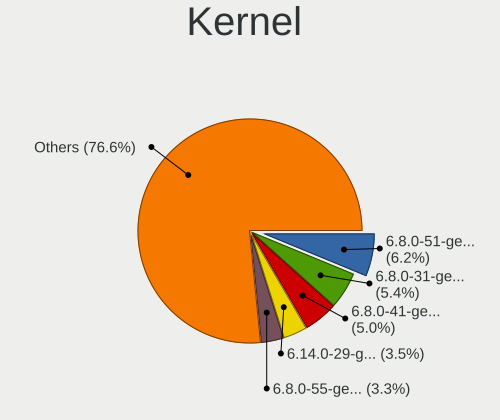

| Version           | Computers | Percent |
|-------------------|-----------|---------|
| 6.8.0-51-generic  | 30        | 6.22%   |
| 6.8.0-31-generic  | 26        | 5.39%   |
| 6.8.0-41-generic  | 24        | 4.98%   |
| 6.14.0-29-generic | 17        | 3.53%   |
| 6.8.0-55-generic  | 16        | 3.32%   |
| 6.8.0-49-generic  | 16        | 3.32%   |
| 6.8.0-60-generic  | 15        | 3.11%   |
| 6.8.0-59-generic  | 15        | 3.11%   |
| 6.8.0-52-generic  | 15        | 3.11%   |
| 6.8.0-45-generic  | 15        | 3.11%   |
| 6.11.0-26-generic | 14        | 2.9%    |
| 6.8.0-53-generic  | 12        | 2.49%   |
| 6.8.0-48-generic  | 12        | 2.49%   |
| 6.8.0-47-generic  | 12        | 2.49%   |
| 6.14.0-33-generic | 12        | 2.49%   |
| 6.8.0-36-generic  | 11        | 2.28%   |
| 6.8.0-40-generic  | 10        | 2.07%   |
| 6.14.0-36-generic | 10        | 2.07%   |
| 6.8.0-39-generic  | 9         | 1.87%   |
| 6.14.0-27-generic | 8         | 1.66%   |
| 6.14.0-35-generic | 7         | 1.45%   |
| 6.8.0-90-generic  | 6         | 1.24%   |
| 6.8.0-79-generic  | 6         | 1.24%   |
| 6.8.0-63-generic  | 6         | 1.24%   |
| 6.8.0-38-generic  | 6         | 1.24%   |
| 6.8.0-35-generic  | 6         | 1.24%   |
| 6.11.0-25-generic | 6         | 1.24%   |
| 6.11.0-19-generic | 6         | 1.24%   |
| 6.11.0-17-generic | 6         | 1.24%   |
| 6.8.0-88-generic  | 5         | 1.04%   |
| 6.8.0-87-generic  | 5         | 1.04%   |
| 6.8.0-86-generic  | 5         | 1.04%   |
| 6.8.0-85-generic  | 5         | 1.04%   |
| 6.8.0-71-generic  | 5         | 1.04%   |
| 6.8.0-58-generic  | 5         | 1.04%   |
| 6.8.0-44-generic  | 5         | 1.04%   |
| 6.14.0-37-generic | 5         | 1.04%   |
| 6.14.0-28-generic | 5         | 1.04%   |
| 6.11.0-29-generic | 5         | 1.04%   |
| 6.11.0-24-generic | 5         | 1.04%   |

Kernel Family
-------------

Linux kernel without a distro release

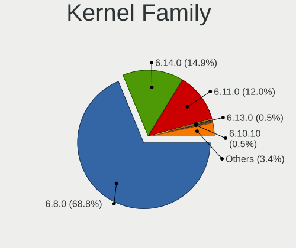

| Version | Computers | Percent |
|---------|-----------|---------|
| 6.8.0   | 304       | 68.78%  |
| 6.14.0  | 66        | 14.93%  |
| 6.11.0  | 53        | 11.99%  |
| 6.13.0  | 2         | 0.45%   |
| 6.10.10 | 2         | 0.45%   |
| 6.9.1   | 1         | 0.23%   |
| 6.9.0   | 1         | 0.23%   |
| 6.8.7   | 1         | 0.23%   |
| 6.6.0   | 1         | 0.23%   |
| 6.5.0   | 1         | 0.23%   |
| 6.4.0   | 1         | 0.23%   |
| 6.17.6  | 1         | 0.23%   |
| 6.12.3  | 1         | 0.23%   |
| 6.12.28 | 1         | 0.23%   |
| 6.12.0  | 1         | 0.23%   |
| 6.10.1  | 1         | 0.23%   |
| 6.10.0  | 1         | 0.23%   |
| 6.1.75  | 1         | 0.23%   |
| 6.1.43  | 1         | 0.23%   |
| 5.15.0  | 1         | 0.23%   |

Kernel Major Ver.
-----------------

Linux kernel major version

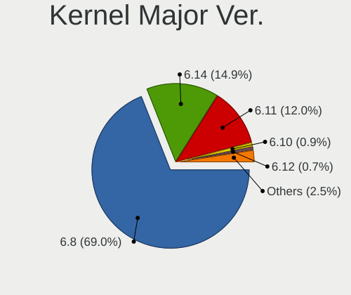

| Version | Computers | Percent |
|---------|-----------|---------|
| 6.8     | 305       | 69%     |
| 6.14    | 66        | 14.93%  |
| 6.11    | 53        | 11.99%  |
| 6.10    | 4         | 0.9%    |
| 6.12    | 3         | 0.68%   |
| 6.9     | 2         | 0.45%   |
| 6.13    | 2         | 0.45%   |
| 6.1     | 2         | 0.45%   |
| 6.6     | 1         | 0.23%   |
| 6.5     | 1         | 0.23%   |
| 6.4     | 1         | 0.23%   |
| 6.17    | 1         | 0.23%   |
| 5.15    | 1         | 0.23%   |

Arch
----

OS architecture (x86_64, i586, etc.)

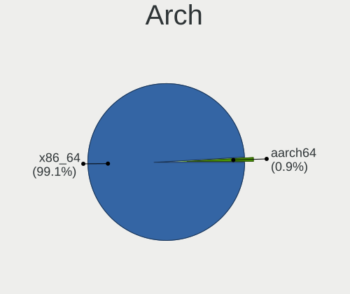

| Name    | Computers | Percent |
|---------|-----------|---------|
| x86_64  | 433       | 99.08%  |
| aarch64 | 4         | 0.92%   |

DE
--

Desktop Environment

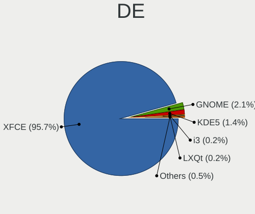

| Name            | Computers | Percent |
|-----------------|-----------|---------|
| XFCE            | 419       | 95.66%  |
| GNOME           | 9         | 2.05%   |
| KDE5            | 6         | 1.37%   |
| LXQt            | 1         | 0.23%   |
| i3              | 1         | 0.23%   |
| GNOME Flashback | 1         | 0.23%   |
| Budgie          | 1         | 0.23%   |

Display Server
--------------

X11 or Wayland

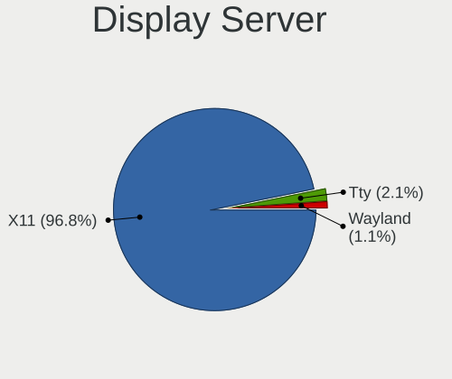

| Name    | Computers | Percent |
|---------|-----------|---------|
| X11     | 423       | 96.8%   |
| Tty     | 9         | 2.06%   |
| Wayland | 5         | 1.14%   |

Display Manager
---------------

SDDM, LightDM, etc.

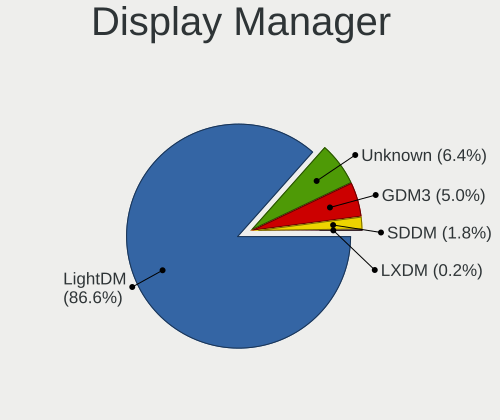

| Name    | Computers | Percent |
|---------|-----------|---------|
| LightDM | 380       | 86.56%  |
| Unknown | 28        | 6.38%   |
| GDM3    | 22        | 5.01%   |
| SDDM    | 8         | 1.82%   |
| LXDM    | 1         | 0.23%   |

OS Lang
-------

Language

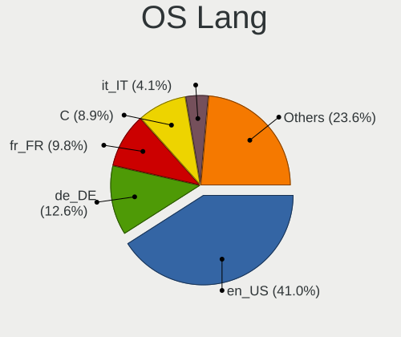

| Lang    | Computers | Percent |
|---------|-----------|---------|
| en_US   | 179       | 40.96%  |
| de_DE   | 55        | 12.59%  |
| fr_FR   | 43        | 9.84%   |
| C       | 39        | 8.92%   |
| it_IT   | 18        | 4.12%   |
| es_ES   | 17        | 3.89%   |
| en_GB   | 13        | 2.97%   |
| pt_BR   | 12        | 2.75%   |
| ru_RU   | 9         | 2.06%   |
| pl_PL   | 9         | 2.06%   |
| en_CA   | 6         | 1.37%   |
| cs_CZ   | 6         | 1.37%   |
| nl_NL   | 4         | 0.92%   |
| fr_CA   | 4         | 0.92%   |
| hu_HU   | 3         | 0.69%   |
| da_DK   | 3         | 0.69%   |
| zh_CN   | 2         | 0.46%   |
| es_AR   | 2         | 0.46%   |
| en_NZ   | 2         | 0.46%   |
| tr_TR   | 1         | 0.23%   |
| nl_BE   | 1         | 0.23%   |
| nb_NO   | 1         | 0.23%   |
| ja_JP   | 1         | 0.23%   |
| eu_ES   | 1         | 0.23%   |
| en_IE   | 1         | 0.23%   |
| en_AU   | 1         | 0.23%   |
| el_GR   | 1         | 0.23%   |
| de_CH   | 1         | 0.23%   |
| de_AT   | 1         | 0.23%   |
| Unknown | 1         | 0.23%   |

Boot Mode
---------

EFI or BIOS

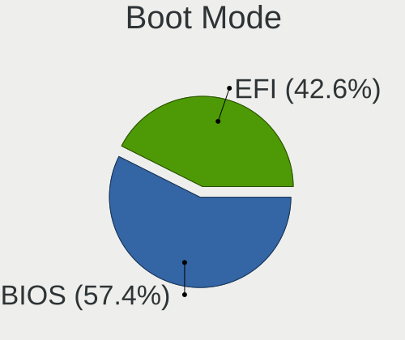

| Mode | Computers | Percent |
|------|-----------|---------|
| BIOS | 252       | 57.4%   |
| EFI  | 187       | 42.6%   |

Filesystem
----------

Type of filesystem

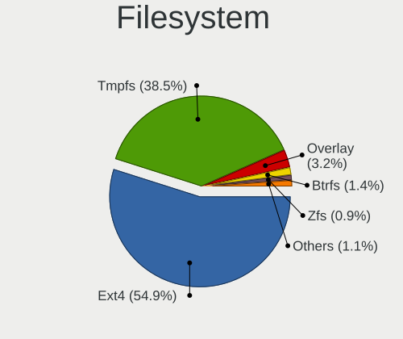

| Type    | Computers | Percent |
|---------|-----------|---------|
| Ext4    | 241       | 54.9%   |
| Tmpfs   | 169       | 38.5%   |
| Overlay | 14        | 3.19%   |
| Btrfs   | 6         | 1.37%   |
| Zfs     | 4         | 0.91%   |
| Xfs     | 4         | 0.91%   |
| Ext3    | 1         | 0.23%   |

Part. scheme
------------

Scheme of partitioning

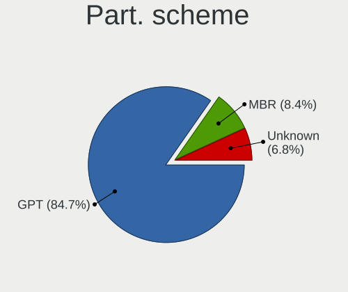

| Type    | Computers | Percent |
|---------|-----------|---------|
| GPT     | 371       | 84.7%   |
| MBR     | 37        | 8.45%   |
| Unknown | 30        | 6.85%   |

Dual Boot with Linux/BSD
------------------------

Hosting more than one Linux/BSD

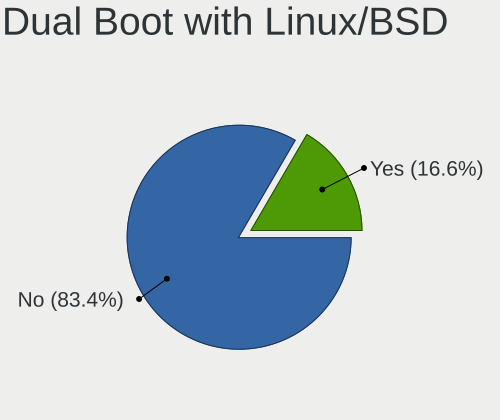

| Dual boot | Computers | Percent |
|-----------|-----------|---------|
| No        | 367       | 83.41%  |
| Yes       | 73        | 16.59%  |

Dual Boot (Win)
---------------

Hosting Linux and Windows

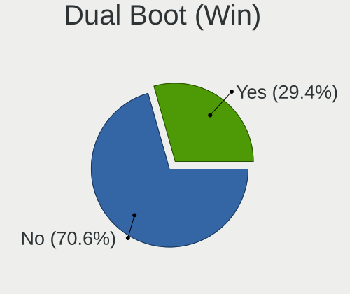

| Dual boot | Computers | Percent |
|-----------|-----------|---------|
| No        | 310       | 70.62%  |
| Yes       | 129       | 29.38%  |

Board
-----

Vendor
------

Motherboard manufacturer

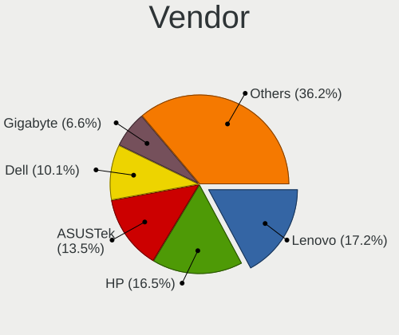

| Name                    | Computers | Percent |
|-------------------------|-----------|---------|
| Lenovo                  | 75        | 17.16%  |
| Hewlett-Packard         | 72        | 16.48%  |
| ASUSTek Computer        | 59        | 13.5%   |
| Dell                    | 44        | 10.07%  |
| Gigabyte Technology     | 29        | 6.64%   |
| Acer                    | 26        | 5.95%   |
| MSI                     | 18        | 4.12%   |
| Apple                   | 14        | 3.2%    |
| Unknown                 | 10        | 2.29%   |
| Intel                   | 9         | 2.06%   |
| Google                  | 8         | 1.83%   |
| ASRock                  | 7         | 1.6%    |
| Toshiba                 | 6         | 1.37%   |
| Samsung Electronics     | 4         | 0.92%   |
| Positivo                | 4         | 0.92%   |
| Notebook                | 4         | 0.92%   |
| Medion                  | 4         | 0.92%   |
| Fujitsu Siemens         | 4         | 0.92%   |
| Packard Bell            | 3         | 0.69%   |
| Haier                   | 3         | 0.69%   |
| AZW                     | 3         | 0.69%   |
| Pegatron                | 2         | 0.46%   |
| Foxconn                 | 2         | 0.46%   |
| Xunlong                 | 1         | 0.23%   |
| Wortmann AG             | 1         | 0.23%   |
| Vorke                   | 1         | 0.23%   |
| TUXEDO                  | 1         | 0.23%   |
| TongFang                | 1         | 0.23%   |
| System76                | 1         | 0.23%   |
| Sony                    | 1         | 0.23%   |
| Raspberry Pi Foundation | 1         | 0.23%   |
| PCWare                  | 1         | 0.23%   |
| MOXA                    | 1         | 0.23%   |
| MACHINIST               | 1         | 0.23%   |
| HUAWEI                  | 1         | 0.23%   |
| Huanan                  | 1         | 0.23%   |
| Hardkernel              | 1         | 0.23%   |
| GPU Company             | 1         | 0.23%   |
| GEEKOM                  | 1         | 0.23%   |
| Gateway                 | 1         | 0.23%   |

Model
-----

Motherboard model

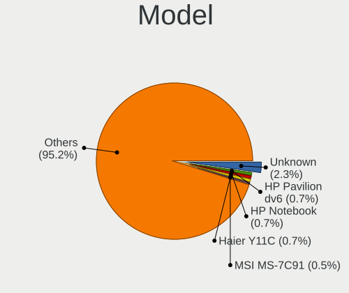

| Name                                     | Computers | Percent |
|------------------------------------------|-----------|---------|
| Unknown                                  | 10        | 2.29%   |
| HP Pavilion dv6                          | 3         | 0.69%   |
| HP Notebook                              | 3         | 0.69%   |
| Haier Y11C                               | 3         | 0.69%   |
| MSI MS-7C91                              | 2         | 0.46%   |
| Lenovo G50-30 80G0                       | 2         | 0.46%   |
| HP Pavilion 17                           | 2         | 0.46%   |
| HP G72                                   | 2         | 0.46%   |
| HP EliteDesk 705 G4 DM 65W (TAA)         | 2         | 0.46%   |
| HP EliteBook 2540p                       | 2         | 0.46%   |
| HP Compaq Pro 6300 SFF                   | 2         | 0.46%   |
| HP Compaq Elite 8300 SFF                 | 2         | 0.46%   |
| Gigabyte GA-78LMT-USB3 6.0               | 2         | 0.46%   |
| Dell Inspiron 5570                       | 2         | 0.46%   |
| AZW SER                                  | 2         | 0.46%   |
| ASUS VivoBook_ASUSLaptop X1704VA_X1704VA | 2         | 0.46%   |
| ASUS PRIME B550M-K                       | 2         | 0.46%   |
| ASUS P7P55D                              | 2         | 0.46%   |
| Apple MacBookPro9,2                      | 2         | 0.46%   |
| Apple MacBookPro9,1                      | 2         | 0.46%   |
| Apple MacBookPro11,4                     | 2         | 0.46%   |
| Xunlong Orange Pi 5 Plus                 | 1         | 0.23%   |
| Wortmann AG 1220695_1470205              | 1         | 0.23%   |
| Vorke V1 Plus                            | 1         | 0.23%   |
| TUXEDO InfinityBook Pro 15 v5            | 1         | 0.23%   |
| Toshiba TECRA A10                        | 1         | 0.23%   |
| Toshiba Satellite Pro C50-A-1C9          | 1         | 0.23%   |
| Toshiba Satellite P55W-C                 | 1         | 0.23%   |
| Toshiba Satellite L645                   | 1         | 0.23%   |
| Toshiba Satellite L300                   | 1         | 0.23%   |
| Toshiba Satellite C55-C                  | 1         | 0.23%   |
| TongFang GM7IX0N                         | 1         | 0.23%   |
| System76 Pangolin                        | 1         | 0.23%   |
| Sony VPCEH3S1E                           | 1         | 0.23%   |
| Samsung SR700                            | 1         | 0.23%   |
| Samsung RV411/RV511/E3511/S3511/RV711    | 1         | 0.23%   |
| Samsung Q210/P210                        | 1         | 0.23%   |
| Samsung 905S3G/906S3G/915S3G/9305SG      | 1         | 0.23%   |
| RPi Raspberry Pi                         | 1         | 0.23%   |
| Positivo W940TU-TV                       | 1         | 0.23%   |

Model Family
------------

Motherboard model prefix

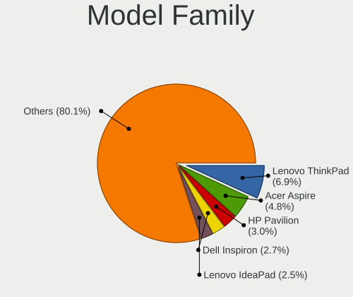

| Name                   | Computers | Percent |
|------------------------|-----------|---------|
| Lenovo ThinkPad        | 30        | 6.86%   |
| Acer Aspire            | 21        | 4.81%   |
| HP Pavilion            | 13        | 2.97%   |
| Dell Inspiron          | 12        | 2.75%   |
| Lenovo IdeaPad         | 11        | 2.52%   |
| Dell Latitude          | 11        | 2.52%   |
| ASUS VivoBook          | 11        | 2.52%   |
| HP EliteBook           | 10        | 2.29%   |
| Unknown                | 10        | 2.29%   |
| Lenovo ThinkCentre     | 9         | 2.06%   |
| HP ProBook             | 9         | 2.06%   |
| HP Compaq              | 9         | 2.06%   |
| Dell OptiPlex          | 8         | 1.83%   |
| ASUS PRIME             | 6         | 1.37%   |
| Toshiba Satellite      | 5         | 1.14%   |
| Lenovo Legion          | 5         | 1.14%   |
| ASUS TUF               | 5         | 1.14%   |
| HP Laptop              | 4         | 0.92%   |
| HP EliteDesk           | 4         | 0.92%   |
| Dell Precision         | 4         | 0.92%   |
| ASUS ROG               | 4         | 0.92%   |
| Apple MacBookPro9      | 4         | 0.92%   |
| HP Notebook            | 3         | 0.69%   |
| Haier Y11C             | 3         | 0.69%   |
| Gigabyte GA-78LMT-USB3 | 3         | 0.69%   |
| Fujitsu Siemens AMILO  | 3         | 0.69%   |
| Dell Vostro            | 3         | 0.69%   |
| Packard Bell IMEDIA    | 2         | 0.46%   |
| MSI MS-7C91            | 2         | 0.46%   |
| MSI GF63               | 2         | 0.46%   |
| Medion Akoya           | 2         | 0.46%   |
| Lenovo Yoga            | 2         | 0.46%   |
| Lenovo ThinkBook       | 2         | 0.46%   |
| Lenovo IdeaCentre      | 2         | 0.46%   |
| Lenovo G50-30          | 2         | 0.46%   |
| HP ProDesk             | 2         | 0.46%   |
| HP OMEN                | 2         | 0.46%   |
| HP G72                 | 2         | 0.46%   |
| HP ENVY                | 2         | 0.46%   |
| HP 260                 | 2         | 0.46%   |

MFG Year
--------

Motherboard manufacture year

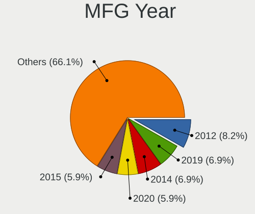

| Year    | Computers | Percent |
|---------|-----------|---------|
| 2012    | 36        | 8.24%   |
| 2019    | 30        | 6.86%   |
| 2014    | 30        | 6.86%   |
| 2020    | 26        | 5.95%   |
| 2015    | 26        | 5.95%   |
| 2013    | 26        | 5.95%   |
| 2023    | 25        | 5.72%   |
| 2018    | 25        | 5.72%   |
| 2022    | 24        | 5.49%   |
| 2010    | 24        | 5.49%   |
| 2017    | 23        | 5.26%   |
| 2021    | 22        | 5.03%   |
| 2024    | 21        | 4.81%   |
| 2011    | 21        | 4.81%   |
| 2008    | 21        | 4.81%   |
| 2009    | 19        | 4.35%   |
| 2016    | 18        | 4.12%   |
| 2007    | 8         | 1.83%   |
| 2025    | 7         | 1.6%    |
| Unknown | 5         | 1.14%   |

Form Factor
-----------

Physical design of the computer

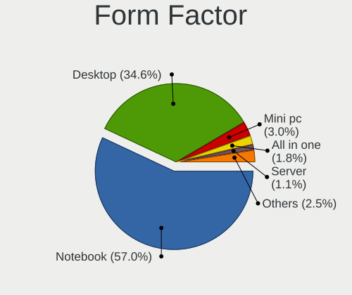

| Name           | Computers | Percent |
|----------------|-----------|---------|
| Notebook       | 249       | 56.98%  |
| Desktop        | 151       | 34.55%  |
| Mini pc        | 13        | 2.97%   |
| All in one     | 8         | 1.83%   |
| Server         | 5         | 1.14%   |
| System on chip | 4         | 0.92%   |
| Convertible    | 4         | 0.92%   |
| Tablet         | 3         | 0.69%   |

Secure Boot
-----------

Enabled or disabled

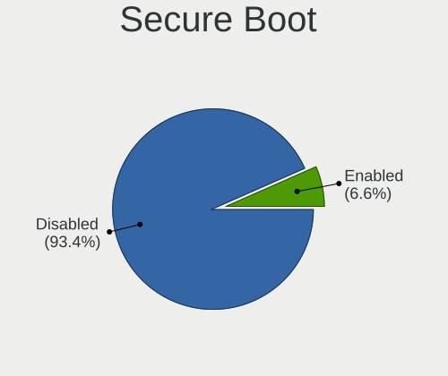

| State    | Computers | Percent |
|----------|-----------|---------|
| Disabled | 410       | 93.39%  |
| Enabled  | 29        | 6.61%   |

Coreboot
--------

Have coreboot on board

| Used | Computers | Percent |
|------|-----------|---------|
| No   | 429       | 98.17%  |
| Yes  | 8         | 1.83%   |

RAM Size
--------

Total RAM memory

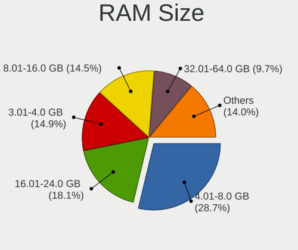

| Size in GB      | Computers | Percent |
|-----------------|-----------|---------|
| 4.01-8.0        | 127       | 28.73%  |
| 16.01-24.0      | 80        | 18.1%   |
| 3.01-4.0        | 66        | 14.93%  |
| 8.01-16.0       | 64        | 14.48%  |
| 32.01-64.0      | 43        | 9.73%   |
| 64.01-256.0     | 23        | 5.2%    |
| 2.01-3.0        | 12        | 2.71%   |
| 1.01-2.0        | 12        | 2.71%   |
| 24.01-32.0      | 11        | 2.49%   |
| More than 256.0 | 4         | 0.9%    |

RAM Used
--------

Used RAM memory

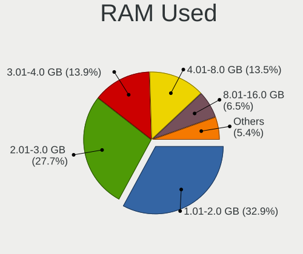

| Used GB    | Computers | Percent |
|------------|-----------|---------|
| 1.01-2.0   | 151       | 32.9%   |
| 2.01-3.0   | 127       | 27.67%  |
| 3.01-4.0   | 64        | 13.94%  |
| 4.01-8.0   | 62        | 13.51%  |
| 8.01-16.0  | 30        | 6.54%   |
| 0.51-1.0   | 20        | 4.36%   |
| 16.01-24.0 | 3         | 0.65%   |
| 32.01-64.0 | 1         | 0.22%   |
| 24.01-32.0 | 1         | 0.22%   |

Total Drives
------------

Number of drives on board

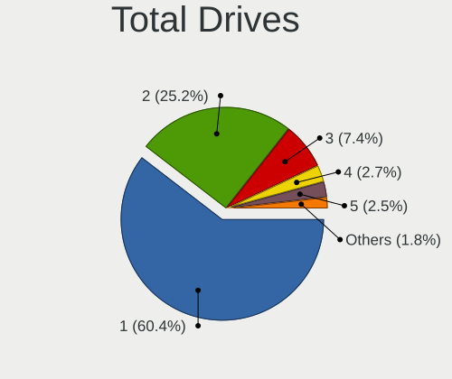

| Drives | Computers | Percent |
|--------|-----------|---------|
| 1      | 269       | 60.45%  |
| 2      | 112       | 25.17%  |
| 3      | 33        | 7.42%   |
| 4      | 12        | 2.7%    |
| 5      | 11        | 2.47%   |
| 6      | 3         | 0.67%   |
| 0      | 3         | 0.67%   |
| 8      | 1         | 0.22%   |
| 7      | 1         | 0.22%   |

Has CD-ROM
----------

Has CD-ROM on board

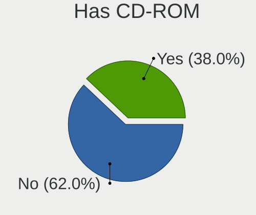

| Presented | Computers | Percent |
|-----------|-----------|---------|
| No        | 273       | 62.05%  |
| Yes       | 167       | 37.95%  |

Has Ethernet
------------

Has Ethernet on board

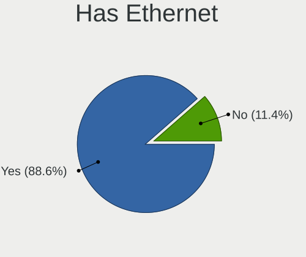

| Presented | Computers | Percent |
|-----------|-----------|---------|
| Yes       | 387       | 88.56%  |
| No        | 50        | 11.44%  |

Has WiFi
--------

Has WiFi module

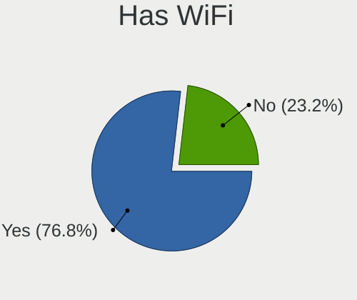

| Presented | Computers | Percent |
|-----------|-----------|---------|
| Yes       | 338       | 76.82%  |
| No        | 102       | 23.18%  |

Has Bluetooth
-------------

Has Bluetooth module

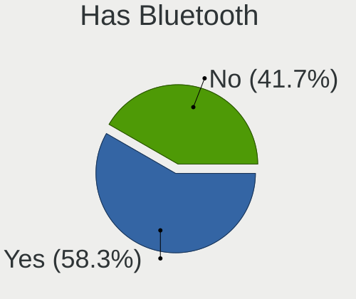

| Presented | Computers | Percent |
|-----------|-----------|---------|
| Yes       | 256       | 58.31%  |
| No        | 183       | 41.69%  |

Location
--------

Country
-------

Geographic location (country)

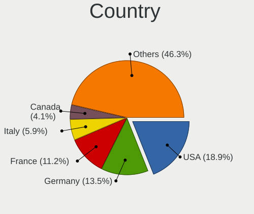

| Country         | Computers | Percent |
|-----------------|-----------|---------|
| USA             | 83        | 18.95%  |
| Germany         | 59        | 13.47%  |
| France          | 49        | 11.19%  |
| Italy           | 26        | 5.94%   |
| Canada          | 18        | 4.11%   |
| Spain           | 17        | 3.88%   |
| UK              | 16        | 3.65%   |
| Brazil          | 15        | 3.42%   |
| Poland          | 14        | 3.2%    |
| Russia          | 13        | 2.97%   |
| Austria         | 9         | 2.05%   |
| Czechia         | 8         | 1.83%   |
| Australia       | 8         | 1.83%   |
| Argentina       | 8         | 1.83%   |
| India           | 6         | 1.37%   |
| Pakistan        | 5         | 1.14%   |
| Norway          | 5         | 1.14%   |
| New Zealand     | 5         | 1.14%   |
| Netherlands     | 5         | 1.14%   |
| Ukraine         | 4         | 0.91%   |
| The Netherlands | 4         | 0.91%   |
| Switzerland     | 4         | 0.91%   |
| Bulgaria        | 4         | 0.91%   |
| Belgium         | 4         | 0.91%   |
| Sweden          | 3         | 0.68%   |
| Hungary         | 3         | 0.68%   |
| Vietnam         | 2         | 0.46%   |
| Serbia          | 2         | 0.46%   |
| Romania         | 2         | 0.46%   |
| Portugal        | 2         | 0.46%   |
| Peru            | 2         | 0.46%   |
| Mexico          | 2         | 0.46%   |
| Isle of Man     | 2         | 0.46%   |
| Indonesia       | 2         | 0.46%   |
| Greece          | 2         | 0.46%   |
| Faroe Islands   | 2         | 0.46%   |
| Denmark         | 2         | 0.46%   |
| Croatia         | 2         | 0.46%   |
| China           | 2         | 0.46%   |
| Algeria         | 2         | 0.46%   |

City
----

Geographic location (city)

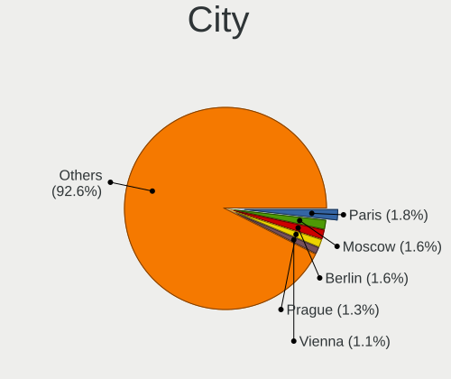

| City          | Computers | Percent |
|---------------|-----------|---------|
| Paris         | 8         | 1.8%    |
| Moscow        | 7         | 1.57%   |
| Berlin        | 7         | 1.57%   |
| Prague        | 6         | 1.35%   |
| Vienna        | 5         | 1.12%   |
| Warsaw        | 3         | 0.67%   |
| Sofia         | 3         | 0.67%   |
| Reutlingen    | 3         | 0.67%   |
| Padova        | 3         | 0.67%   |
| Melbourne     | 3         | 0.67%   |
| Madrid        | 3         | 0.67%   |
| Lviv          | 3         | 0.67%   |
| Karachi       | 3         | 0.67%   |
| Hanover       | 3         | 0.67%   |
| Hamburg       | 3         | 0.67%   |
| Villach       | 2         | 0.45%   |
| Traverse City | 2         | 0.45%   |
| Tórshavn     | 2         | 0.45%   |
| Thunder Bay   | 2         | 0.45%   |
| Sydney        | 2         | 0.45%   |
| Stuttgart     | 2         | 0.45%   |
| Sao Paulo     | 2         | 0.45%   |
| Rochester     | 2         | 0.45%   |
| Ramsey        | 2         | 0.45%   |
| Pescara       | 2         | 0.45%   |
| Nuremberg     | 2         | 0.45%   |
| Neuruppin     | 2         | 0.45%   |
| Mostoles      | 2         | 0.45%   |
| Mississauga   | 2         | 0.45%   |
| Milan         | 2         | 0.45%   |
| Louisville    | 2         | 0.45%   |
| Longueuil     | 2         | 0.45%   |
| Lima          | 2         | 0.45%   |
| Leland        | 2         | 0.45%   |
| Le Mans       | 2         | 0.45%   |
| Krakow        | 2         | 0.45%   |
| Houston       | 2         | 0.45%   |
| Greifswald    | 2         | 0.45%   |
| Cologne       | 2         | 0.45%   |
| Christchurch  | 2         | 0.45%   |

Drives
------

Drive Vendor
------------

Hard drive vendors

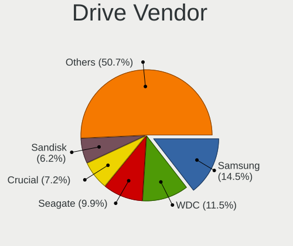

| Vendor                      | Computers | Drives | Percent |
|-----------------------------|-----------|--------|---------|
| Samsung Electronics         | 91        | 122    | 14.51%  |
| WDC                         | 72        | 94     | 11.48%  |
| Seagate                     | 62        | 79     | 9.89%   |
| Crucial                     | 45        | 51     | 7.18%   |
| Sandisk                     | 39        | 51     | 6.22%   |
| Kingston                    | 38        | 42     | 6.06%   |
| Toshiba                     | 34        | 41     | 5.42%   |
| Unknown                     | 25        | 26     | 3.99%   |
| SK hynix                    | 19        | 21     | 3.03%   |
| Hitachi                     | 16        | 27     | 2.55%   |
| HGST                        | 13        | 28     | 2.07%   |
| Micron Technology           | 11        | 11     | 1.75%   |
| China                       | 9         | 10     | 1.44%   |
| Patriot                     | 8         | 8      | 1.28%   |
| KIOXIA                      | 7         | 7      | 1.12%   |
| Intenso                     | 7         | 7      | 1.12%   |
| Apple                       | 7         | 7      | 1.12%   |
| PNY                         | 6         | 9      | 0.96%   |
| Lexar                       | 6         | 7      | 0.96%   |
| Intel                       | 6         | 10     | 0.96%   |
| Transcend                   | 5         | 5      | 0.8%    |
| SPCC                        | 5         | 5      | 0.8%    |
| Phison Electronics          | 5         | 5      | 0.8%    |
| MAXIO Technology (Hangzhou) | 5         | 5      | 0.8%    |
| Kingston Technology Company | 5         | 6      | 0.8%    |
| Phison                      | 4         | 9      | 0.64%   |
| JMicron Technology          | 4         | 7      | 0.64%   |
| A-DATA Technology           | 4         | 6      | 0.64%   |
| Vi550                       | 3         | 4      | 0.48%   |
| Team                        | 3         | 3      | 0.48%   |
| Fujitsu                     | 3         | 6      | 0.48%   |
| ADATA Technology            | 3         | 3      | 0.48%   |
| UMIS                        | 2         | 3      | 0.32%   |
| Micron/Crucial Technology   | 2         | 3      | 0.32%   |
| LITEON                      | 2         | 3      | 0.32%   |
| LDLC                        | 2         | 2      | 0.32%   |
| HPE                         | 2         | 2      | 0.32%   |
| GOODRAM                     | 2         | 3      | 0.32%   |
| FORESEE                     | 2         | 2      | 0.32%   |
| Apacer                      | 2         | 2      | 0.32%   |

Drive Model
-----------

Hard drive models

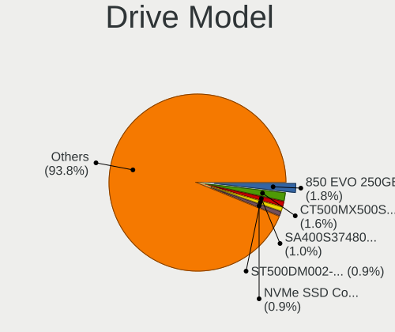

| Model                                             | Computers | Percent |
|---------------------------------------------------|-----------|---------|
| Samsung SSD 850 EVO 250GB                         | 12        | 1.76%   |
| Crucial CT500MX500SSD1 500GB                      | 11        | 1.62%   |
| Kingston SA400S37480G 480GB SSD                   | 7         | 1.03%   |
| Seagate ST500DM002-1BD142 500GB                   | 6         | 0.88%   |
| Samsung NVMe SSD Controller SM981/PM981/PM983 1TB | 6         | 0.88%   |
| Kingston SA400S37240G 240GB SSD                   | 6         | 0.88%   |
| Toshiba MQ01ABD100 1TB                            | 5         | 0.74%   |
| Seagate ST1000DM003-1CH162 1TB                    | 5         | 0.74%   |
| Seagate ST1000LM035-1RK172 1TB                    | 4         | 0.59%   |
| SanDisk NVMe SSD Drive 1TB                        | 4         | 0.59%   |
| Samsung SSD 840 EVO 250GB                         | 4         | 0.59%   |
| Crucial CT480BX500SSD1 480GB                      | 4         | 0.59%   |
| Crucial CT1000MX500SSD1 1TB                       | 4         | 0.59%   |
| Crucial CT1000BX500SSD1 1TB                       | 4         | 0.59%   |
| WDC WDS500G2B0A-00SM50 500GB                      | 3         | 0.44%   |
| WDC WDBNCE0010PNC 1TB SSD                         | 3         | 0.44%   |
| Unknown MMC Card  32GB                            | 3         | 0.44%   |
| Unknown MMC Card  128GB                           | 3         | 0.44%   |
| Toshiba MQ04ABF100 1TB                            | 3         | 0.44%   |
| Toshiba MQ01ABD050 500GB                          | 3         | 0.44%   |
| Seagate ST500LT012-1DG142 500GB                   | 3         | 0.44%   |
| Seagate ST4000DM004-2CV104 4TB                    | 3         | 0.44%   |
| Sandisk WD_BLACK SN770 2TB                        | 3         | 0.44%   |
| Samsung SSD 860 EVO 500GB                         | 3         | 0.44%   |
| Samsung SSD 850 EVO 500GB                         | 3         | 0.44%   |
| HGST HTS541010B7E610 1TB                          | 3         | 0.44%   |
| HGST HTS541010A9E680 1TB                          | 3         | 0.44%   |
| WDC WDS500G2B0A 500GB SSD                         | 2         | 0.29%   |
| WDC WD20PURX-64PFUY0 2TB                          | 2         | 0.29%   |
| WDC WD20EZRZ-00Z5HB0 2TB                          | 2         | 0.29%   |
| WDC WD20EARS-60MVWB0 2TB                          | 2         | 0.29%   |
| WDC WD10JPVT-00A1YT0 1TB                          | 2         | 0.29%   |
| WDC WD10EACS-00D6B0 1TB                           | 2         | 0.29%   |
| Vi550 S3 SSD 2TB                                  | 2         | 0.29%   |
| Unknown SD32G  32GB                               | 2         | 0.29%   |
| Unknown SD/MMC/MS PRO 2GB                         | 2         | 0.29%   |
| Unknown NVMe SSD Drive 512GB                      | 2         | 0.29%   |
| Unknown MMC Card  64GB                            | 2         | 0.29%   |
| Unknown External 2TB                              | 2         | 0.29%   |
| Toshiba MQ01ABF050 500GB                          | 2         | 0.29%   |

HDD Vendor
----------

Hard disk drive vendors

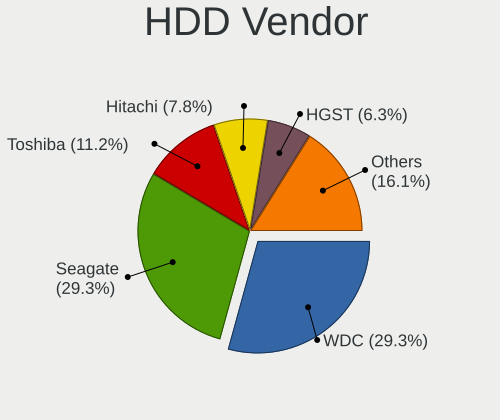

| Vendor              | Computers | Drives | Percent |
|---------------------|-----------|--------|---------|
| WDC                 | 60        | 78     | 29.27%  |
| Seagate             | 60        | 77     | 29.27%  |
| Toshiba             | 23        | 27     | 11.22%  |
| Hitachi             | 16        | 27     | 7.8%    |
| HGST                | 13        | 28     | 6.34%   |
| Samsung Electronics | 8         | 9      | 3.9%    |
| Unknown             | 4         | 4      | 1.95%   |
| Fujitsu             | 3         | 6      | 1.46%   |
| Apple               | 3         | 3      | 1.46%   |
| JMicron Technology  | 2         | 5      | 0.98%   |
| Intenso             | 2         | 2      | 0.98%   |
| HPE                 | 2         | 2      | 0.98%   |
| Synology            | 1         | 2      | 0.49%   |
| Shenzhen            | 1         | 1      | 0.49%   |
| SABRENT             | 1         | 1      | 0.49%   |
| OEM                 | 1         | 1      | 0.49%   |
| MaxDigital          | 1         | 1      | 0.49%   |
| Inateck             | 1         | 1      | 0.49%   |
| IBM-ESXS            | 1         | 4      | 0.49%   |
| External            | 1         | 2      | 0.49%   |
| China               | 1         | 1      | 0.49%   |

SSD Vendor
----------

Solid state drive vendors

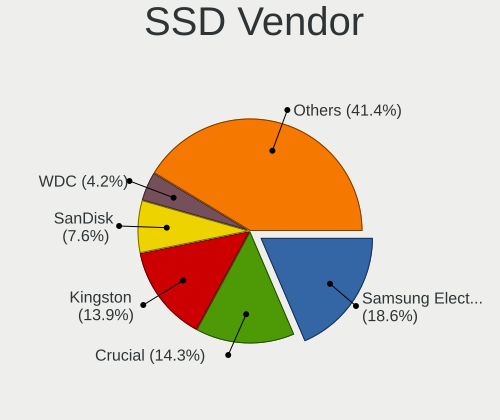

| Vendor              | Computers | Drives | Percent |
|---------------------|-----------|--------|---------|
| Samsung Electronics | 44        | 51     | 18.57%  |
| Crucial             | 34        | 39     | 14.35%  |
| Kingston            | 33        | 34     | 13.92%  |
| SanDisk             | 18        | 26     | 7.59%   |
| WDC                 | 10        | 10     | 4.22%   |
| China               | 7         | 8      | 2.95%   |
| PNY                 | 6         | 8      | 2.53%   |
| Micron Technology   | 6         | 6      | 2.53%   |
| Transcend           | 5         | 5      | 2.11%   |
| Patriot             | 5         | 5      | 2.11%   |
| Lexar               | 5         | 6      | 2.11%   |
| Intenso             | 5         | 5      | 2.11%   |
| Toshiba             | 4         | 4      | 1.69%   |
| SPCC                | 4         | 4      | 1.69%   |
| SK hynix            | 4         | 4      | 1.69%   |
| Apple               | 4         | 4      | 1.69%   |
| A-DATA Technology   | 4         | 6      | 1.69%   |
| Vi550               | 3         | 4      | 1.27%   |
| Team                | 3         | 3      | 1.27%   |
| LITEON              | 2         | 3      | 0.84%   |
| LDLC                | 2         | 2      | 0.84%   |
| Intel               | 2         | 5      | 0.84%   |
| GOODRAM             | 2         | 3      | 0.84%   |
| FORESEE             | 2         | 2      | 0.84%   |
| Apacer              | 2         | 2      | 0.84%   |
| ValueTech           | 1         | 1      | 0.42%   |
| SSK Port            | 1         | 1      | 0.42%   |
| Seagate             | 1         | 1      | 0.42%   |
| SATA SSD            | 1         | 1      | 0.42%   |
| Phison              | 1         | 1      | 0.42%   |
| OCZ                 | 1         | 1      | 0.42%   |
| Netac               | 1         | 1      | 0.42%   |
| LITEONIT            | 1         | 1      | 0.42%   |
| Lexar 51            | 1         | 1      | 0.42%   |
| KIOXIA-EXCERIA      | 1         | 1      | 0.42%   |
| KingSpec            | 1         | 1      | 0.42%   |
| Integral            | 1         | 1      | 0.42%   |
| INNOVATION IT       | 1         | 1      | 0.42%   |
| HUSKY               | 1         | 2      | 0.42%   |
| HOGE                | 1         | 1      | 0.42%   |

Drive Kind
----------

HDD or SSD

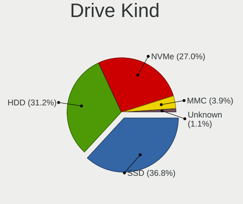

| Kind    | Computers | Drives | Percent |
|---------|-----------|--------|---------|
| SSD     | 210       | 271    | 36.84%  |
| HDD     | 178       | 282    | 31.23%  |
| NVMe    | 154       | 212    | 27.02%  |
| MMC     | 22        | 23     | 3.86%   |
| Unknown | 6         | 6      | 1.05%   |

Drive Connector
---------------

SATA, SAS, NVMe, etc.

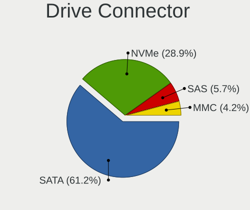

| Type | Computers | Drives | Percent |
|------|-----------|--------|---------|
| SATA | 324       | 514    | 61.25%  |
| NVMe | 153       | 210    | 28.92%  |
| SAS  | 30        | 47     | 5.67%   |
| MMC  | 22        | 23     | 4.16%   |

Drive Size
----------

Size of hard drive

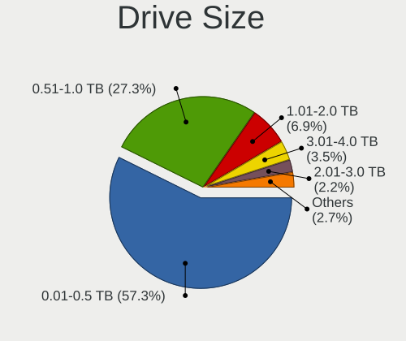

| Size in TB | Computers | Drives | Percent |
|------------|-----------|--------|---------|
| 0.01-0.5   | 231       | 311    | 57.32%  |
| 0.51-1.0   | 110       | 149    | 27.3%   |
| 1.01-2.0   | 28        | 37     | 6.95%   |
| 3.01-4.0   | 14        | 20     | 3.47%   |
| 2.01-3.0   | 9         | 23     | 2.23%   |
| 4.01-10.0  | 5         | 7      | 1.24%   |
| 10.01-20.0 | 4         | 4      | 0.99%   |
| 20.01-50.0 | 2         | 2      | 0.5%    |

Space Total
-----------

Amount of disk space available on the file system

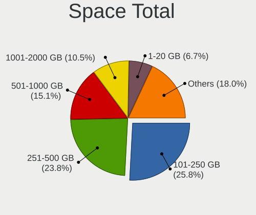

| Size in GB     | Computers | Percent |
|----------------|-----------|---------|
| 101-250        | 116       | 25.84%  |
| 251-500        | 107       | 23.83%  |
| 501-1000       | 68        | 15.14%  |
| 1001-2000      | 47        | 10.47%  |
| 1-20           | 30        | 6.68%   |
| 51-100         | 26        | 5.79%   |
| More than 3000 | 23        | 5.12%   |
| 21-50          | 16        | 3.56%   |
| 2001-3000      | 13        | 2.9%    |
| Unknown        | 3         | 0.67%   |

Space Used
----------

Amount of used disk space

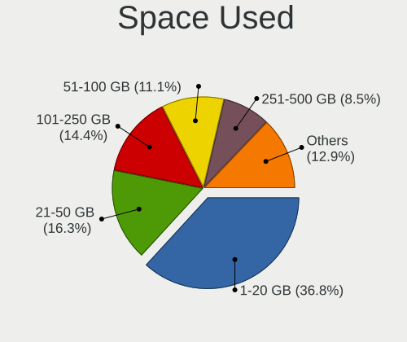

| Used GB        | Computers | Percent |
|----------------|-----------|---------|
| 1-20           | 169       | 36.82%  |
| 21-50          | 75        | 16.34%  |
| 101-250        | 66        | 14.38%  |
| 51-100         | 51        | 11.11%  |
| 251-500        | 39        | 8.5%    |
| 501-1000       | 29        | 6.32%   |
| More than 3000 | 12        | 2.61%   |
| 1001-2000      | 12        | 2.61%   |
| 2001-3000      | 3         | 0.65%   |
| Unknown        | 3         | 0.65%   |

Malfunc. Drives
---------------

Drive models with a malfunction

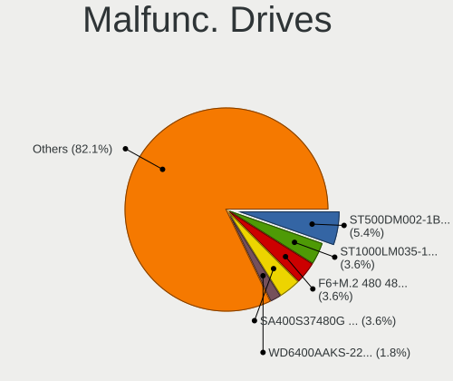

| Model                                          | Computers | Drives | Percent |
|------------------------------------------------|-----------|--------|---------|
| Seagate ST500DM002-1BD142 500GB                | 3         | 3      | 5.36%   |
| Seagate ST1000LM035-1RK172 1TB                 | 2         | 2      | 3.57%   |
| LDLC F6+M.2 480 480GB SSD                      | 2         | 2      | 3.57%   |
| Kingston SA400S37480G 480GB SSD                | 2         | 2      | 3.57%   |
| WDC WD6400AAKS-22A7B2 640GB                    | 1         | 1      | 1.79%   |
| WDC WD6400AACS-00G8B1 640GB                    | 1         | 1      | 1.79%   |
| WDC WD5000AAKX-00ERMA0 500GB                   | 1         | 1      | 1.79%   |
| WDC WD40EZRZ-00WN9B0 4TB                       | 1         | 1      | 1.79%   |
| WDC WD2500AAKX-08U6AA0 250GB                   | 1         | 1      | 1.79%   |
| WDC WD2003FYYS-05T9B0 2TB                      | 1         | 1      | 1.79%   |
| WDC WD1601ABYS-18C0A0 160GB                    | 1         | 1      | 1.79%   |
| WDC WD10PURX-64E5EY0 1TB                       | 1         | 2      | 1.79%   |
| WDC WD1002FAEX-00Z3A0 1TB                      | 1         | 1      | 1.79%   |
| WDC WD Blue SA510 2.5 500GB                    | 1         | 1      | 1.79%   |
| Toshiba MQ01ABD050 500GB                       | 1         | 1      | 1.79%   |
| Toshiba MK3261GSYN 320GB                       | 1         | 1      | 1.79%   |
| Toshiba HDWD130 3TB                            | 1         | 1      | 1.79%   |
| Seagate ST9250410AS 250GB                      | 1         | 1      | 1.79%   |
| Seagate ST9160827AS 160GB                      | 1         | 1      | 1.79%   |
| Seagate ST500LM000-1EJ162 500GB                | 1         | 1      | 1.79%   |
| Seagate ST3500418AS 500GB                      | 1         | 1      | 1.79%   |
| Seagate ST320LT007-9ZV142 320GB                | 1         | 1      | 1.79%   |
| Seagate ST3000NC000-1CX166 3TB                 | 1         | 1      | 1.79%   |
| Seagate ST16000NE000-2RW103 16TB               | 1         | 1      | 1.79%   |
| Seagate ST1000LX015-1U7172 1TB                 | 1         | 1      | 1.79%   |
| Seagate ST1000DM003-9YN162 1TB                 | 1         | 1      | 1.79%   |
| Seagate ST1000DM003-1CH162 1TB                 | 1         | 1      | 1.79%   |
| SanDisk SSD i100 32GB                          | 1         | 1      | 1.79%   |
| SanDisk SD6SN1M-256G-1006 256GB SSD            | 1         | 1      | 1.79%   |
| Samsung Electronics SSD 870 EVO 1TB            | 1         | 1      | 1.79%   |
| Samsung Electronics SP2004C 200GB              | 1         | 1      | 1.79%   |
| Samsung Electronics MZVL22T0HBLB-00BL7 2TB     | 1         | 1      | 1.79%   |
| Samsung Electronics HM321HI 320GB              | 1         | 1      | 1.79%   |
| Samsung Electronics HD322HJ 320GB              | 1         | 1      | 1.79%   |
| OCZ VERTEX4 256GB SSD                          | 1         | 1      | 1.79%   |
| Netac SSD 512GB                                | 1         | 1      | 1.79%   |
| Micron Technology 1100_MTFDDAV512TBN 512GB SSD | 1         | 1      | 1.79%   |
| Kingston SKC600512G 512GB SSD                  | 1         | 1      | 1.79%   |
| Kingston SKC6001024G 1TB SSD                   | 1         | 1      | 1.79%   |
| Kingston SA400S37240G 240GB SSD                | 1         | 1      | 1.79%   |

Malfunc. Drive Vendor
---------------------

Vendors of faulty drives

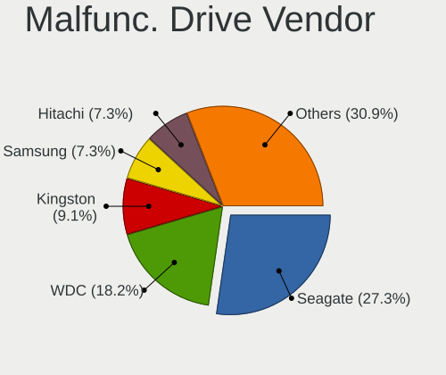

| Vendor              | Computers | Drives | Percent |
|---------------------|-----------|--------|---------|
| Seagate             | 15        | 15     | 27.27%  |
| WDC                 | 10        | 11     | 18.18%  |
| Kingston            | 5         | 5      | 9.09%   |
| Samsung Electronics | 4         | 5      | 7.27%   |
| Hitachi             | 4         | 4      | 7.27%   |
| Toshiba             | 3         | 3      | 5.45%   |
| SanDisk             | 2         | 2      | 3.64%   |
| LDLC                | 2         | 2      | 3.64%   |
| HGST                | 2         | 3      | 3.64%   |
| OCZ                 | 1         | 1      | 1.82%   |
| Netac               | 1         | 1      | 1.82%   |
| Micron Technology   | 1         | 1      | 1.82%   |
| China               | 1         | 1      | 1.82%   |
| Apple               | 1         | 1      | 1.82%   |
| Apacer              | 1         | 1      | 1.82%   |
| ADATA Technology    | 1         | 1      | 1.82%   |
| Acer                | 1         | 1      | 1.82%   |

Malfunc. HDD Vendor
-------------------

Vendors of faulty HDD drives

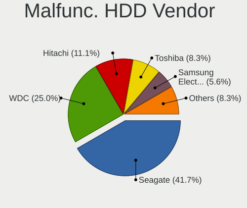

| Vendor              | Computers | Drives | Percent |
|---------------------|-----------|--------|---------|
| Seagate             | 15        | 15     | 41.67%  |
| WDC                 | 9         | 10     | 25%     |
| Hitachi             | 4         | 4      | 11.11%  |
| Toshiba             | 3         | 3      | 8.33%   |
| Samsung Electronics | 2         | 3      | 5.56%   |
| HGST                | 2         | 3      | 5.56%   |
| Apple               | 1         | 1      | 2.78%   |

Malfunc. Drive Kind
-------------------

Kinds of faulty drives

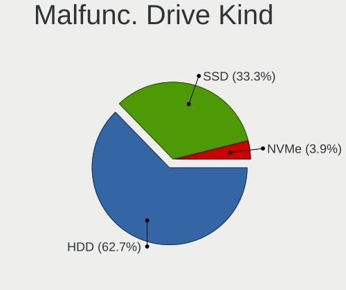

| Kind | Computers | Drives | Percent |
|------|-----------|--------|---------|
| HDD  | 32        | 39     | 62.75%  |
| SSD  | 17        | 17     | 33.33%  |
| NVMe | 2         | 2      | 3.92%   |

Failed Drives
-------------

Failed drive models

Zero info for selected period =(

Failed Drive Vendor
-------------------

Failed drive vendors

Zero info for selected period =(

Drive Status
------------

Number of failed and malfunc. drives

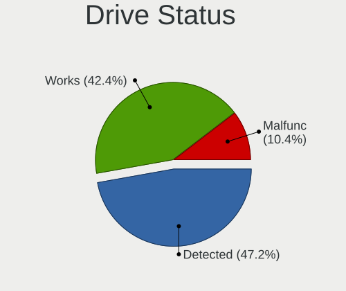

| Status   | Computers | Drives | Percent |
|----------|-----------|--------|---------|
| Detected | 227       | 400    | 47.19%  |
| Works    | 204       | 336    | 42.41%  |
| Malfunc  | 50        | 58     | 10.4%   |

Storage controller
------------------

Storage Vendor
--------------

Storage controller vendors

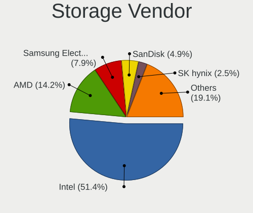

| Vendor                           | Computers | Percent |
|----------------------------------|-----------|---------|
| Intel                            | 286       | 51.44%  |
| AMD                              | 79        | 14.21%  |
| Samsung Electronics              | 44        | 7.91%   |
| SanDisk                          | 27        | 4.86%   |
| SK hynix                         | 14        | 2.52%   |
| Micron/Crucial Technology        | 13        | 2.34%   |
| Kingston Technology Company      | 12        | 2.16%   |
| Phison Electronics               | 10        | 1.8%    |
| Toshiba America Info Systems     | 7         | 1.26%   |
| MAXIO Technology (Hangzhou)      | 7         | 1.26%   |
| KIOXIA                           | 7         | 1.26%   |
| Micron Technology                | 6         | 1.08%   |
| JMicron Technology               | 6         | 1.08%   |
| Nvidia                           | 5         | 0.9%    |
| Marvell Technology Group         | 4         | 0.72%   |
| ADATA Technology                 | 4         | 0.72%   |
| Broadcom / LSI                   | 3         | 0.54%   |
| ASMedia Technology               | 3         | 0.54%   |
| Union Memory (Shenzhen)          | 2         | 0.36%   |
| Silicon Motion                   | 2         | 0.36%   |
| Silicon Integrated Systems [SiS] | 2         | 0.36%   |
| Realtek Semiconductor            | 2         | 0.36%   |
| Hosin Global Electronics         | 2         | 0.36%   |
| VIA Technologies                 | 1         | 0.18%   |
| Solidigm                         | 1         | 0.18%   |
| Solid State Storage Technology   | 1         | 0.18%   |
| Shenzhen Wodposit Electronics    | 1         | 0.18%   |
| Shenzhen Longsys Electronics     | 1         | 0.18%   |
| LSI Logic / Symbios Logic        | 1         | 0.18%   |
| Lenovo                           | 1         | 0.18%   |
| Integrated Technology Express    | 1         | 0.18%   |
| HighPoint Technologies           | 1         | 0.18%   |

Storage Model
-------------

Storage controller models

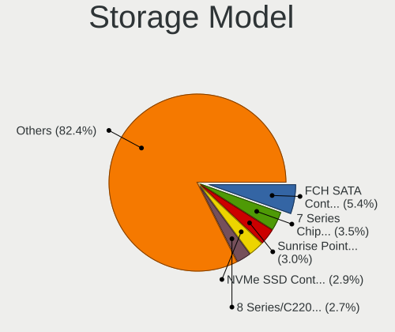

| Model                                                                            | Computers | Percent |
|----------------------------------------------------------------------------------|-----------|---------|
| AMD FCH SATA Controller [AHCI mode]                                              | 34        | 5.44%   |
| Intel 7 Series Chipset Family 6-port SATA Controller [AHCI mode]                 | 22        | 3.52%   |
| Intel Sunrise Point-LP SATA Controller [AHCI mode]                               | 19        | 3.04%   |
| Samsung NVMe SSD Controller SM981/PM981/PM983                                    | 18        | 2.88%   |
| Intel 8 Series/C220 Series Chipset Family 6-port SATA Controller 1 [AHCI mode]   | 17        | 2.72%   |
| Intel 82801IBM/IEM (ICH9M/ICH9M-E) 4 port SATA Controller [AHCI mode]            | 15        | 2.4%    |
| Intel Atom Processor E3800 Series SATA AHCI Controller                           | 14        | 2.24%   |
| AMD SB7x0/SB8x0/SB9x0 SATA Controller [AHCI mode]                                | 13        | 2.08%   |
| AMD SB7x0/SB8x0/SB9x0 IDE Controller                                             | 13        | 2.08%   |
| Intel 6 Series/C200 Series Chipset Family 6 port Desktop SATA AHCI Controller    | 12        | 1.92%   |
| AMD 500 Series Chipset SATA Controller                                           | 12        | 1.92%   |
| Intel Q170/Q150/B150/H170/H110/Z170/CM236 Chipset SATA Controller [AHCI Mode]    | 11        | 1.76%   |
| SanDisk WD SN560/SN740/SN770/SN5000 NVMe SSD                                     | 10        | 1.6%    |
| Intel Volume Management Device NVMe RAID Controller                              | 10        | 1.6%    |
| Intel 82801 Mobile SATA Controller [RAID mode]                                   | 10        | 1.6%    |
| Intel 7 Series/C210 Series Chipset Family 6-port SATA Controller [AHCI mode]     | 10        | 1.6%    |
| Intel Comet Lake SATA AHCI Controller                                            | 9         | 1.44%   |
| Intel 8 Series SATA Controller 1 [AHCI mode]                                     | 9         | 1.44%   |
| AMD 600 Series Chipset SATA Controller                                           | 9         | 1.44%   |
| Samsung NVMe SSD Controller PM9A1/PM9A3/980PRO                                   | 8         | 1.28%   |
| Samsung NVMe SSD Controller 980 (DRAM-less)                                      | 8         | 1.28%   |
| Intel SATA Controller [RAID mode]                                                | 8         | 1.28%   |
| Intel Cannon Lake Mobile PCH SATA AHCI Controller                                | 8         | 1.28%   |
| Intel 6 Series/C200 Series Chipset Family 6 port Mobile SATA AHCI Controller     | 8         | 1.28%   |
| Intel 5 Series/3400 Series Chipset 4 port SATA AHCI Controller                   | 8         | 1.28%   |
| Intel Wildcat Point-LP SATA Controller [AHCI Mode]                               | 7         | 1.12%   |
| Intel Tiger Lake-LP SATA Controller                                              | 7         | 1.12%   |
| Intel Cannon Lake PCH SATA AHCI Controller                                       | 6         | 0.96%   |
| Intel 5 Series/3400 Series Chipset 6 port SATA AHCI Controller                   | 6         | 0.96%   |
| AMD SB7x0/SB8x0/SB9x0 SATA Controller [IDE mode]                                 | 6         | 0.96%   |
| SK hynix Gold P31/BC711/PC711 NVMe Solid State Drive                             | 5         | 0.8%    |
| SK hynix BC901 NVMe Solid State Drive (DRAM-less)                                | 5         | 0.8%    |
| Micron/Crucial P2 [Nick P2] / P3 / P3 Plus NVMe PCIe SSD (DRAM-less)             | 5         | 0.8%    |
| MAXIO (Hangzhou) NVMe SSD Controller MAP1202 (DRAM-less)                         | 5         | 0.8%    |
| KIOXIA NVMe SSD Controller BG5 (DRAM-less)                                       | 5         | 0.8%    |
| Intel Celeron/Pentium Silver Processor SATA Controller                           | 5         | 0.8%    |
| Intel 82801HM/HEM (ICH8M/ICH8M-E) IDE Controller                                 | 5         | 0.8%    |
| AMD 400 Series Chipset SATA Controller                                           | 5         | 0.8%    |
| Intel NM10/ICH7 Family SATA Controller [IDE mode]                                | 4         | 0.64%   |
| Intel Atom/Celeron/Pentium Processor x5-E8000/J3xxx/N3xxx Series SATA Controller | 4         | 0.64%   |

Storage Kind
------------

Kind of storage controller (IDE, SATA, NVMe, SAS, ...)

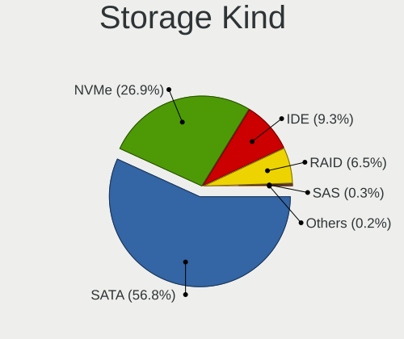

| Kind | Computers | Percent |
|------|-----------|---------|
| SATA | 325       | 56.82%  |
| NVMe | 154       | 26.92%  |
| IDE  | 53        | 9.27%   |
| RAID | 37        | 6.47%   |
| SAS  | 2         | 0.35%   |
| SCSI | 1         | 0.17%   |

Processor
---------

CPU Vendor
----------

Processor vendors

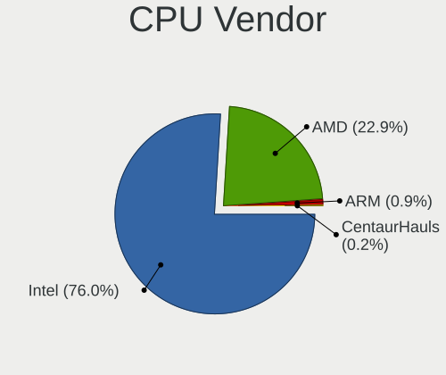

| Vendor       | Computers | Percent |
|--------------|-----------|---------|
| Intel        | 332       | 75.97%  |
| AMD          | 100       | 22.88%  |
| ARM          | 4         | 0.92%   |
| CentaurHauls | 1         | 0.23%   |

CPU Model
---------

Processor models

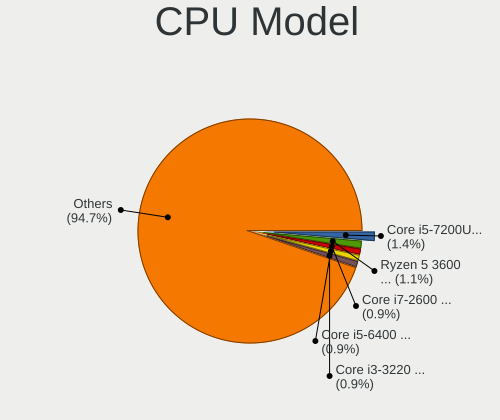

| Model                                       | Computers | Percent |
|---------------------------------------------|-----------|---------|
| Intel Core i5-7200U CPU @ 2.50GHz           | 6         | 1.37%   |
| AMD Ryzen 5 3600 6-Core Processor           | 5         | 1.14%   |
| Intel Core i7-2600 CPU @ 3.40GHz            | 4         | 0.91%   |
| Intel Core i5-6400 CPU @ 2.70GHz            | 4         | 0.91%   |
| Intel Core i3-3220 CPU @ 3.30GHz            | 4         | 0.91%   |
| Intel Core i3 CPU M 370 @ 2.40GHz           | 4         | 0.91%   |
| Intel Celeron N4020 CPU @ 1.10GHz           | 4         | 0.91%   |
| Intel 11th Gen Core i5-1135G7 @ 2.40GHz     | 4         | 0.91%   |
| ARM Processor                               | 4         | 0.91%   |
| Intel Core m3-7Y30 CPU @ 1.00GHz            | 3         | 0.68%   |
| Intel Core i7-8550U CPU @ 1.80GHz           | 3         | 0.68%   |
| Intel Core i7-5500U CPU @ 2.40GHz           | 3         | 0.68%   |
| Intel Core i7-3770 CPU @ 3.40GHz            | 3         | 0.68%   |
| Intel Core i7-10510U CPU @ 1.80GHz          | 3         | 0.68%   |
| Intel Core i5-8250U CPU @ 1.60GHz           | 3         | 0.68%   |
| Intel Core i5-3210M CPU @ 2.50GHz           | 3         | 0.68%   |
| Intel Core i5-2450M CPU @ 2.50GHz           | 3         | 0.68%   |
| Intel Core i5-1035G1 CPU @ 1.00GHz          | 3         | 0.68%   |
| Intel Core i5-10210U CPU @ 1.60GHz          | 3         | 0.68%   |
| Intel Core i5 CPU 760 @ 2.80GHz             | 3         | 0.68%   |
| Intel Core i3-5005U CPU @ 2.00GHz           | 3         | 0.68%   |
| Intel Celeron CPU N2840 @ 2.16GHz           | 3         | 0.68%   |
| Intel 11th Gen Core i3-1115G4 @ 3.00GHz     | 3         | 0.68%   |
| AMD Ryzen 9 9950X 16-Core Processor         | 3         | 0.68%   |
| AMD FX-8350 Eight-Core Processor            | 3         | 0.68%   |
| Intel Xeon CPU E5-2697 v2 @ 2.70GHz         | 2         | 0.46%   |
| Intel Pentium Dual-Core CPU T4500 @ 2.30GHz | 2         | 0.46%   |
| Intel Pentium Dual CPU T3200 @ 2.00GHz      | 2         | 0.46%   |
| Intel Pentium CPU N3700 @ 1.60GHz           | 2         | 0.46%   |
| Intel Pentium CPU N3540 @ 2.16GHz           | 2         | 0.46%   |
| Intel Pentium CPU 2020M @ 2.40GHz           | 2         | 0.46%   |
| Intel Core Ultra 9 185H                     | 2         | 0.46%   |
| Intel Core i7-9750H CPU @ 2.60GHz           | 2         | 0.46%   |
| Intel Core i7-8850H CPU @ 2.60GHz           | 2         | 0.46%   |
| Intel Core i7-8750H CPU @ 2.20GHz           | 2         | 0.46%   |
| Intel Core i7-8650U CPU @ 1.90GHz           | 2         | 0.46%   |
| Intel Core i7-7700HQ CPU @ 2.80GHz          | 2         | 0.46%   |
| Intel Core i7-4770HQ CPU @ 2.20GHz          | 2         | 0.46%   |
| Intel Core i7-4770 CPU @ 3.40GHz            | 2         | 0.46%   |
| Intel Core i7-4702MQ CPU @ 2.20GHz          | 2         | 0.46%   |

CPU Model Family
----------------

Processor model prefix

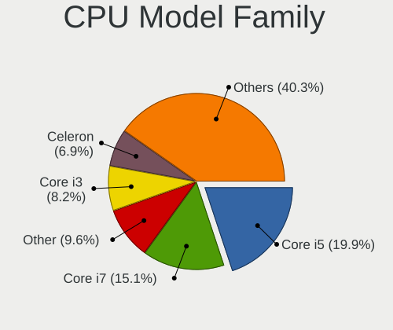

| Model                   | Computers | Percent |
|-------------------------|-----------|---------|
| Intel Core i5           | 87        | 19.91%  |
| Intel Core i7           | 66        | 15.1%   |
| Other                   | 42        | 9.61%   |
| Intel Core i3           | 36        | 8.24%   |
| Intel Celeron           | 30        | 6.86%   |
| AMD Ryzen 5             | 26        | 5.95%   |
| Intel Core 2 Duo        | 18        | 4.12%   |
| Intel Pentium           | 13        | 2.97%   |
| Intel Xeon              | 12        | 2.75%   |
| AMD Ryzen 7             | 11        | 2.52%   |
| AMD FX                  | 10        | 2.29%   |
| AMD Ryzen 9             | 7         | 1.6%    |
| AMD Ryzen 5 PRO         | 7         | 1.6%    |
| Intel Atom              | 6         | 1.37%   |
| Intel Pentium Dual-Core | 5         | 1.14%   |
| Intel Pentium Dual      | 5         | 1.14%   |
| Intel Core m3           | 5         | 1.14%   |
| Intel Core              | 5         | 1.14%   |
| AMD A8                  | 4         | 0.92%   |
| AMD A6                  | 4         | 0.92%   |
| Intel Core i9           | 3         | 0.69%   |
| AMD Ryzen 3             | 3         | 0.69%   |
| AMD Phenom II X4        | 3         | 0.69%   |
| Intel Pentium Silver    | 2         | 0.46%   |
| AMD Turion 64 X2 Mobile | 2         | 0.46%   |
| AMD Ryzen 7 PRO         | 2         | 0.46%   |
| AMD E1                  | 2         | 0.46%   |
| AMD Athlon II X2        | 2         | 0.46%   |
| AMD A10                 | 2         | 0.46%   |
| Intel Xeon Platinum     | 1         | 0.23%   |
| Intel Pentium Gold      | 1         | 0.23%   |
| Intel Genuine           | 1         | 0.23%   |
| Intel Core 2 Quad       | 1         | 0.23%   |
| Intel Celeron Dual-Core | 1         | 0.23%   |
| CentaurHauls VIA Eden   | 1         | 0.23%   |
| AMD Turion II Dual-Core | 1         | 0.23%   |
| AMD Ryzen Threadripper  | 1         | 0.23%   |
| AMD Quad-Core           | 1         | 0.23%   |
| AMD PRO A10             | 1         | 0.23%   |
| AMD Phenom II X6        | 1         | 0.23%   |

CPU Cores
---------

Number of processor cores

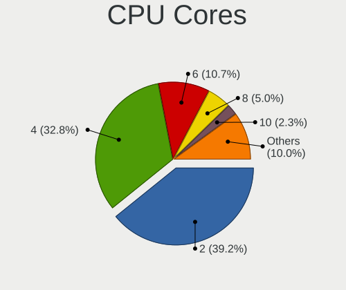

| Number  | Computers | Percent |
|---------|-----------|---------|
| 2       | 172       | 39.18%  |
| 4       | 144       | 32.8%   |
| 6       | 47        | 10.71%  |
| 8       | 22        | 5.01%   |
| 10      | 10        | 2.28%   |
| 16      | 9         | 2.05%   |
| 14      | 8         | 1.82%   |
| 12      | 8         | 1.82%   |
| 1       | 7         | 1.59%   |
| 24      | 4         | 0.91%   |
| 3       | 3         | 0.68%   |
| 256     | 1         | 0.23%   |
| 48      | 1         | 0.23%   |
| 40      | 1         | 0.23%   |
| 28      | 1         | 0.23%   |
| Unknown | 1         | 0.23%   |

CPU Sockets
-----------

Number of sockets

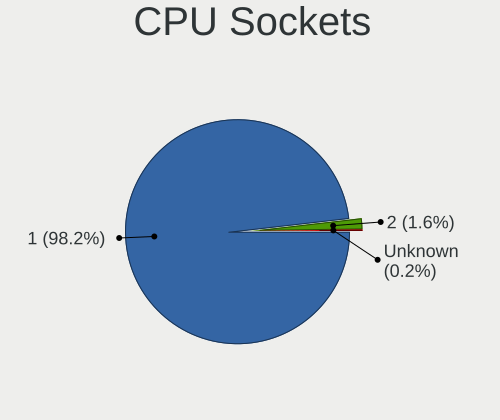

| Number  | Computers | Percent |
|---------|-----------|---------|
| 1       | 431       | 98.18%  |
| 2       | 7         | 1.59%   |
| Unknown | 1         | 0.23%   |

CPU Threads
-----------

Threads per core (Hyper-Threading)

| Number  | Computers | Percent |
|---------|-----------|---------|
| 2       | 280       | 64.07%  |
| 1       | 156       | 35.7%   |
| Unknown | 1         | 0.23%   |

CPU Op-Modes
------------

CPU Operation Modes (32-bit, 64-bit)

| Op mode        | Computers | Percent |
|----------------|-----------|---------|
| 32-bit, 64-bit | 434       | 99.31%  |
| 64-bit         | 2         | 0.46%   |
| Unknown        | 1         | 0.23%   |

CPU Microcode
-------------

Microcode number

| Number  | Computers | Percent |
|---------|-----------|---------|
| Unknown | 437       | 100%    |

CPU Microarch
-------------

Microarchitecture

| Name              | Computers | Percent |
|-------------------|-----------|---------|
| KabyLake          | 58        | 13.21%  |
| Unknown           | 38        | 8.66%   |
| IvyBridge         | 36        | 8.2%    |
| Haswell           | 31        | 7.06%   |
| SandyBridge       | 28        | 6.38%   |
| Penryn            | 24        | 5.47%   |
| Skylake           | 21        | 4.78%   |
| Silvermont        | 21        | 4.78%   |
| Alderlake Hybrid  | 17        | 3.87%   |
| Zen 3             | 16        | 3.64%   |
| Westmere          | 14        | 3.19%   |
| Piledriver        | 11        | 2.51%   |
| Core              | 11        | 2.51%   |
| TigerLake         | 10        | 2.28%   |
| Broadwell         | 10        | 2.28%   |
| Zen 2             | 9         | 2.05%   |
| K10               | 9         | 2.05%   |
| CometLake         | 9         | 2.05%   |
| Zen+              | 7         | 1.59%   |
| Zen               | 7         | 1.59%   |
| Nehalem           | 7         | 1.59%   |
| Goldmont plus     | 6         | 1.37%   |
| Puma              | 5         | 1.14%   |
| Icelake           | 5         | 1.14%   |
| Goldmont          | 4         | 0.91%   |
| Excavator         | 4         | 0.91%   |
| Bonnell           | 4         | 0.91%   |
| Bobcat            | 4         | 0.91%   |
| K8 Hammer         | 3         | 0.68%   |
| Steamroller       | 2         | 0.46%   |
| Meteorlake Hybrid | 2         | 0.46%   |
| Tremont           | 1         | 0.23%   |
| Sapphire Rapids   | 1         | 0.23%   |
| Lunarlake Hybrid  | 1         | 0.23%   |
| K10 Llano         | 1         | 0.23%   |
| Jaguar            | 1         | 0.23%   |
| Gracemont         | 1         | 0.23%   |

Graphics
--------

GPU Vendor
----------

Vendors of graphics cards

| Vendor                           | Computers | Percent |
|----------------------------------|-----------|---------|
| Intel                            | 268       | 53.82%  |
| Nvidia                           | 113       | 22.69%  |
| AMD                              | 110       | 22.09%  |
| Matrox Electronics Systems       | 3         | 0.6%    |
| Silicon Integrated Systems [SiS] | 2         | 0.4%    |
| VIA Technologies                 | 1         | 0.2%    |
| ASPEED Technology                | 1         | 0.2%    |

GPU Model
---------

Graphics card models

| Model                                                                                    | Computers | Percent |
|------------------------------------------------------------------------------------------|-----------|---------|
| Intel 3rd Gen Core processor Graphics Controller                                         | 20        | 3.95%   |
| Intel 2nd Generation Core Processor Family Integrated Graphics Controller                | 19        | 3.75%   |
| Intel Atom Processor Z36xxx/Z37xxx Series Graphics & Display                             | 16        | 3.16%   |
| Intel Mobile 4 Series Chipset Integrated Graphics Controller                             | 13        | 2.57%   |
| Intel Kaby Lake-R GT2 [UHD Graphics 620]                                                 | 10        | 1.98%   |
| Intel Core Processor Integrated Graphics Controller                                      | 10        | 1.98%   |
| Intel Raptor Lake-P [Iris Xe Graphics]                                                   | 9         | 1.78%   |
| Intel Kaby Lake-U GT2 [HD Graphics 620]                                                  | 9         | 1.78%   |
| Intel Haswell-ULT Integrated Graphics Controller                                         | 9         | 1.78%   |
| Intel CoffeeLake-H GT2 [UHD Graphics 630]                                                | 8         | 1.58%   |
| Intel CoffeeLake-S GT2 [UHD Graphics 630]                                                | 7         | 1.38%   |
| Intel Broadwell-U GT2 [HD Graphics 5500]                                                 | 7         | 1.38%   |
| Intel 4th Gen Core Processor Integrated Graphics Controller                              | 7         | 1.38%   |
| Intel Xeon E3-1200 v2/3rd Gen Core processor Graphics Controller                         | 6         | 1.19%   |
| Intel TigerLake-LP GT2 [Iris Xe Graphics]                                                | 6         | 1.19%   |
| Intel Skylake-S GT2 [HD Graphics 530]                                                    | 6         | 1.19%   |
| Intel CometLake-U GT2 [UHD Graphics]                                                     | 6         | 1.19%   |
| Intel Xeon E3-1200 v3/4th Gen Core Processor Integrated Graphics Controller              | 5         | 0.99%   |
| Intel GeminiLake [UHD Graphics 600]                                                      | 5         | 0.99%   |
| Intel Atom/Celeron/Pentium Processor x5-E8000/J3xxx/N3xxx Integrated Graphics Controller | 5         | 0.99%   |
| AMD Raven Ridge [Radeon Vega Series / Radeon Vega Mobile Series]                         | 5         | 0.99%   |
| AMD Mullins [Radeon R4/R5 Graphics]                                                      | 5         | 0.99%   |
| AMD Cezanne [Radeon Vega Series / Radeon Vega Mobile Series]                             | 5         | 0.99%   |
| Intel WhiskeyLake-U GT2 [UHD Graphics 620]                                               | 4         | 0.79%   |
| Intel Tiger Lake-LP GT2 [UHD Graphics G4]                                                | 4         | 0.79%   |
| Intel Kaby Lake-Y GT2 [HD Graphics 615]                                                  | 4         | 0.79%   |
| AMD Topaz XT [Radeon R7 M260/M265 / M340/M360 / M440/M445 / 530/535 / 620/625 Mobile]    | 4         | 0.79%   |
| AMD RS780L [Radeon 3000]                                                                 | 4         | 0.79%   |
| AMD Picasso/Raven 2 [Radeon Vega Series / Radeon Vega Mobile Series]                     | 4         | 0.79%   |
| AMD Park [Mobility Radeon HD 5430/5450/5470]                                             | 4         | 0.79%   |
| AMD Granite Ridge [Radeon Graphics]                                                      | 4         | 0.79%   |
| AMD Ellesmere [Radeon RX 470/480/570/570X/580/580X/590]                                  | 4         | 0.79%   |
| AMD Barcelo                                                                              | 4         | 0.79%   |
| Nvidia GT218 [GeForce 210]                                                               | 3         | 0.59%   |
| Nvidia GP108 [GeForce GT 1030]                                                           | 3         | 0.59%   |
| Nvidia GP107M [GeForce GTX 1050 Mobile]                                                  | 3         | 0.59%   |
| Nvidia GP106 [GeForce GTX 1060 6GB]                                                      | 3         | 0.59%   |
| Nvidia GK208B [GeForce GT 730]                                                           | 3         | 0.59%   |
| Nvidia GK107M [GeForce GT 650M Mac Edition]                                              | 3         | 0.59%   |
| Nvidia GF117M [GeForce 610M/710M/810M/820M / GT 620M/625M/630M/720M]                     | 3         | 0.59%   |

GPU Combo
---------

Combinations of graphics cards

| Name           | Computers | Percent |
|----------------|-----------|---------|
| 1 x Intel      | 200       | 45.66%  |
| 1 x AMD        | 90        | 20.55%  |
| 1 x Nvidia     | 62        | 14.16%  |
| Intel + Nvidia | 48        | 10.96%  |
| Intel + AMD    | 13        | 2.97%   |
| Other          | 6         | 1.37%   |
| 2 x Intel      | 5         | 1.14%   |
| 2 x AMD        | 4         | 0.91%   |
| 1 x Matrox     | 3         | 0.68%   |
| AMD + Nvidia   | 3         | 0.68%   |
| 1 x SiS        | 2         | 0.46%   |
| 1 x VIA        | 1         | 0.23%   |
| 1 x ASPEED     | 1         | 0.23%   |

GPU Driver
----------

Free vs proprietary

| Driver      | Computers | Percent |
|-------------|-----------|---------|
| Free        | 347       | 78.86%  |
| Unknown     | 50        | 11.36%  |
| Proprietary | 43        | 9.77%   |

GPU Memory
----------

Total video memory

| Size in GB | Computers | Percent |
|------------|-----------|---------|
| Unknown    | 336       | 76.71%  |
| 0.01-0.5   | 26        | 5.94%   |
| 3.01-4.0   | 17        | 3.88%   |
| 1.01-2.0   | 16        | 3.65%   |
| 0.51-1.0   | 16        | 3.65%   |
| 7.01-8.0   | 12        | 2.74%   |
| 5.01-6.0   | 5         | 1.14%   |
| 8.01-16.0  | 5         | 1.14%   |
| 2.01-3.0   | 3         | 0.68%   |
| 16.01-24.0 | 2         | 0.46%   |

Monitor
-------

Monitor Vendor
--------------

Monitor vendors

| Vendor                  | Computers | Percent |
|-------------------------|-----------|---------|
| Samsung Electronics     | 66        | 14.07%  |
| AU Optronics            | 53        | 11.3%   |
| Chimei Innolux          | 40        | 8.53%   |
| BOE                     | 37        | 7.89%   |
| Dell                    | 33        | 7.04%   |
| LG Display              | 32        | 6.82%   |
| Goldstar                | 17        | 3.62%   |
| Hewlett-Packard         | 16        | 3.41%   |
| Acer                    | 16        | 3.41%   |
| Apple                   | 14        | 2.99%   |
| Lenovo                  | 13        | 2.77%   |
| BenQ                    | 12        | 2.56%   |
| Chi Mei Optoelectronics | 11        | 2.35%   |
| Philips                 | 8         | 1.71%   |
| Iiyama                  | 8         | 1.71%   |
| Unknown                 | 7         | 1.49%   |
| Sharp                   | 7         | 1.49%   |
| AOC                     | 6         | 1.28%   |
| Ancor Communications    | 6         | 1.28%   |
| ViewSonic               | 4         | 0.85%   |
| Sony                    | 4         | 0.85%   |
| KDC                     | 4         | 0.85%   |
| Vizio                   | 3         | 0.64%   |
| Toshiba                 | 3         | 0.64%   |
| HannStar                | 3         | 0.64%   |
| ASUSTek Computer        | 3         | 0.64%   |
| NEC Computers           | 2         | 0.43%   |
| Mi                      | 2         | 0.43%   |
| InfoVision              | 2         | 0.43%   |
| HKC                     | 2         | 0.43%   |
| Xiaomi                  | 1         | 0.21%   |
| Westinghouse            | 1         | 0.21%   |
| VIE                     | 1         | 0.21%   |
| Vestel                  | 1         | 0.21%   |
| Unknown (XXX)           | 1         | 0.21%   |
| TEO                     | 1         | 0.21%   |
| TCL                     | 1         | 0.21%   |
| STD                     | 1         | 0.21%   |
| Sceptre Tech            | 1         | 0.21%   |
| RTK                     | 1         | 0.21%   |

Monitor Model
-------------

Monitor models

| Model                                                                     | Computers | Percent |
|---------------------------------------------------------------------------|-----------|---------|
| Unknown LCD Monitor FFFF 2288x1287 2550x2550mm 142.0-inch                 | 7         | 1.46%   |
| Chimei Innolux LCD Monitor CMN14D4 1920x1080 309x173mm 13.9-inch          | 4         | 0.84%   |
| BOE LCD Monitor BOE084E 1920x1080 382x215mm 17.3-inch                     | 4         | 0.84%   |
| AU Optronics LCD Monitor AUO38ED 1920x1080 344x193mm 15.5-inch            | 4         | 0.84%   |
| Samsung Electronics LCD Monitor SEC5441 1280x800 331x207mm 15.4-inch      | 3         | 0.63%   |
| KDC LCD Monitor KDC0109 1366x768 256x144mm 11.6-inch                      | 3         | 0.63%   |
| Chimei Innolux LCD Monitor CMN15E7 1920x1080 344x193mm 15.5-inch          | 3         | 0.63%   |
| Chi Mei Optoelectronics LCD Monitor CMO1720 1920x1080 382x215mm 17.3-inch | 3         | 0.63%   |
| AU Optronics LCD Monitor AUO22EC 1366x768 344x193mm 15.5-inch             | 3         | 0.63%   |
| AU Optronics LCD Monitor AUO21ED 1920x1080 344x193mm 15.5-inch            | 3         | 0.63%   |
| Samsung Electronics LCD Monitor SEC5448 1920x1080 344x194mm 15.5-inch     | 2         | 0.42%   |
| Samsung Electronics LCD Monitor SEC4B41 1280x800 261x163mm 12.1-inch      | 2         | 0.42%   |
| Samsung Electronics LCD Monitor SEC3651 1366x768 344x194mm 15.5-inch      | 2         | 0.42%   |
| Samsung Electronics LCD Monitor SEC3358 1280x800 331x207mm 15.4-inch      | 2         | 0.42%   |
| Samsung Electronics LCD Monitor SDC3654 1600x900 382x215mm 17.3-inch      | 2         | 0.42%   |
| LG Display LCD Monitor LGD0521 1920x1080 309x174mm 14.0-inch              | 2         | 0.42%   |
| LG Display LCD Monitor LGD033A 1366x768 344x194mm 15.5-inch               | 2         | 0.42%   |
| LG Display LCD Monitor LGD027A 1600x900 382x215mm 17.3-inch               | 2         | 0.42%   |
| Iiyama PL2278H IVM5624 1920x1080 477x268mm 21.5-inch                      | 2         | 0.42%   |
| Hewlett-Packard w2408 HWP26CF 1920x1200 518x324mm 24.1-inch               | 2         | 0.42%   |
| Hewlett-Packard P242va HWP3238 1920x1080 531x299mm 24.0-inch              | 2         | 0.42%   |
| HannStar HSD121PHW1 HSD04B6 1366x768 270x150mm 12.2-inch                  | 2         | 0.42%   |
| Dell U2412M DELA07A 1920x1200 518x324mm 24.1-inch                         | 2         | 0.42%   |
| Dell SE2717H/HX DELD0A1 1920x1080 598x336mm 27.0-inch                     | 2         | 0.42%   |
| Chimei Innolux LCD Monitor CMN1747 1920x1080 381x214mm 17.2-inch          | 2         | 0.42%   |
| Chimei Innolux LCD Monitor CMN15F6 1920x1080 344x193mm 15.5-inch          | 2         | 0.42%   |
| Chimei Innolux LCD Monitor CMN15F5 1920x1080 344x193mm 15.5-inch          | 2         | 0.42%   |
| Chimei Innolux LCD Monitor CMN15DC 1366x768 344x193mm 15.5-inch           | 2         | 0.42%   |
| Chi Mei Optoelectronics LCD Monitor CMO1721 1600x900 382x215mm 17.3-inch  | 2         | 0.42%   |
| Chi Mei Optoelectronics LCD Monitor CMO15A7 1366x768 344x193mm 15.5-inch  | 2         | 0.42%   |
| BOE LCD Monitor BOE06A4 1366x768 344x194mm 15.5-inch                      | 2         | 0.42%   |
| AU Optronics LCD Monitor AUO499F 1920x1080 344x194mm 15.5-inch            | 2         | 0.42%   |
| AU Optronics LCD Monitor AUO26EC 1366x768 344x193mm 15.5-inch             | 2         | 0.42%   |
| AU Optronics LCD Monitor AUO235C 1366x768 256x144mm 11.6-inch             | 2         | 0.42%   |
| AU Optronics LCD Monitor AUO229E 1600x900 382x214mm 17.2-inch             | 2         | 0.42%   |
| AU Optronics LCD Monitor AUO226D 1920x1080 276x155mm 12.5-inch            | 2         | 0.42%   |
| Apple LCD Monitor APP9CC3 1280x800 286x179mm 13.3-inch                    | 2         | 0.42%   |
| Apple iMac APPA012 1920x1080 475x267mm 21.5-inch                          | 2         | 0.42%   |
| Apple Color LCD APPA02E 2880x1800 331x207mm 15.4-inch                     | 2         | 0.42%   |
| Apple Color LCD APP9CA4 1440x900 331x207mm 15.4-inch                      | 2         | 0.42%   |

Monitor Resolution
------------------

Monitor screen resolution

| Resolution         | Computers | Percent |
|--------------------|-----------|---------|
| 1920x1080 (FHD)    | 198       | 43.52%  |
| 1366x768 (WXGA)    | 91        | 20%     |
| 3840x2160 (4K)     | 21        | 4.62%   |
| 1600x900 (HD+)     | 21        | 4.62%   |
| 1920x1200 (WUXGA)  | 18        | 3.96%   |
| 1280x1024 (SXGA)   | 18        | 3.96%   |
| 1680x1050 (WSXGA+) | 16        | 3.52%   |
| 1280x800 (WXGA)    | 12        | 2.64%   |
| 2560x1440 (QHD)    | 11        | 2.42%   |
| 2288x1287          | 7         | 1.54%   |
| 1440x900 (WXGA+)   | 7         | 1.54%   |
| 2880x1800          | 6         | 1.32%   |
| 3440x1440          | 4         | 0.88%   |
| 2560x1080          | 4         | 0.88%   |
| Unknown            | 4         | 0.88%   |
| 2560x1600          | 3         | 0.66%   |
| 1360x768           | 3         | 0.66%   |
| 7680x1080          | 1         | 0.22%   |
| 3840x2400          | 1         | 0.22%   |
| 3840x1600          | 1         | 0.22%   |
| 3840x1080          | 1         | 0.22%   |
| 3200x2000          | 1         | 0.22%   |
| 2880x1920          | 1         | 0.22%   |
| 2560x1700          | 1         | 0.22%   |
| 2160x1440          | 1         | 0.22%   |
| 1920x540           | 1         | 0.22%   |
| 1920x1280          | 1         | 0.22%   |
| 1024x768 (XGA)     | 1         | 0.22%   |

Monitor Diagonal
----------------

Diagonal size in inches

| Inches  | Computers | Percent |
|---------|-----------|---------|
| 15      | 117       | 24.58%  |
| 27      | 45        | 9.45%   |
| 17      | 41        | 8.61%   |
| 21      | 36        | 7.56%   |
| 24      | 35        | 7.35%   |
| 14      | 31        | 6.51%   |
| 13      | 27        | 5.67%   |
| 23      | 23        | 4.83%   |
| 12      | 12        | 2.52%   |
| 11      | 12        | 2.52%   |
| 19      | 11        | 2.31%   |
| 18      | 10        | 2.1%    |
| 16      | 9         | 1.89%   |
| 20      | 8         | 1.68%   |
| 142     | 7         | 1.47%   |
| Unknown | 7         | 1.47%   |
| 34      | 6         | 1.26%   |
| 31      | 6         | 1.26%   |
| 22      | 6         | 1.26%   |
| 72      | 3         | 0.63%   |
| 65      | 3         | 0.63%   |
| 40      | 2         | 0.42%   |
| 32      | 2         | 0.42%   |
| 28      | 2         | 0.42%   |
| 10      | 2         | 0.42%   |
| 85      | 1         | 0.21%   |
| 84      | 1         | 0.21%   |
| 74      | 1         | 0.21%   |
| 58      | 1         | 0.21%   |
| 55      | 1         | 0.21%   |
| 54      | 1         | 0.21%   |
| 49      | 1         | 0.21%   |
| 48      | 1         | 0.21%   |
| 39      | 1         | 0.21%   |
| 37      | 1         | 0.21%   |
| 36      | 1         | 0.21%   |
| 26      | 1         | 0.21%   |
| 25      | 1         | 0.21%   |

Monitor Width
-------------

Physical width

| Width in mm    | Computers | Percent |
|----------------|-----------|---------|
| 301-350        | 170       | 36.4%   |
| 501-600        | 94        | 20.13%  |
| 401-500        | 61        | 13.06%  |
| 351-400        | 45        | 9.64%   |
| 201-300        | 43        | 9.21%   |
| 601-700        | 13        | 2.78%   |
| 701-800        | 9         | 1.93%   |
| 1001-1500      | 8         | 1.71%   |
| More than 2000 | 7         | 1.5%    |
| Unknown        | 7         | 1.5%    |
| 1501-2000      | 6         | 1.28%   |
| 801-900        | 3         | 0.64%   |
| 901-1000       | 1         | 0.21%   |

Aspect Ratio
------------

Proportional relationship between the width and the height

| Ratio   | Computers | Percent |
|---------|-----------|---------|
| 16/9    | 323       | 73.58%  |
| 16/10   | 68        | 15.49%  |
| 5/4     | 15        | 3.42%   |
| 21/9    | 8         | 1.82%   |
| 1.00    | 7         | 1.59%   |
| 3/2     | 6         | 1.37%   |
| Unknown | 6         | 1.37%   |
| 4/3     | 3         | 0.68%   |
| 32/9    | 2         | 0.46%   |
| 2.12    | 1         | 0.23%   |

Monitor Area
------------

Area in inch²

| Area in inch² | Computers | Percent |
|----------------|-----------|---------|
| 101-110        | 119       | 25.32%  |
| 201-250        | 78        | 16.6%   |
| 81-90          | 46        | 9.79%   |
| 301-350        | 45        | 9.57%   |
| 121-130        | 29        | 6.17%   |
| 151-200        | 25        | 5.32%   |
| More than 1000 | 19        | 4.04%   |
| 141-150        | 18        | 3.83%   |
| 351-500        | 16        | 3.4%    |
| 251-300        | 13        | 2.77%   |
| 71-80          | 12        | 2.55%   |
| 51-60          | 12        | 2.55%   |
| 61-70          | 11        | 2.34%   |
| 111-120        | 7         | 1.49%   |
| Unknown        | 7         | 1.49%   |
| 501-1000       | 6         | 1.28%   |
| 131-140        | 5         | 1.06%   |
| 41-50          | 2         | 0.43%   |

Pixel Density
-------------

Pixels per inch

| Density       | Computers | Percent |
|---------------|-----------|---------|
| 51-100        | 144       | 31.65%  |
| 101-120       | 134       | 29.45%  |
| 121-160       | 119       | 26.15%  |
| 161-240       | 30        | 6.59%   |
| 1-50          | 14        | 3.08%   |
| More than 240 | 7         | 1.54%   |
| Unknown       | 7         | 1.54%   |

Multiple Monitors
-----------------

Total monitors connected

| Total | Computers | Percent |
|-------|-----------|---------|
| 1     | 378       | 86.3%   |
| 2     | 45        | 10.27%  |
| 3     | 9         | 2.05%   |
| 0     | 4         | 0.91%   |
| 4     | 2         | 0.46%   |

Network
-------

Net Controller Vendor
---------------------

Controller vendors

| Vendor                                 | Computers | Percent |
|----------------------------------------|-----------|---------|
| Realtek Semiconductor                  | 255       | 37.89%  |
| Intel                                  | 199       | 29.57%  |
| Qualcomm Atheros                       | 64        | 9.51%   |
| Broadcom                               | 44        | 6.54%   |
| MediaTek                               | 23        | 3.42%   |
| TP-Link                                | 12        | 1.78%   |
| Broadcom Limited                       | 8         | 1.19%   |
| ASIX Electronics                       | 6         | 0.89%   |
| Marvell Technology Group               | 5         | 0.74%   |
| Sierra Wireless                        | 4         | 0.59%   |
| Ralink Technology                      | 4         | 0.59%   |
| Nvidia                                 | 4         | 0.59%   |
| Ralink                                 | 3         | 0.45%   |
| Qualcomm Atheros Communications        | 3         | 0.45%   |
| DisplayLink                            | 3         | 0.45%   |
| D-Link System                          | 3         | 0.45%   |
| U-Blox                                 | 2         | 0.3%    |
| Silicon Integrated Systems [SiS]       | 2         | 0.3%    |
| Samsung Electronics                    | 2         | 0.3%    |
| OPPO Electronics                       | 2         | 0.3%    |
| NetGear                                | 2         | 0.3%    |
| Fibocom                                | 2         | 0.3%    |
| D-Link                                 | 2         | 0.3%    |
| Wilocity                               | 1         | 0.15%   |
| TRENDnet                               | 1         | 0.15%   |
| Suzhou Motorcomm Electronic Technology | 1         | 0.15%   |
| STMicroelectronics                     | 1         | 0.15%   |
| Shenzhen Goodix Technology             | 1         | 0.15%   |
| Raspberry Pi                           | 1         | 0.15%   |
| Qualcomm                               | 1         | 0.15%   |
| Microsoft                              | 1         | 0.15%   |
| Mercucys                               | 1         | 0.15%   |
| Linksys                                | 1         | 0.15%   |
| Lenovo                                 | 1         | 0.15%   |
| JMicron Technology                     | 1         | 0.15%   |
| Huawei Technologies                    | 1         | 0.15%   |
| Fujitsu Siemens Computers              | 1         | 0.15%   |
| Dell                                   | 1         | 0.15%   |
| Cvitek                                 | 1         | 0.15%   |
| Attansic Technology                    | 1         | 0.15%   |

Net Controller Model
--------------------

Controller models

| Model                                                                  | Computers | Percent |
|------------------------------------------------------------------------|-----------|---------|
| Realtek RTL8111/8168/8211/8411 PCI Express Gigabit Ethernet Controller | 165       | 20.65%  |
| Realtek RTL810xE PCI Express Fast Ethernet controller                  | 33        | 4.13%   |
| Realtek RTL8125 2.5GbE Controller                                      | 25        | 3.13%   |
| Intel Wireless 8265 / 8275                                             | 17        | 2.13%   |
| Intel 82579LM Gigabit Network Connection (Lewisville)                  | 15        | 1.88%   |
| Realtek RTL8723BE PCIe Wireless Network Adapter                        | 12        | 1.5%    |
| Realtek RTL8153 Gigabit Ethernet Adapter                               | 12        | 1.5%    |
| Qualcomm Atheros QCA9377 802.11ac Wireless Network Adapter             | 10        | 1.25%   |
| Intel Wi-Fi 6 AX200                                                    | 10        | 1.25%   |
| Qualcomm Atheros AR9285 Wireless Network Adapter (PCI-Express)         | 9         | 1.13%   |
| Qualcomm Atheros AR9485 Wireless Network Adapter                       | 8         | 1%      |
| MediaTek MT7902 802.11ax PCIe Wireless Network Adapter [Filogic 310]   | 8         | 1%      |
| Intel Wireless 3165                                                    | 8         | 1%      |
| Intel Wi-Fi 6E(802.11ax) AX210/AX1675* 2x2 [Typhoon Peak]              | 8         | 1%      |
| Intel Ethernet Connection I217-LM                                      | 8         | 1%      |
| Intel Comet Lake PCH-LP CNVi WiFi                                      | 8         | 1%      |
| Broadcom BCM4313 802.11bgn Wireless Network Adapter                    | 8         | 1%      |
| Realtek RTL8852BE PCIe 802.11ax Wireless Network Controller            | 7         | 0.88%   |
| Realtek RTL8821CE 802.11ac PCIe Wireless Network Adapter               | 7         | 0.88%   |
| Qualcomm Atheros QCA9565 / AR9565 Wireless Network Adapter             | 7         | 0.88%   |
| Intel Wi-Fi 6 AX201                                                    | 7         | 0.88%   |
| Intel Wireless 7265                                                    | 6         | 0.75%   |
| Intel Ethernet Connection (4) I219-LM                                  | 6         | 0.75%   |
| Intel Cannon Lake PCH CNVi WiFi                                        | 6         | 0.75%   |
| Realtek 802.11ac NIC                                                   | 5         | 0.63%   |
| Qualcomm Atheros QCA6174 802.11ac Wireless Network Adapter             | 5         | 0.63%   |
| Qualcomm Atheros AR9462 Wireless Network Adapter                       | 5         | 0.63%   |
| Intel Wireless 8260                                                    | 5         | 0.63%   |
| Intel Wireless 7260                                                    | 5         | 0.63%   |
| Intel WiFi Link 5100                                                   | 5         | 0.63%   |
| Intel Raptor Lake PCH CNVi WiFi                                        | 5         | 0.63%   |
| Intel I211 Gigabit Network Connection                                  | 5         | 0.63%   |
| Intel Ethernet Controller I226-V                                       | 5         | 0.63%   |
| Intel 82579V Gigabit Network Connection                                | 5         | 0.63%   |
| Broadcom NetXtreme BCM57765 Gigabit Ethernet PCIe                      | 5         | 0.63%   |
| Broadcom BCM43142 802.11b/g/n                                          | 5         | 0.63%   |
| ASIX AX88179 Gigabit Ethernet                                          | 5         | 0.63%   |
| Realtek RTL8822CE 802.11ac PCIe Wireless Network Adapter               | 4         | 0.5%    |
| Qualcomm Atheros AR8151 v2.0 Gigabit Ethernet                          | 4         | 0.5%    |
| MediaTek MT7922 802.11ax PCI Express Wireless Network Adapter          | 4         | 0.5%    |

Wireless Vendor
---------------

Wireless vendors

| Vendor                          | Computers | Percent |
|---------------------------------|-----------|---------|
| Intel                           | 147       | 39.84%  |
| Realtek Semiconductor           | 68        | 18.43%  |
| Qualcomm Atheros                | 53        | 14.36%  |
| Broadcom                        | 31        | 8.4%    |
| MediaTek                        | 21        | 5.69%   |
| TP-Link                         | 12        | 3.25%   |
| Sierra Wireless                 | 4         | 1.08%   |
| Ralink Technology               | 4         | 1.08%   |
| Broadcom Limited                | 4         | 1.08%   |
| Ralink                          | 3         | 0.81%   |
| Qualcomm Atheros Communications | 3         | 0.81%   |
| D-Link System                   | 3         | 0.81%   |
| NetGear                         | 2         | 0.54%   |
| Fibocom                         | 2         | 0.54%   |
| D-Link                          | 2         | 0.54%   |
| Wilocity                        | 1         | 0.27%   |
| TRENDnet                        | 1         | 0.27%   |
| Qualcomm                        | 1         | 0.27%   |
| Microsoft                       | 1         | 0.27%   |
| Mercucys                        | 1         | 0.27%   |
| Marvell Technology Group        | 1         | 0.27%   |
| Linksys                         | 1         | 0.27%   |
| Fujitsu Siemens Computers       | 1         | 0.27%   |
| Dell                            | 1         | 0.27%   |
| AboCom Systems                  | 1         | 0.27%   |

Wireless Model
--------------

Wireless models

| Model                                                                | Computers | Percent |
|----------------------------------------------------------------------|-----------|---------|
| Intel Wireless 8265 / 8275                                           | 17        | 4.58%   |
| Realtek RTL8723BE PCIe Wireless Network Adapter                      | 12        | 3.23%   |
| Qualcomm Atheros QCA9377 802.11ac Wireless Network Adapter           | 10        | 2.7%    |
| Intel Wi-Fi 6 AX200                                                  | 10        | 2.7%    |
| Qualcomm Atheros AR9285 Wireless Network Adapter (PCI-Express)       | 9         | 2.43%   |
| Qualcomm Atheros AR9485 Wireless Network Adapter                     | 8         | 2.16%   |
| MediaTek MT7902 802.11ax PCIe Wireless Network Adapter [Filogic 310] | 8         | 2.16%   |
| Intel Wireless 3165                                                  | 8         | 2.16%   |
| Intel Wi-Fi 6E(802.11ax) AX210/AX1675* 2x2 [Typhoon Peak]            | 8         | 2.16%   |
| Intel Comet Lake PCH-LP CNVi WiFi                                    | 8         | 2.16%   |
| Broadcom BCM4313 802.11bgn Wireless Network Adapter                  | 8         | 2.16%   |
| Realtek RTL8821CE 802.11ac PCIe Wireless Network Adapter             | 7         | 1.89%   |
| Qualcomm Atheros QCA9565 / AR9565 Wireless Network Adapter           | 7         | 1.89%   |
| Intel Wi-Fi 6 AX201                                                  | 7         | 1.89%   |
| Realtek RTL8852BE PCIe 802.11ax Wireless Network Controller          | 6         | 1.62%   |
| Intel Wireless 7265                                                  | 6         | 1.62%   |
| Intel Cannon Lake PCH CNVi WiFi                                      | 6         | 1.62%   |
| Realtek 802.11ac NIC                                                 | 5         | 1.35%   |
| Qualcomm Atheros QCA6174 802.11ac Wireless Network Adapter           | 5         | 1.35%   |
| Qualcomm Atheros AR9462 Wireless Network Adapter                     | 5         | 1.35%   |
| Intel Wireless 8260                                                  | 5         | 1.35%   |
| Intel Wireless 7260                                                  | 5         | 1.35%   |
| Intel WiFi Link 5100                                                 | 5         | 1.35%   |
| Intel Raptor Lake PCH CNVi WiFi                                      | 5         | 1.35%   |
| Broadcom BCM43142 802.11b/g/n                                        | 5         | 1.35%   |
| Realtek RTL8822CE 802.11ac PCIe Wireless Network Adapter             | 4         | 1.08%   |
| Intel Wireless 3160                                                  | 4         | 1.08%   |
| Intel Centrino Wireless-N 1000 [Condor Peak]                         | 4         | 1.08%   |
| Broadcom BCM4331 802.11a/b/g/n                                       | 4         | 1.08%   |
| TP-Link TL-WN722N v2/v3 [Realtek RTL8188EUS]                         | 3         | 0.81%   |
| TP-Link 802.11ac WLAN Adapter                                        | 3         | 0.81%   |
| Realtek RTL8822BE 802.11a/b/g/n/ac WiFi adapter                      | 3         | 0.81%   |
| Realtek RTL8188EUS 802.11n Wireless Network Adapter                  | 3         | 0.81%   |
| Realtek RTL8188EE Wireless Network Adapter                           | 3         | 0.81%   |
| MediaTek MT7922 802.11ax PCI Express Wireless Network Adapter        | 3         | 0.81%   |
| MediaTek MT7921K (RZ608) Wi-Fi 6E 80MHz                              | 3         | 0.81%   |
| Intel Wi-Fi 5(802.11ac) Wireless-AC 9x6x [Thunder Peak]              | 3         | 0.81%   |
| Intel Ice Lake-LP PCH CNVi WiFi                                      | 3         | 0.81%   |
| Intel Gemini Lake PCH CNVi WiFi                                      | 3         | 0.81%   |
| Intel Dual Band Wireless-AC 3168NGW [Stone Peak]                     | 3         | 0.81%   |

Ethernet Vendor
---------------

Ethernet vendors

| Vendor                                 | Computers | Percent |
|----------------------------------------|-----------|---------|
| Realtek Semiconductor                  | 235       | 57.04%  |
| Intel                                  | 98        | 23.79%  |
| Broadcom                               | 23        | 5.58%   |
| Qualcomm Atheros                       | 20        | 4.85%   |
| ASIX Electronics                       | 6         | 1.46%   |
| Nvidia                                 | 4         | 0.97%   |
| Marvell Technology Group               | 4         | 0.97%   |
| Broadcom Limited                       | 4         | 0.97%   |
| DisplayLink                            | 3         | 0.73%   |
| Silicon Integrated Systems [SiS]       | 2         | 0.49%   |
| Samsung Electronics                    | 2         | 0.49%   |
| OPPO Electronics                       | 2         | 0.49%   |
| MediaTek                               | 2         | 0.49%   |
| Suzhou Motorcomm Electronic Technology | 1         | 0.24%   |
| Raspberry Pi                           | 1         | 0.24%   |
| Lenovo                                 | 1         | 0.24%   |
| JMicron Technology                     | 1         | 0.24%   |
| Huawei Technologies                    | 1         | 0.24%   |
| Attansic Technology                    | 1         | 0.24%   |
| Aquantia                               | 1         | 0.24%   |

Ethernet Model
--------------

Ethernet models

| Model                                                                  | Computers | Percent |
|------------------------------------------------------------------------|-----------|---------|
| Realtek RTL8111/8168/8211/8411 PCI Express Gigabit Ethernet Controller | 165       | 39.01%  |
| Realtek RTL810xE PCI Express Fast Ethernet controller                  | 33        | 7.8%    |
| Realtek RTL8125 2.5GbE Controller                                      | 25        | 5.91%   |
| Intel 82579LM Gigabit Network Connection (Lewisville)                  | 15        | 3.55%   |
| Realtek RTL8153 Gigabit Ethernet Adapter                               | 12        | 2.84%   |
| Intel Ethernet Connection I217-LM                                      | 8         | 1.89%   |
| Intel Ethernet Connection (4) I219-LM                                  | 6         | 1.42%   |
| Intel I211 Gigabit Network Connection                                  | 5         | 1.18%   |
| Intel Ethernet Controller I226-V                                       | 5         | 1.18%   |
| Intel 82579V Gigabit Network Connection                                | 5         | 1.18%   |
| Broadcom NetXtreme BCM57765 Gigabit Ethernet PCIe                      | 5         | 1.18%   |
| ASIX AX88179 Gigabit Ethernet                                          | 5         | 1.18%   |
| Qualcomm Atheros AR8151 v2.0 Gigabit Ethernet                          | 4         | 0.95%   |
| Intel I210 Gigabit Network Connection                                  | 4         | 0.95%   |
| Qualcomm Atheros QCA8171 Gigabit Ethernet                              | 3         | 0.71%   |
| Intel Ethernet Connection I218-LM                                      | 3         | 0.71%   |
| Intel Ethernet Connection (7) I219-LM                                  | 3         | 0.71%   |
| Intel Ethernet Connection (2) I219-V                                   | 3         | 0.71%   |
| Intel Ethernet Connection (2) I219-LM                                  | 3         | 0.71%   |
| Intel 82577LM Gigabit Network Connection                               | 3         | 0.71%   |
| Intel 82567LM Gigabit Network Connection                               | 3         | 0.71%   |
| Broadcom NetXtreme BCM5764M Gigabit Ethernet PCIe                      | 3         | 0.71%   |
| Broadcom NetLink BCM57785 Gigabit Ethernet PCIe                        | 3         | 0.71%   |
| Silicon Integrated Systems [SiS] 191 Gigabit Ethernet Adapter          | 2         | 0.47%   |
| Samsung Galaxy series, misc. (tethering mode)                          | 2         | 0.47%   |
| Realtek RTL-8100/8101L/8139 PCI Fast Ethernet Adapter                  | 2         | 0.47%   |
| Qualcomm Atheros QCA8172 Fast Ethernet                                 | 2         | 0.47%   |
| Qualcomm Atheros Killer E2500 Gigabit Ethernet Controller              | 2         | 0.47%   |
| Qualcomm Atheros AR8121/AR8113/AR8114 Gigabit or Fast Ethernet         | 2         | 0.47%   |
| OPPO Ace 3V                                                            | 2         | 0.47%   |
| Marvell Group 88E8055 PCI-E Gigabit Ethernet Controller                | 2         | 0.47%   |
| Intel Ethernet Connection (7) I219-V                                   | 2         | 0.47%   |
| Intel Ethernet Connection (4) I219-V                                   | 2         | 0.47%   |
| Intel Ethernet Connection (23) I219-LM                                 | 2         | 0.47%   |
| Intel Ethernet Connection (16) I219-LM                                 | 2         | 0.47%   |
| Intel Ethernet Connection (10) I219-V                                  | 2         | 0.47%   |
| Intel 82574L Gigabit Network Connection                                | 2         | 0.47%   |
| Intel 82566DM-2 Gigabit Network Connection                             | 2         | 0.47%   |
| DisplayLink Dell 4-in-1 Adapter                                        | 2         | 0.47%   |
| Broadcom NetXtreme BCM57766 Gigabit Ethernet PCIe                      | 2         | 0.47%   |

Net Controller Kind
-------------------

Ethernet, WiFi or modem

| Kind     | Computers | Percent |
|----------|-----------|---------|
| Ethernet | 387       | 53.01%  |
| WiFi     | 338       | 46.3%   |
| Modem    | 4         | 0.55%   |
| Unknown  | 1         | 0.14%   |

Used Controller
---------------

Currently used network controller

| Kind     | Computers | Percent |
|----------|-----------|---------|
| WiFi     | 269       | 57.23%  |
| Ethernet | 201       | 42.77%  |

NICs
----

Total network controllers on board

| Total | Computers | Percent |
|-------|-----------|---------|
| 2     | 249       | 56.98%  |
| 1     | 171       | 39.13%  |
| 3     | 13        | 2.97%   |
| 0     | 2         | 0.46%   |
| 7     | 1         | 0.23%   |
| 4     | 1         | 0.23%   |

IPv6
----

IPv6 vs IPv4

| Used | Computers | Percent |
|------|-----------|---------|
| No   | 298       | 68.19%  |
| Yes  | 139       | 31.81%  |

Bluetooth
---------

Bluetooth Vendor
----------------

Controller vendors

| Vendor                          | Computers | Percent |
|---------------------------------|-----------|---------|
| Intel                           | 120       | 46.15%  |
| Realtek Semiconductor           | 29        | 11.15%  |
| IMC Networks                    | 20        | 7.69%   |
| Qualcomm Atheros Communications | 15        | 5.77%   |
| Cambridge Silicon Radio         | 13        | 5%      |
| Apple                           | 13        | 5%      |
| Lite-On Technology              | 11        | 4.23%   |
| MediaTek                        | 8         | 3.08%   |
| Foxconn / Hon Hai               | 8         | 3.08%   |
| Broadcom                        | 8         | 3.08%   |
| Hewlett-Packard                 | 3         | 1.15%   |
| Dell                            | 3         | 1.15%   |
| TP-Link                         | 2         | 0.77%   |
| ASUSTek Computer                | 2         | 0.77%   |
| USI                             | 1         | 0.38%   |
| Toshiba                         | 1         | 0.38%   |
| Realtek                         | 1         | 0.38%   |
| Ralink                          | 1         | 0.38%   |
| Unknown                         | 1         | 0.38%   |

Bluetooth Model
---------------

Controller models

| Model                                               | Computers | Percent |
|-----------------------------------------------------|-----------|---------|
| Intel Bluetooth wireless interface                  | 44        | 16.92%  |
| Realtek Bluetooth Radio                             | 20        | 7.69%   |
| Intel Bluetooth 9460/9560 Jefferson Peak (JfP)      | 18        | 6.92%   |
| Intel Bluetooth Device                              | 15        | 5.77%   |
| Intel AX201 Bluetooth                               | 15        | 5.77%   |
| Cambridge Silicon Radio Bluetooth Dongle (HCI mode) | 13        | 5%      |
| IMC Networks Wireless_Device                        | 9         | 3.46%   |
| MediaTek Wireless_Device                            | 8         | 3.08%   |
| Intel AX200 Bluetooth                               | 8         | 3.08%   |
| Intel AX210 Bluetooth                               | 7         | 2.69%   |
| IMC Networks Bluetooth Radio                        | 6         | 2.31%   |
| Apple Bluetooth Host Controller                     | 6         | 2.31%   |
| Lite-On Qualcomm Atheros QCA9377 Bluetooth          | 5         | 1.92%   |
| Intel Centrino Bluetooth Wireless Transceiver       | 5         | 1.92%   |
| Apple Bluetooth USB Host Controller                 | 5         | 1.92%   |
| Qualcomm Atheros  Bluetooth Device                  | 4         | 1.54%   |
| Qualcomm Atheros QCA61x4 Bluetooth 4.0              | 4         | 1.54%   |
| Foxconn / Hon Hai Wireless_Device                   | 4         | 1.54%   |
| Realtek RTL8723B Bluetooth                          | 3         | 1.15%   |
| Realtek  Bluetooth 4.2 Adapter                      | 3         | 1.15%   |
| Qualcomm Atheros AR3011 Bluetooth                   | 3         | 1.15%   |
| Intel Wireless-AC 9260 Bluetooth Adapter            | 3         | 1.15%   |
| Intel Wireless-AC 3168 Bluetooth                    | 3         | 1.15%   |
| TP-Link TP-T@- UB500 Adapter                        | 2         | 0.77%   |
| Qualcomm Atheros AR3012 Bluetooth 4.0               | 2         | 0.77%   |
| Qualcomm Atheros AR3012 Bluetooth                   | 2         | 0.77%   |
| Lite-On Atheros AR3012 Bluetooth                    | 2         | 0.77%   |
| Intel Centrino Advanced-N 6230 Bluetooth adapter    | 2         | 0.77%   |
| IMC Networks Bluetooth module                       | 2         | 0.77%   |
| IMC Networks Bluetooth Device                       | 2         | 0.77%   |
| HP Broadcom 2070 Bluetooth Combo                    | 2         | 0.77%   |
| Foxconn / Hon Hai Bluetooth Device                  | 2         | 0.77%   |
| Dell DW375 Bluetooth Module                         | 2         | 0.77%   |
| Broadcom BCM43142A0 Bluetooth 4.0                   | 2         | 0.77%   |
| Apple Built-in Bluetooth 2.0+EDR HCI                | 2         | 0.77%   |
| USI Bluetooth Device                                | 1         | 0.38%   |
| Toshiba BCM43142A0                                  | 1         | 0.38%   |
| Realtek RTL8822BE Bluetooth 4.2 Adapter             | 1         | 0.38%   |
| Realtek RTL8821A Bluetooth                          | 1         | 0.38%   |
| Realtek Bluetooth 5.4 Radio                         | 1         | 0.38%   |

Sound
-----

Sound Vendor
------------

Sound card vendors

| Vendor                                       | Computers | Percent |
|----------------------------------------------|-----------|---------|
| Intel                                        | 321       | 56.71%  |
| AMD                                          | 113       | 19.96%  |
| Nvidia                                       | 83        | 14.66%  |
| Texas Instruments                            | 7         | 1.24%   |
| Logitech                                     | 3         | 0.53%   |
| GN Netcom                                    | 3         | 0.53%   |
| C-Media Electronics                          | 3         | 0.53%   |
| Silicon Integrated Systems [SiS]             | 2         | 0.35%   |
| Razer USA                                    | 2         | 0.35%   |
| Plantronics                                  | 2         | 0.35%   |
| Jieli Technology                             | 2         | 0.35%   |
| Hewlett-Packard                              | 2         | 0.35%   |
| Corsair                                      | 2         | 0.35%   |
| Zoran Co. Personal Media Division (Nogatech) | 1         | 0.18%   |
| Xitel                                        | 1         | 0.18%   |
| VIA Technologies                             | 1         | 0.18%   |
| USB MICROPHONE                               | 1         | 0.18%   |
| Thesycon Systemsoftware & Consulting         | 1         | 0.18%   |
| Tenx Technology                              | 1         | 0.18%   |
| Samsung Electronics                          | 1         | 0.18%   |
| MV-SILICON                                   | 1         | 0.18%   |
| Micro Star International                     | 1         | 0.18%   |
| MAG Technology                               | 1         | 0.18%   |
| liyuany                                      | 1         | 0.18%   |
| Lenovo                                       | 1         | 0.18%   |
| KTMicro                                      | 1         | 0.18%   |
| GYROCOM C&C                                  | 1         | 0.18%   |
| Focusrite-Novation                           | 1         | 0.18%   |
| DSEA A/S                                     | 1         | 0.18%   |
| Cyber Acoustics                              | 1         | 0.18%   |
| Creative Labs                                | 1         | 0.18%   |
| Conexant Systems                             | 1         | 0.18%   |
| BEHRINGER International                      | 1         | 0.18%   |
| ASUSTek Computer                             | 1         | 0.18%   |

Sound Model
-----------

Sound card models

| Model                                                                      | Computers | Percent |
|----------------------------------------------------------------------------|-----------|---------|
| AMD Ryzen HD Audio Controller                                              | 43        | 6.28%   |
| Intel 7 Series/C216 Chipset Family High Definition Audio Controller        | 34        | 4.96%   |
| Intel Sunrise Point-LP HD Audio                                            | 30        | 4.38%   |
| Intel 6 Series/C200 Series Chipset Family High Definition Audio Controller | 25        | 3.65%   |
| Intel 8 Series/C220 Series Chipset High Definition Audio Controller        | 21        | 3.07%   |
| AMD SBx00 Azalia (Intel HDA)                                               | 21        | 3.07%   |
| Intel 82801I (ICH9 Family) HD Audio Controller                             | 20        | 2.92%   |
| Intel 5 Series/3400 Series Chipset High Definition Audio                   | 19        | 2.77%   |
| AMD Radeon High Definition Audio Controller                                | 18        | 2.63%   |
| Intel Cannon Lake PCH cAVS                                                 | 16        | 2.34%   |
| Intel Atom Processor Z36xxx/Z37xxx Series High Definition Audio Controller | 16        | 2.34%   |
| Intel Xeon E3-1200 v3/4th Gen Core Processor HD Audio Controller           | 15        | 2.19%   |
| Intel 100 Series/C230 Series Chipset Family HD Audio Controller            | 13        | 1.9%    |
| AMD Renoir/Cezanne HDMI/DP Audio Controller                                | 13        | 1.9%    |
| AMD Starship/Matisse HD Audio Controller                                   | 12        | 1.75%   |
| AMD FCH Azalia Controller                                                  | 12        | 1.75%   |
| Intel Tiger Lake-LP Smart Sound Technology Audio Controller                | 10        | 1.46%   |
| Intel Comet Lake PCH-LP cAVS                                               | 10        | 1.46%   |
| Intel Raptor Lake-P/U/H cAVS                                               | 9         | 1.31%   |
| Intel Haswell-ULT HD Audio Controller                                      | 9         | 1.31%   |
| Intel 8 Series HD Audio Controller                                         | 9         | 1.31%   |
| AMD Raven/Raven2/Fenghuang HDMI/DP Audio Controller                        | 9         | 1.31%   |
| Intel Wildcat Point-LP High Definition Audio Controller                    | 8         | 1.17%   |
| Intel Broadwell-U Audio Controller                                         | 8         | 1.17%   |
| Intel Alder Lake PCH-P High Definition Audio Controller                    | 8         | 1.17%   |
| AMD Kabini HDMI/DP Audio                                                   | 8         | 1.17%   |
| Nvidia High Definition Audio Controller                                    | 7         | 1.02%   |
| Nvidia GP106 High Definition Audio Controller                              | 7         | 1.02%   |
| Nvidia GK208 HDMI/DP Audio Controller                                      | 6         | 0.88%   |
| Nvidia GK107 HDMI Audio Controller                                         | 6         | 0.88%   |
| Intel NM10/ICH7 Family High Definition Audio Controller                    | 6         | 0.88%   |
| Intel Celeron/Pentium Silver Processor High Definition Audio               | 6         | 0.88%   |
| Intel 82801H (ICH8 Family) HD Audio Controller                             | 6         | 0.88%   |
| AMD Navi 21/23 HDMI/DP Audio Controller                                    | 6         | 0.88%   |
| Nvidia GP107GL High Definition Audio Controller                            | 5         | 0.73%   |
| Nvidia GF108 High Definition Audio Controller                              | 5         | 0.73%   |
| Intel Cannon Point-LP High Definition Audio Controller                     | 5         | 0.73%   |
| Intel 200 Series PCH HD Audio                                              | 5         | 0.73%   |
| AMD Navi 31 HDMI/DP Audio                                                  | 5         | 0.73%   |
| AMD Cedar HDMI Audio [Radeon HD 5400/6300/7300 Series]                     | 5         | 0.73%   |

Memory
------

Memory Vendor
-------------

Memory module vendors

| Vendor                                  | Computers | Percent |
|-----------------------------------------|-----------|---------|
| SK hynix                                | 67        | 21.14%  |
| Samsung Electronics                     | 63        | 19.87%  |
| Kingston                                | 38        | 11.99%  |
| Micron Technology                       | 34        | 10.73%  |
| Unknown                                 | 33        | 10.41%  |
| Crucial                                 | 17        | 5.36%   |
| G.Skill                                 | 12        | 3.79%   |
| Ramaxel Technology                      | 9         | 2.84%   |
| Corsair                                 | 9         | 2.84%   |
| A-DATA Technology                       | 6         | 1.89%   |
| Unknown                                 | 4         | 1.26%   |
| Spectek                                 | 3         | 0.95%   |
| Elpida                                  | 3         | 0.95%   |
| Transcend                               | 2         | 0.63%   |
| Team                                    | 2         | 0.63%   |
| Smart                                   | 2         | 0.63%   |
| Unknown (ABCD)                          | 1         | 0.32%   |
| Unknown (0x0BF7)                        | 1         | 0.32%   |
| Unknown (0x0B45)                        | 1         | 0.32%   |
| Timetec                                 | 1         | 0.32%   |
| Silicon Power Computer & Communications | 1         | 0.32%   |
| PKI                                     | 1         | 0.32%   |
| Patriot Memory                          | 1         | 0.32%   |
| Nanya Technology                        | 1         | 0.32%   |
| Hikvision                               | 1         | 0.32%   |
| Foxline                                 | 1         | 0.32%   |
| ff                                      | 1         | 0.32%   |
| fef5                                    | 1         | 0.32%   |
| 4ea5                                    | 1         | 0.32%   |

Memory Model
------------

Memory module models

| Model                                                        | Computers | Percent |
|--------------------------------------------------------------|-----------|---------|
| Unknown RAM Module 4GB DIMM 1333MT/s                         | 5         | 1.43%   |
| SK hynix RAM HMAA1GS6CJR6N-XN 8GB SODIMM DDR4 3200MT/s       | 4         | 1.14%   |
| Unknown                                                      | 4         | 1.14%   |
| Unknown RAM Module 1GB SODIMM DDR2 667MT/s                   | 3         | 0.86%   |
| Spectek RAM Module 8GB Row Of Chips LPDDR3 1600MT/s          | 3         | 0.86%   |
| SK hynix RAM HMT451S6BFR8A-PB 4GB SODIMM DDR3 1600MT/s       | 3         | 0.86%   |
| SK hynix RAM HMA81GS6AFR8N-UH 8GB SODIMM DDR4 2667MT/s       | 3         | 0.86%   |
| Samsung RAM M471B5173QH0-YK0 4GB SODIMM DDR3 1600MT/s        | 3         | 0.86%   |
| Corsair RAM CMK16GX4M2B3200C16 8GB DIMM DDR4 3600MT/s        | 3         | 0.86%   |
| Unknown RAM Module 8GB DIMM DDR3 1600MT/s                    | 2         | 0.57%   |
| Unknown RAM Module 8GB DIMM 1333MT/s                         | 2         | 0.57%   |
| Unknown RAM Module 4GB DIMM DDR3 1333MT/s                    | 2         | 0.57%   |
| Unknown RAM Module 2GB SODIMM DDR2 667MT/s                   | 2         | 0.57%   |
| Unknown RAM Module 2GB DIMM SDRAM                            | 2         | 0.57%   |
| Unknown RAM Module 2GB DIMM DDR 1333MT/s                     | 2         | 0.57%   |
| Unknown RAM Module 2GB DIMM 1333MT/s                         | 2         | 0.57%   |
| SK hynix RAM HYMP112U64CP8-S6 1GB DIMM DDR2 800MT/s          | 2         | 0.57%   |
| SK hynix RAM HMA81GS6DJR8N-XN 8GB SODIMM DDR4 3200MT/s       | 2         | 0.57%   |
| SK hynix RAM HMA81GS6AFR8N-UH 8GB SODIMM DDR4 3200MT/s       | 2         | 0.57%   |
| Samsung RAM M471B5173DB0-YK0 4GB SODIMM DDR3 1600MT/s        | 2         | 0.57%   |
| Samsung RAM M471A5244CB0-CTD 4GB SODIMM DDR4 3266MT/s        | 2         | 0.57%   |
| Samsung RAM M471A2G44AM0-CWE 16GB SODIMM DDR4 3200MT/s       | 2         | 0.57%   |
| Samsung RAM M471A1K43EB1-CWE 8GB SODIMM DDR4 3200MT/s        | 2         | 0.57%   |
| Samsung RAM M471A1K43CB1-CTD 8GB SODIMM DDR4 3200MT/s        | 2         | 0.57%   |
| Samsung RAM M471A1K43CB1-CRC 8GB SODIMM DDR4 8400MT/s        | 2         | 0.57%   |
| Samsung RAM M386B4G70DM0 32GB DIMM DDR3 1866MT/s             | 2         | 0.57%   |
| Samsung RAM K3KL9L90CM-MGCT 4GB Row Of Chips LPDDR5 7500MT/s | 2         | 0.57%   |
| Ramaxel RAM RMT3160ED58E9W1600 4GB SODIMM DDR3 1600MT/s      | 2         | 0.57%   |
| Ramaxel RAM RMT3020EF48E8W1333 2GB SODIMM DDR3 1334MT/s      | 2         | 0.57%   |
| Ramaxel RAM RMR5030EF68F9W1600 4GB DIMM DDR3 1600MT/s        | 2         | 0.57%   |
| Micron RAM 8KTF51264HZ-1G6E1 4GB SODIMM DDR3 1600MT/s        | 2         | 0.57%   |
| Micron RAM 8JSF25664HZ-1G4D1 2GB SODIMM DDR3 1334MT/s        | 2         | 0.57%   |
| Micron RAM 4ATF51264HZ-2G6E1 4GB SODIMM DDR4 2667MT/s        | 2         | 0.57%   |
| Micron RAM 4ATF1G64HZ-3G2F1 8GB SODIMM DDR4 3200MT/s         | 2         | 0.57%   |
| G.Skill RAM F4-2666C19-8GRS 8GB SODIMM DDR4 2667MT/s         | 2         | 0.57%   |
| Crucial RAM CT102464BF160B.C16 8GB SODIMM DDR3 1600MT/s      | 2         | 0.57%   |
| Unknown RAM Module 8GB SODIMM DDR3 1600MT/s                  | 1         | 0.29%   |
| Unknown RAM Module 8GB SODIMM DDR3 1333MT/s                  | 1         | 0.29%   |
| Unknown RAM Module 8GB DIMM DDR3 800MT/s                     | 1         | 0.29%   |
| Unknown RAM Module 8GB DIMM DDR 1333MT/s                     | 1         | 0.29%   |

Memory Kind
-----------

Memory module kinds

| Kind    | Computers | Percent |
|---------|-----------|---------|
| DDR4    | 98        | 36.3%   |
| DDR3    | 93        | 34.44%  |
| DDR5    | 22        | 8.15%   |
| DDR2    | 12        | 4.44%   |
| SDRAM   | 10        | 3.7%    |
| LPDDR4  | 9         | 3.33%   |
| Unknown | 9         | 3.33%   |
| LPDDR5  | 7         | 2.59%   |
| LPDDR3  | 5         | 1.85%   |
| DRAM    | 2         | 0.74%   |
| DDR     | 2         | 0.74%   |
| EEPROM  | 1         | 0.37%   |

Memory Form Factor
------------------

Physical design of the memory module

| Name         | Computers | Percent |
|--------------|-----------|---------|
| SODIMM       | 158       | 59.62%  |
| DIMM         | 81        | 30.57%  |
| Row Of Chips | 21        | 7.92%   |
| Unknown      | 4         | 1.51%   |
| Chip         | 1         | 0.38%   |

Memory Size
-----------

Memory module size

| Size  | Computers | Percent |
|-------|-----------|---------|
| 8192  | 105       | 34.77%  |
| 4096  | 77        | 25.5%   |
| 16384 | 44        | 14.57%  |
| 2048  | 44        | 14.57%  |
| 32768 | 16        | 5.3%    |
| 1024  | 12        | 3.97%   |
| 65536 | 2         | 0.66%   |
| 49152 | 1         | 0.33%   |
| 1     | 1         | 0.33%   |

Memory Speed
------------

Memory module speed

| Speed   | Computers | Percent |
|---------|-----------|---------|
| 1600    | 60        | 20.83%  |
| 3200    | 38        | 13.19%  |
| 2667    | 33        | 11.46%  |
| 1333    | 20        | 6.94%   |
| 2400    | 13        | 4.51%   |
| 1334    | 13        | 4.51%   |
| 2133    | 10        | 3.47%   |
| 800     | 10        | 3.47%   |
| 3600    | 9         | 3.13%   |
| 5600    | 8         | 2.78%   |
| 4800    | 7         | 2.43%   |
| 1067    | 6         | 2.08%   |
| 667     | 6         | 2.08%   |
| 3733    | 5         | 1.74%   |
| Unknown | 4         | 1.39%   |
| 8400    | 3         | 1.04%   |
| 7500    | 3         | 1.04%   |
| 6400    | 3         | 1.04%   |
| 1867    | 3         | 1.04%   |
| 1866    | 3         | 1.04%   |
| 1066    | 3         | 1.04%   |
| 6000    | 2         | 0.69%   |
| 4267    | 2         | 0.69%   |
| 3266    | 2         | 0.69%   |
| 2666    | 2         | 0.69%   |
| 1800    | 2         | 0.69%   |
| 1639    | 2         | 0.69%   |
| 533     | 2         | 0.69%   |
| 8800    | 1         | 0.35%   |
| 8533    | 1         | 0.35%   |
| 7467    | 1         | 0.35%   |
| 6800    | 1         | 0.35%   |
| 5200    | 1         | 0.35%   |
| 5000    | 1         | 0.35%   |
| 4199    | 1         | 0.35%   |
| 3666    | 1         | 0.35%   |
| 3000    | 1         | 0.35%   |
| 2933    | 1         | 0.35%   |
| 2866    | 1         | 0.35%   |
| 2733    | 1         | 0.35%   |

Printers & scanners
-------------------

Printer Vendor
--------------

Printer device vendors

| Vendor              | Computers | Percent |
|---------------------|-----------|---------|
| Brother Industries  | 4         | 40%     |
| Hewlett-Packard     | 2         | 20%     |
| Canon               | 2         | 20%     |
| Samsung Electronics | 1         | 10%     |
| Prolific Technology | 1         | 10%     |

Printer Model
-------------

Printer device models

| Model                         | Computers | Percent |
|-------------------------------|-----------|---------|
| Samsung M2020 Series          | 1         | 10%     |
| Prolific PL2305 Parallel Port | 1         | 10%     |
| HP OfficeJet 3830 series      | 1         | 10%     |
| HP DeskJet 2800 series        | 1         | 10%     |
| Canon PIXMA MG2500 Series     | 1         | 10%     |
| Canon LBP6230/6240            | 1         | 10%     |
| Brother MFC-L2860DWE          | 1         | 10%     |
| Brother MFC-L2710DW series    | 1         | 10%     |
| Brother HL-5370DW series      | 1         | 10%     |
| Brother HL-1110 series        | 1         | 10%     |

Scanner Vendor
--------------

Scanner device vendors

| Vendor          | Computers | Percent |
|-----------------|-----------|---------|
| Hewlett-Packard | 1         | 50%     |
| Canon           | 1         | 50%     |

Scanner Model
-------------

Scanner device models

| Model                              | Computers | Percent |
|------------------------------------|-----------|---------|
| HP HP Scanjet 300                  | 1         | 50%     |
| Canon CanoScan N670U/N676U/LiDE 20 | 1         | 50%     |

Camera
------

Camera Vendor
-------------

Camera device vendors

| Vendor                                 | Computers | Percent |
|----------------------------------------|-----------|---------|
| Chicony Electronics                    | 55        | 21.4%   |
| IMC Networks                           | 25        | 9.73%   |
| Bison Electronics                      | 20        | 7.78%   |
| Microdia                               | 19        | 7.39%   |
| Realtek Semiconductor                  | 18        | 7%      |
| Sunplus Innovation Technology          | 14        | 5.45%   |
| Logitech                               | 14        | 5.45%   |
| Suyin                                  | 12        | 4.67%   |
| Apple                                  | 11        | 4.28%   |
| Syntek                                 | 9         | 3.5%    |
| Quanta                                 | 9         | 3.5%    |
| Luxvisions Innotech Limited            | 6         | 2.33%   |
| Cheng Uei Precision Industry (Foxlink) | 6         | 2.33%   |
| Silicon Motion                         | 4         | 1.56%   |
| ShineTech                              | 4         | 1.56%   |
| Lite-On Technology                     | 4         | 1.56%   |
| Z-Star Microelectronics                | 2         | 0.78%   |
| Sonix Technology                       | 2         | 0.78%   |
| Samsung Electronics                    | 2         | 0.78%   |
| Primax Electronics                     | 2         | 0.78%   |
| Microsoft                              | 2         | 0.78%   |
| Lenovo                                 | 2         | 0.78%   |
| ARC International                      | 2         | 0.78%   |
| YGTek                                  | 1         | 0.39%   |
| webcam                                 | 1         | 0.39%   |
| Tobii Technology AB                    | 1         | 0.39%   |
| Ricoh                                  | 1         | 0.39%   |
| Jieli Technology                       | 1         | 0.39%   |
| Google                                 | 1         | 0.39%   |
| Genesys Logic                          | 1         | 0.39%   |
| Generalplus Technology                 | 1         | 0.39%   |
| GEMBIRD                                | 1         | 0.39%   |
| Geek szitman                           | 1         | 0.39%   |
| Framework                              | 1         | 0.39%   |
| Cubeternet                             | 1         | 0.39%   |
| Alcor Micro                            | 1         | 0.39%   |

Camera Model
------------

Camera device models

| Model                                               | Computers | Percent |
|-----------------------------------------------------|-----------|---------|
| Chicony Integrated Camera                           | 10        | 3.89%   |
| IMC Networks Integrated Camera                      | 8         | 3.11%   |
| Syntek Integrated Camera                            | 6         | 2.33%   |
| Microdia Integrated Webcam                          | 6         | 2.33%   |
| IMC Networks USB2.0 HD UVC WebCam                   | 6         | 2.33%   |
| Sunplus HD WebCam                                   | 5         | 1.95%   |
| Microdia Integrated_Webcam_HD                       | 5         | 1.95%   |
| Logitech Webcam C270                                | 5         | 1.95%   |
| Apple FaceTime HD Camera (Built-in)                 | 5         | 1.95%   |
| Realtek Integrated_Webcam_HD                        | 4         | 1.56%   |
| IMC Networks USB2.0 VGA UVC WebCam                  | 4         | 1.56%   |
| Chicony HP Truevision HD                            | 4         | 1.56%   |
| Chicony HD WebCam                                   | 4         | 1.56%   |
| Bison SunplusIT Integrated Camera                   | 4         | 1.56%   |
| Bison Lenovo EasyCamera                             | 4         | 1.56%   |
| Bison Integrated Camera                             | 4         | 1.56%   |
| Apple FaceTime HD Camera                            | 4         | 1.56%   |
| ShineTech USB2.0 HD UVC WebCam                      | 3         | 1.17%   |
| Realtek USB Camera                                  | 3         | 1.17%   |
| Quanta HD User Facing                               | 3         | 1.17%   |
| Lite-On HP HD Camera                                | 3         | 1.17%   |
| Chicony USB 2.0Camera                               | 3         | 1.17%   |
| Chicony Integrated Camera (1280x720@30)             | 3         | 1.17%   |
| Chicony HP TrueVision HD Camera                     | 3         | 1.17%   |
| Cheng Uei Precision Industry (Foxlink) HP HD Webcam | 3         | 1.17%   |
| Syntek Lenovo EasyCamera                            | 2         | 0.78%   |
| Suyin HP Webcam                                     | 2         | 0.78%   |
| Suyin HP Truevision HD                              | 2         | 0.78%   |
| Suyin HP Integrated Webcam                          | 2         | 0.78%   |
| Sunplus Integrated_Webcam_HD                        | 2         | 0.78%   |
| Sunplus Integrated Camera                           | 2         | 0.78%   |
| Samsung Galaxy series, misc. (MTP mode)             | 2         | 0.78%   |
| Realtek Integrated Webcam HD                        | 2         | 0.78%   |
| Realtek HD Webcam                                   | 2         | 0.78%   |
| Realtek Acer 640 x 480 laptop camera                | 2         | 0.78%   |
| Primax HP Webcam-101                                | 2         | 0.78%   |
| Microdia USB 2.0 Camera                             | 2         | 0.78%   |
| Luxvisions Innotech Limited Integrated Camera       | 2         | 0.78%   |
| Luxvisions Innotech Limited HP TrueVision HD Camera | 2         | 0.78%   |
| Logitech Webcam Pro 9000                            | 2         | 0.78%   |

Security
--------

Fingerprint Vendor
------------------

Fingerprint sensor vendors

| Vendor                     | Computers | Percent |
|----------------------------|-----------|---------|
| Validity Sensors           | 15        | 34.09%  |
| Synaptics                  | 14        | 31.82%  |
| Shenzhen Goodix Technology | 7         | 15.91%  |
| Elan Microelectronics      | 2         | 4.55%   |
| AuthenTec                  | 2         | 4.55%   |
| Upek                       | 1         | 2.27%   |
| STMicroelectronics         | 1         | 2.27%   |
| LighTuning Technology      | 1         | 2.27%   |
| Dell                       | 1         | 2.27%   |

Fingerprint Model
-----------------

Fingerprint sensor models

| Model                                                                      | Computers | Percent |
|----------------------------------------------------------------------------|-----------|---------|
| Shenzhen Goodix  FingerPrint Device                                        | 5         | 11.36%  |
| Validity Sensors VFS495 Fingerprint Reader                                 | 4         | 9.09%   |
| Synaptics Metallica MIS Touch Fingerprint Reader                           | 4         | 9.09%   |
| Synaptics UWP WBDI Device                                                  | 3         | 6.82%   |
| Validity Sensors VFS5011 Fingerprint Reader                                | 2         | 4.55%   |
| Validity Sensors VFS301 Fingerprint Reader                                 | 2         | 4.55%   |
| Validity Sensors Synaptics VFS7552 Touch Fingerprint Sensor with PurePrint | 2         | 4.55%   |
| Synaptics Prometheus MIS Touch Fingerprint Reader                          | 2         | 4.55%   |
| Synaptics Prometheus Fingerprint Reader                                    | 2         | 4.55%   |
| Synaptics Fingerprint reader [HP G6]                                       | 2         | 4.55%   |
| Shenzhen Goodix Fingerprint Reader                                         | 2         | 4.55%   |
| Validity Sensors VFS7552 Touch Fingerprint Sensor                          | 1         | 2.27%   |
| Validity Sensors VFS7500 Touch Fingerprint Sensor                          | 1         | 2.27%   |
| Validity Sensors VFS471 Fingerprint Reader                                 | 1         | 2.27%   |
| Validity Sensors VFS451 Fingerprint Reader                                 | 1         | 2.27%   |
| Validity Sensors VFS 5011 fingerprint sensor                               | 1         | 2.27%   |
| Upek Biometric Touchchip/Touchstrip Fingerprint Sensor                     | 1         | 2.27%   |
| STMicroelectronics Fingerprint Reader                                      | 1         | 2.27%   |
| LighTuning EgisTec Touch Fingerprint Sensor                                | 1         | 2.27%   |
| Elan ELAN:Fingerprint                                                      | 1         | 2.27%   |
| Elan ELAN:ARM-M4                                                           | 1         | 2.27%   |
| Dell MS819 Wired Mouse With Fingerprint Reader                             | 1         | 2.27%   |
| AuthenTec AES2810                                                          | 1         | 2.27%   |
| AuthenTec AES1600                                                          | 1         | 2.27%   |
| Unknown                                                                    | 1         | 2.27%   |

Chipcard Vendor
---------------

Chipcard module vendors

| Vendor      | Computers | Percent |
|-------------|-----------|---------|
| Broadcom    | 6         | 46.15%  |
| Alcor Micro | 5         | 38.46%  |
| Yubico.com  | 1         | 7.69%   |
| O2 Micro    | 1         | 7.69%   |

Chipcard Model
--------------

Chipcard module models

| Model                                                                       | Computers | Percent |
|-----------------------------------------------------------------------------|-----------|---------|
| Alcor Micro AU9540 Smartcard Reader                                         | 5         | 38.46%  |
| Broadcom BCM5880 Secure Applications Processor                              | 4         | 30.77%  |
| Yubico.com Yubikey 4/5 U2F+CCID                                             | 1         | 7.69%   |
| O2 Micro OZ776 CCID Smartcard Reader                                        | 1         | 7.69%   |
| Broadcom BCM58200 ControlVault 3 (FingerPrint sensor + Contacted SmartCard) | 1         | 7.69%   |
| Broadcom 58200                                                              | 1         | 7.69%   |

Unsupported
-----------

Unsupported Devices
-------------------

Total unsupported devices on board

| Total | Computers | Percent |
|-------|-----------|---------|
| 0     | 325       | 73.86%  |
| 1     | 88        | 20%     |
| 2     | 20        | 4.55%   |
| 3     | 5         | 1.14%   |
| 7     | 1         | 0.23%   |
| 5     | 1         | 0.23%   |

Unsupported Device Types
------------------------

Types of unsupported devices

| Type                     | Computers | Percent |
|--------------------------|-----------|---------|
| Fingerprint reader       | 41        | 29.5%   |
| Graphics card            | 32        | 23.02%  |
| Net/wireless             | 20        | 14.39%  |
| Chipcard                 | 12        | 8.63%   |
| Multimedia controller    | 10        | 7.19%   |
| Communication controller | 5         | 3.6%    |
| Camera                   | 5         | 3.6%    |
| Unassigned class         | 4         | 2.88%   |
| Net/ethernet             | 2         | 1.44%   |
| Storage/raid             | 1         | 0.72%   |
| Storage/nvme             | 1         | 0.72%   |
| Storage/ata              | 1         | 0.72%   |
| Storage                  | 1         | 0.72%   |
| Sound                    | 1         | 0.72%   |
| Dvb card                 | 1         | 0.72%   |
| Card reader              | 1         | 0.72%   |
| Bluetooth                | 1         | 0.72%   |

