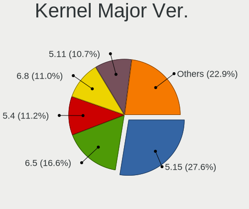
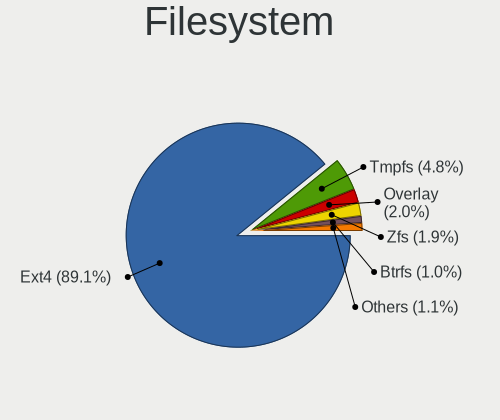
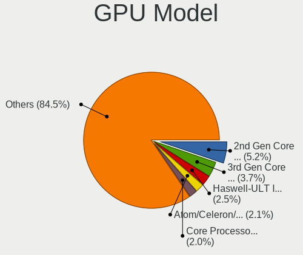
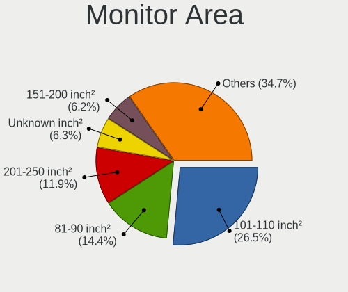

Zorin - Tested Hardware & Statistics
------------------------------------

A project to collect tested hardware configurations for Zorin.

Anyone can contribute to this report by the [hw-probe](https://github.com/linuxhw/hw-probe) tool:

    sudo -E hw-probe -all -upload

Please contribute! Especially if your hardware is rare.

This is a report for all computer types. See also reports for [desktops](/Dist/Zorin/Desktop/README.md) and [notebooks](/Dist/Zorin/Notebook/README.md).

Contents
--------

* [ Test Cases ](#test-cases)

* [ System ](#system)
  - [ OS                       ](#os)
  - [ OS Family                ](#os-family)
  - [ Kernel                   ](#kernel)
  - [ Kernel Family            ](#kernel-family)
  - [ Kernel Major Ver.        ](#kernel-major-ver)
  - [ Arch                     ](#arch)
  - [ DE                       ](#de)
  - [ Display Server           ](#display-server)
  - [ Display Manager          ](#display-manager)
  - [ OS Lang                  ](#os-lang)
  - [ Boot Mode                ](#boot-mode)
  - [ Filesystem               ](#filesystem)
  - [ Part. scheme             ](#part-scheme)
  - [ Dual Boot with Linux/BSD ](#dual-boot-with-linuxbsd)
  - [ Dual Boot (Win)          ](#dual-boot-win)

* [ Board ](#board)
  - [ Vendor                   ](#vendor)
  - [ Model                    ](#model)
  - [ Model Family             ](#model-family)
  - [ MFG Year                 ](#mfg-year)
  - [ Form Factor              ](#form-factor)
  - [ Secure Boot              ](#secure-boot)
  - [ Coreboot                 ](#coreboot)
  - [ RAM Size                 ](#ram-size)
  - [ RAM Used                 ](#ram-used)
  - [ Total Drives             ](#total-drives)
  - [ Has CD-ROM               ](#has-cd-rom)
  - [ Has Ethernet             ](#has-ethernet)
  - [ Has WiFi                 ](#has-wifi)
  - [ Has Bluetooth            ](#has-bluetooth)

* [ Location ](#location)
  - [ Country                  ](#country)
  - [ City                     ](#city)

* [ Drives ](#drives)
  - [ Drive Vendor             ](#drive-vendor)
  - [ Drive Model              ](#drive-model)
  - [ HDD Vendor               ](#hdd-vendor)
  - [ SSD Vendor               ](#ssd-vendor)
  - [ Drive Kind               ](#drive-kind)
  - [ Drive Connector          ](#drive-connector)
  - [ Drive Size               ](#drive-size)
  - [ Space Total              ](#space-total)
  - [ Space Used               ](#space-used)
  - [ Malfunc. Drives          ](#malfunc-drives)
  - [ Malfunc. Drive Vendor    ](#malfunc-drive-vendor)
  - [ Malfunc. HDD Vendor      ](#malfunc-hdd-vendor)
  - [ Malfunc. Drive Kind      ](#malfunc-drive-kind)
  - [ Failed Drives            ](#failed-drives)
  - [ Failed Drive Vendor      ](#failed-drive-vendor)
  - [ Drive Status             ](#drive-status)

* [ Storage controller ](#storage-controller)
  - [ Storage Vendor           ](#storage-vendor)
  - [ Storage Model            ](#storage-model)
  - [ Storage Kind             ](#storage-kind)

* [ Processor ](#processor)
  - [ CPU Vendor               ](#cpu-vendor)
  - [ CPU Model                ](#cpu-model)
  - [ CPU Model Family         ](#cpu-model-family)
  - [ CPU Cores                ](#cpu-cores)
  - [ CPU Sockets              ](#cpu-sockets)
  - [ CPU Threads              ](#cpu-threads)
  - [ CPU Op-Modes             ](#cpu-op-modes)
  - [ CPU Microcode            ](#cpu-microcode)
  - [ CPU Microarch            ](#cpu-microarch)

* [ Graphics ](#graphics)
  - [ GPU Vendor               ](#gpu-vendor)
  - [ GPU Model                ](#gpu-model)
  - [ GPU Combo                ](#gpu-combo)
  - [ GPU Driver               ](#gpu-driver)
  - [ GPU Memory               ](#gpu-memory)

* [ Monitor ](#monitor)
  - [ Monitor Vendor           ](#monitor-vendor)
  - [ Monitor Model            ](#monitor-model)
  - [ Monitor Resolution       ](#monitor-resolution)
  - [ Monitor Diagonal         ](#monitor-diagonal)
  - [ Monitor Width            ](#monitor-width)
  - [ Aspect Ratio             ](#aspect-ratio)
  - [ Monitor Area             ](#monitor-area)
  - [ Pixel Density            ](#pixel-density)
  - [ Multiple Monitors        ](#multiple-monitors)

* [ Network ](#network)
  - [ Net Controller Vendor    ](#net-controller-vendor)
  - [ Net Controller Model     ](#net-controller-model)
  - [ Wireless Vendor          ](#wireless-vendor)
  - [ Wireless Model           ](#wireless-model)
  - [ Ethernet Vendor          ](#ethernet-vendor)
  - [ Ethernet Model           ](#ethernet-model)
  - [ Net Controller Kind      ](#net-controller-kind)
  - [ Used Controller          ](#used-controller)
  - [ NICs                     ](#nics)
  - [ IPv6                     ](#ipv6)

* [ Bluetooth ](#bluetooth)
  - [ Bluetooth Vendor         ](#bluetooth-vendor)
  - [ Bluetooth Model          ](#bluetooth-model)

* [ Sound ](#sound)
  - [ Sound Vendor             ](#sound-vendor)
  - [ Sound Model              ](#sound-model)

* [ Memory ](#memory)
  - [ Memory Vendor            ](#memory-vendor)
  - [ Memory Model             ](#memory-model)
  - [ Memory Kind              ](#memory-kind)
  - [ Memory Form Factor       ](#memory-form-factor)
  - [ Memory Size              ](#memory-size)
  - [ Memory Speed             ](#memory-speed)

* [ Printers & scanners ](#printers--scanners)
  - [ Printer Vendor           ](#printer-vendor)
  - [ Printer Model            ](#printer-model)
  - [ Scanner Vendor           ](#scanner-vendor)
  - [ Scanner Model            ](#scanner-model)

* [ Camera ](#camera)
  - [ Camera Vendor            ](#camera-vendor)
  - [ Camera Model             ](#camera-model)

* [ Security ](#security)
  - [ Fingerprint Vendor       ](#fingerprint-vendor)
  - [ Fingerprint Model        ](#fingerprint-model)
  - [ Chipcard Vendor          ](#chipcard-vendor)
  - [ Chipcard Model           ](#chipcard-model)

* [ Unsupported ](#unsupported)
  - [ Unsupported Devices      ](#unsupported-devices)
  - [ Unsupported Device Types ](#unsupported-device-types)

Test Cases
----------

Total: 8754

| Vendor        | Model                       | Form-Factor | Probe                                                      | Date         |
|---------------|-----------------------------|-------------|------------------------------------------------------------|--------------|
| Dell          | Latitude E6430              | Notebook    | [d949738171](https://linux-hardware.org/?probe=d949738171) | Dec 24, 2023 |
| Dell          | Latitude E6430              | Notebook    | [c821d379ec](https://linux-hardware.org/?probe=c821d379ec) | Dec 24, 2023 |
| Lenovo        | IdeaPad 3 15IAU7 82RK       | Notebook    | [a69b3fa1ca](https://linux-hardware.org/?probe=a69b3fa1ca) | Dec 24, 2023 |
| Lenovo        | IdeaPad 3 15IAU7 82RK       | Notebook    | [9ac48a1719](https://linux-hardware.org/?probe=9ac48a1719) | Dec 24, 2023 |
| HP            | Notebook                    | Notebook    | [69bef099c0](https://linux-hardware.org/?probe=69bef099c0) | Dec 24, 2023 |
| Dell          | Latitude 5300               | Notebook    | [68336d8bc1](https://linux-hardware.org/?probe=68336d8bc1) | Dec 24, 2023 |
| Teclast       | F6 Plus                     | Notebook    | [a8fee53f37](https://linux-hardware.org/?probe=a8fee53f37) | Dec 24, 2023 |
| ASUSTek       | M2V                         | Desktop     | [67c7bc43ed](https://linux-hardware.org/?probe=67c7bc43ed) | Dec 23, 2023 |
| ASUSTek       | M2V                         | Desktop     | [1d6970f290](https://linux-hardware.org/?probe=1d6970f290) | Dec 23, 2023 |
| HP            | 1998                        | Desktop     | [8eb25518c4](https://linux-hardware.org/?probe=8eb25518c4) | Dec 23, 2023 |
| Acer          | Nitro AN517-55              | Notebook    | [f3e3de235b](https://linux-hardware.org/?probe=f3e3de235b) | Dec 23, 2023 |
| Acer          | Aspire A3SP14-31PT          | Convertible | [d9850a7566](https://linux-hardware.org/?probe=d9850a7566) | Dec 23, 2023 |
| HP            | Victus by 15.6 inch Gami... | Notebook    | [b74170ede4](https://linux-hardware.org/?probe=b74170ede4) | Dec 23, 2023 |
| Microsoft     | Surface Go 2                | Tablet      | [0e05c29504](https://linux-hardware.org/?probe=0e05c29504) | Dec 23, 2023 |
| Toshiba       | Satellite Pro R50-C         | Notebook    | [b4d280ac6a](https://linux-hardware.org/?probe=b4d280ac6a) | Dec 23, 2023 |
| Toshiba       | Satellite Pro R50-C         | Notebook    | [421d62894b](https://linux-hardware.org/?probe=421d62894b) | Dec 23, 2023 |
| Unknown       | W1415A                      | Notebook    | [f1fbd72c23](https://linux-hardware.org/?probe=f1fbd72c23) | Dec 23, 2023 |
| Sony          | VPCF215FX                   | Notebook    | [1a79c8b60f](https://linux-hardware.org/?probe=1a79c8b60f) | Dec 23, 2023 |
| Apple         | MacBookPro7,1               | Notebook    | [0f291ca562](https://linux-hardware.org/?probe=0f291ca562) | Dec 23, 2023 |
| ASUSTek       | M5A99FX PRO R2.0            | Desktop     | [1622d9b25b](https://linux-hardware.org/?probe=1622d9b25b) | Dec 23, 2023 |
| Toshiba       | QOSMIO X770                 | Notebook    | [dceb1203ed](https://linux-hardware.org/?probe=dceb1203ed) | Dec 23, 2023 |
| Toshiba       | QOSMIO X770                 | Notebook    | [b9557b6218](https://linux-hardware.org/?probe=b9557b6218) | Dec 23, 2023 |
| HP            | EliteBook 745 G6            | Notebook    | [9bf64ae4b7](https://linux-hardware.org/?probe=9bf64ae4b7) | Dec 23, 2023 |
| Medion        | X682X                       | Notebook    | [c0deb0e748](https://linux-hardware.org/?probe=c0deb0e748) | Dec 22, 2023 |
| Gigabyte      | B650 GAMING X AX            | Desktop     | [9c0210d1ed](https://linux-hardware.org/?probe=9c0210d1ed) | Dec 22, 2023 |
| Fujitsu       | LIFEBOOK E736               | Notebook    | [49cdf35ca4](https://linux-hardware.org/?probe=49cdf35ca4) | Dec 22, 2023 |
| Fujitsu       | LIFEBOOK T939               | Convertible | [2f5eddacdb](https://linux-hardware.org/?probe=2f5eddacdb) | Dec 22, 2023 |
| ASUSTek       | VivoBook_ASUSLaptop E203... | Notebook    | [ae01ab2ebe](https://linux-hardware.org/?probe=ae01ab2ebe) | Dec 22, 2023 |
| VTEX          | NOTEBOOK                    | Notebook    | [972b407abc](https://linux-hardware.org/?probe=972b407abc) | Dec 22, 2023 |
| Gigabyte      | B450 AORUS M                | Desktop     | [084e48827c](https://linux-hardware.org/?probe=084e48827c) | Dec 21, 2023 |
| Intel         | DH77EB AAG39073-304         | Desktop     | [83183dbb01](https://linux-hardware.org/?probe=83183dbb01) | Dec 21, 2023 |
| Dell          | 0JP3NX A01                  | Desktop     | [706947928d](https://linux-hardware.org/?probe=706947928d) | Dec 21, 2023 |
| Fujitsu       | LIFEBOOK T939               | Convertible | [b9c3b5a089](https://linux-hardware.org/?probe=b9c3b5a089) | Dec 21, 2023 |
| Gigabyte      | Z170X-UD5-CF                | Desktop     | [67662437e4](https://linux-hardware.org/?probe=67662437e4) | Dec 21, 2023 |
| Lenovo        | ThinkPad X131e 33691K7      | Notebook    | [360dc0f244](https://linux-hardware.org/?probe=360dc0f244) | Dec 21, 2023 |
| Dell          | Latitude 5440               | Notebook    | [bd5e743ebb](https://linux-hardware.org/?probe=bd5e743ebb) | Dec 21, 2023 |
| Dell          | Latitude E7270              | Notebook    | [4574a46c78](https://linux-hardware.org/?probe=4574a46c78) | Dec 21, 2023 |
| Dell          | Inspiron 15-3567            | Notebook    | [f9d9539e00](https://linux-hardware.org/?probe=f9d9539e00) | Dec 21, 2023 |
| ASUSTek       | E201NA                      | Notebook    | [ee5e05ce6d](https://linux-hardware.org/?probe=ee5e05ce6d) | Dec 21, 2023 |
| ASUSTek       | TUF Gaming B550M-PLUS       | Desktop     | [6311def15e](https://linux-hardware.org/?probe=6311def15e) | Dec 21, 2023 |
| Unknown       | Unknown                     | Desktop     | [ded73c0619](https://linux-hardware.org/?probe=ded73c0619) | Dec 21, 2023 |
| ASUSTek       | M4A785TD-V EVO              | Desktop     | [8b094a74c9](https://linux-hardware.org/?probe=8b094a74c9) | Dec 21, 2023 |
| HP            | 1000                        | Notebook    | [2279f68ba4](https://linux-hardware.org/?probe=2279f68ba4) | Dec 21, 2023 |
| HP            | EliteBook 840 G6            | Notebook    | [5266cee35b](https://linux-hardware.org/?probe=5266cee35b) | Dec 21, 2023 |
| ASUSTek       | M5A99X EVO                  | Desktop     | [c0c637bbba](https://linux-hardware.org/?probe=c0c637bbba) | Dec 21, 2023 |
| HP            | ProBook 430 G7              | Notebook    | [50a3c349a0](https://linux-hardware.org/?probe=50a3c349a0) | Dec 21, 2023 |
| HP            | ProBook 430 G7              | Notebook    | [f79ed192ac](https://linux-hardware.org/?probe=f79ed192ac) | Dec 21, 2023 |
| Apple         | MacBookPro14,1              | Notebook    | [e221a6befb](https://linux-hardware.org/?probe=e221a6befb) | Dec 21, 2023 |
| Acer          | Swift SF314-59              | Notebook    | [13432c28a6](https://linux-hardware.org/?probe=13432c28a6) | Dec 21, 2023 |
| Acer          | Swift SF314-59              | Notebook    | [0eb55bee7d](https://linux-hardware.org/?probe=0eb55bee7d) | Dec 20, 2023 |
| Dell          | 0FM586                      | Desktop     | [eadcdb629b](https://linux-hardware.org/?probe=eadcdb629b) | Dec 20, 2023 |
| Toshiba       | Satellite C850              | Notebook    | [caa584d966](https://linux-hardware.org/?probe=caa584d966) | Dec 20, 2023 |
| Lenovo        | IdeaPad 1 15ALC7 82R4       | Notebook    | [2dcde776ad](https://linux-hardware.org/?probe=2dcde776ad) | Dec 20, 2023 |
| ASUSTek       | M4A89GTD-PRO/USB3           | Desktop     | [af51ef8978](https://linux-hardware.org/?probe=af51ef8978) | Dec 20, 2023 |
| Acer          | Spin SP315-51               | Convertible | [042f9d77a0](https://linux-hardware.org/?probe=042f9d77a0) | Dec 20, 2023 |
| ASUSTek       | M4A89GTD-PRO/USB3           | Desktop     | [7cda066ff6](https://linux-hardware.org/?probe=7cda066ff6) | Dec 20, 2023 |
| Lenovo        | Yoga 7 16IRL8 82YN          | Convertible | [6a601de5d5](https://linux-hardware.org/?probe=6a601de5d5) | Dec 20, 2023 |
| ASUSTek       | ROG Strix G713PI_G713PI     | Notebook    | [f7cd6db92f](https://linux-hardware.org/?probe=f7cd6db92f) | Dec 20, 2023 |
| HP            | 1998                        | Desktop     | [bc41363911](https://linux-hardware.org/?probe=bc41363911) | Dec 20, 2023 |
| Framework     | Laptop                      | Notebook    | [2aab7ea892](https://linux-hardware.org/?probe=2aab7ea892) | Dec 19, 2023 |
| HP            | Pavilion Gaming Laptop 1... | Notebook    | [bcae8d434f](https://linux-hardware.org/?probe=bcae8d434f) | Dec 19, 2023 |
| HP            | ProBook 650 G1              | Notebook    | [95ab984d32](https://linux-hardware.org/?probe=95ab984d32) | Dec 19, 2023 |
| Lenovo        | V14-IIL 82C4                | Notebook    | [582c2df7b1](https://linux-hardware.org/?probe=582c2df7b1) | Dec 19, 2023 |
| Toshiba       | Satellite Pro C50-A-1E2     | Notebook    | [91b5e05490](https://linux-hardware.org/?probe=91b5e05490) | Dec 19, 2023 |
| Toshiba       | Satellite Pro C50-A-1E2     | Notebook    | [fde7aeea9c](https://linux-hardware.org/?probe=fde7aeea9c) | Dec 19, 2023 |
| Google        | Phaser360                   | Notebook    | [c739678794](https://linux-hardware.org/?probe=c739678794) | Dec 18, 2023 |
| HP            | 8653 A                      | Desktop     | [0fd89faa0c](https://linux-hardware.org/?probe=0fd89faa0c) | Dec 18, 2023 |
| ASUSTek       | ROG Strix G713PI_G713PI     | Notebook    | [780a4cf454](https://linux-hardware.org/?probe=780a4cf454) | Dec 18, 2023 |
| Lenovo        | ThinkPad X240 20AMS0VU00    | Notebook    | [ecca798714](https://linux-hardware.org/?probe=ecca798714) | Dec 18, 2023 |
| HP            | ProBook 430 G4              | Notebook    | [c2b96a9e0f](https://linux-hardware.org/?probe=c2b96a9e0f) | Dec 18, 2023 |
| Medion        | E6246 MD63200               | Notebook    | [eda979df79](https://linux-hardware.org/?probe=eda979df79) | Dec 18, 2023 |
| Dell          | Venue 11 Pro 5130           | Notebook    | [74cdfd92c0](https://linux-hardware.org/?probe=74cdfd92c0) | Dec 18, 2023 |
| HP            | ZBook 14u G6                | Notebook    | [125dbde28d](https://linux-hardware.org/?probe=125dbde28d) | Dec 17, 2023 |
| Lenovo        | Yoga 7 16IRL8 82YN          | Convertible | [2b9510004d](https://linux-hardware.org/?probe=2b9510004d) | Dec 17, 2023 |
| Apple         | Mac-F60DEB81FF30ACF6 Mac... | Desktop     | [a411802ac6](https://linux-hardware.org/?probe=a411802ac6) | Dec 17, 2023 |
| Sony          | VGN-FW455J                  | Notebook    | [f16255f9d1](https://linux-hardware.org/?probe=f16255f9d1) | Dec 17, 2023 |
| ASUSTek       | K53SD                       | Notebook    | [7962dd075b](https://linux-hardware.org/?probe=7962dd075b) | Dec 17, 2023 |
| Lenovo        | Y50-70 20378                | Notebook    | [07c7da687a](https://linux-hardware.org/?probe=07c7da687a) | Dec 17, 2023 |
| Lenovo        | Y50-70 20378                | Notebook    | [e6ad27a4dd](https://linux-hardware.org/?probe=e6ad27a4dd) | Dec 17, 2023 |
| HP            | Pavilion Laptop 15-cs3xx... | Notebook    | [304fbf1e83](https://linux-hardware.org/?probe=304fbf1e83) | Dec 17, 2023 |
| Lenovo        | Yoga 7 16IRL8 82YN          | Convertible | [4e3b49ab8e](https://linux-hardware.org/?probe=4e3b49ab8e) | Dec 17, 2023 |
| Irbis         | NB12                        | Notebook    | [f6eb11e455](https://linux-hardware.org/?probe=f6eb11e455) | Dec 17, 2023 |
| ASUSTek       | M4A89GTD-PRO/USB3           | Desktop     | [ad9eaf3ae6](https://linux-hardware.org/?probe=ad9eaf3ae6) | Dec 16, 2023 |
| Google        | Phaser360                   | Notebook    | [784ed40440](https://linux-hardware.org/?probe=784ed40440) | Dec 16, 2023 |
| HP            | ProBook 455 15.6 inch G1... | Notebook    | [56e1b0ed26](https://linux-hardware.org/?probe=56e1b0ed26) | Dec 16, 2023 |
| HP            | ProBook 430 G4              | Notebook    | [30f8fe050c](https://linux-hardware.org/?probe=30f8fe050c) | Dec 16, 2023 |
| HP            | Notebook                    | Notebook    | [4973d42380](https://linux-hardware.org/?probe=4973d42380) | Dec 16, 2023 |
| Dell          | 02YYK5 A01                  | Desktop     | [0558258245](https://linux-hardware.org/?probe=0558258245) | Dec 16, 2023 |
| HP            | 15                          | Notebook    | [b1de66d4ed](https://linux-hardware.org/?probe=b1de66d4ed) | Dec 16, 2023 |
| MSI           | MPG Z490 GAMING PLUS        | Desktop     | [faf62fd1be](https://linux-hardware.org/?probe=faf62fd1be) | Dec 16, 2023 |
| ASUSTek       | ROG Maximus Z790 HERO       | Desktop     | [64bf6abdc6](https://linux-hardware.org/?probe=64bf6abdc6) | Dec 16, 2023 |
| HP            | Notebook                    | Notebook    | [a960b17c37](https://linux-hardware.org/?probe=a960b17c37) | Dec 16, 2023 |
| ASUSTek       | X553MA                      | Notebook    | [1bd6eab773](https://linux-hardware.org/?probe=1bd6eab773) | Dec 15, 2023 |
| Dell          | 0FM586                      | Desktop     | [c895a8d51f](https://linux-hardware.org/?probe=c895a8d51f) | Dec 15, 2023 |
| Medion        | P7624                       | Notebook    | [4828985ec0](https://linux-hardware.org/?probe=4828985ec0) | Dec 15, 2023 |
| Medion        | P7624                       | Notebook    | [050fbbd613](https://linux-hardware.org/?probe=050fbbd613) | Dec 15, 2023 |
| HP            | 09CCh                       | Desktop     | [e966e2bb97](https://linux-hardware.org/?probe=e966e2bb97) | Dec 15, 2023 |
| Dell          | XPS 15 9550                 | Notebook    | [de4b8201ef](https://linux-hardware.org/?probe=de4b8201ef) | Dec 15, 2023 |
| ASUSTek       | ROG STRIX B550-F GAMING     | Desktop     | [646c709529](https://linux-hardware.org/?probe=646c709529) | Dec 15, 2023 |
| ASUSTek       | ROG Strix G713PI_G713PI     | Notebook    | [b5fefd59fe](https://linux-hardware.org/?probe=b5fefd59fe) | Dec 15, 2023 |
| Medion        | E4251 MD61435               | Notebook    | [7d20d738b1](https://linux-hardware.org/?probe=7d20d738b1) | Dec 14, 2023 |
| Lenovo        | IdeaPad 3 15ADA05 81W1      | Notebook    | [734375c1cc](https://linux-hardware.org/?probe=734375c1cc) | Dec 14, 2023 |
| TUXEDO        | InfinityBook Pro Gen8 (M... | Notebook    | [5ae09c04d4](https://linux-hardware.org/?probe=5ae09c04d4) | Dec 14, 2023 |
| Lenovo        | IdeaPad 3 15ADA05 81W1      | Notebook    | [3eb792873c](https://linux-hardware.org/?probe=3eb792873c) | Dec 14, 2023 |
| Gigabyte      | H410M H V3                  | Desktop     | [048f7ace00](https://linux-hardware.org/?probe=048f7ace00) | Dec 14, 2023 |
| Dell          | 0GDG8Y A00                  | Desktop     | [85f532c1c5](https://linux-hardware.org/?probe=85f532c1c5) | Dec 13, 2023 |
| Positivo      | POS-PIQ57BQ POSITIVO        | Desktop     | [1a2fe7c9ef](https://linux-hardware.org/?probe=1a2fe7c9ef) | Dec 13, 2023 |
| Dell          | Inspiron 15 5510            | Notebook    | [41dbdcf594](https://linux-hardware.org/?probe=41dbdcf594) | Dec 13, 2023 |
| ASUSTek       | ASUS TUF Gaming F17 FX70... | Notebook    | [f9933769ef](https://linux-hardware.org/?probe=f9933769ef) | Dec 13, 2023 |
| Dell          | 0HHV7N A00                  | Desktop     | [be9d84c772](https://linux-hardware.org/?probe=be9d84c772) | Dec 13, 2023 |
| Dell          | 0HHV7N A00                  | Desktop     | [eb16cdaf5c](https://linux-hardware.org/?probe=eb16cdaf5c) | Dec 13, 2023 |
| ASUSTek       | ASUS TUF Gaming F17 FX70... | Notebook    | [27b99be924](https://linux-hardware.org/?probe=27b99be924) | Dec 12, 2023 |
| HP            | Notebook                    | Notebook    | [972e86b7cf](https://linux-hardware.org/?probe=972e86b7cf) | Dec 12, 2023 |
| Lenovo        | G570 20079                  | Notebook    | [bdfc16eb98](https://linux-hardware.org/?probe=bdfc16eb98) | Dec 11, 2023 |
| ASUSTek       | Maximus VII HERO            | Desktop     | [f779186ae7](https://linux-hardware.org/?probe=f779186ae7) | Dec 11, 2023 |
| AZW           | SER V1.0                    | Mini pc     | [311c3a6954](https://linux-hardware.org/?probe=311c3a6954) | Dec 11, 2023 |
| ASUSTek       | ZenBook UX482EG_UX482EG     | Notebook    | [a644fcc63e](https://linux-hardware.org/?probe=a644fcc63e) | Dec 11, 2023 |
| Lenovo        | ThinkPad T440s 20ARS06C0... | Notebook    | [332492b0c4](https://linux-hardware.org/?probe=332492b0c4) | Dec 11, 2023 |
| HP            | 8643 SMVB                   | Desktop     | [d0ff744f50](https://linux-hardware.org/?probe=d0ff744f50) | Dec 10, 2023 |
| HP            | 09CCh                       | Desktop     | [3ef7653874](https://linux-hardware.org/?probe=3ef7653874) | Dec 10, 2023 |
| HP            | 8643 SMVB                   | Desktop     | [e7dbed1e89](https://linux-hardware.org/?probe=e7dbed1e89) | Dec 10, 2023 |
| Dell          | Inspiron 3501               | Notebook    | [67a35f1dd7](https://linux-hardware.org/?probe=67a35f1dd7) | Dec 10, 2023 |
| Dell          | 0FM586                      | Desktop     | [2bf8665376](https://linux-hardware.org/?probe=2bf8665376) | Dec 10, 2023 |
| MSI           | 2AE0                        | Desktop     | [29c5d75dcf](https://linux-hardware.org/?probe=29c5d75dcf) | Dec 10, 2023 |
| MSI           | 2AE0                        | Desktop     | [63543021ec](https://linux-hardware.org/?probe=63543021ec) | Dec 10, 2023 |
| ASUSTek       | ROG STRIX Z390-E GAMING     | Desktop     | [5522722e53](https://linux-hardware.org/?probe=5522722e53) | Dec 10, 2023 |
| ASUSTek       | ROG STRIX Z390-E GAMING     | Desktop     | [52e1cb6958](https://linux-hardware.org/?probe=52e1cb6958) | Dec 10, 2023 |
| HP            | Victus by Gaming Laptop ... | Notebook    | [949de6a6a9](https://linux-hardware.org/?probe=949de6a6a9) | Dec 10, 2023 |
| Dell          | Inspiron 7559               | Notebook    | [3f4af9bbdd](https://linux-hardware.org/?probe=3f4af9bbdd) | Dec 10, 2023 |
| Packard Be... | EasyNote TE11BZ             | Notebook    | [514899b0b9](https://linux-hardware.org/?probe=514899b0b9) | Dec 10, 2023 |
| Apple         | MacBookPro8,3               | Notebook    | [08a4bea1d7](https://linux-hardware.org/?probe=08a4bea1d7) | Dec 09, 2023 |
| ASUSTek       | PRIME A320M-K               | Desktop     | [bc892e5d3b](https://linux-hardware.org/?probe=bc892e5d3b) | Dec 09, 2023 |
| ASUSTek       | X550VC                      | Notebook    | [e2c932c285](https://linux-hardware.org/?probe=e2c932c285) | Dec 09, 2023 |
| Acer          | AOD257                      | Notebook    | [79c121ca0e](https://linux-hardware.org/?probe=79c121ca0e) | Dec 09, 2023 |
| Dell          | Vostro 3560                 | Notebook    | [d2abe7128b](https://linux-hardware.org/?probe=d2abe7128b) | Dec 09, 2023 |
| ASUSTek       | TUF Gaming X570-PLUS        | Desktop     | [955f530c70](https://linux-hardware.org/?probe=955f530c70) | Dec 08, 2023 |
| Acer          | AOD257                      | Notebook    | [c817dc5cca](https://linux-hardware.org/?probe=c817dc5cca) | Dec 08, 2023 |
| Lenovo        | ThinkPad X1 Extreme 20MF... | Notebook    | [45c2afd3f1](https://linux-hardware.org/?probe=45c2afd3f1) | Dec 08, 2023 |
| Dell          | Latitude E5470              | Notebook    | [cea78b64d4](https://linux-hardware.org/?probe=cea78b64d4) | Dec 08, 2023 |
| Acer          | Nitro AN515-54              | Notebook    | [045ab5efca](https://linux-hardware.org/?probe=045ab5efca) | Dec 08, 2023 |
| HP            | Compaq 6730b (NB034ET#UU... | Notebook    | [88c39cda86](https://linux-hardware.org/?probe=88c39cda86) | Dec 08, 2023 |
| HP            | Stream Laptop 14-cb1XX      | Notebook    | [fc2efc3edb](https://linux-hardware.org/?probe=fc2efc3edb) | Dec 07, 2023 |
| Lenovo        | ThinkPad P52 20MAS25B1X     | Notebook    | [767b4efa54](https://linux-hardware.org/?probe=767b4efa54) | Dec 06, 2023 |
| MSI           | MS-7309                     | Desktop     | [bfc6167f25](https://linux-hardware.org/?probe=bfc6167f25) | Dec 06, 2023 |
| MSI           | MS-7309                     | Desktop     | [556b1ebd9a](https://linux-hardware.org/?probe=556b1ebd9a) | Dec 06, 2023 |
| HP            | Pavilion x360 Convertibl... | Convertible | [bfd0ab0fc0](https://linux-hardware.org/?probe=bfd0ab0fc0) | Dec 06, 2023 |
| Gigabyte      | 970A-DS3P                   | Desktop     | [396f3e6e9e](https://linux-hardware.org/?probe=396f3e6e9e) | Dec 06, 2023 |
| Dell          | Latitude 7490               | Notebook    | [364b5c38d4](https://linux-hardware.org/?probe=364b5c38d4) | Dec 06, 2023 |
| Gateway       | SX2851                      | Desktop     | [2ec497373d](https://linux-hardware.org/?probe=2ec497373d) | Dec 05, 2023 |
| Apple         | MacBookAir7,2               | Notebook    | [1748ab2263](https://linux-hardware.org/?probe=1748ab2263) | Dec 05, 2023 |
| ASUSTek       | P8Z68-V GEN3                | Desktop     | [3792e939db](https://linux-hardware.org/?probe=3792e939db) | Dec 05, 2023 |
| ASRock        | B550M PG Riptide            | Desktop     | [6132709ecd](https://linux-hardware.org/?probe=6132709ecd) | Dec 05, 2023 |
| Lenovo        | SHARKBAY NOK                | Desktop     | [549c56d2f8](https://linux-hardware.org/?probe=549c56d2f8) | Dec 04, 2023 |
| Lenovo        | SHARKBAY NOK                | Desktop     | [9714fadd61](https://linux-hardware.org/?probe=9714fadd61) | Dec 04, 2023 |
| HP            | 255 G6 Notebook PC          | Notebook    | [ee58e73f03](https://linux-hardware.org/?probe=ee58e73f03) | Dec 04, 2023 |
| ASUSTek       | PRIME B450M-A               | Desktop     | [23937a8b80](https://linux-hardware.org/?probe=23937a8b80) | Dec 04, 2023 |
| Gigabyte      | B365M DS3H                  | Desktop     | [0d13c9a0b6](https://linux-hardware.org/?probe=0d13c9a0b6) | Dec 04, 2023 |
| Lenovo        | ThinkPad X1 Carbon Gen 1... | Notebook    | [dcb521e9aa](https://linux-hardware.org/?probe=dcb521e9aa) | Dec 04, 2023 |
| Unknown       | Unknown                     | Desktop     | [4800fa6c99](https://linux-hardware.org/?probe=4800fa6c99) | Dec 04, 2023 |
| Dell          | 042P49 A00                  | Desktop     | [6bc5e84b91](https://linux-hardware.org/?probe=6bc5e84b91) | Dec 04, 2023 |
| Dell          | 042P49 A00                  | Desktop     | [813edffc94](https://linux-hardware.org/?probe=813edffc94) | Dec 04, 2023 |
| HP            | 3031h                       | Desktop     | [06a9e0c346](https://linux-hardware.org/?probe=06a9e0c346) | Dec 04, 2023 |
| SONIQ Digi... | Soniq 11.6inch Convertib... | Convertible | [4e67d597e1](https://linux-hardware.org/?probe=4e67d597e1) | Dec 04, 2023 |
| Dell          | Latitude 6430U              | Notebook    | [45d1723559](https://linux-hardware.org/?probe=45d1723559) | Dec 03, 2023 |
| Dell          | Latitude 6430U              | Notebook    | [1e4dda911f](https://linux-hardware.org/?probe=1e4dda911f) | Dec 03, 2023 |
| Lenovo        | YB1-X91L                    | Convertible | [e4f6d008cc](https://linux-hardware.org/?probe=e4f6d008cc) | Dec 03, 2023 |
| MSI           | 870A-G54                    | Desktop     | [46f9552be9](https://linux-hardware.org/?probe=46f9552be9) | Dec 03, 2023 |
| HP            | Pavilion dv7                | Notebook    | [42ddf2c00c](https://linux-hardware.org/?probe=42ddf2c00c) | Dec 03, 2023 |
| Unknown       | Unknown                     | Desktop     | [dca543f661](https://linux-hardware.org/?probe=dca543f661) | Dec 03, 2023 |
| HP            | Pavilion dv5                | Notebook    | [40e03f76cf](https://linux-hardware.org/?probe=40e03f76cf) | Dec 03, 2023 |
| Gigabyte      | GA-890GPA-UD3H              | Desktop     | [7a932c5570](https://linux-hardware.org/?probe=7a932c5570) | Dec 02, 2023 |
| ASRock        | B550 Phantom Gaming 4       | Desktop     | [9b46bc6583](https://linux-hardware.org/?probe=9b46bc6583) | Dec 02, 2023 |
| Dell          | XPS 13 9360                 | Notebook    | [f2a9f68180](https://linux-hardware.org/?probe=f2a9f68180) | Dec 02, 2023 |
| Dell          | XPS 13 9360                 | Notebook    | [e6d3755007](https://linux-hardware.org/?probe=e6d3755007) | Dec 02, 2023 |
| Lenovo        | IdeaPad 1 15ALC7 82R4       | Notebook    | [5d98fa1470](https://linux-hardware.org/?probe=5d98fa1470) | Dec 02, 2023 |
| Apple         | MacBookPro14,1              | Notebook    | [9dea837056](https://linux-hardware.org/?probe=9dea837056) | Dec 02, 2023 |
| Fujitsu       | LIFEBOOK E780               | Notebook    | [f1e82db736](https://linux-hardware.org/?probe=f1e82db736) | Dec 01, 2023 |
| HP            | ENVY x360 Convertible 13... | Convertible | [aab717794b](https://linux-hardware.org/?probe=aab717794b) | Dec 01, 2023 |
| Acer          | Swift SF314-511             | Notebook    | [ca692e6dcb](https://linux-hardware.org/?probe=ca692e6dcb) | Dec 01, 2023 |
| MSI           | MPG Z590M GAMING EDGE WI... | Desktop     | [a8495b2209](https://linux-hardware.org/?probe=a8495b2209) | Dec 01, 2023 |
| Acer          | Aspire A517-52G             | Notebook    | [72702ceb3f](https://linux-hardware.org/?probe=72702ceb3f) | Dec 01, 2023 |
| HP            | 15                          | Notebook    | [7bd98a81f6](https://linux-hardware.org/?probe=7bd98a81f6) | Dec 01, 2023 |
| HP            | Laptop 15-bs0xx             | Notebook    | [02f2ca658e](https://linux-hardware.org/?probe=02f2ca658e) | Dec 01, 2023 |
| HP            | Laptop 15-bs0xx             | Notebook    | [e812beed5d](https://linux-hardware.org/?probe=e812beed5d) | Dec 01, 2023 |
| Acer          | Extensa M2610 V:1.0         | Desktop     | [e4c1bd6f51](https://linux-hardware.org/?probe=e4c1bd6f51) | Nov 30, 2023 |
| Acer          | Aspire A517-52G             | Notebook    | [33126bb441](https://linux-hardware.org/?probe=33126bb441) | Nov 30, 2023 |
| Toshiba       | Satellite L850D-131         | Notebook    | [483c7cfdf6](https://linux-hardware.org/?probe=483c7cfdf6) | Nov 30, 2023 |
| AMI           | AMD                         | Notebook    | [9f3f9ba617](https://linux-hardware.org/?probe=9f3f9ba617) | Nov 29, 2023 |
| ASUSTek       | ASUS EXPERTBOOK B5602CBA... | Notebook    | [0c08316018](https://linux-hardware.org/?probe=0c08316018) | Nov 29, 2023 |
| Gigabyte      | GA-870A-UD3                 | Desktop     | [062cd64553](https://linux-hardware.org/?probe=062cd64553) | Nov 29, 2023 |
| HP            | Spectre x360 Convertible... | Convertible | [423e8001ab](https://linux-hardware.org/?probe=423e8001ab) | Nov 29, 2023 |
| Dell          | Inspiron 5558               | Notebook    | [c934dcacd6](https://linux-hardware.org/?probe=c934dcacd6) | Nov 29, 2023 |
| HP            | EliteBook 8440p             | Notebook    | [9af25bdb99](https://linux-hardware.org/?probe=9af25bdb99) | Nov 28, 2023 |
| Medion        | Erazer P7643 MD60133        | Notebook    | [65f090fe28](https://linux-hardware.org/?probe=65f090fe28) | Nov 28, 2023 |
| HP            | 15                          | Notebook    | [c1ca96368f](https://linux-hardware.org/?probe=c1ca96368f) | Nov 28, 2023 |
| Lenovo        | IdeaPad 3 15ALC6 Ub 82KU    | Notebook    | [f99e3c8556](https://linux-hardware.org/?probe=f99e3c8556) | Nov 28, 2023 |
| ASUSTek       | K93SV                       | Notebook    | [f85fb01be1](https://linux-hardware.org/?probe=f85fb01be1) | Nov 28, 2023 |
| HP            | 15                          | Notebook    | [aba1e87e5c](https://linux-hardware.org/?probe=aba1e87e5c) | Nov 28, 2023 |
| Gigabyte      | Z87X-D3H-CF                 | Desktop     | [7d6885561f](https://linux-hardware.org/?probe=7d6885561f) | Nov 28, 2023 |
| Gigabyte      | Z87X-D3H-CF                 | Desktop     | [e106315577](https://linux-hardware.org/?probe=e106315577) | Nov 28, 2023 |
| Dell          | XPS 15 9550                 | Notebook    | [6d2e371a5f](https://linux-hardware.org/?probe=6d2e371a5f) | Nov 27, 2023 |
| Acer          | Aspire TC-280               | Desktop     | [bfd90230bc](https://linux-hardware.org/?probe=bfd90230bc) | Nov 27, 2023 |
| Lenovo        | Yoga 730-13IWL 81JR         | Convertible | [38dd158d3e](https://linux-hardware.org/?probe=38dd158d3e) | Nov 27, 2023 |
| Acer          | Aspire TC-280               | Desktop     | [4b2fec8699](https://linux-hardware.org/?probe=4b2fec8699) | Nov 27, 2023 |
| Dell          | Latitude D830               | Notebook    | [2e017edf81](https://linux-hardware.org/?probe=2e017edf81) | Nov 27, 2023 |
| HP            | ENVY m6                     | Notebook    | [41cff88708](https://linux-hardware.org/?probe=41cff88708) | Nov 26, 2023 |
| Apple         | MacBookPro5,4               | Notebook    | [fb45c81af9](https://linux-hardware.org/?probe=fb45c81af9) | Nov 26, 2023 |
| AZW           | Green G3                    | Desktop     | [c08be7a4cf](https://linux-hardware.org/?probe=c08be7a4cf) | Nov 26, 2023 |
| HP            | Pavilion dv5                | Notebook    | [de192ce8b7](https://linux-hardware.org/?probe=de192ce8b7) | Nov 26, 2023 |
| HP            | Pavilion dv5                | Notebook    | [51fc2d77fc](https://linux-hardware.org/?probe=51fc2d77fc) | Nov 26, 2023 |
| Toshiba       | TECRA W50-A                 | Notebook    | [91a2348496](https://linux-hardware.org/?probe=91a2348496) | Nov 25, 2023 |
| ASUSTek       | ROG Maximus Z790 HERO       | Desktop     | [e4062fc1e4](https://linux-hardware.org/?probe=e4062fc1e4) | Nov 25, 2023 |
| HP            | 82F1                        | Desktop     | [09c7b87413](https://linux-hardware.org/?probe=09c7b87413) | Nov 24, 2023 |
| Lenovo        | Z710 20250                  | Notebook    | [c9522c065e](https://linux-hardware.org/?probe=c9522c065e) | Nov 24, 2023 |
| HP            | 82F1                        | Desktop     | [9ed00910d4](https://linux-hardware.org/?probe=9ed00910d4) | Nov 24, 2023 |
| Lenovo        | ThinkPad T570 20HAS0K501    | Notebook    | [4fe6d8f889](https://linux-hardware.org/?probe=4fe6d8f889) | Nov 24, 2023 |
| Lenovo        | MAHOBAY Win8 STD EM DPK ... | All in one  | [a86dba284f](https://linux-hardware.org/?probe=a86dba284f) | Nov 24, 2023 |
| Toshiba       | TECRA R850                  | Notebook    | [6930db743c](https://linux-hardware.org/?probe=6930db743c) | Nov 24, 2023 |
| HP            | Stream Laptop 14-cb1xxx     | Notebook    | [eb779ea004](https://linux-hardware.org/?probe=eb779ea004) | Nov 24, 2023 |
| HP            | Stream Laptop 14-cb1xxx     | Notebook    | [0d60447eea](https://linux-hardware.org/?probe=0d60447eea) | Nov 24, 2023 |
| HP            | G5000 (GF767EA#B1A)         | Notebook    | [5239511cca](https://linux-hardware.org/?probe=5239511cca) | Nov 24, 2023 |
| ASUSTek       | ROG Strix G713PI_G713PI     | Notebook    | [9d5752b2d8](https://linux-hardware.org/?probe=9d5752b2d8) | Nov 24, 2023 |
| Unknown       | M17                         | Notebook    | [d3d7d176b4](https://linux-hardware.org/?probe=d3d7d176b4) | Nov 23, 2023 |
| Medion        | E5214                       | Notebook    | [f3ab89b2d3](https://linux-hardware.org/?probe=f3ab89b2d3) | Nov 23, 2023 |
| Acer          | Aspire E5-511               | Notebook    | [87ccf00042](https://linux-hardware.org/?probe=87ccf00042) | Nov 23, 2023 |
| HUAWEI        | NBLB-WAX9N                  | Notebook    | [c883420b97](https://linux-hardware.org/?probe=c883420b97) | Nov 23, 2023 |
| Gigabyte      | GA-MA74GMT-S2               | Desktop     | [440e7b6c7c](https://linux-hardware.org/?probe=440e7b6c7c) | Nov 23, 2023 |
| Lenovo        | ThinkPad T430 2347GU8       | Notebook    | [3b995f6b47](https://linux-hardware.org/?probe=3b995f6b47) | Nov 23, 2023 |
| Toshiba       | Satellite L850D-131         | Notebook    | [8810505a5a](https://linux-hardware.org/?probe=8810505a5a) | Nov 23, 2023 |
| Lenovo        | ThinkPad T440 20B7S0VA05    | Notebook    | [37a1e3b979](https://linux-hardware.org/?probe=37a1e3b979) | Nov 23, 2023 |
| Lenovo        | Legion 5 15ARH05 82B5       | Notebook    | [0137a4a556](https://linux-hardware.org/?probe=0137a4a556) | Nov 23, 2023 |
| ASUSTek       | Maximus VIII RANGER         | Desktop     | [c5a84018e9](https://linux-hardware.org/?probe=c5a84018e9) | Nov 23, 2023 |
| HP            | 3029h                       | Desktop     | [2dd2ec759b](https://linux-hardware.org/?probe=2dd2ec759b) | Nov 23, 2023 |
| HOUTER        | IPMIP-GS                    | Desktop     | [1daae127f8](https://linux-hardware.org/?probe=1daae127f8) | Nov 23, 2023 |
| ASUSTek       | P5G41T-M LX                 | Desktop     | [fca11dfd70](https://linux-hardware.org/?probe=fca11dfd70) | Nov 23, 2023 |
| Acer          | Aspire ES1-731              | Notebook    | [649e8a4e24](https://linux-hardware.org/?probe=649e8a4e24) | Nov 22, 2023 |
| ASUSTek       | ROG Zephyrus M16 GU603HE... | Notebook    | [8d492b21b0](https://linux-hardware.org/?probe=8d492b21b0) | Nov 22, 2023 |
| HUAWEI        | BoDE-WXX9                   | Notebook    | [343ba69496](https://linux-hardware.org/?probe=343ba69496) | Nov 22, 2023 |
| HP            | 3561                        | All in one  | [aef249e21a](https://linux-hardware.org/?probe=aef249e21a) | Nov 22, 2023 |
| HUAWEI        | BoDE-WXX9                   | Notebook    | [b365872b3f](https://linux-hardware.org/?probe=b365872b3f) | Nov 22, 2023 |
| MSI           | Z390-A PRO                  | Desktop     | [1f07a66db1](https://linux-hardware.org/?probe=1f07a66db1) | Nov 22, 2023 |
| Samsung       | 530XBB                      | Notebook    | [c31efedbdf](https://linux-hardware.org/?probe=c31efedbdf) | Nov 22, 2023 |
| Acer          | Aspire One 721              | Notebook    | [e50838c5ff](https://linux-hardware.org/?probe=e50838c5ff) | Nov 22, 2023 |
| ASUSTek       | E201NA                      | Notebook    | [11f7e8f675](https://linux-hardware.org/?probe=11f7e8f675) | Nov 22, 2023 |
| HP            | EliteBook Folio 1020 G1     | Notebook    | [022f885fe9](https://linux-hardware.org/?probe=022f885fe9) | Nov 22, 2023 |
| Notebook      | NL40_50CU                   | Notebook    | [94885b9878](https://linux-hardware.org/?probe=94885b9878) | Nov 21, 2023 |
| AZW           | MINI S 10                   | Desktop     | [47bd270ae8](https://linux-hardware.org/?probe=47bd270ae8) | Nov 21, 2023 |
| HP            | Stream Notebook PC 11       | Notebook    | [c363e01e5f](https://linux-hardware.org/?probe=c363e01e5f) | Nov 21, 2023 |
| Microsoft     | Surface Pro                 | Tablet      | [f9136272f9](https://linux-hardware.org/?probe=f9136272f9) | Nov 21, 2023 |
| Gigabyte      | H77N-WIFI                   | Desktop     | [6e0d000498](https://linux-hardware.org/?probe=6e0d000498) | Nov 20, 2023 |
| Apple         | MacBookPro14,3              | Notebook    | [3664fc3164](https://linux-hardware.org/?probe=3664fc3164) | Nov 20, 2023 |
| HUAWEI        | HVY-WXX9                    | Notebook    | [6c2755ced9](https://linux-hardware.org/?probe=6c2755ced9) | Nov 20, 2023 |
| Lenovo        | ThinkPad Edge E530 32599... | Notebook    | [f472f3fd2e](https://linux-hardware.org/?probe=f472f3fd2e) | Nov 20, 2023 |
| HP            | OMEN by Laptop              | Notebook    | [8fbd1e56eb](https://linux-hardware.org/?probe=8fbd1e56eb) | Nov 20, 2023 |
| Lenovo        | ThinkPad T460 20FMS22Q00    | Notebook    | [84df1d0476](https://linux-hardware.org/?probe=84df1d0476) | Nov 20, 2023 |
| HUAWEI        | CREFG-XX                    | Notebook    | [97b8871652](https://linux-hardware.org/?probe=97b8871652) | Nov 20, 2023 |
| Medion        | E5214                       | Notebook    | [8e3148e284](https://linux-hardware.org/?probe=8e3148e284) | Nov 20, 2023 |
| HP            | ProBook 430 G2              | Notebook    | [e0a3622122](https://linux-hardware.org/?probe=e0a3622122) | Nov 20, 2023 |
| Gigabyte      | GA-MA78G-DS3H               | Desktop     | [8047aac511](https://linux-hardware.org/?probe=8047aac511) | Nov 20, 2023 |
| MSI           | Z97-G55 SLI                 | Desktop     | [9137a70965](https://linux-hardware.org/?probe=9137a70965) | Nov 20, 2023 |
| AZW           | MINI S 10                   | Desktop     | [a1358be402](https://linux-hardware.org/?probe=a1358be402) | Nov 20, 2023 |
| Apple         | Mac-27ADBB7B4CEE8E61 iMa... | All in one  | [468cc043b8](https://linux-hardware.org/?probe=468cc043b8) | Nov 19, 2023 |
| HUAWEI        | CREFG-XX                    | Notebook    | [be15ab8952](https://linux-hardware.org/?probe=be15ab8952) | Nov 19, 2023 |
| Lenovo        | ThinkPad T460 20FMS22Q00    | Notebook    | [626d8d9409](https://linux-hardware.org/?probe=626d8d9409) | Nov 19, 2023 |
| Intel         | H61                         | Desktop     | [bdab1dc80a](https://linux-hardware.org/?probe=bdab1dc80a) | Nov 19, 2023 |
| HUAWEI        | CREFG-XX                    | Notebook    | [747979b60f](https://linux-hardware.org/?probe=747979b60f) | Nov 19, 2023 |
| Intel         | H61                         | Desktop     | [4b5806ba4c](https://linux-hardware.org/?probe=4b5806ba4c) | Nov 19, 2023 |
| Lenovo        | ThinkPad X60 1707Y91        | Notebook    | [ac0e28ee75](https://linux-hardware.org/?probe=ac0e28ee75) | Nov 19, 2023 |
| Acer          | Spin SP513-52N              | Convertible | [339c8003a9](https://linux-hardware.org/?probe=339c8003a9) | Nov 19, 2023 |
| Lenovo        | Z50-75 80EC                 | Notebook    | [6876ff8fc6](https://linux-hardware.org/?probe=6876ff8fc6) | Nov 19, 2023 |
| Acer          | Extensa M2610 V:1.0         | Desktop     | [7b70ac1965](https://linux-hardware.org/?probe=7b70ac1965) | Nov 19, 2023 |
| Medion        | E5214                       | Notebook    | [4513f3394d](https://linux-hardware.org/?probe=4513f3394d) | Nov 18, 2023 |
| HP            | 250 G6 Notebook PC          | Notebook    | [b62a8b07f4](https://linux-hardware.org/?probe=b62a8b07f4) | Nov 18, 2023 |
| ASUSTek       | TUF Gaming B460M-PLUS AC    | Desktop     | [cb10d99771](https://linux-hardware.org/?probe=cb10d99771) | Nov 18, 2023 |
| HUAWEI        | NBLB-WAX9N                  | Notebook    | [ec19f0fa52](https://linux-hardware.org/?probe=ec19f0fa52) | Nov 18, 2023 |
| Lenovo        | ThinkCentre M90p 5536Y1K    | Desktop     | [6bdc4cb524](https://linux-hardware.org/?probe=6bdc4cb524) | Nov 18, 2023 |
| Lenovo        | ThinkPad Yoga 11e 3rd Ge... | Convertible | [75cd18198b](https://linux-hardware.org/?probe=75cd18198b) | Nov 18, 2023 |
| Dell          | Latitude 5490               | Notebook    | [b3da1a92d0](https://linux-hardware.org/?probe=b3da1a92d0) | Nov 17, 2023 |
| Compaq        | Presario CQ-17              | Notebook    | [7b53a480e4](https://linux-hardware.org/?probe=7b53a480e4) | Nov 17, 2023 |
| ASUSTek       | ROG Strix G814JI_G814JI     | Notebook    | [54bad5da51](https://linux-hardware.org/?probe=54bad5da51) | Nov 17, 2023 |
| Lenovo        | SHARKBAY NOK                | Desktop     | [d087235304](https://linux-hardware.org/?probe=d087235304) | Nov 17, 2023 |
| Toshiba       | TECRA R850                  | Notebook    | [9974b99f5a](https://linux-hardware.org/?probe=9974b99f5a) | Nov 16, 2023 |
| HP            | Pavilion g7                 | Notebook    | [9f8b6f3432](https://linux-hardware.org/?probe=9f8b6f3432) | Nov 16, 2023 |
| HP            | Pavilion g7                 | Notebook    | [0c4816a4f2](https://linux-hardware.org/?probe=0c4816a4f2) | Nov 16, 2023 |
| ECS           | H61H2-M2                    | Desktop     | [df572cd989](https://linux-hardware.org/?probe=df572cd989) | Nov 15, 2023 |
| Lenovo        | ThinkPad P17 Gen 2i 20YU... | Notebook    | [7edaa0f1be](https://linux-hardware.org/?probe=7edaa0f1be) | Nov 15, 2023 |
| HP            | InsydeH2O EFI BIOS          | Notebook    | [559ef6212b](https://linux-hardware.org/?probe=559ef6212b) | Nov 15, 2023 |
| Lenovo        | Yoga C640-13IML 81UE        | Convertible | [d79f8e5ed5](https://linux-hardware.org/?probe=d79f8e5ed5) | Nov 14, 2023 |
| HP            | ZBook 14u G6                | Notebook    | [c6471dbbfd](https://linux-hardware.org/?probe=c6471dbbfd) | Nov 14, 2023 |
| Adreamer      | PN1308P                     | Notebook    | [8c4d2fca5a](https://linux-hardware.org/?probe=8c4d2fca5a) | Nov 14, 2023 |
| Adreamer      | PN1308P                     | Notebook    | [5efc66eebc](https://linux-hardware.org/?probe=5efc66eebc) | Nov 14, 2023 |
| HP            | Compaq 6910p                | Notebook    | [019a154d30](https://linux-hardware.org/?probe=019a154d30) | Nov 14, 2023 |
| Dell          | System Vostro 3750          | Notebook    | [513485cc8f](https://linux-hardware.org/?probe=513485cc8f) | Nov 14, 2023 |
| Tactus        | GeoBook 110                 | Notebook    | [077bbdc325](https://linux-hardware.org/?probe=077bbdc325) | Nov 14, 2023 |
| Tactus        | GeoBook 110                 | Notebook    | [5e50f31cbb](https://linux-hardware.org/?probe=5e50f31cbb) | Nov 14, 2023 |
| Apple         | MacBookPro12,1              | Notebook    | [d00bbdf844](https://linux-hardware.org/?probe=d00bbdf844) | Nov 14, 2023 |
| Apple         | MacBookPro12,1              | Notebook    | [493702778b](https://linux-hardware.org/?probe=493702778b) | Nov 14, 2023 |
| Fujitsu       | D2619 S26361-D2619-N15 W... | Server      | [d9f5b1502c](https://linux-hardware.org/?probe=d9f5b1502c) | Nov 14, 2023 |
| Fujitsu       | D2619 S26361-D2619-N15 W... | Server      | [56925134d7](https://linux-hardware.org/?probe=56925134d7) | Nov 14, 2023 |
| JHZD          | BQM5                        | Desktop     | [cab813ae6e](https://linux-hardware.org/?probe=cab813ae6e) | Nov 14, 2023 |
| Gigabyte      | Z390 UD                     | Desktop     | [f961fee784](https://linux-hardware.org/?probe=f961fee784) | Nov 14, 2023 |
| Dell          | System Vostro 3750          | Notebook    | [3c336ad6e1](https://linux-hardware.org/?probe=3c336ad6e1) | Nov 14, 2023 |
| Lenovo        | ThinkPad E550 20DF00CNGE    | Notebook    | [35e0f85cf3](https://linux-hardware.org/?probe=35e0f85cf3) | Nov 13, 2023 |
| HP            | Laptop 14-ck0xxx            | Notebook    | [73a53ca5a4](https://linux-hardware.org/?probe=73a53ca5a4) | Nov 13, 2023 |
| Dell          | 0RW199                      | Desktop     | [e3b364ccd6](https://linux-hardware.org/?probe=e3b364ccd6) | Nov 13, 2023 |
| Intel         | H61                         | Desktop     | [cbefae3544](https://linux-hardware.org/?probe=cbefae3544) | Nov 13, 2023 |
| ASUSTek       | ASUS TUF Gaming A15 FA50... | Notebook    | [a0105ee2c8](https://linux-hardware.org/?probe=a0105ee2c8) | Nov 13, 2023 |
| HP            | 15                          | Notebook    | [20b22b2eeb](https://linux-hardware.org/?probe=20b22b2eeb) | Nov 13, 2023 |
| HUAWEI        | NBLB-WAX9N                  | Notebook    | [83d6eddd15](https://linux-hardware.org/?probe=83d6eddd15) | Nov 12, 2023 |
| Fujitsu       | D3221-A1 S26361-D3221-A1    | Desktop     | [8bcc86ef17](https://linux-hardware.org/?probe=8bcc86ef17) | Nov 12, 2023 |
| HP            | ProLiant ML350e Gen8 v2     | Desktop     | [f5de128dd1](https://linux-hardware.org/?probe=f5de128dd1) | Nov 12, 2023 |
| Lenovo        | SHARKBAY SDK0E50510 PRO     | Desktop     | [d46548a5e6](https://linux-hardware.org/?probe=d46548a5e6) | Nov 12, 2023 |
| Dell          | 0HN7XN A01                  | Desktop     | [cd4230cf5b](https://linux-hardware.org/?probe=cd4230cf5b) | Nov 12, 2023 |
| HUAWEI        | RLEFG-XX                    | Notebook    | [5f413be4fc](https://linux-hardware.org/?probe=5f413be4fc) | Nov 12, 2023 |
| HUAWEI        | BOHB-WAX9                   | Notebook    | [1d2a92df29](https://linux-hardware.org/?probe=1d2a92df29) | Nov 12, 2023 |
| Lenovo        | ThinkPad E580 20KS001RGE    | Notebook    | [55b706c3ec](https://linux-hardware.org/?probe=55b706c3ec) | Nov 12, 2023 |
| Lenovo        | ThinkPad T460 20FMS22Q00    | Notebook    | [4c40c1d213](https://linux-hardware.org/?probe=4c40c1d213) | Nov 11, 2023 |
| Unknown       | Unknown                     | Notebook    | [16acb0dabc](https://linux-hardware.org/?probe=16acb0dabc) | Nov 11, 2023 |
| Toshiba       | Satellite L655              | Notebook    | [b3c59942a1](https://linux-hardware.org/?probe=b3c59942a1) | Nov 11, 2023 |
| Intel         | H61                         | Desktop     | [c65f2e03f6](https://linux-hardware.org/?probe=c65f2e03f6) | Nov 11, 2023 |
| HP            | Presario CQ62               | Notebook    | [584d709751](https://linux-hardware.org/?probe=584d709751) | Nov 11, 2023 |
| Toshiba       | PORTEGE Z30-A               | Notebook    | [1b3661590f](https://linux-hardware.org/?probe=1b3661590f) | Nov 11, 2023 |
| Lenovo        | IdeaPad 3 14ITL6 82H7       | Notebook    | [13798a5389](https://linux-hardware.org/?probe=13798a5389) | Nov 11, 2023 |
| Lenovo        | IdeaPad 3 14ITL6 82H7       | Notebook    | [b962155541](https://linux-hardware.org/?probe=b962155541) | Nov 11, 2023 |
| Dell          | Precision M6800             | Notebook    | [4ad69afe3a](https://linux-hardware.org/?probe=4ad69afe3a) | Nov 11, 2023 |
| Apple         | MacBookPro9,2               | Notebook    | [e4fd0fa1f0](https://linux-hardware.org/?probe=e4fd0fa1f0) | Nov 10, 2023 |
| HP            | 250 G8 Notebook PC          | Notebook    | [fda2670cc5](https://linux-hardware.org/?probe=fda2670cc5) | Nov 10, 2023 |
| Gigabyte      | H510M H                     | Desktop     | [08c8ac6e4d](https://linux-hardware.org/?probe=08c8ac6e4d) | Nov 09, 2023 |
| Gigabyte      | H510M H                     | Desktop     | [c0e0567705](https://linux-hardware.org/?probe=c0e0567705) | Nov 09, 2023 |
| Lenovo        | Z40-70 20366                | Notebook    | [f1968605c1](https://linux-hardware.org/?probe=f1968605c1) | Nov 09, 2023 |
| ASUSTek       | P8H61-M LE/USB3             | Desktop     | [97e4b3093b](https://linux-hardware.org/?probe=97e4b3093b) | Nov 09, 2023 |
| Dell          | 0RW199                      | Desktop     | [11e414d343](https://linux-hardware.org/?probe=11e414d343) | Nov 08, 2023 |
| Acer          | Aspire E1-531               | Notebook    | [6a30b05dcb](https://linux-hardware.org/?probe=6a30b05dcb) | Nov 08, 2023 |
| PEAQ          | PNB C1014-I1B1 MD99447      | Notebook    | [33d5a0aa8c](https://linux-hardware.org/?probe=33d5a0aa8c) | Nov 08, 2023 |
| MSI           | MAG B650 TOMAHAWK WIFI      | Desktop     | [b48cc5df9c](https://linux-hardware.org/?probe=b48cc5df9c) | Nov 08, 2023 |
| ASUSTek       | ROG Strix G713PI_G713PI     | Notebook    | [cc75144dea](https://linux-hardware.org/?probe=cc75144dea) | Nov 08, 2023 |
| HP            | 250 G8 Notebook PC          | Notebook    | [38b21b9f64](https://linux-hardware.org/?probe=38b21b9f64) | Nov 08, 2023 |
| Acer          | Aspire E5-553G              | Notebook    | [f77e4d524d](https://linux-hardware.org/?probe=f77e4d524d) | Nov 08, 2023 |
| HP            | Compaq 6830s                | Notebook    | [069a45be37](https://linux-hardware.org/?probe=069a45be37) | Nov 08, 2023 |
| Gigabyte      | GA-890FXA-UD5               | Desktop     | [abb549b943](https://linux-hardware.org/?probe=abb549b943) | Nov 07, 2023 |
| Lenovo        | ThinkPad T440p 20AWS08S0... | Notebook    | [b7e993f677](https://linux-hardware.org/?probe=b7e993f677) | Nov 07, 2023 |
| Dell          | 0KWVT8 A03                  | Desktop     | [864f50cabf](https://linux-hardware.org/?probe=864f50cabf) | Nov 07, 2023 |
| Fujitsu Si... | AMILO Li 1818               | Notebook    | [ab74cc1cc6](https://linux-hardware.org/?probe=ab74cc1cc6) | Nov 07, 2023 |
| Dell          | Venue 11 Pro 5130           | Notebook    | [c2434cadfc](https://linux-hardware.org/?probe=c2434cadfc) | Nov 07, 2023 |
| Dell          | Venue 11 Pro 5130           | Notebook    | [a5628b0f9d](https://linux-hardware.org/?probe=a5628b0f9d) | Nov 07, 2023 |
| Lenovo        | Gardenia CRB SDK0J40709 ... | All in one  | [ef772812b1](https://linux-hardware.org/?probe=ef772812b1) | Nov 07, 2023 |
| Acer          | Aspire ES1-572              | Notebook    | [eea33256f6](https://linux-hardware.org/?probe=eea33256f6) | Nov 07, 2023 |
| ASUSTek       | NODUSM3                     | Desktop     | [ad49ac2316](https://linux-hardware.org/?probe=ad49ac2316) | Nov 07, 2023 |
| Lenovo        | IdeaPad S400u 20213         | Notebook    | [5ddd610c2d](https://linux-hardware.org/?probe=5ddd610c2d) | Nov 06, 2023 |
| Dell          | Venue 11 Pro 5130           | Notebook    | [5d63a1487d](https://linux-hardware.org/?probe=5d63a1487d) | Nov 06, 2023 |
| Samsung       | DT1234567890 SEC_SW_REVI... | Desktop     | [4ef314d383](https://linux-hardware.org/?probe=4ef314d383) | Nov 06, 2023 |
| Acer          | Aspire ES1-521              | Notebook    | [8447756322](https://linux-hardware.org/?probe=8447756322) | Nov 06, 2023 |
| Acer          | Aspire ES1-521              | Notebook    | [af12dd22ba](https://linux-hardware.org/?probe=af12dd22ba) | Nov 06, 2023 |
| ASUSTek       | ROG Maximus XII FORMULA     | Desktop     | [6c8bb1840e](https://linux-hardware.org/?probe=6c8bb1840e) | Nov 05, 2023 |
| Dell          | Venue 11 Pro 5130           | Notebook    | [0facd311dc](https://linux-hardware.org/?probe=0facd311dc) | Nov 05, 2023 |
| Dell          | Venue 11 Pro 5130           | Notebook    | [27740d5118](https://linux-hardware.org/?probe=27740d5118) | Nov 05, 2023 |
| MSI           | MAG B650 TOMAHAWK WIFI      | Desktop     | [38b95c0462](https://linux-hardware.org/?probe=38b95c0462) | Nov 05, 2023 |
| Dell          | Latitude E7450              | Notebook    | [71fe592aa3](https://linux-hardware.org/?probe=71fe592aa3) | Nov 05, 2023 |
| Lenovo        | ThinkPad T14 Gen 1 20S1S... | Notebook    | [4bf4b470a0](https://linux-hardware.org/?probe=4bf4b470a0) | Nov 05, 2023 |
| HP            | 1497                        | Desktop     | [734abf0595](https://linux-hardware.org/?probe=734abf0595) | Nov 05, 2023 |
| ASUSTek       | ROG Strix G713PI_G713PI     | Notebook    | [8b3f431a00](https://linux-hardware.org/?probe=8b3f431a00) | Nov 05, 2023 |
| Toshiba       | IS 1412                     | Notebook    | [486d28dfeb](https://linux-hardware.org/?probe=486d28dfeb) | Nov 05, 2023 |
| ASUSTek       | TUF Gaming Z790-PLUS WIF... | Desktop     | [9d8a12d929](https://linux-hardware.org/?probe=9d8a12d929) | Nov 05, 2023 |
| Gigabyte      | M5NM1AI-GB                  | Desktop     | [99e2275a93](https://linux-hardware.org/?probe=99e2275a93) | Nov 05, 2023 |
| Unknown       | Unknown                     | Desktop     | [dbd2e07499](https://linux-hardware.org/?probe=dbd2e07499) | Nov 05, 2023 |
| Unknown       | Unknown                     | Desktop     | [e98e6bb977](https://linux-hardware.org/?probe=e98e6bb977) | Nov 05, 2023 |
| Toshiba       | IS 1412                     | Notebook    | [d423a5c34a](https://linux-hardware.org/?probe=d423a5c34a) | Nov 04, 2023 |
| Toshiba       | STI 001359                  | Desktop     | [ebf464dbb3](https://linux-hardware.org/?probe=ebf464dbb3) | Nov 04, 2023 |
| Apple         | Mac-F2268DC8                | All in one  | [1173519349](https://linux-hardware.org/?probe=1173519349) | Nov 04, 2023 |
| Lenovo        | ThinkPad X1 Carbon Gen 8... | Notebook    | [38df9f5382](https://linux-hardware.org/?probe=38df9f5382) | Nov 04, 2023 |
| TrekStor      | Surfbook W2                 | Notebook    | [cfee0c0363](https://linux-hardware.org/?probe=cfee0c0363) | Nov 04, 2023 |
| HP            | 250 G8 Notebook PC          | Notebook    | [7a24e5115a](https://linux-hardware.org/?probe=7a24e5115a) | Nov 04, 2023 |
| Lenovo        | Y520-15IKBN 80WK            | Notebook    | [c07d28d9bc](https://linux-hardware.org/?probe=c07d28d9bc) | Nov 04, 2023 |
| Lenovo        | Y520-15IKBN 80WK            | Notebook    | [00cab2c4d1](https://linux-hardware.org/?probe=00cab2c4d1) | Nov 04, 2023 |
| Timi          | A35                         | Notebook    | [1baa5932cc](https://linux-hardware.org/?probe=1baa5932cc) | Nov 03, 2023 |
| ASUSTek       | TUF B450M-PLUS GAMING       | Desktop     | [239e99c725](https://linux-hardware.org/?probe=239e99c725) | Nov 03, 2023 |
| Dell          | Latitude E6520              | Notebook    | [a0e05f5040](https://linux-hardware.org/?probe=a0e05f5040) | Nov 02, 2023 |
| ASUSTek       | T100TAF                     | Notebook    | [ea9f809740](https://linux-hardware.org/?probe=ea9f809740) | Nov 02, 2023 |
| Gigabyte      | Z790 GAMING X AX            | Desktop     | [c5e282cbad](https://linux-hardware.org/?probe=c5e282cbad) | Nov 02, 2023 |
| HUAWEI        | BOHK-WAX9X                  | Notebook    | [4372a2d9eb](https://linux-hardware.org/?probe=4372a2d9eb) | Nov 02, 2023 |
| Lenovo        | IdeaPad 3 14ITL6 82H7       | Notebook    | [fb7f16d298](https://linux-hardware.org/?probe=fb7f16d298) | Nov 02, 2023 |
| ASUSTek       | U36SD                       | Notebook    | [e2045d61a5](https://linux-hardware.org/?probe=e2045d61a5) | Nov 02, 2023 |
| ASUSTek       | ROG Strix G713PI_G713PI     | Notebook    | [ef9bc3cc1e](https://linux-hardware.org/?probe=ef9bc3cc1e) | Nov 02, 2023 |
| ONDA          | Tablet                      | Tablet      | [1f8b5d6c72](https://linux-hardware.org/?probe=1f8b5d6c72) | Nov 01, 2023 |
| Dell          | 0XCR8D A01                  | Desktop     | [bc8414b164](https://linux-hardware.org/?probe=bc8414b164) | Nov 01, 2023 |
| Gigabyte      | H510M H                     | Desktop     | [6db0212093](https://linux-hardware.org/?probe=6db0212093) | Nov 01, 2023 |
| Acer          | Aspire 5736Z                | Notebook    | [9fff8956bb](https://linux-hardware.org/?probe=9fff8956bb) | Nov 01, 2023 |
| Apple         | MacBookPro3,1               | Notebook    | [73a395f017](https://linux-hardware.org/?probe=73a395f017) | Nov 01, 2023 |
| Lenovo        | MAHOBAY                     | Desktop     | [319e545ba5](https://linux-hardware.org/?probe=319e545ba5) | Oct 31, 2023 |
| MSI           | A320M PRO-M2 V2             | Desktop     | [3b667e2123](https://linux-hardware.org/?probe=3b667e2123) | Oct 31, 2023 |
| Pegatron      | EVANS                       | Desktop     | [3ea2a80843](https://linux-hardware.org/?probe=3ea2a80843) | Oct 31, 2023 |
| Pegatron      | EVANS                       | Desktop     | [52c3eeea68](https://linux-hardware.org/?probe=52c3eeea68) | Oct 31, 2023 |
| RCA           | W122SC24T2                  | Tablet      | [1313389b98](https://linux-hardware.org/?probe=1313389b98) | Oct 31, 2023 |
| RCA           | W122SC24T2                  | Tablet      | [f46f159a0c](https://linux-hardware.org/?probe=f46f159a0c) | Oct 31, 2023 |
| Sony          | SVS15116GAB                 | Notebook    | [03634a7731](https://linux-hardware.org/?probe=03634a7731) | Oct 30, 2023 |
| MSI           | Delta 15 A5EFK              | Notebook    | [185b65ebc1](https://linux-hardware.org/?probe=185b65ebc1) | Oct 30, 2023 |
| HP            | 21F5 0A                     | Desktop     | [097ce56daf](https://linux-hardware.org/?probe=097ce56daf) | Oct 30, 2023 |
| ASUSTek       | ROG STRIX Z690-I GAMING ... | Desktop     | [c447277c0b](https://linux-hardware.org/?probe=c447277c0b) | Oct 30, 2023 |
| Notebook      | PA70Hx                      | Notebook    | [627ed781b5](https://linux-hardware.org/?probe=627ed781b5) | Oct 30, 2023 |
| HP            | 15                          | Notebook    | [1480b12f56](https://linux-hardware.org/?probe=1480b12f56) | Oct 30, 2023 |
| HP            | Notebook                    | Notebook    | [5538a0e3b2](https://linux-hardware.org/?probe=5538a0e3b2) | Oct 30, 2023 |
| HP            | Pavilion dv4                | Notebook    | [854806c6f4](https://linux-hardware.org/?probe=854806c6f4) | Oct 29, 2023 |
| HP            | 1998                        | Desktop     | [2182b05a45](https://linux-hardware.org/?probe=2182b05a45) | Oct 29, 2023 |
| HP            | ENVY 17                     | Notebook    | [8852bab8c1](https://linux-hardware.org/?probe=8852bab8c1) | Oct 29, 2023 |
| ASUSTek       | PRIME B550-PLUS             | Desktop     | [28f261fb9a](https://linux-hardware.org/?probe=28f261fb9a) | Oct 29, 2023 |
| Lenovo        | ThinkPad X270 20HMS1T600    | Notebook    | [97fbe59dd7](https://linux-hardware.org/?probe=97fbe59dd7) | Oct 29, 2023 |
| Notebook      | PA70Hx                      | Notebook    | [e13de47400](https://linux-hardware.org/?probe=e13de47400) | Oct 29, 2023 |
| Lenovo        | ThinkPad E420 1141BTU       | Notebook    | [867e950bca](https://linux-hardware.org/?probe=867e950bca) | Oct 29, 2023 |
| ASUSTek       | VivoBook_ASUSLaptop K650... | Notebook    | [a123ac023f](https://linux-hardware.org/?probe=a123ac023f) | Oct 29, 2023 |
| MSI           | Z370M MORTAR                | Desktop     | [0af3708cd3](https://linux-hardware.org/?probe=0af3708cd3) | Oct 29, 2023 |
| HP            | 18E4                        | Desktop     | [b192ce4f35](https://linux-hardware.org/?probe=b192ce4f35) | Oct 28, 2023 |
| ASUSTek       | ZenBook UX434IQ_Q407IQ      | Notebook    | [97eabba1a8](https://linux-hardware.org/?probe=97eabba1a8) | Oct 28, 2023 |
| Dell          | 06X1TJ A00                  | Desktop     | [c2bc73c67b](https://linux-hardware.org/?probe=c2bc73c67b) | Oct 28, 2023 |
| Acer          | Aspire V3-772G              | Notebook    | [d48a91cce4](https://linux-hardware.org/?probe=d48a91cce4) | Oct 28, 2023 |
| ASUSTek       | P8B75-M                     | Desktop     | [b9830b7f02](https://linux-hardware.org/?probe=b9830b7f02) | Oct 28, 2023 |
| Lenovo        | 0x36C4 SDK0M26027 WIN 32... | All in one  | [98c2ece6fd](https://linux-hardware.org/?probe=98c2ece6fd) | Oct 28, 2023 |
| HP            | ENVY 17                     | Notebook    | [aaa99aaa53](https://linux-hardware.org/?probe=aaa99aaa53) | Oct 27, 2023 |
| Acer          | TravelMate Spin P614RN-5    | Convertible | [e337a1e208](https://linux-hardware.org/?probe=e337a1e208) | Oct 27, 2023 |
| HCL Infosy... | HCL ME Laptop               | Notebook    | [a23dc90a3b](https://linux-hardware.org/?probe=a23dc90a3b) | Oct 27, 2023 |
| MSI           | Boston                      | Desktop     | [66f7505c8b](https://linux-hardware.org/?probe=66f7505c8b) | Oct 27, 2023 |
| Thomson       | WWNEO14C-4BK32F             | Notebook    | [516a5ee33b](https://linux-hardware.org/?probe=516a5ee33b) | Oct 27, 2023 |
| HP            | 2215                        | Desktop     | [01fd79c4fe](https://linux-hardware.org/?probe=01fd79c4fe) | Oct 26, 2023 |
| ASUSTek       | TUF Gaming B650-PLUS WIF... | Desktop     | [463b5f73b5](https://linux-hardware.org/?probe=463b5f73b5) | Oct 26, 2023 |
| ASUSTek       | ZenBook UX434IQ_Q407IQ      | Notebook    | [763e54c87b](https://linux-hardware.org/?probe=763e54c87b) | Oct 26, 2023 |
| HP            | G61                         | Notebook    | [d184a33522](https://linux-hardware.org/?probe=d184a33522) | Oct 26, 2023 |
| Lenovo        | SHARKBAY NOK                | Desktop     | [67021475e9](https://linux-hardware.org/?probe=67021475e9) | Oct 26, 2023 |
| ASUSTek       | PRIME X370-A                | Desktop     | [ec0dcdaa76](https://linux-hardware.org/?probe=ec0dcdaa76) | Oct 26, 2023 |
| ASUSTek       | PRIME X370-A                | Desktop     | [4f4d354524](https://linux-hardware.org/?probe=4f4d354524) | Oct 26, 2023 |
| Intel         | H61                         | Desktop     | [cb396f193e](https://linux-hardware.org/?probe=cb396f193e) | Oct 26, 2023 |
| Lenovo        | 36EB SDK0J40700 WIN 3258... | Desktop     | [ca4ce5575c](https://linux-hardware.org/?probe=ca4ce5575c) | Oct 26, 2023 |
| HP            | Pavilion g7                 | Notebook    | [4699d107df](https://linux-hardware.org/?probe=4699d107df) | Oct 26, 2023 |
| LORD ELECT... | Guso G4x + ICH7 Series M... | Desktop     | [c6f81cf996](https://linux-hardware.org/?probe=c6f81cf996) | Oct 25, 2023 |
| HP            | 250 G7 Notebook PC          | Notebook    | [3c8f87fe9e](https://linux-hardware.org/?probe=3c8f87fe9e) | Oct 25, 2023 |
| Lenovo        | 0x36C4 SDK0M26027 WIN 32... | All in one  | [e0534a1c2a](https://linux-hardware.org/?probe=e0534a1c2a) | Oct 25, 2023 |
| HP            | 250 G8 Notebook PC          | Notebook    | [cd1abadd3a](https://linux-hardware.org/?probe=cd1abadd3a) | Oct 25, 2023 |
| ASUSTek       | P8Z77-V LX                  | Desktop     | [6f9c14dc54](https://linux-hardware.org/?probe=6f9c14dc54) | Oct 24, 2023 |
| Acer          | Aspire 5738                 | Notebook    | [039878b1b2](https://linux-hardware.org/?probe=039878b1b2) | Oct 24, 2023 |
| Gigabyte      | B450 AORUS M                | Desktop     | [706967e8e6](https://linux-hardware.org/?probe=706967e8e6) | Oct 24, 2023 |
| Gigabyte      | B85M-D3V Plus               | Desktop     | [845b1f10ef](https://linux-hardware.org/?probe=845b1f10ef) | Oct 24, 2023 |
| Dell          | 0RCPW3 A03                  | Desktop     | [a461b9f3e7](https://linux-hardware.org/?probe=a461b9f3e7) | Oct 23, 2023 |
| Dell          | 0R790T A00                  | Desktop     | [905555c7d5](https://linux-hardware.org/?probe=905555c7d5) | Oct 23, 2023 |
| Dell          | 0R790T A00                  | Desktop     | [5f6d67d67e](https://linux-hardware.org/?probe=5f6d67d67e) | Oct 23, 2023 |
| Fanless Mi... | Rev GMLR1                   | Mini pc     | [cd4e6f4d07](https://linux-hardware.org/?probe=cd4e6f4d07) | Oct 23, 2023 |
| ASRock        | AB350 Pro4                  | Desktop     | [961b658ac5](https://linux-hardware.org/?probe=961b658ac5) | Oct 23, 2023 |
| Lenovo        | ThinkPad A485 20MVS0X62X    | Notebook    | [52661c1969](https://linux-hardware.org/?probe=52661c1969) | Oct 22, 2023 |
| ASUSTek       | TUF Gaming Z590-PLUS WIF... | Desktop     | [6f89b3f8ad](https://linux-hardware.org/?probe=6f89b3f8ad) | Oct 22, 2023 |
| ONDA          | Tablet                      | Tablet      | [2ef7c07bdf](https://linux-hardware.org/?probe=2ef7c07bdf) | Oct 22, 2023 |
| Gigabyte      | H61M-DS2                    | Desktop     | [ff9e1d6c16](https://linux-hardware.org/?probe=ff9e1d6c16) | Oct 22, 2023 |
| Gigabyte      | H61M-DS2                    | Desktop     | [9999b4b89a](https://linux-hardware.org/?probe=9999b4b89a) | Oct 22, 2023 |
| Dell          | Precision 7530              | Notebook    | [92f2a2c99e](https://linux-hardware.org/?probe=92f2a2c99e) | Oct 22, 2023 |
| ASUSTek       | X453MA                      | Notebook    | [ef8715c7a7](https://linux-hardware.org/?probe=ef8715c7a7) | Oct 21, 2023 |
| Acer          | Nitro AN515-52              | Notebook    | [081a658255](https://linux-hardware.org/?probe=081a658255) | Oct 21, 2023 |
| TrekStor      | Surfbook W2                 | Notebook    | [001d67067b](https://linux-hardware.org/?probe=001d67067b) | Oct 21, 2023 |
| ONDA          | Tablet                      | Tablet      | [835a5e9d6d](https://linux-hardware.org/?probe=835a5e9d6d) | Oct 21, 2023 |
| ASUSTek       | SABERTOOTH P67              | Desktop     | [5536078e9f](https://linux-hardware.org/?probe=5536078e9f) | Oct 21, 2023 |
| HP            | Laptop 14-cf2xxx            | Notebook    | [ef8c0bb04c](https://linux-hardware.org/?probe=ef8c0bb04c) | Oct 21, 2023 |
| HP            | Laptop 14s-dq2xxx           | Notebook    | [330cbe85c6](https://linux-hardware.org/?probe=330cbe85c6) | Oct 21, 2023 |
| HP            | Pavilion dv6                | Notebook    | [a7ee33da8f](https://linux-hardware.org/?probe=a7ee33da8f) | Oct 21, 2023 |
| Dell          | Inspiron 7560               | Notebook    | [6b9df8da7d](https://linux-hardware.org/?probe=6b9df8da7d) | Oct 21, 2023 |
| ASUSTek       | X453MA                      | Notebook    | [11d8517f7e](https://linux-hardware.org/?probe=11d8517f7e) | Oct 20, 2023 |
| HUAWEI        | BOHK-WAX9X                  | Notebook    | [9ce038aa93](https://linux-hardware.org/?probe=9ce038aa93) | Oct 20, 2023 |
| ASRock        | B450 Pro4                   | Desktop     | [d8b8f7bafe](https://linux-hardware.org/?probe=d8b8f7bafe) | Oct 20, 2023 |
| Lenovo        | SHARKBAY NOK                | Desktop     | [cb8d8311e7](https://linux-hardware.org/?probe=cb8d8311e7) | Oct 20, 2023 |
| HP            | Laptop 14-cf2xxx            | Notebook    | [3dd8426b8f](https://linux-hardware.org/?probe=3dd8426b8f) | Oct 20, 2023 |
| ASUSTek       | TUF Gaming X570-PLUS        | Desktop     | [af96c09a64](https://linux-hardware.org/?probe=af96c09a64) | Oct 19, 2023 |
| MSI           | MAG Z590 TOMAHAWK WIFI      | Desktop     | [77079711d3](https://linux-hardware.org/?probe=77079711d3) | Oct 19, 2023 |
| ASUSTek       | TUF Gaming X570-PLUS        | Desktop     | [7fed113f9b](https://linux-hardware.org/?probe=7fed113f9b) | Oct 19, 2023 |
| ALLDOCUBE     | KnoteGo                     | Tablet      | [17833d30dc](https://linux-hardware.org/?probe=17833d30dc) | Oct 19, 2023 |
| HP            | 829A                        | Mini pc     | [8a3f72e9ef](https://linux-hardware.org/?probe=8a3f72e9ef) | Oct 19, 2023 |
| Dell          | Latitude 5490               | Notebook    | [cdf021cc62](https://linux-hardware.org/?probe=cdf021cc62) | Oct 19, 2023 |
| Microsoft     | Surface Pro 6               | Tablet      | [060a642de4](https://linux-hardware.org/?probe=060a642de4) | Oct 19, 2023 |
| Microsoft     | Surface Pro 6               | Tablet      | [051cd3c21e](https://linux-hardware.org/?probe=051cd3c21e) | Oct 19, 2023 |
| Apple         | Mac-942B59F58194171B iMa... | All in one  | [d37e5bc4f2](https://linux-hardware.org/?probe=d37e5bc4f2) | Oct 19, 2023 |
| ASUSTek       | X751SA                      | Notebook    | [21a2a5b900](https://linux-hardware.org/?probe=21a2a5b900) | Oct 18, 2023 |
| ONDA          | Tablet                      | Tablet      | [6a43a8d57d](https://linux-hardware.org/?probe=6a43a8d57d) | Oct 18, 2023 |
| Lenovo        | IdeaPad 1 15AMN7 82VG       | Notebook    | [cde2726f48](https://linux-hardware.org/?probe=cde2726f48) | Oct 18, 2023 |
| Lenovo        | IdeaPad 1 15AMN7 82VG       | Notebook    | [2985805059](https://linux-hardware.org/?probe=2985805059) | Oct 18, 2023 |
| EPSON DIRE... | AT992E                      | Desktop     | [bdc9d825d8](https://linux-hardware.org/?probe=bdc9d825d8) | Oct 18, 2023 |
| EPSON DIRE... | AT992E                      | Desktop     | [ec5284109e](https://linux-hardware.org/?probe=ec5284109e) | Oct 18, 2023 |
| ASUSTek       | X200MA                      | Notebook    | [c1ea75561b](https://linux-hardware.org/?probe=c1ea75561b) | Oct 18, 2023 |
| Sony          | VGN-FZ31Z                   | Notebook    | [9a6fd46a7d](https://linux-hardware.org/?probe=9a6fd46a7d) | Oct 17, 2023 |
| Unknown       | Unknown                     | Desktop     | [03cf657f5a](https://linux-hardware.org/?probe=03cf657f5a) | Oct 17, 2023 |
| Lenovo        | ThinkPad T420 4236KU9       | Notebook    | [f1e77b51bc](https://linux-hardware.org/?probe=f1e77b51bc) | Oct 17, 2023 |
| Acer          | Aspire A515-57G             | Notebook    | [7116f7edd9](https://linux-hardware.org/?probe=7116f7edd9) | Oct 17, 2023 |
| Acer          | Aspire SW5-012              | Notebook    | [848b8d7c20](https://linux-hardware.org/?probe=848b8d7c20) | Oct 17, 2023 |
| Lenovo        | ThinkPad T440 20B7S1D200    | Notebook    | [43185c1e5b](https://linux-hardware.org/?probe=43185c1e5b) | Oct 16, 2023 |
| Apple         | MacBookPro9,2               | Notebook    | [fd91b9ece9](https://linux-hardware.org/?probe=fd91b9ece9) | Oct 16, 2023 |
| Lenovo        | Yoga 7 16IAH7 82UF          | Convertible | [76e5cf1323](https://linux-hardware.org/?probe=76e5cf1323) | Oct 16, 2023 |
| Multilaser    | MLSH1H LINUX                | Notebook    | [e87c9aab74](https://linux-hardware.org/?probe=e87c9aab74) | Oct 16, 2023 |
| Lenovo        | IdeaPad 3 15ITL6 82H8       | Notebook    | [a0f3ae3d1a](https://linux-hardware.org/?probe=a0f3ae3d1a) | Oct 16, 2023 |
| Multilaser    | MLSH1H LINUX                | Notebook    | [0ca88d127f](https://linux-hardware.org/?probe=0ca88d127f) | Oct 16, 2023 |
| HP            | EliteBook 8570p             | Notebook    | [cfc61d2f3c](https://linux-hardware.org/?probe=cfc61d2f3c) | Oct 15, 2023 |
| Lenovo        | IdeaPad Y580 20132          | Notebook    | [77c1531b00](https://linux-hardware.org/?probe=77c1531b00) | Oct 15, 2023 |
| Lenovo        | IdeaPad Y580 20132          | Notebook    | [2960de2715](https://linux-hardware.org/?probe=2960de2715) | Oct 15, 2023 |
| Apple         | MacBookPro11,1              | Notebook    | [d22b6fa2e4](https://linux-hardware.org/?probe=d22b6fa2e4) | Oct 15, 2023 |
| ASUSTek       | P5Q PRO TURBO               | Desktop     | [16a117accb](https://linux-hardware.org/?probe=16a117accb) | Oct 15, 2023 |
| HP            | Pavilion g7                 | Notebook    | [309ca4d5c7](https://linux-hardware.org/?probe=309ca4d5c7) | Oct 15, 2023 |
| ASUSTek       | H61M-K                      | Desktop     | [d43a466e59](https://linux-hardware.org/?probe=d43a466e59) | Oct 14, 2023 |
| Lenovo        | Yoga 7 16IAH7 82UF          | Convertible | [39e9986b39](https://linux-hardware.org/?probe=39e9986b39) | Oct 14, 2023 |
| HP            | Compaq Presario CQ60        | Notebook    | [c6321b8063](https://linux-hardware.org/?probe=c6321b8063) | Oct 14, 2023 |
| Dell          | Vostro 1015                 | Notebook    | [35a5d0ac7c](https://linux-hardware.org/?probe=35a5d0ac7c) | Oct 14, 2023 |
| Dell          | Vostro 1015                 | Notebook    | [081856b4e9](https://linux-hardware.org/?probe=081856b4e9) | Oct 14, 2023 |
| Apple         | MacBookPro3,1               | Notebook    | [0db9d6a5cf](https://linux-hardware.org/?probe=0db9d6a5cf) | Oct 14, 2023 |
| Fujitsu Si... | D2824-A1 S26361-D2824-A1    | Desktop     | [f4e7334b7e](https://linux-hardware.org/?probe=f4e7334b7e) | Oct 14, 2023 |
| HP            | OMEN by Gaming Laptop 16... | Notebook    | [c2cbb1c407](https://linux-hardware.org/?probe=c2cbb1c407) | Oct 13, 2023 |
| HP            | 470 17 inch G9              | Notebook    | [d138f8f9f3](https://linux-hardware.org/?probe=d138f8f9f3) | Oct 13, 2023 |
| ASUSTek       | P7H55-M LX                  | Desktop     | [17d1931208](https://linux-hardware.org/?probe=17d1931208) | Oct 13, 2023 |
| MSI           | B85M-E45                    | Desktop     | [6ad9d3ff3c](https://linux-hardware.org/?probe=6ad9d3ff3c) | Oct 13, 2023 |
| ASRock        | X570 Phantom Gaming X       | Desktop     | [ffd832c09d](https://linux-hardware.org/?probe=ffd832c09d) | Oct 13, 2023 |
| ASRock        | X570 Phantom Gaming X       | Desktop     | [c70591ee60](https://linux-hardware.org/?probe=c70591ee60) | Oct 12, 2023 |
| HP            | ProBook 455 15.6 inch G1... | Notebook    | [cc3dbe7ccd](https://linux-hardware.org/?probe=cc3dbe7ccd) | Oct 12, 2023 |
| Lenovo        | V110-15IAP 80TG             | Notebook    | [314d81343b](https://linux-hardware.org/?probe=314d81343b) | Oct 12, 2023 |
| Schenker      | XMG CORE (REN/M20)          | Notebook    | [48ee28954d](https://linux-hardware.org/?probe=48ee28954d) | Oct 12, 2023 |
| HP            | ProBook 455 15.6 inch G1... | Notebook    | [8c1ef64452](https://linux-hardware.org/?probe=8c1ef64452) | Oct 12, 2023 |
| HP            | Pavilion g7                 | Notebook    | [e276347e0a](https://linux-hardware.org/?probe=e276347e0a) | Oct 12, 2023 |
| Acer          | Aspire A317-55P             | Notebook    | [a4e8b9c99a](https://linux-hardware.org/?probe=a4e8b9c99a) | Oct 12, 2023 |
| Dell          | 0NDYHG A01                  | Desktop     | [02414ff1af](https://linux-hardware.org/?probe=02414ff1af) | Oct 11, 2023 |
| HP            | 250 G8 Notebook PC          | Notebook    | [916bfc1646](https://linux-hardware.org/?probe=916bfc1646) | Oct 11, 2023 |
| Acer          | Aspire A317-55P             | Notebook    | [3805200b55](https://linux-hardware.org/?probe=3805200b55) | Oct 11, 2023 |
| MSI           | Z97-G55 SLI                 | Desktop     | [cc50dc0894](https://linux-hardware.org/?probe=cc50dc0894) | Oct 11, 2023 |
| MSI           | Z97-G55 SLI                 | Desktop     | [754748eac6](https://linux-hardware.org/?probe=754748eac6) | Oct 11, 2023 |
| Dell          | 0XHGV1 A00                  | Desktop     | [adda7a23c2](https://linux-hardware.org/?probe=adda7a23c2) | Oct 11, 2023 |
| Acer          | Aspire 5750                 | Notebook    | [44a7bac1b9](https://linux-hardware.org/?probe=44a7bac1b9) | Oct 10, 2023 |
| AMI           | Intel                       | Desktop     | [1615dc16ba](https://linux-hardware.org/?probe=1615dc16ba) | Oct 10, 2023 |
| Acer          | Aspire A315-55G             | Notebook    | [df54ad11e5](https://linux-hardware.org/?probe=df54ad11e5) | Oct 10, 2023 |
| ASUSTek       | K42F                        | Notebook    | [0d099eb4f7](https://linux-hardware.org/?probe=0d099eb4f7) | Oct 10, 2023 |
| Lenovo        | Tiger Hill                  | Desktop     | [cdd9f65bf5](https://linux-hardware.org/?probe=cdd9f65bf5) | Oct 10, 2023 |
| Gigabyte      | H55M-USB3                   | Desktop     | [c4ae24b408](https://linux-hardware.org/?probe=c4ae24b408) | Oct 10, 2023 |
| Toshiba       | Satellite Pro R50-B         | Notebook    | [9b41869902](https://linux-hardware.org/?probe=9b41869902) | Oct 09, 2023 |
| Apple         | MacBookPro4,1               | Notebook    | [407c6f0e29](https://linux-hardware.org/?probe=407c6f0e29) | Oct 09, 2023 |
| Acer          | Aspire A315-55G             | Notebook    | [53e4e70567](https://linux-hardware.org/?probe=53e4e70567) | Oct 09, 2023 |
| Lenovo        | ThinkPad P17 Gen 2i 20YU... | Notebook    | [332ce6061d](https://linux-hardware.org/?probe=332ce6061d) | Oct 09, 2023 |
| Lenovo        | ThinkPad 13 2nd Gen 20J2... | Notebook    | [8984311ce7](https://linux-hardware.org/?probe=8984311ce7) | Oct 09, 2023 |
| Toshiba       | Mobile Intel 4 Series/IC... | Desktop     | [d97f4b5e6f](https://linux-hardware.org/?probe=d97f4b5e6f) | Oct 09, 2023 |
| Unknown       | Unknown                     | Desktop     | [1eeecb8823](https://linux-hardware.org/?probe=1eeecb8823) | Oct 08, 2023 |
| HP            | Pavilion 15                 | Notebook    | [ae1e07dd63](https://linux-hardware.org/?probe=ae1e07dd63) | Oct 08, 2023 |
| ASUSTek       | ROG CROSSHAIR VIII HERO     | Desktop     | [067260a51f](https://linux-hardware.org/?probe=067260a51f) | Oct 08, 2023 |
| Shuttle       | FS110                       | Desktop     | [cd7c40ed57](https://linux-hardware.org/?probe=cd7c40ed57) | Oct 08, 2023 |
| Apple         | MacBookPro12,1              | Notebook    | [bd6094c5cd](https://linux-hardware.org/?probe=bd6094c5cd) | Oct 08, 2023 |
| Lenovo        | ThinkPad T460s 20FAS08W0... | Notebook    | [24dee8bc07](https://linux-hardware.org/?probe=24dee8bc07) | Oct 07, 2023 |
| MSI           | G41M-P33 Combo              | Desktop     | [b82e5d0718](https://linux-hardware.org/?probe=b82e5d0718) | Oct 07, 2023 |
| MSI           | X470 GAMING PLUS MAX        | Desktop     | [f347154767](https://linux-hardware.org/?probe=f347154767) | Oct 07, 2023 |
| UMAX          | N14R                        | Notebook    | [4ac10723f5](https://linux-hardware.org/?probe=4ac10723f5) | Oct 07, 2023 |
| UMAX          | N14R                        | Notebook    | [9852750745](https://linux-hardware.org/?probe=9852750745) | Oct 07, 2023 |
| Pegatron      | EVANS                       | Desktop     | [f798f24c90](https://linux-hardware.org/?probe=f798f24c90) | Oct 07, 2023 |
| MSI           | G41M-P33 Combo              | Desktop     | [299eee42c7](https://linux-hardware.org/?probe=299eee42c7) | Oct 07, 2023 |
| Alienware     | M14xR2                      | Notebook    | [3b7dd3717c](https://linux-hardware.org/?probe=3b7dd3717c) | Oct 07, 2023 |
| Dynabook      | PORTEGE X30W-J              | Convertible | [aa212009a2](https://linux-hardware.org/?probe=aa212009a2) | Oct 06, 2023 |
| Dell          | Precision 5530              | Notebook    | [38fdcea75f](https://linux-hardware.org/?probe=38fdcea75f) | Oct 06, 2023 |
| Thomson       | GEN360-4C128BK              | Notebook    | [ec04ddb0ba](https://linux-hardware.org/?probe=ec04ddb0ba) | Oct 06, 2023 |
| Dell          | Vostro 3550                 | Notebook    | [d68de2a20e](https://linux-hardware.org/?probe=d68de2a20e) | Oct 06, 2023 |
| Intel         | X99                         | Desktop     | [9bc14ff597](https://linux-hardware.org/?probe=9bc14ff597) | Oct 06, 2023 |
| HUAWEI        | BOHB-WAX9                   | Notebook    | [7add8932c3](https://linux-hardware.org/?probe=7add8932c3) | Oct 06, 2023 |
| Gigabyte      | H510M H                     | Desktop     | [9be367f445](https://linux-hardware.org/?probe=9be367f445) | Oct 06, 2023 |
| Apple         | MacBookPro12,1              | Notebook    | [d343f99b47](https://linux-hardware.org/?probe=d343f99b47) | Oct 06, 2023 |
| Lenovo        | SHARKBAY 0B98401 PRO        | Desktop     | [ff815f228b](https://linux-hardware.org/?probe=ff815f228b) | Oct 05, 2023 |
| Medion        | E4251 MD61435               | Notebook    | [b8f2dc6919](https://linux-hardware.org/?probe=b8f2dc6919) | Oct 05, 2023 |
| Lenovo        | ThinkPad E14 Gen 4 21E30... | Notebook    | [8313e4fb72](https://linux-hardware.org/?probe=8313e4fb72) | Oct 05, 2023 |
| Dell          | Latitude 7480               | Notebook    | [7eec2f8e4e](https://linux-hardware.org/?probe=7eec2f8e4e) | Oct 05, 2023 |
| Dell          | Latitude 7480               | Notebook    | [a80bc8f591](https://linux-hardware.org/?probe=a80bc8f591) | Oct 05, 2023 |
| MSI           | MPG X570 GAMING PRO CARB... | Desktop     | [a6668a2378](https://linux-hardware.org/?probe=a6668a2378) | Oct 04, 2023 |
| MSI           | MPG X570 GAMING PRO CARB... | Desktop     | [de22cbed3e](https://linux-hardware.org/?probe=de22cbed3e) | Oct 04, 2023 |
| Acer          | Aspire M3-581G              | Notebook    | [040dc9b84b](https://linux-hardware.org/?probe=040dc9b84b) | Oct 04, 2023 |
| Apple         | Mac-F22C86C8                | Mini pc     | [c3e7936a83](https://linux-hardware.org/?probe=c3e7936a83) | Oct 04, 2023 |
| Dell          | 0RW199                      | Desktop     | [f829184aa0](https://linux-hardware.org/?probe=f829184aa0) | Oct 04, 2023 |
| Dell          | G3 3579                     | Notebook    | [7730315a91](https://linux-hardware.org/?probe=7730315a91) | Oct 04, 2023 |
| Lenovo        | Tiger Hill                  | Desktop     | [4a3ef3e12f](https://linux-hardware.org/?probe=4a3ef3e12f) | Oct 03, 2023 |
| Acer          | Aspire ES1-521              | Notebook    | [1e6ec4d559](https://linux-hardware.org/?probe=1e6ec4d559) | Oct 03, 2023 |
| HP            | EliteBook 820 G3            | Notebook    | [c474599b04](https://linux-hardware.org/?probe=c474599b04) | Oct 03, 2023 |
| MSI           | Bravo 15 A4DDR              | Notebook    | [0ebc5c48b5](https://linux-hardware.org/?probe=0ebc5c48b5) | Oct 03, 2023 |
| MSI           | Bravo 15 A4DDR              | Notebook    | [00afde76db](https://linux-hardware.org/?probe=00afde76db) | Oct 03, 2023 |
| Pegatron      | EVANS                       | Desktop     | [3f2a4fe53e](https://linux-hardware.org/?probe=3f2a4fe53e) | Oct 03, 2023 |
| Gigabyte      | Z270-HD3-CF                 | Desktop     | [c23994e74a](https://linux-hardware.org/?probe=c23994e74a) | Oct 02, 2023 |
| HP            | Pavilion dv6                | Notebook    | [b210c95b8e](https://linux-hardware.org/?probe=b210c95b8e) | Oct 02, 2023 |
| HP            | Pavilion dv6                | Notebook    | [2519f8a695](https://linux-hardware.org/?probe=2519f8a695) | Oct 02, 2023 |
| Dell          | XPS 13 9370                 | Notebook    | [320836ef04](https://linux-hardware.org/?probe=320836ef04) | Oct 02, 2023 |
| Lenovo        | ThinkPad T14 Gen 4 21HDC... | Notebook    | [aa2d376e85](https://linux-hardware.org/?probe=aa2d376e85) | Oct 02, 2023 |
| MSI           | B85M-E45                    | Desktop     | [12fa4b4da3](https://linux-hardware.org/?probe=12fa4b4da3) | Oct 02, 2023 |
| Acer          | Aspire M3450                | Desktop     | [2c6f35e1d3](https://linux-hardware.org/?probe=2c6f35e1d3) | Oct 02, 2023 |
| Acer          | Aspire M3450                | Desktop     | [ded620f59b](https://linux-hardware.org/?probe=ded620f59b) | Oct 02, 2023 |
| ASUSTek       | TUF Gaming Z790-PLUS WIF... | Desktop     | [5698c85faa](https://linux-hardware.org/?probe=5698c85faa) | Oct 02, 2023 |
| ASUSTek       | TUF Gaming Z790-PLUS WIF... | Desktop     | [056bfb8474](https://linux-hardware.org/?probe=056bfb8474) | Oct 01, 2023 |
| HP            | 470 17 inch G9              | Notebook    | [c6043cc6cc](https://linux-hardware.org/?probe=c6043cc6cc) | Oct 01, 2023 |
| Intel         | X79M-S                      | Desktop     | [dfa1322112](https://linux-hardware.org/?probe=dfa1322112) | Oct 01, 2023 |
| MSI           | B75MA-E33                   | Desktop     | [8d558a64e8](https://linux-hardware.org/?probe=8d558a64e8) | Oct 01, 2023 |
| Lenovo        | Yoga Slim 7 Pro 14ACH5 8... | Notebook    | [127980fc54](https://linux-hardware.org/?probe=127980fc54) | Oct 01, 2023 |
| ASUSTek       | TUF Gaming Z790-PLUS WIF... | Desktop     | [e0cdb74f25](https://linux-hardware.org/?probe=e0cdb74f25) | Oct 01, 2023 |
| Toshiba       | Satellite C870-1C2          | Notebook    | [d9750c9040](https://linux-hardware.org/?probe=d9750c9040) | Sep 30, 2023 |
| Apple         | MacBookPro5,3               | Notebook    | [0669d0020d](https://linux-hardware.org/?probe=0669d0020d) | Sep 30, 2023 |
| Acer          | Predator G3610              | Desktop     | [cddfa514ba](https://linux-hardware.org/?probe=cddfa514ba) | Sep 30, 2023 |
| Lenovo        | 3106 SDK0J40697 WIN 3305... | Desktop     | [c93af00811](https://linux-hardware.org/?probe=c93af00811) | Sep 30, 2023 |
| MP            | MS-7848                     | Desktop     | [63d5662351](https://linux-hardware.org/?probe=63d5662351) | Sep 30, 2023 |
| Apple         | MacBookPro8,2               | Notebook    | [237492c356](https://linux-hardware.org/?probe=237492c356) | Sep 30, 2023 |
| Apple         | MacBookPro5,3               | Notebook    | [d249d5e114](https://linux-hardware.org/?probe=d249d5e114) | Sep 30, 2023 |
| ASUSTek       | P8Z77-V LX                  | Desktop     | [186991da49](https://linux-hardware.org/?probe=186991da49) | Sep 29, 2023 |
| Gigabyte      | 970A-DS3P                   | Desktop     | [145f7eccd3](https://linux-hardware.org/?probe=145f7eccd3) | Sep 29, 2023 |
| ASUSTek       | P8Z77-V LX                  | Desktop     | [a318f83948](https://linux-hardware.org/?probe=a318f83948) | Sep 29, 2023 |
| Lenovo        | IdeaPad Slim 3 15IRU8 82... | Notebook    | [e9dd0291e0](https://linux-hardware.org/?probe=e9dd0291e0) | Sep 29, 2023 |
| ASUSTek       | X551MA                      | Notebook    | [8ba160ee59](https://linux-hardware.org/?probe=8ba160ee59) | Sep 29, 2023 |
| MSI           | A320M-A PRO MAX             | Desktop     | [4aa521a31f](https://linux-hardware.org/?probe=4aa521a31f) | Sep 29, 2023 |
| Lenovo        | ThinkPad R60 9461DXG        | Notebook    | [4f74530d68](https://linux-hardware.org/?probe=4f74530d68) | Sep 28, 2023 |
| Lenovo        | ThinkPad R60 9461DXG        | Notebook    | [5fb1e549ea](https://linux-hardware.org/?probe=5fb1e549ea) | Sep 28, 2023 |
| HP            | 2B35                        | Desktop     | [2f63f14724](https://linux-hardware.org/?probe=2f63f14724) | Sep 28, 2023 |
| ASUSTek       | TUF Gaming X570-PLUS_BR     | Desktop     | [ce3a9f8960](https://linux-hardware.org/?probe=ce3a9f8960) | Sep 28, 2023 |
| Acer          | Aspire 5736Z                | Notebook    | [cfd174dbe0](https://linux-hardware.org/?probe=cfd174dbe0) | Sep 28, 2023 |
| Lenovo        | IdeaPad Slim 5 16IRL8 82... | Notebook    | [c717c1ab13](https://linux-hardware.org/?probe=c717c1ab13) | Sep 28, 2023 |
| MSI           | A320M-A PRO MAX             | Desktop     | [f6c6bfc3fe](https://linux-hardware.org/?probe=f6c6bfc3fe) | Sep 27, 2023 |
| Lenovo        | ThinkPad E14 20RA0050US     | Notebook    | [097539dde8](https://linux-hardware.org/?probe=097539dde8) | Sep 27, 2023 |
| Medion        | E6431 MD60112               | Notebook    | [f1fee9da62](https://linux-hardware.org/?probe=f1fee9da62) | Sep 27, 2023 |
| Intel         | X79G V2.x                   | Desktop     | [3d001a09ab](https://linux-hardware.org/?probe=3d001a09ab) | Sep 27, 2023 |
| HP            | Notebook                    | Notebook    | [4690fda15e](https://linux-hardware.org/?probe=4690fda15e) | Sep 27, 2023 |
| Apple         | MacBookPro11,1              | Notebook    | [7463d4f447](https://linux-hardware.org/?probe=7463d4f447) | Sep 26, 2023 |
| Dell          | Vostro 3550                 | Notebook    | [f87aee7d8f](https://linux-hardware.org/?probe=f87aee7d8f) | Sep 26, 2023 |
| ASUSTek       | TUF B450M-PRO GAMING        | Desktop     | [811818acb8](https://linux-hardware.org/?probe=811818acb8) | Sep 26, 2023 |
| Dell          | Vostro 3550                 | Notebook    | [7214093885](https://linux-hardware.org/?probe=7214093885) | Sep 26, 2023 |
| Dell          | 0NW6H5 A00                  | Desktop     | [e7e87a1269](https://linux-hardware.org/?probe=e7e87a1269) | Sep 26, 2023 |
| Dell          | Inspiron 5459               | Notebook    | [1095c770f0](https://linux-hardware.org/?probe=1095c770f0) | Sep 26, 2023 |
| HP            | ZBook Fury 16 G9 Mobile ... | Notebook    | [0c8a57738d](https://linux-hardware.org/?probe=0c8a57738d) | Sep 25, 2023 |
| AZW           | SER                         | Mini pc     | [8e73904b3c](https://linux-hardware.org/?probe=8e73904b3c) | Sep 25, 2023 |
| HP            | ZBook Fury 16 G9 Mobile ... | Notebook    | [a778013e21](https://linux-hardware.org/?probe=a778013e21) | Sep 25, 2023 |
| Intel         | W7645                       | Notebook    | [8a83c23785](https://linux-hardware.org/?probe=8a83c23785) | Sep 25, 2023 |
| Dell          | 0Y5DDC A00                  | Desktop     | [29feb62e32](https://linux-hardware.org/?probe=29feb62e32) | Sep 25, 2023 |
| Dell          | Inspiron 14 5410            | Notebook    | [863dfa9b96](https://linux-hardware.org/?probe=863dfa9b96) | Sep 25, 2023 |
| Apple         | MacBookAir6,1               | Notebook    | [1bee981c70](https://linux-hardware.org/?probe=1bee981c70) | Sep 25, 2023 |
| Dell          | Inspiron 3581               | Notebook    | [11796876dd](https://linux-hardware.org/?probe=11796876dd) | Sep 25, 2023 |
| Dell          | 0D28YY A01                  | Desktop     | [7c901ae7fd](https://linux-hardware.org/?probe=7c901ae7fd) | Sep 25, 2023 |
| Sony          | SVF14A15CXB                 | Notebook    | [cbce21a887](https://linux-hardware.org/?probe=cbce21a887) | Sep 25, 2023 |
| Alienware     | M17x                        | Notebook    | [5c6b700486](https://linux-hardware.org/?probe=5c6b700486) | Sep 25, 2023 |
| Samsung       | 3570R/370R/470R/450R/510... | Notebook    | [6d75f2f29b](https://linux-hardware.org/?probe=6d75f2f29b) | Sep 24, 2023 |
| HUAWEI        | KLVL-WXXW                   | Notebook    | [f2a543d0dd](https://linux-hardware.org/?probe=f2a543d0dd) | Sep 24, 2023 |
| Sary          | Tab2                        | Tablet      | [7078e2b899](https://linux-hardware.org/?probe=7078e2b899) | Sep 23, 2023 |
| Microsoft     | Surface Pro 4               | Tablet      | [fdfd7f2e50](https://linux-hardware.org/?probe=fdfd7f2e50) | Sep 23, 2023 |
| Sary          | Tab2                        | Tablet      | [913ec00764](https://linux-hardware.org/?probe=913ec00764) | Sep 23, 2023 |
| Dell          | XPS 13 9360                 | Notebook    | [6897fc6f5a](https://linux-hardware.org/?probe=6897fc6f5a) | Sep 23, 2023 |
| ASUSTek       | K50IJ                       | Notebook    | [02a39de387](https://linux-hardware.org/?probe=02a39de387) | Sep 23, 2023 |
| Dell          | 0HN7XN A01                  | Desktop     | [fd3ce44501](https://linux-hardware.org/?probe=fd3ce44501) | Sep 23, 2023 |
| Unknown       | Unknown                     | Desktop     | [e2c17f3a64](https://linux-hardware.org/?probe=e2c17f3a64) | Sep 23, 2023 |
| Intel         | DB85FL AAG89861-201         | Desktop     | [58b289a69d](https://linux-hardware.org/?probe=58b289a69d) | Sep 23, 2023 |
| Lenovo        | ThinkPad E575 20H8000HUS    | Notebook    | [8b5a2354c5](https://linux-hardware.org/?probe=8b5a2354c5) | Sep 23, 2023 |
| Acer          | Aspire A514-54              | Notebook    | [c74511d498](https://linux-hardware.org/?probe=c74511d498) | Sep 22, 2023 |
| ASUSTek       | M5A78L-M/USB3               | Desktop     | [e513362f71](https://linux-hardware.org/?probe=e513362f71) | Sep 22, 2023 |
| Toshiba       | Satellite Pro R40-D         | Notebook    | [d33d1b7b77](https://linux-hardware.org/?probe=d33d1b7b77) | Sep 22, 2023 |
| Apple         | Mac-FFE5EF870D7BA81A iMa... | All in one  | [81bf9d5194](https://linux-hardware.org/?probe=81bf9d5194) | Sep 22, 2023 |
| Primux Tec... | Primux_1406F_W10            | Notebook    | [a1911e4e9a](https://linux-hardware.org/?probe=a1911e4e9a) | Sep 22, 2023 |
| ASUSTek       | PRIME B460M-A               | Desktop     | [7ecfb9c56f](https://linux-hardware.org/?probe=7ecfb9c56f) | Sep 22, 2023 |
| ASUSTek       | TUF B450M-PRO GAMING        | Desktop     | [47e5429752](https://linux-hardware.org/?probe=47e5429752) | Sep 22, 2023 |
| Primux Tec... | Primux_1406F_W10            | Notebook    | [c267e8d9a3](https://linux-hardware.org/?probe=c267e8d9a3) | Sep 22, 2023 |
| ASUSTek       | TUF B450M-PRO GAMING        | Desktop     | [a35f78cead](https://linux-hardware.org/?probe=a35f78cead) | Sep 21, 2023 |
| AZW           | MINI S 10                   | Desktop     | [e393d95960](https://linux-hardware.org/?probe=e393d95960) | Sep 21, 2023 |
| HP            | 250 G7 Notebook PC          | Notebook    | [cc25c24fa5](https://linux-hardware.org/?probe=cc25c24fa5) | Sep 21, 2023 |
| HP            | 255 G8 Notebook PC          | Notebook    | [d92a4fb2af](https://linux-hardware.org/?probe=d92a4fb2af) | Sep 21, 2023 |
| Dell          | Inspiron 3576               | Notebook    | [a76faead17](https://linux-hardware.org/?probe=a76faead17) | Sep 21, 2023 |
| Acer          | TravelMate P246-MG          | Notebook    | [197b2c18c7](https://linux-hardware.org/?probe=197b2c18c7) | Sep 21, 2023 |
| Acer          | Aspire VN7-572G             | Notebook    | [8936ef0637](https://linux-hardware.org/?probe=8936ef0637) | Sep 21, 2023 |
| Gigabyte      | GA-870A-UD3                 | Desktop     | [e57a830f9c](https://linux-hardware.org/?probe=e57a830f9c) | Sep 21, 2023 |
| Lenovo        | ThinkPad T570 20HAS1PC00    | Notebook    | [218325e9e3](https://linux-hardware.org/?probe=218325e9e3) | Sep 21, 2023 |
| Lenovo        | ThinkPad T560 20FJS2BX00    | Notebook    | [85a0203a02](https://linux-hardware.org/?probe=85a0203a02) | Sep 20, 2023 |
| Dell          | 0F3KHR A00                  | Desktop     | [dd7f2cf2b2](https://linux-hardware.org/?probe=dd7f2cf2b2) | Sep 20, 2023 |
| Lenovo        | ThinkPad T560 20FJS2BX00    | Notebook    | [c96d3bf498](https://linux-hardware.org/?probe=c96d3bf498) | Sep 20, 2023 |
| Lenovo        | H320 10044                  | Desktop     | [bf4ffce3e9](https://linux-hardware.org/?probe=bf4ffce3e9) | Sep 20, 2023 |
| ASUSTek       | SABERTOOTH Z170 MARK 1      | Desktop     | [776633dd59](https://linux-hardware.org/?probe=776633dd59) | Sep 20, 2023 |
| Dell          | 0F3KHR A00                  | Desktop     | [fcdaf47870](https://linux-hardware.org/?probe=fcdaf47870) | Sep 20, 2023 |
| Unknown       | Unknown                     | Desktop     | [e4dc880c6f](https://linux-hardware.org/?probe=e4dc880c6f) | Sep 20, 2023 |
| Dell          | 0RW199                      | Desktop     | [2857c6ada1](https://linux-hardware.org/?probe=2857c6ada1) | Sep 20, 2023 |
| Gigabyte      | Z790 UD AC                  | Desktop     | [83af285806](https://linux-hardware.org/?probe=83af285806) | Sep 20, 2023 |
| ASUSTek       | VivoBook_ASUSLaptop X415... | Notebook    | [162a680d7d](https://linux-hardware.org/?probe=162a680d7d) | Sep 19, 2023 |
| Lenovo        | MIIX 2 11 20327             | Tablet      | [3d4f35cc26](https://linux-hardware.org/?probe=3d4f35cc26) | Sep 19, 2023 |
| Dell          | Latitude 3190 2-in-1        | Convertible | [fcd8ef31df](https://linux-hardware.org/?probe=fcd8ef31df) | Sep 19, 2023 |
| Acer          | Aspire 5750                 | Notebook    | [9fb8b99e70](https://linux-hardware.org/?probe=9fb8b99e70) | Sep 19, 2023 |
| ASUSTek       | ZenBook UX431DA_UM431DA     | Notebook    | [ca70cb035f](https://linux-hardware.org/?probe=ca70cb035f) | Sep 19, 2023 |
| Biostar       | H61MLC                      | Desktop     | [154ead8447](https://linux-hardware.org/?probe=154ead8447) | Sep 19, 2023 |
| ASRock        | AB350 Pro4                  | Desktop     | [f45c7732e3](https://linux-hardware.org/?probe=f45c7732e3) | Sep 19, 2023 |
| AZW           | GTR V21                     | Desktop     | [5066e153f8](https://linux-hardware.org/?probe=5066e153f8) | Sep 19, 2023 |
| HP            | Pavilion dv7                | Notebook    | [2bbc187582](https://linux-hardware.org/?probe=2bbc187582) | Sep 19, 2023 |
| HP            | Laptop 15-ef1xxx            | Notebook    | [5ec304bdb6](https://linux-hardware.org/?probe=5ec304bdb6) | Sep 19, 2023 |
| HP            | Laptop 15-fc0xxx            | Notebook    | [bb3c1bf2b9](https://linux-hardware.org/?probe=bb3c1bf2b9) | Sep 18, 2023 |
| HP            | EliteBook 745 G5            | Notebook    | [d03b8c1860](https://linux-hardware.org/?probe=d03b8c1860) | Sep 18, 2023 |
| HP            | Laptop 15-fc0xxx            | Notebook    | [4e845095f4](https://linux-hardware.org/?probe=4e845095f4) | Sep 18, 2023 |
| Dell          | XPS 13 9370                 | Notebook    | [002401cab6](https://linux-hardware.org/?probe=002401cab6) | Sep 18, 2023 |
| ASUSTek       | M4N68T-M-LE-V2              | Desktop     | [202375fbb7](https://linux-hardware.org/?probe=202375fbb7) | Sep 18, 2023 |
| HP            | 3047h                       | Desktop     | [a955e9b6c6](https://linux-hardware.org/?probe=a955e9b6c6) | Sep 17, 2023 |
| MSI           | B450 GAMING PLUS MAX        | Desktop     | [9e7069cdc3](https://linux-hardware.org/?probe=9e7069cdc3) | Sep 17, 2023 |
| Hometech      | Ultra Tab 8W                | Notebook    | [065988c338](https://linux-hardware.org/?probe=065988c338) | Sep 17, 2023 |
| Hometech      | Ultra Tab 8W                | Notebook    | [1a9e79b92e](https://linux-hardware.org/?probe=1a9e79b92e) | Sep 17, 2023 |
| Dell          | 0C27VV A02                  | Desktop     | [08ed0347db](https://linux-hardware.org/?probe=08ed0347db) | Sep 17, 2023 |
| ASUSTek       | TUF Gaming X570-PLUS_BR     | Desktop     | [d4d891ca35](https://linux-hardware.org/?probe=d4d891ca35) | Sep 17, 2023 |
| Lenovo        | ThinkPad T430 2349HNU       | Notebook    | [ef3516c115](https://linux-hardware.org/?probe=ef3516c115) | Sep 17, 2023 |
| Acer          | Aspire 5750                 | Notebook    | [e639402c30](https://linux-hardware.org/?probe=e639402c30) | Sep 17, 2023 |
| Gigabyte      | Z170X-GamingG1              | Desktop     | [b42ad40603](https://linux-hardware.org/?probe=b42ad40603) | Sep 17, 2023 |
| Gigabyte      | Z170X-GamingG1              | Desktop     | [3a230dc10f](https://linux-hardware.org/?probe=3a230dc10f) | Sep 16, 2023 |
| Apple         | MacBook4,1                  | Notebook    | [3774dfea8e](https://linux-hardware.org/?probe=3774dfea8e) | Sep 16, 2023 |
| Lenovo        | IdeaPad Gaming 3 15IAH7 ... | Notebook    | [87f26cde55](https://linux-hardware.org/?probe=87f26cde55) | Sep 16, 2023 |
| Acer          | Aspire XC-330               | Desktop     | [8913a6c47f](https://linux-hardware.org/?probe=8913a6c47f) | Sep 16, 2023 |
| HP            | 250 G7 Notebook PC          | Notebook    | [72503b214c](https://linux-hardware.org/?probe=72503b214c) | Sep 16, 2023 |
| Acer          | Aspire 5755G                | Notebook    | [16c14700d3](https://linux-hardware.org/?probe=16c14700d3) | Sep 16, 2023 |
| Lenovo        | IdeaPad Gaming 3 15IAH7 ... | Notebook    | [00fd2287c0](https://linux-hardware.org/?probe=00fd2287c0) | Sep 16, 2023 |
| Apple         | MacBookPro3,1               | Notebook    | [f6be487f38](https://linux-hardware.org/?probe=f6be487f38) | Sep 16, 2023 |
| MSI           | MAG X570S TOMAHAWK MAX W... | Desktop     | [2fa5c8bb34](https://linux-hardware.org/?probe=2fa5c8bb34) | Sep 16, 2023 |
| ASUSTek       | K54C                        | Notebook    | [23a000c4d4](https://linux-hardware.org/?probe=23a000c4d4) | Sep 16, 2023 |
| Lenovo        | IdeaPadFlex 5 14IAU7 82R... | Convertible | [5cd83bcad9](https://linux-hardware.org/?probe=5cd83bcad9) | Sep 15, 2023 |
| HP            | Pavilion x360 Convertibl... | Convertible | [2c412a10ca](https://linux-hardware.org/?probe=2c412a10ca) | Sep 15, 2023 |
| Intel         | NUC6CAYB J23203-408         | Mini pc     | [def911de73](https://linux-hardware.org/?probe=def911de73) | Sep 14, 2023 |
| MSI           | B550-A PRO                  | Desktop     | [83cb90361c](https://linux-hardware.org/?probe=83cb90361c) | Sep 14, 2023 |
| Itautec       | Infoway                     | Notebook    | [d4a8bc6420](https://linux-hardware.org/?probe=d4a8bc6420) | Sep 14, 2023 |
| Acer          | Aspire 5735                 | Notebook    | [9d3ceb6624](https://linux-hardware.org/?probe=9d3ceb6624) | Sep 14, 2023 |
| HP            | Notebook                    | Notebook    | [29f1834722](https://linux-hardware.org/?probe=29f1834722) | Sep 14, 2023 |
| MSI           | Bravo 15 A4DDR              | Notebook    | [bba9e61120](https://linux-hardware.org/?probe=bba9e61120) | Sep 13, 2023 |
| MSI           | Z170A-G45 GAMING            | Desktop     | [40aee3739e](https://linux-hardware.org/?probe=40aee3739e) | Sep 13, 2023 |
| MSI           | Z170A-G45 GAMING            | Desktop     | [9bbec30b2f](https://linux-hardware.org/?probe=9bbec30b2f) | Sep 13, 2023 |
| ASUSTek       | ROG STRIX X670E-A GAMING... | Desktop     | [3cba209625](https://linux-hardware.org/?probe=3cba209625) | Sep 13, 2023 |
| Gigabyte      | AB350M-Gaming 3-CF          | Desktop     | [4dcd4e8234](https://linux-hardware.org/?probe=4dcd4e8234) | Sep 13, 2023 |
| Gigabyte      | AB350M-Gaming 3-CF          | Desktop     | [cbfa4c2641](https://linux-hardware.org/?probe=cbfa4c2641) | Sep 13, 2023 |
| Gigabyte      | B450M DS3H WIFI-CF          | Desktop     | [b94c2a0420](https://linux-hardware.org/?probe=b94c2a0420) | Sep 13, 2023 |
| Acer          | Aspire 5750ZG               | Notebook    | [c9ce4cde54](https://linux-hardware.org/?probe=c9ce4cde54) | Sep 13, 2023 |
| Dell          | Inspiron 5590               | Notebook    | [32b69241bf](https://linux-hardware.org/?probe=32b69241bf) | Sep 13, 2023 |
| Sony          | VPCEB1E1E                   | Notebook    | [cbd095ee01](https://linux-hardware.org/?probe=cbd095ee01) | Sep 12, 2023 |
| Acer          | Aspire 5750ZG               | Notebook    | [9029730ffb](https://linux-hardware.org/?probe=9029730ffb) | Sep 12, 2023 |
| Acer          | Aspire A514-54              | Notebook    | [8ddb560fdc](https://linux-hardware.org/?probe=8ddb560fdc) | Sep 12, 2023 |
| Apple         | MacBookPro8,2               | Notebook    | [5358fa25ef](https://linux-hardware.org/?probe=5358fa25ef) | Sep 12, 2023 |
| Colorful T... | C.A68HM-K PLUS YV18         | Desktop     | [e4f73d159c](https://linux-hardware.org/?probe=e4f73d159c) | Sep 12, 2023 |
| Gigabyte      | B85M-HD3                    | Desktop     | [8ddbf6665f](https://linux-hardware.org/?probe=8ddbf6665f) | Sep 12, 2023 |
| Gigabyte      | GA-890FXA-UD5               | Desktop     | [9fc04871b0](https://linux-hardware.org/?probe=9fc04871b0) | Sep 12, 2023 |
| Gigabyte      | GA-890FXA-UD5               | Desktop     | [a80cffbabe](https://linux-hardware.org/?probe=a80cffbabe) | Sep 11, 2023 |
| Dell          | 0HY9JP A02                  | Desktop     | [5907e59551](https://linux-hardware.org/?probe=5907e59551) | Sep 11, 2023 |
| Dell          | Inspiron 5748               | Notebook    | [21baf66690](https://linux-hardware.org/?probe=21baf66690) | Sep 11, 2023 |
| Colorful T... | C.A68HM-K PLUS YV18         | Desktop     | [c57a3a012d](https://linux-hardware.org/?probe=c57a3a012d) | Sep 11, 2023 |
| HP            | Pavilion dv7                | Notebook    | [e7c7395c7b](https://linux-hardware.org/?probe=e7c7395c7b) | Sep 11, 2023 |
| ASUSTek       | PRIME H370-A                | Desktop     | [c757d0e2c3](https://linux-hardware.org/?probe=c757d0e2c3) | Sep 11, 2023 |
| Lenovo        | 310B SDK0J40697 WIN 3305... | Mini pc     | [39a15ba0ca](https://linux-hardware.org/?probe=39a15ba0ca) | Sep 10, 2023 |
| Lenovo        | IdeaPad 3 14IIL05 81WD      | Notebook    | [26fc33cb75](https://linux-hardware.org/?probe=26fc33cb75) | Sep 10, 2023 |
| Dell          | Latitude E5430 non-vPro     | Notebook    | [b211a425b2](https://linux-hardware.org/?probe=b211a425b2) | Sep 10, 2023 |
| ASUSTek       | X541UA                      | Notebook    | [a8184365b8](https://linux-hardware.org/?probe=a8184365b8) | Sep 10, 2023 |
| ASUSTek       | CG8270                      | Desktop     | [a8db1b43ce](https://linux-hardware.org/?probe=a8db1b43ce) | Sep 09, 2023 |
| ASUSTek       | CG8270                      | Desktop     | [26b9818094](https://linux-hardware.org/?probe=26b9818094) | Sep 09, 2023 |
| Lenovo        | V110-14IAP 80TF             | Notebook    | [3ee6c9a460](https://linux-hardware.org/?probe=3ee6c9a460) | Sep 09, 2023 |
| Inventec      | Z CLASS A02                 | Desktop     | [6f66e35ec3](https://linux-hardware.org/?probe=6f66e35ec3) | Sep 09, 2023 |
| Inventec      | Z CLASS A02                 | Desktop     | [9306917366](https://linux-hardware.org/?probe=9306917366) | Sep 09, 2023 |
| Lenovo        | IdeaPad S340-15IIL 81VW     | Notebook    | [382cd978ab](https://linux-hardware.org/?probe=382cd978ab) | Sep 08, 2023 |
| HP            | 8523 A01                    | Mini pc     | [b050702ce4](https://linux-hardware.org/?probe=b050702ce4) | Sep 08, 2023 |
| BESSTAR Te... | GB7                         | Mini pc     | [c936953cf7](https://linux-hardware.org/?probe=c936953cf7) | Sep 08, 2023 |
| Lenovo        | ThinkPad T430 2349H2G       | Notebook    | [1d9d7c7f78](https://linux-hardware.org/?probe=1d9d7c7f78) | Sep 08, 2023 |
| HP            | 8299                        | Desktop     | [df4048bcc4](https://linux-hardware.org/?probe=df4048bcc4) | Sep 08, 2023 |
| ASUSTek       | P5KPL-VM                    | Desktop     | [97d9faccab](https://linux-hardware.org/?probe=97d9faccab) | Sep 07, 2023 |
| ASUSTek       | P5KPL-VM                    | Desktop     | [3112302ff6](https://linux-hardware.org/?probe=3112302ff6) | Sep 07, 2023 |
| Acer          | Aspire X1470                | Desktop     | [d136074365](https://linux-hardware.org/?probe=d136074365) | Sep 07, 2023 |
| Acer          | Aspire X1470                | Desktop     | [a965ab170a](https://linux-hardware.org/?probe=a965ab170a) | Sep 07, 2023 |
| ASUSTek       | SABERTOOTH P67              | Desktop     | [002bdcd34d](https://linux-hardware.org/?probe=002bdcd34d) | Sep 07, 2023 |
| HP            | 240 G8 Notebook PC          | Notebook    | [62735c1cd9](https://linux-hardware.org/?probe=62735c1cd9) | Sep 07, 2023 |
| HP            | Laptop 14-dq1xxx            | Notebook    | [125a7f7c0d](https://linux-hardware.org/?probe=125a7f7c0d) | Sep 07, 2023 |
| Pegatron      | 2AD5                        | Desktop     | [fe02bb3d71](https://linux-hardware.org/?probe=fe02bb3d71) | Sep 07, 2023 |
| Dell          | 02YYK5 A01                  | Desktop     | [6bb77310bf](https://linux-hardware.org/?probe=6bb77310bf) | Sep 06, 2023 |
| Dell          | Inspiron 5559               | Notebook    | [0428af4d14](https://linux-hardware.org/?probe=0428af4d14) | Sep 06, 2023 |
| Pegatron      | IPXSB-H61                   | Desktop     | [415ba1cfc1](https://linux-hardware.org/?probe=415ba1cfc1) | Sep 06, 2023 |
| Lenovo        | Yoga 520-14IKB 80YM         | Convertible | [a7e1067ce7](https://linux-hardware.org/?probe=a7e1067ce7) | Sep 06, 2023 |
| HP            | ProBook 650 G5              | Notebook    | [5e6e5cd047](https://linux-hardware.org/?probe=5e6e5cd047) | Sep 06, 2023 |
| Dell          | 0F3KHR A00                  | Desktop     | [53bfbec77e](https://linux-hardware.org/?probe=53bfbec77e) | Sep 06, 2023 |
| Gigabyte      | 970A-DS3P                   | Desktop     | [3227a8a6bc](https://linux-hardware.org/?probe=3227a8a6bc) | Sep 06, 2023 |
| Lenovo        | IdeaPad Gaming 3 15ARH05... | Notebook    | [0fdeca1313](https://linux-hardware.org/?probe=0fdeca1313) | Sep 06, 2023 |
| Toshiba       | Satellite A210              | Notebook    | [54f5fb9c03](https://linux-hardware.org/?probe=54f5fb9c03) | Sep 06, 2023 |
| Alienware     | 0446JC A01                  | Desktop     | [d0c3088707](https://linux-hardware.org/?probe=d0c3088707) | Sep 06, 2023 |
| Framework     | Laptop                      | Notebook    | [bd2852cd9e](https://linux-hardware.org/?probe=bd2852cd9e) | Sep 05, 2023 |
| HP            | 0B54h D                     | Desktop     | [6fc93ef4ee](https://linux-hardware.org/?probe=6fc93ef4ee) | Sep 05, 2023 |
| ASUSTek       | TUF Gaming Z790-PLUS WIF... | Desktop     | [f8ec276ea3](https://linux-hardware.org/?probe=f8ec276ea3) | Sep 05, 2023 |
| Gigabyte      | 970A-DS3P                   | Desktop     | [788841792b](https://linux-hardware.org/?probe=788841792b) | Sep 04, 2023 |
| Inventec      | Z CLASS A02                 | Desktop     | [7f0254a775](https://linux-hardware.org/?probe=7f0254a775) | Sep 04, 2023 |
| Toshiba       | Satellite C70D-A            | Notebook    | [36070747fd](https://linux-hardware.org/?probe=36070747fd) | Sep 04, 2023 |
| Apple         | MacBookPro8,2               | Notebook    | [371c148953](https://linux-hardware.org/?probe=371c148953) | Sep 04, 2023 |
| Dell          | Latitude E6530              | Notebook    | [e1aa22b8b9](https://linux-hardware.org/?probe=e1aa22b8b9) | Sep 04, 2023 |
| Pegatron      | IPXSB-H61                   | Desktop     | [78a354984d](https://linux-hardware.org/?probe=78a354984d) | Sep 04, 2023 |
| Dell          | 0D28YY A01                  | Desktop     | [ae79e6a689](https://linux-hardware.org/?probe=ae79e6a689) | Sep 04, 2023 |
| Dell          | G15 5511                    | Notebook    | [e6afc56020](https://linux-hardware.org/?probe=e6afc56020) | Sep 03, 2023 |
| Gigabyte      | Z97X-UD5H                   | Desktop     | [2c9b64c445](https://linux-hardware.org/?probe=2c9b64c445) | Sep 03, 2023 |
| Lenovo        | Legion S7 16IAH7 82TF       | Notebook    | [f4c15b0551](https://linux-hardware.org/?probe=f4c15b0551) | Sep 03, 2023 |
| Toshiba       | Satellite L50-A-1DL         | Notebook    | [d46487843e](https://linux-hardware.org/?probe=d46487843e) | Sep 03, 2023 |
| Dell          | Vostro 14-3468              | Notebook    | [2f75949c09](https://linux-hardware.org/?probe=2f75949c09) | Sep 03, 2023 |
| Intel         | DB85FL AAG89861-201         | Desktop     | [9845368fc2](https://linux-hardware.org/?probe=9845368fc2) | Sep 03, 2023 |
| Apple         | MacBookPro16,2              | Notebook    | [9ab1a9731d](https://linux-hardware.org/?probe=9ab1a9731d) | Sep 03, 2023 |
| ASUSTek       | TUF Gaming Z790-PLUS WIF... | Desktop     | [eee58fd067](https://linux-hardware.org/?probe=eee58fd067) | Sep 03, 2023 |
| Apple         | MacBookPro16,2              | Notebook    | [78d7ccad98](https://linux-hardware.org/?probe=78d7ccad98) | Sep 02, 2023 |
| ASUSTek       | M5A97 R2.0                  | Desktop     | [6215db2c5a](https://linux-hardware.org/?probe=6215db2c5a) | Sep 02, 2023 |
| AMI           | Intel                       | Convertible | [dd24abacfc](https://linux-hardware.org/?probe=dd24abacfc) | Sep 02, 2023 |
| HP            | EliteBook 840 G5            | Notebook    | [b2b0d3e018](https://linux-hardware.org/?probe=b2b0d3e018) | Sep 02, 2023 |
| MSI           | MEG Z390 GODLIKE            | Desktop     | [53b682d960](https://linux-hardware.org/?probe=53b682d960) | Sep 02, 2023 |
| Intel         | S2600CP G50768-512          | Server      | [f05f130786](https://linux-hardware.org/?probe=f05f130786) | Sep 02, 2023 |
| BESSTAR Te... | GB7                         | Mini pc     | [7f9db7db99](https://linux-hardware.org/?probe=7f9db7db99) | Sep 01, 2023 |
| BESSTAR Te... | GB7                         | Mini pc     | [027ceec09f](https://linux-hardware.org/?probe=027ceec09f) | Sep 01, 2023 |
| Gigabyte      | G5 KF                       | Notebook    | [b38cdf7987](https://linux-hardware.org/?probe=b38cdf7987) | Sep 01, 2023 |
| Gigabyte      | G5 KF                       | Notebook    | [3eef6bf0d1](https://linux-hardware.org/?probe=3eef6bf0d1) | Sep 01, 2023 |
| Intel         | X79M-S                      | Desktop     | [a6952c68e4](https://linux-hardware.org/?probe=a6952c68e4) | Sep 01, 2023 |
| Lenovo        | MIIX 2 11 20327             | Tablet      | [24743bf01d](https://linux-hardware.org/?probe=24743bf01d) | Sep 01, 2023 |
| Dell          | Latitude 5400               | Notebook    | [dee2becb07](https://linux-hardware.org/?probe=dee2becb07) | Sep 01, 2023 |
| Lenovo        | ThinkPad S5-S540 20B3006... | Notebook    | [e33b222d6c](https://linux-hardware.org/?probe=e33b222d6c) | Sep 01, 2023 |
| HP            | ProBook 4740s               | Notebook    | [0ab7fe639e](https://linux-hardware.org/?probe=0ab7fe639e) | Sep 01, 2023 |
| HP            | EliteBook 2570p             | Notebook    | [436e4af3ce](https://linux-hardware.org/?probe=436e4af3ce) | Aug 31, 2023 |
| ASUSTek       | PRIME H310M-E R2.0          | Desktop     | [be8b002a45](https://linux-hardware.org/?probe=be8b002a45) | Aug 31, 2023 |
| HP            | 15                          | Notebook    | [39567282e3](https://linux-hardware.org/?probe=39567282e3) | Aug 31, 2023 |
| HP            | Pavilion dv4                | Notebook    | [c84d5215be](https://linux-hardware.org/?probe=c84d5215be) | Aug 30, 2023 |
| Sony          | VPCEE23FX                   | Notebook    | [65714e4d48](https://linux-hardware.org/?probe=65714e4d48) | Aug 30, 2023 |
| Intel         | DB85FL AAG89861-201         | Desktop     | [035f2909a1](https://linux-hardware.org/?probe=035f2909a1) | Aug 30, 2023 |
| Lenovo        | SDK0E50510 WIN              | Desktop     | [d963970016](https://linux-hardware.org/?probe=d963970016) | Aug 30, 2023 |
| Apple         | MacBookPro11,5              | Notebook    | [643e8194ea](https://linux-hardware.org/?probe=643e8194ea) | Aug 30, 2023 |
| HP            | 8054                        | Desktop     | [f73271d96e](https://linux-hardware.org/?probe=f73271d96e) | Aug 30, 2023 |
| Gigabyte      | Z97X-UD5H                   | Desktop     | [3fb03adafb](https://linux-hardware.org/?probe=3fb03adafb) | Aug 29, 2023 |
| Dell          | Venue 11 Pro 5130           | Notebook    | [38c58406bc](https://linux-hardware.org/?probe=38c58406bc) | Aug 29, 2023 |
| ASUSTek       | K93SV                       | Notebook    | [01701d7ab0](https://linux-hardware.org/?probe=01701d7ab0) | Aug 29, 2023 |
| ASUSTek       | K93SV                       | Notebook    | [6da5e2d119](https://linux-hardware.org/?probe=6da5e2d119) | Aug 29, 2023 |
| Dell          | Precision 7710              | Notebook    | [9b92626f63](https://linux-hardware.org/?probe=9b92626f63) | Aug 29, 2023 |
| Intel         | S2600CP G50768-512          | Server      | [eba7f74017](https://linux-hardware.org/?probe=eba7f74017) | Aug 29, 2023 |
| Acer          | Acadia V1.45                | Notebook    | [4bc36b4d27](https://linux-hardware.org/?probe=4bc36b4d27) | Aug 29, 2023 |
| Dell          | 0GY6Y8 A02                  | Desktop     | [fffbca3973](https://linux-hardware.org/?probe=fffbca3973) | Aug 28, 2023 |
| HP            | Laptop 14-dq1xxx            | Notebook    | [8e13da67ed](https://linux-hardware.org/?probe=8e13da67ed) | Aug 28, 2023 |
| Intel         | H61                         | Desktop     | [9e5ed4db62](https://linux-hardware.org/?probe=9e5ed4db62) | Aug 28, 2023 |
| Lenovo        | Yoga 3 14 80JH              | Notebook    | [5268d75df2](https://linux-hardware.org/?probe=5268d75df2) | Aug 28, 2023 |
| Lenovo        | ThinkPad P51s W10DG 20JY... | Notebook    | [4c01a3be17](https://linux-hardware.org/?probe=4c01a3be17) | Aug 28, 2023 |
| HP            | Laptop 14-dk1xxx            | Notebook    | [bdd515fe27](https://linux-hardware.org/?probe=bdd515fe27) | Aug 28, 2023 |
| Lenovo        | ThinkPad P51s W10DG 20JY... | Notebook    | [783bbb68e6](https://linux-hardware.org/?probe=783bbb68e6) | Aug 27, 2023 |
| BESSTAR Te... | GB7                         | Mini pc     | [cb2419d3df](https://linux-hardware.org/?probe=cb2419d3df) | Aug 27, 2023 |
| BESSTAR Te... | GB7                         | Mini pc     | [4357727561](https://linux-hardware.org/?probe=4357727561) | Aug 27, 2023 |
| TERRA         | TERRAPC                     | Notebook    | [2031fd343b](https://linux-hardware.org/?probe=2031fd343b) | Aug 27, 2023 |
| MSI           | MPG X570 GAMING EDGE WIF... | Desktop     | [929efec703](https://linux-hardware.org/?probe=929efec703) | Aug 27, 2023 |
| Dell          | Latitude E5470              | Notebook    | [b1efa66e79](https://linux-hardware.org/?probe=b1efa66e79) | Aug 27, 2023 |
| eMachines     | EL1352                      | Desktop     | [5f9258beb2](https://linux-hardware.org/?probe=5f9258beb2) | Aug 27, 2023 |
| Lenovo        | IdeaPad 3 15ADA05 81W1      | Notebook    | [7e9c9debdf](https://linux-hardware.org/?probe=7e9c9debdf) | Aug 26, 2023 |
| Chuwi         | GemiBook Pro                | Notebook    | [06f19f4198](https://linux-hardware.org/?probe=06f19f4198) | Aug 26, 2023 |
| HP            | Pavilion dv7                | Notebook    | [6fbf874054](https://linux-hardware.org/?probe=6fbf874054) | Aug 26, 2023 |
| Acer          | Aspire A315-56              | Notebook    | [e212f5bc28](https://linux-hardware.org/?probe=e212f5bc28) | Aug 25, 2023 |
| Lenovo        | ThinkPad L470 W10DG 20JV... | Notebook    | [7726b35ef6](https://linux-hardware.org/?probe=7726b35ef6) | Aug 25, 2023 |
| Google        | Rammus                      | Notebook    | [28554e7ce5](https://linux-hardware.org/?probe=28554e7ce5) | Aug 25, 2023 |
| GuoGuang      | IC2M1028N                   | Desktop     | [ffcd5b9fa5](https://linux-hardware.org/?probe=ffcd5b9fa5) | Aug 25, 2023 |
| Pegatron      | BOWIE                       | Desktop     | [270cd028cf](https://linux-hardware.org/?probe=270cd028cf) | Aug 25, 2023 |
| HP            | ProBook 640 G4              | Notebook    | [3b75cf22fb](https://linux-hardware.org/?probe=3b75cf22fb) | Aug 25, 2023 |
| Samsung       | 960QFG                      | Convertible | [400b83d634](https://linux-hardware.org/?probe=400b83d634) | Aug 24, 2023 |
| MSI           | Z87 MPOWER MAX              | Desktop     | [42d3a714ac](https://linux-hardware.org/?probe=42d3a714ac) | Aug 24, 2023 |
| TERRA         | TERRAPC                     | Notebook    | [b33c6ce6e8](https://linux-hardware.org/?probe=b33c6ce6e8) | Aug 24, 2023 |
| Lenovo        | ThinkPad Edge 25453BG       | Notebook    | [188af952b0](https://linux-hardware.org/?probe=188af952b0) | Aug 24, 2023 |
| HP            | ProBook 4740s               | Notebook    | [f9e2a275da](https://linux-hardware.org/?probe=f9e2a275da) | Aug 24, 2023 |
| AZW           | MINI S                      | Desktop     | [7712e558c5](https://linux-hardware.org/?probe=7712e558c5) | Aug 24, 2023 |
| AZW           | MINI S                      | Desktop     | [6296a4f71d](https://linux-hardware.org/?probe=6296a4f71d) | Aug 24, 2023 |
| Lenovo        | ThinkPad X220 4286CTO       | Notebook    | [64859dd75d](https://linux-hardware.org/?probe=64859dd75d) | Aug 24, 2023 |
| HP            | 8299                        | Desktop     | [aa27bed4f1](https://linux-hardware.org/?probe=aa27bed4f1) | Aug 23, 2023 |
| ASUSTek       | TUF Gaming X570-PLUS_BR     | Desktop     | [82c63f13d1](https://linux-hardware.org/?probe=82c63f13d1) | Aug 22, 2023 |
| ASUSTek       | TUF Gaming X570-PLUS_BR     | Desktop     | [1aee954611](https://linux-hardware.org/?probe=1aee954611) | Aug 22, 2023 |
| ASUSTek       | X756UQ                      | Notebook    | [0ff5520460](https://linux-hardware.org/?probe=0ff5520460) | Aug 22, 2023 |
| Lenovo        | ThinkPad P51 20HJS3MY00     | Notebook    | [010dac0caa](https://linux-hardware.org/?probe=010dac0caa) | Aug 22, 2023 |
| Unknown       | Unknown                     | Desktop     | [9b52370ec1](https://linux-hardware.org/?probe=9b52370ec1) | Aug 22, 2023 |
| Unknown       | Unknown                     | Desktop     | [51e91dd03e](https://linux-hardware.org/?probe=51e91dd03e) | Aug 22, 2023 |
| Lenovo        | IdeaPad 3 15ALC6 82KU       | Notebook    | [2a05992a61](https://linux-hardware.org/?probe=2a05992a61) | Aug 21, 2023 |
| Lenovo        | IdeaPad 3 15ABA7 82RN       | Notebook    | [a440d57d28](https://linux-hardware.org/?probe=a440d57d28) | Aug 21, 2023 |
| Dell          | 0GY6Y8 A02                  | Desktop     | [409855b61b](https://linux-hardware.org/?probe=409855b61b) | Aug 21, 2023 |
| Dell          | Precision M4700             | Notebook    | [9ec95d5a4d](https://linux-hardware.org/?probe=9ec95d5a4d) | Aug 21, 2023 |
| Dell          | 08NPPY A00                  | Desktop     | [7a206bdd57](https://linux-hardware.org/?probe=7a206bdd57) | Aug 21, 2023 |
| HP            | Notebook                    | Notebook    | [5b7ff7f278](https://linux-hardware.org/?probe=5b7ff7f278) | Aug 20, 2023 |
| Apple         | MacBookPro8,1               | Notebook    | [41edd1a16e](https://linux-hardware.org/?probe=41edd1a16e) | Aug 20, 2023 |
| Dell          | Latitude 3350               | Notebook    | [e86ce20d6d](https://linux-hardware.org/?probe=e86ce20d6d) | Aug 20, 2023 |
| Lenovo        | Unknown                     | Notebook    | [fbbadac782](https://linux-hardware.org/?probe=fbbadac782) | Aug 20, 2023 |
| Lenovo        | ThinkPad Edge 0578A66       | Notebook    | [6b3703818a](https://linux-hardware.org/?probe=6b3703818a) | Aug 20, 2023 |
| Alienware     | 17                          | Notebook    | [9e7015d530](https://linux-hardware.org/?probe=9e7015d530) | Aug 20, 2023 |
| Apple         | MacBookPro4,1               | Notebook    | [1c57edc329](https://linux-hardware.org/?probe=1c57edc329) | Aug 19, 2023 |
| ASUSTek       | PRIME H310M-E R2.0          | Desktop     | [2ac06099d8](https://linux-hardware.org/?probe=2ac06099d8) | Aug 19, 2023 |
| Dell          | Latitude E5470              | Notebook    | [ca95c6f5bc](https://linux-hardware.org/?probe=ca95c6f5bc) | Aug 19, 2023 |
| Sony          | VPCF13Z1E                   | Notebook    | [98c9e71be9](https://linux-hardware.org/?probe=98c9e71be9) | Aug 19, 2023 |
| ASUSTek       | H97-PRO GAMER               | Desktop     | [f97c8a25c5](https://linux-hardware.org/?probe=f97c8a25c5) | Aug 19, 2023 |
| ASUSTek       | P5L-MX                      | Desktop     | [f06dbc1b8c](https://linux-hardware.org/?probe=f06dbc1b8c) | Aug 19, 2023 |
| HP            | 3047h                       | Desktop     | [91d9eaa1de](https://linux-hardware.org/?probe=91d9eaa1de) | Aug 19, 2023 |
| Apple         | MacBookPro5,2               | Notebook    | [2c20d038ca](https://linux-hardware.org/?probe=2c20d038ca) | Aug 19, 2023 |
| Lenovo        | MAHOBAY NO DPK              | Desktop     | [d109b04177](https://linux-hardware.org/?probe=d109b04177) | Aug 19, 2023 |
| Acer          | Swift SF514-52T             | Notebook    | [9cd2857c01](https://linux-hardware.org/?probe=9cd2857c01) | Aug 18, 2023 |
| ASUSTek       | X550ZA                      | Notebook    | [7f23195701](https://linux-hardware.org/?probe=7f23195701) | Aug 18, 2023 |
| Lenovo        | Flex 2-15 20405             | Notebook    | [77942ee5db](https://linux-hardware.org/?probe=77942ee5db) | Aug 18, 2023 |
| HP            | 3047h                       | Desktop     | [a4aa888c24](https://linux-hardware.org/?probe=a4aa888c24) | Aug 18, 2023 |
| Acer          | Aspire 5755G                | Notebook    | [720c3bfa88](https://linux-hardware.org/?probe=720c3bfa88) | Aug 18, 2023 |
| Lenovo        | G40-30 80FY                 | Notebook    | [d14c477dc9](https://linux-hardware.org/?probe=d14c477dc9) | Aug 18, 2023 |
| Samsung       | RV411/RV511/E3511/S3511/... | Notebook    | [04ebdc3ec0](https://linux-hardware.org/?probe=04ebdc3ec0) | Aug 18, 2023 |
| Lenovo        | ThinkPad X270 W10DG 20K5... | Notebook    | [7092a32ce5](https://linux-hardware.org/?probe=7092a32ce5) | Aug 17, 2023 |
| Dell          | G3 3579                     | Notebook    | [58866ca1fb](https://linux-hardware.org/?probe=58866ca1fb) | Aug 17, 2023 |
| HP            | 3032h                       | Desktop     | [34a300f540](https://linux-hardware.org/?probe=34a300f540) | Aug 17, 2023 |
| TAGTech       | TAGITOP-UNI C               | Notebook    | [d7402c2c8d](https://linux-hardware.org/?probe=d7402c2c8d) | Aug 17, 2023 |
| TAGTech       | TAGITOP-UNI C               | Notebook    | [1cccdef7f4](https://linux-hardware.org/?probe=1cccdef7f4) | Aug 17, 2023 |
| Intel         | X79M-S                      | Desktop     | [d79895d82c](https://linux-hardware.org/?probe=d79895d82c) | Aug 17, 2023 |
| Google        | Coral                       | Notebook    | [f8ed9b3bda](https://linux-hardware.org/?probe=f8ed9b3bda) | Aug 17, 2023 |
| Lenovo        | ThinkPad T480 20L5S04F00    | Notebook    | [7eb670d219](https://linux-hardware.org/?probe=7eb670d219) | Aug 17, 2023 |
| Microsoft     | Surface 3                   | Tablet      | [de9a1cb848](https://linux-hardware.org/?probe=de9a1cb848) | Aug 17, 2023 |
| MSI           | PRO B660M-A WIFI DDR4       | Desktop     | [7c1a42d442](https://linux-hardware.org/?probe=7c1a42d442) | Aug 17, 2023 |
| ASUSTek       | B150M-C/BR                  | Desktop     | [78e12f014e](https://linux-hardware.org/?probe=78e12f014e) | Aug 17, 2023 |
| Dell          | 0M6C7G A00                  | Desktop     | [50731e7c54](https://linux-hardware.org/?probe=50731e7c54) | Aug 16, 2023 |
| ASRock        | 970 Pro3 R2.0               | Desktop     | [50b5957370](https://linux-hardware.org/?probe=50b5957370) | Aug 16, 2023 |
| Lenovo        | G40-30 80FY                 | Notebook    | [6574b3e96d](https://linux-hardware.org/?probe=6574b3e96d) | Aug 16, 2023 |
| Apple         | MacBookPro5,2               | Notebook    | [86c85e57c2](https://linux-hardware.org/?probe=86c85e57c2) | Aug 16, 2023 |
| HP            | OMEN by Laptop              | Notebook    | [b31bf50c6e](https://linux-hardware.org/?probe=b31bf50c6e) | Aug 16, 2023 |
| Dell          | Latitude D630               | Notebook    | [878b00d959](https://linux-hardware.org/?probe=878b00d959) | Aug 15, 2023 |
| HP            | Spectre x360 Convertible... | Convertible | [3da24e6a41](https://linux-hardware.org/?probe=3da24e6a41) | Aug 15, 2023 |
| HP            | 15                          | Notebook    | [645730bff3](https://linux-hardware.org/?probe=645730bff3) | Aug 15, 2023 |
| HP            | 15                          | Notebook    | [08fc74cb7b](https://linux-hardware.org/?probe=08fc74cb7b) | Aug 15, 2023 |
| HP            | 09CCh                       | Desktop     | [947fb1edcb](https://linux-hardware.org/?probe=947fb1edcb) | Aug 15, 2023 |
| Gigabyte      | H61M-DS2V                   | Desktop     | [a1dccbbd3f](https://linux-hardware.org/?probe=a1dccbbd3f) | Aug 15, 2023 |
| Sony          | VGN-SR19VN                  | Notebook    | [7adc151adb](https://linux-hardware.org/?probe=7adc151adb) | Aug 15, 2023 |
| Biostar       | H410MH                      | Desktop     | [abe98ae584](https://linux-hardware.org/?probe=abe98ae584) | Aug 15, 2023 |
| Gigabyte      | H110M-H-CF                  | Desktop     | [bb4bf558dd](https://linux-hardware.org/?probe=bb4bf558dd) | Aug 15, 2023 |
| Dell          | 02YRK5 A02                  | Desktop     | [e79cdd0ba3](https://linux-hardware.org/?probe=e79cdd0ba3) | Aug 15, 2023 |
| Lenovo        | ThinkPad T510 43842RG       | Notebook    | [9b2f268192](https://linux-hardware.org/?probe=9b2f268192) | Aug 15, 2023 |
| Medion        | E15301                      | Notebook    | [e42771be29](https://linux-hardware.org/?probe=e42771be29) | Aug 14, 2023 |
| HP            | Laptop 14-dq1xxx            | Notebook    | [102a6b136f](https://linux-hardware.org/?probe=102a6b136f) | Aug 14, 2023 |
| ASUSTek       | TUF Gaming X570-PLUS        | Desktop     | [f09f15784f](https://linux-hardware.org/?probe=f09f15784f) | Aug 13, 2023 |
| Gigabyte      | B550M DS3H AC               | Desktop     | [dea6e2f8b8](https://linux-hardware.org/?probe=dea6e2f8b8) | Aug 13, 2023 |
| Lenovo        | 30D9 SDK0J40697 WIN 3305... | Desktop     | [7e47b7128b](https://linux-hardware.org/?probe=7e47b7128b) | Aug 13, 2023 |
| Lenovo        | Legion R9000P2021H 82JQ     | Notebook    | [777c4f7fb8](https://linux-hardware.org/?probe=777c4f7fb8) | Aug 13, 2023 |
| Gigabyte      | B550M DS3H AC               | Desktop     | [1034423357](https://linux-hardware.org/?probe=1034423357) | Aug 13, 2023 |
| ASUSTek       | Zenbook UX535QE_UM535QE     | Notebook    | [c692882ce4](https://linux-hardware.org/?probe=c692882ce4) | Aug 13, 2023 |
| Biostar       | A770 A2+                    | Desktop     | [ff8bec8b75](https://linux-hardware.org/?probe=ff8bec8b75) | Aug 12, 2023 |
| AMI           | Unknown                     | Notebook    | [326999bd6b](https://linux-hardware.org/?probe=326999bd6b) | Aug 12, 2023 |
| AMI           | Unknown                     | Notebook    | [614b443c5c](https://linux-hardware.org/?probe=614b443c5c) | Aug 12, 2023 |
| Apple         | Mac-35C5E08120C7EEAF Mac... | Mini pc     | [17179d26d5](https://linux-hardware.org/?probe=17179d26d5) | Aug 12, 2023 |
| HP            | 350 G2                      | Notebook    | [f0fa8865d3](https://linux-hardware.org/?probe=f0fa8865d3) | Aug 12, 2023 |
| MSI           | 2AE0                        | Desktop     | [b8a2a0eb5c](https://linux-hardware.org/?probe=b8a2a0eb5c) | Aug 12, 2023 |
| Lenovo        | Legion 5 15ARH05 82B5       | Notebook    | [71f554fd2c](https://linux-hardware.org/?probe=71f554fd2c) | Aug 12, 2023 |
| Lenovo        | Legion 5 15ARH05 82B5       | Notebook    | [edd42a9a6d](https://linux-hardware.org/?probe=edd42a9a6d) | Aug 12, 2023 |
| HP            | 09CCh                       | Desktop     | [15bfdf7213](https://linux-hardware.org/?probe=15bfdf7213) | Aug 12, 2023 |
| Lenovo        | IdeaPad Duet 3 11IAN8 82... | Tablet      | [b61e23d1ec](https://linux-hardware.org/?probe=b61e23d1ec) | Aug 12, 2023 |
| HP            | EliteBook 840 G7 Noteboo... | Notebook    | [5ba59f878a](https://linux-hardware.org/?probe=5ba59f878a) | Aug 12, 2023 |
| Acer          | One Z1402                   | Notebook    | [9fd6a2d41b](https://linux-hardware.org/?probe=9fd6a2d41b) | Aug 12, 2023 |
| Biostar       | A770 A2+                    | Desktop     | [d35bac0620](https://linux-hardware.org/?probe=d35bac0620) | Aug 12, 2023 |
| Biostar       | A770 A2+                    | Desktop     | [fb7d0009fd](https://linux-hardware.org/?probe=fb7d0009fd) | Aug 12, 2023 |
| Dell          | 0XKD8M A00                  | All in one  | [6cbd6d691c](https://linux-hardware.org/?probe=6cbd6d691c) | Aug 11, 2023 |
| Unknown       | Unknown                     | Notebook    | [b68d99fd89](https://linux-hardware.org/?probe=b68d99fd89) | Aug 11, 2023 |
| HP            | 3032h                       | Desktop     | [1727f042cd](https://linux-hardware.org/?probe=1727f042cd) | Aug 11, 2023 |
| Lenovo        | IdeaPad S340-15IIL 81VW     | Notebook    | [48a0f64b34](https://linux-hardware.org/?probe=48a0f64b34) | Aug 11, 2023 |
| Lenovo        | IdeaPad 330-15IKB 81DE      | Notebook    | [a708832571](https://linux-hardware.org/?probe=a708832571) | Aug 11, 2023 |
| HP            | 350 G2                      | Notebook    | [dde52cb361](https://linux-hardware.org/?probe=dde52cb361) | Aug 10, 2023 |
| Clevo         | W251EFQ/W270EFQ             | Notebook    | [cde80ecaf6](https://linux-hardware.org/?probe=cde80ecaf6) | Aug 10, 2023 |
| Dell          | XPS 13 9365                 | Convertible | [a2756bd55e](https://linux-hardware.org/?probe=a2756bd55e) | Aug 10, 2023 |
| Intel         | DZ68BC AAG30742-401         | Desktop     | [9bf37df045](https://linux-hardware.org/?probe=9bf37df045) | Aug 10, 2023 |
| HP            | ProBook 450 G6              | Notebook    | [c205f19d5e](https://linux-hardware.org/?probe=c205f19d5e) | Aug 09, 2023 |
| HP            | 350 G2                      | Notebook    | [3b79bb8a69](https://linux-hardware.org/?probe=3b79bb8a69) | Aug 09, 2023 |
| Dell          | 0WMJ54 A01                  | Desktop     | [6e9ca3c833](https://linux-hardware.org/?probe=6e9ca3c833) | Aug 09, 2023 |
| HP            | 3032h                       | Desktop     | [03a8cc31ea](https://linux-hardware.org/?probe=03a8cc31ea) | Aug 09, 2023 |
| HP            | Presario CQ56               | Notebook    | [cf373b9083](https://linux-hardware.org/?probe=cf373b9083) | Aug 09, 2023 |
| Pegatron      | BOWIE                       | Desktop     | [6047747c8f](https://linux-hardware.org/?probe=6047747c8f) | Aug 09, 2023 |
| Pegatron      | BOWIE                       | Desktop     | [8a11b56d79](https://linux-hardware.org/?probe=8a11b56d79) | Aug 09, 2023 |
| HP            | Laptop 14-dk1xxx            | Notebook    | [7c59be984f](https://linux-hardware.org/?probe=7c59be984f) | Aug 09, 2023 |
| Lenovo        | IdeaPad 3 15ALC6 82KU       | Notebook    | [03a4763a96](https://linux-hardware.org/?probe=03a4763a96) | Aug 08, 2023 |
| Acidanther... | Mac-AA95B1DDAB278B95 iMa... | All in one  | [9c789edd52](https://linux-hardware.org/?probe=9c789edd52) | Aug 08, 2023 |
| ASUSTek       | M5A97 LE R2.0               | Desktop     | [2e30c62b25](https://linux-hardware.org/?probe=2e30c62b25) | Aug 08, 2023 |
| Intel         | X79M-S                      | Desktop     | [8250cad3d6](https://linux-hardware.org/?probe=8250cad3d6) | Aug 08, 2023 |
| Lenovo        | IdeaPad 330-15IKB 81DE      | Notebook    | [de86921bce](https://linux-hardware.org/?probe=de86921bce) | Aug 08, 2023 |
| Lenovo        | ThinkBook 15 G2 ITL 20VE    | Notebook    | [c90663d505](https://linux-hardware.org/?probe=c90663d505) | Aug 08, 2023 |
| Gigabyte      | B450 AORUS M                | Desktop     | [965220ce86](https://linux-hardware.org/?probe=965220ce86) | Aug 07, 2023 |
| Lenovo        | IdeaPad 3 15ALC6 82KU       | Notebook    | [87ee840e89](https://linux-hardware.org/?probe=87ee840e89) | Aug 07, 2023 |
| LG Electro... | 14Z90N-V.AA78B              | Notebook    | [af79c7f5f5](https://linux-hardware.org/?probe=af79c7f5f5) | Aug 07, 2023 |
| Apple         | MacBookPro14,1              | Notebook    | [72a4a0eed2](https://linux-hardware.org/?probe=72a4a0eed2) | Aug 06, 2023 |
| ASUSTek       | X405UA                      | Notebook    | [97acf73dea](https://linux-hardware.org/?probe=97acf73dea) | Aug 06, 2023 |
| Apple         | Mac-942B5BF58194151B        | All in one  | [c95daf7007](https://linux-hardware.org/?probe=c95daf7007) | Aug 06, 2023 |
| Pegatron      | IPMMB-MQ1                   | Desktop     | [70c450c395](https://linux-hardware.org/?probe=70c450c395) | Aug 06, 2023 |
| MSI           | Z170A GAMING PRO CARBON     | Desktop     | [6b22ae1f36](https://linux-hardware.org/?probe=6b22ae1f36) | Aug 06, 2023 |
| Lenovo        | ThinkPad X1 Extreme 20MF... | Notebook    | [c40308638c](https://linux-hardware.org/?probe=c40308638c) | Aug 05, 2023 |
| ASUSTek       | TUF Gaming Z790-PLUS WIF... | Desktop     | [1af709c14e](https://linux-hardware.org/?probe=1af709c14e) | Aug 05, 2023 |
| Gigabyte      | Z97X-UD5H                   | Desktop     | [3bc330734d](https://linux-hardware.org/?probe=3bc330734d) | Aug 05, 2023 |
| Lenovo        | 30D2 SDK0J40697 WIN 3305... | Desktop     | [3b5e9f52a2](https://linux-hardware.org/?probe=3b5e9f52a2) | Aug 05, 2023 |
| ONE-NETBOO... | ONEXPLAYER 2 ARP23 Ver.1... | Notebook    | [8b6db0bfbb](https://linux-hardware.org/?probe=8b6db0bfbb) | Aug 05, 2023 |
| MSI           | MAG X670E TOMAHAWK WIFI     | Desktop     | [5d998a099e](https://linux-hardware.org/?probe=5d998a099e) | Aug 05, 2023 |
| MSI           | MAG X670E TOMAHAWK WIFI     | Desktop     | [e57d71e056](https://linux-hardware.org/?probe=e57d71e056) | Aug 05, 2023 |
| Lenovo        | IdeaPad 1 14IGL05 81VU      | Notebook    | [dbbf788e9d](https://linux-hardware.org/?probe=dbbf788e9d) | Aug 05, 2023 |
| HP            | EliteBook 8440p             | Notebook    | [5f0be846f0](https://linux-hardware.org/?probe=5f0be846f0) | Aug 05, 2023 |
| Dell          | Venue 11 Pro 7140           | Notebook    | [7188a418fc](https://linux-hardware.org/?probe=7188a418fc) | Aug 05, 2023 |
| Unknown       | Unknown                     | Desktop     | [8ee9cccace](https://linux-hardware.org/?probe=8ee9cccace) | Aug 05, 2023 |
| Lenovo        | IdeaPadFlex 5 14IIL05 81... | Convertible | [7ffb6822e6](https://linux-hardware.org/?probe=7ffb6822e6) | Aug 05, 2023 |
| HP            | EliteBook 8460p             | Notebook    | [db336dcf75](https://linux-hardware.org/?probe=db336dcf75) | Aug 05, 2023 |
| Itautec       | Infoway                     | Notebook    | [1708f5baae](https://linux-hardware.org/?probe=1708f5baae) | Aug 04, 2023 |
| ASRock        | N68-VS3 UCC                 | Desktop     | [3793d876eb](https://linux-hardware.org/?probe=3793d876eb) | Aug 04, 2023 |
| GPD           | G1621-02                    | Notebook    | [d7361e9896](https://linux-hardware.org/?probe=d7361e9896) | Aug 04, 2023 |
| Apple         | MacBook8,1                  | Notebook    | [cf6d77d650](https://linux-hardware.org/?probe=cf6d77d650) | Aug 04, 2023 |
| Lenovo        | Gardenia CRB SDK0J40700 ... | All in one  | [9f27152a86](https://linux-hardware.org/?probe=9f27152a86) | Aug 04, 2023 |
| Dell          | Latitude 7490               | Notebook    | [955c961132](https://linux-hardware.org/?probe=955c961132) | Aug 04, 2023 |
| Apple         | MacBookPro8,1               | Notebook    | [61cb65a2e9](https://linux-hardware.org/?probe=61cb65a2e9) | Aug 04, 2023 |
| Dell          | Inspiron 3531               | Notebook    | [f011e5c6cf](https://linux-hardware.org/?probe=f011e5c6cf) | Aug 03, 2023 |
| Gigabyte      | B550M DS3H AC               | Desktop     | [f27f9b2a7f](https://linux-hardware.org/?probe=f27f9b2a7f) | Aug 03, 2023 |
| Gigabyte      | B550M DS3H AC               | Desktop     | [8193f810ab](https://linux-hardware.org/?probe=8193f810ab) | Aug 03, 2023 |
| ASUSTek       | PRIME B450M-K II            | Desktop     | [35cf0fd859](https://linux-hardware.org/?probe=35cf0fd859) | Aug 03, 2023 |
| Intel         | X79M-S                      | Desktop     | [5a4d94f325](https://linux-hardware.org/?probe=5a4d94f325) | Aug 02, 2023 |
| Notebook      | NJ50_70CU                   | Notebook    | [59cd10f50e](https://linux-hardware.org/?probe=59cd10f50e) | Aug 02, 2023 |
| HP            | 89B5 A                      | Desktop     | [cb6f36f32c](https://linux-hardware.org/?probe=cb6f36f32c) | Aug 02, 2023 |
| Acer          | Aspire M3-581G              | Notebook    | [82814fbe1e](https://linux-hardware.org/?probe=82814fbe1e) | Aug 02, 2023 |
| Lenovo        | ThinkPad X270 W10DG 20K5... | Notebook    | [37fe1d55f8](https://linux-hardware.org/?probe=37fe1d55f8) | Aug 02, 2023 |
| HP            | Pavilion dv7                | Notebook    | [bd9bc8e7a6](https://linux-hardware.org/?probe=bd9bc8e7a6) | Aug 02, 2023 |
| Lenovo        | ThinkPad X220 4286CTO       | Notebook    | [ee5b34b232](https://linux-hardware.org/?probe=ee5b34b232) | Aug 02, 2023 |
| ASUSTek       | K54C                        | Notebook    | [f4fcf79e7e](https://linux-hardware.org/?probe=f4fcf79e7e) | Aug 02, 2023 |
| Pegatron      | BOWIE                       | Desktop     | [cfce53f1a3](https://linux-hardware.org/?probe=cfce53f1a3) | Aug 02, 2023 |
| Unknown       | Unknown                     | Desktop     | [731a8b0e31](https://linux-hardware.org/?probe=731a8b0e31) | Aug 02, 2023 |
| Dell          | Inspiron 5577               | Notebook    | [1204832e26](https://linux-hardware.org/?probe=1204832e26) | Aug 01, 2023 |
| Dell          | Inspiron 5577               | Notebook    | [219723a17d](https://linux-hardware.org/?probe=219723a17d) | Aug 01, 2023 |
| Dell          | Latitude E5470              | Notebook    | [3be826cec4](https://linux-hardware.org/?probe=3be826cec4) | Aug 01, 2023 |
| AZW           | GTR V01                     | Mini pc     | [f3f9a4366b](https://linux-hardware.org/?probe=f3f9a4366b) | Aug 01, 2023 |
| HP            | Stream Laptop 14-cb1XX      | Notebook    | [957e1805d3](https://linux-hardware.org/?probe=957e1805d3) | Aug 01, 2023 |
| HP            | Stream Laptop 14-cb1XX      | Notebook    | [a522e7336c](https://linux-hardware.org/?probe=a522e7336c) | Aug 01, 2023 |
| ASUSTek       | P8H61-M LX                  | Desktop     | [287740b630](https://linux-hardware.org/?probe=287740b630) | Aug 01, 2023 |
| HP            | 1496                        | Desktop     | [24863488f0](https://linux-hardware.org/?probe=24863488f0) | Aug 01, 2023 |
| Dell          | 0HJ054                      | Desktop     | [85ceb83c22](https://linux-hardware.org/?probe=85ceb83c22) | Jul 31, 2023 |
| MSI           | GE72MVR 7RG                 | Notebook    | [d935650def](https://linux-hardware.org/?probe=d935650def) | Jul 31, 2023 |
| Dell          | Inspiron 3421               | Notebook    | [d1651e3e43](https://linux-hardware.org/?probe=d1651e3e43) | Jul 31, 2023 |
| Chuwi         | GemiBook Pro                | Notebook    | [d4efd6692b](https://linux-hardware.org/?probe=d4efd6692b) | Jul 30, 2023 |
| Apple         | MacBookPro4,1               | Notebook    | [eedbe7eb59](https://linux-hardware.org/?probe=eedbe7eb59) | Jul 30, 2023 |
| Apple         | MacBookAir5,2               | Notebook    | [1a77aeef9d](https://linux-hardware.org/?probe=1a77aeef9d) | Jul 30, 2023 |

...

See full list of test cases in the file [Test_Cases.md](</Dist/Zorin/All/Test_Cases.md>).

System
------

OS
--

Installed operating systems

| Name     | Computers | Percent |
|----------|-----------|---------|
| Zorin 16 | 3829      | 67.19%  |
| Zorin 15 | 1641      | 28.79%  |
| Zorin 12 | 197       | 3.46%   |
| Zorin 17 | 32        | 0.56%   |

OS Family
---------

OS without a version

| Name  | Computers | Percent |
|-------|-----------|---------|
| Zorin | 5681      | 100%    |

Kernel
------

Version of the Linux kernel

| Version           | Computers | Percent |
|-------------------|-----------|---------|
| 5.15.0-56-generic | 235       | 3.58%   |
| 5.11.0-38-generic | 180       | 2.74%   |
| 5.11.0-27-generic | 156       | 2.38%   |
| 5.15.0-58-generic | 152       | 2.31%   |
| 5.15.0-46-generic | 152       | 2.31%   |
| 5.15.0-52-generic | 151       | 2.3%    |
| 5.15.0-67-generic | 143       | 2.18%   |
| 5.15.0-69-generic | 136       | 2.07%   |
| 5.13.0-30-generic | 126       | 1.92%   |
| 5.15.0-78-generic | 124       | 1.89%   |
| 5.11.0-40-generic | 124       | 1.89%   |
| 5.13.0-39-generic | 122       | 1.86%   |
| 5.3.0-40-generic  | 110       | 1.68%   |
| 5.15.0-60-generic | 109       | 1.66%   |
| 5.11.0-41-generic | 108       | 1.64%   |
| 5.11.0-37-generic | 107       | 1.63%   |
| 5.15.0-76-generic | 106       | 1.61%   |
| 5.15.0-71-generic | 104       | 1.58%   |
| 5.11.0-43-generic | 101       | 1.54%   |
| 5.4.0-42-generic  | 99        | 1.51%   |
| 5.15.0-48-generic | 95        | 1.45%   |
| 5.11.0-34-generic | 94        | 1.43%   |
| 5.15.0-88-generic | 93        | 1.42%   |
| 5.13.0-40-generic | 90        | 1.37%   |
| 5.15.0-53-generic | 81        | 1.23%   |
| 5.15.0-84-generic | 80        | 1.22%   |
| 5.0.0-37-generic  | 79        | 1.2%    |
| 5.15.0-41-generic | 77        | 1.17%   |
| 5.13.0-44-generic | 76        | 1.16%   |
| 5.13.0-35-generic | 74        | 1.13%   |
| 5.3.0-46-generic  | 73        | 1.11%   |
| 5.13.0-28-generic | 73        | 1.11%   |
| 5.15.0-73-generic | 68        | 1.04%   |
| 5.15.0-89-generic | 66        | 1.01%   |
| 5.15.0-86-generic | 66        | 1.01%   |
| 5.3.0-51-generic  | 65        | 0.99%   |
| 5.4.0-47-generic  | 61        | 0.93%   |
| 5.15.0-83-generic | 59        | 0.9%    |
| 5.15.0-72-generic | 59        | 0.9%    |
| 5.13.0-52-generic | 59        | 0.9%    |

Kernel Family
-------------

Linux kernel without a distro release

| Version | Computers | Percent |
|---------|-----------|---------|
| 5.15.0  | 2146      | 36.29%  |
| 5.4.0   | 966       | 16.34%  |
| 5.11.0  | 951       | 16.08%  |
| 5.13.0  | 769       | 13.01%  |
| 5.3.0   | 487       | 8.24%   |
| 4.15.0  | 190       | 3.21%   |
| 5.0.0   | 153       | 2.59%   |
| 4.18.0  | 76        | 1.29%   |
| 5.8.0   | 54        | 0.91%   |
| 6.2.0   | 32        | 0.54%   |
| 5.14.0  | 10        | 0.17%   |
| 4.4.0   | 6         | 0.1%    |
| 6.3.13  | 5         | 0.08%   |
| 6.5.7   | 4         | 0.07%   |
| 6.2.16  | 3         | 0.05%   |
| 5.7.1   | 3         | 0.05%   |
| 6.3.2   | 2         | 0.03%   |
| 5.7.0   | 2         | 0.03%   |
| 5.6.0   | 2         | 0.03%   |
| 5.19.12 | 2         | 0.03%   |
| 5.19.0  | 2         | 0.03%   |
| 5.18.15 | 2         | 0.03%   |
| 5.17.5  | 2         | 0.03%   |
| 5.17.1  | 2         | 0.03%   |
| 5.16.0  | 2         | 0.03%   |
| 5.10.0  | 2         | 0.03%   |
| 4.13.0  | 2         | 0.03%   |
| 6.6.7   | 1         | 0.02%   |
| 6.6.1   | 1         | 0.02%   |
| 6.3.1   | 1         | 0.02%   |
| 6.3.0   | 1         | 0.02%   |
| 6.2.7   | 1         | 0.02%   |
| 6.2.14  | 1         | 0.02%   |
| 6.1.8   | 1         | 0.02%   |
| 6.1.7   | 1         | 0.02%   |
| 6.1.22  | 1         | 0.02%   |
| 6.0.9   | 1         | 0.02%   |
| 6.0.8   | 1         | 0.02%   |
| 6.0.19  | 1         | 0.02%   |
| 6.0.0   | 1         | 0.02%   |

Kernel Major Ver.
-----------------

Linux kernel major version

| Version | Computers | Percent |
|---------|-----------|---------|
| 5.15    | 2149      | 36.35%  |
| 5.4     | 968       | 16.37%  |
| 5.11    | 951       | 16.09%  |
| 5.13    | 770       | 13.02%  |
| 5.3     | 487       | 8.24%   |
| 4.15    | 190       | 3.21%   |
| 5.0     | 153       | 2.59%   |
| 4.18    | 76        | 1.29%   |
| 5.8     | 55        | 0.93%   |
| 6.2     | 37        | 0.63%   |
| 5.14    | 10        | 0.17%   |
| 6.3     | 9         | 0.15%   |
| 5.19    | 9         | 0.15%   |
| 5.7     | 6         | 0.1%    |
| 4.4     | 6         | 0.1%    |
| 5.17    | 5         | 0.08%   |
| 5.16    | 5         | 0.08%   |
| 6.5     | 4         | 0.07%   |
| 6.0     | 4         | 0.07%   |
| 5.18    | 4         | 0.07%   |
| 5.10    | 4         | 0.07%   |
| 6.6     | 2         | 0.03%   |
| 6.1     | 2         | 0.03%   |
| 5.9     | 2         | 0.03%   |
| 5.6     | 2         | 0.03%   |
| 4.13    | 2         | 0.03%   |

Arch
----

OS architecture (x86_64, i586, etc.)

| Name   | Computers | Percent |
|--------|-----------|---------|
| x86_64 | 5288      | 93.03%  |
| i686   | 396       | 6.97%   |

DE
--

Desktop Environment

| Name       | Computers | Percent |
|------------|-----------|---------|
| GNOME      | 4240      | 73.73%  |
| XFCE       | 1173      | 20.4%   |
| Unknown    | 302       | 5.25%   |
| X-Cinnamon | 8         | 0.14%   |
| KDE5       | 8         | 0.14%   |
| Unity      | 4         | 0.07%   |
| KDE        | 4         | 0.07%   |
| Cinnamon   | 3         | 0.05%   |
| Budgie     | 3         | 0.05%   |
| MATE       | 2         | 0.03%   |
| i3         | 2         | 0.03%   |
| LXQt       | 1         | 0.02%   |
| LXDE       | 1         | 0.02%   |

Display Server
--------------

X11 or Wayland

| Name    | Computers | Percent |
|---------|-----------|---------|
| X11     | 5423      | 94.63%  |
| Unknown | 184       | 3.21%   |
| Wayland | 122       | 2.13%   |
| Tty     | 2         | 0.03%   |

Display Manager
---------------

SDDM, LightDM, etc.

| Name    | Computers | Percent |
|---------|-----------|---------|
| Unknown | 4591      | 79.44%  |
| GDM3    | 439       | 7.6%    |
| GDM     | 434       | 7.51%   |
| LightDM | 300       | 5.19%   |
| TDM     | 11        | 0.19%   |
| SDDM    | 3         | 0.05%   |
| LXDM    | 1         | 0.02%   |

OS Lang
-------

Language

| Lang    | Computers | Percent |
|---------|-----------|---------|
| en_US   | 2086      | 36.44%  |
| de_DE   | 484       | 8.46%   |
| pt_BR   | 353       | 6.17%   |
| en_GB   | 348       | 6.08%   |
| Unknown | 231       | 4.04%   |
| it_IT   | 193       | 3.37%   |
| fr_FR   | 182       | 3.18%   |
| es_ES   | 163       | 2.85%   |
| en_CA   | 163       | 2.85%   |
| en_IN   | 150       | 2.62%   |
| pl_PL   | 129       | 2.25%   |
| en_AU   | 97        | 1.69%   |
| nl_NL   | 90        | 1.57%   |
| es_MX   | 78        | 1.36%   |
| ru_RU   | 70        | 1.22%   |
| es_AR   | 62        | 1.08%   |
| pt_PT   | 58        | 1.01%   |
| en_ZA   | 55        | 0.96%   |
| cs_CZ   | 53        | 0.93%   |
| hu_HU   | 39        | 0.68%   |
| sv_SE   | 38        | 0.66%   |
| tr_TR   | 36        | 0.63%   |
| es_CL   | 33        | 0.58%   |
| en_NZ   | 31        | 0.54%   |
| C       | 30        | 0.52%   |
| fr_CA   | 26        | 0.45%   |
| es_CO   | 25        | 0.44%   |
| nl_BE   | 24        | 0.42%   |
| de_CH   | 23        | 0.4%    |
| de_AT   | 23        | 0.4%    |
| ja_JP   | 21        | 0.37%   |
| el_GR   | 19        | 0.33%   |
| da_DK   | 18        | 0.31%   |
| fr_BE   | 17        | 0.3%    |
| en_PH   | 16        | 0.28%   |
| fi_FI   | 15        | 0.26%   |
| es_PE   | 15        | 0.26%   |
| nb_NO   | 13        | 0.23%   |
| bg_BG   | 13        | 0.23%   |
| sk_SK   | 12        | 0.21%   |

Boot Mode
---------

EFI or BIOS

| Mode | Computers | Percent |
|------|-----------|---------|
| BIOS | 2971      | 51.61%  |
| EFI  | 2786      | 48.39%  |

Filesystem
----------

Type of filesystem

| Type     | Computers | Percent |
|----------|-----------|---------|
| Ext4     | 5266      | 91.93%  |
| Tmpfs    | 135       | 2.36%   |
| Overlay  | 116       | 2.03%   |
| Zfs      | 75        | 1.31%   |
| Btrfs    | 52        | 0.91%   |
| Ext2     | 36        | 0.63%   |
| Unknown  | 27        | 0.47%   |
| Ext3     | 10        | 0.17%   |
| Xfs      | 9         | 0.16%   |
| Reiserfs | 1         | 0.02%   |
| Jfs      | 1         | 0.02%   |

Part. scheme
------------

Scheme of partitioning

| Type    | Computers | Percent |
|---------|-----------|---------|
| Unknown | 4952      | 86.17%  |
| GPT     | 595       | 10.35%  |
| MBR     | 200       | 3.48%   |

Dual Boot with Linux/BSD
------------------------

Hosting more than one Linux/BSD

| Dual boot | Computers | Percent |
|-----------|-----------|---------|
| No        | 5401      | 94.52%  |
| Yes       | 313       | 5.48%   |

Dual Boot (Win)
---------------

Hosting Linux and Windows

| Dual boot | Computers | Percent |
|-----------|-----------|---------|
| No        | 4759      | 83.17%  |
| Yes       | 963       | 16.83%  |

Board
-----

Vendor
------

Motherboard manufacturer

| Name                | Computers | Percent |
|---------------------|-----------|---------|
| Hewlett-Packard     | 980       | 17.25%  |
| ASUSTek Computer    | 779       | 13.71%  |
| Dell                | 745       | 13.11%  |
| Lenovo              | 683       | 12.02%  |
| Acer                | 318       | 5.6%    |
| Gigabyte Technology | 312       | 5.49%   |
| MSI                 | 235       | 4.14%   |
| Apple               | 181       | 3.19%   |
| Toshiba             | 170       | 2.99%   |
| ASRock              | 147       | 2.59%   |
| Intel               | 91        | 1.6%    |
| Unknown             | 75        | 1.32%   |
| Samsung Electronics | 69        | 1.21%   |
| Sony                | 57        | 1%      |
| Fujitsu             | 49        | 0.86%   |
| Pegatron            | 38        | 0.67%   |
| Google              | 37        | 0.65%   |
| Positivo            | 33        | 0.58%   |
| Packard Bell        | 33        | 0.58%   |
| Microsoft           | 30        | 0.53%   |
| Medion              | 30        | 0.53%   |
| HUAWEI              | 30        | 0.53%   |
| Biostar             | 27        | 0.48%   |
| Foxconn             | 25        | 0.44%   |
| Fujitsu Siemens     | 23        | 0.4%    |
| Alienware           | 21        | 0.37%   |
| ECS                 | 20        | 0.35%   |
| AZW                 | 18        | 0.32%   |
| AMI                 | 18        | 0.32%   |
| Notebook            | 13        | 0.23%   |
| Gateway             | 13        | 0.23%   |
| eMachines           | 13        | 0.23%   |
| Chuwi               | 11        | 0.19%   |
| Semp Toshiba        | 9         | 0.16%   |
| Panasonic           | 9         | 0.16%   |
| Multilaser          | 9         | 0.16%   |
| Shuttle             | 7         | 0.12%   |
| NEC Computers       | 7         | 0.12%   |
| Itautec             | 7         | 0.12%   |
| IBM                 | 7         | 0.12%   |

Model
-----

Motherboard model

| Name                       | Computers | Percent |
|----------------------------|-----------|---------|
| Unknown                    | 108       | 1.9%    |
| ASUS All Series            | 42        | 0.74%   |
| HP Notebook                | 34        | 0.6%    |
| HP 15                      | 18        | 0.32%   |
| HP Pavilion Notebook       | 17        | 0.3%    |
| HP Pavilion dv6            | 17        | 0.3%    |
| Dell OptiPlex 7010         | 16        | 0.28%   |
| HP Pavilion dv7            | 14        | 0.25%   |
| HP Pavilion 15             | 13        | 0.23%   |
| Dell OptiPlex 780          | 11        | 0.19%   |
| Toshiba Satellite C660     | 10        | 0.18%   |
| MSI MS-7817                | 10        | 0.18%   |
| Lenovo MIIX 320-10ICR 80XF | 10        | 0.18%   |
| HP Pavilion g7             | 10        | 0.18%   |
| Gigabyte A320M-S2H         | 10        | 0.18%   |
| Dell OptiPlex 790          | 10        | 0.18%   |
| Dell OptiPlex 380          | 10        | 0.18%   |
| Dell Latitude E6400        | 10        | 0.18%   |
| Dell Latitude D630         | 10        | 0.18%   |
| Dell Inspiron 1545         | 10        | 0.18%   |
| Apple iMac12,2             | 10        | 0.18%   |
| HP Pavilion g6             | 9         | 0.16%   |
| Dell Inspiron 15-3567      | 9         | 0.16%   |
| ASUS M5A97 R2.0            | 9         | 0.16%   |
| ASUS M5A78L-M/USB3         | 9         | 0.16%   |
| Apple MacBookPro8,1        | 9         | 0.16%   |
| MSI MS-7C02                | 8         | 0.14%   |
| Intel H61                  | 8         | 0.14%   |
| HP Laptop 15-bw0xx         | 8         | 0.14%   |
| Gigabyte B450 AORUS M      | 8         | 0.14%   |
| Gigabyte 970A-DS3P         | 8         | 0.14%   |
| Dell OptiPlex 755          | 8         | 0.14%   |
| Dell Latitude E6540        | 8         | 0.14%   |
| ASUS TUF Gaming X570-PLUS  | 8         | 0.14%   |
| Apple MacBookPro12,1       | 8         | 0.14%   |
| Apple iMac12,1             | 8         | 0.14%   |
| Microsoft Surface Pro      | 7         | 0.12%   |
| HP Pavilion dv6700         | 7         | 0.12%   |
| HP EliteBook 8460p         | 7         | 0.12%   |
| HP EliteBook 840 G1        | 7         | 0.12%   |

Model Family
------------

Motherboard model prefix

| Name                  | Computers | Percent |
|-----------------------|-----------|---------|
| Lenovo ThinkPad       | 225       | 3.96%   |
| Dell Inspiron         | 211       | 3.71%   |
| HP Pavilion           | 209       | 3.68%   |
| Acer Aspire           | 207       | 3.64%   |
| Dell Latitude         | 189       | 3.33%   |
| Lenovo IdeaPad        | 165       | 2.9%    |
| Toshiba Satellite     | 143       | 2.52%   |
| Dell OptiPlex         | 138       | 2.43%   |
| HP Compaq             | 121       | 2.13%   |
| Unknown               | 108       | 1.9%    |
| HP EliteBook          | 99        | 1.74%   |
| HP ProBook            | 80        | 1.41%   |
| HP Laptop             | 68        | 1.2%    |
| ASUS ROG              | 64        | 1.13%   |
| Lenovo ThinkCentre    | 62        | 1.09%   |
| ASUS PRIME            | 55        | 0.97%   |
| Dell Precision        | 51        | 0.9%    |
| Dell Vostro           | 48        | 0.84%   |
| ASUS TUF              | 48        | 0.84%   |
| ASUS VivoBook         | 44        | 0.77%   |
| ASUS All              | 42        | 0.74%   |
| Lenovo Yoga           | 41        | 0.72%   |
| Dell XPS              | 40        | 0.7%    |
| HP ENVY               | 39        | 0.69%   |
| HP Notebook           | 34        | 0.6%    |
| Microsoft Surface     | 30        | 0.53%   |
| Packard Bell EasyNote | 27        | 0.48%   |
| HP EliteDesk          | 26        | 0.46%   |
| HP Stream             | 24        | 0.42%   |
| HP 15                 | 20        | 0.35%   |
| Fujitsu ESPRIMO       | 20        | 0.35%   |
| ASUS ZenBook          | 20        | 0.35%   |
| Apple iMac12          | 18        | 0.32%   |
| HP Presario           | 17        | 0.3%    |
| HP ProDesk            | 16        | 0.28%   |
| Gigabyte B450         | 16        | 0.28%   |
| Fujitsu LIFEBOOK      | 16        | 0.28%   |
| Dell Studio           | 16        | 0.28%   |
| Lenovo MIIX           | 15        | 0.26%   |
| Lenovo IdeaCentre     | 15        | 0.26%   |

MFG Year
--------

Motherboard manufacture year

| Year    | Computers | Percent |
|---------|-----------|---------|
| 2011    | 482       | 8.48%   |
| 2012    | 458       | 8.06%   |
| 2013    | 447       | 7.87%   |
| 2018    | 409       | 7.2%    |
| 2010    | 382       | 6.72%   |
| 2014    | 366       | 6.44%   |
| 2017    | 345       | 6.07%   |
| 2019    | 338       | 5.95%   |
| 2008    | 331       | 5.83%   |
| 2021    | 328       | 5.77%   |
| 2020    | 321       | 5.65%   |
| 2009    | 294       | 5.18%   |
| 2015    | 275       | 4.84%   |
| 2016    | 274       | 4.82%   |
| 2007    | 248       | 4.37%   |
| 2022    | 121       | 2.13%   |
| 2006    | 107       | 1.88%   |
| 2005    | 66        | 1.16%   |
| 2023    | 57        | 1%      |
| Unknown | 12        | 0.21%   |
| 2004    | 11        | 0.19%   |
| 2003    | 8         | 0.14%   |
| 2002    | 1         | 0.02%   |

Form Factor
-----------

Physical design of the computer

| Name        | Computers | Percent |
|-------------|-----------|---------|
| Notebook    | 3242      | 57.07%  |
| Desktop     | 2024      | 35.63%  |
| Convertible | 127       | 2.24%   |
| All in one  | 116       | 2.04%   |
| Tablet      | 82        | 1.44%   |
| Mini pc     | 76        | 1.34%   |
| Server      | 14        | 0.25%   |

Secure Boot
-----------

Enabled or disabled

| State    | Computers | Percent |
|----------|-----------|---------|
| Disabled | 5136      | 89.77%  |
| Enabled  | 585       | 10.23%  |

Coreboot
--------

Have coreboot on board

| Used | Computers | Percent |
|------|-----------|---------|
| No   | 5639      | 99.26%  |
| Yes  | 42        | 0.74%   |

RAM Size
--------

Total RAM memory

| Size in GB      | Computers | Percent |
|-----------------|-----------|---------|
| 4.01-8.0        | 1405      | 24.43%  |
| 3.01-4.0        | 1395      | 24.26%  |
| 8.01-16.0       | 875       | 15.22%  |
| 16.01-24.0      | 824       | 14.33%  |
| 1.01-2.0        | 486       | 8.45%   |
| 32.01-64.0      | 349       | 6.07%   |
| 2.01-3.0        | 170       | 2.96%   |
| 0.51-1.0        | 98        | 1.7%    |
| 64.01-256.0     | 86        | 1.5%    |
| 24.01-32.0      | 61        | 1.06%   |
| More than 256.0 | 1         | 0.02%   |

RAM Used
--------

Used RAM memory

| Used GB    | Computers | Percent |
|------------|-----------|---------|
| 1.01-2.0   | 2478      | 40.06%  |
| 2.01-3.0   | 1775      | 28.7%   |
| 3.01-4.0   | 746       | 12.06%  |
| 4.01-8.0   | 597       | 9.65%   |
| 0.51-1.0   | 430       | 6.95%   |
| 8.01-16.0  | 98        | 1.58%   |
| 0.01-0.5   | 41        | 0.66%   |
| 16.01-24.0 | 13        | 0.21%   |
| 24.01-32.0 | 5         | 0.08%   |
| 32.01-64.0 | 2         | 0.03%   |

Total Drives
------------

Number of drives on board

| Drives  | Computers | Percent |
|---------|-----------|---------|
| 1       | 3817      | 65.72%  |
| 2       | 1363      | 23.47%  |
| 3       | 326       | 5.61%   |
| 4       | 144       | 2.48%   |
| 5       | 67        | 1.15%   |
| 6       | 37        | 0.64%   |
| 0       | 24        | 0.41%   |
| 7       | 14        | 0.24%   |
| 8       | 10        | 0.17%   |
| 51      | 1         | 0.02%   |
| 30      | 1         | 0.02%   |
| 11      | 1         | 0.02%   |
| 10      | 1         | 0.02%   |
| 9       | 1         | 0.02%   |
| Unknown | 1         | 0.02%   |

Has CD-ROM
----------

Has CD-ROM on board

| Presented | Computers | Percent |
|-----------|-----------|---------|
| No        | 2987      | 52.25%  |
| Yes       | 2730      | 47.75%  |

Has Ethernet
------------

Has Ethernet on board

| Presented | Computers | Percent |
|-----------|-----------|---------|
| Yes       | 4886      | 85.84%  |
| No        | 806       | 14.16%  |

Has WiFi
--------

Has WiFi module

| Presented | Computers | Percent |
|-----------|-----------|---------|
| Yes       | 4528      | 79.33%  |
| No        | 1180      | 20.67%  |

Has Bluetooth
-------------

Has Bluetooth module

| Presented | Computers | Percent |
|-----------|-----------|---------|
| Yes       | 3094      | 53.92%  |
| No        | 2644      | 46.08%  |

Location
--------

Country
-------

Geographic location (country)

| Country      | Computers | Percent |
|--------------|-----------|---------|
| USA          | 1285      | 22.53%  |
| Germany      | 551       | 9.66%   |
| Brazil       | 402       | 7.05%   |
| UK           | 341       | 5.98%   |
| Italy        | 214       | 3.75%   |
| Canada       | 213       | 3.73%   |
| France       | 179       | 3.14%   |
| Spain        | 174       | 3.05%   |
| India        | 160       | 2.81%   |
| Netherlands  | 158       | 2.77%   |
| Poland       | 130       | 2.28%   |
| Australia    | 108       | 1.89%   |
| Mexico       | 107       | 1.88%   |
| Argentina    | 78        | 1.37%   |
| Portugal     | 70        | 1.23%   |
| Sweden       | 67        | 1.17%   |
| Russia       | 65        | 1.14%   |
| Belgium      | 64        | 1.12%   |
| South Africa | 63        | 1.1%    |
| Czechia      | 63        | 1.1%    |
| Switzerland  | 54        | 0.95%   |
| Romania      | 51        | 0.89%   |
| Greece       | 51        | 0.89%   |
| Austria      | 51        | 0.89%   |
| Turkey       | 48        | 0.84%   |
| Indonesia    | 46        | 0.81%   |
| Hungary      | 45        | 0.79%   |
| Colombia     | 40        | 0.7%    |
| Chile        | 39        | 0.68%   |
| Norway       | 38        | 0.67%   |
| New Zealand  | 38        | 0.67%   |
| Denmark      | 35        | 0.61%   |
| Japan        | 34        | 0.6%    |
| Serbia       | 33        | 0.58%   |
| Egypt        | 29        | 0.51%   |
| Bulgaria     | 28        | 0.49%   |
| Finland      | 26        | 0.46%   |
| Philippines  | 23        | 0.4%    |
| Slovakia     | 22        | 0.39%   |
| Ukraine      | 19        | 0.33%   |

City
----

Geographic location (city)

| City           | Computers | Percent |
|----------------|-----------|---------|
| Berlin         | 49        | 0.82%   |
| Sao Paulo      | 41        | 0.69%   |
| Munich         | 34        | 0.57%   |
| Athens         | 33        | 0.55%   |
| Sydney         | 31        | 0.52%   |
| Rio de Janeiro | 31        | 0.52%   |
| Vienna         | 30        | 0.5%    |
| Rome           | 29        | 0.49%   |
| Milan          | 29        | 0.49%   |
| Madrid         | 29        | 0.49%   |
| New York       | 23        | 0.39%   |
| Montreal       | 22        | 0.37%   |
| Johannesburg   | 22        | 0.37%   |
| Hamburg        | 22        | 0.37%   |
| Toronto        | 21        | 0.35%   |
| Denver         | 21        | 0.35%   |
| Dallas         | 20        | 0.33%   |
| Bogot        | 20        | 0.33%   |
| Auckland       | 20        | 0.33%   |
| Perth          | 19        | 0.32%   |
| Paris          | 19        | 0.32%   |
| Belgrade       | 19        | 0.32%   |
| Warsaw         | 18        | 0.3%    |
| Mexico City    | 18        | 0.3%    |
| London         | 18        | 0.3%    |
| Istanbul       | 18        | 0.3%    |
| Cape Town      | 18        | 0.3%    |
| Buenos Aires   | 18        | 0.3%    |
| Bengaluru      | 18        | 0.3%    |
| Amsterdam      | 17        | 0.28%   |
| Stockholm      | 16        | 0.27%   |
| Melbourne      | 16        | 0.27%   |
| Jakarta        | 16        | 0.27%   |
| Houston        | 16        | 0.27%   |
| Cairo          | 16        | 0.27%   |
| Bucharest      | 16        | 0.27%   |
| Seattle        | 15        | 0.25%   |
| Prague         | 15        | 0.25%   |
| Moscow         | 15        | 0.25%   |
| Calgary        | 15        | 0.25%   |

Drives
------

Drive Vendor
------------

Hard drive vendors

| Vendor                    | Computers | Drives | Percent |
|---------------------------|-----------|--------|---------|
| Seagate                   | 1215      | 1689   | 15.66%  |
| WDC                       | 1114      | 1495   | 14.35%  |
| Samsung Electronics       | 958       | 1378   | 12.34%  |
| Toshiba                   | 580       | 724    | 7.47%   |
| Unknown                   | 459       | 644    | 5.91%   |
| SanDisk                   | 425       | 534    | 5.48%   |
| Kingston                  | 397       | 540    | 5.12%   |
| Hitachi                   | 339       | 418    | 4.37%   |
| Crucial                   | 248       | 300    | 3.2%    |
| Intel                     | 146       | 186    | 1.88%   |
| HGST                      | 136       | 168    | 1.75%   |
| SK hynix                  | 132       | 155    | 1.7%    |
| China                     | 101       | 119    | 1.3%    |
| Micron Technology         | 92        | 110    | 1.19%   |
| A-DATA Technology         | 90        | 109    | 1.16%   |
| Apple                     | 81        | 92     | 1.04%   |
| Intenso                   | 59        | 64     | 0.76%   |
| PNY                       | 54        | 69     | 0.7%    |
| Phison                    | 54        | 68     | 0.7%    |
| Maxtor                    | 48        | 67     | 0.62%   |
| Fujitsu                   | 46        | 49     | 0.59%   |
| Silicon Motion            | 44        | 57     | 0.57%   |
| SPCC                      | 43        | 58     | 0.55%   |
| KIOXIA                    | 42        | 47     | 0.54%   |
| Patriot                   | 37        | 54     | 0.48%   |
| Unknown                   | 36        | 40     | 0.46%   |
| Micron/Crucial Technology | 32        | 38     | 0.41%   |
| JMicron Technology        | 30        | 38     | 0.39%   |
| OCZ                       | 29        | 33     | 0.37%   |
| Netac                     | 28        | 32     | 0.36%   |
| GOODRAM                   | 28        | 32     | 0.36%   |
| LITEON                    | 26        | 31     | 0.34%   |
| Transcend                 | 25        | 46     | 0.32%   |
| Phison Electronics        | 22        | 25     | 0.28%   |
| LITEONIT                  | 21        | 24     | 0.27%   |
| Team                      | 20        | 23     | 0.26%   |
| Hewlett-Packard           | 19        | 25     | 0.24%   |
| SABRENT                   | 18        | 20     | 0.23%   |
| Lexar                     | 17        | 17     | 0.22%   |
| KingSpec                  | 17        | 20     | 0.22%   |

Drive Model
-----------

Hard drive models

| Model                                               | Computers | Percent |
|-----------------------------------------------------|-----------|---------|
| Unknown MMC Card  32GB                              | 143       | 1.7%    |
| Unknown MMC Card  64GB                              | 132       | 1.57%   |
| Kingston SA400S37240G 240GB SSD                     | 100       | 1.19%   |
| Seagate ST500DM002-1BD142 500GB                     | 65        | 0.77%   |
| Seagate ST1000LM035-1RK172 1TB                      | 62        | 0.74%   |
| Kingston SA400S37480G 480GB SSD                     | 57        | 0.68%   |
| Toshiba MQ01ABF050 500GB                            | 55        | 0.65%   |
| Unknown MMC Card  128GB                             | 53        | 0.63%   |
| Kingston SA400S37120G 120GB SSD                     | 53        | 0.63%   |
| Toshiba MQ01ABD100 1TB                              | 52        | 0.62%   |
| Samsung NVMe SSD Controller SM981/PM981/PM983 250GB | 52        | 0.62%   |
| Crucial CT240BX500SSD1 240GB                        | 52        | 0.62%   |
| Seagate ST500LT012-1DG142 500GB                     | 49        | 0.58%   |
| Samsung SSD 860 EVO 500GB                           | 48        | 0.57%   |
| Seagate ST1000LM024 HN-M101MBB 1TB                  | 45        | 0.53%   |
| Seagate ST1000DM010-2EP102 1TB                      | 44        | 0.52%   |
| Toshiba MQ04ABF100 1TB                              | 39        | 0.46%   |
| Samsung SSD 850 EVO 250GB                           | 39        | 0.46%   |
| Unknown SD/MMC/MS PRO 128GB                         | 38        | 0.45%   |
| Seagate ST9500325AS 500GB                           | 38        | 0.45%   |
| Samsung SSD 850 EVO 500GB                           | 36        | 0.43%   |
| Unknown                                             | 36        | 0.43%   |
| Crucial CT500MX500SSD1 500GB                        | 35        | 0.42%   |
| Samsung PM963 2.5" NVMe PCIe SSD 256GB              | 34        | 0.4%    |
| Samsung NVMe SSD Drive 512GB                        | 33        | 0.39%   |
| Kingston SV300S37A120G 120GB SSD                    | 33        | 0.39%   |
| Seagate ST3500418AS 500GB                           | 32        | 0.38%   |
| Seagate ST1000DM003-1CH162 1TB                      | 30        | 0.36%   |
| Samsung NVMe SSD Drive 500GB                        | 30        | 0.36%   |
| Toshiba DT01ACA100 1TB                              | 29        | 0.34%   |
| Samsung NVMe SSD Drive 1TB                          | 29        | 0.34%   |
| WDC WD10EZEX-08WN4A0 1TB                            | 28        | 0.33%   |
| Unknown MMC Card  16GB                              | 28        | 0.33%   |
| Seagate Expansion 1TB                               | 28        | 0.33%   |
| Samsung SSD 860 EVO 250GB                           | 25        | 0.3%    |
| Seagate ST1000DM003-1ER162 1TB                      | 24        | 0.29%   |
| HGST HTS721010A9E630 1TB                            | 24        | 0.29%   |
| WDC WDS240G2G0A-00JH30 240GB SSD                    | 23        | 0.27%   |
| Seagate ST500LM012 HN-M500MBB 500GB                 | 23        | 0.27%   |
| Crucial CT1000MX500SSD1 1TB                         | 23        | 0.27%   |

HDD Vendor
----------

Hard disk drive vendors

| Vendor              | Computers | Drives | Percent |
|---------------------|-----------|--------|---------|
| Seagate             | 1198      | 1650   | 34.02%  |
| WDC                 | 988       | 1307   | 28.06%  |
| Toshiba             | 479       | 604    | 13.6%   |
| Hitachi             | 339       | 418    | 9.63%   |
| Samsung Electronics | 172       | 219    | 4.88%   |
| HGST                | 136       | 168    | 3.86%   |
| Maxtor              | 46        | 65     | 1.31%   |
| Fujitsu             | 46        | 49     | 1.31%   |
| Unknown             | 39        | 51     | 1.11%   |
| Apple               | 36        | 40     | 1.02%   |
| USB3.0              | 5         | 6      | 0.14%   |
| IBM/Hitachi         | 4         | 5      | 0.11%   |
| Hewlett-Packard     | 4         | 7      | 0.11%   |
| XrayDisk            | 3         | 3      | 0.09%   |
| TO Exter            | 3         | 4      | 0.09%   |
| Intenso             | 3         | 3      | 0.09%   |
| External            | 3         | 3      | 0.09%   |
| SSK                 | 2         | 2      | 0.06%   |
| SABRENT             | 2         | 2      | 0.06%   |
| QUANTUM             | 2         | 2      | 0.06%   |
| JMicron Technology  | 2         | 2      | 0.06%   |
| WD MediaMax         | 1         | 1      | 0.03%   |
| TDAS                | 1         | 3      | 0.03%   |
| Pioneer             | 1         | 1      | 0.03%   |
| LaCie               | 1         | 1      | 0.03%   |
| KESU                | 1         | 1      | 0.03%   |
| HGST HTS            | 1         | 1      | 0.03%   |
| ExcelStor           | 1         | 1      | 0.03%   |
| ASMT109x            | 1         | 2      | 0.03%   |
| ACASIS              | 1         | 1      | 0.03%   |

SSD Vendor
----------

Solid state drive vendors

| Vendor              | Computers | Drives | Percent |
|---------------------|-----------|--------|---------|
| Samsung Electronics | 476       | 675    | 19%     |
| Kingston            | 344       | 453    | 13.73%  |
| SanDisk             | 243       | 305    | 9.7%    |
| Crucial             | 239       | 289    | 9.54%   |
| WDC                 | 113       | 145    | 4.51%   |
| China               | 99        | 117    | 3.95%   |
| A-DATA Technology   | 81        | 100    | 3.23%   |
| Intel               | 68        | 79     | 2.71%   |
| PNY                 | 54        | 69     | 2.16%   |
| Toshiba             | 49        | 57     | 1.96%   |
| Micron Technology   | 44        | 51     | 1.76%   |
| SK hynix            | 42        | 46     | 1.68%   |
| Intenso             | 42        | 46     | 1.68%   |
| SPCC                | 41        | 56     | 1.64%   |
| Apple               | 37        | 41     | 1.48%   |
| Patriot             | 36        | 53     | 1.44%   |
| Netac               | 28        | 31     | 1.12%   |
| OCZ                 | 27        | 31     | 1.08%   |
| LITEON              | 26        | 31     | 1.04%   |
| GOODRAM             | 26        | 30     | 1.04%   |
| Transcend           | 25        | 46     | 1%      |
| LITEONIT            | 21        | 24     | 0.84%   |
| Team                | 20        | 23     | 0.8%    |
| JMicron Technology  | 18        | 23     | 0.72%   |
| Lexar               | 16        | 16     | 0.64%   |
| KingSpec            | 16        | 19     | 0.64%   |
| Apacer              | 14        | 17     | 0.56%   |
| Hewlett-Packard     | 13        | 16     | 0.52%   |
| Unknown             | 12        | 15     | 0.48%   |
| Gigabyte Technology | 11        | 18     | 0.44%   |
| Leven               | 9         | 10     | 0.36%   |
| Corsair             | 9         | 15     | 0.36%   |
| ASMT                | 9         | 9      | 0.36%   |
| Plextor             | 8         | 9      | 0.32%   |
| Verbatim            | 7         | 7      | 0.28%   |
| Phison              | 7         | 9      | 0.28%   |
| Fanxiang            | 7         | 8      | 0.28%   |
| Teclast             | 6         | 6      | 0.24%   |
| OWC                 | 6         | 7      | 0.24%   |
| Mushkin             | 6         | 6      | 0.24%   |

Drive Kind
----------

HDD or SSD

| Kind    | Computers | Drives | Percent |
|---------|-----------|--------|---------|
| HDD     | 3076      | 4622   | 43.62%  |
| SSD     | 2250      | 3196   | 31.91%  |
| NVMe    | 1140      | 1572   | 16.17%  |
| MMC     | 429       | 592    | 6.08%   |
| Unknown | 157       | 196    | 2.23%   |

Drive Connector
---------------

SATA, SAS, NVMe, etc.

| Type | Computers | Drives | Percent |
|------|-----------|--------|---------|
| SATA | 4636      | 7612   | 71.49%  |
| NVMe | 1129      | 1549   | 17.41%  |
| MMC  | 429       | 592    | 6.62%   |
| SAS  | 291       | 425    | 4.49%   |

Drive Size
----------

Size of hard drive

| Size in TB | Computers | Drives | Percent |
|------------|-----------|--------|---------|
| 0.01-0.5   | 3586      | 5110   | 65.65%  |
| 0.51-1.0   | 1378      | 1916   | 25.23%  |
| 1.01-2.0   | 301       | 431    | 5.51%   |
| 3.01-4.0   | 79        | 166    | 1.45%   |
| 4.01-10.0  | 65        | 91     | 1.19%   |
| 2.01-3.0   | 44        | 75     | 0.81%   |
| 10.01-20.0 | 8         | 28     | 0.15%   |
| 20.01-50.0 | 1         | 1      | 0.02%   |

Space Total
-----------

Amount of disk space available on the file system

| Size in GB     | Computers | Percent |
|----------------|-----------|---------|
| 101-250        | 1943      | 32.98%  |
| 251-500        | 1424      | 24.17%  |
| 501-1000       | 798       | 13.55%  |
| 51-100         | 575       | 9.76%   |
| 21-50          | 331       | 5.62%   |
| 1001-2000      | 310       | 5.26%   |
| More than 3000 | 179       | 3.04%   |
| 1-20           | 175       | 2.97%   |
| 2001-3000      | 99        | 1.68%   |
| Unknown        | 57        | 0.97%   |

Space Used
----------

Amount of used disk space

| Used GB        | Computers | Percent |
|----------------|-----------|---------|
| 1-20           | 2730      | 44.49%  |
| 21-50          | 1488      | 24.25%  |
| 51-100         | 672       | 10.95%  |
| 101-250        | 540       | 8.8%    |
| 251-500        | 297       | 4.84%   |
| 501-1000       | 165       | 2.69%   |
| 1001-2000      | 84        | 1.37%   |
| More than 3000 | 77        | 1.25%   |
| Unknown        | 57        | 0.93%   |
| 2001-3000      | 26        | 0.42%   |

Malfunc. Drives
---------------

Drive models with a malfunction

| Model                                    | Computers | Drives | Percent |
|------------------------------------------|-----------|--------|---------|
| Toshiba MQ01ABD100 1TB                   | 4         | 4      | 3.08%   |
| Seagate ST9500325AS 500GB                | 4         | 4      | 3.08%   |
| HGST HTS545050A7E680 500GB               | 3         | 3      | 2.31%   |
| HGST HTS541010A9E680 1TB                 | 3         | 3      | 2.31%   |
| WDC WD30EFRX-68EUZN0 3TB                 | 2         | 2      | 1.54%   |
| Toshiba MQ02ABD100H 1TB                  | 2         | 2      | 1.54%   |
| SK hynix BC711 HFM512GD3JX013N 512GB     | 2         | 2      | 1.54%   |
| Seagate ST9500420AS 500GB                | 2         | 2      | 1.54%   |
| Seagate ST500LT012-9WS142 500GB          | 2         | 2      | 1.54%   |
| Seagate ST500LT012-1DG142 500GB          | 2         | 2      | 1.54%   |
| Seagate ST500DM002-1BD142 500GB          | 2         | 2      | 1.54%   |
| Seagate ST1000LM048-2E7172 1TB           | 2         | 2      | 1.54%   |
| Seagate ST1000LM035-1RK172 1TB           | 2         | 2      | 1.54%   |
| Kingston SUV400S37240G 240GB SSD         | 2         | 2      | 1.54%   |
| HGST HTS545050A7E380 500GB               | 2         | 3      | 1.54%   |
| WDC WDS500G2B0A-00SM50 500GB SSD         | 1         | 1      | 0.77%   |
| WDC WD6400BEVT-22A0RT0 640GB             | 1         | 1      | 0.77%   |
| WDC WD5000LPVX-75V0TT0 500GB             | 1         | 1      | 0.77%   |
| WDC WD5000LPCX-60VHAT0 500GB             | 1         | 1      | 0.77%   |
| WDC WD5000BEVT-24A0RT0 500GB             | 1         | 1      | 0.77%   |
| WDC WD5000AAKS-00V1A0 500GB              | 1         | 1      | 0.77%   |
| WDC WD3200BPVT-55ZEST0 320GB             | 1         | 1      | 0.77%   |
| WDC WD3200AAKS-22B3A0 320GB              | 1         | 1      | 0.77%   |
| WDC WD3200AAJS-00L7A0 320GB              | 1         | 1      | 0.77%   |
| WDC WD2500AAJS-00B4A0 250GB              | 1         | 1      | 0.77%   |
| WDC WD20EZRX-22D8PB0 2TB                 | 1         | 1      | 0.77%   |
| WDC WD20EZRX-00D8PB0 2TB                 | 1         | 1      | 0.77%   |
| WDC WD1200BEVS-60UST0 120GB              | 1         | 1      | 0.77%   |
| WDC WD10SPZX-75Z10T2 1TB                 | 1         | 1      | 0.77%   |
| WDC WD10JPVX-22JC3T0 1TB                 | 1         | 1      | 0.77%   |
| WDC WD10JPVT-55A1YT0 1TB                 | 1         | 1      | 0.77%   |
| WDC WD10EZEX-21M2NA0 1TB                 | 1         | 2      | 0.77%   |
| WDC WD10EURX-63FH1Y0 1TB                 | 1         | 1      | 0.77%   |
| WDC WD Green 2.5 1000GB                  | 1         | 1      | 0.77%   |
| Toshiba THNSNK256GVN8 M.2 2280 256GB SSD | 1         | 1      | 0.77%   |
| Toshiba THNSNK256GCS8 SATA 256GB SSD     | 1         | 1      | 0.77%   |
| Toshiba THNSNK128GVN8 M.2 2280 128GB SSD | 1         | 1      | 0.77%   |
| Toshiba MQ01ABF050 500GB                 | 1         | 1      | 0.77%   |
| Toshiba MQ01ABD075 752GB                 | 1         | 1      | 0.77%   |
| Toshiba MK8046GSX 80GB                   | 1         | 1      | 0.77%   |

Malfunc. Drive Vendor
---------------------

Vendors of faulty drives

| Vendor              | Computers | Drives | Percent |
|---------------------|-----------|--------|---------|
| Seagate             | 45        | 46     | 34.88%  |
| WDC                 | 21        | 22     | 16.28%  |
| Toshiba             | 17        | 17     | 13.18%  |
| HGST                | 11        | 12     | 8.53%   |
| Kingston            | 6         | 6      | 4.65%   |
| Samsung Electronics | 5         | 5      | 3.88%   |
| Hitachi             | 5         | 5      | 3.88%   |
| SK hynix            | 2         | 2      | 1.55%   |
| Intel               | 2         | 2      | 1.55%   |
| A-DATA Technology   | 2         | 2      | 1.55%   |
| Teclast             | 1         | 1      | 0.78%   |
| Silicon Motion      | 1         | 1      | 0.78%   |
| POLION              | 1         | 1      | 0.78%   |
| OCZ                 | 1         | 1      | 0.78%   |
| Netac               | 1         | 1      | 0.78%   |
| Micron Technology   | 1         | 1      | 0.78%   |
| Maxtor              | 1         | 1      | 0.78%   |
| LITEONIT            | 1         | 1      | 0.78%   |
| LITEON              | 1         | 1      | 0.78%   |
| Hewlett-Packard     | 1         | 1      | 0.78%   |
| Drevo               | 1         | 1      | 0.78%   |
| China               | 1         | 1      | 0.78%   |
| Unknown             | 1         | 1      | 0.78%   |

Malfunc. HDD Vendor
-------------------

Vendors of faulty HDD drives

| Vendor              | Computers | Drives | Percent |
|---------------------|-----------|--------|---------|
| Seagate             | 45        | 46     | 45.92%  |
| WDC                 | 19        | 20     | 19.39%  |
| Toshiba             | 14        | 14     | 14.29%  |
| HGST                | 11        | 12     | 11.22%  |
| Hitachi             | 5         | 5      | 5.1%    |
| Samsung Electronics | 3         | 3      | 3.06%   |
| Maxtor              | 1         | 1      | 1.02%   |

Malfunc. Drive Kind
-------------------

Kinds of faulty drives

| Kind | Computers | Drives | Percent |
|------|-----------|--------|---------|
| HDD  | 94        | 101    | 75.2%   |
| SSD  | 27        | 27     | 21.6%   |
| NVMe | 4         | 4      | 3.2%    |

Failed Drives
-------------

Failed drive models

| Model                          | Computers | Drives | Percent |
|--------------------------------|-----------|--------|---------|
| Seagate ST2000LX001-1RG174 2TB | 1         | 1      | 50%     |
| SanDisk SSD i100 24GB          | 1         | 1      | 50%     |

Failed Drive Vendor
-------------------

Failed drive vendors

| Vendor  | Computers | Drives | Percent |
|---------|-----------|--------|---------|
| Seagate | 1         | 1      | 50%     |
| SanDisk | 1         | 1      | 50%     |

Drive Status
------------

Number of failed and malfunc. drives

| Status   | Computers | Drives | Percent |
|----------|-----------|--------|---------|
| Detected | 5191      | 9259   | 89.3%   |
| Works    | 496       | 784    | 8.53%   |
| Malfunc  | 123       | 132    | 2.12%   |
| Failed   | 2         | 2      | 0.03%   |
| Fixed    | 1         | 1      | 0.02%   |

Storage controller
------------------

Storage Vendor
--------------

Storage controller vendors

| Vendor                           | Computers | Percent |
|----------------------------------|-----------|---------|
| Intel                            | 3900      | 59.32%  |
| AMD                              | 1026      | 15.6%   |
| Samsung Electronics              | 390       | 5.93%   |
| SanDisk                          | 197       | 3%      |
| Nvidia                           | 160       | 2.43%   |
| SK hynix                         | 84        | 1.28%   |
| ASMedia Technology               | 80        | 1.22%   |
| Kingston Technology Company      | 77        | 1.17%   |
| Phison Electronics               | 75        | 1.14%   |
| JMicron Technology               | 71        | 1.08%   |
| Marvell Technology Group         | 54        | 0.82%   |
| Toshiba America Info Systems     | 53        | 0.81%   |
| Silicon Motion                   | 49        | 0.75%   |
| Micron Technology                | 49        | 0.75%   |
| KIOXIA                           | 44        | 0.67%   |
| Micron/Crucial Technology        | 41        | 0.62%   |
| VIA Technologies                 | 40        | 0.61%   |
| Silicon Integrated Systems [SiS] | 37        | 0.56%   |
| ADATA Technology                 | 23        | 0.35%   |
| Realtek Semiconductor            | 16        | 0.24%   |
| MAXIO Technology (Hangzhou)      | 16        | 0.24%   |
| Silicon Image                    | 14        | 0.21%   |
| Seagate Technology               | 9         | 0.14%   |
| Union Memory (Shenzhen)          | 8         | 0.12%   |
| Broadcom / LSI                   | 7         | 0.11%   |
| Apple                            | 7         | 0.11%   |
| Solid State Storage Technology   | 6         | 0.09%   |
| LSI Logic / Symbios Logic        | 6         | 0.09%   |
| Lite-On Technology               | 6         | 0.09%   |
| Shenzhen Longsys Electronics     | 4         | 0.06%   |
| INNOGRIT                         | 4         | 0.06%   |
| OCZ Technology Group             | 3         | 0.05%   |
| Yangtze Memory Technologies      | 2         | 0.03%   |
| Netac Technology                 | 2         | 0.03%   |
| Lenovo                           | 2         | 0.03%   |
| Integrated Technology Express    | 2         | 0.03%   |
| Adaptec                          | 2         | 0.03%   |
| TenaFe                           | 1         | 0.02%   |
| Promise Technology               | 1         | 0.02%   |
| Nextorage                        | 1         | 0.02%   |

Storage Model
-------------

Storage controller models

| Model                                                                                   | Computers | Percent |
|-----------------------------------------------------------------------------------------|-----------|---------|
| AMD FCH SATA Controller [AHCI mode]                                                     | 643       | 8.19%   |
| Intel 7 Series Chipset Family 6-port SATA Controller [AHCI mode]                        | 271       | 3.45%   |
| Intel Sunrise Point-LP SATA Controller [AHCI mode]                                      | 264       | 3.36%   |
| Intel 8 Series/C220 Series Chipset Family 6-port SATA Controller 1 [AHCI mode]          | 261       | 3.32%   |
| Intel 6 Series/C200 Series Chipset Family 6 port Mobile SATA AHCI Controller            | 214       | 2.73%   |
| Intel 82801 Mobile SATA Controller [RAID mode]                                          | 198       | 2.52%   |
| Intel 82801G (ICH7 Family) IDE Controller                                               | 190       | 2.42%   |
| Intel NM10/ICH7 Family SATA Controller [IDE mode]                                       | 175       | 2.23%   |
| Intel 82801IBM/IEM (ICH9M/ICH9M-E) 4 port SATA Controller [AHCI mode]                   | 167       | 2.13%   |
| Samsung NVMe SSD Controller SM981/PM981/PM983                                           | 159       | 2.02%   |
| Intel 6 Series/C200 Series Chipset Family 6 port Desktop SATA AHCI Controller           | 147       | 1.87%   |
| AMD SB7x0/SB8x0/SB9x0 SATA Controller [AHCI mode]                                       | 143       | 1.82%   |
| Intel 8 Series SATA Controller 1 [AHCI mode]                                            | 141       | 1.8%    |
| AMD SB7x0/SB8x0/SB9x0 IDE Controller                                                    | 135       | 1.72%   |
| Intel 82801HM/HEM (ICH8M/ICH8M-E) IDE Controller                                        | 134       | 1.71%   |
| Intel 82801HM/HEM (ICH8M/ICH8M-E) SATA Controller [AHCI mode]                           | 112       | 1.43%   |
| Intel 5 Series/3400 Series Chipset 4 port SATA AHCI Controller                          | 106       | 1.35%   |
| AMD SB7x0/SB8x0/SB9x0 SATA Controller [IDE mode]                                        | 103       | 1.31%   |
| AMD 400 Series Chipset SATA Controller                                                  | 103       | 1.31%   |
| Intel Wildcat Point-LP SATA Controller [AHCI Mode]                                      | 92        | 1.17%   |
| Intel SATA Controller [RAID mode]                                                       | 92        | 1.17%   |
| Intel Volume Management Device NVMe RAID Controller                                     | 90        | 1.15%   |
| Intel Q170/Q150/B150/H170/H110/Z170/CM236 Chipset SATA Controller [AHCI Mode]           | 89        | 1.13%   |
| Intel Celeron/Pentium Silver Processor SATA Controller                                  | 85        | 1.08%   |
| Intel 7 Series/C210 Series Chipset Family 6-port SATA Controller [AHCI mode]            | 80        | 1.02%   |
| Samsung NVMe SSD Controller 980 (DRAM-less)                                             | 75        | 0.96%   |
| Intel Atom Processor E3800 Series SATA AHCI Controller                                  | 73        | 0.93%   |
| Intel 5 Series/3400 Series Chipset 6 port SATA AHCI Controller                          | 73        | 0.93%   |
| ASMedia ASM1062 Serial ATA Controller                                                   | 72        | 0.92%   |
| Intel Celeron N3350/Pentium N4200/Atom E3900 Series SATA AHCI Controller                | 62        | 0.79%   |
| Intel 200 Series PCH SATA controller [AHCI mode]                                        | 58        | 0.74%   |
| Intel 82801GBM/GHM (ICH7-M Family) SATA Controller [IDE mode]                           | 55        | 0.7%    |
| Nvidia MCP61 SATA Controller                                                            | 52        | 0.66%   |
| Samsung NVMe SSD Controller SM961/PM961/SM963                                           | 51        | 0.65%   |
| Samsung NVMe SSD Controller PM9A1/PM9A3/980PRO                                          | 50        | 0.64%   |
| Intel Cannon Lake PCH SATA AHCI Controller                                              | 50        | 0.64%   |
| Intel 6 Series/C200 Series Chipset Family Desktop SATA Controller (IDE mode, ports 4-5) | 50        | 0.64%   |
| AMD 500 Series Chipset SATA Controller                                                  | 50        | 0.64%   |
| Intel NM10/ICH7 Family SATA Controller [AHCI mode]                                      | 49        | 0.62%   |
| Intel 6 Series/C200 Series Chipset Family Desktop SATA Controller (IDE mode, ports 0-3) | 49        | 0.62%   |

Storage Kind
------------

Kind of storage controller (IDE, SATA, NVMe, SAS, ...)

| Kind | Computers | Percent |
|------|-----------|---------|
| SATA | 4040      | 59.02%  |
| IDE  | 1202      | 17.56%  |
| NVMe | 1131      | 16.52%  |
| RAID | 455       | 6.65%   |
| SAS  | 11        | 0.16%   |
| SCSI | 6         | 0.09%   |

Processor
---------

CPU Vendor
----------

Processor vendors

| Vendor       | Computers | Percent |
|--------------|-----------|---------|
| Intel        | 4446      | 78.26%  |
| AMD          | 1234      | 21.72%  |
| CentaurHauls | 1         | 0.02%   |

CPU Model
---------

Processor models

| Model                                         | Computers | Percent |
|-----------------------------------------------|-----------|---------|
| Intel Atom x5-Z8350 CPU @ 1.44GHz             | 76        | 1.33%   |
| Intel Core i5-8250U CPU @ 1.60GHz             | 43        | 0.76%   |
| Intel Core i5-7200U CPU @ 2.50GHz             | 42        | 0.74%   |
| Intel 11th Gen Core i5-1135G7 @ 2.40GHz       | 42        | 0.74%   |
| Intel Core i5-2400 CPU @ 3.10GHz              | 40        | 0.7%    |
| Intel 11th Gen Core i7-1165G7 @ 2.80GHz       | 40        | 0.7%    |
| Intel Core i5-2520M CPU @ 2.50GHz             | 39        | 0.69%   |
| Intel Core i5-6200U CPU @ 2.30GHz             | 38        | 0.67%   |
| Intel Celeron N4020 CPU @ 1.10GHz             | 35        | 0.61%   |
| Intel Celeron CPU N3350 @ 1.10GHz             | 35        | 0.61%   |
| Intel Core i5-6300U CPU @ 2.40GHz             | 33        | 0.58%   |
| AMD Ryzen 5 3500U with Radeon Vega Mobile Gfx | 33        | 0.58%   |
| AMD Ryzen 5 3600 6-Core Processor             | 32        | 0.56%   |
| Intel Celeron CPU N2840 @ 2.16GHz             | 31        | 0.54%   |
| Intel Core i5-3210M CPU @ 2.50GHz             | 30        | 0.53%   |
| Intel Core i7-8550U CPU @ 1.80GHz             | 29        | 0.51%   |
| Intel Core i5-8265U CPU @ 1.60GHz             | 29        | 0.51%   |
| Intel Core 2 Duo CPU E8400 @ 3.00GHz          | 28        | 0.49%   |
| Intel Core i5-5200U CPU @ 2.20GHz             | 27        | 0.47%   |
| Intel Core i7-7700HQ CPU @ 2.80GHz            | 26        | 0.46%   |
| Intel Core i7-4790 CPU @ 3.60GHz              | 26        | 0.46%   |
| Intel Core i5-3470 CPU @ 3.20GHz              | 26        | 0.46%   |
| Intel Core i5-4200U CPU @ 1.60GHz             | 23        | 0.4%    |
| Intel Core i5-3230M CPU @ 2.60GHz             | 23        | 0.4%    |
| Intel Core i3-2310M CPU @ 2.10GHz             | 23        | 0.4%    |
| AMD Ryzen 5 5500U with Radeon Graphics        | 23        | 0.4%    |
| Intel Core i7-8750H CPU @ 2.20GHz             | 22        | 0.39%   |
| Intel Core i7-6500U CPU @ 2.50GHz             | 22        | 0.39%   |
| Intel Core i5-4210U CPU @ 1.70GHz             | 22        | 0.39%   |
| Intel Core i5-3320M CPU @ 2.60GHz             | 22        | 0.39%   |
| Intel Core i5-2430M CPU @ 2.40GHz             | 22        | 0.39%   |
| Intel Atom CPU Z3735F @ 1.33GHz               | 22        | 0.39%   |
| Intel Core i7-2600 CPU @ 3.40GHz              | 21        | 0.37%   |
| Intel Core i3-3110M CPU @ 2.40GHz             | 21        | 0.37%   |
| Intel Celeron N4000 CPU @ 1.10GHz             | 21        | 0.37%   |
| Intel Core i5-2410M CPU @ 2.30GHz             | 20        | 0.35%   |
| Intel Core i5-10210U CPU @ 1.60GHz            | 20        | 0.35%   |
| Intel Core i3 CPU M 380 @ 2.53GHz             | 20        | 0.35%   |
| Intel Atom CPU N450 @ 1.66GHz                 | 20        | 0.35%   |
| Intel Pentium 4 CPU 3.00GHz                   | 19        | 0.33%   |

CPU Model Family
----------------

Processor model prefix

| Model                   | Computers | Percent |
|-------------------------|-----------|---------|
| Intel Core i5           | 1161      | 20.41%  |
| Intel Core i7           | 737       | 12.95%  |
| Intel Core i3           | 508       | 8.93%   |
| Intel Celeron           | 390       | 6.86%   |
| Intel Core 2 Duo        | 371       | 6.52%   |
| Other                   | 245       | 4.31%   |
| Intel Atom              | 237       | 4.17%   |
| AMD Ryzen 5             | 228       | 4.01%   |
| Intel Pentium           | 167       | 2.94%   |
| AMD Ryzen 7             | 147       | 2.58%   |
| Intel Xeon              | 109       | 1.92%   |
| Intel Pentium Dual-Core | 104       | 1.83%   |
| AMD FX                  | 84        | 1.48%   |
| Intel Pentium Dual      | 80        | 1.41%   |
| AMD A6                  | 75        | 1.32%   |
| Intel Core 2 Quad       | 67        | 1.18%   |
| AMD Ryzen 9             | 61        | 1.07%   |
| AMD A4                  | 60        | 1.05%   |
| AMD Ryzen 3             | 57        | 1%      |
| AMD A8                  | 52        | 0.91%   |
| Intel Core 2            | 49        | 0.86%   |
| Intel Genuine           | 46        | 0.81%   |
| AMD A10                 | 46        | 0.81%   |
| AMD Athlon 64 X2        | 44        | 0.77%   |
| Intel Pentium 4         | 43        | 0.76%   |
| AMD Athlon II X2        | 43        | 0.76%   |
| AMD Phenom II X4        | 28        | 0.49%   |
| AMD E1                  | 27        | 0.47%   |
| Intel Pentium M         | 26        | 0.46%   |
| Intel Celeron M         | 26        | 0.46%   |
| AMD E                   | 25        | 0.44%   |
| AMD Athlon              | 23        | 0.4%    |
| AMD Sempron             | 21        | 0.37%   |
| Intel Pentium Silver    | 19        | 0.33%   |
| Intel Core i9           | 17        | 0.3%    |
| AMD Turion 64 X2 Mobile | 17        | 0.3%    |
| Intel Core M            | 14        | 0.25%   |
| AMD Phenom II X6        | 13        | 0.23%   |
| Intel Pentium Gold      | 12        | 0.21%   |
| AMD Athlon II X4        | 12        | 0.21%   |

CPU Cores
---------

Number of processor cores

| Number | Computers | Percent |
|--------|-----------|---------|
| 2      | 2850      | 50.08%  |
| 4      | 1808      | 31.77%  |
| 6      | 333       | 5.85%   |
| 1      | 299       | 5.25%   |
| 8      | 238       | 4.18%   |
| 12     | 48        | 0.84%   |
| 3      | 38        | 0.67%   |
| 10     | 29        | 0.51%   |
| 16     | 26        | 0.46%   |
| 14     | 13        | 0.23%   |
| 24     | 4         | 0.07%   |
| 28     | 2         | 0.04%   |
| 20     | 2         | 0.04%   |
| 40     | 1         | 0.02%   |

CPU Sockets
-----------

Number of sockets

| Number | Computers | Percent |
|--------|-----------|---------|
| 1      | 5657      | 99.58%  |
| 2      | 24        | 0.42%   |

CPU Threads
-----------

Threads per core (Hyper-Threading)

| Number | Computers | Percent |
|--------|-----------|---------|
| 2      | 3112      | 54.77%  |
| 1      | 2570      | 45.23%  |

CPU Op-Modes
------------

CPU Operation Modes (32-bit, 64-bit)

| Op mode        | Computers | Percent |
|----------------|-----------|---------|
| 32-bit, 64-bit | 5530      | 97.32%  |
| 32-bit         | 149       | 2.62%   |
| Unknown        | 3         | 0.05%   |

CPU Microcode
-------------

Microcode number

| Number     | Computers | Percent |
|------------|-----------|---------|
| Unknown    | 537       | 9.3%    |
| 0x206a7    | 449       | 7.77%   |
| 0x306a9    | 368       | 6.37%   |
| 0x1067a    | 339       | 5.87%   |
| 0x306c3    | 305       | 5.28%   |
| 0x40651    | 156       | 2.7%    |
| 0x6fd      | 148       | 2.56%   |
| 0x20655    | 139       | 2.41%   |
| 0x406e3    | 131       | 2.27%   |
| 0x806e9    | 122       | 2.11%   |
| 0x306d4    | 115       | 1.99%   |
| 0x406c4    | 110       | 1.9%    |
| 0x30678    | 110       | 1.9%    |
| 0x806c1    | 104       | 1.8%    |
| 0x506e3    | 101       | 1.75%   |
| 0x806ea    | 94        | 1.63%   |
| 0x906ea    | 85        | 1.47%   |
| 0x806ec    | 85        | 1.47%   |
| 0x906e9    | 81        | 1.4%    |
| 0x10676    | 75        | 1.3%    |
| 0x010000c8 | 69        | 1.19%   |
| 0x706a8    | 64        | 1.11%   |
| 0x506c9    | 61        | 1.06%   |
| 0x6fb      | 60        | 1.04%   |
| 0x08108109 | 58        | 1%      |
| 0x06000852 | 57        | 0.99%   |
| 0x20652    | 56        | 0.97%   |
| 0x06001119 | 55        | 0.95%   |
| 0x08701021 | 54        | 0.93%   |
| 0x406c3    | 52        | 0.9%    |
| 0x706e5    | 48        | 0.83%   |
| 0x06006705 | 43        | 0.74%   |
| 0x6f6      | 42        | 0.73%   |
| 0x106ca    | 39        | 0.68%   |
| 0x0800820d | 35        | 0.61%   |
| 0x0700010f | 35        | 0.61%   |
| 0x05000119 | 33        | 0.57%   |
| 0x706a1    | 32        | 0.55%   |
| 0x6e8      | 31        | 0.54%   |
| 0x6d8      | 31        | 0.54%   |

CPU Microarch
-------------

Microarchitecture

| Name             | Computers | Percent |
|------------------|-----------|---------|
| KabyLake         | 580       | 10.2%   |
| Haswell          | 507       | 8.92%   |
| SandyBridge      | 479       | 8.43%   |
| Penryn           | 439       | 7.72%   |
| IvyBridge        | 401       | 7.05%   |
| Core             | 318       | 5.59%   |
| Silvermont       | 315       | 5.54%   |
| Skylake          | 247       | 4.34%   |
| Westmere         | 219       | 3.85%   |
| K10              | 146       | 2.57%   |
| Zen 2            | 138       | 2.43%   |
| Zen+             | 135       | 2.37%   |
| Broadwell        | 123       | 2.16%   |
| Piledriver       | 121       | 2.13%   |
| TigerLake        | 119       | 2.09%   |
| Zen 3            | 113       | 1.99%   |
| K8 Hammer        | 109       | 1.92%   |
| Unknown          | 106       | 1.86%   |
| Goldmont plus    | 102       | 1.79%   |
| Excavator        | 89        | 1.57%   |
| P6               | 87        | 1.53%   |
| CometLake        | 83        | 1.46%   |
| Bonnell          | 82        | 1.44%   |
| Zen              | 77        | 1.35%   |
| Icelake          | 76        | 1.34%   |
| Goldmont         | 65        | 1.14%   |
| NetBurst         | 61        | 1.07%   |
| Puma             | 53        | 0.93%   |
| Bobcat           | 50        | 0.88%   |
| Nehalem          | 48        | 0.84%   |
| Jaguar           | 43        | 0.76%   |
| Alderlake Hybrid | 39        | 0.69%   |
| K10 Llano        | 32        | 0.56%   |
| Steamroller      | 25        | 0.44%   |
| Bulldozer        | 23        | 0.4%    |
| K8 & K10 hybrid  | 17        | 0.3%    |
| Tremont          | 15        | 0.26%   |
| K6               | 3         | 0.05%   |

Graphics
--------

GPU Vendor
----------

Vendors of graphics cards

| Vendor                           | Computers | Percent |
|----------------------------------|-----------|---------|
| Intel                            | 3400      | 52.85%  |
| Nvidia                           | 1499      | 23.3%   |
| AMD                              | 1470      | 22.85%  |
| Silicon Integrated Systems [SiS] | 30        | 0.47%   |
| VIA Technologies                 | 19        | 0.3%    |
| Matrox Electronics Systems       | 9         | 0.14%   |
| ASPEED Technology                | 3         | 0.05%   |
| Trident Microsystems             | 1         | 0.02%   |
| Silicon Motion                   | 1         | 0.02%   |
| ATI Technologies                 | 1         | 0.02%   |

GPU Model
---------

Graphics card models

| Model                                                                                    | Computers | Percent |
|------------------------------------------------------------------------------------------|-----------|---------|
| Intel 2nd Generation Core Processor Family Integrated Graphics Controller                | 365       | 5.43%   |
| Intel 3rd Gen Core processor Graphics Controller                                         | 246       | 3.66%   |
| Intel Atom/Celeron/Pentium Processor x5-E8000/J3xxx/N3xxx Integrated Graphics Controller | 174       | 2.59%   |
| Intel Haswell-ULT Integrated Graphics Controller                                         | 160       | 2.38%   |
| Intel Mobile 4 Series Chipset Integrated Graphics Controller                             | 147       | 2.19%   |
| Intel Core Processor Integrated Graphics Controller                                      | 146       | 2.17%   |
| Intel Atom Processor Z36xxx/Z37xxx Series Graphics & Display                             | 139       | 2.07%   |
| Intel Skylake GT2 [HD Graphics 520]                                                      | 119       | 1.77%   |
| Intel Xeon E3-1200 v3/4th Gen Core Processor Integrated Graphics Controller              | 116       | 1.73%   |
| Intel HD Graphics 620                                                                    | 112       | 1.67%   |
| Intel TigerLake-LP GT2 [Iris Xe Graphics]                                                | 96        | 1.43%   |
| Intel UHD Graphics 620                                                                   | 91        | 1.35%   |
| AMD Picasso/Raven 2 [Radeon Vega Series / Radeon Vega Mobile Series]                     | 89        | 1.33%   |
| Intel GeminiLake [UHD Graphics 600]                                                      | 88        | 1.31%   |
| Intel 4th Gen Core Processor Integrated Graphics Controller                              | 86        | 1.28%   |
| Intel Mobile GM965/GL960 Integrated Graphics Controller (secondary)                      | 85        | 1.27%   |
| Intel Mobile GM965/GL960 Integrated Graphics Controller (primary)                        | 85        | 1.27%   |
| Intel Mobile 945GM/GMS/GME, 943/940GML Express Integrated Graphics Controller            | 79        | 1.18%   |
| Intel HD Graphics 5500                                                                   | 77        | 1.15%   |
| AMD Ellesmere [Radeon RX 470/480/570/570X/580/580X/590]                                  | 73        | 1.09%   |
| Intel 4 Series Chipset Integrated Graphics Controller                                    | 68        | 1.01%   |
| Intel HD Graphics 630                                                                    | 63        | 0.94%   |
| AMD Stoney [Radeon R2/R3/R4/R5 Graphics]                                                 | 60        | 0.89%   |
| Nvidia GK208B [GeForce GT 710]                                                           | 59        | 0.88%   |
| Intel WhiskeyLake-U GT2 [UHD Graphics 620]                                               | 58        | 0.86%   |
| Intel HD Graphics 530                                                                    | 58        | 0.86%   |
| Intel Xeon E3-1200 v2/3rd Gen Core processor Graphics Controller                         | 56        | 0.83%   |
| Intel Mobile 945GM/GMS, 943/940GML Express Integrated Graphics Controller                | 56        | 0.83%   |
| Intel HD Graphics 500                                                                    | 55        | 0.82%   |
| AMD Renoir [Radeon RX Vega 6 (Ryzen 4000/5000 Mobile Series)]                            | 54        | 0.8%    |
| Intel CoffeeLake-H GT2 [UHD Graphics 630]                                                | 49        | 0.73%   |
| Intel CometLake-U GT2 [UHD Graphics]                                                     | 46        | 0.68%   |
| AMD Cezanne [Radeon Vega Series / Radeon Vega Mobile Series]                             | 43        | 0.64%   |
| Intel Atom Processor D4xx/D5xx/N4xx/N5xx Integrated Graphics Controller                  | 40        | 0.6%    |
| AMD Cedar [Radeon HD 5000/6000/7350/8350 Series]                                         | 38        | 0.57%   |
| Nvidia GP107 [GeForce GTX 1050 Ti]                                                       | 37        | 0.55%   |
| AMD Raven Ridge [Radeon Vega Series / Radeon Vega Mobile Series]                         | 37        | 0.55%   |
| Intel Iris Plus Graphics G1 (Ice Lake)                                                   | 35        | 0.52%   |
| Intel 82G33/G31 Express Integrated Graphics Controller                                   | 35        | 0.52%   |
| Nvidia TU117M [GeForce GTX 1650 Mobile / Max-Q]                                          | 34        | 0.51%   |

GPU Combo
---------

Combinations of graphics cards

| Name                     | Computers | Percent |
|--------------------------|-----------|---------|
| 1 x Intel                | 2736      | 47.95%  |
| 1 x AMD                  | 1175      | 20.59%  |
| 1 x Nvidia               | 971       | 17.02%  |
| Intel + Nvidia           | 445       | 7.8%    |
| Intel + AMD              | 148       | 2.59%   |
| 2 x AMD                  | 89        | 1.56%   |
| AMD + Nvidia             | 57        | 1%      |
| 1 x SiS                  | 30        | 0.53%   |
| 1 x VIA                  | 19        | 0.33%   |
| 2 x Nvidia               | 11        | 0.19%   |
| Other                    | 9         | 0.16%   |
| 1 x Matrox               | 7         | 0.12%   |
| 1 x ASPEED               | 2         | 0.04%   |
| 2 x Intel                | 1         | 0.02%   |
| 2 x AMD + 1 x Nvidia     | 1         | 0.02%   |
| 1 x Trident Microsystems | 1         | 0.02%   |
| Nvidia + Silicon Motion  | 1         | 0.02%   |
| Nvidia + Matrox          | 1         | 0.02%   |
| Nvidia + ASPEED          | 1         | 0.02%   |
| AMD + Matrox             | 1         | 0.02%   |

GPU Driver
----------

Free vs proprietary

| Driver      | Computers | Percent |
|-------------|-----------|---------|
| Free        | 4631      | 80.9%   |
| Proprietary | 814       | 14.22%  |
| Unknown     | 279       | 4.87%   |

GPU Memory
----------

Total video memory

| Size in GB | Computers | Percent |
|------------|-----------|---------|
| Unknown    | 3365      | 58.18%  |
| 0.01-0.5   | 853       | 14.75%  |
| 1.01-2.0   | 560       | 9.68%   |
| 0.51-1.0   | 472       | 8.16%   |
| 3.01-4.0   | 237       | 4.1%    |
| 7.01-8.0   | 148       | 2.56%   |
| 5.01-6.0   | 64        | 1.11%   |
| 8.01-16.0  | 44        | 0.76%   |
| 2.01-3.0   | 36        | 0.62%   |
| 16.01-24.0 | 4         | 0.07%   |
| 4.01-5.0   | 1         | 0.02%   |

Monitor
-------

Monitor Vendor
--------------

Monitor vendors

| Vendor                  | Computers | Percent |
|-------------------------|-----------|---------|
| Samsung Electronics     | 775       | 13.8%   |
| AU Optronics            | 672       | 11.96%  |
| LG Display              | 492       | 8.76%   |
| Chimei Innolux          | 444       | 7.9%    |
| BOE                     | 441       | 7.85%   |
| Dell                    | 265       | 4.72%   |
| Goldstar                | 248       | 4.42%   |
| Hewlett-Packard         | 206       | 3.67%   |
| Acer                    | 162       | 2.88%   |
| Apple                   | 157       | 2.8%    |
| Chi Mei Optoelectronics | 123       | 2.19%   |
| AOC                     | 121       | 2.15%   |
| Philips                 | 110       | 1.96%   |
| Lenovo                  | 94        | 1.67%   |
| Ancor Communications    | 94        | 1.67%   |
| BenQ                    | 86        | 1.53%   |
| LG Philips              | 80        | 1.42%   |
| Sharp                   | 67        | 1.19%   |
| InfoVision              | 54        | 0.96%   |
| LG Electronics          | 46        | 0.82%   |
| ViewSonic               | 45        | 0.8%    |
| Sony                    | 44        | 0.78%   |
| Unknown                 | 40        | 0.71%   |
| PANDA                   | 36        | 0.64%   |
| Vizio                   | 31        | 0.55%   |
| Toshiba                 | 30        | 0.53%   |
| Unknown                 | 28        | 0.5%    |
| HannStar                | 27        | 0.48%   |
| Iiyama                  | 26        | 0.46%   |
| ASUSTek Computer        | 25        | 0.45%   |
| CPT                     | 22        | 0.39%   |
| Fujitsu Siemens         | 20        | 0.36%   |
| Eizo                    | 20        | 0.36%   |
| Panasonic               | 17        | 0.3%    |
| NEC Computers           | 17        | 0.3%    |
| Sceptre Tech            | 16        | 0.28%   |
| MSI                     | 14        | 0.25%   |
| Quanta Display          | 11        | 0.2%    |
| Gateway                 | 11        | 0.2%    |
| LGD                     | 10        | 0.18%   |

Monitor Model
-------------

Monitor models

| Model                                                                    | Computers | Percent |
|--------------------------------------------------------------------------|-----------|---------|
| Samsung Electronics LCD Monitor SEC5441 1366x768 309x174mm 14.0-inch     | 35        | 0.61%   |
| Unknown                                                                  | 28        | 0.48%   |
| AU Optronics LCD Monitor AUO38ED 1920x1080 344x193mm 15.5-inch           | 27        | 0.47%   |
| Chimei Innolux LCD Monitor CMN15DB 1366x768 344x193mm 15.5-inch          | 25        | 0.43%   |
| LG Display LCD Monitor LGD02DC 1366x768 344x194mm 15.5-inch              | 20        | 0.35%   |
| Chimei Innolux LCD Monitor CMN15F5 1920x1080 344x193mm 15.5-inch         | 20        | 0.35%   |
| LG Display LCD Monitor LGD033A 1366x768 344x194mm 15.5-inch              | 19        | 0.33%   |
| Chimei Innolux LCD Monitor CMN14D4 1920x1080 309x173mm 13.9-inch         | 19        | 0.33%   |
| AU Optronics LCD Monitor AUO235C 1366x768 256x144mm 11.6-inch            | 18        | 0.31%   |
| AU Optronics LCD Monitor AUO22EC 1366x768 344x193mm 15.5-inch            | 18        | 0.31%   |
| Goldstar ULTRAWIDE GSM59F1 2560x1080 798x334mm 34.1-inch                 | 17        | 0.29%   |
| BOE LCD Monitor BOE0696 1366x768 309x173mm 13.9-inch                     | 17        | 0.29%   |
| AU Optronics LCD Monitor AUO403D 1920x1080 309x174mm 14.0-inch           | 17        | 0.29%   |
| AU Optronics LCD Monitor AUO20EC 1366x768 344x193mm 15.5-inch            | 16        | 0.28%   |
| Chimei Innolux LCD Monitor CMN15E6 1366x768 344x193mm 15.5-inch          | 15        | 0.26%   |
| AU Optronics LCD Monitor AUO71EC 1366x768 344x193mm 15.5-inch            | 15        | 0.26%   |
| AU Optronics LCD Monitor AUO45EC 1366x768 344x193mm 15.5-inch            | 15        | 0.26%   |
| AU Optronics LCD Monitor AUO21ED 1920x1080 344x194mm 15.5-inch           | 15        | 0.26%   |
| Goldstar FULL HD GSM5B55 1920x1080 480x270mm 21.7-inch                   | 14        | 0.24%   |
| AU Optronics LCD Monitor AUO10EC 1366x768 344x193mm 15.5-inch            | 14        | 0.24%   |
| Samsung Electronics LCD Monitor SEC5541 1366x768 344x193mm 15.5-inch     | 13        | 0.22%   |
| Lenovo LCD Monitor LEN40B1 1600x900 345x194mm 15.6-inch                  | 13        | 0.22%   |
| Chimei Innolux LCD Monitor CMN15CA 1366x768 344x193mm 15.5-inch          | 13        | 0.22%   |
| LG Display LCD Monitor LGD0555 2736x1824 260x173mm 12.3-inch             | 12        | 0.21%   |
| AU Optronics LCD Monitor AUO26EC 1366x768 344x193mm 15.5-inch            | 12        | 0.21%   |
| Samsung Electronics LCD Monitor SDC4C48 1920x1080 309x174mm 14.0-inch    | 11        | 0.19%   |
| Chimei Innolux LCD Monitor CMN15AB 1366x768 344x193mm 15.5-inch          | 11        | 0.19%   |
| Chimei Innolux LCD Monitor CMN14D6 1366x768 309x173mm 13.9-inch          | 11        | 0.19%   |
| Chi Mei Optoelectronics LCD Monitor CMO15A7 1366x768 344x193mm 15.5-inch | 11        | 0.19%   |
| BOE LCD Monitor BOE06A4 1366x768 344x194mm 15.5-inch                     | 11        | 0.19%   |
| Samsung Electronics C27F390 SAM0D32 1920x1080 598x336mm 27.0-inch        | 10        | 0.17%   |
| HannStar LCD Monitor HSD03E9 1024x600 220x129mm 10.0-inch                | 10        | 0.17%   |
| Chimei Innolux LCD Monitor CMN1490 1366x768 309x173mm 13.9-inch          | 10        | 0.17%   |
| AU Optronics LCD Monitor AUO123D 1920x1080 309x173mm 13.9-inch           | 10        | 0.17%   |
| Samsung Electronics LCD Monitor SEC544B 1600x900 382x215mm 17.3-inch     | 9         | 0.16%   |
| LG Display LCD Monitor LGD02E9 1366x768 309x174mm 14.0-inch              | 9         | 0.16%   |
| InfoVision LCD Monitor IVO03F4 1920x1080 309x173mm 13.9-inch             | 9         | 0.16%   |
| Chimei Innolux LCD Monitor CMN15C6 1366x768 344x193mm 15.5-inch          | 9         | 0.16%   |
| Chimei Innolux LCD Monitor CMN14C3 1366x768 309x173mm 13.9-inch          | 9         | 0.16%   |
| BOE LCD Monitor BOE095F 2256x1504 285x190mm 13.5-inch                    | 9         | 0.16%   |

Monitor Resolution
------------------

Monitor screen resolution

| Resolution         | Computers | Percent |
|--------------------|-----------|---------|
| 1920x1080 (FHD)    | 1903      | 34.59%  |
| 1366x768 (WXGA)    | 1447      | 26.3%   |
| 1600x900 (HD+)     | 302       | 5.49%   |
| 1280x800 (WXGA)    | 247       | 4.49%   |
| 3840x2160 (4K)     | 238       | 4.33%   |
| 1440x900 (WXGA+)   | 177       | 3.22%   |
| 1280x1024 (SXGA)   | 173       | 3.14%   |
| 1680x1050 (WSXGA+) | 161       | 2.93%   |
| 2560x1440 (QHD)    | 131       | 2.38%   |
| 1920x1200 (WUXGA)  | 92        | 1.67%   |
| Unknown            | 87        | 1.58%   |
| 1360x768           | 70        | 1.27%   |
| 1024x600           | 48        | 0.87%   |
| 3440x1440          | 44        | 0.8%    |
| 3840x1080          | 40        | 0.73%   |
| 2560x1080          | 36        | 0.65%   |
| 2560x1600          | 35        | 0.64%   |
| 1024x768 (XGA)     | 27        | 0.49%   |
| 1920x540           | 24        | 0.44%   |
| 2736x1824          | 19        | 0.35%   |
| 2880x1800          | 14        | 0.25%   |
| 2160x1440          | 13        | 0.24%   |
| 3200x1800 (QHD+)   | 12        | 0.22%   |
| 2256x1504          | 10        | 0.18%   |
| 1600x1200          | 10        | 0.18%   |
| 1280x768           | 9         | 0.16%   |
| 1280x720 (HD)      | 9         | 0.16%   |
| 5760x1080          | 8         | 0.15%   |
| 3840x2400          | 7         | 0.13%   |
| 3600x1080          | 5         | 0.09%   |
| 1920x1280          | 5         | 0.09%   |
| 1400x1050          | 5         | 0.09%   |
| 5760x2160          | 4         | 0.07%   |
| 4480x1440          | 4         | 0.07%   |
| 3840x1600          | 4         | 0.07%   |
| 1680x945           | 4         | 0.07%   |
| 2880x1920          | 3         | 0.05%   |
| 2288x1287          | 3         | 0.05%   |
| 2048x1152          | 3         | 0.05%   |
| 1920x515           | 3         | 0.05%   |

Monitor Diagonal
----------------

Diagonal size in inches

| Inches  | Computers | Percent |
|---------|-----------|---------|
| 15      | 1500      | 26.9%   |
| 13      | 507       | 9.09%   |
| Unknown | 450       | 8.07%   |
| 14      | 419       | 7.51%   |
| 17      | 356       | 6.38%   |
| 27      | 259       | 4.64%   |
| 24      | 249       | 4.46%   |
| 21      | 247       | 4.43%   |
| 23      | 234       | 4.2%    |
| 19      | 167       | 2.99%   |
| 18      | 137       | 2.46%   |
| 11      | 133       | 2.38%   |
| 20      | 124       | 2.22%   |
| 12      | 112       | 2.01%   |
| 31      | 107       | 1.92%   |
| 22      | 94        | 1.69%   |
| 10      | 64        | 1.15%   |
| 34      | 63        | 1.13%   |
| 40      | 38        | 0.68%   |
| 16      | 36        | 0.65%   |
| 54      | 31        | 0.56%   |
| 72      | 30        | 0.54%   |
| 84      | 29        | 0.52%   |
| 26      | 22        | 0.39%   |
| 32      | 20        | 0.36%   |
| 52      | 12        | 0.22%   |
| 25      | 12        | 0.22%   |
| 65      | 10        | 0.18%   |
| 49      | 10        | 0.18%   |
| 36      | 9         | 0.16%   |
| 48      | 7         | 0.13%   |
| 46      | 7         | 0.13%   |
| 42      | 7         | 0.13%   |
| 74      | 6         | 0.11%   |
| 29      | 6         | 0.11%   |
| 28      | 6         | 0.11%   |
| 39      | 5         | 0.09%   |
| 37      | 5         | 0.09%   |
| 33      | 5         | 0.09%   |
| 8       | 5         | 0.09%   |

Monitor Width
-------------

Physical width

| Width in mm    | Computers | Percent |
|----------------|-----------|---------|
| 301-350        | 2235      | 40.56%  |
| 501-600        | 707       | 12.83%  |
| 401-500        | 677       | 12.28%  |
| 201-300        | 546       | 9.91%   |
| Unknown        | 450       | 8.17%   |
| 351-400        | 420       | 7.62%   |
| 601-700        | 143       | 2.59%   |
| 1001-1500      | 98        | 1.78%   |
| 701-800        | 97        | 1.76%   |
| 1501-2000      | 68        | 1.23%   |
| 801-900        | 51        | 0.93%   |
| 901-1000       | 13        | 0.24%   |
| 101-200        | 5         | 0.09%   |
| More than 2000 | 1         | 0.02%   |

Aspect Ratio
------------

Proportional relationship between the width and the height

| Ratio   | Computers | Percent |
|---------|-----------|---------|
| 16/9    | 3720      | 71.57%  |
| 16/10   | 711       | 13.68%  |
| Unknown | 397       | 7.64%   |
| 5/4     | 156       | 3%      |
| 21/9    | 70        | 1.35%   |
| 3/2     | 61        | 1.17%   |
| 4/3     | 53        | 1.02%   |
| 32/9    | 16        | 0.31%   |
| 6/5     | 7         | 0.13%   |
| 3.73    | 3         | 0.06%   |
| 0.62    | 2         | 0.04%   |
| 1.00    | 1         | 0.02%   |
| 0.56    | 1         | 0.02%   |

Monitor Area
------------

Area in inch

| Area in inch | Computers | Percent |
|----------------|-----------|---------|
| 101-110        | 1492      | 26.94%  |
| 81-90          | 750       | 13.54%  |
| 201-250        | 655       | 11.83%  |
| Unknown        | 450       | 8.12%   |
| 151-200        | 386       | 6.97%   |
| 301-350        | 268       | 4.84%   |
| 121-130        | 211       | 3.81%   |
| 351-500        | 204       | 3.68%   |
| 141-150        | 193       | 3.48%   |
| 71-80          | 181       | 3.27%   |
| More than 1000 | 148       | 2.67%   |
| 51-60          | 136       | 2.46%   |
| 251-300        | 98        | 1.77%   |
| 61-70          | 97        | 1.75%   |
| 501-1000       | 90        | 1.62%   |
| 131-140        | 68        | 1.23%   |
| 41-50          | 61        | 1.1%    |
| 111-120        | 29        | 0.52%   |
| 91-100         | 17        | 0.31%   |
| 1-40           | 5         | 0.09%   |

Pixel Density
-------------

Pixels per inch

| Density       | Computers | Percent |
|---------------|-----------|---------|
| 101-120       | 1726      | 31.87%  |
| 51-100        | 1684      | 31.1%   |
| 121-160       | 1101      | 20.33%  |
| Unknown       | 450       | 8.31%   |
| 161-240       | 232       | 4.28%   |
| 1-50          | 151       | 2.79%   |
| More than 240 | 71        | 1.31%   |

Multiple Monitors
-----------------

Total monitors connected

| Total | Computers | Percent |
|-------|-----------|---------|
| 1     | 4828      | 83.49%  |
| 2     | 615       | 10.63%  |
| 0     | 283       | 4.89%   |
| 3     | 51        | 0.88%   |
| 4     | 5         | 0.09%   |
| 5     | 1         | 0.02%   |

Network
-------

Net Controller Vendor
---------------------

Controller vendors

| Vendor                            | Computers | Percent |
|-----------------------------------|-----------|---------|
| Realtek Semiconductor             | 3013      | 34.13%  |
| Intel                             | 2321      | 26.29%  |
| Qualcomm Atheros                  | 1121      | 12.7%   |
| Broadcom                          | 695       | 7.87%   |
| Broadcom Limited                  | 215       | 2.44%   |
| Marvell Technology Group          | 154       | 1.74%   |
| Ralink Technology                 | 146       | 1.65%   |
| Nvidia                            | 137       | 1.55%   |
| TP-Link                           | 111       | 1.26%   |
| Ralink                            | 111       | 1.26%   |
| MediaTek                          | 79        | 0.89%   |
| Samsung Electronics               | 57        | 0.65%   |
| ASIX Electronics                  | 39        | 0.44%   |
| NetGear                           | 35        | 0.4%    |
| Silicon Integrated Systems [SiS]  | 34        | 0.39%   |
| Xiaomi                            | 33        | 0.37%   |
| VIA Technologies                  | 31        | 0.35%   |
| D-Link                            | 31        | 0.35%   |
| Dell                              | 30        | 0.34%   |
| JMicron Technology                | 29        | 0.33%   |
| Qualcomm Atheros Communications   | 26        | 0.29%   |
| D-Link System                     | 26        | 0.29%   |
| Huawei Technologies               | 25        | 0.28%   |
| DisplayLink                       | 24        | 0.27%   |
| Sierra Wireless                   | 22        | 0.25%   |
| Edimax Technology                 | 19        | 0.22%   |
| ASUSTek Computer                  | 18        | 0.2%    |
| Microsoft                         | 17        | 0.19%   |
| OPPO Electronics                  | 15        | 0.17%   |
| Hewlett-Packard                   | 15        | 0.17%   |
| Motorola PCS                      | 13        | 0.15%   |
| Qualcomm                          | 11        | 0.12%   |
| Ericsson Business Mobile Networks | 11        | 0.12%   |
| Belkin Components                 | 11        | 0.12%   |
| Linksys                           | 10        | 0.11%   |
| Aquantia                          | 9         | 0.1%    |
| AMD                               | 8         | 0.09%   |
| T & A Mobile Phones               | 6         | 0.07%   |
| Google                            | 6         | 0.07%   |
| Attansic Technology               | 6         | 0.07%   |

Net Controller Model
--------------------

Controller models

| Model                                                                   | Computers | Percent |
|-------------------------------------------------------------------------|-----------|---------|
| Realtek RTL8111/8168/8411 PCI Express Gigabit Ethernet Controller       | 1815      | 17.66%  |
| Realtek RTL810xE PCI Express Fast Ethernet controller                   | 533       | 5.19%   |
| Intel 82579LM Gigabit Network Connection (Lewisville)                   | 231       | 2.25%   |
| Qualcomm Atheros QCA9565 / AR9565 Wireless Network Adapter              | 161       | 1.57%   |
| Qualcomm Atheros AR9285 Wireless Network Adapter (PCI-Express)          | 152       | 1.48%   |
| Qualcomm Atheros AR9485 Wireless Network Adapter                        | 146       | 1.42%   |
| Qualcomm Atheros QCA9377 802.11ac Wireless Network Adapter              | 140       | 1.36%   |
| Intel Wi-Fi 6 AX200                                                     | 138       | 1.34%   |
| Intel Wireless 7260                                                     | 133       | 1.29%   |
| Intel Wireless 7265                                                     | 128       | 1.25%   |
| Realtek RTL8821CE 802.11ac PCIe Wireless Network Adapter                | 115       | 1.12%   |
| Intel Wireless 8265 / 8275                                              | 112       | 1.09%   |
| Intel Ethernet Connection I217-LM                                       | 108       | 1.05%   |
| Intel Wireless 3165                                                     | 90        | 0.88%   |
| Realtek RTL8125 2.5GbE Controller                                       | 86        | 0.84%   |
| Broadcom BCM4313 802.11bgn Wireless Network Adapter                     | 84        | 0.82%   |
| Intel Wi-Fi 6 AX201                                                     | 83        | 0.81%   |
| Realtek RTL8153 Gigabit Ethernet Adapter                                | 82        | 0.8%    |
| Intel Centrino Advanced-N 6205 [Taylor Peak]                            | 80        | 0.78%   |
| Broadcom BCM43142 802.11b/g/n                                           | 80        | 0.78%   |
| Intel Wireless 8260                                                     | 77        | 0.75%   |
| Realtek RTL8723BE PCIe Wireless Network Adapter                         | 74        | 0.72%   |
| Intel I211 Gigabit Network Connection                                   | 72        | 0.7%    |
| Qualcomm Atheros AR242x / AR542x Wireless Network Adapter (PCI-Express) | 68        | 0.66%   |
| Realtek RTL-8100/8101L/8139 PCI Fast Ethernet Adapter                   | 67        | 0.65%   |
| Ralink MT7601U Wireless Adapter                                         | 67        | 0.65%   |
| Intel PRO/Wireless 3945ABG [Golan] Network Connection                   | 67        | 0.65%   |
| Realtek RTL8188CE 802.11b/g/n WiFi Adapter                              | 66        | 0.64%   |
| Realtek RTL8822CE 802.11ac PCIe Wireless Network Adapter                | 64        | 0.62%   |
| Realtek RTL88x2bu [AC1200 Techkey]                                      | 62        | 0.6%    |
| Realtek RTL8188EUS 802.11n Wireless Network Adapter                     | 62        | 0.6%    |
| Realtek 802.11ac NIC                                                    | 62        | 0.6%    |
| Intel Wi-Fi 6 AX210/AX211/AX411 160MHz                                  | 55        | 0.54%   |
| Intel WiFi Link 5100                                                    | 54        | 0.53%   |
| Qualcomm Atheros AR8151 v2.0 Gigabit Ethernet                           | 52        | 0.51%   |
| Broadcom BCM4312 802.11b/g LP-PHY                                       | 52        | 0.51%   |
| Intel Ethernet Connection (2) I219-V                                    | 51        | 0.5%    |
| Qualcomm Atheros QCA6174 802.11ac Wireless Network Adapter              | 50        | 0.49%   |
| Nvidia MCP61 Ethernet                                                   | 49        | 0.48%   |
| Intel Cannon Lake PCH CNVi WiFi                                         | 48        | 0.47%   |

Wireless Vendor
---------------

Wireless vendors

| Vendor                                | Computers | Percent |
|---------------------------------------|-----------|---------|
| Intel                                 | 1733      | 35.48%  |
| Realtek Semiconductor                 | 924       | 18.92%  |
| Qualcomm Atheros                      | 890       | 18.22%  |
| Broadcom                              | 480       | 9.83%   |
| Ralink Technology                     | 146       | 2.99%   |
| Broadcom Limited                      | 138       | 2.83%   |
| Ralink                                | 111       | 2.27%   |
| TP-Link                               | 98        | 2.01%   |
| MediaTek                              | 63        | 1.29%   |
| NetGear                               | 34        | 0.7%    |
| D-Link                                | 31        | 0.63%   |
| Qualcomm Atheros Communications       | 26        | 0.53%   |
| Marvell Technology Group              | 26        | 0.53%   |
| Sierra Wireless                       | 22        | 0.45%   |
| D-Link System                         | 22        | 0.45%   |
| Dell                                  | 21        | 0.43%   |
| Edimax Technology                     | 19        | 0.39%   |
| ASUSTek Computer                      | 16        | 0.33%   |
| Microsoft                             | 14        | 0.29%   |
| Belkin Components                     | 11        | 0.23%   |
| Linksys                               | 9         | 0.18%   |
| ZyDAS                                 | 4         | 0.08%   |
| Sitecom Europe                        | 4         | 0.08%   |
| Micro Star International              | 4         | 0.08%   |
| Gemtek                                | 4         | 0.08%   |
| TRENDnet                              | 3         | 0.06%   |
| Hewlett-Packard                       | 3         | 0.06%   |
| 802.11g Adapter [Linksys WUSB54GC v3] | 3         | 0.06%   |
| ZyXEL Communications                  | 2         | 0.04%   |
| Xiaomi                                | 2         | 0.04%   |
| Senao                                 | 2         | 0.04%   |
| Philips (or NXP)                      | 2         | 0.04%   |
| IMC Networks                          | 2         | 0.04%   |
| Fibocom                               | 2         | 0.04%   |
| AVM                                   | 2         | 0.04%   |
| Tenda                                 | 1         | 0.02%   |
| Qualcomm                              | 1         | 0.02%   |
| Qcom                                  | 1         | 0.02%   |
| Panasonic (Matsushita)                | 1         | 0.02%   |
| Ovislink                              | 1         | 0.02%   |

Wireless Model
--------------

Wireless models

| Model                                                                   | Computers | Percent |
|-------------------------------------------------------------------------|-----------|---------|
| Qualcomm Atheros QCA9565 / AR9565 Wireless Network Adapter              | 161       | 3.27%   |
| Qualcomm Atheros AR9285 Wireless Network Adapter (PCI-Express)          | 152       | 3.08%   |
| Qualcomm Atheros AR9485 Wireless Network Adapter                        | 146       | 2.96%   |
| Qualcomm Atheros QCA9377 802.11ac Wireless Network Adapter              | 140       | 2.84%   |
| Intel Wi-Fi 6 AX200                                                     | 138       | 2.8%    |
| Intel Wireless 7260                                                     | 133       | 2.7%    |
| Intel Wireless 7265                                                     | 128       | 2.6%    |
| Realtek RTL8821CE 802.11ac PCIe Wireless Network Adapter                | 115       | 2.33%   |
| Intel Wireless 8265 / 8275                                              | 112       | 2.27%   |
| Intel Wireless 3165                                                     | 90        | 1.83%   |
| Broadcom BCM4313 802.11bgn Wireless Network Adapter                     | 84        | 1.7%    |
| Intel Wi-Fi 6 AX201                                                     | 83        | 1.68%   |
| Intel Centrino Advanced-N 6205 [Taylor Peak]                            | 80        | 1.62%   |
| Broadcom BCM43142 802.11b/g/n                                           | 80        | 1.62%   |
| Intel Wireless 8260                                                     | 77        | 1.56%   |
| Realtek RTL8723BE PCIe Wireless Network Adapter                         | 74        | 1.5%    |
| Qualcomm Atheros AR242x / AR542x Wireless Network Adapter (PCI-Express) | 68        | 1.38%   |
| Ralink MT7601U Wireless Adapter                                         | 67        | 1.36%   |
| Intel PRO/Wireless 3945ABG [Golan] Network Connection                   | 67        | 1.36%   |
| Realtek RTL8188CE 802.11b/g/n WiFi Adapter                              | 66        | 1.34%   |
| Realtek RTL8822CE 802.11ac PCIe Wireless Network Adapter                | 64        | 1.3%    |
| Realtek RTL88x2bu [AC1200 Techkey]                                      | 62        | 1.26%   |
| Realtek RTL8188EUS 802.11n Wireless Network Adapter                     | 62        | 1.26%   |
| Realtek 802.11ac NIC                                                    | 62        | 1.26%   |
| Intel Wi-Fi 6 AX210/AX211/AX411 160MHz                                  | 55        | 1.12%   |
| Intel WiFi Link 5100                                                    | 54        | 1.1%    |
| Broadcom BCM4312 802.11b/g LP-PHY                                       | 52        | 1.05%   |
| Qualcomm Atheros QCA6174 802.11ac Wireless Network Adapter              | 50        | 1.01%   |
| Intel Cannon Lake PCH CNVi WiFi                                         | 48        | 0.97%   |
| Intel Dual Band Wireless-AC 3168NGW [Stone Peak]                        | 47        | 0.95%   |
| Realtek RTL8188EE Wireless Network Adapter                              | 44        | 0.89%   |
| Intel Comet Lake PCH-LP CNVi WiFi                                       | 43        | 0.87%   |
| Intel Wireless 3160                                                     | 42        | 0.85%   |
| Intel PRO/Wireless 4965 AG or AGN [Kedron] Network Connection           | 39        | 0.79%   |
| Intel Centrino Ultimate-N 6300                                          | 38        | 0.77%   |
| Broadcom BCM4311 802.11b/g WLAN                                         | 36        | 0.73%   |
| Qualcomm Atheros AR9462 Wireless Network Adapter                        | 35        | 0.71%   |
| Broadcom Limited BCM4312 802.11b/g LP-PHY                               | 35        | 0.71%   |
| Intel Wireless-AC 9260                                                  | 34        | 0.69%   |
| Intel Centrino Wireless-N 2230                                          | 34        | 0.69%   |

Ethernet Vendor
---------------

Ethernet vendors

| Vendor                                 | Computers | Percent |
|----------------------------------------|-----------|---------|
| Realtek Semiconductor                  | 2620      | 50.96%  |
| Intel                                  | 1171      | 22.78%  |
| Qualcomm Atheros                       | 325       | 6.32%   |
| Broadcom                               | 305       | 5.93%   |
| Nvidia                                 | 137       | 2.66%   |
| Marvell Technology Group               | 128       | 2.49%   |
| Broadcom Limited                       | 83        | 1.61%   |
| ASIX Electronics                       | 39        | 0.76%   |
| Samsung Electronics                    | 36        | 0.7%    |
| Silicon Integrated Systems [SiS]       | 32        | 0.62%   |
| Xiaomi                                 | 31        | 0.6%    |
| VIA Technologies                       | 31        | 0.6%    |
| JMicron Technology                     | 29        | 0.56%   |
| DisplayLink                            | 24        | 0.47%   |
| Huawei Technologies                    | 21        | 0.41%   |
| OPPO Electronics                       | 15        | 0.29%   |
| MediaTek                               | 15        | 0.29%   |
| TP-Link                                | 13        | 0.25%   |
| Qualcomm                               | 10        | 0.19%   |
| Motorola PCS                           | 9         | 0.18%   |
| Aquantia                               | 9         | 0.18%   |
| Google                                 | 6         | 0.12%   |
| Attansic Technology                    | 6         | 0.12%   |
| D-Link System                          | 4         | 0.08%   |
| Sundance Technology Inc / IC Plus      | 3         | 0.06%   |
| Hewlett-Packard                        | 3         | 0.06%   |
| Davicom Semiconductor                  | 3         | 0.06%   |
| Apple                                  | 3         | 0.06%   |
| ZTE WCDMA Technologies MSM             | 2         | 0.04%   |
| T & A Mobile Phones                    | 2         | 0.04%   |
| OnePlus Technology (Shenzhen)          | 2         | 0.04%   |
| Microsoft                              | 2         | 0.04%   |
| Lenovo                                 | 2         | 0.04%   |
| ICS Advent                             | 2         | 0.04%   |
| HMD Global                             | 2         | 0.04%   |
| ASUSTek Computer                       | 2         | 0.04%   |
| Sun Microsystems                       | 1         | 0.02%   |
| Sony Ericsson Mobile Communications AB | 1         | 0.02%   |
| Research In Motion                     | 1         | 0.02%   |
| Novatel Wireless                       | 1         | 0.02%   |

Ethernet Model
--------------

Ethernet models

| Model                                                             | Computers | Percent |
|-------------------------------------------------------------------|-----------|---------|
| Realtek RTL8111/8168/8411 PCI Express Gigabit Ethernet Controller | 1815      | 34.89%  |
| Realtek RTL810xE PCI Express Fast Ethernet controller             | 533       | 10.25%  |
| Intel 82579LM Gigabit Network Connection (Lewisville)             | 231       | 4.44%   |
| Intel Ethernet Connection I217-LM                                 | 108       | 2.08%   |
| Realtek RTL8125 2.5GbE Controller                                 | 86        | 1.65%   |
| Realtek RTL8153 Gigabit Ethernet Adapter                          | 82        | 1.58%   |
| Intel I211 Gigabit Network Connection                             | 72        | 1.38%   |
| Realtek RTL-8100/8101L/8139 PCI Fast Ethernet Adapter             | 67        | 1.29%   |
| Qualcomm Atheros AR8151 v2.0 Gigabit Ethernet                     | 52        | 1%      |
| Intel Ethernet Connection (2) I219-V                              | 51        | 0.98%   |
| Nvidia MCP61 Ethernet                                             | 49        | 0.94%   |
| Intel Ethernet Controller I225-V                                  | 45        | 0.87%   |
| Broadcom NetXtreme BCM57765 Gigabit Ethernet PCIe                 | 43        | 0.83%   |
| Intel Ethernet Connection I218-LM                                 | 38        | 0.73%   |
| Intel Ethernet Connection I217-V                                  | 35        | 0.67%   |
| Intel 82567LM Gigabit Network Connection                          | 35        | 0.67%   |
| Samsung Galaxy series, misc. (tethering mode)                     | 34        | 0.65%   |
| Intel Ethernet Connection I219-LM                                 | 34        | 0.65%   |
| Intel 82579V Gigabit Network Connection                           | 34        | 0.65%   |
| Intel 82577LM Gigabit Network Connection                          | 34        | 0.65%   |
| Nvidia MCP79 Ethernet                                             | 32        | 0.62%   |
| Broadcom NetLink BCM57785 Gigabit Ethernet PCIe                   | 31        | 0.6%    |
| Intel Ethernet Connection (2) I219-LM                             | 29        | 0.56%   |
| ASIX AX88179 Gigabit Ethernet                                     | 29        | 0.56%   |
| Broadcom NetXtreme BCM57766 Gigabit Ethernet PCIe                 | 28        | 0.54%   |
| Qualcomm Atheros QCA8171 Gigabit Ethernet                         | 26        | 0.5%    |
| Qualcomm Atheros AR8162 Fast Ethernet                             | 26        | 0.5%    |
| Marvell Group 88E8040 PCI-E Fast Ethernet Controller              | 26        | 0.5%    |
| Intel 82567LM-3 Gigabit Network Connection                        | 26        | 0.5%    |
| Broadcom NetLink BCM57780 Gigabit Ethernet PCIe                   | 26        | 0.5%    |
| VIA VT6102/VT6103 [Rhine-II]                                      | 25        | 0.48%   |
| Silicon Integrated Systems [SiS] 191 Gigabit Ethernet Adapter     | 25        | 0.48%   |
| Qualcomm Atheros AR8161 Gigabit Ethernet                          | 25        | 0.48%   |
| Qualcomm Atheros AR8132 Fast Ethernet                             | 24        | 0.46%   |
| Intel Ethernet Connection (4) I219-LM                             | 24        | 0.46%   |
| Qualcomm Atheros AR8131 Gigabit Ethernet                          | 23        | 0.44%   |
| Xiaomi Mi/Redmi series (RNDIS)                                    | 22        | 0.42%   |
| Qualcomm Atheros Killer E220x Gigabit Ethernet Controller         | 22        | 0.42%   |
| Intel Ethernet Connection (2) I218-V                              | 22        | 0.42%   |
| Intel 82566MM Gigabit Network Connection                          | 22        | 0.42%   |

Net Controller Kind
-------------------

Ethernet, WiFi or modem

| Kind     | Computers | Percent |
|----------|-----------|---------|
| Ethernet | 4876      | 51.05%  |
| WiFi     | 4529      | 47.42%  |
| Modem    | 131       | 1.37%   |
| Unknown  | 15        | 0.16%   |

Used Controller
---------------

Currently used network controller

| Kind     | Computers | Percent |
|----------|-----------|---------|
| WiFi     | 3551      | 60.27%  |
| Ethernet | 2334      | 39.61%  |
| Modem    | 4         | 0.07%   |
| Unknown  | 3         | 0.05%   |

NICs
----

Total network controllers on board

| Total | Computers | Percent |
|-------|-----------|---------|
| 2     | 3209      | 56.3%   |
| 1     | 2221      | 38.96%  |
| 0     | 175       | 3.07%   |
| 3     | 88        | 1.54%   |
| 5     | 4         | 0.07%   |
| 4     | 2         | 0.04%   |
| 7     | 1         | 0.02%   |

IPv6
----

IPv6 vs IPv4

| Used | Computers | Percent |
|------|-----------|---------|
| No   | 4361      | 75.63%  |
| Yes  | 1405      | 24.37%  |

Bluetooth
---------

Bluetooth Vendor
----------------

Controller vendors

| Vendor                          | Computers | Percent |
|---------------------------------|-----------|---------|
| Intel                           | 1219      | 38.92%  |
| Realtek Semiconductor           | 362       | 11.56%  |
| Qualcomm Atheros Communications | 294       | 9.39%   |
| Broadcom                        | 209       | 6.67%   |
| Apple                           | 169       | 5.4%    |
| Cambridge Silicon Radio         | 165       | 5.27%   |
| IMC Networks                    | 126       | 4.02%   |
| Lite-On Technology              | 86        | 2.75%   |
| Foxconn / Hon Hai               | 84        | 2.68%   |
| Dell                            | 73        | 2.33%   |
| Hewlett-Packard                 | 68        | 2.17%   |
| Toshiba                         | 43        | 1.37%   |
| ASUSTek Computer                | 43        | 1.37%   |
| Ralink                          | 27        | 0.86%   |
| Marvell Semiconductor           | 23        | 0.73%   |
| Realtek                         | 19        | 0.61%   |
| MediaTek                        | 17        | 0.54%   |
| Alps Electric                   | 15        | 0.48%   |
| Foxconn International           | 13        | 0.42%   |
| TP-Link                         | 10        | 0.32%   |
| Dynex                           | 10        | 0.32%   |
| Integrated System Solution      | 8         | 0.26%   |
| Askey Computer                  | 7         | 0.22%   |
| Ralink Technology               | 6         | 0.19%   |
| Belkin Components               | 6         | 0.19%   |
| Unknown                         | 5         | 0.16%   |
| Taiyo Yuden                     | 4         | 0.13%   |
| Micro Star International        | 4         | 0.13%   |
| Chicony Electronics             | 3         | 0.1%    |
| Actions                         | 3         | 0.1%    |
| Qcom                            | 2         | 0.06%   |
| Logitech                        | 2         | 0.06%   |
| Sitecom Europe                  | 1         | 0.03%   |
| National Semiconductor          | 1         | 0.03%   |
| Mobile Action Technology        | 1         | 0.03%   |
| Fujitsu                         | 1         | 0.03%   |
| Edimax Technology               | 1         | 0.03%   |
| D-Link System                   | 1         | 0.03%   |
| Conwise Technology              | 1         | 0.03%   |

Bluetooth Model
---------------

Controller models

| Model                                               | Computers | Percent |
|-----------------------------------------------------|-----------|---------|
| Intel Bluetooth wireless interface                  | 549       | 17.51%  |
| Realtek Bluetooth Radio                             | 225       | 7.17%   |
| Cambridge Silicon Radio Bluetooth Dongle (HCI mode) | 165       | 5.26%   |
| Intel AX201 Bluetooth                               | 162       | 5.17%   |
| Intel Bluetooth 9460/9560 Jefferson Peak (JfP)      | 149       | 4.75%   |
| Qualcomm Atheros  Bluetooth Device                  | 125       | 3.99%   |
| Intel AX200 Bluetooth                               | 122       | 3.89%   |
| Realtek  Bluetooth 4.2 Adapter                      | 89        | 2.84%   |
| Apple Bluetooth Host Controller                     | 76        | 2.42%   |
| Intel Centrino Bluetooth Wireless Transceiver       | 57        | 1.82%   |
| Intel AX210 Bluetooth                               | 51        | 1.63%   |
| Qualcomm Atheros AR3011 Bluetooth                   | 47        | 1.5%    |
| Intel Wireless-AC 3168 Bluetooth                    | 45        | 1.43%   |
| IMC Networks Bluetooth Device                       | 45        | 1.43%   |
| HP Bluetooth 2.0 Interface [Broadcom BCM2045]       | 41        | 1.31%   |
| Apple Built-in Bluetooth 2.0+EDR HCI                | 41        | 1.31%   |
| Qualcomm Atheros AR3012 Bluetooth 4.0               | 40        | 1.28%   |
| IMC Networks Bluetooth Radio                        | 37        | 1.18%   |
| Intel Wireless-AC 9260 Bluetooth Adapter            | 35        | 1.12%   |
| Lite-On Qualcomm Atheros QCA9377 Bluetooth          | 31        | 0.99%   |
| Qualcomm Atheros AR9462 Bluetooth                   | 30        | 0.96%   |
| Broadcom BCM43142A0 Bluetooth 4.0                   | 30        | 0.96%   |
| Apple Bluetooth USB Host Controller                 | 30        | 0.96%   |
| Intel Centrino Advanced-N 6230 Bluetooth adapter    | 28        | 0.89%   |
| Ralink RT3290 Bluetooth                             | 27        | 0.86%   |
| Lite-On Atheros AR3012 Bluetooth                    | 27        | 0.86%   |
| Qualcomm Atheros QCA61x4 Bluetooth 4.0              | 26        | 0.83%   |
| Broadcom BCM20702A0 Bluetooth 4.0                   | 24        | 0.77%   |
| Realtek 802.11ac WLAN Adapter                       | 22        | 0.7%    |
| Intel Bluetooth Device                              | 22        | 0.7%    |
| Apple Bluetooth HCI                                 | 22        | 0.7%    |
| Marvell Bluetooth and Wireless LAN Composite        | 21        | 0.67%   |
| HP Broadcom 2070 Bluetooth Combo                    | 21        | 0.67%   |
| IMC Networks Wireless_Device                        | 20        | 0.64%   |
| Foxconn / Hon Hai Bluetooth Device                  | 20        | 0.64%   |
| Dell DW375 Bluetooth Module                         | 20        | 0.64%   |
| Broadcom BCM2045B (BDC-2.1)                         | 20        | 0.64%   |
| Broadcom BCM2070 Bluetooth 2.1 + EDR                | 19        | 0.61%   |
| Lite-On Bluetooth Device                            | 17        | 0.54%   |
| MediaTek Wireless_Device                            | 15        | 0.48%   |

Sound
-----

Sound Vendor
------------

Sound card vendors

| Vendor                                       | Computers | Percent |
|----------------------------------------------|-----------|---------|
| Intel                                        | 4148      | 56.46%  |
| AMD                                          | 1480      | 20.14%  |
| Nvidia                                       | 1131      | 15.39%  |
| C-Media Electronics                          | 94        | 1.28%   |
| Creative Labs                                | 41        | 0.56%   |
| Silicon Integrated Systems [SiS]             | 37        | 0.5%    |
| VIA Technologies                             | 36        | 0.49%   |
| Logitech                                     | 30        | 0.41%   |
| Generalplus Technology                       | 24        | 0.33%   |
| JMTek                                        | 23        | 0.31%   |
| Texas Instruments                            | 20        | 0.27%   |
| Kingston Technology                          | 17        | 0.23%   |
| ASUSTek Computer                             | 17        | 0.23%   |
| GN Netcom                                    | 15        | 0.2%    |
| Creative Technology                          | 14        | 0.19%   |
| Plantronics                                  | 13        | 0.18%   |
| Tenx Technology                              | 12        | 0.16%   |
| Realtek Semiconductor                        | 12        | 0.16%   |
| Razer USA                                    | 11        | 0.15%   |
| SteelSeries ApS                              | 7         | 0.1%    |
| Micro Star International                     | 6         | 0.08%   |
| Lenovo                                       | 6         | 0.08%   |
| Focusrite-Novation                           | 6         | 0.08%   |
| Corsair                                      | 6         | 0.08%   |
| DCMT Technology                              | 5         | 0.07%   |
| Zoran Co. Personal Media Division (Nogatech) | 4         | 0.05%   |
| Yamaha                                       | 4         | 0.05%   |
| PreSonus Audio Electronics                   | 4         | 0.05%   |
| KTMicro                                      | 4         | 0.05%   |
| DSEA A/S                                     | 4         | 0.05%   |
| BR25                                         | 4         | 0.05%   |
| Astro Gaming                                 | 4         | 0.05%   |
| Apple                                        | 4         | 0.05%   |
| AKAI Professional M.I.                       | 4         | 0.05%   |
| Thesycon Systemsoftware & Consulting         | 3         | 0.04%   |
| Samsung Electronics                          | 3         | 0.04%   |
| RODE Microphones                             | 3         | 0.04%   |
| Hewlett-Packard                              | 3         | 0.04%   |
| BEHRINGER International                      | 3         | 0.04%   |
| Asahi Kasei Microsystems                     | 3         | 0.04%   |

Sound Model
-----------

Sound card models

| Model                                                                                             | Computers | Percent |
|---------------------------------------------------------------------------------------------------|-----------|---------|
| Intel 6 Series/C200 Series Chipset Family High Definition Audio Controller                        | 445       | 5.12%   |
| Intel 7 Series/C216 Chipset Family High Definition Audio Controller                               | 408       | 4.69%   |
| Intel Sunrise Point-LP HD Audio                                                                   | 375       | 4.31%   |
| Intel NM10/ICH7 Family High Definition Audio Controller                                           | 321       | 3.69%   |
| AMD Family 17h/19h HD Audio Controller                                                            | 306       | 3.52%   |
| Intel 8 Series/C220 Series Chipset High Definition Audio Controller                               | 296       | 3.4%    |
| AMD SBx00 Azalia (Intel HDA)                                                                      | 260       | 2.99%   |
| Intel 82801I (ICH9 Family) HD Audio Controller                                                    | 251       | 2.89%   |
| Intel 5 Series/3400 Series Chipset High Definition Audio                                          | 232       | 2.67%   |
| AMD FCH Azalia Controller                                                                         | 229       | 2.63%   |
| Intel Xeon E3-1200 v3/4th Gen Core Processor HD Audio Controller                                  | 215       | 2.47%   |
| Intel 8 Series HD Audio Controller                                                                | 163       | 1.87%   |
| Intel Haswell-ULT HD Audio Controller                                                             | 159       | 1.83%   |
| Intel 82801H (ICH8 Family) HD Audio Controller                                                    | 150       | 1.73%   |
| AMD Renoir Radeon High Definition Audio Controller                                                | 136       | 1.56%   |
| AMD Starship/Matisse HD Audio Controller                                                          | 127       | 1.46%   |
| AMD Raven/Raven2/Fenghuang HDMI/DP Audio Controller                                               | 120       | 1.38%   |
| Intel Tiger Lake-LP Smart Sound Technology Audio Controller                                       | 119       | 1.37%   |
| Intel Broadwell-U Audio Controller                                                                | 117       | 1.35%   |
| AMD Kabini HDMI/DP Audio                                                                          | 117       | 1.35%   |
| Intel Cannon Lake PCH cAVS                                                                        | 115       | 1.32%   |
| Intel Wildcat Point-LP High Definition Audio Controller                                           | 111       | 1.28%   |
| Intel 100 Series/C230 Series Chipset Family HD Audio Controller                                   | 106       | 1.22%   |
| Nvidia GK208 HDMI/DP Audio Controller                                                             | 104       | 1.2%    |
| Intel Celeron/Pentium Silver Processor High Definition Audio                                      | 102       | 1.17%   |
| Nvidia GF108 High Definition Audio Controller                                                     | 97        | 1.12%   |
| Intel Atom Processor Z36xxx/Z37xxx Series High Definition Audio Controller                        | 94        | 1.08%   |
| AMD Family 15h (Models 60h-6fh) Audio Controller                                                  | 86        | 0.99%   |
| Nvidia GP107GL High Definition Audio Controller                                                   | 76        | 0.87%   |
| AMD Family 17h (Models 00h-0fh) HD Audio Controller                                               | 76        | 0.87%   |
| AMD Ellesmere HDMI Audio [Radeon RX 470/480 / 570/580/590]                                        | 75        | 0.86%   |
| Nvidia High Definition Audio Controller                                                           | 70        | 0.81%   |
| Intel Cannon Point-LP High Definition Audio Controller                                            | 66        | 0.76%   |
| Intel Atom/Celeron/Pentium Processor x5-E8000/J3xxx/N3xxx Series High Definition Audio Controller | 66        | 0.76%   |
| Intel Celeron N3350/Pentium N4200/Atom E3900 Series Audio Cluster                                 | 65        | 0.75%   |
| Intel 200 Series PCH HD Audio                                                                     | 63        | 0.72%   |
| AMD High Definition Audio Controller                                                              | 60        | 0.69%   |
| Intel 82801JI (ICH10 Family) HD Audio Controller                                                  | 59        | 0.68%   |
| AMD Cedar HDMI Audio [Radeon HD 5400/6300/7300 Series]                                            | 57        | 0.66%   |
| Nvidia GM107 High Definition Audio Controller [GeForce 940MX]                                     | 52        | 0.6%    |

Memory
------

Memory Vendor
-------------

Memory module vendors

| Vendor                 | Computers | Percent |
|------------------------|-----------|---------|
| Samsung Electronics    | 271       | 22.1%   |
| SK hynix               | 236       | 19.25%  |
| Unknown                | 153       | 12.48%  |
| Micron Technology      | 122       | 9.95%   |
| Kingston               | 103       | 8.4%    |
| Crucial                | 56        | 4.57%   |
| Corsair                | 37        | 3.02%   |
| G.Skill                | 31        | 2.53%   |
| Unknown (ABCD)         | 28        | 2.28%   |
| Elpida                 | 23        | 1.88%   |
| Ramaxel Technology     | 20        | 1.63%   |
| Nanya Technology       | 19        | 1.55%   |
| A-DATA Technology      | 19        | 1.55%   |
| Team                   | 15        | 1.22%   |
| Smart                  | 10        | 0.82%   |
| Unknown                | 9         | 0.73%   |
| Qimonda                | 6         | 0.49%   |
| Patriot                | 6         | 0.49%   |
| Timetec                | 4         | 0.33%   |
| Transcend              | 3         | 0.24%   |
| Avant                  | 3         | 0.24%   |
| Wilk                   | 2         | 0.16%   |
| Unifosa                | 2         | 0.16%   |
| Teikon                 | 2         | 0.16%   |
| Smart Brazil           | 2         | 0.16%   |
| SHARETRONIC            | 2         | 0.16%   |
| PNY                    | 2         | 0.16%   |
| High Bridge            | 2         | 0.16%   |
| ff                     | 2         | 0.16%   |
| fef5                   | 2         | 0.16%   |
| CSX                    | 2         | 0.16%   |
| Apacer                 | 2         | 0.16%   |
| 4ea5                   | 2         | 0.16%   |
| Walton Chaintech       | 1         | 0.08%   |
| Unknown (08B5)         | 1         | 0.08%   |
| Unknown (07F7)         | 1         | 0.08%   |
| Unknown (000080B30080) | 1         | 0.08%   |
| Toshiba                | 1         | 0.08%   |
| SUPER KINGSTEK         | 1         | 0.08%   |
| Strontium              | 1         | 0.08%   |

Memory Model
------------

Memory module models

| Model                                                             | Computers | Percent |
|-------------------------------------------------------------------|-----------|---------|
| Unknown (ABCD) RAM 123456789012345678 2GB SODIMM LPDDR4 2400MT/s  | 24        | 1.84%   |
| Samsung RAM M471A5244CB0-CTD 4GB SODIMM DDR4 3266MT/s             | 14        | 1.07%   |
| SK hynix RAM HMA81GS6AFR8N-UH 8GB SODIMM DDR4 2667MT/s            | 13        | 1%      |
| SK hynix RAM HMT451S6BFR8A-PB 4GB SODIMM DDR3 1600MT/s            | 11        | 0.84%   |
| Micron RAM 8KTF51264HZ-1G6E1 4GB SODIMM DDR3 1600MT/s             | 10        | 0.77%   |
| Samsung RAM M471B5273DH0-CH9 4GB SODIMM DDR3 1334MT/s             | 9         | 0.69%   |
| Samsung RAM M471B5173DB0-YK0 4GB SODIMM DDR3 1600MT/s             | 9         | 0.69%   |
| Unknown                                                           | 9         | 0.69%   |
| SK hynix RAM HYMP125S64CP8-S6 2GB SODIMM DDR2 975MT/s             | 8         | 0.61%   |
| Samsung RAM M471B5173QH0-YK0 4GB SODIMM DDR3 1600MT/s             | 8         | 0.61%   |
| Samsung RAM M471B5173EB0-YK0 4GB SODIMM DDR3 1600MT/s             | 8         | 0.61%   |
| Samsung RAM M471A1K43CB1-CRC 8GB SODIMM DDR4 2667MT/s             | 8         | 0.61%   |
| Unknown RAM Module 4096MB DIMM DDR3 1333MT/s                      | 7         | 0.54%   |
| SK hynix RAM HMT41GS6BFR8A-PB 8GB SODIMM DDR3 1600MT/s            | 7         | 0.54%   |
| SK hynix RAM HMT351S6CFR8C-PB 4GB SODIMM DDR3 1600MT/s            | 7         | 0.54%   |
| SK hynix RAM HMAA1GS6CJR6N-XN 8GB SODIMM DDR4 3200MT/s            | 7         | 0.54%   |
| Samsung RAM M471B1G73EB0-YK0 8GB SODIMM DDR3 1600MT/s             | 7         | 0.54%   |
| Samsung RAM M471A1K43DB1-CWE 8GB SODIMM DDR4 3200MT/s             | 7         | 0.54%   |
| Samsung RAM M471A1G44AB0-CWE 8GB SODIMM DDR4 3200MT/s             | 7         | 0.54%   |
| Micron RAM 4ATF51264HZ-2G6E1 4GB SODIMM DDR4 2667MT/s             | 7         | 0.54%   |
| Samsung RAM M471B5773CHS-CH9 2GB SODIMM DDR3 4199MT/s             | 6         | 0.46%   |
| Samsung RAM M471B1G73DB0-YK0 8GB SODIMM DDR3 1600MT/s             | 6         | 0.46%   |
| Samsung RAM M471A5244CB0-CWE 4GB SODIMM DDR4 3200MT/s             | 6         | 0.46%   |
| Samsung RAM M471A5244CB0-CTD 4GB Row Of Chips DDR4 2667MT/s       | 6         | 0.46%   |
| Unknown RAM Module 4096MB SODIMM DDR3                             | 5         | 0.38%   |
| Unknown RAM Module 2048MB SODIMM DDR3 1600MT/s                    | 5         | 0.38%   |
| SK hynix RAM HMT425S6AFR6A-PB 2048MB SODIMM DDR3 3200MT/s         | 5         | 0.38%   |
| SK hynix RAM HMT41GS6AFR8A-PB 8GB SODIMM DDR3 1600MT/s            | 5         | 0.38%   |
| SK hynix RAM HMA851S6CJR6N-VK 4GB SODIMM DDR4 2667MT/s            | 5         | 0.38%   |
| SK hynix RAM HMA851S6CJR6N-VK 4GB Row Of Chips DDR4 2667MT/s      | 5         | 0.38%   |
| SK hynix RAM HMA41GS6AFR8N-TF 8GB SODIMM DDR4 2667MT/s            | 5         | 0.38%   |
| Samsung RAM M471B5773DH0-CH9 2GB SODIMM DDR3 1600MT/s             | 5         | 0.38%   |
| Micron RAM 4ATF1G64HZ-3G2E1 8GB Row Of Chips DDR4 3200MT/s        | 5         | 0.38%   |
| Unknown RAM Module 2048MB SODIMM DDR3 1333MT/s                    | 4         | 0.31%   |
| Unknown RAM Module 1GB DIMM SDRAM                                 | 4         | 0.31%   |
| Unknown RAM Module 1024MB SODIMM DDR2 667MT/s                     | 4         | 0.31%   |
| Unknown (ABCD) RAM 123456789012345678 1536MB DIMM LPDDR4 2400MT/s | 4         | 0.31%   |
| SK hynix RAM Module 4096MB SODIMM DDR3 1600MT/s                   | 4         | 0.31%   |
| SK hynix RAM Module 2048MB SODIMM DDR3 1066MT/s                   | 4         | 0.31%   |
| SK hynix RAM HYMP112S64CP6-S6 1GB SODIMM DDR 975MT/s              | 4         | 0.31%   |

Memory Kind
-----------

Memory module kinds

| Kind    | Computers | Percent |
|---------|-----------|---------|
| DDR3    | 393       | 37.11%  |
| DDR4    | 377       | 35.6%   |
| DDR2    | 91        | 8.59%   |
| LPDDR4  | 59        | 5.57%   |
| SDRAM   | 43        | 4.06%   |
| Unknown | 36        | 3.4%    |
| LPDDR3  | 32        | 3.02%   |
| DDR     | 10        | 0.94%   |
| DDR5    | 8         | 0.76%   |
| DRAM    | 6         | 0.57%   |
| LPDDR5  | 4         | 0.38%   |

Memory Form Factor
------------------

Physical design of the memory module

| Name         | Computers | Percent |
|--------------|-----------|---------|
| SODIMM       | 662       | 63.35%  |
| DIMM         | 286       | 27.37%  |
| Row Of Chips | 79        | 7.56%   |
| Chip         | 9         | 0.86%   |
| Unknown      | 8         | 0.77%   |
| FB-DIMM      | 1         | 0.1%    |

Memory Size
-----------

Memory module size

| Size  | Computers | Percent |
|-------|-----------|---------|
| 8192  | 387       | 32.77%  |
| 4096  | 351       | 29.72%  |
| 2048  | 221       | 18.71%  |
| 16384 | 101       | 8.55%   |
| 1024  | 78        | 6.6%    |
| 32768 | 27        | 2.29%   |
| 512   | 14        | 1.19%   |
| 256   | 2         | 0.17%   |

Memory Speed
------------

Memory module speed

| Speed   | Computers | Percent |
|---------|-----------|---------|
| 1600    | 248       | 21.66%  |
| 3200    | 139       | 12.14%  |
| 2667    | 132       | 11.53%  |
| 1333    | 81        | 7.07%   |
| 2400    | 79        | 6.9%    |
| 667     | 47        | 4.1%    |
| 2133    | 44        | 3.84%   |
| Unknown | 43        | 3.76%   |
| 1334    | 41        | 3.58%   |
| 800     | 30        | 2.62%   |
| 1066    | 24        | 2.1%    |
| 3600    | 20        | 1.75%   |
| 1867    | 20        | 1.75%   |
| 4267    | 17        | 1.48%   |
| 3266    | 15        | 1.31%   |
| 2048    | 12        | 1.05%   |
| 975     | 11        | 0.96%   |
| 533     | 11        | 0.96%   |
| 4199    | 10        | 0.87%   |
| 3733    | 9         | 0.79%   |
| 1866    | 9         | 0.79%   |
| 1067    | 8         | 0.7%    |
| 4800    | 7         | 0.61%   |
| 3000    | 7         | 0.61%   |
| 1800    | 7         | 0.61%   |
| 400     | 7         | 0.61%   |
| 6400    | 5         | 0.44%   |
| 2933    | 5         | 0.44%   |
| 8400    | 4         | 0.35%   |
| 2666    | 4         | 0.35%   |
| 333     | 4         | 0.35%   |
| 4266    | 3         | 0.26%   |
| 3866    | 3         | 0.26%   |
| 3800    | 3         | 0.26%   |
| 3400    | 3         | 0.26%   |
| 2800    | 3         | 0.26%   |
| 3666    | 2         | 0.17%   |
| 3500    | 2         | 0.17%   |
| 3466    | 2         | 0.17%   |
| 1639    | 2         | 0.17%   |

Printers & scanners
-------------------

Printer Vendor
--------------

Printer device vendors

| Vendor                | Computers | Percent |
|-----------------------|-----------|---------|
| Hewlett-Packard       | 51        | 31.29%  |
| Canon                 | 35        | 21.47%  |
| Brother Industries    | 26        | 15.95%  |
| Seiko Epson           | 21        | 12.88%  |
| Samsung Electronics   | 16        | 9.82%   |
| Lexmark International | 4         | 2.45%   |
| STMicroelectronics    | 2         | 1.23%   |
| Ricoh                 | 2         | 1.23%   |
| Zebra                 | 1         | 0.61%   |
| Toshiba TEC           | 1         | 0.61%   |
| QinHeng Electronics   | 1         | 0.61%   |
| Pantum                | 1         | 0.61%   |
| Konica Minolta        | 1         | 0.61%   |
| GG IMAGE              | 1         | 0.61%   |

Printer Model
-------------

Printer device models

| Model                                                     | Computers | Percent |
|-----------------------------------------------------------|-----------|---------|
| HP DeskJet 2700 series                                    | 4         | 2.45%   |
| Canon TS3100 series                                       | 4         | 2.45%   |
| Seiko Epson L3110 Series                                  | 3         | 1.84%   |
| Canon PIXMA MG3600 Series                                 | 3         | 1.84%   |
| Canon PIXMA MG2500 Series                                 | 3         | 1.84%   |
| STMicroelectronics LED badge -- mini LED display -- 11x44 | 2         | 1.23%   |
| Seiko Epson ME 320/330 Series [Stylus SX125]              | 2         | 1.23%   |
| Samsung SCX-3400 Series                                   | 2         | 1.23%   |
| Samsung ML-216x Series Laser Printer                      | 2         | 1.23%   |
| Samsung M2070 Series                                      | 2         | 1.23%   |
| Samsung CLX-3300 Series                                   | 2         | 1.23%   |
| Samsung C460 Series                                       | 2         | 1.23%   |
| HP OfficeJet 6950                                         | 2         | 1.23%   |
| HP LaserJet Professional P1102w                           | 2         | 1.23%   |
| HP LaserJet Professional P 1102w                          | 2         | 1.23%   |
| HP LaserJet P1102                                         | 2         | 1.23%   |
| HP ENVY Photo 6200 series                                 | 2         | 1.23%   |
| HP ENVY 5000 series                                       | 2         | 1.23%   |
| HP ENVY 4520 series                                       | 2         | 1.23%   |
| HP DeskJet 2130 series                                    | 2         | 1.23%   |
| HP Deskjet 1510                                           | 2         | 1.23%   |
| HP DeskJet 1110 series                                    | 2         | 1.23%   |
| Canon PIXMA MX340                                         | 2         | 1.23%   |
| Canon MF4010 series                                       | 2         | 1.23%   |
| Canon LiDE 400                                            | 2         | 1.23%   |
| Brother HL-52x0 series                                    | 2         | 1.23%   |
| Brother HL-2140 series                                    | 2         | 1.23%   |
| Brother HL-2130 series                                    | 2         | 1.23%   |
| Zebra ZP 450 Printer                                      | 1         | 0.61%   |
| Toshiba TEC e-STD120 USB                                  | 1         | 0.61%   |
| Seiko Epson XP-7100 Series                                | 1         | 0.61%   |
| Seiko Epson XP-235 Series                                 | 1         | 0.61%   |
| Seiko Epson XP-225 Series                                 | 1         | 0.61%   |
| Seiko Epson XP-200 Series                                 | 1         | 0.61%   |
| Seiko Epson WF-2010 Series                                | 1         | 0.61%   |
| Seiko Epson Printer                                       | 1         | 0.61%   |
| Seiko Epson L805 Series                                   | 1         | 0.61%   |
| Seiko Epson L6270 Series                                  | 1         | 0.61%   |
| Seiko Epson L365 Series                                   | 1         | 0.61%   |
| Seiko Epson L360 Series                                   | 1         | 0.61%   |

Scanner Vendor
--------------

Scanner device vendors

| Vendor          | Computers | Percent |
|-----------------|-----------|---------|
| Canon           | 16        | 69.57%  |
| Seiko Epson     | 4         | 17.39%  |
| Hewlett-Packard | 3         | 13.04%  |

Scanner Model
-------------

Scanner device models

| Model                                       | Computers | Percent |
|---------------------------------------------|-----------|---------|
| Seiko Epson GT-X750 [Perfection 4490 Photo] | 3         | 12.5%   |
| Canon CanoScan N670U/N676U/LiDE 20          | 3         | 12.5%   |
| Canon CanoScan LiDE 90                      | 2         | 8.33%   |
| Canon CanoScan LIDE 25                      | 2         | 8.33%   |
| Canon CanoScan LiDE 220                     | 2         | 8.33%   |
| Canon CanoScan LiDE 100                     | 2         | 8.33%   |
| Seiko Epson Scanner                         | 1         | 4.17%   |
| HP ScanJet 2400c                            | 1         | 4.17%   |
| HP Scanjet 200                              | 1         | 4.17%   |
| HP PSC 1200                                 | 1         | 4.17%   |
| Canon CanoScan LiDE 60                      | 1         | 4.17%   |
| Canon CanoScan LiDE 50/LiDE 35/LiDE 40      | 1         | 4.17%   |
| Canon CanoScan LiDE 200                     | 1         | 4.17%   |
| Canon CanoScan LiDE 110                     | 1         | 4.17%   |
| Canon CanoScan D660U                        | 1         | 4.17%   |
| Canon CanoScan 8800F                        | 1         | 4.17%   |

Camera
------

Camera Vendor
-------------

Camera device vendors

| Vendor                                 | Computers | Percent |
|----------------------------------------|-----------|---------|
| Chicony Electronics                    | 713       | 22.33%  |
| Microdia                               | 287       | 8.99%   |
| Realtek Semiconductor                  | 242       | 7.58%   |
| IMC Networks                           | 220       | 6.89%   |
| Sunplus Innovation Technology          | 167       | 5.23%   |
| Bison Electronics                      | 166       | 5.2%    |
| Apple                                  | 153       | 4.79%   |
| Suyin                                  | 138       | 4.32%   |
| Cheng Uei Precision Industry (Foxlink) | 134       | 4.2%    |
| Quanta                                 | 123       | 3.85%   |
| Logitech                               | 106       | 3.32%   |
| Syntek                                 | 80        | 2.51%   |
| Lite-On Technology                     | 61        | 1.91%   |
| Silicon Motion                         | 60        | 1.88%   |
| Alcor Micro                            | 57        | 1.79%   |
| Acer                                   | 47        | 1.47%   |
| Ricoh                                  | 35        | 1.1%    |
| Samsung Electronics                    | 31        | 0.97%   |
| Microsoft                              | 31        | 0.97%   |
| Luxvisions Innotech Limited            | 26        | 0.81%   |
| Z-Star Microelectronics                | 23        | 0.72%   |
| ALi                                    | 19        | 0.6%    |
| Sonix Technology                       | 18        | 0.56%   |
| Importek                               | 18        | 0.56%   |
| GEMBIRD                                | 16        | 0.5%    |
| Primax Electronics                     | 15        | 0.47%   |
| icSpring                               | 14        | 0.44%   |
| Generalplus Technology                 | 14        | 0.44%   |
| Lenovo                                 | 12        | 0.38%   |
| OmniVision Technologies                | 10        | 0.31%   |
| ARC International                      | 10        | 0.31%   |
| SunplusIT                              | 9         | 0.28%   |
| Genesys Logic                          | 8         | 0.25%   |
| Cubeternet                             | 7         | 0.22%   |
| Jieli Technology                       | 6         | 0.19%   |
| Y Media                                | 5         | 0.16%   |
| Sunplus Technology                     | 5         | 0.16%   |
| Shenzhen Kingcome Optoelectronic       | 5         | 0.16%   |
| Intel                                  | 5         | 0.16%   |
| Creative Technology                    | 5         | 0.16%   |

Camera Model
------------

Camera device models

| Model                                            | Computers | Percent |
|--------------------------------------------------|-----------|---------|
| Chicony Integrated Camera                        | 98        | 3.05%   |
| Microdia Integrated_Webcam_HD                    | 54        | 1.68%   |
| IMC Networks USB2.0 HD UVC WebCam                | 51        | 1.59%   |
| Realtek Integrated_Webcam_HD                     | 50        | 1.56%   |
| Bison Integrated Camera                          | 48        | 1.49%   |
| Apple FaceTime HD Camera (Built-in)              | 48        | 1.49%   |
| Chicony HD WebCam                                | 44        | 1.37%   |
| Syntek Integrated Camera                         | 42        | 1.31%   |
| Chicony HP Truevision HD                         | 38        | 1.18%   |
| Apple Built-in iSight                            | 38        | 1.18%   |
| IMC Networks Integrated Camera                   | 37        | 1.15%   |
| Microdia Integrated Webcam                       | 36        | 1.12%   |
| Apple iPhone 5/5C/5S/6/SE/7/8/X/XR               | 36        | 1.12%   |
| Realtek USB Camera                               | 35        | 1.09%   |
| Sunplus Integrated_Webcam_HD                     | 32        | 1%      |
| Chicony TOSHIBA Web Camera - HD                  | 32        | 1%      |
| Samsung Galaxy series, misc. (MTP mode)          | 31        | 0.97%   |
| Bison Lenovo EasyCamera                          | 31        | 0.97%   |
| IMC Networks USB2.0 VGA UVC WebCam               | 29        | 0.9%    |
| Chicony USB 2.0 Camera                           | 29        | 0.9%    |
| Chicony EasyCamera                               | 27        | 0.84%   |
| Chicony HP TrueVision HD Camera                  | 26        | 0.81%   |
| Alcor Micro USB 2.0 Camera                       | 26        | 0.81%   |
| Logitech Webcam C270                             | 25        | 0.78%   |
| Realtek Integrated Webcam                        | 23        | 0.72%   |
| Chicony VGA WebCam                               | 22        | 0.69%   |
| Chicony Lenovo EasyCamera                        | 22        | 0.69%   |
| Cheng Uei Precision Industry (Foxlink) HP Webcam | 22        | 0.69%   |
| Sunplus HD WebCam                                | 21        | 0.65%   |
| Lite-On HP HD Camera                             | 21        | 0.65%   |
| Chicony USB2.0 VGA UVC WebCam                    | 20        | 0.62%   |
| Apple FaceTime HD Camera                         | 20        | 0.62%   |
| Microdia Webcam Vitade AF                        | 19        | 0.59%   |
| Chicony HP Webcam                                | 19        | 0.59%   |
| Chicony HP HD Webcam                             | 19        | 0.59%   |
| Suyin Acer/HP Integrated Webcam [CN0314]         | 18        | 0.56%   |
| Quanta HP Webcam                                 | 18        | 0.56%   |
| Chicony HP Wide Vision HD Camera                 | 18        | 0.56%   |
| Chicony HP HD Camera                             | 18        | 0.56%   |
| Suyin HP Truevision HD                           | 17        | 0.53%   |

Security
--------

Fingerprint Vendor
------------------

Fingerprint sensor vendors

| Vendor                             | Computers | Percent |
|------------------------------------|-----------|---------|
| Validity Sensors                   | 222       | 42.53%  |
| Synaptics                          | 70        | 13.41%  |
| AuthenTec                          | 67        | 12.84%  |
| Shenzhen Goodix Technology         | 57        | 10.92%  |
| Upek                               | 35        | 6.7%    |
| Elan Microelectronics              | 29        | 5.56%   |
| STMicroelectronics                 | 19        | 3.64%   |
| LighTuning Technology              | 14        | 2.68%   |
| Samsung Electronics                | 3         | 0.57%   |
| Realtek USB2.0 Finger Print Bridge | 3         | 0.57%   |
| Next Biometrics                    | 1         | 0.19%   |
| HOLTEK                             | 1         | 0.19%   |
| Focal-systems.Corp                 | 1         | 0.19%   |

Fingerprint Model
-----------------

Fingerprint sensor models

| Model                                                                      | Computers | Percent |
|----------------------------------------------------------------------------|-----------|---------|
| Validity Sensors VFS495 Fingerprint Reader                                 | 47        | 9%      |
| Upek Biometric Touchchip/Touchstrip Fingerprint Sensor                     | 33        | 6.32%   |
| Shenzhen Goodix  Fingerprint Device                                        | 33        | 6.32%   |
| Validity Sensors VFS471 Fingerprint Reader                                 | 25        | 4.79%   |
| Validity Sensors VFS5011 Fingerprint Reader                                | 23        | 4.41%   |
| AuthenTec AES2501 Fingerprint Sensor                                       | 23        | 4.41%   |
| Validity Sensors VFS 5011 fingerprint sensor                               | 21        | 4.02%   |
| Validity Sensors VFS491                                                    | 20        | 3.83%   |
| Shenzhen Goodix Fingerprint Reader                                         | 20        | 3.83%   |
| STMicroelectronics Fingerprint Reader                                      | 19        | 3.64%   |
| Validity Sensors Fingerprint scanner                                       | 18        | 3.45%   |
| AuthenTec AES2810                                                          | 18        | 3.45%   |
| Elan ELAN:ARM-M4                                                           | 16        | 3.07%   |
| Synaptics  WBDI                                                            | 13        | 2.49%   |
| Synaptics Fingerprint reader [HP G6]                                       | 13        | 2.49%   |
| Elan ELAN:Fingerprint                                                      | 13        | 2.49%   |
| Validity Sensors Swipe Fingerprint Sensor                                  | 11        | 2.11%   |
| Validity Sensors Synaptics WBDI                                            | 10        | 1.92%   |
| AuthenTec AES1600                                                          | 10        | 1.92%   |
| Validity Sensors Synaptics VFS7552 Touch Fingerprint Sensor with PurePrint | 9         | 1.72%   |
| Synaptics UWP WBDI                                                         | 9         | 1.72%   |
| Synaptics Prometheus MIS Touch Fingerprint Reader                          | 8         | 1.53%   |
| Validity Sensors VFS7552 Touch Fingerprint Sensor                          | 7         | 1.34%   |
| Validity Sensors VFS7500 Touch Fingerprint Sensor                          | 7         | 1.34%   |
| Synaptics WBDI                                                             | 7         | 1.34%   |
| Synaptics Metallica MIS Touch Fingerprint Reader                           | 7         | 1.34%   |
| AuthenTec Fingerprint Sensor                                               | 7         | 1.34%   |
| Validity Sensors VFS451 Fingerprint Reader                                 | 6         | 1.15%   |
| Validity Sensors VFS301 Fingerprint Reader                                 | 5         | 0.96%   |
| Validity Sensors VFS101 Fingerprint Reader                                 | 5         | 0.96%   |
| LighTuning Fingerprint Sensor                                              | 5         | 0.96%   |
| LighTuning EgisTec Touch Fingerprint Sensor                                | 5         | 0.96%   |
| AuthenTec AES1660 Fingerprint Sensor                                       | 5         | 0.96%   |
| Validity Sensors VFS Fingerprint sensor                                    | 4         | 0.77%   |
| Shenzhen Goodix FingerPrint                                                | 4         | 0.77%   |
| AuthenTec AES2550 Fingerprint Sensor                                       | 4         | 0.77%   |
| Validity Sensors Synaptics VFS7552 Touch Fingerprint Sensor                | 3         | 0.57%   |
| Synaptics Metallica MOH Touch Fingerprint Reader                           | 3         | 0.57%   |
| Realtek USB2.0 Finger Print Bridge FocalTech Fingerprint Device            | 3         | 0.57%   |
| Upek TCS5B Fingerprint sensor                                              | 2         | 0.38%   |

Chipcard Vendor
---------------

Chipcard module vendors

| Vendor                            | Computers | Percent |
|-----------------------------------|-----------|---------|
| Broadcom                          | 110       | 50.69%  |
| Alcor Micro                       | 38        | 17.51%  |
| O2 Micro                          | 30        | 13.82%  |
| Lenovo                            | 9         | 4.15%   |
| Upek                              | 8         | 3.69%   |
| Realtek Semiconductor             | 4         | 1.84%   |
| VASCO Data Security International | 3         | 1.38%   |
| SCM Microsystems                  | 3         | 1.38%   |
| Yubico.com                        | 2         | 0.92%   |
| Fujitsu Siemens Computers         | 2         | 0.92%   |
| Advanced Card Systems             | 2         | 0.92%   |
| Reiner SCT Kartensysteme          | 1         | 0.46%   |
| OmniKey                           | 1         | 0.46%   |
| Kobil Systems                     | 1         | 0.46%   |
| Jing-Mold Enterprise              | 1         | 0.46%   |
| Gemalto (was Gemplus)             | 1         | 0.46%   |
| Chicony Electronics               | 1         | 0.46%   |

Chipcard Model
--------------

Chipcard module models

| Model                                                                        | Computers | Percent |
|------------------------------------------------------------------------------|-----------|---------|
| Broadcom BCM5880 Secure Applications Processor                               | 48        | 22.02%  |
| Alcor Micro AU9540 Smartcard Reader                                          | 37        | 16.97%  |
| Broadcom 5880                                                                | 28        | 12.84%  |
| Broadcom BCM5880 Secure Applications Processor with fingerprint swipe sensor | 26        | 11.93%  |
| O2 Micro OZ776 CCID Smartcard Reader                                         | 25        | 11.47%  |
| Lenovo Integrated Smart Card Reader                                          | 9         | 4.13%   |
| Upek TouchChip Fingerprint Coprocessor (WBF advanced mode)                   | 8         | 3.67%   |
| Broadcom 58200                                                               | 7         | 3.21%   |
| O2 Micro Oz776 SmartCard Reader                                              | 5         | 2.29%   |
| Realtek Semiconductor Smart Card Reader Interface                            | 4         | 1.83%   |
| Yubico.com Yubikey 4/5 U2F+CCID                                              | 2         | 0.92%   |
| VASCO Data Security International DIGIPASS 870                               | 2         | 0.92%   |
| SCM Microsystems SCR3340 - ExpressCard54 Smart Card Reader                   | 2         | 0.92%   |
| Fujitsu Siemens Computers SmartCard Reader 2A                                | 2         | 0.92%   |
| Broadcom BCM5880 Secure Applications Processor with fingerprint touch sensor | 2         | 0.92%   |
| VASCO Data Security International Digipass 905 SmartCard Reader              | 1         | 0.46%   |
| SCM Microsystems SCR331-LC1 / SCR3310 SmartCard Reader                       | 1         | 0.46%   |
| Reiner SCT Kartensysteme cyberJack e-com/pinpad                              | 1         | 0.46%   |
| OmniKey CardMan 3021 / 3121                                                  | 1         | 0.46%   |
| Kobil Systems KOBIL Class 3 Reader                                           | 1         | 0.46%   |
| Jing-Mold Enterprise HP USB Business Slim Smartcard CCID Keyboard            | 1         | 0.46%   |
| Gemalto (was Gemplus) GemPC Twin SmartCard Reader                            | 1         | 0.46%   |
| Chicony Electronics HP Skylab USB Smartcard Keyboard                         | 1         | 0.46%   |
| Alcor Micro Watchdata W 1981                                                 | 1         | 0.46%   |
| Advanced Card Systems ACR39U                                                 | 1         | 0.46%   |
| Advanced Card Systems ACR1281 1S Dual Reader                                 | 1         | 0.46%   |

Unsupported
-----------

Unsupported Devices
-------------------

Total unsupported devices on board

| Total | Computers | Percent |
|-------|-----------|---------|
| 0     | 3954      | 68.42%  |
| 1     | 1469      | 25.42%  |
| 2     | 310       | 5.36%   |
| 3     | 40        | 0.69%   |
| 4     | 4         | 0.07%   |
| 8     | 1         | 0.02%   |
| 7     | 1         | 0.02%   |

Unsupported Device Types
------------------------

Types of unsupported devices

| Type                     | Computers | Percent |
|--------------------------|-----------|---------|
| Graphics card            | 573       | 26.7%   |
| Fingerprint reader       | 515       | 24%     |
| Net/wireless             | 363       | 16.92%  |
| Chipcard                 | 204       | 9.51%   |
| Multimedia controller    | 185       | 8.62%   |
| Communication controller | 55        | 2.56%   |
| Storage                  | 47        | 2.19%   |
| Modem                    | 47        | 2.19%   |
| Bluetooth                | 40        | 1.86%   |
| Sound                    | 23        | 1.07%   |
| Camera                   | 18        | 0.84%   |
| Unassigned class         | 17        | 0.79%   |
| Flash memory             | 13        | 0.61%   |
| Net/ethernet             | 11        | 0.51%   |
| Storage/raid             | 7         | 0.33%   |
| Network                  | 7         | 0.33%   |
| Card reader              | 7         | 0.33%   |
| Dvb card                 | 5         | 0.23%   |
| Storage/ide              | 4         | 0.19%   |
| Storage/nvme             | 3         | 0.14%   |
| Unclassified device      | 1         | 0.05%   |
| Storage/ata              | 1         | 0.05%   |

