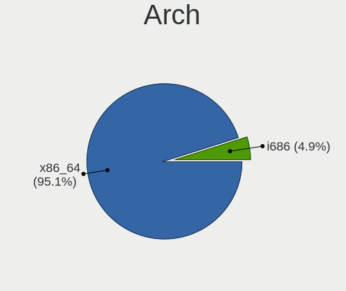
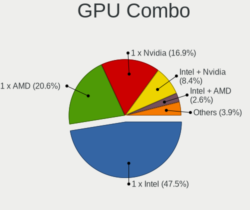
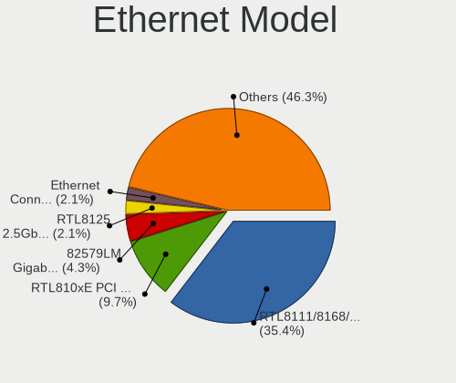

Zorin - Tested Hardware & Statistics
------------------------------------

A project to collect tested hardware configurations for Zorin.

Anyone can contribute to this report by the [hw-probe](https://github.com/linuxhw/hw-probe) tool:

    sudo -E hw-probe -all -upload

Please contribute! Especially if your hardware is rare.

This is a report for all computer types. See also reports for [desktops](/Dist/Zorin/Desktop/README.md) and [notebooks](/Dist/Zorin/Notebook/README.md).

Contents
--------

* [ Test Cases ](#test-cases)

* [ System ](#system)
  - [ OS                       ](#os)
  - [ OS Family                ](#os-family)
  - [ Kernel                   ](#kernel)
  - [ Kernel Family            ](#kernel-family)
  - [ Kernel Major Ver.        ](#kernel-major-ver)
  - [ Arch                     ](#arch)
  - [ DE                       ](#de)
  - [ Display Server           ](#display-server)
  - [ Display Manager          ](#display-manager)
  - [ OS Lang                  ](#os-lang)
  - [ Boot Mode                ](#boot-mode)
  - [ Filesystem               ](#filesystem)
  - [ Part. scheme             ](#part-scheme)
  - [ Dual Boot with Linux/BSD ](#dual-boot-with-linuxbsd)
  - [ Dual Boot (Win)          ](#dual-boot-win)

* [ Board ](#board)
  - [ Vendor                   ](#vendor)
  - [ Model                    ](#model)
  - [ Model Family             ](#model-family)
  - [ MFG Year                 ](#mfg-year)
  - [ Form Factor              ](#form-factor)
  - [ Secure Boot              ](#secure-boot)
  - [ Coreboot                 ](#coreboot)
  - [ RAM Size                 ](#ram-size)
  - [ RAM Used                 ](#ram-used)
  - [ Total Drives             ](#total-drives)
  - [ Has CD-ROM               ](#has-cd-rom)
  - [ Has Ethernet             ](#has-ethernet)
  - [ Has WiFi                 ](#has-wifi)
  - [ Has Bluetooth            ](#has-bluetooth)

* [ Location ](#location)
  - [ Country                  ](#country)
  - [ City                     ](#city)

* [ Drives ](#drives)
  - [ Drive Vendor             ](#drive-vendor)
  - [ Drive Model              ](#drive-model)
  - [ HDD Vendor               ](#hdd-vendor)
  - [ SSD Vendor               ](#ssd-vendor)
  - [ Drive Kind               ](#drive-kind)
  - [ Drive Connector          ](#drive-connector)
  - [ Drive Size               ](#drive-size)
  - [ Space Total              ](#space-total)
  - [ Space Used               ](#space-used)
  - [ Malfunc. Drives          ](#malfunc-drives)
  - [ Malfunc. Drive Vendor    ](#malfunc-drive-vendor)
  - [ Malfunc. HDD Vendor      ](#malfunc-hdd-vendor)
  - [ Malfunc. Drive Kind      ](#malfunc-drive-kind)
  - [ Failed Drives            ](#failed-drives)
  - [ Failed Drive Vendor      ](#failed-drive-vendor)
  - [ Drive Status             ](#drive-status)

* [ Storage controller ](#storage-controller)
  - [ Storage Vendor           ](#storage-vendor)
  - [ Storage Model            ](#storage-model)
  - [ Storage Kind             ](#storage-kind)

* [ Processor ](#processor)
  - [ CPU Vendor               ](#cpu-vendor)
  - [ CPU Model                ](#cpu-model)
  - [ CPU Model Family         ](#cpu-model-family)
  - [ CPU Cores                ](#cpu-cores)
  - [ CPU Sockets              ](#cpu-sockets)
  - [ CPU Threads              ](#cpu-threads)
  - [ CPU Op-Modes             ](#cpu-op-modes)
  - [ CPU Microcode            ](#cpu-microcode)
  - [ CPU Microarch            ](#cpu-microarch)

* [ Graphics ](#graphics)
  - [ GPU Vendor               ](#gpu-vendor)
  - [ GPU Model                ](#gpu-model)
  - [ GPU Combo                ](#gpu-combo)
  - [ GPU Driver               ](#gpu-driver)
  - [ GPU Memory               ](#gpu-memory)

* [ Monitor ](#monitor)
  - [ Monitor Vendor           ](#monitor-vendor)
  - [ Monitor Model            ](#monitor-model)
  - [ Monitor Resolution       ](#monitor-resolution)
  - [ Monitor Diagonal         ](#monitor-diagonal)
  - [ Monitor Width            ](#monitor-width)
  - [ Aspect Ratio             ](#aspect-ratio)
  - [ Monitor Area             ](#monitor-area)
  - [ Pixel Density            ](#pixel-density)
  - [ Multiple Monitors        ](#multiple-monitors)

* [ Network ](#network)
  - [ Net Controller Vendor    ](#net-controller-vendor)
  - [ Net Controller Model     ](#net-controller-model)
  - [ Wireless Vendor          ](#wireless-vendor)
  - [ Wireless Model           ](#wireless-model)
  - [ Ethernet Vendor          ](#ethernet-vendor)
  - [ Ethernet Model           ](#ethernet-model)
  - [ Net Controller Kind      ](#net-controller-kind)
  - [ Used Controller          ](#used-controller)
  - [ NICs                     ](#nics)
  - [ IPv6                     ](#ipv6)

* [ Bluetooth ](#bluetooth)
  - [ Bluetooth Vendor         ](#bluetooth-vendor)
  - [ Bluetooth Model          ](#bluetooth-model)

* [ Sound ](#sound)
  - [ Sound Vendor             ](#sound-vendor)
  - [ Sound Model              ](#sound-model)

* [ Memory ](#memory)
  - [ Memory Vendor            ](#memory-vendor)
  - [ Memory Model             ](#memory-model)
  - [ Memory Kind              ](#memory-kind)
  - [ Memory Form Factor       ](#memory-form-factor)
  - [ Memory Size              ](#memory-size)
  - [ Memory Speed             ](#memory-speed)

* [ Printers & scanners ](#printers--scanners)
  - [ Printer Vendor           ](#printer-vendor)
  - [ Printer Model            ](#printer-model)
  - [ Scanner Vendor           ](#scanner-vendor)
  - [ Scanner Model            ](#scanner-model)

* [ Camera ](#camera)
  - [ Camera Vendor            ](#camera-vendor)
  - [ Camera Model             ](#camera-model)

* [ Security ](#security)
  - [ Fingerprint Vendor       ](#fingerprint-vendor)
  - [ Fingerprint Model        ](#fingerprint-model)
  - [ Chipcard Vendor          ](#chipcard-vendor)
  - [ Chipcard Model           ](#chipcard-model)

* [ Unsupported ](#unsupported)
  - [ Unsupported Devices      ](#unsupported-devices)
  - [ Unsupported Device Types ](#unsupported-device-types)

Test Cases
----------

Total: 7164

| Vendor        | Model                       | Form-Factor | Probe                                                      | Date         |
|---------------|-----------------------------|-------------|------------------------------------------------------------|--------------|
| ASUSTek       | PN41                        | Mini pc     | [99d3eca719](https://linux-hardware.org/?probe=99d3eca719) | May 01, 2023 |
| Dell          | 02YYK5 A01                  | Desktop     | [1a00a1321e](https://linux-hardware.org/?probe=1a00a1321e) | Apr 30, 2023 |
| MSI           | IONA                        | Desktop     | [966ec83038](https://linux-hardware.org/?probe=966ec83038) | Apr 30, 2023 |
| Lenovo        | MIIX 320-10ICR 80XF         | Tablet      | [6987a21849](https://linux-hardware.org/?probe=6987a21849) | Apr 30, 2023 |
| Foxconn       | G41S/G41S-K                 | Desktop     | [946a95c594](https://linux-hardware.org/?probe=946a95c594) | Apr 30, 2023 |
| Foxconn       | G41S/G41S-K                 | Desktop     | [58cebf39d1](https://linux-hardware.org/?probe=58cebf39d1) | Apr 30, 2023 |
| HP            | Pavilion x360 Convertibl... | Convertible | [f1faff33de](https://linux-hardware.org/?probe=f1faff33de) | Apr 30, 2023 |
| Microsoft     | Surface Pro                 | Tablet      | [8b89ffd983](https://linux-hardware.org/?probe=8b89ffd983) | Apr 30, 2023 |
| HP            | Pavilion dv7                | Notebook    | [68b51fde68](https://linux-hardware.org/?probe=68b51fde68) | Apr 30, 2023 |
| Positivo      | S14CT01                     | Notebook    | [b11ef938e1](https://linux-hardware.org/?probe=b11ef938e1) | Apr 29, 2023 |
| Toshiba       | Satellite C650D             | Notebook    | [472dedd62a](https://linux-hardware.org/?probe=472dedd62a) | Apr 29, 2023 |
| Unknown       | Unknown                     | Desktop     | [4b0542737c](https://linux-hardware.org/?probe=4b0542737c) | Apr 29, 2023 |
| Apple         | Mac-F2208EC8                | Mini pc     | [6bad65ad2d](https://linux-hardware.org/?probe=6bad65ad2d) | Apr 29, 2023 |
| Dell          | 08NPPY A00                  | Desktop     | [25bc3aa225](https://linux-hardware.org/?probe=25bc3aa225) | Apr 29, 2023 |
| Sony          | VPCF215FX                   | Notebook    | [49c7606269](https://linux-hardware.org/?probe=49c7606269) | Apr 29, 2023 |
| Apple         | MacBook6,1                  | Notebook    | [58b09d7887](https://linux-hardware.org/?probe=58b09d7887) | Apr 29, 2023 |
| Apple         | MacBook6,1                  | Notebook    | [7d91fe30f7](https://linux-hardware.org/?probe=7d91fe30f7) | Apr 29, 2023 |
| Positivo      | S14CT01                     | Notebook    | [58988f4876](https://linux-hardware.org/?probe=58988f4876) | Apr 29, 2023 |
| Lenovo        | ThinkPad E14 Gen 2 20T60... | Notebook    | [e908fdb73d](https://linux-hardware.org/?probe=e908fdb73d) | Apr 29, 2023 |
| Lenovo        | ThinkPad X1 Carbon Gen 9... | Notebook    | [a984eefe43](https://linux-hardware.org/?probe=a984eefe43) | Apr 28, 2023 |
| Lenovo        | ThinkBook 14-IIL 20SL       | Notebook    | [d9010fa8d0](https://linux-hardware.org/?probe=d9010fa8d0) | Apr 28, 2023 |
| Lenovo        | ThinkPad Edge 25453BG       | Notebook    | [2b5c6e2ded](https://linux-hardware.org/?probe=2b5c6e2ded) | Apr 28, 2023 |
| HP            | Laptop 14-em0xxx            | Notebook    | [8d06549ae0](https://linux-hardware.org/?probe=8d06549ae0) | Apr 28, 2023 |
| Lenovo        | IdeaPad Y470                | Notebook    | [58c809428e](https://linux-hardware.org/?probe=58c809428e) | Apr 28, 2023 |
| Microsoft     | Surface Pro                 | Tablet      | [896574c24a](https://linux-hardware.org/?probe=896574c24a) | Apr 28, 2023 |
| Lenovo        | ThinkPad T430 2349HNU       | Notebook    | [f1290d4846](https://linux-hardware.org/?probe=f1290d4846) | Apr 28, 2023 |
| Unknown       | Unknown                     | Desktop     | [c4941a5c16](https://linux-hardware.org/?probe=c4941a5c16) | Apr 27, 2023 |
| Pegatron      | IPM41-D3                    | Desktop     | [faf8704eb3](https://linux-hardware.org/?probe=faf8704eb3) | Apr 26, 2023 |
| Dell          | Vostro 1510                 | Notebook    | [71c860d51c](https://linux-hardware.org/?probe=71c860d51c) | Apr 26, 2023 |
| Medion        | E2215T MD60198              | Notebook    | [390ccbba6f](https://linux-hardware.org/?probe=390ccbba6f) | Apr 26, 2023 |
| Acer          | Aspire A515-57              | Notebook    | [86dad710fa](https://linux-hardware.org/?probe=86dad710fa) | Apr 26, 2023 |
| Lenovo        | 3000 N200 0769A97           | Notebook    | [a293f4f1f7](https://linux-hardware.org/?probe=a293f4f1f7) | Apr 26, 2023 |
| Lenovo        | ThinkPad T430 2347GU8       | Notebook    | [c40de2e155](https://linux-hardware.org/?probe=c40de2e155) | Apr 26, 2023 |
| Apple         | Mac-F2238AC8                | All in one  | [f0ea43f3fd](https://linux-hardware.org/?probe=f0ea43f3fd) | Apr 26, 2023 |
| Intel         | D34010WYK H14771-304        | Desktop     | [4fbbe6e603](https://linux-hardware.org/?probe=4fbbe6e603) | Apr 26, 2023 |
| Lenovo        | 30FD SDK0J40697 WIN 3305... | Desktop     | [07e9099105](https://linux-hardware.org/?probe=07e9099105) | Apr 26, 2023 |
| HP            | 1632                        | Desktop     | [0355cb4e69](https://linux-hardware.org/?probe=0355cb4e69) | Apr 25, 2023 |
| Lenovo        | ThinkPad T430 2347GU8       | Notebook    | [7abd61de30](https://linux-hardware.org/?probe=7abd61de30) | Apr 25, 2023 |
| HP            | EliteBook 2730p             | Notebook    | [51c0fadfdb](https://linux-hardware.org/?probe=51c0fadfdb) | Apr 25, 2023 |
| Lenovo        | ThinkPad T430 2347GU8       | Notebook    | [927c9a0377](https://linux-hardware.org/?probe=927c9a0377) | Apr 25, 2023 |
| ASUSTek       | M5A97 R2.0                  | Desktop     | [4231d023e9](https://linux-hardware.org/?probe=4231d023e9) | Apr 25, 2023 |
| eMachines     | MCP61PM-GM                  | Desktop     | [ff00693839](https://linux-hardware.org/?probe=ff00693839) | Apr 25, 2023 |
| Acer          | AOHAPPY                     | Notebook    | [6f32fad8f0](https://linux-hardware.org/?probe=6f32fad8f0) | Apr 24, 2023 |
| Gigabyte      | GA-78LMT-USB3               | Desktop     | [9bab79728a](https://linux-hardware.org/?probe=9bab79728a) | Apr 24, 2023 |
| Toshiba       | Satellite C45-A             | Notebook    | [7720195dfe](https://linux-hardware.org/?probe=7720195dfe) | Apr 24, 2023 |
| ASUSTek       | P5Q                         | Desktop     | [57e3cfa7dc](https://linux-hardware.org/?probe=57e3cfa7dc) | Apr 24, 2023 |
| Intel         | D946GZIS AAD66165-301       | Desktop     | [9d5ada0fc4](https://linux-hardware.org/?probe=9d5ada0fc4) | Apr 24, 2023 |
| ASRock        | H61M-DGS                    | Desktop     | [154380c27c](https://linux-hardware.org/?probe=154380c27c) | Apr 24, 2023 |
| Dell          | Inspiron 5565               | Notebook    | [6622474d4b](https://linux-hardware.org/?probe=6622474d4b) | Apr 24, 2023 |
| Lenovo        | ThinkPad X1 Carbon Gen 8... | Notebook    | [60d1d4aec8](https://linux-hardware.org/?probe=60d1d4aec8) | Apr 24, 2023 |
| HP            | Stream Laptop 14-ax0XX      | Notebook    | [c087d6cbae](https://linux-hardware.org/?probe=c087d6cbae) | Apr 24, 2023 |
| Gigabyte      | B650M DS3H                  | Desktop     | [3d07651a47](https://linux-hardware.org/?probe=3d07651a47) | Apr 24, 2023 |
| Dell          | XPS 15 9530                 | Notebook    | [d9429d7e06](https://linux-hardware.org/?probe=d9429d7e06) | Apr 23, 2023 |
| Lenovo        | ThinkPad T440s 20ARS1BH0... | Notebook    | [b76462c15b](https://linux-hardware.org/?probe=b76462c15b) | Apr 23, 2023 |
| Dell          | 03NVJ6 A01                  | Desktop     | [8db1376917](https://linux-hardware.org/?probe=8db1376917) | Apr 23, 2023 |
| Pegatron      | 2AB5                        | Desktop     | [5f771d8ee5](https://linux-hardware.org/?probe=5f771d8ee5) | Apr 23, 2023 |
| Unknown       | G41                         | Desktop     | [cbe978cc34](https://linux-hardware.org/?probe=cbe978cc34) | Apr 23, 2023 |
| Apple         | Mac-F4238CC8 PVT            | All in one  | [49a0b005f8](https://linux-hardware.org/?probe=49a0b005f8) | Apr 23, 2023 |
| MSI           | GP62 7RD                    | Notebook    | [277bb2d2e3](https://linux-hardware.org/?probe=277bb2d2e3) | Apr 23, 2023 |
| Acer          | AOD270                      | Notebook    | [d7d653d3d6](https://linux-hardware.org/?probe=d7d653d3d6) | Apr 23, 2023 |
| ASUSTek       | TUF Gaming X670E-PLUS WI... | Desktop     | [25ee911879](https://linux-hardware.org/?probe=25ee911879) | Apr 23, 2023 |
| ASUSTek       | TUF Gaming X670E-PLUS WI... | Desktop     | [468824c4d9](https://linux-hardware.org/?probe=468824c4d9) | Apr 23, 2023 |
| Gigabyte      | B760M GAMING X AX DDR4      | Desktop     | [a68d32d442](https://linux-hardware.org/?probe=a68d32d442) | Apr 23, 2023 |
| Apple         | Mac-4BC72D62AD45599E Mac... | Mini pc     | [401f407dae](https://linux-hardware.org/?probe=401f407dae) | Apr 23, 2023 |
| Gigabyte      | GA-MA74GM-S2H               | Desktop     | [0cd5599131](https://linux-hardware.org/?probe=0cd5599131) | Apr 22, 2023 |
| HP            | Laptop 14-em0xxx            | Notebook    | [55ea4ded18](https://linux-hardware.org/?probe=55ea4ded18) | Apr 22, 2023 |
| Lenovo        | 30D2 SDK0J40705 WIN 3425... | Desktop     | [3c3719b07f](https://linux-hardware.org/?probe=3c3719b07f) | Apr 22, 2023 |
| Dell          | 0F373D A00                  | Desktop     | [206de0188d](https://linux-hardware.org/?probe=206de0188d) | Apr 22, 2023 |
| Lenovo        | B590 62743NG                | Notebook    | [ca0be4b423](https://linux-hardware.org/?probe=ca0be4b423) | Apr 22, 2023 |
| Lenovo        | B590 62743NG                | Notebook    | [74e38a8db9](https://linux-hardware.org/?probe=74e38a8db9) | Apr 22, 2023 |
| Dell          | 03NVJ6 A01                  | Desktop     | [e60b9070a6](https://linux-hardware.org/?probe=e60b9070a6) | Apr 22, 2023 |
| ASUSTek       | M5A78L LE                   | Desktop     | [b19724085f](https://linux-hardware.org/?probe=b19724085f) | Apr 21, 2023 |
| Acer          | AOHAPPY                     | Notebook    | [57a7ebf03f](https://linux-hardware.org/?probe=57a7ebf03f) | Apr 21, 2023 |
| Lenovo        | 3111 SDK0J40697 WIN 3305... | Mini pc     | [4dc6862db9](https://linux-hardware.org/?probe=4dc6862db9) | Apr 21, 2023 |
| Lenovo        | IdeaPadFlex 6-14IKB 81EM    | Convertible | [0a5da1a9a0](https://linux-hardware.org/?probe=0a5da1a9a0) | Apr 21, 2023 |
| Apple         | Mac-FFE5EF870D7BA81A iMa... | All in one  | [570077aa64](https://linux-hardware.org/?probe=570077aa64) | Apr 21, 2023 |
| AIERXUAN      | XIAOXUAN Pro                | Notebook    | [e472034313](https://linux-hardware.org/?probe=e472034313) | Apr 21, 2023 |
| AIERXUAN      | XIAOXUAN Pro                | Notebook    | [e500ddd5d9](https://linux-hardware.org/?probe=e500ddd5d9) | Apr 21, 2023 |
| Dell          | Inspiron 3531               | Notebook    | [6222a9aa08](https://linux-hardware.org/?probe=6222a9aa08) | Apr 21, 2023 |
| Gigabyte      | B650M DS3H                  | Desktop     | [de196a2cfa](https://linux-hardware.org/?probe=de196a2cfa) | Apr 21, 2023 |
| Microsoft     | Surface Book                | Tablet      | [13c23678aa](https://linux-hardware.org/?probe=13c23678aa) | Apr 21, 2023 |
| MSI           | GS73VR 7RF                  | Notebook    | [2eb85cc7fe](https://linux-hardware.org/?probe=2eb85cc7fe) | Apr 20, 2023 |
| ASUSTek       | H110M-R                     | Desktop     | [d428839f7c](https://linux-hardware.org/?probe=d428839f7c) | Apr 20, 2023 |
| HP            | 2ADE                        | Desktop     | [1a3d108a58](https://linux-hardware.org/?probe=1a3d108a58) | Apr 20, 2023 |
| HP            | 8054                        | Desktop     | [0f2c12c877](https://linux-hardware.org/?probe=0f2c12c877) | Apr 20, 2023 |
| ASUSTek       | ASUS EXPERTBOOK B1500CEA... | Notebook    | [7d380bf016](https://linux-hardware.org/?probe=7d380bf016) | Apr 20, 2023 |
| ASUSTek       | ASUS EXPERTBOOK B1500CEA... | Notebook    | [7029b5ee48](https://linux-hardware.org/?probe=7029b5ee48) | Apr 20, 2023 |
| Lenovo        | Yoga 300-11IBR 80M1         | Notebook    | [9093d27c30](https://linux-hardware.org/?probe=9093d27c30) | Apr 19, 2023 |
| Notebook      | NL40_50CU                   | Notebook    | [069a675d2a](https://linux-hardware.org/?probe=069a675d2a) | Apr 19, 2023 |
| Dell          | XPS 15 9530                 | Notebook    | [bb0be3d9e3](https://linux-hardware.org/?probe=bb0be3d9e3) | Apr 19, 2023 |
| Notebook      | NL40_50CU                   | Notebook    | [e58c3ad9d7](https://linux-hardware.org/?probe=e58c3ad9d7) | Apr 19, 2023 |
| Lenovo        | SHARKBAY 31900058 STD or... | Desktop     | [1331c6ef06](https://linux-hardware.org/?probe=1331c6ef06) | Apr 19, 2023 |
| HP            | 8906 SMVB                   | Desktop     | [65eb0fa6be](https://linux-hardware.org/?probe=65eb0fa6be) | Apr 19, 2023 |
| Lenovo        | IdeaPad 700-15ISK 80RU      | Notebook    | [c36b1a5778](https://linux-hardware.org/?probe=c36b1a5778) | Apr 19, 2023 |
| Apple         | Mac-F2268DC8                | All in one  | [86e2d42f73](https://linux-hardware.org/?probe=86e2d42f73) | Apr 19, 2023 |
| Lenovo        | ThinkPad T430 2349HNU       | Notebook    | [1548cc4309](https://linux-hardware.org/?probe=1548cc4309) | Apr 19, 2023 |
| Notebook      | NL40_50CU                   | Notebook    | [85c7be8d12](https://linux-hardware.org/?probe=85c7be8d12) | Apr 19, 2023 |
| Dell          | 0WMJ54 A01                  | Desktop     | [2a7fe6d74b](https://linux-hardware.org/?probe=2a7fe6d74b) | Apr 18, 2023 |
| Dell          | 0WMJ54 A01                  | Desktop     | [be92b53515](https://linux-hardware.org/?probe=be92b53515) | Apr 18, 2023 |
| HP            | Stream Laptop 11-ak0xxx     | Notebook    | [7da02a75b5](https://linux-hardware.org/?probe=7da02a75b5) | Apr 18, 2023 |
| ASL           | BayTrail JHS773             | Desktop     | [3a5977ad04](https://linux-hardware.org/?probe=3a5977ad04) | Apr 18, 2023 |
| Dell          | 0T656F A02                  | Desktop     | [0d291f14a1](https://linux-hardware.org/?probe=0d291f14a1) | Apr 18, 2023 |
| ASUSTek       | PRIME X370-PRO              | Desktop     | [119560d8db](https://linux-hardware.org/?probe=119560d8db) | Apr 17, 2023 |
| Lenovo        | Yoga 520-14IKB 80X8         | Convertible | [79029817b8](https://linux-hardware.org/?probe=79029817b8) | Apr 17, 2023 |
| Apple         | Mac-942B5BF58194151B        | All in one  | [a99920ebba](https://linux-hardware.org/?probe=a99920ebba) | Apr 17, 2023 |
| Acer          | Aspire E5-574               | Notebook    | [2f60207985](https://linux-hardware.org/?probe=2f60207985) | Apr 17, 2023 |
| Gigabyte      | B550 AORUS ELITE AX V2      | Desktop     | [307e22b0d6](https://linux-hardware.org/?probe=307e22b0d6) | Apr 17, 2023 |
| Lenovo        | Yoga 2 13 20344             | Notebook    | [895f57e6d5](https://linux-hardware.org/?probe=895f57e6d5) | Apr 17, 2023 |
| MSI           | MEG X570 UNIFY              | Desktop     | [b2311e7cac](https://linux-hardware.org/?probe=b2311e7cac) | Apr 17, 2023 |
| ASUSTek       | PRIME Z370-A                | Desktop     | [b9d869fe6b](https://linux-hardware.org/?probe=b9d869fe6b) | Apr 16, 2023 |
| Dell          | Vostro 3580                 | Notebook    | [b7d9953b54](https://linux-hardware.org/?probe=b7d9953b54) | Apr 16, 2023 |
| Lenovo        | Y50-70 20378                | Notebook    | [f146ce9da7](https://linux-hardware.org/?probe=f146ce9da7) | Apr 16, 2023 |
| Apple         | MacBookPro5,3               | Notebook    | [ea8d83a743](https://linux-hardware.org/?probe=ea8d83a743) | Apr 16, 2023 |
| Lenovo        | ThinkPad P52s 20LCS1DU01    | Notebook    | [3fc78b3451](https://linux-hardware.org/?probe=3fc78b3451) | Apr 16, 2023 |
| HONOR         | BBR-WAX9                    | Notebook    | [a56688fd70](https://linux-hardware.org/?probe=a56688fd70) | Apr 16, 2023 |
| HONOR         | BBR-WAX9                    | Notebook    | [798405022f](https://linux-hardware.org/?probe=798405022f) | Apr 16, 2023 |
| AZW           | SEi                         | Notebook    | [a382976bf2](https://linux-hardware.org/?probe=a382976bf2) | Apr 15, 2023 |
| AZW           | SEi                         | Notebook    | [980b83cf5e](https://linux-hardware.org/?probe=980b83cf5e) | Apr 15, 2023 |
| Acer          | Aspire V3-772               | Notebook    | [2b6f0394d7](https://linux-hardware.org/?probe=2b6f0394d7) | Apr 15, 2023 |
| Acer          | Aspire ES1-731G             | Notebook    | [1ef0f89c83](https://linux-hardware.org/?probe=1ef0f89c83) | Apr 15, 2023 |
| Lenovo        | Legion 5 15ACH6 82JW        | Notebook    | [ba3d9dd7e7](https://linux-hardware.org/?probe=ba3d9dd7e7) | Apr 15, 2023 |
| ASRock        | H61M-DGS                    | Desktop     | [506ba2605a](https://linux-hardware.org/?probe=506ba2605a) | Apr 15, 2023 |
| Gigabyte      | GA-MA74GM-S2H               | Desktop     | [c7568482a9](https://linux-hardware.org/?probe=c7568482a9) | Apr 15, 2023 |
| HP            | Pavilion Power Laptop 15... | Notebook    | [b66c208e18](https://linux-hardware.org/?probe=b66c208e18) | Apr 15, 2023 |
| Apple         | MacBookPro14,1              | Notebook    | [2ca7c3fccc](https://linux-hardware.org/?probe=2ca7c3fccc) | Apr 15, 2023 |
| Intel         | H61                         | Desktop     | [81c7094e68](https://linux-hardware.org/?probe=81c7094e68) | Apr 15, 2023 |
| Lenovo        | ThinkPad T430s 2352CTO      | Notebook    | [a4c5130b84](https://linux-hardware.org/?probe=a4c5130b84) | Apr 15, 2023 |
| Lenovo        | IdeaPad 3 15ALC6 82KU       | Notebook    | [e122e8dab8](https://linux-hardware.org/?probe=e122e8dab8) | Apr 15, 2023 |
| MSI           | B75MA-E33                   | Desktop     | [d50de3a52c](https://linux-hardware.org/?probe=d50de3a52c) | Apr 14, 2023 |
| QIYIDA        | X99-H9 V2.0                 | Desktop     | [fcfa1ed488](https://linux-hardware.org/?probe=fcfa1ed488) | Apr 14, 2023 |
| Biostar       | TZ75B                       | Desktop     | [c6720e2db2](https://linux-hardware.org/?probe=c6720e2db2) | Apr 14, 2023 |
| Foxconn       | G31MVP FAB:1.0              | Desktop     | [41eac5ca2f](https://linux-hardware.org/?probe=41eac5ca2f) | Apr 14, 2023 |
| Gigabyte      | B550M AORUS ELITE           | Desktop     | [e9c2f8d5ba](https://linux-hardware.org/?probe=e9c2f8d5ba) | Apr 14, 2023 |
| HP            | 8430 1000                   | All in one  | [b813f95c6f](https://linux-hardware.org/?probe=b813f95c6f) | Apr 14, 2023 |
| HP            | 8430 1000                   | All in one  | [59572d294b](https://linux-hardware.org/?probe=59572d294b) | Apr 14, 2023 |
| Positivo      | Q4128C-S                    | Notebook    | [8dc2eb7738](https://linux-hardware.org/?probe=8dc2eb7738) | Apr 14, 2023 |
| Intel         | H61                         | Desktop     | [8aeeb449f8](https://linux-hardware.org/?probe=8aeeb449f8) | Apr 14, 2023 |
| ASRock        | B550 Steel Legend           | Desktop     | [9da868694f](https://linux-hardware.org/?probe=9da868694f) | Apr 14, 2023 |
| HP            | EliteBook 830 G6            | Notebook    | [75ce029800](https://linux-hardware.org/?probe=75ce029800) | Apr 13, 2023 |
| Gigabyte      | GA-78LMT-USB3               | Desktop     | [4267100894](https://linux-hardware.org/?probe=4267100894) | Apr 13, 2023 |
| ASUSTek       | TUF Gaming X570-PLUS_BR     | Desktop     | [5e9f89e556](https://linux-hardware.org/?probe=5e9f89e556) | Apr 13, 2023 |
| Lenovo        | IdeaPad 3 15ITL05 81X8      | Notebook    | [9e6cfba525](https://linux-hardware.org/?probe=9e6cfba525) | Apr 13, 2023 |
| ASUSTek       | TUF Gaming B550M-E WIFI     | Desktop     | [d72e78c1b0](https://linux-hardware.org/?probe=d72e78c1b0) | Apr 13, 2023 |
| Acer          | Aspire E5-771G              | Notebook    | [504d600530](https://linux-hardware.org/?probe=504d600530) | Apr 13, 2023 |
| HP            | Compaq Presario F700        | Notebook    | [2ae0d7557b](https://linux-hardware.org/?probe=2ae0d7557b) | Apr 13, 2023 |
| Gigabyte      | M68MT-S2                    | Desktop     | [ac4059b403](https://linux-hardware.org/?probe=ac4059b403) | Apr 13, 2023 |
| MSI           | B450M PRO-M2 MAX            | Desktop     | [6f7e9a6bb2](https://linux-hardware.org/?probe=6f7e9a6bb2) | Apr 13, 2023 |
| ASUSTek       | B85M-G                      | Desktop     | [27bfaf568a](https://linux-hardware.org/?probe=27bfaf568a) | Apr 12, 2023 |
| Dell          | Inspiron 1545               | Notebook    | [653a25793d](https://linux-hardware.org/?probe=653a25793d) | Apr 12, 2023 |
| Dell          | Inspiron 1545               | Notebook    | [dccecbecf9](https://linux-hardware.org/?probe=dccecbecf9) | Apr 12, 2023 |
| Acer          | Aspire 5742G                | Notebook    | [878333e620](https://linux-hardware.org/?probe=878333e620) | Apr 12, 2023 |
| Acer          | Aspire A315-56              | Notebook    | [b504683b39](https://linux-hardware.org/?probe=b504683b39) | Apr 12, 2023 |
| Acer          | Aspire A315-56              | Notebook    | [8b8d053221](https://linux-hardware.org/?probe=8b8d053221) | Apr 12, 2023 |
| Toshiba       | Satellite C650D             | Notebook    | [fb8b24d111](https://linux-hardware.org/?probe=fb8b24d111) | Apr 12, 2023 |
| Gigabyte      | EX58-EXTREME                | Desktop     | [82a946e356](https://linux-hardware.org/?probe=82a946e356) | Apr 12, 2023 |
| ASUSTek       | P8H67-M PRO                 | Desktop     | [1627e0654a](https://linux-hardware.org/?probe=1627e0654a) | Apr 11, 2023 |
| ASUSTek       | P8H67-M PRO                 | Desktop     | [57aa7d103d](https://linux-hardware.org/?probe=57aa7d103d) | Apr 11, 2023 |
| ASUSTek       | P5K                         | Desktop     | [36bc294c5b](https://linux-hardware.org/?probe=36bc294c5b) | Apr 11, 2023 |
| Apple         | Mac-942B5BF58194151B        | All in one  | [a2aa745e5c](https://linux-hardware.org/?probe=a2aa745e5c) | Apr 10, 2023 |
| Apple         | MacBookPro14,2              | Notebook    | [1bc09aed8a](https://linux-hardware.org/?probe=1bc09aed8a) | Apr 10, 2023 |
| Dell          | XPS 13 9343                 | Notebook    | [f847287142](https://linux-hardware.org/?probe=f847287142) | Apr 09, 2023 |
| Lenovo        | Yoga Duet 7 13ITL6 82MA     | Tablet      | [5c0467f4cb](https://linux-hardware.org/?probe=5c0467f4cb) | Apr 09, 2023 |
| Lenovo        | Yoga Duet 7 13ITL6 82MA     | Tablet      | [f410666614](https://linux-hardware.org/?probe=f410666614) | Apr 09, 2023 |
| Lenovo        | Yoga Duet 7 13ITL6 82MA     | Tablet      | [a651483f3c](https://linux-hardware.org/?probe=a651483f3c) | Apr 07, 2023 |
| Lenovo        | MIIX 310-10ICR 80SG         | Tablet      | [c871e7c68b](https://linux-hardware.org/?probe=c871e7c68b) | Apr 07, 2023 |
| Thomson       | WWNEO14C-4BK32F             | Notebook    | [8b461d224b](https://linux-hardware.org/?probe=8b461d224b) | Apr 06, 2023 |
| Quanta        | XV1                         | All in one  | [7cce1c6f6f](https://linux-hardware.org/?probe=7cce1c6f6f) | Apr 06, 2023 |
| MSI           | B75MA-E33                   | Desktop     | [27e5e2df0d](https://linux-hardware.org/?probe=27e5e2df0d) | Apr 06, 2023 |
| Dell          | 0GY6Y8 A01                  | Desktop     | [ecba971f16](https://linux-hardware.org/?probe=ecba971f16) | Apr 06, 2023 |
| HP            | ProBook 4540s               | Notebook    | [02754e47f3](https://linux-hardware.org/?probe=02754e47f3) | Apr 05, 2023 |
| Acer          | Aspire 5742G                | Notebook    | [5363e4031e](https://linux-hardware.org/?probe=5363e4031e) | Apr 05, 2023 |
| ASUSTek       | H87-PRO                     | Desktop     | [085dc66a77](https://linux-hardware.org/?probe=085dc66a77) | Apr 05, 2023 |
| HP            | Notebook                    | Notebook    | [4ac4839ccd](https://linux-hardware.org/?probe=4ac4839ccd) | Apr 05, 2023 |
| HP            | EliteBook 8460p             | Notebook    | [5a864191a9](https://linux-hardware.org/?probe=5a864191a9) | Apr 05, 2023 |
| HP            | EliteBook 8460p             | Notebook    | [bb24498044](https://linux-hardware.org/?probe=bb24498044) | Apr 05, 2023 |
| Gigabyte      | B450 AORUS PRO WIFI-CF      | Desktop     | [68d14e873f](https://linux-hardware.org/?probe=68d14e873f) | Apr 05, 2023 |
| eMachines     | MCP61PM-GM                  | Desktop     | [dc35ec4564](https://linux-hardware.org/?probe=dc35ec4564) | Apr 04, 2023 |
| Google        | Cyan                        | Notebook    | [f02aa2a210](https://linux-hardware.org/?probe=f02aa2a210) | Apr 04, 2023 |
| Gigabyte      | H410M S2 V3                 | Desktop     | [fdff0f112e](https://linux-hardware.org/?probe=fdff0f112e) | Apr 04, 2023 |
| HP            | 82B5                        | All in one  | [59fe255866](https://linux-hardware.org/?probe=59fe255866) | Apr 04, 2023 |
| Medion        | MS-7707                     | Desktop     | [c490d9dc74](https://linux-hardware.org/?probe=c490d9dc74) | Apr 04, 2023 |
| eMachines     | MCP61PM-GM                  | Desktop     | [59f9325843](https://linux-hardware.org/?probe=59f9325843) | Apr 03, 2023 |
| Toshiba       | Satellite C650              | Notebook    | [190547d5cd](https://linux-hardware.org/?probe=190547d5cd) | Apr 03, 2023 |
| ASRock        | H61M-DGS                    | Desktop     | [e05fcde338](https://linux-hardware.org/?probe=e05fcde338) | Apr 03, 2023 |
| Acer          | Veriton X4610G              | Desktop     | [49b3c45306](https://linux-hardware.org/?probe=49b3c45306) | Apr 03, 2023 |
| Dell          | Latitude E6430              | Notebook    | [5c205ea646](https://linux-hardware.org/?probe=5c205ea646) | Apr 03, 2023 |
| Fujitsu       | LIFEBOOK T935               | Notebook    | [1cc4178b9a](https://linux-hardware.org/?probe=1cc4178b9a) | Apr 02, 2023 |
| Apple         | MacBookPro11,2              | Notebook    | [f78d5a9d04](https://linux-hardware.org/?probe=f78d5a9d04) | Apr 02, 2023 |
| Samsung       | 355V4C/356V4C/3445VC/354... | Notebook    | [45086032e1](https://linux-hardware.org/?probe=45086032e1) | Apr 02, 2023 |
| Notebook      | NJ50GU                      | Notebook    | [91e860cd94](https://linux-hardware.org/?probe=91e860cd94) | Apr 02, 2023 |
| ASUSTek       | PRIME B350-PLUS             | Desktop     | [ea4626fdcc](https://linux-hardware.org/?probe=ea4626fdcc) | Apr 02, 2023 |
| ASUSTek       | PRIME B350-PLUS             | Desktop     | [118effffda](https://linux-hardware.org/?probe=118effffda) | Apr 02, 2023 |
| Dell          | 0D883F A04                  | Desktop     | [5bdaaa0d23](https://linux-hardware.org/?probe=5bdaaa0d23) | Apr 02, 2023 |
| Lenovo        | V570 1066EDG                | Notebook    | [8a8a256b79](https://linux-hardware.org/?probe=8a8a256b79) | Apr 02, 2023 |
| Fujitsu       | STYLISTIC Q508              | Tablet      | [50862798b5](https://linux-hardware.org/?probe=50862798b5) | Apr 02, 2023 |
| Fujitsu       | STYLISTIC Q508              | Tablet      | [1340f929dd](https://linux-hardware.org/?probe=1340f929dd) | Apr 02, 2023 |
| HOUTER        | IPMIP-GS                    | Desktop     | [4ef0c7aaaa](https://linux-hardware.org/?probe=4ef0c7aaaa) | Apr 02, 2023 |
| Monster       | HUMA H4 V5.2                | Notebook    | [fdd74dbc8c](https://linux-hardware.org/?probe=fdd74dbc8c) | Apr 02, 2023 |
| Lenovo        | ThinkPad 10 20C3S0Q200      | Tablet      | [e014609915](https://linux-hardware.org/?probe=e014609915) | Apr 01, 2023 |
| Pegatron      | 2ACF                        | Desktop     | [c015b7fd50](https://linux-hardware.org/?probe=c015b7fd50) | Apr 01, 2023 |
| HP            | ENVY x360 Convertible 13... | Convertible | [644ab9aa21](https://linux-hardware.org/?probe=644ab9aa21) | Apr 01, 2023 |
| HP            | Spectre x360 Convertible... | Convertible | [61b490cae8](https://linux-hardware.org/?probe=61b490cae8) | Apr 01, 2023 |
| Lenovo        | ThinkPad 10 20C3S0Q200      | Tablet      | [9ee9bc67cf](https://linux-hardware.org/?probe=9ee9bc67cf) | Apr 01, 2023 |
| Medion        | H61H2-LM3                   | Desktop     | [1fb4c6ac6a](https://linux-hardware.org/?probe=1fb4c6ac6a) | Apr 01, 2023 |
| Dell          | Vostro 1520                 | Notebook    | [2132a3308c](https://linux-hardware.org/?probe=2132a3308c) | Apr 01, 2023 |
| Acer          | Predator G3-605             | Desktop     | [eb21663788](https://linux-hardware.org/?probe=eb21663788) | Apr 01, 2023 |
| Medion        | H61H2-LM3                   | Desktop     | [80bb5bbf28](https://linux-hardware.org/?probe=80bb5bbf28) | Apr 01, 2023 |
| Lenovo        | ThinkPad T410 2518P9G       | Notebook    | [4f74fa6cd2](https://linux-hardware.org/?probe=4f74fa6cd2) | Apr 01, 2023 |
| ASUSTek       | ROG STRIX Z690-A GAMING ... | Desktop     | [1fa4ec7b05](https://linux-hardware.org/?probe=1fa4ec7b05) | Apr 01, 2023 |
| Medion        | H61H2-LM3                   | Desktop     | [2e79b95cb4](https://linux-hardware.org/?probe=2e79b95cb4) | Apr 01, 2023 |
| ASUSTek       | T100TA                      | Notebook    | [1f0b0c32ca](https://linux-hardware.org/?probe=1f0b0c32ca) | Apr 01, 2023 |
| Lenovo        | G500 20236                  | Notebook    | [22d22e0742](https://linux-hardware.org/?probe=22d22e0742) | Apr 01, 2023 |
| Lenovo        | G500 20236                  | Notebook    | [2994622700](https://linux-hardware.org/?probe=2994622700) | Apr 01, 2023 |
| Lenovo        | Legion Y540-15IRH-PG0 81... | Notebook    | [af258dcd36](https://linux-hardware.org/?probe=af258dcd36) | Mar 31, 2023 |
| ASUSTek       | X450LD                      | Notebook    | [1ca0cdc1e8](https://linux-hardware.org/?probe=1ca0cdc1e8) | Mar 31, 2023 |
| Dell          | 0K240Y A02                  | Desktop     | [ca6aacf14e](https://linux-hardware.org/?probe=ca6aacf14e) | Mar 31, 2023 |
| Positivo      | S14SL01                     | Notebook    | [e1c79f71b7](https://linux-hardware.org/?probe=e1c79f71b7) | Mar 30, 2023 |
| Dell          | 09M8Y8 A01                  | Desktop     | [2c13e40cd2](https://linux-hardware.org/?probe=2c13e40cd2) | Mar 30, 2023 |
| ASUSTek       | Benicia                     | Desktop     | [7332efabad](https://linux-hardware.org/?probe=7332efabad) | Mar 30, 2023 |
| HP            | kip                         | Notebook    | [fe84eac39e](https://linux-hardware.org/?probe=fe84eac39e) | Mar 30, 2023 |
| Positivo      | Q232A                       | Notebook    | [2282c5ce96](https://linux-hardware.org/?probe=2282c5ce96) | Mar 30, 2023 |
| Apple         | Mac-F2268DC8                | All in one  | [0e8950a217](https://linux-hardware.org/?probe=0e8950a217) | Mar 30, 2023 |
| Positivo      | Q232A                       | Notebook    | [98e6b249af](https://linux-hardware.org/?probe=98e6b249af) | Mar 29, 2023 |
| HOUTER        | ORO-PC                      | Desktop     | [9547c4bdac](https://linux-hardware.org/?probe=9547c4bdac) | Mar 29, 2023 |
| Acer          | FIH57                       | All in one  | [7a6b0e67f0](https://linux-hardware.org/?probe=7a6b0e67f0) | Mar 29, 2023 |
| Dell          | Precision M4500             | Notebook    | [cf7e033a17](https://linux-hardware.org/?probe=cf7e033a17) | Mar 29, 2023 |
| Dell          | Latitude 7430               | Notebook    | [fdef205301](https://linux-hardware.org/?probe=fdef205301) | Mar 29, 2023 |
| Dell          | Latitude 3590               | Notebook    | [9b5971401c](https://linux-hardware.org/?probe=9b5971401c) | Mar 29, 2023 |
| Gigabyte      | H310M H x.x                 | Desktop     | [a927671ce2](https://linux-hardware.org/?probe=a927671ce2) | Mar 29, 2023 |
| ASUSTek       | VivoBook_ASUSLaptop X515... | Notebook    | [ebf2728d28](https://linux-hardware.org/?probe=ebf2728d28) | Mar 29, 2023 |
| Apple         | MacBookPro11,2              | Notebook    | [422e4056ea](https://linux-hardware.org/?probe=422e4056ea) | Mar 28, 2023 |
| MSI           | B560M-A PRO                 | Desktop     | [62bfea11fe](https://linux-hardware.org/?probe=62bfea11fe) | Mar 28, 2023 |
| Gigabyte      | B550M AORUS PRO-P           | Desktop     | [c97dbb0917](https://linux-hardware.org/?probe=c97dbb0917) | Mar 28, 2023 |
| Thomson       | WWNEO14C-4BK32F             | Notebook    | [90fa9585c9](https://linux-hardware.org/?probe=90fa9585c9) | Mar 28, 2023 |
| Acer          | Swift SF314-511             | Notebook    | [ccef379a7f](https://linux-hardware.org/?probe=ccef379a7f) | Mar 28, 2023 |
| Dell          | 06X1TJ A01                  | Desktop     | [7e99e3d73e](https://linux-hardware.org/?probe=7e99e3d73e) | Mar 28, 2023 |
| ASRock        | Z68 Pro3-M                  | Desktop     | [60f0809fbf](https://linux-hardware.org/?probe=60f0809fbf) | Mar 28, 2023 |
| Toshiba       | Satellite C55-A-1J8         | Notebook    | [c6ba40cd5c](https://linux-hardware.org/?probe=c6ba40cd5c) | Mar 27, 2023 |
| ASUSTek       | TUF B450M-PLUS GAMING       | Desktop     | [dcbcf69a04](https://linux-hardware.org/?probe=dcbcf69a04) | Mar 27, 2023 |
| Packard Be... | EasyNote TE11HC             | Notebook    | [dd242e4ae3](https://linux-hardware.org/?probe=dd242e4ae3) | Mar 27, 2023 |
| Dell          | 0J8H4R A00                  | Desktop     | [63d85fd315](https://linux-hardware.org/?probe=63d85fd315) | Mar 27, 2023 |
| Dell          | Inspiron 5555               | Notebook    | [cf226d028d](https://linux-hardware.org/?probe=cf226d028d) | Mar 27, 2023 |
| HP            | 8430 1000                   | All in one  | [c0d9a96bbf](https://linux-hardware.org/?probe=c0d9a96bbf) | Mar 27, 2023 |
| Lenovo        | 11061GG ThinkServer TS13... | Desktop     | [174e514c30](https://linux-hardware.org/?probe=174e514c30) | Mar 26, 2023 |
| Packard Be... | MCP73PV                     | Desktop     | [87d1fd7511](https://linux-hardware.org/?probe=87d1fd7511) | Mar 26, 2023 |
| Dell          | 0GU083 A00                  | Desktop     | [e577b0129c](https://linux-hardware.org/?probe=e577b0129c) | Mar 26, 2023 |
| Dell          | XPS 13 9365                 | Convertible | [05ecadea38](https://linux-hardware.org/?probe=05ecadea38) | Mar 26, 2023 |
| ASRock        | H61M-DGS                    | Desktop     | [76fc7291a6](https://linux-hardware.org/?probe=76fc7291a6) | Mar 26, 2023 |
| Lenovo        | Yoga 7 14ITL5 82BH          | Convertible | [c322e1c537](https://linux-hardware.org/?probe=c322e1c537) | Mar 26, 2023 |
| Lenovo        | 3111 SDK0J40697 WIN 3305... | Mini pc     | [7fa1fc4759](https://linux-hardware.org/?probe=7fa1fc4759) | Mar 26, 2023 |
| Lenovo        | 3111 SDK0J40697 WIN 3305... | Mini pc     | [cca501adf9](https://linux-hardware.org/?probe=cca501adf9) | Mar 26, 2023 |
| Lenovo        | ThinkPad Edge E530c 3366... | Notebook    | [b4787579d2](https://linux-hardware.org/?probe=b4787579d2) | Mar 25, 2023 |
| HP            | Compaq 6730s                | Notebook    | [ca30390612](https://linux-hardware.org/?probe=ca30390612) | Mar 25, 2023 |
| AZW           | MINI S                      | Desktop     | [f3381963ae](https://linux-hardware.org/?probe=f3381963ae) | Mar 25, 2023 |
| ASRock        | AB350 Gaming K4             | Desktop     | [ecc09c1362](https://linux-hardware.org/?probe=ecc09c1362) | Mar 25, 2023 |
| WEIPAI        | S15                         | Notebook    | [e6a15d7fa9](https://linux-hardware.org/?probe=e6a15d7fa9) | Mar 25, 2023 |
| HP            | Stream Notebook             | Notebook    | [b1ae4b8667](https://linux-hardware.org/?probe=b1ae4b8667) | Mar 25, 2023 |
| ASUSTek       | G53SX                       | Notebook    | [ab9ed0121f](https://linux-hardware.org/?probe=ab9ed0121f) | Mar 25, 2023 |
| Dell          | 0D28YY A01                  | Desktop     | [38b08369e7](https://linux-hardware.org/?probe=38b08369e7) | Mar 25, 2023 |
| Dell          | Latitude E5510              | Notebook    | [8a9a1eec2c](https://linux-hardware.org/?probe=8a9a1eec2c) | Mar 24, 2023 |
| Framework     | Laptop                      | Notebook    | [4e1bd28ce3](https://linux-hardware.org/?probe=4e1bd28ce3) | Mar 24, 2023 |
| QIYIDA        | X99-H9 V2.0                 | Desktop     | [ce9cdcc598](https://linux-hardware.org/?probe=ce9cdcc598) | Mar 24, 2023 |
| Acer          | Aspire A315-59              | Notebook    | [628d2ea05c](https://linux-hardware.org/?probe=628d2ea05c) | Mar 24, 2023 |
| Dell          | 0HD5W2 A01                  | Desktop     | [e859e77bc7](https://linux-hardware.org/?probe=e859e77bc7) | Mar 24, 2023 |
| Dell          | Inspiron 5555               | Notebook    | [efab305a00](https://linux-hardware.org/?probe=efab305a00) | Mar 24, 2023 |
| Dell          | 0HD5W2 A01                  | Desktop     | [ce7e17cb45](https://linux-hardware.org/?probe=ce7e17cb45) | Mar 24, 2023 |
| ASRock        | X570 Steel Legend           | Desktop     | [05d4059f59](https://linux-hardware.org/?probe=05d4059f59) | Mar 24, 2023 |
| HP            | 255 G5                      | Notebook    | [99e2d83974](https://linux-hardware.org/?probe=99e2d83974) | Mar 24, 2023 |
| Acer          | FIH57                       | All in one  | [1f63978352](https://linux-hardware.org/?probe=1f63978352) | Mar 23, 2023 |
| Dell          | Inspiron 3721               | Notebook    | [e992b8f3a0](https://linux-hardware.org/?probe=e992b8f3a0) | Mar 23, 2023 |
| HP            | Pavilion 15                 | Notebook    | [32a0c3ec32](https://linux-hardware.org/?probe=32a0c3ec32) | Mar 23, 2023 |
| HP            | Pavilion x360 Convertibl... | Convertible | [78fab808a1](https://linux-hardware.org/?probe=78fab808a1) | Mar 23, 2023 |
| HP            | Pavilion dv6                | Notebook    | [625fff449a](https://linux-hardware.org/?probe=625fff449a) | Mar 23, 2023 |
| MSI           | B450M PRO-VDH MAX           | Desktop     | [c83000783a](https://linux-hardware.org/?probe=c83000783a) | Mar 23, 2023 |
| ASRock        | B550M-ITX/ac                | Desktop     | [e8ad290196](https://linux-hardware.org/?probe=e8ad290196) | Mar 23, 2023 |
| Intel         | G41                         | Desktop     | [c9fccfc8c1](https://linux-hardware.org/?probe=c9fccfc8c1) | Mar 22, 2023 |
| ASUSTek       | TUF Gaming B550M-PLUS WI... | Desktop     | [d0b0015eb2](https://linux-hardware.org/?probe=d0b0015eb2) | Mar 22, 2023 |
| Orbsmart      | AW-11L                      | Mini pc     | [f66ed5bf1f](https://linux-hardware.org/?probe=f66ed5bf1f) | Mar 21, 2023 |
| Dell          | Latitude E7240              | Notebook    | [a3e408033c](https://linux-hardware.org/?probe=a3e408033c) | Mar 21, 2023 |
| ASUSTek       | G53SX                       | Notebook    | [a6c90e3ad8](https://linux-hardware.org/?probe=a6c90e3ad8) | Mar 21, 2023 |
| ASUSTek       | PRIME X370-PRO              | Desktop     | [9409e4e133](https://linux-hardware.org/?probe=9409e4e133) | Mar 20, 2023 |
| Acer          | Revo RL80                   | Desktop     | [23ee51b834](https://linux-hardware.org/?probe=23ee51b834) | Mar 20, 2023 |
| ASUSTek       | TUF Gaming Z790-PLUS WIF... | Desktop     | [93ae4afbbc](https://linux-hardware.org/?probe=93ae4afbbc) | Mar 20, 2023 |
| Dell          | Inspiron 5405               | Notebook    | [bb59d0b5e9](https://linux-hardware.org/?probe=bb59d0b5e9) | Mar 20, 2023 |
| Lenovo        | IdeaPad 100-15IBY 80MJ      | Notebook    | [e7344d03c0](https://linux-hardware.org/?probe=e7344d03c0) | Mar 20, 2023 |
| Apple         | Mac-F2208EC8                | Mini pc     | [4b47e3ed6c](https://linux-hardware.org/?probe=4b47e3ed6c) | Mar 20, 2023 |
| MSI           | B75MA-E33                   | Desktop     | [cddf0b016f](https://linux-hardware.org/?probe=cddf0b016f) | Mar 20, 2023 |
| ASUSTek       | PRIME X370-PRO              | Desktop     | [75996f8bcf](https://linux-hardware.org/?probe=75996f8bcf) | Mar 19, 2023 |
| HP            | 158A                        | Desktop     | [61467de4d5](https://linux-hardware.org/?probe=61467de4d5) | Mar 19, 2023 |
| Acer          | TravelMate 2490             | Notebook    | [5a21a61bef](https://linux-hardware.org/?probe=5a21a61bef) | Mar 19, 2023 |
| ASRock        | H61M-DGS                    | Desktop     | [2b86166550](https://linux-hardware.org/?probe=2b86166550) | Mar 19, 2023 |
| Dell          | Inspiron 5423               | Notebook    | [70f51cbfcb](https://linux-hardware.org/?probe=70f51cbfcb) | Mar 19, 2023 |
| Google        | Kip                         | Notebook    | [84b79bf446](https://linux-hardware.org/?probe=84b79bf446) | Mar 19, 2023 |
| ASUSTek       | PRIME A320M-K               | Desktop     | [f0f20a06ef](https://linux-hardware.org/?probe=f0f20a06ef) | Mar 19, 2023 |
| Google        | Kip                         | Notebook    | [4e63ea7ac8](https://linux-hardware.org/?probe=4e63ea7ac8) | Mar 19, 2023 |
| Acer          | Aspire M3-581G              | Notebook    | [1434607f7e](https://linux-hardware.org/?probe=1434607f7e) | Mar 19, 2023 |
| Microtech     | CoreBook                    | Notebook    | [d50c0297a6](https://linux-hardware.org/?probe=d50c0297a6) | Mar 19, 2023 |
| HP            | 2B01                        | Desktop     | [1a096f9b36](https://linux-hardware.org/?probe=1a096f9b36) | Mar 19, 2023 |
| Lenovo        | ThinkPad X260 20F600A2MZ    | Notebook    | [5c59b55c2a](https://linux-hardware.org/?probe=5c59b55c2a) | Mar 19, 2023 |
| Lenovo        | ThinkPad T420 4180RK8       | Notebook    | [752373923e](https://linux-hardware.org/?probe=752373923e) | Mar 18, 2023 |
| ASUSTek       | VivoBook_ASUSLaptop X509... | Notebook    | [ee8b155a83](https://linux-hardware.org/?probe=ee8b155a83) | Mar 18, 2023 |
| Quanta        | XV1                         | All in one  | [2bbbb73d41](https://linux-hardware.org/?probe=2bbbb73d41) | Mar 18, 2023 |
| MSI           | B75MA-E33                   | Desktop     | [314245636a](https://linux-hardware.org/?probe=314245636a) | Mar 18, 2023 |
| Dell          | Inspiron 3721               | Notebook    | [c7b5ea67bb](https://linux-hardware.org/?probe=c7b5ea67bb) | Mar 18, 2023 |
| HP            | EliteBook x360 1030 G2      | Convertible | [211a71ed78](https://linux-hardware.org/?probe=211a71ed78) | Mar 18, 2023 |
| Gigabyte      | B650M AORUS ELITE AX        | Desktop     | [5f4a932bcd](https://linux-hardware.org/?probe=5f4a932bcd) | Mar 18, 2023 |
| ASUSTek       | K52Jc                       | Notebook    | [07dc0a0959](https://linux-hardware.org/?probe=07dc0a0959) | Mar 18, 2023 |
| ASUSTek       | K52Jc                       | Notebook    | [f61ec5ce9f](https://linux-hardware.org/?probe=f61ec5ce9f) | Mar 18, 2023 |
| HP            | 83E1                        | Desktop     | [2a1ade4f84](https://linux-hardware.org/?probe=2a1ade4f84) | Mar 17, 2023 |
| Dell          | 0D28YY A01                  | Desktop     | [76b31023a4](https://linux-hardware.org/?probe=76b31023a4) | Mar 17, 2023 |
| ASUSTek       | G53SX                       | Notebook    | [901e03fa6e](https://linux-hardware.org/?probe=901e03fa6e) | Mar 17, 2023 |
| ASUSTek       | G53SX                       | Notebook    | [a012da47e9](https://linux-hardware.org/?probe=a012da47e9) | Mar 17, 2023 |
| HP            | Pavilion dm1                | Notebook    | [8707341105](https://linux-hardware.org/?probe=8707341105) | Mar 16, 2023 |
| Alienware     | 15 R3                       | Notebook    | [c1f4b90efb](https://linux-hardware.org/?probe=c1f4b90efb) | Mar 16, 2023 |
| Dell          | Vostro 1520                 | Notebook    | [a029e62352](https://linux-hardware.org/?probe=a029e62352) | Mar 16, 2023 |
| HP            | 158A                        | Desktop     | [4a023a55d8](https://linux-hardware.org/?probe=4a023a55d8) | Mar 16, 2023 |
| Lenovo        | Yoga 2 13 20344             | Notebook    | [06dd580c2e](https://linux-hardware.org/?probe=06dd580c2e) | Mar 16, 2023 |
| Google        | Babymega                    | Notebook    | [beead110bb](https://linux-hardware.org/?probe=beead110bb) | Mar 16, 2023 |
| Google        | Babymega                    | Notebook    | [0a45acf149](https://linux-hardware.org/?probe=0a45acf149) | Mar 16, 2023 |
| Acer          | Aspire 5736Z                | Notebook    | [d9e1bb3da7](https://linux-hardware.org/?probe=d9e1bb3da7) | Mar 16, 2023 |
| Lenovo        | SHARKBAY NOK                | Desktop     | [3388dd991a](https://linux-hardware.org/?probe=3388dd991a) | Mar 15, 2023 |
| AZW           | GTR V01                     | Mini pc     | [98d84656e8](https://linux-hardware.org/?probe=98d84656e8) | Mar 15, 2023 |
| Clevo         | W251EFQ/W270EFQ             | Notebook    | [f5175006b7](https://linux-hardware.org/?probe=f5175006b7) | Mar 15, 2023 |
| Clevo         | W251EFQ/W270EFQ             | Notebook    | [9565625dc4](https://linux-hardware.org/?probe=9565625dc4) | Mar 15, 2023 |
| Lenovo        | ThinkPad T430 23492D1       | Notebook    | [34e2b05336](https://linux-hardware.org/?probe=34e2b05336) | Mar 14, 2023 |
| Lenovo        | IdeaPad 3 15ITL05 81X8      | Notebook    | [f6a3a68640](https://linux-hardware.org/?probe=f6a3a68640) | Mar 14, 2023 |
| HP            | EliteBook 840 G1            | Notebook    | [cbb20e87cb](https://linux-hardware.org/?probe=cbb20e87cb) | Mar 14, 2023 |
| Fujitsu       | D3500-A1 S26361-D3500-A1    | Desktop     | [eb761f4a30](https://linux-hardware.org/?probe=eb761f4a30) | Mar 14, 2023 |
| ASUSTek       | U36SD                       | Notebook    | [74e2dfbbc6](https://linux-hardware.org/?probe=74e2dfbbc6) | Mar 14, 2023 |
| Gigabyte      | H110M-H-CF                  | Desktop     | [cc372ccf7d](https://linux-hardware.org/?probe=cc372ccf7d) | Mar 14, 2023 |
| Dell          | Inspiron 5423               | Notebook    | [4987f344f2](https://linux-hardware.org/?probe=4987f344f2) | Mar 14, 2023 |
| QIYIDA        | X99-H9 V2.0                 | Desktop     | [0f440670f2](https://linux-hardware.org/?probe=0f440670f2) | Mar 14, 2023 |
| Gigabyte      | H55M-S2H                    | Desktop     | [55d6288663](https://linux-hardware.org/?probe=55d6288663) | Mar 14, 2023 |
| Google        | Celes                       | Notebook    | [4fd0271747](https://linux-hardware.org/?probe=4fd0271747) | Mar 13, 2023 |
| HP            | 83E1                        | Desktop     | [d286798430](https://linux-hardware.org/?probe=d286798430) | Mar 13, 2023 |
| Soncview      | G41D3C                      | Desktop     | [877ff67a70](https://linux-hardware.org/?probe=877ff67a70) | Mar 13, 2023 |
| MSI           | GF63 Thin 11UC              | Notebook    | [77569b52db](https://linux-hardware.org/?probe=77569b52db) | Mar 13, 2023 |
| Quanta        | XV1                         | All in one  | [930e98f517](https://linux-hardware.org/?probe=930e98f517) | Mar 13, 2023 |
| HP            | Pavilion dv6                | Notebook    | [9d5d0051ea](https://linux-hardware.org/?probe=9d5d0051ea) | Mar 13, 2023 |
| Gigabyte      | H97M-D3H                    | Desktop     | [178af6e35b](https://linux-hardware.org/?probe=178af6e35b) | Mar 12, 2023 |
| HP            | Pavilion 15                 | Notebook    | [d5eb709e13](https://linux-hardware.org/?probe=d5eb709e13) | Mar 12, 2023 |
| HP            | 18E7                        | Desktop     | [2042edf904](https://linux-hardware.org/?probe=2042edf904) | Mar 12, 2023 |
| Toshiba       | PORTEGE X30-D               | Notebook    | [9b7e4e10af](https://linux-hardware.org/?probe=9b7e4e10af) | Mar 12, 2023 |
| Lenovo        | IdeaPad 1 14IGL05 81VU      | Notebook    | [d777dadd73](https://linux-hardware.org/?probe=d777dadd73) | Mar 12, 2023 |
| HP            | Compaq nc6120 (PY505EA#A... | Notebook    | [2b864d8f97](https://linux-hardware.org/?probe=2b864d8f97) | Mar 12, 2023 |
| Novatech      | 15.6 nSpire Laptop          | Notebook    | [f5814aa2e6](https://linux-hardware.org/?probe=f5814aa2e6) | Mar 12, 2023 |
| HP            | 09CCh                       | Desktop     | [e122b11e42](https://linux-hardware.org/?probe=e122b11e42) | Mar 12, 2023 |
| Dell          | 0GM819                      | Desktop     | [1db4004d05](https://linux-hardware.org/?probe=1db4004d05) | Mar 12, 2023 |
| Medion        | MS-7707                     | Desktop     | [a0621e0cd1](https://linux-hardware.org/?probe=a0621e0cd1) | Mar 12, 2023 |
| Lenovo        | ThinkPad X270 20HMS1KL0C    | Notebook    | [f27bb76a32](https://linux-hardware.org/?probe=f27bb76a32) | Mar 12, 2023 |
| Gigabyte      | EX58-EXTREME                | Desktop     | [f45a0d4c01](https://linux-hardware.org/?probe=f45a0d4c01) | Mar 12, 2023 |
| Medion        | MS-7707                     | Desktop     | [4c9432026b](https://linux-hardware.org/?probe=4c9432026b) | Mar 12, 2023 |
| Acer          | TravelMate B113             | Notebook    | [e5f001172d](https://linux-hardware.org/?probe=e5f001172d) | Mar 12, 2023 |
| Gigabyte      | H110M-H-CF                  | Desktop     | [91da2169aa](https://linux-hardware.org/?probe=91da2169aa) | Mar 12, 2023 |
| Gigabyte      | X670E AORUS XTREME          | Desktop     | [83cb566647](https://linux-hardware.org/?probe=83cb566647) | Mar 12, 2023 |
| Apple         | MacBookPro9,2               | Notebook    | [fd63e92774](https://linux-hardware.org/?probe=fd63e92774) | Mar 12, 2023 |
| Apple         | MacBookPro9,2               | Notebook    | [6a0426cb65](https://linux-hardware.org/?probe=6a0426cb65) | Mar 12, 2023 |
| Dell          | Latitude E5470              | Notebook    | [86adaddcae](https://linux-hardware.org/?probe=86adaddcae) | Mar 12, 2023 |
| Gigabyte      | B550M AORUS PRO-P           | Desktop     | [bd0c265909](https://linux-hardware.org/?probe=bd0c265909) | Mar 11, 2023 |
| Acer          | TravelMate B113             | Notebook    | [ba6dc5dcb5](https://linux-hardware.org/?probe=ba6dc5dcb5) | Mar 11, 2023 |
| Intel         | H61                         | Desktop     | [5650f6d211](https://linux-hardware.org/?probe=5650f6d211) | Mar 11, 2023 |
| HP            | Pavilion dv6                | Notebook    | [fca49aa86c](https://linux-hardware.org/?probe=fca49aa86c) | Mar 11, 2023 |
| Dell          | Latitude E5470              | Notebook    | [e7e23885b7](https://linux-hardware.org/?probe=e7e23885b7) | Mar 11, 2023 |
| Acer          | WG43M                       | Desktop     | [5858448536](https://linux-hardware.org/?probe=5858448536) | Mar 11, 2023 |
| Acer          | WG43M                       | Desktop     | [3d562885d0](https://linux-hardware.org/?probe=3d562885d0) | Mar 11, 2023 |
| HP            | 09CCh                       | Desktop     | [9421be2c59](https://linux-hardware.org/?probe=9421be2c59) | Mar 11, 2023 |
| Clevo         | W251EFQ/W270EFQ             | Notebook    | [daad1ee8d5](https://linux-hardware.org/?probe=daad1ee8d5) | Mar 11, 2023 |
| HP            | ZBook 17 G2                 | Notebook    | [4b9462a4ff](https://linux-hardware.org/?probe=4b9462a4ff) | Mar 11, 2023 |
| Dell          | 0T10XW A00                  | Desktop     | [a47baaadde](https://linux-hardware.org/?probe=a47baaadde) | Mar 11, 2023 |
| HP            | Compaq nc6120 (PY505EA#A... | Notebook    | [c8d3cf3a4b](https://linux-hardware.org/?probe=c8d3cf3a4b) | Mar 11, 2023 |
| HP            | 2B3B                        | All in one  | [cb25c51987](https://linux-hardware.org/?probe=cb25c51987) | Mar 11, 2023 |
| ASUSTek       | T100TAM                     | Notebook    | [1d647e564b](https://linux-hardware.org/?probe=1d647e564b) | Mar 10, 2023 |
| ASUSTek       | H110M-R                     | Desktop     | [434a8e0e37](https://linux-hardware.org/?probe=434a8e0e37) | Mar 10, 2023 |
| Medion        | Akoya E1318T                | Notebook    | [8b24b109ec](https://linux-hardware.org/?probe=8b24b109ec) | Mar 10, 2023 |
| Acer          | Aspire V3-772               | Notebook    | [6648af3696](https://linux-hardware.org/?probe=6648af3696) | Mar 10, 2023 |
| Lenovo        | G50-45 80E3                 | Notebook    | [807d1626b4](https://linux-hardware.org/?probe=807d1626b4) | Mar 10, 2023 |
| Toshiba       | Satellite L855              | Notebook    | [3b0a7cfbf0](https://linux-hardware.org/?probe=3b0a7cfbf0) | Mar 10, 2023 |
| Toshiba       | Satellite L855              | Notebook    | [08bfa4188e](https://linux-hardware.org/?probe=08bfa4188e) | Mar 10, 2023 |
| HP            | ProBook 4530s               | Notebook    | [e9c9dd943e](https://linux-hardware.org/?probe=e9c9dd943e) | Mar 10, 2023 |
| Dell          | Precision M6700             | Notebook    | [7a02d78344](https://linux-hardware.org/?probe=7a02d78344) | Mar 10, 2023 |
| HP            | ZBook 17 G2                 | Notebook    | [565c8963d4](https://linux-hardware.org/?probe=565c8963d4) | Mar 10, 2023 |
| Lenovo        | ThinkPad T430 2349HNU       | Notebook    | [99d5f17b22](https://linux-hardware.org/?probe=99d5f17b22) | Mar 09, 2023 |
| Acer          | Aspire M3-581G              | Notebook    | [65b41dc560](https://linux-hardware.org/?probe=65b41dc560) | Mar 09, 2023 |
| HP            | Pavilion TS 15              | Notebook    | [5c0b7a773e](https://linux-hardware.org/?probe=5c0b7a773e) | Mar 09, 2023 |
| Lenovo        | IdeaPadFlex 5 14ARE05 81... | Convertible | [bd1ab8d62d](https://linux-hardware.org/?probe=bd1ab8d62d) | Mar 09, 2023 |
| Dell          | Latitude 3180               | Notebook    | [07a18f8eb1](https://linux-hardware.org/?probe=07a18f8eb1) | Mar 09, 2023 |
| ASUSTek       | K50IJ                       | Notebook    | [6b906bab7d](https://linux-hardware.org/?probe=6b906bab7d) | Mar 09, 2023 |
| ASUSTek       | X550CL                      | Notebook    | [9acfcb9b4f](https://linux-hardware.org/?probe=9acfcb9b4f) | Mar 09, 2023 |
| HP            | 81C7 MVB 0C                 | Server      | [2ad477ea6c](https://linux-hardware.org/?probe=2ad477ea6c) | Mar 09, 2023 |
| Pegatron      | 2ACB                        | Desktop     | [1599d2a2ef](https://linux-hardware.org/?probe=1599d2a2ef) | Mar 09, 2023 |
| ASUSTek       | X550CL                      | Notebook    | [21f11cf791](https://linux-hardware.org/?probe=21f11cf791) | Mar 09, 2023 |
| Unknown       | HX90                        | Desktop     | [21530c00a4](https://linux-hardware.org/?probe=21530c00a4) | Mar 09, 2023 |
| Multilaser    | PC130                       | Notebook    | [37212994df](https://linux-hardware.org/?probe=37212994df) | Mar 09, 2023 |
| Gigabyte      | Z370 HD3P-CF                | Desktop     | [8115c702cb](https://linux-hardware.org/?probe=8115c702cb) | Mar 09, 2023 |
| MSI           | B450 GAMING PLUS            | Desktop     | [5fd5c7db62](https://linux-hardware.org/?probe=5fd5c7db62) | Mar 09, 2023 |
| Apple         | Mac-942B59F58194171B iMa... | All in one  | [0dc84b30aa](https://linux-hardware.org/?probe=0dc84b30aa) | Mar 09, 2023 |
| Lenovo        | ThinkPad 11e 20DAS0T500     | Notebook    | [e6fd8c46b0](https://linux-hardware.org/?probe=e6fd8c46b0) | Mar 08, 2023 |
| HUAWEI        | NBLK-WAX9X                  | Notebook    | [d01b6ad50c](https://linux-hardware.org/?probe=d01b6ad50c) | Mar 08, 2023 |
| ASUSTek       | K50IJ                       | Notebook    | [cc455dcfac](https://linux-hardware.org/?probe=cc455dcfac) | Mar 08, 2023 |
| Dell          | 0T10XW A00                  | Desktop     | [fd255666fc](https://linux-hardware.org/?probe=fd255666fc) | Mar 08, 2023 |
| Dell          | Latitude E4310              | Notebook    | [8dbe3e01fa](https://linux-hardware.org/?probe=8dbe3e01fa) | Mar 08, 2023 |
| Gigabyte      | B450 GAMING X               | Desktop     | [6f7b473b62](https://linux-hardware.org/?probe=6f7b473b62) | Mar 08, 2023 |
| HP            | Pavilion x360 Convertibl... | Convertible | [a598fd0bed](https://linux-hardware.org/?probe=a598fd0bed) | Mar 08, 2023 |
| Lenovo        | YB1-X91F                    | Tablet      | [5582ce4ba9](https://linux-hardware.org/?probe=5582ce4ba9) | Mar 08, 2023 |
| ASRock        | B450M Pro4-F                | Desktop     | [5f93500136](https://linux-hardware.org/?probe=5f93500136) | Mar 08, 2023 |
| ASUSTek       | K54HR                       | Notebook    | [a7c688e9be](https://linux-hardware.org/?probe=a7c688e9be) | Mar 08, 2023 |
| ASRock        | B450M Pro4-F                | Desktop     | [fdba382132](https://linux-hardware.org/?probe=fdba382132) | Mar 08, 2023 |
| Dell          | Latitude 5310 2-in-1        | Convertible | [cccaedd7d3](https://linux-hardware.org/?probe=cccaedd7d3) | Mar 07, 2023 |
| Gigabyte      | A320M-S2H-CF                | Desktop     | [00ddbf4ad1](https://linux-hardware.org/?probe=00ddbf4ad1) | Mar 07, 2023 |
| ASUSTek       | H97M-PLUS                   | Desktop     | [10c9c37ebc](https://linux-hardware.org/?probe=10c9c37ebc) | Mar 07, 2023 |
| ASUSTek       | P5GC-MX                     | Desktop     | [c7ccf3de7b](https://linux-hardware.org/?probe=c7ccf3de7b) | Mar 07, 2023 |
| Google        | Candy                       | Notebook    | [e74102ff2c](https://linux-hardware.org/?probe=e74102ff2c) | Mar 07, 2023 |
| ASUSTek       | H97M-PLUS                   | Desktop     | [aa987a6626](https://linux-hardware.org/?probe=aa987a6626) | Mar 07, 2023 |
| Lenovo        | ThinkPad X240 20AMA3PVAR    | Notebook    | [367f53195a](https://linux-hardware.org/?probe=367f53195a) | Mar 07, 2023 |
| HP            | ENVY x360 Convertible 13... | Convertible | [0a85b4da67](https://linux-hardware.org/?probe=0a85b4da67) | Mar 07, 2023 |
| Lenovo        | ThinkPad L480 20LS001AMX    | Notebook    | [3f1ebc8271](https://linux-hardware.org/?probe=3f1ebc8271) | Mar 07, 2023 |
| Google        | Lillipup                    | Notebook    | [33350c987b](https://linux-hardware.org/?probe=33350c987b) | Mar 07, 2023 |
| Chuwi         | HeroBox                     | Mini pc     | [6e8a20eb98](https://linux-hardware.org/?probe=6e8a20eb98) | Mar 07, 2023 |
| Packard Be... | EasyNote TM82               | Notebook    | [33de288525](https://linux-hardware.org/?probe=33de288525) | Mar 07, 2023 |
| Gigabyte      | H61M-S2P-B3                 | Desktop     | [83c569f727](https://linux-hardware.org/?probe=83c569f727) | Mar 06, 2023 |
| Gigabyte      | H61M-S2P-B3                 | Desktop     | [ca3531a813](https://linux-hardware.org/?probe=ca3531a813) | Mar 06, 2023 |
| HP            | 81C7 MVB 0C                 | Server      | [e717a99f1f](https://linux-hardware.org/?probe=e717a99f1f) | Mar 06, 2023 |
| YJKC          | vBOOK Plus RVP7             | Notebook    | [acdf0dca1d](https://linux-hardware.org/?probe=acdf0dca1d) | Mar 06, 2023 |
| Google        | Lillipup                    | Notebook    | [214481f959](https://linux-hardware.org/?probe=214481f959) | Mar 06, 2023 |
| Dell          | 0JC474                      | Desktop     | [90db9efd8d](https://linux-hardware.org/?probe=90db9efd8d) | Mar 06, 2023 |
| ASUSTek       | SABERTOOTH Z87              | Desktop     | [7c9b56f288](https://linux-hardware.org/?probe=7c9b56f288) | Mar 05, 2023 |
| Clevo         | W251EFQ/W270EFQ             | Notebook    | [df192a1871](https://linux-hardware.org/?probe=df192a1871) | Mar 05, 2023 |
| Clevo         | W251EFQ/W270EFQ             | Notebook    | [12c8945329](https://linux-hardware.org/?probe=12c8945329) | Mar 05, 2023 |
| Gigabyte      | B450M DS3H V2               | Desktop     | [d1a55c59a3](https://linux-hardware.org/?probe=d1a55c59a3) | Mar 05, 2023 |
| ASUSTek       | ASUS TUF Gaming F15 FX50... | Notebook    | [657175938b](https://linux-hardware.org/?probe=657175938b) | Mar 05, 2023 |
| Microsoft     | Surface Pro 3               | Tablet      | [47eeabee04](https://linux-hardware.org/?probe=47eeabee04) | Mar 05, 2023 |
| Apple         | Mac-F221BEC8                | Desktop     | [f3c06b377f](https://linux-hardware.org/?probe=f3c06b377f) | Mar 04, 2023 |
| ASUSTek       | H81M-K                      | Desktop     | [05507dab01](https://linux-hardware.org/?probe=05507dab01) | Mar 04, 2023 |
| ASUSTek       | PRIME H410M-R               | Desktop     | [240adbe154](https://linux-hardware.org/?probe=240adbe154) | Mar 04, 2023 |
| Timi          | TM1701                      | Notebook    | [4faac58613](https://linux-hardware.org/?probe=4faac58613) | Mar 04, 2023 |
| Lenovo        | ThinkPad X201 3680Z38       | Notebook    | [414dc8dc29](https://linux-hardware.org/?probe=414dc8dc29) | Mar 04, 2023 |
| Lenovo        | ThinkPad X201 3680Z38       | Notebook    | [3e60e33df2](https://linux-hardware.org/?probe=3e60e33df2) | Mar 04, 2023 |
| ASUSTek       | X550CL                      | Notebook    | [c16eae7537](https://linux-hardware.org/?probe=c16eae7537) | Mar 04, 2023 |
| Gigabyte      | B460M AORUS PRO             | Desktop     | [829848b662](https://linux-hardware.org/?probe=829848b662) | Mar 04, 2023 |
| HP            | EliteBook 8570p             | Notebook    | [767045c44e](https://linux-hardware.org/?probe=767045c44e) | Mar 03, 2023 |
| ASRock        | Wolfdale1333-D667           | Desktop     | [7dd4939e64](https://linux-hardware.org/?probe=7dd4939e64) | Mar 03, 2023 |
| Unknown       | Rev.00                      | Desktop     | [89ff2d84f4](https://linux-hardware.org/?probe=89ff2d84f4) | Mar 03, 2023 |
| ASUSTek       | P7H55-M LX                  | Desktop     | [80e66c5eac](https://linux-hardware.org/?probe=80e66c5eac) | Mar 03, 2023 |
| Lenovo        | IdeaPad 5 15ITL05 82FG      | Notebook    | [1237954f03](https://linux-hardware.org/?probe=1237954f03) | Mar 03, 2023 |
| ASUSTek       | P5QPL-AM                    | Desktop     | [52b68672fc](https://linux-hardware.org/?probe=52b68672fc) | Mar 03, 2023 |
| ReachingTe... | DreamQuest Pro 2022         | Mini pc     | [03db87f6d8](https://linux-hardware.org/?probe=03db87f6d8) | Mar 03, 2023 |
| ASUSTek       | M5A78L-M/USB3               | Desktop     | [1e039a31d1](https://linux-hardware.org/?probe=1e039a31d1) | Mar 03, 2023 |
| ASUSTek       | UX331UA                     | Notebook    | [310d69ff6f](https://linux-hardware.org/?probe=310d69ff6f) | Mar 03, 2023 |
| AZW           | GTR V01                     | Mini pc     | [fb4847e7ac](https://linux-hardware.org/?probe=fb4847e7ac) | Mar 03, 2023 |
| Apple         | Mac-F2238BAE iMac11,3       | All in one  | [81889ddc9c](https://linux-hardware.org/?probe=81889ddc9c) | Mar 02, 2023 |
| Lenovo        | ThinkPad X230 2333BR3       | Notebook    | [a3b6a280c1](https://linux-hardware.org/?probe=a3b6a280c1) | Mar 02, 2023 |
| HP            | Notebook                    | Notebook    | [453811c44a](https://linux-hardware.org/?probe=453811c44a) | Mar 02, 2023 |
| MSI           | GF63 Thin 11UC              | Notebook    | [188ba8d836](https://linux-hardware.org/?probe=188ba8d836) | Mar 02, 2023 |
| MSI           | GF63 Thin 11UC              | Notebook    | [0ad3a8182e](https://linux-hardware.org/?probe=0ad3a8182e) | Mar 02, 2023 |
| ASUSTek       | T100HAN                     | Notebook    | [5729d41d01](https://linux-hardware.org/?probe=5729d41d01) | Mar 02, 2023 |
| Toshiba       | Satellite A100              | Notebook    | [51e1183b15](https://linux-hardware.org/?probe=51e1183b15) | Mar 02, 2023 |
| ASUSTek       | UX331UA                     | Notebook    | [52c7446693](https://linux-hardware.org/?probe=52c7446693) | Mar 02, 2023 |
| Lenovo        | ThinkPad X230 2333BR3       | Notebook    | [7b17e49d0f](https://linux-hardware.org/?probe=7b17e49d0f) | Mar 02, 2023 |
| ASUSTek       | X200MA                      | Notebook    | [95b0a4d944](https://linux-hardware.org/?probe=95b0a4d944) | Mar 02, 2023 |
| HP            | 805D                        | Desktop     | [4638c85566](https://linux-hardware.org/?probe=4638c85566) | Mar 01, 2023 |
| ASUSTek       | ROG Strix G713IH_G713IH     | Notebook    | [e9b7ee04ec](https://linux-hardware.org/?probe=e9b7ee04ec) | Mar 01, 2023 |
| ASUSTek       | SABERTOOTH P67              | Desktop     | [fa7df5da3b](https://linux-hardware.org/?probe=fa7df5da3b) | Mar 01, 2023 |
| Toshiba       | Satellite S55t-B            | Notebook    | [69734289ba](https://linux-hardware.org/?probe=69734289ba) | Mar 01, 2023 |
| MSI           | Raider GE66 12UHS           | Notebook    | [3fcfdd9fba](https://linux-hardware.org/?probe=3fcfdd9fba) | Mar 01, 2023 |
| ASUSTek       | T100HAN                     | Notebook    | [a8b1a02128](https://linux-hardware.org/?probe=a8b1a02128) | Mar 01, 2023 |
| Dell          | Inspiron N5010              | Notebook    | [480ff87a20](https://linux-hardware.org/?probe=480ff87a20) | Feb 28, 2023 |
| ASUSTek       | ROG Zephyrus G14 GA402RK... | Notebook    | [c698fc199a](https://linux-hardware.org/?probe=c698fc199a) | Feb 28, 2023 |
| Apple         | Mac-F2238BAE iMac11,3       | All in one  | [b4be9a72dd](https://linux-hardware.org/?probe=b4be9a72dd) | Feb 28, 2023 |
| Apple         | Mac-F2238BAE iMac11,3       | All in one  | [66e63a311d](https://linux-hardware.org/?probe=66e63a311d) | Feb 28, 2023 |
| HP            | ENVY 17                     | Notebook    | [61d1252ef3](https://linux-hardware.org/?probe=61d1252ef3) | Feb 28, 2023 |
| ASUSTek       | T100HAN                     | Notebook    | [4f835a4f35](https://linux-hardware.org/?probe=4f835a4f35) | Feb 28, 2023 |
| Lenovo        | IdeaPad 3 15ITL05 81X8      | Notebook    | [7478549a38](https://linux-hardware.org/?probe=7478549a38) | Feb 28, 2023 |
| Dell          | Latitude E6440              | Notebook    | [80131cd2a4](https://linux-hardware.org/?probe=80131cd2a4) | Feb 28, 2023 |
| ASUSTek       | ROG STRIX B450-F GAMING ... | Desktop     | [ca7d449be6](https://linux-hardware.org/?probe=ca7d449be6) | Feb 28, 2023 |
| Lenovo        | SKYBAY SDK0J40697 WIN 33... | Desktop     | [75e0fb99ed](https://linux-hardware.org/?probe=75e0fb99ed) | Feb 28, 2023 |
| Lenovo        | ThinkPad R400 7439W2F       | Notebook    | [2673ce6bd9](https://linux-hardware.org/?probe=2673ce6bd9) | Feb 27, 2023 |
| Google        | Buddy                       | Desktop     | [ac3d9aaed0](https://linux-hardware.org/?probe=ac3d9aaed0) | Feb 27, 2023 |
| Dell          | Inspiron 3793               | Notebook    | [d7b51f6048](https://linux-hardware.org/?probe=d7b51f6048) | Feb 27, 2023 |
| AZW           | SER                         | Mini pc     | [e086890e6a](https://linux-hardware.org/?probe=e086890e6a) | Feb 27, 2023 |
| HP            | Pavilion dv7                | Notebook    | [d5da5f62b8](https://linux-hardware.org/?probe=d5da5f62b8) | Feb 27, 2023 |
| Acer          | TravelMate B113             | Notebook    | [31691f9681](https://linux-hardware.org/?probe=31691f9681) | Feb 27, 2023 |
| Lenovo        | IdeaPad 530S-14ARR 81H1     | Notebook    | [42acb38635](https://linux-hardware.org/?probe=42acb38635) | Feb 27, 2023 |
| Lenovo        | IdeaPad 530S-14ARR 81H1     | Notebook    | [e8c76a33fe](https://linux-hardware.org/?probe=e8c76a33fe) | Feb 27, 2023 |
| Dell          | 0WMJ54 A01                  | Desktop     | [7f907fadb7](https://linux-hardware.org/?probe=7f907fadb7) | Feb 27, 2023 |
| Dell          | 0WMJ54 A01                  | Desktop     | [766991da5e](https://linux-hardware.org/?probe=766991da5e) | Feb 27, 2023 |
| Dell          | Vostro 1540                 | Notebook    | [8f09ea4351](https://linux-hardware.org/?probe=8f09ea4351) | Feb 27, 2023 |
| HP            | ENVY m7 Notebook            | Notebook    | [14374fbcc8](https://linux-hardware.org/?probe=14374fbcc8) | Feb 27, 2023 |
| Dell          | 0Y2MRG A00                  | Desktop     | [6c62bbbf3b](https://linux-hardware.org/?probe=6c62bbbf3b) | Feb 27, 2023 |
| Dell          | 0Y2MRG A00                  | Desktop     | [2479c3c245](https://linux-hardware.org/?probe=2479c3c245) | Feb 27, 2023 |
| HP            | 1998                        | Desktop     | [90794415e9](https://linux-hardware.org/?probe=90794415e9) | Feb 26, 2023 |
| ASUSTek       | TUF Gaming B550M-PLUS WI... | Desktop     | [a21ea9613b](https://linux-hardware.org/?probe=a21ea9613b) | Feb 26, 2023 |
| Lenovo        | V570 1066EDG                | Notebook    | [deb326cc4b](https://linux-hardware.org/?probe=deb326cc4b) | Feb 26, 2023 |
| Lenovo        | V570 1066EDG                | Notebook    | [cc220b6122](https://linux-hardware.org/?probe=cc220b6122) | Feb 26, 2023 |
| HP            | 620                         | Notebook    | [e3bf80caf7](https://linux-hardware.org/?probe=e3bf80caf7) | Feb 25, 2023 |
| Quanta        | XV1                         | All in one  | [fa596130ae](https://linux-hardware.org/?probe=fa596130ae) | Feb 25, 2023 |
| MSI           | B75MA-E33                   | Desktop     | [57a009cdd4](https://linux-hardware.org/?probe=57a009cdd4) | Feb 25, 2023 |
| MSI           | B75MA-E33                   | Desktop     | [fc1a3d88ae](https://linux-hardware.org/?probe=fc1a3d88ae) | Feb 25, 2023 |
| MSI           | H81M-P33                    | Desktop     | [1bc1cedec6](https://linux-hardware.org/?probe=1bc1cedec6) | Feb 25, 2023 |
| Dell          | Latitude E6440              | Notebook    | [a4139e4774](https://linux-hardware.org/?probe=a4139e4774) | Feb 25, 2023 |
| Samsung       | 300E4A/300E5A/300E7A/343... | Notebook    | [eca93ca661](https://linux-hardware.org/?probe=eca93ca661) | Feb 25, 2023 |
| ASUSTek       | PRIME B560M-A               | Desktop     | [7357439273](https://linux-hardware.org/?probe=7357439273) | Feb 25, 2023 |
| HP            | Laptop 15-dy2xxx            | Notebook    | [7f88a11698](https://linux-hardware.org/?probe=7f88a11698) | Feb 25, 2023 |
| HP            | 2AF7                        | Desktop     | [a8eba0b0c4](https://linux-hardware.org/?probe=a8eba0b0c4) | Feb 25, 2023 |
| HP            | 2AF7                        | Desktop     | [3bf3afd1d5](https://linux-hardware.org/?probe=3bf3afd1d5) | Feb 25, 2023 |
| Digibras      | NH4CU03                     | Notebook    | [85ea6dded1](https://linux-hardware.org/?probe=85ea6dded1) | Feb 24, 2023 |
| Digibras      | NH4CU03                     | Notebook    | [1fb9cfd7d4](https://linux-hardware.org/?probe=1fb9cfd7d4) | Feb 24, 2023 |
| HP            | Laptop 14-ck0xxx            | Notebook    | [bafb67390c](https://linux-hardware.org/?probe=bafb67390c) | Feb 24, 2023 |
| HP            | Pavilion g6                 | Notebook    | [602cac9f15](https://linux-hardware.org/?probe=602cac9f15) | Feb 24, 2023 |
| Apple         | MacBookPro12,1              | Notebook    | [3b27d3609f](https://linux-hardware.org/?probe=3b27d3609f) | Feb 24, 2023 |
| HP            | ProBook 4545s               | Notebook    | [0f56422e2d](https://linux-hardware.org/?probe=0f56422e2d) | Feb 24, 2023 |
| HP            | 2129                        | Desktop     | [5118eb06d4](https://linux-hardware.org/?probe=5118eb06d4) | Feb 24, 2023 |
| ASUSTek       | T100TAF                     | Notebook    | [4fce660f2d](https://linux-hardware.org/?probe=4fce660f2d) | Feb 23, 2023 |
| Dell          | Latitude 7480               | Notebook    | [fd80b301db](https://linux-hardware.org/?probe=fd80b301db) | Feb 23, 2023 |
| Dell          | 0HN7XN A01                  | Desktop     | [f283ae7cb2](https://linux-hardware.org/?probe=f283ae7cb2) | Feb 23, 2023 |
| Lenovo        | G500 20236                  | Notebook    | [294c5c45e6](https://linux-hardware.org/?probe=294c5c45e6) | Feb 23, 2023 |
| ASUSTek       | P7H55-M/USB3                | Desktop     | [472721d72c](https://linux-hardware.org/?probe=472721d72c) | Feb 22, 2023 |
| DERE          | V14                         | Notebook    | [bb2d40e676](https://linux-hardware.org/?probe=bb2d40e676) | Feb 22, 2023 |
| HP            | 2129                        | Desktop     | [5a6b1e7169](https://linux-hardware.org/?probe=5a6b1e7169) | Feb 21, 2023 |
| ASUSTek       | SABERTOOTH Z87              | Desktop     | [e861797e74](https://linux-hardware.org/?probe=e861797e74) | Feb 21, 2023 |
| HP            | ENVY 17                     | Notebook    | [ea0b2e63ef](https://linux-hardware.org/?probe=ea0b2e63ef) | Feb 21, 2023 |
| ASUSTek       | F2A55-M                     | Desktop     | [c9d150f24c](https://linux-hardware.org/?probe=c9d150f24c) | Feb 21, 2023 |
| ASUSTek       | SABERTOOTH Z87              | Desktop     | [40e2157901](https://linux-hardware.org/?probe=40e2157901) | Feb 21, 2023 |
| HP            | Elite x2 1012 G2            | Tablet      | [9a9c8192de](https://linux-hardware.org/?probe=9a9c8192de) | Feb 21, 2023 |
| Teclast       | F7                          | Notebook    | [3f5fdc3aa9](https://linux-hardware.org/?probe=3f5fdc3aa9) | Feb 21, 2023 |
| HP            | Laptop 15-dy2xxx            | Notebook    | [5d32bc7f7c](https://linux-hardware.org/?probe=5d32bc7f7c) | Feb 21, 2023 |
| HP            | Laptop 15-dy2xxx            | Notebook    | [a00e724475](https://linux-hardware.org/?probe=a00e724475) | Feb 21, 2023 |
| HP            | 1850                        | Desktop     | [f184ff6250](https://linux-hardware.org/?probe=f184ff6250) | Feb 21, 2023 |
| ASUSTek       | BM6630_BM6330_BP6230        | Desktop     | [e062475561](https://linux-hardware.org/?probe=e062475561) | Feb 20, 2023 |
| Dell          | System XPS L502X            | Notebook    | [7352f47bb0](https://linux-hardware.org/?probe=7352f47bb0) | Feb 20, 2023 |
| Apple         | MacBookAir7,1               | Notebook    | [5002433b97](https://linux-hardware.org/?probe=5002433b97) | Feb 20, 2023 |
| HP            | 620                         | Notebook    | [c3dae62545](https://linux-hardware.org/?probe=c3dae62545) | Feb 20, 2023 |
| Toshiba       | PORTEGE Z30-A               | Notebook    | [882e2c977d](https://linux-hardware.org/?probe=882e2c977d) | Feb 20, 2023 |
| Dell          | Inspiron N4050              | Notebook    | [115fa87a77](https://linux-hardware.org/?probe=115fa87a77) | Feb 20, 2023 |
| Dell          | Latitude E5440              | Notebook    | [10b94a411c](https://linux-hardware.org/?probe=10b94a411c) | Feb 20, 2023 |
| HP            | Laptop 15s-dr0xxx           | Notebook    | [6733a448f9](https://linux-hardware.org/?probe=6733a448f9) | Feb 20, 2023 |
| eMachines     | MCP61PM-GM                  | Desktop     | [aeafa2dbee](https://linux-hardware.org/?probe=aeafa2dbee) | Feb 19, 2023 |
| Packard Be... | EasyNote TS11HR             | Notebook    | [d20a6e81f8](https://linux-hardware.org/?probe=d20a6e81f8) | Feb 19, 2023 |
| Toshiba       | Satellite L50-B             | Notebook    | [3c53a60245](https://linux-hardware.org/?probe=3c53a60245) | Feb 19, 2023 |
| Toshiba       | Satellite L50D-B            | Notebook    | [689c37d3b7](https://linux-hardware.org/?probe=689c37d3b7) | Feb 19, 2023 |
| ASUSTek       | BM6630_BM6330_BP6230        | Desktop     | [5d6240bcc6](https://linux-hardware.org/?probe=5d6240bcc6) | Feb 19, 2023 |
| ASUSTek       | Zenbook UX562UG_Q508UG      | Convertible | [2bb870a042](https://linux-hardware.org/?probe=2bb870a042) | Feb 19, 2023 |
| Lenovo        | ThinkPad T460 20FN003LMZ    | Notebook    | [1752223e74](https://linux-hardware.org/?probe=1752223e74) | Feb 19, 2023 |
| HOUTER        | ORO-PC                      | Desktop     | [09aad96389](https://linux-hardware.org/?probe=09aad96389) | Feb 19, 2023 |
| Gigabyte      | H97M-D3H                    | Desktop     | [be0f73193d](https://linux-hardware.org/?probe=be0f73193d) | Feb 19, 2023 |
| HP            | Pavilion Laptop 15-eg0xx... | Notebook    | [752cdf5b2b](https://linux-hardware.org/?probe=752cdf5b2b) | Feb 19, 2023 |
| Gigabyte      | H97M-D3H                    | Desktop     | [c784a261d4](https://linux-hardware.org/?probe=c784a261d4) | Feb 19, 2023 |
| Gigabyte      | H81M-S2H                    | Desktop     | [d6f4d9d8df](https://linux-hardware.org/?probe=d6f4d9d8df) | Feb 19, 2023 |
| Multilaser    | PC130                       | Notebook    | [3526846c1f](https://linux-hardware.org/?probe=3526846c1f) | Feb 19, 2023 |
| Dell          | Inspiron N4050              | Notebook    | [16350a9c3b](https://linux-hardware.org/?probe=16350a9c3b) | Feb 19, 2023 |
| Lenovo        | ThinkPad T570 20H90002MZ    | Notebook    | [6694311da2](https://linux-hardware.org/?probe=6694311da2) | Feb 19, 2023 |
| HOUTER        | ORO-PC                      | Desktop     | [af7ffdc7a9](https://linux-hardware.org/?probe=af7ffdc7a9) | Feb 18, 2023 |
| Lenovo        | ThinkPad T550 20CK003LMZ    | Notebook    | [e3b00dc0f6](https://linux-hardware.org/?probe=e3b00dc0f6) | Feb 18, 2023 |
| HP            | Unknown                     | Notebook    | [3fea6a053b](https://linux-hardware.org/?probe=3fea6a053b) | Feb 18, 2023 |
| Lenovo        | ThinkPad T560 20FJS24T00    | Notebook    | [91a1aa0a0d](https://linux-hardware.org/?probe=91a1aa0a0d) | Feb 18, 2023 |
| Lenovo        | ThinkPad X260 20F600A2MZ    | Notebook    | [bba1f53762](https://linux-hardware.org/?probe=bba1f53762) | Feb 18, 2023 |
| ASUSTek       | P5KC                        | Desktop     | [b2a9f21210](https://linux-hardware.org/?probe=b2a9f21210) | Feb 18, 2023 |
| Gigabyte      | AB350-Gaming 3-CF           | Desktop     | [6cc82a744e](https://linux-hardware.org/?probe=6cc82a744e) | Feb 18, 2023 |
| Samsung       | 300E4A/300E5A/300E7A/343... | Notebook    | [215ae5796f](https://linux-hardware.org/?probe=215ae5796f) | Feb 18, 2023 |
| HP            | ENVY 17                     | Notebook    | [de8af1b249](https://linux-hardware.org/?probe=de8af1b249) | Feb 18, 2023 |
| Dell          | Inspiron 14 Plus 7420       | Notebook    | [59387e9081](https://linux-hardware.org/?probe=59387e9081) | Feb 18, 2023 |
| Gigabyte      | AB350-Gaming 3-CF           | Desktop     | [96c9f07207](https://linux-hardware.org/?probe=96c9f07207) | Feb 18, 2023 |
| Gigabyte      | AB350-Gaming 3-CF           | Desktop     | [2734c1a2ae](https://linux-hardware.org/?probe=2734c1a2ae) | Feb 18, 2023 |
| Medion        | E7220                       | Notebook    | [289b7dc6aa](https://linux-hardware.org/?probe=289b7dc6aa) | Feb 17, 2023 |
| MSI           | H270 PC MATE                | Desktop     | [6581748d54](https://linux-hardware.org/?probe=6581748d54) | Feb 17, 2023 |
| Acer          | Aspire 5738                 | Notebook    | [48bbbc04c4](https://linux-hardware.org/?probe=48bbbc04c4) | Feb 17, 2023 |
| ASUSTek       | K50IJ                       | Notebook    | [9b35a3205f](https://linux-hardware.org/?probe=9b35a3205f) | Feb 17, 2023 |
| ASUSTek       | X450LD                      | Notebook    | [b4fb1ddc5a](https://linux-hardware.org/?probe=b4fb1ddc5a) | Feb 17, 2023 |
| Google        | Robo                        | Notebook    | [303c72db93](https://linux-hardware.org/?probe=303c72db93) | Feb 17, 2023 |
| MSI           | 760GM-P23                   | Desktop     | [529e0929d2](https://linux-hardware.org/?probe=529e0929d2) | Feb 17, 2023 |
| HP            | Laptop 15-bs1xx             | Notebook    | [88d9514231](https://linux-hardware.org/?probe=88d9514231) | Feb 17, 2023 |
| Dell          | Inspiron 3793               | Notebook    | [b997f44969](https://linux-hardware.org/?probe=b997f44969) | Feb 16, 2023 |
| Gigabyte      | 990FXA-UD3                  | Desktop     | [97e017594b](https://linux-hardware.org/?probe=97e017594b) | Feb 16, 2023 |
| ASUSTek       | ROG Zephyrus G14 GA401QM... | Notebook    | [8043264215](https://linux-hardware.org/?probe=8043264215) | Feb 16, 2023 |
| Gigabyte      | 990FXA-UD3                  | Desktop     | [51b7c93a69](https://linux-hardware.org/?probe=51b7c93a69) | Feb 16, 2023 |
| ASUSTek       | ROG STRIX X670E-E GAMING... | Desktop     | [4275665066](https://linux-hardware.org/?probe=4275665066) | Feb 16, 2023 |
| Quanta        | XV1                         | All in one  | [6c4ea36dc2](https://linux-hardware.org/?probe=6c4ea36dc2) | Feb 16, 2023 |
| Lenovo        | ThinkPad P15s Gen 2i 20W... | Notebook    | [c08ad0f295](https://linux-hardware.org/?probe=c08ad0f295) | Feb 16, 2023 |
| ASUSTek       | K50IJ                       | Notebook    | [a37ac85ec2](https://linux-hardware.org/?probe=a37ac85ec2) | Feb 16, 2023 |
| HP            | ENVY TS Sleekbook 4         | Notebook    | [1189701feb](https://linux-hardware.org/?probe=1189701feb) | Feb 15, 2023 |
| Acer          | Extensa 5230                | Notebook    | [2716bcf519](https://linux-hardware.org/?probe=2716bcf519) | Feb 15, 2023 |
| Dell          | Latitude 3320               | Notebook    | [fecee449d4](https://linux-hardware.org/?probe=fecee449d4) | Feb 15, 2023 |
| MSI           | Z370M MORTAR                | Desktop     | [5ac9c9a924](https://linux-hardware.org/?probe=5ac9c9a924) | Feb 15, 2023 |
| Lenovo        | ThinkPad L480 20LS001AMX    | Notebook    | [6c1c0027b1](https://linux-hardware.org/?probe=6c1c0027b1) | Feb 15, 2023 |
| ASUSTek       | VivoBook_ASUSLaptop X515... | Notebook    | [c2d957f650](https://linux-hardware.org/?probe=c2d957f650) | Feb 15, 2023 |
| Dell          | System XPS L502X            | Notebook    | [2ea016be2a](https://linux-hardware.org/?probe=2ea016be2a) | Feb 14, 2023 |
| Lenovo        | Yoga 7 14ACN6 82N7          | Convertible | [b9301138cc](https://linux-hardware.org/?probe=b9301138cc) | Feb 14, 2023 |
| Apple         | MacBook2,1                  | Notebook    | [915e87767b](https://linux-hardware.org/?probe=915e87767b) | Feb 14, 2023 |
| Dell          | Latitude 5480               | Notebook    | [03123ee601](https://linux-hardware.org/?probe=03123ee601) | Feb 14, 2023 |
| Fujitsu       | D3041-A1 S26361-D3041-A1    | Desktop     | [995da369f0](https://linux-hardware.org/?probe=995da369f0) | Feb 14, 2023 |
| Lenovo        | 30FD SDK0J40697 WIN 3305... | Desktop     | [b6b09f6455](https://linux-hardware.org/?probe=b6b09f6455) | Feb 14, 2023 |
| Gigabyte      | 945GZM-S2                   | Desktop     | [e271dc0c66](https://linux-hardware.org/?probe=e271dc0c66) | Feb 14, 2023 |
| IBM           | ThinkPad T40p 2373CG6       | Notebook    | [a7aa67f64e](https://linux-hardware.org/?probe=a7aa67f64e) | Feb 14, 2023 |
| IBM           | ThinkPad T40p 2373CG6       | Notebook    | [eda645cefe](https://linux-hardware.org/?probe=eda645cefe) | Feb 14, 2023 |
| Gigabyte      | B450M DS3H V2               | Desktop     | [92fc220243](https://linux-hardware.org/?probe=92fc220243) | Feb 14, 2023 |
| Google        | Teemo                       | Desktop     | [53bf6d19ca](https://linux-hardware.org/?probe=53bf6d19ca) | Feb 14, 2023 |
| Samsung       | 700T1C                      | Notebook    | [66c15f037d](https://linux-hardware.org/?probe=66c15f037d) | Feb 14, 2023 |
| Samsung       | 700T1C                      | Notebook    | [9e154ea3a4](https://linux-hardware.org/?probe=9e154ea3a4) | Feb 14, 2023 |
| MSI           | MS-B9181                    | Desktop     | [a155bc9fc3](https://linux-hardware.org/?probe=a155bc9fc3) | Feb 13, 2023 |
| Fujitsu       | D3041-A1 S26361-D3041-A1    | Desktop     | [1e3c885566](https://linux-hardware.org/?probe=1e3c885566) | Feb 13, 2023 |
| Dell          | 0Y7WYT A00                  | Desktop     | [e289b5bb8d](https://linux-hardware.org/?probe=e289b5bb8d) | Feb 13, 2023 |
| ASRock        | X570 Phantom Gaming X       | Desktop     | [5efd07985b](https://linux-hardware.org/?probe=5efd07985b) | Feb 13, 2023 |
| Lenovo        | IdeaPad 3 15ITL05 81X8      | Notebook    | [d1edc30dac](https://linux-hardware.org/?probe=d1edc30dac) | Feb 13, 2023 |
| Lenovo        | IdeaPad U330p 20267         | Notebook    | [de30205f54](https://linux-hardware.org/?probe=de30205f54) | Feb 12, 2023 |
| Lenovo        | IdeaPad U330p 20267         | Notebook    | [19700ab1bd](https://linux-hardware.org/?probe=19700ab1bd) | Feb 12, 2023 |
| Alienware     | 0N43JM A00                  | Desktop     | [ef1d9239ab](https://linux-hardware.org/?probe=ef1d9239ab) | Feb 12, 2023 |
| Lenovo        | ThinkServer TS140           | Desktop     | [59eeaafe59](https://linux-hardware.org/?probe=59eeaafe59) | Feb 12, 2023 |
| MSI           | H310M PRO-M2 PLUS           | Desktop     | [45f78c29cb](https://linux-hardware.org/?probe=45f78c29cb) | Feb 12, 2023 |
| HP            | Compaq 6730b (NB034ET#UU... | Notebook    | [baa5f72e80](https://linux-hardware.org/?probe=baa5f72e80) | Feb 12, 2023 |
| HP            | Notebook                    | Notebook    | [a17adfd867](https://linux-hardware.org/?probe=a17adfd867) | Feb 12, 2023 |
| Gigabyte      | B560 HD3                    | Desktop     | [498c449a46](https://linux-hardware.org/?probe=498c449a46) | Feb 12, 2023 |
| Lenovo        | ThinkPad X1 Carbon 2nd 2... | Notebook    | [6f7c0f381e](https://linux-hardware.org/?probe=6f7c0f381e) | Feb 12, 2023 |
| HP            | Laptop 15-dy2xxx            | Notebook    | [131d5052d1](https://linux-hardware.org/?probe=131d5052d1) | Feb 11, 2023 |
| Dell          | Inspiron 16 5625            | Notebook    | [d4951f7e68](https://linux-hardware.org/?probe=d4951f7e68) | Feb 11, 2023 |
| ASUSTek       | M5A78L-M/USB3               | Desktop     | [43e0c40499](https://linux-hardware.org/?probe=43e0c40499) | Feb 11, 2023 |
| Dell          | Vostro 1520                 | Notebook    | [698006ab18](https://linux-hardware.org/?probe=698006ab18) | Feb 11, 2023 |
| Unknown       | Unknown                     | Desktop     | [ce78e6cdb9](https://linux-hardware.org/?probe=ce78e6cdb9) | Feb 11, 2023 |
| Gigabyte      | H81M-S2H                    | Desktop     | [a789235fe3](https://linux-hardware.org/?probe=a789235fe3) | Feb 11, 2023 |
| HP            | 8054                        | Desktop     | [55c5642509](https://linux-hardware.org/?probe=55c5642509) | Feb 11, 2023 |
| Gigabyte      | H81M-S2H                    | Desktop     | [f3919f8d69](https://linux-hardware.org/?probe=f3919f8d69) | Feb 11, 2023 |
| IBM           | 819046G                     | Desktop     | [a43370bbbd](https://linux-hardware.org/?probe=a43370bbbd) | Feb 11, 2023 |
| Unknown       | Unknown                     | Desktop     | [f5e5e27e8e](https://linux-hardware.org/?probe=f5e5e27e8e) | Feb 11, 2023 |
| Lenovo        | ThinkPad L480 20LS001AMX    | Notebook    | [518f413d2f](https://linux-hardware.org/?probe=518f413d2f) | Feb 11, 2023 |
| Lenovo        | ThinkPad L480 20LS001AMX    | Notebook    | [a24d7423c4](https://linux-hardware.org/?probe=a24d7423c4) | Feb 11, 2023 |
| ASUSTek       | ROG STRIX X570-I GAMING     | Desktop     | [7a6b34f58c](https://linux-hardware.org/?probe=7a6b34f58c) | Feb 11, 2023 |
| Dell          | Latitude E6400              | Notebook    | [8c489c529a](https://linux-hardware.org/?probe=8c489c529a) | Feb 11, 2023 |
| HP            | 8643 SMVB                   | Desktop     | [5e8a88b237](https://linux-hardware.org/?probe=5e8a88b237) | Feb 11, 2023 |
| ASUSTek       | P5K                         | Desktop     | [9f8790812d](https://linux-hardware.org/?probe=9f8790812d) | Feb 11, 2023 |
| Acer          | TravelMate P253             | Notebook    | [8947050124](https://linux-hardware.org/?probe=8947050124) | Feb 11, 2023 |
| HONOR         | HLYL-WXX9                   | Notebook    | [9d916e8e03](https://linux-hardware.org/?probe=9d916e8e03) | Feb 10, 2023 |
| Acer          | Aspire 5720                 | Notebook    | [9b71ff828e](https://linux-hardware.org/?probe=9b71ff828e) | Feb 10, 2023 |
| HP            | Pavilion Laptop 14-ce0xx... | Notebook    | [49b463f14c](https://linux-hardware.org/?probe=49b463f14c) | Feb 10, 2023 |
| ASUSTek       | ROG STRIX X570-I GAMING     | Desktop     | [6d9d60d4b8](https://linux-hardware.org/?probe=6d9d60d4b8) | Feb 10, 2023 |
| Unknown       | Unknown                     | Desktop     | [cb0a834e1a](https://linux-hardware.org/?probe=cb0a834e1a) | Feb 10, 2023 |
| Apple         | Mac-27ADBB7B4CEE8E61 iMa... | All in one  | [477eb8ad3c](https://linux-hardware.org/?probe=477eb8ad3c) | Feb 10, 2023 |
| MSI           | GF615M-P31                  | Desktop     | [36dcd2e516](https://linux-hardware.org/?probe=36dcd2e516) | Feb 10, 2023 |
| Acer          | Predator G3-571             | Notebook    | [50fe192ea1](https://linux-hardware.org/?probe=50fe192ea1) | Feb 10, 2023 |
| Lenovo        | Yoga 500-14ACL 80NA         | Notebook    | [3bdbc623a8](https://linux-hardware.org/?probe=3bdbc623a8) | Feb 10, 2023 |
| Microsoft     | Surface Pro 4               | Tablet      | [dba0167a53](https://linux-hardware.org/?probe=dba0167a53) | Feb 09, 2023 |
| Microsoft     | Surface Pro 4               | Tablet      | [ad403b2126](https://linux-hardware.org/?probe=ad403b2126) | Feb 09, 2023 |
| Lenovo        | IdeaPad 3 15ABA7 82RN       | Notebook    | [8513e7eb92](https://linux-hardware.org/?probe=8513e7eb92) | Feb 09, 2023 |
| Gigabyte      | X570 GAMING X               | Desktop     | [458744c54d](https://linux-hardware.org/?probe=458744c54d) | Feb 09, 2023 |
| Positivo      | Smash2                      | Notebook    | [1948e9489d](https://linux-hardware.org/?probe=1948e9489d) | Feb 09, 2023 |
| Positivo      | Smash2                      | Notebook    | [47760ee46f](https://linux-hardware.org/?probe=47760ee46f) | Feb 09, 2023 |
| Gigabyte      | B560 HD3                    | Desktop     | [628151aedd](https://linux-hardware.org/?probe=628151aedd) | Feb 09, 2023 |
| Gigabyte      | X570 GAMING X               | Desktop     | [dd9b71e8d2](https://linux-hardware.org/?probe=dd9b71e8d2) | Feb 09, 2023 |
| Gigabyte      | B660 DS3H AX DDR4           | Desktop     | [73ae27760d](https://linux-hardware.org/?probe=73ae27760d) | Feb 09, 2023 |
| Lenovo        | ThinkPad Edge E430 62715... | Notebook    | [5c9ca6cd47](https://linux-hardware.org/?probe=5c9ca6cd47) | Feb 09, 2023 |
| ASUSTek       | PRIME B550M-A               | Desktop     | [dd76c764a1](https://linux-hardware.org/?probe=dd76c764a1) | Feb 08, 2023 |
| Fujitsu       | D3041-A1 S26361-D3041-A1    | Desktop     | [37aec8a881](https://linux-hardware.org/?probe=37aec8a881) | Feb 08, 2023 |
| Gigabyte      | GA-MA74GM-S2H               | Desktop     | [e7ee51ecdd](https://linux-hardware.org/?probe=e7ee51ecdd) | Feb 08, 2023 |
| HP            | Pavilion dv7                | Notebook    | [6b7ba3365e](https://linux-hardware.org/?probe=6b7ba3365e) | Feb 08, 2023 |
| Acer          | Aspire 5755G                | Notebook    | [0d0c6fe86c](https://linux-hardware.org/?probe=0d0c6fe86c) | Feb 08, 2023 |
| HP            | Compaq 6510b (KV178EC#AB... | Notebook    | [26f7ad82d9](https://linux-hardware.org/?probe=26f7ad82d9) | Feb 08, 2023 |
| HP            | Compaq 6510b (KV178EC#AB... | Notebook    | [d54546bce9](https://linux-hardware.org/?probe=d54546bce9) | Feb 08, 2023 |
| ASUSTek       | SABERTOOTH P67              | Desktop     | [1fdf18a3ed](https://linux-hardware.org/?probe=1fdf18a3ed) | Feb 08, 2023 |
| AZW           | GTR V01                     | Mini pc     | [69bc815c6d](https://linux-hardware.org/?probe=69bc815c6d) | Feb 08, 2023 |
| Lenovo        | V570 1066EDG                | Notebook    | [f963048c4c](https://linux-hardware.org/?probe=f963048c4c) | Feb 08, 2023 |
| ASUSTek       | ZenBook UX325EA_UX325EA     | Notebook    | [e32b918f95](https://linux-hardware.org/?probe=e32b918f95) | Feb 07, 2023 |
| HP            | Compaq 6510b (KV178EC#AB... | Notebook    | [c0aab06a5c](https://linux-hardware.org/?probe=c0aab06a5c) | Feb 07, 2023 |
| HP            | Compaq 6510b (KV178EC#AB... | Notebook    | [830072137a](https://linux-hardware.org/?probe=830072137a) | Feb 07, 2023 |
| Lenovo        | ThinkPad Edge E430 62715... | Notebook    | [ae78404854](https://linux-hardware.org/?probe=ae78404854) | Feb 07, 2023 |
| Lenovo        | ThinkPad Edge E430 62715... | Notebook    | [b2c3e0fa85](https://linux-hardware.org/?probe=b2c3e0fa85) | Feb 07, 2023 |
| Multilaser    | UB23X LINUX                 | Notebook    | [d630a4eeff](https://linux-hardware.org/?probe=d630a4eeff) | Feb 07, 2023 |
| Foxconn       | NT-A2400&NT-A3500 FAB       | Desktop     | [000ed6c589](https://linux-hardware.org/?probe=000ed6c589) | Feb 07, 2023 |
| Intel         | CRESCENTBAY                 | Desktop     | [1830edf54c](https://linux-hardware.org/?probe=1830edf54c) | Feb 07, 2023 |
| Lenovo        | V570 1066EDG                | Notebook    | [e3ffc73e43](https://linux-hardware.org/?probe=e3ffc73e43) | Feb 06, 2023 |
| Acer          | Okinawa                     | Notebook    | [eab799e6dc](https://linux-hardware.org/?probe=eab799e6dc) | Feb 06, 2023 |
| Sony          | VGN-Z31XN_B                 | Notebook    | [d7795277f3](https://linux-hardware.org/?probe=d7795277f3) | Feb 06, 2023 |
| TWC           | Unknown                     | Notebook    | [4ea2803396](https://linux-hardware.org/?probe=4ea2803396) | Feb 06, 2023 |
| Multilaser    | MLSH1H LINUX                | Notebook    | [0e47e3afd8](https://linux-hardware.org/?probe=0e47e3afd8) | Feb 06, 2023 |
| Lenovo        | Myrtle CRB SDK0J40700 WI... | Desktop     | [96f24866e0](https://linux-hardware.org/?probe=96f24866e0) | Feb 06, 2023 |
| MSI           | GF63 Thin 11UC              | Notebook    | [a57b142e05](https://linux-hardware.org/?probe=a57b142e05) | Feb 06, 2023 |
| Intel         | Unknown                     | Notebook    | [a1044e362f](https://linux-hardware.org/?probe=a1044e362f) | Feb 06, 2023 |
| Sony          | VPCEG36FX                   | Notebook    | [d760d9e79b](https://linux-hardware.org/?probe=d760d9e79b) | Feb 06, 2023 |
| Acer          | TravelMate P253             | Notebook    | [050d7b5d68](https://linux-hardware.org/?probe=050d7b5d68) | Feb 06, 2023 |
| Lenovo        | ThinkPad T420 4236KU9       | Notebook    | [f536be92d0](https://linux-hardware.org/?probe=f536be92d0) | Feb 06, 2023 |
| Lenovo        | V570 1066EDG                | Notebook    | [00714979fe](https://linux-hardware.org/?probe=00714979fe) | Feb 06, 2023 |
| Lenovo        | MIIX 320-10ICR 80XF         | Tablet      | [3bba794976](https://linux-hardware.org/?probe=3bba794976) | Feb 05, 2023 |
| Acer          | One S1002                   | Notebook    | [2d98ceddca](https://linux-hardware.org/?probe=2d98ceddca) | Feb 05, 2023 |
| Insyde        | CherryTrail                 | Notebook    | [b3ad379bdc](https://linux-hardware.org/?probe=b3ad379bdc) | Feb 05, 2023 |
| Gigabyte      | B560M AORUS ELITE           | Desktop     | [05b252ac05](https://linux-hardware.org/?probe=05b252ac05) | Feb 05, 2023 |
| Lenovo        | V14-IIL 82C4                | Notebook    | [d33be0bc3f](https://linux-hardware.org/?probe=d33be0bc3f) | Feb 05, 2023 |
| MSI           | B450 TOMAHAWK MAX II        | Desktop     | [0de7e3b318](https://linux-hardware.org/?probe=0de7e3b318) | Feb 05, 2023 |
| MSI           | MPG B550 GAMING EDGE WIF... | Desktop     | [e61bc21eaf](https://linux-hardware.org/?probe=e61bc21eaf) | Feb 05, 2023 |
| Apple         | MacBookPro5,3               | Notebook    | [e8b8e1b8e5](https://linux-hardware.org/?probe=e8b8e1b8e5) | Feb 04, 2023 |
| Apple         | MacBookPro5,3               | Notebook    | [0f57b84fe7](https://linux-hardware.org/?probe=0f57b84fe7) | Feb 04, 2023 |
| HP            | 2B47                        | Desktop     | [3db96ac186](https://linux-hardware.org/?probe=3db96ac186) | Feb 04, 2023 |
| Dell          | 0HN7XN A01                  | Desktop     | [0399613500](https://linux-hardware.org/?probe=0399613500) | Feb 04, 2023 |
| Lenovo        | 14w 81MQ00AVCL              | Notebook    | [bd59f68ce8](https://linux-hardware.org/?probe=bd59f68ce8) | Feb 03, 2023 |
| Dell          | Latitude D630               | Notebook    | [aa435d7701](https://linux-hardware.org/?probe=aa435d7701) | Feb 03, 2023 |
| Dell          | Latitude D630               | Notebook    | [b191402036](https://linux-hardware.org/?probe=b191402036) | Feb 03, 2023 |
| ASUSTek       | M5A97 R2.0                  | Desktop     | [e5a1cf7284](https://linux-hardware.org/?probe=e5a1cf7284) | Feb 03, 2023 |
| Quanta        | XV1                         | All in one  | [8904f5e7fa](https://linux-hardware.org/?probe=8904f5e7fa) | Feb 03, 2023 |
| Acer          | Aspire A517-51G             | Notebook    | [7555fafa98](https://linux-hardware.org/?probe=7555fafa98) | Feb 03, 2023 |
| MSI           | B85M-E45                    | Desktop     | [13453f924e](https://linux-hardware.org/?probe=13453f924e) | Feb 03, 2023 |
| Intel         | X58                         | Desktop     | [55a6a5bd82](https://linux-hardware.org/?probe=55a6a5bd82) | Feb 03, 2023 |
| Unknown       | G41 Series                  | Desktop     | [69d4cb64a2](https://linux-hardware.org/?probe=69d4cb64a2) | Feb 03, 2023 |
| Dell          | Inspiron 5537               | Notebook    | [5bfa4ad142](https://linux-hardware.org/?probe=5bfa4ad142) | Feb 02, 2023 |
| HP            | 1825                        | Desktop     | [fd942fd3ba](https://linux-hardware.org/?probe=fd942fd3ba) | Feb 02, 2023 |
| Intel         | Unknown                     | Notebook    | [ba5bda9424](https://linux-hardware.org/?probe=ba5bda9424) | Feb 02, 2023 |
| Sony          | VGN-Z31XN_B                 | Notebook    | [324ab7fbd3](https://linux-hardware.org/?probe=324ab7fbd3) | Feb 02, 2023 |
| HP            | 09F8h                       | Desktop     | [19339c9512](https://linux-hardware.org/?probe=19339c9512) | Feb 02, 2023 |
| Apple         | Mac-77EB7D7DAF985301 iMa... | All in one  | [e1da7f708a](https://linux-hardware.org/?probe=e1da7f708a) | Feb 02, 2023 |
| HUAWEI        | KLVL-WXXW                   | Notebook    | [741a1b90bd](https://linux-hardware.org/?probe=741a1b90bd) | Feb 02, 2023 |
| MSI           | GF63 Thin 11UC              | Notebook    | [b34b3228d3](https://linux-hardware.org/?probe=b34b3228d3) | Feb 01, 2023 |
| Lenovo        | IdeaPad 3 15ADA05 81W1      | Notebook    | [95e019beb2](https://linux-hardware.org/?probe=95e019beb2) | Feb 01, 2023 |
| Dell          | Latitude 7490               | Notebook    | [b2c18d04be](https://linux-hardware.org/?probe=b2c18d04be) | Feb 01, 2023 |
| Dell          | Latitude 7490               | Notebook    | [050126f7f7](https://linux-hardware.org/?probe=050126f7f7) | Feb 01, 2023 |
| MSI           | Raider GE66 12UHS           | Notebook    | [75e83dae8b](https://linux-hardware.org/?probe=75e83dae8b) | Feb 01, 2023 |
| Dell          | Vostro 1520                 | Notebook    | [3fab7107b7](https://linux-hardware.org/?probe=3fab7107b7) | Feb 01, 2023 |
| Acer          | Aspire A315-53              | Notebook    | [d221bc6b8d](https://linux-hardware.org/?probe=d221bc6b8d) | Feb 01, 2023 |
| Dell          | 0D28YY A01                  | Desktop     | [51b04e5d58](https://linux-hardware.org/?probe=51b04e5d58) | Feb 01, 2023 |
| Lenovo        | Yoga 520-14IKB 80X8         | Convertible | [92f6e450b8](https://linux-hardware.org/?probe=92f6e450b8) | Jan 31, 2023 |
| Dell          | Latitude E6540              | Notebook    | [156a047a82](https://linux-hardware.org/?probe=156a047a82) | Jan 31, 2023 |
| ASRock        | H87 Pro4                    | Desktop     | [8a53501060](https://linux-hardware.org/?probe=8a53501060) | Jan 31, 2023 |
| Dell          | Vostro 3700                 | Notebook    | [a663152b7c](https://linux-hardware.org/?probe=a663152b7c) | Jan 31, 2023 |
| Dell          | Vostro 3700                 | Notebook    | [ae3838cc5d](https://linux-hardware.org/?probe=ae3838cc5d) | Jan 31, 2023 |
| ASUSTek       | K50IJ                       | Notebook    | [c01f530c1c](https://linux-hardware.org/?probe=c01f530c1c) | Jan 31, 2023 |
| ASUSTek       | K50IJ                       | Notebook    | [51c65b48bc](https://linux-hardware.org/?probe=51c65b48bc) | Jan 31, 2023 |
| Huanan        | X79 INTEL (INTEL Xeon E5... | Desktop     | [2c021665e1](https://linux-hardware.org/?probe=2c021665e1) | Jan 31, 2023 |
| HP            | ENVY x360 Convertible 15... | Convertible | [9bb7eb28ed](https://linux-hardware.org/?probe=9bb7eb28ed) | Jan 31, 2023 |
| HP            | Compaq 6730s                | Notebook    | [1b083e5b64](https://linux-hardware.org/?probe=1b083e5b64) | Jan 31, 2023 |
| HP            | Compaq 6730s                | Notebook    | [ced2899d20](https://linux-hardware.org/?probe=ced2899d20) | Jan 31, 2023 |
| HP            | Pavilion Notebook           | Notebook    | [912213d849](https://linux-hardware.org/?probe=912213d849) | Jan 30, 2023 |
| HP            | Pavilion Notebook           | Notebook    | [456415a23e](https://linux-hardware.org/?probe=456415a23e) | Jan 30, 2023 |
| Dell          | Latitude E6520              | Notebook    | [f042c5966b](https://linux-hardware.org/?probe=f042c5966b) | Jan 30, 2023 |
| HP            | EliteBook 840 G5            | Notebook    | [7b2b210afd](https://linux-hardware.org/?probe=7b2b210afd) | Jan 30, 2023 |
| Lenovo        | ThinkPad T460s 20FAS1F20... | Notebook    | [39b709296b](https://linux-hardware.org/?probe=39b709296b) | Jan 30, 2023 |
| MSI           | H81M-P33                    | Desktop     | [63402c414d](https://linux-hardware.org/?probe=63402c414d) | Jan 30, 2023 |
| HP            | 1791                        | Desktop     | [0cb5402c68](https://linux-hardware.org/?probe=0cb5402c68) | Jan 29, 2023 |
| Lenovo        | MIIX 320-10ICR 80XF         | Tablet      | [56622f5d6c](https://linux-hardware.org/?probe=56622f5d6c) | Jan 29, 2023 |
| Dell          | Inspiron 5770               | Notebook    | [b5612c2501](https://linux-hardware.org/?probe=b5612c2501) | Jan 29, 2023 |
| Lenovo        | IdeaPad Y560                | Notebook    | [47438e081a](https://linux-hardware.org/?probe=47438e081a) | Jan 29, 2023 |
| ASUSTek       | G750JX                      | Notebook    | [d868c23c4b](https://linux-hardware.org/?probe=d868c23c4b) | Jan 29, 2023 |
| Dell          | Precision 5530              | Notebook    | [92399ea8dc](https://linux-hardware.org/?probe=92399ea8dc) | Jan 29, 2023 |
| Lenovo        | IdeaPad Y560                | Notebook    | [621aca8707](https://linux-hardware.org/?probe=621aca8707) | Jan 29, 2023 |
| Lenovo        | IdeaPad Y560                | Notebook    | [55fe252b4e](https://linux-hardware.org/?probe=55fe252b4e) | Jan 29, 2023 |
| Toshiba       | QOSMIO X770                 | Notebook    | [62b104b3d2](https://linux-hardware.org/?probe=62b104b3d2) | Jan 29, 2023 |
| Toshiba       | QOSMIO X770                 | Notebook    | [b7cf9bee5c](https://linux-hardware.org/?probe=b7cf9bee5c) | Jan 28, 2023 |
| Fujitsu       | D3221-A1 S26361-D3221-A1    | Desktop     | [bc4b6513bb](https://linux-hardware.org/?probe=bc4b6513bb) | Jan 28, 2023 |
| MSI           | 760GM-P23                   | Desktop     | [0da956ecde](https://linux-hardware.org/?probe=0da956ecde) | Jan 28, 2023 |
| MSI           | 760GM-P23                   | Desktop     | [e00bd18cc2](https://linux-hardware.org/?probe=e00bd18cc2) | Jan 28, 2023 |
| Dell          | Latitude E5430 non-vPro     | Notebook    | [ae644e258a](https://linux-hardware.org/?probe=ae644e258a) | Jan 28, 2023 |
| Acer          | Swift SF314-511             | Notebook    | [eeaf26e835](https://linux-hardware.org/?probe=eeaf26e835) | Jan 28, 2023 |
| Dell          | Precision 5530              | Notebook    | [a9a54c5b7f](https://linux-hardware.org/?probe=a9a54c5b7f) | Jan 28, 2023 |
| HP            | 843F                        | Desktop     | [5e9a5d2afd](https://linux-hardware.org/?probe=5e9a5d2afd) | Jan 28, 2023 |
| MSI           | PRO H610M-G DDR4            | Desktop     | [ad4f37d5a4](https://linux-hardware.org/?probe=ad4f37d5a4) | Jan 28, 2023 |
| Lenovo        | IdeaPad 3 15ADA05 81W1      | Notebook    | [a6f188ab67](https://linux-hardware.org/?probe=a6f188ab67) | Jan 28, 2023 |
| Apple         | Mac-FFE5EF870D7BA81A iMa... | All in one  | [cf4086f3e4](https://linux-hardware.org/?probe=cf4086f3e4) | Jan 28, 2023 |
| Lenovo        | IdeaPad 3 17ABA7 82RQ       | Notebook    | [57e0449f0f](https://linux-hardware.org/?probe=57e0449f0f) | Jan 28, 2023 |
| HP            | 2B47                        | Desktop     | [cce5f9ec07](https://linux-hardware.org/?probe=cce5f9ec07) | Jan 27, 2023 |
| Dell          | Vostro 1520                 | Notebook    | [b2eb47268c](https://linux-hardware.org/?probe=b2eb47268c) | Jan 27, 2023 |
| ASUSTek       | TUF Gaming X570-PLUS_BR     | Desktop     | [e7b74c9ad4](https://linux-hardware.org/?probe=e7b74c9ad4) | Jan 27, 2023 |
| Dell          | Vostro 1520                 | Notebook    | [6a8408404e](https://linux-hardware.org/?probe=6a8408404e) | Jan 27, 2023 |
| ASRock        | H61M-DGS                    | Desktop     | [825e70e660](https://linux-hardware.org/?probe=825e70e660) | Jan 27, 2023 |
| ASUSTek       | ROG STRIX X670E-I GAMING... | Desktop     | [9d3e931cc1](https://linux-hardware.org/?probe=9d3e931cc1) | Jan 27, 2023 |
| I-Life Dig... | ZED AIR 2 SABMS             | Notebook    | [8bd062dd40](https://linux-hardware.org/?probe=8bd062dd40) | Jan 27, 2023 |
| Dell          | Latitude E7470              | Notebook    | [4245585e75](https://linux-hardware.org/?probe=4245585e75) | Jan 27, 2023 |
| Lenovo        | ThinkPad R61 8918DEG        | Notebook    | [5e0dfe2630](https://linux-hardware.org/?probe=5e0dfe2630) | Jan 27, 2023 |
| Apple         | MacBook8,1                  | Notebook    | [02cd28549c](https://linux-hardware.org/?probe=02cd28549c) | Jan 27, 2023 |
| ASRock        | H87 Pro4                    | Desktop     | [c1427c9b7b](https://linux-hardware.org/?probe=c1427c9b7b) | Jan 26, 2023 |
| HP            | Notebook                    | Notebook    | [4c632128bf](https://linux-hardware.org/?probe=4c632128bf) | Jan 26, 2023 |
| ASUSTek       | TUF Gaming X570-PLUS_BR     | Desktop     | [951bfcd626](https://linux-hardware.org/?probe=951bfcd626) | Jan 26, 2023 |
| Lenovo        | IdeaPad 1 15ADA7 82R1       | Notebook    | [de7bee1cd6](https://linux-hardware.org/?probe=de7bee1cd6) | Jan 26, 2023 |
| Alienware     | M11xR3                      | Notebook    | [634b7f8eb0](https://linux-hardware.org/?probe=634b7f8eb0) | Jan 26, 2023 |
| Lenovo        | ThinkPad R61 8918DEG        | Notebook    | [c29f24d0ca](https://linux-hardware.org/?probe=c29f24d0ca) | Jan 26, 2023 |
| Microsoft     | Surface Pro                 | Tablet      | [756bf12bd7](https://linux-hardware.org/?probe=756bf12bd7) | Jan 25, 2023 |
| ASUSTek       | PRIME B450-PLUS             | Desktop     | [c216d513a0](https://linux-hardware.org/?probe=c216d513a0) | Jan 25, 2023 |
| ASUSTek       | PRIME B450-PLUS             | Desktop     | [06b972165b](https://linux-hardware.org/?probe=06b972165b) | Jan 25, 2023 |
| HP            | 625                         | Notebook    | [06c4fa5119](https://linux-hardware.org/?probe=06c4fa5119) | Jan 25, 2023 |
| Google        | Blorb                       | Notebook    | [adae28c837](https://linux-hardware.org/?probe=adae28c837) | Jan 25, 2023 |
| ASRock        | H61M-DGS                    | Desktop     | [5672937ec6](https://linux-hardware.org/?probe=5672937ec6) | Jan 25, 2023 |
| HP            | EliteBook Folio 9470m       | Notebook    | [5dfd026f77](https://linux-hardware.org/?probe=5dfd026f77) | Jan 25, 2023 |
| Lenovo        | Z51-70 80K6                 | Notebook    | [c083024afa](https://linux-hardware.org/?probe=c083024afa) | Jan 25, 2023 |
| Sony          | SVE1513C5E                  | Notebook    | [48ee443aef](https://linux-hardware.org/?probe=48ee443aef) | Jan 25, 2023 |
| Lenovo        | ThinkPad T470 20HES0PF00    | Notebook    | [61d7aa3ef9](https://linux-hardware.org/?probe=61d7aa3ef9) | Jan 25, 2023 |
| Google        | Kip                         | Notebook    | [b450bb3bcf](https://linux-hardware.org/?probe=b450bb3bcf) | Jan 24, 2023 |
| Google        | Kip                         | Notebook    | [bf5c5ab5e6](https://linux-hardware.org/?probe=bf5c5ab5e6) | Jan 24, 2023 |
| I-Life Dig... | ZED AIR 2 SABMS             | Notebook    | [da316254bb](https://linux-hardware.org/?probe=da316254bb) | Jan 24, 2023 |
| HP            | Laptop 15-dy2xxx            | Notebook    | [af9518a90a](https://linux-hardware.org/?probe=af9518a90a) | Jan 24, 2023 |
| HP            | 2ADE                        | Desktop     | [b927cb3f98](https://linux-hardware.org/?probe=b927cb3f98) | Jan 24, 2023 |
| Dell          | Latitude E7470              | Notebook    | [db73b82761](https://linux-hardware.org/?probe=db73b82761) | Jan 24, 2023 |
| AXDIA Inte... | WINPAD V10                  | Notebook    | [dc93e9d9f0](https://linux-hardware.org/?probe=dc93e9d9f0) | Jan 24, 2023 |
| Dell          | Latitude E7470              | Notebook    | [6fd520f670](https://linux-hardware.org/?probe=6fd520f670) | Jan 23, 2023 |
| Acer          | Aspire SW5-012              | Notebook    | [247455614c](https://linux-hardware.org/?probe=247455614c) | Jan 23, 2023 |
| HP            | ProBook 440 G5              | Notebook    | [788d350490](https://linux-hardware.org/?probe=788d350490) | Jan 23, 2023 |
| Acer          | RS880M05                    | Desktop     | [c7e3fe60e1](https://linux-hardware.org/?probe=c7e3fe60e1) | Jan 23, 2023 |
| HP            | ENVY x360 Convertible 15... | Convertible | [f72fec3364](https://linux-hardware.org/?probe=f72fec3364) | Jan 23, 2023 |
| Dell          | Latitude E7470              | Notebook    | [525bcdd915](https://linux-hardware.org/?probe=525bcdd915) | Jan 23, 2023 |
| ASUSTek       | T300CHI                     | Notebook    | [bc020f2d3e](https://linux-hardware.org/?probe=bc020f2d3e) | Jan 23, 2023 |
| Acer          | Aspire A315-59              | Notebook    | [20b73bd156](https://linux-hardware.org/?probe=20b73bd156) | Jan 23, 2023 |
| Lenovo        | E51-80 80QB                 | Notebook    | [37073c4323](https://linux-hardware.org/?probe=37073c4323) | Jan 22, 2023 |
| HP            | Pavilion Gaming Laptop 1... | Notebook    | [6d5ca0b2e3](https://linux-hardware.org/?probe=6d5ca0b2e3) | Jan 22, 2023 |
| ASRock        | H61M                        | Desktop     | [f5b1db73f7](https://linux-hardware.org/?probe=f5b1db73f7) | Jan 22, 2023 |
| Packard Be... | EasyNote TE69KB             | Notebook    | [8363dc95c3](https://linux-hardware.org/?probe=8363dc95c3) | Jan 22, 2023 |
| ASUSTek       | P5Q                         | Desktop     | [9e3b6b7075](https://linux-hardware.org/?probe=9e3b6b7075) | Jan 22, 2023 |
| Dell          | Precision M6800             | Notebook    | [a6beff01de](https://linux-hardware.org/?probe=a6beff01de) | Jan 22, 2023 |
| HP            | 625                         | Notebook    | [838d72399b](https://linux-hardware.org/?probe=838d72399b) | Jan 22, 2023 |
| HP            | ENVY x360 Convertible 15... | Convertible | [25013b14a9](https://linux-hardware.org/?probe=25013b14a9) | Jan 22, 2023 |
| HP            | ENVY x360 Convertible 15... | Convertible | [1c3214e8c5](https://linux-hardware.org/?probe=1c3214e8c5) | Jan 22, 2023 |
| Microsoft     | Surface Go 3                | Tablet      | [b47caaf20b](https://linux-hardware.org/?probe=b47caaf20b) | Jan 22, 2023 |
| Lenovo        | V110-15IAP 80TG             | Notebook    | [1707a21fed](https://linux-hardware.org/?probe=1707a21fed) | Jan 22, 2023 |
| Itautec       | Infoway w7430               | Notebook    | [b33318e6e0](https://linux-hardware.org/?probe=b33318e6e0) | Jan 22, 2023 |
| ASUSTek       | TUF Gaming X570-PLUS_BR     | Desktop     | [90ad82dcac](https://linux-hardware.org/?probe=90ad82dcac) | Jan 21, 2023 |
| HP            | 625                         | Notebook    | [9a8a243973](https://linux-hardware.org/?probe=9a8a243973) | Jan 21, 2023 |
| I-Life Dig... | ZED AIR 2 SABMS             | Notebook    | [aa8fbd29c9](https://linux-hardware.org/?probe=aa8fbd29c9) | Jan 21, 2023 |
| Dell          | Inspiron 1525               | Notebook    | [548d331968](https://linux-hardware.org/?probe=548d331968) | Jan 21, 2023 |
| ASUSTek       | X453MA                      | Notebook    | [94b155d9c2](https://linux-hardware.org/?probe=94b155d9c2) | Jan 21, 2023 |
| Chuwi         | GemiBook Pro                | Notebook    | [f52614c5aa](https://linux-hardware.org/?probe=f52614c5aa) | Jan 21, 2023 |
| ASUSTek       | TUF Gaming X570-PLUS_BR     | Desktop     | [9579ec96bc](https://linux-hardware.org/?probe=9579ec96bc) | Jan 21, 2023 |
| Timi          | Mi Notebook Pro             | Notebook    | [1db1382f0b](https://linux-hardware.org/?probe=1db1382f0b) | Jan 21, 2023 |
| HP            | 89B5 A                      | Desktop     | [1b6e288840](https://linux-hardware.org/?probe=1b6e288840) | Jan 21, 2023 |
| Lenovo        | G560 20042                  | Notebook    | [9c78155cfe](https://linux-hardware.org/?probe=9c78155cfe) | Jan 20, 2023 |
| Lenovo        | G560 20042                  | Notebook    | [61e3ee0517](https://linux-hardware.org/?probe=61e3ee0517) | Jan 20, 2023 |
| ASUSTek       | G74Sx                       | Notebook    | [f3af245bf8](https://linux-hardware.org/?probe=f3af245bf8) | Jan 20, 2023 |
| HP            | 843F                        | Desktop     | [07f6efa703](https://linux-hardware.org/?probe=07f6efa703) | Jan 20, 2023 |
| Acer          | Aspire A317-33              | Notebook    | [b7147af4f6](https://linux-hardware.org/?probe=b7147af4f6) | Jan 20, 2023 |
| ASUSTek       | A6U                         | Notebook    | [58c040d67c](https://linux-hardware.org/?probe=58c040d67c) | Jan 19, 2023 |
| ASUSTek       | A6U                         | Notebook    | [9156e1c9cd](https://linux-hardware.org/?probe=9156e1c9cd) | Jan 19, 2023 |
| ASUSTek       | M4A3000E                    | Desktop     | [650236c7cc](https://linux-hardware.org/?probe=650236c7cc) | Jan 19, 2023 |
| Lenovo        | IdeaPad 5 15ITL05 82FG      | Notebook    | [d7344938fb](https://linux-hardware.org/?probe=d7344938fb) | Jan 19, 2023 |
| Lenovo        | IdeaPad 5 15ITL05 82FG      | Notebook    | [9b3bbccece](https://linux-hardware.org/?probe=9b3bbccece) | Jan 19, 2023 |
| ASRock        | B450 Pro4                   | Desktop     | [8131194ea1](https://linux-hardware.org/?probe=8131194ea1) | Jan 19, 2023 |
| ASUSTek       | P7P55D-E                    | Desktop     | [6bc203c6fd](https://linux-hardware.org/?probe=6bc203c6fd) | Jan 19, 2023 |
| Lenovo        | Z51-70 80K6                 | Notebook    | [90746298fc](https://linux-hardware.org/?probe=90746298fc) | Jan 19, 2023 |
| HP            | 843F                        | Desktop     | [83ca70ac2d](https://linux-hardware.org/?probe=83ca70ac2d) | Jan 19, 2023 |
| HP            | ProBook 4740s               | Notebook    | [3392f975ec](https://linux-hardware.org/?probe=3392f975ec) | Jan 19, 2023 |
| Dell          | 0D28YY A01                  | Desktop     | [82b540a137](https://linux-hardware.org/?probe=82b540a137) | Jan 19, 2023 |
| ASUSTek       | M4A3000E                    | Desktop     | [4f8a71f0c5](https://linux-hardware.org/?probe=4f8a71f0c5) | Jan 19, 2023 |
| Acer          | Aspire E5-774G              | Notebook    | [f3ab78c392](https://linux-hardware.org/?probe=f3ab78c392) | Jan 19, 2023 |
| Lenovo        | B51-80 80LM                 | Notebook    | [4908236396](https://linux-hardware.org/?probe=4908236396) | Jan 19, 2023 |
| Lenovo        | B51-80 80LM                 | Notebook    | [9e17ffeecc](https://linux-hardware.org/?probe=9e17ffeecc) | Jan 19, 2023 |
| Lenovo        | V110-15IAP 80TG             | Notebook    | [cfe9a9d924](https://linux-hardware.org/?probe=cfe9a9d924) | Jan 18, 2023 |
| Lenovo        | IdeaPad 330-15AST 81D6      | Notebook    | [7be5d0d09b](https://linux-hardware.org/?probe=7be5d0d09b) | Jan 18, 2023 |
| HP            | 15                          | Notebook    | [cebe1b150e](https://linux-hardware.org/?probe=cebe1b150e) | Jan 18, 2023 |
| Packard Be... | EasyNote TM82               | Notebook    | [49ae8de234](https://linux-hardware.org/?probe=49ae8de234) | Jan 18, 2023 |
| HP            | Pavilion Laptop 15-eh1xx... | Notebook    | [6f91cb09e7](https://linux-hardware.org/?probe=6f91cb09e7) | Jan 18, 2023 |
| Lenovo        | MAHOBAY NO DPK              | Desktop     | [dfac4d4f79](https://linux-hardware.org/?probe=dfac4d4f79) | Jan 17, 2023 |
| Google        | Kip                         | Notebook    | [e74935629a](https://linux-hardware.org/?probe=e74935629a) | Jan 17, 2023 |
| Google        | Kip                         | Notebook    | [558cff5048](https://linux-hardware.org/?probe=558cff5048) | Jan 17, 2023 |
| HP            | Pavilion dv7                | Notebook    | [2efb4b16de](https://linux-hardware.org/?probe=2efb4b16de) | Jan 17, 2023 |
| HP            | 3397                        | Desktop     | [a58c9ac196](https://linux-hardware.org/?probe=a58c9ac196) | Jan 17, 2023 |
| Lenovo        | IdeaPad 100S-11IBY 80R2     | Notebook    | [5ebc1885c3](https://linux-hardware.org/?probe=5ebc1885c3) | Jan 17, 2023 |
| HP            | Spectre x360 Convertible... | Convertible | [d87fb3cf65](https://linux-hardware.org/?probe=d87fb3cf65) | Jan 17, 2023 |
| Fujitsu       | LIFEBOOK T726               | Convertible | [ab8e5c3c70](https://linux-hardware.org/?probe=ab8e5c3c70) | Jan 17, 2023 |
| Lenovo        | ThinkPad S1 Yoga 12 20DL... | Notebook    | [e9e902c625](https://linux-hardware.org/?probe=e9e902c625) | Jan 17, 2023 |
| Lenovo        | ThinkPad S1 Yoga 12 20DL... | Notebook    | [00ebda8ae9](https://linux-hardware.org/?probe=00ebda8ae9) | Jan 17, 2023 |
| Lenovo        | IdeaPad 310-15ABR 80ST      | Notebook    | [473ae331ec](https://linux-hardware.org/?probe=473ae331ec) | Jan 16, 2023 |
| Lenovo        | MAHOBAY NO DPK              | Desktop     | [69b469a6fb](https://linux-hardware.org/?probe=69b469a6fb) | Jan 16, 2023 |
| Wortmann      | Mobile 1524                 | Notebook    | [17fc7e2f75](https://linux-hardware.org/?probe=17fc7e2f75) | Jan 16, 2023 |
| HP            | Pavilion 17                 | Notebook    | [09b186fbf7](https://linux-hardware.org/?probe=09b186fbf7) | Jan 16, 2023 |
| Gigabyte      | EX58-EXTREME                | Desktop     | [bb62149054](https://linux-hardware.org/?probe=bb62149054) | Jan 16, 2023 |
| Medion        | MS-7707                     | Desktop     | [9665ceabf1](https://linux-hardware.org/?probe=9665ceabf1) | Jan 16, 2023 |
| HP            | Pavilion x360 Convertibl... | Convertible | [f4232dc72a](https://linux-hardware.org/?probe=f4232dc72a) | Jan 16, 2023 |
| MSI           | X370 GAMING PRO CARBON      | Desktop     | [3677d8f4e7](https://linux-hardware.org/?probe=3677d8f4e7) | Jan 15, 2023 |
| Lenovo        | G560 0679                   | Notebook    | [26e16a5898](https://linux-hardware.org/?probe=26e16a5898) | Jan 15, 2023 |
| Gigabyte      | M68MT-S2                    | Desktop     | [a728c46633](https://linux-hardware.org/?probe=a728c46633) | Jan 15, 2023 |
| Dell          | Inspiron 7437               | Notebook    | [df8d69926f](https://linux-hardware.org/?probe=df8d69926f) | Jan 15, 2023 |
| Dell          | Inspiron 7437               | Notebook    | [0670d91eb0](https://linux-hardware.org/?probe=0670d91eb0) | Jan 15, 2023 |
| Unknown       | Unknown                     | Desktop     | [a69d4b7b4f](https://linux-hardware.org/?probe=a69d4b7b4f) | Jan 15, 2023 |
| Alienware     | 2                           | Desktop     | [97c74c0c7b](https://linux-hardware.org/?probe=97c74c0c7b) | Jan 15, 2023 |
| Apple         | MacBookPro5,5               | Notebook    | [2f2fec82c8](https://linux-hardware.org/?probe=2f2fec82c8) | Jan 15, 2023 |
| Sony          | VGN-SR16GN_B                | Notebook    | [94475e6d4e](https://linux-hardware.org/?probe=94475e6d4e) | Jan 14, 2023 |
| Tactus        | GeoPad 110                  | Tablet      | [810d937888](https://linux-hardware.org/?probe=810d937888) | Jan 14, 2023 |
| Lenovo        | IdeaPadFlex 15D 20334       | Notebook    | [331b5e3efa](https://linux-hardware.org/?probe=331b5e3efa) | Jan 14, 2023 |
| HP            | EliteBook x360 1030 G3      | Convertible | [e5ab68f182](https://linux-hardware.org/?probe=e5ab68f182) | Jan 14, 2023 |
| Dell          | 0F0TGN A00                  | Desktop     | [38a44bb08b](https://linux-hardware.org/?probe=38a44bb08b) | Jan 14, 2023 |
| ASUSTek       | K75VM                       | Notebook    | [6cd0e1793b](https://linux-hardware.org/?probe=6cd0e1793b) | Jan 14, 2023 |
| HP            | 18E7                        | Desktop     | [3acf05bf4e](https://linux-hardware.org/?probe=3acf05bf4e) | Jan 14, 2023 |
| Unknown       | Unknown                     | Desktop     | [9cb802849a](https://linux-hardware.org/?probe=9cb802849a) | Jan 14, 2023 |
| Lenovo        | IdeaPadFlex 15D 20334       | Notebook    | [19531b68b1](https://linux-hardware.org/?probe=19531b68b1) | Jan 14, 2023 |
| HP            | EliteBook 745 G5            | Notebook    | [941c62872e](https://linux-hardware.org/?probe=941c62872e) | Jan 14, 2023 |
| HP            | ZBook 17 G3                 | Notebook    | [6c53f137fd](https://linux-hardware.org/?probe=6c53f137fd) | Jan 14, 2023 |
| HP            | Presario F500 (GF795EA#A... | Notebook    | [588148e349](https://linux-hardware.org/?probe=588148e349) | Jan 14, 2023 |
| ASUSTek       | ROG Maximus XI HERO         | Desktop     | [e00028a10c](https://linux-hardware.org/?probe=e00028a10c) | Jan 14, 2023 |
| Apple         | Mac-942B5BF58194151B        | All in one  | [845fca1774](https://linux-hardware.org/?probe=845fca1774) | Jan 14, 2023 |
| HC            | HCAR357-MI V1.0             | Desktop     | [b5f80f8eac](https://linux-hardware.org/?probe=b5f80f8eac) | Jan 14, 2023 |
| Acer          | Swift SF314-511             | Notebook    | [8a4bbb603e](https://linux-hardware.org/?probe=8a4bbb603e) | Jan 14, 2023 |
| Sony          | SVE1513U1ESI                | Notebook    | [d1c4a0dc83](https://linux-hardware.org/?probe=d1c4a0dc83) | Jan 14, 2023 |
| ASUSTek       | ZenBook UX325SA_UM325SA     | Notebook    | [ddf679df3a](https://linux-hardware.org/?probe=ddf679df3a) | Jan 14, 2023 |
| HP            | 0B4Ch D                     | Desktop     | [c5edc9fbc7](https://linux-hardware.org/?probe=c5edc9fbc7) | Jan 14, 2023 |
| Dell          | 0F0TGN A00                  | Desktop     | [dc548d070e](https://linux-hardware.org/?probe=dc548d070e) | Jan 13, 2023 |
| Acer          | Swift SF314-511             | Notebook    | [baa87ed4e0](https://linux-hardware.org/?probe=baa87ed4e0) | Jan 13, 2023 |
| Acer          | Swift SF314-511             | Notebook    | [cb94045e18](https://linux-hardware.org/?probe=cb94045e18) | Jan 13, 2023 |
| Fujitsu       | FARQ02010                   | Notebook    | [5d3f5fcee2](https://linux-hardware.org/?probe=5d3f5fcee2) | Jan 13, 2023 |
| ASUSTek       | K93SV                       | Notebook    | [250b4a09a0](https://linux-hardware.org/?probe=250b4a09a0) | Jan 13, 2023 |
| HP            | 3397                        | Desktop     | [baae324548](https://linux-hardware.org/?probe=baae324548) | Jan 13, 2023 |
| Acer          | FRS690L                     | Desktop     | [5b27fe10aa](https://linux-hardware.org/?probe=5b27fe10aa) | Jan 13, 2023 |
| Kiano         | Elegance 13.3               | Notebook    | [2e77ce51b9](https://linux-hardware.org/?probe=2e77ce51b9) | Jan 13, 2023 |
| ASUSTek       | ROG STRIX B350-F GAMING     | Desktop     | [07cedbf55a](https://linux-hardware.org/?probe=07cedbf55a) | Jan 12, 2023 |
| Lenovo        | Yoga 6 13ALC7 82UD          | Convertible | [3d1b3bf218](https://linux-hardware.org/?probe=3d1b3bf218) | Jan 12, 2023 |
| ASUSTek       | TUF Gaming X570-PRO         | Desktop     | [1706cf55cf](https://linux-hardware.org/?probe=1706cf55cf) | Jan 12, 2023 |
| GPU Compan... | GWTC116-2                   | Convertible | [a1c1965381](https://linux-hardware.org/?probe=a1c1965381) | Jan 12, 2023 |
| HP            | Laptop 14-bw0xx             | Notebook    | [0092ec8702](https://linux-hardware.org/?probe=0092ec8702) | Jan 12, 2023 |
| Acer          | Aspire 2920                 | Notebook    | [0766ea34c6](https://linux-hardware.org/?probe=0766ea34c6) | Jan 12, 2023 |
| Lenovo        | IdeaPad Gaming 3 15ARH05... | Notebook    | [fb5857252b](https://linux-hardware.org/?probe=fb5857252b) | Jan 12, 2023 |
| Samsung       | R520/R522/R620              | Notebook    | [78eb96d148](https://linux-hardware.org/?probe=78eb96d148) | Jan 11, 2023 |
| ASUSTek       | H87-PRO                     | Desktop     | [4ac36f25a9](https://linux-hardware.org/?probe=4ac36f25a9) | Jan 11, 2023 |
| Samsung       | R520/R522/R620              | Notebook    | [9dfcb68d9a](https://linux-hardware.org/?probe=9dfcb68d9a) | Jan 11, 2023 |
| Wortmann      | TERRA_MOBILE_1062           | Tablet      | [d363c969bc](https://linux-hardware.org/?probe=d363c969bc) | Jan 10, 2023 |
| Apple         | Mac-77F17D7DA9285301 iMa... | All in one  | [fd9ae626c7](https://linux-hardware.org/?probe=fd9ae626c7) | Jan 10, 2023 |
| Apple         | Mac-77F17D7DA9285301 iMa... | All in one  | [8c41599fdd](https://linux-hardware.org/?probe=8c41599fdd) | Jan 10, 2023 |
| HP            | 843B                        | Desktop     | [ac14cee88f](https://linux-hardware.org/?probe=ac14cee88f) | Jan 10, 2023 |
| HP            | Notebook                    | Notebook    | [8df5d522da](https://linux-hardware.org/?probe=8df5d522da) | Jan 10, 2023 |
| HP            | Notebook                    | Notebook    | [c58dde8021](https://linux-hardware.org/?probe=c58dde8021) | Jan 10, 2023 |
| Dell          | Inspiron 3583               | Notebook    | [cb037b984e](https://linux-hardware.org/?probe=cb037b984e) | Jan 10, 2023 |
| HP            | 843B                        | Desktop     | [e45a20a47f](https://linux-hardware.org/?probe=e45a20a47f) | Jan 10, 2023 |
| HUAWEI        | NBLB-WAX9N                  | Notebook    | [04a9deb0c1](https://linux-hardware.org/?probe=04a9deb0c1) | Jan 10, 2023 |
| Dell          | Inspiron 15-3567            | Notebook    | [5aaaf24b85](https://linux-hardware.org/?probe=5aaaf24b85) | Jan 09, 2023 |
| HP            | Pavilion dv6                | Notebook    | [852e84ccaa](https://linux-hardware.org/?probe=852e84ccaa) | Jan 09, 2023 |
| HP            | Pavilion x360 Convertibl... | Convertible | [d482768ec9](https://linux-hardware.org/?probe=d482768ec9) | Jan 09, 2023 |
| ASUSTek       | M4A88T-M                    | Desktop     | [4c3d063774](https://linux-hardware.org/?probe=4c3d063774) | Jan 09, 2023 |
| Dell          | Latitude E6510              | Notebook    | [28cceb82e3](https://linux-hardware.org/?probe=28cceb82e3) | Jan 09, 2023 |
| Acer          | Aspire A315-53              | Notebook    | [a8f14a8a8e](https://linux-hardware.org/?probe=a8f14a8a8e) | Jan 08, 2023 |
| ASUSTek       | VivoBook_ASUSLaptop X712... | Notebook    | [5bd32eb6f6](https://linux-hardware.org/?probe=5bd32eb6f6) | Jan 08, 2023 |
| ASUSTek       | X555LF                      | Notebook    | [0ff44cdd4f](https://linux-hardware.org/?probe=0ff44cdd4f) | Jan 08, 2023 |
| Lenovo        | IdeaPad 3 17IML05 81WC      | Notebook    | [88ba7d805e](https://linux-hardware.org/?probe=88ba7d805e) | Jan 08, 2023 |
| ASUSTek       | Z170 PRO GAMING/AURA        | Desktop     | [abc1a27105](https://linux-hardware.org/?probe=abc1a27105) | Jan 08, 2023 |
| Lenovo        | IdeaPad 3 17IML05 81WC      | Notebook    | [b5b4c3f6ef](https://linux-hardware.org/?probe=b5b4c3f6ef) | Jan 08, 2023 |
| HP            | 2129                        | Desktop     | [4d6113e60d](https://linux-hardware.org/?probe=4d6113e60d) | Jan 08, 2023 |
| ASRock        | X670E PG Lightning          | Desktop     | [2b3261504f](https://linux-hardware.org/?probe=2b3261504f) | Jan 08, 2023 |
| MSI           | CR62 6M                     | Notebook    | [942ca0f3b3](https://linux-hardware.org/?probe=942ca0f3b3) | Jan 07, 2023 |
| Sony          | VAIO                        | All in one  | [1f521568e1](https://linux-hardware.org/?probe=1f521568e1) | Jan 07, 2023 |
| MAXSUN        | MS-TZZ A320M.2-VH           | Desktop     | [f3e00dc862](https://linux-hardware.org/?probe=f3e00dc862) | Jan 07, 2023 |
| Dell          | Inspiron 5559               | Notebook    | [4c680e9948](https://linux-hardware.org/?probe=4c680e9948) | Jan 07, 2023 |
| HP            | Laptop 17-cp1xxx            | Notebook    | [d699356fd1](https://linux-hardware.org/?probe=d699356fd1) | Jan 07, 2023 |
| Standard      | X50-V2                      | Desktop     | [69b7593670](https://linux-hardware.org/?probe=69b7593670) | Jan 07, 2023 |
| HP            | 2B47                        | Desktop     | [8ad8cb5e8f](https://linux-hardware.org/?probe=8ad8cb5e8f) | Jan 06, 2023 |
| Lenovo        | IdeaPad 100-15IBY 80MJ      | Notebook    | [cc8d4f6e6d](https://linux-hardware.org/?probe=cc8d4f6e6d) | Jan 06, 2023 |
| Lenovo        | IdeaPad 100-15IBY 80MJ      | Notebook    | [393397e25c](https://linux-hardware.org/?probe=393397e25c) | Jan 06, 2023 |
| Fujitsu       | D3430-A1 S26361-D3430-A1    | Desktop     | [2df76bde47](https://linux-hardware.org/?probe=2df76bde47) | Jan 06, 2023 |
| Lenovo        | IdeaPad 130-15AST 81H5      | Notebook    | [76f452827f](https://linux-hardware.org/?probe=76f452827f) | Jan 06, 2023 |
| HP            | Stream Laptop 14-cb1xxx     | Notebook    | [6148bc3313](https://linux-hardware.org/?probe=6148bc3313) | Jan 06, 2023 |
| Multilaser    | PC024                       | Notebook    | [006690ac84](https://linux-hardware.org/?probe=006690ac84) | Jan 06, 2023 |
| HP            | Pavilion dv6000 (GA131UA... | Notebook    | [115a479990](https://linux-hardware.org/?probe=115a479990) | Jan 05, 2023 |
| Lenovo        | ThinkPad S1 Yoga 20CD003... | Notebook    | [1afcc520de](https://linux-hardware.org/?probe=1afcc520de) | Jan 05, 2023 |
| Lenovo        | V14-IIL 82C4                | Notebook    | [9b828358df](https://linux-hardware.org/?probe=9b828358df) | Jan 05, 2023 |
| Lenovo        | V14-IIL 82C4                | Notebook    | [7cf92f3f43](https://linux-hardware.org/?probe=7cf92f3f43) | Jan 05, 2023 |
| Multilaser    | PC024                       | Notebook    | [8d9a2a1304](https://linux-hardware.org/?probe=8d9a2a1304) | Jan 05, 2023 |
| Dell          | Precision M90               | Notebook    | [b622160555](https://linux-hardware.org/?probe=b622160555) | Jan 05, 2023 |
| HP            | ProBook 4540s               | Notebook    | [6e2638a12e](https://linux-hardware.org/?probe=6e2638a12e) | Jan 04, 2023 |
| Toshiba       | Satellite C50D-B            | Notebook    | [e4bc0d4130](https://linux-hardware.org/?probe=e4bc0d4130) | Jan 04, 2023 |
| Acer          | Aspire V3-772G              | Notebook    | [4ec59dca55](https://linux-hardware.org/?probe=4ec59dca55) | Jan 04, 2023 |
| Sony          | VPCEB3L1E                   | Notebook    | [e8ac8a5d95](https://linux-hardware.org/?probe=e8ac8a5d95) | Jan 04, 2023 |
| Lenovo        | Z51-70 80K6                 | Notebook    | [7fff20462c](https://linux-hardware.org/?probe=7fff20462c) | Jan 03, 2023 |
| Dell          | 0HN7XN A01                  | Desktop     | [e597f176c2](https://linux-hardware.org/?probe=e597f176c2) | Jan 03, 2023 |
| HP            | EliteBook Folio 9470m       | Notebook    | [309e449325](https://linux-hardware.org/?probe=309e449325) | Jan 03, 2023 |
| HP            | Pavilion dv7                | Notebook    | [574f62a8ad](https://linux-hardware.org/?probe=574f62a8ad) | Jan 03, 2023 |
| Dell          | 018D1Y A00                  | Desktop     | [9ba9bcee90](https://linux-hardware.org/?probe=9ba9bcee90) | Jan 03, 2023 |
| Foxconn       | H67S/H61SP                  | Desktop     | [c7684d1f93](https://linux-hardware.org/?probe=c7684d1f93) | Jan 03, 2023 |
| Apple         | MacBookPro12,1              | Notebook    | [ce3dc1998f](https://linux-hardware.org/?probe=ce3dc1998f) | Jan 02, 2023 |
| HP            | EliteBook 2570p             | Notebook    | [fcf5d132a5](https://linux-hardware.org/?probe=fcf5d132a5) | Jan 02, 2023 |
| Apple         | Mac-35C5E08120C7EEAF Mac... | Mini pc     | [f31ae01428](https://linux-hardware.org/?probe=f31ae01428) | Jan 02, 2023 |
| HP            | 8350                        | Desktop     | [3ab0d55a41](https://linux-hardware.org/?probe=3ab0d55a41) | Jan 02, 2023 |
| ASUSTek       | D300TA                      | Desktop     | [f522fa7b4d](https://linux-hardware.org/?probe=f522fa7b4d) | Jan 02, 2023 |
| Acer          | Aspire 4310                 | Notebook    | [e179184ea3](https://linux-hardware.org/?probe=e179184ea3) | Jan 02, 2023 |
| Dell          | Latitude E5440              | Notebook    | [d8b08abf08](https://linux-hardware.org/?probe=d8b08abf08) | Jan 02, 2023 |
| HP            | Pavilion dv6                | Notebook    | [d735200dcf](https://linux-hardware.org/?probe=d735200dcf) | Jan 01, 2023 |
| HP            | EliteBook 850 G3            | Notebook    | [64c803c589](https://linux-hardware.org/?probe=64c803c589) | Jan 01, 2023 |
| Toshiba       | Satellite C50-B             | Notebook    | [b1007671e3](https://linux-hardware.org/?probe=b1007671e3) | Jan 01, 2023 |
| HP            | EliteBook 2760p             | Notebook    | [91741e63eb](https://linux-hardware.org/?probe=91741e63eb) | Jan 01, 2023 |
| ASUSTek       | H87-PRO                     | Desktop     | [f95906c714](https://linux-hardware.org/?probe=f95906c714) | Jan 01, 2023 |
| HP            | EliteBook 2760p             | Notebook    | [6ac462efda](https://linux-hardware.org/?probe=6ac462efda) | Jan 01, 2023 |
| HP            | Victus by Laptop 16-e0xx... | Notebook    | [0360bb01d0](https://linux-hardware.org/?probe=0360bb01d0) | Jan 01, 2023 |
| Dell          | Latitude E5500              | Notebook    | [f04cd8f466](https://linux-hardware.org/?probe=f04cd8f466) | Dec 31, 2022 |
| Dell          | Latitude E5500              | Notebook    | [24a0ca1b65](https://linux-hardware.org/?probe=24a0ca1b65) | Dec 31, 2022 |
| Lenovo        | Yoga 2 13 20344             | Notebook    | [39c9c8aaea](https://linux-hardware.org/?probe=39c9c8aaea) | Dec 31, 2022 |
| Dell          | 0T10XW A00                  | Desktop     | [21638e1dfe](https://linux-hardware.org/?probe=21638e1dfe) | Dec 31, 2022 |
| HP            | Victus by Laptop 16-e0xx... | Notebook    | [9220da7abb](https://linux-hardware.org/?probe=9220da7abb) | Dec 31, 2022 |
| Gigabyte      | G31M-S2C                    | Desktop     | [39f08657f8](https://linux-hardware.org/?probe=39f08657f8) | Dec 31, 2022 |
| Lenovo        | Y520-15IKBN 80WK            | Notebook    | [43f808e1e4](https://linux-hardware.org/?probe=43f808e1e4) | Dec 30, 2022 |
| Gigabyte      | B550 AORUS PRO              | Desktop     | [c8da48f03c](https://linux-hardware.org/?probe=c8da48f03c) | Dec 30, 2022 |
| HP            | EliteBook 2570p             | Notebook    | [b8eccb0fbe](https://linux-hardware.org/?probe=b8eccb0fbe) | Dec 30, 2022 |
| Lenovo        | ThinkPad W541 20EF0011IX    | Notebook    | [a2f6a6831a](https://linux-hardware.org/?probe=a2f6a6831a) | Dec 30, 2022 |
| Lenovo        | ThinkPad W541 20EF0011IX    | Notebook    | [3f5a2c6ea1](https://linux-hardware.org/?probe=3f5a2c6ea1) | Dec 30, 2022 |
| HOUTER        | IPMIP-GS                    | Desktop     | [6fddf7d035](https://linux-hardware.org/?probe=6fddf7d035) | Dec 30, 2022 |
| HP            | Pavilion dv6                | Notebook    | [12a8186204](https://linux-hardware.org/?probe=12a8186204) | Dec 30, 2022 |
| Biostar       | TA970                       | Desktop     | [6a55825894](https://linux-hardware.org/?probe=6a55825894) | Dec 30, 2022 |
| Dell          | Latitude E6540              | Notebook    | [e0e5f33e60](https://linux-hardware.org/?probe=e0e5f33e60) | Dec 30, 2022 |
| Gigabyte      | 970A-DS3P                   | Desktop     | [c841093094](https://linux-hardware.org/?probe=c841093094) | Dec 30, 2022 |
| MSI           | X99A RAIDER                 | Desktop     | [59f6170d5b](https://linux-hardware.org/?probe=59f6170d5b) | Dec 29, 2022 |
| MSI           | Z490-A PRO                  | Desktop     | [e4e5afd812](https://linux-hardware.org/?probe=e4e5afd812) | Dec 29, 2022 |
| ASUSTek       | X540YA                      | Notebook    | [d128cfee28](https://linux-hardware.org/?probe=d128cfee28) | Dec 29, 2022 |
| ASUSTek       | P6T DELUXE V2               | Desktop     | [0d8d6061d7](https://linux-hardware.org/?probe=0d8d6061d7) | Dec 29, 2022 |
| ASUSTek       | P6T DELUXE V2               | Desktop     | [4bda137e99](https://linux-hardware.org/?probe=4bda137e99) | Dec 29, 2022 |
| Dell          | 0KWVT8 A03                  | Desktop     | [7ce6d4b3e3](https://linux-hardware.org/?probe=7ce6d4b3e3) | Dec 29, 2022 |
| Dell          | 0KWVT8 A03                  | Desktop     | [f828f74e07](https://linux-hardware.org/?probe=f828f74e07) | Dec 29, 2022 |
| PCWare        | IPMH61R1                    | Desktop     | [a221946f02](https://linux-hardware.org/?probe=a221946f02) | Dec 29, 2022 |
| Toshiba       | Satellite C870-1C2          | Notebook    | [cc1dd99957](https://linux-hardware.org/?probe=cc1dd99957) | Dec 28, 2022 |
| Dell          | 03KWTV A02                  | Desktop     | [82612358ac](https://linux-hardware.org/?probe=82612358ac) | Dec 28, 2022 |
| Dell          | Latitude 7490               | Notebook    | [0c49efe5e1](https://linux-hardware.org/?probe=0c49efe5e1) | Dec 28, 2022 |
| Lenovo        | IdeaPad 3 15ITL6 82H8       | Notebook    | [27e072cb3e](https://linux-hardware.org/?probe=27e072cb3e) | Dec 28, 2022 |
| Samsung       | 305E4A/305E5A/305E7A        | Notebook    | [75fe6d9325](https://linux-hardware.org/?probe=75fe6d9325) | Dec 28, 2022 |
| HP            | 2AF7                        | Desktop     | [9663a281c1](https://linux-hardware.org/?probe=9663a281c1) | Dec 28, 2022 |
| Lenovo        | ThinkPad X131e 33672K5      | Notebook    | [70d10e91fb](https://linux-hardware.org/?probe=70d10e91fb) | Dec 28, 2022 |
| Toshiba       | Satellite C50-B             | Notebook    | [31241c1f30](https://linux-hardware.org/?probe=31241c1f30) | Dec 28, 2022 |
| Dell          | XPS 13 9365                 | Convertible | [b65d5ce654](https://linux-hardware.org/?probe=b65d5ce654) | Dec 27, 2022 |
| Unknown       | Unknown                     | Notebook    | [6aa557fb75](https://linux-hardware.org/?probe=6aa557fb75) | Dec 27, 2022 |
| MSI           | GF63 Thin 10SC              | Notebook    | [71c1ee486e](https://linux-hardware.org/?probe=71c1ee486e) | Dec 27, 2022 |
| Chuwi         | HeroBook Air                | Notebook    | [2c6e8a0c9f](https://linux-hardware.org/?probe=2c6e8a0c9f) | Dec 27, 2022 |
| Chuwi         | HeroBook Air                | Notebook    | [b3db56361b](https://linux-hardware.org/?probe=b3db56361b) | Dec 27, 2022 |

...

See full list of test cases in the file [Test_Cases.md](</Dist/Zorin/All/Test_Cases.md>).

System
------

OS
--

Installed operating systems

| Name     | Computers | Percent |
|----------|-----------|---------|
| Zorin 16 | 2934      | 61.79%  |
| Zorin 15 | 1618      | 34.08%  |
| Zorin 12 | 196       | 4.13%   |

OS Family
---------

OS without a version

| Name  | Computers | Percent |
|-------|-----------|---------|
| Zorin | 4733      | 100%    |

Kernel
------

Version of the Linux kernel

| Version           | Computers | Percent |
|-------------------|-----------|---------|
| 5.15.0-56-generic | 215       | 3.99%   |
| 5.11.0-38-generic | 179       | 3.32%   |
| 5.11.0-27-generic | 154       | 2.86%   |
| 5.15.0-46-generic | 152       | 2.82%   |
| 5.15.0-58-generic | 150       | 2.79%   |
| 5.15.0-52-generic | 145       | 2.69%   |
| 5.15.0-67-generic | 139       | 2.58%   |
| 5.15.0-69-generic | 132       | 2.45%   |
| 5.13.0-30-generic | 125       | 2.32%   |
| 5.11.0-40-generic | 124       | 2.3%    |
| 5.13.0-39-generic | 120       | 2.23%   |
| 5.3.0-40-generic  | 110       | 2.04%   |
| 5.11.0-41-generic | 107       | 1.99%   |
| 5.11.0-37-generic | 107       | 1.99%   |
| 5.15.0-60-generic | 105       | 1.95%   |
| 5.11.0-43-generic | 101       | 1.88%   |
| 5.4.0-42-generic  | 99        | 1.84%   |
| 5.15.0-48-generic | 95        | 1.76%   |
| 5.11.0-34-generic | 94        | 1.75%   |
| 5.13.0-40-generic | 89        | 1.65%   |
| 5.15.0-53-generic | 79        | 1.47%   |
| 5.0.0-37-generic  | 79        | 1.47%   |
| 5.15.0-41-generic | 76        | 1.41%   |
| 5.13.0-44-generic | 76        | 1.41%   |
| 5.13.0-35-generic | 74        | 1.37%   |
| 5.3.0-46-generic  | 73        | 1.36%   |
| 5.13.0-28-generic | 73        | 1.36%   |
| 5.3.0-51-generic  | 65        | 1.21%   |
| 5.4.0-47-generic  | 60        | 1.11%   |
| 5.13.0-52-generic | 59        | 1.1%    |
| 5.13.0-27-generic | 59        | 1.1%    |
| 5.3.0-53-generic  | 54        | 1%      |
| 5.13.0-41-generic | 54        | 1%      |
| 5.4.0-58-generic  | 53        | 0.98%   |
| 5.3.0-42-generic  | 52        | 0.97%   |
| 5.4.0-48-generic  | 48        | 0.89%   |
| 5.4.0-65-generic  | 46        | 0.85%   |
| 5.4.0-45-generic  | 46        | 0.85%   |
| 5.4.0-72-generic  | 45        | 0.84%   |
| 5.13.0-51-generic | 42        | 0.78%   |

Kernel Family
-------------

Linux kernel without a distro release

| Version | Computers | Percent |
|---------|-----------|---------|
| 5.15.0  | 1263      | 25.55%  |
| 5.11.0  | 948       | 19.17%  |
| 5.4.0   | 942       | 19.05%  |
| 5.13.0  | 766       | 15.49%  |
| 5.3.0   | 487       | 9.85%   |
| 4.15.0  | 189       | 3.82%   |
| 5.0.0   | 153       | 3.09%   |
| 4.18.0  | 76        | 1.54%   |
| 5.8.0   | 54        | 1.09%   |
| 5.14.0  | 10        | 0.2%    |
| 4.4.0   | 6         | 0.12%   |
| 5.7.1   | 3         | 0.06%   |
| 5.7.0   | 2         | 0.04%   |
| 5.6.0   | 2         | 0.04%   |
| 5.19.12 | 2         | 0.04%   |
| 5.18.15 | 2         | 0.04%   |
| 5.17.5  | 2         | 0.04%   |
| 5.17.1  | 2         | 0.04%   |
| 5.16.0  | 2         | 0.04%   |
| 5.10.0  | 2         | 0.04%   |
| 4.13.0  | 2         | 0.04%   |
| 6.2.7   | 1         | 0.02%   |
| 6.1.8   | 1         | 0.02%   |
| 6.1.7   | 1         | 0.02%   |
| 6.0.8   | 1         | 0.02%   |
| 6.0.19  | 1         | 0.02%   |
| 6.0.0   | 1         | 0.02%   |
| 5.9.12  | 1         | 0.02%   |
| 5.9.0   | 1         | 0.02%   |
| 5.8.5   | 1         | 0.02%   |
| 5.7.17  | 1         | 0.02%   |
| 5.4.180 | 1         | 0.02%   |
| 5.4.1   | 1         | 0.02%   |
| 5.19.9  | 1         | 0.02%   |
| 5.19.6  | 1         | 0.02%   |
| 5.19.2  | 1         | 0.02%   |
| 5.19.14 | 1         | 0.02%   |
| 5.19.1  | 1         | 0.02%   |
| 5.19.0  | 1         | 0.02%   |
| 5.18.6  | 1         | 0.02%   |

Kernel Major Ver.
-----------------

Linux kernel major version

| Version | Computers | Percent |
|---------|-----------|---------|
| 5.15    | 1266      | 25.61%  |
| 5.11    | 948       | 19.18%  |
| 5.4     | 944       | 19.1%   |
| 5.13    | 767       | 15.52%  |
| 5.3     | 487       | 9.85%   |
| 4.15    | 189       | 3.82%   |
| 5.0     | 153       | 3.1%    |
| 4.18    | 76        | 1.54%   |
| 5.8     | 55        | 1.11%   |
| 5.14    | 10        | 0.2%    |
| 5.19    | 8         | 0.16%   |
| 5.7     | 6         | 0.12%   |
| 4.4     | 6         | 0.12%   |
| 5.17    | 5         | 0.1%    |
| 5.16    | 5         | 0.1%    |
| 5.10    | 4         | 0.08%   |
| 6.0     | 3         | 0.06%   |
| 5.18    | 3         | 0.06%   |
| 5.9     | 2         | 0.04%   |
| 5.6     | 2         | 0.04%   |
| 4.13    | 2         | 0.04%   |
| 6.2     | 1         | 0.02%   |
| 6.1     | 1         | 0.02%   |

Arch
----

OS architecture (x86_64, i586, etc.)

| Name   | Computers | Percent |
|--------|-----------|---------|
| x86_64 | 4353      | 91.91%  |
| i686   | 383       | 8.09%   |

DE
--

Desktop Environment

| Name       | Computers | Percent |
|------------|-----------|---------|
| GNOME      | 3479      | 72.62%  |
| XFCE       | 988       | 20.62%  |
| Unknown    | 297       | 6.2%    |
| X-Cinnamon | 8         | 0.17%   |
| KDE        | 4         | 0.08%   |
| Unity      | 3         | 0.06%   |
| KDE5       | 3         | 0.06%   |
| Cinnamon   | 3         | 0.06%   |
| Budgie     | 3         | 0.06%   |
| MATE       | 1         | 0.02%   |
| LXDE       | 1         | 0.02%   |
| i3         | 1         | 0.02%   |

Display Server
--------------

X11 or Wayland

| Name    | Computers | Percent |
|---------|-----------|---------|
| X11     | 4516      | 94.66%  |
| Unknown | 182       | 3.81%   |
| Wayland | 71        | 1.49%   |
| Tty     | 2         | 0.04%   |

Display Manager
---------------

SDDM, LightDM, etc.

| Name    | Computers | Percent |
|---------|-----------|---------|
| Unknown | 3890      | 80.86%  |
| GDM3    | 348       | 7.23%   |
| GDM     | 324       | 6.73%   |
| LightDM | 234       | 4.86%   |
| TDM     | 11        | 0.23%   |
| SDDM    | 3         | 0.06%   |
| LXDM    | 1         | 0.02%   |

OS Lang
-------

Language

| Lang    | Computers | Percent |
|---------|-----------|---------|
| en_US   | 1738      | 36.44%  |
| de_DE   | 378       | 7.93%   |
| pt_BR   | 306       | 6.42%   |
| en_GB   | 292       | 6.12%   |
| Unknown | 230       | 4.82%   |
| it_IT   | 158       | 3.31%   |
| fr_FR   | 136       | 2.85%   |
| en_CA   | 134       | 2.81%   |
| en_IN   | 130       | 2.73%   |
| es_ES   | 124       | 2.6%    |
| pl_PL   | 103       | 2.16%   |
| en_AU   | 88        | 1.85%   |
| nl_NL   | 74        | 1.55%   |
| ru_RU   | 65        | 1.36%   |
| es_MX   | 63        | 1.32%   |
| pt_PT   | 52        | 1.09%   |
| es_AR   | 52        | 1.09%   |
| cs_CZ   | 45        | 0.94%   |
| en_ZA   | 44        | 0.92%   |
| hu_HU   | 32        | 0.67%   |
| tr_TR   | 30        | 0.63%   |
| sv_SE   | 29        | 0.61%   |
| C       | 29        | 0.61%   |
| es_CL   | 27        | 0.57%   |
| en_NZ   | 24        | 0.5%    |
| fr_CA   | 23        | 0.48%   |
| es_CO   | 22        | 0.46%   |
| de_AT   | 21        | 0.44%   |
| nl_BE   | 19        | 0.4%    |
| ja_JP   | 19        | 0.4%    |
| de_CH   | 18        | 0.38%   |
| el_GR   | 17        | 0.36%   |
| fr_BE   | 15        | 0.31%   |
| en_PH   | 14        | 0.29%   |
| da_DK   | 13        | 0.27%   |
| nb_NO   | 12        | 0.25%   |
| fi_FI   | 12        | 0.25%   |
| es_PE   | 12        | 0.25%   |
| es_VE   | 10        | 0.21%   |
| bg_BG   | 10        | 0.21%   |

Boot Mode
---------

EFI or BIOS

| Mode | Computers | Percent |
|------|-----------|---------|
| BIOS | 2578      | 53.82%  |
| EFI  | 2212      | 46.18%  |

Filesystem
----------

Type of filesystem

| Type     | Computers | Percent |
|----------|-----------|---------|
| Ext4     | 4470      | 94.11%  |
| Overlay  | 100       | 2.11%   |
| Zfs      | 58        | 1.22%   |
| Btrfs    | 38        | 0.8%    |
| Ext2     | 34        | 0.72%   |
| Unknown  | 27        | 0.57%   |
| Ext3     | 9         | 0.19%   |
| Xfs      | 8         | 0.17%   |
| Tmpfs    | 4         | 0.08%   |
| Reiserfs | 1         | 0.02%   |
| Jfs      | 1         | 0.02%   |

Part. scheme
------------

Scheme of partitioning

| Type    | Computers | Percent |
|---------|-----------|---------|
| Unknown | 4237      | 88.68%  |
| GPT     | 402       | 8.41%   |
| MBR     | 139       | 2.91%   |

Dual Boot with Linux/BSD
------------------------

Hosting more than one Linux/BSD

| Dual boot | Computers | Percent |
|-----------|-----------|---------|
| No        | 4488      | 94.23%  |
| Yes       | 275       | 5.77%   |

Dual Boot (Win)
---------------

Hosting Linux and Windows

| Dual boot | Computers | Percent |
|-----------|-----------|---------|
| No        | 3899      | 81.74%  |
| Yes       | 871       | 18.26%  |

Board
-----

Vendor
------

Motherboard manufacturer

| Name                | Computers | Percent |
|---------------------|-----------|---------|
| Hewlett-Packard     | 818       | 17.28%  |
| ASUSTek Computer    | 673       | 14.22%  |
| Dell                | 621       | 13.12%  |
| Lenovo              | 549       | 11.6%   |
| Gigabyte Technology | 265       | 5.6%    |
| Acer                | 263       | 5.56%   |
| MSI                 | 193       | 4.08%   |
| Toshiba             | 152       | 3.21%   |
| Apple               | 138       | 2.92%   |
| ASRock              | 132       | 2.79%   |
| Intel               | 74        | 1.56%   |
| Samsung Electronics | 61        | 1.29%   |
| Unknown             | 57        | 1.2%    |
| Sony                | 48        | 1.01%   |
| Fujitsu             | 42        | 0.89%   |
| Packard Bell        | 32        | 0.68%   |
| Pegatron            | 30        | 0.63%   |
| Positivo            | 28        | 0.59%   |
| Google              | 28        | 0.59%   |
| Foxconn             | 25        | 0.53%   |
| Biostar             | 24        | 0.51%   |
| Microsoft           | 23        | 0.49%   |
| Medion              | 22        | 0.46%   |
| HUAWEI              | 19        | 0.4%    |
| Fujitsu Siemens     | 18        | 0.38%   |
| ECS                 | 18        | 0.38%   |
| Alienware           | 17        | 0.36%   |
| Gateway             | 13        | 0.27%   |
| AMI                 | 13        | 0.27%   |
| Notebook            | 12        | 0.25%   |
| eMachines           | 10        | 0.21%   |
| Panasonic           | 9         | 0.19%   |
| Chuwi               | 9         | 0.19%   |
| Multilaser          | 8         | 0.17%   |
| AZW                 | 8         | 0.17%   |
| NEC Computers       | 7         | 0.15%   |
| IBM                 | 7         | 0.15%   |
| Shuttle             | 6         | 0.13%   |
| Semp Toshiba        | 6         | 0.13%   |
| Quanta              | 6         | 0.13%   |

Model
-----

Motherboard model

| Name                       | Computers | Percent |
|----------------------------|-----------|---------|
| Unknown                    | 88        | 1.86%   |
| ASUS All Series            | 38        | 0.8%    |
| HP Notebook                | 29        | 0.61%   |
| HP Pavilion Notebook       | 16        | 0.34%   |
| HP Pavilion dv6            | 15        | 0.32%   |
| HP 15                      | 12        | 0.25%   |
| Dell OptiPlex 7010         | 12        | 0.25%   |
| HP Pavilion dv7            | 11        | 0.23%   |
| HP Pavilion 15             | 11        | 0.23%   |
| Dell OptiPlex 780          | 11        | 0.23%   |
| Toshiba Satellite C660     | 10        | 0.21%   |
| Dell OptiPlex 790          | 10        | 0.21%   |
| Dell Inspiron 1545         | 10        | 0.21%   |
| Gigabyte A320M-S2H         | 9         | 0.19%   |
| Dell OptiPlex 380          | 9         | 0.19%   |
| Dell Latitude D630         | 9         | 0.19%   |
| Apple iMac12,2             | 9         | 0.19%   |
| MSI MS-7C02                | 8         | 0.17%   |
| MSI MS-7817                | 8         | 0.17%   |
| Lenovo MIIX 320-10ICR 80XF | 8         | 0.17%   |
| HP Pavilion g6             | 8         | 0.17%   |
| HP Laptop 15-bw0xx         | 8         | 0.17%   |
| Dell OptiPlex 755          | 8         | 0.17%   |
| Dell Latitude E6540        | 8         | 0.17%   |
| Dell Latitude E6400        | 8         | 0.17%   |
| Dell Inspiron 15-3567      | 8         | 0.17%   |
| ASUS M5A97 R2.0            | 8         | 0.17%   |
| ASUS M5A78L-M/USB3         | 8         | 0.17%   |
| Apple MacBookPro8,1        | 8         | 0.17%   |
| HP EliteBook 840 G1        | 7         | 0.15%   |
| Gigabyte 970A-DS3P         | 7         | 0.15%   |
| Dell OptiPlex 990          | 7         | 0.15%   |
| Dell Latitude E6410        | 7         | 0.15%   |
| Dell Inspiron 3521         | 7         | 0.15%   |
| Dell Inspiron 1525         | 7         | 0.15%   |
| Toshiba Satellite A100     | 6         | 0.13%   |
| Microsoft Surface Pro      | 6         | 0.13%   |
| HP ProDesk 600 G1 SFF      | 6         | 0.13%   |
| HP ProBook 640 G1          | 6         | 0.13%   |
| HP ProBook 4540s           | 6         | 0.13%   |

Model Family
------------

Motherboard model prefix

| Name                  | Computers | Percent |
|-----------------------|-----------|---------|
| Dell Inspiron         | 187       | 3.95%   |
| HP Pavilion           | 182       | 3.85%   |
| Lenovo ThinkPad       | 175       | 3.7%    |
| Acer Aspire           | 171       | 3.61%   |
| Dell Latitude         | 155       | 3.27%   |
| Lenovo IdeaPad        | 135       | 2.85%   |
| Toshiba Satellite     | 129       | 2.73%   |
| Dell OptiPlex         | 112       | 2.37%   |
| HP Compaq             | 104       | 2.2%    |
| Unknown               | 88        | 1.86%   |
| HP EliteBook          | 81        | 1.71%   |
| HP ProBook            | 67        | 1.42%   |
| HP Laptop             | 54        | 1.14%   |
| Lenovo ThinkCentre    | 50        | 1.06%   |
| ASUS ROG              | 50        | 1.06%   |
| ASUS PRIME            | 46        | 0.97%   |
| Dell Vostro           | 42        | 0.89%   |
| ASUS All              | 38        | 0.8%    |
| Dell Precision        | 37        | 0.78%   |
| ASUS VivoBook         | 37        | 0.78%   |
| ASUS TUF              | 36        | 0.76%   |
| HP ENVY               | 35        | 0.74%   |
| Dell XPS              | 33        | 0.7%    |
| Lenovo Yoga           | 32        | 0.68%   |
| HP Notebook           | 29        | 0.61%   |
| Packard Bell EasyNote | 26        | 0.55%   |
| Microsoft Surface     | 23        | 0.49%   |
| HP Stream             | 20        | 0.42%   |
| HP EliteDesk          | 18        | 0.38%   |
| Fujitsu ESPRIMO       | 18        | 0.38%   |
| Dell Studio           | 16        | 0.34%   |
| ASUS ZenBook          | 16        | 0.34%   |
| Apple iMac12          | 15        | 0.32%   |
| HP Presario           | 14        | 0.3%    |
| HP 15                 | 14        | 0.3%    |
| Gigabyte B450         | 14        | 0.3%    |
| Lenovo MIIX           | 13        | 0.27%   |
| HP ProDesk            | 13        | 0.27%   |
| HP 255                | 13        | 0.27%   |
| Fujitsu LIFEBOOK      | 13        | 0.27%   |

MFG Year
--------

Motherboard manufacture year

| Year    | Computers | Percent |
|---------|-----------|---------|
| 2011    | 419       | 8.85%   |
| 2012    | 395       | 8.35%   |
| 2013    | 374       | 7.9%    |
| 2018    | 342       | 7.23%   |
| 2010    | 341       | 7.2%    |
| 2008    | 297       | 6.28%   |
| 2014    | 295       | 6.23%   |
| 2019    | 278       | 5.87%   |
| 2017    | 268       | 5.66%   |
| 2021    | 264       | 5.58%   |
| 2009    | 258       | 5.45%   |
| 2020    | 251       | 5.3%    |
| 2016    | 228       | 4.82%   |
| 2015    | 228       | 4.82%   |
| 2007    | 222       | 4.69%   |
| 2006    | 99        | 2.09%   |
| 2022    | 74        | 1.56%   |
| 2005    | 63        | 1.33%   |
| 2004    | 11        | 0.23%   |
| Unknown | 9         | 0.19%   |
| 2023    | 8         | 0.17%   |
| 2003    | 8         | 0.17%   |
| 2002    | 1         | 0.02%   |

Form Factor
-----------

Physical design of the computer

| Name        | Computers | Percent |
|-------------|-----------|---------|
| Notebook    | 2706      | 57.17%  |
| Desktop     | 1692      | 35.75%  |
| Convertible | 100       | 2.11%   |
| All in one  | 97        | 2.05%   |
| Tablet      | 67        | 1.42%   |
| Mini pc     | 61        | 1.29%   |
| Server      | 10        | 0.21%   |

Secure Boot
-----------

Enabled or disabled

| State    | Computers | Percent |
|----------|-----------|---------|
| Disabled | 4296      | 90.18%  |
| Enabled  | 468       | 9.82%   |

Coreboot
--------

Have coreboot on board

| Used | Computers | Percent |
|------|-----------|---------|
| No   | 4700      | 99.3%   |
| Yes  | 33        | 0.7%    |

RAM Size
--------

Total RAM memory

| Size in GB      | Computers | Percent |
|-----------------|-----------|---------|
| 3.01-4.0        | 1212      | 25.35%  |
| 4.01-8.0        | 1123      | 23.49%  |
| 8.01-16.0       | 731       | 15.29%  |
| 16.01-24.0      | 643       | 13.45%  |
| 1.01-2.0        | 449       | 9.39%   |
| 32.01-64.0      | 274       | 5.73%   |
| 2.01-3.0        | 154       | 3.22%   |
| 0.51-1.0        | 94        | 1.97%   |
| 64.01-256.0     | 60        | 1.25%   |
| 24.01-32.0      | 40        | 0.84%   |
| More than 256.0 | 1         | 0.02%   |

RAM Used
--------

Used RAM memory

| Used GB    | Computers | Percent |
|------------|-----------|---------|
| 1.01-2.0   | 2168      | 42.32%  |
| 2.01-3.0   | 1409      | 27.5%   |
| 3.01-4.0   | 577       | 11.26%  |
| 4.01-8.0   | 449       | 8.76%   |
| 0.51-1.0   | 397       | 7.75%   |
| 8.01-16.0  | 67        | 1.31%   |
| 0.01-0.5   | 41        | 0.8%    |
| 16.01-24.0 | 9         | 0.18%   |
| 24.01-32.0 | 4         | 0.08%   |
| 32.01-64.0 | 2         | 0.04%   |

Total Drives
------------

Number of drives on board

| Drives  | Computers | Percent |
|---------|-----------|---------|
| 1       | 3187      | 65.92%  |
| 2       | 1131      | 23.39%  |
| 3       | 266       | 5.5%    |
| 4       | 114       | 2.36%   |
| 5       | 56        | 1.16%   |
| 6       | 31        | 0.64%   |
| 0       | 23        | 0.48%   |
| 7       | 13        | 0.27%   |
| 8       | 9         | 0.19%   |
| 51      | 1         | 0.02%   |
| 30      | 1         | 0.02%   |
| 11      | 1         | 0.02%   |
| 10      | 1         | 0.02%   |
| Unknown | 1         | 0.02%   |

Has CD-ROM
----------

Has CD-ROM on board

| Presented | Computers | Percent |
|-----------|-----------|---------|
| No        | 2403      | 50.5%   |
| Yes       | 2355      | 49.5%   |

Has Ethernet
------------

Has Ethernet on board

| Presented | Computers | Percent |
|-----------|-----------|---------|
| Yes       | 4096      | 86.4%   |
| No        | 645       | 13.6%   |

Has WiFi
--------

Has WiFi module

| Presented | Computers | Percent |
|-----------|-----------|---------|
| Yes       | 3764      | 79.19%  |
| No        | 989       | 20.81%  |

Has Bluetooth
-------------

Has Bluetooth module

| Presented | Computers | Percent |
|-----------|-----------|---------|
| Yes       | 2501      | 52.33%  |
| No        | 2278      | 47.67%  |

Location
--------

Country
-------

Geographic location (country)

| Country      | Computers | Percent |
|--------------|-----------|---------|
| USA          | 1089      | 22.92%  |
| Germany      | 433       | 9.11%   |
| Brazil       | 348       | 7.32%   |
| UK           | 290       | 6.1%    |
| Canada       | 179       | 3.77%   |
| Italy        | 177       | 3.73%   |
| India        | 139       | 2.93%   |
| Spain        | 138       | 2.9%    |
| France       | 136       | 2.86%   |
| Netherlands  | 130       | 2.74%   |
| Poland       | 106       | 2.23%   |
| Australia    | 97        | 2.04%   |
| Mexico       | 85        | 1.79%   |
| Argentina    | 67        | 1.41%   |
| Portugal     | 62        | 1.3%    |
| Russia       | 59        | 1.24%   |
| Czechia      | 54        | 1.14%   |
| South Africa | 53        | 1.12%   |
| Sweden       | 51        | 1.07%   |
| Belgium      | 51        | 1.07%   |
| Romania      | 45        | 0.95%   |
| Switzerland  | 44        | 0.93%   |
| Greece       | 43        | 0.91%   |
| Indonesia    | 41        | 0.86%   |
| Austria      | 41        | 0.86%   |
| Turkey       | 39        | 0.82%   |
| Hungary      | 38        | 0.8%    |
| Norway       | 34        | 0.72%   |
| Colombia     | 34        | 0.72%   |
| Chile        | 33        | 0.69%   |
| New Zealand  | 31        | 0.65%   |
| Japan        | 29        | 0.61%   |
| Denmark      | 29        | 0.61%   |
| Serbia       | 28        | 0.59%   |
| Egypt        | 26        | 0.55%   |
| Bulgaria     | 23        | 0.48%   |
| Philippines  | 20        | 0.42%   |
| Finland      | 20        | 0.42%   |
| Ukraine      | 19        | 0.4%    |
| Malaysia     | 16        | 0.34%   |

City
----

Geographic location (city)

| City           | Computers | Percent |
|----------------|-----------|---------|
| Berlin         | 41        | 0.83%   |
| Sao Paulo      | 38        | 0.77%   |
| Athens         | 32        | 0.65%   |
| Munich         | 30        | 0.61%   |
| Sydney         | 28        | 0.57%   |
| Vienna         | 25        | 0.51%   |
| Rio de Janeiro | 24        | 0.49%   |
| Madrid         | 24        | 0.49%   |
| Rome           | 23        | 0.47%   |
| Milan          | 22        | 0.45%   |
| Montreal       | 20        | 0.4%    |
| Toronto        | 18        | 0.36%   |
| Perth          | 18        | 0.36%   |
| New York       | 18        | 0.36%   |
| London         | 18        | 0.36%   |
| Johannesburg   | 18        | 0.36%   |
| Hamburg        | 17        | 0.34%   |
| Dallas         | 17        | 0.34%   |
| Bengaluru      | 17        | 0.34%   |
| Belgrade       | 17        | 0.34%   |
| Auckland       | 17        | 0.34%   |
| Istanbul       | 16        | 0.32%   |
| Buenos Aires   | 16        | 0.32%   |
| Bogot        | 16        | 0.32%   |
| Warsaw         | 15        | 0.3%    |
| Prague         | 15        | 0.3%    |
| Denver         | 15        | 0.3%    |
| Cairo          | 15        | 0.3%    |
| Paris          | 14        | 0.28%   |
| Mexico City    | 14        | 0.28%   |
| Jakarta        | 14        | 0.28%   |
| Bucharest      | 14        | 0.28%   |
| Moscow         | 13        | 0.26%   |
| Melbourne      | 13        | 0.26%   |
| Brisbane       | 13        | 0.26%   |
| Zurich         | 12        | 0.24%   |
| The Hague      | 12        | 0.24%   |
| Stuttgart      | 12        | 0.24%   |
| Stockholm      | 12        | 0.24%   |
| Seattle        | 12        | 0.24%   |

Drives
------

Drive Vendor
------------

Hard drive vendors

| Vendor                    | Computers | Drives | Percent |
|---------------------------|-----------|--------|---------|
| Seagate                   | 1063      | 1461   | 16.55%  |
| WDC                       | 950       | 1249   | 14.79%  |
| Samsung Electronics       | 793       | 1127   | 12.35%  |
| Toshiba                   | 503       | 626    | 7.83%   |
| Unknown                   | 373       | 528    | 5.81%   |
| SanDisk                   | 340       | 403    | 5.29%   |
| Kingston                  | 333       | 432    | 5.18%   |
| Hitachi                   | 300       | 371    | 4.67%   |
| Crucial                   | 209       | 250    | 3.25%   |
| Intel                     | 122       | 159    | 1.9%    |
| HGST                      | 116       | 142    | 1.81%   |
| SK hynix                  | 89        | 106    | 1.39%   |
| A-DATA Technology         | 76        | 88     | 1.18%   |
| China                     | 69        | 79     | 1.07%   |
| Micron Technology         | 64        | 76     | 1%      |
| Apple                     | 53        | 58     | 0.83%   |
| Phison                    | 46        | 58     | 0.72%   |
| Maxtor                    | 46        | 64     | 0.72%   |
| Intenso                   | 46        | 51     | 0.72%   |
| PNY                       | 44        | 55     | 0.69%   |
| Fujitsu                   | 41        | 43     | 0.64%   |
| Silicon Motion            | 36        | 45     | 0.56%   |
| Patriot                   | 32        | 44     | 0.5%    |
| SPCC                      | 31        | 36     | 0.48%   |
| OCZ                       | 27        | 31     | 0.42%   |
| JMicron Technology        | 27        | 34     | 0.42%   |
| KIOXIA                    | 26        | 28     | 0.4%    |
| Transcend                 | 22        | 43     | 0.34%   |
| Micron/Crucial Technology | 22        | 25     | 0.34%   |
| LITEON                    | 22        | 27     | 0.34%   |
| Netac                     | 21        | 24     | 0.33%   |
| GOODRAM                   | 20        | 21     | 0.31%   |
| Unknown                   | 20        | 22     | 0.31%   |
| LITEONIT                  | 17        | 20     | 0.26%   |
| Team                      | 16        | 19     | 0.25%   |
| SABRENT                   | 16        | 17     | 0.25%   |
| Hewlett-Packard           | 15        | 19     | 0.23%   |
| Lexar                     | 14        | 14     | 0.22%   |
| Realtek Semiconductor     | 12        | 13     | 0.19%   |
| KingSpec                  | 12        | 14     | 0.19%   |

Drive Model
-----------

Hard drive models

| Model                                             | Computers | Percent |
|---------------------------------------------------|-----------|---------|
| Unknown MMC Card  32GB                            | 127       | 1.82%   |
| Unknown MMC Card  64GB                            | 101       | 1.45%   |
| Kingston SA400S37240G 240GB SSD                   | 80        | 1.15%   |
| Seagate ST500DM002-1BD142 500GB                   | 59        | 0.85%   |
| Seagate ST1000LM035-1RK172 970GB                  | 51        | 0.73%   |
| Toshiba MQ01ABF050 500GB                          | 50        | 0.72%   |
| Kingston SA400S37480G 480GB SSD                   | 47        | 0.67%   |
| Samsung SSD 860 EVO 500GB                         | 45        | 0.65%   |
| Crucial CT240BX500SSD1 240GB                      | 45        | 0.65%   |
| Unknown MMC Card  128GB                           | 43        | 0.62%   |
| Kingston SA400S37120G 120GB SSD                   | 43        | 0.62%   |
| Toshiba MQ01ABD100 1TB                            | 42        | 0.6%    |
| Seagate ST500LT012-1DG142 500GB                   | 41        | 0.59%   |
| Seagate ST1000LM024 HN-M101MBB 1TB                | 40        | 0.57%   |
| Seagate ST1000DM010-2EP102 1TB                    | 40        | 0.57%   |
| Toshiba MQ04ABF100 1TB                            | 36        | 0.52%   |
| Samsung SSD 850 EVO 500GB                         | 34        | 0.49%   |
| Samsung NVMe SSD Drive 256GB                      | 34        | 0.49%   |
| Samsung SSD 850 EVO 250GB                         | 33        | 0.47%   |
| Samsung NVMe SSD Drive 512GB                      | 33        | 0.47%   |
| Unknown SD/MMC/MS PRO 249GB                       | 32        | 0.46%   |
| Seagate ST9500325AS 500GB                         | 31        | 0.44%   |
| Seagate ST3500418AS 500GB                         | 30        | 0.43%   |
| Samsung NVMe SSD Drive 500GB                      | 30        | 0.43%   |
| Kingston SV300S37A120G 120GB SSD                  | 30        | 0.43%   |
| Crucial CT500MX500SSD1 500GB                      | 30        | 0.43%   |
| Samsung NVMe SSD Drive 1TB                        | 29        | 0.42%   |
| Toshiba DT01ACA100 1TB                            | 28        | 0.4%    |
| Unknown MMC Card  16GB                            | 27        | 0.39%   |
| Samsung NVMe SSD Controller SM981/PM981/PM983 1TB | 27        | 0.39%   |
| Seagate Expansion 4TB                             | 25        | 0.36%   |
| Samsung SSD 860 EVO 250GB                         | 25        | 0.36%   |
| WDC WD10EZEX-08WN4A0 1TB                          | 24        | 0.34%   |
| Seagate ST500LM012 HN-M500MBB 500GB               | 22        | 0.32%   |
| SanDisk NVMe SSD Drive 256GB                      | 22        | 0.32%   |
| Seagate ST1000DM003-1CH162 1TB                    | 21        | 0.3%    |
| Samsung SSD 840 EVO 250GB                         | 21        | 0.3%    |
| HGST HTS721010A9E630 1TB                          | 21        | 0.3%    |
| HGST HTS541010A9E680 1TB                          | 21        | 0.3%    |
| Seagate ST1000DM003-1ER162 1TB                    | 20        | 0.29%   |

HDD Vendor
----------

Hard disk drive vendors

| Vendor              | Computers | Drives | Percent |
|---------------------|-----------|--------|---------|
| Seagate             | 1050      | 1430   | 34.08%  |
| WDC                 | 850       | 1102   | 27.59%  |
| Toshiba             | 425       | 535    | 13.79%  |
| Hitachi             | 300       | 371    | 9.74%   |
| Samsung Electronics | 150       | 192    | 4.87%   |
| HGST                | 116       | 142    | 3.77%   |
| Maxtor              | 44        | 62     | 1.43%   |
| Fujitsu             | 41        | 43     | 1.33%   |
| Unknown             | 32        | 44     | 1.04%   |
| Apple               | 27        | 29     | 0.88%   |
| JMicron Technology  | 19        | 24     | 0.62%   |
| USB3.0              | 4         | 5      | 0.13%   |
| IBM/Hitachi         | 4         | 5      | 0.13%   |
| Super Talent        | 3         | 4      | 0.1%    |
| Hewlett-Packard     | 3         | 6      | 0.1%    |
| T-CREATE            | 2         | 2      | 0.06%   |
| SABRENT             | 2         | 2      | 0.06%   |
| Quantum             | 2         | 2      | 0.06%   |
| Intenso             | 2         | 2      | 0.06%   |
| Pioneer             | 1         | 1      | 0.03%   |
| KESU                | 1         | 1      | 0.03%   |
| ExcelStor           | 1         | 1      | 0.03%   |
| ASMT109x            | 1         | 2      | 0.03%   |
| ACASIS              | 1         | 1      | 0.03%   |

SSD Vendor
----------

Solid state drive vendors

| Vendor              | Computers | Drives | Percent |
|---------------------|-----------|--------|---------|
| Samsung Electronics | 408       | 564    | 20.07%  |
| Kingston            | 286       | 364    | 14.07%  |
| SanDisk             | 207       | 245    | 10.18%  |
| Crucial             | 202       | 241    | 9.94%   |
| WDC                 | 94        | 116    | 4.62%   |
| A-DATA Technology   | 70        | 82     | 3.44%   |
| China               | 67        | 77     | 3.3%    |
| Intel               | 57        | 68     | 2.8%    |
| PNY                 | 44        | 55     | 2.16%   |
| Toshiba             | 42        | 48     | 2.07%   |
| Micron Technology   | 34        | 40     | 1.67%   |
| SK hynix            | 33        | 37     | 1.62%   |
| Intenso             | 32        | 36     | 1.57%   |
| Patriot             | 31        | 43     | 1.52%   |
| SPCC                | 29        | 34     | 1.43%   |
| OCZ                 | 25        | 29     | 1.23%   |
| Transcend           | 22        | 43     | 1.08%   |
| LITEON              | 22        | 27     | 1.08%   |
| Netac               | 21        | 23     | 1.03%   |
| Apple               | 21        | 22     | 1.03%   |
| GOODRAM             | 19        | 20     | 0.93%   |
| LITEONIT            | 17        | 20     | 0.84%   |
| Team                | 16        | 19     | 0.79%   |
| Lexar               | 13        | 13     | 0.64%   |
| KingSpec            | 11        | 13     | 0.54%   |
| Hewlett-Packard     | 11        | 12     | 0.54%   |
| Apacer              | 11        | 12     | 0.54%   |
| Gigabyte Technology | 10        | 17     | 0.49%   |
| Leven               | 9         | 10     | 0.44%   |
| Unknown             | 9         | 11     | 0.44%   |
| Corsair             | 8         | 14     | 0.39%   |
| Plextor             | 7         | 8      | 0.34%   |
| ASMT                | 7         | 7      | 0.34%   |
| OWC                 | 6         | 7      | 0.3%    |
| Mushkin             | 5         | 5      | 0.25%   |
| Verbatim            | 4         | 4      | 0.2%    |
| TCSUNBOW            | 4         | 4      | 0.2%    |
| Seagate             | 4         | 6      | 0.2%    |
| FORESEE             | 4         | 4      | 0.2%    |
| Drevo               | 4         | 5      | 0.2%    |

Drive Kind
----------

HDD or SSD

| Kind    | Computers | Drives | Percent |
|---------|-----------|--------|---------|
| HDD     | 2692      | 4008   | 45.98%  |
| SSD     | 1836      | 2538   | 31.36%  |
| NVMe    | 847       | 1136   | 14.47%  |
| MMC     | 349       | 482    | 5.96%   |
| Unknown | 131       | 163    | 2.24%   |

Drive Connector
---------------

SATA, SAS, NVMe, etc.

| Type | Computers | Drives | Percent |
|------|-----------|--------|---------|
| SATA | 3947      | 6379   | 73.46%  |
| NVMe | 838       | 1118   | 15.6%   |
| MMC  | 349       | 482    | 6.5%    |
| SAS  | 239       | 348    | 4.45%   |

Drive Size
----------

Size of hard drive

| Size in TB | Computers | Drives | Percent |
|------------|-----------|--------|---------|
| 0.01-0.5   | 3087      | 4303   | 66.33%  |
| 0.51-1.0   | 1132      | 1555   | 24.32%  |
| 1.01-2.0   | 249       | 352    | 5.35%   |
| 3.01-4.0   | 84        | 171    | 1.8%    |
| 4.01-10.0  | 53        | 72     | 1.14%   |
| 2.01-3.0   | 36        | 66     | 0.77%   |
| 10.01-20.0 | 13        | 27     | 0.28%   |

Space Total
-----------

Amount of disk space available on the file system

| Size in GB     | Computers | Percent |
|----------------|-----------|---------|
| 101-250        | 1599      | 32.65%  |
| 251-500        | 1195      | 24.4%   |
| 501-1000       | 645       | 13.17%  |
| 51-100         | 499       | 10.19%  |
| 21-50          | 287       | 5.86%   |
| 1001-2000      | 250       | 5.11%   |
| 1-20           | 151       | 3.08%   |
| More than 3000 | 144       | 2.94%   |
| 2001-3000      | 82        | 1.67%   |
| Unknown        | 45        | 0.92%   |

Space Used
----------

Amount of used disk space

| Used GB        | Computers | Percent |
|----------------|-----------|---------|
| 1-20           | 2395      | 47.1%   |
| 21-50          | 1155      | 22.71%  |
| 51-100         | 540       | 10.62%  |
| 101-250        | 433       | 8.52%   |
| 251-500        | 235       | 4.62%   |
| 501-1000       | 131       | 2.58%   |
| 1001-2000      | 70        | 1.38%   |
| More than 3000 | 61        | 1.2%    |
| Unknown        | 45        | 0.88%   |
| 2001-3000      | 20        | 0.39%   |

Malfunc. Drives
---------------

Drive models with a malfunction

| Model                                    | Computers | Drives | Percent |
|------------------------------------------|-----------|--------|---------|
| Toshiba MQ01ABD100 1TB                   | 3         | 3      | 2.91%   |
| Seagate ST9500325AS 500GB                | 3         | 3      | 2.91%   |
| HGST HTS541010A9E680 1TB                 | 3         | 3      | 2.91%   |
| Toshiba MQ02ABD100H 1TB                  | 2         | 2      | 1.94%   |
| Seagate ST9500420AS 500GB                | 2         | 2      | 1.94%   |
| Seagate ST500LT012-9WS142 500GB          | 2         | 2      | 1.94%   |
| Kingston SUV400S37240G 240GB SSD         | 2         | 2      | 1.94%   |
| WDC WD6400BEVT-22A0RT0 640GB             | 1         | 1      | 0.97%   |
| WDC WD5000LPVX-75V0TT0 500GB             | 1         | 1      | 0.97%   |
| WDC WD5000LPCX-60VHAT0 500GB             | 1         | 1      | 0.97%   |
| WDC WD5000BEVT-24A0RT0 500GB             | 1         | 1      | 0.97%   |
| WDC WD5000AAKS-00V1A0 500GB              | 1         | 1      | 0.97%   |
| WDC WD3200BPVT-55ZEST0 320GB             | 1         | 1      | 0.97%   |
| WDC WD3200AAKS-22B3A0 320GB              | 1         | 1      | 0.97%   |
| WDC WD3200AAJS-00L7A0 320GB              | 1         | 1      | 0.97%   |
| WDC WD30EFRX-68EUZN0 3TB                 | 1         | 1      | 0.97%   |
| WDC WD1200BEVS-60UST0 120GB              | 1         | 1      | 0.97%   |
| WDC WD10SPZX-75Z10T2 1TB                 | 1         | 1      | 0.97%   |
| WDC WD10JPVX-22JC3T0 1TB                 | 1         | 1      | 0.97%   |
| WDC WD10JPVT-55A1YT0 1TB                 | 1         | 1      | 0.97%   |
| WDC WD10EZEX-21M2NA0 1TB                 | 1         | 2      | 0.97%   |
| WDC WD10EURX-63FH1Y0 1TB                 | 1         | 1      | 0.97%   |
| WDC WD Green 2.5 1000GB SSD              | 1         | 1      | 0.97%   |
| Toshiba THNSNK256GVN8 M.2 2280 256GB SSD | 1         | 1      | 0.97%   |
| Toshiba THNSNK256GCS8 SATA 256GB SSD     | 1         | 1      | 0.97%   |
| Toshiba MQ01ABF050 500GB                 | 1         | 1      | 0.97%   |
| Toshiba MQ01ABD075 752GB                 | 1         | 1      | 0.97%   |
| Toshiba MK8046GSX 80GB                   | 1         | 1      | 0.97%   |
| Toshiba MK5061GSY 500GB                  | 1         | 1      | 0.97%   |
| Toshiba MK3265GSX 320GB                  | 1         | 1      | 0.97%   |
| Toshiba MK2046GSX 200GB                  | 1         | 1      | 0.97%   |
| Toshiba MG03ACA200 2TB                   | 1         | 1      | 0.97%   |
| Toshiba DT01ACA100 1TB                   | 1         | 1      | 0.97%   |
| Teclast 128GB NS550-2242 SSD             | 1         | 1      | 0.97%   |
| SK hynix BC711 HFM512GD3JX013N 512GB     | 1         | 1      | 0.97%   |
| Silicon Motion Inland NVMe SSD 256GB     | 1         | 1      | 0.97%   |
| Seagate ST9320325AS 320GB                | 1         | 1      | 0.97%   |
| Seagate ST9320310AS 320GB                | 1         | 1      | 0.97%   |
| Seagate ST9250315AS 250GB                | 1         | 1      | 0.97%   |
| Seagate ST9200420ASG 200GB               | 1         | 1      | 0.97%   |

Malfunc. Drive Vendor
---------------------

Vendors of faulty drives

| Vendor              | Computers | Drives | Percent |
|---------------------|-----------|--------|---------|
| Seagate             | 36        | 37     | 35.29%  |
| WDC                 | 16        | 17     | 15.69%  |
| Toshiba             | 15        | 15     | 14.71%  |
| HGST                | 7         | 7      | 6.86%   |
| Kingston            | 6         | 6      | 5.88%   |
| Hitachi             | 5         | 5      | 4.9%    |
| Samsung Electronics | 4         | 4      | 3.92%   |
| A-DATA Technology   | 2         | 2      | 1.96%   |
| Teclast             | 1         | 1      | 0.98%   |
| SK hynix            | 1         | 1      | 0.98%   |
| Silicon Motion      | 1         | 1      | 0.98%   |
| OCZ                 | 1         | 1      | 0.98%   |
| Micron Technology   | 1         | 1      | 0.98%   |
| Maxtor              | 1         | 1      | 0.98%   |
| LITEONIT            | 1         | 1      | 0.98%   |
| LITEON              | 1         | 1      | 0.98%   |
| Intel               | 1         | 1      | 0.98%   |
| Hewlett-Packard     | 1         | 1      | 0.98%   |
| Drevo               | 1         | 1      | 0.98%   |

Malfunc. HDD Vendor
-------------------

Vendors of faulty HDD drives

| Vendor              | Computers | Drives | Percent |
|---------------------|-----------|--------|---------|
| Seagate             | 36        | 37     | 45.57%  |
| WDC                 | 15        | 16     | 18.99%  |
| Toshiba             | 13        | 13     | 16.46%  |
| HGST                | 7         | 7      | 8.86%   |
| Hitachi             | 5         | 5      | 6.33%   |
| Samsung Electronics | 2         | 2      | 2.53%   |
| Maxtor              | 1         | 1      | 1.27%   |

Malfunc. Drive Kind
-------------------

Kinds of faulty drives

| Kind | Computers | Drives | Percent |
|------|-----------|--------|---------|
| HDD  | 75        | 81     | 76.53%  |
| SSD  | 20        | 20     | 20.41%  |
| NVMe | 3         | 3      | 3.06%   |

Failed Drives
-------------

Failed drive models

| Model                          | Computers | Drives | Percent |
|--------------------------------|-----------|--------|---------|
| Seagate ST2000LX001-1RG174 2TB | 1         | 1      | 50%     |
| SanDisk SSD i100 24GB          | 1         | 1      | 50%     |

Failed Drive Vendor
-------------------

Failed drive vendors

| Vendor  | Computers | Drives | Percent |
|---------|-----------|--------|---------|
| Seagate | 1         | 1      | 50%     |
| SanDisk | 1         | 1      | 50%     |

Drive Status
------------

Number of failed and malfunc. drives

| Status   | Computers | Drives | Percent |
|----------|-----------|--------|---------|
| Detected | 4350      | 7604   | 90.1%   |
| Works    | 379       | 617    | 7.85%   |
| Malfunc  | 97        | 104    | 2.01%   |
| Failed   | 2         | 2      | 0.04%   |

Storage controller
------------------

Storage Vendor
--------------

Storage controller vendors

| Vendor                           | Computers | Percent |
|----------------------------------|-----------|---------|
| Intel                            | 3272      | 60.65%  |
| AMD                              | 870       | 16.13%  |
| Samsung Electronics              | 296       | 5.49%   |
| Nvidia                           | 140       | 2.59%   |
| SanDisk                          | 138       | 2.56%   |
| ASMedia Technology               | 63        | 1.17%   |
| Phison Electronics               | 60        | 1.11%   |
| Kingston Technology Company      | 59        | 1.09%   |
| JMicron Technology               | 59        | 1.09%   |
| SK hynix                         | 52        | 0.96%   |
| Marvell Technology Group         | 46        | 0.85%   |
| Silicon Motion                   | 39        | 0.72%   |
| Toshiba America Info Systems     | 37        | 0.69%   |
| VIA Technologies                 | 36        | 0.67%   |
| Silicon Integrated Systems [SiS] | 34        | 0.63%   |
| Micron Technology                | 31        | 0.57%   |
| Micron/Crucial Technology        | 29        | 0.54%   |
| KIOXIA                           | 28        | 0.52%   |
| ADATA Technology                 | 19        | 0.35%   |
| Silicon Image                    | 14        | 0.26%   |
| Realtek Semiconductor            | 13        | 0.24%   |
| Union Memory (Shenzhen)          | 7         | 0.13%   |
| Broadcom / LSI                   | 7         | 0.13%   |
| Seagate Technology               | 6         | 0.11%   |
| Lite-On Technology               | 6         | 0.11%   |
| LSI Logic / Symbios Logic        | 4         | 0.07%   |
| Apple                            | 4         | 0.07%   |
| Solid State Storage Technology   | 3         | 0.06%   |
| OCZ Technology Group             | 3         | 0.06%   |
| MAXIO Technology (Hangzhou)      | 3         | 0.06%   |
| Yangtze Memory Technologies      | 2         | 0.04%   |
| INNOGRIT                         | 2         | 0.04%   |
| Adaptec                          | 2         | 0.04%   |
| TenaFe                           | 1         | 0.02%   |
| Promise Technology               | 1         | 0.02%   |
| Netac Technology                 | 1         | 0.02%   |
| Lite-On IT Corp. / Plextor       | 1         | 0.02%   |
| Lenovo                           | 1         | 0.02%   |
| Integrated Technology Express    | 1         | 0.02%   |
| HighPoint Technologies           | 1         | 0.02%   |

Storage Model
-------------

Storage controller models

| Model                                                                                   | Computers | Percent |
|-----------------------------------------------------------------------------------------|-----------|---------|
| AMD FCH SATA Controller [AHCI mode]                                                     | 540       | 8.3%    |
| Intel 7 Series Chipset Family 6-port SATA Controller [AHCI mode]                        | 238       | 3.66%   |
| Intel 8 Series/C220 Series Chipset Family 6-port SATA Controller 1 [AHCI mode]          | 215       | 3.3%    |
| Intel Sunrise Point-LP SATA Controller [AHCI mode]                                      | 209       | 3.21%   |
| Intel 6 Series/C200 Series Chipset Family 6 port Mobile SATA AHCI Controller            | 190       | 2.92%   |
| Intel 82801G (ICH7 Family) IDE Controller                                               | 173       | 2.66%   |
| Intel 82801 Mobile SATA Controller [RAID mode]                                          | 162       | 2.49%   |
| Intel NM10/ICH7 Family SATA Controller [IDE mode]                                       | 156       | 2.4%    |
| Intel 82801IBM/IEM (ICH9M/ICH9M-E) 4 port SATA Controller [AHCI mode]                   | 146       | 2.24%   |
| Samsung NVMe SSD Controller SM981/PM981/PM983                                           | 131       | 2.01%   |
| Intel 8 Series SATA Controller 1 [AHCI mode]                                            | 123       | 1.89%   |
| Intel 6 Series/C200 Series Chipset Family 6 port Desktop SATA AHCI Controller           | 122       | 1.87%   |
| AMD SB7x0/SB8x0/SB9x0 SATA Controller [AHCI mode]                                       | 122       | 1.87%   |
| Intel 82801HM/HEM (ICH8M/ICH8M-E) IDE Controller                                        | 121       | 1.86%   |
| AMD SB7x0/SB8x0/SB9x0 IDE Controller                                                    | 114       | 1.75%   |
| Intel 82801HM/HEM (ICH8M/ICH8M-E) SATA Controller [AHCI mode]                           | 102       | 1.57%   |
| Intel 5 Series/3400 Series Chipset 4 port SATA AHCI Controller                          | 94        | 1.44%   |
| AMD SB7x0/SB8x0/SB9x0 SATA Controller [IDE mode]                                        | 91        | 1.4%    |
| AMD 400 Series Chipset SATA Controller                                                  | 87        | 1.34%   |
| Intel SATA Controller [RAID mode]                                                       | 78        | 1.2%    |
| Intel Wildcat Point-LP SATA Controller [AHCI Mode]                                      | 77        | 1.18%   |
| Intel Q170/Q150/B150/H170/H110/Z170/CM236 Chipset SATA Controller [AHCI Mode]           | 69        | 1.06%   |
| Intel 7 Series/C210 Series Chipset Family 6-port SATA Controller [AHCI mode]            | 66        | 1.01%   |
| Intel 5 Series/3400 Series Chipset 6 port SATA AHCI Controller                          | 66        | 1.01%   |
| Intel Volume Management Device NVMe RAID Controller                                     | 64        | 0.98%   |
| Intel Atom Processor E3800 Series SATA AHCI Controller                                  | 62        | 0.95%   |
| Samsung NVMe SSD Controller 980                                                         | 58        | 0.89%   |
| ASMedia ASM1062 Serial ATA Controller                                                   | 57        | 0.88%   |
| Intel Celeron/Pentium Silver Processor SATA Controller                                  | 56        | 0.86%   |
| Intel 82801GBM/GHM (ICH7-M Family) SATA Controller [IDE mode]                           | 55        | 0.85%   |
| Intel Celeron N3350/Pentium N4200/Atom E3900 Series SATA AHCI Controller                | 48        | 0.74%   |
| Nvidia MCP61 SATA Controller                                                            | 45        | 0.69%   |
| Intel 6 Series/C200 Series Chipset Family Desktop SATA Controller (IDE mode, ports 4-5) | 44        | 0.68%   |
| Intel NM10/ICH7 Family SATA Controller [AHCI mode]                                      | 43        | 0.66%   |
| Intel 6 Series/C200 Series Chipset Family Desktop SATA Controller (IDE mode, ports 0-3) | 43        | 0.66%   |
| Intel 200 Series PCH SATA controller [AHCI mode]                                        | 42        | 0.65%   |
| Samsung NVMe SSD Controller SM961/PM961/SM963                                           | 41        | 0.63%   |
| Intel Cannon Lake PCH SATA AHCI Controller                                              | 41        | 0.63%   |
| Intel Atom/Celeron/Pentium Processor x5-E8000/J3xxx/N3xxx Series SATA Controller        | 41        | 0.63%   |
| Samsung NVMe SSD Controller PM9A1/PM9A3/980PRO                                          | 39        | 0.6%    |

Storage Kind
------------

Kind of storage controller (IDE, SATA, NVMe, SAS, ...)

| Kind | Computers | Percent |
|------|-----------|---------|
| SATA | 3362      | 59.36%  |
| IDE  | 1079      | 19.05%  |
| NVMe | 840       | 14.83%  |
| RAID | 368       | 6.5%    |
| SAS  | 9         | 0.16%   |
| SCSI | 6         | 0.11%   |

Processor
---------

CPU Vendor
----------

Processor vendors

| Vendor       | Computers | Percent |
|--------------|-----------|---------|
| Intel        | 3698      | 78.13%  |
| AMD          | 1034      | 21.85%  |
| CentaurHauls | 1         | 0.02%   |

CPU Model
---------

Processor models

| Model                                         | Computers | Percent |
|-----------------------------------------------|-----------|---------|
| Intel Atom x5-Z8350 CPU @ 1.44GHz             | 69        | 1.46%   |
| Intel Core i5-7200U CPU @ 2.50GHz             | 41        | 0.86%   |
| Intel Core i5-2400 CPU @ 3.10GHz              | 37        | 0.78%   |
| Intel 11th Gen Core i7-1165G7 @ 2.80GHz       | 35        | 0.74%   |
| Intel Core i5-8250U CPU @ 1.60GHz             | 34        | 0.72%   |
| Intel Core i5-2520M CPU @ 2.50GHz             | 33        | 0.7%    |
| Intel Core i5-6200U CPU @ 2.30GHz             | 32        | 0.67%   |
| AMD Ryzen 5 3600 6-Core Processor             | 29        | 0.61%   |
| Intel Celeron CPU N2840 @ 2.16GHz             | 28        | 0.59%   |
| Intel 11th Gen Core i5-1135G7 @ 2.40GHz       | 28        | 0.59%   |
| Intel Core i5-3210M CPU @ 2.50GHz             | 27        | 0.57%   |
| Intel Core 2 Duo CPU E8400 @ 3.00GHz          | 27        | 0.57%   |
| Intel Core i7-8550U CPU @ 1.80GHz             | 26        | 0.55%   |
| Intel Celeron CPU N3350 @ 1.10GHz             | 26        | 0.55%   |
| AMD Ryzen 5 3500U with Radeon Vega Mobile Gfx | 26        | 0.55%   |
| Intel Core i5-8265U CPU @ 1.60GHz             | 24        | 0.51%   |
| Intel Core i5-4200U CPU @ 1.60GHz             | 23        | 0.49%   |
| Intel Core i5-5200U CPU @ 2.20GHz             | 22        | 0.46%   |
| Intel Celeron N4020 CPU @ 1.10GHz             | 22        | 0.46%   |
| Intel Core i7-7700HQ CPU @ 2.80GHz            | 21        | 0.44%   |
| Intel Core i5-3320M CPU @ 2.60GHz             | 21        | 0.44%   |
| Intel Core i5-6300U CPU @ 2.40GHz             | 20        | 0.42%   |
| Intel Core i5-4210U CPU @ 1.70GHz             | 20        | 0.42%   |
| Intel Core i5-3470 CPU @ 3.20GHz              | 20        | 0.42%   |
| Intel Core i3-2310M CPU @ 2.10GHz             | 20        | 0.42%   |
| Intel Core i7-4790 CPU @ 3.60GHz              | 19        | 0.4%    |
| Intel Core i7-2600 CPU @ 3.40GHz              | 19        | 0.4%    |
| Intel Core i5-2430M CPU @ 2.40GHz             | 19        | 0.4%    |
| Intel Core i3-3110M CPU @ 2.40GHz             | 19        | 0.4%    |
| Intel Atom CPU N450 @ 1.66GHz                 | 19        | 0.4%    |
| Intel Atom CPU N270 @ 1.60GHz                 | 19        | 0.4%    |
| Intel Pentium 4 CPU 3.00GHz                   | 18        | 0.38%   |
| Intel Core i3 CPU M 380 @ 2.53GHz             | 18        | 0.38%   |
| Intel Core 2 Duo CPU T7500 @ 2.20GHz          | 18        | 0.38%   |
| Intel Atom CPU Z3735F @ 1.33GHz               | 18        | 0.38%   |
| Intel Core i5-3230M CPU @ 2.60GHz             | 17        | 0.36%   |
| Intel Core i5 CPU M 520 @ 2.40GHz             | 17        | 0.36%   |
| Intel Core i3 CPU M 370 @ 2.40GHz             | 17        | 0.36%   |
| Intel Core 2 Duo CPU P8700 @ 2.53GHz          | 17        | 0.36%   |
| Intel Core 2 Duo CPU P8400 @ 2.26GHz          | 17        | 0.36%   |

CPU Model Family
----------------

Processor model prefix

| Model                   | Computers | Percent |
|-------------------------|-----------|---------|
| Intel Core i5           | 957       | 20.19%  |
| Intel Core i7           | 592       | 12.49%  |
| Intel Core i3           | 432       | 9.11%   |
| Intel Core 2 Duo        | 335       | 7.07%   |
| Intel Celeron           | 314       | 6.62%   |
| Intel Atom              | 208       | 4.39%   |
| AMD Ryzen 5             | 183       | 3.86%   |
| Other                   | 158       | 3.33%   |
| Intel Pentium           | 143       | 3.02%   |
| AMD Ryzen 7             | 118       | 2.49%   |
| Intel Xeon              | 92        | 1.94%   |
| Intel Pentium Dual-Core | 86        | 1.81%   |
| AMD FX                  | 75        | 1.58%   |
| Intel Pentium Dual      | 70        | 1.48%   |
| AMD A6                  | 65        | 1.37%   |
| Intel Core 2 Quad       | 61        | 1.29%   |
| AMD A4                  | 55        | 1.16%   |
| Intel Genuine           | 46        | 0.97%   |
| AMD Ryzen 3             | 46        | 0.97%   |
| AMD A8                  | 46        | 0.97%   |
| Intel Core 2            | 45        | 0.95%   |
| Intel Pentium 4         | 42        | 0.89%   |
| AMD Ryzen 9             | 42        | 0.89%   |
| AMD Athlon 64 X2        | 40        | 0.84%   |
| AMD A10                 | 40        | 0.84%   |
| AMD Athlon II X2        | 33        | 0.7%    |
| Intel Pentium M         | 25        | 0.53%   |
| Intel Celeron M         | 25        | 0.53%   |
| AMD E1                  | 25        | 0.53%   |
| AMD Phenom II X4        | 22        | 0.46%   |
| AMD E                   | 22        | 0.46%   |
| AMD Athlon              | 21        | 0.44%   |
| AMD Sempron             | 17        | 0.36%   |
| AMD Turion 64 X2 Mobile | 16        | 0.34%   |
| Intel Core i9           | 15        | 0.32%   |
| Intel Pentium Silver    | 13        | 0.27%   |
| AMD Athlon II X4        | 12        | 0.25%   |
| Intel Pentium Gold      | 10        | 0.21%   |
| Intel Pentium D         | 10        | 0.21%   |
| AMD Phenom II X6        | 10        | 0.21%   |

CPU Cores
---------

Number of processor cores

| Number | Computers | Percent |
|--------|-----------|---------|
| 2      | 2437      | 51.39%  |
| 4      | 1467      | 30.94%  |
| 1      | 276       | 5.82%   |
| 6      | 271       | 5.71%   |
| 8      | 184       | 3.88%   |
| 3      | 35        | 0.74%   |
| 12     | 27        | 0.57%   |
| 16     | 18        | 0.38%   |
| 10     | 18        | 0.38%   |
| 14     | 5         | 0.11%   |
| 20     | 2         | 0.04%   |
| 40     | 1         | 0.02%   |
| 28     | 1         | 0.02%   |

CPU Sockets
-----------

Number of sockets

| Number | Computers | Percent |
|--------|-----------|---------|
| 1      | 4713      | 99.58%  |
| 2      | 20        | 0.42%   |

CPU Threads
-----------

Threads per core (Hyper-Threading)

| Number | Computers | Percent |
|--------|-----------|---------|
| 2      | 2540      | 53.65%  |
| 1      | 2194      | 46.35%  |

CPU Op-Modes
------------

CPU Operation Modes (32-bit, 64-bit)

| Op mode        | Computers | Percent |
|----------------|-----------|---------|
| 32-bit, 64-bit | 4585      | 96.85%  |
| 32-bit         | 146       | 3.08%   |
| Unknown        | 3         | 0.06%   |

CPU Microcode
-------------

Microcode number

| Number     | Computers | Percent |
|------------|-----------|---------|
| Unknown    | 435       | 9.04%   |
| 0x206a7    | 393       | 8.17%   |
| 0x306a9    | 314       | 6.52%   |
| 0x1067a    | 296       | 6.15%   |
| 0x306c3    | 247       | 5.13%   |
| 0x40651    | 136       | 2.83%   |
| 0x6fd      | 135       | 2.8%    |
| 0x20655    | 122       | 2.53%   |
| 0x406e3    | 99        | 2.06%   |
| 0x806e9    | 98        | 2.04%   |
| 0x406c4    | 97        | 2.02%   |
| 0x30678    | 94        | 1.95%   |
| 0x306d4    | 90        | 1.87%   |
| 0x806c1    | 82        | 1.7%    |
| 0x806ea    | 79        | 1.64%   |
| 0x506e3    | 76        | 1.58%   |
| 0x906ea    | 70        | 1.45%   |
| 0x10676    | 67        | 1.39%   |
| 0x906e9    | 63        | 1.31%   |
| 0x806ec    | 63        | 1.31%   |
| 0x6fb      | 57        | 1.18%   |
| 0x06000852 | 54        | 1.12%   |
| 0x010000c8 | 53        | 1.1%    |
| 0x08701021 | 50        | 1.04%   |
| 0x06001119 | 50        | 1.04%   |
| 0x20652    | 49        | 1.02%   |
| 0x506c9    | 47        | 0.98%   |
| 0x406c3    | 45        | 0.93%   |
| 0x706a8    | 41        | 0.85%   |
| 0x08108109 | 40        | 0.83%   |
| 0x6f6      | 37        | 0.77%   |
| 0x106ca    | 37        | 0.77%   |
| 0x06006705 | 37        | 0.77%   |
| 0x706e5    | 33        | 0.69%   |
| 0x0700010f | 33        | 0.69%   |
| 0x6e8      | 31        | 0.64%   |
| 0x6d8      | 30        | 0.62%   |
| 0x07030105 | 29        | 0.6%    |
| 0x0800820d | 28        | 0.58%   |
| 0x05000119 | 28        | 0.58%   |

CPU Microarch
-------------

Microarchitecture

| Name             | Computers | Percent |
|------------------|-----------|---------|
| KabyLake         | 461       | 9.73%   |
| Haswell          | 421       | 8.89%   |
| SandyBridge      | 418       | 8.83%   |
| Penryn           | 385       | 8.13%   |
| IvyBridge        | 338       | 7.14%   |
| Core             | 290       | 6.12%   |
| Silvermont       | 273       | 5.76%   |
| Westmere         | 192       | 4.05%   |
| Skylake          | 188       | 3.97%   |
| K10              | 120       | 2.53%   |
| Zen 2            | 117       | 2.47%   |
| Piledriver       | 112       | 2.36%   |
| Zen+             | 108       | 2.28%   |
| K8 Hammer        | 98        | 2.07%   |
| Broadwell        | 96        | 2.03%   |
| TigerLake        | 93        | 1.96%   |
| Zen 3            | 87        | 1.84%   |
| P6               | 85        | 1.79%   |
| Excavator        | 75        | 1.58%   |
| Bonnell          | 75        | 1.58%   |
| Zen              | 67        | 1.41%   |
| Goldmont plus    | 67        | 1.41%   |
| CometLake        | 65        | 1.37%   |
| NetBurst         | 60        | 1.27%   |
| IceLake          | 55        | 1.16%   |
| Unknown          | 51        | 1.08%   |
| Goldmont         | 50        | 1.06%   |
| Puma             | 49        | 1.03%   |
| Nehalem          | 45        | 0.95%   |
| Bobcat           | 43        | 0.91%   |
| Jaguar           | 40        | 0.84%   |
| K10 Llano        | 28        | 0.59%   |
| Steamroller      | 19        | 0.4%    |
| Bulldozer        | 18        | 0.38%   |
| Alderlake Hybrid | 18        | 0.38%   |
| K8 & K10 hybrid  | 15        | 0.32%   |
| Tremont          | 11        | 0.23%   |
| K6               | 3         | 0.06%   |

Graphics
--------

GPU Vendor
----------

Vendors of graphics cards

| Vendor                           | Computers | Percent |
|----------------------------------|-----------|---------|
| Intel                            | 2804      | 52.51%  |
| Nvidia                           | 1255      | 23.5%   |
| AMD                              | 1228      | 23%     |
| Silicon Integrated Systems [SiS] | 27        | 0.51%   |
| VIA Technologies                 | 17        | 0.32%   |
| Matrox Electronics Systems       | 5         | 0.09%   |
| ASPEED Technology                | 2         | 0.04%   |
| Trident Microsystems             | 1         | 0.02%   |
| Silicon Motion                   | 1         | 0.02%   |

GPU Model
---------

Graphics card models

| Model                                                                                    | Computers | Percent |
|------------------------------------------------------------------------------------------|-----------|---------|
| Intel 2nd Generation Core Processor Family Integrated Graphics Controller                | 318       | 5.69%   |
| Intel 3rd Gen Core processor Graphics Controller                                         | 212       | 3.79%   |
| Intel Atom/Celeron/Pentium Processor x5-E8000/J3xxx/N3xxx Integrated Graphics Controller | 153       | 2.74%   |
| Intel Haswell-ULT Integrated Graphics Controller                                         | 139       | 2.49%   |
| Intel Mobile 4 Series Chipset Integrated Graphics Controller                             | 128       | 2.29%   |
| Intel Core Processor Integrated Graphics Controller                                      | 127       | 2.27%   |
| Intel Atom Processor Z36xxx/Z37xxx Series Graphics & Display                             | 118       | 2.11%   |
| Intel HD Graphics 620                                                                    | 94        | 1.68%   |
| Intel Skylake GT2 [HD Graphics 520]                                                      | 89        | 1.59%   |
| Intel Xeon E3-1200 v3/4th Gen Core Processor Integrated Graphics Controller              | 86        | 1.54%   |
| Intel Mobile GM965/GL960 Integrated Graphics Controller (secondary)                      | 78        | 1.4%    |
| Intel Mobile GM965/GL960 Integrated Graphics Controller (primary)                        | 78        | 1.4%    |
| Intel Mobile 945GM/GMS/GME, 943/940GML Express Integrated Graphics Controller            | 76        | 1.36%   |
| Intel 4th Gen Core Processor Integrated Graphics Controller                              | 76        | 1.36%   |
| Intel UHD Graphics 620                                                                   | 75        | 1.34%   |
| Intel TigerLake-LP GT2 [Iris Xe Graphics]                                                | 73        | 1.31%   |
| AMD Picasso/Raven 2 [Radeon Vega Series / Radeon Vega Mobile Series]                     | 68        | 1.22%   |
| Intel HD Graphics 5500                                                                   | 64        | 1.15%   |
| Intel 4 Series Chipset Integrated Graphics Controller                                    | 64        | 1.15%   |
| AMD Ellesmere [Radeon RX 470/480/570/570X/580/580X/590]                                  | 59        | 1.06%   |
| Intel GeminiLake [UHD Graphics 600]                                                      | 58        | 1.04%   |
| Intel Mobile 945GM/GMS, 943/940GML Express Integrated Graphics Controller                | 54        | 0.97%   |
| Nvidia GK208B [GeForce GT 710]                                                           | 51        | 0.91%   |
| AMD Stoney [Radeon R2/R3/R4/R5 Graphics]                                                 | 51        | 0.91%   |
| Intel HD Graphics 630                                                                    | 50        | 0.89%   |
| Intel Xeon E3-1200 v2/3rd Gen Core processor Graphics Controller                         | 47        | 0.84%   |
| Intel HD Graphics 530                                                                    | 46        | 0.82%   |
| AMD Renoir                                                                               | 46        | 0.82%   |
| Intel WhiskeyLake-U GT2 [UHD Graphics 620]                                               | 45        | 0.81%   |
| Intel HD Graphics 500                                                                    | 42        | 0.75%   |
| Intel CoffeeLake-H GT2 [UHD Graphics 630]                                                | 40        | 0.72%   |
| Intel Atom Processor D4xx/D5xx/N4xx/N5xx Integrated Graphics Controller                  | 38        | 0.68%   |
| AMD Raven Ridge [Radeon Vega Series / Radeon Vega Mobile Series]                         | 36        | 0.64%   |
| Intel CometLake-U GT2 [UHD Graphics]                                                     | 33        | 0.59%   |
| Nvidia GP107 [GeForce GTX 1050 Ti]                                                       | 30        | 0.54%   |
| Intel 82G33/G31 Express Integrated Graphics Controller                                   | 30        | 0.54%   |
| AMD Mullins [Radeon R4/R5 Graphics]                                                      | 30        | 0.54%   |
| AMD Cezanne [Radeon Vega Series / Radeon Vega Mobile Series]                             | 30        | 0.54%   |
| AMD Seymour [Radeon HD 6400M/7400M Series]                                               | 29        | 0.52%   |
| Nvidia GF117M [GeForce 610M/710M/810M/820M / GT 620M/625M/630M/720M]                     | 28        | 0.5%    |

GPU Combo
---------

Combinations of graphics cards

| Name                     | Computers | Percent |
|--------------------------|-----------|---------|
| 1 x Intel                | 2261      | 47.57%  |
| 1 x AMD                  | 988       | 20.79%  |
| 1 x Nvidia               | 833       | 17.53%  |
| Intel + Nvidia           | 361       | 7.6%    |
| Intel + AMD              | 125       | 2.63%   |
| 2 x AMD                  | 73        | 1.54%   |
| AMD + Nvidia             | 42        | 0.88%   |
| 1 x SiS                  | 27        | 0.57%   |
| 1 x VIA                  | 17        | 0.36%   |
| 2 x Nvidia               | 9         | 0.19%   |
| Other                    | 7         | 0.15%   |
| 1 x Matrox               | 5         | 0.11%   |
| 2 x Intel                | 1         | 0.02%   |
| 1 x Trident Microsystems | 1         | 0.02%   |
| Nvidia + Silicon Motion  | 1         | 0.02%   |
| Nvidia + ASPEED          | 1         | 0.02%   |
| 1 x ASPEED               | 1         | 0.02%   |

GPU Driver
----------

Free vs proprietary

| Driver      | Computers | Percent |
|-------------|-----------|---------|
| Free        | 3872      | 81.12%  |
| Proprietary | 677       | 14.18%  |
| Unknown     | 224       | 4.69%   |

GPU Memory
----------

Total video memory

| Size in GB | Computers | Percent |
|------------|-----------|---------|
| Unknown    | 2738      | 56.79%  |
| 0.01-0.5   | 739       | 15.33%  |
| 1.01-2.0   | 484       | 10.04%  |
| 0.51-1.0   | 411       | 8.53%   |
| 3.01-4.0   | 202       | 4.19%   |
| 7.01-8.0   | 124       | 2.57%   |
| 5.01-6.0   | 57        | 1.18%   |
| 8.01-16.0  | 36        | 0.75%   |
| 2.01-3.0   | 25        | 0.52%   |
| 16.01-24.0 | 4         | 0.08%   |
| 4.01-5.0   | 1         | 0.02%   |

Monitor
-------

Monitor Vendor
--------------

Monitor vendors

| Vendor                  | Computers | Percent |
|-------------------------|-----------|---------|
| Samsung Electronics     | 651       | 13.97%  |
| AU Optronics            | 559       | 11.99%  |
| LG Display              | 421       | 9.03%   |
| Chimei Innolux          | 363       | 7.79%   |
| BOE                     | 331       | 7.1%    |
| Dell                    | 219       | 4.7%    |
| Goldstar                | 204       | 4.38%   |
| Hewlett-Packard         | 169       | 3.63%   |
| Acer                    | 137       | 2.94%   |
| Apple                   | 118       | 2.53%   |
| Chi Mei Optoelectronics | 113       | 2.42%   |
| AOC                     | 98        | 2.1%    |
| Philips                 | 92        | 1.97%   |
| Ancor Communications    | 82        | 1.76%   |
| BenQ                    | 73        | 1.57%   |
| LG Philips              | 72        | 1.54%   |
| Lenovo                  | 70        | 1.5%    |
| Sharp                   | 51        | 1.09%   |
| InfoVision              | 48        | 1.03%   |
| LG Electronics          | 43        | 0.92%   |
| ViewSonic               | 38        | 0.82%   |
| Unknown                 | 36        | 0.77%   |
| Sony                    | 35        | 0.75%   |
| PANDA                   | 30        | 0.64%   |
| Vizio                   | 28        | 0.6%    |
| Toshiba                 | 28        | 0.6%    |
| HannStar                | 26        | 0.56%   |
| Iiyama                  | 23        | 0.49%   |
| Unknown                 | 22        | 0.47%   |
| ASUSTek Computer        | 21        | 0.45%   |
| CPT                     | 20        | 0.43%   |
| Fujitsu Siemens         | 17        | 0.36%   |
| Eizo                    | 17        | 0.36%   |
| Sceptre Tech            | 14        | 0.3%    |
| Panasonic               | 14        | 0.3%    |
| NEC Computers           | 14        | 0.3%    |
| MSI                     | 12        | 0.26%   |
| Quanta Display          | 11        | 0.24%   |
| Gateway                 | 11        | 0.24%   |
| LGD                     | 10        | 0.21%   |

Monitor Model
-------------

Monitor models

| Model                                                                    | Computers | Percent |
|--------------------------------------------------------------------------|-----------|---------|
| Samsung Electronics LCD Monitor SEC5441 1366x768 344x194mm 15.5-inch     | 34        | 0.71%   |
| AU Optronics LCD Monitor AUO38ED 1920x1080 344x193mm 15.5-inch           | 23        | 0.48%   |
| Unknown                                                                  | 22        | 0.46%   |
| Chimei Innolux LCD Monitor CMN15DB 1366x768 344x193mm 15.5-inch          | 20        | 0.42%   |
| LG Display LCD Monitor LGD033A 1366x768 344x194mm 15.5-inch              | 18        | 0.38%   |
| LG Display LCD Monitor LGD02DC 1366x768 344x194mm 15.5-inch              | 18        | 0.38%   |
| Chimei Innolux LCD Monitor CMN14D4 1920x1080 309x173mm 13.9-inch         | 18        | 0.38%   |
| AU Optronics LCD Monitor AUO22EC 1366x768 344x193mm 15.5-inch            | 18        | 0.38%   |
| AU Optronics LCD Monitor AUO235C 1366x768 256x144mm 11.6-inch            | 17        | 0.36%   |
| Chimei Innolux LCD Monitor CMN15F5 1920x1080 344x193mm 15.5-inch         | 15        | 0.31%   |
| AU Optronics LCD Monitor AUO71EC 1366x768 344x193mm 15.5-inch            | 15        | 0.31%   |
| BOE LCD Monitor BOE0696 1366x768 309x173mm 13.9-inch                     | 14        | 0.29%   |
| AU Optronics LCD Monitor AUO21ED 1920x1080 344x193mm 15.5-inch           | 14        | 0.29%   |
| AU Optronics LCD Monitor AUO20EC 1366x768 344x193mm 15.5-inch            | 14        | 0.29%   |
| Chimei Innolux LCD Monitor CMN15E6 1366x768 344x193mm 15.5-inch          | 13        | 0.27%   |
| Chimei Innolux LCD Monitor CMN15CA 1366x768 344x193mm 15.5-inch          | 13        | 0.27%   |
| AU Optronics LCD Monitor AUO10EC 1366x768 344x193mm 15.5-inch            | 13        | 0.27%   |
| Samsung Electronics LCD Monitor SEC5541 1366x768 344x193mm 15.5-inch     | 12        | 0.25%   |
| Goldstar ULTRAWIDE GSM59F1 2560x1080 673x284mm 28.8-inch                 | 12        | 0.25%   |
| Goldstar FULL HD GSM5B55 1920x1080 480x270mm 21.7-inch                   | 11        | 0.23%   |
| AU Optronics LCD Monitor AUO403D 1920x1080 309x174mm 14.0-inch           | 11        | 0.23%   |
| AU Optronics LCD Monitor AUO26EC 1366x768 344x193mm 15.5-inch            | 11        | 0.23%   |
| Lenovo LCD Monitor LEN40B1 1600x900 345x194mm 15.6-inch                  | 10        | 0.21%   |
| Chi Mei Optoelectronics LCD Monitor CMO15A7 1366x768 344x193mm 15.5-inch | 10        | 0.21%   |
| BOE LCD Monitor BOE06A4 1366x768 344x194mm 15.5-inch                     | 10        | 0.21%   |
| AU Optronics LCD Monitor AUO45EC 1366x768 344x193mm 15.5-inch            | 10        | 0.21%   |
| LG Display LCD Monitor LGD0555 2736x1824 260x173mm 12.3-inch             | 9         | 0.19%   |
| InfoVision LCD Monitor IVO03F4 1024x600 223x125mm 10.1-inch              | 9         | 0.19%   |
| HannStar LCD Monitor HSD03E9 1024x600 220x129mm 10.0-inch                | 9         | 0.19%   |
| Chimei Innolux LCD Monitor CMN15C6 1366x768 344x193mm 15.5-inch          | 9         | 0.19%   |
| Chimei Innolux LCD Monitor CMN15AB 1366x768 344x193mm 15.5-inch          | 9         | 0.19%   |
| BOE LCD Monitor BOE06A5 1366x768 344x194mm 15.5-inch                     | 9         | 0.19%   |
| Samsung Electronics LCD Monitor SEC544B 1600x900 310x174mm 14.0-inch     | 8         | 0.17%   |
| Samsung Electronics C27F390 SAM0D32 1920x1080 598x336mm 27.0-inch        | 8         | 0.17%   |
| LG Display LCD Monitor LGD046F 1920x1080 345x194mm 15.6-inch             | 8         | 0.17%   |
| LG Display LCD Monitor LGD02E9 1366x768 309x174mm 14.0-inch              | 8         | 0.17%   |
| Chimei Innolux LCD Monitor CMN1728 1600x900 382x215mm 17.3-inch          | 8         | 0.17%   |
| Chimei Innolux LCD Monitor CMN15DC 1366x768 344x193mm 15.5-inch          | 8         | 0.17%   |
| Chimei Innolux LCD Monitor CMN14D6 1366x768 309x173mm 13.9-inch          | 8         | 0.17%   |
| Chimei Innolux LCD Monitor CMN1490 1366x768 309x173mm 13.9-inch          | 8         | 0.17%   |

Monitor Resolution
------------------

Monitor screen resolution

| Resolution         | Computers | Percent |
|--------------------|-----------|---------|
| 1920x1080 (FHD)    | 1516      | 33.17%  |
| 1366x768 (WXGA)    | 1252      | 27.4%   |
| 1600x900 (HD+)     | 259       | 5.67%   |
| 1280x800 (WXGA)    | 221       | 4.84%   |
| 3840x2160 (4K)     | 189       | 4.14%   |
| 1280x1024 (SXGA)   | 150       | 3.28%   |
| 1440x900 (WXGA+)   | 146       | 3.19%   |
| 1680x1050 (WSXGA+) | 135       | 2.95%   |
| 2560x1440 (QHD)    | 109       | 2.39%   |
| Unknown            | 75        | 1.64%   |
| 1920x1200 (WUXGA)  | 74        | 1.62%   |
| 1360x768           | 64        | 1.4%    |
| 1024x600           | 46        | 1.01%   |
| 3440x1440          | 33        | 0.72%   |
| 3840x1080          | 30        | 0.66%   |
| 1024x768 (XGA)     | 26        | 0.57%   |
| 2560x1600          | 24        | 0.53%   |
| 1920x540           | 23        | 0.5%    |
| 2560x1080          | 22        | 0.48%   |
| 2736x1824          | 15        | 0.33%   |
| 2160x1440          | 10        | 0.22%   |
| 3200x1800 (QHD+)   | 9         | 0.2%    |
| 2256x1504          | 9         | 0.2%    |
| 5760x1080          | 8         | 0.18%   |
| 1600x1200          | 8         | 0.18%   |
| 1280x768           | 8         | 0.18%   |
| 2880x1800          | 7         | 0.15%   |
| 3840x2400          | 5         | 0.11%   |
| 3600x1080          | 5         | 0.11%   |
| 1280x720 (HD)      | 5         | 0.11%   |
| 5760x2160          | 4         | 0.09%   |
| 4480x1440          | 4         | 0.09%   |
| 3840x1600          | 4         | 0.09%   |
| 1680x945           | 4         | 0.09%   |
| 1400x1050          | 4         | 0.09%   |
| 2880x1920          | 3         | 0.07%   |
| 2048x1152          | 3         | 0.07%   |
| 1920x1280          | 3         | 0.07%   |
| 1152x864           | 3         | 0.07%   |
| 1024x576           | 3         | 0.07%   |

Monitor Diagonal
----------------

Diagonal size in inches

| Inches  | Computers | Percent |
|---------|-----------|---------|
| 15      | 1275      | 27.57%  |
| 13      | 397       | 8.58%   |
| Unknown | 388       | 8.39%   |
| 14      | 338       | 7.31%   |
| 17      | 307       | 6.64%   |
| 27      | 207       | 4.48%   |
| 21      | 201       | 4.35%   |
| 24      | 198       | 4.28%   |
| 23      | 198       | 4.28%   |
| 19      | 136       | 2.94%   |
| 18      | 120       | 2.59%   |
| 11      | 113       | 2.44%   |
| 20      | 103       | 2.23%   |
| 12      | 89        | 1.92%   |
| 31      | 86        | 1.86%   |
| 22      | 83        | 1.79%   |
| 10      | 59        | 1.28%   |
| 34      | 45        | 0.97%   |
| 40      | 30        | 0.65%   |
| 72      | 26        | 0.56%   |
| 84      | 25        | 0.54%   |
| 54      | 22        | 0.48%   |
| 16      | 19        | 0.41%   |
| 32      | 18        | 0.39%   |
| 26      | 18        | 0.39%   |
| 25      | 10        | 0.22%   |
| 65      | 9         | 0.19%   |
| 52      | 9         | 0.19%   |
| 36      | 9         | 0.19%   |
| 49      | 7         | 0.15%   |
| 42      | 7         | 0.15%   |
| 29      | 6         | 0.13%   |
| 74      | 5         | 0.11%   |
| 47      | 5         | 0.11%   |
| 37      | 5         | 0.11%   |
| 33      | 5         | 0.11%   |
| 48      | 4         | 0.09%   |
| 39      | 4         | 0.09%   |
| 35      | 4         | 0.09%   |
| 8       | 4         | 0.09%   |

Monitor Width
-------------

Physical width

| Width in mm | Computers | Percent |
|-------------|-----------|---------|
| 301-350     | 1848      | 40.45%  |
| 501-600     | 575       | 12.58%  |
| 401-500     | 568       | 12.43%  |
| 201-300     | 449       | 9.83%   |
| Unknown     | 388       | 8.49%   |
| 351-400     | 360       | 7.88%   |
| 601-700     | 113       | 2.47%   |
| 701-800     | 77        | 1.69%   |
| 1001-1500   | 72        | 1.58%   |
| 1501-2000   | 59        | 1.29%   |
| 801-900     | 43        | 0.94%   |
| 901-1000    | 13        | 0.28%   |
| 101-200     | 4         | 0.09%   |

Aspect Ratio
------------

Proportional relationship between the width and the height

| Ratio   | Computers | Percent |
|---------|-----------|---------|
| 16/9    | 3079      | 71.32%  |
| 16/10   | 592       | 13.71%  |
| Unknown | 344       | 7.97%   |
| 5/4     | 133       | 3.08%   |
| 21/9    | 52        | 1.2%    |
| 4/3     | 48        | 1.11%   |
| 3/2     | 48        | 1.11%   |
| 32/9    | 13        | 0.3%    |
| 6/5     | 5         | 0.12%   |
| 3.73    | 2         | 0.05%   |
| 0.62    | 1         | 0.02%   |

Monitor Area
------------

Area in inch

| Area in inch | Computers | Percent |
|----------------|-----------|---------|
| 101-110        | 1270      | 27.63%  |
| 81-90          | 591       | 12.86%  |
| 201-250        | 534       | 11.62%  |
| Unknown        | 388       | 8.44%   |
| 151-200        | 326       | 7.09%   |
| 301-350        | 212       | 4.61%   |
| 121-130        | 178       | 3.87%   |
| 141-150        | 168       | 3.66%   |
| 351-500        | 166       | 3.61%   |
| 71-80          | 144       | 3.13%   |
| More than 1000 | 117       | 2.55%   |
| 51-60          | 115       | 2.5%    |
| 251-300        | 83        | 1.81%   |
| 61-70          | 79        | 1.72%   |
| 501-1000       | 74        | 1.61%   |
| 131-140        | 60        | 1.31%   |
| 41-50          | 57        | 1.24%   |
| 111-120        | 17        | 0.37%   |
| 91-100         | 13        | 0.28%   |
| 1-40           | 4         | 0.09%   |

Pixel Density
-------------

Pixels per inch

| Density       | Computers | Percent |
|---------------|-----------|---------|
| 101-120       | 1480      | 32.99%  |
| 51-100        | 1420      | 31.65%  |
| 121-160       | 856       | 19.08%  |
| Unknown       | 388       | 8.65%   |
| 161-240       | 169       | 3.77%   |
| 1-50          | 119       | 2.65%   |
| More than 240 | 54        | 1.2%    |

Multiple Monitors
-----------------

Total monitors connected

| Total | Computers | Percent |
|-------|-----------|---------|
| 1     | 4037      | 83.93%  |
| 2     | 496       | 10.31%  |
| 0     | 230       | 4.78%   |
| 3     | 43        | 0.89%   |
| 4     | 3         | 0.06%   |
| 5     | 1         | 0.02%   |

Network
-------

Net Controller Vendor
---------------------

Controller vendors

| Vendor                            | Computers | Percent |
|-----------------------------------|-----------|---------|
| Realtek Semiconductor             | 2504      | 33.92%  |
| Intel                             | 1872      | 25.36%  |
| Qualcomm Atheros                  | 977       | 13.23%  |
| Broadcom                          | 605       | 8.19%   |
| Broadcom Limited                  | 189       | 2.56%   |
| Marvell Technology Group          | 134       | 1.81%   |
| Ralink Technology                 | 125       | 1.69%   |
| Nvidia                            | 121       | 1.64%   |
| Ralink                            | 96        | 1.3%    |
| TP-Link                           | 87        | 1.18%   |
| MediaTek                          | 56        | 0.76%   |
| Samsung Electronics               | 47        | 0.64%   |
| Xiaomi                            | 31        | 0.42%   |
| Silicon Integrated Systems [SiS]  | 31        | 0.42%   |
| NetGear                           | 30        | 0.41%   |
| ASIX Electronics                  | 30        | 0.41%   |
| VIA Technologies                  | 29        | 0.39%   |
| D-Link                            | 27        | 0.37%   |
| JMicron Technology                | 25        | 0.34%   |
| Qualcomm Atheros Communications   | 24        | 0.33%   |
| Huawei Technologies               | 22        | 0.3%    |
| D-Link System                     | 22        | 0.3%    |
| Dell                              | 20        | 0.27%   |
| Edimax Technology                 | 18        | 0.24%   |
| DisplayLink                       | 18        | 0.24%   |
| ASUSTek Computer                  | 17        | 0.23%   |
| Sierra Wireless                   | 15        | 0.2%    |
| Microsoft                         | 14        | 0.19%   |
| Hewlett-Packard                   | 14        | 0.19%   |
| OPPO Electronics                  | 12        | 0.16%   |
| Motorola PCS                      | 11        | 0.15%   |
| Qualcomm                          | 10        | 0.14%   |
| Ericsson Business Mobile Networks | 9         | 0.12%   |
| Belkin Components                 | 9         | 0.12%   |
| Linksys                           | 8         | 0.11%   |
| Aquantia                          | 8         | 0.11%   |
| AMD                               | 8         | 0.11%   |
| Attansic Technology               | 6         | 0.08%   |
| T & A Mobile Phones               | 5         | 0.07%   |
| Sitecom Europe                    | 4         | 0.05%   |

Net Controller Model
--------------------

Controller models

| Model                                                                   | Computers | Percent |
|-------------------------------------------------------------------------|-----------|---------|
| Realtek RTL8111/8168/8411 PCI Express Gigabit Ethernet Controller       | 1502      | 17.49%  |
| Realtek RTL810xE PCI Express Fast Ethernet controller                   | 463       | 5.39%   |
| Intel 82579LM Gigabit Network Connection (Lewisville)                   | 201       | 2.34%   |
| Qualcomm Atheros QCA9565 / AR9565 Wireless Network Adapter              | 150       | 1.75%   |
| Qualcomm Atheros AR9285 Wireless Network Adapter (PCI-Express)          | 137       | 1.59%   |
| Qualcomm Atheros AR9485 Wireless Network Adapter                        | 128       | 1.49%   |
| Qualcomm Atheros QCA9377 802.11ac Wireless Network Adapter              | 120       | 1.4%    |
| Intel Wireless 7260                                                     | 115       | 1.34%   |
| Intel Wi-Fi 6 AX200                                                     | 114       | 1.33%   |
| Intel Wireless 7265                                                     | 95        | 1.11%   |
| Realtek RTL8821CE 802.11ac PCIe Wireless Network Adapter                | 92        | 1.07%   |
| Intel Wireless 8265 / 8275                                              | 88        | 1.02%   |
| Intel Ethernet Connection I217-LM                                       | 81        | 0.94%   |
| Broadcom BCM4313 802.11bgn Wireless Network Adapter                     | 80        | 0.93%   |
| Intel Wireless 3165                                                     | 73        | 0.85%   |
| Intel Centrino Advanced-N 6205 [Taylor Peak]                            | 72        | 0.84%   |
| Broadcom BCM43142 802.11b/g/n                                           | 70        | 0.81%   |
| Realtek RTL8125 2.5GbE Controller                                       | 68        | 0.79%   |
| Realtek RTL8723BE PCIe Wireless Network Adapter                         | 67        | 0.78%   |
| Realtek RTL8153 Gigabit Ethernet Adapter                                | 65        | 0.76%   |
| Intel Wi-Fi 6 AX201                                                     | 65        | 0.76%   |
| Realtek RTL-8100/8101L/8139 PCI Fast Ethernet Adapter                   | 64        | 0.75%   |
| Intel PRO/Wireless 3945ABG [Golan] Network Connection                   | 64        | 0.75%   |
| Intel I211 Gigabit Network Connection                                   | 64        | 0.75%   |
| Qualcomm Atheros AR242x / AR542x Wireless Network Adapter (PCI-Express) | 62        | 0.72%   |
| Ralink MT7601U Wireless Adapter                                         | 60        | 0.7%    |
| Realtek RTL8188CE 802.11b/g/n WiFi Adapter                              | 58        | 0.68%   |
| Intel Wireless 8260                                                     | 57        | 0.66%   |
| Realtek 802.11ac NIC                                                    | 53        | 0.62%   |
| Realtek RTL88x2bu [AC1200 Techkey]                                      | 50        | 0.58%   |
| Realtek RTL8188EUS 802.11n Wireless Network Adapter                     | 50        | 0.58%   |
| Realtek RTL8822CE 802.11ac PCIe Wireless Network Adapter                | 48        | 0.56%   |
| Broadcom BCM4312 802.11b/g LP-PHY                                       | 48        | 0.56%   |
| Qualcomm Atheros AR8151 v2.0 Gigabit Ethernet                           | 46        | 0.54%   |
| Intel WiFi Link 5100                                                    | 45        | 0.52%   |
| Intel Wi-Fi 6 AX210/AX211/AX411 160MHz                                  | 44        | 0.51%   |
| Nvidia MCP61 Ethernet                                                   | 42        | 0.49%   |
| Intel Ethernet Connection (2) I219-V                                    | 41        | 0.48%   |
| Realtek RTL8188EE Wireless Network Adapter                              | 40        | 0.47%   |
| Qualcomm Atheros QCA6174 802.11ac Wireless Network Adapter              | 38        | 0.44%   |

Wireless Vendor
---------------

Wireless vendors

| Vendor                                | Computers | Percent |
|---------------------------------------|-----------|---------|
| Intel                                 | 1382      | 34.13%  |
| Qualcomm Atheros                      | 778       | 19.21%  |
| Realtek Semiconductor                 | 761       | 18.79%  |
| Broadcom                              | 418       | 10.32%  |
| Ralink Technology                     | 125       | 3.09%   |
| Broadcom Limited                      | 120       | 2.96%   |
| Ralink                                | 96        | 2.37%   |
| TP-Link                               | 77        | 1.9%    |
| MediaTek                              | 45        | 1.11%   |
| NetGear                               | 29        | 0.72%   |
| D-Link                                | 27        | 0.67%   |
| Qualcomm Atheros Communications       | 24        | 0.59%   |
| Marvell Technology Group              | 21        | 0.52%   |
| Edimax Technology                     | 18        | 0.44%   |
| D-Link System                         | 18        | 0.44%   |
| ASUSTek Computer                      | 15        | 0.37%   |
| Sierra Wireless                       | 12        | 0.3%    |
| Microsoft                             | 11        | 0.27%   |
| Dell                                  | 9         | 0.22%   |
| Belkin Components                     | 9         | 0.22%   |
| Linksys                               | 8         | 0.2%    |
| Sitecom Europe                        | 4         | 0.1%    |
| Micro Star International              | 4         | 0.1%    |
| Gemtek                                | 4         | 0.1%    |
| ZyDAS                                 | 3         | 0.07%   |
| Hewlett-Packard                       | 3         | 0.07%   |
| 802.11g Adapter [Linksys WUSB54GC v3] | 3         | 0.07%   |
| ZyXEL Communications                  | 2         | 0.05%   |
| Xiaomi                                | 2         | 0.05%   |
| TRENDnet                              | 2         | 0.05%   |
| Senao                                 | 2         | 0.05%   |
| Philips (or NXP)                      | 2         | 0.05%   |
| IMC Networks                          | 2         | 0.05%   |
| FIBOCOM                               | 2         | 0.05%   |
| AVM                                   | 2         | 0.05%   |
| Qualcomm                              | 1         | 0.02%   |
| Qcom                                  | 1         | 0.02%   |
| Panasonic (Matsushita)                | 1         | 0.02%   |
| Ovislink                              | 1         | 0.02%   |
| Mercucys                              | 1         | 0.02%   |

Wireless Model
--------------

Wireless models

| Model                                                                   | Computers | Percent |
|-------------------------------------------------------------------------|-----------|---------|
| Qualcomm Atheros QCA9565 / AR9565 Wireless Network Adapter              | 150       | 3.67%   |
| Qualcomm Atheros AR9285 Wireless Network Adapter (PCI-Express)          | 137       | 3.35%   |
| Qualcomm Atheros AR9485 Wireless Network Adapter                        | 128       | 3.13%   |
| Qualcomm Atheros QCA9377 802.11ac Wireless Network Adapter              | 120       | 2.94%   |
| Intel Wireless 7260                                                     | 115       | 2.81%   |
| Intel Wi-Fi 6 AX200                                                     | 114       | 2.79%   |
| Intel Wireless 7265                                                     | 95        | 2.32%   |
| Realtek RTL8821CE 802.11ac PCIe Wireless Network Adapter                | 92        | 2.25%   |
| Intel Wireless 8265 / 8275                                              | 88        | 2.15%   |
| Broadcom BCM4313 802.11bgn Wireless Network Adapter                     | 80        | 1.96%   |
| Intel Wireless 3165                                                     | 73        | 1.79%   |
| Intel Centrino Advanced-N 6205 [Taylor Peak]                            | 72        | 1.76%   |
| Broadcom BCM43142 802.11b/g/n                                           | 70        | 1.71%   |
| Realtek RTL8723BE PCIe Wireless Network Adapter                         | 67        | 1.64%   |
| Intel Wi-Fi 6 AX201                                                     | 65        | 1.59%   |
| Intel PRO/Wireless 3945ABG [Golan] Network Connection                   | 64        | 1.57%   |
| Qualcomm Atheros AR242x / AR542x Wireless Network Adapter (PCI-Express) | 62        | 1.52%   |
| Ralink MT7601U Wireless Adapter                                         | 60        | 1.47%   |
| Realtek RTL8188CE 802.11b/g/n WiFi Adapter                              | 58        | 1.42%   |
| Intel Wireless 8260                                                     | 57        | 1.39%   |
| Realtek 802.11ac NIC                                                    | 53        | 1.3%    |
| Realtek RTL88x2bu [AC1200 Techkey]                                      | 50        | 1.22%   |
| Realtek RTL8188EUS 802.11n Wireless Network Adapter                     | 50        | 1.22%   |
| Realtek RTL8822CE 802.11ac PCIe Wireless Network Adapter                | 48        | 1.17%   |
| Broadcom BCM4312 802.11b/g LP-PHY                                       | 48        | 1.17%   |
| Intel WiFi Link 5100                                                    | 45        | 1.1%    |
| Intel Wi-Fi 6 AX210/AX211/AX411 160MHz                                  | 44        | 1.08%   |
| Realtek RTL8188EE Wireless Network Adapter                              | 40        | 0.98%   |
| Qualcomm Atheros QCA6174 802.11ac Wireless Network Adapter              | 38        | 0.93%   |
| Intel Cannon Lake PCH CNVi WiFi                                         | 37        | 0.91%   |
| Intel Wireless 3160                                                     | 35        | 0.86%   |
| Intel PRO/Wireless 4965 AG or AGN [Kedron] Network Connection           | 35        | 0.86%   |
| Intel Dual Band Wireless-AC 3168NGW [Stone Peak]                        | 35        | 0.86%   |
| Broadcom Limited BCM4312 802.11b/g LP-PHY                               | 34        | 0.83%   |
| Broadcom BCM4311 802.11b/g WLAN                                         | 34        | 0.83%   |
| Intel Comet Lake PCH-LP CNVi WiFi                                       | 32        | 0.78%   |
| Intel Centrino Ultimate-N 6300                                          | 32        | 0.78%   |
| Intel Centrino Wireless-N 2230                                          | 29        | 0.71%   |
| Qualcomm Atheros AR9462 Wireless Network Adapter                        | 28        | 0.68%   |
| Realtek RTL8723DE Wireless Network Adapter                              | 27        | 0.66%   |

Ethernet Vendor
---------------

Ethernet vendors

| Vendor                                 | Computers | Percent |
|----------------------------------------|-----------|---------|
| Realtek Semiconductor                  | 2184      | 50.64%  |
| Intel                                  | 957       | 22.19%  |
| Qualcomm Atheros                       | 285       | 6.61%   |
| Broadcom                               | 263       | 6.1%    |
| Nvidia                                 | 121       | 2.81%   |
| Marvell Technology Group               | 113       | 2.62%   |
| Broadcom Limited                       | 75        | 1.74%   |
| ASIX Electronics                       | 30        | 0.7%    |
| Xiaomi                                 | 29        | 0.67%   |
| VIA Technologies                       | 29        | 0.67%   |
| Silicon Integrated Systems [SiS]       | 29        | 0.67%   |
| Samsung Electronics                    | 28        | 0.65%   |
| JMicron Technology                     | 25        | 0.58%   |
| Huawei Technologies                    | 18        | 0.42%   |
| DisplayLink                            | 18        | 0.42%   |
| OPPO Electronics                       | 12        | 0.28%   |
| MediaTek                               | 11        | 0.26%   |
| TP-Link                                | 10        | 0.23%   |
| Qualcomm                               | 9         | 0.21%   |
| Motorola PCS                           | 8         | 0.19%   |
| Aquantia                               | 8         | 0.19%   |
| Attansic Technology                    | 6         | 0.14%   |
| Google                                 | 4         | 0.09%   |
| D-Link System                          | 4         | 0.09%   |
| Sundance Technology Inc / IC Plus      | 3         | 0.07%   |
| Sierra Wireless                        | 3         | 0.07%   |
| Hewlett-Packard                        | 3         | 0.07%   |
| Davicom Semiconductor                  | 3         | 0.07%   |
| ZTE WCDMA Technologies MSM             | 2         | 0.05%   |
| OnePlus Technology (Shenzhen)          | 2         | 0.05%   |
| Microsoft                              | 2         | 0.05%   |
| HMD Global                             | 2         | 0.05%   |
| ASUSTek Computer                       | 2         | 0.05%   |
| Apple                                  | 2         | 0.05%   |
| T & A Mobile Phones                    | 1         | 0.02%   |
| Sun Microsystems                       | 1         | 0.02%   |
| Sony Ericsson Mobile Communications AB | 1         | 0.02%   |
| Research In Motion                     | 1         | 0.02%   |
| Novatel Wireless                       | 1         | 0.02%   |
| NetGear                                | 1         | 0.02%   |

Ethernet Model
--------------

Ethernet models

| Model                                                             | Computers | Percent |
|-------------------------------------------------------------------|-----------|---------|
| Realtek RTL8111/8168/8411 PCI Express Gigabit Ethernet Controller | 1502      | 34.39%  |
| Realtek RTL810xE PCI Express Fast Ethernet controller             | 463       | 10.6%   |
| Intel 82579LM Gigabit Network Connection (Lewisville)             | 201       | 4.6%    |
| Intel Ethernet Connection I217-LM                                 | 81        | 1.85%   |
| Realtek RTL8125 2.5GbE Controller                                 | 68        | 1.56%   |
| Realtek RTL8153 Gigabit Ethernet Adapter                          | 65        | 1.49%   |
| Realtek RTL-8100/8101L/8139 PCI Fast Ethernet Adapter             | 64        | 1.47%   |
| Intel I211 Gigabit Network Connection                             | 64        | 1.47%   |
| Qualcomm Atheros AR8151 v2.0 Gigabit Ethernet                     | 46        | 1.05%   |
| Nvidia MCP61 Ethernet                                             | 42        | 0.96%   |
| Intel Ethernet Connection (2) I219-V                              | 41        | 0.94%   |
| Broadcom NetXtreme BCM57765 Gigabit Ethernet PCIe                 | 35        | 0.8%    |
| Intel Ethernet Connection I218-LM                                 | 33        | 0.76%   |
| Intel Ethernet Controller I225-V                                  | 32        | 0.73%   |
| Intel 82577LM Gigabit Network Connection                          | 31        | 0.71%   |
| Intel 82567LM Gigabit Network Connection                          | 30        | 0.69%   |
| Intel 82579V Gigabit Network Connection                           | 29        | 0.66%   |
| Intel Ethernet Connection I217-V                                  | 27        | 0.62%   |
| Samsung Galaxy series, misc. (tethering mode)                     | 26        | 0.6%    |
| Broadcom NetLink BCM57785 Gigabit Ethernet PCIe                   | 26        | 0.6%    |
| Nvidia MCP79 Ethernet                                             | 25        | 0.57%   |
| Marvell Group 88E8040 PCI-E Fast Ethernet Controller              | 25        | 0.57%   |
| Broadcom NetXtreme BCM57766 Gigabit Ethernet PCIe                 | 25        | 0.57%   |
| Broadcom NetLink BCM57780 Gigabit Ethernet PCIe                   | 25        | 0.57%   |
| Qualcomm Atheros AR8162 Fast Ethernet                             | 24        | 0.55%   |
| Intel Ethernet Connection I219-LM                                 | 24        | 0.55%   |
| VIA VT6102/VT6103 [Rhine-II]                                      | 23        | 0.53%   |
| Silicon Integrated Systems [SiS] 191 Gigabit Ethernet Adapter     | 23        | 0.53%   |
| Qualcomm Atheros AR8132 Fast Ethernet                             | 23        | 0.53%   |
| Intel Ethernet Connection (2) I219-LM                             | 23        | 0.53%   |
| Intel 82567LM-3 Gigabit Network Connection                        | 23        | 0.53%   |
| Xiaomi Mi/Redmi series (RNDIS)                                    | 21        | 0.48%   |
| Qualcomm Atheros QCA8171 Gigabit Ethernet                         | 21        | 0.48%   |
| Qualcomm Atheros AR8161 Gigabit Ethernet                          | 21        | 0.48%   |
| Qualcomm Atheros QCA8172 Fast Ethernet                            | 20        | 0.46%   |
| Qualcomm Atheros AR8131 Gigabit Ethernet                          | 20        | 0.46%   |
| Intel 82566MM Gigabit Network Connection                          | 20        | 0.46%   |
| ASIX AX88179 Gigabit Ethernet                                     | 20        | 0.46%   |
| Qualcomm Atheros AR8152 v1.1 Fast Ethernet                        | 19        | 0.44%   |
| Intel Ethernet Connection (2) I218-V                              | 19        | 0.44%   |

Net Controller Kind
-------------------

Ethernet, WiFi or modem

| Kind     | Computers | Percent |
|----------|-----------|---------|
| Ethernet | 4089      | 51.2%   |
| WiFi     | 3763      | 47.12%  |
| Modem    | 121       | 1.52%   |
| Unknown  | 13        | 0.16%   |

Used Controller
---------------

Currently used network controller

| Kind     | Computers | Percent |
|----------|-----------|---------|
| WiFi     | 2955      | 60.23%  |
| Ethernet | 1945      | 39.65%  |
| Modem    | 4         | 0.08%   |
| Unknown  | 2         | 0.04%   |

NICs
----

Total network controllers on board

| Total | Computers | Percent |
|-------|-----------|---------|
| 2     | 2710      | 57.04%  |
| 1     | 1817      | 38.24%  |
| 0     | 149       | 3.14%   |
| 3     | 68        | 1.43%   |
| 5     | 4         | 0.08%   |
| 4     | 2         | 0.04%   |
| 7     | 1         | 0.02%   |

IPv6
----

IPv6 vs IPv4

| Used | Computers | Percent |
|------|-----------|---------|
| No   | 3718      | 77.44%  |
| Yes  | 1083      | 22.56%  |

Bluetooth
---------

Bluetooth Vendor
----------------

Controller vendors

| Vendor                          | Computers | Percent |
|---------------------------------|-----------|---------|
| Intel                           | 933       | 36.85%  |
| Realtek Semiconductor           | 284       | 11.22%  |
| Qualcomm Atheros Communications | 259       | 10.23%  |
| Broadcom                        | 179       | 7.07%   |
| Cambridge Silicon Radio         | 140       | 5.53%   |
| Apple                           | 131       | 5.17%   |
| IMC Networks                    | 109       | 4.3%    |
| Lite-On Technology              | 74        | 2.92%   |
| Foxconn / Hon Hai               | 67        | 2.65%   |
| Dell                            | 66        | 2.61%   |
| Hewlett-Packard                 | 62        | 2.45%   |
| Toshiba                         | 38        | 1.5%    |
| ASUSTek Computer                | 36        | 1.42%   |
| Ralink                          | 22        | 0.87%   |
| Marvell Semiconductor           | 17        | 0.67%   |
| Realtek                         | 14        | 0.55%   |
| Alps Electric                   | 14        | 0.55%   |
| MediaTek                        | 13        | 0.51%   |
| Foxconn International           | 12        | 0.47%   |
| Dynex                           | 9         | 0.36%   |
| TP-Link                         | 7         | 0.28%   |
| Integrated System Solution      | 7         | 0.28%   |
| Askey Computer                  | 6         | 0.24%   |
| Ralink Technology               | 5         | 0.2%    |
| Taiyo Yuden                     | 4         | 0.16%   |
| Micro Star International        | 4         | 0.16%   |
| Belkin Components               | 4         | 0.16%   |
| Chicony Electronics             | 3         | 0.12%   |
| Qcom                            | 2         | 0.08%   |
| Actions                         | 2         | 0.08%   |
| Unknown                         | 2         | 0.08%   |
| Sitecom Europe                  | 1         | 0.04%   |
| National Semiconductor          | 1         | 0.04%   |
| Mobile Action Technology        | 1         | 0.04%   |
| Logitech                        | 1         | 0.04%   |
| Fujitsu                         | 1         | 0.04%   |
| Edimax Technology               | 1         | 0.04%   |
| D-Link System                   | 1         | 0.04%   |

Bluetooth Model
---------------

Controller models

| Model                                               | Computers | Percent |
|-----------------------------------------------------|-----------|---------|
| Intel Bluetooth wireless interface                  | 439       | 17.32%  |
| Realtek Bluetooth Radio                             | 178       | 7.02%   |
| Cambridge Silicon Radio Bluetooth Dongle (HCI mode) | 140       | 5.52%   |
| Qualcomm Atheros  Bluetooth Device                  | 129       | 5.09%   |
| Intel AX201 Bluetooth                               | 115       | 4.54%   |
| Intel Bluetooth 9460/9560 Jefferson Peak (JfP)      | 105       | 4.14%   |
| Intel AX200 Bluetooth                               | 99        | 3.91%   |
| Realtek  Bluetooth 4.2 Adapter                      | 76        | 3%      |
| Apple Bluetooth Host Controller                     | 59        | 2.33%   |
| Intel Centrino Bluetooth Wireless Transceiver       | 49        | 1.93%   |
| Qualcomm Atheros AR3011 Bluetooth                   | 43        | 1.7%    |
| Intel AX210 Bluetooth                               | 41        | 1.62%   |
| IMC Networks Bluetooth Device                       | 41        | 1.62%   |
| Qualcomm Atheros AR3012 Bluetooth 4.0               | 36        | 1.42%   |
| HP Bluetooth 2.0 Interface [Broadcom BCM2045]       | 35        | 1.38%   |
| Apple Built-in Bluetooth 2.0+EDR HCI                | 34        | 1.34%   |
| Intel Wireless-AC 3168 Bluetooth                    | 33        | 1.3%    |
| IMC Networks Bluetooth Radio                        | 32        | 1.26%   |
| Qualcomm Atheros AR9462 Bluetooth                   | 28        | 1.1%    |
| Broadcom BCM43142A0 Bluetooth 4.0                   | 27        | 1.07%   |
| Lite-On Qualcomm Atheros QCA9377 Bluetooth          | 26        | 1.03%   |
| Lite-On Atheros AR3012 Bluetooth                    | 25        | 0.99%   |
| Intel Wireless-AC 9260 Bluetooth Adapter            | 25        | 0.99%   |
| Ralink RT3290 Bluetooth                             | 22        | 0.87%   |
| Intel Centrino Advanced-N 6230 Bluetooth adapter    | 21        | 0.83%   |
| HP Broadcom 2070 Bluetooth Combo                    | 21        | 0.83%   |
| Broadcom BCM2070 Bluetooth 2.1 + EDR                | 19        | 0.75%   |
| Apple Bluetooth USB Host Controller                 | 19        | 0.75%   |
| Apple Bluetooth HCI                                 | 19        | 0.75%   |
| Foxconn / Hon Hai Bluetooth Device                  | 18        | 0.71%   |
| Dell DW375 Bluetooth Module                         | 18        | 0.71%   |
| Broadcom BCM2045B (BDC-2.1)                         | 18        | 0.71%   |
| Marvell Bluetooth and Wireless LAN Composite        | 16        | 0.63%   |
| Broadcom BCM20702A0 Bluetooth 4.0                   | 16        | 0.63%   |
| Lite-On Bluetooth Device                            | 15        | 0.59%   |
| IMC Networks Wireless_Device                        | 13        | 0.51%   |
| Broadcom BCM20702 Bluetooth 4.0 [ThinkPad]          | 13        | 0.51%   |
| Broadcom BCM2045 Bluetooth                          | 13        | 0.51%   |
| Toshiba Bluetooth Device                            | 12        | 0.47%   |
| Foxconn International BCM43142A0 Bluetooth module   | 12        | 0.47%   |

Sound
-----

Sound Vendor
------------

Sound card vendors

| Vendor                                       | Computers | Percent |
|----------------------------------------------|-----------|---------|
| Intel                                        | 3443      | 56.62%  |
| AMD                                          | 1228      | 20.19%  |
| Nvidia                                       | 937       | 15.41%  |
| C-Media Electronics                          | 79        | 1.3%    |
| Silicon Integrated Systems [SiS]             | 34        | 0.56%   |
| Creative Labs                                | 34        | 0.56%   |
| VIA Technologies                             | 32        | 0.53%   |
| Logitech                                     | 27        | 0.44%   |
| Generalplus Technology                       | 18        | 0.3%    |
| Texas Instruments                            | 17        | 0.28%   |
| JMTek                                        | 16        | 0.26%   |
| Kingston Technology                          | 14        | 0.23%   |
| GN Netcom                                    | 12        | 0.2%    |
| Realtek Semiconductor                        | 11        | 0.18%   |
| Creative Technology                          | 10        | 0.16%   |
| ASUSTek Computer                             | 10        | 0.16%   |
| Tenx Technology                              | 9         | 0.15%   |
| Razer USA                                    | 9         | 0.15%   |
| Plantronics                                  | 9         | 0.15%   |
| SteelSeries ApS                              | 6         | 0.1%    |
| Lenovo                                       | 5         | 0.08%   |
| Focusrite-Novation                           | 5         | 0.08%   |
| DCMT Technology                              | 5         | 0.08%   |
| Yamaha                                       | 4         | 0.07%   |
| Corsair                                      | 4         | 0.07%   |
| Astro Gaming                                 | 4         | 0.07%   |
| Thesycon Systemsoftware & Consulting         | 3         | 0.05%   |
| Samsung Electronics                          | 3         | 0.05%   |
| RODE Microphones                             | 3         | 0.05%   |
| Micro Star International                     | 3         | 0.05%   |
| DSEA A/S                                     | 3         | 0.05%   |
| Zoran Co. Personal Media Division (Nogatech) | 2         | 0.03%   |
| Turtle Beach                                 | 2         | 0.03%   |
| Sony                                         | 2         | 0.03%   |
| SAVITECH                                     | 2         | 0.03%   |
| OPPO Electronics                             | 2         | 0.03%   |
| Numark                                       | 2         | 0.03%   |
| Micronas                                     | 2         | 0.03%   |
| KTMicro                                      | 2         | 0.03%   |
| Klipsch Audio                                | 2         | 0.03%   |

Sound Model
-----------

Sound card models

| Model                                                                                             | Computers | Percent |
|---------------------------------------------------------------------------------------------------|-----------|---------|
| Intel 6 Series/C200 Series Chipset Family High Definition Audio Controller                        | 385       | 5.36%   |
| Intel 7 Series/C216 Chipset Family High Definition Audio Controller                               | 351       | 4.88%   |
| Intel Sunrise Point-LP HD Audio                                                                   | 297       | 4.13%   |
| Intel NM10/ICH7 Family High Definition Audio Controller                                           | 292       | 4.06%   |
| Intel 8 Series/C220 Series Chipset High Definition Audio Controller                               | 241       | 3.35%   |
| AMD Family 17h/19h HD Audio Controller                                                            | 230       | 3.2%    |
| AMD SBx00 Azalia (Intel HDA)                                                                      | 223       | 3.1%    |
| Intel 82801I (ICH9 Family) HD Audio Controller                                                    | 222       | 3.09%   |
| Intel 5 Series/3400 Series Chipset High Definition Audio                                          | 205       | 2.85%   |
| AMD FCH Azalia Controller                                                                         | 203       | 2.82%   |
| Intel Xeon E3-1200 v3/4th Gen Core Processor HD Audio Controller                                  | 169       | 2.35%   |
| Intel 8 Series HD Audio Controller                                                                | 142       | 1.98%   |
| Intel Haswell-ULT HD Audio Controller                                                             | 138       | 1.92%   |
| Intel 82801H (ICH8 Family) HD Audio Controller                                                    | 136       | 1.89%   |
| AMD Starship/Matisse HD Audio Controller                                                          | 111       | 1.54%   |
| AMD Kabini HDMI/DP Audio                                                                          | 106       | 1.47%   |
| AMD Renoir Radeon High Definition Audio Controller                                                | 105       | 1.46%   |
| AMD Raven/Raven2/Fenghuang HDMI/DP Audio Controller                                               | 98        | 1.36%   |
| Intel Cannon Lake PCH cAVS                                                                        | 96        | 1.34%   |
| Intel Tiger Lake-LP Smart Sound Technology Audio Controller                                       | 93        | 1.29%   |
| Nvidia GK208 HDMI/DP Audio Controller                                                             | 92        | 1.28%   |
| Intel Broadwell-U Audio Controller                                                                | 92        | 1.28%   |
| Intel Wildcat Point-LP High Definition Audio Controller                                           | 87        | 1.21%   |
| Nvidia GF108 High Definition Audio Controller                                                     | 84        | 1.17%   |
| Intel Atom Processor Z36xxx/Z37xxx Series High Definition Audio Controller                        | 83        | 1.15%   |
| Intel 100 Series/C230 Series Chipset Family HD Audio Controller                                   | 83        | 1.15%   |
| AMD Family 15h (Models 60h-6fh) Audio Controller                                                  | 72        | 1%      |
| Intel Celeron/Pentium Silver Processor High Definition Audio                                      | 67        | 0.93%   |
| AMD Family 17h (Models 00h-0fh) HD Audio Controller                                               | 64        | 0.89%   |
| Nvidia High Definition Audio Controller                                                           | 60        | 0.83%   |
| AMD Ellesmere HDMI Audio [Radeon RX 470/480 / 570/580/590]                                        | 60        | 0.83%   |
| Intel Atom/Celeron/Pentium Processor x5-E8000/J3xxx/N3xxx Series High Definition Audio Controller | 57        | 0.79%   |
| Nvidia GP107GL High Definition Audio Controller                                                   | 56        | 0.78%   |
| Intel 82801JI (ICH10 Family) HD Audio Controller                                                  | 56        | 0.78%   |
| Intel Cannon Point-LP High Definition Audio Controller                                            | 51        | 0.71%   |
| AMD High Definition Audio Controller                                                              | 51        | 0.71%   |
| Intel Celeron N3350/Pentium N4200/Atom E3900 Series Audio Cluster                                 | 50        | 0.7%    |
| Intel 200 Series PCH HD Audio                                                                     | 46        | 0.64%   |
| AMD Cedar HDMI Audio [Radeon HD 5400/6300/7300 Series]                                            | 46        | 0.64%   |
| Nvidia MCP61 High Definition Audio                                                                | 44        | 0.61%   |

Memory
------

Memory Vendor
-------------

Memory module vendors

| Vendor                 | Computers | Percent |
|------------------------|-----------|---------|
| Samsung Electronics    | 216       | 21.6%   |
| SK hynix               | 188       | 18.8%   |
| Unknown                | 134       | 13.4%   |
| Micron Technology      | 92        | 9.2%    |
| Kingston               | 87        | 8.7%    |
| Crucial                | 45        | 4.5%    |
| Corsair                | 28        | 2.8%    |
| G.Skill                | 26        | 2.6%    |
| Unknown (ABCD)         | 21        | 2.1%    |
| Elpida                 | 21        | 2.1%    |
| Ramaxel Technology     | 19        | 1.9%    |
| Nanya Technology       | 18        | 1.8%    |
| A-DATA Technology      | 16        | 1.6%    |
| Team                   | 10        | 1%      |
| Smart                  | 7         | 0.7%    |
| Qimonda                | 6         | 0.6%    |
| Patriot                | 6         | 0.6%    |
| Unknown                | 5         | 0.5%    |
| Transcend              | 3         | 0.3%    |
| Avant                  | 3         | 0.3%    |
| Wilk                   | 2         | 0.2%    |
| Unifosa                | 2         | 0.2%    |
| Timetec                | 2         | 0.2%    |
| Teikon                 | 2         | 0.2%    |
| SHARETRONIC            | 2         | 0.2%    |
| PNY                    | 2         | 0.2%    |
| High Bridge            | 2         | 0.2%    |
| ff                     | 2         | 0.2%    |
| fef5                   | 2         | 0.2%    |
| CSX                    | 2         | 0.2%    |
| 4ea5                   | 2         | 0.2%    |
| Walton Chaintech       | 1         | 0.1%    |
| Unknown (08B5)         | 1         | 0.1%    |
| Unknown (07F7)         | 1         | 0.1%    |
| Unknown (000080B30080) | 1         | 0.1%    |
| Toshiba                | 1         | 0.1%    |
| SUPER KINGSTEK         | 1         | 0.1%    |
| Strontium              | 1         | 0.1%    |
| Smart Brazil           | 1         | 0.1%    |
| Ramos Technology       | 1         | 0.1%    |

Memory Model
------------

Memory module models

| Model                                                            | Computers | Percent |
|------------------------------------------------------------------|-----------|---------|
| Unknown (ABCD) RAM 123456789012345678 3GB SODIMM LPDDR4 2400MT/s | 19        | 1.77%   |
| Samsung RAM M471A5244CB0-CTD 4GB SODIMM DDR4 3266MT/s            | 13        | 1.21%   |
| SK hynix RAM HMT451S6BFR8A-PB 4GB SODIMM DDR3 1600MT/s           | 9         | 0.84%   |
| SK hynix RAM HMA81GS6AFR8N-UH 8GB SODIMM DDR4 2667MT/s           | 9         | 0.84%   |
| Samsung RAM M471B5273DH0-CH9 4GB SODIMM DDR3 1334MT/s            | 9         | 0.84%   |
| Samsung RAM M471B5173DB0-YK0 4GB SODIMM DDR3 1600MT/s            | 8         | 0.75%   |
| Samsung RAM M471B5173QH0-YK0 4GB SODIMM DDR3 1600MT/s            | 7         | 0.65%   |
| Samsung RAM M471A1K43CB1-CRC 8GB SODIMM DDR4 2667MT/s            | 7         | 0.65%   |
| Samsung RAM M471A1G44AB0-CWE 8GB SODIMM DDR4 3200MT/s            | 7         | 0.65%   |
| SK hynix RAM HYMP125S64CP8-S6 2GB SODIMM DDR 800MT/s             | 6         | 0.56%   |
| SK hynix RAM HMT351S6CFR8C-PB 4GB SODIMM DDR3 1600MT/s           | 6         | 0.56%   |
| Samsung RAM M471B5773CHS-CH9 2GB SODIMM DDR3 4199MT/s            | 6         | 0.56%   |
| Samsung RAM M471B5173EB0-YK0 4GB SODIMM DDR3 1600MT/s            | 6         | 0.56%   |
| Samsung RAM M471B1G73EB0-YK0 8GB SODIMM DDR3 1600MT/s            | 6         | 0.56%   |
| Micron RAM 8KTF51264HZ-1G6E1 4GB SODIMM DDR3 1600MT/s            | 6         | 0.56%   |
| Unknown RAM Module 4096MB SODIMM DDR3                            | 5         | 0.47%   |
| Unknown RAM Module 4096MB DIMM DDR3 1333MT/s                     | 5         | 0.47%   |
| SK hynix RAM HMT425S6AFR6A-PB 2GB SODIMM DDR3 3200MT/s           | 5         | 0.47%   |
| SK hynix RAM HMT41GS6BFR8A-PB 8GB SODIMM DDR3 1600MT/s           | 5         | 0.47%   |
| SK hynix RAM HMA41GS6AFR8N-TF 8GB SODIMM DDR4 2667MT/s           | 5         | 0.47%   |
| Samsung RAM M471B5773DH0-CH9 2GB SODIMM DDR3 1600MT/s            | 5         | 0.47%   |
| Samsung RAM M471A5244CB0-CWE 4GB SODIMM DDR4 3200MT/s            | 5         | 0.47%   |
| Micron RAM 4ATF51264HZ-2G6E1 4GB SODIMM DDR4 2667MT/s            | 5         | 0.47%   |
| Unknown                                                          | 5         | 0.47%   |
| Unknown RAM Module 2048MB SODIMM DDR3 1600MT/s                   | 4         | 0.37%   |
| Unknown RAM Module 1GB DIMM SDRAM                                | 4         | 0.37%   |
| Unknown RAM Module 1024MB SODIMM DDR2 667MT/s                    | 4         | 0.37%   |
| SK hynix RAM HYMP112S64CP6-S6 1GB SODIMM DDR2 975MT/s            | 4         | 0.37%   |
| SK hynix RAM HMT451S6AFR8A-PB 4GB SODIMM DDR3 1600MT/s           | 4         | 0.37%   |
| SK hynix RAM HMT41GS6AFR8A-PB 8GB SODIMM DDR3 1600MT/s           | 4         | 0.37%   |
| SK hynix RAM HMT351S6EFR8A-PB 4GB SODIMM DDR3 1600MT/s           | 4         | 0.37%   |
| SK hynix RAM HMA81GS6JJR8N-VK 8GB SODIMM DDR4 2667MT/s           | 4         | 0.37%   |
| Samsung RAM UBE3D4AA-MGCR 2GB Row Of Chips LPDDR4 4267MT/s       | 4         | 0.37%   |
| Samsung RAM M471B5273CH0-CH9 4GB SODIMM DDR3 1334MT/s            | 4         | 0.37%   |
| Samsung RAM M471B1G73QH0-YK0 8GB SODIMM DDR3 1867MT/s            | 4         | 0.37%   |
| Samsung RAM M471B1G73DB0-YK0 8GB SODIMM DDR3 1600MT/s            | 4         | 0.37%   |
| Samsung RAM M471A5244CB0-CWE 4GB Row Of Chips DDR4 3200MT/s      | 4         | 0.37%   |
| Samsung RAM M471A5244CB0-CTD 4GB Row Of Chips DDR4 2667MT/s      | 4         | 0.37%   |
| Samsung RAM M471A1K43DB1-CWE 8GB SODIMM DDR4 3200MT/s            | 4         | 0.37%   |
| Samsung RAM M471A1G44BB0-CWE 8GB Row Of Chips DDR4 3200MT/s      | 4         | 0.37%   |

Memory Kind
-----------

Memory module kinds

| Kind    | Computers | Percent |
|---------|-----------|---------|
| DDR3    | 333       | 38.59%  |
| DDR4    | 293       | 33.95%  |
| DDR2    | 85        | 9.85%   |
| LPDDR4  | 44        | 5.1%    |
| SDRAM   | 36        | 4.17%   |
| Unknown | 29        | 3.36%   |
| LPDDR3  | 25        | 2.9%    |
| DDR     | 9         | 1.04%   |
| DRAM    | 6         | 0.7%    |
| DDR5    | 2         | 0.23%   |
| LPDDR5  | 1         | 0.12%   |

Memory Form Factor
------------------

Physical design of the memory module

| Name         | Computers | Percent |
|--------------|-----------|---------|
| SODIMM       | 533       | 62.78%  |
| DIMM         | 244       | 28.74%  |
| Row Of Chips | 60        | 7.07%   |
| Unknown      | 6         | 0.71%   |
| Chip         | 5         | 0.59%   |
| FB-DIMM      | 1         | 0.12%   |

Memory Size
-----------

Memory module size

| Size  | Computers | Percent |
|-------|-----------|---------|
| 4096  | 304       | 31.57%  |
| 8192  | 294       | 30.53%  |
| 2048  | 191       | 19.83%  |
| 1024  | 75        | 7.79%   |
| 16384 | 67        | 6.96%   |
| 32768 | 17        | 1.77%   |
| 512   | 13        | 1.35%   |
| 256   | 2         | 0.21%   |

Memory Speed
------------

Memory module speed

| Speed   | Computers | Percent |
|---------|-----------|---------|
| 1600    | 210       | 22.53%  |
| 2667    | 102       | 10.94%  |
| 3200    | 98        | 10.52%  |
| 1333    | 72        | 7.73%   |
| 2400    | 61        | 6.55%   |
| 667     | 46        | 4.94%   |
| 1334    | 39        | 4.18%   |
| Unknown | 39        | 4.18%   |
| 2133    | 36        | 3.86%   |
| 800     | 27        | 2.9%    |
| 1066    | 21        | 2.25%   |
| 3600    | 17        | 1.82%   |
| 3266    | 15        | 1.61%   |
| 1867    | 15        | 1.61%   |
| 4267    | 13        | 1.39%   |
| 533     | 10        | 1.07%   |
| 4199    | 9         | 0.97%   |
| 975     | 9         | 0.97%   |
| 2048    | 8         | 0.86%   |
| 3000    | 7         | 0.75%   |
| 1067    | 7         | 0.75%   |
| 1866    | 6         | 0.64%   |
| 400     | 6         | 0.64%   |
| 2933    | 4         | 0.43%   |
| 2666    | 4         | 0.43%   |
| 1800    | 4         | 0.43%   |
| 333     | 4         | 0.43%   |
| 8400    | 3         | 0.32%   |
| 4266    | 3         | 0.32%   |
| 3866    | 3         | 0.32%   |
| 3733    | 3         | 0.32%   |
| 3466    | 3         | 0.32%   |
| 2800    | 3         | 0.32%   |
| 4800    | 2         | 0.21%   |
| 3800    | 2         | 0.21%   |
| 3666    | 2         | 0.21%   |
| 3400    | 2         | 0.21%   |
| 3333    | 2         | 0.21%   |
| 1639    | 2         | 0.21%   |
| 49926   | 1         | 0.11%   |

Printers & scanners
-------------------

Printer Vendor
--------------

Printer device vendors

| Vendor                | Computers | Percent |
|-----------------------|-----------|---------|
| Hewlett-Packard       | 37        | 28.24%  |
| Canon                 | 29        | 22.14%  |
| Brother Industries    | 23        | 17.56%  |
| Seiko Epson           | 17        | 12.98%  |
| Samsung Electronics   | 15        | 11.45%  |
| STMicroelectronics    | 2         | 1.53%   |
| Lexmark International | 2         | 1.53%   |
| Zebra                 | 1         | 0.76%   |
| Toshiba TEC           | 1         | 0.76%   |
| Ricoh                 | 1         | 0.76%   |
| QinHeng Electronics   | 1         | 0.76%   |
| Pantum                | 1         | 0.76%   |
| Konica Minolta        | 1         | 0.76%   |

Printer Model
-------------

Printer device models

| Model                                                     | Computers | Percent |
|-----------------------------------------------------------|-----------|---------|
| Canon TS3100 series                                       | 4         | 3.05%   |
| Seiko Epson L3110 Series                                  | 3         | 2.29%   |
| Canon PIXMA MG2500 Series                                 | 3         | 2.29%   |
| STMicroelectronics LED badge -- mini LED display -- 11x44 | 2         | 1.53%   |
| Seiko Epson ME 320/330 Series [Stylus SX125]              | 2         | 1.53%   |
| Samsung SCX-3400 Series                                   | 2         | 1.53%   |
| Samsung ML-216x Series Laser Printer                      | 2         | 1.53%   |
| Samsung CLX-3300 Series                                   | 2         | 1.53%   |
| Samsung C460 Series                                       | 2         | 1.53%   |
| HP LaserJet Professional P 1102w                          | 2         | 1.53%   |
| HP ENVY Photo 6200 series                                 | 2         | 1.53%   |
| HP ENVY 5000 series                                       | 2         | 1.53%   |
| HP ENVY 4520 series                                       | 2         | 1.53%   |
| HP DeskJet 2700 series                                    | 2         | 1.53%   |
| HP DeskJet 2130 series                                    | 2         | 1.53%   |
| HP DeskJet 1110 series                                    | 2         | 1.53%   |
| Canon PIXMA MX340                                         | 2         | 1.53%   |
| Canon MF4010 series                                       | 2         | 1.53%   |
| Canon LiDE 400                                            | 2         | 1.53%   |
| Brother HL-2140 series                                    | 2         | 1.53%   |
| Brother HL-2130 series                                    | 2         | 1.53%   |
| Zebra ZP 450 Printer                                      | 1         | 0.76%   |
| Toshiba TEC e-STD120 USB                                  | 1         | 0.76%   |
| Seiko Epson XP-7100 Series                                | 1         | 0.76%   |
| Seiko Epson XP-225 Series                                 | 1         | 0.76%   |
| Seiko Epson XP-200 Series                                 | 1         | 0.76%   |
| Seiko Epson WF-2010 Series                                | 1         | 0.76%   |
| Seiko Epson Printer                                       | 1         | 0.76%   |
| Seiko Epson L365 Series                                   | 1         | 0.76%   |
| Seiko Epson L355 Series                                   | 1         | 0.76%   |
| Seiko Epson L3150 Series                                  | 1         | 0.76%   |
| Seiko Epson L222 Series                                   | 1         | 0.76%   |
| Seiko Epson L120 Series                                   | 1         | 0.76%   |
| Seiko Epson ET-2820 Series                                | 1         | 0.76%   |
| Seiko Epson ET-2810 Series                                | 1         | 0.76%   |
| Samsung SCX-483x 5x3x Series                              | 1         | 0.76%   |
| Samsung SCX-4623 Series                                   | 1         | 0.76%   |
| Samsung SCX-4200 series                                   | 1         | 0.76%   |
| Samsung ML-2950 Series                                    | 1         | 0.76%   |
| Samsung ML-2010P Mono Laser Printer                       | 1         | 0.76%   |

Scanner Vendor
--------------

Scanner device vendors

| Vendor          | Computers | Percent |
|-----------------|-----------|---------|
| Canon           | 11        | 73.33%  |
| Seiko Epson     | 2         | 13.33%  |
| Hewlett-Packard | 2         | 13.33%  |

Scanner Model
-------------

Scanner device models

| Model                                       | Computers | Percent |
|---------------------------------------------|-----------|---------|
| Seiko Epson GT-X750 [Perfection 4490 Photo] | 2         | 13.33%  |
| Canon CanoScan LIDE 25                      | 2         | 13.33%  |
| Canon CanoScan LiDE 100                     | 2         | 13.33%  |
| HP ScanJet 2400c                            | 1         | 6.67%   |
| HP PSC 1200                                 | 1         | 6.67%   |
| Canon CanoScan N670U/N676U/LiDE 20          | 1         | 6.67%   |
| Canon CanoScan LiDE 90                      | 1         | 6.67%   |
| Canon CanoScan LiDE 60                      | 1         | 6.67%   |
| Canon CanoScan LiDE 200                     | 1         | 6.67%   |
| Canon CanoScan LiDE 110                     | 1         | 6.67%   |
| Canon CanoScan D660U                        | 1         | 6.67%   |
| Canon CanoScan 8800F                        | 1         | 6.67%   |

Camera
------

Camera Vendor
-------------

Camera device vendors

| Vendor                                 | Computers | Percent |
|----------------------------------------|-----------|---------|
| Chicony Electronics                    | 595       | 22.56%  |
| Microdia                               | 244       | 9.25%   |
| Realtek Semiconductor                  | 200       | 7.58%   |
| IMC Networks                           | 184       | 6.98%   |
| Sunplus Innovation Technology          | 134       | 5.08%   |
| Suyin                                  | 124       | 4.7%    |
| Apple                                  | 124       | 4.7%    |
| Cheng Uei Precision Industry (Foxlink) | 114       | 4.32%   |
| Acer                                   | 113       | 4.29%   |
| Quanta                                 | 94        | 3.56%   |
| Logitech                               | 85        | 3.22%   |
| Syntek                                 | 63        | 2.39%   |
| Bison Electronics                      | 59        | 2.24%   |
| Silicon Motion                         | 52        | 1.97%   |
| Lite-On Technology                     | 48        | 1.82%   |
| Alcor Micro                            | 43        | 1.63%   |
| Ricoh                                  | 32        | 1.21%   |
| Samsung Electronics                    | 27        | 1.02%   |
| Microsoft                              | 26        | 0.99%   |
| ALi                                    | 18        | 0.68%   |
| Luxvisions Innotech Limited            | 17        | 0.64%   |
| Importek                               | 17        | 0.64%   |
| Z-Star Microelectronics                | 15        | 0.57%   |
| Primax Electronics                     | 14        | 0.53%   |
| GEMBIRD                                | 14        | 0.53%   |
| icSpring                               | 12        | 0.46%   |
| Generalplus Technology                 | 12        | 0.46%   |
| Sonix Technology                       | 11        | 0.42%   |
| Lenovo                                 | 11        | 0.42%   |
| ARC International                      | 10        | 0.38%   |
| OmniVision Technologies                | 9         | 0.34%   |
| Genesys Logic                          | 7         | 0.27%   |
| Cubeternet                             | 7         | 0.27%   |
| SunplusIT                              | 6         | 0.23%   |
| Sunplus Technology                     | 5         | 0.19%   |
| Shenzhen Kingcome Optoelectronic       | 5         | 0.19%   |
| Jieli Technology                       | 5         | 0.19%   |
| Razer USA                              | 4         | 0.15%   |
| Pixart Imaging                         | 4         | 0.15%   |
| Huawei Technologies                    | 4         | 0.15%   |

Camera Model
------------

Camera device models

| Model                                            | Computers | Percent |
|--------------------------------------------------|-----------|---------|
| Chicony Integrated Camera                        | 70        | 2.64%   |
| IMC Networks USB2.0 HD UVC WebCam                | 43        | 1.62%   |
| Microdia Integrated_Webcam_HD                    | 42        | 1.58%   |
| Realtek Integrated_Webcam_HD                     | 40        | 1.51%   |
| Apple FaceTime HD Camera (Built-in)              | 40        | 1.51%   |
| Microdia Integrated Webcam                       | 36        | 1.36%   |
| Chicony HD WebCam                                | 36        | 1.36%   |
| Chicony HP Truevision HD                         | 34        | 1.28%   |
| Apple iPhone 5/5C/5S/6/SE/7/8/X                  | 31        | 1.17%   |
| Syntek Integrated Camera                         | 30        | 1.13%   |
| Apple Built-in iSight                            | 29        | 1.09%   |
| Chicony TOSHIBA Web Camera - HD                  | 28        | 1.06%   |
| Samsung Galaxy series, misc. (MTP mode)          | 27        | 1.02%   |
| IMC Networks Integrated Camera                   | 27        | 1.02%   |
| Acer Lenovo EasyCamera                           | 27        | 1.02%   |
| Chicony USB 2.0 Camera                           | 26        | 0.98%   |
| IMC Networks USB2.0 VGA UVC WebCam               | 25        | 0.94%   |
| Chicony HP Truevision HD camera                  | 23        | 0.87%   |
| Logitech Webcam C270                             | 22        | 0.83%   |
| Chicony EasyCamera                               | 22        | 0.83%   |
| Sunplus Integrated_Webcam_HD                     | 21        | 0.79%   |
| Chicony Lenovo EasyCamera                        | 21        | 0.79%   |
| Acer Integrated Camera                           | 21        | 0.79%   |
| Bison Integrated Camera                          | 20        | 0.75%   |
| Sunplus HD WebCam                                | 19        | 0.72%   |
| Realtek Integrated Webcam                        | 19        | 0.72%   |
| Chicony VGA WebCam                               | 19        | 0.72%   |
| Cheng Uei Precision Industry (Foxlink) HP Webcam | 19        | 0.72%   |
| Realtek USB Camera                               | 18        | 0.68%   |
| Chicony HP HD Webcam                             | 18        | 0.68%   |
| Chicony HP Wide Vision HD Camera                 | 17        | 0.64%   |
| Alcor Micro SHUNCCM2MP                           | 17        | 0.64%   |
| Suyin HP Truevision HD                           | 16        | 0.6%    |
| Chicony USB2.0 VGA UVC WebCam                    | 16        | 0.6%    |
| Suyin Acer/HP Integrated Webcam [CN0314]         | 15        | 0.57%   |
| Quanta HP TrueVision HD Camera                   | 15        | 0.57%   |
| Microdia Webcam Vitade AF                        | 15        | 0.57%   |
| Microdia Sonix USB 2.0 Camera                    | 15        | 0.57%   |
| Microdia Laptop_Integrated_Webcam_HD             | 15        | 0.57%   |
| Chicony HP Webcam                                | 15        | 0.57%   |

Security
--------

Fingerprint Vendor
------------------

Fingerprint sensor vendors

| Vendor                     | Computers | Percent |
|----------------------------|-----------|---------|
| Validity Sensors           | 182       | 43.44%  |
| AuthenTec                  | 58        | 13.84%  |
| Synaptics                  | 48        | 11.46%  |
| Shenzhen Goodix Technology | 43        | 10.26%  |
| Upek                       | 32        | 7.64%   |
| Elan Microelectronics      | 23        | 5.49%   |
| STMicroelectronics         | 18        | 4.3%    |
| LighTuning Technology      | 10        | 2.39%   |
| Samsung Electronics        | 2         | 0.48%   |
| Next Biometrics            | 1         | 0.24%   |
| HOLTEK                     | 1         | 0.24%   |
| Focal-systems.Corp         | 1         | 0.24%   |

Fingerprint Model
-----------------

Fingerprint sensor models

| Model                                                                      | Computers | Percent |
|----------------------------------------------------------------------------|-----------|---------|
| Validity Sensors VFS495 Fingerprint Reader                                 | 38        | 9.07%   |
| Upek Biometric Touchchip/Touchstrip Fingerprint Sensor                     | 31        | 7.4%    |
| Shenzhen Goodix  FingerPrint Device                                        | 25        | 5.97%   |
| Validity Sensors VFS471 Fingerprint Reader                                 | 22        | 5.25%   |
| Validity Sensors VFS 5011 fingerprint sensor                               | 20        | 4.77%   |
| STMicroelectronics Fingerprint Reader                                      | 18        | 4.3%    |
| AuthenTec AES2810                                                          | 18        | 4.3%    |
| AuthenTec AES2501 Fingerprint Sensor                                       | 18        | 4.3%    |
| Validity Sensors VFS5011 Fingerprint Reader                                | 17        | 4.06%   |
| Validity Sensors VFS491                                                    | 17        | 4.06%   |
| Validity Sensors Fingerprint scanner                                       | 17        | 4.06%   |
| Shenzhen Goodix Fingerprint Reader                                         | 15        | 3.58%   |
| Elan ELAN:ARM-M4                                                           | 12        | 2.86%   |
| Synaptics  WBDI                                                            | 11        | 2.63%   |
| Elan ELAN:Fingerprint                                                      | 11        | 2.63%   |
| AuthenTec AES1600                                                          | 9         | 2.15%   |
| Validity Sensors Synaptics VFS7552 Touch Fingerprint Sensor with PurePrint | 8         | 1.91%   |
| Validity Sensors Swipe Fingerprint Sensor                                  | 8         | 1.91%   |
| Synaptics  VFS7552 Touch Fingerprint Sensor with PurePrint                 | 8         | 1.91%   |
| Validity Sensors VFS7552 Touch Fingerprint Sensor                          | 6         | 1.43%   |
| Validity Sensors VFS451 Fingerprint Reader                                 | 6         | 1.43%   |
| Synaptics UWP WBDI                                                         | 6         | 1.43%   |
| Synaptics Prometheus MIS Touch Fingerprint Reader                          | 6         | 1.43%   |
| AuthenTec Fingerprint Sensor                                               | 6         | 1.43%   |
| Validity Sensors VFS7500 Touch Fingerprint Sensor                          | 5         | 1.19%   |
| Validity Sensors Synaptics WBDI                                            | 5         | 1.19%   |
| Synaptics WBDI                                                             | 5         | 1.19%   |
| Validity Sensors VFS301 Fingerprint Reader                                 | 4         | 0.95%   |
| Validity Sensors VFS101 Fingerprint Reader                                 | 4         | 0.95%   |
| LighTuning EgisTec Touch Fingerprint Sensor                                | 4         | 0.95%   |
| AuthenTec AES1660 Fingerprint Sensor                                       | 4         | 0.95%   |
| Synaptics Metallica MIS Touch Fingerprint Reader                           | 3         | 0.72%   |
| Shenzhen Goodix FingerPrint                                                | 3         | 0.72%   |
| AuthenTec AES2550 Fingerprint Sensor                                       | 3         | 0.72%   |
| Validity Sensors VFS Fingerprint sensor                                    | 2         | 0.48%   |
| Validity Sensors Synaptics VFS7552 Touch Fingerprint Sensor                | 2         | 0.48%   |
| Synaptics WBDI Fingerprint Reader USB 086                                  | 2         | 0.48%   |
| Synaptics  FS7604 Touch Fingerprint Sensor with PurePrint                  | 2         | 0.48%   |
| Samsung Fingerprint Sensor Device - 730B                                   | 2         | 0.48%   |
| LighTuning Fingerprint Sensor                                              | 2         | 0.48%   |

Chipcard Vendor
---------------

Chipcard module vendors

| Vendor                            | Computers | Percent |
|-----------------------------------|-----------|---------|
| Broadcom                          | 82        | 47.95%  |
| Alcor Micro                       | 29        | 16.96%  |
| O2 Micro                          | 26        | 15.2%   |
| Lenovo                            | 9         | 5.26%   |
| Upek                              | 7         | 4.09%   |
| Realtek Semiconductor             | 4         | 2.34%   |
| SCM Microsystems                  | 3         | 1.75%   |
| Yubico.com                        | 2         | 1.17%   |
| VASCO Data Security International | 2         | 1.17%   |
| Fujitsu Siemens Computers         | 2         | 1.17%   |
| Advanced Card Systems             | 2         | 1.17%   |
| Reiner SCT Kartensysteme          | 1         | 0.58%   |
| OmniKey                           | 1         | 0.58%   |
| Kobil Systems                     | 1         | 0.58%   |

Chipcard Model
--------------

Chipcard module models

| Model                                                                        | Computers | Percent |
|------------------------------------------------------------------------------|-----------|---------|
| Broadcom BCM5880 Secure Applications Processor                               | 39        | 22.67%  |
| Alcor Micro AU9540 Smartcard Reader                                          | 28        | 16.28%  |
| O2 Micro OZ776 CCID Smartcard Reader                                         | 21        | 12.21%  |
| Broadcom BCM5880 Secure Applications Processor with fingerprint swipe sensor | 21        | 12.21%  |
| Broadcom 5880                                                                | 17        | 9.88%   |
| Lenovo Integrated Smart Card Reader                                          | 9         | 5.23%   |
| Upek TouchChip Fingerprint Coprocessor (WBF advanced mode)                   | 7         | 4.07%   |
| O2 Micro Oz776 SmartCard Reader                                              | 5         | 2.91%   |
| Realtek Semiconductor Smart Card Reader Interface                            | 4         | 2.33%   |
| Broadcom 58200                                                               | 4         | 2.33%   |
| Yubico.com Yubikey 4 U2F+CCID                                                | 2         | 1.16%   |
| SCM Microsystems SCR3340 - ExpressCard54 Smart Card Reader                   | 2         | 1.16%   |
| Fujitsu Siemens Computers SmartCard Reader 2A                                | 2         | 1.16%   |
| Broadcom BCM5880 Secure Applications Processor with fingerprint touch sensor | 2         | 1.16%   |
| VASCO Data Security International Digipass 905 SmartCard Reader              | 1         | 0.58%   |
| VASCO Data Security International DIGIPASS 870                               | 1         | 0.58%   |
| SCM Microsystems SCR331-LC1 / SCR3310 SmartCard Reader                       | 1         | 0.58%   |
| Reiner SCT Kartensysteme cyberJack e-com/pinpad                              | 1         | 0.58%   |
| OmniKey CardMan 3021 / 3121                                                  | 1         | 0.58%   |
| Kobil Systems KOBIL Class 3 Reader                                           | 1         | 0.58%   |
| Alcor Micro Watchdata W 1981                                                 | 1         | 0.58%   |
| Advanced Card Systems ACR39U                                                 | 1         | 0.58%   |
| Advanced Card Systems ACR1281 1S Dual Reader                                 | 1         | 0.58%   |

Unsupported
-----------

Unsupported Devices
-------------------

Total unsupported devices on board

| Total | Computers | Percent |
|-------|-----------|---------|
| 0     | 3367      | 69.97%  |
| 1     | 1171      | 24.33%  |
| 2     | 247       | 5.13%   |
| 3     | 21        | 0.44%   |
| 4     | 4         | 0.08%   |
| 8     | 1         | 0.02%   |
| 7     | 1         | 0.02%   |

Unsupported Device Types
------------------------

Types of unsupported devices

| Type                     | Computers | Percent |
|--------------------------|-----------|---------|
| Graphics card            | 430       | 25.49%  |
| Fingerprint reader       | 412       | 24.42%  |
| Net/wireless             | 286       | 16.95%  |
| Chipcard                 | 160       | 9.48%   |
| Multimedia controller    | 137       | 8.12%   |
| Modem                    | 45        | 2.67%   |
| Storage                  | 42        | 2.49%   |
| Communication controller | 41        | 2.43%   |
| Bluetooth                | 31        | 1.84%   |
| Sound                    | 21        | 1.24%   |
| Camera                   | 16        | 0.95%   |
| Unassigned class         | 15        | 0.89%   |
| Flash memory             | 12        | 0.71%   |
| Net/ethernet             | 9         | 0.53%   |
| Storage/raid             | 6         | 0.36%   |
| Card reader              | 6         | 0.36%   |
| Network                  | 5         | 0.3%    |
| Storage/ide              | 4         | 0.24%   |
| Dvb card                 | 4         | 0.24%   |
| Storage/nvme             | 3         | 0.18%   |
| Unclassified device      | 1         | 0.06%   |
| Storage/ata              | 1         | 0.06%   |

