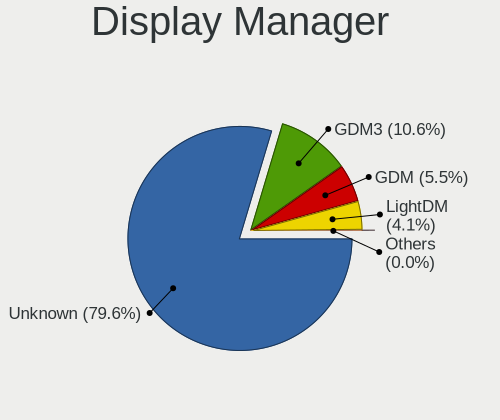
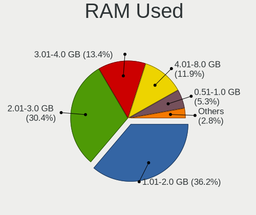
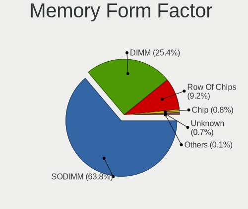
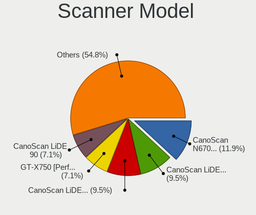

Zorin - Tested Hardware & Statistics
------------------------------------

A project to collect tested hardware configurations for Zorin.

Anyone can contribute to this report by the [hw-probe](https://github.com/linuxhw/hw-probe) tool:

    sudo -E hw-probe -all -upload

Please contribute! Especially if your hardware is rare.

This is a report for all computer types. See also reports for [desktops](/Dist/Zorin/Desktop/README.md) and [notebooks](/Dist/Zorin/Notebook/README.md).

Contents
--------

* [ Test Cases ](#test-cases)

* [ System ](#system)
  - [ OS                       ](#os)
  - [ OS Family                ](#os-family)
  - [ Kernel                   ](#kernel)
  - [ Kernel Family            ](#kernel-family)
  - [ Kernel Major Ver.        ](#kernel-major-ver)
  - [ Arch                     ](#arch)
  - [ DE                       ](#de)
  - [ Display Server           ](#display-server)
  - [ Display Manager          ](#display-manager)
  - [ OS Lang                  ](#os-lang)
  - [ Boot Mode                ](#boot-mode)
  - [ Filesystem               ](#filesystem)
  - [ Part. scheme             ](#part-scheme)
  - [ Dual Boot with Linux/BSD ](#dual-boot-with-linuxbsd)
  - [ Dual Boot (Win)          ](#dual-boot-win)

* [ Board ](#board)
  - [ Vendor                   ](#vendor)
  - [ Model                    ](#model)
  - [ Model Family             ](#model-family)
  - [ MFG Year                 ](#mfg-year)
  - [ Form Factor              ](#form-factor)
  - [ Secure Boot              ](#secure-boot)
  - [ Coreboot                 ](#coreboot)
  - [ RAM Size                 ](#ram-size)
  - [ RAM Used                 ](#ram-used)
  - [ Total Drives             ](#total-drives)
  - [ Has CD-ROM               ](#has-cd-rom)
  - [ Has Ethernet             ](#has-ethernet)
  - [ Has WiFi                 ](#has-wifi)
  - [ Has Bluetooth            ](#has-bluetooth)

* [ Location ](#location)
  - [ Country                  ](#country)
  - [ City                     ](#city)

* [ Drives ](#drives)
  - [ Drive Vendor             ](#drive-vendor)
  - [ Drive Model              ](#drive-model)
  - [ HDD Vendor               ](#hdd-vendor)
  - [ SSD Vendor               ](#ssd-vendor)
  - [ Drive Kind               ](#drive-kind)
  - [ Drive Connector          ](#drive-connector)
  - [ Drive Size               ](#drive-size)
  - [ Space Total              ](#space-total)
  - [ Space Used               ](#space-used)
  - [ Malfunc. Drives          ](#malfunc-drives)
  - [ Malfunc. Drive Vendor    ](#malfunc-drive-vendor)
  - [ Malfunc. HDD Vendor      ](#malfunc-hdd-vendor)
  - [ Malfunc. Drive Kind      ](#malfunc-drive-kind)
  - [ Failed Drives            ](#failed-drives)
  - [ Failed Drive Vendor      ](#failed-drive-vendor)
  - [ Drive Status             ](#drive-status)

* [ Storage controller ](#storage-controller)
  - [ Storage Vendor           ](#storage-vendor)
  - [ Storage Model            ](#storage-model)
  - [ Storage Kind             ](#storage-kind)

* [ Processor ](#processor)
  - [ CPU Vendor               ](#cpu-vendor)
  - [ CPU Model                ](#cpu-model)
  - [ CPU Model Family         ](#cpu-model-family)
  - [ CPU Cores                ](#cpu-cores)
  - [ CPU Sockets              ](#cpu-sockets)
  - [ CPU Threads              ](#cpu-threads)
  - [ CPU Op-Modes             ](#cpu-op-modes)
  - [ CPU Microcode            ](#cpu-microcode)
  - [ CPU Microarch            ](#cpu-microarch)

* [ Graphics ](#graphics)
  - [ GPU Vendor               ](#gpu-vendor)
  - [ GPU Model                ](#gpu-model)
  - [ GPU Combo                ](#gpu-combo)
  - [ GPU Driver               ](#gpu-driver)
  - [ GPU Memory               ](#gpu-memory)

* [ Monitor ](#monitor)
  - [ Monitor Vendor           ](#monitor-vendor)
  - [ Monitor Model            ](#monitor-model)
  - [ Monitor Resolution       ](#monitor-resolution)
  - [ Monitor Diagonal         ](#monitor-diagonal)
  - [ Monitor Width            ](#monitor-width)
  - [ Aspect Ratio             ](#aspect-ratio)
  - [ Monitor Area             ](#monitor-area)
  - [ Pixel Density            ](#pixel-density)
  - [ Multiple Monitors        ](#multiple-monitors)

* [ Network ](#network)
  - [ Net Controller Vendor    ](#net-controller-vendor)
  - [ Net Controller Model     ](#net-controller-model)
  - [ Wireless Vendor          ](#wireless-vendor)
  - [ Wireless Model           ](#wireless-model)
  - [ Ethernet Vendor          ](#ethernet-vendor)
  - [ Ethernet Model           ](#ethernet-model)
  - [ Net Controller Kind      ](#net-controller-kind)
  - [ Used Controller          ](#used-controller)
  - [ NICs                     ](#nics)
  - [ IPv6                     ](#ipv6)

* [ Bluetooth ](#bluetooth)
  - [ Bluetooth Vendor         ](#bluetooth-vendor)
  - [ Bluetooth Model          ](#bluetooth-model)

* [ Sound ](#sound)
  - [ Sound Vendor             ](#sound-vendor)
  - [ Sound Model              ](#sound-model)

* [ Memory ](#memory)
  - [ Memory Vendor            ](#memory-vendor)
  - [ Memory Model             ](#memory-model)
  - [ Memory Kind              ](#memory-kind)
  - [ Memory Form Factor       ](#memory-form-factor)
  - [ Memory Size              ](#memory-size)
  - [ Memory Speed             ](#memory-speed)

* [ Printers & scanners ](#printers--scanners)
  - [ Printer Vendor           ](#printer-vendor)
  - [ Printer Model            ](#printer-model)
  - [ Scanner Vendor           ](#scanner-vendor)
  - [ Scanner Model            ](#scanner-model)

* [ Camera ](#camera)
  - [ Camera Vendor            ](#camera-vendor)
  - [ Camera Model             ](#camera-model)

* [ Security ](#security)
  - [ Fingerprint Vendor       ](#fingerprint-vendor)
  - [ Fingerprint Model        ](#fingerprint-model)
  - [ Chipcard Vendor          ](#chipcard-vendor)
  - [ Chipcard Model           ](#chipcard-model)

* [ Unsupported ](#unsupported)
  - [ Unsupported Devices      ](#unsupported-devices)
  - [ Unsupported Device Types ](#unsupported-device-types)

Test Cases
----------

Total: 9285

| Vendor        | Model                       | Form-Factor | Probe                                                      | Date         |
|---------------|-----------------------------|-------------|------------------------------------------------------------|--------------|
| Dell          | 0YC03K A03                  | Desktop     | [e6d016f309](https://linux-hardware.org/?probe=e6d016f309) | Feb 02, 2024 |
| Medion        | E7214                       | Notebook    | [cb37ec8f5d](https://linux-hardware.org/?probe=cb37ec8f5d) | Feb 02, 2024 |
| HP            | ENVY m7                     | Notebook    | [b38e23bdbe](https://linux-hardware.org/?probe=b38e23bdbe) | Feb 02, 2024 |
| Apple         | Mac-F4218FC8 DVT            | All in one  | [7e9ecedb98](https://linux-hardware.org/?probe=7e9ecedb98) | Feb 02, 2024 |
| Gigabyte      | GA-990FXA-UD7               | Desktop     | [66768ccdf7](https://linux-hardware.org/?probe=66768ccdf7) | Feb 02, 2024 |
| Lenovo        | MAHOBAY 0B98401 PRO         | Desktop     | [3074b7c2a6](https://linux-hardware.org/?probe=3074b7c2a6) | Feb 02, 2024 |
| Microsoft     | Surface Pro 4               | Tablet      | [07e24523f9](https://linux-hardware.org/?probe=07e24523f9) | Feb 02, 2024 |
| Dell          | Latitude 7420               | Notebook    | [5eb0b85732](https://linux-hardware.org/?probe=5eb0b85732) | Feb 02, 2024 |
| Acer          | Aspire 5738                 | Notebook    | [7137d60986](https://linux-hardware.org/?probe=7137d60986) | Feb 02, 2024 |
| Gigabyte      | GA-990FXA-UD7               | Desktop     | [4726161c35](https://linux-hardware.org/?probe=4726161c35) | Feb 02, 2024 |
| Lenovo        | SHARKBAY 0B98401 PRO        | Desktop     | [62dc25b8b6](https://linux-hardware.org/?probe=62dc25b8b6) | Feb 02, 2024 |
| HP            | 3647h                       | Desktop     | [5f1a400767](https://linux-hardware.org/?probe=5f1a400767) | Feb 02, 2024 |
| Acer          | TravelMate 7740G            | Notebook    | [78bfa1b270](https://linux-hardware.org/?probe=78bfa1b270) | Feb 01, 2024 |
| Apple         | Mac-F4218FC8 DVT            | All in one  | [9b97e0a028](https://linux-hardware.org/?probe=9b97e0a028) | Feb 01, 2024 |
| HP            | 2B34                        | Desktop     | [8d74dccabc](https://linux-hardware.org/?probe=8d74dccabc) | Feb 01, 2024 |
| Lenovo        | Yoga Slim 7 14ITL05 82A3    | Notebook    | [98dc9736d7](https://linux-hardware.org/?probe=98dc9736d7) | Feb 01, 2024 |
| Lenovo        | Yoga Slim 7 14ITL05 82A3    | Notebook    | [4661ceab45](https://linux-hardware.org/?probe=4661ceab45) | Feb 01, 2024 |
| HP            | 620                         | Notebook    | [adcf9577e4](https://linux-hardware.org/?probe=adcf9577e4) | Feb 01, 2024 |
| Dell          | Latitude E6420              | Notebook    | [ff73a45b61](https://linux-hardware.org/?probe=ff73a45b61) | Feb 01, 2024 |
| COM1          | E15-5A165-BM (9)            | Notebook    | [41d123782c](https://linux-hardware.org/?probe=41d123782c) | Feb 01, 2024 |
| HP            | EliteBook 1050 G1           | Notebook    | [8799a2e9ae](https://linux-hardware.org/?probe=8799a2e9ae) | Feb 01, 2024 |
| Unknown       | Unknown                     | Desktop     | [4fa0768f2b](https://linux-hardware.org/?probe=4fa0768f2b) | Feb 01, 2024 |
| HP            | EliteBook 1050 G1           | Notebook    | [c95847728d](https://linux-hardware.org/?probe=c95847728d) | Feb 01, 2024 |
| Unknown       | Unknown                     | Desktop     | [69b18742b6](https://linux-hardware.org/?probe=69b18742b6) | Feb 01, 2024 |
| Dell          | 0VNGWR A00                  | All in one  | [cc68f4d744](https://linux-hardware.org/?probe=cc68f4d744) | Feb 01, 2024 |
| HP            | 15 Notebook PC              | Notebook    | [b60abe5c3d](https://linux-hardware.org/?probe=b60abe5c3d) | Feb 01, 2024 |
| HP            | 15 Notebook PC              | Notebook    | [b2f9ce6a03](https://linux-hardware.org/?probe=b2f9ce6a03) | Feb 01, 2024 |
| Apple         | MacBookPro10,2              | Notebook    | [fca71d08b7](https://linux-hardware.org/?probe=fca71d08b7) | Feb 01, 2024 |
| Lenovo        | MAHOBAY 0B98401 PRO         | Desktop     | [3cedb3c573](https://linux-hardware.org/?probe=3cedb3c573) | Feb 01, 2024 |
| ASUSTek       | ROG Zephyrus G14 GA402RK... | Notebook    | [172f182e36](https://linux-hardware.org/?probe=172f182e36) | Feb 01, 2024 |
| Lenovo        | IdeaPad 110-15ISK 80UD      | Notebook    | [45207cf034](https://linux-hardware.org/?probe=45207cf034) | Jan 31, 2024 |
| HP            | Elite x2 1012 G1            | Notebook    | [44bbb3b748](https://linux-hardware.org/?probe=44bbb3b748) | Jan 31, 2024 |
| ASUSTek       | B85M-K                      | Desktop     | [3058093889](https://linux-hardware.org/?probe=3058093889) | Jan 31, 2024 |
| ASUSTek       | K50IJ                       | Notebook    | [061ca8b8ca](https://linux-hardware.org/?probe=061ca8b8ca) | Jan 31, 2024 |
| Lenovo        | IdeaPad Y560                | Notebook    | [e9a51b1fa8](https://linux-hardware.org/?probe=e9a51b1fa8) | Jan 31, 2024 |
| ASUSTek       | K50IJ                       | Notebook    | [0eefe2c89f](https://linux-hardware.org/?probe=0eefe2c89f) | Jan 31, 2024 |
| HP            | EliteBook 8460p             | Notebook    | [8ddfa07beb](https://linux-hardware.org/?probe=8ddfa07beb) | Jan 31, 2024 |
| ASUSTek       | GL552JX                     | Notebook    | [4aebfef2d8](https://linux-hardware.org/?probe=4aebfef2d8) | Jan 31, 2024 |
| HP            | ProBook 6570b               | Notebook    | [20537302e6](https://linux-hardware.org/?probe=20537302e6) | Jan 31, 2024 |
| ASUSTek       | N55SF                       | Notebook    | [03c3d9aa25](https://linux-hardware.org/?probe=03c3d9aa25) | Jan 31, 2024 |
| Dell          | Studio 1450                 | Notebook    | [cdeeb53e43](https://linux-hardware.org/?probe=cdeeb53e43) | Jan 31, 2024 |
| Huanan        | X99-8M-F V1.4               | Desktop     | [7625188b91](https://linux-hardware.org/?probe=7625188b91) | Jan 31, 2024 |
| Gigabyte      | H110M-H-CF                  | Desktop     | [d1065a1aca](https://linux-hardware.org/?probe=d1065a1aca) | Jan 30, 2024 |
| HP            | ZBook 17 G3                 | Notebook    | [fefc37bfa1](https://linux-hardware.org/?probe=fefc37bfa1) | Jan 30, 2024 |
| HP            | ZBook 17 G3                 | Notebook    | [525b120614](https://linux-hardware.org/?probe=525b120614) | Jan 30, 2024 |
| ASUSTek       | GL552JX                     | Notebook    | [4acec8f3e2](https://linux-hardware.org/?probe=4acec8f3e2) | Jan 30, 2024 |
| Lenovo        | IdeaPad Y560                | Notebook    | [a32d1d3fa7](https://linux-hardware.org/?probe=a32d1d3fa7) | Jan 30, 2024 |
| Acer          | Aspire 9420                 | Notebook    | [d0c7154097](https://linux-hardware.org/?probe=d0c7154097) | Jan 30, 2024 |
| HP            | Laptop 17-ak0xx             | Notebook    | [0b511ae973](https://linux-hardware.org/?probe=0b511ae973) | Jan 30, 2024 |
| MSI           | B450M BAZOOKA V2            | Desktop     | [fbf883eddb](https://linux-hardware.org/?probe=fbf883eddb) | Jan 30, 2024 |
| Dell          | XPS 13 7390 2-in-1          | Convertible | [2c365787da](https://linux-hardware.org/?probe=2c365787da) | Jan 30, 2024 |
| Lenovo        | MAHOBAY 0B98401 PRO         | Desktop     | [073f673b78](https://linux-hardware.org/?probe=073f673b78) | Jan 29, 2024 |
| ASUSTek       | VivoBook_ASUSLaptop X150... | Notebook    | [028ce3b254](https://linux-hardware.org/?probe=028ce3b254) | Jan 29, 2024 |
| Dell          | 0RY007                      | Desktop     | [151f303198](https://linux-hardware.org/?probe=151f303198) | Jan 29, 2024 |
| Dell          | Inspiron 1545               | Notebook    | [3cffc989aa](https://linux-hardware.org/?probe=3cffc989aa) | Jan 29, 2024 |
| Dell          | Inspiron 1545               | Notebook    | [31ce3ae751](https://linux-hardware.org/?probe=31ce3ae751) | Jan 29, 2024 |
| MSI           | PRO H610M-G DDR4            | Desktop     | [3f4325d337](https://linux-hardware.org/?probe=3f4325d337) | Jan 29, 2024 |
| HUAWEI        | HKD-WXX                     | Notebook    | [7c98d9521b](https://linux-hardware.org/?probe=7c98d9521b) | Jan 29, 2024 |
| Apple         | MacBookPro10,1              | Notebook    | [4a9032156a](https://linux-hardware.org/?probe=4a9032156a) | Jan 29, 2024 |
| Apple         | Mac-942B5BF58194151B        | All in one  | [a86d2d1cf6](https://linux-hardware.org/?probe=a86d2d1cf6) | Jan 29, 2024 |
| HP            | ENVY x360 Convertible 15... | Convertible | [8c24292658](https://linux-hardware.org/?probe=8c24292658) | Jan 29, 2024 |
| Supermicro    | C2SBC-Q                     | Desktop     | [41edfdd3b7](https://linux-hardware.org/?probe=41edfdd3b7) | Jan 29, 2024 |
| Fujitsu       | D3221-A1 S26361-D3221-A1    | Desktop     | [292b1b06ca](https://linux-hardware.org/?probe=292b1b06ca) | Jan 28, 2024 |
| ASRock        | G31M-S                      | Desktop     | [3030db55a6](https://linux-hardware.org/?probe=3030db55a6) | Jan 28, 2024 |
| Medion        | P651x series                | Notebook    | [078e2924c4](https://linux-hardware.org/?probe=078e2924c4) | Jan 28, 2024 |
| Acer          | Aspire M3-581G              | Notebook    | [b91416ad7c](https://linux-hardware.org/?probe=b91416ad7c) | Jan 28, 2024 |
| Panasonic     | CFXZ6-1                     | Tablet      | [4bd23f4463](https://linux-hardware.org/?probe=4bd23f4463) | Jan 28, 2024 |
| Gigabyte      | EP43-S3L                    | Desktop     | [47a46bffc3](https://linux-hardware.org/?probe=47a46bffc3) | Jan 28, 2024 |
| Foxconn       | 946 7MA Series              | Desktop     | [8ef460557c](https://linux-hardware.org/?probe=8ef460557c) | Jan 28, 2024 |
| Colorful T... | C.Z77 X5 V20                | Desktop     | [9209512720](https://linux-hardware.org/?probe=9209512720) | Jan 28, 2024 |
| MSI           | Z490-A PRO                  | Desktop     | [a851d2d2fe](https://linux-hardware.org/?probe=a851d2d2fe) | Jan 28, 2024 |
| Gigabyte      | Z97X-UD5H                   | Desktop     | [fd0ab9a9ac](https://linux-hardware.org/?probe=fd0ab9a9ac) | Jan 28, 2024 |
| Lenovo        | IdeaPad 3 15IML05 81WB      | Notebook    | [67781b5f97](https://linux-hardware.org/?probe=67781b5f97) | Jan 28, 2024 |
| Intel         | H110                        | Desktop     | [2252be4fdb](https://linux-hardware.org/?probe=2252be4fdb) | Jan 28, 2024 |
| Gigabyte      | B760 AORUS ELITE AX         | Desktop     | [7c3e9a14d3](https://linux-hardware.org/?probe=7c3e9a14d3) | Jan 28, 2024 |
| HP            | Laptop 15-bw0xx             | Notebook    | [118dcfd484](https://linux-hardware.org/?probe=118dcfd484) | Jan 28, 2024 |
| ASUSTek       | ROG STRIX Z690-A GAMING ... | Desktop     | [37e7442cca](https://linux-hardware.org/?probe=37e7442cca) | Jan 27, 2024 |
| Dell          | Inspiron 5570               | Notebook    | [f8c5ba731b](https://linux-hardware.org/?probe=f8c5ba731b) | Jan 27, 2024 |
| Apple         | MacBookPro14,1              | Notebook    | [75f6092ef1](https://linux-hardware.org/?probe=75f6092ef1) | Jan 27, 2024 |
| ASUSTek       | H81M-PLUS                   | Desktop     | [be944e9cf6](https://linux-hardware.org/?probe=be944e9cf6) | Jan 27, 2024 |
| Dell          | 0GDG8Y A00                  | Desktop     | [47f8ef1ba6](https://linux-hardware.org/?probe=47f8ef1ba6) | Jan 27, 2024 |
| MSI           | Z97 PC Mate                 | Desktop     | [f4242c1634](https://linux-hardware.org/?probe=f4242c1634) | Jan 27, 2024 |
| Intel         | 35901                       | Desktop     | [2851a5f3bd](https://linux-hardware.org/?probe=2851a5f3bd) | Jan 27, 2024 |
| Dell          | Latitude E6430              | Notebook    | [237d6e4d3e](https://linux-hardware.org/?probe=237d6e4d3e) | Jan 27, 2024 |
| Dell          | 0Y5DDC A00                  | Desktop     | [1912506274](https://linux-hardware.org/?probe=1912506274) | Jan 26, 2024 |
| Lenovo        | ThinkPad T430s 2356GRS      | Notebook    | [c12736937f](https://linux-hardware.org/?probe=c12736937f) | Jan 26, 2024 |
| Dell          | 088DT1 A01                  | Desktop     | [b8db5c0293](https://linux-hardware.org/?probe=b8db5c0293) | Jan 26, 2024 |
| Lenovo        | IdeaPad C340-14API 81N6     | Notebook    | [ad13a93817](https://linux-hardware.org/?probe=ad13a93817) | Jan 26, 2024 |
| Gigabyte      | H81M-S2PV                   | Desktop     | [e458188420](https://linux-hardware.org/?probe=e458188420) | Jan 26, 2024 |
| Quanta        | XV1                         | All in one  | [b39049cedd](https://linux-hardware.org/?probe=b39049cedd) | Jan 26, 2024 |
| ASUSTek       | CM6870                      | Desktop     | [1abc8128a3](https://linux-hardware.org/?probe=1abc8128a3) | Jan 26, 2024 |
| HP            | 3647h                       | Desktop     | [14bc5e74bc](https://linux-hardware.org/?probe=14bc5e74bc) | Jan 26, 2024 |
| LTD Delovo... | EVE 1470D ES1278EW          | Tablet      | [81aa769b3d](https://linux-hardware.org/?probe=81aa769b3d) | Jan 26, 2024 |
| HP            | Victus by Gaming Laptop ... | Notebook    | [510b7f5cc7](https://linux-hardware.org/?probe=510b7f5cc7) | Jan 26, 2024 |
| ASUSTek       | PRIME B450M-GAMING/BR       | Desktop     | [99eeba6228](https://linux-hardware.org/?probe=99eeba6228) | Jan 26, 2024 |
| ASUSTek       | PRIME B450M-GAMING/BR       | Desktop     | [411e5a0261](https://linux-hardware.org/?probe=411e5a0261) | Jan 26, 2024 |
| ASRock        | Z370 Extreme4               | Desktop     | [30a58d5556](https://linux-hardware.org/?probe=30a58d5556) | Jan 26, 2024 |
| Dell          | 048DY8 A01                  | Desktop     | [d5e6914489](https://linux-hardware.org/?probe=d5e6914489) | Jan 26, 2024 |
| Acer          | Swift SF314-43              | Notebook    | [cdae9f5af3](https://linux-hardware.org/?probe=cdae9f5af3) | Jan 25, 2024 |
| Unknown       | Unknown                     | Desktop     | [5cfa0912f9](https://linux-hardware.org/?probe=5cfa0912f9) | Jan 25, 2024 |
| Gigabyte      | H81M-S2PV                   | Desktop     | [c609c40476](https://linux-hardware.org/?probe=c609c40476) | Jan 25, 2024 |
| Samsung       | Galaxy TabPro S             | Tablet      | [c84ed2f2e4](https://linux-hardware.org/?probe=c84ed2f2e4) | Jan 25, 2024 |
| Apple         | Mac-F22C86C8                | Mini pc     | [7434ec9fa6](https://linux-hardware.org/?probe=7434ec9fa6) | Jan 25, 2024 |
| Samsung       | DT1234567890 SEC_SW_REVI... | Desktop     | [fe98e7026e](https://linux-hardware.org/?probe=fe98e7026e) | Jan 25, 2024 |
| ASUSTek       | ROG STRIX X570-E GAMING     | Desktop     | [fd825e1d58](https://linux-hardware.org/?probe=fd825e1d58) | Jan 25, 2024 |
| Sony          | VPCEB3B4E                   | Notebook    | [afa1b50b5a](https://linux-hardware.org/?probe=afa1b50b5a) | Jan 25, 2024 |
| Fujitsu       | LIFEBOOK A531               | Notebook    | [647bf81332](https://linux-hardware.org/?probe=647bf81332) | Jan 25, 2024 |
| Toshiba       | Satellite R630              | Notebook    | [c888a8f4d5](https://linux-hardware.org/?probe=c888a8f4d5) | Jan 24, 2024 |
| Lenovo        | ThinkPad T480 20L6S3L400    | Notebook    | [3861071640](https://linux-hardware.org/?probe=3861071640) | Jan 24, 2024 |
| Samsung       | 450R4E/450R5E/450R4V/450... | Notebook    | [0f69d36c02](https://linux-hardware.org/?probe=0f69d36c02) | Jan 24, 2024 |
| ASUSTek       | ASUS EXPERTBOOK P3540FA_... | Notebook    | [a20369a079](https://linux-hardware.org/?probe=a20369a079) | Jan 24, 2024 |
| ASUSTek       | ASUS EXPERTBOOK P3540FA_... | Notebook    | [9ac42c58bf](https://linux-hardware.org/?probe=9ac42c58bf) | Jan 24, 2024 |
| HP            | Compaq 6530b (GW688AV)      | Notebook    | [aa8bc496ed](https://linux-hardware.org/?probe=aa8bc496ed) | Jan 24, 2024 |
| Dell          | 0GDG8Y A00                  | Desktop     | [18de9933d4](https://linux-hardware.org/?probe=18de9933d4) | Jan 24, 2024 |
| Alienware     | 07W25T A01                  | Desktop     | [538d2e2b5f](https://linux-hardware.org/?probe=538d2e2b5f) | Jan 24, 2024 |
| Apple         | MacBookPro5,5               | Notebook    | [214ebad454](https://linux-hardware.org/?probe=214ebad454) | Jan 24, 2024 |
| Apple         | MacBookPro5,5               | Notebook    | [f2a415adc9](https://linux-hardware.org/?probe=f2a415adc9) | Jan 24, 2024 |
| ASUSTek       | M5A97 R2.0                  | Desktop     | [738c84d746](https://linux-hardware.org/?probe=738c84d746) | Jan 23, 2024 |
| Dell          | 0D28YY A00                  | Desktop     | [8d8d8005b1](https://linux-hardware.org/?probe=8d8d8005b1) | Jan 23, 2024 |
| HP            | ZBook Studio G5             | Notebook    | [114d79aa75](https://linux-hardware.org/?probe=114d79aa75) | Jan 23, 2024 |
| Dell          | Latitude E5420              | Notebook    | [8347319849](https://linux-hardware.org/?probe=8347319849) | Jan 23, 2024 |
| HP            | Pavilion g4                 | Notebook    | [f0cc56ebca](https://linux-hardware.org/?probe=f0cc56ebca) | Jan 23, 2024 |
| Gigabyte      | X58A-UD3R                   | Desktop     | [eed9a3591f](https://linux-hardware.org/?probe=eed9a3591f) | Jan 23, 2024 |
| Gigabyte      | X58A-UD3R                   | Desktop     | [8479b771e4](https://linux-hardware.org/?probe=8479b771e4) | Jan 23, 2024 |
| HP            | 8523 A01                    | Mini pc     | [cfec865f42](https://linux-hardware.org/?probe=cfec865f42) | Jan 23, 2024 |
| HP            | EliteBook 840 G2            | Notebook    | [9ad67b6f8d](https://linux-hardware.org/?probe=9ad67b6f8d) | Jan 23, 2024 |
| HP            | 8523 A01                    | Mini pc     | [ad950a4d7d](https://linux-hardware.org/?probe=ad950a4d7d) | Jan 23, 2024 |
| Intel         | Unknown                     | Desktop     | [e4094a3abf](https://linux-hardware.org/?probe=e4094a3abf) | Jan 23, 2024 |
| HP            | EliteBook 840 G2            | Notebook    | [04f0c2393d](https://linux-hardware.org/?probe=04f0c2393d) | Jan 23, 2024 |
| Lenovo        | ThinkPad X201 4492W36       | Notebook    | [1ab7e95399](https://linux-hardware.org/?probe=1ab7e95399) | Jan 23, 2024 |
| Dell          | Inspiron 5567               | Notebook    | [6869d9559d](https://linux-hardware.org/?probe=6869d9559d) | Jan 22, 2024 |
| Google        | Kefka                       | Notebook    | [6cb0b95d02](https://linux-hardware.org/?probe=6cb0b95d02) | Jan 22, 2024 |
| HP            | Notebook                    | Notebook    | [8359e2a5dd](https://linux-hardware.org/?probe=8359e2a5dd) | Jan 22, 2024 |
| Acer          | Aspire 7736                 | Notebook    | [47521c1811](https://linux-hardware.org/?probe=47521c1811) | Jan 22, 2024 |
| Samsung       | DT1234567890 SEC_SW_REVI... | Desktop     | [8edec841f0](https://linux-hardware.org/?probe=8edec841f0) | Jan 22, 2024 |
| HP            | Laptop 15-fc0xxx            | Notebook    | [8dacf655a4](https://linux-hardware.org/?probe=8dacf655a4) | Jan 22, 2024 |
| HP            | Laptop 15-fc0xxx            | Notebook    | [c3f3bb78c6](https://linux-hardware.org/?probe=c3f3bb78c6) | Jan 22, 2024 |
| HP            | ProBook 430 G4              | Notebook    | [046036e7e3](https://linux-hardware.org/?probe=046036e7e3) | Jan 22, 2024 |
| Intel         | D54250WYK H13922-303        | Desktop     | [0c54cab119](https://linux-hardware.org/?probe=0c54cab119) | Jan 22, 2024 |
| HP            | ProBook 430 G4              | Notebook    | [262a8552de](https://linux-hardware.org/?probe=262a8552de) | Jan 22, 2024 |
| Dell          | Inspiron 5559               | Notebook    | [a0c06abcbd](https://linux-hardware.org/?probe=a0c06abcbd) | Jan 22, 2024 |
| Acer          | Predator PH315-53           | Notebook    | [a6dd1aa2a0](https://linux-hardware.org/?probe=a6dd1aa2a0) | Jan 22, 2024 |
| Microsoft     | Surface Pro 4               | Tablet      | [459284a7da](https://linux-hardware.org/?probe=459284a7da) | Jan 22, 2024 |
| Dell          | Latitude 5490               | Notebook    | [ebc5bed33f](https://linux-hardware.org/?probe=ebc5bed33f) | Jan 22, 2024 |
| ASUSTek       | K30AD_M31AD_M51AD_M32AD     | Desktop     | [41a378391c](https://linux-hardware.org/?probe=41a378391c) | Jan 22, 2024 |
| Lenovo        | V15-ADA 82C7                | Notebook    | [a8893e7742](https://linux-hardware.org/?probe=a8893e7742) | Jan 22, 2024 |
| Alienware     | 07W25T A01                  | Desktop     | [2a7a6fd405](https://linux-hardware.org/?probe=2a7a6fd405) | Jan 22, 2024 |
| Dell          | Latitude E7450              | Notebook    | [95b7e8d2fa](https://linux-hardware.org/?probe=95b7e8d2fa) | Jan 21, 2024 |
| MSI           | H81M ECO                    | Desktop     | [6b904323a3](https://linux-hardware.org/?probe=6b904323a3) | Jan 21, 2024 |
| ASUSTek       | PRIME A320M-K               | Desktop     | [9ba427246b](https://linux-hardware.org/?probe=9ba427246b) | Jan 21, 2024 |
| Toshiba       | Satellite A350              | Notebook    | [bc48f2f41a](https://linux-hardware.org/?probe=bc48f2f41a) | Jan 21, 2024 |
| Apple         | MacBookPro14,1              | Notebook    | [af0244605f](https://linux-hardware.org/?probe=af0244605f) | Jan 21, 2024 |
| Gigabyte      | B560M AORUS PRO             | Desktop     | [93137ffd8d](https://linux-hardware.org/?probe=93137ffd8d) | Jan 21, 2024 |
| Apple         | MacBookPro14,1              | Notebook    | [024b0a26f9](https://linux-hardware.org/?probe=024b0a26f9) | Jan 21, 2024 |
| Acer          | Aspire A315-59              | Notebook    | [07f3899f3a](https://linux-hardware.org/?probe=07f3899f3a) | Jan 21, 2024 |
| Acer          | Aspire A315-59              | Notebook    | [7bb9b69a14](https://linux-hardware.org/?probe=7bb9b69a14) | Jan 21, 2024 |
| Acer          | Aspire A315-59              | Notebook    | [124da06515](https://linux-hardware.org/?probe=124da06515) | Jan 21, 2024 |
| Acer          | Aspire A315-59              | Notebook    | [01d1c30937](https://linux-hardware.org/?probe=01d1c30937) | Jan 21, 2024 |
| MSI           | 760GM-P34                   | Desktop     | [3eb4ebb737](https://linux-hardware.org/?probe=3eb4ebb737) | Jan 21, 2024 |
| Toshiba       | Satellite L640              | Notebook    | [7478e6971b](https://linux-hardware.org/?probe=7478e6971b) | Jan 21, 2024 |
| HP            | Notebook                    | Notebook    | [2dcfaac5fd](https://linux-hardware.org/?probe=2dcfaac5fd) | Jan 21, 2024 |
| AMI           | Aptio CRB                   | Mini pc     | [8316bd6b18](https://linux-hardware.org/?probe=8316bd6b18) | Jan 21, 2024 |
| Foxconn       | 946 7MA Series              | Desktop     | [40261803d6](https://linux-hardware.org/?probe=40261803d6) | Jan 21, 2024 |
| ASUSTek       | ZN242GD                     | All in one  | [c55e6cfa06](https://linux-hardware.org/?probe=c55e6cfa06) | Jan 21, 2024 |
| Microsoft     | Surface Laptop 3            | Tablet      | [51f361caf2](https://linux-hardware.org/?probe=51f361caf2) | Jan 20, 2024 |
| Acer          | TravelMate Spin P614RN-5    | Convertible | [875bdb70a2](https://linux-hardware.org/?probe=875bdb70a2) | Jan 20, 2024 |
| Lenovo        | ThinkPad T470s W10DG 20J... | Notebook    | [aa2c5d9a1a](https://linux-hardware.org/?probe=aa2c5d9a1a) | Jan 20, 2024 |
| Sony          | VPCEB2JFX                   | Notebook    | [f648777cf1](https://linux-hardware.org/?probe=f648777cf1) | Jan 20, 2024 |
| Sony          | VPCEB2JFX                   | Notebook    | [bdc5adc95b](https://linux-hardware.org/?probe=bdc5adc95b) | Jan 20, 2024 |
| Toshiba       | NB550D                      | Notebook    | [1f743ab40e](https://linux-hardware.org/?probe=1f743ab40e) | Jan 20, 2024 |
| MACHINIST     | X79 Z9-D7 PRO V1.0          | Desktop     | [066ef702e4](https://linux-hardware.org/?probe=066ef702e4) | Jan 20, 2024 |
| Sony          | VGN-NS11Z_S                 | Notebook    | [64fa921691](https://linux-hardware.org/?probe=64fa921691) | Jan 20, 2024 |
| ASUSTek       | PRIME B550M-A               | Desktop     | [4dfe57b817](https://linux-hardware.org/?probe=4dfe57b817) | Jan 20, 2024 |
| ASRock        | B550 Steel Legend           | Desktop     | [4b1c9b076b](https://linux-hardware.org/?probe=4b1c9b076b) | Jan 20, 2024 |
| MACHINIST     | X79 Z9-D7 PRO V1.0          | Desktop     | [278fae59fe](https://linux-hardware.org/?probe=278fae59fe) | Jan 20, 2024 |
| ECS           | H61H2-M2                    | Desktop     | [ecb9ae8bed](https://linux-hardware.org/?probe=ecb9ae8bed) | Jan 20, 2024 |
| Lenovo        | IdeaPad S145-15IWL 81MV     | Notebook    | [4257aab3ea](https://linux-hardware.org/?probe=4257aab3ea) | Jan 20, 2024 |
| Acer          | Aspire X3990                | Desktop     | [7d4a040306](https://linux-hardware.org/?probe=7d4a040306) | Jan 20, 2024 |
| Dell          | Inspiron 3531               | Notebook    | [afc0f1a968](https://linux-hardware.org/?probe=afc0f1a968) | Jan 20, 2024 |
| Dell          | 0427JK A00                  | Desktop     | [7f8cfea83b](https://linux-hardware.org/?probe=7f8cfea83b) | Jan 20, 2024 |
| Lenovo        | Y50-70 20378                | Notebook    | [d146d31a02](https://linux-hardware.org/?probe=d146d31a02) | Jan 20, 2024 |
| AZW           | SER                         | Mini pc     | [c91aa206d4](https://linux-hardware.org/?probe=c91aa206d4) | Jan 20, 2024 |
| HP            | 1850                        | Desktop     | [20cf1f695e](https://linux-hardware.org/?probe=20cf1f695e) | Jan 20, 2024 |
| HP            | 8055                        | Desktop     | [e895f1b502](https://linux-hardware.org/?probe=e895f1b502) | Jan 20, 2024 |
| Lenovo        | IdeaPad S145-15IKB 81XM     | Notebook    | [f88694f40b](https://linux-hardware.org/?probe=f88694f40b) | Jan 20, 2024 |
| Lenovo        | IdeaPad S145-15IKB 81XM     | Notebook    | [1ce9d8eb2f](https://linux-hardware.org/?probe=1ce9d8eb2f) | Jan 20, 2024 |
| Dell          | 040DDP A01                  | Desktop     | [521a18e93d](https://linux-hardware.org/?probe=521a18e93d) | Jan 20, 2024 |
| HP            | EliteBook 840 G1            | Notebook    | [becbec6f26](https://linux-hardware.org/?probe=becbec6f26) | Jan 20, 2024 |
| Sony          | VGN-NW11S_S                 | Notebook    | [082d37eaf4](https://linux-hardware.org/?probe=082d37eaf4) | Jan 19, 2024 |
| Acer          | Aspire E5-551G              | Notebook    | [c4bd469e8d](https://linux-hardware.org/?probe=c4bd469e8d) | Jan 19, 2024 |
| ASUSTek       | PRIME H410M-E               | Desktop     | [29a0aa8446](https://linux-hardware.org/?probe=29a0aa8446) | Jan 19, 2024 |
| Apple         | Mac-77F17D7DA9285301 iMa... | All in one  | [47316e2746](https://linux-hardware.org/?probe=47316e2746) | Jan 19, 2024 |
| MSI           | MAG B660M BAZOOKA DDR4      | Desktop     | [c2522bf7b3](https://linux-hardware.org/?probe=c2522bf7b3) | Jan 19, 2024 |
| Lenovo        | V330-15IKB 81AX             | Notebook    | [b1151b6885](https://linux-hardware.org/?probe=b1151b6885) | Jan 19, 2024 |
| Acer          | Aspire E5-523               | Notebook    | [02378722b6](https://linux-hardware.org/?probe=02378722b6) | Jan 19, 2024 |
| Dell          | Inspiron 15-3567            | Notebook    | [dafbbbb67c](https://linux-hardware.org/?probe=dafbbbb67c) | Jan 19, 2024 |
| Lenovo        | MAHOBAY 0B98401 PRO         | Desktop     | [c3733ef1e3](https://linux-hardware.org/?probe=c3733ef1e3) | Jan 18, 2024 |
| Toshiba       | Satellite C55D-B            | Notebook    | [7f1090301b](https://linux-hardware.org/?probe=7f1090301b) | Jan 18, 2024 |
| Gigabyte      | X570S AERO G                | Desktop     | [15b13f2e8c](https://linux-hardware.org/?probe=15b13f2e8c) | Jan 18, 2024 |
| Intel         | X99                         | Desktop     | [44d8693e2b](https://linux-hardware.org/?probe=44d8693e2b) | Jan 18, 2024 |
| Lenovo        | IdeaPad Z510 20287          | Notebook    | [ba4eb41acd](https://linux-hardware.org/?probe=ba4eb41acd) | Jan 18, 2024 |
| GPD           | MicroPC                     | Notebook    | [80b3061910](https://linux-hardware.org/?probe=80b3061910) | Jan 18, 2024 |
| HP            | 530 Notebook PC(GU324AA#... | Notebook    | [785d324acb](https://linux-hardware.org/?probe=785d324acb) | Jan 18, 2024 |
| ASUSTek       | PRIME B460M-A               | Desktop     | [518ca600f6](https://linux-hardware.org/?probe=518ca600f6) | Jan 18, 2024 |
| Dell          | 040DDP A01                  | Desktop     | [c332d169ee](https://linux-hardware.org/?probe=c332d169ee) | Jan 18, 2024 |
| Alienware     | 14                          | Notebook    | [a0109babcd](https://linux-hardware.org/?probe=a0109babcd) | Jan 18, 2024 |
| Dell          | 0GTK4K A02                  | Desktop     | [a4aef81553](https://linux-hardware.org/?probe=a4aef81553) | Jan 18, 2024 |
| Lenovo        | SHARKBAY 0B98401 PRO        | Desktop     | [f830d5e5f7](https://linux-hardware.org/?probe=f830d5e5f7) | Jan 18, 2024 |
| Lenovo        | IdeaPad 3 15ALC6 82KU       | Notebook    | [ae841d1af4](https://linux-hardware.org/?probe=ae841d1af4) | Jan 17, 2024 |
| HP            | ZBook 14u G6                | Notebook    | [668a33bda1](https://linux-hardware.org/?probe=668a33bda1) | Jan 17, 2024 |
| ASUSTek       | P5G41T-M LX                 | Desktop     | [27cfeb78bf](https://linux-hardware.org/?probe=27cfeb78bf) | Jan 17, 2024 |
| Microsoft     | Surface Pro 3               | Tablet      | [daced9894a](https://linux-hardware.org/?probe=daced9894a) | Jan 17, 2024 |
| Toshiba       | Satellite A665              | Notebook    | [66c11ee330](https://linux-hardware.org/?probe=66c11ee330) | Jan 17, 2024 |
| Toshiba       | Satellite C850-B820         | Notebook    | [321a8ae666](https://linux-hardware.org/?probe=321a8ae666) | Jan 17, 2024 |
| Toshiba       | Satellite A665              | Notebook    | [640deb41af](https://linux-hardware.org/?probe=640deb41af) | Jan 17, 2024 |
| ASUSTek       | Zenbook UM5401QAB_UM5401... | Notebook    | [7b068dc524](https://linux-hardware.org/?probe=7b068dc524) | Jan 17, 2024 |
| Packard Be... | IMEDIA S3810                | Desktop     | [616954684d](https://linux-hardware.org/?probe=616954684d) | Jan 17, 2024 |
| Lenovo        | ThinkPad X13 Gen 1 20T3S... | Notebook    | [0e05a50329](https://linux-hardware.org/?probe=0e05a50329) | Jan 16, 2024 |
| HP            | Pavilion 17                 | Notebook    | [3594afe0d4](https://linux-hardware.org/?probe=3594afe0d4) | Jan 16, 2024 |
| HP            | Laptop 14-cf1xxx            | Notebook    | [b26a65cafd](https://linux-hardware.org/?probe=b26a65cafd) | Jan 16, 2024 |
| Lenovo        | ThinkPad L412 0585A38       | Notebook    | [d3c2d88045](https://linux-hardware.org/?probe=d3c2d88045) | Jan 16, 2024 |
| HP            | 15                          | Notebook    | [c84c138cef](https://linux-hardware.org/?probe=c84c138cef) | Jan 16, 2024 |
| Toshiba       | Satellite L55-C             | Notebook    | [004a2ecf6b](https://linux-hardware.org/?probe=004a2ecf6b) | Jan 16, 2024 |
| Dell          | 0NW6H5 A00                  | Desktop     | [f1ec7dddcf](https://linux-hardware.org/?probe=f1ec7dddcf) | Jan 16, 2024 |
| Lenovo        | Legion Pro 5 16ARX8 82WM    | Notebook    | [dddcaf6303](https://linux-hardware.org/?probe=dddcaf6303) | Jan 16, 2024 |
| Lenovo        | Legion Pro 5 16ARX8 82WM    | Notebook    | [26452561bd](https://linux-hardware.org/?probe=26452561bd) | Jan 16, 2024 |
| Gigabyte      | H110M-H-CF                  | Desktop     | [e5de4620f2](https://linux-hardware.org/?probe=e5de4620f2) | Jan 16, 2024 |
| Lenovo        | ThinkPad W520 42844ZG       | Notebook    | [6c360c2400](https://linux-hardware.org/?probe=6c360c2400) | Jan 15, 2024 |
| Intel         | Unknown                     | Notebook    | [dfd975eff3](https://linux-hardware.org/?probe=dfd975eff3) | Jan 15, 2024 |
| ASUSTek       | PRIME B450M-K II            | Desktop     | [fac0f6dfa7](https://linux-hardware.org/?probe=fac0f6dfa7) | Jan 15, 2024 |
| Dell          | Latitude E5470              | Notebook    | [d9fcb7e121](https://linux-hardware.org/?probe=d9fcb7e121) | Jan 15, 2024 |
| ASUSTek       | TUF Gaming Z790-PLUS WIF... | Desktop     | [e7fea8c963](https://linux-hardware.org/?probe=e7fea8c963) | Jan 15, 2024 |
| MSI           | B85-G41 PC Mate             | Desktop     | [a31032a308](https://linux-hardware.org/?probe=a31032a308) | Jan 15, 2024 |
| Intel         | DQ67SW AAG12527-310         | Desktop     | [4c5f54d07e](https://linux-hardware.org/?probe=4c5f54d07e) | Jan 15, 2024 |
| Dell          | OptiPlex 7050               | Desktop     | [f0c2b782ff](https://linux-hardware.org/?probe=f0c2b782ff) | Jan 15, 2024 |
| Lenovo        | ThinkPad X240 20AL0097US    | Notebook    | [7c13db701b](https://linux-hardware.org/?probe=7c13db701b) | Jan 15, 2024 |
| MSI           | A320M PRO-VH PLUS           | Desktop     | [b18b5a87c1](https://linux-hardware.org/?probe=b18b5a87c1) | Jan 15, 2024 |
| Gigabyte      | Z170X-UD5-CF                | Desktop     | [56be497bb3](https://linux-hardware.org/?probe=56be497bb3) | Jan 15, 2024 |
| Dell          | Latitude 14 Rugged (5404... | Notebook    | [fdbb4ec35e](https://linux-hardware.org/?probe=fdbb4ec35e) | Jan 15, 2024 |
| ASUSTek       | M4A87TD/USB3                | Desktop     | [7d6c792c7c](https://linux-hardware.org/?probe=7d6c792c7c) | Jan 14, 2024 |
| Intel         | X99-P4 V5.0                 | Desktop     | [574a971f93](https://linux-hardware.org/?probe=574a971f93) | Jan 14, 2024 |
| Samsung       | 700Z3C/700Z5C               | Notebook    | [6055feefa2](https://linux-hardware.org/?probe=6055feefa2) | Jan 14, 2024 |
| ASUSTek       | PRIME N100I-D D4            | Desktop     | [da3a345b8c](https://linux-hardware.org/?probe=da3a345b8c) | Jan 14, 2024 |
| ASUSTek       | ROG STRIX X570-I GAMING     | Desktop     | [4205f233da](https://linux-hardware.org/?probe=4205f233da) | Jan 14, 2024 |
| Apple         | Mac-8ED6AF5B48C039E1 Mac... | Mini pc     | [016fce8667](https://linux-hardware.org/?probe=016fce8667) | Jan 14, 2024 |
| Apple         | Mac-8ED6AF5B48C039E1 Mac... | Mini pc     | [c77044bdbd](https://linux-hardware.org/?probe=c77044bdbd) | Jan 14, 2024 |
| Dell          | Latitude 7390               | Notebook    | [837b633afe](https://linux-hardware.org/?probe=837b633afe) | Jan 14, 2024 |
| HP            | 15                          | Notebook    | [c247a8a3fb](https://linux-hardware.org/?probe=c247a8a3fb) | Jan 14, 2024 |
| Acer          | Aspire GX-781               | Desktop     | [a12a5666f0](https://linux-hardware.org/?probe=a12a5666f0) | Jan 14, 2024 |
| ASUSTek       | VivoBook_ASUSLaptop M650... | Notebook    | [a6d483fa69](https://linux-hardware.org/?probe=a6d483fa69) | Jan 14, 2024 |
| ASUSTek       | Z170-P                      | Desktop     | [b3d8c3265d](https://linux-hardware.org/?probe=b3d8c3265d) | Jan 14, 2024 |
| Lenovo        | ThinkCentre M70E 0830W36    | Desktop     | [f28fd8d379](https://linux-hardware.org/?probe=f28fd8d379) | Jan 14, 2024 |
| MSI           | A320M PRO-VH PLUS           | Desktop     | [fd91d64dae](https://linux-hardware.org/?probe=fd91d64dae) | Jan 14, 2024 |
| HP            | Spectre x360 Convertible... | Convertible | [eae86d20de](https://linux-hardware.org/?probe=eae86d20de) | Jan 13, 2024 |
| Intel         | B75                         | Desktop     | [9043007717](https://linux-hardware.org/?probe=9043007717) | Jan 13, 2024 |
| Sony          | VGN-NS11Z_S                 | Notebook    | [863785eef9](https://linux-hardware.org/?probe=863785eef9) | Jan 13, 2024 |
| HP            | 843B                        | Desktop     | [1a5460ffda](https://linux-hardware.org/?probe=1a5460ffda) | Jan 13, 2024 |
| HP            | 843B                        | Desktop     | [6f49885414](https://linux-hardware.org/?probe=6f49885414) | Jan 13, 2024 |
| MSI           | H310M PRO-M2 PLUS           | Desktop     | [89b8dbd2bb](https://linux-hardware.org/?probe=89b8dbd2bb) | Jan 13, 2024 |
| Quanta        | XV1                         | All in one  | [112581cd19](https://linux-hardware.org/?probe=112581cd19) | Jan 13, 2024 |
| ASUSTek       | ROG Rampage VI EXTREME      | Desktop     | [d69cce27fe](https://linux-hardware.org/?probe=d69cce27fe) | Jan 13, 2024 |
| Dell          | Inspiron 3501               | Notebook    | [75a54dcccf](https://linux-hardware.org/?probe=75a54dcccf) | Jan 13, 2024 |
| Toshiba       | Satellite R630              | Notebook    | [0e83a06873](https://linux-hardware.org/?probe=0e83a06873) | Jan 13, 2024 |
| Apple         | MacBookPro10,2              | Notebook    | [8b5e54c037](https://linux-hardware.org/?probe=8b5e54c037) | Jan 13, 2024 |
| ASUSTek       | P5G41T-M LX                 | Desktop     | [4560285085](https://linux-hardware.org/?probe=4560285085) | Jan 13, 2024 |
| Gateway       | SX2851                      | Desktop     | [148edc701f](https://linux-hardware.org/?probe=148edc701f) | Jan 12, 2024 |
| HP            | Laptop 14s-dq0xxx           | Notebook    | [d8a2561e72](https://linux-hardware.org/?probe=d8a2561e72) | Jan 12, 2024 |
| Acer          | Aspire V5-573G              | Notebook    | [09ddfeab43](https://linux-hardware.org/?probe=09ddfeab43) | Jan 12, 2024 |
| ASRock        | H61M-DGS                    | Desktop     | [5b064e0d5c](https://linux-hardware.org/?probe=5b064e0d5c) | Jan 12, 2024 |
| Acer          | Nitro AN517-41              | Notebook    | [3f38b8085c](https://linux-hardware.org/?probe=3f38b8085c) | Jan 12, 2024 |
| Lenovo        | 1046 SDK0K17763 WIN 1801... | Desktop     | [04f69940d9](https://linux-hardware.org/?probe=04f69940d9) | Jan 12, 2024 |
| SGIN          | M15                         | Notebook    | [022c34815c](https://linux-hardware.org/?probe=022c34815c) | Jan 12, 2024 |
| Lenovo        | ThinkPad W520 42844ZG       | Notebook    | [e085204d13](https://linux-hardware.org/?probe=e085204d13) | Jan 12, 2024 |
| Lenovo        | ThinkPad T430 2347GU8       | Notebook    | [b521a115f8](https://linux-hardware.org/?probe=b521a115f8) | Jan 12, 2024 |
| HP            | 3647h                       | Desktop     | [e9767a4e96](https://linux-hardware.org/?probe=e9767a4e96) | Jan 12, 2024 |
| Lenovo        | ThinkPad T430 2347GU8       | Notebook    | [7d95af598c](https://linux-hardware.org/?probe=7d95af598c) | Jan 12, 2024 |
| HP            | 3647h                       | Desktop     | [39414040e7](https://linux-hardware.org/?probe=39414040e7) | Jan 12, 2024 |
| MSI           | H110M GAMING                | Desktop     | [cb524a284a](https://linux-hardware.org/?probe=cb524a284a) | Jan 12, 2024 |
| Chuwi         | LapBook Pro                 | Notebook    | [9b26a023b9](https://linux-hardware.org/?probe=9b26a023b9) | Jan 12, 2024 |
| Chuwi         | LapBook Pro                 | Notebook    | [efa337f154](https://linux-hardware.org/?probe=efa337f154) | Jan 12, 2024 |
| Lenovo        | 310B SDK0J40697 WIN 3305... | Mini pc     | [de5d52bcd5](https://linux-hardware.org/?probe=de5d52bcd5) | Jan 12, 2024 |
| HP            | 250 G5 Notebook PC          | Notebook    | [8fb1c8650f](https://linux-hardware.org/?probe=8fb1c8650f) | Jan 12, 2024 |
| HP            | 8055                        | Desktop     | [f92ba3c747](https://linux-hardware.org/?probe=f92ba3c747) | Jan 12, 2024 |
| Lenovo        | Yoga C940-14IIL 81Q9        | Convertible | [097b734fd7](https://linux-hardware.org/?probe=097b734fd7) | Jan 12, 2024 |
| Dell          | 0WR7PY A02                  | Desktop     | [623fed7d14](https://linux-hardware.org/?probe=623fed7d14) | Jan 11, 2024 |
| Gateway       | SX2851                      | Desktop     | [0cbcae7c27](https://linux-hardware.org/?probe=0cbcae7c27) | Jan 11, 2024 |
| ASUSTek       | ZenBook UX431DA_UM431DA     | Notebook    | [da41d1e19b](https://linux-hardware.org/?probe=da41d1e19b) | Jan 11, 2024 |
| Dell          | Inspiron 1545               | Notebook    | [8740fc7c08](https://linux-hardware.org/?probe=8740fc7c08) | Jan 11, 2024 |
| Lenovo        | Aptio CRB SDK0E50510 WIN    | Mini pc     | [75ab39eb43](https://linux-hardware.org/?probe=75ab39eb43) | Jan 11, 2024 |
| Acer          | Aspire A515-58M             | Notebook    | [459fc30547](https://linux-hardware.org/?probe=459fc30547) | Jan 11, 2024 |
| Acer          | Veriton X490G               | Desktop     | [1110362d9a](https://linux-hardware.org/?probe=1110362d9a) | Jan 11, 2024 |
| HP            | 86F3 00100                  | All in one  | [3d82b7b8e6](https://linux-hardware.org/?probe=3d82b7b8e6) | Jan 11, 2024 |
| Toshiba       | Satellite L750              | Notebook    | [44ec4c7459](https://linux-hardware.org/?probe=44ec4c7459) | Jan 11, 2024 |
| Dell          | 0D6H9T A01                  | Desktop     | [afb3c3cb61](https://linux-hardware.org/?probe=afb3c3cb61) | Jan 11, 2024 |
| ASUSTek       | N56JR                       | Notebook    | [513c456753](https://linux-hardware.org/?probe=513c456753) | Jan 11, 2024 |
| Dell          | 0T1D10 A01                  | Desktop     | [0c1256487e](https://linux-hardware.org/?probe=0c1256487e) | Jan 11, 2024 |
| Medion        | E4251 MD61435               | Notebook    | [6a9251fa94](https://linux-hardware.org/?probe=6a9251fa94) | Jan 11, 2024 |
| Apple         | MacBookPro14,1              | Notebook    | [8762757dc7](https://linux-hardware.org/?probe=8762757dc7) | Jan 10, 2024 |
| HUAWEI        | HVY-WXX9                    | Notebook    | [2a28690851](https://linux-hardware.org/?probe=2a28690851) | Jan 10, 2024 |
| HP            | Pavilion Sleekbook 14       | Notebook    | [9f54d91b95](https://linux-hardware.org/?probe=9f54d91b95) | Jan 10, 2024 |
| Toshiba       | Satellite L845              | Notebook    | [e45e9517b3](https://linux-hardware.org/?probe=e45e9517b3) | Jan 10, 2024 |
| Toshiba       | STI NI 1401                 | Notebook    | [be4bcf5468](https://linux-hardware.org/?probe=be4bcf5468) | Jan 10, 2024 |
| ASUSTek       | PRIME Z690-P WIFI           | Desktop     | [864517b348](https://linux-hardware.org/?probe=864517b348) | Jan 10, 2024 |
| ASUSTek       | H81I-PLUS                   | Desktop     | [c51ffcf76e](https://linux-hardware.org/?probe=c51ffcf76e) | Jan 10, 2024 |
| Dell          | Inspiron 7737               | Notebook    | [ae41cf1d2f](https://linux-hardware.org/?probe=ae41cf1d2f) | Jan 10, 2024 |
| Acer          | Aspire E1-570G              | Notebook    | [2bb5dcf476](https://linux-hardware.org/?probe=2bb5dcf476) | Jan 10, 2024 |
| Gigabyte      | GA-78LMT-USB3 x.x           | Desktop     | [fda5ec8f8d](https://linux-hardware.org/?probe=fda5ec8f8d) | Jan 10, 2024 |
| Lenovo        | Win8 Pro DPK TPG            | Desktop     | [dc6bb19505](https://linux-hardware.org/?probe=dc6bb19505) | Jan 10, 2024 |
| ASUSTek       | ROG STRIX X570-E GAMING     | Desktop     | [5c2e8e03c6](https://linux-hardware.org/?probe=5c2e8e03c6) | Jan 10, 2024 |
| Lenovo        | Win8 Pro DPK TPG            | Desktop     | [66eedf0a68](https://linux-hardware.org/?probe=66eedf0a68) | Jan 10, 2024 |
| ASUSTek       | X200CA                      | Notebook    | [c27c1b9fc2](https://linux-hardware.org/?probe=c27c1b9fc2) | Jan 10, 2024 |
| AZW           | SER V01                     | Mini pc     | [3ea9c8a571](https://linux-hardware.org/?probe=3ea9c8a571) | Jan 09, 2024 |
| Toshiba       | Satellite C850              | Notebook    | [38fb6d3619](https://linux-hardware.org/?probe=38fb6d3619) | Jan 09, 2024 |
| Toshiba       | Satellite C850              | Notebook    | [c6faf796f4](https://linux-hardware.org/?probe=c6faf796f4) | Jan 09, 2024 |
| Acer          | Aspire 6530G                | Notebook    | [184836d752](https://linux-hardware.org/?probe=184836d752) | Jan 09, 2024 |
| MSI           | H81M-E33 V2                 | Desktop     | [7f2af9d905](https://linux-hardware.org/?probe=7f2af9d905) | Jan 09, 2024 |
| ASUSTek       | P8P67 DELUXE                | Desktop     | [7d5b232fca](https://linux-hardware.org/?probe=7d5b232fca) | Jan 09, 2024 |
| ASUSTek       | ROG STRIX Z690-F GAMING ... | Desktop     | [f7db7dfd14](https://linux-hardware.org/?probe=f7db7dfd14) | Jan 09, 2024 |
| ASUSTek       | PRIME Z490-P                | Desktop     | [1ec23b4600](https://linux-hardware.org/?probe=1ec23b4600) | Jan 09, 2024 |
| Unknown       | Unknown                     | Desktop     | [ca7b5632f4](https://linux-hardware.org/?probe=ca7b5632f4) | Jan 09, 2024 |
| Acer          | FG965M                      | Desktop     | [1c08b35011](https://linux-hardware.org/?probe=1c08b35011) | Jan 09, 2024 |
| HP            | ZBook 15u G5                | Notebook    | [6636e9d9f7](https://linux-hardware.org/?probe=6636e9d9f7) | Jan 09, 2024 |
| Dell          | Latitude E5520              | Notebook    | [cae81ff9aa](https://linux-hardware.org/?probe=cae81ff9aa) | Jan 09, 2024 |
| Lenovo        | SKYBAY SDK0J40697 WIN 33... | Desktop     | [d5486716d1](https://linux-hardware.org/?probe=d5486716d1) | Jan 09, 2024 |
| ASUSTek       | Zenbook UM3402YA_UM3402Y... | Notebook    | [2c022aaecf](https://linux-hardware.org/?probe=2c022aaecf) | Jan 09, 2024 |
| Samsung       | 550XBE/350XBE               | Notebook    | [40266fb2b6](https://linux-hardware.org/?probe=40266fb2b6) | Jan 08, 2024 |
| HONOR         | BBR-WAX9                    | Notebook    | [b9d1ee2b4c](https://linux-hardware.org/?probe=b9d1ee2b4c) | Jan 08, 2024 |
| Toshiba       | Satellite P200              | Notebook    | [bda7517862](https://linux-hardware.org/?probe=bda7517862) | Jan 08, 2024 |
| HP            | EliteBook 8440p             | Notebook    | [6a5afb5dec](https://linux-hardware.org/?probe=6a5afb5dec) | Jan 08, 2024 |
| Shuttle       | FZ87                        | Desktop     | [e06b37d26f](https://linux-hardware.org/?probe=e06b37d26f) | Jan 08, 2024 |
| SGIN          | M15                         | Notebook    | [b0b7267ad7](https://linux-hardware.org/?probe=b0b7267ad7) | Jan 08, 2024 |
| ASUSTek       | X550CC                      | Notebook    | [b4987d6897](https://linux-hardware.org/?probe=b4987d6897) | Jan 08, 2024 |
| Lenovo        | ThinkPad W550s 20E2000PM... | Notebook    | [0a3bac66b1](https://linux-hardware.org/?probe=0a3bac66b1) | Jan 08, 2024 |
| HP            | EliteBook Revolve 810 G1    | Notebook    | [c428c1eb3e](https://linux-hardware.org/?probe=c428c1eb3e) | Jan 08, 2024 |
| ASUSTek       | ROG Maximus Z790 HERO       | Desktop     | [50877161c2](https://linux-hardware.org/?probe=50877161c2) | Jan 08, 2024 |
| HP            | Pavilion Gaming Laptop 1... | Notebook    | [a24204426f](https://linux-hardware.org/?probe=a24204426f) | Jan 08, 2024 |
| ASUSTek       | ROG Maximus Z790 HERO       | Desktop     | [cb7c295dc6](https://linux-hardware.org/?probe=cb7c295dc6) | Jan 08, 2024 |
| HP            | Presario CQ42               | Notebook    | [6addf001a5](https://linux-hardware.org/?probe=6addf001a5) | Jan 08, 2024 |
| Fujitsu       | LIFEBOOK T935               | Notebook    | [c3454270ef](https://linux-hardware.org/?probe=c3454270ef) | Jan 08, 2024 |
| ASUSTek       | X756UV                      | Notebook    | [8e9a0ad7c4](https://linux-hardware.org/?probe=8e9a0ad7c4) | Jan 08, 2024 |
| HP            | Pavilion TS 15              | Notebook    | [730453df05](https://linux-hardware.org/?probe=730453df05) | Jan 08, 2024 |
| HP            | Pavilion Gaming Laptop 1... | Notebook    | [1a8316e6ab](https://linux-hardware.org/?probe=1a8316e6ab) | Jan 08, 2024 |
| ASUSTek       | UL50VT                      | Notebook    | [428d20a1eb](https://linux-hardware.org/?probe=428d20a1eb) | Jan 07, 2024 |
| HP            | ZBook 15 G2                 | Notebook    | [1db012c1ff](https://linux-hardware.org/?probe=1db012c1ff) | Jan 07, 2024 |
| ASUSTek       | K54LY                       | Notebook    | [58b75cfaa8](https://linux-hardware.org/?probe=58b75cfaa8) | Jan 07, 2024 |
| MSI           | X470 GAMING PLUS MAX        | Desktop     | [ac3aa9697a](https://linux-hardware.org/?probe=ac3aa9697a) | Jan 07, 2024 |
| Acer          | Swift SF314-511             | Notebook    | [14eac9efff](https://linux-hardware.org/?probe=14eac9efff) | Jan 07, 2024 |
| Acer          | Aspire E1-570G              | Notebook    | [3c08b1958e](https://linux-hardware.org/?probe=3c08b1958e) | Jan 07, 2024 |
| Lenovo        | IdeaPad 320-15ABR 80XS      | Notebook    | [cc9bcb19e4](https://linux-hardware.org/?probe=cc9bcb19e4) | Jan 07, 2024 |
| Intel         | H61                         | Desktop     | [a0d05acffb](https://linux-hardware.org/?probe=a0d05acffb) | Jan 07, 2024 |
| Dell          | Latitude E5420              | Notebook    | [40835d5737](https://linux-hardware.org/?probe=40835d5737) | Jan 07, 2024 |
| ASUSTek       | ROG Strix G713PI_G713PI     | Notebook    | [b02f06751f](https://linux-hardware.org/?probe=b02f06751f) | Jan 07, 2024 |
| HP            | 2215                        | Desktop     | [cea6ba103b](https://linux-hardware.org/?probe=cea6ba103b) | Jan 07, 2024 |
| Dell          | Latitude E5470              | Notebook    | [959af07fd5](https://linux-hardware.org/?probe=959af07fd5) | Jan 07, 2024 |
| Lenovo        | Legion S7 16IAH7 82TF       | Notebook    | [c372a02c46](https://linux-hardware.org/?probe=c372a02c46) | Jan 07, 2024 |
| ASUSTek       | TUF Gaming Z790-PLUS WIF... | Desktop     | [8f181c2fb8](https://linux-hardware.org/?probe=8f181c2fb8) | Jan 07, 2024 |
| ASUSTek       | M5A99FX PRO R2.0            | Desktop     | [2b0d355816](https://linux-hardware.org/?probe=2b0d355816) | Jan 07, 2024 |
| Biostar       | A320MH                      | Desktop     | [9bec9420ab](https://linux-hardware.org/?probe=9bec9420ab) | Jan 06, 2024 |
| Lenovo        | Legion S7 16IAH7 82TF       | Notebook    | [9d297cdfcb](https://linux-hardware.org/?probe=9d297cdfcb) | Jan 06, 2024 |
| Acer          | Aspire 7530G                | Notebook    | [412d583cbd](https://linux-hardware.org/?probe=412d583cbd) | Jan 06, 2024 |
| Google        | Zako                        | Desktop     | [1daf09e8e8](https://linux-hardware.org/?probe=1daf09e8e8) | Jan 06, 2024 |
| ASUSTek       | B85M-E                      | Desktop     | [1f5304b336](https://linux-hardware.org/?probe=1f5304b336) | Jan 06, 2024 |
| ASUSTek       | B85M-E                      | Desktop     | [7c7fb3af69](https://linux-hardware.org/?probe=7c7fb3af69) | Jan 06, 2024 |
| Lenovo        | ThinkPad T520 4243F53       | Notebook    | [900bfdd9a8](https://linux-hardware.org/?probe=900bfdd9a8) | Jan 06, 2024 |
| Acer          | Aspire ES1-512              | Notebook    | [c24ea3ef71](https://linux-hardware.org/?probe=c24ea3ef71) | Jan 06, 2024 |
| ASUSTek       | P7P55D                      | Desktop     | [3d2ef1558b](https://linux-hardware.org/?probe=3d2ef1558b) | Jan 06, 2024 |
| Lenovo        | ThinkPad L412 0585A38       | Notebook    | [527b75e8b3](https://linux-hardware.org/?probe=527b75e8b3) | Jan 06, 2024 |
| ASRock        | G31M-S                      | Desktop     | [1b44835106](https://linux-hardware.org/?probe=1b44835106) | Jan 06, 2024 |
| Lenovo        | IdeaPadFlex 5 14ARE05 81... | Convertible | [f9b4427f39](https://linux-hardware.org/?probe=f9b4427f39) | Jan 06, 2024 |
| Dell          | 0HN7XN A01                  | Desktop     | [f154d2ee51](https://linux-hardware.org/?probe=f154d2ee51) | Jan 06, 2024 |
| HP            | ENVY dv6                    | Notebook    | [12f54bd4e0](https://linux-hardware.org/?probe=12f54bd4e0) | Jan 06, 2024 |
| ASUSTek       | PRIME X399-A                | Desktop     | [5f016cc67b](https://linux-hardware.org/?probe=5f016cc67b) | Jan 05, 2024 |
| Gigabyte      | AX370-Gaming K5-CF          | Desktop     | [99a8eed63b](https://linux-hardware.org/?probe=99a8eed63b) | Jan 05, 2024 |
| Dell          | 0T1D10 A01                  | Desktop     | [36fd42ae37](https://linux-hardware.org/?probe=36fd42ae37) | Jan 05, 2024 |
| ASUSTek       | PRIME A320M-K               | Desktop     | [aa3bcd9633](https://linux-hardware.org/?probe=aa3bcd9633) | Jan 05, 2024 |
| ASUSTek       | ROG STRIX B450-F GAMING     | Desktop     | [09e0325d35](https://linux-hardware.org/?probe=09e0325d35) | Jan 05, 2024 |
| Dell          | 0HN7XN A01                  | Desktop     | [91b070152e](https://linux-hardware.org/?probe=91b070152e) | Jan 05, 2024 |
| ASUSTek       | H110M-A/M.2                 | Desktop     | [7b663d0c10](https://linux-hardware.org/?probe=7b663d0c10) | Jan 05, 2024 |
| ASUSTek       | Zenbook UM3402YA_UM3402Y... | Notebook    | [ef882bce34](https://linux-hardware.org/?probe=ef882bce34) | Jan 05, 2024 |
| Shuttle       | FG31 V30                    | Desktop     | [ad4f57194c](https://linux-hardware.org/?probe=ad4f57194c) | Jan 04, 2024 |
| Apple         | MacBookPro9,2               | Notebook    | [c606f10b1d](https://linux-hardware.org/?probe=c606f10b1d) | Jan 04, 2024 |
| Apple         | MacBookPro5,5               | Notebook    | [5242f988d3](https://linux-hardware.org/?probe=5242f988d3) | Jan 04, 2024 |
| HP            | 84EE 1100                   | All in one  | [fe1416b7fa](https://linux-hardware.org/?probe=fe1416b7fa) | Jan 04, 2024 |
| Dell          | 0Y7WYT A00                  | Desktop     | [75fac6e117](https://linux-hardware.org/?probe=75fac6e117) | Jan 04, 2024 |
| HP            | Pavilion Power Laptop 15... | Notebook    | [37ea5af9b1](https://linux-hardware.org/?probe=37ea5af9b1) | Jan 04, 2024 |
| Fujitsu       | STYLISTIC Q702              | Notebook    | [27863be159](https://linux-hardware.org/?probe=27863be159) | Jan 04, 2024 |
| Apple         | MacBookAir7,2               | Notebook    | [8e378cce52](https://linux-hardware.org/?probe=8e378cce52) | Jan 04, 2024 |
| Dell          | Inspiron 1525               | Notebook    | [debaccaee2](https://linux-hardware.org/?probe=debaccaee2) | Jan 04, 2024 |
| Lenovo        | 32CB SDK0T76530 WIN 3556... | Desktop     | [085c7817a1](https://linux-hardware.org/?probe=085c7817a1) | Jan 04, 2024 |
| Compal        | JHL90 REFERENCE             | Notebook    | [ba4b52e111](https://linux-hardware.org/?probe=ba4b52e111) | Jan 04, 2024 |
| ASUSTek       | E201NA                      | Notebook    | [91cac0307a](https://linux-hardware.org/?probe=91cac0307a) | Jan 04, 2024 |
| ASUSTek       | PRIME B450M-K II            | Desktop     | [798bc45ec5](https://linux-hardware.org/?probe=798bc45ec5) | Jan 03, 2024 |
| ASUSTek       | P50IJ                       | Notebook    | [5a72912f2f](https://linux-hardware.org/?probe=5a72912f2f) | Jan 03, 2024 |
| Apple         | MacBookPro5,5               | Notebook    | [76f1cdbedb](https://linux-hardware.org/?probe=76f1cdbedb) | Jan 03, 2024 |
| ASUSTek       | ASUS TUF Gaming A17 FA70... | Notebook    | [602ef69f04](https://linux-hardware.org/?probe=602ef69f04) | Jan 03, 2024 |
| Lenovo        | ThinkCentre M71e 3156PT5    | Desktop     | [53089d138d](https://linux-hardware.org/?probe=53089d138d) | Jan 03, 2024 |
| Dell          | 0D6H9T A01                  | Desktop     | [4d3db6e376](https://linux-hardware.org/?probe=4d3db6e376) | Jan 03, 2024 |
| Intel         | DQ67SW AAG12527-310         | Desktop     | [64811dfb22](https://linux-hardware.org/?probe=64811dfb22) | Jan 03, 2024 |
| Lenovo        | ThinkBook 16p Gen 2 20YM    | Notebook    | [2cf15e0bf0](https://linux-hardware.org/?probe=2cf15e0bf0) | Jan 02, 2024 |
| Gigabyte      | P55A-UD4                    | Desktop     | [aef8e25f5a](https://linux-hardware.org/?probe=aef8e25f5a) | Jan 02, 2024 |
| Gigabyte      | P55A-UD4                    | Desktop     | [e050707d30](https://linux-hardware.org/?probe=e050707d30) | Jan 02, 2024 |
| HUAWEI        | BOHL-WXX9                   | Notebook    | [bc70b50aec](https://linux-hardware.org/?probe=bc70b50aec) | Jan 02, 2024 |
| Lenovo        | ThinkPad E560 20EV000TUK    | Notebook    | [0781004009](https://linux-hardware.org/?probe=0781004009) | Jan 02, 2024 |
| ASUSTek       | K53SV                       | Notebook    | [0cc0c3f5e0](https://linux-hardware.org/?probe=0cc0c3f5e0) | Jan 02, 2024 |
| iQual         | NQ4X                        | Notebook    | [5c66dfd710](https://linux-hardware.org/?probe=5c66dfd710) | Jan 02, 2024 |
| Lenovo        | ThinkPad P16s Gen 1 21BT... | Notebook    | [e15430e53e](https://linux-hardware.org/?probe=e15430e53e) | Jan 02, 2024 |
| Dell          | 0D28YY A01                  | Desktop     | [f67d5d22eb](https://linux-hardware.org/?probe=f67d5d22eb) | Jan 02, 2024 |
| Lenovo        | ThinkPad T460s 20FAS1V60... | Notebook    | [ca5f55438f](https://linux-hardware.org/?probe=ca5f55438f) | Jan 02, 2024 |
| ASUSTek       | M4A87TD/USB3                | Desktop     | [8c2ae70cdd](https://linux-hardware.org/?probe=8c2ae70cdd) | Jan 02, 2024 |
| Gigabyte      | Z590 UD AC                  | Desktop     | [0db9ec67ac](https://linux-hardware.org/?probe=0db9ec67ac) | Jan 02, 2024 |
| Unknown       | Unknown                     | Desktop     | [b101d94fff](https://linux-hardware.org/?probe=b101d94fff) | Jan 01, 2024 |
| Gigabyte      | X79-UP4                     | Desktop     | [4c7ec5ec88](https://linux-hardware.org/?probe=4c7ec5ec88) | Jan 01, 2024 |
| MSI           | N6105                       | Notebook    | [0b934bf922](https://linux-hardware.org/?probe=0b934bf922) | Jan 01, 2024 |
| ASUSTek       | ROG Zephyrus G15 GA503QR... | Notebook    | [9c0957293d](https://linux-hardware.org/?probe=9c0957293d) | Jan 01, 2024 |
| Sony          | VJF153                      | Notebook    | [9bf924f424](https://linux-hardware.org/?probe=9bf924f424) | Jan 01, 2024 |
| ASUSTek       | PRIME A320M-K               | Desktop     | [685d971973](https://linux-hardware.org/?probe=685d971973) | Jan 01, 2024 |
| MSI           | N6105                       | Notebook    | [24f1343e04](https://linux-hardware.org/?probe=24f1343e04) | Jan 01, 2024 |
| Acer          | One 14 Z8-415               | Notebook    | [b022baea77](https://linux-hardware.org/?probe=b022baea77) | Jan 01, 2024 |
| Acer          | One 14 Z8-415               | Notebook    | [0e2bbf3d20](https://linux-hardware.org/?probe=0e2bbf3d20) | Jan 01, 2024 |
| Apple         | Mac-F22C86C8                | Mini pc     | [b1e1f0314c](https://linux-hardware.org/?probe=b1e1f0314c) | Jan 01, 2024 |
| Sony          | VJF153                      | Notebook    | [b3949d3670](https://linux-hardware.org/?probe=b3949d3670) | Jan 01, 2024 |
| Samsung       | DT1234567890 SEC_SW_REVI... | Desktop     | [d2112b91c1](https://linux-hardware.org/?probe=d2112b91c1) | Jan 01, 2024 |
| Samsung       | DT1234567890 SEC_SW_REVI... | Desktop     | [252e78398a](https://linux-hardware.org/?probe=252e78398a) | Jan 01, 2024 |
| Apple         | Mac-F2208EC8                | Mini pc     | [c649800a53](https://linux-hardware.org/?probe=c649800a53) | Jan 01, 2024 |
| HP            | 1850                        | Desktop     | [b635f6412c](https://linux-hardware.org/?probe=b635f6412c) | Jan 01, 2024 |
| ASUSTek       | P5G41T-M LX                 | Desktop     | [ab74a1228a](https://linux-hardware.org/?probe=ab74a1228a) | Jan 01, 2024 |
| ASUSTek       | PRIME J4005I-C/BR           | Desktop     | [12a957b14b](https://linux-hardware.org/?probe=12a957b14b) | Jan 01, 2024 |
| Sony          | VGN-NW11S_S                 | Notebook    | [6d47430c42](https://linux-hardware.org/?probe=6d47430c42) | Jan 01, 2024 |
| Sony          | VGN-NW11S_S                 | Notebook    | [e898dd413e](https://linux-hardware.org/?probe=e898dd413e) | Jan 01, 2024 |
| ASUSTek       | PRIME J4005I-C/BR           | Desktop     | [7f4bbc6a71](https://linux-hardware.org/?probe=7f4bbc6a71) | Dec 31, 2023 |
| ASUSTek       | PRIME J4005I-C/BR           | Desktop     | [5b8817b3de](https://linux-hardware.org/?probe=5b8817b3de) | Dec 31, 2023 |
| HP            | Pavilion Gaming Notebook    | Notebook    | [8fdfce9fb8](https://linux-hardware.org/?probe=8fdfce9fb8) | Dec 31, 2023 |
| ASUSTek       | ROG Strix G713PI_G713PI     | Notebook    | [a37bbce8de](https://linux-hardware.org/?probe=a37bbce8de) | Dec 31, 2023 |
| ASUSTek       | CM6870                      | Desktop     | [bdc19328ef](https://linux-hardware.org/?probe=bdc19328ef) | Dec 31, 2023 |
| ASUSTek       | X75VC                       | Notebook    | [92906e6c95](https://linux-hardware.org/?probe=92906e6c95) | Dec 31, 2023 |
| ASUSTek       | X75VC                       | Notebook    | [e2ebd9354f](https://linux-hardware.org/?probe=e2ebd9354f) | Dec 31, 2023 |
| Lenovo        | ThinkPad X270 W10DG 20K5... | Notebook    | [d975ab384e](https://linux-hardware.org/?probe=d975ab384e) | Dec 31, 2023 |
| MACHINIST     | X99-RS9 V2.0                | Desktop     | [daee98e116](https://linux-hardware.org/?probe=daee98e116) | Dec 31, 2023 |
| Dell          | 0RW199                      | Desktop     | [62dc9ffa33](https://linux-hardware.org/?probe=62dc9ffa33) | Dec 31, 2023 |
| Gigabyte      | Z790 GAMING X AX            | Desktop     | [e330d0191e](https://linux-hardware.org/?probe=e330d0191e) | Dec 31, 2023 |
| Gigabyte      | Z790 AORUS ELITE AX         | Desktop     | [5d368c5304](https://linux-hardware.org/?probe=5d368c5304) | Dec 31, 2023 |
| Acer          | Aspire 8943G                | Notebook    | [a75a2524f2](https://linux-hardware.org/?probe=a75a2524f2) | Dec 31, 2023 |
| Apple         | Mac-FFE5EF870D7BA81A iMa... | All in one  | [4897e5a806](https://linux-hardware.org/?probe=4897e5a806) | Dec 30, 2023 |
| Sony          | VGN-CS21Z_Q                 | Notebook    | [6c9140100e](https://linux-hardware.org/?probe=6c9140100e) | Dec 30, 2023 |
| ASUSTek       | PRIME X399-A                | Desktop     | [ac506b01e6](https://linux-hardware.org/?probe=ac506b01e6) | Dec 30, 2023 |
| HP            | 82F1                        | Desktop     | [9fc9cb3de0](https://linux-hardware.org/?probe=9fc9cb3de0) | Dec 30, 2023 |
| DERE          | Unknown                     | Notebook    | [0c27b482df](https://linux-hardware.org/?probe=0c27b482df) | Dec 30, 2023 |
| Gigabyte      | AX370-Gaming K5-CF          | Desktop     | [ba1b2a738a](https://linux-hardware.org/?probe=ba1b2a738a) | Dec 30, 2023 |
| Dell          | 0VRWRC A00                  | Desktop     | [c58ff5350b](https://linux-hardware.org/?probe=c58ff5350b) | Dec 30, 2023 |
| ASUSTek       | TUF Gaming B760M-PLUS WI... | Desktop     | [843542e7eb](https://linux-hardware.org/?probe=843542e7eb) | Dec 30, 2023 |
| Dell          | 0M5DCD A00                  | Desktop     | [a85c9d93c8](https://linux-hardware.org/?probe=a85c9d93c8) | Dec 30, 2023 |
| Pegatron      | 2A9A                        | Desktop     | [92def1bf4a](https://linux-hardware.org/?probe=92def1bf4a) | Dec 30, 2023 |
| ASUSTek       | TUF Gaming X570-PLUS        | Desktop     | [7dca6779be](https://linux-hardware.org/?probe=7dca6779be) | Dec 29, 2023 |
| Gigabyte      | P55A-UD4                    | Desktop     | [c1694a8923](https://linux-hardware.org/?probe=c1694a8923) | Dec 29, 2023 |
| Gigabyte      | H81M-S2H                    | Desktop     | [a3a0b274d0](https://linux-hardware.org/?probe=a3a0b274d0) | Dec 29, 2023 |
| Sony          | VGN-CR21S_W                 | Notebook    | [732175d0f6](https://linux-hardware.org/?probe=732175d0f6) | Dec 29, 2023 |
| ASRock        | B550M-C                     | Desktop     | [ba3fa09385](https://linux-hardware.org/?probe=ba3fa09385) | Dec 29, 2023 |
| ASUSTek       | VivoBook_ASUSLaptop E410... | Notebook    | [9e856c326a](https://linux-hardware.org/?probe=9e856c326a) | Dec 29, 2023 |
| Lenovo        | 36EB SDK0J40700 WIN 3258... | Desktop     | [7a34810f0e](https://linux-hardware.org/?probe=7a34810f0e) | Dec 29, 2023 |
| ASUSTek       | K54LY                       | Notebook    | [d2e504447e](https://linux-hardware.org/?probe=d2e504447e) | Dec 29, 2023 |
| Gigabyte      | P55A-UD4                    | Desktop     | [580efd7b07](https://linux-hardware.org/?probe=580efd7b07) | Dec 29, 2023 |
| ASUSTek       | M4A87TD/USB3                | Desktop     | [62939d6430](https://linux-hardware.org/?probe=62939d6430) | Dec 29, 2023 |
| Dell          | Inspiron 7348               | Notebook    | [a55c6eef41](https://linux-hardware.org/?probe=a55c6eef41) | Dec 29, 2023 |
| Lenovo        | ThinkBook 14 G2 ITL 20VD    | Notebook    | [9189ed311a](https://linux-hardware.org/?probe=9189ed311a) | Dec 29, 2023 |
| HP            | ENVY x360 Convertible 15... | Convertible | [3f7e7324a4](https://linux-hardware.org/?probe=3f7e7324a4) | Dec 29, 2023 |
| ASUSTek       | PRIME X399-A                | Desktop     | [4d46811257](https://linux-hardware.org/?probe=4d46811257) | Dec 29, 2023 |
| HP            | OMEN by Laptop              | Notebook    | [71d20fd45b](https://linux-hardware.org/?probe=71d20fd45b) | Dec 28, 2023 |
| Gigabyte      | H61M-D2H-USB3               | Desktop     | [018e344b4d](https://linux-hardware.org/?probe=018e344b4d) | Dec 28, 2023 |
| Fujitsu       | LIFEBOOK E734               | Notebook    | [2265b1d34f](https://linux-hardware.org/?probe=2265b1d34f) | Dec 28, 2023 |
| HP            | ZBook 14u G6                | Notebook    | [409e402108](https://linux-hardware.org/?probe=409e402108) | Dec 28, 2023 |
| ASUSTek       | TUF Gaming X570-PLUS        | Desktop     | [ee1b832527](https://linux-hardware.org/?probe=ee1b832527) | Dec 28, 2023 |
| Packard Be... | EasyNote TN36               | Notebook    | [2b83138160](https://linux-hardware.org/?probe=2b83138160) | Dec 28, 2023 |
| Apple         | MacBookPro8,3               | Notebook    | [e47426bf12](https://linux-hardware.org/?probe=e47426bf12) | Dec 28, 2023 |
| Gateway       | MX3235m                     | Notebook    | [074b414446](https://linux-hardware.org/?probe=074b414446) | Dec 28, 2023 |
| Gateway       | MX3235m                     | Notebook    | [283075fa43](https://linux-hardware.org/?probe=283075fa43) | Dec 28, 2023 |
| Dell          | 033FF6 A00                  | Desktop     | [f54cfd23ee](https://linux-hardware.org/?probe=f54cfd23ee) | Dec 28, 2023 |
| ASUSTek       | X555LB                      | Notebook    | [f29fe264f5](https://linux-hardware.org/?probe=f29fe264f5) | Dec 28, 2023 |
| Lenovo        | No DPK                      | All in one  | [e47b692f60](https://linux-hardware.org/?probe=e47b692f60) | Dec 28, 2023 |
| Dell          | Latitude 3380               | Notebook    | [4f9660f132](https://linux-hardware.org/?probe=4f9660f132) | Dec 28, 2023 |
| HP            | Pavilion dv7                | Notebook    | [4b1ea284d3](https://linux-hardware.org/?probe=4b1ea284d3) | Dec 28, 2023 |
| Dell          | Latitude 3380               | Notebook    | [bb1422b9bd](https://linux-hardware.org/?probe=bb1422b9bd) | Dec 28, 2023 |
| HP            | 8055                        | Desktop     | [0829ea2c26](https://linux-hardware.org/?probe=0829ea2c26) | Dec 28, 2023 |
| Dell          | Vostro 2420                 | Notebook    | [52ae549c99](https://linux-hardware.org/?probe=52ae549c99) | Dec 28, 2023 |
| Dell          | 0GDG8Y A00                  | Desktop     | [59c76d34e1](https://linux-hardware.org/?probe=59c76d34e1) | Dec 27, 2023 |
| Acer          | Aspire E1-570               | Notebook    | [403dd9f171](https://linux-hardware.org/?probe=403dd9f171) | Dec 27, 2023 |
| HP            | Compaq 2510p                | Notebook    | [b7b88f9c1c](https://linux-hardware.org/?probe=b7b88f9c1c) | Dec 27, 2023 |
| UNOWHY        | Y13G012S4EI                 | Notebook    | [a3bb952104](https://linux-hardware.org/?probe=a3bb952104) | Dec 27, 2023 |
| MSI           | MAG B650 TOMAHAWK WIFI      | Desktop     | [a6041ee7fc](https://linux-hardware.org/?probe=a6041ee7fc) | Dec 27, 2023 |
| ASUSTek       | M4A79T Deluxe               | Desktop     | [167d330ef0](https://linux-hardware.org/?probe=167d330ef0) | Dec 27, 2023 |
| Gigabyte      | H61M-D2H-USB3               | Desktop     | [64a4b468b6](https://linux-hardware.org/?probe=64a4b468b6) | Dec 27, 2023 |
| HP            | EliteBook Revolve 810 G1    | Notebook    | [30d2bb71e5](https://linux-hardware.org/?probe=30d2bb71e5) | Dec 27, 2023 |
| HP            | Laptop 14s-dk0xxx           | Notebook    | [cce90b21c6](https://linux-hardware.org/?probe=cce90b21c6) | Dec 27, 2023 |
| ASUSTek       | TUF Gaming B650M-E WIFI     | Desktop     | [d476db4ac3](https://linux-hardware.org/?probe=d476db4ac3) | Dec 27, 2023 |
| Lenovo        | No DPK                      | All in one  | [961bd36b3d](https://linux-hardware.org/?probe=961bd36b3d) | Dec 27, 2023 |
| ASUSTek       | PRIME B450M-K II            | Desktop     | [45f0a0ac2d](https://linux-hardware.org/?probe=45f0a0ac2d) | Dec 27, 2023 |
| Lenovo        | SHARKBAY 0B98401 PRO        | Desktop     | [bc9feace53](https://linux-hardware.org/?probe=bc9feace53) | Dec 27, 2023 |
| ASUSTek       | PRIME B450M-K II            | Desktop     | [a74968ee9c](https://linux-hardware.org/?probe=a74968ee9c) | Dec 27, 2023 |
| Hampoo        | L1W6_I1101_C Reserved       | Notebook    | [ad4de7dcab](https://linux-hardware.org/?probe=ad4de7dcab) | Dec 26, 2023 |
| Dell          | Latitude E7450              | Notebook    | [84dc5f09e7](https://linux-hardware.org/?probe=84dc5f09e7) | Dec 26, 2023 |
| ASUSTek       | TP401NAS                    | Convertible | [c8494c780f](https://linux-hardware.org/?probe=c8494c780f) | Dec 26, 2023 |
| ASUSTek       | ROG Strix G713RW_G713RW     | Notebook    | [44db3755d8](https://linux-hardware.org/?probe=44db3755d8) | Dec 26, 2023 |
| Dell          | 0M5DCD A00                  | Desktop     | [3444d7393c](https://linux-hardware.org/?probe=3444d7393c) | Dec 26, 2023 |
| Juana Mans... | SF20GM7                     | Notebook    | [697c873386](https://linux-hardware.org/?probe=697c873386) | Dec 26, 2023 |
| MSI           | MS-B090                     | All in one  | [0f3dce1bfb](https://linux-hardware.org/?probe=0f3dce1bfb) | Dec 26, 2023 |
| HP            | 255 15.6 inch G9 Noteboo... | Notebook    | [b35c9836e7](https://linux-hardware.org/?probe=b35c9836e7) | Dec 26, 2023 |
| Pegatron      | 2A9A                        | Desktop     | [e67022179a](https://linux-hardware.org/?probe=e67022179a) | Dec 26, 2023 |
| Lenovo        | ThinkPad E480 20KN003XUS    | Notebook    | [b83c19a718](https://linux-hardware.org/?probe=b83c19a718) | Dec 26, 2023 |
| Unknown       | Unknown                     | Notebook    | [64873f6716](https://linux-hardware.org/?probe=64873f6716) | Dec 26, 2023 |
| ASUSTek       | M4A87TD/USB3                | Desktop     | [ac88b7e1f2](https://linux-hardware.org/?probe=ac88b7e1f2) | Dec 26, 2023 |
| Intel         | X99-P4 V1.0                 | Desktop     | [69e399de83](https://linux-hardware.org/?probe=69e399de83) | Dec 25, 2023 |
| HP            | Laptop 15-db1xxx            | Notebook    | [692cf22259](https://linux-hardware.org/?probe=692cf22259) | Dec 25, 2023 |
| Lenovo        | ThinkPad T440p 20AWS08S0... | Notebook    | [ae928b9cc1](https://linux-hardware.org/?probe=ae928b9cc1) | Dec 25, 2023 |
| Dell          | 0GDG8Y A00                  | Desktop     | [52a5621ef8](https://linux-hardware.org/?probe=52a5621ef8) | Dec 25, 2023 |
| Dell          | 0D4VY1 A00                  | All in one  | [794c976b9f](https://linux-hardware.org/?probe=794c976b9f) | Dec 25, 2023 |
| Dell          | 084J0R A00                  | Desktop     | [856558c97d](https://linux-hardware.org/?probe=856558c97d) | Dec 25, 2023 |
| Intel         | DH77EB AAG39073-304         | Desktop     | [0cee3977a0](https://linux-hardware.org/?probe=0cee3977a0) | Dec 25, 2023 |
| Dell          | 0MN1TX A04                  | Desktop     | [ba94c75ba0](https://linux-hardware.org/?probe=ba94c75ba0) | Dec 25, 2023 |
| HP            | ENVY dv6                    | Notebook    | [e7d00bdca8](https://linux-hardware.org/?probe=e7d00bdca8) | Dec 25, 2023 |
| HP            | ENVY dv6                    | Notebook    | [7feb95b534](https://linux-hardware.org/?probe=7feb95b534) | Dec 25, 2023 |
| Lenovo        | Unknown                     | Notebook    | [9faf2278bb](https://linux-hardware.org/?probe=9faf2278bb) | Dec 24, 2023 |
| HP            | 2AF7                        | Desktop     | [2fc4d5dd6b](https://linux-hardware.org/?probe=2fc4d5dd6b) | Dec 24, 2023 |
| Lenovo        | 3098 0B98417 PRO            | Desktop     | [770682ab90](https://linux-hardware.org/?probe=770682ab90) | Dec 24, 2023 |
| HP            | 2AF7                        | Desktop     | [baa5012432](https://linux-hardware.org/?probe=baa5012432) | Dec 24, 2023 |
| HP            | 0B4Ch D                     | Desktop     | [2f8f606e9f](https://linux-hardware.org/?probe=2f8f606e9f) | Dec 24, 2023 |
| HP            | 8299                        | Desktop     | [b579f81db7](https://linux-hardware.org/?probe=b579f81db7) | Dec 24, 2023 |
| ASRock        | 990FX Professional          | Desktop     | [34c4b1fbd4](https://linux-hardware.org/?probe=34c4b1fbd4) | Dec 24, 2023 |
| HP            | 8299                        | Desktop     | [9d48e9f8cb](https://linux-hardware.org/?probe=9d48e9f8cb) | Dec 24, 2023 |
| Lenovo        | V110-15ISK 80TL             | Notebook    | [dd911fd507](https://linux-hardware.org/?probe=dd911fd507) | Dec 24, 2023 |
| Gigabyte      | Z790 AORUS ELITE AX         | Desktop     | [6c327c054f](https://linux-hardware.org/?probe=6c327c054f) | Dec 24, 2023 |
| HP            | 0B4Ch D                     | Desktop     | [6ee70cb266](https://linux-hardware.org/?probe=6ee70cb266) | Dec 24, 2023 |
| Dell          | 0D4VY1 A00                  | All in one  | [2d510640fd](https://linux-hardware.org/?probe=2d510640fd) | Dec 24, 2023 |
| Dell          | Latitude E6430              | Notebook    | [d949738171](https://linux-hardware.org/?probe=d949738171) | Dec 24, 2023 |
| Dell          | Latitude E6430              | Notebook    | [c821d379ec](https://linux-hardware.org/?probe=c821d379ec) | Dec 24, 2023 |
| Lenovo        | IdeaPad 3 15IAU7 82RK       | Notebook    | [a69b3fa1ca](https://linux-hardware.org/?probe=a69b3fa1ca) | Dec 24, 2023 |
| Lenovo        | IdeaPad 3 15IAU7 82RK       | Notebook    | [9ac48a1719](https://linux-hardware.org/?probe=9ac48a1719) | Dec 24, 2023 |
| HP            | Notebook                    | Notebook    | [69bef099c0](https://linux-hardware.org/?probe=69bef099c0) | Dec 24, 2023 |
| Dell          | Latitude 5300               | Notebook    | [68336d8bc1](https://linux-hardware.org/?probe=68336d8bc1) | Dec 24, 2023 |
| Teclast       | F6 Plus                     | Notebook    | [a8fee53f37](https://linux-hardware.org/?probe=a8fee53f37) | Dec 24, 2023 |
| ASUSTek       | M2V                         | Desktop     | [67c7bc43ed](https://linux-hardware.org/?probe=67c7bc43ed) | Dec 23, 2023 |
| ASUSTek       | M2V                         | Desktop     | [1d6970f290](https://linux-hardware.org/?probe=1d6970f290) | Dec 23, 2023 |
| HP            | 1998                        | Desktop     | [8eb25518c4](https://linux-hardware.org/?probe=8eb25518c4) | Dec 23, 2023 |
| Acer          | Nitro AN517-55              | Notebook    | [f3e3de235b](https://linux-hardware.org/?probe=f3e3de235b) | Dec 23, 2023 |
| Acer          | Aspire A3SP14-31PT          | Convertible | [d9850a7566](https://linux-hardware.org/?probe=d9850a7566) | Dec 23, 2023 |
| HP            | Victus by 15.6 inch Gami... | Notebook    | [b74170ede4](https://linux-hardware.org/?probe=b74170ede4) | Dec 23, 2023 |
| Microsoft     | Surface Go 2                | Tablet      | [0e05c29504](https://linux-hardware.org/?probe=0e05c29504) | Dec 23, 2023 |
| Toshiba       | Satellite Pro R50-C         | Notebook    | [b4d280ac6a](https://linux-hardware.org/?probe=b4d280ac6a) | Dec 23, 2023 |
| Toshiba       | Satellite Pro R50-C         | Notebook    | [421d62894b](https://linux-hardware.org/?probe=421d62894b) | Dec 23, 2023 |
| Unknown       | W1415A                      | Notebook    | [f1fbd72c23](https://linux-hardware.org/?probe=f1fbd72c23) | Dec 23, 2023 |
| Sony          | VPCF215FX                   | Notebook    | [1a79c8b60f](https://linux-hardware.org/?probe=1a79c8b60f) | Dec 23, 2023 |
| Apple         | MacBookPro7,1               | Notebook    | [0f291ca562](https://linux-hardware.org/?probe=0f291ca562) | Dec 23, 2023 |
| ASUSTek       | M5A99FX PRO R2.0            | Desktop     | [1622d9b25b](https://linux-hardware.org/?probe=1622d9b25b) | Dec 23, 2023 |
| Toshiba       | QOSMIO X770                 | Notebook    | [dceb1203ed](https://linux-hardware.org/?probe=dceb1203ed) | Dec 23, 2023 |
| Toshiba       | QOSMIO X770                 | Notebook    | [b9557b6218](https://linux-hardware.org/?probe=b9557b6218) | Dec 23, 2023 |
| HP            | EliteBook 745 G6            | Notebook    | [9bf64ae4b7](https://linux-hardware.org/?probe=9bf64ae4b7) | Dec 23, 2023 |
| Medion        | X682X                       | Notebook    | [c0deb0e748](https://linux-hardware.org/?probe=c0deb0e748) | Dec 22, 2023 |
| Gigabyte      | B650 GAMING X AX            | Desktop     | [9c0210d1ed](https://linux-hardware.org/?probe=9c0210d1ed) | Dec 22, 2023 |
| Fujitsu       | LIFEBOOK E736               | Notebook    | [49cdf35ca4](https://linux-hardware.org/?probe=49cdf35ca4) | Dec 22, 2023 |
| Fujitsu       | LIFEBOOK T939               | Convertible | [2f5eddacdb](https://linux-hardware.org/?probe=2f5eddacdb) | Dec 22, 2023 |
| ASUSTek       | VivoBook_ASUSLaptop E203... | Notebook    | [ae01ab2ebe](https://linux-hardware.org/?probe=ae01ab2ebe) | Dec 22, 2023 |
| VTEX          | NOTEBOOK                    | Notebook    | [972b407abc](https://linux-hardware.org/?probe=972b407abc) | Dec 22, 2023 |
| Gigabyte      | B450 AORUS M                | Desktop     | [084e48827c](https://linux-hardware.org/?probe=084e48827c) | Dec 21, 2023 |
| Intel         | DH77EB AAG39073-304         | Desktop     | [83183dbb01](https://linux-hardware.org/?probe=83183dbb01) | Dec 21, 2023 |
| Dell          | 0JP3NX A01                  | Desktop     | [706947928d](https://linux-hardware.org/?probe=706947928d) | Dec 21, 2023 |
| Fujitsu       | LIFEBOOK T939               | Convertible | [b9c3b5a089](https://linux-hardware.org/?probe=b9c3b5a089) | Dec 21, 2023 |
| Gigabyte      | Z170X-UD5-CF                | Desktop     | [67662437e4](https://linux-hardware.org/?probe=67662437e4) | Dec 21, 2023 |
| Lenovo        | ThinkPad X131e 33691K7      | Notebook    | [360dc0f244](https://linux-hardware.org/?probe=360dc0f244) | Dec 21, 2023 |
| Dell          | Latitude 5440               | Notebook    | [bd5e743ebb](https://linux-hardware.org/?probe=bd5e743ebb) | Dec 21, 2023 |
| Dell          | Latitude E7270              | Notebook    | [4574a46c78](https://linux-hardware.org/?probe=4574a46c78) | Dec 21, 2023 |
| Dell          | Inspiron 15-3567            | Notebook    | [f9d9539e00](https://linux-hardware.org/?probe=f9d9539e00) | Dec 21, 2023 |
| ASUSTek       | E201NA                      | Notebook    | [ee5e05ce6d](https://linux-hardware.org/?probe=ee5e05ce6d) | Dec 21, 2023 |
| ASUSTek       | TUF Gaming B550M-PLUS       | Desktop     | [6311def15e](https://linux-hardware.org/?probe=6311def15e) | Dec 21, 2023 |
| Unknown       | Unknown                     | Desktop     | [ded73c0619](https://linux-hardware.org/?probe=ded73c0619) | Dec 21, 2023 |
| ASUSTek       | M4A785TD-V EVO              | Desktop     | [8b094a74c9](https://linux-hardware.org/?probe=8b094a74c9) | Dec 21, 2023 |
| HP            | 1000                        | Notebook    | [2279f68ba4](https://linux-hardware.org/?probe=2279f68ba4) | Dec 21, 2023 |
| HP            | EliteBook 840 G6            | Notebook    | [5266cee35b](https://linux-hardware.org/?probe=5266cee35b) | Dec 21, 2023 |
| ASUSTek       | M5A99X EVO                  | Desktop     | [c0c637bbba](https://linux-hardware.org/?probe=c0c637bbba) | Dec 21, 2023 |
| HP            | ProBook 430 G7              | Notebook    | [50a3c349a0](https://linux-hardware.org/?probe=50a3c349a0) | Dec 21, 2023 |
| HP            | ProBook 430 G7              | Notebook    | [f79ed192ac](https://linux-hardware.org/?probe=f79ed192ac) | Dec 21, 2023 |
| Apple         | MacBookPro14,1              | Notebook    | [e221a6befb](https://linux-hardware.org/?probe=e221a6befb) | Dec 21, 2023 |
| Acer          | Swift SF314-59              | Notebook    | [13432c28a6](https://linux-hardware.org/?probe=13432c28a6) | Dec 21, 2023 |
| Acer          | Swift SF314-59              | Notebook    | [0eb55bee7d](https://linux-hardware.org/?probe=0eb55bee7d) | Dec 20, 2023 |
| Dell          | 0FM586                      | Desktop     | [eadcdb629b](https://linux-hardware.org/?probe=eadcdb629b) | Dec 20, 2023 |
| Toshiba       | Satellite C850              | Notebook    | [caa584d966](https://linux-hardware.org/?probe=caa584d966) | Dec 20, 2023 |
| Lenovo        | IdeaPad 1 15ALC7 82R4       | Notebook    | [2dcde776ad](https://linux-hardware.org/?probe=2dcde776ad) | Dec 20, 2023 |
| ASUSTek       | M4A89GTD-PRO/USB3           | Desktop     | [af51ef8978](https://linux-hardware.org/?probe=af51ef8978) | Dec 20, 2023 |
| Acer          | Spin SP315-51               | Convertible | [042f9d77a0](https://linux-hardware.org/?probe=042f9d77a0) | Dec 20, 2023 |
| ASUSTek       | M4A89GTD-PRO/USB3           | Desktop     | [7cda066ff6](https://linux-hardware.org/?probe=7cda066ff6) | Dec 20, 2023 |
| Lenovo        | Yoga 7 16IRL8 82YN          | Convertible | [6a601de5d5](https://linux-hardware.org/?probe=6a601de5d5) | Dec 20, 2023 |
| ASUSTek       | ROG Strix G713PI_G713PI     | Notebook    | [f7cd6db92f](https://linux-hardware.org/?probe=f7cd6db92f) | Dec 20, 2023 |
| HP            | 1998                        | Desktop     | [bc41363911](https://linux-hardware.org/?probe=bc41363911) | Dec 20, 2023 |
| Framework     | Laptop                      | Notebook    | [2aab7ea892](https://linux-hardware.org/?probe=2aab7ea892) | Dec 19, 2023 |
| HP            | Pavilion Gaming Laptop 1... | Notebook    | [bcae8d434f](https://linux-hardware.org/?probe=bcae8d434f) | Dec 19, 2023 |
| HP            | ProBook 650 G1              | Notebook    | [95ab984d32](https://linux-hardware.org/?probe=95ab984d32) | Dec 19, 2023 |
| Lenovo        | V14-IIL 82C4                | Notebook    | [582c2df7b1](https://linux-hardware.org/?probe=582c2df7b1) | Dec 19, 2023 |
| Toshiba       | Satellite Pro C50-A-1E2     | Notebook    | [91b5e05490](https://linux-hardware.org/?probe=91b5e05490) | Dec 19, 2023 |
| Toshiba       | Satellite Pro C50-A-1E2     | Notebook    | [fde7aeea9c](https://linux-hardware.org/?probe=fde7aeea9c) | Dec 19, 2023 |
| Google        | Phaser360                   | Notebook    | [c739678794](https://linux-hardware.org/?probe=c739678794) | Dec 18, 2023 |
| HP            | 8653 A                      | Desktop     | [0fd89faa0c](https://linux-hardware.org/?probe=0fd89faa0c) | Dec 18, 2023 |
| ASUSTek       | ROG Strix G713PI_G713PI     | Notebook    | [780a4cf454](https://linux-hardware.org/?probe=780a4cf454) | Dec 18, 2023 |
| Lenovo        | ThinkPad X240 20AMS0VU00    | Notebook    | [ecca798714](https://linux-hardware.org/?probe=ecca798714) | Dec 18, 2023 |
| HP            | ProBook 430 G4              | Notebook    | [c2b96a9e0f](https://linux-hardware.org/?probe=c2b96a9e0f) | Dec 18, 2023 |
| Medion        | E6246 MD63200               | Notebook    | [eda979df79](https://linux-hardware.org/?probe=eda979df79) | Dec 18, 2023 |
| Dell          | Venue 11 Pro 5130           | Notebook    | [74cdfd92c0](https://linux-hardware.org/?probe=74cdfd92c0) | Dec 18, 2023 |
| HP            | ZBook 14u G6                | Notebook    | [125dbde28d](https://linux-hardware.org/?probe=125dbde28d) | Dec 17, 2023 |
| Lenovo        | Yoga 7 16IRL8 82YN          | Convertible | [2b9510004d](https://linux-hardware.org/?probe=2b9510004d) | Dec 17, 2023 |
| Apple         | Mac-F60DEB81FF30ACF6 Mac... | Desktop     | [a411802ac6](https://linux-hardware.org/?probe=a411802ac6) | Dec 17, 2023 |
| Sony          | VGN-FW455J                  | Notebook    | [f16255f9d1](https://linux-hardware.org/?probe=f16255f9d1) | Dec 17, 2023 |
| ASUSTek       | K53SD                       | Notebook    | [7962dd075b](https://linux-hardware.org/?probe=7962dd075b) | Dec 17, 2023 |
| Lenovo        | Y50-70 20378                | Notebook    | [07c7da687a](https://linux-hardware.org/?probe=07c7da687a) | Dec 17, 2023 |
| Lenovo        | Y50-70 20378                | Notebook    | [e6ad27a4dd](https://linux-hardware.org/?probe=e6ad27a4dd) | Dec 17, 2023 |
| HP            | Pavilion Laptop 15-cs3xx... | Notebook    | [304fbf1e83](https://linux-hardware.org/?probe=304fbf1e83) | Dec 17, 2023 |
| Lenovo        | Yoga 7 16IRL8 82YN          | Convertible | [4e3b49ab8e](https://linux-hardware.org/?probe=4e3b49ab8e) | Dec 17, 2023 |
| Irbis         | NB12                        | Notebook    | [f6eb11e455](https://linux-hardware.org/?probe=f6eb11e455) | Dec 17, 2023 |
| ASUSTek       | M4A89GTD-PRO/USB3           | Desktop     | [ad9eaf3ae6](https://linux-hardware.org/?probe=ad9eaf3ae6) | Dec 16, 2023 |
| Google        | Phaser360                   | Notebook    | [784ed40440](https://linux-hardware.org/?probe=784ed40440) | Dec 16, 2023 |
| HP            | ProBook 455 15.6 inch G1... | Notebook    | [56e1b0ed26](https://linux-hardware.org/?probe=56e1b0ed26) | Dec 16, 2023 |
| HP            | ProBook 430 G4              | Notebook    | [30f8fe050c](https://linux-hardware.org/?probe=30f8fe050c) | Dec 16, 2023 |
| HP            | Notebook                    | Notebook    | [4973d42380](https://linux-hardware.org/?probe=4973d42380) | Dec 16, 2023 |
| Dell          | 02YYK5 A01                  | Desktop     | [0558258245](https://linux-hardware.org/?probe=0558258245) | Dec 16, 2023 |
| HP            | 15                          | Notebook    | [b1de66d4ed](https://linux-hardware.org/?probe=b1de66d4ed) | Dec 16, 2023 |
| MSI           | MPG Z490 GAMING PLUS        | Desktop     | [faf62fd1be](https://linux-hardware.org/?probe=faf62fd1be) | Dec 16, 2023 |
| ASUSTek       | ROG Maximus Z790 HERO       | Desktop     | [64bf6abdc6](https://linux-hardware.org/?probe=64bf6abdc6) | Dec 16, 2023 |
| HP            | Notebook                    | Notebook    | [a960b17c37](https://linux-hardware.org/?probe=a960b17c37) | Dec 16, 2023 |
| ASUSTek       | X553MA                      | Notebook    | [1bd6eab773](https://linux-hardware.org/?probe=1bd6eab773) | Dec 15, 2023 |
| Dell          | 0FM586                      | Desktop     | [c895a8d51f](https://linux-hardware.org/?probe=c895a8d51f) | Dec 15, 2023 |
| Medion        | P7624                       | Notebook    | [4828985ec0](https://linux-hardware.org/?probe=4828985ec0) | Dec 15, 2023 |
| Medion        | P7624                       | Notebook    | [050fbbd613](https://linux-hardware.org/?probe=050fbbd613) | Dec 15, 2023 |
| HP            | 09CCh                       | Desktop     | [e966e2bb97](https://linux-hardware.org/?probe=e966e2bb97) | Dec 15, 2023 |
| Dell          | XPS 15 9550                 | Notebook    | [de4b8201ef](https://linux-hardware.org/?probe=de4b8201ef) | Dec 15, 2023 |
| ASUSTek       | ROG STRIX B550-F GAMING     | Desktop     | [646c709529](https://linux-hardware.org/?probe=646c709529) | Dec 15, 2023 |
| ASUSTek       | ROG Strix G713PI_G713PI     | Notebook    | [b5fefd59fe](https://linux-hardware.org/?probe=b5fefd59fe) | Dec 15, 2023 |
| Medion        | E4251 MD61435               | Notebook    | [7d20d738b1](https://linux-hardware.org/?probe=7d20d738b1) | Dec 14, 2023 |
| Lenovo        | IdeaPad 3 15ADA05 81W1      | Notebook    | [734375c1cc](https://linux-hardware.org/?probe=734375c1cc) | Dec 14, 2023 |
| TUXEDO        | InfinityBook Pro Gen8 (M... | Notebook    | [5ae09c04d4](https://linux-hardware.org/?probe=5ae09c04d4) | Dec 14, 2023 |
| Lenovo        | IdeaPad 3 15ADA05 81W1      | Notebook    | [3eb792873c](https://linux-hardware.org/?probe=3eb792873c) | Dec 14, 2023 |
| Gigabyte      | H410M H V3                  | Desktop     | [048f7ace00](https://linux-hardware.org/?probe=048f7ace00) | Dec 14, 2023 |
| Dell          | 0GDG8Y A00                  | Desktop     | [85f532c1c5](https://linux-hardware.org/?probe=85f532c1c5) | Dec 13, 2023 |
| Positivo      | POS-PIQ57BQ POSITIVO        | Desktop     | [1a2fe7c9ef](https://linux-hardware.org/?probe=1a2fe7c9ef) | Dec 13, 2023 |
| Dell          | Inspiron 15 5510            | Notebook    | [41dbdcf594](https://linux-hardware.org/?probe=41dbdcf594) | Dec 13, 2023 |
| ASUSTek       | ASUS TUF Gaming F17 FX70... | Notebook    | [f9933769ef](https://linux-hardware.org/?probe=f9933769ef) | Dec 13, 2023 |
| Dell          | 0HHV7N A00                  | Desktop     | [be9d84c772](https://linux-hardware.org/?probe=be9d84c772) | Dec 13, 2023 |
| Dell          | 0HHV7N A00                  | Desktop     | [eb16cdaf5c](https://linux-hardware.org/?probe=eb16cdaf5c) | Dec 13, 2023 |
| ASUSTek       | ASUS TUF Gaming F17 FX70... | Notebook    | [27b99be924](https://linux-hardware.org/?probe=27b99be924) | Dec 12, 2023 |
| HP            | Notebook                    | Notebook    | [972e86b7cf](https://linux-hardware.org/?probe=972e86b7cf) | Dec 12, 2023 |
| Lenovo        | G570 20079                  | Notebook    | [bdfc16eb98](https://linux-hardware.org/?probe=bdfc16eb98) | Dec 11, 2023 |
| ASUSTek       | Maximus VII HERO            | Desktop     | [f779186ae7](https://linux-hardware.org/?probe=f779186ae7) | Dec 11, 2023 |
| AZW           | SER V1.0                    | Mini pc     | [311c3a6954](https://linux-hardware.org/?probe=311c3a6954) | Dec 11, 2023 |
| ASUSTek       | ZenBook UX482EG_UX482EG     | Notebook    | [a644fcc63e](https://linux-hardware.org/?probe=a644fcc63e) | Dec 11, 2023 |
| Lenovo        | ThinkPad T440s 20ARS06C0... | Notebook    | [332492b0c4](https://linux-hardware.org/?probe=332492b0c4) | Dec 11, 2023 |
| HP            | 8643 SMVB                   | Desktop     | [d0ff744f50](https://linux-hardware.org/?probe=d0ff744f50) | Dec 10, 2023 |
| HP            | 09CCh                       | Desktop     | [3ef7653874](https://linux-hardware.org/?probe=3ef7653874) | Dec 10, 2023 |
| HP            | 8643 SMVB                   | Desktop     | [e7dbed1e89](https://linux-hardware.org/?probe=e7dbed1e89) | Dec 10, 2023 |
| Dell          | Inspiron 3501               | Notebook    | [67a35f1dd7](https://linux-hardware.org/?probe=67a35f1dd7) | Dec 10, 2023 |
| Dell          | 0FM586                      | Desktop     | [2bf8665376](https://linux-hardware.org/?probe=2bf8665376) | Dec 10, 2023 |
| MSI           | 2AE0                        | Desktop     | [29c5d75dcf](https://linux-hardware.org/?probe=29c5d75dcf) | Dec 10, 2023 |
| MSI           | 2AE0                        | Desktop     | [63543021ec](https://linux-hardware.org/?probe=63543021ec) | Dec 10, 2023 |
| ASUSTek       | ROG STRIX Z390-E GAMING     | Desktop     | [5522722e53](https://linux-hardware.org/?probe=5522722e53) | Dec 10, 2023 |
| ASUSTek       | ROG STRIX Z390-E GAMING     | Desktop     | [52e1cb6958](https://linux-hardware.org/?probe=52e1cb6958) | Dec 10, 2023 |
| HP            | Victus by Gaming Laptop ... | Notebook    | [949de6a6a9](https://linux-hardware.org/?probe=949de6a6a9) | Dec 10, 2023 |
| Dell          | Inspiron 7559               | Notebook    | [3f4af9bbdd](https://linux-hardware.org/?probe=3f4af9bbdd) | Dec 10, 2023 |
| Packard Be... | EasyNote TE11BZ             | Notebook    | [514899b0b9](https://linux-hardware.org/?probe=514899b0b9) | Dec 10, 2023 |
| Apple         | MacBookPro8,3               | Notebook    | [08a4bea1d7](https://linux-hardware.org/?probe=08a4bea1d7) | Dec 09, 2023 |
| ASUSTek       | PRIME A320M-K               | Desktop     | [bc892e5d3b](https://linux-hardware.org/?probe=bc892e5d3b) | Dec 09, 2023 |
| ASUSTek       | X550VC                      | Notebook    | [e2c932c285](https://linux-hardware.org/?probe=e2c932c285) | Dec 09, 2023 |
| Acer          | AOD257                      | Notebook    | [79c121ca0e](https://linux-hardware.org/?probe=79c121ca0e) | Dec 09, 2023 |
| Dell          | Vostro 3560                 | Notebook    | [d2abe7128b](https://linux-hardware.org/?probe=d2abe7128b) | Dec 09, 2023 |
| ASUSTek       | TUF Gaming X570-PLUS        | Desktop     | [955f530c70](https://linux-hardware.org/?probe=955f530c70) | Dec 08, 2023 |
| Acer          | AOD257                      | Notebook    | [c817dc5cca](https://linux-hardware.org/?probe=c817dc5cca) | Dec 08, 2023 |
| Lenovo        | ThinkPad X1 Extreme 20MF... | Notebook    | [45c2afd3f1](https://linux-hardware.org/?probe=45c2afd3f1) | Dec 08, 2023 |
| Dell          | Latitude E5470              | Notebook    | [cea78b64d4](https://linux-hardware.org/?probe=cea78b64d4) | Dec 08, 2023 |
| Acer          | Nitro AN515-54              | Notebook    | [045ab5efca](https://linux-hardware.org/?probe=045ab5efca) | Dec 08, 2023 |
| HP            | Compaq 6730b (NB034ET#UU... | Notebook    | [88c39cda86](https://linux-hardware.org/?probe=88c39cda86) | Dec 08, 2023 |
| HP            | Stream Laptop 14-cb1XX      | Notebook    | [fc2efc3edb](https://linux-hardware.org/?probe=fc2efc3edb) | Dec 07, 2023 |
| Lenovo        | ThinkPad P52 20MAS25B1X     | Notebook    | [767b4efa54](https://linux-hardware.org/?probe=767b4efa54) | Dec 06, 2023 |
| MSI           | MS-7309                     | Desktop     | [bfc6167f25](https://linux-hardware.org/?probe=bfc6167f25) | Dec 06, 2023 |
| MSI           | MS-7309                     | Desktop     | [556b1ebd9a](https://linux-hardware.org/?probe=556b1ebd9a) | Dec 06, 2023 |
| HP            | Pavilion x360 Convertibl... | Convertible | [bfd0ab0fc0](https://linux-hardware.org/?probe=bfd0ab0fc0) | Dec 06, 2023 |
| Gigabyte      | 970A-DS3P                   | Desktop     | [396f3e6e9e](https://linux-hardware.org/?probe=396f3e6e9e) | Dec 06, 2023 |
| Dell          | Latitude 7490               | Notebook    | [364b5c38d4](https://linux-hardware.org/?probe=364b5c38d4) | Dec 06, 2023 |
| Gateway       | SX2851                      | Desktop     | [2ec497373d](https://linux-hardware.org/?probe=2ec497373d) | Dec 05, 2023 |
| Apple         | MacBookAir7,2               | Notebook    | [1748ab2263](https://linux-hardware.org/?probe=1748ab2263) | Dec 05, 2023 |
| ASUSTek       | P8Z68-V GEN3                | Desktop     | [3792e939db](https://linux-hardware.org/?probe=3792e939db) | Dec 05, 2023 |
| ASRock        | B550M PG Riptide            | Desktop     | [6132709ecd](https://linux-hardware.org/?probe=6132709ecd) | Dec 05, 2023 |
| Lenovo        | SHARKBAY NOK                | Desktop     | [549c56d2f8](https://linux-hardware.org/?probe=549c56d2f8) | Dec 04, 2023 |
| Lenovo        | SHARKBAY NOK                | Desktop     | [9714fadd61](https://linux-hardware.org/?probe=9714fadd61) | Dec 04, 2023 |
| HP            | 255 G6 Notebook PC          | Notebook    | [ee58e73f03](https://linux-hardware.org/?probe=ee58e73f03) | Dec 04, 2023 |
| ASUSTek       | PRIME B450M-A               | Desktop     | [23937a8b80](https://linux-hardware.org/?probe=23937a8b80) | Dec 04, 2023 |
| Gigabyte      | B365M DS3H                  | Desktop     | [0d13c9a0b6](https://linux-hardware.org/?probe=0d13c9a0b6) | Dec 04, 2023 |
| Lenovo        | ThinkPad X1 Carbon Gen 1... | Notebook    | [dcb521e9aa](https://linux-hardware.org/?probe=dcb521e9aa) | Dec 04, 2023 |
| Unknown       | Unknown                     | Desktop     | [4800fa6c99](https://linux-hardware.org/?probe=4800fa6c99) | Dec 04, 2023 |
| Dell          | 042P49 A00                  | Desktop     | [6bc5e84b91](https://linux-hardware.org/?probe=6bc5e84b91) | Dec 04, 2023 |
| Dell          | 042P49 A00                  | Desktop     | [813edffc94](https://linux-hardware.org/?probe=813edffc94) | Dec 04, 2023 |
| HP            | 3031h                       | Desktop     | [06a9e0c346](https://linux-hardware.org/?probe=06a9e0c346) | Dec 04, 2023 |
| SONIQ Digi... | Soniq 11.6inch Convertib... | Convertible | [4e67d597e1](https://linux-hardware.org/?probe=4e67d597e1) | Dec 04, 2023 |
| Dell          | Latitude 6430U              | Notebook    | [45d1723559](https://linux-hardware.org/?probe=45d1723559) | Dec 03, 2023 |
| Dell          | Latitude 6430U              | Notebook    | [1e4dda911f](https://linux-hardware.org/?probe=1e4dda911f) | Dec 03, 2023 |
| Lenovo        | YB1-X91L                    | Convertible | [e4f6d008cc](https://linux-hardware.org/?probe=e4f6d008cc) | Dec 03, 2023 |
| MSI           | 870A-G54                    | Desktop     | [46f9552be9](https://linux-hardware.org/?probe=46f9552be9) | Dec 03, 2023 |
| HP            | Pavilion dv7                | Notebook    | [42ddf2c00c](https://linux-hardware.org/?probe=42ddf2c00c) | Dec 03, 2023 |
| Unknown       | Unknown                     | Desktop     | [dca543f661](https://linux-hardware.org/?probe=dca543f661) | Dec 03, 2023 |
| HP            | Pavilion dv5                | Notebook    | [40e03f76cf](https://linux-hardware.org/?probe=40e03f76cf) | Dec 03, 2023 |
| Gigabyte      | GA-890GPA-UD3H              | Desktop     | [7a932c5570](https://linux-hardware.org/?probe=7a932c5570) | Dec 02, 2023 |
| ASRock        | B550 Phantom Gaming 4       | Desktop     | [9b46bc6583](https://linux-hardware.org/?probe=9b46bc6583) | Dec 02, 2023 |
| Dell          | XPS 13 9360                 | Notebook    | [f2a9f68180](https://linux-hardware.org/?probe=f2a9f68180) | Dec 02, 2023 |
| Dell          | XPS 13 9360                 | Notebook    | [e6d3755007](https://linux-hardware.org/?probe=e6d3755007) | Dec 02, 2023 |
| Lenovo        | IdeaPad 1 15ALC7 82R4       | Notebook    | [5d98fa1470](https://linux-hardware.org/?probe=5d98fa1470) | Dec 02, 2023 |
| Apple         | MacBookPro14,1              | Notebook    | [9dea837056](https://linux-hardware.org/?probe=9dea837056) | Dec 02, 2023 |
| Fujitsu       | LIFEBOOK E780               | Notebook    | [f1e82db736](https://linux-hardware.org/?probe=f1e82db736) | Dec 01, 2023 |
| HP            | ENVY x360 Convertible 13... | Convertible | [aab717794b](https://linux-hardware.org/?probe=aab717794b) | Dec 01, 2023 |
| Acer          | Swift SF314-511             | Notebook    | [ca692e6dcb](https://linux-hardware.org/?probe=ca692e6dcb) | Dec 01, 2023 |
| MSI           | MPG Z590M GAMING EDGE WI... | Desktop     | [a8495b2209](https://linux-hardware.org/?probe=a8495b2209) | Dec 01, 2023 |
| Acer          | Aspire A517-52G             | Notebook    | [72702ceb3f](https://linux-hardware.org/?probe=72702ceb3f) | Dec 01, 2023 |
| HP            | 15                          | Notebook    | [7bd98a81f6](https://linux-hardware.org/?probe=7bd98a81f6) | Dec 01, 2023 |
| HP            | Laptop 15-bs0xx             | Notebook    | [02f2ca658e](https://linux-hardware.org/?probe=02f2ca658e) | Dec 01, 2023 |
| HP            | Laptop 15-bs0xx             | Notebook    | [e812beed5d](https://linux-hardware.org/?probe=e812beed5d) | Dec 01, 2023 |
| Acer          | Extensa M2610 V:1.0         | Desktop     | [e4c1bd6f51](https://linux-hardware.org/?probe=e4c1bd6f51) | Nov 30, 2023 |
| Acer          | Aspire A517-52G             | Notebook    | [33126bb441](https://linux-hardware.org/?probe=33126bb441) | Nov 30, 2023 |
| Toshiba       | Satellite L850D-131         | Notebook    | [483c7cfdf6](https://linux-hardware.org/?probe=483c7cfdf6) | Nov 30, 2023 |
| AMI           | AMD                         | Notebook    | [9f3f9ba617](https://linux-hardware.org/?probe=9f3f9ba617) | Nov 29, 2023 |
| ASUSTek       | ASUS EXPERTBOOK B5602CBA... | Notebook    | [0c08316018](https://linux-hardware.org/?probe=0c08316018) | Nov 29, 2023 |
| Gigabyte      | GA-870A-UD3                 | Desktop     | [062cd64553](https://linux-hardware.org/?probe=062cd64553) | Nov 29, 2023 |
| HP            | Spectre x360 Convertible... | Convertible | [423e8001ab](https://linux-hardware.org/?probe=423e8001ab) | Nov 29, 2023 |
| Dell          | Inspiron 5558               | Notebook    | [c934dcacd6](https://linux-hardware.org/?probe=c934dcacd6) | Nov 29, 2023 |
| HP            | EliteBook 8440p             | Notebook    | [9af25bdb99](https://linux-hardware.org/?probe=9af25bdb99) | Nov 28, 2023 |
| Medion        | Erazer P7643 MD60133        | Notebook    | [65f090fe28](https://linux-hardware.org/?probe=65f090fe28) | Nov 28, 2023 |
| HP            | 15                          | Notebook    | [c1ca96368f](https://linux-hardware.org/?probe=c1ca96368f) | Nov 28, 2023 |
| Lenovo        | IdeaPad 3 15ALC6 Ub 82KU    | Notebook    | [f99e3c8556](https://linux-hardware.org/?probe=f99e3c8556) | Nov 28, 2023 |
| ASUSTek       | K93SV                       | Notebook    | [f85fb01be1](https://linux-hardware.org/?probe=f85fb01be1) | Nov 28, 2023 |
| HP            | 15                          | Notebook    | [aba1e87e5c](https://linux-hardware.org/?probe=aba1e87e5c) | Nov 28, 2023 |
| Gigabyte      | Z87X-D3H-CF                 | Desktop     | [7d6885561f](https://linux-hardware.org/?probe=7d6885561f) | Nov 28, 2023 |
| Gigabyte      | Z87X-D3H-CF                 | Desktop     | [e106315577](https://linux-hardware.org/?probe=e106315577) | Nov 28, 2023 |
| Dell          | XPS 15 9550                 | Notebook    | [6d2e371a5f](https://linux-hardware.org/?probe=6d2e371a5f) | Nov 27, 2023 |
| Acer          | Aspire TC-280               | Desktop     | [bfd90230bc](https://linux-hardware.org/?probe=bfd90230bc) | Nov 27, 2023 |
| Lenovo        | Yoga 730-13IWL 81JR         | Convertible | [38dd158d3e](https://linux-hardware.org/?probe=38dd158d3e) | Nov 27, 2023 |
| Acer          | Aspire TC-280               | Desktop     | [4b2fec8699](https://linux-hardware.org/?probe=4b2fec8699) | Nov 27, 2023 |
| Dell          | Latitude D830               | Notebook    | [2e017edf81](https://linux-hardware.org/?probe=2e017edf81) | Nov 27, 2023 |
| HP            | ENVY m6                     | Notebook    | [41cff88708](https://linux-hardware.org/?probe=41cff88708) | Nov 26, 2023 |
| Apple         | MacBookPro5,4               | Notebook    | [fb45c81af9](https://linux-hardware.org/?probe=fb45c81af9) | Nov 26, 2023 |
| AZW           | Green G3                    | Desktop     | [c08be7a4cf](https://linux-hardware.org/?probe=c08be7a4cf) | Nov 26, 2023 |
| HP            | Pavilion dv5                | Notebook    | [de192ce8b7](https://linux-hardware.org/?probe=de192ce8b7) | Nov 26, 2023 |
| HP            | Pavilion dv5                | Notebook    | [51fc2d77fc](https://linux-hardware.org/?probe=51fc2d77fc) | Nov 26, 2023 |
| Toshiba       | TECRA W50-A                 | Notebook    | [91a2348496](https://linux-hardware.org/?probe=91a2348496) | Nov 25, 2023 |
| ASUSTek       | ROG Maximus Z790 HERO       | Desktop     | [e4062fc1e4](https://linux-hardware.org/?probe=e4062fc1e4) | Nov 25, 2023 |
| HP            | 82F1                        | Desktop     | [09c7b87413](https://linux-hardware.org/?probe=09c7b87413) | Nov 24, 2023 |
| Lenovo        | Z710 20250                  | Notebook    | [c9522c065e](https://linux-hardware.org/?probe=c9522c065e) | Nov 24, 2023 |
| HP            | 82F1                        | Desktop     | [9ed00910d4](https://linux-hardware.org/?probe=9ed00910d4) | Nov 24, 2023 |
| Lenovo        | ThinkPad T570 20HAS0K501    | Notebook    | [4fe6d8f889](https://linux-hardware.org/?probe=4fe6d8f889) | Nov 24, 2023 |
| Lenovo        | MAHOBAY Win8 STD EM DPK ... | All in one  | [a86dba284f](https://linux-hardware.org/?probe=a86dba284f) | Nov 24, 2023 |
| Toshiba       | TECRA R850                  | Notebook    | [6930db743c](https://linux-hardware.org/?probe=6930db743c) | Nov 24, 2023 |
| HP            | Stream Laptop 14-cb1xxx     | Notebook    | [eb779ea004](https://linux-hardware.org/?probe=eb779ea004) | Nov 24, 2023 |
| HP            | Stream Laptop 14-cb1xxx     | Notebook    | [0d60447eea](https://linux-hardware.org/?probe=0d60447eea) | Nov 24, 2023 |
| HP            | G5000 (GF767EA#B1A)         | Notebook    | [5239511cca](https://linux-hardware.org/?probe=5239511cca) | Nov 24, 2023 |
| ASUSTek       | ROG Strix G713PI_G713PI     | Notebook    | [9d5752b2d8](https://linux-hardware.org/?probe=9d5752b2d8) | Nov 24, 2023 |
| Unknown       | M17                         | Notebook    | [d3d7d176b4](https://linux-hardware.org/?probe=d3d7d176b4) | Nov 23, 2023 |
| Medion        | E5214                       | Notebook    | [f3ab89b2d3](https://linux-hardware.org/?probe=f3ab89b2d3) | Nov 23, 2023 |
| Acer          | Aspire E5-511               | Notebook    | [87ccf00042](https://linux-hardware.org/?probe=87ccf00042) | Nov 23, 2023 |
| HUAWEI        | NBLB-WAX9N                  | Notebook    | [c883420b97](https://linux-hardware.org/?probe=c883420b97) | Nov 23, 2023 |
| Gigabyte      | GA-MA74GMT-S2               | Desktop     | [440e7b6c7c](https://linux-hardware.org/?probe=440e7b6c7c) | Nov 23, 2023 |
| Lenovo        | ThinkPad T430 2347GU8       | Notebook    | [3b995f6b47](https://linux-hardware.org/?probe=3b995f6b47) | Nov 23, 2023 |
| Toshiba       | Satellite L850D-131         | Notebook    | [8810505a5a](https://linux-hardware.org/?probe=8810505a5a) | Nov 23, 2023 |
| Lenovo        | ThinkPad T440 20B7S0VA05    | Notebook    | [37a1e3b979](https://linux-hardware.org/?probe=37a1e3b979) | Nov 23, 2023 |
| Lenovo        | Legion 5 15ARH05 82B5       | Notebook    | [0137a4a556](https://linux-hardware.org/?probe=0137a4a556) | Nov 23, 2023 |
| ASUSTek       | Maximus VIII RANGER         | Desktop     | [c5a84018e9](https://linux-hardware.org/?probe=c5a84018e9) | Nov 23, 2023 |
| HP            | 3029h                       | Desktop     | [2dd2ec759b](https://linux-hardware.org/?probe=2dd2ec759b) | Nov 23, 2023 |
| HOUTER        | IPMIP-GS                    | Desktop     | [1daae127f8](https://linux-hardware.org/?probe=1daae127f8) | Nov 23, 2023 |
| ASUSTek       | P5G41T-M LX                 | Desktop     | [fca11dfd70](https://linux-hardware.org/?probe=fca11dfd70) | Nov 23, 2023 |
| Acer          | Aspire ES1-731              | Notebook    | [649e8a4e24](https://linux-hardware.org/?probe=649e8a4e24) | Nov 22, 2023 |
| ASUSTek       | ROG Zephyrus M16 GU603HE... | Notebook    | [8d492b21b0](https://linux-hardware.org/?probe=8d492b21b0) | Nov 22, 2023 |
| HUAWEI        | BoDE-WXX9                   | Notebook    | [343ba69496](https://linux-hardware.org/?probe=343ba69496) | Nov 22, 2023 |
| HP            | 3561                        | All in one  | [aef249e21a](https://linux-hardware.org/?probe=aef249e21a) | Nov 22, 2023 |
| HUAWEI        | BoDE-WXX9                   | Notebook    | [b365872b3f](https://linux-hardware.org/?probe=b365872b3f) | Nov 22, 2023 |
| MSI           | Z390-A PRO                  | Desktop     | [1f07a66db1](https://linux-hardware.org/?probe=1f07a66db1) | Nov 22, 2023 |
| Samsung       | 530XBB                      | Notebook    | [c31efedbdf](https://linux-hardware.org/?probe=c31efedbdf) | Nov 22, 2023 |
| Acer          | Aspire One 721              | Notebook    | [e50838c5ff](https://linux-hardware.org/?probe=e50838c5ff) | Nov 22, 2023 |
| ASUSTek       | E201NA                      | Notebook    | [11f7e8f675](https://linux-hardware.org/?probe=11f7e8f675) | Nov 22, 2023 |
| HP            | EliteBook Folio 1020 G1     | Notebook    | [022f885fe9](https://linux-hardware.org/?probe=022f885fe9) | Nov 22, 2023 |
| Notebook      | NL40_50CU                   | Notebook    | [94885b9878](https://linux-hardware.org/?probe=94885b9878) | Nov 21, 2023 |
| AZW           | MINI S 10                   | Desktop     | [47bd270ae8](https://linux-hardware.org/?probe=47bd270ae8) | Nov 21, 2023 |
| HP            | Stream Notebook PC 11       | Notebook    | [c363e01e5f](https://linux-hardware.org/?probe=c363e01e5f) | Nov 21, 2023 |
| Microsoft     | Surface Pro                 | Tablet      | [f9136272f9](https://linux-hardware.org/?probe=f9136272f9) | Nov 21, 2023 |
| Gigabyte      | H77N-WIFI                   | Desktop     | [6e0d000498](https://linux-hardware.org/?probe=6e0d000498) | Nov 20, 2023 |
| Apple         | MacBookPro14,3              | Notebook    | [3664fc3164](https://linux-hardware.org/?probe=3664fc3164) | Nov 20, 2023 |
| HUAWEI        | HVY-WXX9                    | Notebook    | [6c2755ced9](https://linux-hardware.org/?probe=6c2755ced9) | Nov 20, 2023 |
| Lenovo        | ThinkPad Edge E530 32599... | Notebook    | [f472f3fd2e](https://linux-hardware.org/?probe=f472f3fd2e) | Nov 20, 2023 |
| HP            | OMEN by Laptop              | Notebook    | [8fbd1e56eb](https://linux-hardware.org/?probe=8fbd1e56eb) | Nov 20, 2023 |
| Lenovo        | ThinkPad T460 20FMS22Q00    | Notebook    | [84df1d0476](https://linux-hardware.org/?probe=84df1d0476) | Nov 20, 2023 |
| HUAWEI        | CREFG-XX                    | Notebook    | [97b8871652](https://linux-hardware.org/?probe=97b8871652) | Nov 20, 2023 |
| Medion        | E5214                       | Notebook    | [8e3148e284](https://linux-hardware.org/?probe=8e3148e284) | Nov 20, 2023 |
| HP            | ProBook 430 G2              | Notebook    | [e0a3622122](https://linux-hardware.org/?probe=e0a3622122) | Nov 20, 2023 |
| Gigabyte      | GA-MA78G-DS3H               | Desktop     | [8047aac511](https://linux-hardware.org/?probe=8047aac511) | Nov 20, 2023 |
| MSI           | Z97-G55 SLI                 | Desktop     | [9137a70965](https://linux-hardware.org/?probe=9137a70965) | Nov 20, 2023 |
| AZW           | MINI S 10                   | Desktop     | [a1358be402](https://linux-hardware.org/?probe=a1358be402) | Nov 20, 2023 |
| Apple         | Mac-27ADBB7B4CEE8E61 iMa... | All in one  | [468cc043b8](https://linux-hardware.org/?probe=468cc043b8) | Nov 19, 2023 |
| HUAWEI        | CREFG-XX                    | Notebook    | [be15ab8952](https://linux-hardware.org/?probe=be15ab8952) | Nov 19, 2023 |
| Lenovo        | ThinkPad T460 20FMS22Q00    | Notebook    | [626d8d9409](https://linux-hardware.org/?probe=626d8d9409) | Nov 19, 2023 |
| Intel         | H61                         | Desktop     | [bdab1dc80a](https://linux-hardware.org/?probe=bdab1dc80a) | Nov 19, 2023 |
| HUAWEI        | CREFG-XX                    | Notebook    | [747979b60f](https://linux-hardware.org/?probe=747979b60f) | Nov 19, 2023 |
| Intel         | H61                         | Desktop     | [4b5806ba4c](https://linux-hardware.org/?probe=4b5806ba4c) | Nov 19, 2023 |
| Lenovo        | ThinkPad X60 1707Y91        | Notebook    | [ac0e28ee75](https://linux-hardware.org/?probe=ac0e28ee75) | Nov 19, 2023 |
| Acer          | Spin SP513-52N              | Convertible | [339c8003a9](https://linux-hardware.org/?probe=339c8003a9) | Nov 19, 2023 |
| Lenovo        | Z50-75 80EC                 | Notebook    | [6876ff8fc6](https://linux-hardware.org/?probe=6876ff8fc6) | Nov 19, 2023 |
| Acer          | Extensa M2610 V:1.0         | Desktop     | [7b70ac1965](https://linux-hardware.org/?probe=7b70ac1965) | Nov 19, 2023 |
| Medion        | E5214                       | Notebook    | [4513f3394d](https://linux-hardware.org/?probe=4513f3394d) | Nov 18, 2023 |
| HP            | 250 G6 Notebook PC          | Notebook    | [b62a8b07f4](https://linux-hardware.org/?probe=b62a8b07f4) | Nov 18, 2023 |
| ASUSTek       | TUF Gaming B460M-PLUS AC    | Desktop     | [cb10d99771](https://linux-hardware.org/?probe=cb10d99771) | Nov 18, 2023 |
| HUAWEI        | NBLB-WAX9N                  | Notebook    | [ec19f0fa52](https://linux-hardware.org/?probe=ec19f0fa52) | Nov 18, 2023 |
| Lenovo        | ThinkCentre M90p 5536Y1K    | Desktop     | [6bdc4cb524](https://linux-hardware.org/?probe=6bdc4cb524) | Nov 18, 2023 |
| Lenovo        | ThinkPad Yoga 11e 3rd Ge... | Convertible | [75cd18198b](https://linux-hardware.org/?probe=75cd18198b) | Nov 18, 2023 |
| Dell          | Latitude 5490               | Notebook    | [b3da1a92d0](https://linux-hardware.org/?probe=b3da1a92d0) | Nov 17, 2023 |
| Compaq        | Presario CQ-17              | Notebook    | [7b53a480e4](https://linux-hardware.org/?probe=7b53a480e4) | Nov 17, 2023 |
| ASUSTek       | ROG Strix G814JI_G814JI     | Notebook    | [54bad5da51](https://linux-hardware.org/?probe=54bad5da51) | Nov 17, 2023 |
| Lenovo        | SHARKBAY NOK                | Desktop     | [d087235304](https://linux-hardware.org/?probe=d087235304) | Nov 17, 2023 |
| Toshiba       | TECRA R850                  | Notebook    | [9974b99f5a](https://linux-hardware.org/?probe=9974b99f5a) | Nov 16, 2023 |
| HP            | Pavilion g7                 | Notebook    | [9f8b6f3432](https://linux-hardware.org/?probe=9f8b6f3432) | Nov 16, 2023 |
| HP            | Pavilion g7                 | Notebook    | [0c4816a4f2](https://linux-hardware.org/?probe=0c4816a4f2) | Nov 16, 2023 |
| ECS           | H61H2-M2                    | Desktop     | [df572cd989](https://linux-hardware.org/?probe=df572cd989) | Nov 15, 2023 |
| Lenovo        | ThinkPad P17 Gen 2i 20YU... | Notebook    | [7edaa0f1be](https://linux-hardware.org/?probe=7edaa0f1be) | Nov 15, 2023 |
| HP            | InsydeH2O EFI BIOS          | Notebook    | [559ef6212b](https://linux-hardware.org/?probe=559ef6212b) | Nov 15, 2023 |
| Lenovo        | Yoga C640-13IML 81UE        | Convertible | [d79f8e5ed5](https://linux-hardware.org/?probe=d79f8e5ed5) | Nov 14, 2023 |
| HP            | ZBook 14u G6                | Notebook    | [c6471dbbfd](https://linux-hardware.org/?probe=c6471dbbfd) | Nov 14, 2023 |
| Adreamer      | PN1308P                     | Notebook    | [8c4d2fca5a](https://linux-hardware.org/?probe=8c4d2fca5a) | Nov 14, 2023 |
| Adreamer      | PN1308P                     | Notebook    | [5efc66eebc](https://linux-hardware.org/?probe=5efc66eebc) | Nov 14, 2023 |
| HP            | Compaq 6910p                | Notebook    | [019a154d30](https://linux-hardware.org/?probe=019a154d30) | Nov 14, 2023 |
| Dell          | System Vostro 3750          | Notebook    | [513485cc8f](https://linux-hardware.org/?probe=513485cc8f) | Nov 14, 2023 |
| Tactus        | GeoBook 110                 | Notebook    | [077bbdc325](https://linux-hardware.org/?probe=077bbdc325) | Nov 14, 2023 |
| Tactus        | GeoBook 110                 | Notebook    | [5e50f31cbb](https://linux-hardware.org/?probe=5e50f31cbb) | Nov 14, 2023 |
| Apple         | MacBookPro12,1              | Notebook    | [d00bbdf844](https://linux-hardware.org/?probe=d00bbdf844) | Nov 14, 2023 |
| Apple         | MacBookPro12,1              | Notebook    | [493702778b](https://linux-hardware.org/?probe=493702778b) | Nov 14, 2023 |
| Fujitsu       | D2619 S26361-D2619-N15 W... | Server      | [d9f5b1502c](https://linux-hardware.org/?probe=d9f5b1502c) | Nov 14, 2023 |
| Fujitsu       | D2619 S26361-D2619-N15 W... | Server      | [56925134d7](https://linux-hardware.org/?probe=56925134d7) | Nov 14, 2023 |
| JHZD          | BQM5                        | Desktop     | [cab813ae6e](https://linux-hardware.org/?probe=cab813ae6e) | Nov 14, 2023 |
| Gigabyte      | Z390 UD                     | Desktop     | [f961fee784](https://linux-hardware.org/?probe=f961fee784) | Nov 14, 2023 |
| Dell          | System Vostro 3750          | Notebook    | [3c336ad6e1](https://linux-hardware.org/?probe=3c336ad6e1) | Nov 14, 2023 |
| Lenovo        | ThinkPad E550 20DF00CNGE    | Notebook    | [35e0f85cf3](https://linux-hardware.org/?probe=35e0f85cf3) | Nov 13, 2023 |
| HP            | Laptop 14-ck0xxx            | Notebook    | [73a53ca5a4](https://linux-hardware.org/?probe=73a53ca5a4) | Nov 13, 2023 |
| Dell          | 0RW199                      | Desktop     | [e3b364ccd6](https://linux-hardware.org/?probe=e3b364ccd6) | Nov 13, 2023 |
| Intel         | H61                         | Desktop     | [cbefae3544](https://linux-hardware.org/?probe=cbefae3544) | Nov 13, 2023 |
| ASUSTek       | ASUS TUF Gaming A15 FA50... | Notebook    | [a0105ee2c8](https://linux-hardware.org/?probe=a0105ee2c8) | Nov 13, 2023 |
| HP            | 15                          | Notebook    | [20b22b2eeb](https://linux-hardware.org/?probe=20b22b2eeb) | Nov 13, 2023 |
| HUAWEI        | NBLB-WAX9N                  | Notebook    | [83d6eddd15](https://linux-hardware.org/?probe=83d6eddd15) | Nov 12, 2023 |
| Fujitsu       | D3221-A1 S26361-D3221-A1    | Desktop     | [8bcc86ef17](https://linux-hardware.org/?probe=8bcc86ef17) | Nov 12, 2023 |
| HP            | ProLiant ML350e Gen8 v2     | Desktop     | [f5de128dd1](https://linux-hardware.org/?probe=f5de128dd1) | Nov 12, 2023 |
| Lenovo        | SHARKBAY SDK0E50510 PRO     | Desktop     | [d46548a5e6](https://linux-hardware.org/?probe=d46548a5e6) | Nov 12, 2023 |
| Dell          | 0HN7XN A01                  | Desktop     | [cd4230cf5b](https://linux-hardware.org/?probe=cd4230cf5b) | Nov 12, 2023 |
| HUAWEI        | RLEFG-XX                    | Notebook    | [5f413be4fc](https://linux-hardware.org/?probe=5f413be4fc) | Nov 12, 2023 |
| HUAWEI        | BOHB-WAX9                   | Notebook    | [1d2a92df29](https://linux-hardware.org/?probe=1d2a92df29) | Nov 12, 2023 |
| Lenovo        | ThinkPad E580 20KS001RGE    | Notebook    | [55b706c3ec](https://linux-hardware.org/?probe=55b706c3ec) | Nov 12, 2023 |
| Lenovo        | ThinkPad T460 20FMS22Q00    | Notebook    | [4c40c1d213](https://linux-hardware.org/?probe=4c40c1d213) | Nov 11, 2023 |
| Unknown       | Unknown                     | Notebook    | [16acb0dabc](https://linux-hardware.org/?probe=16acb0dabc) | Nov 11, 2023 |
| Toshiba       | Satellite L655              | Notebook    | [b3c59942a1](https://linux-hardware.org/?probe=b3c59942a1) | Nov 11, 2023 |
| Intel         | H61                         | Desktop     | [c65f2e03f6](https://linux-hardware.org/?probe=c65f2e03f6) | Nov 11, 2023 |
| HP            | Presario CQ62               | Notebook    | [584d709751](https://linux-hardware.org/?probe=584d709751) | Nov 11, 2023 |
| Toshiba       | PORTEGE Z30-A               | Notebook    | [1b3661590f](https://linux-hardware.org/?probe=1b3661590f) | Nov 11, 2023 |
| Lenovo        | IdeaPad 3 14ITL6 82H7       | Notebook    | [13798a5389](https://linux-hardware.org/?probe=13798a5389) | Nov 11, 2023 |
| Lenovo        | IdeaPad 3 14ITL6 82H7       | Notebook    | [b962155541](https://linux-hardware.org/?probe=b962155541) | Nov 11, 2023 |
| Dell          | Precision M6800             | Notebook    | [4ad69afe3a](https://linux-hardware.org/?probe=4ad69afe3a) | Nov 11, 2023 |
| Apple         | MacBookPro9,2               | Notebook    | [e4fd0fa1f0](https://linux-hardware.org/?probe=e4fd0fa1f0) | Nov 10, 2023 |
| HP            | 250 G8 Notebook PC          | Notebook    | [fda2670cc5](https://linux-hardware.org/?probe=fda2670cc5) | Nov 10, 2023 |
| Gigabyte      | H510M H                     | Desktop     | [08c8ac6e4d](https://linux-hardware.org/?probe=08c8ac6e4d) | Nov 09, 2023 |
| Gigabyte      | H510M H                     | Desktop     | [c0e0567705](https://linux-hardware.org/?probe=c0e0567705) | Nov 09, 2023 |
| Lenovo        | Z40-70 20366                | Notebook    | [f1968605c1](https://linux-hardware.org/?probe=f1968605c1) | Nov 09, 2023 |
| ASUSTek       | P8H61-M LE/USB3             | Desktop     | [97e4b3093b](https://linux-hardware.org/?probe=97e4b3093b) | Nov 09, 2023 |
| Dell          | 0RW199                      | Desktop     | [11e414d343](https://linux-hardware.org/?probe=11e414d343) | Nov 08, 2023 |
| Acer          | Aspire E1-531               | Notebook    | [6a30b05dcb](https://linux-hardware.org/?probe=6a30b05dcb) | Nov 08, 2023 |
| PEAQ          | PNB C1014-I1B1 MD99447      | Notebook    | [33d5a0aa8c](https://linux-hardware.org/?probe=33d5a0aa8c) | Nov 08, 2023 |
| MSI           | MAG B650 TOMAHAWK WIFI      | Desktop     | [b48cc5df9c](https://linux-hardware.org/?probe=b48cc5df9c) | Nov 08, 2023 |
| ASUSTek       | ROG Strix G713PI_G713PI     | Notebook    | [cc75144dea](https://linux-hardware.org/?probe=cc75144dea) | Nov 08, 2023 |
| HP            | 250 G8 Notebook PC          | Notebook    | [38b21b9f64](https://linux-hardware.org/?probe=38b21b9f64) | Nov 08, 2023 |
| Acer          | Aspire E5-553G              | Notebook    | [f77e4d524d](https://linux-hardware.org/?probe=f77e4d524d) | Nov 08, 2023 |
| HP            | Compaq 6830s                | Notebook    | [069a45be37](https://linux-hardware.org/?probe=069a45be37) | Nov 08, 2023 |
| Gigabyte      | GA-890FXA-UD5               | Desktop     | [abb549b943](https://linux-hardware.org/?probe=abb549b943) | Nov 07, 2023 |
| Lenovo        | ThinkPad T440p 20AWS08S0... | Notebook    | [b7e993f677](https://linux-hardware.org/?probe=b7e993f677) | Nov 07, 2023 |
| Dell          | 0KWVT8 A03                  | Desktop     | [864f50cabf](https://linux-hardware.org/?probe=864f50cabf) | Nov 07, 2023 |
| Fujitsu Si... | AMILO Li 1818               | Notebook    | [ab74cc1cc6](https://linux-hardware.org/?probe=ab74cc1cc6) | Nov 07, 2023 |
| Dell          | Venue 11 Pro 5130           | Notebook    | [c2434cadfc](https://linux-hardware.org/?probe=c2434cadfc) | Nov 07, 2023 |
| Dell          | Venue 11 Pro 5130           | Notebook    | [a5628b0f9d](https://linux-hardware.org/?probe=a5628b0f9d) | Nov 07, 2023 |
| Lenovo        | Gardenia CRB SDK0J40709 ... | All in one  | [ef772812b1](https://linux-hardware.org/?probe=ef772812b1) | Nov 07, 2023 |
| Acer          | Aspire ES1-572              | Notebook    | [eea33256f6](https://linux-hardware.org/?probe=eea33256f6) | Nov 07, 2023 |
| ASUSTek       | NODUSM3                     | Desktop     | [ad49ac2316](https://linux-hardware.org/?probe=ad49ac2316) | Nov 07, 2023 |
| Lenovo        | IdeaPad S400u 20213         | Notebook    | [5ddd610c2d](https://linux-hardware.org/?probe=5ddd610c2d) | Nov 06, 2023 |
| Dell          | Venue 11 Pro 5130           | Notebook    | [5d63a1487d](https://linux-hardware.org/?probe=5d63a1487d) | Nov 06, 2023 |
| Samsung       | DT1234567890 SEC_SW_REVI... | Desktop     | [4ef314d383](https://linux-hardware.org/?probe=4ef314d383) | Nov 06, 2023 |
| Acer          | Aspire ES1-521              | Notebook    | [8447756322](https://linux-hardware.org/?probe=8447756322) | Nov 06, 2023 |
| Acer          | Aspire ES1-521              | Notebook    | [af12dd22ba](https://linux-hardware.org/?probe=af12dd22ba) | Nov 06, 2023 |
| ASUSTek       | ROG Maximus XII FORMULA     | Desktop     | [6c8bb1840e](https://linux-hardware.org/?probe=6c8bb1840e) | Nov 05, 2023 |
| Dell          | Venue 11 Pro 5130           | Notebook    | [0facd311dc](https://linux-hardware.org/?probe=0facd311dc) | Nov 05, 2023 |
| Dell          | Venue 11 Pro 5130           | Notebook    | [27740d5118](https://linux-hardware.org/?probe=27740d5118) | Nov 05, 2023 |
| MSI           | MAG B650 TOMAHAWK WIFI      | Desktop     | [38b95c0462](https://linux-hardware.org/?probe=38b95c0462) | Nov 05, 2023 |
| Dell          | Latitude E7450              | Notebook    | [71fe592aa3](https://linux-hardware.org/?probe=71fe592aa3) | Nov 05, 2023 |
| Lenovo        | ThinkPad T14 Gen 1 20S1S... | Notebook    | [4bf4b470a0](https://linux-hardware.org/?probe=4bf4b470a0) | Nov 05, 2023 |
| HP            | 1497                        | Desktop     | [734abf0595](https://linux-hardware.org/?probe=734abf0595) | Nov 05, 2023 |
| ASUSTek       | ROG Strix G713PI_G713PI     | Notebook    | [8b3f431a00](https://linux-hardware.org/?probe=8b3f431a00) | Nov 05, 2023 |
| Toshiba       | IS 1412                     | Notebook    | [486d28dfeb](https://linux-hardware.org/?probe=486d28dfeb) | Nov 05, 2023 |
| ASUSTek       | TUF Gaming Z790-PLUS WIF... | Desktop     | [9d8a12d929](https://linux-hardware.org/?probe=9d8a12d929) | Nov 05, 2023 |
| Gigabyte      | M5NM1AI-GB                  | Desktop     | [99e2275a93](https://linux-hardware.org/?probe=99e2275a93) | Nov 05, 2023 |
| Unknown       | Unknown                     | Desktop     | [dbd2e07499](https://linux-hardware.org/?probe=dbd2e07499) | Nov 05, 2023 |
| Unknown       | Unknown                     | Desktop     | [e98e6bb977](https://linux-hardware.org/?probe=e98e6bb977) | Nov 05, 2023 |
| Toshiba       | IS 1412                     | Notebook    | [d423a5c34a](https://linux-hardware.org/?probe=d423a5c34a) | Nov 04, 2023 |
| Toshiba       | STI 001359                  | Desktop     | [ebf464dbb3](https://linux-hardware.org/?probe=ebf464dbb3) | Nov 04, 2023 |
| Apple         | Mac-F2268DC8                | All in one  | [1173519349](https://linux-hardware.org/?probe=1173519349) | Nov 04, 2023 |
| Lenovo        | ThinkPad X1 Carbon Gen 8... | Notebook    | [38df9f5382](https://linux-hardware.org/?probe=38df9f5382) | Nov 04, 2023 |
| TrekStor      | Surfbook W2                 | Notebook    | [cfee0c0363](https://linux-hardware.org/?probe=cfee0c0363) | Nov 04, 2023 |
| HP            | 250 G8 Notebook PC          | Notebook    | [7a24e5115a](https://linux-hardware.org/?probe=7a24e5115a) | Nov 04, 2023 |
| Lenovo        | Y520-15IKBN 80WK            | Notebook    | [c07d28d9bc](https://linux-hardware.org/?probe=c07d28d9bc) | Nov 04, 2023 |
| Lenovo        | Y520-15IKBN 80WK            | Notebook    | [00cab2c4d1](https://linux-hardware.org/?probe=00cab2c4d1) | Nov 04, 2023 |
| Timi          | A35                         | Notebook    | [1baa5932cc](https://linux-hardware.org/?probe=1baa5932cc) | Nov 03, 2023 |
| ASUSTek       | TUF B450M-PLUS GAMING       | Desktop     | [239e99c725](https://linux-hardware.org/?probe=239e99c725) | Nov 03, 2023 |
| Dell          | Latitude E6520              | Notebook    | [a0e05f5040](https://linux-hardware.org/?probe=a0e05f5040) | Nov 02, 2023 |
| ASUSTek       | T100TAF                     | Notebook    | [ea9f809740](https://linux-hardware.org/?probe=ea9f809740) | Nov 02, 2023 |
| Gigabyte      | Z790 GAMING X AX            | Desktop     | [c5e282cbad](https://linux-hardware.org/?probe=c5e282cbad) | Nov 02, 2023 |
| HUAWEI        | BOHK-WAX9X                  | Notebook    | [4372a2d9eb](https://linux-hardware.org/?probe=4372a2d9eb) | Nov 02, 2023 |
| Lenovo        | IdeaPad 3 14ITL6 82H7       | Notebook    | [fb7f16d298](https://linux-hardware.org/?probe=fb7f16d298) | Nov 02, 2023 |
| ASUSTek       | U36SD                       | Notebook    | [e2045d61a5](https://linux-hardware.org/?probe=e2045d61a5) | Nov 02, 2023 |
| ASUSTek       | ROG Strix G713PI_G713PI     | Notebook    | [ef9bc3cc1e](https://linux-hardware.org/?probe=ef9bc3cc1e) | Nov 02, 2023 |
| ONDA          | Tablet                      | Tablet      | [1f8b5d6c72](https://linux-hardware.org/?probe=1f8b5d6c72) | Nov 01, 2023 |
| Dell          | 0XCR8D A01                  | Desktop     | [bc8414b164](https://linux-hardware.org/?probe=bc8414b164) | Nov 01, 2023 |
| Gigabyte      | H510M H                     | Desktop     | [6db0212093](https://linux-hardware.org/?probe=6db0212093) | Nov 01, 2023 |
| Acer          | Aspire 5736Z                | Notebook    | [9fff8956bb](https://linux-hardware.org/?probe=9fff8956bb) | Nov 01, 2023 |
| Apple         | MacBookPro3,1               | Notebook    | [73a395f017](https://linux-hardware.org/?probe=73a395f017) | Nov 01, 2023 |
| Lenovo        | MAHOBAY                     | Desktop     | [319e545ba5](https://linux-hardware.org/?probe=319e545ba5) | Oct 31, 2023 |
| MSI           | A320M PRO-M2 V2             | Desktop     | [3b667e2123](https://linux-hardware.org/?probe=3b667e2123) | Oct 31, 2023 |
| Pegatron      | EVANS                       | Desktop     | [3ea2a80843](https://linux-hardware.org/?probe=3ea2a80843) | Oct 31, 2023 |
| Pegatron      | EVANS                       | Desktop     | [52c3eeea68](https://linux-hardware.org/?probe=52c3eeea68) | Oct 31, 2023 |
| RCA           | W122SC24T2                  | Tablet      | [1313389b98](https://linux-hardware.org/?probe=1313389b98) | Oct 31, 2023 |
| RCA           | W122SC24T2                  | Tablet      | [f46f159a0c](https://linux-hardware.org/?probe=f46f159a0c) | Oct 31, 2023 |
| Sony          | SVS15116GAB                 | Notebook    | [03634a7731](https://linux-hardware.org/?probe=03634a7731) | Oct 30, 2023 |
| MSI           | Delta 15 A5EFK              | Notebook    | [185b65ebc1](https://linux-hardware.org/?probe=185b65ebc1) | Oct 30, 2023 |
| HP            | 21F5 0A                     | Desktop     | [097ce56daf](https://linux-hardware.org/?probe=097ce56daf) | Oct 30, 2023 |
| ASUSTek       | ROG STRIX Z690-I GAMING ... | Desktop     | [c447277c0b](https://linux-hardware.org/?probe=c447277c0b) | Oct 30, 2023 |
| Notebook      | PA70Hx                      | Notebook    | [627ed781b5](https://linux-hardware.org/?probe=627ed781b5) | Oct 30, 2023 |
| HP            | 15                          | Notebook    | [1480b12f56](https://linux-hardware.org/?probe=1480b12f56) | Oct 30, 2023 |
| HP            | Notebook                    | Notebook    | [5538a0e3b2](https://linux-hardware.org/?probe=5538a0e3b2) | Oct 30, 2023 |
| HP            | Pavilion dv4                | Notebook    | [854806c6f4](https://linux-hardware.org/?probe=854806c6f4) | Oct 29, 2023 |
| HP            | 1998                        | Desktop     | [2182b05a45](https://linux-hardware.org/?probe=2182b05a45) | Oct 29, 2023 |
| HP            | ENVY 17                     | Notebook    | [8852bab8c1](https://linux-hardware.org/?probe=8852bab8c1) | Oct 29, 2023 |
| ASUSTek       | PRIME B550-PLUS             | Desktop     | [28f261fb9a](https://linux-hardware.org/?probe=28f261fb9a) | Oct 29, 2023 |
| Lenovo        | ThinkPad X270 20HMS1T600    | Notebook    | [97fbe59dd7](https://linux-hardware.org/?probe=97fbe59dd7) | Oct 29, 2023 |
| Notebook      | PA70Hx                      | Notebook    | [e13de47400](https://linux-hardware.org/?probe=e13de47400) | Oct 29, 2023 |
| Lenovo        | ThinkPad E420 1141BTU       | Notebook    | [867e950bca](https://linux-hardware.org/?probe=867e950bca) | Oct 29, 2023 |
| ASUSTek       | VivoBook_ASUSLaptop K650... | Notebook    | [a123ac023f](https://linux-hardware.org/?probe=a123ac023f) | Oct 29, 2023 |
| MSI           | Z370M MORTAR                | Desktop     | [0af3708cd3](https://linux-hardware.org/?probe=0af3708cd3) | Oct 29, 2023 |
| HP            | 18E4                        | Desktop     | [b192ce4f35](https://linux-hardware.org/?probe=b192ce4f35) | Oct 28, 2023 |
| ASUSTek       | ZenBook UX434IQ_Q407IQ      | Notebook    | [97eabba1a8](https://linux-hardware.org/?probe=97eabba1a8) | Oct 28, 2023 |
| Dell          | 06X1TJ A00                  | Desktop     | [c2bc73c67b](https://linux-hardware.org/?probe=c2bc73c67b) | Oct 28, 2023 |
| Acer          | Aspire V3-772G              | Notebook    | [d48a91cce4](https://linux-hardware.org/?probe=d48a91cce4) | Oct 28, 2023 |
| ASUSTek       | P8B75-M                     | Desktop     | [b9830b7f02](https://linux-hardware.org/?probe=b9830b7f02) | Oct 28, 2023 |
| Lenovo        | 0x36C4 SDK0M26027 WIN 32... | All in one  | [98c2ece6fd](https://linux-hardware.org/?probe=98c2ece6fd) | Oct 28, 2023 |
| HP            | ENVY 17                     | Notebook    | [aaa99aaa53](https://linux-hardware.org/?probe=aaa99aaa53) | Oct 27, 2023 |
| Acer          | TravelMate Spin P614RN-5    | Convertible | [e337a1e208](https://linux-hardware.org/?probe=e337a1e208) | Oct 27, 2023 |
| HCL Infosy... | HCL ME Laptop               | Notebook    | [a23dc90a3b](https://linux-hardware.org/?probe=a23dc90a3b) | Oct 27, 2023 |
| MSI           | Boston                      | Desktop     | [66f7505c8b](https://linux-hardware.org/?probe=66f7505c8b) | Oct 27, 2023 |
| Thomson       | WWNEO14C-4BK32F             | Notebook    | [516a5ee33b](https://linux-hardware.org/?probe=516a5ee33b) | Oct 27, 2023 |
| HP            | 2215                        | Desktop     | [01fd79c4fe](https://linux-hardware.org/?probe=01fd79c4fe) | Oct 26, 2023 |
| ASUSTek       | TUF Gaming B650-PLUS WIF... | Desktop     | [463b5f73b5](https://linux-hardware.org/?probe=463b5f73b5) | Oct 26, 2023 |
| ASUSTek       | ZenBook UX434IQ_Q407IQ      | Notebook    | [763e54c87b](https://linux-hardware.org/?probe=763e54c87b) | Oct 26, 2023 |
| HP            | G61                         | Notebook    | [d184a33522](https://linux-hardware.org/?probe=d184a33522) | Oct 26, 2023 |
| Lenovo        | SHARKBAY NOK                | Desktop     | [67021475e9](https://linux-hardware.org/?probe=67021475e9) | Oct 26, 2023 |
| ASUSTek       | PRIME X370-A                | Desktop     | [ec0dcdaa76](https://linux-hardware.org/?probe=ec0dcdaa76) | Oct 26, 2023 |
| ASUSTek       | PRIME X370-A                | Desktop     | [4f4d354524](https://linux-hardware.org/?probe=4f4d354524) | Oct 26, 2023 |
| Intel         | H61                         | Desktop     | [cb396f193e](https://linux-hardware.org/?probe=cb396f193e) | Oct 26, 2023 |
| Lenovo        | 36EB SDK0J40700 WIN 3258... | Desktop     | [ca4ce5575c](https://linux-hardware.org/?probe=ca4ce5575c) | Oct 26, 2023 |
| HP            | Pavilion g7                 | Notebook    | [4699d107df](https://linux-hardware.org/?probe=4699d107df) | Oct 26, 2023 |
| LORD ELECT... | Guso G4x + ICH7 Series M... | Desktop     | [c6f81cf996](https://linux-hardware.org/?probe=c6f81cf996) | Oct 25, 2023 |
| HP            | 250 G7 Notebook PC          | Notebook    | [3c8f87fe9e](https://linux-hardware.org/?probe=3c8f87fe9e) | Oct 25, 2023 |
| Lenovo        | 0x36C4 SDK0M26027 WIN 32... | All in one  | [e0534a1c2a](https://linux-hardware.org/?probe=e0534a1c2a) | Oct 25, 2023 |
| HP            | 250 G8 Notebook PC          | Notebook    | [cd1abadd3a](https://linux-hardware.org/?probe=cd1abadd3a) | Oct 25, 2023 |
| ASUSTek       | P8Z77-V LX                  | Desktop     | [6f9c14dc54](https://linux-hardware.org/?probe=6f9c14dc54) | Oct 24, 2023 |
| Acer          | Aspire 5738                 | Notebook    | [039878b1b2](https://linux-hardware.org/?probe=039878b1b2) | Oct 24, 2023 |
| Gigabyte      | B450 AORUS M                | Desktop     | [706967e8e6](https://linux-hardware.org/?probe=706967e8e6) | Oct 24, 2023 |
| Gigabyte      | B85M-D3V Plus               | Desktop     | [845b1f10ef](https://linux-hardware.org/?probe=845b1f10ef) | Oct 24, 2023 |
| Dell          | 0RCPW3 A03                  | Desktop     | [a461b9f3e7](https://linux-hardware.org/?probe=a461b9f3e7) | Oct 23, 2023 |
| Dell          | 0R790T A00                  | Desktop     | [905555c7d5](https://linux-hardware.org/?probe=905555c7d5) | Oct 23, 2023 |
| Dell          | 0R790T A00                  | Desktop     | [5f6d67d67e](https://linux-hardware.org/?probe=5f6d67d67e) | Oct 23, 2023 |
| Fanless Mi... | Rev GMLR1                   | Mini pc     | [cd4e6f4d07](https://linux-hardware.org/?probe=cd4e6f4d07) | Oct 23, 2023 |
| ASRock        | AB350 Pro4                  | Desktop     | [961b658ac5](https://linux-hardware.org/?probe=961b658ac5) | Oct 23, 2023 |
| Lenovo        | ThinkPad A485 20MVS0X62X    | Notebook    | [52661c1969](https://linux-hardware.org/?probe=52661c1969) | Oct 22, 2023 |
| ASUSTek       | TUF Gaming Z590-PLUS WIF... | Desktop     | [6f89b3f8ad](https://linux-hardware.org/?probe=6f89b3f8ad) | Oct 22, 2023 |
| ONDA          | Tablet                      | Tablet      | [2ef7c07bdf](https://linux-hardware.org/?probe=2ef7c07bdf) | Oct 22, 2023 |
| Gigabyte      | H61M-DS2                    | Desktop     | [ff9e1d6c16](https://linux-hardware.org/?probe=ff9e1d6c16) | Oct 22, 2023 |
| Gigabyte      | H61M-DS2                    | Desktop     | [9999b4b89a](https://linux-hardware.org/?probe=9999b4b89a) | Oct 22, 2023 |
| Dell          | Precision 7530              | Notebook    | [92f2a2c99e](https://linux-hardware.org/?probe=92f2a2c99e) | Oct 22, 2023 |
| ASUSTek       | X453MA                      | Notebook    | [ef8715c7a7](https://linux-hardware.org/?probe=ef8715c7a7) | Oct 21, 2023 |
| Acer          | Nitro AN515-52              | Notebook    | [081a658255](https://linux-hardware.org/?probe=081a658255) | Oct 21, 2023 |
| TrekStor      | Surfbook W2                 | Notebook    | [001d67067b](https://linux-hardware.org/?probe=001d67067b) | Oct 21, 2023 |
| ONDA          | Tablet                      | Tablet      | [835a5e9d6d](https://linux-hardware.org/?probe=835a5e9d6d) | Oct 21, 2023 |
| ASUSTek       | SABERTOOTH P67              | Desktop     | [5536078e9f](https://linux-hardware.org/?probe=5536078e9f) | Oct 21, 2023 |
| HP            | Laptop 14-cf2xxx            | Notebook    | [ef8c0bb04c](https://linux-hardware.org/?probe=ef8c0bb04c) | Oct 21, 2023 |
| HP            | Laptop 14s-dq2xxx           | Notebook    | [330cbe85c6](https://linux-hardware.org/?probe=330cbe85c6) | Oct 21, 2023 |
| HP            | Pavilion dv6                | Notebook    | [a7ee33da8f](https://linux-hardware.org/?probe=a7ee33da8f) | Oct 21, 2023 |
| Dell          | Inspiron 7560               | Notebook    | [6b9df8da7d](https://linux-hardware.org/?probe=6b9df8da7d) | Oct 21, 2023 |
| ASUSTek       | X453MA                      | Notebook    | [11d8517f7e](https://linux-hardware.org/?probe=11d8517f7e) | Oct 20, 2023 |
| HUAWEI        | BOHK-WAX9X                  | Notebook    | [9ce038aa93](https://linux-hardware.org/?probe=9ce038aa93) | Oct 20, 2023 |
| ASRock        | B450 Pro4                   | Desktop     | [d8b8f7bafe](https://linux-hardware.org/?probe=d8b8f7bafe) | Oct 20, 2023 |
| Lenovo        | SHARKBAY NOK                | Desktop     | [cb8d8311e7](https://linux-hardware.org/?probe=cb8d8311e7) | Oct 20, 2023 |
| HP            | Laptop 14-cf2xxx            | Notebook    | [3dd8426b8f](https://linux-hardware.org/?probe=3dd8426b8f) | Oct 20, 2023 |
| ASUSTek       | TUF Gaming X570-PLUS        | Desktop     | [af96c09a64](https://linux-hardware.org/?probe=af96c09a64) | Oct 19, 2023 |
| MSI           | MAG Z590 TOMAHAWK WIFI      | Desktop     | [77079711d3](https://linux-hardware.org/?probe=77079711d3) | Oct 19, 2023 |
| ASUSTek       | TUF Gaming X570-PLUS        | Desktop     | [7fed113f9b](https://linux-hardware.org/?probe=7fed113f9b) | Oct 19, 2023 |
| ALLDOCUBE     | KnoteGo                     | Tablet      | [17833d30dc](https://linux-hardware.org/?probe=17833d30dc) | Oct 19, 2023 |
| HP            | 829A                        | Mini pc     | [8a3f72e9ef](https://linux-hardware.org/?probe=8a3f72e9ef) | Oct 19, 2023 |
| Dell          | Latitude 5490               | Notebook    | [cdf021cc62](https://linux-hardware.org/?probe=cdf021cc62) | Oct 19, 2023 |

...

See full list of test cases in the file [Test_Cases.md](</Dist/Zorin/All/Test_Cases.md>).

System
------

OS
--

Installed operating systems

| Name     | Computers | Percent |
|----------|-----------|---------|
| Zorin 16 | 3930      | 64.7%   |
| Zorin 15 | 1647      | 27.12%  |
| Zorin 17 | 300       | 4.94%   |
| Zorin 12 | 197       | 3.24%   |

OS Family
---------

OS without a version

| Name  | Computers | Percent |
|-------|-----------|---------|
| Zorin | 6044      | 100%    |

Kernel
------

Version of the Linux kernel

| Version           | Computers | Percent |
|-------------------|-----------|---------|
| 5.15.0-56-generic | 237       | 3.4%    |
| 5.11.0-38-generic | 180       | 2.58%   |
| 5.11.0-27-generic | 156       | 2.24%   |
| 5.15.0-58-generic | 152       | 2.18%   |
| 5.15.0-46-generic | 152       | 2.18%   |
| 5.15.0-52-generic | 151       | 2.17%   |
| 6.2.0-39-generic  | 148       | 2.12%   |
| 5.15.0-67-generic | 143       | 2.05%   |
| 5.15.0-91-generic | 141       | 2.02%   |
| 5.15.0-69-generic | 136       | 1.95%   |
| 5.15.0-78-generic | 131       | 1.88%   |
| 5.13.0-30-generic | 126       | 1.81%   |
| 5.11.0-40-generic | 124       | 1.78%   |
| 5.13.0-39-generic | 122       | 1.75%   |
| 5.3.0-40-generic  | 110       | 1.58%   |
| 5.15.0-60-generic | 109       | 1.56%   |
| 5.11.0-41-generic | 108       | 1.55%   |
| 5.15.0-76-generic | 107       | 1.53%   |
| 5.11.0-37-generic | 107       | 1.53%   |
| 5.15.0-71-generic | 106       | 1.52%   |
| 5.11.0-43-generic | 101       | 1.45%   |
| 5.4.0-42-generic  | 99        | 1.42%   |
| 6.5.0-14-generic  | 97        | 1.39%   |
| 5.15.0-48-generic | 95        | 1.36%   |
| 5.11.0-34-generic | 94        | 1.35%   |
| 5.15.0-88-generic | 93        | 1.33%   |
| 5.13.0-40-generic | 90        | 1.29%   |
| 5.15.0-84-generic | 81        | 1.16%   |
| 5.15.0-53-generic | 81        | 1.16%   |
| 5.0.0-37-generic  | 79        | 1.13%   |
| 5.15.0-41-generic | 77        | 1.1%    |
| 5.13.0-44-generic | 76        | 1.09%   |
| 5.13.0-35-generic | 74        | 1.06%   |
| 5.3.0-46-generic  | 73        | 1.05%   |
| 5.13.0-28-generic | 73        | 1.05%   |
| 5.15.0-89-generic | 71        | 1.02%   |
| 5.15.0-73-generic | 70        | 1%      |
| 5.15.0-86-generic | 68        | 0.98%   |
| 5.3.0-51-generic  | 65        | 0.93%   |
| 5.4.0-47-generic  | 61        | 0.87%   |

Kernel Family
-------------

Linux kernel without a distro release

| Version | Computers | Percent |
|---------|-----------|---------|
| 5.15.0  | 2247      | 35.71%  |
| 5.4.0   | 972       | 15.45%  |
| 5.11.0  | 951       | 15.11%  |
| 5.13.0  | 769       | 12.22%  |
| 5.3.0   | 487       | 7.74%   |
| 4.15.0  | 190       | 3.02%   |
| 6.2.0   | 153       | 2.43%   |
| 5.0.0   | 153       | 2.43%   |
| 6.5.0   | 147       | 2.34%   |
| 4.18.0  | 76        | 1.21%   |
| 5.8.0   | 55        | 0.87%   |
| 5.14.0  | 10        | 0.16%   |
| 4.4.0   | 6         | 0.1%    |
| 6.3.13  | 5         | 0.08%   |
| 6.5.7   | 4         | 0.06%   |
| 6.2.16  | 3         | 0.05%   |
| 5.7.1   | 3         | 0.05%   |
| 6.3.2   | 2         | 0.03%   |
| 6.0.9   | 2         | 0.03%   |
| 5.7.0   | 2         | 0.03%   |
| 5.6.0   | 2         | 0.03%   |
| 5.19.12 | 2         | 0.03%   |
| 5.19.0  | 2         | 0.03%   |
| 5.18.15 | 2         | 0.03%   |
| 5.17.5  | 2         | 0.03%   |
| 5.17.1  | 2         | 0.03%   |
| 5.16.0  | 2         | 0.03%   |
| 5.10.0  | 2         | 0.03%   |
| 4.13.0  | 2         | 0.03%   |
| 6.7.3   | 1         | 0.02%   |
| 6.6.7   | 1         | 0.02%   |
| 6.6.13  | 1         | 0.02%   |
| 6.6.11  | 1         | 0.02%   |
| 6.6.1   | 1         | 0.02%   |
| 6.3.1   | 1         | 0.02%   |
| 6.3.0   | 1         | 0.02%   |
| 6.2.7   | 1         | 0.02%   |
| 6.2.14  | 1         | 0.02%   |
| 6.1.8   | 1         | 0.02%   |
| 6.1.7   | 1         | 0.02%   |

Kernel Major Ver.
-----------------

Linux kernel major version

| Version | Computers | Percent |
|---------|-----------|---------|
| 5.15    | 2250      | 35.76%  |
| 5.4     | 974       | 15.48%  |
| 5.11    | 951       | 15.11%  |
| 5.13    | 770       | 12.24%  |
| 5.3     | 487       | 7.74%   |
| 4.15    | 190       | 3.02%   |
| 6.2     | 158       | 2.51%   |
| 5.0     | 153       | 2.43%   |
| 6.5     | 151       | 2.4%    |
| 4.18    | 76        | 1.21%   |
| 5.8     | 56        | 0.89%   |
| 5.14    | 10        | 0.16%   |
| 6.3     | 9         | 0.14%   |
| 5.19    | 9         | 0.14%   |
| 5.7     | 6         | 0.1%    |
| 4.4     | 6         | 0.1%    |
| 6.0     | 5         | 0.08%   |
| 5.17    | 5         | 0.08%   |
| 5.16    | 5         | 0.08%   |
| 6.6     | 4         | 0.06%   |
| 5.18    | 4         | 0.06%   |
| 5.10    | 4         | 0.06%   |
| 6.1     | 2         | 0.03%   |
| 5.9     | 2         | 0.03%   |
| 5.6     | 2         | 0.03%   |
| 4.13    | 2         | 0.03%   |
| 6.7     | 1         | 0.02%   |

Arch
----

OS architecture (x86_64, i586, etc.)

| Name   | Computers | Percent |
|--------|-----------|---------|
| x86_64 | 5647      | 93.39%  |
| i686   | 400       | 6.61%   |

DE
--

Desktop Environment

| Name       | Computers | Percent |
|------------|-----------|---------|
| GNOME      | 4564      | 74.59%  |
| XFCE       | 1212      | 19.81%  |
| Unknown    | 302       | 4.94%   |
| KDE5       | 11        | 0.18%   |
| X-Cinnamon | 9         | 0.15%   |
| Unity      | 4         | 0.07%   |
| KDE        | 4         | 0.07%   |
| Budgie     | 4         | 0.07%   |
| Cinnamon   | 3         | 0.05%   |
| MATE       | 2         | 0.03%   |
| i3         | 2         | 0.03%   |
| LXQt       | 1         | 0.02%   |
| LXDE       | 1         | 0.02%   |

Display Server
--------------

X11 or Wayland

| Name    | Computers | Percent |
|---------|-----------|---------|
| X11     | 5597      | 91.75%  |
| Wayland | 314       | 5.15%   |
| Unknown | 187       | 3.07%   |
| Tty     | 2         | 0.03%   |

Display Manager
---------------

SDDM, LightDM, etc.

| Name    | Computers | Percent |
|---------|-----------|---------|
| Unknown | 4894      | 79.6%   |
| GDM3    | 491       | 7.99%   |
| GDM     | 441       | 7.17%   |
| LightDM | 307       | 4.99%   |
| TDM     | 11        | 0.18%   |
| SDDM    | 3         | 0.05%   |
| LXDM    | 1         | 0.02%   |

OS Lang
-------

Language

| Lang    | Computers | Percent |
|---------|-----------|---------|
| en_US   | 2234      | 36.7%   |
| de_DE   | 518       | 8.51%   |
| pt_BR   | 372       | 6.11%   |
| en_GB   | 371       | 6.09%   |
| Unknown | 231       | 3.79%   |
| it_IT   | 205       | 3.37%   |
| fr_FR   | 196       | 3.22%   |
| es_ES   | 177       | 2.91%   |
| en_CA   | 173       | 2.84%   |
| en_IN   | 157       | 2.58%   |
| pl_PL   | 136       | 2.23%   |
| en_AU   | 104       | 1.71%   |
| nl_NL   | 98        | 1.61%   |
| es_MX   | 86        | 1.41%   |
| ru_RU   | 74        | 1.22%   |
| pt_PT   | 65        | 1.07%   |
| es_AR   | 65        | 1.07%   |
| en_ZA   | 58        | 0.95%   |
| cs_CZ   | 56        | 0.92%   |
| hu_HU   | 44        | 0.72%   |
| sv_SE   | 39        | 0.64%   |
| tr_TR   | 38        | 0.62%   |
| es_CL   | 33        | 0.54%   |
| en_NZ   | 33        | 0.54%   |
| C       | 31        | 0.51%   |
| de_AT   | 27        | 0.44%   |
| fr_CA   | 26        | 0.43%   |
| es_CO   | 25        | 0.41%   |
| nl_BE   | 24        | 0.39%   |
| de_CH   | 23        | 0.38%   |
| ja_JP   | 21        | 0.34%   |
| el_GR   | 19        | 0.31%   |
| da_DK   | 19        | 0.31%   |
| fr_BE   | 18        | 0.3%    |
| es_PE   | 16        | 0.26%   |
| en_PH   | 16        | 0.26%   |
| fi_FI   | 15        | 0.25%   |
| bg_BG   | 14        | 0.23%   |
| ro_RO   | 13        | 0.21%   |
| nb_NO   | 13        | 0.21%   |

Boot Mode
---------

EFI or BIOS

| Mode | Computers | Percent |
|------|-----------|---------|
| BIOS | 3274      | 53.42%  |
| EFI  | 2855      | 46.58%  |

Filesystem
----------

Type of filesystem

| Type     | Computers | Percent |
|----------|-----------|---------|
| Ext4     | 5586      | 91.57%  |
| Tmpfs    | 172       | 2.82%   |
| Overlay  | 121       | 1.98%   |
| Zfs      | 78        | 1.28%   |
| Btrfs    | 57        | 0.93%   |
| Ext2     | 37        | 0.61%   |
| Unknown  | 27        | 0.44%   |
| Ext3     | 11        | 0.18%   |
| Xfs      | 9         | 0.15%   |
| Reiserfs | 1         | 0.02%   |
| Jfs      | 1         | 0.02%   |

Part. scheme
------------

Scheme of partitioning

| Type    | Computers | Percent |
|---------|-----------|---------|
| Unknown | 5257      | 85.95%  |
| GPT     | 648       | 10.6%   |
| MBR     | 211       | 3.45%   |

Dual Boot with Linux/BSD
------------------------

Hosting more than one Linux/BSD

| Dual boot | Computers | Percent |
|-----------|-----------|---------|
| No        | 5758      | 94.74%  |
| Yes       | 320       | 5.26%   |

Dual Boot (Win)
---------------

Hosting Linux and Windows

| Dual boot | Computers | Percent |
|-----------|-----------|---------|
| No        | 5100      | 83.76%  |
| Yes       | 989       | 16.24%  |

Board
-----

Vendor
------

Motherboard manufacturer

| Name                | Computers | Percent |
|---------------------|-----------|---------|
| Hewlett-Packard     | 1035      | 17.12%  |
| ASUSTek Computer    | 839       | 13.88%  |
| Dell                | 788       | 13.04%  |
| Lenovo              | 730       | 12.08%  |
| Acer                | 341       | 5.64%   |
| Gigabyte Technology | 328       | 5.43%   |
| MSI                 | 250       | 4.14%   |
| Apple               | 196       | 3.24%   |
| Toshiba             | 181       | 2.99%   |
| ASRock              | 154       | 2.55%   |
| Intel               | 102       | 1.69%   |
| Unknown             | 79        | 1.31%   |
| Samsung Electronics | 73        | 1.21%   |
| Sony                | 64        | 1.06%   |
| Fujitsu             | 53        | 0.88%   |
| Pegatron            | 40        | 0.66%   |
| Google              | 39        | 0.65%   |
| Packard Bell        | 34        | 0.56%   |
| Microsoft           | 34        | 0.56%   |
| Positivo            | 33        | 0.55%   |
| Medion              | 32        | 0.53%   |
| HUAWEI              | 32        | 0.53%   |
| Biostar             | 28        | 0.46%   |
| Foxconn             | 26        | 0.43%   |
| Fujitsu Siemens     | 23        | 0.38%   |
| Alienware           | 23        | 0.38%   |
| ECS                 | 21        | 0.35%   |
| AZW                 | 19        | 0.31%   |
| AMI                 | 19        | 0.31%   |
| Gateway             | 14        | 0.23%   |
| Notebook            | 13        | 0.22%   |
| eMachines           | 13        | 0.22%   |
| Chuwi               | 12        | 0.2%    |
| Semp Toshiba        | 10        | 0.17%   |
| Panasonic           | 10        | 0.17%   |
| Shuttle             | 9         | 0.15%   |
| Multilaser          | 9         | 0.15%   |
| NEC Computers       | 7         | 0.12%   |
| Itautec             | 7         | 0.12%   |
| IBM                 | 7         | 0.12%   |

Model
-----

Motherboard model

| Name                       | Computers | Percent |
|----------------------------|-----------|---------|
| Unknown                    | 116       | 1.92%   |
| ASUS All Series            | 46        | 0.76%   |
| HP Notebook                | 35        | 0.58%   |
| HP 15                      | 18        | 0.3%    |
| HP Pavilion Notebook       | 17        | 0.28%   |
| HP Pavilion dv6            | 17        | 0.28%   |
| Dell OptiPlex 7010         | 17        | 0.28%   |
| HP Pavilion dv7            | 15        | 0.25%   |
| HP Pavilion 15             | 13        | 0.22%   |
| Dell Inspiron 1545         | 12        | 0.2%    |
| MSI MS-7817                | 11        | 0.18%   |
| Dell OptiPlex 790          | 11        | 0.18%   |
| Dell OptiPlex 780          | 11        | 0.18%   |
| Toshiba Satellite C660     | 10        | 0.17%   |
| Lenovo MIIX 320-10ICR 80XF | 10        | 0.17%   |
| HP Pavilion g7             | 10        | 0.17%   |
| Gigabyte A320M-S2H         | 10        | 0.17%   |
| Dell OptiPlex 380          | 10        | 0.17%   |
| Dell Latitude E6400        | 10        | 0.17%   |
| Dell Latitude D630         | 10        | 0.17%   |
| Dell Inspiron 15-3567      | 10        | 0.17%   |
| ASUS M5A97 R2.0            | 10        | 0.17%   |
| Apple iMac12,2             | 10        | 0.17%   |
| Intel H61                  | 9         | 0.15%   |
| HP Pavilion g6             | 9         | 0.15%   |
| HP Laptop 15-bw0xx         | 9         | 0.15%   |
| ASUS TUF Gaming X570-PLUS  | 9         | 0.15%   |
| ASUS M5A78L-M/USB3         | 9         | 0.15%   |
| Apple MacBookPro8,1        | 9         | 0.15%   |
| Apple iMac12,1             | 9         | 0.15%   |
| MSI MS-7C02                | 8         | 0.13%   |
| Microsoft Surface Pro 4    | 8         | 0.13%   |
| HP EliteBook 8460p         | 8         | 0.13%   |
| HP EliteBook 840 G1        | 8         | 0.13%   |
| Gigabyte GA-78LMT-USB3 6.0 | 8         | 0.13%   |
| Gigabyte B450 AORUS M      | 8         | 0.13%   |
| Gigabyte 970A-DS3P         | 8         | 0.13%   |
| Dell OptiPlex 990          | 8         | 0.13%   |
| Dell OptiPlex 755          | 8         | 0.13%   |
| Dell Latitude E6540        | 8         | 0.13%   |

Model Family
------------

Motherboard model prefix

| Name                  | Computers | Percent |
|-----------------------|-----------|---------|
| Lenovo ThinkPad       | 240       | 3.97%   |
| Dell Inspiron         | 224       | 3.71%   |
| Acer Aspire           | 224       | 3.71%   |
| HP Pavilion           | 219       | 3.62%   |
| Dell Latitude         | 202       | 3.34%   |
| Lenovo IdeaPad        | 173       | 2.86%   |
| Toshiba Satellite     | 153       | 2.53%   |
| Dell OptiPlex         | 149       | 2.47%   |
| HP Compaq             | 126       | 2.08%   |
| Unknown               | 116       | 1.92%   |
| HP EliteBook          | 105       | 1.74%   |
| HP ProBook            | 81        | 1.34%   |
| HP Laptop             | 75        | 1.24%   |
| ASUS ROG              | 75        | 1.24%   |
| Lenovo ThinkCentre    | 72        | 1.19%   |
| ASUS PRIME            | 63        | 1.04%   |
| Dell Precision        | 52        | 0.86%   |
| ASUS TUF              | 51        | 0.84%   |
| Dell Vostro           | 50        | 0.83%   |
| ASUS VivoBook         | 47        | 0.78%   |
| ASUS All              | 46        | 0.76%   |
| Lenovo Yoga           | 43        | 0.71%   |
| HP ENVY               | 43        | 0.71%   |
| Dell XPS              | 42        | 0.69%   |
| HP Notebook           | 35        | 0.58%   |
| Microsoft Surface     | 34        | 0.56%   |
| HP EliteDesk          | 29        | 0.48%   |
| Packard Bell EasyNote | 27        | 0.45%   |
| HP Stream             | 24        | 0.4%    |
| ASUS ZenBook          | 23        | 0.38%   |
| HP 15                 | 21        | 0.35%   |
| Fujitsu ESPRIMO       | 20        | 0.33%   |
| Fujitsu LIFEBOOK      | 19        | 0.31%   |
| Apple iMac12          | 19        | 0.31%   |
| HP Presario           | 18        | 0.3%    |
| HP ZBook              | 17        | 0.28%   |
| Dell Studio           | 17        | 0.28%   |
| Lenovo Legion         | 16        | 0.26%   |
| HP ProDesk            | 16        | 0.26%   |
| HP OMEN               | 16        | 0.26%   |

MFG Year
--------

Motherboard manufacture year

| Year    | Computers | Percent |
|---------|-----------|---------|
| 2011    | 504       | 8.34%   |
| 2012    | 479       | 7.93%   |
| 2013    | 478       | 7.91%   |
| 2018    | 430       | 7.11%   |
| 2010    | 408       | 6.75%   |
| 2014    | 388       | 6.42%   |
| 2017    | 375       | 6.2%    |
| 2019    | 358       | 5.92%   |
| 2008    | 353       | 5.84%   |
| 2021    | 347       | 5.74%   |
| 2020    | 344       | 5.69%   |
| 2009    | 312       | 5.16%   |
| 2015    | 293       | 4.85%   |
| 2016    | 292       | 4.83%   |
| 2007    | 256       | 4.24%   |
| 2022    | 147       | 2.43%   |
| 2006    | 110       | 1.82%   |
| 2023    | 73        | 1.21%   |
| 2005    | 66        | 1.09%   |
| 2004    | 11        | 0.18%   |
| Unknown | 11        | 0.18%   |
| 2003    | 8         | 0.13%   |
| 2002    | 1         | 0.02%   |

Form Factor
-----------

Physical design of the computer

| Name        | Computers | Percent |
|-------------|-----------|---------|
| Notebook    | 3433      | 56.8%   |
| Desktop     | 2162      | 35.77%  |
| Convertible | 134       | 2.22%   |
| All in one  | 127       | 2.1%    |
| Tablet      | 89        | 1.47%   |
| Mini pc     | 85        | 1.41%   |
| Server      | 14        | 0.23%   |

Secure Boot
-----------

Enabled or disabled

| State    | Computers | Percent |
|----------|-----------|---------|
| Disabled | 5484      | 90.11%  |
| Enabled  | 602       | 9.89%   |

Coreboot
--------

Have coreboot on board

| Used | Computers | Percent |
|------|-----------|---------|
| No   | 6000      | 99.27%  |
| Yes  | 44        | 0.73%   |

RAM Size
--------

Total RAM memory

| Size in GB      | Computers | Percent |
|-----------------|-----------|---------|
| 4.01-8.0        | 1523      | 24.91%  |
| 3.01-4.0        | 1457      | 23.83%  |
| 8.01-16.0       | 935       | 15.29%  |
| 16.01-24.0      | 884       | 14.46%  |
| 1.01-2.0        | 496       | 8.11%   |
| 32.01-64.0      | 378       | 6.18%   |
| 2.01-3.0        | 173       | 2.83%   |
| 64.01-256.0     | 100       | 1.64%   |
| 0.51-1.0        | 99        | 1.62%   |
| 24.01-32.0      | 68        | 1.11%   |
| More than 256.0 | 2         | 0.03%   |

RAM Used
--------

Used RAM memory

| Used GB    | Computers | Percent |
|------------|-----------|---------|
| 1.01-2.0   | 2568      | 39.02%  |
| 2.01-3.0   | 1938      | 29.45%  |
| 3.01-4.0   | 811       | 12.32%  |
| 4.01-8.0   | 659       | 10.01%  |
| 0.51-1.0   | 440       | 6.69%   |
| 8.01-16.0  | 102       | 1.55%   |
| 0.01-0.5   | 41        | 0.62%   |
| 16.01-24.0 | 14        | 0.21%   |
| 24.01-32.0 | 6         | 0.09%   |
| 32.01-64.0 | 2         | 0.03%   |

Total Drives
------------

Number of drives on board

| Drives  | Computers | Percent |
|---------|-----------|---------|
| 1       | 4048      | 65.54%  |
| 2       | 1453      | 23.53%  |
| 3       | 350       | 5.67%   |
| 4       | 154       | 2.49%   |
| 5       | 72        | 1.17%   |
| 6       | 40        | 0.65%   |
| 0       | 24        | 0.39%   |
| 7       | 14        | 0.23%   |
| 8       | 13        | 0.21%   |
| 11      | 2         | 0.03%   |
| 9       | 2         | 0.03%   |
| 51      | 1         | 0.02%   |
| 30      | 1         | 0.02%   |
| 10      | 1         | 0.02%   |
| Unknown | 1         | 0.02%   |

Has CD-ROM
----------

Has CD-ROM on board

| Presented | Computers | Percent |
|-----------|-----------|---------|
| No        | 3197      | 52.6%   |
| Yes       | 2881      | 47.4%   |

Has Ethernet
------------

Has Ethernet on board

| Presented | Computers | Percent |
|-----------|-----------|---------|
| Yes       | 5209      | 86.01%  |
| No        | 847       | 13.99%  |

Has WiFi
--------

Has WiFi module

| Presented | Computers | Percent |
|-----------|-----------|---------|
| Yes       | 4818      | 79.36%  |
| No        | 1253      | 20.64%  |

Has Bluetooth
-------------

Has Bluetooth module

| Presented | Computers | Percent |
|-----------|-----------|---------|
| Yes       | 3326      | 54.5%   |
| No        | 2777      | 45.5%   |

Location
--------

Country
-------

Geographic location (country)

| Country      | Computers | Percent |
|--------------|-----------|---------|
| USA          | 1355      | 22.33%  |
| Germany      | 595       | 9.81%   |
| Brazil       | 424       | 6.99%   |
| UK           | 362       | 5.97%   |
| Italy        | 228       | 3.76%   |
| Canada       | 223       | 3.68%   |
| France       | 191       | 3.15%   |
| Spain        | 187       | 3.08%   |
| Netherlands  | 171       | 2.82%   |
| India        | 168       | 2.77%   |
| Poland       | 137       | 2.26%   |
| Mexico       | 118       | 1.94%   |
| Australia    | 115       | 1.9%    |
| Argentina    | 81        | 1.33%   |
| Portugal     | 78        | 1.29%   |
| Sweden       | 72        | 1.19%   |
| Belgium      | 71        | 1.17%   |
| Russia       | 69        | 1.14%   |
| South Africa | 66        | 1.09%   |
| Czechia      | 66        | 1.09%   |
| Austria      | 58        | 0.96%   |
| Romania      | 57        | 0.94%   |
| Switzerland  | 56        | 0.92%   |
| Greece       | 54        | 0.89%   |
| Indonesia    | 51        | 0.84%   |
| Turkey       | 50        | 0.82%   |
| Hungary      | 48        | 0.79%   |
| New Zealand  | 40        | 0.66%   |
| Colombia     | 40        | 0.66%   |
| Chile        | 39        | 0.64%   |
| Norway       | 38        | 0.63%   |
| Denmark      | 37        | 0.61%   |
| Serbia       | 34        | 0.56%   |
| Japan        | 34        | 0.56%   |
| Egypt        | 34        | 0.56%   |
| Bulgaria     | 29        | 0.48%   |
| Finland      | 28        | 0.46%   |
| Philippines  | 23        | 0.38%   |
| Slovakia     | 22        | 0.36%   |
| Ukraine      | 20        | 0.33%   |

City
----

Geographic location (city)

| City           | Computers | Percent |
|----------------|-----------|---------|
| Berlin         | 53        | 0.83%   |
| Sao Paulo      | 44        | 0.69%   |
| Athens         | 35        | 0.55%   |
| Vienna         | 34        | 0.53%   |
| Munich         | 34        | 0.53%   |
| Sydney         | 33        | 0.52%   |
| Milan          | 32        | 0.5%    |
| Madrid         | 32        | 0.5%    |
| Rio de Janeiro | 31        | 0.49%   |
| Rome           | 29        | 0.46%   |
| New York       | 24        | 0.38%   |
| Johannesburg   | 23        | 0.36%   |
| Toronto        | 22        | 0.35%   |
| Montreal       | 22        | 0.35%   |
| Hamburg        | 22        | 0.35%   |
| Paris          | 21        | 0.33%   |
| Denver         | 21        | 0.33%   |
| Auckland       | 21        | 0.33%   |
| London         | 20        | 0.31%   |
| Dallas         | 20        | 0.31%   |
| Bogot        | 20        | 0.31%   |
| Warsaw         | 19        | 0.3%    |
| Perth          | 19        | 0.3%    |
| Istanbul       | 19        | 0.3%    |
| Buenos Aires   | 19        | 0.3%    |
| Belgrade       | 19        | 0.3%    |
| Amsterdam      | 19        | 0.3%    |
| Stockholm      | 18        | 0.28%   |
| Mexico City    | 18        | 0.28%   |
| Cape Town      | 18        | 0.28%   |
| Cairo          | 18        | 0.28%   |
| Bucharest      | 18        | 0.28%   |
| Bengaluru      | 18        | 0.28%   |
| Melbourne      | 17        | 0.27%   |
| Lisbon         | 17        | 0.27%   |
| Jakarta        | 17        | 0.27%   |
| Calgary        | 17        | 0.27%   |
| Seattle        | 16        | 0.25%   |
| Prague         | 16        | 0.25%   |
| Houston        | 16        | 0.25%   |

Drives
------

Drive Vendor
------------

Hard drive vendors

| Vendor                      | Computers | Drives | Percent |
|-----------------------------|-----------|--------|---------|
| Seagate                     | 1274      | 1772   | 15.36%  |
| WDC                         | 1180      | 1587   | 14.23%  |
| Samsung Electronics         | 1045      | 1508   | 12.6%   |
| Toshiba                     | 611       | 758    | 7.37%   |
| Unknown                     | 479       | 678    | 5.77%   |
| Sandisk                     | 454       | 582    | 5.47%   |
| Kingston                    | 434       | 583    | 5.23%   |
| Hitachi                     | 355       | 437    | 4.28%   |
| Crucial                     | 266       | 322    | 3.21%   |
| Intel                       | 152       | 194    | 1.83%   |
| HGST                        | 148       | 183    | 1.78%   |
| SK hynix                    | 147       | 172    | 1.77%   |
| China                       | 115       | 135    | 1.39%   |
| Micron Technology           | 97        | 118    | 1.17%   |
| A-DATA Technology           | 94        | 114    | 1.13%   |
| Apple                       | 85        | 99     | 1.02%   |
| Intenso                     | 65        | 73     | 0.78%   |
| PNY                         | 59        | 76     | 0.71%   |
| Phison                      | 54        | 69     | 0.65%   |
| Silicon Motion              | 49        | 64     | 0.59%   |
| Maxtor                      | 48        | 67     | 0.58%   |
| Fujitsu                     | 47        | 50     | 0.57%   |
| SPCC                        | 44        | 59     | 0.53%   |
| KIOXIA                      | 44        | 49     | 0.53%   |
| Micron/Crucial Technology   | 40        | 50     | 0.48%   |
| Patriot                     | 38        | 55     | 0.46%   |
| Unknown                     | 38        | 42     | 0.46%   |
| Netac                       | 31        | 36     | 0.37%   |
| JMicron Technology          | 31        | 39     | 0.37%   |
| OCZ                         | 30        | 34     | 0.36%   |
| Transcend                   | 29        | 51     | 0.35%   |
| GOODRAM                     | 29        | 34     | 0.35%   |
| Phison Electronics          | 26        | 31     | 0.31%   |
| LITEON                      | 26        | 31     | 0.31%   |
| LITEONIT                    | 24        | 27     | 0.29%   |
| Kingston Technology Company | 23        | 28     | 0.28%   |
| Team                        | 22        | 25     | 0.27%   |
| Lexar                       | 20        | 22     | 0.24%   |
| SABRENT                     | 19        | 21     | 0.23%   |
| MAXIO Technology (Hangzhou) | 19        | 19     | 0.23%   |

Drive Model
-----------

Hard drive models

| Model                                               | Computers | Percent |
|-----------------------------------------------------|-----------|---------|
| Unknown MMC Card  32GB                              | 147       | 1.63%   |
| Unknown MMC Card  64GB                              | 140       | 1.55%   |
| Kingston SA400S37240G 240GB SSD                     | 111       | 1.23%   |
| Seagate ST500DM002-1BD142 500GB                     | 68        | 0.76%   |
| Seagate ST1000LM035-1RK172 1TB                      | 67        | 0.74%   |
| Samsung NVMe SSD Controller SM981/PM981/PM983 1TB   | 60        | 0.67%   |
| Kingston SA400S37480G 480GB SSD                     | 59        | 0.66%   |
| Kingston SA400S37120G 120GB SSD                     | 59        | 0.66%   |
| Toshiba MQ01ABF050 500GB                            | 58        | 0.64%   |
| Unknown MMC Card  128GB                             | 55        | 0.61%   |
| Toshiba MQ01ABD100 1TB                              | 55        | 0.61%   |
| Crucial CT240BX500SSD1 240GB                        | 55        | 0.61%   |
| Samsung SSD 860 EVO 500GB                           | 53        | 0.59%   |
| Seagate ST500LT012-1DG142 500GB                     | 51        | 0.57%   |
| Seagate ST1000LM024 HN-M101MBB 1TB                  | 48        | 0.53%   |
| Seagate ST1000DM010-2EP102 1TB                      | 46        | 0.51%   |
| Samsung SSD 850 EVO 250GB                           | 42        | 0.47%   |
| Toshiba MQ04ABF100 1TB                              | 41        | 0.46%   |
| Samsung SSD 850 EVO 500GB                           | 41        | 0.46%   |
| Seagate ST9500325AS 500GB                           | 40        | 0.44%   |
| Unknown SD/MMC/MS PRO 256GB                         | 39        | 0.43%   |
| Unknown                                             | 38        | 0.42%   |
| Crucial CT500MX500SSD1 500GB                        | 36        | 0.4%    |
| Kingston SV300S37A120G 120GB SSD                    | 35        | 0.39%   |
| Samsung PM963 2.5" NVMe PCIe SSD 256GB              | 34        | 0.38%   |
| Seagate ST3500418AS 500GB                           | 33        | 0.37%   |
| Samsung NVMe SSD Drive 512GB                        | 33        | 0.37%   |
| Toshiba DT01ACA100 1TB                              | 31        | 0.34%   |
| Seagate ST1000DM003-1CH162 1TB                      | 31        | 0.34%   |
| Samsung NVMe SSD Drive 500GB                        | 30        | 0.33%   |
| Unknown MMC Card  16GB                              | 29        | 0.32%   |
| Samsung SSD 860 EVO 250GB                           | 29        | 0.32%   |
| Samsung NVMe SSD Drive 1TB                          | 29        | 0.32%   |
| WDC WD10EZEX-08WN4A0 1TB                            | 28        | 0.31%   |
| Seagate Expansion 1TB                               | 28        | 0.31%   |
| Seagate ST1000DM003-1ER162 1TB                      | 26        | 0.29%   |
| Samsung NVMe SSD Controller SM961/PM961/SM963 256GB | 26        | 0.29%   |
| HGST HTS721010A9E630 1TB                            | 26        | 0.29%   |
| Seagate ST500LM012 HN-M500MBB 500GB                 | 25        | 0.28%   |
| WDC WDS240G2G0A-00JH30 240GB SSD                    | 24        | 0.27%   |

HDD Vendor
----------

Hard disk drive vendors

| Vendor              | Computers | Drives | Percent |
|---------------------|-----------|--------|---------|
| Seagate             | 1253      | 1728   | 33.77%  |
| WDC                 | 1040      | 1382   | 28.03%  |
| Toshiba             | 506       | 634    | 13.64%  |
| Hitachi             | 355       | 437    | 9.57%   |
| Samsung Electronics | 178       | 226    | 4.8%    |
| HGST                | 148       | 183    | 3.99%   |
| Fujitsu             | 47        | 50     | 1.27%   |
| Maxtor              | 46        | 65     | 1.24%   |
| Unknown             | 40        | 53     | 1.08%   |
| Apple               | 37        | 41     | 1%      |
| JMicron Technology  | 21        | 26     | 0.57%   |
| IBM/Hitachi         | 4         | 5      | 0.11%   |
| Hewlett-Packard     | 4         | 7      | 0.11%   |
| External            | 4         | 4      | 0.11%   |
| XrayDisk            | 3         | 3      | 0.08%   |
| TO Exter            | 3         | 4      | 0.08%   |
| Intenso             | 3         | 5      | 0.08%   |
| USB3.0              | 2         | 3      | 0.05%   |
| SSK                 | 2         | 2      | 0.05%   |
| SABRENT             | 2         | 2      | 0.05%   |
| Quantum             | 2         | 2      | 0.05%   |
| WD MediaMax         | 1         | 1      | 0.03%   |
| Unknown (CF)        | 1         | 1      | 0.03%   |
| TDAS                | 1         | 3      | 0.03%   |
| LaCie               | 1         | 1      | 0.03%   |
| KESU                | 1         | 1      | 0.03%   |
| HGST HTS            | 1         | 1      | 0.03%   |
| FC-1307             | 1         | 1      | 0.03%   |
| ExcelStor           | 1         | 1      | 0.03%   |
| ASMT109x            | 1         | 2      | 0.03%   |
| ACASIS              | 1         | 1      | 0.03%   |

SSD Vendor
----------

Solid state drive vendors

| Vendor              | Computers | Drives | Percent |
|---------------------|-----------|--------|---------|
| Samsung Electronics | 532       | 753    | 19.62%  |
| Kingston            | 372       | 486    | 13.72%  |
| Crucial             | 257       | 311    | 9.48%   |
| SanDisk             | 256       | 324    | 9.44%   |
| WDC                 | 124       | 157    | 4.57%   |
| China               | 113       | 133    | 4.17%   |
| A-DATA Technology   | 85        | 105    | 3.14%   |
| Intel               | 69        | 80     | 2.55%   |
| PNY                 | 59        | 76     | 2.18%   |
| Toshiba             | 51        | 59     | 1.88%   |
| SK hynix            | 47        | 51     | 1.73%   |
| Micron Technology   | 46        | 54     | 1.7%    |
| Intenso             | 45        | 49     | 1.66%   |
| SPCC                | 42        | 57     | 1.55%   |
| Apple               | 39        | 43     | 1.44%   |
| Patriot             | 37        | 54     | 1.36%   |
| Transcend           | 29        | 51     | 1.07%   |
| Netac               | 29        | 33     | 1.07%   |
| OCZ                 | 28        | 32     | 1.03%   |
| GOODRAM             | 27        | 32     | 1%      |
| LITEON              | 26        | 31     | 0.96%   |
| LITEONIT            | 24        | 27     | 0.89%   |
| Team                | 22        | 25     | 0.81%   |
| Lexar               | 19        | 21     | 0.7%    |
| SABRENT             | 17        | 19     | 0.63%   |
| KingSpec            | 17        | 20     | 0.63%   |
| Apacer              | 15        | 18     | 0.55%   |
| Hewlett-Packard     | 13        | 16     | 0.48%   |
| Gigabyte Technology | 13        | 20     | 0.48%   |
| Unknown             | 13        | 16     | 0.48%   |
| Leven               | 9         | 10     | 0.33%   |
| Corsair             | 9         | 15     | 0.33%   |
| ASMT                | 9         | 9      | 0.33%   |
| Verbatim            | 8         | 11     | 0.3%    |
| Plextor             | 8         | 9      | 0.3%    |
| Phison              | 7         | 10     | 0.26%   |
| OWC                 | 7         | 9      | 0.26%   |
| Mushkin             | 7         | 7      | 0.26%   |
| Fanxiang            | 7         | 8      | 0.26%   |
| Teclast             | 6         | 6      | 0.22%   |

Drive Kind
----------

HDD or SSD

| Kind    | Computers | Drives | Percent |
|---------|-----------|--------|---------|
| HDD     | 3237      | 4875   | 42.96%  |
| SSD     | 2436      | 3458   | 32.33%  |
| NVMe    | 1242      | 1731   | 16.48%  |
| MMC     | 445       | 612    | 5.91%   |
| Unknown | 175       | 225    | 2.32%   |

Drive Connector
---------------

SATA, SAS, NVMe, etc.

| Type | Computers | Drives | Percent |
|------|-----------|--------|---------|
| SATA | 4919      | 8104   | 71.15%  |
| NVMe | 1241      | 1725   | 17.95%  |
| MMC  | 445       | 612    | 6.44%   |
| SAS  | 309       | 460    | 4.47%   |

Drive Size
----------

Size of hard drive

| Size in TB | Computers | Drives | Percent |
|------------|-----------|--------|---------|
| 0.01-0.5   | 3808      | 5429   | 65.46%  |
| 0.51-1.0   | 1463      | 2036   | 25.15%  |
| 1.01-2.0   | 333       | 473    | 5.72%   |
| 3.01-4.0   | 81        | 172    | 1.39%   |
| 4.01-10.0  | 72        | 108    | 1.24%   |
| 2.01-3.0   | 51        | 86     | 0.88%   |
| 10.01-20.0 | 8         | 27     | 0.14%   |
| 20.01-50.0 | 1         | 2      | 0.02%   |

Space Total
-----------

Amount of disk space available on the file system

| Size in GB     | Computers | Percent |
|----------------|-----------|---------|
| 101-250        | 2065      | 32.93%  |
| 251-500        | 1507      | 24.04%  |
| 501-1000       | 865       | 13.8%   |
| 51-100         | 611       | 9.74%   |
| 1001-2000      | 342       | 5.45%   |
| 21-50          | 339       | 5.41%   |
| More than 3000 | 195       | 3.11%   |
| 1-20           | 181       | 2.89%   |
| 2001-3000      | 104       | 1.66%   |
| Unknown        | 61        | 0.97%   |

Space Used
----------

Amount of used disk space

| Used GB        | Computers | Percent |
|----------------|-----------|---------|
| 1-20           | 2856      | 43.72%  |
| 21-50          | 1612      | 24.67%  |
| 51-100         | 723       | 11.07%  |
| 101-250        | 576       | 8.82%   |
| 251-500        | 324       | 4.96%   |
| 501-1000       | 180       | 2.76%   |
| 1001-2000      | 91        | 1.39%   |
| More than 3000 | 79        | 1.21%   |
| Unknown        | 61        | 0.93%   |
| 2001-3000      | 31        | 0.47%   |

Malfunc. Drives
---------------

Drive models with a malfunction

| Model                                    | Computers | Drives | Percent |
|------------------------------------------|-----------|--------|---------|
| Toshiba MQ01ABD100 1TB                   | 4         | 4      | 2.86%   |
| Seagate ST9500325AS 500GB                | 4         | 4      | 2.86%   |
| HGST HTS545050A7E680 500GB               | 3         | 3      | 2.14%   |
| HGST HTS541010A9E680 1TB                 | 3         | 3      | 2.14%   |
| WDC WD30EFRX-68EUZN0 3TB                 | 2         | 2      | 1.43%   |
| Toshiba MQ02ABD100H 1TB                  | 2         | 2      | 1.43%   |
| SK hynix BC711 HFM512GD3JX013N 512GB     | 2         | 2      | 1.43%   |
| Seagate ST9500420AS 500GB                | 2         | 2      | 1.43%   |
| Seagate ST500LT012-9WS142 500GB          | 2         | 2      | 1.43%   |
| Seagate ST500LT012-1DG142 500GB          | 2         | 2      | 1.43%   |
| Seagate ST500DM002-1BD142 500GB          | 2         | 2      | 1.43%   |
| Seagate ST2000LM007-1R8174 2TB           | 2         | 2      | 1.43%   |
| Seagate ST1000LM048-2E7172 1TB           | 2         | 2      | 1.43%   |
| Seagate ST1000LM035-1RK172 1TB           | 2         | 2      | 1.43%   |
| Kingston SUV400S37240G 240GB SSD         | 2         | 2      | 1.43%   |
| HGST HTS721010A9E630 1TB                 | 2         | 2      | 1.43%   |
| HGST HTS545050A7E380 500GB               | 2         | 3      | 1.43%   |
| WDC WDS500G2B0A-00SM50 500GB SSD         | 1         | 1      | 0.71%   |
| WDC WD6400BEVT-22A0RT0 640GB             | 1         | 1      | 0.71%   |
| WDC WD5000LPVX-75V0TT0 500GB             | 1         | 1      | 0.71%   |
| WDC WD5000LPCX-60VHAT0 500GB             | 1         | 1      | 0.71%   |
| WDC WD5000BEVT-24A0RT0 500GB             | 1         | 1      | 0.71%   |
| WDC WD5000AAKS-00V1A0 500GB              | 1         | 1      | 0.71%   |
| WDC WD3200BPVT-55ZEST0 320GB             | 1         | 1      | 0.71%   |
| WDC WD3200AAKS-22B3A0 320GB              | 1         | 1      | 0.71%   |
| WDC WD3200AAJS-00L7A0 320GB              | 1         | 1      | 0.71%   |
| WDC WD2500AAJS-00B4A0 250GB              | 1         | 1      | 0.71%   |
| WDC WD20EZRX-22D8PB0 2TB                 | 1         | 1      | 0.71%   |
| WDC WD20EZRX-00D8PB0 2TB                 | 1         | 1      | 0.71%   |
| WDC WD1200BEVS-60UST0 120GB              | 1         | 1      | 0.71%   |
| WDC WD10SPZX-75Z10T2 1TB                 | 1         | 1      | 0.71%   |
| WDC WD10JPVX-60JC3T0 1TB                 | 1         | 1      | 0.71%   |
| WDC WD10JPVX-22JC3T0 1TB                 | 1         | 1      | 0.71%   |
| WDC WD10JPVT-55A1YT0 1TB                 | 1         | 1      | 0.71%   |
| WDC WD10EZEX-21M2NA0 1TB                 | 1         | 2      | 0.71%   |
| WDC WD10EURX-63FH1Y0 1TB                 | 1         | 1      | 0.71%   |
| WDC WD Green 2.5 1000GB SSD              | 1         | 1      | 0.71%   |
| Toshiba THNSNK256GVN8 M.2 2280 256GB SSD | 1         | 1      | 0.71%   |
| Toshiba THNSNK256GCS8 SATA 256GB SSD     | 1         | 1      | 0.71%   |
| Toshiba THNSNK128GVN8 M.2 2280 128GB SSD | 1         | 1      | 0.71%   |

Malfunc. Drive Vendor
---------------------

Vendors of faulty drives

| Vendor              | Computers | Drives | Percent |
|---------------------|-----------|--------|---------|
| Seagate             | 47        | 48     | 33.81%  |
| WDC                 | 22        | 23     | 15.83%  |
| Toshiba             | 17        | 17     | 12.23%  |
| HGST                | 12        | 13     | 8.63%   |
| Hitachi             | 8         | 8      | 5.76%   |
| Samsung Electronics | 6         | 6      | 4.32%   |
| Kingston            | 6         | 6      | 4.32%   |
| SK hynix            | 2         | 2      | 1.44%   |
| Intel               | 2         | 2      | 1.44%   |
| A-DATA Technology   | 2         | 2      | 1.44%   |
| Teclast             | 1         | 1      | 0.72%   |
| Silicon Motion      | 1         | 1      | 0.72%   |
| SanDisk             | 1         | 1      | 0.72%   |
| POLION              | 1         | 1      | 0.72%   |
| OCZ                 | 1         | 1      | 0.72%   |
| Netac               | 1         | 1      | 0.72%   |
| Micron Technology   | 1         | 1      | 0.72%   |
| Maxtor              | 1         | 1      | 0.72%   |
| LITEONIT            | 1         | 1      | 0.72%   |
| LITEON              | 1         | 1      | 0.72%   |
| Hewlett-Packard     | 1         | 1      | 0.72%   |
| Drevo               | 1         | 1      | 0.72%   |
| China               | 1         | 1      | 0.72%   |
| Apple               | 1         | 1      | 0.72%   |
| Unknown             | 1         | 1      | 0.72%   |

Malfunc. HDD Vendor
-------------------

Vendors of faulty HDD drives

| Vendor              | Computers | Drives | Percent |
|---------------------|-----------|--------|---------|
| Seagate             | 47        | 48     | 44.34%  |
| WDC                 | 20        | 21     | 18.87%  |
| Toshiba             | 14        | 14     | 13.21%  |
| HGST                | 12        | 13     | 11.32%  |
| Hitachi             | 8         | 8      | 7.55%   |
| Samsung Electronics | 3         | 3      | 2.83%   |
| Maxtor              | 1         | 1      | 0.94%   |
| Apple               | 1         | 1      | 0.94%   |

Malfunc. Drive Kind
-------------------

Kinds of faulty drives

| Kind | Computers | Drives | Percent |
|------|-----------|--------|---------|
| HDD  | 102       | 109    | 75.56%  |
| SSD  | 29        | 29     | 21.48%  |
| NVMe | 4         | 4      | 2.96%   |

Failed Drives
-------------

Failed drive models

| Model                          | Computers | Drives | Percent |
|--------------------------------|-----------|--------|---------|
| Seagate ST2000LX001-1RG174 2TB | 1         | 1      | 50%     |
| SanDisk SSD i100 24GB          | 1         | 1      | 50%     |

Failed Drive Vendor
-------------------

Failed drive vendors

| Vendor  | Computers | Drives | Percent |
|---------|-----------|--------|---------|
| Seagate | 1         | 1      | 50%     |
| SanDisk | 1         | 1      | 50%     |

Drive Status
------------

Number of failed and malfunc. drives

| Status   | Computers | Drives | Percent |
|----------|-----------|--------|---------|
| Detected | 5524      | 9926   | 89.33%  |
| Works    | 524       | 830    | 8.47%   |
| Malfunc  | 133       | 142    | 2.15%   |
| Failed   | 2         | 2      | 0.03%   |
| Fixed    | 1         | 1      | 0.02%   |

Storage controller
------------------

Storage Vendor
--------------

Storage controller vendors

| Vendor                           | Computers | Percent |
|----------------------------------|-----------|---------|
| Intel                            | 4165      | 59.14%  |
| AMD                              | 1077      | 15.29%  |
| Samsung Electronics              | 423       | 6.01%   |
| SanDisk                          | 217       | 3.08%   |
| Nvidia                           | 166       | 2.36%   |
| SK hynix                         | 94        | 1.33%   |
| Kingston Technology Company      | 91        | 1.29%   |
| ASMedia Technology               | 87        | 1.24%   |
| Phison Electronics               | 80        | 1.14%   |
| JMicron Technology               | 76        | 1.08%   |
| Marvell Technology Group         | 61        | 0.87%   |
| Silicon Motion                   | 55        | 0.78%   |
| Toshiba America Info Systems     | 54        | 0.77%   |
| Micron Technology                | 52        | 0.74%   |
| Micron/Crucial Technology        | 49        | 0.7%    |
| KIOXIA                           | 47        | 0.67%   |
| VIA Technologies                 | 41        | 0.58%   |
| Silicon Integrated Systems [SiS] | 37        | 0.53%   |
| ADATA Technology                 | 26        | 0.37%   |
| MAXIO Technology (Hangzhou)      | 21        | 0.3%    |
| Realtek Semiconductor            | 18        | 0.26%   |
| Silicon Image                    | 14        | 0.2%    |
| Seagate Technology               | 11        | 0.16%   |
| Union Memory (Shenzhen)          | 9         | 0.13%   |
| Apple                            | 8         | 0.11%   |
| Lite-On Technology               | 7         | 0.1%    |
| Broadcom / LSI                   | 7         | 0.1%    |
| Solid State Storage Technology   | 6         | 0.09%   |
| LSI Logic / Symbios Logic        | 6         | 0.09%   |
| Shenzhen Longsys Electronics     | 5         | 0.07%   |
| Netac Technology                 | 4         | 0.06%   |
| Integrated Technology Express    | 4         | 0.06%   |
| INNOGRIT                         | 4         | 0.06%   |
| OCZ Technology Group             | 3         | 0.04%   |
| Adaptec                          | 3         | 0.04%   |
| Yangtze Memory Technologies      | 2         | 0.03%   |
| Lenovo                           | 2         | 0.03%   |
| HighPoint Technologies           | 2         | 0.03%   |
| TenaFe                           | 1         | 0.01%   |
| Promise Technology               | 1         | 0.01%   |

Storage Model
-------------

Storage controller models

| Model                                                                                   | Computers | Percent |
|-----------------------------------------------------------------------------------------|-----------|---------|
| AMD FCH SATA Controller [AHCI mode]                                                     | 663       | 7.91%   |
| Intel 7 Series Chipset Family 6-port SATA Controller [AHCI mode]                        | 288       | 3.44%   |
| Intel 8 Series/C220 Series Chipset Family 6-port SATA Controller 1 [AHCI mode]          | 287       | 3.43%   |
| Intel Sunrise Point-LP SATA Controller [AHCI mode]                                      | 283       | 3.38%   |
| Intel 6 Series/C200 Series Chipset Family 6 port Mobile SATA AHCI Controller            | 226       | 2.7%    |
| Intel 82801 Mobile SATA Controller [RAID mode]                                          | 210       | 2.51%   |
| Intel 82801G (ICH7 Family) IDE Controller                                               | 197       | 2.35%   |
| Intel NM10/ICH7 Family SATA Controller [IDE mode]                                       | 181       | 2.16%   |
| Intel 82801IBM/IEM (ICH9M/ICH9M-E) 4 port SATA Controller [AHCI mode]                   | 181       | 2.16%   |
| Samsung NVMe SSD Controller SM981/PM981/PM983                                           | 171       | 2.04%   |
| Intel 6 Series/C200 Series Chipset Family 6 port Desktop SATA AHCI Controller           | 158       | 1.89%   |
| Intel 8 Series SATA Controller 1 [AHCI mode]                                            | 150       | 1.79%   |
| AMD SB7x0/SB8x0/SB9x0 SATA Controller [AHCI mode]                                       | 149       | 1.78%   |
| AMD SB7x0/SB8x0/SB9x0 IDE Controller                                                    | 143       | 1.71%   |
| Intel 82801HM/HEM (ICH8M/ICH8M-E) IDE Controller                                        | 137       | 1.64%   |
| Intel 5 Series/3400 Series Chipset 4 port SATA AHCI Controller                          | 116       | 1.38%   |
| Intel 82801HM/HEM (ICH8M/ICH8M-E) SATA Controller [AHCI mode]                           | 113       | 1.35%   |
| AMD SB7x0/SB8x0/SB9x0 SATA Controller [IDE mode]                                        | 108       | 1.29%   |
| AMD 400 Series Chipset SATA Controller                                                  | 107       | 1.28%   |
| Intel SATA Controller [RAID mode]                                                       | 105       | 1.25%   |
| Intel Q170/Q150/B150/H170/H110/Z170/CM236 Chipset SATA Controller [AHCI Mode]           | 102       | 1.22%   |
| Intel Wildcat Point-LP SATA Controller [AHCI Mode]                                      | 100       | 1.19%   |
| Intel Celeron/Pentium Silver Processor SATA Controller                                  | 95        | 1.13%   |
| Intel Volume Management Device NVMe RAID Controller                                     | 94        | 1.12%   |
| Intel 7 Series/C210 Series Chipset Family 6-port SATA Controller [AHCI mode]            | 85        | 1.01%   |
| Intel 5 Series/3400 Series Chipset 6 port SATA AHCI Controller                          | 80        | 0.95%   |
| ASMedia ASM1061/ASM1062 Serial ATA Controller                                           | 79        | 0.94%   |
| Samsung NVMe SSD Controller 980 (DRAM-less)                                             | 78        | 0.93%   |
| Intel Atom Processor E3800 Series SATA AHCI Controller                                  | 76        | 0.91%   |
| Intel Celeron N3350/Pentium N4200/Atom E3900 Series SATA AHCI Controller                | 66        | 0.79%   |
| Intel 200 Series PCH SATA controller [AHCI mode]                                        | 65        | 0.78%   |
| Intel 82801GBM/GHM (ICH7-M Family) SATA Controller [IDE mode]                           | 58        | 0.69%   |
| Samsung NVMe SSD Controller SM961/PM961/SM963                                           | 55        | 0.66%   |
| Samsung NVMe SSD Controller PM9A1/PM9A3/980PRO                                          | 55        | 0.66%   |
| Intel Cannon Lake PCH SATA AHCI Controller                                              | 53        | 0.63%   |
| Intel 6 Series/C200 Series Chipset Family Desktop SATA Controller (IDE mode, ports 4-5) | 53        | 0.63%   |
| AMD 500 Series Chipset SATA Controller                                                  | 53        | 0.63%   |
| Nvidia MCP61 SATA Controller                                                            | 52        | 0.62%   |
| Intel Comet Lake SATA AHCI Controller                                                   | 52        | 0.62%   |
| Intel 6 Series/C200 Series Chipset Family Desktop SATA Controller (IDE mode, ports 0-3) | 52        | 0.62%   |

Storage Kind
------------

Kind of storage controller (IDE, SATA, NVMe, SAS, ...)

| Kind | Computers | Percent |
|------|-----------|---------|
| SATA | 4320      | 59.13%  |
| NVMe | 1243      | 17.01%  |
| IDE  | 1243      | 17.01%  |
| RAID | 483       | 6.61%   |
| SAS  | 11        | 0.15%   |
| SCSI | 6         | 0.08%   |

Processor
---------

CPU Vendor
----------

Processor vendors

| Vendor       | Computers | Percent |
|--------------|-----------|---------|
| Intel        | 4738      | 78.39%  |
| AMD          | 1305      | 21.59%  |
| CentaurHauls | 1         | 0.02%   |

CPU Model
---------

Processor models

| Model                                         | Computers | Percent |
|-----------------------------------------------|-----------|---------|
| Intel Atom x5-Z8350 CPU @ 1.44GHz             | 76        | 1.25%   |
| Intel Core i5-2520M CPU @ 2.50GHz             | 45        | 0.74%   |
| Intel Core i5-8250U CPU @ 1.60GHz             | 44        | 0.73%   |
| Intel Core i5-7200U CPU @ 2.50GHz             | 44        | 0.73%   |
| Intel Core i5-2400 CPU @ 3.10GHz              | 43        | 0.71%   |
| Intel 11th Gen Core i5-1135G7 @ 2.40GHz       | 43        | 0.71%   |
| Intel Core i5-6200U CPU @ 2.30GHz             | 41        | 0.68%   |
| Intel 11th Gen Core i7-1165G7 @ 2.80GHz       | 41        | 0.68%   |
| Intel Core i5-6300U CPU @ 2.40GHz             | 37        | 0.61%   |
| Intel Celeron N4020 CPU @ 1.10GHz             | 37        | 0.61%   |
| Intel Celeron CPU N3350 @ 1.10GHz             | 37        | 0.61%   |
| AMD Ryzen 5 3500U with Radeon Vega Mobile Gfx | 36        | 0.59%   |
| Intel Core i5-3210M CPU @ 2.50GHz             | 33        | 0.54%   |
| AMD Ryzen 5 3600 6-Core Processor             | 33        | 0.54%   |
| Intel Core i5-8265U CPU @ 1.60GHz             | 32        | 0.53%   |
| Intel Celeron CPU N2840 @ 2.16GHz             | 32        | 0.53%   |
| Intel Core i7-8550U CPU @ 1.80GHz             | 30        | 0.5%    |
| Intel Core i5-5200U CPU @ 2.20GHz             | 30        | 0.5%    |
| Intel Core 2 Duo CPU E8400 @ 3.00GHz          | 29        | 0.48%   |
| Intel Core i7-7700HQ CPU @ 2.80GHz            | 27        | 0.45%   |
| Intel Core i7-4790 CPU @ 3.60GHz              | 27        | 0.45%   |
| Intel Core i5-3470 CPU @ 3.20GHz              | 27        | 0.45%   |
| Intel Core i5-3230M CPU @ 2.60GHz             | 25        | 0.41%   |
| AMD Ryzen 5 5500U with Radeon Graphics        | 25        | 0.41%   |
| Intel Core i7-8750H CPU @ 2.20GHz             | 24        | 0.4%    |
| Intel Core i5-3320M CPU @ 2.60GHz             | 24        | 0.4%    |
| Intel Core i5-4460 CPU @ 3.20GHz              | 23        | 0.38%   |
| Intel Core i5-4200U CPU @ 1.60GHz             | 23        | 0.38%   |
| Intel Core i5-2430M CPU @ 2.40GHz             | 23        | 0.38%   |
| Intel Core i3-2310M CPU @ 2.10GHz             | 23        | 0.38%   |
| Intel Celeron N4000 CPU @ 1.10GHz             | 23        | 0.38%   |
| Intel Core i7-6500U CPU @ 2.50GHz             | 22        | 0.36%   |
| Intel Core i5-4210U CPU @ 1.70GHz             | 22        | 0.36%   |
| Intel Atom CPU Z3735F @ 1.33GHz               | 22        | 0.36%   |
| Intel Core i7-2600 CPU @ 3.40GHz              | 21        | 0.35%   |
| Intel Core i5 CPU M 520 @ 2.40GHz             | 21        | 0.35%   |
| Intel Core i3-3110M CPU @ 2.40GHz             | 21        | 0.35%   |
| Intel Core i3-2120 CPU @ 3.30GHz              | 21        | 0.35%   |
| Intel Core 2 Duo CPU P8700 @ 2.53GHz          | 21        | 0.35%   |
| Intel Core i5-2410M CPU @ 2.30GHz             | 20        | 0.33%   |

CPU Model Family
----------------

Processor model prefix

| Model                   | Computers | Percent |
|-------------------------|-----------|---------|
| Intel Core i5           | 1251      | 20.67%  |
| Intel Core i7           | 795       | 13.14%  |
| Intel Core i3           | 542       | 8.96%   |
| Intel Celeron           | 413       | 6.82%   |
| Intel Core 2 Duo        | 391       | 6.46%   |
| Other                   | 272       | 4.49%   |
| AMD Ryzen 5             | 247       | 4.08%   |
| Intel Atom              | 237       | 3.92%   |
| Intel Pentium           | 176       | 2.91%   |
| AMD Ryzen 7             | 160       | 2.64%   |
| Intel Xeon              | 117       | 1.93%   |
| Intel Pentium Dual-Core | 108       | 1.78%   |
| AMD FX                  | 89        | 1.47%   |
| Intel Pentium Dual      | 83        | 1.37%   |
| AMD A6                  | 77        | 1.27%   |
| Intel Core 2 Quad       | 73        | 1.21%   |
| AMD Ryzen 9             | 66        | 1.09%   |
| AMD A4                  | 61        | 1.01%   |
| AMD Ryzen 3             | 60        | 0.99%   |
| AMD A8                  | 57        | 0.94%   |
| Intel Core 2            | 51        | 0.84%   |
| Intel Genuine           | 48        | 0.79%   |
| AMD A10                 | 47        | 0.78%   |
| AMD Athlon 64 X2        | 44        | 0.73%   |
| Intel Pentium 4         | 43        | 0.71%   |
| AMD Athlon II X2        | 43        | 0.71%   |
| AMD Phenom II X4        | 30        | 0.5%    |
| Intel Celeron M         | 28        | 0.46%   |
| AMD E1                  | 27        | 0.45%   |
| Intel Pentium M         | 26        | 0.43%   |
| AMD E                   | 25        | 0.41%   |
| AMD Athlon              | 24        | 0.4%    |
| AMD Sempron             | 21        | 0.35%   |
| Intel Pentium Silver    | 19        | 0.31%   |
| Intel Core i9           | 19        | 0.31%   |
| AMD Turion 64 X2 Mobile | 17        | 0.28%   |
| Intel Core M            | 14        | 0.23%   |
| AMD Phenom II X6        | 13        | 0.21%   |
| AMD E2                  | 13        | 0.21%   |
| Intel Pentium Gold      | 12        | 0.2%    |

CPU Cores
---------

Number of processor cores

| Number | Computers | Percent |
|--------|-----------|---------|
| 2      | 3017      | 49.83%  |
| 4      | 1923      | 31.76%  |
| 6      | 360       | 5.95%   |
| 1      | 307       | 5.07%   |
| 8      | 260       | 4.29%   |
| 12     | 52        | 0.86%   |
| 3      | 41        | 0.68%   |
| 10     | 35        | 0.58%   |
| 16     | 31        | 0.51%   |
| 14     | 17        | 0.28%   |
| 24     | 5         | 0.08%   |
| 28     | 2         | 0.03%   |
| 20     | 2         | 0.03%   |
| 40     | 1         | 0.02%   |
| 32     | 1         | 0.02%   |
| 18     | 1         | 0.02%   |

CPU Sockets
-----------

Number of sockets

| Number | Computers | Percent |
|--------|-----------|---------|
| 1      | 6020      | 99.6%   |
| 2      | 24        | 0.4%    |

CPU Threads
-----------

Threads per core (Hyper-Threading)

| Number | Computers | Percent |
|--------|-----------|---------|
| 2      | 3347      | 55.37%  |
| 1      | 2698      | 44.63%  |

CPU Op-Modes
------------

CPU Operation Modes (32-bit, 64-bit)

| Op mode        | Computers | Percent |
|----------------|-----------|---------|
| 32-bit, 64-bit | 5890      | 97.44%  |
| 32-bit         | 152       | 2.51%   |
| Unknown        | 3         | 0.05%   |

CPU Microcode
-------------

Microcode number

| Number     | Computers | Percent |
|------------|-----------|---------|
| Unknown    | 807       | 13.11%  |
| 0x206a7    | 457       | 7.42%   |
| 0x306a9    | 381       | 6.19%   |
| 0x1067a    | 347       | 5.64%   |
| 0x306c3    | 312       | 5.07%   |
| 0x40651    | 158       | 2.57%   |
| 0x6fd      | 154       | 2.5%    |
| 0x20655    | 144       | 2.34%   |
| 0x406e3    | 136       | 2.21%   |
| 0x806e9    | 123       | 2%      |
| 0x306d4    | 115       | 1.87%   |
| 0x406c4    | 111       | 1.8%    |
| 0x30678    | 111       | 1.8%    |
| 0x806c1    | 106       | 1.72%   |
| 0x506e3    | 103       | 1.67%   |
| 0x806ea    | 94        | 1.53%   |
| 0x906ea    | 86        | 1.4%    |
| 0x806ec    | 85        | 1.38%   |
| 0x906e9    | 84        | 1.36%   |
| 0x10676    | 75        | 1.22%   |
| 0x010000c8 | 69        | 1.12%   |
| 0x706a8    | 65        | 1.06%   |
| 0x506c9    | 62        | 1.01%   |
| 0x6fb      | 60        | 0.97%   |
| 0x08108109 | 59        | 0.96%   |
| 0x06000852 | 58        | 0.94%   |
| 0x20652    | 57        | 0.93%   |
| 0x06001119 | 56        | 0.91%   |
| 0x08701021 | 54        | 0.88%   |
| 0x406c3    | 52        | 0.84%   |
| 0x706e5    | 48        | 0.78%   |
| 0x6f6      | 44        | 0.71%   |
| 0x06006705 | 43        | 0.7%    |
| 0x106ca    | 39        | 0.63%   |
| 0x0800820d | 35        | 0.57%   |
| 0x0700010f | 35        | 0.57%   |
| 0x05000119 | 33        | 0.54%   |
| 0x706a1    | 32        | 0.52%   |
| 0x6e8      | 32        | 0.52%   |
| 0x6d8      | 32        | 0.52%   |

CPU Microarch
-------------

Microarchitecture

| Name             | Computers | Percent |
|------------------|-----------|---------|
| KabyLake         | 616       | 10.18%  |
| Haswell          | 549       | 9.08%   |
| SandyBridge      | 506       | 8.37%   |
| Penryn           | 464       | 7.67%   |
| IvyBridge        | 428       | 7.08%   |
| Core             | 332       | 5.49%   |
| Silvermont       | 319       | 5.27%   |
| Skylake          | 277       | 4.58%   |
| Westmere         | 234       | 3.87%   |
| K10              | 150       | 2.48%   |
| Zen 2            | 146       | 2.41%   |
| Zen+             | 142       | 2.35%   |
| Broadwell        | 135       | 2.23%   |
| Unknown          | 134       | 2.22%   |
| Zen 3            | 129       | 2.13%   |
| Piledriver       | 129       | 2.13%   |
| TigerLake        | 125       | 2.07%   |
| Goldmont plus    | 113       | 1.87%   |
| K8 Hammer        | 109       | 1.8%    |
| Excavator        | 96        | 1.59%   |
| P6               | 90        | 1.49%   |
| CometLake        | 89        | 1.47%   |
| Bonnell          | 82        | 1.36%   |
| Icelake          | 81        | 1.34%   |
| Zen              | 80        | 1.32%   |
| Goldmont         | 69        | 1.14%   |
| NetBurst         | 61        | 1.01%   |
| Puma             | 55        | 0.91%   |
| Nehalem          | 54        | 0.89%   |
| Bobcat           | 51        | 0.84%   |
| Jaguar           | 43        | 0.71%   |
| Alderlake Hybrid | 42        | 0.69%   |
| K10 Llano        | 32        | 0.53%   |
| Steamroller      | 26        | 0.43%   |
| Bulldozer        | 24        | 0.4%    |
| K8 & K10 hybrid  | 19        | 0.31%   |
| Tremont          | 15        | 0.25%   |
| K6               | 3         | 0.05%   |

Graphics
--------

GPU Vendor
----------

Vendors of graphics cards

| Vendor                           | Computers | Percent |
|----------------------------------|-----------|---------|
| Intel                            | 3612      | 52.71%  |
| Nvidia                           | 1613      | 23.54%  |
| AMD                              | 1562      | 22.8%   |
| Silicon Integrated Systems [SiS] | 30        | 0.44%   |
| VIA Technologies                 | 20        | 0.29%   |
| Matrox Electronics Systems       | 9         | 0.13%   |
| ASPEED Technology                | 3         | 0.04%   |
| Trident Microsystems             | 1         | 0.01%   |
| Silicon Motion                   | 1         | 0.01%   |
| ATI Technologies                 | 1         | 0.01%   |

GPU Model
---------

Graphics card models

| Model                                                                                    | Computers | Percent |
|------------------------------------------------------------------------------------------|-----------|---------|
| Intel 2nd Generation Core Processor Family Integrated Graphics Controller                | 383       | 5.36%   |
| Intel 3rd Gen Core processor Graphics Controller                                         | 262       | 3.66%   |
| Intel Atom/Celeron/Pentium Processor x5-E8000/J3xxx/N3xxx Integrated Graphics Controller | 175       | 2.45%   |
| Intel Haswell-ULT Integrated Graphics Controller                                         | 169       | 2.36%   |
| Intel Core Processor Integrated Graphics Controller                                      | 160       | 2.24%   |
| Intel Mobile 4 Series Chipset Integrated Graphics Controller                             | 155       | 2.17%   |
| Intel Atom Processor Z36xxx/Z37xxx Series Graphics & Display                             | 142       | 1.99%   |
| Intel Skylake GT2 [HD Graphics 520]                                                      | 133       | 1.86%   |
| Intel Xeon E3-1200 v3/4th Gen Core Processor Integrated Graphics Controller              | 127       | 1.78%   |
| Intel HD Graphics 620                                                                    | 117       | 1.64%   |
| Intel TigerLake-LP GT2 [Iris Xe Graphics]                                                | 100       | 1.4%    |
| Intel GeminiLake [UHD Graphics 600]                                                      | 99        | 1.38%   |
| Intel UHD Graphics 620                                                                   | 96        | 1.34%   |
| AMD Picasso/Raven 2 [Radeon Vega Series / Radeon Vega Mobile Series]                     | 96        | 1.34%   |
| Intel 4th Gen Core Processor Integrated Graphics Controller                              | 92        | 1.29%   |
| Intel Mobile GM965/GL960 Integrated Graphics Controller (secondary)                      | 88        | 1.23%   |
| Intel Mobile GM965/GL960 Integrated Graphics Controller (primary)                        | 88        | 1.23%   |
| Intel HD Graphics 5500                                                                   | 86        | 1.2%    |
| Intel Mobile 945GM/GMS/GME, 943/940GML Express Integrated Graphics Controller            | 81        | 1.13%   |
| AMD Ellesmere [Radeon RX 470/480/570/570X/580/580X/590]                                  | 78        | 1.09%   |
| Intel 4 Series Chipset Integrated Graphics Controller                                    | 70        | 0.98%   |
| Intel HD Graphics 630                                                                    | 69        | 0.96%   |
| Intel HD Graphics 530                                                                    | 66        | 0.92%   |
| Nvidia GK208B [GeForce GT 710]                                                           | 64        | 0.89%   |
| AMD Stoney [Radeon R2/R3/R4/R5 Graphics]                                                 | 63        | 0.88%   |
| Intel Xeon E3-1200 v2/3rd Gen Core processor Graphics Controller                         | 62        | 0.87%   |
| Intel WhiskeyLake-U GT2 [UHD Graphics 620]                                               | 61        | 0.85%   |
| Intel HD Graphics 500                                                                    | 59        | 0.83%   |
| Intel Mobile 945GM/GMS, 943/940GML Express Integrated Graphics Controller                | 58        | 0.81%   |
| AMD Renoir [Radeon RX Vega 6 (Ryzen 4000/5000 Mobile Series)]                            | 58        | 0.81%   |
| Intel CoffeeLake-H GT2 [UHD Graphics 630]                                                | 51        | 0.71%   |
| AMD Cezanne [Radeon Vega Series / Radeon Vega Mobile Series]                             | 51        | 0.71%   |
| Intel CometLake-U GT2 [UHD Graphics]                                                     | 49        | 0.69%   |
| Intel Atom Processor D4xx/D5xx/N4xx/N5xx Integrated Graphics Controller                  | 40        | 0.56%   |
| Nvidia GP107 [GeForce GTX 1050 Ti]                                                       | 39        | 0.55%   |
| AMD Cedar [Radeon HD 5000/6000/7350/8350 Series]                                         | 39        | 0.55%   |
| AMD Raven Ridge [Radeon Vega Series / Radeon Vega Mobile Series]                         | 38        | 0.53%   |
| Intel 82G33/G31 Express Integrated Graphics Controller                                   | 37        | 0.52%   |
| AMD Lucienne                                                                             | 37        | 0.52%   |
| Nvidia GF117M [GeForce 610M/710M/810M/820M / GT 620M/625M/630M/720M]                     | 36        | 0.5%    |

GPU Combo
---------

Combinations of graphics cards

| Name                     | Computers | Percent |
|--------------------------|-----------|---------|
| 1 x Intel                | 2903      | 47.8%   |
| 1 x AMD                  | 1246      | 20.52%  |
| 1 x Nvidia               | 1042      | 17.16%  |
| Intel + Nvidia           | 480       | 7.9%    |
| Intel + AMD              | 153       | 2.52%   |
| 2 x AMD                  | 96        | 1.58%   |
| AMD + Nvidia             | 66        | 1.09%   |
| 1 x SiS                  | 30        | 0.49%   |
| 1 x VIA                  | 20        | 0.33%   |
| 2 x Nvidia               | 12        | 0.2%    |
| Other                    | 9         | 0.15%   |
| 1 x Matrox               | 7         | 0.12%   |
| 1 x ASPEED               | 2         | 0.03%   |
| 2 x Intel                | 1         | 0.02%   |
| 2 x AMD + 1 x Nvidia     | 1         | 0.02%   |
| 1 x Trident Microsystems | 1         | 0.02%   |
| Nvidia + Silicon Motion  | 1         | 0.02%   |
| Nvidia + Matrox          | 1         | 0.02%   |
| Nvidia + ASPEED          | 1         | 0.02%   |
| AMD + Matrox             | 1         | 0.02%   |

GPU Driver
----------

Free vs proprietary

| Driver      | Computers | Percent |
|-------------|-----------|---------|
| Free        | 4921      | 80.78%  |
| Proprietary | 871       | 14.3%   |
| Unknown     | 300       | 4.92%   |

GPU Memory
----------

Total video memory

| Size in GB | Computers | Percent |
|------------|-----------|---------|
| Unknown    | 3667      | 59.6%   |
| 0.01-0.5   | 872       | 14.17%  |
| 1.01-2.0   | 573       | 9.31%   |
| 0.51-1.0   | 485       | 7.88%   |
| 3.01-4.0   | 242       | 3.93%   |
| 7.01-8.0   | 156       | 2.54%   |
| 5.01-6.0   | 67        | 1.09%   |
| 8.01-16.0  | 50        | 0.81%   |
| 2.01-3.0   | 36        | 0.59%   |
| 16.01-24.0 | 4         | 0.07%   |
| 4.01-5.0   | 1         | 0.02%   |

Monitor
-------

Monitor Vendor
--------------

Monitor vendors

| Vendor                  | Computers | Percent |
|-------------------------|-----------|---------|
| Samsung Electronics     | 838       | 14.02%  |
| AU Optronics            | 714       | 11.94%  |
| LG Display              | 525       | 8.78%   |
| BOE                     | 473       | 7.91%   |
| Chimei Innolux          | 468       | 7.83%   |
| Dell                    | 278       | 4.65%   |
| Goldstar                | 268       | 4.48%   |
| Hewlett-Packard         | 218       | 3.65%   |
| Acer                    | 172       | 2.88%   |
| Apple                   | 169       | 2.83%   |
| AOC                     | 127       | 2.12%   |
| Chi Mei Optoelectronics | 126       | 2.11%   |
| Philips                 | 115       | 1.92%   |
| Lenovo                  | 102       | 1.71%   |
| Ancor Communications    | 99        | 1.66%   |
| BenQ                    | 94        | 1.57%   |
| LG Philips              | 80        | 1.34%   |
| Sharp                   | 70        | 1.17%   |
| InfoVision              | 57        | 0.95%   |
| ViewSonic               | 53        | 0.89%   |
| Sony                    | 48        | 0.8%    |
| LG Electronics          | 46        | 0.77%   |
| Unknown                 | 40        | 0.67%   |
| PANDA                   | 38        | 0.64%   |
| Vizio                   | 32        | 0.54%   |
| Toshiba                 | 31        | 0.52%   |
| ASUSTek Computer        | 31        | 0.52%   |
| Unknown                 | 29        | 0.49%   |
| HannStar                | 28        | 0.47%   |
| Iiyama                  | 26        | 0.43%   |
| CPT                     | 23        | 0.38%   |
| Fujitsu Siemens         | 21        | 0.35%   |
| Eizo                    | 20        | 0.33%   |
| NEC Computers           | 19        | 0.32%   |
| Sceptre Tech            | 18        | 0.3%    |
| Panasonic               | 18        | 0.3%    |
| MSI                     | 15        | 0.25%   |
| Quanta Display          | 11        | 0.18%   |
| LGD                     | 11        | 0.18%   |
| Gateway                 | 11        | 0.18%   |

Monitor Model
-------------

Monitor models

| Model                                                                    | Computers | Percent |
|--------------------------------------------------------------------------|-----------|---------|
| Samsung Electronics LCD Monitor SEC5441 1366x768 344x194mm 15.5-inch     | 38        | 0.62%   |
| Unknown                                                                  | 29        | 0.47%   |
| AU Optronics LCD Monitor AUO38ED 1920x1080 344x193mm 15.5-inch           | 27        | 0.44%   |
| Chimei Innolux LCD Monitor CMN15DB 1366x768 344x193mm 15.5-inch          | 26        | 0.42%   |
| Chimei Innolux LCD Monitor CMN15F5 1920x1080 344x193mm 15.5-inch         | 22        | 0.36%   |
| LG Display LCD Monitor LGD02DC 1366x768 344x194mm 15.5-inch              | 21        | 0.34%   |
| Chimei Innolux LCD Monitor CMN14D4 1920x1080 309x173mm 13.9-inch         | 20        | 0.32%   |
| LG Display LCD Monitor LGD033A 1366x768 344x194mm 15.5-inch              | 19        | 0.31%   |
| AU Optronics LCD Monitor AUO403D 1920x1080 309x174mm 14.0-inch           | 19        | 0.31%   |
| AU Optronics LCD Monitor AUO235C 1366x768 256x144mm 11.6-inch            | 19        | 0.31%   |
| Goldstar ULTRAWIDE GSM59F1 2560x1080 673x284mm 28.8-inch                 | 18        | 0.29%   |
| AU Optronics LCD Monitor AUO22EC 1366x768 344x193mm 15.5-inch            | 18        | 0.29%   |
| BOE LCD Monitor BOE0696 1366x768 309x173mm 13.9-inch                     | 17        | 0.28%   |
| Chimei Innolux LCD Monitor CMN15E6 1366x768 344x193mm 15.5-inch          | 16        | 0.26%   |
| AU Optronics LCD Monitor AUO71EC 1366x768 344x193mm 15.5-inch            | 16        | 0.26%   |
| AU Optronics LCD Monitor AUO45EC 1366x768 340x190mm 15.3-inch            | 16        | 0.26%   |
| AU Optronics LCD Monitor AUO21ED 1920x1080 344x193mm 15.5-inch           | 16        | 0.26%   |
| AU Optronics LCD Monitor AUO20EC 1366x768 344x193mm 15.5-inch            | 16        | 0.26%   |
| AU Optronics LCD Monitor AUO10EC 1366x768 344x193mm 15.5-inch            | 15        | 0.24%   |
| Samsung Electronics LCD Monitor SEC5541 1366x768 344x193mm 15.5-inch     | 14        | 0.23%   |
| Goldstar FULL HD GSM5B55 1920x1080 480x270mm 21.7-inch                   | 14        | 0.23%   |
| Lenovo LCD Monitor LEN40B1 1600x900 344x193mm 15.5-inch                  | 13        | 0.21%   |
| Chimei Innolux LCD Monitor CMN15CA 1366x768 344x193mm 15.5-inch          | 13        | 0.21%   |
| Chimei Innolux LCD Monitor CMN14D6 1366x768 309x173mm 13.9-inch          | 13        | 0.21%   |
| BOE LCD Monitor BOE06A4 1366x768 344x194mm 15.5-inch                     | 13        | 0.21%   |
| LG Display LCD Monitor LGD0555 1536x1024 263x175mm 12.4-inch             | 12        | 0.19%   |
| AU Optronics LCD Monitor AUO26EC 1366x768 344x193mm 15.5-inch            | 12        | 0.19%   |
| Samsung Electronics LCD Monitor SDC4C48 1920x1080 344x194mm 15.5-inch    | 11        | 0.18%   |
| Samsung Electronics C27F390 SAM0D32 1920x1080 598x336mm 27.0-inch        | 11        | 0.18%   |
| Chimei Innolux LCD Monitor CMN15AB 1366x768 344x194mm 15.5-inch          | 11        | 0.18%   |
| Chi Mei Optoelectronics LCD Monitor CMO15A7 1366x768 344x193mm 15.5-inch | 11        | 0.18%   |
| LG Display LCD Monitor LGD02E9 1366x768 309x174mm 14.0-inch              | 10        | 0.16%   |
| HannStar LCD Monitor HSD03E9 1024x600 220x129mm 10.0-inch                | 10        | 0.16%   |
| Chimei Innolux LCD Monitor CMN1490 1366x768 309x173mm 13.9-inch          | 10        | 0.16%   |
| BOE LCD Monitor BOE06A5 1366x768 344x194mm 15.5-inch                     | 10        | 0.16%   |
| BOE LCD Monitor BOE0687 1920x1080 344x193mm 15.5-inch                    | 10        | 0.16%   |
| BOE LCD Monitor BOE0672 1366x768 344x194mm 15.5-inch                     | 10        | 0.16%   |
| AU Optronics LCD Monitor AUO2E3C 1366x768 309x173mm 13.9-inch            | 10        | 0.16%   |
| AU Optronics LCD Monitor AUO193C 1366x768 309x173mm 13.9-inch            | 10        | 0.16%   |
| AU Optronics LCD Monitor AUO123D 1920x1080 309x173mm 13.9-inch           | 10        | 0.16%   |

Monitor Resolution
------------------

Monitor screen resolution

| Resolution         | Computers | Percent |
|--------------------|-----------|---------|
| 1920x1080 (FHD)    | 2046      | 34.92%  |
| 1366x768 (WXGA)    | 1530      | 26.11%  |
| 1600x900 (HD+)     | 318       | 5.43%   |
| 3840x2160 (4K)     | 272       | 4.64%   |
| 1280x800 (WXGA)    | 253       | 4.32%   |
| 1440x900 (WXGA+)   | 189       | 3.23%   |
| 1280x1024 (SXGA)   | 177       | 3.02%   |
| 1680x1050 (WSXGA+) | 166       | 2.83%   |
| 2560x1440 (QHD)    | 140       | 2.39%   |
| 1920x1200 (WUXGA)  | 99        | 1.69%   |
| Unknown            | 89        | 1.52%   |
| 1360x768           | 72        | 1.23%   |
| 1024x600           | 49        | 0.84%   |
| 3440x1440          | 46        | 0.79%   |
| 3840x1080          | 45        | 0.77%   |
| 2560x1080          | 42        | 0.72%   |
| 2560x1600          | 39        | 0.67%   |
| 1024x768 (XGA)     | 27        | 0.46%   |
| 1920x540           | 26        | 0.44%   |
| 2736x1824          | 21        | 0.36%   |
| 2880x1800          | 18        | 0.31%   |
| 2160x1440          | 15        | 0.26%   |
| 3200x1800 (QHD+)   | 12        | 0.2%    |
| 2256x1504          | 11        | 0.19%   |
| 1600x1200          | 10        | 0.17%   |
| 1280x768           | 9         | 0.15%   |
| 1280x720 (HD)      | 9         | 0.15%   |
| 5760x1080          | 8         | 0.14%   |
| 3840x2400          | 8         | 0.14%   |
| 1920x1280          | 6         | 0.1%    |
| 3600x1080          | 5         | 0.09%   |
| 1400x1050          | 5         | 0.09%   |
| 5760x2160          | 4         | 0.07%   |
| 4480x1440          | 4         | 0.07%   |
| 3840x1600          | 4         | 0.07%   |
| 1680x945           | 4         | 0.07%   |
| 2880x1920          | 3         | 0.05%   |
| 2288x1287          | 3         | 0.05%   |
| 2048x1152          | 3         | 0.05%   |
| 1920x515           | 3         | 0.05%   |

Monitor Diagonal
----------------

Diagonal size in inches

| Inches  | Computers | Percent |
|---------|-----------|---------|
| 15      | 1592      | 26.78%  |
| 13      | 540       | 9.08%   |
| Unknown | 465       | 7.82%   |
| 14      | 447       | 7.52%   |
| 17      | 374       | 6.29%   |
| 27      | 287       | 4.83%   |
| 24      | 268       | 4.51%   |
| 21      | 266       | 4.48%   |
| 23      | 257       | 4.32%   |
| 19      | 174       | 2.93%   |
| 18      | 150       | 2.52%   |
| 11      | 138       | 2.32%   |
| 20      | 127       | 2.14%   |
| 12      | 119       | 2%      |
| 31      | 117       | 1.97%   |
| 22      | 98        | 1.65%   |
| 34      | 70        | 1.18%   |
| 10      | 65        | 1.09%   |
| 16      | 43        | 0.72%   |
| 40      | 41        | 0.69%   |
| 84      | 35        | 0.59%   |
| 72      | 33        | 0.56%   |
| 54      | 31        | 0.52%   |
| 26      | 24        | 0.4%    |
| 32      | 21        | 0.35%   |
| 52      | 12        | 0.2%    |
| 49      | 12        | 0.2%    |
| 25      | 12        | 0.2%    |
| 65      | 11        | 0.19%   |
| 48      | 9         | 0.15%   |
| 36      | 9         | 0.15%   |
| 28      | 9         | 0.15%   |
| 46      | 7         | 0.12%   |
| 42      | 7         | 0.12%   |
| 74      | 6         | 0.1%    |
| 39      | 6         | 0.1%    |
| 29      | 6         | 0.1%    |
| 37      | 5         | 0.08%   |
| 33      | 5         | 0.08%   |
| 8       | 5         | 0.08%   |

Monitor Width
-------------

Physical width

| Width in mm    | Computers | Percent |
|----------------|-----------|---------|
| 301-350        | 2371      | 40.41%  |
| 501-600        | 767       | 13.07%  |
| 401-500        | 717       | 12.22%  |
| 201-300        | 574       | 9.78%   |
| Unknown        | 465       | 7.92%   |
| 351-400        | 449       | 7.65%   |
| 601-700        | 162       | 2.76%   |
| 1001-1500      | 106       | 1.81%   |
| 701-800        | 105       | 1.79%   |
| 1501-2000      | 78        | 1.33%   |
| 801-900        | 54        | 0.92%   |
| 901-1000       | 14        | 0.24%   |
| 101-200        | 5         | 0.09%   |
| More than 2000 | 1         | 0.02%   |

Aspect Ratio
------------

Proportional relationship between the width and the height

| Ratio   | Computers | Percent |
|---------|-----------|---------|
| 16/9    | 3981      | 71.91%  |
| 16/10   | 751       | 13.57%  |
| Unknown | 408       | 7.37%   |
| 5/4     | 158       | 2.85%   |
| 21/9    | 78        | 1.41%   |
| 3/2     | 69        | 1.25%   |
| 4/3     | 53        | 0.96%   |
| 32/9    | 20        | 0.36%   |
| 6/5     | 9         | 0.16%   |
| 3.73    | 3         | 0.05%   |
| 0.62    | 2         | 0.04%   |
| 2.00    | 1         | 0.02%   |
| 1.00    | 1         | 0.02%   |
| 0.80    | 1         | 0.02%   |
| 0.56    | 1         | 0.02%   |

Monitor Area
------------

Area in inch

| Area in inch | Computers | Percent |
|----------------|-----------|---------|
| 101-110        | 1584      | 26.85%  |
| 81-90          | 800       | 13.56%  |
| 201-250        | 702       | 11.9%   |
| Unknown        | 465       | 7.88%   |
| 151-200        | 407       | 6.9%    |
| 301-350        | 297       | 5.03%   |
| 351-500        | 225       | 3.81%   |
| 121-130        | 225       | 3.81%   |
| 141-150        | 203       | 3.44%   |
| 71-80          | 191       | 3.24%   |
| More than 1000 | 163       | 2.76%   |
| 51-60          | 141       | 2.39%   |
| 251-300        | 105       | 1.78%   |
| 61-70          | 104       | 1.76%   |
| 501-1000       | 96        | 1.63%   |
| 131-140        | 72        | 1.22%   |
| 41-50          | 62        | 1.05%   |
| 111-120        | 34        | 0.58%   |
| 91-100         | 19        | 0.32%   |
| 1-40           | 5         | 0.08%   |

Pixel Density
-------------

Pixels per inch

| Density       | Computers | Percent |
|---------------|-----------|---------|
| 101-120       | 1821      | 31.58%  |
| 51-100        | 1803      | 31.26%  |
| 121-160       | 1186      | 20.57%  |
| Unknown       | 465       | 8.06%   |
| 161-240       | 254       | 4.4%    |
| 1-50          | 157       | 2.72%   |
| More than 240 | 81        | 1.4%    |

Multiple Monitors
-----------------

Total monitors connected

| Total | Computers | Percent |
|-------|-----------|---------|
| 1     | 5130      | 83.37%  |
| 2     | 653       | 10.61%  |
| 0     | 310       | 5.04%   |
| 3     | 53        | 0.86%   |
| 4     | 6         | 0.1%    |
| 5     | 1         | 0.02%   |

Network
-------

Net Controller Vendor
---------------------

Controller vendors

| Vendor                            | Computers | Percent |
|-----------------------------------|-----------|---------|
| Realtek Semiconductor             | 3213      | 34.23%  |
| Intel                             | 2488      | 26.5%   |
| Qualcomm Atheros                  | 1182      | 12.59%  |
| Broadcom                          | 733       | 7.81%   |
| Broadcom Limited                  | 225       | 2.4%    |
| Marvell Technology Group          | 169       | 1.8%    |
| Ralink Technology                 | 150       | 1.6%    |
| Nvidia                            | 141       | 1.5%    |
| Ralink                            | 120       | 1.28%   |
| TP-Link                           | 119       | 1.27%   |
| MediaTek                          | 90        | 0.96%   |
| Samsung Electronics               | 61        | 0.65%   |
| ASIX Electronics                  | 41        | 0.44%   |
| NetGear                           | 36        | 0.38%   |
| Silicon Integrated Systems [SiS]  | 34        | 0.36%   |
| Xiaomi                            | 33        | 0.35%   |
| VIA Technologies                  | 32        | 0.34%   |
| D-Link                            | 31        | 0.33%   |
| JMicron Technology                | 30        | 0.32%   |
| Dell                              | 30        | 0.32%   |
| DisplayLink                       | 28        | 0.3%    |
| Qualcomm Atheros Communications   | 27        | 0.29%   |
| Sierra Wireless                   | 26        | 0.28%   |
| D-Link System                     | 26        | 0.28%   |
| Huawei Technologies               | 25        | 0.27%   |
| Edimax Technology                 | 21        | 0.22%   |
| Microsoft                         | 19        | 0.2%    |
| ASUSTek Computer                  | 19        | 0.2%    |
| Hewlett-Packard                   | 17        | 0.18%   |
| OPPO Electronics                  | 16        | 0.17%   |
| Motorola PCS                      | 13        | 0.14%   |
| Qualcomm                          | 11        | 0.12%   |
| Ericsson Business Mobile Networks | 11        | 0.12%   |
| Belkin Components                 | 11        | 0.12%   |
| Aquantia                          | 11        | 0.12%   |
| Linksys                           | 10        | 0.11%   |
| AMD                               | 8         | 0.09%   |
| T & A Mobile Phones               | 6         | 0.06%   |
| Google                            | 6         | 0.06%   |
| Attansic Technology               | 6         | 0.06%   |

Net Controller Model
--------------------

Controller models

| Model                                                                   | Computers | Percent |
|-------------------------------------------------------------------------|-----------|---------|
| Realtek RTL8111/8168/8211/8411 PCI Express Gigabit Ethernet Controller  | 1935      | 17.69%  |
| Realtek RTL810xE PCI Express Fast Ethernet controller                   | 561       | 5.13%   |
| Intel 82579LM Gigabit Network Connection (Lewisville)                   | 245       | 2.24%   |
| Qualcomm Atheros QCA9565 / AR9565 Wireless Network Adapter              | 171       | 1.56%   |
| Qualcomm Atheros AR9285 Wireless Network Adapter (PCI-Express)          | 162       | 1.48%   |
| Qualcomm Atheros AR9485 Wireless Network Adapter                        | 153       | 1.4%    |
| Qualcomm Atheros QCA9377 802.11ac Wireless Network Adapter              | 150       | 1.37%   |
| Intel Wi-Fi 6 AX200                                                     | 147       | 1.34%   |
| Intel Wireless 7260                                                     | 146       | 1.33%   |
| Intel Wireless 7265                                                     | 140       | 1.28%   |
| Realtek RTL8821CE 802.11ac PCIe Wireless Network Adapter                | 122       | 1.12%   |
| Intel Wireless 8265 / 8275                                              | 118       | 1.08%   |
| Intel Ethernet Connection I217-LM                                       | 115       | 1.05%   |
| Realtek RTL8125 2.5GbE Controller                                       | 100       | 0.91%   |
| Intel Wireless 3165                                                     | 98        | 0.9%    |
| Broadcom BCM4313 802.11bgn Wireless Network Adapter                     | 89        | 0.81%   |
| Intel Wi-Fi 6 AX201                                                     | 88        | 0.8%    |
| Realtek RTL8153 Gigabit Ethernet Adapter                                | 87        | 0.8%    |
| Intel Wireless 8260                                                     | 84        | 0.77%   |
| Intel Centrino Advanced-N 6205 [Taylor Peak]                            | 84        | 0.77%   |
| Broadcom BCM43142 802.11b/g/n                                           | 81        | 0.74%   |
| Intel I211 Gigabit Network Connection                                   | 79        | 0.72%   |
| Realtek RTL8723BE PCIe Wireless Network Adapter                         | 75        | 0.69%   |
| Ralink MT7601U Wireless Adapter                                         | 70        | 0.64%   |
| Qualcomm Atheros AR242x / AR542x Wireless Network Adapter (PCI-Express) | 69        | 0.63%   |
| Intel PRO/Wireless 3945ABG [Golan] Network Connection                   | 69        | 0.63%   |
| Realtek RTL8822CE 802.11ac PCIe Wireless Network Adapter                | 68        | 0.62%   |
| Realtek RTL8188CE 802.11b/g/n WiFi Adapter                              | 68        | 0.62%   |
| Realtek RTL-8100/8101L/8139 PCI Fast Ethernet Adapter                   | 67        | 0.61%   |
| Realtek RTL88x2bu [AC1200 Techkey]                                      | 66        | 0.6%    |
| Realtek 802.11ac NIC                                                    | 66        | 0.6%    |
| Realtek RTL8188EUS 802.11n Wireless Network Adapter                     | 64        | 0.59%   |
| Intel Wi-Fi 6E(802.11ax) AX210/AX1675* 2x2 [Typhoon Peak]               | 60        | 0.55%   |
| Intel WiFi Link 5100                                                    | 59        | 0.54%   |
| Qualcomm Atheros AR8151 v2.0 Gigabit Ethernet                           | 56        | 0.51%   |
| Intel Ethernet Connection (2) I219-V                                    | 56        | 0.51%   |
| Qualcomm Atheros QCA6174 802.11ac Wireless Network Adapter              | 55        | 0.5%    |
| Broadcom BCM4312 802.11b/g LP-PHY                                       | 54        | 0.49%   |
| Intel Cannon Lake PCH CNVi WiFi                                         | 51        | 0.47%   |
| Intel Ethernet Controller I225-V                                        | 50        | 0.46%   |

Wireless Vendor
---------------

Wireless vendors

| Vendor                                | Computers | Percent |
|---------------------------------------|-----------|---------|
| Intel                                 | 1855      | 35.7%   |
| Realtek Semiconductor                 | 984       | 18.94%  |
| Qualcomm Atheros                      | 944       | 18.17%  |
| Broadcom                              | 506       | 9.74%   |
| Ralink Technology                     | 150       | 2.89%   |
| Broadcom Limited                      | 145       | 2.79%   |
| Ralink                                | 120       | 2.31%   |
| TP-Link                               | 106       | 2.04%   |
| MediaTek                              | 73        | 1.4%    |
| NetGear                               | 35        | 0.67%   |
| D-Link                                | 31        | 0.6%    |
| Marvell Technology Group              | 29        | 0.56%   |
| Qualcomm Atheros Communications       | 27        | 0.52%   |
| Sierra Wireless                       | 26        | 0.5%    |
| D-Link System                         | 22        | 0.42%   |
| Edimax Technology                     | 21        | 0.4%    |
| Microsoft                             | 16        | 0.31%   |
| Dell                                  | 16        | 0.31%   |
| ASUSTek Computer                      | 16        | 0.31%   |
| Belkin Components                     | 11        | 0.21%   |
| Linksys                               | 9         | 0.17%   |
| ZyDAS                                 | 4         | 0.08%   |
| Sitecom Europe                        | 4         | 0.08%   |
| Micro Star International              | 4         | 0.08%   |
| Hewlett-Packard                       | 4         | 0.08%   |
| Gemtek                                | 4         | 0.08%   |
| 802.11g Adapter [Linksys WUSB54GC v3] | 4         | 0.08%   |
| ZyXEL Communications                  | 3         | 0.06%   |
| TRENDnet                              | 3         | 0.06%   |
| Xiaomi                                | 2         | 0.04%   |
| Senao                                 | 2         | 0.04%   |
| Philips (or NXP)                      | 2         | 0.04%   |
| IMC Networks                          | 2         | 0.04%   |
| Fibocom                               | 2         | 0.04%   |
| AVM                                   | 2         | 0.04%   |
| Wilocity                              | 1         | 0.02%   |
| Tenda                                 | 1         | 0.02%   |
| Qualcomm                              | 1         | 0.02%   |
| Qcom                                  | 1         | 0.02%   |
| Panasonic (Matsushita)                | 1         | 0.02%   |

Wireless Model
--------------

Wireless models

| Model                                                                   | Computers | Percent |
|-------------------------------------------------------------------------|-----------|---------|
| Qualcomm Atheros QCA9565 / AR9565 Wireless Network Adapter              | 171       | 3.26%   |
| Qualcomm Atheros AR9285 Wireless Network Adapter (PCI-Express)          | 162       | 3.09%   |
| Qualcomm Atheros AR9485 Wireless Network Adapter                        | 153       | 2.92%   |
| Qualcomm Atheros QCA9377 802.11ac Wireless Network Adapter              | 150       | 2.86%   |
| Intel Wi-Fi 6 AX200                                                     | 147       | 2.8%    |
| Intel Wireless 7260                                                     | 146       | 2.78%   |
| Intel Wireless 7265                                                     | 140       | 2.67%   |
| Realtek RTL8821CE 802.11ac PCIe Wireless Network Adapter                | 122       | 2.33%   |
| Intel Wireless 8265 / 8275                                              | 118       | 2.25%   |
| Intel Wireless 3165                                                     | 98        | 1.87%   |
| Broadcom BCM4313 802.11bgn Wireless Network Adapter                     | 89        | 1.7%    |
| Intel Wi-Fi 6 AX201                                                     | 88        | 1.68%   |
| Intel Wireless 8260                                                     | 84        | 1.6%    |
| Intel Centrino Advanced-N 6205 [Taylor Peak]                            | 84        | 1.6%    |
| Broadcom BCM43142 802.11b/g/n                                           | 81        | 1.54%   |
| Realtek RTL8723BE PCIe Wireless Network Adapter                         | 75        | 1.43%   |
| Ralink MT7601U Wireless Adapter                                         | 70        | 1.34%   |
| Qualcomm Atheros AR242x / AR542x Wireless Network Adapter (PCI-Express) | 69        | 1.32%   |
| Intel PRO/Wireless 3945ABG [Golan] Network Connection                   | 69        | 1.32%   |
| Realtek RTL8822CE 802.11ac PCIe Wireless Network Adapter                | 68        | 1.3%    |
| Realtek RTL8188CE 802.11b/g/n WiFi Adapter                              | 68        | 1.3%    |
| Realtek RTL88x2bu [AC1200 Techkey]                                      | 66        | 1.26%   |
| Realtek 802.11ac NIC                                                    | 66        | 1.26%   |
| Realtek RTL8188EUS 802.11n Wireless Network Adapter                     | 64        | 1.22%   |
| Intel Wi-Fi 6E(802.11ax) AX210/AX1675* 2x2 [Typhoon Peak]               | 60        | 1.14%   |
| Intel WiFi Link 5100                                                    | 59        | 1.13%   |
| Qualcomm Atheros QCA6174 802.11ac Wireless Network Adapter              | 55        | 1.05%   |
| Broadcom BCM4312 802.11b/g LP-PHY                                       | 54        | 1.03%   |
| Intel Cannon Lake PCH CNVi WiFi                                         | 51        | 0.97%   |
| Intel Dual Band Wireless-AC 3168NGW [Stone Peak]                        | 49        | 0.93%   |
| Realtek RTL8188EE Wireless Network Adapter                              | 48        | 0.92%   |
| Intel Comet Lake PCH-LP CNVi WiFi                                       | 45        | 0.86%   |
| Intel Wireless 3160                                                     | 43        | 0.82%   |
| Intel PRO/Wireless 4965 AG or AGN [Kedron] Network Connection           | 40        | 0.76%   |
| Intel Centrino Ultimate-N 6300                                          | 40        | 0.76%   |
| Qualcomm Atheros AR9462 Wireless Network Adapter                        | 38        | 0.72%   |
| Broadcom BCM4311 802.11b/g WLAN                                         | 38        | 0.72%   |
| Broadcom Limited BCM4312 802.11b/g LP-PHY                               | 37        | 0.71%   |
| Qualcomm Atheros AR928X Wireless Network Adapter (PCI-Express)          | 36        | 0.69%   |
| Intel Wi-Fi 5(802.11ac) Wireless-AC 9x6x [Thunder Peak]                 | 36        | 0.69%   |

Ethernet Vendor
---------------

Ethernet vendors

| Vendor                                 | Computers | Percent |
|----------------------------------------|-----------|---------|
| Realtek Semiconductor                  | 2792      | 50.82%  |
| Intel                                  | 1259      | 22.92%  |
| Qualcomm Atheros                       | 342       | 6.22%   |
| Broadcom                               | 324       | 5.9%    |
| Nvidia                                 | 141       | 2.57%   |
| Marvell Technology Group               | 140       | 2.55%   |
| Broadcom Limited                       | 86        | 1.57%   |
| Samsung Electronics                    | 60        | 1.09%   |
| ASIX Electronics                       | 41        | 0.75%   |
| VIA Technologies                       | 32        | 0.58%   |
| Silicon Integrated Systems [SiS]       | 32        | 0.58%   |
| Xiaomi                                 | 31        | 0.56%   |
| JMicron Technology                     | 30        | 0.55%   |
| DisplayLink                            | 28        | 0.51%   |
| Huawei Technologies                    | 21        | 0.38%   |
| OPPO Electronics                       | 16        | 0.29%   |
| MediaTek                               | 16        | 0.29%   |
| TP-Link                                | 13        | 0.24%   |
| Aquantia                               | 11        | 0.2%    |
| Qualcomm                               | 10        | 0.18%   |
| Motorola PCS                           | 9         | 0.16%   |
| Google                                 | 6         | 0.11%   |
| Attansic Technology                    | 6         | 0.11%   |
| Hewlett-Packard                        | 4         | 0.07%   |
| D-Link System                          | 4         | 0.07%   |
| Sundance Technology Inc / IC Plus      | 3         | 0.05%   |
| Davicom Semiconductor                  | 3         | 0.05%   |
| ASUSTek Computer                       | 3         | 0.05%   |
| Apple                                  | 3         | 0.05%   |
| ZTE WCDMA Technologies MSM             | 2         | 0.04%   |
| T & A Mobile Phones                    | 2         | 0.04%   |
| OnePlus Technology (Shenzhen)          | 2         | 0.04%   |
| Microsoft                              | 2         | 0.04%   |
| Lenovo                                 | 2         | 0.04%   |
| ICS Advent                             | 2         | 0.04%   |
| HMD Global                             | 2         | 0.04%   |
| Sun Microsystems                       | 1         | 0.02%   |
| Sony Ericsson Mobile Communications AB | 1         | 0.02%   |
| Research In Motion                     | 1         | 0.02%   |
| Novatel Wireless                       | 1         | 0.02%   |

Ethernet Model
--------------

Ethernet models

| Model                                                                  | Computers | Percent |
|------------------------------------------------------------------------|-----------|---------|
| Realtek RTL8111/8168/8211/8411 PCI Express Gigabit Ethernet Controller | 1935      | 34.8%   |
| Realtek RTL810xE PCI Express Fast Ethernet controller                  | 561       | 10.09%  |
| Intel 82579LM Gigabit Network Connection (Lewisville)                  | 245       | 4.41%   |
| Intel Ethernet Connection I217-LM                                      | 115       | 2.07%   |
| Realtek RTL8125 2.5GbE Controller                                      | 100       | 1.8%    |
| Realtek RTL8153 Gigabit Ethernet Adapter                               | 87        | 1.56%   |
| Intel I211 Gigabit Network Connection                                  | 79        | 1.42%   |
| Realtek RTL-8100/8101L/8139 PCI Fast Ethernet Adapter                  | 67        | 1.21%   |
| Qualcomm Atheros AR8151 v2.0 Gigabit Ethernet                          | 56        | 1.01%   |
| Intel Ethernet Connection (2) I219-V                                   | 56        | 1.01%   |
| Intel Ethernet Controller I225-V                                       | 50        | 0.9%    |
| Nvidia MCP61 Ethernet                                                  | 49        | 0.88%   |
| Broadcom NetXtreme BCM57765 Gigabit Ethernet PCIe                      | 47        | 0.85%   |
| Intel Ethernet Connection I218-LM                                      | 41        | 0.74%   |
| Intel Ethernet Connection I219-LM                                      | 38        | 0.68%   |
| Intel 82579V Gigabit Network Connection                                | 37        | 0.67%   |
| Nvidia MCP79 Ethernet                                                  | 36        | 0.65%   |
| Intel Ethernet Connection I217-V                                       | 36        | 0.65%   |
| Intel 82577LM Gigabit Network Connection                               | 36        | 0.65%   |
| Samsung Galaxy series, misc. (tethering mode)                          | 35        | 0.63%   |
| Intel 82567LM Gigabit Network Connection                               | 35        | 0.63%   |
| Intel Ethernet Connection (2) I219-LM                                  | 34        | 0.61%   |
| Broadcom NetLink BCM57785 Gigabit Ethernet PCIe                        | 31        | 0.56%   |
| ASIX AX88179 Gigabit Ethernet                                          | 31        | 0.56%   |
| Marvell Group 88E8040 PCI-E Fast Ethernet Controller                   | 30        | 0.54%   |
| Broadcom NetXtreme BCM57766 Gigabit Ethernet PCIe                      | 30        | 0.54%   |
| Intel Ethernet Connection (4) I219-LM                                  | 28        | 0.5%    |
| Intel 82567LM-3 Gigabit Network Connection                             | 28        | 0.5%    |
| VIA VT6102/VT6103 [Rhine-II]                                           | 26        | 0.47%   |
| Qualcomm Atheros QCA8171 Gigabit Ethernet                              | 26        | 0.47%   |
| Qualcomm Atheros AR8162 Fast Ethernet                                  | 26        | 0.47%   |
| Qualcomm Atheros AR8161 Gigabit Ethernet                               | 26        | 0.47%   |
| Broadcom NetLink BCM57780 Gigabit Ethernet PCIe                        | 26        | 0.47%   |
| Silicon Integrated Systems [SiS] 191 Gigabit Ethernet Adapter          | 25        | 0.45%   |
| Qualcomm Atheros AR8131 Gigabit Ethernet                               | 25        | 0.45%   |
| Qualcomm Atheros AR8132 Fast Ethernet                                  | 24        | 0.43%   |
| Samsung GT-I9070 (network tethering, USB debugging enabled)            | 23        | 0.41%   |
| Qualcomm Atheros Killer E220x Gigabit Ethernet Controller              | 23        | 0.41%   |
| Qualcomm Atheros AR8121/AR8113/AR8114 Gigabit or Fast Ethernet         | 23        | 0.41%   |
| Intel Ethernet Connection (3) I218-LM                                  | 23        | 0.41%   |

Net Controller Kind
-------------------

Ethernet, WiFi or modem

| Kind     | Computers | Percent |
|----------|-----------|---------|
| Ethernet | 5199      | 51.22%  |
| WiFi     | 4819      | 47.48%  |
| Modem    | 117       | 1.15%   |
| Unknown  | 15        | 0.15%   |

Used Controller
---------------

Currently used network controller

| Kind     | Computers | Percent |
|----------|-----------|---------|
| WiFi     | 3779      | 60.28%  |
| Ethernet | 2485      | 39.64%  |
| Unknown  | 3         | 0.05%   |
| Modem    | 2         | 0.03%   |

NICs
----

Total network controllers on board

| Total | Computers | Percent |
|-------|-----------|---------|
| 2     | 3421      | 56.41%  |
| 1     | 2366      | 39.01%  |
| 0     | 177       | 2.92%   |
| 3     | 92        | 1.52%   |
| 5     | 4         | 0.07%   |
| 4     | 4         | 0.07%   |
| 7     | 1         | 0.02%   |

IPv6
----

IPv6 vs IPv4

| Used | Computers | Percent |
|------|-----------|---------|
| No   | 4590      | 74.84%  |
| Yes  | 1543      | 25.16%  |

Bluetooth
---------

Bluetooth Vendor
----------------

Controller vendors

| Vendor                          | Computers | Percent |
|---------------------------------|-----------|---------|
| Intel                           | 1315      | 39.08%  |
| Realtek Semiconductor           | 388       | 11.53%  |
| Qualcomm Atheros Communications | 314       | 9.33%   |
| Broadcom                        | 214       | 6.36%   |
| Cambridge Silicon Radio         | 186       | 5.53%   |
| Apple                           | 183       | 5.44%   |
| IMC Networks                    | 137       | 4.07%   |
| Lite-On Technology              | 91        | 2.7%    |
| Foxconn / Hon Hai               | 88        | 2.62%   |
| Dell                            | 77        | 2.29%   |
| Hewlett-Packard                 | 72        | 2.14%   |
| Toshiba                         | 50        | 1.49%   |
| ASUSTek Computer                | 48        | 1.43%   |
| Ralink                          | 27        | 0.8%    |
| Marvell Semiconductor           | 26        | 0.77%   |
| Realtek                         | 20        | 0.59%   |
| MediaTek                        | 20        | 0.59%   |
| Alps Electric                   | 16        | 0.48%   |
| Foxconn International           | 13        | 0.39%   |
| TP-Link                         | 10        | 0.3%    |
| Dynex                           | 10        | 0.3%    |
| Integrated System Solution      | 9         | 0.27%   |
| Ralink Technology               | 7         | 0.21%   |
| Askey Computer                  | 7         | 0.21%   |
| Belkin Components               | 6         | 0.18%   |
| Unknown                         | 5         | 0.15%   |
| Taiyo Yuden                     | 4         | 0.12%   |
| Micro Star International        | 4         | 0.12%   |
| Actions                         | 4         | 0.12%   |
| Chicony Electronics             | 3         | 0.09%   |
| Qcom                            | 2         | 0.06%   |
| Logitech                        | 2         | 0.06%   |
| Sitecom Europe                  | 1         | 0.03%   |
| National Semiconductor          | 1         | 0.03%   |
| Mobile Action Technology        | 1         | 0.03%   |
| Fujitsu                         | 1         | 0.03%   |
| Edimax Technology               | 1         | 0.03%   |
| D-Link System                   | 1         | 0.03%   |
| Conwise Technology              | 1         | 0.03%   |

Bluetooth Model
---------------

Controller models

| Model                                               | Computers | Percent |
|-----------------------------------------------------|-----------|---------|
| Intel Bluetooth wireless interface                  | 598       | 17.75%  |
| Realtek Bluetooth Radio                             | 270       | 8.01%   |
| Cambridge Silicon Radio Bluetooth Dongle (HCI mode) | 186       | 5.52%   |
| Intel AX201 Bluetooth                               | 176       | 5.22%   |
| Intel Bluetooth 9460/9560 Jefferson Peak (JfP)      | 159       | 4.72%   |
| Qualcomm Atheros  Bluetooth Device                  | 138       | 4.1%    |
| Intel AX200 Bluetooth                               | 130       | 3.86%   |
| Realtek  Bluetooth 4.2 Adapter                      | 97        | 2.88%   |
| Apple Bluetooth Host Controller                     | 82        | 2.43%   |
| Intel Centrino Bluetooth Wireless Transceiver       | 58        | 1.72%   |
| Intel Bluetooth Device                              | 56        | 1.66%   |
| Intel AX210 Bluetooth                               | 55        | 1.63%   |
| Qualcomm Atheros AR3011 Bluetooth                   | 50        | 1.48%   |
| IMC Networks Bluetooth Device                       | 49        | 1.45%   |
| Intel Wireless-AC 3168 Bluetooth                    | 47        | 1.4%    |
| HP Bluetooth 2.0 Interface [Broadcom BCM2045]       | 43        | 1.28%   |
| Apple Built-in Bluetooth 2.0+EDR HCI                | 42        | 1.25%   |
| Qualcomm Atheros AR3012 Bluetooth 4.0               | 41        | 1.22%   |
| Intel Wireless-AC 9260 Bluetooth Adapter            | 37        | 1.1%    |
| IMC Networks Bluetooth Radio                        | 37        | 1.1%    |
| Apple Bluetooth USB Host Controller                 | 36        | 1.07%   |
| Lite-On Qualcomm Atheros QCA9377 Bluetooth          | 31        | 0.92%   |
| Qualcomm Atheros AR9462 Bluetooth                   | 30        | 0.89%   |
| Lite-On Atheros AR3012 Bluetooth                    | 30        | 0.89%   |
| Broadcom BCM43142A0 Bluetooth 4.0                   | 30        | 0.89%   |
| Ralink RT3290 Bluetooth                             | 27        | 0.8%    |
| Qualcomm Atheros QCA61x4 Bluetooth 4.0              | 27        | 0.8%    |
| IMC Networks Wireless_Device                        | 25        | 0.74%   |
| Broadcom BCM20702A0 Bluetooth 4.0                   | 24        | 0.71%   |
| Marvell Bluetooth and Wireless LAN Composite        | 23        | 0.68%   |
| HP Broadcom 2070 Bluetooth Combo                    | 23        | 0.68%   |
| Apple Bluetooth HCI                                 | 23        | 0.68%   |
| Foxconn / Hon Hai Bluetooth Device                  | 22        | 0.65%   |
| Broadcom BCM2045B (BDC-2.1)                         | 22        | 0.65%   |
| Dell DW375 Bluetooth Module                         | 21        | 0.62%   |
| Realtek Bluetooth Radio                             | 20        | 0.59%   |
| Broadcom BCM2070 Bluetooth 2.1 + EDR                | 20        | 0.59%   |
| MediaTek Wireless_Device                            | 18        | 0.53%   |
| Lite-On Bluetooth Device                            | 17        | 0.5%    |
| Toshiba Bluetooth Device                            | 15        | 0.45%   |

Sound
-----

Sound Vendor
------------

Sound card vendors

| Vendor                                       | Computers | Percent |
|----------------------------------------------|-----------|---------|
| Intel                                        | 4432      | 56.42%  |
| AMD                                          | 1574      | 20.04%  |
| Nvidia                                       | 1216      | 15.48%  |
| C-Media Electronics                          | 101       | 1.29%   |
| Creative Labs                                | 44        | 0.56%   |
| VIA Technologies                             | 37        | 0.47%   |
| Silicon Integrated Systems [SiS]             | 37        | 0.47%   |
| Logitech                                     | 31        | 0.39%   |
| JMTek                                        | 30        | 0.38%   |
| Generalplus Technology                       | 24        | 0.31%   |
| ASUSTek Computer                             | 23        | 0.29%   |
| Texas Instruments                            | 22        | 0.28%   |
| Kingston Technology                          | 17        | 0.22%   |
| GN Netcom                                    | 15        | 0.19%   |
| Creative Technology                          | 15        | 0.19%   |
| Realtek Semiconductor                        | 14        | 0.18%   |
| Tenx Technology                              | 13        | 0.17%   |
| Plantronics                                  | 13        | 0.17%   |
| Razer USA                                    | 12        | 0.15%   |
| KTMicro                                      | 9         | 0.11%   |
| SteelSeries ApS                              | 7         | 0.09%   |
| Micro Star International                     | 7         | 0.09%   |
| Lenovo                                       | 6         | 0.08%   |
| Focusrite-Novation                           | 6         | 0.08%   |
| Corsair                                      | 6         | 0.08%   |
| Zoran Co. Personal Media Division (Nogatech) | 5         | 0.06%   |
| Hewlett-Packard                              | 5         | 0.06%   |
| Apple                                        | 5         | 0.06%   |
| Yamaha                                       | 4         | 0.05%   |
| Thesycon Systemsoftware & Consulting         | 4         | 0.05%   |
| PreSonus Audio Electronics                   | 4         | 0.05%   |
| BR23                                         | 4         | 0.05%   |
| BEHRINGER International                      | 4         | 0.05%   |
| Astro Gaming                                 | 4         | 0.05%   |
| AKAI Professional M.I.                       | 4         | 0.05%   |
| Sony                                         | 3         | 0.04%   |
| Sennheiser Communications                    | 3         | 0.04%   |
| Samsung Electronics                          | 3         | 0.04%   |
| RODE Microphones                             | 3         | 0.04%   |
| Asahi Kasei Microsystems                     | 3         | 0.04%   |

Sound Model
-----------

Sound card models

| Model                                                                                             | Computers | Percent |
|---------------------------------------------------------------------------------------------------|-----------|---------|
| Intel 6 Series/C200 Series Chipset Family High Definition Audio Controller                        | 470       | 5.05%   |
| Intel 7 Series/C216 Chipset Family High Definition Audio Controller                               | 434       | 4.66%   |
| Intel Sunrise Point-LP HD Audio                                                                   | 405       | 4.35%   |
| AMD Family 17h/19h HD Audio Controller                                                            | 339       | 3.64%   |
| Intel NM10/ICH7 Family High Definition Audio Controller                                           | 331       | 3.56%   |
| Intel 8 Series/C220 Series Chipset High Definition Audio Controller                               | 328       | 3.53%   |
| AMD SBx00 Azalia (Intel HDA)                                                                      | 271       | 2.91%   |
| Intel 82801I (ICH9 Family) HD Audio Controller                                                    | 269       | 2.89%   |
| Intel 5 Series/3400 Series Chipset High Definition Audio                                          | 251       | 2.7%    |
| AMD FCH Azalia Controller                                                                         | 236       | 2.54%   |
| Intel Xeon E3-1200 v3/4th Gen Core Processor HD Audio Controller                                  | 233       | 2.5%    |
| Intel 8 Series HD Audio Controller                                                                | 172       | 1.85%   |
| Intel Haswell-ULT HD Audio Controller                                                             | 168       | 1.81%   |
| Intel 82801H (ICH8 Family) HD Audio Controller                                                    | 155       | 1.67%   |
| AMD Renoir Radeon High Definition Audio Controller                                                | 151       | 1.62%   |
| AMD Starship/Matisse HD Audio Controller                                                          | 135       | 1.45%   |
| Intel Broadwell-U Audio Controller                                                                | 128       | 1.38%   |
| AMD Raven/Raven2/Fenghuang HDMI/DP Audio Controller                                               | 128       | 1.38%   |
| Intel Tiger Lake-LP Smart Sound Technology Audio Controller                                       | 125       | 1.34%   |
| AMD Kabini HDMI/DP Audio                                                                          | 122       | 1.31%   |
| Intel Wildcat Point-LP High Definition Audio Controller                                           | 121       | 1.3%    |
| Intel Cannon Lake PCH cAVS                                                                        | 121       | 1.3%    |
| Intel 100 Series/C230 Series Chipset Family HD Audio Controller                                   | 121       | 1.3%    |
| Intel Celeron/Pentium Silver Processor High Definition Audio                                      | 113       | 1.21%   |
| Nvidia GK208 HDMI/DP Audio Controller                                                             | 109       | 1.17%   |
| Nvidia GF108 High Definition Audio Controller                                                     | 98        | 1.05%   |
| Intel Atom Processor Z36xxx/Z37xxx Series High Definition Audio Controller                        | 97        | 1.04%   |
| AMD Family 15h (Models 60h-6fh) Audio Controller                                                  | 93        | 1%      |
| Nvidia GP107GL High Definition Audio Controller                                                   | 84        | 0.9%    |
| AMD Ellesmere HDMI Audio [Radeon RX 470/480 / 570/580/590]                                        | 81        | 0.87%   |
| AMD Family 17h (Models 00h-0fh) HD Audio Controller                                               | 78        | 0.84%   |
| Nvidia High Definition Audio Controller                                                           | 75        | 0.81%   |
| Intel Cannon Point-LP High Definition Audio Controller                                            | 70        | 0.75%   |
| Intel Celeron N3350/Pentium N4200/Atom E3900 Series Audio Cluster                                 | 69        | 0.74%   |
| Intel 200 Series PCH HD Audio                                                                     | 69        | 0.74%   |
| Intel Atom/Celeron/Pentium Processor x5-E8000/J3xxx/N3xxx Series High Definition Audio Controller | 67        | 0.72%   |
| AMD High Definition Audio Controller                                                              | 63        | 0.68%   |
| Intel 82801JI (ICH10 Family) HD Audio Controller                                                  | 62        | 0.67%   |
| AMD Cedar HDMI Audio [Radeon HD 5400/6300/7300 Series]                                            | 59        | 0.63%   |
| Nvidia GM107 High Definition Audio Controller [GeForce 940MX]                                     | 54        | 0.58%   |

Memory
------

Memory Vendor
-------------

Memory module vendors

| Vendor                 | Computers | Percent |
|------------------------|-----------|---------|
| Samsung Electronics    | 282       | 22.01%  |
| SK hynix               | 243       | 18.97%  |
| Unknown                | 160       | 12.49%  |
| Micron Technology      | 128       | 9.99%   |
| Kingston               | 110       | 8.59%   |
| Crucial                | 58        | 4.53%   |
| Corsair                | 42        | 3.28%   |
| G.Skill                | 33        | 2.58%   |
| Unknown (ABCD)         | 29        | 2.26%   |
| Elpida                 | 24        | 1.87%   |
| Ramaxel Technology     | 21        | 1.64%   |
| Nanya Technology       | 19        | 1.48%   |
| A-DATA Technology      | 19        | 1.48%   |
| Team                   | 16        | 1.25%   |
| Smart                  | 10        | 0.78%   |
| Unknown                | 9         | 0.7%    |
| Qimonda                | 6         | 0.47%   |
| Patriot                | 6         | 0.47%   |
| Transcend              | 4         | 0.31%   |
| Timetec                | 4         | 0.31%   |
| Teikon                 | 3         | 0.23%   |
| Smart Brazil           | 3         | 0.23%   |
| Avant                  | 3         | 0.23%   |
| Wilk                   | 2         | 0.16%   |
| Unifosa                | 2         | 0.16%   |
| SHARETRONIC            | 2         | 0.16%   |
| PNY                    | 2         | 0.16%   |
| High Bridge            | 2         | 0.16%   |
| ff                     | 2         | 0.16%   |
| fef5                   | 2         | 0.16%   |
| CSX                    | 2         | 0.16%   |
| Apacer                 | 2         | 0.16%   |
| 4ea5                   | 2         | 0.16%   |
| Walton Chaintech       | 1         | 0.08%   |
| Unknown (0x8945)       | 1         | 0.08%   |
| Unknown (08B5)         | 1         | 0.08%   |
| Unknown (07F7)         | 1         | 0.08%   |
| Unknown (000080B30080) | 1         | 0.08%   |
| Toshiba                | 1         | 0.08%   |
| SUPER KINGSTEK         | 1         | 0.08%   |

Memory Model
------------

Memory module models

| Model                                                               | Computers | Percent |
|---------------------------------------------------------------------|-----------|---------|
| Unknown (ABCD) RAM 123456789012345678 2048MB SODIMM LPDDR4 2400MT/s | 25        | 1.83%   |
| SK hynix RAM HMA81GS6AFR8N-UH 8GB SODIMM DDR4 2667MT/s              | 14        | 1.03%   |
| Samsung RAM M471A5244CB0-CTD 4096MB SODIMM DDR4 3266MT/s            | 14        | 1.03%   |
| SK hynix RAM HMT451S6BFR8A-PB 4GB SODIMM DDR3 1600MT/s              | 12        | 0.88%   |
| Micron RAM 8KTF51264HZ-1G6E1 4096MB SODIMM DDR3 1600MT/s            | 11        | 0.81%   |
| Samsung RAM M471B5273DH0-CH9 4GB SODIMM DDR3 1334MT/s               | 9         | 0.66%   |
| Samsung RAM M471B5173DB0-YK0 4GB SODIMM DDR3 1600MT/s               | 9         | 0.66%   |
| Unknown                                                             | 9         | 0.66%   |
| SK hynix RAM HYMP125S64CP8-S6 2048MB SODIMM DDR 975MT/s             | 8         | 0.59%   |
| Samsung RAM M471B5173QH0-YK0 4096MB SODIMM DDR3 1600MT/s            | 8         | 0.59%   |
| Samsung RAM M471B5173EB0-YK0 4GB SODIMM DDR3 1600MT/s               | 8         | 0.59%   |
| Samsung RAM M471A1K43CB1-CRC 8GB SODIMM DDR4 2667MT/s               | 8         | 0.59%   |
| Samsung RAM M471A1G44AB0-CWE 8GB SODIMM DDR4 3200MT/s               | 8         | 0.59%   |
| Unknown RAM Module 4096MB DIMM DDR3 1333MT/s                        | 7         | 0.51%   |
| SK hynix RAM HMT41GS6BFR8A-PB 8GB SODIMM DDR3 1600MT/s              | 7         | 0.51%   |
| SK hynix RAM HMT351S6CFR8C-PB 4GB SODIMM DDR3 1600MT/s              | 7         | 0.51%   |
| SK hynix RAM HMAA1GS6CJR6N-XN 8GB SODIMM DDR4 3200MT/s              | 7         | 0.51%   |
| Samsung RAM M471B1G73EB0-YK0 8GB SODIMM DDR3 1600MT/s               | 7         | 0.51%   |
| Samsung RAM M471B1G73DB0-YK0 8GB SODIMM DDR3 1600MT/s               | 7         | 0.51%   |
| Samsung RAM M471A1K43DB1-CWE 8GB SODIMM DDR4 3200MT/s               | 7         | 0.51%   |
| Micron RAM 4ATF51264HZ-2G6E1 4GB SODIMM DDR4 2667MT/s               | 7         | 0.51%   |
| Micron RAM 4ATF1G64HZ-3G2E1 8GB Row Of Chips DDR4 3200MT/s          | 7         | 0.51%   |
| SK hynix RAM HMA851S6CJR6N-VK 4GB SODIMM DDR4 2667MT/s              | 6         | 0.44%   |
| Samsung RAM M471B5773CHS-CH9 2048MB SODIMM DDR3 4199MT/s            | 6         | 0.44%   |
| Samsung RAM M471A5244CB0-CWE 4GB SODIMM DDR4 3200MT/s               | 6         | 0.44%   |
| Samsung RAM M471A5244CB0-CTD 4GB Row Of Chips DDR4 2667MT/s         | 6         | 0.44%   |
| Samsung RAM M471A1G44AB0-CWE 8GB Row Of Chips DDR4 3200MT/s         | 6         | 0.44%   |
| Unknown RAM Module 4096MB SODIMM DDR3                               | 5         | 0.37%   |
| Unknown RAM Module 2048MB SODIMM DDR3 1600MT/s                      | 5         | 0.37%   |
| SK hynix RAM HMT425S6AFR6A-PB 2GB SODIMM DDR3 3200MT/s              | 5         | 0.37%   |
| SK hynix RAM HMT41GS6AFR8A-PB 8GB SODIMM DDR3 1600MT/s              | 5         | 0.37%   |
| SK hynix RAM HMA851S6CJR6N-VK 4GB Row Of Chips DDR4 2667MT/s        | 5         | 0.37%   |
| SK hynix RAM HMA81GS6JJR8N-VK 8GB SODIMM DDR4 2667MT/s              | 5         | 0.37%   |
| SK hynix RAM HMA41GS6AFR8N-TF 8GB SODIMM DDR4 2667MT/s              | 5         | 0.37%   |
| Samsung RAM M471B5773DH0-CH9 2GB SODIMM DDR3 1600MT/s               | 5         | 0.37%   |
| Unknown RAM Module 4GB SODIMM DDR3                                  | 4         | 0.29%   |
| Unknown RAM Module 2048MB SODIMM DDR3 1333MT/s                      | 4         | 0.29%   |
| Unknown RAM Module 1GB DIMM SDRAM                                   | 4         | 0.29%   |
| Unknown RAM Module 1024MB SODIMM DDR2 667MT/s                       | 4         | 0.29%   |
| Unknown (ABCD) RAM 123456789012345678 2GB DIMM LPDDR4 2400MT/s      | 4         | 0.29%   |

Memory Kind
-----------

Memory module kinds

| Kind    | Computers | Percent |
|---------|-----------|---------|
| DDR3    | 406       | 36.68%  |
| DDR4    | 397       | 35.86%  |
| DDR2    | 95        | 8.58%   |
| LPDDR4  | 62        | 5.6%    |
| SDRAM   | 43        | 3.88%   |
| Unknown | 38        | 3.43%   |
| LPDDR3  | 33        | 2.98%   |
| DDR5    | 11        | 0.99%   |
| DDR     | 11        | 0.99%   |
| DRAM    | 6         | 0.54%   |
| LPDDR5  | 5         | 0.45%   |

Memory Form Factor
------------------

Physical design of the memory module

| Name         | Computers | Percent |
|--------------|-----------|---------|
| SODIMM       | 691       | 63.11%  |
| DIMM         | 298       | 27.21%  |
| Row Of Chips | 87        | 7.95%   |
| Chip         | 10        | 0.91%   |
| Unknown      | 8         | 0.73%   |
| FB-DIMM      | 1         | 0.09%   |

Memory Size
-----------

Memory module size

| Size  | Computers | Percent |
|-------|-----------|---------|
| 8192  | 405       | 32.95%  |
| 4096  | 365       | 29.7%   |
| 2048  | 223       | 18.14%  |
| 16384 | 110       | 8.95%   |
| 1024  | 81        | 6.59%   |
| 32768 | 29        | 2.36%   |
| 512   | 14        | 1.14%   |
| 256   | 2         | 0.16%   |

Memory Speed
------------

Memory module speed

| Speed   | Computers | Percent |
|---------|-----------|---------|
| 1600    | 255       | 21.32%  |
| 3200    | 147       | 12.29%  |
| 2667    | 139       | 11.62%  |
| 2400    | 84        | 7.02%   |
| 1333    | 84        | 7.02%   |
| Unknown | 48        | 4.01%   |
| 667     | 47        | 3.93%   |
| 2133    | 45        | 3.76%   |
| 1334    | 41        | 3.43%   |
| 800     | 32        | 2.68%   |
| 1066    | 24        | 2.01%   |
| 1867    | 22        | 1.84%   |
| 3600    | 21        | 1.76%   |
| 4267    | 19        | 1.59%   |
| 3266    | 15        | 1.25%   |
| 2048    | 12        | 1%      |
| 975     | 11        | 0.92%   |
| 533     | 11        | 0.92%   |
| 4199    | 10        | 0.84%   |
| 3733    | 10        | 0.84%   |
| 1067    | 10        | 0.84%   |
| 4800    | 9         | 0.75%   |
| 1866    | 9         | 0.75%   |
| 1800    | 7         | 0.59%   |
| 400     | 7         | 0.59%   |
| 6400    | 6         | 0.5%    |
| 3000    | 6         | 0.5%    |
| 8400    | 4         | 0.33%   |
| 3800    | 4         | 0.33%   |
| 3400    | 4         | 0.33%   |
| 2666    | 4         | 0.33%   |
| 333     | 4         | 0.33%   |
| 4266    | 3         | 0.25%   |
| 3866    | 3         | 0.25%   |
| 2933    | 3         | 0.25%   |
| 5600    | 2         | 0.17%   |
| 3666    | 2         | 0.17%   |
| 3500    | 2         | 0.17%   |
| 3466    | 2         | 0.17%   |
| 3066    | 2         | 0.17%   |

Printers & scanners
-------------------

Printer Vendor
--------------

Printer device vendors

| Vendor                | Computers | Percent |
|-----------------------|-----------|---------|
| Hewlett-Packard       | 56        | 31.64%  |
| Canon                 | 37        | 20.9%   |
| Brother Industries    | 31        | 17.51%  |
| Seiko Epson           | 22        | 12.43%  |
| Samsung Electronics   | 16        | 9.04%   |
| Lexmark International | 4         | 2.26%   |
| STMicroelectronics    | 2         | 1.13%   |
| Ricoh                 | 2         | 1.13%   |
| Zebra                 | 1         | 0.56%   |
| Toshiba TEC           | 1         | 0.56%   |
| QinHeng Electronics   | 1         | 0.56%   |
| Pantum                | 1         | 0.56%   |
| Konica Minolta        | 1         | 0.56%   |
| GG IMAGE              | 1         | 0.56%   |
| Dymo-CoStar           | 1         | 0.56%   |

Printer Model
-------------

Printer device models

| Model                                                     | Computers | Percent |
|-----------------------------------------------------------|-----------|---------|
| HP DeskJet 2700 series                                    | 4         | 2.26%   |
| Canon TS3100 series                                       | 4         | 2.26%   |
| Seiko Epson L3110 Series                                  | 3         | 1.69%   |
| HP ENVY 5000 series                                       | 3         | 1.69%   |
| HP ENVY 4520 series                                       | 3         | 1.69%   |
| Canon PIXMA MG3600 Series                                 | 3         | 1.69%   |
| Canon PIXMA MG2500 Series                                 | 3         | 1.69%   |
| STMicroelectronics LED badge -- mini LED display -- 11x44 | 2         | 1.13%   |
| Seiko Epson ME 320/330 Series [Stylus SX125]              | 2         | 1.13%   |
| Samsung SCX-3400 Series                                   | 2         | 1.13%   |
| Samsung ML-216x Series Laser Printer                      | 2         | 1.13%   |
| Samsung M2070 Series                                      | 2         | 1.13%   |
| Samsung CLX-3300 Series                                   | 2         | 1.13%   |
| Samsung C460 Series                                       | 2         | 1.13%   |
| HP OfficeJet 6950                                         | 2         | 1.13%   |
| HP LaserJet Professional P1102w                           | 2         | 1.13%   |
| HP LaserJet Professional P 1102w                          | 2         | 1.13%   |
| HP LaserJet P1102                                         | 2         | 1.13%   |
| HP LaserJet 1020                                          | 2         | 1.13%   |
| HP ENVY Photo 6200 series                                 | 2         | 1.13%   |
| HP DeskJet F2492 All-in-One                               | 2         | 1.13%   |
| HP DeskJet 2130 series                                    | 2         | 1.13%   |
| HP Deskjet 1510                                           | 2         | 1.13%   |
| HP DeskJet 1110 series                                    | 2         | 1.13%   |
| Canon PIXMA MX340                                         | 2         | 1.13%   |
| Canon MF4010 series                                       | 2         | 1.13%   |
| Canon LiDE 400                                            | 2         | 1.13%   |
| Brother HL-L2350DW series                                 | 2         | 1.13%   |
| Brother HL-L2340D series                                  | 2         | 1.13%   |
| Brother HL-52x0 series                                    | 2         | 1.13%   |
| Brother HL-2140 series                                    | 2         | 1.13%   |
| Brother HL-2130 series                                    | 2         | 1.13%   |
| Brother DCP-T300                                          | 2         | 1.13%   |
| Zebra ZP 450 Printer                                      | 1         | 0.56%   |
| Toshiba TEC e-STD120 USB                                  | 1         | 0.56%   |
| Seiko Epson XP-7100 Series                                | 1         | 0.56%   |
| Seiko Epson XP-235 Series                                 | 1         | 0.56%   |
| Seiko Epson XP-225 Series                                 | 1         | 0.56%   |
| Seiko Epson XP-200 Series                                 | 1         | 0.56%   |
| Seiko Epson WF-2010 Series                                | 1         | 0.56%   |

Scanner Vendor
--------------

Scanner device vendors

| Vendor          | Computers | Percent |
|-----------------|-----------|---------|
| Canon           | 19        | 73.08%  |
| Seiko Epson     | 4         | 15.38%  |
| Hewlett-Packard | 3         | 11.54%  |

Scanner Model
-------------

Scanner device models

| Model                                       | Computers | Percent |
|---------------------------------------------|-----------|---------|
| Seiko Epson GT-X750 [Perfection 4490 Photo] | 3         | 11.11%  |
| Canon CanoScan N670U/N676U/LiDE 20          | 3         | 11.11%  |
| Canon CanoScan LiDE 90                      | 3         | 11.11%  |
| Canon CanoScan LIDE 25                      | 2         | 7.41%   |
| Canon CanoScan LiDE 220                     | 2         | 7.41%   |
| Canon CanoScan LiDE 200                     | 2         | 7.41%   |
| Canon CanoScan LiDE 100                     | 2         | 7.41%   |
| Seiko Epson Scanner                         | 1         | 3.7%    |
| HP ScanJet 2400c                            | 1         | 3.7%    |
| HP Scanjet 200                              | 1         | 3.7%    |
| HP PSC 1200                                 | 1         | 3.7%    |
| Canon CanoScan LiDE 60                      | 1         | 3.7%    |
| Canon CanoScan LiDE 50/LiDE 35/LiDE 40      | 1         | 3.7%    |
| Canon CanoScan LiDE 110                     | 1         | 3.7%    |
| Canon CanoScan D660U                        | 1         | 3.7%    |
| Canon CanoScan 8800F                        | 1         | 3.7%    |
| Canon CanoScan 5600F                        | 1         | 3.7%    |

Camera
------

Camera Vendor
-------------

Camera device vendors

| Vendor                                 | Computers | Percent |
|----------------------------------------|-----------|---------|
| Chicony Electronics                    | 757       | 22.2%   |
| Microdia                               | 306       | 8.97%   |
| Realtek Semiconductor                  | 260       | 7.62%   |
| IMC Networks                           | 235       | 6.89%   |
| Sunplus Innovation Technology          | 180       | 5.28%   |
| Apple                                  | 165       | 4.84%   |
| Bison Electronics                      | 163       | 4.78%   |
| Suyin                                  | 146       | 4.28%   |
| Cheng Uei Precision Industry (Foxlink) | 145       | 4.25%   |
| Quanta                                 | 134       | 3.93%   |
| Logitech                               | 119       | 3.49%   |
| Syntek                                 | 84        | 2.46%   |
| Lite-On Technology                     | 68        | 1.99%   |
| Silicon Motion                         | 62        | 1.82%   |
| Alcor Micro                            | 59        | 1.73%   |
| Acer                                   | 58        | 1.7%    |
| Ricoh                                  | 38        | 1.11%   |
| Microsoft                              | 35        | 1.03%   |
| Samsung Electronics                    | 31        | 0.91%   |
| Luxvisions Innotech Limited            | 31        | 0.91%   |
| Z-Star Microelectronics                | 24        | 0.7%    |
| ALi                                    | 20        | 0.59%   |
| Sonix Technology                       | 19        | 0.56%   |
| Importek                               | 18        | 0.53%   |
| GEMBIRD                                | 16        | 0.47%   |
| USB Camera                             | 15        | 0.44%   |
| Primax Electronics                     | 15        | 0.44%   |
| Generalplus Technology                 | 15        | 0.44%   |
| Lenovo                                 | 13        | 0.38%   |
| OmniVision Technologies                | 11        | 0.32%   |
| SunplusIT                              | 10        | 0.29%   |
| ARC International                      | 10        | 0.29%   |
| Genesys Logic                          | 9         | 0.26%   |
| Cubeternet                             | 7         | 0.21%   |
| Y Media                                | 6         | 0.18%   |
| Jieli Technology                       | 6         | 0.18%   |
| Sunplus Technology                     | 5         | 0.15%   |
| Shenzhen Kingcome Optoelectronic       | 5         | 0.15%   |
| Intel                                  | 5         | 0.15%   |
| Creative Technology                    | 5         | 0.15%   |

Camera Model
------------

Camera device models

| Model                                            | Computers | Percent |
|--------------------------------------------------|-----------|---------|
| Chicony Integrated Camera                        | 105       | 3.06%   |
| Realtek Integrated_Webcam_HD                     | 60        | 1.75%   |
| Microdia Integrated_Webcam_HD                    | 59        | 1.72%   |
| IMC Networks USB2.0 HD UVC WebCam                | 55        | 1.6%    |
| Apple FaceTime HD Camera (Built-in)              | 53        | 1.55%   |
| Chicony HD WebCam                                | 48        | 1.4%    |
| Syntek Integrated Camera                         | 44        | 1.28%   |
| IMC Networks Integrated Camera                   | 42        | 1.22%   |
| Bison Integrated Camera                          | 42        | 1.22%   |
| Realtek USB Camera                               | 40        | 1.17%   |
| Chicony HP Truevision HD                         | 40        | 1.17%   |
| Apple Built-in iSight                            | 40        | 1.17%   |
| Apple iPhone 5/5C/5S/6/SE/7/8/X/XR               | 38        | 1.11%   |
| Microdia Integrated Webcam                       | 36        | 1.05%   |
| Sunplus Integrated_Webcam_HD                     | 35        | 1.02%   |
| Bison Lenovo EasyCamera                          | 35        | 1.02%   |
| Chicony USB 2.0 Camera                           | 32        | 0.93%   |
| Chicony TOSHIBA Web Camera - HD                  | 32        | 0.93%   |
| Samsung Galaxy series, misc. (MTP mode)          | 31        | 0.9%    |
| Logitech Webcam C270                             | 30        | 0.87%   |
| IMC Networks USB2.0 VGA UVC WebCam               | 30        | 0.87%   |
| Chicony HP TrueVision HD Camera                  | 28        | 0.82%   |
| Chicony EasyCamera                               | 28        | 0.82%   |
| Alcor Micro USB 2.0 Camera                       | 27        | 0.79%   |
| Realtek Integrated Webcam                        | 24        | 0.7%    |
| Cheng Uei Precision Industry (Foxlink) HP Webcam | 24        | 0.7%    |
| Chicony VGA Webcam                               | 23        | 0.67%   |
| Microdia USB 2.0 Camera                          | 22        | 0.64%   |
| Chicony Lenovo EasyCamera                        | 22        | 0.64%   |
| Sunplus HD WebCam                                | 21        | 0.61%   |
| Lite-On HP HD Camera                             | 21        | 0.61%   |
| Apple FaceTime HD Camera                         | 21        | 0.61%   |
| Suyin Acer/HP Integrated Webcam [CN0314]         | 20        | 0.58%   |
| Microdia Webcam Vitade AF                        | 20        | 0.58%   |
| Chicony USB2.0 VGA UVC WebCam                    | 20        | 0.58%   |
| Chicony HP Webcam                                | 20        | 0.58%   |
| Chicony HP HD Camera                             | 20        | 0.58%   |
| Chicony HP Wide Vision HD Camera                 | 19        | 0.55%   |
| Chicony HP HD Webcam                             | 19        | 0.55%   |
| Chicony CNF9055 Toshiba Webcam                   | 19        | 0.55%   |

Security
--------

Fingerprint Vendor
------------------

Fingerprint sensor vendors

| Vendor                             | Computers | Percent |
|------------------------------------|-----------|---------|
| Validity Sensors                   | 234       | 42.55%  |
| Synaptics                          | 76        | 13.82%  |
| AuthenTec                          | 70        | 12.73%  |
| Shenzhen Goodix Technology         | 59        | 10.73%  |
| Upek                               | 37        | 6.73%   |
| Elan Microelectronics              | 30        | 5.45%   |
| STMicroelectronics                 | 19        | 3.45%   |
| LighTuning Technology              | 15        | 2.73%   |
| Realtek USB2.0 Finger Print Bridge | 4         | 0.73%   |
| Samsung Electronics                | 3         | 0.55%   |
| Next Biometrics                    | 1         | 0.18%   |
| HOLTEK                             | 1         | 0.18%   |
| Focal-systems.Corp                 | 1         | 0.18%   |

Fingerprint Model
-----------------

Fingerprint sensor models

| Model                                                                      | Computers | Percent |
|----------------------------------------------------------------------------|-----------|---------|
| Validity Sensors VFS495 Fingerprint Reader                                 | 50        | 9.09%   |
| Upek Biometric Touchchip/Touchstrip Fingerprint Sensor                     | 35        | 6.36%   |
| Shenzhen Goodix  Fingerprint Device                                        | 35        | 6.36%   |
| Validity Sensors VFS471 Fingerprint Reader                                 | 26        | 4.73%   |
| Validity Sensors VFS5011 Fingerprint Reader                                | 24        | 4.36%   |
| AuthenTec AES2501 Fingerprint Sensor                                       | 24        | 4.36%   |
| Validity Sensors VFS 5011 fingerprint sensor                               | 23        | 4.18%   |
| Validity Sensors VFS491                                                    | 20        | 3.64%   |
| Shenzhen Goodix Fingerprint Reader                                         | 20        | 3.64%   |
| Validity Sensors Fingerprint scanner                                       | 19        | 3.45%   |
| STMicroelectronics Fingerprint Reader                                      | 19        | 3.45%   |
| AuthenTec AES2810                                                          | 19        | 3.45%   |
| Elan ELAN:ARM-M4                                                           | 16        | 2.91%   |
| Synaptics  WBDI                                                            | 14        | 2.55%   |
| Elan ELAN:Fingerprint                                                      | 14        | 2.55%   |
| Synaptics Fingerprint reader [HP G6]                                       | 13        | 2.36%   |
| Validity Sensors Synaptics WBDI                                            | 11        | 2%      |
| Validity Sensors Synaptics VFS7552 Touch Fingerprint Sensor with PurePrint | 11        | 2%      |
| Validity Sensors Swipe Fingerprint Sensor                                  | 11        | 2%      |
| AuthenTec AES1600                                                          | 10        | 1.82%   |
| Synaptics WBDI                                                             | 9         | 1.64%   |
| Synaptics UWP WBDI                                                         | 9         | 1.64%   |
| Synaptics Prometheus MIS Touch Fingerprint Reader                          | 9         | 1.64%   |
| Synaptics Metallica MIS Touch Fingerprint Reader                           | 8         | 1.45%   |
| AuthenTec Fingerprint Sensor                                               | 8         | 1.45%   |
| Validity Sensors VFS7552 Touch Fingerprint Sensor                          | 7         | 1.27%   |
| Validity Sensors VFS7500 Touch Fingerprint Sensor                          | 7         | 1.27%   |
| Validity Sensors VFS451 Fingerprint Reader                                 | 7         | 1.27%   |
| Validity Sensors VFS301 Fingerprint Reader                                 | 5         | 0.91%   |
| Validity Sensors VFS101 Fingerprint Reader                                 | 5         | 0.91%   |
| LighTuning Fingerprint Sensor                                              | 5         | 0.91%   |
| LighTuning EgisTec Touch Fingerprint Sensor                                | 5         | 0.91%   |
| AuthenTec AES1660 Fingerprint Sensor                                       | 5         | 0.91%   |
| Validity Sensors VFS Fingerprint sensor                                    | 4         | 0.73%   |
| Synaptics Metallica MOH Touch Fingerprint Reader                           | 4         | 0.73%   |
| Shenzhen Goodix FingerPrint                                                | 4         | 0.73%   |
| Realtek USB2.0 Finger Print Bridge FocalTech Fingerprint Device            | 4         | 0.73%   |
| AuthenTec AES2550 Fingerprint Sensor                                       | 4         | 0.73%   |
| Validity Sensors Synaptics VFS7552 Touch Fingerprint Sensor                | 3         | 0.55%   |
| LighTuning Fingerprint Reader                                              | 3         | 0.55%   |

Chipcard Vendor
---------------

Chipcard module vendors

| Vendor                            | Computers | Percent |
|-----------------------------------|-----------|---------|
| Broadcom                          | 117       | 50.65%  |
| Alcor Micro                       | 40        | 17.32%  |
| O2 Micro                          | 31        | 13.42%  |
| Lenovo                            | 10        | 4.33%   |
| Upek                              | 9         | 3.9%    |
| SCM Microsystems                  | 4         | 1.73%   |
| Realtek Semiconductor             | 4         | 1.73%   |
| VASCO Data Security International | 3         | 1.3%    |
| Yubico.com                        | 2         | 0.87%   |
| Fujitsu Siemens Computers         | 2         | 0.87%   |
| Advanced Card Systems             | 2         | 0.87%   |
| Reiner SCT Kartensysteme          | 1         | 0.43%   |
| OmniKey                           | 1         | 0.43%   |
| Kobil Systems                     | 1         | 0.43%   |
| Jing-Mold Enterprise              | 1         | 0.43%   |
| Hewlett-Packard                   | 1         | 0.43%   |
| Gemalto (was Gemplus)             | 1         | 0.43%   |
| Chicony Electronics               | 1         | 0.43%   |

Chipcard Model
--------------

Chipcard module models

| Model                                                                        | Computers | Percent |
|------------------------------------------------------------------------------|-----------|---------|
| Broadcom BCM5880 Secure Applications Processor                               | 50        | 21.55%  |
| Alcor Micro AU9540 Smartcard Reader                                          | 39        | 16.81%  |
| Broadcom 5880                                                                | 31        | 13.36%  |
| Broadcom BCM5880 Secure Applications Processor with fingerprint swipe sensor | 27        | 11.64%  |
| O2 Micro OZ776 CCID Smartcard Reader                                         | 26        | 11.21%  |
| Lenovo Integrated Smart Card Reader                                          | 10        | 4.31%   |
| Upek TouchChip Fingerprint Coprocessor (WBF advanced mode)                   | 9         | 3.88%   |
| Broadcom 58200                                                               | 8         | 3.45%   |
| O2 Micro Oz776 SmartCard Reader                                              | 5         | 2.16%   |
| Realtek Semiconductor Smart Card Reader Interface                            | 4         | 1.72%   |
| SCM Microsystems SCR3340 - ExpressCard54 Smart Card Reader                   | 3         | 1.29%   |
| Yubico.com Yubikey 4/5 U2F+CCID                                              | 2         | 0.86%   |
| VASCO Data Security International DIGIPASS 870                               | 2         | 0.86%   |
| Fujitsu Siemens Computers SmartCard Reader 2A                                | 2         | 0.86%   |
| Broadcom BCM5880 Secure Applications Processor with fingerprint touch sensor | 2         | 0.86%   |
| VASCO Data Security International Digipass 905 SmartCard Reader              | 1         | 0.43%   |
| SCM Microsystems SCR331-LC1 / SCR3310 SmartCard Reader                       | 1         | 0.43%   |
| Reiner SCT Kartensysteme cyberJack e-com/pinpad                              | 1         | 0.43%   |
| OmniKey CardMan 3021 / 3121                                                  | 1         | 0.43%   |
| Kobil Systems KOBIL Class 3 Reader                                           | 1         | 0.43%   |
| Jing-Mold Enterprise HP USB Business Slim Smartcard CCID Keyboard            | 1         | 0.43%   |
| Hewlett-Packard SC Keyboard - Apollo (Liteon)                                | 1         | 0.43%   |
| Gemalto (was Gemplus) GemPC Twin SmartCard Reader                            | 1         | 0.43%   |
| Chicony Electronics HP Skylab USB Smartcard Keyboard                         | 1         | 0.43%   |
| Alcor Micro Watchdata W 1981                                                 | 1         | 0.43%   |
| Advanced Card Systems ACR39U                                                 | 1         | 0.43%   |
| Advanced Card Systems ACR1281 1S Dual Reader                                 | 1         | 0.43%   |

Unsupported
-----------

Unsupported Devices
-------------------

Total unsupported devices on board

| Total | Computers | Percent |
|-------|-----------|---------|
| 0     | 4254      | 69.16%  |
| 1     | 1533      | 24.92%  |
| 2     | 320       | 5.2%    |
| 3     | 38        | 0.62%   |
| 4     | 4         | 0.07%   |
| 8     | 1         | 0.02%   |
| 7     | 1         | 0.02%   |

Unsupported Device Types
------------------------

Types of unsupported devices

| Type                     | Computers | Percent |
|--------------------------|-----------|---------|
| Graphics card            | 562       | 25.3%   |
| Fingerprint reader       | 543       | 24.45%  |
| Net/wireless             | 383       | 17.24%  |
| Chipcard                 | 216       | 9.73%   |
| Multimedia controller    | 196       | 8.82%   |
| Communication controller | 56        | 2.52%   |
| Storage                  | 51        | 2.3%    |
| Modem                    | 47        | 2.12%   |
| Bluetooth                | 41        | 1.85%   |
| Sound                    | 23        | 1.04%   |
| Camera                   | 19        | 0.86%   |
| Unassigned class         | 18        | 0.81%   |
| Net/ethernet             | 15        | 0.68%   |
| Flash memory             | 13        | 0.59%   |
| Storage/raid             | 8         | 0.36%   |
| Card reader              | 8         | 0.36%   |
| Network                  | 7         | 0.32%   |
| Storage/ide              | 5         | 0.23%   |
| Dvb card                 | 5         | 0.23%   |
| Storage/nvme             | 3         | 0.14%   |
| Unclassified device      | 1         | 0.05%   |
| Storage/ata              | 1         | 0.05%   |

