Zorin - Tested Hardware & Statistics (Desktops)
-----------------------------------------------

A project to collect tested hardware configurations for Zorin.

Anyone can contribute to this report by the [hw-probe](https://github.com/linuxhw/hw-probe) tool:

    sudo -E hw-probe -all -upload

Please contribute! Especially if your hardware is rare.

Contents
--------

* [ Test Cases ](#test-cases)

* [ System ](#system)
  - [ OS                       ](#os)
  - [ OS Family                ](#os-family)
  - [ Kernel                   ](#kernel)
  - [ Kernel Family            ](#kernel-family)
  - [ Kernel Major Ver.        ](#kernel-major-ver)
  - [ Arch                     ](#arch)
  - [ DE                       ](#de)
  - [ Display Server           ](#display-server)
  - [ Display Manager          ](#display-manager)
  - [ OS Lang                  ](#os-lang)
  - [ Boot Mode                ](#boot-mode)
  - [ Filesystem               ](#filesystem)
  - [ Part. scheme             ](#part-scheme)
  - [ Dual Boot with Linux/BSD ](#dual-boot-with-linuxbsd)
  - [ Dual Boot (Win)          ](#dual-boot-win)

* [ Board ](#board)
  - [ Vendor                   ](#vendor)
  - [ Model                    ](#model)
  - [ Model Family             ](#model-family)
  - [ MFG Year                 ](#mfg-year)
  - [ Form Factor              ](#form-factor)
  - [ Secure Boot              ](#secure-boot)
  - [ Coreboot                 ](#coreboot)
  - [ RAM Size                 ](#ram-size)
  - [ RAM Used                 ](#ram-used)
  - [ Total Drives             ](#total-drives)
  - [ Has CD-ROM               ](#has-cd-rom)
  - [ Has Ethernet             ](#has-ethernet)
  - [ Has WiFi                 ](#has-wifi)
  - [ Has Bluetooth            ](#has-bluetooth)

* [ Location ](#location)
  - [ Country                  ](#country)
  - [ City                     ](#city)

* [ Drives ](#drives)
  - [ Drive Vendor             ](#drive-vendor)
  - [ Drive Model              ](#drive-model)
  - [ HDD Vendor               ](#hdd-vendor)
  - [ SSD Vendor               ](#ssd-vendor)
  - [ Drive Kind               ](#drive-kind)
  - [ Drive Connector          ](#drive-connector)
  - [ Drive Size               ](#drive-size)
  - [ Space Total              ](#space-total)
  - [ Space Used               ](#space-used)
  - [ Malfunc. Drives          ](#malfunc-drives)
  - [ Malfunc. Drive Vendor    ](#malfunc-drive-vendor)
  - [ Malfunc. HDD Vendor      ](#malfunc-hdd-vendor)
  - [ Malfunc. Drive Kind      ](#malfunc-drive-kind)
  - [ Failed Drives            ](#failed-drives)
  - [ Failed Drive Vendor      ](#failed-drive-vendor)
  - [ Drive Status             ](#drive-status)

* [ Storage controller ](#storage-controller)
  - [ Storage Vendor           ](#storage-vendor)
  - [ Storage Model            ](#storage-model)
  - [ Storage Kind             ](#storage-kind)

* [ Processor ](#processor)
  - [ CPU Vendor               ](#cpu-vendor)
  - [ CPU Model                ](#cpu-model)
  - [ CPU Model Family         ](#cpu-model-family)
  - [ CPU Cores                ](#cpu-cores)
  - [ CPU Sockets              ](#cpu-sockets)
  - [ CPU Threads              ](#cpu-threads)
  - [ CPU Op-Modes             ](#cpu-op-modes)
  - [ CPU Microcode            ](#cpu-microcode)
  - [ CPU Microarch            ](#cpu-microarch)

* [ Graphics ](#graphics)
  - [ GPU Vendor               ](#gpu-vendor)
  - [ GPU Model                ](#gpu-model)
  - [ GPU Combo                ](#gpu-combo)
  - [ GPU Driver               ](#gpu-driver)
  - [ GPU Memory               ](#gpu-memory)

* [ Monitor ](#monitor)
  - [ Monitor Vendor           ](#monitor-vendor)
  - [ Monitor Model            ](#monitor-model)
  - [ Monitor Resolution       ](#monitor-resolution)
  - [ Monitor Diagonal         ](#monitor-diagonal)
  - [ Monitor Width            ](#monitor-width)
  - [ Aspect Ratio             ](#aspect-ratio)
  - [ Monitor Area             ](#monitor-area)
  - [ Pixel Density            ](#pixel-density)
  - [ Multiple Monitors        ](#multiple-monitors)

* [ Network ](#network)
  - [ Net Controller Vendor    ](#net-controller-vendor)
  - [ Net Controller Model     ](#net-controller-model)
  - [ Wireless Vendor          ](#wireless-vendor)
  - [ Wireless Model           ](#wireless-model)
  - [ Ethernet Vendor          ](#ethernet-vendor)
  - [ Ethernet Model           ](#ethernet-model)
  - [ Net Controller Kind      ](#net-controller-kind)
  - [ Used Controller          ](#used-controller)
  - [ NICs                     ](#nics)
  - [ IPv6                     ](#ipv6)

* [ Bluetooth ](#bluetooth)
  - [ Bluetooth Vendor         ](#bluetooth-vendor)
  - [ Bluetooth Model          ](#bluetooth-model)

* [ Sound ](#sound)
  - [ Sound Vendor             ](#sound-vendor)
  - [ Sound Model              ](#sound-model)

* [ Memory ](#memory)
  - [ Memory Vendor            ](#memory-vendor)
  - [ Memory Model             ](#memory-model)
  - [ Memory Kind              ](#memory-kind)
  - [ Memory Form Factor       ](#memory-form-factor)
  - [ Memory Size              ](#memory-size)
  - [ Memory Speed             ](#memory-speed)

* [ Printers & scanners ](#printers--scanners)
  - [ Printer Vendor           ](#printer-vendor)
  - [ Printer Model            ](#printer-model)
  - [ Scanner Vendor           ](#scanner-vendor)
  - [ Scanner Model            ](#scanner-model)

* [ Camera ](#camera)
  - [ Camera Vendor            ](#camera-vendor)
  - [ Camera Model             ](#camera-model)

* [ Security ](#security)
  - [ Fingerprint Vendor       ](#fingerprint-vendor)
  - [ Fingerprint Model        ](#fingerprint-model)
  - [ Chipcard Vendor          ](#chipcard-vendor)
  - [ Chipcard Model           ](#chipcard-model)

* [ Unsupported ](#unsupported)
  - [ Unsupported Devices      ](#unsupported-devices)
  - [ Unsupported Device Types ](#unsupported-device-types)

Test Cases
----------

Total: 6434

| Vendor        | Model                       | Probe                                                      | Date         |
|---------------|-----------------------------|------------------------------------------------------------|--------------|
| ASRock        | H510M-HDV R2.0              | [8537c67304](https://linux-hardware.org/?probe=8537c67304) | Jan 03, 2026 |
| ASUSTek       | P8B75-M LE                  | [c9f8923761](https://linux-hardware.org/?probe=c9f8923761) | Jan 03, 2026 |
| ASUSTek       | 970 PRO GAMING/AURA         | [7f5c5c99a4](https://linux-hardware.org/?probe=7f5c5c99a4) | Jan 03, 2026 |
| Dell          | 042P49 A01                  | [175500ac35](https://linux-hardware.org/?probe=175500ac35) | Jan 03, 2026 |
| Intel         | H110                        | [dae9aab101](https://linux-hardware.org/?probe=dae9aab101) | Jan 03, 2026 |
| EMAXX TECH... | EMX-A70FM2+iCafe +          | [b4e9d87cfe](https://linux-hardware.org/?probe=b4e9d87cfe) | Jan 02, 2026 |
| Medion        | H61H2-LM3 V1.0              | [838de99f60](https://linux-hardware.org/?probe=838de99f60) | Jan 02, 2026 |
| Intel         | X99-D4-V5 BSF Ver:1.00      | [2c71402f48](https://linux-hardware.org/?probe=2c71402f48) | Jan 02, 2026 |
| HP            | 8299                        | [78ca8c0e40](https://linux-hardware.org/?probe=78ca8c0e40) | Jan 02, 2026 |
| MSI           | Z87-G43                     | [0970170f58](https://linux-hardware.org/?probe=0970170f58) | Jan 02, 2026 |
| MSI           | Z77A-GD65                   | [46c97e75a3](https://linux-hardware.org/?probe=46c97e75a3) | Jan 02, 2026 |
| ASUSTek       | TUF Gaming B650M-E WIFI     | [2a38ee66da](https://linux-hardware.org/?probe=2a38ee66da) | Jan 01, 2026 |
| Intel         | H110                        | [e90255c768](https://linux-hardware.org/?probe=e90255c768) | Dec 31, 2025 |
| ASUSTek       | ROG STRIX Z590-A GAMING ... | [f96abb2dda](https://linux-hardware.org/?probe=f96abb2dda) | Dec 31, 2025 |
| ASUSTek       | A8N-E                       | [e7d4feb0e5](https://linux-hardware.org/?probe=e7d4feb0e5) | Dec 31, 2025 |
| Gigabyte      | GA-970A-UD3                 | [b837898d0d](https://linux-hardware.org/?probe=b837898d0d) | Dec 31, 2025 |
| Gigabyte      | GA-970A-UD3                 | [0808060ea1](https://linux-hardware.org/?probe=0808060ea1) | Dec 31, 2025 |
| Intel         | D34010WYK H14771-304        | [0067043374](https://linux-hardware.org/?probe=0067043374) | Dec 31, 2025 |
| Gigabyte      | B550M AORUS ELITE           | [0f1139b1d4](https://linux-hardware.org/?probe=0f1139b1d4) | Dec 31, 2025 |
| ASRock        | B450M Pro4                  | [099c16225d](https://linux-hardware.org/?probe=099c16225d) | Dec 31, 2025 |
| ASRock        | 970 Extreme4                | [55654d544e](https://linux-hardware.org/?probe=55654d544e) | Dec 31, 2025 |
| Intel         | D34010WYK H14771-304        | [86338f7dfe](https://linux-hardware.org/?probe=86338f7dfe) | Dec 31, 2025 |
| ASUSTek       | P7H55-M BR                  | [920e2b25f7](https://linux-hardware.org/?probe=920e2b25f7) | Dec 31, 2025 |
| Dell          | 0YNVJG A02                  | [34a2d32117](https://linux-hardware.org/?probe=34a2d32117) | Dec 31, 2025 |
| Gigabyte      | Z790 AORUS MASTER X         | [824aaaa70f](https://linux-hardware.org/?probe=824aaaa70f) | Dec 30, 2025 |
| ASUSTek       | PRIME A320M-K               | [62ee3b3ff1](https://linux-hardware.org/?probe=62ee3b3ff1) | Dec 30, 2025 |
| ASUSTek       | TUF Gaming B650M-E WIFI     | [806dfa4eef](https://linux-hardware.org/?probe=806dfa4eef) | Dec 30, 2025 |
| MSI           | Z87-G45 GAMING              | [3fcbbdeed1](https://linux-hardware.org/?probe=3fcbbdeed1) | Dec 30, 2025 |
| Unknown       | Unknown                     | [3787122273](https://linux-hardware.org/?probe=3787122273) | Dec 30, 2025 |
| MSI           | B450M PRO-M2 MAX            | [f69e1686a7](https://linux-hardware.org/?probe=f69e1686a7) | Dec 30, 2025 |
| ASUSTek       | PRIME Z690-P WIFI           | [ca50250538](https://linux-hardware.org/?probe=ca50250538) | Dec 30, 2025 |
| Gigabyte      | B85M-D3H                    | [14b591528c](https://linux-hardware.org/?probe=14b591528c) | Dec 29, 2025 |
| Gigabyte      | B650M GAMING PLUS WIFI      | [45db476f3e](https://linux-hardware.org/?probe=45db476f3e) | Dec 29, 2025 |
| MSI           | Z590-A PRO                  | [c06be14914](https://linux-hardware.org/?probe=c06be14914) | Dec 29, 2025 |
| MSI           | B450M GAMING PLUS           | [f665f5f502](https://linux-hardware.org/?probe=f665f5f502) | Dec 29, 2025 |
| ASUSTek       | M5A78L-M PLUS/USB3          | [44655f71ac](https://linux-hardware.org/?probe=44655f71ac) | Dec 29, 2025 |
| Dell          | 0DR845                      | [7c7f5eccce](https://linux-hardware.org/?probe=7c7f5eccce) | Dec 29, 2025 |
| Dell          | 0DR845                      | [c511e33362](https://linux-hardware.org/?probe=c511e33362) | Dec 29, 2025 |
| ASUSTek       | M5A78L-M PLUS/USB3          | [6614233f22](https://linux-hardware.org/?probe=6614233f22) | Dec 29, 2025 |
| ASUSTek       | TUF Gaming B650M-E WIFI     | [8ab6bf91d0](https://linux-hardware.org/?probe=8ab6bf91d0) | Dec 28, 2025 |
| Pegatron      | 2AC2A                       | [2d48ba08e1](https://linux-hardware.org/?probe=2d48ba08e1) | Dec 28, 2025 |
| ASUSTek       | PRIME Z590-A                | [b8940cc8c6](https://linux-hardware.org/?probe=b8940cc8c6) | Dec 28, 2025 |
| ASUSTek       | ROG STRIX Z590-A GAMING ... | [f86f6fc513](https://linux-hardware.org/?probe=f86f6fc513) | Dec 28, 2025 |
| Dell          | 0PC5F7 A00                  | [64aff84971](https://linux-hardware.org/?probe=64aff84971) | Dec 28, 2025 |
| ASUSTek       | B85M-E/BR                   | [fd108e88b6](https://linux-hardware.org/?probe=fd108e88b6) | Dec 28, 2025 |
| MSI           | H87-G43                     | [83a380a0c6](https://linux-hardware.org/?probe=83a380a0c6) | Dec 28, 2025 |
| ASUSTek       | Rampage V EXTREME           | [c78f5c148b](https://linux-hardware.org/?probe=c78f5c148b) | Dec 28, 2025 |
| ASUSTek       | Rampage V EXTREME           | [fc3be168c8](https://linux-hardware.org/?probe=fc3be168c8) | Dec 28, 2025 |
| MSI           | H81M-E33                    | [63885387d0](https://linux-hardware.org/?probe=63885387d0) | Dec 28, 2025 |
| Gigabyte      | B450M DS3H-CF               | [a320475a38](https://linux-hardware.org/?probe=a320475a38) | Dec 28, 2025 |
| Biostar       | A320MH PRO                  | [b99a12247a](https://linux-hardware.org/?probe=b99a12247a) | Dec 27, 2025 |
| ASUSTek       | PRIME Z270-A                | [06eb78c47c](https://linux-hardware.org/?probe=06eb78c47c) | Dec 27, 2025 |
| Lenovo        | MAHOBAY NOK                 | [824d0b5aee](https://linux-hardware.org/?probe=824d0b5aee) | Dec 27, 2025 |
| Biostar       | G41D3C                      | [603906e26c](https://linux-hardware.org/?probe=603906e26c) | Dec 27, 2025 |
| HP            | 2B47                        | [1148ed9096](https://linux-hardware.org/?probe=1148ed9096) | Dec 27, 2025 |
| Intel         | H61                         | [90f6e246b8](https://linux-hardware.org/?probe=90f6e246b8) | Dec 27, 2025 |
| ASUSTek       | A55BM-E                     | [3ca2e23c35](https://linux-hardware.org/?probe=3ca2e23c35) | Dec 26, 2025 |
| ASUSTek       | PRIME Z270-A                | [2001625ab1](https://linux-hardware.org/?probe=2001625ab1) | Dec 26, 2025 |
| AZW           | U59                         | [de6cc89c20](https://linux-hardware.org/?probe=de6cc89c20) | Dec 26, 2025 |
| Unknown       | Unknown                     | [b81b712f1d](https://linux-hardware.org/?probe=b81b712f1d) | Dec 26, 2025 |
| ASUSTek       | ROG STRIX Z390-H GAMING     | [6008c1505d](https://linux-hardware.org/?probe=6008c1505d) | Dec 26, 2025 |
| Gigabyte      | B365M DS3H                  | [a4988ae67f](https://linux-hardware.org/?probe=a4988ae67f) | Dec 26, 2025 |
| ASUSTek       | Q87M-E                      | [8fc854cac4](https://linux-hardware.org/?probe=8fc854cac4) | Dec 26, 2025 |
| ASRock        | FM2A68M-HD+ R2.0            | [52d78a3235](https://linux-hardware.org/?probe=52d78a3235) | Dec 26, 2025 |
| ASRock        | FM2A68M-HD+ R2.0            | [0f8b8ab7bc](https://linux-hardware.org/?probe=0f8b8ab7bc) | Dec 26, 2025 |
| ASUSTek       | TUF Gaming X570-PLUS        | [925947014b](https://linux-hardware.org/?probe=925947014b) | Dec 25, 2025 |
| ASRock        | Z270M Extreme4              | [d4e4c78ea0](https://linux-hardware.org/?probe=d4e4c78ea0) | Dec 25, 2025 |
| Positivo      | POS-AG31AP                  | [90c0ac98df](https://linux-hardware.org/?probe=90c0ac98df) | Dec 25, 2025 |
| ASUSTek       | A68HM-K                     | [2f468260eb](https://linux-hardware.org/?probe=2f468260eb) | Dec 25, 2025 |
| ASUSTek       | A68HM-K                     | [ba70f7cac4](https://linux-hardware.org/?probe=ba70f7cac4) | Dec 25, 2025 |
| MSI           | A78M-E35 V2                 | [575f4b2dc3](https://linux-hardware.org/?probe=575f4b2dc3) | Dec 25, 2025 |
| MSI           | Z97 GAMING 5                | [e18e0bbd50](https://linux-hardware.org/?probe=e18e0bbd50) | Dec 25, 2025 |
| HP            | 8055                        | [4e0b335621](https://linux-hardware.org/?probe=4e0b335621) | Dec 25, 2025 |
| ASRock        | Z370M-ITX/ac                | [18d1cde8fc](https://linux-hardware.org/?probe=18d1cde8fc) | Dec 25, 2025 |
| Lenovo        | 331B SDK0T76530 WIN 3556... | [bab3830418](https://linux-hardware.org/?probe=bab3830418) | Dec 25, 2025 |
| Lenovo        | 331B SDK0T76530 WIN 3556... | [b701e01151](https://linux-hardware.org/?probe=b701e01151) | Dec 25, 2025 |
| ASUSTek       | PRIME B450M-K               | [c98262f8b4](https://linux-hardware.org/?probe=c98262f8b4) | Dec 24, 2025 |
| Alienware     | 07W25T A00                  | [de32afdef0](https://linux-hardware.org/?probe=de32afdef0) | Dec 24, 2025 |
| Pegatron      | 2AC3                        | [dd21f05fe1](https://linux-hardware.org/?probe=dd21f05fe1) | Dec 24, 2025 |
| Dell          | 0GXM1W A01                  | [62ead940b4](https://linux-hardware.org/?probe=62ead940b4) | Dec 24, 2025 |
| ASUSTek       | PRIME B250-PLUS             | [6a722bf072](https://linux-hardware.org/?probe=6a722bf072) | Dec 23, 2025 |
| ASUSTek       | P7H55-M BR                  | [da346ce3ba](https://linux-hardware.org/?probe=da346ce3ba) | Dec 23, 2025 |
| Unknown       | Unknown                     | [b02a16a82d](https://linux-hardware.org/?probe=b02a16a82d) | Dec 23, 2025 |
| MSI           | A520M-A PRO                 | [201be8a9ad](https://linux-hardware.org/?probe=201be8a9ad) | Dec 23, 2025 |
| Intel         | DQ45CB AAE30148-301         | [aa42ef11c4](https://linux-hardware.org/?probe=aa42ef11c4) | Dec 23, 2025 |
| ASRock        | X870 Steel Legend WiFi      | [571874ba51](https://linux-hardware.org/?probe=571874ba51) | Dec 23, 2025 |
| ASRock        | B360M Xtreme                | [44640a5d0e](https://linux-hardware.org/?probe=44640a5d0e) | Dec 23, 2025 |
| MSI           | MEG Z690 ACE                | [c6898aee14](https://linux-hardware.org/?probe=c6898aee14) | Dec 23, 2025 |
| Dell          | 0XC7MM A00                  | [8d5a6de6c1](https://linux-hardware.org/?probe=8d5a6de6c1) | Dec 23, 2025 |
| Fujitsu       | D3601-A1 S26361-D3601-A1    | [df8d06614a](https://linux-hardware.org/?probe=df8d06614a) | Dec 22, 2025 |
| Gigabyte      | M68MT-S2P                   | [c325acb01d](https://linux-hardware.org/?probe=c325acb01d) | Dec 22, 2025 |
| ASUSTek       | P7P55D-E LX                 | [5983833b83](https://linux-hardware.org/?probe=5983833b83) | Dec 22, 2025 |
| ASUSTek       | H110M-A                     | [0257348136](https://linux-hardware.org/?probe=0257348136) | Dec 22, 2025 |
| ASUSTek       | PRIME B450M-GAMING/BR       | [ef11e23fa8](https://linux-hardware.org/?probe=ef11e23fa8) | Dec 22, 2025 |
| HP            | 3646h                       | [fd754e5078](https://linux-hardware.org/?probe=fd754e5078) | Dec 22, 2025 |
| HP            | 3646h                       | [6650474f07](https://linux-hardware.org/?probe=6650474f07) | Dec 22, 2025 |
| ASUSTek       | TUF Gaming X570-PLUS        | [d261487b63](https://linux-hardware.org/?probe=d261487b63) | Dec 22, 2025 |
| Dell          | 0HHV7N A00                  | [e23b323c3c](https://linux-hardware.org/?probe=e23b323c3c) | Dec 21, 2025 |
| MSI           | MPG X570 GAMING EDGE WIF... | [e2b529b867](https://linux-hardware.org/?probe=e2b529b867) | Dec 21, 2025 |
| ASRock        | Z690 Phantom Gaming 4/D5    | [a87b9a6690](https://linux-hardware.org/?probe=a87b9a6690) | Dec 21, 2025 |
| ASUSTek       | PRIME Z790-P WIFI           | [c25701b713](https://linux-hardware.org/?probe=c25701b713) | Dec 21, 2025 |
| HP            | 8594                        | [9a5bb6ef6f](https://linux-hardware.org/?probe=9a5bb6ef6f) | Dec 21, 2025 |
| Gigabyte      | Z590 GAMING X               | [49685e95ce](https://linux-hardware.org/?probe=49685e95ce) | Dec 21, 2025 |
| Foxconn       | 2ABF                        | [855efcaf4f](https://linux-hardware.org/?probe=855efcaf4f) | Dec 21, 2025 |
| ASUSTek       | P8Z68-V                     | [5137397d34](https://linux-hardware.org/?probe=5137397d34) | Dec 21, 2025 |
| ASRock        | B550M Pro4                  | [e0d0d353d4](https://linux-hardware.org/?probe=e0d0d353d4) | Dec 21, 2025 |
| HP            | 8299                        | [e545b7d8d3](https://linux-hardware.org/?probe=e545b7d8d3) | Dec 21, 2025 |
| ASUSTek       | K30AD_M31AD_M51AD_M32AD     | [de70b382af](https://linux-hardware.org/?probe=de70b382af) | Dec 21, 2025 |
| Dell          | 0GXM1W A00                  | [1401efa358](https://linux-hardware.org/?probe=1401efa358) | Dec 21, 2025 |
| Foxconn       | 2ABF                        | [cfc4468bc8](https://linux-hardware.org/?probe=cfc4468bc8) | Dec 20, 2025 |
| MSI           | B650M PROJECT ZERO          | [c8122666b9](https://linux-hardware.org/?probe=c8122666b9) | Dec 20, 2025 |
| ASUSTek       | D500TC                      | [582a0125db](https://linux-hardware.org/?probe=582a0125db) | Dec 20, 2025 |
| ASUSTek       | P8B75-M LX                  | [bd3b7f01d8](https://linux-hardware.org/?probe=bd3b7f01d8) | Dec 20, 2025 |
| GEEKOM        | A7                          | [43063fab4b](https://linux-hardware.org/?probe=43063fab4b) | Dec 20, 2025 |
| ASUSTek       | Z97M-PLUS/BR                | [c1c0dbacc3](https://linux-hardware.org/?probe=c1c0dbacc3) | Dec 20, 2025 |
| Supermicro    | X8SAX                       | [072af8f5fb](https://linux-hardware.org/?probe=072af8f5fb) | Dec 20, 2025 |
| Alienware     | 02JGX1 A01                  | [252566aa09](https://linux-hardware.org/?probe=252566aa09) | Dec 20, 2025 |
| Pegatron      | 2AD5                        | [202a744a5f](https://linux-hardware.org/?probe=202a744a5f) | Dec 20, 2025 |
| Pegatron      | 2AD5                        | [9f03aed86d](https://linux-hardware.org/?probe=9f03aed86d) | Dec 20, 2025 |
| ASUSTek       | PRIME B560M-A               | [6496b34f0e](https://linux-hardware.org/?probe=6496b34f0e) | Dec 20, 2025 |
| Gigabyte      | Z390 AORUS PRO WIFI-CF      | [78336a3a35](https://linux-hardware.org/?probe=78336a3a35) | Dec 20, 2025 |
| HP            | 2B47                        | [8759e67437](https://linux-hardware.org/?probe=8759e67437) | Dec 19, 2025 |
| HP            | 8592                        | [6978bdce95](https://linux-hardware.org/?probe=6978bdce95) | Dec 19, 2025 |
| ASUSTek       | ROG STRIX B650-A GAMING ... | [a51c7df981](https://linux-hardware.org/?probe=a51c7df981) | Dec 19, 2025 |
| MACHINIST     | X99-MR9A-PRO V3.0           | [540a5059a7](https://linux-hardware.org/?probe=540a5059a7) | Dec 19, 2025 |
| Lanix         | H55MXV Series               | [3ee74bce06](https://linux-hardware.org/?probe=3ee74bce06) | Dec 19, 2025 |
| ASUSTek       | M5A97 EVO R2.0              | [9a88e5a8e5](https://linux-hardware.org/?probe=9a88e5a8e5) | Dec 19, 2025 |
| Dell          | 0KWVT8 A00                  | [88a0e8aa3c](https://linux-hardware.org/?probe=88a0e8aa3c) | Dec 19, 2025 |
| ASUSTek       | SABERTOOTH 990FX R2.0       | [b03877e6ed](https://linux-hardware.org/?probe=b03877e6ed) | Dec 19, 2025 |
| Gigabyte      | H77-D3H                     | [970618be47](https://linux-hardware.org/?probe=970618be47) | Dec 19, 2025 |
| Gigabyte      | X570S AORUS PRO AX          | [79646f014d](https://linux-hardware.org/?probe=79646f014d) | Dec 19, 2025 |
| Intel         | D54250WYK H13922-303        | [43b32cc34b](https://linux-hardware.org/?probe=43b32cc34b) | Dec 19, 2025 |
| Gigabyte      | H77-D3H                     | [b0d1dbf1c5](https://linux-hardware.org/?probe=b0d1dbf1c5) | Dec 19, 2025 |
| Lenovo        | 30D0 SDK0J40705 WIN 3425... | [18d3f8c1e5](https://linux-hardware.org/?probe=18d3f8c1e5) | Dec 18, 2025 |
| ASUSTek       | M5A99FX PRO R2.0            | [44edc8e4d3](https://linux-hardware.org/?probe=44edc8e4d3) | Dec 18, 2025 |
| Biostar       | H61MGV3                     | [51313ba3e8](https://linux-hardware.org/?probe=51313ba3e8) | Dec 18, 2025 |
| Lanix         | H55MXV Series               | [39bfac1cbb](https://linux-hardware.org/?probe=39bfac1cbb) | Dec 18, 2025 |
| Gigabyte      | Z790 GAMING X AX            | [f553dd88d5](https://linux-hardware.org/?probe=f553dd88d5) | Dec 18, 2025 |
| MSI           | X470 GAMING PLUS            | [d0969363be](https://linux-hardware.org/?probe=d0969363be) | Dec 18, 2025 |
| MSI           | MPG X570 GAMING EDGE WIF... | [6fa5ef928d](https://linux-hardware.org/?probe=6fa5ef928d) | Dec 17, 2025 |
| MSI           | MPG X570 GAMING EDGE WIF... | [3e7855c339](https://linux-hardware.org/?probe=3e7855c339) | Dec 17, 2025 |
| Intel         | B75                         | [6e92ca85ee](https://linux-hardware.org/?probe=6e92ca85ee) | Dec 17, 2025 |
| ASRock        | B450M Steel Legend          | [0ed8ad94c7](https://linux-hardware.org/?probe=0ed8ad94c7) | Dec 17, 2025 |
| Apple         | Mac-F42C88C8 Proto1         | [9369e483ab](https://linux-hardware.org/?probe=9369e483ab) | Dec 17, 2025 |
| Intel         | HM570                       | [4b23926958](https://linux-hardware.org/?probe=4b23926958) | Dec 16, 2025 |
| Gigabyte      | H310MD2P-CF                 | [00d3282907](https://linux-hardware.org/?probe=00d3282907) | Dec 16, 2025 |
| ASUSTek       | H81M-R                      | [928cbbad35](https://linux-hardware.org/?probe=928cbbad35) | Dec 16, 2025 |
| Dell          | 0VYXHD A00                  | [08692848fd](https://linux-hardware.org/?probe=08692848fd) | Dec 16, 2025 |
| ASUSTek       | Maximus VIII HERO ALPHA     | [895c23473e](https://linux-hardware.org/?probe=895c23473e) | Dec 16, 2025 |
| ASUSTek       | P8B75-M LX                  | [0b8ed34fca](https://linux-hardware.org/?probe=0b8ed34fca) | Dec 16, 2025 |
| Foxconn       | 2ACA                        | [19e19346a8](https://linux-hardware.org/?probe=19e19346a8) | Dec 15, 2025 |
| Foxconn       | 2ACA                        | [0e73a5135a](https://linux-hardware.org/?probe=0e73a5135a) | Dec 15, 2025 |
| Gigabyte      | X570 AORUS MASTER           | [e1e8b5e0a2](https://linux-hardware.org/?probe=e1e8b5e0a2) | Dec 15, 2025 |
| MSI           | H110I PRO                   | [176d25ca2c](https://linux-hardware.org/?probe=176d25ca2c) | Dec 15, 2025 |
| Unknown       | Unknown                     | [33c2f1c8a8](https://linux-hardware.org/?probe=33c2f1c8a8) | Dec 15, 2025 |
| Gigabyte      | Z390 UD                     | [c67657043c](https://linux-hardware.org/?probe=c67657043c) | Dec 15, 2025 |
| WARP          | B760M4 V1.0                 | [63bf3c119d](https://linux-hardware.org/?probe=63bf3c119d) | Dec 14, 2025 |
| HP            | 0AE8h C                     | [d51a13406e](https://linux-hardware.org/?probe=d51a13406e) | Dec 14, 2025 |
| MSI           | B450M-A PRO MAX             | [0d6db8c3bf](https://linux-hardware.org/?probe=0d6db8c3bf) | Dec 14, 2025 |
| Acer          | Aspire TC-120               | [ae589bc185](https://linux-hardware.org/?probe=ae589bc185) | Dec 14, 2025 |
| ASUSTek       | 970 PRO GAMING/AURA         | [bfde438fef](https://linux-hardware.org/?probe=bfde438fef) | Dec 14, 2025 |
| ASUSTek       | PRIME B450M-K               | [7977578328](https://linux-hardware.org/?probe=7977578328) | Dec 14, 2025 |
| Gigabyte      | X870E AORUS PRO ICE         | [c218cb1e3a](https://linux-hardware.org/?probe=c218cb1e3a) | Dec 14, 2025 |
| ASUSTek       | ROG STRIX B550-I GAMING     | [e4f8a30a17](https://linux-hardware.org/?probe=e4f8a30a17) | Dec 14, 2025 |
| Gigabyte      | X870E AORUS ELITE WIFI7     | [26fc1ec347](https://linux-hardware.org/?probe=26fc1ec347) | Dec 13, 2025 |
| ASUSTek       | D500TC                      | [e7205c148b](https://linux-hardware.org/?probe=e7205c148b) | Dec 13, 2025 |
| AZW           | U59                         | [e64f6e6e59](https://linux-hardware.org/?probe=e64f6e6e59) | Dec 13, 2025 |
| PELADN        | HA-3                        | [e861a94e6d](https://linux-hardware.org/?probe=e861a94e6d) | Dec 13, 2025 |
| Packard Be... | IMEDIA S2185                | [dbcc6b1f48](https://linux-hardware.org/?probe=dbcc6b1f48) | Dec 13, 2025 |
| Lenovo        | 333B SDK0T76465 WIN 3422... | [930d693b5e](https://linux-hardware.org/?probe=930d693b5e) | Dec 13, 2025 |
| ASUSTek       | PRIME B350-PLUS             | [7d0116749f](https://linux-hardware.org/?probe=7d0116749f) | Dec 13, 2025 |
| ASUSTek       | B85-PRO GAMER               | [7547e4bc0e](https://linux-hardware.org/?probe=7547e4bc0e) | Dec 13, 2025 |
| ASRock        | B365 Phantom Gaming 4       | [6a7efda68c](https://linux-hardware.org/?probe=6a7efda68c) | Dec 13, 2025 |
| HP            | 18E5                        | [c16631e6cc](https://linux-hardware.org/?probe=c16631e6cc) | Dec 12, 2025 |
| MSI           | B550-A PRO                  | [41ed13cba8](https://linux-hardware.org/?probe=41ed13cba8) | Dec 12, 2025 |
| Apple         | Mac-F221BEC8                | [254d101b4f](https://linux-hardware.org/?probe=254d101b4f) | Dec 12, 2025 |
| MSI           | PRO Z790-A MAX WIFI         | [8d56eb67aa](https://linux-hardware.org/?probe=8d56eb67aa) | Dec 12, 2025 |
| Intel         | B75                         | [a4c357d5ab](https://linux-hardware.org/?probe=a4c357d5ab) | Dec 12, 2025 |
| ASUSTek       | Z170 PRO GAMING             | [027726fa86](https://linux-hardware.org/?probe=027726fa86) | Dec 12, 2025 |
| Fujitsu       | D3400-U1 S26361-D3400-U1    | [e9a4b1335a](https://linux-hardware.org/?probe=e9a4b1335a) | Dec 12, 2025 |
| Lenovo        | 3106 SDK0J40697 WIN 3305... | [7a969591ae](https://linux-hardware.org/?probe=7a969591ae) | Dec 12, 2025 |
| ASUSTek       | A68HM-PLUS                  | [7547ccd2b5](https://linux-hardware.org/?probe=7547ccd2b5) | Dec 12, 2025 |
| ASUSTek       | 970 PRO GAMING/AURA         | [52d018594d](https://linux-hardware.org/?probe=52d018594d) | Dec 11, 2025 |
| MSI           | MS-7369                     | [c37ee69591](https://linux-hardware.org/?probe=c37ee69591) | Dec 11, 2025 |
| HP            | 0A1Ch E                     | [d8a078f17b](https://linux-hardware.org/?probe=d8a078f17b) | Dec 11, 2025 |
| MUCAI         | H61 V91                     | [bd6e6a3fe4](https://linux-hardware.org/?probe=bd6e6a3fe4) | Dec 11, 2025 |
| Intel         | B85                         | [ee29b1fae9](https://linux-hardware.org/?probe=ee29b1fae9) | Dec 11, 2025 |
| ASUSTek       | PRIME B850M-F               | [1d8d21ca70](https://linux-hardware.org/?probe=1d8d21ca70) | Dec 10, 2025 |
| MSI           | MAG X670E TOMAHAWK WIFI     | [71953281d5](https://linux-hardware.org/?probe=71953281d5) | Dec 10, 2025 |
| ASUSTek       | TUF Gaming B550M-PLUS       | [b9bb0881b3](https://linux-hardware.org/?probe=b9bb0881b3) | Dec 10, 2025 |
| ASUSTek       | TUF Gaming B550M-PLUS       | [a70fc399d2](https://linux-hardware.org/?probe=a70fc399d2) | Dec 10, 2025 |
| Packard Be... | FIH57                       | [bd22fdc365](https://linux-hardware.org/?probe=bd22fdc365) | Dec 10, 2025 |
| Dell          | 05DN3X A00                  | [d1bed92752](https://linux-hardware.org/?probe=d1bed92752) | Dec 10, 2025 |
| ASRock        | A320M Pro4                  | [4ac2ca035e](https://linux-hardware.org/?probe=4ac2ca035e) | Dec 10, 2025 |
| ASRock        | A320M Pro4                  | [4b695afdd1](https://linux-hardware.org/?probe=4b695afdd1) | Dec 10, 2025 |
| Dell          | 05DN3X A00                  | [c5c4efd670](https://linux-hardware.org/?probe=c5c4efd670) | Dec 10, 2025 |
| Biostar       | H61MGV3                     | [d19e951ae0](https://linux-hardware.org/?probe=d19e951ae0) | Dec 10, 2025 |
| ASUSTek       | PRIME B460M-A R2.0          | [d0fac97de6](https://linux-hardware.org/?probe=d0fac97de6) | Dec 10, 2025 |
| Acer          | Aspire X1935                | [55352f33a9](https://linux-hardware.org/?probe=55352f33a9) | Dec 10, 2025 |
| Biostar       | H61MGV3                     | [9ba348b79b](https://linux-hardware.org/?probe=9ba348b79b) | Dec 10, 2025 |
| Intel         | DQ67SW AAG12527-310         | [32db532870](https://linux-hardware.org/?probe=32db532870) | Dec 10, 2025 |
| ASUSTek       | H81M-C/BR                   | [4fb2d9d429](https://linux-hardware.org/?probe=4fb2d9d429) | Dec 10, 2025 |
| ASUSTek       | H97M-E                      | [ffe359b043](https://linux-hardware.org/?probe=ffe359b043) | Dec 09, 2025 |
| ASUSTek       | PRIME A320M-K               | [5fe1c39fef](https://linux-hardware.org/?probe=5fe1c39fef) | Dec 09, 2025 |
| ASUSTek       | ROG STRIX B550-F GAMING ... | [422ccae5a6](https://linux-hardware.org/?probe=422ccae5a6) | Dec 09, 2025 |
| HP            | 8712                        | [0410e50cae](https://linux-hardware.org/?probe=0410e50cae) | Dec 09, 2025 |
| ASRock        | N68-GE3 UCC                 | [7d818b1774](https://linux-hardware.org/?probe=7d818b1774) | Dec 09, 2025 |
| Intel         | DQ67SW AAG12527-310         | [9180926153](https://linux-hardware.org/?probe=9180926153) | Dec 09, 2025 |
| JINGSHA       | X99S D4 PLUS                | [3691d8f6dc](https://linux-hardware.org/?probe=3691d8f6dc) | Dec 09, 2025 |
| JINGSHA       | X99S D4 PLUS                | [8ead83466a](https://linux-hardware.org/?probe=8ead83466a) | Dec 09, 2025 |
| MSI           | B450M MORTAR MAX            | [9bdc95206f](https://linux-hardware.org/?probe=9bdc95206f) | Dec 09, 2025 |
| ASUSTek       | Z170-DELUXE                 | [ff430d54df](https://linux-hardware.org/?probe=ff430d54df) | Dec 09, 2025 |
| Gigabyte      | AB350N-Gaming WIFI-CF       | [e17e35fe62](https://linux-hardware.org/?probe=e17e35fe62) | Dec 08, 2025 |
| ASRock        | B450M-HDV R4.0              | [ae9a20ed9e](https://linux-hardware.org/?probe=ae9a20ed9e) | Dec 08, 2025 |
| ASUSTek       | ROG STRIX X870-A GAMING ... | [4c84b48a32](https://linux-hardware.org/?probe=4c84b48a32) | Dec 08, 2025 |
| Gigabyte      | B550 AORUS ELITE AX V2      | [1ba06b803c](https://linux-hardware.org/?probe=1ba06b803c) | Dec 08, 2025 |
| Gigabyte      | B650 EAGLE AX               | [9a213e827d](https://linux-hardware.org/?probe=9a213e827d) | Dec 07, 2025 |
| HP            | 8768 A                      | [412662bf4c](https://linux-hardware.org/?probe=412662bf4c) | Dec 07, 2025 |
| Gigabyte      | Z590M                       | [c13c673eed](https://linux-hardware.org/?probe=c13c673eed) | Dec 07, 2025 |
| ASUSTek       | PRIME B450M-A               | [29f7b102f9](https://linux-hardware.org/?probe=29f7b102f9) | Dec 07, 2025 |
| Gigabyte      | Z590M                       | [831dbe5517](https://linux-hardware.org/?probe=831dbe5517) | Dec 07, 2025 |
| ASUSTek       | P7H55-M                     | [eb39c00fe4](https://linux-hardware.org/?probe=eb39c00fe4) | Dec 07, 2025 |
| Dell          | 040DDP A01                  | [c02d0a1769](https://linux-hardware.org/?probe=c02d0a1769) | Dec 07, 2025 |
| MSI           | Z170A GAMING M7             | [242f829035](https://linux-hardware.org/?probe=242f829035) | Dec 07, 2025 |
| ASUSTek       | ROG STRIX B550-F GAMING     | [f741375f5c](https://linux-hardware.org/?probe=f741375f5c) | Dec 07, 2025 |
| HP            | 8768 A                      | [9f34f7b0fc](https://linux-hardware.org/?probe=9f34f7b0fc) | Dec 07, 2025 |
| ZR            | B450M-F 1006                | [c97ea52d0c](https://linux-hardware.org/?probe=c97ea52d0c) | Dec 07, 2025 |
| Gigabyte      | B450 AORUS PRO-CF           | [11ead0c2dc](https://linux-hardware.org/?probe=11ead0c2dc) | Dec 07, 2025 |
| MSI           | MEG X570 UNIFY              | [cf63d55c98](https://linux-hardware.org/?probe=cf63d55c98) | Dec 06, 2025 |
| Dell          | 05XGC8 A01                  | [4e6f87766a](https://linux-hardware.org/?probe=4e6f87766a) | Dec 06, 2025 |
| ASUSTek       | P8Z77-I DELUXE/WD           | [c1e51f32ca](https://linux-hardware.org/?probe=c1e51f32ca) | Dec 06, 2025 |
| Dell          | 0YXT71 A02                  | [d88ae8d3a3](https://linux-hardware.org/?probe=d88ae8d3a3) | Dec 06, 2025 |
| AZW           | U59                         | [99f466d0b7](https://linux-hardware.org/?probe=99f466d0b7) | Dec 06, 2025 |
| AZW           | U59                         | [4ef9dea155](https://linux-hardware.org/?probe=4ef9dea155) | Dec 06, 2025 |
| Gigabyte      | X299X AORUS MASTER          | [dbf9010dda](https://linux-hardware.org/?probe=dbf9010dda) | Dec 06, 2025 |
| MSI           | Z97 GAMING 5                | [9ad8e49e14](https://linux-hardware.org/?probe=9ad8e49e14) | Dec 06, 2025 |
| Biostar       | A320MH                      | [a74bb24d0c](https://linux-hardware.org/?probe=a74bb24d0c) | Dec 06, 2025 |
| Fujitsu       | D3062-A1 S26361-D3062-A1    | [7295c6b822](https://linux-hardware.org/?probe=7295c6b822) | Dec 06, 2025 |
| ASUSTek       | TUF Gaming Z790-PLUS WIF... | [633ca97b4d](https://linux-hardware.org/?probe=633ca97b4d) | Dec 06, 2025 |
| ASRock        | X399 Professional Gaming    | [de04f35a17](https://linux-hardware.org/?probe=de04f35a17) | Dec 06, 2025 |
| ASUSTek       | PRIME B250-PLUS             | [99e8ab09e5](https://linux-hardware.org/?probe=99e8ab09e5) | Dec 06, 2025 |
| ASRock        | X399 Professional Gaming    | [78c6ce8e10](https://linux-hardware.org/?probe=78c6ce8e10) | Dec 06, 2025 |
| HP            | 0A1Ch E                     | [6f776bb678](https://linux-hardware.org/?probe=6f776bb678) | Dec 05, 2025 |
| MSI           | Z270 GAMING M3              | [9193eda3de](https://linux-hardware.org/?probe=9193eda3de) | Dec 05, 2025 |
| MSI           | X870E GAMING PLUS WIFI      | [cb5cbdb3f9](https://linux-hardware.org/?probe=cb5cbdb3f9) | Dec 05, 2025 |
| MSI           | MPG B550 GAMING PLUS        | [89f439bba6](https://linux-hardware.org/?probe=89f439bba6) | Dec 05, 2025 |
| Gigabyte      | Z97X-UD3H-CF                | [ab5b6a7159](https://linux-hardware.org/?probe=ab5b6a7159) | Dec 05, 2025 |
| ASUSTek       | PRIME B450-PLUS             | [1a4bfec717](https://linux-hardware.org/?probe=1a4bfec717) | Dec 05, 2025 |
| ASUSTek       | P8P67                       | [72ccd9271d](https://linux-hardware.org/?probe=72ccd9271d) | Dec 05, 2025 |
| ASUSTek       | PRIME B550-PLUS AC-HES      | [6c7c91d188](https://linux-hardware.org/?probe=6c7c91d188) | Dec 05, 2025 |
| ASRock        | B450M Steel Legend          | [56621430b7](https://linux-hardware.org/?probe=56621430b7) | Dec 05, 2025 |
| Dell          | 03NVJ6 A01                  | [456e0cc198](https://linux-hardware.org/?probe=456e0cc198) | Dec 05, 2025 |
| ASRock        | A75M-HVS                    | [bd6ac01de8](https://linux-hardware.org/?probe=bd6ac01de8) | Dec 05, 2025 |
| MSI           | Z270 GAMING M3              | [1f3fc3af58](https://linux-hardware.org/?probe=1f3fc3af58) | Dec 05, 2025 |
| ASUSTek       | ROG STRIX B550-F GAMING ... | [efaac66122](https://linux-hardware.org/?probe=efaac66122) | Dec 05, 2025 |
| ASRock        | B450M-HDV R4.0              | [15b9f9432f](https://linux-hardware.org/?probe=15b9f9432f) | Dec 04, 2025 |
| ASRock        | A75M-HVS                    | [4d17984ee3](https://linux-hardware.org/?probe=4d17984ee3) | Dec 04, 2025 |
| Unknown       | Unknown                     | [d416af5048](https://linux-hardware.org/?probe=d416af5048) | Dec 04, 2025 |
| Unknown       | Unknown                     | [82c6beb342](https://linux-hardware.org/?probe=82c6beb342) | Dec 04, 2025 |
| ASUSTek       | Z97-P                       | [7a9265d273](https://linux-hardware.org/?probe=7a9265d273) | Dec 04, 2025 |
| Gigabyte      | B250-HD3-CF                 | [7237ca84ff](https://linux-hardware.org/?probe=7237ca84ff) | Dec 04, 2025 |
| HP            | 83E1                        | [3f6e5e0e68](https://linux-hardware.org/?probe=3f6e5e0e68) | Dec 04, 2025 |
| ASRock        | X370 Taichi                 | [eb36e2f00b](https://linux-hardware.org/?probe=eb36e2f00b) | Dec 04, 2025 |
| ASUSTek       | ProArt B550-CREATOR         | [f8eb74cf4a](https://linux-hardware.org/?probe=f8eb74cf4a) | Dec 04, 2025 |
| MSI           | B450 TOMAHAWK MAX II        | [f39465b88e](https://linux-hardware.org/?probe=f39465b88e) | Dec 03, 2025 |
| MSI           | PRO B550M-P GEN3            | [bd5a2b72e8](https://linux-hardware.org/?probe=bd5a2b72e8) | Dec 03, 2025 |
| MSI           | A58M-E33                    | [68c8c7aee3](https://linux-hardware.org/?probe=68c8c7aee3) | Dec 03, 2025 |
| Acer          | aFender AXC100A             | [08b48d7b0d](https://linux-hardware.org/?probe=08b48d7b0d) | Dec 02, 2025 |
| Gigabyte      | H510M K V2                  | [4d96edb203](https://linux-hardware.org/?probe=4d96edb203) | Dec 02, 2025 |
| MSI           | Z270 SLI PLUS               | [630cb4afc8](https://linux-hardware.org/?probe=630cb4afc8) | Dec 02, 2025 |
| Gigabyte      | H81M-H                      | [caa4b11216](https://linux-hardware.org/?probe=caa4b11216) | Dec 02, 2025 |
| ASRock        | H110M-HDV PS                | [46c39a24bc](https://linux-hardware.org/?probe=46c39a24bc) | Dec 02, 2025 |
| Intel         | H61                         | [a578a99bd9](https://linux-hardware.org/?probe=a578a99bd9) | Dec 02, 2025 |
| Lenovo        | MAHOBAY Win8 Pro DPK TPG    | [2f045e6950](https://linux-hardware.org/?probe=2f045e6950) | Dec 02, 2025 |
| ASUSTek       | TUF Gaming X570-PLUS        | [e3daac098e](https://linux-hardware.org/?probe=e3daac098e) | Dec 01, 2025 |
| ASUSTek       | TUF Gaming X570-PLUS        | [7744c58738](https://linux-hardware.org/?probe=7744c58738) | Dec 01, 2025 |
| MSI           | MEG Z390 GODLIKE            | [f546ed6fd8](https://linux-hardware.org/?probe=f546ed6fd8) | Dec 01, 2025 |
| MSI           | B550 GAMING GEN3            | [7303873a9e](https://linux-hardware.org/?probe=7303873a9e) | Dec 01, 2025 |
| Lenovo        | ThinkCentre M58p 6137BH3    | [cebcb94024](https://linux-hardware.org/?probe=cebcb94024) | Dec 01, 2025 |
| Gigabyte      | H97-HD3                     | [a891779aa1](https://linux-hardware.org/?probe=a891779aa1) | Dec 01, 2025 |
| HC Technol... | HCAR5000-MI                 | [a41a80d798](https://linux-hardware.org/?probe=a41a80d798) | Dec 01, 2025 |
| HP            | 18E5                        | [10bbe9c235](https://linux-hardware.org/?probe=10bbe9c235) | Dec 01, 2025 |
| Dell          | 0F3KHR A01                  | [1b017a9f8a](https://linux-hardware.org/?probe=1b017a9f8a) | Nov 30, 2025 |
| Dell          | 0F3KHR A01                  | [d1e45e1549](https://linux-hardware.org/?probe=d1e45e1549) | Nov 30, 2025 |
| Fujitsu Si... | G31T-M2 V3.02               | [867df93621](https://linux-hardware.org/?probe=867df93621) | Nov 30, 2025 |
| Gigabyte      | B760 GAMING X AX            | [4c7cfc5af9](https://linux-hardware.org/?probe=4c7cfc5af9) | Nov 30, 2025 |
| Gigabyte      | EP45T-DS3                   | [25b8770698](https://linux-hardware.org/?probe=25b8770698) | Nov 30, 2025 |
| Gigabyte      | B760 GAMING X AX            | [062fd44a44](https://linux-hardware.org/?probe=062fd44a44) | Nov 30, 2025 |
| Dell          | 0773VG A01                  | [5c33da3c09](https://linux-hardware.org/?probe=5c33da3c09) | Nov 30, 2025 |
| Gigabyte      | H310M DS2                   | [1641d6b860](https://linux-hardware.org/?probe=1641d6b860) | Nov 30, 2025 |
| MSI           | B550M PRO-VDH WIFI          | [82440db433](https://linux-hardware.org/?probe=82440db433) | Nov 30, 2025 |
| MSI           | A78M-E35 V2                 | [efa8b8ec33](https://linux-hardware.org/?probe=efa8b8ec33) | Nov 30, 2025 |
| PELADN        | WO4                         | [00941e9d60](https://linux-hardware.org/?probe=00941e9d60) | Nov 30, 2025 |
| PELADN        | WO4                         | [b8b383eba9](https://linux-hardware.org/?probe=b8b383eba9) | Nov 30, 2025 |
| Intel         | DH55TC AAE70932-302         | [a90cba8c91](https://linux-hardware.org/?probe=a90cba8c91) | Nov 30, 2025 |
| MSI           | Z87-G41 PC Mate             | [c183c02370](https://linux-hardware.org/?probe=c183c02370) | Nov 29, 2025 |
| Gigabyte      | EP45T-DS3                   | [a0cdf45896](https://linux-hardware.org/?probe=a0cdf45896) | Nov 29, 2025 |
| ASUSTek       | TUF Gaming B650M-PLUS       | [616f7f09cd](https://linux-hardware.org/?probe=616f7f09cd) | Nov 29, 2025 |
| Lenovo        | 3098 SDK0E50510 WIN         | [c753230e36](https://linux-hardware.org/?probe=c753230e36) | Nov 29, 2025 |
| Biostar       | A320MH PRO                  | [987ce86888](https://linux-hardware.org/?probe=987ce86888) | Nov 29, 2025 |
| ASUSTek       | TUF Gaming B650M-E WIFI     | [6c4f60e386](https://linux-hardware.org/?probe=6c4f60e386) | Nov 29, 2025 |
| Gigabyte      | H410M H V3                  | [32280f1860](https://linux-hardware.org/?probe=32280f1860) | Nov 29, 2025 |
| Gigabyte      | H410M H V3                  | [b64e7368e9](https://linux-hardware.org/?probe=b64e7368e9) | Nov 29, 2025 |
| MSI           | MPG X570S CARBON MAX WIF... | [81de2c1f88](https://linux-hardware.org/?probe=81de2c1f88) | Nov 29, 2025 |
| Dell          | 0X501H A03                  | [1ffa529577](https://linux-hardware.org/?probe=1ffa529577) | Nov 29, 2025 |
| ASUSTek       | TUF X299 MARK 2             | [964f0bcefc](https://linux-hardware.org/?probe=964f0bcefc) | Nov 28, 2025 |
| ASRock        | B75M-GL R2.0                | [b7a899b140](https://linux-hardware.org/?probe=b7a899b140) | Nov 28, 2025 |
| Gigabyte      | B85M-D3H                    | [a42d91a8f6](https://linux-hardware.org/?probe=a42d91a8f6) | Nov 28, 2025 |
| ASUSTek       | P7P55D-E                    | [f4c1ba4aa0](https://linux-hardware.org/?probe=f4c1ba4aa0) | Nov 28, 2025 |
| Intel         | X99M-A                      | [a86d30ee87](https://linux-hardware.org/?probe=a86d30ee87) | Nov 28, 2025 |
| ASUSTek       | M5A78L-M/USB3               | [cf3f33b633](https://linux-hardware.org/?probe=cf3f33b633) | Nov 28, 2025 |
| Gigabyte      | X570 AORUS ELITE            | [ccb0ad5f4a](https://linux-hardware.org/?probe=ccb0ad5f4a) | Nov 28, 2025 |
| Gigabyte      | X570 AORUS ELITE            | [bb50d68df8](https://linux-hardware.org/?probe=bb50d68df8) | Nov 28, 2025 |
| Gigabyte      | H81M-H                      | [8223e2878e](https://linux-hardware.org/?probe=8223e2878e) | Nov 28, 2025 |
| Gigabyte      | AB350M-DS3H V2-CF           | [c07116472b](https://linux-hardware.org/?probe=c07116472b) | Nov 27, 2025 |
| MSI           | Z87-G41 PC Mate             | [af75f36866](https://linux-hardware.org/?probe=af75f36866) | Nov 27, 2025 |
| HP            | 8184 X4                     | [6ad78ed0ca](https://linux-hardware.org/?probe=6ad78ed0ca) | Nov 27, 2025 |
| Shenzhen D... | H30                         | [248ab1f06d](https://linux-hardware.org/?probe=248ab1f06d) | Nov 27, 2025 |
| Medion        | MS-7616                     | [5de999df1e](https://linux-hardware.org/?probe=5de999df1e) | Nov 27, 2025 |
| ASUSTek       | M5A97 R2.0                  | [cf08fe1171](https://linux-hardware.org/?probe=cf08fe1171) | Nov 27, 2025 |
| ASUSTek       | M5A97 R2.0                  | [dd64bc9a44](https://linux-hardware.org/?probe=dd64bc9a44) | Nov 27, 2025 |
| ASUSTek       | ROG STRIX X470-F GAMING     | [c0668296ca](https://linux-hardware.org/?probe=c0668296ca) | Nov 27, 2025 |
| MSI           | MAG B660M MORTAR WIFI DD... | [80ffbe20ea](https://linux-hardware.org/?probe=80ffbe20ea) | Nov 27, 2025 |
| HP            | 3646h                       | [0f60ba194a](https://linux-hardware.org/?probe=0f60ba194a) | Nov 27, 2025 |
| MSI           | MAG B550 TOMAHAWK           | [8fa7682797](https://linux-hardware.org/?probe=8fa7682797) | Nov 27, 2025 |
| Dell          | 09KPNV A00                  | [0a5e2fd00b](https://linux-hardware.org/?probe=0a5e2fd00b) | Nov 26, 2025 |
| ASUSTek       | ROG STRIX X570-E GAMING     | [b3260c68c0](https://linux-hardware.org/?probe=b3260c68c0) | Nov 26, 2025 |
| Gigabyte      | B760 GAMING X AX            | [ec10f4ba63](https://linux-hardware.org/?probe=ec10f4ba63) | Nov 26, 2025 |
| ASUSTek       | TUF Gaming Z690-PLUS D4     | [a120894617](https://linux-hardware.org/?probe=a120894617) | Nov 26, 2025 |
| ASUSTek       | TUF Gaming X570-PLUS        | [6d33a7b49d](https://linux-hardware.org/?probe=6d33a7b49d) | Nov 26, 2025 |
| Gigabyte      | H81M-H                      | [3212a2cb08](https://linux-hardware.org/?probe=3212a2cb08) | Nov 26, 2025 |
| MSI           | MAG B550 TOMAHAWK           | [6470925fcd](https://linux-hardware.org/?probe=6470925fcd) | Nov 25, 2025 |
| Dell          | 09KPNV A00                  | [133a7a1460](https://linux-hardware.org/?probe=133a7a1460) | Nov 25, 2025 |
| ASUSTek       | P8Z77-V LX                  | [3be180fadf](https://linux-hardware.org/?probe=3be180fadf) | Nov 25, 2025 |
| ASUSTek       | A68HM-K                     | [bfed7ea143](https://linux-hardware.org/?probe=bfed7ea143) | Nov 25, 2025 |
| MACHINIST     | X99 PR9                     | [1ce7d029e8](https://linux-hardware.org/?probe=1ce7d029e8) | Nov 25, 2025 |
| Gigabyte      | B85M-HD3                    | [f8778a9f71](https://linux-hardware.org/?probe=f8778a9f71) | Nov 25, 2025 |
| HP            | 829D                        | [6a512e6a14](https://linux-hardware.org/?probe=6a512e6a14) | Nov 25, 2025 |
| Dell          | 042P49 A01                  | [65ead18d1d](https://linux-hardware.org/?probe=65ead18d1d) | Nov 25, 2025 |
| MSI           | 2A9C                        | [d8c7341766](https://linux-hardware.org/?probe=d8c7341766) | Nov 24, 2025 |
| MSI           | 2A9C                        | [a0e60dd1b1](https://linux-hardware.org/?probe=a0e60dd1b1) | Nov 24, 2025 |
| Gigabyte      | X570 GAMING X               | [ff80a5ce29](https://linux-hardware.org/?probe=ff80a5ce29) | Nov 24, 2025 |
| Gigabyte      | MFHM17P-00                  | [12b13d2987](https://linux-hardware.org/?probe=12b13d2987) | Nov 24, 2025 |
| ASUSTek       | Z170-DELUXE                 | [5c221cdc9f](https://linux-hardware.org/?probe=5c221cdc9f) | Nov 24, 2025 |
| HP            | 1495                        | [be2a87592d](https://linux-hardware.org/?probe=be2a87592d) | Nov 23, 2025 |
| ASUSTek       | TUF Gaming A520M-PLUS II    | [68efed7638](https://linux-hardware.org/?probe=68efed7638) | Nov 23, 2025 |
| Fujitsu       | D3120-A1 S26361-D3120-A1    | [02419caa02](https://linux-hardware.org/?probe=02419caa02) | Nov 23, 2025 |
| Intel         | B85                         | [d98650604f](https://linux-hardware.org/?probe=d98650604f) | Nov 23, 2025 |
| Intel         | B85                         | [9afca459f7](https://linux-hardware.org/?probe=9afca459f7) | Nov 23, 2025 |
| ASRock        | B550M Pro4                  | [486d97b085](https://linux-hardware.org/?probe=486d97b085) | Nov 23, 2025 |
| ASRock        | B550M Pro4                  | [e2e2b3524a](https://linux-hardware.org/?probe=e2e2b3524a) | Nov 23, 2025 |
| ASUSTek       | H110M-R                     | [e19ae485c7](https://linux-hardware.org/?probe=e19ae485c7) | Nov 23, 2025 |
| MSI           | X370 GAMING PRO CARBON      | [fce2a8584c](https://linux-hardware.org/?probe=fce2a8584c) | Nov 22, 2025 |
| ASUSTek       | TUF Gaming A620M-PLUS WI... | [54434fbef6](https://linux-hardware.org/?probe=54434fbef6) | Nov 22, 2025 |
| MSI           | PRO Z790-P WIFI             | [b784b88784](https://linux-hardware.org/?probe=b784b88784) | Nov 22, 2025 |
| Gigabyte      | G41MT-S2P                   | [a92b8d7f95](https://linux-hardware.org/?probe=a92b8d7f95) | Nov 22, 2025 |
| Intel         | DQ57TM AAE70931-403         | [7dc87ea258](https://linux-hardware.org/?probe=7dc87ea258) | Nov 22, 2025 |
| Intel         | DQ57TM AAE70931-403         | [3de6d3e060](https://linux-hardware.org/?probe=3de6d3e060) | Nov 22, 2025 |
| Dell          | 0YXT71 A02                  | [ab95595eb8](https://linux-hardware.org/?probe=ab95595eb8) | Nov 22, 2025 |
| ASRock        | N68-GS4 FX                  | [da8c5605e4](https://linux-hardware.org/?probe=da8c5605e4) | Nov 22, 2025 |
| GEEKOM        | Mini IT12                   | [96cd95a1fd](https://linux-hardware.org/?probe=96cd95a1fd) | Nov 21, 2025 |
| AZW           | SER V1.0                    | [b146d6d8be](https://linux-hardware.org/?probe=b146d6d8be) | Nov 21, 2025 |
| ASUSTek       | ROG STRIX Z690-E GAMING ... | [7069d92bfe](https://linux-hardware.org/?probe=7069d92bfe) | Nov 21, 2025 |
| haoqing       | H61                         | [264b3d7b3b](https://linux-hardware.org/?probe=264b3d7b3b) | Nov 21, 2025 |
| Gigabyte      | AX370-Gaming-CF             | [6918f08066](https://linux-hardware.org/?probe=6918f08066) | Nov 21, 2025 |
| Gigabyte      | AX370-Gaming-CF             | [994cb23a25](https://linux-hardware.org/?probe=994cb23a25) | Nov 21, 2025 |
| Acer          | Veriton X4630G V:1.0        | [722edb4ffc](https://linux-hardware.org/?probe=722edb4ffc) | Nov 21, 2025 |
| Gigabyte      | X570 GAMING X               | [70bc25979a](https://linux-hardware.org/?probe=70bc25979a) | Nov 21, 2025 |
| Intel         | H61                         | [d112900142](https://linux-hardware.org/?probe=d112900142) | Nov 21, 2025 |
| ASUSTek       | P8H67-V                     | [8ba62505bb](https://linux-hardware.org/?probe=8ba62505bb) | Nov 20, 2025 |
| ASUSTek       | TUF Gaming B550M-PLUS WI... | [dd571f3528](https://linux-hardware.org/?probe=dd571f3528) | Nov 20, 2025 |
| Lenovo        | 3141 SDK0J40697 WIN 3305... | [171c1116cb](https://linux-hardware.org/?probe=171c1116cb) | Nov 20, 2025 |
| ASUSTek       | P8Z77-V LX                  | [dbcbcc819a](https://linux-hardware.org/?probe=dbcbcc819a) | Nov 20, 2025 |
| ASUSTek       | TUF Gaming X570-PLUS        | [ff4e6dba71](https://linux-hardware.org/?probe=ff4e6dba71) | Nov 20, 2025 |
| ASUSTek       | PRIME X870-P WIFI           | [57c1e8e6c9](https://linux-hardware.org/?probe=57c1e8e6c9) | Nov 20, 2025 |
| ASUSTek       | Maximus V GENE              | [3646ea905f](https://linux-hardware.org/?probe=3646ea905f) | Nov 20, 2025 |
| ASUSTek       | PRIME X870-P WIFI           | [aa02ce8c17](https://linux-hardware.org/?probe=aa02ce8c17) | Nov 20, 2025 |
| MSI           | B85-G41 PC Mate             | [f87f7d9a9e](https://linux-hardware.org/?probe=f87f7d9a9e) | Nov 20, 2025 |
| ASRock        | Z690 PG Riptide             | [9e9b650a38](https://linux-hardware.org/?probe=9e9b650a38) | Nov 20, 2025 |
| MSI           | Z270 GAMING PRO CARBON      | [a4616e5270](https://linux-hardware.org/?probe=a4616e5270) | Nov 19, 2025 |
| MSI           | Z270 GAMING PRO CARBON      | [32122df931](https://linux-hardware.org/?probe=32122df931) | Nov 19, 2025 |
| ASRock        | H77 Pro4-M                  | [d695099702](https://linux-hardware.org/?probe=d695099702) | Nov 19, 2025 |
| Foxconn       | 2ADA                        | [d9cceeb343](https://linux-hardware.org/?probe=d9cceeb343) | Nov 19, 2025 |
| Acer          | Veriton N6710G              | [1efa158117](https://linux-hardware.org/?probe=1efa158117) | Nov 19, 2025 |
| Intel         | DG31PR AAD97573-206         | [e8caf51d59](https://linux-hardware.org/?probe=e8caf51d59) | Nov 19, 2025 |
| ASUSTek       | TUF Gaming Z790-PLUS WIF... | [f0736fc039](https://linux-hardware.org/?probe=f0736fc039) | Nov 19, 2025 |
| Dell          | 055H3G A01                  | [38c484edbb](https://linux-hardware.org/?probe=38c484edbb) | Nov 18, 2025 |
| Dell          | 055H3G A01                  | [10d4b6f5e0](https://linux-hardware.org/?probe=10d4b6f5e0) | Nov 18, 2025 |
| Acer          | Veriton N6710G              | [b97eec8ccf](https://linux-hardware.org/?probe=b97eec8ccf) | Nov 18, 2025 |
| HP            | 2AF7                        | [ef6b749ca3](https://linux-hardware.org/?probe=ef6b749ca3) | Nov 18, 2025 |
| MSI           | MPG X570 GAMING PRO CARB... | [ecbf4fb3fc](https://linux-hardware.org/?probe=ecbf4fb3fc) | Nov 18, 2025 |
| Gigabyte      | B450M GAMING                | [5d3db728eb](https://linux-hardware.org/?probe=5d3db728eb) | Nov 17, 2025 |
| HP            | 2B34                        | [a38928c1c2](https://linux-hardware.org/?probe=a38928c1c2) | Nov 17, 2025 |
| Gigabyte      | B450 I AORUS PRO WIFI-CF    | [37b72e9042](https://linux-hardware.org/?probe=37b72e9042) | Nov 17, 2025 |
| Dell          | 04FRX5 A00                  | [c049103ffc](https://linux-hardware.org/?probe=c049103ffc) | Nov 17, 2025 |
| ASRock        | X58 Extreme3                | [547fd50c95](https://linux-hardware.org/?probe=547fd50c95) | Nov 16, 2025 |
| MSI           | Z87-G41 PC Mate             | [ea19d8dd96](https://linux-hardware.org/?probe=ea19d8dd96) | Nov 16, 2025 |
| ASRock        | B550M PG Riptide            | [6529c66c45](https://linux-hardware.org/?probe=6529c66c45) | Nov 16, 2025 |
| QIYIDA        | ED4 V1.1                    | [052c31a347](https://linux-hardware.org/?probe=052c31a347) | Nov 16, 2025 |
| ASRock        | X670E Pro RS                | [a3b9cd2edb](https://linux-hardware.org/?probe=a3b9cd2edb) | Nov 16, 2025 |
| ASUSTek       | A68HM-PLUS                  | [efc6480cfe](https://linux-hardware.org/?probe=efc6480cfe) | Nov 15, 2025 |
| ASUSTek       | P7P55D-E EVO                | [6f6fa24d4a](https://linux-hardware.org/?probe=6f6fa24d4a) | Nov 15, 2025 |
| Dell          | 0YXT71 A02                  | [f0483cca17](https://linux-hardware.org/?probe=f0483cca17) | Nov 15, 2025 |
| ASUSTek       | ROG STRIX X570-E GAMING     | [5a7f5c2519](https://linux-hardware.org/?probe=5a7f5c2519) | Nov 15, 2025 |
| HP            | 339A                        | [e88556aeb9](https://linux-hardware.org/?probe=e88556aeb9) | Nov 15, 2025 |
| Packard Be... | FIH57                       | [8a3b8cdc8f](https://linux-hardware.org/?probe=8a3b8cdc8f) | Nov 15, 2025 |
| ASUSTek       | P6T SE                      | [af87e14c25](https://linux-hardware.org/?probe=af87e14c25) | Nov 15, 2025 |
| ASRock        | A55M-HVS                    | [33354a41f1](https://linux-hardware.org/?probe=33354a41f1) | Nov 15, 2025 |
| Alienware     | 0VDT73 A00                  | [f0e1347031](https://linux-hardware.org/?probe=f0e1347031) | Nov 15, 2025 |
| ASUSTek       | ROG STRIX Z790-F GAMING ... | [ec88bdde5f](https://linux-hardware.org/?probe=ec88bdde5f) | Nov 15, 2025 |
| HP            | 0A1Ch E                     | [06354dc0ce](https://linux-hardware.org/?probe=06354dc0ce) | Nov 14, 2025 |
| Gigabyte      | H77M-D3H                    | [5835eaf267](https://linux-hardware.org/?probe=5835eaf267) | Nov 14, 2025 |
| Gigabyte      | H77M-D3H                    | [79fa61f75c](https://linux-hardware.org/?probe=79fa61f75c) | Nov 14, 2025 |
| MSI           | MAG B550 TOMAHAWK           | [374f9aad8b](https://linux-hardware.org/?probe=374f9aad8b) | Nov 14, 2025 |
| Intel         | H61                         | [57460be260](https://linux-hardware.org/?probe=57460be260) | Nov 14, 2025 |
| Gigabyte      | PH67A-UD3-B3                | [054707dafa](https://linux-hardware.org/?probe=054707dafa) | Nov 13, 2025 |
| Dell          | 0K2NWM A00                  | [97689ca4af](https://linux-hardware.org/?probe=97689ca4af) | Nov 13, 2025 |
| ASRock        | X670E Pro RS                | [e45137a8ee](https://linux-hardware.org/?probe=e45137a8ee) | Nov 13, 2025 |
| HP            | 1998                        | [ba6c06c31c](https://linux-hardware.org/?probe=ba6c06c31c) | Nov 13, 2025 |
| Shenzhen M... | F7BFC                       | [12ef48a5f2](https://linux-hardware.org/?probe=12ef48a5f2) | Nov 13, 2025 |
| HP            | 2AAC                        | [26c8d23566](https://linux-hardware.org/?probe=26c8d23566) | Nov 13, 2025 |
| MSI           | B450 TOMAHAWK MAX           | [a148518c1b](https://linux-hardware.org/?probe=a148518c1b) | Nov 13, 2025 |
| Intel         | H61                         | [4687e25798](https://linux-hardware.org/?probe=4687e25798) | Nov 13, 2025 |
| ASUSTek       | Z87-A                       | [19e8efc40f](https://linux-hardware.org/?probe=19e8efc40f) | Nov 13, 2025 |
| MSI           | B450-A PRO MAX              | [7636daf17d](https://linux-hardware.org/?probe=7636daf17d) | Nov 12, 2025 |
| ASUSTek       | Z170 PRO GAMING             | [f26aa1c002](https://linux-hardware.org/?probe=f26aa1c002) | Nov 12, 2025 |
| ASUSTek       | P8H67-M PRO                 | [57b1fbf19f](https://linux-hardware.org/?probe=57b1fbf19f) | Nov 12, 2025 |
| ASUSTek       | P8H67                       | [0ce2b75103](https://linux-hardware.org/?probe=0ce2b75103) | Nov 12, 2025 |
| ASUSTek       | P8H67                       | [16ca3850c3](https://linux-hardware.org/?probe=16ca3850c3) | Nov 12, 2025 |
| Gigabyte      | H61N-USB3                   | [d30d702891](https://linux-hardware.org/?probe=d30d702891) | Nov 12, 2025 |
| Dell          | 0KRXWM A02                  | [1feeaa28c0](https://linux-hardware.org/?probe=1feeaa28c0) | Nov 12, 2025 |
| HP            | 1825                        | [b15e839a4e](https://linux-hardware.org/?probe=b15e839a4e) | Nov 12, 2025 |
| ASUSTek       | PRIME A320M-K               | [be2803ed01](https://linux-hardware.org/?probe=be2803ed01) | Nov 12, 2025 |
| Dell          | 0HHV7N A00                  | [7a5e78dfe8](https://linux-hardware.org/?probe=7a5e78dfe8) | Nov 12, 2025 |
| Dell          | 0HHV7N A00                  | [e4f9fc2310](https://linux-hardware.org/?probe=e4f9fc2310) | Nov 12, 2025 |
| ASUSTek       | TUF Gaming Z590-PLUS        | [b471e805b7](https://linux-hardware.org/?probe=b471e805b7) | Nov 12, 2025 |
| Dell          | 00V62H A01                  | [ffafa00306](https://linux-hardware.org/?probe=ffafa00306) | Nov 12, 2025 |
| HP            | 339A                        | [7d1256ac30](https://linux-hardware.org/?probe=7d1256ac30) | Nov 12, 2025 |
| Lenovo        | 3098 SDK0E50510 WIN         | [f405f1ef17](https://linux-hardware.org/?probe=f405f1ef17) | Nov 12, 2025 |
| Unknown       | Unknown                     | [4bad5eba77](https://linux-hardware.org/?probe=4bad5eba77) | Nov 12, 2025 |
| ASUSTek       | G10DK                       | [950a3430e1](https://linux-hardware.org/?probe=950a3430e1) | Nov 11, 2025 |
| ASUSTek       | M5A97 R2.0                  | [11e8a206a7](https://linux-hardware.org/?probe=11e8a206a7) | Nov 11, 2025 |
| ASRock        | H77 Pro4-M                  | [5c8a102f5a](https://linux-hardware.org/?probe=5c8a102f5a) | Nov 11, 2025 |
| Gigabyte      | P55A-UD4                    | [2ea99fa2c4](https://linux-hardware.org/?probe=2ea99fa2c4) | Nov 11, 2025 |
| Lenovo        | 3102 NOK                    | [b47b744f21](https://linux-hardware.org/?probe=b47b744f21) | Nov 11, 2025 |
| MACHINIST     | E5 MR9A PRO MAX V1.1        | [344e937d99](https://linux-hardware.org/?probe=344e937d99) | Nov 11, 2025 |
| ASUSTek       | SABERTOOTH 990FX            | [510decf495](https://linux-hardware.org/?probe=510decf495) | Nov 11, 2025 |
| Gigabyte      | B550M K                     | [c4324962b4](https://linux-hardware.org/?probe=c4324962b4) | Nov 11, 2025 |
| HP            | 8653 A                      | [942c8f75aa](https://linux-hardware.org/?probe=942c8f75aa) | Nov 11, 2025 |
| HP            | 8653 A                      | [44e86b8d02](https://linux-hardware.org/?probe=44e86b8d02) | Nov 11, 2025 |
| Gigabyte      | B550M K                     | [79dc2282c2](https://linux-hardware.org/?probe=79dc2282c2) | Nov 11, 2025 |
| Dell          | 0HN7XN A01                  | [245eb18f8c](https://linux-hardware.org/?probe=245eb18f8c) | Nov 11, 2025 |
| MSI           | A68HM-E33 V2                | [712ef32924](https://linux-hardware.org/?probe=712ef32924) | Nov 11, 2025 |
| Dell          | 05XGC8 A01                  | [c86a6772d8](https://linux-hardware.org/?probe=c86a6772d8) | Nov 11, 2025 |
| Lenovo        | ThinkCentre A58 7515A33     | [7563257e2c](https://linux-hardware.org/?probe=7563257e2c) | Nov 11, 2025 |
| Gigabyte      | 970A-DS3P                   | [d1e70df763](https://linux-hardware.org/?probe=d1e70df763) | Nov 10, 2025 |
| ASUSTek       | SABERTOOTH 990FX            | [8c13376341](https://linux-hardware.org/?probe=8c13376341) | Nov 10, 2025 |
| Dell          | 0X37H9 A01                  | [4a386808b3](https://linux-hardware.org/?probe=4a386808b3) | Nov 10, 2025 |
| Fujitsu       | D3120-A1 S26361-D3120-A1    | [a6f69b514f](https://linux-hardware.org/?probe=a6f69b514f) | Nov 10, 2025 |
| HP            | 1790                        | [a02fb9e4ab](https://linux-hardware.org/?probe=a02fb9e4ab) | Nov 10, 2025 |
| venomRX       | H110 Ver:2.3                | [2348395742](https://linux-hardware.org/?probe=2348395742) | Nov 10, 2025 |
| Gigabyte      | A520M S2H                   | [22388385e2](https://linux-hardware.org/?probe=22388385e2) | Nov 10, 2025 |
| ASUSTek       | PRIME X470-PRO              | [7fd7559c2d](https://linux-hardware.org/?probe=7fd7559c2d) | Nov 10, 2025 |
| HP            | 0A1Ch E                     | [ebaeddebf4](https://linux-hardware.org/?probe=ebaeddebf4) | Nov 09, 2025 |
| Gigabyte      | B85N PHOENIX-CF             | [c4f17f7ec3](https://linux-hardware.org/?probe=c4f17f7ec3) | Nov 09, 2025 |
| MSI           | B450M-A PRO MAX             | [f4455e2712](https://linux-hardware.org/?probe=f4455e2712) | Nov 09, 2025 |
| MSI           | Z97 PC Mate                 | [d3991faad3](https://linux-hardware.org/?probe=d3991faad3) | Nov 09, 2025 |
| Huanan        | X99-F8                      | [ce4c490d58](https://linux-hardware.org/?probe=ce4c490d58) | Nov 09, 2025 |
| Gigabyte      | Z170X-Gaming 3              | [08275f650d](https://linux-hardware.org/?probe=08275f650d) | Nov 09, 2025 |
| HP            | 3396                        | [234d62e2bf](https://linux-hardware.org/?probe=234d62e2bf) | Nov 09, 2025 |
| Intel         | H310                        | [68a4c370a8](https://linux-hardware.org/?probe=68a4c370a8) | Nov 08, 2025 |
| MSI           | H110I PRO                   | [c17cff73b2](https://linux-hardware.org/?probe=c17cff73b2) | Nov 08, 2025 |
| MSI           | H310M PRO-VDH               | [c9502de63a](https://linux-hardware.org/?probe=c9502de63a) | Nov 08, 2025 |
| MSI           | H110I PRO                   | [34adfb4adc](https://linux-hardware.org/?probe=34adfb4adc) | Nov 08, 2025 |
| Lenovo        | 36C5 SDK0J40700 WIN 3258... | [df291b66be](https://linux-hardware.org/?probe=df291b66be) | Nov 08, 2025 |
| ASUSTek       | STRIX B250F GAMING          | [5550e17614](https://linux-hardware.org/?probe=5550e17614) | Nov 08, 2025 |
| HP            | 339A                        | [760ec69ad1](https://linux-hardware.org/?probe=760ec69ad1) | Nov 08, 2025 |
| Lenovo        | ThinkCentre A70 7844P8U     | [439df6f49c](https://linux-hardware.org/?probe=439df6f49c) | Nov 08, 2025 |
| Lenovo        | 106F NOK                    | [65fde3e18c](https://linux-hardware.org/?probe=65fde3e18c) | Nov 08, 2025 |
| PCWare        | IPX1800E2                   | [9c01591845](https://linux-hardware.org/?probe=9c01591845) | Nov 07, 2025 |
| Intel         | B75                         | [c4a556023a](https://linux-hardware.org/?probe=c4a556023a) | Nov 07, 2025 |
| ASUSTek       | PRIME H610M-A D4            | [79dd28df6e](https://linux-hardware.org/?probe=79dd28df6e) | Nov 07, 2025 |
| ASUSTek       | PRIME H610M-A D4            | [58175570a4](https://linux-hardware.org/?probe=58175570a4) | Nov 07, 2025 |
| ASRock        | B450M Steel Legend          | [61fb120714](https://linux-hardware.org/?probe=61fb120714) | Nov 07, 2025 |
| Dell          | 00V62H A01                  | [828b626da5](https://linux-hardware.org/?probe=828b626da5) | Nov 07, 2025 |
| Intel         | B75                         | [6a9cd0b8a2](https://linux-hardware.org/?probe=6a9cd0b8a2) | Nov 07, 2025 |
| ASRock        | H110M-HDV                   | [418c68dd43](https://linux-hardware.org/?probe=418c68dd43) | Nov 06, 2025 |
| ASUSTek       | P8H67                       | [bd27d0aba9](https://linux-hardware.org/?probe=bd27d0aba9) | Nov 06, 2025 |
| ASRock        | A55M-HVS                    | [48e96f1134](https://linux-hardware.org/?probe=48e96f1134) | Nov 06, 2025 |
| Dell          | 0K2NWM A00                  | [105d2a4301](https://linux-hardware.org/?probe=105d2a4301) | Nov 06, 2025 |
| ASUSTek       | PRIME B250-PLUS             | [dce524e3e4](https://linux-hardware.org/?probe=dce524e3e4) | Nov 06, 2025 |
| Pegatron      | 2AC2                        | [b3d6e8fc94](https://linux-hardware.org/?probe=b3d6e8fc94) | Nov 06, 2025 |
| Pegatron      | 2AC2                        | [61caebad2f](https://linux-hardware.org/?probe=61caebad2f) | Nov 05, 2025 |
| MSI           | B450 GAMING PRO CARBON A... | [4a538cefdc](https://linux-hardware.org/?probe=4a538cefdc) | Nov 05, 2025 |
| HP            | 339A                        | [1b730cc434](https://linux-hardware.org/?probe=1b730cc434) | Nov 05, 2025 |
| Gigabyte      | H55M-S2H                    | [4d56e46e47](https://linux-hardware.org/?probe=4d56e46e47) | Nov 05, 2025 |
| MACHINIST     | E5 MR9A PRO MAX V1.1        | [32d810084a](https://linux-hardware.org/?probe=32d810084a) | Nov 05, 2025 |
| HP            | 8184 X4                     | [059cf7bbac](https://linux-hardware.org/?probe=059cf7bbac) | Nov 05, 2025 |
| ASRock        | G41M-GE3                    | [d1bca55d28](https://linux-hardware.org/?probe=d1bca55d28) | Nov 05, 2025 |
| HP            | 339A                        | [dc4a754db8](https://linux-hardware.org/?probe=dc4a754db8) | Nov 05, 2025 |
| ASUSTek       | TUF Gaming Z890-PLUS WIF... | [a646b556af](https://linux-hardware.org/?probe=a646b556af) | Nov 04, 2025 |
| ASUSTek       | TUF Gaming Z890-PLUS WIF... | [ddf1f28d45](https://linux-hardware.org/?probe=ddf1f28d45) | Nov 04, 2025 |
| Gigabyte      | MZGLKAP-00                  | [679488d845](https://linux-hardware.org/?probe=679488d845) | Nov 04, 2025 |
| ASUSTek       | TUF Gaming X570-PLUS        | [ab5952a7ff](https://linux-hardware.org/?probe=ab5952a7ff) | Nov 04, 2025 |
| Gigabyte      | H610M K DDR4                | [bff6aa9159](https://linux-hardware.org/?probe=bff6aa9159) | Nov 04, 2025 |
| Pegatron      | 2ACD                        | [f719f7dd2d](https://linux-hardware.org/?probe=f719f7dd2d) | Nov 04, 2025 |
| HP            | 3647h                       | [3e69bddbbe](https://linux-hardware.org/?probe=3e69bddbbe) | Nov 04, 2025 |
| HP            | 2B36                        | [445c2b86cd](https://linux-hardware.org/?probe=445c2b86cd) | Nov 04, 2025 |
| ASUSTek       | M4A78LT-M                   | [796977c2d3](https://linux-hardware.org/?probe=796977c2d3) | Nov 04, 2025 |
| MSI           | X670E GAMING PLUS WIFI      | [7bc26bed21](https://linux-hardware.org/?probe=7bc26bed21) | Nov 03, 2025 |
| Gigabyte      | B365M H                     | [bae3b62128](https://linux-hardware.org/?probe=bae3b62128) | Nov 03, 2025 |
| ASRock        | B450 Steel Legend           | [09b9333477](https://linux-hardware.org/?probe=09b9333477) | Nov 03, 2025 |
| Dell          | 0T1D10 A01                  | [06b1d8ef38](https://linux-hardware.org/?probe=06b1d8ef38) | Nov 03, 2025 |
| HP            | 1589                        | [e8e590666d](https://linux-hardware.org/?probe=e8e590666d) | Nov 03, 2025 |
| Gigabyte      | B85M-DS3H-A                 | [99ecb42827](https://linux-hardware.org/?probe=99ecb42827) | Nov 03, 2025 |
| ASUSTek       | H97M-PLUS                   | [d713f326f0](https://linux-hardware.org/?probe=d713f326f0) | Nov 03, 2025 |
| HP            | 0A1Ch E                     | [556aa0e503](https://linux-hardware.org/?probe=556aa0e503) | Nov 03, 2025 |
| Pegatron      | 2AF0                        | [5fecd697f8](https://linux-hardware.org/?probe=5fecd697f8) | Nov 02, 2025 |
| Pegatron      | 2AF0                        | [72f8d4e1e6](https://linux-hardware.org/?probe=72f8d4e1e6) | Nov 02, 2025 |
| Dell          | 00V62H A01                  | [46914a0dab](https://linux-hardware.org/?probe=46914a0dab) | Nov 02, 2025 |
| Fujitsu       | D3167-A1 S26361-D3167-A1    | [13aadff028](https://linux-hardware.org/?probe=13aadff028) | Nov 02, 2025 |
| Fujitsu       | D2991-A1 S26361-D2991-A1    | [a1d1f2cbaf](https://linux-hardware.org/?probe=a1d1f2cbaf) | Nov 02, 2025 |
| Gigabyte      | B550 AORUS ELITE AX V2      | [70ffaaaf4d](https://linux-hardware.org/?probe=70ffaaaf4d) | Nov 02, 2025 |
| Intel         | DN2820FYK H24582-204        | [0fbe6088f9](https://linux-hardware.org/?probe=0fbe6088f9) | Nov 02, 2025 |
| HP            | 8434 11                     | [790bdad2f1](https://linux-hardware.org/?probe=790bdad2f1) | Nov 02, 2025 |
| HP            | 3398                        | [555b8ac3b3](https://linux-hardware.org/?probe=555b8ac3b3) | Nov 02, 2025 |
| HP            | 0A1Ch E                     | [5596dbdd0f](https://linux-hardware.org/?probe=5596dbdd0f) | Nov 02, 2025 |
| HP            | 1589                        | [55607be845](https://linux-hardware.org/?probe=55607be845) | Nov 02, 2025 |
| ASUSTek       | M11AD                       | [ccb7869123](https://linux-hardware.org/?probe=ccb7869123) | Nov 02, 2025 |
| ASUSTek       | TUF Gaming X570-PLUS        | [af62ffd68f](https://linux-hardware.org/?probe=af62ffd68f) | Nov 02, 2025 |
| ASUSTek       | M5A78L-M PLUS/USB3          | [0cd551459d](https://linux-hardware.org/?probe=0cd551459d) | Nov 02, 2025 |
| ASRock        | B450 Steel Legend           | [6c9f79c082](https://linux-hardware.org/?probe=6c9f79c082) | Nov 02, 2025 |
| Dell          | 0FDY5C A00                  | [3aa8ba598a](https://linux-hardware.org/?probe=3aa8ba598a) | Nov 02, 2025 |
| ASUSTek       | M11AD                       | [f5fa6c4819](https://linux-hardware.org/?probe=f5fa6c4819) | Nov 02, 2025 |
| ASUSTek       | TUF Gaming Z790-PLUS WIF... | [b77c9cadc7](https://linux-hardware.org/?probe=b77c9cadc7) | Nov 01, 2025 |
| ASRock        | Z690 Phantom Gaming 4/D5    | [90ac3c541d](https://linux-hardware.org/?probe=90ac3c541d) | Nov 01, 2025 |
| Gigabyte      | X870E AORUS XTREME AI TO... | [a48cbd0128](https://linux-hardware.org/?probe=a48cbd0128) | Nov 01, 2025 |
| Intel         | DZ77SL-50K AAG55115-300     | [12b4462cea](https://linux-hardware.org/?probe=12b4462cea) | Nov 01, 2025 |
| ASUSTek       | H110M-R                     | [f535a0f8eb](https://linux-hardware.org/?probe=f535a0f8eb) | Nov 01, 2025 |
| Acer          | Aspire XC101 V1.2           | [28b960bc10](https://linux-hardware.org/?probe=28b960bc10) | Nov 01, 2025 |
| ASRock        | H110M-DGS R3.0              | [674402c6eb](https://linux-hardware.org/?probe=674402c6eb) | Nov 01, 2025 |
| Gigabyte      | B550 AORUS ELITE AX V2      | [6f79f5a202](https://linux-hardware.org/?probe=6f79f5a202) | Nov 01, 2025 |
| Intel         | H61                         | [5791f68a50](https://linux-hardware.org/?probe=5791f68a50) | Nov 01, 2025 |
| ASRock        | B650I Lightning WiFi        | [394957052c](https://linux-hardware.org/?probe=394957052c) | Nov 01, 2025 |
| MACHINIST     | X99 PR9                     | [e6d134fa00](https://linux-hardware.org/?probe=e6d134fa00) | Oct 31, 2025 |
| ASRock        | B450M-HDV R4.0              | [72c3fea033](https://linux-hardware.org/?probe=72c3fea033) | Oct 31, 2025 |
| MSI           | 2A9C                        | [3bb5de891f](https://linux-hardware.org/?probe=3bb5de891f) | Oct 31, 2025 |
| Dell          | 0VRWRC A00                  | [b8e26c4dab](https://linux-hardware.org/?probe=b8e26c4dab) | Oct 31, 2025 |
| HP            | 829D                        | [1687877785](https://linux-hardware.org/?probe=1687877785) | Oct 31, 2025 |
| Dell          | 0X501H A03                  | [30c7433f25](https://linux-hardware.org/?probe=30c7433f25) | Oct 31, 2025 |
| HP            | 82F2                        | [8ad2c140ff](https://linux-hardware.org/?probe=8ad2c140ff) | Oct 31, 2025 |
| Intel         | X99-D4-V5 BSF Ver:1.00      | [c6656a994e](https://linux-hardware.org/?probe=c6656a994e) | Oct 30, 2025 |
| Biostar       | GF8200C M2+                 | [4c59825077](https://linux-hardware.org/?probe=4c59825077) | Oct 30, 2025 |
| Gigabyte      | B550M DS3H                  | [c5904c9fa2](https://linux-hardware.org/?probe=c5904c9fa2) | Oct 30, 2025 |
| ASUSTek       | PRIME B450M-A II            | [e0573c71d1](https://linux-hardware.org/?probe=e0573c71d1) | Oct 30, 2025 |
| MSI           | B450M PRO-VDH MAX           | [36bda0f769](https://linux-hardware.org/?probe=36bda0f769) | Oct 30, 2025 |
| Gigabyte      | H61N-USB3                   | [b859a1acce](https://linux-hardware.org/?probe=b859a1acce) | Oct 30, 2025 |
| MSI           | A320M-A PRO                 | [ac7ccce3f9](https://linux-hardware.org/?probe=ac7ccce3f9) | Oct 30, 2025 |
| Lenovo        | SKYBAY SDK0J40709 WIN 32... | [e03d731e3f](https://linux-hardware.org/?probe=e03d731e3f) | Oct 30, 2025 |
| MSI           | B550M PRO-VDH WIFI          | [cb6b5c3f62](https://linux-hardware.org/?probe=cb6b5c3f62) | Oct 30, 2025 |
| Lenovo        | SHARKBAY SDK0E50510 WIN     | [7607adb04e](https://linux-hardware.org/?probe=7607adb04e) | Oct 29, 2025 |
| HP            | 8619                        | [79f3a30e5a](https://linux-hardware.org/?probe=79f3a30e5a) | Oct 29, 2025 |
| Gigabyte      | B450 I AORUS PRO WIFI-CF    | [7169d72348](https://linux-hardware.org/?probe=7169d72348) | Oct 29, 2025 |
| HP            | 8053                        | [94267ae09a](https://linux-hardware.org/?probe=94267ae09a) | Oct 29, 2025 |
| Intel         | H61                         | [345d238d49](https://linux-hardware.org/?probe=345d238d49) | Oct 29, 2025 |
| ASUSTek       | M51BC                       | [c429b0d2b0](https://linux-hardware.org/?probe=c429b0d2b0) | Oct 29, 2025 |
| wolfNfox c... | H55MXV-LE                   | [135c10fb45](https://linux-hardware.org/?probe=135c10fb45) | Oct 29, 2025 |
| Intel         | B75                         | [74cfc1e403](https://linux-hardware.org/?probe=74cfc1e403) | Oct 29, 2025 |
| Gigabyte      | GA-78LMT-USB3               | [8eebc49214](https://linux-hardware.org/?probe=8eebc49214) | Oct 29, 2025 |
| Lenovo        | 36F7 SDK0J40700 WIN 3258... | [0335277bdf](https://linux-hardware.org/?probe=0335277bdf) | Oct 29, 2025 |
| Firebat_Co... | ZY-AK2PLUS                  | [119def07a9](https://linux-hardware.org/?probe=119def07a9) | Oct 29, 2025 |
| Gigabyte      | B450M DS3H WIFI-CF          | [cf14422d56](https://linux-hardware.org/?probe=cf14422d56) | Oct 29, 2025 |
| Lenovo        | 333B SDK0T76465 WIN 3422... | [ab2088d713](https://linux-hardware.org/?probe=ab2088d713) | Oct 29, 2025 |
| Lenovo        | ThinkServer TS140           | [b465839c1a](https://linux-hardware.org/?probe=b465839c1a) | Oct 29, 2025 |
| Huanan        | B250-D4 V2.0                | [0929ff7744](https://linux-hardware.org/?probe=0929ff7744) | Oct 29, 2025 |
| Gigabyte      | B550 AORUS ELITE AX V2      | [d3401a493d](https://linux-hardware.org/?probe=d3401a493d) | Oct 29, 2025 |
| ASRock        | A320M-HDV R3.0              | [028455da54](https://linux-hardware.org/?probe=028455da54) | Oct 29, 2025 |
| HP            | 805F                        | [ba14f6ffb5](https://linux-hardware.org/?probe=ba14f6ffb5) | Oct 28, 2025 |
| ASUSTek       | ROG STRIX Z490-G GAMING     | [c19dc113f5](https://linux-hardware.org/?probe=c19dc113f5) | Oct 28, 2025 |
| ASUSTek       | TUF Gaming B550-PLUS WIF... | [c7afeb73cb](https://linux-hardware.org/?probe=c7afeb73cb) | Oct 28, 2025 |
| Intel         | B75                         | [1fea819910](https://linux-hardware.org/?probe=1fea819910) | Oct 28, 2025 |
| Intel         | B75                         | [cfac2b23b9](https://linux-hardware.org/?probe=cfac2b23b9) | Oct 28, 2025 |
| HP            | 3648h                       | [0a4e11022d](https://linux-hardware.org/?probe=0a4e11022d) | Oct 28, 2025 |
| HC Technol... | HCAR5000-MI                 | [dede807c29](https://linux-hardware.org/?probe=dede807c29) | Oct 28, 2025 |
| HC Technol... | HCAR5000-MI                 | [eb174cc8e8](https://linux-hardware.org/?probe=eb174cc8e8) | Oct 28, 2025 |
| ASRock        | 990FX Extreme4              | [53cab77653](https://linux-hardware.org/?probe=53cab77653) | Oct 28, 2025 |
| ASRock        | 990FX Extreme4              | [06004e1c84](https://linux-hardware.org/?probe=06004e1c84) | Oct 28, 2025 |
| Gigabyte      | B250M-DS3H-CF               | [0f568dfe0e](https://linux-hardware.org/?probe=0f568dfe0e) | Oct 27, 2025 |
| Exo           | H510H6-M2                   | [b67dcab629](https://linux-hardware.org/?probe=b67dcab629) | Oct 27, 2025 |
| Dell          | 0PC5F7 A03                  | [e1283169af](https://linux-hardware.org/?probe=e1283169af) | Oct 27, 2025 |
| ASUSTek       | PRIME Z390-A                | [37669f2443](https://linux-hardware.org/?probe=37669f2443) | Oct 27, 2025 |
| Intel         | DX58SO AAE29331-703         | [8b31428887](https://linux-hardware.org/?probe=8b31428887) | Oct 27, 2025 |
| Unknown       | Unknown                     | [ef117f837d](https://linux-hardware.org/?probe=ef117f837d) | Oct 27, 2025 |
| Gigabyte      | H81M-S2V                    | [85493e4498](https://linux-hardware.org/?probe=85493e4498) | Oct 27, 2025 |
| ASUSTek       | TUF B450M-PLUS GAMING       | [2f41ad1bda](https://linux-hardware.org/?probe=2f41ad1bda) | Oct 27, 2025 |
| HP            | 8704                        | [bf9b6bb0f9](https://linux-hardware.org/?probe=bf9b6bb0f9) | Oct 27, 2025 |
| Dell          | 0HHV7N A00                  | [8a358ca7c1](https://linux-hardware.org/?probe=8a358ca7c1) | Oct 26, 2025 |
| Dell          | 0HHV7N A00                  | [ee4b6a2286](https://linux-hardware.org/?probe=ee4b6a2286) | Oct 26, 2025 |
| ASUSTek       | Maximus VII RANGER          | [d87f3ce5a6](https://linux-hardware.org/?probe=d87f3ce5a6) | Oct 26, 2025 |
| ASRock        | FM2A75M-DGS                 | [bbac65e87f](https://linux-hardware.org/?probe=bbac65e87f) | Oct 26, 2025 |
| Apple         | Mac-F60DEB81FF30ACF6 Mac... | [3ac6714bbf](https://linux-hardware.org/?probe=3ac6714bbf) | Oct 26, 2025 |
| ASRock        | G31M-S                      | [42fbd8c657](https://linux-hardware.org/?probe=42fbd8c657) | Oct 26, 2025 |
| Gigabyte      | H110M-S2H-CF                | [89f0cb17fa](https://linux-hardware.org/?probe=89f0cb17fa) | Oct 26, 2025 |
| Fujitsu       | D3313-S3 S26361-D3313-S3    | [86295b2194](https://linux-hardware.org/?probe=86295b2194) | Oct 26, 2025 |
| PCSMART       | PCSGOB270-B Med ZF 3407     | [35ff3fe872](https://linux-hardware.org/?probe=35ff3fe872) | Oct 26, 2025 |
| HP            | 82F2                        | [cf9581dd9b](https://linux-hardware.org/?probe=cf9581dd9b) | Oct 26, 2025 |
| MSI           | MS-B0A81                    | [6c2793905e](https://linux-hardware.org/?probe=6c2793905e) | Oct 26, 2025 |
| ASRock        | G31M-GS                     | [9dabe23099](https://linux-hardware.org/?probe=9dabe23099) | Oct 26, 2025 |
| ASRock        | G31M-GS                     | [f181062e64](https://linux-hardware.org/?probe=f181062e64) | Oct 26, 2025 |
| Acer          | Aspire M3985                | [200c2a06e1](https://linux-hardware.org/?probe=200c2a06e1) | Oct 26, 2025 |
| ASRock        | X870 Nova WiFi              | [f1630ed53b](https://linux-hardware.org/?probe=f1630ed53b) | Oct 26, 2025 |
| MSI           | MPG X570 GAMING PLUS        | [516111e305](https://linux-hardware.org/?probe=516111e305) | Oct 26, 2025 |
| MSI           | MPG X570 GAMING PLUS        | [0873bb44c2](https://linux-hardware.org/?probe=0873bb44c2) | Oct 26, 2025 |
| Dell          | 0C2XKD A01                  | [ea9d8c0d56](https://linux-hardware.org/?probe=ea9d8c0d56) | Oct 26, 2025 |
| ASUSTek       | M5A97 LE R2.0               | [4d97bd82c7](https://linux-hardware.org/?probe=4d97bd82c7) | Oct 26, 2025 |
| Intel         | H61                         | [fe817c094e](https://linux-hardware.org/?probe=fe817c094e) | Oct 25, 2025 |
| Gigabyte      | G31M-S2C                    | [a5d67d265d](https://linux-hardware.org/?probe=a5d67d265d) | Oct 25, 2025 |
| Gigabyte      | B550M AORUS PRO-P           | [ef78babc46](https://linux-hardware.org/?probe=ef78babc46) | Oct 25, 2025 |
| MSI           | H81M-E33                    | [92d397fdb9](https://linux-hardware.org/?probe=92d397fdb9) | Oct 25, 2025 |
| ASUSTek       | P6X58D-E                    | [65d3626093](https://linux-hardware.org/?probe=65d3626093) | Oct 25, 2025 |
| ASRock        | 4Core1600Twins-P35          | [774adb9139](https://linux-hardware.org/?probe=774adb9139) | Oct 24, 2025 |
| MSI           | B450M PRO-VDH MAX           | [87e5e7a028](https://linux-hardware.org/?probe=87e5e7a028) | Oct 24, 2025 |
| Gigabyte      | G41MT-S2P                   | [07608824bb](https://linux-hardware.org/?probe=07608824bb) | Oct 24, 2025 |
| Intel         | X99H                        | [ca607eaacd](https://linux-hardware.org/?probe=ca607eaacd) | Oct 24, 2025 |
| Gigabyte      | G41MT-S2P                   | [d9036b0b01](https://linux-hardware.org/?probe=d9036b0b01) | Oct 24, 2025 |
| TGT           | H61-T V1.0                  | [74b0c872f8](https://linux-hardware.org/?probe=74b0c872f8) | Oct 24, 2025 |
| HP            | 89B5 A                      | [e95eca582d](https://linux-hardware.org/?probe=e95eca582d) | Oct 24, 2025 |
| Biostar       | TA970                       | [499c4e4b80](https://linux-hardware.org/?probe=499c4e4b80) | Oct 24, 2025 |
| Dell          | 03D1TV A00                  | [2bdd14bb6a](https://linux-hardware.org/?probe=2bdd14bb6a) | Oct 24, 2025 |
| ASRock        | A520M-HDV                   | [cde4eacc52](https://linux-hardware.org/?probe=cde4eacc52) | Oct 24, 2025 |
| Dell          | 0Y9655                      | [2a5fa0d0ff](https://linux-hardware.org/?probe=2a5fa0d0ff) | Oct 24, 2025 |
| MSI           | 870A-G54                    | [854e7f14be](https://linux-hardware.org/?probe=854e7f14be) | Oct 23, 2025 |
| Gigabyte      | H110M-S2H-CF                | [91bea166b8](https://linux-hardware.org/?probe=91bea166b8) | Oct 23, 2025 |
| ASRock        | X870 Nova WiFi              | [b6c8bc2238](https://linux-hardware.org/?probe=b6c8bc2238) | Oct 23, 2025 |
| Gigabyte      | B85-HD3                     | [c63aec7fd8](https://linux-hardware.org/?probe=c63aec7fd8) | Oct 23, 2025 |
| MSI           | MAG B550M MORTAR WIFI       | [f66becaaaf](https://linux-hardware.org/?probe=f66becaaaf) | Oct 23, 2025 |
| ASUSTek       | M5A78L-M LX3                | [215512acd7](https://linux-hardware.org/?probe=215512acd7) | Oct 23, 2025 |
| Gigabyte      | Z490 AORUS PRO AX           | [8b6522c721](https://linux-hardware.org/?probe=8b6522c721) | Oct 23, 2025 |
| MSI           | 2AE0                        | [ff3d51f7dc](https://linux-hardware.org/?probe=ff3d51f7dc) | Oct 23, 2025 |
| MSI           | 2AE0                        | [9576dd8c12](https://linux-hardware.org/?probe=9576dd8c12) | Oct 23, 2025 |
| Gigabyte      | B550M DS3H                  | [61f97684cd](https://linux-hardware.org/?probe=61f97684cd) | Oct 23, 2025 |
| ASRock        | B550M PG Riptide            | [417e2a8f33](https://linux-hardware.org/?probe=417e2a8f33) | Oct 23, 2025 |
| MSI           | MAG Z490 TOMAHAWK           | [f8e9ad88cd](https://linux-hardware.org/?probe=f8e9ad88cd) | Oct 22, 2025 |
| ASUSTek       | P7P55D PRO                  | [c561131007](https://linux-hardware.org/?probe=c561131007) | Oct 22, 2025 |
| ASUSTek       | TUF Gaming B550M-PLUS       | [03a186ff50](https://linux-hardware.org/?probe=03a186ff50) | Oct 22, 2025 |
| MSI           | PRO Z690-A WIFI DDR4        | [ddc6c35d34](https://linux-hardware.org/?probe=ddc6c35d34) | Oct 22, 2025 |
| ASUSTek       | TUF Gaming B550M-PLUS       | [8de635c0f2](https://linux-hardware.org/?probe=8de635c0f2) | Oct 22, 2025 |
| Gigabyte      | A320M-S2H-CF                | [751218fb6b](https://linux-hardware.org/?probe=751218fb6b) | Oct 22, 2025 |
| MSI           | B550M PRO-VDH WIFI          | [c05413343a](https://linux-hardware.org/?probe=c05413343a) | Oct 22, 2025 |
| Gigabyte      | B450 AORUS M                | [86c7bb922c](https://linux-hardware.org/?probe=86c7bb922c) | Oct 21, 2025 |
| ASUSTek       | PRIME B550M-K               | [47c8996687](https://linux-hardware.org/?probe=47c8996687) | Oct 21, 2025 |
| ASRock        | B560M-ITX/ac                | [7c0c2db094](https://linux-hardware.org/?probe=7c0c2db094) | Oct 21, 2025 |
| Gigabyte      | H61M-S2P                    | [cd25fdddc2](https://linux-hardware.org/?probe=cd25fdddc2) | Oct 21, 2025 |
| ASUSTek       | M4A88T-I DELUXE             | [ba8f1a6f6d](https://linux-hardware.org/?probe=ba8f1a6f6d) | Oct 20, 2025 |
| HP            | 3397                        | [4598157468](https://linux-hardware.org/?probe=4598157468) | Oct 20, 2025 |
| Dell          | 0VRWRC A00                  | [eaabbeadf7](https://linux-hardware.org/?probe=eaabbeadf7) | Oct 20, 2025 |
| HP            | 3047h                       | [803e9d9f32](https://linux-hardware.org/?probe=803e9d9f32) | Oct 20, 2025 |
| MSI           | MS-B0A81                    | [72470b06c3](https://linux-hardware.org/?probe=72470b06c3) | Oct 20, 2025 |
| ASUSTek       | B75M-A                      | [8e7c93da73](https://linux-hardware.org/?probe=8e7c93da73) | Oct 20, 2025 |
| ASUSTek       | B75M-A                      | [964963fff6](https://linux-hardware.org/?probe=964963fff6) | Oct 20, 2025 |
| MSI           | MAG X670E TOMAHAWK WIFI     | [886524cce8](https://linux-hardware.org/?probe=886524cce8) | Oct 20, 2025 |
| Fujitsu       | D3061-A1 S26361-D3061-A1    | [19426e6854](https://linux-hardware.org/?probe=19426e6854) | Oct 20, 2025 |
| Dell          | 02YYK5 A00                  | [db3068e969](https://linux-hardware.org/?probe=db3068e969) | Oct 20, 2025 |
| ASUSTek       | P5QLD PRO                   | [0c7b127ef8](https://linux-hardware.org/?probe=0c7b127ef8) | Oct 20, 2025 |
| ASUSTek       | Rampage III Formula         | [cc23025782](https://linux-hardware.org/?probe=cc23025782) | Oct 19, 2025 |
| MSI           | MEG Z690I UNIFY             | [5e584a2ced](https://linux-hardware.org/?probe=5e584a2ced) | Oct 19, 2025 |
| Dell          | 03KWTV A02                  | [5ecb51440e](https://linux-hardware.org/?probe=5ecb51440e) | Oct 19, 2025 |
| MSI           | Z390-A PRO                  | [6189cfe61c](https://linux-hardware.org/?probe=6189cfe61c) | Oct 19, 2025 |
| Gigabyte      | X570 AORUS ELITE            | [a72270a0e9](https://linux-hardware.org/?probe=a72270a0e9) | Oct 18, 2025 |
| HC Technol... | HCAR6000-MI2                | [ac3c8aafa1](https://linux-hardware.org/?probe=ac3c8aafa1) | Oct 18, 2025 |
| MSI           | B550M PRO-VDH WIFI          | [593cd57744](https://linux-hardware.org/?probe=593cd57744) | Oct 18, 2025 |
| Gigabyte      | G41MT-S2P                   | [4e8bab0faa](https://linux-hardware.org/?probe=4e8bab0faa) | Oct 18, 2025 |
| Gigabyte      | Z170X-Gaming 7              | [006ca8e0a8](https://linux-hardware.org/?probe=006ca8e0a8) | Oct 18, 2025 |
| Gigabyte      | 990FXA-UD7                  | [96c47a7c61](https://linux-hardware.org/?probe=96c47a7c61) | Oct 18, 2025 |
| MSI           | H310M PRO-VDH               | [865e1257a0](https://linux-hardware.org/?probe=865e1257a0) | Oct 18, 2025 |
| ASUSTek       | TUF Gaming X570-PLUS        | [49f299d448](https://linux-hardware.org/?probe=49f299d448) | Oct 18, 2025 |
| HP            | 212B                        | [b443a37079](https://linux-hardware.org/?probe=b443a37079) | Oct 17, 2025 |
| Dell          | 0NKW6Y A01                  | [78ff050134](https://linux-hardware.org/?probe=78ff050134) | Oct 17, 2025 |
| Intel         | H61                         | [e035e33ec1](https://linux-hardware.org/?probe=e035e33ec1) | Oct 17, 2025 |
| ASUSTek       | Z97-K                       | [1fba444d6b](https://linux-hardware.org/?probe=1fba444d6b) | Oct 17, 2025 |
| ASUSTek       | M4N68T-M LE                 | [65d829607f](https://linux-hardware.org/?probe=65d829607f) | Oct 17, 2025 |
| Biostar       | A780L3B                     | [a28fad1fd3](https://linux-hardware.org/?probe=a28fad1fd3) | Oct 17, 2025 |
| HP            | 1998                        | [b5cdf2b127](https://linux-hardware.org/?probe=b5cdf2b127) | Oct 16, 2025 |
| ASRock        | H110M-HDV                   | [29b9fea3a3](https://linux-hardware.org/?probe=29b9fea3a3) | Oct 16, 2025 |
| MACHINIST     | X99 PR9                     | [68e23eb4db](https://linux-hardware.org/?probe=68e23eb4db) | Oct 16, 2025 |
| ASUSTek       | ProArt X870E-CREATOR WIF... | [65e08522c5](https://linux-hardware.org/?probe=65e08522c5) | Oct 16, 2025 |
| Dell          | 0W0CHX A00                  | [b0b293fc93](https://linux-hardware.org/?probe=b0b293fc93) | Oct 16, 2025 |
| Gigabyte      | B760M DS3H DDR4             | [8ed1ab8dd6](https://linux-hardware.org/?probe=8ed1ab8dd6) | Oct 16, 2025 |
| HP            | 8055                        | [f2bf1bff57](https://linux-hardware.org/?probe=f2bf1bff57) | Oct 16, 2025 |
| HP            | 3646h                       | [77a710b362](https://linux-hardware.org/?probe=77a710b362) | Oct 16, 2025 |
| Gigabyte      | X670 AORUS ELITE AX         | [ffc70bd4df](https://linux-hardware.org/?probe=ffc70bd4df) | Oct 16, 2025 |
| HP            | 805B                        | [4bc4bb5613](https://linux-hardware.org/?probe=4bc4bb5613) | Oct 15, 2025 |
| Gigabyte      | Z270-Gaming K3              | [1d10e19abb](https://linux-hardware.org/?probe=1d10e19abb) | Oct 15, 2025 |
| AZW           | EQ                          | [8ac0c3df50](https://linux-hardware.org/?probe=8ac0c3df50) | Oct 15, 2025 |
| ASUSTek       | ProArt X870E-CREATOR WIF... | [c5d26c8668](https://linux-hardware.org/?probe=c5d26c8668) | Oct 15, 2025 |
| HP            | 212B                        | [086f2248ef](https://linux-hardware.org/?probe=086f2248ef) | Oct 15, 2025 |
| Pegatron      | IPMH61P1                    | [fb672fff9e](https://linux-hardware.org/?probe=fb672fff9e) | Oct 15, 2025 |
| ASUSTek       | PRIME H310M-E R2.0          | [c6b87d9340](https://linux-hardware.org/?probe=c6b87d9340) | Oct 15, 2025 |
| MSI           | H81M-P33                    | [c6a5f7702a](https://linux-hardware.org/?probe=c6a5f7702a) | Oct 15, 2025 |
| Fujitsu       | D3120-A1 S26361-D3120-A1    | [ffeaecf182](https://linux-hardware.org/?probe=ffeaecf182) | Oct 14, 2025 |
| MSI           | B450 TOMAHAWK MAX           | [d6bfbe491e](https://linux-hardware.org/?probe=d6bfbe491e) | Oct 14, 2025 |
| HP            | 18E7                        | [c2ad9f0547](https://linux-hardware.org/?probe=c2ad9f0547) | Oct 14, 2025 |
| MSI           | PRO H610M-G DDR4            | [8e6f99ba73](https://linux-hardware.org/?probe=8e6f99ba73) | Oct 14, 2025 |
| Gigabyte      | B660M GAMING X DDR4         | [dfa55d79d4](https://linux-hardware.org/?probe=dfa55d79d4) | Oct 13, 2025 |
| Dell          | 0KJCC5 A00                  | [10d8dc84a6](https://linux-hardware.org/?probe=10d8dc84a6) | Oct 13, 2025 |
| Lenovo        | SHARKBAY SDK0J40700 WIN     | [fd7b613c19](https://linux-hardware.org/?probe=fd7b613c19) | Oct 13, 2025 |
| Unknown       | Unknown                     | [024f483101](https://linux-hardware.org/?probe=024f483101) | Oct 12, 2025 |
| ASUSTek       | M5A78L-M LX V2              | [c8bec165a0](https://linux-hardware.org/?probe=c8bec165a0) | Oct 12, 2025 |
| Intel         | H61                         | [a37fc0c7d2](https://linux-hardware.org/?probe=a37fc0c7d2) | Oct 12, 2025 |
| Centrium      | C2018-H310CH5-M2            | [8f20332550](https://linux-hardware.org/?probe=8f20332550) | Oct 11, 2025 |
| Lenovo        | SKYBAY SDK0J40700 WIN 32... | [7c177487a1](https://linux-hardware.org/?probe=7c177487a1) | Oct 11, 2025 |
| MSI           | H87-G43                     | [c46363fc7c](https://linux-hardware.org/?probe=c46363fc7c) | Oct 11, 2025 |
| ASUSTek       | TUF Gaming Z890-PLUS WIF... | [43222e0c6e](https://linux-hardware.org/?probe=43222e0c6e) | Oct 11, 2025 |
| Lenovo        | SHARKBAY SDK0J40700 WIN     | [0e95e74f81](https://linux-hardware.org/?probe=0e95e74f81) | Oct 11, 2025 |
| AMI           | Intel                       | [dd5eb926ac](https://linux-hardware.org/?probe=dd5eb926ac) | Oct 11, 2025 |
| AMI           | Intel                       | [f54accee34](https://linux-hardware.org/?probe=f54accee34) | Oct 11, 2025 |
| ASRock        | X570 Taichi                 | [43961c2249](https://linux-hardware.org/?probe=43961c2249) | Oct 11, 2025 |
| ASUSTek       | M5A99X EVO R2.0             | [5004eeac27](https://linux-hardware.org/?probe=5004eeac27) | Oct 11, 2025 |
| Gateway       | DX4870                      | [90df140a08](https://linux-hardware.org/?probe=90df140a08) | Oct 11, 2025 |
| Positivo      | POS-PIH81DL                 | [c819e3261b](https://linux-hardware.org/?probe=c819e3261b) | Oct 11, 2025 |
| Lenovo        | 333B SDK0T76465 WIN 3422... | [ff2a50748e](https://linux-hardware.org/?probe=ff2a50748e) | Oct 11, 2025 |
| HP            | 1497                        | [c08a1bd7eb](https://linux-hardware.org/?probe=c08a1bd7eb) | Oct 10, 2025 |
| MSI           | B450 TOMAHAWK MAX II        | [20faad4e67](https://linux-hardware.org/?probe=20faad4e67) | Oct 10, 2025 |
| Lenovo        | SHARKBAY SDK0J40700 WIN     | [0f4e8af233](https://linux-hardware.org/?probe=0f4e8af233) | Oct 10, 2025 |
| ASUSTek       | P8Z77-V LX                  | [d02d64d2bb](https://linux-hardware.org/?probe=d02d64d2bb) | Oct 09, 2025 |
| Dell          | 05XGC8 A01                  | [09c868c37f](https://linux-hardware.org/?probe=09c868c37f) | Oct 09, 2025 |
| HP            | 18E5                        | [7a2b0b7dc4](https://linux-hardware.org/?probe=7a2b0b7dc4) | Oct 09, 2025 |
| Gigabyte      | B650 EAGLE                  | [f94a1e9b38](https://linux-hardware.org/?probe=f94a1e9b38) | Oct 09, 2025 |
| ASRock        | H77M-ITX                    | [9e3b4e4651](https://linux-hardware.org/?probe=9e3b4e4651) | Oct 08, 2025 |
| Dell          | 06NWYK A00                  | [b55512c466](https://linux-hardware.org/?probe=b55512c466) | Oct 08, 2025 |
| MSI           | 2A9C                        | [d836966f5b](https://linux-hardware.org/?probe=d836966f5b) | Oct 08, 2025 |
| Acer          | Veriton X2640G V:1.0        | [7ff61ab99b](https://linux-hardware.org/?probe=7ff61ab99b) | Oct 07, 2025 |
| MSI           | MS-B0A81                    | [b1696a0f31](https://linux-hardware.org/?probe=b1696a0f31) | Oct 07, 2025 |
| Dell          | 0KWVT8 A03                  | [561baf5434](https://linux-hardware.org/?probe=561baf5434) | Oct 07, 2025 |
| Fujitsu       | D3224-A1 S26361-D3224-A1    | [36c1a1a29e](https://linux-hardware.org/?probe=36c1a1a29e) | Oct 06, 2025 |
| Dell          | 0KJCC5 A00                  | [b6aa1a0398](https://linux-hardware.org/?probe=b6aa1a0398) | Oct 06, 2025 |
| Gigabyte      | X570 UD                     | [67ea33d272](https://linux-hardware.org/?probe=67ea33d272) | Oct 06, 2025 |
| ASUSTek       | TUF Gaming Z490-PLUS        | [56558b65e1](https://linux-hardware.org/?probe=56558b65e1) | Oct 05, 2025 |
| Intel         | B75                         | [983ea706db](https://linux-hardware.org/?probe=983ea706db) | Oct 05, 2025 |
| Lenovo        | 30BC SDK0J40697 WIN 3305... | [347848cac1](https://linux-hardware.org/?probe=347848cac1) | Oct 05, 2025 |
| Acer          | Aspire XC101 V1.2           | [6cef7a96c8](https://linux-hardware.org/?probe=6cef7a96c8) | Oct 05, 2025 |
| ASRock        | H61M-VG3                    | [bacee2c226](https://linux-hardware.org/?probe=bacee2c226) | Oct 05, 2025 |
| ASUSTek       | ROG STRIX B850-F GAMING ... | [12e9f8c770](https://linux-hardware.org/?probe=12e9f8c770) | Oct 05, 2025 |
| HP            | 8598                        | [360a269034](https://linux-hardware.org/?probe=360a269034) | Oct 05, 2025 |
| Acer          | Veriton X490G               | [7ce362f41f](https://linux-hardware.org/?probe=7ce362f41f) | Oct 05, 2025 |
| HP            | 2B2C                        | [4db249d94f](https://linux-hardware.org/?probe=4db249d94f) | Oct 04, 2025 |
| MSI           | MAG Z890 TOMAHAWK WIFI      | [d376fd836c](https://linux-hardware.org/?probe=d376fd836c) | Oct 02, 2025 |
| HP            | 8598                        | [fd32152d36](https://linux-hardware.org/?probe=fd32152d36) | Oct 02, 2025 |
| Exo           | H510H6-M2                   | [f23088dbd7](https://linux-hardware.org/?probe=f23088dbd7) | Oct 02, 2025 |
| Lenovo        | 3102 SDK0J40697 WIN 3305... | [6f07f3fc03](https://linux-hardware.org/?probe=6f07f3fc03) | Oct 02, 2025 |
| Intel         | H61                         | [5b6115f448](https://linux-hardware.org/?probe=5b6115f448) | Oct 01, 2025 |
| HP            | 8054                        | [aadf3c7b58](https://linux-hardware.org/?probe=aadf3c7b58) | Oct 01, 2025 |
| HP            | 1998                        | [4712012fa2](https://linux-hardware.org/?probe=4712012fa2) | Oct 01, 2025 |
| HP            | 1998                        | [293fd36c3f](https://linux-hardware.org/?probe=293fd36c3f) | Oct 01, 2025 |
| QRLSFNXV9D... | G9A8MQQ38AJ7                | [57314a97e9](https://linux-hardware.org/?probe=57314a97e9) | Sep 30, 2025 |
| Gigabyte      | B550M DS3H                  | [eb3c6611d8](https://linux-hardware.org/?probe=eb3c6611d8) | Sep 30, 2025 |
| ASUSTek       | Z97-A                       | [032df9bc6e](https://linux-hardware.org/?probe=032df9bc6e) | Sep 29, 2025 |
| Huanan        | X99-F8 GAMING V2.0          | [35b5b38f7c](https://linux-hardware.org/?probe=35b5b38f7c) | Sep 29, 2025 |
| Intel         | H61                         | [77d2a70caf](https://linux-hardware.org/?probe=77d2a70caf) | Sep 29, 2025 |
| Dell          | 0KWVT8 A02                  | [1d2cb597ee](https://linux-hardware.org/?probe=1d2cb597ee) | Sep 28, 2025 |
| HP            | ProLiant ML350 Gen9         | [02dd6c98b1](https://linux-hardware.org/?probe=02dd6c98b1) | Sep 28, 2025 |
| ASUSTek       | TUF Gaming Z890-PLUS WIF... | [b5ba2c2a4d](https://linux-hardware.org/?probe=b5ba2c2a4d) | Sep 28, 2025 |
| MSI           | 970 GAMING                  | [7657265fdb](https://linux-hardware.org/?probe=7657265fdb) | Sep 28, 2025 |
| Intel         | H110                        | [ea2962c860](https://linux-hardware.org/?probe=ea2962c860) | Sep 28, 2025 |
| MSI           | MAG X570 TOMAHAWK WIFI      | [a0d53e2529](https://linux-hardware.org/?probe=a0d53e2529) | Sep 28, 2025 |
| GEEKOM        | GT1 Mega                    | [397ee525d6](https://linux-hardware.org/?probe=397ee525d6) | Sep 27, 2025 |
| Dell          | 07F37C A01                  | [18c094ce6f](https://linux-hardware.org/?probe=18c094ce6f) | Sep 27, 2025 |
| ASUSTek       | SABERTOOTH Z97 MARK 1       | [23a99a476f](https://linux-hardware.org/?probe=23a99a476f) | Sep 27, 2025 |
| ASUSTek       | ROG STRIX Z790-F GAMING ... | [9aa81b1243](https://linux-hardware.org/?probe=9aa81b1243) | Sep 27, 2025 |
| Dell          | 0N4YC8 A00                  | [cd0ae33a14](https://linux-hardware.org/?probe=cd0ae33a14) | Sep 27, 2025 |
| ASUSTek       | Z87-K                       | [80b66327e4](https://linux-hardware.org/?probe=80b66327e4) | Sep 27, 2025 |
| ASRock        | H310CM-HDV/M.2              | [add087cc7a](https://linux-hardware.org/?probe=add087cc7a) | Sep 27, 2025 |
| Gigabyte      | A520M S2H                   | [699f0b85bd](https://linux-hardware.org/?probe=699f0b85bd) | Sep 26, 2025 |
| Dell          | 0KWVT8 A03                  | [0db7d403b2](https://linux-hardware.org/?probe=0db7d403b2) | Sep 26, 2025 |
| MSI           | PRO H610M-E DDR4            | [df87a2f410](https://linux-hardware.org/?probe=df87a2f410) | Sep 26, 2025 |
| Gigabyte      | H81ND2H                     | [e82e1bbe01](https://linux-hardware.org/?probe=e82e1bbe01) | Sep 25, 2025 |
| Gigabyte      | B650 GAMING X AX            | [2746a27a2c](https://linux-hardware.org/?probe=2746a27a2c) | Sep 25, 2025 |
| MSI           | B550M PRO-VDH WIFI          | [15340a0ed4](https://linux-hardware.org/?probe=15340a0ed4) | Sep 25, 2025 |
| Lenovo        | 30C7                        | [845b16722e](https://linux-hardware.org/?probe=845b16722e) | Sep 24, 2025 |
| MSI           | 2A9C                        | [bfdb44ac91](https://linux-hardware.org/?probe=bfdb44ac91) | Sep 24, 2025 |
| ASUSTek       | P5P43TD                     | [acf9e4c4a4](https://linux-hardware.org/?probe=acf9e4c4a4) | Sep 24, 2025 |
| ASUSTek       | PRIME H610M-A WIFI          | [db8969428a](https://linux-hardware.org/?probe=db8969428a) | Sep 24, 2025 |
| ASUSTek       | PRIME H610M-A WIFI          | [16366146d5](https://linux-hardware.org/?probe=16366146d5) | Sep 23, 2025 |
| Lenovo        | 3102 SDK0J40697 WIN 3305... | [1f1402d59f](https://linux-hardware.org/?probe=1f1402d59f) | Sep 23, 2025 |
| Gigabyte      | Z170X-Gaming 3              | [923ec65ee4](https://linux-hardware.org/?probe=923ec65ee4) | Sep 23, 2025 |
| ASUSTek       | TUF Gaming B650-PLUS        | [428bae7225](https://linux-hardware.org/?probe=428bae7225) | Sep 23, 2025 |
| HP            | 21B4 A01                    | [69b2dbf23d](https://linux-hardware.org/?probe=69b2dbf23d) | Sep 23, 2025 |
| Dell          | 06D7TR A03                  | [fafb05df18](https://linux-hardware.org/?probe=fafb05df18) | Sep 23, 2025 |
| Gigabyte      | P45T-ES3G                   | [b5601aa2c8](https://linux-hardware.org/?probe=b5601aa2c8) | Sep 23, 2025 |
| ASUSTek       | P8Z77-V LX                  | [f3b007a504](https://linux-hardware.org/?probe=f3b007a504) | Sep 22, 2025 |
| HP            | 21B4 A01                    | [f9e36ccc64](https://linux-hardware.org/?probe=f9e36ccc64) | Sep 22, 2025 |
| Intel         | MAHOBAY                     | [c3295308da](https://linux-hardware.org/?probe=c3295308da) | Sep 22, 2025 |
| Intel         | MAHOBAY                     | [8ceada31a4](https://linux-hardware.org/?probe=8ceada31a4) | Sep 21, 2025 |
| Intel         | H61                         | [d67dea4dee](https://linux-hardware.org/?probe=d67dea4dee) | Sep 21, 2025 |
| Intel         | H61                         | [567598414f](https://linux-hardware.org/?probe=567598414f) | Sep 21, 2025 |
| MSI           | PRO H510M-B                 | [96a88961b2](https://linux-hardware.org/?probe=96a88961b2) | Sep 21, 2025 |
| LattePanda    | 3 Delta LP-BS-7-S70JR200... | [24352bf87c](https://linux-hardware.org/?probe=24352bf87c) | Sep 21, 2025 |
| MSI           | MS-B0A81                    | [0bbcc42820](https://linux-hardware.org/?probe=0bbcc42820) | Sep 21, 2025 |
| Dell          | 0VYXHD A00                  | [3d31f201ed](https://linux-hardware.org/?probe=3d31f201ed) | Sep 21, 2025 |
| ASRock        | H77M-ITX                    | [9d1f04b695](https://linux-hardware.org/?probe=9d1f04b695) | Sep 20, 2025 |
| ASUSTek       | M4A78LT-M                   | [c79db64779](https://linux-hardware.org/?probe=c79db64779) | Sep 20, 2025 |
| ASUSTek       | PRIME A520M-K               | [e938dd38a1](https://linux-hardware.org/?probe=e938dd38a1) | Sep 19, 2025 |
| Pegatron      | EVE                         | [23d68169ef](https://linux-hardware.org/?probe=23d68169ef) | Sep 19, 2025 |
| ASUSTek       | SABERTOOTH 990FX R2.0       | [f319a2764b](https://linux-hardware.org/?probe=f319a2764b) | Sep 18, 2025 |
| Biostar       | A960D+                      | [a568332286](https://linux-hardware.org/?probe=a568332286) | Sep 18, 2025 |
| Dell          | 0FDY5C A00                  | [745ad6f84d](https://linux-hardware.org/?probe=745ad6f84d) | Sep 18, 2025 |
| Dell          | 0FDY5C A00                  | [cd42bffd93](https://linux-hardware.org/?probe=cd42bffd93) | Sep 18, 2025 |
| HP            | 3033h                       | [b8cd3fdbaf](https://linux-hardware.org/?probe=b8cd3fdbaf) | Sep 17, 2025 |
| Exo           | H510H6-M2                   | [b3c3fd8bcc](https://linux-hardware.org/?probe=b3c3fd8bcc) | Sep 17, 2025 |
| Exo           | H510H6-M2                   | [7df4cd1528](https://linux-hardware.org/?probe=7df4cd1528) | Sep 17, 2025 |
| ASUSTek       | PRIME B450M-GAMING/BR       | [430c5bca33](https://linux-hardware.org/?probe=430c5bca33) | Sep 16, 2025 |
| Acer          | Veriton X2632G V:1.0        | [316ef8cec0](https://linux-hardware.org/?probe=316ef8cec0) | Sep 16, 2025 |
| Gigabyte      | Z87MX-D3H-CF                | [acfad37386](https://linux-hardware.org/?probe=acfad37386) | Sep 15, 2025 |
| Pegatron      | IPMIP-GS                    | [5d23a22583](https://linux-hardware.org/?probe=5d23a22583) | Sep 14, 2025 |
| Gigabyte      | B550 AORUS ELITE AX V2      | [32fa74db10](https://linux-hardware.org/?probe=32fa74db10) | Sep 14, 2025 |
| ASUSTek       | P8P67 DELUXE                | [95c9bd11be](https://linux-hardware.org/?probe=95c9bd11be) | Sep 13, 2025 |
| Gigabyte      | GA-890GPA-UD3H              | [5cb6ac1394](https://linux-hardware.org/?probe=5cb6ac1394) | Sep 13, 2025 |
| Fujitsu       | D3417-A2 S26361-D3417-A2    | [cdd08c50a8](https://linux-hardware.org/?probe=cdd08c50a8) | Sep 12, 2025 |
| ASUSTek       | BM6630_BM6330_BP6230        | [8cfa6b32e7](https://linux-hardware.org/?probe=8cfa6b32e7) | Sep 12, 2025 |
| MSI           | MS-B0A81                    | [4d7724e411](https://linux-hardware.org/?probe=4d7724e411) | Sep 12, 2025 |
| Toshiba       | STI 005492G                 | [3ede5bfa94](https://linux-hardware.org/?probe=3ede5bfa94) | Sep 11, 2025 |
| HP            | 8055                        | [8e19972bbd](https://linux-hardware.org/?probe=8e19972bbd) | Sep 10, 2025 |
| HP            | 8055                        | [0bfacbd1d2](https://linux-hardware.org/?probe=0bfacbd1d2) | Sep 10, 2025 |
| Intel         | H61                         | [6deca30b35](https://linux-hardware.org/?probe=6deca30b35) | Sep 10, 2025 |
| HP            | 0B4Ch D                     | [0c67a7a769](https://linux-hardware.org/?probe=0c67a7a769) | Sep 10, 2025 |
| HP            | 0B4Ch D                     | [06bde6fe38](https://linux-hardware.org/?probe=06bde6fe38) | Sep 10, 2025 |
| MACHINIST     | X99 PR9                     | [b3d13d050c](https://linux-hardware.org/?probe=b3d13d050c) | Sep 10, 2025 |
| HP            | 8265                        | [906e3f9b3e](https://linux-hardware.org/?probe=906e3f9b3e) | Sep 09, 2025 |
| ASUSTek       | Z97M-PLUS/BR                | [7c0d2ba93e](https://linux-hardware.org/?probe=7c0d2ba93e) | Sep 09, 2025 |
| ASUSTek       | Rampage IV EXTREME          | [da9c807e1f](https://linux-hardware.org/?probe=da9c807e1f) | Sep 09, 2025 |
| ASUSTek       | PRIME A320M-K               | [ef8afa5c99](https://linux-hardware.org/?probe=ef8afa5c99) | Sep 08, 2025 |
| Gigabyte      | Z170X-Gaming 7              | [19a72a7474](https://linux-hardware.org/?probe=19a72a7474) | Sep 08, 2025 |
| Gigabyte      | B450M DS3H-CF               | [b233b96c42](https://linux-hardware.org/?probe=b233b96c42) | Sep 07, 2025 |
| Gigabyte      | B360M DS3H                  | [11a0fc75f0](https://linux-hardware.org/?probe=11a0fc75f0) | Sep 07, 2025 |
| ASUSTek       | PRIME B360-PLUS             | [538aefbab1](https://linux-hardware.org/?probe=538aefbab1) | Sep 07, 2025 |
| Dell          | 0VYXHD A00                  | [d28e15b095](https://linux-hardware.org/?probe=d28e15b095) | Sep 07, 2025 |
| Gigabyte      | B850 EAGLE WIFI6E           | [8f7932914b](https://linux-hardware.org/?probe=8f7932914b) | Sep 07, 2025 |
| HP            | 82A2                        | [52d95e9d87](https://linux-hardware.org/?probe=52d95e9d87) | Sep 06, 2025 |
| Intel         | H81                         | [fe1bb6b1a7](https://linux-hardware.org/?probe=fe1bb6b1a7) | Sep 05, 2025 |
| Intel         | H81                         | [d14ff170e6](https://linux-hardware.org/?probe=d14ff170e6) | Sep 05, 2025 |
| Gigabyte      | P35-DS3L                    | [83482d1be8](https://linux-hardware.org/?probe=83482d1be8) | Sep 04, 2025 |
| HP            | 2ADC                        | [a9600fdc36](https://linux-hardware.org/?probe=a9600fdc36) | Sep 04, 2025 |
| Fujitsu Si... | D2840-A1 S26361-D2840-A1    | [f5925caf3c](https://linux-hardware.org/?probe=f5925caf3c) | Sep 04, 2025 |
| Dell          | 0KWVT8 A03                  | [5530898386](https://linux-hardware.org/?probe=5530898386) | Sep 04, 2025 |
| ASUSTek       | H97-PLUS                    | [1ae2bd6a23](https://linux-hardware.org/?probe=1ae2bd6a23) | Sep 04, 2025 |
| Gigabyte      | H110M-H-CF                  | [db3c3a7df8](https://linux-hardware.org/?probe=db3c3a7df8) | Sep 03, 2025 |
| ASRock        | AB350 Pro4                  | [6c36d3f8eb](https://linux-hardware.org/?probe=6c36d3f8eb) | Sep 03, 2025 |
| MSI           | Z270 GAMING PLUS            | [91a274d3b4](https://linux-hardware.org/?probe=91a274d3b4) | Sep 02, 2025 |
| Dell          | 0KWVT8 A03                  | [8bfea6dc93](https://linux-hardware.org/?probe=8bfea6dc93) | Sep 01, 2025 |
| Gigabyte      | H310M H x.x                 | [5144817b64](https://linux-hardware.org/?probe=5144817b64) | Sep 01, 2025 |
| ASUSTek       | Z97-AR                      | [97ef9ca9ea](https://linux-hardware.org/?probe=97ef9ca9ea) | Sep 01, 2025 |
| ASUSTek       | PRIME H410M-E               | [e6824894ca](https://linux-hardware.org/?probe=e6824894ca) | Sep 01, 2025 |
| Dell          | 0F5C5X A00                  | [b4a86e5a3a](https://linux-hardware.org/?probe=b4a86e5a3a) | Sep 01, 2025 |
| Acer          | aFender AXC100A             | [c6e17b23de](https://linux-hardware.org/?probe=c6e17b23de) | Sep 01, 2025 |
| Dell          | 0YXT71 A02                  | [8d1a23dae7](https://linux-hardware.org/?probe=8d1a23dae7) | Aug 31, 2025 |
| Intel         | H61                         | [513be8d6d4](https://linux-hardware.org/?probe=513be8d6d4) | Aug 31, 2025 |
| HP            | 0A58h                       | [f9067487ff](https://linux-hardware.org/?probe=f9067487ff) | Aug 31, 2025 |
| ASRock        | 960GM/U3S3 FX               | [1981bf8004](https://linux-hardware.org/?probe=1981bf8004) | Aug 31, 2025 |
| Dell          | 0P03DX A00                  | [a00c4261fb](https://linux-hardware.org/?probe=a00c4261fb) | Aug 31, 2025 |
| MSI           | MAG B550M MORTAR WIFI       | [7cb809ff65](https://linux-hardware.org/?probe=7cb809ff65) | Aug 30, 2025 |
| Dell          | 0773VG A02                  | [c708262983](https://linux-hardware.org/?probe=c708262983) | Aug 30, 2025 |
| Dell          | 0KWVT8 A03                  | [37f71b1193](https://linux-hardware.org/?probe=37f71b1193) | Aug 30, 2025 |
| Gigabyte      | B650 GAMING X AX            | [6f98fe8a7f](https://linux-hardware.org/?probe=6f98fe8a7f) | Aug 30, 2025 |
| Dell          | 0773VG A02                  | [a8dcc1fa07](https://linux-hardware.org/?probe=a8dcc1fa07) | Aug 30, 2025 |
| Dell          | 0KRXWM A02                  | [0477ac0a4c](https://linux-hardware.org/?probe=0477ac0a4c) | Aug 30, 2025 |
| ASUSTek       | TUF Gaming Z590-PLUS WIF... | [6f1202ada0](https://linux-hardware.org/?probe=6f1202ada0) | Aug 29, 2025 |
| ASRock        | Z68 Extreme3 Gen3           | [2efa19b8a8](https://linux-hardware.org/?probe=2efa19b8a8) | Aug 29, 2025 |
| MSI           | Z77MA-G45                   | [41985dc81a](https://linux-hardware.org/?probe=41985dc81a) | Aug 29, 2025 |
| Gigabyte      | Z890 AERO G                 | [42c4aa475d](https://linux-hardware.org/?probe=42c4aa475d) | Aug 29, 2025 |
| MACHINIST     | E5-MR9A V1.0                | [bf355df24b](https://linux-hardware.org/?probe=bf355df24b) | Aug 29, 2025 |
| MSI           | A68HM-E33 V2                | [43b2e2037d](https://linux-hardware.org/?probe=43b2e2037d) | Aug 28, 2025 |
| Intel         | B75                         | [dcb2050142](https://linux-hardware.org/?probe=dcb2050142) | Aug 28, 2025 |
| ASRock        | A785GM-LE                   | [d43cda157c](https://linux-hardware.org/?probe=d43cda157c) | Aug 28, 2025 |
| MSI           | MPG B550 GAMING PLUS        | [a60dbc6068](https://linux-hardware.org/?probe=a60dbc6068) | Aug 28, 2025 |
| Gigabyte      | F2A68HM-H                   | [1688361761](https://linux-hardware.org/?probe=1688361761) | Aug 28, 2025 |
| Acer          | aFender AXC100A             | [bb6224adbe](https://linux-hardware.org/?probe=bb6224adbe) | Aug 28, 2025 |
| ASRock        | B550M PG Riptide            | [a1bd84448d](https://linux-hardware.org/?probe=a1bd84448d) | Aug 27, 2025 |
| AZW           | Green G2                    | [4c39c7b15d](https://linux-hardware.org/?probe=4c39c7b15d) | Aug 27, 2025 |
| GMKtec        | NucBox K8 Plus              | [6e711510b7](https://linux-hardware.org/?probe=6e711510b7) | Aug 24, 2025 |
| ASUSTek       | M5A97 R2.0                  | [6d9dd134a7](https://linux-hardware.org/?probe=6d9dd134a7) | Aug 24, 2025 |
| ASRock        | B450M Steel Legend          | [b835779de2](https://linux-hardware.org/?probe=b835779de2) | Aug 24, 2025 |
| ASRock        | B450M Steel Legend          | [a27b1e9af9](https://linux-hardware.org/?probe=a27b1e9af9) | Aug 24, 2025 |
| MAXSUN        | MS-Challenger H610M         | [9862fb1a07](https://linux-hardware.org/?probe=9862fb1a07) | Aug 23, 2025 |
| Gigabyte      | X79-UD3                     | [c2044ec1b7](https://linux-hardware.org/?probe=c2044ec1b7) | Aug 23, 2025 |
| Chuwi         | RZBOX                       | [c31c739db2](https://linux-hardware.org/?probe=c31c739db2) | Aug 23, 2025 |
| ASUSTek       | A68HM-PLUS                  | [8e3d2db280](https://linux-hardware.org/?probe=8e3d2db280) | Aug 23, 2025 |
| HP            | 82F1                        | [2eff2daf47](https://linux-hardware.org/?probe=2eff2daf47) | Aug 22, 2025 |
| ASUSTek       | M5A97                       | [9a15fe0ec9](https://linux-hardware.org/?probe=9a15fe0ec9) | Aug 22, 2025 |
| ASUSTek       | ROG STRIX B550-F GAMING     | [ec07ffff0f](https://linux-hardware.org/?probe=ec07ffff0f) | Aug 22, 2025 |
| ASRock        | B450M-HDV R4.0              | [dd08740bc7](https://linux-hardware.org/?probe=dd08740bc7) | Aug 22, 2025 |
| Dell          | 0T656F A02                  | [8318883b6c](https://linux-hardware.org/?probe=8318883b6c) | Aug 21, 2025 |
| Apple         | Mac-F221BEC8                | [d467b8510e](https://linux-hardware.org/?probe=d467b8510e) | Aug 21, 2025 |
| Gigabyte      | X570S AORUS ELITE AX        | [6b05366d5c](https://linux-hardware.org/?probe=6b05366d5c) | Aug 20, 2025 |
| Unknown       | Unknown                     | [e7a16af176](https://linux-hardware.org/?probe=e7a16af176) | Aug 20, 2025 |
| Dell          | 0KRXWM A02                  | [f466f4a03e](https://linux-hardware.org/?probe=f466f4a03e) | Aug 19, 2025 |
| Dell          | 01D4TT A00                  | [77412bf4f0](https://linux-hardware.org/?probe=77412bf4f0) | Aug 19, 2025 |
| ASUSTek       | PRIME B660-PLUS D4          | [1826829dfc](https://linux-hardware.org/?probe=1826829dfc) | Aug 18, 2025 |
| HP            | 2B47                        | [e1f44ef13b](https://linux-hardware.org/?probe=e1f44ef13b) | Aug 17, 2025 |
| Lenovo        | 3708 SDK0J40700 WIN 3258... | [da8678b159](https://linux-hardware.org/?probe=da8678b159) | Aug 17, 2025 |
| MSI           | 760GM-P23                   | [fc0ac4efb9](https://linux-hardware.org/?probe=fc0ac4efb9) | Aug 17, 2025 |
| Dell          | 0TNDVR A01                  | [c6e762f171](https://linux-hardware.org/?probe=c6e762f171) | Aug 16, 2025 |
| ASUSTek       | TUF Gaming B650M-E WIFI     | [6037f0a85a](https://linux-hardware.org/?probe=6037f0a85a) | Aug 16, 2025 |
| ASRock        | B550M Pro4                  | [28fa2c743b](https://linux-hardware.org/?probe=28fa2c743b) | Aug 16, 2025 |
| Intel         | DH61CR AAG14064-208         | [c50c886c0c](https://linux-hardware.org/?probe=c50c886c0c) | Aug 15, 2025 |
| MSI           | A520M-A PRO                 | [f757bd4d6e](https://linux-hardware.org/?probe=f757bd4d6e) | Aug 14, 2025 |
| Unknown       | Unknown                     | [37da7ffcdf](https://linux-hardware.org/?probe=37da7ffcdf) | Aug 14, 2025 |
| Gigabyte      | B850 GAMING WIFI6           | [a576a83553](https://linux-hardware.org/?probe=a576a83553) | Aug 14, 2025 |
| Unknown       | Unknown                     | [fb4094d54d](https://linux-hardware.org/?probe=fb4094d54d) | Aug 14, 2025 |
| Pegatron      | 2A99                        | [9a9443d09c](https://linux-hardware.org/?probe=9a9443d09c) | Aug 13, 2025 |
| ASUSTek       | H61M-C                      | [2f49070211](https://linux-hardware.org/?probe=2f49070211) | Aug 13, 2025 |
| Acer          | Aspire XC600 v1.0           | [1a0d0ca65e](https://linux-hardware.org/?probe=1a0d0ca65e) | Aug 13, 2025 |
| HP            | 8055                        | [6cbca3885b](https://linux-hardware.org/?probe=6cbca3885b) | Aug 13, 2025 |
| Intel         | X99-P4 V9.01                | [f34591df33](https://linux-hardware.org/?probe=f34591df33) | Aug 13, 2025 |
| Gigabyte      | F2A88XM-D3H                 | [1b873da266](https://linux-hardware.org/?probe=1b873da266) | Aug 12, 2025 |
| HP            | 82A2                        | [9d6e552a9a](https://linux-hardware.org/?probe=9d6e552a9a) | Aug 12, 2025 |
| Lenovo        | SKYBAY SDK0J40700 WIN 32... | [9befadef2d](https://linux-hardware.org/?probe=9befadef2d) | Aug 12, 2025 |
| ASUSTek       | H110M-K                     | [84679066c8](https://linux-hardware.org/?probe=84679066c8) | Aug 12, 2025 |
| ASUSTek       | CROSSBLADE RANGER           | [c87d928f1a](https://linux-hardware.org/?probe=c87d928f1a) | Aug 12, 2025 |
| ASUSTek       | GRYPHON Z97                 | [fa93d58ac7](https://linux-hardware.org/?probe=fa93d58ac7) | Aug 11, 2025 |
| Intel         | X99-P4 V8.2                 | [de15ccb19e](https://linux-hardware.org/?probe=de15ccb19e) | Aug 11, 2025 |
| Gigabyte      | EX58-UD5                    | [b02301b21b](https://linux-hardware.org/?probe=b02301b21b) | Aug 10, 2025 |
| HP            | 3047h                       | [2c32d4f457](https://linux-hardware.org/?probe=2c32d4f457) | Aug 10, 2025 |
| Lenovo        | SKYBAY SDK0J40700 WIN 32... | [3cd184b310](https://linux-hardware.org/?probe=3cd184b310) | Aug 10, 2025 |
| Intel         | DH77KC AAG39641-400         | [5260fbfe8b](https://linux-hardware.org/?probe=5260fbfe8b) | Aug 10, 2025 |
| ASUSTek       | B85M-G R2.0                 | [186bc018c8](https://linux-hardware.org/?probe=186bc018c8) | Aug 09, 2025 |
| Pegatron      | 2A99                        | [e69ed0fb2f](https://linux-hardware.org/?probe=e69ed0fb2f) | Aug 09, 2025 |
| Lenovo        | 3106 SDK0J40697 WIN 3305... | [460058bb6d](https://linux-hardware.org/?probe=460058bb6d) | Aug 09, 2025 |
| MSI           | H270M BAZOOKA               | [19857ec222](https://linux-hardware.org/?probe=19857ec222) | Aug 08, 2025 |
| MSI           | A320M-A PRO MAX             | [35dc2692ae](https://linux-hardware.org/?probe=35dc2692ae) | Aug 08, 2025 |
| HP            | 8534 MVB                    | [37a3db917f](https://linux-hardware.org/?probe=37a3db917f) | Aug 08, 2025 |
| Gigabyte      | P75-D3P                     | [ad99467d1d](https://linux-hardware.org/?probe=ad99467d1d) | Aug 08, 2025 |
| ASUSTek       | P7P55D                      | [70c6a61675](https://linux-hardware.org/?probe=70c6a61675) | Aug 08, 2025 |
| ASUSTek       | A78M-E                      | [8c1e2f4b16](https://linux-hardware.org/?probe=8c1e2f4b16) | Aug 07, 2025 |
| ASUSTek       | A78M-E                      | [bac6f89adf](https://linux-hardware.org/?probe=bac6f89adf) | Aug 07, 2025 |
| Lenovo        | 36E7 SDK0J40700 WIN 3258... | [6454ab8bf9](https://linux-hardware.org/?probe=6454ab8bf9) | Aug 07, 2025 |
| Fujitsu Si... | MS-7504VP-PV                | [e5ec881c7a](https://linux-hardware.org/?probe=e5ec881c7a) | Aug 07, 2025 |
| ASUSTek       | ROG STRIX B650E-E GAMING... | [0dd1b84b33](https://linux-hardware.org/?probe=0dd1b84b33) | Aug 07, 2025 |
| ASUSTek       | M5A78L-M/USB3               | [c08629e9f1](https://linux-hardware.org/?probe=c08629e9f1) | Aug 07, 2025 |
| HP            | 18EA                        | [695a17a741](https://linux-hardware.org/?probe=695a17a741) | Aug 05, 2025 |
| Dell          | 0Y7WYT A00                  | [b40229ef29](https://linux-hardware.org/?probe=b40229ef29) | Aug 05, 2025 |
| ASUSTek       | H110M-K                     | [7a5aaf7344](https://linux-hardware.org/?probe=7a5aaf7344) | Aug 05, 2025 |
| ASRock        | Z690M-ITX/ax                | [4bab1b3310](https://linux-hardware.org/?probe=4bab1b3310) | Aug 05, 2025 |
| ASUSTek       | Z170M-PLUS                  | [6f8e810113](https://linux-hardware.org/?probe=6f8e810113) | Aug 05, 2025 |
| Dell          | 0D28YY A00                  | [4c9e4c51b3](https://linux-hardware.org/?probe=4c9e4c51b3) | Aug 05, 2025 |
| ASUSTek       | M4A78LT-M                   | [4ca57e6ae7](https://linux-hardware.org/?probe=4ca57e6ae7) | Aug 05, 2025 |
| Lenovo        | MAHOBAY NO DPK              | [8f89e96ae1](https://linux-hardware.org/?probe=8f89e96ae1) | Aug 05, 2025 |
| ASRock        | B550M PG Riptide            | [a0c785f13c](https://linux-hardware.org/?probe=a0c785f13c) | Aug 04, 2025 |
| ASUSTek       | TUF Gaming A620M-PLUS       | [8b150a2a76](https://linux-hardware.org/?probe=8b150a2a76) | Aug 04, 2025 |
| ASUSTek       | PRIME B460M-A R2.0          | [f29c93345c](https://linux-hardware.org/?probe=f29c93345c) | Aug 04, 2025 |
| Dell          | 0RY206                      | [95bde3730d](https://linux-hardware.org/?probe=95bde3730d) | Aug 03, 2025 |
| ASUSTek       | Z170M-PLUS                  | [79a33c4788](https://linux-hardware.org/?probe=79a33c4788) | Aug 03, 2025 |
| MSI           | B350 PC MATE                | [be49b5fdc6](https://linux-hardware.org/?probe=be49b5fdc6) | Aug 03, 2025 |
| Acer          | Aspire XC-840               | [9b760c0780](https://linux-hardware.org/?probe=9b760c0780) | Aug 03, 2025 |
| MSI           | B350 PC MATE                | [e4353cbfd5](https://linux-hardware.org/?probe=e4353cbfd5) | Aug 02, 2025 |
| Gigabyte      | B550M DS3H                  | [063f71df31](https://linux-hardware.org/?probe=063f71df31) | Aug 02, 2025 |
| ASUSTek       | TUF Gaming X570-PRO         | [8fb903f89e](https://linux-hardware.org/?probe=8fb903f89e) | Aug 01, 2025 |
| ASUSTek       | P7H55-M/USB3                | [7e4930287b](https://linux-hardware.org/?probe=7e4930287b) | Aug 01, 2025 |
| MSI           | MPG X570 GAMING PLUS        | [d40d779ac0](https://linux-hardware.org/?probe=d40d779ac0) | Aug 01, 2025 |
| Dell          | 042P49 A02                  | [7cff86a344](https://linux-hardware.org/?probe=7cff86a344) | Aug 01, 2025 |
| Gigabyte      | B560 DS3H AC-Y1             | [39c0eef41e](https://linux-hardware.org/?probe=39c0eef41e) | Aug 01, 2025 |
| ASUSTek       | M2N68-AM Plus               | [47ceac732e](https://linux-hardware.org/?probe=47ceac732e) | Jul 31, 2025 |
| EVGA          | 132-BL-E758 Tylersburg      | [c089b24242](https://linux-hardware.org/?probe=c089b24242) | Jul 31, 2025 |
| ASUSTek       | M4A88T-M                    | [0bf25a24d3](https://linux-hardware.org/?probe=0bf25a24d3) | Jul 31, 2025 |
| ASUSTek       | M4A88T-M                    | [870e903702](https://linux-hardware.org/?probe=870e903702) | Jul 31, 2025 |
| MACHINIST     | E5-MR9A V1.0                | [b3550378c4](https://linux-hardware.org/?probe=b3550378c4) | Jul 31, 2025 |
| ASUSTek       | P7P55D                      | [81a2acc4fd](https://linux-hardware.org/?probe=81a2acc4fd) | Jul 30, 2025 |
| PCBOX         | Kant                        | [b8f7cb228b](https://linux-hardware.org/?probe=b8f7cb228b) | Jul 30, 2025 |
| Acer          | Predator G3610              | [5cb54c7648](https://linux-hardware.org/?probe=5cb54c7648) | Jul 29, 2025 |
| HP            | 8AB6 SMVB                   | [d326792f38](https://linux-hardware.org/?probe=d326792f38) | Jul 29, 2025 |
| ASUSTek       | P8Z77-V LX                  | [0449c5282c](https://linux-hardware.org/?probe=0449c5282c) | Jul 29, 2025 |
| ASUSTek       | M4A88TD-M/USB3              | [2fbf907d28](https://linux-hardware.org/?probe=2fbf907d28) | Jul 29, 2025 |
| Lenovo        | 30D2 SDK0J40705 WIN 3425... | [4f136ecdbe](https://linux-hardware.org/?probe=4f136ecdbe) | Jul 28, 2025 |
| ASUSTek       | PRIME B365M-K               | [324cfc5d68](https://linux-hardware.org/?probe=324cfc5d68) | Jul 28, 2025 |
| Gigabyte      | A520M H                     | [1c35145263](https://linux-hardware.org/?probe=1c35145263) | Jul 27, 2025 |
| AMI           | Intel                       | [adca25d677](https://linux-hardware.org/?probe=adca25d677) | Jul 27, 2025 |
| Gigabyte      | B460M DS3H V2               | [e256561540](https://linux-hardware.org/?probe=e256561540) | Jul 27, 2025 |
| Dell          | 0HD5W2 A01                  | [6c2785bf37](https://linux-hardware.org/?probe=6c2785bf37) | Jul 27, 2025 |
| Gigabyte      | H510M K V2                  | [ef41d6b0e1](https://linux-hardware.org/?probe=ef41d6b0e1) | Jul 25, 2025 |
| ASUSTek       | H110M-R                     | [dc4d024a98](https://linux-hardware.org/?probe=dc4d024a98) | Jul 25, 2025 |
| Biostar       | G31D-M7                     | [8341abe0b2](https://linux-hardware.org/?probe=8341abe0b2) | Jul 24, 2025 |
| ASUSTek       | B85M-G                      | [b57adc20ae](https://linux-hardware.org/?probe=b57adc20ae) | Jul 24, 2025 |
| Dell          | 0M5DCD A00                  | [08446cb2fa](https://linux-hardware.org/?probe=08446cb2fa) | Jul 22, 2025 |
| Huanan        | X99-F8 V5.0 JX-30MV         | [ff1f29001d](https://linux-hardware.org/?probe=ff1f29001d) | Jul 22, 2025 |
| ASUSTek       | M5A78L-M/USB3               | [2107bdd880](https://linux-hardware.org/?probe=2107bdd880) | Jul 22, 2025 |
| MSI           | B450M-A PRO MAX             | [1dff4241ee](https://linux-hardware.org/?probe=1dff4241ee) | Jul 22, 2025 |
| Alienware     | 0T76PD A02                  | [f14ab82185](https://linux-hardware.org/?probe=f14ab82185) | Jul 22, 2025 |
| langchao      | 12345                       | [76546a99e2](https://linux-hardware.org/?probe=76546a99e2) | Jul 21, 2025 |
| MSI           | MAG X870E TOMAHAWK WIFI     | [de08362fd4](https://linux-hardware.org/?probe=de08362fd4) | Jul 21, 2025 |
| Dell          | 0P6VDH A00                  | [494264da43](https://linux-hardware.org/?probe=494264da43) | Jul 21, 2025 |
| Huanan        | X99-F8 V5.0 JX-30MV         | [334afcb7e7](https://linux-hardware.org/?probe=334afcb7e7) | Jul 21, 2025 |
| ASRock        | 970 Pro3 R2.0               | [a3338a3490](https://linux-hardware.org/?probe=a3338a3490) | Jul 21, 2025 |
| HP            | 18E7                        | [e23c041f4b](https://linux-hardware.org/?probe=e23c041f4b) | Jul 20, 2025 |
| HP            | 18E7                        | [97881408e4](https://linux-hardware.org/?probe=97881408e4) | Jul 20, 2025 |
| Lenovo        | 30D2 SDK0J40705 WIN 3425... | [ba83e77067](https://linux-hardware.org/?probe=ba83e77067) | Jul 20, 2025 |
| ASUSTek       | TUF Gaming B650-PLUS        | [e2afc0a3ad](https://linux-hardware.org/?probe=e2afc0a3ad) | Jul 20, 2025 |
| ASUSTek       | PRIME B550M-K               | [378e2e4e52](https://linux-hardware.org/?probe=378e2e4e52) | Jul 19, 2025 |
| YXK           | S15 ultra                   | [3b6ec30d16](https://linux-hardware.org/?probe=3b6ec30d16) | Jul 19, 2025 |
| MSI           | H81M-P33                    | [390a802b87](https://linux-hardware.org/?probe=390a802b87) | Jul 18, 2025 |
| ASUSTek       | A8V-VM                      | [f9283c323c](https://linux-hardware.org/?probe=f9283c323c) | Jul 18, 2025 |
| Dell          | 0KWVT8 A02                  | [a079bc9bc5](https://linux-hardware.org/?probe=a079bc9bc5) | Jul 18, 2025 |
| Dell          | 0GXM1W A02                  | [47c485adf3](https://linux-hardware.org/?probe=47c485adf3) | Jul 18, 2025 |

...

See full list of test cases in the file [Test_Cases.md](</Dist/Zorin/Desktop/Test_Cases.md>).

System
------

OS
--

Installed operating systems

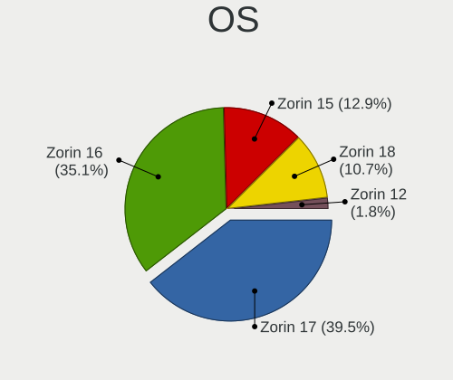

| Name     | Desktops | Percent |
|----------|----------|---------|
| Zorin 17 | 1695     | 39.47%  |
| Zorin 16 | 1507     | 35.1%   |
| Zorin 15 | 556      | 12.95%  |
| Zorin 18 | 459      | 10.69%  |
| Zorin 12 | 77       | 1.79%   |

OS Family
---------

OS without a version

| Name  | Desktops | Percent |
|-------|----------|---------|
| Zorin | 4227     | 100%    |

Kernel
------

Version of the Linux kernel

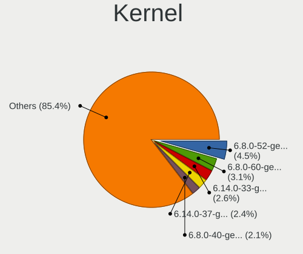

| Version           | Desktops | Percent |
|-------------------|----------|---------|
| 6.8.0-52-generic  | 221      | 4.47%   |
| 6.8.0-60-generic  | 153      | 3.09%   |
| 6.14.0-33-generic | 127      | 2.57%   |
| 6.14.0-37-generic | 118      | 2.39%   |
| 6.8.0-40-generic  | 102      | 2.06%   |
| 6.14.0-36-generic | 100      | 2.02%   |
| 6.8.0-57-generic  | 92       | 1.86%   |
| 6.5.0-35-generic  | 92       | 1.86%   |
| 6.8.0-59-generic  | 84       | 1.7%    |
| 6.14.0-35-generic | 81       | 1.64%   |
| 6.8.0-65-generic  | 76       | 1.54%   |
| 5.15.0-56-generic | 75       | 1.52%   |
| 6.5.0-41-generic  | 71       | 1.44%   |
| 6.8.0-49-generic  | 70       | 1.42%   |
| 6.8.0-45-generic  | 66       | 1.33%   |
| 6.2.0-39-generic  | 66       | 1.33%   |
| 5.11.0-38-generic | 63       | 1.27%   |
| 6.5.0-26-generic  | 61       | 1.23%   |
| 5.15.0-91-generic | 58       | 1.17%   |
| 5.15.0-67-generic | 58       | 1.17%   |
| 6.8.0-85-generic  | 56       | 1.13%   |
| 6.8.0-51-generic  | 56       | 1.13%   |
| 5.15.0-69-generic | 56       | 1.13%   |
| 5.15.0-46-generic | 56       | 1.13%   |
| 5.11.0-27-generic | 55       | 1.11%   |
| 5.15.0-52-generic | 50       | 1.01%   |
| 5.11.0-40-generic | 50       | 1.01%   |
| 5.13.0-39-generic | 49       | 0.99%   |
| 5.15.0-78-generic | 48       | 0.97%   |
| 6.8.0-79-generic  | 47       | 0.95%   |
| 6.5.0-28-generic  | 47       | 0.95%   |
| 5.15.0-60-generic | 47       | 0.95%   |
| 5.15.0-58-generic | 46       | 0.93%   |
| 6.8.0-87-generic  | 45       | 0.91%   |
| 6.5.0-14-generic  | 45       | 0.91%   |
| 6.8.0-48-generic  | 42       | 0.85%   |
| 6.5.0-45-generic  | 42       | 0.85%   |
| 5.11.0-41-generic | 42       | 0.85%   |
| 6.8.0-50-generic  | 41       | 0.83%   |
| 5.15.0-71-generic | 41       | 0.83%   |

Kernel Family
-------------

Linux kernel without a distro release

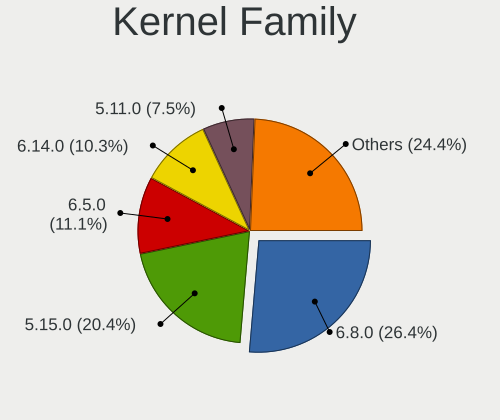

| Version | Desktops | Percent |
|---------|----------|---------|
| 6.8.0   | 1170     | 26.36%  |
| 5.15.0  | 905      | 20.39%  |
| 6.5.0   | 493      | 11.11%  |
| 6.14.0  | 457      | 10.3%   |
| 5.11.0  | 333      | 7.5%    |
| 5.4.0   | 330      | 7.43%   |
| 5.13.0  | 294      | 6.62%   |
| 5.3.0   | 158      | 3.56%   |
| 4.15.0  | 76       | 1.71%   |
| 6.2.0   | 68       | 1.53%   |
| 5.0.0   | 58       | 1.31%   |
| 4.18.0  | 27       | 0.61%   |
| 5.8.0   | 26       | 0.59%   |
| 6.12.3  | 3        | 0.07%   |
| 6.9.5   | 1        | 0.02%   |
| 6.9.3   | 1        | 0.02%   |
| 6.8.8   | 1        | 0.02%   |
| 6.7.7   | 1        | 0.02%   |
| 6.7.5   | 1        | 0.02%   |
| 6.7.10  | 1        | 0.02%   |
| 6.5.7   | 1        | 0.02%   |
| 6.3.2   | 1        | 0.02%   |
| 6.3.0   | 1        | 0.02%   |
| 6.2.7   | 1        | 0.02%   |
| 6.2.16  | 1        | 0.02%   |
| 6.15.5  | 1        | 0.02%   |
| 6.15.4  | 1        | 0.02%   |
| 6.15.1  | 1        | 0.02%   |
| 6.14.5  | 1        | 0.02%   |
| 6.13.8  | 1        | 0.02%   |
| 6.13.2  | 1        | 0.02%   |
| 6.12.14 | 1        | 0.02%   |
| 6.12.13 | 1        | 0.02%   |
| 6.12.1  | 1        | 0.02%   |
| 6.12.0  | 1        | 0.02%   |
| 6.10.8  | 1        | 0.02%   |
| 6.10.2  | 1        | 0.02%   |
| 6.1.8   | 1        | 0.02%   |
| 6.1.7   | 1        | 0.02%   |
| 6.1.0   | 1        | 0.02%   |

Kernel Major Ver.
-----------------

Linux kernel major version

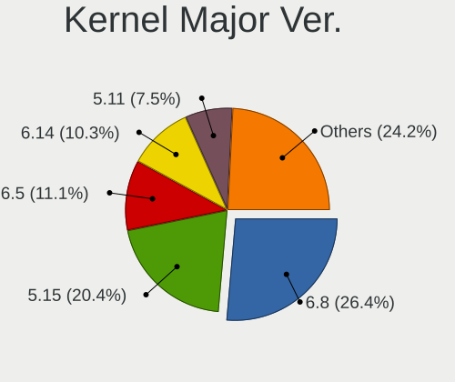

| Version | Desktops | Percent |
|---------|----------|---------|
| 6.8     | 1170     | 26.38%  |
| 5.15    | 906      | 20.43%  |
| 6.5     | 494      | 11.14%  |
| 6.14    | 458      | 10.33%  |
| 5.11    | 333      | 7.51%   |
| 5.4     | 330      | 7.44%   |
| 5.13    | 294      | 6.63%   |
| 5.3     | 158      | 3.56%   |
| 4.15    | 76       | 1.71%   |
| 6.2     | 70       | 1.58%   |
| 5.0     | 58       | 1.31%   |
| 5.8     | 27       | 0.61%   |
| 4.18    | 27       | 0.61%   |
| 6.12    | 6        | 0.14%   |
| 6.15    | 3        | 0.07%   |
| 5.7     | 3        | 0.07%   |
| 5.19    | 3        | 0.07%   |
| 5.17    | 3        | 0.07%   |
| 6.9     | 2        | 0.05%   |
| 6.7     | 2        | 0.05%   |
| 6.3     | 2        | 0.05%   |
| 6.13    | 2        | 0.05%   |
| 6.10    | 2        | 0.05%   |
| 6.1     | 2        | 0.05%   |
| 6.0     | 2        | 0.05%   |
| 5.14    | 1        | 0.02%   |
| 4.4     | 1        | 0.02%   |

Arch
----

OS architecture (x86_64, i586, etc.)

| Name   | Desktops | Percent |
|--------|----------|---------|
| x86_64 | 4112     | 97.28%  |
| i686   | 115      | 2.72%   |

DE
--

Desktop Environment

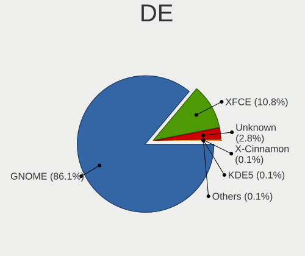

| Name          | Desktops | Percent |
|---------------|----------|---------|
| GNOME         | 3672     | 86.1%   |
| XFCE          | 461      | 10.81%  |
| Unknown       | 119      | 2.79%   |
| X-Cinnamon    | 4        | 0.09%   |
| KDE5          | 3        | 0.07%   |
| MATE          | 2        | 0.05%   |
| Cinnamon      | 2        | 0.05%   |
| KDE           | 1        | 0.02%   |
| Enlightenment | 1        | 0.02%   |

Display Server
--------------

X11 or Wayland

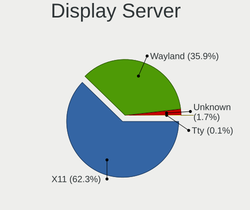

| Name    | Desktops | Percent |
|---------|----------|---------|
| X11     | 2684     | 62.27%  |
| Wayland | 1548     | 35.92%  |
| Unknown | 73       | 1.69%   |
| Tty     | 5        | 0.12%   |

Display Manager
---------------

SDDM, LightDM, etc.

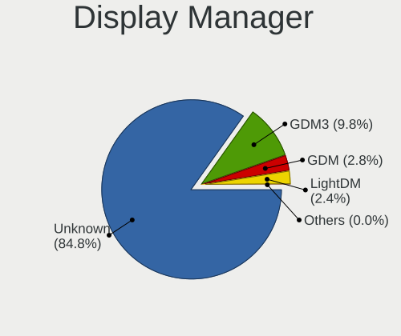

| Name    | Desktops | Percent |
|---------|----------|---------|
| Unknown | 3652     | 84.83%  |
| GDM3    | 422      | 9.8%    |
| GDM     | 122      | 2.83%   |
| LightDM | 104      | 2.42%   |
| TDM     | 4        | 0.09%   |
| SDDM    | 1        | 0.02%   |

OS Lang
-------

Language

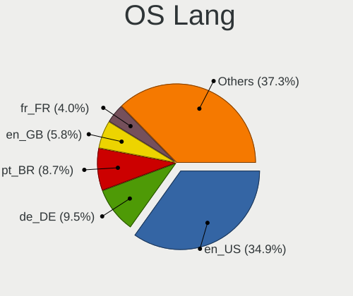

| Lang    | Desktops | Percent |
|---------|----------|---------|
| en_US   | 1482     | 34.85%  |
| de_DE   | 402      | 9.45%   |
| pt_BR   | 369      | 8.68%   |
| en_GB   | 245      | 5.76%   |
| fr_FR   | 168      | 3.95%   |
| it_IT   | 152      | 3.57%   |
| en_CA   | 151      | 3.55%   |
| es_ES   | 127      | 2.99%   |
| Unknown | 96       | 2.26%   |
| en_AU   | 88       | 2.07%   |
| en_IN   | 80       | 1.88%   |
| pl_PL   | 72       | 1.69%   |
| nl_NL   | 72       | 1.69%   |
| es_AR   | 57       | 1.34%   |
| es_MX   | 51       | 1.2%    |
| hu_HU   | 45       | 1.06%   |
| ru_RU   | 44       | 1.03%   |
| en_ZA   | 35       | 0.82%   |
| pt_PT   | 33       | 0.78%   |
| tr_TR   | 28       | 0.66%   |
| cs_CZ   | 27       | 0.63%   |
| es_CO   | 24       | 0.56%   |
| es_VE   | 22       | 0.52%   |
| sv_SE   | 20       | 0.47%   |
| de_AT   | 20       | 0.47%   |
| en_NZ   | 18       | 0.42%   |
| es_CL   | 17       | 0.4%    |
| nl_BE   | 16       | 0.38%   |
| en_IE   | 16       | 0.38%   |
| nb_NO   | 15       | 0.35%   |
| fr_CA   | 15       | 0.35%   |
| de_CH   | 13       | 0.31%   |
| ja_JP   | 12       | 0.28%   |
| da_DK   | 12       | 0.28%   |
| en_PH   | 11       | 0.26%   |
| el_GR   | 11       | 0.26%   |
| sk_SK   | 10       | 0.24%   |
| C       | 10       | 0.24%   |
| sr_RS   | 9        | 0.21%   |
| fi_FI   | 9        | 0.21%   |

Boot Mode
---------

EFI or BIOS

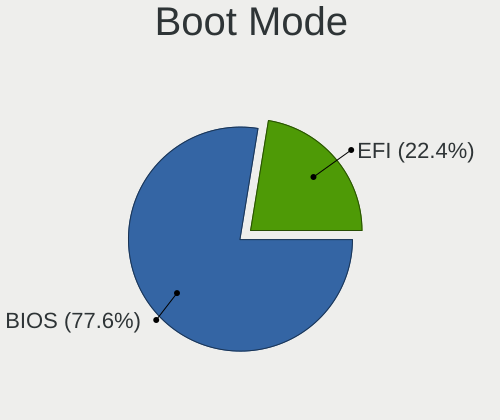

| Mode | Desktops | Percent |
|------|----------|---------|
| BIOS | 3319     | 77.56%  |
| EFI  | 960      | 22.44%  |

Filesystem
----------

Type of filesystem

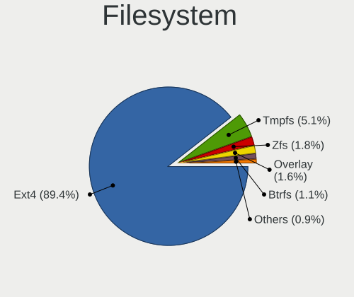

| Type     | Desktops | Percent |
|----------|----------|---------|
| Ext4     | 3835     | 89.44%  |
| Tmpfs    | 219      | 5.11%   |
| Zfs      | 77       | 1.8%    |
| Overlay  | 70       | 1.63%   |
| Btrfs    | 49       | 1.14%   |
| Ext2     | 13       | 0.3%    |
| Unknown  | 10       | 0.23%   |
| Xfs      | 8        | 0.19%   |
| Ext3     | 6        | 0.14%   |
| Reiserfs | 1        | 0.02%   |

Part. scheme
------------

Scheme of partitioning

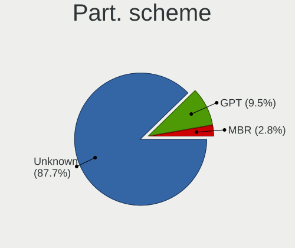

| Type    | Desktops | Percent |
|---------|----------|---------|
| Unknown | 3763     | 87.74%  |
| GPT     | 407      | 9.49%   |
| MBR     | 119      | 2.77%   |

Dual Boot with Linux/BSD
------------------------

Hosting more than one Linux/BSD

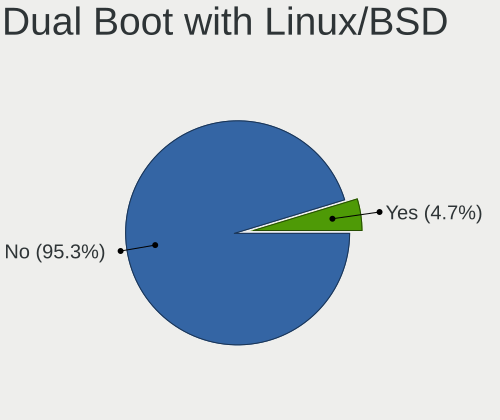

| Dual boot | Desktops | Percent |
|-----------|----------|---------|
| No        | 4058     | 95.3%   |
| Yes       | 200      | 4.7%    |

Dual Boot (Win)
---------------

Hosting Linux and Windows

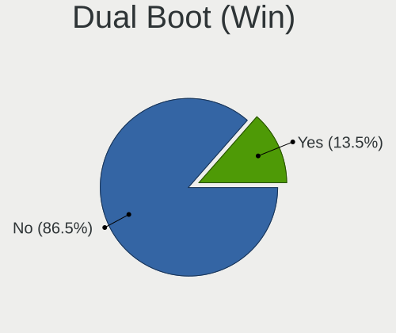

| Dual boot | Desktops | Percent |
|-----------|----------|---------|
| No        | 3703     | 86.48%  |
| Yes       | 579      | 13.52%  |

Board
-----

Vendor
------

Motherboard manufacturer

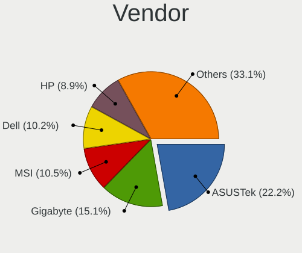

| Name                                 | Desktops | Percent |
|--------------------------------------|----------|---------|
| ASUSTek Computer                     | 939      | 22.21%  |
| Gigabyte Technology                  | 637      | 15.07%  |
| MSI                                  | 443      | 10.48%  |
| Dell                                 | 432      | 10.22%  |
| Hewlett-Packard                      | 377      | 8.92%   |
| ASRock                               | 305      | 7.22%   |
| Lenovo                               | 181      | 4.28%   |
| Intel                                | 165      | 3.9%    |
| Unknown                              | 84       | 1.99%   |
| Acer                                 | 75       | 1.77%   |
| Pegatron                             | 62       | 1.47%   |
| Fujitsu                              | 54       | 1.28%   |
| Biostar                              | 51       | 1.21%   |
| Foxconn                              | 40       | 0.95%   |
| ECS                                  | 27       | 0.64%   |
| AZW                                  | 22       | 0.52%   |
| Positivo                             | 17       | 0.4%    |
| Alienware                            | 17       | 0.4%    |
| MACHINIST                            | 16       | 0.38%   |
| Apple                                | 14       | 0.33%   |
| Huanan                               | 13       | 0.31%   |
| Medion                               | 12       | 0.28%   |
| Shuttle                              | 10       | 0.24%   |
| Packard Bell                         | 10       | 0.24%   |
| OEM                                  | 10       | 0.24%   |
| AMI                                  | 9        | 0.21%   |
| Gateway                              | 8        | 0.19%   |
| Fujitsu Siemens                      | 8        | 0.19%   |
| Google                               | 7        | 0.17%   |
| GEEKOM                               | 7        | 0.17%   |
| Shenzhen Meigao Electronic Equipment | 6        | 0.14%   |
| HC Technology.                       | 6        | 0.14%   |
| BESSTAR Tech                         | 6        | 0.14%   |
| Semp Toshiba                         | 5        | 0.12%   |
| IBM                                  | 5        | 0.12%   |
| eMachines                            | 5        | 0.12%   |
| AMD                                  | 5        | 0.12%   |
| QIYIDA                               | 4        | 0.09%   |
| PCWare                               | 4        | 0.09%   |
| MAXSUN                               | 4        | 0.09%   |

Model
-----

Motherboard model

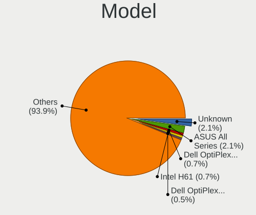

| Name                             | Desktops | Percent |
|----------------------------------|----------|---------|
| Unknown                          | 90       | 2.13%   |
| ASUS All Series                  | 87       | 2.06%   |
| Dell OptiPlex 7010               | 31       | 0.73%   |
| Intel H61                        | 28       | 0.66%   |
| Dell OptiPlex 9020               | 23       | 0.54%   |
| ASUS TUF Gaming X570-PLUS        | 23       | 0.54%   |
| Dell OptiPlex 790                | 19       | 0.45%   |
| MSI MS-7817                      | 18       | 0.43%   |
| MSI MS-7C37                      | 16       | 0.38%   |
| ASUS M5A97 R2.0                  | 16       | 0.38%   |
| MSI MS-7C56                      | 15       | 0.35%   |
| Gigabyte A320M-S2H               | 15       | 0.35%   |
| Dell OptiPlex 780                | 15       | 0.35%   |
| ASUS M5A78L-M/USB3               | 15       | 0.35%   |
| MSI MS-7C02                      | 14       | 0.33%   |
| Dell OptiPlex 990                | 13       | 0.31%   |
| Dell OptiPlex 3010               | 13       | 0.31%   |
| MSI MS-7C91                      | 12       | 0.28%   |
| MSI MS-7B86                      | 12       | 0.28%   |
| Dell OptiPlex 755                | 12       | 0.28%   |
| Dell OptiPlex 7040               | 12       | 0.28%   |
| Dell OptiPlex 380                | 12       | 0.28%   |
| HP EliteDesk 800 G1 SFF          | 11       | 0.26%   |
| Gigabyte B450 AORUS M            | 11       | 0.26%   |
| Dell XPS 8700                    | 11       | 0.26%   |
| MSI MS-7C52                      | 10       | 0.24%   |
| Intel H55                        | 10       | 0.24%   |
| Intel B75                        | 10       | 0.24%   |
| HP ProDesk 600 G1 SFF            | 10       | 0.24%   |
| HP Compaq 6005 Pro SFF PC        | 10       | 0.24%   |
| Gigabyte 970A-DS3P               | 10       | 0.24%   |
| Dell Precision WorkStation T3500 | 10       | 0.24%   |
| Dell OptiPlex 7050               | 10       | 0.24%   |
| Dell OptiPlex 390                | 10       | 0.24%   |
| ASUS P8Z77-V LX                  | 10       | 0.24%   |
| MSI MS-7A38                      | 9        | 0.21%   |
| HP Compaq Pro 6300 SFF           | 9        | 0.21%   |
| HP Compaq Elite 8300 SFF         | 9        | 0.21%   |
| Gigabyte B450M DS3H              | 9        | 0.21%   |
| Dell OptiPlex 7020               | 9        | 0.21%   |

Model Family
------------

Motherboard model prefix

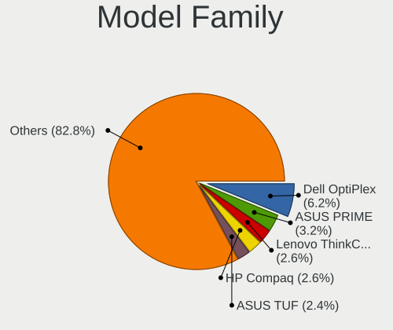

| Name                   | Desktops | Percent |
|------------------------|----------|---------|
| Dell OptiPlex          | 262      | 6.2%    |
| ASUS PRIME             | 137      | 3.24%   |
| Lenovo ThinkCentre     | 112      | 2.65%   |
| HP Compaq              | 112      | 2.65%   |
| ASUS TUF               | 102      | 2.41%   |
| ASUS ROG               | 100      | 2.37%   |
| Unknown                | 90       | 2.13%   |
| ASUS All               | 87       | 2.06%   |
| HP EliteDesk           | 64       | 1.51%   |
| Dell Precision         | 58       | 1.37%   |
| HP ProDesk             | 45       | 1.06%   |
| Fujitsu ESPRIMO        | 44       | 1.04%   |
| Dell Inspiron          | 43       | 1.02%   |
| Acer Aspire            | 35       | 0.83%   |
| Intel H61              | 29       | 0.69%   |
| ASUS M5A78L-M          | 29       | 0.69%   |
| Gigabyte B450          | 27       | 0.64%   |
| ASUS M5A97             | 27       | 0.64%   |
| Lenovo IdeaCentre      | 25       | 0.59%   |
| HP Pavilion            | 24       | 0.57%   |
| Dell XPS               | 22       | 0.52%   |
| Acer Veriton           | 21       | 0.5%    |
| Gigabyte X570          | 20       | 0.47%   |
| Gigabyte B450M         | 20       | 0.47%   |
| ASRock B450M           | 20       | 0.47%   |
| Dell Vostro            | 19       | 0.45%   |
| MSI MS-7817            | 18       | 0.43%   |
| Gigabyte GA-78LMT-USB3 | 18       | 0.43%   |
| Gigabyte B550M         | 17       | 0.4%    |
| Gigabyte B550          | 17       | 0.4%    |
| ASUS P8Z77-V           | 17       | 0.4%    |
| MSI MS-7C37            | 16       | 0.38%   |
| Gigabyte A320M-S2H     | 16       | 0.38%   |
| MSI MS-7C56            | 15       | 0.35%   |
| MSI MS-7C02            | 14       | 0.33%   |
| ASUS P8H61-M           | 14       | 0.33%   |
| ASRock 970             | 14       | 0.33%   |
| ASUS Maximus           | 13       | 0.31%   |
| ASRock B450            | 13       | 0.31%   |
| Alienware Aurora       | 13       | 0.31%   |

MFG Year
--------

Motherboard manufacture year

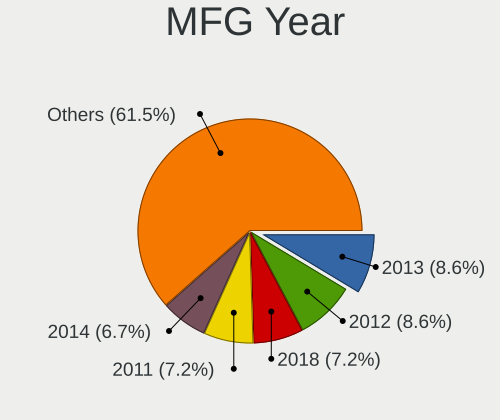

| Year    | Desktops | Percent |
|---------|----------|---------|
| 2013    | 365      | 8.63%   |
| 2012    | 365      | 8.63%   |
| 2018    | 306      | 7.24%   |
| 2011    | 305      | 7.22%   |
| 2014    | 285      | 6.74%   |
| 2009    | 261      | 6.17%   |
| 2010    | 260      | 6.15%   |
| 2019    | 253      | 5.99%   |
| 2020    | 250      | 5.91%   |
| 2017    | 207      | 4.9%    |
| 2021    | 201      | 4.76%   |
| 2016    | 182      | 4.31%   |
| 2008    | 174      | 4.12%   |
| 2022    | 166      | 3.93%   |
| 2023    | 151      | 3.57%   |
| 2015    | 147      | 3.48%   |
| 2007    | 115      | 2.72%   |
| 2024    | 85       | 2.01%   |
| 2006    | 59       | 1.4%    |
| 2005    | 33       | 0.78%   |
| 2025    | 32       | 0.76%   |
| 2004    | 11       | 0.26%   |
| 2003    | 6        | 0.14%   |
| Unknown | 6        | 0.14%   |
| 2002    | 2        | 0.05%   |

Form Factor
-----------

Physical design of the computer

| Name    | Desktops | Percent |
|---------|----------|---------|
| Desktop | 4227     | 100%    |

Secure Boot
-----------

Enabled or disabled

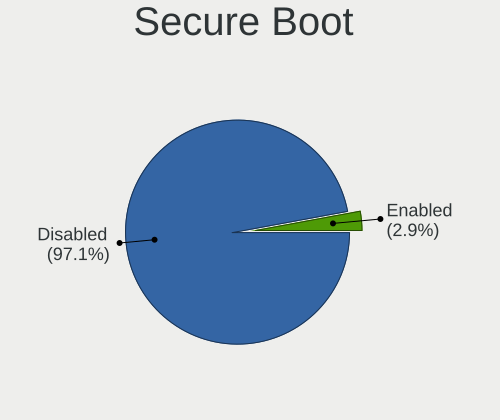

| State    | Desktops | Percent |
|----------|----------|---------|
| Disabled | 4114     | 97.1%   |
| Enabled  | 123      | 2.9%    |

Coreboot
--------

Have coreboot on board

| Used | Desktops | Percent |
|------|----------|---------|
| No   | 4220     | 99.83%  |
| Yes  | 7        | 0.17%   |

RAM Size
--------

Total RAM memory

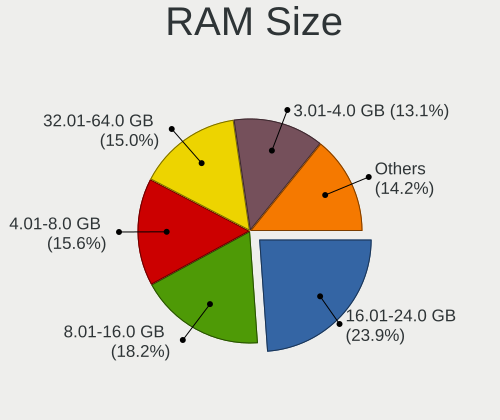

| Size in GB      | Desktops | Percent |
|-----------------|----------|---------|
| 16.01-24.0      | 1027     | 23.87%  |
| 8.01-16.0       | 783      | 18.2%   |
| 4.01-8.0        | 669      | 15.55%  |
| 32.01-64.0      | 647      | 15.04%  |
| 3.01-4.0        | 565      | 13.13%  |
| 64.01-256.0     | 216      | 5.02%   |
| 24.01-32.0      | 162      | 3.77%   |
| 1.01-2.0        | 135      | 3.14%   |
| 2.01-3.0        | 70       | 1.63%   |
| 0.51-1.0        | 26       | 0.6%    |
| More than 256.0 | 2        | 0.05%   |

RAM Used
--------

Used RAM memory

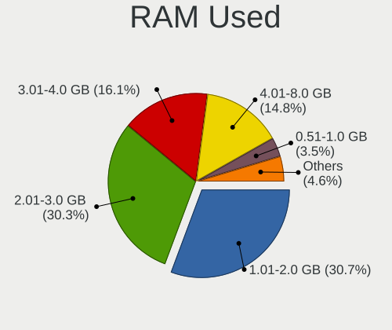

| Used GB    | Desktops | Percent |
|------------|----------|---------|
| 1.01-2.0   | 1428     | 30.7%   |
| 2.01-3.0   | 1408     | 30.27%  |
| 3.01-4.0   | 750      | 16.12%  |
| 4.01-8.0   | 687      | 14.77%  |
| 0.51-1.0   | 164      | 3.53%   |
| 8.01-16.0  | 156      | 3.35%   |
| 16.01-24.0 | 32       | 0.69%   |
| 0.01-0.5   | 17       | 0.37%   |
| 24.01-32.0 | 6        | 0.13%   |
| 32.01-64.0 | 4        | 0.09%   |

Total Drives
------------

Number of drives on board

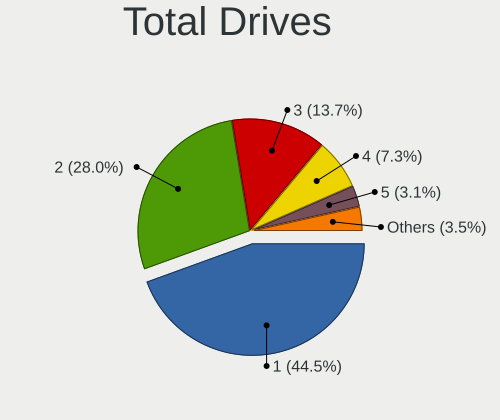

| Drives | Desktops | Percent |
|--------|----------|---------|
| 1      | 1945     | 44.46%  |
| 2      | 1223     | 27.95%  |
| 3      | 599      | 13.69%  |
| 4      | 320      | 7.31%   |
| 5      | 135      | 3.09%   |
| 6      | 75       | 1.71%   |
| 7      | 27       | 0.62%   |
| 8      | 22       | 0.5%    |
| 0      | 13       | 0.3%    |
| 9      | 6        | 0.14%   |
| 11     | 5        | 0.11%   |
| 10     | 3        | 0.07%   |
| 51     | 1        | 0.02%   |
| 13     | 1        | 0.02%   |

Has CD-ROM
----------

Has CD-ROM on board

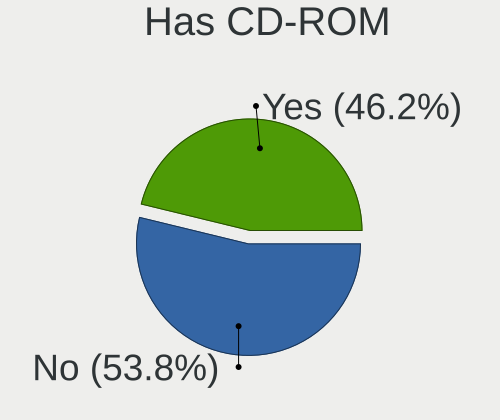

| Presented | Desktops | Percent |
|-----------|----------|---------|
| No        | 2295     | 53.8%   |
| Yes       | 1971     | 46.2%   |

Has Ethernet
------------

Has Ethernet on board

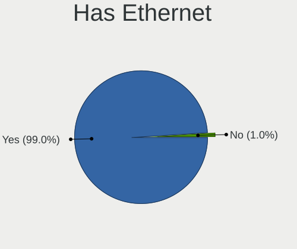

| Presented | Desktops | Percent |
|-----------|----------|---------|
| Yes       | 4184     | 98.98%  |
| No        | 43       | 1.02%   |

Has WiFi
--------

Has WiFi module

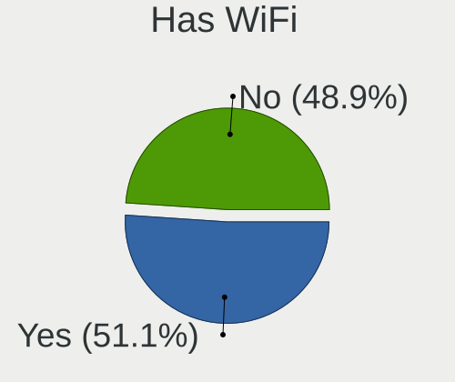

| Presented | Desktops | Percent |
|-----------|----------|---------|
| Yes       | 2180     | 51.07%  |
| No        | 2089     | 48.93%  |

Has Bluetooth
-------------

Has Bluetooth module

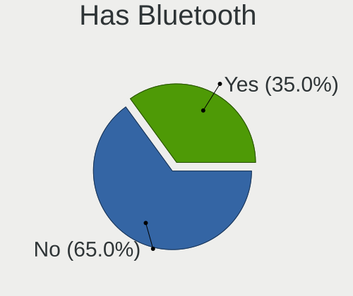

| Presented | Desktops | Percent |
|-----------|----------|---------|
| No        | 2779     | 65.01%  |
| Yes       | 1496     | 34.99%  |

Location
--------

Country
-------

Geographic location (country)

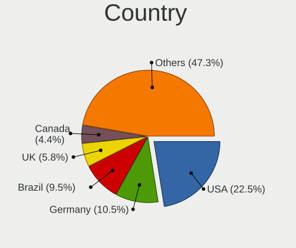

| Country      | Desktops | Percent |
|--------------|----------|---------|
| USA          | 955      | 22.5%   |
| Germany      | 447      | 10.53%  |
| Brazil       | 404      | 9.52%   |
| UK           | 245      | 5.77%   |
| Canada       | 188      | 4.43%   |
| Italy        | 173      | 4.08%   |
| France       | 159      | 3.75%   |
| Spain        | 123      | 2.9%    |
| Netherlands  | 108      | 2.54%   |
| Australia    | 87       | 2.05%   |
| India        | 85       | 2%      |
| Poland       | 81       | 1.91%   |
| Mexico       | 65       | 1.53%   |
| Argentina    | 65       | 1.53%   |
| Hungary      | 51       | 1.2%    |
| Portugal     | 44       | 1.04%   |
| Belgium      | 42       | 0.99%   |
| South Africa | 39       | 0.92%   |
| Russia       | 38       | 0.9%    |
| Czechia      | 37       | 0.87%   |
| Turkey       | 36       | 0.85%   |
| Sweden       | 35       | 0.82%   |
| Greece       | 33       | 0.78%   |
| Switzerland  | 32       | 0.75%   |
| Colombia     | 32       | 0.75%   |
| Denmark      | 29       | 0.68%   |
| Norway       | 28       | 0.66%   |
| Austria      | 28       | 0.66%   |
| Serbia       | 27       | 0.64%   |
| Chile        | 27       | 0.64%   |
| Indonesia    | 26       | 0.61%   |
| Egypt        | 26       | 0.61%   |
| Romania      | 25       | 0.59%   |
| Venezuela    | 24       | 0.57%   |
| New Zealand  | 23       | 0.54%   |
| Bulgaria     | 19       | 0.45%   |
| Japan        | 18       | 0.42%   |
| Slovakia     | 17       | 0.4%    |
| Ireland      | 17       | 0.4%    |
| Philippines  | 14       | 0.33%   |

City
----

Geographic location (city)

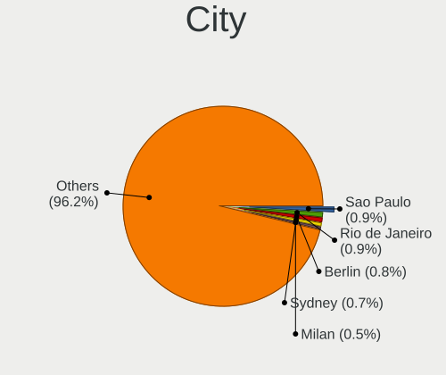

| City           | Desktops | Percent |
|----------------|----------|---------|
| Sao Paulo      | 41       | 0.92%   |
| Rio de Janeiro | 39       | 0.88%   |
| Berlin         | 36       | 0.81%   |
| Sydney         | 29       | 0.65%   |
| Milan          | 22       | 0.49%   |
| Budapest       | 22       | 0.49%   |
| Toronto        | 21       | 0.47%   |
| Rome           | 19       | 0.43%   |
| Athens         | 19       | 0.43%   |
| Munich         | 18       | 0.4%    |
| Cape Town      | 18       | 0.4%    |
| Paris          | 17       | 0.38%   |
| Perth          | 16       | 0.36%   |
| Copenhagen     | 16       | 0.36%   |
| Montreal       | 15       | 0.34%   |
| Houston        | 15       | 0.34%   |
| Atlanta        | 15       | 0.34%   |
| Santiago       | 14       | 0.31%   |
| Phoenix        | 14       | 0.31%   |
| Hamburg        | 14       | 0.31%   |
| Calgary        | 14       | 0.31%   |
| Bogotá        | 14       | 0.31%   |
| Warsaw         | 13       | 0.29%   |
| Melbourne      | 13       | 0.29%   |
| Madrid         | 13       | 0.29%   |
| Johannesburg   | 13       | 0.29%   |
| Istanbul       | 13       | 0.29%   |
| Buenos Aires   | 13       | 0.29%   |
| Belgrade       | 13       | 0.29%   |
| Los Angeles    | 12       | 0.27%   |
| Dallas         | 12       | 0.27%   |
| Bengaluru      | 12       | 0.27%   |
| Amsterdam      | 12       | 0.27%   |
| Adelaide       | 12       | 0.27%   |
| Vienna         | 11       | 0.25%   |
| Prague         | 11       | 0.25%   |
| Dublin         | 11       | 0.25%   |
| Zurich         | 10       | 0.22%   |
| New York       | 10       | 0.22%   |
| Mumbai         | 10       | 0.22%   |

Drives
------

Drive Vendor
------------

Hard drive vendors

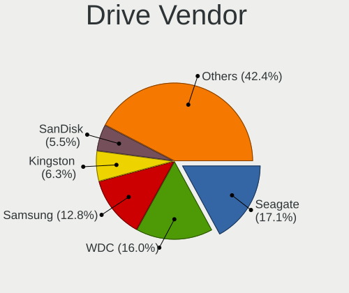

| Vendor                       | Desktops | Drives | Percent |
|------------------------------|----------|--------|---------|
| Seagate                      | 1281     | 1961   | 17.06%  |
| WDC                          | 1199     | 1780   | 15.97%  |
| Samsung Electronics          | 962      | 1509   | 12.81%  |
| Kingston                     | 472      | 644    | 6.28%   |
| SanDisk                      | 414      | 588    | 5.51%   |
| Toshiba                      | 333      | 457    | 4.43%   |
| Crucial                      | 286      | 358    | 3.81%   |
| Hitachi                      | 257      | 331    | 3.42%   |
| China                        | 147      | 178    | 1.96%   |
| A-DATA Technology            | 90       | 111    | 1.2%    |
| Unknown                      | 89       | 164    | 1.19%   |
| Micron/Crucial Technology    | 89       | 130    | 1.19%   |
| Phison Electronics           | 84       | 120    | 1.12%   |
| Intel                        | 79       | 101    | 1.05%   |
| Silicon Motion               | 71       | 85     | 0.95%   |
| MAXIO Technology (Hangzhou)  | 70       | 91     | 0.93%   |
| Intenso                      | 69       | 90     | 0.92%   |
| Kingston Technology Company  | 67       | 87     | 0.89%   |
| Micron Technology            | 63       | 73     | 0.84%   |
| PNY                          | 62       | 82     | 0.83%   |
| Maxtor                       | 58       | 81     | 0.77%   |
| SK hynix                     | 57       | 71     | 0.76%   |
| HGST                         | 52       | 77     | 0.69%   |
| SPCC                         | 48       | 64     | 0.64%   |
| Realtek Semiconductor        | 46       | 54     | 0.61%   |
| Patriot                      | 45       | 64     | 0.6%    |
| Lexar                        | 38       | 42     | 0.51%   |
| Phison                       | 37       | 46     | 0.49%   |
| Unknown                      | 37       | 45     | 0.49%   |
| ADATA Technology             | 34       | 39     | 0.45%   |
| OCZ                          | 31       | 43     | 0.41%   |
| KingSpec                     | 28       | 33     | 0.37%   |
| JMicron Technology           | 28       | 35     | 0.37%   |
| Hewlett-Packard              | 27       | 35     | 0.36%   |
| Fanxiang                     | 26       | 33     | 0.35%   |
| Corsair                      | 26       | 42     | 0.35%   |
| Netac                        | 24       | 31     | 0.32%   |
| GOODRAM                      | 24       | 30     | 0.32%   |
| Shenzhen Longsys Electronics | 23       | 29     | 0.31%   |
| Team                         | 21       | 24     | 0.28%   |

Drive Model
-----------

Hard drive models

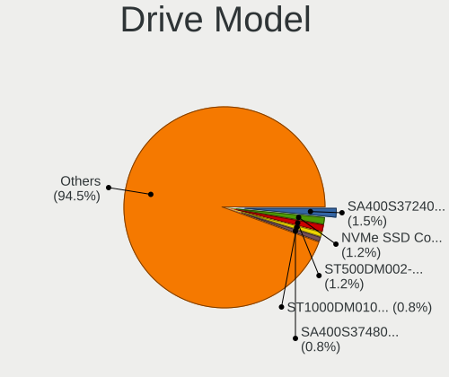

| Model                                                 | Desktops | Percent |
|-------------------------------------------------------|----------|---------|
| Kingston SA400S37240G 240GB SSD                       | 132      | 1.55%   |
| Samsung NVMe SSD Controller SM981/PM981/PM983 1TB     | 102      | 1.2%    |
| Seagate ST500DM002-1BD142 500GB                       | 101      | 1.18%   |
| Seagate ST1000DM010-2EP102 1TB                        | 71       | 0.83%   |
| Kingston SA400S37480G 480GB SSD                       | 67       | 0.79%   |
| Samsung SSD 860 EVO 500GB                             | 61       | 0.72%   |
| Samsung NVMe SSD Controller PM9A1/PM9A3/980PRO 1TB    | 59       | 0.69%   |
| Toshiba DT01ACA100 1TB                                | 54       | 0.63%   |
| Kingston SA400S37120G 120GB SSD                       | 54       | 0.63%   |
| Seagate ST1000DM003-1CH162 1TB                        | 52       | 0.61%   |
| WDC WD10EZEX-08WN4A0 1TB                              | 51       | 0.6%    |
| Crucial CT240BX500SSD1 240GB                          | 51       | 0.6%    |
| Samsung SSD 850 EVO 250GB                             | 49       | 0.57%   |
| Silicon Motion SM2263EN/SM2263XT SSD Controller 512GB | 45       | 0.53%   |
| Seagate ST3500418AS 500GB                             | 45       | 0.53%   |
| Seagate ST1000DM003-1ER162 1TB                        | 45       | 0.53%   |
| Micron/Crucial P2 NVMe PCIe SSD 2TB                   | 43       | 0.5%    |
| MAXIO (Hangzhou) NVMe SSD Controller MAP1202 2TB      | 41       | 0.48%   |
| Crucial CT500MX500SSD1 500GB                          | 40       | 0.47%   |
| Kingston SV300S37A120G 120GB SSD                      | 38       | 0.45%   |
| Unknown                                               | 37       | 0.43%   |
| Toshiba HDWD110 1TB                                   | 36       | 0.42%   |
| Seagate ST2000DM008-2FR102 2TB                        | 36       | 0.42%   |
| Seagate ST2000DM001-1ER164 2TB                        | 36       | 0.42%   |
| Samsung SSD 870 EVO 500GB                             | 35       | 0.41%   |
| Samsung SSD 850 EVO 500GB                             | 34       | 0.4%    |
| Unknown SD/MMC/MS PRO 2GB                             | 33       | 0.39%   |
| Crucial CT1000MX500SSD1 1TB                           | 32       | 0.38%   |
| Toshiba DT01ACA050 500GB                              | 31       | 0.36%   |
| Seagate ST31000528AS 1TB                              | 30       | 0.35%   |
| Seagate ST1000DM003-1SB102 1TB                        | 30       | 0.35%   |
| Samsung SSD 870 EVO 1TB                               | 30       | 0.35%   |
| Samsung NVMe SSD Controller SM961/PM961/SM963 1024GB  | 30       | 0.35%   |
| Samsung SSD 860 EVO 250GB                             | 28       | 0.33%   |
| Seagate ST4000DM004-2CV104 4TB                        | 27       | 0.32%   |
| Seagate ST3500413AS 500GB                             | 27       | 0.32%   |
| Seagate ST31000524AS 1TB                              | 27       | 0.32%   |
| Seagate ST3500312CS 500GB                             | 26       | 0.31%   |
| SanDisk SSD PLUS 240GB                                | 26       | 0.31%   |
| Samsung SSD 870 QVO 1TB                               | 25       | 0.29%   |

HDD Vendor
----------

Hard disk drive vendors

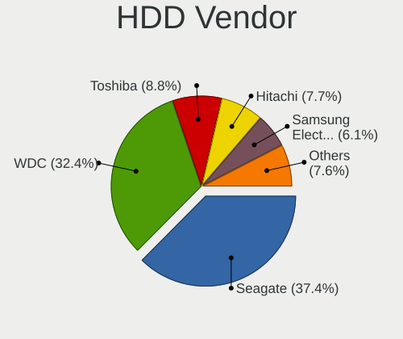

| Vendor              | Desktops | Drives | Percent |
|---------------------|----------|--------|---------|
| Seagate             | 1248     | 1893   | 37.44%  |
| WDC                 | 1079     | 1568   | 32.37%  |
| Toshiba             | 293      | 410    | 8.79%   |
| Hitachi             | 257      | 331    | 7.71%   |
| Samsung Electronics | 204      | 260    | 6.12%   |
| Maxtor              | 57       | 80     | 1.71%   |
| HGST                | 52       | 77     | 1.56%   |
| Unknown             | 38       | 46     | 1.14%   |
| JMicron Technology  | 20       | 25     | 0.6%    |
| Hewlett-Packard     | 11       | 18     | 0.33%   |
| Apple               | 10       | 11     | 0.3%    |
| ASMT                | 9        | 12     | 0.27%   |
| USB3.0              | 6        | 7      | 0.18%   |
| Fujitsu             | 6        | 7      | 0.18%   |
| External            | 6        | 6      | 0.18%   |
| ExcelStor           | 4        | 4      | 0.12%   |
| XrayDisk            | 3        | 3      | 0.09%   |
| TO Exter            | 3        | 3      | 0.09%   |
| HGST HTS            | 3        | 3      | 0.09%   |
| WD MediaMax         | 2        | 3      | 0.06%   |
| T-FORCE             | 2        | 3      | 0.06%   |
| Quantum             | 2        | 2      | 0.06%   |
| LaCie               | 2        | 2      | 0.06%   |
| Intenso             | 2        | 4      | 0.06%   |
| WALRAM              | 1        | 1      | 0.03%   |
| TDAS                | 1        | 7      | 0.03%   |
| SSK                 | 1        | 1      | 0.03%   |
| Shenzhen            | 1        | 1      | 0.03%   |
| SABRENT             | 1        | 2      | 0.03%   |
| PRO Z               | 1        | 1      | 0.03%   |
| MARVELL             | 1        | 1      | 0.03%   |
| Inateck             | 1        | 2      | 0.03%   |
| IBM/Hitachi         | 1        | 1      | 0.03%   |
| HPE                 | 1        | 1      | 0.03%   |
| Fantom              | 1        | 1      | 0.03%   |
| ASMT109x            | 1        | 2      | 0.03%   |
| ASMedia             | 1        | 1      | 0.03%   |
| ACASIS              | 1        | 1      | 0.03%   |

SSD Vendor
----------

Solid state drive vendors

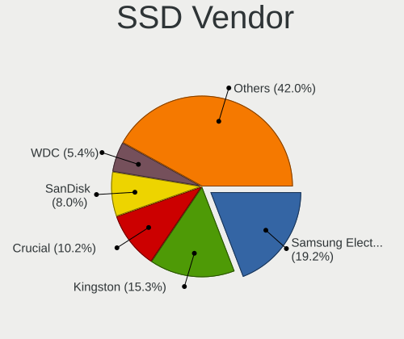

| Vendor              | Desktops | Drives | Percent |
|---------------------|----------|--------|---------|
| Samsung Electronics | 518      | 739    | 19.16%  |
| Kingston            | 414      | 539    | 15.31%  |
| Crucial             | 275      | 345    | 10.17%  |
| SanDisk             | 216      | 276    | 7.99%   |
| WDC                 | 146      | 195    | 5.4%    |
| China               | 143      | 173    | 5.29%   |
| A-DATA Technology   | 85       | 106    | 3.14%   |
| PNY                 | 62       | 82     | 2.29%   |
| Intenso             | 53       | 67     | 1.96%   |
| Intel               | 51       | 59     | 1.89%   |
| SPCC                | 46       | 62     | 1.7%    |
| Patriot             | 42       | 61     | 1.55%   |
| Lexar               | 37       | 41     | 1.37%   |
| Micron Technology   | 31       | 35     | 1.15%   |
| OCZ                 | 30       | 42     | 1.11%   |
| KingSpec            | 27       | 32     | 1%      |
| Toshiba             | 24       | 27     | 0.89%   |
| GOODRAM             | 22       | 28     | 0.81%   |
| Team                | 21       | 24     | 0.78%   |
| Netac               | 21       | 27     | 0.78%   |
| Corsair             | 20       | 32     | 0.74%   |
| Transcend           | 19       | 28     | 0.7%    |
| SK hynix            | 17       | 19     | 0.63%   |
| LITEON              | 17       | 24     | 0.63%   |
| SABRENT             | 16       | 20     | 0.59%   |
| Hewlett-Packard     | 15       | 16     | 0.55%   |
| Gigabyte Technology | 15       | 28     | 0.55%   |
| Unknown             | 15       | 19     | 0.55%   |
| Verbatim            | 14       | 22     | 0.52%   |
| Apacer              | 14       | 19     | 0.52%   |
| Seagate             | 11       | 18     | 0.41%   |
| KIOXIA-EXCERIA      | 10       | 16     | 0.37%   |
| LITEONIT            | 9        | 12     | 0.33%   |
| Fanxiang            | 9        | 11     | 0.33%   |
| Leven               | 8        | 9      | 0.3%    |
| XrayDisk            | 7        | 10     | 0.26%   |
| Emtec               | 7        | 8      | 0.26%   |
| Mushkin             | 6        | 8      | 0.22%   |
| Dogfish             | 6        | 8      | 0.22%   |
| Plextor             | 5        | 6      | 0.18%   |

Drive Kind
----------

HDD or SSD

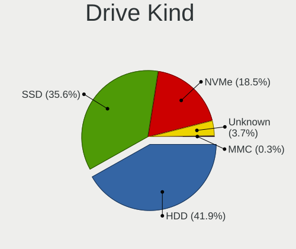

| Kind    | Desktops | Drives | Percent |
|---------|----------|--------|---------|
| HDD     | 2641     | 4801   | 41.86%  |
| SSD     | 2248     | 3531   | 35.63%  |
| NVMe    | 1169     | 1954   | 18.53%  |
| Unknown | 234      | 315    | 3.71%   |
| MMC     | 17       | 20     | 0.27%   |

Drive Connector
---------------

SATA, SAS, NVMe, etc.

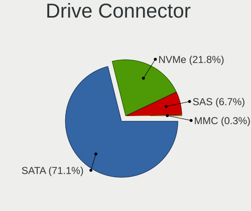

| Type | Desktops | Drives | Percent |
|------|----------|--------|---------|
| SATA | 3786     | 8107   | 71.13%  |
| NVMe | 1162     | 1931   | 21.83%  |
| SAS  | 358      | 563    | 6.73%   |
| MMC  | 17       | 20     | 0.32%   |

Drive Size
----------

Size of hard drive

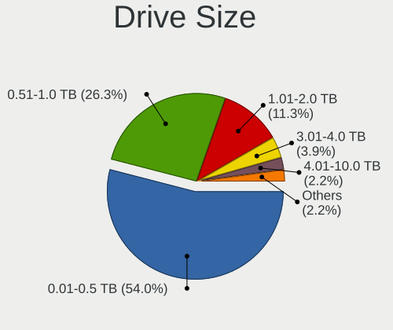

| Size in TB | Desktops | Drives | Percent |
|------------|----------|--------|---------|
| 0.01-0.5   | 2812     | 4601   | 54.02%  |
| 0.51-1.0   | 1370     | 2120   | 26.32%  |
| 1.01-2.0   | 590      | 882    | 11.34%  |
| 3.01-4.0   | 204      | 360    | 3.92%   |
| 4.01-10.0  | 115      | 192    | 2.21%   |
| 2.01-3.0   | 88       | 120    | 1.69%   |
| 10.01-20.0 | 23       | 50     | 0.44%   |
| 20.01-50.0 | 3        | 7      | 0.06%   |

Space Total
-----------

Amount of disk space available on the file system

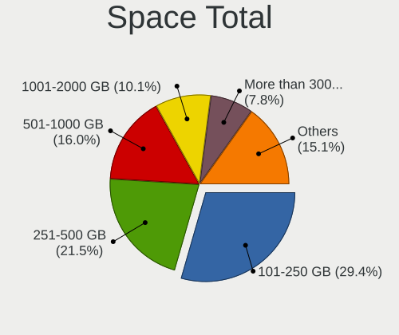

| Size in GB     | Desktops | Percent |
|----------------|----------|---------|
| 101-250        | 1307     | 29.44%  |
| 251-500        | 956      | 21.54%  |
| 501-1000       | 709      | 15.97%  |
| 1001-2000      | 448      | 10.09%  |
| More than 3000 | 347      | 7.82%   |
| 51-100         | 250      | 5.63%   |
| 2001-3000      | 146      | 3.29%   |
| 21-50          | 125      | 2.82%   |
| 1-20           | 105      | 2.37%   |
| Unknown        | 45       | 1.01%   |
| 0              | 1        | 0.02%   |

Space Used
----------

Amount of used disk space

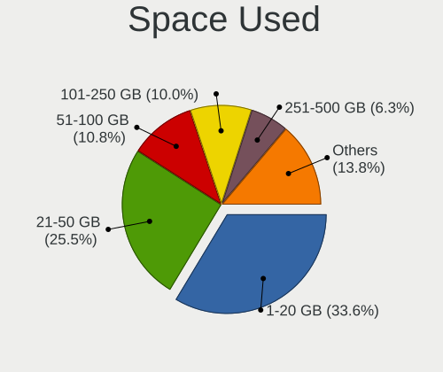

| Used GB        | Desktops | Percent |
|----------------|----------|---------|
| 1-20           | 1560     | 33.63%  |
| 21-50          | 1181     | 25.46%  |
| 51-100         | 501      | 10.8%   |
| 101-250        | 466      | 10.05%  |
| 251-500        | 290      | 6.25%   |
| 501-1000       | 238      | 5.13%   |
| 1001-2000      | 170      | 3.66%   |
| More than 3000 | 130      | 2.8%    |
| 2001-3000      | 57       | 1.23%   |
| Unknown        | 45       | 0.97%   |
| 0              | 1        | 0.02%   |

Malfunc. Drives
---------------

Drive models with a malfunction

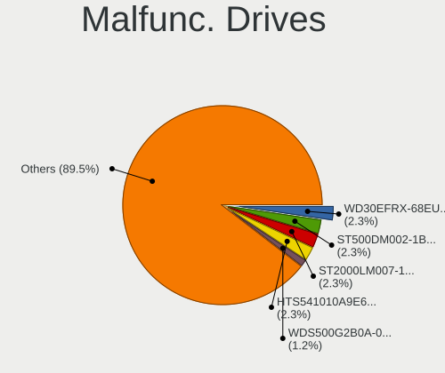

| Model                                    | Desktops | Drives | Percent |
|------------------------------------------|----------|--------|---------|
| WDC WD30EFRX-68EUZN0 3TB                 | 2        | 2      | 2.33%   |
| Seagate ST500DM002-1BD142 500GB          | 2        | 2      | 2.33%   |
| Seagate ST2000LM007-1R8174 2TB           | 2        | 2      | 2.33%   |
| HGST HTS541010A9E680 1TB                 | 2        | 2      | 2.33%   |
| WDC WDS500G2B0A-00SM50 500GB             | 1        | 1      | 1.16%   |
| WDC WD5000LPCX-60VHAT0 500GB             | 1        | 1      | 1.16%   |
| WDC WD5000AAKX-001CA0 500GB              | 1        | 1      | 1.16%   |
| WDC WD5000AAKS-75V0A0 500GB              | 1        | 1      | 1.16%   |
| WDC WD5000AAKS-00V1A0 500GB              | 1        | 1      | 1.16%   |
| WDC WD3200AAKS-22B3A0 320GB              | 1        | 1      | 1.16%   |
| WDC WD3200AAJS-56M0A0 320GB              | 1        | 1      | 1.16%   |
| WDC WD3200AAJS-22L7A0 320GB              | 1        | 1      | 1.16%   |
| WDC WD3200AAJS-08B4A0 320GB              | 1        | 1      | 1.16%   |
| WDC WD2500AAJS-00B4A0 250GB              | 1        | 1      | 1.16%   |
| WDC WD20EZRX-22D8PB0 2TB                 | 1        | 1      | 1.16%   |
| WDC WD20EZRX-00D8PB0 2TB                 | 1        | 1      | 1.16%   |
| WDC WD20EARS-22MVWB0 2TB                 | 1        | 1      | 1.16%   |
| WDC WD15EARS-00MVWB0 1TB                 | 1        | 1      | 1.16%   |
| WDC WD10JPVX-60JC3T0 1TB                 | 1        | 1      | 1.16%   |
| WDC WD10EZRX-00D8PB0 1TB                 | 1        | 1      | 1.16%   |
| WDC WD10EZEX-21M2NA0 1TB                 | 1        | 2      | 1.16%   |
| WDC WD10EZEX-00MFCA0 1TB                 | 1        | 1      | 1.16%   |
| WDC WD10EURX-63FH1Y0 1TB                 | 1        | 1      | 1.16%   |
| WDC WD Green 2.5 1000GB                  | 1        | 1      | 1.16%   |
| Toshiba THNSNK256GVN8 M.2 2280 256GB SSD | 1        | 1      | 1.16%   |
| Toshiba MQ01ABF050 500GB                 | 1        | 1      | 1.16%   |
| Toshiba MQ01ABD100 1TB                   | 1        | 1      | 1.16%   |
| Toshiba MK8046GSX 80GB                   | 1        | 1      | 1.16%   |
| Toshiba MK5059GSXP 500GB                 | 1        | 1      | 1.16%   |
| Toshiba MK3265GSX 320GB                  | 1        | 1      | 1.16%   |
| Toshiba MG03ACA200 2TB                   | 1        | 1      | 1.16%   |
| Toshiba DT01ACA100 1TB                   | 1        | 1      | 1.16%   |
| SPCC Solid State Disk 512GB              | 1        | 1      | 1.16%   |
| Silicon Motion Inland NVMe SSD 256GB     | 1        | 1      | 1.16%   |
| Seagate ST9500420AS 500GB                | 1        | 1      | 1.16%   |
| Seagate ST8000DM004-2CX188 8TB           | 1        | 1      | 1.16%   |
| Seagate ST4000DM004-2CV104 4TB           | 1        | 1      | 1.16%   |
| Seagate ST3500514NS 500GB                | 1        | 1      | 1.16%   |
| Seagate ST3500413AS 500GB                | 1        | 1      | 1.16%   |
| Seagate ST3500312CS 500GB                | 1        | 1      | 1.16%   |

Malfunc. Drive Vendor
---------------------

Vendors of faulty drives

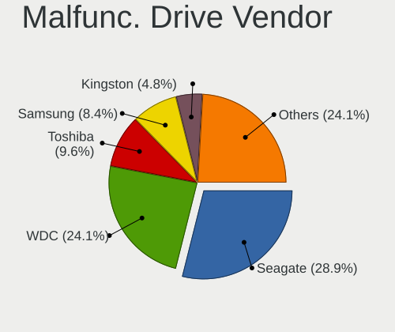

| Vendor              | Desktops | Drives | Percent |
|---------------------|----------|--------|---------|
| Seagate             | 24       | 25     | 28.92%  |
| WDC                 | 20       | 23     | 24.1%   |
| Toshiba             | 8        | 8      | 9.64%   |
| Samsung Electronics | 7        | 7      | 8.43%   |
| Kingston            | 4        | 4      | 4.82%   |
| Hitachi             | 3        | 4      | 3.61%   |
| HGST                | 3        | 3      | 3.61%   |
| A-DATA Technology   | 3        | 3      | 3.61%   |
| Intel               | 2        | 2      | 2.41%   |
| China               | 2        | 2      | 2.41%   |
| SPCC                | 1        | 1      | 1.2%    |
| Silicon Motion      | 1        | 1      | 1.2%    |
| SanDisk             | 1        | 2      | 1.2%    |
| OCZ                 | 1        | 1      | 1.2%    |
| Maxtor              | 1        | 1      | 1.2%    |
| INNOVATION IT       | 1        | 1      | 1.2%    |
| Fanxiang            | 1        | 2      | 1.2%    |

Malfunc. HDD Vendor
-------------------

Vendors of faulty HDD drives

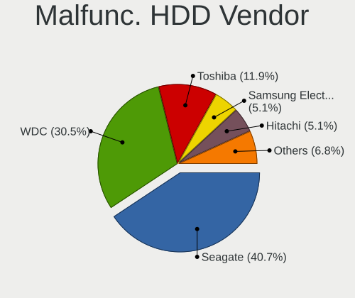

| Vendor              | Desktops | Drives | Percent |
|---------------------|----------|--------|---------|
| Seagate             | 24       | 25     | 40.68%  |
| WDC                 | 18       | 21     | 30.51%  |
| Toshiba             | 7        | 7      | 11.86%  |
| Samsung Electronics | 3        | 3      | 5.08%   |
| Hitachi             | 3        | 4      | 5.08%   |
| HGST                | 3        | 3      | 5.08%   |
| Maxtor              | 1        | 1      | 1.69%   |

Malfunc. Drive Kind
-------------------

Kinds of faulty drives

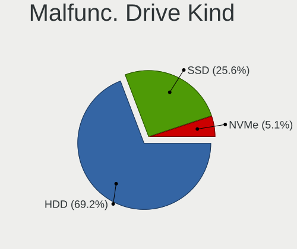

| Kind | Desktops | Drives | Percent |
|------|----------|--------|---------|
| HDD  | 54       | 64     | 69.23%  |
| SSD  | 20       | 22     | 25.64%  |
| NVMe | 4        | 4      | 5.13%   |

Failed Drives
-------------

Failed drive models

Zero info for selected period =(

Failed Drive Vendor
-------------------

Failed drive vendors

Zero info for selected period =(

Drive Status
------------

Number of failed and malfunc. drives

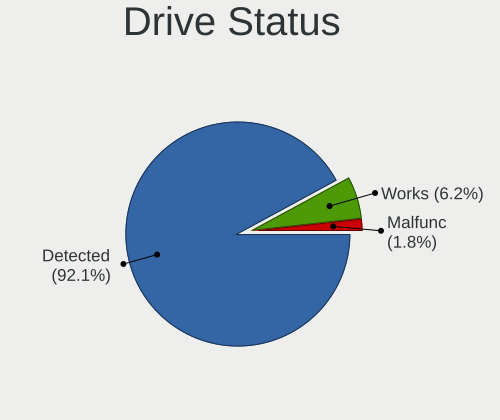

| Status   | Desktops | Drives | Percent |
|----------|----------|--------|---------|
| Detected | 3992     | 9915   | 92.09%  |
| Works    | 267      | 616    | 6.16%   |
| Malfunc  | 76       | 90     | 1.75%   |

Storage controller
------------------

Storage Vendor
--------------

Storage controller vendors

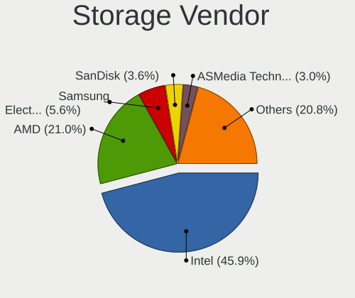

| Vendor                           | Desktops | Percent |
|----------------------------------|----------|---------|
| Intel                            | 2771     | 45.91%  |
| AMD                              | 1268     | 21.01%  |
| Samsung Electronics              | 338      | 5.6%    |
| SanDisk                          | 219      | 3.63%   |
| ASMedia Technology               | 182      | 3.02%   |
| Kingston Technology Company      | 138      | 2.29%   |
| JMicron Technology               | 129      | 2.14%   |
| Phison Electronics               | 127      | 2.1%    |
| Nvidia                           | 119      | 1.97%   |
| Marvell Technology Group         | 104      | 1.72%   |
| Micron/Crucial Technology        | 101      | 1.67%   |
| Silicon Motion                   | 75       | 1.24%   |
| MAXIO Technology (Hangzhou)      | 72       | 1.19%   |
| Realtek Semiconductor            | 47       | 0.78%   |
| VIA Technologies                 | 44       | 0.73%   |
| ADATA Technology                 | 43       | 0.71%   |
| SK hynix                         | 39       | 0.65%   |
| Micron Technology                | 33       | 0.55%   |
| Shenzhen Longsys Electronics     | 24       | 0.4%    |
| INNOGRIT                         | 18       | 0.3%    |
| Seagate Technology               | 17       | 0.28%   |
| KIOXIA                           | 17       | 0.28%   |
| Toshiba America Info Systems     | 16       | 0.27%   |
| Silicon Image                    | 14       | 0.23%   |
| Broadcom / LSI                   | 13       | 0.22%   |
| LSI Logic / Symbios Logic        | 8        | 0.13%   |
| Silicon Integrated Systems [SiS] | 7        | 0.12%   |
| Integrated Technology Express    | 6        | 0.1%    |
| Hosin Global Electronics         | 5        | 0.08%   |
| Solid State Storage Technology   | 4        | 0.07%   |
| Netac Technology                 | 4        | 0.07%   |
| TenaFe                           | 3        | 0.05%   |
| Solidigm                         | 3        | 0.05%   |
| OCZ Technology Group             | 3        | 0.05%   |
| Adaptec                          | 3        | 0.05%   |
| Unknown                          | 3        | 0.05%   |
| Yangtze Memory Technologies      | 2        | 0.03%   |
| Lite-On IT Corp. / Plextor       | 2        | 0.03%   |
| HighPoint Technologies           | 2        | 0.03%   |
| Hewlett-Packard                  | 2        | 0.03%   |

Storage Model
-------------

Storage controller models

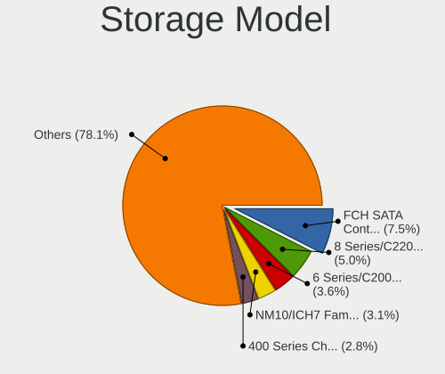

| Model                                                                                   | Desktops | Percent |
|-----------------------------------------------------------------------------------------|----------|---------|
| AMD FCH SATA Controller [AHCI mode]                                                     | 563      | 7.51%   |
| Intel 8 Series/C220 Series Chipset Family 6-port SATA Controller 1 [AHCI mode]          | 372      | 4.96%   |
| Intel 6 Series/C200 Series Chipset Family 6 port Desktop SATA AHCI Controller           | 271      | 3.61%   |
| Intel NM10/ICH7 Family SATA Controller [IDE mode]                                       | 229      | 3.05%   |
| AMD 400 Series Chipset SATA Controller                                                  | 210      | 2.8%    |
| AMD SB7x0/SB8x0/SB9x0 IDE Controller                                                    | 200      | 2.67%   |
| Intel Q170/Q150/B150/H170/H110/Z170/CM236 Chipset SATA Controller [AHCI Mode]           | 193      | 2.57%   |
| Intel 7 Series/C210 Series Chipset Family 6-port SATA Controller [AHCI mode]            | 191      | 2.55%   |
| Intel SATA Controller [RAID mode]                                                       | 184      | 2.45%   |
| Intel 82801G (ICH7 Family) IDE Controller                                               | 182      | 2.43%   |
| AMD 500 Series Chipset SATA Controller                                                  | 170      | 2.27%   |
| ASMedia ASM1061/ASM1062 Serial ATA Controller                                           | 164      | 2.19%   |
| AMD SB7x0/SB8x0/SB9x0 SATA Controller [AHCI mode]                                       | 161      | 2.15%   |
| Intel 200 Series PCH SATA controller [AHCI mode]                                        | 152      | 2.03%   |
| AMD SB7x0/SB8x0/SB9x0 SATA Controller [IDE mode]                                        | 148      | 1.97%   |
| Samsung NVMe SSD Controller SM981/PM981/PM983                                           | 145      | 1.93%   |
| AMD 600 Series Chipset SATA Controller                                                  | 103      | 1.37%   |
| Intel 6 Series/C200 Series Chipset Family Desktop SATA Controller (IDE mode, ports 4-5) | 95       | 1.27%   |
| Intel 6 Series/C200 Series Chipset Family Desktop SATA Controller (IDE mode, ports 0-3) | 94       | 1.25%   |
| Intel Cannon Lake PCH SATA AHCI Controller                                              | 91       | 1.21%   |
| Samsung NVMe SSD Controller PM9A1/PM9A3/980PRO                                          | 81       | 1.08%   |
| Intel 9 Series Chipset Family SATA Controller [AHCI Mode]                               | 73       | 0.97%   |
| Intel Alder Lake-S PCH SATA Controller [AHCI Mode]                                      | 72       | 0.96%   |
| JMicron JMB363 SATA/IDE Controller                                                      | 71       | 0.95%   |
| Intel 500 Series Chipset Family SATA AHCI Controller                                    | 71       | 0.95%   |
| Nvidia MCP61 SATA Controller                                                            | 66       | 0.88%   |
| Silicon Motion SM2263EN/SM2263XT (DRAM-less) NVMe SSD Controllers                       | 61       | 0.81%   |
| AMD A320 Chipset SATA Controller [AHCI mode]                                            | 60       | 0.8%    |
| Intel Raptor Lake SATA AHCI Controller                                                  | 56       | 0.75%   |
| Intel 82801JI (ICH10 Family) SATA AHCI Controller                                       | 55       | 0.73%   |
| Intel 5 Series/3400 Series Chipset 4 port SATA IDE Controller                           | 55       | 0.73%   |
| Intel 5 Series/3400 Series Chipset 2 port SATA IDE Controller                           | 52       | 0.69%   |
| AMD 300 Series Chipset SATA Controller                                                  | 51       | 0.68%   |
| Micron/Crucial P2 [Nick P2] / P3 / P3 Plus NVMe PCIe SSD (DRAM-less)                    | 50       | 0.67%   |
| Nvidia MCP61 IDE                                                                        | 46       | 0.61%   |
| Intel 82801JI (ICH10 Family) 4 port SATA IDE Controller #1                              | 46       | 0.61%   |
| MAXIO (Hangzhou) NVMe SSD Controller MAP1202 (DRAM-less)                                | 45       | 0.6%    |
| Intel 4 Series Chipset PT IDER Controller                                               | 45       | 0.6%    |
| Phison E12 NVMe Controller                                                              | 44       | 0.59%   |
| Intel 82801JI (ICH10 Family) 2 port SATA IDE Controller #2                              | 44       | 0.59%   |

Storage Kind
------------

Kind of storage controller (IDE, SATA, NVMe, SAS, ...)

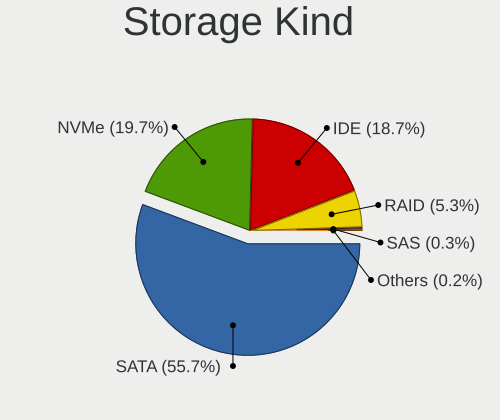

| Kind | Desktops | Percent |
|------|----------|---------|
| SATA | 3288     | 55.69%  |
| NVMe | 1163     | 19.7%   |
| IDE  | 1106     | 18.73%  |
| RAID | 315      | 5.34%   |
| SAS  | 20       | 0.34%   |
| SCSI | 12       | 0.2%    |

Processor
---------

CPU Vendor
----------

Processor vendors

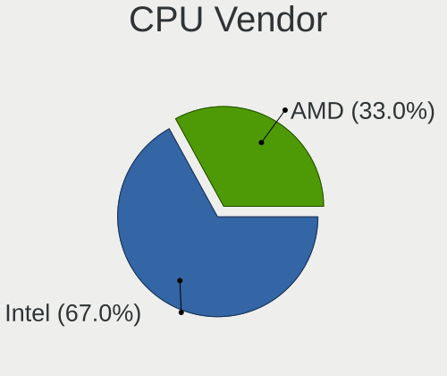

| Vendor | Desktops | Percent |
|--------|----------|---------|
| Intel  | 2832     | 67%     |
| AMD    | 1395     | 33%     |

CPU Model
---------

Processor models

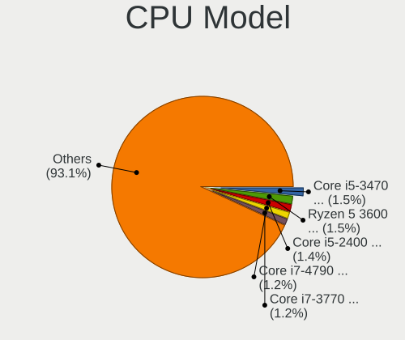

| Model                                       | Desktops | Percent |
|---------------------------------------------|----------|---------|
| Intel Core i5-3470 CPU @ 3.20GHz            | 65       | 1.53%   |
| AMD Ryzen 5 3600 6-Core Processor           | 65       | 1.53%   |
| Intel Core i5-2400 CPU @ 3.10GHz            | 59       | 1.39%   |
| Intel Core i7-4790 CPU @ 3.60GHz            | 53       | 1.25%   |
| Intel Core i7-3770 CPU @ 3.40GHz            | 50       | 1.18%   |
| Intel Core 2 Duo CPU E8400 @ 3.00GHz        | 49       | 1.15%   |
| Intel Core i7-2600 CPU @ 3.40GHz            | 43       | 1.01%   |
| AMD Ryzen 9 5900X 12-Core Processor         | 42       | 0.99%   |
| AMD Ryzen 5 5600G with Radeon Graphics      | 40       | 0.94%   |
| AMD FX-6300 Six-Core Processor              | 39       | 0.92%   |
| Intel Core i7-6700 CPU @ 3.40GHz            | 34       | 0.8%    |
| Intel Core i7-4770 CPU @ 3.40GHz            | 34       | 0.8%    |
| Intel Core i5-4460 CPU @ 3.20GHz            | 34       | 0.8%    |
| Intel Core i5-6500 CPU @ 3.20GHz            | 33       | 0.78%   |
| Intel Core i5-4570 CPU @ 3.20GHz            | 33       | 0.78%   |
| Intel Core i3-2120 CPU @ 3.30GHz            | 33       | 0.78%   |
| AMD Ryzen 5 5600X 6-Core Processor          | 32       | 0.75%   |
| AMD Ryzen 7 5800X 8-Core Processor          | 31       | 0.73%   |
| AMD FX-8350 Eight-Core Processor            | 31       | 0.73%   |
| Intel Core i5-4590 CPU @ 3.30GHz            | 30       | 0.71%   |
| Intel Core i7-6700K CPU @ 4.00GHz           | 28       | 0.66%   |
| Intel Core i7-4790K CPU @ 4.00GHz           | 28       | 0.66%   |
| Intel Core i5-3570 CPU @ 3.40GHz            | 28       | 0.66%   |
| AMD Ryzen 7 3700X 8-Core Processor          | 28       | 0.66%   |
| AMD Ryzen 5 2600 Six-Core Processor         | 28       | 0.66%   |
| Intel Core i3-3220 CPU @ 3.30GHz            | 27       | 0.64%   |
| Intel Core 2 Duo CPU E7500 @ 2.93GHz        | 26       | 0.61%   |
| Intel Core i5-7400 CPU @ 3.00GHz            | 25       | 0.59%   |
| Intel Core 2 Quad CPU Q6600 @ 2.40GHz       | 25       | 0.59%   |
| Intel Pentium Dual-Core CPU E5300 @ 2.60GHz | 23       | 0.54%   |
| Intel Core i3-6100 CPU @ 3.70GHz            | 23       | 0.54%   |
| AMD Ryzen 7 5700G with Radeon Graphics      | 23       | 0.54%   |
| AMD Ryzen 7 2700X Eight-Core Processor      | 23       | 0.54%   |
| Intel Core i5 CPU 650 @ 3.20GHz             | 22       | 0.52%   |
| Intel Core i3-4160 CPU @ 3.60GHz            | 22       | 0.52%   |
| AMD Ryzen 3 3200G with Radeon Vega Graphics | 22       | 0.52%   |
| Intel Core i5-3330 CPU @ 3.00GHz            | 21       | 0.49%   |
| Intel Core i3-2100 CPU @ 3.10GHz            | 21       | 0.49%   |
| Intel Core i5-8400 CPU @ 2.80GHz            | 20       | 0.47%   |
| Intel Core i5-7500 CPU @ 3.40GHz            | 20       | 0.47%   |

CPU Model Family
----------------

Processor model prefix

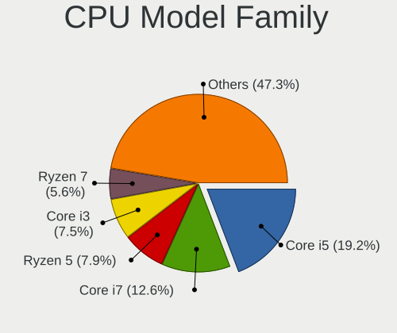

| Model                   | Desktops | Percent |
|-------------------------|----------|---------|
| Intel Core i5           | 814      | 19.2%   |
| Intel Core i7           | 532      | 12.55%  |
| AMD Ryzen 5             | 333      | 7.86%   |
| Intel Core i3           | 318      | 7.5%    |
| AMD Ryzen 7             | 236      | 5.57%   |
| Intel Xeon              | 213      | 5.02%   |
| Other                   | 200      | 4.72%   |
| AMD FX                  | 156      | 3.68%   |
| Intel Core 2 Duo        | 155      | 3.66%   |
| AMD Ryzen 9             | 130      | 3.07%   |
| Intel Celeron           | 109      | 2.57%   |
| Intel Core 2 Quad       | 108      | 2.55%   |
| Intel Pentium           | 91       | 2.15%   |
| Intel Pentium Dual-Core | 80       | 1.89%   |
| AMD Ryzen 3             | 58       | 1.37%   |
| Intel Pentium Dual      | 56       | 1.32%   |
| AMD Athlon II X2        | 54       | 1.27%   |
| AMD Phenom II X4        | 46       | 1.09%   |
| AMD Athlon 64 X2        | 42       | 0.99%   |
| AMD A8                  | 42       | 0.99%   |
| Intel Core i9           | 41       | 0.97%   |
| Intel Pentium 4         | 40       | 0.94%   |
| AMD A10                 | 39       | 0.92%   |
| AMD A6                  | 31       | 0.73%   |
| AMD Athlon              | 26       | 0.61%   |
| Intel Core 2            | 25       | 0.59%   |
| AMD A4                  | 23       | 0.54%   |
| AMD Phenom II X6        | 21       | 0.5%    |
| AMD Athlon II X4        | 18       | 0.42%   |
| AMD Sempron             | 17       | 0.4%    |
| Intel Atom              | 16       | 0.38%   |
| AMD Ryzen 5 PRO         | 14       | 0.33%   |
| Intel Pentium Gold      | 12       | 0.28%   |
| Intel Pentium D         | 12       | 0.28%   |
| AMD Athlon II X3        | 12       | 0.28%   |
| AMD Athlon 64           | 12       | 0.28%   |
| AMD E1                  | 10       | 0.24%   |
| AMD Phenom              | 9        | 0.21%   |
| Intel Core              | 8        | 0.19%   |
| AMD E                   | 8        | 0.19%   |

CPU Cores
---------

Number of processor cores

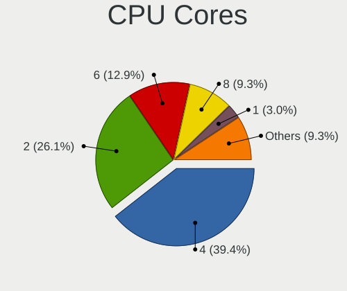

| Number | Desktops | Percent |
|--------|----------|---------|
| 4      | 1673     | 39.42%  |
| 2      | 1107     | 26.08%  |
| 6      | 547      | 12.89%  |
| 8      | 395      | 9.31%   |
| 1      | 128      | 3.02%   |
| 12     | 119      | 2.8%    |
| 16     | 74       | 1.74%   |
| 3      | 71       | 1.67%   |
| 10     | 46       | 1.08%   |
| 14     | 34       | 0.8%    |
| 24     | 24       | 0.57%   |
| 20     | 14       | 0.33%   |
| 18     | 7        | 0.16%   |
| 32     | 2        | 0.05%   |
| 28     | 2        | 0.05%   |
| 36     | 1        | 0.02%   |

CPU Sockets
-----------

Number of sockets

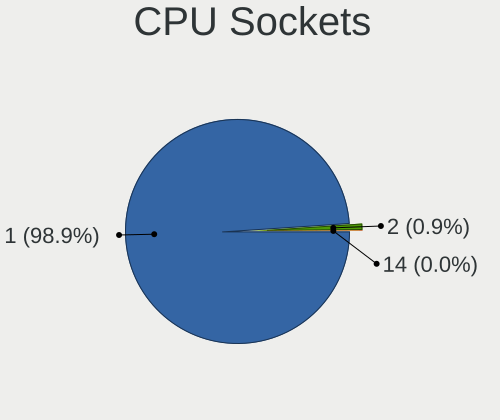

| Number | Desktops | Percent |
|--------|----------|---------|
| 1      | 4182     | 98.94%  |
| 2      | 39       | 0.92%   |
| 24     | 3        | 0.07%   |
| 20     | 2        | 0.05%   |
| 14     | 1        | 0.02%   |

CPU Threads
-----------

Threads per core (Hyper-Threading)

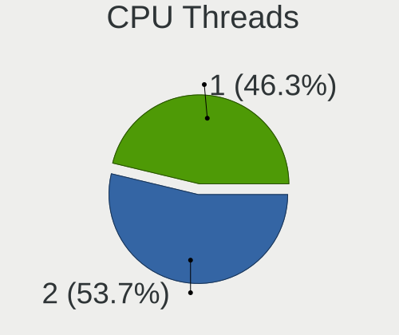

| Number | Desktops | Percent |
|--------|----------|---------|
| 2      | 2278     | 53.74%  |
| 1      | 1961     | 46.26%  |

CPU Op-Modes
------------

CPU Operation Modes (32-bit, 64-bit)

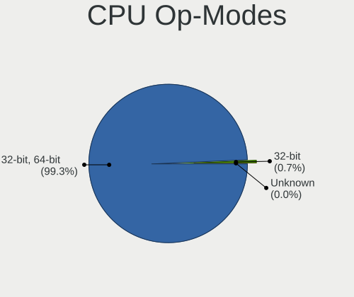

| Op mode        | Desktops | Percent |
|----------------|----------|---------|
| 32-bit, 64-bit | 4198     | 99.31%  |
| 32-bit         | 28       | 0.66%   |
| Unknown        | 1        | 0.02%   |

CPU Microcode
-------------

Microcode number

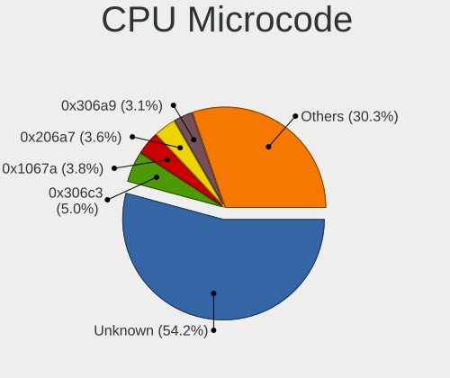

| Number     | Desktops | Percent |
|------------|----------|---------|
| Unknown    | 2341     | 54.19%  |
| 0x306c3    | 217      | 5.02%   |
| 0x1067a    | 163      | 3.77%   |
| 0x206a7    | 157      | 3.63%   |
| 0x306a9    | 134      | 3.1%    |
| 0x506e3    | 74       | 1.71%   |
| 0x6fd      | 62       | 1.44%   |
| 0x06000852 | 62       | 1.44%   |
| 0x08701021 | 55       | 1.27%   |
| 0x010000c8 | 50       | 1.16%   |
| 0x0800820d | 39       | 0.9%    |
| 0x906e9    | 38       | 0.88%   |
| 0x906ea    | 35       | 0.81%   |
| 0x6fb      | 32       | 0.74%   |
| 0x06001119 | 32       | 0.74%   |
| 0xa0655    | 29       | 0.67%   |
| 0xa0653    | 26       | 0.6%    |
| 0x20655    | 24       | 0.56%   |
| 0x10676    | 23       | 0.53%   |
| 0x08108109 | 22       | 0.51%   |
| 0x0600063e | 22       | 0.51%   |
| 0x010000db | 21       | 0.49%   |
| 0xa0671    | 20       | 0.46%   |
| 0x0a201016 | 20       | 0.46%   |
| 0x906ed    | 19       | 0.44%   |
| 0x106e5    | 19       | 0.44%   |
| 0x08001138 | 19       | 0.44%   |
| 0x106a5    | 17       | 0.39%   |
| 0x06003106 | 17       | 0.39%   |
| 0x20652    | 15       | 0.35%   |
| 0x010000dc | 15       | 0.35%   |
| 0x906eb    | 14       | 0.32%   |
| 0x6f6      | 14       | 0.32%   |
| 0x306f2    | 14       | 0.32%   |
| 0x08701013 | 14       | 0.32%   |
| 0x206d7    | 13       | 0.3%    |
| 0x0a50000d | 13       | 0.3%    |
| 0x306e4    | 12       | 0.28%   |
| 0x206c2    | 12       | 0.28%   |
| 0x0a20120a | 12       | 0.28%   |

CPU Microarch
-------------

Microarchitecture

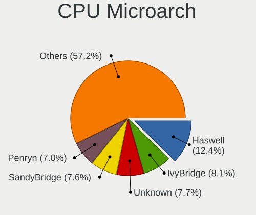

| Name             | Desktops | Percent |
|------------------|----------|---------|
| Haswell          | 525      | 12.39%  |
| IvyBridge        | 344      | 8.12%   |
| Unknown          | 328      | 7.74%   |
| SandyBridge      | 320      | 7.55%   |
| Penryn           | 295      | 6.96%   |
| KabyLake         | 294      | 6.94%   |
| Zen 3            | 248      | 5.85%   |
| Skylake          | 198      | 4.67%   |
| Zen 2            | 184      | 4.34%   |
| K10              | 182      | 4.29%   |
| Piledriver       | 169      | 3.99%   |
| Core             | 164      | 3.87%   |
| Zen+             | 123      | 2.9%    |
| Zen              | 110      | 2.6%    |
| CometLake        | 101      | 2.38%   |
| Westmere         | 95       | 2.24%   |
| Nehalem          | 92       | 2.17%   |
| K8 Hammer        | 77       | 1.82%   |
| NetBurst         | 62       | 1.46%   |
| Steamroller      | 38       | 0.9%    |
| Bulldozer        | 38       | 0.9%    |
| Silvermont       | 30       | 0.71%   |
| Excavator        | 30       | 0.71%   |
| Broadwell        | 27       | 0.64%   |
| Alderlake Hybrid | 24       | 0.57%   |
| K10 Llano        | 21       | 0.5%    |
| Icelake          | 21       | 0.5%    |
| Jaguar           | 18       | 0.42%   |
| Goldmont plus    | 18       | 0.42%   |
| Bobcat           | 17       | 0.4%    |
| Bonnell          | 12       | 0.28%   |
| Puma             | 10       | 0.24%   |
| Goldmont         | 10       | 0.24%   |
| Tremont          | 5        | 0.12%   |
| K6               | 3        | 0.07%   |
| TigerLake        | 2        | 0.05%   |
| Gracemont        | 2        | 0.05%   |
| P6               | 1        | 0.02%   |

Graphics
--------

GPU Vendor
----------

Vendors of graphics cards

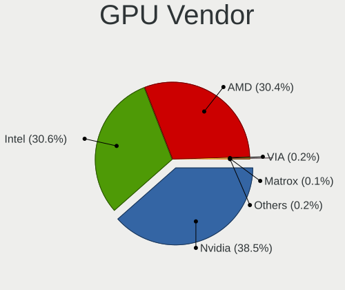

| Vendor                           | Desktops | Percent |
|----------------------------------|----------|---------|
| Nvidia                           | 1756     | 38.49%  |
| Intel                            | 1396     | 30.6%   |
| AMD                              | 1387     | 30.4%   |
| VIA Technologies                 | 9        | 0.2%    |
| Matrox Electronics Systems       | 5        | 0.11%   |
| Silicon Integrated Systems [SiS] | 3        | 0.07%   |
| ATI Technologies                 | 2        | 0.04%   |
| Trident Microsystems             | 1        | 0.02%   |
| Silicon Motion                   | 1        | 0.02%   |
| ASPEED Technology                | 1        | 0.02%   |
| 3DLabs                           | 1        | 0.02%   |

GPU Model
---------

Graphics card models

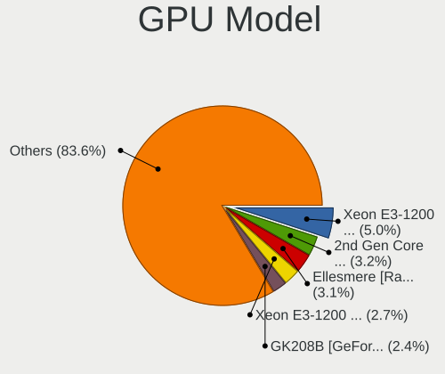

| Model                                                                       | Desktops | Percent |
|-----------------------------------------------------------------------------|----------|---------|
| Intel Xeon E3-1200 v3/4th Gen Core Processor Integrated Graphics Controller | 236      | 5.01%   |
| Intel 2nd Generation Core Processor Family Integrated Graphics Controller   | 152      | 3.23%   |
| AMD Ellesmere [Radeon RX 470/480/570/570X/580/580X/590]                     | 147      | 3.12%   |
| Intel Xeon E3-1200 v2/3rd Gen Core processor Graphics Controller            | 128      | 2.72%   |
| Nvidia GK208B [GeForce GT 710]                                              | 111      | 2.36%   |
| Intel 4 Series Chipset Integrated Graphics Controller                       | 110      | 2.34%   |
| Intel Skylake-S GT2 [HD Graphics 530]                                       | 103      | 2.19%   |
| Nvidia GP107 [GeForce GTX 1050 Ti]                                          | 79       | 1.68%   |
| Intel CoffeeLake-S GT2 [UHD Graphics 630]                                   | 64       | 1.36%   |
| AMD Cedar [Radeon HD 5000/6000/7350/8350 Series]                            | 60       | 1.27%   |
| Nvidia GK208B [GeForce GT 730]                                              | 59       | 1.25%   |
| AMD Raphael                                                                 | 59       | 1.25%   |
| Intel Kaby Lake-S GT2 [HD Graphics 630]                                     | 57       | 1.21%   |
| AMD Cezanne [Radeon Vega Series / Radeon Vega Mobile Series]                | 57       | 1.21%   |
| Nvidia GF119 [GeForce GT 610]                                               | 55       | 1.17%   |
| Nvidia GT218 [GeForce 210]                                                  | 54       | 1.15%   |
| Intel 4th Generation Core Processor Family Integrated Graphics Controller   | 49       | 1.04%   |
| Nvidia GM107 [GeForce GTX 750 Ti]                                           | 48       | 1.02%   |
| Intel 82G33/G31 Express Integrated Graphics Controller                      | 46       | 0.98%   |
| AMD Raven Ridge [Radeon Vega Series / Radeon Vega Mobile Series]            | 44       | 0.93%   |
| Nvidia GP106 [GeForce GTX 1060 6GB]                                         | 43       | 0.91%   |
| Intel Core Processor Integrated Graphics Controller                         | 43       | 0.91%   |
| Nvidia GP108 [GeForce GT 1030]                                              | 42       | 0.89%   |
| Nvidia GA106 [GeForce RTX 3060 Lite Hash Rate]                              | 38       | 0.81%   |
| Nvidia GM206 [GeForce GTX 960]                                              | 37       | 0.79%   |
| AMD Navi 10 [Radeon RX 5600 OEM/5600 XT / 5700/5700 XT]                     | 37       | 0.79%   |
| AMD Caicos [Radeon HD 6450/7450/8450 / R5 230 OEM]                          | 36       | 0.76%   |
| AMD Polaris 20 XL [Radeon RX 580 2048SP]                                    | 35       | 0.74%   |
| AMD Picasso/Raven 2 [Radeon Vega Series / Radeon Vega Mobile Series]        | 35       | 0.74%   |
| Intel IvyBridge GT2 [HD Graphics 4000]                                      | 33       | 0.7%    |
| Nvidia TU117 [GeForce GTX 1650]                                             | 32       | 0.68%   |
| AMD RS780L [Radeon 3000]                                                    | 31       | 0.66%   |
| Nvidia GM204 [GeForce GTX 970]                                              | 30       | 0.64%   |
| Nvidia GF108 [GeForce GT 730]                                               | 30       | 0.64%   |
| Intel CometLake-S GT2 [UHD Graphics 630]                                    | 30       | 0.64%   |
| AMD Navi 23 [Radeon RX 6600/6600 XT/6600M]                                  | 30       | 0.64%   |
| Intel Alder Lake-N [UHD Graphics]                                           | 26       | 0.55%   |
| AMD Navi 22 [Radeon RX 6700/6700 XT/6750 XT / 6800M/6850M XT]               | 26       | 0.55%   |
| AMD Kaveri [Radeon R7 Graphics]                                             | 26       | 0.55%   |
| Nvidia TU116 [GeForce GTX 1660 SUPER]                                       | 25       | 0.53%   |

GPU Combo
---------

Combinations of graphics cards

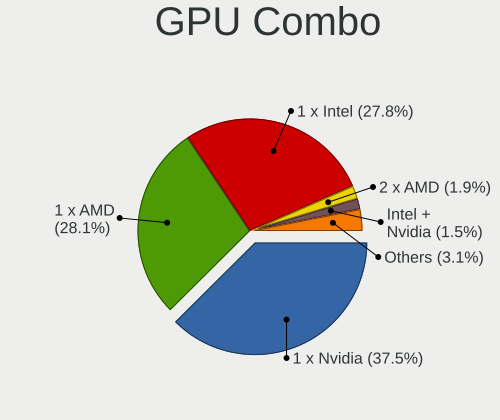

| Name                     | Desktops | Percent |
|--------------------------|----------|---------|
| 1 x Nvidia               | 1608     | 37.54%  |
| 1 x AMD                  | 1203     | 28.09%  |
| 1 x Intel                | 1191     | 27.81%  |
| 2 x AMD                  | 81       | 1.89%   |
| Intel + Nvidia           | 66       | 1.54%   |
| AMD + Nvidia             | 60       | 1.4%    |
| Intel + AMD              | 36       | 0.84%   |
| 2 x Nvidia               | 13       | 0.3%    |
| 1 x VIA                  | 9        | 0.21%   |
| 1 x Matrox               | 4        | 0.09%   |
| 1 x SiS                  | 3        | 0.07%   |
| 2 x AMD + 1 x Nvidia     | 2        | 0.05%   |
| 3 x AMD                  | 1        | 0.02%   |
| 2 x Intel                | 1        | 0.02%   |
| 2 x AMD + 1 x 3DLabs     | 1        | 0.02%   |
| 1 x Trident Microsystems | 1        | 0.02%   |
| Nvidia + Silicon Motion  | 1        | 0.02%   |
| Intel + 2 x Nvidia       | 1        | 0.02%   |
| 1 x ASPEED               | 1        | 0.02%   |

GPU Driver
----------

Free vs proprietary

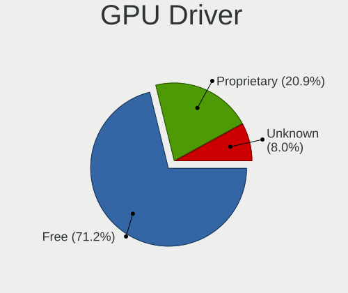

| Driver      | Desktops | Percent |
|-------------|----------|---------|
| Free        | 3057     | 71.18%  |
| Proprietary | 896      | 20.86%  |
| Unknown     | 342      | 7.96%   |

GPU Memory
----------

Total video memory

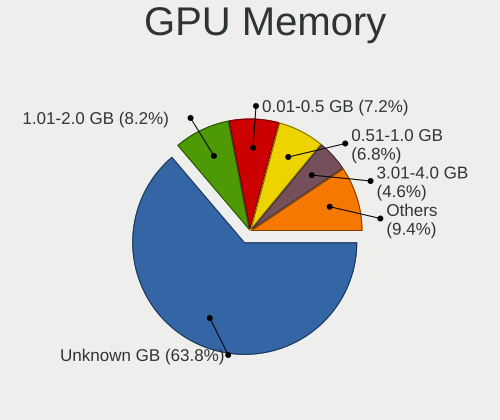

| Size in GB | Desktops | Percent |
|------------|----------|---------|
| Unknown    | 2767     | 63.79%  |
| 1.01-2.0   | 355      | 8.18%   |
| 0.01-0.5   | 314      | 7.24%   |
| 0.51-1.0   | 294      | 6.78%   |
| 3.01-4.0   | 200      | 4.61%   |
| 7.01-8.0   | 197      | 4.54%   |
| 8.01-16.0  | 96       | 2.21%   |
| 5.01-6.0   | 76       | 1.75%   |
| 2.01-3.0   | 26       | 0.6%    |
| 16.01-24.0 | 11       | 0.25%   |
| 4.01-5.0   | 2        | 0.05%   |

Monitor
-------

Monitor Vendor
--------------

Monitor vendors

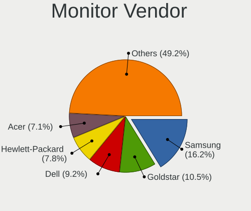

| Vendor               | Desktops | Percent |
|----------------------|----------|---------|
| Samsung Electronics  | 668      | 16.2%   |
| Goldstar             | 434      | 10.52%  |
| Dell                 | 381      | 9.24%   |
| Hewlett-Packard      | 322      | 7.81%   |
| Acer                 | 291      | 7.06%   |
| AOC                  | 224      | 5.43%   |
| Philips              | 174      | 4.22%   |
| Ancor Communications | 150      | 3.64%   |
| BenQ                 | 149      | 3.61%   |
| ViewSonic            | 83       | 2.01%   |
| Lenovo               | 71       | 1.72%   |
| ASUSTek Computer     | 69       | 1.67%   |
| Sony                 | 58       | 1.41%   |
| Unknown              | 57       | 1.38%   |
| Iiyama               | 55       | 1.33%   |
| LG Electronics       | 49       | 1.19%   |
| MSI                  | 37       | 0.9%    |
| Fujitsu Siemens      | 36       | 0.87%   |
| Vizio                | 34       | 0.82%   |
| Sceptre Tech         | 34       | 0.82%   |
| Unknown              | 30       | 0.73%   |
| NEC Computers        | 29       | 0.7%    |
| Eizo                 | 27       | 0.65%   |
| HKC                  | 21       | 0.51%   |
| Unknown (XXX)        | 20       | 0.48%   |
| Toshiba              | 20       | 0.48%   |
| Panasonic            | 18       | 0.44%   |
| Gigabyte Technology  | 18       | 0.44%   |
| Hitachi              | 15       | 0.36%   |
| HannStar             | 15       | 0.36%   |
| RTK                  | 13       | 0.32%   |
| Insignia             | 12       | 0.29%   |
| ___                  | 10       | 0.24%   |
| Vestel Elektronik    | 10       | 0.24%   |
| Idek Iiyama          | 10       | 0.24%   |
| HPN                  | 10       | 0.24%   |
| FUS                  | 10       | 0.24%   |
| Medion               | 9        | 0.22%   |
| Gateway              | 9        | 0.22%   |
| Denver               | 9        | 0.22%   |

Monitor Model
-------------

Monitor models

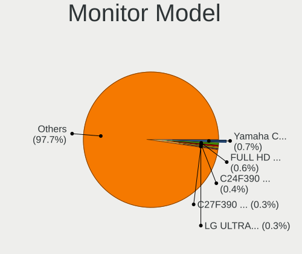

| Model                                                                 | Desktops | Percent |
|-----------------------------------------------------------------------|----------|---------|
| Unknown                                                               | 30       | 0.69%   |
| Goldstar FULL HD GSM5B55 1920x1080 480x270mm 21.7-inch                | 26       | 0.59%   |
| Samsung Electronics C24F390 SAM0D2C 1920x1080 521x293mm 23.5-inch     | 18       | 0.41%   |
| Samsung Electronics C27F390 SAM0D32 1920x1080 598x336mm 27.0-inch     | 15       | 0.34%   |
| Goldstar LG ULTRAWIDE GSM59F1 2560x1080 670x280mm 28.6-inch           | 13       | 0.3%    |
| AOC 27G2G4 AOC2702 1920x1080 598x336mm 27.0-inch                      | 12       | 0.27%   |
| Goldstar LG IPS FULLHD GSM5AB8 1920x1080 480x270mm 21.7-inch          | 11       | 0.25%   |
| Vestel Elektronik 40UHD_LCD_TV VES3700 3840x2160 880x500mm 39.8-inch  | 10       | 0.23%   |
| Unknown (XXX) Beyond TV XXX2851 3840x2160 1209x680mm 54.6-inch        | 10       | 0.23%   |
| Hewlett-Packard 2009 HWP2827 1600x900 443x250mm 20.0-inch             | 10       | 0.23%   |
| Samsung Electronics S24F350 SAM0D20 1920x1080 521x293mm 23.5-inch     | 9        | 0.21%   |
| Philips PHL 223V5 PHLC0CF 1920x1080 477x268mm 21.5-inch               | 9        | 0.21%   |
| Goldstar HD GSM5ACB 1366x768 410x230mm 18.5-inch                      | 9        | 0.21%   |
| AOC G2460 AOC2460 1920x1080 531x299mm 24.0-inch                       | 9        | 0.21%   |
| Unknown LCD Monitor SAMSUNG 1920x1080                                 | 8        | 0.18%   |
| Samsung Electronics LF27T35 SAM707F 1920x1080 598x337mm 27.0-inch     | 8        | 0.18%   |
| Philips PHL 273V7 PHLC156 1920x1080 598x336mm 27.0-inch               | 8        | 0.18%   |
| Philips PHL 243V5 PHLC0D1 1920x1080 521x293mm 23.5-inch               | 8        | 0.18%   |
| Hitachi HISENSE HEC0030 3840x2160 1872x1053mm 84.6-inch               | 8        | 0.18%   |
| Hitachi HISENSE HEC002F 3840x2160 1872x1053mm 84.6-inch               | 8        | 0.18%   |
| BenQ GL2450H BNQ78A7 1920x1080 531x298mm 24.0-inch                    | 8        | 0.18%   |
| Ancor Communications VS248 ACI2498 1920x1080 531x299mm 24.0-inch      | 8        | 0.18%   |
| Ancor Communications ASUS VS247 ACI249A 1920x1080 521x293mm 23.5-inch | 8        | 0.18%   |
| Unknown LCD Monitor SAMSUNG 3840x2160                                 | 7        | 0.16%   |
| Samsung Electronics LCD Monitor SAM0C3C 1366x768 609x347mm 27.6-inch  | 7        | 0.16%   |
| Samsung Electronics LCD Monitor SAM0C39 1920x1080 885x498mm 40.0-inch | 7        | 0.16%   |
| Philips FTV PHL01EA 1920x1080 1440x810mm 65.0-inch                    | 7        | 0.16%   |
| Goldstar W1943 GSM4BAD 1360x768 406x229mm 18.4-inch                   | 7        | 0.16%   |
| Goldstar LG TV SSCR2 GSMC0C8 3840x2160                                | 7        | 0.16%   |
| Goldstar HDR WFHD GSM7714 2560x1080 798x334mm 34.1-inch               | 7        | 0.16%   |
| Goldstar HDR 4K GSM7707 3840x2160 600x340mm 27.2-inch                 | 7        | 0.16%   |
| Dell P2419H DELD0DA 1920x1080 527x296mm 23.8-inch                     | 7        | 0.16%   |
| AOC 24G2W1G3 AOC2402 1920x1080 527x296mm 23.8-inch                    | 7        | 0.16%   |
| Unknown LCD Monitor FFFF 2288x1287 2550x2550mm 142.0-inch             | 6        | 0.14%   |
| Samsung Electronics U28E590 SAM0C4D 3840x2160 607x345mm 27.5-inch     | 6        | 0.14%   |
| Samsung Electronics S19B300 SAM08A5 1366x768 410x230mm 18.5-inch      | 6        | 0.14%   |
| Philips PHL 243V7 PHLC155 1920x1080 527x296mm 23.8-inch               | 6        | 0.14%   |
| Philips LCD Monitor FTV 1920x1080                                     | 6        | 0.14%   |
| MSI Optix MAG27CQ MSI1462 2560x1440 597x336mm 27.0-inch               | 6        | 0.14%   |
| Hewlett-Packard TouchSmart HWP4211 1920x1080 509x286mm 23.0-inch      | 6        | 0.14%   |

Monitor Resolution
------------------

Monitor screen resolution

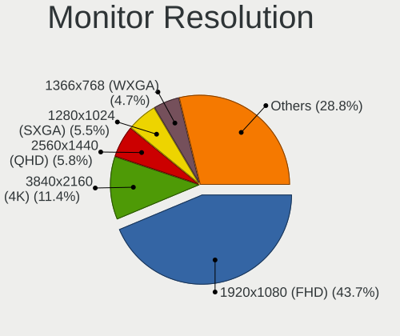

| Resolution         | Desktops | Percent |
|--------------------|----------|---------|
| 1920x1080 (FHD)    | 1759     | 43.7%   |
| 3840x2160 (4K)     | 460      | 11.43%  |
| 2560x1440 (QHD)    | 234      | 5.81%   |
| 1280x1024 (SXGA)   | 223      | 5.54%   |
| 1366x768 (WXGA)    | 191      | 4.75%   |
| 1680x1050 (WSXGA+) | 184      | 4.57%   |
| 1600x900 (HD+)     | 163      | 4.05%   |
| 1440x900 (WXGA+)   | 155      | 3.85%   |
| Unknown            | 94       | 2.34%   |
| 3440x1440          | 89       | 2.21%   |
| 1360x768           | 88       | 2.19%   |
| 1920x1200 (WUXGA)  | 84       | 2.09%   |
| 3840x1080          | 62       | 1.54%   |
| 2560x1080          | 48       | 1.19%   |
| 1920x540           | 30       | 0.75%   |
| 1024x768 (XGA)     | 23       | 0.57%   |
| 1600x1200          | 15       | 0.37%   |
| 3840x1600          | 10       | 0.25%   |
| 2560x1600          | 9        | 0.22%   |
| 1280x720 (HD)      | 8        | 0.2%    |
| 2288x1287          | 7        | 0.17%   |
| 5760x1080          | 6        | 0.15%   |
| 4480x1440          | 5        | 0.12%   |
| 1280x960           | 5        | 0.12%   |
| 5760x2160          | 4        | 0.1%    |
| 5120x1440          | 4        | 0.1%    |
| 3600x1080          | 3        | 0.07%   |
| 3200x1080          | 3        | 0.07%   |
| 2048x1152          | 3        | 0.07%   |
| 1152x864           | 3        | 0.07%   |
| 7680x2160          | 2        | 0.05%   |
| 6400x1440          | 2        | 0.05%   |
| 5440x1080          | 2        | 0.05%   |
| 4480x1080          | 2        | 0.05%   |
| 3840x1200          | 2        | 0.05%   |
| 3360x1080          | 2        | 0.05%   |
| 3200x1200          | 2        | 0.05%   |
| 3120x1050          | 2        | 0.05%   |
| 2944x1080          | 2        | 0.05%   |
| 2720x1024          | 2        | 0.05%   |

Monitor Diagonal
----------------

Diagonal size in inches

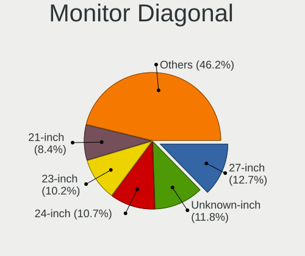

| Inches  | Desktops | Percent |
|---------|----------|---------|
| 27      | 520      | 12.68%  |
| Unknown | 483      | 11.78%  |
| 24      | 439      | 10.7%   |
| 23      | 419      | 10.22%  |
| 21      | 346      | 8.44%   |
| 31      | 244      | 5.95%   |
| 19      | 243      | 5.93%   |
| 18      | 199      | 4.85%   |
| 20      | 172      | 4.19%   |
| 22      | 136      | 3.32%   |
| 17      | 112      | 2.73%   |
| 34      | 104      | 2.54%   |
| 84      | 87       | 2.12%   |
| 15      | 62       | 1.51%   |
| 32      | 59       | 1.44%   |
| 40      | 52       | 1.27%   |
| 72      | 50       | 1.22%   |
| 54      | 42       | 1.02%   |
| 26      | 28       | 0.68%   |
| 63      | 27       | 0.66%   |
| 49      | 25       | 0.61%   |
| 48      | 22       | 0.54%   |
| 25      | 22       | 0.54%   |
| 65      | 20       | 0.49%   |
| 28      | 20       | 0.49%   |
| 42      | 16       | 0.39%   |
| 46      | 12       | 0.29%   |
| 52      | 11       | 0.27%   |
| 74      | 9        | 0.22%   |
| 39      | 9        | 0.22%   |
| 37      | 9        | 0.22%   |
| 36      | 9        | 0.22%   |
| 14      | 8        | 0.2%    |
| 43      | 7        | 0.17%   |
| 29      | 7        | 0.17%   |
| 142     | 6        | 0.15%   |
| 75      | 6        | 0.15%   |
| 60      | 6        | 0.15%   |
| 33      | 6        | 0.15%   |
| 35      | 5        | 0.12%   |

Monitor Width
-------------

Physical width

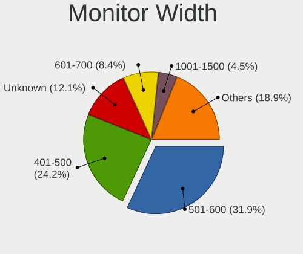

| Width in mm    | Desktops | Percent |
|----------------|----------|---------|
| 501-600        | 1271     | 31.92%  |
| 401-500        | 962      | 24.16%  |
| Unknown        | 483      | 12.13%  |
| 601-700        | 335      | 8.41%   |
| 1001-1500      | 180      | 4.52%   |
| 701-800        | 178      | 4.47%   |
| 301-350        | 168      | 4.22%   |
| 1501-2000      | 155      | 3.89%   |
| 351-400        | 127      | 3.19%   |
| 801-900        | 74       | 1.86%   |
| 901-1000       | 31       | 0.78%   |
| 201-300        | 12       | 0.3%    |
| More than 2000 | 6        | 0.15%   |

Aspect Ratio
------------

Proportional relationship between the width and the height

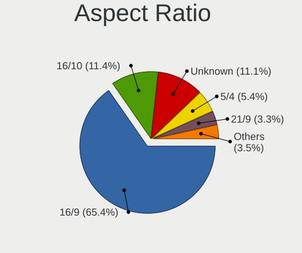

| Ratio   | Desktops | Percent |
|---------|----------|---------|
| 16/9    | 2473     | 65.35%  |
| 16/10   | 430      | 11.36%  |
| Unknown | 421      | 11.13%  |
| 5/4     | 203      | 5.36%   |
| 21/9    | 126      | 3.33%   |
| 4/3     | 54       | 1.43%   |
| 32/9    | 44       | 1.16%   |
| 6/5     | 10       | 0.26%   |
| 3/2     | 9        | 0.24%   |
| 1.00    | 6        | 0.16%   |
| 2.00    | 3        | 0.08%   |
| 0.89    | 2        | 0.05%   |
| 2.01    | 1        | 0.03%   |
| 0.80    | 1        | 0.03%   |
| 0.56    | 1        | 0.03%   |

Monitor Area
------------

Area in inch²

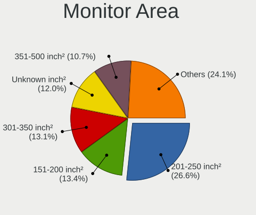

| Area in inch² | Desktops | Percent |
|----------------|----------|---------|
| 201-250        | 1071     | 26.64%  |
| 151-200        | 538      | 13.38%  |
| 301-350        | 526      | 13.08%  |
| Unknown        | 483      | 12.01%  |
| 351-500        | 432      | 10.75%  |
| More than 1000 | 293      | 7.29%   |
| 141-150        | 253      | 6.29%   |
| 251-300        | 175      | 4.35%   |
| 501-1000       | 156      | 3.88%   |
| 101-110        | 48       | 1.19%   |
| 111-120        | 16       | 0.4%    |
| 131-140        | 10       | 0.25%   |
| 81-90          | 6        | 0.15%   |
| 71-80          | 5        | 0.12%   |
| 121-130        | 4        | 0.1%    |
| 91-100         | 4        | 0.1%    |

Pixel Density
-------------

Pixels per inch

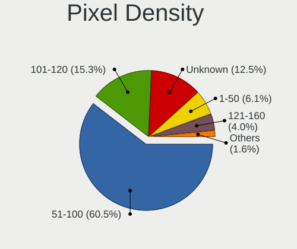

| Density | Desktops | Percent |
|---------|----------|---------|
| 51-100  | 2335     | 60.46%  |
| 101-120 | 590      | 15.28%  |
| Unknown | 484      | 12.53%  |
| 1-50    | 235      | 6.08%   |
| 121-160 | 155      | 4.01%   |
| 161-240 | 63       | 1.63%   |

Multiple Monitors
-----------------

Total monitors connected

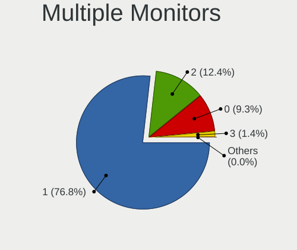

| Total | Desktops | Percent |
|-------|----------|---------|
| 1     | 3316     | 76.79%  |
| 2     | 535      | 12.39%  |
| 0     | 400      | 9.26%   |
| 3     | 60       | 1.39%   |
| 4     | 6        | 0.14%   |
| 5     | 1        | 0.02%   |

Network
-------

Net Controller Vendor
---------------------

Controller vendors

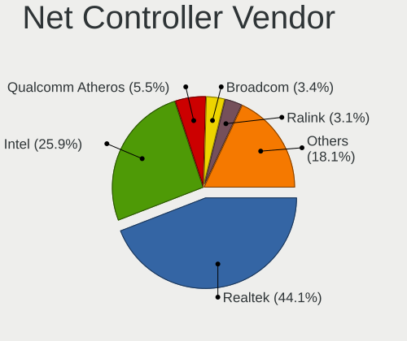

| Vendor                                | Desktops | Percent |
|---------------------------------------|----------|---------|
| Realtek Semiconductor                 | 2774     | 44.1%   |
| Intel                                 | 1626     | 25.85%  |
| Qualcomm Atheros                      | 345      | 5.48%   |
| Broadcom                              | 211      | 3.35%   |
| Ralink Technology                     | 197      | 3.13%   |
| TP-Link                               | 158      | 2.51%   |
| MediaTek                              | 123      | 1.96%   |
| Nvidia                                | 101      | 1.61%   |
| Ralink                                | 83       | 1.32%   |
| NetGear                               | 44       | 0.7%    |
| Broadcom Limited                      | 43       | 0.68%   |
| Marvell Technology Group              | 41       | 0.65%   |
| Samsung Electronics                   | 40       | 0.64%   |
| D-Link                                | 39       | 0.62%   |
| Microsoft                             | 33       | 0.52%   |
| Qualcomm Atheros Communications       | 30       | 0.48%   |
| Xiaomi                                | 29       | 0.46%   |
| D-Link System                         | 29       | 0.46%   |
| VIA Technologies                      | 24       | 0.38%   |
| Aquantia                              | 24       | 0.38%   |
| ASUSTek Computer                      | 23       | 0.37%   |
| ASIX Electronics                      | 23       | 0.37%   |
| Edimax Technology                     | 16       | 0.25%   |
| Qualcomm Technologies                 | 14       | 0.22%   |
| Huawei Technologies                   | 14       | 0.22%   |
| DisplayLink                           | 12       | 0.19%   |
| Linksys                               | 11       | 0.17%   |
| Belkin Components                     | 10       | 0.16%   |
| OPPO Electronics                      | 8        | 0.13%   |
| Motorola PCS                          | 8        | 0.13%   |
| 802.11g Adapter [Linksys WUSB54GC v3] | 7        | 0.11%   |
| ZyXEL Communications                  | 6        | 0.1%    |
| Sitecom Europe                        | 6        | 0.1%    |
| Silicon Integrated Systems [SiS]      | 6        | 0.1%    |
| Qualcomm                              | 6        | 0.1%    |
| QinHeng Electronics                   | 6        | 0.1%    |
| Mercucys                              | 6        | 0.1%    |
| Gemtek                                | 6        | 0.1%    |
| AVM                                   | 5        | 0.08%   |
| Sundance Technology Inc / IC Plus     | 4        | 0.06%   |

Net Controller Model
--------------------

Controller models

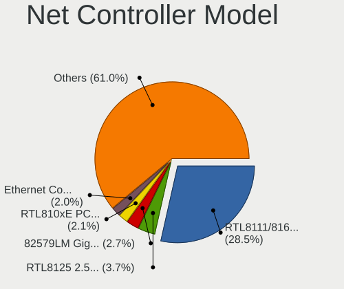

| Model                                                                  | Desktops | Percent |
|------------------------------------------------------------------------|----------|---------|
| Realtek RTL8111/8168/8211/8411 PCI Express Gigabit Ethernet Controller | 2045     | 28.53%  |
| Realtek RTL8125 2.5GbE Controller                                      | 266      | 3.71%   |
| Intel 82579LM Gigabit Network Connection (Lewisville)                  | 191      | 2.66%   |
| Realtek RTL810xE PCI Express Fast Ethernet controller                  | 149      | 2.08%   |
| Intel Ethernet Connection I217-LM                                      | 142      | 1.98%   |
| Intel Wi-Fi 6 AX200                                                    | 136      | 1.9%    |
| Intel I211 Gigabit Network Connection                                  | 130      | 1.81%   |
| Intel Ethernet Connection (2) I219-V                                   | 118      | 1.65%   |
| Realtek 802.11ac NIC                                                   | 101      | 1.41%   |
| Intel Ethernet Controller I225-V                                       | 101      | 1.41%   |
| Ralink MT7601U Wireless Adapter                                        | 92       | 1.28%   |
| Intel Wi-Fi 6E(802.11ax) AX210/AX1675* 2x2 [Typhoon Peak]              | 84       | 1.17%   |
| Realtek RTL88x2bu [AC1200 Techkey]                                     | 82       | 1.14%   |
| Intel 82579V Gigabit Network Connection                                | 66       | 0.92%   |
| Realtek RTL8188EUS 802.11n Wireless Network Adapter                    | 65       | 0.91%   |
| Realtek RTL8821CE 802.11ac PCIe Wireless Network Adapter               | 64       | 0.89%   |
| Nvidia MCP61 Ethernet                                                  | 61       | 0.85%   |
| Intel Ethernet Connection I217-V                                       | 56       | 0.78%   |
| Intel Ethernet Connection (2) I219-LM                                  | 54       | 0.75%   |
| Intel Dual Band Wireless-AC 3168NGW [Stone Peak]                       | 52       | 0.73%   |
| Intel 82567LM-3 Gigabit Network Connection                             | 51       | 0.71%   |
| Intel Ethernet Controller I226-V                                       | 44       | 0.61%   |
| Intel Wi-Fi 5(802.11ac) Wireless-AC 9x6x [Thunder Peak]                | 43       | 0.6%    |
| Intel Wireless 7265                                                    | 41       | 0.57%   |
| Intel Ethernet Connection (2) I218-V                                   | 40       | 0.56%   |
| MediaTek MT7922 802.11ax PCI Express Wireless Network Adapter          | 38       | 0.53%   |
| Realtek RTL8188FTV 802.11b/g/n 1T1R 2.4G WLAN Adapter                  | 37       | 0.52%   |
| Intel Wireless 7260                                                    | 37       | 0.52%   |
| Ralink RT5370 Wireless Adapter                                         | 36       | 0.5%    |
| Intel Ethernet Connection (7) I219-V                                   | 36       | 0.5%    |
| TP-Link TL-WN823N v2/v3 [Realtek RTL8192EU]                            | 35       | 0.49%   |
| Broadcom BCM4360 802.11ac Dual Band Wireless Network Adapter           | 35       | 0.49%   |
| Realtek RTL-8100/8101L/8139 PCI Fast Ethernet Adapter                  | 34       | 0.47%   |
| Qualcomm Atheros AR9485 Wireless Network Adapter                       | 34       | 0.47%   |
| Qualcomm Atheros AR8151 v2.0 Gigabit Ethernet                          | 33       | 0.46%   |
| Realtek RTL8192EU 802.11b/g/n WLAN Adapter                             | 32       | 0.45%   |
| Realtek RTL8192EE PCIe Wireless Network Adapter                        | 32       | 0.45%   |
| Realtek RTL8153 Gigabit Ethernet Adapter                               | 32       | 0.45%   |
| Samsung Galaxy series, misc. (tethering mode)                          | 30       | 0.42%   |
| Ralink RT2870/RT3070 Wireless Adapter                                  | 30       | 0.42%   |

Wireless Vendor
---------------

Wireless vendors

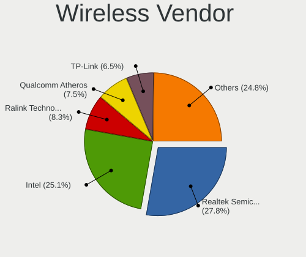

| Vendor                                | Desktops | Percent |
|---------------------------------------|----------|---------|
| Realtek Semiconductor                 | 660      | 27.78%  |
| Intel                                 | 596      | 25.08%  |
| Ralink Technology                     | 197      | 8.29%   |
| Qualcomm Atheros                      | 179      | 7.53%   |
| TP-Link                               | 154      | 6.48%   |
| MediaTek                              | 99       | 4.17%   |
| Broadcom                              | 93       | 3.91%   |
| Ralink                                | 83       | 3.49%   |
| NetGear                               | 44       | 1.85%   |
| D-Link                                | 39       | 1.64%   |
| Microsoft                             | 33       | 1.39%   |
| Qualcomm Atheros Communications       | 30       | 1.26%   |
| D-Link System                         | 21       | 0.88%   |
| ASUSTek Computer                      | 21       | 0.88%   |
| Edimax Technology                     | 16       | 0.67%   |
| Broadcom Limited                      | 14       | 0.59%   |
| Linksys                               | 11       | 0.46%   |
| Belkin Components                     | 10       | 0.42%   |
| 802.11g Adapter [Linksys WUSB54GC v3] | 7        | 0.29%   |
| ZyXEL Communications                  | 6        | 0.25%   |
| Sitecom Europe                        | 6        | 0.25%   |
| Mercucys                              | 6        | 0.25%   |
| Gemtek                                | 6        | 0.25%   |
| Marvell Technology Group              | 5        | 0.21%   |
| AVM                                   | 5        | 0.21%   |
| Realtek                               | 4        | 0.17%   |
| IMC Networks                          | 4        | 0.17%   |
| Qualcomm Technologies                 | 3        | 0.13%   |
| Micro Star International              | 3        | 0.13%   |
| ZyDAS                                 | 2        | 0.08%   |
| TRENDnet                              | 2        | 0.08%   |
| Senao                                 | 2        | 0.08%   |
| Philips (or NXP)                      | 2        | 0.08%   |
| BUFFALO                               | 2        | 0.08%   |
| ZTopInc                               | 1        | 0.04%   |
| Xiaomi                                | 1        | 0.04%   |
| Wilocity                              | 1        | 0.04%   |
| Tenda                                 | 1        | 0.04%   |
| Sweex                                 | 1        | 0.04%   |
| Sierra Wireless                       | 1        | 0.04%   |

Wireless Model
--------------

Wireless models

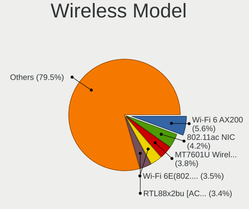

| Model                                                                | Desktops | Percent |
|----------------------------------------------------------------------|----------|---------|
| Intel Wi-Fi 6 AX200                                                  | 136      | 5.63%   |
| Realtek 802.11ac NIC                                                 | 101      | 4.18%   |
| Ralink MT7601U Wireless Adapter                                      | 92       | 3.81%   |
| Intel Wi-Fi 6E(802.11ax) AX210/AX1675* 2x2 [Typhoon Peak]            | 84       | 3.48%   |
| Realtek RTL88x2bu [AC1200 Techkey]                                   | 82       | 3.4%    |
| Realtek RTL8188EUS 802.11n Wireless Network Adapter                  | 65       | 2.69%   |
| Realtek RTL8821CE 802.11ac PCIe Wireless Network Adapter             | 64       | 2.65%   |
| Intel Dual Band Wireless-AC 3168NGW [Stone Peak]                     | 52       | 2.15%   |
| Intel Wi-Fi 5(802.11ac) Wireless-AC 9x6x [Thunder Peak]              | 43       | 1.78%   |
| Intel Wireless 7265                                                  | 41       | 1.7%    |
| Realtek RTL8188FTV 802.11b/g/n 1T1R 2.4G WLAN Adapter                | 37       | 1.53%   |
| Intel Wireless 7260                                                  | 37       | 1.53%   |
| Ralink RT5370 Wireless Adapter                                       | 36       | 1.49%   |
| TP-Link TL-WN823N v2/v3 [Realtek RTL8192EU]                          | 35       | 1.45%   |
| Broadcom BCM4360 802.11ac Dual Band Wireless Network Adapter         | 35       | 1.45%   |
| Qualcomm Atheros AR9485 Wireless Network Adapter                     | 34       | 1.41%   |
| Realtek RTL8192EU 802.11b/g/n WLAN Adapter                           | 32       | 1.33%   |
| Realtek RTL8192EE PCIe Wireless Network Adapter                      | 32       | 1.33%   |
| MediaTek MT7922 802.11ax PCI Express Wireless Network Adapter        | 32       | 1.33%   |
| Ralink RT2870/RT3070 Wireless Adapter                                | 30       | 1.24%   |
| Intel 700 Series Chipset CNVi WiFi                                   | 28       | 1.16%   |
| Qualcomm Atheros AR9271 802.11n                                      | 25       | 1.04%   |
| Intel Wireless 3165                                                  | 23       | 0.95%   |
| Intel Cannon Lake PCH CNVi WiFi                                      | 23       | 0.95%   |
| MediaTek MT7921K (RZ608) Wi-Fi 6E 80MHz                              | 21       | 0.87%   |
| TP-Link TL-WN722N v2/v3 [Realtek RTL8188EUS]                         | 20       | 0.83%   |
| TP-Link AC600 wireless Realtek RTL8811AU [Archer T2U Nano]           | 20       | 0.83%   |
| Realtek RTL8821AE 802.11ac PCIe Wireless Network Adapter             | 18       | 0.75%   |
| Realtek RTL8192CU 802.11n WLAN Adapter                               | 18       | 0.75%   |
| Realtek RTL8188EE Wireless Network Adapter                           | 18       | 0.75%   |
| Qualcomm Atheros QCA9565 / AR9565 Wireless Network Adapter           | 18       | 0.75%   |
| Intel Alder Lake-S PCH CNVi WiFi                                     | 18       | 0.75%   |
| Realtek RTL8188CUS 802.11n WLAN Adapter                              | 17       | 0.7%    |
| Qualcomm Atheros AR9462 Wireless Network Adapter                     | 17       | 0.7%    |
| Ralink RT5390 Wireless 802.11n 1T/1R PCIe                            | 16       | 0.66%   |
| Qualcomm Atheros AR9227 Wireless Network Adapter                     | 16       | 0.66%   |
| MediaTek MT7921 802.11ax PCIe Wireless Network Adapter [Filogic 330] | 16       | 0.66%   |
| Realtek RTL8852CE PCIe 802.11ax Wireless Network Controller          | 15       | 0.62%   |
| Realtek RTL8188CE 802.11b/g/n WiFi Adapter                           | 15       | 0.62%   |
| Intel Wireless 8260                                                  | 15       | 0.62%   |

Ethernet Vendor
---------------

Ethernet vendors

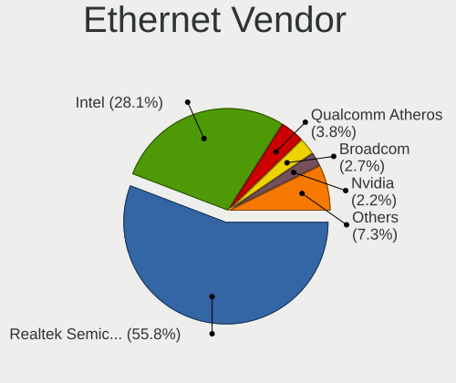

| Vendor                            | Desktops | Percent |
|-----------------------------------|----------|---------|
| Realtek Semiconductor             | 2539     | 55.81%  |
| Intel                             | 1280     | 28.14%  |
| Qualcomm Atheros                  | 175      | 3.85%   |
| Broadcom                          | 123      | 2.7%    |
| Nvidia                            | 101      | 2.22%   |
| Samsung Electronics               | 40       | 0.88%   |
| Marvell Technology Group          | 36       | 0.79%   |
| Broadcom Limited                  | 30       | 0.66%   |
| Xiaomi                            | 28       | 0.62%   |
| VIA Technologies                  | 24       | 0.53%   |
| Aquantia                          | 24       | 0.53%   |
| ASIX Electronics                  | 23       | 0.51%   |
| MediaTek                          | 21       | 0.46%   |
| Huawei Technologies               | 13       | 0.29%   |
| DisplayLink                       | 12       | 0.26%   |
| Qualcomm Technologies             | 11       | 0.24%   |
| OPPO Electronics                  | 8        | 0.18%   |
| Motorola PCS                      | 8        | 0.18%   |
| D-Link System                     | 8        | 0.18%   |
| Silicon Integrated Systems [SiS]  | 6        | 0.13%   |
| Qualcomm                          | 5        | 0.11%   |
| TP-Link                           | 4        | 0.09%   |
| Sundance Technology Inc / IC Plus | 4        | 0.09%   |
| Google                            | 3        | 0.07%   |
| Apple                             | 3        | 0.07%   |
| ZTE WCDMA Technologies MSM        | 2        | 0.04%   |
| JMicron Technology                | 2        | 0.04%   |
| ICS Advent                        | 2        | 0.04%   |
| ASUSTek Computer                  | 2        | 0.04%   |
| 3Com                              | 2        | 0.04%   |
| vivo                              | 1        | 0.02%   |
| T & A Mobile Phones               | 1        | 0.02%   |
| Research In Motion                | 1        | 0.02%   |
| Panini                            | 1        | 0.02%   |
| NetXen Incorporated               | 1        | 0.02%   |
| Mellanox Technologies             | 1        | 0.02%   |
| Lenovo                            | 1        | 0.02%   |
| HMD Global                        | 1        | 0.02%   |
| GCT Semiconductor                 | 1        | 0.02%   |
| Accton Technology                 | 1        | 0.02%   |

Ethernet Model
--------------

Ethernet models

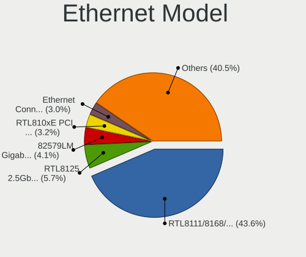

| Model                                                                  | Desktops | Percent |
|------------------------------------------------------------------------|----------|---------|
| Realtek RTL8111/8168/8211/8411 PCI Express Gigabit Ethernet Controller | 2045     | 43.56%  |
| Realtek RTL8125 2.5GbE Controller                                      | 266      | 5.67%   |
| Intel 82579LM Gigabit Network Connection (Lewisville)                  | 191      | 4.07%   |
| Realtek RTL810xE PCI Express Fast Ethernet controller                  | 149      | 3.17%   |
| Intel Ethernet Connection I217-LM                                      | 142      | 3.02%   |
| Intel I211 Gigabit Network Connection                                  | 130      | 2.77%   |
| Intel Ethernet Connection (2) I219-V                                   | 118      | 2.51%   |
| Intel Ethernet Controller I225-V                                       | 101      | 2.15%   |
| Intel 82579V Gigabit Network Connection                                | 66       | 1.41%   |
| Nvidia MCP61 Ethernet                                                  | 61       | 1.3%    |
| Intel Ethernet Connection I217-V                                       | 56       | 1.19%   |
| Intel Ethernet Connection (2) I219-LM                                  | 54       | 1.15%   |
| Intel 82567LM-3 Gigabit Network Connection                             | 51       | 1.09%   |
| Intel Ethernet Controller I226-V                                       | 44       | 0.94%   |
| Intel Ethernet Connection (2) I218-V                                   | 40       | 0.85%   |
| Intel Ethernet Connection (7) I219-V                                   | 36       | 0.77%   |
| Realtek RTL-8100/8101L/8139 PCI Fast Ethernet Adapter                  | 34       | 0.72%   |
| Qualcomm Atheros AR8151 v2.0 Gigabit Ethernet                          | 33       | 0.7%    |
| Realtek RTL8153 Gigabit Ethernet Adapter                               | 32       | 0.68%   |
| Samsung Galaxy series, misc. (tethering mode)                          | 30       | 0.64%   |
| Intel 82574L Gigabit Network Connection                                | 29       | 0.62%   |
| Intel 82566DM-2 Gigabit Network Connection                             | 27       | 0.58%   |
| Broadcom NetXtreme BCM5761 Gigabit Ethernet PCIe                       | 27       | 0.58%   |
| Qualcomm Atheros Killer E220x Gigabit Ethernet Controller              | 24       | 0.51%   |
| Realtek RTL8169 PCI Gigabit Ethernet Controller                        | 22       | 0.47%   |
| Xiaomi Mi/Redmi series (RNDIS)                                         | 20       | 0.43%   |
| Qualcomm Atheros AR8161 Gigabit Ethernet                               | 19       | 0.4%    |
| Marvell Group 88E8056 PCI-E Gigabit Ethernet Controller                | 19       | 0.4%    |
| Realtek RTL8852BE PCIe 802.11ax Wireless Network Controller            | 18       | 0.38%   |
| Intel Ethernet Connection (5) I219-LM                                  | 18       | 0.38%   |
| Broadcom NetLink BCM57780 Gigabit Ethernet PCIe                        | 18       | 0.38%   |
| ASIX AX88179 Gigabit Ethernet                                          | 18       | 0.38%   |
| VIA VT6102/VT6103 [Rhine-II]                                           | 17       | 0.36%   |
| Qualcomm Atheros AR8121/AR8113/AR8114 Gigabit or Fast Ethernet         | 17       | 0.36%   |
| Intel Ethernet Connection (14) I219-V                                  | 17       | 0.36%   |
| Intel Ethernet Connection (7) I219-LM                                  | 16       | 0.34%   |
| Qualcomm Atheros Attansic L1 Gigabit Ethernet                          | 15       | 0.32%   |
| Nvidia MCP73 Ethernet                                                  | 15       | 0.32%   |
| Intel 82578DM Gigabit Network Connection                               | 15       | 0.32%   |
| Intel 82578DC Gigabit Network Connection                               | 15       | 0.32%   |

Net Controller Kind
-------------------

Ethernet, WiFi or modem

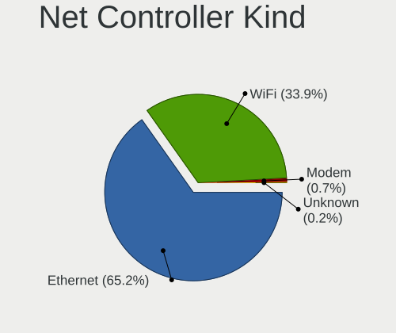

| Kind     | Desktops | Percent |
|----------|----------|---------|
| Ethernet | 4184     | 65.19%  |
| WiFi     | 2178     | 33.94%  |
| Modem    | 42       | 0.65%   |
| Unknown  | 14       | 0.22%   |

Used Controller
---------------

Currently used network controller

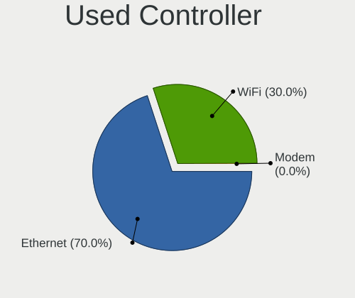

| Kind     | Desktops | Percent |
|----------|----------|---------|
| Ethernet | 3098     | 69.98%  |
| WiFi     | 1326     | 29.95%  |
| Unknown  | 2        | 0.05%   |
| Modem    | 1        | 0.02%   |

NICs
----

Total network controllers on board

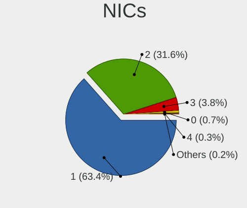

| Total | Desktops | Percent |
|-------|----------|---------|
| 1     | 2698     | 63.44%  |
| 2     | 1343     | 31.58%  |
| 3     | 163      | 3.83%   |
| 0     | 28       | 0.66%   |
| 4     | 13       | 0.31%   |
| 5     | 7        | 0.16%   |
| 7     | 1        | 0.02%   |

IPv6
----

IPv6 vs IPv4

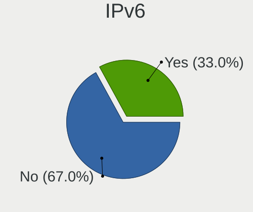

| Used | Desktops | Percent |
|------|----------|---------|
| No   | 2879     | 67.03%  |
| Yes  | 1416     | 32.97%  |

Bluetooth
---------

Bluetooth Vendor
----------------

Controller vendors

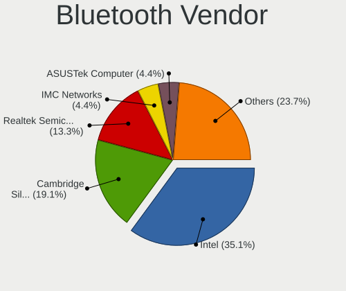

| Vendor                          | Desktops | Percent |
|---------------------------------|----------|---------|
| Intel                           | 540      | 35.09%  |
| Cambridge Silicon Radio         | 294      | 19.1%   |
| Realtek Semiconductor           | 205      | 13.32%  |
| IMC Networks                    | 68       | 4.42%   |
| ASUSTek Computer                | 67       | 4.35%   |
| Broadcom                        | 64       | 4.16%   |
| MediaTek                        | 57       | 3.7%    |
| Qualcomm Atheros Communications | 54       | 3.51%   |
| TP-Link                         | 35       | 2.27%   |
| Foxconn / Hon Hai               | 35       | 2.27%   |
| Apple                           | 16       | 1.04%   |
| Unknown                         | 14       | 0.91%   |
| Actions                         | 12       | 0.78%   |
| Integrated System Solution      | 10       | 0.65%   |
| Dynex                           | 9        | 0.58%   |
| Realtek                         | 8        | 0.52%   |
| Lite-On Technology              | 8        | 0.52%   |
| Micro Star International        | 6        | 0.39%   |
| Belkin Components               | 6        | 0.39%   |
| Edimax Technology               | 5        | 0.32%   |
| Hewlett-Packard                 | 4        | 0.26%   |
| SiW                             | 2        | 0.13%   |
| Mercucys                        | 2        | 0.13%   |
| Logitech                        | 2        | 0.13%   |
| Kensington                      | 2        | 0.13%   |
| Dell                            | 2        | 0.13%   |
| AICSemi                         | 2        | 0.13%   |
| Sitecom Europe                  | 1        | 0.06%   |
| Roper                           | 1        | 0.06%   |
| Ralink                          | 1        | 0.06%   |
| Qcom                            | 1        | 0.06%   |
| National Semiconductor          | 1        | 0.06%   |
| Mobile Action Technology        | 1        | 0.06%   |
| Marvell Semiconductor           | 1        | 0.06%   |
| i.Tech Dynamic Limited          | 1        | 0.06%   |
| Fujitsu                         | 1        | 0.06%   |
| D-Link System                   | 1        | 0.06%   |

Bluetooth Model
---------------

Controller models

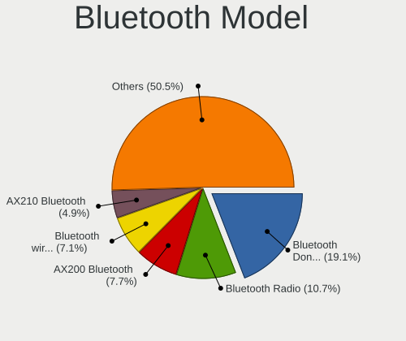

| Model                                                    | Desktops | Percent |
|----------------------------------------------------------|----------|---------|
| Cambridge Silicon Radio Bluetooth Dongle (HCI mode)      | 294      | 19.1%   |
| Realtek Bluetooth Radio                                  | 164      | 10.66%  |
| Intel AX200 Bluetooth                                    | 118      | 7.67%   |
| Intel Bluetooth wireless interface                       | 110      | 7.15%   |
| Intel AX210 Bluetooth                                    | 76       | 4.94%   |
| MediaTek Wireless_Device                                 | 57       | 3.7%    |
| Intel AX201 Bluetooth                                    | 56       | 3.64%   |
| Intel Wireless-AC 3168 Bluetooth                         | 49       | 3.18%   |
| Intel Bluetooth Device                                   | 44       | 2.86%   |
| Intel Wireless-AC 9260 Bluetooth Adapter                 | 43       | 2.79%   |
| TP-Link TP-T@- UB500 Adapter                             | 35       | 2.27%   |
| IMC Networks Bluetooth Radio                             | 35       | 2.27%   |
| Intel Bluetooth 9460/9560 Jefferson Peak (JfP)           | 30       | 1.95%   |
| IMC Networks Wireless_Device                             | 27       | 1.75%   |
| Broadcom BCM20702A0 Bluetooth 4.0                        | 23       | 1.49%   |
| ASUS Broadcom BCM20702A0 Bluetooth                       | 19       | 1.23%   |
| ASUS ASUS USB-BT500                                      | 19       | 1.23%   |
| Foxconn / Hon Hai Bluetooth Device                       | 18       | 1.17%   |
| Qualcomm Atheros  Bluetooth Device                       | 16       | 1.04%   |
| Qualcomm Atheros AR3011 Bluetooth                        | 16       | 1.04%   |
| Realtek  Bluetooth 4.2 Adapter                           | 15       | 0.97%   |
| Unknown                                                  | 14       | 0.91%   |
| Intel Centrino Bluetooth Wireless Transceiver            | 13       | 0.84%   |
| Foxconn / Hon Hai Wireless_Device                        | 13       | 0.84%   |
| Actions general adapter                                  | 12       | 0.78%   |
| ASUS Bluetooth Radio                                     | 10       | 0.65%   |
| Apple Bluetooth Host Controller                          | 10       | 0.65%   |
| Realtek Bluetooth 5.4 Radio                              | 9        | 0.58%   |
| Dynex Bluetooth 4.0 Adapter [Broadcom, 1.12, BCM20702A0] | 9        | 0.58%   |
| Realtek Bluetooth Radio                                  | 8        | 0.52%   |
| Qualcomm Atheros AR9462 Bluetooth                        | 8        | 0.52%   |
| Realtek RTL8821A Bluetooth                               | 6        | 0.39%   |
| Realtek Bluetooth 5.3 Radio                              | 6        | 0.39%   |
| Qualcomm Atheros Bluetooth USB Host Controller           | 6        | 0.39%   |
| Lite-On Bluetooth Device                                 | 5        | 0.32%   |
| Integrated System Solution KY-BT100 Bluetooth Adapter    | 5        | 0.32%   |
| Integrated System Solution Bluetooth Device              | 5        | 0.32%   |
| Edimax Bluetooth Device                                  | 5        | 0.32%   |
| Belkin Components F8T065BF Mini Bluetooth 4.0 Adapter    | 5        | 0.32%   |
| ASUS Qualcomm Bluetooth 4.1                              | 5        | 0.32%   |

Sound
-----

Sound Vendor
------------

Sound card vendors

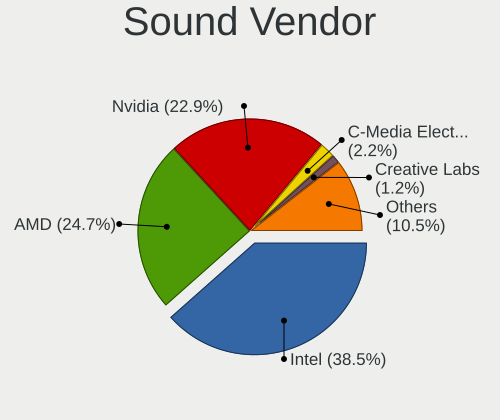

| Vendor                                       | Desktops | Percent |
|----------------------------------------------|----------|---------|
| Intel                                        | 2746     | 38.46%  |
| AMD                                          | 1763     | 24.69%  |
| Nvidia                                       | 1635     | 22.9%   |
| C-Media Electronics                          | 158      | 2.21%   |
| Creative Labs                                | 87       | 1.22%   |
| Logitech                                     | 43       | 0.6%    |
| ASUSTek Computer                             | 43       | 0.6%    |
| JMTek                                        | 38       | 0.53%   |
| VIA Technologies                             | 31       | 0.43%   |
| Micro Star International                     | 29       | 0.41%   |
| Zoran Co. Personal Media Division (Nogatech) | 27       | 0.38%   |
| Texas Instruments                            | 27       | 0.38%   |
| Kingston Technology                          | 26       | 0.36%   |
| Razer USA                                    | 25       | 0.35%   |
| Jieli Technology                             | 23       | 0.32%   |
| GN Netcom                                    | 23       | 0.32%   |
| Generalplus Technology                       | 23       | 0.32%   |
| Plantronics                                  | 20       | 0.28%   |
| Creative Technology                          | 19       | 0.27%   |
| SteelSeries ApS                              | 17       | 0.24%   |
| KTMicro                                      | 15       | 0.21%   |
| Tenx Technology                              | 14       | 0.2%    |
| Focusrite-Novation                           | 12       | 0.17%   |
| Thesycon Systemsoftware & Consulting         | 11       | 0.15%   |
| Realtek Semiconductor                        | 11       | 0.15%   |
| Hewlett-Packard                              | 11       | 0.15%   |
| Corsair                                      | 10       | 0.14%   |
| Unknown                                      | 9        | 0.13%   |
| BEHRINGER International                      | 8        | 0.11%   |
| Asahi Kasei Microsystems                     | 8        | 0.11%   |
| Trust                                        | 7        | 0.1%    |
| Silicon Integrated Systems [SiS]             | 7        | 0.1%    |
| RODE Microphones                             | 7        | 0.1%    |
| Dell                                         | 6        | 0.08%   |
| Astro Gaming                                 | 6        | 0.08%   |
| Yamaha                                       | 5        | 0.07%   |
| Walmart                                      | 5        | 0.07%   |
| Sony                                         | 5        | 0.07%   |
| PreSonus Audio Electronics                   | 5        | 0.07%   |
| DSEA A/S                                     | 5        | 0.07%   |

Sound Model
-----------

Sound card models

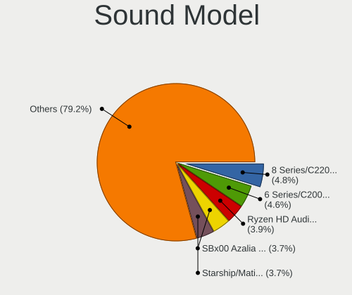

| Model                                                                             | Desktops | Percent |
|-----------------------------------------------------------------------------------|----------|---------|
| Intel 8 Series/C220 Series Chipset High Definition Audio Controller               | 404      | 4.84%   |
| Intel 6 Series/C200 Series Chipset Family High Definition Audio Controller        | 386      | 4.62%   |
| AMD Ryzen HD Audio Controller                                                     | 325      | 3.89%   |
| AMD SBx00 Azalia (Intel HDA)                                                      | 312      | 3.73%   |
| AMD Starship/Matisse HD Audio Controller                                          | 308      | 3.69%   |
| Intel Xeon E3-1200 v3/4th Gen Core Processor HD Audio Controller                  | 269      | 3.22%   |
| Intel NM10/ICH7 Family High Definition Audio Controller                           | 238      | 2.85%   |
| Intel 7 Series/C216 Chipset Family High Definition Audio Controller               | 230      | 2.75%   |
| Intel 100 Series/C230 Series Chipset Family HD Audio Controller                   | 203      | 2.43%   |
| AMD Ellesmere HDMI Audio [Radeon RX 470/480 / 570/580/590]                        | 183      | 2.19%   |
| Nvidia GK208 HDMI/DP Audio Controller                                             | 182      | 2.18%   |
| Intel 200 Series PCH HD Audio                                                     | 164      | 1.96%   |
| AMD FCH Azalia Controller                                                         | 146      | 1.75%   |
| AMD Family 17h (Models 00h-0fh) HD Audio Controller                               | 133      | 1.59%   |
| AMD Renoir/Cezanne HDMI/DP Audio Controller                                       | 119      | 1.42%   |
| Intel 82801JI (ICH10 Family) HD Audio Controller                                  | 115      | 1.38%   |
| Intel 5 Series/3400 Series Chipset High Definition Audio                          | 115      | 1.38%   |
| Nvidia GP107GL High Definition Audio Controller                                   | 111      | 1.33%   |
| Intel Cannon Lake PCH cAVS                                                        | 107      | 1.28%   |
| AMD Oland/Hainan/Cape Verde/Pitcairn HDMI Audio [Radeon HD 7000 Series]           | 107      | 1.28%   |
| AMD Radeon High Definition Audio Controller                                       | 103      | 1.23%   |
| AMD Navi 21/23 HDMI/DP Audio Controller                                           | 100      | 1.2%    |
| Nvidia High Definition Audio Controller                                           | 88       | 1.05%   |
| Nvidia GF119 HDMI Audio Controller                                                | 85       | 1.02%   |
| Nvidia GM107 High Definition Audio Controller [GeForce 940MX]                     | 82       | 0.98%   |
| Nvidia TU116 High Definition Audio Controller                                     | 80       | 0.96%   |
| AMD Raven/Raven2/Fenghuang HDMI/DP Audio Controller                               | 79       | 0.95%   |
| Intel 82801I (ICH9 Family) HD Audio Controller                                    | 77       | 0.92%   |
| Nvidia GF108 High Definition Audio Controller                                     | 75       | 0.9%    |
| Intel 9 Series Chipset Family HD Audio Controller                                 | 74       | 0.89%   |
| AMD Caicos HDMI Audio [Radeon HD 6450 / 7450/8450/8490 OEM / R5 230/235/235X OEM] | 73       | 0.87%   |
| Intel Alder Lake-S HD Audio Controller                                            | 70       | 0.84%   |
| Nvidia GA104 High Definition Audio Controller                                     | 66       | 0.79%   |
| Nvidia MCP61 High Definition Audio                                                | 65       | 0.78%   |
| Nvidia GA106 High Definition Audio Controller                                     | 63       | 0.75%   |
| AMD Cedar HDMI Audio [Radeon HD 5400/6300/7300 Series]                            | 63       | 0.75%   |
| Nvidia GP106 High Definition Audio Controller                                     | 61       | 0.73%   |
| AMD Baffin HDMI/DP Audio [Radeon RX 550 640SP / RX 560/560X]                      | 60       | 0.72%   |
| Nvidia GP104 High Definition Audio Controller                                     | 58       | 0.69%   |
| Intel Raptor Lake High Definition Audio Controller                                | 56       | 0.67%   |

Memory
------

Memory Vendor
-------------

Memory module vendors

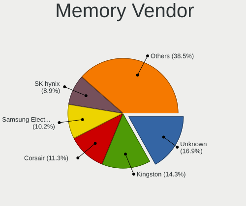

| Vendor              | Desktops | Percent |
|---------------------|----------|---------|
| Unknown             | 93       | 16.88%  |
| Kingston            | 79       | 14.34%  |
| Corsair             | 62       | 11.25%  |
| Samsung Electronics | 56       | 10.16%  |
| SK hynix            | 49       | 8.89%   |
| Crucial             | 46       | 8.35%   |
| G.Skill             | 44       | 7.99%   |
| Micron Technology   | 23       | 4.17%   |
| Team                | 17       | 3.09%   |
| A-DATA Technology   | 12       | 2.18%   |
| Elpida              | 8        | 1.45%   |
| Unknown             | 7        | 1.27%   |
| Patriot             | 5        | 0.91%   |
| Nanya Technology    | 5        | 0.91%   |
| Unifosa             | 4        | 0.73%   |
| Ramaxel Technology  | 4        | 0.73%   |
| Transcend           | 3        | 0.54%   |
| Avant               | 3        | 0.54%   |
| Wilk                | 2        | 0.36%   |
| Unknown (0x0E9D)    | 2        | 0.36%   |
| Smart               | 2        | 0.36%   |
| Qimonda             | 2        | 0.36%   |
| V-GEN               | 1        | 0.18%   |
| Unknown (C289)      | 1        | 0.18%   |
| Unknown (B608)      | 1        | 0.18%   |
| Unknown (ABCD)      | 1        | 0.18%   |
| Unknown (0x8551)    | 1        | 0.18%   |
| Unknown (0x0B45)    | 1        | 0.18%   |
| Unknown (0x0B38)    | 1        | 0.18%   |
| Unknown (0B85)      | 1        | 0.18%   |
| Timetec             | 1        | 0.18%   |
| SUPER KINGSTEK      | 1        | 0.18%   |
| Ramos Technology    | 1        | 0.18%   |
| PNY                 | 1        | 0.18%   |
| Patriot Memory      | 1        | 0.18%   |
| Neo Forza           | 1        | 0.18%   |
| Multilaser          | 1        | 0.18%   |
| Juhor               | 1        | 0.18%   |
| Goldkey             | 1        | 0.18%   |
| Golden Empire       | 1        | 0.18%   |

Memory Model
------------

Memory module models

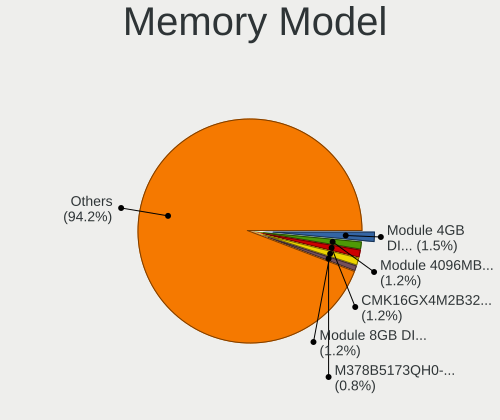

| Model                                                  | Desktops | Percent |
|--------------------------------------------------------|----------|---------|
| Unknown RAM Module 4GB DIMM DDR3 1333MT/s              | 9        | 1.5%    |
| Unknown RAM Module 4096MB DIMM DDR3 1333MT/s           | 7        | 1.16%   |
| Corsair RAM CMK16GX4M2B3200C16 8GB DIMM DDR4 3600MT/s  | 7        | 1.16%   |
| Unknown                                                | 7        | 1.16%   |
| SK hynix RAM HMT351U6CFR8C-PB 4GB DIMM DDR3 1800MT/s   | 5        | 0.83%   |
| Samsung RAM M378B5173QH0-CK0 4GB DIMM DDR3             | 5        | 0.83%   |
| G.Skill RAM F4-3200C16-16GVK 16GB DIMM DDR4 3600MT/s   | 5        | 0.83%   |
| Unknown RAM Module 1GB DIMM SDRAM                      | 4        | 0.66%   |
| Micron RAM 8JTF51264AZ-1G6E1 4GB DIMM DDR3 1600MT/s    | 4        | 0.66%   |
| Kingston RAM KHX3200C16D4/8GX 8GB DIMM DDR4 3733MT/s   | 4        | 0.66%   |
| Kingston RAM KF3200C16D4/16GX 16GB DIMM DDR4 3733MT/s  | 4        | 0.66%   |
| G.Skill RAM F4-3200C16-8GVKB 8GB DIMM DDR4 4000MT/s    | 4        | 0.66%   |
| G.Skill RAM F4-3200C16-8GIS 8GB DIMM DDR4 3600MT/s     | 4        | 0.66%   |
| G.Skill RAM F4-3200C16-16GTZR 16GB DIMM DDR4 3600MT/s  | 4        | 0.66%   |
| G.Skill RAM F4-3000C16-8GISB 8GB DIMM DDR4 3200MT/s    | 4        | 0.66%   |
| Crucial RAM BLS8G3D1609DS1S00. 8GB DIMM DDR3 1800MT/s  | 4        | 0.66%   |
| Unknown RAM Module 4GB DIMM 1333MT/s                   | 3        | 0.5%    |
| Unknown RAM Module 2GB DIMM 800MT/s                    | 3        | 0.5%    |
| Unknown RAM Module 2GB DIMM 667MT/s                    | 3        | 0.5%    |
| Unknown RAM Module 1024MB DIMM SDRAM                   | 3        | 0.5%    |
| Team RAM TEAMGROUP-UD4-3200 8GB DIMM DDR4 3733MT/s     | 3        | 0.5%    |
| Team RAM TEAMGROUP-UD4-2666 8GB DIMM DDR4 3000MT/s     | 3        | 0.5%    |
| SK hynix RAM HMT451U6BFR8C-PB 4GB DIMM DDR3 1600MT/s   | 3        | 0.5%    |
| SK hynix RAM HMT351U6CFR8C-H9 4GB DIMM DDR3 1600MT/s   | 3        | 0.5%    |
| Samsung RAM M378B1G73DB0-CK0 8GB DIMM DDR3 1600MT/s    | 3        | 0.5%    |
| Kingston RAM KHX2666C16/8G 8GiB DIMM DDR4 3466MT/s     | 3        | 0.5%    |
| Corsair RAM CMK32GX4M2E3200C16 16GB DIMM DDR4 3600MT/s | 3        | 0.5%    |
| Unknown RAM Module 8192MB DIMM DDR3 1333MT/s           | 2        | 0.33%   |
| Unknown RAM Module 4GB DIMM 400MT/s                    | 2        | 0.33%   |
| Unknown RAM Module 4GB DIMM                            | 2        | 0.33%   |
| Unknown RAM Module 4096MB DIMM DDR3 1600MT/s           | 2        | 0.33%   |
| Unknown RAM Module 4096MB DIMM 667MT/s                 | 2        | 0.33%   |
| Unknown RAM Module 4096MB DIMM                         | 2        | 0.33%   |
| Unknown RAM Module 2GB DIMM DDR2 800MT/s               | 2        | 0.33%   |
| Unknown RAM Module 2GB DIMM DDR2 667MT/s               | 2        | 0.33%   |
| Unknown RAM Module 2048MB DIMM SDRAM                   | 2        | 0.33%   |
| Unknown RAM Module 2048MB DIMM 800MT/s                 | 2        | 0.33%   |
| Unknown RAM Module 1GB DIMM DDR2                       | 2        | 0.33%   |
| Unknown RAM Module 1024MB DIMM DDR2 333MT/s            | 2        | 0.33%   |
| Unknown RAM Module 1024MB DIMM 800MT/s                 | 2        | 0.33%   |

Memory Kind
-----------

Memory module kinds

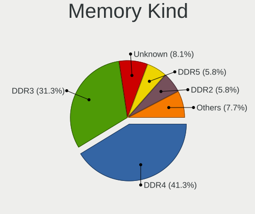

| Kind    | Desktops | Percent |
|---------|----------|---------|
| DDR4    | 199      | 41.29%  |
| DDR3    | 151      | 31.33%  |
| Unknown | 39       | 8.09%   |
| DDR5    | 28       | 5.81%   |
| DDR2    | 28       | 5.81%   |
| SDRAM   | 26       | 5.39%   |
| DDR     | 6        | 1.24%   |
| LPDDR4  | 3        | 0.62%   |
| DRAM    | 2        | 0.41%   |

Memory Form Factor
------------------

Physical design of the memory module

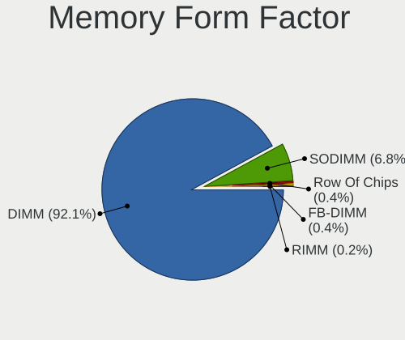

| Name         | Desktops | Percent |
|--------------|----------|---------|
| DIMM         | 431      | 92.09%  |
| SODIMM       | 32       | 6.84%   |
| Row Of Chips | 2        | 0.43%   |
| FB-DIMM      | 2        | 0.43%   |
| RIMM         | 1        | 0.21%   |

Memory Size
-----------

Memory module size

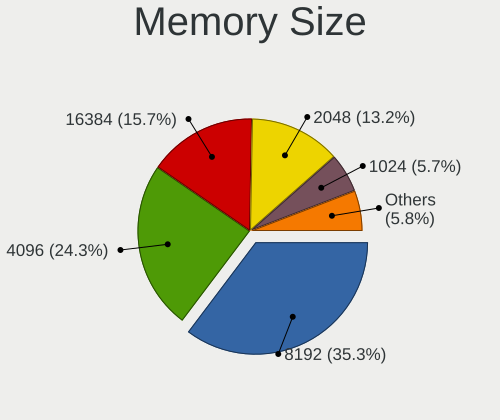

| Size  | Desktops | Percent |
|-------|----------|---------|
| 8192  | 187      | 35.28%  |
| 4096  | 129      | 24.34%  |
| 16384 | 83       | 15.66%  |
| 2048  | 70       | 13.21%  |
| 1024  | 30       | 5.66%   |
| 32768 | 28       | 5.28%   |
| 512   | 2        | 0.38%   |
| 49152 | 1        | 0.19%   |

Memory Speed
------------

Memory module speed

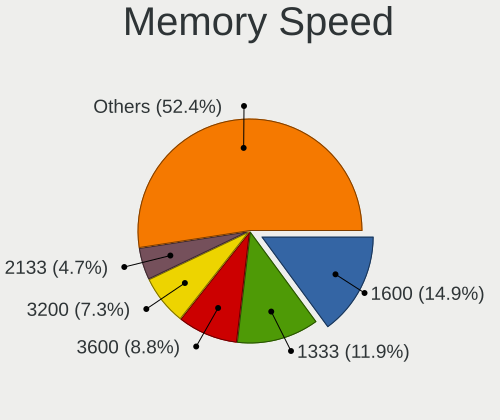

| Speed   | Desktops | Percent |
|---------|----------|---------|
| 1600    | 80       | 14.93%  |
| 1333    | 64       | 11.94%  |
| 3600    | 47       | 8.77%   |
| 3200    | 39       | 7.28%   |
| 2133    | 25       | 4.66%   |
| 2667    | 24       | 4.48%   |
| 2400    | 24       | 4.48%   |
| 800     | 22       | 4.1%    |
| Unknown | 19       | 3.54%   |
| 667     | 15       | 2.8%    |
| 3733    | 14       | 2.61%   |
| 1866    | 14       | 2.61%   |
| 1800    | 12       | 2.24%   |
| 3000    | 10       | 1.87%   |
| 6000    | 9        | 1.68%   |
| 2666    | 8        | 1.49%   |
| 1066    | 7        | 1.31%   |
| 4000    | 6        | 1.12%   |
| 3466    | 6        | 1.12%   |
| 5600    | 5        | 0.93%   |
| 4800    | 5        | 0.93%   |
| 3800    | 5        | 0.93%   |
| 3400    | 5        | 0.93%   |
| 1867    | 5        | 0.93%   |
| 400     | 5        | 0.93%   |
| 2933    | 4        | 0.75%   |
| 333     | 4        | 0.75%   |
| 6400    | 3        | 0.56%   |
| 5200    | 3        | 0.56%   |
| 2800    | 3        | 0.56%   |
| 2048    | 3        | 0.56%   |
| 49926   | 2        | 0.37%   |
| 3866    | 2        | 0.37%   |
| 3666    | 2        | 0.37%   |
| 3500    | 2        | 0.37%   |
| 3467    | 2        | 0.37%   |
| 2200    | 2        | 0.37%   |
| 1648    | 2        | 0.37%   |
| 533     | 2        | 0.37%   |
| 7000    | 1        | 0.19%   |

Printers & scanners
-------------------

Printer Vendor
--------------

Printer device vendors

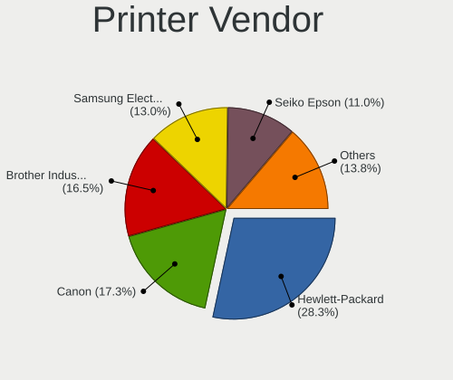

| Vendor                   | Desktops | Percent |
|--------------------------|----------|---------|
| Hewlett-Packard          | 72       | 28.35%  |
| Canon                    | 44       | 17.32%  |
| Brother Industries       | 42       | 16.54%  |
| Samsung Electronics      | 33       | 12.99%  |
| Seiko Epson              | 28       | 11.02%  |
| Dymo-CoStar              | 6        | 2.36%   |
| Pantum                   | 4        | 1.57%   |
| Lexmark International    | 4        | 1.57%   |
| Ricoh                    | 3        | 1.18%   |
| Prolific Technology      | 3        | 1.18%   |
| QinHeng Electronics      | 2        | 0.79%   |
| Kyocera                  | 2        | 0.79%   |
| Konica Minolta           | 2        | 0.79%   |
| Zhuhai Poskey Technology | 1        | 0.39%   |
| Zebra                    | 1        | 0.39%   |
| Toshiba TEC              | 1        | 0.39%   |
| STMicroelectronics       | 1        | 0.39%   |
| Printer                  | 1        | 0.39%   |
| Oki Data                 | 1        | 0.39%   |
| ICS Advent               | 1        | 0.39%   |
| GG IMAGE                 | 1        | 0.39%   |
| Beeprt Printer           | 1        | 0.39%   |

Printer Model
-------------

Printer device models

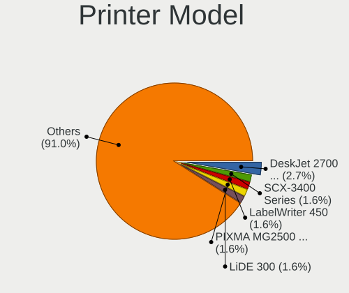

| Model                                        | Desktops | Percent |
|----------------------------------------------|----------|---------|
| HP DeskJet 2700 series                       | 7        | 2.73%   |
| Samsung SCX-3400 Series                      | 4        | 1.56%   |
| Dymo-CoStar LabelWriter 450                  | 4        | 1.56%   |
| Canon PIXMA MG2500 Series                    | 4        | 1.56%   |
| Canon LiDE 300                               | 4        | 1.56%   |
| Canon G3010 series                           | 4        | 1.56%   |
| Seiko Epson L3110 Series                     | 3        | 1.17%   |
| Samsung ML-216x Series Laser Printer         | 3        | 1.17%   |
| Samsung M2070 Series                         | 3        | 1.17%   |
| Prolific PL2305 Parallel Port                | 3        | 1.17%   |
| HP LaserJet Professional P1102w              | 3        | 1.17%   |
| HP ENVY 5000 series                          | 3        | 1.17%   |
| HP ENVY 4520 series                          | 3        | 1.17%   |
| Canon TS3100 series                          | 3        | 1.17%   |
| Canon LiDE 400                               | 3        | 1.17%   |
| Brother HL-52x0 series                       | 3        | 1.17%   |
| Seiko Epson XP-3100 Series                   | 2        | 0.78%   |
| Seiko Epson ME 320/330 Series [Stylus SX125] | 2        | 0.78%   |
| Seiko Epson L6270 Series                     | 2        | 0.78%   |
| Seiko Epson L355 Series                      | 2        | 0.78%   |
| Seiko Epson ET-4850 Series                   | 2        | 0.78%   |
| Seiko Epson ET-2710 Series                   | 2        | 0.78%   |
| Samsung SCX-4623 Series                      | 2        | 0.78%   |
| Samsung ML-2950 Series                       | 2        | 0.78%   |
| Samsung ML-2010P Mono Laser Printer          | 2        | 0.78%   |
| Samsung M2020 Series                         | 2        | 0.78%   |
| Samsung C460 Series                          | 2        | 0.78%   |
| QinHeng CH340S                               | 2        | 0.78%   |
| Pantum P2500W series                         | 2        | 0.78%   |
| HP Smart Tank 510 series                     | 2        | 0.78%   |
| HP OfficeJet 6950                            | 2        | 0.78%   |
| HP OfficeJet 4650 series                     | 2        | 0.78%   |
| HP LaserJet Professional P 1102w             | 2        | 0.78%   |
| HP LaserJet P2015 series                     | 2        | 0.78%   |
| HP LaserJet M109-M112                        | 2        | 0.78%   |
| HP HP LaserJet M101-M106                     | 2        | 0.78%   |
| HP DeskJet F2492 All-in-One                  | 2        | 0.78%   |
| HP Deskjet 3050A                             | 2        | 0.78%   |
| HP DeskJet 2130 series                       | 2        | 0.78%   |
| HP Color LaserJet CP1215                     | 2        | 0.78%   |

Scanner Vendor
--------------

Scanner device vendors

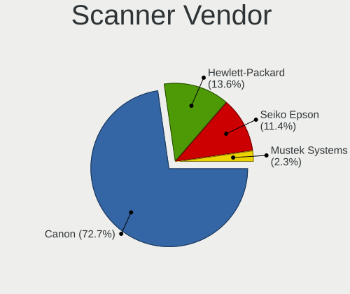

| Vendor          | Desktops | Percent |
|-----------------|----------|---------|
| Canon           | 32       | 72.73%  |
| Hewlett-Packard | 6        | 13.64%  |
| Seiko Epson     | 5        | 11.36%  |
| Mustek Systems  | 1        | 2.27%   |

Scanner Model
-------------

Scanner device models

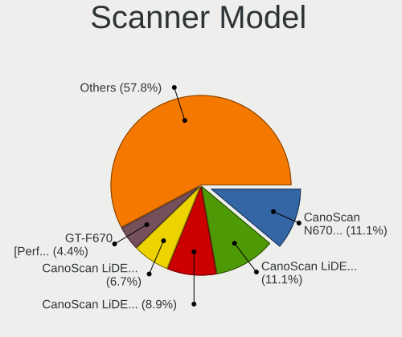

| Model                                       | Desktops | Percent |
|---------------------------------------------|----------|---------|
| Canon CanoScan N670U/N676U/LiDE 20          | 5        | 11.11%  |
| Canon CanoScan LiDE 210                     | 5        | 11.11%  |
| Canon CanoScan LiDE 220                     | 4        | 8.89%   |
| Canon CanoScan LiDE 110                     | 3        | 6.67%   |
| Seiko Epson GT-F670 [Perfection V200 Photo] | 2        | 4.44%   |
| Canon CanoScan LiDE 90                      | 2        | 4.44%   |
| Canon CanoScan LiDE 200                     | 2        | 4.44%   |
| Canon CanoScan LiDE 120                     | 2        | 4.44%   |
| Canon CanoScan LiDE 100                     | 2        | 4.44%   |
| Canon CanoScan 8800F                        | 2        | 4.44%   |
| Seiko Epson Scanner                         | 1        | 2.22%   |
| Seiko Epson GT-X750 [Perfection 4490 Photo] | 1        | 2.22%   |
| Seiko Epson GT-X700 [Perfection 4870]       | 1        | 2.22%   |
| Mustek Systems ScanExpress 1200 UB          | 1        | 2.22%   |
| HP Scanjet G2710                            | 1        | 2.22%   |
| HP ScanJet 5300c/5370c                      | 1        | 2.22%   |
| HP ScanJet 4370                             | 1        | 2.22%   |
| HP ScanJet 2400c                            | 1        | 2.22%   |
| HP Scanjet 200                              | 1        | 2.22%   |
| HP PSC 1200                                 | 1        | 2.22%   |
| Canon CanoScan LiDE 60                      | 1        | 2.22%   |
| Canon CanoScan LiDE 50/LiDE 35/LiDE 40      | 1        | 2.22%   |
| Canon CanoScan LIDE 25                      | 1        | 2.22%   |
| Canon CanoScan D660U                        | 1        | 2.22%   |
| Canon CanoScan 5600F                        | 1        | 2.22%   |
| Canon CanoScan 4400F                        | 1        | 2.22%   |

Camera
------

Camera Vendor
-------------

Camera device vendors

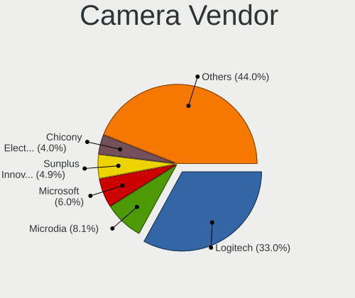

| Vendor                        | Desktops | Percent |
|-------------------------------|----------|---------|
| Logitech                      | 221      | 32.99%  |
| Microdia                      | 54       | 8.06%   |
| Microsoft                     | 40       | 5.97%   |
| Sunplus Innovation Technology | 33       | 4.93%   |
| Chicony Electronics           | 27       | 4.03%   |
| Apple                         | 22       | 3.28%   |
| Generalplus Technology        | 20       | 2.99%   |
| Samsung Electronics           | 15       | 2.24%   |
| Realtek Semiconductor         | 14       | 2.09%   |
| ARC International             | 14       | 2.09%   |
| Z-Star Microelectronics       | 12       | 1.79%   |
| Jieli Technology              | 12       | 1.79%   |
| Razer USA                     | 9        | 1.34%   |
| GEMBIRD                       | 9        | 1.34%   |
| Cubeternet                    | 8        | 1.19%   |
| MacroSilicon                  | 7        | 1.04%   |
| eMeet                         | 7        | 1.04%   |
| Creative Technology           | 7        | 1.04%   |
| webcam                        | 6        | 0.9%    |
| KYE Systems (Mouse Systems)   | 6        | 0.9%    |
| Anker PowerConf C200          | 6        | 0.9%    |
| A4Tech                        | 6        | 0.9%    |
| IMC Networks                  | 5        | 0.75%   |
| Genesys Logic                 | 5        | 0.75%   |
| AVerMedia Technologies        | 5        | 0.75%   |
| Trust                         | 4        | 0.6%    |
| SunplusIT                     | 4        | 0.6%    |
| Sonix Technology              | 4        | 0.6%    |
| Huawei Technologies           | 4        | 0.6%    |
| Guillemot                     | 4        | 0.6%    |
| Aveo Technology               | 4        | 0.6%    |
| Arkmicro Technologies         | 4        | 0.6%    |
| Xiongmai                      | 3        | 0.45%   |
| Tobii Technology AB           | 3        | 0.45%   |
| Suyin                         | 3        | 0.45%   |
| Lenovo                        | 3        | 0.45%   |
| Insta360                      | 3        | 0.45%   |
| Hewlett-Packard               | 3        | 0.45%   |
| WaveRider Communications      | 2        | 0.3%    |
| USB CAMERA                    | 2        | 0.3%    |

Camera Model
------------

Camera device models

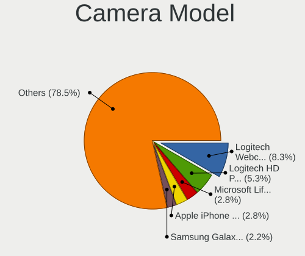

| Model                                     | Desktops | Percent |
|-------------------------------------------|----------|---------|
| Logitech Webcam C270                      | 56       | 8.32%   |
| Logitech HD Pro Webcam C920               | 36       | 5.35%   |
| Microsoft LifeCam HD-3000                 | 19       | 2.82%   |
| Apple iPhone 5/5C/5S/6/SE/7/8/X           | 19       | 2.82%   |
| Samsung Galaxy series, misc. (MTP mode)   | 15       | 2.23%   |
| ARC International Camera                  | 14       | 2.08%   |
| Microdia Webcam Vitade AF                 | 13       | 1.93%   |
| Microdia USB 2.0 Camera                   | 13       | 1.93%   |
| Logitech BRIO Ultra HD Webcam             | 12       | 1.78%   |
| Jieli USB PHY 2.0                         | 12       | 1.78%   |
| Sunplus Integrated Camera                 | 11       | 1.63%   |
| Logitech C920 PRO HD Webcam               | 11       | 1.63%   |
| Generalplus GENERAL WEBCAM                | 11       | 1.63%   |
| Chicony HP High Definition 1MP Webcam     | 11       | 1.63%   |
| Logitech HD Webcam C525                   | 10       | 1.49%   |
| Logitech C922 Pro Stream Webcam           | 10       | 1.49%   |
| Logitech Logitech Webcam C925e            | 9        | 1.34%   |
| Logitech HD Webcam C615                   | 9        | 1.34%   |
| Sunplus Full HD webcam                    | 8        | 1.19%   |
| Logitech Webcam C310                      | 8        | 1.19%   |
| Razer USA Gaming Webcam [Kiyo]            | 7        | 1.04%   |
| webcam webcam                             | 6        | 0.89%   |
| Anker PowerConf C200 Anker PowerConf C200 | 6        | 0.89%   |
| Realtek HP 1.0MP High Definition Webcam   | 5        | 0.74%   |
| Microsoft LifeCam VX-2000                 | 5        | 0.74%   |
| Microdia Integrated Camera                | 5        | 0.74%   |
| Microdia CyberTrack H7                    | 5        | 0.74%   |
| Logitech Webcam C930e                     | 5        | 0.74%   |
| Logitech StreamCam                        | 5        | 0.74%   |
| Logitech HD Webcam C910                   | 5        | 0.74%   |
| Logitech CrystalCam                       | 5        | 0.74%   |
| Generalplus 808 Camera #9 (web-cam mode)  | 5        | 0.74%   |
| GEMBIRD USB2.0 PC CAMERA                  | 5        | 0.74%   |
| Chicony CNF8050 Webcam                    | 5        | 0.74%   |
| Z-Star Venus USB2.0 Camera                | 4        | 0.59%   |
| Sunplus Aukey-PC-LM1E Camera              | 4        | 0.59%   |
| Realtek FULL HD 1080P Webcam              | 4        | 0.59%   |
| Microdia Sonix USB 2.0 Camera             | 4        | 0.59%   |
| Microdia Camera                           | 4        | 0.59%   |
| MacroSilicon USB Video                    | 4        | 0.59%   |

Security
--------

Fingerprint Vendor
------------------

Fingerprint sensor vendors

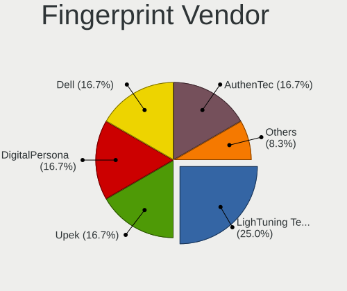

| Vendor                | Desktops | Percent |
|-----------------------|----------|---------|
| LighTuning Technology | 3        | 25%     |
| Upek                  | 2        | 16.67%  |
| DigitalPersona        | 2        | 16.67%  |
| Dell                  | 2        | 16.67%  |
| AuthenTec             | 2        | 16.67%  |
| Microsoft             | 1        | 8.33%   |

Fingerprint Model
-----------------

Fingerprint sensor models

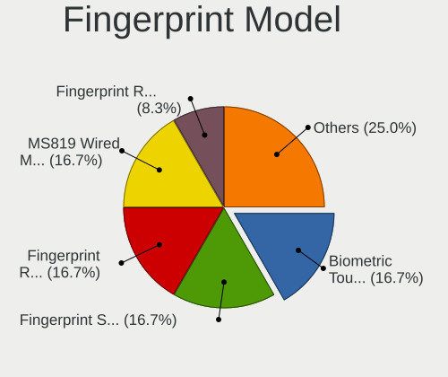

| Model                                                  | Desktops | Percent |
|--------------------------------------------------------|----------|---------|
| Upek Biometric Touchchip/Touchstrip Fingerprint Sensor | 2        | 16.67%  |
| LighTuning Fingerprint Sensor                          | 2        | 16.67%  |
| DigitalPersona Fingerprint Reader                      | 2        | 16.67%  |
| Dell MS819 Wired Mouse With Fingerprint Reader         | 2        | 16.67%  |
| Microsoft Fingerprint Reader                           | 1        | 8.33%   |
| LighTuning ES603 Swipe Fingerprint Sensor              | 1        | 8.33%   |
| AuthenTec AES2810                                      | 1        | 8.33%   |
| AuthenTec AES2501 Fingerprint Sensor                   | 1        | 8.33%   |

Chipcard Vendor
---------------

Chipcard module vendors

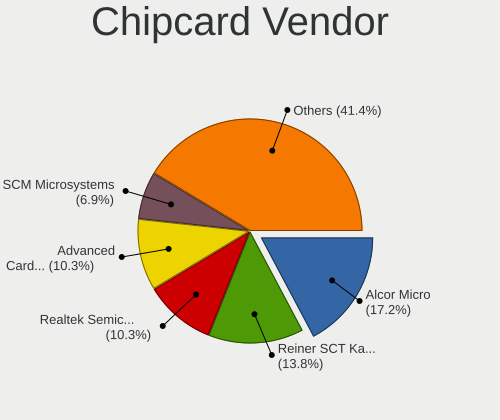

| Vendor                            | Desktops | Percent |
|-----------------------------------|----------|---------|
| Alcor Micro                       | 5        | 17.24%  |
| Reiner SCT Kartensysteme          | 4        | 13.79%  |
| Realtek Semiconductor             | 3        | 10.34%  |
| Advanced Card Systems             | 3        | 10.34%  |
| SCM Microsystems                  | 2        | 6.9%    |
| Gemalto (was Gemplus)             | 2        | 6.9%    |
| Chicony Electronics               | 2        | 6.9%    |
| VASCO Data Security International | 1        | 3.45%   |
| NXP Semiconductors                | 1        | 3.45%   |
| Lenovo                            | 1        | 3.45%   |
| Kobil Systems                     | 1        | 3.45%   |
| Jing-Mold Enterprise              | 1        | 3.45%   |
| Fujitsu Siemens Computers         | 1        | 3.45%   |
| Bit4id                            | 1        | 3.45%   |
| Aladdin Knowledge Systems         | 1        | 3.45%   |

Chipcard Model
--------------

Chipcard module models

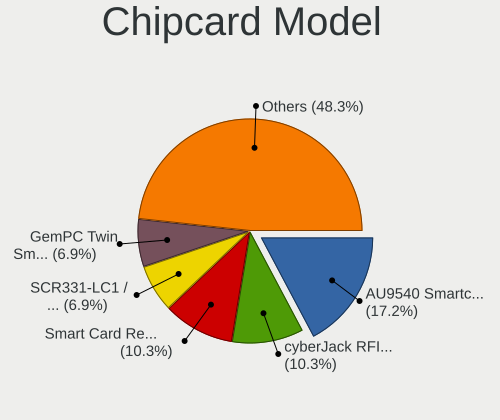

| Model                                                                      | Desktops | Percent |
|----------------------------------------------------------------------------|----------|---------|
| Alcor Micro AU9540 Smartcard Reader                                        | 5        | 17.24%  |
| Reiner SCT Kartensysteme cyberJack RFID basis contactless smartcard reader | 3        | 10.34%  |
| Realtek Semiconductor Smart Card Reader Interface                          | 3        | 10.34%  |
| SCM Microsystems SCR331-LC1 / SCR3310 SmartCard Reader                     | 2        | 6.9%    |
| Gemalto (was Gemplus) GemPC Twin SmartCard Reader                          | 2        | 6.9%    |
| Chicony Electronics HP Skylab USB Smartcard Keyboard                       | 2        | 6.9%    |
| Advanced Card Systems ACR39U                                               | 2        | 6.9%    |
| VASCO Data Security International Digipass 905 SmartCard Reader            | 1        | 3.45%   |
| Reiner SCT Kartensysteme cyberJack e-com/pinpad                            | 1        | 3.45%   |
| NXP Semiconductors HUSCR-NFC                                               | 1        | 3.45%   |
| Lenovo Smartcard Keyboard                                                  | 1        | 3.45%   |
| Kobil Systems KOBIL Class 3 Reader                                         | 1        | 3.45%   |
| Jing-Mold Enterprise HP USB Business Slim Smartcard CCID Keyboard          | 1        | 3.45%   |
| Fujitsu Siemens Computers SmartCard Reader 2A                              | 1        | 3.45%   |
| Bit4id miniLector EVO                                                      | 1        | 3.45%   |
| Aladdin Knowledge Systems Token JC                                         | 1        | 3.45%   |
| Advanced Card Systems ACR1281 1S Dual Reader                               | 1        | 3.45%   |

Unsupported
-----------

Unsupported Devices
-------------------

Total unsupported devices on board

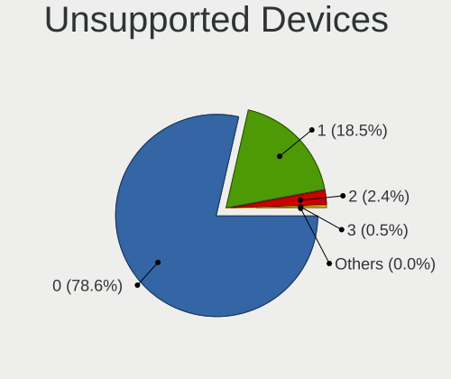

| Total | Desktops | Percent |
|-------|----------|---------|
| 0     | 3401     | 78.56%  |
| 1     | 800      | 18.48%  |
| 2     | 104      | 2.4%    |
| 3     | 20       | 0.46%   |
| 4     | 3        | 0.07%   |
| 5     | 1        | 0.02%   |

Unsupported Device Types
------------------------

Types of unsupported devices

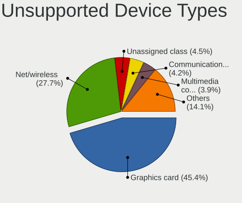

| Type                     | Desktops | Percent |
|--------------------------|----------|---------|
| Graphics card            | 472      | 45.43%  |
| Net/wireless             | 288      | 27.72%  |
| Unassigned class         | 47       | 4.52%   |
| Communication controller | 44       | 4.23%   |
| Multimedia controller    | 41       | 3.95%   |
| Net/ethernet             | 20       | 1.92%   |
| Sound                    | 19       | 1.83%   |
| Chipcard                 | 19       | 1.83%   |
| Storage/raid             | 16       | 1.54%   |
| Network                  | 12       | 1.15%   |
| Bluetooth                | 11       | 1.06%   |
| Modem                    | 10       | 0.96%   |
| Fingerprint reader       | 9        | 0.87%   |
| Storage/ide              | 8        | 0.77%   |
| Card reader              | 8        | 0.77%   |
| Camera                   | 4        | 0.38%   |
| Dvb card                 | 3        | 0.29%   |
| Storage/nvme             | 2        | 0.19%   |
| Firewire controller      | 2        | 0.19%   |
| Video                    | 1        | 0.1%    |
| Unclassified device      | 1        | 0.1%    |
| Tv card                  | 1        | 0.1%    |
| Storage                  | 1        | 0.1%    |

