Zorin - Tested Hardware & Statistics (Desktops)
-----------------------------------------------

A project to collect tested hardware configurations for Zorin.

Anyone can contribute to this report by the [hw-probe](https://github.com/linuxhw/hw-probe) tool:

    sudo -E hw-probe -all -upload

Please contribute! Especially if your hardware is rare.

Contents
--------

* [ Test Cases ](#test-cases)

* [ System ](#system)
  - [ OS                       ](#os)
  - [ OS Family                ](#os-family)
  - [ Kernel                   ](#kernel)
  - [ Kernel Family            ](#kernel-family)
  - [ Kernel Major Ver.        ](#kernel-major-ver)
  - [ Arch                     ](#arch)
  - [ DE                       ](#de)
  - [ Display Server           ](#display-server)
  - [ Display Manager          ](#display-manager)
  - [ OS Lang                  ](#os-lang)
  - [ Boot Mode                ](#boot-mode)
  - [ Filesystem               ](#filesystem)
  - [ Part. scheme             ](#part-scheme)
  - [ Dual Boot with Linux/BSD ](#dual-boot-with-linuxbsd)
  - [ Dual Boot (Win)          ](#dual-boot-win)

* [ Board ](#board)
  - [ Vendor                   ](#vendor)
  - [ Model                    ](#model)
  - [ Model Family             ](#model-family)
  - [ MFG Year                 ](#mfg-year)
  - [ Form Factor              ](#form-factor)
  - [ Secure Boot              ](#secure-boot)
  - [ Coreboot                 ](#coreboot)
  - [ RAM Size                 ](#ram-size)
  - [ RAM Used                 ](#ram-used)
  - [ Total Drives             ](#total-drives)
  - [ Has CD-ROM               ](#has-cd-rom)
  - [ Has Ethernet             ](#has-ethernet)
  - [ Has WiFi                 ](#has-wifi)
  - [ Has Bluetooth            ](#has-bluetooth)

* [ Location ](#location)
  - [ Country                  ](#country)
  - [ City                     ](#city)

* [ Drives ](#drives)
  - [ Drive Vendor             ](#drive-vendor)
  - [ Drive Model              ](#drive-model)
  - [ HDD Vendor               ](#hdd-vendor)
  - [ SSD Vendor               ](#ssd-vendor)
  - [ Drive Kind               ](#drive-kind)
  - [ Drive Connector          ](#drive-connector)
  - [ Drive Size               ](#drive-size)
  - [ Space Total              ](#space-total)
  - [ Space Used               ](#space-used)
  - [ Malfunc. Drives          ](#malfunc-drives)
  - [ Malfunc. Drive Vendor    ](#malfunc-drive-vendor)
  - [ Malfunc. HDD Vendor      ](#malfunc-hdd-vendor)
  - [ Malfunc. Drive Kind      ](#malfunc-drive-kind)
  - [ Failed Drives            ](#failed-drives)
  - [ Failed Drive Vendor      ](#failed-drive-vendor)
  - [ Drive Status             ](#drive-status)

* [ Storage controller ](#storage-controller)
  - [ Storage Vendor           ](#storage-vendor)
  - [ Storage Model            ](#storage-model)
  - [ Storage Kind             ](#storage-kind)

* [ Processor ](#processor)
  - [ CPU Vendor               ](#cpu-vendor)
  - [ CPU Model                ](#cpu-model)
  - [ CPU Model Family         ](#cpu-model-family)
  - [ CPU Cores                ](#cpu-cores)
  - [ CPU Sockets              ](#cpu-sockets)
  - [ CPU Threads              ](#cpu-threads)
  - [ CPU Op-Modes             ](#cpu-op-modes)
  - [ CPU Microcode            ](#cpu-microcode)
  - [ CPU Microarch            ](#cpu-microarch)

* [ Graphics ](#graphics)
  - [ GPU Vendor               ](#gpu-vendor)
  - [ GPU Model                ](#gpu-model)
  - [ GPU Combo                ](#gpu-combo)
  - [ GPU Driver               ](#gpu-driver)
  - [ GPU Memory               ](#gpu-memory)

* [ Monitor ](#monitor)
  - [ Monitor Vendor           ](#monitor-vendor)
  - [ Monitor Model            ](#monitor-model)
  - [ Monitor Resolution       ](#monitor-resolution)
  - [ Monitor Diagonal         ](#monitor-diagonal)
  - [ Monitor Width            ](#monitor-width)
  - [ Aspect Ratio             ](#aspect-ratio)
  - [ Monitor Area             ](#monitor-area)
  - [ Pixel Density            ](#pixel-density)
  - [ Multiple Monitors        ](#multiple-monitors)

* [ Network ](#network)
  - [ Net Controller Vendor    ](#net-controller-vendor)
  - [ Net Controller Model     ](#net-controller-model)
  - [ Wireless Vendor          ](#wireless-vendor)
  - [ Wireless Model           ](#wireless-model)
  - [ Ethernet Vendor          ](#ethernet-vendor)
  - [ Ethernet Model           ](#ethernet-model)
  - [ Net Controller Kind      ](#net-controller-kind)
  - [ Used Controller          ](#used-controller)
  - [ NICs                     ](#nics)
  - [ IPv6                     ](#ipv6)

* [ Bluetooth ](#bluetooth)
  - [ Bluetooth Vendor         ](#bluetooth-vendor)
  - [ Bluetooth Model          ](#bluetooth-model)

* [ Sound ](#sound)
  - [ Sound Vendor             ](#sound-vendor)
  - [ Sound Model              ](#sound-model)

* [ Memory ](#memory)
  - [ Memory Vendor            ](#memory-vendor)
  - [ Memory Model             ](#memory-model)
  - [ Memory Kind              ](#memory-kind)
  - [ Memory Form Factor       ](#memory-form-factor)
  - [ Memory Size              ](#memory-size)
  - [ Memory Speed             ](#memory-speed)

* [ Printers & scanners ](#printers--scanners)
  - [ Printer Vendor           ](#printer-vendor)
  - [ Printer Model            ](#printer-model)
  - [ Scanner Vendor           ](#scanner-vendor)
  - [ Scanner Model            ](#scanner-model)

* [ Camera ](#camera)
  - [ Camera Vendor            ](#camera-vendor)
  - [ Camera Model             ](#camera-model)

* [ Security ](#security)
  - [ Fingerprint Vendor       ](#fingerprint-vendor)
  - [ Fingerprint Model        ](#fingerprint-model)
  - [ Chipcard Vendor          ](#chipcard-vendor)
  - [ Chipcard Model           ](#chipcard-model)

* [ Unsupported ](#unsupported)
  - [ Unsupported Devices      ](#unsupported-devices)
  - [ Unsupported Device Types ](#unsupported-device-types)

Test Cases
----------

Total: 3748

| Vendor        | Model                       | Probe                                                      | Date         |
|---------------|-----------------------------|------------------------------------------------------------|--------------|
| MSI           | H310M PRO-VD                | [586c4844be](https://linux-hardware.org/?probe=586c4844be) | May 09, 2024 |
| Lenovo        | 110536U ThinkServer TS13... | [d3196733cd](https://linux-hardware.org/?probe=d3196733cd) | May 08, 2024 |
| ASUSTek       | P8H77-V LE                  | [e896127dc3](https://linux-hardware.org/?probe=e896127dc3) | May 08, 2024 |
| Unknown       | Unknown                     | [14f9a58589](https://linux-hardware.org/?probe=14f9a58589) | May 08, 2024 |
| Intel         | H55                         | [83c1ac4239](https://linux-hardware.org/?probe=83c1ac4239) | May 07, 2024 |
| GEEKOM        | Mini IT12                   | [bf478cb069](https://linux-hardware.org/?probe=bf478cb069) | May 06, 2024 |
| HP            | 8906 SMVB                   | [16dcd59b91](https://linux-hardware.org/?probe=16dcd59b91) | May 06, 2024 |
| Medion        | MS-7366                     | [0c36270a48](https://linux-hardware.org/?probe=0c36270a48) | May 06, 2024 |
| MSI           | PRO X670-P WIFI             | [a411b722e3](https://linux-hardware.org/?probe=a411b722e3) | May 05, 2024 |
| Unknown       | Unknown                     | [d676549abd](https://linux-hardware.org/?probe=d676549abd) | May 05, 2024 |
| ASRock        | B450M-HDV R4.0              | [fc52b48b01](https://linux-hardware.org/?probe=fc52b48b01) | May 05, 2024 |
| ECS           | P45T-A                      | [c1f450f8a1](https://linux-hardware.org/?probe=c1f450f8a1) | May 04, 2024 |
| Gigabyte      | EP43-S3L                    | [96cd4e9337](https://linux-hardware.org/?probe=96cd4e9337) | May 04, 2024 |
| Gigabyte      | H61M-S2P                    | [157cc8b4cc](https://linux-hardware.org/?probe=157cc8b4cc) | May 04, 2024 |
| GEEKOM        | Mini IT12                   | [d1264f51d1](https://linux-hardware.org/?probe=d1264f51d1) | May 03, 2024 |
| Gigabyte      | H81M-S1                     | [b0e189e984](https://linux-hardware.org/?probe=b0e189e984) | May 03, 2024 |
| Gigabyte      | H81M-S1                     | [8bc865780b](https://linux-hardware.org/?probe=8bc865780b) | May 03, 2024 |
| Dell          | 0773VG A02                  | [2eb962e78c](https://linux-hardware.org/?probe=2eb962e78c) | May 03, 2024 |
| Dell          | 0M5DCD A00                  | [f390e47ea1](https://linux-hardware.org/?probe=f390e47ea1) | May 03, 2024 |
| Intel         | X79 (INTEL Xeon E5/Corei... | [257f9cdad4](https://linux-hardware.org/?probe=257f9cdad4) | May 03, 2024 |
| Biostar       | B450MHP                     | [5d30a1821f](https://linux-hardware.org/?probe=5d30a1821f) | May 02, 2024 |
| Intel         | X79 (INTEL Xeon E5/Corei... | [1a3ebd462f](https://linux-hardware.org/?probe=1a3ebd462f) | May 02, 2024 |
| ASUSTek       | PRIME A520M-A II            | [49bbc3443a](https://linux-hardware.org/?probe=49bbc3443a) | May 02, 2024 |
| Gigabyte      | H97-HD3                     | [98d2071b97](https://linux-hardware.org/?probe=98d2071b97) | May 01, 2024 |
| Lenovo        | ThinkCentre M91p 7005AK8    | [8eeaa81159](https://linux-hardware.org/?probe=8eeaa81159) | Apr 30, 2024 |
| Gigabyte      | H61M-S1                     | [4067e2b325](https://linux-hardware.org/?probe=4067e2b325) | Apr 30, 2024 |
| Gigabyte      | H61M-S1                     | [ea6fdbe20e](https://linux-hardware.org/?probe=ea6fdbe20e) | Apr 30, 2024 |
| Gigabyte      | AB350-Gaming 3-CF           | [c4d5dca0ad](https://linux-hardware.org/?probe=c4d5dca0ad) | Apr 30, 2024 |
| NCR           | Pocono                      | [b0073723fe](https://linux-hardware.org/?probe=b0073723fe) | Apr 29, 2024 |
| ASUSTek       | P8H61-I R2.0                | [2e6e9ca3ee](https://linux-hardware.org/?probe=2e6e9ca3ee) | Apr 29, 2024 |
| ASUSTek       | M5A78L-M PLUS/USB3          | [a036c4124f](https://linux-hardware.org/?probe=a036c4124f) | Apr 29, 2024 |
| ASUSTek       | M5A78L-M PLUS/USB3          | [9b8290696d](https://linux-hardware.org/?probe=9b8290696d) | Apr 29, 2024 |
| HP            | 3398                        | [e412887ebc](https://linux-hardware.org/?probe=e412887ebc) | Apr 29, 2024 |
| Dell          | 06D7TR A00                  | [43e7eeb6e7](https://linux-hardware.org/?probe=43e7eeb6e7) | Apr 28, 2024 |
| Gigabyte      | H61M-S2PV                   | [c3bf425427](https://linux-hardware.org/?probe=c3bf425427) | Apr 27, 2024 |
| AOpen         | D1009 A1A4                  | [d8b2d00731](https://linux-hardware.org/?probe=d8b2d00731) | Apr 27, 2024 |
| AOpen         | D1009 A1A4                  | [f5399e68ef](https://linux-hardware.org/?probe=f5399e68ef) | Apr 27, 2024 |
| ASUSTek       | P8Z77-M PRO                 | [686e6cab2f](https://linux-hardware.org/?probe=686e6cab2f) | Apr 26, 2024 |
| ASUSTek       | M2R-FVM                     | [90232f8ff9](https://linux-hardware.org/?probe=90232f8ff9) | Apr 26, 2024 |
| ASUSTek       | M2R-FVM                     | [fc2624bc84](https://linux-hardware.org/?probe=fc2624bc84) | Apr 26, 2024 |
| Positivo      | POS-PIQ77CL                 | [ca5ecf0b4c](https://linux-hardware.org/?probe=ca5ecf0b4c) | Apr 25, 2024 |
| Gigabyte      | F2A68HM-HD2                 | [4f56e23067](https://linux-hardware.org/?probe=4f56e23067) | Apr 25, 2024 |
| Unknown       | Unknown                     | [c226f7eee7](https://linux-hardware.org/?probe=c226f7eee7) | Apr 25, 2024 |
| Apple         | Mac-F60DEB81FF30ACF6 Mac... | [713bf3357d](https://linux-hardware.org/?probe=713bf3357d) | Apr 24, 2024 |
| ASUSTek       | M4A78 PRO                   | [4a79911a5b](https://linux-hardware.org/?probe=4a79911a5b) | Apr 24, 2024 |
| ASUSTek       | P8H67-I                     | [0d76590ae1](https://linux-hardware.org/?probe=0d76590ae1) | Apr 24, 2024 |
| ASUSTek       | TUF Gaming X570-PLUS        | [12f44c7a5a](https://linux-hardware.org/?probe=12f44c7a5a) | Apr 23, 2024 |
| Lenovo        | 3098 SDK0E50510 WIN         | [6f1ba910cd](https://linux-hardware.org/?probe=6f1ba910cd) | Apr 23, 2024 |
| Dell          | 0VRWRC A00                  | [19c02bd31c](https://linux-hardware.org/?probe=19c02bd31c) | Apr 23, 2024 |
| ASUSTek       | P5G41T-M LX2/BR             | [7e16d97409](https://linux-hardware.org/?probe=7e16d97409) | Apr 22, 2024 |
| Biostar       | H61MLV3                     | [a383411310](https://linux-hardware.org/?probe=a383411310) | Apr 21, 2024 |
| Lenovo        | ThinkCentre M58 7360C12     | [a1a3ba50dd](https://linux-hardware.org/?probe=a1a3ba50dd) | Apr 21, 2024 |
| ASUSTek       | TUF Gaming Z790-PLUS WIF... | [84aa58d0c4](https://linux-hardware.org/?probe=84aa58d0c4) | Apr 21, 2024 |
| Gigabyte      | Z790 AORUS ELITE AX         | [ef45ce093c](https://linux-hardware.org/?probe=ef45ce093c) | Apr 20, 2024 |
| HP            | 1632                        | [1a23bb9aba](https://linux-hardware.org/?probe=1a23bb9aba) | Apr 19, 2024 |
| HP            | 1632                        | [2d11bc974f](https://linux-hardware.org/?probe=2d11bc974f) | Apr 18, 2024 |
| Gigabyte      | Z390 AORUS MASTER-CF        | [886d3b50ff](https://linux-hardware.org/?probe=886d3b50ff) | Apr 18, 2024 |
| ASRock        | A520M-HDV                   | [9a415b8705](https://linux-hardware.org/?probe=9a415b8705) | Apr 17, 2024 |
| ASUSTek       | H110M-CS                    | [551218b127](https://linux-hardware.org/?probe=551218b127) | Apr 17, 2024 |
| HP            | 1495                        | [cd403691ad](https://linux-hardware.org/?probe=cd403691ad) | Apr 16, 2024 |
| HP            | 8299                        | [1a596e43da](https://linux-hardware.org/?probe=1a596e43da) | Apr 15, 2024 |
| ASRock        | A520M-HDV                   | [56905e2bc8](https://linux-hardware.org/?probe=56905e2bc8) | Apr 15, 2024 |
| HP            | 8299                        | [aa03fa8e4c](https://linux-hardware.org/?probe=aa03fa8e4c) | Apr 15, 2024 |
| ASRock        | A520M-HDV                   | [47e7cdb053](https://linux-hardware.org/?probe=47e7cdb053) | Apr 15, 2024 |
| MSI           | B250M BAZOOKA               | [b2b7ae9a04](https://linux-hardware.org/?probe=b2b7ae9a04) | Apr 15, 2024 |
| Gigabyte      | B550I AORUS PRO AX          | [f65f90469b](https://linux-hardware.org/?probe=f65f90469b) | Apr 14, 2024 |
| ASUSTek       | TUF Gaming B550M-PLUS WI... | [b3fc204759](https://linux-hardware.org/?probe=b3fc204759) | Apr 14, 2024 |
| Dell          | 0NK5PH A00                  | [f0cf8ecdba](https://linux-hardware.org/?probe=f0cf8ecdba) | Apr 14, 2024 |
| Gigabyte      | F2A68HM-DS2                 | [62cafd8bff](https://linux-hardware.org/?probe=62cafd8bff) | Apr 13, 2024 |
| Gigabyte      | Z390 GAMING X-CF            | [e2bf219dba](https://linux-hardware.org/?probe=e2bf219dba) | Apr 13, 2024 |
| Dell          | 0T10XW A00                  | [f899cbf1fc](https://linux-hardware.org/?probe=f899cbf1fc) | Apr 12, 2024 |
| ASUSTek       | P8Z68-V GEN3                | [39d3eeda79](https://linux-hardware.org/?probe=39d3eeda79) | Apr 12, 2024 |
| MSI           | MPG B550 GAMING PLUS        | [9eed5870ee](https://linux-hardware.org/?probe=9eed5870ee) | Apr 12, 2024 |
| Gigabyte      | X570S AORUS ELITE AX        | [d0eaff6eb9](https://linux-hardware.org/?probe=d0eaff6eb9) | Apr 11, 2024 |
| ASUSTek       | ROG STRIX B550-A GAMING     | [33e3402952](https://linux-hardware.org/?probe=33e3402952) | Apr 11, 2024 |
| MSI           | MPG X570 GAMING PLUS        | [11e58d238c](https://linux-hardware.org/?probe=11e58d238c) | Apr 11, 2024 |
| ASUSTek       | CM6870                      | [0c29f72def](https://linux-hardware.org/?probe=0c29f72def) | Apr 10, 2024 |
| NCR           | Pocono                      | [fb4ef04821](https://linux-hardware.org/?probe=fb4ef04821) | Apr 10, 2024 |
| Pegatron      | 2A73h                       | [941a2d0e0d](https://linux-hardware.org/?probe=941a2d0e0d) | Apr 10, 2024 |
| HP            | 339A                        | [e7fb50b1c8](https://linux-hardware.org/?probe=e7fb50b1c8) | Apr 09, 2024 |
| Dell          | 0XCR8D A01                  | [9d38e92df0](https://linux-hardware.org/?probe=9d38e92df0) | Apr 09, 2024 |
| Dell          | 0XCR8D A01                  | [a0b8193ba4](https://linux-hardware.org/?probe=a0b8193ba4) | Apr 09, 2024 |
| Intel         | H61                         | [cfc6e7e901](https://linux-hardware.org/?probe=cfc6e7e901) | Apr 09, 2024 |
| Dell          | 0VYXHD A00                  | [c0cfa74664](https://linux-hardware.org/?probe=c0cfa74664) | Apr 09, 2024 |
| Alienware     | 0T76PD A01                  | [79ec44cce4](https://linux-hardware.org/?probe=79ec44cce4) | Apr 09, 2024 |
| MSI           | B450M-A PRO MAX             | [6f8f2695ef](https://linux-hardware.org/?probe=6f8f2695ef) | Apr 08, 2024 |
| Gigabyte      | AB350-Gaming 3-CF           | [334edc82aa](https://linux-hardware.org/?probe=334edc82aa) | Apr 07, 2024 |
| MSI           | MPG B550 GAMING PLUS        | [87b303490c](https://linux-hardware.org/?probe=87b303490c) | Apr 07, 2024 |
| Dell          | 0V8WGR A02                  | [c8eb38c52c](https://linux-hardware.org/?probe=c8eb38c52c) | Apr 07, 2024 |
| ASUSTek       | TUF Gaming Z790-PLUS WIF... | [42e382179c](https://linux-hardware.org/?probe=42e382179c) | Apr 07, 2024 |
| Gigabyte      | G41M-Combo                  | [4fa66fe035](https://linux-hardware.org/?probe=4fa66fe035) | Apr 07, 2024 |
| HP            | 1905                        | [d55405d144](https://linux-hardware.org/?probe=d55405d144) | Apr 06, 2024 |
| STGAUBRON     | B75M4 V1.1                  | [243f4caa39](https://linux-hardware.org/?probe=243f4caa39) | Apr 05, 2024 |
| Dell          | 08HPGT A01                  | [355095de09](https://linux-hardware.org/?probe=355095de09) | Apr 05, 2024 |
| Dell          | 08HPGT A01                  | [8d0476dbc7](https://linux-hardware.org/?probe=8d0476dbc7) | Apr 05, 2024 |
| ASRock        | H81M-HDS                    | [068539b9ec](https://linux-hardware.org/?probe=068539b9ec) | Apr 05, 2024 |
| Unknown       | 1.0                         | [a9918419c7](https://linux-hardware.org/?probe=a9918419c7) | Apr 03, 2024 |
| Foxconn       | G31MX Series                | [283c7c622c](https://linux-hardware.org/?probe=283c7c622c) | Apr 03, 2024 |
| Gateway       | SX2851                      | [099ecc5b59](https://linux-hardware.org/?probe=099ecc5b59) | Apr 03, 2024 |
| Pegatron      | JESSE                       | [1f14f883ca](https://linux-hardware.org/?probe=1f14f883ca) | Apr 02, 2024 |
| MSI           | H81M-E34                    | [62882b5228](https://linux-hardware.org/?probe=62882b5228) | Apr 02, 2024 |
| Gigabyte      | B450M S2H                   | [1d0e019001](https://linux-hardware.org/?probe=1d0e019001) | Apr 01, 2024 |
| ASUSTek       | PRIME Z690-P WIFI D4        | [efd659b2da](https://linux-hardware.org/?probe=efd659b2da) | Apr 01, 2024 |
| ASRock        | H310CM-DVS                  | [c543e25407](https://linux-hardware.org/?probe=c543e25407) | Mar 31, 2024 |
| ASRock        | H310CM-DVS                  | [39914bc3e6](https://linux-hardware.org/?probe=39914bc3e6) | Mar 31, 2024 |
| Gigabyte      | Z390 GAMING X-CF            | [c32641d945](https://linux-hardware.org/?probe=c32641d945) | Mar 31, 2024 |
| ASUSTek       | PRIME X570-PRO              | [740eb90402](https://linux-hardware.org/?probe=740eb90402) | Mar 30, 2024 |
| ASRock        | 990FX Extreme3              | [1c846440f3](https://linux-hardware.org/?probe=1c846440f3) | Mar 30, 2024 |
| ASUSTek       | TUF Gaming X570-PRO         | [2fa735d18d](https://linux-hardware.org/?probe=2fa735d18d) | Mar 30, 2024 |
| Unknown       | Unknown                     | [cd151074ab](https://linux-hardware.org/?probe=cd151074ab) | Mar 30, 2024 |
| Gigabyte      | Z87X-UD5H-CF                | [890d342e54](https://linux-hardware.org/?probe=890d342e54) | Mar 30, 2024 |
| Dell          | 051FJ8 A01                  | [05e406828c](https://linux-hardware.org/?probe=05e406828c) | Mar 29, 2024 |
| MSI           | B550-A PRO                  | [da4de8a0b3](https://linux-hardware.org/?probe=da4de8a0b3) | Mar 29, 2024 |
| ASRock        | 980DE3/U3S3 R2.0            | [31798dfffc](https://linux-hardware.org/?probe=31798dfffc) | Mar 29, 2024 |
| ASUSTek       | TUF Gaming B550-PRO         | [81603f2f58](https://linux-hardware.org/?probe=81603f2f58) | Mar 29, 2024 |
| ASUSTek       | TUF Gaming X570-PLUS        | [00e4cbdc6e](https://linux-hardware.org/?probe=00e4cbdc6e) | Mar 29, 2024 |
| ASRock        | Z87 Extreme6                | [eaf00b2d47](https://linux-hardware.org/?probe=eaf00b2d47) | Mar 29, 2024 |
| Gigabyte      | G41M-Combo                  | [de15aa9a55](https://linux-hardware.org/?probe=de15aa9a55) | Mar 29, 2024 |
| HP            | 0B54h D                     | [e7d521b51c](https://linux-hardware.org/?probe=e7d521b51c) | Mar 28, 2024 |
| Intel         | D2700MUD AAG32419-602       | [52eec4d012](https://linux-hardware.org/?probe=52eec4d012) | Mar 28, 2024 |
| ASRock        | Z87 Extreme6                | [0980c3538e](https://linux-hardware.org/?probe=0980c3538e) | Mar 28, 2024 |
| Gigabyte      | GA-880GM-USB3               | [77bf8490e6](https://linux-hardware.org/?probe=77bf8490e6) | Mar 28, 2024 |
| Gigabyte      | Q87M-D2H                    | [7de05d2618](https://linux-hardware.org/?probe=7de05d2618) | Mar 27, 2024 |
| Gigabyte      | Q87M-D2H                    | [577e8ee500](https://linux-hardware.org/?probe=577e8ee500) | Mar 27, 2024 |
| ASUSTek       | P8H61-M LX2 R2.0            | [a7b3ddbaee](https://linux-hardware.org/?probe=a7b3ddbaee) | Mar 27, 2024 |
| Pegatron      | 2A73h                       | [193e8e5cb1](https://linux-hardware.org/?probe=193e8e5cb1) | Mar 26, 2024 |
| MSI           | B350 TOMAHAWK               | [10ca4510ec](https://linux-hardware.org/?probe=10ca4510ec) | Mar 26, 2024 |
| Gigabyte      | B550M AORUS PRO-P           | [704e412f17](https://linux-hardware.org/?probe=704e412f17) | Mar 26, 2024 |
| Acer          | Aspire X3450                | [5b799c7536](https://linux-hardware.org/?probe=5b799c7536) | Mar 26, 2024 |
| ASUSTek       | M5A78L-M LX3                | [a549e35cf7](https://linux-hardware.org/?probe=a549e35cf7) | Mar 26, 2024 |
| Fujitsu       | D3161-A1 S26361-D3161-A1    | [feb35a6b9c](https://linux-hardware.org/?probe=feb35a6b9c) | Mar 25, 2024 |
| Dell          | 01TKCC A01                  | [65070b32f2](https://linux-hardware.org/?probe=65070b32f2) | Mar 25, 2024 |
| HP            | 3029h                       | [1913f87768](https://linux-hardware.org/?probe=1913f87768) | Mar 25, 2024 |
| ASUSTek       | P8Z77-V                     | [ec744f652d](https://linux-hardware.org/?probe=ec744f652d) | Mar 25, 2024 |
| ASUSTek       | P8Z77-V                     | [89c81c0a65](https://linux-hardware.org/?probe=89c81c0a65) | Mar 25, 2024 |
| HP            | 8767 A                      | [167796eedc](https://linux-hardware.org/?probe=167796eedc) | Mar 25, 2024 |
| Dell          | 0KWVT8 A00                  | [ae811bf4d9](https://linux-hardware.org/?probe=ae811bf4d9) | Mar 24, 2024 |
| HP            | 1905                        | [ee5ca084c4](https://linux-hardware.org/?probe=ee5ca084c4) | Mar 24, 2024 |
| HP            | 1905                        | [05c7e6e706](https://linux-hardware.org/?probe=05c7e6e706) | Mar 24, 2024 |
| ASUSTek       | P6T DELUXE V2               | [526ba57aee](https://linux-hardware.org/?probe=526ba57aee) | Mar 24, 2024 |
| Lenovo        | MAHOBAY 0B98401 PRO         | [f8ca0e66e2](https://linux-hardware.org/?probe=f8ca0e66e2) | Mar 24, 2024 |
| Gigabyte      | Z790 AORUS ELITE AX         | [d3025e223c](https://linux-hardware.org/?probe=d3025e223c) | Mar 24, 2024 |
| HP            | 2ADC                        | [d94b5fa4e7](https://linux-hardware.org/?probe=d94b5fa4e7) | Mar 23, 2024 |
| Gigabyte      | GA-880GM-USB3               | [5d0f3460a5](https://linux-hardware.org/?probe=5d0f3460a5) | Mar 23, 2024 |
| Gigabyte      | B550 UD AC-Y1               | [8c6f8835ea](https://linux-hardware.org/?probe=8c6f8835ea) | Mar 23, 2024 |
| Lenovo        | ThinkCentre M58p 6234FB9    | [38a5a34e54](https://linux-hardware.org/?probe=38a5a34e54) | Mar 23, 2024 |
| AZW           | U59                         | [06a180e5a9](https://linux-hardware.org/?probe=06a180e5a9) | Mar 22, 2024 |
| Gigabyte      | B460 HD3 se2                | [ac86e944ff](https://linux-hardware.org/?probe=ac86e944ff) | Mar 22, 2024 |
| ASUSTek       | P9X79 DELUXE                | [dabc36a5b3](https://linux-hardware.org/?probe=dabc36a5b3) | Mar 22, 2024 |
| MSI           | H81M-E34                    | [5ab741f203](https://linux-hardware.org/?probe=5ab741f203) | Mar 21, 2024 |
| HP            | 8433 11                     | [5b2290d410](https://linux-hardware.org/?probe=5b2290d410) | Mar 21, 2024 |
| Fujitsu       | D3221-A1 S26361-D3221-A1    | [f7f667d127](https://linux-hardware.org/?probe=f7f667d127) | Mar 21, 2024 |
| ECS           | A785GM-AD3                  | [452fc5ac26](https://linux-hardware.org/?probe=452fc5ac26) | Mar 21, 2024 |
| ASRock        | A320M-HDV R4.0              | [cd5d6341fb](https://linux-hardware.org/?probe=cd5d6341fb) | Mar 21, 2024 |
| ASUSTek       | B85M-C/C/SI                 | [b456ba2213](https://linux-hardware.org/?probe=b456ba2213) | Mar 20, 2024 |
| Gigabyte      | B550I AORUS PRO AX          | [17d208911e](https://linux-hardware.org/?probe=17d208911e) | Mar 20, 2024 |
| ASUSTek       | TUF Gaming A520M-PLUS II    | [ae0e79e6da](https://linux-hardware.org/?probe=ae0e79e6da) | Mar 20, 2024 |
| AMI           | Intel                       | [fc4348f291](https://linux-hardware.org/?probe=fc4348f291) | Mar 20, 2024 |
| ASUSTek       | ROG STRIX Z690-F GAMING ... | [969fc32897](https://linux-hardware.org/?probe=969fc32897) | Mar 20, 2024 |
| Intel         | DQ45CB AAE30148-207         | [779eb3b38f](https://linux-hardware.org/?probe=779eb3b38f) | Mar 20, 2024 |
| ASUSTek       | B85M-C/C/SI                 | [d374aaf228](https://linux-hardware.org/?probe=d374aaf228) | Mar 19, 2024 |
| Acer          | Veriton L6610G              | [c5e6b0ac2a](https://linux-hardware.org/?probe=c5e6b0ac2a) | Mar 19, 2024 |
| Dell          | 0NK5PH A00                  | [ee2fd9c92e](https://linux-hardware.org/?probe=ee2fd9c92e) | Mar 19, 2024 |
| Fujitsu       | D3221-A1 S26361-D3221-A1    | [9ce06e146a](https://linux-hardware.org/?probe=9ce06e146a) | Mar 19, 2024 |
| Dell          | 0XFWHV A00                  | [366d65567e](https://linux-hardware.org/?probe=366d65567e) | Mar 19, 2024 |
| ASUSTek       | TUF Gaming X570-PLUS        | [d9e56f3325](https://linux-hardware.org/?probe=d9e56f3325) | Mar 19, 2024 |
| HP            | 843B                        | [d867363097](https://linux-hardware.org/?probe=d867363097) | Mar 19, 2024 |
| HP            | 843B                        | [f32e4ee209](https://linux-hardware.org/?probe=f32e4ee209) | Mar 19, 2024 |
| Dell          | 0T656F A01                  | [325c5efb6e](https://linux-hardware.org/?probe=325c5efb6e) | Mar 18, 2024 |
| ASUSTek       | PRIME B250M-A               | [6477033da6](https://linux-hardware.org/?probe=6477033da6) | Mar 18, 2024 |
| eMachines     | MCP61PM-GM                  | [c92849e391](https://linux-hardware.org/?probe=c92849e391) | Mar 18, 2024 |
| ASRock        | X570 Steel Legend           | [902b7d5554](https://linux-hardware.org/?probe=902b7d5554) | Mar 18, 2024 |
| ASUSTek       | ROG STRIX B650E-E GAMING... | [4774169c78](https://linux-hardware.org/?probe=4774169c78) | Mar 18, 2024 |
| HP            | 2ADC                        | [8c1fc992f0](https://linux-hardware.org/?probe=8c1fc992f0) | Mar 17, 2024 |
| Pegatron      | IPMH61P1                    | [6221b2b986](https://linux-hardware.org/?probe=6221b2b986) | Mar 17, 2024 |
| Gigabyte      | F2A88XM-D3H                 | [2780dec79d](https://linux-hardware.org/?probe=2780dec79d) | Mar 17, 2024 |
| MSI           | MAG B550 TOMAHAWK           | [4428cc7de0](https://linux-hardware.org/?probe=4428cc7de0) | Mar 17, 2024 |
| Gateway       | SX2851                      | [68e1f2c952](https://linux-hardware.org/?probe=68e1f2c952) | Mar 17, 2024 |
| Gigabyte      | B450M S2H                   | [c1dbd5edb2](https://linux-hardware.org/?probe=c1dbd5edb2) | Mar 17, 2024 |
| Gigabyte      | B550 AORUS PRO V2           | [f1bb876476](https://linux-hardware.org/?probe=f1bb876476) | Mar 16, 2024 |
| MSI           | B150 GAMING M3              | [f8b1e50645](https://linux-hardware.org/?probe=f8b1e50645) | Mar 16, 2024 |
| ASUSTek       | P5KPL-AM-CKD-VISUM-SI       | [910347d978](https://linux-hardware.org/?probe=910347d978) | Mar 16, 2024 |
| Dell          | 0M9KCM A02                  | [7823cafa72](https://linux-hardware.org/?probe=7823cafa72) | Mar 15, 2024 |
| HP            | 805D                        | [7878b71cab](https://linux-hardware.org/?probe=7878b71cab) | Mar 15, 2024 |
| ASUSTek       | PRIME Z390-A                | [1b4cf177e5](https://linux-hardware.org/?probe=1b4cf177e5) | Mar 15, 2024 |
| MSI           | MAG B550 TOMAHAWK MAX WI... | [7a11b99920](https://linux-hardware.org/?probe=7a11b99920) | Mar 15, 2024 |
| Dell          | 0M9KCM A02                  | [6dd5b76d21](https://linux-hardware.org/?probe=6dd5b76d21) | Mar 15, 2024 |
| Lenovo        | 1057 SDK0T76528 WIN 3556... | [ff14bf45ec](https://linux-hardware.org/?probe=ff14bf45ec) | Mar 14, 2024 |
| ASUSTek       | Z170 PRO GAMING             | [b175004524](https://linux-hardware.org/?probe=b175004524) | Mar 14, 2024 |
| ASUSTek       | P8P67 EVO                   | [3ece14c501](https://linux-hardware.org/?probe=3ece14c501) | Mar 13, 2024 |
| Supermicro    | C7Q67 V1.01                 | [4fe003a84f](https://linux-hardware.org/?probe=4fe003a84f) | Mar 13, 2024 |
| IBM           | 8215MUC                     | [b6c69c2119](https://linux-hardware.org/?probe=b6c69c2119) | Mar 13, 2024 |
| ASUSTek       | TUF Gaming Z790-PLUS WIF... | [3a8d8640a9](https://linux-hardware.org/?probe=3a8d8640a9) | Mar 12, 2024 |
| Pegatron      | JESSE                       | [5602b9f4e2](https://linux-hardware.org/?probe=5602b9f4e2) | Mar 12, 2024 |
| ASUSTek       | PRIME Z390-A                | [94831371a9](https://linux-hardware.org/?probe=94831371a9) | Mar 12, 2024 |
| Gigabyte      | H410M S2H V3                | [0f5989dcbc](https://linux-hardware.org/?probe=0f5989dcbc) | Mar 12, 2024 |
| Gigabyte      | A320M-S2H-CF                | [020b8b531a](https://linux-hardware.org/?probe=020b8b531a) | Mar 12, 2024 |
| Gigabyte      | A320M-S2H-CF                | [84502e8400](https://linux-hardware.org/?probe=84502e8400) | Mar 12, 2024 |
| DIEBOLD       | Canyon                      | [109f1d1d93](https://linux-hardware.org/?probe=109f1d1d93) | Mar 12, 2024 |
| DIEBOLD       | Canyon                      | [a92906b4f5](https://linux-hardware.org/?probe=a92906b4f5) | Mar 12, 2024 |
| MSI           | 785GT-E63                   | [1533ab1a7c](https://linux-hardware.org/?probe=1533ab1a7c) | Mar 12, 2024 |
| HP            | 8653 A                      | [e90335d9c9](https://linux-hardware.org/?probe=e90335d9c9) | Mar 12, 2024 |
| SiS           | B550S Ver:1.16              | [97c4226745](https://linux-hardware.org/?probe=97c4226745) | Mar 12, 2024 |
| Dell          | 0D6H9T A01                  | [6a4e81ad5e](https://linux-hardware.org/?probe=6a4e81ad5e) | Mar 11, 2024 |
| MSI           | MEG Z590 ACE GOLD EDITIO... | [df6500bf6b](https://linux-hardware.org/?probe=df6500bf6b) | Mar 10, 2024 |
| Gigabyte      | GA-890GPA-UD3H              | [53ca2b56ef](https://linux-hardware.org/?probe=53ca2b56ef) | Mar 10, 2024 |
| HP            | 8265                        | [a805d1a4b0](https://linux-hardware.org/?probe=a805d1a4b0) | Mar 10, 2024 |
| MSI           | B450M-A PRO MAX II          | [e38d871b42](https://linux-hardware.org/?probe=e38d871b42) | Mar 10, 2024 |
| MSI           | MPG X570 GAMING PLUS        | [eecc91d036](https://linux-hardware.org/?probe=eecc91d036) | Mar 10, 2024 |
| QIYIDA        | ED4 V1.1                    | [0fcfff37bf](https://linux-hardware.org/?probe=0fcfff37bf) | Mar 10, 2024 |
| Dell          | 0KWVT8 A00                  | [c80fca1d72](https://linux-hardware.org/?probe=c80fca1d72) | Mar 09, 2024 |
| ASUSTek       | PRIME B450M-A II            | [b591cc5cfe](https://linux-hardware.org/?probe=b591cc5cfe) | Mar 09, 2024 |
| Lenovo        | MAHOBAY NOK                 | [4bd7a64be3](https://linux-hardware.org/?probe=4bd7a64be3) | Mar 09, 2024 |
| Unknown       | Unknown                     | [2b737bd393](https://linux-hardware.org/?probe=2b737bd393) | Mar 09, 2024 |
| Foxconn       | 946 7MA Series              | [7453cdde18](https://linux-hardware.org/?probe=7453cdde18) | Mar 09, 2024 |
| HP            | 3647h                       | [04d7f488a7](https://linux-hardware.org/?probe=04d7f488a7) | Mar 09, 2024 |
| ASUSTek       | PRIME Z490-P                | [f208bbae00](https://linux-hardware.org/?probe=f208bbae00) | Mar 08, 2024 |
| Biostar       | G41-M7                      | [54836e3fbe](https://linux-hardware.org/?probe=54836e3fbe) | Mar 08, 2024 |
| Dell          | 0D24M8 A01                  | [cdf2cddb43](https://linux-hardware.org/?probe=cdf2cddb43) | Mar 08, 2024 |
| ASRock        | H81M-VG4                    | [96f9d92727](https://linux-hardware.org/?probe=96f9d92727) | Mar 08, 2024 |
| ASUSTek       | PRIME Z490-P                | [b4f141c9da](https://linux-hardware.org/?probe=b4f141c9da) | Mar 08, 2024 |
| ASUSTek       | P8Z77-V PRO                 | [b18d2c6cab](https://linux-hardware.org/?probe=b18d2c6cab) | Mar 08, 2024 |
| Dell          | 0KWVT8 A03                  | [4ad718e45b](https://linux-hardware.org/?probe=4ad718e45b) | Mar 08, 2024 |
| Gigabyte      | H410M S2H V3                | [f2ae26b3f5](https://linux-hardware.org/?probe=f2ae26b3f5) | Mar 07, 2024 |
| ASRock        | B450M Pro4                  | [6e793fa7a4](https://linux-hardware.org/?probe=6e793fa7a4) | Mar 07, 2024 |
| ASUSTek       | STRIX H270F GAMING          | [6e35097ed2](https://linux-hardware.org/?probe=6e35097ed2) | Mar 07, 2024 |
| Gigabyte      | Z97X-UD5H                   | [76cf4afca4](https://linux-hardware.org/?probe=76cf4afca4) | Mar 06, 2024 |
| HP            | 89B5 A                      | [52f3d1ebea](https://linux-hardware.org/?probe=52f3d1ebea) | Mar 05, 2024 |
| HP            | 89B5 A                      | [ada6553f38](https://linux-hardware.org/?probe=ada6553f38) | Mar 05, 2024 |
| Dell          | 0T10XW A00                  | [ef08d738fb](https://linux-hardware.org/?probe=ef08d738fb) | Mar 04, 2024 |
| Dell          | 0PU052                      | [d99b3dfb94](https://linux-hardware.org/?probe=d99b3dfb94) | Mar 03, 2024 |
| ASUSTek       | TUF Gaming A620M-PLUS       | [813c36f5cf](https://linux-hardware.org/?probe=813c36f5cf) | Mar 03, 2024 |
| Gigabyte      | B650 AORUS ELITE AX         | [69bec2f38f](https://linux-hardware.org/?probe=69bec2f38f) | Mar 03, 2024 |
| ASRock        | 980DE3/U3S3                 | [3818d7195f](https://linux-hardware.org/?probe=3818d7195f) | Mar 03, 2024 |
| Gigabyte      | A520M DS3H V2               | [2046b817c7](https://linux-hardware.org/?probe=2046b817c7) | Mar 03, 2024 |
| MSI           | B450M GAMING PLUS           | [8eaf2b59af](https://linux-hardware.org/?probe=8eaf2b59af) | Mar 03, 2024 |
| ECS           | H61H2-M2                    | [bec82f9c2a](https://linux-hardware.org/?probe=bec82f9c2a) | Mar 02, 2024 |
| Gigabyte      | G31M-S2C                    | [b9ddd2512e](https://linux-hardware.org/?probe=b9ddd2512e) | Mar 02, 2024 |
| Gigabyte      | G31M-S2C                    | [c9ab34da1a](https://linux-hardware.org/?probe=c9ab34da1a) | Mar 02, 2024 |
| Unknown       | Unknown                     | [271452e819](https://linux-hardware.org/?probe=271452e819) | Mar 01, 2024 |
| Dell          | 0D24M8 A01                  | [6573368c36](https://linux-hardware.org/?probe=6573368c36) | Mar 01, 2024 |
| Gigabyte      | G31M-S2C                    | [47d6164c5a](https://linux-hardware.org/?probe=47d6164c5a) | Feb 29, 2024 |
| ASUSTek       | P8H61-M PLUS2               | [9539fc46cc](https://linux-hardware.org/?probe=9539fc46cc) | Feb 29, 2024 |
| ECS           | H61H2-M2                    | [d8ff6883f1](https://linux-hardware.org/?probe=d8ff6883f1) | Feb 29, 2024 |
| Supermicro    | C2SBC-Q                     | [d90714db33](https://linux-hardware.org/?probe=d90714db33) | Feb 29, 2024 |
| ASUSTek       | ROG STRIX Z790-F GAMING ... | [08482c8ae5](https://linux-hardware.org/?probe=08482c8ae5) | Feb 29, 2024 |
| ASUSTek       | ROG STRIX Z790-F GAMING ... | [f7550261f5](https://linux-hardware.org/?probe=f7550261f5) | Feb 29, 2024 |
| Gigabyte      | Z97X-UD5H                   | [a9c902341e](https://linux-hardware.org/?probe=a9c902341e) | Feb 28, 2024 |
| ASUSTek       | M5A78L-M LX3                | [445ff9dc64](https://linux-hardware.org/?probe=445ff9dc64) | Feb 28, 2024 |
| ASUSTek       | TUF Z370-PRO GAMING         | [636e341039](https://linux-hardware.org/?probe=636e341039) | Feb 28, 2024 |
| ASUSTek       | H110M-R                     | [99161beb5e](https://linux-hardware.org/?probe=99161beb5e) | Feb 28, 2024 |
| ASUSTek       | STRIX Z270F GAMING          | [84b3a163a6](https://linux-hardware.org/?probe=84b3a163a6) | Feb 28, 2024 |
| HP            | 83EE                        | [86edbf63e7](https://linux-hardware.org/?probe=86edbf63e7) | Feb 28, 2024 |
| ASRock        | H81M-VG4                    | [031f559cf7](https://linux-hardware.org/?probe=031f559cf7) | Feb 27, 2024 |
| MSI           | B450 GAMING PLUS MAX        | [d2373db1a8](https://linux-hardware.org/?probe=d2373db1a8) | Feb 27, 2024 |
| Gigabyte      | B450 AORUS M                | [196330861b](https://linux-hardware.org/?probe=196330861b) | Feb 27, 2024 |
| ASUSTek       | TUF Gaming A620M-PLUS       | [7fe90d068b](https://linux-hardware.org/?probe=7fe90d068b) | Feb 26, 2024 |
| ASUSTek       | TUF Gaming A620M-PLUS       | [5b006b8b96](https://linux-hardware.org/?probe=5b006b8b96) | Feb 26, 2024 |
| Lenovo        | ThinkCentre M71z 1761E4U    | [07258c1d6d](https://linux-hardware.org/?probe=07258c1d6d) | Feb 25, 2024 |
| Colorful T... | C.Z77 X5 V20                | [c4b1274d4e](https://linux-hardware.org/?probe=c4b1274d4e) | Feb 25, 2024 |
| ASUSTek       | TUF Gaming Z790-PLUS WIF... | [d8df626171](https://linux-hardware.org/?probe=d8df626171) | Feb 25, 2024 |
| Unknown       | E-H61                       | [899be10105](https://linux-hardware.org/?probe=899be10105) | Feb 24, 2024 |
| Unknown       | E-H61                       | [fa84a51212](https://linux-hardware.org/?probe=fa84a51212) | Feb 24, 2024 |
| Intel         | X58                         | [f4526c5a1c](https://linux-hardware.org/?probe=f4526c5a1c) | Feb 23, 2024 |
| ASUSTek       | TUF Gaming Z790-PLUS WIF... | [eeace60b7a](https://linux-hardware.org/?probe=eeace60b7a) | Feb 23, 2024 |
| Biostar       | A320MH                      | [cbd7260993](https://linux-hardware.org/?probe=cbd7260993) | Feb 23, 2024 |
| HP            | 2215                        | [eef0673d86](https://linux-hardware.org/?probe=eef0673d86) | Feb 21, 2024 |
| ASUSTek       | P8Z77-V LX                  | [4d913de0c0](https://linux-hardware.org/?probe=4d913de0c0) | Feb 21, 2024 |
| ASUSTek       | P8Z77-V LX                  | [bddbc049f7](https://linux-hardware.org/?probe=bddbc049f7) | Feb 21, 2024 |
| HP            | 2215                        | [d23162f59f](https://linux-hardware.org/?probe=d23162f59f) | Feb 20, 2024 |
| ASUSTek       | K30BF_M32BF                 | [a39f9b2921](https://linux-hardware.org/?probe=a39f9b2921) | Feb 20, 2024 |
| ASUSTek       | ROG STRIX B650E-E GAMING... | [1ccd345da2](https://linux-hardware.org/?probe=1ccd345da2) | Feb 20, 2024 |
| GEEKOM        | A5                          | [43d1283121](https://linux-hardware.org/?probe=43d1283121) | Feb 20, 2024 |
| ASRock        | H410M-HVS                   | [d07941ad3f](https://linux-hardware.org/?probe=d07941ad3f) | Feb 20, 2024 |
| Gigabyte      | EP35-DS3                    | [083ed26b97](https://linux-hardware.org/?probe=083ed26b97) | Feb 20, 2024 |
| Lenovo        | SHARKBAY 0B98401 PRO        | [9d5c5dfeb7](https://linux-hardware.org/?probe=9d5c5dfeb7) | Feb 20, 2024 |
| Gigabyte      | H61M-DS2                    | [581dd97a4d](https://linux-hardware.org/?probe=581dd97a4d) | Feb 20, 2024 |
| Dell          | 051FJ8 A01                  | [0949817cb6](https://linux-hardware.org/?probe=0949817cb6) | Feb 19, 2024 |
| ASUSTek       | B85M-E                      | [d1bbdc0a03](https://linux-hardware.org/?probe=d1bbdc0a03) | Feb 19, 2024 |
| Dell          | 0PGKWF A00                  | [83c1da9c3c](https://linux-hardware.org/?probe=83c1da9c3c) | Feb 19, 2024 |
| AZW           | Gemini T45                  | [9a81383d10](https://linux-hardware.org/?probe=9a81383d10) | Feb 19, 2024 |
| TB            | WTR R1                      | [ab65edc6c3](https://linux-hardware.org/?probe=ab65edc6c3) | Feb 19, 2024 |
| ASUSTek       | B85-PLUS                    | [87ad4ddd6d](https://linux-hardware.org/?probe=87ad4ddd6d) | Feb 19, 2024 |
| Dell          | 0KWVT8 A03                  | [96c3415965](https://linux-hardware.org/?probe=96c3415965) | Feb 19, 2024 |
| Dell          | 0KWVT8 A03                  | [8a1cafd28d](https://linux-hardware.org/?probe=8a1cafd28d) | Feb 19, 2024 |
| OEM           | B75 Ver:1.41                | [bdc300e725](https://linux-hardware.org/?probe=bdc300e725) | Feb 18, 2024 |
| ASUSTek       | TUF Gaming Z790-PLUS WIF... | [eff6e16943](https://linux-hardware.org/?probe=eff6e16943) | Feb 17, 2024 |
| OEM           | B75 Ver:1.41                | [f685a6eccc](https://linux-hardware.org/?probe=f685a6eccc) | Feb 17, 2024 |
| Gigabyte      | M720-US3                    | [79c1cffeae](https://linux-hardware.org/?probe=79c1cffeae) | Feb 17, 2024 |
| Gigabyte      | B650 GAMING X AX            | [658984c494](https://linux-hardware.org/?probe=658984c494) | Feb 17, 2024 |
| Gigabyte      | M720-US3                    | [340b590f33](https://linux-hardware.org/?probe=340b590f33) | Feb 17, 2024 |
| ASUSTek       | P8Z77-V LX                  | [2d74906a7d](https://linux-hardware.org/?probe=2d74906a7d) | Feb 16, 2024 |
| MSI           | B450M PRO-VDH MAX           | [c325b99554](https://linux-hardware.org/?probe=c325b99554) | Feb 16, 2024 |
| ASUSTek       | Rampage II Extreme          | [42f4db38c2](https://linux-hardware.org/?probe=42f4db38c2) | Feb 16, 2024 |
| ASUSTek       | M5A78L-M LX3                | [78b9324e29](https://linux-hardware.org/?probe=78b9324e29) | Feb 16, 2024 |
| Dell          | 0C522T A00                  | [fc865abc9f](https://linux-hardware.org/?probe=fc865abc9f) | Feb 16, 2024 |
| Intel         | DH67GD AAG10206-205         | [c1b6c3c87e](https://linux-hardware.org/?probe=c1b6c3c87e) | Feb 16, 2024 |
| MSI           | 2AE0                        | [85d065236b](https://linux-hardware.org/?probe=85d065236b) | Feb 15, 2024 |
| MSI           | B450-A PRO MAX              | [ca82f5e8f1](https://linux-hardware.org/?probe=ca82f5e8f1) | Feb 15, 2024 |
| HP            | 3047h                       | [05f8efc7c6](https://linux-hardware.org/?probe=05f8efc7c6) | Feb 15, 2024 |
| Unknown       | Unknown                     | [37f24823aa](https://linux-hardware.org/?probe=37f24823aa) | Feb 15, 2024 |
| ASRock        | AB350 Pro4                  | [5b8e7f1992](https://linux-hardware.org/?probe=5b8e7f1992) | Feb 14, 2024 |
| Acer          | v1.0                        | [a7ba3b84dc](https://linux-hardware.org/?probe=a7ba3b84dc) | Feb 14, 2024 |
| Acer          | Aspire TC-603               | [a715d81d90](https://linux-hardware.org/?probe=a715d81d90) | Feb 14, 2024 |
| ASUSTek       | M5A97 R2.0                  | [02bcb4fe60](https://linux-hardware.org/?probe=02bcb4fe60) | Feb 14, 2024 |
| ASUSTek       | TUF Gaming A620M-PLUS       | [ea66a8f18a](https://linux-hardware.org/?probe=ea66a8f18a) | Feb 14, 2024 |
| Acer          | Acadia V1.34                | [6807342689](https://linux-hardware.org/?probe=6807342689) | Feb 13, 2024 |
| LORD ELECT... | LORD G4x 775 ICH7 8712 A... | [9616627427](https://linux-hardware.org/?probe=9616627427) | Feb 13, 2024 |
| MSI           | A75A-G55                    | [66928cfe0f](https://linux-hardware.org/?probe=66928cfe0f) | Feb 13, 2024 |
| ASUSTek       | TUF Gaming A520M-PLUS       | [7442b9508b](https://linux-hardware.org/?probe=7442b9508b) | Feb 12, 2024 |
| ASUSTek       | Maximus IX FORMULA          | [e1f108277a](https://linux-hardware.org/?probe=e1f108277a) | Feb 12, 2024 |
| Dell          | 0VYXHD A00                  | [134cac2a6d](https://linux-hardware.org/?probe=134cac2a6d) | Feb 11, 2024 |
| Dell          | 0VYXHD A00                  | [8178dd22d5](https://linux-hardware.org/?probe=8178dd22d5) | Feb 11, 2024 |
| AMI           | Cherry Trail CR             | [aca9ec8d0b](https://linux-hardware.org/?probe=aca9ec8d0b) | Feb 11, 2024 |
| ASUSTek       | TUF Gaming A620M-PLUS       | [0fa5fdbad2](https://linux-hardware.org/?probe=0fa5fdbad2) | Feb 10, 2024 |
| Unknown       | Unknown                     | [f8f4e3c485](https://linux-hardware.org/?probe=f8f4e3c485) | Feb 10, 2024 |
| MSI           | H61M-P20                    | [b364c76f36](https://linux-hardware.org/?probe=b364c76f36) | Feb 10, 2024 |
| MSI           | H61M-P20                    | [2dd188e5d9](https://linux-hardware.org/?probe=2dd188e5d9) | Feb 10, 2024 |
| Dell          | 0VRWRC A00                  | [1dfe3721a8](https://linux-hardware.org/?probe=1dfe3721a8) | Feb 09, 2024 |
| Acer          | RS880M05                    | [c69fcadae3](https://linux-hardware.org/?probe=c69fcadae3) | Feb 09, 2024 |
| ASRock        | 970 Pro3 R2.0               | [c0971c485a](https://linux-hardware.org/?probe=c0971c485a) | Feb 09, 2024 |
| Acer          | RS880M05                    | [f0581e65cc](https://linux-hardware.org/?probe=f0581e65cc) | Feb 08, 2024 |
| Intel         | D54250WYK H13922-303        | [abf81b6db9](https://linux-hardware.org/?probe=abf81b6db9) | Feb 08, 2024 |
| HP            | 843B                        | [64dedf893c](https://linux-hardware.org/?probe=64dedf893c) | Feb 08, 2024 |
| ASRock        | B250M-HDV PS                | [b18ea679bb](https://linux-hardware.org/?probe=b18ea679bb) | Feb 08, 2024 |
| Dell          | 0T10XW A01                  | [c0cb56a720](https://linux-hardware.org/?probe=c0cb56a720) | Feb 08, 2024 |
| Intel         | 35901                       | [4aa25d782e](https://linux-hardware.org/?probe=4aa25d782e) | Feb 08, 2024 |
| Intel         | H110                        | [2149b42753](https://linux-hardware.org/?probe=2149b42753) | Feb 07, 2024 |
| Biostar       | A58ML                       | [207acb5012](https://linux-hardware.org/?probe=207acb5012) | Feb 07, 2024 |
| MSI           | B450M GAMING PLUS           | [62af32fc16](https://linux-hardware.org/?probe=62af32fc16) | Feb 07, 2024 |
| MSI           | H81M-P33                    | [b6389c9000](https://linux-hardware.org/?probe=b6389c9000) | Feb 06, 2024 |
| ASUSTek       | Rampage III Formula         | [d59b804bae](https://linux-hardware.org/?probe=d59b804bae) | Feb 06, 2024 |
| ASUSTek       | Rampage III Formula         | [0ae438fa80](https://linux-hardware.org/?probe=0ae438fa80) | Feb 06, 2024 |
| ASRock        | 970 Pro3 R2.0               | [1f5d48a49f](https://linux-hardware.org/?probe=1f5d48a49f) | Feb 06, 2024 |
| ASUSTek       | M2N68-AM Plus               | [8800fba01e](https://linux-hardware.org/?probe=8800fba01e) | Feb 06, 2024 |
| Acer          | RS780DV                     | [81db0e6209](https://linux-hardware.org/?probe=81db0e6209) | Feb 06, 2024 |
| T-bao         | MINI PC                     | [3362e5ac6c](https://linux-hardware.org/?probe=3362e5ac6c) | Feb 05, 2024 |
| ASRock        | B550M PG Riptide            | [011b14fb90](https://linux-hardware.org/?probe=011b14fb90) | Feb 05, 2024 |
| Dell          | 0M5DCD A00                  | [69e8a4dfb0](https://linux-hardware.org/?probe=69e8a4dfb0) | Feb 05, 2024 |
| Lenovo        | SHARKBAY 0B98401 PRO        | [927466a797](https://linux-hardware.org/?probe=927466a797) | Feb 05, 2024 |
| Gigabyte      | Z77-DS3H                    | [39c92c7d12](https://linux-hardware.org/?probe=39c92c7d12) | Feb 04, 2024 |
| Gigabyte      | Z77-DS3H                    | [20db025303](https://linux-hardware.org/?probe=20db025303) | Feb 04, 2024 |
| Dell          | 0G214D A00                  | [1a1b425da2](https://linux-hardware.org/?probe=1a1b425da2) | Feb 04, 2024 |
| ASUSTek       | TUF Gaming Z790-PLUS WIF... | [ca0ad6e0dc](https://linux-hardware.org/?probe=ca0ad6e0dc) | Feb 04, 2024 |
| ASRock        | 4Core1600-D800              | [70cc10cb2c](https://linux-hardware.org/?probe=70cc10cb2c) | Feb 04, 2024 |
| ASUSTek       | TUF Gaming X570-PLUS        | [0355002c2d](https://linux-hardware.org/?probe=0355002c2d) | Feb 04, 2024 |
| Gigabyte      | GA-990FXA-UD7               | [50c2a07f8a](https://linux-hardware.org/?probe=50c2a07f8a) | Feb 04, 2024 |
| ASRock        | 4Core1600-D800              | [c34e1b1365](https://linux-hardware.org/?probe=c34e1b1365) | Feb 04, 2024 |
| MSI           | MPG X570 GAMING EDGE WIF... | [39712fdfe2](https://linux-hardware.org/?probe=39712fdfe2) | Feb 03, 2024 |
| Colorful T... | C.Z77 X5 V20                | [a3a3d2b50c](https://linux-hardware.org/?probe=a3a3d2b50c) | Feb 03, 2024 |
| ASRock        | G31M-S                      | [a596a04111](https://linux-hardware.org/?probe=a596a04111) | Feb 03, 2024 |
| Dell          | 0YC03K A03                  | [e6d016f309](https://linux-hardware.org/?probe=e6d016f309) | Feb 02, 2024 |
| Gigabyte      | GA-990FXA-UD7               | [66768ccdf7](https://linux-hardware.org/?probe=66768ccdf7) | Feb 02, 2024 |
| Lenovo        | MAHOBAY 0B98401 PRO         | [3074b7c2a6](https://linux-hardware.org/?probe=3074b7c2a6) | Feb 02, 2024 |
| Gigabyte      | GA-990FXA-UD7               | [4726161c35](https://linux-hardware.org/?probe=4726161c35) | Feb 02, 2024 |
| Lenovo        | SHARKBAY 0B98401 PRO        | [62dc25b8b6](https://linux-hardware.org/?probe=62dc25b8b6) | Feb 02, 2024 |
| HP            | 3647h                       | [5f1a400767](https://linux-hardware.org/?probe=5f1a400767) | Feb 02, 2024 |
| HP            | 2B34                        | [8d74dccabc](https://linux-hardware.org/?probe=8d74dccabc) | Feb 01, 2024 |
| Unknown       | Unknown                     | [4fa0768f2b](https://linux-hardware.org/?probe=4fa0768f2b) | Feb 01, 2024 |
| Unknown       | Unknown                     | [69b18742b6](https://linux-hardware.org/?probe=69b18742b6) | Feb 01, 2024 |
| Lenovo        | MAHOBAY 0B98401 PRO         | [3cedb3c573](https://linux-hardware.org/?probe=3cedb3c573) | Feb 01, 2024 |
| ASUSTek       | B85M-K                      | [3058093889](https://linux-hardware.org/?probe=3058093889) | Jan 31, 2024 |
| Huanan        | X99-8M-F V1.4               | [7625188b91](https://linux-hardware.org/?probe=7625188b91) | Jan 31, 2024 |
| Gigabyte      | H110M-H-CF                  | [d1065a1aca](https://linux-hardware.org/?probe=d1065a1aca) | Jan 30, 2024 |
| MSI           | B450M BAZOOKA V2            | [fbf883eddb](https://linux-hardware.org/?probe=fbf883eddb) | Jan 30, 2024 |
| Lenovo        | MAHOBAY 0B98401 PRO         | [073f673b78](https://linux-hardware.org/?probe=073f673b78) | Jan 29, 2024 |
| Dell          | 0RY007                      | [151f303198](https://linux-hardware.org/?probe=151f303198) | Jan 29, 2024 |
| MSI           | PRO H610M-G DDR4            | [3f4325d337](https://linux-hardware.org/?probe=3f4325d337) | Jan 29, 2024 |
| Supermicro    | C2SBC-Q                     | [41edfdd3b7](https://linux-hardware.org/?probe=41edfdd3b7) | Jan 29, 2024 |
| Fujitsu       | D3221-A1 S26361-D3221-A1    | [292b1b06ca](https://linux-hardware.org/?probe=292b1b06ca) | Jan 28, 2024 |
| ASRock        | G31M-S                      | [3030db55a6](https://linux-hardware.org/?probe=3030db55a6) | Jan 28, 2024 |
| Gigabyte      | EP43-S3L                    | [47a46bffc3](https://linux-hardware.org/?probe=47a46bffc3) | Jan 28, 2024 |
| Foxconn       | 946 7MA Series              | [8ef460557c](https://linux-hardware.org/?probe=8ef460557c) | Jan 28, 2024 |
| Colorful T... | C.Z77 X5 V20                | [9209512720](https://linux-hardware.org/?probe=9209512720) | Jan 28, 2024 |
| MSI           | Z490-A PRO                  | [a851d2d2fe](https://linux-hardware.org/?probe=a851d2d2fe) | Jan 28, 2024 |
| Gigabyte      | Z97X-UD5H                   | [fd0ab9a9ac](https://linux-hardware.org/?probe=fd0ab9a9ac) | Jan 28, 2024 |
| Intel         | H110                        | [2252be4fdb](https://linux-hardware.org/?probe=2252be4fdb) | Jan 28, 2024 |
| Gigabyte      | B760 AORUS ELITE AX         | [7c3e9a14d3](https://linux-hardware.org/?probe=7c3e9a14d3) | Jan 28, 2024 |
| ASUSTek       | ROG STRIX Z690-A GAMING ... | [37e7442cca](https://linux-hardware.org/?probe=37e7442cca) | Jan 27, 2024 |
| ASUSTek       | H81M-PLUS                   | [be944e9cf6](https://linux-hardware.org/?probe=be944e9cf6) | Jan 27, 2024 |
| Dell          | 0GDG8Y A00                  | [47f8ef1ba6](https://linux-hardware.org/?probe=47f8ef1ba6) | Jan 27, 2024 |
| MSI           | Z97 PC Mate                 | [f4242c1634](https://linux-hardware.org/?probe=f4242c1634) | Jan 27, 2024 |
| Intel         | 35901                       | [2851a5f3bd](https://linux-hardware.org/?probe=2851a5f3bd) | Jan 27, 2024 |
| Dell          | 0Y5DDC A00                  | [1912506274](https://linux-hardware.org/?probe=1912506274) | Jan 26, 2024 |
| Dell          | 088DT1 A01                  | [b8db5c0293](https://linux-hardware.org/?probe=b8db5c0293) | Jan 26, 2024 |
| Gigabyte      | H81M-S2PV                   | [e458188420](https://linux-hardware.org/?probe=e458188420) | Jan 26, 2024 |
| ASUSTek       | CM6870                      | [1abc8128a3](https://linux-hardware.org/?probe=1abc8128a3) | Jan 26, 2024 |
| HP            | 3647h                       | [14bc5e74bc](https://linux-hardware.org/?probe=14bc5e74bc) | Jan 26, 2024 |
| ASUSTek       | PRIME B450M-GAMING/BR       | [99eeba6228](https://linux-hardware.org/?probe=99eeba6228) | Jan 26, 2024 |
| ASUSTek       | PRIME B450M-GAMING/BR       | [411e5a0261](https://linux-hardware.org/?probe=411e5a0261) | Jan 26, 2024 |
| ASRock        | Z370 Extreme4               | [30a58d5556](https://linux-hardware.org/?probe=30a58d5556) | Jan 26, 2024 |
| Dell          | 048DY8 A01                  | [d5e6914489](https://linux-hardware.org/?probe=d5e6914489) | Jan 26, 2024 |
| Unknown       | Unknown                     | [5cfa0912f9](https://linux-hardware.org/?probe=5cfa0912f9) | Jan 25, 2024 |
| Gigabyte      | H81M-S2PV                   | [c609c40476](https://linux-hardware.org/?probe=c609c40476) | Jan 25, 2024 |
| Samsung       | DT1234567890 SEC_SW_REVI... | [fe98e7026e](https://linux-hardware.org/?probe=fe98e7026e) | Jan 25, 2024 |
| ASUSTek       | ROG STRIX X570-E GAMING     | [fd825e1d58](https://linux-hardware.org/?probe=fd825e1d58) | Jan 25, 2024 |
| Dell          | 0GDG8Y A00                  | [18de9933d4](https://linux-hardware.org/?probe=18de9933d4) | Jan 24, 2024 |
| Alienware     | 07W25T A01                  | [538d2e2b5f](https://linux-hardware.org/?probe=538d2e2b5f) | Jan 24, 2024 |
| ASUSTek       | M5A97 R2.0                  | [738c84d746](https://linux-hardware.org/?probe=738c84d746) | Jan 23, 2024 |
| Dell          | 0D28YY A00                  | [8d8d8005b1](https://linux-hardware.org/?probe=8d8d8005b1) | Jan 23, 2024 |
| Gigabyte      | X58A-UD3R                   | [eed9a3591f](https://linux-hardware.org/?probe=eed9a3591f) | Jan 23, 2024 |
| Gigabyte      | X58A-UD3R                   | [8479b771e4](https://linux-hardware.org/?probe=8479b771e4) | Jan 23, 2024 |
| Intel         | Unknown                     | [e4094a3abf](https://linux-hardware.org/?probe=e4094a3abf) | Jan 23, 2024 |
| Samsung       | DT1234567890 SEC_SW_REVI... | [8edec841f0](https://linux-hardware.org/?probe=8edec841f0) | Jan 22, 2024 |
| Intel         | D54250WYK H13922-303        | [0c54cab119](https://linux-hardware.org/?probe=0c54cab119) | Jan 22, 2024 |
| ASUSTek       | K30AD_M31AD_M51AD_M32AD     | [41a378391c](https://linux-hardware.org/?probe=41a378391c) | Jan 22, 2024 |
| Alienware     | 07W25T A01                  | [2a7a6fd405](https://linux-hardware.org/?probe=2a7a6fd405) | Jan 22, 2024 |
| MSI           | H81M ECO                    | [6b904323a3](https://linux-hardware.org/?probe=6b904323a3) | Jan 21, 2024 |
| ASUSTek       | PRIME A320M-K               | [9ba427246b](https://linux-hardware.org/?probe=9ba427246b) | Jan 21, 2024 |
| Gigabyte      | B560M AORUS PRO             | [93137ffd8d](https://linux-hardware.org/?probe=93137ffd8d) | Jan 21, 2024 |
| MSI           | 760GM-P34                   | [3eb4ebb737](https://linux-hardware.org/?probe=3eb4ebb737) | Jan 21, 2024 |
| Foxconn       | 946 7MA Series              | [40261803d6](https://linux-hardware.org/?probe=40261803d6) | Jan 21, 2024 |
| MACHINIST     | X79 Z9-D7 PRO V1.0          | [066ef702e4](https://linux-hardware.org/?probe=066ef702e4) | Jan 20, 2024 |
| ASUSTek       | PRIME B550M-A               | [4dfe57b817](https://linux-hardware.org/?probe=4dfe57b817) | Jan 20, 2024 |
| ASRock        | B550 Steel Legend           | [4b1c9b076b](https://linux-hardware.org/?probe=4b1c9b076b) | Jan 20, 2024 |
| MACHINIST     | X79 Z9-D7 PRO V1.0          | [278fae59fe](https://linux-hardware.org/?probe=278fae59fe) | Jan 20, 2024 |
| ECS           | H61H2-M2                    | [ecb9ae8bed](https://linux-hardware.org/?probe=ecb9ae8bed) | Jan 20, 2024 |
| Acer          | Aspire X3990                | [7d4a040306](https://linux-hardware.org/?probe=7d4a040306) | Jan 20, 2024 |
| Dell          | 0427JK A00                  | [7f8cfea83b](https://linux-hardware.org/?probe=7f8cfea83b) | Jan 20, 2024 |
| HP            | 1850                        | [20cf1f695e](https://linux-hardware.org/?probe=20cf1f695e) | Jan 20, 2024 |
| HP            | 8055                        | [e895f1b502](https://linux-hardware.org/?probe=e895f1b502) | Jan 20, 2024 |
| Dell          | 040DDP A01                  | [521a18e93d](https://linux-hardware.org/?probe=521a18e93d) | Jan 20, 2024 |
| ASUSTek       | PRIME H410M-E               | [29a0aa8446](https://linux-hardware.org/?probe=29a0aa8446) | Jan 19, 2024 |
| MSI           | MAG B660M BAZOOKA DDR4      | [c2522bf7b3](https://linux-hardware.org/?probe=c2522bf7b3) | Jan 19, 2024 |
| Lenovo        | MAHOBAY 0B98401 PRO         | [c3733ef1e3](https://linux-hardware.org/?probe=c3733ef1e3) | Jan 18, 2024 |
| Gigabyte      | X570S AERO G                | [15b13f2e8c](https://linux-hardware.org/?probe=15b13f2e8c) | Jan 18, 2024 |
| Intel         | X99                         | [44d8693e2b](https://linux-hardware.org/?probe=44d8693e2b) | Jan 18, 2024 |
| ASUSTek       | PRIME B460M-A               | [518ca600f6](https://linux-hardware.org/?probe=518ca600f6) | Jan 18, 2024 |
| Dell          | 040DDP A01                  | [c332d169ee](https://linux-hardware.org/?probe=c332d169ee) | Jan 18, 2024 |
| Dell          | 0GTK4K A02                  | [a4aef81553](https://linux-hardware.org/?probe=a4aef81553) | Jan 18, 2024 |
| Lenovo        | SHARKBAY 0B98401 PRO        | [f830d5e5f7](https://linux-hardware.org/?probe=f830d5e5f7) | Jan 18, 2024 |
| ASUSTek       | P5G41T-M LX                 | [27cfeb78bf](https://linux-hardware.org/?probe=27cfeb78bf) | Jan 17, 2024 |
| Packard Be... | IMEDIA S3810                | [616954684d](https://linux-hardware.org/?probe=616954684d) | Jan 17, 2024 |
| Dell          | 0NW6H5 A00                  | [f1ec7dddcf](https://linux-hardware.org/?probe=f1ec7dddcf) | Jan 16, 2024 |
| Gigabyte      | H110M-H-CF                  | [e5de4620f2](https://linux-hardware.org/?probe=e5de4620f2) | Jan 16, 2024 |
| ASUSTek       | PRIME B450M-K II            | [fac0f6dfa7](https://linux-hardware.org/?probe=fac0f6dfa7) | Jan 15, 2024 |
| ASUSTek       | TUF Gaming Z790-PLUS WIF... | [e7fea8c963](https://linux-hardware.org/?probe=e7fea8c963) | Jan 15, 2024 |
| MSI           | B85-G41 PC Mate             | [a31032a308](https://linux-hardware.org/?probe=a31032a308) | Jan 15, 2024 |
| Intel         | DQ67SW AAG12527-310         | [4c5f54d07e](https://linux-hardware.org/?probe=4c5f54d07e) | Jan 15, 2024 |
| Dell          | OptiPlex 7050               | [f0c2b782ff](https://linux-hardware.org/?probe=f0c2b782ff) | Jan 15, 2024 |
| MSI           | A320M PRO-VH PLUS           | [b18b5a87c1](https://linux-hardware.org/?probe=b18b5a87c1) | Jan 15, 2024 |
| Gigabyte      | Z170X-UD5-CF                | [56be497bb3](https://linux-hardware.org/?probe=56be497bb3) | Jan 15, 2024 |
| ASUSTek       | M4A87TD/USB3                | [7d6c792c7c](https://linux-hardware.org/?probe=7d6c792c7c) | Jan 14, 2024 |
| Intel         | X99-P4 V5.0                 | [574a971f93](https://linux-hardware.org/?probe=574a971f93) | Jan 14, 2024 |
| ASUSTek       | PRIME N100I-D D4            | [da3a345b8c](https://linux-hardware.org/?probe=da3a345b8c) | Jan 14, 2024 |
| ASUSTek       | ROG STRIX X570-I GAMING     | [4205f233da](https://linux-hardware.org/?probe=4205f233da) | Jan 14, 2024 |
| Acer          | Aspire GX-781               | [a12a5666f0](https://linux-hardware.org/?probe=a12a5666f0) | Jan 14, 2024 |
| ASUSTek       | Z170-P                      | [b3d8c3265d](https://linux-hardware.org/?probe=b3d8c3265d) | Jan 14, 2024 |
| Lenovo        | ThinkCentre M70E 0830W36    | [f28fd8d379](https://linux-hardware.org/?probe=f28fd8d379) | Jan 14, 2024 |
| MSI           | A320M PRO-VH PLUS           | [fd91d64dae](https://linux-hardware.org/?probe=fd91d64dae) | Jan 14, 2024 |
| Intel         | B75                         | [9043007717](https://linux-hardware.org/?probe=9043007717) | Jan 13, 2024 |
| HP            | 843B                        | [1a5460ffda](https://linux-hardware.org/?probe=1a5460ffda) | Jan 13, 2024 |
| HP            | 843B                        | [6f49885414](https://linux-hardware.org/?probe=6f49885414) | Jan 13, 2024 |
| MSI           | H310M PRO-M2 PLUS           | [89b8dbd2bb](https://linux-hardware.org/?probe=89b8dbd2bb) | Jan 13, 2024 |
| ASUSTek       | ROG Rampage VI EXTREME      | [d69cce27fe](https://linux-hardware.org/?probe=d69cce27fe) | Jan 13, 2024 |
| ASUSTek       | P5G41T-M LX                 | [4560285085](https://linux-hardware.org/?probe=4560285085) | Jan 13, 2024 |
| Gateway       | SX2851                      | [148edc701f](https://linux-hardware.org/?probe=148edc701f) | Jan 12, 2024 |
| ASRock        | H61M-DGS                    | [5b064e0d5c](https://linux-hardware.org/?probe=5b064e0d5c) | Jan 12, 2024 |
| Lenovo        | 1046 SDK0K17763 WIN 1801... | [04f69940d9](https://linux-hardware.org/?probe=04f69940d9) | Jan 12, 2024 |
| HP            | 3647h                       | [e9767a4e96](https://linux-hardware.org/?probe=e9767a4e96) | Jan 12, 2024 |
| HP            | 3647h                       | [39414040e7](https://linux-hardware.org/?probe=39414040e7) | Jan 12, 2024 |
| MSI           | H110M GAMING                | [cb524a284a](https://linux-hardware.org/?probe=cb524a284a) | Jan 12, 2024 |
| HP            | 8055                        | [f92ba3c747](https://linux-hardware.org/?probe=f92ba3c747) | Jan 12, 2024 |
| Dell          | 0WR7PY A02                  | [623fed7d14](https://linux-hardware.org/?probe=623fed7d14) | Jan 11, 2024 |
| Gateway       | SX2851                      | [0cbcae7c27](https://linux-hardware.org/?probe=0cbcae7c27) | Jan 11, 2024 |
| Acer          | Veriton X490G               | [1110362d9a](https://linux-hardware.org/?probe=1110362d9a) | Jan 11, 2024 |
| Dell          | 0D6H9T A01                  | [afb3c3cb61](https://linux-hardware.org/?probe=afb3c3cb61) | Jan 11, 2024 |
| Dell          | 0T1D10 A01                  | [0c1256487e](https://linux-hardware.org/?probe=0c1256487e) | Jan 11, 2024 |
| ASUSTek       | PRIME Z690-P WIFI           | [864517b348](https://linux-hardware.org/?probe=864517b348) | Jan 10, 2024 |
| ASUSTek       | H81I-PLUS                   | [c51ffcf76e](https://linux-hardware.org/?probe=c51ffcf76e) | Jan 10, 2024 |
| Gigabyte      | GA-78LMT-USB3 x.x           | [fda5ec8f8d](https://linux-hardware.org/?probe=fda5ec8f8d) | Jan 10, 2024 |
| Lenovo        | Win8 Pro DPK TPG            | [dc6bb19505](https://linux-hardware.org/?probe=dc6bb19505) | Jan 10, 2024 |
| ASUSTek       | ROG STRIX X570-E GAMING     | [5c2e8e03c6](https://linux-hardware.org/?probe=5c2e8e03c6) | Jan 10, 2024 |
| Lenovo        | Win8 Pro DPK TPG            | [66eedf0a68](https://linux-hardware.org/?probe=66eedf0a68) | Jan 10, 2024 |
| MSI           | H81M-E33 V2                 | [7f2af9d905](https://linux-hardware.org/?probe=7f2af9d905) | Jan 09, 2024 |
| ASUSTek       | P8P67 DELUXE                | [7d5b232fca](https://linux-hardware.org/?probe=7d5b232fca) | Jan 09, 2024 |
| ASUSTek       | ROG STRIX Z690-F GAMING ... | [f7db7dfd14](https://linux-hardware.org/?probe=f7db7dfd14) | Jan 09, 2024 |
| ASUSTek       | PRIME Z490-P                | [1ec23b4600](https://linux-hardware.org/?probe=1ec23b4600) | Jan 09, 2024 |
| Unknown       | Unknown                     | [ca7b5632f4](https://linux-hardware.org/?probe=ca7b5632f4) | Jan 09, 2024 |
| Acer          | FG965M                      | [1c08b35011](https://linux-hardware.org/?probe=1c08b35011) | Jan 09, 2024 |
| Lenovo        | SKYBAY SDK0J40697 WIN 33... | [d5486716d1](https://linux-hardware.org/?probe=d5486716d1) | Jan 09, 2024 |
| Shuttle       | FZ87                        | [e06b37d26f](https://linux-hardware.org/?probe=e06b37d26f) | Jan 08, 2024 |
| ASUSTek       | ROG Maximus Z790 HERO       | [50877161c2](https://linux-hardware.org/?probe=50877161c2) | Jan 08, 2024 |
| ASUSTek       | ROG Maximus Z790 HERO       | [cb7c295dc6](https://linux-hardware.org/?probe=cb7c295dc6) | Jan 08, 2024 |
| MSI           | X470 GAMING PLUS MAX        | [ac3aa9697a](https://linux-hardware.org/?probe=ac3aa9697a) | Jan 07, 2024 |
| Intel         | H61                         | [a0d05acffb](https://linux-hardware.org/?probe=a0d05acffb) | Jan 07, 2024 |
| HP            | 2215                        | [cea6ba103b](https://linux-hardware.org/?probe=cea6ba103b) | Jan 07, 2024 |
| ASUSTek       | TUF Gaming Z790-PLUS WIF... | [8f181c2fb8](https://linux-hardware.org/?probe=8f181c2fb8) | Jan 07, 2024 |
| ASUSTek       | M5A99FX PRO R2.0            | [2b0d355816](https://linux-hardware.org/?probe=2b0d355816) | Jan 07, 2024 |
| Biostar       | A320MH                      | [9bec9420ab](https://linux-hardware.org/?probe=9bec9420ab) | Jan 06, 2024 |
| Google        | Zako                        | [1daf09e8e8](https://linux-hardware.org/?probe=1daf09e8e8) | Jan 06, 2024 |
| ASUSTek       | B85M-E                      | [1f5304b336](https://linux-hardware.org/?probe=1f5304b336) | Jan 06, 2024 |
| ASUSTek       | B85M-E                      | [7c7fb3af69](https://linux-hardware.org/?probe=7c7fb3af69) | Jan 06, 2024 |
| ASUSTek       | P7P55D                      | [3d2ef1558b](https://linux-hardware.org/?probe=3d2ef1558b) | Jan 06, 2024 |
| ASRock        | G31M-S                      | [1b44835106](https://linux-hardware.org/?probe=1b44835106) | Jan 06, 2024 |
| Dell          | 0HN7XN A01                  | [f154d2ee51](https://linux-hardware.org/?probe=f154d2ee51) | Jan 06, 2024 |
| ASUSTek       | PRIME X399-A                | [5f016cc67b](https://linux-hardware.org/?probe=5f016cc67b) | Jan 05, 2024 |
| Gigabyte      | AX370-Gaming K5-CF          | [99a8eed63b](https://linux-hardware.org/?probe=99a8eed63b) | Jan 05, 2024 |
| Dell          | 0T1D10 A01                  | [36fd42ae37](https://linux-hardware.org/?probe=36fd42ae37) | Jan 05, 2024 |
| ASUSTek       | PRIME A320M-K               | [aa3bcd9633](https://linux-hardware.org/?probe=aa3bcd9633) | Jan 05, 2024 |
| ASUSTek       | ROG STRIX B450-F GAMING     | [09e0325d35](https://linux-hardware.org/?probe=09e0325d35) | Jan 05, 2024 |
| Dell          | 0HN7XN A01                  | [91b070152e](https://linux-hardware.org/?probe=91b070152e) | Jan 05, 2024 |
| ASUSTek       | H110M-A/M.2                 | [7b663d0c10](https://linux-hardware.org/?probe=7b663d0c10) | Jan 05, 2024 |
| Shuttle       | FG31 V30                    | [ad4f57194c](https://linux-hardware.org/?probe=ad4f57194c) | Jan 04, 2024 |
| Dell          | 0Y7WYT A00                  | [75fac6e117](https://linux-hardware.org/?probe=75fac6e117) | Jan 04, 2024 |
| Lenovo        | 32CB SDK0T76530 WIN 3556... | [085c7817a1](https://linux-hardware.org/?probe=085c7817a1) | Jan 04, 2024 |
| ASUSTek       | PRIME B450M-K II            | [798bc45ec5](https://linux-hardware.org/?probe=798bc45ec5) | Jan 03, 2024 |
| Lenovo        | ThinkCentre M71e 3156PT5    | [53089d138d](https://linux-hardware.org/?probe=53089d138d) | Jan 03, 2024 |
| Dell          | 0D6H9T A01                  | [4d3db6e376](https://linux-hardware.org/?probe=4d3db6e376) | Jan 03, 2024 |
| Intel         | DQ67SW AAG12527-310         | [64811dfb22](https://linux-hardware.org/?probe=64811dfb22) | Jan 03, 2024 |
| Gigabyte      | P55A-UD4                    | [aef8e25f5a](https://linux-hardware.org/?probe=aef8e25f5a) | Jan 02, 2024 |
| Gigabyte      | P55A-UD4                    | [e050707d30](https://linux-hardware.org/?probe=e050707d30) | Jan 02, 2024 |
| Dell          | 0D28YY A01                  | [f67d5d22eb](https://linux-hardware.org/?probe=f67d5d22eb) | Jan 02, 2024 |
| ASUSTek       | M4A87TD/USB3                | [8c2ae70cdd](https://linux-hardware.org/?probe=8c2ae70cdd) | Jan 02, 2024 |
| Gigabyte      | Z590 UD AC                  | [0db9ec67ac](https://linux-hardware.org/?probe=0db9ec67ac) | Jan 02, 2024 |
| Unknown       | Unknown                     | [b101d94fff](https://linux-hardware.org/?probe=b101d94fff) | Jan 01, 2024 |
| Gigabyte      | X79-UP4                     | [4c7ec5ec88](https://linux-hardware.org/?probe=4c7ec5ec88) | Jan 01, 2024 |
| ASUSTek       | PRIME A320M-K               | [685d971973](https://linux-hardware.org/?probe=685d971973) | Jan 01, 2024 |
| Samsung       | DT1234567890 SEC_SW_REVI... | [d2112b91c1](https://linux-hardware.org/?probe=d2112b91c1) | Jan 01, 2024 |
| Samsung       | DT1234567890 SEC_SW_REVI... | [252e78398a](https://linux-hardware.org/?probe=252e78398a) | Jan 01, 2024 |
| HP            | 1850                        | [b635f6412c](https://linux-hardware.org/?probe=b635f6412c) | Jan 01, 2024 |
| ASUSTek       | P5G41T-M LX                 | [ab74a1228a](https://linux-hardware.org/?probe=ab74a1228a) | Jan 01, 2024 |
| ASUSTek       | PRIME J4005I-C/BR           | [12a957b14b](https://linux-hardware.org/?probe=12a957b14b) | Jan 01, 2024 |
| ASUSTek       | PRIME J4005I-C/BR           | [7f4bbc6a71](https://linux-hardware.org/?probe=7f4bbc6a71) | Dec 31, 2023 |
| ASUSTek       | PRIME J4005I-C/BR           | [5b8817b3de](https://linux-hardware.org/?probe=5b8817b3de) | Dec 31, 2023 |
| ASUSTek       | CM6870                      | [bdc19328ef](https://linux-hardware.org/?probe=bdc19328ef) | Dec 31, 2023 |
| MACHINIST     | X99-RS9 V2.0                | [daee98e116](https://linux-hardware.org/?probe=daee98e116) | Dec 31, 2023 |
| Dell          | 0RW199                      | [62dc9ffa33](https://linux-hardware.org/?probe=62dc9ffa33) | Dec 31, 2023 |
| Gigabyte      | Z790 GAMING X AX            | [e330d0191e](https://linux-hardware.org/?probe=e330d0191e) | Dec 31, 2023 |
| Gigabyte      | Z790 AORUS ELITE AX         | [5d368c5304](https://linux-hardware.org/?probe=5d368c5304) | Dec 31, 2023 |
| ASUSTek       | PRIME X399-A                | [ac506b01e6](https://linux-hardware.org/?probe=ac506b01e6) | Dec 30, 2023 |
| HP            | 82F1                        | [9fc9cb3de0](https://linux-hardware.org/?probe=9fc9cb3de0) | Dec 30, 2023 |
| Gigabyte      | AX370-Gaming K5-CF          | [ba1b2a738a](https://linux-hardware.org/?probe=ba1b2a738a) | Dec 30, 2023 |
| Dell          | 0VRWRC A00                  | [c58ff5350b](https://linux-hardware.org/?probe=c58ff5350b) | Dec 30, 2023 |
| ASUSTek       | TUF Gaming B760M-PLUS WI... | [843542e7eb](https://linux-hardware.org/?probe=843542e7eb) | Dec 30, 2023 |
| Dell          | 0M5DCD A00                  | [a85c9d93c8](https://linux-hardware.org/?probe=a85c9d93c8) | Dec 30, 2023 |
| Pegatron      | 2A9A                        | [92def1bf4a](https://linux-hardware.org/?probe=92def1bf4a) | Dec 30, 2023 |
| ASUSTek       | TUF Gaming X570-PLUS        | [7dca6779be](https://linux-hardware.org/?probe=7dca6779be) | Dec 29, 2023 |
| Gigabyte      | P55A-UD4                    | [c1694a8923](https://linux-hardware.org/?probe=c1694a8923) | Dec 29, 2023 |
| Gigabyte      | H81M-S2H                    | [a3a0b274d0](https://linux-hardware.org/?probe=a3a0b274d0) | Dec 29, 2023 |
| ASRock        | B550M-C                     | [ba3fa09385](https://linux-hardware.org/?probe=ba3fa09385) | Dec 29, 2023 |
| Lenovo        | 36EB SDK0J40700 WIN 3258... | [7a34810f0e](https://linux-hardware.org/?probe=7a34810f0e) | Dec 29, 2023 |
| Gigabyte      | P55A-UD4                    | [580efd7b07](https://linux-hardware.org/?probe=580efd7b07) | Dec 29, 2023 |
| ASUSTek       | M4A87TD/USB3                | [62939d6430](https://linux-hardware.org/?probe=62939d6430) | Dec 29, 2023 |
| ASUSTek       | PRIME X399-A                | [4d46811257](https://linux-hardware.org/?probe=4d46811257) | Dec 29, 2023 |
| Gigabyte      | H61M-D2H-USB3               | [018e344b4d](https://linux-hardware.org/?probe=018e344b4d) | Dec 28, 2023 |
| ASUSTek       | TUF Gaming X570-PLUS        | [ee1b832527](https://linux-hardware.org/?probe=ee1b832527) | Dec 28, 2023 |
| Dell          | 033FF6 A00                  | [f54cfd23ee](https://linux-hardware.org/?probe=f54cfd23ee) | Dec 28, 2023 |
| HP            | 8055                        | [0829ea2c26](https://linux-hardware.org/?probe=0829ea2c26) | Dec 28, 2023 |
| Dell          | 0GDG8Y A00                  | [59c76d34e1](https://linux-hardware.org/?probe=59c76d34e1) | Dec 27, 2023 |
| MSI           | MAG B650 TOMAHAWK WIFI      | [a6041ee7fc](https://linux-hardware.org/?probe=a6041ee7fc) | Dec 27, 2023 |
| ASUSTek       | M4A79T Deluxe               | [167d330ef0](https://linux-hardware.org/?probe=167d330ef0) | Dec 27, 2023 |
| Gigabyte      | H61M-D2H-USB3               | [64a4b468b6](https://linux-hardware.org/?probe=64a4b468b6) | Dec 27, 2023 |
| ASUSTek       | TUF Gaming B650M-E WIFI     | [d476db4ac3](https://linux-hardware.org/?probe=d476db4ac3) | Dec 27, 2023 |
| ASUSTek       | PRIME B450M-K II            | [45f0a0ac2d](https://linux-hardware.org/?probe=45f0a0ac2d) | Dec 27, 2023 |
| Lenovo        | SHARKBAY 0B98401 PRO        | [bc9feace53](https://linux-hardware.org/?probe=bc9feace53) | Dec 27, 2023 |
| ASUSTek       | PRIME B450M-K II            | [a74968ee9c](https://linux-hardware.org/?probe=a74968ee9c) | Dec 27, 2023 |
| Dell          | 0M5DCD A00                  | [3444d7393c](https://linux-hardware.org/?probe=3444d7393c) | Dec 26, 2023 |
| Pegatron      | 2A9A                        | [e67022179a](https://linux-hardware.org/?probe=e67022179a) | Dec 26, 2023 |
| ASUSTek       | M4A87TD/USB3                | [ac88b7e1f2](https://linux-hardware.org/?probe=ac88b7e1f2) | Dec 26, 2023 |
| Intel         | X99-P4 V1.0                 | [69e399de83](https://linux-hardware.org/?probe=69e399de83) | Dec 25, 2023 |
| Dell          | 0GDG8Y A00                  | [52a5621ef8](https://linux-hardware.org/?probe=52a5621ef8) | Dec 25, 2023 |
| Dell          | 084J0R A00                  | [856558c97d](https://linux-hardware.org/?probe=856558c97d) | Dec 25, 2023 |
| Intel         | DH77EB AAG39073-304         | [0cee3977a0](https://linux-hardware.org/?probe=0cee3977a0) | Dec 25, 2023 |
| Dell          | 0MN1TX A04                  | [ba94c75ba0](https://linux-hardware.org/?probe=ba94c75ba0) | Dec 25, 2023 |
| HP            | 2AF7                        | [2fc4d5dd6b](https://linux-hardware.org/?probe=2fc4d5dd6b) | Dec 24, 2023 |
| Lenovo        | 3098 0B98417 PRO            | [770682ab90](https://linux-hardware.org/?probe=770682ab90) | Dec 24, 2023 |
| HP            | 2AF7                        | [baa5012432](https://linux-hardware.org/?probe=baa5012432) | Dec 24, 2023 |
| HP            | 0B4Ch D                     | [2f8f606e9f](https://linux-hardware.org/?probe=2f8f606e9f) | Dec 24, 2023 |
| HP            | 8299                        | [b579f81db7](https://linux-hardware.org/?probe=b579f81db7) | Dec 24, 2023 |
| ASRock        | 990FX Professional          | [34c4b1fbd4](https://linux-hardware.org/?probe=34c4b1fbd4) | Dec 24, 2023 |
| HP            | 8299                        | [9d48e9f8cb](https://linux-hardware.org/?probe=9d48e9f8cb) | Dec 24, 2023 |
| Gigabyte      | Z790 AORUS ELITE AX         | [6c327c054f](https://linux-hardware.org/?probe=6c327c054f) | Dec 24, 2023 |
| HP            | 0B4Ch D                     | [6ee70cb266](https://linux-hardware.org/?probe=6ee70cb266) | Dec 24, 2023 |
| ASUSTek       | M2V                         | [67c7bc43ed](https://linux-hardware.org/?probe=67c7bc43ed) | Dec 23, 2023 |
| ASUSTek       | M2V                         | [1d6970f290](https://linux-hardware.org/?probe=1d6970f290) | Dec 23, 2023 |
| HP            | 1998                        | [8eb25518c4](https://linux-hardware.org/?probe=8eb25518c4) | Dec 23, 2023 |
| ASUSTek       | M5A99FX PRO R2.0            | [1622d9b25b](https://linux-hardware.org/?probe=1622d9b25b) | Dec 23, 2023 |
| Gigabyte      | B650 GAMING X AX            | [9c0210d1ed](https://linux-hardware.org/?probe=9c0210d1ed) | Dec 22, 2023 |
| Gigabyte      | B450 AORUS M                | [084e48827c](https://linux-hardware.org/?probe=084e48827c) | Dec 21, 2023 |
| Intel         | DH77EB AAG39073-304         | [83183dbb01](https://linux-hardware.org/?probe=83183dbb01) | Dec 21, 2023 |
| Dell          | 0JP3NX A01                  | [706947928d](https://linux-hardware.org/?probe=706947928d) | Dec 21, 2023 |
| Gigabyte      | Z170X-UD5-CF                | [67662437e4](https://linux-hardware.org/?probe=67662437e4) | Dec 21, 2023 |
| ASUSTek       | TUF Gaming B550M-PLUS       | [6311def15e](https://linux-hardware.org/?probe=6311def15e) | Dec 21, 2023 |
| Unknown       | Unknown                     | [ded73c0619](https://linux-hardware.org/?probe=ded73c0619) | Dec 21, 2023 |
| ASUSTek       | M4A785TD-V EVO              | [8b094a74c9](https://linux-hardware.org/?probe=8b094a74c9) | Dec 21, 2023 |
| ASUSTek       | M5A99X EVO                  | [c0c637bbba](https://linux-hardware.org/?probe=c0c637bbba) | Dec 21, 2023 |
| Dell          | 0FM586                      | [eadcdb629b](https://linux-hardware.org/?probe=eadcdb629b) | Dec 20, 2023 |
| ASUSTek       | M4A89GTD-PRO/USB3           | [af51ef8978](https://linux-hardware.org/?probe=af51ef8978) | Dec 20, 2023 |
| ASUSTek       | M4A89GTD-PRO/USB3           | [7cda066ff6](https://linux-hardware.org/?probe=7cda066ff6) | Dec 20, 2023 |
| HP            | 1998                        | [bc41363911](https://linux-hardware.org/?probe=bc41363911) | Dec 20, 2023 |
| HP            | 8653 A                      | [0fd89faa0c](https://linux-hardware.org/?probe=0fd89faa0c) | Dec 18, 2023 |
| Apple         | Mac-F60DEB81FF30ACF6 Mac... | [a411802ac6](https://linux-hardware.org/?probe=a411802ac6) | Dec 17, 2023 |
| ASUSTek       | M4A89GTD-PRO/USB3           | [ad9eaf3ae6](https://linux-hardware.org/?probe=ad9eaf3ae6) | Dec 16, 2023 |
| Dell          | 02YYK5 A01                  | [0558258245](https://linux-hardware.org/?probe=0558258245) | Dec 16, 2023 |
| MSI           | MPG Z490 GAMING PLUS        | [faf62fd1be](https://linux-hardware.org/?probe=faf62fd1be) | Dec 16, 2023 |
| ASUSTek       | ROG Maximus Z790 HERO       | [64bf6abdc6](https://linux-hardware.org/?probe=64bf6abdc6) | Dec 16, 2023 |
| Dell          | 0FM586                      | [c895a8d51f](https://linux-hardware.org/?probe=c895a8d51f) | Dec 15, 2023 |
| HP            | 09CCh                       | [e966e2bb97](https://linux-hardware.org/?probe=e966e2bb97) | Dec 15, 2023 |
| ASUSTek       | ROG STRIX B550-F GAMING     | [646c709529](https://linux-hardware.org/?probe=646c709529) | Dec 15, 2023 |
| Gigabyte      | H410M H V3                  | [048f7ace00](https://linux-hardware.org/?probe=048f7ace00) | Dec 14, 2023 |
| Dell          | 0GDG8Y A00                  | [85f532c1c5](https://linux-hardware.org/?probe=85f532c1c5) | Dec 13, 2023 |
| Positivo      | POS-PIQ57BQ POSITIVO        | [1a2fe7c9ef](https://linux-hardware.org/?probe=1a2fe7c9ef) | Dec 13, 2023 |
| Dell          | 0HHV7N A00                  | [be9d84c772](https://linux-hardware.org/?probe=be9d84c772) | Dec 13, 2023 |
| Dell          | 0HHV7N A00                  | [eb16cdaf5c](https://linux-hardware.org/?probe=eb16cdaf5c) | Dec 13, 2023 |
| ASUSTek       | Maximus VII HERO            | [f779186ae7](https://linux-hardware.org/?probe=f779186ae7) | Dec 11, 2023 |
| HP            | 8643 SMVB                   | [d0ff744f50](https://linux-hardware.org/?probe=d0ff744f50) | Dec 10, 2023 |
| HP            | 09CCh                       | [3ef7653874](https://linux-hardware.org/?probe=3ef7653874) | Dec 10, 2023 |
| HP            | 8643 SMVB                   | [e7dbed1e89](https://linux-hardware.org/?probe=e7dbed1e89) | Dec 10, 2023 |
| Dell          | 0FM586                      | [2bf8665376](https://linux-hardware.org/?probe=2bf8665376) | Dec 10, 2023 |
| MSI           | 2AE0                        | [29c5d75dcf](https://linux-hardware.org/?probe=29c5d75dcf) | Dec 10, 2023 |
| MSI           | 2AE0                        | [63543021ec](https://linux-hardware.org/?probe=63543021ec) | Dec 10, 2023 |
| ASUSTek       | ROG STRIX Z390-E GAMING     | [5522722e53](https://linux-hardware.org/?probe=5522722e53) | Dec 10, 2023 |
| ASUSTek       | ROG STRIX Z390-E GAMING     | [52e1cb6958](https://linux-hardware.org/?probe=52e1cb6958) | Dec 10, 2023 |
| ASUSTek       | PRIME A320M-K               | [bc892e5d3b](https://linux-hardware.org/?probe=bc892e5d3b) | Dec 09, 2023 |
| ASUSTek       | TUF Gaming X570-PLUS        | [955f530c70](https://linux-hardware.org/?probe=955f530c70) | Dec 08, 2023 |
| MSI           | MS-7309                     | [bfc6167f25](https://linux-hardware.org/?probe=bfc6167f25) | Dec 06, 2023 |
| MSI           | MS-7309                     | [556b1ebd9a](https://linux-hardware.org/?probe=556b1ebd9a) | Dec 06, 2023 |
| Gigabyte      | 970A-DS3P                   | [396f3e6e9e](https://linux-hardware.org/?probe=396f3e6e9e) | Dec 06, 2023 |
| Gateway       | SX2851                      | [2ec497373d](https://linux-hardware.org/?probe=2ec497373d) | Dec 05, 2023 |
| ASUSTek       | P8Z68-V GEN3                | [3792e939db](https://linux-hardware.org/?probe=3792e939db) | Dec 05, 2023 |
| ASRock        | B550M PG Riptide            | [6132709ecd](https://linux-hardware.org/?probe=6132709ecd) | Dec 05, 2023 |
| Lenovo        | SHARKBAY NOK                | [549c56d2f8](https://linux-hardware.org/?probe=549c56d2f8) | Dec 04, 2023 |
| Lenovo        | SHARKBAY NOK                | [9714fadd61](https://linux-hardware.org/?probe=9714fadd61) | Dec 04, 2023 |
| ASUSTek       | PRIME B450M-A               | [23937a8b80](https://linux-hardware.org/?probe=23937a8b80) | Dec 04, 2023 |
| Gigabyte      | B365M DS3H                  | [0d13c9a0b6](https://linux-hardware.org/?probe=0d13c9a0b6) | Dec 04, 2023 |
| Unknown       | Unknown                     | [4800fa6c99](https://linux-hardware.org/?probe=4800fa6c99) | Dec 04, 2023 |
| Dell          | 042P49 A00                  | [6bc5e84b91](https://linux-hardware.org/?probe=6bc5e84b91) | Dec 04, 2023 |
| Dell          | 042P49 A00                  | [813edffc94](https://linux-hardware.org/?probe=813edffc94) | Dec 04, 2023 |
| HP            | 3031h                       | [06a9e0c346](https://linux-hardware.org/?probe=06a9e0c346) | Dec 04, 2023 |
| MSI           | 870A-G54                    | [46f9552be9](https://linux-hardware.org/?probe=46f9552be9) | Dec 03, 2023 |
| Unknown       | Unknown                     | [dca543f661](https://linux-hardware.org/?probe=dca543f661) | Dec 03, 2023 |
| Gigabyte      | GA-890GPA-UD3H              | [7a932c5570](https://linux-hardware.org/?probe=7a932c5570) | Dec 02, 2023 |
| ASRock        | B550 Phantom Gaming 4       | [9b46bc6583](https://linux-hardware.org/?probe=9b46bc6583) | Dec 02, 2023 |
| MSI           | MPG Z590M GAMING EDGE WI... | [a8495b2209](https://linux-hardware.org/?probe=a8495b2209) | Dec 01, 2023 |
| Acer          | Extensa M2610 V:1.0         | [e4c1bd6f51](https://linux-hardware.org/?probe=e4c1bd6f51) | Nov 30, 2023 |
| Gigabyte      | GA-870A-UD3                 | [062cd64553](https://linux-hardware.org/?probe=062cd64553) | Nov 29, 2023 |
| Gigabyte      | Z87X-D3H-CF                 | [7d6885561f](https://linux-hardware.org/?probe=7d6885561f) | Nov 28, 2023 |
| Gigabyte      | Z87X-D3H-CF                 | [e106315577](https://linux-hardware.org/?probe=e106315577) | Nov 28, 2023 |
| Acer          | Aspire TC-280               | [bfd90230bc](https://linux-hardware.org/?probe=bfd90230bc) | Nov 27, 2023 |
| Acer          | Aspire TC-280               | [4b2fec8699](https://linux-hardware.org/?probe=4b2fec8699) | Nov 27, 2023 |
| AZW           | Green G3                    | [c08be7a4cf](https://linux-hardware.org/?probe=c08be7a4cf) | Nov 26, 2023 |
| ASUSTek       | ROG Maximus Z790 HERO       | [e4062fc1e4](https://linux-hardware.org/?probe=e4062fc1e4) | Nov 25, 2023 |
| HP            | 82F1                        | [09c7b87413](https://linux-hardware.org/?probe=09c7b87413) | Nov 24, 2023 |
| HP            | 82F1                        | [9ed00910d4](https://linux-hardware.org/?probe=9ed00910d4) | Nov 24, 2023 |
| Gigabyte      | GA-MA74GMT-S2               | [440e7b6c7c](https://linux-hardware.org/?probe=440e7b6c7c) | Nov 23, 2023 |
| ASUSTek       | Maximus VIII RANGER         | [c5a84018e9](https://linux-hardware.org/?probe=c5a84018e9) | Nov 23, 2023 |
| HP            | 3029h                       | [2dd2ec759b](https://linux-hardware.org/?probe=2dd2ec759b) | Nov 23, 2023 |
| HOUTER        | IPMIP-GS                    | [1daae127f8](https://linux-hardware.org/?probe=1daae127f8) | Nov 23, 2023 |
| ASUSTek       | P5G41T-M LX                 | [fca11dfd70](https://linux-hardware.org/?probe=fca11dfd70) | Nov 23, 2023 |
| MSI           | Z390-A PRO                  | [1f07a66db1](https://linux-hardware.org/?probe=1f07a66db1) | Nov 22, 2023 |
| AZW           | MINI S 10                   | [47bd270ae8](https://linux-hardware.org/?probe=47bd270ae8) | Nov 21, 2023 |
| Gigabyte      | H77N-WIFI                   | [6e0d000498](https://linux-hardware.org/?probe=6e0d000498) | Nov 20, 2023 |
| Gigabyte      | GA-MA78G-DS3H               | [8047aac511](https://linux-hardware.org/?probe=8047aac511) | Nov 20, 2023 |
| MSI           | Z97-G55 SLI                 | [9137a70965](https://linux-hardware.org/?probe=9137a70965) | Nov 20, 2023 |
| AZW           | MINI S 10                   | [a1358be402](https://linux-hardware.org/?probe=a1358be402) | Nov 20, 2023 |
| Intel         | H61                         | [bdab1dc80a](https://linux-hardware.org/?probe=bdab1dc80a) | Nov 19, 2023 |
| Intel         | H61                         | [4b5806ba4c](https://linux-hardware.org/?probe=4b5806ba4c) | Nov 19, 2023 |
| Acer          | Extensa M2610 V:1.0         | [7b70ac1965](https://linux-hardware.org/?probe=7b70ac1965) | Nov 19, 2023 |
| ASUSTek       | TUF Gaming B460M-PLUS AC    | [cb10d99771](https://linux-hardware.org/?probe=cb10d99771) | Nov 18, 2023 |
| Lenovo        | ThinkCentre M90p 5536Y1K    | [6bdc4cb524](https://linux-hardware.org/?probe=6bdc4cb524) | Nov 18, 2023 |
| Lenovo        | SHARKBAY NOK                | [d087235304](https://linux-hardware.org/?probe=d087235304) | Nov 17, 2023 |
| ECS           | H61H2-M2                    | [df572cd989](https://linux-hardware.org/?probe=df572cd989) | Nov 15, 2023 |
| JHZD          | BQM5                        | [cab813ae6e](https://linux-hardware.org/?probe=cab813ae6e) | Nov 14, 2023 |
| Gigabyte      | Z390 UD                     | [f961fee784](https://linux-hardware.org/?probe=f961fee784) | Nov 14, 2023 |
| Dell          | 0RW199                      | [e3b364ccd6](https://linux-hardware.org/?probe=e3b364ccd6) | Nov 13, 2023 |
| Intel         | H61                         | [cbefae3544](https://linux-hardware.org/?probe=cbefae3544) | Nov 13, 2023 |
| Fujitsu       | D3221-A1 S26361-D3221-A1    | [8bcc86ef17](https://linux-hardware.org/?probe=8bcc86ef17) | Nov 12, 2023 |
| HP            | ProLiant ML350e Gen8 v2     | [f5de128dd1](https://linux-hardware.org/?probe=f5de128dd1) | Nov 12, 2023 |
| Lenovo        | SHARKBAY SDK0E50510 PRO     | [d46548a5e6](https://linux-hardware.org/?probe=d46548a5e6) | Nov 12, 2023 |
| Dell          | 0HN7XN A01                  | [cd4230cf5b](https://linux-hardware.org/?probe=cd4230cf5b) | Nov 12, 2023 |
| Intel         | H61                         | [c65f2e03f6](https://linux-hardware.org/?probe=c65f2e03f6) | Nov 11, 2023 |
| Gigabyte      | H510M H                     | [08c8ac6e4d](https://linux-hardware.org/?probe=08c8ac6e4d) | Nov 09, 2023 |
| Gigabyte      | H510M H                     | [c0e0567705](https://linux-hardware.org/?probe=c0e0567705) | Nov 09, 2023 |
| ASUSTek       | P8H61-M LE/USB3             | [97e4b3093b](https://linux-hardware.org/?probe=97e4b3093b) | Nov 09, 2023 |
| Dell          | 0RW199                      | [11e414d343](https://linux-hardware.org/?probe=11e414d343) | Nov 08, 2023 |
| MSI           | MAG B650 TOMAHAWK WIFI      | [b48cc5df9c](https://linux-hardware.org/?probe=b48cc5df9c) | Nov 08, 2023 |
| Gigabyte      | GA-890FXA-UD5               | [abb549b943](https://linux-hardware.org/?probe=abb549b943) | Nov 07, 2023 |
| Dell          | 0KWVT8 A03                  | [864f50cabf](https://linux-hardware.org/?probe=864f50cabf) | Nov 07, 2023 |
| ASUSTek       | NODUSM3                     | [ad49ac2316](https://linux-hardware.org/?probe=ad49ac2316) | Nov 07, 2023 |
| Samsung       | DT1234567890 SEC_SW_REVI... | [4ef314d383](https://linux-hardware.org/?probe=4ef314d383) | Nov 06, 2023 |
| ASUSTek       | ROG Maximus XII FORMULA     | [6c8bb1840e](https://linux-hardware.org/?probe=6c8bb1840e) | Nov 05, 2023 |
| MSI           | MAG B650 TOMAHAWK WIFI      | [38b95c0462](https://linux-hardware.org/?probe=38b95c0462) | Nov 05, 2023 |
| HP            | 1497                        | [734abf0595](https://linux-hardware.org/?probe=734abf0595) | Nov 05, 2023 |
| ASUSTek       | TUF Gaming Z790-PLUS WIF... | [9d8a12d929](https://linux-hardware.org/?probe=9d8a12d929) | Nov 05, 2023 |
| Gigabyte      | M5NM1AI-GB                  | [99e2275a93](https://linux-hardware.org/?probe=99e2275a93) | Nov 05, 2023 |
| Unknown       | Unknown                     | [dbd2e07499](https://linux-hardware.org/?probe=dbd2e07499) | Nov 05, 2023 |
| Unknown       | Unknown                     | [e98e6bb977](https://linux-hardware.org/?probe=e98e6bb977) | Nov 05, 2023 |
| Toshiba       | STI 001359                  | [ebf464dbb3](https://linux-hardware.org/?probe=ebf464dbb3) | Nov 04, 2023 |
| ASUSTek       | TUF B450M-PLUS GAMING       | [239e99c725](https://linux-hardware.org/?probe=239e99c725) | Nov 03, 2023 |
| Gigabyte      | Z790 GAMING X AX            | [c5e282cbad](https://linux-hardware.org/?probe=c5e282cbad) | Nov 02, 2023 |
| Dell          | 0XCR8D A01                  | [bc8414b164](https://linux-hardware.org/?probe=bc8414b164) | Nov 01, 2023 |
| Gigabyte      | H510M H                     | [6db0212093](https://linux-hardware.org/?probe=6db0212093) | Nov 01, 2023 |
| Lenovo        | MAHOBAY                     | [319e545ba5](https://linux-hardware.org/?probe=319e545ba5) | Oct 31, 2023 |
| MSI           | A320M PRO-M2 V2             | [3b667e2123](https://linux-hardware.org/?probe=3b667e2123) | Oct 31, 2023 |
| Pegatron      | EVANS                       | [3ea2a80843](https://linux-hardware.org/?probe=3ea2a80843) | Oct 31, 2023 |
| Pegatron      | EVANS                       | [52c3eeea68](https://linux-hardware.org/?probe=52c3eeea68) | Oct 31, 2023 |
| HP            | 21F5 0A                     | [097ce56daf](https://linux-hardware.org/?probe=097ce56daf) | Oct 30, 2023 |
| ASUSTek       | ROG STRIX Z690-I GAMING ... | [c447277c0b](https://linux-hardware.org/?probe=c447277c0b) | Oct 30, 2023 |
| HP            | 1998                        | [2182b05a45](https://linux-hardware.org/?probe=2182b05a45) | Oct 29, 2023 |
| ASUSTek       | PRIME B550-PLUS             | [28f261fb9a](https://linux-hardware.org/?probe=28f261fb9a) | Oct 29, 2023 |
| MSI           | Z370M MORTAR                | [0af3708cd3](https://linux-hardware.org/?probe=0af3708cd3) | Oct 29, 2023 |
| HP            | 18E4                        | [b192ce4f35](https://linux-hardware.org/?probe=b192ce4f35) | Oct 28, 2023 |
| Dell          | 06X1TJ A00                  | [c2bc73c67b](https://linux-hardware.org/?probe=c2bc73c67b) | Oct 28, 2023 |
| ASUSTek       | P8B75-M                     | [b9830b7f02](https://linux-hardware.org/?probe=b9830b7f02) | Oct 28, 2023 |
| MSI           | Boston                      | [66f7505c8b](https://linux-hardware.org/?probe=66f7505c8b) | Oct 27, 2023 |
| HP            | 2215                        | [01fd79c4fe](https://linux-hardware.org/?probe=01fd79c4fe) | Oct 26, 2023 |
| ASUSTek       | TUF Gaming B650-PLUS WIF... | [463b5f73b5](https://linux-hardware.org/?probe=463b5f73b5) | Oct 26, 2023 |
| Lenovo        | SHARKBAY NOK                | [67021475e9](https://linux-hardware.org/?probe=67021475e9) | Oct 26, 2023 |
| ASUSTek       | PRIME X370-A                | [ec0dcdaa76](https://linux-hardware.org/?probe=ec0dcdaa76) | Oct 26, 2023 |
| ASUSTek       | PRIME X370-A                | [4f4d354524](https://linux-hardware.org/?probe=4f4d354524) | Oct 26, 2023 |
| Intel         | H61                         | [cb396f193e](https://linux-hardware.org/?probe=cb396f193e) | Oct 26, 2023 |
| Lenovo        | 36EB SDK0J40700 WIN 3258... | [ca4ce5575c](https://linux-hardware.org/?probe=ca4ce5575c) | Oct 26, 2023 |
| LORD ELECT... | Guso G4x + ICH7 Series M... | [c6f81cf996](https://linux-hardware.org/?probe=c6f81cf996) | Oct 25, 2023 |
| ASUSTek       | P8Z77-V LX                  | [6f9c14dc54](https://linux-hardware.org/?probe=6f9c14dc54) | Oct 24, 2023 |
| Gigabyte      | B450 AORUS M                | [706967e8e6](https://linux-hardware.org/?probe=706967e8e6) | Oct 24, 2023 |
| Gigabyte      | B85M-D3V Plus               | [845b1f10ef](https://linux-hardware.org/?probe=845b1f10ef) | Oct 24, 2023 |
| Dell          | 0RCPW3 A03                  | [a461b9f3e7](https://linux-hardware.org/?probe=a461b9f3e7) | Oct 23, 2023 |
| Dell          | 0R790T A00                  | [905555c7d5](https://linux-hardware.org/?probe=905555c7d5) | Oct 23, 2023 |
| Dell          | 0R790T A00                  | [5f6d67d67e](https://linux-hardware.org/?probe=5f6d67d67e) | Oct 23, 2023 |
| ASRock        | AB350 Pro4                  | [961b658ac5](https://linux-hardware.org/?probe=961b658ac5) | Oct 23, 2023 |
| ASUSTek       | TUF Gaming Z590-PLUS WIF... | [6f89b3f8ad](https://linux-hardware.org/?probe=6f89b3f8ad) | Oct 22, 2023 |
| Gigabyte      | H61M-DS2                    | [ff9e1d6c16](https://linux-hardware.org/?probe=ff9e1d6c16) | Oct 22, 2023 |
| Gigabyte      | H61M-DS2                    | [9999b4b89a](https://linux-hardware.org/?probe=9999b4b89a) | Oct 22, 2023 |
| ASUSTek       | SABERTOOTH P67              | [5536078e9f](https://linux-hardware.org/?probe=5536078e9f) | Oct 21, 2023 |
| ASRock        | B450 Pro4                   | [d8b8f7bafe](https://linux-hardware.org/?probe=d8b8f7bafe) | Oct 20, 2023 |
| Lenovo        | SHARKBAY NOK                | [cb8d8311e7](https://linux-hardware.org/?probe=cb8d8311e7) | Oct 20, 2023 |
| ASUSTek       | TUF Gaming X570-PLUS        | [af96c09a64](https://linux-hardware.org/?probe=af96c09a64) | Oct 19, 2023 |
| MSI           | MAG Z590 TOMAHAWK WIFI      | [77079711d3](https://linux-hardware.org/?probe=77079711d3) | Oct 19, 2023 |
| ASUSTek       | TUF Gaming X570-PLUS        | [7fed113f9b](https://linux-hardware.org/?probe=7fed113f9b) | Oct 19, 2023 |
| EPSON DIRE... | AT992E                      | [bdc9d825d8](https://linux-hardware.org/?probe=bdc9d825d8) | Oct 18, 2023 |
| EPSON DIRE... | AT992E                      | [ec5284109e](https://linux-hardware.org/?probe=ec5284109e) | Oct 18, 2023 |
| Unknown       | Unknown                     | [03cf657f5a](https://linux-hardware.org/?probe=03cf657f5a) | Oct 17, 2023 |
| ASUSTek       | P5Q PRO TURBO               | [16a117accb](https://linux-hardware.org/?probe=16a117accb) | Oct 15, 2023 |
| ASUSTek       | H61M-K                      | [d43a466e59](https://linux-hardware.org/?probe=d43a466e59) | Oct 14, 2023 |
| Fujitsu Si... | D2824-A1 S26361-D2824-A1    | [f4e7334b7e](https://linux-hardware.org/?probe=f4e7334b7e) | Oct 14, 2023 |
| ASUSTek       | P7H55-M LX                  | [17d1931208](https://linux-hardware.org/?probe=17d1931208) | Oct 13, 2023 |
| MSI           | B85M-E45                    | [6ad9d3ff3c](https://linux-hardware.org/?probe=6ad9d3ff3c) | Oct 13, 2023 |
| ASRock        | X570 Phantom Gaming X       | [ffd832c09d](https://linux-hardware.org/?probe=ffd832c09d) | Oct 13, 2023 |
| ASRock        | X570 Phantom Gaming X       | [c70591ee60](https://linux-hardware.org/?probe=c70591ee60) | Oct 12, 2023 |
| Dell          | 0NDYHG A01                  | [02414ff1af](https://linux-hardware.org/?probe=02414ff1af) | Oct 11, 2023 |
| MSI           | Z97-G55 SLI                 | [cc50dc0894](https://linux-hardware.org/?probe=cc50dc0894) | Oct 11, 2023 |
| MSI           | Z97-G55 SLI                 | [754748eac6](https://linux-hardware.org/?probe=754748eac6) | Oct 11, 2023 |
| Dell          | 0XHGV1 A00                  | [adda7a23c2](https://linux-hardware.org/?probe=adda7a23c2) | Oct 11, 2023 |
| AMI           | Intel                       | [1615dc16ba](https://linux-hardware.org/?probe=1615dc16ba) | Oct 10, 2023 |
| Lenovo        | Tiger Hill                  | [cdd9f65bf5](https://linux-hardware.org/?probe=cdd9f65bf5) | Oct 10, 2023 |
| Gigabyte      | H55M-USB3                   | [c4ae24b408](https://linux-hardware.org/?probe=c4ae24b408) | Oct 10, 2023 |
| Toshiba       | Mobile Intel 4 Series/IC... | [d97f4b5e6f](https://linux-hardware.org/?probe=d97f4b5e6f) | Oct 09, 2023 |
| Unknown       | Unknown                     | [1eeecb8823](https://linux-hardware.org/?probe=1eeecb8823) | Oct 08, 2023 |
| ASUSTek       | ROG CROSSHAIR VIII HERO     | [067260a51f](https://linux-hardware.org/?probe=067260a51f) | Oct 08, 2023 |
| Shuttle       | FS110                       | [cd7c40ed57](https://linux-hardware.org/?probe=cd7c40ed57) | Oct 08, 2023 |
| MSI           | G41M-P33 Combo              | [b82e5d0718](https://linux-hardware.org/?probe=b82e5d0718) | Oct 07, 2023 |
| MSI           | X470 GAMING PLUS MAX        | [f347154767](https://linux-hardware.org/?probe=f347154767) | Oct 07, 2023 |
| Pegatron      | EVANS                       | [f798f24c90](https://linux-hardware.org/?probe=f798f24c90) | Oct 07, 2023 |
| MSI           | G41M-P33 Combo              | [299eee42c7](https://linux-hardware.org/?probe=299eee42c7) | Oct 07, 2023 |
| Intel         | X99                         | [9bc14ff597](https://linux-hardware.org/?probe=9bc14ff597) | Oct 06, 2023 |
| Gigabyte      | H510M H                     | [9be367f445](https://linux-hardware.org/?probe=9be367f445) | Oct 06, 2023 |
| Lenovo        | SHARKBAY 0B98401 PRO        | [ff815f228b](https://linux-hardware.org/?probe=ff815f228b) | Oct 05, 2023 |
| MSI           | MPG X570 GAMING PRO CARB... | [a6668a2378](https://linux-hardware.org/?probe=a6668a2378) | Oct 04, 2023 |
| MSI           | MPG X570 GAMING PRO CARB... | [de22cbed3e](https://linux-hardware.org/?probe=de22cbed3e) | Oct 04, 2023 |
| Dell          | 0RW199                      | [f829184aa0](https://linux-hardware.org/?probe=f829184aa0) | Oct 04, 2023 |
| Lenovo        | Tiger Hill                  | [4a3ef3e12f](https://linux-hardware.org/?probe=4a3ef3e12f) | Oct 03, 2023 |
| Pegatron      | EVANS                       | [3f2a4fe53e](https://linux-hardware.org/?probe=3f2a4fe53e) | Oct 03, 2023 |
| Gigabyte      | Z270-HD3-CF                 | [c23994e74a](https://linux-hardware.org/?probe=c23994e74a) | Oct 02, 2023 |
| MSI           | B85M-E45                    | [12fa4b4da3](https://linux-hardware.org/?probe=12fa4b4da3) | Oct 02, 2023 |
| Acer          | Aspire M3450                | [2c6f35e1d3](https://linux-hardware.org/?probe=2c6f35e1d3) | Oct 02, 2023 |
| Acer          | Aspire M3450                | [ded620f59b](https://linux-hardware.org/?probe=ded620f59b) | Oct 02, 2023 |
| ASUSTek       | TUF Gaming Z790-PLUS WIF... | [5698c85faa](https://linux-hardware.org/?probe=5698c85faa) | Oct 02, 2023 |
| ASUSTek       | TUF Gaming Z790-PLUS WIF... | [056bfb8474](https://linux-hardware.org/?probe=056bfb8474) | Oct 01, 2023 |
| Intel         | X79M-S                      | [dfa1322112](https://linux-hardware.org/?probe=dfa1322112) | Oct 01, 2023 |
| MSI           | B75MA-E33                   | [8d558a64e8](https://linux-hardware.org/?probe=8d558a64e8) | Oct 01, 2023 |
| ASUSTek       | TUF Gaming Z790-PLUS WIF... | [e0cdb74f25](https://linux-hardware.org/?probe=e0cdb74f25) | Oct 01, 2023 |
| Acer          | Predator G3610              | [cddfa514ba](https://linux-hardware.org/?probe=cddfa514ba) | Sep 30, 2023 |
| Lenovo        | 3106 SDK0J40697 WIN 3305... | [c93af00811](https://linux-hardware.org/?probe=c93af00811) | Sep 30, 2023 |
| MP            | MS-7848                     | [63d5662351](https://linux-hardware.org/?probe=63d5662351) | Sep 30, 2023 |
| ASUSTek       | P8Z77-V LX                  | [186991da49](https://linux-hardware.org/?probe=186991da49) | Sep 29, 2023 |
| Gigabyte      | 970A-DS3P                   | [145f7eccd3](https://linux-hardware.org/?probe=145f7eccd3) | Sep 29, 2023 |
| ASUSTek       | P8Z77-V LX                  | [a318f83948](https://linux-hardware.org/?probe=a318f83948) | Sep 29, 2023 |
| MSI           | A320M-A PRO MAX             | [4aa521a31f](https://linux-hardware.org/?probe=4aa521a31f) | Sep 29, 2023 |
| HP            | 2B35                        | [2f63f14724](https://linux-hardware.org/?probe=2f63f14724) | Sep 28, 2023 |
| ASUSTek       | TUF Gaming X570-PLUS_BR     | [ce3a9f8960](https://linux-hardware.org/?probe=ce3a9f8960) | Sep 28, 2023 |
| MSI           | A320M-A PRO MAX             | [f6c6bfc3fe](https://linux-hardware.org/?probe=f6c6bfc3fe) | Sep 27, 2023 |
| Intel         | X79G V2.x                   | [3d001a09ab](https://linux-hardware.org/?probe=3d001a09ab) | Sep 27, 2023 |
| ASUSTek       | TUF B450M-PRO GAMING        | [811818acb8](https://linux-hardware.org/?probe=811818acb8) | Sep 26, 2023 |
| Dell          | 0NW6H5 A00                  | [e7e87a1269](https://linux-hardware.org/?probe=e7e87a1269) | Sep 26, 2023 |
| Dell          | 0Y5DDC A00                  | [29feb62e32](https://linux-hardware.org/?probe=29feb62e32) | Sep 25, 2023 |
| Dell          | 0D28YY A01                  | [7c901ae7fd](https://linux-hardware.org/?probe=7c901ae7fd) | Sep 25, 2023 |
| Dell          | 0HN7XN A01                  | [fd3ce44501](https://linux-hardware.org/?probe=fd3ce44501) | Sep 23, 2023 |
| Unknown       | Unknown                     | [e2c17f3a64](https://linux-hardware.org/?probe=e2c17f3a64) | Sep 23, 2023 |
| Intel         | DB85FL AAG89861-201         | [58b289a69d](https://linux-hardware.org/?probe=58b289a69d) | Sep 23, 2023 |
| ASUSTek       | M5A78L-M/USB3               | [e513362f71](https://linux-hardware.org/?probe=e513362f71) | Sep 22, 2023 |
| ASUSTek       | PRIME B460M-A               | [7ecfb9c56f](https://linux-hardware.org/?probe=7ecfb9c56f) | Sep 22, 2023 |
| ASUSTek       | TUF B450M-PRO GAMING        | [47e5429752](https://linux-hardware.org/?probe=47e5429752) | Sep 22, 2023 |
| ASUSTek       | TUF B450M-PRO GAMING        | [a35f78cead](https://linux-hardware.org/?probe=a35f78cead) | Sep 21, 2023 |
| AZW           | MINI S 10                   | [e393d95960](https://linux-hardware.org/?probe=e393d95960) | Sep 21, 2023 |
| Gigabyte      | GA-870A-UD3                 | [e57a830f9c](https://linux-hardware.org/?probe=e57a830f9c) | Sep 21, 2023 |
| Dell          | 0F3KHR A00                  | [dd7f2cf2b2](https://linux-hardware.org/?probe=dd7f2cf2b2) | Sep 20, 2023 |
| Lenovo        | H320 10044                  | [bf4ffce3e9](https://linux-hardware.org/?probe=bf4ffce3e9) | Sep 20, 2023 |
| ASUSTek       | SABERTOOTH Z170 MARK 1      | [776633dd59](https://linux-hardware.org/?probe=776633dd59) | Sep 20, 2023 |
| Dell          | 0F3KHR A00                  | [fcdaf47870](https://linux-hardware.org/?probe=fcdaf47870) | Sep 20, 2023 |
| Unknown       | Unknown                     | [e4dc880c6f](https://linux-hardware.org/?probe=e4dc880c6f) | Sep 20, 2023 |
| Dell          | 0RW199                      | [2857c6ada1](https://linux-hardware.org/?probe=2857c6ada1) | Sep 20, 2023 |
| Gigabyte      | Z790 UD AC                  | [83af285806](https://linux-hardware.org/?probe=83af285806) | Sep 20, 2023 |
| Biostar       | H61MLC                      | [154ead8447](https://linux-hardware.org/?probe=154ead8447) | Sep 19, 2023 |
| ASRock        | AB350 Pro4                  | [f45c7732e3](https://linux-hardware.org/?probe=f45c7732e3) | Sep 19, 2023 |
| AZW           | GTR V21                     | [5066e153f8](https://linux-hardware.org/?probe=5066e153f8) | Sep 19, 2023 |
| ASUSTek       | M4N68T-M-LE-V2              | [202375fbb7](https://linux-hardware.org/?probe=202375fbb7) | Sep 18, 2023 |
| HP            | 3047h                       | [a955e9b6c6](https://linux-hardware.org/?probe=a955e9b6c6) | Sep 17, 2023 |
| MSI           | B450 GAMING PLUS MAX        | [9e7069cdc3](https://linux-hardware.org/?probe=9e7069cdc3) | Sep 17, 2023 |
| Dell          | 0C27VV A02                  | [08ed0347db](https://linux-hardware.org/?probe=08ed0347db) | Sep 17, 2023 |
| ASUSTek       | TUF Gaming X570-PLUS_BR     | [d4d891ca35](https://linux-hardware.org/?probe=d4d891ca35) | Sep 17, 2023 |
| Gigabyte      | Z170X-GamingG1              | [b42ad40603](https://linux-hardware.org/?probe=b42ad40603) | Sep 17, 2023 |
| Gigabyte      | Z170X-GamingG1              | [3a230dc10f](https://linux-hardware.org/?probe=3a230dc10f) | Sep 16, 2023 |
| Acer          | Aspire XC-330               | [8913a6c47f](https://linux-hardware.org/?probe=8913a6c47f) | Sep 16, 2023 |
| MSI           | MAG X570S TOMAHAWK MAX W... | [2fa5c8bb34](https://linux-hardware.org/?probe=2fa5c8bb34) | Sep 16, 2023 |
| MSI           | B550-A PRO                  | [83cb90361c](https://linux-hardware.org/?probe=83cb90361c) | Sep 14, 2023 |
| MSI           | Z170A-G45 GAMING            | [40aee3739e](https://linux-hardware.org/?probe=40aee3739e) | Sep 13, 2023 |
| MSI           | Z170A-G45 GAMING            | [9bbec30b2f](https://linux-hardware.org/?probe=9bbec30b2f) | Sep 13, 2023 |
| ASUSTek       | ROG STRIX X670E-A GAMING... | [3cba209625](https://linux-hardware.org/?probe=3cba209625) | Sep 13, 2023 |
| Gigabyte      | AB350M-Gaming 3-CF          | [4dcd4e8234](https://linux-hardware.org/?probe=4dcd4e8234) | Sep 13, 2023 |
| Gigabyte      | AB350M-Gaming 3-CF          | [cbfa4c2641](https://linux-hardware.org/?probe=cbfa4c2641) | Sep 13, 2023 |
| Gigabyte      | B450M DS3H WIFI-CF          | [b94c2a0420](https://linux-hardware.org/?probe=b94c2a0420) | Sep 13, 2023 |
| Colorful T... | C.A68HM-K PLUS YV18         | [e4f73d159c](https://linux-hardware.org/?probe=e4f73d159c) | Sep 12, 2023 |
| Gigabyte      | B85M-HD3                    | [8ddbf6665f](https://linux-hardware.org/?probe=8ddbf6665f) | Sep 12, 2023 |
| Gigabyte      | GA-890FXA-UD5               | [9fc04871b0](https://linux-hardware.org/?probe=9fc04871b0) | Sep 12, 2023 |
| Gigabyte      | GA-890FXA-UD5               | [a80cffbabe](https://linux-hardware.org/?probe=a80cffbabe) | Sep 11, 2023 |
| Dell          | 0HY9JP A02                  | [5907e59551](https://linux-hardware.org/?probe=5907e59551) | Sep 11, 2023 |
| Colorful T... | C.A68HM-K PLUS YV18         | [c57a3a012d](https://linux-hardware.org/?probe=c57a3a012d) | Sep 11, 2023 |
| ASUSTek       | PRIME H370-A                | [c757d0e2c3](https://linux-hardware.org/?probe=c757d0e2c3) | Sep 11, 2023 |
| ASUSTek       | CG8270                      | [a8db1b43ce](https://linux-hardware.org/?probe=a8db1b43ce) | Sep 09, 2023 |
| ASUSTek       | CG8270                      | [26b9818094](https://linux-hardware.org/?probe=26b9818094) | Sep 09, 2023 |
| Inventec      | Z CLASS A02                 | [6f66e35ec3](https://linux-hardware.org/?probe=6f66e35ec3) | Sep 09, 2023 |
| Inventec      | Z CLASS A02                 | [9306917366](https://linux-hardware.org/?probe=9306917366) | Sep 09, 2023 |
| HP            | 8299                        | [df4048bcc4](https://linux-hardware.org/?probe=df4048bcc4) | Sep 08, 2023 |
| ASUSTek       | P5KPL-VM                    | [97d9faccab](https://linux-hardware.org/?probe=97d9faccab) | Sep 07, 2023 |
| ASUSTek       | P5KPL-VM                    | [3112302ff6](https://linux-hardware.org/?probe=3112302ff6) | Sep 07, 2023 |
| Acer          | Aspire X1470                | [d136074365](https://linux-hardware.org/?probe=d136074365) | Sep 07, 2023 |
| Acer          | Aspire X1470                | [a965ab170a](https://linux-hardware.org/?probe=a965ab170a) | Sep 07, 2023 |
| ASUSTek       | SABERTOOTH P67              | [002bdcd34d](https://linux-hardware.org/?probe=002bdcd34d) | Sep 07, 2023 |
| Pegatron      | 2AD5                        | [fe02bb3d71](https://linux-hardware.org/?probe=fe02bb3d71) | Sep 07, 2023 |
| Dell          | 02YYK5 A01                  | [6bb77310bf](https://linux-hardware.org/?probe=6bb77310bf) | Sep 06, 2023 |
| Pegatron      | IPXSB-H61                   | [415ba1cfc1](https://linux-hardware.org/?probe=415ba1cfc1) | Sep 06, 2023 |
| Dell          | 0F3KHR A00                  | [53bfbec77e](https://linux-hardware.org/?probe=53bfbec77e) | Sep 06, 2023 |
| Gigabyte      | 970A-DS3P                   | [3227a8a6bc](https://linux-hardware.org/?probe=3227a8a6bc) | Sep 06, 2023 |
| Alienware     | 0446JC A01                  | [d0c3088707](https://linux-hardware.org/?probe=d0c3088707) | Sep 06, 2023 |
| HP            | 0B54h D                     | [6fc93ef4ee](https://linux-hardware.org/?probe=6fc93ef4ee) | Sep 05, 2023 |
| ASUSTek       | TUF Gaming Z790-PLUS WIF... | [f8ec276ea3](https://linux-hardware.org/?probe=f8ec276ea3) | Sep 05, 2023 |
| Gigabyte      | 970A-DS3P                   | [788841792b](https://linux-hardware.org/?probe=788841792b) | Sep 04, 2023 |
| Inventec      | Z CLASS A02                 | [7f0254a775](https://linux-hardware.org/?probe=7f0254a775) | Sep 04, 2023 |
| Pegatron      | IPXSB-H61                   | [78a354984d](https://linux-hardware.org/?probe=78a354984d) | Sep 04, 2023 |
| Dell          | 0D28YY A01                  | [ae79e6a689](https://linux-hardware.org/?probe=ae79e6a689) | Sep 04, 2023 |
| Gigabyte      | Z97X-UD5H                   | [2c9b64c445](https://linux-hardware.org/?probe=2c9b64c445) | Sep 03, 2023 |
| Intel         | DB85FL AAG89861-201         | [9845368fc2](https://linux-hardware.org/?probe=9845368fc2) | Sep 03, 2023 |
| ASUSTek       | TUF Gaming Z790-PLUS WIF... | [eee58fd067](https://linux-hardware.org/?probe=eee58fd067) | Sep 03, 2023 |
| ASUSTek       | M5A97 R2.0                  | [6215db2c5a](https://linux-hardware.org/?probe=6215db2c5a) | Sep 02, 2023 |
| MSI           | MEG Z390 GODLIKE            | [53b682d960](https://linux-hardware.org/?probe=53b682d960) | Sep 02, 2023 |
| Intel         | X79M-S                      | [a6952c68e4](https://linux-hardware.org/?probe=a6952c68e4) | Sep 01, 2023 |
| ASUSTek       | PRIME H310M-E R2.0          | [be8b002a45](https://linux-hardware.org/?probe=be8b002a45) | Aug 31, 2023 |
| Intel         | DB85FL AAG89861-201         | [035f2909a1](https://linux-hardware.org/?probe=035f2909a1) | Aug 30, 2023 |
| Lenovo        | SDK0E50510 WIN              | [d963970016](https://linux-hardware.org/?probe=d963970016) | Aug 30, 2023 |
| HP            | 8054                        | [f73271d96e](https://linux-hardware.org/?probe=f73271d96e) | Aug 30, 2023 |
| Gigabyte      | Z97X-UD5H                   | [3fb03adafb](https://linux-hardware.org/?probe=3fb03adafb) | Aug 29, 2023 |
| Dell          | 0GY6Y8 A02                  | [fffbca3973](https://linux-hardware.org/?probe=fffbca3973) | Aug 28, 2023 |
| Intel         | H61                         | [9e5ed4db62](https://linux-hardware.org/?probe=9e5ed4db62) | Aug 28, 2023 |
| MSI           | MPG X570 GAMING EDGE WIF... | [929efec703](https://linux-hardware.org/?probe=929efec703) | Aug 27, 2023 |
| eMachines     | EL1352                      | [5f9258beb2](https://linux-hardware.org/?probe=5f9258beb2) | Aug 27, 2023 |
| GuoGuang      | IC2M1028N                   | [ffcd5b9fa5](https://linux-hardware.org/?probe=ffcd5b9fa5) | Aug 25, 2023 |
| Pegatron      | BOWIE                       | [270cd028cf](https://linux-hardware.org/?probe=270cd028cf) | Aug 25, 2023 |
| MSI           | Z87 MPOWER MAX              | [42d3a714ac](https://linux-hardware.org/?probe=42d3a714ac) | Aug 24, 2023 |
| AZW           | MINI S                      | [7712e558c5](https://linux-hardware.org/?probe=7712e558c5) | Aug 24, 2023 |
| AZW           | MINI S                      | [6296a4f71d](https://linux-hardware.org/?probe=6296a4f71d) | Aug 24, 2023 |
| HP            | 8299                        | [aa27bed4f1](https://linux-hardware.org/?probe=aa27bed4f1) | Aug 23, 2023 |
| ASUSTek       | TUF Gaming X570-PLUS_BR     | [82c63f13d1](https://linux-hardware.org/?probe=82c63f13d1) | Aug 22, 2023 |
| ASUSTek       | TUF Gaming X570-PLUS_BR     | [1aee954611](https://linux-hardware.org/?probe=1aee954611) | Aug 22, 2023 |
| Unknown       | Unknown                     | [9b52370ec1](https://linux-hardware.org/?probe=9b52370ec1) | Aug 22, 2023 |
| Unknown       | Unknown                     | [51e91dd03e](https://linux-hardware.org/?probe=51e91dd03e) | Aug 22, 2023 |
| Dell          | 0GY6Y8 A02                  | [409855b61b](https://linux-hardware.org/?probe=409855b61b) | Aug 21, 2023 |
| Dell          | 08NPPY A00                  | [7a206bdd57](https://linux-hardware.org/?probe=7a206bdd57) | Aug 21, 2023 |
| ASUSTek       | PRIME H310M-E R2.0          | [2ac06099d8](https://linux-hardware.org/?probe=2ac06099d8) | Aug 19, 2023 |
| ASUSTek       | H97-PRO GAMER               | [f97c8a25c5](https://linux-hardware.org/?probe=f97c8a25c5) | Aug 19, 2023 |
| ASUSTek       | P5L-MX                      | [f06dbc1b8c](https://linux-hardware.org/?probe=f06dbc1b8c) | Aug 19, 2023 |
| HP            | 3047h                       | [91d9eaa1de](https://linux-hardware.org/?probe=91d9eaa1de) | Aug 19, 2023 |
| Lenovo        | MAHOBAY NO DPK              | [d109b04177](https://linux-hardware.org/?probe=d109b04177) | Aug 19, 2023 |
| HP            | 3047h                       | [a4aa888c24](https://linux-hardware.org/?probe=a4aa888c24) | Aug 18, 2023 |
| HP            | 3032h                       | [34a300f540](https://linux-hardware.org/?probe=34a300f540) | Aug 17, 2023 |
| Intel         | X79M-S                      | [d79895d82c](https://linux-hardware.org/?probe=d79895d82c) | Aug 17, 2023 |
| MSI           | PRO B660M-A WIFI DDR4       | [7c1a42d442](https://linux-hardware.org/?probe=7c1a42d442) | Aug 17, 2023 |
| ASUSTek       | B150M-C/BR                  | [78e12f014e](https://linux-hardware.org/?probe=78e12f014e) | Aug 17, 2023 |
| Dell          | 0M6C7G A00                  | [50731e7c54](https://linux-hardware.org/?probe=50731e7c54) | Aug 16, 2023 |
| ASRock        | 970 Pro3 R2.0               | [50b5957370](https://linux-hardware.org/?probe=50b5957370) | Aug 16, 2023 |
| HP            | 09CCh                       | [947fb1edcb](https://linux-hardware.org/?probe=947fb1edcb) | Aug 15, 2023 |
| Gigabyte      | H61M-DS2V                   | [a1dccbbd3f](https://linux-hardware.org/?probe=a1dccbbd3f) | Aug 15, 2023 |
| Biostar       | H410MH                      | [abe98ae584](https://linux-hardware.org/?probe=abe98ae584) | Aug 15, 2023 |
| Gigabyte      | H110M-H-CF                  | [bb4bf558dd](https://linux-hardware.org/?probe=bb4bf558dd) | Aug 15, 2023 |
| Dell          | 02YRK5 A02                  | [e79cdd0ba3](https://linux-hardware.org/?probe=e79cdd0ba3) | Aug 15, 2023 |
| ASUSTek       | TUF Gaming X570-PLUS        | [f09f15784f](https://linux-hardware.org/?probe=f09f15784f) | Aug 13, 2023 |
| Gigabyte      | B550M DS3H AC               | [dea6e2f8b8](https://linux-hardware.org/?probe=dea6e2f8b8) | Aug 13, 2023 |
| Lenovo        | 30D9 SDK0J40697 WIN 3305... | [7e47b7128b](https://linux-hardware.org/?probe=7e47b7128b) | Aug 13, 2023 |
| Gigabyte      | B550M DS3H AC               | [1034423357](https://linux-hardware.org/?probe=1034423357) | Aug 13, 2023 |
| Biostar       | A770 A2+                    | [ff8bec8b75](https://linux-hardware.org/?probe=ff8bec8b75) | Aug 12, 2023 |
| MSI           | 2AE0                        | [b8a2a0eb5c](https://linux-hardware.org/?probe=b8a2a0eb5c) | Aug 12, 2023 |
| HP            | 09CCh                       | [15bfdf7213](https://linux-hardware.org/?probe=15bfdf7213) | Aug 12, 2023 |
| Biostar       | A770 A2+                    | [d35bac0620](https://linux-hardware.org/?probe=d35bac0620) | Aug 12, 2023 |
| Biostar       | A770 A2+                    | [fb7d0009fd](https://linux-hardware.org/?probe=fb7d0009fd) | Aug 12, 2023 |
| HP            | 3032h                       | [1727f042cd](https://linux-hardware.org/?probe=1727f042cd) | Aug 11, 2023 |
| Intel         | DZ68BC AAG30742-401         | [9bf37df045](https://linux-hardware.org/?probe=9bf37df045) | Aug 10, 2023 |
| Dell          | 0WMJ54 A01                  | [6e9ca3c833](https://linux-hardware.org/?probe=6e9ca3c833) | Aug 09, 2023 |
| HP            | 3032h                       | [03a8cc31ea](https://linux-hardware.org/?probe=03a8cc31ea) | Aug 09, 2023 |
| Pegatron      | BOWIE                       | [6047747c8f](https://linux-hardware.org/?probe=6047747c8f) | Aug 09, 2023 |
| Pegatron      | BOWIE                       | [8a11b56d79](https://linux-hardware.org/?probe=8a11b56d79) | Aug 09, 2023 |
| ASUSTek       | M5A97 LE R2.0               | [2e30c62b25](https://linux-hardware.org/?probe=2e30c62b25) | Aug 08, 2023 |
| Intel         | X79M-S                      | [8250cad3d6](https://linux-hardware.org/?probe=8250cad3d6) | Aug 08, 2023 |
| Gigabyte      | B450 AORUS M                | [965220ce86](https://linux-hardware.org/?probe=965220ce86) | Aug 07, 2023 |
| Pegatron      | IPMMB-MQ1                   | [70c450c395](https://linux-hardware.org/?probe=70c450c395) | Aug 06, 2023 |
| MSI           | Z170A GAMING PRO CARBON     | [6b22ae1f36](https://linux-hardware.org/?probe=6b22ae1f36) | Aug 06, 2023 |
| ASUSTek       | TUF Gaming Z790-PLUS WIF... | [1af709c14e](https://linux-hardware.org/?probe=1af709c14e) | Aug 05, 2023 |
| Gigabyte      | Z97X-UD5H                   | [3bc330734d](https://linux-hardware.org/?probe=3bc330734d) | Aug 05, 2023 |
| Lenovo        | 30D2 SDK0J40697 WIN 3305... | [3b5e9f52a2](https://linux-hardware.org/?probe=3b5e9f52a2) | Aug 05, 2023 |
| MSI           | MAG X670E TOMAHAWK WIFI     | [5d998a099e](https://linux-hardware.org/?probe=5d998a099e) | Aug 05, 2023 |
| MSI           | MAG X670E TOMAHAWK WIFI     | [e57d71e056](https://linux-hardware.org/?probe=e57d71e056) | Aug 05, 2023 |
| Unknown       | Unknown                     | [8ee9cccace](https://linux-hardware.org/?probe=8ee9cccace) | Aug 05, 2023 |
| ASRock        | N68-VS3 UCC                 | [3793d876eb](https://linux-hardware.org/?probe=3793d876eb) | Aug 04, 2023 |
| Gigabyte      | B550M DS3H AC               | [f27f9b2a7f](https://linux-hardware.org/?probe=f27f9b2a7f) | Aug 03, 2023 |
| Gigabyte      | B550M DS3H AC               | [8193f810ab](https://linux-hardware.org/?probe=8193f810ab) | Aug 03, 2023 |
| ASUSTek       | PRIME B450M-K II            | [35cf0fd859](https://linux-hardware.org/?probe=35cf0fd859) | Aug 03, 2023 |
| Intel         | X79M-S                      | [5a4d94f325](https://linux-hardware.org/?probe=5a4d94f325) | Aug 02, 2023 |
| HP            | 89B5 A                      | [cb6f36f32c](https://linux-hardware.org/?probe=cb6f36f32c) | Aug 02, 2023 |
| Pegatron      | BOWIE                       | [cfce53f1a3](https://linux-hardware.org/?probe=cfce53f1a3) | Aug 02, 2023 |
| Unknown       | Unknown                     | [731a8b0e31](https://linux-hardware.org/?probe=731a8b0e31) | Aug 02, 2023 |
| ASUSTek       | P8H61-M LX                  | [287740b630](https://linux-hardware.org/?probe=287740b630) | Aug 01, 2023 |
| HP            | 1496                        | [24863488f0](https://linux-hardware.org/?probe=24863488f0) | Aug 01, 2023 |
| Dell          | 0HJ054                      | [85ceb83c22](https://linux-hardware.org/?probe=85ceb83c22) | Jul 31, 2023 |
| ASUSTek       | M4N68T-M LE                 | [90dce7a9cf](https://linux-hardware.org/?probe=90dce7a9cf) | Jul 30, 2023 |
| ASUSTek       | TUF Gaming B460M-PLUS       | [0ce1be51b9](https://linux-hardware.org/?probe=0ce1be51b9) | Jul 30, 2023 |
| Gigabyte      | M68MT-S2                    | [b1125cd76c](https://linux-hardware.org/?probe=b1125cd76c) | Jul 29, 2023 |
| ASUSTek       | H97-PRO GAMER               | [1771e4ca4b](https://linux-hardware.org/?probe=1771e4ca4b) | Jul 29, 2023 |
| ASUSTek       | H97-PRO GAMER               | [e668b29cf4](https://linux-hardware.org/?probe=e668b29cf4) | Jul 29, 2023 |
| ASUSTek       | P7H55-M LX                  | [bc92202f16](https://linux-hardware.org/?probe=bc92202f16) | Jul 29, 2023 |
| Lenovo        | 30D0 SDK0J40705 WIN 3425... | [8c930cc5e4](https://linux-hardware.org/?probe=8c930cc5e4) | Jul 29, 2023 |
| MSI           | B75MA-E33                   | [310207e0fd](https://linux-hardware.org/?probe=310207e0fd) | Jul 29, 2023 |
| Pegatron      | BOWIE                       | [4d413cb864](https://linux-hardware.org/?probe=4d413cb864) | Jul 28, 2023 |
| HP            | 3397                        | [e61ccd6dbf](https://linux-hardware.org/?probe=e61ccd6dbf) | Jul 27, 2023 |
| Fujitsu       | D3221-A1 S26361-D3221-A1    | [e7fdf45ff0](https://linux-hardware.org/?probe=e7fdf45ff0) | Jul 27, 2023 |
| MSI           | B450 GAMING PLUS MAX        | [2f12124bed](https://linux-hardware.org/?probe=2f12124bed) | Jul 27, 2023 |
| MP            | MS-7848                     | [3dd9f22548](https://linux-hardware.org/?probe=3dd9f22548) | Jul 26, 2023 |
| Acer          | Elena                       | [78eff851f2](https://linux-hardware.org/?probe=78eff851f2) | Jul 26, 2023 |
| ASRock        | Z97M Pro4                   | [1b062f3c31](https://linux-hardware.org/?probe=1b062f3c31) | Jul 26, 2023 |
| ASRock        | Z97M Pro4                   | [bca4424b5d](https://linux-hardware.org/?probe=bca4424b5d) | Jul 26, 2023 |
| ASUSTek       | B250 MINING EXPERT          | [0236b3ce26](https://linux-hardware.org/?probe=0236b3ce26) | Jul 26, 2023 |
| Dell          | 088DT1 A01                  | [1355a4f2f4](https://linux-hardware.org/?probe=1355a4f2f4) | Jul 25, 2023 |
| HP            | 8350                        | [f17382c501](https://linux-hardware.org/?probe=f17382c501) | Jul 23, 2023 |
| MSI           | MAG B650 TOMAHAWK WIFI      | [13bb65f561](https://linux-hardware.org/?probe=13bb65f561) | Jul 23, 2023 |
| Dell          | 0MN1TX A04                  | [4ff31f4185](https://linux-hardware.org/?probe=4ff31f4185) | Jul 22, 2023 |
| Gigabyte      | X470 AORUS GAMING 7 WIFI... | [b8cf03e7b7](https://linux-hardware.org/?probe=b8cf03e7b7) | Jul 22, 2023 |
| ASUSTek       | F1A55-M LX                  | [87b85c2e28](https://linux-hardware.org/?probe=87b85c2e28) | Jul 22, 2023 |
| ASRock        | B85M                        | [c4f0b0b1fa](https://linux-hardware.org/?probe=c4f0b0b1fa) | Jul 22, 2023 |
| HP            | 3048h                       | [1be902df43](https://linux-hardware.org/?probe=1be902df43) | Jul 21, 2023 |
| HP            | 3047h                       | [07de35877b](https://linux-hardware.org/?probe=07de35877b) | Jul 21, 2023 |
| Gigabyte      | Z170XP-SLI-CF               | [9afd0f1d0f](https://linux-hardware.org/?probe=9afd0f1d0f) | Jul 21, 2023 |
| ASUSTek       | TUF Gaming B550M-PLUS WI... | [35c4e6ad97](https://linux-hardware.org/?probe=35c4e6ad97) | Jul 20, 2023 |
| HP            | 8767 A                      | [d5275f1025](https://linux-hardware.org/?probe=d5275f1025) | Jul 20, 2023 |
| Dell          | 0F5C5X A00                  | [3832c8f626](https://linux-hardware.org/?probe=3832c8f626) | Jul 20, 2023 |
| Dell          | 0C27VV A02                  | [da1c963814](https://linux-hardware.org/?probe=da1c963814) | Jul 19, 2023 |
| Dell          | 0C27VV A02                  | [02008985ce](https://linux-hardware.org/?probe=02008985ce) | Jul 19, 2023 |
| Gigabyte      | GA-890GPA-UD3H              | [57b17e7ae1](https://linux-hardware.org/?probe=57b17e7ae1) | Jul 15, 2023 |
| Gigabyte      | Z370M AORUS Gaming-CF       | [64a0d52846](https://linux-hardware.org/?probe=64a0d52846) | Jul 15, 2023 |
| Gigabyte      | B450 AORUS M                | [2f5c2842c2](https://linux-hardware.org/?probe=2f5c2842c2) | Jul 14, 2023 |
| Dell          | 0FDY5C A00                  | [35399aae18](https://linux-hardware.org/?probe=35399aae18) | Jul 14, 2023 |
| Dell          | 0D441T A03                  | [622890c12a](https://linux-hardware.org/?probe=622890c12a) | Jul 14, 2023 |
| MSI           | B450 GAMING PLUS MAX        | [b690698c10](https://linux-hardware.org/?probe=b690698c10) | Jul 12, 2023 |
| HP            | 8299                        | [763cebf303](https://linux-hardware.org/?probe=763cebf303) | Jul 12, 2023 |
| ASUSTek       | TUF Gaming B550-PLUS        | [7c6ad4407b](https://linux-hardware.org/?probe=7c6ad4407b) | Jul 11, 2023 |
| Fujitsu       | D3230-A1 S26361-D3230-A1    | [c81c5855d4](https://linux-hardware.org/?probe=c81c5855d4) | Jul 11, 2023 |
| Acer          | EG31M R01-B1                | [dbc5e1d5db](https://linux-hardware.org/?probe=dbc5e1d5db) | Jul 11, 2023 |
| Acer          | EG31M R01-B1                | [12f533494b](https://linux-hardware.org/?probe=12f533494b) | Jul 11, 2023 |
| ASRock        | A320M-HDV R4.0              | [ab81f36697](https://linux-hardware.org/?probe=ab81f36697) | Jul 11, 2023 |
| Dell          | 09WH54 A00                  | [b118891f3d](https://linux-hardware.org/?probe=b118891f3d) | Jul 10, 2023 |
| ASRock        | B460M Pro4                  | [c972293107](https://linux-hardware.org/?probe=c972293107) | Jul 10, 2023 |
| ASUSTek       | GRYPHON Z87                 | [2ed1092e31](https://linux-hardware.org/?probe=2ed1092e31) | Jul 10, 2023 |
| ASUSTek       | ROG STRIX B650E-E GAMING... | [213c80bbee](https://linux-hardware.org/?probe=213c80bbee) | Jul 09, 2023 |
| ASUSTek       | PRIME B350M-A               | [be65f2aa45](https://linux-hardware.org/?probe=be65f2aa45) | Jul 08, 2023 |
| ASRock        | X570 Phantom Gaming 4       | [2d342d7a37](https://linux-hardware.org/?probe=2d342d7a37) | Jul 07, 2023 |
| Dell          | 0HN7XN A01                  | [24a4044173](https://linux-hardware.org/?probe=24a4044173) | Jul 06, 2023 |
| Gigabyte      | B75M-D3H                    | [8a9c93e501](https://linux-hardware.org/?probe=8a9c93e501) | Jul 06, 2023 |
| ASRock        | FP6D4-P1                    | [42b5bdcdd7](https://linux-hardware.org/?probe=42b5bdcdd7) | Jul 05, 2023 |
| Positivo      | POS-EIH61CE SIM             | [48b35c757d](https://linux-hardware.org/?probe=48b35c757d) | Jul 05, 2023 |
| Intel         | H55                         | [8f8ff68380](https://linux-hardware.org/?probe=8f8ff68380) | Jul 04, 2023 |
| Lenovo        | 30D2 SDK0J40705 WIN 3425... | [9bca67bb40](https://linux-hardware.org/?probe=9bca67bb40) | Jul 04, 2023 |
| HP            | 21F5 0A                     | [bc7304ba1c](https://linux-hardware.org/?probe=bc7304ba1c) | Jul 04, 2023 |
| MSI           | 760GM-P23                   | [452fe27c46](https://linux-hardware.org/?probe=452fe27c46) | Jul 04, 2023 |
| MSI           | 760GM-P23                   | [168d5b0b7b](https://linux-hardware.org/?probe=168d5b0b7b) | Jul 04, 2023 |
| Foxconn       | G41S/G41S-K                 | [21adb87fbd](https://linux-hardware.org/?probe=21adb87fbd) | Jul 04, 2023 |
| MSI           | H310M PRO-VDH PLUS          | [7672f159bf](https://linux-hardware.org/?probe=7672f159bf) | Jul 03, 2023 |
| Dell          | 0GY6Y8 A02                  | [729dbec695](https://linux-hardware.org/?probe=729dbec695) | Jul 02, 2023 |
| MSI           | MS-B9181                    | [fef890b931](https://linux-hardware.org/?probe=fef890b931) | Jul 02, 2023 |
| MSI           | MS-B9181                    | [47b3ce0c58](https://linux-hardware.org/?probe=47b3ce0c58) | Jul 02, 2023 |
| MSI           | PRO Z690-A WIFI             | [2bc4b36c94](https://linux-hardware.org/?probe=2bc4b36c94) | Jul 02, 2023 |
| ASUSTek       | TUF Gaming B460M-PLUS AC    | [c787bf91c3](https://linux-hardware.org/?probe=c787bf91c3) | Jul 02, 2023 |
| Win Elemen... | M9                          | [2e5ea821f1](https://linux-hardware.org/?probe=2e5ea821f1) | Jul 01, 2023 |
| ASUSTek       | TUF Gaming B460M-PLUS AC    | [a4e29f77e5](https://linux-hardware.org/?probe=a4e29f77e5) | Jul 01, 2023 |
| MSI           | H61M-P31                    | [9012219f61](https://linux-hardware.org/?probe=9012219f61) | Jun 29, 2023 |

...

See full list of test cases in the file [Test_Cases.md](</Dist/Zorin/Desktop/Test_Cases.md>).

System
------

OS
--

Installed operating systems

| Name     | Desktops | Percent |
|----------|----------|---------|
| Zorin 16 | 1460     | 60.46%  |
| Zorin 15 | 554      | 22.94%  |
| Zorin 17 | 324      | 13.42%  |
| Zorin 12 | 77       | 3.19%   |

OS Family
---------

OS without a version

| Name  | Desktops | Percent |
|-------|----------|---------|
| Zorin | 2399     | 100%    |

Kernel
------

Version of the Linux kernel

| Version           | Desktops | Percent |
|-------------------|----------|---------|
| 5.15.0-56-generic | 73       | 2.6%    |
| 5.11.0-38-generic | 62       | 2.21%   |
| 6.2.0-39-generic  | 60       | 2.14%   |
| 6.5.0-26-generic  | 58       | 2.07%   |
| 5.15.0-67-generic | 58       | 2.07%   |
| 5.15.0-91-generic | 56       | 2%      |
| 5.15.0-69-generic | 56       | 2%      |
| 5.15.0-46-generic | 56       | 2%      |
| 5.11.0-27-generic | 55       | 1.96%   |
| 5.11.0-40-generic | 50       | 1.78%   |
| 5.15.0-52-generic | 49       | 1.75%   |
| 5.13.0-39-generic | 49       | 1.75%   |
| 5.15.0-78-generic | 48       | 1.71%   |
| 5.15.0-60-generic | 47       | 1.68%   |
| 5.15.0-58-generic | 46       | 1.64%   |
| 6.5.0-14-generic  | 45       | 1.61%   |
| 5.11.0-41-generic | 42       | 1.5%    |
| 5.15.0-71-generic | 41       | 1.46%   |
| 5.15.0-48-generic | 41       | 1.46%   |
| 5.3.0-40-generic  | 40       | 1.43%   |
| 5.13.0-30-generic | 40       | 1.43%   |
| 5.13.0-40-generic | 38       | 1.36%   |
| 5.15.0-76-generic | 37       | 1.32%   |
| 5.11.0-43-generic | 36       | 1.28%   |
| 6.5.0-21-generic  | 35       | 1.25%   |
| 5.15.0-41-generic | 35       | 1.25%   |
| 5.11.0-37-generic | 35       | 1.25%   |
| 5.15.0-84-generic | 34       | 1.21%   |
| 6.5.0-25-generic  | 33       | 1.18%   |
| 6.5.0-28-generic  | 32       | 1.14%   |
| 5.11.0-34-generic | 32       | 1.14%   |
| 5.4.0-42-generic  | 31       | 1.11%   |
| 5.13.0-28-generic | 31       | 1.11%   |
| 5.15.0-88-generic | 29       | 1.03%   |
| 5.15.0-53-generic | 29       | 1.03%   |
| 6.5.0-15-generic  | 28       | 1%      |
| 5.13.0-35-generic | 28       | 1%      |
| 5.15.0-73-generic | 27       | 0.96%   |
| 5.13.0-27-generic | 27       | 0.96%   |
| 5.0.0-37-generic  | 27       | 0.96%   |

Kernel Family
-------------

Linux kernel without a distro release

| Version | Desktops | Percent |
|---------|----------|---------|
| 5.15.0  | 852      | 34.08%  |
| 5.11.0  | 332      | 13.28%  |
| 5.4.0   | 327      | 13.08%  |
| 5.13.0  | 294      | 11.76%  |
| 6.5.0   | 262      | 10.48%  |
| 5.3.0   | 158      | 6.32%   |
| 4.15.0  | 76       | 3.04%   |
| 6.2.0   | 62       | 2.48%   |
| 5.0.0   | 58       | 2.32%   |
| 4.18.0  | 27       | 1.08%   |
| 5.8.0   | 26       | 1.04%   |
| 6.7.7   | 1        | 0.04%   |
| 6.7.5   | 1        | 0.04%   |
| 6.7.10  | 1        | 0.04%   |
| 6.5.7   | 1        | 0.04%   |
| 6.3.2   | 1        | 0.04%   |
| 6.3.0   | 1        | 0.04%   |
| 6.2.7   | 1        | 0.04%   |
| 6.2.16  | 1        | 0.04%   |
| 6.1.8   | 1        | 0.04%   |
| 6.1.7   | 1        | 0.04%   |
| 6.1.0   | 1        | 0.04%   |
| 6.0.9   | 1        | 0.04%   |
| 6.0.8   | 1        | 0.04%   |
| 5.8.5   | 1        | 0.04%   |
| 5.7.17  | 1        | 0.04%   |
| 5.7.1   | 1        | 0.04%   |
| 5.7.0   | 1        | 0.04%   |
| 5.19.6  | 1        | 0.04%   |
| 5.19.2  | 1        | 0.04%   |
| 5.19.12 | 1        | 0.04%   |
| 5.17.9  | 1        | 0.04%   |
| 5.17.5  | 1        | 0.04%   |
| 5.17.1  | 1        | 0.04%   |
| 5.15.13 | 1        | 0.04%   |
| 5.14.0  | 1        | 0.04%   |
| 4.4.0   | 1        | 0.04%   |

Kernel Major Ver.
-----------------

Linux kernel major version

| Version | Desktops | Percent |
|---------|----------|---------|
| 5.15    | 853      | 34.15%  |
| 5.11    | 332      | 13.29%  |
| 5.4     | 327      | 13.09%  |
| 5.13    | 294      | 11.77%  |
| 6.5     | 263      | 10.53%  |
| 5.3     | 158      | 6.33%   |
| 4.15    | 76       | 3.04%   |
| 6.2     | 64       | 2.56%   |
| 5.0     | 58       | 2.32%   |
| 5.8     | 27       | 1.08%   |
| 4.18    | 27       | 1.08%   |
| 5.7     | 3        | 0.12%   |
| 5.19    | 3        | 0.12%   |
| 5.17    | 3        | 0.12%   |
| 6.7     | 2        | 0.08%   |
| 6.3     | 2        | 0.08%   |
| 6.1     | 2        | 0.08%   |
| 6.0     | 2        | 0.08%   |
| 5.14    | 1        | 0.04%   |
| 4.4     | 1        | 0.04%   |

Arch
----

OS architecture (x86_64, i586, etc.)

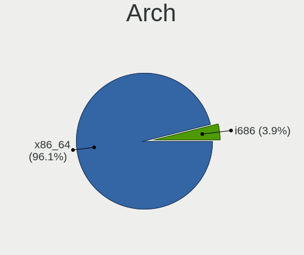

| Name   | Desktops | Percent |
|--------|----------|---------|
| x86_64 | 2286     | 95.29%  |
| i686   | 113      | 4.71%   |

DE
--

Desktop Environment

| Name       | Desktops | Percent |
|------------|----------|---------|
| GNOME      | 1907     | 78.41%  |
| XFCE       | 397      | 16.32%  |
| Unknown    | 118      | 4.85%   |
| KDE5       | 3        | 0.12%   |
| X-Cinnamon | 2        | 0.08%   |
| MATE       | 2        | 0.08%   |
| Cinnamon   | 2        | 0.08%   |
| KDE        | 1        | 0.04%   |

Display Server
--------------

X11 or Wayland

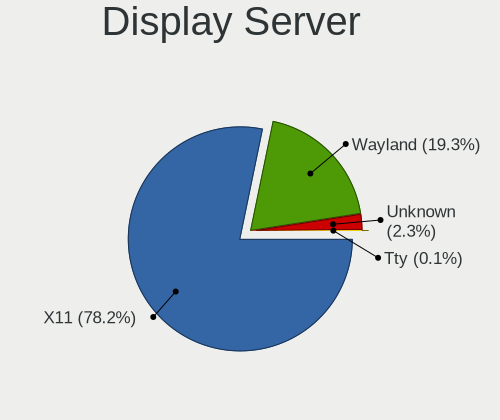

| Name    | Desktops | Percent |
|---------|----------|---------|
| X11     | 2119     | 87.6%   |
| Wayland | 230      | 9.51%   |
| Unknown | 67       | 2.77%   |
| Tty     | 3        | 0.12%   |

Display Manager
---------------

SDDM, LightDM, etc.

| Name    | Desktops | Percent |
|---------|----------|---------|
| Unknown | 2040     | 83.47%  |
| GDM3    | 196      | 8.02%   |
| GDM     | 117      | 4.79%   |
| LightDM | 86       | 3.52%   |
| TDM     | 4        | 0.16%   |
| SDDM    | 1        | 0.04%   |

OS Lang
-------

Language

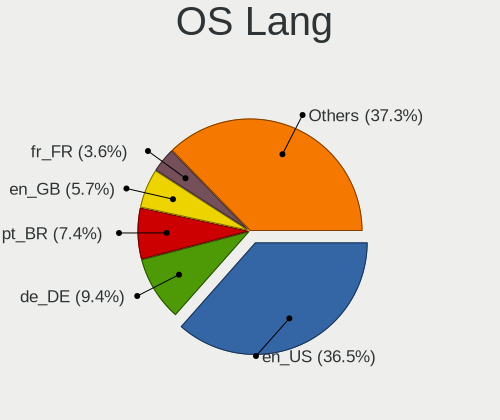

| Lang        | Desktops | Percent |
|-------------|----------|---------|
| en_US       | 892      | 36.98%  |
| de_DE       | 214      | 8.87%   |
| pt_BR       | 174      | 7.21%   |
| en_GB       | 149      | 6.18%   |
| Unknown     | 96       | 3.98%   |
| it_IT       | 82       | 3.4%    |
| fr_FR       | 82       | 3.4%    |
| en_CA       | 71       | 2.94%   |
| es_ES       | 53       | 2.2%    |
| en_IN       | 53       | 2.2%    |
| nl_NL       | 46       | 1.91%   |
| pl_PL       | 44       | 1.82%   |
| en_AU       | 43       | 1.78%   |
| es_AR       | 34       | 1.41%   |
| ru_RU       | 30       | 1.24%   |
| hu_HU       | 26       | 1.08%   |
| es_MX       | 24       | 1%      |
| en_ZA       | 24       | 1%      |
| pt_PT       | 16       | 0.66%   |
| cs_CZ       | 15       | 0.62%   |
| sv_SE       | 13       | 0.54%   |
| tr_TR       | 11       | 0.46%   |
| nb_NO       | 11       | 0.46%   |
| fr_CA       | 11       | 0.46%   |
| es_CL       | 10       | 0.41%   |
| nl_BE       | 9        | 0.37%   |
| es_CO       | 9        | 0.37%   |
| en_NZ       | 9        | 0.37%   |
| ja_JP       | 8        | 0.33%   |
| es_VE       | 8        | 0.33%   |
| el_GR       | 8        | 0.33%   |
| da_DK       | 8        | 0.33%   |
| C           | 8        | 0.33%   |
| fi_FI       | 7        | 0.29%   |
| de_CH       | 7        | 0.29%   |
| sk_SK       | 6        | 0.25%   |
| es_PE       | 6        | 0.25%   |
| en_PH       | 6        | 0.25%   |
| bg_BG       | 6        | 0.25%   |
| sr_RS@latin | 5        | 0.21%   |

Boot Mode
---------

EFI or BIOS

| Mode | Desktops | Percent |
|------|----------|---------|
| BIOS | 1582     | 65.21%  |
| EFI  | 844      | 34.79%  |

Filesystem
----------

Type of filesystem

| Type     | Desktops | Percent |
|----------|----------|---------|
| Ext4     | 2200     | 90.76%  |
| Tmpfs    | 77       | 3.18%   |
| Overlay  | 45       | 1.86%   |
| Zfs      | 41       | 1.69%   |
| Btrfs    | 26       | 1.07%   |
| Ext2     | 12       | 0.5%    |
| Unknown  | 10       | 0.41%   |
| Xfs      | 7        | 0.29%   |
| Ext3     | 5        | 0.21%   |
| Reiserfs | 1        | 0.04%   |

Part. scheme
------------

Scheme of partitioning

| Type    | Desktops | Percent |
|---------|----------|---------|
| Unknown | 2152     | 88.6%   |
| GPT     | 181      | 7.45%   |
| MBR     | 96       | 3.95%   |

Dual Boot with Linux/BSD
------------------------

Hosting more than one Linux/BSD

| Dual boot | Desktops | Percent |
|-----------|----------|---------|
| No        | 2263     | 93.78%  |
| Yes       | 150      | 6.22%   |

Dual Boot (Win)
---------------

Hosting Linux and Windows

| Dual boot | Desktops | Percent |
|-----------|----------|---------|
| No        | 1981     | 81.49%  |
| Yes       | 450      | 18.51%  |

Board
-----

Vendor
------

Motherboard manufacturer

| Name                | Desktops | Percent |
|---------------------|----------|---------|
| ASUSTek Computer    | 539      | 22.47%  |
| Gigabyte Technology | 363      | 15.13%  |
| Dell                | 257      | 10.71%  |
| MSI                 | 226      | 9.42%   |
| Hewlett-Packard     | 211      | 8.8%    |
| ASRock              | 173      | 7.21%   |
| Lenovo              | 110      | 4.59%   |
| Intel               | 79       | 3.29%   |
| Unknown             | 50       | 2.08%   |
| Acer                | 49       | 2.04%   |
| Pegatron            | 43       | 1.79%   |
| Biostar             | 32       | 1.33%   |
| Foxconn             | 27       | 1.13%   |
| Fujitsu             | 26       | 1.08%   |
| ECS                 | 22       | 0.92%   |
| Positivo            | 10       | 0.42%   |
| AZW                 | 10       | 0.42%   |
| Alienware           | 10       | 0.42%   |
| Shuttle             | 9        | 0.38%   |
| Medion              | 9        | 0.38%   |
| Apple               | 8        | 0.33%   |
| Packard Bell        | 5        | 0.21%   |
| OEM                 | 5        | 0.21%   |
| IBM                 | 5        | 0.21%   |
| Google              | 5        | 0.21%   |
| Gateway             | 5        | 0.21%   |
| eMachines           | 5        | 0.21%   |
| Huanan              | 4        | 0.17%   |
| BESSTAR Tech        | 4        | 0.17%   |
| Semp Toshiba        | 3        | 0.13%   |
| Samsung Electronics | 3        | 0.13%   |
| QIYIDA              | 3        | 0.13%   |
| MACHINIST           | 3        | 0.13%   |
| LORD ELECTRONICS    | 3        | 0.13%   |
| AMI                 | 3        | 0.13%   |
| ABIT                | 3        | 0.13%   |
| ZOTAC               | 2        | 0.08%   |
| WinFast             | 2        | 0.08%   |
| Supermicro          | 2        | 0.08%   |
| SiS Technology      | 2        | 0.08%   |

Model
-----

Motherboard model

| Name                             | Desktops | Percent |
|----------------------------------|----------|---------|
| Unknown                          | 55       | 2.29%   |
| ASUS All Series                  | 47       | 1.96%   |
| Dell OptiPlex 7010               | 19       | 0.79%   |
| MSI MS-7817                      | 13       | 0.54%   |
| ASUS TUF Gaming X570-PLUS        | 12       | 0.5%    |
| Gigabyte A320M-S2H               | 11       | 0.46%   |
| Dell OptiPlex 990                | 11       | 0.46%   |
| Dell OptiPlex 790                | 11       | 0.46%   |
| Dell OptiPlex 780                | 11       | 0.46%   |
| Dell OptiPlex 380                | 11       | 0.46%   |
| ASUS M5A97 R2.0                  | 11       | 0.46%   |
| Intel H61                        | 10       | 0.42%   |
| Gigabyte B450 AORUS M            | 9        | 0.38%   |
| Dell OptiPlex 755                | 9        | 0.38%   |
| Dell OptiPlex 3010               | 9        | 0.38%   |
| ASUS M5A78L-M/USB3               | 9        | 0.38%   |
| MSI MS-7C37                      | 8        | 0.33%   |
| MSI MS-7C02                      | 8        | 0.33%   |
| Gigabyte GA-78LMT-USB3 6.0       | 8        | 0.33%   |
| Gigabyte 970A-DS3P               | 8        | 0.33%   |
| Dell OptiPlex 9020               | 7        | 0.29%   |
| Dell OptiPlex 7050               | 7        | 0.29%   |
| Dell OptiPlex 7040               | 7        | 0.29%   |
| MSI MS-7C91                      | 6        | 0.25%   |
| MSI MS-7C56                      | 6        | 0.25%   |
| MSI MS-7B86                      | 6        | 0.25%   |
| MSI MS-7A38                      | 6        | 0.25%   |
| HP ProDesk 600 G1 SFF            | 6        | 0.25%   |
| HP EliteDesk 800 G1 SFF          | 6        | 0.25%   |
| HP Compaq Pro 6300 SFF           | 6        | 0.25%   |
| Dell Precision WorkStation T3500 | 6        | 0.25%   |
| Dell OptiPlex 7020               | 6        | 0.25%   |
| Dell OptiPlex 390                | 6        | 0.25%   |
| Dell OptiPlex 3020               | 6        | 0.25%   |
| MSI MS-7C75                      | 5        | 0.21%   |
| HP Z600 Workstation              | 5        | 0.21%   |
| HP Compaq Elite 8300 SFF         | 5        | 0.21%   |
| HP Compaq 6005 Pro SFF PC        | 5        | 0.21%   |
| Gigabyte H110M-H                 | 5        | 0.21%   |
| Gigabyte GA-78LMT-USB3           | 5        | 0.21%   |

Model Family
------------

Motherboard model prefix

| Name                   | Desktops | Percent |
|------------------------|----------|---------|
| Dell OptiPlex          | 162      | 6.75%   |
| Lenovo ThinkCentre     | 74       | 3.08%   |
| HP Compaq              | 73       | 3.04%   |
| ASUS PRIME             | 68       | 2.83%   |
| ASUS ROG               | 56       | 2.33%   |
| ASUS TUF               | 55       | 2.29%   |
| Unknown                | 55       | 2.29%   |
| ASUS All               | 47       | 1.96%   |
| HP EliteDesk           | 31       | 1.29%   |
| Dell Precision         | 31       | 1.29%   |
| Acer Aspire            | 24       | 1%      |
| Dell Inspiron          | 22       | 0.92%   |
| Fujitsu ESPRIMO        | 21       | 0.88%   |
| HP ProDesk             | 17       | 0.71%   |
| Gigabyte B450          | 17       | 0.71%   |
| ASUS M5A97             | 17       | 0.71%   |
| HP Pavilion            | 16       | 0.67%   |
| ASUS M5A78L-M          | 16       | 0.67%   |
| Gigabyte GA-78LMT-USB3 | 14       | 0.58%   |
| MSI MS-7817            | 13       | 0.54%   |
| Dell Vostro            | 13       | 0.54%   |
| Acer Veriton           | 13       | 0.54%   |
| Gigabyte A320M-S2H     | 12       | 0.5%    |
| Lenovo IdeaCentre      | 11       | 0.46%   |
| Gigabyte B450M         | 11       | 0.46%   |
| Dell XPS               | 11       | 0.46%   |
| ASUS P8H61-M           | 11       | 0.46%   |
| Intel H61              | 10       | 0.42%   |
| Gigabyte X570          | 10       | 0.42%   |
| ASUS P5G41T-M          | 10       | 0.42%   |
| ASRock B450M           | 9        | 0.38%   |
| ASRock B450            | 9        | 0.38%   |
| MSI MS-7C37            | 8        | 0.33%   |
| MSI MS-7C02            | 8        | 0.33%   |
| Gigabyte 970A-DS3P     | 8        | 0.33%   |
| ASUS P8Z77-V           | 8        | 0.33%   |
| ASRock X570            | 8        | 0.33%   |
| Gigabyte B550          | 7        | 0.29%   |
| ASRock 970             | 7        | 0.29%   |
| Alienware Aurora       | 7        | 0.29%   |

MFG Year
--------

Motherboard manufacture year

| Year    | Desktops | Percent |
|---------|----------|---------|
| 2013    | 212      | 8.84%   |
| 2012    | 212      | 8.84%   |
| 2011    | 202      | 8.42%   |
| 2018    | 184      | 7.67%   |
| 2014    | 171      | 7.13%   |
| 2010    | 165      | 6.88%   |
| 2009    | 151      | 6.29%   |
| 2008    | 135      | 5.63%   |
| 2020    | 132      | 5.5%    |
| 2017    | 130      | 5.42%   |
| 2019    | 128      | 5.34%   |
| 2021    | 110      | 4.59%   |
| 2007    | 91       | 3.79%   |
| 2016    | 82       | 3.42%   |
| 2015    | 78       | 3.25%   |
| 2022    | 69       | 2.88%   |
| 2006    | 52       | 2.17%   |
| 2023    | 41       | 1.71%   |
| 2005    | 29       | 1.21%   |
| 2004    | 10       | 0.42%   |
| 2003    | 6        | 0.25%   |
| Unknown | 6        | 0.25%   |
| 2024    | 2        | 0.08%   |
| 2002    | 1        | 0.04%   |

Form Factor
-----------

Physical design of the computer

| Name    | Desktops | Percent |
|---------|----------|---------|
| Desktop | 2399     | 100%    |

Secure Boot
-----------

Enabled or disabled

| State    | Desktops | Percent |
|----------|----------|---------|
| Disabled | 2294     | 95.34%  |
| Enabled  | 112      | 4.66%   |

Coreboot
--------

Have coreboot on board

| Used | Desktops | Percent |
|------|----------|---------|
| No   | 2394     | 99.79%  |
| Yes  | 5        | 0.21%   |

RAM Size
--------

Total RAM memory

| Size in GB      | Desktops | Percent |
|-----------------|----------|---------|
| 16.01-24.0      | 526      | 21.58%  |
| 8.01-16.0       | 471      | 19.32%  |
| 3.01-4.0        | 408      | 16.74%  |
| 4.01-8.0        | 402      | 16.49%  |
| 32.01-64.0      | 283      | 11.61%  |
| 1.01-2.0        | 116      | 4.76%   |
| 64.01-256.0     | 87       | 3.57%   |
| 2.01-3.0        | 59       | 2.42%   |
| 24.01-32.0      | 58       | 2.38%   |
| 0.51-1.0        | 26       | 1.07%   |
| More than 256.0 | 2        | 0.08%   |

RAM Used
--------

Used RAM memory

| Used GB    | Desktops | Percent |
|------------|----------|---------|
| 1.01-2.0   | 993      | 37.67%  |
| 2.01-3.0   | 724      | 27.47%  |
| 3.01-4.0   | 349      | 13.24%  |
| 4.01-8.0   | 324      | 12.29%  |
| 0.51-1.0   | 147      | 5.58%   |
| 8.01-16.0  | 66       | 2.5%    |
| 0.01-0.5   | 17       | 0.64%   |
| 16.01-24.0 | 12       | 0.46%   |
| 32.01-64.0 | 2        | 0.08%   |
| 24.01-32.0 | 2        | 0.08%   |

Total Drives
------------

Number of drives on board

| Drives | Desktops | Percent |
|--------|----------|---------|
| 1      | 1166     | 47.02%  |
| 2      | 685      | 27.62%  |
| 3      | 308      | 12.42%  |
| 4      | 156      | 6.29%   |
| 5      | 75       | 3.02%   |
| 6      | 43       | 1.73%   |
| 7      | 16       | 0.65%   |
| 8      | 15       | 0.6%    |
| 0      | 9        | 0.36%   |
| 11     | 2        | 0.08%   |
| 10     | 2        | 0.08%   |
| 9      | 2        | 0.08%   |
| 51     | 1        | 0.04%   |

Has CD-ROM
----------

Has CD-ROM on board

| Presented | Desktops | Percent |
|-----------|----------|---------|
| Yes       | 1253     | 51.82%  |
| No        | 1165     | 48.18%  |

Has Ethernet
------------

Has Ethernet on board

| Presented | Desktops | Percent |
|-----------|----------|---------|
| Yes       | 2375     | 99%     |
| No        | 24       | 1%      |

Has WiFi
--------

Has WiFi module

| Presented | Desktops | Percent |
|-----------|----------|---------|
| No        | 1218     | 50.27%  |
| Yes       | 1205     | 49.73%  |

Has Bluetooth
-------------

Has Bluetooth module

| Presented | Desktops | Percent |
|-----------|----------|---------|
| No        | 1684     | 69.53%  |
| Yes       | 738      | 30.47%  |

Location
--------

Country
-------

Geographic location (country)

| Country      | Desktops | Percent |
|--------------|----------|---------|
| USA          | 590      | 24.53%  |
| Germany      | 239      | 9.94%   |
| Brazil       | 193      | 8.02%   |
| UK           | 151      | 6.28%   |
| Italy        | 94       | 3.91%   |
| Canada       | 93       | 3.87%   |
| France       | 80       | 3.33%   |
| Netherlands  | 74       | 3.08%   |
| India        | 58       | 2.41%   |
| Spain        | 56       | 2.33%   |
| Poland       | 47       | 1.95%   |
| Australia    | 46       | 1.91%   |
| Argentina    | 39       | 1.62%   |
| Mexico       | 30       | 1.25%   |
| Hungary      | 30       | 1.25%   |
| South Africa | 26       | 1.08%   |
| Russia       | 25       | 1.04%   |
| Portugal     | 25       | 1.04%   |
| Greece       | 25       | 1.04%   |
| Sweden       | 22       | 0.91%   |
| Belgium      | 22       | 0.91%   |
| Denmark      | 21       | 0.87%   |
| Norway       | 20       | 0.83%   |
| Czechia      | 20       | 0.83%   |
| Switzerland  | 18       | 0.75%   |
| Indonesia    | 18       | 0.75%   |
| Egypt        | 18       | 0.75%   |
| Serbia       | 17       | 0.71%   |
| Chile        | 16       | 0.67%   |
| Turkey       | 15       | 0.62%   |
| Romania      | 15       | 0.62%   |
| Colombia     | 14       | 0.58%   |
| Bulgaria     | 12       | 0.5%    |
| Japan        | 11       | 0.46%   |
| Venezuela    | 10       | 0.42%   |
| Slovakia     | 10       | 0.42%   |
| New Zealand  | 10       | 0.42%   |
| Malaysia     | 10       | 0.42%   |
| Finland      | 10       | 0.42%   |
| Ukraine      | 9        | 0.37%   |

City
----

Geographic location (city)

| City           | Desktops | Percent |
|----------------|----------|---------|
| Berlin         | 22       | 0.87%   |
| Sao Paulo      | 20       | 0.79%   |
| Rio de Janeiro | 20       | 0.79%   |
| Athens         | 17       | 0.68%   |
| Milan          | 14       | 0.56%   |
| Munich         | 13       | 0.52%   |
| Houston        | 12       | 0.48%   |
| Cape Town      | 12       | 0.48%   |
| Sydney         | 10       | 0.4%    |
| Rome           | 10       | 0.4%    |
| Copenhagen     | 10       | 0.4%    |
| Calgary        | 10       | 0.4%    |
| Toronto        | 9        | 0.36%   |
| Perth          | 9        | 0.36%   |
| Denver         | 9        | 0.36%   |
| Atlanta        | 9        | 0.36%   |
| Adelaide       | 9        | 0.36%   |
| Zurich         | 8        | 0.32%   |
| Santiago       | 8        | 0.32%   |
| Phoenix        | 8        | 0.32%   |
| Montreal       | 8        | 0.32%   |
| Johannesburg   | 8        | 0.32%   |
| Buenos Aires   | 8        | 0.32%   |
| Budapest       | 8        | 0.32%   |
| Bogot        | 8        | 0.32%   |
| Bengaluru      | 8        | 0.32%   |
| Belgrade       | 8        | 0.32%   |
| San Jose       | 7        | 0.28%   |
| Melbourne      | 7        | 0.28%   |
| London         | 7        | 0.28%   |
| Las Vegas      | 7        | 0.28%   |
| Hamburg        | 7        | 0.28%   |
| Dallas         | 7        | 0.28%   |
| Cairo          | 7        | 0.28%   |
| Warsaw         | 6        | 0.24%   |
| Vienna         | 6        | 0.24%   |
| The Hague      | 6        | 0.24%   |
| Richmond       | 6        | 0.24%   |
| Portland       | 6        | 0.24%   |
| Mumbai         | 6        | 0.24%   |

Drives
------

Drive Vendor
------------

Hard drive vendors

| Vendor                      | Desktops | Drives | Percent |
|-----------------------------|----------|--------|---------|
| Seagate                     | 785      | 1194   | 18.98%  |
| WDC                         | 748      | 1084   | 18.09%  |
| Samsung Electronics         | 533      | 831    | 12.89%  |
| Kingston                    | 261      | 356    | 6.31%   |
| Sandisk                     | 209      | 305    | 5.05%   |
| Toshiba                     | 201      | 292    | 4.86%   |
| Hitachi                     | 178      | 218    | 4.3%    |
| Crucial                     | 146      | 178    | 3.53%   |
| China                       | 71       | 84     | 1.72%   |
| Maxtor                      | 50       | 69     | 1.21%   |
| Unknown                     | 45       | 88     | 1.09%   |
| A-DATA Technology           | 45       | 58     | 1.09%   |
| Intel                       | 44       | 52     | 1.06%   |
| Silicon Motion              | 39       | 51     | 0.94%   |
| PNY                         | 38       | 51     | 0.92%   |
| Micron/Crucial Technology   | 35       | 44     | 0.85%   |
| Phison                      | 33       | 42     | 0.8%    |
| Intenso                     | 33       | 41     | 0.8%    |
| HGST                        | 30       | 41     | 0.73%   |
| SK hynix                    | 28       | 36     | 0.68%   |
| SPCC                        | 23       | 31     | 0.56%   |
| Phison Electronics          | 23       | 29     | 0.56%   |
| Patriot                     | 21       | 34     | 0.51%   |
| Micron Technology           | 21       | 23     | 0.51%   |
| OCZ                         | 20       | 23     | 0.48%   |
| MAXIO Technology (Hangzhou) | 18       | 18     | 0.44%   |
| Lexar                       | 16       | 19     | 0.39%   |
| GOODRAM                     | 15       | 19     | 0.36%   |
| Unknown                     | 15       | 18     | 0.36%   |
| Realtek Semiconductor       | 14       | 14     | 0.34%   |
| Kingston Technology Company | 14       | 18     | 0.34%   |
| JMicron Technology          | 14       | 19     | 0.34%   |
| Hewlett-Packard             | 14       | 21     | 0.34%   |
| Transcend                   | 13       | 15     | 0.31%   |
| Corsair                     | 13       | 20     | 0.31%   |
| KingSpec                    | 12       | 15     | 0.29%   |
| Apacer                      | 12       | 16     | 0.29%   |
| Netac                       | 11       | 17     | 0.27%   |
| Gigabyte Technology         | 11       | 19     | 0.27%   |
| Apple                       | 11       | 12     | 0.27%   |

Drive Model
-----------

Hard drive models

| Model                                                 | Desktops | Percent |
|-------------------------------------------------------|----------|---------|
| Seagate ST500DM002-1BD142 500GB                       | 73       | 1.55%   |
| Kingston SA400S37240G 240GB SSD                       | 71       | 1.51%   |
| Seagate ST1000DM010-2EP102 1TB                        | 50       | 1.06%   |
| Kingston SA400S37120G 120GB SSD                       | 38       | 0.81%   |
| Samsung NVMe SSD Controller SM981/PM981/PM983 1TB     | 37       | 0.79%   |
| Samsung SSD 860 EVO 500GB                             | 36       | 0.77%   |
| Seagate ST1000DM003-1CH162 1TB                        | 33       | 0.7%    |
| Crucial CT240BX500SSD1 240GB                          | 33       | 0.7%    |
| Seagate ST3500418AS 500GB                             | 32       | 0.68%   |
| Toshiba DT01ACA100 1TB                                | 31       | 0.66%   |
| Kingston SA400S37480G 480GB SSD                       | 31       | 0.66%   |
| Samsung SSD 850 EVO 250GB                             | 30       | 0.64%   |
| WDC WD10EZEX-08WN4A0 1TB                              | 29       | 0.62%   |
| Toshiba HDWD110 1TB                                   | 26       | 0.55%   |
| Seagate ST1000DM003-1ER162 1TB                        | 25       | 0.53%   |
| Kingston SV300S37A120G 120GB SSD                      | 23       | 0.49%   |
| Seagate ST2000DM001-1ER164 2TB                        | 22       | 0.47%   |
| Samsung NVMe SSD Controller PM9A1/PM9A3/980PRO 1TB    | 22       | 0.47%   |
| Samsung SSD 850 EVO 500GB                             | 21       | 0.45%   |
| Samsung NVMe SSD Drive 1TB                            | 21       | 0.45%   |
| Crucial CT500MX500SSD1 500GB                          | 21       | 0.45%   |
| Samsung NVMe SSD Drive 500GB                          | 20       | 0.43%   |
| Toshiba DT01ACA050 500GB                              | 19       | 0.4%    |
| Seagate ST2000DM008-2FR102 2TB                        | 19       | 0.4%    |
| Seagate ST4000DM004-2CV104 4TB                        | 18       | 0.38%   |
| Seagate ST3500413AS 500GB                             | 18       | 0.38%   |
| Seagate ST31000528AS 1TB                              | 18       | 0.38%   |
| Unknown SD/MMC/MS PRO 128GB                           | 17       | 0.36%   |
| Silicon Motion SM2263EN/SM2263XT SSD Controller 256GB | 17       | 0.36%   |
| Micron/Crucial P2 NVMe PCIe SSD 4TB                   | 17       | 0.36%   |
| Seagate ST3500312CS 500GB                             | 16       | 0.34%   |
| SanDisk NVMe SSD Drive 500GB                          | 16       | 0.34%   |
| Crucial CT1000MX500SSD1 1TB                           | 16       | 0.34%   |
| Toshiba DT01ACA200 2TB                                | 15       | 0.32%   |
| Seagate ST31000524AS 1TB                              | 15       | 0.32%   |
| Samsung SSD 870 EVO 500GB                             | 15       | 0.32%   |
| Samsung SSD 860 EVO 250GB                             | 15       | 0.32%   |
| Samsung SSD 840 EVO 250GB                             | 15       | 0.32%   |
| Unknown                                               | 15       | 0.32%   |
| Seagate ST2000DM001-1CH164 2TB                        | 14       | 0.3%    |

HDD Vendor
----------

Hard disk drive vendors

| Vendor              | Desktops | Drives | Percent |
|---------------------|----------|--------|---------|
| Seagate             | 772      | 1165   | 36.73%  |
| WDC                 | 689      | 984    | 32.78%  |
| Hitachi             | 178      | 218    | 8.47%   |
| Toshiba             | 177      | 265    | 8.42%   |
| Samsung Electronics | 137      | 182    | 6.52%   |
| Maxtor              | 49       | 68     | 2.33%   |
| HGST                | 30       | 41     | 1.43%   |
| Unknown             | 19       | 25     | 0.9%    |
| JMicron Technology  | 11       | 15     | 0.52%   |
| SABRENT             | 8        | 11     | 0.38%   |
| Apple               | 7        | 8      | 0.33%   |
| Hewlett-Packard     | 5        | 11     | 0.24%   |
| XrayDisk            | 2        | 2      | 0.1%    |
| USB3.0              | 2        | 3      | 0.1%    |
| Quantum             | 2        | 2      | 0.1%    |
| ASMT                | 2        | 3      | 0.1%    |
| WD MediaMax         | 1        | 1      | 0.05%   |
| Unknown (CF)        | 1        | 1      | 0.05%   |
| TO Exter            | 1        | 1      | 0.05%   |
| TDAS                | 1        | 3      | 0.05%   |
| LaCie               | 1        | 1      | 0.05%   |
| Intenso             | 1        | 3      | 0.05%   |
| IBM/Hitachi         | 1        | 1      | 0.05%   |
| HGST HTS            | 1        | 1      | 0.05%   |
| Fujitsu             | 1        | 1      | 0.05%   |
| ExcelStor           | 1        | 1      | 0.05%   |
| ASMT109x            | 1        | 2      | 0.05%   |
| ACASIS              | 1        | 1      | 0.05%   |

SSD Vendor
----------

Solid state drive vendors

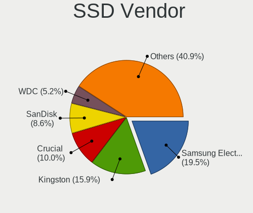

| Vendor              | Desktops | Drives | Percent |
|---------------------|----------|--------|---------|
| Samsung Electronics | 284      | 413    | 20%     |
| Kingston            | 224      | 292    | 15.77%  |
| Crucial             | 140      | 172    | 9.86%   |
| SanDisk             | 122      | 166    | 8.59%   |
| WDC                 | 72       | 89     | 5.07%   |
| China               | 69       | 82     | 4.86%   |
| A-DATA Technology   | 43       | 56     | 3.03%   |
| PNY                 | 38       | 51     | 2.68%   |
| Intel               | 32       | 37     | 2.25%   |
| Intenso             | 25       | 30     | 1.76%   |
| SPCC                | 22       | 30     | 1.55%   |
| Patriot             | 19       | 32     | 1.34%   |
| OCZ                 | 19       | 22     | 1.34%   |
| Lexar               | 16       | 19     | 1.13%   |
| Toshiba             | 15       | 17     | 1.06%   |
| Micron Technology   | 14       | 16     | 0.99%   |
| GOODRAM             | 14       | 18     | 0.99%   |
| Transcend           | 13       | 15     | 0.92%   |
| Apacer              | 12       | 16     | 0.85%   |
| SK hynix            | 11       | 13     | 0.77%   |
| Netac               | 11       | 16     | 0.77%   |
| KingSpec            | 11       | 14     | 0.77%   |
| Corsair             | 10       | 16     | 0.7%    |
| Team                | 9        | 11     | 0.63%   |
| Hewlett-Packard     | 9        | 10     | 0.63%   |
| Gigabyte Technology | 9        | 16     | 0.63%   |
| Verbatim            | 7        | 10     | 0.49%   |
| Leven               | 7        | 8      | 0.49%   |
| KIOXIA-EXCERIA      | 7        | 12     | 0.49%   |
| Unknown             | 7        | 10     | 0.49%   |
| LITEON              | 6        | 7      | 0.42%   |
| Seagate             | 5        | 10     | 0.35%   |
| Super Talent        | 4        | 5      | 0.28%   |
| Mushkin             | 4        | 4      | 0.28%   |
| LITEONIT            | 4        | 6      | 0.28%   |
| Fanxiang            | 4        | 4      | 0.28%   |
| External            | 4        | 4      | 0.28%   |
| Drevo               | 4        | 6      | 0.28%   |
| Plextor             | 3        | 4      | 0.21%   |
| Pioneer             | 3        | 3      | 0.21%   |

Drive Kind
----------

HDD or SSD

| Kind    | Desktops | Drives | Percent |
|---------|----------|--------|---------|
| HDD     | 1639     | 3020   | 47.4%   |
| SSD     | 1190     | 1871   | 34.41%  |
| NVMe    | 521      | 812    | 15.07%  |
| Unknown | 99       | 140    | 2.86%   |
| MMC     | 9        | 11     | 0.26%   |

Drive Connector
---------------

SATA, SAS, NVMe, etc.

| Type | Desktops | Drives | Percent |
|------|----------|--------|---------|
| SATA | 2221     | 4771   | 76.11%  |
| NVMe | 519      | 806    | 17.79%  |
| SAS  | 169      | 266    | 5.79%   |
| MMC  | 9        | 11     | 0.31%   |

Drive Size
----------

Size of hard drive

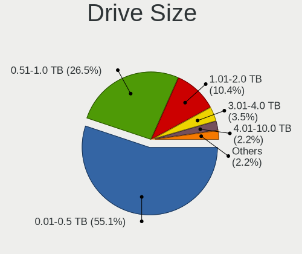

| Size in TB | Desktops | Drives | Percent |
|------------|----------|--------|---------|
| 0.01-0.5   | 1702     | 2852   | 56.45%  |
| 0.51-1.0   | 787      | 1205   | 26.1%   |
| 1.01-2.0   | 304      | 438    | 10.08%  |
| 3.01-4.0   | 101      | 203    | 3.35%   |
| 2.01-3.0   | 54       | 79     | 1.79%   |
| 4.01-10.0  | 54       | 79     | 1.79%   |
| 10.01-20.0 | 12       | 33     | 0.4%    |
| 20.01-50.0 | 1        | 2      | 0.03%   |

Space Total
-----------

Amount of disk space available on the file system

| Size in GB     | Desktops | Percent |
|----------------|----------|---------|
| 101-250        | 765      | 30.38%  |
| 251-500        | 555      | 22.04%  |
| 501-1000       | 373      | 14.81%  |
| 1001-2000      | 227      | 9.02%   |
| 51-100         | 170      | 6.75%   |
| More than 3000 | 168      | 6.67%   |
| 21-50          | 90       | 3.57%   |
| 2001-3000      | 76       | 3.02%   |
| 1-20           | 70       | 2.78%   |
| Unknown        | 23       | 0.91%   |
| 0              | 1        | 0.04%   |

Space Used
----------

Amount of used disk space

| Used GB        | Desktops | Percent |
|----------------|----------|---------|
| 1-20           | 998      | 38.02%  |
| 21-50          | 620      | 23.62%  |
| 51-100         | 299      | 11.39%  |
| 101-250        | 232      | 8.84%   |
| 251-500        | 166      | 6.32%   |
| 501-1000       | 115      | 4.38%   |
| 1001-2000      | 75       | 2.86%   |
| More than 3000 | 68       | 2.59%   |
| 2001-3000      | 28       | 1.07%   |
| Unknown        | 23       | 0.88%   |
| 0              | 1        | 0.04%   |

Malfunc. Drives
---------------

Drive models with a malfunction

| Model                                    | Desktops | Drives | Percent |
|------------------------------------------|----------|--------|---------|
| WDC WD30EFRX-68EUZN0 3TB                 | 2        | 2      | 3.51%   |
| Seagate ST500DM002-1BD142 500GB          | 2        | 2      | 3.51%   |
| Seagate ST2000LM007-1R8174 2TB           | 2        | 2      | 3.51%   |
| HGST HTS541010A9E680 1TB                 | 2        | 2      | 3.51%   |
| WDC WDS500G2B0A-00SM50 500GB SSD         | 1        | 1      | 1.75%   |
| WDC WD5000LPCX-60VHAT0 500GB             | 1        | 1      | 1.75%   |
| WDC WD5000AAKS-00V1A0 500GB              | 1        | 1      | 1.75%   |
| WDC WD3200AAKS-22B3A0 320GB              | 1        | 1      | 1.75%   |
| WDC WD2500AAJS-00B4A0 250GB              | 1        | 1      | 1.75%   |
| WDC WD20EZRX-22D8PB0 2TB                 | 1        | 1      | 1.75%   |
| WDC WD20EZRX-00D8PB0 2TB                 | 1        | 1      | 1.75%   |
| WDC WD10JPVX-60JC3T0 1TB                 | 1        | 1      | 1.75%   |
| WDC WD10EZEX-21M2NA0 1TB                 | 1        | 2      | 1.75%   |
| WDC WD10EURX-63FH1Y0 1TB                 | 1        | 1      | 1.75%   |
| WDC WD Green 2.5 1000GB                  | 1        | 1      | 1.75%   |
| Toshiba THNSNK256GVN8 M.2 2280 256GB SSD | 1        | 1      | 1.75%   |
| Toshiba MQ01ABD100 1TB                   | 1        | 1      | 1.75%   |
| Toshiba MK8046GSX 80GB                   | 1        | 1      | 1.75%   |
| Toshiba MK3265GSX 320GB                  | 1        | 1      | 1.75%   |
| Toshiba MG03ACA200 2TB                   | 1        | 1      | 1.75%   |
| Toshiba DT01ACA100 1TB                   | 1        | 1      | 1.75%   |
| Silicon Motion Inland NVMe SSD 256GB     | 1        | 1      | 1.75%   |
| Seagate ST9500420AS 500GB                | 1        | 1      | 1.75%   |
| Seagate ST8000DM004-2CX188 8TB           | 1        | 1      | 1.75%   |
| Seagate ST4000DM004-2CV104 4TB           | 1        | 1      | 1.75%   |
| Seagate ST3500514NS 500GB                | 1        | 1      | 1.75%   |
| Seagate ST3500413AS 500GB                | 1        | 1      | 1.75%   |
| Seagate ST3500312CS 500GB                | 1        | 1      | 1.75%   |
| Seagate ST3360320AS 360GB                | 1        | 1      | 1.75%   |
| Seagate ST3320620AS 320GB                | 1        | 1      | 1.75%   |
| Seagate ST3250318AS 250GB                | 1        | 1      | 1.75%   |
| Seagate ST320LT012-1DG14C 320GB          | 1        | 1      | 1.75%   |
| Seagate ST320LT009-9WC142 320GB          | 1        | 1      | 1.75%   |
| Seagate ST3160310CS 160GB                | 1        | 1      | 1.75%   |
| Seagate ST2000LM003 HN-M201RAD 2TB       | 1        | 1      | 1.75%   |
| Seagate ST2000DX002-2DV164 2TB           | 1        | 1      | 1.75%   |
| Seagate ST2000DM008-2FR102 2TB           | 1        | 1      | 1.75%   |
| Seagate ST2000DM001-9YN164 2TB           | 1        | 1      | 1.75%   |
| Seagate ST2000DL003-9VT166 2TB           | 1        | 1      | 1.75%   |
| Seagate ST1000DM003-1ER162 1TB           | 1        | 1      | 1.75%   |

Malfunc. Drive Vendor
---------------------

Vendors of faulty drives

| Vendor              | Desktops | Drives | Percent |
|---------------------|----------|--------|---------|
| Seagate             | 21       | 22     | 37.5%   |
| WDC                 | 13       | 14     | 23.21%  |
| Toshiba             | 6        | 6      | 10.71%  |
| Samsung Electronics | 3        | 3      | 5.36%   |
| HGST                | 3        | 3      | 5.36%   |
| Kingston            | 2        | 2      | 3.57%   |
| A-DATA Technology   | 2        | 2      | 3.57%   |
| Silicon Motion      | 1        | 1      | 1.79%   |
| OCZ                 | 1        | 1      | 1.79%   |
| Maxtor              | 1        | 1      | 1.79%   |
| Intel               | 1        | 1      | 1.79%   |
| Hitachi             | 1        | 1      | 1.79%   |
| China               | 1        | 1      | 1.79%   |

Malfunc. HDD Vendor
-------------------

Vendors of faulty HDD drives

| Vendor              | Desktops | Drives | Percent |
|---------------------|----------|--------|---------|
| Seagate             | 21       | 22     | 47.73%  |
| WDC                 | 11       | 12     | 25%     |
| Toshiba             | 5        | 5      | 11.36%  |
| HGST                | 3        | 3      | 6.82%   |
| Samsung Electronics | 2        | 2      | 4.55%   |
| Maxtor              | 1        | 1      | 2.27%   |
| Hitachi             | 1        | 1      | 2.27%   |

Malfunc. Drive Kind
-------------------

Kinds of faulty drives

| Kind | Desktops | Drives | Percent |
|------|----------|--------|---------|
| HDD  | 40       | 46     | 76.92%  |
| SSD  | 10       | 10     | 19.23%  |
| NVMe | 2        | 2      | 3.85%   |

Failed Drives
-------------

Failed drive models

Zero info for selected period =(

Failed Drive Vendor
-------------------

Failed drive vendors

Zero info for selected period =(

Drive Status
------------

Number of failed and malfunc. drives

| Status   | Desktops | Drives | Percent |
|----------|----------|--------|---------|
| Detected | 2256     | 5405   | 91.37%  |
| Works    | 162      | 391    | 6.56%   |
| Malfunc  | 51       | 58     | 2.07%   |

Storage controller
------------------

Storage Vendor
--------------

Storage controller vendors

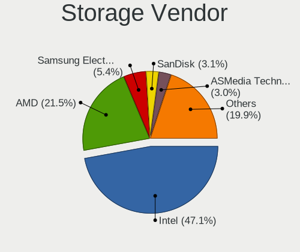

| Vendor                           | Desktops | Percent |
|----------------------------------|----------|---------|
| Intel                            | 1554     | 47.93%  |
| AMD                              | 707      | 21.81%  |
| Samsung Electronics              | 166      | 5.12%   |
| SanDisk                          | 99       | 3.05%   |
| Nvidia                           | 96       | 2.96%   |
| ASMedia Technology               | 95       | 2.93%   |
| JMicron Technology               | 78       | 2.41%   |
| Phison Electronics               | 60       | 1.85%   |
| Marvell Technology Group         | 58       | 1.79%   |
| Kingston Technology Company      | 56       | 1.73%   |
| Silicon Motion                   | 41       | 1.26%   |
| Micron/Crucial Technology        | 41       | 1.26%   |
| VIA Technologies                 | 28       | 0.86%   |
| MAXIO Technology (Hangzhou)      | 19       | 0.59%   |
| SK hynix                         | 16       | 0.49%   |
| ADATA Technology                 | 16       | 0.49%   |
| Realtek Semiconductor            | 14       | 0.43%   |
| Silicon Image                    | 13       | 0.4%    |
| Seagate Technology               | 11       | 0.34%   |
| KIOXIA                           | 10       | 0.31%   |
| Toshiba America Info Systems     | 8        | 0.25%   |
| Broadcom / LSI                   | 8        | 0.25%   |
| Micron Technology                | 7        | 0.22%   |
| Silicon Integrated Systems [SiS] | 6        | 0.19%   |
| Shenzhen Longsys Electronics     | 6        | 0.19%   |
| Integrated Technology Express    | 4        | 0.12%   |
| INNOGRIT                         | 3        | 0.09%   |
| OCZ Technology Group             | 2        | 0.06%   |
| LSI Logic / Symbios Logic        | 2        | 0.06%   |
| HighPoint Technologies           | 2        | 0.06%   |
| Apple                            | 2        | 0.06%   |
| Adaptec                          | 2        | 0.06%   |
| Union Memory (Shenzhen)          | 1        | 0.03%   |
| TenaFe                           | 1        | 0.03%   |
| Solid State Storage Technology   | 1        | 0.03%   |
| Promise Technology               | 1        | 0.03%   |
| Nextorage                        | 1        | 0.03%   |
| Netac Technology                 | 1        | 0.03%   |
| Lite-On Technology               | 1        | 0.03%   |
| Lite-On IT Corp. / Plextor       | 1        | 0.03%   |

Storage Model
-------------

Storage controller models

| Model                                                                                   | Desktops | Percent |
|-----------------------------------------------------------------------------------------|----------|---------|
| AMD FCH SATA Controller [AHCI mode]                                                     | 340      | 8.08%   |
| Intel 8 Series/C220 Series Chipset Family 6-port SATA Controller 1 [AHCI mode]          | 210      | 4.99%   |
| Intel NM10/ICH7 Family SATA Controller [IDE mode]                                       | 184      | 4.37%   |
| Intel 6 Series/C200 Series Chipset Family 6 port Desktop SATA AHCI Controller           | 151      | 3.59%   |
| Intel 82801G (ICH7 Family) IDE Controller                                               | 147      | 3.49%   |
| AMD SB7x0/SB8x0/SB9x0 IDE Controller                                                    | 137      | 3.26%   |
| AMD 400 Series Chipset SATA Controller                                                  | 120      | 2.85%   |
| Intel SATA Controller [RAID mode]                                                       | 107      | 2.54%   |
| AMD SB7x0/SB8x0/SB9x0 SATA Controller [IDE mode]                                        | 105      | 2.5%    |
| AMD SB7x0/SB8x0/SB9x0 SATA Controller [AHCI mode]                                       | 98       | 2.33%   |
| Intel 7 Series/C210 Series Chipset Family 6-port SATA Controller [AHCI mode]            | 97       | 2.31%   |
| ASMedia ASM1061/ASM1062 Serial ATA Controller                                           | 86       | 2.04%   |
| Intel Q170/Q150/B150/H170/H110/Z170/CM236 Chipset SATA Controller [AHCI Mode]           | 84       | 2%      |
| Samsung NVMe SSD Controller SM981/PM981/PM983                                           | 75       | 1.78%   |
| AMD 500 Series Chipset SATA Controller                                                  | 73       | 1.74%   |
| Intel 200 Series PCH SATA controller [AHCI mode]                                        | 68       | 1.62%   |
| Intel 6 Series/C200 Series Chipset Family Desktop SATA Controller (IDE mode, ports 4-5) | 63       | 1.5%    |
| Intel 6 Series/C200 Series Chipset Family Desktop SATA Controller (IDE mode, ports 0-3) | 62       | 1.47%   |
| Nvidia MCP61 SATA Controller                                                            | 53       | 1.26%   |
| Intel Cannon Lake PCH SATA AHCI Controller                                              | 50       | 1.19%   |
| JMicron JMB363 SATA/IDE Controller                                                      | 43       | 1.02%   |
| Samsung NVMe SSD Controller PM9A1/PM9A3/980PRO                                          | 41       | 0.97%   |
| Intel 500 Series Chipset Family SATA AHCI Controller                                    | 40       | 0.95%   |
| Nvidia MCP61 IDE                                                                        | 37       | 0.88%   |
| AMD FCH SATA Controller D                                                               | 36       | 0.86%   |
| Intel 9 Series Chipset Family SATA Controller [AHCI Mode]                               | 35       | 0.83%   |
| AMD 300 Series Chipset SATA Controller                                                  | 33       | 0.78%   |
| Silicon Motion SM2263EN/SM2263XT (DRAM-less) NVMe SSD Controllers                       | 32       | 0.76%   |
| Phison E12 NVMe Controller                                                              | 31       | 0.74%   |
| Intel 82801I (ICH9 Family) 2 port SATA Controller [IDE mode]                            | 31       | 0.74%   |
| Intel 82801JI (ICH10 Family) SATA AHCI Controller                                       | 30       | 0.71%   |
| Intel 4 Series Chipset PT IDER Controller                                               | 28       | 0.67%   |
| Intel Alder Lake-S PCH SATA Controller [AHCI Mode]                                      | 27       | 0.64%   |
| Intel 82801JI (ICH10 Family) 4 port SATA IDE Controller #1                              | 27       | 0.64%   |
| Intel 5 Series/3400 Series Chipset 6 port SATA AHCI Controller                          | 27       | 0.64%   |
| Intel 5 Series/3400 Series Chipset 4 port SATA IDE Controller                           | 27       | 0.64%   |
| Intel 82801JI (ICH10 Family) 2 port SATA IDE Controller #2                              | 26       | 0.62%   |
| Intel 5 Series/3400 Series Chipset 2 port SATA IDE Controller                           | 26       | 0.62%   |
| SanDisk Ultra 3D / WD Blue SN550 NVMe SSD                                               | 24       | 0.57%   |
| Samsung NVMe SSD Controller SM961/PM961/SM963                                           | 24       | 0.57%   |

Storage Kind
------------

Kind of storage controller (IDE, SATA, NVMe, SAS, ...)

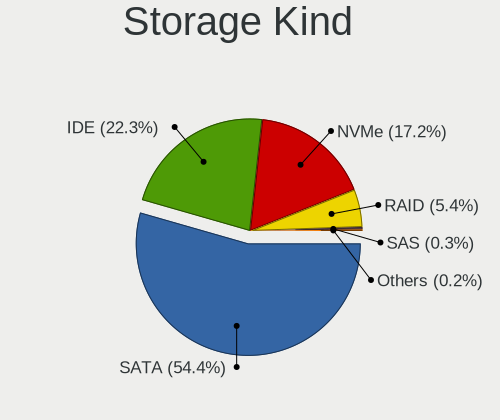

| Kind | Desktops | Percent |
|------|----------|---------|
| SATA | 1756     | 53.63%  |
| IDE  | 797      | 24.34%  |
| NVMe | 518      | 15.82%  |
| RAID | 185      | 5.65%   |
| SAS  | 12       | 0.37%   |
| SCSI | 6        | 0.18%   |

Processor
---------

CPU Vendor
----------

Processor vendors

| Vendor | Desktops | Percent |
|--------|----------|---------|
| Intel  | 1601     | 66.74%  |
| AMD    | 798      | 33.26%  |

CPU Model
---------

Processor models

| Model                                       | Desktops | Percent |
|---------------------------------------------|----------|---------|
| Intel Core i5-2400 CPU @ 3.10GHz            | 43       | 1.79%   |
| Intel Core i5-3470 CPU @ 3.20GHz            | 36       | 1.5%    |
| AMD Ryzen 5 3600 6-Core Processor           | 36       | 1.5%    |
| Intel Core 2 Duo CPU E8400 @ 3.00GHz        | 34       | 1.41%   |
| Intel Core i7-4790 CPU @ 3.60GHz            | 31       | 1.29%   |
| Intel Core i5-4460 CPU @ 3.20GHz            | 23       | 0.96%   |
| Intel Core i3-2120 CPU @ 3.30GHz            | 23       | 0.96%   |
| AMD Ryzen 9 5900X 12-Core Processor         | 23       | 0.96%   |
| Intel Core 2 Duo CPU E7500 @ 2.93GHz        | 22       | 0.91%   |
| Intel Core i7-3770 CPU @ 3.40GHz            | 21       | 0.87%   |
| AMD Ryzen 5 5600X 6-Core Processor          | 20       | 0.83%   |
| Intel Pentium 4 CPU 3.00GHz                 | 19       | 0.79%   |
| Intel Core i7-2600 CPU @ 3.40GHz            | 19       | 0.79%   |
| AMD FX-6300 Six-Core Processor              | 19       | 0.79%   |
| AMD Ryzen 5 2600 Six-Core Processor         | 18       | 0.75%   |
| Intel Pentium Dual-Core CPU E5300 @ 2.60GHz | 17       | 0.71%   |
| Intel Core i7-6700 CPU @ 3.40GHz            | 17       | 0.71%   |
| Intel Core i7-4790K CPU @ 4.00GHz           | 17       | 0.71%   |
| Intel Core i5-4590 CPU @ 3.30GHz            | 17       | 0.71%   |
| Intel Core i5-3570 CPU @ 3.40GHz            | 17       | 0.71%   |
| Intel Core i3-4160 CPU @ 3.60GHz            | 17       | 0.71%   |
| Intel Core 2 Quad CPU Q6600 @ 2.40GHz       | 17       | 0.71%   |
| AMD Ryzen 7 3700X 8-Core Processor          | 17       | 0.71%   |
| AMD Ryzen 5 5600G with Radeon Graphics      | 17       | 0.71%   |
| Intel Pentium Dual-Core CPU E5700 @ 3.00GHz | 16       | 0.66%   |
| Intel Core i7-4770 CPU @ 3.40GHz            | 16       | 0.66%   |
| Intel Core i3-3220 CPU @ 3.30GHz            | 16       | 0.66%   |
| Intel Core i5-4570 CPU @ 3.20GHz            | 15       | 0.62%   |
| AMD FX-8350 Eight-Core Processor            | 15       | 0.62%   |
| Intel Core i5-6500 CPU @ 3.20GHz            | 14       | 0.58%   |
| Intel Core i3-2100 CPU @ 3.10GHz            | 14       | 0.58%   |
| AMD Ryzen 7 5700G with Radeon Graphics      | 14       | 0.58%   |
| AMD Ryzen 3 3200G with Radeon Vega Graphics | 14       | 0.58%   |
| AMD Ryzen 3 2200G with Radeon Vega Graphics | 14       | 0.58%   |
| Intel Pentium Dual CPU E2160 @ 1.80GHz      | 13       | 0.54%   |
| AMD Ryzen 7 2700X Eight-Core Processor      | 13       | 0.54%   |
| Intel Core i7-6700K CPU @ 4.00GHz           | 12       | 0.5%    |
| Intel Core i5-8400 CPU @ 2.80GHz            | 12       | 0.5%    |
| Intel Core i5 CPU 650 @ 3.20GHz             | 12       | 0.5%    |
| Intel Core i3-4130 CPU @ 3.40GHz            | 12       | 0.5%    |

CPU Model Family
----------------

Processor model prefix

| Model                   | Desktops | Percent |
|-------------------------|----------|---------|
| Intel Core i5           | 422      | 17.55%  |
| Intel Core i7           | 253      | 10.52%  |
| Intel Core i3           | 192      | 7.99%   |
| AMD Ryzen 5             | 162      | 6.74%   |
| Intel Xeon              | 114      | 4.74%   |
| Intel Core 2 Duo        | 110      | 4.58%   |
| AMD Ryzen 7             | 102      | 4.24%   |
| AMD FX                  | 92       | 3.83%   |
| Other                   | 77       | 3.2%    |
| Intel Core 2 Quad       | 76       | 3.16%   |
| Intel Celeron           | 76       | 3.16%   |
| Intel Pentium Dual-Core | 61       | 2.54%   |
| AMD Ryzen 9             | 59       | 2.45%   |
| Intel Pentium           | 57       | 2.37%   |
| Intel Pentium Dual      | 51       | 2.12%   |
| AMD Athlon II X2        | 45       | 1.87%   |
| Intel Pentium 4         | 40       | 1.66%   |
| AMD Ryzen 3             | 37       | 1.54%   |
| AMD Athlon 64 X2        | 37       | 1.54%   |
| AMD Phenom II X4        | 34       | 1.41%   |
| AMD A8                  | 31       | 1.29%   |
| AMD A10                 | 23       | 0.96%   |
| AMD A6                  | 21       | 0.87%   |
| Intel Core i9           | 20       | 0.83%   |
| Intel Core 2            | 19       | 0.79%   |
| AMD A4                  | 18       | 0.75%   |
| AMD Athlon              | 17       | 0.71%   |
| AMD Sempron             | 15       | 0.62%   |
| Intel Atom              | 14       | 0.58%   |
| AMD Phenom II X6        | 13       | 0.54%   |
| AMD Athlon II X4        | 13       | 0.54%   |
| Intel Pentium D         | 10       | 0.42%   |
| AMD Athlon II X3        | 10       | 0.42%   |
| Intel Pentium Gold      | 8        | 0.33%   |
| AMD Phenom              | 8        | 0.33%   |
| AMD Athlon 64           | 7        | 0.29%   |
| AMD Phenom II X2        | 6        | 0.25%   |
| AMD Ryzen Threadripper  | 5        | 0.21%   |
| AMD Ryzen 5 PRO         | 4        | 0.17%   |
| AMD PRO A10             | 4        | 0.17%   |

CPU Cores
---------

Number of processor cores

| Number | Desktops | Percent |
|--------|----------|---------|
| 4      | 929      | 38.6%   |
| 2      | 765      | 31.78%  |
| 6      | 258      | 10.72%  |
| 8      | 180      | 7.48%   |
| 1      | 113      | 4.69%   |
| 12     | 54       | 2.24%   |
| 3      | 42       | 1.74%   |
| 16     | 32       | 1.33%   |
| 10     | 19       | 0.79%   |
| 14     | 5        | 0.21%   |
| 24     | 4        | 0.17%   |
| 28     | 2        | 0.08%   |
| 20     | 2        | 0.08%   |
| 32     | 1        | 0.04%   |
| 18     | 1        | 0.04%   |

CPU Sockets
-----------

Number of sockets

| Number | Desktops | Percent |
|--------|----------|---------|
| 1      | 2381     | 99.25%  |
| 2      | 18       | 0.75%   |

CPU Threads
-----------

Threads per core (Hyper-Threading)

| Number | Desktops | Percent |
|--------|----------|---------|
| 1      | 1212     | 50.48%  |
| 2      | 1189     | 49.52%  |

CPU Op-Modes
------------

CPU Operation Modes (32-bit, 64-bit)

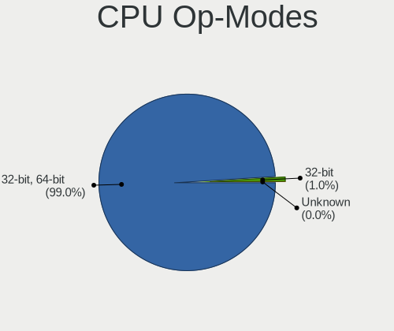

| Op mode        | Desktops | Percent |
|----------------|----------|---------|
| 32-bit, 64-bit | 2370     | 98.79%  |
| 32-bit         | 28       | 1.17%   |
| Unknown        | 1        | 0.04%   |

CPU Microcode
-------------

Microcode number

| Number     | Desktops | Percent |
|------------|----------|---------|
| Unknown    | 520      | 21.22%  |
| 0x306c3    | 216      | 8.81%   |
| 0x1067a    | 162      | 6.61%   |
| 0x206a7    | 152      | 6.2%    |
| 0x306a9    | 130      | 5.3%    |
| 0x506e3    | 73       | 2.98%   |
| 0x6fd      | 61       | 2.49%   |
| 0x06000852 | 59       | 2.41%   |
| 0x08701021 | 55       | 2.24%   |
| 0x010000c8 | 49       | 2%      |
| 0x906e9    | 38       | 1.55%   |
| 0x0800820d | 38       | 1.55%   |
| 0x906ea    | 35       | 1.43%   |
| 0x6fb      | 32       | 1.31%   |
| 0x06001119 | 32       | 1.31%   |
| 0xa0655    | 28       | 1.14%   |
| 0xa0653    | 25       | 1.02%   |
| 0x20655    | 24       | 0.98%   |
| 0x0600063e | 22       | 0.9%    |
| 0x10676    | 21       | 0.86%   |
| 0x08108109 | 21       | 0.86%   |
| 0x010000db | 21       | 0.86%   |
| 0x0a201016 | 20       | 0.82%   |
| 0x08001138 | 19       | 0.78%   |
| 0xa0671    | 18       | 0.73%   |
| 0x106e5    | 18       | 0.73%   |
| 0x906ed    | 17       | 0.69%   |
| 0x06003106 | 17       | 0.69%   |
| 0x20652    | 15       | 0.61%   |
| 0x106a5    | 15       | 0.61%   |
| 0x010000dc | 15       | 0.61%   |
| 0x906eb    | 14       | 0.57%   |
| 0x08701013 | 14       | 0.57%   |
| 0x6f6      | 13       | 0.53%   |
| 0x306f2    | 13       | 0.53%   |
| 0x306e4    | 12       | 0.49%   |
| 0x206d7    | 12       | 0.49%   |
| 0x206c2    | 12       | 0.49%   |
| 0x0a50000d | 12       | 0.49%   |
| 0x0a20120a | 12       | 0.49%   |

CPU Microarch
-------------

Microarchitecture

| Name             | Desktops | Percent |
|------------------|----------|---------|
| Haswell          | 285      | 11.86%  |
| Penryn           | 211      | 8.78%   |
| SandyBridge      | 198      | 8.24%   |
| IvyBridge        | 183      | 7.61%   |
| KabyLake         | 144      | 5.99%   |
| K10              | 136      | 5.66%   |
| Core             | 132      | 5.49%   |
| Piledriver       | 107      | 4.45%   |
| Zen 3            | 106      | 4.41%   |
| Zen 2            | 106      | 4.41%   |
| Skylake          | 90       | 3.74%   |
| Zen+             | 74       | 3.08%   |
| Unknown          | 72       | 3%      |
| Zen              | 69       | 2.87%   |
| K8 Hammer        | 63       | 2.62%   |
| CometLake        | 62       | 2.58%   |
| NetBurst         | 58       | 2.41%   |
| Westmere         | 55       | 2.29%   |
| Nehalem          | 45       | 1.87%   |
| Bulldozer        | 25       | 1.04%   |
| Steamroller      | 22       | 0.92%   |
| Silvermont       | 22       | 0.92%   |
| Excavator        | 20       | 0.83%   |
| Icelake          | 17       | 0.71%   |
| Alderlake Hybrid | 16       | 0.67%   |
| K10 Llano        | 13       | 0.54%   |
| Jaguar           | 11       | 0.46%   |
| Bonnell          | 11       | 0.46%   |
| Broadwell        | 10       | 0.42%   |
| Goldmont plus    | 9        | 0.37%   |
| Bobcat           | 9        | 0.37%   |
| Puma             | 8        | 0.33%   |
| Goldmont         | 5        | 0.21%   |
| Tremont          | 4        | 0.17%   |
| K6               | 3        | 0.12%   |
| TigerLake        | 2        | 0.08%   |
| P6               | 1        | 0.04%   |

Graphics
--------

GPU Vendor
----------

Vendors of graphics cards

| Vendor                           | Desktops | Percent |
|----------------------------------|----------|---------|
| Nvidia                           | 936      | 36.66%  |
| Intel                            | 818      | 32.04%  |
| AMD                              | 783      | 30.67%  |
| VIA Technologies                 | 8        | 0.31%   |
| Silicon Integrated Systems [SiS] | 2        | 0.08%   |
| Matrox Electronics Systems       | 2        | 0.08%   |
| Trident Microsystems             | 1        | 0.04%   |
| Silicon Motion                   | 1        | 0.04%   |
| ATI Technologies                 | 1        | 0.04%   |
| ASPEED Technology                | 1        | 0.04%   |

GPU Model
---------

Graphics card models

| Model                                                                       | Desktops | Percent |
|-----------------------------------------------------------------------------|----------|---------|
| Intel Xeon E3-1200 v3/4th Gen Core Processor Integrated Graphics Controller | 130      | 4.96%   |
| Intel 2nd Generation Core Processor Family Integrated Graphics Controller   | 99       | 3.77%   |
| AMD Ellesmere [Radeon RX 470/480/570/570X/580/580X/590]                     | 84       | 3.2%    |
| Intel 4 Series Chipset Integrated Graphics Controller                       | 78       | 2.97%   |
| Intel Xeon E3-1200 v2/3rd Gen Core processor Graphics Controller            | 74       | 2.82%   |
| Nvidia GK208B [GeForce GT 710]                                              | 70       | 2.67%   |
| Intel HD Graphics 530                                                       | 44       | 1.68%   |
| Nvidia GP107 [GeForce GTX 1050 Ti]                                          | 42       | 1.6%    |
| Intel 82G33/G31 Express Integrated Graphics Controller                      | 39       | 1.49%   |
| AMD Cedar [Radeon HD 5000/6000/7350/8350 Series]                            | 39       | 1.49%   |
| Intel 4th Generation Core Processor Family Integrated Graphics Controller   | 32       | 1.22%   |
| Nvidia GM107 [GeForce GTX 750 Ti]                                           | 31       | 1.18%   |
| Nvidia GT218 [GeForce 210]                                                  | 30       | 1.14%   |
| Nvidia GK208B [GeForce GT 730]                                              | 30       | 1.14%   |
| Intel Core Processor Integrated Graphics Controller                         | 30       | 1.14%   |
| Intel HD Graphics 630                                                       | 29       | 1.11%   |
| Intel CoffeeLake-S GT2 [UHD Graphics 630]                                   | 29       | 1.11%   |
| Nvidia GF119 [GeForce GT 610]                                               | 27       | 1.03%   |
| AMD Cezanne [Radeon Vega Series / Radeon Vega Mobile Series]                | 26       | 0.99%   |
| AMD RS780L [Radeon 3000]                                                    | 25       | 0.95%   |
| AMD Raven Ridge [Radeon Vega Series / Radeon Vega Mobile Series]            | 25       | 0.95%   |
| Nvidia GM206 [GeForce GTX 960]                                              | 22       | 0.84%   |
| AMD Navi 10 [Radeon RX 5600 OEM/5600 XT / 5700/5700 XT]                     | 22       | 0.84%   |
| Nvidia GP106 [GeForce GTX 1060 6GB]                                         | 21       | 0.8%    |
| Intel CometLake-S GT2 [UHD Graphics 630]                                    | 21       | 0.8%    |
| AMD Picasso/Raven 2 [Radeon Vega Series / Radeon Vega Mobile Series]        | 21       | 0.8%    |
| Nvidia GP108 [GeForce GT 1030]                                              | 19       | 0.72%   |
| Nvidia GF108 [GeForce GT 730]                                               | 18       | 0.69%   |
| Nvidia GA104 [GeForce RTX 3060 Ti Lite Hash Rate]                           | 18       | 0.69%   |
| Intel IvyBridge GT2 [HD Graphics 4000]                                      | 18       | 0.69%   |
| Intel 82945G/GZ Integrated Graphics Controller                              | 18       | 0.69%   |
| AMD Caicos [Radeon HD 6450/7450/8450 / R5 230 OEM]                          | 18       | 0.69%   |
| Nvidia TU117 [GeForce GTX 1650]                                             | 16       | 0.61%   |
| AMD Raphael                                                                 | 16       | 0.61%   |
| Nvidia G96C [GeForce 9500 GT]                                               | 15       | 0.57%   |
| AMD Kaveri [Radeon R7 Graphics]                                             | 15       | 0.57%   |
| Nvidia GP107 [GeForce GTX 1050]                                             | 14       | 0.53%   |
| Nvidia GP104 [GeForce GTX 1070]                                             | 14       | 0.53%   |
| Nvidia C61 [GeForce 6150SE nForce 430]                                      | 14       | 0.53%   |
| Intel 82Q35 Express Integrated Graphics Controller                          | 14       | 0.53%   |

GPU Combo
---------

Combinations of graphics cards

| Name                     | Desktops | Percent |
|--------------------------|----------|---------|
| 1 x Nvidia               | 870      | 35.91%  |
| 1 x Intel                | 721      | 29.76%  |
| 1 x AMD                  | 703      | 29.01%  |
| 2 x AMD                  | 40       | 1.65%   |
| Intel + Nvidia           | 30       | 1.24%   |
| AMD + Nvidia             | 20       | 0.83%   |
| Intel + AMD              | 17       | 0.7%    |
| 1 x VIA                  | 8        | 0.33%   |
| 2 x Nvidia               | 6        | 0.25%   |
| 1 x SiS                  | 2        | 0.08%   |
| 1 x Matrox               | 2        | 0.08%   |
| 2 x AMD + 1 x Nvidia     | 1        | 0.04%   |
| 1 x Trident Microsystems | 1        | 0.04%   |
| Nvidia + Silicon Motion  | 1        | 0.04%   |
| 1 x ASPEED               | 1        | 0.04%   |

GPU Driver
----------

Free vs proprietary

| Driver      | Desktops | Percent |
|-------------|----------|---------|
| Free        | 1701     | 70.03%  |
| Proprietary | 550      | 22.64%  |
| Unknown     | 178      | 7.33%   |

GPU Memory
----------

Total video memory

| Size in GB | Desktops | Percent |
|------------|----------|---------|
| Unknown    | 1163     | 47.28%  |
| 0.01-0.5   | 298      | 12.11%  |
| 1.01-2.0   | 295      | 11.99%  |
| 0.51-1.0   | 274      | 11.14%  |
| 7.01-8.0   | 149      | 6.06%   |
| 3.01-4.0   | 149      | 6.06%   |
| 8.01-16.0  | 56       | 2.28%   |
| 5.01-6.0   | 48       | 1.95%   |
| 2.01-3.0   | 23       | 0.93%   |
| 16.01-24.0 | 4        | 0.16%   |
| 4.01-5.0   | 1        | 0.04%   |

Monitor
-------

Monitor Vendor
--------------

Monitor vendors

| Vendor               | Desktops | Percent |
|----------------------|----------|---------|
| Samsung Electronics  | 372      | 16.03%  |
| Goldstar             | 238      | 10.25%  |
| Dell                 | 230      | 9.91%   |
| Hewlett-Packard      | 182      | 7.84%   |
| Acer                 | 160      | 6.89%   |
| AOC                  | 130      | 5.6%    |
| Philips              | 107      | 4.61%   |
| Ancor Communications | 90       | 3.88%   |
| BenQ                 | 83       | 3.58%   |
| ViewSonic            | 50       | 2.15%   |
| LG Electronics       | 45       | 1.94%   |
| Unknown              | 38       | 1.64%   |
| Lenovo               | 34       | 1.46%   |
| Sony                 | 32       | 1.38%   |
| ASUSTek Computer     | 25       | 1.08%   |
| Unknown              | 23       | 0.99%   |
| Iiyama               | 22       | 0.95%   |
| Fujitsu Siemens      | 20       | 0.86%   |
| Sceptre Tech         | 19       | 0.82%   |
| NEC Computers        | 19       | 0.82%   |
| Vizio                | 17       | 0.73%   |
| Eizo                 | 16       | 0.69%   |
| Toshiba              | 14       | 0.6%    |
| MSI                  | 13       | 0.56%   |
| HPN                  | 10       | 0.43%   |
| Idek Iiyama          | 9        | 0.39%   |
| HannStar             | 9        | 0.39%   |
| FUS                  | 9        | 0.39%   |
| Gateway              | 8        | 0.34%   |
| Sharp                | 7        | 0.3%    |
| Panasonic            | 7        | 0.3%    |
| Medion               | 7        | 0.3%    |
| Envision             | 7        | 0.3%    |
| CVT                  | 7        | 0.3%    |
| AUS                  | 7        | 0.3%    |
| RTK                  | 6        | 0.26%   |
| Microstep            | 6        | 0.26%   |
| Insignia             | 6        | 0.26%   |
| HKC                  | 6        | 0.26%   |
| Gigabyte Technology  | 6        | 0.26%   |

Monitor Model
-------------

Monitor models

| Model                                                                 | Desktops | Percent |
|-----------------------------------------------------------------------|----------|---------|
| Unknown                                                               | 23       | 0.93%   |
| Goldstar FULL HD GSM5B55 1920x1080 480x270mm 21.7-inch                | 12       | 0.49%   |
| Samsung Electronics C27F390 SAM0D32 1920x1080 598x336mm 27.0-inch     | 10       | 0.41%   |
| Goldstar ULTRAWIDE GSM59F1 2560x1080 673x284mm 28.8-inch              | 10       | 0.41%   |
| Philips PHL 243V5 PHLC0D1 1920x1080 521x293mm 23.5-inch               | 8        | 0.33%   |
| Goldstar HD GSM5ACB 1366x768 410x230mm 18.5-inch                      | 7        | 0.28%   |
| Unknown LCD Monitor SAMSUNG 1920x1080                                 | 6        | 0.24%   |
| Philips PHL 223V5 PHLC0CF 1920x1080 477x268mm 21.5-inch               | 6        | 0.24%   |
| Philips LCD Monitor FTV 1920x1080                                     | 6        | 0.24%   |
| Hewlett-Packard 2009 HWP2827 1600x900 442x249mm 20.0-inch             | 6        | 0.24%   |
| Goldstar IPS FULLHD GSM5AB8 1920x1080 480x270mm 21.7-inch             | 6        | 0.24%   |
| Unknown LCD Monitor SAMSUNG 3840x2160                                 | 5        | 0.2%    |
| Samsung Electronics C24F390 SAM0D2C 1920x1080 521x293mm 23.5-inch     | 5        | 0.2%    |
| Goldstar W1943 GSM4BAD 1360x768 406x229mm 18.4-inch                   | 5        | 0.2%    |
| BenQ GL2450H BNQ78A7 1920x1080 531x298mm 24.0-inch                    | 5        | 0.2%    |
| AOC 27G2G3 AOC2702 1920x1080 598x336mm 27.0-inch                      | 5        | 0.2%    |
| Ancor Communications VS248 ACI2498 1920x1080 531x299mm 24.0-inch      | 5        | 0.2%    |
| Ancor Communications ASUS VP228 ACI22C3 1920x1080 476x268mm 21.5-inch | 5        | 0.2%    |
| Unknown (XXX) Beyond TV XXX2851 3840x2160 1209x680mm 54.6-inch        | 4        | 0.16%   |
| Samsung Electronics S24F350 SAM0D20 1920x1080 521x293mm 23.5-inch     | 4        | 0.16%   |
| Samsung Electronics LCD Monitor SAM0C3C 1366x768 609x347mm 27.6-inch  | 4        | 0.16%   |
| Samsung Electronics LCD Monitor SAM0902 1920x1080 890x500mm 40.2-inch | 4        | 0.16%   |
| Philips PHL 242M8 PHLC253 1920x1080 527x296mm 23.8-inch               | 4        | 0.16%   |
| Philips FTV PHL01EA 1920x1080 1440x810mm 65.0-inch                    | 4        | 0.16%   |
| LG Electronics LCD Monitor LG TV SSCR2 3840x2160                      | 4        | 0.16%   |
| Hewlett-Packard 24f HPN3546 1920x1080 527x296mm 23.8-inch             | 4        | 0.16%   |
| Goldstar W1942 GSM4B6F 1440x900 408x255mm 18.9-inch                   | 4        | 0.16%   |
| Goldstar IPS FULLHD GSM5AB6 1920x1080 480x270mm 21.7-inch             | 4        | 0.16%   |
| Goldstar HDR 4K GSM7706 3840x2160 600x340mm 27.2-inch                 | 4        | 0.16%   |
| Goldstar 2D HD TV GSM59C8 1366x768 509x286mm 23.0-inch                | 4        | 0.16%   |
| Dell SE198WFP DELF003 1440x900 408x255mm 18.9-inch                    | 4        | 0.16%   |
| Dell P2419H DELD0DA 1920x1080 527x296mm 23.8-inch                     | 4        | 0.16%   |
| Dell P2214H DELA099 1920x1080 477x268mm 21.5-inch                     | 4        | 0.16%   |
| AOC Q32G2WG3 AOC3202 2560x1440 697x392mm 31.5-inch                    | 4        | 0.16%   |
| AOC G2460PG AOC2460 1920x1080 531x299mm 24.0-inch                     | 4        | 0.16%   |
| AOC 24B2W1 AOC2402 1920x1080 527x296mm 23.8-inch                      | 4        | 0.16%   |
| AOC 2260WG5 AOC2260 1920x1080 477x268mm 21.5-inch                     | 4        | 0.16%   |
| AOC 1950W AOC1950 1366x768 410x230mm 18.5-inch                        | 4        | 0.16%   |
| Ancor Communications VE248 ACI2494 1920x1080 531x299mm 24.0-inch      | 4        | 0.16%   |
| Ancor Communications ASUS VS247 ACI249A 1920x1080 521x293mm 23.5-inch | 4        | 0.16%   |

Monitor Resolution
------------------

Monitor screen resolution

| Resolution         | Desktops | Percent |
|--------------------|----------|---------|
| 1920x1080 (FHD)    | 951      | 41.51%  |
| 3840x2160 (4K)     | 198      | 8.64%   |
| 1280x1024 (SXGA)   | 168      | 7.33%   |
| 1680x1050 (WSXGA+) | 129      | 5.63%   |
| 1366x768 (WXGA)    | 119      | 5.19%   |
| 1600x900 (HD+)     | 102      | 4.45%   |
| 1440x900 (WXGA+)   | 99       | 4.32%   |
| 2560x1440 (QHD)    | 95       | 4.15%   |
| Unknown            | 78       | 3.4%    |
| 1360x768           | 60       | 2.62%   |
| 1920x1200 (WUXGA)  | 49       | 2.14%   |
| 3440x1440          | 45       | 1.96%   |
| 3840x1080          | 40       | 1.75%   |
| 2560x1080          | 26       | 1.13%   |
| 1920x540           | 19       | 0.83%   |
| 1024x768 (XGA)     | 18       | 0.79%   |
| 1600x1200          | 9        | 0.39%   |
| 5760x1080          | 6        | 0.26%   |
| 1280x720 (HD)      | 6        | 0.26%   |
| 2560x1600          | 5        | 0.22%   |
| 4480x1440          | 4        | 0.17%   |
| 3840x1600          | 4        | 0.17%   |
| 5760x2160          | 3        | 0.13%   |
| 3600x1080          | 3        | 0.13%   |
| 1280x960           | 3        | 0.13%   |
| 1152x864           | 3        | 0.13%   |
| 6400x1440          | 2        | 0.09%   |
| 5440x1080          | 2        | 0.09%   |
| 5120x1440          | 2        | 0.09%   |
| 4480x1080          | 2        | 0.09%   |
| 3360x1080          | 2        | 0.09%   |
| 3200x1200          | 2        | 0.09%   |
| 3200x1080          | 2        | 0.09%   |
| 3120x1050          | 2        | 0.09%   |
| 2944x1080          | 2        | 0.09%   |
| 2720x1024          | 2        | 0.09%   |
| 2288x1287          | 2        | 0.09%   |
| 2048x1152          | 2        | 0.09%   |
| 7680x2160          | 1        | 0.04%   |
| 7680x1080          | 1        | 0.04%   |

Monitor Diagonal
----------------

Diagonal size in inches

| Inches  | Desktops | Percent |
|---------|----------|---------|
| Unknown | 397      | 17.36%  |
| 27      | 218      | 9.53%   |
| 24      | 214      | 9.36%   |
| 23      | 213      | 9.31%   |
| 21      | 204      | 8.92%   |
| 19      | 169      | 7.39%   |
| 18      | 122      | 5.33%   |
| 20      | 115      | 5.03%   |
| 31      | 100      | 4.37%   |
| 22      | 86       | 3.76%   |
| 17      | 80       | 3.5%    |
| 34      | 54       | 2.36%   |
| 15      | 39       | 1.71%   |
| 40      | 34       | 1.49%   |
| 84      | 33       | 1.44%   |
| 72      | 25       | 1.09%   |
| 54      | 21       | 0.92%   |
| 32      | 18       | 0.79%   |
| 26      | 18       | 0.79%   |
| 65      | 12       | 0.52%   |
| 28      | 9        | 0.39%   |
| 52      | 8        | 0.35%   |
| 49      | 8        | 0.35%   |
| 25      | 8        | 0.35%   |
| 36      | 7        | 0.31%   |
| 48      | 6        | 0.26%   |
| 46      | 6        | 0.26%   |
| 42      | 6        | 0.26%   |
| 29      | 5        | 0.22%   |
| 60      | 4        | 0.17%   |
| 39      | 4        | 0.17%   |
| 37      | 4        | 0.17%   |
| 33      | 4        | 0.17%   |
| 75      | 3        | 0.13%   |
| 74      | 3        | 0.13%   |
| 35      | 3        | 0.13%   |
| 16      | 3        | 0.13%   |
| 58      | 2        | 0.09%   |
| 57      | 2        | 0.09%   |
| 47      | 2        | 0.09%   |

Monitor Width
-------------

Physical width

| Width in mm    | Desktops | Percent |
|----------------|----------|---------|
| 501-600        | 599      | 26.95%  |
| 401-500        | 594      | 26.72%  |
| Unknown        | 397      | 17.86%  |
| 601-700        | 140      | 6.3%    |
| 301-350        | 118      | 5.31%   |
| 351-400        | 92       | 4.14%   |
| 701-800        | 82       | 3.69%   |
| 1001-1500      | 74       | 3.33%   |
| 1501-2000      | 66       | 2.97%   |
| 801-900        | 45       | 2.02%   |
| 901-1000       | 11       | 0.49%   |
| 201-300        | 4        | 0.18%   |
| More than 2000 | 1        | 0.04%   |

Aspect Ratio
------------

Proportional relationship between the width and the height

| Ratio   | Desktops | Percent |
|---------|----------|---------|
| 16/9    | 1227     | 57.36%  |
| Unknown | 357      | 16.69%  |
| 16/10   | 268      | 12.53%  |
| 5/4     | 151      | 7.06%   |
| 21/9    | 64       | 2.99%   |
| 4/3     | 36       | 1.68%   |
| 32/9    | 17       | 0.79%   |
| 6/5     | 10       | 0.47%   |
| 3/2     | 6        | 0.28%   |
| 2.00    | 1        | 0.05%   |
| 1.00    | 1        | 0.05%   |
| 0.80    | 1        | 0.05%   |

Monitor Area
------------

Area in inch

| Area in inch | Desktops | Percent |
|----------------|----------|---------|
| 201-250        | 576      | 25.62%  |
| Unknown        | 397      | 17.66%  |
| 151-200        | 358      | 15.93%  |
| 301-350        | 221      | 9.83%   |
| 351-500        | 188      | 8.36%   |
| 141-150        | 166      | 7.38%   |
| More than 1000 | 121      | 5.38%   |
| 251-300        | 91       | 4.05%   |
| 501-1000       | 77       | 3.43%   |
| 101-110        | 30       | 1.33%   |
| 131-140        | 8        | 0.36%   |
| 111-120        | 8        | 0.36%   |
| 91-100         | 3        | 0.13%   |
| 81-90          | 2        | 0.09%   |
| 71-80          | 1        | 0.04%   |
| 121-130        | 1        | 0.04%   |

Pixel Density
-------------

Pixels per inch

| Density | Desktops | Percent |
|---------|----------|---------|
| 51-100  | 1256     | 58.31%  |
| Unknown | 397      | 18.43%  |
| 101-120 | 308      | 14.3%   |
| 1-50    | 110      | 5.11%   |
| 121-160 | 56       | 2.6%    |
| 161-240 | 27       | 1.25%   |

Multiple Monitors
-----------------

Total monitors connected

| Total | Desktops | Percent |
|-------|----------|---------|
| 1     | 1943     | 79.44%  |
| 2     | 277      | 11.32%  |
| 0     | 190      | 7.77%   |
| 3     | 32       | 1.31%   |
| 4     | 4        | 0.16%   |

Network
-------

Net Controller Vendor
---------------------

Controller vendors

| Vendor                                | Desktops | Percent |
|---------------------------------------|----------|---------|
| Realtek Semiconductor                 | 1504     | 42.25%  |
| Intel                                 | 897      | 25.2%   |
| Qualcomm Atheros                      | 218      | 6.12%   |
| Ralink Technology                     | 130      | 3.65%   |
| Broadcom                              | 130      | 3.65%   |
| TP-Link                               | 81       | 2.28%   |
| Nvidia                                | 81       | 2.28%   |
| Ralink                                | 54       | 1.52%   |
| MediaTek                              | 40       | 1.12%   |
| Broadcom Limited                      | 37       | 1.04%   |
| Marvell Technology Group              | 32       | 0.9%    |
| NetGear                               | 28       | 0.79%   |
| D-Link                                | 28       | 0.79%   |
| Samsung Electronics                   | 26       | 0.73%   |
| D-Link System                         | 22       | 0.62%   |
| VIA Technologies                      | 21       | 0.59%   |
| Microsoft                             | 19       | 0.53%   |
| Xiaomi                                | 17       | 0.48%   |
| Qualcomm Atheros Communications       | 16       | 0.45%   |
| Huawei Technologies                   | 13       | 0.37%   |
| ASUSTek Computer                      | 12       | 0.34%   |
| ASIX Electronics                      | 12       | 0.34%   |
| Aquantia                              | 12       | 0.34%   |
| Edimax Technology                     | 11       | 0.31%   |
| Belkin Components                     | 9        | 0.25%   |
| OPPO Electronics                      | 6        | 0.17%   |
| Linksys                               | 6        | 0.17%   |
| Silicon Integrated Systems [SiS]      | 5        | 0.14%   |
| Motorola PCS                          | 5        | 0.14%   |
| DisplayLink                           | 5        | 0.14%   |
| 802.11g Adapter [Linksys WUSB54GC v3] | 5        | 0.14%   |
| Qualcomm                              | 4        | 0.11%   |
| Gemtek                                | 4        | 0.11%   |
| Sundance Technology Inc / IC Plus     | 3        | 0.08%   |
| Sitecom Europe                        | 3        | 0.08%   |
| QinHeng Electronics                   | 3        | 0.08%   |
| Motorola                              | 3        | 0.08%   |
| JMicron Technology                    | 3        | 0.08%   |
| Apple                                 | 3        | 0.08%   |
| ZyXEL Communications                  | 2        | 0.06%   |

Net Controller Model
--------------------

Controller models

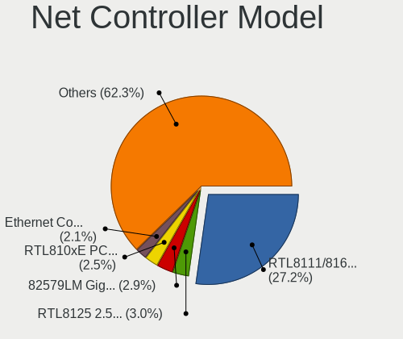

| Model                                                                  | Desktops | Percent |
|------------------------------------------------------------------------|----------|---------|
| Realtek RTL8111/8168/8211/8411 PCI Express Gigabit Ethernet Controller | 1091     | 27.19%  |
| Intel 82579LM Gigabit Network Connection (Lewisville)                  | 127      | 3.16%   |
| Realtek RTL8125 2.5GbE Controller                                      | 109      | 2.72%   |
| Realtek RTL810xE PCI Express Fast Ethernet controller                  | 106      | 2.64%   |
| Intel I211 Gigabit Network Connection                                  | 81       | 2.02%   |
| Intel Wi-Fi 6 AX200                                                    | 78       | 1.94%   |
| Intel Ethernet Connection I217-LM                                      | 78       | 1.94%   |
| Intel Ethernet Connection (2) I219-V                                   | 61       | 1.52%   |
| Ralink MT7601U Wireless Adapter                                        | 57       | 1.42%   |
| Realtek 802.11ac NIC                                                   | 54       | 1.35%   |
| Nvidia MCP61 Ethernet                                                  | 50       | 1.25%   |
| Intel Ethernet Controller I225-V                                       | 50       | 1.25%   |
| Realtek RTL88x2bu [AC1200 Techkey]                                     | 46       | 1.15%   |
| Intel Wi-Fi 6E(802.11ax) AX210/AX1675* 2x2 [Typhoon Peak]              | 40       | 1%      |
| Realtek RTL8188EUS 802.11n Wireless Network Adapter                    | 37       | 0.92%   |
| Intel Ethernet Connection I217-V                                       | 34       | 0.85%   |
| Realtek RTL-8100/8101L/8139 PCI Fast Ethernet Adapter                  | 32       | 0.8%    |
| Intel 82579V Gigabit Network Connection                                | 32       | 0.8%    |
| Intel 82567LM-3 Gigabit Network Connection                             | 32       | 0.8%    |
| Intel Dual Band Wireless-AC 3168NGW [Stone Peak]                       | 30       | 0.75%   |
| Realtek RTL8821CE 802.11ac PCIe Wireless Network Adapter               | 29       | 0.72%   |
| Intel Wi-Fi 5(802.11ac) Wireless-AC 9x6x [Thunder Peak]                | 26       | 0.65%   |
| Realtek RTL8188FTV 802.11b/g/n 1T1R 2.4G WLAN Adapter                  | 23       | 0.57%   |
| Ralink RT5370 Wireless Adapter                                         | 23       | 0.57%   |
| Intel Ethernet Connection (2) I218-V                                   | 23       | 0.57%   |
| Ralink RT2870/RT3070 Wireless Adapter                                  | 22       | 0.55%   |
| Intel Wireless 7265                                                    | 22       | 0.55%   |
| Intel Ethernet Connection (2) I219-LM                                  | 22       | 0.55%   |
| Qualcomm Atheros AR9485 Wireless Network Adapter                       | 21       | 0.52%   |
| Qualcomm Atheros AR8151 v2.0 Gigabit Ethernet                          | 21       | 0.52%   |
| Intel 82566DM-2 Gigabit Network Connection                             | 21       | 0.52%   |
| Realtek RTL8192EE PCIe Wireless Network Adapter                        | 20       | 0.5%    |
| Intel Ethernet Connection (7) I219-V                                   | 20       | 0.5%    |
| TP-Link TL-WN823N v2/v3 [Realtek RTL8192EU]                            | 19       | 0.47%   |
| Broadcom BCM4360 802.11ac Dual Band Wireless Network Adapter           | 19       | 0.47%   |
| Realtek RTL8192EU 802.11b/g/n WLAN Adapter                             | 18       | 0.45%   |
| Intel 82574L Gigabit Network Connection                                | 18       | 0.45%   |
| Samsung Galaxy series, misc. (tethering mode)                          | 17       | 0.42%   |
| Intel Wireless 7260                                                    | 16       | 0.4%    |
| VIA VT6102/VT6103 [Rhine-II]                                           | 15       | 0.37%   |

Wireless Vendor
---------------

Wireless vendors

| Vendor                                | Desktops | Percent |
|---------------------------------------|----------|---------|
| Realtek Semiconductor                 | 368      | 27.59%  |
| Intel                                 | 313      | 23.46%  |
| Ralink Technology                     | 130      | 9.75%   |
| Qualcomm Atheros                      | 112      | 8.4%    |
| TP-Link                               | 78       | 5.85%   |
| Ralink                                | 54       | 4.05%   |
| Broadcom                              | 52       | 3.9%    |
| MediaTek                              | 32       | 2.4%    |
| NetGear                               | 28       | 2.1%    |
| D-Link                                | 28       | 2.1%    |
| Microsoft                             | 19       | 1.42%   |
| D-Link System                         | 18       | 1.35%   |
| Qualcomm Atheros Communications       | 16       | 1.2%    |
| Edimax Technology                     | 11       | 0.82%   |
| Broadcom Limited                      | 11       | 0.82%   |
| ASUSTek Computer                      | 10       | 0.75%   |
| Belkin Components                     | 9        | 0.67%   |
| Linksys                               | 6        | 0.45%   |
| 802.11g Adapter [Linksys WUSB54GC v3] | 5        | 0.37%   |
| Marvell Technology Group              | 4        | 0.3%    |
| Gemtek                                | 4        | 0.3%    |
| Sitecom Europe                        | 3        | 0.22%   |
| ZyXEL Communications                  | 2        | 0.15%   |
| ZyDAS                                 | 2        | 0.15%   |
| TRENDnet                              | 2        | 0.15%   |
| Senao                                 | 2        | 0.15%   |
| Philips (or NXP)                      | 2        | 0.15%   |
| Micro Star International              | 2        | 0.15%   |
| IMC Networks                          | 2        | 0.15%   |
| AVM                                   | 2        | 0.15%   |
| ZTopInc                               | 1        | 0.07%   |
| Xiaomi                                | 1        | 0.07%   |
| Wilocity                              | 1        | 0.07%   |
| Panasonic (Matsushita)                | 1        | 0.07%   |
| Ovislink                              | 1        | 0.07%   |
| BUFFALO                               | 1        | 0.07%   |
| ADMtek                                | 1        | 0.07%   |

Wireless Model
--------------

Wireless models

| Model                                                          | Desktops | Percent |
|----------------------------------------------------------------|----------|---------|
| Intel Wi-Fi 6 AX200                                            | 78       | 5.77%   |
| Ralink MT7601U Wireless Adapter                                | 57       | 4.22%   |
| Realtek 802.11ac NIC                                           | 54       | 3.99%   |
| Realtek RTL88x2bu [AC1200 Techkey]                             | 46       | 3.4%    |
| Intel Wi-Fi 6E(802.11ax) AX210/AX1675* 2x2 [Typhoon Peak]      | 40       | 2.96%   |
| Realtek RTL8188EUS 802.11n Wireless Network Adapter            | 37       | 2.74%   |
| Intel Dual Band Wireless-AC 3168NGW [Stone Peak]               | 30       | 2.22%   |
| Realtek RTL8821CE 802.11ac PCIe Wireless Network Adapter       | 29       | 2.14%   |
| Intel Wi-Fi 5(802.11ac) Wireless-AC 9x6x [Thunder Peak]        | 26       | 1.92%   |
| Realtek RTL8188FTV 802.11b/g/n 1T1R 2.4G WLAN Adapter          | 23       | 1.7%    |
| Ralink RT5370 Wireless Adapter                                 | 23       | 1.7%    |
| Ralink RT2870/RT3070 Wireless Adapter                          | 22       | 1.63%   |
| Intel Wireless 7265                                            | 22       | 1.63%   |
| Qualcomm Atheros AR9485 Wireless Network Adapter               | 21       | 1.55%   |
| Realtek RTL8192EE PCIe Wireless Network Adapter                | 20       | 1.48%   |
| TP-Link TL-WN823N v2/v3 [Realtek RTL8192EU]                    | 19       | 1.41%   |
| Broadcom BCM4360 802.11ac Dual Band Wireless Network Adapter   | 19       | 1.41%   |
| Realtek RTL8192EU 802.11b/g/n WLAN Adapter                     | 18       | 1.33%   |
| Intel Wireless 7260                                            | 16       | 1.18%   |
| Realtek RTL8821AE 802.11ac PCIe Wireless Network Adapter       | 15       | 1.11%   |
| Realtek RTL8192CU 802.11n WLAN Adapter                         | 14       | 1.04%   |
| Qualcomm Atheros AR9227 Wireless Network Adapter               | 13       | 0.96%   |
| TP-Link AC600 wireless Realtek RTL8811AU [Archer T2U Nano]     | 12       | 0.89%   |
| Qualcomm Atheros AR9271 802.11n                                | 12       | 0.89%   |
| MediaTek MT7921K (RZ608) Wi-Fi 6E 80MHz                        | 12       | 0.89%   |
| Intel Wireless 3165                                            | 12       | 0.89%   |
| Intel Cannon Lake PCH CNVi WiFi                                | 12       | 0.89%   |
| Intel Alder Lake-S PCH CNVi WiFi                               | 12       | 0.89%   |
| TP-Link TL-WN722N v2/v3 [Realtek RTL8188EUS]                   | 11       | 0.81%   |
| Realtek RTL8188EE Wireless Network Adapter                     | 11       | 0.81%   |
| Qualcomm Atheros AR9285 Wireless Network Adapter (PCI-Express) | 11       | 0.81%   |
| Realtek RTL8188CUS 802.11n WLAN Adapter                        | 10       | 0.74%   |
| Realtek RTL8188CE 802.11b/g/n WiFi Adapter                     | 10       | 0.74%   |
| Ralink RT2561/RT61 802.11g PCI                                 | 10       | 0.74%   |
| Qualcomm Atheros AR93xx Wireless Network Adapter               | 10       | 0.74%   |
| Intel Wireless 8260                                            | 10       | 0.74%   |
| Realtek RTL8812AE 802.11ac PCIe Wireless Network Adapter       | 9        | 0.67%   |
| Ralink RT2790 Wireless 802.11n 1T/2R PCIe                      | 9        | 0.67%   |
| Qualcomm Atheros QCA9565 / AR9565 Wireless Network Adapter     | 9        | 0.67%   |
| Qualcomm Atheros AR9462 Wireless Network Adapter               | 9        | 0.67%   |

Ethernet Vendor
---------------

Ethernet vendors

| Vendor                            | Desktops | Percent |
|-----------------------------------|----------|---------|
| Realtek Semiconductor             | 1362     | 53.08%  |
| Intel                             | 719      | 28.02%  |
| Qualcomm Atheros                  | 112      | 4.36%   |
| Nvidia                            | 81       | 3.16%   |
| Broadcom                          | 80       | 3.12%   |
| Marvell Technology Group          | 28       | 1.09%   |
| Broadcom Limited                  | 27       | 1.05%   |
| Samsung Electronics               | 26       | 1.01%   |
| VIA Technologies                  | 21       | 0.82%   |
| Xiaomi                            | 16       | 0.62%   |
| Huawei Technologies               | 12       | 0.47%   |
| ASIX Electronics                  | 12       | 0.47%   |
| Aquantia                          | 12       | 0.47%   |
| MediaTek                          | 8        | 0.31%   |
| OPPO Electronics                  | 6        | 0.23%   |
| Silicon Integrated Systems [SiS]  | 5        | 0.19%   |
| DisplayLink                       | 5        | 0.19%   |
| Qualcomm                          | 4        | 0.16%   |
| D-Link System                     | 4        | 0.16%   |
| TP-Link                           | 3        | 0.12%   |
| Sundance Technology Inc / IC Plus | 3        | 0.12%   |
| Motorola PCS                      | 3        | 0.12%   |
| JMicron Technology                | 3        | 0.12%   |
| Apple                             | 3        | 0.12%   |
| ASUSTek Computer                  | 2        | 0.08%   |
| ZTE WCDMA Technologies MSM        | 1        | 0.04%   |
| Research In Motion                | 1        | 0.04%   |
| Panini                            | 1        | 0.04%   |
| ICS Advent                        | 1        | 0.04%   |
| HMD Global                        | 1        | 0.04%   |
| Google                            | 1        | 0.04%   |
| GCT Semiconductor                 | 1        | 0.04%   |
| Accton Technology                 | 1        | 0.04%   |
| 3Com                              | 1        | 0.04%   |

Ethernet Model
--------------

Ethernet models

| Model                                                                  | Desktops | Percent |
|------------------------------------------------------------------------|----------|---------|
| Realtek RTL8111/8168/8211/8411 PCI Express Gigabit Ethernet Controller | 1091     | 41.53%  |
| Intel 82579LM Gigabit Network Connection (Lewisville)                  | 127      | 4.83%   |
| Realtek RTL8125 2.5GbE Controller                                      | 109      | 4.15%   |
| Realtek RTL810xE PCI Express Fast Ethernet controller                  | 106      | 4.04%   |
| Intel I211 Gigabit Network Connection                                  | 81       | 3.08%   |
| Intel Ethernet Connection I217-LM                                      | 78       | 2.97%   |
| Intel Ethernet Connection (2) I219-V                                   | 61       | 2.32%   |
| Nvidia MCP61 Ethernet                                                  | 50       | 1.9%    |
| Intel Ethernet Controller I225-V                                       | 50       | 1.9%    |
| Intel Ethernet Connection I217-V                                       | 34       | 1.29%   |
| Realtek RTL-8100/8101L/8139 PCI Fast Ethernet Adapter                  | 32       | 1.22%   |
| Intel 82579V Gigabit Network Connection                                | 32       | 1.22%   |
| Intel 82567LM-3 Gigabit Network Connection                             | 32       | 1.22%   |
| Intel Ethernet Connection (2) I218-V                                   | 23       | 0.88%   |
| Intel Ethernet Connection (2) I219-LM                                  | 22       | 0.84%   |
| Qualcomm Atheros AR8151 v2.0 Gigabit Ethernet                          | 21       | 0.8%    |
| Intel 82566DM-2 Gigabit Network Connection                             | 21       | 0.8%    |
| Intel Ethernet Connection (7) I219-V                                   | 20       | 0.76%   |
| Intel 82574L Gigabit Network Connection                                | 18       | 0.69%   |
| Samsung Galaxy series, misc. (tethering mode)                          | 17       | 0.65%   |
| VIA VT6102/VT6103 [Rhine-II]                                           | 15       | 0.57%   |
| Realtek RTL8169 PCI Gigabit Ethernet Controller                        | 14       | 0.53%   |
| Qualcomm Atheros AR8121/AR8113/AR8114 Gigabit or Fast Ethernet         | 14       | 0.53%   |
| Broadcom NetXtreme BCM5761 Gigabit Ethernet PCIe                       | 14       | 0.53%   |
| Qualcomm Atheros AR8161 Gigabit Ethernet                               | 13       | 0.49%   |
| Marvell Group 88E8056 PCI-E Gigabit Ethernet Controller                | 13       | 0.49%   |
| Broadcom NetLink BCM57780 Gigabit Ethernet PCIe                        | 13       | 0.49%   |
| Realtek RTL8153 Gigabit Ethernet Adapter                               | 12       | 0.46%   |
| Nvidia MCP73 Ethernet                                                  | 12       | 0.46%   |
| Xiaomi Mi/Redmi series (RNDIS)                                         | 11       | 0.42%   |
| Intel Ethernet Connection (5) I219-LM                                  | 11       | 0.42%   |
| Intel 82578DM Gigabit Network Connection                               | 11       | 0.42%   |
| Intel 82578DC Gigabit Network Connection                               | 11       | 0.42%   |
| Samsung GT-I9070 (network tethering, USB debugging enabled)            | 10       | 0.38%   |
| Qualcomm Atheros Killer E220x Gigabit Ethernet Controller              | 10       | 0.38%   |
| Qualcomm Atheros Attansic L1 Gigabit Ethernet                          | 10       | 0.38%   |
| Intel Ethernet Controller I226-V                                       | 10       | 0.38%   |
| Qualcomm Atheros Attansic L2 Fast Ethernet                             | 9        | 0.34%   |
| Realtek RTL8111/8168/8411 PCI Express Gigabit Ethernet Controller      | 8        | 0.3%    |
| Qualcomm Atheros QCA8171 Gigabit Ethernet                              | 8        | 0.3%    |

Net Controller Kind
-------------------

Ethernet, WiFi or modem

| Kind     | Desktops | Percent |
|----------|----------|---------|
| Ethernet | 2375     | 65.73%  |
| WiFi     | 1206     | 33.38%  |
| Modem    | 26       | 0.72%   |
| Unknown  | 6        | 0.17%   |

Used Controller
---------------

Currently used network controller

| Kind     | Desktops | Percent |
|----------|----------|---------|
| Ethernet | 1783     | 71.04%  |
| WiFi     | 724      | 28.84%  |
| Unknown  | 2        | 0.08%   |
| Modem    | 1        | 0.04%   |

NICs
----

Total network controllers on board

| Total | Desktops | Percent |
|-------|----------|---------|
| 1     | 1600     | 66.25%  |
| 2     | 710      | 29.4%   |
| 3     | 79       | 3.27%   |
| 0     | 17       | 0.7%    |
| 5     | 4        | 0.17%   |
| 4     | 4        | 0.17%   |
| 7     | 1        | 0.04%   |

IPv6
----

IPv6 vs IPv4

| Used | Desktops | Percent |
|------|----------|---------|
| No   | 1759     | 72.27%  |
| Yes  | 675      | 27.73%  |

Bluetooth
---------

Bluetooth Vendor
----------------

Controller vendors

| Vendor                          | Desktops | Percent |
|---------------------------------|----------|---------|
| Intel                           | 266      | 35.28%  |
| Cambridge Silicon Radio         | 168      | 22.28%  |
| Realtek Semiconductor           | 94       | 12.47%  |
| Broadcom                        | 41       | 5.44%   |
| ASUSTek Computer                | 34       | 4.51%   |
| Qualcomm Atheros Communications | 27       | 3.58%   |
| IMC Networks                    | 26       | 3.45%   |
| MediaTek                        | 17       | 2.25%   |
| Apple                           | 12       | 1.59%   |
| TP-Link                         | 10       | 1.33%   |
| Dynex                           | 7        | 0.93%   |
| Integrated System Solution      | 6        | 0.8%    |
| Belkin Components               | 6        | 0.8%    |
| Foxconn / Hon Hai               | 5        | 0.66%   |
| Actions                         | 5        | 0.66%   |
| Micro Star International        | 4        | 0.53%   |
| Realtek                         | 3        | 0.4%    |
| Lite-On Technology              | 3        | 0.4%    |
| Unknown                         | 3        | 0.4%    |
| SiW                             | 2        | 0.27%   |
| Logitech                        | 2        | 0.27%   |
| Edimax Technology               | 2        | 0.27%   |
| Dell                            | 2        | 0.27%   |
| Sitecom Europe                  | 1        | 0.13%   |
| Ralink                          | 1        | 0.13%   |
| Qcom                            | 1        | 0.13%   |
| National Semiconductor          | 1        | 0.13%   |
| Mobile Action Technology        | 1        | 0.13%   |
| Marvell Semiconductor           | 1        | 0.13%   |
| Hewlett-Packard                 | 1        | 0.13%   |
| Fujitsu                         | 1        | 0.13%   |
| D-Link System                   | 1        | 0.13%   |

Bluetooth Model
---------------

Controller models

| Model                                                    | Desktops | Percent |
|----------------------------------------------------------|----------|---------|
| Cambridge Silicon Radio Bluetooth Dongle (HCI mode)      | 168      | 22.28%  |
| Realtek Bluetooth Radio                                  | 73       | 9.68%   |
| Intel AX200 Bluetooth                                    | 62       | 8.22%   |
| Intel Bluetooth wireless interface                       | 44       | 5.84%   |
| Intel AX210 Bluetooth                                    | 35       | 4.64%   |
| Intel Wireless-AC 3168 Bluetooth                         | 29       | 3.85%   |
| Intel Wireless-AC 9260 Bluetooth Adapter                 | 27       | 3.58%   |
| Intel AX201 Bluetooth                                    | 23       | 3.05%   |
| MediaTek Wireless_Device                                 | 17       | 2.25%   |
| IMC Networks Bluetooth Radio                             | 17       | 2.25%   |
| Broadcom BCM20702A0 Bluetooth 4.0                        | 17       | 2.25%   |
| Intel Bluetooth 9460/9560 Jefferson Peak (JfP)           | 15       | 1.99%   |
| ASUS Broadcom BCM20702A0 Bluetooth                       | 14       | 1.86%   |
| Intel Bluetooth Device                                   | 13       | 1.72%   |
| TP-Link UB500 Adapter                                    | 10       | 1.33%   |
| Intel AX211 Bluetooth                                    | 10       | 1.33%   |
| Realtek  Bluetooth 4.2 Adapter                           | 9        | 1.19%   |
| Qualcomm Atheros  Bluetooth Device                       | 8        | 1.06%   |
| Intel Centrino Bluetooth Wireless Transceiver            | 8        | 1.06%   |
| Apple Bluetooth Host Controller                          | 8        | 1.06%   |
| Dynex Bluetooth 4.0 Adapter [Broadcom, 1.12, BCM20702A0] | 7        | 0.93%   |
| ASUS ASUS USB-BT500                                      | 7        | 0.93%   |
| Realtek 802.11ac WLAN Adapter                            | 6        | 0.8%    |
| Qualcomm Atheros AR9462 Bluetooth                        | 6        | 0.8%    |
| ASUS Bluetooth Radio                                     | 6        | 0.8%    |
| Realtek RTL8821A Bluetooth                               | 5        | 0.66%   |
| Qualcomm Atheros AR3011 Bluetooth                        | 5        | 0.66%   |
| IMC Networks Wireless_Device                             | 5        | 0.66%   |
| Belkin Components F8T065BF Mini Bluetooth 4.0 Adapter    | 5        | 0.66%   |
| Actions general adapter                                  | 5        | 0.66%   |
| ASUS Qualcomm Bluetooth 4.1                              | 4        | 0.53%   |
| Realtek Bluetooth Radio                                  | 3        | 0.4%    |
| Qualcomm Atheros Bluetooth USB Host Controller           | 3        | 0.4%    |
| Micro Star International Bluetooth Device                | 3        | 0.4%    |
| Lite-On Bluetooth Device                                 | 3        | 0.4%    |
| Integrated System Solution KY-BT100 Bluetooth Adapter    | 3        | 0.4%    |
| Integrated System Solution Bluetooth Device              | 3        | 0.4%    |
| Foxconn / Hon Hai Wireless_Device                        | 3        | 0.4%    |
| Broadcom HP Portable Bumble Bee                          | 3        | 0.4%    |
| Broadcom Bluetooth 2.0+eDR dongle                        | 3        | 0.4%    |

Sound
-----

Sound Vendor
------------

Sound card vendors

| Vendor                                       | Desktops | Percent |
|----------------------------------------------|----------|---------|
| Intel                                        | 1537     | 39.73%  |
| AMD                                          | 975      | 25.2%   |
| Nvidia                                       | 862      | 22.28%  |
| C-Media Electronics                          | 93       | 2.4%    |
| Creative Labs                                | 48       | 1.24%   |
| Logitech                                     | 27       | 0.7%    |
| VIA Technologies                             | 25       | 0.65%   |
| JMTek                                        | 24       | 0.62%   |
| ASUSTek Computer                             | 23       | 0.59%   |
| Generalplus Technology                       | 17       | 0.44%   |
| Kingston Technology                          | 15       | 0.39%   |
| Texas Instruments                            | 12       | 0.31%   |
| Razer USA                                    | 12       | 0.31%   |
| Plantronics                                  | 12       | 0.31%   |
| Zoran Co. Personal Media Division (Nogatech) | 9        | 0.23%   |
| Micro Star International                     | 9        | 0.23%   |
| GN Netcom                                    | 9        | 0.23%   |
| Creative Technology                          | 9        | 0.23%   |
| Tenx Technology                              | 8        | 0.21%   |
| Silicon Integrated Systems [SiS]             | 6        | 0.16%   |
| Realtek Semiconductor                        | 6        | 0.16%   |
| Focusrite-Novation                           | 5        | 0.13%   |
| Corsair                                      | 5        | 0.13%   |
| BR25                                         | 5        | 0.13%   |
| SteelSeries ApS                              | 4        | 0.1%    |
| KTMicro                                      | 4        | 0.1%    |
| Thesycon Systemsoftware & Consulting         | 3        | 0.08%   |
| Samsung Electronics                          | 3        | 0.08%   |
| RODE Microphones                             | 3        | 0.08%   |
| Hewlett-Packard                              | 3        | 0.08%   |
| Blue Microphones                             | 3        | 0.08%   |
| BEHRINGER International                      | 3        | 0.08%   |
| Astro Gaming                                 | 3        | 0.08%   |
| Asahi Kasei Microsystems                     | 3        | 0.08%   |
| Yamaha                                       | 2        | 0.05%   |
| Turtle Beach                                 | 2        | 0.05%   |
| Trust                                        | 2        | 0.05%   |
| Sony                                         | 2        | 0.05%   |
| Microsoft                                    | 2        | 0.05%   |
| Micronas                                     | 2        | 0.05%   |

Sound Model
-----------

Sound card models

| Model                                                                             | Desktops | Percent |
|-----------------------------------------------------------------------------------|----------|---------|
| Intel 6 Series/C200 Series Chipset Family High Definition Audio Controller        | 227      | 5.03%   |
| Intel 8 Series/C220 Series Chipset High Definition Audio Controller               | 225      | 4.99%   |
| AMD SBx00 Azalia (Intel HDA)                                                      | 209      | 4.63%   |
| Intel NM10/ICH7 Family High Definition Audio Controller                           | 191      | 4.24%   |
| AMD Starship/Matisse HD Audio Controller                                          | 157      | 3.48%   |
| Intel Xeon E3-1200 v3/4th Gen Core Processor HD Audio Controller                  | 149      | 3.3%    |
| Intel 7 Series/C216 Chipset Family High Definition Audio Controller               | 125      | 2.77%   |
| AMD Family 17h/19h HD Audio Controller                                            | 123      | 2.73%   |
| Nvidia GK208 HDMI/DP Audio Controller                                             | 108      | 2.39%   |
| AMD FCH Azalia Controller                                                         | 95       | 2.11%   |
| AMD Ellesmere HDMI Audio [Radeon RX 470/480 / 570/580/590]                        | 92       | 2.04%   |
| Intel 100 Series/C230 Series Chipset Family HD Audio Controller                   | 90       | 2%      |
| AMD Family 17h (Models 00h-0fh) HD Audio Controller                               | 86       | 1.91%   |
| Intel 200 Series PCH HD Audio                                                     | 73       | 1.62%   |
| Intel 82801JI (ICH10 Family) HD Audio Controller                                  | 68       | 1.51%   |
| Intel 5 Series/3400 Series Chipset High Definition Audio                          | 62       | 1.37%   |
| Nvidia GP107GL High Definition Audio Controller                                   | 59       | 1.31%   |
| Intel Cannon Lake PCH cAVS                                                        | 59       | 1.31%   |
| Intel 82801I (ICH9 Family) HD Audio Controller                                    | 54       | 1.2%    |
| Nvidia MCP61 High Definition Audio                                                | 52       | 1.15%   |
| AMD Oland/Hainan/Cape Verde/Pitcairn HDMI Audio [Radeon HD 7000 Series]           | 52       | 1.15%   |
| Nvidia High Definition Audio Controller                                           | 50       | 1.11%   |
| Nvidia GM107 High Definition Audio Controller [GeForce 940MX]                     | 49       | 1.09%   |
| AMD Renoir Radeon High Definition Audio Controller                                | 47       | 1.04%   |
| Nvidia GF108 High Definition Audio Controller                                     | 46       | 1.02%   |
| AMD Raven/Raven2/Fenghuang HDMI/DP Audio Controller                               | 46       | 1.02%   |
| AMD Navi 21/23 HDMI/DP Audio Controller                                           | 46       | 1.02%   |
| Nvidia GF119 HDMI Audio Controller                                                | 45       | 1%      |
| AMD Caicos HDMI Audio [Radeon HD 6450 / 7450/8450/8490 OEM / R5 230/235/235X OEM] | 42       | 0.93%   |
| AMD Cedar HDMI Audio [Radeon HD 5400/6300/7300 Series]                            | 41       | 0.91%   |
| Nvidia TU116 High Definition Audio Controller                                     | 40       | 0.89%   |
| Intel 9 Series Chipset Family HD Audio Controller                                 | 35       | 0.78%   |
| Intel 82801JD/DO (ICH10 Family) HD Audio Controller                               | 34       | 0.75%   |
| AMD Baffin HDMI/DP Audio [Radeon RX 550 640SP / RX 560/560X]                      | 34       | 0.75%   |
| Nvidia GP106 High Definition Audio Controller                                     | 33       | 0.73%   |
| Nvidia GA104 High Definition Audio Controller                                     | 33       | 0.73%   |
| AMD Navi 10 HDMI Audio                                                            | 29       | 0.64%   |
| Nvidia TU106 High Definition Audio Controller                                     | 28       | 0.62%   |
| Nvidia GP104 High Definition Audio Controller                                     | 28       | 0.62%   |
| AMD RV710/730 HDMI Audio [Radeon HD 4000 series]                                  | 28       | 0.62%   |

Memory
------

Memory Vendor
-------------

Memory module vendors

| Vendor              | Desktops | Percent |
|---------------------|----------|---------|
| Unknown             | 75       | 20.66%  |
| Kingston            | 49       | 13.5%   |
| Corsair             | 41       | 11.29%  |
| Samsung Electronics | 37       | 10.19%  |
| SK hynix            | 30       | 8.26%   |
| G.Skill             | 29       | 7.99%   |
| Crucial             | 27       | 7.44%   |
| Micron Technology   | 16       | 4.41%   |
| Team                | 13       | 3.58%   |
| Elpida              | 6        | 1.65%   |
| Unknown             | 5        | 1.38%   |
| Nanya Technology    | 4        | 1.1%    |
| Ramaxel Technology  | 3        | 0.83%   |
| Patriot             | 3        | 0.83%   |
| A-DATA Technology   | 3        | 0.83%   |
| Wilk                | 2        | 0.55%   |
| Unifosa             | 2        | 0.55%   |
| Qimonda             | 2        | 0.55%   |
| Avant               | 2        | 0.55%   |
| Unknown (0x0B38)    | 1        | 0.28%   |
| Transcend           | 1        | 0.28%   |
| Timetec             | 1        | 0.28%   |
| SUPER KINGSTEK      | 1        | 0.28%   |
| Ramos Technology    | 1        | 0.28%   |
| PNY                 | 1        | 0.28%   |
| Patriot Memory      | 1        | 0.28%   |
| Goldkey             | 1        | 0.28%   |
| Golden Empire       | 1        | 0.28%   |
| F7852C80            | 1        | 0.28%   |
| CSX                 | 1        | 0.28%   |
| ASint Technology    | 1        | 0.28%   |
| Apacer              | 1        | 0.28%   |
| AMD                 | 1        | 0.28%   |

Memory Model
------------

Memory module models

| Model                                                  | Desktops | Percent |
|--------------------------------------------------------|----------|---------|
| Unknown RAM Module 4096MB DIMM DDR3 1333MT/s           | 7        | 1.78%   |
| Unknown RAM Module 4GB DIMM DDR3 1333MT/s              | 5        | 1.27%   |
| Corsair RAM CMK16GX4M2B3200C16 8GB DIMM DDR4 3600MT/s  | 5        | 1.27%   |
| Unknown                                                | 5        | 1.27%   |
| Unknown RAM Module 1GB DIMM SDRAM                      | 4        | 1.02%   |
| Unknown RAM Module 2GB DIMM 800MT/s                    | 3        | 0.76%   |
| Unknown RAM Module 1024MB DIMM SDRAM                   | 3        | 0.76%   |
| Team RAM TEAMGROUP-UD4-3200 16GB DIMM DDR4 3733MT/s    | 3        | 0.76%   |
| Team RAM TEAMGROUP-UD4-2666 16GB DIMM DDR4 3000MT/s    | 3        | 0.76%   |
| SK hynix RAM HMT351U6CFR8C-H9 4GB DIMM DDR3 1333MT/s   | 3        | 0.76%   |
| Samsung RAM M378B5173QH0-CK0 4GB DIMM DDR3 1600MT/s    | 3        | 0.76%   |
| Kingston RAM KHX3200C16D4/8GX 8GB DIMM DDR4 3733MT/s   | 3        | 0.76%   |
| Kingston RAM KF3200C16D4/16GX 16GB DIMM DDR4 3200MT/s  | 3        | 0.76%   |
| G.Skill RAM F4-3200C16-8GVKB 8GB DIMM DDR4 3866MT/s    | 3        | 0.76%   |
| Crucial RAM BLS8G3D1609DS1S00. 8GB DIMM DDR3 1800MT/s  | 3        | 0.76%   |
| Unknown RAM Module 8192MB DIMM DDR3 1333MT/s           | 2        | 0.51%   |
| Unknown RAM Module 4GB DIMM 1333MT/s                   | 2        | 0.51%   |
| Unknown RAM Module 4096MB DIMM DDR3 1600MT/s           | 2        | 0.51%   |
| Unknown RAM Module 4096MB DIMM 667MT/s                 | 2        | 0.51%   |
| Unknown RAM Module 4096MB DIMM                         | 2        | 0.51%   |
| Unknown RAM Module 2GB DIMM 667MT/s                    | 2        | 0.51%   |
| Unknown RAM Module 2048MB DIMM SDRAM                   | 2        | 0.51%   |
| Unknown RAM Module 2048MB DIMM 800MT/s                 | 2        | 0.51%   |
| Unknown RAM Module 1GB DIMM DDR2                       | 2        | 0.51%   |
| Unknown RAM Module 1024MB DIMM DDR2 333MT/s            | 2        | 0.51%   |
| Unknown RAM Module 1024MB DIMM 800MT/s                 | 2        | 0.51%   |
| Unknown RAM Module 1024MB DIMM                         | 2        | 0.51%   |
| Team RAM TEAMGROUP-UD4-2666 8GB DIMM DDR4 3200MT/s     | 2        | 0.51%   |
| Team RAM TEAMGROUP-UD3-1600 8GB DIMM DDR3 1067MT/s     | 2        | 0.51%   |
| SK hynix RAM HMT451U6AFR8C-PB 4GB DIMM DDR3 1600MT/s   | 2        | 0.51%   |
| SK hynix RAM HMT351U6CFR8C-PB 4GB DIMM DDR3 1800MT/s   | 2        | 0.51%   |
| Samsung RAM M378B5773DH0-CH9 2GB DIMM DDR3 1333MT/s    | 2        | 0.51%   |
| Samsung RAM M378B5273DH0-CH9 4096MB DIMM DDR3 2133MT/s | 2        | 0.51%   |
| Samsung RAM M378B1G73DB0-CK0 8192MB DIMM DDR3 2133MT/s | 2        | 0.51%   |
| Samsung RAM M378A1K43CB2-CRC 8GB DIMM DDR4 3500MT/s    | 2        | 0.51%   |
| Micron RAM 8JTF51264AZ-1G6E1 4GB DIMM DDR3 1600MT/s    | 2        | 0.51%   |
| Kingston RAM KHX2666C16/8G 8GB DIMM DDR4 3466MT/s      | 2        | 0.51%   |
| Kingston RAM KHX2400C15/8G 8GB DIMM DDR4 3400MT/s      | 2        | 0.51%   |
| Kingston RAM KHX1600C10D3/8G 8GB DIMM DDR3 1648MT/s    | 2        | 0.51%   |
| Kingston RAM KCM633-ELC 1024MB DIMM DDR2 2048MT/s      | 2        | 0.51%   |

Memory Kind
-----------

Memory module kinds

| Kind    | Desktops | Percent |
|---------|----------|---------|
| DDR4    | 124      | 38.39%  |
| DDR3    | 109      | 33.75%  |
| Unknown | 33       | 10.22%  |
| DDR2    | 21       | 6.5%    |
| SDRAM   | 20       | 6.19%   |
| DDR5    | 9        | 2.79%   |
| DDR     | 4        | 1.24%   |
| LPDDR4  | 2        | 0.62%   |
| DRAM    | 1        | 0.31%   |

Memory Form Factor
------------------

Physical design of the memory module

| Name         | Desktops | Percent |
|--------------|----------|---------|
| DIMM         | 296      | 94.27%  |
| SODIMM       | 15       | 4.78%   |
| Row Of Chips | 2        | 0.64%   |
| FB-DIMM      | 1        | 0.32%   |

Memory Size
-----------

Memory module size

| Size  | Desktops | Percent |
|-------|----------|---------|
| 8192  | 118      | 33.43%  |
| 4096  | 91       | 25.78%  |
| 2048  | 52       | 14.73%  |
| 16384 | 41       | 11.61%  |
| 1024  | 29       | 8.22%   |
| 32768 | 20       | 5.67%   |
| 512   | 2        | 0.57%   |

Memory Speed
------------

Memory module speed

| Speed   | Desktops | Percent |
|---------|----------|---------|
| 1600    | 56       | 16.05%  |
| 1333    | 48       | 13.75%  |
| 3200    | 30       | 8.6%    |
| 3600    | 25       | 7.16%   |
| 800     | 18       | 5.16%   |
| Unknown | 17       | 4.87%   |
| 2667    | 12       | 3.44%   |
| 2133    | 10       | 2.87%   |
| 667     | 10       | 2.87%   |
| 3733    | 9        | 2.58%   |
| 2400    | 9        | 2.58%   |
| 1866    | 8        | 2.29%   |
| 1800    | 8        | 2.29%   |
| 3400    | 6        | 1.72%   |
| 3000    | 6        | 1.72%   |
| 1066    | 5        | 1.43%   |
| 4800    | 4        | 1.15%   |
| 3866    | 4        | 1.15%   |
| 3800    | 4        | 1.15%   |
| 2666    | 4        | 1.15%   |
| 1867    | 4        | 1.15%   |
| 400     | 4        | 1.15%   |
| 333     | 4        | 1.15%   |
| 6000    | 3        | 0.86%   |
| 2933    | 3        | 0.86%   |
| 2800    | 3        | 0.86%   |
| 5200    | 2        | 0.57%   |
| 3666    | 2        | 0.57%   |
| 3500    | 2        | 0.57%   |
| 3466    | 2        | 0.57%   |
| 3066    | 2        | 0.57%   |
| 2048    | 2        | 0.57%   |
| 49926   | 1        | 0.29%   |
| 7000    | 1        | 0.29%   |
| 5354    | 1        | 0.29%   |
| 4400    | 1        | 0.29%   |
| 4266    | 1        | 0.29%   |
| 4000    | 1        | 0.29%   |
| 3933    | 1        | 0.29%   |
| 3534    | 1        | 0.29%   |

Printers & scanners
-------------------

Printer Vendor
--------------

Printer device vendors

| Vendor                | Desktops | Percent |
|-----------------------|----------|---------|
| Hewlett-Packard       | 42       | 28.57%  |
| Canon                 | 28       | 19.05%  |
| Brother Industries    | 27       | 18.37%  |
| Seiko Epson           | 18       | 12.24%  |
| Samsung Electronics   | 18       | 12.24%  |
| Lexmark International | 4        | 2.72%   |
| Ricoh                 | 3        | 2.04%   |
| Toshiba TEC           | 1        | 0.68%   |
| STMicroelectronics    | 1        | 0.68%   |
| QinHeng Electronics   | 1        | 0.68%   |
| Pantum                | 1        | 0.68%   |
| Kyocera               | 1        | 0.68%   |
| Konica Minolta        | 1        | 0.68%   |
| GG IMAGE              | 1        | 0.68%   |

Printer Model
-------------

Printer device models

| Model                                                     | Desktops | Percent |
|-----------------------------------------------------------|----------|---------|
| Samsung ML-216x Series Laser Printer                      | 3        | 2.04%   |
| Samsung M2070 Series                                      | 3        | 2.04%   |
| HP ENVY 5000 series                                       | 3        | 2.04%   |
| HP ENVY 4520 series                                       | 3        | 2.04%   |
| Canon TS3100 series                                       | 3        | 2.04%   |
| Canon PIXMA MG2500 Series                                 | 3        | 2.04%   |
| Seiko Epson ME 320/330 Series [Stylus SX125]              | 2        | 1.36%   |
| Seiko Epson L3110 Series                                  | 2        | 1.36%   |
| Seiko Epson ET-2710 Series                                | 2        | 1.36%   |
| Samsung C460 Series                                       | 2        | 1.36%   |
| HP OfficeJet 6950                                         | 2        | 1.36%   |
| HP LaserJet Professional P1102w                           | 2        | 1.36%   |
| HP DeskJet F2492 All-in-One                               | 2        | 1.36%   |
| HP DeskJet 2700 series                                    | 2        | 1.36%   |
| HP DeskJet 2130 series                                    | 2        | 1.36%   |
| Canon PIXMA MG3600 Series                                 | 2        | 1.36%   |
| Canon MF4010 series                                       | 2        | 1.36%   |
| Canon LiDE 400                                            | 2        | 1.36%   |
| Brother HL-L2350DW series                                 | 2        | 1.36%   |
| Brother HL-L2340D series                                  | 2        | 1.36%   |
| Brother HL-52x0 series                                    | 2        | 1.36%   |
| Brother HL-2130 series                                    | 2        | 1.36%   |
| Toshiba TEC e-STD120 USB                                  | 1        | 0.68%   |
| STMicroelectronics LED badge -- mini LED display -- 11x44 | 1        | 0.68%   |
| Seiko Epson XP-7100 Series                                | 1        | 0.68%   |
| Seiko Epson XP-225 Series                                 | 1        | 0.68%   |
| Seiko Epson XP-205 207 Series                             | 1        | 0.68%   |
| Seiko Epson L805 Series                                   | 1        | 0.68%   |
| Seiko Epson L365 Series                                   | 1        | 0.68%   |
| Seiko Epson L360 Series                                   | 1        | 0.68%   |
| Seiko Epson L355 Series                                   | 1        | 0.68%   |
| Seiko Epson L120 Series                                   | 1        | 0.68%   |
| Seiko Epson ET-4850 Series                                | 1        | 0.68%   |
| Seiko Epson ET-3850 Series                                | 1        | 0.68%   |
| Seiko Epson ET-2820 Series                                | 1        | 0.68%   |
| Seiko Epson ET-2800 Series                                | 1        | 0.68%   |
| Samsung SCX-483x 5x3x Series                              | 1        | 0.68%   |
| Samsung SCX-4623 Series                                   | 1        | 0.68%   |
| Samsung SCX-4200 series                                   | 1        | 0.68%   |
| Samsung SCX-3400 Series                                   | 1        | 0.68%   |

Scanner Vendor
--------------

Scanner device vendors

| Vendor          | Desktops | Percent |
|-----------------|----------|---------|
| Canon           | 18       | 78.26%  |
| Hewlett-Packard | 4        | 17.39%  |
| Seiko Epson     | 1        | 4.35%   |

Scanner Model
-------------

Scanner device models

| Model                                  | Desktops | Percent |
|----------------------------------------|----------|---------|
| Canon CanoScan N670U/N676U/LiDE 20     | 3        | 12.5%   |
| Canon CanoScan LiDE 90                 | 2        | 8.33%   |
| Canon CanoScan LiDE 220                | 2        | 8.33%   |
| Canon CanoScan LiDE 100                | 2        | 8.33%   |
| Canon CanoScan 8800F                   | 2        | 8.33%   |
| Seiko Epson Scanner                    | 1        | 4.17%   |
| HP ScanJet 5300c/5370c                 | 1        | 4.17%   |
| HP ScanJet 2400c                       | 1        | 4.17%   |
| HP Scanjet 200                         | 1        | 4.17%   |
| HP PSC 1200                            | 1        | 4.17%   |
| Canon CanoScan LiDE 60                 | 1        | 4.17%   |
| Canon CanoScan LiDE 50/LiDE 35/LiDE 40 | 1        | 4.17%   |
| Canon CanoScan LIDE 25                 | 1        | 4.17%   |
| Canon CanoScan LiDE 210                | 1        | 4.17%   |
| Canon CanoScan LiDE 200                | 1        | 4.17%   |
| Canon CanoScan LiDE 110                | 1        | 4.17%   |
| Canon CanoScan D660U                   | 1        | 4.17%   |
| Canon CanoScan 5600F                   | 1        | 4.17%   |

Camera
------

Camera Vendor
-------------

Camera device vendors

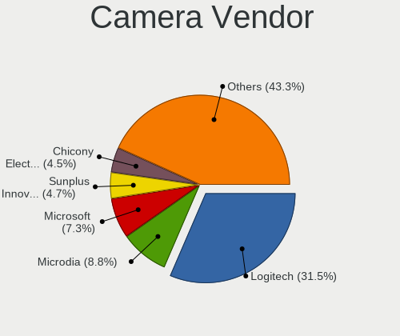

| Vendor                        | Desktops | Percent |
|-------------------------------|----------|---------|
| Logitech                      | 105      | 28.61%  |
| Microdia                      | 31       | 8.45%   |
| Microsoft                     | 28       | 7.63%   |
| Sunplus Innovation Technology | 19       | 5.18%   |
| Apple                         | 17       | 4.63%   |
| Chicony Electronics           | 15       | 4.09%   |
| Generalplus Technology        | 13       | 3.54%   |
| Samsung Electronics           | 11       | 3%      |
| Z-Star Microelectronics       | 9        | 2.45%   |
| ARC International             | 9        | 2.45%   |
| Jieli Technology              | 6        | 1.63%   |
| Cubeternet                    | 6        | 1.63%   |
| Realtek Semiconductor         | 5        | 1.36%   |
| GEMBIRD                       | 5        | 1.36%   |
| Razer USA                     | 4        | 1.09%   |
| IMC Networks                  | 4        | 1.09%   |
| Creative Technology           | 4        | 1.09%   |
| Aveo Technology               | 4        | 1.09%   |
| Arkmicro Technologies         | 4        | 1.09%   |
| 2M UVC CAMERA                 | 4        | 1.09%   |
| Tobii Technology AB           | 3        | 0.82%   |
| MacroSilicon                  | 3        | 0.82%   |
| KYE Systems (Mouse Systems)   | 3        | 0.82%   |
| Genesys Logic                 | 3        | 0.82%   |
| AVerMedia Technologies        | 3        | 0.82%   |
| A4Tech                        | 3        | 0.82%   |
| Xiongmai                      | 2        | 0.54%   |
| WaveRider Communications      | 2        | 0.54%   |
| Trust                         | 2        | 0.54%   |
| Suyin                         | 2        | 0.54%   |
| Sonix Technology              | 2        | 0.54%   |
| Pixart Imaging                | 2        | 0.54%   |
| lihappe8                      | 2        | 0.54%   |
| Huawei Technologies           | 2        | 0.54%   |
| Guillemot                     | 2        | 0.54%   |
| eMeet                         | 2        | 0.54%   |
| Alcor Micro                   | 2        | 0.54%   |
| Xiaomi                        | 1        | 0.27%   |
| Unknown                       | 1        | 0.27%   |
| Teslong Camera                | 1        | 0.27%   |

Camera Model
------------

Camera device models

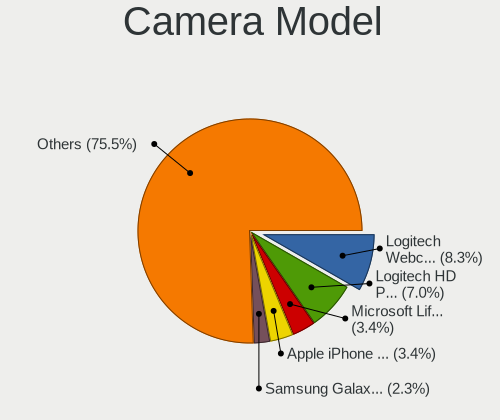

| Model                                   | Desktops | Percent |
|-----------------------------------------|----------|---------|
| Logitech Webcam C270                    | 32       | 8.65%   |
| Logitech HD Pro Webcam C920             | 18       | 4.86%   |
| Apple iPhone 5/5C/5S/6/SE/7/8/X         | 15       | 4.05%   |
| Microsoft LifeCam HD-3000               | 12       | 3.24%   |
| Samsung Galaxy series, misc. (MTP mode) | 11       | 2.97%   |
| Microdia USB 2.0 Camera                 | 9        | 2.43%   |
| ARC International Camera                | 9        | 2.43%   |
| Microdia Webcam Vitade AF               | 8        | 2.16%   |
| Sunplus PC Camera                       | 7        | 1.89%   |
| Logitech HD Webcam C615                 | 6        | 1.62%   |
| Logitech C920 PRO HD Webcam             | 6        | 1.62%   |
| Jieli USB PHY 2.0                       | 6        | 1.62%   |
| Generalplus CAMERA - UVC                | 6        | 1.62%   |
| Chicony HP High Definition 1MP Webcam   | 6        | 1.62%   |
| Logitech Webcam C925e                   | 5        | 1.35%   |
| Sunplus HD 720P webcam                  | 4        | 1.08%   |
| Razer USA Gaming Webcam [Kiyo]          | 4        | 1.08%   |
| Microsoft LifeCam VX-2000               | 4        | 1.08%   |
| Logitech Webcam C310                    | 4        | 1.08%   |
| Logitech C922 Pro Stream Webcam         | 4        | 1.08%   |
| Generalplus 808 Camera                  | 4        | 1.08%   |
| Chicony CNF8050 Webcam                  | 4        | 1.08%   |
| 2M UVC CAMERA NexiGo N60 FHD Webcam     | 4        | 1.08%   |
| Z-Star Venus USB2.0 Camera              | 3        | 0.81%   |
| Z-Star Integrated Camera                | 3        | 0.81%   |
| Tobii AB EyeChip                        | 3        | 0.81%   |
| Microsoft LifeCam VX-500 [1357]         | 3        | 0.81%   |
| Microdia Integrated Camera              | 3        | 0.81%   |
| Logitech HD Webcam C910                 | 3        | 0.81%   |
| Logitech HD Webcam C525                 | 3        | 0.81%   |
| Generalplus GENERAL WEBCAM              | 3        | 0.81%   |
| Cubeternet GL-UPC822 UVC WebCam         | 3        | 0.81%   |
| AVerMedia Live Streamer CAM 313         | 3        | 0.81%   |
| Aveo USB2.0 Camera                      | 3        | 0.81%   |
| Arkmicro USB2.0 PC CAMERA               | 3        | 0.81%   |
| Xiongmai web camera                     | 2        | 0.54%   |
| WaveRider USB Live camera               | 2        | 0.54%   |
| Suyin HD WebCam                         | 2        | 0.54%   |
| Sunplus Full HD webcam                  | 2        | 0.54%   |
| Realtek FULL HD 1080P Webcam            | 2        | 0.54%   |

Security
--------

Fingerprint Vendor
------------------

Fingerprint sensor vendors

| Vendor                | Desktops | Percent |
|-----------------------|----------|---------|
| LighTuning Technology | 3        | 50%     |
| AuthenTec             | 2        | 33.33%  |
| Dell                  | 1        | 16.67%  |

Fingerprint Model
-----------------

Fingerprint sensor models

| Model                                               | Desktops | Percent |
|-----------------------------------------------------|----------|---------|
| LighTuning Fingerprint Sensor                       | 2        | 33.33%  |
| LighTuning ES603 Swipe Fingerprint Sensor           | 1        | 16.67%  |
| Dell MS819 Dell Wired Mouse With Fingerprint Reader | 1        | 16.67%  |
| AuthenTec AES2810                                   | 1        | 16.67%  |
| AuthenTec AES2501 Fingerprint Sensor                | 1        | 16.67%  |

Chipcard Vendor
---------------

Chipcard module vendors

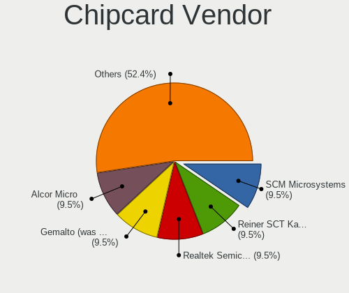

| Vendor                            | Desktops | Percent |
|-----------------------------------|----------|---------|
| Realtek Semiconductor             | 2        | 11.76%  |
| Gemalto (was Gemplus)             | 2        | 11.76%  |
| Alcor Micro                       | 2        | 11.76%  |
| Advanced Card Systems             | 2        | 11.76%  |
| VASCO Data Security International | 1        | 5.88%   |
| SCM Microsystems                  | 1        | 5.88%   |
| Reiner SCT Kartensysteme          | 1        | 5.88%   |
| Lenovo                            | 1        | 5.88%   |
| Kobil Systems                     | 1        | 5.88%   |
| Jing-Mold Enterprise              | 1        | 5.88%   |
| Fujitsu Siemens Computers         | 1        | 5.88%   |
| Chicony Electronics               | 1        | 5.88%   |
| Bit4id                            | 1        | 5.88%   |

Chipcard Model
--------------

Chipcard module models

| Model                                                             | Desktops | Percent |
|-------------------------------------------------------------------|----------|---------|
| Realtek Semiconductor Smart Card Reader Interface                 | 2        | 11.76%  |
| Gemalto (was Gemplus) GemPC Twin SmartCard Reader                 | 2        | 11.76%  |
| Alcor Micro AU9540 Smartcard Reader                               | 2        | 11.76%  |
| VASCO Data Security International Digipass 905 SmartCard Reader   | 1        | 5.88%   |
| SCM Microsystems SCR331-LC1 / SCR3310 SmartCard Reader            | 1        | 5.88%   |
| Reiner SCT Kartensysteme cyberJack e-com/pinpad                   | 1        | 5.88%   |
| Lenovo Smartcard Keyboard                                         | 1        | 5.88%   |
| Kobil Systems KOBIL Class 3 Reader                                | 1        | 5.88%   |
| Jing-Mold Enterprise HP USB Business Slim Smartcard CCID Keyboard | 1        | 5.88%   |
| Fujitsu Siemens Computers SmartCard Reader 2A                     | 1        | 5.88%   |
| Chicony Electronics HP Skylab USB Smartcard Keyboard              | 1        | 5.88%   |
| Bit4id miniLector EVO                                             | 1        | 5.88%   |
| Advanced Card Systems ACR39U                                      | 1        | 5.88%   |
| Advanced Card Systems ACR1281 1S Dual Reader                      | 1        | 5.88%   |

Unsupported
-----------

Unsupported Devices
-------------------

Total unsupported devices on board

| Total | Desktops | Percent |
|-------|----------|---------|
| 0     | 1926     | 78.71%  |
| 1     | 452      | 18.47%  |
| 2     | 60       | 2.45%   |
| 3     | 7        | 0.29%   |
| 4     | 2        | 0.08%   |

Unsupported Device Types
------------------------

Types of unsupported devices

| Type                     | Desktops | Percent |
|--------------------------|----------|---------|
| Graphics card            | 242      | 42.31%  |
| Net/wireless             | 193      | 33.74%  |
| Communication controller | 31       | 5.42%   |
| Multimedia controller    | 25       | 4.37%   |
| Unassigned class         | 18       | 3.15%   |
| Chipcard                 | 11       | 1.92%   |
| Modem                    | 9        | 1.57%   |
| Storage/raid             | 8        | 1.4%    |
| Sound                    | 5        | 0.87%   |
| Net/ethernet             | 5        | 0.87%   |
| Fingerprint reader       | 5        | 0.87%   |
| Bluetooth                | 5        | 0.87%   |
| Storage/ide              | 3        | 0.52%   |
| Network                  | 3        | 0.52%   |
| Card reader              | 3        | 0.52%   |
| Camera                   | 2        | 0.35%   |
| Video                    | 1        | 0.17%   |
| Storage/nvme             | 1        | 0.17%   |
| Storage                  | 1        | 0.17%   |
| Dvb card                 | 1        | 0.17%   |

