Zorin - Tested Hardware & Statistics (Desktops)
-----------------------------------------------

A project to collect tested hardware configurations for Zorin.

Anyone can contribute to this report by the [hw-probe](https://github.com/linuxhw/hw-probe) tool:

    sudo -E hw-probe -all -upload

Please contribute! Especially if your hardware is rare.

Contents
--------

* [ Test Cases ](#test-cases)

* [ System ](#system)
  - [ OS                       ](#os)
  - [ OS Family                ](#os-family)
  - [ Kernel                   ](#kernel)
  - [ Kernel Family            ](#kernel-family)
  - [ Kernel Major Ver.        ](#kernel-major-ver)
  - [ Arch                     ](#arch)
  - [ DE                       ](#de)
  - [ Display Server           ](#display-server)
  - [ Display Manager          ](#display-manager)
  - [ OS Lang                  ](#os-lang)
  - [ Boot Mode                ](#boot-mode)
  - [ Filesystem               ](#filesystem)
  - [ Part. scheme             ](#part-scheme)
  - [ Dual Boot with Linux/BSD ](#dual-boot-with-linuxbsd)
  - [ Dual Boot (Win)          ](#dual-boot-win)

* [ Board ](#board)
  - [ Vendor                   ](#vendor)
  - [ Model                    ](#model)
  - [ Model Family             ](#model-family)
  - [ MFG Year                 ](#mfg-year)
  - [ Form Factor              ](#form-factor)
  - [ Secure Boot              ](#secure-boot)
  - [ Coreboot                 ](#coreboot)
  - [ RAM Size                 ](#ram-size)
  - [ RAM Used                 ](#ram-used)
  - [ Total Drives             ](#total-drives)
  - [ Has CD-ROM               ](#has-cd-rom)
  - [ Has Ethernet             ](#has-ethernet)
  - [ Has WiFi                 ](#has-wifi)
  - [ Has Bluetooth            ](#has-bluetooth)

* [ Location ](#location)
  - [ Country                  ](#country)
  - [ City                     ](#city)

* [ Drives ](#drives)
  - [ Drive Vendor             ](#drive-vendor)
  - [ Drive Model              ](#drive-model)
  - [ HDD Vendor               ](#hdd-vendor)
  - [ SSD Vendor               ](#ssd-vendor)
  - [ Drive Kind               ](#drive-kind)
  - [ Drive Connector          ](#drive-connector)
  - [ Drive Size               ](#drive-size)
  - [ Space Total              ](#space-total)
  - [ Space Used               ](#space-used)
  - [ Malfunc. Drives          ](#malfunc-drives)
  - [ Malfunc. Drive Vendor    ](#malfunc-drive-vendor)
  - [ Malfunc. HDD Vendor      ](#malfunc-hdd-vendor)
  - [ Malfunc. Drive Kind      ](#malfunc-drive-kind)
  - [ Failed Drives            ](#failed-drives)
  - [ Failed Drive Vendor      ](#failed-drive-vendor)
  - [ Drive Status             ](#drive-status)

* [ Storage controller ](#storage-controller)
  - [ Storage Vendor           ](#storage-vendor)
  - [ Storage Model            ](#storage-model)
  - [ Storage Kind             ](#storage-kind)

* [ Processor ](#processor)
  - [ CPU Vendor               ](#cpu-vendor)
  - [ CPU Model                ](#cpu-model)
  - [ CPU Model Family         ](#cpu-model-family)
  - [ CPU Cores                ](#cpu-cores)
  - [ CPU Sockets              ](#cpu-sockets)
  - [ CPU Threads              ](#cpu-threads)
  - [ CPU Op-Modes             ](#cpu-op-modes)
  - [ CPU Microcode            ](#cpu-microcode)
  - [ CPU Microarch            ](#cpu-microarch)

* [ Graphics ](#graphics)
  - [ GPU Vendor               ](#gpu-vendor)
  - [ GPU Model                ](#gpu-model)
  - [ GPU Combo                ](#gpu-combo)
  - [ GPU Driver               ](#gpu-driver)
  - [ GPU Memory               ](#gpu-memory)

* [ Monitor ](#monitor)
  - [ Monitor Vendor           ](#monitor-vendor)
  - [ Monitor Model            ](#monitor-model)
  - [ Monitor Resolution       ](#monitor-resolution)
  - [ Monitor Diagonal         ](#monitor-diagonal)
  - [ Monitor Width            ](#monitor-width)
  - [ Aspect Ratio             ](#aspect-ratio)
  - [ Monitor Area             ](#monitor-area)
  - [ Pixel Density            ](#pixel-density)
  - [ Multiple Monitors        ](#multiple-monitors)

* [ Network ](#network)
  - [ Net Controller Vendor    ](#net-controller-vendor)
  - [ Net Controller Model     ](#net-controller-model)
  - [ Wireless Vendor          ](#wireless-vendor)
  - [ Wireless Model           ](#wireless-model)
  - [ Ethernet Vendor          ](#ethernet-vendor)
  - [ Ethernet Model           ](#ethernet-model)
  - [ Net Controller Kind      ](#net-controller-kind)
  - [ Used Controller          ](#used-controller)
  - [ NICs                     ](#nics)
  - [ IPv6                     ](#ipv6)

* [ Bluetooth ](#bluetooth)
  - [ Bluetooth Vendor         ](#bluetooth-vendor)
  - [ Bluetooth Model          ](#bluetooth-model)

* [ Sound ](#sound)
  - [ Sound Vendor             ](#sound-vendor)
  - [ Sound Model              ](#sound-model)

* [ Memory ](#memory)
  - [ Memory Vendor            ](#memory-vendor)
  - [ Memory Model             ](#memory-model)
  - [ Memory Kind              ](#memory-kind)
  - [ Memory Form Factor       ](#memory-form-factor)
  - [ Memory Size              ](#memory-size)
  - [ Memory Speed             ](#memory-speed)

* [ Printers & scanners ](#printers--scanners)
  - [ Printer Vendor           ](#printer-vendor)
  - [ Printer Model            ](#printer-model)
  - [ Scanner Vendor           ](#scanner-vendor)
  - [ Scanner Model            ](#scanner-model)

* [ Camera ](#camera)
  - [ Camera Vendor            ](#camera-vendor)
  - [ Camera Model             ](#camera-model)

* [ Security ](#security)
  - [ Fingerprint Vendor       ](#fingerprint-vendor)
  - [ Fingerprint Model        ](#fingerprint-model)
  - [ Chipcard Vendor          ](#chipcard-vendor)
  - [ Chipcard Model           ](#chipcard-model)

* [ Unsupported ](#unsupported)
  - [ Unsupported Devices      ](#unsupported-devices)
  - [ Unsupported Device Types ](#unsupported-device-types)

Test Cases
----------

Total: 4571

| Vendor        | Model                       | Probe                                                      | Date         |
|---------------|-----------------------------|------------------------------------------------------------|--------------|
| Intel         | H61M-DS2                    | [2ef34839f4](https://linux-hardware.org/?probe=2ef34839f4) | Jan 06, 2025 |
| Gigabyte      | Z170X-Gaming 7              | [ad40db7f67](https://linux-hardware.org/?probe=ad40db7f67) | Jan 06, 2025 |
| MSI           | MS-B0A41                    | [72d4614eaf](https://linux-hardware.org/?probe=72d4614eaf) | Jan 05, 2025 |
| Dell          | 0HY9JP A00                  | [3047d18f75](https://linux-hardware.org/?probe=3047d18f75) | Jan 05, 2025 |
| ASUSTek       | M4A89GTD-PRO/USB3           | [b2b5aa8eec](https://linux-hardware.org/?probe=b2b5aa8eec) | Jan 05, 2025 |
| Gigabyte      | B450 AORUS PRO WIFI-CF      | [38b497d193](https://linux-hardware.org/?probe=38b497d193) | Jan 05, 2025 |
| Gigabyte      | B450 AORUS PRO WIFI-CF      | [394cfdc261](https://linux-hardware.org/?probe=394cfdc261) | Jan 05, 2025 |
| Gigabyte      | Z97X-UD5H                   | [381b6fc010](https://linux-hardware.org/?probe=381b6fc010) | Jan 05, 2025 |
| Intel         | H61 V1.6B                   | [eb28b5f6be](https://linux-hardware.org/?probe=eb28b5f6be) | Jan 04, 2025 |
| HP            | 805D                        | [269af351cb](https://linux-hardware.org/?probe=269af351cb) | Jan 04, 2025 |
| ASUSTek       | TUF Gaming B550-PLUS        | [989a72852c](https://linux-hardware.org/?probe=989a72852c) | Jan 04, 2025 |
| Intel         | H61                         | [2a8ff4b81a](https://linux-hardware.org/?probe=2a8ff4b81a) | Jan 03, 2025 |
| Intel         | H61                         | [bb2c7db34e](https://linux-hardware.org/?probe=bb2c7db34e) | Jan 03, 2025 |
| Intel         | H61 V1.6B                   | [699b915313](https://linux-hardware.org/?probe=699b915313) | Jan 03, 2025 |
| OEM           | B75 Ver:1.41                | [31c5df1f0f](https://linux-hardware.org/?probe=31c5df1f0f) | Jan 01, 2025 |
| Gigabyte      | GA-MA790XT-UD4P             | [2e3ebfe841](https://linux-hardware.org/?probe=2e3ebfe841) | Jan 01, 2025 |
| Dell          | 04GJJT A00                  | [444d672dcb](https://linux-hardware.org/?probe=444d672dcb) | Jan 01, 2025 |
| Intel         | DH87RL AAG74240-402         | [047af1c88e](https://linux-hardware.org/?probe=047af1c88e) | Jan 01, 2025 |
| MSI           | B450 GAMING PLUS MAX        | [15b1774620](https://linux-hardware.org/?probe=15b1774620) | Jan 01, 2025 |
| Gigabyte      | X570 AORUS ULTRA            | [8b12a21b9a](https://linux-hardware.org/?probe=8b12a21b9a) | Dec 31, 2024 |
| ASRock        | A75 Extreme6                | [86fd341a89](https://linux-hardware.org/?probe=86fd341a89) | Dec 31, 2024 |
| HP            | 198E                        | [039237d3ac](https://linux-hardware.org/?probe=039237d3ac) | Dec 30, 2024 |
| Gigabyte      | B550 AORUS ELITE AX V2      | [81eb291a07](https://linux-hardware.org/?probe=81eb291a07) | Dec 30, 2024 |
| AZW           | GK35                        | [ed7df72829](https://linux-hardware.org/?probe=ed7df72829) | Dec 29, 2024 |
| ASUSTek       | PRIME H610M-K ARGB          | [8f2f1603ad](https://linux-hardware.org/?probe=8f2f1603ad) | Dec 29, 2024 |
| Gigabyte      | Z97X-Gaming 5               | [dc533b139f](https://linux-hardware.org/?probe=dc533b139f) | Dec 29, 2024 |
| Dell          | 0XCR8D A03                  | [77abfbec81](https://linux-hardware.org/?probe=77abfbec81) | Dec 29, 2024 |
| HP            | 1497                        | [256c3def88](https://linux-hardware.org/?probe=256c3def88) | Dec 29, 2024 |
| Gigabyte      | Z97X-Gaming 3               | [daf6ad0471](https://linux-hardware.org/?probe=daf6ad0471) | Dec 28, 2024 |
| Gigabyte      | Z97X-Gaming 3               | [089e2c01de](https://linux-hardware.org/?probe=089e2c01de) | Dec 28, 2024 |
| Lenovo        | 3106 SDK0J40697 WIN 3305... | [d5047e58d1](https://linux-hardware.org/?probe=d5047e58d1) | Dec 28, 2024 |
| MSI           | FM2-A75IA-E53               | [4736ddfd8c](https://linux-hardware.org/?probe=4736ddfd8c) | Dec 28, 2024 |
| Dell          | 05XGC8 A01                  | [59297e30b7](https://linux-hardware.org/?probe=59297e30b7) | Dec 27, 2024 |
| Dell          | 05XGC8 A01                  | [4714a00d4c](https://linux-hardware.org/?probe=4714a00d4c) | Dec 27, 2024 |
| ASRock        | X870 Pro RS WiFi            | [97eaca87bb](https://linux-hardware.org/?probe=97eaca87bb) | Dec 27, 2024 |
| HP            | 83F2                        | [28232611f8](https://linux-hardware.org/?probe=28232611f8) | Dec 27, 2024 |
| MSI           | X670E GAMING PLUS WIFI      | [59a746132a](https://linux-hardware.org/?probe=59a746132a) | Dec 26, 2024 |
| Dell          | 0200DY A02                  | [048527009c](https://linux-hardware.org/?probe=048527009c) | Dec 26, 2024 |
| Lenovo        | SDK0J40700 WIN              | [783314e5b3](https://linux-hardware.org/?probe=783314e5b3) | Dec 26, 2024 |
| ASRock        | A320M-HDV R4.0              | [ee9f566833](https://linux-hardware.org/?probe=ee9f566833) | Dec 26, 2024 |
| ASRock        | A320M-HDV R4.0              | [03bac79df3](https://linux-hardware.org/?probe=03bac79df3) | Dec 26, 2024 |
| Packard Be... | TBGM01                      | [68d8628be3](https://linux-hardware.org/?probe=68d8628be3) | Dec 25, 2024 |
| Gigabyte      | B250M-Gaming 3-CF           | [b0f84564ba](https://linux-hardware.org/?probe=b0f84564ba) | Dec 25, 2024 |
| Dell          | 06FW8P A02                  | [42c00b7a8a](https://linux-hardware.org/?probe=42c00b7a8a) | Dec 24, 2024 |
| Fujitsu Si... | D2461-A2 S26361-D2461-A2    | [246c7d0034](https://linux-hardware.org/?probe=246c7d0034) | Dec 24, 2024 |
| ASUSTek       | PRIME B450M-K II            | [1440d04792](https://linux-hardware.org/?probe=1440d04792) | Dec 24, 2024 |
| Lenovo        | 36EB SDK0R32862 WIN 3258... | [572d308e92](https://linux-hardware.org/?probe=572d308e92) | Dec 23, 2024 |
| Gigabyte      | B450M DS3H V2               | [c8554294b6](https://linux-hardware.org/?probe=c8554294b6) | Dec 23, 2024 |
| HP            | 83E9                        | [149bf1039e](https://linux-hardware.org/?probe=149bf1039e) | Dec 23, 2024 |
| MSI           | MAG Z590 TOMAHAWK WIFI      | [482ce52b8d](https://linux-hardware.org/?probe=482ce52b8d) | Dec 22, 2024 |
| ASUSTek       | PRIME H470-PLUS             | [93ed037f43](https://linux-hardware.org/?probe=93ed037f43) | Dec 22, 2024 |
| Gigabyte      | A320M-S2H-CF                | [0e08cf46c1](https://linux-hardware.org/?probe=0e08cf46c1) | Dec 22, 2024 |
| Fujitsu       | D2990-A2 S26361-D2990-A2    | [f6869ae032](https://linux-hardware.org/?probe=f6869ae032) | Dec 21, 2024 |
| ASUSTek       | TUF Gaming B650-PLUS WIF... | [15936c57d6](https://linux-hardware.org/?probe=15936c57d6) | Dec 20, 2024 |
| Google        | Teemo                       | [220fc873b9](https://linux-hardware.org/?probe=220fc873b9) | Dec 19, 2024 |
| Gigabyte      | Z77-DS3H                    | [edefe68947](https://linux-hardware.org/?probe=edefe68947) | Dec 19, 2024 |
| ASRock        | FM2A68M-DG3+                | [c649082ef1](https://linux-hardware.org/?probe=c649082ef1) | Dec 19, 2024 |
| ASRock        | FM2A68M-DG3+                | [61b3ee9f74](https://linux-hardware.org/?probe=61b3ee9f74) | Dec 19, 2024 |
| Packard Be... | TBGM01                      | [8fe4cbb492](https://linux-hardware.org/?probe=8fe4cbb492) | Dec 18, 2024 |
| Gigabyte      | GA-MA790XT-UD4P             | [a3dfcce270](https://linux-hardware.org/?probe=a3dfcce270) | Dec 18, 2024 |
| Gigabyte      | X570 AORUS ULTRA            | [b7fa7d97c0](https://linux-hardware.org/?probe=b7fa7d97c0) | Dec 17, 2024 |
| Lenovo        | SHARKBAY 0B98401 PRO        | [1e479b232e](https://linux-hardware.org/?probe=1e479b232e) | Dec 16, 2024 |
| Acer          | Predator G3610              | [e1311f0567](https://linux-hardware.org/?probe=e1311f0567) | Dec 16, 2024 |
| Huanan        | B85                         | [b296e2c8e1](https://linux-hardware.org/?probe=b296e2c8e1) | Dec 15, 2024 |
| ASUSTek       | P8P67                       | [6322c78de6](https://linux-hardware.org/?probe=6322c78de6) | Dec 15, 2024 |
| ASUSTek       | P8P67                       | [ee3b9d1e1e](https://linux-hardware.org/?probe=ee3b9d1e1e) | Dec 15, 2024 |
| MSI           | Eclipse Plus                | [bd3c3d2f09](https://linux-hardware.org/?probe=bd3c3d2f09) | Dec 15, 2024 |
| Lenovo        | 10064                       | [b162e666ea](https://linux-hardware.org/?probe=b162e666ea) | Dec 15, 2024 |
| Acer          | Predator G3610              | [6daec71034](https://linux-hardware.org/?probe=6daec71034) | Dec 15, 2024 |
| HP            | 81C5 MVB                    | [d1d4415deb](https://linux-hardware.org/?probe=d1d4415deb) | Dec 14, 2024 |
| MSI           | X670E GAMING PLUS WIFI      | [8e8893c238](https://linux-hardware.org/?probe=8e8893c238) | Dec 14, 2024 |
| ASUSTek       | H110M-R                     | [87c39f6163](https://linux-hardware.org/?probe=87c39f6163) | Dec 14, 2024 |
| ASUSTek       | PRIME A320M-K               | [9e55c65b62](https://linux-hardware.org/?probe=9e55c65b62) | Dec 14, 2024 |
| Lenovo        | SHARKBAY 0B98401 PRO        | [880ae3d999](https://linux-hardware.org/?probe=880ae3d999) | Dec 14, 2024 |
| Dell          | 0200DY A02                  | [8cdb0aff4f](https://linux-hardware.org/?probe=8cdb0aff4f) | Dec 14, 2024 |
| ASUSTek       | ROG STRIX B550-F GAMING     | [99ca8a0388](https://linux-hardware.org/?probe=99ca8a0388) | Dec 13, 2024 |
| Biostar       | A520MH                      | [b62ff2bde3](https://linux-hardware.org/?probe=b62ff2bde3) | Dec 13, 2024 |
| Dell          | 09WH54 A00                  | [f1bb8a4c8b](https://linux-hardware.org/?probe=f1bb8a4c8b) | Dec 12, 2024 |
| HP            | 3032h                       | [ca96a21d5f](https://linux-hardware.org/?probe=ca96a21d5f) | Dec 12, 2024 |
| Intel         | X79F1 V2.0                  | [b22f83ab40](https://linux-hardware.org/?probe=b22f83ab40) | Dec 12, 2024 |
| Intel         | H55                         | [9d104d8648](https://linux-hardware.org/?probe=9d104d8648) | Dec 11, 2024 |
| Unknown       | Unknown                     | [209746eb6c](https://linux-hardware.org/?probe=209746eb6c) | Dec 11, 2024 |
| HP            | 8105                        | [96072984b0](https://linux-hardware.org/?probe=96072984b0) | Dec 11, 2024 |
| wpc           | zrd616                      | [f00be7af29](https://linux-hardware.org/?probe=f00be7af29) | Dec 11, 2024 |
| Gigabyte      | Z690 AORUS ELITE AX DDR4    | [7bcd9c0153](https://linux-hardware.org/?probe=7bcd9c0153) | Dec 10, 2024 |
| MSI           | MPG Z690 FORCE WIFI         | [114c039a04](https://linux-hardware.org/?probe=114c039a04) | Dec 10, 2024 |
| Gigabyte      | B760 AORUS ELITE AX         | [1f88096982](https://linux-hardware.org/?probe=1f88096982) | Dec 09, 2024 |
| ASUSTek       | TUF Gaming X570-PRO WIFI... | [2ea7e62746](https://linux-hardware.org/?probe=2ea7e62746) | Dec 08, 2024 |
| MSI           | Eclipse Plus                | [c3573619ad](https://linux-hardware.org/?probe=c3573619ad) | Dec 08, 2024 |
| Gigabyte      | Z690 AORUS ELITE AX DDR4    | [3fb4762109](https://linux-hardware.org/?probe=3fb4762109) | Dec 08, 2024 |
| Positivo      | POS-PIH81DL                 | [898e87127f](https://linux-hardware.org/?probe=898e87127f) | Dec 08, 2024 |
| ASUSTek       | TUF Gaming B650M-E WIFI     | [dd5a713c21](https://linux-hardware.org/?probe=dd5a713c21) | Dec 07, 2024 |
| ASUSTek       | PRIME Z490-A                | [c9392314ab](https://linux-hardware.org/?probe=c9392314ab) | Dec 07, 2024 |
| Dell          | 0J8H4R A00                  | [762b620190](https://linux-hardware.org/?probe=762b620190) | Dec 07, 2024 |
| ASUSTek       | TUF Gaming B650M-E WIFI     | [9aef334f00](https://linux-hardware.org/?probe=9aef334f00) | Dec 06, 2024 |
| Gigabyte      | EP43-UD3L                   | [5e962e2194](https://linux-hardware.org/?probe=5e962e2194) | Dec 05, 2024 |
| MSI           | B450M PRO-VDH MAX           | [b0ff4ecc5f](https://linux-hardware.org/?probe=b0ff4ecc5f) | Dec 05, 2024 |
| HP            | 8105                        | [536d499bb8](https://linux-hardware.org/?probe=536d499bb8) | Dec 04, 2024 |
| Lenovo        | 30D9 SDK0J40697 WIN 3305... | [8b336590d9](https://linux-hardware.org/?probe=8b336590d9) | Dec 04, 2024 |
| ASUSTek       | ROG STRIX B450-F GAMING     | [1b34f91a7e](https://linux-hardware.org/?probe=1b34f91a7e) | Dec 04, 2024 |
| ASUSTek       | ROG STRIX B450-F GAMING     | [c8b86d2a3e](https://linux-hardware.org/?probe=c8b86d2a3e) | Dec 04, 2024 |
| MSI           | B350 TOMAHAWK               | [7909d61813](https://linux-hardware.org/?probe=7909d61813) | Dec 04, 2024 |
| Login Info... | LOG-BAT-I                   | [c5ba631810](https://linux-hardware.org/?probe=c5ba631810) | Dec 04, 2024 |
| Lenovo        | ThinkCentre A55 870577G     | [88f7652696](https://linux-hardware.org/?probe=88f7652696) | Dec 03, 2024 |
| ASUSTek       | TUF Gaming B550M-PLUS       | [959bb88eae](https://linux-hardware.org/?probe=959bb88eae) | Dec 03, 2024 |
| ASUSTek       | TUF Gaming B550M-PLUS       | [b1af910648](https://linux-hardware.org/?probe=b1af910648) | Dec 03, 2024 |
| ASUSTek       | X99-A II                    | [53d19a5849](https://linux-hardware.org/?probe=53d19a5849) | Dec 03, 2024 |
| Dell          | 0M9KCM A01                  | [5c2a5074f2](https://linux-hardware.org/?probe=5c2a5074f2) | Dec 02, 2024 |
| Acer          | Aspire X3960                | [875985a78d](https://linux-hardware.org/?probe=875985a78d) | Dec 02, 2024 |
| MSI           | B760M GAMING PLUS WIFI      | [8ec6dab60d](https://linux-hardware.org/?probe=8ec6dab60d) | Dec 02, 2024 |
| Dell          | 0M9KCM A01                  | [c24a105e90](https://linux-hardware.org/?probe=c24a105e90) | Dec 02, 2024 |
| HP            | 8054                        | [aff3ac8a75](https://linux-hardware.org/?probe=aff3ac8a75) | Dec 02, 2024 |
| ASUSTek       | P8Z77-V PRO                 | [d064733dcb](https://linux-hardware.org/?probe=d064733dcb) | Dec 02, 2024 |
| HP            | 821D                        | [20e39b95ab](https://linux-hardware.org/?probe=20e39b95ab) | Dec 01, 2024 |
| MSI           | MPG B550 GAMING PLUS        | [734efedbfa](https://linux-hardware.org/?probe=734efedbfa) | Dec 01, 2024 |
| MSI           | MPG B550 GAMING PLUS        | [10e229d327](https://linux-hardware.org/?probe=10e229d327) | Dec 01, 2024 |
| Lenovo        | 1036 SDK0Q40104 WIN 3305... | [315f389132](https://linux-hardware.org/?probe=315f389132) | Nov 30, 2024 |
| ASRock        | A520M-HVS                   | [6fc786e56e](https://linux-hardware.org/?probe=6fc786e56e) | Nov 29, 2024 |
| Gigabyte      | A320M-S2H-CF                | [cff02d6c2f](https://linux-hardware.org/?probe=cff02d6c2f) | Nov 28, 2024 |
| MSI           | GF615M-P33                  | [df34126457](https://linux-hardware.org/?probe=df34126457) | Nov 28, 2024 |
| MSI           | GF615M-P33                  | [2e1f2c05cd](https://linux-hardware.org/?probe=2e1f2c05cd) | Nov 28, 2024 |
| Dell          | 0KWVT8 A00                  | [bd9c6385dd](https://linux-hardware.org/?probe=bd9c6385dd) | Nov 28, 2024 |
| ASUSTek       | PRIME H310M-R R2.0          | [7b8612d136](https://linux-hardware.org/?probe=7b8612d136) | Nov 27, 2024 |
| GEEKOM        | Mini IT12                   | [f5b92bba05](https://linux-hardware.org/?probe=f5b92bba05) | Nov 26, 2024 |
| GEEKOM        | Mini IT12                   | [a896649890](https://linux-hardware.org/?probe=a896649890) | Nov 26, 2024 |
| GEEKOM        | Mini IT12                   | [49be531cbb](https://linux-hardware.org/?probe=49be531cbb) | Nov 26, 2024 |
| Intel         | DX79TO AAG28805-402         | [4b26bc3324](https://linux-hardware.org/?probe=4b26bc3324) | Nov 26, 2024 |
| HP            | 0B4Ch D                     | [8ce4158fcc](https://linux-hardware.org/?probe=8ce4158fcc) | Nov 26, 2024 |
| HP            | 0B4Ch D                     | [5565676cca](https://linux-hardware.org/?probe=5565676cca) | Nov 26, 2024 |
| MSI           | 2A9C                        | [69c4dafac6](https://linux-hardware.org/?probe=69c4dafac6) | Nov 26, 2024 |
| ASUSTek       | P8Z77-V LX                  | [978715d9f7](https://linux-hardware.org/?probe=978715d9f7) | Nov 26, 2024 |
| HP            | 84FE                        | [e5540a94da](https://linux-hardware.org/?probe=e5540a94da) | Nov 26, 2024 |
| Dell          | 0XPDFK A01                  | [31b83f832c](https://linux-hardware.org/?probe=31b83f832c) | Nov 26, 2024 |
| Gigabyte      | B760 AORUS ELITE AX         | [d3c62f2b89](https://linux-hardware.org/?probe=d3c62f2b89) | Nov 25, 2024 |
| ASUSTek       | M11AD                       | [b3222c19f5](https://linux-hardware.org/?probe=b3222c19f5) | Nov 25, 2024 |
| ASUSTek       | M11AD                       | [63ed444411](https://linux-hardware.org/?probe=63ed444411) | Nov 25, 2024 |
| Dell          | 0KWVT8 A00                  | [790161652a](https://linux-hardware.org/?probe=790161652a) | Nov 25, 2024 |
| Apple         | Mac-F221BEC8                | [2681ae7326](https://linux-hardware.org/?probe=2681ae7326) | Nov 25, 2024 |
| Apple         | Mac-F221BEC8                | [76f9ffcdab](https://linux-hardware.org/?probe=76f9ffcdab) | Nov 25, 2024 |
| HP            | 2AA2                        | [ad8688b30a](https://linux-hardware.org/?probe=ad8688b30a) | Nov 24, 2024 |
| MSI           | MAG X570 TOMAHAWK WIFI      | [41d8012fc9](https://linux-hardware.org/?probe=41d8012fc9) | Nov 24, 2024 |
| MSI           | MAG X570 TOMAHAWK WIFI      | [8d5b062bbb](https://linux-hardware.org/?probe=8d5b062bbb) | Nov 24, 2024 |
| Huanan        | X99-8M-F V1.1               | [10d9ba5f68](https://linux-hardware.org/?probe=10d9ba5f68) | Nov 24, 2024 |
| Dell          | 0XC837                      | [af2a699551](https://linux-hardware.org/?probe=af2a699551) | Nov 24, 2024 |
| Colorful T... | C.Z77 X5 V20                | [5883b61b95](https://linux-hardware.org/?probe=5883b61b95) | Nov 24, 2024 |
| MSI           | MAG X570 TOMAHAWK WIFI      | [3f588402aa](https://linux-hardware.org/?probe=3f588402aa) | Nov 23, 2024 |
| HP            | 2ADC                        | [80db44ef55](https://linux-hardware.org/?probe=80db44ef55) | Nov 23, 2024 |
| MSI           | MAG X570 TOMAHAWK WIFI      | [770555fffb](https://linux-hardware.org/?probe=770555fffb) | Nov 23, 2024 |
| HP            | 1497                        | [8d58b02962](https://linux-hardware.org/?probe=8d58b02962) | Nov 23, 2024 |
| HP            | 2ADC                        | [eb84d86558](https://linux-hardware.org/?probe=eb84d86558) | Nov 23, 2024 |
| Biostar       | GF8200C M2+                 | [07b481323c](https://linux-hardware.org/?probe=07b481323c) | Nov 22, 2024 |
| Biostar       | GF8200C M2+                 | [8094c6177a](https://linux-hardware.org/?probe=8094c6177a) | Nov 22, 2024 |
| Dell          | 0HD5W2 A01                  | [92e0094425](https://linux-hardware.org/?probe=92e0094425) | Nov 22, 2024 |
| ASUSTek       | H110M-A/M.2                 | [6c4b43e660](https://linux-hardware.org/?probe=6c4b43e660) | Nov 22, 2024 |
| JW Technol... | JW-IG41-MKII V1.1           | [e48cac1e60](https://linux-hardware.org/?probe=e48cac1e60) | Nov 21, 2024 |
| HP            | 8055                        | [593178f988](https://linux-hardware.org/?probe=593178f988) | Nov 21, 2024 |
| ASUSTek       | TUF Gaming B650-PLUS WIF... | [e61aed8e47](https://linux-hardware.org/?probe=e61aed8e47) | Nov 21, 2024 |
| Dell          | 0HD5W2 A01                  | [bce97e2d1d](https://linux-hardware.org/?probe=bce97e2d1d) | Nov 21, 2024 |
| Gigabyte      | B450 AORUS PRO WIFI-CF      | [bec30cdc12](https://linux-hardware.org/?probe=bec30cdc12) | Nov 20, 2024 |
| Intel         | D34010WYK H14771-304        | [51e96c807d](https://linux-hardware.org/?probe=51e96c807d) | Nov 19, 2024 |
| Dell          | 0M5DCD A00                  | [9987b49eb1](https://linux-hardware.org/?probe=9987b49eb1) | Nov 19, 2024 |
| Intel         | D34010WYK H14771-304        | [d35a3bd5f8](https://linux-hardware.org/?probe=d35a3bd5f8) | Nov 18, 2024 |
| Login Info... | LOG-BAT-I                   | [2c0e29b140](https://linux-hardware.org/?probe=2c0e29b140) | Nov 18, 2024 |
| ASRock        | A320M Pro4                  | [69c029ae2e](https://linux-hardware.org/?probe=69c029ae2e) | Nov 18, 2024 |
| AMD           | A88                         | [9203b9c5a1](https://linux-hardware.org/?probe=9203b9c5a1) | Nov 18, 2024 |
| ASRock        | Z590 Phantom Gaming-ITX/... | [d158bc88f9](https://linux-hardware.org/?probe=d158bc88f9) | Nov 18, 2024 |
| MSI           | A520M-A PRO                 | [70aebceb5e](https://linux-hardware.org/?probe=70aebceb5e) | Nov 18, 2024 |
| ASUSTek       | P5K                         | [dfdb2cf6ee](https://linux-hardware.org/?probe=dfdb2cf6ee) | Nov 17, 2024 |
| AMI           | Intel                       | [266b0fb8f5](https://linux-hardware.org/?probe=266b0fb8f5) | Nov 17, 2024 |
| HP            | 805A                        | [4d0512b55a](https://linux-hardware.org/?probe=4d0512b55a) | Nov 16, 2024 |
| ASUSTek       | A68HM-PLUS                  | [1d7aa20bd7](https://linux-hardware.org/?probe=1d7aa20bd7) | Nov 16, 2024 |
| ASUSTek       | A68HM-PLUS                  | [c88c8d82af](https://linux-hardware.org/?probe=c88c8d82af) | Nov 16, 2024 |
| Unknown       | Unknown                     | [3ddf105c9b](https://linux-hardware.org/?probe=3ddf105c9b) | Nov 16, 2024 |
| Unknown       | Unknown                     | [2f9a6a3df7](https://linux-hardware.org/?probe=2f9a6a3df7) | Nov 16, 2024 |
| Pegatron      | 2A9A                        | [f28e0b8f3d](https://linux-hardware.org/?probe=f28e0b8f3d) | Nov 16, 2024 |
| MSI           | A320M-A PRO MAX             | [2ab5021d2a](https://linux-hardware.org/?probe=2ab5021d2a) | Nov 15, 2024 |
| ASUSTek       | ROG STRIX Z790-H GAMING ... | [7055ac7293](https://linux-hardware.org/?probe=7055ac7293) | Nov 15, 2024 |
| ASUSTek       | P5E-VM SE                   | [0c40e6c351](https://linux-hardware.org/?probe=0c40e6c351) | Nov 15, 2024 |
| Dell          | 0HD5W2 A01                  | [a7c7d8ba31](https://linux-hardware.org/?probe=a7c7d8ba31) | Nov 14, 2024 |
| Gigabyte      | Z790 AORUS ELITE AX         | [14bab473d3](https://linux-hardware.org/?probe=14bab473d3) | Nov 13, 2024 |
| Gigabyte      | Z790 AORUS ELITE AX         | [0c44989ab0](https://linux-hardware.org/?probe=0c44989ab0) | Nov 13, 2024 |
| Intel         | B75                         | [3702d043f1](https://linux-hardware.org/?probe=3702d043f1) | Nov 13, 2024 |
| Intel         | B75                         | [b9f5a481dc](https://linux-hardware.org/?probe=b9f5a481dc) | Nov 13, 2024 |
| HP            | 2B02                        | [a0b3253900](https://linux-hardware.org/?probe=a0b3253900) | Nov 13, 2024 |
| HP            | 2B02                        | [d5120d2bd5](https://linux-hardware.org/?probe=d5120d2bd5) | Nov 12, 2024 |
| MSI           | B365M PRO-VDH               | [82d0c85a4c](https://linux-hardware.org/?probe=82d0c85a4c) | Nov 12, 2024 |
| HP            | 1998                        | [369ca1dd47](https://linux-hardware.org/?probe=369ca1dd47) | Nov 12, 2024 |
| ASUSTek       | P5K                         | [909b21807d](https://linux-hardware.org/?probe=909b21807d) | Nov 11, 2024 |
| Lenovo        | 36EB SDK0J40700 WIN 3258... | [b394d3009b](https://linux-hardware.org/?probe=b394d3009b) | Nov 11, 2024 |
| ASUSTek       | P5Q                         | [9e6cca17b9](https://linux-hardware.org/?probe=9e6cca17b9) | Nov 10, 2024 |
| ASUSTek       | P8Z77-V PRO                 | [d4267ac21d](https://linux-hardware.org/?probe=d4267ac21d) | Nov 10, 2024 |
| ASUSTek       | P5Q                         | [3b2b10209b](https://linux-hardware.org/?probe=3b2b10209b) | Nov 10, 2024 |
| ASUSTek       | M4A78LT-M                   | [4a59573437](https://linux-hardware.org/?probe=4a59573437) | Nov 10, 2024 |
| ASUSTek       | M5A78L-M/USB3               | [cb797d9021](https://linux-hardware.org/?probe=cb797d9021) | Nov 10, 2024 |
| Fujitsu Si... | D2824-A1 S26361-D2824-A1    | [8e2635b72b](https://linux-hardware.org/?probe=8e2635b72b) | Nov 09, 2024 |
| Dell          | 0KC9NP A01                  | [d4ce086214](https://linux-hardware.org/?probe=d4ce086214) | Nov 09, 2024 |
| HP            | 1905                        | [02b35a093f](https://linux-hardware.org/?probe=02b35a093f) | Nov 08, 2024 |
| ASUSTek       | PRIME B550M-A WIFI II       | [8fad4727cc](https://linux-hardware.org/?probe=8fad4727cc) | Nov 08, 2024 |
| Lenovo        | NO DPK                      | [bc3bb9ceab](https://linux-hardware.org/?probe=bc3bb9ceab) | Nov 08, 2024 |
| ASUSTek       | P6X58D PREMIUM              | [a3eba13ef1](https://linux-hardware.org/?probe=a3eba13ef1) | Nov 08, 2024 |
| ASRock        | A520M-HVS                   | [5f9ee0de7f](https://linux-hardware.org/?probe=5f9ee0de7f) | Nov 07, 2024 |
| Gigabyte      | B760M AORUS ELITE           | [52a1a63a06](https://linux-hardware.org/?probe=52a1a63a06) | Nov 07, 2024 |
| ASUSTek       | TUF Gaming B650-PLUS WIF... | [b61fa3d781](https://linux-hardware.org/?probe=b61fa3d781) | Nov 06, 2024 |
| HP            | 83F3                        | [e3c4ab7715](https://linux-hardware.org/?probe=e3c4ab7715) | Nov 06, 2024 |
| ASRock        | B450M Steel Legend          | [7b279ff880](https://linux-hardware.org/?probe=7b279ff880) | Nov 06, 2024 |
| Lenovo        | 3176 NOK                    | [5e69593bff](https://linux-hardware.org/?probe=5e69593bff) | Nov 06, 2024 |
| ASRock        | B450M Steel Legend          | [7ebbb04692](https://linux-hardware.org/?probe=7ebbb04692) | Nov 06, 2024 |
| Fujitsu       | D3227-A1 S26361-D3227-A1    | [91e79369d6](https://linux-hardware.org/?probe=91e79369d6) | Nov 05, 2024 |
| Gigabyte      | Z890 AORUS ELITE X ICE      | [db6488790e](https://linux-hardware.org/?probe=db6488790e) | Nov 05, 2024 |
| Gigabyte      | Z890 AORUS ELITE X ICE      | [35195bf24c](https://linux-hardware.org/?probe=35195bf24c) | Nov 05, 2024 |
| Gigabyte      | P55-USB3                    | [f2fb29214a](https://linux-hardware.org/?probe=f2fb29214a) | Nov 05, 2024 |
| Gigabyte      | Z77-DS3H                    | [6a09c5bd87](https://linux-hardware.org/?probe=6a09c5bd87) | Nov 04, 2024 |
| Casper        | C17B                        | [5d63a37717](https://linux-hardware.org/?probe=5d63a37717) | Nov 04, 2024 |
| Pegatron      | NARRA5                      | [23ce1fc4eb](https://linux-hardware.org/?probe=23ce1fc4eb) | Nov 04, 2024 |
| Alienware     | 0TYR0X A00                  | [8ac9740dcd](https://linux-hardware.org/?probe=8ac9740dcd) | Nov 03, 2024 |
| wpc           | zrd616                      | [1002f7593c](https://linux-hardware.org/?probe=1002f7593c) | Nov 02, 2024 |
| HP            | 8B3B A                      | [169caafde2](https://linux-hardware.org/?probe=169caafde2) | Nov 02, 2024 |
| ASUSTek       | ROG STRIX Z790-A GAMING ... | [3e6a954b64](https://linux-hardware.org/?probe=3e6a954b64) | Nov 02, 2024 |
| Dell          | 0P096C A01                  | [a3a653274c](https://linux-hardware.org/?probe=a3a653274c) | Nov 01, 2024 |
| ASUSTek       | TUF Gaming B450M-PRO S      | [747dc000aa](https://linux-hardware.org/?probe=747dc000aa) | Nov 01, 2024 |
| HP            | 805A                        | [92461038c0](https://linux-hardware.org/?probe=92461038c0) | Oct 31, 2024 |
| MACHINIST     | E5-MR9A V1.0                | [54d4d9d3ba](https://linux-hardware.org/?probe=54d4d9d3ba) | Oct 31, 2024 |
| Medion        | MS-7366                     | [0fe38a33d1](https://linux-hardware.org/?probe=0fe38a33d1) | Oct 31, 2024 |
| ASUSTek       | A55BM-E                     | [3f7b67ed7e](https://linux-hardware.org/?probe=3f7b67ed7e) | Oct 31, 2024 |
| Gigabyte      | B450 AORUS PRO-CF           | [c4f0ec932d](https://linux-hardware.org/?probe=c4f0ec932d) | Oct 30, 2024 |
| Gigabyte      | B450 AORUS PRO-CF           | [c453bcc368](https://linux-hardware.org/?probe=c453bcc368) | Oct 30, 2024 |
| Gigabyte      | B660M AORUS PRO AX DDR4     | [a0cf793a11](https://linux-hardware.org/?probe=a0cf793a11) | Oct 30, 2024 |
| Dell          | 0N826N A03                  | [0c1f187190](https://linux-hardware.org/?probe=0c1f187190) | Oct 29, 2024 |
| Shuttle       | FZ87                        | [87e4a221d2](https://linux-hardware.org/?probe=87e4a221d2) | Oct 29, 2024 |
| Dell          | 0N826N A03                  | [c3e4a08e65](https://linux-hardware.org/?probe=c3e4a08e65) | Oct 29, 2024 |
| Gigabyte      | H97-D3H-CF                  | [e84fc0d40a](https://linux-hardware.org/?probe=e84fc0d40a) | Oct 28, 2024 |
| Fujitsu       | D3313-F1 S26361-D3313-F1    | [c65be546ec](https://linux-hardware.org/?probe=c65be546ec) | Oct 28, 2024 |
| HP            | 3047h                       | [42a80cd524](https://linux-hardware.org/?probe=42a80cd524) | Oct 28, 2024 |
| HP            | 3047h                       | [a0af71f769](https://linux-hardware.org/?probe=a0af71f769) | Oct 28, 2024 |
| HP            | 1998                        | [a5201bcf6a](https://linux-hardware.org/?probe=a5201bcf6a) | Oct 28, 2024 |
| ASUSTek       | ROG STRIX Z690-F GAMING ... | [6a6fb283b0](https://linux-hardware.org/?probe=6a6fb283b0) | Oct 28, 2024 |
| ASUSTek       | ROG STRIX Z690-F GAMING ... | [08bd9a802a](https://linux-hardware.org/?probe=08bd9a802a) | Oct 28, 2024 |
| Dell          | 0D28YY A00                  | [ffb4541701](https://linux-hardware.org/?probe=ffb4541701) | Oct 27, 2024 |
| Fujitsu       | D3233-A1 S26361-D3233-A1    | [1503565765](https://linux-hardware.org/?probe=1503565765) | Oct 27, 2024 |
| Medion        | MS-7366                     | [786514f25e](https://linux-hardware.org/?probe=786514f25e) | Oct 27, 2024 |
| Gigabyte      | GA-E350N-USB3               | [7225d38fe2](https://linux-hardware.org/?probe=7225d38fe2) | Oct 25, 2024 |
| Gigabyte      | GA-E350N-USB3               | [95f022084d](https://linux-hardware.org/?probe=95f022084d) | Oct 25, 2024 |
| Gigabyte      | B550 AORUS ELITE V2         | [7d6371be67](https://linux-hardware.org/?probe=7d6371be67) | Oct 24, 2024 |
| Dell          | 0YJPT1 A00                  | [cf6085e6f9](https://linux-hardware.org/?probe=cf6085e6f9) | Oct 24, 2024 |
| Lenovo        | SHARKBAY 0B98401 PRO        | [abc719cbd3](https://linux-hardware.org/?probe=abc719cbd3) | Oct 24, 2024 |
| MSI           | X570-A PRO                  | [34af986c90](https://linux-hardware.org/?probe=34af986c90) | Oct 23, 2024 |
| Gigabyte      | B550 AORUS ELITE V2         | [0bd767b322](https://linux-hardware.org/?probe=0bd767b322) | Oct 23, 2024 |
| MSI           | B365M PRO-VDH               | [191f1bfd03](https://linux-hardware.org/?probe=191f1bfd03) | Oct 23, 2024 |
| MSI           | H81M-E33                    | [ab67b3a504](https://linux-hardware.org/?probe=ab67b3a504) | Oct 23, 2024 |
| MSI           | B365M PRO-VDH               | [3356b35619](https://linux-hardware.org/?probe=3356b35619) | Oct 23, 2024 |
| Unknown       | X79                         | [a454957608](https://linux-hardware.org/?probe=a454957608) | Oct 23, 2024 |
| Dell          | 088DT1 A01                  | [5089c146d6](https://linux-hardware.org/?probe=5089c146d6) | Oct 22, 2024 |
| Dell          | 0WR7PY A01                  | [c9ee515b39](https://linux-hardware.org/?probe=c9ee515b39) | Oct 22, 2024 |
| ASUSTek       | Z97M-PLUS/BR                | [f610cef4b5](https://linux-hardware.org/?probe=f610cef4b5) | Oct 21, 2024 |
| ECS           | GeForce6100PM-M2            | [ba0d87fee9](https://linux-hardware.org/?probe=ba0d87fee9) | Oct 21, 2024 |
| ASRock        | A520M-HDV                   | [bb6af03bf3](https://linux-hardware.org/?probe=bb6af03bf3) | Oct 21, 2024 |
| Dell          | 0HHV7N A00                  | [2f0d46fb23](https://linux-hardware.org/?probe=2f0d46fb23) | Oct 20, 2024 |
| HP            | 82F2 A01                    | [22bea705e2](https://linux-hardware.org/?probe=22bea705e2) | Oct 20, 2024 |
| Gigabyte      | M68MT-S2                    | [7fc2990d42](https://linux-hardware.org/?probe=7fc2990d42) | Oct 20, 2024 |
| Gigabyte      | Z170X-Gaming 7              | [cd7d1f8910](https://linux-hardware.org/?probe=cd7d1f8910) | Oct 20, 2024 |
| Intel         | X79 (INTEL Xeon E5/Corei... | [ea01741e08](https://linux-hardware.org/?probe=ea01741e08) | Oct 20, 2024 |
| Intel         | X79 (INTEL Xeon E5/Corei... | [5c0c4c8a95](https://linux-hardware.org/?probe=5c0c4c8a95) | Oct 20, 2024 |
| MSI           | B650 GAMING PLUS WIFI       | [2882c1b751](https://linux-hardware.org/?probe=2882c1b751) | Oct 19, 2024 |
| ASRock        | Z77 Pro4                    | [484a1c621c](https://linux-hardware.org/?probe=484a1c621c) | Oct 19, 2024 |
| Gigabyte      | P35C-DS3R                   | [d486c0f3cc](https://linux-hardware.org/?probe=d486c0f3cc) | Oct 19, 2024 |
| MACHINIST     | X99-MR9A PRO MAX V1.2       | [6a3b145dbc](https://linux-hardware.org/?probe=6a3b145dbc) | Oct 19, 2024 |
| MACHINIST     | X99-MR9A PRO MAX V1.2       | [464acfecba](https://linux-hardware.org/?probe=464acfecba) | Oct 19, 2024 |
| ASUSTek       | P5G41-M LX                  | [02f29e0739](https://linux-hardware.org/?probe=02f29e0739) | Oct 18, 2024 |
| Dell          | 07F37C A00                  | [10c1d68877](https://linux-hardware.org/?probe=10c1d68877) | Oct 17, 2024 |
| Dell          | 0JP3NX A01                  | [591b9985d6](https://linux-hardware.org/?probe=591b9985d6) | Oct 17, 2024 |
| Gigabyte      | Z390 GAMING X-CF            | [3ffc7f702a](https://linux-hardware.org/?probe=3ffc7f702a) | Oct 17, 2024 |
| HP            | 3648h                       | [0aff8ec887](https://linux-hardware.org/?probe=0aff8ec887) | Oct 17, 2024 |
| Gigabyte      | P55A-UD5                    | [427287ea8d](https://linux-hardware.org/?probe=427287ea8d) | Oct 16, 2024 |
| ASUSTek       | CROSSBLADE RANGER           | [7ad6aad489](https://linux-hardware.org/?probe=7ad6aad489) | Oct 16, 2024 |
| HP            | 1588h                       | [786517e71e](https://linux-hardware.org/?probe=786517e71e) | Oct 16, 2024 |
| ASRock        | H81M-DGS R2.0               | [c498134667](https://linux-hardware.org/?probe=c498134667) | Oct 16, 2024 |
| ASRock        | H81M-DGS R2.0               | [bc56e44248](https://linux-hardware.org/?probe=bc56e44248) | Oct 16, 2024 |
| Dell          | 033FF6 A00                  | [eb7537a3dd](https://linux-hardware.org/?probe=eb7537a3dd) | Oct 15, 2024 |
| ASUSTek       | P8B75-M LX PLUS             | [b4b50a0e63](https://linux-hardware.org/?probe=b4b50a0e63) | Oct 15, 2024 |
| MSI           | PRO Z790-P WIFI             | [80a134427f](https://linux-hardware.org/?probe=80a134427f) | Oct 15, 2024 |
| OEM           | X79G                        | [c6b10f3799](https://linux-hardware.org/?probe=c6b10f3799) | Oct 14, 2024 |
| Alienware     | 0P0JWX A00                  | [c2a8e068bd](https://linux-hardware.org/?probe=c2a8e068bd) | Oct 14, 2024 |
| ASUSTek       | G10CE                       | [752a87865a](https://linux-hardware.org/?probe=752a87865a) | Oct 14, 2024 |
| MSI           | 2AE0                        | [5bc9ad1a3b](https://linux-hardware.org/?probe=5bc9ad1a3b) | Oct 13, 2024 |
| MSI           | Z390-A PRO                  | [2a5b1c44cc](https://linux-hardware.org/?probe=2a5b1c44cc) | Oct 13, 2024 |
| ASUSTek       | M5A97 R2.0                  | [8646abd860](https://linux-hardware.org/?probe=8646abd860) | Oct 13, 2024 |
| ASUSTek       | TUF Gaming Z790-PLUS WIF... | [abb2c26d54](https://linux-hardware.org/?probe=abb2c26d54) | Oct 13, 2024 |
| ASUSTek       | Z170 PRO GAMING             | [b59a4de42d](https://linux-hardware.org/?probe=b59a4de42d) | Oct 13, 2024 |
| Dell          | 0XPDFK A01                  | [5b41e36020](https://linux-hardware.org/?probe=5b41e36020) | Oct 12, 2024 |
| Dell          | 0XPDFK A01                  | [feea088ac3](https://linux-hardware.org/?probe=feea088ac3) | Oct 12, 2024 |
| ASUSTek       | ROG STRIX Z370-E GAMING     | [21f53b5459](https://linux-hardware.org/?probe=21f53b5459) | Oct 11, 2024 |
| MSI           | PRO Z790-P WIFI             | [504f098627](https://linux-hardware.org/?probe=504f098627) | Oct 11, 2024 |
| Gigabyte      | B550 AORUS ELITE V2         | [19bda37f58](https://linux-hardware.org/?probe=19bda37f58) | Oct 10, 2024 |
| ASUSTek       | M4A88TD-V EVO/USB3          | [98ce6f6b57](https://linux-hardware.org/?probe=98ce6f6b57) | Oct 10, 2024 |
| ECS           | Iris8                       | [7ebf751b4d](https://linux-hardware.org/?probe=7ebf751b4d) | Oct 10, 2024 |
| Gigabyte      | B150M-D3P-WG-CF             | [de88d62e95](https://linux-hardware.org/?probe=de88d62e95) | Oct 09, 2024 |
| Gigabyte      | B150M-D3P-WG-CF             | [d0e808d5c5](https://linux-hardware.org/?probe=d0e808d5c5) | Oct 09, 2024 |
| Gigabyte      | B550 AORUS ELITE V2         | [3258142b11](https://linux-hardware.org/?probe=3258142b11) | Oct 09, 2024 |
| HP            | 3648h                       | [0920749527](https://linux-hardware.org/?probe=0920749527) | Oct 09, 2024 |
| Gigabyte      | Z68AP-D3                    | [1205d137c5](https://linux-hardware.org/?probe=1205d137c5) | Oct 09, 2024 |
| MSI           | MAG X570S TOMAHAWK MAX W... | [a41400db8d](https://linux-hardware.org/?probe=a41400db8d) | Oct 09, 2024 |
| Lenovo        | 3102 SDK0J40705 WIN 3425... | [c5c62657ee](https://linux-hardware.org/?probe=c5c62657ee) | Oct 08, 2024 |
| Unknown       | Unknown                     | [290c3faa24](https://linux-hardware.org/?probe=290c3faa24) | Oct 08, 2024 |
| Unknown       | Unknown                     | [ae49c8f2cb](https://linux-hardware.org/?probe=ae49c8f2cb) | Oct 08, 2024 |
| Unknown       | Unknown                     | [51d8f5f774](https://linux-hardware.org/?probe=51d8f5f774) | Oct 08, 2024 |
| MSI           | PRO Z690-A DDR4             | [323ebbba62](https://linux-hardware.org/?probe=323ebbba62) | Oct 08, 2024 |
| ASUSTek       | P6T DELUXE V2               | [83d59869de](https://linux-hardware.org/?probe=83d59869de) | Oct 07, 2024 |
| Gigabyte      | B550 AORUS ELITE AX V2      | [92e702792f](https://linux-hardware.org/?probe=92e702792f) | Oct 07, 2024 |
| Alienware     | 0446JC A01                  | [7bc596b378](https://linux-hardware.org/?probe=7bc596b378) | Oct 07, 2024 |
| ASUSTek       | PRIME H310M-F R2.0          | [1b09e0c3c0](https://linux-hardware.org/?probe=1b09e0c3c0) | Oct 06, 2024 |
| Gigabyte      | B650M AORUS ELITE AX        | [bc06f61edf](https://linux-hardware.org/?probe=bc06f61edf) | Oct 06, 2024 |
| MSI           | B550-A PRO                  | [00e8066675](https://linux-hardware.org/?probe=00e8066675) | Oct 06, 2024 |
| Gigabyte      | X670E AORUS MASTER          | [37e187d1c9](https://linux-hardware.org/?probe=37e187d1c9) | Oct 06, 2024 |
| Gigabyte      | B650M AORUS ELITE AX        | [4ecb717139](https://linux-hardware.org/?probe=4ecb717139) | Oct 06, 2024 |
| ASRock        | H61M-DGS                    | [6bdbe5bc33](https://linux-hardware.org/?probe=6bdbe5bc33) | Oct 05, 2024 |
| Biostar       | A320MH                      | [c281d9f2aa](https://linux-hardware.org/?probe=c281d9f2aa) | Oct 05, 2024 |
| MSI           | MAG Z790 TOMAHAWK MAX WI... | [229998424d](https://linux-hardware.org/?probe=229998424d) | Oct 05, 2024 |
| Alienware     | 0446JC A01                  | [60b8cc6ef1](https://linux-hardware.org/?probe=60b8cc6ef1) | Oct 03, 2024 |
| ASUSTek       | M4A88TD-V EVO/USB3          | [49a3a7f013](https://linux-hardware.org/?probe=49a3a7f013) | Oct 03, 2024 |
| Gigabyte      | 965P-DS3                    | [ef897b50d1](https://linux-hardware.org/?probe=ef897b50d1) | Oct 02, 2024 |
| Huanan        | X99-F8                      | [619b6f5845](https://linux-hardware.org/?probe=619b6f5845) | Oct 02, 2024 |
| ASRock        | Z790 Pro RS/D4              | [fbe99fdf47](https://linux-hardware.org/?probe=fbe99fdf47) | Oct 02, 2024 |
| ASUSTek       | Maximus VIII HERO           | [690a6356bc](https://linux-hardware.org/?probe=690a6356bc) | Oct 01, 2024 |
| ASUSTek       | CROSSBLADE RANGER           | [7a2d2bacd1](https://linux-hardware.org/?probe=7a2d2bacd1) | Oct 01, 2024 |
| Lenovo        | 3106 SDK0J40697 WIN 3305... | [7cbe0719e7](https://linux-hardware.org/?probe=7cbe0719e7) | Oct 01, 2024 |
| Intel         | X79G-A V2.0                 | [a1557bdeba](https://linux-hardware.org/?probe=a1557bdeba) | Oct 01, 2024 |
| ECS           | H61H2-MV                    | [29d29072da](https://linux-hardware.org/?probe=29d29072da) | Oct 01, 2024 |
| ASRock        | H61M-VS4                    | [14561e27dc](https://linux-hardware.org/?probe=14561e27dc) | Oct 01, 2024 |
| Intel         | X79G-A V2.0                 | [b5e98605a4](https://linux-hardware.org/?probe=b5e98605a4) | Sep 30, 2024 |
| ASUSTek       | H81M-PLUS                   | [9c0542b834](https://linux-hardware.org/?probe=9c0542b834) | Sep 30, 2024 |
| Dell          | 0FM586                      | [67cb39d9d4](https://linux-hardware.org/?probe=67cb39d9d4) | Sep 29, 2024 |
| ASRock        | J3355B-ITX                  | [3d82bcbf1c](https://linux-hardware.org/?probe=3d82bcbf1c) | Sep 29, 2024 |
| ASRock        | J3355B-ITX                  | [2e9ef6e2bc](https://linux-hardware.org/?probe=2e9ef6e2bc) | Sep 29, 2024 |
| Lenovo        | SHARKBAY NOK                | [fc1ea5dd8c](https://linux-hardware.org/?probe=fc1ea5dd8c) | Sep 28, 2024 |
| HP            | 3647h                       | [a7f7f8a677](https://linux-hardware.org/?probe=a7f7f8a677) | Sep 28, 2024 |
| Gigabyte      | B760 DS3H                   | [740eb5ea15](https://linux-hardware.org/?probe=740eb5ea15) | Sep 27, 2024 |
| MSI           | PRESTIGE X570 CREATION      | [8dc1f740de](https://linux-hardware.org/?probe=8dc1f740de) | Sep 26, 2024 |
| MSI           | PRESTIGE X570 CREATION      | [0df47e18d9](https://linux-hardware.org/?probe=0df47e18d9) | Sep 26, 2024 |
| Dell          | 0GDG8Y A00                  | [6ecee0fbfa](https://linux-hardware.org/?probe=6ecee0fbfa) | Sep 26, 2024 |
| Dell          | 0D24M8 A01                  | [f4d0cccdf1](https://linux-hardware.org/?probe=f4d0cccdf1) | Sep 26, 2024 |
| Dell          | 0D24M8 A01                  | [93b881282f](https://linux-hardware.org/?probe=93b881282f) | Sep 26, 2024 |
| ASUSTek       | ROG STRIX Z490-F GAMING     | [7d35226fe2](https://linux-hardware.org/?probe=7d35226fe2) | Sep 26, 2024 |
| ASUSTek       | ROG STRIX Z490-F GAMING     | [355059e70a](https://linux-hardware.org/?probe=355059e70a) | Sep 26, 2024 |
| ASRock        | B450M Steel Legend          | [a524e39cfb](https://linux-hardware.org/?probe=a524e39cfb) | Sep 26, 2024 |
| Gigabyte      | F2A78M-DASHV                | [ebba91d68c](https://linux-hardware.org/?probe=ebba91d68c) | Sep 26, 2024 |
| Gigabyte      | A320M-S2H-CF                | [fcf3d67e7b](https://linux-hardware.org/?probe=fcf3d67e7b) | Sep 25, 2024 |
| Dell          | 0NW73C A01                  | [a219f52b9b](https://linux-hardware.org/?probe=a219f52b9b) | Sep 25, 2024 |
| Dell          | 0NW73C A01                  | [6f6c30cd6f](https://linux-hardware.org/?probe=6f6c30cd6f) | Sep 25, 2024 |
| ASUSTek       | M5A78L-M LX PLUS            | [8d920340a6](https://linux-hardware.org/?probe=8d920340a6) | Sep 25, 2024 |
| Dell          | 04Y8V0 A01                  | [0bb87c76b0](https://linux-hardware.org/?probe=0bb87c76b0) | Sep 24, 2024 |
| HP            | 82A1                        | [9e17703561](https://linux-hardware.org/?probe=9e17703561) | Sep 24, 2024 |
| Gigabyte      | H61M-S2PH                   | [98c9e52a71](https://linux-hardware.org/?probe=98c9e52a71) | Sep 24, 2024 |
| Gigabyte      | GA-78LMT-USB3               | [1e4a64e920](https://linux-hardware.org/?probe=1e4a64e920) | Sep 23, 2024 |
| Dell          | 0GK1K2 A00                  | [2053759f81](https://linux-hardware.org/?probe=2053759f81) | Sep 23, 2024 |
| MSI           | B350 TOMAHAWK               | [532f17f668](https://linux-hardware.org/?probe=532f17f668) | Sep 23, 2024 |
| Medion        | MS-7366                     | [d3f9e281e9](https://linux-hardware.org/?probe=d3f9e281e9) | Sep 23, 2024 |
| Gigabyte      | P55A-UD5                    | [03ad1cf760](https://linux-hardware.org/?probe=03ad1cf760) | Sep 23, 2024 |
| Gigabyte      | P55A-UD5                    | [46eade1992](https://linux-hardware.org/?probe=46eade1992) | Sep 23, 2024 |
| ASUSTek       | PRIME Z790-V AX             | [3c4b7eecfb](https://linux-hardware.org/?probe=3c4b7eecfb) | Sep 22, 2024 |
| Fujitsu       | D3233-A1 S26361-D3233-A1    | [7f53516227](https://linux-hardware.org/?probe=7f53516227) | Sep 22, 2024 |
| ASRock        | B450M Pro4-F                | [aff31dc8ce](https://linux-hardware.org/?probe=aff31dc8ce) | Sep 22, 2024 |
| MSI           | Z97 PC Mate                 | [9e5fa5693a](https://linux-hardware.org/?probe=9e5fa5693a) | Sep 22, 2024 |
| HP            | 0B4Ch D                     | [798c2aed63](https://linux-hardware.org/?probe=798c2aed63) | Sep 22, 2024 |
| Dell          | 0HY9JP A00                  | [61ca1b22ed](https://linux-hardware.org/?probe=61ca1b22ed) | Sep 22, 2024 |
| Dell          | 0HY9JP A00                  | [6a8448c74c](https://linux-hardware.org/?probe=6a8448c74c) | Sep 21, 2024 |
| AZW           | Gemini T34                  | [0744db5764](https://linux-hardware.org/?probe=0744db5764) | Sep 21, 2024 |
| ASUSTek       | TUF Gaming X570-PLUS        | [a6ba08b6d0](https://linux-hardware.org/?probe=a6ba08b6d0) | Sep 21, 2024 |
| Foxconn       | 2ADA                        | [09ddcff37c](https://linux-hardware.org/?probe=09ddcff37c) | Sep 21, 2024 |
| Foxconn       | 2ADA                        | [8a70dadf79](https://linux-hardware.org/?probe=8a70dadf79) | Sep 21, 2024 |
| ASUSTek       | TUF Gaming X570-PLUS        | [a6f270baac](https://linux-hardware.org/?probe=a6f270baac) | Sep 21, 2024 |
| HP            | 83F2                        | [e77b1d8784](https://linux-hardware.org/?probe=e77b1d8784) | Sep 20, 2024 |
| ASUSTek       | TUF Gaming X570-PLUS        | [4c35212f77](https://linux-hardware.org/?probe=4c35212f77) | Sep 20, 2024 |
| HP            | 1588h                       | [8ffd21442a](https://linux-hardware.org/?probe=8ffd21442a) | Sep 20, 2024 |
| Gigabyte      | A320M-S2H-CF                | [1a65b79c49](https://linux-hardware.org/?probe=1a65b79c49) | Sep 20, 2024 |
| Gigabyte      | A320M-S2H-CF                | [04ce3b5ab8](https://linux-hardware.org/?probe=04ce3b5ab8) | Sep 20, 2024 |
| ASUSTek       | P5G41-M LX2/GB              | [d473c7ebc9](https://linux-hardware.org/?probe=d473c7ebc9) | Sep 20, 2024 |
| ASUSTek       | PRIME X570-P                | [a5c7ffb693](https://linux-hardware.org/?probe=a5c7ffb693) | Sep 19, 2024 |
| HP            | 8105                        | [6603f1b056](https://linux-hardware.org/?probe=6603f1b056) | Sep 18, 2024 |
| Gigabyte      | B550 AORUS MASTER           | [4516011590](https://linux-hardware.org/?probe=4516011590) | Sep 18, 2024 |
| MACHINIST     | X99-RS9 V1.11               | [845631b912](https://linux-hardware.org/?probe=845631b912) | Sep 17, 2024 |
| MSI           | Z87-G45 GAMING              | [789f0a6fbf](https://linux-hardware.org/?probe=789f0a6fbf) | Sep 17, 2024 |
| MSI           | Z87-G45 GAMING              | [8a1c41d355](https://linux-hardware.org/?probe=8a1c41d355) | Sep 17, 2024 |
| Soyo          | SY-YL B550M                 | [29b9693d47](https://linux-hardware.org/?probe=29b9693d47) | Sep 16, 2024 |
| Soyo          | SY-YL B550M                 | [5747eedde0](https://linux-hardware.org/?probe=5747eedde0) | Sep 16, 2024 |
| MSI           | H97M-G43                    | [4dabb8fc52](https://linux-hardware.org/?probe=4dabb8fc52) | Sep 16, 2024 |
| ASRock        | X79 Extreme6                | [9d80286a36](https://linux-hardware.org/?probe=9d80286a36) | Sep 15, 2024 |
| MSI           | PRO B760M-A WIFI            | [9b9efad16f](https://linux-hardware.org/?probe=9b9efad16f) | Sep 15, 2024 |
| Lenovo        | ThinkCentre M90p 5536P79    | [1792792ecc](https://linux-hardware.org/?probe=1792792ecc) | Sep 15, 2024 |
| Gigabyte      | GA-MA790GP-UD4H             | [1f2d668bb5](https://linux-hardware.org/?probe=1f2d668bb5) | Sep 14, 2024 |
| Gigabyte      | GA-MA790GP-UD4H             | [21a9a51b58](https://linux-hardware.org/?probe=21a9a51b58) | Sep 14, 2024 |
| MSI           | Z97I AC                     | [37fd401ef9](https://linux-hardware.org/?probe=37fd401ef9) | Sep 14, 2024 |
| Gigabyte      | X570S GAMING X              | [f6e2dd1616](https://linux-hardware.org/?probe=f6e2dd1616) | Sep 14, 2024 |
| Gigabyte      | B450M GAMING                | [44396af634](https://linux-hardware.org/?probe=44396af634) | Sep 14, 2024 |
| Dell          | 0DR845                      | [99a6870586](https://linux-hardware.org/?probe=99a6870586) | Sep 14, 2024 |
| OEM           | HN B85 Ver:1.4              | [9805a265f7](https://linux-hardware.org/?probe=9805a265f7) | Sep 14, 2024 |
| Dell          | 0DR845                      | [4f3086d8f3](https://linux-hardware.org/?probe=4f3086d8f3) | Sep 14, 2024 |
| Gigabyte      | B85M-D3H                    | [85a9d1959d](https://linux-hardware.org/?probe=85a9d1959d) | Sep 12, 2024 |
| MSI           | G41M-P26                    | [1b4b146b2d](https://linux-hardware.org/?probe=1b4b146b2d) | Sep 12, 2024 |
| ASUSTek       | P5B SE                      | [4c42931311](https://linux-hardware.org/?probe=4c42931311) | Sep 12, 2024 |
| Dell          | 0XCR8D A01                  | [193c008674](https://linux-hardware.org/?probe=193c008674) | Sep 11, 2024 |
| ASUSTek       | H61M-A/BR                   | [a12a233151](https://linux-hardware.org/?probe=a12a233151) | Sep 11, 2024 |
| Pegatron      | TRUCKEE                     | [3a969b02aa](https://linux-hardware.org/?probe=3a969b02aa) | Sep 10, 2024 |
| ASUSTek       | PRIME B450M-GAMING II       | [e52afda022](https://linux-hardware.org/?probe=e52afda022) | Sep 10, 2024 |
| Dell          | 0GK1K2 A00                  | [419d6d0d86](https://linux-hardware.org/?probe=419d6d0d86) | Sep 10, 2024 |
| ASUSTek       | PRIME B350-PLUS             | [67ea32fd29](https://linux-hardware.org/?probe=67ea32fd29) | Sep 10, 2024 |
| HP            | 1496                        | [9c85110b54](https://linux-hardware.org/?probe=9c85110b54) | Sep 10, 2024 |
| Gigabyte      | Z68X-UD4-B3                 | [cd72028c04](https://linux-hardware.org/?probe=cd72028c04) | Sep 10, 2024 |
| Gigabyte      | B450M GAMING                | [30cf1482a9](https://linux-hardware.org/?probe=30cf1482a9) | Sep 09, 2024 |
| ASUSTek       | PRIME Z790-V AX             | [a26aa376a2](https://linux-hardware.org/?probe=a26aa376a2) | Sep 09, 2024 |
| Gigabyte      | Z97X-UD5H                   | [cf117faf85](https://linux-hardware.org/?probe=cf117faf85) | Sep 09, 2024 |
| ASUSTek       | TUF Gaming Z790-PLUS WIF... | [4d3e149c23](https://linux-hardware.org/?probe=4d3e149c23) | Sep 09, 2024 |
| ASUSTek       | TUF Gaming Z790-PLUS WIF... | [0aadc1015c](https://linux-hardware.org/?probe=0aadc1015c) | Sep 09, 2024 |
| Gigabyte      | P67A-UD3P-B3                | [6ae597c28f](https://linux-hardware.org/?probe=6ae597c28f) | Sep 09, 2024 |
| Gigabyte      | P67A-UD3P-B3                | [dcdf09a7a3](https://linux-hardware.org/?probe=dcdf09a7a3) | Sep 09, 2024 |
| Dell          | 0C1R19 A01                  | [0af83e9521](https://linux-hardware.org/?probe=0af83e9521) | Sep 08, 2024 |
| ASUSTek       | ROG STRIX X570-E GAMING ... | [fcca865215](https://linux-hardware.org/?probe=fcca865215) | Sep 08, 2024 |
| ASUSTek       | M5A78L-M LX V2              | [ad890df61e](https://linux-hardware.org/?probe=ad890df61e) | Sep 08, 2024 |
| MSI           | B460M PRO-VDH WIFI          | [b07fd86d98](https://linux-hardware.org/?probe=b07fd86d98) | Sep 07, 2024 |
| ASUSTek       | SABERTOOTH Z170 MARK 1      | [a75adced7f](https://linux-hardware.org/?probe=a75adced7f) | Sep 07, 2024 |
| ASUSTek       | TUF Gaming B550-PLUS        | [4ca41527c4](https://linux-hardware.org/?probe=4ca41527c4) | Sep 07, 2024 |
| Dell          | 01W26N A00                  | [22dab9c6fe](https://linux-hardware.org/?probe=22dab9c6fe) | Sep 06, 2024 |
| Dell          | 0GK1K2 A00                  | [272836d37d](https://linux-hardware.org/?probe=272836d37d) | Sep 06, 2024 |
| HP            | 3397                        | [28acd7c27e](https://linux-hardware.org/?probe=28acd7c27e) | Sep 06, 2024 |
| ASRock        | B550M PG Riptide            | [949b7b0048](https://linux-hardware.org/?probe=949b7b0048) | Sep 06, 2024 |
| HP            | 198E                        | [46f98dc702](https://linux-hardware.org/?probe=46f98dc702) | Sep 05, 2024 |
| Dell          | 0XCR8D A01                  | [54958cec9e](https://linux-hardware.org/?probe=54958cec9e) | Sep 05, 2024 |
| Dell          | 0XCR8D A01                  | [9a5f1a7fc5](https://linux-hardware.org/?probe=9a5f1a7fc5) | Sep 05, 2024 |
| Gigabyte      | A320M-S2H-CF                | [e46b3be7d7](https://linux-hardware.org/?probe=e46b3be7d7) | Sep 05, 2024 |
| ASUSTek       | H110M-E/M.2                 | [168422221e](https://linux-hardware.org/?probe=168422221e) | Sep 04, 2024 |
| MSI           | Z270 GAMING PLUS            | [5699b4657d](https://linux-hardware.org/?probe=5699b4657d) | Sep 04, 2024 |
| ASUSTek       | Leonite2                    | [c3d5c40036](https://linux-hardware.org/?probe=c3d5c40036) | Sep 04, 2024 |
| Fujitsu       | D3233-A1 S26361-D3233-A1    | [69140094a9](https://linux-hardware.org/?probe=69140094a9) | Sep 03, 2024 |
| Fujitsu       | D3233-A1 S26361-D3233-A1    | [07507726c8](https://linux-hardware.org/?probe=07507726c8) | Sep 03, 2024 |
| Dell          | 0XPDFK A01                  | [1a28c32ab7](https://linux-hardware.org/?probe=1a28c32ab7) | Sep 02, 2024 |
| HP            | 18E5                        | [041180d946](https://linux-hardware.org/?probe=041180d946) | Sep 02, 2024 |
| Acer          | Veriton M6660G V:1.0        | [b47231d100](https://linux-hardware.org/?probe=b47231d100) | Sep 02, 2024 |
| Acer          | Veriton M6660G V:1.0        | [cd646ccb52](https://linux-hardware.org/?probe=cd646ccb52) | Sep 02, 2024 |
| Gigabyte      | B650M AORUS ELITE AX        | [3e5f800134](https://linux-hardware.org/?probe=3e5f800134) | Sep 01, 2024 |
| Gigabyte      | Z97X-UD5H                   | [2eccb0d2f4](https://linux-hardware.org/?probe=2eccb0d2f4) | Aug 31, 2024 |
| ASRock        | FM2A88M-HD+                 | [3f322eb9de](https://linux-hardware.org/?probe=3f322eb9de) | Aug 31, 2024 |
| ASRock        | H110M-HG4                   | [19b67b31b6](https://linux-hardware.org/?probe=19b67b31b6) | Aug 30, 2024 |
| ASUSTek       | PRIME B550M-A WIFI II       | [3afa3d3f1c](https://linux-hardware.org/?probe=3afa3d3f1c) | Aug 30, 2024 |
| ASUSTek       | TUF B450-PLUS GAMING        | [1f3576e380](https://linux-hardware.org/?probe=1f3576e380) | Aug 29, 2024 |
| Intel         | DX58SO2 AAG10925-205        | [8ac6c88914](https://linux-hardware.org/?probe=8ac6c88914) | Aug 29, 2024 |
| MSI           | PRO B760-VC WIFI            | [6b4e94f9ad](https://linux-hardware.org/?probe=6b4e94f9ad) | Aug 29, 2024 |
| MSI           | PRO Z790-A MAX WIFI         | [e36c8d0f5d](https://linux-hardware.org/?probe=e36c8d0f5d) | Aug 29, 2024 |
| MSI           | Z97I GAMING ACK             | [0e21542635](https://linux-hardware.org/?probe=0e21542635) | Aug 28, 2024 |
| SZMZ          | B75-MS V1.0                 | [d4d6bf2159](https://linux-hardware.org/?probe=d4d6bf2159) | Aug 28, 2024 |
| MSI           | B85M-E45                    | [7869cac8af](https://linux-hardware.org/?probe=7869cac8af) | Aug 28, 2024 |
| ASUSTek       | M5A97 R2.0                  | [273d4ce682](https://linux-hardware.org/?probe=273d4ce682) | Aug 27, 2024 |
| Fujitsu       | D3233-A1 S26361-D3233-A1    | [efcae1b0fb](https://linux-hardware.org/?probe=efcae1b0fb) | Aug 27, 2024 |
| Lenovo        | H420                        | [37b2ead81c](https://linux-hardware.org/?probe=37b2ead81c) | Aug 27, 2024 |
| Intel         | DQ67SW AAG12527-310         | [cc5d283911](https://linux-hardware.org/?probe=cc5d283911) | Aug 27, 2024 |
| Intel         | DG45ID AAE27729-310         | [1b25e65d41](https://linux-hardware.org/?probe=1b25e65d41) | Aug 26, 2024 |
| Intel         | DG45ID AAE27729-310         | [2eec4fd640](https://linux-hardware.org/?probe=2eec4fd640) | Aug 26, 2024 |
| Lenovo        | 36EB SDK0J40700 WIN 3258... | [7976200bb6](https://linux-hardware.org/?probe=7976200bb6) | Aug 26, 2024 |
| Intel         | DX58SO2 AAG10925-205        | [28c5f9177d](https://linux-hardware.org/?probe=28c5f9177d) | Aug 26, 2024 |
| AMD           | Inagua CRB                  | [9f0aa145c1](https://linux-hardware.org/?probe=9f0aa145c1) | Aug 25, 2024 |
| Gigabyte      | 965P-DS3                    | [2c84d9fba6](https://linux-hardware.org/?probe=2c84d9fba6) | Aug 25, 2024 |
| MSI           | PRESTIGE X570 CREATION      | [83e7a5d640](https://linux-hardware.org/?probe=83e7a5d640) | Aug 25, 2024 |
| ECS           | P45T-A                      | [22b56330c6](https://linux-hardware.org/?probe=22b56330c6) | Aug 25, 2024 |
| Fujitsu       | D3313-B1 S26361-D3313-B1    | [fd69fed81f](https://linux-hardware.org/?probe=fd69fed81f) | Aug 24, 2024 |
| Gigabyte      | X670E AORUS MASTER          | [6bfb0ed86d](https://linux-hardware.org/?probe=6bfb0ed86d) | Aug 24, 2024 |
| Gigabyte      | X570S AORUS ELITE AX        | [131bcb8651](https://linux-hardware.org/?probe=131bcb8651) | Aug 24, 2024 |
| Pegatron      | 2ACB                        | [dc2370aa9d](https://linux-hardware.org/?probe=dc2370aa9d) | Aug 23, 2024 |
| ASUSTek       | H97-PLUS                    | [60f5f3139e](https://linux-hardware.org/?probe=60f5f3139e) | Aug 23, 2024 |
| Gigabyte      | H77-D3H                     | [ae0adb934b](https://linux-hardware.org/?probe=ae0adb934b) | Aug 23, 2024 |
| Gigabyte      | 965P-DS3                    | [f710d2efd4](https://linux-hardware.org/?probe=f710d2efd4) | Aug 23, 2024 |
| ASUSTek       | M4A89GTD-PRO/USB3           | [099d384a90](https://linux-hardware.org/?probe=099d384a90) | Aug 22, 2024 |
| MSI           | A320M PRO-VH                | [0d6565a713](https://linux-hardware.org/?probe=0d6565a713) | Aug 22, 2024 |
| ASUSTek       | P8Z77-V LX                  | [5155a3774a](https://linux-hardware.org/?probe=5155a3774a) | Aug 22, 2024 |
| ASUSTek       | Z10PA-D8 Series             | [9d140d5c3a](https://linux-hardware.org/?probe=9d140d5c3a) | Aug 22, 2024 |
| ASRock        | B450 Gaming-ITX/ac          | [94cd7c3d5a](https://linux-hardware.org/?probe=94cd7c3d5a) | Aug 21, 2024 |
| ASUSTek       | P5B SE                      | [84d58daafa](https://linux-hardware.org/?probe=84d58daafa) | Aug 21, 2024 |
| Gigabyte      | H61M-D2H-USB3               | [34a696cc95](https://linux-hardware.org/?probe=34a696cc95) | Aug 21, 2024 |
| Gigabyte      | H61M-D2H-USB3               | [bc8bf812ae](https://linux-hardware.org/?probe=bc8bf812ae) | Aug 21, 2024 |
| ASUSTek       | M4A89GTD-PRO/USB3           | [1dbcd28c43](https://linux-hardware.org/?probe=1dbcd28c43) | Aug 20, 2024 |
| Fujitsu       | D3233-A1 S26361-D3233-A1    | [e02d8c78f1](https://linux-hardware.org/?probe=e02d8c78f1) | Aug 20, 2024 |
| Dell          | 0DF42J A00                  | [1c15285413](https://linux-hardware.org/?probe=1c15285413) | Aug 20, 2024 |
| ASUSTek       | PRIME X570-PRO              | [65b10f5f77](https://linux-hardware.org/?probe=65b10f5f77) | Aug 20, 2024 |
| Pegatron      | 2AD5                        | [d57e937e5c](https://linux-hardware.org/?probe=d57e937e5c) | Aug 20, 2024 |
| HP            | 828A                        | [6df0fbf71f](https://linux-hardware.org/?probe=6df0fbf71f) | Aug 20, 2024 |
| MSI           | Z97I GAMING ACK             | [a251ae1d39](https://linux-hardware.org/?probe=a251ae1d39) | Aug 19, 2024 |
| ASUSTek       | P5G41-M LX                  | [cab64cb216](https://linux-hardware.org/?probe=cab64cb216) | Aug 19, 2024 |
| ASUSTek       | P5G41-M LX                  | [92fa9a6ed6](https://linux-hardware.org/?probe=92fa9a6ed6) | Aug 19, 2024 |
| HP            | 1825                        | [02ef5994ff](https://linux-hardware.org/?probe=02ef5994ff) | Aug 19, 2024 |
| ASUSTek       | P8Z77-V LX                  | [74426e6a03](https://linux-hardware.org/?probe=74426e6a03) | Aug 19, 2024 |
| MSI           | MPG X570 GAMING PLUS        | [4f97646b00](https://linux-hardware.org/?probe=4f97646b00) | Aug 19, 2024 |
| MSI           | MPG X570 GAMING PLUS        | [403698fef1](https://linux-hardware.org/?probe=403698fef1) | Aug 19, 2024 |
| ASUSTek       | M5A97 R2.0                  | [dae06bd004](https://linux-hardware.org/?probe=dae06bd004) | Aug 19, 2024 |
| ASRock        | H61M-VG3                    | [bd7e312add](https://linux-hardware.org/?probe=bd7e312add) | Aug 18, 2024 |
| Biostar       | TA970 Plus                  | [377448fd65](https://linux-hardware.org/?probe=377448fd65) | Aug 18, 2024 |
| Biostar       | TA970 Plus                  | [acb6724986](https://linux-hardware.org/?probe=acb6724986) | Aug 18, 2024 |
| Gigabyte      | Z790 GAMING X AX            | [db12103f69](https://linux-hardware.org/?probe=db12103f69) | Aug 18, 2024 |
| Gigabyte      | B550M AORUS ELITE           | [779bb04c1f](https://linux-hardware.org/?probe=779bb04c1f) | Aug 17, 2024 |
| ASUSTek       | M5A97 PRO                   | [85d72ce8ce](https://linux-hardware.org/?probe=85d72ce8ce) | Aug 17, 2024 |
| Gigabyte      | B365M D3H-CF                | [ddc502c99e](https://linux-hardware.org/?probe=ddc502c99e) | Aug 17, 2024 |
| HP            | 2AF2 A01                    | [6fbeb8f276](https://linux-hardware.org/?probe=6fbeb8f276) | Aug 17, 2024 |
| Acer          | Aspire X1920                | [4245827fac](https://linux-hardware.org/?probe=4245827fac) | Aug 17, 2024 |
| Dell          | 0C1R19 A02                  | [73907078c5](https://linux-hardware.org/?probe=73907078c5) | Aug 16, 2024 |
| ASRock        | 970 Pro3 R2.0               | [e4d80ec38a](https://linux-hardware.org/?probe=e4d80ec38a) | Aug 15, 2024 |
| ASUSTek       | Z170-DELUXE                 | [03a0b28016](https://linux-hardware.org/?probe=03a0b28016) | Aug 15, 2024 |
| Lenovo        | H420                        | [6e49e6445e](https://linux-hardware.org/?probe=6e49e6445e) | Aug 15, 2024 |
| Lenovo        | H420                        | [1cb944e646](https://linux-hardware.org/?probe=1cb944e646) | Aug 15, 2024 |
| Gigabyte      | Z97X-UD5H                   | [5c29098135](https://linux-hardware.org/?probe=5c29098135) | Aug 14, 2024 |
| ASUSTek       | ROG STRIX B650E-E GAMING... | [c7570156ec](https://linux-hardware.org/?probe=c7570156ec) | Aug 13, 2024 |
| Biostar       | G31D-M7                     | [71dfbf10b9](https://linux-hardware.org/?probe=71dfbf10b9) | Aug 13, 2024 |
| ASUSTek       | Maximus VII HERO            | [2063ec62ad](https://linux-hardware.org/?probe=2063ec62ad) | Aug 12, 2024 |
| MSI           | MPG X570S CARBON MAX WIF... | [d19f12645c](https://linux-hardware.org/?probe=d19f12645c) | Aug 12, 2024 |
| ASUSTek       | P5G41-M LX                  | [c6aa02cea8](https://linux-hardware.org/?probe=c6aa02cea8) | Aug 12, 2024 |
| Lenovo        | 3100 SDK0J40700 WIN 3258... | [8422b2b4ea](https://linux-hardware.org/?probe=8422b2b4ea) | Aug 12, 2024 |
| HC Technol... | HCAR5000-MI                 | [94a808c7bd](https://linux-hardware.org/?probe=94a808c7bd) | Aug 11, 2024 |
| HP            | 0AECh                       | [1c5baeab15](https://linux-hardware.org/?probe=1c5baeab15) | Aug 11, 2024 |
| ASRock        | Z370 Pro4                   | [6b7d85b5a8](https://linux-hardware.org/?probe=6b7d85b5a8) | Aug 11, 2024 |
| OEM           | Intel H81                   | [94a2e82a82](https://linux-hardware.org/?probe=94a2e82a82) | Aug 10, 2024 |
| ASRock        | B75 Pro3                    | [6ab1327d8e](https://linux-hardware.org/?probe=6ab1327d8e) | Aug 10, 2024 |
| Lenovo        | 3106 SDK0J40697 WIN 3305... | [1e1acfa187](https://linux-hardware.org/?probe=1e1acfa187) | Aug 10, 2024 |
| ASUSTek       | H110M-A/M.2                 | [d40bcc40d2](https://linux-hardware.org/?probe=d40bcc40d2) | Aug 10, 2024 |
| Dell          | 08NPPY A00                  | [1b5d58c752](https://linux-hardware.org/?probe=1b5d58c752) | Aug 10, 2024 |
| Unknown       | Unknown                     | [cd77a3f765](https://linux-hardware.org/?probe=cd77a3f765) | Aug 09, 2024 |
| Dell          | 08NPPY A00                  | [f88978a24f](https://linux-hardware.org/?probe=f88978a24f) | Aug 09, 2024 |
| HP            | 802E                        | [58ed838fa5](https://linux-hardware.org/?probe=58ed838fa5) | Aug 09, 2024 |
| Dell          | 0C1R19 A01                  | [405cb25bf0](https://linux-hardware.org/?probe=405cb25bf0) | Aug 08, 2024 |
| ASUSTek       | ROG STRIX B650E-E GAMING... | [f4fe227b79](https://linux-hardware.org/?probe=f4fe227b79) | Aug 08, 2024 |
| Huanan        | X99-F8D V2.3                | [2b231c01bf](https://linux-hardware.org/?probe=2b231c01bf) | Aug 08, 2024 |
| HP            | 802E                        | [3dc5751041](https://linux-hardware.org/?probe=3dc5751041) | Aug 07, 2024 |
| MSI           | PRO Z790-A WIFI             | [8fed693674](https://linux-hardware.org/?probe=8fed693674) | Aug 07, 2024 |
| Dell          | 0C2KJT A00                  | [d9536f5bdc](https://linux-hardware.org/?probe=d9536f5bdc) | Aug 06, 2024 |
| Gigabyte      | B85M-D3PH                   | [15a6c41a20](https://linux-hardware.org/?probe=15a6c41a20) | Aug 06, 2024 |
| Gigabyte      | B85M-D3PH                   | [003a4086b3](https://linux-hardware.org/?probe=003a4086b3) | Aug 06, 2024 |
| ASUSTek       | ROG STRIX X570-F GAMING     | [72322fc02f](https://linux-hardware.org/?probe=72322fc02f) | Aug 05, 2024 |
| Dell          | 0C2KJT A00                  | [61f2261368](https://linux-hardware.org/?probe=61f2261368) | Aug 05, 2024 |
| HP            | 0B40h                       | [4e504e2f3a](https://linux-hardware.org/?probe=4e504e2f3a) | Aug 05, 2024 |
| MSI           | MPG X570 GAMING PLUS        | [e5bcb293a4](https://linux-hardware.org/?probe=e5bcb293a4) | Aug 05, 2024 |
| ASUSTek       | PRIME H310M-R R2.0          | [578712aebe](https://linux-hardware.org/?probe=578712aebe) | Aug 04, 2024 |
| ASRock        | B450M Gaming                | [9c5b23d377](https://linux-hardware.org/?probe=9c5b23d377) | Aug 04, 2024 |
| HC Technol... | HCAR5000-MI                 | [cc25e78cc9](https://linux-hardware.org/?probe=cc25e78cc9) | Aug 04, 2024 |
| MSI           | PRO B650-P WIFI             | [259f8a14d7](https://linux-hardware.org/?probe=259f8a14d7) | Aug 03, 2024 |
| HP            | 83F3                        | [8b1a108704](https://linux-hardware.org/?probe=8b1a108704) | Aug 03, 2024 |
| Biostar       | TA970 Plus                  | [b9ca2cb935](https://linux-hardware.org/?probe=b9ca2cb935) | Aug 02, 2024 |
| Intel         | X79M-S                      | [ae490654dd](https://linux-hardware.org/?probe=ae490654dd) | Aug 02, 2024 |
| Foxconn       | 2ABF                        | [aa9011109a](https://linux-hardware.org/?probe=aa9011109a) | Aug 02, 2024 |
| Gigabyte      | B450M DS3H-CF               | [9cd3c443d5](https://linux-hardware.org/?probe=9cd3c443d5) | Aug 02, 2024 |
| Gigabyte      | B450M DS3H-CF               | [25a6958d0f](https://linux-hardware.org/?probe=25a6958d0f) | Aug 02, 2024 |
| MSI           | MPG X570 GAMING EDGE WIF... | [0b395a199b](https://linux-hardware.org/?probe=0b395a199b) | Aug 02, 2024 |
| Acer          | Predator PO3-640            | [efe0a9a9ec](https://linux-hardware.org/?probe=efe0a9a9ec) | Aug 01, 2024 |
| HP            | 8054                        | [718b5d5274](https://linux-hardware.org/?probe=718b5d5274) | Aug 01, 2024 |
| HP            | 2AA2                        | [145f593604](https://linux-hardware.org/?probe=145f593604) | Aug 01, 2024 |
| Dell          | 0KYWH7 A01                  | [270c00f058](https://linux-hardware.org/?probe=270c00f058) | Jul 31, 2024 |
| Dell          | 0VYXHD A00                  | [179bff5118](https://linux-hardware.org/?probe=179bff5118) | Jul 31, 2024 |
| Dell          | 0GDG8Y A00                  | [64d001394a](https://linux-hardware.org/?probe=64d001394a) | Jul 31, 2024 |
| MSI           | X470 GAMING PLUS MAX        | [eadf688d56](https://linux-hardware.org/?probe=eadf688d56) | Jul 30, 2024 |
| ASRock        | H310CM-HDV/M.2              | [8cd5ccd611](https://linux-hardware.org/?probe=8cd5ccd611) | Jul 30, 2024 |
| ASUSTek       | P5G41C-M                    | [1da51f7040](https://linux-hardware.org/?probe=1da51f7040) | Jul 30, 2024 |
| Fujitsu       | D3171-A1 S26361-D3171-A1    | [24758c0301](https://linux-hardware.org/?probe=24758c0301) | Jul 30, 2024 |
| ASRock        | B550M-HVS SE                | [a7b15f0d48](https://linux-hardware.org/?probe=a7b15f0d48) | Jul 30, 2024 |
| Fujitsu       | D3171-A1 S26361-D3171-A1    | [abcceb4671](https://linux-hardware.org/?probe=abcceb4671) | Jul 30, 2024 |
| Intel         | X79F1 V2.0                  | [5d2cdcb140](https://linux-hardware.org/?probe=5d2cdcb140) | Jul 29, 2024 |
| Lenovo        | 30D0 SDK0J40697 WIN 3305... | [98dfe380f2](https://linux-hardware.org/?probe=98dfe380f2) | Jul 28, 2024 |
| Lenovo        | 30D0 SDK0J40697 WIN 3305... | [fcf665c644](https://linux-hardware.org/?probe=fcf665c644) | Jul 28, 2024 |
| ASUSTek       | Rampage V EXTREME           | [d305f053e4](https://linux-hardware.org/?probe=d305f053e4) | Jul 28, 2024 |
| Intel         | X79F1 V2.0                  | [a43b37cede](https://linux-hardware.org/?probe=a43b37cede) | Jul 27, 2024 |
| Gigabyte      | Z68X-UD4-B3                 | [007a26742b](https://linux-hardware.org/?probe=007a26742b) | Jul 27, 2024 |
| ASRock        | H510M-HDV/M.2               | [2e993c4215](https://linux-hardware.org/?probe=2e993c4215) | Jul 27, 2024 |
| ASRock        | H510M-HDV/M.2               | [a9d457cbfe](https://linux-hardware.org/?probe=a9d457cbfe) | Jul 27, 2024 |
| Foxconn       | H55MXV Series               | [9d2a5c4b9c](https://linux-hardware.org/?probe=9d2a5c4b9c) | Jul 26, 2024 |
| Gigabyte      | nForce                      | [8bebac5def](https://linux-hardware.org/?probe=8bebac5def) | Jul 25, 2024 |
| ASRock        | B550M PG Riptide            | [d4a82d0c2b](https://linux-hardware.org/?probe=d4a82d0c2b) | Jul 24, 2024 |
| MSI           | B85M-G43                    | [667048af27](https://linux-hardware.org/?probe=667048af27) | Jul 23, 2024 |
| ASUSTek       | Maximus VI IMPACT           | [02afbc4600](https://linux-hardware.org/?probe=02afbc4600) | Jul 23, 2024 |
| MSI           | Z370 GAMING PRO CARBON A... | [b0c0954f50](https://linux-hardware.org/?probe=b0c0954f50) | Jul 23, 2024 |
| Dell          | 0W0CHX A00                  | [48e627bbf5](https://linux-hardware.org/?probe=48e627bbf5) | Jul 22, 2024 |
| Gigabyte      | H97-D3H-CF                  | [f372a92cfa](https://linux-hardware.org/?probe=f372a92cfa) | Jul 21, 2024 |
| MSI           | X370 GAMING PRO CARBON      | [d1c5d7c110](https://linux-hardware.org/?probe=d1c5d7c110) | Jul 21, 2024 |
| ASUSTek       | PRIME X570-P                | [747f8d06d0](https://linux-hardware.org/?probe=747f8d06d0) | Jul 21, 2024 |
| ASUSTek       | A88XM-PLUS                  | [2b0ba480f8](https://linux-hardware.org/?probe=2b0ba480f8) | Jul 21, 2024 |
| Lenovo        | IdeaCentre K330             | [7962671df9](https://linux-hardware.org/?probe=7962671df9) | Jul 21, 2024 |
| Gigabyte      | H97-D3H-CF                  | [8f97d0913c](https://linux-hardware.org/?probe=8f97d0913c) | Jul 20, 2024 |
| ASUSTek       | ROG STRIX Z370-E GAMING     | [742fc54f71](https://linux-hardware.org/?probe=742fc54f71) | Jul 20, 2024 |
| MSI           | Z97 MPOWER                  | [9e981d7197](https://linux-hardware.org/?probe=9e981d7197) | Jul 19, 2024 |
| ASUSTek       | Rampage III Formula         | [376fbf2cba](https://linux-hardware.org/?probe=376fbf2cba) | Jul 19, 2024 |
| Gigabyte      | X670E AORUS MASTER          | [67f8fcdd69](https://linux-hardware.org/?probe=67f8fcdd69) | Jul 19, 2024 |
| Lenovo        | 3111 SDK0J40697 WIN 3305... | [bce1e4a580](https://linux-hardware.org/?probe=bce1e4a580) | Jul 19, 2024 |
| ASUSTek       | PRIME A320M-E               | [539493da66](https://linux-hardware.org/?probe=539493da66) | Jul 18, 2024 |
| MSI           | PRO Z690-A WIFI             | [43e0308d5f](https://linux-hardware.org/?probe=43e0308d5f) | Jul 18, 2024 |
| Lenovo        | 3111 SDK0J40697 WIN 3305... | [57e7532fcd](https://linux-hardware.org/?probe=57e7532fcd) | Jul 18, 2024 |
| Biostar       | A78MD                       | [b290e933bc](https://linux-hardware.org/?probe=b290e933bc) | Jul 18, 2024 |
| HP            | 83F2                        | [d30af24b31](https://linux-hardware.org/?probe=d30af24b31) | Jul 18, 2024 |
| ASUSTek       | ROG STRIX X570-I GAMING     | [755ed47b23](https://linux-hardware.org/?probe=755ed47b23) | Jul 18, 2024 |
| ASUSTek       | H97-PLUS                    | [0064f13ebc](https://linux-hardware.org/?probe=0064f13ebc) | Jul 18, 2024 |
| Gigabyte      | H97-Gaming 3                | [d168a40603](https://linux-hardware.org/?probe=d168a40603) | Jul 17, 2024 |
| Gigabyte      | H97-Gaming 3                | [eb0bd9e0e4](https://linux-hardware.org/?probe=eb0bd9e0e4) | Jul 17, 2024 |
| Intel         | HM65DESK                    | [5610460f43](https://linux-hardware.org/?probe=5610460f43) | Jul 17, 2024 |
| Dell          | 07F37C A00                  | [65e747e381](https://linux-hardware.org/?probe=65e747e381) | Jul 17, 2024 |
| ASUSTek       | H97-PLUS                    | [188509cc48](https://linux-hardware.org/?probe=188509cc48) | Jul 16, 2024 |
| ASUSTek       | ROG STRIX B550-F GAMING     | [f2c0a826a4](https://linux-hardware.org/?probe=f2c0a826a4) | Jul 16, 2024 |
| MSI           | Z370 GAMING PRO CARBON A... | [cc6d4ce84a](https://linux-hardware.org/?probe=cc6d4ce84a) | Jul 16, 2024 |
| AMI           | Intel                       | [1efab61403](https://linux-hardware.org/?probe=1efab61403) | Jul 15, 2024 |
| HP            | 18E7                        | [a81a274c88](https://linux-hardware.org/?probe=a81a274c88) | Jul 15, 2024 |
| HP            | 2B2C                        | [e584455db2](https://linux-hardware.org/?probe=e584455db2) | Jul 14, 2024 |
| MSI           | PRO Z790-A MAX WIFI         | [4034455f1d](https://linux-hardware.org/?probe=4034455f1d) | Jul 14, 2024 |
| MSI           | PRO Z790-A MAX WIFI         | [84fb4b927a](https://linux-hardware.org/?probe=84fb4b927a) | Jul 14, 2024 |
| Gigabyte      | G41MT-S2P                   | [54823f9cdc](https://linux-hardware.org/?probe=54823f9cdc) | Jul 14, 2024 |
| ASUSTek       | P7H55-M                     | [05015c412f](https://linux-hardware.org/?probe=05015c412f) | Jul 13, 2024 |
| Lenovo        | SKYBAY SDK0J40697 WIN 33... | [03b1e14dfa](https://linux-hardware.org/?probe=03b1e14dfa) | Jul 13, 2024 |
| Dell          | 0KP561                      | [c6124f8409](https://linux-hardware.org/?probe=c6124f8409) | Jul 11, 2024 |
| Gigabyte      | 2AC8                        | [1e2a5ee6c4](https://linux-hardware.org/?probe=1e2a5ee6c4) | Jul 11, 2024 |
| Lenovo        | MAHOBAY 0B98401 PRO         | [9f531c5ee5](https://linux-hardware.org/?probe=9f531c5ee5) | Jul 10, 2024 |
| ASUSTek       | K30BF_M32BF                 | [b863f86841](https://linux-hardware.org/?probe=b863f86841) | Jul 10, 2024 |
| ASRock        | H61M-DGS                    | [02c4a7193c](https://linux-hardware.org/?probe=02c4a7193c) | Jul 10, 2024 |
| ASUSTek       | M5A78L-M/USB3               | [6d995ffeef](https://linux-hardware.org/?probe=6d995ffeef) | Jul 10, 2024 |
| Lenovo        | 30D0 SDK0J40705 WIN 3425... | [7b9b5db174](https://linux-hardware.org/?probe=7b9b5db174) | Jul 10, 2024 |
| ASUSTek       | PRIME H270M-PLUS            | [c0faa014a2](https://linux-hardware.org/?probe=c0faa014a2) | Jul 10, 2024 |
| MSI           | B550-A PRO                  | [cd3ea20f60](https://linux-hardware.org/?probe=cd3ea20f60) | Jul 09, 2024 |
| MSI           | B550-A PRO                  | [6613cedf60](https://linux-hardware.org/?probe=6613cedf60) | Jul 08, 2024 |
| HP            | 1495                        | [0a67df4ccd](https://linux-hardware.org/?probe=0a67df4ccd) | Jul 07, 2024 |
| Gigabyte      | Z68X-UD4-B3                 | [deca980aa2](https://linux-hardware.org/?probe=deca980aa2) | Jul 07, 2024 |
| ECS           | H61H2-M12                   | [7bcab0a14c](https://linux-hardware.org/?probe=7bcab0a14c) | Jul 07, 2024 |
| Dell          | 0VRWRC A00                  | [4548d660df](https://linux-hardware.org/?probe=4548d660df) | Jul 05, 2024 |
| Dell          | 0VRWRC A00                  | [63b605d9aa](https://linux-hardware.org/?probe=63b605d9aa) | Jul 05, 2024 |
| HP            | 82F1                        | [674aa5ccf0](https://linux-hardware.org/?probe=674aa5ccf0) | Jul 05, 2024 |
| MSI           | PRO B650-S WIFI             | [13e804d76d](https://linux-hardware.org/?probe=13e804d76d) | Jul 05, 2024 |
| Dell          | 0PC5F7 A00                  | [7b1c638bbb](https://linux-hardware.org/?probe=7b1c638bbb) | Jul 05, 2024 |
| Lenovo        | 30D0 SDK0J40697 WIN 3305... | [811ec78a14](https://linux-hardware.org/?probe=811ec78a14) | Jul 05, 2024 |
| Lenovo        | 30D0 SDK0J40697 WIN 3305... | [687f4a1e43](https://linux-hardware.org/?probe=687f4a1e43) | Jul 05, 2024 |
| Dell          | 00V62H A01                  | [2f05983248](https://linux-hardware.org/?probe=2f05983248) | Jul 05, 2024 |
| MSI           | A320M-A PRO MAX             | [497ab84801](https://linux-hardware.org/?probe=497ab84801) | Jul 05, 2024 |
| Gigabyte      | GA-970A-UD3                 | [3a5b3b17a9](https://linux-hardware.org/?probe=3a5b3b17a9) | Jul 05, 2024 |
| Fujitsu       | D3233-A1 S26361-D3233-A1    | [2a6242fb25](https://linux-hardware.org/?probe=2a6242fb25) | Jul 04, 2024 |
| Gigabyte      | X670E AORUS MASTER          | [2000b5b97c](https://linux-hardware.org/?probe=2000b5b97c) | Jul 04, 2024 |
| MSI           | PRO B760-VC WIFI            | [c7e0014220](https://linux-hardware.org/?probe=c7e0014220) | Jul 03, 2024 |
| ASUSTek       | TUF Gaming B650-PLUS        | [fe2659f635](https://linux-hardware.org/?probe=fe2659f635) | Jul 02, 2024 |
| Gigabyte      | B550 GAMING X V2            | [b71aca2c54](https://linux-hardware.org/?probe=b71aca2c54) | Jul 02, 2024 |
| Google        | Buddy                       | [9850f5eaa6](https://linux-hardware.org/?probe=9850f5eaa6) | Jul 02, 2024 |
| Gigabyte      | H110M-H-CF                  | [76c9592d22](https://linux-hardware.org/?probe=76c9592d22) | Jul 02, 2024 |
| ASUSTek       | M5A97 LE R2.0               | [39a502bca7](https://linux-hardware.org/?probe=39a502bca7) | Jul 02, 2024 |
| Gigabyte      | 990FXA-UD3                  | [d8060e3528](https://linux-hardware.org/?probe=d8060e3528) | Jul 01, 2024 |
| ASRock        | Wolfdale1333-D667           | [d7f5ce177c](https://linux-hardware.org/?probe=d7f5ce177c) | Jul 01, 2024 |
| ASUSTek       | M5A78L-M LX3                | [7e2d6ae5ec](https://linux-hardware.org/?probe=7e2d6ae5ec) | Jun 29, 2024 |
| BESSTAR Te... | UM350                       | [241717fe92](https://linux-hardware.org/?probe=241717fe92) | Jun 29, 2024 |
| Intel         | DB75EN AAG39650-303         | [c7975e249f](https://linux-hardware.org/?probe=c7975e249f) | Jun 29, 2024 |
| Intel         | DB75EN AAG39650-303         | [64a0ac84f4](https://linux-hardware.org/?probe=64a0ac84f4) | Jun 29, 2024 |
| Pegatron      | 2ACB                        | [88a6be55cc](https://linux-hardware.org/?probe=88a6be55cc) | Jun 29, 2024 |
| ASUSTek       | PRIME H510M-E               | [0c54b817e6](https://linux-hardware.org/?probe=0c54b817e6) | Jun 28, 2024 |
| Gigabyte      | Z170X-Gaming 7              | [ff2ce379be](https://linux-hardware.org/?probe=ff2ce379be) | Jun 28, 2024 |
| ASRock        | 970 Extreme3                | [563ffce561](https://linux-hardware.org/?probe=563ffce561) | Jun 28, 2024 |
| Acer          | Nitro N50-600 V:1.1         | [67616a4253](https://linux-hardware.org/?probe=67616a4253) | Jun 28, 2024 |
| Gigabyte      | B560 DS3H AC-Y1             | [e8d01ecf38](https://linux-hardware.org/?probe=e8d01ecf38) | Jun 27, 2024 |
| ASUSTek       | TUF Gaming X570-PLUS        | [34ac307ec2](https://linux-hardware.org/?probe=34ac307ec2) | Jun 27, 2024 |
| ASRock        | N100DC-ITX                  | [b1f1c48f11](https://linux-hardware.org/?probe=b1f1c48f11) | Jun 27, 2024 |
| ASUSTek       | M5A78L LE                   | [3c6f7d07fa](https://linux-hardware.org/?probe=3c6f7d07fa) | Jun 27, 2024 |
| ASRock        | H61M-DGS                    | [c4e9309c19](https://linux-hardware.org/?probe=c4e9309c19) | Jun 26, 2024 |
| Gigabyte      | B450 AORUS ELITE V2         | [8f8bc7a2dd](https://linux-hardware.org/?probe=8f8bc7a2dd) | Jun 26, 2024 |
| Intel         | H55                         | [e173beb86d](https://linux-hardware.org/?probe=e173beb86d) | Jun 26, 2024 |
| Intel         | H55                         | [e4b405726d](https://linux-hardware.org/?probe=e4b405726d) | Jun 26, 2024 |
| Dell          | 08NPPY A00                  | [a16f3c2982](https://linux-hardware.org/?probe=a16f3c2982) | Jun 25, 2024 |
| MSI           | PRO Z790-A MAX WIFI         | [c8f9823971](https://linux-hardware.org/?probe=c8f9823971) | Jun 25, 2024 |
| MSI           | PRO Z790-A MAX WIFI         | [4407bce46b](https://linux-hardware.org/?probe=4407bce46b) | Jun 25, 2024 |
| ASRock        | B365M-HDV                   | [bc488687bd](https://linux-hardware.org/?probe=bc488687bd) | Jun 25, 2024 |
| HP            | 1496                        | [697290ca7b](https://linux-hardware.org/?probe=697290ca7b) | Jun 24, 2024 |
| HP            | 1496                        | [732fe59724](https://linux-hardware.org/?probe=732fe59724) | Jun 24, 2024 |
| ASRock        | H61M-DGS                    | [a7a6fdf1ad](https://linux-hardware.org/?probe=a7a6fdf1ad) | Jun 24, 2024 |
| ASRock        | B365M-HDV                   | [4a3bb5f053](https://linux-hardware.org/?probe=4a3bb5f053) | Jun 24, 2024 |
| Lenovo        | 3706 NOK                    | [c281c31cf0](https://linux-hardware.org/?probe=c281c31cf0) | Jun 24, 2024 |
| MSI           | MEG Z490 UNIFY              | [a41d8af1bf](https://linux-hardware.org/?probe=a41d8af1bf) | Jun 23, 2024 |
| GEEKOM        | Mini IT12                   | [31bd93719f](https://linux-hardware.org/?probe=31bd93719f) | Jun 23, 2024 |
| Gigabyte      | Z77X-UP4 TH                 | [70868b4564](https://linux-hardware.org/?probe=70868b4564) | Jun 23, 2024 |
| Gigabyte      | G41MT-S2PT                  | [347663d539](https://linux-hardware.org/?probe=347663d539) | Jun 23, 2024 |
| HP            | 83E1                        | [7eba4ae3ce](https://linux-hardware.org/?probe=7eba4ae3ce) | Jun 23, 2024 |
| Gigabyte      | Z790 AORUS ELITE AX         | [ea2fec59e5](https://linux-hardware.org/?probe=ea2fec59e5) | Jun 23, 2024 |
| Dell          | 0HD5W2 A01                  | [8405915abd](https://linux-hardware.org/?probe=8405915abd) | Jun 22, 2024 |
| ASUSTek       | ProArt X670E-CREATOR WIF... | [5920bffb0e](https://linux-hardware.org/?probe=5920bffb0e) | Jun 22, 2024 |
| ASUSTek       | P8Z77-V DELUXE              | [7213917f20](https://linux-hardware.org/?probe=7213917f20) | Jun 22, 2024 |
| ASUSTek       | P8Z77-V DELUXE              | [9d29e07483](https://linux-hardware.org/?probe=9d29e07483) | Jun 22, 2024 |
| MSI           | MPG B550 GAMING PLUS        | [4a7ecd6fee](https://linux-hardware.org/?probe=4a7ecd6fee) | Jun 22, 2024 |
| Dell          | 048DY8 A01                  | [24b75bf751](https://linux-hardware.org/?probe=24b75bf751) | Jun 22, 2024 |
| ASUSTek       | M5A99X EVO R2.0             | [2a22fc7970](https://linux-hardware.org/?probe=2a22fc7970) | Jun 22, 2024 |
| Lenovo        | 3706 NOK                    | [059d6e5256](https://linux-hardware.org/?probe=059d6e5256) | Jun 21, 2024 |
| Dell          | 0XCR8D A00                  | [2518c5257b](https://linux-hardware.org/?probe=2518c5257b) | Jun 21, 2024 |
| Gigabyte      | B450M DS3H-CF               | [9ecc5174a0](https://linux-hardware.org/?probe=9ecc5174a0) | Jun 21, 2024 |
| Gigabyte      | B450 AORUS ELITE V2         | [2b6036029d](https://linux-hardware.org/?probe=2b6036029d) | Jun 20, 2024 |
| Intel         | X99-P4 V1.0                 | [54e7735d9d](https://linux-hardware.org/?probe=54e7735d9d) | Jun 20, 2024 |
| Dell          | 0D24M8 A01                  | [2cdf2b71a1](https://linux-hardware.org/?probe=2cdf2b71a1) | Jun 20, 2024 |
| OEM           | X99-Turbo                   | [4690143a6c](https://linux-hardware.org/?probe=4690143a6c) | Jun 20, 2024 |
| Gigabyte      | X570 AORUS ELITE WIFI       | [fc938957da](https://linux-hardware.org/?probe=fc938957da) | Jun 20, 2024 |
| Gigabyte      | X570 AORUS ELITE WIFI       | [5dc928988a](https://linux-hardware.org/?probe=5dc928988a) | Jun 20, 2024 |
| Gigabyte      | H110M-H-CF                  | [0a37394d73](https://linux-hardware.org/?probe=0a37394d73) | Jun 19, 2024 |
| Dell          | 0PC5F7 A00                  | [46359a3c9f](https://linux-hardware.org/?probe=46359a3c9f) | Jun 19, 2024 |
| HP            | 1998                        | [cccee42308](https://linux-hardware.org/?probe=cccee42308) | Jun 19, 2024 |
| HP            | 1998                        | [ee549aa7c5](https://linux-hardware.org/?probe=ee549aa7c5) | Jun 19, 2024 |
| ASUSTek       | PRIME B250M-K               | [01f026ddaa](https://linux-hardware.org/?probe=01f026ddaa) | Jun 19, 2024 |
| ASUSTek       | PRIME B250M-K               | [0ff135390e](https://linux-hardware.org/?probe=0ff135390e) | Jun 18, 2024 |
| ASUSTek       | Rampage V EXTREME           | [84659788e8](https://linux-hardware.org/?probe=84659788e8) | Jun 18, 2024 |
| ASRock        | B550 Phantom Gaming-ITX/... | [e691440c04](https://linux-hardware.org/?probe=e691440c04) | Jun 18, 2024 |
| Lenovo        | SHARKBAY SDK0E50510 WIN     | [1bcea64f89](https://linux-hardware.org/?probe=1bcea64f89) | Jun 18, 2024 |
| Lenovo        | SKYBAY SDK0J40705 WIN 34... | [16e15084e4](https://linux-hardware.org/?probe=16e15084e4) | Jun 18, 2024 |
| Gigabyte      | F2A88X-UP4                  | [0c0aa2515c](https://linux-hardware.org/?probe=0c0aa2515c) | Jun 18, 2024 |
| ASUSTek       | CM6731_CM6431_CM6331        | [05e39b7f74](https://linux-hardware.org/?probe=05e39b7f74) | Jun 18, 2024 |
| MSI           | MEG Z490 UNIFY              | [c635186519](https://linux-hardware.org/?probe=c635186519) | Jun 18, 2024 |
| HP            | 0AA8h                       | [bb1f36cf41](https://linux-hardware.org/?probe=bb1f36cf41) | Jun 17, 2024 |
| MSI           | H61M-P20                    | [faf4f9d4c0](https://linux-hardware.org/?probe=faf4f9d4c0) | Jun 17, 2024 |
| ASUSTek       | M5A97 LE R2.0               | [2b6170b0aa](https://linux-hardware.org/?probe=2b6170b0aa) | Jun 16, 2024 |
| MSI           | PRO Z790-A MAX WIFI         | [9310315283](https://linux-hardware.org/?probe=9310315283) | Jun 15, 2024 |
| ASUSTek       | TUF Gaming Z790-PLUS WIF... | [e9c06e7f92](https://linux-hardware.org/?probe=e9c06e7f92) | Jun 15, 2024 |
| HP            | 3647h                       | [859770d7b5](https://linux-hardware.org/?probe=859770d7b5) | Jun 15, 2024 |
| Dell          | 0WR7PY A03                  | [3b5179dcbe](https://linux-hardware.org/?probe=3b5179dcbe) | Jun 15, 2024 |
| ASUSTek       | M5A78L-M/USB3               | [a36f6851fe](https://linux-hardware.org/?probe=a36f6851fe) | Jun 14, 2024 |
| ASRock        | 970 Extreme3                | [801978ff22](https://linux-hardware.org/?probe=801978ff22) | Jun 13, 2024 |
| MSI           | Z370 GAMING PRO CARBON      | [1e9836317d](https://linux-hardware.org/?probe=1e9836317d) | Jun 13, 2024 |
| Acer          | Aspire XC-1780              | [8b2550f530](https://linux-hardware.org/?probe=8b2550f530) | Jun 13, 2024 |
| ASUSTek       | P6X58D-E                    | [78a00f04ae](https://linux-hardware.org/?probe=78a00f04ae) | Jun 13, 2024 |
| ASUSTek       | M5A78L-M/USB3               | [8d41eec671](https://linux-hardware.org/?probe=8d41eec671) | Jun 13, 2024 |
| Dell          | 0F5C5X A00                  | [8db1dee6a9](https://linux-hardware.org/?probe=8db1dee6a9) | Jun 13, 2024 |
| Dell          | 0478VN A00                  | [3c2b013a6a](https://linux-hardware.org/?probe=3c2b013a6a) | Jun 13, 2024 |
| Dell          | 07N90W A02                  | [182ba2b5cd](https://linux-hardware.org/?probe=182ba2b5cd) | Jun 12, 2024 |
| Dell          | 04JGCK A01                  | [526e6f9dde](https://linux-hardware.org/?probe=526e6f9dde) | Jun 12, 2024 |
| GEEKOM        | Mini IT13                   | [a77767e25f](https://linux-hardware.org/?probe=a77767e25f) | Jun 11, 2024 |
| Gigabyte      | F2A55M-HD2                  | [b150413a21](https://linux-hardware.org/?probe=b150413a21) | Jun 11, 2024 |
| ASUSTek       | P8Z68-V GEN3                | [0f19c1f26e](https://linux-hardware.org/?probe=0f19c1f26e) | Jun 10, 2024 |
| ASUSTek       | TUF Gaming B450-PLUS II     | [433a3215e8](https://linux-hardware.org/?probe=433a3215e8) | Jun 10, 2024 |
| Gigabyte      | F2A88X-UP4                  | [385923ca25](https://linux-hardware.org/?probe=385923ca25) | Jun 10, 2024 |
| ASUSTek       | P8Z77-V LK                  | [c213ea08a9](https://linux-hardware.org/?probe=c213ea08a9) | Jun 09, 2024 |
| Shenzhen M... | AHWSA                       | [045c9b575c](https://linux-hardware.org/?probe=045c9b575c) | Jun 09, 2024 |
| HP            | 86FC MVB                    | [8893d3db7d](https://linux-hardware.org/?probe=8893d3db7d) | Jun 09, 2024 |
| Unknown       | Unknown                     | [dd41666ea6](https://linux-hardware.org/?probe=dd41666ea6) | Jun 09, 2024 |
| Fujitsu       | D3400-A1 S26361-D3400-A1    | [7f0c1bcf56](https://linux-hardware.org/?probe=7f0c1bcf56) | Jun 08, 2024 |
| MSI           | B550-A PRO                  | [6cd484c0d1](https://linux-hardware.org/?probe=6cd484c0d1) | Jun 08, 2024 |
| Simply NUC    | NUC13OXv9B                  | [1b387b937c](https://linux-hardware.org/?probe=1b387b937c) | Jun 07, 2024 |
| HP            | 3047h                       | [dfd7376062](https://linux-hardware.org/?probe=dfd7376062) | Jun 07, 2024 |
| ASUSTek       | P8Z68-V GEN3                | [2a4b7aab93](https://linux-hardware.org/?probe=2a4b7aab93) | Jun 07, 2024 |
| Simply NUC    | NUC13OXv9B                  | [63ec0d6774](https://linux-hardware.org/?probe=63ec0d6774) | Jun 07, 2024 |
| ASUSTek       | Rampage V EXTREME           | [937bf0ad3d](https://linux-hardware.org/?probe=937bf0ad3d) | Jun 06, 2024 |
| ASUSTek       | PRIME A320M-K               | [3b97096fe8](https://linux-hardware.org/?probe=3b97096fe8) | Jun 06, 2024 |
| ASUSTek       | Z87I-PRO                    | [b07dfdb192](https://linux-hardware.org/?probe=b07dfdb192) | Jun 06, 2024 |
| Fujitsu       | D3400-A1 S26361-D3400-A1    | [eeaf7933b5](https://linux-hardware.org/?probe=eeaf7933b5) | Jun 06, 2024 |
| MSI           | B550M PRO-VDH WIFI          | [7e1173c163](https://linux-hardware.org/?probe=7e1173c163) | Jun 06, 2024 |
| ASUSTek       | ROG STRIX Z370-I GAMING     | [113ebcd7cf](https://linux-hardware.org/?probe=113ebcd7cf) | Jun 05, 2024 |
| ASRock        | H81M-HDS                    | [45e878f6c6](https://linux-hardware.org/?probe=45e878f6c6) | Jun 04, 2024 |
| Gigabyte      | B560 DS3H AC-Y1             | [142fbd5e4d](https://linux-hardware.org/?probe=142fbd5e4d) | Jun 04, 2024 |
| Gigabyte      | Z690 UD AX DDR4             | [5a1a134b18](https://linux-hardware.org/?probe=5a1a134b18) | Jun 04, 2024 |
| ASUSTek       | P5KPL-VM                    | [eb6bf209db](https://linux-hardware.org/?probe=eb6bf209db) | Jun 04, 2024 |
| Gigabyte      | A520 AORUS ELITE            | [550e710714](https://linux-hardware.org/?probe=550e710714) | Jun 03, 2024 |
| Gigabyte      | B450 AORUS M                | [b843ca7c74](https://linux-hardware.org/?probe=b843ca7c74) | Jun 03, 2024 |
| HP            | 8055                        | [b259f209ba](https://linux-hardware.org/?probe=b259f209ba) | Jun 03, 2024 |
| Dell          | 0GM819                      | [aa16fce025](https://linux-hardware.org/?probe=aa16fce025) | Jun 02, 2024 |
| MSI           | B150M BAZOOKA PLUS          | [b64ff0d990](https://linux-hardware.org/?probe=b64ff0d990) | Jun 02, 2024 |
| HP            | 8061                        | [e5fc57bd4c](https://linux-hardware.org/?probe=e5fc57bd4c) | Jun 02, 2024 |
| Dell          | 0NKW6Y A00                  | [11b9dc77a8](https://linux-hardware.org/?probe=11b9dc77a8) | Jun 01, 2024 |
| Dell          | 09WH54 A00                  | [7cc20d86bb](https://linux-hardware.org/?probe=7cc20d86bb) | Jun 01, 2024 |
| Intel         | DH61BF AAG81311-102         | [e33f8a4718](https://linux-hardware.org/?probe=e33f8a4718) | Jun 01, 2024 |
| AMD           | A520                        | [70342967ba](https://linux-hardware.org/?probe=70342967ba) | Jun 01, 2024 |
| Intel         | DQ77MK AAG39642-500         | [03352367e1](https://linux-hardware.org/?probe=03352367e1) | May 31, 2024 |
| HP            | 18E7                        | [ba9c5c09c3](https://linux-hardware.org/?probe=ba9c5c09c3) | May 31, 2024 |
| ASUSTek       | TUF Gaming X570-PLUS        | [1e996d4684](https://linux-hardware.org/?probe=1e996d4684) | May 31, 2024 |
| MSI           | MAG B550 TOMAHAWK           | [c149b1e744](https://linux-hardware.org/?probe=c149b1e744) | May 31, 2024 |
| Dell          | 0N826N A01                  | [9b8babfe9b](https://linux-hardware.org/?probe=9b8babfe9b) | May 30, 2024 |
| ASRock        | Z790 Pro RS                 | [6eef2066b7](https://linux-hardware.org/?probe=6eef2066b7) | May 30, 2024 |
| Gigabyte      | B450M DS3H WIFI-CF          | [0ed14496f1](https://linux-hardware.org/?probe=0ed14496f1) | May 30, 2024 |
| ASRock        | H310M-ITX/ac                | [a81cb3838b](https://linux-hardware.org/?probe=a81cb3838b) | May 29, 2024 |
| ASRock        | B450 Pro4                   | [2c7477ec0f](https://linux-hardware.org/?probe=2c7477ec0f) | May 29, 2024 |
| Medion        | MS-7418                     | [0860506f72](https://linux-hardware.org/?probe=0860506f72) | May 29, 2024 |
| ASUSTek       | P8P67                       | [4f259e1879](https://linux-hardware.org/?probe=4f259e1879) | May 29, 2024 |
| Gigabyte      | B550M DS3H                  | [248bbb1f38](https://linux-hardware.org/?probe=248bbb1f38) | May 28, 2024 |
| ASUSTek       | P8P67                       | [27bd573017](https://linux-hardware.org/?probe=27bd573017) | May 28, 2024 |
| Intel         | HM65DESK                    | [409e1dd9dd](https://linux-hardware.org/?probe=409e1dd9dd) | May 28, 2024 |
| ASUSTek       | TUF Gaming A620M-PLUS       | [96a5a5f044](https://linux-hardware.org/?probe=96a5a5f044) | May 28, 2024 |
| Dell          | 06X1TJ A00                  | [ecf96aec64](https://linux-hardware.org/?probe=ecf96aec64) | May 28, 2024 |
| Dell          | 0YXT71 A03                  | [f479ae953e](https://linux-hardware.org/?probe=f479ae953e) | May 27, 2024 |
| MSI           | MAG B650 TOMAHAWK WIFI      | [64d0817408](https://linux-hardware.org/?probe=64d0817408) | May 27, 2024 |
| Intel         | HM65DESK                    | [be8146dbdd](https://linux-hardware.org/?probe=be8146dbdd) | May 27, 2024 |
| ASRock        | B85M Pro4                   | [78ed1f5f67](https://linux-hardware.org/?probe=78ed1f5f67) | May 26, 2024 |
| Foxconn       | Irvine HP P/N               | [d82937f6cf](https://linux-hardware.org/?probe=d82937f6cf) | May 26, 2024 |
| ZOTAC         | AMD HUDSON-M1               | [3bcc9158f0](https://linux-hardware.org/?probe=3bcc9158f0) | May 26, 2024 |
| ZOTAC         | AMD HUDSON-M1               | [f8899b739a](https://linux-hardware.org/?probe=f8899b739a) | May 26, 2024 |
| ASUSTek       | SABERTOOTH P67              | [7c94b2b143](https://linux-hardware.org/?probe=7c94b2b143) | May 25, 2024 |
| ASUSTek       | ROG STRIX X670E-E GAMING... | [6523f3e29a](https://linux-hardware.org/?probe=6523f3e29a) | May 25, 2024 |
| Lenovo        | MAHOBAY 0B98401 PRO         | [5c6a5a3f0c](https://linux-hardware.org/?probe=5c6a5a3f0c) | May 24, 2024 |
| Dell          | 0TP412                      | [d78622c7e2](https://linux-hardware.org/?probe=d78622c7e2) | May 24, 2024 |
| Dell          | 018D1Y A00                  | [10d18b74b7](https://linux-hardware.org/?probe=10d18b74b7) | May 24, 2024 |
| Dell          | 0HJ054                      | [8d6c3f640c](https://linux-hardware.org/?probe=8d6c3f640c) | May 22, 2024 |
| Dell          | 05XGC8 A01                  | [4b62db7f29](https://linux-hardware.org/?probe=4b62db7f29) | May 21, 2024 |
| ASRock        | Z490M Pro4                  | [d1b9fe839b](https://linux-hardware.org/?probe=d1b9fe839b) | May 21, 2024 |
| GEEKOM        | Mini IT12                   | [9c26a93c58](https://linux-hardware.org/?probe=9c26a93c58) | May 21, 2024 |
| Dell          | 0NW6H5 A00                  | [e3518a98e8](https://linux-hardware.org/?probe=e3518a98e8) | May 21, 2024 |
| Unknown       | AB07C                       | [c3707f019e](https://linux-hardware.org/?probe=c3707f019e) | May 20, 2024 |
| ASUSTek       | ROG CROSSHAIR VII HERO      | [57794688a5](https://linux-hardware.org/?probe=57794688a5) | May 20, 2024 |
| Dell          | 018D1Y A00                  | [41cef7a181](https://linux-hardware.org/?probe=41cef7a181) | May 20, 2024 |
| HP            | 8105                        | [a19b444b72](https://linux-hardware.org/?probe=a19b444b72) | May 19, 2024 |
| ASUSTek       | PRIME X570-PRO              | [fbc31b1a58](https://linux-hardware.org/?probe=fbc31b1a58) | May 19, 2024 |
| Intel         | TH510-D4 v2.3               | [d1382cd7f8](https://linux-hardware.org/?probe=d1382cd7f8) | May 19, 2024 |
| Biostar       | A68N-2100E                  | [d751496ef5](https://linux-hardware.org/?probe=d751496ef5) | May 19, 2024 |
| HP            | 3047h                       | [689ae554d7](https://linux-hardware.org/?probe=689ae554d7) | May 19, 2024 |
| Gigabyte      | B85M-D3H                    | [07870d5c5d](https://linux-hardware.org/?probe=07870d5c5d) | May 19, 2024 |
| BESSTAR Te... | HM90                        | [cde83725e7](https://linux-hardware.org/?probe=cde83725e7) | May 18, 2024 |
| Gigabyte      | Q270M-D3H                   | [11ae7a8461](https://linux-hardware.org/?probe=11ae7a8461) | May 18, 2024 |
| ASUSTek       | PRIME H370-A                | [a8ece004b8](https://linux-hardware.org/?probe=a8ece004b8) | May 18, 2024 |
| Gigabyte      | P41-ES3G                    | [169e3458d5](https://linux-hardware.org/?probe=169e3458d5) | May 18, 2024 |
| BESSTAR Te... | HM90                        | [5a9e195b3c](https://linux-hardware.org/?probe=5a9e195b3c) | May 17, 2024 |
| MSI           | B150M BAZOOKA PLUS          | [0a84f22ff7](https://linux-hardware.org/?probe=0a84f22ff7) | May 17, 2024 |
| Dell          | 0HD5W2 A01                  | [7dba2b2096](https://linux-hardware.org/?probe=7dba2b2096) | May 17, 2024 |
| ASUSTek       | TUF Gaming Z790-PLUS WIF... | [a33b0eef1c](https://linux-hardware.org/?probe=a33b0eef1c) | May 17, 2024 |
| Dell          | 0RCPW3 A03                  | [fc65edcfa7](https://linux-hardware.org/?probe=fc65edcfa7) | May 17, 2024 |
| Dell          | 08NPPY A00                  | [3e313633af](https://linux-hardware.org/?probe=3e313633af) | May 16, 2024 |
| Dell          | 0G261D A00                  | [614c8593f0](https://linux-hardware.org/?probe=614c8593f0) | May 15, 2024 |
| MSI           | X58 Pro-E                   | [3702db3a4c](https://linux-hardware.org/?probe=3702db3a4c) | May 14, 2024 |
| ASUSTek       | Benicia                     | [b35fe58600](https://linux-hardware.org/?probe=b35fe58600) | May 14, 2024 |
| Acer          | Veriton X4620G v1.0         | [0bdc1651c3](https://linux-hardware.org/?probe=0bdc1651c3) | May 14, 2024 |
| HC Technol... | HCAR5000-MI                 | [a8c6e1d54a](https://linux-hardware.org/?probe=a8c6e1d54a) | May 13, 2024 |
| Gigabyte      | EP43-DS3LR                  | [e82835983b](https://linux-hardware.org/?probe=e82835983b) | May 13, 2024 |
| ASUSTek       | P5QL PRO                    | [acd53ca948](https://linux-hardware.org/?probe=acd53ca948) | May 13, 2024 |
| ASUSTek       | P5QL PRO                    | [9cf04d890a](https://linux-hardware.org/?probe=9cf04d890a) | May 13, 2024 |
| Dell          | 0D6H9T A01                  | [fe8da11f5b](https://linux-hardware.org/?probe=fe8da11f5b) | May 13, 2024 |
| Gigabyte      | Z390 DESIGNARE-CF           | [f7c5a6e0ba](https://linux-hardware.org/?probe=f7c5a6e0ba) | May 12, 2024 |
| Gigabyte      | F2A68HM-DS2                 | [dc6896f24a](https://linux-hardware.org/?probe=dc6896f24a) | May 12, 2024 |
| ASUSTek       | PRIME A320M-K               | [b77ea29a30](https://linux-hardware.org/?probe=b77ea29a30) | May 12, 2024 |
| Lenovo        | NO DPK                      | [c966bf3114](https://linux-hardware.org/?probe=c966bf3114) | May 11, 2024 |
| ASUSTek       | ROG CROSSHAIR VIII HERO     | [3455c4e687](https://linux-hardware.org/?probe=3455c4e687) | May 11, 2024 |
| Dell          | 0HY9JP A02                  | [f798ace200](https://linux-hardware.org/?probe=f798ace200) | May 10, 2024 |
| Gigabyte      | B550M AORUS ELITE           | [7b6f52d80d](https://linux-hardware.org/?probe=7b6f52d80d) | May 10, 2024 |
| Gigabyte      | B550M AORUS ELITE           | [15a3aa2281](https://linux-hardware.org/?probe=15a3aa2281) | May 10, 2024 |
| ASUSTek       | H81M-CS/BR                  | [3fd42d5154](https://linux-hardware.org/?probe=3fd42d5154) | May 10, 2024 |
| ASUSTek       | PRIME H370-A                | [c1a4231ea2](https://linux-hardware.org/?probe=c1a4231ea2) | May 09, 2024 |
| Fujitsu Si... | D2598-A1 S26361-D2598-A1    | [3ed0f3bd70](https://linux-hardware.org/?probe=3ed0f3bd70) | May 09, 2024 |
| MSI           | H310M PRO-VD                | [586c4844be](https://linux-hardware.org/?probe=586c4844be) | May 09, 2024 |
| Lenovo        | 110536U ThinkServer TS13... | [d3196733cd](https://linux-hardware.org/?probe=d3196733cd) | May 08, 2024 |
| ASUSTek       | P8H77-V LE                  | [e896127dc3](https://linux-hardware.org/?probe=e896127dc3) | May 08, 2024 |
| Unknown       | Unknown                     | [14f9a58589](https://linux-hardware.org/?probe=14f9a58589) | May 08, 2024 |
| Intel         | H55                         | [83c1ac4239](https://linux-hardware.org/?probe=83c1ac4239) | May 07, 2024 |
| GEEKOM        | Mini IT12                   | [bf478cb069](https://linux-hardware.org/?probe=bf478cb069) | May 06, 2024 |
| HP            | 8906 SMVB                   | [16dcd59b91](https://linux-hardware.org/?probe=16dcd59b91) | May 06, 2024 |
| Medion        | MS-7366                     | [0c36270a48](https://linux-hardware.org/?probe=0c36270a48) | May 06, 2024 |
| MSI           | PRO X670-P WIFI             | [a411b722e3](https://linux-hardware.org/?probe=a411b722e3) | May 05, 2024 |
| Unknown       | Unknown                     | [d676549abd](https://linux-hardware.org/?probe=d676549abd) | May 05, 2024 |
| ASRock        | B450M-HDV R4.0              | [fc52b48b01](https://linux-hardware.org/?probe=fc52b48b01) | May 05, 2024 |
| ECS           | P45T-A                      | [c1f450f8a1](https://linux-hardware.org/?probe=c1f450f8a1) | May 04, 2024 |
| Gigabyte      | EP43-S3L                    | [96cd4e9337](https://linux-hardware.org/?probe=96cd4e9337) | May 04, 2024 |
| Gigabyte      | H61M-S2P                    | [157cc8b4cc](https://linux-hardware.org/?probe=157cc8b4cc) | May 04, 2024 |
| GEEKOM        | Mini IT12                   | [d1264f51d1](https://linux-hardware.org/?probe=d1264f51d1) | May 03, 2024 |
| Gigabyte      | H81M-S1                     | [b0e189e984](https://linux-hardware.org/?probe=b0e189e984) | May 03, 2024 |
| Gigabyte      | H81M-S1                     | [8bc865780b](https://linux-hardware.org/?probe=8bc865780b) | May 03, 2024 |
| Dell          | 0773VG A02                  | [2eb962e78c](https://linux-hardware.org/?probe=2eb962e78c) | May 03, 2024 |
| Dell          | 0M5DCD A00                  | [f390e47ea1](https://linux-hardware.org/?probe=f390e47ea1) | May 03, 2024 |
| Intel         | X79 (INTEL Xeon E5/Corei... | [257f9cdad4](https://linux-hardware.org/?probe=257f9cdad4) | May 03, 2024 |
| Biostar       | B450MHP                     | [5d30a1821f](https://linux-hardware.org/?probe=5d30a1821f) | May 02, 2024 |
| Intel         | X79 (INTEL Xeon E5/Corei... | [1a3ebd462f](https://linux-hardware.org/?probe=1a3ebd462f) | May 02, 2024 |
| ASUSTek       | PRIME A520M-A II            | [49bbc3443a](https://linux-hardware.org/?probe=49bbc3443a) | May 02, 2024 |
| Gigabyte      | H97-HD3                     | [98d2071b97](https://linux-hardware.org/?probe=98d2071b97) | May 01, 2024 |
| Lenovo        | ThinkCentre M91p 7005AK8    | [8eeaa81159](https://linux-hardware.org/?probe=8eeaa81159) | Apr 30, 2024 |
| Gigabyte      | H61M-S1                     | [4067e2b325](https://linux-hardware.org/?probe=4067e2b325) | Apr 30, 2024 |
| Gigabyte      | H61M-S1                     | [ea6fdbe20e](https://linux-hardware.org/?probe=ea6fdbe20e) | Apr 30, 2024 |
| Gigabyte      | AB350-Gaming 3-CF           | [c4d5dca0ad](https://linux-hardware.org/?probe=c4d5dca0ad) | Apr 30, 2024 |
| NCR           | Pocono                      | [b0073723fe](https://linux-hardware.org/?probe=b0073723fe) | Apr 29, 2024 |
| ASUSTek       | P8H61-I R2.0                | [2e6e9ca3ee](https://linux-hardware.org/?probe=2e6e9ca3ee) | Apr 29, 2024 |
| ASUSTek       | M5A78L-M PLUS/USB3          | [a036c4124f](https://linux-hardware.org/?probe=a036c4124f) | Apr 29, 2024 |
| ASUSTek       | M5A78L-M PLUS/USB3          | [9b8290696d](https://linux-hardware.org/?probe=9b8290696d) | Apr 29, 2024 |
| HP            | 3398                        | [e412887ebc](https://linux-hardware.org/?probe=e412887ebc) | Apr 29, 2024 |
| Dell          | 06D7TR A00                  | [43e7eeb6e7](https://linux-hardware.org/?probe=43e7eeb6e7) | Apr 28, 2024 |
| Gigabyte      | H61M-S2PV                   | [c3bf425427](https://linux-hardware.org/?probe=c3bf425427) | Apr 27, 2024 |
| AOpen         | D1009 A1A4                  | [d8b2d00731](https://linux-hardware.org/?probe=d8b2d00731) | Apr 27, 2024 |
| AOpen         | D1009 A1A4                  | [f5399e68ef](https://linux-hardware.org/?probe=f5399e68ef) | Apr 27, 2024 |
| ASUSTek       | P8Z77-M PRO                 | [686e6cab2f](https://linux-hardware.org/?probe=686e6cab2f) | Apr 26, 2024 |
| ASUSTek       | M2R-FVM                     | [90232f8ff9](https://linux-hardware.org/?probe=90232f8ff9) | Apr 26, 2024 |
| ASUSTek       | M2R-FVM                     | [fc2624bc84](https://linux-hardware.org/?probe=fc2624bc84) | Apr 26, 2024 |
| Positivo      | POS-PIQ77CL                 | [ca5ecf0b4c](https://linux-hardware.org/?probe=ca5ecf0b4c) | Apr 25, 2024 |
| Gigabyte      | F2A68HM-HD2                 | [4f56e23067](https://linux-hardware.org/?probe=4f56e23067) | Apr 25, 2024 |
| Unknown       | Unknown                     | [c226f7eee7](https://linux-hardware.org/?probe=c226f7eee7) | Apr 25, 2024 |
| Apple         | Mac-F60DEB81FF30ACF6 Mac... | [713bf3357d](https://linux-hardware.org/?probe=713bf3357d) | Apr 24, 2024 |
| ASUSTek       | M4A78 PRO                   | [4a79911a5b](https://linux-hardware.org/?probe=4a79911a5b) | Apr 24, 2024 |
| ASUSTek       | P8H67-I                     | [0d76590ae1](https://linux-hardware.org/?probe=0d76590ae1) | Apr 24, 2024 |
| ASUSTek       | TUF Gaming X570-PLUS        | [12f44c7a5a](https://linux-hardware.org/?probe=12f44c7a5a) | Apr 23, 2024 |
| Lenovo        | 3098 SDK0E50510 WIN         | [6f1ba910cd](https://linux-hardware.org/?probe=6f1ba910cd) | Apr 23, 2024 |
| Dell          | 0VRWRC A00                  | [19c02bd31c](https://linux-hardware.org/?probe=19c02bd31c) | Apr 23, 2024 |
| ASUSTek       | P5G41T-M LX2/BR             | [7e16d97409](https://linux-hardware.org/?probe=7e16d97409) | Apr 22, 2024 |
| Biostar       | H61MLV3                     | [a383411310](https://linux-hardware.org/?probe=a383411310) | Apr 21, 2024 |
| Lenovo        | ThinkCentre M58 7360C12     | [a1a3ba50dd](https://linux-hardware.org/?probe=a1a3ba50dd) | Apr 21, 2024 |
| ASUSTek       | TUF Gaming Z790-PLUS WIF... | [84aa58d0c4](https://linux-hardware.org/?probe=84aa58d0c4) | Apr 21, 2024 |
| Gigabyte      | Z790 AORUS ELITE AX         | [ef45ce093c](https://linux-hardware.org/?probe=ef45ce093c) | Apr 20, 2024 |
| HP            | 1632                        | [1a23bb9aba](https://linux-hardware.org/?probe=1a23bb9aba) | Apr 19, 2024 |
| HP            | 1632                        | [2d11bc974f](https://linux-hardware.org/?probe=2d11bc974f) | Apr 18, 2024 |
| Gigabyte      | Z390 AORUS MASTER-CF        | [886d3b50ff](https://linux-hardware.org/?probe=886d3b50ff) | Apr 18, 2024 |
| ASRock        | A520M-HDV                   | [9a415b8705](https://linux-hardware.org/?probe=9a415b8705) | Apr 17, 2024 |
| ASUSTek       | H110M-CS                    | [551218b127](https://linux-hardware.org/?probe=551218b127) | Apr 17, 2024 |
| HP            | 1495                        | [cd403691ad](https://linux-hardware.org/?probe=cd403691ad) | Apr 16, 2024 |
| HP            | 8299                        | [1a596e43da](https://linux-hardware.org/?probe=1a596e43da) | Apr 15, 2024 |
| ASRock        | A520M-HDV                   | [56905e2bc8](https://linux-hardware.org/?probe=56905e2bc8) | Apr 15, 2024 |
| HP            | 8299                        | [aa03fa8e4c](https://linux-hardware.org/?probe=aa03fa8e4c) | Apr 15, 2024 |
| ASRock        | A520M-HDV                   | [47e7cdb053](https://linux-hardware.org/?probe=47e7cdb053) | Apr 15, 2024 |
| MSI           | B250M BAZOOKA               | [b2b7ae9a04](https://linux-hardware.org/?probe=b2b7ae9a04) | Apr 15, 2024 |
| Gigabyte      | B550I AORUS PRO AX          | [f65f90469b](https://linux-hardware.org/?probe=f65f90469b) | Apr 14, 2024 |
| ASUSTek       | TUF Gaming B550M-PLUS WI... | [b3fc204759](https://linux-hardware.org/?probe=b3fc204759) | Apr 14, 2024 |
| Dell          | 0NK5PH A00                  | [f0cf8ecdba](https://linux-hardware.org/?probe=f0cf8ecdba) | Apr 14, 2024 |
| Gigabyte      | F2A68HM-DS2                 | [62cafd8bff](https://linux-hardware.org/?probe=62cafd8bff) | Apr 13, 2024 |
| Gigabyte      | Z390 GAMING X-CF            | [e2bf219dba](https://linux-hardware.org/?probe=e2bf219dba) | Apr 13, 2024 |
| Dell          | 0T10XW A00                  | [f899cbf1fc](https://linux-hardware.org/?probe=f899cbf1fc) | Apr 12, 2024 |
| ASUSTek       | P8Z68-V GEN3                | [39d3eeda79](https://linux-hardware.org/?probe=39d3eeda79) | Apr 12, 2024 |
| MSI           | MPG B550 GAMING PLUS        | [9eed5870ee](https://linux-hardware.org/?probe=9eed5870ee) | Apr 12, 2024 |
| Gigabyte      | X570S AORUS ELITE AX        | [d0eaff6eb9](https://linux-hardware.org/?probe=d0eaff6eb9) | Apr 11, 2024 |
| ASUSTek       | ROG STRIX B550-A GAMING     | [33e3402952](https://linux-hardware.org/?probe=33e3402952) | Apr 11, 2024 |
| MSI           | MPG X570 GAMING PLUS        | [11e58d238c](https://linux-hardware.org/?probe=11e58d238c) | Apr 11, 2024 |
| ASUSTek       | CM6870                      | [0c29f72def](https://linux-hardware.org/?probe=0c29f72def) | Apr 10, 2024 |
| NCR           | Pocono                      | [fb4ef04821](https://linux-hardware.org/?probe=fb4ef04821) | Apr 10, 2024 |
| Pegatron      | 2A73h                       | [941a2d0e0d](https://linux-hardware.org/?probe=941a2d0e0d) | Apr 10, 2024 |
| HP            | 339A                        | [e7fb50b1c8](https://linux-hardware.org/?probe=e7fb50b1c8) | Apr 09, 2024 |
| Dell          | 0XCR8D A01                  | [9d38e92df0](https://linux-hardware.org/?probe=9d38e92df0) | Apr 09, 2024 |
| Dell          | 0XCR8D A01                  | [a0b8193ba4](https://linux-hardware.org/?probe=a0b8193ba4) | Apr 09, 2024 |
| Intel         | H61                         | [cfc6e7e901](https://linux-hardware.org/?probe=cfc6e7e901) | Apr 09, 2024 |
| Dell          | 0VYXHD A00                  | [c0cfa74664](https://linux-hardware.org/?probe=c0cfa74664) | Apr 09, 2024 |
| Alienware     | 0T76PD A01                  | [79ec44cce4](https://linux-hardware.org/?probe=79ec44cce4) | Apr 09, 2024 |
| MSI           | B450M-A PRO MAX             | [6f8f2695ef](https://linux-hardware.org/?probe=6f8f2695ef) | Apr 08, 2024 |
| Gigabyte      | AB350-Gaming 3-CF           | [334edc82aa](https://linux-hardware.org/?probe=334edc82aa) | Apr 07, 2024 |
| MSI           | MPG B550 GAMING PLUS        | [87b303490c](https://linux-hardware.org/?probe=87b303490c) | Apr 07, 2024 |
| Dell          | 0V8WGR A02                  | [c8eb38c52c](https://linux-hardware.org/?probe=c8eb38c52c) | Apr 07, 2024 |
| ASUSTek       | TUF Gaming Z790-PLUS WIF... | [42e382179c](https://linux-hardware.org/?probe=42e382179c) | Apr 07, 2024 |
| Gigabyte      | G41M-Combo                  | [4fa66fe035](https://linux-hardware.org/?probe=4fa66fe035) | Apr 07, 2024 |
| HP            | 1905                        | [d55405d144](https://linux-hardware.org/?probe=d55405d144) | Apr 06, 2024 |
| STGAUBRON     | B75M4 V1.1                  | [243f4caa39](https://linux-hardware.org/?probe=243f4caa39) | Apr 05, 2024 |
| Dell          | 08HPGT A01                  | [355095de09](https://linux-hardware.org/?probe=355095de09) | Apr 05, 2024 |
| Dell          | 08HPGT A01                  | [8d0476dbc7](https://linux-hardware.org/?probe=8d0476dbc7) | Apr 05, 2024 |
| ASRock        | H81M-HDS                    | [068539b9ec](https://linux-hardware.org/?probe=068539b9ec) | Apr 05, 2024 |
| Unknown       | 1.0                         | [a9918419c7](https://linux-hardware.org/?probe=a9918419c7) | Apr 03, 2024 |
| Foxconn       | G31MX Series                | [283c7c622c](https://linux-hardware.org/?probe=283c7c622c) | Apr 03, 2024 |
| Gateway       | SX2851                      | [099ecc5b59](https://linux-hardware.org/?probe=099ecc5b59) | Apr 03, 2024 |
| Pegatron      | JESSE                       | [1f14f883ca](https://linux-hardware.org/?probe=1f14f883ca) | Apr 02, 2024 |
| MSI           | H81M-E34                    | [62882b5228](https://linux-hardware.org/?probe=62882b5228) | Apr 02, 2024 |
| Gigabyte      | B450M S2H                   | [1d0e019001](https://linux-hardware.org/?probe=1d0e019001) | Apr 01, 2024 |
| ASUSTek       | PRIME Z690-P WIFI D4        | [efd659b2da](https://linux-hardware.org/?probe=efd659b2da) | Apr 01, 2024 |
| ASRock        | H310CM-DVS                  | [c543e25407](https://linux-hardware.org/?probe=c543e25407) | Mar 31, 2024 |
| ASRock        | H310CM-DVS                  | [39914bc3e6](https://linux-hardware.org/?probe=39914bc3e6) | Mar 31, 2024 |
| Gigabyte      | Z390 GAMING X-CF            | [c32641d945](https://linux-hardware.org/?probe=c32641d945) | Mar 31, 2024 |
| ASUSTek       | PRIME X570-PRO              | [740eb90402](https://linux-hardware.org/?probe=740eb90402) | Mar 30, 2024 |
| ASRock        | 990FX Extreme3              | [1c846440f3](https://linux-hardware.org/?probe=1c846440f3) | Mar 30, 2024 |
| ASUSTek       | TUF Gaming X570-PRO         | [2fa735d18d](https://linux-hardware.org/?probe=2fa735d18d) | Mar 30, 2024 |
| Unknown       | Unknown                     | [cd151074ab](https://linux-hardware.org/?probe=cd151074ab) | Mar 30, 2024 |
| Gigabyte      | Z87X-UD5H-CF                | [890d342e54](https://linux-hardware.org/?probe=890d342e54) | Mar 30, 2024 |
| Dell          | 051FJ8 A01                  | [05e406828c](https://linux-hardware.org/?probe=05e406828c) | Mar 29, 2024 |
| MSI           | B550-A PRO                  | [da4de8a0b3](https://linux-hardware.org/?probe=da4de8a0b3) | Mar 29, 2024 |
| ASRock        | 980DE3/U3S3 R2.0            | [31798dfffc](https://linux-hardware.org/?probe=31798dfffc) | Mar 29, 2024 |
| ASUSTek       | TUF Gaming B550-PRO         | [81603f2f58](https://linux-hardware.org/?probe=81603f2f58) | Mar 29, 2024 |
| ASUSTek       | TUF Gaming X570-PLUS        | [00e4cbdc6e](https://linux-hardware.org/?probe=00e4cbdc6e) | Mar 29, 2024 |
| ASRock        | Z87 Extreme6                | [eaf00b2d47](https://linux-hardware.org/?probe=eaf00b2d47) | Mar 29, 2024 |
| Gigabyte      | G41M-Combo                  | [de15aa9a55](https://linux-hardware.org/?probe=de15aa9a55) | Mar 29, 2024 |
| HP            | 0B54h D                     | [e7d521b51c](https://linux-hardware.org/?probe=e7d521b51c) | Mar 28, 2024 |
| Intel         | D2700MUD AAG32419-602       | [52eec4d012](https://linux-hardware.org/?probe=52eec4d012) | Mar 28, 2024 |
| ASRock        | Z87 Extreme6                | [0980c3538e](https://linux-hardware.org/?probe=0980c3538e) | Mar 28, 2024 |
| Gigabyte      | GA-880GM-USB3               | [77bf8490e6](https://linux-hardware.org/?probe=77bf8490e6) | Mar 28, 2024 |
| Gigabyte      | Q87M-D2H                    | [7de05d2618](https://linux-hardware.org/?probe=7de05d2618) | Mar 27, 2024 |
| Gigabyte      | Q87M-D2H                    | [577e8ee500](https://linux-hardware.org/?probe=577e8ee500) | Mar 27, 2024 |
| ASUSTek       | P8H61-M LX2 R2.0            | [a7b3ddbaee](https://linux-hardware.org/?probe=a7b3ddbaee) | Mar 27, 2024 |
| Pegatron      | 2A73h                       | [193e8e5cb1](https://linux-hardware.org/?probe=193e8e5cb1) | Mar 26, 2024 |
| MSI           | B350 TOMAHAWK               | [10ca4510ec](https://linux-hardware.org/?probe=10ca4510ec) | Mar 26, 2024 |
| Gigabyte      | B550M AORUS PRO-P           | [704e412f17](https://linux-hardware.org/?probe=704e412f17) | Mar 26, 2024 |
| Acer          | Aspire X3450                | [5b799c7536](https://linux-hardware.org/?probe=5b799c7536) | Mar 26, 2024 |
| ASUSTek       | M5A78L-M LX3                | [a549e35cf7](https://linux-hardware.org/?probe=a549e35cf7) | Mar 26, 2024 |
| Fujitsu       | D3161-A1 S26361-D3161-A1    | [feb35a6b9c](https://linux-hardware.org/?probe=feb35a6b9c) | Mar 25, 2024 |
| Dell          | 01TKCC A01                  | [65070b32f2](https://linux-hardware.org/?probe=65070b32f2) | Mar 25, 2024 |
| HP            | 3029h                       | [1913f87768](https://linux-hardware.org/?probe=1913f87768) | Mar 25, 2024 |
| ASUSTek       | P8Z77-V                     | [ec744f652d](https://linux-hardware.org/?probe=ec744f652d) | Mar 25, 2024 |
| ASUSTek       | P8Z77-V                     | [89c81c0a65](https://linux-hardware.org/?probe=89c81c0a65) | Mar 25, 2024 |
| HP            | 8767 A                      | [167796eedc](https://linux-hardware.org/?probe=167796eedc) | Mar 25, 2024 |
| Dell          | 0KWVT8 A00                  | [ae811bf4d9](https://linux-hardware.org/?probe=ae811bf4d9) | Mar 24, 2024 |
| HP            | 1905                        | [ee5ca084c4](https://linux-hardware.org/?probe=ee5ca084c4) | Mar 24, 2024 |
| HP            | 1905                        | [05c7e6e706](https://linux-hardware.org/?probe=05c7e6e706) | Mar 24, 2024 |
| ASUSTek       | P6T DELUXE V2               | [526ba57aee](https://linux-hardware.org/?probe=526ba57aee) | Mar 24, 2024 |
| Lenovo        | MAHOBAY 0B98401 PRO         | [f8ca0e66e2](https://linux-hardware.org/?probe=f8ca0e66e2) | Mar 24, 2024 |
| Gigabyte      | Z790 AORUS ELITE AX         | [d3025e223c](https://linux-hardware.org/?probe=d3025e223c) | Mar 24, 2024 |
| HP            | 2ADC                        | [d94b5fa4e7](https://linux-hardware.org/?probe=d94b5fa4e7) | Mar 23, 2024 |
| Gigabyte      | GA-880GM-USB3               | [5d0f3460a5](https://linux-hardware.org/?probe=5d0f3460a5) | Mar 23, 2024 |
| Gigabyte      | B550 UD AC-Y1               | [8c6f8835ea](https://linux-hardware.org/?probe=8c6f8835ea) | Mar 23, 2024 |
| Lenovo        | ThinkCentre M58p 6234FB9    | [38a5a34e54](https://linux-hardware.org/?probe=38a5a34e54) | Mar 23, 2024 |
| AZW           | U59                         | [06a180e5a9](https://linux-hardware.org/?probe=06a180e5a9) | Mar 22, 2024 |
| Gigabyte      | B460 HD3 se2                | [ac86e944ff](https://linux-hardware.org/?probe=ac86e944ff) | Mar 22, 2024 |
| ASUSTek       | P9X79 DELUXE                | [dabc36a5b3](https://linux-hardware.org/?probe=dabc36a5b3) | Mar 22, 2024 |
| MSI           | H81M-E34                    | [5ab741f203](https://linux-hardware.org/?probe=5ab741f203) | Mar 21, 2024 |
| HP            | 8433 11                     | [5b2290d410](https://linux-hardware.org/?probe=5b2290d410) | Mar 21, 2024 |
| Fujitsu       | D3221-A1 S26361-D3221-A1    | [f7f667d127](https://linux-hardware.org/?probe=f7f667d127) | Mar 21, 2024 |
| ECS           | A785GM-AD3                  | [452fc5ac26](https://linux-hardware.org/?probe=452fc5ac26) | Mar 21, 2024 |
| ASRock        | A320M-HDV R4.0              | [cd5d6341fb](https://linux-hardware.org/?probe=cd5d6341fb) | Mar 21, 2024 |
| ASUSTek       | B85M-C/C/SI                 | [b456ba2213](https://linux-hardware.org/?probe=b456ba2213) | Mar 20, 2024 |
| Gigabyte      | B550I AORUS PRO AX          | [17d208911e](https://linux-hardware.org/?probe=17d208911e) | Mar 20, 2024 |
| ASUSTek       | TUF Gaming A520M-PLUS II    | [ae0e79e6da](https://linux-hardware.org/?probe=ae0e79e6da) | Mar 20, 2024 |
| AMI           | Intel                       | [fc4348f291](https://linux-hardware.org/?probe=fc4348f291) | Mar 20, 2024 |
| ASUSTek       | ROG STRIX Z690-F GAMING ... | [969fc32897](https://linux-hardware.org/?probe=969fc32897) | Mar 20, 2024 |
| Intel         | DQ45CB AAE30148-207         | [779eb3b38f](https://linux-hardware.org/?probe=779eb3b38f) | Mar 20, 2024 |
| ASUSTek       | B85M-C/C/SI                 | [d374aaf228](https://linux-hardware.org/?probe=d374aaf228) | Mar 19, 2024 |
| Acer          | Veriton L6610G              | [c5e6b0ac2a](https://linux-hardware.org/?probe=c5e6b0ac2a) | Mar 19, 2024 |
| Dell          | 0NK5PH A00                  | [ee2fd9c92e](https://linux-hardware.org/?probe=ee2fd9c92e) | Mar 19, 2024 |
| Fujitsu       | D3221-A1 S26361-D3221-A1    | [9ce06e146a](https://linux-hardware.org/?probe=9ce06e146a) | Mar 19, 2024 |
| Dell          | 0XFWHV A00                  | [366d65567e](https://linux-hardware.org/?probe=366d65567e) | Mar 19, 2024 |
| ASUSTek       | TUF Gaming X570-PLUS        | [d9e56f3325](https://linux-hardware.org/?probe=d9e56f3325) | Mar 19, 2024 |
| HP            | 843B                        | [d867363097](https://linux-hardware.org/?probe=d867363097) | Mar 19, 2024 |
| HP            | 843B                        | [f32e4ee209](https://linux-hardware.org/?probe=f32e4ee209) | Mar 19, 2024 |
| Dell          | 0T656F A01                  | [325c5efb6e](https://linux-hardware.org/?probe=325c5efb6e) | Mar 18, 2024 |
| ASUSTek       | PRIME B250M-A               | [6477033da6](https://linux-hardware.org/?probe=6477033da6) | Mar 18, 2024 |
| eMachines     | MCP61PM-GM                  | [c92849e391](https://linux-hardware.org/?probe=c92849e391) | Mar 18, 2024 |
| ASRock        | X570 Steel Legend           | [902b7d5554](https://linux-hardware.org/?probe=902b7d5554) | Mar 18, 2024 |
| ASUSTek       | ROG STRIX B650E-E GAMING... | [4774169c78](https://linux-hardware.org/?probe=4774169c78) | Mar 18, 2024 |
| HP            | 2ADC                        | [8c1fc992f0](https://linux-hardware.org/?probe=8c1fc992f0) | Mar 17, 2024 |
| Pegatron      | IPMH61P1                    | [6221b2b986](https://linux-hardware.org/?probe=6221b2b986) | Mar 17, 2024 |
| Gigabyte      | F2A88XM-D3H                 | [2780dec79d](https://linux-hardware.org/?probe=2780dec79d) | Mar 17, 2024 |
| MSI           | MAG B550 TOMAHAWK           | [4428cc7de0](https://linux-hardware.org/?probe=4428cc7de0) | Mar 17, 2024 |
| Gateway       | SX2851                      | [68e1f2c952](https://linux-hardware.org/?probe=68e1f2c952) | Mar 17, 2024 |

...

See full list of test cases in the file [Test_Cases.md](</Dist/Zorin/Desktop/Test_Cases.md>).

System
------

OS
--

Installed operating systems

| Name     | Desktops | Percent |
|----------|----------|---------|
| Zorin 16 | 1491     | 50.19%  |
| Zorin 17 | 846      | 28.48%  |
| Zorin 15 | 557      | 18.75%  |
| Zorin 12 | 77       | 2.59%   |

OS Family
---------

OS without a version

| Name  | Desktops | Percent |
|-------|----------|---------|
| Zorin | 2930     | 100%    |

Kernel
------

Version of the Linux kernel

| Version           | Desktops | Percent |
|-------------------|----------|---------|
| 6.5.0-35-generic  | 90       | 2.61%   |
| 6.8.0-40-generic  | 88       | 2.56%   |
| 5.15.0-56-generic | 73       | 2.12%   |
| 6.5.0-41-generic  | 71       | 2.06%   |
| 6.8.0-49-generic  | 67       | 1.95%   |
| 6.8.0-45-generic  | 66       | 1.92%   |
| 6.2.0-39-generic  | 64       | 1.86%   |
| 5.11.0-38-generic | 62       | 1.8%    |
| 6.5.0-26-generic  | 61       | 1.77%   |
| 5.15.0-67-generic | 58       | 1.68%   |
| 5.15.0-91-generic | 56       | 1.63%   |
| 5.15.0-69-generic | 56       | 1.63%   |
| 5.15.0-46-generic | 56       | 1.63%   |
| 5.11.0-27-generic | 55       | 1.6%    |
| 5.15.0-52-generic | 50       | 1.45%   |
| 5.11.0-40-generic | 50       | 1.45%   |
| 5.13.0-39-generic | 49       | 1.42%   |
| 5.15.0-78-generic | 48       | 1.39%   |
| 5.15.0-60-generic | 47       | 1.36%   |
| 6.5.0-28-generic  | 46       | 1.34%   |
| 5.15.0-58-generic | 46       | 1.34%   |
| 6.5.0-14-generic  | 45       | 1.31%   |
| 6.8.0-48-generic  | 42       | 1.22%   |
| 5.11.0-41-generic | 42       | 1.22%   |
| 5.15.0-71-generic | 41       | 1.19%   |
| 5.15.0-48-generic | 41       | 1.19%   |
| 6.5.0-45-generic  | 40       | 1.16%   |
| 5.3.0-40-generic  | 40       | 1.16%   |
| 5.13.0-30-generic | 40       | 1.16%   |
| 6.5.0-21-generic  | 38       | 1.1%    |
| 5.13.0-40-generic | 38       | 1.1%    |
| 5.15.0-76-generic | 37       | 1.07%   |
| 5.11.0-43-generic | 36       | 1.05%   |
| 6.8.0-50-generic  | 35       | 1.02%   |
| 5.15.0-41-generic | 35       | 1.02%   |
| 5.11.0-37-generic | 35       | 1.02%   |
| 6.8.0-47-generic  | 34       | 0.99%   |
| 5.15.0-84-generic | 34       | 0.99%   |
| 6.5.0-25-generic  | 33       | 0.96%   |
| 5.11.0-34-generic | 32       | 0.93%   |

Kernel Family
-------------

Linux kernel without a distro release

| Version | Desktops | Percent |
|---------|----------|---------|
| 5.15.0  | 886      | 28.66%  |
| 6.5.0   | 486      | 15.72%  |
| 5.11.0  | 332      | 10.74%  |
| 5.4.0   | 329      | 10.64%  |
| 6.8.0   | 320      | 10.35%  |
| 5.13.0  | 294      | 9.51%   |
| 5.3.0   | 158      | 5.11%   |
| 4.15.0  | 76       | 2.46%   |
| 6.2.0   | 66       | 2.14%   |
| 5.0.0   | 59       | 1.91%   |
| 4.18.0  | 27       | 0.87%   |
| 5.8.0   | 26       | 0.84%   |
| 6.9.5   | 1        | 0.03%   |
| 6.9.3   | 1        | 0.03%   |
| 6.8.8   | 1        | 0.03%   |
| 6.7.7   | 1        | 0.03%   |
| 6.7.5   | 1        | 0.03%   |
| 6.7.10  | 1        | 0.03%   |
| 6.5.7   | 1        | 0.03%   |
| 6.3.2   | 1        | 0.03%   |
| 6.3.0   | 1        | 0.03%   |
| 6.2.7   | 1        | 0.03%   |
| 6.2.16  | 1        | 0.03%   |
| 6.12.1  | 1        | 0.03%   |
| 6.10.8  | 1        | 0.03%   |
| 6.10.2  | 1        | 0.03%   |
| 6.1.8   | 1        | 0.03%   |
| 6.1.7   | 1        | 0.03%   |
| 6.1.0   | 1        | 0.03%   |
| 6.0.9   | 1        | 0.03%   |
| 6.0.8   | 1        | 0.03%   |
| 5.8.5   | 1        | 0.03%   |
| 5.7.17  | 1        | 0.03%   |
| 5.7.1   | 1        | 0.03%   |
| 5.7.0   | 1        | 0.03%   |
| 5.19.6  | 1        | 0.03%   |
| 5.19.2  | 1        | 0.03%   |
| 5.19.12 | 1        | 0.03%   |
| 5.17.9  | 1        | 0.03%   |
| 5.17.5  | 1        | 0.03%   |

Kernel Major Ver.
-----------------

Linux kernel major version

| Version | Desktops | Percent |
|---------|----------|---------|
| 5.15    | 887      | 28.71%  |
| 6.5     | 487      | 15.77%  |
| 5.11    | 332      | 10.75%  |
| 5.4     | 329      | 10.65%  |
| 6.8     | 321      | 10.39%  |
| 5.13    | 294      | 9.52%   |
| 5.3     | 158      | 5.11%   |
| 4.15    | 76       | 2.46%   |
| 6.2     | 68       | 2.2%    |
| 5.0     | 59       | 1.91%   |
| 5.8     | 27       | 0.87%   |
| 4.18    | 27       | 0.87%   |
| 5.7     | 3        | 0.1%    |
| 5.19    | 3        | 0.1%    |
| 5.17    | 3        | 0.1%    |
| 6.9     | 2        | 0.06%   |
| 6.7     | 2        | 0.06%   |
| 6.3     | 2        | 0.06%   |
| 6.10    | 2        | 0.06%   |
| 6.1     | 2        | 0.06%   |
| 6.0     | 2        | 0.06%   |
| 6.12    | 1        | 0.03%   |
| 5.14    | 1        | 0.03%   |
| 4.4     | 1        | 0.03%   |

Arch
----

OS architecture (x86_64, i586, etc.)

| Name   | Desktops | Percent |
|--------|----------|---------|
| x86_64 | 2815     | 96.08%  |
| i686   | 115      | 3.92%   |

DE
--

Desktop Environment

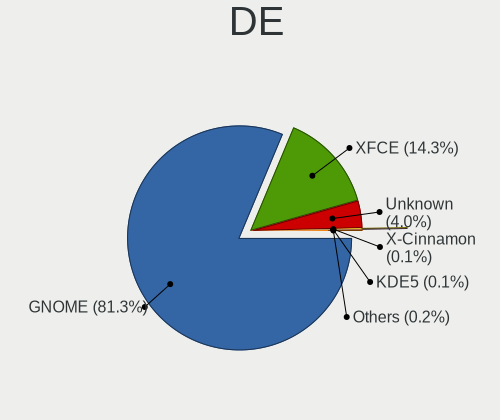

| Name          | Desktops | Percent |
|---------------|----------|---------|
| GNOME         | 2409     | 81.3%   |
| XFCE          | 424      | 14.31%  |
| Unknown       | 118      | 3.98%   |
| X-Cinnamon    | 3        | 0.1%    |
| KDE5          | 3        | 0.1%    |
| MATE          | 2        | 0.07%   |
| Cinnamon      | 2        | 0.07%   |
| KDE           | 1        | 0.03%   |
| Enlightenment | 1        | 0.03%   |

Display Server
--------------

X11 or Wayland

| Name    | Desktops | Percent |
|---------|----------|---------|
| X11     | 2326     | 78.24%  |
| Wayland | 574      | 19.31%  |
| Unknown | 69       | 2.32%   |
| Tty     | 4        | 0.13%   |

Display Manager
---------------

SDDM, LightDM, etc.

| Name    | Desktops | Percent |
|---------|----------|---------|
| Unknown | 2505     | 83.86%  |
| GDM3    | 265      | 8.87%   |
| GDM     | 117      | 3.92%   |
| LightDM | 95       | 3.18%   |
| TDM     | 4        | 0.13%   |
| SDDM    | 1        | 0.03%   |

OS Lang
-------

Language

| Lang        | Desktops | Percent |
|-------------|----------|---------|
| en_US       | 1076     | 36.52%  |
| de_DE       | 277      | 9.4%    |
| pt_BR       | 219      | 7.43%   |
| en_GB       | 169      | 5.74%   |
| fr_FR       | 107      | 3.63%   |
| it_IT       | 103      | 3.5%    |
| Unknown     | 96       | 3.26%   |
| en_CA       | 90       | 3.05%   |
| es_ES       | 72       | 2.44%   |
| en_IN       | 61       | 2.07%   |
| en_AU       | 57       | 1.93%   |
| pl_PL       | 55       | 1.87%   |
| nl_NL       | 54       | 1.83%   |
| es_AR       | 40       | 1.36%   |
| es_MX       | 34       | 1.15%   |
| ru_RU       | 33       | 1.12%   |
| hu_HU       | 28       | 0.95%   |
| en_ZA       | 27       | 0.92%   |
| pt_PT       | 23       | 0.78%   |
| cs_CZ       | 21       | 0.71%   |
| tr_TR       | 19       | 0.64%   |
| sv_SE       | 15       | 0.51%   |
| nl_BE       | 13       | 0.44%   |
| es_CO       | 13       | 0.44%   |
| en_NZ       | 13       | 0.44%   |
| nb_NO       | 12       | 0.41%   |
| fr_CA       | 11       | 0.37%   |
| es_CL       | 11       | 0.37%   |
| da_DK       | 10       | 0.34%   |
| ja_JP       | 9        | 0.31%   |
| es_VE       | 9        | 0.31%   |
| en_IE       | 9        | 0.31%   |
| C           | 9        | 0.31%   |
| sr_RS       | 8        | 0.27%   |
| fi_FI       | 8        | 0.27%   |
| el_GR       | 8        | 0.27%   |
| de_AT       | 8        | 0.27%   |
| sr_RS@latin | 7        | 0.24%   |
| es_PE       | 7        | 0.24%   |
| de_CH       | 7        | 0.24%   |

Boot Mode
---------

EFI or BIOS

| Mode | Desktops | Percent |
|------|----------|---------|
| BIOS | 2087     | 70.29%  |
| EFI  | 882      | 29.71%  |

Filesystem
----------

Type of filesystem

| Type     | Desktops | Percent |
|----------|----------|---------|
| Ext4     | 2662     | 89.6%   |
| Tmpfs    | 128      | 4.31%   |
| Zfs      | 60       | 2.02%   |
| Overlay  | 53       | 1.78%   |
| Btrfs    | 32       | 1.08%   |
| Ext2     | 13       | 0.44%   |
| Unknown  | 10       | 0.34%   |
| Xfs      | 7        | 0.24%   |
| Ext3     | 5        | 0.17%   |
| Reiserfs | 1        | 0.03%   |

Part. scheme
------------

Scheme of partitioning

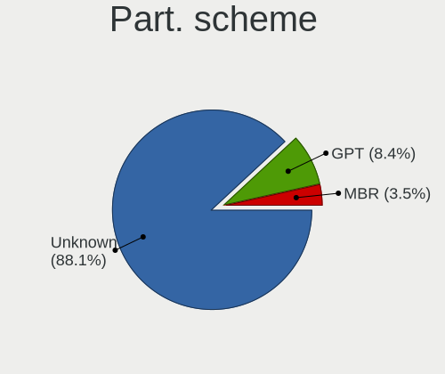

| Type    | Desktops | Percent |
|---------|----------|---------|
| Unknown | 2617     | 88.08%  |
| GPT     | 251      | 8.45%   |
| MBR     | 103      | 3.47%   |

Dual Boot with Linux/BSD
------------------------

Hosting more than one Linux/BSD

| Dual boot | Desktops | Percent |
|-----------|----------|---------|
| No        | 2788     | 94.57%  |
| Yes       | 160      | 5.43%   |

Dual Boot (Win)
---------------

Hosting Linux and Windows

| Dual boot | Desktops | Percent |
|-----------|----------|---------|
| No        | 2481     | 83.48%  |
| Yes       | 491      | 16.52%  |

Board
-----

Vendor
------

Motherboard manufacturer

| Name                | Desktops | Percent |
|---------------------|----------|---------|
| ASUSTek Computer    | 643      | 21.95%  |
| Gigabyte Technology | 446      | 15.22%  |
| Dell                | 319      | 10.89%  |
| MSI                 | 289      | 9.86%   |
| Hewlett-Packard     | 260      | 8.87%   |
| ASRock              | 212      | 7.24%   |
| Lenovo              | 136      | 4.64%   |
| Intel               | 97       | 3.31%   |
| Unknown             | 58       | 1.98%   |
| Acer                | 57       | 1.95%   |
| Pegatron            | 47       | 1.6%    |
| Fujitsu             | 37       | 1.26%   |
| Biostar             | 37       | 1.26%   |
| Foxconn             | 31       | 1.06%   |
| ECS                 | 26       | 0.89%   |
| AZW                 | 12       | 0.41%   |
| Alienware           | 12       | 0.41%   |
| Positivo            | 11       | 0.38%   |
| OEM                 | 10       | 0.34%   |
| Medion              | 10       | 0.34%   |
| Shuttle             | 9        | 0.31%   |
| Apple               | 9        | 0.31%   |
| Huanan              | 7        | 0.24%   |
| Google              | 7        | 0.24%   |
| Packard Bell        | 6        | 0.2%    |
| MACHINIST           | 6        | 0.2%    |
| BESSTAR Tech        | 6        | 0.2%    |
| IBM                 | 5        | 0.17%   |
| Gateway             | 5        | 0.17%   |
| Fujitsu Siemens     | 5        | 0.17%   |
| eMachines           | 5        | 0.17%   |
| AMI                 | 5        | 0.17%   |
| AMD                 | 4        | 0.14%   |
| ZOTAC               | 3        | 0.1%    |
| Semp Toshiba        | 3        | 0.1%    |
| Samsung Electronics | 3        | 0.1%    |
| QIYIDA              | 3        | 0.1%    |
| LORD ELECTRONICS    | 3        | 0.1%    |
| GEEKOM              | 3        | 0.1%    |
| ABIT                | 3        | 0.1%    |

Model
-----

Motherboard model

| Name                             | Desktops | Percent |
|----------------------------------|----------|---------|
| Unknown                          | 63       | 2.15%   |
| ASUS All Series                  | 56       | 1.91%   |
| Dell OptiPlex 7010               | 22       | 0.75%   |
| Dell OptiPlex 790                | 16       | 0.55%   |
| ASUS TUF Gaming X570-PLUS        | 16       | 0.55%   |
| MSI MS-7817                      | 14       | 0.48%   |
| Gigabyte A320M-S2H               | 14       | 0.48%   |
| Dell OptiPlex 9020               | 13       | 0.44%   |
| MSI MS-7C37                      | 12       | 0.41%   |
| Dell OptiPlex 780                | 12       | 0.41%   |
| Intel H61                        | 11       | 0.38%   |
| Dell OptiPlex 990                | 11       | 0.38%   |
| Dell OptiPlex 380                | 11       | 0.38%   |
| ASUS M5A97 R2.0                  | 11       | 0.38%   |
| ASUS M5A78L-M/USB3               | 11       | 0.38%   |
| MSI MS-7C56                      | 10       | 0.34%   |
| Gigabyte B450 AORUS M            | 10       | 0.34%   |
| Dell OptiPlex 755                | 10       | 0.34%   |
| Dell OptiPlex 7040               | 10       | 0.34%   |
| Dell Precision WorkStation T3500 | 9        | 0.31%   |
| Dell OptiPlex 3010               | 9        | 0.31%   |
| MSI MS-7C02                      | 8        | 0.27%   |
| HP EliteDesk 800 G1 SFF          | 8        | 0.27%   |
| Gigabyte GA-78LMT-USB3 6.0       | 8        | 0.27%   |
| Gigabyte 970A-DS3P               | 8        | 0.27%   |
| Dell OptiPlex 7050               | 8        | 0.27%   |
| Dell OptiPlex 3050               | 8        | 0.27%   |
| MSI MS-7C91                      | 7        | 0.24%   |
| MSI MS-7B86                      | 7        | 0.24%   |
| MSI MS-7A38                      | 7        | 0.24%   |
| HP ProDesk 600 G1 SFF            | 7        | 0.24%   |
| HP Compaq 6005 Pro SFF PC        | 7        | 0.24%   |
| Gigabyte B450M DS3H              | 7        | 0.24%   |
| Dell OptiPlex 7020               | 7        | 0.24%   |
| Dell OptiPlex 390                | 7        | 0.24%   |
| MSI MS-7C52                      | 6        | 0.2%    |
| Intel H55                        | 6        | 0.2%    |
| HP Compaq Pro 6300 SFF           | 6        | 0.2%    |
| Gigabyte GA-78LMT-USB3           | 6        | 0.2%    |
| Dell OptiPlex 3020               | 6        | 0.2%    |

Model Family
------------

Motherboard model prefix

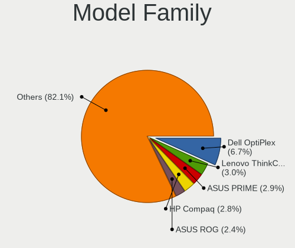

| Name                   | Desktops | Percent |
|------------------------|----------|---------|
| Dell OptiPlex          | 197      | 6.72%   |
| Lenovo ThinkCentre     | 89       | 3.04%   |
| ASUS PRIME             | 84       | 2.87%   |
| HP Compaq              | 83       | 2.83%   |
| ASUS ROG               | 71       | 2.42%   |
| ASUS TUF               | 68       | 2.32%   |
| Unknown                | 63       | 2.15%   |
| ASUS All               | 56       | 1.91%   |
| HP EliteDesk           | 41       | 1.4%    |
| Dell Precision         | 41       | 1.4%    |
| Fujitsu ESPRIMO        | 30       | 1.02%   |
| Dell Inspiron          | 30       | 1.02%   |
| HP ProDesk             | 28       | 0.96%   |
| Acer Aspire            | 27       | 0.92%   |
| Gigabyte B450          | 23       | 0.78%   |
| ASUS M5A78L-M          | 21       | 0.72%   |
| ASUS M5A97             | 19       | 0.65%   |
| HP Pavilion            | 17       | 0.58%   |
| Lenovo IdeaCentre      | 16       | 0.55%   |
| Dell Vostro            | 16       | 0.55%   |
| Gigabyte GA-78LMT-USB3 | 15       | 0.51%   |
| Gigabyte B450M         | 15       | 0.51%   |
| Gigabyte A320M-S2H     | 15       | 0.51%   |
| Acer Veriton           | 15       | 0.51%   |
| MSI MS-7817            | 14       | 0.48%   |
| Gigabyte X570          | 13       | 0.44%   |
| Dell XPS               | 13       | 0.44%   |
| MSI MS-7C37            | 12       | 0.41%   |
| Intel H61              | 12       | 0.41%   |
| ASRock B450M           | 12       | 0.41%   |
| Gigabyte B550          | 11       | 0.38%   |
| ASUS P8Z77-V           | 11       | 0.38%   |
| ASUS P8H61-M           | 11       | 0.38%   |
| ASRock B450            | 11       | 0.38%   |
| MSI MS-7C56            | 10       | 0.34%   |
| ASUS P5G41T-M          | 10       | 0.34%   |
| Gigabyte B550M         | 9        | 0.31%   |
| ASRock 970             | 9        | 0.31%   |
| Alienware Aurora       | 9        | 0.31%   |
| MSI MS-7C02            | 8        | 0.27%   |

MFG Year
--------

Motherboard manufacture year

| Year    | Desktops | Percent |
|---------|----------|---------|
| 2013    | 257      | 8.77%   |
| 2012    | 242      | 8.26%   |
| 2011    | 237      | 8.09%   |
| 2018    | 215      | 7.34%   |
| 2014    | 201      | 6.86%   |
| 2010    | 199      | 6.79%   |
| 2009    | 179      | 6.11%   |
| 2020    | 170      | 5.8%    |
| 2019    | 165      | 5.63%   |
| 2017    | 164      | 5.6%    |
| 2008    | 147      | 5.02%   |
| 2021    | 139      | 4.74%   |
| 2016    | 111      | 3.79%   |
| 2022    | 102      | 3.48%   |
| 2007    | 102      | 3.48%   |
| 2015    | 98       | 3.34%   |
| 2023    | 82       | 2.8%    |
| 2006    | 56       | 1.91%   |
| 2005    | 29       | 0.99%   |
| 2024    | 11       | 0.38%   |
| 2004    | 10       | 0.34%   |
| 2003    | 6        | 0.2%    |
| Unknown | 6        | 0.2%    |
| 2002    | 2        | 0.07%   |

Form Factor
-----------

Physical design of the computer

| Name    | Desktops | Percent |
|---------|----------|---------|
| Desktop | 2930     | 100%    |

Secure Boot
-----------

Enabled or disabled

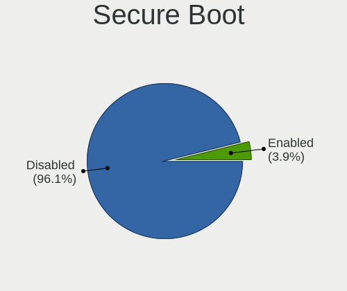

| State    | Desktops | Percent |
|----------|----------|---------|
| Disabled | 2826     | 96.12%  |
| Enabled  | 114      | 3.88%   |

Coreboot
--------

Have coreboot on board

| Used | Desktops | Percent |
|------|----------|---------|
| No   | 2923     | 99.76%  |
| Yes  | 7        | 0.24%   |

RAM Size
--------

Total RAM memory

| Size in GB      | Desktops | Percent |
|-----------------|----------|---------|
| 16.01-24.0      | 670      | 22.48%  |
| 8.01-16.0       | 565      | 18.95%  |
| 4.01-8.0        | 475      | 15.93%  |
| 3.01-4.0        | 461      | 15.46%  |
| 32.01-64.0      | 384      | 12.88%  |
| 64.01-256.0     | 130      | 4.36%   |
| 1.01-2.0        | 124      | 4.16%   |
| 24.01-32.0      | 82       | 2.75%   |
| 2.01-3.0        | 62       | 2.08%   |
| 0.51-1.0        | 26       | 0.87%   |
| More than 256.0 | 2        | 0.07%   |

RAM Used
--------

Used RAM memory

| Used GB    | Desktops | Percent |
|------------|----------|---------|
| 1.01-2.0   | 1126     | 34.86%  |
| 2.01-3.0   | 920      | 28.48%  |
| 3.01-4.0   | 459      | 14.21%  |
| 4.01-8.0   | 434      | 13.44%  |
| 0.51-1.0   | 152      | 4.71%   |
| 8.01-16.0  | 97       | 3%      |
| 16.01-24.0 | 19       | 0.59%   |
| 0.01-0.5   | 17       | 0.53%   |
| 32.01-64.0 | 3        | 0.09%   |
| 24.01-32.0 | 3        | 0.09%   |

Total Drives
------------

Number of drives on board

| Drives | Desktops | Percent |
|--------|----------|---------|
| 1      | 1399     | 46.25%  |
| 2      | 847      | 28%     |
| 3      | 381      | 12.6%   |
| 4      | 200      | 6.61%   |
| 5      | 90       | 2.98%   |
| 6      | 54       | 1.79%   |
| 7      | 19       | 0.63%   |
| 8      | 17       | 0.56%   |
| 0      | 9        | 0.3%    |
| 9      | 4        | 0.13%   |
| 11     | 2        | 0.07%   |
| 10     | 2        | 0.07%   |
| 51     | 1        | 0.03%   |

Has CD-ROM
----------

Has CD-ROM on board

| Presented | Desktops | Percent |
|-----------|----------|---------|
| No        | 1483     | 50.2%   |
| Yes       | 1471     | 49.8%   |

Has Ethernet
------------

Has Ethernet on board

| Presented | Desktops | Percent |
|-----------|----------|---------|
| Yes       | 2901     | 99.01%  |
| No        | 29       | 0.99%   |

Has WiFi
--------

Has WiFi module

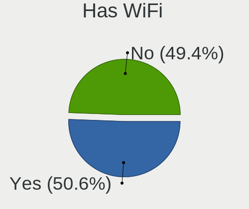

| Presented | Desktops | Percent |
|-----------|----------|---------|
| Yes       | 1498     | 50.59%  |
| No        | 1463     | 49.41%  |

Has Bluetooth
-------------

Has Bluetooth module

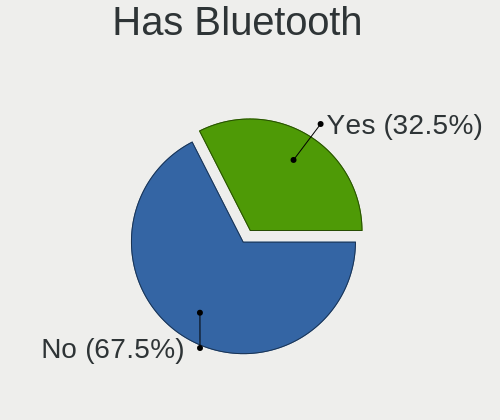

| Presented | Desktops | Percent |
|-----------|----------|---------|
| No        | 2002     | 67.5%   |
| Yes       | 964      | 32.5%   |

Location
--------

Country
-------

Geographic location (country)

| Country      | Desktops | Percent |
|--------------|----------|---------|
| USA          | 698      | 23.72%  |
| Germany      | 309      | 10.5%   |
| Brazil       | 239      | 8.12%   |
| UK           | 173      | 5.88%   |
| Italy        | 118      | 4.01%   |
| Canada       | 118      | 4.01%   |
| France       | 103      | 3.5%    |
| Netherlands  | 88       | 2.99%   |
| Spain        | 72       | 2.45%   |
| India        | 66       | 2.24%   |
| Poland       | 63       | 2.14%   |
| Australia    | 59       | 2%      |
| Argentina    | 48       | 1.63%   |
| Mexico       | 44       | 1.5%    |
| Portugal     | 34       | 1.16%   |
| Hungary      | 34       | 1.16%   |
| Belgium      | 30       | 1.02%   |
| South Africa | 29       | 0.99%   |
| Russia       | 28       | 0.95%   |
| Czechia      | 27       | 0.92%   |
| Sweden       | 26       | 0.88%   |
| Greece       | 25       | 0.85%   |
| Turkey       | 24       | 0.82%   |
| Denmark      | 24       | 0.82%   |
| Norway       | 23       | 0.78%   |
| Switzerland  | 22       | 0.75%   |
| Indonesia    | 22       | 0.75%   |
| Serbia       | 21       | 0.71%   |
| Egypt        | 21       | 0.71%   |
| Romania      | 20       | 0.68%   |
| Colombia     | 19       | 0.65%   |
| Chile        | 18       | 0.61%   |
| New Zealand  | 14       | 0.48%   |
| Japan        | 14       | 0.48%   |
| Bulgaria     | 14       | 0.48%   |
| Finland      | 12       | 0.41%   |
| Austria      | 12       | 0.41%   |
| Venezuela    | 11       | 0.37%   |
| Slovakia     | 10       | 0.34%   |
| Malaysia     | 10       | 0.34%   |

City
----

Geographic location (city)

| City           | Desktops | Percent |
|----------------|----------|---------|
| Berlin         | 28       | 0.9%    |
| Sao Paulo      | 24       | 0.78%   |
| Rio de Janeiro | 23       | 0.74%   |
| Sydney         | 18       | 0.58%   |
| Milan          | 17       | 0.55%   |
| Athens         | 17       | 0.55%   |
| Munich         | 14       | 0.45%   |
| Houston        | 13       | 0.42%   |
| Cape Town      | 13       | 0.42%   |
| Copenhagen     | 12       | 0.39%   |
| Toronto        | 11       | 0.36%   |
| Rome           | 11       | 0.36%   |
| Budapest       | 11       | 0.36%   |
| Atlanta        | 11       | 0.36%   |
| Santiago       | 10       | 0.32%   |
| Perth          | 10       | 0.32%   |
| Montreal       | 10       | 0.32%   |
| Calgary        | 10       | 0.32%   |
| Buenos Aires   | 10       | 0.32%   |
| Bogot        | 10       | 0.32%   |
| Bengaluru      | 10       | 0.32%   |
| Belgrade       | 10       | 0.32%   |
| Adelaide       | 10       | 0.32%   |
| Zurich         | 9        | 0.29%   |
| Vienna         | 9        | 0.29%   |
| Phoenix        | 9        | 0.29%   |
| Paris          | 9        | 0.29%   |
| Mumbai         | 9        | 0.29%   |
| Johannesburg   | 9        | 0.29%   |
| Denver         | 9        | 0.29%   |
| Dallas         | 9        | 0.29%   |
| Cairo          | 9        | 0.29%   |
| Brisbane       | 9        | 0.29%   |
| Warsaw         | 8        | 0.26%   |
| London         | 8        | 0.26%   |
| Las Vegas      | 8        | 0.26%   |
| Hamburg        | 8        | 0.26%   |
| The Hague      | 7        | 0.23%   |
| Stockholm      | 7        | 0.23%   |
| San Jos      | 7        | 0.23%   |

Drives
------

Drive Vendor
------------

Hard drive vendors

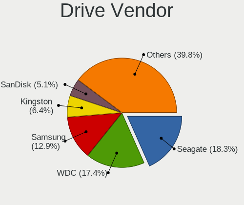

| Vendor                      | Desktops | Drives | Percent |
|-----------------------------|----------|--------|---------|
| Seagate                     | 933      | 1434   | 18.34%  |
| WDC                         | 887      | 1306   | 17.44%  |
| Samsung Electronics         | 657      | 1037   | 12.92%  |
| Kingston                    | 326      | 449    | 6.41%   |
| SanDisk                     | 260      | 380    | 5.11%   |
| Toshiba                     | 234      | 338    | 4.6%    |
| Hitachi                     | 200      | 249    | 3.93%   |
| Crucial                     | 184      | 227    | 3.62%   |
| China                       | 89       | 108    | 1.75%   |
| A-DATA Technology           | 58       | 73     | 1.14%   |
| Unknown                     | 56       | 106    | 1.1%    |
| Intel                       | 55       | 67     | 1.08%   |
| Maxtor                      | 53       | 72     | 1.04%   |
| Silicon Motion              | 52       | 65     | 1.02%   |
| Micron/Crucial Technology   | 47       | 63     | 0.92%   |
| Intenso                     | 44       | 53     | 0.86%   |
| PNY                         | 42       | 59     | 0.83%   |
| Phison Electronics          | 42       | 54     | 0.83%   |
| HGST                        | 38       | 52     | 0.75%   |
| SK hynix                    | 36       | 47     | 0.71%   |
| Phison                      | 34       | 43     | 0.67%   |
| SPCC                        | 32       | 41     | 0.63%   |
| Kingston Technology Company | 31       | 37     | 0.61%   |
| Micron Technology           | 29       | 32     | 0.57%   |
| OCZ                         | 26       | 30     | 0.51%   |
| MAXIO Technology (Hangzhou) | 25       | 30     | 0.49%   |
| Patriot                     | 23       | 38     | 0.45%   |
| Realtek Semiconductor       | 22       | 22     | 0.43%   |
| Unknown                     | 20       | 24     | 0.39%   |
| Lexar                       | 19       | 22     | 0.37%   |
| GOODRAM                     | 19       | 24     | 0.37%   |
| JMicron Technology          | 18       | 23     | 0.35%   |
| Corsair                     | 18       | 29     | 0.35%   |
| KingSpec                    | 17       | 22     | 0.33%   |
| Hewlett-Packard             | 17       | 24     | 0.33%   |
| Netac                       | 16       | 22     | 0.31%   |
| ADATA Technology            | 16       | 17     | 0.31%   |
| Transcend                   | 14       | 18     | 0.28%   |
| Team                        | 14       | 16     | 0.28%   |
| Gigabyte Technology         | 14       | 26     | 0.28%   |

Drive Model
-----------

Hard drive models

| Model                                                 | Desktops | Percent |
|-------------------------------------------------------|----------|---------|
| Kingston SA400S37240G 240GB SSD                       | 84       | 1.45%   |
| Seagate ST500DM002-1BD142 500GB                       | 82       | 1.42%   |
| Seagate ST1000DM010-2EP102 1TB                        | 54       | 0.93%   |
| Samsung NVMe SSD Controller SM981/PM981/PM983 512GB   | 51       | 0.88%   |
| Samsung SSD 860 EVO 500GB                             | 42       | 0.73%   |
| Kingston SA400S37120G 120GB SSD                       | 41       | 0.71%   |
| Seagate ST1000DM003-1CH162 1TB                        | 40       | 0.69%   |
| Kingston SA400S37480G 480GB SSD                       | 40       | 0.69%   |
| Samsung NVMe SSD Controller PM9A1/PM9A3/980PRO 512GB  | 38       | 0.66%   |
| Samsung SSD 850 EVO 250GB                             | 37       | 0.64%   |
| Crucial CT240BX500SSD1 240GB                          | 37       | 0.64%   |
| Toshiba DT01ACA100 1TB                                | 36       | 0.62%   |
| Seagate ST1000DM003-1ER162 1TB                        | 33       | 0.57%   |
| WDC WD10EZEX-08WN4A0 1TB                              | 32       | 0.55%   |
| Seagate ST3500418AS 500GB                             | 32       | 0.55%   |
| Kingston SV300S37A120G 120GB SSD                      | 30       | 0.52%   |
| Toshiba HDWD110 1TB                                   | 29       | 0.5%    |
| Silicon Motion SM2263EN/SM2263XT SSD Controller 256GB | 29       | 0.5%    |
| Crucial CT500MX500SSD1 500GB                          | 28       | 0.48%   |
| Seagate ST2000DM008-2FR102 2TB                        | 25       | 0.43%   |
| Seagate ST2000DM001-1ER164 2TB                        | 25       | 0.43%   |
| Samsung SSD 850 EVO 500GB                             | 25       | 0.43%   |
| Seagate ST3500413AS 500GB                             | 24       | 0.41%   |
| Samsung SSD 870 EVO 500GB                             | 23       | 0.4%    |
| Crucial CT1000MX500SSD1 1TB                           | 23       | 0.4%    |
| Micron/Crucial P2 NVMe PCIe SSD 500GB                 | 22       | 0.38%   |
| Unknown SD/MMC/MS PRO 128GB                           | 21       | 0.36%   |
| Samsung NVMe SSD Drive 1TB                            | 21       | 0.36%   |
| Toshiba DT01ACA050 500GB                              | 20       | 0.35%   |
| Seagate ST4000DM004-2CV104 4TB                        | 20       | 0.35%   |
| Samsung NVMe SSD Drive 500GB                          | 20       | 0.35%   |
| Unknown                                               | 20       | 0.35%   |
| Seagate ST31000528AS 1TB                              | 19       | 0.33%   |
| Seagate ST31000524AS 1TB                              | 19       | 0.33%   |
| Seagate ST3500312CS 500GB                             | 18       | 0.31%   |
| Seagate ST1000DM003-1SB102 1TB                        | 18       | 0.31%   |
| SanDisk SSD PLUS 240GB                                | 18       | 0.31%   |
| Samsung SSD 870 EVO 1TB                               | 18       | 0.31%   |
| Toshiba DT01ACA200 2TB                                | 17       | 0.29%   |
| Seagate ST2000DM001-1CH164 2TB                        | 17       | 0.29%   |

HDD Vendor
----------

Hard disk drive vendors

| Vendor              | Desktops | Drives | Percent |
|---------------------|----------|--------|---------|
| Seagate             | 916      | 1390   | 37.04%  |
| WDC                 | 812      | 1176   | 32.83%  |
| Toshiba             | 206      | 307    | 8.33%   |
| Hitachi             | 200      | 249    | 8.09%   |
| Samsung Electronics | 154      | 201    | 6.23%   |
| Maxtor              | 52       | 71     | 2.1%    |
| HGST                | 38       | 52     | 1.54%   |
| Unknown             | 23       | 30     | 0.93%   |
| JMicron Technology  | 14       | 18     | 0.57%   |
| SABRENT             | 11       | 14     | 0.44%   |
| Apple               | 8        | 9      | 0.32%   |
| Hewlett-Packard     | 6        | 12     | 0.24%   |
| Fujitsu             | 4        | 5      | 0.16%   |
| External            | 4        | 4      | 0.16%   |
| ASMT                | 3        | 3      | 0.12%   |
| XrayDisk            | 2        | 2      | 0.08%   |
| USB3.0              | 2        | 3      | 0.08%   |
| QUANTUM             | 2        | 2      | 0.08%   |
| LaCie               | 2        | 2      | 0.08%   |
| WD MediaMax         | 1        | 2      | 0.04%   |
| WALRAM              | 1        | 1      | 0.04%   |
| Unknown (CF)        | 1        | 1      | 0.04%   |
| TO Exter            | 1        | 1      | 0.04%   |
| TDAS                | 1        | 3      | 0.04%   |
| MARVELL             | 1        | 1      | 0.04%   |
| Intenso             | 1        | 3      | 0.04%   |
| IBM/Hitachi         | 1        | 1      | 0.04%   |
| HPE                 | 1        | 1      | 0.04%   |
| HGST HTS            | 1        | 1      | 0.04%   |
| Fantom              | 1        | 1      | 0.04%   |
| ExcelStor           | 1        | 1      | 0.04%   |
| ASMT109x            | 1        | 2      | 0.04%   |
| ACASIS              | 1        | 1      | 0.04%   |

SSD Vendor
----------

Solid state drive vendors

| Vendor              | Desktops | Drives | Percent |
|---------------------|----------|--------|---------|
| Samsung Electronics | 344      | 510    | 19.52%  |
| Kingston            | 280      | 369    | 15.89%  |
| Crucial             | 176      | 218    | 9.99%   |
| SanDisk             | 151      | 197    | 8.57%   |
| WDC                 | 91       | 116    | 5.16%   |
| China               | 87       | 106    | 4.94%   |
| A-DATA Technology   | 55       | 70     | 3.12%   |
| PNY                 | 42       | 59     | 2.38%   |
| Intel               | 40       | 46     | 2.27%   |
| Intenso             | 33       | 38     | 1.87%   |
| SPCC                | 30       | 39     | 1.7%    |
| OCZ                 | 25       | 29     | 1.42%   |
| Patriot             | 21       | 36     | 1.19%   |
| Lexar               | 19       | 22     | 1.08%   |
| Micron Technology   | 17       | 20     | 0.96%   |
| GOODRAM             | 17       | 22     | 0.96%   |
| Toshiba             | 16       | 18     | 0.91%   |
| KingSpec            | 16       | 21     | 0.91%   |
| Transcend           | 14       | 18     | 0.79%   |
| Team                | 14       | 16     | 0.79%   |
| Netac               | 14       | 19     | 0.79%   |
| SK hynix            | 13       | 15     | 0.74%   |
| Corsair             | 13       | 22     | 0.74%   |
| Apacer              | 13       | 17     | 0.74%   |
| LITEON              | 12       | 16     | 0.68%   |
| Hewlett-Packard     | 11       | 12     | 0.62%   |
| Gigabyte Technology | 11       | 22     | 0.62%   |
| Verbatim            | 9        | 14     | 0.51%   |
| Unknown             | 9        | 12     | 0.51%   |
| Leven               | 8        | 9      | 0.45%   |
| KIOXIA-EXCERIA      | 7        | 12     | 0.4%    |
| Fanxiang            | 7        | 8      | 0.4%    |
| Seagate             | 6        | 13     | 0.34%   |
| LITEONIT            | 6        | 9      | 0.34%   |
| XrayDisk            | 4        | 7      | 0.23%   |
| Super Talent        | 4        | 5      | 0.23%   |
| Mushkin             | 4        | 5      | 0.23%   |
| Emtec               | 4        | 5      | 0.23%   |
| Drevo               | 4        | 6      | 0.23%   |
| ASMT                | 4        | 6      | 0.23%   |

Drive Kind
----------

HDD or SSD

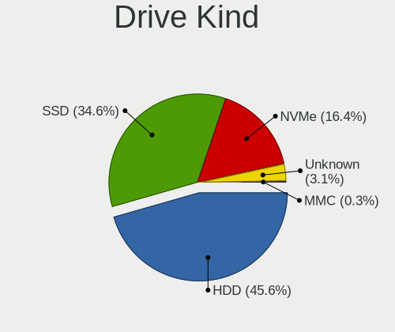

| Kind    | Desktops | Drives | Percent |
|---------|----------|--------|---------|
| HDD     | 1943     | 3570   | 45.57%  |
| SSD     | 1475     | 2339   | 34.59%  |
| NVMe    | 701      | 1131   | 16.44%  |
| Unknown | 133      | 188    | 3.12%   |
| MMC     | 12       | 14     | 0.28%   |

Drive Connector
---------------

SATA, SAS, NVMe, etc.

| Type | Desktops | Drives | Percent |
|------|----------|--------|---------|
| SATA | 2673     | 5773   | 74.27%  |
| NVMe | 696      | 1118   | 19.34%  |
| SAS  | 218      | 337    | 6.06%   |
| MMC  | 12       | 14     | 0.33%   |

Drive Size
----------

Size of hard drive

| Size in TB | Desktops | Drives | Percent |
|------------|----------|--------|---------|
| 0.01-0.5   | 2017     | 3352   | 55.12%  |
| 0.51-1.0   | 970      | 1486   | 26.51%  |
| 1.01-2.0   | 382      | 568    | 10.44%  |
| 3.01-4.0   | 127      | 246    | 3.47%   |
| 4.01-10.0  | 82       | 124    | 2.24%   |
| 2.01-3.0   | 63       | 90     | 1.72%   |
| 10.01-20.0 | 17       | 40     | 0.46%   |
| 20.01-50.0 | 1        | 3      | 0.03%   |

Space Total
-----------

Amount of disk space available on the file system

| Size in GB     | Desktops | Percent |
|----------------|----------|---------|
| 101-250        | 899      | 29.18%  |
| 251-500        | 665      | 21.58%  |
| 501-1000       | 472      | 15.32%  |
| 1001-2000      | 294      | 9.54%   |
| More than 3000 | 228      | 7.4%    |
| 51-100         | 201      | 6.52%   |
| 21-50          | 105      | 3.41%   |
| 2001-3000      | 96       | 3.12%   |
| 1-20           | 82       | 2.66%   |
| Unknown        | 38       | 1.23%   |
| 0              | 1        | 0.03%   |

Space Used
----------

Amount of used disk space

| Used GB        | Desktops | Percent |
|----------------|----------|---------|
| 1-20           | 1152     | 35.71%  |
| 21-50          | 785      | 24.33%  |
| 51-100         | 356      | 11.04%  |
| 101-250        | 298      | 9.24%   |
| 251-500        | 207      | 6.42%   |
| 501-1000       | 158      | 4.9%    |
| 1001-2000      | 107      | 3.32%   |
| More than 3000 | 84       | 2.6%    |
| 2001-3000      | 40       | 1.24%   |
| Unknown        | 38       | 1.18%   |
| 0              | 1        | 0.03%   |

Malfunc. Drives
---------------

Drive models with a malfunction

| Model                                    | Desktops | Drives | Percent |
|------------------------------------------|----------|--------|---------|
| WDC WD30EFRX-68EUZN0 3TB                 | 2        | 2      | 2.9%    |
| Seagate ST500DM002-1BD142 500GB          | 2        | 2      | 2.9%    |
| Seagate ST2000LM007-1R8174 2TB           | 2        | 2      | 2.9%    |
| HGST HTS541010A9E680 1TB                 | 2        | 2      | 2.9%    |
| WDC WDS500G2B0A-00SM50 500GB SSD         | 1        | 1      | 1.45%   |
| WDC WD5000LPCX-60VHAT0 500GB             | 1        | 1      | 1.45%   |
| WDC WD5000AAKX-001CA0 500GB              | 1        | 1      | 1.45%   |
| WDC WD5000AAKS-00V1A0 500GB              | 1        | 1      | 1.45%   |
| WDC WD3200AAKS-22B3A0 320GB              | 1        | 1      | 1.45%   |
| WDC WD3200AAJS-56M0A0 320GB              | 1        | 1      | 1.45%   |
| WDC WD3200AAJS-22L7A0 320GB              | 1        | 1      | 1.45%   |
| WDC WD3200AAJS-08B4A0 320GB              | 1        | 1      | 1.45%   |
| WDC WD2500AAJS-00B4A0 250GB              | 1        | 1      | 1.45%   |
| WDC WD20EZRX-22D8PB0 2TB                 | 1        | 1      | 1.45%   |
| WDC WD20EZRX-00D8PB0 2TB                 | 1        | 1      | 1.45%   |
| WDC WD15EARS-00MVWB0 1TB                 | 1        | 1      | 1.45%   |
| WDC WD10JPVX-60JC3T0 1TB                 | 1        | 1      | 1.45%   |
| WDC WD10EZEX-21M2NA0 1TB                 | 1        | 2      | 1.45%   |
| WDC WD10EURX-63FH1Y0 1TB                 | 1        | 1      | 1.45%   |
| WDC WD Green 2.5 1000GB SSD              | 1        | 1      | 1.45%   |
| Toshiba THNSNK256GVN8 M.2 2280 256GB SSD | 1        | 1      | 1.45%   |
| Toshiba MQ01ABD100 1TB                   | 1        | 1      | 1.45%   |
| Toshiba MK8046GSX 80GB                   | 1        | 1      | 1.45%   |
| Toshiba MK3265GSX 320GB                  | 1        | 1      | 1.45%   |
| Toshiba MG03ACA200 2TB                   | 1        | 1      | 1.45%   |
| Toshiba DT01ACA100 1TB                   | 1        | 1      | 1.45%   |
| Silicon Motion Inland NVMe SSD 256GB     | 1        | 1      | 1.45%   |
| Seagate ST9500420AS 500GB                | 1        | 1      | 1.45%   |
| Seagate ST8000DM004-2CX188 8TB           | 1        | 1      | 1.45%   |
| Seagate ST4000DM004-2CV104 4TB           | 1        | 1      | 1.45%   |
| Seagate ST3500514NS 500GB                | 1        | 1      | 1.45%   |
| Seagate ST3500413AS 500GB                | 1        | 1      | 1.45%   |
| Seagate ST3500312CS 500GB                | 1        | 1      | 1.45%   |
| Seagate ST3360320AS 360GB                | 1        | 1      | 1.45%   |
| Seagate ST3320620AS 320GB                | 1        | 1      | 1.45%   |
| Seagate ST3250318AS 250GB                | 1        | 1      | 1.45%   |
| Seagate ST320LT012-1DG14C 320GB          | 1        | 1      | 1.45%   |
| Seagate ST320LT009-9WC142 320GB          | 1        | 1      | 1.45%   |
| Seagate ST3160310CS 160GB                | 1        | 1      | 1.45%   |
| Seagate ST2000LM003 HN-M201RAD 2TB       | 1        | 1      | 1.45%   |

Malfunc. Drive Vendor
---------------------

Vendors of faulty drives

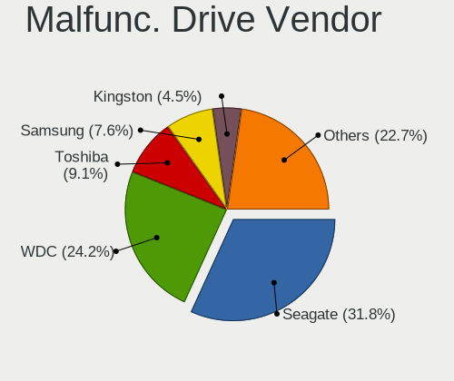

| Vendor              | Desktops | Drives | Percent |
|---------------------|----------|--------|---------|
| Seagate             | 21       | 22     | 31.82%  |
| WDC                 | 16       | 19     | 24.24%  |
| Toshiba             | 6        | 6      | 9.09%   |
| Samsung Electronics | 5        | 5      | 7.58%   |
| Kingston            | 3        | 3      | 4.55%   |
| HGST                | 3        | 3      | 4.55%   |
| A-DATA Technology   | 3        | 3      | 4.55%   |
| China               | 2        | 2      | 3.03%   |
| Silicon Motion      | 1        | 1      | 1.52%   |
| SanDisk             | 1        | 2      | 1.52%   |
| OCZ                 | 1        | 1      | 1.52%   |
| Maxtor              | 1        | 1      | 1.52%   |
| Intel               | 1        | 1      | 1.52%   |
| Hitachi             | 1        | 1      | 1.52%   |
| Fanxiang            | 1        | 2      | 1.52%   |

Malfunc. HDD Vendor
-------------------

Vendors of faulty HDD drives

| Vendor              | Desktops | Drives | Percent |
|---------------------|----------|--------|---------|
| Seagate             | 21       | 22     | 44.68%  |
| WDC                 | 14       | 17     | 29.79%  |
| Toshiba             | 5        | 5      | 10.64%  |
| HGST                | 3        | 3      | 6.38%   |
| Samsung Electronics | 2        | 2      | 4.26%   |
| Maxtor              | 1        | 1      | 2.13%   |
| Hitachi             | 1        | 1      | 2.13%   |

Malfunc. Drive Kind
-------------------

Kinds of faulty drives

| Kind | Desktops | Drives | Percent |
|------|----------|--------|---------|
| HDD  | 43       | 51     | 69.35%  |
| SSD  | 16       | 18     | 25.81%  |
| NVMe | 3        | 3      | 4.84%   |

Failed Drives
-------------

Failed drive models

Zero info for selected period =(

Failed Drive Vendor
-------------------

Failed drive vendors

Zero info for selected period =(

Drive Status
------------

Number of failed and malfunc. drives

| Status   | Desktops | Drives | Percent |
|----------|----------|--------|---------|
| Detected | 2760     | 6716   | 91.54%  |
| Works    | 194      | 454    | 6.43%   |
| Malfunc  | 61       | 72     | 2.02%   |

Storage controller
------------------

Storage Vendor
--------------

Storage controller vendors

| Vendor                           | Desktops | Percent |
|----------------------------------|----------|---------|
| Intel                            | 1908     | 47.12%  |
| AMD                              | 871      | 21.51%  |
| Samsung Electronics              | 219      | 5.41%   |
| SanDisk                          | 124      | 3.06%   |
| ASMedia Technology               | 121      | 2.99%   |
| Nvidia                           | 105      | 2.59%   |
| JMicron Technology               | 93       | 2.3%    |
| Kingston Technology Company      | 85       | 2.1%    |
| Phison Electronics               | 81       | 2%      |
| Marvell Technology Group         | 73       | 1.8%    |
| Silicon Motion                   | 56       | 1.38%   |
| Micron/Crucial Technology        | 55       | 1.36%   |
| VIA Technologies                 | 30       | 0.74%   |
| MAXIO Technology (Hangzhou)      | 27       | 0.67%   |
| ADATA Technology                 | 24       | 0.59%   |
| Realtek Semiconductor            | 23       | 0.57%   |
| SK hynix                         | 22       | 0.54%   |
| Silicon Image                    | 13       | 0.32%   |
| Seagate Technology               | 13       | 0.32%   |
| Micron Technology                | 13       | 0.32%   |
| Shenzhen Longsys Electronics     | 12       | 0.3%    |
| KIOXIA                           | 12       | 0.3%    |
| Toshiba America Info Systems     | 11       | 0.27%   |
| Broadcom / LSI                   | 10       | 0.25%   |
| Silicon Integrated Systems [SiS] | 6        | 0.15%   |
| LSI Logic / Symbios Logic        | 5        | 0.12%   |
| Integrated Technology Express    | 5        | 0.12%   |
| INNOGRIT                         | 4        | 0.1%    |
| OCZ Technology Group             | 3        | 0.07%   |
| Netac Technology                 | 3        | 0.07%   |
| Hosin Global Electronics         | 3        | 0.07%   |
| Adaptec                          | 3        | 0.07%   |
| HighPoint Technologies           | 2        | 0.05%   |
| Apple                            | 2        | 0.05%   |
| Unknown                          | 2        | 0.05%   |
| Union Memory (Shenzhen)          | 1        | 0.02%   |
| TenaFe                           | 1        | 0.02%   |
| Solid State Storage Technology   | 1        | 0.02%   |
| Promise Technology               | 1        | 0.02%   |
| Nextorage                        | 1        | 0.02%   |

Storage Model
-------------

Storage controller models

| Model                                                                                   | Desktops | Percent |
|-----------------------------------------------------------------------------------------|----------|---------|
| AMD FCH SATA Controller [AHCI mode]                                                     | 419      | 8.12%   |
| Intel 8 Series/C220 Series Chipset Family 6-port SATA Controller 1 [AHCI mode]          | 258      | 5%      |
| Intel NM10/ICH7 Family SATA Controller [IDE mode]                                       | 200      | 3.87%   |
| Intel 6 Series/C200 Series Chipset Family 6 port Desktop SATA AHCI Controller           | 180      | 3.49%   |
| Intel 82801G (ICH7 Family) IDE Controller                                               | 161      | 3.12%   |
| AMD SB7x0/SB8x0/SB9x0 IDE Controller                                                    | 158      | 3.06%   |
| AMD 400 Series Chipset SATA Controller                                                  | 146      | 2.83%   |
| Intel SATA Controller [RAID mode]                                                       | 127      | 2.46%   |
| Intel 7 Series/C210 Series Chipset Family 6-port SATA Controller [AHCI mode]            | 122      | 2.36%   |
| AMD SB7x0/SB8x0/SB9x0 SATA Controller [IDE mode]                                        | 120      | 2.32%   |
| Intel Q170/Q150/B150/H170/H110/Z170/CM236 Chipset SATA Controller [AHCI Mode]           | 116      | 2.25%   |
| AMD SB7x0/SB8x0/SB9x0 SATA Controller [AHCI mode]                                       | 113      | 2.19%   |
| ASMedia ASM1061/ASM1062 Serial ATA Controller                                           | 107      | 2.07%   |
| AMD 500 Series Chipset SATA Controller                                                  | 100      | 1.94%   |
| Intel 200 Series PCH SATA controller [AHCI mode]                                        | 96       | 1.86%   |
| Samsung NVMe SSD Controller SM981/PM981/PM983                                           | 90       | 1.74%   |
| Intel 6 Series/C200 Series Chipset Family Desktop SATA Controller (IDE mode, ports 4-5) | 76       | 1.47%   |
| Intel 6 Series/C200 Series Chipset Family Desktop SATA Controller (IDE mode, ports 0-3) | 75       | 1.45%   |
| Intel Cannon Lake PCH SATA AHCI Controller                                              | 63       | 1.22%   |
| Samsung NVMe SSD Controller PM9A1/PM9A3/980PRO                                          | 58       | 1.12%   |
| Nvidia MCP61 SATA Controller                                                            | 58       | 1.12%   |
| JMicron JMB363 SATA/IDE Controller                                                      | 54       | 1.05%   |
| Intel 9 Series Chipset Family SATA Controller [AHCI Mode]                               | 48       | 0.93%   |
| Intel 500 Series Chipset Family SATA AHCI Controller                                    | 47       | 0.91%   |
| Silicon Motion SM2263EN/SM2263XT (DRAM-less) NVMe SSD Controllers                       | 45       | 0.87%   |
| AMD A320 Chipset SATA Controller [AHCI mode]                                            | 45       | 0.87%   |
| Nvidia MCP61 IDE                                                                        | 40       | 0.77%   |
| Intel 82801JI (ICH10 Family) SATA AHCI Controller                                       | 39       | 0.76%   |
| Intel Alder Lake-S PCH SATA Controller [AHCI Mode]                                      | 38       | 0.74%   |
| Intel 82801I (ICH9 Family) 2 port SATA Controller [IDE mode]                            | 38       | 0.74%   |
| AMD 600 Series Chipset SATA Controller                                                  | 37       | 0.72%   |
| AMD 300 Series Chipset SATA Controller                                                  | 37       | 0.72%   |
| Phison E12 NVMe Controller                                                              | 34       | 0.66%   |
| Intel 82801JI (ICH10 Family) 4 port SATA IDE Controller #1                              | 34       | 0.66%   |
| Intel 5 Series/3400 Series Chipset 4 port SATA IDE Controller                           | 33       | 0.64%   |
| Intel 4 Series Chipset PT IDER Controller                                               | 33       | 0.64%   |
| Intel 82801JI (ICH10 Family) 2 port SATA IDE Controller #2                              | 32       | 0.62%   |
| Intel Raptor Lake SATA AHCI Controller                                                  | 31       | 0.6%    |
| Intel 5 Series/3400 Series Chipset 6 port SATA AHCI Controller                          | 31       | 0.6%    |
| Intel 5 Series/3400 Series Chipset 2 port SATA IDE Controller                           | 30       | 0.58%   |

Storage Kind
------------

Kind of storage controller (IDE, SATA, NVMe, SAS, ...)

| Kind | Desktops | Percent |
|------|----------|---------|
| SATA | 2194     | 54.44%  |
| IDE  | 899      | 22.31%  |
| NVMe | 695      | 17.25%  |
| RAID | 219      | 5.43%   |
| SAS  | 14       | 0.35%   |
| SCSI | 9        | 0.22%   |

Processor
---------

CPU Vendor
----------

Processor vendors

| Vendor | Desktops | Percent |
|--------|----------|---------|
| Intel  | 1960     | 66.89%  |
| AMD    | 970      | 33.11%  |

CPU Model
---------

Processor models

| Model                                       | Desktops | Percent |
|---------------------------------------------|----------|---------|
| AMD Ryzen 5 3600 6-Core Processor           | 48       | 1.63%   |
| Intel Core i5-2400 CPU @ 3.10GHz            | 47       | 1.6%    |
| Intel Core i5-3470 CPU @ 3.20GHz            | 39       | 1.33%   |
| Intel Core 2 Duo CPU E8400 @ 3.00GHz        | 39       | 1.33%   |
| Intel Core i7-4790 CPU @ 3.60GHz            | 37       | 1.26%   |
| Intel Core i7-2600 CPU @ 3.40GHz            | 30       | 1.02%   |
| AMD Ryzen 9 5900X 12-Core Processor         | 30       | 1.02%   |
| Intel Core i7-3770 CPU @ 3.40GHz            | 28       | 0.95%   |
| Intel Core i5-4460 CPU @ 3.20GHz            | 27       | 0.92%   |
| Intel Core i3-2120 CPU @ 3.30GHz            | 26       | 0.88%   |
| Intel Core 2 Duo CPU E7500 @ 2.93GHz        | 24       | 0.82%   |
| AMD Ryzen 5 5600X 6-Core Processor          | 24       | 0.82%   |
| AMD Ryzen 5 5600G with Radeon Graphics      | 24       | 0.82%   |
| Intel Core i7-6700 CPU @ 3.40GHz            | 22       | 0.75%   |
| AMD FX-6300 Six-Core Processor              | 22       | 0.75%   |
| Intel Core i7-4770 CPU @ 3.40GHz            | 21       | 0.71%   |
| Intel Core i5-6500 CPU @ 3.20GHz            | 21       | 0.71%   |
| Intel Core i5-4590 CPU @ 3.30GHz            | 21       | 0.71%   |
| Intel Core i5-3570 CPU @ 3.40GHz            | 21       | 0.71%   |
| AMD Ryzen 7 3700X 8-Core Processor          | 21       | 0.71%   |
| Intel Pentium Dual-Core CPU E5300 @ 2.60GHz | 20       | 0.68%   |
| Intel Core i7-4790K CPU @ 4.00GHz           | 20       | 0.68%   |
| Intel Core i5-4570 CPU @ 3.20GHz            | 20       | 0.68%   |
| AMD Ryzen 7 5800X 8-Core Processor          | 20       | 0.68%   |
| AMD Ryzen 7 5700G with Radeon Graphics      | 20       | 0.68%   |
| AMD Ryzen 5 2600 Six-Core Processor         | 20       | 0.68%   |
| Intel Pentium 4 CPU 3.00GHz                 | 19       | 0.65%   |
| Intel Core i3-3220 CPU @ 3.30GHz            | 18       | 0.61%   |
| Intel Core 2 Quad CPU Q6600 @ 2.40GHz       | 18       | 0.61%   |
| Intel Pentium Dual-Core CPU E5700 @ 3.00GHz | 17       | 0.58%   |
| Intel Core i7-6700K CPU @ 4.00GHz           | 17       | 0.58%   |
| Intel Core i3-4160 CPU @ 3.60GHz            | 17       | 0.58%   |
| Intel Core i3-2100 CPU @ 3.10GHz            | 17       | 0.58%   |
| AMD Ryzen 3 3200G with Radeon Vega Graphics | 16       | 0.54%   |
| AMD Ryzen 3 2200G with Radeon Vega Graphics | 16       | 0.54%   |
| AMD FX-8350 Eight-Core Processor            | 16       | 0.54%   |
| Intel Core i5-7400 CPU @ 3.00GHz            | 15       | 0.51%   |
| Intel Pentium Dual CPU E2160 @ 1.80GHz      | 14       | 0.48%   |
| Intel Core i5-8400 CPU @ 2.80GHz            | 14       | 0.48%   |
| Intel Core i5 CPU 650 @ 3.20GHz             | 14       | 0.48%   |

CPU Model Family
----------------

Processor model prefix

| Model                   | Desktops | Percent |
|-------------------------|----------|---------|
| Intel Core i5           | 527      | 17.93%  |
| Intel Core i7           | 331      | 11.26%  |
| Intel Core i3           | 232      | 7.89%   |
| AMD Ryzen 5             | 210      | 7.15%   |
| Intel Xeon              | 147      | 5%      |
| AMD Ryzen 7             | 138      | 4.7%    |
| Intel Core 2 Duo        | 127      | 4.32%   |
| Other                   | 112      | 3.81%   |
| AMD FX                  | 105      | 3.57%   |
| Intel Celeron           | 87       | 2.96%   |
| Intel Core 2 Quad       | 86       | 2.93%   |
| AMD Ryzen 9             | 80       | 2.72%   |
| Intel Pentium Dual-Core | 66       | 2.25%   |
| Intel Pentium           | 63       | 2.14%   |
| Intel Pentium Dual      | 54       | 1.84%   |
| AMD Athlon II X2        | 47       | 1.6%    |
| AMD Ryzen 3             | 43       | 1.46%   |
| Intel Pentium 4         | 40       | 1.36%   |
| AMD Phenom II X4        | 40       | 1.36%   |
| AMD Athlon 64 X2        | 38       | 1.29%   |
| AMD A8                  | 34       | 1.16%   |
| AMD A10                 | 31       | 1.05%   |
| Intel Core i9           | 30       | 1.02%   |
| AMD A6                  | 25       | 0.85%   |
| Intel Core 2            | 21       | 0.71%   |
| AMD A4                  | 19       | 0.65%   |
| AMD Athlon              | 18       | 0.61%   |
| AMD Sempron             | 16       | 0.54%   |
| AMD Phenom II X6        | 16       | 0.54%   |
| AMD Athlon II X4        | 16       | 0.54%   |
| Intel Atom              | 15       | 0.51%   |
| Intel Pentium D         | 11       | 0.37%   |
| AMD Athlon II X3        | 10       | 0.34%   |
| Intel Pentium Gold      | 9        | 0.31%   |
| AMD Athlon 64           | 9        | 0.31%   |
| AMD Phenom              | 8        | 0.27%   |
| AMD E1                  | 8        | 0.27%   |
| AMD E                   | 7        | 0.24%   |
| AMD Ryzen 5 PRO         | 6        | 0.2%    |
| AMD Phenom II X2        | 6        | 0.2%    |

CPU Cores
---------

Number of processor cores

| Number | Desktops | Percent |
|--------|----------|---------|
| 4      | 1130     | 38.41%  |
| 2      | 881      | 29.95%  |
| 6      | 339      | 11.52%  |
| 8      | 237      | 8.06%   |
| 1      | 120      | 4.08%   |
| 12     | 76       | 2.58%   |
| 3      | 50       | 1.7%    |
| 16     | 44       | 1.5%    |
| 10     | 28       | 0.95%   |
| 14     | 16       | 0.54%   |
| 24     | 9        | 0.31%   |
| 20     | 7        | 0.24%   |
| 28     | 2        | 0.07%   |
| 18     | 2        | 0.07%   |
| 32     | 1        | 0.03%   |

CPU Sockets
-----------

Number of sockets

| Number | Desktops | Percent |
|--------|----------|---------|
| 1      | 2906     | 99.18%  |
| 2      | 23       | 0.78%   |
| 20     | 1        | 0.03%   |

CPU Threads
-----------

Threads per core (Hyper-Threading)

| Number | Desktops | Percent |
|--------|----------|---------|
| 2      | 1513     | 51.53%  |
| 1      | 1423     | 48.47%  |

CPU Op-Modes
------------

CPU Operation Modes (32-bit, 64-bit)

| Op mode        | Desktops | Percent |
|----------------|----------|---------|
| 32-bit, 64-bit | 2901     | 99.01%  |
| 32-bit         | 28       | 0.96%   |
| Unknown        | 1        | 0.03%   |

CPU Microcode
-------------

Microcode number

| Number     | Desktops | Percent |
|------------|----------|---------|
| Unknown    | 1045     | 34.74%  |
| 0x306c3    | 216      | 7.18%   |
| 0x1067a    | 163      | 5.42%   |
| 0x206a7    | 155      | 5.15%   |
| 0x306a9    | 133      | 4.42%   |
| 0x506e3    | 73       | 2.43%   |
| 0x6fd      | 62       | 2.06%   |
| 0x06000852 | 61       | 2.03%   |
| 0x08701021 | 55       | 1.83%   |
| 0x010000c8 | 50       | 1.66%   |
| 0x906e9    | 38       | 1.26%   |
| 0x0800820d | 38       | 1.26%   |
| 0x906ea    | 35       | 1.16%   |
| 0x6fb      | 32       | 1.06%   |
| 0x06001119 | 32       | 1.06%   |
| 0xa0655    | 29       | 0.96%   |
| 0xa0653    | 25       | 0.83%   |
| 0x20655    | 24       | 0.8%    |
| 0x10676    | 23       | 0.76%   |
| 0x08108109 | 22       | 0.73%   |
| 0x0600063e | 22       | 0.73%   |
| 0x010000db | 21       | 0.7%    |
| 0x0a201016 | 20       | 0.66%   |
| 0x08001138 | 19       | 0.63%   |
| 0xa0671    | 18       | 0.6%    |
| 0x106e5    | 18       | 0.6%    |
| 0x906ed    | 17       | 0.57%   |
| 0x106a5    | 17       | 0.57%   |
| 0x06003106 | 17       | 0.57%   |
| 0x20652    | 15       | 0.5%    |
| 0x010000dc | 15       | 0.5%    |
| 0x906eb    | 14       | 0.47%   |
| 0x6f6      | 14       | 0.47%   |
| 0x306f2    | 14       | 0.47%   |
| 0x08701013 | 14       | 0.47%   |
| 0x206d7    | 13       | 0.43%   |
| 0x0a50000d | 13       | 0.43%   |
| 0x306e4    | 12       | 0.4%    |
| 0x206c2    | 12       | 0.4%    |
| 0x0a20120a | 12       | 0.4%    |

CPU Microarch
-------------

Microarchitecture

| Name             | Desktops | Percent |
|------------------|----------|---------|
| Haswell          | 355      | 12.09%  |
| Penryn           | 238      | 8.1%    |
| SandyBridge      | 237      | 8.07%   |
| IvyBridge        | 220      | 7.49%   |
| KabyLake         | 189      | 6.44%   |
| K10              | 153      | 5.21%   |
| Zen 3            | 151      | 5.14%   |
| Core             | 144      | 4.9%    |
| Unknown          | 134      | 4.56%   |
| Zen 2            | 133      | 4.53%   |
| Skylake          | 124      | 4.22%   |
| Piledriver       | 119      | 4.05%   |
| Zen+             | 86       | 2.93%   |
| Zen              | 79       | 2.69%   |
| CometLake        | 70       | 2.38%   |
| Westmere         | 67       | 2.28%   |
| K8 Hammer        | 67       | 2.28%   |
| NetBurst         | 60       | 2.04%   |
| Nehalem          | 59       | 2.01%   |
| Bulldozer        | 31       | 1.06%   |
| Steamroller      | 28       | 0.95%   |
| Silvermont       | 24       | 0.82%   |
| Excavator        | 23       | 0.78%   |
| Icelake          | 18       | 0.61%   |
| Alderlake Hybrid | 18       | 0.61%   |
| K10 Llano        | 16       | 0.54%   |
| Broadwell        | 14       | 0.48%   |
| Bobcat           | 14       | 0.48%   |
| Jaguar           | 13       | 0.44%   |
| Goldmont plus    | 13       | 0.44%   |
| Bonnell          | 12       | 0.41%   |
| Puma             | 10       | 0.34%   |
| Goldmont         | 8        | 0.27%   |
| Tremont          | 4        | 0.14%   |
| K6               | 3        | 0.1%    |
| TigerLake        | 2        | 0.07%   |
| P6               | 1        | 0.03%   |

Graphics
--------

GPU Vendor
----------

Vendors of graphics cards

| Vendor                           | Desktops | Percent |
|----------------------------------|----------|---------|
| Nvidia                           | 1162     | 36.99%  |
| Intel                            | 993      | 31.61%  |
| AMD                              | 967      | 30.79%  |
| VIA Technologies                 | 8        | 0.25%   |
| Matrox Electronics Systems       | 3        | 0.1%    |
| Silicon Integrated Systems [SiS] | 2        | 0.06%   |
| ATI Technologies                 | 2        | 0.06%   |
| Trident Microsystems             | 1        | 0.03%   |
| Silicon Motion                   | 1        | 0.03%   |
| ASPEED Technology                | 1        | 0.03%   |
| 3DLabs                           | 1        | 0.03%   |

GPU Model
---------

Graphics card models

| Model                                                                       | Desktops | Percent |
|-----------------------------------------------------------------------------|----------|---------|
| Intel Xeon E3-1200 v3/4th Gen Core Processor Integrated Graphics Controller | 165      | 5.11%   |
| Intel 2nd Generation Core Processor Family Integrated Graphics Controller   | 117      | 3.63%   |
| AMD Ellesmere [Radeon RX 470/480/570/570X/580/580X/590]                     | 106      | 3.29%   |
| Intel 4 Series Chipset Integrated Graphics Controller                       | 91       | 2.82%   |
| Intel Xeon E3-1200 v2/3rd Gen Core processor Graphics Controller            | 85       | 2.63%   |
| Nvidia GK208B [GeForce GT 710]                                              | 80       | 2.48%   |
| Intel HD Graphics 530                                                       | 64       | 1.98%   |
| Nvidia GP107 [GeForce GTX 1050 Ti]                                          | 51       | 1.58%   |
| AMD Cedar [Radeon HD 5000/6000/7350/8350 Series]                            | 44       | 1.36%   |
| Intel CoffeeLake-S GT2 [UHD Graphics 630]                                   | 42       | 1.3%    |
| Intel 82G33/G31 Express Integrated Graphics Controller                      | 40       | 1.24%   |
| Nvidia GT218 [GeForce 210]                                                  | 39       | 1.21%   |
| Intel 4th Generation Core Processor Family Integrated Graphics Controller   | 38       | 1.18%   |
| AMD Cezanne [Radeon Vega Series / Radeon Vega Mobile Series]                | 38       | 1.18%   |
| Intel HD Graphics 630                                                       | 37       | 1.15%   |
| Nvidia GM107 [GeForce GTX 750 Ti]                                           | 36       | 1.12%   |
| Nvidia GK208B [GeForce GT 730]                                              | 36       | 1.12%   |
| Nvidia GF119 [GeForce GT 610]                                               | 34       | 1.05%   |
| Intel Core Processor Integrated Graphics Controller                         | 34       | 1.05%   |
| Nvidia GP106 [GeForce GTX 1060 6GB]                                         | 29       | 0.9%    |
| AMD Raphael                                                                 | 29       | 0.9%    |
| AMD Raven Ridge [Radeon Vega Series / Radeon Vega Mobile Series]            | 28       | 0.87%   |
| AMD RS780L [Radeon 3000]                                                    | 26       | 0.81%   |
| Nvidia GP108 [GeForce GT 1030]                                              | 25       | 0.77%   |
| Nvidia GM206 [GeForce GTX 960]                                              | 25       | 0.77%   |
| AMD Picasso/Raven 2 [Radeon Vega Series / Radeon Vega Mobile Series]        | 25       | 0.77%   |
| AMD Navi 10 [Radeon RX 5600 OEM/5600 XT / 5700/5700 XT]                     | 25       | 0.77%   |
| AMD Caicos [Radeon HD 6450/7450/8450 / R5 230 OEM]                          | 24       | 0.74%   |
| Intel CometLake-S GT2 [UHD Graphics 630]                                    | 22       | 0.68%   |
| Intel IvyBridge GT2 [HD Graphics 4000]                                      | 21       | 0.65%   |
| Intel 82945G/GZ Integrated Graphics Controller                              | 21       | 0.65%   |
| AMD Navi 23 [Radeon RX 6600/6600 XT/6600M]                                  | 21       | 0.65%   |
| Nvidia TU117 [GeForce GTX 1650]                                             | 20       | 0.62%   |
| Nvidia TU116 [GeForce GTX 1660 SUPER]                                       | 20       | 0.62%   |
| Nvidia GF108 [GeForce GT 730]                                               | 20       | 0.62%   |
| AMD Kaveri [Radeon R7 Graphics]                                             | 20       | 0.62%   |
| Nvidia GA106 [GeForce RTX 3060 Lite Hash Rate]                              | 19       | 0.59%   |
| Nvidia GP104 [GeForce GTX 1070]                                             | 18       | 0.56%   |
| Nvidia GA104 [GeForce RTX 3060 Ti Lite Hash Rate]                           | 18       | 0.56%   |
| Nvidia GP107 [GeForce GTX 1050]                                             | 16       | 0.5%    |

GPU Combo
---------

Combinations of graphics cards

| Name                     | Desktops | Percent |
|--------------------------|----------|---------|
| 1 x Nvidia               | 1074     | 36.25%  |
| 1 x Intel                | 862      | 29.09%  |
| 1 x AMD                  | 860      | 29.02%  |
| 2 x AMD                  | 46       | 1.55%   |
| Intel + Nvidia           | 42       | 1.42%   |
| AMD + Nvidia             | 32       | 1.08%   |
| Intel + AMD              | 22       | 0.74%   |
| 1 x VIA                  | 8        | 0.27%   |
| 2 x Nvidia               | 6        | 0.2%    |
| 1 x Matrox               | 3        | 0.1%    |
| 1 x SiS                  | 2        | 0.07%   |
| 3 x AMD                  | 1        | 0.03%   |
| 2 x AMD + 1 x Nvidia     | 1        | 0.03%   |
| 2 x AMD + 1 x 3DLabs     | 1        | 0.03%   |
| 1 x Trident Microsystems | 1        | 0.03%   |
| Nvidia + Silicon Motion  | 1        | 0.03%   |
| 1 x ASPEED               | 1        | 0.03%   |

GPU Driver
----------

Free vs proprietary

| Driver      | Desktops | Percent |
|-------------|----------|---------|
| Free        | 2062     | 69.4%   |
| Proprietary | 686      | 23.09%  |
| Unknown     | 223      | 7.51%   |

GPU Memory
----------

Total video memory

| Size in GB | Desktops | Percent |
|------------|----------|---------|
| Unknown    | 1607     | 53.41%  |
| 1.01-2.0   | 318      | 10.57%  |
| 0.01-0.5   | 306      | 10.17%  |
| 0.51-1.0   | 286      | 9.5%    |
| 7.01-8.0   | 167      | 5.55%   |
| 3.01-4.0   | 165      | 5.48%   |
| 8.01-16.0  | 67       | 2.23%   |
| 5.01-6.0   | 60       | 1.99%   |
| 2.01-3.0   | 24       | 0.8%    |
| 16.01-24.0 | 7        | 0.23%   |
| 4.01-5.0   | 2        | 0.07%   |

Monitor
-------

Monitor Vendor
--------------

Monitor vendors

| Vendor               | Desktops | Percent |
|----------------------|----------|---------|
| Samsung Electronics  | 465      | 16.26%  |
| Goldstar             | 293      | 10.25%  |
| Dell                 | 282      | 9.86%   |
| Hewlett-Packard      | 227      | 7.94%   |
| Acer                 | 202      | 7.07%   |
| AOC                  | 160      | 5.6%    |
| Philips              | 133      | 4.65%   |
| Ancor Communications | 108      | 3.78%   |
| BenQ                 | 104      | 3.64%   |
| ViewSonic            | 59       | 2.06%   |
| LG Electronics       | 47       | 1.64%   |
| Lenovo               | 47       | 1.64%   |
| Unknown              | 45       | 1.57%   |
| Sony                 | 42       | 1.47%   |
| ASUSTek Computer     | 36       | 1.26%   |
| Iiyama               | 31       | 1.08%   |
| Sceptre Tech         | 25       | 0.87%   |
| Unknown              | 25       | 0.87%   |
| Fujitsu Siemens      | 24       | 0.84%   |
| NEC Computers        | 22       | 0.77%   |
| Vizio                | 21       | 0.73%   |
| Eizo                 | 17       | 0.59%   |
| Toshiba              | 16       | 0.56%   |
| MSI                  | 16       | 0.56%   |
| Idek Iiyama          | 10       | 0.35%   |
| HPN                  | 10       | 0.35%   |
| HKC                  | 10       | 0.35%   |
| Hitachi              | 10       | 0.35%   |
| HannStar             | 10       | 0.35%   |
| FUS                  | 10       | 0.35%   |
| Panasonic            | 9        | 0.31%   |
| Sharp                | 8        | 0.28%   |
| Medion               | 8        | 0.28%   |
| Gigabyte Technology  | 8        | 0.28%   |
| Gateway              | 8        | 0.28%   |
| RTK                  | 7        | 0.24%   |
| Envision             | 7        | 0.24%   |
| CVT                  | 7        | 0.24%   |
| AUS                  | 7        | 0.24%   |
| ___                  | 6        | 0.21%   |

Monitor Model
-------------

Monitor models

| Model                                                                 | Desktops | Percent |
|-----------------------------------------------------------------------|----------|---------|
| Unknown                                                               | 25       | 0.82%   |
| Goldstar FULL HD GSM5B55 1920x1080 480x270mm 21.7-inch                | 15       | 0.49%   |
| Samsung Electronics C27F390 SAM0D32 1920x1080 600x340mm 27.2-inch     | 11       | 0.36%   |
| Goldstar ULTRAWIDE GSM59F1 2560x1080 677x290mm 29.0-inch              | 11       | 0.36%   |
| Samsung Electronics C24F390 SAM0D2C 1920x1080 521x293mm 23.5-inch     | 8        | 0.26%   |
| Philips PHL 243V5 PHLC0D1 1920x1080 521x293mm 23.5-inch               | 8        | 0.26%   |
| Hewlett-Packard 2009 HWP2827 1600x900 442x249mm 20.0-inch             | 8        | 0.26%   |
| Goldstar IPS FULLHD GSM5AB8 1920x1080 480x270mm 21.7-inch             | 8        | 0.26%   |
| AOC Q27G2WG4 AOC2702 2560x1440 597x336mm 27.0-inch                    | 8        | 0.26%   |
| Philips PHL 223V5 PHLC0CF 1920x1080 480x270mm 21.7-inch               | 7        | 0.23%   |
| Goldstar HD GSM5ACB 1366x768 410x230mm 18.5-inch                      | 7        | 0.23%   |
| AOC 2460G4 AOC2460 1920x1080 531x299mm 24.0-inch                      | 7        | 0.23%   |
| Vestel Elektronik 49FHD_LCD_TV VES3700 1920x1080 1280x720mm 57.8-inch | 6        | 0.2%    |
| Unknown LCD Monitor SAMSUNG 3840x2160                                 | 6        | 0.2%    |
| Unknown LCD Monitor SAMSUNG 1920x1080                                 | 6        | 0.2%    |
| Samsung Electronics S24F350 SAM0D20 1920x1080 521x293mm 23.5-inch     | 6        | 0.2%    |
| Philips LCD Monitor FTV 1920x1080                                     | 6        | 0.2%    |
| Hitachi HISENSE HEC0030 3840x2160 1872x1053mm 84.6-inch               | 6        | 0.2%    |
| Goldstar W1943 GSM4BAD 1360x768 406x229mm 18.4-inch                   | 6        | 0.2%    |
| BenQ GL2450H BNQ78A7 1920x1080 530x300mm 24.0-inch                    | 6        | 0.2%    |
| AOC 24G2W1G5 AOC2402 1920x1080 527x296mm 23.8-inch                    | 6        | 0.2%    |
| Samsung Electronics U28E590 SAM0C4D 3840x2160 607x345mm 27.5-inch     | 5        | 0.16%   |
| Samsung Electronics LF27T35 SAM707F 1920x1080 598x337mm 27.0-inch     | 5        | 0.16%   |
| Samsung Electronics LCD Monitor SAM0C3C 1366x768 609x347mm 27.6-inch  | 5        | 0.16%   |
| Philips PHL 273V7 PHLC156 1920x1080 598x336mm 27.0-inch               | 5        | 0.16%   |
| Philips FTV PHL04C3 1920x1080 1440x810mm 65.0-inch                    | 5        | 0.16%   |
| Hewlett-Packard 24f HPN3546 1920x1080 527x296mm 23.8-inch             | 5        | 0.16%   |
| Dell P2419H DELD0DA 1920x1080 527x296mm 23.8-inch                     | 5        | 0.16%   |
| AOC Q32E2WG5B AOC3202 2560x1440 698x393mm 31.5-inch                   | 5        | 0.16%   |
| AOC 1950W AOC1950 1366x768 410x230mm 18.5-inch                        | 5        | 0.16%   |
| Ancor Communications VS248 ACI2498 1920x1080 531x299mm 24.0-inch      | 5        | 0.16%   |
| Ancor Communications ASUS VS247 ACI249A 1920x1080 521x293mm 23.5-inch | 5        | 0.16%   |
| Ancor Communications ASUS VP228 ACI22C3 1920x1080 476x268mm 21.5-inch | 5        | 0.16%   |
| Acer P166HQL ACR0280 1366x768 344x194mm 15.5-inch                     | 5        | 0.16%   |
| ___ LCDTV16 ___0101 1920x1080                                         | 4        | 0.13%   |
| Unknown LCD Monitor SAMSUNG                                           | 4        | 0.13%   |
| Unknown (XXX) Beyond TV XXX2851 3840x2160 1210x680mm 54.6-inch        | 4        | 0.13%   |
| Toshiba TV TSB0206 1920x1080 1600x1000mm 74.3-inch                    | 4        | 0.13%   |
| Samsung Electronics SMB2030N SAM0634 1600x900 443x249mm 20.0-inch     | 4        | 0.13%   |
| Samsung Electronics S19B300 SAM08A5 1366x768 410x230mm 18.5-inch      | 4        | 0.13%   |

Monitor Resolution
------------------

Monitor screen resolution

| Resolution         | Desktops | Percent |
|--------------------|----------|---------|
| 1920x1080 (FHD)    | 1180     | 41.92%  |
| 3840x2160 (4K)     | 277      | 9.84%   |
| 1280x1024 (SXGA)   | 189      | 6.71%   |
| 1680x1050 (WSXGA+) | 141      | 5.01%   |
| 2560x1440 (QHD)    | 139      | 4.94%   |
| 1366x768 (WXGA)    | 135      | 4.8%    |
| 1600x900 (HD+)     | 129      | 4.58%   |
| 1440x900 (WXGA+)   | 119      | 4.23%   |
| Unknown            | 87       | 3.09%   |
| 1360x768           | 69       | 2.45%   |
| 1920x1200 (WUXGA)  | 62       | 2.2%    |
| 3440x1440          | 54       | 1.92%   |
| 3840x1080          | 46       | 1.63%   |
| 2560x1080          | 31       | 1.1%    |
| 1920x540           | 22       | 0.78%   |
| 1024x768 (XGA)     | 21       | 0.75%   |
| 1600x1200          | 11       | 0.39%   |
| 2560x1600          | 8        | 0.28%   |
| 3840x1600          | 7        | 0.25%   |
| 5760x1080          | 6        | 0.21%   |
| 1280x720 (HD)      | 6        | 0.21%   |
| 5760x2160          | 4        | 0.14%   |
| 5120x1440          | 4        | 0.14%   |
| 4480x1440          | 4        | 0.14%   |
| 1280x960           | 4        | 0.14%   |
| 3600x1080          | 3        | 0.11%   |
| 1152x864           | 3        | 0.11%   |
| 6400x1440          | 2        | 0.07%   |
| 5440x1080          | 2        | 0.07%   |
| 4480x1080          | 2        | 0.07%   |
| 3840x1200          | 2        | 0.07%   |
| 3360x1080          | 2        | 0.07%   |
| 3200x1200          | 2        | 0.07%   |
| 3200x1080          | 2        | 0.07%   |
| 3120x1050          | 2        | 0.07%   |
| 2944x1080          | 2        | 0.07%   |
| 2720x1024          | 2        | 0.07%   |
| 2560x2880          | 2        | 0.07%   |
| 2288x1287          | 2        | 0.07%   |
| 2048x1152          | 2        | 0.07%   |

Monitor Diagonal
----------------

Diagonal size in inches

| Inches  | Desktops | Percent |
|---------|----------|---------|
| Unknown | 433      | 15.33%  |
| 27      | 308      | 10.9%   |
| 24      | 283      | 10.02%  |
| 23      | 265      | 9.38%   |
| 21      | 241      | 8.53%   |
| 19      | 193      | 6.83%   |
| 31      | 145      | 5.13%   |
| 20      | 139      | 4.92%   |
| 18      | 138      | 4.88%   |
| 22      | 96       | 3.4%    |
| 17      | 93       | 3.29%   |
| 34      | 66       | 2.34%   |
| 84      | 51       | 1.81%   |
| 15      | 49       | 1.73%   |
| 40      | 38       | 1.35%   |
| 32      | 35       | 1.24%   |
| 72      | 32       | 1.13%   |
| 54      | 25       | 0.88%   |
| 26      | 21       | 0.74%   |
| 65      | 14       | 0.5%    |
| 49      | 11       | 0.39%   |
| 42      | 11       | 0.39%   |
| 28      | 11       | 0.39%   |
| 25      | 11       | 0.39%   |
| 48      | 10       | 0.35%   |
| 52      | 8        | 0.28%   |
| 46      | 8        | 0.28%   |
| 29      | 7        | 0.25%   |
| 74      | 6        | 0.21%   |
| 39      | 6        | 0.21%   |
| 37      | 6        | 0.21%   |
| 36      | 6        | 0.21%   |
| 75      | 5        | 0.18%   |
| 60      | 5        | 0.18%   |
| 64      | 4        | 0.14%   |
| 43      | 4        | 0.14%   |
| 35      | 4        | 0.14%   |
| 33      | 4        | 0.14%   |
| 16      | 4        | 0.14%   |
| 41      | 3        | 0.11%   |

Monitor Width
-------------

Physical width

| Width in mm    | Desktops | Percent |
|----------------|----------|---------|
| 501-600        | 790      | 28.74%  |
| 401-500        | 700      | 25.46%  |
| Unknown        | 433      | 15.75%  |
| 601-700        | 203      | 7.38%   |
| 301-350        | 138      | 5.02%   |
| 701-800        | 110      | 4%      |
| 351-400        | 103      | 3.75%   |
| 1501-2000      | 97       | 3.53%   |
| 1001-1500      | 95       | 3.46%   |
| 801-900        | 53       | 1.93%   |
| 901-1000       | 21       | 0.76%   |
| 201-300        | 5        | 0.18%   |
| More than 2000 | 1        | 0.04%   |

Aspect Ratio
------------

Proportional relationship between the width and the height

| Ratio   | Desktops | Percent |
|---------|----------|---------|
| 16/9    | 1595     | 60.44%  |
| Unknown | 386      | 14.63%  |
| 16/10   | 320      | 12.13%  |
| 5/4     | 167      | 6.33%   |
| 21/9    | 80       | 3.03%   |
| 4/3     | 45       | 1.71%   |
| 32/9    | 23       | 0.87%   |
| 6/5     | 10       | 0.38%   |
| 3/2     | 7        | 0.27%   |
| 2.00    | 2        | 0.08%   |
| 0.89    | 2        | 0.08%   |
| 1.00    | 1        | 0.04%   |
| 0.80    | 1        | 0.04%   |

Monitor Area
------------

Area in inch

| Area in inch | Desktops | Percent |
|----------------|----------|---------|
| 201-250        | 706      | 25.4%   |
| Unknown        | 433      | 15.58%  |
| 151-200        | 416      | 14.97%  |
| 301-350        | 312      | 11.23%  |
| 351-500        | 268      | 9.64%   |
| 141-150        | 190      | 6.84%   |
| More than 1000 | 165      | 5.94%   |
| 251-300        | 119      | 4.28%   |
| 501-1000       | 100      | 3.6%    |
| 101-110        | 36       | 1.3%    |
| 111-120        | 13       | 0.47%   |
| 131-140        | 11       | 0.4%    |
| 81-90          | 3        | 0.11%   |
| 91-100         | 3        | 0.11%   |
| 71-80          | 2        | 0.07%   |
| 121-130        | 2        | 0.07%   |

Pixel Density
-------------

Pixels per inch

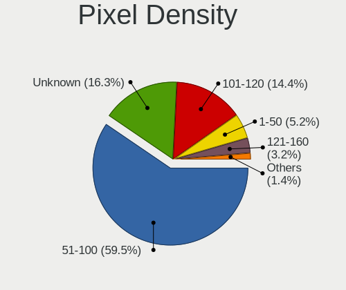

| Density       | Desktops | Percent |
|---------------|----------|---------|
| 51-100        | 1583     | 59.53%  |
| Unknown       | 433      | 16.28%  |
| 101-120       | 384      | 14.44%  |
| 1-50          | 139      | 5.23%   |
| 121-160       | 84       | 3.16%   |
| 161-240       | 35       | 1.32%   |
| More than 240 | 1        | 0.04%   |

Multiple Monitors
-----------------

Total monitors connected

| Total | Desktops | Percent |
|-------|----------|---------|
| 1     | 2354     | 78.47%  |
| 2     | 357      | 11.9%   |
| 0     | 246      | 8.2%    |
| 3     | 39       | 1.3%    |
| 4     | 4        | 0.13%   |

Network
-------

Net Controller Vendor
---------------------

Controller vendors

| Vendor                                | Desktops | Percent |
|---------------------------------------|----------|---------|
| Realtek Semiconductor                 | 1851     | 42.46%  |
| Intel                                 | 1126     | 25.83%  |
| Qualcomm Atheros                      | 253      | 5.8%    |
| Broadcom                              | 159      | 3.65%   |
| Ralink Technology                     | 150      | 3.44%   |
| TP-Link                               | 106      | 2.43%   |
| Nvidia                                | 89       | 2.04%   |
| Ralink                                | 66       | 1.51%   |
| MediaTek                              | 61       | 1.4%    |
| Broadcom Limited                      | 38       | 0.87%   |
| Marvell Technology Group              | 37       | 0.85%   |
| NetGear                               | 33       | 0.76%   |
| Samsung Electronics                   | 30       | 0.69%   |
| D-Link                                | 29       | 0.67%   |
| Microsoft                             | 25       | 0.57%   |
| D-Link System                         | 25       | 0.57%   |
| Xiaomi                                | 21       | 0.48%   |
| VIA Technologies                      | 21       | 0.48%   |
| Qualcomm Atheros Communications       | 20       | 0.46%   |
| ASIX Electronics                      | 16       | 0.37%   |
| ASUSTek Computer                      | 15       | 0.34%   |
| Huawei Technologies                   | 14       | 0.32%   |
| Aquantia                              | 14       | 0.32%   |
| Edimax Technology                     | 12       | 0.28%   |
| Linksys                               | 9        | 0.21%   |
| Belkin Components                     | 9        | 0.21%   |
| OPPO Electronics                      | 6        | 0.14%   |
| DisplayLink                           | 6        | 0.14%   |
| Sitecom Europe                        | 5        | 0.11%   |
| Silicon Integrated Systems [SiS]      | 5        | 0.11%   |
| Qualcomm Technologies                 | 5        | 0.11%   |
| Motorola PCS                          | 5        | 0.11%   |
| Gemtek                                | 5        | 0.11%   |
| 802.11g Adapter [Linksys WUSB54GC v3] | 5        | 0.11%   |
| ZyXEL Communications                  | 4        | 0.09%   |
| Sundance Technology Inc / IC Plus     | 4        | 0.09%   |
| Qualcomm                              | 4        | 0.09%   |
| QinHeng Electronics                   | 3        | 0.07%   |
| Motorola                              | 3        | 0.07%   |
| Micro Star International              | 3        | 0.07%   |

Net Controller Model
--------------------

Controller models

| Model                                                                  | Desktops | Percent |
|------------------------------------------------------------------------|----------|---------|
| Realtek RTL8111/8168/8211/8411 PCI Express Gigabit Ethernet Controller | 1342     | 27.23%  |
| Realtek RTL8125 2.5GbE Controller                                      | 147      | 2.98%   |
| Intel 82579LM Gigabit Network Connection (Lewisville)                  | 145      | 2.94%   |
| Realtek RTL810xE PCI Express Fast Ethernet controller                  | 121      | 2.46%   |
| Intel Ethernet Connection I217-LM                                      | 103      | 2.09%   |
| Intel I211 Gigabit Network Connection                                  | 99       | 2.01%   |
| Intel Wi-Fi 6 AX200                                                    | 90       | 1.83%   |
| Intel Ethernet Connection (2) I219-V                                   | 82       | 1.66%   |
| Intel Ethernet Controller I225-V                                       | 73       | 1.48%   |
| Realtek 802.11ac NIC                                                   | 69       | 1.4%    |
| Ralink MT7601U Wireless Adapter                                        | 67       | 1.36%   |
| Realtek RTL88x2bu [AC1200 Techkey]                                     | 62       | 1.26%   |
| Intel Wi-Fi 6E(802.11ax) AX210/AX1675* 2x2 [Typhoon Peak]              | 56       | 1.14%   |
| Nvidia MCP61 Ethernet                                                  | 54       | 1.1%    |
| Realtek RTL8188EUS 802.11n Wireless Network Adapter                    | 45       | 0.91%   |
| Intel Ethernet Connection I217-V                                       | 40       | 0.81%   |
| Intel Dual Band Wireless-AC 3168NGW [Stone Peak]                       | 39       | 0.79%   |
| Intel Ethernet Connection (2) I219-LM                                  | 38       | 0.77%   |
| Intel 82579V Gigabit Network Connection                                | 38       | 0.77%   |
| Realtek RTL8821CE 802.11ac PCIe Wireless Network Adapter               | 37       | 0.75%   |
| Intel 82567LM-3 Gigabit Network Connection                             | 36       | 0.73%   |
| Realtek RTL-8100/8101L/8139 PCI Fast Ethernet Adapter                  | 32       | 0.65%   |
| Intel Wi-Fi 5(802.11ac) Wireless-AC 9x6x [Thunder Peak]                | 30       | 0.61%   |
| Realtek RTL8188FTV 802.11b/g/n 1T1R 2.4G WLAN Adapter                  | 28       | 0.57%   |
| Intel Wireless 7265                                                    | 28       | 0.57%   |
| Ralink RT5370 Wireless Adapter                                         | 27       | 0.55%   |
| Intel Ethernet Connection (2) I218-V                                   | 27       | 0.55%   |
| Qualcomm Atheros AR9485 Wireless Network Adapter                       | 26       | 0.53%   |
| Intel Ethernet Connection (7) I219-V                                   | 26       | 0.53%   |
| TP-Link TL-WN823N v2/v3 [Realtek RTL8192EU]                            | 25       | 0.51%   |
| Ralink RT2870/RT3070 Wireless Adapter                                  | 24       | 0.49%   |
| Qualcomm Atheros AR8151 v2.0 Gigabit Ethernet                          | 24       | 0.49%   |
| Intel Wireless 7260                                                    | 24       | 0.49%   |
| Intel 82566DM-2 Gigabit Network Connection                             | 24       | 0.49%   |
| Realtek RTL8192EU 802.11b/g/n WLAN Adapter                             | 23       | 0.47%   |
| Realtek RTL8192EE PCIe Wireless Network Adapter                        | 22       | 0.45%   |
| Broadcom BCM4360 802.11ac Dual Band Wireless Network Adapter           | 22       | 0.45%   |
| Samsung Galaxy series, misc. (tethering mode)                          | 21       | 0.43%   |
| Intel 82574L Gigabit Network Connection                                | 21       | 0.43%   |
| Broadcom NetXtreme BCM5761 Gigabit Ethernet PCIe                       | 21       | 0.43%   |

Wireless Vendor
---------------

Wireless vendors

| Vendor                                | Desktops | Percent |
|---------------------------------------|----------|---------|
| Realtek Semiconductor                 | 458      | 27.81%  |
| Intel                                 | 398      | 24.17%  |
| Ralink Technology                     | 150      | 9.11%   |
| Qualcomm Atheros                      | 130      | 7.89%   |
| TP-Link                               | 103      | 6.25%   |
| Ralink                                | 66       | 4.01%   |
| Broadcom                              | 62       | 3.76%   |
| MediaTek                              | 46       | 2.79%   |
| NetGear                               | 33       | 2%      |
| D-Link                                | 29       | 1.76%   |
| Microsoft                             | 25       | 1.52%   |
| Qualcomm Atheros Communications       | 20       | 1.21%   |
| D-Link System                         | 20       | 1.21%   |
| ASUSTek Computer                      | 13       | 0.79%   |
| Edimax Technology                     | 12       | 0.73%   |
| Broadcom Limited                      | 11       | 0.67%   |
| Linksys                               | 9        | 0.55%   |
| Belkin Components                     | 9        | 0.55%   |
| Sitecom Europe                        | 5        | 0.3%    |
| Qualcomm Technologies                 | 5        | 0.3%    |
| Gemtek                                | 5        | 0.3%    |
| 802.11g Adapter [Linksys WUSB54GC v3] | 5        | 0.3%    |
| ZyXEL Communications                  | 4        | 0.24%   |
| Marvell Technology Group              | 4        | 0.24%   |
| Micro Star International              | 3        | 0.18%   |
| AVM                                   | 3        | 0.18%   |
| ZyDAS                                 | 2        | 0.12%   |
| TRENDnet                              | 2        | 0.12%   |
| Senao                                 | 2        | 0.12%   |
| Philips (or NXP)                      | 2        | 0.12%   |
| IMC Networks                          | 2        | 0.12%   |
| BUFFALO                               | 2        | 0.12%   |
| ZTopInc                               | 1        | 0.06%   |
| Xiaomi                                | 1        | 0.06%   |
| Wilocity                              | 1        | 0.06%   |
| Panasonic (Matsushita)                | 1        | 0.06%   |
| Ovislink                              | 1        | 0.06%   |
| Mercucys                              | 1        | 0.06%   |
| ADMtek                                | 1        | 0.06%   |

Wireless Model
--------------

Wireless models

| Model                                                          | Desktops | Percent |
|----------------------------------------------------------------|----------|---------|
| Intel Wi-Fi 6 AX200                                            | 90       | 5.37%   |
| Realtek 802.11ac NIC                                           | 69       | 4.12%   |
| Ralink MT7601U Wireless Adapter                                | 67       | 4%      |
| Realtek RTL88x2bu [AC1200 Techkey]                             | 62       | 3.7%    |
| Intel Wi-Fi 6E(802.11ax) AX210/AX1675* 2x2 [Typhoon Peak]      | 56       | 3.34%   |
| Realtek RTL8188EUS 802.11n Wireless Network Adapter            | 45       | 2.69%   |
| Intel Dual Band Wireless-AC 3168NGW [Stone Peak]               | 39       | 2.33%   |
| Realtek RTL8821CE 802.11ac PCIe Wireless Network Adapter       | 37       | 2.21%   |
| Intel Wi-Fi 5(802.11ac) Wireless-AC 9x6x [Thunder Peak]        | 30       | 1.79%   |
| Realtek RTL8188FTV 802.11b/g/n 1T1R 2.4G WLAN Adapter          | 28       | 1.67%   |
| Intel Wireless 7265                                            | 28       | 1.67%   |
| Ralink RT5370 Wireless Adapter                                 | 27       | 1.61%   |
| Qualcomm Atheros AR9485 Wireless Network Adapter               | 26       | 1.55%   |
| TP-Link TL-WN823N v2/v3 [Realtek RTL8192EU]                    | 25       | 1.49%   |
| Ralink RT2870/RT3070 Wireless Adapter                          | 24       | 1.43%   |
| Intel Wireless 7260                                            | 24       | 1.43%   |
| Realtek RTL8192EU 802.11b/g/n WLAN Adapter                     | 23       | 1.37%   |
| Realtek RTL8192EE PCIe Wireless Network Adapter                | 22       | 1.31%   |
| Broadcom BCM4360 802.11ac Dual Band Wireless Network Adapter   | 22       | 1.31%   |
| Intel Alder Lake-S PCH CNVi WiFi                               | 18       | 1.07%   |
| Realtek RTL8821AE 802.11ac PCIe Wireless Network Adapter       | 16       | 0.96%   |
| Realtek RTL8192CU 802.11n WLAN Adapter                         | 16       | 0.96%   |
| Qualcomm Atheros AR9271 802.11n                                | 16       | 0.96%   |
| Intel Raptor Lake-S PCH CNVi WiFi                              | 16       | 0.96%   |
| Intel Cannon Lake PCH CNVi WiFi                                | 16       | 0.96%   |
| Microsoft Xbox Wireless Adapter for Windows                    | 15       | 0.9%    |
| MediaTek MT7921K (RZ608) Wi-Fi 6E 80MHz                        | 15       | 0.9%    |
| TP-Link TL-WN722N v2/v3 [Realtek RTL8188EUS]                   | 14       | 0.84%   |
| TP-Link AC600 wireless Realtek RTL8811AU [Archer T2U Nano]     | 14       | 0.84%   |
| Qualcomm Atheros AR9227 Wireless Network Adapter               | 14       | 0.84%   |
| Intel Wireless 3165                                            | 14       | 0.84%   |
| Realtek RTL8188CE 802.11b/g/n WiFi Adapter                     | 13       | 0.78%   |
| Realtek RTL8188EE Wireless Network Adapter                     | 12       | 0.72%   |
| Qualcomm Atheros AR9285 Wireless Network Adapter (PCI-Express) | 12       | 0.72%   |
| MediaTek MT7922 802.11ax PCI Express Wireless Network Adapter  | 12       | 0.72%   |
| Intel Wireless 8260                                            | 12       | 0.72%   |
| Realtek RTL8188CUS 802.11n WLAN Adapter                        | 11       | 0.66%   |
| Ralink RT2561/RT61 802.11g PCI                                 | 11       | 0.66%   |
| Qualcomm Atheros AR9462 Wireless Network Adapter               | 11       | 0.66%   |
| Ralink RT5390 Wireless 802.11n 1T/1R PCIe                      | 10       | 0.6%    |

Ethernet Vendor
---------------

Ethernet vendors

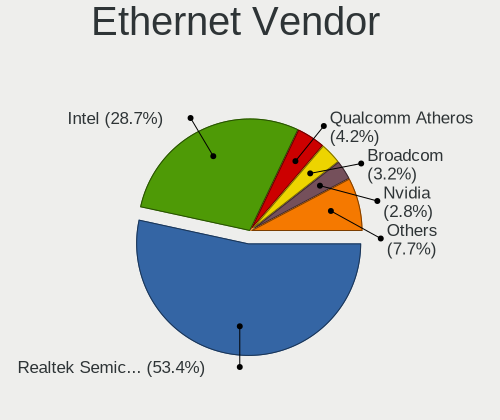

| Vendor                            | Desktops | Percent |
|-----------------------------------|----------|---------|
| Realtek Semiconductor             | 1672     | 53.4%   |
| Intel                             | 898      | 28.68%  |
| Qualcomm Atheros                  | 131      | 4.18%   |
| Broadcom                          | 99       | 3.16%   |
| Nvidia                            | 89       | 2.84%   |
| Marvell Technology Group          | 33       | 1.05%   |
| Broadcom Limited                  | 28       | 0.89%   |
| VIA Technologies                  | 21       | 0.67%   |
| Samsung Electronics               | 21       | 0.67%   |
| Xiaomi                            | 20       | 0.64%   |
| ASIX Electronics                  | 16       | 0.51%   |
| MediaTek                          | 15       | 0.48%   |
| Aquantia                          | 14       | 0.45%   |
| Huawei Technologies               | 13       | 0.42%   |
| OPPO Electronics                  | 6        | 0.19%   |
| DisplayLink                       | 6        | 0.19%   |
| Silicon Integrated Systems [SiS]  | 5        | 0.16%   |
| Motorola PCS                      | 5        | 0.16%   |
| D-Link System                     | 5        | 0.16%   |
| Sundance Technology Inc / IC Plus | 4        | 0.13%   |
| Qualcomm                          | 4        | 0.13%   |
| TP-Link                           | 3        | 0.1%    |
| JMicron Technology                | 3        | 0.1%    |
| Apple                             | 3        | 0.1%    |
| ASUSTek Computer                  | 2        | 0.06%   |
| 3Com                              | 2        | 0.06%   |
| ZTE WCDMA Technologies MSM        | 1        | 0.03%   |
| vivo                              | 1        | 0.03%   |
| TP-Link Corporation Limited.      | 1        | 0.03%   |
| T & A Mobile Phones               | 1        | 0.03%   |
| Research In Motion                | 1        | 0.03%   |
| Panini                            | 1        | 0.03%   |
| Mellanox Technologies             | 1        | 0.03%   |
| Lenovo                            | 1        | 0.03%   |
| ICS Advent                        | 1        | 0.03%   |
| HMD Global                        | 1        | 0.03%   |
| Google                            | 1        | 0.03%   |
| GCT Semiconductor                 | 1        | 0.03%   |
| Accton Technology                 | 1        | 0.03%   |

Ethernet Model
--------------

Ethernet models

| Model                                                                  | Desktops | Percent |
|------------------------------------------------------------------------|----------|---------|
| Realtek RTL8111/8168/8211/8411 PCI Express Gigabit Ethernet Controller | 1342     | 41.85%  |
| Realtek RTL8125 2.5GbE Controller                                      | 147      | 4.58%   |
| Intel 82579LM Gigabit Network Connection (Lewisville)                  | 145      | 4.52%   |
| Realtek RTL810xE PCI Express Fast Ethernet controller                  | 121      | 3.77%   |
| Intel Ethernet Connection I217-LM                                      | 103      | 3.21%   |
| Intel I211 Gigabit Network Connection                                  | 99       | 3.09%   |
| Intel Ethernet Connection (2) I219-V                                   | 82       | 2.56%   |
| Intel Ethernet Controller I225-V                                       | 73       | 2.28%   |
| Nvidia MCP61 Ethernet                                                  | 54       | 1.68%   |
| Intel Ethernet Connection I217-V                                       | 40       | 1.25%   |
| Intel Ethernet Connection (2) I219-LM                                  | 38       | 1.18%   |
| Intel 82579V Gigabit Network Connection                                | 38       | 1.18%   |
| Intel 82567LM-3 Gigabit Network Connection                             | 36       | 1.12%   |
| Realtek RTL-8100/8101L/8139 PCI Fast Ethernet Adapter                  | 32       | 1%      |
| Intel Ethernet Connection (2) I218-V                                   | 27       | 0.84%   |
| Intel Ethernet Connection (7) I219-V                                   | 26       | 0.81%   |
| Qualcomm Atheros AR8151 v2.0 Gigabit Ethernet                          | 24       | 0.75%   |
| Intel 82566DM-2 Gigabit Network Connection                             | 24       | 0.75%   |
| Samsung Galaxy series, misc. (tethering mode)                          | 21       | 0.65%   |
| Intel 82574L Gigabit Network Connection                                | 21       | 0.65%   |
| Broadcom NetXtreme BCM5761 Gigabit Ethernet PCIe                       | 21       | 0.65%   |
| Realtek RTL8153 Gigabit Ethernet Adapter                               | 18       | 0.56%   |
| Marvell Group 88E8056 PCI-E Gigabit Ethernet Controller                | 17       | 0.53%   |
| VIA VT6102/VT6103 [Rhine-II]                                           | 15       | 0.47%   |
| Realtek RTL8169 PCI Gigabit Ethernet Controller                        | 15       | 0.47%   |
| Qualcomm Atheros Killer E220x Gigabit Ethernet Controller              | 15       | 0.47%   |
| Qualcomm Atheros AR8121/AR8113/AR8114 Gigabit or Fast Ethernet         | 15       | 0.47%   |
| Xiaomi Mi/Redmi series (RNDIS)                                         | 14       | 0.44%   |
| Qualcomm Atheros Attansic L1 Gigabit Ethernet                          | 14       | 0.44%   |
| Qualcomm Atheros AR8161 Gigabit Ethernet                               | 14       | 0.44%   |
| Intel Ethernet Controller I226-V                                       | 14       | 0.44%   |
| Nvidia MCP73 Ethernet                                                  | 13       | 0.41%   |
| Intel 82578DM Gigabit Network Connection                               | 13       | 0.41%   |
| Broadcom NetLink BCM57780 Gigabit Ethernet PCIe                        | 13       | 0.41%   |
| Intel Ethernet Connection (5) I219-LM                                  | 12       | 0.37%   |
| Intel 82578DC Gigabit Network Connection                               | 11       | 0.34%   |
| ASIX AX88179 Gigabit Ethernet                                          | 11       | 0.34%   |
| Qualcomm Atheros Killer E2400 Gigabit Ethernet Controller              | 10       | 0.31%   |
| Intel I210 Gigabit Network Connection                                  | 10       | 0.31%   |
| Intel Ethernet Connection (7) I219-LM                                  | 10       | 0.31%   |

Net Controller Kind
-------------------

Ethernet, WiFi or modem

| Kind     | Desktops | Percent |
|----------|----------|---------|
| Ethernet | 2901     | 65.29%  |
| WiFi     | 1498     | 33.72%  |
| Modem    | 38       | 0.86%   |
| Unknown  | 6        | 0.14%   |

Used Controller
---------------

Currently used network controller

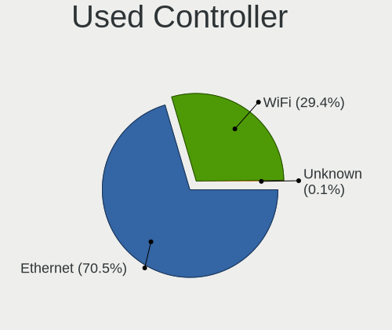

| Kind     | Desktops | Percent |
|----------|----------|---------|
| Ethernet | 2168     | 70.46%  |
| WiFi     | 904      | 29.38%  |
| Modem    | 3        | 0.1%    |
| Unknown  | 2        | 0.06%   |

NICs
----

Total network controllers on board

| Total | Desktops | Percent |
|-------|----------|---------|
| 1     | 1928     | 65.38%  |
| 2     | 891      | 30.21%  |
| 3     | 96       | 3.26%   |
| 0     | 20       | 0.68%   |
| 4     | 8        | 0.27%   |
| 5     | 5        | 0.17%   |
| 7     | 1        | 0.03%   |

IPv6
----

IPv6 vs IPv4

| Used | Desktops | Percent |
|------|----------|---------|
| No   | 2094     | 70.41%  |
| Yes  | 880      | 29.59%  |

Bluetooth
---------

Bluetooth Vendor
----------------

Controller vendors

| Vendor                          | Desktops | Percent |
|---------------------------------|----------|---------|
| Intel                           | 344      | 34.64%  |
| Cambridge Silicon Radio         | 213      | 21.45%  |
| Realtek Semiconductor           | 126      | 12.69%  |
| ASUSTek Computer                | 49       | 4.93%   |
| Broadcom                        | 46       | 4.63%   |
| IMC Networks                    | 40       | 4.03%   |
| Qualcomm Atheros Communications | 37       | 3.73%   |
| MediaTek                        | 27       | 2.72%   |
| TP-Link                         | 15       | 1.51%   |
| Foxconn / Hon Hai               | 13       | 1.31%   |
| Apple                           | 13       | 1.31%   |
| Actions                         | 10       | 1.01%   |
| Integrated System Solution      | 8        | 0.81%   |
| Dynex                           | 8        | 0.81%   |
| Belkin Components               | 6        | 0.6%    |
| Realtek                         | 5        | 0.5%    |
| Micro Star International        | 5        | 0.5%    |
| Unknown                         | 4        | 0.4%    |
| Lite-On Technology              | 3        | 0.3%    |
| Edimax Technology               | 3        | 0.3%    |
| SiW                             | 2        | 0.2%    |
| Logitech                        | 2        | 0.2%    |
| Hewlett-Packard                 | 2        | 0.2%    |
| Dell                            | 2        | 0.2%    |
| Sitecom Europe                  | 1        | 0.1%    |
| Roper                           | 1        | 0.1%    |
| Ralink                          | 1        | 0.1%    |
| Qcom                            | 1        | 0.1%    |
| National Semiconductor          | 1        | 0.1%    |
| Mobile Action Technology        | 1        | 0.1%    |
| Marvell Semiconductor           | 1        | 0.1%    |
| Kensington                      | 1        | 0.1%    |
| Fujitsu                         | 1        | 0.1%    |
| D-Link System                   | 1        | 0.1%    |

Bluetooth Model
---------------

Controller models

| Model                                                    | Desktops | Percent |
|----------------------------------------------------------|----------|---------|
| Cambridge Silicon Radio Bluetooth Dongle (HCI mode)      | 213      | 21.45%  |
| Realtek Bluetooth Radio                                  | 103      | 10.37%  |
| Intel AX200 Bluetooth                                    | 74       | 7.45%   |
| Intel Bluetooth wireless interface                       | 70       | 7.05%   |
| Intel AX210 Bluetooth                                    | 50       | 5.04%   |
| Intel Wireless-AC 3168 Bluetooth                         | 38       | 3.83%   |
| Intel Wireless-AC 9260 Bluetooth Adapter                 | 31       | 3.12%   |
| MediaTek Wireless_Device                                 | 27       | 2.72%   |
| Intel AX201 Bluetooth                                    | 26       | 2.62%   |
| Intel Bluetooth 9460/9560 Jefferson Peak (JfP)           | 22       | 2.22%   |
| Intel AX211 Bluetooth                                    | 22       | 2.22%   |
| IMC Networks Bluetooth Radio                             | 21       | 2.11%   |
| Broadcom BCM20702A0 Bluetooth 4.0                        | 19       | 1.91%   |
| ASUS Broadcom BCM20702A0 Bluetooth                       | 16       | 1.61%   |
| TP-Link TP-Link Bluetooth USB Adapter                    | 15       | 1.51%   |
| IMC Networks Wireless_Device                             | 13       | 1.31%   |
| ASUS ASUS USB-BT500                                      | 12       | 1.21%   |
| Realtek  Bluetooth 4.2 Adapter                           | 11       | 1.11%   |
| Qualcomm Atheros  Bluetooth Device                       | 10       | 1.01%   |
| Qualcomm Atheros AR3011 Bluetooth                        | 10       | 1.01%   |
| Intel Centrino Bluetooth Wireless Transceiver            | 10       | 1.01%   |
| Actions general adapter                                  | 10       | 1.01%   |
| ASUS Bluetooth Radio                                     | 9        | 0.91%   |
| Dynex Bluetooth 4.0 Adapter [Broadcom, 1.12, BCM20702A0] | 8        | 0.81%   |
| Apple Bluetooth Host Controller                          | 8        | 0.81%   |
| Qualcomm Atheros AR9462 Bluetooth                        | 7        | 0.7%    |
| Foxconn / Hon Hai Bluetooth Device                       | 7        | 0.7%    |
| Realtek RTL8821A Bluetooth                               | 6        | 0.6%    |
| Realtek Bluetooth Radio                                  | 5        | 0.5%    |
| Foxconn / Hon Hai Wireless_Device                        | 5        | 0.5%    |
| Belkin Components F8T065BF Mini Bluetooth 4.0 Adapter    | 5        | 0.5%    |
| Qualcomm Atheros Bluetooth USB Host Controller           | 4        | 0.4%    |
| Micro Star International Bluetooth Device                | 4        | 0.4%    |
| Integrated System Solution KY-BT100 Bluetooth Adapter    | 4        | 0.4%    |
| Integrated System Solution Bluetooth Device              | 4        | 0.4%    |
| ASUS Qualcomm Bluetooth 4.1                              | 4        | 0.4%    |
| Unknown                                                  | 4        | 0.4%    |
| Qualcomm Atheros AR3012 Bluetooth 4.0                    | 3        | 0.3%    |
| Lite-On Bluetooth Device                                 | 3        | 0.3%    |
| Edimax Bluetooth Adapter                                 | 3        | 0.3%    |

Sound
-----

Sound Vendor
------------

Sound card vendors

| Vendor                                       | Desktops | Percent |
|----------------------------------------------|----------|---------|
| Intel                                        | 1890     | 39.22%  |
| AMD                                          | 1207     | 25.05%  |
| Nvidia                                       | 1077     | 22.35%  |
| C-Media Electronics                          | 117      | 2.43%   |
| Creative Labs                                | 59       | 1.22%   |
| Logitech                                     | 33       | 0.68%   |
| ASUSTek Computer                             | 28       | 0.58%   |
| JMTek                                        | 27       | 0.56%   |
| VIA Technologies                             | 26       | 0.54%   |
| Kingston Technology                          | 20       | 0.42%   |
| Micro Star International                     | 18       | 0.37%   |
| Generalplus Technology                       | 18       | 0.37%   |
| Texas Instruments                            | 17       | 0.35%   |
| Razer USA                                    | 14       | 0.29%   |
| Plantronics                                  | 14       | 0.29%   |
| GN Netcom                                    | 13       | 0.27%   |
| Creative Technology                          | 13       | 0.27%   |
| Zoran Co. Personal Media Division (Nogatech) | 11       | 0.23%   |
| Tenx Technology                              | 10       | 0.21%   |
| KTMicro                                      | 9        | 0.19%   |
| Jieli Technology                             | 9        | 0.19%   |
| SteelSeries ApS                              | 8        | 0.17%   |
| Focusrite-Novation                           | 8        | 0.17%   |
| Thesycon Systemsoftware & Consulting         | 7        | 0.15%   |
| Silicon Integrated Systems [SiS]             | 6        | 0.12%   |
| Realtek Semiconductor                        | 6        | 0.12%   |
| Corsair                                      | 6        | 0.12%   |
| Trust                                        | 5        | 0.1%    |
| DSEA A/S                                     | 5        | 0.1%    |
| Astro Gaming                                 | 5        | 0.1%    |
| RODE Microphones                             | 4        | 0.08%   |
| Hewlett-Packard                              | 4        | 0.08%   |
| Blue Microphones                             | 4        | 0.08%   |
| BEHRINGER International                      | 4        | 0.08%   |
| Asahi Kasei Microsystems                     | 4        | 0.08%   |
| Unknown                                      | 4        | 0.08%   |
| Walmart                                      | 3        | 0.06%   |
| Sony                                         | 3        | 0.06%   |
| Samsung Electronics                          | 3        | 0.06%   |
| Medeli Electronics                           | 3        | 0.06%   |

Sound Model
-----------

Sound card models

| Model                                                                             | Desktops | Percent |
|-----------------------------------------------------------------------------------|----------|---------|
| Intel 8 Series/C220 Series Chipset High Definition Audio Controller               | 278      | 4.94%   |
| Intel 6 Series/C200 Series Chipset Family High Definition Audio Controller        | 273      | 4.85%   |
| AMD SBx00 Azalia (Intel HDA)                                                      | 238      | 4.23%   |
| Intel NM10/ICH7 Family High Definition Audio Controller                           | 209      | 3.71%   |
| AMD Starship/Matisse HD Audio Controller                                          | 207      | 3.68%   |
| Intel Xeon E3-1200 v3/4th Gen Core Processor HD Audio Controller                  | 190      | 3.37%   |
| AMD Family 17h/19h/1ah HD Audio Controller                                        | 170      | 3.02%   |
| Intel 7 Series/C216 Chipset Family High Definition Audio Controller               | 152      | 2.7%    |
| Nvidia GK208 HDMI/DP Audio Controller                                             | 125      | 2.22%   |
| Intel 100 Series/C230 Series Chipset Family HD Audio Controller                   | 123      | 2.18%   |
| AMD Ellesmere HDMI Audio [Radeon RX 470/480 / 570/580/590]                        | 121      | 2.15%   |
| AMD FCH Azalia Controller                                                         | 116      | 2.06%   |
| Intel 200 Series PCH HD Audio                                                     | 103      | 1.83%   |
| AMD Family 17h (Models 00h-0fh) HD Audio Controller                               | 98       | 1.74%   |
| Intel 82801JI (ICH10 Family) HD Audio Controller                                  | 86       | 1.53%   |
| Intel Cannon Lake PCH cAVS                                                        | 74       | 1.31%   |
| Intel 5 Series/3400 Series Chipset High Definition Audio                          | 74       | 1.31%   |
| Nvidia GP107GL High Definition Audio Controller                                   | 72       | 1.28%   |
| AMD Renoir Radeon High Definition Audio Controller                                | 70       | 1.24%   |
| AMD Oland/Hainan/Cape Verde/Pitcairn HDMI Audio [Radeon HD 7000 Series]           | 70       | 1.24%   |
| Intel 82801I (ICH9 Family) HD Audio Controller                                    | 64       | 1.14%   |
| AMD Navi 21/23 HDMI/DP Audio Controller                                           | 64       | 1.14%   |
| Nvidia High Definition Audio Controller                                           | 61       | 1.08%   |
| Nvidia GM107 High Definition Audio Controller [GeForce 940MX]                     | 59       | 1.05%   |
| Nvidia MCP61 High Definition Audio                                                | 57       | 1.01%   |
| Nvidia GF108 High Definition Audio Controller                                     | 56       | 0.99%   |
| AMD Caicos HDMI Audio [Radeon HD 6450 / 7450/8450/8490 OEM / R5 230/235/235X OEM] | 54       | 0.96%   |
| Nvidia TU116 High Definition Audio Controller                                     | 53       | 0.94%   |
| Nvidia GF119 HDMI Audio Controller                                                | 53       | 0.94%   |
| AMD Raven/Raven2/Fenghuang HDMI/DP Audio Controller                               | 53       | 0.94%   |
| Intel 9 Series Chipset Family HD Audio Controller                                 | 48       | 0.85%   |
| Nvidia GA104 High Definition Audio Controller                                     | 47       | 0.83%   |
| AMD Cedar HDMI Audio [Radeon HD 5400/6300/7300 Series]                            | 46       | 0.82%   |
| Nvidia GP106 High Definition Audio Controller                                     | 43       | 0.76%   |
| AMD Baffin HDMI/DP Audio [Radeon RX 550 640SP / RX 560/560X]                      | 42       | 0.75%   |
| Intel 82801JD/DO (ICH10 Family) HD Audio Controller                               | 39       | 0.69%   |
| Intel Alder Lake-S HD Audio Controller                                            | 38       | 0.67%   |
| AMD Rembrandt Radeon High Definition Audio Controller                             | 37       | 0.66%   |
| Nvidia GA106 High Definition Audio Controller                                     | 36       | 0.64%   |
| Nvidia TU106 High Definition Audio Controller                                     | 35       | 0.62%   |

Memory
------

Memory Vendor
-------------

Memory module vendors

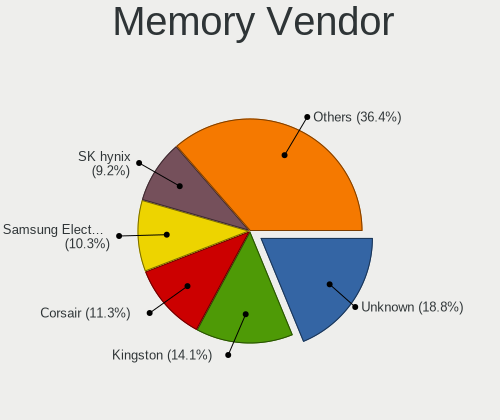

| Vendor              | Desktops | Percent |
|---------------------|----------|---------|
| Unknown             | 80       | 18.78%  |
| Kingston            | 60       | 14.08%  |
| Corsair             | 48       | 11.27%  |
| Samsung Electronics | 44       | 10.33%  |
| SK hynix            | 39       | 9.15%   |
| G.Skill             | 34       | 7.98%   |
| Crucial             | 32       | 7.51%   |
| Micron Technology   | 19       | 4.46%   |
| Team                | 13       | 3.05%   |
| A-DATA Technology   | 7        | 1.64%   |
| Elpida              | 6        | 1.41%   |
| Unknown             | 5        | 1.17%   |
| Patriot             | 4        | 0.94%   |
| Nanya Technology    | 4        | 0.94%   |
| Ramaxel Technology  | 3        | 0.7%    |
| Wilk                | 2        | 0.47%   |
| Unifosa             | 2        | 0.47%   |
| Qimonda             | 2        | 0.47%   |
| Avant               | 2        | 0.47%   |
| V-GEN               | 1        | 0.23%   |
| Unknown (C289)      | 1        | 0.23%   |
| Unknown (0x0E9D)    | 1        | 0.23%   |
| Unknown (0x0B38)    | 1        | 0.23%   |
| Transcend           | 1        | 0.23%   |
| Timetec             | 1        | 0.23%   |
| SUPER KINGSTEK      | 1        | 0.23%   |
| Smart               | 1        | 0.23%   |
| Ramos Technology    | 1        | 0.23%   |
| PNY                 | 1        | 0.23%   |
| Patriot Memory      | 1        | 0.23%   |
| Multilaser          | 1        | 0.23%   |
| Juhor               | 1        | 0.23%   |
| Goldkey             | 1        | 0.23%   |
| Golden Empire       | 1        | 0.23%   |
| F7852C80            | 1        | 0.23%   |
| CSX                 | 1        | 0.23%   |
| ASint Technology    | 1        | 0.23%   |
| Apacer              | 1        | 0.23%   |
| AMD                 | 1        | 0.23%   |

Memory Model
------------

Memory module models

| Model                                                  | Desktops | Percent |
|--------------------------------------------------------|----------|---------|
| Unknown RAM Module 4096MB DIMM DDR3 1333MT/s           | 7        | 1.5%    |
| Unknown RAM Module 4GB DIMM DDR3 1333MT/s              | 5        | 1.07%   |
| Corsair RAM CMK16GX4M2B3200C16 8GB DIMM DDR4 3600MT/s  | 5        | 1.07%   |
| Unknown                                                | 5        | 1.07%   |
| Unknown RAM Module 1GB DIMM SDRAM                      | 4        | 0.85%   |
| SK hynix RAM HMT351U6CFR8C-PB 4GB DIMM DDR3 1800MT/s   | 4        | 0.85%   |
| Samsung RAM M378B5173QH0-CK0 4GB DIMM DDR3 1600MT/s    | 4        | 0.85%   |
| Kingston RAM KHX3200C16D4/8GX 8GB DIMM DDR4 3733MT/s   | 4        | 0.85%   |
| G.Skill RAM F4-3200C16-16GTZR 16GB DIMM DDR4 3600MT/s  | 4        | 0.85%   |
| Unknown RAM Module 2GB DIMM 800MT/s                    | 3        | 0.64%   |
| Unknown RAM Module 1024MB DIMM SDRAM                   | 3        | 0.64%   |
| Team RAM TEAMGROUP-UD4-3200 8GB DIMM DDR4 3733MT/s     | 3        | 0.64%   |
| Team RAM TEAMGROUP-UD4-2666 16GB DIMM DDR4 3000MT/s    | 3        | 0.64%   |
| SK hynix RAM HMT351U6CFR8C-H9 4GB DIMM DDR3 1600MT/s   | 3        | 0.64%   |
| SK hynix RAM HMT351U6BFR8C-H9 4GB DIMM DDR3 1333MT/s   | 3        | 0.64%   |
| Samsung RAM M378B1G73DB0-CK0 8GB DIMM DDR3 2133MT/s    | 3        | 0.64%   |
| Micron RAM 8JTF51264AZ-1G6E1 4GB DIMM 1600MT/s         | 3        | 0.64%   |
| Kingston RAM KF3200C16D4/16GX 16GB DIMM DDR4 3200MT/s  | 3        | 0.64%   |
| G.Skill RAM F4-3200C16-8GVKB 8GB DIMM DDR4 4000MT/s    | 3        | 0.64%   |
| G.Skill RAM F4-3200C16-16GVK 16GB DIMM DDR4 3600MT/s   | 3        | 0.64%   |
| Crucial RAM BLS8G3D1609DS1S00. 8GB DIMM DDR3 1800MT/s  | 3        | 0.64%   |
| Corsair RAM CMK32GX4M2E3200C16 16GB DIMM DDR4 3534MT/s | 3        | 0.64%   |
| Unknown RAM Module 8192MB DIMM DDR3 1333MT/s           | 2        | 0.43%   |
| Unknown RAM Module 4GB DIMM 400MT/s                    | 2        | 0.43%   |
| Unknown RAM Module 4GB DIMM 1333MT/s                   | 2        | 0.43%   |
| Unknown RAM Module 4096MB DIMM DDR3 1600MT/s           | 2        | 0.43%   |
| Unknown RAM Module 4096MB DIMM 667MT/s                 | 2        | 0.43%   |
| Unknown RAM Module 4096MB DIMM                         | 2        | 0.43%   |
| Unknown RAM Module 2GB DIMM DDR2 800MT/s               | 2        | 0.43%   |
| Unknown RAM Module 2GB DIMM 667MT/s                    | 2        | 0.43%   |
| Unknown RAM Module 2048MB DIMM SDRAM                   | 2        | 0.43%   |
| Unknown RAM Module 2048MB DIMM 800MT/s                 | 2        | 0.43%   |
| Unknown RAM Module 1GB DIMM DDR2                       | 2        | 0.43%   |
| Unknown RAM Module 1024MB DIMM DDR2 333MT/s            | 2        | 0.43%   |
| Unknown RAM Module 1024MB DIMM 800MT/s                 | 2        | 0.43%   |
| Unknown RAM Module 1024MB DIMM                         | 2        | 0.43%   |
| Team RAM TEAMGROUP-UD4-2666 4GB DIMM DDR4              | 2        | 0.43%   |
| Team RAM TEAMGROUP-UD3-1600 8GB DIMM DDR3 1600MT/s     | 2        | 0.43%   |
| SK hynix RAM HMT451U6BFR8A-PB 4GB DIMM DDR3 1600MT/s   | 2        | 0.43%   |
| SK hynix RAM HMT451U6AFR8C-PB 4GB DIMM DDR3 1600MT/s   | 2        | 0.43%   |

Memory Kind
-----------

Memory module kinds

| Kind    | Desktops | Percent |
|---------|----------|---------|
| DDR4    | 147      | 39.41%  |
| DDR3    | 125      | 33.51%  |
| Unknown | 35       | 9.38%   |
| DDR2    | 22       | 5.9%    |
| SDRAM   | 20       | 5.36%   |
| DDR5    | 16       | 4.29%   |
| DDR     | 5        | 1.34%   |
| LPDDR4  | 2        | 0.54%   |
| DRAM    | 1        | 0.27%   |

Memory Form Factor
------------------

Physical design of the memory module

| Name         | Desktops | Percent |
|--------------|----------|---------|
| DIMM         | 340      | 93.41%  |
| SODIMM       | 21       | 5.77%   |
| Row Of Chips | 2        | 0.55%   |
| FB-DIMM      | 1        | 0.27%   |

Memory Size
-----------

Memory module size

| Size  | Desktops | Percent |
|-------|----------|---------|
| 8192  | 144      | 35.04%  |
| 4096  | 104      | 25.3%   |
| 2048  | 56       | 13.63%  |
| 16384 | 54       | 13.14%  |
| 1024  | 30       | 7.3%    |
| 32768 | 21       | 5.11%   |
| 512   | 2        | 0.49%   |

Memory Speed
------------

Memory module speed

| Speed   | Desktops | Percent |
|---------|----------|---------|
| 1600    | 63       | 15.18%  |
| 1333    | 55       | 13.25%  |
| 3200    | 34       | 8.19%   |
| 3600    | 31       | 7.47%   |
| 800     | 19       | 4.58%   |
| 2667    | 18       | 4.34%   |
| Unknown | 17       | 4.1%    |
| 2133    | 16       | 3.86%   |
| 2400    | 15       | 3.61%   |
| 3733    | 11       | 2.65%   |
| 1866    | 10       | 2.41%   |
| 1800    | 10       | 2.41%   |
| 667     | 10       | 2.41%   |
| 3000    | 8        | 1.93%   |
| 1066    | 6        | 1.45%   |
| 3400    | 5        | 1.2%    |
| 1867    | 5        | 1.2%    |
| 400     | 5        | 1.2%    |
| 6000    | 4        | 0.96%   |
| 4800    | 4        | 0.96%   |
| 4000    | 4        | 0.96%   |
| 3800    | 4        | 0.96%   |
| 2666    | 4        | 0.96%   |
| 333     | 4        | 0.96%   |
| 5600    | 3        | 0.72%   |
| 5200    | 3        | 0.72%   |
| 3534    | 3        | 0.72%   |
| 3466    | 3        | 0.72%   |
| 2933    | 3        | 0.72%   |
| 2800    | 3        | 0.72%   |
| 3666    | 2        | 0.48%   |
| 3500    | 2        | 0.48%   |
| 3467    | 2        | 0.48%   |
| 2200    | 2        | 0.48%   |
| 2048    | 2        | 0.48%   |
| 1648    | 2        | 0.48%   |
| 533     | 2        | 0.48%   |
| 49926   | 1        | 0.24%   |
| 7000    | 1        | 0.24%   |
| 6400    | 1        | 0.24%   |

Printers & scanners
-------------------

Printer Vendor
--------------

Printer device vendors

| Vendor                   | Desktops | Percent |
|--------------------------|----------|---------|
| Hewlett-Packard          | 51       | 28.49%  |
| Canon                    | 32       | 17.88%  |
| Brother Industries       | 32       | 17.88%  |
| Seiko Epson              | 23       | 12.85%  |
| Samsung Electronics      | 22       | 12.29%  |
| Lexmark International    | 4        | 2.23%   |
| Ricoh                    | 3        | 1.68%   |
| Konica Minolta           | 2        | 1.12%   |
| Dymo-CoStar              | 2        | 1.12%   |
| Zhuhai Poskey Technology | 1        | 0.56%   |
| Toshiba TEC              | 1        | 0.56%   |
| STMicroelectronics       | 1        | 0.56%   |
| QinHeng Electronics      | 1        | 0.56%   |
| Pantum                   | 1        | 0.56%   |
| Oki Data                 | 1        | 0.56%   |
| Kyocera                  | 1        | 0.56%   |
| GG IMAGE                 | 1        | 0.56%   |

Printer Model
-------------

Printer device models

| Model                                                     | Desktops | Percent |
|-----------------------------------------------------------|----------|---------|
| HP DeskJet 2700 series                                    | 5        | 2.76%   |
| Samsung SCX-3400 Series                                   | 4        | 2.21%   |
| Seiko Epson L3110 Series                                  | 3        | 1.66%   |
| Samsung ML-216x Series Laser Printer                      | 3        | 1.66%   |
| Samsung M2070 Series                                      | 3        | 1.66%   |
| HP ENVY 5000 series                                       | 3        | 1.66%   |
| HP ENVY 4520 series                                       | 3        | 1.66%   |
| Canon TS3100 series                                       | 3        | 1.66%   |
| Canon PIXMA MG2500 Series                                 | 3        | 1.66%   |
| Canon CanoScan LiDE 300                                   | 3        | 1.66%   |
| Seiko Epson ME 320/330 Series [Stylus SX125]              | 2        | 1.1%    |
| Seiko Epson L6270 Series                                  | 2        | 1.1%    |
| Seiko Epson L3150 Series                                  | 2        | 1.1%    |
| Seiko Epson ET-4850 Series                                | 2        | 1.1%    |
| Samsung C460 Series                                       | 2        | 1.1%    |
| HP OfficeJet 6950                                         | 2        | 1.1%    |
| HP OfficeJet 4650 series                                  | 2        | 1.1%    |
| HP LaserJet Professional P1102w                           | 2        | 1.1%    |
| HP DeskJet F2492 All-in-One                               | 2        | 1.1%    |
| HP DeskJet 2130 series                                    | 2        | 1.1%    |
| Canon PIXMA MG3600 Series                                 | 2        | 1.1%    |
| Canon MF4010 series                                       | 2        | 1.1%    |
| Canon LiDE 400                                            | 2        | 1.1%    |
| Brother Printer                                           | 2        | 1.1%    |
| Brother HL-L2350DW series                                 | 2        | 1.1%    |
| Brother HL-L2340D series                                  | 2        | 1.1%    |
| Brother HL-52x0 series                                    | 2        | 1.1%    |
| Brother HL-2130 series                                    | 2        | 1.1%    |
| Brother DCP-1610W                                         | 2        | 1.1%    |
| Zhuhai Poskey 4B-2054L                                    | 1        | 0.55%   |
| Toshiba TEC e-STD120 USB                                  | 1        | 0.55%   |
| STMicroelectronics LED badge -- mini LED display -- 11x44 | 1        | 0.55%   |
| Seiko Epson XP-7100 Series                                | 1        | 0.55%   |
| Seiko Epson XP-3100 Series                                | 1        | 0.55%   |
| Seiko Epson XP-225 Series                                 | 1        | 0.55%   |
| Seiko Epson XP-205 207 Series                             | 1        | 0.55%   |
| Seiko Epson L805 Series                                   | 1        | 0.55%   |
| Seiko Epson L365 Series                                   | 1        | 0.55%   |
| Seiko Epson L360 Series                                   | 1        | 0.55%   |
| Seiko Epson L355 Series                                   | 1        | 0.55%   |

Scanner Vendor
--------------

Scanner device vendors

| Vendor          | Desktops | Percent |
|-----------------|----------|---------|
| Canon           | 23       | 76.67%  |
| Hewlett-Packard | 4        | 13.33%  |
| Seiko Epson     | 2        | 6.67%   |
| Mustek Systems  | 1        | 3.33%   |

Scanner Model
-------------

Scanner device models

| Model                                       | Desktops | Percent |
|---------------------------------------------|----------|---------|
| Canon CanoScan N670U/N676U/LiDE 20          | 4        | 12.9%   |
| Canon CanoScan LiDE 220                     | 4        | 12.9%   |
| Canon CanoScan LiDE 90                      | 2        | 6.45%   |
| Canon CanoScan LiDE 210                     | 2        | 6.45%   |
| Canon CanoScan LiDE 110                     | 2        | 6.45%   |
| Canon CanoScan LiDE 100                     | 2        | 6.45%   |
| Canon CanoScan 8800F                        | 2        | 6.45%   |
| Seiko Epson Scanner                         | 1        | 3.23%   |
| Seiko Epson GT-F670 [Perfection V200 Photo] | 1        | 3.23%   |
| Mustek Systems ScanExpress 1200 UB          | 1        | 3.23%   |
| HP ScanJet 5300c/5370c                      | 1        | 3.23%   |
| HP ScanJet 2400c                            | 1        | 3.23%   |
| HP Scanjet 200                              | 1        | 3.23%   |
| HP PSC 1200                                 | 1        | 3.23%   |
| Canon CanoScan LiDE 60                      | 1        | 3.23%   |
| Canon CanoScan LiDE 50/LiDE 35/LiDE 40      | 1        | 3.23%   |
| Canon CanoScan LIDE 25                      | 1        | 3.23%   |
| Canon CanoScan LiDE 200                     | 1        | 3.23%   |
| Canon CanoScan D660U                        | 1        | 3.23%   |
| Canon CanoScan 5600F                        | 1        | 3.23%   |

Camera
------

Camera Vendor
-------------

Camera device vendors

| Vendor                        | Desktops | Percent |
|-------------------------------|----------|---------|
| Logitech                      | 147      | 31.48%  |
| Microdia                      | 41       | 8.78%   |
| Microsoft                     | 34       | 7.28%   |
| Sunplus Innovation Technology | 22       | 4.71%   |
| Chicony Electronics           | 21       | 4.5%    |
| Apple                         | 18       | 3.85%   |
| Generalplus Technology        | 14       | 3%      |
| Z-Star Microelectronics       | 11       | 2.36%   |
| Samsung Electronics           | 11       | 2.36%   |
| Realtek Semiconductor         | 9        | 1.93%   |
| ARC International             | 9        | 1.93%   |
| Jieli Technology              | 7        | 1.5%    |
| Razer USA                     | 6        | 1.28%   |
| Cubeternet                    | 6        | 1.28%   |
| GEMBIRD                       | 5        | 1.07%   |
| Creative Technology           | 5        | 1.07%   |
| A4Tech                        | 5        | 1.07%   |
| 2M UVC CAMERA                 | 5        | 1.07%   |
| Sonix Technology              | 4        | 0.86%   |
| IMC Networks                  | 4        | 0.86%   |
| Genesys Logic                 | 4        | 0.86%   |
| Aveo Technology               | 4        | 0.86%   |
| Arkmicro Technologies         | 4        | 0.86%   |
| Trust                         | 3        | 0.64%   |
| Tobii Technology AB           | 3        | 0.64%   |
| Suyin                         | 3        | 0.64%   |
| MacroSilicon                  | 3        | 0.64%   |
| KYE Systems (Mouse Systems)   | 3        | 0.64%   |
| Insta360                      | 3        | 0.64%   |
| Guillemot                     | 3        | 0.64%   |
| eMeet                         | 3        | 0.64%   |
| AVerMedia Technologies        | 3        | 0.64%   |
| Xiongmai                      | 2        | 0.43%   |
| WaveRider Communications      | 2        | 0.43%   |
| Teslong Camera                | 2        | 0.43%   |
| SunplusIT                     | 2        | 0.43%   |
| Pixart Imaging                | 2        | 0.43%   |
| OmniVision Technologies       | 2        | 0.43%   |
| lihappe8                      | 2        | 0.43%   |
| Lenovo                        | 2        | 0.43%   |

Camera Model
------------

Camera device models

| Model                                    | Desktops | Percent |
|------------------------------------------|----------|---------|
| Logitech Webcam C270                     | 39       | 8.3%    |
| Logitech HD Pro Webcam C920              | 33       | 7.02%   |
| Microsoft LifeCam HD-3000                | 16       | 3.4%    |
| Apple iPhone 5/5C/5S/6/SE/7/8/X/XR       | 16       | 3.4%    |
| Samsung Galaxy series, misc. (MTP mode)  | 11       | 2.34%   |
| Microdia Webcam Vitade AF                | 10       | 2.13%   |
| Microdia USB 2.0 Camera                  | 10       | 2.13%   |
| Sunplus DICOTA 4K                        | 9        | 1.91%   |
| Generalplus GENERAL WEBCAM               | 9        | 1.91%   |
| Chicony HP High Definition 1MP Webcam    | 9        | 1.91%   |
| ARC International Camera                 | 9        | 1.91%   |
| Logitech C922 Pro Stream Webcam          | 8        | 1.7%    |
| Logitech Logitech Webcam C925e           | 7        | 1.49%   |
| Logitech HD Webcam C615                  | 7        | 1.49%   |
| Logitech HD Webcam C525                  | 7        | 1.49%   |
| Jieli USB PHY 2.0                        | 7        | 1.49%   |
| Razer USA Gaming Webcam [Kiyo]           | 5        | 1.06%   |
| Microsoft LifeCam VX-2000                | 5        | 1.06%   |
| Logitech Webcam C310                     | 5        | 1.06%   |
| Logitech BRIO Ultra HD Webcam            | 5        | 1.06%   |
| Generalplus 808 Camera #9 (web-cam mode) | 5        | 1.06%   |
| Chicony CNF8050 Webcam                   | 5        | 1.06%   |
| 2M UVC CAMERA NexiGo N60 FHD Webcam      | 5        | 1.06%   |
| Z-Star Venus USB2.0 Camera               | 4        | 0.85%   |
| Sunplus HD 720P webcam                   | 4        | 0.85%   |
| Microdia Streaming Camera W8GS           | 4        | 0.85%   |
| Microdia Integrated Camera               | 4        | 0.85%   |
| Aveo USB2.0 Camera                       | 4        | 0.85%   |
| A4Tech PK-635G                           | 4        | 0.85%   |
| Z-Star Integrated Camera                 | 3        | 0.64%   |
| Tobii AB EyeChip                         | 3        | 0.64%   |
| Suyin HD WebCam                          | 3        | 0.64%   |
| Realtek FULL HD 1080P Webcam             | 3        | 0.64%   |
| Microsoft LifeCam VX-500 [1357]          | 3        | 0.64%   |
| Microsoft LifeCam Cinema                 | 3        | 0.64%   |
| Microdia Camera                          | 3        | 0.64%   |
| Logitech Webcam C930e                    | 3        | 0.64%   |
| Logitech QuickCam Pro 9000               | 3        | 0.64%   |
| Logitech QuickCam Orbit/Sphere AF        | 3        | 0.64%   |
| Logitech HD Webcam C910                  | 3        | 0.64%   |

Security
--------

Fingerprint Vendor
------------------

Fingerprint sensor vendors

| Vendor                | Desktops | Percent |
|-----------------------|----------|---------|
| LighTuning Technology | 3        | 37.5%   |
| Dell                  | 2        | 25%     |
| AuthenTec             | 2        | 25%     |
| Microsoft             | 1        | 12.5%   |

Fingerprint Model
-----------------

Fingerprint sensor models

| Model                                          | Desktops | Percent |
|------------------------------------------------|----------|---------|
| LighTuning Fingerprint Sensor                  | 2        | 25%     |
| Dell MS819 Wired Mouse With Fingerprint Reader | 2        | 25%     |
| Microsoft Fingerprint Reader                   | 1        | 12.5%   |
| LighTuning ES603 Swipe Fingerprint Sensor      | 1        | 12.5%   |
| AuthenTec AES2810                              | 1        | 12.5%   |
| AuthenTec AES2501 Fingerprint Sensor           | 1        | 12.5%   |

Chipcard Vendor
---------------

Chipcard module vendors

| Vendor                            | Desktops | Percent |
|-----------------------------------|----------|---------|
| SCM Microsystems                  | 2        | 9.52%   |
| Reiner SCT Kartensysteme          | 2        | 9.52%   |
| Realtek Semiconductor             | 2        | 9.52%   |
| Gemalto (was Gemplus)             | 2        | 9.52%   |
| Alcor Micro                       | 2        | 9.52%   |
| Advanced Card Systems             | 2        | 9.52%   |
| VASCO Data Security International | 1        | 4.76%   |
| NXP Semiconductors                | 1        | 4.76%   |
| Lenovo                            | 1        | 4.76%   |
| Kobil Systems                     | 1        | 4.76%   |
| Jing-Mold Enterprise              | 1        | 4.76%   |
| Fujitsu Siemens Computers         | 1        | 4.76%   |
| Chicony Electronics               | 1        | 4.76%   |
| Bit4id                            | 1        | 4.76%   |
| Aladdin Knowledge Systems         | 1        | 4.76%   |

Chipcard Model
--------------

Chipcard module models

| Model                                                                      | Desktops | Percent |
|----------------------------------------------------------------------------|----------|---------|
| SCM Microsystems SCR331-LC1 / SCR3310 SmartCard Reader                     | 2        | 9.52%   |
| Realtek Semiconductor Smart Card Reader Interface                          | 2        | 9.52%   |
| Gemalto (was Gemplus) GemPC Twin SmartCard Reader                          | 2        | 9.52%   |
| Alcor Micro AU9540 Smartcard Reader                                        | 2        | 9.52%   |
| VASCO Data Security International Digipass 905 SmartCard Reader            | 1        | 4.76%   |
| Reiner SCT Kartensysteme cyberJack RFID basis contactless smartcard reader | 1        | 4.76%   |
| Reiner SCT Kartensysteme cyberJack e-com/pinpad                            | 1        | 4.76%   |
| NXP Semiconductors HUSCR-NFC                                               | 1        | 4.76%   |
| Lenovo Smartcard Keyboard                                                  | 1        | 4.76%   |
| Kobil Systems KOBIL Class 3 Reader                                         | 1        | 4.76%   |
| Jing-Mold Enterprise HP USB Business Slim Smartcard CCID Keyboard          | 1        | 4.76%   |
| Fujitsu Siemens Computers SmartCard Reader 2A                              | 1        | 4.76%   |
| Chicony Electronics HP Skylab USB Smartcard Keyboard                       | 1        | 4.76%   |
| Bit4id miniLector EVO                                                      | 1        | 4.76%   |
| Aladdin Knowledge Systems Token JC                                         | 1        | 4.76%   |
| Advanced Card Systems ACR39U                                               | 1        | 4.76%   |
| Advanced Card Systems ACR1281 1S Dual Reader                               | 1        | 4.76%   |

Unsupported
-----------

Unsupported Devices
-------------------

Total unsupported devices on board

| Total | Desktops | Percent |
|-------|----------|---------|
| 0     | 2350     | 78.33%  |
| 1     | 564      | 18.8%   |
| 2     | 73       | 2.43%   |
| 3     | 11       | 0.37%   |
| 4     | 2        | 0.07%   |

Unsupported Device Types
------------------------

Types of unsupported devices

| Type                     | Desktops | Percent |
|--------------------------|----------|---------|
| Graphics card            | 324      | 45.25%  |
| Net/wireless             | 218      | 30.45%  |
| Communication controller | 35       | 4.89%   |
| Multimedia controller    | 31       | 4.33%   |
| Unassigned class         | 25       | 3.49%   |
| Chipcard                 | 14       | 1.96%   |
| Storage/raid             | 11       | 1.54%   |
| Modem                    | 9        | 1.26%   |
| Bluetooth                | 9        | 1.26%   |
| Card reader              | 7        | 0.98%   |
| Net/ethernet             | 6        | 0.84%   |
| Sound                    | 5        | 0.7%    |
| Fingerprint reader       | 5        | 0.7%    |
| Storage/ide              | 4        | 0.56%   |
| Network                  | 4        | 0.56%   |
| Dvb card                 | 2        | 0.28%   |
| Camera                   | 2        | 0.28%   |
| Video                    | 1        | 0.14%   |
| Unclassified device      | 1        | 0.14%   |
| Tv card                  | 1        | 0.14%   |
| Storage/nvme             | 1        | 0.14%   |
| Storage                  | 1        | 0.14%   |

