Zorin - Tested Hardware & Statistics (Desktops)
-----------------------------------------------

A project to collect tested hardware configurations for Zorin.

Anyone can contribute to this report by the [hw-probe](https://github.com/linuxhw/hw-probe) tool:

    sudo -E hw-probe -all -upload

Please contribute! Especially if your hardware is rare.

Contents
--------

* [ Test Cases ](#test-cases)

* [ System ](#system)
  - [ OS                       ](#os)
  - [ OS Family                ](#os-family)
  - [ Kernel                   ](#kernel)
  - [ Kernel Family            ](#kernel-family)
  - [ Kernel Major Ver.        ](#kernel-major-ver)
  - [ Arch                     ](#arch)
  - [ DE                       ](#de)
  - [ Display Server           ](#display-server)
  - [ Display Manager          ](#display-manager)
  - [ OS Lang                  ](#os-lang)
  - [ Boot Mode                ](#boot-mode)
  - [ Filesystem               ](#filesystem)
  - [ Part. scheme             ](#part-scheme)
  - [ Dual Boot with Linux/BSD ](#dual-boot-with-linuxbsd)
  - [ Dual Boot (Win)          ](#dual-boot-win)

* [ Board ](#board)
  - [ Vendor                   ](#vendor)
  - [ Model                    ](#model)
  - [ Model Family             ](#model-family)
  - [ MFG Year                 ](#mfg-year)
  - [ Form Factor              ](#form-factor)
  - [ Secure Boot              ](#secure-boot)
  - [ Coreboot                 ](#coreboot)
  - [ RAM Size                 ](#ram-size)
  - [ RAM Used                 ](#ram-used)
  - [ Total Drives             ](#total-drives)
  - [ Has CD-ROM               ](#has-cd-rom)
  - [ Has Ethernet             ](#has-ethernet)
  - [ Has WiFi                 ](#has-wifi)
  - [ Has Bluetooth            ](#has-bluetooth)

* [ Location ](#location)
  - [ Country                  ](#country)
  - [ City                     ](#city)

* [ Drives ](#drives)
  - [ Drive Vendor             ](#drive-vendor)
  - [ Drive Model              ](#drive-model)
  - [ HDD Vendor               ](#hdd-vendor)
  - [ SSD Vendor               ](#ssd-vendor)
  - [ Drive Kind               ](#drive-kind)
  - [ Drive Connector          ](#drive-connector)
  - [ Drive Size               ](#drive-size)
  - [ Space Total              ](#space-total)
  - [ Space Used               ](#space-used)
  - [ Malfunc. Drives          ](#malfunc-drives)
  - [ Malfunc. Drive Vendor    ](#malfunc-drive-vendor)
  - [ Malfunc. HDD Vendor      ](#malfunc-hdd-vendor)
  - [ Malfunc. Drive Kind      ](#malfunc-drive-kind)
  - [ Failed Drives            ](#failed-drives)
  - [ Failed Drive Vendor      ](#failed-drive-vendor)
  - [ Drive Status             ](#drive-status)

* [ Storage controller ](#storage-controller)
  - [ Storage Vendor           ](#storage-vendor)
  - [ Storage Model            ](#storage-model)
  - [ Storage Kind             ](#storage-kind)

* [ Processor ](#processor)
  - [ CPU Vendor               ](#cpu-vendor)
  - [ CPU Model                ](#cpu-model)
  - [ CPU Model Family         ](#cpu-model-family)
  - [ CPU Cores                ](#cpu-cores)
  - [ CPU Sockets              ](#cpu-sockets)
  - [ CPU Threads              ](#cpu-threads)
  - [ CPU Op-Modes             ](#cpu-op-modes)
  - [ CPU Microcode            ](#cpu-microcode)
  - [ CPU Microarch            ](#cpu-microarch)

* [ Graphics ](#graphics)
  - [ GPU Vendor               ](#gpu-vendor)
  - [ GPU Model                ](#gpu-model)
  - [ GPU Combo                ](#gpu-combo)
  - [ GPU Driver               ](#gpu-driver)
  - [ GPU Memory               ](#gpu-memory)

* [ Monitor ](#monitor)
  - [ Monitor Vendor           ](#monitor-vendor)
  - [ Monitor Model            ](#monitor-model)
  - [ Monitor Resolution       ](#monitor-resolution)
  - [ Monitor Diagonal         ](#monitor-diagonal)
  - [ Monitor Width            ](#monitor-width)
  - [ Aspect Ratio             ](#aspect-ratio)
  - [ Monitor Area             ](#monitor-area)
  - [ Pixel Density            ](#pixel-density)
  - [ Multiple Monitors        ](#multiple-monitors)

* [ Network ](#network)
  - [ Net Controller Vendor    ](#net-controller-vendor)
  - [ Net Controller Model     ](#net-controller-model)
  - [ Wireless Vendor          ](#wireless-vendor)
  - [ Wireless Model           ](#wireless-model)
  - [ Ethernet Vendor          ](#ethernet-vendor)
  - [ Ethernet Model           ](#ethernet-model)
  - [ Net Controller Kind      ](#net-controller-kind)
  - [ Used Controller          ](#used-controller)
  - [ NICs                     ](#nics)
  - [ IPv6                     ](#ipv6)

* [ Bluetooth ](#bluetooth)
  - [ Bluetooth Vendor         ](#bluetooth-vendor)
  - [ Bluetooth Model          ](#bluetooth-model)

* [ Sound ](#sound)
  - [ Sound Vendor             ](#sound-vendor)
  - [ Sound Model              ](#sound-model)

* [ Memory ](#memory)
  - [ Memory Vendor            ](#memory-vendor)
  - [ Memory Model             ](#memory-model)
  - [ Memory Kind              ](#memory-kind)
  - [ Memory Form Factor       ](#memory-form-factor)
  - [ Memory Size              ](#memory-size)
  - [ Memory Speed             ](#memory-speed)

* [ Printers & scanners ](#printers--scanners)
  - [ Printer Vendor           ](#printer-vendor)
  - [ Printer Model            ](#printer-model)
  - [ Scanner Vendor           ](#scanner-vendor)
  - [ Scanner Model            ](#scanner-model)

* [ Camera ](#camera)
  - [ Camera Vendor            ](#camera-vendor)
  - [ Camera Model             ](#camera-model)

* [ Security ](#security)
  - [ Fingerprint Vendor       ](#fingerprint-vendor)
  - [ Fingerprint Model        ](#fingerprint-model)
  - [ Chipcard Vendor          ](#chipcard-vendor)
  - [ Chipcard Model           ](#chipcard-model)

* [ Unsupported ](#unsupported)
  - [ Unsupported Devices      ](#unsupported-devices)
  - [ Unsupported Device Types ](#unsupported-device-types)

Test Cases
----------

Total: 1816

| Vendor        | Model                       | Probe                                                      | Date         |
|---------------|-----------------------------|------------------------------------------------------------|--------------|
| Dell          | 0HJ054                      | [bb9d7a3a58](https://linux-hardware.org/?probe=bb9d7a3a58) | Jun 30, 2022 |
| Gigabyte      | B360M HD3                   | [b35e9f3e5c](https://linux-hardware.org/?probe=b35e9f3e5c) | Jun 28, 2022 |
| Lenovo        | 3098 0B98401 PRO            | [9923c241d9](https://linux-hardware.org/?probe=9923c241d9) | Jun 27, 2022 |
| Dell          | 0U880P A00                  | [e14832f09c](https://linux-hardware.org/?probe=e14832f09c) | Jun 26, 2022 |
| Gigabyte      | B450 AORUS M                | [6262e08c1f](https://linux-hardware.org/?probe=6262e08c1f) | Jun 26, 2022 |
| Pegatron      | IPPSB-DB                    | [a63cdffc5b](https://linux-hardware.org/?probe=a63cdffc5b) | Jun 26, 2022 |
| Dell          | 08NPPY A00                  | [3dc935ecb1](https://linux-hardware.org/?probe=3dc935ecb1) | Jun 26, 2022 |
| ASUSTek       | ROG CROSSHAIR VIII HERO     | [c78b132d02](https://linux-hardware.org/?probe=c78b132d02) | Jun 26, 2022 |
| ASUSTek       | TUF Gaming X570-PRO WIFI... | [b232a434fd](https://linux-hardware.org/?probe=b232a434fd) | Jun 26, 2022 |
| Gigabyte      | B450 AORUS M                | [0297d9c8c1](https://linux-hardware.org/?probe=0297d9c8c1) | Jun 25, 2022 |
| Gigabyte      | Z77-DS3H                    | [fbde5d214f](https://linux-hardware.org/?probe=fbde5d214f) | Jun 24, 2022 |
| Gigabyte      | EP45-UD3P                   | [05449d9e5c](https://linux-hardware.org/?probe=05449d9e5c) | Jun 24, 2022 |
| MSI           | A75A-G35                    | [9e3dd8051c](https://linux-hardware.org/?probe=9e3dd8051c) | Jun 23, 2022 |
| ASUSTek       | PRIME X570-PRO              | [a24305d670](https://linux-hardware.org/?probe=a24305d670) | Jun 23, 2022 |
| Fujitsu       | D3221-A1 S26361-D3221-A1    | [b21a0caebf](https://linux-hardware.org/?probe=b21a0caebf) | Jun 22, 2022 |
| ASUSTek       | PRIME X570-PRO              | [ecea2bb4ad](https://linux-hardware.org/?probe=ecea2bb4ad) | Jun 22, 2022 |
| Gigabyte      | EX58-UD3R                   | [4014366c8a](https://linux-hardware.org/?probe=4014366c8a) | Jun 21, 2022 |
| Lenovo        | SDK0J40700 WIN              | [82be38e941](https://linux-hardware.org/?probe=82be38e941) | Jun 17, 2022 |
| MSI           | B85M-E45                    | [58c2ff96e3](https://linux-hardware.org/?probe=58c2ff96e3) | Jun 17, 2022 |
| ASUSTek       | ROG CROSSHAIR VIII DARK ... | [85a022001e](https://linux-hardware.org/?probe=85a022001e) | Jun 16, 2022 |
| Dell          | 0X501H A02                  | [b9cb2a1e48](https://linux-hardware.org/?probe=b9cb2a1e48) | Jun 15, 2022 |
| Acer          | Aspire M3970                | [b966120966](https://linux-hardware.org/?probe=b966120966) | Jun 14, 2022 |
| Lenovo        | 3717 SDK0J40709 WIN 3259... | [aa63e13a60](https://linux-hardware.org/?probe=aa63e13a60) | Jun 13, 2022 |
| Lenovo        | 3717 SDK0J40709 WIN 3259... | [ba6786bbe8](https://linux-hardware.org/?probe=ba6786bbe8) | Jun 13, 2022 |
| ASUSTek       | P5GC-MX/1333                | [428eebd42f](https://linux-hardware.org/?probe=428eebd42f) | Jun 13, 2022 |
| MSI           | MEG Z690 UNIFY              | [4e227cff8b](https://linux-hardware.org/?probe=4e227cff8b) | Jun 12, 2022 |
| ASUSTek       | TUF Gaming X570-PLUS_BR     | [2a772cecf4](https://linux-hardware.org/?probe=2a772cecf4) | Jun 12, 2022 |
| Foxconn       | Irvine HP P/N               | [551f18d133](https://linux-hardware.org/?probe=551f18d133) | Jun 11, 2022 |
| ASUSTek       | PRIME B550M-A               | [14b9e721b7](https://linux-hardware.org/?probe=14b9e721b7) | Jun 11, 2022 |
| Dell          | 0XFWHV A00                  | [4102e98034](https://linux-hardware.org/?probe=4102e98034) | Jun 09, 2022 |
| ASUSTek       | Benicia                     | [4b56f8a972](https://linux-hardware.org/?probe=4b56f8a972) | Jun 08, 2022 |
| Dell          | 0WR7PY A03                  | [902546cb45](https://linux-hardware.org/?probe=902546cb45) | Jun 06, 2022 |
| ASUSTek       | TUF Z270 MARK 2             | [e993e32a56](https://linux-hardware.org/?probe=e993e32a56) | Jun 06, 2022 |
| ASUSTek       | K30AD_M31AD_M51AD_M32AD     | [07808a7cbf](https://linux-hardware.org/?probe=07808a7cbf) | Jun 05, 2022 |
| HP            | 8350                        | [63a9e40af6](https://linux-hardware.org/?probe=63a9e40af6) | Jun 05, 2022 |
| Biostar       | A68N-2100K                  | [480a4c12b1](https://linux-hardware.org/?probe=480a4c12b1) | Jun 05, 2022 |
| ASRock        | 970 Extreme3                | [d5648a1a95](https://linux-hardware.org/?probe=d5648a1a95) | Jun 04, 2022 |
| MSI           | B85M-G43                    | [097b308b60](https://linux-hardware.org/?probe=097b308b60) | Jun 04, 2022 |
| ASUSTek       | K30AD_M31AD_M51AD_M32AD     | [94c2c3411a](https://linux-hardware.org/?probe=94c2c3411a) | Jun 04, 2022 |
| Gigabyte      | X570 AORUS ELITE            | [9404638832](https://linux-hardware.org/?probe=9404638832) | Jun 03, 2022 |
| BESSTAR Te... | TL50                        | [0455aba8a3](https://linux-hardware.org/?probe=0455aba8a3) | Jun 03, 2022 |
| HP            | 3029h                       | [d536fb8e36](https://linux-hardware.org/?probe=d536fb8e36) | Jun 03, 2022 |
| ASUSTek       | TUF Z390-PLUS GAMING        | [61b90c102c](https://linux-hardware.org/?probe=61b90c102c) | Jun 03, 2022 |
| ASUSTek       | P5E-VM DO                   | [935c03cd63](https://linux-hardware.org/?probe=935c03cd63) | Jun 03, 2022 |
| Biostar       | A78MD                       | [206b04b6d8](https://linux-hardware.org/?probe=206b04b6d8) | Jun 02, 2022 |
| ASUSTek       | P5QL-ASUS-SE                | [5c9f7b1ab9](https://linux-hardware.org/?probe=5c9f7b1ab9) | Jun 02, 2022 |
| ASUSTek       | P5QL-ASUS-SE                | [0e1e2765fc](https://linux-hardware.org/?probe=0e1e2765fc) | Jun 01, 2022 |
| Biostar       | A78MD                       | [49ea0bd0e4](https://linux-hardware.org/?probe=49ea0bd0e4) | Jun 01, 2022 |
| ASUSTek       | TUF Gaming X570-PLUS        | [951bd2ea8d](https://linux-hardware.org/?probe=951bd2ea8d) | May 31, 2022 |
| Positivo      | POS-PIG41BAG                | [7bfeaeb75b](https://linux-hardware.org/?probe=7bfeaeb75b) | May 31, 2022 |
| Positivo      | POS-PIG41BAG                | [3ca7484fcf](https://linux-hardware.org/?probe=3ca7484fcf) | May 31, 2022 |
| ASUSTek       | PRIME A320M-K               | [d078b8d5dd](https://linux-hardware.org/?probe=d078b8d5dd) | May 30, 2022 |
| Gigabyte      | H410M H V3                  | [1dbf357f4f](https://linux-hardware.org/?probe=1dbf357f4f) | May 30, 2022 |
| MSI           | Z97 XPOWER AC               | [dd5c7a981a](https://linux-hardware.org/?probe=dd5c7a981a) | May 29, 2022 |
| Gigabyte      | G1.Sniper Z97               | [2c3ba3123f](https://linux-hardware.org/?probe=2c3ba3123f) | May 29, 2022 |
| ASUSTek       | P7P55D DELUXE               | [ba2d55d308](https://linux-hardware.org/?probe=ba2d55d308) | May 29, 2022 |
| ASRock        | B450 Pro4                   | [fa0b4c98df](https://linux-hardware.org/?probe=fa0b4c98df) | May 29, 2022 |
| Dell          | 0HN7XN A01                  | [9ebd09a280](https://linux-hardware.org/?probe=9ebd09a280) | May 29, 2022 |
| Gigabyte      | F2A58M-DS2                  | [3b95da87e9](https://linux-hardware.org/?probe=3b95da87e9) | May 28, 2022 |
| ASUSTek       | K30AD_M31AD_M51AD_M32AD     | [4e77d22694](https://linux-hardware.org/?probe=4e77d22694) | May 27, 2022 |
| ASUSTek       | TUF B365M-PLUS GAMING       | [1137f80fcd](https://linux-hardware.org/?probe=1137f80fcd) | May 27, 2022 |
| ASUSTek       | TUF B365M-PLUS GAMING       | [57dbc86807](https://linux-hardware.org/?probe=57dbc86807) | May 27, 2022 |
| ASUSTek       | H81M-A/BR                   | [5df43d2ecd](https://linux-hardware.org/?probe=5df43d2ecd) | May 26, 2022 |
| Dell          | 088DT1 A01                  | [19d760099e](https://linux-hardware.org/?probe=19d760099e) | May 25, 2022 |
| Dell          | 088DT1 A01                  | [3334efe1e7](https://linux-hardware.org/?probe=3334efe1e7) | May 25, 2022 |
| Intel         | D946GZIS AAD66165-301       | [24c058da74](https://linux-hardware.org/?probe=24c058da74) | May 25, 2022 |
| Gigabyte      | A320M-S2H-CF                | [293f5586bd](https://linux-hardware.org/?probe=293f5586bd) | May 25, 2022 |
| Gigabyte      | B450 AORUS PRO WIFI-CF      | [6e45ae9f7c](https://linux-hardware.org/?probe=6e45ae9f7c) | May 24, 2022 |
| MSI           | MEG Z390 GODLIKE            | [4249d49f41](https://linux-hardware.org/?probe=4249d49f41) | May 22, 2022 |
| Gigabyte      | B550 AORUS PRO V2           | [dffc3ea80a](https://linux-hardware.org/?probe=dffc3ea80a) | May 21, 2022 |
| ASUSTek       | Z97-DELUXE                  | [084bacdad3](https://linux-hardware.org/?probe=084bacdad3) | May 21, 2022 |
| MSI           | Z170A GAMING PRO            | [3a9789ed8a](https://linux-hardware.org/?probe=3a9789ed8a) | May 20, 2022 |
| ASUSTek       | PRIME B550M-A               | [1d5fec86a8](https://linux-hardware.org/?probe=1d5fec86a8) | May 20, 2022 |
| MSI           | 760GM-P21                   | [b6b5e0738c](https://linux-hardware.org/?probe=b6b5e0738c) | May 19, 2022 |
| MSI           | B85M-G43                    | [ef33bf347c](https://linux-hardware.org/?probe=ef33bf347c) | May 18, 2022 |
| Foxconn       | 2AAF                        | [dd1193f7ab](https://linux-hardware.org/?probe=dd1193f7ab) | May 18, 2022 |
| ASUSTek       | H81M-K                      | [c5cdf9ba52](https://linux-hardware.org/?probe=c5cdf9ba52) | May 18, 2022 |
| Gigabyte      | B550 AORUS PRO V2           | [2b889fc85b](https://linux-hardware.org/?probe=2b889fc85b) | May 17, 2022 |
| ASUSTek       | G15DK                       | [1df44e40e2](https://linux-hardware.org/?probe=1df44e40e2) | May 17, 2022 |
| Dell          | 08HPGT A01                  | [aa8b5a4aec](https://linux-hardware.org/?probe=aa8b5a4aec) | May 17, 2022 |
| Gigabyte      | M61PME-S2P                  | [7ab57b617f](https://linux-hardware.org/?probe=7ab57b617f) | May 17, 2022 |
| Dell          | 08HPGT A01                  | [4b277b05bb](https://linux-hardware.org/?probe=4b277b05bb) | May 17, 2022 |
| HP            | 2ADE                        | [77c2ea750b](https://linux-hardware.org/?probe=77c2ea750b) | May 17, 2022 |
| Dell          | 0C27VV A01                  | [aea8e14bff](https://linux-hardware.org/?probe=aea8e14bff) | May 17, 2022 |
| Dell          | 0GTK4K A02                  | [fba6de28d9](https://linux-hardware.org/?probe=fba6de28d9) | May 16, 2022 |
| ASUSTek       | P5KPL-AM SE                 | [ebbd363703](https://linux-hardware.org/?probe=ebbd363703) | May 16, 2022 |
| Intel         | D946GZIS AAD66165-301       | [4555cff448](https://linux-hardware.org/?probe=4555cff448) | May 16, 2022 |
| Gigabyte      | GA-78LMT-USB3               | [7fcd8503ab](https://linux-hardware.org/?probe=7fcd8503ab) | May 16, 2022 |
| ASRock        | A88M-G                      | [81d094b2ec](https://linux-hardware.org/?probe=81d094b2ec) | May 15, 2022 |
| ASRock        | A88M-G                      | [8883591354](https://linux-hardware.org/?probe=8883591354) | May 15, 2022 |
| ASUSTek       | ROG STRIX B550-I GAMING     | [0d9d6b919b](https://linux-hardware.org/?probe=0d9d6b919b) | May 15, 2022 |
| ASUSTek       | PRIME H310-PLUS             | [770fbfefd3](https://linux-hardware.org/?probe=770fbfefd3) | May 15, 2022 |
| ASUSTek       | PRIME H310-PLUS             | [8baee6f2e6](https://linux-hardware.org/?probe=8baee6f2e6) | May 14, 2022 |
| MSI           | MPG B560I GAMING EDGE WI... | [08ba1e652c](https://linux-hardware.org/?probe=08ba1e652c) | May 14, 2022 |
| MSI           | MS-7260                     | [835ab9042d](https://linux-hardware.org/?probe=835ab9042d) | May 13, 2022 |
| Intel         | DH77EB AAG39073-304         | [f45bf21321](https://linux-hardware.org/?probe=f45bf21321) | May 12, 2022 |
| ASUSTek       | ROG STRIX Z370-F GAMING     | [86d60d0227](https://linux-hardware.org/?probe=86d60d0227) | May 12, 2022 |
| Pegatron      | 2A99h                       | [6a47713af6](https://linux-hardware.org/?probe=6a47713af6) | May 12, 2022 |
| AOpen         | i67QMx-DV R1.00BC1 55MP6... | [151db99970](https://linux-hardware.org/?probe=151db99970) | May 11, 2022 |
| Acer          | Aspire X3990                | [c6753ff37f](https://linux-hardware.org/?probe=c6753ff37f) | May 11, 2022 |
| ASUSTek       | ROG STRIX B560-I GAMING ... | [8f62053ddd](https://linux-hardware.org/?probe=8f62053ddd) | May 11, 2022 |
| ASUSTek       | ROG STRIX B560-I GAMING ... | [018c90008f](https://linux-hardware.org/?probe=018c90008f) | May 11, 2022 |
| MSI           | X370 GAMING PRO CARBON      | [b1d977cd69](https://linux-hardware.org/?probe=b1d977cd69) | May 11, 2022 |
| Gigabyte      | EX58-EXTREME                | [b558000bcc](https://linux-hardware.org/?probe=b558000bcc) | May 10, 2022 |
| Dell          | 0DR845                      | [ab501b0efe](https://linux-hardware.org/?probe=ab501b0efe) | May 10, 2022 |
| Gigabyte      | X58A-UD3R                   | [838a99f17a](https://linux-hardware.org/?probe=838a99f17a) | May 10, 2022 |
| Gigabyte      | B365M GAMING HD             | [5590d9a0f3](https://linux-hardware.org/?probe=5590d9a0f3) | May 10, 2022 |
| Foxconn       | LIMA                        | [fc4662a00e](https://linux-hardware.org/?probe=fc4662a00e) | May 09, 2022 |
| Dell          | 0GXM1W A02                  | [1606b44e03](https://linux-hardware.org/?probe=1606b44e03) | May 09, 2022 |
| Gigabyte      | B550 AORUS PRO V2           | [485a4916ed](https://linux-hardware.org/?probe=485a4916ed) | May 09, 2022 |
| ASRock        | H87M                        | [9c031f1e71](https://linux-hardware.org/?probe=9c031f1e71) | May 09, 2022 |
| Dell          | 0GXM1W A02                  | [bf028580b1](https://linux-hardware.org/?probe=bf028580b1) | May 09, 2022 |
| Gateway       | SX2185                      | [ddb64bc283](https://linux-hardware.org/?probe=ddb64bc283) | May 09, 2022 |
| Gigabyte      | GA-990X-Gaming SLI-CF       | [be0cecd40a](https://linux-hardware.org/?probe=be0cecd40a) | May 09, 2022 |
| ASUSTek       | P8H61-M LX                  | [9a00d24f58](https://linux-hardware.org/?probe=9a00d24f58) | May 09, 2022 |
| ASUSTek       | P8H61-M LX                  | [3f3089216f](https://linux-hardware.org/?probe=3f3089216f) | May 09, 2022 |
| Lenovo        | MAHOBAY Win8 STD MM DPK ... | [5c2fec5833](https://linux-hardware.org/?probe=5c2fec5833) | May 08, 2022 |
| Gigabyte      | H410M H V3                  | [c401229392](https://linux-hardware.org/?probe=c401229392) | May 08, 2022 |
| Gigabyte      | X570 GAMING X               | [ffc6dac164](https://linux-hardware.org/?probe=ffc6dac164) | May 07, 2022 |
| Gigabyte      | H410M H V3                  | [4c6f4d04bb](https://linux-hardware.org/?probe=4c6f4d04bb) | May 07, 2022 |
| Gigabyte      | GA-78LMT-USB3 SEx           | [79c87fe48c](https://linux-hardware.org/?probe=79c87fe48c) | May 07, 2022 |
| Gigabyte      | X570 GAMING X               | [816a78b4cd](https://linux-hardware.org/?probe=816a78b4cd) | May 06, 2022 |
| ASUSTek       | 2A73h                       | [458bf998ee](https://linux-hardware.org/?probe=458bf998ee) | May 06, 2022 |
| Intel         | H55                         | [138637d12c](https://linux-hardware.org/?probe=138637d12c) | May 06, 2022 |
| Gigabyte      | G41M-Combo                  | [9940073216](https://linux-hardware.org/?probe=9940073216) | May 05, 2022 |
| Gigabyte      | G41MT-S2                    | [fd9ed9a035](https://linux-hardware.org/?probe=fd9ed9a035) | May 05, 2022 |
| HP            | 1906                        | [6f7f0536a9](https://linux-hardware.org/?probe=6f7f0536a9) | May 05, 2022 |
| Fujitsu       | D3128-A1 S26361-D3128-A1    | [31eaff1b28](https://linux-hardware.org/?probe=31eaff1b28) | May 04, 2022 |
| MSI           | B85M-G43                    | [f5deeb2d19](https://linux-hardware.org/?probe=f5deeb2d19) | May 04, 2022 |
| MSI           | Z590 PRO WIFI               | [17aad0bb78](https://linux-hardware.org/?probe=17aad0bb78) | May 03, 2022 |
| HP            | 1906                        | [60ce09d82e](https://linux-hardware.org/?probe=60ce09d82e) | May 03, 2022 |
| Gigabyte      | B365M GAMING HD             | [637890bd75](https://linux-hardware.org/?probe=637890bd75) | May 03, 2022 |
| Maxtone       | HIS-G41L V1.1               | [ce61ffd777](https://linux-hardware.org/?probe=ce61ffd777) | May 02, 2022 |
| Gigabyte      | G1.Sniper A88X-CF           | [7f9e8dd9f6](https://linux-hardware.org/?probe=7f9e8dd9f6) | May 02, 2022 |
| Maxtone       | HIS-G41L V1.1               | [63fc1199bc](https://linux-hardware.org/?probe=63fc1199bc) | May 01, 2022 |
| ASUSTek       | H97I-PLUS                   | [c8e857524b](https://linux-hardware.org/?probe=c8e857524b) | May 01, 2022 |
| ASRock        | B365M-HDV                   | [51b0e7e57f](https://linux-hardware.org/?probe=51b0e7e57f) | May 01, 2022 |
| Dell          | 0M017G A01                  | [653212f53c](https://linux-hardware.org/?probe=653212f53c) | May 01, 2022 |
| HP            | 1791                        | [877270ede6](https://linux-hardware.org/?probe=877270ede6) | Apr 30, 2022 |
| Intel         | DCP847SKE G80890-105        | [45dc47c8aa](https://linux-hardware.org/?probe=45dc47c8aa) | Apr 30, 2022 |
| Gigabyte      | G1.Sniper A88X-CF           | [89323fb22d](https://linux-hardware.org/?probe=89323fb22d) | Apr 30, 2022 |
| Foxconn       | 2A92                        | [298326d530](https://linux-hardware.org/?probe=298326d530) | Apr 30, 2022 |
| Foxconn       | 2A92                        | [a710d4a58f](https://linux-hardware.org/?probe=a710d4a58f) | Apr 30, 2022 |
| Gigabyte      | Z68AP-D3                    | [af8b52acd3](https://linux-hardware.org/?probe=af8b52acd3) | Apr 29, 2022 |
| Gigabyte      | P31-ES3G                    | [dc8419dcb3](https://linux-hardware.org/?probe=dc8419dcb3) | Apr 29, 2022 |
| ASUSTek       | ROG STRIX Z370-F GAMING     | [965985d6f4](https://linux-hardware.org/?probe=965985d6f4) | Apr 29, 2022 |
| Lenovo        | ThinkCentre M91p 7052A9G    | [277754d8c1](https://linux-hardware.org/?probe=277754d8c1) | Apr 29, 2022 |
| BESSTAR Te... | HM90                        | [814f90b822](https://linux-hardware.org/?probe=814f90b822) | Apr 28, 2022 |
| Gigabyte      | P31-ES3G                    | [c3df637d15](https://linux-hardware.org/?probe=c3df637d15) | Apr 27, 2022 |
| ASUSTek       | PRIME Z690-P WIFI D4        | [97a2717eb9](https://linux-hardware.org/?probe=97a2717eb9) | Apr 27, 2022 |
| Gigabyte      | G1.Sniper A88X-CF           | [68fdd1e81a](https://linux-hardware.org/?probe=68fdd1e81a) | Apr 27, 2022 |
| ASUSTek       | Hematite                    | [a6eec927f0](https://linux-hardware.org/?probe=a6eec927f0) | Apr 26, 2022 |
| MSI           | MS-6701                     | [8853d92523](https://linux-hardware.org/?probe=8853d92523) | Apr 26, 2022 |
| MSI           | MS-6701                     | [0bde2af604](https://linux-hardware.org/?probe=0bde2af604) | Apr 26, 2022 |
| MSI           | B450 TOMAHAWK               | [148f1cc5e8](https://linux-hardware.org/?probe=148f1cc5e8) | Apr 25, 2022 |
| Dell          | 0HN7XN A01                  | [a282e15540](https://linux-hardware.org/?probe=a282e15540) | Apr 25, 2022 |
| Gigabyte      | G1.Sniper A88X-CF           | [392c7e4d0d](https://linux-hardware.org/?probe=392c7e4d0d) | Apr 25, 2022 |
| MSI           | 760GM-P21                   | [3582362347](https://linux-hardware.org/?probe=3582362347) | Apr 24, 2022 |
| ASUSTek       | H97I-PLUS                   | [1b392b96c3](https://linux-hardware.org/?probe=1b392b96c3) | Apr 24, 2022 |
| Lenovo        | SHARKBAY 31900058 STD       | [b36aa38e8a](https://linux-hardware.org/?probe=b36aa38e8a) | Apr 24, 2022 |
| Gigabyte      | A320M-H-CF                  | [da2e3a603d](https://linux-hardware.org/?probe=da2e3a603d) | Apr 23, 2022 |
| Dell          | 0GDG8Y A00                  | [a0ab7e8078](https://linux-hardware.org/?probe=a0ab7e8078) | Apr 22, 2022 |
| Acer          | Nitro N50-600 V:1.1         | [15332404e6](https://linux-hardware.org/?probe=15332404e6) | Apr 21, 2022 |
| Acer          | Nitro N50-600 V:1.1         | [b272388aa6](https://linux-hardware.org/?probe=b272388aa6) | Apr 21, 2022 |
| ASUSTek       | P5GC-MX                     | [810607b312](https://linux-hardware.org/?probe=810607b312) | Apr 20, 2022 |
| Gigabyte      | A320M-S2H-CF                | [9b742eb785](https://linux-hardware.org/?probe=9b742eb785) | Apr 20, 2022 |
| ASUSTek       | M5A78L-M LX V2              | [f830e867e5](https://linux-hardware.org/?probe=f830e867e5) | Apr 20, 2022 |
| Gigabyte      | Z68AP-D3                    | [76d25fd5c1](https://linux-hardware.org/?probe=76d25fd5c1) | Apr 20, 2022 |
| MSI           | 2AE0                        | [da90dbf2f2](https://linux-hardware.org/?probe=da90dbf2f2) | Apr 19, 2022 |
| MSI           | B450M PRO-VDH MAX           | [73dbb7e52a](https://linux-hardware.org/?probe=73dbb7e52a) | Apr 19, 2022 |
| HP            | 8265                        | [6a7abd0db8](https://linux-hardware.org/?probe=6a7abd0db8) | Apr 19, 2022 |
| Huanan        | X79 249PC V2.2              | [209e881793](https://linux-hardware.org/?probe=209e881793) | Apr 18, 2022 |
| ASRock        | X570 Taichi Razer Editio... | [b3f2a146ea](https://linux-hardware.org/?probe=b3f2a146ea) | Apr 18, 2022 |
| ASRock        | X570 Taichi Razer Editio... | [d597e4df9c](https://linux-hardware.org/?probe=d597e4df9c) | Apr 18, 2022 |
| Acer          | Aspire TC-115               | [16d5411ae8](https://linux-hardware.org/?probe=16d5411ae8) | Apr 18, 2022 |
| ASUSTek       | M5A78L-M/USB3               | [f20c2c3665](https://linux-hardware.org/?probe=f20c2c3665) | Apr 16, 2022 |
| HP            | 845A                        | [cc8c320581](https://linux-hardware.org/?probe=cc8c320581) | Apr 16, 2022 |
| MSI           | 2AE0                        | [b1059198e0](https://linux-hardware.org/?probe=b1059198e0) | Apr 15, 2022 |
| ASRock        | H170M Pro4                  | [0dd1b326c0](https://linux-hardware.org/?probe=0dd1b326c0) | Apr 15, 2022 |
| MSI           | MAG B460M MORTAR            | [eeccee9c29](https://linux-hardware.org/?probe=eeccee9c29) | Apr 15, 2022 |
| ASUSTek       | F2A85-V                     | [6200a8f946](https://linux-hardware.org/?probe=6200a8f946) | Apr 14, 2022 |
| Pegatron      | 2A99h                       | [0d208bc673](https://linux-hardware.org/?probe=0d208bc673) | Apr 13, 2022 |
| Pegatron      | 2A99h                       | [7a31392de4](https://linux-hardware.org/?probe=7a31392de4) | Apr 13, 2022 |
| Gigabyte      | Z77-D3H                     | [2ddb0d0765](https://linux-hardware.org/?probe=2ddb0d0765) | Apr 13, 2022 |
| ASRock        | B460M-ITX/ac                | [7e6604d785](https://linux-hardware.org/?probe=7e6604d785) | Apr 12, 2022 |
| ASUSTek       | K30AD_M31AD_M51AD_M32AD     | [ba5d8c783b](https://linux-hardware.org/?probe=ba5d8c783b) | Apr 12, 2022 |
| Gigabyte      | A520 AORUS ELITE            | [a0ff638057](https://linux-hardware.org/?probe=a0ff638057) | Apr 11, 2022 |
| ASUSTek       | ROG STRIX Z370-E GAMING     | [cadff96ec0](https://linux-hardware.org/?probe=cadff96ec0) | Apr 11, 2022 |
| ASUSTek       | H81M-A                      | [89dfde5c28](https://linux-hardware.org/?probe=89dfde5c28) | Apr 11, 2022 |
| Lenovo        | ThinkCentre A62 7057A77     | [a751b63d6b](https://linux-hardware.org/?probe=a751b63d6b) | Apr 11, 2022 |
| Dell          | 0JP3NX A01                  | [266d7d3a62](https://linux-hardware.org/?probe=266d7d3a62) | Apr 11, 2022 |
| ASRock        | B450 Steel Legend           | [b9b9565fae](https://linux-hardware.org/?probe=b9b9565fae) | Apr 10, 2022 |
| ASUSTek       | P8B75-V                     | [218db09adf](https://linux-hardware.org/?probe=218db09adf) | Apr 10, 2022 |
| Medion        | MS-7366                     | [206ab01c63](https://linux-hardware.org/?probe=206ab01c63) | Apr 10, 2022 |
| Foxconn       | 2A92                        | [d7dc8e0a2b](https://linux-hardware.org/?probe=d7dc8e0a2b) | Apr 10, 2022 |
| ASUSTek       | PRIME Z390-A                | [9f3f45d840](https://linux-hardware.org/?probe=9f3f45d840) | Apr 09, 2022 |
| ASRock        | Z87 Pro4                    | [03ee27c2ea](https://linux-hardware.org/?probe=03ee27c2ea) | Apr 09, 2022 |
| Fujitsu       | D3430-A1 S26361-D3430-A1    | [73628a9025](https://linux-hardware.org/?probe=73628a9025) | Apr 09, 2022 |
| Medion        | MS-7366                     | [86884e1cf1](https://linux-hardware.org/?probe=86884e1cf1) | Apr 09, 2022 |
| ASRock        | H61M-DGS                    | [1d08a53545](https://linux-hardware.org/?probe=1d08a53545) | Apr 08, 2022 |
| ASRock        | X399 Taichi                 | [2e37b66578](https://linux-hardware.org/?probe=2e37b66578) | Apr 08, 2022 |
| ASRock        | X399 Taichi                 | [e7b1a0df67](https://linux-hardware.org/?probe=e7b1a0df67) | Apr 08, 2022 |
| Lenovo        | ThinkCentre A62 7057A77     | [fe36e7827a](https://linux-hardware.org/?probe=fe36e7827a) | Apr 08, 2022 |
| ASUSTek       | PRIME Z390-A                | [8ac05d8917](https://linux-hardware.org/?probe=8ac05d8917) | Apr 07, 2022 |
| Gigabyte      | B365M GAMING HD             | [94b6fc5131](https://linux-hardware.org/?probe=94b6fc5131) | Apr 07, 2022 |
| Gigabyte      | 945PL-S3                    | [ef7f30cc40](https://linux-hardware.org/?probe=ef7f30cc40) | Apr 07, 2022 |
| Alienware     | 0H869M A00                  | [f6a1c02c3e](https://linux-hardware.org/?probe=f6a1c02c3e) | Apr 07, 2022 |
| Lenovo        | MAHOBAY NO DPK              | [1592895310](https://linux-hardware.org/?probe=1592895310) | Apr 07, 2022 |
| ASUSTek       | ROG Maximus XIII HERO       | [f76a15be2a](https://linux-hardware.org/?probe=f76a15be2a) | Apr 06, 2022 |
| Gigabyte      | Z77-DS3H                    | [a3d3ff5ac5](https://linux-hardware.org/?probe=a3d3ff5ac5) | Apr 06, 2022 |
| ECS           | Livermore                   | [afafdb72a7](https://linux-hardware.org/?probe=afafdb72a7) | Apr 06, 2022 |
| Unknown       | Unknown                     | [c8049ac14a](https://linux-hardware.org/?probe=c8049ac14a) | Apr 06, 2022 |
| ASUSTek       | P5GC-MX                     | [ce2aaa12ab](https://linux-hardware.org/?probe=ce2aaa12ab) | Apr 06, 2022 |
| Apple         | Mac-F42C88C8 Proto1         | [55eda86e20](https://linux-hardware.org/?probe=55eda86e20) | Apr 05, 2022 |
| Dell          | 09KPNV A00                  | [0a06779a5a](https://linux-hardware.org/?probe=0a06779a5a) | Apr 05, 2022 |
| Foxconn       | 2A92                        | [dd802e925f](https://linux-hardware.org/?probe=dd802e925f) | Apr 05, 2022 |
| MSI           | MS-7204                     | [e04077c3ac](https://linux-hardware.org/?probe=e04077c3ac) | Apr 05, 2022 |
| MSI           | MS-7204                     | [817c6f06bf](https://linux-hardware.org/?probe=817c6f06bf) | Apr 05, 2022 |
| Dell          | 0DR845                      | [26a919fc82](https://linux-hardware.org/?probe=26a919fc82) | Apr 04, 2022 |
| MSI           | Z170A GAMING M5             | [26032ef606](https://linux-hardware.org/?probe=26032ef606) | Apr 04, 2022 |
| MSI           | Z170A GAMING M5             | [fed309fdf1](https://linux-hardware.org/?probe=fed309fdf1) | Apr 04, 2022 |
| MSI           | B75A-G41                    | [80ec6aed14](https://linux-hardware.org/?probe=80ec6aed14) | Apr 04, 2022 |
| Unknown       | Unknown                     | [f6bc1c6219](https://linux-hardware.org/?probe=f6bc1c6219) | Apr 03, 2022 |
| ASUSTek       | PRIME X570-P                | [e237e56d72](https://linux-hardware.org/?probe=e237e56d72) | Apr 02, 2022 |
| ASUSTek       | ROG STRIX B450-F GAMING     | [2315db07e2](https://linux-hardware.org/?probe=2315db07e2) | Apr 02, 2022 |
| ECS           | Livermore                   | [d801396140](https://linux-hardware.org/?probe=d801396140) | Apr 02, 2022 |
| ASUSTek       | ROG STRIX B550-E GAMING     | [448e59a9a6](https://linux-hardware.org/?probe=448e59a9a6) | Apr 02, 2022 |
| ASUSTek       | F2A85-V                     | [6056351804](https://linux-hardware.org/?probe=6056351804) | Apr 02, 2022 |
| MSI           | B450 GAMING PRO CARBON A... | [0d1d941941](https://linux-hardware.org/?probe=0d1d941941) | Apr 02, 2022 |
| Gigabyte      | B450 I AORUS PRO WIFI-CF    | [fc477a4cb4](https://linux-hardware.org/?probe=fc477a4cb4) | Apr 02, 2022 |
| Gigabyte      | B450 I AORUS PRO WIFI-CF    | [23b384fa80](https://linux-hardware.org/?probe=23b384fa80) | Apr 02, 2022 |
| ASUSTek       | ROG CROSSHAIR VIII FORMU... | [e94a772f2b](https://linux-hardware.org/?probe=e94a772f2b) | Apr 02, 2022 |
| ASUSTek       | P5GD1 PRO                   | [9156c67116](https://linux-hardware.org/?probe=9156c67116) | Apr 01, 2022 |
| Biostar       | X370GT5                     | [efe58d6ab1](https://linux-hardware.org/?probe=efe58d6ab1) | Mar 31, 2022 |
| MSI           | P45 Neo2-FR                 | [23fa0ec187](https://linux-hardware.org/?probe=23fa0ec187) | Mar 31, 2022 |
| Google        | Panther                     | [b1af725b7c](https://linux-hardware.org/?probe=b1af725b7c) | Mar 30, 2022 |
| Google        | Panther                     | [98185ea5bc](https://linux-hardware.org/?probe=98185ea5bc) | Mar 30, 2022 |
| Gigabyte      | G1.Sniper B6-CF             | [17ea484809](https://linux-hardware.org/?probe=17ea484809) | Mar 29, 2022 |
| MSI           | MAG B660 TOMAHAWK WIFI D... | [99acee5d56](https://linux-hardware.org/?probe=99acee5d56) | Mar 29, 2022 |
| Intel         | DH55HC AAE70933-505         | [0a58762fd9](https://linux-hardware.org/?probe=0a58762fd9) | Mar 29, 2022 |
| Biostar       | P4M90-M7A Ver:1.0           | [9cd4056356](https://linux-hardware.org/?probe=9cd4056356) | Mar 28, 2022 |
| HP            | 18E5                        | [39cb47db55](https://linux-hardware.org/?probe=39cb47db55) | Mar 28, 2022 |
| Dell          | 0JP3NX A01                  | [a50c8cdd0d](https://linux-hardware.org/?probe=a50c8cdd0d) | Mar 28, 2022 |
| Dell          | 0JP3NX A01                  | [5f779f4af0](https://linux-hardware.org/?probe=5f779f4af0) | Mar 27, 2022 |
| Pegatron      | Benicia                     | [cd70e5d6f6](https://linux-hardware.org/?probe=cd70e5d6f6) | Mar 27, 2022 |
| HP            | 18E5                        | [061d716ce1](https://linux-hardware.org/?probe=061d716ce1) | Mar 27, 2022 |
| Biostar       | P4M90-M7A Ver:1.0           | [fc2b611797](https://linux-hardware.org/?probe=fc2b611797) | Mar 25, 2022 |
| ASRock        | H61M-HVS                    | [7ebb094ad8](https://linux-hardware.org/?probe=7ebb094ad8) | Mar 25, 2022 |
| Dell          | 0P096C A01                  | [fff71ec7de](https://linux-hardware.org/?probe=fff71ec7de) | Mar 24, 2022 |
| Gigabyte      | H67MA-USB3-B3               | [c5ad9a2c99](https://linux-hardware.org/?probe=c5ad9a2c99) | Mar 24, 2022 |
| ASUSTek       | H81M-A                      | [1c1b20796d](https://linux-hardware.org/?probe=1c1b20796d) | Mar 24, 2022 |
| ASUSTek       | H81M-CS/BR                  | [17a0a5394e](https://linux-hardware.org/?probe=17a0a5394e) | Mar 24, 2022 |
| Dell          | 0KWVT8 A00                  | [5e2b36f808](https://linux-hardware.org/?probe=5e2b36f808) | Mar 24, 2022 |
| ASRock        | B550 Steel Legend           | [5c1495ecf1](https://linux-hardware.org/?probe=5c1495ecf1) | Mar 21, 2022 |
| ASRock        | B550 Steel Legend           | [00ea7017ff](https://linux-hardware.org/?probe=00ea7017ff) | Mar 20, 2022 |
| Gigabyte      | Z690 UD DDR4                | [03bfb9a66b](https://linux-hardware.org/?probe=03bfb9a66b) | Mar 20, 2022 |
| ASUSTek       | NODUSM3                     | [14c35dc52c](https://linux-hardware.org/?probe=14c35dc52c) | Mar 20, 2022 |
| Dell          | 0GDG8Y A00                  | [1deed3b4bb](https://linux-hardware.org/?probe=1deed3b4bb) | Mar 20, 2022 |
| Biostar       | B460GTQ                     | [7c912f57c6](https://linux-hardware.org/?probe=7c912f57c6) | Mar 20, 2022 |
| HP            | 1497                        | [2aac5eaf08](https://linux-hardware.org/?probe=2aac5eaf08) | Mar 19, 2022 |
| HP            | 1497                        | [ec392b9979](https://linux-hardware.org/?probe=ec392b9979) | Mar 19, 2022 |
| Fujitsu       | D3430-A1 S26361-D3430-A1    | [3ba6de8cdd](https://linux-hardware.org/?probe=3ba6de8cdd) | Mar 19, 2022 |
| Dell          | 09KPNV A00                  | [f71ac898a8](https://linux-hardware.org/?probe=f71ac898a8) | Mar 19, 2022 |
| ASUSTek       | M5A78L-M/USB3               | [34fb0ae26f](https://linux-hardware.org/?probe=34fb0ae26f) | Mar 19, 2022 |
| Gigabyte      | B360M AORUS Gaming 3-CF     | [7cafe0766c](https://linux-hardware.org/?probe=7cafe0766c) | Mar 18, 2022 |
| ASUSTek       | Hematite                    | [e4258e3376](https://linux-hardware.org/?probe=e4258e3376) | Mar 17, 2022 |
| ASUSTek       | M2A-VM HDMI                 | [ea35877485](https://linux-hardware.org/?probe=ea35877485) | Mar 17, 2022 |
| ASRock        | H510M-HVS R2.0              | [0af153934b](https://linux-hardware.org/?probe=0af153934b) | Mar 17, 2022 |
| ASRock        | H510M-HVS R2.0              | [2071129adb](https://linux-hardware.org/?probe=2071129adb) | Mar 17, 2022 |
| Shuttle       | X50V2PLUS V1.00             | [0bd650dfff](https://linux-hardware.org/?probe=0bd650dfff) | Mar 16, 2022 |
| Dell          | 0WMJ54 A01                  | [fe21b2c644](https://linux-hardware.org/?probe=fe21b2c644) | Mar 15, 2022 |
| HP            | 1791                        | [f183c3d0f0](https://linux-hardware.org/?probe=f183c3d0f0) | Mar 15, 2022 |
| HP            | 1497                        | [0aaa7bf906](https://linux-hardware.org/?probe=0aaa7bf906) | Mar 15, 2022 |
| TYAN Compu... | D2568 S26361-D2568-A11      | [fd7cbc2300](https://linux-hardware.org/?probe=fd7cbc2300) | Mar 15, 2022 |
| Dell          | 0CU409                      | [2e684afab9](https://linux-hardware.org/?probe=2e684afab9) | Mar 14, 2022 |
| MSI           | B85M-G43                    | [3869d4fdc0](https://linux-hardware.org/?probe=3869d4fdc0) | Mar 14, 2022 |
| ASUSTek       | Maximus VIII GENE           | [f264de34b1](https://linux-hardware.org/?probe=f264de34b1) | Mar 13, 2022 |
| ASUSTek       | Crosshair IV Formula        | [fd7e52fdd3](https://linux-hardware.org/?probe=fd7e52fdd3) | Mar 13, 2022 |
| MSI           | MPG X570 GAMING PLUS        | [a90ce91192](https://linux-hardware.org/?probe=a90ce91192) | Mar 12, 2022 |
| ASUSTek       | P8P67                       | [33bf33cb8d](https://linux-hardware.org/?probe=33bf33cb8d) | Mar 10, 2022 |
| ASUSTek       | M5A97 R2.0                  | [67ead34e9e](https://linux-hardware.org/?probe=67ead34e9e) | Mar 10, 2022 |
| Google        | Buddy                       | [848034437d](https://linux-hardware.org/?probe=848034437d) | Mar 09, 2022 |
| Google        | Buddy                       | [db18fd0c96](https://linux-hardware.org/?probe=db18fd0c96) | Mar 09, 2022 |
| ASUSTek       | TUF B450-PRO GAMING         | [798e5f6c43](https://linux-hardware.org/?probe=798e5f6c43) | Mar 09, 2022 |
| MSI           | H110M PRO-VH PLUS           | [fc3707d356](https://linux-hardware.org/?probe=fc3707d356) | Mar 09, 2022 |
| ASUSTek       | P5E-VM DO                   | [876e876df1](https://linux-hardware.org/?probe=876e876df1) | Mar 09, 2022 |
| MSI           | A75A-G35                    | [8dfa30cef5](https://linux-hardware.org/?probe=8dfa30cef5) | Mar 07, 2022 |
| ASUSTek       | Z97-DELUXE                  | [7ea271a455](https://linux-hardware.org/?probe=7ea271a455) | Mar 05, 2022 |
| MSI           | B85M-G43                    | [d5e3087569](https://linux-hardware.org/?probe=d5e3087569) | Mar 04, 2022 |
| Intel         | H61                         | [86f2038ab2](https://linux-hardware.org/?probe=86f2038ab2) | Mar 03, 2022 |
| ASUSTek       | PRIME X370-PRO              | [78089f6e8c](https://linux-hardware.org/?probe=78089f6e8c) | Mar 03, 2022 |
| Gigabyte      | Z77-DS3H                    | [16268a74aa](https://linux-hardware.org/?probe=16268a74aa) | Mar 03, 2022 |
| Lenovo        | ThinkCentre M91p 4524WAP    | [1d01e4616b](https://linux-hardware.org/?probe=1d01e4616b) | Mar 03, 2022 |
| MSI           | A68HM-E33 V2                | [53dd60c906](https://linux-hardware.org/?probe=53dd60c906) | Mar 02, 2022 |
| ASUSTek       | PRIME X370-PRO              | [b74317d80e](https://linux-hardware.org/?probe=b74317d80e) | Mar 02, 2022 |
| Gigabyte      | A320M-S2H-CF                | [a94729eaf7](https://linux-hardware.org/?probe=a94729eaf7) | Mar 01, 2022 |
| ASRock        | H110M-DGS R3.0              | [d7b8815296](https://linux-hardware.org/?probe=d7b8815296) | Feb 28, 2022 |
| Gigabyte      | AX370-Gaming K5-CF          | [61f8410abd](https://linux-hardware.org/?probe=61f8410abd) | Feb 28, 2022 |
| BESSTAR Te... | TL50                        | [54383b0005](https://linux-hardware.org/?probe=54383b0005) | Feb 28, 2022 |
| HP            | 821D                        | [fdfcbe172a](https://linux-hardware.org/?probe=fdfcbe172a) | Feb 28, 2022 |
| Acer          | Aspire TC-875 V:1.0         | [47018f3ae4](https://linux-hardware.org/?probe=47018f3ae4) | Feb 28, 2022 |
| Gigabyte      | GA-790XTA-UD4               | [f455a7b7a5](https://linux-hardware.org/?probe=f455a7b7a5) | Feb 28, 2022 |
| ASRock        | H77M                        | [e49dce2077](https://linux-hardware.org/?probe=e49dce2077) | Feb 28, 2022 |
| ASUSTek       | M4A87TD/USB3                | [ac9099b0e4](https://linux-hardware.org/?probe=ac9099b0e4) | Feb 28, 2022 |
| Gigabyte      | GA-990FXA-D3                | [67943c7786](https://linux-hardware.org/?probe=67943c7786) | Feb 27, 2022 |
| ASUSTek       | PRIME X370-PRO              | [52c633564d](https://linux-hardware.org/?probe=52c633564d) | Feb 27, 2022 |
| Gigabyte      | GA-990FXA-D3                | [badbd8817c](https://linux-hardware.org/?probe=badbd8817c) | Feb 27, 2022 |
| Gigabyte      | GA-790XTA-UD4               | [74461b0659](https://linux-hardware.org/?probe=74461b0659) | Feb 27, 2022 |
| MSI           | B85M-E45                    | [42fba9424e](https://linux-hardware.org/?probe=42fba9424e) | Feb 27, 2022 |
| Gigabyte      | EP43T-UD3L                  | [e1ba37c64a](https://linux-hardware.org/?probe=e1ba37c64a) | Feb 27, 2022 |
| Gigabyte      | EP43T-UD3L                  | [5d56069677](https://linux-hardware.org/?probe=5d56069677) | Feb 27, 2022 |
| Gigabyte      | N3160TN                     | [f080ac90fa](https://linux-hardware.org/?probe=f080ac90fa) | Feb 26, 2022 |
| ASUSTek       | PRIME H510M-D               | [5e8e80fa4c](https://linux-hardware.org/?probe=5e8e80fa4c) | Feb 25, 2022 |
| Intel         | X79M-S                      | [a175e713d6](https://linux-hardware.org/?probe=a175e713d6) | Feb 25, 2022 |
| Gigabyte      | X570 AORUS PRO WIFI         | [c9447d244f](https://linux-hardware.org/?probe=c9447d244f) | Feb 24, 2022 |
| Gigabyte      | Z87-HD3                     | [d1fd917c74](https://linux-hardware.org/?probe=d1fd917c74) | Feb 24, 2022 |
| ASUSTek       | P5G41T-M LX2/GB             | [40de7f3fd4](https://linux-hardware.org/?probe=40de7f3fd4) | Feb 23, 2022 |
| Medion        | MS-7707                     | [563fc4ee5a](https://linux-hardware.org/?probe=563fc4ee5a) | Feb 23, 2022 |
| Medion        | MS-7707                     | [f3b9e8796b](https://linux-hardware.org/?probe=f3b9e8796b) | Feb 23, 2022 |
| IBM           | 819046G                     | [54b0798b76](https://linux-hardware.org/?probe=54b0798b76) | Feb 22, 2022 |
| Gigabyte      | X570 AORUS MASTER           | [8efe63496f](https://linux-hardware.org/?probe=8efe63496f) | Feb 22, 2022 |
| ASUSTek       | P5KPL-AM EPU                | [979289afcb](https://linux-hardware.org/?probe=979289afcb) | Feb 21, 2022 |
| MSI           | MPG B560I GAMING EDGE WI... | [62fc974ec7](https://linux-hardware.org/?probe=62fc974ec7) | Feb 21, 2022 |
| Lenovo        | 30D2 SDK0J40705 WIN 3425... | [435006f81f](https://linux-hardware.org/?probe=435006f81f) | Feb 20, 2022 |
| Gigabyte      | B560M AORUS ELITE           | [9264e93f98](https://linux-hardware.org/?probe=9264e93f98) | Feb 20, 2022 |
| Gigabyte      | X570 AORUS PRO WIFI         | [1990e2040f](https://linux-hardware.org/?probe=1990e2040f) | Feb 19, 2022 |
| Gigabyte      | X570 AORUS MASTER           | [c545739154](https://linux-hardware.org/?probe=c545739154) | Feb 18, 2022 |
| ASUSTek       | P5E-VM DO                   | [c204579cc4](https://linux-hardware.org/?probe=c204579cc4) | Feb 18, 2022 |
| Gigabyte      | H270M-DS3H-CF               | [bccc2f8988](https://linux-hardware.org/?probe=bccc2f8988) | Feb 18, 2022 |
| MSI           | B360M PRO-VDH               | [dfb03c38d4](https://linux-hardware.org/?probe=dfb03c38d4) | Feb 18, 2022 |
| Acer          | K8VM800MAE                  | [e4505f1541](https://linux-hardware.org/?probe=e4505f1541) | Feb 17, 2022 |
| Acer          | K8VM800MAE                  | [ac2f1dab87](https://linux-hardware.org/?probe=ac2f1dab87) | Feb 17, 2022 |
| ASUSTek       | A88XM-PLUS                  | [3a6147e5db](https://linux-hardware.org/?probe=3a6147e5db) | Feb 16, 2022 |
| Gigabyte      | GA-790XTA-UD4               | [b06467c5df](https://linux-hardware.org/?probe=b06467c5df) | Feb 16, 2022 |
| ASUSTek       | P8P67                       | [e52f9b0748](https://linux-hardware.org/?probe=e52f9b0748) | Feb 15, 2022 |
| HP            | 2B15A                       | [ca58e13d8f](https://linux-hardware.org/?probe=ca58e13d8f) | Feb 15, 2022 |
| Pegatron      | 2AC2                        | [092df404d4](https://linux-hardware.org/?probe=092df404d4) | Feb 15, 2022 |
| ASUSTek       | PRIME X370-PRO              | [54a56f3b09](https://linux-hardware.org/?probe=54a56f3b09) | Feb 15, 2022 |
| Intel         | X79M-S                      | [b655865606](https://linux-hardware.org/?probe=b655865606) | Feb 14, 2022 |
| IBM           | 81077AG                     | [934878ed63](https://linux-hardware.org/?probe=934878ed63) | Feb 14, 2022 |
| ASUSTek       | P8H61-M EVO                 | [40ed7abcc5](https://linux-hardware.org/?probe=40ed7abcc5) | Feb 14, 2022 |
| ASRock        | X299 Taichi                 | [cb4047cf07](https://linux-hardware.org/?probe=cb4047cf07) | Feb 13, 2022 |
| ASUSTek       | P8H61-M EVO                 | [94bcb91d02](https://linux-hardware.org/?probe=94bcb91d02) | Feb 13, 2022 |
| ASRock        | 970A-G                      | [7b3694013f](https://linux-hardware.org/?probe=7b3694013f) | Feb 13, 2022 |
| HP            | 0B54h D                     | [c9f9611ea4](https://linux-hardware.org/?probe=c9f9611ea4) | Feb 12, 2022 |
| ASUSTek       | M5A97 R2.0                  | [d97414cfe4](https://linux-hardware.org/?probe=d97414cfe4) | Feb 12, 2022 |
| Dell          | 0T10XW A01                  | [a9034f065e](https://linux-hardware.org/?probe=a9034f065e) | Feb 11, 2022 |
| Dell          | 0T10XW A01                  | [c0cce21524](https://linux-hardware.org/?probe=c0cce21524) | Feb 11, 2022 |
| Intel         | H61                         | [e06357425a](https://linux-hardware.org/?probe=e06357425a) | Feb 11, 2022 |
| ASUSTek       | ROG STRIX B365-F GAMING     | [b79b4aaf10](https://linux-hardware.org/?probe=b79b4aaf10) | Feb 11, 2022 |
| HP            | 198E                        | [f4781dd683](https://linux-hardware.org/?probe=f4781dd683) | Feb 10, 2022 |
| Dell          | 0GM819                      | [bdd485de00](https://linux-hardware.org/?probe=bdd485de00) | Feb 10, 2022 |
| ASUSTek       | TUF Gaming Z690-PLUS WIF... | [0c13bfa27b](https://linux-hardware.org/?probe=0c13bfa27b) | Feb 10, 2022 |
| Dell          | 096JG8 A01                  | [c56c62ab01](https://linux-hardware.org/?probe=c56c62ab01) | Feb 10, 2022 |
| Gigabyte      | Z87N-WIFI                   | [e86fa9ee02](https://linux-hardware.org/?probe=e86fa9ee02) | Feb 09, 2022 |
| Gigabyte      | Z87N-WIFI                   | [1b6aa0ce08](https://linux-hardware.org/?probe=1b6aa0ce08) | Feb 09, 2022 |
| MSI           | MPG Z590 GAMING FORCE       | [961be2a608](https://linux-hardware.org/?probe=961be2a608) | Feb 09, 2022 |
| MSI           | MPG Z590 GAMING FORCE       | [4ab26645c2](https://linux-hardware.org/?probe=4ab26645c2) | Feb 09, 2022 |
| HP            | 8350                        | [31f2f10b25](https://linux-hardware.org/?probe=31f2f10b25) | Feb 08, 2022 |
| HP            | 1906                        | [c2107ad290](https://linux-hardware.org/?probe=c2107ad290) | Feb 08, 2022 |
| HP            | 1906                        | [9f08673e43](https://linux-hardware.org/?probe=9f08673e43) | Feb 08, 2022 |
| MSI           | 2AE0                        | [7026cf0c86](https://linux-hardware.org/?probe=7026cf0c86) | Feb 07, 2022 |
| ASUSTek       | TUF Gaming B460M-PLUS       | [cec6148a23](https://linux-hardware.org/?probe=cec6148a23) | Feb 07, 2022 |
| MSI           | B85M-E45                    | [3653d29a0a](https://linux-hardware.org/?probe=3653d29a0a) | Feb 07, 2022 |
| Lenovo        | ThinkCentre M91p 4480B2G    | [c5db8c7811](https://linux-hardware.org/?probe=c5db8c7811) | Feb 06, 2022 |
| Lenovo        | ThinkCentre M91p 4480B2G    | [96e92c90a5](https://linux-hardware.org/?probe=96e92c90a5) | Feb 06, 2022 |
| Gigabyte      | G1.Sniper Z97               | [5ef683a8ed](https://linux-hardware.org/?probe=5ef683a8ed) | Feb 06, 2022 |
| ASUSTek       | TUF Gaming X570-PRO WIFI... | [81b3cfa233](https://linux-hardware.org/?probe=81b3cfa233) | Feb 06, 2022 |
| Acer          | Aspire TC-115               | [03188d20fc](https://linux-hardware.org/?probe=03188d20fc) | Feb 05, 2022 |
| ASUSTek       | H110M-CS/BR                 | [f4319bd379](https://linux-hardware.org/?probe=f4319bd379) | Feb 05, 2022 |
| Dell          | 0DN075                      | [eb385877ae](https://linux-hardware.org/?probe=eb385877ae) | Feb 05, 2022 |
| Gigabyte      | GA-78LMT-S2                 | [80cf2c4065](https://linux-hardware.org/?probe=80cf2c4065) | Feb 04, 2022 |
| Gigabyte      | H81M-S2V                    | [4c9a0cdddb](https://linux-hardware.org/?probe=4c9a0cdddb) | Feb 03, 2022 |
| ASUSTek       | Maximus V GENE              | [749946734b](https://linux-hardware.org/?probe=749946734b) | Feb 03, 2022 |
| Dell          | 0HN7XN A01                  | [5bb62c21b7](https://linux-hardware.org/?probe=5bb62c21b7) | Feb 03, 2022 |
| ASUSTek       | M4A785-M                    | [421c016644](https://linux-hardware.org/?probe=421c016644) | Feb 02, 2022 |
| Unknown       | Unknown                     | [f302ce9f42](https://linux-hardware.org/?probe=f302ce9f42) | Feb 01, 2022 |
| Gigabyte      | B450 AORUS M                | [b76b53bf53](https://linux-hardware.org/?probe=b76b53bf53) | Feb 01, 2022 |
| Gigabyte      | B450 AORUS M                | [45f03f7991](https://linux-hardware.org/?probe=45f03f7991) | Jan 31, 2022 |
| Gigabyte      | B450 AORUS M                | [690eba21e0](https://linux-hardware.org/?probe=690eba21e0) | Jan 30, 2022 |
| Dell          | 0HN7XN A01                  | [af1d1e8c47](https://linux-hardware.org/?probe=af1d1e8c47) | Jan 30, 2022 |
| ASUSTek       | ROG STRIX B365-F GAMING     | [7450ea2cad](https://linux-hardware.org/?probe=7450ea2cad) | Jan 30, 2022 |
| ASRock        | H81M-DGS                    | [05fc3bd63b](https://linux-hardware.org/?probe=05fc3bd63b) | Jan 29, 2022 |
| Gigabyte      | M68MT-D3                    | [8818e2647a](https://linux-hardware.org/?probe=8818e2647a) | Jan 29, 2022 |
| ASUSTek       | H110M-CS/BR                 | [a3f76dfb23](https://linux-hardware.org/?probe=a3f76dfb23) | Jan 29, 2022 |
| HP            | 3047h                       | [48f624cbea](https://linux-hardware.org/?probe=48f624cbea) | Jan 29, 2022 |
| ASUSTek       | TUF Gaming X570-PLUS        | [bcdcd2eeb6](https://linux-hardware.org/?probe=bcdcd2eeb6) | Jan 29, 2022 |
| ASUSTek       | M2A74-AM SE                 | [1a2d6520d3](https://linux-hardware.org/?probe=1a2d6520d3) | Jan 29, 2022 |
| MSI           | 2AE0                        | [1a55336eb9](https://linux-hardware.org/?probe=1a55336eb9) | Jan 28, 2022 |
| HP            | 0B4Ch D                     | [e498058bd8](https://linux-hardware.org/?probe=e498058bd8) | Jan 28, 2022 |
| Gigabyte      | GA-MA790GP-DS4H             | [ef8894e69d](https://linux-hardware.org/?probe=ef8894e69d) | Jan 28, 2022 |
| Wortmann      | TERRA_PC                    | [4fea20e2bf](https://linux-hardware.org/?probe=4fea20e2bf) | Jan 28, 2022 |
| Dell          | 0Y2MRG A00                  | [1a1b794c06](https://linux-hardware.org/?probe=1a1b794c06) | Jan 28, 2022 |
| Gigabyte      | Z270N-WIFI-CF               | [78f310c42a](https://linux-hardware.org/?probe=78f310c42a) | Jan 27, 2022 |
| Intel         | DH55TC AAE70932-302         | [d66879ebac](https://linux-hardware.org/?probe=d66879ebac) | Jan 27, 2022 |
| ASRock        | G31M-S                      | [e579ce1757](https://linux-hardware.org/?probe=e579ce1757) | Jan 26, 2022 |
| Intel         | DH55PJ AAE93812-303         | [2c70e74055](https://linux-hardware.org/?probe=2c70e74055) | Jan 26, 2022 |
| Intel         | DH55PJ AAE93812-303         | [6a692a4e11](https://linux-hardware.org/?probe=6a692a4e11) | Jan 26, 2022 |
| Foxconn       | nT-i1000 Series PCB         | [72374dc22c](https://linux-hardware.org/?probe=72374dc22c) | Jan 26, 2022 |
| Foxconn       | nT-i1000 Series PCB         | [78cdf0490a](https://linux-hardware.org/?probe=78cdf0490a) | Jan 26, 2022 |
| Dell          | 07KY25 A00                  | [102d10e806](https://linux-hardware.org/?probe=102d10e806) | Jan 26, 2022 |
| MSI           | H97 GAMING 3                | [75f4b47111](https://linux-hardware.org/?probe=75f4b47111) | Jan 26, 2022 |
| Dell          | 06NWYK A01                  | [dbc44c9f4a](https://linux-hardware.org/?probe=dbc44c9f4a) | Jan 25, 2022 |
| HP            | 1497                        | [a32eadf3ab](https://linux-hardware.org/?probe=a32eadf3ab) | Jan 25, 2022 |
| ASUSTek       | TUF Gaming X570-PLUS        | [e521380180](https://linux-hardware.org/?probe=e521380180) | Jan 25, 2022 |
| ASUSTek       | Q87T                        | [1bcaa6dedf](https://linux-hardware.org/?probe=1bcaa6dedf) | Jan 24, 2022 |
| Foxconn       | 2ABF                        | [e5723eaa42](https://linux-hardware.org/?probe=e5723eaa42) | Jan 23, 2022 |
| Gigabyte      | B450M DS3H-CF               | [a0034083eb](https://linux-hardware.org/?probe=a0034083eb) | Jan 22, 2022 |
| ASUSTek       | M5A99FX PRO R2.0            | [2a8b893eb6](https://linux-hardware.org/?probe=2a8b893eb6) | Jan 22, 2022 |
| Foxconn       | 2ABF                        | [af38735785](https://linux-hardware.org/?probe=af38735785) | Jan 22, 2022 |
| MSI           | A75A-G35                    | [e2148dff19](https://linux-hardware.org/?probe=e2148dff19) | Jan 22, 2022 |
| Dell          | 0CU409                      | [8fc6c3decf](https://linux-hardware.org/?probe=8fc6c3decf) | Jan 21, 2022 |
| Dell          | 0CU409                      | [953718318f](https://linux-hardware.org/?probe=953718318f) | Jan 21, 2022 |
| Gigabyte      | M68MT-D3                    | [9f01c8b5ba](https://linux-hardware.org/?probe=9f01c8b5ba) | Jan 21, 2022 |
| Gigabyte      | F2A58M-DS2                  | [a89dd04d3a](https://linux-hardware.org/?probe=a89dd04d3a) | Jan 20, 2022 |
| Shuttle       | FB62                        | [01c9cc70b3](https://linux-hardware.org/?probe=01c9cc70b3) | Jan 20, 2022 |
| Fujitsu       | D2901-A1 S26361-D2901-A1    | [586012f45e](https://linux-hardware.org/?probe=586012f45e) | Jan 20, 2022 |
| Dell          | 09NY2R A00                  | [2ab8f0375c](https://linux-hardware.org/?probe=2ab8f0375c) | Jan 20, 2022 |
| Dell          | 09NY2R A00                  | [5308c77880](https://linux-hardware.org/?probe=5308c77880) | Jan 19, 2022 |
| Lenovo        | ThinkCentre M91p 4524WAP    | [bb0d1c1c68](https://linux-hardware.org/?probe=bb0d1c1c68) | Jan 19, 2022 |
| ASUSTek       | H81M-K                      | [637ad5d9e4](https://linux-hardware.org/?probe=637ad5d9e4) | Jan 18, 2022 |
| Gigabyte      | X570 AORUS ELITE            | [ffaca9cabf](https://linux-hardware.org/?probe=ffaca9cabf) | Jan 18, 2022 |
| ASUSTek       | M5A78L-M/USB3               | [940b702411](https://linux-hardware.org/?probe=940b702411) | Jan 16, 2022 |
| MSI           | H61M-P25                    | [3433cb58a1](https://linux-hardware.org/?probe=3433cb58a1) | Jan 14, 2022 |
| MSI           | MS-7053                     | [8844db2984](https://linux-hardware.org/?probe=8844db2984) | Jan 13, 2022 |
| EVGA          | 152-HR-E979                 | [669c7a3ef6](https://linux-hardware.org/?probe=669c7a3ef6) | Jan 12, 2022 |
| EVGA          | 152-HR-E979                 | [075a31a3c5](https://linux-hardware.org/?probe=075a31a3c5) | Jan 12, 2022 |
| Lenovo        | SKYBAY SDK0J40697 WIN 33... | [368df270dc](https://linux-hardware.org/?probe=368df270dc) | Jan 11, 2022 |
| Gigabyte      | F2A58M-DS2                  | [b7ee3c3e93](https://linux-hardware.org/?probe=b7ee3c3e93) | Jan 11, 2022 |
| ASUSTek       | P8H61-I R2.0                | [5b08de311b](https://linux-hardware.org/?probe=5b08de311b) | Jan 10, 2022 |
| Dell          | 06NWYK A01                  | [98c10ce544](https://linux-hardware.org/?probe=98c10ce544) | Jan 10, 2022 |
| Lenovo        | ThinkCentre M91p 4524WAP    | [ce5b35b77b](https://linux-hardware.org/?probe=ce5b35b77b) | Jan 10, 2022 |
| Phitronics    | P33G                        | [d21245c1ea](https://linux-hardware.org/?probe=d21245c1ea) | Jan 09, 2022 |
| MSI           | MPG X570 GAMING PRO CARB... | [6759388aa1](https://linux-hardware.org/?probe=6759388aa1) | Jan 09, 2022 |
| MSI           | MPG X570 GAMING PRO CARB... | [6a368aefbd](https://linux-hardware.org/?probe=6a368aefbd) | Jan 09, 2022 |
| ASUSTek       | PRIME H310M-K               | [3b4d6e5abd](https://linux-hardware.org/?probe=3b4d6e5abd) | Jan 08, 2022 |
| ASRock        | G31M-S                      | [b33a983889](https://linux-hardware.org/?probe=b33a983889) | Jan 08, 2022 |
| MSI           | H61M-P25                    | [5f095c2bf8](https://linux-hardware.org/?probe=5f095c2bf8) | Jan 08, 2022 |
| Dell          | 042P49 A02                  | [b2a3538121](https://linux-hardware.org/?probe=b2a3538121) | Jan 08, 2022 |
| ASRock        | AM1B-ITX                    | [c374329271](https://linux-hardware.org/?probe=c374329271) | Jan 07, 2022 |
| MSI           | MAG Z490 TOMAHAWK           | [e51ad2ec06](https://linux-hardware.org/?probe=e51ad2ec06) | Jan 07, 2022 |
| Dell          | 0YXT71 A02                  | [682c40786b](https://linux-hardware.org/?probe=682c40786b) | Jan 07, 2022 |
| Shuttle       | FB62                        | [704df008d5](https://linux-hardware.org/?probe=704df008d5) | Jan 06, 2022 |
| Shuttle       | FB62                        | [2da02c481d](https://linux-hardware.org/?probe=2da02c481d) | Jan 06, 2022 |
| Gigabyte      | H61M-S2PV                   | [398f9ebe03](https://linux-hardware.org/?probe=398f9ebe03) | Jan 06, 2022 |
| ASUSTek       | Benicia                     | [5459dba29c](https://linux-hardware.org/?probe=5459dba29c) | Jan 06, 2022 |
| Dell          | 0GDG8Y A00                  | [e89e415451](https://linux-hardware.org/?probe=e89e415451) | Jan 05, 2022 |
| Lenovo        | SHARKBAY 31900058 STD       | [fc860fdb7a](https://linux-hardware.org/?probe=fc860fdb7a) | Jan 05, 2022 |
| Fujitsu       | D3430-A1 S26361-D3430-A1    | [dad1a9143d](https://linux-hardware.org/?probe=dad1a9143d) | Jan 05, 2022 |
| MSI           | H61MU-E35                   | [5694489e55](https://linux-hardware.org/?probe=5694489e55) | Jan 05, 2022 |
| Dell          | 096JG8 A01                  | [fecf0d29c7](https://linux-hardware.org/?probe=fecf0d29c7) | Jan 05, 2022 |
| Gigabyte      | H370M D3H-CF                | [ab12119d4f](https://linux-hardware.org/?probe=ab12119d4f) | Jan 05, 2022 |
| ASUSTek       | NODUSM3                     | [88f0b2e09a](https://linux-hardware.org/?probe=88f0b2e09a) | Jan 05, 2022 |
| ASUSTek       | TUF Gaming B460M-PLUS       | [32d0fda197](https://linux-hardware.org/?probe=32d0fda197) | Jan 05, 2022 |
| MSI           | H61MU-E35                   | [2c3f24c851](https://linux-hardware.org/?probe=2c3f24c851) | Jan 04, 2022 |
| MSI           | H61M-P25                    | [3679d16bdb](https://linux-hardware.org/?probe=3679d16bdb) | Jan 04, 2022 |
| HP            | 3047h                       | [8faa43060a](https://linux-hardware.org/?probe=8faa43060a) | Jan 04, 2022 |
| MSI           | H61M-P25                    | [004392f0ef](https://linux-hardware.org/?probe=004392f0ef) | Jan 04, 2022 |
| ASUSTek       | PRIME B350-PLUS             | [b838b1e1cc](https://linux-hardware.org/?probe=b838b1e1cc) | Jan 04, 2022 |
| MSI           | MPG Z390 GAMING PLUS        | [d2a528221c](https://linux-hardware.org/?probe=d2a528221c) | Jan 03, 2022 |
| ASRock        | B450M Steel Legend          | [81a98f588a](https://linux-hardware.org/?probe=81a98f588a) | Jan 02, 2022 |
| Gigabyte      | GA-78LMT-USB3 R2 sex        | [a769ac4242](https://linux-hardware.org/?probe=a769ac4242) | Jan 01, 2022 |
| HP            | 3031h                       | [cc5f90a5be](https://linux-hardware.org/?probe=cc5f90a5be) | Jan 01, 2022 |
| Gigabyte      | H110M-H-CF                  | [4754d83d04](https://linux-hardware.org/?probe=4754d83d04) | Jan 01, 2022 |
| Acer          | Aspire M3970                | [e10ce7d132](https://linux-hardware.org/?probe=e10ce7d132) | Dec 31, 2021 |
| Fujitsu       | D3430-A1 S26361-D3430-A1    | [5b97adba13](https://linux-hardware.org/?probe=5b97adba13) | Dec 31, 2021 |
| ECS           | G31T-M7                     | [8cd5d79924](https://linux-hardware.org/?probe=8cd5d79924) | Dec 31, 2021 |
| ECS           | G31T-M7                     | [9ebfb53472](https://linux-hardware.org/?probe=9ebfb53472) | Dec 31, 2021 |
| HP            | 1998                        | [07bdd01c09](https://linux-hardware.org/?probe=07bdd01c09) | Dec 31, 2021 |
| Dell          | 088DT1 A01                  | [2599126547](https://linux-hardware.org/?probe=2599126547) | Dec 30, 2021 |
| Foxconn       | 2AB1                        | [1c32c6a027](https://linux-hardware.org/?probe=1c32c6a027) | Dec 30, 2021 |
| MSI           | H81M-P33                    | [0fb1d25a7d](https://linux-hardware.org/?probe=0fb1d25a7d) | Dec 30, 2021 |
| ASRock        | Z87 Pro4                    | [2a8588f61e](https://linux-hardware.org/?probe=2a8588f61e) | Dec 29, 2021 |
| Gigabyte      | Z97-HD3                     | [5536599b58](https://linux-hardware.org/?probe=5536599b58) | Dec 28, 2021 |
| Gigabyte      | H270M-DS3H-CF               | [127916f66f](https://linux-hardware.org/?probe=127916f66f) | Dec 28, 2021 |
| Packard Be... | MCP73VT-PM                  | [c4f47dca10](https://linux-hardware.org/?probe=c4f47dca10) | Dec 27, 2021 |
| ASUSTek       | H81-PLUS                    | [60ba71333c](https://linux-hardware.org/?probe=60ba71333c) | Dec 27, 2021 |
| Intel         | Cherry Trail CR H91596-3... | [cb83ad3d6c](https://linux-hardware.org/?probe=cb83ad3d6c) | Dec 27, 2021 |
| Intel         | Cherry Trail CR H91596-3... | [76e7cab82a](https://linux-hardware.org/?probe=76e7cab82a) | Dec 26, 2021 |
| MSI           | MPG Z390 GAMING PLUS        | [39f562f189](https://linux-hardware.org/?probe=39f562f189) | Dec 25, 2021 |
| Dell          | 0VNP2H A00                  | [e64f51e52a](https://linux-hardware.org/?probe=e64f51e52a) | Dec 24, 2021 |
| Gigabyte      | H57M-USB3                   | [ee70d6b4b4](https://linux-hardware.org/?probe=ee70d6b4b4) | Dec 24, 2021 |
| Gigabyte      | Z170X-Gaming 7              | [5c4ae9536f](https://linux-hardware.org/?probe=5c4ae9536f) | Dec 24, 2021 |
| Gigabyte      | EG41MFT-US2H                | [2bfb4702c3](https://linux-hardware.org/?probe=2bfb4702c3) | Dec 23, 2021 |
| Gigabyte      | EG41MFT-US2H                | [b29d64341c](https://linux-hardware.org/?probe=b29d64341c) | Dec 23, 2021 |
| ASUSTek       | TUF Gaming X570-PRO WIFI... | [69d74c89b4](https://linux-hardware.org/?probe=69d74c89b4) | Dec 23, 2021 |
| Gigabyte      | B450M DS3H-CF               | [4453e33b88](https://linux-hardware.org/?probe=4453e33b88) | Dec 22, 2021 |
| ASRock        | B450 Pro4                   | [0832f6d0fd](https://linux-hardware.org/?probe=0832f6d0fd) | Dec 22, 2021 |
| ASUSTek       | P8Z77-M                     | [667e676c78](https://linux-hardware.org/?probe=667e676c78) | Dec 21, 2021 |
| ASRock        | A320M-DVS R4.0              | [c38dcdb848](https://linux-hardware.org/?probe=c38dcdb848) | Dec 21, 2021 |
| Dell          | 03NVJ6 A02                  | [685819bc74](https://linux-hardware.org/?probe=685819bc74) | Dec 20, 2021 |
| ASRock        | B450M-HDV R4.0              | [210f1589c4](https://linux-hardware.org/?probe=210f1589c4) | Dec 20, 2021 |
| ASRock        | B450M Pro4                  | [b40c57df26](https://linux-hardware.org/?probe=b40c57df26) | Dec 20, 2021 |
| ASUSTek       | PRIME B350M-A               | [09d76b803c](https://linux-hardware.org/?probe=09d76b803c) | Dec 20, 2021 |
| Intel         | B75                         | [9178fa9053](https://linux-hardware.org/?probe=9178fa9053) | Dec 19, 2021 |
| ASRock        | B450M-HDV R4.0              | [35182a65bb](https://linux-hardware.org/?probe=35182a65bb) | Dec 19, 2021 |
| Lenovo        | SHARKBAY 31900058 STD       | [717b852409](https://linux-hardware.org/?probe=717b852409) | Dec 19, 2021 |
| Apple         | Mac-F4208DC8 PVT            | [38a4bbf8d3](https://linux-hardware.org/?probe=38a4bbf8d3) | Dec 19, 2021 |
| ASUSTek       | CM6330_CM6630_CM6730_CM6... | [f86ed2049c](https://linux-hardware.org/?probe=f86ed2049c) | Dec 19, 2021 |
| Dell          | 0HY9JP A02                  | [063c3ec5d2](https://linux-hardware.org/?probe=063c3ec5d2) | Dec 19, 2021 |
| Unknown       | Unknown                     | [86f9e26389](https://linux-hardware.org/?probe=86f9e26389) | Dec 19, 2021 |
| Unknown       | Unknown                     | [0b6e5a76bf](https://linux-hardware.org/?probe=0b6e5a76bf) | Dec 19, 2021 |
| ASUSTek       | P5Q PRO TURBO               | [4c845a464c](https://linux-hardware.org/?probe=4c845a464c) | Dec 19, 2021 |
| Acer          | Aspire XC-330               | [1803a4622c](https://linux-hardware.org/?probe=1803a4622c) | Dec 19, 2021 |
| ASUSTek       | Benicia                     | [e572d5ceff](https://linux-hardware.org/?probe=e572d5ceff) | Dec 19, 2021 |
| Shuttle       | FH61V                       | [39d341d8be](https://linux-hardware.org/?probe=39d341d8be) | Dec 19, 2021 |
| Dell          | 0MN1TX A01                  | [312bd0bfd8](https://linux-hardware.org/?probe=312bd0bfd8) | Dec 18, 2021 |
| MSI           | MS-7053                     | [3e9330e811](https://linux-hardware.org/?probe=3e9330e811) | Dec 18, 2021 |
| MSI           | MS-7053                     | [b32db3cd18](https://linux-hardware.org/?probe=b32db3cd18) | Dec 18, 2021 |
| Unknown       | C51GM-M                     | [91386c4f7c](https://linux-hardware.org/?probe=91386c4f7c) | Dec 17, 2021 |
| Lenovo        | ThinkCentre M57e 9489W1U    | [ba5156ef68](https://linux-hardware.org/?probe=ba5156ef68) | Dec 17, 2021 |
| Dell          | 0Y2K8N A01                  | [2e29930670](https://linux-hardware.org/?probe=2e29930670) | Dec 17, 2021 |
| Gigabyte      | H270M-DS3H-CF               | [dfbadf6708](https://linux-hardware.org/?probe=dfbadf6708) | Dec 17, 2021 |
| Unknown       | C51GM-M                     | [cd4d96fefa](https://linux-hardware.org/?probe=cd4d96fefa) | Dec 17, 2021 |
| Acer          | Aspire XC-330               | [61dd8de51b](https://linux-hardware.org/?probe=61dd8de51b) | Dec 16, 2021 |
| Dell          | 0D24M8 A01                  | [a306863279](https://linux-hardware.org/?probe=a306863279) | Dec 16, 2021 |
| Lenovo        | SHARKBAY NOK                | [2acaeac0de](https://linux-hardware.org/?probe=2acaeac0de) | Dec 14, 2021 |
| Lenovo        | SHARKBAY NOK                | [2c39bc3721](https://linux-hardware.org/?probe=2c39bc3721) | Dec 14, 2021 |
| HP            | 18E5                        | [88f87a7a1b](https://linux-hardware.org/?probe=88f87a7a1b) | Dec 14, 2021 |
| ASUSTek       | AM1M-A                      | [5113655631](https://linux-hardware.org/?probe=5113655631) | Dec 14, 2021 |
| HP            | 2179                        | [c2dd79384a](https://linux-hardware.org/?probe=c2dd79384a) | Dec 14, 2021 |
| ASUSTek       | VM40B                       | [c53952beab](https://linux-hardware.org/?probe=c53952beab) | Dec 14, 2021 |
| MSI           | MPG B550 GAMING PLUS        | [788c6b0550](https://linux-hardware.org/?probe=788c6b0550) | Dec 13, 2021 |
| ASUSTek       | P5QC                        | [b471a79340](https://linux-hardware.org/?probe=b471a79340) | Dec 13, 2021 |
| Dell          | 0M5DCD A00                  | [447bffefc3](https://linux-hardware.org/?probe=447bffefc3) | Dec 13, 2021 |
| Intel         | DQ87PG AAG74154-403         | [e2a6d57861](https://linux-hardware.org/?probe=e2a6d57861) | Dec 13, 2021 |
| Intel         | B75                         | [652828f7b9](https://linux-hardware.org/?probe=652828f7b9) | Dec 13, 2021 |
| MSI           | MPG Z390 GAMING PLUS        | [6b33adaacf](https://linux-hardware.org/?probe=6b33adaacf) | Dec 13, 2021 |
| ASUSTek       | PRIME B350M-A               | [aa92a82326](https://linux-hardware.org/?probe=aa92a82326) | Dec 13, 2021 |
| ASUSTek       | P5QC                        | [8e659f2b89](https://linux-hardware.org/?probe=8e659f2b89) | Dec 12, 2021 |
| ASUSTek       | PRIME B360M-K               | [abb6a94373](https://linux-hardware.org/?probe=abb6a94373) | Dec 12, 2021 |
| Gigabyte      | H97M-D3H                    | [d9e04ee743](https://linux-hardware.org/?probe=d9e04ee743) | Dec 12, 2021 |
| Gigabyte      | H97M-D3H                    | [1d768c3c63](https://linux-hardware.org/?probe=1d768c3c63) | Dec 12, 2021 |
| ASRock        | B450M Pro4                  | [6a8480268d](https://linux-hardware.org/?probe=6a8480268d) | Dec 12, 2021 |
| Dell          | 02YYK5 A01                  | [1301218290](https://linux-hardware.org/?probe=1301218290) | Dec 11, 2021 |
| HP            | 339A                        | [7081fc45a3](https://linux-hardware.org/?probe=7081fc45a3) | Dec 11, 2021 |
| HP            | 304Ah                       | [6d87535158](https://linux-hardware.org/?probe=6d87535158) | Dec 10, 2021 |
| eMachines     | EL1850G                     | [ccd7758cbe](https://linux-hardware.org/?probe=ccd7758cbe) | Dec 10, 2021 |
| ASUSTek       | NARRA3                      | [028ad01454](https://linux-hardware.org/?probe=028ad01454) | Dec 09, 2021 |
| Biostar       | A320MH                      | [fbbe7a436a](https://linux-hardware.org/?probe=fbbe7a436a) | Dec 09, 2021 |
| Biostar       | A320MH                      | [3870a17dfe](https://linux-hardware.org/?probe=3870a17dfe) | Dec 09, 2021 |
| MSI           | MAG B560M MORTAR WIFI       | [0e19f8e2ae](https://linux-hardware.org/?probe=0e19f8e2ae) | Dec 09, 2021 |
| MSI           | MAG B560M MORTAR WIFI       | [a37d2cc42f](https://linux-hardware.org/?probe=a37d2cc42f) | Dec 09, 2021 |
| MSI           | 970 GAMING                  | [1a5b0a8d39](https://linux-hardware.org/?probe=1a5b0a8d39) | Dec 09, 2021 |
| MSI           | 970 GAMING                  | [f4d8f580dc](https://linux-hardware.org/?probe=f4d8f580dc) | Dec 09, 2021 |
| ASUSTek       | NARRA3                      | [c64aed90a9](https://linux-hardware.org/?probe=c64aed90a9) | Dec 08, 2021 |
| HP            | 3047h                       | [b389ca7104](https://linux-hardware.org/?probe=b389ca7104) | Dec 08, 2021 |
| ASUSTek       | M3A78-EM                    | [b041919f38](https://linux-hardware.org/?probe=b041919f38) | Dec 08, 2021 |
| HP            | 87C3                        | [16cc7e0bcb](https://linux-hardware.org/?probe=16cc7e0bcb) | Dec 07, 2021 |
| HP            | 81B4 01                     | [1477bd5a44](https://linux-hardware.org/?probe=1477bd5a44) | Dec 07, 2021 |
| Dell          | 0T656F A01                  | [552210319c](https://linux-hardware.org/?probe=552210319c) | Dec 06, 2021 |
| ASUSTek       | ROG STRIX Z690-A GAMING ... | [2ce114a1c7](https://linux-hardware.org/?probe=2ce114a1c7) | Dec 06, 2021 |
| INTELBRAS     | IE-G41T-M7                  | [ff7f8750ea](https://linux-hardware.org/?probe=ff7f8750ea) | Dec 05, 2021 |
| ASRock        | M3A770DE                    | [1a03b6e5c7](https://linux-hardware.org/?probe=1a03b6e5c7) | Dec 05, 2021 |
| ASRock        | M3A770DE                    | [bdf4260678](https://linux-hardware.org/?probe=bdf4260678) | Dec 05, 2021 |
| ASUSTek       | SABERTOOTH Z170 MARK 1      | [ce3d88a2a2](https://linux-hardware.org/?probe=ce3d88a2a2) | Dec 05, 2021 |
| MSI           | B450 TOMAHAWK MAX           | [49fe509dd2](https://linux-hardware.org/?probe=49fe509dd2) | Dec 04, 2021 |
| Dell          | 0GY6Y8 A03                  | [4d2767bbdc](https://linux-hardware.org/?probe=4d2767bbdc) | Dec 04, 2021 |
| ASUSTek       | ROG STRIX Z390-E GAMING     | [e6b7b57ea7](https://linux-hardware.org/?probe=e6b7b57ea7) | Dec 04, 2021 |
| Dell          | 0G254H A00                  | [11897b38da](https://linux-hardware.org/?probe=11897b38da) | Dec 03, 2021 |
| HP            | 2B44                        | [b62df43777](https://linux-hardware.org/?probe=b62df43777) | Dec 03, 2021 |
| Lenovo        | SHARKBAY SDK0E50510 PRO ... | [e39465a63b](https://linux-hardware.org/?probe=e39465a63b) | Dec 03, 2021 |
| ASUSTek       | ROG STRIX Z390-E GAMING     | [ad90caf60d](https://linux-hardware.org/?probe=ad90caf60d) | Dec 03, 2021 |
| Pegatron      | JESSE                       | [9091bacc33](https://linux-hardware.org/?probe=9091bacc33) | Dec 03, 2021 |
| ASUSTek       | LEONITE                     | [704345be69](https://linux-hardware.org/?probe=704345be69) | Dec 03, 2021 |
| Biostar       | A780L3C                     | [a50e3d0532](https://linux-hardware.org/?probe=a50e3d0532) | Dec 02, 2021 |
| Foxconn       | 2A8C                        | [8d24862bd6](https://linux-hardware.org/?probe=8d24862bd6) | Dec 02, 2021 |
| Biostar       | A780L3C                     | [497f29a343](https://linux-hardware.org/?probe=497f29a343) | Dec 02, 2021 |
| Dell          | 0WR7PY A02                  | [1255f30eea](https://linux-hardware.org/?probe=1255f30eea) | Dec 01, 2021 |
| Gigabyte      | GA-MA74GM-S2H               | [bd33efb6f7](https://linux-hardware.org/?probe=bd33efb6f7) | Dec 01, 2021 |
| HP            | 339A                        | [4a377796cf](https://linux-hardware.org/?probe=4a377796cf) | Dec 01, 2021 |
| Dell          | 0PU052                      | [a943d9f217](https://linux-hardware.org/?probe=a943d9f217) | Dec 01, 2021 |
| Dell          | 0WR7PY A02                  | [d51c794107](https://linux-hardware.org/?probe=d51c794107) | Nov 30, 2021 |
| Dell          | 0WMJ54 A01                  | [5fa96d5863](https://linux-hardware.org/?probe=5fa96d5863) | Nov 30, 2021 |
| HP            | 8299                        | [6eb5c6d54a](https://linux-hardware.org/?probe=6eb5c6d54a) | Nov 30, 2021 |
| Medion        | MS-7707                     | [3d0a46f2ef](https://linux-hardware.org/?probe=3d0a46f2ef) | Nov 30, 2021 |
| ASRock        | H67DE3                      | [d710784470](https://linux-hardware.org/?probe=d710784470) | Nov 30, 2021 |
| HP            | 8299                        | [7bd1df0e4d](https://linux-hardware.org/?probe=7bd1df0e4d) | Nov 29, 2021 |
| Gigabyte      | B450 AORUS PRO-CF           | [24b15affa6](https://linux-hardware.org/?probe=24b15affa6) | Nov 29, 2021 |
| ASUSTek       | P8Z77-V LX                  | [b153db375f](https://linux-hardware.org/?probe=b153db375f) | Nov 29, 2021 |
| ECS           | GeForce6100PM-M2            | [032a2baaca](https://linux-hardware.org/?probe=032a2baaca) | Nov 28, 2021 |
| Lenovo        | 36E7 SDK0J40700 WIN 3258... | [382bfc4a86](https://linux-hardware.org/?probe=382bfc4a86) | Nov 28, 2021 |
| Gigabyte      | G31M-ES2L                   | [cd296f933b](https://linux-hardware.org/?probe=cd296f933b) | Nov 28, 2021 |
| Gigabyte      | G31M-ES2L                   | [44c0cf428f](https://linux-hardware.org/?probe=44c0cf428f) | Nov 28, 2021 |
| MSI           | X370 GAMING PLUS            | [0b71d2652d](https://linux-hardware.org/?probe=0b71d2652d) | Nov 27, 2021 |
| Dell          | 0VNP2H A00                  | [803e55fd86](https://linux-hardware.org/?probe=803e55fd86) | Nov 27, 2021 |
| ASUSTek       | M4A78T-E                    | [df3010e1b8](https://linux-hardware.org/?probe=df3010e1b8) | Nov 27, 2021 |
| ASUSTek       | M5A78L-M/USB3               | [ae57475767](https://linux-hardware.org/?probe=ae57475767) | Nov 27, 2021 |
| ASUSTek       | M5A78L-M/USB3               | [3925ce16ae](https://linux-hardware.org/?probe=3925ce16ae) | Nov 27, 2021 |
| Lenovo        | 36E7 SDK0J40700 WIN 3258... | [cd58d98b6a](https://linux-hardware.org/?probe=cd58d98b6a) | Nov 27, 2021 |
| ASRock        | B450M Pro4                  | [bb642022a6](https://linux-hardware.org/?probe=bb642022a6) | Nov 27, 2021 |
| ASRock        | ALiveNF6G-DVI               | [2761f434e8](https://linux-hardware.org/?probe=2761f434e8) | Nov 26, 2021 |
| HP            | 2179                        | [121210497a](https://linux-hardware.org/?probe=121210497a) | Nov 25, 2021 |
| Dell          | 0VNP2H A00                  | [fe9de9a896](https://linux-hardware.org/?probe=fe9de9a896) | Nov 25, 2021 |
| HP            | 18E7                        | [7385ca30d4](https://linux-hardware.org/?probe=7385ca30d4) | Nov 23, 2021 |
| Pegatron      | 2A86E01                     | [b57d9ec4a4](https://linux-hardware.org/?probe=b57d9ec4a4) | Nov 23, 2021 |
| Gigabyte      | H61N-USB3                   | [83e388363c](https://linux-hardware.org/?probe=83e388363c) | Nov 23, 2021 |
| Dell          | 0PU052                      | [a41541bab5](https://linux-hardware.org/?probe=a41541bab5) | Nov 23, 2021 |
| Gigabyte      | G41MT-S2                    | [8031417427](https://linux-hardware.org/?probe=8031417427) | Nov 23, 2021 |
| Intel         | DB65AL AAG12530-309         | [44c8025eee](https://linux-hardware.org/?probe=44c8025eee) | Nov 23, 2021 |
| MSI           | B360M PRO-VD                | [e1f68c6698](https://linux-hardware.org/?probe=e1f68c6698) | Nov 22, 2021 |
| Gigabyte      | H77M-D3H                    | [2819a870a8](https://linux-hardware.org/?probe=2819a870a8) | Nov 22, 2021 |
| HP            | 0AA4h                       | [22c6e4fffd](https://linux-hardware.org/?probe=22c6e4fffd) | Nov 22, 2021 |
| ASRock        | P67 Extreme6                | [54cd91039c](https://linux-hardware.org/?probe=54cd91039c) | Nov 22, 2021 |
| Gigabyte      | H57M-USB3                   | [97409a8d1c](https://linux-hardware.org/?probe=97409a8d1c) | Nov 22, 2021 |
| Gigabyte      | H57M-USB3                   | [e0e4ee802a](https://linux-hardware.org/?probe=e0e4ee802a) | Nov 22, 2021 |
| ASUSTek       | PRIME Z590M-PLUS            | [fa922e6e20](https://linux-hardware.org/?probe=fa922e6e20) | Nov 22, 2021 |
| ASRock        | 775i945GZ                   | [8d3cfee95d](https://linux-hardware.org/?probe=8d3cfee95d) | Nov 22, 2021 |
| ASRock        | ALiveNF6G-DVI               | [23a839f917](https://linux-hardware.org/?probe=23a839f917) | Nov 21, 2021 |
| ASUSTek       | PRIME Z590M-PLUS            | [ae91e01910](https://linux-hardware.org/?probe=ae91e01910) | Nov 21, 2021 |
| Gigabyte      | X470 AORUS GAMING 7 WIFI... | [c239a2a68f](https://linux-hardware.org/?probe=c239a2a68f) | Nov 21, 2021 |
| Gigabyte      | X470 AORUS GAMING 7 WIFI... | [f9ca6a2f97](https://linux-hardware.org/?probe=f9ca6a2f97) | Nov 21, 2021 |
| Dell          | 03NVJ6 A02                  | [00a8a0ab87](https://linux-hardware.org/?probe=00a8a0ab87) | Nov 21, 2021 |
| Gigabyte      | B450M GAMING                | [2355c29da1](https://linux-hardware.org/?probe=2355c29da1) | Nov 21, 2021 |
| Gigabyte      | H55M-UD2H                   | [16e0d2d71a](https://linux-hardware.org/?probe=16e0d2d71a) | Nov 21, 2021 |
| ASUSTek       | P5PL2-E                     | [00ec0123c5](https://linux-hardware.org/?probe=00ec0123c5) | Nov 20, 2021 |
| Dell          | 0KWVT8 A00                  | [a6f003d198](https://linux-hardware.org/?probe=a6f003d198) | Nov 20, 2021 |
| LattePanda    | Alpha                       | [24c2fc6f7b](https://linux-hardware.org/?probe=24c2fc6f7b) | Nov 20, 2021 |
| LattePanda    | Alpha                       | [4aa879f7ac](https://linux-hardware.org/?probe=4aa879f7ac) | Nov 20, 2021 |
| ASUSTek       | P5PL2-E                     | [12db2d9ccc](https://linux-hardware.org/?probe=12db2d9ccc) | Nov 19, 2021 |
| ASRock        | B450M Pro4 R2.0             | [8a53d67102](https://linux-hardware.org/?probe=8a53d67102) | Nov 19, 2021 |
| MSI           | 970 GAMING                  | [ac8f38525e](https://linux-hardware.org/?probe=ac8f38525e) | Nov 19, 2021 |
| ASUSTek       | P8Z77-V LX                  | [6807e3fa8c](https://linux-hardware.org/?probe=6807e3fa8c) | Nov 18, 2021 |
| Dell          | 0KWVT8 A00                  | [93b90c3da4](https://linux-hardware.org/?probe=93b90c3da4) | Nov 18, 2021 |
| ASRock        | G31M-VS2                    | [8bc6042d3f](https://linux-hardware.org/?probe=8bc6042d3f) | Nov 17, 2021 |
| ASRock        | X370M-HDV                   | [a991fee412](https://linux-hardware.org/?probe=a991fee412) | Nov 17, 2021 |
| Dell          | 0GXM1W A01                  | [7e9f638277](https://linux-hardware.org/?probe=7e9f638277) | Nov 17, 2021 |
| Gigabyte      | VM900M                      | [80536ac6e5](https://linux-hardware.org/?probe=80536ac6e5) | Nov 16, 2021 |
| Gigabyte      | VM900M                      | [7cd9a0a1ca](https://linux-hardware.org/?probe=7cd9a0a1ca) | Nov 16, 2021 |
| ASUSTek       | P5KPL-AM                    | [0cae2ebf49](https://linux-hardware.org/?probe=0cae2ebf49) | Nov 16, 2021 |
| Lenovo        | 364F SDK0J40700 WIN 3258... | [bb50b7d97c](https://linux-hardware.org/?probe=bb50b7d97c) | Nov 16, 2021 |
| MSI           | 2A9C                        | [80ef0caf18](https://linux-hardware.org/?probe=80ef0caf18) | Nov 15, 2021 |
| MSI           | 2A9C                        | [44e1dcea05](https://linux-hardware.org/?probe=44e1dcea05) | Nov 15, 2021 |
| Gigabyte      | H170-D3HP-CF                | [e90a1881c7](https://linux-hardware.org/?probe=e90a1881c7) | Nov 14, 2021 |
| Fujitsu       | D2950-A1 S26361-D2950-A1    | [a92c32b60a](https://linux-hardware.org/?probe=a92c32b60a) | Nov 14, 2021 |
| MSI           | B450 TOMAHAWK MAX           | [542b1538bf](https://linux-hardware.org/?probe=542b1538bf) | Nov 14, 2021 |
| Dell          | 0UY253 A00                  | [274a0a6b16](https://linux-hardware.org/?probe=274a0a6b16) | Nov 14, 2021 |
| HP            | 8653 A                      | [88b53507c9](https://linux-hardware.org/?probe=88b53507c9) | Nov 13, 2021 |
| HP            | 3048h                       | [200317605d](https://linux-hardware.org/?probe=200317605d) | Nov 13, 2021 |
| Dell          | 0GXM1W A02                  | [d446993ec9](https://linux-hardware.org/?probe=d446993ec9) | Nov 13, 2021 |
| ASUSTek       | P5G41T-M LX3                | [8977322809](https://linux-hardware.org/?probe=8977322809) | Nov 13, 2021 |
| HP            | 1790                        | [e86cdf904a](https://linux-hardware.org/?probe=e86cdf904a) | Nov 12, 2021 |
| ASUSTek       | M5A78L LE                   | [d342b54224](https://linux-hardware.org/?probe=d342b54224) | Nov 12, 2021 |
| HP            | 339A                        | [6dc037bf1f](https://linux-hardware.org/?probe=6dc037bf1f) | Nov 11, 2021 |
| Fujitsu       | D3221-A1 S26361-D3221-A1    | [d0eae9ef10](https://linux-hardware.org/?probe=d0eae9ef10) | Nov 11, 2021 |
| Gigabyte      | AB350-Gaming 3-CF           | [7a2464824d](https://linux-hardware.org/?probe=7a2464824d) | Nov 11, 2021 |
| MSI           | B450 GAMING PRO CARBON A... | [c8e4265515](https://linux-hardware.org/?probe=c8e4265515) | Nov 11, 2021 |
| ASUSTek       | ROG STRIX B450-F GAMING ... | [eece1d5528](https://linux-hardware.org/?probe=eece1d5528) | Nov 11, 2021 |
| ASUSTek       | H81M-P PLUS                 | [1841ab2aff](https://linux-hardware.org/?probe=1841ab2aff) | Nov 10, 2021 |
| ASUSTek       | A68HM-PLUS                  | [0e688f660f](https://linux-hardware.org/?probe=0e688f660f) | Nov 10, 2021 |
| ASUSTek       | M5A97                       | [20a705fd56](https://linux-hardware.org/?probe=20a705fd56) | Nov 10, 2021 |
| HP            | 8653 A                      | [f84c67582a](https://linux-hardware.org/?probe=f84c67582a) | Nov 09, 2021 |
| Gigabyte      | B450 AORUS PRO-CF           | [e7579f2fcf](https://linux-hardware.org/?probe=e7579f2fcf) | Nov 09, 2021 |
| HP            | 1790                        | [6030cabe49](https://linux-hardware.org/?probe=6030cabe49) | Nov 09, 2021 |
| HP            | 1825                        | [7cf6c3590a](https://linux-hardware.org/?probe=7cf6c3590a) | Nov 09, 2021 |
| Dell          | 0HD5W2 A00                  | [d4c15ae33a](https://linux-hardware.org/?probe=d4c15ae33a) | Nov 08, 2021 |
| MSI           | B450M MORTAR MAX            | [84c316ee57](https://linux-hardware.org/?probe=84c316ee57) | Nov 08, 2021 |
| Gigabyte      | B75M-D3H                    | [886c08185e](https://linux-hardware.org/?probe=886c08185e) | Nov 08, 2021 |
| Gigabyte      | B75M-D3H                    | [e141b2d36a](https://linux-hardware.org/?probe=e141b2d36a) | Nov 08, 2021 |
| Foxconn       | H61M/H61M-S                 | [62ae26dca0](https://linux-hardware.org/?probe=62ae26dca0) | Nov 07, 2021 |
| Dell          | 0HY9JP A00                  | [05c38bf92c](https://linux-hardware.org/?probe=05c38bf92c) | Nov 07, 2021 |
| ASUSTek       | A68HM-PLUS                  | [384fb31833](https://linux-hardware.org/?probe=384fb31833) | Nov 06, 2021 |
| MSI           | B450 TOMAHAWK MAX           | [f57575ffaf](https://linux-hardware.org/?probe=f57575ffaf) | Nov 06, 2021 |
| Dell          | 0VNP2H A02                  | [5402226d98](https://linux-hardware.org/?probe=5402226d98) | Nov 06, 2021 |
| ASUSTek       | M5A78L-M LX                 | [e6e813115f](https://linux-hardware.org/?probe=e6e813115f) | Nov 06, 2021 |
| HP            | 0A98h                       | [110c37e799](https://linux-hardware.org/?probe=110c37e799) | Nov 06, 2021 |
| ASUSTek       | A68HM-PLUS                  | [7b21a0bc71](https://linux-hardware.org/?probe=7b21a0bc71) | Nov 06, 2021 |
| Dell          | 0NKW6Y A00                  | [82a09e132d](https://linux-hardware.org/?probe=82a09e132d) | Nov 05, 2021 |
| ASUSTek       | PRIME H410M-A               | [4be9b40ea1](https://linux-hardware.org/?probe=4be9b40ea1) | Nov 05, 2021 |
| ASUSTek       | PRIME H410M-A               | [173116149c](https://linux-hardware.org/?probe=173116149c) | Nov 05, 2021 |
| Gigabyte      | F2A78M-D3H                  | [43e09b8e80](https://linux-hardware.org/?probe=43e09b8e80) | Nov 05, 2021 |
| Gigabyte      | Z97X-UD7 TH-CF              | [1383828428](https://linux-hardware.org/?probe=1383828428) | Nov 05, 2021 |
| Gigabyte      | Z97X-UD7 TH-CF              | [f5ee7a26d5](https://linux-hardware.org/?probe=f5ee7a26d5) | Nov 05, 2021 |
| MSI           | B450 TOMAHAWK MAX           | [3e4d5dd09d](https://linux-hardware.org/?probe=3e4d5dd09d) | Nov 05, 2021 |
| Foxconn       | H61M/H61M-S                 | [7f3894059d](https://linux-hardware.org/?probe=7f3894059d) | Nov 04, 2021 |
| HP            | 18E4                        | [3069846b25](https://linux-hardware.org/?probe=3069846b25) | Nov 04, 2021 |
| MSI           | G41M-P23                    | [82e51e3f78](https://linux-hardware.org/?probe=82e51e3f78) | Nov 04, 2021 |
| ASUSTek       | M5A78L-M LX/BR              | [d7a405763d](https://linux-hardware.org/?probe=d7a405763d) | Nov 04, 2021 |
| ASUSTek       | P8Z77-V LX                  | [d59cc9fead](https://linux-hardware.org/?probe=d59cc9fead) | Nov 04, 2021 |
| ASRock        | 970M Pro3                   | [6da9b773d5](https://linux-hardware.org/?probe=6da9b773d5) | Nov 03, 2021 |
| Gigabyte      | B450 AORUS M                | [0b2266e44a](https://linux-hardware.org/?probe=0b2266e44a) | Nov 03, 2021 |
| ASUSTek       | M5A78L-M/USB3               | [2d26d5b578](https://linux-hardware.org/?probe=2d26d5b578) | Nov 02, 2021 |
| ASUSTek       | P8Z77-V LX                  | [903ec63ceb](https://linux-hardware.org/?probe=903ec63ceb) | Nov 02, 2021 |
| Pegatron      | IPPCR-SS                    | [0179d16327](https://linux-hardware.org/?probe=0179d16327) | Nov 02, 2021 |
| ASUSTek       | M11AD                       | [0cb5032c53](https://linux-hardware.org/?probe=0cb5032c53) | Nov 02, 2021 |
| Gigabyte      | GA-E6010N                   | [3c81474040](https://linux-hardware.org/?probe=3c81474040) | Nov 01, 2021 |
| Gigabyte      | GA-E6010N                   | [2a2aaffd43](https://linux-hardware.org/?probe=2a2aaffd43) | Nov 01, 2021 |
| ASRock        | FM2A55M-HD+                 | [42cd4d28bd](https://linux-hardware.org/?probe=42cd4d28bd) | Nov 01, 2021 |
| Gigabyte      | A320M-S2H-CF                | [e52e9002d0](https://linux-hardware.org/?probe=e52e9002d0) | Oct 31, 2021 |
| eMachines     | EL1850G                     | [01dbf1b5ec](https://linux-hardware.org/?probe=01dbf1b5ec) | Oct 31, 2021 |
| MSI           | P55-CD53                    | [860bde5935](https://linux-hardware.org/?probe=860bde5935) | Oct 31, 2021 |
| Unknown       | Unknown                     | [75cc8a67e9](https://linux-hardware.org/?probe=75cc8a67e9) | Oct 31, 2021 |
| ASRock        | B85M-HDS                    | [111e98ddef](https://linux-hardware.org/?probe=111e98ddef) | Oct 31, 2021 |
| ASUSTek       | P8H61-M LE/CSM R2.0         | [6cee757cf0](https://linux-hardware.org/?probe=6cee757cf0) | Oct 31, 2021 |
| ASUSTek       | P8H61-M LE/CSM R2.0         | [96c9053284](https://linux-hardware.org/?probe=96c9053284) | Oct 31, 2021 |
| Dell          | 06NWYK A01                  | [497c824fd5](https://linux-hardware.org/?probe=497c824fd5) | Oct 31, 2021 |
| ASRock        | B85M-HDS                    | [69dd0cf598](https://linux-hardware.org/?probe=69dd0cf598) | Oct 30, 2021 |
| Dell          | 06NWYK A01                  | [1d0625eb89](https://linux-hardware.org/?probe=1d0625eb89) | Oct 30, 2021 |
| ASUSTek       | ROG STRIX B450-F GAMING     | [867e533368](https://linux-hardware.org/?probe=867e533368) | Oct 30, 2021 |
| ASUSTek       | P5K SE/EPU                  | [80adff7646](https://linux-hardware.org/?probe=80adff7646) | Oct 30, 2021 |
| Dell          | 0GY6Y8 A02                  | [1a267b14d3](https://linux-hardware.org/?probe=1a267b14d3) | Oct 29, 2021 |
| Dell          | 0GY6Y8 A02                  | [5b4cea000b](https://linux-hardware.org/?probe=5b4cea000b) | Oct 29, 2021 |
| ASRock        | B450 Gaming K4              | [b67ec8af25](https://linux-hardware.org/?probe=b67ec8af25) | Oct 29, 2021 |
| Dell          | 0VNP2H A02                  | [4e19df8e3c](https://linux-hardware.org/?probe=4e19df8e3c) | Oct 29, 2021 |
| Dell          | 0VNP2H A02                  | [c220480b4c](https://linux-hardware.org/?probe=c220480b4c) | Oct 29, 2021 |
| Gigabyte      | X570 AORUS ELITE            | [a73fabcd4c](https://linux-hardware.org/?probe=a73fabcd4c) | Oct 28, 2021 |
| Gigabyte      | X570 AORUS ELITE            | [528cec41bc](https://linux-hardware.org/?probe=528cec41bc) | Oct 28, 2021 |
| Alienware     | 08PG26 A00                  | [bb2fd997ab](https://linux-hardware.org/?probe=bb2fd997ab) | Oct 28, 2021 |
| ASRock        | FM2A88X Extreme6+           | [b676d9030a](https://linux-hardware.org/?probe=b676d9030a) | Oct 28, 2021 |
| MSI           | MAG B550M MORTAR            | [08819513f2](https://linux-hardware.org/?probe=08819513f2) | Oct 27, 2021 |
| MSI           | MAG B550M MORTAR            | [4207c6eaac](https://linux-hardware.org/?probe=4207c6eaac) | Oct 27, 2021 |
| Intel         | DH67CL AAG10212-210         | [541092026f](https://linux-hardware.org/?probe=541092026f) | Oct 26, 2021 |
| ASUSTek       | PRIME Z270-P                | [dfb2070b53](https://linux-hardware.org/?probe=dfb2070b53) | Oct 26, 2021 |
| Alienware     | 08PG26 A00                  | [7d6b559bf8](https://linux-hardware.org/?probe=7d6b559bf8) | Oct 26, 2021 |
| Gigabyte      | X570 AORUS MASTER           | [3862cf57e0](https://linux-hardware.org/?probe=3862cf57e0) | Oct 25, 2021 |
| ASRock        | FM2A55M-HD+                 | [a1cf5282ba](https://linux-hardware.org/?probe=a1cf5282ba) | Oct 25, 2021 |
| ASRock        | H110M-HDS R3.0              | [718ad346b7](https://linux-hardware.org/?probe=718ad346b7) | Oct 25, 2021 |
| HP            | 1850                        | [e8c750c4b9](https://linux-hardware.org/?probe=e8c750c4b9) | Oct 25, 2021 |
| MSI           | 2AE0                        | [64a3b3ae41](https://linux-hardware.org/?probe=64a3b3ae41) | Oct 24, 2021 |
| Fujitsu       | D2950-A1 S26361-D2950-A1    | [cc46a59d6c](https://linux-hardware.org/?probe=cc46a59d6c) | Oct 24, 2021 |
| MSI           | Z77A-GD65                   | [947cdfd30b](https://linux-hardware.org/?probe=947cdfd30b) | Oct 24, 2021 |
| MSI           | P55-CD53                    | [c1c364dbc1](https://linux-hardware.org/?probe=c1c364dbc1) | Oct 24, 2021 |
| ASUSTek       | SABERTOOTH Z170 MARK 1      | [fca2aa4310](https://linux-hardware.org/?probe=fca2aa4310) | Oct 23, 2021 |
| Dell          | 0VHXCD A00                  | [7c99a6ed29](https://linux-hardware.org/?probe=7c99a6ed29) | Oct 22, 2021 |
| ASRock        | 970 Pro3 R2.0               | [915961c057](https://linux-hardware.org/?probe=915961c057) | Oct 22, 2021 |
| Biostar       | A68N-5100                   | [bc5b7a2417](https://linux-hardware.org/?probe=bc5b7a2417) | Oct 22, 2021 |
| MSI           | Z68A-G43                    | [b781916d8e](https://linux-hardware.org/?probe=b781916d8e) | Oct 22, 2021 |
| MSI           | MPG Z490 GAMING EDGE WIF... | [baee5192b6](https://linux-hardware.org/?probe=baee5192b6) | Oct 22, 2021 |
| Gigabyte      | X570 AORUS MASTER           | [666f084a0f](https://linux-hardware.org/?probe=666f084a0f) | Oct 21, 2021 |
| Gigabyte      | X570 AORUS MASTER           | [395d19ae36](https://linux-hardware.org/?probe=395d19ae36) | Oct 21, 2021 |
| Dell          | 0GDG8Y A00                  | [a4bf9808a8](https://linux-hardware.org/?probe=a4bf9808a8) | Oct 21, 2021 |
| HP            | 1589                        | [49c747efad](https://linux-hardware.org/?probe=49c747efad) | Oct 21, 2021 |
| Unknown       | Phitronics G41-M3           | [a6ccedb5bd](https://linux-hardware.org/?probe=a6ccedb5bd) | Oct 20, 2021 |
| Unknown       | Phitronics G41-M3           | [fbe886aee7](https://linux-hardware.org/?probe=fbe886aee7) | Oct 20, 2021 |
| Unknown       | Unknown                     | [8c412b3b5b](https://linux-hardware.org/?probe=8c412b3b5b) | Oct 20, 2021 |
| Gigabyte      | B75M-D2V                    | [9fc60b0ba8](https://linux-hardware.org/?probe=9fc60b0ba8) | Oct 19, 2021 |
| Dell          | 0PU052                      | [1bb0034b64](https://linux-hardware.org/?probe=1bb0034b64) | Oct 19, 2021 |
| HP            | 2B38                        | [2cf327f158](https://linux-hardware.org/?probe=2cf327f158) | Oct 18, 2021 |
| ASUSTek       | M5A97 LE R2.0               | [2f5f509752](https://linux-hardware.org/?probe=2f5f509752) | Oct 18, 2021 |
| Gigabyte      | Z490 AORUS ELITE            | [a7ea75f7c5](https://linux-hardware.org/?probe=a7ea75f7c5) | Oct 18, 2021 |
| ASUSTek       | 970 PRO GAMING/AURA         | [9f22e32d08](https://linux-hardware.org/?probe=9f22e32d08) | Oct 17, 2021 |
| ASUSTek       | P6T                         | [69397b40d4](https://linux-hardware.org/?probe=69397b40d4) | Oct 17, 2021 |
| Gigabyte      | GA-78LMT-USB3               | [058d7e8e3e](https://linux-hardware.org/?probe=058d7e8e3e) | Oct 17, 2021 |
| ASUSTek       | H81M-PLUS                   | [ce2e0740c8](https://linux-hardware.org/?probe=ce2e0740c8) | Oct 17, 2021 |
| ASUSTek       | H81M-PLUS                   | [a3dbbf3c03](https://linux-hardware.org/?probe=a3dbbf3c03) | Oct 17, 2021 |
| Lenovo        | SHARKBAY NOK                | [5de4ff60b0](https://linux-hardware.org/?probe=5de4ff60b0) | Oct 16, 2021 |
| Gigabyte      | H61M-S2PV                   | [e3806f5c09](https://linux-hardware.org/?probe=e3806f5c09) | Oct 16, 2021 |
| ASUSTek       | SABERTOOTH Z97 MARK 2       | [a89127ff6a](https://linux-hardware.org/?probe=a89127ff6a) | Oct 15, 2021 |
| Gigabyte      | 970A-DS3P                   | [7de05cdbc3](https://linux-hardware.org/?probe=7de05cdbc3) | Oct 15, 2021 |
| Gigabyte      | 970A-DS3P                   | [66b0e77a10](https://linux-hardware.org/?probe=66b0e77a10) | Oct 15, 2021 |
| Dell          | 0VHXCD A00                  | [ccd75d2752](https://linux-hardware.org/?probe=ccd75d2752) | Oct 15, 2021 |
| HP            | 09E8h                       | [7faca26f13](https://linux-hardware.org/?probe=7faca26f13) | Oct 14, 2021 |
| HP            | 09E8h                       | [5013f5686b](https://linux-hardware.org/?probe=5013f5686b) | Oct 14, 2021 |
| Gigabyte      | B450M DS3H WIFI-CF          | [c0beced761](https://linux-hardware.org/?probe=c0beced761) | Oct 14, 2021 |
| ASUSTek       | M5A78L                      | [a027b0f5ba](https://linux-hardware.org/?probe=a027b0f5ba) | Oct 12, 2021 |
| HP            | 81C7 MVB 0C                 | [23d528f392](https://linux-hardware.org/?probe=23d528f392) | Oct 12, 2021 |
| ASUSTek       | M5A78L                      | [071d7e45a0](https://linux-hardware.org/?probe=071d7e45a0) | Oct 11, 2021 |
| Unknown       | Unknown                     | [3598241674](https://linux-hardware.org/?probe=3598241674) | Oct 10, 2021 |
| Biostar       | G41-M7                      | [94efede651](https://linux-hardware.org/?probe=94efede651) | Oct 10, 2021 |
| ASUSTek       | P7H55-M PRO                 | [1892bf50b9](https://linux-hardware.org/?probe=1892bf50b9) | Oct 09, 2021 |
| HP            | 81C7 MVB 0C                 | [5bfcd88031](https://linux-hardware.org/?probe=5bfcd88031) | Oct 09, 2021 |
| Biostar       | G41-M7                      | [4f1889a1de](https://linux-hardware.org/?probe=4f1889a1de) | Oct 09, 2021 |
| Dell          | 0D28YY A02                  | [237a82041b](https://linux-hardware.org/?probe=237a82041b) | Oct 09, 2021 |
| ASUSTek       | H87M-PLUS                   | [f0a1062216](https://linux-hardware.org/?probe=f0a1062216) | Oct 09, 2021 |
| Dell          | 0VHXCD A00                  | [7a2b25ff42](https://linux-hardware.org/?probe=7a2b25ff42) | Oct 08, 2021 |
| Dell          | 04Y8V0 A01                  | [453beab8c3](https://linux-hardware.org/?probe=453beab8c3) | Oct 08, 2021 |
| Gigabyte      | GA-78LMT-USB3 x.x           | [c9d3dce156](https://linux-hardware.org/?probe=c9d3dce156) | Oct 08, 2021 |
| eMachines     | EL1352                      | [6164e00f7a](https://linux-hardware.org/?probe=6164e00f7a) | Oct 08, 2021 |
| ASUSTek       | CM5570                      | [75b8bca0fa](https://linux-hardware.org/?probe=75b8bca0fa) | Oct 07, 2021 |
| HP            | 8591                        | [22dca8a98c](https://linux-hardware.org/?probe=22dca8a98c) | Oct 07, 2021 |
| Dell          | 0VHXCD A00                  | [7f81996b23](https://linux-hardware.org/?probe=7f81996b23) | Oct 07, 2021 |
| ASUSTek       | P7H55-M SI                  | [704043deab](https://linux-hardware.org/?probe=704043deab) | Oct 06, 2021 |
| Dell          | 0D6H9T A02                  | [42b9320d55](https://linux-hardware.org/?probe=42b9320d55) | Oct 06, 2021 |
| Gigabyte      | H61M-S2PV                   | [ed77d40eeb](https://linux-hardware.org/?probe=ed77d40eeb) | Oct 05, 2021 |
| ASUSTek       | STRIX Z270E GAMING          | [173104cfcf](https://linux-hardware.org/?probe=173104cfcf) | Oct 04, 2021 |
| ASUSTek       | PRIME B360M-K               | [163b47753d](https://linux-hardware.org/?probe=163b47753d) | Oct 03, 2021 |
| MSI           | B150M MORTAR                | [224b713b5c](https://linux-hardware.org/?probe=224b713b5c) | Oct 03, 2021 |
| Gigabyte      | B560M AORUS ELITE           | [2c73a09463](https://linux-hardware.org/?probe=2c73a09463) | Oct 03, 2021 |
| ASUSTek       | TUF Gaming Z590-PLUS WIF... | [f72bc27861](https://linux-hardware.org/?probe=f72bc27861) | Oct 03, 2021 |
| ASUSTek       | TUF Gaming Z590-PLUS WIF... | [5904ce7230](https://linux-hardware.org/?probe=5904ce7230) | Oct 03, 2021 |
| Gigabyte      | H81M-S2PV                   | [a02538183c](https://linux-hardware.org/?probe=a02538183c) | Oct 01, 2021 |
| Gigabyte      | 970A-UD3P                   | [10d8a84245](https://linux-hardware.org/?probe=10d8a84245) | Oct 01, 2021 |
| Gigabyte      | B550 AORUS ELITE V2         | [2a8da86d79](https://linux-hardware.org/?probe=2a8da86d79) | Oct 01, 2021 |
| Lenovo        | 102F SDK0J40697 WIN 3305... | [b6eca9083a](https://linux-hardware.org/?probe=b6eca9083a) | Oct 01, 2021 |
| Lenovo        | 102F SDK0J40697 WIN 3305... | [415f0d9244](https://linux-hardware.org/?probe=415f0d9244) | Oct 01, 2021 |
| Dell          | 0HN7XN A00                  | [cc8a68bbd6](https://linux-hardware.org/?probe=cc8a68bbd6) | Sep 30, 2021 |
| ASRock        | Z490 Extreme4               | [8137456421](https://linux-hardware.org/?probe=8137456421) | Sep 30, 2021 |
| ASRock        | Z490 Extreme4               | [3411428e31](https://linux-hardware.org/?probe=3411428e31) | Sep 30, 2021 |
| Dell          | 0HN7XN A00                  | [5f56956871](https://linux-hardware.org/?probe=5f56956871) | Sep 30, 2021 |
| ASRock        | H61M-VG4                    | [33c6d2d214](https://linux-hardware.org/?probe=33c6d2d214) | Sep 30, 2021 |
| Lenovo        | IdeaCentre K330             | [ed6e765fea](https://linux-hardware.org/?probe=ed6e765fea) | Sep 29, 2021 |
| Gigabyte      | J4005ND2P-CF                | [699985f9e6](https://linux-hardware.org/?probe=699985f9e6) | Sep 28, 2021 |
| Gigabyte      | J4005ND2P-CF                | [d82bdfcf17](https://linux-hardware.org/?probe=d82bdfcf17) | Sep 28, 2021 |
| Lenovo        | SHARKBAY NOK                | [ec5453ee8c](https://linux-hardware.org/?probe=ec5453ee8c) | Sep 28, 2021 |
| ASUSTek       | PRIME B450M-A               | [d5b8eb94d7](https://linux-hardware.org/?probe=d5b8eb94d7) | Sep 28, 2021 |
| Dell          | 0TNXNR A01                  | [781c19cc33](https://linux-hardware.org/?probe=781c19cc33) | Sep 27, 2021 |
| Dell          | 0D6H9T A02                  | [30e914656e](https://linux-hardware.org/?probe=30e914656e) | Sep 27, 2021 |
| ASUSTek       | TUF Gaming X570-PRO         | [0625659706](https://linux-hardware.org/?probe=0625659706) | Sep 27, 2021 |
| Dell          | 0TP406                      | [39f9e67ae2](https://linux-hardware.org/?probe=39f9e67ae2) | Sep 26, 2021 |
| HP            | 18E7                        | [94f692683b](https://linux-hardware.org/?probe=94f692683b) | Sep 26, 2021 |
| Biostar       | P4M89-M7B Ver:1.0           | [c499580572](https://linux-hardware.org/?probe=c499580572) | Sep 26, 2021 |
| ASUSTek       | ROG Maximus XIII HERO       | [4bc5eb3bbc](https://linux-hardware.org/?probe=4bc5eb3bbc) | Sep 25, 2021 |
| eMachines     | EL1850G                     | [f5b47069bb](https://linux-hardware.org/?probe=f5b47069bb) | Sep 25, 2021 |
| HP            | 0A80h                       | [b939bfa24c](https://linux-hardware.org/?probe=b939bfa24c) | Sep 25, 2021 |
| Biostar       | P4M89-M7B Ver:1.0           | [e540393e87](https://linux-hardware.org/?probe=e540393e87) | Sep 25, 2021 |
| Lenovo        | ThinkCentre M58 3231W2Y     | [a2da2733ac](https://linux-hardware.org/?probe=a2da2733ac) | Sep 25, 2021 |
| Gigabyte      | GA-78LMT-USB3               | [5cc1a01b2f](https://linux-hardware.org/?probe=5cc1a01b2f) | Sep 25, 2021 |
| Gigabyte      | GA-78LMT-USB3               | [2b341862f1](https://linux-hardware.org/?probe=2b341862f1) | Sep 25, 2021 |
| ASUSTek       | ROG Maximus XIII HERO       | [65ebe53761](https://linux-hardware.org/?probe=65ebe53761) | Sep 25, 2021 |
| MSI           | B75MA-P45                   | [663af51c43](https://linux-hardware.org/?probe=663af51c43) | Sep 24, 2021 |
| MSI           | B75MA-P45                   | [4d4844cfbe](https://linux-hardware.org/?probe=4d4844cfbe) | Sep 24, 2021 |
| Lenovo        | ThinkCentre M81 0385AW6     | [dc87018670](https://linux-hardware.org/?probe=dc87018670) | Sep 24, 2021 |
| ASUSTek       | ROG STRIX B550-F GAMING     | [8617cbbc27](https://linux-hardware.org/?probe=8617cbbc27) | Sep 24, 2021 |
| ASRock        | 775VM800                    | [e07158e4ab](https://linux-hardware.org/?probe=e07158e4ab) | Sep 24, 2021 |
| HP            | 18E7                        | [29fa39d7e9](https://linux-hardware.org/?probe=29fa39d7e9) | Sep 23, 2021 |
| ASRock        | 880GMH/U3S3                 | [ec55312287](https://linux-hardware.org/?probe=ec55312287) | Sep 23, 2021 |
| Gigabyte      | B75M-D3H                    | [cb23f25d7f](https://linux-hardware.org/?probe=cb23f25d7f) | Sep 23, 2021 |
| ASUSTek       | PRIME B450M-GAMING/BR       | [74410f0d0c](https://linux-hardware.org/?probe=74410f0d0c) | Sep 23, 2021 |
| ASUSTek       | PRIME B450M-GAMING/BR       | [ad81766325](https://linux-hardware.org/?probe=ad81766325) | Sep 23, 2021 |
| ASUSTek       | M32CD_A_F_K20CD_K31CD       | [bc7d0dc232](https://linux-hardware.org/?probe=bc7d0dc232) | Sep 22, 2021 |
| Lenovo        | ThinkCentre M81 0385AW6     | [529a9f4c74](https://linux-hardware.org/?probe=529a9f4c74) | Sep 22, 2021 |
| HP            | 213D A01                    | [8d4dd8359c](https://linux-hardware.org/?probe=8d4dd8359c) | Sep 21, 2021 |
| Gigabyte      | H370 AORUS GAMING 3 WIFI... | [3354edcb58](https://linux-hardware.org/?probe=3354edcb58) | Sep 21, 2021 |
| Gigabyte      | B75M-D3H                    | [3ef59689e6](https://linux-hardware.org/?probe=3ef59689e6) | Sep 21, 2021 |
| MSI           | H81M-E33                    | [5ef84c22e6](https://linux-hardware.org/?probe=5ef84c22e6) | Sep 20, 2021 |
| MSI           | H81M-E33                    | [db96085729](https://linux-hardware.org/?probe=db96085729) | Sep 20, 2021 |
| Unknown       | G31T-M7                     | [7dcab46660](https://linux-hardware.org/?probe=7dcab46660) | Sep 20, 2021 |
| ASUSTek       | PRIME B450-PLUS             | [a0b7d0cf25](https://linux-hardware.org/?probe=a0b7d0cf25) | Sep 20, 2021 |
| ASUSTek       | PRIME B450M-GAMING/BR       | [c05636068f](https://linux-hardware.org/?probe=c05636068f) | Sep 20, 2021 |
| ASUSTek       | PRIME B450M-GAMING/BR       | [1a012b3021](https://linux-hardware.org/?probe=1a012b3021) | Sep 20, 2021 |
| ASUSTek       | M5A78L-M LX V2              | [b9259e3604](https://linux-hardware.org/?probe=b9259e3604) | Sep 20, 2021 |
| ASUSTek       | M5A78L-M LX V2              | [9eb1254056](https://linux-hardware.org/?probe=9eb1254056) | Sep 19, 2021 |
| Gigabyte      | Z77-D3H                     | [c86625aa34](https://linux-hardware.org/?probe=c86625aa34) | Sep 19, 2021 |
| HP            | 2B28                        | [14681c925a](https://linux-hardware.org/?probe=14681c925a) | Sep 19, 2021 |
| Sapphire      | Pure Platinum 970A-PLUS     | [d64d86eced](https://linux-hardware.org/?probe=d64d86eced) | Sep 19, 2021 |
| ASRock        | FM2A58M-DG3+                | [183fc0dd5e](https://linux-hardware.org/?probe=183fc0dd5e) | Sep 18, 2021 |
| Gigabyte      | B450 AORUS PRO WIFI-CF      | [bc3e2da7f3](https://linux-hardware.org/?probe=bc3e2da7f3) | Sep 18, 2021 |
| Gigabyte      | A320M-S2H-CF                | [e8f361170f](https://linux-hardware.org/?probe=e8f361170f) | Sep 18, 2021 |
| ASUSTek       | M4A88TD-V EVO/USB3          | [30f36dc15d](https://linux-hardware.org/?probe=30f36dc15d) | Sep 17, 2021 |
| JOOYON        | IPM41-D3G                   | [54cc0ff25b](https://linux-hardware.org/?probe=54cc0ff25b) | Sep 17, 2021 |
| Unknown       | G31T-M7                     | [54c45c2abb](https://linux-hardware.org/?probe=54c45c2abb) | Sep 16, 2021 |
| ASRock        | B450 Pro4                   | [042032eec7](https://linux-hardware.org/?probe=042032eec7) | Sep 16, 2021 |
| HP            | 0A64h                       | [edcb77e9a1](https://linux-hardware.org/?probe=edcb77e9a1) | Sep 15, 2021 |
| Intel         | X99                         | [814b3326d1](https://linux-hardware.org/?probe=814b3326d1) | Sep 15, 2021 |
| NCR           | Talladega                   | [95445fa221](https://linux-hardware.org/?probe=95445fa221) | Sep 14, 2021 |
| Foxconn       | 17A0                        | [06052023d3](https://linux-hardware.org/?probe=06052023d3) | Sep 14, 2021 |
| MSI           | B75MA-P45                   | [874dcada55](https://linux-hardware.org/?probe=874dcada55) | Sep 14, 2021 |
| ASUSTek       | M5A97 LE R2.0               | [b3b1991c64](https://linux-hardware.org/?probe=b3b1991c64) | Sep 14, 2021 |
| ASUSTek       | NARRA3                      | [93db4618cc](https://linux-hardware.org/?probe=93db4618cc) | Sep 14, 2021 |
| HP            | 0B40h                       | [c48744b986](https://linux-hardware.org/?probe=c48744b986) | Sep 14, 2021 |
| ASUSTek       | Benicia                     | [2a764dd662](https://linux-hardware.org/?probe=2a764dd662) | Sep 13, 2021 |
| ASUSTek       | Maximus VIII RANGER         | [6928772253](https://linux-hardware.org/?probe=6928772253) | Sep 12, 2021 |
| ASUSTek       | Maximus VIII RANGER         | [93a0d7ac6a](https://linux-hardware.org/?probe=93a0d7ac6a) | Sep 12, 2021 |
| eMachines     | EL1352                      | [f9df6297b5](https://linux-hardware.org/?probe=f9df6297b5) | Sep 12, 2021 |
| HP            | 339A                        | [9284a70a92](https://linux-hardware.org/?probe=9284a70a92) | Sep 12, 2021 |
| JOOYON        | IPM41-D3G                   | [4f8d90f8ef](https://linux-hardware.org/?probe=4f8d90f8ef) | Sep 12, 2021 |
| ASUSTek       | P5Q                         | [8693b86435](https://linux-hardware.org/?probe=8693b86435) | Sep 12, 2021 |
| NCR           | Talladega                   | [6de6d8c2a3](https://linux-hardware.org/?probe=6de6d8c2a3) | Sep 12, 2021 |
| Dell          | 0GDG8Y A00                  | [70e6485466](https://linux-hardware.org/?probe=70e6485466) | Sep 11, 2021 |
| Gigabyte      | 970A-DS3P                   | [8b0f703471](https://linux-hardware.org/?probe=8b0f703471) | Sep 11, 2021 |
| Lenovo        | SDK0E50519 WIN              | [7c58527193](https://linux-hardware.org/?probe=7c58527193) | Sep 11, 2021 |
| Intel         | X79M-S                      | [95d22f6e90](https://linux-hardware.org/?probe=95d22f6e90) | Sep 11, 2021 |
| ASUSTek       | P5GC-MX/1333                | [1ff7b16ce4](https://linux-hardware.org/?probe=1ff7b16ce4) | Sep 10, 2021 |
| ASUSTek       | Z170 PRO GAMING             | [dab9a23b27](https://linux-hardware.org/?probe=dab9a23b27) | Sep 10, 2021 |
| Gigabyte      | 970A-DS3P                   | [303cc5e8d6](https://linux-hardware.org/?probe=303cc5e8d6) | Sep 10, 2021 |
| Gigabyte      | B450 AORUS PRO WIFI-CF      | [34e6b7697f](https://linux-hardware.org/?probe=34e6b7697f) | Sep 09, 2021 |
| ASUSTek       | ROG Maximus X HERO          | [5ce713a2f7](https://linux-hardware.org/?probe=5ce713a2f7) | Sep 09, 2021 |
| HP            | 2187 A01                    | [0c11e3b726](https://linux-hardware.org/?probe=0c11e3b726) | Sep 09, 2021 |
| MSI           | B450M MORTAR MAX            | [f40c6b596c](https://linux-hardware.org/?probe=f40c6b596c) | Sep 08, 2021 |
| Dell          | 09KPNV A01                  | [f3c9b271f1](https://linux-hardware.org/?probe=f3c9b271f1) | Sep 08, 2021 |
| MSI           | H81M-P33                    | [92b799f852](https://linux-hardware.org/?probe=92b799f852) | Sep 08, 2021 |
| MSI           | B450M MORTAR MAX            | [17c58396b6](https://linux-hardware.org/?probe=17c58396b6) | Sep 08, 2021 |
| MSI           | B450M MORTAR MAX            | [dfe73847d3](https://linux-hardware.org/?probe=dfe73847d3) | Sep 08, 2021 |
| Dell          | 0D28YY A03                  | [3eb7b9cb7b](https://linux-hardware.org/?probe=3eb7b9cb7b) | Sep 08, 2021 |
| ASUSTek       | P5G41T-M LX3                | [2f680da4b8](https://linux-hardware.org/?probe=2f680da4b8) | Sep 07, 2021 |
| Unknown       | Unknown                     | [b00795951c](https://linux-hardware.org/?probe=b00795951c) | Sep 07, 2021 |
| MSI           | B560M PRO-VDH               | [807eed7553](https://linux-hardware.org/?probe=807eed7553) | Sep 06, 2021 |
| ASRock        | Q1900M                      | [3f08533d5f](https://linux-hardware.org/?probe=3f08533d5f) | Sep 06, 2021 |
| ASRock        | Q1900M                      | [d342919044](https://linux-hardware.org/?probe=d342919044) | Sep 06, 2021 |
| ASUSTek       | M2N-E                       | [1b02673a1a](https://linux-hardware.org/?probe=1b02673a1a) | Sep 06, 2021 |
| Intel         | X79M-S                      | [e45160873d](https://linux-hardware.org/?probe=e45160873d) | Sep 06, 2021 |
| ASUSTek       | M5A97                       | [28754f0456](https://linux-hardware.org/?probe=28754f0456) | Sep 06, 2021 |
| Gigabyte      | G31M-ES2L                   | [d94c35ce11](https://linux-hardware.org/?probe=d94c35ce11) | Sep 05, 2021 |
| MSI           | IONA                        | [8a4454604a](https://linux-hardware.org/?probe=8a4454604a) | Sep 05, 2021 |
| ASUSTek       | K8N                         | [224c8289b1](https://linux-hardware.org/?probe=224c8289b1) | Sep 05, 2021 |
| ASUSTek       | M5A97 LE R2.0               | [791768dfbd](https://linux-hardware.org/?probe=791768dfbd) | Sep 04, 2021 |
| MSI           | IONA                        | [b775cef84a](https://linux-hardware.org/?probe=b775cef84a) | Sep 04, 2021 |
| ASUSTek       | NARRA3                      | [920ab9b385](https://linux-hardware.org/?probe=920ab9b385) | Sep 04, 2021 |
| Gigabyte      | Z490 AORUS ELITE            | [149099265c](https://linux-hardware.org/?probe=149099265c) | Sep 04, 2021 |
| Intel         | DQ77MK AAG39642-500         | [391c101a92](https://linux-hardware.org/?probe=391c101a92) | Sep 04, 2021 |
| HP            | 2B4B                        | [d36296bddf](https://linux-hardware.org/?probe=d36296bddf) | Sep 04, 2021 |
| ASUSTek       | Z170I PRO GAMING            | [9e6ccaa1f3](https://linux-hardware.org/?probe=9e6ccaa1f3) | Sep 04, 2021 |
| Biostar       | X470NH                      | [f0449b9946](https://linux-hardware.org/?probe=f0449b9946) | Sep 04, 2021 |
| Gigabyte      | A320M-S2H-CF                | [126d9974b1](https://linux-hardware.org/?probe=126d9974b1) | Sep 03, 2021 |
| ASRock        | B550 Phantom Gaming 4       | [ff69ae3970](https://linux-hardware.org/?probe=ff69ae3970) | Sep 01, 2021 |
| Intel         | D865GLC AAC28906-407        | [5936f5b3ba](https://linux-hardware.org/?probe=5936f5b3ba) | Sep 01, 2021 |
| HP            | 1497                        | [fd4cf5c840](https://linux-hardware.org/?probe=fd4cf5c840) | Sep 01, 2021 |
| Dell          | 0GM819                      | [7a17c1970d](https://linux-hardware.org/?probe=7a17c1970d) | Aug 31, 2021 |
| Gigabyte      | B460M DS3H                  | [ef23780b19](https://linux-hardware.org/?probe=ef23780b19) | Aug 31, 2021 |
| Positivo      | POS-PIH81DI                 | [baa289fe51](https://linux-hardware.org/?probe=baa289fe51) | Aug 31, 2021 |
| HP            | 339A                        | [5a5ab8d1c2](https://linux-hardware.org/?probe=5a5ab8d1c2) | Aug 31, 2021 |
| HP            | 339A                        | [c0043e4c4c](https://linux-hardware.org/?probe=c0043e4c4c) | Aug 31, 2021 |
| ASUSTek       | TUF Gaming B550-PLUS        | [4c711d446d](https://linux-hardware.org/?probe=4c711d446d) | Aug 31, 2021 |
| ASUSTek       | TUF Gaming B550-PLUS        | [efb9bccc60](https://linux-hardware.org/?probe=efb9bccc60) | Aug 31, 2021 |
| ASUSTek       | P7H55-M SI                  | [462a181df0](https://linux-hardware.org/?probe=462a181df0) | Aug 30, 2021 |
| Intel         | DQ77MK AAG39642-500         | [000d760a55](https://linux-hardware.org/?probe=000d760a55) | Aug 30, 2021 |
| ASUSTek       | P7H55-M SI                  | [2f9f7d43ad](https://linux-hardware.org/?probe=2f9f7d43ad) | Aug 30, 2021 |
| Positivo      | POS-PIH81DI                 | [3b05a7b317](https://linux-hardware.org/?probe=3b05a7b317) | Aug 30, 2021 |
| Dell          | 0GY6Y8 A03                  | [4d30a11af1](https://linux-hardware.org/?probe=4d30a11af1) | Aug 29, 2021 |
| MSI           | Z87-G43                     | [a219ff197d](https://linux-hardware.org/?probe=a219ff197d) | Aug 29, 2021 |
| MSI           | MPG X570 GAMING PLUS        | [01a43874df](https://linux-hardware.org/?probe=01a43874df) | Aug 28, 2021 |
| ASUSTek       | PRIME A320M-K               | [f7a948129f](https://linux-hardware.org/?probe=f7a948129f) | Aug 28, 2021 |
| ASUSTek       | P8H61-M LX2 R2.0            | [5cd3f43e28](https://linux-hardware.org/?probe=5cd3f43e28) | Aug 28, 2021 |
| Packard Be... | MCP73VT-PM                  | [c9ed90c1a7](https://linux-hardware.org/?probe=c9ed90c1a7) | Aug 27, 2021 |
| Gigabyte      | A320M-S2H-CF                | [6ed5f8c32b](https://linux-hardware.org/?probe=6ed5f8c32b) | Aug 27, 2021 |
| ASRock        | Z390 Phantom Gaming 4-IB    | [b01269fbc1](https://linux-hardware.org/?probe=b01269fbc1) | Aug 27, 2021 |
| ASRock        | G31M-GS                     | [c9ed7c2d8a](https://linux-hardware.org/?probe=c9ed7c2d8a) | Aug 26, 2021 |
| Lenovo        | SHARKBAY SDK0E50510 WIN     | [51661e959e](https://linux-hardware.org/?probe=51661e959e) | Aug 26, 2021 |
| Lenovo        | SHARKBAY SDK0E50510 WIN     | [3a7eb89cd8](https://linux-hardware.org/?probe=3a7eb89cd8) | Aug 25, 2021 |
| ASUSTek       | P5G41T-M LX3                | [4908383621](https://linux-hardware.org/?probe=4908383621) | Aug 25, 2021 |
| HP            | 802E                        | [3ee51e8a56](https://linux-hardware.org/?probe=3ee51e8a56) | Aug 25, 2021 |
| ASUSTek       | P8Z77-V LX                  | [314859d762](https://linux-hardware.org/?probe=314859d762) | Aug 25, 2021 |
| ASUSTek       | P8Z77-V LX                  | [faaf8bc158](https://linux-hardware.org/?probe=faaf8bc158) | Aug 25, 2021 |
| Dell          | 088DT1 A01                  | [8620323354](https://linux-hardware.org/?probe=8620323354) | Aug 25, 2021 |
| Dell          | 0TP406                      | [72a3d9ac12](https://linux-hardware.org/?probe=72a3d9ac12) | Aug 25, 2021 |
| HP            | 2B4B                        | [4c5411522b](https://linux-hardware.org/?probe=4c5411522b) | Aug 25, 2021 |
| Gigabyte      | EP45-DS3                    | [a2a6e3ee32](https://linux-hardware.org/?probe=a2a6e3ee32) | Aug 24, 2021 |
| Gigabyte      | B85M-D3H                    | [906a3e006c](https://linux-hardware.org/?probe=906a3e006c) | Aug 24, 2021 |
| Gigabyte      | B85M-D3H                    | [9f369218ff](https://linux-hardware.org/?probe=9f369218ff) | Aug 24, 2021 |
| ASUSTek       | P8Z77-V LE                  | [a720e3326a](https://linux-hardware.org/?probe=a720e3326a) | Aug 23, 2021 |
| Gigabyte      | H87M-HD3                    | [b39ebeca56](https://linux-hardware.org/?probe=b39ebeca56) | Aug 23, 2021 |
| HP            | 1632                        | [52a448c332](https://linux-hardware.org/?probe=52a448c332) | Aug 22, 2021 |
| MSI           | B450M PRO-M2 MAX            | [e6f053c5be](https://linux-hardware.org/?probe=e6f053c5be) | Aug 22, 2021 |
| ASUSTek       | ROG STRIX Z490-E GAMING     | [15175b4f4f](https://linux-hardware.org/?probe=15175b4f4f) | Aug 22, 2021 |
| ASUSTek       | ROG STRIX Z490-E GAMING     | [02ccc1eb70](https://linux-hardware.org/?probe=02ccc1eb70) | Aug 22, 2021 |
| ASUSTek       | M5A97 R2.0                  | [372a125910](https://linux-hardware.org/?probe=372a125910) | Aug 22, 2021 |
| Lenovo        | Unknown                     | [b4e9579228](https://linux-hardware.org/?probe=b4e9579228) | Aug 21, 2021 |
| Lenovo        | Unknown                     | [12088eed17](https://linux-hardware.org/?probe=12088eed17) | Aug 21, 2021 |
| MSI           | B450M PRO-M2 MAX            | [68c6a2734b](https://linux-hardware.org/?probe=68c6a2734b) | Aug 21, 2021 |
| Unknown       | Unknown                     | [7406e49c18](https://linux-hardware.org/?probe=7406e49c18) | Aug 21, 2021 |
| ASRock        | A320M-HDV R4.0              | [42a7ad3cb2](https://linux-hardware.org/?probe=42a7ad3cb2) | Aug 21, 2021 |
| Positivo      | POS-MIH61CF                 | [aaa1640628](https://linux-hardware.org/?probe=aaa1640628) | Aug 20, 2021 |
| Intel         | DB75EN AAG39650-303         | [4bbb9f60f9](https://linux-hardware.org/?probe=4bbb9f60f9) | Aug 20, 2021 |
| Fujitsu       | D3220-A1 S26361-D3220-A1    | [63cbb9e7fd](https://linux-hardware.org/?probe=63cbb9e7fd) | Aug 19, 2021 |
| MSI           | Z97 XPOWER AC               | [c68138439d](https://linux-hardware.org/?probe=c68138439d) | Aug 19, 2021 |
| ASUSTek       | M5A78L-M/USB3               | [d78450d852](https://linux-hardware.org/?probe=d78450d852) | Aug 19, 2021 |
| Acer          | Aspire XC-605G              | [8bb6f8ef72](https://linux-hardware.org/?probe=8bb6f8ef72) | Aug 18, 2021 |
| ASUSTek       | B85M-G R2.0                 | [daf6bf889f](https://linux-hardware.org/?probe=daf6bf889f) | Aug 18, 2021 |
| ECS           | A960M-MV                    | [684f50eff8](https://linux-hardware.org/?probe=684f50eff8) | Aug 18, 2021 |
| MSI           | Z270-A PRO                  | [3be5b7f90e](https://linux-hardware.org/?probe=3be5b7f90e) | Aug 18, 2021 |
| Gigabyte      | B550M DS3H                  | [4b687b4c17](https://linux-hardware.org/?probe=4b687b4c17) | Aug 16, 2021 |
| ASUSTek       | Z97-C                       | [97b71d18de](https://linux-hardware.org/?probe=97b71d18de) | Aug 16, 2021 |
| ASUSTek       | Z97-C                       | [a1f448c1f6](https://linux-hardware.org/?probe=a1f448c1f6) | Aug 15, 2021 |
| ASUSTek       | P5G41T-M LX3                | [2aa00ea596](https://linux-hardware.org/?probe=2aa00ea596) | Aug 15, 2021 |
| Dell          | 096JG8 A01                  | [64f4c407c6](https://linux-hardware.org/?probe=64f4c407c6) | Aug 14, 2021 |
| MSI           | MS-7309                     | [2d726fe8ea](https://linux-hardware.org/?probe=2d726fe8ea) | Aug 13, 2021 |
| Toshiba       | STI 910121                  | [2754eead70](https://linux-hardware.org/?probe=2754eead70) | Aug 11, 2021 |
| ASUSTek       | PRIME X570-PRO              | [fb7eb46b29](https://linux-hardware.org/?probe=fb7eb46b29) | Aug 11, 2021 |
| Dell          | 0PU052                      | [950d7b72b8](https://linux-hardware.org/?probe=950d7b72b8) | Aug 10, 2021 |
| ASUSTek       | SABERTOOTH Z97 MARK 1       | [fb8a0b07d1](https://linux-hardware.org/?probe=fb8a0b07d1) | Aug 10, 2021 |
| MSI           | MAG B550 TOMAHAWK           | [d914912052](https://linux-hardware.org/?probe=d914912052) | Aug 09, 2021 |
| ASUSTek       | M5A97 LE R2.0               | [4d9eaaf5a8](https://linux-hardware.org/?probe=4d9eaaf5a8) | Aug 09, 2021 |
| MSI           | MAG B550 TOMAHAWK           | [31f5694698](https://linux-hardware.org/?probe=31f5694698) | Aug 08, 2021 |
| Gigabyte      | B550M H                     | [b26c567912](https://linux-hardware.org/?probe=b26c567912) | Aug 03, 2021 |
| ASUSTek       | M5A78L-M/USB3               | [9c841a04d6](https://linux-hardware.org/?probe=9c841a04d6) | Aug 01, 2021 |
| Pegatron      | 2AB6                        | [79dffb5346](https://linux-hardware.org/?probe=79dffb5346) | Jul 31, 2021 |
| Gigabyte      | H61M-USB3-B3                | [3c2020fbb6](https://linux-hardware.org/?probe=3c2020fbb6) | Jul 30, 2021 |
| Gigabyte      | H61M-USB3-B3                | [b3bbc6d937](https://linux-hardware.org/?probe=b3bbc6d937) | Jul 30, 2021 |
| Gigabyte      | 970A-DS3P                   | [a8abc9f29f](https://linux-hardware.org/?probe=a8abc9f29f) | Jul 29, 2021 |
| ASUSTek       | M2N68-AM Plus               | [0033aa7340](https://linux-hardware.org/?probe=0033aa7340) | Jul 28, 2021 |
| ASUSTek       | M2N68-AM Plus               | [af9bf0e1ff](https://linux-hardware.org/?probe=af9bf0e1ff) | Jul 27, 2021 |
| ASUSTek       | P5KC                        | [38dd8e10c7](https://linux-hardware.org/?probe=38dd8e10c7) | Jul 26, 2021 |
| ASUSTek       | P5G41T-M LX3                | [85fddcd068](https://linux-hardware.org/?probe=85fddcd068) | Jul 26, 2021 |
| Xi3           | 401-0001-303 303            | [0f9e40f5fc](https://linux-hardware.org/?probe=0f9e40f5fc) | Jul 25, 2021 |
| Gigabyte      | B460M DS3H                  | [c989b48f08](https://linux-hardware.org/?probe=c989b48f08) | Jul 24, 2021 |
| ASUSTek       | P7H55-USB3                  | [cd727a9f3d](https://linux-hardware.org/?probe=cd727a9f3d) | Jul 22, 2021 |
| Dell          | 0427JK A00                  | [3e66028cf8](https://linux-hardware.org/?probe=3e66028cf8) | Jul 22, 2021 |
| Dell          | 0M9KCM A00                  | [162b090056](https://linux-hardware.org/?probe=162b090056) | Jul 14, 2021 |
| Dell          | 0V8WGR A00                  | [2cf38ffd15](https://linux-hardware.org/?probe=2cf38ffd15) | Jul 14, 2021 |
| ASUSTek       | P8H61-M LE                  | [b0270beb17](https://linux-hardware.org/?probe=b0270beb17) | Jul 11, 2021 |
| ASUSTek       | P8H61-M LE                  | [896e6feb8a](https://linux-hardware.org/?probe=896e6feb8a) | Jul 11, 2021 |
| ASUSTek       | TUF Gaming X570-PLUS        | [9765ba93ab](https://linux-hardware.org/?probe=9765ba93ab) | Jul 10, 2021 |
| Dell          | 0427JK A00                  | [82c73cf6be](https://linux-hardware.org/?probe=82c73cf6be) | Jul 09, 2021 |
| Dell          | 0M9KCM A00                  | [5bcc11cd03](https://linux-hardware.org/?probe=5bcc11cd03) | Jul 08, 2021 |
| Gigabyte      | M61PME-S2                   | [8c1e919c7b](https://linux-hardware.org/?probe=8c1e919c7b) | Jul 07, 2021 |
| ASUSTek       | K30AD_M31AD_M51AD_M32AD     | [fe78759b7d](https://linux-hardware.org/?probe=fe78759b7d) | Jul 07, 2021 |
| Acer          | Aspire X3950                | [1ff3961dca](https://linux-hardware.org/?probe=1ff3961dca) | Jul 06, 2021 |
| HP            | 0A80h                       | [1d3b01bec4](https://linux-hardware.org/?probe=1d3b01bec4) | Jul 06, 2021 |
| Gigabyte      | G31M-S2C                    | [7756be5173](https://linux-hardware.org/?probe=7756be5173) | Jul 06, 2021 |
| Gigabyte      | G31M-S2C                    | [9282eabbef](https://linux-hardware.org/?probe=9282eabbef) | Jul 06, 2021 |
| Dell          | 0T10XW A00                  | [38235d3567](https://linux-hardware.org/?probe=38235d3567) | Jul 05, 2021 |
| Gigabyte      | GA-78LMT-USB3               | [a05f25993e](https://linux-hardware.org/?probe=a05f25993e) | Jul 04, 2021 |
| Gigabyte      | GA-78LMT-USB3               | [b839aa5520](https://linux-hardware.org/?probe=b839aa5520) | Jul 03, 2021 |
| ASUSTek       | A58M-A/BR                   | [2215ebf487](https://linux-hardware.org/?probe=2215ebf487) | Jul 02, 2021 |
| Lenovo        | SHARKBAY SDK0E50510 WIN     | [88044da394](https://linux-hardware.org/?probe=88044da394) | Jul 01, 2021 |
| Gigabyte      | 8IPE1000-G/L                | [0301b9707b](https://linux-hardware.org/?probe=0301b9707b) | Jun 29, 2021 |
| ASUSTek       | Z170-P D3                   | [a0a2c651ab](https://linux-hardware.org/?probe=a0a2c651ab) | Jun 29, 2021 |
| Acer          | EG43LMK                     | [5df39d6ba0](https://linux-hardware.org/?probe=5df39d6ba0) | Jun 26, 2021 |
| Lenovo        | 36C5 SDK0J40700 WIN 3258... | [20bf622c31](https://linux-hardware.org/?probe=20bf622c31) | Jun 25, 2021 |
| ASUSTek       | PRIME B450M-GAMING/BR       | [35605881d6](https://linux-hardware.org/?probe=35605881d6) | Jun 23, 2021 |
| Dell          | 0427JK A00                  | [d9270ab2c1](https://linux-hardware.org/?probe=d9270ab2c1) | Jun 23, 2021 |
| MSI           | 2AE0                        | [bce75d51cd](https://linux-hardware.org/?probe=bce75d51cd) | Jun 23, 2021 |
| Lenovo        | ThinkCentre M70e 0830WK7    | [ef51073699](https://linux-hardware.org/?probe=ef51073699) | Jun 22, 2021 |
| MSI           | 2AE0                        | [0412c710eb](https://linux-hardware.org/?probe=0412c710eb) | Jun 22, 2021 |
| Positivo      | POS-MI945AA                 | [e255c00c8a](https://linux-hardware.org/?probe=e255c00c8a) | Jun 19, 2021 |
| Wistron       | ProLiant ML110 G5           | [bc2d293d15](https://linux-hardware.org/?probe=bc2d293d15) | Jun 18, 2021 |
| Wistron       | ProLiant ML110 G5           | [ef21ac93c3](https://linux-hardware.org/?probe=ef21ac93c3) | Jun 18, 2021 |
| ASUSTek       | PRIME X570-P                | [bca1e1b92f](https://linux-hardware.org/?probe=bca1e1b92f) | Jun 16, 2021 |
| ASUSTek       | PRIME X570-P                | [b3f6c76103](https://linux-hardware.org/?probe=b3f6c76103) | Jun 16, 2021 |
| Dell          | 0F6X5P A00                  | [4f957170f1](https://linux-hardware.org/?probe=4f957170f1) | Jun 16, 2021 |
| Dell          | 0F6X5P A00                  | [9b0c004cd8](https://linux-hardware.org/?probe=9b0c004cd8) | Jun 16, 2021 |
| Unknown       | Unknown                     | [6defc2c42b](https://linux-hardware.org/?probe=6defc2c42b) | Jun 14, 2021 |
| Unknown       | Unknown                     | [03c0890c33](https://linux-hardware.org/?probe=03c0890c33) | Jun 14, 2021 |
| HP            | 2129                        | [d33501d092](https://linux-hardware.org/?probe=d33501d092) | Jun 13, 2021 |
| Dell          | 02YYK5 A01                  | [74a4b076a9](https://linux-hardware.org/?probe=74a4b076a9) | Jun 13, 2021 |
| Gigabyte      | B85-HD3                     | [c73931b3ff](https://linux-hardware.org/?probe=c73931b3ff) | Jun 13, 2021 |
| Shuttle       | FH61R                       | [c7bf67e0ec](https://linux-hardware.org/?probe=c7bf67e0ec) | Jun 13, 2021 |
| HP            | 0A64h                       | [cd257e99d6](https://linux-hardware.org/?probe=cd257e99d6) | Jun 12, 2021 |
| Biostar       | TA870+                      | [c86568a140](https://linux-hardware.org/?probe=c86568a140) | Jun 09, 2021 |
| HP            | 843C                        | [ccff6e4f39](https://linux-hardware.org/?probe=ccff6e4f39) | Jun 08, 2021 |
| MSI           | A68HM-E33 V2                | [10ccc894a1](https://linux-hardware.org/?probe=10ccc894a1) | Jun 07, 2021 |
| Intel         | DG31GL AAE33912-200         | [1b0aa26214](https://linux-hardware.org/?probe=1b0aa26214) | Jun 05, 2021 |
| Dell          | 06NWYK A01                  | [b2411c10e0](https://linux-hardware.org/?probe=b2411c10e0) | Jun 04, 2021 |
| ECS           | G41T-M2                     | [3005be6650](https://linux-hardware.org/?probe=3005be6650) | Jun 04, 2021 |
| ASRock        | 990FX Extreme6              | [fc3b27abac](https://linux-hardware.org/?probe=fc3b27abac) | Jun 03, 2021 |
| Intel         | DG31GL AAE33912-200         | [f9ec7fb220](https://linux-hardware.org/?probe=f9ec7fb220) | Jun 03, 2021 |
| HP            | 8591                        | [6f71430d88](https://linux-hardware.org/?probe=6f71430d88) | Jun 01, 2021 |
| HP            | 8591                        | [fc12c57885](https://linux-hardware.org/?probe=fc12c57885) | Jun 01, 2021 |
| ASRock        | 990FX Extreme6              | [0a228b18c1](https://linux-hardware.org/?probe=0a228b18c1) | May 30, 2021 |
| ASRock        | B450M-HDV R4.0              | [0f7555a7bd](https://linux-hardware.org/?probe=0f7555a7bd) | May 30, 2021 |
| Shuttle       | SH55J V10                   | [8240168c32](https://linux-hardware.org/?probe=8240168c32) | May 28, 2021 |
| HP            | 8054                        | [cdf6d69f38](https://linux-hardware.org/?probe=cdf6d69f38) | May 28, 2021 |
| ASUSTek       | PRIME B450M-GAMING/BR       | [0144616bb9](https://linux-hardware.org/?probe=0144616bb9) | May 27, 2021 |
| Gigabyte      | 945GCM-S2L                  | [9890da0efd](https://linux-hardware.org/?probe=9890da0efd) | May 27, 2021 |
| Gigabyte      | 945GCM-S2L                  | [61e1972b06](https://linux-hardware.org/?probe=61e1972b06) | May 27, 2021 |
| HP            | 8054                        | [bcd64c3695](https://linux-hardware.org/?probe=bcd64c3695) | May 25, 2021 |
| Gigabyte      | GA-MA74GM-S2                | [a348b29a71](https://linux-hardware.org/?probe=a348b29a71) | May 25, 2021 |
| Lenovo        | SHARKBAY 0B98401 PRO        | [887dbc1614](https://linux-hardware.org/?probe=887dbc1614) | May 24, 2021 |
| Biostar       | A320MH                      | [db3a18e1c3](https://linux-hardware.org/?probe=db3a18e1c3) | May 23, 2021 |
| Biostar       | A320MH                      | [ccb22fc057](https://linux-hardware.org/?probe=ccb22fc057) | May 23, 2021 |
| Lenovo        | SHARKBAY 0B98401 PRO        | [0c314899c1](https://linux-hardware.org/?probe=0c314899c1) | May 23, 2021 |
| ASRock        | A320M-HD                    | [8ee79771d4](https://linux-hardware.org/?probe=8ee79771d4) | May 22, 2021 |
| ASRock        | A320M-HD                    | [ce92979262](https://linux-hardware.org/?probe=ce92979262) | May 21, 2021 |
| Samsung       | DeskTop System              | [5f7fa12392](https://linux-hardware.org/?probe=5f7fa12392) | May 21, 2021 |
| Samsung       | DeskTop System              | [4591d38397](https://linux-hardware.org/?probe=4591d38397) | May 21, 2021 |
| HP            | 802F                        | [88fa80f493](https://linux-hardware.org/?probe=88fa80f493) | May 20, 2021 |
| ASUSTek       | PRIME B450M-GAMING/BR       | [ca773b28ee](https://linux-hardware.org/?probe=ca773b28ee) | May 19, 2021 |
| ASUSTek       | P8H61-I R2.0                | [c641f2aee4](https://linux-hardware.org/?probe=c641f2aee4) | May 16, 2021 |
| ASUSTek       | P8H61-I R2.0                | [500443b449](https://linux-hardware.org/?probe=500443b449) | May 16, 2021 |
| Gigabyte      | H110-D3A-CF                 | [8993d6b2c9](https://linux-hardware.org/?probe=8993d6b2c9) | May 16, 2021 |
| ASUSTek       | M2N-MX SE Plus              | [a31ac61c4b](https://linux-hardware.org/?probe=a31ac61c4b) | May 15, 2021 |
| MSI           | A68HM-E33 V2                | [fe0008fa30](https://linux-hardware.org/?probe=fe0008fa30) | May 14, 2021 |
| ASUSTek       | P5W DH Deluxe               | [66e5011d45](https://linux-hardware.org/?probe=66e5011d45) | May 13, 2021 |
| ASUSTek       | P5W DH Deluxe               | [0f34bf0050](https://linux-hardware.org/?probe=0f34bf0050) | May 13, 2021 |
| Lenovo        | Annapurna CRB NOK           | [7d4224df3f](https://linux-hardware.org/?probe=7d4224df3f) | May 13, 2021 |
| Lenovo        | Annapurna CRB NOK           | [adef2ac504](https://linux-hardware.org/?probe=adef2ac504) | May 13, 2021 |
| Dell          | 0PU052                      | [f37eeb25ea](https://linux-hardware.org/?probe=f37eeb25ea) | May 12, 2021 |
| HP            | 0AA8h                       | [05a670078d](https://linux-hardware.org/?probe=05a670078d) | May 12, 2021 |
| ASUSTek       | TUF Gaming Z490-PLUS        | [7fcd5a81a0](https://linux-hardware.org/?probe=7fcd5a81a0) | May 11, 2021 |
| ASUSTek       | TUF Gaming Z490-PLUS        | [2fb86d5263](https://linux-hardware.org/?probe=2fb86d5263) | May 11, 2021 |
| Lenovo        | Unknown                     | [a7113d0b62](https://linux-hardware.org/?probe=a7113d0b62) | May 11, 2021 |
| MSI           | B250M PRO-VDH               | [62c8feddc5](https://linux-hardware.org/?probe=62c8feddc5) | May 09, 2021 |
| ASUSTek       | PRIME B250M-A               | [753357ca18](https://linux-hardware.org/?probe=753357ca18) | May 08, 2021 |
| ASRock        | N68-S                       | [ca240bb5bd](https://linux-hardware.org/?probe=ca240bb5bd) | May 08, 2021 |
| Gigabyte      | H81M-S2V                    | [57c9671690](https://linux-hardware.org/?probe=57c9671690) | May 05, 2021 |
| Gigabyte      | H81M-S2V                    | [36d4d5ea8f](https://linux-hardware.org/?probe=36d4d5ea8f) | May 05, 2021 |
| MSI           | 2A9C                        | [db1be00449](https://linux-hardware.org/?probe=db1be00449) | May 02, 2021 |
| Dell          | 06D7TR A00                  | [1ccb5b0600](https://linux-hardware.org/?probe=1ccb5b0600) | May 01, 2021 |
| ASUSTek       | PRIME B250M-A               | [d20fdbecdb](https://linux-hardware.org/?probe=d20fdbecdb) | May 01, 2021 |
| Lenovo        | SKYBAY SDK0J40705 WIN 34... | [7743b27212](https://linux-hardware.org/?probe=7743b27212) | Apr 30, 2021 |
| HP            | 0AA8h                       | [5c4fd824be](https://linux-hardware.org/?probe=5c4fd824be) | Apr 28, 2021 |
| HP            | 0AA8h                       | [4db2c25cef](https://linux-hardware.org/?probe=4db2c25cef) | Apr 28, 2021 |
| Dell          | 02YYK5 A01                  | [bd1254fe8d](https://linux-hardware.org/?probe=bd1254fe8d) | Apr 28, 2021 |
| Pegatron      | 2AD3                        | [7f9c809a1d](https://linux-hardware.org/?probe=7f9c809a1d) | Apr 28, 2021 |
| Lenovo        | 31900058 STD                | [b0c02d52c9](https://linux-hardware.org/?probe=b0c02d52c9) | Apr 27, 2021 |
| Lenovo        | 31900058 STD                | [ede4ef1dad](https://linux-hardware.org/?probe=ede4ef1dad) | Apr 27, 2021 |
| ASUSTek       | Maximus VII RANGER          | [e6db3b7986](https://linux-hardware.org/?probe=e6db3b7986) | Apr 26, 2021 |
| ASRock        | B550M Steel Legend          | [e2125b5e62](https://linux-hardware.org/?probe=e2125b5e62) | Apr 26, 2021 |
| Pegatron      | Benicia                     | [df847c36d5](https://linux-hardware.org/?probe=df847c36d5) | Apr 25, 2021 |
| Unknown       | 4CoreDX90-VSTA              | [6410827a2f](https://linux-hardware.org/?probe=6410827a2f) | Apr 25, 2021 |
| Unknown       | 4CoreDX90-VSTA              | [a8c42b2d94](https://linux-hardware.org/?probe=a8c42b2d94) | Apr 25, 2021 |
| MSI           | A75A-G55                    | [085f17910f](https://linux-hardware.org/?probe=085f17910f) | Apr 24, 2021 |
| Gigabyte      | B450 AORUS ELITE            | [7f46cdb7ab](https://linux-hardware.org/?probe=7f46cdb7ab) | Apr 24, 2021 |
| ASRock        | G41M-VS3                    | [599315872a](https://linux-hardware.org/?probe=599315872a) | Apr 24, 2021 |
| ASUSTek       | M4A88TD-V EVO/USB3          | [b00e95f3db](https://linux-hardware.org/?probe=b00e95f3db) | Apr 22, 2021 |
| ASUSTek       | P5K                         | [0149b6c450](https://linux-hardware.org/?probe=0149b6c450) | Apr 22, 2021 |
| Dell          | 0HD5W2 A01                  | [14f5b0daaf](https://linux-hardware.org/?probe=14f5b0daaf) | Apr 19, 2021 |
| MSI           | X399 GAMING PRO CARBON A... | [f1d84c2d34](https://linux-hardware.org/?probe=f1d84c2d34) | Apr 18, 2021 |
| Gigabyte      | A320M-S2H-CF                | [dbc571160d](https://linux-hardware.org/?probe=dbc571160d) | Apr 18, 2021 |
| Dell          | 0PGKWF A02                  | [f963717b2c](https://linux-hardware.org/?probe=f963717b2c) | Apr 18, 2021 |
| ASUSTek       | B150 PRO GAMING D3          | [5a72089fcc](https://linux-hardware.org/?probe=5a72089fcc) | Apr 17, 2021 |
| HC            | HCAR357-MI V1.0             | [32f62b91ef](https://linux-hardware.org/?probe=32f62b91ef) | Apr 17, 2021 |
| Lenovo        | IdeaCentre K330             | [daf1de2c2a](https://linux-hardware.org/?probe=daf1de2c2a) | Apr 15, 2021 |
| ASUSTek       | PRIME B250M-A               | [b3a71dd71d](https://linux-hardware.org/?probe=b3a71dd71d) | Apr 13, 2021 |
| AMD           | Inagua CRB                  | [8f12c8050f](https://linux-hardware.org/?probe=8f12c8050f) | Apr 11, 2021 |
| Gigabyte      | B75M-D3V                    | [e99429099b](https://linux-hardware.org/?probe=e99429099b) | Apr 10, 2021 |
| Unknown       | DH61BR G32662-203           | [5ade6cc464](https://linux-hardware.org/?probe=5ade6cc464) | Apr 06, 2021 |
| Unknown       | DH61BR G32662-203           | [81fe29e1f4](https://linux-hardware.org/?probe=81fe29e1f4) | Apr 06, 2021 |
| ASUSTek       | Z170-A                      | [e06e6b98d6](https://linux-hardware.org/?probe=e06e6b98d6) | Apr 05, 2021 |
| ASUSTek       | Z170-A                      | [b45b1c9c54](https://linux-hardware.org/?probe=b45b1c9c54) | Apr 05, 2021 |
| Intel         | DG41MJ AAE54659-206         | [d7673aebbf](https://linux-hardware.org/?probe=d7673aebbf) | Apr 02, 2021 |
| Acer          | Predator G3610              | [58f942e8c3](https://linux-hardware.org/?probe=58f942e8c3) | Apr 02, 2021 |
| Dell          | 0GWHMW A01                  | [95e63df251](https://linux-hardware.org/?probe=95e63df251) | Mar 31, 2021 |
| MSI           | B250M MORTAR                | [58329aa9f7](https://linux-hardware.org/?probe=58329aa9f7) | Mar 29, 2021 |
| MSI           | B250M MORTAR                | [7bf436d1fd](https://linux-hardware.org/?probe=7bf436d1fd) | Mar 27, 2021 |
| Gigabyte      | F2A88XM-HD3P                | [aab9ef0b36](https://linux-hardware.org/?probe=aab9ef0b36) | Mar 24, 2021 |
| Medion        | MS-7646                     | [b5d6b375f2](https://linux-hardware.org/?probe=b5d6b375f2) | Mar 21, 2021 |
| Gigabyte      | H110-D3A-CF                 | [3a935344f1](https://linux-hardware.org/?probe=3a935344f1) | Mar 20, 2021 |
| Dell          | Dimension E521              | [5b40d0affe](https://linux-hardware.org/?probe=5b40d0affe) | Mar 19, 2021 |
| Acer          | Aspire XC-605G              | [79d3d3a05e](https://linux-hardware.org/?probe=79d3d3a05e) | Mar 18, 2021 |
| Dell          | Dimension E521              | [ba2b49690b](https://linux-hardware.org/?probe=ba2b49690b) | Mar 18, 2021 |
| Dell          | 0M858N A01                  | [6ddb3dd318](https://linux-hardware.org/?probe=6ddb3dd318) | Mar 17, 2021 |
| Pegatron      | 2ACD                        | [4614f28db7](https://linux-hardware.org/?probe=4614f28db7) | Mar 15, 2021 |
| Gigabyte      | GA-MA78GM-US2H              | [0f6037a19e](https://linux-hardware.org/?probe=0f6037a19e) | Mar 14, 2021 |
| ASUSTek       | P5P43TD                     | [f0539d32a3](https://linux-hardware.org/?probe=f0539d32a3) | Mar 13, 2021 |
| ASUSTek       | P5P43TD                     | [b3f2fab399](https://linux-hardware.org/?probe=b3f2fab399) | Mar 13, 2021 |
| ASUSTek       | M5A99FX PRO R2.0            | [c4237133e9](https://linux-hardware.org/?probe=c4237133e9) | Mar 10, 2021 |
| Alienware     | 0H869M A00                  | [28760e307c](https://linux-hardware.org/?probe=28760e307c) | Mar 08, 2021 |
| Gigabyte      | GA-MA69VM-S2                | [3fa7fe2918](https://linux-hardware.org/?probe=3fa7fe2918) | Mar 08, 2021 |
| Acer          | Predator G3610              | [49b3263bb1](https://linux-hardware.org/?probe=49b3263bb1) | Mar 07, 2021 |
| Dell          | 0RD203                      | [3a9c112992](https://linux-hardware.org/?probe=3a9c112992) | Mar 07, 2021 |
| Dell          | 0RD203                      | [00a7560365](https://linux-hardware.org/?probe=00a7560365) | Mar 07, 2021 |
| Gigabyte      | B450 I AORUS PRO WIFI-CF    | [273cda0045](https://linux-hardware.org/?probe=273cda0045) | Mar 05, 2021 |
| IBM           | 8172W5K                     | [2b1eed5f2c](https://linux-hardware.org/?probe=2b1eed5f2c) | Mar 02, 2021 |
| Positivo      | POS-MIG31AG                 | [de72249cdc](https://linux-hardware.org/?probe=de72249cdc) | Mar 02, 2021 |
| Gigabyte      | G31M-S2C                    | [a10534e0ba](https://linux-hardware.org/?probe=a10534e0ba) | Mar 02, 2021 |
| Dell          | 0K216C                      | [1f4fb8cc42](https://linux-hardware.org/?probe=1f4fb8cc42) | Mar 02, 2021 |
| Dell          | 0PU052                      | [3839b34d2b](https://linux-hardware.org/?probe=3839b34d2b) | Mar 01, 2021 |
| Dell          | 0K216C                      | [edbaf73f30](https://linux-hardware.org/?probe=edbaf73f30) | Feb 28, 2021 |
| Gigabyte      | Z77X-UD3H                   | [6f49c2288d](https://linux-hardware.org/?probe=6f49c2288d) | Feb 27, 2021 |
| Gigabyte      | Z77X-UD3H                   | [fd2bf42cc7](https://linux-hardware.org/?probe=fd2bf42cc7) | Feb 27, 2021 |
| MSI           | MPG Z490 GAMING PLUS        | [d2f0487234](https://linux-hardware.org/?probe=d2f0487234) | Feb 27, 2021 |
| ASUSTek       | M2A-MX                      | [38f069f44b](https://linux-hardware.org/?probe=38f069f44b) | Feb 26, 2021 |
| MSI           | Z97 XPOWER AC               | [c627833398](https://linux-hardware.org/?probe=c627833398) | Feb 23, 2021 |
| Intel         | DG45ID AAE27729-310         | [0935f61041](https://linux-hardware.org/?probe=0935f61041) | Feb 23, 2021 |
| Gigabyte      | B460M DS3H                  | [fe95f7aef8](https://linux-hardware.org/?probe=fe95f7aef8) | Feb 19, 2021 |
| ASUSTek       | P7P55D-E LX                 | [55170d3db9](https://linux-hardware.org/?probe=55170d3db9) | Feb 18, 2021 |
| Pegatron      | NARRA5                      | [4618dd21fe](https://linux-hardware.org/?probe=4618dd21fe) | Feb 17, 2021 |
| MSI           | B450M PRO-VDH               | [5fdc562401](https://linux-hardware.org/?probe=5fdc562401) | Feb 16, 2021 |
| MSI           | B450M PRO-VDH               | [cca1ddda94](https://linux-hardware.org/?probe=cca1ddda94) | Feb 16, 2021 |
| Dell          | 0200DY A03                  | [b0f9340f5c](https://linux-hardware.org/?probe=b0f9340f5c) | Feb 15, 2021 |
| ASRock        | B450M-HDV R4.0              | [fd9c733ca2](https://linux-hardware.org/?probe=fd9c733ca2) | Feb 14, 2021 |
| ASRock        | N68C-S                      | [5c775cdfce](https://linux-hardware.org/?probe=5c775cdfce) | Feb 14, 2021 |
| Gigabyte      | B450 I AORUS PRO WIFI-CF    | [bbc90d233b](https://linux-hardware.org/?probe=bbc90d233b) | Feb 13, 2021 |
| ASUSTek       | PRIME B360-PLUS             | [6a47cb6e65](https://linux-hardware.org/?probe=6a47cb6e65) | Feb 13, 2021 |
| Dell          | 0200DY A03                  | [7c242f4e40](https://linux-hardware.org/?probe=7c242f4e40) | Feb 13, 2021 |
| Lenovo        | MAHOBAY Win8 STD MM DPK ... | [8999187095](https://linux-hardware.org/?probe=8999187095) | Feb 10, 2021 |
| ASUSTek       | PRIME Z370-A                | [b58275d29b](https://linux-hardware.org/?probe=b58275d29b) | Feb 08, 2021 |
| Dell          | 0PU052                      | [875e1b3813](https://linux-hardware.org/?probe=875e1b3813) | Feb 07, 2021 |
| Foxconn       | 2AA9                        | [f345ae2db5](https://linux-hardware.org/?probe=f345ae2db5) | Feb 06, 2021 |
| Foxconn       | ELVAS                       | [dbe0c13d03](https://linux-hardware.org/?probe=dbe0c13d03) | Feb 05, 2021 |
| HP            | 2ADE                        | [2ee5093250](https://linux-hardware.org/?probe=2ee5093250) | Feb 02, 2021 |
| Gigabyte      | B450M DS3H-CF               | [f3dbe33c7c](https://linux-hardware.org/?probe=f3dbe33c7c) | Feb 01, 2021 |
| Dell          | 0C27VV A00                  | [6c44704d47](https://linux-hardware.org/?probe=6c44704d47) | Jan 31, 2021 |
| ASUSTek       | B85M-E                      | [09183ba425](https://linux-hardware.org/?probe=09183ba425) | Jan 31, 2021 |
| ASUSTek       | P7P55D-E LX                 | [dcfcadb84a](https://linux-hardware.org/?probe=dcfcadb84a) | Jan 30, 2021 |
| ASUSTek       | P7P55D-E LX                 | [99c7263b04](https://linux-hardware.org/?probe=99c7263b04) | Jan 30, 2021 |
| Gigabyte      | G41M-Combo                  | [a85f6c4759](https://linux-hardware.org/?probe=a85f6c4759) | Jan 27, 2021 |
| Lenovo        | SHARKBAY NOK                | [4e52d174c9](https://linux-hardware.org/?probe=4e52d174c9) | Jan 26, 2021 |
| ASUSTek       | TUF B360M-PLUS GAMING/BR    | [b8b7fd3f20](https://linux-hardware.org/?probe=b8b7fd3f20) | Jan 25, 2021 |
| Lenovo        | MAHOBAY Win8 STD MM DPK ... | [64b170a0ff](https://linux-hardware.org/?probe=64b170a0ff) | Jan 23, 2021 |
| Gigabyte      | B450M DS3H-CF               | [0dc84304c0](https://linux-hardware.org/?probe=0dc84304c0) | Jan 22, 2021 |
| ASUSTek       | M4N68T-M LE                 | [b5c6a734f2](https://linux-hardware.org/?probe=b5c6a734f2) | Jan 21, 2021 |
| Foxconn       | ELVAS                       | [b816370786](https://linux-hardware.org/?probe=b816370786) | Jan 21, 2021 |
| Lenovo        | ThinkCentre M90 5485W2H     | [4765bdb0d2](https://linux-hardware.org/?probe=4765bdb0d2) | Jan 20, 2021 |
| ASRock        | Z97 Extreme4                | [87b97328a8](https://linux-hardware.org/?probe=87b97328a8) | Jan 20, 2021 |
| ASUSTek       | Acacia                      | [1ec9e34121](https://linux-hardware.org/?probe=1ec9e34121) | Jan 18, 2021 |
| Unknown       | Unknown                     | [85c5454ed1](https://linux-hardware.org/?probe=85c5454ed1) | Jan 14, 2021 |
| HP            | 834F                        | [c849bbc95a](https://linux-hardware.org/?probe=c849bbc95a) | Jan 14, 2021 |
| MiTAC         | E220 6A7                    | [0d75e5ba34](https://linux-hardware.org/?probe=0d75e5ba34) | Jan 14, 2021 |
| Shuttle       | FG45 V10                    | [267e7c47d6](https://linux-hardware.org/?probe=267e7c47d6) | Jan 11, 2021 |
| ASUSTek       | P5K SE                      | [d0353b806e](https://linux-hardware.org/?probe=d0353b806e) | Jan 10, 2021 |
| ASUSTek       | P5K SE                      | [32891b789b](https://linux-hardware.org/?probe=32891b789b) | Jan 10, 2021 |
| ASUSTek       | P5G41T-M LX                 | [4db19bc22f](https://linux-hardware.org/?probe=4db19bc22f) | Jan 09, 2021 |
| MSI           | G41M-P28                    | [fd37a435f8](https://linux-hardware.org/?probe=fd37a435f8) | Jan 09, 2021 |
| ASUSTek       | P5KPL-AM SE                 | [6164e26717](https://linux-hardware.org/?probe=6164e26717) | Jan 09, 2021 |
| ASUSTek       | M2N-MX SE Plus              | [12a8399ea8](https://linux-hardware.org/?probe=12a8399ea8) | Jan 07, 2021 |
| HP            | 1497                        | [89c87e060b](https://linux-hardware.org/?probe=89c87e060b) | Jan 05, 2021 |
| Gigabyte      | B75M-D3V                    | [29a9e9dd7a](https://linux-hardware.org/?probe=29a9e9dd7a) | Jan 04, 2021 |
| ASUSTek       | M2N-MX SE Plus              | [183c76aab8](https://linux-hardware.org/?probe=183c76aab8) | Jan 04, 2021 |
| ASRock        | Z97 Extreme4                | [f7d6c8e379](https://linux-hardware.org/?probe=f7d6c8e379) | Jan 03, 2021 |
| ASRock        | Z97 Extreme4                | [6633fa2565](https://linux-hardware.org/?probe=6633fa2565) | Jan 02, 2021 |
| ASUSTek       | DIRETTO                     | [ab742e4cf2](https://linux-hardware.org/?probe=ab742e4cf2) | Jan 02, 2021 |
| MSI           | G41M-P28                    | [44ae201a42](https://linux-hardware.org/?probe=44ae201a42) | Jan 02, 2021 |
| Intel         | DP965LT AAD41694-209        | [c577103201](https://linux-hardware.org/?probe=c577103201) | Jan 02, 2021 |
| HP            | 2171                        | [3367d296c3](https://linux-hardware.org/?probe=3367d296c3) | Jan 01, 2021 |
| HP            | 2171                        | [e8e0d2bd1f](https://linux-hardware.org/?probe=e8e0d2bd1f) | Jan 01, 2021 |
| Gateway       | G33M05G1 MP                 | [460acf5c52](https://linux-hardware.org/?probe=460acf5c52) | Dec 30, 2020 |
| Gigabyte      | H61M-S2P-R3                 | [1bb1099d2e](https://linux-hardware.org/?probe=1bb1099d2e) | Dec 28, 2020 |
| ASUSTek       | P8P67-M PRO                 | [33b473fd04](https://linux-hardware.org/?probe=33b473fd04) | Dec 28, 2020 |
| ASRock        | 960GC-GS FX                 | [324a0faa28](https://linux-hardware.org/?probe=324a0faa28) | Dec 28, 2020 |
| Gigabyte      | B450 I AORUS PRO WIFI-CF    | [a5c3438330](https://linux-hardware.org/?probe=a5c3438330) | Dec 26, 2020 |
| Gigabyte      | H61M-S2P-R3                 | [2fb0c896b0](https://linux-hardware.org/?probe=2fb0c896b0) | Dec 25, 2020 |
| Fujitsu       | D3061-A1 S26361-D3061-A1    | [3cb679217f](https://linux-hardware.org/?probe=3cb679217f) | Dec 25, 2020 |
| Gigabyte      | B450M DS3H-CF               | [3323693d65](https://linux-hardware.org/?probe=3323693d65) | Dec 24, 2020 |
| MSI           | H81M-P33                    | [73342ba685](https://linux-hardware.org/?probe=73342ba685) | Dec 23, 2020 |
| MSI           | H81M-P33                    | [ce959f9cb1](https://linux-hardware.org/?probe=ce959f9cb1) | Dec 23, 2020 |
| MSI           | B85-G43 GAMING              | [d9523e89f8](https://linux-hardware.org/?probe=d9523e89f8) | Dec 23, 2020 |
| MiTAC         | E220 6A7                    | [e051bc126d](https://linux-hardware.org/?probe=e051bc126d) | Dec 23, 2020 |
| ZOTAC         | Unknown                     | [a64af30c01](https://linux-hardware.org/?probe=a64af30c01) | Dec 23, 2020 |
| MSI           | Boston                      | [5901ad0392](https://linux-hardware.org/?probe=5901ad0392) | Dec 21, 2020 |
| ASRock        | H81M-GL                     | [218126d732](https://linux-hardware.org/?probe=218126d732) | Dec 21, 2020 |
| ASRock        | G41C-GS                     | [822e9847fc](https://linux-hardware.org/?probe=822e9847fc) | Dec 19, 2020 |
| ASUSTek       | P4P800-E                    | [68d70f6aa0](https://linux-hardware.org/?probe=68d70f6aa0) | Dec 19, 2020 |
| MSI           | B350M BAZOOKA               | [10b55bcb64](https://linux-hardware.org/?probe=10b55bcb64) | Dec 19, 2020 |
| ELSA          | P45IA-R2 1048               | [1f9d0ca73d](https://linux-hardware.org/?probe=1f9d0ca73d) | Dec 15, 2020 |
| ELSA          | P45IA-R2 1048               | [a4f63e4d00](https://linux-hardware.org/?probe=a4f63e4d00) | Dec 15, 2020 |
| ASRock        | AB350M-HDV                  | [755da64b4e](https://linux-hardware.org/?probe=755da64b4e) | Dec 14, 2020 |
| ASRock        | AB350 Gaming-ITX/ac         | [d5365561c6](https://linux-hardware.org/?probe=d5365561c6) | Dec 11, 2020 |
| ASUSTek       | P5QD TURBO                  | [5fa9477ba3](https://linux-hardware.org/?probe=5fa9477ba3) | Dec 11, 2020 |
| ASUSTek       | P5QD TURBO                  | [9f8c1a298a](https://linux-hardware.org/?probe=9f8c1a298a) | Dec 11, 2020 |
| ASRock        | G41C-GS                     | [84feb3d2f6](https://linux-hardware.org/?probe=84feb3d2f6) | Dec 10, 2020 |
| ASRock        | G41C-GS                     | [92ad61acb2](https://linux-hardware.org/?probe=92ad61acb2) | Dec 10, 2020 |
| Gigabyte      | H110-D3A-CF                 | [487903a901](https://linux-hardware.org/?probe=487903a901) | Dec 08, 2020 |
| Gigabyte      | H87M-HD3                    | [216f1a6892](https://linux-hardware.org/?probe=216f1a6892) | Dec 08, 2020 |
| Gigabyte      | H110-D3A-CF                 | [8d99fe0bc2](https://linux-hardware.org/?probe=8d99fe0bc2) | Dec 06, 2020 |
| Dell          | 0KP561                      | [cbbc323d4c](https://linux-hardware.org/?probe=cbbc323d4c) | Dec 06, 2020 |
| Dell          | 0KP561                      | [070bfb2894](https://linux-hardware.org/?probe=070bfb2894) | Dec 06, 2020 |
| HP            | 1494                        | [06b7a1e937](https://linux-hardware.org/?probe=06b7a1e937) | Dec 05, 2020 |
| Lenovo        | 30BE SDK0J40697 WIN 3305... | [427497efa0](https://linux-hardware.org/?probe=427497efa0) | Dec 05, 2020 |
| Fujitsu       | D3220-A1 S26361-D3220-A1    | [ba02c398cd](https://linux-hardware.org/?probe=ba02c398cd) | Dec 04, 2020 |
| Acer          | WMCP78M                     | [880ac071b8](https://linux-hardware.org/?probe=880ac071b8) | Dec 04, 2020 |
| Acer          | WMCP78M                     | [b616b220de](https://linux-hardware.org/?probe=b616b220de) | Dec 04, 2020 |
| Lenovo        | ThinkCentre M57p 9088A55    | [4b6e3890ec](https://linux-hardware.org/?probe=4b6e3890ec) | Dec 04, 2020 |
| Fujitsu       | D3061-A1 S26361-D3061-A1    | [092528a895](https://linux-hardware.org/?probe=092528a895) | Dec 03, 2020 |
| ASRock        | FM2A75 Pro4+                | [d12dc95e76](https://linux-hardware.org/?probe=d12dc95e76) | Dec 03, 2020 |
| Gigabyte      | H87M-HD3                    | [72fe4852f5](https://linux-hardware.org/?probe=72fe4852f5) | Dec 03, 2020 |
| HP            | 2820h                       | [660de2a3e5](https://linux-hardware.org/?probe=660de2a3e5) | Dec 02, 2020 |
| Philco        | 14A4                        | [2c64de874c](https://linux-hardware.org/?probe=2c64de874c) | Dec 02, 2020 |
| Philco        | 14A4                        | [387d4bea10](https://linux-hardware.org/?probe=387d4bea10) | Dec 02, 2020 |
| Dell          | 0RY007                      | [8762bbb2b6](https://linux-hardware.org/?probe=8762bbb2b6) | Dec 02, 2020 |
| ASUSTek       | M5A78L-M/USB3               | [ef728fc5d7](https://linux-hardware.org/?probe=ef728fc5d7) | Dec 01, 2020 |
| ASRock        | Z97 Extreme6                | [9c98fe9c79](https://linux-hardware.org/?probe=9c98fe9c79) | Dec 01, 2020 |
| Gateway       | G33M05G1 MP                 | [8ec0050494](https://linux-hardware.org/?probe=8ec0050494) | Dec 01, 2020 |
| Intel         | X79 V1.x                    | [cb01d33033](https://linux-hardware.org/?probe=cb01d33033) | Dec 01, 2020 |
| ASUSTek       | P5KPL-CM                    | [ca9077ede2](https://linux-hardware.org/?probe=ca9077ede2) | Nov 27, 2020 |
| Dell          | 0PU052                      | [5620d9165c](https://linux-hardware.org/?probe=5620d9165c) | Nov 26, 2020 |
| Unknown       | G41                         | [a606df50a7](https://linux-hardware.org/?probe=a606df50a7) | Nov 26, 2020 |
| MSI           | Gypsum                      | [22314ebafc](https://linux-hardware.org/?probe=22314ebafc) | Nov 25, 2020 |
| MSI           | Gypsum                      | [fdfd3108bd](https://linux-hardware.org/?probe=fdfd3108bd) | Nov 25, 2020 |
| ASUSTek       | P5KPL-CM                    | [9148a1a402](https://linux-hardware.org/?probe=9148a1a402) | Nov 25, 2020 |
| ASUSTek       | P5KPL-CM                    | [054642cdd4](https://linux-hardware.org/?probe=054642cdd4) | Nov 25, 2020 |
| Gigabyte      | G31M-S2C                    | [d09ca3fed0](https://linux-hardware.org/?probe=d09ca3fed0) | Nov 24, 2020 |
| ASRock        | X370 Professional Gaming    | [8094fde100](https://linux-hardware.org/?probe=8094fde100) | Nov 24, 2020 |
| ASRock        | X370 Professional Gaming    | [2b462b5e18](https://linux-hardware.org/?probe=2b462b5e18) | Nov 24, 2020 |
| Gigabyte      | GA-770TA-UD3                | [a06a1c64ac](https://linux-hardware.org/?probe=a06a1c64ac) | Nov 22, 2020 |
| ASRock        | ConRoeXFire-eSATA2          | [4818c2eae0](https://linux-hardware.org/?probe=4818c2eae0) | Nov 22, 2020 |
| ASRock        | ConRoeXFire-eSATA2          | [b0cee03629](https://linux-hardware.org/?probe=b0cee03629) | Nov 22, 2020 |
| HP            | 304Ah                       | [94ae3f54d1](https://linux-hardware.org/?probe=94ae3f54d1) | Nov 20, 2020 |
| HP            | 304Ah                       | [b2aad1ea8f](https://linux-hardware.org/?probe=b2aad1ea8f) | Nov 20, 2020 |
| Gigabyte      | 970A-DS3P                   | [88e0ee53b6](https://linux-hardware.org/?probe=88e0ee53b6) | Nov 18, 2020 |
| Acer          | EM61SM/EM61PM               | [54b2a67e58](https://linux-hardware.org/?probe=54b2a67e58) | Nov 13, 2020 |
| HP            | 09F8h                       | [41f17bf7fc](https://linux-hardware.org/?probe=41f17bf7fc) | Nov 12, 2020 |
| HP            | 09F8h                       | [879925f102](https://linux-hardware.org/?probe=879925f102) | Nov 12, 2020 |
| ASUSTek       | Acacia                      | [00da4f7c88](https://linux-hardware.org/?probe=00da4f7c88) | Nov 10, 2020 |
| Medion        | MS-7857                     | [762cc97e3b](https://linux-hardware.org/?probe=762cc97e3b) | Nov 06, 2020 |
| Dell          | 0HK980 A01                  | [f821adfa17](https://linux-hardware.org/?probe=f821adfa17) | Nov 04, 2020 |
| Dell          | 0HK980 A01                  | [e369f5563d](https://linux-hardware.org/?probe=e369f5563d) | Nov 03, 2020 |
| Gigabyte      | AM1M-S2H                    | [b087bebc1e](https://linux-hardware.org/?probe=b087bebc1e) | Nov 03, 2020 |
| Gigabyte      | F2A68HM-H                   | [ec59038f98](https://linux-hardware.org/?probe=ec59038f98) | Nov 02, 2020 |
| Dell          | 07N90W A01                  | [127c1a4946](https://linux-hardware.org/?probe=127c1a4946) | Oct 29, 2020 |
| Gigabyte      | B550 AORUS MASTER           | [871b949fa7](https://linux-hardware.org/?probe=871b949fa7) | Oct 25, 2020 |
| ASUSTek       | TUF B360M-PLUS GAMING/BR    | [e094c9d100](https://linux-hardware.org/?probe=e094c9d100) | Oct 24, 2020 |
| ECS           | MCP61M-M3                   | [6459695e6a](https://linux-hardware.org/?probe=6459695e6a) | Oct 23, 2020 |
| Intel         | X99                         | [53e51e0b25](https://linux-hardware.org/?probe=53e51e0b25) | Oct 22, 2020 |
| Intel         | X99                         | [194038048f](https://linux-hardware.org/?probe=194038048f) | Oct 22, 2020 |
| Lenovo        | SHARKBAY 0B98401 WIN        | [5142bd6587](https://linux-hardware.org/?probe=5142bd6587) | Oct 22, 2020 |
| Dell          | 0HK980 A01                  | [247fdeaec2](https://linux-hardware.org/?probe=247fdeaec2) | Oct 21, 2020 |
| Unknown       | Unknown                     | [b5f5609b1d](https://linux-hardware.org/?probe=b5f5609b1d) | Oct 20, 2020 |
| Lenovo        | ThinkCentre M57p 9088A55    | [54a8faab61](https://linux-hardware.org/?probe=54a8faab61) | Oct 20, 2020 |
| SiS Techno... | 661                         | [841ee85bb9](https://linux-hardware.org/?probe=841ee85bb9) | Oct 19, 2020 |
| ASUSTek       | P6X58D-E                    | [5f0bf94d1c](https://linux-hardware.org/?probe=5f0bf94d1c) | Oct 19, 2020 |
| Gigabyte      | GA-MA74GM-S2                | [10a2e03972](https://linux-hardware.org/?probe=10a2e03972) | Oct 19, 2020 |
| ASRock        | Z270 Killer SLI             | [42e012b0e1](https://linux-hardware.org/?probe=42e012b0e1) | Oct 19, 2020 |
| Unknown       | Unknown                     | [271b9cdd71](https://linux-hardware.org/?probe=271b9cdd71) | Oct 18, 2020 |
| Gigabyte      | GA-78LMT-USB3 SEx           | [50453a3ff1](https://linux-hardware.org/?probe=50453a3ff1) | Oct 17, 2020 |
| Apple         | Mac-F221BEC8                | [6068d6b4be](https://linux-hardware.org/?probe=6068d6b4be) | Oct 15, 2020 |
| ZOTAC         | Unknown                     | [ca4b1c0036](https://linux-hardware.org/?probe=ca4b1c0036) | Oct 14, 2020 |
| ASUSTek       | M5A78L-M LX3                | [1dbe6e7540](https://linux-hardware.org/?probe=1dbe6e7540) | Oct 14, 2020 |
| Lenovo        | ThinkCentre A70z 1165ACG    | [c2eb28c9f6](https://linux-hardware.org/?probe=c2eb28c9f6) | Oct 14, 2020 |
| Lenovo        | ThinkCentre A70z 1165ACG    | [a829cdeb90](https://linux-hardware.org/?probe=a829cdeb90) | Oct 14, 2020 |
| Gateway       | MS-7399                     | [c75b63eb1a](https://linux-hardware.org/?probe=c75b63eb1a) | Oct 13, 2020 |
| Dell          | 0KP561                      | [90f5b383f9](https://linux-hardware.org/?probe=90f5b383f9) | Oct 13, 2020 |
| ASUSTek       | M5A97 R2.0                  | [dd64edf5f8](https://linux-hardware.org/?probe=dd64edf5f8) | Oct 11, 2020 |
| Medion        | MS-7681                     | [9eadfdb4d0](https://linux-hardware.org/?probe=9eadfdb4d0) | Oct 09, 2020 |
| ASUSTek       | M4A87TD/USB3                | [6a58f23a74](https://linux-hardware.org/?probe=6a58f23a74) | Oct 07, 2020 |
| ECS           | MCP61M-M3                   | [15897a6642](https://linux-hardware.org/?probe=15897a6642) | Oct 05, 2020 |
| ASUSTek       | P5QL-EM                     | [3da565f16e](https://linux-hardware.org/?probe=3da565f16e) | Oct 05, 2020 |
| Dell          | 0PU052                      | [88ee7bda18](https://linux-hardware.org/?probe=88ee7bda18) | Oct 01, 2020 |
| Intel         | DH55PJ AAE93812-301         | [f6a0fd4389](https://linux-hardware.org/?probe=f6a0fd4389) | Sep 30, 2020 |
| Gigabyte      | G31M-S2C                    | [d73874f616](https://linux-hardware.org/?probe=d73874f616) | Sep 29, 2020 |
| Gigabyte      | G31M-S2C                    | [d662ed85f8](https://linux-hardware.org/?probe=d662ed85f8) | Sep 29, 2020 |
| ASUSTek       | ROG Maximus XII FORMULA     | [baf6875e8d](https://linux-hardware.org/?probe=baf6875e8d) | Sep 29, 2020 |
| ASUSTek       | P8H61-M LX                  | [f6ce95194c](https://linux-hardware.org/?probe=f6ce95194c) | Sep 27, 2020 |
| MSI           | MS-7312                     | [6fe2f03579](https://linux-hardware.org/?probe=6fe2f03579) | Sep 26, 2020 |
| MSI           | MS-7312                     | [af9ead3738](https://linux-hardware.org/?probe=af9ead3738) | Sep 26, 2020 |
| Intel         | 945GCT-M                    | [c0ad55286f](https://linux-hardware.org/?probe=c0ad55286f) | Sep 26, 2020 |
| ASRock        | 775i65G                     | [0d0504c1a5](https://linux-hardware.org/?probe=0d0504c1a5) | Sep 24, 2020 |
| ASUSTek       | P5N-D                       | [44d0e240bc](https://linux-hardware.org/?probe=44d0e240bc) | Sep 23, 2020 |
| MSI           | A68HI AC                    | [a2599d7ffb](https://linux-hardware.org/?probe=a2599d7ffb) | Sep 23, 2020 |
| ASUSTek       | P8H77-M PRO                 | [2b3c2ec612](https://linux-hardware.org/?probe=2b3c2ec612) | Sep 22, 2020 |
| Dell          | 0MM599                      | [bf8a1f8434](https://linux-hardware.org/?probe=bf8a1f8434) | Sep 22, 2020 |
| ASUSTek       | PRIME Z390-A                | [9ea0f3d77c](https://linux-hardware.org/?probe=9ea0f3d77c) | Sep 22, 2020 |
| ASUSTek       | PRIME Z390-A                | [d21c655eeb](https://linux-hardware.org/?probe=d21c655eeb) | Sep 22, 2020 |
| HP            | 1825                        | [a87a5b9450](https://linux-hardware.org/?probe=a87a5b9450) | Sep 17, 2020 |
| ASUSTek       | P8H61-M LX2                 | [6b0f8a2063](https://linux-hardware.org/?probe=6b0f8a2063) | Sep 16, 2020 |
| ASUSTek       | P8H61-M LX2                 | [048dd53259](https://linux-hardware.org/?probe=048dd53259) | Sep 16, 2020 |
| Foxconn       | 2AAF                        | [b435a34320](https://linux-hardware.org/?probe=b435a34320) | Sep 15, 2020 |
| Foxconn       | ETON                        | [970cfd7db2](https://linux-hardware.org/?probe=970cfd7db2) | Sep 15, 2020 |
| Biostar       | N61PC-M2S                   | [09ab16ff61](https://linux-hardware.org/?probe=09ab16ff61) | Sep 15, 2020 |
| OVERPOWERE... | OP-DTW1-BK                  | [e7e89745cd](https://linux-hardware.org/?probe=e7e89745cd) | Sep 14, 2020 |
| Dell          | 0HY9JP A01                  | [5c1c0c9fcf](https://linux-hardware.org/?probe=5c1c0c9fcf) | Sep 10, 2020 |
| HP            | 1494                        | [c6a7a1449b](https://linux-hardware.org/?probe=c6a7a1449b) | Sep 10, 2020 |
| Gigabyte      | A320M-S2H-CF                | [223327c010](https://linux-hardware.org/?probe=223327c010) | Sep 09, 2020 |
| ASRock        | A320M-HD                    | [1bdc29a0e3](https://linux-hardware.org/?probe=1bdc29a0e3) | Sep 09, 2020 |
| ASUSTek       | PRIME Z270-P                | [8a359c201f](https://linux-hardware.org/?probe=8a359c201f) | Sep 08, 2020 |
| ASUSTek       | A55BM-E                     | [01463318ac](https://linux-hardware.org/?probe=01463318ac) | Sep 07, 2020 |
| HP            | 3029h                       | [b341561a73](https://linux-hardware.org/?probe=b341561a73) | Sep 06, 2020 |
| HP            | 3029h                       | [1aa4904ff1](https://linux-hardware.org/?probe=1aa4904ff1) | Sep 06, 2020 |
| ASUSTek       | M4A87TD EVO                 | [4b2b8ed64f](https://linux-hardware.org/?probe=4b2b8ed64f) | Sep 06, 2020 |
| ASRock        | X570 Steel Legend           | [fcc32617ab](https://linux-hardware.org/?probe=fcc32617ab) | Sep 06, 2020 |
| Pegatron      | Maureen                     | [5f77e5da26](https://linux-hardware.org/?probe=5f77e5da26) | Sep 05, 2020 |
| Unknown       | Unknown                     | [5ac8dac001](https://linux-hardware.org/?probe=5ac8dac001) | Sep 05, 2020 |
| MSI           | 760GM-E51                   | [6db68cb189](https://linux-hardware.org/?probe=6db68cb189) | Sep 04, 2020 |
| NEXCOM        | SKLD4-P1                    | [23c5f53c73](https://linux-hardware.org/?probe=23c5f53c73) | Sep 03, 2020 |
| NEXCOM        | SKLD4-P1                    | [e27e3df3f3](https://linux-hardware.org/?probe=e27e3df3f3) | Sep 03, 2020 |
| ASUSTek       | M5A97 R2.0                  | [8639b42e78](https://linux-hardware.org/?probe=8639b42e78) | Sep 02, 2020 |
| OVERPOWERE... | OP-DTW1-BK                  | [1102743961](https://linux-hardware.org/?probe=1102743961) | Sep 02, 2020 |
| ASRock        | 760GM-HDV                   | [445b280b1a](https://linux-hardware.org/?probe=445b280b1a) | Sep 01, 2020 |
| MSI           | 760GM-E51                   | [c514ab6cc6](https://linux-hardware.org/?probe=c514ab6cc6) | Sep 01, 2020 |
| Gigabyte      | A320M-S2H-CF                | [88e9449008](https://linux-hardware.org/?probe=88e9449008) | Aug 30, 2020 |
| Medion        | MS-7366                     | [ff7271711d](https://linux-hardware.org/?probe=ff7271711d) | Aug 25, 2020 |
| HP            | 0AA4h                       | [e1d187b146](https://linux-hardware.org/?probe=e1d187b146) | Aug 24, 2020 |
| ASUSTek       | M2N68-AM Plus               | [4a0e2f20ed](https://linux-hardware.org/?probe=4a0e2f20ed) | Aug 23, 2020 |
| Gigabyte      | Z170X-Gaming 7              | [9b13901024](https://linux-hardware.org/?probe=9b13901024) | Aug 23, 2020 |
| ASUSTek       | P8H61-M LX                  | [dcc65ae2a7](https://linux-hardware.org/?probe=dcc65ae2a7) | Aug 23, 2020 |
| ASRock        | H61M-HVS                    | [b18b88b955](https://linux-hardware.org/?probe=b18b88b955) | Aug 21, 2020 |
| ASRock        | H61M-HVS                    | [c5563cf252](https://linux-hardware.org/?probe=c5563cf252) | Aug 21, 2020 |
| ASUSTek       | M4A87TD/USB3                | [33bf8a1800](https://linux-hardware.org/?probe=33bf8a1800) | Aug 19, 2020 |
| Lenovo        | Unknown                     | [ce25b58c15](https://linux-hardware.org/?probe=ce25b58c15) | Aug 18, 2020 |
| Lenovo        | XXXX 2222222                | [54387d6653](https://linux-hardware.org/?probe=54387d6653) | Aug 18, 2020 |
| ASRock        | B450 Steel Legend           | [ff8b55d6af](https://linux-hardware.org/?probe=ff8b55d6af) | Aug 17, 2020 |
| Lenovo        | Unknown                     | [317a952c6b](https://linux-hardware.org/?probe=317a952c6b) | Aug 16, 2020 |
| Lenovo        | Unknown                     | [a58cceda96](https://linux-hardware.org/?probe=a58cceda96) | Aug 16, 2020 |
| OVERPOWERE... | OP-DTW1-BK                  | [3239ee82ee](https://linux-hardware.org/?probe=3239ee82ee) | Aug 15, 2020 |
| OVERPOWERE... | OP-DTW1-BK                  | [5d14b52f44](https://linux-hardware.org/?probe=5d14b52f44) | Aug 15, 2020 |
| ASUSTek       | P8H61-M LX3 R2.0            | [fd59235192](https://linux-hardware.org/?probe=fd59235192) | Aug 15, 2020 |
| ASUSTek       | P8H77-M PRO                 | [bab7cedeb6](https://linux-hardware.org/?probe=bab7cedeb6) | Aug 15, 2020 |
| Dell          | 0HY9JP A01                  | [c415d30e67](https://linux-hardware.org/?probe=c415d30e67) | Aug 13, 2020 |
| ASUSTek       | GRYPHON Z97 ARMOR EDITIO... | [e0855b4bf3](https://linux-hardware.org/?probe=e0855b4bf3) | Aug 09, 2020 |
| ASUSTek       | PRIME B460M-A               | [0af3102e30](https://linux-hardware.org/?probe=0af3102e30) | Aug 08, 2020 |
| Gigabyte      | H87M-HD3                    | [f22dd35202](https://linux-hardware.org/?probe=f22dd35202) | Aug 07, 2020 |
| Gigabyte      | H310M H x.x                 | [8067b679a3](https://linux-hardware.org/?probe=8067b679a3) | Aug 06, 2020 |
| Gigabyte      | AB350M-D3H-CF               | [a98afd6112](https://linux-hardware.org/?probe=a98afd6112) | Aug 06, 2020 |
| Toshiba       | STI 005038 G31T-M7          | [e13c9ce6fb](https://linux-hardware.org/?probe=e13c9ce6fb) | Aug 04, 2020 |
| Gigabyte      | AB350M-D3H-CF               | [07d1179bc9](https://linux-hardware.org/?probe=07d1179bc9) | Aug 01, 2020 |
| Dell          | 0HN7XN A01                  | [30e0b2e7e7](https://linux-hardware.org/?probe=30e0b2e7e7) | Jul 31, 2020 |
| Gigabyte      | AB350M-D3H-CF               | [0946988847](https://linux-hardware.org/?probe=0946988847) | Jul 31, 2020 |
| Gigabyte      | F2A55M-S1                   | [355600cf2f](https://linux-hardware.org/?probe=355600cf2f) | Jul 30, 2020 |
| ASUSTek       | A68HM-K                     | [3d97268e3c](https://linux-hardware.org/?probe=3d97268e3c) | Jul 29, 2020 |
| Gigabyte      | 970A-D3                     | [30bc79956d](https://linux-hardware.org/?probe=30bc79956d) | Jul 27, 2020 |
| Gigabyte      | 970A-D3                     | [60bef36b06](https://linux-hardware.org/?probe=60bef36b06) | Jul 27, 2020 |
| Gigabyte      | G31M-ES2L                   | [cd9aea2be2](https://linux-hardware.org/?probe=cd9aea2be2) | Jul 25, 2020 |
| ASUSTek       | P8H67-M PRO                 | [b448f96a57](https://linux-hardware.org/?probe=b448f96a57) | Jul 24, 2020 |
| ASUSTek       | M5A78L-M LX/BR              | [14c590a4b0](https://linux-hardware.org/?probe=14c590a4b0) | Jul 24, 2020 |
| Foxconn       | ETON                        | [9d886493d1](https://linux-hardware.org/?probe=9d886493d1) | Jul 22, 2020 |
| ABIT          | AW9D-MAX                    | [fca26e4a11](https://linux-hardware.org/?probe=fca26e4a11) | Jul 21, 2020 |
| ASUSTek       | M2A-MX                      | [b35aa1c01f](https://linux-hardware.org/?probe=b35aa1c01f) | Jul 16, 2020 |
| ASUSTek       | M5A97 LE R2.0               | [2a545cac20](https://linux-hardware.org/?probe=2a545cac20) | Jul 16, 2020 |
| ASUSTek       | M5A97 LE R2.0               | [7e5966439c](https://linux-hardware.org/?probe=7e5966439c) | Jul 16, 2020 |
| ASUSTek       | P5G41T-M LX2/BR             | [e1e2ca2c0c](https://linux-hardware.org/?probe=e1e2ca2c0c) | Jul 16, 2020 |
| Intel         | D945GTP AAC97841-303        | [207ab6bfc7](https://linux-hardware.org/?probe=207ab6bfc7) | Jul 15, 2020 |
| Gigabyte      | F2A68HM-H                   | [87895d9fa9](https://linux-hardware.org/?probe=87895d9fa9) | Jul 15, 2020 |
| Pegatron      | 2ACB                        | [f2326878af](https://linux-hardware.org/?probe=f2326878af) | Jul 15, 2020 |
| Gigabyte      | X570 UD                     | [dffcf158e7](https://linux-hardware.org/?probe=dffcf158e7) | Jul 12, 2020 |
| Gigabyte      | H87M-HD3                    | [b7b5bf6672](https://linux-hardware.org/?probe=b7b5bf6672) | Jul 10, 2020 |
| Unknown       | Unknown                     | [398053b030](https://linux-hardware.org/?probe=398053b030) | Jul 08, 2020 |
| ECS           | Livermore8                  | [434040dc80](https://linux-hardware.org/?probe=434040dc80) | Jul 08, 2020 |
| MSI           | H61M-P31                    | [0f3d2686fb](https://linux-hardware.org/?probe=0f3d2686fb) | Jul 07, 2020 |
| Dell          | 0VNP2H A00                  | [de21e4bff4](https://linux-hardware.org/?probe=de21e4bff4) | Jul 04, 2020 |
| Gigabyte      | 965P-S3                     | [a1bd9cbad0](https://linux-hardware.org/?probe=a1bd9cbad0) | Jul 03, 2020 |
| Dell          | 0200DY A02                  | [fcc768d660](https://linux-hardware.org/?probe=fcc768d660) | Jul 03, 2020 |
| MSI           | 970A-G46                    | [9518d416ac](https://linux-hardware.org/?probe=9518d416ac) | Jul 03, 2020 |
| Dell          | 0200DY A02                  | [f919408b8e](https://linux-hardware.org/?probe=f919408b8e) | Jul 03, 2020 |
| ASUSTek       | B75M-A                      | [19d715cc29](https://linux-hardware.org/?probe=19d715cc29) | Jul 01, 2020 |
| ASUSTek       | B75M-A                      | [7c902136f4](https://linux-hardware.org/?probe=7c902136f4) | Jul 01, 2020 |
| HP            | 3029h                       | [83bd0d970c](https://linux-hardware.org/?probe=83bd0d970c) | Jun 30, 2020 |
| Lenovo        | MAHOBAY Win8 STD MM DPK ... | [597b6bd7c1](https://linux-hardware.org/?probe=597b6bd7c1) | Jun 30, 2020 |
| ASUSTek       | Puffer                      | [5a6724a6bb](https://linux-hardware.org/?probe=5a6724a6bb) | Jun 29, 2020 |
| Gigabyte      | 965P-S3                     | [cc0925a796](https://linux-hardware.org/?probe=cc0925a796) | Jun 28, 2020 |
| Biostar       | A68N-5000                   | [33f0f081e9](https://linux-hardware.org/?probe=33f0f081e9) | Jun 27, 2020 |
| MSI           | Boston                      | [f911162633](https://linux-hardware.org/?probe=f911162633) | Jun 27, 2020 |
| ECS           | G31T-M7                     | [95eaae406a](https://linux-hardware.org/?probe=95eaae406a) | Jun 27, 2020 |
| MSI           | Boston                      | [3c584bef15](https://linux-hardware.org/?probe=3c584bef15) | Jun 26, 2020 |
| MSI           | B450 GAMING PRO CARBON A... | [120fd84f28](https://linux-hardware.org/?probe=120fd84f28) | Jun 26, 2020 |
| Gigabyte      | 965P-S3                     | [e811eb9589](https://linux-hardware.org/?probe=e811eb9589) | Jun 26, 2020 |
| MSI           | H61M-P31                    | [a0aefb9623](https://linux-hardware.org/?probe=a0aefb9623) | Jun 25, 2020 |
| Inventec      | D CLASS A02                 | [c4c0c498d3](https://linux-hardware.org/?probe=c4c0c498d3) | Jun 23, 2020 |
| HP            | 3646h                       | [1882125d6e](https://linux-hardware.org/?probe=1882125d6e) | Jun 23, 2020 |
| HP            | 1497                        | [2fda25d6a2](https://linux-hardware.org/?probe=2fda25d6a2) | Jun 22, 2020 |
| HP            | 1497                        | [a47bcc975c](https://linux-hardware.org/?probe=a47bcc975c) | Jun 22, 2020 |
| Intel         | DX79SI AAG28808-600         | [9c6a249675](https://linux-hardware.org/?probe=9c6a249675) | Jun 21, 2020 |
| Intel         | DX79SI AAG28808-600         | [a86350872e](https://linux-hardware.org/?probe=a86350872e) | Jun 21, 2020 |
| ASUSTek       | M5A78L/USB3                 | [67c4745d3a](https://linux-hardware.org/?probe=67c4745d3a) | Jun 21, 2020 |
| Gigabyte      | B150M-D3H-CF                | [d59cf3e39f](https://linux-hardware.org/?probe=d59cf3e39f) | Jun 21, 2020 |
| Pegatron      | 2ACB                        | [37b37c6c60](https://linux-hardware.org/?probe=37b37c6c60) | Jun 21, 2020 |
| Pegatron      | 2ACB                        | [9c2f5182a6](https://linux-hardware.org/?probe=9c2f5182a6) | Jun 21, 2020 |
| ECS           | H81H3-MV                    | [d39e7a605d](https://linux-hardware.org/?probe=d39e7a605d) | Jun 20, 2020 |
| ASUSTek       | M5A97 R2.0                  | [d79300ba76](https://linux-hardware.org/?probe=d79300ba76) | Jun 18, 2020 |
| Foxconn       | 2AB7                        | [7c4bca9a4f](https://linux-hardware.org/?probe=7c4bca9a4f) | Jun 18, 2020 |
| Dell          | 054KM3 A01                  | [59451c84ff](https://linux-hardware.org/?probe=59451c84ff) | Jun 17, 2020 |
| Foxconn       | G41MXE/G41MXE-K             | [c05f965fec](https://linux-hardware.org/?probe=c05f965fec) | Jun 17, 2020 |
| Dell          | 054KM3 A01                  | [43c2648d7f](https://linux-hardware.org/?probe=43c2648d7f) | Jun 17, 2020 |
| ASUSTek       | P8P67-M                     | [d07aba1f9c](https://linux-hardware.org/?probe=d07aba1f9c) | Jun 17, 2020 |
| Gigabyte      | CROSS B02                   | [e510d6bf4b](https://linux-hardware.org/?probe=e510d6bf4b) | Jun 16, 2020 |
| Foxconn       | G41MXE/G41MXE-K             | [835aa152dd](https://linux-hardware.org/?probe=835aa152dd) | Jun 16, 2020 |
| HP            | 0B54h D                     | [d77840ef5a](https://linux-hardware.org/?probe=d77840ef5a) | Jun 15, 2020 |
| MSI           | 970A-G46                    | [724efa2b05](https://linux-hardware.org/?probe=724efa2b05) | Jun 15, 2020 |
| Lenovo        | SHARKBAY 0B98401 WIN        | [e23bad65bc](https://linux-hardware.org/?probe=e23bad65bc) | Jun 14, 2020 |
| Gigabyte      | GA-78LMT-USB3               | [358e086ce3](https://linux-hardware.org/?probe=358e086ce3) | Jun 14, 2020 |
| Gigabyte      | GA-78LMT-USB3               | [6700a5b937](https://linux-hardware.org/?probe=6700a5b937) | Jun 14, 2020 |
| Foxconn       | 2AB7                        | [345f9112a1](https://linux-hardware.org/?probe=345f9112a1) | Jun 14, 2020 |
| ECS           | Livermore8                  | [43a7445da6](https://linux-hardware.org/?probe=43a7445da6) | Jun 12, 2020 |
| Intel         | D845GRG AAA81583-300        | [90de626b6d](https://linux-hardware.org/?probe=90de626b6d) | Jun 11, 2020 |
| Intel         | D845GRG AAA81583-300        | [7775d50156](https://linux-hardware.org/?probe=7775d50156) | Jun 11, 2020 |
| MSI           | 0A90                        | [fa39a9a0c6](https://linux-hardware.org/?probe=fa39a9a0c6) | Jun 11, 2020 |
| MSI           | 0A90                        | [747826ea27](https://linux-hardware.org/?probe=747826ea27) | Jun 11, 2020 |
| ASUSTek       | TUF B450-PLUS GAMING        | [524e18fe98](https://linux-hardware.org/?probe=524e18fe98) | Jun 09, 2020 |
| ASUSTek       | TUF B450-PLUS GAMING        | [b143cee87c](https://linux-hardware.org/?probe=b143cee87c) | Jun 09, 2020 |
| Gigabyte      | F2A68HM-H                   | [e8f424ff31](https://linux-hardware.org/?probe=e8f424ff31) | Jun 09, 2020 |
| Gigabyte      | F2A68HM-H                   | [12857735fa](https://linux-hardware.org/?probe=12857735fa) | Jun 09, 2020 |
| ASUSTek       | P5Q-VM DO                   | [346628ed49](https://linux-hardware.org/?probe=346628ed49) | Jun 09, 2020 |
| ASUSTek       | M5A97 R2.0                  | [a1615f709d](https://linux-hardware.org/?probe=a1615f709d) | Jun 07, 2020 |
| ASRock        | B450M Pro4                  | [dd2266a382](https://linux-hardware.org/?probe=dd2266a382) | Jun 07, 2020 |
| ASRock        | P4VM8                       | [6958ec038e](https://linux-hardware.org/?probe=6958ec038e) | Jun 06, 2020 |
| ASUSTek       | A55BM-E                     | [07382dc0c4](https://linux-hardware.org/?probe=07382dc0c4) | Jun 06, 2020 |
| ASRock        | P4VM8                       | [c018c0a70c](https://linux-hardware.org/?probe=c018c0a70c) | Jun 05, 2020 |
| Dell          | 0N4YC8 A00                  | [195c9f0cfd](https://linux-hardware.org/?probe=195c9f0cfd) | Jun 04, 2020 |
| ASRock        | A320M-HDV R4.0              | [5b1664a4bb](https://linux-hardware.org/?probe=5b1664a4bb) | Jun 03, 2020 |
| Lenovo        | 30C9 SDK0J40697 WIN 3305... | [b56fca6b80](https://linux-hardware.org/?probe=b56fca6b80) | Jun 02, 2020 |
| ASUSTek       | PRIME B250M-A               | [67e9449c47](https://linux-hardware.org/?probe=67e9449c47) | May 31, 2020 |
| ASUSTek       | PRIME B250M-A               | [48b7203929](https://linux-hardware.org/?probe=48b7203929) | May 31, 2020 |
| Intel         | DG45ID AAE46743-303         | [a401a76cc7](https://linux-hardware.org/?probe=a401a76cc7) | May 31, 2020 |
| ASRock        | A320M-HDV R4.0              | [c5d60d0373](https://linux-hardware.org/?probe=c5d60d0373) | May 31, 2020 |
| MSI           | A68HM-E33 V2                | [ea48f46d27](https://linux-hardware.org/?probe=ea48f46d27) | May 27, 2020 |
| Intel         | SBC-FITPC2                  | [032a1a34df](https://linux-hardware.org/?probe=032a1a34df) | May 27, 2020 |
| Intel         | SBC-FITPC2                  | [aef59ca303](https://linux-hardware.org/?probe=aef59ca303) | May 26, 2020 |
| ASUSTek       | P5VD2-MX                    | [524c1edf41](https://linux-hardware.org/?probe=524c1edf41) | May 25, 2020 |
| ASUSTek       | A55BM-E                     | [6d32273098](https://linux-hardware.org/?probe=6d32273098) | May 24, 2020 |
| ASUSTek       | A55BM-E                     | [2031edbb27](https://linux-hardware.org/?probe=2031edbb27) | May 24, 2020 |
| Gigabyte      | B75MS                       | [0a89e7c898](https://linux-hardware.org/?probe=0a89e7c898) | May 24, 2020 |
| Gigabyte      | B75MS                       | [45e89b7d24](https://linux-hardware.org/?probe=45e89b7d24) | May 24, 2020 |
| HP            | 18E7                        | [12e697ae24](https://linux-hardware.org/?probe=12e697ae24) | May 24, 2020 |
| ASRock        | N68C-S UCC                  | [2001de6cd9](https://linux-hardware.org/?probe=2001de6cd9) | May 24, 2020 |
| Gigabyte      | 970A-DS3P                   | [275aa1bafe](https://linux-hardware.org/?probe=275aa1bafe) | May 24, 2020 |
| Gigabyte      | GA-78LMT-S2PT               | [90f3ca9c43](https://linux-hardware.org/?probe=90f3ca9c43) | May 23, 2020 |
| ECS           | A740GM-M                    | [2fc676a203](https://linux-hardware.org/?probe=2fc676a203) | May 22, 2020 |
| ASRock        | 960GC-GS FX                 | [443f5e2835](https://linux-hardware.org/?probe=443f5e2835) | May 22, 2020 |
| MSI           | AMETHYST-M                  | [b22dad141f](https://linux-hardware.org/?probe=b22dad141f) | May 21, 2020 |
| MSI           | AMETHYST-M                  | [cfd86618c2](https://linux-hardware.org/?probe=cfd86618c2) | May 21, 2020 |
| ASUSTek       | P5GC-MX/1333                | [53e1908687](https://linux-hardware.org/?probe=53e1908687) | May 20, 2020 |
| Gigabyte      | GA-MA78G-DS3H               | [8d16a2150c](https://linux-hardware.org/?probe=8d16a2150c) | May 19, 2020 |
| ASUSTek       | F2A85-M PRO                 | [680a98718a](https://linux-hardware.org/?probe=680a98718a) | May 19, 2020 |
| ASUSTek       | P5QL/EPU                    | [92b1b60d4f](https://linux-hardware.org/?probe=92b1b60d4f) | May 19, 2020 |
| Soyo          | P4IPE                       | [f254b75397](https://linux-hardware.org/?probe=f254b75397) | May 19, 2020 |
| Soyo          | P4IPE                       | [c3716dc8a2](https://linux-hardware.org/?probe=c3716dc8a2) | May 18, 2020 |
| Gigabyte      | GA-78LMT-USB3 SEx           | [9c6790a49a](https://linux-hardware.org/?probe=9c6790a49a) | May 17, 2020 |
| Gigabyte      | Z68MA-D2H-B3                | [b9ae621029](https://linux-hardware.org/?probe=b9ae621029) | May 16, 2020 |
| Gigabyte      | H61M-S1                     | [493ce118d1](https://linux-hardware.org/?probe=493ce118d1) | May 16, 2020 |
| Gigabyte      | H61M-S1                     | [98a86c1397](https://linux-hardware.org/?probe=98a86c1397) | May 15, 2020 |
| ASUSTek       | P5KPL-CM                    | [812daab45f](https://linux-hardware.org/?probe=812daab45f) | May 15, 2020 |
| ASUSTek       | F2A85-M PRO                 | [3edebf56b2](https://linux-hardware.org/?probe=3edebf56b2) | May 13, 2020 |
| Acer          | MCP73O NVIDIA MCP73O        | [25be25d5ee](https://linux-hardware.org/?probe=25be25d5ee) | May 13, 2020 |
| Dell          | 05DN3X A00                  | [e206d656a7](https://linux-hardware.org/?probe=e206d656a7) | May 13, 2020 |
| ECS           | G41T-M                      | [6349e4f073](https://linux-hardware.org/?probe=6349e4f073) | May 13, 2020 |
| Dell          | 0HJ054                      | [27a904303c](https://linux-hardware.org/?probe=27a904303c) | May 09, 2020 |
| Foxconn       | 2AAF                        | [62a67147a3](https://linux-hardware.org/?probe=62a67147a3) | May 05, 2020 |
| Dell          | 0YXT71 A02                  | [421a518f5e](https://linux-hardware.org/?probe=421a518f5e) | May 02, 2020 |
| Dell          | 0YXT71 A02                  | [f734fb76dd](https://linux-hardware.org/?probe=f734fb76dd) | May 02, 2020 |
| Lenovo        | ThinkCentre M57 6072W2A     | [d42ad893b6](https://linux-hardware.org/?probe=d42ad893b6) | May 01, 2020 |
| Pegatron      | 2A99                        | [8dabe1b5d6](https://linux-hardware.org/?probe=8dabe1b5d6) | May 01, 2020 |
| Pegatron      | 2A99                        | [1d07b40055](https://linux-hardware.org/?probe=1d07b40055) | May 01, 2020 |
| HP            | 0AE8h C                     | [94f0b85b34](https://linux-hardware.org/?probe=94f0b85b34) | May 01, 2020 |
| Lenovo        | ThinkCentre M57 6072W2A     | [366d3d0483](https://linux-hardware.org/?probe=366d3d0483) | May 01, 2020 |
| ASUSTek       | P5PL2                       | [e0c0ba9cf1](https://linux-hardware.org/?probe=e0c0ba9cf1) | Apr 30, 2020 |
| ASRock        | N68C-S UCC                  | [fc5a0610b7](https://linux-hardware.org/?probe=fc5a0610b7) | Apr 28, 2020 |
| ASRock        | N68C-S UCC                  | [33d573c960](https://linux-hardware.org/?probe=33d573c960) | Apr 28, 2020 |
| Dell          | 0CU409                      | [4f9670da15](https://linux-hardware.org/?probe=4f9670da15) | Apr 26, 2020 |
| Dell          | 0CU409                      | [126e4066c8](https://linux-hardware.org/?probe=126e4066c8) | Apr 26, 2020 |
| ABIT          | IP35 Pro                    | [0465b43386](https://linux-hardware.org/?probe=0465b43386) | Apr 25, 2020 |
| ASUSTek       | P5KPL-AM                    | [7dceeca2dd](https://linux-hardware.org/?probe=7dceeca2dd) | Apr 24, 2020 |
| Gigabyte      | 970A-DS3P                   | [b3a9583301](https://linux-hardware.org/?probe=b3a9583301) | Apr 23, 2020 |
| Gigabyte      | AM1M-S2H                    | [70238ca50c](https://linux-hardware.org/?probe=70238ca50c) | Apr 23, 2020 |
| Gigabyte      | AM1M-S2H                    | [fcb68181d7](https://linux-hardware.org/?probe=fcb68181d7) | Apr 23, 2020 |
| Dell          | 0HJ054                      | [5c8a25898b](https://linux-hardware.org/?probe=5c8a25898b) | Apr 22, 2020 |
| ASUSTek       | M2A-MX                      | [1a52399cac](https://linux-hardware.org/?probe=1a52399cac) | Apr 21, 2020 |
| ASUSTek       | P5Q-VM DO                   | [fc60d56b77](https://linux-hardware.org/?probe=fc60d56b77) | Apr 19, 2020 |
| ABIT          | IP35 Pro                    | [c1d15add68](https://linux-hardware.org/?probe=c1d15add68) | Apr 18, 2020 |
| ASUSTek       | ROG STRIX X399-E GAMING     | [e77ad6aa22](https://linux-hardware.org/?probe=e77ad6aa22) | Apr 18, 2020 |
| Gigabyte      | GA-78LMT-USB3 x.x           | [cfafe8e453](https://linux-hardware.org/?probe=cfafe8e453) | Apr 16, 2020 |
| ASUSTek       | Z97-AR                      | [77c735475e](https://linux-hardware.org/?probe=77c735475e) | Apr 15, 2020 |
| MSI           | A68HM-E33 V2                | [d88e072663](https://linux-hardware.org/?probe=d88e072663) | Apr 15, 2020 |
| Acer          | Nitro N50-600 V:1.1         | [9215c07605](https://linux-hardware.org/?probe=9215c07605) | Apr 14, 2020 |
| Acer          | Nitro N50-600 V:1.1         | [9fef854e9c](https://linux-hardware.org/?probe=9fef854e9c) | Apr 14, 2020 |
| ASRock        | A320M-HDV R3.0              | [6095aae488](https://linux-hardware.org/?probe=6095aae488) | Apr 14, 2020 |
| ASRock        | A320M-HDV R3.0              | [41f0f05e33](https://linux-hardware.org/?probe=41f0f05e33) | Apr 13, 2020 |
| ECS           | MCP61M-M3                   | [647ce2238f](https://linux-hardware.org/?probe=647ce2238f) | Apr 13, 2020 |
| ECS           | MCP61M-M3                   | [f15d3102c6](https://linux-hardware.org/?probe=f15d3102c6) | Apr 13, 2020 |
| Pegatron      | Narra6                      | [f256bf6555](https://linux-hardware.org/?probe=f256bf6555) | Apr 11, 2020 |
| MSI           | A68HM-E33 V2                | [6277a6ec0b](https://linux-hardware.org/?probe=6277a6ec0b) | Apr 08, 2020 |
| Lenovo        | Tiger Hill                  | [b1393ddb5a](https://linux-hardware.org/?probe=b1393ddb5a) | Apr 08, 2020 |
| Lenovo        | Tiger Hill                  | [122ea8633e](https://linux-hardware.org/?probe=122ea8633e) | Apr 08, 2020 |
| Dell          | 0HY9JP A01                  | [3afcedf368](https://linux-hardware.org/?probe=3afcedf368) | Apr 07, 2020 |
| Gigabyte      | H67M-D2-B3                  | [d9e3975f83](https://linux-hardware.org/?probe=d9e3975f83) | Apr 06, 2020 |
| Dell          | 0KP561                      | [30bc17e0c1](https://linux-hardware.org/?probe=30bc17e0c1) | Apr 06, 2020 |
| Dell          | 0KP561                      | [d6260387a4](https://linux-hardware.org/?probe=d6260387a4) | Apr 06, 2020 |
| Fujitsu       | D3061-A1 S26361-D3061-A1    | [68b232efe4](https://linux-hardware.org/?probe=68b232efe4) | Apr 06, 2020 |
| MSI           | MS-7267                     | [b50037188c](https://linux-hardware.org/?probe=b50037188c) | Apr 06, 2020 |
| ASRock        | 775Dual-VSTA                | [af39caf941](https://linux-hardware.org/?probe=af39caf941) | Apr 05, 2020 |
| ASUSTek       | P5Q-VM DO                   | [f1dcc22829](https://linux-hardware.org/?probe=f1dcc22829) | Apr 05, 2020 |
| PCChips       | P49G                        | [57f11f5c76](https://linux-hardware.org/?probe=57f11f5c76) | Apr 04, 2020 |
| Dell          | 0200DY A01                  | [2e0803b536](https://linux-hardware.org/?probe=2e0803b536) | Apr 03, 2020 |
| Dell          | 0200DY A01                  | [b2c783f406](https://linux-hardware.org/?probe=b2c783f406) | Apr 03, 2020 |
| Dell          | 06NWYK A01                  | [4229337b5c](https://linux-hardware.org/?probe=4229337b5c) | Apr 02, 2020 |
| HP            | 3029h                       | [2a44430937](https://linux-hardware.org/?probe=2a44430937) | Apr 02, 2020 |
| ASUSTek       | P5KPL-AM                    | [4db785101b](https://linux-hardware.org/?probe=4db785101b) | Apr 01, 2020 |
| HP            | 1632                        | [660244a3b1](https://linux-hardware.org/?probe=660244a3b1) | Apr 01, 2020 |
| ABIT          | AV8                         | [b996d0c641](https://linux-hardware.org/?probe=b996d0c641) | Mar 31, 2020 |
| Fujitsu       | D3041-A1 S26361-D3041-A1    | [d27ea3ee61](https://linux-hardware.org/?probe=d27ea3ee61) | Mar 30, 2020 |
| Gigabyte      | Z170N-Gaming 5              | [4d21c77b2b](https://linux-hardware.org/?probe=4d21c77b2b) | Mar 30, 2020 |
| Gigabyte      | Z170N-Gaming 5              | [6b1c9f4403](https://linux-hardware.org/?probe=6b1c9f4403) | Mar 30, 2020 |
| ASUSTek       | M2N-E                       | [374938e33e](https://linux-hardware.org/?probe=374938e33e) | Mar 29, 2020 |
| Gigabyte      | GA-78LMT-S2P                | [0120aa60f5](https://linux-hardware.org/?probe=0120aa60f5) | Mar 29, 2020 |
| ASRock        | P43D1600Twins-1394          | [5bfcede830](https://linux-hardware.org/?probe=5bfcede830) | Mar 29, 2020 |
| ASUSTek       | M2N-E                       | [7a234988b2](https://linux-hardware.org/?probe=7a234988b2) | Mar 28, 2020 |
| Gigabyte      | H61M-D2H-USB3               | [5662d8ddc6](https://linux-hardware.org/?probe=5662d8ddc6) | Mar 28, 2020 |
| ASUSTek       | TUF X470-PLUS GAMING        | [2160b3217e](https://linux-hardware.org/?probe=2160b3217e) | Mar 25, 2020 |
| ASUSTek       | TUF X470-PLUS GAMING        | [105f3f7e4b](https://linux-hardware.org/?probe=105f3f7e4b) | Mar 25, 2020 |
| ASRock        | B85M Pro4                   | [ec25a2a206](https://linux-hardware.org/?probe=ec25a2a206) | Mar 25, 2020 |
| Gigabyte      | H61M-D2H-USB3               | [d3be760f35](https://linux-hardware.org/?probe=d3be760f35) | Mar 25, 2020 |
| ECS           | K8M890M-M                   | [93490e7142](https://linux-hardware.org/?probe=93490e7142) | Mar 24, 2020 |
| ASRock        | N68C-S UCC                  | [e1607c9705](https://linux-hardware.org/?probe=e1607c9705) | Mar 23, 2020 |
| ASRock        | N68C-S UCC                  | [a88a9a71a9](https://linux-hardware.org/?probe=a88a9a71a9) | Mar 23, 2020 |
| Gigabyte      | GA-770TA-UD3                | [1202fcbadd](https://linux-hardware.org/?probe=1202fcbadd) | Mar 23, 2020 |
| ASRock        | X570 Taichi                 | [c9edc06f7f](https://linux-hardware.org/?probe=c9edc06f7f) | Mar 20, 2020 |
| Medion        | B360H4-EM V1.0              | [f1f43e0def](https://linux-hardware.org/?probe=f1f43e0def) | Mar 20, 2020 |
| Gigabyte      | AB350-Gaming-CF             | [6b2513855e](https://linux-hardware.org/?probe=6b2513855e) | Mar 19, 2020 |
| ASUSTek       | A7N8X2.0                    | [a1fd9136d1](https://linux-hardware.org/?probe=a1fd9136d1) | Mar 18, 2020 |
| PCChips       | P49G                        | [1cedc0a4f7](https://linux-hardware.org/?probe=1cedc0a4f7) | Mar 17, 2020 |
| MSI           | X470 GAMING PLUS            | [4396349f5a](https://linux-hardware.org/?probe=4396349f5a) | Mar 15, 2020 |
| Dell          | 0HN7XN A01                  | [867363eb66](https://linux-hardware.org/?probe=867363eb66) | Mar 15, 2020 |
| ASUSTek       | CM6850                      | [c1a5bcb59e](https://linux-hardware.org/?probe=c1a5bcb59e) | Mar 15, 2020 |
| Apple         | Mac-7BA5B2D9E42DDD94 iMa... | [b88416c7c1](https://linux-hardware.org/?probe=b88416c7c1) | Mar 15, 2020 |
| Apple         | Mac-7BA5B2D9E42DDD94 iMa... | [895855b3e7](https://linux-hardware.org/?probe=895855b3e7) | Mar 15, 2020 |
| ASUSTek       | IPN73-BA                    | [5efede21e2](https://linux-hardware.org/?probe=5efede21e2) | Mar 15, 2020 |
| ASUSTek       | CM6850                      | [1d8b5643fc](https://linux-hardware.org/?probe=1d8b5643fc) | Mar 15, 2020 |
| ASUSTek       | CM6850                      | [9574ecd632](https://linux-hardware.org/?probe=9574ecd632) | Mar 15, 2020 |
| Dell          | 0HN7XN A01                  | [9eef241af4](https://linux-hardware.org/?probe=9eef241af4) | Mar 14, 2020 |
| MSI           | X470 GAMING PLUS            | [0f3b67bbd0](https://linux-hardware.org/?probe=0f3b67bbd0) | Mar 14, 2020 |
| Pegatron      | DB                          | [20768d0e33](https://linux-hardware.org/?probe=20768d0e33) | Mar 10, 2020 |
| Positivo      | POS-EIBTDB                  | [31ea3af3e0](https://linux-hardware.org/?probe=31ea3af3e0) | Mar 10, 2020 |
| MSI           | MS-7135                     | [8379ec143c](https://linux-hardware.org/?probe=8379ec143c) | Mar 09, 2020 |
| MSI           | MS-7135                     | [50653703d8](https://linux-hardware.org/?probe=50653703d8) | Mar 09, 2020 |
| Acer          | Veriton X275                | [a19716bfc1](https://linux-hardware.org/?probe=a19716bfc1) | Mar 08, 2020 |
| Pegatron      | Benicia                     | [c27aa90095](https://linux-hardware.org/?probe=c27aa90095) | Mar 08, 2020 |
| MSI           | A320M PRO-M2 V2             | [51366f30d7](https://linux-hardware.org/?probe=51366f30d7) | Mar 08, 2020 |
| Biostar       | N61PC-M2S                   | [d05836b07a](https://linux-hardware.org/?probe=d05836b07a) | Mar 08, 2020 |
| Gigabyte      | H61M-DS2                    | [22dd80e73e](https://linux-hardware.org/?probe=22dd80e73e) | Mar 07, 2020 |
| Biostar       | N61PC-M2S                   | [55cf072af6](https://linux-hardware.org/?probe=55cf072af6) | Mar 07, 2020 |
| HP            | 339B                        | [141457d68c](https://linux-hardware.org/?probe=141457d68c) | Mar 06, 2020 |
| HP            | 2B17                        | [af7f44cf00](https://linux-hardware.org/?probe=af7f44cf00) | Mar 06, 2020 |
| ASRock        | X570 Steel Legend           | [f591fd6f3d](https://linux-hardware.org/?probe=f591fd6f3d) | Mar 06, 2020 |
| HP            | 2B17                        | [d4b9f62257](https://linux-hardware.org/?probe=d4b9f62257) | Mar 05, 2020 |
| Fujitsu       | D3041-A1 S26361-D3041-A1    | [ad88b9d524](https://linux-hardware.org/?probe=ad88b9d524) | Mar 04, 2020 |
| HP            | 339B                        | [2bc26d9a1c](https://linux-hardware.org/?probe=2bc26d9a1c) | Mar 03, 2020 |
| ASUSTek       | P5PE-VM                     | [d4016b39b4](https://linux-hardware.org/?probe=d4016b39b4) | Mar 03, 2020 |
| QDI           | P4I865MA                    | [14dd36d514](https://linux-hardware.org/?probe=14dd36d514) | Mar 02, 2020 |
| Dell          | 0N4YC8 A00                  | [f241cfd505](https://linux-hardware.org/?probe=f241cfd505) | Mar 02, 2020 |
| ASUSTek       | P4R800-VM                   | [a348387325](https://linux-hardware.org/?probe=a348387325) | Feb 29, 2020 |
| QDI           | P4I865MA                    | [abdbf93db4](https://linux-hardware.org/?probe=abdbf93db4) | Feb 29, 2020 |
| Gigabyte      | MZBAYAP-D9                  | [e53d3f792d](https://linux-hardware.org/?probe=e53d3f792d) | Feb 29, 2020 |
| ASUSTek       | P8H61                       | [5b28b44909](https://linux-hardware.org/?probe=5b28b44909) | Feb 28, 2020 |
| ASRock        | 970 Pro3 R2.0               | [e77a0a6719](https://linux-hardware.org/?probe=e77a0a6719) | Feb 27, 2020 |
| Packard Be... | IMEDIA S3720                | [04ba71e930](https://linux-hardware.org/?probe=04ba71e930) | Feb 25, 2020 |
| Gigabyte      | M68MT-S2                    | [6a5c6cf0dc](https://linux-hardware.org/?probe=6a5c6cf0dc) | Feb 23, 2020 |
| ASUSTek       | CG8580                      | [a2755006be](https://linux-hardware.org/?probe=a2755006be) | Feb 22, 2020 |
| ASUSTek       | CG8580                      | [ca764ea79e](https://linux-hardware.org/?probe=ca764ea79e) | Feb 22, 2020 |
| Dell          | 0HY9JP A01                  | [ae0ada26bd](https://linux-hardware.org/?probe=ae0ada26bd) | Feb 22, 2020 |
| MSI           | B450 TOMAHAWK               | [e2be196dd3](https://linux-hardware.org/?probe=e2be196dd3) | Feb 21, 2020 |
| MSI           | B450 TOMAHAWK               | [0d6b91e4e1](https://linux-hardware.org/?probe=0d6b91e4e1) | Feb 21, 2020 |
| ASRock        | H81M-ITX/WiFi               | [4b746c7d20](https://linux-hardware.org/?probe=4b746c7d20) | Feb 19, 2020 |
| Pegatron      | Benicia                     | [607c001ed3](https://linux-hardware.org/?probe=607c001ed3) | Feb 16, 2020 |
| Lenovo        | XXXX 2222222                | [0672d80933](https://linux-hardware.org/?probe=0672d80933) | Feb 15, 2020 |
| ASUSTek       | H81M-A                      | [4267e74d14](https://linux-hardware.org/?probe=4267e74d14) | Feb 13, 2020 |
| Gigabyte      | B450M DS3H-CF               | [24928e9fa8](https://linux-hardware.org/?probe=24928e9fa8) | Feb 11, 2020 |
| Gigabyte      | B450 AORUS M                | [40a6532cf5](https://linux-hardware.org/?probe=40a6532cf5) | Feb 10, 2020 |
| Alienware     | 06G6JW A00                  | [f3eab06bb2](https://linux-hardware.org/?probe=f3eab06bb2) | Feb 10, 2020 |
| ASUSTek       | H61M-K                      | [2dfd7e9f59](https://linux-hardware.org/?probe=2dfd7e9f59) | Feb 10, 2020 |
| MSI           | B450 TOMAHAWK MAX           | [7974f28802](https://linux-hardware.org/?probe=7974f28802) | Feb 08, 2020 |
| MSI           | B450 TOMAHAWK MAX           | [e1cdb8a0fc](https://linux-hardware.org/?probe=e1cdb8a0fc) | Feb 08, 2020 |
| ASUSTek       | H81M-A                      | [d263970407](https://linux-hardware.org/?probe=d263970407) | Feb 07, 2020 |
| Dell          | 09KPNV A00                  | [a242b5b90b](https://linux-hardware.org/?probe=a242b5b90b) | Feb 07, 2020 |
| ASRock        | FM2A75M-HD+                 | [3fdebe8d22](https://linux-hardware.org/?probe=3fdebe8d22) | Feb 06, 2020 |
| HP            | 1998                        | [c2bdaa70cf](https://linux-hardware.org/?probe=c2bdaa70cf) | Feb 04, 2020 |
| Pegatron      | Benicia                     | [077bb98064](https://linux-hardware.org/?probe=077bb98064) | Feb 03, 2020 |
| HP            | 3648h                       | [5af75f8b5f](https://linux-hardware.org/?probe=5af75f8b5f) | Feb 03, 2020 |
| Acer          | H57M01                      | [19a293b841](https://linux-hardware.org/?probe=19a293b841) | Feb 03, 2020 |
| Gigabyte      | 945GCM-S2C                  | [7122f11c2e](https://linux-hardware.org/?probe=7122f11c2e) | Feb 02, 2020 |
| Pegatron      | Benicia                     | [7ad790ff7a](https://linux-hardware.org/?probe=7ad790ff7a) | Jan 29, 2020 |
| Dell          | 054KM3 A01                  | [857f976c7f](https://linux-hardware.org/?probe=857f976c7f) | Jan 29, 2020 |
| Dell          | 0HY9JP A01                  | [3af780abb2](https://linux-hardware.org/?probe=3af780abb2) | Jan 29, 2020 |
| ASUSTek       | P-P5N9300                   | [aaf6fafad6](https://linux-hardware.org/?probe=aaf6fafad6) | Jan 25, 2020 |
| HP            | 18E7                        | [de846e5f4f](https://linux-hardware.org/?probe=de846e5f4f) | Jan 22, 2020 |
| ASRock        | H110M-DGS                   | [e7b2bbeb81](https://linux-hardware.org/?probe=e7b2bbeb81) | Jan 21, 2020 |
| HP            | 09F0h                       | [bff6b4f556](https://linux-hardware.org/?probe=bff6b4f556) | Jan 21, 2020 |
| HP            | 09F0h                       | [ad09a9a9d4](https://linux-hardware.org/?probe=ad09a9a9d4) | Jan 21, 2020 |
| Dell          | 054KM3 A01                  | [f682ad8814](https://linux-hardware.org/?probe=f682ad8814) | Jan 21, 2020 |
| WinFast       | NF4UK8AA                    | [33bf094e83](https://linux-hardware.org/?probe=33bf094e83) | Jan 20, 2020 |
| Gigabyte      | H97M-D3H                    | [5766c0d32a](https://linux-hardware.org/?probe=5766c0d32a) | Jan 19, 2020 |
| Gigabyte      | H81M-DS2V                   | [15455c7443](https://linux-hardware.org/?probe=15455c7443) | Jan 17, 2020 |
| Jetway        | 1.0                         | [c8c8069fef](https://linux-hardware.org/?probe=c8c8069fef) | Jan 16, 2020 |
| Gigabyte      | AB350M-DS3H V2-CF           | [c924cce6c4](https://linux-hardware.org/?probe=c924cce6c4) | Jan 16, 2020 |
| ASUSTek       | P5B                         | [149a63defe](https://linux-hardware.org/?probe=149a63defe) | Jan 15, 2020 |
| HP            | 1495                        | [25dd45a7d1](https://linux-hardware.org/?probe=25dd45a7d1) | Jan 15, 2020 |
| HP            | 1495                        | [c46d3b66fb](https://linux-hardware.org/?probe=c46d3b66fb) | Jan 15, 2020 |
| Gigabyte      | B250-HD3-CF                 | [c228f44226](https://linux-hardware.org/?probe=c228f44226) | Jan 14, 2020 |
| Gigabyte      | P55A-UD3                    | [7168fd0137](https://linux-hardware.org/?probe=7168fd0137) | Jan 11, 2020 |
| Gigabyte      | H97M-D3H                    | [7e39118627](https://linux-hardware.org/?probe=7e39118627) | Jan 11, 2020 |
| WinFast       | 761GXK8MC                   | [38fd9cb386](https://linux-hardware.org/?probe=38fd9cb386) | Jan 10, 2020 |
| Gigabyte      | Z170X-Gaming 7              | [674bcbab06](https://linux-hardware.org/?probe=674bcbab06) | Jan 08, 2020 |
| Gigabyte      | Z170X-Gaming 7              | [6f7553f71d](https://linux-hardware.org/?probe=6f7553f71d) | Jan 08, 2020 |
| ASRock        | 775i65GV                    | [0367c8a291](https://linux-hardware.org/?probe=0367c8a291) | Jan 07, 2020 |
| Lenovo        | ThinkCentre M71z 1761E3U    | [bc8e3cec2f](https://linux-hardware.org/?probe=bc8e3cec2f) | Jan 07, 2020 |
| ECS           | P4M800-M                    | [caab4a3b82](https://linux-hardware.org/?probe=caab4a3b82) | Jan 06, 2020 |
| Lenovo        | SHARKBAY NOK                | [53f1ac9906](https://linux-hardware.org/?probe=53f1ac9906) | Jan 04, 2020 |
| Fujitsu       | D3041-A1 S26361-D3041-A1    | [ecf6141388](https://linux-hardware.org/?probe=ecf6141388) | Jan 02, 2020 |
| MSI           | MS-7010                     | [d74ae7fdf2](https://linux-hardware.org/?probe=d74ae7fdf2) | Dec 31, 2019 |
| Fujitsu       | D3223-C1 S26361-D3223-C1    | [18674d7b06](https://linux-hardware.org/?probe=18674d7b06) | Dec 31, 2019 |
| ASRock        | H81M-ITX/WiFi               | [b4fc494391](https://linux-hardware.org/?probe=b4fc494391) | Dec 30, 2019 |
| Dell          | 088DT1 A01                  | [097005061e](https://linux-hardware.org/?probe=097005061e) | Dec 30, 2019 |
| ASUSTek       | NAGAMI2                     | [d0ed3301a6](https://linux-hardware.org/?probe=d0ed3301a6) | Dec 30, 2019 |
| Intel         | DQ45CB AAE30148-303         | [4e93b3e62b](https://linux-hardware.org/?probe=4e93b3e62b) | Dec 26, 2019 |
| ASRock        | 775i65GV                    | [d0a8b9d7da](https://linux-hardware.org/?probe=d0a8b9d7da) | Dec 25, 2019 |
| Gigabyte      | M68MT-S2P                   | [53db8982f5](https://linux-hardware.org/?probe=53db8982f5) | Dec 25, 2019 |
| ASRock        | A75M-HVS                    | [0abb4f0e21](https://linux-hardware.org/?probe=0abb4f0e21) | Dec 24, 2019 |
| ASUSTek       | P5B-Deluxe                  | [49bc4a3291](https://linux-hardware.org/?probe=49bc4a3291) | Dec 24, 2019 |
| Acer          | Veriton M275                | [4795bf2a94](https://linux-hardware.org/?probe=4795bf2a94) | Dec 24, 2019 |
| Fujitsu       | D3041-A1 S26361-D3041-A1    | [67bbeb29a4](https://linux-hardware.org/?probe=67bbeb29a4) | Dec 19, 2019 |
| Fujitsu       | D3223-C1 S26361-D3223-C1    | [84669a36b5](https://linux-hardware.org/?probe=84669a36b5) | Dec 18, 2019 |
| Fujitsu       | D3223-C1 S26361-D3223-C1    | [e87c9c3d58](https://linux-hardware.org/?probe=e87c9c3d58) | Dec 18, 2019 |
| Gigabyte      | H81M-DS2V                   | [410eb6b767](https://linux-hardware.org/?probe=410eb6b767) | Dec 16, 2019 |
| Gigabyte      | H81M-DS2V                   | [de56ff74c4](https://linux-hardware.org/?probe=de56ff74c4) | Dec 15, 2019 |
| WinFast       | 761GXK8MC                   | [e819949ecb](https://linux-hardware.org/?probe=e819949ecb) | Dec 14, 2019 |
| WinFast       | 761GXK8MC                   | [e40339b238](https://linux-hardware.org/?probe=e40339b238) | Dec 14, 2019 |
| Dell          | 0M858N A00                  | [b532d7e443](https://linux-hardware.org/?probe=b532d7e443) | Dec 14, 2019 |
| Gigabyte      | F2A68HM-S1                  | [2c0e1e641e](https://linux-hardware.org/?probe=2c0e1e641e) | Dec 11, 2019 |
| Dell          | 0VNP2H A01                  | [fac164e5f3](https://linux-hardware.org/?probe=fac164e5f3) | Dec 11, 2019 |
| Gigabyte      | GA-73PVM-S2H                | [8996cebf5b](https://linux-hardware.org/?probe=8996cebf5b) | Dec 10, 2019 |
| ASRock        | B450M Pro4                  | [a7df8a79e0](https://linux-hardware.org/?probe=a7df8a79e0) | Dec 08, 2019 |
| Dell          | 0M858N A00                  | [a74908ee91](https://linux-hardware.org/?probe=a74908ee91) | Dec 06, 2019 |
| Dell          | 0M858N A00                  | [dc458be8fe](https://linux-hardware.org/?probe=dc458be8fe) | Dec 05, 2019 |
| Gigabyte      | GA-73PVM-S2H                | [9f1614f7fa](https://linux-hardware.org/?probe=9f1614f7fa) | Dec 05, 2019 |
| Dell          | 0PU052                      | [49984b6e76](https://linux-hardware.org/?probe=49984b6e76) | Dec 02, 2019 |
| ASUSTek       | P5B-Deluxe                  | [6bd7363656](https://linux-hardware.org/?probe=6bd7363656) | Nov 30, 2019 |
| Gigabyte      | F2A68HM-S1                  | [44a360aef9](https://linux-hardware.org/?probe=44a360aef9) | Nov 28, 2019 |
| Gigabyte      | F2A55M-HD2                  | [3b1818c06c](https://linux-hardware.org/?probe=3b1818c06c) | Nov 26, 2019 |
| Gigabyte      | GA-MA74GMT-S2               | [6f2de6cd54](https://linux-hardware.org/?probe=6f2de6cd54) | Nov 26, 2019 |
| Gigabyte      | F2A55M-HD2                  | [f9a2a4d6ba](https://linux-hardware.org/?probe=f9a2a4d6ba) | Nov 26, 2019 |
| Gigabyte      | Z97-HD3                     | [3e770677b5](https://linux-hardware.org/?probe=3e770677b5) | Nov 24, 2019 |
| Gigabyte      | Z97-HD3                     | [0a954db5ed](https://linux-hardware.org/?probe=0a954db5ed) | Nov 24, 2019 |
| ASUSTek       | NAGAMI2                     | [4baf4a6587](https://linux-hardware.org/?probe=4baf4a6587) | Nov 24, 2019 |
| ASUSTek       | M5A78L-M/USB3               | [ddc989eb17](https://linux-hardware.org/?probe=ddc989eb17) | Nov 16, 2019 |
| ASUSTek       | M5A78L-M/USB3               | [df6bcc4167](https://linux-hardware.org/?probe=df6bcc4167) | Nov 16, 2019 |
| Gigabyte      | GA-73PVM-S2H                | [6b8473d21f](https://linux-hardware.org/?probe=6b8473d21f) | Nov 15, 2019 |
| HP            | ProLiant ML350 G6           | [8e0c4f7db2](https://linux-hardware.org/?probe=8e0c4f7db2) | Nov 13, 2019 |
| HP            | ProLiant ML350 G6           | [05c451c685](https://linux-hardware.org/?probe=05c451c685) | Nov 12, 2019 |
| Gigabyte      | M68MT-S2P                   | [6b2f80b3d4](https://linux-hardware.org/?probe=6b2f80b3d4) | Nov 11, 2019 |
| Dell          | 0DT031 A00                  | [44936a50a7](https://linux-hardware.org/?probe=44936a50a7) | Nov 11, 2019 |
| ASUSTek       | M4A785TD-V EVO              | [bc49d0b842](https://linux-hardware.org/?probe=bc49d0b842) | Nov 10, 2019 |
| ASUSTek       | M4A88TD-M EVO               | [891f7e03d0](https://linux-hardware.org/?probe=891f7e03d0) | Nov 10, 2019 |
| Intel         | DQ57TM AAE70931-404         | [3c5baf94f5](https://linux-hardware.org/?probe=3c5baf94f5) | Nov 07, 2019 |
| ASUSTek       | NODUSM3                     | [32f7f650b9](https://linux-hardware.org/?probe=32f7f650b9) | Nov 05, 2019 |
| ASUSTek       | Goldfish3                   | [4d342fa79f](https://linux-hardware.org/?probe=4d342fa79f) | Nov 04, 2019 |
| ASUSTek       | Goldfish3                   | [741b5bd7ef](https://linux-hardware.org/?probe=741b5bd7ef) | Nov 04, 2019 |
| ASUSTek       | M4A88TD-M EVO               | [953835fc09](https://linux-hardware.org/?probe=953835fc09) | Nov 03, 2019 |
| ASRock        | A55M-HVS                    | [c63b9d3831](https://linux-hardware.org/?probe=c63b9d3831) | Nov 01, 2019 |
| HP            | 2215                        | [46b03d239a](https://linux-hardware.org/?probe=46b03d239a) | Oct 30, 2019 |
| ASUSTek       | M4A88TD-M EVO               | [2e459a054e](https://linux-hardware.org/?probe=2e459a054e) | Oct 30, 2019 |
| ASUSTek       | M4A88TD-M EVO               | [adfe27a574](https://linux-hardware.org/?probe=adfe27a574) | Oct 30, 2019 |
| Gigabyte      | nVidia-nForce2              | [38f4bb47c3](https://linux-hardware.org/?probe=38f4bb47c3) | Oct 26, 2019 |
| ASUSTek       | K8V-MX                      | [78e1bdc29b](https://linux-hardware.org/?probe=78e1bdc29b) | Oct 25, 2019 |
| ASUSTek       | NODUSM3                     | [a4bfdf316c](https://linux-hardware.org/?probe=a4bfdf316c) | Oct 24, 2019 |
| HP            | 09F0h                       | [416d2a031d](https://linux-hardware.org/?probe=416d2a031d) | Oct 24, 2019 |
| SiS Techno... | 741                         | [738aba3ebd](https://linux-hardware.org/?probe=738aba3ebd) | Oct 23, 2019 |
| ASUSTek       | LEUCITE3                    | [c210f3dd4f](https://linux-hardware.org/?probe=c210f3dd4f) | Oct 15, 2019 |
| ASUSTek       | LEUCITE3                    | [c3f681951e](https://linux-hardware.org/?probe=c3f681951e) | Oct 11, 2019 |
| Unknown       | Unknown                     | [c125474c31](https://linux-hardware.org/?probe=c125474c31) | Oct 10, 2019 |
| ECS           | A785GM-AD3                  | [69dee2c465](https://linux-hardware.org/?probe=69dee2c465) | Oct 10, 2019 |
| Pegatron      | Benicia                     | [4b4babe809](https://linux-hardware.org/?probe=4b4babe809) | Oct 09, 2019 |
| Gigabyte      | AB350M-Gaming 3-CF          | [ce2e3ad9ae](https://linux-hardware.org/?probe=ce2e3ad9ae) | Oct 08, 2019 |
| Dell          | 0JC474                      | [d3b0082e2f](https://linux-hardware.org/?probe=d3b0082e2f) | Sep 29, 2019 |
| HP            | 3397                        | [ec39b3f48a](https://linux-hardware.org/?probe=ec39b3f48a) | Sep 27, 2019 |
| Gigabyte      | GA-78LMT-USB3               | [adce31bab3](https://linux-hardware.org/?probe=adce31bab3) | Sep 20, 2019 |
| ASUSTek       | M4A78-VM                    | [fc5bd8749b](https://linux-hardware.org/?probe=fc5bd8749b) | Sep 17, 2019 |
| Dell          | 0JC474                      | [727167601b](https://linux-hardware.org/?probe=727167601b) | Sep 15, 2019 |
| Lenovo        | SKYBAY SDK0J40705 WIN 34... | [e8a0b17de8](https://linux-hardware.org/?probe=e8a0b17de8) | Sep 13, 2019 |
| ASRock        | Q1900-ITX                   | [fbffb61b86](https://linux-hardware.org/?probe=fbffb61b86) | Sep 10, 2019 |
| ASRock        | Q1900-ITX                   | [f683158983](https://linux-hardware.org/?probe=f683158983) | Sep 10, 2019 |
| MSI           | K9A2 Neo2                   | [282a00eec9](https://linux-hardware.org/?probe=282a00eec9) | Sep 09, 2019 |
| ASUSTek       | H81-PLUS                    | [d185f00f05](https://linux-hardware.org/?probe=d185f00f05) | Sep 08, 2019 |
| Pegatron      | 2AB6                        | [5d95c5e7fc](https://linux-hardware.org/?probe=5d95c5e7fc) | Sep 04, 2019 |
| Lenovo        | MAHOBAY NOK                 | [be1d448db2](https://linux-hardware.org/?probe=be1d448db2) | Aug 30, 2019 |
| Unknown       | HDC-M                       | [f7cbf1763c](https://linux-hardware.org/?probe=f7cbf1763c) | Aug 25, 2019 |
| Pegatron      | 2AB6                        | [ec5a8c82bd](https://linux-hardware.org/?probe=ec5a8c82bd) | Aug 25, 2019 |
| Dell          | 0D28YY A00                  | [7a405e7455](https://linux-hardware.org/?probe=7a405e7455) | Aug 22, 2019 |
| ASRock        | X470 Taichi                 | [b05236c1f1](https://linux-hardware.org/?probe=b05236c1f1) | Aug 19, 2019 |
| Intel         | DX58SO2 AAG10925-207        | [a71ec70bc8](https://linux-hardware.org/?probe=a71ec70bc8) | Aug 18, 2019 |
| ASUSTek       | Rampage Formula             | [35ad6a34c0](https://linux-hardware.org/?probe=35ad6a34c0) | Aug 16, 2019 |
| HP            | 0A5Ch                       | [7bffd403ae](https://linux-hardware.org/?probe=7bffd403ae) | Aug 13, 2019 |
| ASUSTek       | SABERTOOTH 990FX R2.0       | [017c004a48](https://linux-hardware.org/?probe=017c004a48) | Aug 12, 2019 |
| ASUSTek       | P8Z68-V PRO GEN3            | [a6b3b6fb45](https://linux-hardware.org/?probe=a6b3b6fb45) | Aug 10, 2019 |
| ASUSTek       | P8Z68-V PRO GEN3            | [f8eb77cd0b](https://linux-hardware.org/?probe=f8eb77cd0b) | Aug 10, 2019 |
| ASUSTek       | P8Z68-V PRO GEN3            | [b1e1f405be](https://linux-hardware.org/?probe=b1e1f405be) | Aug 10, 2019 |
| ASUSTek       | P8Z68-V PRO GEN3            | [1751775bc6](https://linux-hardware.org/?probe=1751775bc6) | Aug 09, 2019 |
| ASUSTek       | P8Z68-V PRO GEN3            | [a37487a77b](https://linux-hardware.org/?probe=a37487a77b) | Aug 09, 2019 |
| Dell          | 0RK936                      | [060c60558b](https://linux-hardware.org/?probe=060c60558b) | Aug 08, 2019 |
| Lenovo        | Bantry CRB SDK0J40709 WI... | [0d36c8246a](https://linux-hardware.org/?probe=0d36c8246a) | Aug 06, 2019 |
| ASUSTek       | P8Z68-V PRO GEN3            | [52a21e2dd3](https://linux-hardware.org/?probe=52a21e2dd3) | Aug 05, 2019 |
| ASUSTek       | M2N-MX                      | [97e0e3e7ce](https://linux-hardware.org/?probe=97e0e3e7ce) | Aug 04, 2019 |
| ASUSTek       | M2N-MX                      | [662d4876ce](https://linux-hardware.org/?probe=662d4876ce) | Aug 04, 2019 |
| Pegatron      | Acacia                      | [1fb924c38f](https://linux-hardware.org/?probe=1fb924c38f) | Aug 02, 2019 |
| HP            | 0AA8h                       | [e4137ad45b](https://linux-hardware.org/?probe=e4137ad45b) | Jul 31, 2019 |
| HP            | 0AA8h                       | [22921b3801](https://linux-hardware.org/?probe=22921b3801) | Jul 31, 2019 |
| Foxconn       | G41MX/G41MX-K 2.0 1.0       | [497734b7f0](https://linux-hardware.org/?probe=497734b7f0) | Jul 30, 2019 |
| MSI           | MS-7260                     | [be8a99bba7](https://linux-hardware.org/?probe=be8a99bba7) | Jul 29, 2019 |
| ASUSTek       | Onyx2                       | [40122055b8](https://linux-hardware.org/?probe=40122055b8) | Jul 27, 2019 |
| Dell          | OptiPlex GX260              | [6c061a7a15](https://linux-hardware.org/?probe=6c061a7a15) | Jul 23, 2019 |
| Fujitsu       | D3118-A1 S26361-D3118-A1    | [077a9b9d45](https://linux-hardware.org/?probe=077a9b9d45) | Jul 22, 2019 |
| Dell          | 0U1324                      | [e3d9d5bae8](https://linux-hardware.org/?probe=e3d9d5bae8) | Jul 18, 2019 |
| ASUSTek       | M2N-E SLI                   | [6e181005c4](https://linux-hardware.org/?probe=6e181005c4) | Jul 16, 2019 |
| Intel         | D34010WYK H14771-302        | [84e10f6b4c](https://linux-hardware.org/?probe=84e10f6b4c) | Jul 15, 2019 |
| Fujitsu       | D3118-A1 S26361-D3118-A1    | [7fc111342c](https://linux-hardware.org/?probe=7fc111342c) | Jul 14, 2019 |
| HP            | 3047h                       | [69c510957c](https://linux-hardware.org/?probe=69c510957c) | Jul 10, 2019 |
| ASUSTek       | P5LD2-X/1333                | [7d6812488d](https://linux-hardware.org/?probe=7d6812488d) | Jul 08, 2019 |
| Intel         | DH55HC AAE70933-501         | [3462cd0ccd](https://linux-hardware.org/?probe=3462cd0ccd) | Jul 07, 2019 |
| Fujitsu       | D2828-A2 S26361-D2828-A2    | [d8dff6cec0](https://linux-hardware.org/?probe=d8dff6cec0) | Jul 06, 2019 |
| Pegatron      | NARRA5                      | [2157826b54](https://linux-hardware.org/?probe=2157826b54) | Jul 03, 2019 |
| Pegatron      | NARRA5                      | [277d5004d4](https://linux-hardware.org/?probe=277d5004d4) | Jul 03, 2019 |
| Biostar       | R690A-M2T                   | [6c00967a8c](https://linux-hardware.org/?probe=6c00967a8c) | Jul 03, 2019 |
| Dell          | 0G261D A00                  | [13d30ec9c7](https://linux-hardware.org/?probe=13d30ec9c7) | Jun 30, 2019 |
| Dell          | 0G261D A00                  | [68cf43b792](https://linux-hardware.org/?probe=68cf43b792) | Jun 29, 2019 |
| Dell          | 0G261D A00                  | [4bc356e77f](https://linux-hardware.org/?probe=4bc356e77f) | Jun 29, 2019 |
| HP            | 304Ah                       | [99c6f2f320](https://linux-hardware.org/?probe=99c6f2f320) | Jun 26, 2019 |
| HP            | 304Ah                       | [5c7e5fec70](https://linux-hardware.org/?probe=5c7e5fec70) | Jun 26, 2019 |
| Acer          | Veriton M2631G V:1.0        | [183a936816](https://linux-hardware.org/?probe=183a936816) | Jun 25, 2019 |
| Lenovo        | 31900006 STD                | [92a61c8b37](https://linux-hardware.org/?probe=92a61c8b37) | Jun 23, 2019 |
| ASUSTek       | H81M-A                      | [dd373074f4](https://linux-hardware.org/?probe=dd373074f4) | Jun 23, 2019 |
| ACTION        | ACTINA SIERRA               | [c58feb4f91](https://linux-hardware.org/?probe=c58feb4f91) | Jun 21, 2019 |
| Dell          | 0M9KCM A00                  | [a36e17bc4e](https://linux-hardware.org/?probe=a36e17bc4e) | Jun 21, 2019 |
| Dell          | 0M9KCM A00                  | [e07c830a5e](https://linux-hardware.org/?probe=e07c830a5e) | Jun 21, 2019 |
| Fujitsu       | D2828-A2 S26361-D2828-A2    | [ca162546ee](https://linux-hardware.org/?probe=ca162546ee) | Jun 16, 2019 |
| Acer          | Veriton M2631G V:1.0        | [54c54c6722](https://linux-hardware.org/?probe=54c54c6722) | Jun 16, 2019 |
| Acer          | Veriton M2631G V:1.0        | [2a79bbc472](https://linux-hardware.org/?probe=2a79bbc472) | Jun 15, 2019 |
| Gigabyte      | Z87X-UD4H-CF                | [b189962fa8](https://linux-hardware.org/?probe=b189962fa8) | Jun 14, 2019 |
| Gigabyte      | Z87X-UD4H-CF                | [3166cd0be4](https://linux-hardware.org/?probe=3166cd0be4) | Jun 14, 2019 |
| Lenovo        | ThinkStation D20 4158V7V    | [29b0070304](https://linux-hardware.org/?probe=29b0070304) | Jun 13, 2019 |
| ASUSTek       | X99-A/USB                   | [d1e49be03d](https://linux-hardware.org/?probe=d1e49be03d) | Jun 11, 2019 |
| ASRock        | N68C-S UCC                  | [ac6b9f6fbe](https://linux-hardware.org/?probe=ac6b9f6fbe) | Jun 11, 2019 |
| Lenovo        | SHARKBAY 0B98401 PRO        | [0aeb179eb6](https://linux-hardware.org/?probe=0aeb179eb6) | Jun 07, 2019 |
| ASRock        | G31M-S                      | [556d0f2ca6](https://linux-hardware.org/?probe=556d0f2ca6) | Jun 06, 2019 |
| Gigabyte      | H61M-USB3H                  | [b1e9f8c11a](https://linux-hardware.org/?probe=b1e9f8c11a) | Jun 05, 2019 |
| Dell          | 0P301D A00                  | [cb99435d47](https://linux-hardware.org/?probe=cb99435d47) | Jun 05, 2019 |
| Dell          | 0P301D A00                  | [cd140966dc](https://linux-hardware.org/?probe=cd140966dc) | May 25, 2019 |
| Dell          | 088DT1 A00                  | [16a27f1ed4](https://linux-hardware.org/?probe=16a27f1ed4) | May 21, 2019 |
| Gigabyte      | EG31MF-S2                   | [54baee136e](https://linux-hardware.org/?probe=54baee136e) | May 21, 2019 |
| Pegatron      | NARRA5                      | [ec672389b5](https://linux-hardware.org/?probe=ec672389b5) | May 18, 2019 |
| Dell          | 0M5DCD A00                  | [8b761bbff2](https://linux-hardware.org/?probe=8b761bbff2) | May 09, 2019 |
| Dell          | 0M5DCD A00                  | [49d1877f64](https://linux-hardware.org/?probe=49d1877f64) | May 09, 2019 |
| Gigabyte      | GA-78LMT-USB3               | [27ef43710f](https://linux-hardware.org/?probe=27ef43710f) | May 09, 2019 |
| Foxconn       | 945 7AE Series              | [3845e956b9](https://linux-hardware.org/?probe=3845e956b9) | May 07, 2019 |
| Dell          | 0P301D A00                  | [2eb10ab143](https://linux-hardware.org/?probe=2eb10ab143) | May 05, 2019 |
| Dell          | 0P301D A00                  | [a8dcf9953e](https://linux-hardware.org/?probe=a8dcf9953e) | May 05, 2019 |
| MSI           | MS-7260                     | [027c1ae637](https://linux-hardware.org/?probe=027c1ae637) | Apr 28, 2019 |
| ASUSTek       | CG5270                      | [db721d3478](https://linux-hardware.org/?probe=db721d3478) | Apr 28, 2019 |
| ASRock        | A75M-HVS                    | [11f4ded10c](https://linux-hardware.org/?probe=11f4ded10c) | Apr 25, 2019 |
| ASUSTek       | Z97-A                       | [616f90276f](https://linux-hardware.org/?probe=616f90276f) | Apr 22, 2019 |
| ASUSTek       | P5B-Premium                 | [40f56d3108](https://linux-hardware.org/?probe=40f56d3108) | Apr 14, 2019 |
| Lenovo        | IdeaCentre K300             | [5051287a6a](https://linux-hardware.org/?probe=5051287a6a) | Apr 09, 2019 |
| Lenovo        | IdeaCentre K300             | [e245b85894](https://linux-hardware.org/?probe=e245b85894) | Apr 09, 2019 |
| ASUSTek       | P5B-Premium                 | [90ab4e39e8](https://linux-hardware.org/?probe=90ab4e39e8) | Apr 07, 2019 |
| NEC Comput... | ECS-945G                    | [571a4021d3](https://linux-hardware.org/?probe=571a4021d3) | Apr 03, 2019 |
| Pegatron      | Acacia                      | [461952ed98](https://linux-hardware.org/?probe=461952ed98) | Mar 20, 2019 |
| Pegatron      | Acacia                      | [0567d4319c](https://linux-hardware.org/?probe=0567d4319c) | Mar 20, 2019 |
| Dell          | 0U1324                      | [650c51f730](https://linux-hardware.org/?probe=650c51f730) | Mar 14, 2019 |
| ASUSTek       | P5Q SE                      | [142ec69e09](https://linux-hardware.org/?probe=142ec69e09) | Mar 08, 2019 |
| ASUSTek       | P5Q SE                      | [e066adbd90](https://linux-hardware.org/?probe=e066adbd90) | Mar 07, 2019 |
| ASUSTek       | M5A97                       | [da1e5854e0](https://linux-hardware.org/?probe=da1e5854e0) | Feb 07, 2019 |
| ASUSTek       | M5A97                       | [46ef54da75](https://linux-hardware.org/?probe=46ef54da75) | Jan 31, 2019 |
| Pegatron      | NARRA5                      | [7d190dd0ed](https://linux-hardware.org/?probe=7d190dd0ed) | Jan 04, 2019 |
| Pegatron      | NARRA5                      | [d934519bc5](https://linux-hardware.org/?probe=d934519bc5) | Jan 04, 2019 |
| IBM           | MS-9121                     | [d6d105ae70](https://linux-hardware.org/?probe=d6d105ae70) | Dec 28, 2018 |
| ASRock        | H77M-ITX                    | [c862e15d58](https://linux-hardware.org/?probe=c862e15d58) | Dec 26, 2018 |
| ABIT          | F-I90HD                     | [b158a21c8f](https://linux-hardware.org/?probe=b158a21c8f) | Dec 22, 2018 |
| ASRock        | N68C-S UCC                  | [04137a29ad](https://linux-hardware.org/?probe=04137a29ad) | Dec 09, 2018 |
| IBM           | MS-9121                     | [659d759e6d](https://linux-hardware.org/?probe=659d759e6d) | Dec 08, 2018 |
| ASUSTek       | M11BB                       | [0e790a40bf](https://linux-hardware.org/?probe=0e790a40bf) | Dec 01, 2018 |
| ASRock        | Q1900-ITX                   | [2ac95564e2](https://linux-hardware.org/?probe=2ac95564e2) | Nov 30, 2018 |
| Gigabyte      | M68MT-D3P                   | [de9caf6101](https://linux-hardware.org/?probe=de9caf6101) | Nov 25, 2018 |
| Gigabyte      | M68MT-D3P                   | [8e4eb0dc51](https://linux-hardware.org/?probe=8e4eb0dc51) | Nov 25, 2018 |
| ASUSTek       | N3150I-C                    | [9d5481fc0d](https://linux-hardware.org/?probe=9d5481fc0d) | Nov 19, 2018 |
| Biostar       | X370GT5                     | [a18b53b074](https://linux-hardware.org/?probe=a18b53b074) | Nov 14, 2018 |
| ASUSTek       | P5VD2-VM SE                 | [b41f8abc76](https://linux-hardware.org/?probe=b41f8abc76) | Nov 13, 2018 |
| ASUSTek       | P5VD2-VM SE                 | [96ffe39cbd](https://linux-hardware.org/?probe=96ffe39cbd) | Nov 13, 2018 |
| Gigabyte      | GA-MA790FXT-UD5P            | [2a353bdde2](https://linux-hardware.org/?probe=2a353bdde2) | Oct 26, 2018 |
| Gigabyte      | GA-MA790FXT-UD5P            | [d6a3d51b63](https://linux-hardware.org/?probe=d6a3d51b63) | Oct 24, 2018 |
| ECS           | H61H2-M2                    | [4a80763a51](https://linux-hardware.org/?probe=4a80763a51) | May 23, 2018 |

...

See full list of test cases in the file [Test_Cases.md](</Dist/Zorin/Desktop/Test_Cases.md>).

System
------

OS
--

Installed operating systems

| Name     | Desktops | Percent |
|----------|----------|---------|
| Zorin 16 | 601      | 49.96%  |
| Zorin 15 | 526      | 43.72%  |
| Zorin 12 | 76       | 6.32%   |

OS Family
---------

OS without a version

| Name  | Desktops | Percent |
|-------|----------|---------|
| Zorin | 1199     | 100%    |

Kernel
------

Version of the Linux kernel

| Version           | Desktops | Percent |
|-------------------|----------|---------|
| 5.11.0-38-generic | 62       | 4.6%    |
| 5.11.0-27-generic | 56       | 4.15%   |
| 5.11.0-40-generic | 50       | 3.71%   |
| 5.13.0-39-generic | 48       | 3.56%   |
| 5.11.0-41-generic | 41       | 3.04%   |
| 5.3.0-40-generic  | 40       | 2.97%   |
| 5.13.0-40-generic | 38       | 2.82%   |
| 5.11.0-43-generic | 36       | 2.67%   |
| 5.11.0-37-generic | 35       | 2.6%    |
| 5.4.0-42-generic  | 31       | 2.3%    |
| 5.13.0-30-generic | 31       | 2.3%    |
| 5.11.0-34-generic | 31       | 2.3%    |
| 5.13.0-28-generic | 29       | 2.15%   |
| 5.13.0-35-generic | 27       | 2%      |
| 5.0.0-37-generic  | 27       | 2%      |
| 5.13.0-27-generic | 26       | 1.93%   |
| 5.13.0-41-generic | 25       | 1.85%   |
| 5.13.0-44-generic | 22       | 1.63%   |
| 5.4.0-58-generic  | 20       | 1.48%   |
| 5.4.0-72-generic  | 19       | 1.41%   |
| 5.4.0-47-generic  | 19       | 1.41%   |
| 5.3.0-62-generic  | 17       | 1.26%   |
| 5.3.0-51-generic  | 17       | 1.26%   |
| 5.3.0-46-generic  | 17       | 1.26%   |
| 5.4.0-54-generic  | 16       | 1.19%   |
| 5.3.0-59-generic  | 16       | 1.19%   |
| 5.3.0-53-generic  | 16       | 1.19%   |
| 5.4.0-74-generic  | 15       | 1.11%   |
| 5.4.0-65-generic  | 15       | 1.11%   |
| 5.3.0-28-generic  | 15       | 1.11%   |
| 5.4.0-80-generic  | 14       | 1.04%   |
| 5.4.0-66-generic  | 14       | 1.04%   |
| 5.4.0-48-generic  | 14       | 1.04%   |
| 5.11.0-44-generic | 14       | 1.04%   |
| 5.3.0-42-generic  | 13       | 0.96%   |
| 5.13.0-51-generic | 13       | 0.96%   |
| 5.4.0-81-generic  | 12       | 0.89%   |
| 5.4.0-77-generic  | 12       | 0.89%   |
| 5.11.0-36-generic | 12       | 0.89%   |
| 4.18.0-21-generic | 12       | 0.89%   |
| 5.4.0-45-generic  | 11       | 0.82%   |
| 5.13.0-37-generic | 11       | 0.82%   |
| 4.15.0-30-generic | 11       | 0.82%   |
| 5.4.0-56-generic  | 10       | 0.74%   |
| 5.4.0-73-generic  | 9        | 0.67%   |
| 5.3.0-45-generic  | 9        | 0.67%   |
| 5.4.0-70-generic  | 8        | 0.59%   |
| 4.18.0-25-generic | 8        | 0.59%   |
| 5.8.0-53-generic  | 7        | 0.52%   |
| 5.4.0-60-generic  | 7        | 0.52%   |
| 5.4.0-52-generic  | 7        | 0.52%   |
| 5.4.0-51-generic  | 7        | 0.52%   |
| 5.3.0-61-generic  | 7        | 0.52%   |
| 5.13.0-48-generic | 7        | 0.52%   |
| 5.0.0-36-generic  | 7        | 0.52%   |
| 5.0.0-32-generic  | 7        | 0.52%   |
| 4.18.0-22-generic | 7        | 0.52%   |
| 5.4.0-91-generic  | 6        | 0.45%   |
| 5.4.0-89-generic  | 6        | 0.45%   |
| 5.11.0-46-generic | 6        | 0.45%   |

Kernel Family
-------------

Linux kernel without a distro release

| Version | Desktops | Percent |
|---------|----------|---------|
| 5.11.0  | 333      | 26.88%  |
| 5.4.0   | 297      | 23.97%  |
| 5.13.0  | 254      | 20.5%   |
| 5.3.0   | 158      | 12.75%  |
| 4.15.0  | 75       | 6.05%   |
| 5.0.0   | 58       | 4.68%   |
| 4.18.0  | 27       | 2.18%   |
| 5.8.0   | 26       | 2.1%    |
| 5.15.0  | 2        | 0.16%   |
| 5.8.5   | 1        | 0.08%   |
| 5.7.17  | 1        | 0.08%   |
| 5.7.1   | 1        | 0.08%   |
| 5.7.0   | 1        | 0.08%   |
| 5.17.9  | 1        | 0.08%   |
| 5.17.1  | 1        | 0.08%   |
| 5.15.13 | 1        | 0.08%   |
| 5.14.0  | 1        | 0.08%   |
| 4.4.0   | 1        | 0.08%   |

Kernel Major Ver.
-----------------

Linux kernel major version

| Version | Desktops | Percent |
|---------|----------|---------|
| 5.11    | 333      | 26.88%  |
| 5.4     | 297      | 23.97%  |
| 5.13    | 254      | 20.5%   |
| 5.3     | 158      | 12.75%  |
| 4.15    | 75       | 6.05%   |
| 5.0     | 58       | 4.68%   |
| 5.8     | 27       | 2.18%   |
| 4.18    | 27       | 2.18%   |
| 5.7     | 3        | 0.24%   |
| 5.15    | 3        | 0.24%   |
| 5.17    | 2        | 0.16%   |
| 5.14    | 1        | 0.08%   |
| 4.4     | 1        | 0.08%   |

Arch
----

OS architecture (x86_64, i586, etc.)

| Name   | Desktops | Percent |
|--------|----------|---------|
| x86_64 | 1104     | 92.08%  |
| i686   | 95       | 7.92%   |

DE
--

Desktop Environment

| Name     | Desktops | Percent |
|----------|----------|---------|
| GNOME    | 882      | 72.18%  |
| XFCE     | 219      | 17.92%  |
| Unknown  | 117      | 9.57%   |
| MATE     | 1        | 0.08%   |
| KDE5     | 1        | 0.08%   |
| KDE      | 1        | 0.08%   |
| Cinnamon | 1        | 0.08%   |

Display Server
--------------

X11 or Wayland

| Name    | Desktops | Percent |
|---------|----------|---------|
| X11     | 1134     | 93.64%  |
| Unknown | 67       | 5.53%   |
| Wayland | 9        | 0.74%   |
| Tty     | 1        | 0.08%   |

Display Manager
---------------

SDDM, LightDM, etc.

| Name    | Desktops | Percent |
|---------|----------|---------|
| Unknown | 1062     | 87.19%  |
| GDM3    | 70       | 5.75%   |
| GDM     | 46       | 3.78%   |
| LightDM | 35       | 2.87%   |
| TDM     | 4        | 0.33%   |
| SDDM    | 1        | 0.08%   |

OS Lang
-------

Language

| Lang        | Desktops | Percent |
|-------------|----------|---------|
| en_US       | 417      | 34.49%  |
| de_DE       | 103      | 8.52%   |
| Unknown     | 96       | 7.94%   |
| pt_BR       | 89       | 7.36%   |
| en_GB       | 80       | 6.62%   |
| it_IT       | 33       | 2.73%   |
| en_CA       | 32       | 2.65%   |
| fr_FR       | 29       | 2.4%    |
| es_ES       | 29       | 2.4%    |
| pl_PL       | 28       | 2.32%   |
| en_IN       | 25       | 2.07%   |
| nl_NL       | 24       | 1.99%   |
| en_AU       | 20       | 1.65%   |
| es_AR       | 18       | 1.49%   |
| ru_RU       | 17       | 1.41%   |
| es_MX       | 16       | 1.32%   |
| hu_HU       | 12       | 0.99%   |
| en_ZA       | 11       | 0.91%   |
| sv_SE       | 9        | 0.74%   |
| fr_CA       | 8        | 0.66%   |
| pt_PT       | 7        | 0.58%   |
| C           | 7        | 0.58%   |
| es_CO       | 6        | 0.5%    |
| cs_CZ       | 6        | 0.5%    |
| tr_TR       | 5        | 0.41%   |
| es_CL       | 5        | 0.41%   |
| nl_BE       | 4        | 0.33%   |
| ja_JP       | 4        | 0.33%   |
| es_PE       | 4        | 0.33%   |
| el_GR       | 4        | 0.33%   |
| de_CH       | 4        | 0.33%   |
| da_DK       | 4        | 0.33%   |
| sr_RS       | 3        | 0.25%   |
| nb_NO       | 3        | 0.25%   |
| en_NZ       | 3        | 0.25%   |
| bg_BG       | 3        | 0.25%   |
| sl_SI       | 2        | 0.17%   |
| ru_UA       | 2        | 0.17%   |
| he_IL       | 2        | 0.17%   |
| fr_CH       | 2        | 0.17%   |
| es_NI       | 2        | 0.17%   |
| es_EC       | 2        | 0.17%   |
| en_PH       | 2        | 0.17%   |
| de_AT       | 2        | 0.17%   |
| ar_EG       | 2        | 0.17%   |
| zh_TW       | 1        | 0.08%   |
| zh_CN       | 1        | 0.08%   |
| uk_UA       | 1        | 0.08%   |
| th_TH       | 1        | 0.08%   |
| sr_RS@latin | 1        | 0.08%   |
| sk_SK       | 1        | 0.08%   |
| ro_RO       | 1        | 0.08%   |
| it_CH       | 1        | 0.08%   |
| id_ID       | 1        | 0.08%   |
| hr_HR       | 1        | 0.08%   |
| fi_FI       | 1        | 0.08%   |
| eu_ES       | 1        | 0.08%   |
| es_VE       | 1        | 0.08%   |
| es_UY       | 1        | 0.08%   |
| es_US       | 1        | 0.08%   |

Boot Mode
---------

EFI or BIOS

| Mode | Desktops | Percent |
|------|----------|---------|
| BIOS | 813      | 67.36%  |
| EFI  | 394      | 32.64%  |

Filesystem
----------

Type of filesystem

| Type     | Desktops | Percent |
|----------|----------|---------|
| Ext4     | 1123     | 93.43%  |
| Overlay  | 28       | 2.33%   |
| Zfs      | 14       | 1.16%   |
| Btrfs    | 11       | 0.92%   |
| Unknown  | 10       | 0.83%   |
| Ext2     | 9        | 0.75%   |
| Ext3     | 4        | 0.33%   |
| Xfs      | 2        | 0.17%   |
| Reiserfs | 1        | 0.08%   |

Part. scheme
------------

Scheme of partitioning

| Type    | Desktops | Percent |
|---------|----------|---------|
| Unknown | 1145     | 95.34%  |
| GPT     | 43       | 3.58%   |
| MBR     | 13       | 1.08%   |

Dual Boot with Linux/BSD
------------------------

Hosting more than one Linux/BSD

| Dual boot | Desktops | Percent |
|-----------|----------|---------|
| No        | 1100     | 90.98%  |
| Yes       | 109      | 9.02%   |

Dual Boot (Win)
---------------

Hosting Linux and Windows

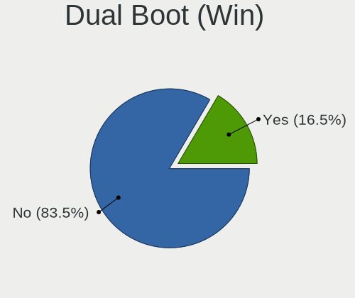

| Dual boot | Desktops | Percent |
|-----------|----------|---------|
| No        | 888      | 72.97%  |
| Yes       | 329      | 27.03%  |

Board
-----

Vendor
------

Motherboard manufacturer

| Name                | Desktops | Percent |
|---------------------|----------|---------|
| ASUSTek Computer    | 285      | 23.77%  |
| Gigabyte Technology | 187      | 15.6%   |
| Dell                | 128      | 10.68%  |
| ASRock              | 104      | 8.67%   |
| MSI                 | 99       | 8.26%   |
| Hewlett-Packard     | 91       | 7.59%   |
| Lenovo              | 55       | 4.59%   |
| Intel               | 40       | 3.34%   |
| Pegatron            | 25       | 2.09%   |
| Acer                | 20       | 1.67%   |
| Foxconn             | 19       | 1.58%   |
| Biostar             | 17       | 1.42%   |
| Unknown             | 17       | 1.42%   |
| Fujitsu             | 15       | 1.25%   |
| ECS                 | 15       | 1.25%   |
| Medion              | 7        | 0.58%   |
| Shuttle             | 6        | 0.5%    |
| Positivo            | 6        | 0.5%    |
| IBM                 | 4        | 0.33%   |
| Apple               | 4        | 0.33%   |
| Alienware           | 4        | 0.33%   |
| Gateway             | 3        | 0.25%   |
| eMachines           | 3        | 0.25%   |
| ABIT                | 3        | 0.25%   |
| ZOTAC               | 2        | 0.17%   |
| WinFast             | 2        | 0.17%   |
| SiS Technology      | 2        | 0.17%   |
| Semp Toshiba        | 2        | 0.17%   |
| Packard Bell        | 2        | 0.17%   |
| Google              | 2        | 0.17%   |
| BESSTAR Tech        | 2        | 0.17%   |
| Xi3                 | 1        | 0.08%   |
| Wortmann AG         | 1        | 0.08%   |
| Wistron             | 1        | 0.08%   |
| TYAN Computer       | 1        | 0.08%   |
| Soyo                | 1        | 0.08%   |
| Sapphire            | 1        | 0.08%   |
| Samsung Electronics | 1        | 0.08%   |
| QDI                 | 1        | 0.08%   |
| Phitronics          | 1        | 0.08%   |
| Philco              | 1        | 0.08%   |
| PCChips             | 1        | 0.08%   |
| OVERPOWERED         | 1        | 0.08%   |
| NEXCOM              | 1        | 0.08%   |
| NEC Computers       | 1        | 0.08%   |
| NCR                 | 1        | 0.08%   |
| MiTAC               | 1        | 0.08%   |
| Maxtone             | 1        | 0.08%   |
| LattePanda          | 1        | 0.08%   |
| JOOYON              | 1        | 0.08%   |
| Jetway              | 1        | 0.08%   |
| Inventec            | 1        | 0.08%   |
| INTELBRAS           | 1        | 0.08%   |
| Huanan              | 1        | 0.08%   |
| EVGA                | 1        | 0.08%   |
| ELSA                | 1        | 0.08%   |
| AOpen               | 1        | 0.08%   |
| AMD                 | 1        | 0.08%   |
| ACTION              | 1        | 0.08%   |

Model
-----

Motherboard model

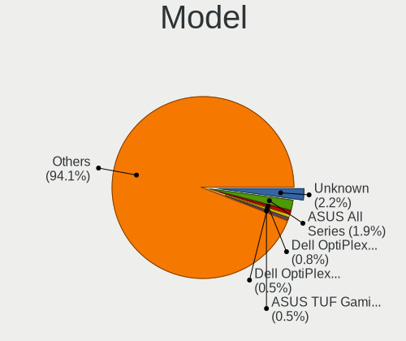

| Name                               | Desktops | Percent |
|------------------------------------|----------|---------|
| ASUS All Series                    | 27       | 2.25%   |
| Unknown                            | 21       | 1.75%   |
| Dell OptiPlex 7010                 | 10       | 0.83%   |
| Gigabyte A320M-S2H                 | 7        | 0.58%   |
| Dell OptiPlex 990                  | 7        | 0.58%   |
| Dell OptiPlex 790                  | 7        | 0.58%   |
| Dell OptiPlex 755                  | 7        | 0.58%   |
| ASUS M5A78L-M/USB3                 | 7        | 0.58%   |
| MSI MS-7C02                        | 6        | 0.5%    |
| Dell OptiPlex 780                  | 6        | 0.5%    |
| ASUS M5A97 R2.0                    | 6        | 0.5%    |
| MSI MS-7817                        | 5        | 0.42%   |
| Gigabyte GA-78LMT-USB3 6.0         | 5        | 0.42%   |
| Gigabyte GA-78LMT-USB3             | 5        | 0.42%   |
| Gigabyte B450 AORUS M              | 5        | 0.42%   |
| Gigabyte 970A-DS3P                 | 5        | 0.42%   |
| Dell Inspiron 3847                 | 5        | 0.42%   |
| MSI MS-7721                        | 4        | 0.33%   |
| HP ProDesk 600 G1 SFF              | 4        | 0.33%   |
| Dell Vostro 200                    | 4        | 0.33%   |
| Dell Precision WorkStation T3500   | 4        | 0.33%   |
| Dell Precision T1600               | 4        | 0.33%   |
| Dell OptiPlex 7040                 | 4        | 0.33%   |
| Dell OptiPlex 380                  | 4        | 0.33%   |
| ASUS TUF Gaming X570-PLUS          | 4        | 0.33%   |
| ASUS P5G41T-M LX3                  | 4        | 0.33%   |
| ASRock N68C-S UCC                  | 4        | 0.33%   |
| ASRock B450M Pro4                  | 4        | 0.33%   |
| MSI MS-7B85                        | 3        | 0.25%   |
| MSI MS-7A38                        | 3        | 0.25%   |
| MSI MS-7693                        | 3        | 0.25%   |
| Intel X79M-S                       | 3        | 0.25%   |
| HP Z600 Workstation                | 3        | 0.25%   |
| HP Compaq 8100 Elite SFF PC        | 3        | 0.25%   |
| HP Compaq 6200 Pro SFF PC          | 3        | 0.25%   |
| HP Compaq 6200 Pro MT PC           | 3        | 0.25%   |
| Gigabyte X570 AORUS ELITE          | 3        | 0.25%   |
| Gigabyte H97M-D3H                  | 3        | 0.25%   |
| Gigabyte G31M-ES2L                 | 3        | 0.25%   |
| Gigabyte B450M DS3H                | 3        | 0.25%   |
| Dell OptiPlex 390                  | 3        | 0.25%   |
| Dell OptiPlex 330                  | 3        | 0.25%   |
| Dell OptiPlex 3010                 | 3        | 0.25%   |
| ASUS UNLOCK INSTALL                | 3        | 0.25%   |
| ASUS P8Z77-V LX                    | 3        | 0.25%   |
| ASUS P5GC-MX/1333                  | 3        | 0.25%   |
| ASUS M5A97 LE R2.0                 | 3        | 0.25%   |
| ASUS K30AD_M31AD_M51AD             | 3        | 0.25%   |
| ASRock B450 Pro4                   | 3        | 0.25%   |
| Semp Toshiba STI                   | 2        | 0.17%   |
| Pegatron NE502AV-ABA a6750t        | 2        | 0.17%   |
| Pegatron Compaq 505B Microtower PC | 2        | 0.17%   |
| Pegatron AW009AV-ABA p6200z        | 2        | 0.17%   |
| Pegatron 320-1030                  | 2        | 0.17%   |
| MSI MS-7D19                        | 2        | 0.17%   |
| MSI MS-7C37                        | 2        | 0.17%   |
| MSI MS-7B89                        | 2        | 0.17%   |
| MSI MS-7B84                        | 2        | 0.17%   |
| MSI MS-7914                        | 2        | 0.17%   |
| MSI MS-7816                        | 2        | 0.17%   |

Model Family
------------

Motherboard model prefix

| Name                   | Desktops | Percent |
|------------------------|----------|---------|
| Dell OptiPlex          | 74       | 6.17%   |
| HP Compaq              | 38       | 3.17%   |
| Lenovo ThinkCentre     | 32       | 2.67%   |
| ASUS PRIME             | 29       | 2.42%   |
| ASUS All               | 27       | 2.25%   |
| ASUS ROG               | 21       | 1.75%   |
| Unknown                | 21       | 1.75%   |
| ASUS TUF               | 18       | 1.5%    |
| Dell Precision         | 13       | 1.08%   |
| Fujitsu ESPRIMO        | 12       | 1%      |
| ASUS M5A78L-M          | 12       | 1%      |
| Acer Aspire            | 12       | 1%      |
| HP EliteDesk           | 11       | 0.92%   |
| Gigabyte GA-78LMT-USB3 | 11       | 0.92%   |
| Gigabyte B450          | 11       | 0.92%   |
| Dell Vostro            | 11       | 0.92%   |
| Dell Inspiron          | 11       | 0.92%   |
| ASUS M5A97             | 11       | 0.92%   |
| Gigabyte X570          | 8        | 0.67%   |
| Lenovo IdeaCentre      | 7        | 0.58%   |
| Gigabyte A320M-S2H     | 7        | 0.58%   |
| ASUS P8H61-M           | 7        | 0.58%   |
| ASUS P5G41T-M          | 7        | 0.58%   |
| MSI MS-7C02            | 6        | 0.5%    |
| HP ProDesk             | 6        | 0.5%    |
| ASRock B450M           | 6        | 0.5%    |
| ASRock B450            | 6        | 0.5%    |
| MSI MS-7817            | 5        | 0.42%   |
| Gigabyte B450M         | 5        | 0.42%   |
| Gigabyte 970A-DS3P     | 5        | 0.42%   |
| Dell XPS               | 5        | 0.42%   |
| ASUS P5KPL-AM          | 5        | 0.42%   |
| ASRock N68C-S          | 5        | 0.42%   |
| Acer Veriton           | 5        | 0.42%   |
| MSI MS-7721            | 4        | 0.33%   |
| Dell Studio            | 4        | 0.33%   |
| ASUS P8Z77-V           | 4        | 0.33%   |
| ASUS P5GC-MX           | 4        | 0.33%   |
| ASRock X570            | 4        | 0.33%   |
| MSI MS-7B85            | 3        | 0.25%   |
| MSI MS-7A38            | 3        | 0.25%   |
| MSI MS-7693            | 3        | 0.25%   |
| Lenovo ThinkStation    | 3        | 0.25%   |
| Intel X79M-S           | 3        | 0.25%   |
| HP Z600                | 3        | 0.25%   |
| Gigabyte H97M-D3H      | 3        | 0.25%   |
| Gigabyte G31M-ES2L     | 3        | 0.25%   |
| Gigabyte G1.Sniper     | 3        | 0.25%   |
| Gigabyte B550          | 3        | 0.25%   |
| ASUS UNLOCK            | 3        | 0.25%   |
| ASUS P5Q               | 3        | 0.25%   |
| ASUS P5K               | 3        | 0.25%   |
| ASUS Maximus           | 3        | 0.25%   |
| ASUS M5A78L            | 3        | 0.25%   |
| ASUS M4A87TD           | 3        | 0.25%   |
| ASUS M2N-MX            | 3        | 0.25%   |
| ASUS M2N-E             | 3        | 0.25%   |
| ASUS K30AD             | 3        | 0.25%   |
| ASRock A320M-HDV       | 3        | 0.25%   |
| ASRock 970             | 3        | 0.25%   |

MFG Year
--------

Motherboard manufacture year

| Year    | Desktops | Percent |
|---------|----------|---------|
| 2011    | 111      | 9.26%   |
| 2012    | 108      | 9.01%   |
| 2013    | 102      | 8.51%   |
| 2010    | 99       | 8.26%   |
| 2018    | 97       | 8.09%   |
| 2009    | 93       | 7.76%   |
| 2014    | 85       | 7.09%   |
| 2008    | 81       | 6.76%   |
| 2007    | 67       | 5.59%   |
| 2019    | 54       | 4.5%    |
| 2017    | 54       | 4.5%    |
| 2020    | 51       | 4.25%   |
| 2015    | 39       | 3.25%   |
| 2021    | 38       | 3.17%   |
| 2016    | 37       | 3.09%   |
| 2006    | 37       | 3.09%   |
| 2005    | 23       | 1.92%   |
| 2004    | 10       | 0.83%   |
| 2003    | 6        | 0.5%    |
| 2022    | 3        | 0.25%   |
| Unknown | 3        | 0.25%   |
| 2002    | 1        | 0.08%   |

Form Factor
-----------

Physical design of the computer

| Name    | Desktops | Percent |
|---------|----------|---------|
| Desktop | 1199     | 100%    |

Secure Boot
-----------

Enabled or disabled

| State    | Desktops | Percent |
|----------|----------|---------|
| Disabled | 1156     | 96.09%  |
| Enabled  | 47       | 3.91%   |

Coreboot
--------

Have coreboot on board

| Used | Desktops | Percent |
|------|----------|---------|
| No   | 1197     | 99.83%  |
| Yes  | 2        | 0.17%   |

RAM Size
--------

Total RAM memory

| Size in GB  | Desktops | Percent |
|-------------|----------|---------|
| 3.01-4.0    | 247      | 20.26%  |
| 8.01-16.0   | 247      | 20.26%  |
| 16.01-24.0  | 233      | 19.11%  |
| 4.01-8.0    | 182      | 14.93%  |
| 32.01-64.0  | 113      | 9.27%   |
| 1.01-2.0    | 93       | 7.63%   |
| 2.01-3.0    | 38       | 3.12%   |
| 64.01-256.0 | 27       | 2.21%   |
| 0.51-1.0    | 23       | 1.89%   |
| 24.01-32.0  | 16       | 1.31%   |

RAM Used
--------

Used RAM memory

| Used GB    | Desktops | Percent |
|------------|----------|---------|
| 1.01-2.0   | 587      | 45.61%  |
| 2.01-3.0   | 309      | 24.01%  |
| 3.01-4.0   | 130      | 10.1%   |
| 0.51-1.0   | 112      | 8.7%    |
| 4.01-8.0   | 108      | 8.39%   |
| 8.01-16.0  | 23       | 1.79%   |
| 0.01-0.5   | 15       | 1.17%   |
| 16.01-24.0 | 3        | 0.23%   |

Total Drives
------------

Number of drives on board

| Drives | Desktops | Percent |
|--------|----------|---------|
| 1      | 601      | 48.74%  |
| 2      | 339      | 27.49%  |
| 3      | 147      | 11.92%  |
| 4      | 63       | 5.11%   |
| 5      | 36       | 2.92%   |
| 6      | 21       | 1.7%    |
| 7      | 9        | 0.73%   |
| 0      | 9        | 0.73%   |
| 8      | 6        | 0.49%   |
| 11     | 1        | 0.08%   |
| 10     | 1        | 0.08%   |

Has CD-ROM
----------

Has CD-ROM on board

| Presented | Desktops | Percent |
|-----------|----------|---------|
| Yes       | 699      | 57.86%  |
| No        | 509      | 42.14%  |

Has Ethernet
------------

Has Ethernet on board

| Presented | Desktops | Percent |
|-----------|----------|---------|
| Yes       | 1184     | 98.75%  |
| No        | 15       | 1.25%   |

Has WiFi
--------

Has WiFi module

| Presented | Desktops | Percent |
|-----------|----------|---------|
| No        | 638      | 52.81%  |
| Yes       | 570      | 47.19%  |

Has Bluetooth
-------------

Has Bluetooth module

| Presented | Desktops | Percent |
|-----------|----------|---------|
| No        | 908      | 74.86%  |
| Yes       | 305      | 25.14%  |

Location
--------

Country
-------

Geographic location (country)

| Country             | Desktops | Percent |
|---------------------|----------|---------|
| USA                 | 301      | 25.06%  |
| Germany             | 113      | 9.41%   |
| Brazil              | 100      | 8.33%   |
| UK                  | 82       | 6.83%   |
| Canada              | 49       | 4.08%   |
| Netherlands         | 40       | 3.33%   |
| Italy               | 39       | 3.25%   |
| Spain               | 32       | 2.66%   |
| France              | 29       | 2.41%   |
| Poland              | 28       | 2.33%   |
| India               | 27       | 2.25%   |
| Australia           | 23       | 1.92%   |
| Argentina           | 22       | 1.83%   |
| Mexico              | 16       | 1.33%   |
| Hungary             | 15       | 1.25%   |
| Russia              | 14       | 1.17%   |
| Sweden              | 13       | 1.08%   |
| South Africa        | 13       | 1.08%   |
| Indonesia           | 13       | 1.08%   |
| Switzerland         | 12       | 1%      |
| Greece              | 11       | 0.92%   |
| Denmark             | 11       | 0.92%   |
| Norway              | 10       | 0.83%   |
| Serbia              | 9        | 0.75%   |
| Portugal            | 9        | 0.75%   |
| Czechia             | 9        | 0.75%   |
| Colombia            | 9        | 0.75%   |
| Chile               | 9        | 0.75%   |
| Ukraine             | 7        | 0.58%   |
| Romania             | 7        | 0.58%   |
| Japan               | 7        | 0.58%   |
| Turkey              | 6        | 0.5%    |
| Bulgaria            | 6        | 0.5%    |
| Belgium             | 6        | 0.5%    |
| Austria             | 6        | 0.5%    |
| Philippines         | 5        | 0.42%   |
| Peru                | 5        | 0.42%   |
| Malaysia            | 5        | 0.42%   |
| Egypt               | 5        | 0.42%   |
| Croatia             | 5        | 0.42%   |
| Slovenia            | 4        | 0.33%   |
| Thailand            | 3        | 0.25%   |
| Taiwan              | 3        | 0.25%   |
| Pakistan            | 3        | 0.25%   |
| New Zealand         | 3        | 0.25%   |
| Bangladesh          | 3        | 0.25%   |
| Vietnam             | 2        | 0.17%   |
| Venezuela           | 2        | 0.17%   |
| Trinidad and Tobago | 2        | 0.17%   |
| South Korea         | 2        | 0.17%   |
| Slovakia            | 2        | 0.17%   |
| Puerto Rico         | 2        | 0.17%   |
| Palestine           | 2        | 0.17%   |
| Nicaragua           | 2        | 0.17%   |
| Kenya               | 2        | 0.17%   |
| Israel              | 2        | 0.17%   |
| Iran                | 2        | 0.17%   |
| El Salvador         | 2        | 0.17%   |
| Ecuador             | 2        | 0.17%   |
| Costa Rica          | 2        | 0.17%   |

City
----

Geographic location (city)

| City           | Desktops | Percent |
|----------------|----------|---------|
| Sao Paulo      | 13       | 1.05%   |
| Berlin         | 10       | 0.81%   |
| Athens         | 10       | 0.81%   |
| Rio de Janeiro | 9        | 0.73%   |
| Zurich         | 6        | 0.49%   |
| Vienna         | 6        | 0.49%   |
| Toronto        | 6        | 0.49%   |
| Munich         | 6        | 0.49%   |
| Milan          | 6        | 0.49%   |
| Cape Town      | 6        | 0.49%   |
| Buenos Aires   | 6        | 0.49%   |
| Bogot        | 6        | 0.49%   |
| Warsaw         | 5        | 0.4%    |
| Sydney         | 5        | 0.4%    |
| Rome           | 5        | 0.4%    |
| Perth          | 5        | 0.4%    |
| London         | 5        | 0.4%    |
| Houston        | 5        | 0.4%    |
| Denver         | 5        | 0.4%    |
| Dayton         | 5        | 0.4%    |
| Dallas         | 5        | 0.4%    |
| Copenhagen     | 5        | 0.4%    |
| Budapest       | 5        | 0.4%    |
| Braslia      | 5        | 0.4%    |
| Belgrade       | 5        | 0.4%    |
| Yogyakarta     | 4        | 0.32%   |
| The Hague      | 4        | 0.32%   |
| San Jose       | 4        | 0.32%   |
| Rotterdam      | 4        | 0.32%   |
| Richmond       | 4        | 0.32%   |
| Portland       | 4        | 0.32%   |
| Mentor         | 4        | 0.32%   |
| Las Vegas      | 4        | 0.32%   |
| Fortaleza      | 4        | 0.32%   |
| Elgin          | 4        | 0.32%   |
| East Tawas     | 4        | 0.32%   |
| Bengaluru      | 4        | 0.32%   |
| Adelaide       | 4        | 0.32%   |
| Wigan          | 3        | 0.24%   |
| Twickenham     | 3        | 0.24%   |
| Trujillo       | 3        | 0.24%   |
| Stoke-on-Trent | 3        | 0.24%   |
| Santo Andr   | 3        | 0.24%   |
| Santiago       | 3        | 0.24%   |
| San Francisco  | 3        | 0.24%   |
| Salvador       | 3        | 0.24%   |
| Pretoria       | 3        | 0.24%   |
| Oslo           | 3        | 0.24%   |
| Osasco         | 3        | 0.24%   |
| Orlando        | 3        | 0.24%   |
| Nottingham     | 3        | 0.24%   |
| Montreal       | 3        | 0.24%   |
| Melbourne      | 3        | 0.24%   |
| Manchester     | 3        | 0.24%   |
| Los Angeles    | 3        | 0.24%   |
| Laval          | 3        | 0.24%   |
| Kyiv           | 3        | 0.24%   |
| Johannesburg   | 3        | 0.24%   |
| Jakarta        | 3        | 0.24%   |
| Hemmingen      | 3        | 0.24%   |

Drives
------

Drive Vendor
------------

Hard drive vendors

| Vendor                    | Desktops | Drives | Percent |
|---------------------------|----------|--------|---------|
| Seagate                   | 432      | 633    | 21.86%  |
| WDC                       | 384      | 530    | 19.43%  |
| Samsung Electronics       | 252      | 382    | 12.75%  |
| Kingston                  | 126      | 158    | 6.38%   |
| Hitachi                   | 112      | 135    | 5.67%   |
| Toshiba                   | 96       | 123    | 4.86%   |
| SanDisk                   | 93       | 115    | 4.71%   |
| Crucial                   | 54       | 68     | 2.73%   |
| Maxtor                    | 37       | 51     | 1.87%   |
| Phison                    | 29       | 38     | 1.47%   |
| Intel                     | 22       | 27     | 1.11%   |
| A-DATA Technology         | 22       | 26     | 1.11%   |
| China                     | 21       | 23     | 1.06%   |
| Unknown                   | 19       | 38     | 0.96%   |
| Silicon Motion            | 19       | 27     | 0.96%   |
| PNY                       | 15       | 19     | 0.76%   |
| OCZ                       | 15       | 17     | 0.76%   |
| HGST                      | 14       | 17     | 0.71%   |
| SPCC                      | 10       | 12     | 0.51%   |
| Micron Technology         | 9        | 10     | 0.46%   |
| Intenso                   | 9        | 11     | 0.46%   |
| Hewlett-Packard           | 9        | 13     | 0.46%   |
| Gigabyte Technology       | 9        | 17     | 0.46%   |
| Micron/Crucial Technology | 8        | 8      | 0.4%    |
| Corsair                   | 8        | 9      | 0.4%    |
| JMicron Technology        | 7        | 11     | 0.35%   |
| XPG                       | 6        | 7      | 0.3%    |
| Transcend                 | 6        | 7      | 0.3%    |
| SK hynix                  | 6        | 10     | 0.3%    |
| SABRENT                   | 6        | 6      | 0.3%    |
| Lexar                     | 6        | 6      | 0.3%    |
| Realtek Semiconductor     | 5        | 5      | 0.25%   |
| Patriot                   | 5        | 12     | 0.25%   |
| Goodram                   | 5        | 5      | 0.25%   |
| Apple                     | 5        | 5      | 0.25%   |
| Apacer                    | 5        | 5      | 0.25%   |
| XrayDisk                  | 4        | 5      | 0.2%    |
| Super Talent              | 4        | 5      | 0.2%    |
| Leven                     | 4        | 4      | 0.2%    |
| KingSpec                  | 4        | 5      | 0.2%    |
| Plextor                   | 3        | 4      | 0.15%   |
| Pioneer                   | 3        | 3      | 0.15%   |
| Netac                     | 3        | 3      | 0.15%   |
| LITEON                    | 3        | 4      | 0.15%   |
| WD MediaMax               | 2        | 4      | 0.1%    |
| Verbatim                  | 2        | 2      | 0.1%    |
| USB3.0                    | 2        | 3      | 0.1%    |
| Team                      | 2        | 3      | 0.1%    |
| TCSUNBOW                  | 2        | 2      | 0.1%    |
| OWC                       | 2        | 2      | 0.1%    |
| Mushkin                   | 2        | 2      | 0.1%    |
| LITEONIT                  | 2        | 2      | 0.1%    |
| KIOXIA-EXCERIA            | 2        | 5      | 0.1%    |
| KingFast                  | 2        | 2      | 0.1%    |
| HS-SSD-C100               | 2        | 2      | 0.1%    |
| Drevo                     | 2        | 2      | 0.1%    |
| Dogfish                   | 2        | 3      | 0.1%    |
| Unknown                   | 2        | 2      | 0.1%    |
| Zheino                    | 1        | 1      | 0.05%   |
| WALRAM                    | 1        | 1      | 0.05%   |

Drive Model
-----------

Hard drive models

| Model                                  | Desktops | Percent |
|----------------------------------------|----------|---------|
| Seagate ST500DM002-1BD142 500GB        | 39       | 1.73%   |
| Kingston SA400S37240G 240GB SSD        | 34       | 1.51%   |
| Seagate ST1000DM010-2EP102 1TB         | 26       | 1.15%   |
| Seagate ST3500418AS 500GB              | 23       | 1.02%   |
| Samsung SSD 860 EVO 500GB              | 22       | 0.98%   |
| WDC WD10EZEX-08WN4A0 1TB               | 19       | 0.84%   |
| Samsung SM963 2.5" NVMe PCIe SSD 500GB | 19       | 0.84%   |
| Toshiba DT01ACA100 1TB                 | 18       | 0.8%    |
| Samsung SSD 850 EVO 250GB              | 18       | 0.8%    |
| Samsung NVMe SSD Drive 1TB             | 18       | 0.8%    |
| Seagate ST1000DM003-1CH162 1TB         | 17       | 0.75%   |
| Kingston SV300S37A120G 120GB SSD       | 17       | 0.75%   |
| Kingston SA400S37120G 120GB SSD        | 17       | 0.75%   |
| Seagate ST1000DM003-1ER162 1TB         | 16       | 0.71%   |
| Kingston SA400S37480G 480GB SSD        | 14       | 0.62%   |
| Toshiba HDWD110 1TB                    | 13       | 0.58%   |
| Seagate ST3500413AS 500GB              | 13       | 0.58%   |
| Samsung SSD 850 EVO 500GB              | 13       | 0.58%   |
| Crucial CT240BX500SSD1 240GB           | 13       | 0.58%   |
| Seagate ST3500312CS 500GB              | 11       | 0.49%   |
| Samsung SSD 840 EVO 250GB              | 11       | 0.49%   |
| Samsung HD103SJ 1TB                    | 11       | 0.49%   |
| Crucial CT500MX500SSD1 500GB           | 11       | 0.49%   |
| Toshiba DT01ACA050 500GB               | 10       | 0.44%   |
| SanDisk NVMe SSD Drive 500GB           | 10       | 0.44%   |
| Seagate ST4000DM000-1F2168 4TB         | 9        | 0.4%    |
| SanDisk SSD PLUS 240GB                 | 9        | 0.4%    |
| Hitachi HDS721616PLA380 160GB          | 9        | 0.4%    |
| WDC WD20EZRZ-00Z5HB0 2TB               | 8        | 0.35%   |
| WDC WD10EZEX-00WN4A0 1TB               | 8        | 0.35%   |
| WDC WD10EZEX-00BN5A0 1TB               | 8        | 0.35%   |
| Unknown SD/MMC/MS PRO 128GB            | 8        | 0.35%   |
| Toshiba DT01ACA200 2TB                 | 8        | 0.35%   |
| Seagate ST4000DM004-2CV104 4TB         | 8        | 0.35%   |
| Seagate ST3250310AS 250GB              | 8        | 0.35%   |
| Seagate ST31000528AS 1TB               | 8        | 0.35%   |
| Seagate ST2000DM008-2FR102 2TB         | 8        | 0.35%   |
| Seagate ST2000DM001-1ER164 2TB         | 8        | 0.35%   |
| Seagate ST2000DM001-1CH164 2TB         | 8        | 0.35%   |
| Seagate ST1000DM003-1SB102 1TB         | 8        | 0.35%   |
| SanDisk SDSSDA240G 240GB               | 8        | 0.35%   |
| SanDisk NVMe SSD Drive 1TB             | 8        | 0.35%   |
| Seagate ST3250318AS 250GB              | 7        | 0.31%   |
| Seagate ST31000524AS 1TB               | 7        | 0.31%   |
| Seagate Expansion+ Desk 4TB            | 7        | 0.31%   |
| Seagate Expansion 1TB                  | 7        | 0.31%   |
| Samsung SSD 860 EVO 250GB              | 7        | 0.31%   |
| Phison NVMe SSD Drive 1TB              | 7        | 0.31%   |
| Crucial CT1000MX500SSD1 1TB            | 7        | 0.31%   |
| WDC WDS240G2G0A-00JH30 240GB SSD       | 6        | 0.27%   |
| WDC WD800JD-75MSA3 80GB                | 6        | 0.27%   |
| Seagate ST3320820AS 320GB              | 6        | 0.27%   |
| Seagate ST3320418AS 320GB              | 6        | 0.27%   |
| Seagate ST1000DM003-9YN162 1TB         | 6        | 0.27%   |
| Samsung SSD 870 QVO 1TB                | 6        | 0.27%   |
| Samsung SSD 870 EVO 1TB                | 6        | 0.27%   |
| Samsung SSD 840 EVO 120GB              | 6        | 0.27%   |
| Samsung NVMe SSD Drive 250GB           | 6        | 0.27%   |
| Samsung HD502HI 500GB                  | 6        | 0.27%   |
| Samsung HD322HJ 320GB                  | 6        | 0.27%   |

HDD Vendor
----------

Hard disk drive vendors

| Vendor              | Desktops | Drives | Percent |
|---------------------|----------|--------|---------|
| Seagate             | 427      | 619    | 37.39%  |
| WDC                 | 365      | 496    | 31.96%  |
| Hitachi             | 112      | 135    | 9.81%   |
| Toshiba             | 85       | 112    | 7.44%   |
| Samsung Electronics | 79       | 104    | 6.92%   |
| Maxtor              | 36       | 50     | 3.15%   |
| HGST                | 14       | 17     | 1.23%   |
| Unknown             | 8        | 11     | 0.7%    |
| JMicron Technology  | 4        | 7      | 0.35%   |
| Hewlett-Packard     | 3        | 6      | 0.26%   |
| Apple               | 3        | 3      | 0.26%   |
| USB3.0              | 1        | 2      | 0.09%   |
| Quantum             | 1        | 1      | 0.09%   |
| Fujitsu             | 1        | 1      | 0.09%   |
| ExcelStor           | 1        | 1      | 0.09%   |
| ASMT109x            | 1        | 2      | 0.09%   |
| ASMT                | 1        | 1      | 0.09%   |

SSD Vendor
----------

Solid state drive vendors

| Vendor              | Desktops | Drives | Percent |
|---------------------|----------|--------|---------|
| Samsung Electronics | 135      | 192    | 21.13%  |
| Kingston            | 111      | 139    | 17.37%  |
| SanDisk             | 71       | 87     | 11.11%  |
| Crucial             | 53       | 67     | 8.29%   |
| WDC                 | 28       | 32     | 4.38%   |
| A-DATA Technology   | 21       | 25     | 3.29%   |
| China               | 20       | 22     | 3.13%   |
| Intel               | 18       | 22     | 2.82%   |
| PNY                 | 15       | 19     | 2.35%   |
| OCZ                 | 14       | 16     | 2.19%   |
| SPCC                | 9        | 11     | 1.41%   |
| Intenso             | 9        | 11     | 1.41%   |
| Micron Technology   | 8        | 9      | 1.25%   |
| Gigabyte Technology | 8        | 15     | 1.25%   |
| Toshiba             | 7        | 7      | 1.1%    |
| Corsair             | 7        | 8      | 1.1%    |
| Transcend           | 6        | 7      | 0.94%   |
| Lexar               | 6        | 6      | 0.94%   |
| Hewlett-Packard     | 6        | 7      | 0.94%   |
| Patriot             | 5        | 12     | 0.78%   |
| Goodram             | 5        | 5      | 0.78%   |
| Apacer              | 5        | 5      | 0.78%   |
| Super Talent        | 4        | 5      | 0.63%   |
| Leven               | 4        | 4      | 0.63%   |
| KingSpec            | 4        | 5      | 0.63%   |
| SK hynix            | 3        | 3      | 0.47%   |
| Seagate             | 3        | 4      | 0.47%   |
| Plextor             | 3        | 4      | 0.47%   |
| Pioneer             | 3        | 3      | 0.47%   |
| Netac               | 3        | 3      | 0.47%   |
| LITEON              | 3        | 4      | 0.47%   |
| Verbatim            | 2        | 2      | 0.31%   |
| Team                | 2        | 3      | 0.31%   |
| TCSUNBOW            | 2        | 2      | 0.31%   |
| OWC                 | 2        | 2      | 0.31%   |
| Mushkin             | 2        | 2      | 0.31%   |
| LITEONIT            | 2        | 2      | 0.31%   |
| KIOXIA-EXCERIA      | 2        | 5      | 0.31%   |
| Drevo               | 2        | 2      | 0.31%   |
| Dogfish             | 2        | 3      | 0.31%   |
| Zheino              | 1        | 1      | 0.16%   |
| USB3.0              | 1        | 1      | 0.16%   |
| TwinMOS             | 1        | 1      | 0.16%   |
| TSA                 | 1        | 1      | 0.16%   |
| TO Exter            | 1        | 1      | 0.16%   |
| Teclast             | 1        | 1      | 0.16%   |
| SuperSSpeed         | 1        | 2      | 0.16%   |
| Smartbuy            | 1        | 1      | 0.16%   |
| S3+                 | 1        | 1      | 0.16%   |
| Phison              | 1        | 1      | 0.16%   |
| ORTIAL              | 1        | 1      | 0.16%   |
| OCZ-VERTEX          | 1        | 1      | 0.16%   |
| MyDigitalSSD        | 1        | 1      | 0.16%   |
| Maxtor              | 1        | 1      | 0.16%   |
| Integral            | 1        | 1      | 0.16%   |
| INNOVATION IT       | 1        | 1      | 0.16%   |
| Hikvision           | 1        | 1      | 0.16%   |
| GALAX               | 1        | 1      | 0.16%   |
| FORESEE             | 1        | 1      | 0.16%   |
| Apple               | 1        | 1      | 0.16%   |

Drive Kind
----------

HDD or SSD

| Kind    | Desktops | Drives | Percent |
|---------|----------|--------|---------|
| HDD     | 886      | 1568   | 53.73%  |
| SSD     | 540      | 808    | 32.75%  |
| NVMe    | 180      | 254    | 10.92%  |
| Unknown | 40       | 59     | 2.43%   |
| MMC     | 3        | 4      | 0.18%   |

Drive Connector
---------------

SATA, SAS, NVMe, etc.

| Type | Desktops | Drives | Percent |
|------|----------|--------|---------|
| SATA | 1138     | 2331   | 81.64%  |
| NVMe | 175      | 247    | 12.55%  |
| SAS  | 78       | 111    | 5.6%    |
| MMC  | 3        | 4      | 0.22%   |

Drive Size
----------

Size of hard drive

| Size in TB | Desktops | Drives | Percent |
|------------|----------|--------|---------|
| 0.01-0.5   | 908      | 1453   | 59.66%  |
| 0.51-1.0   | 380      | 565    | 24.97%  |
| 1.01-2.0   | 131      | 195    | 8.61%   |
| 3.01-4.0   | 50       | 86     | 3.29%   |
| 4.01-10.0  | 28       | 38     | 1.84%   |
| 2.01-3.0   | 25       | 39     | 1.64%   |

Space Total
-----------

Amount of disk space available on the file system

| Size in GB     | Desktops | Percent |
|----------------|----------|---------|
| 101-250        | 365      | 29.41%  |
| 251-500        | 275      | 22.16%  |
| 501-1000       | 171      | 13.78%  |
| 51-100         | 112      | 9.02%   |
| 1001-2000      | 91       | 7.33%   |
| More than 3000 | 77       | 6.2%    |
| 21-50          | 60       | 4.83%   |
| 2001-3000      | 40       | 3.22%   |
| 1-20           | 40       | 3.22%   |
| Unknown        | 10       | 0.81%   |

Space Used
----------

Amount of used disk space

| Used GB        | Desktops | Percent |
|----------------|----------|---------|
| 1-20           | 591      | 45.92%  |
| 21-50          | 246      | 19.11%  |
| 51-100         | 136      | 10.57%  |
| 101-250        | 96       | 7.46%   |
| 251-500        | 68       | 5.28%   |
| 501-1000       | 51       | 3.96%   |
| 1001-2000      | 45       | 3.5%    |
| More than 3000 | 33       | 2.56%   |
| 2001-3000      | 11       | 0.85%   |
| Unknown        | 10       | 0.78%   |

Malfunc. Drives
---------------

Drive models with a malfunction

| Model                                | Desktops | Drives | Percent |
|--------------------------------------|----------|--------|---------|
| WDC WD5000AAKS-00V1A0 500GB          | 1        | 1      | 5%      |
| WDC WD3200AAKS-22B3A0 320GB          | 1        | 1      | 5%      |
| WDC WD30EFRX-68EUZN0 3TB             | 1        | 1      | 5%      |
| WDC WD10EZEX-21M2NA0 1TB             | 1        | 2      | 5%      |
| WDC WD10EURX-63FH1Y0 1TB             | 1        | 1      | 5%      |
| Toshiba MK3265GSX 320GB              | 1        | 1      | 5%      |
| Toshiba MG03ACA200 2TB               | 1        | 1      | 5%      |
| Silicon Motion Inland NVMe SSD 256GB | 1        | 1      | 5%      |
| Seagate ST9500420AS 500GB            | 1        | 1      | 5%      |
| Seagate ST4000DM004-2CV104 4TB       | 1        | 1      | 5%      |
| Seagate ST3500514NS 500GB            | 1        | 1      | 5%      |
| Seagate ST3500413AS 500GB            | 1        | 1      | 5%      |
| Seagate ST3320620AS 320GB            | 1        | 1      | 5%      |
| Seagate ST2000LM003 HN-M201RAD 2TB   | 1        | 1      | 5%      |
| Seagate ST2000DM001-9YN164 2TB       | 1        | 1      | 5%      |
| Seagate ST2000DL003-9VT166 2TB       | 1        | 1      | 5%      |
| Seagate ST1000DM003-1ER162 1TB       | 1        | 1      | 5%      |
| OCZ VERTEX3 120GB SSD                | 1        | 1      | 5%      |
| Kingston SNS4151S316GD 16GB SSD      | 1        | 1      | 5%      |
| A-DATA Technology SX8200PNP 256GB    | 1        | 1      | 5%      |

Malfunc. Drive Vendor
---------------------

Vendors of faulty drives

| Vendor            | Desktops | Drives | Percent |
|-------------------|----------|--------|---------|
| Seagate           | 8        | 9      | 42.11%  |
| WDC               | 5        | 6      | 26.32%  |
| Toshiba           | 2        | 2      | 10.53%  |
| Silicon Motion    | 1        | 1      | 5.26%   |
| OCZ               | 1        | 1      | 5.26%   |
| Kingston          | 1        | 1      | 5.26%   |
| A-DATA Technology | 1        | 1      | 5.26%   |

Malfunc. HDD Vendor
-------------------

Vendors of faulty HDD drives

| Vendor  | Desktops | Drives | Percent |
|---------|----------|--------|---------|
| Seagate | 8        | 9      | 53.33%  |
| WDC     | 5        | 6      | 33.33%  |
| Toshiba | 2        | 2      | 13.33%  |

Malfunc. Drive Kind
-------------------

Kinds of faulty drives

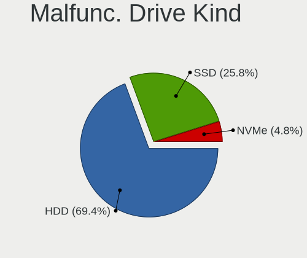

| Kind | Desktops | Drives | Percent |
|------|----------|--------|---------|
| HDD  | 14       | 17     | 77.78%  |
| NVMe | 2        | 2      | 11.11%  |
| SSD  | 2        | 2      | 11.11%  |

Failed Drives
-------------

Failed drive models

Zero info for selected period =(

Failed Drive Vendor
-------------------

Failed drive vendors

Zero info for selected period =(

Drive Status
------------

Number of failed and malfunc. drives

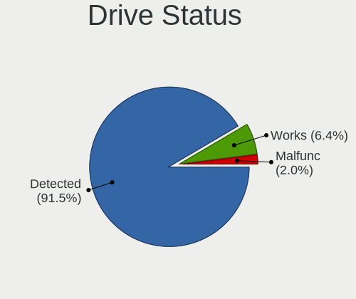

| Status   | Desktops | Drives | Percent |
|----------|----------|--------|---------|
| Detected | 1139     | 2535   | 93.36%  |
| Works    | 63       | 137    | 5.16%   |
| Malfunc  | 18       | 21     | 1.48%   |

Storage controller
------------------

Storage Vendor
--------------

Storage controller vendors

| Vendor                           | Desktops | Percent |
|----------------------------------|----------|---------|
| Intel                            | 768      | 50.36%  |
| AMD                              | 339      | 22.23%  |
| Nvidia                           | 68       | 4.46%   |
| Samsung Electronics              | 62       | 4.07%   |
| JMicron Technology               | 43       | 2.82%   |
| ASMedia Technology               | 41       | 2.69%   |
| Phison Electronics               | 31       | 2.03%   |
| Marvell Technology Group         | 29       | 1.9%    |
| SanDisk                          | 24       | 1.57%   |
| VIA Technologies                 | 23       | 1.51%   |
| Silicon Motion                   | 19       | 1.25%   |
| Kingston Technology Company      | 18       | 1.18%   |
| Silicon Image                    | 10       | 0.66%   |
| Micron/Crucial Technology        | 9        | 0.59%   |
| Silicon Integrated Systems [SiS] | 6        | 0.39%   |
| ADATA Technology                 | 6        | 0.39%   |
| Realtek Semiconductor            | 5        | 0.33%   |
| Broadcom / LSI                   | 5        | 0.33%   |
| Toshiba America Info Systems     | 3        | 0.2%    |
| SK hynix                         | 3        | 0.2%    |
| Seagate Technology               | 2        | 0.13%   |
| Union Memory (Shenzhen)          | 1        | 0.07%   |
| Promise Technology               | 1        | 0.07%   |
| OCZ Technology Group             | 1        | 0.07%   |
| Micron Technology                | 1        | 0.07%   |
| LSI Logic / Symbios Logic        | 1        | 0.07%   |
| Lite-On IT Corp. / Plextor       | 1        | 0.07%   |
| KIOXIA                           | 1        | 0.07%   |
| Integrated Technology Express    | 1        | 0.07%   |
| Hewlett-Packard                  | 1        | 0.07%   |
| Apple                            | 1        | 0.07%   |
| Adaptec                          | 1        | 0.07%   |

Storage Model
-------------

Storage controller models

| Model                                                                                   | Desktops | Percent |
|-----------------------------------------------------------------------------------------|----------|---------|
| AMD FCH SATA Controller [AHCI mode]                                                     | 169      | 8.14%   |
| Intel NM10/ICH7 Family SATA Controller [IDE mode]                                       | 112      | 5.4%    |
| Intel 8 Series/C220 Series Chipset Family 6-port SATA Controller 1 [AHCI mode]          | 92       | 4.43%   |
| Intel 82801G (ICH7 Family) IDE Controller                                               | 90       | 4.34%   |
| AMD SB7x0/SB8x0/SB9x0 IDE Controller                                                    | 78       | 3.76%   |
| Intel 6 Series/C200 Series Chipset Family 6 port Desktop SATA AHCI Controller           | 76       | 3.66%   |
| AMD SB7x0/SB8x0/SB9x0 SATA Controller [IDE mode]                                        | 64       | 3.08%   |
| AMD 400 Series Chipset SATA Controller                                                  | 57       | 2.75%   |
| Intel SATA Controller [RAID mode]                                                       | 55       | 2.65%   |
| AMD SB7x0/SB8x0/SB9x0 SATA Controller [AHCI mode]                                       | 53       | 2.55%   |
| Intel 7 Series/C210 Series Chipset Family 6-port SATA Controller [AHCI mode]            | 40       | 1.93%   |
| Intel Q170/Q150/B150/H170/H110/Z170/CM236 Chipset SATA Controller [AHCI Mode]           | 38       | 1.83%   |
| Nvidia MCP61 SATA Controller                                                            | 37       | 1.78%   |
| ASMedia ASM1062 Serial ATA Controller                                                   | 37       | 1.78%   |
| Samsung NVMe SSD Controller SM981/PM981/PM983                                           | 36       | 1.73%   |
| Intel 6 Series/C200 Series Chipset Family Desktop SATA Controller (IDE mode, ports 4-5) | 36       | 1.73%   |
| Intel 6 Series/C200 Series Chipset Family Desktop SATA Controller (IDE mode, ports 0-3) | 35       | 1.69%   |
| Nvidia MCP61 IDE                                                                        | 25       | 1.2%    |
| Intel Cannon Lake PCH SATA AHCI Controller                                              | 25       | 1.2%    |
| JMicron JMB363 SATA/IDE Controller                                                      | 23       | 1.11%   |
| Intel 82801I (ICH9 Family) 2 port SATA Controller [IDE mode]                            | 23       | 1.11%   |
| Intel 200 Series PCH SATA controller [AHCI mode]                                        | 22       | 1.06%   |
| Intel 9 Series Chipset Family SATA Controller [AHCI Mode]                               | 21       | 1.01%   |
| Intel 82801JI (ICH10 Family) SATA AHCI Controller                                       | 20       | 0.96%   |
| Intel 82801JI (ICH10 Family) 4 port SATA IDE Controller #1                              | 20       | 0.96%   |
| Intel 82801JI (ICH10 Family) 2 port SATA IDE Controller #2                              | 20       | 0.96%   |
| Intel 82801IR/IO/IH (ICH9R/DO/DH) 4 port SATA Controller [IDE mode]                     | 19       | 0.92%   |
| AMD FCH SATA Controller D                                                               | 18       | 0.87%   |
| AMD 500 Series Chipset SATA Controller                                                  | 18       | 0.87%   |
| Phison E12 NVMe Controller                                                              | 17       | 0.82%   |
| Intel 500 Series Chipset Family SATA AHCI Controller                                    | 17       | 0.82%   |
| VIA VT82C586A/B/VT82C686/A/B/VT823x/A/C PIPC Bus Master IDE                             | 16       | 0.77%   |
| Intel 5 Series/3400 Series Chipset 4 port SATA IDE Controller                           | 16       | 0.77%   |
| JMicron JMB368 IDE controller                                                           | 15       | 0.72%   |
| Intel 5 Series/3400 Series Chipset 2 port SATA IDE Controller                           | 15       | 0.72%   |
| Samsung NVMe SSD Controller PM9A1/PM9A3/980PRO                                          | 14       | 0.67%   |
| Intel 82Q35 Express PT IDER Controller                                                  | 14       | 0.67%   |
| Intel 4 Series Chipset PT IDER Controller                                               | 14       | 0.67%   |
| Silicon Motion SM2263EN/SM2263XT SSD Controller                                         | 13       | 0.63%   |
| Intel 82801EB/ER (ICH5/ICH5R) IDE Controller                                            | 13       | 0.63%   |
| AMD FCH IDE Controller                                                                  | 13       | 0.63%   |
| Intel 82801IR/IO/IH (ICH9R/DO/DH) 6 port SATA Controller [AHCI mode]                    | 11       | 0.53%   |
| Intel 5 Series/3400 Series Chipset 6 port SATA AHCI Controller                          | 11       | 0.53%   |
| AMD FCH SATA Controller [IDE mode]                                                      | 11       | 0.53%   |
| AMD 300 Series Chipset SATA Controller                                                  | 11       | 0.53%   |
| Samsung NVMe SSD Controller SM961/PM961/SM963                                           | 10       | 0.48%   |
| Intel 82801EB (ICH5) SATA Controller                                                    | 10       | 0.48%   |
| Intel 7 Series/C210 Series Chipset Family 4-port SATA Controller [IDE mode]             | 10       | 0.48%   |
| Intel 7 Series/C210 Series Chipset Family 2-port SATA Controller [IDE mode]             | 10       | 0.48%   |
| Phison E16 PCIe4 NVMe Controller                                                        | 9        | 0.43%   |
| Nvidia MCP73 IDE Controller                                                             | 9        | 0.43%   |
| Kingston Company A2000 NVMe SSD                                                         | 9        | 0.43%   |
| Intel 400 Series Chipset Family SATA AHCI Controller                                    | 9        | 0.43%   |
| AMD X370 Series Chipset SATA Controller                                                 | 9        | 0.43%   |
| VIA VIA VT6420 SATA RAID Controller                                                     | 8        | 0.39%   |
| Nvidia MCP51 Serial ATA Controller                                                      | 8        | 0.39%   |
| Intel 82801JD/DO (ICH10 Family) SATA AHCI Controller                                    | 8        | 0.39%   |
| SanDisk WD Blue SN550 NVMe SSD                                                          | 7        | 0.34%   |
| Intel C600/X79 series chipset 6-Port SATA AHCI Controller                               | 7        | 0.34%   |
| Intel 82801FB/FW (ICH6/ICH6W) SATA Controller                                           | 7        | 0.34%   |

Storage Kind
------------

Kind of storage controller (IDE, SATA, NVMe, SAS, ...)

| Kind | Desktops | Percent |
|------|----------|---------|
| SATA | 801      | 50.86%  |
| IDE  | 495      | 31.43%  |
| NVMe | 174      | 11.05%  |
| RAID | 95       | 6.03%   |
| SAS  | 5        | 0.32%   |
| SCSI | 5        | 0.32%   |

Processor
---------

CPU Vendor
----------

Processor vendors

| Vendor | Desktops | Percent |
|--------|----------|---------|
| Intel  | 799      | 66.64%  |
| AMD    | 400      | 33.36%  |

CPU Model
---------

Processor models

| Model                                       | Desktops | Percent |
|---------------------------------------------|----------|---------|
| Intel Core i5-2400 CPU @ 3.10GHz            | 28       | 2.33%   |
| Intel Core 2 Duo CPU E8400 @ 3.00GHz        | 22       | 1.83%   |
| AMD Ryzen 5 3600 6-Core Processor           | 18       | 1.5%    |
| Intel Core i7-4790 CPU @ 3.60GHz            | 14       | 1.16%   |
| Intel Core i5-3470 CPU @ 3.20GHz            | 13       | 1.08%   |
| Intel Core 2 Quad CPU Q6600 @ 2.40GHz       | 13       | 1.08%   |
| Intel Pentium 4 CPU 3.00GHz                 | 12       | 1%      |
| AMD FX-6300 Six-Core Processor              | 12       | 1%      |
| Intel Pentium Dual-Core CPU E5700 @ 3.00GHz | 11       | 0.91%   |
| Intel Core i7-2600 CPU @ 3.40GHz            | 11       | 0.91%   |
| Intel Core i5-4460 CPU @ 3.20GHz            | 10       | 0.83%   |
| Intel Core i3-3220 CPU @ 3.30GHz            | 10       | 0.83%   |
| AMD Ryzen 7 2700X Eight-Core Processor      | 10       | 0.83%   |
| AMD Ryzen 5 5600X 6-Core Processor          | 10       | 0.83%   |
| AMD Ryzen 5 2600 Six-Core Processor         | 10       | 0.83%   |
| AMD Ryzen 3 2200G with Radeon Vega Graphics | 10       | 0.83%   |
| AMD FX-8350 Eight-Core Processor            | 10       | 0.83%   |
| Intel Pentium Dual-Core CPU E5300 @ 2.60GHz | 9        | 0.75%   |
| Intel Pentium Dual CPU E2160 @ 1.80GHz      | 9        | 0.75%   |
| Intel Pentium Dual CPU E2140 @ 1.60GHz      | 9        | 0.75%   |
| Intel Core i7-6700 CPU @ 3.40GHz            | 9        | 0.75%   |
| Intel Core i3-2120 CPU @ 3.30GHz            | 9        | 0.75%   |
| Intel Pentium Dual CPU E2200 @ 2.20GHz      | 8        | 0.67%   |
| Intel Core i7-4790K CPU @ 4.00GHz           | 8        | 0.67%   |
| Intel Core i5-3570 CPU @ 3.40GHz            | 8        | 0.67%   |
| Intel Core i3-8100 CPU @ 3.60GHz            | 8        | 0.67%   |
| Intel Core i3-4160 CPU @ 3.60GHz            | 8        | 0.67%   |
| Intel Core i3-4130 CPU @ 3.40GHz            | 8        | 0.67%   |
| Intel Core 2 Quad CPU Q8300 @ 2.50GHz       | 8        | 0.67%   |
| AMD Ryzen 7 3700X 8-Core Processor          | 8        | 0.67%   |
| Intel Pentium Dual-Core CPU E5400 @ 2.70GHz | 7        | 0.58%   |
| Intel Core i5-4690K CPU @ 3.50GHz           | 7        | 0.58%   |
| Intel Core i5-4590 CPU @ 3.30GHz            | 7        | 0.58%   |
| Intel Core i5-2500 CPU @ 3.30GHz            | 7        | 0.58%   |
| Intel Core i3-3240 CPU @ 3.40GHz            | 7        | 0.58%   |
| Intel Core i3-2100 CPU @ 3.10GHz            | 7        | 0.58%   |
| Intel Core 2 Duo CPU E8500 @ 3.16GHz        | 7        | 0.58%   |
| Intel Core 2 Duo CPU E7500 @ 2.93GHz        | 7        | 0.58%   |
| AMD Ryzen 7 2700 Eight-Core Processor       | 7        | 0.58%   |
| Intel Pentium Dual-Core CPU E5200 @ 2.50GHz | 6        | 0.5%    |
| Intel Core i7-6700K CPU @ 4.00GHz           | 6        | 0.5%    |
| Intel Core i7-3770 CPU @ 3.40GHz            | 6        | 0.5%    |
| Intel Core i5-6600K CPU @ 3.50GHz           | 6        | 0.5%    |
| Intel Core i5-4570 CPU @ 3.20GHz            | 6        | 0.5%    |
| Intel Core i5-10400 CPU @ 2.90GHz           | 6        | 0.5%    |
| Intel Core i5 CPU 650 @ 3.20GHz             | 6        | 0.5%    |
| Intel Core i3-7100 CPU @ 3.90GHz            | 6        | 0.5%    |
| Intel Core i3 CPU 540 @ 3.07GHz             | 6        | 0.5%    |
| Intel Core 2 Quad CPU Q9400 @ 2.66GHz       | 6        | 0.5%    |
| AMD Ryzen 9 5900X 12-Core Processor         | 6        | 0.5%    |
| AMD Phenom II X4 965 Processor              | 6        | 0.5%    |
| AMD FX-8320 Eight-Core Processor            | 6        | 0.5%    |
| AMD Athlon II X2 215 Processor              | 6        | 0.5%    |
| Intel Pentium Dual CPU E2220 @ 2.40GHz      | 5        | 0.42%   |
| Intel Pentium Dual CPU E2180 @ 2.00GHz      | 5        | 0.42%   |
| Intel Pentium D CPU 3.00GHz                 | 5        | 0.42%   |
| Intel Core i7-4770 CPU @ 3.40GHz            | 5        | 0.42%   |
| Intel Core i7 CPU 920 @ 2.67GHz             | 5        | 0.42%   |
| Intel Core i5-8400 CPU @ 2.80GHz            | 5        | 0.42%   |
| Intel Core i5-4570T CPU @ 2.90GHz           | 5        | 0.42%   |

CPU Model Family
----------------

Processor model prefix

| Model                   | Desktops | Percent |
|-------------------------|----------|---------|
| Intel Core i5           | 199      | 16.56%  |
| Intel Core i7           | 108      | 8.99%   |
| Intel Core i3           | 97       | 8.07%   |
| AMD Ryzen 5             | 63       | 5.24%   |
| Intel Core 2 Duo        | 62       | 5.16%   |
| AMD FX                  | 54       | 4.49%   |
| Intel Xeon              | 53       | 4.41%   |
| Intel Core 2 Quad       | 49       | 4.08%   |
| Intel Celeron           | 40       | 3.33%   |
| AMD Ryzen 7             | 40       | 3.33%   |
| Intel Pentium Dual-Core | 37       | 3.08%   |
| Intel Pentium Dual      | 37       | 3.08%   |
| Intel Pentium 4         | 31       | 2.58%   |
| Intel Pentium           | 27       | 2.25%   |
| AMD Athlon 64 X2        | 27       | 2.25%   |
| AMD Athlon II X2        | 24       | 2%      |
| AMD Ryzen 3             | 19       | 1.58%   |
| Other                   | 18       | 1.5%    |
| AMD Phenom II X4        | 17       | 1.41%   |
| AMD A8                  | 17       | 1.41%   |
| AMD Ryzen 9             | 15       | 1.25%   |
| Intel Core 2            | 14       | 1.16%   |
| AMD A4                  | 13       | 1.08%   |
| AMD Sempron             | 11       | 0.92%   |
| AMD Athlon II X4        | 11       | 0.92%   |
| AMD Athlon              | 11       | 0.92%   |
| AMD A6                  | 11       | 0.92%   |
| AMD A10                 | 11       | 0.92%   |
| Intel Pentium D         | 9        | 0.75%   |
| Intel Core i9           | 7        | 0.58%   |
| AMD Phenom II X6        | 7        | 0.58%   |
| AMD Athlon II X3        | 7        | 0.58%   |
| AMD Athlon 64           | 7        | 0.58%   |
| Intel Atom              | 5        | 0.42%   |
| Intel Pentium Gold      | 4        | 0.33%   |
| AMD Phenom II X2        | 4        | 0.33%   |
| AMD Phenom              | 4        | 0.33%   |
| AMD Ryzen Threadripper  | 3        | 0.25%   |
| AMD E1                  | 3        | 0.25%   |
| AMD Athlon X4           | 3        | 0.25%   |
| AMD Athlon Dual Core    | 3        | 0.25%   |
| Intel Genuine           | 2        | 0.17%   |
| Intel Celeron D         | 2        | 0.17%   |
| AMD PRO A10             | 2        | 0.17%   |
| AMD GX                  | 2        | 0.17%   |
| AMD E                   | 2        | 0.17%   |
| AMD Athlon XP           | 2        | 0.17%   |
| Intel Core m3           | 1        | 0.08%   |
| Intel Celeron M         | 1        | 0.08%   |
| AMD Ryzen 5 PRO         | 1        | 0.08%   |
| AMD Opteron             | 1        | 0.08%   |
| AMD Mobile Athlon 64    | 1        | 0.08%   |
| AMD G                   | 1        | 0.08%   |
| AMD Dual Core Opteron   | 1        | 0.08%   |
| AMD C-60                | 1        | 0.08%   |

CPU Cores
---------

Number of processor cores

| Number | Desktops | Percent |
|--------|----------|---------|
| 4      | 452      | 37.57%  |
| 2      | 433      | 35.99%  |
| 6      | 110      | 9.14%   |
| 1      | 84       | 6.98%   |
| 8      | 70       | 5.82%   |
| 3      | 26       | 2.16%   |
| 12     | 12       | 1%      |
| 16     | 8        | 0.67%   |
| 10     | 7        | 0.58%   |
| 20     | 1        | 0.08%   |

CPU Sockets
-----------

Number of sockets

| Number | Desktops | Percent |
|--------|----------|---------|
| 1      | 1190     | 99.25%  |
| 2      | 9        | 0.75%   |

CPU Threads
-----------

Threads per core (Hyper-Threading)

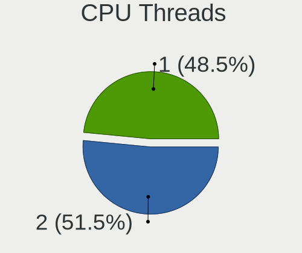

| Number | Desktops | Percent |
|--------|----------|---------|
| 1      | 680      | 56.71%  |
| 2      | 519      | 43.29%  |

CPU Op-Modes
------------

CPU Operation Modes (32-bit, 64-bit)

| Op mode        | Desktops | Percent |
|----------------|----------|---------|
| 32-bit, 64-bit | 1171     | 97.66%  |
| 32-bit         | 27       | 2.25%   |
| Unknown        | 1        | 0.08%   |

CPU Microcode
-------------

Microcode number

| Number     | Desktops | Percent |
|------------|----------|---------|
| Unknown    | 129      | 10.57%  |
| 0x306c3    | 113      | 9.26%   |
| 0x1067a    | 104      | 8.52%   |
| 0x206a7    | 97       | 7.95%   |
| 0x306a9    | 71       | 5.82%   |
| 0x6fd      | 43       | 3.52%   |
| 0x06000852 | 40       | 3.28%   |
| 0x506e3    | 38       | 3.11%   |
| 0x08701021 | 31       | 2.54%   |
| 0x010000c8 | 29       | 2.38%   |
| 0x06001119 | 26       | 2.13%   |
| 0x6fb      | 25       | 2.05%   |
| 0x0800820d | 22       | 1.8%    |
| 0x906ea    | 18       | 1.48%   |
| 0x906e9    | 18       | 1.48%   |
| 0x10676    | 15       | 1.23%   |
| 0x0600063e | 14       | 1.15%   |
| 0x010000db | 14       | 1.15%   |
| 0xa0655    | 13       | 1.07%   |
| 0xa0653    | 13       | 1.07%   |
| 0x0a201016 | 12       | 0.98%   |
| 0x906ed    | 11       | 0.9%    |
| 0x20655    | 11       | 0.9%    |
| 0x06003106 | 11       | 0.9%    |
| 0xa0671    | 10       | 0.82%   |
| 0x106a5    | 10       | 0.82%   |
| 0xf41      | 9        | 0.74%   |
| 0x906eb    | 9        | 0.74%   |
| 0x6f6      | 9        | 0.74%   |
| 0x106e5    | 9        | 0.74%   |
| 0x08701013 | 9        | 0.74%   |
| 0x0700010f | 9        | 0.74%   |
| 0x010000dc | 9        | 0.74%   |
| 0x20652    | 8        | 0.66%   |
| 0x08101016 | 8        | 0.66%   |
| 0x08001137 | 8        | 0.66%   |
| 0xf43      | 7        | 0.57%   |
| 0x6f2      | 7        | 0.57%   |
| 0x03000027 | 7        | 0.57%   |
| 0x010000c7 | 7        | 0.57%   |
| 0x206c2    | 6        | 0.49%   |
| 0x08108109 | 6        | 0.49%   |
| 0xf49      | 5        | 0.41%   |
| 0xf29      | 5        | 0.41%   |
| 0x30678    | 5        | 0.41%   |
| 0x206d7    | 5        | 0.41%   |
| 0x10677    | 5        | 0.41%   |
| 0x10661    | 5        | 0.41%   |
| 0x0a201009 | 5        | 0.41%   |
| 0x08001138 | 5        | 0.41%   |
| 0xf65      | 4        | 0.33%   |
| 0xf47      | 4        | 0.33%   |
| 0x90672    | 4        | 0.33%   |
| 0x406c4    | 4        | 0.33%   |
| 0x306f2    | 4        | 0.33%   |
| 0x306e4    | 4        | 0.33%   |
| 0x0810100b | 4        | 0.33%   |
| 0x0800820c | 4        | 0.33%   |
| 0x01000083 | 4        | 0.33%   |
| 0xf64      | 3        | 0.25%   |

CPU Microarch
-------------

Microarchitecture

| Name             | Desktops | Percent |
|------------------|----------|---------|
| Penryn           | 128      | 10.66%  |
| Haswell          | 126      | 10.49%  |
| SandyBridge      | 106      | 8.83%   |
| Core             | 92       | 7.66%   |
| K10              | 78       | 6.49%   |
| IvyBridge        | 78       | 6.49%   |
| Piledriver       | 68       | 5.66%   |
| KabyLake         | 61       | 5.08%   |
| NetBurst         | 48       | 4%      |
| K8 Hammer        | 48       | 4%      |
| Zen 2            | 46       | 3.83%   |
| Skylake          | 42       | 3.5%    |
| Zen+             | 38       | 3.16%   |
| Zen              | 34       | 2.83%   |
| Zen 3            | 27       | 2.25%   |
| CometLake        | 27       | 2.25%   |
| Westmere         | 26       | 2.16%   |
| Nehalem          | 24       | 2%      |
| Silvermont       | 15       | 1.25%   |
| Bulldozer        | 14       | 1.17%   |
| Steamroller      | 11       | 0.92%   |
| Jaguar           | 10       | 0.83%   |
| K10 Llano        | 7        | 0.58%   |
| Icelake          | 7        | 0.58%   |
| Excavator        | 7        | 0.58%   |
| Puma             | 5        | 0.42%   |
| Unknown          | 5        | 0.42%   |
| Bonnell          | 4        | 0.33%   |
| Bobcat           | 4        | 0.33%   |
| K6               | 3        | 0.25%   |
| Goldmont plus    | 3        | 0.25%   |
| Broadwell        | 3        | 0.25%   |
| Alderlake Hybrid | 3        | 0.25%   |
| TigerLake        | 1        | 0.08%   |
| P6               | 1        | 0.08%   |
| Goldmont         | 1        | 0.08%   |

Graphics
--------

GPU Vendor
----------

Vendors of graphics cards

| Vendor                           | Desktops | Percent |
|----------------------------------|----------|---------|
| Nvidia                           | 482      | 38.01%  |
| Intel                            | 393      | 30.99%  |
| AMD                              | 382      | 30.13%  |
| VIA Technologies                 | 6        | 0.47%   |
| Silicon Integrated Systems [SiS] | 2        | 0.16%   |
| Trident Microsystems             | 1        | 0.08%   |
| Silicon Motion                   | 1        | 0.08%   |
| Matrox Electronics Systems       | 1        | 0.08%   |

GPU Model
---------

Graphics card models

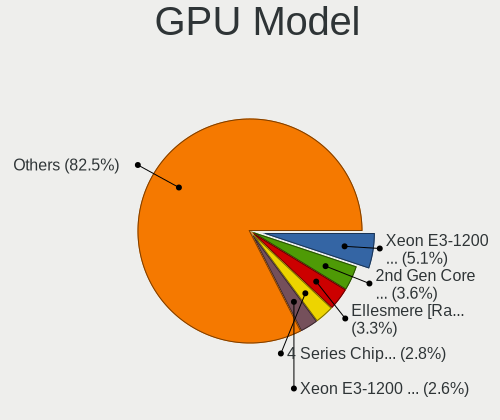

| Model                                                                                    | Desktops | Percent |
|------------------------------------------------------------------------------------------|----------|---------|
| Intel Xeon E3-1200 v3/4th Gen Core Processor Integrated Graphics Controller              | 60       | 4.61%   |
| Intel 2nd Generation Core Processor Family Integrated Graphics Controller                | 54       | 4.15%   |
| Intel 4 Series Chipset Integrated Graphics Controller                                    | 43       | 3.31%   |
| Nvidia GK208B [GeForce GT 710]                                                           | 41       | 3.15%   |
| AMD Ellesmere [Radeon RX 470/480/570/570X/580/580X/590]                                  | 41       | 3.15%   |
| Intel Xeon E3-1200 v2/3rd Gen Core processor Graphics Controller                         | 27       | 2.08%   |
| Intel 82G33/G31 Express Integrated Graphics Controller                                   | 23       | 1.77%   |
| AMD Cedar [Radeon HD 5000/6000/7350/8350 Series]                                         | 21       | 1.61%   |
| Intel HD Graphics 530                                                                    | 19       | 1.46%   |
| Nvidia GT218 [GeForce 210]                                                               | 18       | 1.38%   |
| Nvidia GM107 [GeForce GTX 750 Ti]                                                        | 18       | 1.38%   |
| Nvidia GK208B [GeForce GT 730]                                                           | 18       | 1.38%   |
| Nvidia GF119 [GeForce GT 610]                                                            | 17       | 1.31%   |
| AMD RS780L [Radeon 3000]                                                                 | 17       | 1.31%   |
| Nvidia GP107 [GeForce GTX 1050 Ti]                                                       | 15       | 1.15%   |
| Intel 4th Generation Core Processor Family Integrated Graphics Controller                | 15       | 1.15%   |
| Intel 82945G/GZ Integrated Graphics Controller                                           | 14       | 1.08%   |
| AMD Raven Ridge [Radeon Vega Series / Radeon Vega Mobile Series]                         | 14       | 1.08%   |
| Intel HD Graphics 630                                                                    | 13       | 1%      |
| Intel Core Processor Integrated Graphics Controller                                      | 13       | 1%      |
| Nvidia C61 [GeForce 6150SE nForce 430]                                                   | 12       | 0.92%   |
| Intel CoffeeLake-S GT2 [UHD Graphics 630]                                                | 12       | 0.92%   |
| AMD Navi 10 [Radeon RX 5600 OEM/5600 XT / 5700/5700 XT]                                  | 12       | 0.92%   |
| Intel 82Q35 Express Integrated Graphics Controller                                       | 11       | 0.85%   |
| Nvidia GP108 [GeForce GT 1030]                                                           | 10       | 0.77%   |
| Intel CometLake-S GT2 [UHD Graphics 630]                                                 | 10       | 0.77%   |
| Nvidia GP106 [GeForce GTX 1060 6GB]                                                      | 9        | 0.69%   |
| Nvidia GM206 [GeForce GTX 960]                                                           | 9        | 0.69%   |
| Nvidia GF108 [GeForce GT 730]                                                            | 9        | 0.69%   |
| Nvidia G96C [GeForce 9500 GT]                                                            | 9        | 0.69%   |
| AMD RS880 [Radeon HD 4200]                                                               | 9        | 0.69%   |
| AMD Kaveri [Radeon R7 Graphics]                                                          | 9        | 0.69%   |
| AMD Caicos [Radeon HD 6450/7450/8450 / R5 230 OEM]                                       | 9        | 0.69%   |
| AMD Baffin [Radeon RX 550 640SP / RX 560/560X]                                           | 9        | 0.69%   |
| Nvidia GT218 [GeForce 8400 GS Rev. 3]                                                    | 8        | 0.61%   |
| Nvidia GM204 [GeForce GTX 970]                                                           | 8        | 0.61%   |
| Nvidia GK106 [GeForce GTX 660]                                                           | 8        | 0.61%   |
| Intel 82865G Integrated Graphics Controller                                              | 8        | 0.61%   |
| AMD RV710 [Radeon HD 4350/4550]                                                          | 8        | 0.61%   |
| Nvidia TU117 [GeForce GTX 1650]                                                          | 7        | 0.54%   |
| Nvidia TU116 [GeForce GTX 1650 SUPER]                                                    | 7        | 0.54%   |
| Nvidia G94 [GeForce 9600 GT]                                                             | 7        | 0.54%   |
| Intel Atom/Celeron/Pentium Processor x5-E8000/J3xxx/N3xxx Integrated Graphics Controller | 7        | 0.54%   |
| Intel Atom Processor Z36xxx/Z37xxx Series Graphics & Display                             | 7        | 0.54%   |
| Intel 82915G/GV/910GL Integrated Graphics Controller                                     | 7        | 0.54%   |
| AMD Turks XT [Radeon HD 6670/7670]                                                       | 7        | 0.54%   |
| AMD Baffin [Radeon RX 460/560D / Pro 450/455/460/555/555X/560/560X]                      | 7        | 0.54%   |
| Nvidia GP107 [GeForce GTX 1050]                                                          | 6        | 0.46%   |
| Nvidia GP104 [GeForce GTX 1070]                                                          | 6        | 0.46%   |
| Nvidia GF114 [GeForce GTX 560 Ti]                                                        | 6        | 0.46%   |
| Nvidia C61 [GeForce 7025 / nForce 630a]                                                  | 6        | 0.46%   |
| Intel RocketLake-S GT1 [UHD Graphics 750]                                                | 6        | 0.46%   |
| Nvidia GF108 [GeForce GT 630]                                                            | 5        | 0.38%   |
| Nvidia C73 [GeForce 7100 / nForce 630i]                                                  | 5        | 0.38%   |
| Intel IvyBridge GT2 [HD Graphics 4000]                                                   | 5        | 0.38%   |
| AMD Trinity [Radeon HD 7560D]                                                            | 5        | 0.38%   |
| AMD RV620 LE [Radeon HD 3450]                                                            | 5        | 0.38%   |
| AMD Oland PRO [Radeon R7 240/340 / Radeon 520]                                           | 5        | 0.38%   |
| AMD Navi 21 [Radeon RX 6800/6800 XT / 6900 XT]                                           | 5        | 0.38%   |
| AMD Juniper XT [Radeon HD 5770]                                                          | 5        | 0.38%   |

GPU Combo
---------

Combinations of graphics cards

| Name                     | Desktops | Percent |
|--------------------------|----------|---------|
| 1 x Nvidia               | 460      | 38.08%  |
| 1 x Intel                | 345      | 28.56%  |
| 1 x AMD                  | 340      | 28.15%  |
| 2 x AMD                  | 23       | 1.9%    |
| Intel + AMD              | 12       | 0.99%   |
| Intel + Nvidia           | 11       | 0.91%   |
| 1 x VIA                  | 6        | 0.5%    |
| AMD + Nvidia             | 4        | 0.33%   |
| 2 x Nvidia               | 2        | 0.17%   |
| 1 x SiS                  | 2        | 0.17%   |
| 1 x Trident Microsystems | 1        | 0.08%   |
| Nvidia + Silicon Motion  | 1        | 0.08%   |
| 1 x Matrox               | 1        | 0.08%   |

GPU Driver
----------

Free vs proprietary

| Driver      | Desktops | Percent |
|-------------|----------|---------|
| Free        | 840      | 69.42%  |
| Proprietary | 278      | 22.98%  |
| Unknown     | 92       | 7.6%    |

GPU Memory
----------

Total video memory

| Size in GB | Desktops | Percent |
|------------|----------|---------|
| Unknown    | 477      | 38.88%  |
| 0.01-0.5   | 203      | 16.54%  |
| 0.51-1.0   | 181      | 14.75%  |
| 1.01-2.0   | 172      | 14.02%  |
| 3.01-4.0   | 76       | 6.19%   |
| 7.01-8.0   | 64       | 5.22%   |
| 5.01-6.0   | 24       | 1.96%   |
| 8.01-16.0  | 17       | 1.39%   |
| 2.01-3.0   | 8        | 0.65%   |
| 16.01-24.0 | 4        | 0.33%   |
| 4.01-5.0   | 1        | 0.08%   |

Monitor
-------

Monitor Vendor
--------------

Monitor vendors

| Vendor               | Desktops | Percent |
|----------------------|----------|---------|
| Samsung Electronics  | 187      | 16.11%  |
| Dell                 | 116      | 9.99%   |
| Goldstar             | 105      | 9.04%   |
| Hewlett-Packard      | 104      | 8.96%   |
| Acer                 | 81       | 6.98%   |
| AOC                  | 61       | 5.25%   |
| Philips              | 54       | 4.65%   |
| Ancor Communications | 52       | 4.48%   |
| BenQ                 | 44       | 3.79%   |
| LG Electronics       | 32       | 2.76%   |
| ViewSonic            | 26       | 2.24%   |
| Unknown              | 18       | 1.55%   |
| Iiyama               | 13       | 1.12%   |
| Unknown              | 12       | 1.03%   |
| Vizio                | 11       | 0.95%   |
| Sony                 | 11       | 0.95%   |
| NEC Computers        | 11       | 0.95%   |
| Lenovo               | 11       | 0.95%   |
| Sceptre Tech         | 10       | 0.86%   |
| ASUSTek Computer     | 9        | 0.78%   |
| Toshiba              | 7        | 0.6%    |
| HPN                  | 7        | 0.6%    |
| Fujitsu Siemens      | 7        | 0.6%    |
| Sharp                | 6        | 0.52%   |
| Medion               | 6        | 0.52%   |
| HannStar             | 6        | 0.52%   |
| Gateway              | 6        | 0.52%   |
| Eizo                 | 5        | 0.43%   |
| CVT                  | 5        | 0.43%   |
| AUS                  | 5        | 0.43%   |
| VIZ                  | 4        | 0.34%   |
| Panasonic            | 4        | 0.34%   |
| Microstep            | 4        | 0.34%   |
| KTC                  | 4        | 0.34%   |
| Idek Iiyama          | 4        | 0.34%   |
| Envision             | 4        | 0.34%   |
| Vestel               | 3        | 0.26%   |
| SANYO                | 3        | 0.26%   |
| OEM                  | 3        | 0.26%   |
| MSI                  | 3        | 0.26%   |
| Insignia             | 3        | 0.26%   |
| GDH                  | 3        | 0.26%   |
| FUS                  | 3        | 0.26%   |
| Xiaomi               | 2        | 0.17%   |
| STD                  | 2        | 0.17%   |
| SKY                  | 2        | 0.17%   |
| Seiki                | 2        | 0.17%   |
| Sceptre              | 2        | 0.17%   |
| PRI                  | 2        | 0.17%   |
| PKB                  | 2        | 0.17%   |
| Packard Bell         | 2        | 0.17%   |
| ONN                  | 2        | 0.17%   |
| MStar                | 2        | 0.17%   |
| MiTAC                | 2        | 0.17%   |
| LSC                  | 2        | 0.17%   |
| Lenovo Group Limited | 2        | 0.17%   |
| Gigabyte Technology  | 2        | 0.17%   |
| eMachines            | 2        | 0.17%   |
| Belinea              | 2        | 0.17%   |
| BBY                  | 2        | 0.17%   |

Monitor Model
-------------

Monitor models

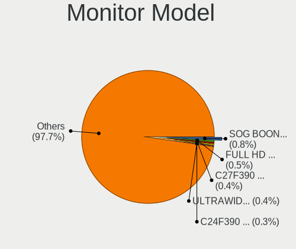

| Model                                                                  | Desktops | Percent |
|------------------------------------------------------------------------|----------|---------|
| Unknown                                                                | 12       | 0.98%   |
| Goldstar HD GSM5ACB 1366x768 410x230mm 18.5-inch                       | 6        | 0.49%   |
| Philips PHL 242M8 PHLC253 1920x1080 527x296mm 23.8-inch                | 4        | 0.33%   |
| Hewlett-Packard 2009 HWP2827 1600x900 442x249mm 20.0-inch              | 4        | 0.33%   |
| Goldstar ULTRAWIDE GSM59F1 2560x1080 673x284mm 28.8-inch               | 4        | 0.33%   |
| Goldstar FULL HD GSM5B55 1920x1080 480x270mm 21.7-inch                 | 4        | 0.33%   |
| BenQ GL2450H BNQ78A7 1920x1080 531x298mm 24.0-inch                     | 4        | 0.33%   |
| Ancor Communications VS248 ACI2498 1920x1080 531x299mm 24.0-inch       | 4        | 0.33%   |
| Vizio E220VA VIZ0070 1920x1080 476x268mm 21.5-inch                     | 3        | 0.24%   |
| Vestel LCD Monitor 48UHD_LCD_TV 3840x2160                              | 3        | 0.24%   |
| Samsung Electronics U28D590 SAM0B81 3840x2160 608x345mm 27.5-inch      | 3        | 0.24%   |
| Samsung Electronics SyncMaster SAM03E5 1680x1050 470x300mm 22.0-inch   | 3        | 0.24%   |
| Samsung Electronics LCD Monitor SyncMaster 1680x1050                   | 3        | 0.24%   |
| Samsung Electronics LCD Monitor SAM0902 1920x1080 890x500mm 40.2-inch  | 3        | 0.24%   |
| Samsung Electronics LCD Monitor SAM07BC 1360x768 700x390mm 31.5-inch   | 3        | 0.24%   |
| Samsung Electronics C27F390 SAM0D32 1920x1080 598x336mm 27.0-inch      | 3        | 0.24%   |
| Philips PHL 243V5 PHLC0D1 1920x1080 521x293mm 23.5-inch                | 3        | 0.24%   |
| Philips PHL 223V5 PHLC0CF 1920x1080 477x268mm 21.5-inch                | 3        | 0.24%   |
| Philips LCD Monitor FTV 1920x1080                                      | 3        | 0.24%   |
| OEM 32W_LCD_TV OEM3700 1920x540                                        | 3        | 0.24%   |
| LG Electronics LCD Monitor LG ULTRAWIDE 2560x1080                      | 3        | 0.24%   |
| Goldstar W1943 GSM4BAD 1360x768 406x229mm 18.4-inch                    | 3        | 0.24%   |
| Goldstar W1942 GSM4B6F 1440x900 408x255mm 18.9-inch                    | 3        | 0.24%   |
| Goldstar IPS FULLHD GSM5AB6 1920x1080 480x270mm 21.7-inch              | 3        | 0.24%   |
| GDH PHILCO GDH0030 1920x540 708x398mm 32.0-inch                        | 3        | 0.24%   |
| Dell SE198WFP DELF003 1440x900 408x255mm 18.9-inch                     | 3        | 0.24%   |
| Dell P2419H DELD0DA 1920x1080 530x300mm 24.0-inch                      | 3        | 0.24%   |
| Dell DEL 1908FPBLK DEL4047 1280x1024 376x301mm 19.0-inch               | 3        | 0.24%   |
| Ancor Communications ASUS VP228 ACI22C3 1920x1080 476x268mm 21.5-inch  | 3        | 0.24%   |
| Acer X223W ACR000D 1680x1050 474x296mm 22.0-inch                       | 3        | 0.24%   |
| Vizio VO42LFHDTV10A VIZ0043 1920x1080 930x520mm 41.9-inch              | 2        | 0.16%   |
| VIZ LCD Monitor E320VT 1920x1080                                       | 2        | 0.16%   |
| ViewSonic VX2260WM VSCFC21 1920x1080 477x268mm 21.5-inch               | 2        | 0.16%   |
| Unknown LCD Monitor SAMSUNG 3840x2160                                  | 2        | 0.16%   |
| Unknown LCD Monitor SAMSUNG                                            | 2        | 0.16%   |
| Unknown LCD Monitor AAA LCDTV 1360x768                                 | 2        | 0.16%   |
| Toshiba TV TSB0206 1920x1080                                           | 2        | 0.16%   |
| Sceptre Tech X505BV-FMQC SPT13C0 1920x1080                             | 2        | 0.16%   |
| Samsung Electronics U28E590 SAM0C4E 3840x2160 608x345mm 27.5-inch      | 2        | 0.16%   |
| Samsung Electronics SyncMaster SAM0564 1360x768 410x230mm 18.5-inch    | 2        | 0.16%   |
| Samsung Electronics SyncMaster SAM0467 1920x1200 518x324mm 24.1-inch   | 2        | 0.16%   |
| Samsung Electronics SyncMaster SAM02B6 1920x1200 518x324mm 24.1-inch   | 2        | 0.16%   |
| Samsung Electronics SyncMaster SAM0272 1280x1024 338x270mm 17.0-inch   | 2        | 0.16%   |
| Samsung Electronics S23C350 SAM0A36 1920x1080 510x287mm 23.0-inch      | 2        | 0.16%   |
| Samsung Electronics M3704C SAM064E 1920x1080                           | 2        | 0.16%   |
| Samsung Electronics LCD Monitor SyncMaster 1920x1080                   | 2        | 0.16%   |
| Samsung Electronics LCD Monitor SyncMaster 1280x1024                   | 2        | 0.16%   |
| Samsung Electronics LCD Monitor SyncMaster                             | 2        | 0.16%   |
| Samsung Electronics LCD Monitor SMB1930N 1366x768                      | 2        | 0.16%   |
| Samsung Electronics LCD Monitor SAM0F9F 3840x2160 1210x680mm 54.6-inch | 2        | 0.16%   |
| Samsung Electronics LCD Monitor SAM0F14 3840x2160 950x540mm 43.0-inch  | 2        | 0.16%   |
| Samsung Electronics LCD Monitor SAM0E35 1920x1080 1210x680mm 54.6-inch | 2        | 0.16%   |
| Samsung Electronics LCD Monitor SAM0D4F 1920x1080 1210x680mm 54.6-inch | 2        | 0.16%   |
| Samsung Electronics LCD Monitor SAM0C3C 1366x768 609x347mm 27.6-inch   | 2        | 0.16%   |
| Samsung Electronics LCD Monitor SAM0832 1920x1080 480x270mm 21.7-inch  | 2        | 0.16%   |
| Samsung Electronics LCD Monitor SAM07C0 1920x1080 890x500mm 40.2-inch  | 2        | 0.16%   |
| Samsung Electronics LCD Monitor SAM0399 1280x720                       | 2        | 0.16%   |
| Samsung Electronics LCD Monitor SA300/SA350 1920x1080                  | 2        | 0.16%   |
| Samsung Electronics LCD Monitor SA300/SA350 1366x768                   | 2        | 0.16%   |
| Samsung Electronics C32F391 SAM0D34 1920x1080 698x393mm 31.5-inch      | 2        | 0.16%   |

Monitor Resolution
------------------

Monitor screen resolution

| Resolution         | Desktops | Percent |
|--------------------|----------|---------|
| 1920x1080 (FHD)    | 467      | 40.57%  |
| 1280x1024 (SXGA)   | 103      | 8.95%   |
| 3840x2160 (4K)     | 74       | 6.43%   |
| 1680x1050 (WSXGA+) | 68       | 5.91%   |
| 1366x768 (WXGA)    | 67       | 5.82%   |
| 1600x900 (HD+)     | 58       | 5.04%   |
| 1440x900 (WXGA+)   | 50       | 4.34%   |
| Unknown            | 50       | 4.34%   |
| 1360x768           | 36       | 3.13%   |
| 2560x1440 (QHD)    | 32       | 2.78%   |
| 1920x1200 (WUXGA)  | 23       | 2%      |
| 3840x1080          | 19       | 1.65%   |
| 3440x1440          | 16       | 1.39%   |
| 1024x768 (XGA)     | 11       | 0.96%   |
| 1920x540           | 10       | 0.87%   |
| 2560x1080          | 9        | 0.78%   |
| 5760x1080          | 4        | 0.35%   |
| 4480x1440          | 4        | 0.35%   |
| 1600x1200          | 4        | 0.35%   |
| 5760x2160          | 3        | 0.26%   |
| 2560x1600          | 3        | 0.26%   |
| 1280x720 (HD)      | 3        | 0.26%   |
| 6400x1440          | 2        | 0.17%   |
| 5440x1080          | 2        | 0.17%   |
| 3600x1080          | 2        | 0.17%   |
| 3360x1080          | 2        | 0.17%   |
| 3200x1200          | 2        | 0.17%   |
| 3200x1080          | 2        | 0.17%   |
| 3120x1050          | 2        | 0.17%   |
| 2720x1024          | 2        | 0.17%   |
| 2048x1152          | 2        | 0.17%   |
| 1152x864           | 2        | 0.17%   |
| 7680x1080          | 1        | 0.09%   |
| 6400x1080          | 1        | 0.09%   |
| 4160x1440          | 1        | 0.09%   |
| 3840x1600          | 1        | 0.09%   |
| 3840x1200          | 1        | 0.09%   |
| 3780x2160          | 1        | 0.09%   |
| 3360x1050          | 1        | 0.09%   |
| 3200x1204          | 1        | 0.09%   |
| 3040x1050          | 1        | 0.09%   |
| 2944x1080          | 1        | 0.09%   |
| 2646x768           | 1        | 0.09%   |
| 2464x900           | 1        | 0.09%   |
| 2390x899           | 1        | 0.09%   |
| 1850x1030          | 1        | 0.09%   |
| 1834x1031          | 1        | 0.09%   |
| 1360x765           | 1        | 0.09%   |
| 1280x960           | 1        | 0.09%   |

Monitor Diagonal
----------------

Diagonal size in inches

| Inches  | Desktops | Percent |
|---------|----------|---------|
| Unknown | 240      | 21.11%  |
| 24      | 97       | 8.53%   |
| 23      | 95       | 8.36%   |
| 19      | 93       | 8.18%   |
| 21      | 91       | 8%      |
| 27      | 87       | 7.65%   |
| 18      | 74       | 6.51%   |
| 20      | 58       | 5.1%    |
| 17      | 50       | 4.4%    |
| 22      | 45       | 3.96%   |
| 31      | 43       | 3.78%   |
| 15      | 20       | 1.76%   |
| 34      | 18       | 1.58%   |
| 84      | 15       | 1.32%   |
| 40      | 13       | 1.14%   |
| 26      | 13       | 1.14%   |
| 54      | 11       | 0.97%   |
| 72      | 9        | 0.79%   |
| 32      | 9        | 0.79%   |
| 52      | 6        | 0.53%   |
| 42      | 5        | 0.44%   |
| 25      | 5        | 0.44%   |
| 65      | 3        | 0.26%   |
| 33      | 3        | 0.26%   |
| 28      | 3        | 0.26%   |
| 74      | 2        | 0.18%   |
| 48      | 2        | 0.18%   |
| 46      | 2        | 0.18%   |
| 43      | 2        | 0.18%   |
| 41      | 2        | 0.18%   |
| 39      | 2        | 0.18%   |
| 37      | 2        | 0.18%   |
| 36      | 2        | 0.18%   |
| 35      | 2        | 0.18%   |
| 16      | 2        | 0.18%   |
| 13      | 2        | 0.18%   |
| 75      | 1        | 0.09%   |
| 60      | 1        | 0.09%   |
| 55      | 1        | 0.09%   |
| 49      | 1        | 0.09%   |
| 47      | 1        | 0.09%   |
| 44      | 1        | 0.09%   |
| 30      | 1        | 0.09%   |
| 29      | 1        | 0.09%   |
| 14      | 1        | 0.09%   |

Monitor Width
-------------

Physical width

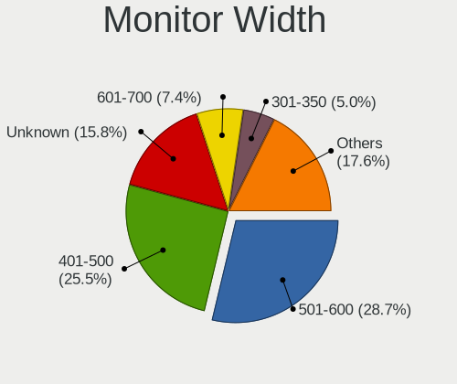

| Width in mm | Desktops | Percent |
|-------------|----------|---------|
| 401-500     | 307      | 27.61%  |
| 501-600     | 268      | 24.1%   |
| Unknown     | 240      | 21.58%  |
| 301-350     | 67       | 6.03%   |
| 601-700     | 56       | 5.04%   |
| 351-400     | 56       | 5.04%   |
| 701-800     | 32       | 2.88%   |
| 1001-1500   | 28       | 2.52%   |
| 1501-2000   | 27       | 2.43%   |
| 801-900     | 19       | 1.71%   |
| 901-1000    | 10       | 0.9%    |
| 201-300     | 2        | 0.18%   |

Aspect Ratio
------------

Proportional relationship between the width and the height

| Ratio   | Desktops | Percent |
|---------|----------|---------|
| 16/9    | 575      | 53.34%  |
| Unknown | 222      | 20.59%  |
| 16/10   | 136      | 12.62%  |
| 5/4     | 90       | 8.35%   |
| 21/9    | 22       | 2.04%   |
| 4/3     | 19       | 1.76%   |
| 6/5     | 5        | 0.46%   |
| 32/9    | 5        | 0.46%   |
| 3/2     | 4        | 0.37%   |

Monitor Area
------------

Area in inch

| Area in inch | Desktops | Percent |
|----------------|----------|---------|
| 201-250        | 263      | 23.4%   |
| Unknown        | 240      | 21.35%  |
| 151-200        | 193      | 17.17%  |
| 141-150        | 101      | 8.99%   |
| 301-350        | 88       | 7.83%   |
| 351-500        | 79       | 7.03%   |
| More than 1000 | 49       | 4.36%   |
| 251-300        | 46       | 4.09%   |
| 501-1000       | 34       | 3.02%   |
| 101-110        | 17       | 1.51%   |
| 131-140        | 7        | 0.62%   |
| 111-120        | 3        | 0.27%   |
| 91-100         | 2        | 0.18%   |
| 81-90          | 1        | 0.09%   |
| 121-130        | 1        | 0.09%   |

Pixel Density
-------------

Pixels per inch

| Density | Desktops | Percent |
|---------|----------|---------|
| 51-100  | 614      | 57.01%  |
| Unknown | 240      | 22.28%  |
| 101-120 | 141      | 13.09%  |
| 1-50    | 52       | 4.83%   |
| 121-160 | 19       | 1.76%   |
| 161-240 | 11       | 1.02%   |

Multiple Monitors
-----------------

Total monitors connected

| Total | Desktops | Percent |
|-------|----------|---------|
| 1     | 990      | 81.41%  |
| 2     | 123      | 10.12%  |
| 0     | 88       | 7.24%   |
| 3     | 14       | 1.15%   |
| 4     | 1        | 0.08%   |

Network
-------

Net Controller Vendor
---------------------

Controller vendors

| Vendor                                | Desktops | Percent |
|---------------------------------------|----------|---------|
| Realtek Semiconductor                 | 709      | 39.94%  |
| Intel                                 | 409      | 23.04%  |
| Qualcomm Atheros                      | 122      | 6.87%   |
| Ralink Technology                     | 74       | 4.17%   |
| Broadcom                              | 68       | 3.83%   |
| Nvidia                                | 58       | 3.27%   |
| Ralink                                | 34       | 1.92%   |
| TP-Link                               | 32       | 1.8%    |
| Broadcom Limited                      | 25       | 1.41%   |
| Marvell Technology Group              | 22       | 1.24%   |
| D-Link                                | 19       | 1.07%   |
| VIA Technologies                      | 18       | 1.01%   |
| NetGear                               | 17       | 0.96%   |
| D-Link System                         | 16       | 0.9%    |
| MediaTek                              | 13       | 0.73%   |
| Samsung Electronics                   | 11       | 0.62%   |
| Xiaomi                                | 10       | 0.56%   |
| Qualcomm Atheros Communications       | 9        | 0.51%   |
| Microsoft                             | 8        | 0.45%   |
| Huawei Technologies                   | 8        | 0.45%   |
| Edimax Technology                     | 7        | 0.39%   |
| Silicon Integrated Systems [SiS]      | 5        | 0.28%   |
| Belkin Components                     | 5        | 0.28%   |
| ASUSTek Computer                      | 5        | 0.28%   |
| ASIX Electronics                      | 5        | 0.28%   |
| Aquantia                              | 5        | 0.28%   |
| Gemtek                                | 4        | 0.23%   |
| DisplayLink                           | 4        | 0.23%   |
| Sitecom Europe                        | 3        | 0.17%   |
| Qualcomm                              | 3        | 0.17%   |
| OPPO Electronics                      | 3        | 0.17%   |
| Motorola PCS                          | 3        | 0.17%   |
| Linksys                               | 3        | 0.17%   |
| 802.11g Adapter [Linksys WUSB54GC v3] | 3        | 0.17%   |
| ZTE WCDMA Technologies MSM            | 2        | 0.11%   |
| TRENDnet                              | 2        | 0.11%   |
| Sundance Technology Inc / IC Plus     | 2        | 0.11%   |
| Senao                                 | 2        | 0.11%   |
| Motorola                              | 2        | 0.11%   |
| Micro Star International              | 2        | 0.11%   |
| JMicron Technology                    | 2        | 0.11%   |
| Apple                                 | 2        | 0.11%   |
| ZyXEL Communications                  | 1        | 0.06%   |
| ZyDAS                                 | 1        | 0.06%   |
| T & A Mobile Phones                   | 1        | 0.06%   |
| Research In Motion                    | 1        | 0.06%   |
| QinHeng Electronics                   | 1        | 0.06%   |
| Philips (or NXP)                      | 1        | 0.06%   |
| Panasonic (Matsushita)                | 1        | 0.06%   |
| Padix (Rockfire)                      | 1        | 0.06%   |
| Microchip Technology                  | 1        | 0.06%   |
| LSI                                   | 1        | 0.06%   |
| Lenovo                                | 1        | 0.06%   |
| IMC Networks                          | 1        | 0.06%   |
| Google                                | 1        | 0.06%   |
| GCT Semiconductor                     | 1        | 0.06%   |
| Exar                                  | 1        | 0.06%   |
| AVM                                   | 1        | 0.06%   |
| Arduino SA                            | 1        | 0.06%   |
| ADMtek                                | 1        | 0.06%   |

Net Controller Model
--------------------

Controller models

| Model                                                             | Desktops | Percent |
|-------------------------------------------------------------------|----------|---------|
| Realtek RTL8111/8168/8411 PCI Express Gigabit Ethernet Controller | 539      | 27.28%  |
| Intel 82579LM Gigabit Network Connection (Lewisville)             | 61       | 3.09%   |
| Realtek RTL810xE PCI Express Fast Ethernet controller             | 55       | 2.78%   |
| Intel I211 Gigabit Network Connection                             | 42       | 2.13%   |
| Nvidia MCP61 Ethernet                                             | 35       | 1.77%   |
| Ralink MT7601U Wireless Adapter                                   | 33       | 1.67%   |
| Intel Wi-Fi 6 AX200                                               | 31       | 1.57%   |
| Intel Ethernet Connection I217-LM                                 | 30       | 1.52%   |
| Realtek RTL8125 2.5GbE Controller                                 | 29       | 1.47%   |
| Intel Ethernet Connection (2) I219-V                              | 26       | 1.32%   |
| Realtek RTL-8100/8101L/8139 PCI Fast Ethernet Adapter             | 23       | 1.16%   |
| Realtek 802.11ac NIC                                              | 20       | 1.01%   |
| Realtek RTL8188EUS 802.11n Wireless Network Adapter               | 17       | 0.86%   |
| Realtek RTL88x2bu [AC1200 Techkey]                                | 16       | 0.81%   |
| Intel 82579V Gigabit Network Connection                           | 16       | 0.81%   |
| Intel 82567LM-3 Gigabit Network Connection                        | 16       | 0.81%   |
| Ralink RT2870/RT3070 Wireless Adapter                             | 15       | 0.76%   |
| Intel Ethernet Controller I225-V                                  | 15       | 0.76%   |
| Intel Ethernet Connection (2) I218-V                              | 15       | 0.76%   |
| Intel 82566DM-2 Gigabit Network Connection                        | 15       | 0.76%   |
| Intel Wireless-AC 9260                                            | 14       | 0.71%   |
| Intel Ethernet Connection I217-V                                  | 14       | 0.71%   |
| VIA VT6102/VT6103 [Rhine-II]                                      | 13       | 0.66%   |
| Intel Dual Band Wireless-AC 3168NGW [Stone Peak]                  | 13       | 0.66%   |
| Realtek RTL8169 PCI Gigabit Ethernet Controller                   | 12       | 0.61%   |
| Qualcomm Atheros AR9485 Wireless Network Adapter                  | 12       | 0.61%   |
| Realtek RTL8188FTV 802.11b/g/n 1T1R 2.4G WLAN Adapter             | 11       | 0.56%   |
| Qualcomm Atheros AR8151 v2.0 Gigabit Ethernet                     | 11       | 0.56%   |
| Intel Ethernet Connection (7) I219-V                              | 11       | 0.56%   |
| Ralink RT5370 Wireless Adapter                                    | 10       | 0.51%   |
| Broadcom BCM4360 802.11ac Wireless Network Adapter                | 10       | 0.51%   |
| TP-Link TL-WN823N v2/v3 [Realtek RTL8192EU]                       | 9        | 0.46%   |
| Realtek RTL8821AE 802.11ac PCIe Wireless Network Adapter          | 9        | 0.46%   |
| Realtek RTL8192EE PCIe Wireless Network Adapter                   | 9        | 0.46%   |
| Qualcomm Atheros AR9271 802.11n                                   | 9        | 0.46%   |
| Qualcomm Atheros Attansic L2 Fast Ethernet                        | 9        | 0.46%   |
| Qualcomm Atheros AR8121/AR8113/AR8114 Gigabit or Fast Ethernet    | 9        | 0.46%   |
| Nvidia MCP73 Ethernet                                             | 9        | 0.46%   |
| Marvell Group 88E8056 PCI-E Gigabit Ethernet Controller           | 9        | 0.46%   |
| Intel Wi-Fi 6 AX210/AX211/AX411 160MHz                            | 9        | 0.46%   |
| Intel 82574L Gigabit Network Connection                           | 9        | 0.46%   |
| Realtek RTL8188CE 802.11b/g/n WiFi Adapter                        | 8        | 0.4%    |
| Qualcomm Atheros AR9227 Wireless Network Adapter                  | 8        | 0.4%    |
| Qualcomm Atheros AR8161 Gigabit Ethernet                          | 8        | 0.4%    |
| Intel Wireless 8260                                               | 8        | 0.4%    |
| Intel Wireless 7265                                               | 8        | 0.4%    |
| Intel Wireless 7260                                               | 8        | 0.4%    |
| Intel Ethernet Connection (2) I219-LM                             | 8        | 0.4%    |
| Broadcom NetXtreme BCM5761 Gigabit Ethernet PCIe                  | 8        | 0.4%    |
| Samsung Galaxy series, misc. (tethering mode)                     | 7        | 0.35%   |
| Ralink RT2561/RT61 802.11g PCI                                    | 7        | 0.35%   |
| Qualcomm Atheros QCA9565 / AR9565 Wireless Network Adapter        | 7        | 0.35%   |
| Intel NM10/ICH7 Family LAN Controller                             | 7        | 0.35%   |
| TP-Link TL-WN722N v2/v3 [Realtek RTL8188EUS]                      | 6        | 0.3%    |
| Realtek RTL8723BE PCIe Wireless Network Adapter                   | 6        | 0.3%    |
| Realtek RTL8192CU 802.11n WLAN Adapter                            | 6        | 0.3%    |
| Ralink RT2501/RT2573 Wireless Adapter                             | 6        | 0.3%    |
| Ralink RT2790 Wireless 802.11n 1T/2R PCIe                         | 6        | 0.3%    |
| Qualcomm Atheros AR5212/5213/2414 Wireless Network Adapter        | 6        | 0.3%    |
| Nvidia MCP51 Ethernet Controller                                  | 6        | 0.3%    |

Wireless Vendor
---------------

Wireless vendors

| Vendor                                | Desktops | Percent |
|---------------------------------------|----------|---------|
| Realtek Semiconductor                 | 151      | 23.82%  |
| Intel                                 | 127      | 20.03%  |
| Ralink Technology                     | 74       | 11.67%  |
| Qualcomm Atheros                      | 60       | 9.46%   |
| Ralink                                | 34       | 5.36%   |
| TP-Link                               | 31       | 4.89%   |
| Broadcom                              | 28       | 4.42%   |
| D-Link                                | 19       | 3%      |
| NetGear                               | 17       | 2.68%   |
| D-Link System                         | 14       | 2.21%   |
| Qualcomm Atheros Communications       | 9        | 1.42%   |
| Broadcom Limited                      | 9        | 1.42%   |
| Microsoft                             | 8        | 1.26%   |
| MediaTek                              | 7        | 1.1%    |
| Edimax Technology                     | 7        | 1.1%    |
| Belkin Components                     | 5        | 0.79%   |
| Gemtek                                | 4        | 0.63%   |
| ASUSTek Computer                      | 4        | 0.63%   |
| Sitecom Europe                        | 3        | 0.47%   |
| Marvell Technology Group              | 3        | 0.47%   |
| Linksys                               | 3        | 0.47%   |
| 802.11g Adapter [Linksys WUSB54GC v3] | 3        | 0.47%   |
| TRENDnet                              | 2        | 0.32%   |
| Senao                                 | 2        | 0.32%   |
| Micro Star International              | 2        | 0.32%   |
| ZyXEL Communications                  | 1        | 0.16%   |
| ZyDAS                                 | 1        | 0.16%   |
| Xiaomi                                | 1        | 0.16%   |
| Philips (or NXP)                      | 1        | 0.16%   |
| Panasonic (Matsushita)                | 1        | 0.16%   |
| IMC Networks                          | 1        | 0.16%   |
| AVM                                   | 1        | 0.16%   |
| ADMtek                                | 1        | 0.16%   |

Wireless Model
--------------

Wireless models

| Model                                                                | Desktops | Percent |
|----------------------------------------------------------------------|----------|---------|
| Ralink MT7601U Wireless Adapter                                      | 33       | 5.15%   |
| Intel Wi-Fi 6 AX200                                                  | 31       | 4.84%   |
| Realtek 802.11ac NIC                                                 | 20       | 3.12%   |
| Realtek RTL8188EUS 802.11n Wireless Network Adapter                  | 17       | 2.65%   |
| Realtek RTL88x2bu [AC1200 Techkey]                                   | 16       | 2.5%    |
| Ralink RT2870/RT3070 Wireless Adapter                                | 15       | 2.34%   |
| Intel Wireless-AC 9260                                               | 14       | 2.18%   |
| Intel Dual Band Wireless-AC 3168NGW [Stone Peak]                     | 13       | 2.03%   |
| Qualcomm Atheros AR9485 Wireless Network Adapter                     | 12       | 1.87%   |
| Realtek RTL8188FTV 802.11b/g/n 1T1R 2.4G WLAN Adapter                | 11       | 1.72%   |
| Ralink RT5370 Wireless Adapter                                       | 10       | 1.56%   |
| Broadcom BCM4360 802.11ac Wireless Network Adapter                   | 10       | 1.56%   |
| TP-Link TL-WN823N v2/v3 [Realtek RTL8192EU]                          | 9        | 1.4%    |
| Realtek RTL8821AE 802.11ac PCIe Wireless Network Adapter             | 9        | 1.4%    |
| Realtek RTL8192EE PCIe Wireless Network Adapter                      | 9        | 1.4%    |
| Qualcomm Atheros AR9271 802.11n                                      | 9        | 1.4%    |
| Intel Wi-Fi 6 AX210/AX211/AX411 160MHz                               | 9        | 1.4%    |
| Realtek RTL8188CE 802.11b/g/n WiFi Adapter                           | 8        | 1.25%   |
| Qualcomm Atheros AR9227 Wireless Network Adapter                     | 8        | 1.25%   |
| Intel Wireless 8260                                                  | 8        | 1.25%   |
| Intel Wireless 7265                                                  | 8        | 1.25%   |
| Intel Wireless 7260                                                  | 8        | 1.25%   |
| Ralink RT2561/RT61 802.11g PCI                                       | 7        | 1.09%   |
| Qualcomm Atheros QCA9565 / AR9565 Wireless Network Adapter           | 7        | 1.09%   |
| TP-Link TL-WN722N v2/v3 [Realtek RTL8188EUS]                         | 6        | 0.94%   |
| Realtek RTL8723BE PCIe Wireless Network Adapter                      | 6        | 0.94%   |
| Realtek RTL8192CU 802.11n WLAN Adapter                               | 6        | 0.94%   |
| Ralink RT2501/RT2573 Wireless Adapter                                | 6        | 0.94%   |
| Ralink RT2790 Wireless 802.11n 1T/2R PCIe                            | 6        | 0.94%   |
| Qualcomm Atheros AR5212/5213/2414 Wireless Network Adapter           | 6        | 0.94%   |
| NetGear A6210                                                        | 6        | 0.94%   |
| Intel Comet Lake PCH CNVi WiFi                                       | 6        | 0.94%   |
| Realtek RTL8811AU 802.11a/b/g/n/ac WLAN Adapter                      | 5        | 0.78%   |
| Realtek RTL8188EE Wireless Network Adapter                           | 5        | 0.78%   |
| Realtek RTL8188CUS 802.11n WLAN Adapter                              | 5        | 0.78%   |
| Ralink RT3090 Wireless 802.11n 1T/1R PCIe                            | 5        | 0.78%   |
| Qualcomm Atheros AR9285 Wireless Network Adapter (PCI-Express)       | 5        | 0.78%   |
| Intel Cannon Lake PCH CNVi WiFi                                      | 5        | 0.78%   |
| Edimax EW-7811Un 802.11n Wireless Adapter [Realtek RTL8188CUS]       | 5        | 0.78%   |
| Broadcom BCM4318 [AirForce One 54g] 802.11g Wireless LAN Controller  | 5        | 0.78%   |
| TP-Link Archer T3U [Realtek RTL8812BU]                               | 4        | 0.62%   |
| TP-Link AC600 wireless Realtek RTL8811AU [Archer T2U Nano]           | 4        | 0.62%   |
| Realtek RTL8191SU 802.11n WLAN Adapter                               | 4        | 0.62%   |
| Realtek RTL8188ETV Wireless LAN 802.11n Network Adapter              | 4        | 0.62%   |
| Realtek RTL8187 Wireless Adapter                                     | 4        | 0.62%   |
| Realtek RTL-8185 IEEE 802.11a/b/g Wireless LAN Controller            | 4        | 0.62%   |
| Ralink RT5372 Wireless Adapter                                       | 4        | 0.62%   |
| Ralink RT5390 Wireless 802.11n 1T/1R PCIe                            | 4        | 0.62%   |
| Qualcomm Atheros AR9462 Wireless Network Adapter                     | 4        | 0.62%   |
| Qualcomm Atheros AR93xx Wireless Network Adapter                     | 4        | 0.62%   |
| NetGear A6100 AC600 DB Wireless Adapter [Realtek RTL8811AU]          | 4        | 0.62%   |
| Microsoft Xbox 360 Wireless Adapter                                  | 4        | 0.62%   |
| Intel Wireless 3165                                                  | 4        | 0.62%   |
| Intel Alder Lake-S PCH CNVi WiFi                                     | 4        | 0.62%   |
| Gemtek WUBR-177G [Ralink RT2571W]                                    | 4        | 0.62%   |
| D-Link System DWA-140 RangeBooster N Adapter(rev.B2) [Ralink RT3072] | 4        | 0.62%   |
| D-Link DWA-131 Wireless N Nano Adapter (Rev. E1) [Realtek RTL8192EU] | 4        | 0.62%   |
| TP-Link Archer T4U ver.3                                             | 3        | 0.47%   |
| TP-Link 802.11ac WLAN Adapter                                        | 3        | 0.47%   |
| Realtek RTL8812AE 802.11ac PCIe Wireless Network Adapter             | 3        | 0.47%   |

Ethernet Vendor
---------------

Ethernet vendors

| Vendor                            | Desktops | Percent |
|-----------------------------------|----------|---------|
| Realtek Semiconductor             | 656      | 50.97%  |
| Intel                             | 339      | 26.34%  |
| Qualcomm Atheros                  | 65       | 5.05%   |
| Nvidia                            | 58       | 4.51%   |
| Broadcom                          | 40       | 3.11%   |
| Marvell Technology Group          | 19       | 1.48%   |
| VIA Technologies                  | 18       | 1.4%    |
| Broadcom Limited                  | 17       | 1.32%   |
| Samsung Electronics               | 11       | 0.85%   |
| Xiaomi                            | 9        | 0.7%    |
| Huawei Technologies               | 8        | 0.62%   |
| MediaTek                          | 6        | 0.47%   |
| Silicon Integrated Systems [SiS]  | 5        | 0.39%   |
| ASIX Electronics                  | 5        | 0.39%   |
| Aquantia                          | 5        | 0.39%   |
| DisplayLink                       | 4        | 0.31%   |
| Qualcomm                          | 3        | 0.23%   |
| OPPO Electronics                  | 3        | 0.23%   |
| Sundance Technology Inc / IC Plus | 2        | 0.16%   |
| JMicron Technology                | 2        | 0.16%   |
| D-Link System                     | 2        | 0.16%   |
| Apple                             | 2        | 0.16%   |
| ZTE WCDMA Technologies MSM        | 1        | 0.08%   |
| TP-Link                           | 1        | 0.08%   |
| Research In Motion                | 1        | 0.08%   |
| Motorola PCS                      | 1        | 0.08%   |
| Google                            | 1        | 0.08%   |
| GCT Semiconductor                 | 1        | 0.08%   |
| ASUSTek Computer                  | 1        | 0.08%   |
| 3Com                              | 1        | 0.08%   |

Ethernet Model
--------------

Ethernet models

| Model                                                             | Desktops | Percent |
|-------------------------------------------------------------------|----------|---------|
| Realtek RTL8111/8168/8411 PCI Express Gigabit Ethernet Controller | 539      | 40.9%   |
| Intel 82579LM Gigabit Network Connection (Lewisville)             | 61       | 4.63%   |
| Realtek RTL810xE PCI Express Fast Ethernet controller             | 55       | 4.17%   |
| Intel I211 Gigabit Network Connection                             | 42       | 3.19%   |
| Nvidia MCP61 Ethernet                                             | 35       | 2.66%   |
| Intel Ethernet Connection I217-LM                                 | 30       | 2.28%   |
| Realtek RTL8125 2.5GbE Controller                                 | 29       | 2.2%    |
| Intel Ethernet Connection (2) I219-V                              | 26       | 1.97%   |
| Realtek RTL-8100/8101L/8139 PCI Fast Ethernet Adapter             | 23       | 1.75%   |
| Intel 82579V Gigabit Network Connection                           | 16       | 1.21%   |
| Intel 82567LM-3 Gigabit Network Connection                        | 16       | 1.21%   |
| Intel Ethernet Controller I225-V                                  | 15       | 1.14%   |
| Intel Ethernet Connection (2) I218-V                              | 15       | 1.14%   |
| Intel 82566DM-2 Gigabit Network Connection                        | 15       | 1.14%   |
| Intel Ethernet Connection I217-V                                  | 14       | 1.06%   |
| VIA VT6102/VT6103 [Rhine-II]                                      | 13       | 0.99%   |
| Realtek RTL8169 PCI Gigabit Ethernet Controller                   | 12       | 0.91%   |
| Qualcomm Atheros AR8151 v2.0 Gigabit Ethernet                     | 11       | 0.83%   |
| Intel Ethernet Connection (7) I219-V                              | 11       | 0.83%   |
| Qualcomm Atheros Attansic L2 Fast Ethernet                        | 9        | 0.68%   |
| Qualcomm Atheros AR8121/AR8113/AR8114 Gigabit or Fast Ethernet    | 9        | 0.68%   |
| Nvidia MCP73 Ethernet                                             | 9        | 0.68%   |
| Marvell Group 88E8056 PCI-E Gigabit Ethernet Controller           | 9        | 0.68%   |
| Intel 82574L Gigabit Network Connection                           | 9        | 0.68%   |
| Qualcomm Atheros AR8161 Gigabit Ethernet                          | 8        | 0.61%   |
| Intel Ethernet Connection (2) I219-LM                             | 8        | 0.61%   |
| Broadcom NetXtreme BCM5761 Gigabit Ethernet PCIe                  | 8        | 0.61%   |
| Samsung Galaxy series, misc. (tethering mode)                     | 7        | 0.53%   |
| Intel NM10/ICH7 Family LAN Controller                             | 7        | 0.53%   |
| Nvidia MCP51 Ethernet Controller                                  | 6        | 0.46%   |
| Intel 82578DM Gigabit Network Connection                          | 6        | 0.46%   |
| Intel 82578DC Gigabit Network Connection                          | 6        | 0.46%   |
| Intel 82562V-2 10/100 Network Connection                          | 6        | 0.46%   |
| Broadcom NetLink BCM57780 Gigabit Ethernet PCIe                   | 6        | 0.46%   |
| Xiaomi Mi/Redmi series (RNDIS)                                    | 5        | 0.38%   |
| Qualcomm Atheros QCA8171 Gigabit Ethernet                         | 5        | 0.38%   |
| Qualcomm Atheros Killer E220x Gigabit Ethernet Controller         | 5        | 0.38%   |
| Qualcomm Atheros AR8131 Gigabit Ethernet                          | 5        | 0.38%   |
| MediaTek TECNO SPARK 3                                            | 5        | 0.38%   |
| Marvell Group 88E8001 Gigabit Ethernet Controller                 | 5        | 0.38%   |
| Huawei COL-L29                                                    | 5        | 0.38%   |
| Broadcom Limited NetXtreme BCM5754 Gigabit Ethernet PCI Express   | 5        | 0.38%   |
| Silicon Integrated Systems [SiS] SiS900 PCI Fast Ethernet         | 4        | 0.3%    |
| Samsung GT-I9070 (network tethering, USB debugging enabled)       | 4        | 0.3%    |
| Realtek RTL8153 Gigabit Ethernet Adapter                          | 4        | 0.3%    |
| Qualcomm Atheros Killer E2400 Gigabit Ethernet Controller         | 4        | 0.3%    |
| Qualcomm Atheros Attansic L1 Gigabit Ethernet                     | 4        | 0.3%    |
| Intel Ethernet Connection (14) I219-V                             | 4        | 0.3%    |
| Intel 82566DC-2 Gigabit Network Connection                        | 4        | 0.3%    |
| Intel 82562ET/EZ/GT/GZ - PRO/100 VE (LOM) Ethernet Controller     | 4        | 0.3%    |
| Broadcom NetXtreme BCM5764M Gigabit Ethernet PCIe                 | 4        | 0.3%    |
| Xiaomi Mi/Redmi series (RNDIS + ADB)                              | 3        | 0.23%   |
| VIA VT6105/VT6106S [Rhine-III]                                    | 3        | 0.23%   |
| OPPO Find X2 Lite                                                 | 3        | 0.23%   |
| Nvidia CK804 Ethernet Controller                                  | 3        | 0.23%   |
| Intel I210 Gigabit Network Connection                             | 3        | 0.23%   |
| Intel Ethernet Connection (7) I219-LM                             | 3        | 0.23%   |
| Intel Ethernet Connection (12) I219-V                             | 3        | 0.23%   |
| Intel 82567LF-2 Gigabit Network Connection                        | 3        | 0.23%   |
| Intel 82562EZ 10/100 Ethernet Controller                          | 3        | 0.23%   |

Net Controller Kind
-------------------

Ethernet, WiFi or modem

| Kind     | Desktops | Percent |
|----------|----------|---------|
| Ethernet | 1184     | 66.82%  |
| WiFi     | 571      | 32.22%  |
| Modem    | 12       | 0.68%   |
| Unknown  | 5        | 0.28%   |

Used Controller
---------------

Currently used network controller

| Kind     | Desktops | Percent |
|----------|----------|---------|
| Ethernet | 882      | 70.9%   |
| WiFi     | 360      | 28.94%  |
| Modem    | 1        | 0.08%   |
| Unknown  | 1        | 0.08%   |

NICs
----

Total network controllers on board

| Total | Desktops | Percent |
|-------|----------|---------|
| 1     | 832      | 69.05%  |
| 2     | 326      | 27.05%  |
| 3     | 36       | 2.99%   |
| 0     | 7        | 0.58%   |
| 5     | 2        | 0.17%   |
| 7     | 1        | 0.08%   |
| 4     | 1        | 0.08%   |

IPv6
----

IPv6 vs IPv4

| Used | Desktops | Percent |
|------|----------|---------|
| No   | 981      | 80.87%  |
| Yes  | 232      | 19.13%  |

Bluetooth
---------

Bluetooth Vendor
----------------

Controller vendors

| Vendor                          | Desktops | Percent |
|---------------------------------|----------|---------|
| Intel                           | 102      | 32.69%  |
| Cambridge Silicon Radio         | 80       | 25.64%  |
| Realtek Semiconductor           | 32       | 10.26%  |
| Broadcom                        | 25       | 8.01%   |
| Qualcomm Atheros Communications | 17       | 5.45%   |
| ASUSTek Computer                | 11       | 3.53%   |
| IMC Networks                    | 10       | 3.21%   |
| Apple                           | 7        | 2.24%   |
| Dynex                           | 5        | 1.6%    |
| Micro Star International        | 4        | 1.28%   |
| MediaTek                        | 3        | 0.96%   |
| Integrated System Solution      | 3        | 0.96%   |
| Belkin Components               | 3        | 0.96%   |
| Dell                            | 2        | 0.64%   |
| TP-Link                         | 1        | 0.32%   |
| National Semiconductor          | 1        | 0.32%   |
| Logitech                        | 1        | 0.32%   |
| Lite-On Technology              | 1        | 0.32%   |
| Hewlett-Packard                 | 1        | 0.32%   |
| Fujitsu                         | 1        | 0.32%   |
| Foxconn / Hon Hai               | 1        | 0.32%   |
| D-Link System                   | 1        | 0.32%   |

Bluetooth Model
---------------

Controller models

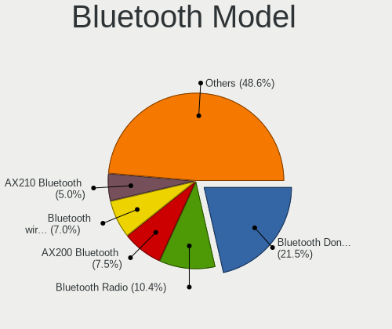

| Model                                                 | Desktops | Percent |
|-------------------------------------------------------|----------|---------|
| Cambridge Silicon Radio Bluetooth Dongle (HCI mode)   | 80       | 25.64%  |
| Realtek Bluetooth Radio                               | 28       | 8.97%   |
| Intel Bluetooth wireless interface                    | 27       | 8.65%   |
| Intel AX200 Bluetooth                                 | 23       | 7.37%   |
| Intel Wireless-AC 9260 Bluetooth Adapter              | 15       | 4.81%   |
| Intel Wireless-AC 3168 Bluetooth                      | 12       | 3.85%   |
| Broadcom BCM20702A0 Bluetooth 4.0                     | 11       | 3.53%   |
| Intel Bluetooth Device                                | 8        | 2.56%   |
| Intel AX210 Bluetooth                                 | 8        | 2.56%   |
| IMC Networks Bluetooth Radio                          | 7        | 2.24%   |
| Intel Bluetooth 9460/9560 Jefferson Peak (JfP)        | 6        | 1.92%   |
| Qualcomm Atheros AR9462 Bluetooth                     | 5        | 1.6%    |
| Dynex BCM20702A0                                      | 5        | 1.6%    |
| Qualcomm Atheros AR3011 Bluetooth                     | 4        | 1.28%   |
| ASUS Broadcom BCM20702A0 Bluetooth                    | 4        | 1.28%   |
| ASUS Bluetooth Radio                                  | 4        | 1.28%   |
| Apple Bluetooth USB Host Controller                   | 4        | 1.28%   |
| Realtek RTL8821A Bluetooth                            | 3        | 0.96%   |
| Qualcomm Atheros  Bluetooth Device                    | 3        | 0.96%   |
| Micro Star International Bluetooth Device             | 3        | 0.96%   |
| MediaTek Wireless_Device                              | 3        | 0.96%   |
| Intel Centrino Bluetooth Wireless Transceiver         | 3        | 0.96%   |
| Belkin Components F8T065BF Mini Bluetooth 4.0 Adapter | 3        | 0.96%   |
| Qualcomm Atheros Bluetooth USB Host Controller        | 2        | 0.64%   |
| Qualcomm Atheros Bluetooth                            | 2        | 0.64%   |
| Integrated System Solution Bluetooth Device           | 2        | 0.64%   |
| IMC Networks Bluetooth Module                         | 2        | 0.64%   |
| Dell BT Mini-Receiver                                 | 2        | 0.64%   |
| Broadcom HP Portable Bumble Bee                       | 2        | 0.64%   |
| Broadcom BCM92045B3 ROM                               | 2        | 0.64%   |
| Broadcom BCM43142A0 Bluetooth 4.0                     | 2        | 0.64%   |
| Broadcom BCM2045 Bluetooth                            | 2        | 0.64%   |
| ASUS Qualcomm Bluetooth 4.1                           | 2        | 0.64%   |
| Apple Bluetooth Host Controller                       | 2        | 0.64%   |
| TP-Link UB500 Adapter                                 | 1        | 0.32%   |
| Realtek RTL8723B Bluetooth                            | 1        | 0.32%   |
| Qualcomm Atheros AR3012 Bluetooth 4.0                 | 1        | 0.32%   |
| National Bluetooth Dongle                             | 1        | 0.32%   |
| Micro Star International Bluetooth Dongle             | 1        | 0.32%   |
| Logitech BT Mini-Receiver (HCI mode)                  | 1        | 0.32%   |
| Lite-On Bluetooth Device                              | 1        | 0.32%   |
| Integrated System Solution KY-BT100 Bluetooth Adapter | 1        | 0.32%   |
| IMC Networks Bluetooth Device                         | 1        | 0.32%   |
| HP Bluetooth 2.0 Interface [Broadcom BCM2045]         | 1        | 0.32%   |
| Fujitsu Bluetooth Device                              | 1        | 0.32%   |
| Foxconn / Hon Hai Bluetooth Device                    | 1        | 0.32%   |
| D-Link System DBT-122 Bluetooth                       | 1        | 0.32%   |
| Broadcom HP Bluetooth Module                          | 1        | 0.32%   |
| Broadcom Bluetooth dongle                             | 1        | 0.32%   |
| Broadcom Bluetooth Device                             | 1        | 0.32%   |
| Broadcom Bluetooth 2.0+EDR dongle                     | 1        | 0.32%   |
| Broadcom BCM92046DG-CL1ROM Bluetooth 2.1 Adapter      | 1        | 0.32%   |
| Broadcom BCM2035 Bluetooth dongle                     | 1        | 0.32%   |
| ASUS BCM20702A0                                       | 1        | 0.32%   |
| Apple Bluetooth HCI                                   | 1        | 0.32%   |

Sound
-----

Sound Vendor
------------

Sound card vendors

| Vendor                               | Desktops | Percent |
|--------------------------------------|----------|---------|
| Intel                                | 760      | 40.43%  |
| AMD                                  | 478      | 25.43%  |
| Nvidia                               | 433      | 23.03%  |
| C-Media Electronics                  | 50       | 2.66%   |
| Creative Labs                        | 24       | 1.28%   |
| VIA Technologies                     | 20       | 1.06%   |
| Logitech                             | 13       | 0.69%   |
| JMTek                                | 10       | 0.53%   |
| Kingston Technology                  | 8        | 0.43%   |
| Texas Instruments                    | 6        | 0.32%   |
| Silicon Integrated Systems [SiS]     | 6        | 0.32%   |
| GN Netcom                            | 6        | 0.32%   |
| Razer USA                            | 5        | 0.27%   |
| Plantronics                          | 5        | 0.27%   |
| Generalplus Technology               | 4        | 0.21%   |
| Creative Technology                  | 3        | 0.16%   |
| ASUSTek Computer                     | 3        | 0.16%   |
| Turtle Beach                         | 2        | 0.11%   |
| Thesycon Systemsoftware & Consulting | 2        | 0.11%   |
| Tenx Technology                      | 2        | 0.11%   |
| Micronas                             | 2        | 0.11%   |
| Ensoniq                              | 2        | 0.11%   |
| Corsair                              | 2        | 0.11%   |
| XMOS                                 | 1        | 0.05%   |
| Valve Software                       | 1        | 0.05%   |
| Swissonic                            | 1        | 0.05%   |
| SteelSeries ApS                      | 1        | 0.05%   |
| Silicon Labs                         | 1        | 0.05%   |
| Shenzhen Riitek Technology           | 1        | 0.05%   |
| SAVITECH                             | 1        | 0.05%   |
| Samsung Electronics                  | 1        | 0.05%   |
| ROCCAT                               | 1        | 0.05%   |
| Realtek Semiconductor                | 1        | 0.05%   |
| Qualcomm                             | 1        | 0.05%   |
| Numark                               | 1        | 0.05%   |
| Microsoft                            | 1        | 0.05%   |
| Micro Star International             | 1        | 0.05%   |
| Medeli Electronics                   | 1        | 0.05%   |
| LucidSound                           | 1        | 0.05%   |
| Klipsch Audio                        | 1        | 0.05%   |
| Jieli Technology                     | 1        | 0.05%   |
| Insignia (Best Buy)                  | 1        | 0.05%   |
| iCreate Technologies                 | 1        | 0.05%   |
| iConnectivity                        | 1        | 0.05%   |
| Google                               | 1        | 0.05%   |
| GEMBIRD                              | 1        | 0.05%   |
| Focusrite-Novation                   | 1        | 0.05%   |
| FIFINE Microphones                   | 1        | 0.05%   |
| Evolution Electronics                | 1        | 0.05%   |
| DigiTech                             | 1        | 0.05%   |
| Blue Microphones                     | 1        | 0.05%   |
| Avance Logic                         | 1        | 0.05%   |
| AudioQuest                           | 1        | 0.05%   |
| Audio-Technica                       | 1        | 0.05%   |
| Asahi Kasei Microsystems             | 1        | 0.05%   |
| Apple                                | 1        | 0.05%   |
| A4Tech                               | 1        | 0.05%   |

Sound Model
-----------

Sound card models

| Model                                                                             | Desktops | Percent |
|-----------------------------------------------------------------------------------|----------|---------|
| Intel 6 Series/C200 Series Chipset Family High Definition Audio Controller        | 122      | 5.67%   |
| AMD SBx00 Azalia (Intel HDA)                                                      | 121      | 5.62%   |
| Intel NM10/ICH7 Family High Definition Audio Controller                           | 114      | 5.3%    |
| Intel 8 Series/C220 Series Chipset High Definition Audio Controller               | 96       | 4.46%   |
| Intel Xeon E3-1200 v3/4th Gen Core Processor HD Audio Controller                  | 69       | 3.21%   |
| AMD Starship/Matisse HD Audio Controller                                          | 65       | 3.02%   |
| Nvidia GK208 HDMI/DP Audio Controller                                             | 63       | 2.93%   |
| AMD FCH Azalia Controller                                                         | 60       | 2.79%   |
| Intel 7 Series/C216 Chipset Family High Definition Audio Controller               | 56       | 2.6%    |
| AMD Family 17h (Models 00h-0fh) HD Audio Controller                               | 48       | 2.23%   |
| Intel 82801JI (ICH10 Family) HD Audio Controller                                  | 44       | 2.04%   |
| Intel 100 Series/C230 Series Chipset Family HD Audio Controller                   | 41       | 1.91%   |
| AMD Ellesmere HDMI Audio [Radeon RX 470/480 / 570/580/590]                        | 41       | 1.91%   |
| Intel 82801I (ICH9 Family) HD Audio Controller                                    | 37       | 1.72%   |
| Nvidia MCP61 High Definition Audio                                                | 36       | 1.67%   |
| Intel Cannon Lake PCH cAVS                                                        | 31       | 1.44%   |
| Nvidia High Definition Audio Controller                                           | 30       | 1.39%   |
| Intel 5 Series/3400 Series Chipset High Definition Audio                          | 29       | 1.35%   |
| AMD Family 17h/19h HD Audio Controller                                            | 29       | 1.35%   |
| Nvidia GF108 High Definition Audio Controller                                     | 26       | 1.21%   |
| Nvidia GF119 HDMI Audio Controller                                                | 25       | 1.16%   |
| Intel 200 Series PCH HD Audio                                                     | 25       | 1.16%   |
| AMD Oland/Hainan/Cape Verde/Pitcairn HDMI Audio [Radeon HD 7000 Series]           | 25       | 1.16%   |
| Nvidia GM107 High Definition Audio Controller [GeForce 940MX]                     | 24       | 1.12%   |
| AMD Cedar HDMI Audio [Radeon HD 5400/6300/7300 Series]                            | 23       | 1.07%   |
| Nvidia GP107GL High Definition Audio Controller                                   | 22       | 1.02%   |
| Intel 9 Series Chipset Family HD Audio Controller                                 | 21       | 0.98%   |
| AMD Caicos HDMI Audio [Radeon HD 6450 / 7450/8450/8490 OEM / R5 230/235/235X OEM] | 21       | 0.98%   |
| AMD Baffin HDMI/DP Audio [Radeon RX 550 640SP / RX 560/560X]                      | 19       | 0.88%   |
| Nvidia TU116 High Definition Audio Controller                                     | 18       | 0.84%   |
| AMD Raven/Raven2/Fenghuang HDMI/DP Audio Controller                               | 18       | 0.84%   |
| Intel 82801JD/DO (ICH10 Family) HD Audio Controller                               | 17       | 0.79%   |
| AMD RV710/730 HDMI Audio [Radeon HD 4000 series]                                  | 17       | 0.79%   |
| Nvidia GK107 HDMI Audio Controller                                                | 16       | 0.74%   |
| AMD Trinity HDMI Audio Controller                                                 | 15       | 0.7%    |
| AMD Navi 10 HDMI Audio                                                            | 15       | 0.7%    |
| AMD Kabini HDMI/DP Audio                                                          | 15       | 0.7%    |
| Nvidia GP104 High Definition Audio Controller                                     | 14       | 0.65%   |
| Nvidia TU106 High Definition Audio Controller                                     | 13       | 0.6%    |
| Nvidia GP106 High Definition Audio Controller                                     | 13       | 0.6%    |
| Intel Audio device                                                                | 13       | 0.6%    |
| Intel 82801EB/ER (ICH5/ICH5R) AC'97 Audio Controller                              | 13       | 0.6%    |
| C-Media Electronics CMI8738/CMI8768 PCI Audio                                     | 12       | 0.56%   |
| Nvidia GM206 High Definition Audio Controller                                     | 11       | 0.51%   |
| Nvidia MCP73 High Definition Audio                                                | 10       | 0.46%   |
| Nvidia GP108 High Definition Audio Controller                                     | 10       | 0.46%   |
| Nvidia GM204 High Definition Audio Controller                                     | 10       | 0.46%   |
| Intel Comet Lake PCH-V cAVS                                                       | 10       | 0.46%   |
| AMD RS780 HDMI Audio [Radeon 3000/3100 / HD 3200/3300]                            | 10       | 0.46%   |
| AMD Kaveri HDMI/DP Audio Controller                                               | 10       | 0.46%   |
| VIA Technologies VT8233/A/8235/8237 AC97 Audio Controller                         | 9        | 0.42%   |
| Nvidia GK106 HDMI Audio Controller                                                | 9        | 0.42%   |
| Nvidia GK104 HDMI Audio Controller                                                | 9        | 0.42%   |
| Intel 82801H (ICH8 Family) HD Audio Controller                                    | 9        | 0.42%   |
| AMD Navi 21/23 HDMI/DP Audio Controller                                           | 9        | 0.42%   |
| Intel Atom Processor Z36xxx/Z37xxx Series High Definition Audio Controller        | 8        | 0.37%   |
| C-Media Electronics Audio Adapter (Unitek Y-247A)                                 | 8        | 0.37%   |
| AMD Turks HDMI Audio [Radeon HD 6500/6600 / 6700M Series]                         | 8        | 0.37%   |
| AMD RS880 HDMI Audio [Radeon HD 4200 Series]                                      | 8        | 0.37%   |
| AMD Juniper HDMI Audio [Radeon HD 5700 Series]                                    | 8        | 0.37%   |

Memory
------

Memory Vendor
-------------

Memory module vendors

| Vendor              | Desktops | Percent |
|---------------------|----------|---------|
| Unknown             | 48       | 25.13%  |
| Kingston            | 25       | 13.09%  |
| Samsung Electronics | 19       | 9.95%   |
| Corsair             | 19       | 9.95%   |
| SK hynix            | 16       | 8.38%   |
| G.Skill             | 16       | 8.38%   |
| Crucial             | 14       | 7.33%   |
| Micron Technology   | 11       | 5.76%   |
| Elpida              | 6        | 3.14%   |
| Team                | 3        | 1.57%   |
| Ramaxel Technology  | 3        | 1.57%   |
| Patriot             | 2        | 1.05%   |
| Ramos Technology    | 1        | 0.52%   |
| Qimonda             | 1        | 0.52%   |
| PNY                 | 1        | 0.52%   |
| Nanya Technology    | 1        | 0.52%   |
| Goldkey             | 1        | 0.52%   |
| F7852C80            | 1        | 0.52%   |
| CSX                 | 1        | 0.52%   |
| ASint Technology    | 1        | 0.52%   |
| Unknown             | 1        | 0.52%   |

Memory Model
------------

Memory module models

| Model                                                   | Desktops | Percent |
|---------------------------------------------------------|----------|---------|
| Unknown RAM Module 1GB DIMM SDRAM                       | 4        | 1.94%   |
| Unknown RAM Module 4096MB DIMM DDR3 1333MT/s            | 3        | 1.46%   |
| G.Skill RAM F4-3200C16-8GVKB 8GB DIMM DDR4 3200MT/s     | 3        | 1.46%   |
| Unknown RAM Module 4GB DIMM 1333MT/s                    | 2        | 0.97%   |
| Unknown RAM Module 4096MB DIMM DDR3 1600MT/s            | 2        | 0.97%   |
| Unknown RAM Module 4096MB DIMM 667MT/s                  | 2        | 0.97%   |
| Unknown RAM Module 4096MB DIMM                          | 2        | 0.97%   |
| Unknown RAM Module 2048MB DIMM 800MT/s                  | 2        | 0.97%   |
| Unknown RAM Module 1GB DIMM DDR2                        | 2        | 0.97%   |
| Unknown RAM Module 1024MB DIMM DDR2 333MT/s             | 2        | 0.97%   |
| Unknown RAM Module 1024MB DIMM 800MT/s                  | 2        | 0.97%   |
| Unknown RAM Module 1024MB DIMM                          | 2        | 0.97%   |
| SK hynix RAM HMT451U6AFR8C-PB 4GB DIMM DDR3 1600MT/s    | 2        | 0.97%   |
| Samsung RAM M378B5273DH0-CH9 4GB DIMM DDR3 2133MT/s     | 2        | 0.97%   |
| Samsung RAM M378B1G73DB0-CK0 8GB DIMM DDR3 2133MT/s     | 2        | 0.97%   |
| Kingston RAM KHX2666C16/8G 8GB DIMM DDR4 3466MT/s       | 2        | 0.97%   |
| Kingston RAM KCM633-ELC 1GB DIMM DDR2 2048MT/s          | 2        | 0.97%   |
| Kingston RAM 99U5471-012.A00LF 4GB DIMM DDR3 1600MT/s   | 2        | 0.97%   |
| Elpida RAM EBJ20UF8BCF0-DJ-F 2GB DIMM DDR3 1333MT/s     | 2        | 0.97%   |
| Crucial RAM BLS4G3D1609DS1S00. 4GB DIMM DDR3 1600MT/s   | 2        | 0.97%   |
| Corsair RAM CMK8GX4M1D3000C16 8GB DIMM DDR4 3200MT/s    | 2        | 0.97%   |
| Unknown RAM TM44D18UD04MU-NUK 4096MB DIMM DDR4 2400MT/s | 1        | 0.49%   |
| Unknown RAM Module 8GB DIMM DDR4 2400MT/s               | 1        | 0.49%   |
| Unknown RAM Module 8GB DIMM DDR3 1333MT/s               | 1        | 0.49%   |
| Unknown RAM Module 8GB DIMM 1333MT/s                    | 1        | 0.49%   |
| Unknown RAM Module 8192MB DIMM SDRAM                    | 1        | 0.49%   |
| Unknown RAM Module 8192MB DIMM DDR4 2400MT/s            | 1        | 0.49%   |
| Unknown RAM Module 8192MB DIMM DDR3 1333MT/s            | 1        | 0.49%   |
| Unknown RAM Module 512MB DIMM 400MT/s                   | 1        | 0.49%   |
| Unknown RAM Module 512MB DIMM 333MT/s                   | 1        | 0.49%   |
| Unknown RAM Module 4GB DIMM DDR3 1333MT/s               | 1        | 0.49%   |
| Unknown RAM Module 4GB DIMM 400MT/s                     | 1        | 0.49%   |
| Unknown RAM Module 4GB DIMM 1600MT/s                    | 1        | 0.49%   |
| Unknown RAM Module 4096MB DIMM DDR 1600MT/s             | 1        | 0.49%   |
| Unknown RAM Module 4096MB DIMM 400MT/s                  | 1        | 0.49%   |
| Unknown RAM Module 4096MB DIMM 1333MT/s                 | 1        | 0.49%   |
| Unknown RAM Module 2GB DIMM SDRAM 800MT/s               | 1        | 0.49%   |
| Unknown RAM Module 2GB DIMM SDRAM                       | 1        | 0.49%   |
| Unknown RAM Module 2GB DIMM DDR2 800MT/s                | 1        | 0.49%   |
| Unknown RAM Module 2GB DIMM DDR2                        | 1        | 0.49%   |
| Unknown RAM Module 2GB DIMM DDR 667MT/s                 | 1        | 0.49%   |
| Unknown RAM Module 2GB DIMM 800MT/s                     | 1        | 0.49%   |
| Unknown RAM Module 2GB DIMM 667MT/s                     | 1        | 0.49%   |
| Unknown RAM Module 2048MB SODIMM DDR3 1600MT/s          | 1        | 0.49%   |
| Unknown RAM Module 2048MB DIMM DDR3 1333MT/s            | 1        | 0.49%   |
| Unknown RAM Module 2048MB DIMM DDR3 1066MT/s            | 1        | 0.49%   |
| Unknown RAM Module 2048MB DIMM DDR2 333MT/s             | 1        | 0.49%   |
| Unknown RAM Module 2048MB DIMM DDR2 1333MT/s            | 1        | 0.49%   |
| Unknown RAM Module 2048MB DIMM                          | 1        | 0.49%   |
| Unknown RAM Module 1GB DIMM DDR2 333MT/s                | 1        | 0.49%   |
| Unknown RAM Module 1GB DIMM 800MT/s                     | 1        | 0.49%   |
| Unknown RAM Module 1GB DIMM 400MT/s                     | 1        | 0.49%   |
| Unknown RAM Module 1024MB DIMM SDRAM                    | 1        | 0.49%   |
| Unknown RAM Module 1024MB DIMM DDR2 533MT/s             | 1        | 0.49%   |
| Unknown RAM 04S2400CL17A 4096MB DIMM DDR4 2400MT/s      | 1        | 0.49%   |
| Team RAM TEAMGROUP-UD4-3600 32GB DIMM DDR4 3600MT/s     | 1        | 0.49%   |
| Team RAM TEAMGROUP-UD4-2666 16GB DIMM DDR4 3000MT/s     | 1        | 0.49%   |
| Team RAM TEAMGROUP-UD3-1600 8GB DIMM DDR3 1600MT/s      | 1        | 0.49%   |
| SK hynix RAM Module 8192MB SODIMM DDR4 2666MT/s         | 1        | 0.49%   |
| SK hynix RAM HYMP125U64CP8-S6 2GB DIMM DDR2 49926MT/s   | 1        | 0.49%   |

Memory Kind
-----------

Memory module kinds

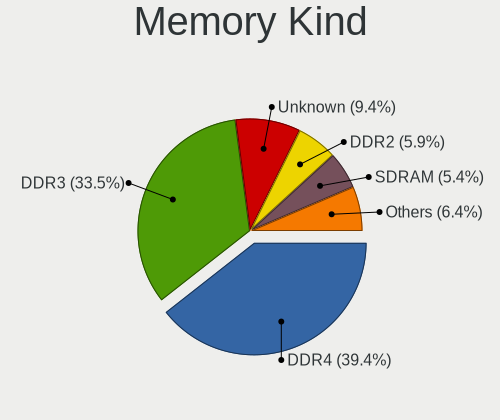

| Kind    | Desktops | Percent |
|---------|----------|---------|
| DDR3    | 61       | 36.09%  |
| DDR4    | 54       | 31.95%  |
| Unknown | 23       | 13.61%  |
| DDR2    | 17       | 10.06%  |
| SDRAM   | 11       | 6.51%   |
| DDR     | 2        | 1.18%   |
| LPDDR4  | 1        | 0.59%   |

Memory Form Factor
------------------

Physical design of the memory module

| Name         | Desktops | Percent |
|--------------|----------|---------|
| DIMM         | 157      | 95.15%  |
| SODIMM       | 6        | 3.64%   |
| Row Of Chips | 1        | 0.61%   |
| FB-DIMM      | 1        | 0.61%   |

Memory Size
-----------

Memory module size

| Size  | Desktops | Percent |
|-------|----------|---------|
| 8192  | 61       | 32.8%   |
| 4096  | 51       | 27.42%  |
| 2048  | 32       | 17.2%   |
| 1024  | 23       | 12.37%  |
| 16384 | 14       | 7.53%   |
| 32768 | 4        | 2.15%   |
| 512   | 1        | 0.54%   |

Memory Speed
------------

Memory module speed

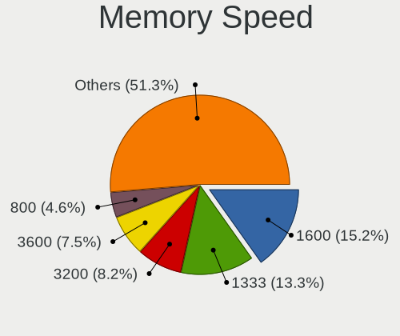

| Speed   | Desktops | Percent |
|---------|----------|---------|
| 1600    | 34       | 18.68%  |
| 1333    | 28       | 15.38%  |
| 3200    | 14       | 7.69%   |
| 3600    | 12       | 6.59%   |
| 800     | 12       | 6.59%   |
| Unknown | 12       | 6.59%   |
| 3466    | 6        | 3.3%    |
| 2400    | 6        | 3.3%    |
| 2133    | 6        | 3.3%    |
| 667     | 6        | 3.3%    |
| 3000    | 4        | 2.2%    |
| 2667    | 4        | 2.2%    |
| 1866    | 4        | 2.2%    |
| 333     | 4        | 2.2%    |
| 1800    | 3        | 1.65%   |
| 400     | 3        | 1.65%   |
| 2933    | 2        | 1.1%    |
| 2800    | 2        | 1.1%    |
| 2666    | 2        | 1.1%    |
| 2048    | 2        | 1.1%    |
| 1867    | 2        | 1.1%    |
| 1066    | 2        | 1.1%    |
| 49926   | 1        | 0.55%   |
| 4400    | 1        | 0.55%   |
| 4000    | 1        | 0.55%   |
| 3533    | 1        | 0.55%   |
| 3333    | 1        | 0.55%   |
| 3151    | 1        | 0.55%   |
| 2200    | 1        | 0.55%   |
| 2134    | 1        | 0.55%   |
| 1639    | 1        | 0.55%   |
| 1400    | 1        | 0.55%   |
| 976     | 1        | 0.55%   |
| 533     | 1        | 0.55%   |

Printers & scanners
-------------------

Printer Vendor
--------------

Printer device vendors

| Vendor              | Desktops | Percent |
|---------------------|----------|---------|
| Hewlett-Packard     | 18       | 26.87%  |
| Canon               | 15       | 22.39%  |
| Brother Industries  | 13       | 19.4%   |
| Samsung Electronics | 9        | 13.43%  |
| Seiko Epson         | 8        | 11.94%  |
| Toshiba TEC         | 1        | 1.49%   |
| STMicroelectronics  | 1        | 1.49%   |
| Ricoh               | 1        | 1.49%   |
| Pantum              | 1        | 1.49%   |

Printer Model
-------------

Printer device models

| Model                                                     | Desktops | Percent |
|-----------------------------------------------------------|----------|---------|
| Canon PIXMA MG2500 Series                                 | 3        | 4.48%   |
| Seiko Epson L3110 Series                                  | 2        | 2.99%   |
| Samsung ML-216x Series Laser Printer                      | 2        | 2.99%   |
| HP ENVY 5000 series                                       | 2        | 2.99%   |
| HP ENVY 4520 series                                       | 2        | 2.99%   |
| Canon TS3100 series                                       | 2        | 2.99%   |
| Canon MF4010 series                                       | 2        | 2.99%   |
| Brother HL-2130 series                                    | 2        | 2.99%   |
| Toshiba TEC e-STD120 USB                                  | 1        | 1.49%   |
| STMicroelectronics LED badge -- mini LED display -- 11x44 | 1        | 1.49%   |
| Seiko Epson XP-7100 Series                                | 1        | 1.49%   |
| Seiko Epson XP-202 203 206 Series                         | 1        | 1.49%   |
| Seiko Epson ME 320/330 Series [Stylus SX125]              | 1        | 1.49%   |
| Seiko Epson L222 Series                                   | 1        | 1.49%   |
| Seiko Epson L120 Series                                   | 1        | 1.49%   |
| Seiko Epson ET-2820 Series                                | 1        | 1.49%   |
| Samsung SCX-483x 5x3x Series                              | 1        | 1.49%   |
| Samsung SCX-4200 series                                   | 1        | 1.49%   |
| Samsung SCX-3400 Series                                   | 1        | 1.49%   |
| Samsung ML-2010P Mono Laser Printer                       | 1        | 1.49%   |
| Samsung M2070 Series                                      | 1        | 1.49%   |
| Samsung CLX-3300 Series                                   | 1        | 1.49%   |
| Samsung C460 Series                                       | 1        | 1.49%   |
| Ricoh SP C250SF                                           | 1        | 1.49%   |
| Pantum P2500W series                                      | 1        | 1.49%   |
| HP Smart Tank 510 series                                  | 1        | 1.49%   |
| HP OfficeJet 4650 series                                  | 1        | 1.49%   |
| HP OfficeJet 3830 series                                  | 1        | 1.49%   |
| HP LaserJet Professional P1102w                           | 1        | 1.49%   |
| HP LaserJet Professional P 1102w                          | 1        | 1.49%   |
| HP LaserJet P2014                                         | 1        | 1.49%   |
| HP LaserJet P1102                                         | 1        | 1.49%   |
| HP LaserJet 3050                                          | 1        | 1.49%   |
| HP DeskJet F2492 All-in-One                               | 1        | 1.49%   |
| HP DeskJet 930c                                           | 1        | 1.49%   |
| HP Deskjet 4620 series                                    | 1        | 1.49%   |
| HP Deskjet 3050A                                          | 1        | 1.49%   |
| HP DeskJet 2700 series                                    | 1        | 1.49%   |
| HP Deskjet 1050 J410                                      | 1        | 1.49%   |
| Canon TR4500 series                                       | 1        | 1.49%   |
| Canon Pixma iP4500 Printer                                | 1        | 1.49%   |
| Canon LiDE 400                                            | 1        | 1.49%   |
| Canon LiDE 300                                            | 1        | 1.49%   |
| Canon LBP810                                              | 1        | 1.49%   |
| Canon iP7200 series                                       | 1        | 1.49%   |
| Canon iP4200                                              | 1        | 1.49%   |
| Canon FAXPHONE L80                                        | 1        | 1.49%   |
| Brother MFC-J470DW                                        | 1        | 1.49%   |
| Brother MFC-J1010DW                                       | 1        | 1.49%   |
| Brother MFC-9140CDN                                       | 1        | 1.49%   |
| Brother HL-L2380DW                                        | 1        | 1.49%   |
| Brother HL-L2350DW series                                 | 1        | 1.49%   |
| Brother HL-L2340D series                                  | 1        | 1.49%   |
| Brother HL-52x0 series                                    | 1        | 1.49%   |
| Brother HL-3142CW series                                  | 1        | 1.49%   |
| Brother HL-2140 series                                    | 1        | 1.49%   |
| Brother DCP-L2540DW                                       | 1        | 1.49%   |
| Brother DCP-1610W                                         | 1        | 1.49%   |

Scanner Vendor
--------------

Scanner device vendors

| Vendor          | Desktops | Percent |
|-----------------|----------|---------|
| Canon           | 6        | 85.71%  |
| Hewlett-Packard | 1        | 14.29%  |

Scanner Model
-------------

Scanner device models

| Model                              | Desktops | Percent |
|------------------------------------|----------|---------|
| Canon CanoScan LiDE 100            | 2        | 28.57%  |
| HP ScanJet 2400c                   | 1        | 14.29%  |
| Canon CanoScan N670U/N676U/LiDE 20 | 1        | 14.29%  |
| Canon CanoScan LIDE 25             | 1        | 14.29%  |
| Canon CanoScan LiDE 110            | 1        | 14.29%  |
| Canon CanoScan 8800F               | 1        | 14.29%  |

Camera
------

Camera Vendor
-------------

Camera device vendors

| Vendor                        | Desktops | Percent |
|-------------------------------|----------|---------|
| Logitech                      | 42       | 26.58%  |
| Microdia                      | 15       | 9.49%   |
| Microsoft                     | 13       | 8.23%   |
| Samsung Electronics           | 9        | 5.7%    |
| Chicony Electronics           | 8        | 5.06%   |
| Apple                         | 8        | 5.06%   |
| Sunplus Innovation Technology | 5        | 3.16%   |
| Generalplus Technology        | 5        | 3.16%   |
| Cubeternet                    | 5        | 3.16%   |
| ARC International             | 4        | 2.53%   |
| Z-Star Microelectronics       | 3        | 1.9%    |
| Jieli Technology              | 3        | 1.9%    |
| IMC Networks                  | 3        | 1.9%    |
| Arkmicro Technologies         | 3        | 1.9%    |
| Sonix Technology              | 2        | 1.27%   |
| Realtek Semiconductor         | 2        | 1.27%   |
| Razer USA                     | 2        | 1.27%   |
| Guillemot                     | 2        | 1.27%   |
| Genesys Logic                 | 2        | 1.27%   |
| Creative Technology           | 2        | 1.27%   |
| AVerMedia Technologies        | 2        | 1.27%   |
| Aveo Technology               | 2        | 1.27%   |
| Alcor Micro                   | 2        | 1.27%   |
| Xiongmai                      | 1        | 0.63%   |
| Unknown                       | 1        | 0.63%   |
| Teslong Camera                | 1        | 0.63%   |
| Suyin                         | 1        | 0.63%   |
| Sunplus Technology            | 1        | 0.63%   |
| Pixart Imaging                | 1        | 0.63%   |
| Novatel Wireless              | 1        | 0.63%   |
| Novatek Microelectronics      | 1        | 0.63%   |
| lihappe8                      | 1        | 0.63%   |
| LG Electronics                | 1        | 0.63%   |
| INOGENI                       | 1        | 0.63%   |
| Hewlett-Packard               | 1        | 0.63%   |
| GEMBIRD                       | 1        | 0.63%   |
| 2M UVC CAMERA                 | 1        | 0.63%   |

Camera Model
------------

Camera device models

| Model                                       | Desktops | Percent |
|---------------------------------------------|----------|---------|
| Logitech Webcam C270                        | 13       | 8.13%   |
| Samsung Galaxy series, misc. (MTP mode)     | 9        | 5.63%   |
| Apple iPhone 5/5C/5S/6/SE                   | 7        | 4.38%   |
| Microsoft LifeCam HD-3000                   | 6        | 3.75%   |
| Logitech HD Pro Webcam C920                 | 5        | 3.13%   |
| Chicony HP High Definition 1MP Webcam       | 5        | 3.13%   |
| Generalplus GENERAL WEBCAM                  | 4        | 2.5%    |
| ARC International Camera                    | 4        | 2.5%    |
| Sunplus Full HD webcam                      | 3        | 1.88%   |
| Microdia Webcam Vitade AF                   | 3        | 1.88%   |
| Logitech C922 Pro Stream Webcam             | 3        | 1.88%   |
| Jieli USB PHY 2.0                           | 3        | 1.88%   |
| Cubeternet GL-UPC822 UVC WebCam             | 3        | 1.88%   |
| Razer USA Gaming Webcam [Kiyo]              | 2        | 1.25%   |
| Microsoft LifeCam VX-2000                   | 2        | 1.25%   |
| Microdia USB Live camera                    | 2        | 1.25%   |
| Microdia USB 2.0 Camera                     | 2        | 1.25%   |
| Microdia Camera                             | 2        | 1.25%   |
| Logitech Webcam C310                        | 2        | 1.25%   |
| Logitech Webcam C250                        | 2        | 1.25%   |
| Logitech QuickCam Pro 9000                  | 2        | 1.25%   |
| Logitech HD Webcam C910                     | 2        | 1.25%   |
| Logitech HD Webcam C615                     | 2        | 1.25%   |
| Logitech C920 PRO HD Webcam                 | 2        | 1.25%   |
| AVerMedia Live Streamer CAM 313             | 2        | 1.25%   |
| Arkmicro USB2.0 PC CAMERA                   | 2        | 1.25%   |
| Z-Star Venus USB2.0 Camera                  | 1        | 0.63%   |
| Z-Star Vega USB 2.0 Camera                  | 1        | 0.63%   |
| Z-Star Integrated Camera                    | 1        | 0.63%   |
| Xiongmai web camera                         | 1        | 0.63%   |
| Unknown HD camera                           | 1        | 0.63%   |
| Teslong Camera Teslong Camera               | 1        | 0.63%   |
| Suyin HD WebCam                             | 1        | 0.63%   |
| Sunplus General Image Device                | 1        | 0.63%   |
| Sunplus FHD Camera Microphone               | 1        | 0.63%   |
| Sunplus Aukey-PC-LM1E Camera                | 1        | 0.63%   |
| Sonix USB2.0_Camera                         | 1        | 0.63%   |
| Sonix USB 2.0 Camera                        | 1        | 0.63%   |
| Realtek WEB CAMERA M9 Pro                   | 1        | 0.63%   |
| Realtek HP High Definition 1MP Webcam       | 1        | 0.63%   |
| Pixart Imaging GE 1.3 MP MiniCam Pro        | 1        | 0.63%   |
| Novatel Wireless Merlin U740 (non-Vodafone) | 1        | 0.63%   |
| Novatek HP High Definition 2MP Webcam       | 1        | 0.63%   |
| Microsoft USB3.0 HD CAMERA                  | 1        | 0.63%   |
| Microsoft Microsoft LifeCam Cinema        | 1        | 0.63%   |
| Microsoft LifeCam Studio                    | 1        | 0.63%   |
| Microsoft LifeCam HD-5000                   | 1        | 0.63%   |
| Microsoft LifeCam Cinema                    | 1        | 0.63%   |
| Microdia Sonix USB 2.0 Camera               | 1        | 0.63%   |
| Microdia PC Camera (SN9C110)                | 1        | 0.63%   |
| Microdia NEXIGO HD Webcam                   | 1        | 0.63%   |
| Microdia MSI Starcam Racer                  | 1        | 0.63%   |
| Microdia Integrated Camera                  | 1        | 0.63%   |
| Microdia AUKEY PC-W1                        | 1        | 0.63%   |
| Logitech Webcam Pro 9000                    | 1        | 0.63%   |
| Logitech Webcam C260                        | 1        | 0.63%   |
| Logitech Webcam B500                        | 1        | 0.63%   |
| Logitech QuickCam Pro for Notebooks         | 1        | 0.63%   |
| Logitech QuickCam Pro 4000                  | 1        | 0.63%   |
| Logitech QuickCam E 3500                    | 1        | 0.63%   |

Security
--------

Fingerprint Vendor
------------------

Fingerprint sensor vendors

| Vendor                | Desktops | Percent |
|-----------------------|----------|---------|
| LighTuning Technology | 1        | 100%    |

Fingerprint Model
-----------------

Fingerprint sensor models

| Model                                     | Desktops | Percent |
|-------------------------------------------|----------|---------|
| LighTuning ES603 Swipe Fingerprint Sensor | 1        | 100%    |

Chipcard Vendor
---------------

Chipcard module vendors

| Vendor                   | Desktops | Percent |
|--------------------------|----------|---------|
| Alcor Micro              | 2        | 33.33%  |
| Reiner SCT Kartensysteme | 1        | 16.67%  |
| Realtek Semiconductor    | 1        | 16.67%  |
| Kobil Systems            | 1        | 16.67%  |
| Advanced Card Systems    | 1        | 16.67%  |

Chipcard Model
--------------

Chipcard module models

| Model                                             | Desktops | Percent |
|---------------------------------------------------|----------|---------|
| Alcor Micro AU9540 Smartcard Reader               | 2        | 33.33%  |
| Reiner SCT Kartensysteme cyberJack e-com/pinpad   | 1        | 16.67%  |
| Realtek Semiconductor Smart Card Reader Interface | 1        | 16.67%  |
| Kobil Systems KOBIL Class 3 Reader                | 1        | 16.67%  |
| Advanced Card Systems ACR39U                      | 1        | 16.67%  |

Unsupported
-----------

Unsupported Devices
-------------------

Total unsupported devices on board

| Total | Desktops | Percent |
|-------|----------|---------|
| 0     | 978      | 80.63%  |
| 1     | 205      | 16.9%   |
| 2     | 26       | 2.14%   |
| 3     | 3        | 0.25%   |
| 4     | 1        | 0.08%   |

Unsupported Device Types
------------------------

Types of unsupported devices

| Type                     | Desktops | Percent |
|--------------------------|----------|---------|
| Graphics card            | 109      | 42.58%  |
| Net/wireless             | 83       | 32.42%  |
| Communication controller | 21       | 8.2%    |
| Multimedia controller    | 13       | 5.08%   |
| Unassigned class         | 8        | 3.13%   |
| Modem                    | 5        | 1.95%   |
| Chipcard                 | 5        | 1.95%   |
| Sound                    | 3        | 1.17%   |
| Storage/raid             | 2        | 0.78%   |
| Camera                   | 2        | 0.78%   |
| Storage/nvme             | 1        | 0.39%   |
| Storage/ide              | 1        | 0.39%   |
| Storage                  | 1        | 0.39%   |
| Fingerprint reader       | 1        | 0.39%   |
| Card reader              | 1        | 0.39%   |

