Zorin - Tested Hardware & Statistics (Notebooks)
------------------------------------------------

A project to collect tested hardware configurations for Zorin.

Anyone can contribute to this report by the [hw-probe](https://github.com/linuxhw/hw-probe) tool:

    sudo -E hw-probe -all -upload

Please contribute! Especially if your hardware is rare.

Contents
--------

* [ Test Cases ](#test-cases)

* [ System ](#system)
  - [ OS                       ](#os)
  - [ OS Family                ](#os-family)
  - [ Kernel                   ](#kernel)
  - [ Kernel Family            ](#kernel-family)
  - [ Kernel Major Ver.        ](#kernel-major-ver)
  - [ Arch                     ](#arch)
  - [ DE                       ](#de)
  - [ Display Server           ](#display-server)
  - [ Display Manager          ](#display-manager)
  - [ OS Lang                  ](#os-lang)
  - [ Boot Mode                ](#boot-mode)
  - [ Filesystem               ](#filesystem)
  - [ Part. scheme             ](#part-scheme)
  - [ Dual Boot with Linux/BSD ](#dual-boot-with-linuxbsd)
  - [ Dual Boot (Win)          ](#dual-boot-win)

* [ Board ](#board)
  - [ Vendor                   ](#vendor)
  - [ Model                    ](#model)
  - [ Model Family             ](#model-family)
  - [ MFG Year                 ](#mfg-year)
  - [ Form Factor              ](#form-factor)
  - [ Secure Boot              ](#secure-boot)
  - [ Coreboot                 ](#coreboot)
  - [ RAM Size                 ](#ram-size)
  - [ RAM Used                 ](#ram-used)
  - [ Total Drives             ](#total-drives)
  - [ Has CD-ROM               ](#has-cd-rom)
  - [ Has Ethernet             ](#has-ethernet)
  - [ Has WiFi                 ](#has-wifi)
  - [ Has Bluetooth            ](#has-bluetooth)

* [ Location ](#location)
  - [ Country                  ](#country)
  - [ City                     ](#city)

* [ Drives ](#drives)
  - [ Drive Vendor             ](#drive-vendor)
  - [ Drive Model              ](#drive-model)
  - [ HDD Vendor               ](#hdd-vendor)
  - [ SSD Vendor               ](#ssd-vendor)
  - [ Drive Kind               ](#drive-kind)
  - [ Drive Connector          ](#drive-connector)
  - [ Drive Size               ](#drive-size)
  - [ Space Total              ](#space-total)
  - [ Space Used               ](#space-used)
  - [ Malfunc. Drives          ](#malfunc-drives)
  - [ Malfunc. Drive Vendor    ](#malfunc-drive-vendor)
  - [ Malfunc. HDD Vendor      ](#malfunc-hdd-vendor)
  - [ Malfunc. Drive Kind      ](#malfunc-drive-kind)
  - [ Failed Drives            ](#failed-drives)
  - [ Failed Drive Vendor      ](#failed-drive-vendor)
  - [ Drive Status             ](#drive-status)

* [ Storage controller ](#storage-controller)
  - [ Storage Vendor           ](#storage-vendor)
  - [ Storage Model            ](#storage-model)
  - [ Storage Kind             ](#storage-kind)

* [ Processor ](#processor)
  - [ CPU Vendor               ](#cpu-vendor)
  - [ CPU Model                ](#cpu-model)
  - [ CPU Model Family         ](#cpu-model-family)
  - [ CPU Cores                ](#cpu-cores)
  - [ CPU Sockets              ](#cpu-sockets)
  - [ CPU Threads              ](#cpu-threads)
  - [ CPU Op-Modes             ](#cpu-op-modes)
  - [ CPU Microcode            ](#cpu-microcode)
  - [ CPU Microarch            ](#cpu-microarch)

* [ Graphics ](#graphics)
  - [ GPU Vendor               ](#gpu-vendor)
  - [ GPU Model                ](#gpu-model)
  - [ GPU Combo                ](#gpu-combo)
  - [ GPU Driver               ](#gpu-driver)
  - [ GPU Memory               ](#gpu-memory)

* [ Monitor ](#monitor)
  - [ Monitor Vendor           ](#monitor-vendor)
  - [ Monitor Model            ](#monitor-model)
  - [ Monitor Resolution       ](#monitor-resolution)
  - [ Monitor Diagonal         ](#monitor-diagonal)
  - [ Monitor Width            ](#monitor-width)
  - [ Aspect Ratio             ](#aspect-ratio)
  - [ Monitor Area             ](#monitor-area)
  - [ Pixel Density            ](#pixel-density)
  - [ Multiple Monitors        ](#multiple-monitors)

* [ Network ](#network)
  - [ Net Controller Vendor    ](#net-controller-vendor)
  - [ Net Controller Model     ](#net-controller-model)
  - [ Wireless Vendor          ](#wireless-vendor)
  - [ Wireless Model           ](#wireless-model)
  - [ Ethernet Vendor          ](#ethernet-vendor)
  - [ Ethernet Model           ](#ethernet-model)
  - [ Net Controller Kind      ](#net-controller-kind)
  - [ Used Controller          ](#used-controller)
  - [ NICs                     ](#nics)
  - [ IPv6                     ](#ipv6)

* [ Bluetooth ](#bluetooth)
  - [ Bluetooth Vendor         ](#bluetooth-vendor)
  - [ Bluetooth Model          ](#bluetooth-model)

* [ Sound ](#sound)
  - [ Sound Vendor             ](#sound-vendor)
  - [ Sound Model              ](#sound-model)

* [ Memory ](#memory)
  - [ Memory Vendor            ](#memory-vendor)
  - [ Memory Model             ](#memory-model)
  - [ Memory Kind              ](#memory-kind)
  - [ Memory Form Factor       ](#memory-form-factor)
  - [ Memory Size              ](#memory-size)
  - [ Memory Speed             ](#memory-speed)

* [ Printers & scanners ](#printers--scanners)
  - [ Printer Vendor           ](#printer-vendor)
  - [ Printer Model            ](#printer-model)
  - [ Scanner Vendor           ](#scanner-vendor)
  - [ Scanner Model            ](#scanner-model)

* [ Camera ](#camera)
  - [ Camera Vendor            ](#camera-vendor)
  - [ Camera Model             ](#camera-model)

* [ Security ](#security)
  - [ Fingerprint Vendor       ](#fingerprint-vendor)
  - [ Fingerprint Model        ](#fingerprint-model)
  - [ Chipcard Vendor          ](#chipcard-vendor)
  - [ Chipcard Model           ](#chipcard-model)

* [ Unsupported ](#unsupported)
  - [ Unsupported Devices      ](#unsupported-devices)
  - [ Unsupported Device Types ](#unsupported-device-types)

Test Cases
----------

Total: 9984

| Vendor        | Model                       | Probe                                                      | Date         |
|---------------|-----------------------------|------------------------------------------------------------|--------------|
| Acer          | Swift SF314-54              | [281c504c79](https://linux-hardware.org/?probe=281c504c79) | Jan 03, 2026 |
| Acer          | Swift SF314-54              | [037f842c97](https://linux-hardware.org/?probe=037f842c97) | Jan 03, 2026 |
| Dell          | Latitude 3540               | [d656755088](https://linux-hardware.org/?probe=d656755088) | Jan 03, 2026 |
| Lenovo        | G580 20150                  | [d3d07e533b](https://linux-hardware.org/?probe=d3d07e533b) | Jan 03, 2026 |
| Fujitsu       | LIFEBOOK T732               | [2fe9801a6a](https://linux-hardware.org/?probe=2fe9801a6a) | Jan 03, 2026 |
| Fujitsu       | LIFEBOOK T732               | [2e6f1de3a0](https://linux-hardware.org/?probe=2e6f1de3a0) | Jan 03, 2026 |
| Sony          | SVP11213SGBI                | [811f8094ee](https://linux-hardware.org/?probe=811f8094ee) | Jan 03, 2026 |
| HP            | Pavilion Gaming Laptop 1... | [24c6012497](https://linux-hardware.org/?probe=24c6012497) | Jan 03, 2026 |
| Dell          | Inspiron 15 7000 Gaming     | [87390776f0](https://linux-hardware.org/?probe=87390776f0) | Jan 03, 2026 |
| Unknown       | AX16PRO                     | [d0382f0dc3](https://linux-hardware.org/?probe=d0382f0dc3) | Jan 02, 2026 |
| Dell          | Inspiron 7348               | [7270e26497](https://linux-hardware.org/?probe=7270e26497) | Jan 02, 2026 |
| Acer          | Aspire A315-56              | [f77cb59b47](https://linux-hardware.org/?probe=f77cb59b47) | Jan 02, 2026 |
| Lenovo        | G780                        | [6198d78216](https://linux-hardware.org/?probe=6198d78216) | Jan 02, 2026 |
| Razer         | Blade                       | [527977cc02](https://linux-hardware.org/?probe=527977cc02) | Jan 02, 2026 |
| Medion        | Akoya P6638                 | [d20af3a9af](https://linux-hardware.org/?probe=d20af3a9af) | Jan 02, 2026 |
| HP            | EliteBook 820 G1            | [1913ee9bb6](https://linux-hardware.org/?probe=1913ee9bb6) | Jan 02, 2026 |
| Multilaser    | PC224                       | [7a37068737](https://linux-hardware.org/?probe=7a37068737) | Dec 31, 2025 |
| Sony          | VGN-Z46SD_B                 | [8dc5027b7a](https://linux-hardware.org/?probe=8dc5027b7a) | Dec 31, 2025 |
| Apple         | MacBookPro5,5               | [749a0a5f42](https://linux-hardware.org/?probe=749a0a5f42) | Dec 31, 2025 |
| Acer          | Aspire 5610Z                | [f71a36d120](https://linux-hardware.org/?probe=f71a36d120) | Dec 31, 2025 |
| ASUSTek       | ZenBook UX481FL_UX481FL     | [327399c089](https://linux-hardware.org/?probe=327399c089) | Dec 31, 2025 |
| Acer          | Aspire 5610Z                | [65b9e7d9f1](https://linux-hardware.org/?probe=65b9e7d9f1) | Dec 31, 2025 |
| Lenovo        | G580 20150                  | [66dd7cee8c](https://linux-hardware.org/?probe=66dd7cee8c) | Dec 31, 2025 |
| Dell          | Latitude 3310               | [bc4c55a2c0](https://linux-hardware.org/?probe=bc4c55a2c0) | Dec 31, 2025 |
| HP            | Pavilion dm4                | [ee4128c66a](https://linux-hardware.org/?probe=ee4128c66a) | Dec 31, 2025 |
| CONNEX        | L1430 PRO                   | [444862d127](https://linux-hardware.org/?probe=444862d127) | Dec 31, 2025 |
| HP            | Pavilion dv6700             | [ee6b026a4f](https://linux-hardware.org/?probe=ee6b026a4f) | Dec 30, 2025 |
| ASUSTek       | K53SV                       | [3c552c49fd](https://linux-hardware.org/?probe=3c552c49fd) | Dec 30, 2025 |
| ASUSTek       | K53SJ                       | [701597645a](https://linux-hardware.org/?probe=701597645a) | Dec 30, 2025 |
| HUAWEI        | MACHC-WAX9                  | [a32dadf7a8](https://linux-hardware.org/?probe=a32dadf7a8) | Dec 30, 2025 |
| Dell          | Latitude E7450              | [adc726ab64](https://linux-hardware.org/?probe=adc726ab64) | Dec 30, 2025 |
| HP            | ProBook 470 G5              | [a48dc616a7](https://linux-hardware.org/?probe=a48dc616a7) | Dec 30, 2025 |
| ASUSTek       | ASUS TUF Dash F15 FX517Z... | [ecd345f824](https://linux-hardware.org/?probe=ecd345f824) | Dec 30, 2025 |
| Positivo B... | VJFE62F11X-B1111H           | [331b563fd3](https://linux-hardware.org/?probe=331b563fd3) | Dec 30, 2025 |
| HP            | Pavilion Gaming Laptop      | [f6e4512df5](https://linux-hardware.org/?probe=f6e4512df5) | Dec 30, 2025 |
| Dell          | Latitude 3310               | [8f04d20f9b](https://linux-hardware.org/?probe=8f04d20f9b) | Dec 30, 2025 |
| Medion        | P6622                       | [b3bc3f8447](https://linux-hardware.org/?probe=b3bc3f8447) | Dec 30, 2025 |
| Dell          | Vostro 3560                 | [5c849c2801](https://linux-hardware.org/?probe=5c849c2801) | Dec 30, 2025 |
| Lenovo        | ThinkPad X270 20HMA1G5JP    | [8d34842fa8](https://linux-hardware.org/?probe=8d34842fa8) | Dec 30, 2025 |
| Lenovo        | IdeaPad Pro 5 16AHP9 83D... | [5b20ad7e39](https://linux-hardware.org/?probe=5b20ad7e39) | Dec 30, 2025 |
| ASUSTek       | ProArt StudioBook W730G5... | [b58bba13b8](https://linux-hardware.org/?probe=b58bba13b8) | Dec 29, 2025 |
| Lenovo        | ThinkPad X220 4291B24       | [574f038999](https://linux-hardware.org/?probe=574f038999) | Dec 29, 2025 |
| Sony          | VPCZ115GW                   | [650e265c01](https://linux-hardware.org/?probe=650e265c01) | Dec 29, 2025 |
| Google        | Snappy                      | [61791f4bcd](https://linux-hardware.org/?probe=61791f4bcd) | Dec 29, 2025 |
| HP            | Laptop 15-da0xxx            | [f47d64b6a5](https://linux-hardware.org/?probe=f47d64b6a5) | Dec 29, 2025 |
| ASUSTek       | ASUS TUF Gaming A16 FA61... | [4ae5407c9e](https://linux-hardware.org/?probe=4ae5407c9e) | Dec 29, 2025 |
| Toshiba       | TECRA C50-C                 | [8d408ecfb7](https://linux-hardware.org/?probe=8d408ecfb7) | Dec 29, 2025 |
| Apple         | MacBookPro9,2               | [6177dbde06](https://linux-hardware.org/?probe=6177dbde06) | Dec 29, 2025 |
| MSI           | GE72VR 7RF                  | [dafc3522f2](https://linux-hardware.org/?probe=dafc3522f2) | Dec 28, 2025 |
| Casper        | W7x0S                       | [317a6fe3a1](https://linux-hardware.org/?probe=317a6fe3a1) | Dec 28, 2025 |
| HP            | Laptop 15-da0xxx            | [6c78df96b9](https://linux-hardware.org/?probe=6c78df96b9) | Dec 28, 2025 |
| HP            | Notebook                    | [5a780707fb](https://linux-hardware.org/?probe=5a780707fb) | Dec 28, 2025 |
| Acer          | Aspire A515-51G             | [04d35727f9](https://linux-hardware.org/?probe=04d35727f9) | Dec 28, 2025 |
| Apple         | MacBook10,1                 | [357c5a6e5e](https://linux-hardware.org/?probe=357c5a6e5e) | Dec 28, 2025 |
| JP.ik         | T304                        | [0a7276538c](https://linux-hardware.org/?probe=0a7276538c) | Dec 28, 2025 |
| ASUSTek       | K53SJ                       | [f31db14b8b](https://linux-hardware.org/?probe=f31db14b8b) | Dec 28, 2025 |
| ASUSTek       | VivoBook_ASUSLaptop X150... | [cd39d9f87b](https://linux-hardware.org/?probe=cd39d9f87b) | Dec 28, 2025 |
| Lenovo        | ThinkPad E15 Gen 2 20T9S... | [6564838a80](https://linux-hardware.org/?probe=6564838a80) | Dec 28, 2025 |
| Lenovo        | ThinkPad E15 Gen 2 20T9S... | [2f55a24131](https://linux-hardware.org/?probe=2f55a24131) | Dec 28, 2025 |
| Dell          | Latitude E6520              | [8b403704ef](https://linux-hardware.org/?probe=8b403704ef) | Dec 28, 2025 |
| HP            | OmniBook Ultra Laptop 14... | [3386fa1804](https://linux-hardware.org/?probe=3386fa1804) | Dec 28, 2025 |
| HP            | Pavilion dv7                | [b8195766ab](https://linux-hardware.org/?probe=b8195766ab) | Dec 28, 2025 |
| Lenovo        | ThinkPad T450s 20BWS5SJ0... | [442899b7fc](https://linux-hardware.org/?probe=442899b7fc) | Dec 28, 2025 |
| Lenovo        | IdeaPad C340-14API 81N6     | [531b386f96](https://linux-hardware.org/?probe=531b386f96) | Dec 28, 2025 |
| Lenovo        | IdeaPad 330-15IKB 81DE      | [c9ec4d5566](https://linux-hardware.org/?probe=c9ec4d5566) | Dec 28, 2025 |
| HP            | Pavilion dv6                | [ba5230a7c0](https://linux-hardware.org/?probe=ba5230a7c0) | Dec 28, 2025 |
| Positivo B... | VJFE62F11X-B1111H           | [b1ee47d0d8](https://linux-hardware.org/?probe=b1ee47d0d8) | Dec 28, 2025 |
| AMI           | Intel                       | [5052d2c935](https://linux-hardware.org/?probe=5052d2c935) | Dec 27, 2025 |
| Medion        | Akoya P6638                 | [647c29ca86](https://linux-hardware.org/?probe=647c29ca86) | Dec 27, 2025 |
| Lenovo        | LOQ 15IRX10 83JE            | [4f87fa6e25](https://linux-hardware.org/?probe=4f87fa6e25) | Dec 27, 2025 |
| Samsung       | 300E4C/300E5C/300E7C        | [a6aec8adc1](https://linux-hardware.org/?probe=a6aec8adc1) | Dec 27, 2025 |
| Dell          | G7 7588                     | [bc007cf3d7](https://linux-hardware.org/?probe=bc007cf3d7) | Dec 27, 2025 |
| Dell          | G7 7588                     | [27e5431605](https://linux-hardware.org/?probe=27e5431605) | Dec 27, 2025 |
| Dell          | Latitude E6430              | [5669b9c9cf](https://linux-hardware.org/?probe=5669b9c9cf) | Dec 27, 2025 |
| HUAWEI        | MACHC-WAX9                  | [463ff97180](https://linux-hardware.org/?probe=463ff97180) | Dec 27, 2025 |
| Acer          | Aspire A515-51G             | [71091c4bcf](https://linux-hardware.org/?probe=71091c4bcf) | Dec 27, 2025 |
| Toshiba       | Satellite L655              | [3457f36d07](https://linux-hardware.org/?probe=3457f36d07) | Dec 27, 2025 |
| Dell          | Latitude E6420              | [0dd68c26b0](https://linux-hardware.org/?probe=0dd68c26b0) | Dec 27, 2025 |
| Sony          | VPCEB37FX                   | [5a0e273ab7](https://linux-hardware.org/?probe=5a0e273ab7) | Dec 27, 2025 |
| MSI           | GT80S 6QF                   | [970834ace7](https://linux-hardware.org/?probe=970834ace7) | Dec 26, 2025 |
| MSI           | GT80S 6QF                   | [dd9f4d74a9](https://linux-hardware.org/?probe=dd9f4d74a9) | Dec 26, 2025 |
| UNIQCELL      | Q15.6                       | [38ccdda885](https://linux-hardware.org/?probe=38ccdda885) | Dec 26, 2025 |
| Dell          | Precision 7530              | [d3a9b3af9e](https://linux-hardware.org/?probe=d3a9b3af9e) | Dec 26, 2025 |
| Google        | Cyan                        | [78a3477b4f](https://linux-hardware.org/?probe=78a3477b4f) | Dec 26, 2025 |
| Dell          | Inspiron 17 7000 Series ... | [9bc0ed05e9](https://linux-hardware.org/?probe=9bc0ed05e9) | Dec 26, 2025 |
| Dell          | Inspiron 17 7000 Series ... | [70066c4064](https://linux-hardware.org/?probe=70066c4064) | Dec 26, 2025 |
| Acer          | Aspire A315-56              | [dbc54eb2f1](https://linux-hardware.org/?probe=dbc54eb2f1) | Dec 26, 2025 |
| Lenovo        | ThinkPad T431s 20AA0016G... | [6f3fda1b44](https://linux-hardware.org/?probe=6f3fda1b44) | Dec 26, 2025 |
| HP            | 15 Notebook PC              | [74530249c0](https://linux-hardware.org/?probe=74530249c0) | Dec 26, 2025 |
| Gateway       | MT6916                      | [0d31197eb1](https://linux-hardware.org/?probe=0d31197eb1) | Dec 26, 2025 |
| HP            | ProBook 645 G3              | [742ce1abd0](https://linux-hardware.org/?probe=742ce1abd0) | Dec 26, 2025 |
| Lenovo        | IdeaPad Y580                | [b4f4c0da30](https://linux-hardware.org/?probe=b4f4c0da30) | Dec 26, 2025 |
| XIAOMI        | REDMI Book Pro 16 2025      | [2b278d83e0](https://linux-hardware.org/?probe=2b278d83e0) | Dec 25, 2025 |
| Positivo      | AT560                       | [79e8d0130b](https://linux-hardware.org/?probe=79e8d0130b) | Dec 25, 2025 |
| Dell          | Precision 5520              | [4540729ad5](https://linux-hardware.org/?probe=4540729ad5) | Dec 25, 2025 |
| Samsung       | 305V4A/305V5A/3415VA        | [31cb0d631d](https://linux-hardware.org/?probe=31cb0d631d) | Dec 25, 2025 |
| HP            | Pavilion g4                 | [c1a1b34ecc](https://linux-hardware.org/?probe=c1a1b34ecc) | Dec 25, 2025 |
| Apple         | MacBookPro9,2               | [4bc137ee6c](https://linux-hardware.org/?probe=4bc137ee6c) | Dec 25, 2025 |
| Apple         | MacBookPro9,2               | [26b1c3bc66](https://linux-hardware.org/?probe=26b1c3bc66) | Dec 25, 2025 |
| Intel         | V14                         | [0fb077e553](https://linux-hardware.org/?probe=0fb077e553) | Dec 25, 2025 |
| Lenovo        | ThinkPad E14 Gen 5 21JKS... | [d0d20763c3](https://linux-hardware.org/?probe=d0d20763c3) | Dec 25, 2025 |
| Lenovo        | ThinkPad E14 Gen 5 21JKS... | [fb2d923d87](https://linux-hardware.org/?probe=fb2d923d87) | Dec 25, 2025 |
| HP            | Laptop 17-ca0xxx            | [ed95fed7b6](https://linux-hardware.org/?probe=ed95fed7b6) | Dec 25, 2025 |
| Apple         | MacBook5,2                  | [4b58a5daaa](https://linux-hardware.org/?probe=4b58a5daaa) | Dec 25, 2025 |
| HP            | 15 Notebook PC              | [9d4f920be1](https://linux-hardware.org/?probe=9d4f920be1) | Dec 25, 2025 |
| ASUSTek       | UX310UA                     | [99f2d69108](https://linux-hardware.org/?probe=99f2d69108) | Dec 25, 2025 |
| MS-16GA       | Unknown                     | [d3bbce8704](https://linux-hardware.org/?probe=d3bbce8704) | Dec 25, 2025 |
| HP            | Notebook                    | [fe09b0fa92](https://linux-hardware.org/?probe=fe09b0fa92) | Dec 25, 2025 |
| HP            | Pavilion dv6                | [1ea0bc11a3](https://linux-hardware.org/?probe=1ea0bc11a3) | Dec 24, 2025 |
| HP            | Pavilion Gaming Laptop 1... | [299c80951a](https://linux-hardware.org/?probe=299c80951a) | Dec 24, 2025 |
| ASUSTek       | U46SM                       | [bd0d38e805](https://linux-hardware.org/?probe=bd0d38e805) | Dec 24, 2025 |
| ASUSTek       | K55VM                       | [425ed05c6b](https://linux-hardware.org/?probe=425ed05c6b) | Dec 24, 2025 |
| ASUSTek       | N73SV                       | [7ff45e86e4](https://linux-hardware.org/?probe=7ff45e86e4) | Dec 24, 2025 |
| MSI           | Katana GF66 11UE            | [cdf9653561](https://linux-hardware.org/?probe=cdf9653561) | Dec 24, 2025 |
| ASUSTek       | X550LD                      | [791465405c](https://linux-hardware.org/?probe=791465405c) | Dec 24, 2025 |
| HP            | Laptop 17-ca0xxx            | [3a0d8733c7](https://linux-hardware.org/?probe=3a0d8733c7) | Dec 24, 2025 |
| Acer          | Aspire SW5-014              | [0238fceca6](https://linux-hardware.org/?probe=0238fceca6) | Dec 24, 2025 |
| HP            | Compaq Presario CQ70        | [ff10a566f1](https://linux-hardware.org/?probe=ff10a566f1) | Dec 24, 2025 |
| Lenovo        | IdeaPad Y700-15ISK 80NV     | [60d6bcd761](https://linux-hardware.org/?probe=60d6bcd761) | Dec 23, 2025 |
| Lenovo        | ThinkPad L13 20R30005IV     | [eba75be5dd](https://linux-hardware.org/?probe=eba75be5dd) | Dec 23, 2025 |
| Standard      | MB40II                      | [cacc7093b8](https://linux-hardware.org/?probe=cacc7093b8) | Dec 23, 2025 |
| Dell          | Latitude 5590               | [59ea3190b6](https://linux-hardware.org/?probe=59ea3190b6) | Dec 23, 2025 |
| HP            | Victus by Gaming Laptop ... | [de326c5caf](https://linux-hardware.org/?probe=de326c5caf) | Dec 23, 2025 |
| HP            | 250 G3                      | [0fe32ee268](https://linux-hardware.org/?probe=0fe32ee268) | Dec 23, 2025 |
| ASUSTek       | ASUS TUF Gaming A16 FA60... | [1ab8fce0d9](https://linux-hardware.org/?probe=1ab8fce0d9) | Dec 23, 2025 |
| HP            | OMEN by Laptop 15-dh0xxx    | [bf53274982](https://linux-hardware.org/?probe=bf53274982) | Dec 23, 2025 |
| HP            | Laptop 15-rb0xx             | [99633851e7](https://linux-hardware.org/?probe=99633851e7) | Dec 23, 2025 |
| HP            | Laptop 15-rb0xx             | [58c27f3000](https://linux-hardware.org/?probe=58c27f3000) | Dec 23, 2025 |
| Lenovo        | IdeaPad 320-15IKB 80YE      | [f84d70cd95](https://linux-hardware.org/?probe=f84d70cd95) | Dec 23, 2025 |
| Acer          | Aspire E1-571               | [33aff8d239](https://linux-hardware.org/?probe=33aff8d239) | Dec 22, 2025 |
| Lenovo        | G50-45 80E3                 | [effe44e9b0](https://linux-hardware.org/?probe=effe44e9b0) | Dec 22, 2025 |
| ASUSTek       | Vivobook Go E1504FA_E150... | [faa7ccc4ff](https://linux-hardware.org/?probe=faa7ccc4ff) | Dec 22, 2025 |
| Acer          | Aspire V3-571               | [bebb69b2da](https://linux-hardware.org/?probe=bebb69b2da) | Dec 22, 2025 |
| Lenovo        | IdeaPad 3 15IIL05 81WE      | [b6198affc8](https://linux-hardware.org/?probe=b6198affc8) | Dec 22, 2025 |
| Apple         | MacBookPro5,4               | [238e2b95cc](https://linux-hardware.org/?probe=238e2b95cc) | Dec 22, 2025 |
| Sony          | VPCF22SFX                   | [b894011b05](https://linux-hardware.org/?probe=b894011b05) | Dec 22, 2025 |
| Dell          | Precision M6400             | [a96d3de1ea](https://linux-hardware.org/?probe=a96d3de1ea) | Dec 22, 2025 |
| HP            | ProBook 4446s               | [758eba67b3](https://linux-hardware.org/?probe=758eba67b3) | Dec 22, 2025 |
| Toshiba       | Satellite A505              | [a5709d7b87](https://linux-hardware.org/?probe=a5709d7b87) | Dec 22, 2025 |
| Gateway       | NE722                       | [c2d0403533](https://linux-hardware.org/?probe=c2d0403533) | Dec 22, 2025 |
| Lenovo        | Legion 5 16IRX9 83DG        | [0a3973ace3](https://linux-hardware.org/?probe=0a3973ace3) | Dec 22, 2025 |
| Dell          | Latitude 3540               | [8ad8860309](https://linux-hardware.org/?probe=8ad8860309) | Dec 22, 2025 |
| Dell          | Latitude 3540               | [d7b60c706d](https://linux-hardware.org/?probe=d7b60c706d) | Dec 22, 2025 |
| HP            | Pavilion Sleekbook 15 PC    | [2bfacfd511](https://linux-hardware.org/?probe=2bfacfd511) | Dec 21, 2025 |
| Dell          | Inspiron 15 7000 Gaming     | [94fbbd2428](https://linux-hardware.org/?probe=94fbbd2428) | Dec 21, 2025 |
| Wortmann      | TERRA_MOBILE_1749           | [47b85499b3](https://linux-hardware.org/?probe=47b85499b3) | Dec 21, 2025 |
| Lenovo        | IdeaPad Y580                | [66b63195e4](https://linux-hardware.org/?probe=66b63195e4) | Dec 21, 2025 |
| HP            | ProBook 470 G3              | [ca3a48b2f0](https://linux-hardware.org/?probe=ca3a48b2f0) | Dec 21, 2025 |
| HP            | ProBook 6560b               | [94636bbecf](https://linux-hardware.org/?probe=94636bbecf) | Dec 21, 2025 |
| HP            | Laptop 15-fd0xxx            | [074897dc6b](https://linux-hardware.org/?probe=074897dc6b) | Dec 21, 2025 |
| Lenovo        | ThinkPad T60 2007FH7        | [5d2a8d664a](https://linux-hardware.org/?probe=5d2a8d664a) | Dec 21, 2025 |
| HP            | G42                         | [359279df67](https://linux-hardware.org/?probe=359279df67) | Dec 21, 2025 |
| Apple         | MacBookPro9,1               | [65e68ad920](https://linux-hardware.org/?probe=65e68ad920) | Dec 21, 2025 |
| Apple         | MacBookPro9,1               | [963f27b360](https://linux-hardware.org/?probe=963f27b360) | Dec 21, 2025 |
| Apple         | MacBookPro12,1              | [237acf53b0](https://linux-hardware.org/?probe=237acf53b0) | Dec 21, 2025 |
| HP            | ProBook 6560b               | [827d801943](https://linux-hardware.org/?probe=827d801943) | Dec 21, 2025 |
| HP            | EliteBook 845 14 inch G1... | [14ffce0530](https://linux-hardware.org/?probe=14ffce0530) | Dec 21, 2025 |
| Acer          | Aspire A515-51G             | [1243a28e1e](https://linux-hardware.org/?probe=1243a28e1e) | Dec 21, 2025 |
| Lenovo        | ThinkPad X270 20HMS3GP00    | [569829dbef](https://linux-hardware.org/?probe=569829dbef) | Dec 21, 2025 |
| Toshiba       | Satellite E45-B             | [019950b264](https://linux-hardware.org/?probe=019950b264) | Dec 20, 2025 |
| HP            | Elite x2 1012 G1            | [5decac5398](https://linux-hardware.org/?probe=5decac5398) | Dec 20, 2025 |
| HP            | Elite x2 1012 G1            | [be0836c523](https://linux-hardware.org/?probe=be0836c523) | Dec 20, 2025 |
| Multilaser    | MLSH4D                      | [b58affec34](https://linux-hardware.org/?probe=b58affec34) | Dec 20, 2025 |
| Multilaser    | MLSH4D                      | [57fc217a5e](https://linux-hardware.org/?probe=57fc217a5e) | Dec 20, 2025 |
| Toshiba       | Satellite C855D             | [56442b2eba](https://linux-hardware.org/?probe=56442b2eba) | Dec 20, 2025 |
| Gigabyte      | GB-BNi7HG4-950              | [14852011ff](https://linux-hardware.org/?probe=14852011ff) | Dec 20, 2025 |
| HP            | 250 G3                      | [dcc0817027](https://linux-hardware.org/?probe=dcc0817027) | Dec 20, 2025 |
| Lenovo        | G580 20150                  | [26d5ef86b9](https://linux-hardware.org/?probe=26d5ef86b9) | Dec 20, 2025 |
| Dell          | Latitude E6530              | [442c8729bb](https://linux-hardware.org/?probe=442c8729bb) | Dec 20, 2025 |
| Acer          | Predator PHN16-71           | [2becc0cbb4](https://linux-hardware.org/?probe=2becc0cbb4) | Dec 20, 2025 |
| HP            | ProBook 4446s               | [b9065994a0](https://linux-hardware.org/?probe=b9065994a0) | Dec 20, 2025 |
| Acer          | Predator PHN16-71           | [a4402ec711](https://linux-hardware.org/?probe=a4402ec711) | Dec 20, 2025 |
| HP            | G61                         | [45d7c3bfab](https://linux-hardware.org/?probe=45d7c3bfab) | Dec 20, 2025 |
| ASUSTek       | X555LD                      | [1741636281](https://linux-hardware.org/?probe=1741636281) | Dec 20, 2025 |
| Dell          | Latitude 3400               | [ec9a7451f1](https://linux-hardware.org/?probe=ec9a7451f1) | Dec 19, 2025 |
| HP            | G42                         | [9d6f15030d](https://linux-hardware.org/?probe=9d6f15030d) | Dec 19, 2025 |
| Dell          | Inspiron 7520               | [f9285ee761](https://linux-hardware.org/?probe=f9285ee761) | Dec 19, 2025 |
| Dell          | Inspiron 7520               | [84d74242ca](https://linux-hardware.org/?probe=84d74242ca) | Dec 19, 2025 |
| Dell          | Inspiron 7348               | [725ff9e4d2](https://linux-hardware.org/?probe=725ff9e4d2) | Dec 19, 2025 |
| Acer          | Aspire VN7-571G             | [b5eb953c71](https://linux-hardware.org/?probe=b5eb953c71) | Dec 19, 2025 |
| HP            | EliteBook 850 G5            | [1140ccdda7](https://linux-hardware.org/?probe=1140ccdda7) | Dec 19, 2025 |
| Apple         | MacBookPro9,2               | [ce67badadd](https://linux-hardware.org/?probe=ce67badadd) | Dec 19, 2025 |
| Apple         | MacBookPro8,1               | [947ab153a4](https://linux-hardware.org/?probe=947ab153a4) | Dec 19, 2025 |
| Acer          | Aspire VN7-571G             | [0b81471801](https://linux-hardware.org/?probe=0b81471801) | Dec 19, 2025 |
| HUAWEI        | BoDE-WXX9                   | [285b36fe1e](https://linux-hardware.org/?probe=285b36fe1e) | Dec 19, 2025 |
| Acer          | Aspire 5741G                | [4e3133d099](https://linux-hardware.org/?probe=4e3133d099) | Dec 18, 2025 |
| Lenovo        | Legion 5 15IRX10 83LY       | [694c7a85e3](https://linux-hardware.org/?probe=694c7a85e3) | Dec 18, 2025 |
| Lenovo        | ThinkPad P53 20QN0034MX     | [dc9c833ae5](https://linux-hardware.org/?probe=dc9c833ae5) | Dec 18, 2025 |
| Toshiba       | IS 1442                     | [57d15750ad](https://linux-hardware.org/?probe=57d15750ad) | Dec 18, 2025 |
| Dell          | Inspiron 15-7568            | [f3a02f03aa](https://linux-hardware.org/?probe=f3a02f03aa) | Dec 18, 2025 |
| Dell          | Inspiron 7370               | [5958035eb1](https://linux-hardware.org/?probe=5958035eb1) | Dec 18, 2025 |
| ASUSTek       | VivoBook_ASUSLaptop X515... | [493087946a](https://linux-hardware.org/?probe=493087946a) | Dec 18, 2025 |
| Gigabyte      | GB-BNi7HG4-950              | [36b5ed19b7](https://linux-hardware.org/?probe=36b5ed19b7) | Dec 18, 2025 |
| Lenovo        | IdeaPad 100-15IBY 80MJ      | [14a83d68df](https://linux-hardware.org/?probe=14a83d68df) | Dec 18, 2025 |
| HP            | Laptop 15-db1xxx            | [c8215f0470](https://linux-hardware.org/?probe=c8215f0470) | Dec 18, 2025 |
| Toshiba       | Satellite S55t-C            | [af590a59a7](https://linux-hardware.org/?probe=af590a59a7) | Dec 18, 2025 |
| Lenovo        | ZHAOYANG K43c-80 81HX       | [b0d5d9269d](https://linux-hardware.org/?probe=b0d5d9269d) | Dec 17, 2025 |
| ASUSTek       | Vivobook Go E1504FA_E150... | [317fc1d8b1](https://linux-hardware.org/?probe=317fc1d8b1) | Dec 17, 2025 |
| Acer          | Aspire E1-572G              | [5837853d77](https://linux-hardware.org/?probe=5837853d77) | Dec 17, 2025 |
| HP            | Compaq CQ58                 | [853da8d20f](https://linux-hardware.org/?probe=853da8d20f) | Dec 17, 2025 |
| Dell          | 16 Plus DB16250             | [64571adbde](https://linux-hardware.org/?probe=64571adbde) | Dec 17, 2025 |
| Dell          | Latitude E6230              | [a53a87edf0](https://linux-hardware.org/?probe=a53a87edf0) | Dec 17, 2025 |
| Acer          | Aspire ES1-521              | [c0f3f1fa14](https://linux-hardware.org/?probe=c0f3f1fa14) | Dec 17, 2025 |
| Dell          | Latitude 3420               | [3b87953a5c](https://linux-hardware.org/?probe=3b87953a5c) | Dec 16, 2025 |
| Dell          | Inspiron 3585               | [304c9502b0](https://linux-hardware.org/?probe=304c9502b0) | Dec 16, 2025 |
| HP            | Laptop 14-dq0xxx            | [2830cf47e6](https://linux-hardware.org/?probe=2830cf47e6) | Dec 16, 2025 |
| Lenovo        | ThinkPad T470s W10DG 20J... | [da8de5e807](https://linux-hardware.org/?probe=da8de5e807) | Dec 16, 2025 |
| Lenovo        | ThinkPad T450s 20BWS3P40... | [9bd8d0e4a8](https://linux-hardware.org/?probe=9bd8d0e4a8) | Dec 16, 2025 |
| Lenovo        | ThinkPad T470s W10DG 20J... | [a47ffdf1f9](https://linux-hardware.org/?probe=a47ffdf1f9) | Dec 16, 2025 |
| Dell          | Latitude E5470              | [946edc42ad](https://linux-hardware.org/?probe=946edc42ad) | Dec 16, 2025 |
| Dell          | Latitude E7240              | [e759961b95](https://linux-hardware.org/?probe=e759961b95) | Dec 16, 2025 |
| ASUSTek       | VivoBook_ASUSLaptop M160... | [dd902cfa89](https://linux-hardware.org/?probe=dd902cfa89) | Dec 16, 2025 |
| Dell          | Latitude 3420               | [ca5a7c0dcb](https://linux-hardware.org/?probe=ca5a7c0dcb) | Dec 16, 2025 |
| Lenovo        | ThinkPad T14 Gen 1 20S1S... | [b8599defc5](https://linux-hardware.org/?probe=b8599defc5) | Dec 16, 2025 |
| HUAWEI        | FLMH-XX                     | [aa574281bb](https://linux-hardware.org/?probe=aa574281bb) | Dec 16, 2025 |
| Dell          | Latitude E6430              | [e01d7c7230](https://linux-hardware.org/?probe=e01d7c7230) | Dec 16, 2025 |
| Panasonic     | CF-C2AHCLHMG                | [c0270008e1](https://linux-hardware.org/?probe=c0270008e1) | Dec 16, 2025 |
| Acer          | Aspire 5742Z                | [e8fe488201](https://linux-hardware.org/?probe=e8fe488201) | Dec 16, 2025 |
| Lenovo        | ThinkPad T480 20L6S4VD00    | [00c3ccb965](https://linux-hardware.org/?probe=00c3ccb965) | Dec 15, 2025 |
| Medion        | Akoya P6638                 | [b581e45ce3](https://linux-hardware.org/?probe=b581e45ce3) | Dec 15, 2025 |
| Apple         | MacBook5,2                  | [cd01a8c44e](https://linux-hardware.org/?probe=cd01a8c44e) | Dec 15, 2025 |
| Acer          | Aspire 5733                 | [bf8500de1c](https://linux-hardware.org/?probe=bf8500de1c) | Dec 15, 2025 |
| HP            | EliteBook 8530w             | [63130fbd89](https://linux-hardware.org/?probe=63130fbd89) | Dec 15, 2025 |
| Packard Be... | EasyNote TS11HR             | [dcf0c6718b](https://linux-hardware.org/?probe=dcf0c6718b) | Dec 15, 2025 |
| Dell          | Latitude E7450              | [aaf243445a](https://linux-hardware.org/?probe=aaf243445a) | Dec 15, 2025 |
| HP            | Stream Laptop 14-cb1xxx     | [e66b91c46a](https://linux-hardware.org/?probe=e66b91c46a) | Dec 15, 2025 |
| Apple         | MacBookPro8,1               | [6065585a45](https://linux-hardware.org/?probe=6065585a45) | Dec 15, 2025 |
| Lenovo        | ThinkBook 14 G8 IAL 21SJ    | [092a67a0fd](https://linux-hardware.org/?probe=092a67a0fd) | Dec 14, 2025 |
| Acer          | Swift SF314-54              | [7da996cbf1](https://linux-hardware.org/?probe=7da996cbf1) | Dec 14, 2025 |
| Dell          | Inspiron 5547               | [196d1642a2](https://linux-hardware.org/?probe=196d1642a2) | Dec 14, 2025 |
| HP            | ProBook 640 G1              | [259383fbfb](https://linux-hardware.org/?probe=259383fbfb) | Dec 14, 2025 |
| Apple         | MacBook9,1                  | [63ea9f0036](https://linux-hardware.org/?probe=63ea9f0036) | Dec 14, 2025 |
| Acer          | Aspire 8942G                | [ebb9310bb5](https://linux-hardware.org/?probe=ebb9310bb5) | Dec 14, 2025 |
| MSI           | GF63 Thin 10UD              | [4fa6069a20](https://linux-hardware.org/?probe=4fa6069a20) | Dec 14, 2025 |
| Samsung       | 355V4C/356V4C/3445VC/354... | [b84ef7649f](https://linux-hardware.org/?probe=b84ef7649f) | Dec 14, 2025 |
| Dell          | Vostro 3350                 | [1226f718cd](https://linux-hardware.org/?probe=1226f718cd) | Dec 14, 2025 |
| HP            | Pavilion 17                 | [0cbc400fce](https://linux-hardware.org/?probe=0cbc400fce) | Dec 14, 2025 |
| Lenovo        | Yoga Slim 7 14AKP10 83JY    | [d1f6a6218b](https://linux-hardware.org/?probe=d1f6a6218b) | Dec 14, 2025 |
| Lenovo        | Legion 5 16IAX10 83NX       | [8fc81846aa](https://linux-hardware.org/?probe=8fc81846aa) | Dec 14, 2025 |
| Acer          | Aspire A315-24P             | [dbde99cea4](https://linux-hardware.org/?probe=dbde99cea4) | Dec 14, 2025 |
| Dell          | Inspiron N5110              | [9952488891](https://linux-hardware.org/?probe=9952488891) | Dec 14, 2025 |
| Dell          | Inspiron N5110              | [a2df512f6a](https://linux-hardware.org/?probe=a2df512f6a) | Dec 14, 2025 |
| ASUSTek       | X555LD                      | [f5d2ca5de1](https://linux-hardware.org/?probe=f5d2ca5de1) | Dec 14, 2025 |
| HP            | Pavilion Laptop 15-cs3xx... | [9542b6a9ed](https://linux-hardware.org/?probe=9542b6a9ed) | Dec 14, 2025 |
| Dell          | XPS L701X                   | [02d28dd637](https://linux-hardware.org/?probe=02d28dd637) | Dec 14, 2025 |
| ASUSTek       | TUF Gaming FX505DU_TUF50... | [09adc7689c](https://linux-hardware.org/?probe=09adc7689c) | Dec 14, 2025 |
| HP            | Laptop 15-fd0xxx            | [e3dde231c2](https://linux-hardware.org/?probe=e3dde231c2) | Dec 14, 2025 |
| HP            | Laptop 15-fd0xxx            | [1e7c03d220](https://linux-hardware.org/?probe=1e7c03d220) | Dec 14, 2025 |
| Panasonic     | CF-C2AHCLHMG                | [f99086daff](https://linux-hardware.org/?probe=f99086daff) | Dec 13, 2025 |
| Acer          | Aspire 8942G                | [05a05a486d](https://linux-hardware.org/?probe=05a05a486d) | Dec 13, 2025 |
| ASUSTek       | VivoBook_ASUSLaptop X350... | [f08c88b5f7](https://linux-hardware.org/?probe=f08c88b5f7) | Dec 13, 2025 |
| ASUSTek       | ASUS Vivobook Go 15 E150... | [dafe6a18cc](https://linux-hardware.org/?probe=dafe6a18cc) | Dec 13, 2025 |
| Samsung       | R530/R730                   | [53a2d116df](https://linux-hardware.org/?probe=53a2d116df) | Dec 13, 2025 |
| Dell          | Inspiron 15 3520            | [598acdb1ed](https://linux-hardware.org/?probe=598acdb1ed) | Dec 13, 2025 |
| HP            | ProBook 640 G2              | [2a08e2b496](https://linux-hardware.org/?probe=2a08e2b496) | Dec 13, 2025 |
| Lenovo        | IdeaPad 310-15IKB 80TV      | [5d45d56c9f](https://linux-hardware.org/?probe=5d45d56c9f) | Dec 13, 2025 |
| Lenovo        | ThinkPad T480 20L6S66N0K    | [035359c6dc](https://linux-hardware.org/?probe=035359c6dc) | Dec 13, 2025 |
| Lenovo        | ThinkPad E490 20N8000RPG    | [df44dd918d](https://linux-hardware.org/?probe=df44dd918d) | Dec 13, 2025 |
| Dell          | Vostro 3350                 | [ceee35fce6](https://linux-hardware.org/?probe=ceee35fce6) | Dec 13, 2025 |
| Lenovo        | Yoga Slim 7 14AKP10 83JY    | [f1b1f4b552](https://linux-hardware.org/?probe=f1b1f4b552) | Dec 12, 2025 |
| HP            | EliteBook 1030 G1           | [4ad7cdb52d](https://linux-hardware.org/?probe=4ad7cdb52d) | Dec 12, 2025 |
| Dell          | Inspiron 5555               | [039a38660f](https://linux-hardware.org/?probe=039a38660f) | Dec 12, 2025 |
| Acer          | Extensa 4220                | [de77b24321](https://linux-hardware.org/?probe=de77b24321) | Dec 12, 2025 |
| Acer          | Extensa 215-55              | [99a81f12a8](https://linux-hardware.org/?probe=99a81f12a8) | Dec 12, 2025 |
| ASUSTek       | Zenbook UM3402YA_UM3402Y... | [d2b61db0d3](https://linux-hardware.org/?probe=d2b61db0d3) | Dec 12, 2025 |
| Lenovo        | ThinkPad W541 20EF000NUS    | [7d2e6f0187](https://linux-hardware.org/?probe=7d2e6f0187) | Dec 12, 2025 |
| Acer          | Nitro AN515-51              | [d8cae4c49b](https://linux-hardware.org/?probe=d8cae4c49b) | Dec 12, 2025 |
| Digibras      | NH4CU03                     | [e6ebb487a3](https://linux-hardware.org/?probe=e6ebb487a3) | Dec 11, 2025 |
| HP            | 250 G6 Notebook PC          | [fff077dd08](https://linux-hardware.org/?probe=fff077dd08) | Dec 11, 2025 |
| HP            | 250 G6 Notebook PC          | [4c398d7c51](https://linux-hardware.org/?probe=4c398d7c51) | Dec 11, 2025 |
| Dell          | Precision 7530              | [f2fb0fba49](https://linux-hardware.org/?probe=f2fb0fba49) | Dec 11, 2025 |
| HP            | Pavilion Notebook           | [f604f08ce1](https://linux-hardware.org/?probe=f604f08ce1) | Dec 11, 2025 |
| HP            | Pavilion Notebook           | [0839e431e5](https://linux-hardware.org/?probe=0839e431e5) | Dec 11, 2025 |
| Dell          | Latitude 7390               | [617b3eec33](https://linux-hardware.org/?probe=617b3eec33) | Dec 11, 2025 |
| Apple         | MacBookPro14,3              | [2b59034635](https://linux-hardware.org/?probe=2b59034635) | Dec 11, 2025 |
| HP            | Pavilion dv7                | [c11f7bfa7f](https://linux-hardware.org/?probe=c11f7bfa7f) | Dec 11, 2025 |
| Samsung       | R530/R730                   | [ebaff68f1b](https://linux-hardware.org/?probe=ebaff68f1b) | Dec 11, 2025 |
| ASUSTek       | N56VZ                       | [8ef0d533ed](https://linux-hardware.org/?probe=8ef0d533ed) | Dec 11, 2025 |
| Acer          | Aspire 4750                 | [cad1abc846](https://linux-hardware.org/?probe=cad1abc846) | Dec 11, 2025 |
| Fujitsu       | LIFEBOOK U758               | [a554cf7aec](https://linux-hardware.org/?probe=a554cf7aec) | Dec 10, 2025 |
| Dell          | G15 5530                    | [54ce7e63d6](https://linux-hardware.org/?probe=54ce7e63d6) | Dec 10, 2025 |
| Dell          | G15 5530                    | [c6ebd83510](https://linux-hardware.org/?probe=c6ebd83510) | Dec 10, 2025 |
| Dell          | G15 5530                    | [f451ba666b](https://linux-hardware.org/?probe=f451ba666b) | Dec 10, 2025 |
| Dell          | Precision 5530              | [d9808acd78](https://linux-hardware.org/?probe=d9808acd78) | Dec 10, 2025 |
| Acer          | Aspire 4810T                | [fdfa37b68c](https://linux-hardware.org/?probe=fdfa37b68c) | Dec 10, 2025 |
| Lenovo        | B580 4377A5G                | [4d5b722cf0](https://linux-hardware.org/?probe=4d5b722cf0) | Dec 10, 2025 |
| Novatech      | NE14R510                    | [4edc75711d](https://linux-hardware.org/?probe=4edc75711d) | Dec 10, 2025 |
| Fujitsu       | LIFEBOOK U758               | [1763380b17](https://linux-hardware.org/?probe=1763380b17) | Dec 10, 2025 |
| Alienware     | x14 R2                      | [6255b6dec1](https://linux-hardware.org/?probe=6255b6dec1) | Dec 10, 2025 |
| Alienware     | x14 R2                      | [c6bbe0d9b4](https://linux-hardware.org/?probe=c6bbe0d9b4) | Dec 10, 2025 |
| HP            | 240 G5 Notebook PC          | [8ccc008657](https://linux-hardware.org/?probe=8ccc008657) | Dec 09, 2025 |
| Acer          | Nitro ANV15-51              | [72a6ee08bd](https://linux-hardware.org/?probe=72a6ee08bd) | Dec 09, 2025 |
| HP            | ProBook 4 G1iR 16 inch N... | [108bffd4d4](https://linux-hardware.org/?probe=108bffd4d4) | Dec 09, 2025 |
| Dell          | Precision M2800             | [34a39ab273](https://linux-hardware.org/?probe=34a39ab273) | Dec 09, 2025 |
| Apple         | MacBookPro11,3              | [ea115752ec](https://linux-hardware.org/?probe=ea115752ec) | Dec 09, 2025 |
| Dell          | Precision 5540              | [bf6869856f](https://linux-hardware.org/?probe=bf6869856f) | Dec 09, 2025 |
| Acer          | Aspire A515-51G             | [6bd9e7b4ac](https://linux-hardware.org/?probe=6bd9e7b4ac) | Dec 09, 2025 |
| Dell          | Inspiron 7348               | [28c142c834](https://linux-hardware.org/?probe=28c142c834) | Dec 09, 2025 |
| Fujitsu       | LIFEBOOK U938               | [807118d9c2](https://linux-hardware.org/?probe=807118d9c2) | Dec 09, 2025 |
| Fujitsu       | LIFEBOOK U938               | [cd6f420426](https://linux-hardware.org/?probe=cd6f420426) | Dec 09, 2025 |
| HP            | Victus by Gaming Laptop ... | [5775675b64](https://linux-hardware.org/?probe=5775675b64) | Dec 09, 2025 |
| HP            | OMEN by Laptop 15-dc0xxx    | [26ac67d937](https://linux-hardware.org/?probe=26ac67d937) | Dec 09, 2025 |
| Lenovo        | IdeaPad 1 15AMN7 82X5       | [bd0fc7f59c](https://linux-hardware.org/?probe=bd0fc7f59c) | Dec 09, 2025 |
| Lenovo        | G700 20251                  | [e5c3ca2cde](https://linux-hardware.org/?probe=e5c3ca2cde) | Dec 09, 2025 |
| Lenovo        | G700 20251                  | [e77b413a0b](https://linux-hardware.org/?probe=e77b413a0b) | Dec 09, 2025 |
| HP            | ProBook 640 G5              | [348677c998](https://linux-hardware.org/?probe=348677c998) | Dec 09, 2025 |
| HP            | EliteBook 840 G7 Noteboo... | [4b4779b5db](https://linux-hardware.org/?probe=4b4779b5db) | Dec 09, 2025 |
| ASUSTek       | ROG Strix G713PV_G713PV     | [74b6dceec7](https://linux-hardware.org/?probe=74b6dceec7) | Dec 09, 2025 |
| Lenovo        | G510 20238                  | [5d233ad28d](https://linux-hardware.org/?probe=5d233ad28d) | Dec 09, 2025 |
| Lenovo        | G510 20238                  | [b3e1443717](https://linux-hardware.org/?probe=b3e1443717) | Dec 08, 2025 |
| Apple         | MacBookPro11,3              | [152d1029ea](https://linux-hardware.org/?probe=152d1029ea) | Dec 08, 2025 |
| Acer          | Aspire 5730                 | [c1af26938a](https://linux-hardware.org/?probe=c1af26938a) | Dec 08, 2025 |
| HP            | Pavilion 15                 | [afe86c31b4](https://linux-hardware.org/?probe=afe86c31b4) | Dec 08, 2025 |
| HP            | Pavilion 15                 | [e906b2252b](https://linux-hardware.org/?probe=e906b2252b) | Dec 08, 2025 |
| HP            | ProBook 6570b               | [d7001cb8ee](https://linux-hardware.org/?probe=d7001cb8ee) | Dec 08, 2025 |
| HP            | EliteBook 840 G6            | [7dc5ad1a57](https://linux-hardware.org/?probe=7dc5ad1a57) | Dec 08, 2025 |
| ASUSTek       | K52N                        | [4638cead7c](https://linux-hardware.org/?probe=4638cead7c) | Dec 08, 2025 |
| ASUSTek       | VivoBook_ASUSLaptop X509... | [ef27d8bb87](https://linux-hardware.org/?probe=ef27d8bb87) | Dec 08, 2025 |
| ASUSTek       | K52N                        | [f5bf255419](https://linux-hardware.org/?probe=f5bf255419) | Dec 08, 2025 |
| ASUSTek       | K52N                        | [5851285ae9](https://linux-hardware.org/?probe=5851285ae9) | Dec 08, 2025 |
| Dell          | Latitude E5470              | [b30723f24c](https://linux-hardware.org/?probe=b30723f24c) | Dec 08, 2025 |
| Acer          | Aspire ES1-531              | [01843603ee](https://linux-hardware.org/?probe=01843603ee) | Dec 08, 2025 |
| Acer          | Aspire 5733                 | [76f391ede9](https://linux-hardware.org/?probe=76f391ede9) | Dec 08, 2025 |
| Dell          | Inspiron 5421               | [962e4faf7f](https://linux-hardware.org/?probe=962e4faf7f) | Dec 07, 2025 |
| HP            | Pavilion dv6                | [35482fff5e](https://linux-hardware.org/?probe=35482fff5e) | Dec 07, 2025 |
| Acer          | Aspire ES1-531              | [b8f6ce5b38](https://linux-hardware.org/?probe=b8f6ce5b38) | Dec 07, 2025 |
| ASUSTek       | N550JK                      | [f4230ae772](https://linux-hardware.org/?probe=f4230ae772) | Dec 07, 2025 |
| Fujitsu       | LIFEBOOK U7511              | [5dfe1c4674](https://linux-hardware.org/?probe=5dfe1c4674) | Dec 07, 2025 |
| Apple         | MacBookPro5,5               | [93819d18fc](https://linux-hardware.org/?probe=93819d18fc) | Dec 07, 2025 |
| HP            | 550                         | [ec3c9ae52d](https://linux-hardware.org/?probe=ec3c9ae52d) | Dec 07, 2025 |
| Lenovo        | IdeaPad 3 14ALC6 82KT       | [5a4ee5c5ca](https://linux-hardware.org/?probe=5a4ee5c5ca) | Dec 07, 2025 |
| ASUSTek       | X550LD                      | [59ac8c5f5d](https://linux-hardware.org/?probe=59ac8c5f5d) | Dec 07, 2025 |
| MSI           | GE66 Raider 10SFS           | [713205249b](https://linux-hardware.org/?probe=713205249b) | Dec 07, 2025 |
| Dell          | Latitude E7470              | [8e944785a2](https://linux-hardware.org/?probe=8e944785a2) | Dec 07, 2025 |
| HP            | Laptop 15s-eq1xxx           | [3384990b6e](https://linux-hardware.org/?probe=3384990b6e) | Dec 07, 2025 |
| Lenovo        | ThinkPad T410 2522DV7       | [a10d0f26a0](https://linux-hardware.org/?probe=a10d0f26a0) | Dec 07, 2025 |
| ASUSTek       | VivoBook_ASUSLaptop X170... | [0e9f0d0732](https://linux-hardware.org/?probe=0e9f0d0732) | Dec 07, 2025 |
| Infinix       | INBOOK Y1 PLUS NEO          | [88fa5dcf2a](https://linux-hardware.org/?probe=88fa5dcf2a) | Dec 07, 2025 |
| Infinix       | INBOOK Y1 PLUS NEO          | [e2fece8541](https://linux-hardware.org/?probe=e2fece8541) | Dec 07, 2025 |
| HP            | Pavilion TS Sleekbook 15    | [6018c171eb](https://linux-hardware.org/?probe=6018c171eb) | Dec 07, 2025 |
| HP            | Notebook                    | [92e2b67d46](https://linux-hardware.org/?probe=92e2b67d46) | Dec 07, 2025 |
| Apple         | MacBookPro11,5              | [1f03079a93](https://linux-hardware.org/?probe=1f03079a93) | Dec 07, 2025 |
| HP            | Notebook                    | [3c2e1ec683](https://linux-hardware.org/?probe=3c2e1ec683) | Dec 07, 2025 |
| Medion        | X681X                       | [cde9d1e810](https://linux-hardware.org/?probe=cde9d1e810) | Dec 07, 2025 |
| Toshiba       | TECRA R840-146              | [ee7ad6d2bf](https://linux-hardware.org/?probe=ee7ad6d2bf) | Dec 07, 2025 |
| HP            | EliteBook 8440p             | [1a8a8c610d](https://linux-hardware.org/?probe=1a8a8c610d) | Dec 07, 2025 |
| Apple         | MacBookPro11,5              | [da9a647435](https://linux-hardware.org/?probe=da9a647435) | Dec 07, 2025 |
| Toshiba       | TECRA R840-146              | [90a40f6ba2](https://linux-hardware.org/?probe=90a40f6ba2) | Dec 06, 2025 |
| Acer          | Aspire 5738                 | [2dfd56d516](https://linux-hardware.org/?probe=2dfd56d516) | Dec 06, 2025 |
| Acer          | Aspire 5738                 | [de6d6c40d5](https://linux-hardware.org/?probe=de6d6c40d5) | Dec 06, 2025 |
| Acer          | Swift SF114-34              | [c5a2f424d5](https://linux-hardware.org/?probe=c5a2f424d5) | Dec 06, 2025 |
| Acer          | Swift SF114-34              | [bbddcbb908](https://linux-hardware.org/?probe=bbddcbb908) | Dec 06, 2025 |
| Acer          | Aspire E5-574               | [9ca31cb281](https://linux-hardware.org/?probe=9ca31cb281) | Dec 06, 2025 |
| Sony          | VGN-FW390J                  | [9b90281234](https://linux-hardware.org/?probe=9b90281234) | Dec 06, 2025 |
| HP            | Laptop 15-fd0xxx            | [0d22376822](https://linux-hardware.org/?probe=0d22376822) | Dec 06, 2025 |
| ASUSTek       | G55VW                       | [d32a9d1ec6](https://linux-hardware.org/?probe=d32a9d1ec6) | Dec 06, 2025 |
| Acer          | Nitro AN515-58              | [f62b96d75b](https://linux-hardware.org/?probe=f62b96d75b) | Dec 06, 2025 |
| HP            | Pavilion g4                 | [df34fc3443](https://linux-hardware.org/?probe=df34fc3443) | Dec 06, 2025 |
| Lenovo        | ThinkPad X280 20KES18800    | [694d1556e5](https://linux-hardware.org/?probe=694d1556e5) | Dec 06, 2025 |
| Apple         | MacBookPro11,5              | [6151994907](https://linux-hardware.org/?probe=6151994907) | Dec 06, 2025 |
| Apple         | MacBookPro11,2              | [8089352ecf](https://linux-hardware.org/?probe=8089352ecf) | Dec 06, 2025 |
| ASUSTek       | ASUS TUF Gaming F15 FX50... | [882b41e959](https://linux-hardware.org/?probe=882b41e959) | Dec 06, 2025 |
| HP            | 355 G2                      | [9f43067984](https://linux-hardware.org/?probe=9f43067984) | Dec 06, 2025 |
| Samsung       | 275E4E/275E5E               | [832263c37c](https://linux-hardware.org/?probe=832263c37c) | Dec 06, 2025 |
| Apple         | MacBookPro11,5              | [8744462b87](https://linux-hardware.org/?probe=8744462b87) | Dec 05, 2025 |
| HP            | ENVY TS 15                  | [b18bc50887](https://linux-hardware.org/?probe=b18bc50887) | Dec 05, 2025 |
| HP            | EliteBook 840 G2            | [a82c8cff55](https://linux-hardware.org/?probe=a82c8cff55) | Dec 05, 2025 |
| ASUSTek       | N551JX                      | [9ea77cc5ba](https://linux-hardware.org/?probe=9ea77cc5ba) | Dec 05, 2025 |
| ASUSTek       | ROG Zephyrus G15 GA502IU... | [cd2325c631](https://linux-hardware.org/?probe=cd2325c631) | Dec 05, 2025 |
| Lenovo        | ThinkPad W530 244743G       | [63347ef845](https://linux-hardware.org/?probe=63347ef845) | Dec 05, 2025 |
| Apple         | MacBookPro11,2              | [8418f8a1a1](https://linux-hardware.org/?probe=8418f8a1a1) | Dec 05, 2025 |
| Lenovo        | IdeaPad 320-15IAP 80XR      | [9552155b6e](https://linux-hardware.org/?probe=9552155b6e) | Dec 05, 2025 |
| HP            | ENVY Laptop 15t-ep000       | [88e2c2c803](https://linux-hardware.org/?probe=88e2c2c803) | Dec 05, 2025 |
| HP            | ENVY Laptop 15t-ep000       | [b7c759aaf4](https://linux-hardware.org/?probe=b7c759aaf4) | Dec 05, 2025 |
| HP            | Laptop 15-db0xxx            | [6c4ef6b5ef](https://linux-hardware.org/?probe=6c4ef6b5ef) | Dec 05, 2025 |
| Acer          | Nitro AN515-57              | [2d9a26302f](https://linux-hardware.org/?probe=2d9a26302f) | Dec 05, 2025 |
| Dell          | Inspiron 7348               | [04a39b1221](https://linux-hardware.org/?probe=04a39b1221) | Dec 05, 2025 |
| HP            | Pavilion g7                 | [8512d5c92b](https://linux-hardware.org/?probe=8512d5c92b) | Dec 04, 2025 |
| Apple         | MacBook9,1                  | [6a7c873101](https://linux-hardware.org/?probe=6a7c873101) | Dec 04, 2025 |
| HP            | Laptop 14-bs0xx             | [db4fe34ea5](https://linux-hardware.org/?probe=db4fe34ea5) | Dec 04, 2025 |
| ASUSTek       | Zenbook UM3402YA_UM3402Y... | [5d24ec6e08](https://linux-hardware.org/?probe=5d24ec6e08) | Dec 04, 2025 |
| Lenovo        | IdeaPad 130-14IKB 81H6      | [8dc7cffc5f](https://linux-hardware.org/?probe=8dc7cffc5f) | Dec 04, 2025 |
| HP            | Pavilion dv6                | [128e98e4a5](https://linux-hardware.org/?probe=128e98e4a5) | Dec 04, 2025 |
| Dell          | System XPS L702X            | [f1ed7ccb57](https://linux-hardware.org/?probe=f1ed7ccb57) | Dec 03, 2025 |
| Panasonic     | CFRZ4-2                     | [6ea90d444b](https://linux-hardware.org/?probe=6ea90d444b) | Dec 03, 2025 |
| HP            | spectre x360                | [41f45ab21b](https://linux-hardware.org/?probe=41f45ab21b) | Dec 03, 2025 |
| ASUSTek       | X751NA                      | [59d86c3587](https://linux-hardware.org/?probe=59d86c3587) | Dec 03, 2025 |
| ASUSTek       | X751NA                      | [3182d85abf](https://linux-hardware.org/?probe=3182d85abf) | Dec 03, 2025 |
| Lenovo        | IdeaPad 310-15ISK 80UH      | [9c258027d1](https://linux-hardware.org/?probe=9c258027d1) | Dec 03, 2025 |
| Lenovo        | IdeaPad 310-15ISK 80UH      | [4fa1db8031](https://linux-hardware.org/?probe=4fa1db8031) | Dec 03, 2025 |
| Fujitsu       | CELSIUS H730                | [25641a4523](https://linux-hardware.org/?probe=25641a4523) | Dec 03, 2025 |
| Acer          | Aspire AG17-31P             | [8cdec3d0b2](https://linux-hardware.org/?probe=8cdec3d0b2) | Dec 03, 2025 |
| HP            | Presario CQ56               | [5cb8fafd23](https://linux-hardware.org/?probe=5cb8fafd23) | Dec 03, 2025 |
| Dell          | Latitude 5411               | [ff981380d6](https://linux-hardware.org/?probe=ff981380d6) | Dec 03, 2025 |
| HP            | Presario CQ56               | [2d6998b303](https://linux-hardware.org/?probe=2d6998b303) | Dec 03, 2025 |
| Samsung       | 800G5M/800G5W               | [632a991d85](https://linux-hardware.org/?probe=632a991d85) | Dec 03, 2025 |
| Lenovo        | IdeaPad Y500 20193          | [2d020abc51](https://linux-hardware.org/?probe=2d020abc51) | Dec 03, 2025 |
| Lenovo        | ThinkPad X250 20CLS0H800    | [2bbfe0e737](https://linux-hardware.org/?probe=2bbfe0e737) | Dec 03, 2025 |
| HP            | Pavilion Laptop 15-cw0xx... | [b03a3bffea](https://linux-hardware.org/?probe=b03a3bffea) | Dec 03, 2025 |
| Acer          | Aspire 4810T                | [cce13c0a37](https://linux-hardware.org/?probe=cce13c0a37) | Dec 03, 2025 |
| Lenovo        | ThinkPad X260 20F5S4VC00    | [617c2cd5b6](https://linux-hardware.org/?probe=617c2cd5b6) | Dec 03, 2025 |
| MSI           | GE72 6QD                    | [7d101ae80a](https://linux-hardware.org/?probe=7d101ae80a) | Dec 02, 2025 |
| Acer          | Aspire 7741                 | [7471a64ef9](https://linux-hardware.org/?probe=7471a64ef9) | Dec 02, 2025 |
| ASUSTek       | VivoBook_ASUSLaptop X170... | [6d635995e9](https://linux-hardware.org/?probe=6d635995e9) | Dec 02, 2025 |
| Acer          | Aspire 7741                 | [39d01009cb](https://linux-hardware.org/?probe=39d01009cb) | Dec 02, 2025 |
| Acer          | Aspire AL15-41P             | [96dee9b329](https://linux-hardware.org/?probe=96dee9b329) | Dec 02, 2025 |
| HP            | EliteBook 840 G6            | [e44c7e5c89](https://linux-hardware.org/?probe=e44c7e5c89) | Dec 02, 2025 |
| HP            | EliteBook 840 G6            | [e4d8989fd8](https://linux-hardware.org/?probe=e4d8989fd8) | Dec 02, 2025 |
| HP            | Pavilion 17                 | [46fff5dec5](https://linux-hardware.org/?probe=46fff5dec5) | Dec 02, 2025 |
| HP            | ProBook 4340s               | [733b7ca7cb](https://linux-hardware.org/?probe=733b7ca7cb) | Dec 02, 2025 |
| Lenovo        | ThinkBook 14 G6 IRL 21NQ    | [923356db70](https://linux-hardware.org/?probe=923356db70) | Dec 02, 2025 |
| Dell          | Latitude 5410               | [161e2a43ea](https://linux-hardware.org/?probe=161e2a43ea) | Dec 02, 2025 |
| Dell          | Latitude 5410               | [28adf66208](https://linux-hardware.org/?probe=28adf66208) | Dec 02, 2025 |
| Lenovo        | G50-70 20351                | [d101337392](https://linux-hardware.org/?probe=d101337392) | Dec 02, 2025 |
| HUAWEI        | FLMH-XX                     | [a0f954f17e](https://linux-hardware.org/?probe=a0f954f17e) | Dec 02, 2025 |
| Apple         | MacBookPro5,5               | [eb9f247b16](https://linux-hardware.org/?probe=eb9f247b16) | Dec 02, 2025 |
| Lenovo        | G50-70 20351                | [8327db27e3](https://linux-hardware.org/?probe=8327db27e3) | Dec 02, 2025 |
| Samsung       | RF511/RF411/RF711           | [a3c7318a8f](https://linux-hardware.org/?probe=a3c7318a8f) | Dec 01, 2025 |
| Dell          | Inspiron 3521               | [77927204af](https://linux-hardware.org/?probe=77927204af) | Dec 01, 2025 |
| Lenovo        | ThinkPad L13 Gen 2 20VJ0... | [fa8f514840](https://linux-hardware.org/?probe=fa8f514840) | Dec 01, 2025 |
| Lenovo        | Yoga Pro 7 14APH8 82Y8      | [49361809e1](https://linux-hardware.org/?probe=49361809e1) | Dec 01, 2025 |
| HP            | 2000                        | [258adeab9d](https://linux-hardware.org/?probe=258adeab9d) | Dec 01, 2025 |
| Lenovo        | ThinkPad L13 Gen 2 20VJ0... | [ec3647c4c3](https://linux-hardware.org/?probe=ec3647c4c3) | Dec 01, 2025 |
| Dell          | Inspiron 1501               | [a1a245d0ba](https://linux-hardware.org/?probe=a1a245d0ba) | Dec 01, 2025 |
| Lenovo        | ThinkPad T14 Gen 4 21HES... | [bdc237c35a](https://linux-hardware.org/?probe=bdc237c35a) | Dec 01, 2025 |
| American M... | X133JR610                   | [f5c43ef4c5](https://linux-hardware.org/?probe=f5c43ef4c5) | Dec 01, 2025 |
| Lenovo        | IdeaPad 310-15IKB 80TV      | [cab403d071](https://linux-hardware.org/?probe=cab403d071) | Dec 01, 2025 |
| Dell          | Latitude 7490               | [b52d1577a7](https://linux-hardware.org/?probe=b52d1577a7) | Dec 01, 2025 |
| Acer          | Aspire 5920                 | [fd5f175bd8](https://linux-hardware.org/?probe=fd5f175bd8) | Nov 30, 2025 |
| HP            | Laptop 15-da0xxx            | [89df0c7023](https://linux-hardware.org/?probe=89df0c7023) | Nov 30, 2025 |
| Dell          | Inspiron 3521               | [9247f5a0cf](https://linux-hardware.org/?probe=9247f5a0cf) | Nov 30, 2025 |
| Acer          | Aspire E5-575G              | [6e8d70284d](https://linux-hardware.org/?probe=6e8d70284d) | Nov 30, 2025 |
| Dell          | Inspiron 3543               | [3a2686b894](https://linux-hardware.org/?probe=3a2686b894) | Nov 30, 2025 |
| HP            | ProBook 450 G3              | [565d18454d](https://linux-hardware.org/?probe=565d18454d) | Nov 30, 2025 |
| Lenovo        | V15 G2 ITL 82KB             | [8497f78d85](https://linux-hardware.org/?probe=8497f78d85) | Nov 30, 2025 |
| Lenovo        | V15 G2 ITL 82KB             | [db838979fc](https://linux-hardware.org/?probe=db838979fc) | Nov 30, 2025 |
| HP            | Pavilion g7                 | [6846303e8e](https://linux-hardware.org/?probe=6846303e8e) | Nov 30, 2025 |
| HP            | Pavilion g7                 | [847b1047c9](https://linux-hardware.org/?probe=847b1047c9) | Nov 30, 2025 |
| Lenovo        | IdeaPad S410 20301          | [6c4cca2892](https://linux-hardware.org/?probe=6c4cca2892) | Nov 30, 2025 |
| Dell          | Latitude 7490               | [471f66fb95](https://linux-hardware.org/?probe=471f66fb95) | Nov 30, 2025 |
| Acer          | Aspire 5920                 | [123e441a59](https://linux-hardware.org/?probe=123e441a59) | Nov 30, 2025 |
| MSI           | Thin GF63 12UDX             | [001fda8c6f](https://linux-hardware.org/?probe=001fda8c6f) | Nov 29, 2025 |
| Acer          | Swift SFG14-72              | [9c76eb666a](https://linux-hardware.org/?probe=9c76eb666a) | Nov 29, 2025 |
| Apple         | MacBookPro7,1               | [75bc711146](https://linux-hardware.org/?probe=75bc711146) | Nov 29, 2025 |
| HP            | 15                          | [4bd0fac1f8](https://linux-hardware.org/?probe=4bd0fac1f8) | Nov 29, 2025 |
| Apple         | MacBookPro12,1              | [f4b9d7e0a8](https://linux-hardware.org/?probe=f4b9d7e0a8) | Nov 29, 2025 |
| Apple         | MacBookPro7,1               | [23eafdcc92](https://linux-hardware.org/?probe=23eafdcc92) | Nov 29, 2025 |
| Dell          | XPS 15 9550                 | [04ae023fc9](https://linux-hardware.org/?probe=04ae023fc9) | Nov 29, 2025 |
| Teclast       | F15S                        | [daf923602a](https://linux-hardware.org/?probe=daf923602a) | Nov 29, 2025 |
| Dell          | Latitude 7490               | [60e18db293](https://linux-hardware.org/?probe=60e18db293) | Nov 29, 2025 |
| HP            | Laptop 15-ef2xxx            | [89a722fa84](https://linux-hardware.org/?probe=89a722fa84) | Nov 29, 2025 |
| HP            | 15 TouchSmart               | [5d1ce3b26b](https://linux-hardware.org/?probe=5d1ce3b26b) | Nov 29, 2025 |
| Lenovo        | ThinkPad T480s 20L70025U... | [3d8a36346b](https://linux-hardware.org/?probe=3d8a36346b) | Nov 29, 2025 |
| Lenovo        | ThinkPad T520 4243JN7       | [6407678a3b](https://linux-hardware.org/?probe=6407678a3b) | Nov 29, 2025 |
| Lenovo        | ThinkPad W530 2447EJ7       | [45f8cfb8f9](https://linux-hardware.org/?probe=45f8cfb8f9) | Nov 29, 2025 |
| Dell          | Inspiron 3521               | [83eaca8ea0](https://linux-hardware.org/?probe=83eaca8ea0) | Nov 29, 2025 |
| HP            | Pavilion dv7                | [05a6a38589](https://linux-hardware.org/?probe=05a6a38589) | Nov 28, 2025 |
| HP            | OMEN Slim Gaming Laptop ... | [b1f31c40a8](https://linux-hardware.org/?probe=b1f31c40a8) | Nov 28, 2025 |
| HP            | ENVY 17                     | [8af889ca92](https://linux-hardware.org/?probe=8af889ca92) | Nov 28, 2025 |
| ASUSTek       | ASUS Zenbook S 14 UX5406... | [56e8f97e47](https://linux-hardware.org/?probe=56e8f97e47) | Nov 28, 2025 |
| HP            | Laptop 15-fd0xxx            | [3bd25bfdd8](https://linux-hardware.org/?probe=3bd25bfdd8) | Nov 28, 2025 |
| Lenovo        | IdeaPad 320-15IKB 80YH      | [78ab9a5e7a](https://linux-hardware.org/?probe=78ab9a5e7a) | Nov 28, 2025 |
| Intel         | powered classmate PC        | [908b265f69](https://linux-hardware.org/?probe=908b265f69) | Nov 28, 2025 |
| HP            | 15                          | [9113597967](https://linux-hardware.org/?probe=9113597967) | Nov 28, 2025 |
| Lenovo        | IdeaPad 320-15IKB 80YH      | [3ab7d1eda8](https://linux-hardware.org/?probe=3ab7d1eda8) | Nov 28, 2025 |
| Lenovo        | LOQ 15IAX9E 83ME            | [1b03a13228](https://linux-hardware.org/?probe=1b03a13228) | Nov 28, 2025 |
| HP            | Pavilion Gaming Laptop 1... | [ad35ccf049](https://linux-hardware.org/?probe=ad35ccf049) | Nov 28, 2025 |
| Dell          | Inspiron 3737               | [7915e7b458](https://linux-hardware.org/?probe=7915e7b458) | Nov 28, 2025 |
| MSI           | Thin 15 B12UCX              | [ab5b6b682e](https://linux-hardware.org/?probe=ab5b6b682e) | Nov 28, 2025 |
| Lenovo        | ThinkPad T490s 20NYS7C00... | [8ca4c8ac08](https://linux-hardware.org/?probe=8ca4c8ac08) | Nov 28, 2025 |
| HP            | Laptop 15-fd0xxx            | [77a48d6915](https://linux-hardware.org/?probe=77a48d6915) | Nov 28, 2025 |
| Lenovo        | ThinkPad E15 Gen 2 20T9S... | [58994b27fa](https://linux-hardware.org/?probe=58994b27fa) | Nov 28, 2025 |
| Dell          | Latitude 5480               | [2c7750fec4](https://linux-hardware.org/?probe=2c7750fec4) | Nov 28, 2025 |
| HP            | EliteBook 840 G8 Noteboo... | [bc7ab4b7a9](https://linux-hardware.org/?probe=bc7ab4b7a9) | Nov 27, 2025 |
| HUAWEI        | VGHH-XX                     | [b3f3a45d23](https://linux-hardware.org/?probe=b3f3a45d23) | Nov 27, 2025 |
| Dell          | Inspiron 3543               | [5aa5e51c11](https://linux-hardware.org/?probe=5aa5e51c11) | Nov 27, 2025 |
| Lenovo        | ThinkPad R500 2716W91       | [c0076b9b13](https://linux-hardware.org/?probe=c0076b9b13) | Nov 27, 2025 |
| HP            | Compaq CQ58                 | [1858859a26](https://linux-hardware.org/?probe=1858859a26) | Nov 27, 2025 |
| ASUSTek       | X540LJ                      | [589ed32346](https://linux-hardware.org/?probe=589ed32346) | Nov 27, 2025 |
| ASUSTek       | X540LJ                      | [ae6c406062](https://linux-hardware.org/?probe=ae6c406062) | Nov 27, 2025 |
| Dell          | Vostro 5402                 | [a512e13f7c](https://linux-hardware.org/?probe=a512e13f7c) | Nov 27, 2025 |
| Dell          | Precision M6400             | [c73e9ff167](https://linux-hardware.org/?probe=c73e9ff167) | Nov 27, 2025 |
| ASUSTek       | Vivobook Go E1504GAB_E15... | [3c60b89e92](https://linux-hardware.org/?probe=3c60b89e92) | Nov 27, 2025 |
| ASUSTek       | TP500LA                     | [7beff05719](https://linux-hardware.org/?probe=7beff05719) | Nov 27, 2025 |
| ASUSTek       | TP500LA                     | [637179f1b4](https://linux-hardware.org/?probe=637179f1b4) | Nov 27, 2025 |
| Acer          | F5-573G-59ZR                | [219cc38f32](https://linux-hardware.org/?probe=219cc38f32) | Nov 27, 2025 |
| Lenovo        | ThinkPad E560 20EV002JUS    | [fa03879143](https://linux-hardware.org/?probe=fa03879143) | Nov 27, 2025 |
| Apple         | MacBookPro5,5               | [e97fda833b](https://linux-hardware.org/?probe=e97fda833b) | Nov 27, 2025 |
| HP            | 250 G1                      | [92bbfd7b98](https://linux-hardware.org/?probe=92bbfd7b98) | Nov 27, 2025 |
| Apple         | MacBook8,1                  | [e4d491c744](https://linux-hardware.org/?probe=e4d491c744) | Nov 27, 2025 |
| HP            | 2000                        | [fd22d0fa35](https://linux-hardware.org/?probe=fd22d0fa35) | Nov 26, 2025 |
| Dell          | Latitude E5410              | [5378034632](https://linux-hardware.org/?probe=5378034632) | Nov 26, 2025 |
| Samsung       | 305V4A/305V5A/3415VA        | [c68a4421c1](https://linux-hardware.org/?probe=c68a4421c1) | Nov 26, 2025 |
| Exo           | HR14                        | [06ddbd9420](https://linux-hardware.org/?probe=06ddbd9420) | Nov 26, 2025 |
| Lenovo        | IdeaPad Slim 3 16ABR8 82... | [3d9334f909](https://linux-hardware.org/?probe=3d9334f909) | Nov 26, 2025 |
| HP            | OMEN by Laptop 15-ce0xx     | [1c8b935878](https://linux-hardware.org/?probe=1c8b935878) | Nov 26, 2025 |
| HP            | Pavilion Laptop 14-ce2xx... | [5eeb1ce520](https://linux-hardware.org/?probe=5eeb1ce520) | Nov 26, 2025 |
| Wortmann      | TERRA_MOBILE_1450           | [40357c6701](https://linux-hardware.org/?probe=40357c6701) | Nov 26, 2025 |
| Acer          | Aspire A515-51G             | [73a3ad3105](https://linux-hardware.org/?probe=73a3ad3105) | Nov 25, 2025 |
| Acer          | Aspire A515-51G             | [bf3742e6c4](https://linux-hardware.org/?probe=bf3742e6c4) | Nov 25, 2025 |
| Lenovo        | ThinkPad T470s 20HGS6Y80... | [2b00334fc6](https://linux-hardware.org/?probe=2b00334fc6) | Nov 25, 2025 |
| Acer          | Aspire V3-572               | [5dad36d59c](https://linux-hardware.org/?probe=5dad36d59c) | Nov 25, 2025 |
| Lenovo        | ThinkPad A285 20MXS00P00    | [0a0ca8f451](https://linux-hardware.org/?probe=0a0ca8f451) | Nov 25, 2025 |
| Lenovo        | ThinkPad Yoga 11e 20DAS0... | [44db012055](https://linux-hardware.org/?probe=44db012055) | Nov 25, 2025 |
| Apple         | MacBookPro12,1              | [cd57c26a5b](https://linux-hardware.org/?probe=cd57c26a5b) | Nov 25, 2025 |
| Apple         | MacBookPro10,1              | [ffe325d821](https://linux-hardware.org/?probe=ffe325d821) | Nov 25, 2025 |
| HP            | ZBook Power 15.6 inch G8... | [c570091e7b](https://linux-hardware.org/?probe=c570091e7b) | Nov 25, 2025 |
| Acer          | Aspire AG15-71P             | [9a7f396d3e](https://linux-hardware.org/?probe=9a7f396d3e) | Nov 25, 2025 |
| ASUSTek       | VivoBook_ASUSLaptop X515... | [40d7751762](https://linux-hardware.org/?probe=40d7751762) | Nov 25, 2025 |
| Fujitsu Si... | ESPRIMO Mobile X9515        | [4289a97156](https://linux-hardware.org/?probe=4289a97156) | Nov 25, 2025 |
| Acer          | Aspire VN7-591G             | [108d20e677](https://linux-hardware.org/?probe=108d20e677) | Nov 24, 2025 |
| ASUSTek       | X555LAB                     | [517e91085a](https://linux-hardware.org/?probe=517e91085a) | Nov 24, 2025 |
| Toshiba       | Satellite U300              | [361a846f1e](https://linux-hardware.org/?probe=361a846f1e) | Nov 24, 2025 |
| Dell          | System XPS L702X            | [cda4f370e1](https://linux-hardware.org/?probe=cda4f370e1) | Nov 24, 2025 |
| Acer          | Aspire E1-522               | [2c6e1c7536](https://linux-hardware.org/?probe=2c6e1c7536) | Nov 24, 2025 |
| Dell          | Inspiron 11-3153            | [2f5a076717](https://linux-hardware.org/?probe=2f5a076717) | Nov 24, 2025 |
| Dell          | Inspiron 5547               | [0a7d9d2e2d](https://linux-hardware.org/?probe=0a7d9d2e2d) | Nov 24, 2025 |
| HP            | Victus by Gaming Laptop ... | [d4abf7977e](https://linux-hardware.org/?probe=d4abf7977e) | Nov 24, 2025 |
| ASUSTek       | X555LAB                     | [7735308794](https://linux-hardware.org/?probe=7735308794) | Nov 24, 2025 |
| Notebook      | E7210                       | [555410663f](https://linux-hardware.org/?probe=555410663f) | Nov 24, 2025 |
| Lenovo        | ThinkPad W530 2447EJ7       | [53c5dc9587](https://linux-hardware.org/?probe=53c5dc9587) | Nov 23, 2025 |
| Lenovo        | V15 G4 AMN 82YU             | [93f0e5a661](https://linux-hardware.org/?probe=93f0e5a661) | Nov 23, 2025 |
| ASUSTek       | X550CA                      | [cda92591f9](https://linux-hardware.org/?probe=cda92591f9) | Nov 23, 2025 |
| ASUSTek       | X550CA                      | [fbd67ee666](https://linux-hardware.org/?probe=fbd67ee666) | Nov 23, 2025 |
| ASUSTek       | UX31A                       | [5a5f19d11e](https://linux-hardware.org/?probe=5a5f19d11e) | Nov 23, 2025 |
| Acer          | Aspire E1-522               | [7b58df2191](https://linux-hardware.org/?probe=7b58df2191) | Nov 23, 2025 |
| HP            | Laptop 15s-fq3xxx           | [c3640110a7](https://linux-hardware.org/?probe=c3640110a7) | Nov 23, 2025 |
| HP            | Laptop 15s-fq3xxx           | [432285cc5b](https://linux-hardware.org/?probe=432285cc5b) | Nov 23, 2025 |
| Lenovo        | ThinkPad A285 20MXS00P00    | [1b735d7fd6](https://linux-hardware.org/?probe=1b735d7fd6) | Nov 23, 2025 |
| HP            | Pavilion dv7                | [0d0e224ce1](https://linux-hardware.org/?probe=0d0e224ce1) | Nov 23, 2025 |
| Lenovo        | IdeaPad 5 15ABA7 82SG       | [f7923bd940](https://linux-hardware.org/?probe=f7923bd940) | Nov 23, 2025 |
| Toshiba       | Satellite C55Dt-A           | [2715256f82](https://linux-hardware.org/?probe=2715256f82) | Nov 23, 2025 |
| Lenovo        | ThinkPad E560 20EV002JUS    | [83873ddfe7](https://linux-hardware.org/?probe=83873ddfe7) | Nov 23, 2025 |
| Medion        | Akoya E6424 MD99850         | [fac1f4c0d3](https://linux-hardware.org/?probe=fac1f4c0d3) | Nov 22, 2025 |
| AMI           | Intel                       | [26ede2ed00](https://linux-hardware.org/?probe=26ede2ed00) | Nov 22, 2025 |
| Acer          | Aspire E5-722               | [e9557621bf](https://linux-hardware.org/?probe=e9557621bf) | Nov 22, 2025 |
| Apple         | MacBookAir7,2               | [c50b9f362e](https://linux-hardware.org/?probe=c50b9f362e) | Nov 22, 2025 |
| HP            | Pavilion Laptop 14-ce0xx... | [0db935a593](https://linux-hardware.org/?probe=0db935a593) | Nov 22, 2025 |
| Sony          | VPCEA2S1E                   | [3336686f97](https://linux-hardware.org/?probe=3336686f97) | Nov 22, 2025 |
| ASUSTek       | UX303LA                     | [353c012763](https://linux-hardware.org/?probe=353c012763) | Nov 22, 2025 |
| ASUSTek       | UX303LA                     | [dd140e19fd](https://linux-hardware.org/?probe=dd140e19fd) | Nov 22, 2025 |
| Samsung       | 940XGK                      | [e5e874a723](https://linux-hardware.org/?probe=e5e874a723) | Nov 22, 2025 |
| Dell          | Latitude E5550              | [688c316fc7](https://linux-hardware.org/?probe=688c316fc7) | Nov 22, 2025 |
| Dell          | Inspiron 3558               | [1d4072d881](https://linux-hardware.org/?probe=1d4072d881) | Nov 22, 2025 |
| Acer          | Extensa 5635                | [8c85d02fea](https://linux-hardware.org/?probe=8c85d02fea) | Nov 22, 2025 |
| Toshiba       | Satellite C50D-A            | [157f8e8322](https://linux-hardware.org/?probe=157f8e8322) | Nov 22, 2025 |
| ASUSTek       | S551LN                      | [54ca866cc1](https://linux-hardware.org/?probe=54ca866cc1) | Nov 22, 2025 |
| ASUSTek       | S551LN                      | [f5e8adcb34](https://linux-hardware.org/?probe=f5e8adcb34) | Nov 22, 2025 |
| Apple         | MacBookAir7,2               | [fb6ba7b3f2](https://linux-hardware.org/?probe=fb6ba7b3f2) | Nov 21, 2025 |
| Lenovo        | ThinkPad W540 20BHS0CY02    | [a4f2bccc07](https://linux-hardware.org/?probe=a4f2bccc07) | Nov 21, 2025 |
| Dell          | Inspiron 7720               | [160ff2a018](https://linux-hardware.org/?probe=160ff2a018) | Nov 21, 2025 |
| Lenovo        | IdeaPad 530S-15IKB 81EV     | [0a8738940f](https://linux-hardware.org/?probe=0a8738940f) | Nov 21, 2025 |
| Lenovo        | ThinkPad W540 20BHS0CY02    | [e2c9629656](https://linux-hardware.org/?probe=e2c9629656) | Nov 21, 2025 |
| ASUSTek       | X555LAB                     | [dbc999799a](https://linux-hardware.org/?probe=dbc999799a) | Nov 21, 2025 |
| Fujitsu Si... | ESPRIMO Mobile X9525        | [4b285ea085](https://linux-hardware.org/?probe=4b285ea085) | Nov 21, 2025 |
| MSI           | GF65 Thin 9SEXR             | [68bce8f2f4](https://linux-hardware.org/?probe=68bce8f2f4) | Nov 21, 2025 |
| MSI           | GL62 7QF                    | [0e9dc98b5f](https://linux-hardware.org/?probe=0e9dc98b5f) | Nov 21, 2025 |
| Lenovo        | IdeaPad 700-15ISK 80RU      | [85270a62f9](https://linux-hardware.org/?probe=85270a62f9) | Nov 21, 2025 |
| HP            | Laptop 17z-ca200            | [2caba6e441](https://linux-hardware.org/?probe=2caba6e441) | Nov 21, 2025 |
| Toshiba       | Satellite L650              | [905764f760](https://linux-hardware.org/?probe=905764f760) | Nov 21, 2025 |
| Toshiba       | Satellite L650              | [af3d25736a](https://linux-hardware.org/?probe=af3d25736a) | Nov 21, 2025 |
| ASUSTek       | ZenBook UX425JA_UX425JA     | [4b35a1d1af](https://linux-hardware.org/?probe=4b35a1d1af) | Nov 21, 2025 |
| Apple         | MacBookAir7,2               | [367858c392](https://linux-hardware.org/?probe=367858c392) | Nov 21, 2025 |
| HP            | Compaq Presario 000         | [72131bef70](https://linux-hardware.org/?probe=72131bef70) | Nov 20, 2025 |
| Acer          | Aspire A514-54              | [2d2234a1ca](https://linux-hardware.org/?probe=2d2234a1ca) | Nov 20, 2025 |
| Dell          | Inspiron 7460               | [96e0c7e460](https://linux-hardware.org/?probe=96e0c7e460) | Nov 20, 2025 |
| Lenovo        | ThinkPad S1 Yoga 12 20DK... | [451691799d](https://linux-hardware.org/?probe=451691799d) | Nov 20, 2025 |
| Lenovo        | V145-15AST 81MT             | [5e4c6d5c35](https://linux-hardware.org/?probe=5e4c6d5c35) | Nov 20, 2025 |
| Lenovo        | ThinkPad X250 20CLS0H800    | [ebee19ca70](https://linux-hardware.org/?probe=ebee19ca70) | Nov 20, 2025 |
| Infinix       | ZERO BOOK 13                | [aad1821267](https://linux-hardware.org/?probe=aad1821267) | Nov 20, 2025 |
| HP            | OMEN by Laptop              | [fa6d35f261](https://linux-hardware.org/?probe=fa6d35f261) | Nov 20, 2025 |
| HP            | Victus by Laptop 16-d0xx... | [971a417e15](https://linux-hardware.org/?probe=971a417e15) | Nov 20, 2025 |
| MouseCompu... | N252LU                      | [8c012937e1](https://linux-hardware.org/?probe=8c012937e1) | Nov 20, 2025 |
| HUAWEI        | HKF-WXX                     | [ce3c02a28f](https://linux-hardware.org/?probe=ce3c02a28f) | Nov 20, 2025 |
| Razer         | Blade                       | [8ce83c6538](https://linux-hardware.org/?probe=8ce83c6538) | Nov 20, 2025 |
| Dell          | Latitude 5480               | [a59e9636f1](https://linux-hardware.org/?probe=a59e9636f1) | Nov 19, 2025 |
| HP            | Laptop 15-dw3xxx            | [8e381a37d4](https://linux-hardware.org/?probe=8e381a37d4) | Nov 19, 2025 |
| ASUSTek       | N76VB                       | [3b96127bc8](https://linux-hardware.org/?probe=3b96127bc8) | Nov 19, 2025 |
| Apple         | MacBookPro11,1              | [2d973af797](https://linux-hardware.org/?probe=2d973af797) | Nov 19, 2025 |
| Lenovo        | G580 2689D6J                | [17928f8f53](https://linux-hardware.org/?probe=17928f8f53) | Nov 19, 2025 |
| Lenovo        | G580 2689D6J                | [716473d438](https://linux-hardware.org/?probe=716473d438) | Nov 19, 2025 |
| Lenovo        | IdeaPad C340-14API 81N6     | [b0b259ad66](https://linux-hardware.org/?probe=b0b259ad66) | Nov 19, 2025 |
| Acer          | Aspire 5750                 | [2fa3022341](https://linux-hardware.org/?probe=2fa3022341) | Nov 19, 2025 |
| Lenovo        | S145-15AST Laptop(IdeaPa... | [19839f9206](https://linux-hardware.org/?probe=19839f9206) | Nov 19, 2025 |
| Lenovo        | S145-15AST Laptop(IdeaPa... | [6c02b712d8](https://linux-hardware.org/?probe=6c02b712d8) | Nov 19, 2025 |
| Lenovo        | ThinkPad X250 20CLS0H800    | [892bf6167d](https://linux-hardware.org/?probe=892bf6167d) | Nov 19, 2025 |
| Lenovo        | IdeaPad 700-15ISK 80RU      | [8f692dba8e](https://linux-hardware.org/?probe=8f692dba8e) | Nov 19, 2025 |
| Dell          | Precision 7710              | [b39f0cda00](https://linux-hardware.org/?probe=b39f0cda00) | Nov 19, 2025 |
| Lenovo        | ThinkPad T410 2537C17       | [2d6cd06fdf](https://linux-hardware.org/?probe=2d6cd06fdf) | Nov 19, 2025 |
| HP            | Pavilion dv7                | [6d0401b5e3](https://linux-hardware.org/?probe=6d0401b5e3) | Nov 19, 2025 |
| Avell High... | B.ON                        | [493a7ce0bd](https://linux-hardware.org/?probe=493a7ce0bd) | Nov 18, 2025 |
| HP            | Pavilion dm3                | [674ba02094](https://linux-hardware.org/?probe=674ba02094) | Nov 18, 2025 |
| Lenovo        | G505 20240                  | [d8567d13c3](https://linux-hardware.org/?probe=d8567d13c3) | Nov 18, 2025 |
| Lenovo        | V130-15IKB 81HN             | [9e4746a652](https://linux-hardware.org/?probe=9e4746a652) | Nov 18, 2025 |
| HP            | Laptop 14-dq2xxx            | [02d1406205](https://linux-hardware.org/?probe=02d1406205) | Nov 18, 2025 |
| Acer          | Swift SF313-52              | [819fcf7f16](https://linux-hardware.org/?probe=819fcf7f16) | Nov 18, 2025 |
| HP            | Laptop 15-bs2xx             | [d48bbfec4a](https://linux-hardware.org/?probe=d48bbfec4a) | Nov 18, 2025 |
| Acer          | Swift SF313-52              | [0eefd786d0](https://linux-hardware.org/?probe=0eefd786d0) | Nov 18, 2025 |
| ASUSTek       | VivoBook_ASUSLaptop X510... | [03f6249ec6](https://linux-hardware.org/?probe=03f6249ec6) | Nov 18, 2025 |
| HP            | Compaq Presario 000         | [dd75ac02cd](https://linux-hardware.org/?probe=dd75ac02cd) | Nov 18, 2025 |
| Acer          | Aspire ES1-111M             | [2591b49fb1](https://linux-hardware.org/?probe=2591b49fb1) | Nov 18, 2025 |
| ASUSTek       | VivoBook_ASUSLaptop X510... | [5abfaa2a62](https://linux-hardware.org/?probe=5abfaa2a62) | Nov 18, 2025 |
| HP            | 15                          | [b2d326116d](https://linux-hardware.org/?probe=b2d326116d) | Nov 17, 2025 |
| HP            | 15                          | [6265a90e60](https://linux-hardware.org/?probe=6265a90e60) | Nov 17, 2025 |
| HP            | ProBook 6570b               | [445f74db55](https://linux-hardware.org/?probe=445f74db55) | Nov 17, 2025 |
| Dell          | Inspiron 5558               | [610533386f](https://linux-hardware.org/?probe=610533386f) | Nov 17, 2025 |
| HP            | Pavilion Gaming Laptop 1... | [5d02665035](https://linux-hardware.org/?probe=5d02665035) | Nov 17, 2025 |
| Toshiba       | IS 1442                     | [52ca28bff8](https://linux-hardware.org/?probe=52ca28bff8) | Nov 17, 2025 |
| ASUSTek       | X540SA                      | [3b8768adc7](https://linux-hardware.org/?probe=3b8768adc7) | Nov 17, 2025 |
| Toshiba       | Satellite Pro L770-12R      | [1ce9b50f15](https://linux-hardware.org/?probe=1ce9b50f15) | Nov 17, 2025 |
| HP            | ProBook 6570b               | [5294c39f37](https://linux-hardware.org/?probe=5294c39f37) | Nov 17, 2025 |
| Dell          | Inspiron N4050              | [ee0e9f25b2](https://linux-hardware.org/?probe=ee0e9f25b2) | Nov 17, 2025 |
| Lenovo        | IdeaPad 5 14ALC05 82LM      | [3db27ef468](https://linux-hardware.org/?probe=3db27ef468) | Nov 17, 2025 |
| Samsung       | 940XGK                      | [6d93514d50](https://linux-hardware.org/?probe=6d93514d50) | Nov 16, 2025 |
| HP            | Pavilion dv7                | [d3aa1e0fed](https://linux-hardware.org/?probe=d3aa1e0fed) | Nov 16, 2025 |
| Dell          | Latitude E6520              | [b84e07c7e4](https://linux-hardware.org/?probe=b84e07c7e4) | Nov 16, 2025 |
| ASUSTek       | VivoBook_ASUSLaptop X430... | [f5096b01f3](https://linux-hardware.org/?probe=f5096b01f3) | Nov 16, 2025 |
| HP            | Unknown                     | [5e3894f43c](https://linux-hardware.org/?probe=5e3894f43c) | Nov 16, 2025 |
| HP            | Unknown                     | [4b61ac4e29](https://linux-hardware.org/?probe=4b61ac4e29) | Nov 16, 2025 |
| HP            | Laptop 14-ck0xxx            | [6bd78857ae](https://linux-hardware.org/?probe=6bd78857ae) | Nov 16, 2025 |
| Dell          | Inspiron 3737               | [8d375d07fc](https://linux-hardware.org/?probe=8d375d07fc) | Nov 16, 2025 |
| ASUSTek       | X450JF                      | [91396df5b7](https://linux-hardware.org/?probe=91396df5b7) | Nov 16, 2025 |
| HP            | Pavilion Laptop 14-ce0xx... | [c254b63287](https://linux-hardware.org/?probe=c254b63287) | Nov 16, 2025 |
| HP            | Pavilion Laptop 15z-eh10... | [d4caca6dae](https://linux-hardware.org/?probe=d4caca6dae) | Nov 16, 2025 |
| ASUSTek       | K84L                        | [4e78d42f3b](https://linux-hardware.org/?probe=4e78d42f3b) | Nov 16, 2025 |
| ASUSTek       | ASUS TUF Gaming F15 FX50... | [c7326d8d2f](https://linux-hardware.org/?probe=c7326d8d2f) | Nov 16, 2025 |
| Lenovo        | ThinkPad P50 20EQS3B40L     | [5b0beef08c](https://linux-hardware.org/?probe=5b0beef08c) | Nov 15, 2025 |
| ASUSTek       | N752VX                      | [2571e48103](https://linux-hardware.org/?probe=2571e48103) | Nov 15, 2025 |
| HP            | ProBook 430 G2              | [ea90c510e4](https://linux-hardware.org/?probe=ea90c510e4) | Nov 15, 2025 |
| HP            | Stream Notebook             | [644ea381ea](https://linux-hardware.org/?probe=644ea381ea) | Nov 15, 2025 |
| Fujitsu Si... | LIFEBOOK E8420              | [13967d6e86](https://linux-hardware.org/?probe=13967d6e86) | Nov 15, 2025 |
| Sony          | VPCEB2C5E                   | [282cca00c5](https://linux-hardware.org/?probe=282cca00c5) | Nov 15, 2025 |
| HP            | ENVY 17                     | [a39fb5296c](https://linux-hardware.org/?probe=a39fb5296c) | Nov 15, 2025 |
| HP            | Laptop 14-dq2xxx            | [f652a2228a](https://linux-hardware.org/?probe=f652a2228a) | Nov 15, 2025 |
| Dell          | Latitude E6220              | [277b7af02d](https://linux-hardware.org/?probe=277b7af02d) | Nov 14, 2025 |
| Sony          | SVE1511C5E                  | [823f15bd78](https://linux-hardware.org/?probe=823f15bd78) | Nov 14, 2025 |
| Dell          | Precision M6600             | [f57ffddb89](https://linux-hardware.org/?probe=f57ffddb89) | Nov 14, 2025 |
| Wortmann      | TERRA_MOBILE_1450           | [92b5a6b1d8](https://linux-hardware.org/?probe=92b5a6b1d8) | Nov 14, 2025 |
| HP            | ProBook 6540b               | [04b5da45df](https://linux-hardware.org/?probe=04b5da45df) | Nov 14, 2025 |
| WHYOPENCOM... | NS5x_NS7xAU                 | [e8f974a5b2](https://linux-hardware.org/?probe=e8f974a5b2) | Nov 14, 2025 |
| ASUSTek       | VivoBook_ASUSLaptop X509... | [b5cfa41d9b](https://linux-hardware.org/?probe=b5cfa41d9b) | Nov 14, 2025 |
| HP            | ProBook 6540b               | [c1a0d51441](https://linux-hardware.org/?probe=c1a0d51441) | Nov 14, 2025 |
| Acer          | Aspire VN7-591G             | [334fbad637](https://linux-hardware.org/?probe=334fbad637) | Nov 14, 2025 |
| HP            | ENVY TS 17                  | [8df2d31385](https://linux-hardware.org/?probe=8df2d31385) | Nov 14, 2025 |
| Lenovo        | ThinkPad T510 4384V3Y       | [a519747eab](https://linux-hardware.org/?probe=a519747eab) | Nov 14, 2025 |
| MSI           | Thin 15 B12UC               | [98df7446cb](https://linux-hardware.org/?probe=98df7446cb) | Nov 14, 2025 |
| Lenovo        | IdeaPad 300-15ISK 80RS      | [21b6906e4c](https://linux-hardware.org/?probe=21b6906e4c) | Nov 14, 2025 |
| Dell          | Vostro 1510                 | [c91f254d7f](https://linux-hardware.org/?probe=c91f254d7f) | Nov 14, 2025 |
| HP            | Laptop 14-ck0xxx            | [90940a5c56](https://linux-hardware.org/?probe=90940a5c56) | Nov 14, 2025 |
| HP            | Pavilion Gaming Laptop 1... | [f736f45307](https://linux-hardware.org/?probe=f736f45307) | Nov 14, 2025 |
| Toshiba       | Satellite L855              | [b7eb8caaaa](https://linux-hardware.org/?probe=b7eb8caaaa) | Nov 13, 2025 |
| ASUSTek       | VivoBook_ASUSLaptop M150... | [2224e54b74](https://linux-hardware.org/?probe=2224e54b74) | Nov 13, 2025 |
| ASUSTek       | X555LD                      | [cccf6426ee](https://linux-hardware.org/?probe=cccf6426ee) | Nov 13, 2025 |
| Lenovo        | IdeaPad 300-15ISK 80RS      | [270c90da08](https://linux-hardware.org/?probe=270c90da08) | Nov 13, 2025 |
| ASUSTek       | X555LD                      | [1a2d538a11](https://linux-hardware.org/?probe=1a2d538a11) | Nov 13, 2025 |
| METAPHYUNI    | MetamechBook                | [2ce11f8540](https://linux-hardware.org/?probe=2ce11f8540) | Nov 13, 2025 |
| ASUSTek       | VivoBook_ASUSLaptop X512... | [7e8b87ad3e](https://linux-hardware.org/?probe=7e8b87ad3e) | Nov 13, 2025 |
| ASUSTek       | VivoBook_ASUSLaptop X412... | [46aaf99b53](https://linux-hardware.org/?probe=46aaf99b53) | Nov 13, 2025 |
| Dell          | Inspiron 11 - 3147          | [05912c7026](https://linux-hardware.org/?probe=05912c7026) | Nov 13, 2025 |
| ASUSTek       | VivoBook_ASUSLaptop X160... | [eeea55aece](https://linux-hardware.org/?probe=eeea55aece) | Nov 13, 2025 |
| Dell          | Latitude E6420              | [b2fc183035](https://linux-hardware.org/?probe=b2fc183035) | Nov 13, 2025 |
| Dell          | Inspiron 5567               | [ffddd5c95b](https://linux-hardware.org/?probe=ffddd5c95b) | Nov 13, 2025 |
| Lenovo        | IdeaPad 1 14IGL05 81VU      | [744e038fa8](https://linux-hardware.org/?probe=744e038fa8) | Nov 12, 2025 |
| Lenovo        | IdeaPad 1 14IGL05 81VU      | [9b29e3d85a](https://linux-hardware.org/?probe=9b29e3d85a) | Nov 12, 2025 |
| Dell          | Inspiron 1525               | [09c7568aaa](https://linux-hardware.org/?probe=09c7568aaa) | Nov 12, 2025 |
| HP            | Laptop 14-ck0xxx            | [637efc709a](https://linux-hardware.org/?probe=637efc709a) | Nov 12, 2025 |
| Lenovo        | ThinkPad L390 20NRCTO1WW    | [bb29961275](https://linux-hardware.org/?probe=bb29961275) | Nov 12, 2025 |
| Lenovo        | B490 37722LP                | [d06f773b41](https://linux-hardware.org/?probe=d06f773b41) | Nov 12, 2025 |
| MSI           | Thin 15 B12VE               | [0967fc5b2e](https://linux-hardware.org/?probe=0967fc5b2e) | Nov 12, 2025 |
| Samsung       | 300E4A/300E5A/300E7A/343... | [4d492c7379](https://linux-hardware.org/?probe=4d492c7379) | Nov 12, 2025 |
| Samsung       | 300E4A/300E5A/300E7A/343... | [19f27c6a17](https://linux-hardware.org/?probe=19f27c6a17) | Nov 12, 2025 |
| Dell          | G15 5511                    | [ac4bc1df7f](https://linux-hardware.org/?probe=ac4bc1df7f) | Nov 12, 2025 |
| Dell          | Latitude E5410              | [81d3c4d838](https://linux-hardware.org/?probe=81d3c4d838) | Nov 12, 2025 |
| Lenovo        | ThinkPad X140e 20BLS0040... | [aadff1ec66](https://linux-hardware.org/?probe=aadff1ec66) | Nov 12, 2025 |
| HP            | ProBook 430 G2              | [b4b075dd13](https://linux-hardware.org/?probe=b4b075dd13) | Nov 12, 2025 |
| Lenovo        | ThinkPad X140e 20BLS0040... | [394d72664c](https://linux-hardware.org/?probe=394d72664c) | Nov 11, 2025 |
| HP            | OMEN Gaming Laptop 16-ap... | [e0d12ca053](https://linux-hardware.org/?probe=e0d12ca053) | Nov 11, 2025 |
| Dell          | XPS 13 9360                 | [fe2d78e274](https://linux-hardware.org/?probe=fe2d78e274) | Nov 11, 2025 |
| ASUSTek       | K55VD                       | [634cbe3817](https://linux-hardware.org/?probe=634cbe3817) | Nov 11, 2025 |
| ASUSTek       | F5SL                        | [87809e3461](https://linux-hardware.org/?probe=87809e3461) | Nov 11, 2025 |
| Dell          | G15 5530                    | [93efa36733](https://linux-hardware.org/?probe=93efa36733) | Nov 11, 2025 |
| HP            | Laptop 14-cm0xxx            | [92c62164eb](https://linux-hardware.org/?probe=92c62164eb) | Nov 11, 2025 |
| Apple         | MacBookPro8,2               | [5b276e0d1d](https://linux-hardware.org/?probe=5b276e0d1d) | Nov 11, 2025 |
| MSI           | GE75 Raider 10SFS           | [2d7d964a2b](https://linux-hardware.org/?probe=2d7d964a2b) | Nov 11, 2025 |
| HP            | Laptop 15s-eq0xxx           | [749d99028c](https://linux-hardware.org/?probe=749d99028c) | Nov 11, 2025 |
| Avell High... | A70 MOB                     | [d3464efb20](https://linux-hardware.org/?probe=d3464efb20) | Nov 11, 2025 |
| Apple         | MacBookPro11,5              | [721fb0b2d9](https://linux-hardware.org/?probe=721fb0b2d9) | Nov 11, 2025 |
| MSI           | Vector 16 HX AI A2XWHG      | [7e1aab9020](https://linux-hardware.org/?probe=7e1aab9020) | Nov 10, 2025 |
| GPD           | G1628-04-L                  | [bed88b3e35](https://linux-hardware.org/?probe=bed88b3e35) | Nov 10, 2025 |
| Lenovo        | ThinkPad P50 20EN001SUS     | [354fadcd46](https://linux-hardware.org/?probe=354fadcd46) | Nov 10, 2025 |
| HP            | OMEN by Gaming Laptop 16... | [7d01fb8275](https://linux-hardware.org/?probe=7d01fb8275) | Nov 10, 2025 |
| Acer          | Aspire 5733Z                | [3e063ea35d](https://linux-hardware.org/?probe=3e063ea35d) | Nov 10, 2025 |
| Dell          | XPS 17 9720                 | [79a434cc4d](https://linux-hardware.org/?probe=79a434cc4d) | Nov 10, 2025 |
| HP            | Pavilion dv6                | [13e7bbb31a](https://linux-hardware.org/?probe=13e7bbb31a) | Nov 10, 2025 |
| Packard Be... | EasyNote_MX37-T-070IT       | [6f599e93fd](https://linux-hardware.org/?probe=6f599e93fd) | Nov 09, 2025 |
| Packard Be... | EasyNote TE69KB             | [bdd9c7b115](https://linux-hardware.org/?probe=bdd9c7b115) | Nov 09, 2025 |
| HP            | OMEN by Gaming Laptop 16... | [f1d8998f04](https://linux-hardware.org/?probe=f1d8998f04) | Nov 09, 2025 |
| Dell          | Inspiron 15 3511            | [5924021f1d](https://linux-hardware.org/?probe=5924021f1d) | Nov 09, 2025 |
| Hungaro Fl... | Navon NEX 1401              | [f92292d876](https://linux-hardware.org/?probe=f92292d876) | Nov 09, 2025 |
| Acer          | Aspire 4820TG               | [18dfece4cf](https://linux-hardware.org/?probe=18dfece4cf) | Nov 09, 2025 |
| Olivetti      | Olipad Graphos W811         | [eca2c5936d](https://linux-hardware.org/?probe=eca2c5936d) | Nov 09, 2025 |
| HP            | Laptop 15-db1xxx            | [b494afa7ad](https://linux-hardware.org/?probe=b494afa7ad) | Nov 09, 2025 |
| Samsung       | Q35/Q36                     | [a27441fd37](https://linux-hardware.org/?probe=a27441fd37) | Nov 09, 2025 |
| Olivetti      | Olipad Graphos W811         | [1a41134591](https://linux-hardware.org/?probe=1a41134591) | Nov 09, 2025 |
| Lenovo        | B580 4377A5G                | [8644ee8ce4](https://linux-hardware.org/?probe=8644ee8ce4) | Nov 09, 2025 |
| ASUSTek       | K52Jc                       | [3c86c642d8](https://linux-hardware.org/?probe=3c86c642d8) | Nov 09, 2025 |
| Egreat        | I6                          | [293025b2cf](https://linux-hardware.org/?probe=293025b2cf) | Nov 09, 2025 |
| Acer          | Aspire V3-551               | [5490d10169](https://linux-hardware.org/?probe=5490d10169) | Nov 09, 2025 |
| ASUSTek       | VivoBook_ASUSLaptop X160... | [9c74bf8f67](https://linux-hardware.org/?probe=9c74bf8f67) | Nov 09, 2025 |
| ASUSTek       | VivoBook_ASUSLaptop X160... | [dd03deae7a](https://linux-hardware.org/?probe=dd03deae7a) | Nov 09, 2025 |
| Lenovo        | G40-30 80FY                 | [9407da655b](https://linux-hardware.org/?probe=9407da655b) | Nov 09, 2025 |
| HONOR         | HYM-WXX                     | [cc997ae406](https://linux-hardware.org/?probe=cc997ae406) | Nov 09, 2025 |
| Acer          | Aspire 5741                 | [1b7cbc3b39](https://linux-hardware.org/?probe=1b7cbc3b39) | Nov 09, 2025 |
| HONOR         | HYM-WXX                     | [429e264672](https://linux-hardware.org/?probe=429e264672) | Nov 09, 2025 |
| HP            | Drawcia                     | [74bc573240](https://linux-hardware.org/?probe=74bc573240) | Nov 09, 2025 |
| HP            | Drawcia                     | [104be8e8f4](https://linux-hardware.org/?probe=104be8e8f4) | Nov 09, 2025 |
| Sony          | VPCEG35FL                   | [2db047fb95](https://linux-hardware.org/?probe=2db047fb95) | Nov 09, 2025 |
| Sony          | VPCEG35FL                   | [2cabc9192e](https://linux-hardware.org/?probe=2cabc9192e) | Nov 09, 2025 |
| Samsung       | 300E4C/300E5C/300E7C        | [883b8a8eed](https://linux-hardware.org/?probe=883b8a8eed) | Nov 09, 2025 |
| ASUSTek       | X550LB                      | [27e9250078](https://linux-hardware.org/?probe=27e9250078) | Nov 09, 2025 |
| Dell          | Inspiron 15 3511            | [4da9a8f2b6](https://linux-hardware.org/?probe=4da9a8f2b6) | Nov 08, 2025 |
| HP            | EliteBook 820 G1            | [528dfd8393](https://linux-hardware.org/?probe=528dfd8393) | Nov 08, 2025 |
| ASUSTek       | PRIME B650-PLUS             | [9f4cff4936](https://linux-hardware.org/?probe=9f4cff4936) | Nov 08, 2025 |
| Lenovo        | ThinkPad T510 4349AF5       | [24a212a8d5](https://linux-hardware.org/?probe=24a212a8d5) | Nov 08, 2025 |
| Lenovo        | ThinkPad T510 4349AF5       | [3acaef2510](https://linux-hardware.org/?probe=3acaef2510) | Nov 08, 2025 |
| Lenovo        | ThinkPad X13 Gen 1 20T20... | [56701cf868](https://linux-hardware.org/?probe=56701cf868) | Nov 08, 2025 |
| Lenovo        | ThinkPad X13 Gen 1 20T20... | [bf9feba64c](https://linux-hardware.org/?probe=bf9feba64c) | Nov 08, 2025 |
| Dell          | Latitude E6440              | [68f8f8c556](https://linux-hardware.org/?probe=68f8f8c556) | Nov 08, 2025 |
| ASUSTek       | Zenbook UX3402ZA_UX3402Z... | [d329ec7937](https://linux-hardware.org/?probe=d329ec7937) | Nov 08, 2025 |
| Lenovo        | ThinkPad L430 2466DN6       | [16d669308c](https://linux-hardware.org/?probe=16d669308c) | Nov 08, 2025 |
| MSI           | GS70 2PC Stealth            | [fd46d74fef](https://linux-hardware.org/?probe=fd46d74fef) | Nov 08, 2025 |
| Dell          | Inspiron 5721               | [a98c06a316](https://linux-hardware.org/?probe=a98c06a316) | Nov 08, 2025 |
| Toshiba       | TECRA Z40-C                 | [7d97036c5d](https://linux-hardware.org/?probe=7d97036c5d) | Nov 08, 2025 |
| Samsung       | 550XED                      | [5cb84633df](https://linux-hardware.org/?probe=5cb84633df) | Nov 08, 2025 |
| ASUSTek       | VivoBook_ASUSLaptop X150... | [f7f0f5dd09](https://linux-hardware.org/?probe=f7f0f5dd09) | Nov 07, 2025 |
| ASUSTek       | VivoBook_ASUSLaptop X150... | [04c5d5f5b9](https://linux-hardware.org/?probe=04c5d5f5b9) | Nov 07, 2025 |
| Acer          | Aspire 4738                 | [1285b4747a](https://linux-hardware.org/?probe=1285b4747a) | Nov 07, 2025 |
| GPU Compan... | GWTN156-7                   | [a2fcff3ea0](https://linux-hardware.org/?probe=a2fcff3ea0) | Nov 07, 2025 |
| Acer          | Aspire E5-721               | [808b61961a](https://linux-hardware.org/?probe=808b61961a) | Nov 07, 2025 |
| Fujitsu Si... | ESPRIMO Mobile V5535        | [d698294883](https://linux-hardware.org/?probe=d698294883) | Nov 07, 2025 |
| Fujitsu Si... | ESPRIMO Mobile V5535        | [c11fa9e759](https://linux-hardware.org/?probe=c11fa9e759) | Nov 07, 2025 |
| Sony          | VPCEC2S0E                   | [7710f20bc1](https://linux-hardware.org/?probe=7710f20bc1) | Nov 07, 2025 |
| ASUSTek       | X550CC                      | [29f3367ad3](https://linux-hardware.org/?probe=29f3367ad3) | Nov 07, 2025 |
| HP            | 250 G4 Notebook PC          | [50059fa851](https://linux-hardware.org/?probe=50059fa851) | Nov 07, 2025 |
| Lenovo        | ThinkPad S1 Yoga 12 20DK... | [962724f1f0](https://linux-hardware.org/?probe=962724f1f0) | Nov 07, 2025 |
| Apple         | MacBookPro9,2               | [808f88c8d7](https://linux-hardware.org/?probe=808f88c8d7) | Nov 06, 2025 |
| Apple         | MacBookPro9,2               | [0e3028376a](https://linux-hardware.org/?probe=0e3028376a) | Nov 06, 2025 |
| BANGHO        | MAX G0101                   | [30dd1f77f3](https://linux-hardware.org/?probe=30dd1f77f3) | Nov 06, 2025 |
| Dell          | Latitude 5480               | [62df8b5caa](https://linux-hardware.org/?probe=62df8b5caa) | Nov 06, 2025 |
| ASUSTek       | VivoBook_ASUSLaptop X509... | [46c3e4dcbe](https://linux-hardware.org/?probe=46c3e4dcbe) | Nov 06, 2025 |
| HP            | Laptop 15-db0xxx            | [a0de700f6e](https://linux-hardware.org/?probe=a0de700f6e) | Nov 06, 2025 |
| ASUSTek       | VivoBook_ASUSLaptop X509... | [e17992c4e0](https://linux-hardware.org/?probe=e17992c4e0) | Nov 06, 2025 |
| Toshiba       | Satellite Pro L770-12R      | [b26c4ad391](https://linux-hardware.org/?probe=b26c4ad391) | Nov 06, 2025 |
| HP            | ProBook 430 G7              | [9b998d1b76](https://linux-hardware.org/?probe=9b998d1b76) | Nov 06, 2025 |
| Toshiba       | Satellite L755D             | [00939b071f](https://linux-hardware.org/?probe=00939b071f) | Nov 06, 2025 |
| Acer          | Extensa 215-55              | [2aa22bc317](https://linux-hardware.org/?probe=2aa22bc317) | Nov 06, 2025 |
| Acer          | Extensa 215-55              | [b9f7e89dd5](https://linux-hardware.org/?probe=b9f7e89dd5) | Nov 06, 2025 |
| Samsung       | 270E5J                      | [1337d8c13e](https://linux-hardware.org/?probe=1337d8c13e) | Nov 06, 2025 |
| Acer          | Aspire E1-531               | [b238b55e03](https://linux-hardware.org/?probe=b238b55e03) | Nov 06, 2025 |
| Lenovo        | ThinkPad P15s Gen 2i 20W... | [f744408113](https://linux-hardware.org/?probe=f744408113) | Nov 06, 2025 |
| Acer          | Aspire A317-52              | [cfdb739745](https://linux-hardware.org/?probe=cfdb739745) | Nov 05, 2025 |
| Google        | Reks                        | [7a4ba91a83](https://linux-hardware.org/?probe=7a4ba91a83) | Nov 05, 2025 |
| Google        | Reks                        | [65e5aaa774](https://linux-hardware.org/?probe=65e5aaa774) | Nov 05, 2025 |
| GIADA         | Unknown                     | [bcea31e805](https://linux-hardware.org/?probe=bcea31e805) | Nov 05, 2025 |
| Apple         | MacBookPro8,1               | [3c1e44de52](https://linux-hardware.org/?probe=3c1e44de52) | Nov 05, 2025 |
| Sony          | VGN-TT150FN                 | [f3f641b1a1](https://linux-hardware.org/?probe=f3f641b1a1) | Nov 05, 2025 |
| Toshiba       | Satellite Pro A50-C         | [47a638b685](https://linux-hardware.org/?probe=47a638b685) | Nov 05, 2025 |
| HP            | EliteBook 840 G1            | [f7853c5066](https://linux-hardware.org/?probe=f7853c5066) | Nov 05, 2025 |
| Lenovo        | ThinkPad T490s 20NYSCP80... | [035dab1336](https://linux-hardware.org/?probe=035dab1336) | Nov 05, 2025 |
| HP            | Laptop 15-db1xxx            | [675998e2d7](https://linux-hardware.org/?probe=675998e2d7) | Nov 04, 2025 |
| Dell          | Latitude E5470              | [5aebf0df26](https://linux-hardware.org/?probe=5aebf0df26) | Nov 04, 2025 |
| HP            | Laptop 15-db0xxx            | [972cefd68c](https://linux-hardware.org/?probe=972cefd68c) | Nov 04, 2025 |
| ASUSTek       | VivoBook_ASUSLaptop X140... | [e467785208](https://linux-hardware.org/?probe=e467785208) | Nov 04, 2025 |
| Acer          | Swift SF314-54              | [c6f58155b9](https://linux-hardware.org/?probe=c6f58155b9) | Nov 04, 2025 |
| Apple         | MacBookPro8,1               | [3d6011182f](https://linux-hardware.org/?probe=3d6011182f) | Nov 04, 2025 |
| Toshiba       | Satellite C55-C             | [5d9dcfc345](https://linux-hardware.org/?probe=5d9dcfc345) | Nov 04, 2025 |
| ASUSTek       | GL502VMK                    | [73078c8249](https://linux-hardware.org/?probe=73078c8249) | Nov 04, 2025 |
| HP            | EliteBook 840 G1            | [84a1ad5eb6](https://linux-hardware.org/?probe=84a1ad5eb6) | Nov 04, 2025 |
| ASUSTek       | VivoBook_ASUSLaptop M150... | [0f0e5c7b1d](https://linux-hardware.org/?probe=0f0e5c7b1d) | Nov 04, 2025 |
| Positivo B... | VJFE52F11X-B0611H           | [92b378f2b4](https://linux-hardware.org/?probe=92b378f2b4) | Nov 04, 2025 |
| Toshiba       | Satellite Pro R50-B         | [bb4e61062c](https://linux-hardware.org/?probe=bb4e61062c) | Nov 04, 2025 |
| Lenovo        | V14-ADA 82C6                | [15942d7538](https://linux-hardware.org/?probe=15942d7538) | Nov 03, 2025 |
| Apple         | MacBookPro6,2               | [d9ad6d9819](https://linux-hardware.org/?probe=d9ad6d9819) | Nov 03, 2025 |
| Dell          | Latitude 5179               | [12c1bcf007](https://linux-hardware.org/?probe=12c1bcf007) | Nov 03, 2025 |
| Fujitsu Si... | LIFEBOOK S6420              | [bcf0d0984e](https://linux-hardware.org/?probe=bcf0d0984e) | Nov 03, 2025 |
| Acer          | Aspire A315-23              | [18a60979ca](https://linux-hardware.org/?probe=18a60979ca) | Nov 03, 2025 |
| Acer          | Aspire A315-23              | [b6ff2dbec5](https://linux-hardware.org/?probe=b6ff2dbec5) | Nov 03, 2025 |
| HP            | ProBook 4421s               | [5618a34a7b](https://linux-hardware.org/?probe=5618a34a7b) | Nov 03, 2025 |
| HP            | ProBook 4421s               | [3e2c2ff6fa](https://linux-hardware.org/?probe=3e2c2ff6fa) | Nov 03, 2025 |
| Toshiba       | Satellite C870-1GV          | [1ca2297c0b](https://linux-hardware.org/?probe=1ca2297c0b) | Nov 03, 2025 |
| Apple         | MacBookAir9,1               | [7de974ccce](https://linux-hardware.org/?probe=7de974ccce) | Nov 03, 2025 |
| HP            | Laptop 15-fc0xxx            | [96a1529b22](https://linux-hardware.org/?probe=96a1529b22) | Nov 03, 2025 |
| Apple         | MacBookPro8,1               | [1eeebe0bcb](https://linux-hardware.org/?probe=1eeebe0bcb) | Nov 03, 2025 |
| Dell          | Latitude E7270              | [b14cca382b](https://linux-hardware.org/?probe=b14cca382b) | Nov 03, 2025 |
| HP            | EliteBook 820 G1            | [df95e959c2](https://linux-hardware.org/?probe=df95e959c2) | Nov 03, 2025 |
| Toshiba       | Satellite C870-1GV          | [e5ea18470d](https://linux-hardware.org/?probe=e5ea18470d) | Nov 03, 2025 |
| ASUSTek       | K75VM                       | [5782b20846](https://linux-hardware.org/?probe=5782b20846) | Nov 02, 2025 |
| Lenovo        | ThinkPad T480 20L6SF8X00    | [df0697d849](https://linux-hardware.org/?probe=df0697d849) | Nov 02, 2025 |
| Sony          | SVT13125CLS                 | [bfc8bcae52](https://linux-hardware.org/?probe=bfc8bcae52) | Nov 02, 2025 |
| ASUSTek       | ASUS Vivobook Go 15 E150... | [03fb731618](https://linux-hardware.org/?probe=03fb731618) | Nov 02, 2025 |
| HP            | 15 TS                       | [090b28a0eb](https://linux-hardware.org/?probe=090b28a0eb) | Nov 02, 2025 |
| HP            | ZBook 15 G2                 | [defa953e3b](https://linux-hardware.org/?probe=defa953e3b) | Nov 02, 2025 |
| HP            | Laptop 15-db1xxx            | [4e62083a10](https://linux-hardware.org/?probe=4e62083a10) | Nov 02, 2025 |
| Lenovo        | V14-IIL 82C4                | [14172561f0](https://linux-hardware.org/?probe=14172561f0) | Nov 02, 2025 |
| Acer          | Aspire E1-571G              | [072b3f0746](https://linux-hardware.org/?probe=072b3f0746) | Nov 02, 2025 |
| HP            | Drawcia                     | [316397126d](https://linux-hardware.org/?probe=316397126d) | Nov 02, 2025 |
| HP            | Drawcia                     | [56d8cdf969](https://linux-hardware.org/?probe=56d8cdf969) | Nov 02, 2025 |
| Samsung       | 275E4E/275E5E               | [5fb36675e0](https://linux-hardware.org/?probe=5fb36675e0) | Nov 02, 2025 |
| Medion        | Defender P30                | [a8755c1c63](https://linux-hardware.org/?probe=a8755c1c63) | Nov 02, 2025 |
| Lenovo        | IdeaPad 330-17AST 81D7      | [2c549aa2ff](https://linux-hardware.org/?probe=2c549aa2ff) | Nov 02, 2025 |
| Dell          | Latitude E5440              | [fd82b0b46e](https://linux-hardware.org/?probe=fd82b0b46e) | Nov 01, 2025 |
| HP            | 1000                        | [91a4fe900f](https://linux-hardware.org/?probe=91a4fe900f) | Nov 01, 2025 |
| Lenovo        | ThinkPad T530 2434A43       | [dfe88f5eaa](https://linux-hardware.org/?probe=dfe88f5eaa) | Nov 01, 2025 |
| Lenovo        | ThinkPad T530 2434A43       | [86afc5f334](https://linux-hardware.org/?probe=86afc5f334) | Nov 01, 2025 |
| Medion        | Crawler E30e                | [a487cad53c](https://linux-hardware.org/?probe=a487cad53c) | Nov 01, 2025 |
| HP            | ProBook 650 G1              | [c32b016e54](https://linux-hardware.org/?probe=c32b016e54) | Nov 01, 2025 |
| Unknown       | X1                          | [9e04453567](https://linux-hardware.org/?probe=9e04453567) | Nov 01, 2025 |
| Apple         | MacBookPro9,1               | [1937b616f9](https://linux-hardware.org/?probe=1937b616f9) | Nov 01, 2025 |
| Lenovo        | Flex 2-14 20404             | [cf9411d9af](https://linux-hardware.org/?probe=cf9411d9af) | Nov 01, 2025 |
| HP            | ProBook 6540b               | [925665e9bb](https://linux-hardware.org/?probe=925665e9bb) | Nov 01, 2025 |
| Lenovo        | IdeaPad S145-15IWL 81S9     | [90e7baf00a](https://linux-hardware.org/?probe=90e7baf00a) | Nov 01, 2025 |
| Sony          | VPCEH1M1E                   | [83b707c913](https://linux-hardware.org/?probe=83b707c913) | Oct 31, 2025 |
| Apple         | MacBookPro10,1              | [ef2c94aca8](https://linux-hardware.org/?probe=ef2c94aca8) | Oct 31, 2025 |
| Acer          | Aspire A514-54              | [27acf56ced](https://linux-hardware.org/?probe=27acf56ced) | Oct 31, 2025 |
| HP            | Laptop 14-ep2xxx            | [362586d4ff](https://linux-hardware.org/?probe=362586d4ff) | Oct 31, 2025 |
| HP            | ZBook Firefly 16 inch G1... | [bd10bf148d](https://linux-hardware.org/?probe=bd10bf148d) | Oct 31, 2025 |
| MSI           | GT72S 6QD                   | [7c73a94867](https://linux-hardware.org/?probe=7c73a94867) | Oct 31, 2025 |
| Medion        | X781X/X782X                 | [19f901e3b0](https://linux-hardware.org/?probe=19f901e3b0) | Oct 31, 2025 |
| Dell          | Latitude E6440              | [0b6ded08dd](https://linux-hardware.org/?probe=0b6ded08dd) | Oct 31, 2025 |
| VESTEL BIL... | VESTEL ONX                  | [85dc49cdd3](https://linux-hardware.org/?probe=85dc49cdd3) | Oct 30, 2025 |
| Apple         | MacBookAir6,2               | [dcc74b1b16](https://linux-hardware.org/?probe=dcc74b1b16) | Oct 30, 2025 |
| Lenovo        | V15 G2 ITL 82KB             | [a72ee9126f](https://linux-hardware.org/?probe=a72ee9126f) | Oct 30, 2025 |
| Lenovo        | G70-70 80HW000LIX           | [7f4b5be1c6](https://linux-hardware.org/?probe=7f4b5be1c6) | Oct 30, 2025 |
| MouseCompu... | NGN17HKM8S2H2X5TW           | [f3acfda222](https://linux-hardware.org/?probe=f3acfda222) | Oct 30, 2025 |
| Dell          | Inspiron 3543               | [49210ac0db](https://linux-hardware.org/?probe=49210ac0db) | Oct 30, 2025 |
| HP            | Pavilion 17                 | [daab06c7e4](https://linux-hardware.org/?probe=daab06c7e4) | Oct 29, 2025 |
| HP            | ProBook 6550b               | [40f98f4658](https://linux-hardware.org/?probe=40f98f4658) | Oct 29, 2025 |
| Lenovo        | Legion 5 15IMH05 82AU       | [7856a8097f](https://linux-hardware.org/?probe=7856a8097f) | Oct 29, 2025 |
| MSI           | GE60 2PF                    | [77d360619e](https://linux-hardware.org/?probe=77d360619e) | Oct 29, 2025 |
| Apple         | MacBookPro12,1              | [399ac07264](https://linux-hardware.org/?probe=399ac07264) | Oct 29, 2025 |
| Acer          | Aspire A515-51              | [52f484f086](https://linux-hardware.org/?probe=52f484f086) | Oct 29, 2025 |
| Dell          | G7 7700                     | [4994a54f92](https://linux-hardware.org/?probe=4994a54f92) | Oct 29, 2025 |
| Dell          | Latitude 7490               | [ff0f74f145](https://linux-hardware.org/?probe=ff0f74f145) | Oct 28, 2025 |
| Lenovo        | ThinkPad P50 20EQS12M00     | [f7890ec469](https://linux-hardware.org/?probe=f7890ec469) | Oct 28, 2025 |
| Apple         | MacBookAir6,2               | [158a316952](https://linux-hardware.org/?probe=158a316952) | Oct 28, 2025 |
| HP            | Pavilion 17                 | [526806e2e6](https://linux-hardware.org/?probe=526806e2e6) | Oct 28, 2025 |
| Apple         | MacBookPro11,2              | [1964c5abd8](https://linux-hardware.org/?probe=1964c5abd8) | Oct 28, 2025 |
| ASUSTek       | X555DG                      | [28632336e5](https://linux-hardware.org/?probe=28632336e5) | Oct 28, 2025 |
| HP            | Unknown                     | [c1bcec261f](https://linux-hardware.org/?probe=c1bcec261f) | Oct 28, 2025 |
| HP            | Unknown                     | [319661c322](https://linux-hardware.org/?probe=319661c322) | Oct 28, 2025 |
| Samsung       | R580                        | [97323954cf](https://linux-hardware.org/?probe=97323954cf) | Oct 28, 2025 |
| HP            | ProBook 440 G5              | [fb0dcd2e21](https://linux-hardware.org/?probe=fb0dcd2e21) | Oct 28, 2025 |
| Dell          | Latitude E5430 non-vPro     | [7c9f040918](https://linux-hardware.org/?probe=7c9f040918) | Oct 28, 2025 |
| Lenovo        | ThinkPad T420 4236MBS       | [d111a00a8c](https://linux-hardware.org/?probe=d111a00a8c) | Oct 28, 2025 |
| HP            | ProBook 430 G1              | [0685b26d04](https://linux-hardware.org/?probe=0685b26d04) | Oct 28, 2025 |
| Lenovo        | ThinkPad T420 4236MBS       | [a240aa7f0f](https://linux-hardware.org/?probe=a240aa7f0f) | Oct 28, 2025 |
| HP            | Pavilion Notebook           | [d370b01418](https://linux-hardware.org/?probe=d370b01418) | Oct 28, 2025 |
| ASUSTek       | X510UA                      | [53cd7b9225](https://linux-hardware.org/?probe=53cd7b9225) | Oct 28, 2025 |
| ASUSTek       | X55U                        | [ecd7d8ba95](https://linux-hardware.org/?probe=ecd7d8ba95) | Oct 28, 2025 |
| HP            | Pavilion Laptop 15-cc0xx    | [5ad37ec52b](https://linux-hardware.org/?probe=5ad37ec52b) | Oct 27, 2025 |
| ASUSTek       | X551MA                      | [de8c5aa690](https://linux-hardware.org/?probe=de8c5aa690) | Oct 27, 2025 |
| Lenovo        | ThinkPad E420 1141EJP       | [2d0e17beaf](https://linux-hardware.org/?probe=2d0e17beaf) | Oct 27, 2025 |
| HP            | Pavilion 15                 | [7896c356a1](https://linux-hardware.org/?probe=7896c356a1) | Oct 27, 2025 |
| ASUSTek       | ZenBook UX431DA_UM431DA     | [0e8cfea5c9](https://linux-hardware.org/?probe=0e8cfea5c9) | Oct 27, 2025 |
| Lenovo        | ThinkPad P73 20QRS01A00     | [7d400a2027](https://linux-hardware.org/?probe=7d400a2027) | Oct 27, 2025 |
| Toshiba       | Satellite Pro L770-12R      | [20af28d8b5](https://linux-hardware.org/?probe=20af28d8b5) | Oct 27, 2025 |
| Toshiba       | Satellite Pro L770-12R      | [df089fd4d3](https://linux-hardware.org/?probe=df089fd4d3) | Oct 27, 2025 |
| Dell          | Precision M90               | [79bd4957e1](https://linux-hardware.org/?probe=79bd4957e1) | Oct 27, 2025 |
| ASUSTek       | ROG Strix G513QC_G513QC     | [2b44b8897e](https://linux-hardware.org/?probe=2b44b8897e) | Oct 27, 2025 |
| Lenovo        | ThinkPad X1 Extreme 2nd ... | [eb9c0cf600](https://linux-hardware.org/?probe=eb9c0cf600) | Oct 27, 2025 |
| Lenovo        | G50-80 80L0                 | [46a2e403d4](https://linux-hardware.org/?probe=46a2e403d4) | Oct 27, 2025 |
| Lenovo        | Legion Y530-15ICH 81GT      | [d2364dcfe2](https://linux-hardware.org/?probe=d2364dcfe2) | Oct 27, 2025 |
| ASUSTek       | ASUS TUF Gaming A15 FA50... | [7f6077cfde](https://linux-hardware.org/?probe=7f6077cfde) | Oct 27, 2025 |
| HP            | Laptop 15-dw1xxx            | [76a94fd716](https://linux-hardware.org/?probe=76a94fd716) | Oct 26, 2025 |
| PC Special... | Elimina V 15                | [8ab018b6a3](https://linux-hardware.org/?probe=8ab018b6a3) | Oct 26, 2025 |
| Acer          | Aspire E1-531               | [aac522a1f5](https://linux-hardware.org/?probe=aac522a1f5) | Oct 26, 2025 |
| Acer          | Aspire E1-522               | [cb15a01c29](https://linux-hardware.org/?probe=cb15a01c29) | Oct 26, 2025 |
| ASUSTek       | VivoBook_ASUSLaptop E510... | [3074000d41](https://linux-hardware.org/?probe=3074000d41) | Oct 26, 2025 |
| Dell          | Latitude E7450              | [d1a2126894](https://linux-hardware.org/?probe=d1a2126894) | Oct 26, 2025 |
| Sragon        | LNS-35                      | [c139009876](https://linux-hardware.org/?probe=c139009876) | Oct 26, 2025 |
| HP            | ProBook 4710s               | [53f5989086](https://linux-hardware.org/?probe=53f5989086) | Oct 26, 2025 |
| HP            | ProBook 650 G4              | [79cf65e0ac](https://linux-hardware.org/?probe=79cf65e0ac) | Oct 26, 2025 |
| Lenovo        | IdeaPad 3 15ADA05 81W1      | [7043ac28ef](https://linux-hardware.org/?probe=7043ac28ef) | Oct 26, 2025 |
| Samsung       | 300E5K/300E5Q               | [a9eb534bfe](https://linux-hardware.org/?probe=a9eb534bfe) | Oct 26, 2025 |
| ASUSTek       | ASUS Vivobook S 15 M5506... | [5812507a11](https://linux-hardware.org/?probe=5812507a11) | Oct 25, 2025 |
| Toshiba       | Satellite C660D             | [2f602cb5c6](https://linux-hardware.org/?probe=2f602cb5c6) | Oct 25, 2025 |
| Dell          | Inspiron 5565               | [c12c952a95](https://linux-hardware.org/?probe=c12c952a95) | Oct 25, 2025 |
| MouseCompu... | NGN17HKM8S2H2X5TW           | [3ac707014b](https://linux-hardware.org/?probe=3ac707014b) | Oct 25, 2025 |
| Dell          | Inspiron 3537               | [9872260921](https://linux-hardware.org/?probe=9872260921) | Oct 25, 2025 |
| Dell          | Latitude 7280               | [d1734cd05b](https://linux-hardware.org/?probe=d1734cd05b) | Oct 25, 2025 |
| ASUSTek       | ASUS EXPERTBOOK B9400CEA... | [a1ed140a77](https://linux-hardware.org/?probe=a1ed140a77) | Oct 25, 2025 |
| Apple         | MacBook8,1                  | [6d230d0c1c](https://linux-hardware.org/?probe=6d230d0c1c) | Oct 25, 2025 |
| Acer          | TravelMate P658-M           | [fe02150074](https://linux-hardware.org/?probe=fe02150074) | Oct 25, 2025 |
| Toshiba       | Satellite L70-A             | [d0ce5505d7](https://linux-hardware.org/?probe=d0ce5505d7) | Oct 25, 2025 |
| Toshiba       | Satellite L70-A             | [1bc189116c](https://linux-hardware.org/?probe=1bc189116c) | Oct 25, 2025 |
| HP            | ProBook 650 G4              | [4a5b3761a9](https://linux-hardware.org/?probe=4a5b3761a9) | Oct 25, 2025 |
| HP            | Compaq 620                  | [43b5eacc8b](https://linux-hardware.org/?probe=43b5eacc8b) | Oct 25, 2025 |
| HP            | Pavilion dv6                | [1f8310fbc0](https://linux-hardware.org/?probe=1f8310fbc0) | Oct 25, 2025 |
| HP            | Pavilion dv5                | [65b5201201](https://linux-hardware.org/?probe=65b5201201) | Oct 25, 2025 |
| HP            | Pavilion dv6                | [61e4c5e46d](https://linux-hardware.org/?probe=61e4c5e46d) | Oct 24, 2025 |
| Lenovo        | ThinkPad X390 20Q1S1RB00    | [0c9f454367](https://linux-hardware.org/?probe=0c9f454367) | Oct 24, 2025 |
| HP            | Laptop 15-db0xxx            | [b1f95af97a](https://linux-hardware.org/?probe=b1f95af97a) | Oct 24, 2025 |
| Lenovo        | IdeaPad Z560 20060          | [2a9702acce](https://linux-hardware.org/?probe=2a9702acce) | Oct 24, 2025 |
| HP            | Pavilion dv7                | [3e8e542e6d](https://linux-hardware.org/?probe=3e8e542e6d) | Oct 24, 2025 |
| HP            | ProBook 650 G1              | [064d508ca5](https://linux-hardware.org/?probe=064d508ca5) | Oct 24, 2025 |
| ASUSTek       | VivoBook_ASUSLaptop X150... | [a59632724f](https://linux-hardware.org/?probe=a59632724f) | Oct 24, 2025 |
| Apple         | MacBookAir6,2               | [5ec8441ef3](https://linux-hardware.org/?probe=5ec8441ef3) | Oct 24, 2025 |
| Clevo         | W340EU                      | [700802b81e](https://linux-hardware.org/?probe=700802b81e) | Oct 24, 2025 |
| ASUSTek       | G75VX                       | [789b5b1e9d](https://linux-hardware.org/?probe=789b5b1e9d) | Oct 23, 2025 |
| Lenovo        | G50-70 20351                | [5655732f60](https://linux-hardware.org/?probe=5655732f60) | Oct 23, 2025 |
| Lenovo        | G50-70 20351                | [ced0e7ccea](https://linux-hardware.org/?probe=ced0e7ccea) | Oct 23, 2025 |
| Lenovo        | ThinkPad E560 20EVCTO1WW    | [10bf452eee](https://linux-hardware.org/?probe=10bf452eee) | Oct 23, 2025 |
| Dell          | Latitude 7480               | [07a2708960](https://linux-hardware.org/?probe=07a2708960) | Oct 23, 2025 |
| Toshiba       | Satellite C55D-A            | [2daecc05e8](https://linux-hardware.org/?probe=2daecc05e8) | Oct 23, 2025 |
| Samsung       | 530U3C/530U4C/532U3C        | [7b2d4ac1b6](https://linux-hardware.org/?probe=7b2d4ac1b6) | Oct 23, 2025 |
| HP            | ProBook 4320s               | [aa6a1ad7c4](https://linux-hardware.org/?probe=aa6a1ad7c4) | Oct 23, 2025 |
| Lenovo        | ThinkPad W550s 20E2001JG... | [4af781dfa5](https://linux-hardware.org/?probe=4af781dfa5) | Oct 23, 2025 |
| Lenovo        | ThinkPad T460 20FMS3J501    | [63d50926e5](https://linux-hardware.org/?probe=63d50926e5) | Oct 23, 2025 |
| Dell          | Latitude E5270              | [9192d3641e](https://linux-hardware.org/?probe=9192d3641e) | Oct 23, 2025 |
| HP            | EliteBook 820 G3            | [ec41a82e08](https://linux-hardware.org/?probe=ec41a82e08) | Oct 23, 2025 |
| Dell          | Latitude D830               | [7a87d7478a](https://linux-hardware.org/?probe=7a87d7478a) | Oct 23, 2025 |
| HP            | EliteBook 8560w             | [3b8ced3f42](https://linux-hardware.org/?probe=3b8ced3f42) | Oct 23, 2025 |
| ASUSTek       | VivoBook_ASUSLaptop X432... | [64c6ead252](https://linux-hardware.org/?probe=64c6ead252) | Oct 23, 2025 |
| ASUSTek       | VivoBook_ASUSLaptop X432... | [10ecfe1506](https://linux-hardware.org/?probe=10ecfe1506) | Oct 23, 2025 |
| Fujitsu       | LIFEBOOK AH531              | [62ca6ef2aa](https://linux-hardware.org/?probe=62ca6ef2aa) | Oct 23, 2025 |
| HP            | EliteBook 8560w             | [e0ada02284](https://linux-hardware.org/?probe=e0ada02284) | Oct 22, 2025 |
| Dell          | Latitude E5530 non-vPro     | [11672128bc](https://linux-hardware.org/?probe=11672128bc) | Oct 22, 2025 |
| Dell          | Latitude E5270              | [96311c5a4e](https://linux-hardware.org/?probe=96311c5a4e) | Oct 22, 2025 |
| HP            | ZBook Firefly 16 inch G1... | [87903a9c94](https://linux-hardware.org/?probe=87903a9c94) | Oct 22, 2025 |
| Dell          | Vostro 3520                 | [e76365aff5](https://linux-hardware.org/?probe=e76365aff5) | Oct 22, 2025 |
| Apple         | MacBookAir5,2               | [a107ee8b1f](https://linux-hardware.org/?probe=a107ee8b1f) | Oct 22, 2025 |
| Dell          | Inspiron 5558               | [31180d4753](https://linux-hardware.org/?probe=31180d4753) | Oct 22, 2025 |
| Acer          | Aspire V5-552P              | [2a44336cf0](https://linux-hardware.org/?probe=2a44336cf0) | Oct 22, 2025 |
| Lenovo        | IdeaPad 310-15ISK 80SM      | [00efe581c1](https://linux-hardware.org/?probe=00efe581c1) | Oct 22, 2025 |
| Lenovo        | IdeaPad 310-15ISK 80SM      | [a94fdc541c](https://linux-hardware.org/?probe=a94fdc541c) | Oct 22, 2025 |
| Apple         | MacBookAir6,2               | [fa8ff83d30](https://linux-hardware.org/?probe=fa8ff83d30) | Oct 22, 2025 |
| HP            | Presario CQ61               | [c0887e4f3d](https://linux-hardware.org/?probe=c0887e4f3d) | Oct 22, 2025 |
| Toshiba       | Satellite L50-B             | [23657e9fe1](https://linux-hardware.org/?probe=23657e9fe1) | Oct 22, 2025 |
| ASUSTek       | K53SV                       | [3111d7b739](https://linux-hardware.org/?probe=3111d7b739) | Oct 21, 2025 |
| Dell          | Inspiron 15 3511            | [72e5cdd621](https://linux-hardware.org/?probe=72e5cdd621) | Oct 21, 2025 |
| Dell          | Inspiron 15 3511            | [710333a4d2](https://linux-hardware.org/?probe=710333a4d2) | Oct 21, 2025 |
| Dell          | Latitude E5530 non-vPro     | [06fa540da6](https://linux-hardware.org/?probe=06fa540da6) | Oct 21, 2025 |
| Lenovo        | ThinkPad E14 Gen 3 20Y70... | [b0f21cca7c](https://linux-hardware.org/?probe=b0f21cca7c) | Oct 21, 2025 |
| Acer          | Aspire E5-771G              | [aba0e77630](https://linux-hardware.org/?probe=aba0e77630) | Oct 21, 2025 |
| HP            | Presario CQ61               | [2c0b8082f2](https://linux-hardware.org/?probe=2c0b8082f2) | Oct 21, 2025 |
| Lenovo        | IdeaPad 320-15IKB 80XL      | [b51c4d5eb7](https://linux-hardware.org/?probe=b51c4d5eb7) | Oct 21, 2025 |
| HP            | Laptop 14s-dq0xxx           | [79e0d9fafb](https://linux-hardware.org/?probe=79e0d9fafb) | Oct 21, 2025 |
| HP            | Compaq Presario CQ60        | [ca8d0bdf04](https://linux-hardware.org/?probe=ca8d0bdf04) | Oct 21, 2025 |
| ASUSTek       | K53SV                       | [2789809712](https://linux-hardware.org/?probe=2789809712) | Oct 21, 2025 |
| Lenovo        | ThinkPad X260 20F5S14P00    | [617f37b4fc](https://linux-hardware.org/?probe=617f37b4fc) | Oct 21, 2025 |
| HP            | Presario CQ57               | [8f2433616b](https://linux-hardware.org/?probe=8f2433616b) | Oct 21, 2025 |
| HP            | Presario CQ57               | [457e16f57d](https://linux-hardware.org/?probe=457e16f57d) | Oct 21, 2025 |
| Acer          | Aspire 7736                 | [690520f5f9](https://linux-hardware.org/?probe=690520f5f9) | Oct 21, 2025 |
| Acer          | Aspire 7736                 | [1836a4428d](https://linux-hardware.org/?probe=1836a4428d) | Oct 21, 2025 |
| Lenovo        | ThinkPad E14 Gen 6 21M70... | [a3aeb0e38a](https://linux-hardware.org/?probe=a3aeb0e38a) | Oct 21, 2025 |
| Dell          | Inspiron N5010              | [e970f6d9b3](https://linux-hardware.org/?probe=e970f6d9b3) | Oct 21, 2025 |
| Positivo      | Mobile                      | [edd12f1c95](https://linux-hardware.org/?probe=edd12f1c95) | Oct 21, 2025 |
| HP            | Pavilion g6                 | [e698edc08e](https://linux-hardware.org/?probe=e698edc08e) | Oct 21, 2025 |
| HP            | Victus by Gaming Laptop ... | [e676d7f0af](https://linux-hardware.org/?probe=e676d7f0af) | Oct 20, 2025 |
| Multilaser    | PC024                       | [8fb762c889](https://linux-hardware.org/?probe=8fb762c889) | Oct 20, 2025 |
| ASUSTek       | VivoBook_ASUSLaptop M150... | [647cf0e45c](https://linux-hardware.org/?probe=647cf0e45c) | Oct 20, 2025 |
| Dell          | XPS 15 7590                 | [fb7c8934ff](https://linux-hardware.org/?probe=fb7c8934ff) | Oct 20, 2025 |
| Lenovo        | Flex 3-1130 80LY            | [f18e21b21e](https://linux-hardware.org/?probe=f18e21b21e) | Oct 20, 2025 |
| HUAWEI        | KPL-W0X                     | [4b40421bfa](https://linux-hardware.org/?probe=4b40421bfa) | Oct 20, 2025 |
| Lenovo        | ThinkPad T430 2349S7X       | [7664f9c653](https://linux-hardware.org/?probe=7664f9c653) | Oct 20, 2025 |
| Samsung       | 300E4C/300E5C/300E7C        | [91bc3c367a](https://linux-hardware.org/?probe=91bc3c367a) | Oct 20, 2025 |
| HP            | EliteBook 840 G3            | [00a7982f3e](https://linux-hardware.org/?probe=00a7982f3e) | Oct 20, 2025 |
| Acer          | Aspire A717-72G             | [b0e671cc0a](https://linux-hardware.org/?probe=b0e671cc0a) | Oct 20, 2025 |
| Positivo      | Mobile                      | [9283891ba0](https://linux-hardware.org/?probe=9283891ba0) | Oct 20, 2025 |
| Acer          | Aspire A315-44P             | [32279a4232](https://linux-hardware.org/?probe=32279a4232) | Oct 20, 2025 |
| Dell          | Latitude 3550               | [a74eac3c81](https://linux-hardware.org/?probe=a74eac3c81) | Oct 20, 2025 |
| GPD           | G1628-04-L                  | [78663dec67](https://linux-hardware.org/?probe=78663dec67) | Oct 20, 2025 |
| Lenovo        | ThinkPad T420 4236KU9       | [7781229e37](https://linux-hardware.org/?probe=7781229e37) | Oct 19, 2025 |
| Dell          | Latitude 5590               | [6c81fb40af](https://linux-hardware.org/?probe=6c81fb40af) | Oct 19, 2025 |
| Medion        | E14412                      | [effba791d1](https://linux-hardware.org/?probe=effba791d1) | Oct 19, 2025 |
| Acer          | Aspire ES1-523              | [40193c5597](https://linux-hardware.org/?probe=40193c5597) | Oct 19, 2025 |
| Dell          | Inspiron 15-3573            | [08b175659c](https://linux-hardware.org/?probe=08b175659c) | Oct 19, 2025 |
| Samsung       | 550P5C/550P7C               | [c8adc0cb4d](https://linux-hardware.org/?probe=c8adc0cb4d) | Oct 19, 2025 |
| Apple         | MacBookPro6,2               | [d385761c08](https://linux-hardware.org/?probe=d385761c08) | Oct 19, 2025 |
| Lenovo        | Legion S7 15ACH6 82K8       | [722ef2692e](https://linux-hardware.org/?probe=722ef2692e) | Oct 19, 2025 |
| ASUSTek       | X540LA                      | [65c2556816](https://linux-hardware.org/?probe=65c2556816) | Oct 19, 2025 |
| Toshiba       | Satellite C660D             | [dc8c20a527](https://linux-hardware.org/?probe=dc8c20a527) | Oct 19, 2025 |
| Toshiba       | Satellite C660D             | [0824a7c94b](https://linux-hardware.org/?probe=0824a7c94b) | Oct 19, 2025 |
| Dell          | Inspiron 15-3573            | [7f7fa97c27](https://linux-hardware.org/?probe=7f7fa97c27) | Oct 19, 2025 |
| HP            | Pavilion dv9000 (RP923EA... | [b763514d04](https://linux-hardware.org/?probe=b763514d04) | Oct 19, 2025 |
| Samsung       | 370E4K                      | [96d8b4375e](https://linux-hardware.org/?probe=96d8b4375e) | Oct 19, 2025 |
| Lenovo        | IdeaPad 5 15IIL05 81YK      | [7a8a2b8d2b](https://linux-hardware.org/?probe=7a8a2b8d2b) | Oct 19, 2025 |
| Apple         | MacBookPro12,1              | [c9c43ed4d6](https://linux-hardware.org/?probe=c9c43ed4d6) | Oct 19, 2025 |
| Lenovo        | IdeaPad 1 15AMN7 82VG       | [ec82f42502](https://linux-hardware.org/?probe=ec82f42502) | Oct 19, 2025 |
| Dell          | XPS 15 9560                 | [5bb89b562a](https://linux-hardware.org/?probe=5bb89b562a) | Oct 19, 2025 |
| ASUSTek       | X540LA                      | [68e673d7d0](https://linux-hardware.org/?probe=68e673d7d0) | Oct 19, 2025 |
| Samsung       | 370E4K                      | [dd28c6a63c](https://linux-hardware.org/?probe=dd28c6a63c) | Oct 19, 2025 |
| Lenovo        | ThinkPad T490 20N3S1GE00    | [d095c0d73f](https://linux-hardware.org/?probe=d095c0d73f) | Oct 18, 2025 |
| Samsung       | 600B4C/600B5C               | [8ffb73cea9](https://linux-hardware.org/?probe=8ffb73cea9) | Oct 18, 2025 |
| Dell          | Latitude E6500              | [10ef63d7dd](https://linux-hardware.org/?probe=10ef63d7dd) | Oct 18, 2025 |
| Toshiba       | PORTEGE Z930                | [6bf21cd46c](https://linux-hardware.org/?probe=6bf21cd46c) | Oct 18, 2025 |
| Apple         | MacBookPro11,3              | [2b87958e6d](https://linux-hardware.org/?probe=2b87958e6d) | Oct 18, 2025 |
| Apple         | MacBookPro8,1               | [40a21d16dc](https://linux-hardware.org/?probe=40a21d16dc) | Oct 18, 2025 |
| ASUSTek       | N550JK                      | [aa0d50e34f](https://linux-hardware.org/?probe=aa0d50e34f) | Oct 18, 2025 |
| ASUSTek       | N550JK                      | [3812ce2e37](https://linux-hardware.org/?probe=3812ce2e37) | Oct 18, 2025 |
| Samsung       | RV411/RV511/E3511/S3511/... | [434db75d02](https://linux-hardware.org/?probe=434db75d02) | Oct 18, 2025 |

...

See full list of test cases in the file [Test_Cases.md](</Dist/Zorin/Notebook/Test_Cases.md>).

System
------

OS
--

Installed operating systems

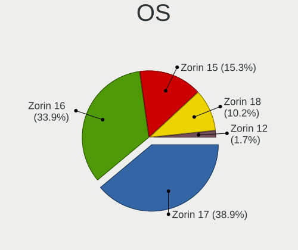

| Name     | Notebooks | Percent |
|----------|-----------|---------|
| Zorin 17 | 2654      | 38.93%  |
| Zorin 16 | 2308      | 33.85%  |
| Zorin 15 | 1045      | 15.33%  |
| Zorin 18 | 696       | 10.21%  |
| Zorin 12 | 115       | 1.69%   |

OS Family
---------

OS without a version

| Name  | Notebooks | Percent |
|-------|-----------|---------|
| Zorin | 6721      | 100%    |

Kernel
------

Version of the Linux kernel

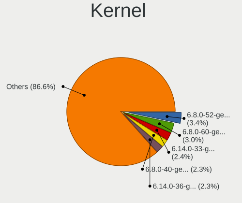

| Version           | Notebooks | Percent |
|-------------------|-----------|---------|
| 6.8.0-52-generic  | 258       | 3.36%   |
| 6.8.0-60-generic  | 233       | 3.03%   |
| 6.14.0-33-generic | 188       | 2.45%   |
| 6.8.0-40-generic  | 178       | 2.32%   |
| 6.14.0-36-generic | 173       | 2.25%   |
| 6.14.0-37-generic | 157       | 2.04%   |
| 6.5.0-35-generic  | 154       | 2.01%   |
| 6.8.0-57-generic  | 144       | 1.88%   |
| 5.15.0-56-generic | 136       | 1.77%   |
| 6.14.0-35-generic | 131       | 1.71%   |
| 6.8.0-49-generic  | 126       | 1.64%   |
| 6.8.0-59-generic  | 120       | 1.56%   |
| 6.5.0-41-generic  | 107       | 1.39%   |
| 6.2.0-39-generic  | 105       | 1.37%   |
| 5.11.0-38-generic | 103       | 1.34%   |
| 6.5.0-28-generic  | 102       | 1.33%   |
| 5.11.0-27-generic | 96        | 1.25%   |
| 6.8.0-45-generic  | 94        | 1.22%   |
| 5.15.0-52-generic | 94        | 1.22%   |
| 5.15.0-58-generic | 91        | 1.18%   |
| 6.8.0-65-generic  | 90        | 1.17%   |
| 5.15.0-46-generic | 88        | 1.15%   |
| 5.15.0-91-generic | 84        | 1.09%   |
| 6.8.0-51-generic  | 83        | 1.08%   |
| 6.5.0-45-generic  | 81        | 1.05%   |
| 6.8.0-47-generic  | 79        | 1.03%   |
| 6.8.0-85-generic  | 78        | 1.02%   |
| 6.5.0-26-generic  | 77        | 1%      |
| 5.13.0-30-generic | 76        | 0.99%   |
| 5.15.0-78-generic | 73        | 0.95%   |
| 6.8.0-48-generic  | 68        | 0.89%   |
| 5.3.0-40-generic  | 67        | 0.87%   |
| 6.8.0-79-generic  | 66        | 0.86%   |
| 5.11.0-37-generic | 66        | 0.86%   |
| 5.15.0-67-generic | 65        | 0.85%   |
| 5.11.0-40-generic | 64        | 0.83%   |
| 6.8.0-50-generic  | 63        | 0.82%   |
| 5.15.0-69-generic | 63        | 0.82%   |
| 5.11.0-41-generic | 63        | 0.82%   |
| 6.8.0-58-generic  | 61        | 0.79%   |

Kernel Family
-------------

Linux kernel without a distro release

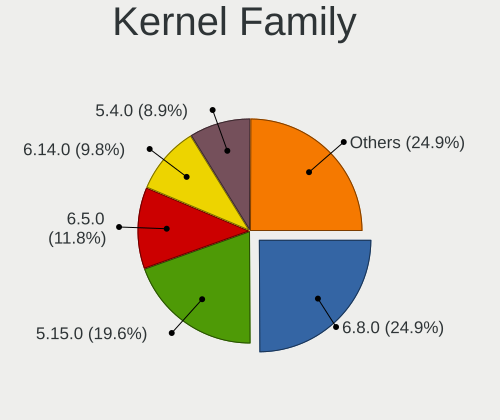

| Version | Notebooks | Percent |
|---------|-----------|---------|
| 6.8.0   | 1747      | 24.93%  |
| 5.15.0  | 1375      | 19.62%  |
| 6.5.0   | 826       | 11.78%  |
| 6.14.0  | 690       | 9.84%   |
| 5.4.0   | 623       | 8.89%   |
| 5.11.0  | 550       | 7.85%   |
| 5.13.0  | 408       | 5.82%   |
| 5.3.0   | 312       | 4.45%   |
| 4.15.0  | 111       | 1.58%   |
| 6.2.0   | 110       | 1.57%   |
| 5.0.0   | 90        | 1.28%   |
| 4.18.0  | 45        | 0.64%   |
| 5.8.0   | 24        | 0.34%   |
| 5.14.0  | 8         | 0.11%   |
| 6.3.13  | 6         | 0.09%   |
| 4.4.0   | 4         | 0.06%   |
| 6.11.0  | 3         | 0.04%   |
| 6.9.9   | 2         | 0.03%   |
| 6.8.7   | 2         | 0.03%   |
| 6.8.10  | 2         | 0.03%   |
| 6.5.7   | 2         | 0.03%   |
| 6.2.16  | 2         | 0.03%   |
| 6.17.13 | 2         | 0.03%   |
| 6.15.6  | 2         | 0.03%   |
| 6.12.3  | 2         | 0.03%   |
| 5.6.0   | 2         | 0.03%   |
| 5.19.0  | 2         | 0.03%   |
| 5.18.15 | 2         | 0.03%   |
| 5.16.0  | 2         | 0.03%   |
| 5.10.0  | 2         | 0.03%   |
| 6.9.12  | 1         | 0.01%   |
| 6.8.9   | 1         | 0.01%   |
| 6.8.12  | 1         | 0.01%   |
| 6.7.3   | 1         | 0.01%   |
| 6.6.7   | 1         | 0.01%   |
| 6.6.13  | 1         | 0.01%   |
| 6.6.10  | 1         | 0.01%   |
| 6.6.1   | 1         | 0.01%   |
| 6.3.2   | 1         | 0.01%   |
| 6.3.1   | 1         | 0.01%   |

Kernel Major Ver.
-----------------

Linux kernel major version

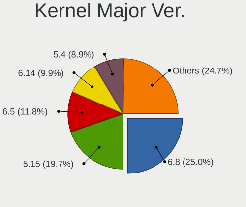

| Version | Notebooks | Percent |
|---------|-----------|---------|
| 6.8     | 1752      | 25.01%  |
| 5.15    | 1378      | 19.67%  |
| 6.5     | 828       | 11.82%  |
| 6.14    | 693       | 9.89%   |
| 5.4     | 625       | 8.92%   |
| 5.11    | 550       | 7.85%   |
| 5.13    | 410       | 5.85%   |
| 5.3     | 312       | 4.45%   |
| 6.2     | 113       | 1.61%   |
| 4.15    | 111       | 1.58%   |
| 5.0     | 90        | 1.28%   |
| 4.18    | 45        | 0.64%   |
| 5.8     | 24        | 0.34%   |
| 6.3     | 8         | 0.11%   |
| 5.14    | 8         | 0.11%   |
| 6.17    | 6         | 0.09%   |
| 6.12    | 6         | 0.09%   |
| 5.19    | 6         | 0.09%   |
| 6.6     | 4         | 0.06%   |
| 5.10    | 4         | 0.06%   |
| 4.4     | 4         | 0.06%   |
| 6.9     | 3         | 0.04%   |
| 6.15    | 3         | 0.04%   |
| 6.11    | 3         | 0.04%   |
| 5.18    | 3         | 0.04%   |
| 5.16    | 3         | 0.04%   |
| 6.10    | 2         | 0.03%   |
| 6.0     | 2         | 0.03%   |
| 5.9     | 2         | 0.03%   |
| 5.6     | 2         | 0.03%   |
| 6.7     | 1         | 0.01%   |
| 6.16    | 1         | 0.01%   |
| 6.13    | 1         | 0.01%   |
| 6.1     | 1         | 0.01%   |
| 5.7     | 1         | 0.01%   |
| 4.13    | 1         | 0.01%   |

Arch
----

OS architecture (x86_64, i586, etc.)

| Name   | Notebooks | Percent |
|--------|-----------|---------|
| x86_64 | 6421      | 95.49%  |
| i686   | 303       | 4.51%   |

DE
--

Desktop Environment

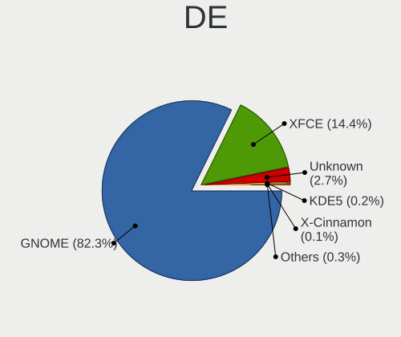

| Name            | Notebooks | Percent |
|-----------------|-----------|---------|
| GNOME           | 5578      | 82.31%  |
| XFCE            | 979       | 14.45%  |
| Unknown         | 180       | 2.66%   |
| KDE5            | 13        | 0.19%   |
| X-Cinnamon      | 10        | 0.15%   |
| Budgie          | 5         | 0.07%   |
| Unity           | 3         | 0.04%   |
| KDE             | 3         | 0.04%   |
| i3              | 2         | 0.03%   |
| LXQt            | 1         | 0.01%   |
| LXDE            | 1         | 0.01%   |
| GNOME Flashback | 1         | 0.01%   |
| Cinnamon        | 1         | 0.01%   |

Display Server
--------------

X11 or Wayland

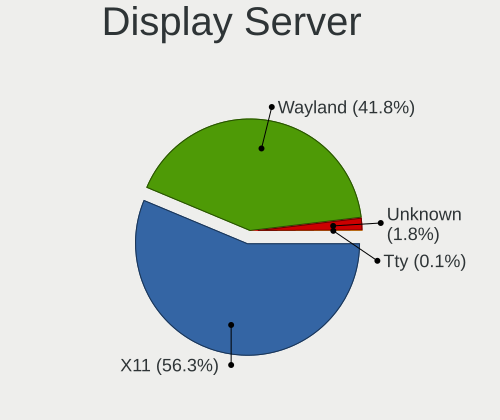

| Name    | Notebooks | Percent |
|---------|-----------|---------|
| X11     | 3855      | 56.3%   |
| Wayland | 2862      | 41.8%   |
| Unknown | 126       | 1.84%   |
| Tty     | 4         | 0.06%   |

Display Manager
---------------

SDDM, LightDM, etc.

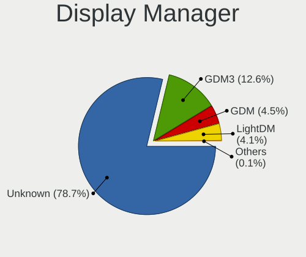

| Name    | Notebooks | Percent |
|---------|-----------|---------|
| Unknown | 5379      | 78.74%  |
| GDM3    | 858       | 12.56%  |
| GDM     | 305       | 4.46%   |
| LightDM | 278       | 4.07%   |
| TDM     | 6         | 0.09%   |
| SDDM    | 4         | 0.06%   |
| LXDM    | 1         | 0.01%   |

OS Lang
-------

Language

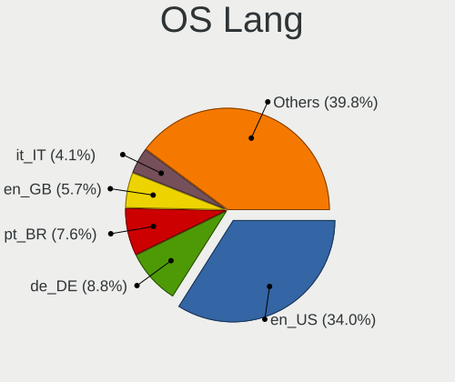

| Lang    | Notebooks | Percent |
|---------|-----------|---------|
| en_US   | 2298      | 33.97%  |
| de_DE   | 595       | 8.8%    |
| pt_BR   | 511       | 7.55%   |
| en_GB   | 385       | 5.69%   |
| it_IT   | 280       | 4.14%   |
| fr_FR   | 276       | 4.08%   |
| es_ES   | 251       | 3.71%   |
| en_CA   | 191       | 2.82%   |
| en_IN   | 171       | 2.53%   |
| pl_PL   | 148       | 2.19%   |
| Unknown | 128       | 1.89%   |
| es_MX   | 110       | 1.63%   |
| pt_PT   | 104       | 1.54%   |
| en_AU   | 102       | 1.51%   |
| nl_NL   | 100       | 1.48%   |
| ru_RU   | 73        | 1.08%   |
| tr_TR   | 66        | 0.98%   |
| es_AR   | 64        | 0.95%   |
| en_ZA   | 62        | 0.92%   |
| cs_CZ   | 62        | 0.92%   |
| es_CL   | 51        | 0.75%   |
| hu_HU   | 45        | 0.67%   |
| es_CO   | 42        | 0.62%   |
| de_AT   | 41        | 0.61%   |
| sv_SE   | 35        | 0.52%   |
| en_NZ   | 35        | 0.52%   |
| ja_JP   | 27        | 0.4%    |
| de_CH   | 27        | 0.4%    |
| C       | 27        | 0.4%    |
| da_DK   | 26        | 0.38%   |
| nl_BE   | 23        | 0.34%   |
| ro_RO   | 21        | 0.31%   |
| bg_BG   | 20        | 0.3%    |
| en_IE   | 19        | 0.28%   |
| el_GR   | 19        | 0.28%   |
| es_VE   | 18        | 0.27%   |
| fr_CA   | 17        | 0.25%   |
| fr_BE   | 17        | 0.25%   |
| es_EC   | 17        | 0.25%   |
| hr_HR   | 16        | 0.24%   |

Boot Mode
---------

EFI or BIOS

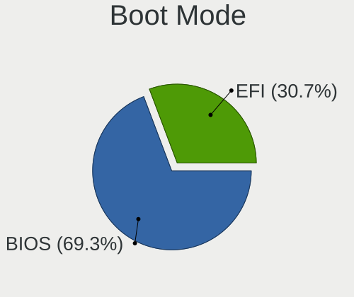

| Mode | Notebooks | Percent |
|------|-----------|---------|
| BIOS | 4727      | 69.27%  |
| EFI  | 2097      | 30.73%  |

Filesystem
----------

Type of filesystem

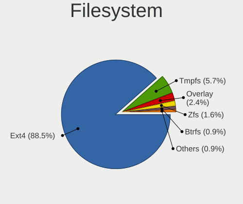

| Type    | Notebooks | Percent |
|---------|-----------|---------|
| Ext4    | 6013      | 88.48%  |
| Tmpfs   | 388       | 5.71%   |
| Overlay | 160       | 2.35%   |
| Zfs     | 112       | 1.65%   |
| Btrfs   | 64        | 0.94%   |
| Ext2    | 28        | 0.41%   |
| Unknown | 17        | 0.25%   |
| Ext3    | 9         | 0.13%   |
| Xfs     | 5         | 0.07%   |

Part. scheme
------------

Scheme of partitioning

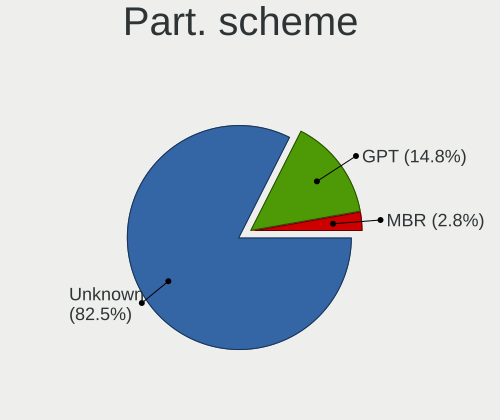

| Type    | Notebooks | Percent |
|---------|-----------|---------|
| Unknown | 5620      | 82.45%  |
| GPT     | 1007      | 14.77%  |
| MBR     | 189       | 2.77%   |

Dual Boot with Linux/BSD
------------------------

Hosting more than one Linux/BSD

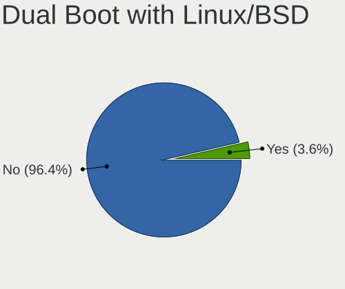

| Dual boot | Notebooks | Percent |
|-----------|-----------|---------|
| No        | 6511      | 96.37%  |
| Yes       | 245       | 3.63%   |

Dual Boot (Win)
---------------

Hosting Linux and Windows

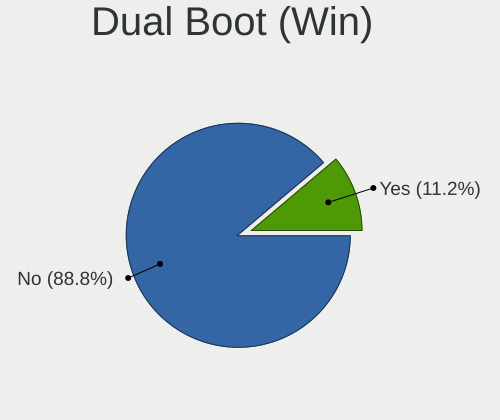

| Dual boot | Notebooks | Percent |
|-----------|-----------|---------|
| No        | 6008      | 88.84%  |
| Yes       | 755       | 11.16%  |

Board
-----

Vendor
------

Motherboard manufacturer

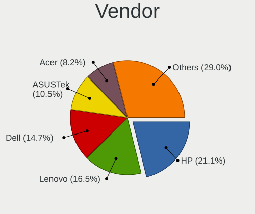

| Name                | Notebooks | Percent |
|---------------------|-----------|---------|
| Hewlett-Packard     | 1418      | 21.1%   |
| Lenovo              | 1109      | 16.5%   |
| Dell                | 988       | 14.7%   |
| ASUSTek Computer    | 703       | 10.46%  |
| Acer                | 551       | 8.2%    |
| Apple               | 292       | 4.34%   |
| Toshiba             | 289       | 4.3%    |
| Samsung Electronics | 139       | 2.07%   |
| Sony                | 117       | 1.74%   |
| MSI                 | 97        | 1.44%   |
| HUAWEI              | 72        | 1.07%   |
| Unknown             | 67        | 1%      |
| Google              | 60        | 0.89%   |
| Positivo            | 57        | 0.85%   |
| Fujitsu             | 55        | 0.82%   |
| Medion              | 48        | 0.71%   |
| Packard Bell        | 46        | 0.68%   |
| Fujitsu Siemens     | 34        | 0.51%   |
| Alienware           | 26        | 0.39%   |
| Notebook            | 21        | 0.31%   |
| Chuwi               | 21        | 0.31%   |
| Panasonic           | 20        | 0.3%    |
| Gateway             | 15        | 0.22%   |
| AMI                 | 15        | 0.22%   |
| Multilaser          | 14        | 0.21%   |
| LG Electronics      | 13        | 0.19%   |
| Intel               | 13        | 0.19%   |
| Semp Toshiba        | 12        | 0.18%   |
| Razer               | 12        | 0.18%   |
| Digibras            | 12        | 0.18%   |
| GPU Company         | 10        | 0.15%   |
| Gigabyte Technology | 10        | 0.15%   |
| eMachines           | 9         | 0.13%   |
| Clevo               | 9         | 0.13%   |
| Teclast             | 8         | 0.12%   |
| NEC Computers       | 8         | 0.12%   |
| Jumper              | 8         | 0.12%   |
| Itautec             | 8         | 0.12%   |
| Framework           | 8         | 0.12%   |
| TUXEDO              | 7         | 0.1%    |

Model
-----

Motherboard model

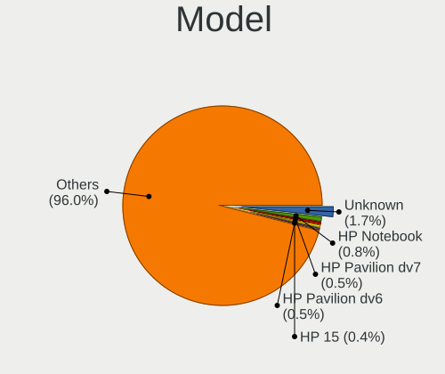

| Name                         | Notebooks | Percent |
|------------------------------|-----------|---------|
| Unknown                      | 117       | 1.74%   |
| HP Notebook                  | 57        | 0.85%   |
| HP Pavilion dv7              | 33        | 0.49%   |
| HP Pavilion dv6              | 33        | 0.49%   |
| HP 15                        | 27        | 0.4%    |
| HP Pavilion Notebook         | 25        | 0.37%   |
| Apple MacBookPro8,1          | 24        | 0.36%   |
| Apple MacBookPro9,2          | 21        | 0.31%   |
| HP Pavilion g7               | 20        | 0.3%    |
| HP Pavilion 15               | 20        | 0.3%    |
| Dell Latitude E6420          | 17        | 0.25%   |
| Dell Inspiron 15-3567        | 17        | 0.25%   |
| Apple MacBookAir7,2          | 17        | 0.25%   |
| Apple MacBookAir6,2          | 16        | 0.24%   |
| HP Pavilion g6               | 15        | 0.22%   |
| Dell Latitude E6430          | 15        | 0.22%   |
| HP Pavilion 17               | 14        | 0.21%   |
| HP Laptop 15-bw0xx           | 14        | 0.21%   |
| HP EliteBook 840 G1          | 14        | 0.21%   |
| Dell Latitude E6400          | 14        | 0.21%   |
| Dell Inspiron 1545           | 14        | 0.21%   |
| Apple MacBookPro12,1         | 14        | 0.21%   |
| Apple MacBookPro11,1         | 14        | 0.21%   |
| Toshiba Satellite C660       | 13        | 0.19%   |
| HP EliteBook 840 G2          | 13        | 0.19%   |
| Dell Latitude E6520          | 13        | 0.19%   |
| Dell Latitude E5430 non-vPro | 13        | 0.19%   |
| Dell Latitude D630           | 13        | 0.19%   |
| Apple MacBookPro5,5          | 13        | 0.19%   |
| Apple MacBookPro14,1         | 13        | 0.19%   |
| Dell Latitude E6540          | 12        | 0.18%   |
| Dell Latitude E6410          | 12        | 0.18%   |
| Dell Latitude E5470          | 12        | 0.18%   |
| HP Laptop 15-db0xxx          | 11        | 0.16%   |
| HP ProBook 4540s             | 10        | 0.15%   |
| HP EliteBook 840 G3          | 10        | 0.15%   |
| Dell Latitude E7450          | 10        | 0.15%   |
| Dell Latitude E7440          | 10        | 0.15%   |
| Dell Latitude 5480           | 10        | 0.15%   |
| Dell Inspiron 1525           | 10        | 0.15%   |

Model Family
------------

Motherboard model prefix

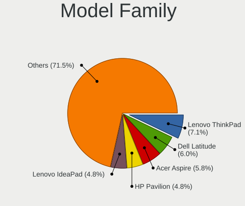

| Name                  | Notebooks | Percent |
|-----------------------|-----------|---------|
| Lenovo ThinkPad       | 479       | 7.13%   |
| Dell Latitude         | 400       | 5.95%   |
| Acer Aspire           | 391       | 5.82%   |
| HP Pavilion           | 324       | 4.82%   |
| Lenovo IdeaPad        | 323       | 4.81%   |
| Dell Inspiron         | 323       | 4.81%   |
| Toshiba Satellite     | 239       | 3.56%   |
| HP EliteBook          | 191       | 2.84%   |
| HP Laptop             | 174       | 2.59%   |
| HP ProBook            | 171       | 2.54%   |
| ASUS VivoBook         | 142       | 2.11%   |
| Unknown               | 117       | 1.74%   |
| HP Compaq             | 77        | 1.15%   |
| Dell Vostro           | 65        | 0.97%   |
| Dell XPS              | 61        | 0.91%   |
| Dell Precision        | 59        | 0.88%   |
| HP Notebook           | 57        | 0.85%   |
| HP ENVY               | 57        | 0.85%   |
| ASUS ASUS             | 52        | 0.77%   |
| Fujitsu LIFEBOOK      | 44        | 0.65%   |
| Packard Bell EasyNote | 42        | 0.62%   |
| ASUS ZenBook          | 42        | 0.62%   |
| HP 15                 | 39        | 0.58%   |
| Apple MacBookPro11    | 39        | 0.58%   |
| Acer Nitro            | 39        | 0.58%   |
| HP ZBook              | 37        | 0.55%   |
| ASUS ROG              | 36        | 0.54%   |
| HP Stream             | 35        | 0.52%   |
| Apple MacBookPro8     | 33        | 0.49%   |
| Lenovo Legion         | 32        | 0.48%   |
| HP OMEN               | 27        | 0.4%    |
| Lenovo Yoga           | 26        | 0.39%   |
| Acer Swift            | 26        | 0.39%   |
| HP Presario           | 25        | 0.37%   |
| HP 250                | 25        | 0.37%   |
| Apple MacBookPro9     | 25        | 0.37%   |
| Lenovo ThinkBook      | 24        | 0.36%   |
| Apple MacBookPro5     | 24        | 0.36%   |
| Dell System           | 22        | 0.33%   |
| HP 255                | 21        | 0.31%   |

MFG Year
--------

Motherboard manufacture year

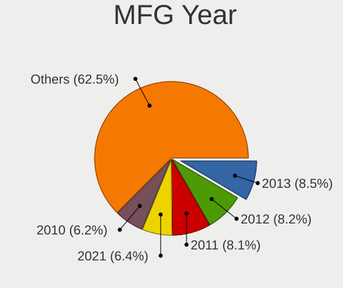

| Year    | Notebooks | Percent |
|---------|-----------|---------|
| 2013    | 571       | 8.5%    |
| 2012    | 552       | 8.21%   |
| 2011    | 546       | 8.12%   |
| 2021    | 430       | 6.4%    |
| 2010    | 419       | 6.23%   |
| 2017    | 413       | 6.14%   |
| 2014    | 404       | 6.01%   |
| 2018    | 394       | 5.86%   |
| 2019    | 392       | 5.83%   |
| 2015    | 356       | 5.3%    |
| 2020    | 355       | 5.28%   |
| 2016    | 353       | 5.25%   |
| 2008    | 352       | 5.24%   |
| 2009    | 288       | 4.29%   |
| 2022    | 222       | 3.3%    |
| 2023    | 216       | 3.21%   |
| 2007    | 207       | 3.08%   |
| 2024    | 87        | 1.29%   |
| 2006    | 87        | 1.29%   |
| 2005    | 39        | 0.58%   |
| 2025    | 29        | 0.43%   |
| Unknown | 6         | 0.09%   |
| 2003    | 2         | 0.03%   |
| 2004    | 1         | 0.01%   |

Form Factor
-----------

Physical design of the computer

| Name     | Notebooks | Percent |
|----------|-----------|---------|
| Notebook | 6721      | 100%    |

Secure Boot
-----------

Enabled or disabled

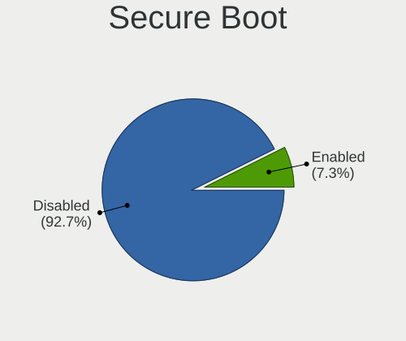

| State    | Notebooks | Percent |
|----------|-----------|---------|
| Disabled | 6265      | 92.65%  |
| Enabled  | 497       | 7.35%   |

Coreboot
--------

Have coreboot on board

| Used | Notebooks | Percent |
|------|-----------|---------|
| No   | 6648      | 98.91%  |
| Yes  | 73        | 1.09%   |

RAM Size
--------

Total RAM memory

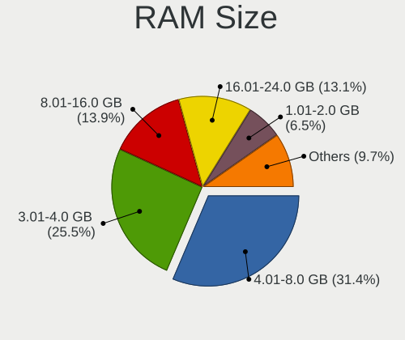

| Size in GB  | Notebooks | Percent |
|-------------|-----------|---------|
| 4.01-8.0    | 2131      | 31.39%  |
| 3.01-4.0    | 1728      | 25.46%  |
| 8.01-16.0   | 944       | 13.91%  |
| 16.01-24.0  | 888       | 13.08%  |
| 1.01-2.0    | 438       | 6.45%   |
| 32.01-64.0  | 301       | 4.43%   |
| 2.01-3.0    | 168       | 2.47%   |
| 0.51-1.0    | 77        | 1.13%   |
| 24.01-32.0  | 63        | 0.93%   |
| 64.01-256.0 | 50        | 0.74%   |

RAM Used
--------

Used RAM memory

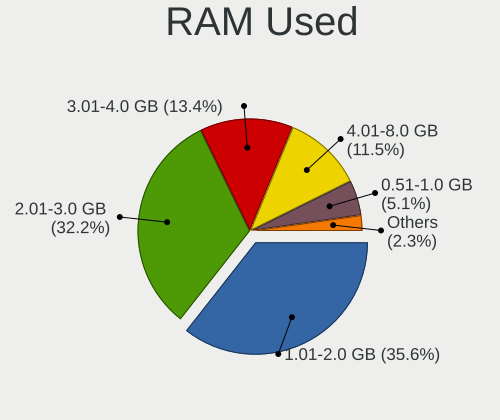

| Used GB    | Notebooks | Percent |
|------------|-----------|---------|
| 1.01-2.0   | 2580      | 35.6%   |
| 2.01-3.0   | 2332      | 32.18%  |
| 3.01-4.0   | 973       | 13.43%  |
| 4.01-8.0   | 831       | 11.47%  |
| 0.51-1.0   | 367       | 5.06%   |
| 8.01-16.0  | 121       | 1.67%   |
| 0.01-0.5   | 26        | 0.36%   |
| 16.01-24.0 | 10        | 0.14%   |
| 24.01-32.0 | 6         | 0.08%   |
| 32.01-64.0 | 1         | 0.01%   |

Total Drives
------------

Number of drives on board

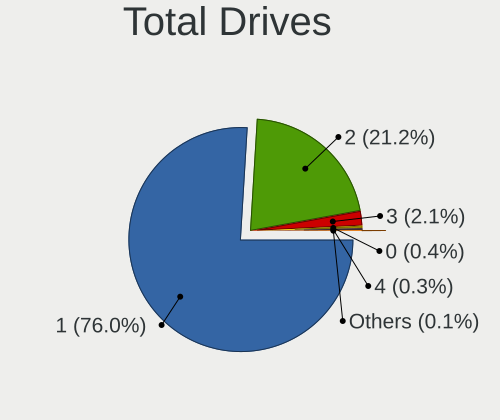

| Drives | Notebooks | Percent |
|--------|-----------|---------|
| 1      | 5177      | 75.96%  |
| 2      | 1442      | 21.16%  |
| 3      | 144       | 2.11%   |
| 0      | 24        | 0.35%   |
| 4      | 20        | 0.29%   |
| 5      | 4         | 0.06%   |
| 6      | 3         | 0.04%   |
| 8      | 1         | 0.01%   |

Has CD-ROM
----------

Has CD-ROM on board

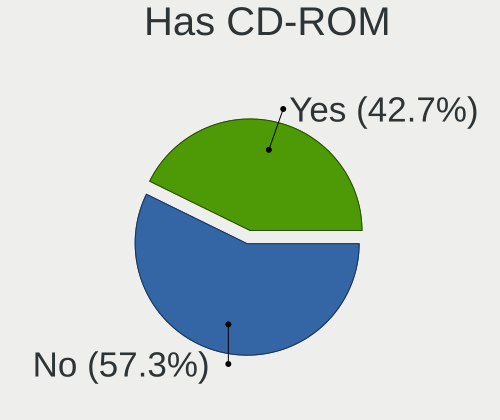

| Presented | Notebooks | Percent |
|-----------|-----------|---------|
| No        | 3861      | 57.26%  |
| Yes       | 2882      | 42.74%  |

Has Ethernet
------------

Has Ethernet on board

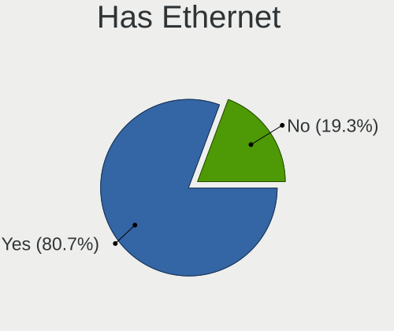

| Presented | Notebooks | Percent |
|-----------|-----------|---------|
| Yes       | 5434      | 80.69%  |
| No        | 1300      | 19.31%  |

Has WiFi
--------

Has WiFi module

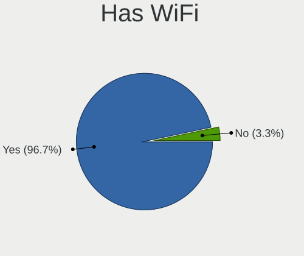

| Presented | Notebooks | Percent |
|-----------|-----------|---------|
| Yes       | 6510      | 96.77%  |
| No        | 217       | 3.23%   |

Has Bluetooth
-------------

Has Bluetooth module

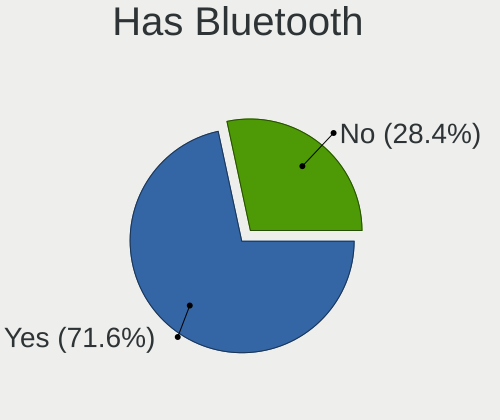

| Presented | Notebooks | Percent |
|-----------|-----------|---------|
| Yes       | 4861      | 71.63%  |
| No        | 1925      | 28.37%  |

Location
--------

Country
-------

Geographic location (country)

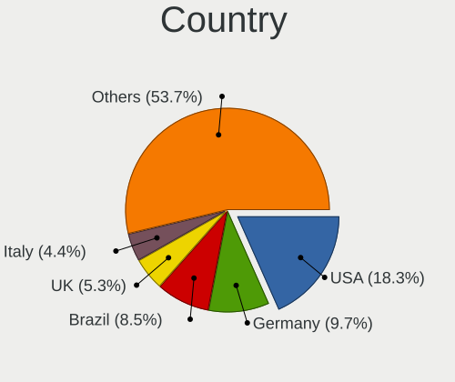

| Country      | Notebooks | Percent |
|--------------|-----------|---------|
| USA          | 1239      | 18.34%  |
| Germany      | 653       | 9.67%   |
| Brazil       | 577       | 8.54%   |
| UK           | 355       | 5.26%   |
| Italy        | 300       | 4.44%   |
| France       | 270       | 4%      |
| Spain        | 236       | 3.49%   |
| Canada       | 231       | 3.42%   |
| India        | 183       | 2.71%   |
| Netherlands  | 164       | 2.43%   |
| Mexico       | 161       | 2.38%   |
| Poland       | 150       | 2.22%   |
| Portugal     | 119       | 1.76%   |
| Australia    | 106       | 1.57%   |
| Turkey       | 87        | 1.29%   |
| Austria      | 84        | 1.24%   |
| Argentina    | 81        | 1.2%    |
| Switzerland  | 78        | 1.15%   |
| Belgium      | 77        | 1.14%   |
| Czechia      | 73        | 1.08%   |
| South Africa | 72        | 1.07%   |
| Russia       | 70        | 1.04%   |
| Sweden       | 69        | 1.02%   |
| Romania      | 69        | 1.02%   |
| Indonesia    | 62        | 0.92%   |
| Chile        | 58        | 0.86%   |
| Colombia     | 54        | 0.8%    |
| Greece       | 47        | 0.7%    |
| Hungary      | 45        | 0.67%   |
| New Zealand  | 41        | 0.61%   |
| Norway       | 40        | 0.59%   |
| Egypt        | 40        | 0.59%   |
| Japan        | 39        | 0.58%   |
| Denmark      | 34        | 0.5%    |
| Ireland      | 30        | 0.44%   |
| Bulgaria     | 30        | 0.44%   |
| Serbia       | 29        | 0.43%   |
| Finland      | 27        | 0.4%    |
| Philippines  | 25        | 0.37%   |
| Ecuador      | 22        | 0.33%   |

City
----

Geographic location (city)

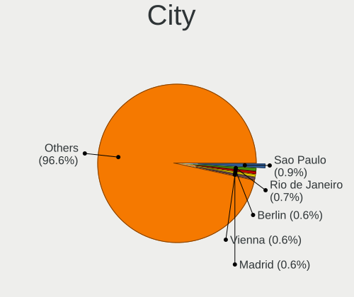

| City              | Notebooks | Percent |
|-------------------|-----------|---------|
| Sao Paulo         | 65        | 0.92%   |
| Rio de Janeiro    | 48        | 0.68%   |
| Berlin            | 43        | 0.61%   |
| Vienna            | 42        | 0.59%   |
| Madrid            | 41        | 0.58%   |
| Sydney            | 40        | 0.57%   |
| Milan             | 39        | 0.55%   |
| Rome              | 36        | 0.51%   |
| Mexico City       | 34        | 0.48%   |
| Istanbul          | 32        | 0.45%   |
| Johannesburg      | 30        | 0.42%   |
| Hamburg           | 30        | 0.42%   |
| Amsterdam         | 30        | 0.42%   |
| New York          | 26        | 0.37%   |
| Munich            | 25        | 0.35%   |
| Melbourne         | 25        | 0.35%   |
| Santiago          | 24        | 0.34%   |
| Montreal          | 24        | 0.34%   |
| Warsaw            | 23        | 0.33%   |
| Paris             | 23        | 0.33%   |
| Budapest          | 23        | 0.33%   |
| Prague            | 22        | 0.31%   |
| Lisbon            | 21        | 0.3%    |
| Cairo             | 21        | 0.3%    |
| Bogotá           | 21        | 0.3%    |
| Toronto           | 20        | 0.28%   |
| Moscow            | 20        | 0.28%   |
| London            | 20        | 0.28%   |
| Bucharest         | 20        | 0.28%   |
| Seattle           | 19        | 0.27%   |
| Auckland          | 19        | 0.27%   |
| Athens            | 19        | 0.27%   |
| Frankfurt am Main | 18        | 0.25%   |
| Dublin            | 18        | 0.25%   |
| Delhi             | 18        | 0.25%   |
| Cologne           | 18        | 0.25%   |
| Buenos Aires      | 18        | 0.25%   |
| Brasília         | 18        | 0.25%   |
| Bengaluru         | 18        | 0.25%   |
| Stockholm         | 17        | 0.24%   |

Drives
------

Drive Vendor
------------

Hard drive vendors

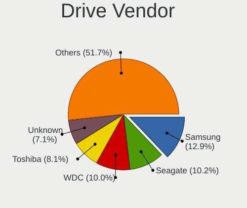

| Vendor                      | Notebooks | Drives | Percent |
|-----------------------------|-----------|--------|---------|
| Samsung Electronics         | 1034      | 1393   | 12.88%  |
| Seagate                     | 822       | 980    | 10.24%  |
| WDC                         | 801       | 973    | 9.98%   |
| Toshiba                     | 647       | 756    | 8.06%   |
| Unknown                     | 573       | 752    | 7.14%   |
| Sandisk                     | 559       | 664    | 6.97%   |
| Kingston                    | 407       | 483    | 5.07%   |
| Hitachi                     | 269       | 317    | 3.35%   |
| Crucial                     | 258       | 308    | 3.21%   |
| SK hynix                    | 224       | 256    | 2.79%   |
| HGST                        | 213       | 253    | 2.65%   |
| Micron Technology           | 190       | 226    | 2.37%   |
| Intel                       | 189       | 222    | 2.36%   |
| Apple                       | 149       | 187    | 1.86%   |
| China                       | 129       | 153    | 1.61%   |
| A-DATA Technology           | 103       | 116    | 1.28%   |
| KIOXIA                      | 71        | 82     | 0.88%   |
| Fujitsu                     | 65        | 68     | 0.81%   |
| Intenso                     | 62        | 76     | 0.77%   |
| Unknown                     | 52        | 57     | 0.65%   |
| SPCC                        | 51        | 65     | 0.64%   |
| PNY                         | 51        | 56     | 0.64%   |
| Kingston Technology Company | 43        | 48     | 0.54%   |
| LITEON                      | 40        | 45     | 0.5%    |
| MAXIO Technology (Hangzhou) | 39        | 42     | 0.49%   |
| Silicon Motion              | 35        | 41     | 0.44%   |
| Patriot                     | 35        | 41     | 0.44%   |
| Micron/Crucial Technology   | 33        | 38     | 0.41%   |
| Netac                       | 32        | 35     | 0.4%    |
| JMicron Technology          | 32        | 33     | 0.4%    |
| Transcend                   | 31        | 40     | 0.39%   |
| Phison Electronics          | 31        | 41     | 0.39%   |
| Phison                      | 31        | 40     | 0.39%   |
| LITEONIT                    | 29        | 37     | 0.36%   |
| ADATA Technology            | 28        | 28     | 0.35%   |
| Lexar                       | 23        | 25     | 0.29%   |
| KingSpec                    | 23        | 23     | 0.29%   |
| GOODRAM                     | 23        | 29     | 0.29%   |
| Team                        | 22        | 23     | 0.27%   |
| Fanxiang                    | 21        | 25     | 0.26%   |

Drive Model
-----------

Hard drive models

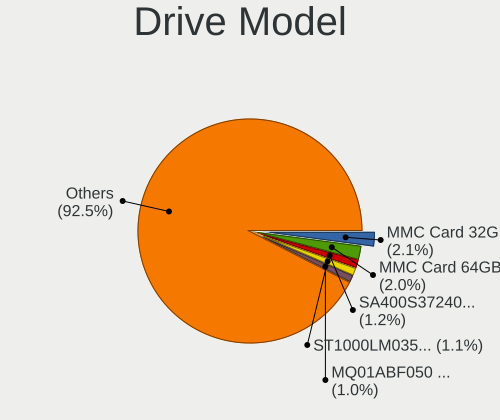

| Model                                                | Notebooks | Percent |
|------------------------------------------------------|-----------|---------|
| Unknown MMC Card  32GB                               | 174       | 2.1%    |
| Unknown MMC Card  64GB                               | 168       | 2.03%   |
| Kingston SA400S37240G 240GB SSD                      | 101       | 1.22%   |
| Seagate ST1000LM035-1RK172 1TB                       | 93        | 1.12%   |
| Toshiba MQ01ABF050 500GB                             | 86        | 1.04%   |
| Samsung NVMe SSD Controller SM981/PM981/PM983 1TB    | 81        | 0.98%   |
| Kingston SA400S37480G 480GB SSD                      | 80        | 0.97%   |
| Unknown MMC Card  128GB                              | 78        | 0.94%   |
| Seagate ST1000LM024 HN-M101MBB 1TB                   | 78        | 0.94%   |
| Toshiba MQ01ABD100 1TB                               | 77        | 0.93%   |
| Seagate ST500LT012-1DG142 500GB                      | 64        | 0.77%   |
| Toshiba MQ04ABF100 1TB                               | 61        | 0.74%   |
| Unknown                                              | 52        | 0.63%   |
| Seagate ST9500325AS 500GB                            | 51        | 0.62%   |
| Samsung SSD 850 EVO 250GB                            | 45        | 0.54%   |
| Seagate ST500LM012 HN-M500MBB 500GB                  | 40        | 0.48%   |
| HGST HTS721010A9E630 1TB                             | 40        | 0.48%   |
| Crucial CT500MX500SSD1 500GB                         | 40        | 0.48%   |
| Crucial CT240BX500SSD1 240GB                         | 40        | 0.48%   |
| Kingston SA400S37120G 120GB SSD                      | 39        | 0.47%   |
| Sandisk WD Blue SN550 NVMe SSD 1024GB                | 38        | 0.46%   |
| Samsung SSD 850 EVO 500GB                            | 38        | 0.46%   |
| Samsung NVMe SSD Controller PM9A1/PM9A3/980PRO 1TB   | 38        | 0.46%   |
| HGST HTS725050A7E630 500GB                           | 38        | 0.46%   |
| HGST HTS545050A7E680 500GB                           | 37        | 0.45%   |
| Unknown MMC Card  16GB                               | 36        | 0.44%   |
| Samsung SSD 860 EVO 500GB                            | 34        | 0.41%   |
| Samsung NVMe SSD Controller SM961/PM961/SM963 1024GB | 34        | 0.41%   |
| HGST HTS541010A9E680 1TB                             | 32        | 0.39%   |
| WDC WD10JPVX-22JC3T0 1TB                             | 30        | 0.36%   |
| China SSD 256GB                                      | 28        | 0.34%   |
| Seagate ST500LM021-1KJ152 500GB                      | 25        | 0.3%    |
| Samsung SSD 860 EVO 250GB                            | 25        | 0.3%    |
| MAXIO (Hangzhou) NVMe SSD Controller MAP1202 2TB     | 25        | 0.3%    |
| SanDisk NVMe SSD Drive 512GB                         | 24        | 0.29%   |
| Samsung NVMe SSD Drive 512GB                         | 24        | 0.29%   |
| Hitachi HTS545032B9A300 320GB                        | 24        | 0.29%   |
| Crucial CT480BX500SSD1 480GB                         | 24        | 0.29%   |
| SanDisk SSD PLUS 480GB                               | 23        | 0.28%   |
| WDC WD5000LPVX-22V0TT0 500GB                         | 22        | 0.27%   |

HDD Vendor
----------

Hard disk drive vendors

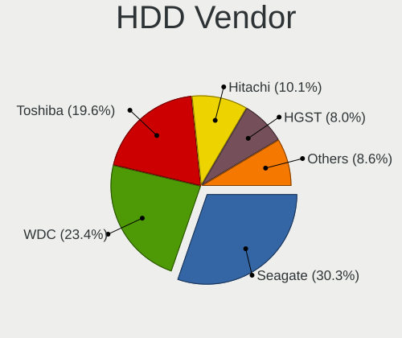

| Vendor              | Notebooks | Drives | Percent |
|---------------------|-----------|--------|---------|
| Seagate             | 807       | 959    | 30.29%  |
| WDC                 | 624       | 743    | 23.42%  |
| Toshiba             | 523       | 602    | 19.63%  |
| Hitachi             | 269       | 317    | 10.1%   |
| HGST                | 213       | 253    | 8%      |
| Samsung Electronics | 68        | 75     | 2.55%   |
| Fujitsu             | 65        | 68     | 2.44%   |
| Unknown             | 23        | 30     | 0.86%   |
| JMicron Technology  | 14        | 15     | 0.53%   |
| Apple               | 14        | 14     | 0.53%   |
| TO Exter            | 6         | 7      | 0.23%   |
| External            | 5         | 5      | 0.19%   |
| SABRENT             | 4         | 6      | 0.15%   |
| Intenso             | 4         | 4      | 0.15%   |
| IBM/Hitachi         | 4         | 5      | 0.15%   |
| T-FORCE             | 3         | 3      | 0.11%   |
| USB3.0              | 2         | 2      | 0.08%   |
| KESU                | 2         | 2      | 0.08%   |
| EAGET               | 2         | 2      | 0.08%   |
| ASMedia             | 2         | 2      | 0.08%   |
| XrayDisk            | 1         | 1      | 0.04%   |
| USB                 | 1         | 1      | 0.04%   |
| SSK                 | 1         | 1      | 0.04%   |
| Shenzhen            | 1         | 1      | 0.04%   |
| Min Yi U            | 1         | 1      | 0.04%   |
| LaCie               | 1         | 2      | 0.04%   |
| HGST HTS            | 1         | 1      | 0.04%   |
| FC-1307             | 1         | 1      | 0.04%   |
| Apricorn            | 1         | 1      | 0.04%   |
| Unknown             | 1         | 3      | 0.04%   |

SSD Vendor
----------

Solid state drive vendors

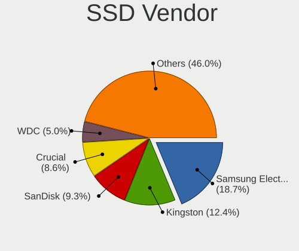

| Vendor              | Notebooks | Drives | Percent |
|---------------------|-----------|--------|---------|
| Samsung Electronics | 539       | 718    | 18.72%  |
| Kingston            | 356       | 419    | 12.36%  |
| SanDisk             | 269       | 319    | 9.34%   |
| Crucial             | 247       | 295    | 8.58%   |
| WDC                 | 144       | 182    | 5%      |
| China               | 126       | 150    | 4.38%   |
| Apple               | 100       | 115    | 3.47%   |
| A-DATA Technology   | 86        | 98     | 2.99%   |
| Intel               | 73        | 81     | 2.53%   |
| Micron Technology   | 66        | 79     | 2.29%   |
| Toshiba             | 63        | 71     | 2.19%   |
| SK hynix            | 55        | 65     | 1.91%   |
| PNY                 | 51        | 56     | 1.77%   |
| Intenso             | 49        | 58     | 1.7%    |
| SPCC                | 48        | 61     | 1.67%   |
| LITEON              | 40        | 45     | 1.39%   |
| Patriot             | 35        | 41     | 1.22%   |
| Transcend           | 31        | 40     | 1.08%   |
| LITEONIT            | 29        | 37     | 1.01%   |
| Netac               | 28        | 31     | 0.97%   |
| Team                | 22        | 23     | 0.76%   |
| KingSpec            | 22        | 22     | 0.76%   |
| GOODRAM             | 21        | 27     | 0.73%   |
| Lexar               | 20        | 20     | 0.69%   |
| OCZ                 | 19        | 22     | 0.66%   |
| Unknown             | 17        | 19     | 0.59%   |
| Hewlett-Packard     | 15        | 20     | 0.52%   |
| SABRENT             | 12        | 13     | 0.42%   |
| Phison              | 11        | 18     | 0.38%   |
| Verbatim            | 10        | 10     | 0.35%   |
| Teclast             | 10        | 12     | 0.35%   |
| Gigabyte Technology | 10        | 11     | 0.35%   |
| Apacer              | 10        | 10     | 0.35%   |
| Fanxiang            | 9         | 10     | 0.31%   |
| Emtec               | 9         | 9      | 0.31%   |
| ASMT                | 9         | 9      | 0.31%   |
| Plextor             | 8         | 8      | 0.28%   |
| BHT                 | 7         | 8      | 0.24%   |
| XrayDisk            | 6         | 6      | 0.21%   |
| Leven               | 6         | 6      | 0.21%   |

Drive Kind
----------

HDD or SSD

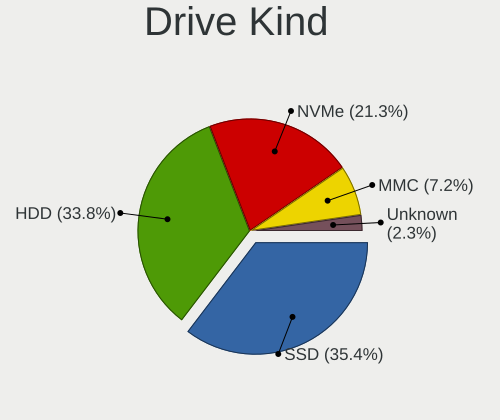

| Kind    | Notebooks | Drives | Percent |
|---------|-----------|--------|---------|
| SSD     | 2719      | 3453   | 35.37%  |
| HDD     | 2596      | 3127   | 33.77%  |
| NVMe    | 1638      | 2171   | 21.31%  |
| MMC     | 557       | 735    | 7.25%   |
| Unknown | 177       | 203    | 2.3%    |

Drive Connector
---------------

SATA, SAS, NVMe, etc.

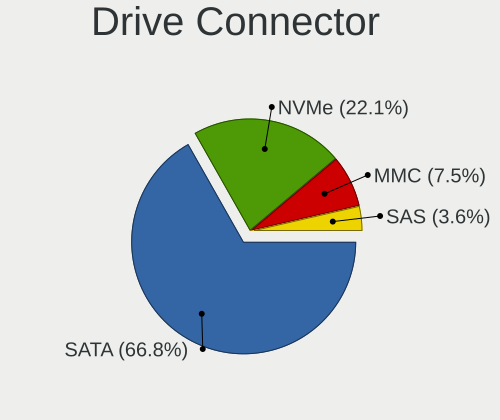

| Type | Notebooks | Drives | Percent |
|------|-----------|--------|---------|
| SATA | 4947      | 6440   | 66.8%   |
| NVMe | 1635      | 2157   | 22.08%  |
| MMC  | 557       | 735    | 7.52%   |
| SAS  | 267       | 357    | 3.61%   |

Drive Size
----------

Size of hard drive

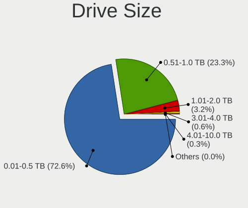

| Size in TB | Notebooks | Drives | Percent |
|------------|-----------|--------|---------|
| 0.01-0.5   | 3826      | 4798   | 72.56%  |
| 0.51-1.0   | 1230      | 1516   | 23.33%  |
| 1.01-2.0   | 171       | 207    | 3.24%   |
| 3.01-4.0   | 30        | 38     | 0.57%   |
| 4.01-10.0  | 15        | 20     | 0.28%   |
| 2.01-3.0   | 1         | 1      | 0.02%   |

Space Total
-----------

Amount of disk space available on the file system

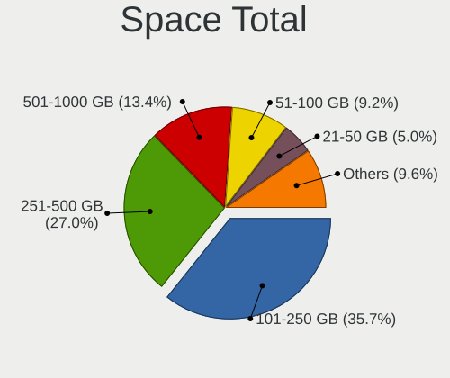

| Size in GB     | Notebooks | Percent |
|----------------|-----------|---------|
| 101-250        | 2472      | 35.74%  |
| 251-500        | 1866      | 26.98%  |
| 501-1000       | 928       | 13.42%  |
| 51-100         | 639       | 9.24%   |
| 21-50          | 348       | 5.03%   |
| 1001-2000      | 260       | 3.76%   |
| 1-20           | 191       | 2.76%   |
| Unknown        | 93        | 1.34%   |
| More than 3000 | 67        | 0.97%   |
| 2001-3000      | 53        | 0.77%   |

Space Used
----------

Amount of used disk space

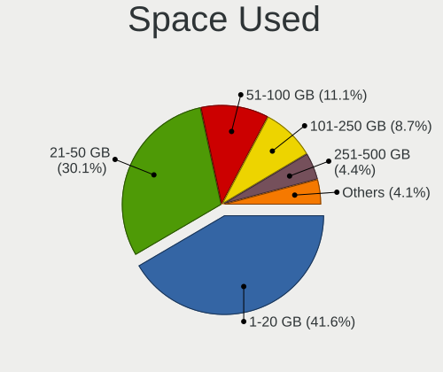

| Used GB        | Notebooks | Percent |
|----------------|-----------|---------|
| 1-20           | 2999      | 41.57%  |
| 21-50          | 2169      | 30.06%  |
| 51-100         | 801       | 11.1%   |
| 101-250        | 630       | 8.73%   |
| 251-500        | 319       | 4.42%   |
| 501-1000       | 130       | 1.8%    |
| Unknown        | 93        | 1.29%   |
| 1001-2000      | 38        | 0.53%   |
| More than 3000 | 24        | 0.33%   |
| 2001-3000      | 11        | 0.15%   |
| 0              | 1         | 0.01%   |

Malfunc. Drives
---------------

Drive models with a malfunction

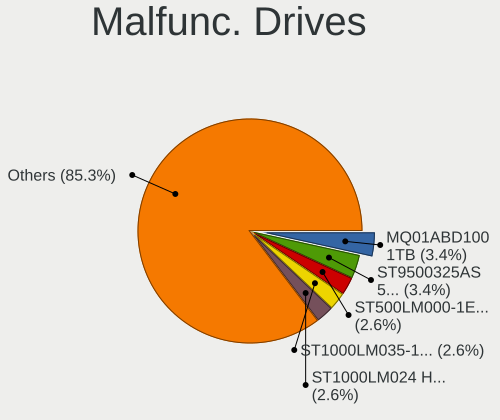

| Model                                          | Notebooks | Drives | Percent |
|------------------------------------------------|-----------|--------|---------|
| Toshiba MQ01ABD100 1TB                         | 4         | 4      | 3.45%   |
| Seagate ST9500325AS 500GB                      | 4         | 4      | 3.45%   |
| Seagate ST500LM000-1EJ162 500GB                | 3         | 3      | 2.59%   |
| Seagate ST1000LM035-1RK172 1TB                 | 3         | 3      | 2.59%   |
| Seagate ST1000LM024 HN-M101MBB 1TB             | 3         | 3      | 2.59%   |
| HGST HTS545050A7E680 500GB                     | 3         | 3      | 2.59%   |
| Toshiba MQ02ABD100H 1TB                        | 2         | 2      | 1.72%   |
| Toshiba MQ01ACF050 500GB                       | 2         | 2      | 1.72%   |
| Toshiba MQ01ABF050 500GB                       | 2         | 3      | 1.72%   |
| SK hynix BC711 HFM512GD3JX013N 512GB           | 2         | 2      | 1.72%   |
| Seagate ST500LT012-9WS142 500GB                | 2         | 2      | 1.72%   |
| Seagate ST500LT012-1DG142 500GB                | 2         | 2      | 1.72%   |
| Seagate ST1000LM048-2E7172 1TB                 | 2         | 2      | 1.72%   |
| Micron Technology 1100_MTFDDAK256TBN 256GB SSD | 2         | 2      | 1.72%   |
| Kingston SA400S37240G 240GB SSD                | 2         | 2      | 1.72%   |
| HGST HTS545050A7E380 500GB                     | 2         | 3      | 1.72%   |
| A-DATA Technology IM2P33F3A NVMe 256GB         | 2         | 2      | 1.72%   |
| WDC WDS240G2G0A-00JH30 240GB SSD               | 1         | 1      | 0.86%   |
| WDC WD6400BEVT-22A0RT0 640GB                   | 1         | 1      | 0.86%   |
| WDC WD5000LPVX-75V0TT0 500GB                   | 1         | 1      | 0.86%   |
| WDC WD5000BPVT-75HXZT1 500GB                   | 1         | 1      | 0.86%   |
| WDC WD5000BEVT-24A0RT0 500GB                   | 1         | 1      | 0.86%   |
| WDC WD3200BPVT-55ZEST0 320GB                   | 1         | 1      | 0.86%   |
| WDC WD2500BEKT-75PVMT1 250GB                   | 1         | 1      | 0.86%   |
| WDC WD1200BEVS-60UST0 120GB                    | 1         | 1      | 0.86%   |
| WDC WD10SPZX-75Z10T2 1TB                       | 1         | 1      | 0.86%   |
| WDC WD10JPVX-22JC3T0 1TB                       | 1         | 1      | 0.86%   |
| WDC WD10JPVT-55A1YT0 1TB                       | 1         | 1      | 0.86%   |
| WDC WD Green 2.5 240GB                         | 1         | 2      | 0.86%   |
| Toshiba THNSNK256GCS8 SATA 256GB SSD           | 1         | 1      | 0.86%   |
| Toshiba THNSNK128GVN8 M.2 2280 128GB SSD       | 1         | 1      | 0.86%   |
| Toshiba MQ01ABD075 752GB                       | 1         | 1      | 0.86%   |
| Toshiba MK6465GSX 640GB                        | 1         | 1      | 0.86%   |
| Toshiba MK5061GSY 500GB                        | 1         | 1      | 0.86%   |
| Toshiba MK5056GSY 500GB                        | 1         | 1      | 0.86%   |
| Toshiba MK3276GSX 320GB                        | 1         | 1      | 0.86%   |
| Toshiba MK2565GSX 250GB                        | 1         | 1      | 0.86%   |
| Toshiba MK2046GSX 200GB                        | 1         | 1      | 0.86%   |
| Teclast 128GB NS550-2242 SSD                   | 1         | 1      | 0.86%   |
| Seagate ST9500420AS 500GB                      | 1         | 1      | 0.86%   |

Malfunc. Drive Vendor
---------------------

Vendors of faulty drives

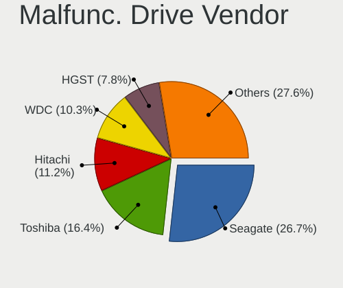

| Vendor              | Notebooks | Drives | Percent |
|---------------------|-----------|--------|---------|
| Seagate             | 31        | 31     | 26.72%  |
| Toshiba             | 19        | 20     | 16.38%  |
| Hitachi             | 13        | 13     | 11.21%  |
| WDC                 | 12        | 13     | 10.34%  |
| HGST                | 9         | 10     | 7.76%   |
| Samsung Electronics | 6         | 6      | 5.17%   |
| Kingston            | 5         | 5      | 4.31%   |
| Micron Technology   | 3         | 3      | 2.59%   |
| SK hynix            | 2         | 2      | 1.72%   |
| SanDisk             | 2         | 2      | 1.72%   |
| A-DATA Technology   | 2         | 2      | 1.72%   |
| Teclast             | 1         | 1      | 0.86%   |
| POLION              | 1         | 1      | 0.86%   |
| LITEONIT            | 1         | 1      | 0.86%   |
| KingFast            | 1         | 1      | 0.86%   |
| JMicron Technology  | 1         | 1      | 0.86%   |
| Intel               | 1         | 1      | 0.86%   |
| Hewlett-Packard     | 1         | 1      | 0.86%   |
| Drevo               | 1         | 1      | 0.86%   |
| China               | 1         | 1      | 0.86%   |
| BIWIN               | 1         | 1      | 0.86%   |
| Apple               | 1         | 1      | 0.86%   |
| Unknown             | 1         | 1      | 0.86%   |

Malfunc. HDD Vendor
-------------------

Vendors of faulty HDD drives

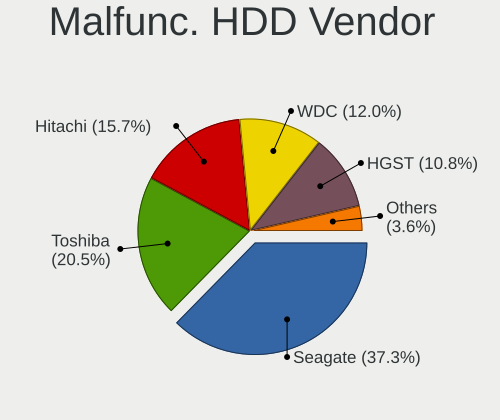

| Vendor              | Notebooks | Drives | Percent |
|---------------------|-----------|--------|---------|
| Seagate             | 31        | 31     | 37.35%  |
| Toshiba             | 17        | 18     | 20.48%  |
| Hitachi             | 13        | 13     | 15.66%  |
| WDC                 | 10        | 10     | 12.05%  |
| HGST                | 9         | 10     | 10.84%  |
| Samsung Electronics | 2         | 2      | 2.41%   |
| Apple               | 1         | 1      | 1.2%    |

Malfunc. Drive Kind
-------------------

Kinds of faulty drives

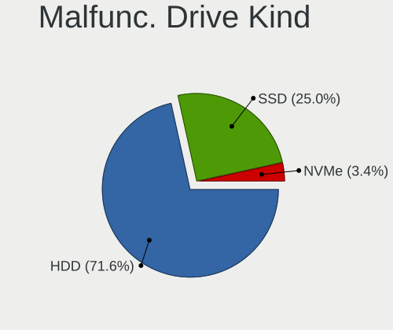

| Kind | Notebooks | Drives | Percent |
|------|-----------|--------|---------|
| HDD  | 83        | 85     | 71.55%  |
| SSD  | 29        | 30     | 25%     |
| NVMe | 4         | 4      | 3.45%   |

Failed Drives
-------------

Failed drive models

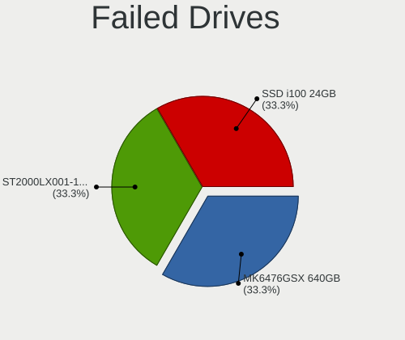

| Model                          | Notebooks | Drives | Percent |
|--------------------------------|-----------|--------|---------|
| Toshiba MK6476GSX 640GB        | 1         | 1      | 33.33%  |
| Seagate ST2000LX001-1RG174 2TB | 1         | 1      | 33.33%  |
| SanDisk SSD i100 24GB          | 1         | 1      | 33.33%  |

Failed Drive Vendor
-------------------

Failed drive vendors

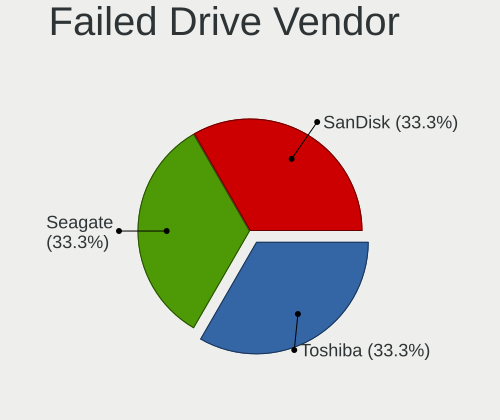

| Vendor  | Notebooks | Drives | Percent |
|---------|-----------|--------|---------|
| Toshiba | 1         | 1      | 33.33%  |
| Seagate | 1         | 1      | 33.33%  |
| SanDisk | 1         | 1      | 33.33%  |

Drive Status
------------

Number of failed and malfunc. drives

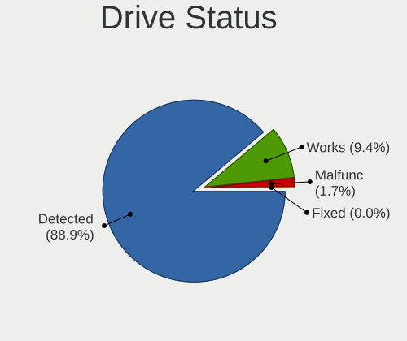

| Status   | Notebooks | Drives | Percent |
|----------|-----------|--------|---------|
| Detected | 6082      | 8773   | 88.87%  |
| Works    | 644       | 793    | 9.41%   |
| Malfunc  | 114       | 119    | 1.67%   |
| Failed   | 3         | 3      | 0.04%   |
| Fixed    | 1         | 1      | 0.01%   |

Storage controller
------------------

Storage Vendor
--------------

Storage controller vendors

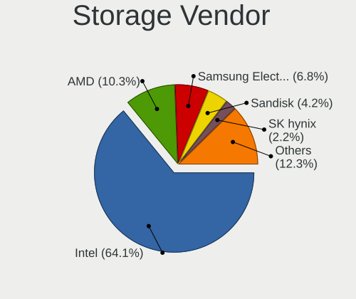

| Vendor                           | Notebooks | Percent |
|----------------------------------|-----------|---------|
| Intel                            | 4762      | 64.11%  |
| AMD                              | 763       | 10.27%  |
| Samsung Electronics              | 507       | 6.83%   |
| Sandisk                          | 314       | 4.23%   |
| SK hynix                         | 165       | 2.22%   |
| Micron Technology                | 126       | 1.7%    |
| Nvidia                           | 94        | 1.27%   |
| Kingston Technology Company      | 93        | 1.25%   |
| KIOXIA                           | 72        | 0.97%   |
| Toshiba America Info Systems     | 64        | 0.86%   |
| Phison Electronics               | 56        | 0.75%   |
| Silicon Integrated Systems [SiS] | 48        | 0.65%   |
| MAXIO Technology (Hangzhou)      | 45        | 0.61%   |
| ADATA Technology                 | 45        | 0.61%   |
| Silicon Motion                   | 41        | 0.55%   |
| Micron/Crucial Technology        | 41        | 0.55%   |
| Apple                            | 34        | 0.46%   |
| Marvell Technology Group         | 24        | 0.32%   |
| Solid State Storage Technology   | 18        | 0.24%   |
| VIA Technologies                 | 15        | 0.2%    |
| Shenzhen Longsys Electronics     | 14        | 0.19%   |
| Realtek Semiconductor            | 14        | 0.19%   |
| Lite-On Technology               | 9         | 0.12%   |
| Union Memory (Shenzhen)          | 8         | 0.11%   |
| JMicron Technology               | 8         | 0.11%   |
| Solidigm                         | 6         | 0.08%   |
| INNOGRIT                         | 6         | 0.08%   |
| ASMedia Technology               | 6         | 0.08%   |
| Yangtze Memory Technologies      | 5         | 0.07%   |
| Unknown                          | 4         | 0.05%   |
| Silicon Image                    | 3         | 0.04%   |
| Seagate Technology               | 3         | 0.04%   |
| Netac Technology                 | 3         | 0.04%   |
| Lenovo                           | 3         | 0.04%   |
| Biwin Storage Technology         | 3         | 0.04%   |
| TenaFe                           | 2         | 0.03%   |
| Shenzhen Shichuangyi Electronics | 2         | 0.03%   |
| Shenzhen Techwinsemi Technology  | 1         | 0.01%   |
| Hosin Global Electronics         | 1         | 0.01%   |

Storage Model
-------------

Storage controller models

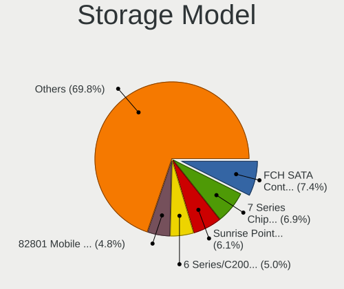

| Model                                                                            | Notebooks | Percent |
|----------------------------------------------------------------------------------|-----------|---------|
| AMD FCH SATA Controller [AHCI mode]                                              | 601       | 7.41%   |
| Intel 7 Series Chipset Family 6-port SATA Controller [AHCI mode]                 | 561       | 6.92%   |
| Intel Sunrise Point-LP SATA Controller [AHCI mode]                               | 494       | 6.09%   |
| Intel 6 Series/C200 Series Chipset Family 6 port Mobile SATA AHCI Controller     | 404       | 4.98%   |
| Intel 82801 Mobile SATA Controller [RAID mode]                                   | 386       | 4.76%   |
| Intel 82801IBM/IEM (ICH9M/ICH9M-E) 4 port SATA Controller [AHCI mode]            | 298       | 3.68%   |
| Intel 8 Series SATA Controller 1 [AHCI mode]                                     | 274       | 3.38%   |
| Intel 5 Series/3400 Series Chipset 4 port SATA AHCI Controller                   | 213       | 2.63%   |
| Intel Wildcat Point-LP SATA Controller [AHCI Mode]                               | 194       | 2.39%   |
| Intel 82801HM/HEM (ICH8M/ICH8M-E) IDE Controller                                 | 184       | 2.27%   |
| Intel Volume Management Device NVMe RAID Controller                              | 176       | 2.17%   |
| Intel 8 Series/C220 Series Chipset Family 6-port SATA Controller 1 [AHCI mode]   | 167       | 2.06%   |
| Intel Celeron/Pentium Silver Processor SATA Controller                           | 162       | 2%      |
| Samsung NVMe SSD Controller SM981/PM981/PM983                                    | 152       | 1.88%   |
| Intel 82801HM/HEM (ICH8M/ICH8M-E) SATA Controller [AHCI mode]                    | 152       | 1.88%   |
| Samsung NVMe SSD Controller 980 (DRAM-less)                                      | 122       | 1.51%   |
| Intel 5 Series/3400 Series Chipset 6 port SATA AHCI Controller                   | 99        | 1.22%   |
| AMD SB7x0/SB8x0/SB9x0 SATA Controller [AHCI mode]                                | 99        | 1.22%   |
| Intel Atom Processor E3800 Series SATA AHCI Controller                           | 95        | 1.17%   |
| Intel HM170/QM170 Chipset SATA Controller [AHCI Mode]                            | 92        | 1.13%   |
| Intel Tiger Lake-LP SATA Controller                                              | 86        | 1.06%   |
| Intel Celeron N3350/Pentium N4200/Atom E3900 Series SATA AHCI Controller         | 82        | 1.01%   |
| Intel Cannon Lake Mobile PCH SATA AHCI Controller                                | 78        | 0.96%   |
| SanDisk WD SN560/SN740/SN770/SN5000 NVMe SSD                                     | 68        | 0.84%   |
| Intel 82801GBM/GHM (ICH7-M Family) SATA Controller [IDE mode]                    | 65        | 0.8%    |
| Intel 82801G (ICH7 Family) IDE Controller                                        | 64        | 0.79%   |
| Intel Atom/Celeron/Pentium Processor x5-E8000/J3xxx/N3xxx Series SATA Controller | 59        | 0.73%   |
| Samsung NVMe SSD Controller PM9A1/PM9A3/980PRO                                   | 57        | 0.7%    |
| Intel Comet Lake SATA AHCI Controller                                            | 57        | 0.7%    |
| SanDisk Ultra 3D / WD PC SN530, IX SN530, Blue SN550 NVMe SSD (DRAM-less)        | 55        | 0.68%   |
| SK hynix Gold P31/BC711/PC711 NVMe Solid State Drive                             | 51        | 0.63%   |
| Samsung NVMe SSD Controller SM961/PM961/SM963                                    | 51        | 0.63%   |
| Intel Alder Lake-P SATA AHCI Controller                                          | 50        | 0.62%   |
| Intel 82801GBM/GHM (ICH7-M Family) SATA Controller [AHCI mode]                   | 49        | 0.6%    |
| Intel NM10/ICH7 Family SATA Controller [AHCI mode]                               | 48        | 0.59%   |
| Intel Cannon Point-LP SATA Controller [AHCI Mode]                                | 48        | 0.59%   |
| Silicon Integrated Systems [SiS] 5513 IDE Controller                             | 47        | 0.58%   |
| Intel SSD 670p Series [Keystone Harbor]                                          | 47        | 0.58%   |
| KIOXIA NVMe SSD Controller BG4 (DRAM-less)                                       | 44        | 0.54%   |
| Nvidia MCP79 AHCI Controller                                                     | 41        | 0.51%   |

Storage Kind
------------

Kind of storage controller (IDE, SATA, NVMe, SAS, ...)

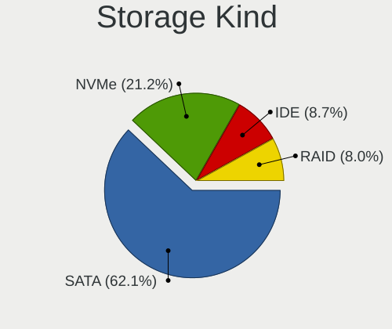

| Kind | Notebooks | Percent |
|------|-----------|---------|
| SATA | 4795      | 62.07%  |
| NVMe | 1635      | 21.17%  |
| IDE  | 675       | 8.74%   |
| RAID | 620       | 8.03%   |

Processor
---------

CPU Vendor
----------

Processor vendors

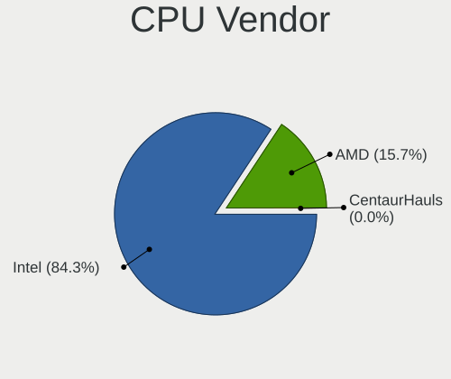

| Vendor       | Notebooks | Percent |
|--------------|-----------|---------|
| Intel        | 5666      | 84.3%   |
| AMD          | 1053      | 15.67%  |
| CentaurHauls | 2         | 0.03%   |

CPU Model
---------

Processor models

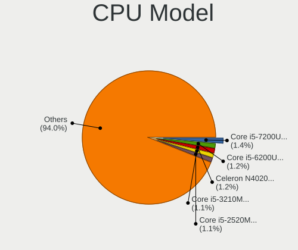

| Model                                         | Notebooks | Percent |
|-----------------------------------------------|-----------|---------|
| Intel Core i5-7200U CPU @ 2.50GHz             | 93        | 1.38%   |
| Intel Core i5-6200U CPU @ 2.30GHz             | 83        | 1.23%   |
| Intel Celeron N4020 CPU @ 1.10GHz             | 81        | 1.2%    |
| Intel Core i5-3210M CPU @ 2.50GHz             | 75        | 1.12%   |
| Intel Core i5-2520M CPU @ 2.50GHz             | 74        | 1.1%    |
| Intel 11th Gen Core i5-1135G7 @ 2.40GHz       | 68        | 1.01%   |
| Intel Core i5-8250U CPU @ 1.60GHz             | 65        | 0.97%   |
| Intel Core i5-5200U CPU @ 2.20GHz             | 63        | 0.94%   |
| Intel Core i5-6300U CPU @ 2.40GHz             | 62        | 0.92%   |
| Intel 11th Gen Core i7-1165G7 @ 2.80GHz       | 61        | 0.91%   |
| Intel Celeron CPU N3350 @ 1.10GHz             | 59        | 0.88%   |
| Intel Atom x5-Z8350 CPU @ 1.44GHz             | 56        | 0.83%   |
| Intel Core i7-7700HQ CPU @ 2.80GHz            | 54        | 0.8%    |
| Intel Core i3-3110M CPU @ 2.40GHz             | 49        | 0.73%   |
| Intel Core i5-4210U CPU @ 1.70GHz             | 48        | 0.71%   |
| AMD Ryzen 5 3500U with Radeon Vega Mobile Gfx | 48        | 0.71%   |
| Intel Core i5-3230M CPU @ 2.60GHz             | 44        | 0.65%   |
| Intel Core i5-4200U CPU @ 1.60GHz             | 43        | 0.64%   |
| Intel Celeron CPU N2840 @ 2.16GHz             | 43        | 0.64%   |
| Intel Core i5-2430M CPU @ 2.40GHz             | 42        | 0.62%   |
| Intel Core i5-8265U CPU @ 1.60GHz             | 41        | 0.61%   |
| Intel Core i7-2670QM CPU @ 2.20GHz            | 40        | 0.59%   |
| Intel Core i5-5300U CPU @ 2.30GHz             | 40        | 0.59%   |
| Intel Core i5-3320M CPU @ 2.60GHz             | 40        | 0.59%   |
| Intel Core i3 CPU M 370 @ 2.40GHz             | 40        | 0.59%   |
| Intel Celeron N4000 CPU @ 1.10GHz             | 40        | 0.59%   |
| AMD Ryzen 5 5500U with Radeon Graphics        | 40        | 0.59%   |
| Intel Core i7-8550U CPU @ 1.80GHz             | 39        | 0.58%   |
| Intel Core i5 CPU M 520 @ 2.40GHz             | 39        | 0.58%   |
| Intel Core i3-6006U CPU @ 2.00GHz             | 39        | 0.58%   |
| Intel Core 2 Duo CPU P8600 @ 2.40GHz          | 39        | 0.58%   |
| Intel Core i7-6500U CPU @ 2.50GHz             | 38        | 0.56%   |
| Intel Core i5-2410M CPU @ 2.30GHz             | 38        | 0.56%   |
| Intel Core i7-8750H CPU @ 2.20GHz             | 37        | 0.55%   |
| Intel Core i5-10210U CPU @ 1.60GHz            | 37        | 0.55%   |
| Intel Core i3-2310M CPU @ 2.10GHz             | 37        | 0.55%   |
| Intel Core i5-2450M CPU @ 2.50GHz             | 35        | 0.52%   |
| Intel Core i3-3217U CPU @ 1.80GHz             | 35        | 0.52%   |
| Intel Core 2 Duo CPU P8700 @ 2.53GHz          | 35        | 0.52%   |
| Intel Core i3-7020U CPU @ 2.30GHz             | 34        | 0.51%   |

CPU Model Family
----------------

Processor model prefix

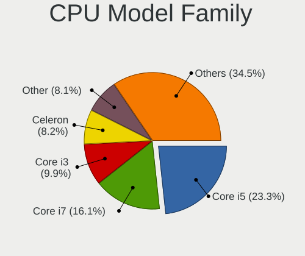

| Model                   | Notebooks | Percent |
|-------------------------|-----------|---------|
| Intel Core i5           | 1567      | 23.3%   |
| Intel Core i7           | 1080      | 16.06%  |
| Intel Core i3           | 663       | 9.86%   |
| Intel Celeron           | 552       | 8.21%   |
| Other                   | 543       | 8.07%   |
| Intel Core 2 Duo        | 443       | 6.59%   |
| Intel Atom              | 213       | 3.17%   |
| Intel Pentium           | 195       | 2.9%    |
| AMD Ryzen 5             | 193       | 2.87%   |
| AMD Ryzen 7             | 146       | 2.17%   |
| AMD A6                  | 100       | 1.49%   |
| Intel Pentium Dual-Core | 88        | 1.31%   |
| AMD A4                  | 63        | 0.94%   |
| AMD A8                  | 62        | 0.92%   |
| AMD Ryzen 3             | 56        | 0.83%   |
| Intel Pentium Dual      | 54        | 0.8%    |
| Intel Genuine           | 52        | 0.77%   |
| Intel Core 2            | 45        | 0.67%   |
| AMD E1                  | 45        | 0.67%   |
| AMD A10                 | 43        | 0.64%   |
| AMD E                   | 42        | 0.62%   |
| Intel Core              | 37        | 0.55%   |
| Intel Celeron M         | 29        | 0.43%   |
| Intel Pentium M         | 28        | 0.42%   |
| AMD Ryzen 9             | 24        | 0.36%   |
| AMD E2                  | 24        | 0.36%   |
| Intel Pentium Silver    | 23        | 0.34%   |
| AMD Turion 64 X2 Mobile | 23        | 0.34%   |
| Intel Core M            | 20        | 0.3%    |
| AMD Athlon              | 18        | 0.27%   |
| AMD Athlon II           | 17        | 0.25%   |
| Intel Core m5           | 13        | 0.19%   |
| AMD A12                 | 13        | 0.19%   |
| Intel Celeron Dual-Core | 12        | 0.18%   |
| AMD Ryzen 7 PRO         | 12        | 0.18%   |
| AMD Ryzen 5 PRO         | 12        | 0.18%   |
| Intel Core i9           | 11        | 0.16%   |
| Intel Xeon              | 10        | 0.15%   |
| Intel Core Duo          | 10        | 0.15%   |
| AMD Athlon 64 X2        | 10        | 0.15%   |

CPU Cores
---------

Number of processor cores

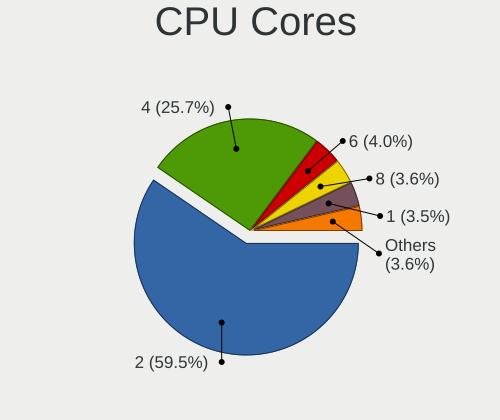

| Number | Notebooks | Percent |
|--------|-----------|---------|
| 2      | 4006      | 59.54%  |
| 4      | 1727      | 25.67%  |
| 6      | 270       | 4.01%   |
| 8      | 245       | 3.64%   |
| 1      | 238       | 3.54%   |
| 10     | 90        | 1.34%   |
| 14     | 64        | 0.95%   |
| 12     | 44        | 0.65%   |
| 16     | 23        | 0.34%   |
| 24     | 14        | 0.21%   |
| 3      | 3         | 0.04%   |
| 20     | 2         | 0.03%   |
| 5      | 2         | 0.03%   |

CPU Sockets
-----------

Number of sockets

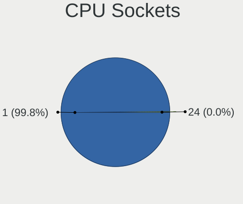

| Number | Notebooks | Percent |
|--------|-----------|---------|
| 1      | 6709      | 99.81%  |
| 2      | 10        | 0.15%   |
| 8      | 2         | 0.03%   |
| 24     | 1         | 0.01%   |

CPU Threads
-----------

Threads per core (Hyper-Threading)

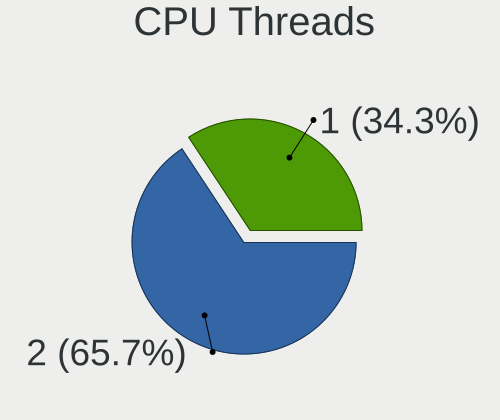

| Number | Notebooks | Percent |
|--------|-----------|---------|
| 2      | 4419      | 65.71%  |
| 1      | 2306      | 34.29%  |

CPU Op-Modes
------------

CPU Operation Modes (32-bit, 64-bit)

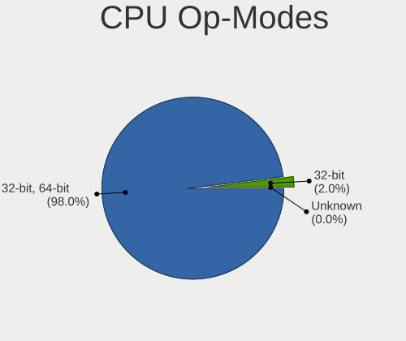

| Op mode        | Notebooks | Percent |
|----------------|-----------|---------|
| 32-bit, 64-bit | 6588      | 98.01%  |
| 32-bit         | 132       | 1.96%   |
| Unknown        | 2         | 0.03%   |

CPU Microcode
-------------

Microcode number

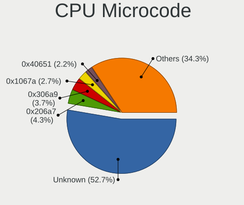

| Number     | Notebooks | Percent |
|------------|-----------|---------|
| Unknown    | 3604      | 52.69%  |
| 0x206a7    | 293       | 4.28%   |
| 0x306a9    | 255       | 3.73%   |
| 0x1067a    | 187       | 2.73%   |
| 0x40651    | 153       | 2.24%   |
| 0x406e3    | 121       | 1.77%   |
| 0x306d4    | 120       | 1.75%   |
| 0x20655    | 118       | 1.73%   |
| 0x6fd      | 101       | 1.48%   |
| 0x30678    | 98        | 1.43%   |
| 0x306c3    | 92        | 1.35%   |
| 0x806e9    | 89        | 1.3%    |
| 0x806ea    | 80        | 1.17%   |
| 0x806c1    | 78        | 1.14%   |
| 0x406c4    | 71        | 1.04%   |
| 0x806ec    | 70        | 1.02%   |
| 0x10676    | 59        | 0.86%   |
| 0x706a8    | 53        | 0.77%   |
| 0x906ea    | 49        | 0.72%   |
| 0x506c9    | 46        | 0.67%   |
| 0x406c3    | 46        | 0.67%   |
| 0x20652    | 44        | 0.64%   |
| 0x906e9    | 43        | 0.63%   |
| 0x706e5    | 42        | 0.61%   |
| 0x106ca    | 38        | 0.56%   |
| 0x08108109 | 38        | 0.56%   |
| 0x06006705 | 37        | 0.54%   |
| 0x6d8      | 34        | 0.5%    |
| 0x6e8      | 32        | 0.47%   |
| 0x6f6      | 31        | 0.45%   |
| 0x07030105 | 29        | 0.42%   |
| 0x05000119 | 29        | 0.42%   |
| 0x08108102 | 27        | 0.39%   |
| 0x106c2    | 26        | 0.38%   |
| 0x0700010f | 26        | 0.38%   |
| 0x706a1    | 24        | 0.35%   |
| 0x06001119 | 24        | 0.35%   |
| 0x6fb      | 23        | 0.34%   |
| 0x0a50000c | 23        | 0.34%   |
| 0xa0652    | 22        | 0.32%   |

CPU Microarch
-------------

Microarchitecture

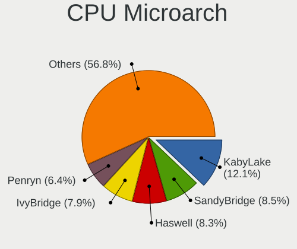

| Name               | Notebooks | Percent |
|--------------------|-----------|---------|
| KabyLake           | 815       | 12.12%  |
| SandyBridge        | 571       | 8.49%   |
| Haswell            | 561       | 8.34%   |
| IvyBridge          | 529       | 7.87%   |
| Penryn             | 431       | 6.41%   |
| Unknown            | 425       | 6.32%   |
| Silvermont         | 341       | 5.07%   |
| Skylake            | 338       | 5.03%   |
| Westmere           | 322       | 4.79%   |
| Core               | 284       | 4.22%   |
| Broadwell          | 252       | 3.75%   |
| TigerLake          | 200       | 2.97%   |
| Goldmont plus      | 196       | 2.91%   |
| Excavator          | 125       | 1.86%   |
| Zen+               | 114       | 1.69%   |
| Zen 3              | 100       | 1.49%   |
| IceLake            | 95        | 1.41%   |
| P6                 | 93        | 1.38%   |
| Puma               | 91        | 1.35%   |
| Goldmont           | 90        | 1.34%   |
| Bonnell            | 83        | 1.23%   |
| Bobcat             | 74        | 1.1%    |
| Alderlake Hybrid   | 72        | 1.07%   |
| Zen 2              | 68        | 1.01%   |
| CometLake          | 64        | 0.95%   |
| Jaguar             | 60        | 0.89%   |
| Piledriver         | 57        | 0.85%   |
| K8 Hammer          | 57        | 0.85%   |
| K10                | 46        | 0.68%   |
| Zen                | 40        | 0.59%   |
| Nehalem            | 32        | 0.48%   |
| K10 Llano          | 32        | 0.48%   |
| K8 & K10 hybrid    | 25        | 0.37%   |
| Tremont            | 14        | 0.21%   |
| Steamroller        | 13        | 0.19%   |
| Meteorlake Hybrid  | 6         | 0.09%   |
| NetBurst           | 4         | 0.06%   |
| Gracemont          | 4         | 0.06%   |
| ArrowLake-H Hybrid | 2         | 0.03%   |

Graphics
--------

GPU Vendor
----------

Vendors of graphics cards

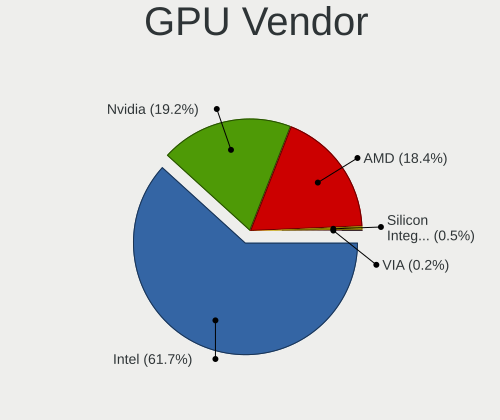

| Vendor                           | Notebooks | Percent |
|----------------------------------|-----------|---------|
| Intel                            | 5002      | 61.75%  |
| Nvidia                           | 1554      | 19.18%  |
| AMD                              | 1491      | 18.41%  |
| Silicon Integrated Systems [SiS] | 40        | 0.49%   |
| VIA Technologies                 | 14        | 0.17%   |

GPU Model
---------

Graphics card models

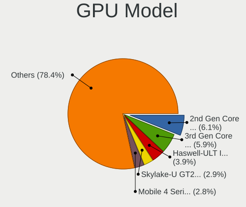

| Model                                                                                    | Notebooks | Percent |
|------------------------------------------------------------------------------------------|-----------|---------|
| Intel 2nd Generation Core Processor Family Integrated Graphics Controller                | 510       | 6.05%   |
| Intel 3rd Gen Core processor Graphics Controller                                         | 499       | 5.92%   |
| Intel Haswell-ULT Integrated Graphics Controller                                         | 327       | 3.88%   |
| Intel Skylake-U GT2 [HD Graphics 520]                                                    | 243       | 2.88%   |
| Intel Mobile 4 Series Chipset Integrated Graphics Controller                             | 239       | 2.84%   |
| Intel Core Processor Integrated Graphics Controller                                      | 223       | 2.65%   |
| Intel Kaby Lake-U GT2 [HD Graphics 620]                                                  | 193       | 2.29%   |
| Intel Broadwell-U GT2 [HD Graphics 5500]                                                 | 188       | 2.23%   |
| Intel 4th Gen Core Processor Integrated Graphics Controller                              | 188       | 2.23%   |
| Intel Atom/Celeron/Pentium Processor x5-E8000/J3xxx/N3xxx Integrated Graphics Controller | 184       | 2.18%   |
| Intel GeminiLake [UHD Graphics 600]                                                      | 179       | 2.12%   |
| Intel Kaby Lake-R GT2 [UHD Graphics 620]                                                 | 171       | 2.03%   |
| Intel TigerLake-LP GT2 [Iris Xe Graphics]                                                | 165       | 1.96%   |
| Intel Atom Processor Z36xxx/Z37xxx Series Graphics & Display                             | 157       | 1.86%   |
| AMD Picasso/Raven 2 [Radeon Vega Series / Radeon Vega Mobile Series]                     | 123       | 1.46%   |
| Intel Mobile GM965/GL960 Integrated Graphics Controller (secondary)                      | 120       | 1.42%   |
| Intel Mobile GM965/GL960 Integrated Graphics Controller (primary)                        | 120       | 1.42%   |
| Intel CoffeeLake-H GT2 [UHD Graphics 630]                                                | 105       | 1.25%   |
| Intel WhiskeyLake-U GT2 [UHD Graphics 620]                                               | 98        | 1.16%   |
| Intel Mobile 945GM/GMS/GME, 943/940GML Express Integrated Graphics Controller            | 91        | 1.08%   |
| AMD Stoney [Radeon R2/R3/R4/R5 Graphics]                                                 | 91        | 1.08%   |
| Intel CometLake-U GT2 [UHD Graphics]                                                     | 82        | 0.97%   |
| Intel Apollo Lake GT1 [HD Graphics 500]                                                  | 78        | 0.93%   |
| Intel Kaby Lake-H GT2 [HD Graphics 630]                                                  | 74        | 0.88%   |
| Nvidia GF117M [GeForce 610M/710M/810M/820M / GT 620M/625M/630M/720M]                     | 71        | 0.84%   |
| Nvidia TU117M [GeForce GTX 1650 Mobile / Max-Q]                                          | 68        | 0.81%   |
| AMD Renoir [Radeon Vega Series / Radeon Vega Mobile Series]                              | 67        | 0.79%   |
| AMD Mullins [Radeon R4/R5 Graphics]                                                      | 65        | 0.77%   |
| Intel Mobile 945GM/GMS, 943/940GML Express Integrated Graphics Controller                | 64        | 0.76%   |
| AMD Lucienne                                                                             | 64        | 0.76%   |
| AMD Seymour [Radeon HD 6400M/7400M Series]                                               | 63        | 0.75%   |
| AMD Sun XT [Radeon HD 8670A/8670M/8690M / R5 M330 / M430 / Radeon 520 Mobile]            | 62        | 0.74%   |
| Intel Raptor Lake-P [Iris Xe Graphics]                                                   | 58        | 0.69%   |
| Intel Iris Plus Graphics G1 (Ice Lake)                                                   | 58        | 0.69%   |
| AMD Topaz XT [Radeon R7 M260/M265 / M340/M360 / M440/M445 / 530/535 / 620/625 Mobile]    | 58        | 0.69%   |
| Intel CometLake-H GT2 [UHD Graphics]                                                     | 54        | 0.64%   |
| Nvidia GP107M [GeForce GTX 1050 Mobile]                                                  | 53        | 0.63%   |
| AMD Cezanne [Radeon Vega Series / Radeon Vega Mobile Series]                             | 50        | 0.59%   |
| Intel Atom Processor D4xx/D5xx/N4xx/N5xx Integrated Graphics Controller                  | 45        | 0.53%   |
| Intel Skylake-H GT2 [HD Graphics 530]                                                    | 44        | 0.52%   |

GPU Combo
---------

Combinations of graphics cards

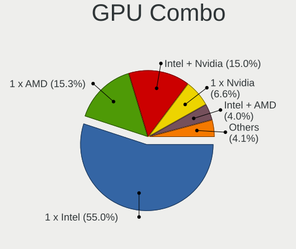

| Name           | Notebooks | Percent |
|----------------|-----------|---------|
| 1 x Intel      | 3705      | 55.04%  |
| 1 x AMD        | 1028      | 15.27%  |
| Intel + Nvidia | 1007      | 14.96%  |
| 1 x Nvidia     | 444       | 6.6%    |
| Intel + AMD    | 268       | 3.98%   |
| 2 x AMD        | 102       | 1.52%   |
| AMD + Nvidia   | 93        | 1.38%   |
| 1 x SiS        | 40        | 0.59%   |
| Other          | 18        | 0.27%   |
| 1 x VIA        | 14        | 0.21%   |
| 2 x Nvidia     | 11        | 0.16%   |
| 2 x Intel      | 1         | 0.01%   |

GPU Driver
----------

Free vs proprietary

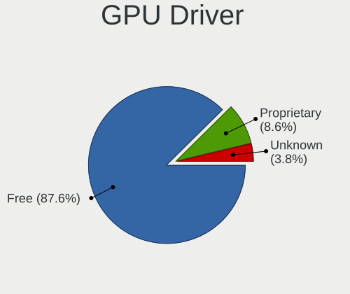

| Driver      | Notebooks | Percent |
|-------------|-----------|---------|
| Free        | 5930      | 87.61%  |
| Proprietary | 584       | 8.63%   |
| Unknown     | 255       | 3.77%   |

GPU Memory
----------

Total video memory

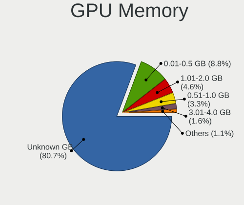

| Size in GB | Notebooks | Percent |
|------------|-----------|---------|
| Unknown    | 5493      | 80.67%  |
| 0.01-0.5   | 597       | 8.77%   |
| 1.01-2.0   | 310       | 4.55%   |
| 0.51-1.0   | 223       | 3.28%   |
| 3.01-4.0   | 110       | 1.62%   |
| 5.01-6.0   | 28        | 0.41%   |
| 7.01-8.0   | 26        | 0.38%   |
| 2.01-3.0   | 17        | 0.25%   |
| 8.01-16.0  | 5         | 0.07%   |

Monitor
-------

Monitor Vendor
--------------

Monitor vendors

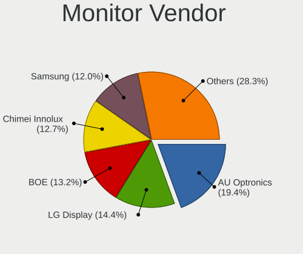

| Vendor                  | Notebooks | Percent |
|-------------------------|-----------|---------|
| AU Optronics            | 1366      | 19.43%  |
| LG Display              | 1011      | 14.38%  |
| BOE                     | 929       | 13.22%  |
| Chimei Innolux          | 891       | 12.68%  |
| Samsung Electronics     | 846       | 12.04%  |
| Apple                   | 289       | 4.11%   |
| Chi Mei Optoelectronics | 225       | 3.2%    |
| Goldstar                | 115       | 1.64%   |
| Sharp                   | 114       | 1.62%   |
| Lenovo                  | 114       | 1.62%   |
| LG Philips              | 105       | 1.49%   |
| Dell                    | 92        | 1.31%   |
| PANDA                   | 83        | 1.18%   |
| InfoVision              | 80        | 1.14%   |
| Hewlett-Packard         | 51        | 0.73%   |
| Acer                    | 45        | 0.64%   |
| CPT                     | 38        | 0.54%   |
| AOC                     | 34        | 0.48%   |
| Philips                 | 31        | 0.44%   |
| Sony                    | 28        | 0.4%    |
| BenQ                    | 27        | 0.38%   |
| Toshiba                 | 26        | 0.37%   |
| HannStar                | 24        | 0.34%   |
| CSO                     | 20        | 0.28%   |
| Panasonic               | 18        | 0.26%   |
| InnoLux Display         | 18        | 0.26%   |
| ASUSTek Computer        | 14        | 0.2%    |
| Vizio                   | 13        | 0.18%   |
| SLD                     | 13        | 0.18%   |
| HKC                     | 13        | 0.18%   |
| TMX                     | 12        | 0.17%   |
| Quanta Display          | 12        | 0.17%   |
| Ancor Communications    | 12        | 0.17%   |
| LGD                     | 11        | 0.16%   |
| KDB                     | 11        | 0.16%   |
| Iiyama                  | 10        | 0.14%   |
| Unknown                 | 10        | 0.14%   |
| ViewSonic               | 9         | 0.13%   |
| Seiko/Epson             | 9         | 0.13%   |
| Fujitsu Siemens         | 9         | 0.13%   |

Monitor Model
-------------

Monitor models

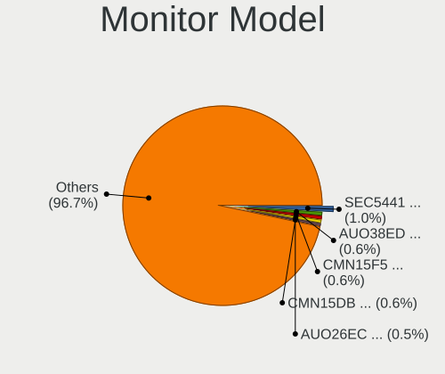

| Model                                                                    | Notebooks | Percent |
|--------------------------------------------------------------------------|-----------|---------|
| Samsung Electronics LCD Monitor SEC5441 1280x800 331x207mm 15.4-inch     | 68        | 0.96%   |
| AU Optronics LCD Monitor AUO38ED 1920x1080 344x193mm 15.5-inch           | 46        | 0.65%   |
| Chimei Innolux LCD Monitor CMN15F5 1920x1080 344x193mm 15.5-inch         | 44        | 0.62%   |
| Chimei Innolux LCD Monitor CMN15DB 1366x768 344x193mm 15.5-inch          | 41        | 0.58%   |
| AU Optronics LCD Monitor AUO26EC 1366x768 344x193mm 15.5-inch            | 35        | 0.49%   |
| LG Display LCD Monitor LGD02DC 1366x768 344x194mm 15.5-inch              | 33        | 0.47%   |
| AU Optronics LCD Monitor AUO22EC 1366x768 344x193mm 15.5-inch            | 32        | 0.45%   |
| LG Display LCD Monitor LGD033A 1366x768 344x194mm 15.5-inch              | 31        | 0.44%   |
| Chimei Innolux LCD Monitor CMN14D4 1920x1080 309x173mm 13.9-inch         | 28        | 0.4%    |
| BOE LCD Monitor BOE0696 1366x768 309x173mm 13.9-inch                     | 28        | 0.4%    |
| AU Optronics LCD Monitor AUO71EC 1366x768 344x193mm 15.5-inch            | 28        | 0.4%    |
| AU Optronics LCD Monitor AUO20EC 1366x768 344x193mm 15.5-inch            | 28        | 0.4%    |
| AU Optronics LCD Monitor AUO10EC 1366x768 344x193mm 15.5-inch            | 28        | 0.4%    |
| Chimei Innolux LCD Monitor CMN15E7 1920x1080 344x193mm 15.5-inch         | 27        | 0.38%   |
| Chimei Innolux LCD Monitor CMN15E6 1366x768 344x193mm 15.5-inch          | 27        | 0.38%   |
| AU Optronics LCD Monitor AUO21ED 1920x1080 344x193mm 15.5-inch           | 27        | 0.38%   |
| AU Optronics LCD Monitor AUO45EC 1366x768 344x193mm 15.5-inch            | 26        | 0.37%   |
| AU Optronics LCD Monitor AUO106C 1366x768 276x155mm 12.5-inch            | 24        | 0.34%   |
| Samsung Electronics LCD Monitor SDC4C48 1920x1080 293x165mm 13.2-inch    | 23        | 0.32%   |
| AU Optronics LCD Monitor AUO403D 1920x1080 309x174mm 14.0-inch           | 23        | 0.32%   |
| AU Optronics LCD Monitor AUO2E3C 1366x768 309x173mm 13.9-inch            | 23        | 0.32%   |
| Chimei Innolux LCD Monitor CMN15DC 1366x768 344x193mm 15.5-inch          | 22        | 0.31%   |
| AU Optronics LCD Monitor AUO235C 1366x768 256x144mm 11.6-inch            | 22        | 0.31%   |
| LG Display LCD Monitor LGD046F 1920x1080 344x194mm 15.5-inch             | 21        | 0.3%    |
| Chimei Innolux LCD Monitor CMN15CA 1366x768 344x193mm 15.5-inch          | 21        | 0.3%    |
| Chimei Innolux LCD Monitor CMN1521 1920x1080 344x193mm 15.5-inch         | 21        | 0.3%    |
| Chi Mei Optoelectronics LCD Monitor CMO15A7 1366x768 344x193mm 15.5-inch | 21        | 0.3%    |
| BOE LCD Monitor BOE06A4 1366x768 344x194mm 15.5-inch                     | 21        | 0.3%    |
| AU Optronics LCD Monitor AUO183C 1366x768 309x173mm 13.9-inch            | 21        | 0.3%    |
| Samsung Electronics LCD Monitor SEC544B 1600x900 382x214mm 17.2-inch     | 20        | 0.28%   |
| LG Display LCD Monitor LGD02E9 1366x768 309x174mm 14.0-inch              | 20        | 0.28%   |
| Chimei Innolux LCD Monitor CMN15AB 1366x768 344x193mm 15.5-inch          | 20        | 0.28%   |
| AU Optronics LCD Monitor AUO193C 1366x768 309x173mm 13.9-inch            | 20        | 0.28%   |
| BOE LCD Monitor BOE06A5 1366x768 344x194mm 15.5-inch                     | 19        | 0.27%   |
| Apple Color LCD APP9CC7 1280x800 286x179mm 13.3-inch                     | 19        | 0.27%   |
| Samsung Electronics LCD Monitor SEC5541 1366x768 344x193mm 15.5-inch     | 18        | 0.25%   |
| Lenovo LCD Monitor LEN40B1 1600x900 345x194mm 15.6-inch                  | 18        | 0.25%   |
| BOE LCD Monitor BOE0872 1920x1080 344x194mm 15.5-inch                    | 18        | 0.25%   |
| AU Optronics LCD Monitor AUO21EC 1366x768 344x193mm 15.5-inch            | 18        | 0.25%   |
| Apple Color LCD APP9CF0 1440x900 290x180mm 13.4-inch                     | 18        | 0.25%   |

Monitor Resolution
------------------

Monitor screen resolution

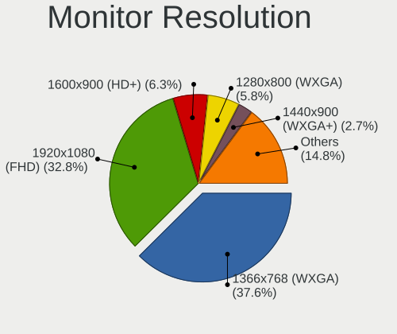

| Resolution         | Notebooks | Percent |
|--------------------|-----------|---------|
| 1366x768 (WXGA)    | 2563      | 37.58%  |
| 1920x1080 (FHD)    | 2238      | 32.81%  |
| 1600x900 (HD+)     | 429       | 6.29%   |
| 1280x800 (WXGA)    | 399       | 5.85%   |
| 1440x900 (WXGA+)   | 181       | 2.65%   |
| 3840x2160 (4K)     | 160       | 2.35%   |
| 1920x1200 (WUXGA)  | 158       | 2.32%   |
| 2560x1600          | 89        | 1.3%    |
| 2560x1440 (QHD)    | 88        | 1.29%   |
| 2880x1800          | 83        | 1.22%   |
| 1680x1050 (WSXGA+) | 60        | 0.88%   |
| 1024x600           | 58        | 0.85%   |
| 2560x1080          | 29        | 0.43%   |
| 2160x1440          | 24        | 0.35%   |
| 1280x1024 (SXGA)   | 24        | 0.35%   |
| 1360x768           | 19        | 0.28%   |
| Unknown            | 19        | 0.28%   |
| 3440x1440          | 16        | 0.23%   |
| 1024x768 (XGA)     | 15        | 0.22%   |
| 3200x1800 (QHD+)   | 13        | 0.19%   |
| 2304x1440          | 13        | 0.19%   |
| 2256x1504          | 12        | 0.18%   |
| 1920x540           | 12        | 0.18%   |
| 3840x2400          | 11        | 0.16%   |
| 3200x2000          | 9         | 0.13%   |
| 3840x1080          | 8         | 0.12%   |
| 1280x768           | 8         | 0.12%   |
| 2880x1620          | 7         | 0.1%    |
| 1920x1280          | 7         | 0.1%    |
| 1680x945           | 7         | 0.1%    |
| 2288x1287          | 5         | 0.07%   |
| 1920x515           | 5         | 0.07%   |
| 2880x1920          | 4         | 0.06%   |
| 2520x1680          | 4         | 0.06%   |
| 1600x2560          | 4         | 0.06%   |
| 1400x1050          | 4         | 0.06%   |
| 3072x1920          | 3         | 0.04%   |
| 3000x2000          | 3         | 0.04%   |
| 2240x1400          | 3         | 0.04%   |
| 1024x576           | 3         | 0.04%   |

Monitor Diagonal
----------------

Diagonal size in inches

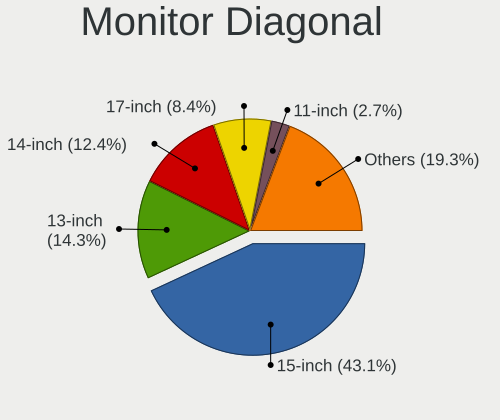

| Inches  | Notebooks | Percent |
|---------|-----------|---------|
| 15      | 3023      | 43.08%  |
| 13      | 1001      | 14.27%  |
| 14      | 867       | 12.36%  |
| 17      | 587       | 8.37%   |
| 11      | 188       | 2.68%   |
| 12      | 182       | 2.59%   |
| 16      | 133       | 1.9%    |
| 24      | 125       | 1.78%   |
| 27      | 123       | 1.75%   |
| Unknown | 103       | 1.47%   |
| 23      | 86        | 1.23%   |
| 18      | 78        | 1.11%   |
| 21      | 77        | 1.1%    |
| 10      | 75        | 1.07%   |
| 31      | 67        | 0.95%   |
| 34      | 38        | 0.54%   |
| 19      | 30        | 0.43%   |
| 22      | 24        | 0.34%   |
| 84      | 21        | 0.3%    |
| 54      | 20        | 0.29%   |
| 20      | 16        | 0.23%   |
| 72      | 15        | 0.21%   |
| 40      | 15        | 0.21%   |
| 32      | 15        | 0.21%   |
| 63      | 12        | 0.17%   |
| 52      | 9         | 0.13%   |
| 26      | 8         | 0.11%   |
| 48      | 7         | 0.1%    |
| 25      | 7         | 0.1%    |
| 8       | 6         | 0.09%   |
| 46      | 5         | 0.07%   |
| 28      | 5         | 0.07%   |
| 42      | 4         | 0.06%   |
| 86      | 3         | 0.04%   |
| 74      | 3         | 0.04%   |
| 58      | 3         | 0.04%   |
| 49      | 3         | 0.04%   |
| 37      | 3         | 0.04%   |
| 29      | 3         | 0.04%   |
| 7       | 3         | 0.04%   |

Monitor Width
-------------

Physical width

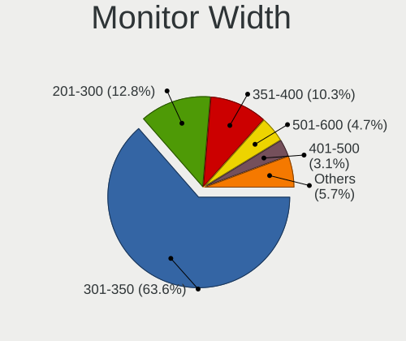

| Width in mm    | Notebooks | Percent |
|----------------|-----------|---------|
| 301-350        | 4438      | 63.57%  |
| 201-300        | 892       | 12.78%  |
| 351-400        | 718       | 10.29%  |
| 501-600        | 325       | 4.66%   |
| 401-500        | 213       | 3.05%   |
| Unknown        | 103       | 1.48%   |
| 601-700        | 83        | 1.19%   |
| 1001-1500      | 73        | 1.05%   |
| 701-800        | 57        | 0.82%   |
| 1501-2000      | 40        | 0.57%   |
| 801-900        | 21        | 0.3%    |
| 101-200        | 8         | 0.11%   |
| 901-1000       | 7         | 0.1%    |
| More than 2000 | 2         | 0.03%   |
| 1-100          | 1         | 0.01%   |

Aspect Ratio
------------

Proportional relationship between the width and the height

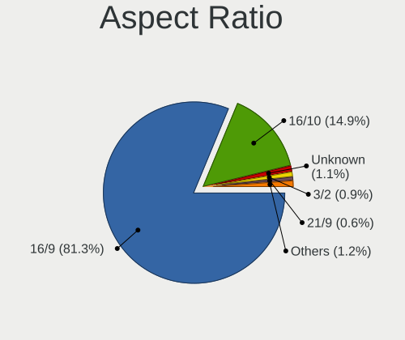

| Ratio   | Notebooks | Percent |
|---------|-----------|---------|
| 16/9    | 5274      | 81.25%  |
| 16/10   | 970       | 14.94%  |
| Unknown | 70        | 1.08%   |
| 3/2     | 59        | 0.91%   |
| 21/9    | 42        | 0.65%   |
| 4/3     | 25        | 0.39%   |
| 5/4     | 23        | 0.35%   |
| 32/9    | 7         | 0.11%   |
| 3.73    | 5         | 0.08%   |
| 0.56    | 3         | 0.05%   |
| 1.00    | 2         | 0.03%   |
| 0.62    | 2         | 0.03%   |
| 6/5     | 1         | 0.02%   |
| 3.40    | 1         | 0.02%   |
| 3.20    | 1         | 0.02%   |
| 2.00    | 1         | 0.02%   |
| 1.96    | 1         | 0.02%   |
| 0.67    | 1         | 0.02%   |
| 0.63    | 1         | 0.02%   |
| 0.31    | 1         | 0.02%   |
| 0.25    | 1         | 0.02%   |

Monitor Area
------------

Area in inch²

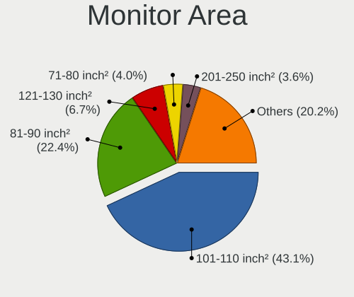

| Area in inch² | Notebooks | Percent |
|----------------|-----------|---------|
| 101-110        | 3018      | 43.08%  |
| 81-90          | 1571      | 22.42%  |
| 121-130        | 469       | 6.69%   |
| 71-80          | 281       | 4.01%   |
| 201-250        | 255       | 3.64%   |
| 51-60          | 190       | 2.71%   |
| 61-70          | 177       | 2.53%   |
| 301-350        | 127       | 1.81%   |
| 351-500        | 126       | 1.8%    |
| 131-140        | 115       | 1.64%   |
| 111-120        | 110       | 1.57%   |
| More than 1000 | 103       | 1.47%   |
| Unknown        | 103       | 1.47%   |
| 141-150        | 87        | 1.24%   |
| 41-50          | 74        | 1.06%   |
| 151-200        | 73        | 1.04%   |
| 501-1000       | 43        | 0.61%   |
| 251-300        | 41        | 0.59%   |
| 91-100         | 34        | 0.49%   |
| 1-40           | 9         | 0.13%   |

Pixel Density
-------------

Pixels per inch

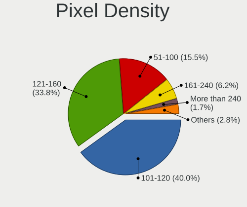

| Density       | Notebooks | Percent |
|---------------|-----------|---------|
| 101-120       | 2768      | 40.02%  |
| 121-160       | 2335      | 33.76%  |
| 51-100        | 1072      | 15.5%   |
| 161-240       | 429       | 6.2%    |
| More than 240 | 116       | 1.68%   |
| Unknown       | 104       | 1.5%    |
| 1-50          | 92        | 1.33%   |

Multiple Monitors
-----------------

Total monitors connected

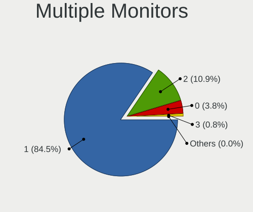

| Total | Notebooks | Percent |
|-------|-----------|---------|
| 1     | 5766      | 84.48%  |
| 2     | 741       | 10.86%  |
| 0     | 258       | 3.78%   |
| 3     | 53        | 0.78%   |
| 4     | 5         | 0.07%   |
| 5     | 2         | 0.03%   |

Network
-------

Net Controller Vendor
---------------------

Controller vendors

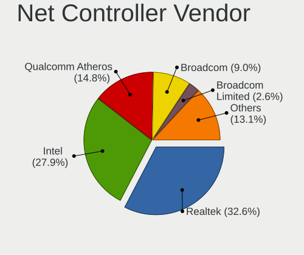

| Vendor                            | Notebooks | Percent |
|-----------------------------------|-----------|---------|
| Realtek Semiconductor             | 3516      | 32.65%  |
| Intel                             | 3001      | 27.86%  |
| Qualcomm Atheros                  | 1592      | 14.78%  |
| Broadcom                          | 970       | 9.01%   |
| Broadcom Limited                  | 283       | 2.63%   |
| MediaTek                          | 166       | 1.54%   |
| Marvell Technology Group          | 164       | 1.52%   |
| Ralink                            | 131       | 1.22%   |
| TP-Link                           | 83        | 0.77%   |
| Nvidia                            | 78        | 0.72%   |
| ASIX Electronics                  | 68        | 0.63%   |
| Samsung Electronics               | 63        | 0.58%   |
| Ralink Technology                 | 57        | 0.53%   |
| Sierra Wireless                   | 49        | 0.45%   |
| Dell                              | 49        | 0.45%   |
| JMicron Technology                | 48        | 0.45%   |
| Silicon Integrated Systems [SiS]  | 45        | 0.42%   |
| DisplayLink                       | 31        | 0.29%   |
| Xiaomi                            | 30        | 0.28%   |
| Hewlett-Packard                   | 27        | 0.25%   |
| Huawei Technologies               | 23        | 0.21%   |
| Shenzhen Goodix Technology        | 22        | 0.2%    |
| Qualcomm Atheros Communications   | 19        | 0.18%   |
| Ericsson Business Mobile Networks | 19        | 0.18%   |
| Qualcomm                          | 17        | 0.16%   |
| OPPO Electronics                  | 15        | 0.14%   |
| VIA Technologies                  | 13        | 0.12%   |
| NetGear                           | 13        | 0.12%   |
| D-Link                            | 13        | 0.12%   |
| ASUSTek Computer                  | 12        | 0.11%   |
| Motorola PCS                      | 11        | 0.1%    |
| Edimax Technology                 | 11        | 0.1%    |
| Google                            | 10        | 0.09%   |
| Lenovo                            | 9         | 0.08%   |
| D-Link System                     | 9         | 0.08%   |
| AMD                               | 8         | 0.07%   |
| Attansic Technology               | 7         | 0.06%   |
| U-Blox                            | 5         | 0.05%   |
| Toshiba                           | 5         | 0.05%   |
| OnePlus Technology (Shenzhen)     | 5         | 0.05%   |

Net Controller Model
--------------------

Controller models

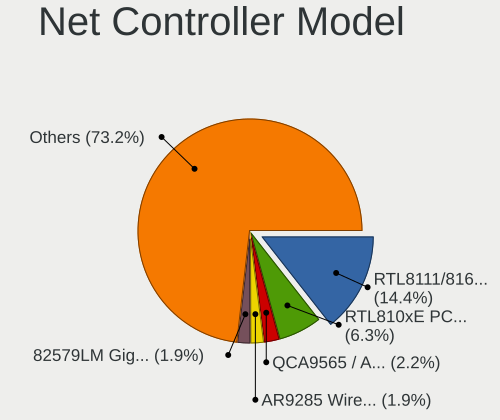

| Model                                                                   | Notebooks | Percent |
|-------------------------------------------------------------------------|-----------|---------|
| Realtek RTL8111/8168/8211/8411 PCI Express Gigabit Ethernet Controller  | 1858      | 14.43%  |
| Realtek RTL810xE PCI Express Fast Ethernet controller                   | 815       | 6.33%   |
| Qualcomm Atheros QCA9565 / AR9565 Wireless Network Adapter              | 289       | 2.24%   |
| Qualcomm Atheros AR9285 Wireless Network Adapter (PCI-Express)          | 251       | 1.95%   |
| Intel 82579LM Gigabit Network Connection (Lewisville)                   | 241       | 1.87%   |
| Qualcomm Atheros AR9485 Wireless Network Adapter                        | 235       | 1.82%   |
| Intel Wireless 7260                                                     | 232       | 1.8%    |
| Qualcomm Atheros QCA9377 802.11ac Wireless Network Adapter              | 226       | 1.75%   |
| Realtek RTL8821CE 802.11ac PCIe Wireless Network Adapter                | 215       | 1.67%   |
| Intel Wireless 7265                                                     | 195       | 1.51%   |
| Intel Wireless 8265 / 8275                                              | 190       | 1.48%   |
| Intel Wireless 8260                                                     | 159       | 1.23%   |
| Broadcom BCM4313 802.11bgn Wireless Network Adapter                     | 148       | 1.15%   |
| Realtek RTL8153 Gigabit Ethernet Adapter                                | 147       | 1.14%   |
| Intel Wi-Fi 6 AX201                                                     | 147       | 1.14%   |
| Intel Centrino Advanced-N 6205 [Taylor Peak]                            | 142       | 1.1%    |
| Broadcom BCM43142 802.11b/g/n                                           | 131       | 1.02%   |
| Realtek RTL8822CE 802.11ac PCIe Wireless Network Adapter                | 123       | 0.96%   |
| Realtek RTL8723BE PCIe Wireless Network Adapter                         | 120       | 0.93%   |
| Intel Wireless 3165                                                     | 119       | 0.92%   |
| Intel Wi-Fi 6 AX200                                                     | 105       | 0.82%   |
| Realtek RTL8188CE 802.11b/g/n WiFi Adapter                              | 100       | 0.78%   |
| Intel PRO/Wireless 3945ABG [Golan] Network Connection                   | 94        | 0.73%   |
| Intel Ethernet Connection (4) I219-LM                                   | 94        | 0.73%   |
| Qualcomm Atheros QCA6174 802.11ac Wireless Network Adapter              | 92        | 0.71%   |
| Intel WiFi Link 5100                                                    | 90        | 0.7%    |
| Qualcomm Atheros AR242x / AR542x Wireless Network Adapter (PCI-Express) | 87        | 0.68%   |
| Intel Alder Lake-P PCH CNVi WiFi                                        | 87        | 0.68%   |
| Realtek RTL8188EE Wireless Network Adapter                              | 78        | 0.61%   |
| Intel Comet Lake PCH-LP CNVi WiFi                                       | 78        | 0.61%   |
| Intel Ethernet Connection I219-LM                                       | 77        | 0.6%    |
| Intel Ethernet Connection I218-LM                                       | 77        | 0.6%    |
| Intel Ethernet Connection I217-LM                                       | 76        | 0.59%   |
| Intel Wireless 3160                                                     | 75        | 0.58%   |
| Broadcom BCM4312 802.11b/g LP-PHY                                       | 75        | 0.58%   |
| Qualcomm Atheros AR8151 v2.0 Gigabit Ethernet                           | 71        | 0.55%   |
| Intel Centrino Ultimate-N 6300                                          | 71        | 0.55%   |
| Intel 82577LM Gigabit Network Connection                                | 71        | 0.55%   |
| MediaTek MT7921 802.11ax PCIe Wireless Network Adapter [Filogic 330]    | 67        | 0.52%   |
| Intel Raptor Lake PCH CNVi WiFi                                         | 67        | 0.52%   |

Wireless Vendor
---------------

Wireless vendors

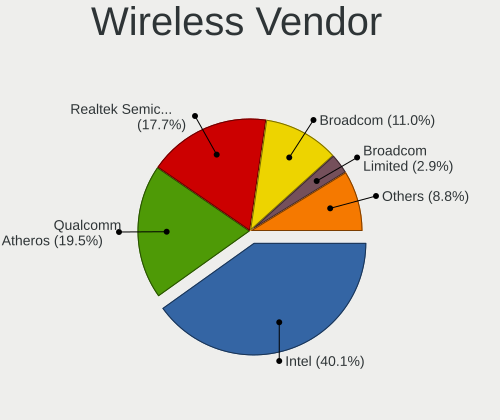

| Vendor                            | Notebooks | Percent |
|-----------------------------------|-----------|---------|
| Intel                             | 2795      | 40.13%  |
| Qualcomm Atheros                  | 1356      | 19.47%  |
| Realtek Semiconductor             | 1234      | 17.72%  |
| Broadcom                          | 765       | 10.98%  |
| Broadcom Limited                  | 204       | 2.93%   |
| MediaTek                          | 147       | 2.11%   |
| Ralink                            | 131       | 1.88%   |
| TP-Link                           | 71        | 1.02%   |
| Ralink Technology                 | 57        | 0.82%   |
| Sierra Wireless                   | 49        | 0.7%    |
| Dell                              | 29        | 0.42%   |
| Qualcomm Atheros Communications   | 19        | 0.27%   |
| NetGear                           | 13        | 0.19%   |
| D-Link                            | 13        | 0.19%   |
| Edimax Technology                 | 11        | 0.16%   |
| ASUSTek Computer                  | 10        | 0.14%   |
| D-Link System                     | 9         | 0.13%   |
| Qualcomm                          | 6         | 0.09%   |
| Hewlett-Packard                   | 6         | 0.09%   |
| Microsoft                         | 5         | 0.07%   |
| Belkin Components                 | 5         | 0.07%   |
| Fibocom                           | 4         | 0.06%   |
| ZyDAS                             | 3         | 0.04%   |
| Micro Star International          | 3         | 0.04%   |
| Linksys                           | 3         | 0.04%   |
| TRENDnet                          | 2         | 0.03%   |
| Realtek                           | 2         | 0.03%   |
| ZyXEL Communications              | 1         | 0.01%   |
| Xiaomi                            | 1         | 0.01%   |
| Tenda                             | 1         | 0.01%   |
| Sitecom Europe                    | 1         | 0.01%   |
| Qcom                              | 1         | 0.01%   |
| Mercucys                          | 1         | 0.01%   |
| Lite-On Technology                | 1         | 0.01%   |
| IMC Networks                      | 1         | 0.01%   |
| Fujitsu Siemens Computers         | 1         | 0.01%   |
| Ericsson Business Mobile Networks | 1         | 0.01%   |
| AVM                               | 1         | 0.01%   |
| Askey Computer                    | 1         | 0.01%   |
| Unknown                           | 1         | 0.01%   |

Wireless Model
--------------

Wireless models

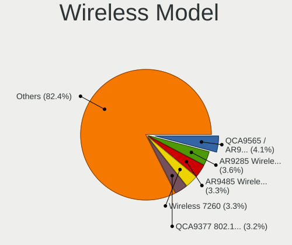

| Model                                                                   | Notebooks | Percent |
|-------------------------------------------------------------------------|-----------|---------|
| Qualcomm Atheros QCA9565 / AR9565 Wireless Network Adapter              | 289       | 4.12%   |
| Qualcomm Atheros AR9285 Wireless Network Adapter (PCI-Express)          | 251       | 3.58%   |
| Qualcomm Atheros AR9485 Wireless Network Adapter                        | 235       | 3.35%   |
| Intel Wireless 7260                                                     | 232       | 3.31%   |
| Qualcomm Atheros QCA9377 802.11ac Wireless Network Adapter              | 226       | 3.22%   |
| Realtek RTL8821CE 802.11ac PCIe Wireless Network Adapter                | 215       | 3.06%   |
| Intel Wireless 7265                                                     | 195       | 2.78%   |
| Intel Wireless 8265 / 8275                                              | 190       | 2.71%   |
| Intel Wireless 8260                                                     | 159       | 2.27%   |
| Broadcom BCM4313 802.11bgn Wireless Network Adapter                     | 148       | 2.11%   |
| Intel Wi-Fi 6 AX201                                                     | 147       | 2.09%   |
| Intel Centrino Advanced-N 6205 [Taylor Peak]                            | 142       | 2.02%   |
| Broadcom BCM43142 802.11b/g/n                                           | 131       | 1.87%   |
| Realtek RTL8822CE 802.11ac PCIe Wireless Network Adapter                | 123       | 1.75%   |
| Realtek RTL8723BE PCIe Wireless Network Adapter                         | 120       | 1.71%   |
| Intel Wireless 3165                                                     | 119       | 1.7%    |
| Intel Wi-Fi 6 AX200                                                     | 105       | 1.5%    |
| Realtek RTL8188CE 802.11b/g/n WiFi Adapter                              | 100       | 1.42%   |
| Intel PRO/Wireless 3945ABG [Golan] Network Connection                   | 94        | 1.34%   |
| Qualcomm Atheros QCA6174 802.11ac Wireless Network Adapter              | 92        | 1.31%   |
| Intel WiFi Link 5100                                                    | 90        | 1.28%   |
| Qualcomm Atheros AR242x / AR542x Wireless Network Adapter (PCI-Express) | 87        | 1.24%   |
| Realtek RTL8188EE Wireless Network Adapter                              | 78        | 1.11%   |
| Intel Comet Lake PCH-LP CNVi WiFi                                       | 78        | 1.11%   |
| Intel Wireless 3160                                                     | 75        | 1.07%   |
| Broadcom BCM4312 802.11b/g LP-PHY                                       | 75        | 1.07%   |
| Intel Centrino Ultimate-N 6300                                          | 71        | 1.01%   |
| MediaTek MT7921 802.11ax PCIe Wireless Network Adapter [Filogic 330]    | 67        | 0.95%   |
| Realtek RTL8723DE Wireless Network Adapter                              | 65        | 0.93%   |
| Intel Raptor Lake PCH CNVi WiFi                                         | 64        | 0.91%   |
| Intel Centrino Wireless-N 1000 [Condor Peak]                            | 63        | 0.9%    |
| Intel Cannon Lake PCH CNVi WiFi                                         | 63        | 0.9%    |
| Broadcom BCM4331 802.11a/b/g/n                                          | 62        | 0.88%   |
| Intel Centrino Advanced-N 6235                                          | 60        | 0.85%   |
| Ralink RT3290 Wireless 802.11n 1T/1R PCIe                               | 58        | 0.83%   |
| Realtek RTL8852BE PCIe 802.11ax Wireless Network Controller             | 57        | 0.81%   |
| Intel PRO/Wireless 4965 AG or AGN [Kedron] Network Connection           | 56        | 0.8%    |
| Intel Centrino Wireless-N 2230                                          | 56        | 0.8%    |
| Broadcom BCM4322 802.11a/b/g/n Wireless LAN Controller                  | 55        | 0.78%   |
| Intel Alder Lake-P PCH CNVi WiFi                                        | 54        | 0.77%   |

Ethernet Vendor
---------------

Ethernet vendors

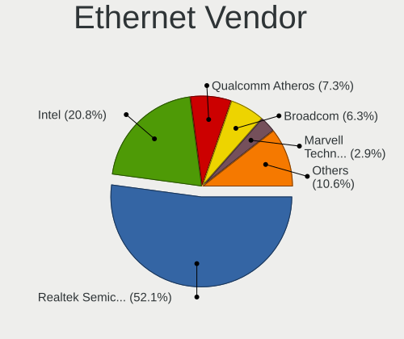

| Vendor                                 | Notebooks | Percent |
|----------------------------------------|-----------|---------|
| Realtek Semiconductor                  | 2952      | 52.13%  |
| Intel                                  | 1177      | 20.78%  |
| Qualcomm Atheros                       | 416       | 7.35%   |
| Broadcom                               | 354       | 6.25%   |
| Marvell Technology Group               | 164       | 2.9%    |
| Broadcom Limited                       | 86        | 1.52%   |
| Nvidia                                 | 78        | 1.38%   |
| ASIX Electronics                       | 68        | 1.2%    |
| Samsung Electronics                    | 61        | 1.08%   |
| JMicron Technology                     | 48        | 0.85%   |
| Silicon Integrated Systems [SiS]       | 43        | 0.76%   |
| DisplayLink                            | 31        | 0.55%   |
| Xiaomi                                 | 29        | 0.51%   |
| MediaTek                               | 19        | 0.34%   |
| OPPO Electronics                       | 15        | 0.26%   |
| VIA Technologies                       | 13        | 0.23%   |
| Huawei Technologies                    | 13        | 0.23%   |
| TP-Link                                | 12        | 0.21%   |
| Qualcomm                               | 11        | 0.19%   |
| Motorola PCS                           | 11        | 0.19%   |
| Hewlett-Packard                        | 10        | 0.18%   |
| Google                                 | 10        | 0.18%   |
| Lenovo                                 | 9         | 0.16%   |
| Attansic Technology                    | 7         | 0.12%   |
| T & A Mobile Phones                    | 3         | 0.05%   |
| Spreadtrum Communications              | 2         | 0.04%   |
| Sony Ericsson Mobile Communications AB | 2         | 0.04%   |
| OnePlus Technology (Shenzhen)          | 2         | 0.04%   |
| HMD Global                             | 2         | 0.04%   |
| Davicom Semiconductor                  | 2         | 0.04%   |
| ASUSTek Computer                       | 2         | 0.04%   |
| Apple                                  | 2         | 0.04%   |
| vivo                                   | 1         | 0.02%   |
| QinHeng Electronics                    | 1         | 0.02%   |
| Novatel Wireless                       | 1         | 0.02%   |
| Motorola BCS                           | 1         | 0.02%   |
| Linksys                                | 1         | 0.02%   |
| LG Electronics                         | 1         | 0.02%   |
| ICS Advent                             | 1         | 0.02%   |
| HTC (High Tech Computer)               | 1         | 0.02%   |

Ethernet Model
--------------

Ethernet models

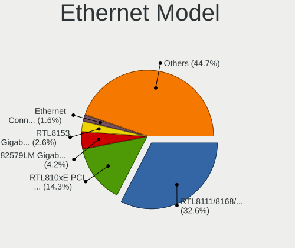

| Model                                                                  | Notebooks | Percent |
|------------------------------------------------------------------------|-----------|---------|
| Realtek RTL8111/8168/8211/8411 PCI Express Gigabit Ethernet Controller | 1858      | 32.59%  |
| Realtek RTL810xE PCI Express Fast Ethernet controller                  | 815       | 14.3%   |
| Intel 82579LM Gigabit Network Connection (Lewisville)                  | 241       | 4.23%   |
| Realtek RTL8153 Gigabit Ethernet Adapter                               | 147       | 2.58%   |
| Intel Ethernet Connection (4) I219-LM                                  | 94        | 1.65%   |
| Intel Ethernet Connection I219-LM                                      | 77        | 1.35%   |
| Intel Ethernet Connection I218-LM                                      | 77        | 1.35%   |
| Intel Ethernet Connection I217-LM                                      | 76        | 1.33%   |
| Qualcomm Atheros AR8151 v2.0 Gigabit Ethernet                          | 71        | 1.25%   |
| Intel 82577LM Gigabit Network Connection                               | 71        | 1.25%   |
| Intel Ethernet Connection (3) I218-LM                                  | 60        | 1.05%   |
| ASIX AX88179 Gigabit Ethernet                                          | 60        | 1.05%   |
| Broadcom NetXtreme BCM57765 Gigabit Ethernet PCIe                      | 58        | 1.02%   |
| Intel 82567LM Gigabit Network Connection                               | 57        | 1%      |
| Broadcom NetLink BCM57785 Gigabit Ethernet PCIe                        | 55        | 0.96%   |
| Intel Ethernet Connection I219-V                                       | 47        | 0.82%   |
| Marvell Group 88E8040 PCI-E Fast Ethernet Controller                   | 45        | 0.79%   |
| Samsung Galaxy series, misc. (tethering mode)                          | 44        | 0.77%   |
| Realtek RTL-8100/8101L/8139 PCI Fast Ethernet Adapter                  | 44        | 0.77%   |
| Qualcomm Atheros AR8162 Fast Ethernet                                  | 44        | 0.77%   |
| Nvidia MCP79 Ethernet                                                  | 43        | 0.75%   |
| Silicon Integrated Systems [SiS] 191 Gigabit Ethernet Adapter          | 40        | 0.7%    |
| Realtek RTL8152 Fast Ethernet Adapter                                  | 38        | 0.67%   |
| Qualcomm Atheros AR8131 Gigabit Ethernet                               | 37        | 0.65%   |
| JMicron JMC250 PCI Express Gigabit Ethernet Controller                 | 36        | 0.63%   |
| Broadcom NetLink BCM57780 Gigabit Ethernet PCIe                        | 36        | 0.63%   |
| Qualcomm Atheros QCA8172 Fast Ethernet                                 | 35        | 0.61%   |
| Qualcomm Atheros QCA8171 Gigabit Ethernet                              | 35        | 0.61%   |
| Qualcomm Atheros AR8161 Gigabit Ethernet                               | 33        | 0.58%   |
| Intel Ethernet Connection (4) I219-V                                   | 33        | 0.58%   |
| Intel Alder Lake-P PCH CNVi WiFi                                       | 33        | 0.58%   |
| Qualcomm Atheros AR8152 v1.1 Fast Ethernet                             | 31        | 0.54%   |
| Realtek Killer E2600 GbE Controller                                    | 29        | 0.51%   |
| Broadcom NetXtreme BCM57786 Gigabit Ethernet PCIe                      | 29        | 0.51%   |
| Intel 82566MM Gigabit Network Connection                               | 27        | 0.47%   |
| Broadcom NetLink BCM5784M Gigabit Ethernet PCIe                        | 27        | 0.47%   |
| Qualcomm Atheros AR8132 Fast Ethernet                                  | 26        | 0.46%   |
| Qualcomm Atheros Killer E220x Gigabit Ethernet Controller              | 25        | 0.44%   |
| Qualcomm Atheros AR8152 v2.0 Fast Ethernet                             | 25        | 0.44%   |
| Marvell Group 88E8055 PCI-E Gigabit Ethernet Controller                | 24        | 0.42%   |

Net Controller Kind
-------------------

Ethernet, WiFi or modem

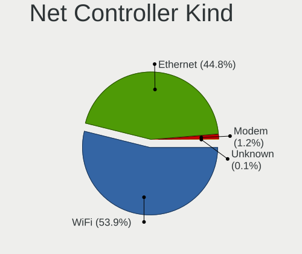

| Kind     | Notebooks | Percent |
|----------|-----------|---------|
| WiFi     | 6510      | 53.86%  |
| Ethernet | 5418      | 44.82%  |
| Modem    | 151       | 1.25%   |
| Unknown  | 9         | 0.07%   |

Used Controller
---------------

Currently used network controller

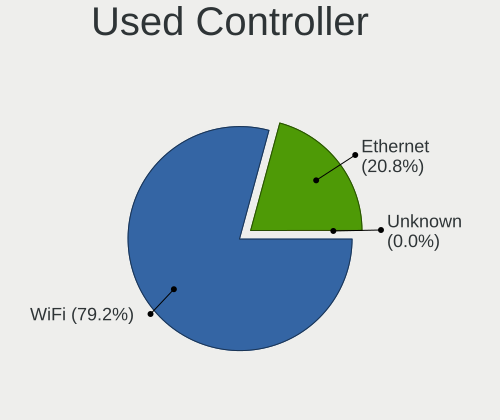

| Kind     | Notebooks | Percent |
|----------|-----------|---------|
| WiFi     | 5519      | 79.22%  |
| Ethernet | 1447      | 20.77%  |
| Unknown  | 1         | 0.01%   |

NICs
----

Total network controllers on board

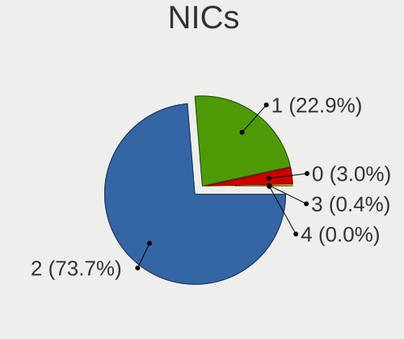

| Total | Notebooks | Percent |
|-------|-----------|---------|
| 2     | 4957      | 73.7%   |
| 1     | 1538      | 22.87%  |
| 0     | 204       | 3.03%   |
| 3     | 26        | 0.39%   |
| 4     | 1         | 0.01%   |

IPv6
----

IPv6 vs IPv4

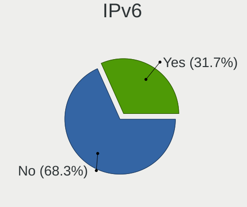

| Used | Notebooks | Percent |
|------|-----------|---------|
| No   | 4657      | 68.33%  |
| Yes  | 2158      | 31.67%  |

Bluetooth
---------

Bluetooth Vendor
----------------

Controller vendors

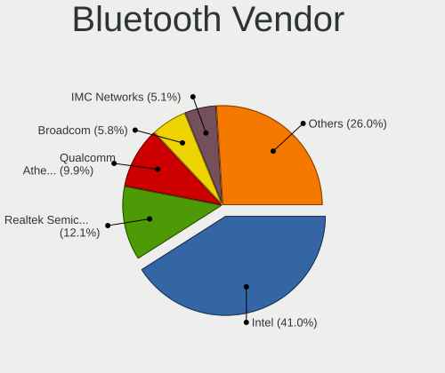

| Vendor                          | Notebooks | Percent |
|---------------------------------|-----------|---------|
| Intel                           | 2011      | 40.97%  |
| Realtek Semiconductor           | 594       | 12.1%   |
| Qualcomm Atheros Communications | 487       | 9.92%   |
| Broadcom                        | 287       | 5.85%   |
| IMC Networks                    | 252       | 5.13%   |
| Apple                           | 248       | 5.05%   |
| Lite-On Technology              | 190       | 3.87%   |
| Foxconn / Hon Hai               | 185       | 3.77%   |
| Dell                            | 124       | 2.53%   |
| Hewlett-Packard                 | 116       | 2.36%   |
| Toshiba                         | 83        | 1.69%   |
| Cambridge Silicon Radio         | 71        | 1.45%   |
| Ralink                          | 58        | 1.18%   |
| ASUSTek Computer                | 34        | 0.69%   |
| Realtek                         | 27        | 0.55%   |
| Alps Electric                   | 27        | 0.55%   |
| Foxconn International           | 24        | 0.49%   |
| MediaTek                        | 17        | 0.35%   |
| Ralink Technology               | 13        | 0.26%   |
| Taiyo Yuden                     | 8         | 0.16%   |
| Askey Computer                  | 8         | 0.16%   |
| TP-Link                         | 7         | 0.14%   |
| Dynex                           | 5         | 0.1%    |
| Unknown                         | 5         | 0.1%    |
| Qcom                            | 4         | 0.08%   |
| Chicony Electronics             | 4         | 0.08%   |
| Actions                         | 4         | 0.08%   |
| Integrated System Solution      | 3         | 0.06%   |
| USI                             | 2         | 0.04%   |
| Smart Modular Technologies      | 2         | 0.04%   |
| Fujitsu                         | 2         | 0.04%   |
| Micro Star International        | 1         | 0.02%   |
| Edimax Technology               | 1         | 0.02%   |
| D-Link System                   | 1         | 0.02%   |
| Conwise Technology              | 1         | 0.02%   |
| Belkin Components               | 1         | 0.02%   |
| Actiontec Electronics           | 1         | 0.02%   |

Bluetooth Model
---------------

Controller models

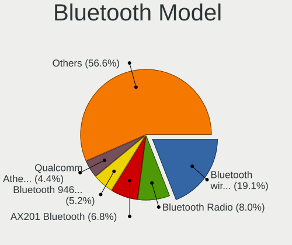

| Model                                               | Notebooks | Percent |
|-----------------------------------------------------|-----------|---------|
| Intel Bluetooth wireless interface                  | 937       | 19.07%  |
| Realtek Bluetooth Radio                             | 392       | 7.98%   |
| Intel AX201 Bluetooth                               | 333       | 6.78%   |
| Intel Bluetooth 9460/9560 Jefferson Peak (JfP)      | 255       | 5.19%   |
| Qualcomm Atheros  Bluetooth Device                  | 216       | 4.4%    |
| Apple Bluetooth Host Controller                     | 145       | 2.95%   |
| Realtek  Bluetooth 4.2 Adapter                      | 143       | 2.91%   |
| Intel Bluetooth Device                              | 128       | 2.61%   |
| Intel Centrino Bluetooth Wireless Transceiver       | 104       | 2.12%   |
| Intel AX200 Bluetooth                               | 103       | 2.1%    |
| Qualcomm Atheros AR3012 Bluetooth 4.0               | 87        | 1.77%   |
| Qualcomm Atheros AR3011 Bluetooth                   | 81        | 1.65%   |
| IMC Networks Wireless_Device                        | 78        | 1.59%   |
| Cambridge Silicon Radio Bluetooth Dongle (HCI mode) | 71        | 1.45%   |
| IMC Networks Bluetooth Radio                        | 69        | 1.4%    |
| Apple Bluetooth USB Host Controller                 | 69        | 1.4%    |
| IMC Networks Bluetooth Device                       | 64        | 1.3%    |
| HP Bluetooth 2.0 Interface [Broadcom BCM2045]       | 61        | 1.24%   |
| Lite-On Qualcomm Atheros QCA9377 Bluetooth          | 60        | 1.22%   |
| Ralink RT3290 Bluetooth                             | 58        | 1.18%   |
| Lite-On Atheros AR3012 Bluetooth                    | 51        | 1.04%   |
| HP Broadcom 2070 Bluetooth Combo                    | 49        | 1%      |
| Foxconn / Hon Hai Bluetooth Device                  | 49        | 1%      |
| Intel Centrino Advanced-N 6230 Bluetooth adapter    | 47        | 0.96%   |
| Intel AX210 Bluetooth                               | 47        | 0.96%   |
| Dell DW375 Bluetooth Module                         | 42        | 0.85%   |
| Qualcomm Atheros QCA61x4 Bluetooth 4.0              | 40        | 0.81%   |
| Broadcom BCM2045B (BDC-2.1)                         | 40        | 0.81%   |
| Lite-On Bluetooth Device                            | 38        | 0.77%   |
| Broadcom BCM43142A0 Bluetooth 4.0                   | 37        | 0.75%   |
| Intel Wireless-AC 3168 Bluetooth                    | 35        | 0.71%   |
| Qualcomm Atheros AR9462 Bluetooth                   | 31        | 0.63%   |
| Broadcom BCM20702 Bluetooth 4.0 [ThinkPad]          | 30        | 0.61%   |
| Broadcom BCM2070 Bluetooth 2.1 + EDR                | 28        | 0.57%   |
| Realtek Bluetooth Radio                             | 27        | 0.55%   |
| Foxconn International BCM43142A0 Bluetooth module   | 24        | 0.49%   |
| Realtek RTL8723B Bluetooth                          | 23        | 0.47%   |
| Intel Wireless-AC 9260 Bluetooth Adapter            | 23        | 0.47%   |
| Foxconn / Hon Hai Wireless_Device                   | 23        | 0.47%   |
| Dell Wireless 365 Bluetooth                         | 23        | 0.47%   |

Sound
-----

Sound Vendor
------------

Sound card vendors

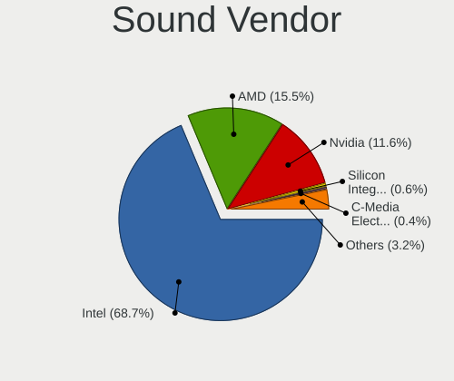

| Vendor                                       | Notebooks | Percent |
|----------------------------------------------|-----------|---------|
| Intel                                        | 5414      | 68.7%   |
| AMD                                          | 1218      | 15.45%  |
| Nvidia                                       | 916       | 11.62%  |
| Silicon Integrated Systems [SiS]             | 48        | 0.61%   |
| C-Media Electronics                          | 32        | 0.41%   |
| Logitech                                     | 16        | 0.2%    |
| Generalplus Technology                       | 16        | 0.2%    |
| VIA Technologies                             | 14        | 0.18%   |
| Realtek Semiconductor                        | 13        | 0.16%   |
| GN Netcom                                    | 13        | 0.16%   |
| Lenovo                                       | 10        | 0.13%   |
| Apple                                        | 10        | 0.13%   |
| Sony                                         | 9         | 0.11%   |
| Texas Instruments                            | 8         | 0.1%    |
| SteelSeries ApS                              | 8         | 0.1%    |
| JMTek                                        | 8         | 0.1%    |
| Hewlett-Packard                              | 8         | 0.1%    |
| Plantronics                                  | 7         | 0.09%   |
| Tenx Technology                              | 6         | 0.08%   |
| Creative Technology                          | 6         | 0.08%   |
| Walmart                                      | 5         | 0.06%   |
| KTMicro                                      | 5         | 0.06%   |
| Focusrite-Novation                           | 5         | 0.06%   |
| ASUSTek Computer                             | 5         | 0.06%   |
| Unknown                                      | 5         | 0.06%   |
| PreSonus Audio Electronics                   | 4         | 0.05%   |
| Kingston Technology                          | 4         | 0.05%   |
| Dell                                         | 4         | 0.05%   |
| Yamaha                                       | 3         | 0.04%   |
| Razer USA                                    | 3         | 0.04%   |
| OPPO Electronics                             | 3         | 0.04%   |
| M-Audio                                      | 3         | 0.04%   |
| FiiO Electronics Technology                  | 3         | 0.04%   |
| DSEA A/S                                     | 3         | 0.04%   |
| Corsair                                      | 3         | 0.04%   |
| AKAI Professional M.I.                       | 3         | 0.04%   |
| Zoran Co. Personal Media Division (Nogatech) | 2         | 0.03%   |
| SAVITECH                                     | 2         | 0.03%   |
| Conexant Systems                             | 2         | 0.03%   |
| BEHRINGER International                      | 2         | 0.03%   |

Sound Model
-----------

Sound card models

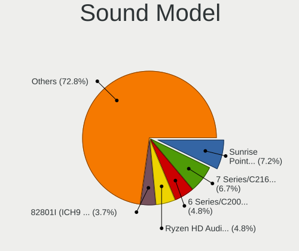

| Model                                                                                             | Notebooks | Percent |
|---------------------------------------------------------------------------------------------------|-----------|---------|
| Intel Sunrise Point-LP HD Audio                                                                   | 691       | 7.22%   |
| Intel 7 Series/C216 Chipset Family High Definition Audio Controller                               | 638       | 6.67%   |
| Intel 6 Series/C200 Series Chipset Family High Definition Audio Controller                        | 461       | 4.82%   |
| AMD Ryzen HD Audio Controller                                                                     | 457       | 4.78%   |
| Intel 82801I (ICH9 Family) HD Audio Controller                                                    | 357       | 3.73%   |
| Intel 5 Series/3400 Series Chipset High Definition Audio                                          | 353       | 3.69%   |
| Intel 8 Series HD Audio Controller                                                                | 329       | 3.44%   |
| Intel Haswell-ULT HD Audio Controller                                                             | 325       | 3.4%    |
| AMD FCH Azalia Controller                                                                         | 279       | 2.92%   |
| Intel Broadwell-U Audio Controller                                                                | 252       | 2.63%   |
| Intel Wildcat Point-LP High Definition Audio Controller                                           | 249       | 2.6%    |
| Intel 8 Series/C220 Series Chipset High Definition Audio Controller                               | 232       | 2.42%   |
| AMD Renoir/Cezanne HDMI/DP Audio Controller                                                       | 203       | 2.12%   |
| Intel Tiger Lake-LP Smart Sound Technology Audio Controller                                       | 200       | 2.09%   |
| Intel Celeron/Pentium Silver Processor High Definition Audio                                      | 196       | 2.05%   |
| Intel 82801H (ICH8 Family) HD Audio Controller                                                    | 194       | 2.03%   |
| AMD Kabini HDMI/DP Audio                                                                          | 185       | 1.93%   |
| Intel Xeon E3-1200 v3/4th Gen Core Processor HD Audio Controller                                  | 181       | 1.89%   |
| Intel NM10/ICH7 Family High Definition Audio Controller                                           | 178       | 1.86%   |
| AMD Raven/Raven2/Fenghuang HDMI/DP Audio Controller                                               | 141       | 1.47%   |
| Intel Alder Lake PCH-P High Definition Audio Controller                                           | 129       | 1.35%   |
| AMD SBx00 Azalia (Intel HDA)                                                                      | 127       | 1.33%   |
| AMD Family 15h (Models 60h-6fh) Audio Controller                                                  | 122       | 1.27%   |
| Intel Cannon Lake PCH cAVS                                                                        | 120       | 1.25%   |
| Intel Atom Processor Z36xxx/Z37xxx Series High Definition Audio Controller                        | 117       | 1.22%   |
| Nvidia GF108 High Definition Audio Controller                                                     | 112       | 1.17%   |
| Intel Cannon Point-LP High Definition Audio Controller                                            | 111       | 1.16%   |
| Intel Atom/Celeron/Pentium Processor x5-E8000/J3xxx/N3xxx Series High Definition Audio Controller | 95        | 0.99%   |
| Intel Comet Lake PCH-LP cAVS                                                                      | 91        | 0.95%   |
| AMD High Definition Audio Controller                                                              | 91        | 0.95%   |
| Intel CM238 HD Audio Controller                                                                   | 90        | 0.94%   |
| Intel Celeron N3350/Pentium N4200/Atom E3900 Series Audio Cluster                                 | 90        | 0.94%   |
| Intel Raptor Lake-P/U/H cAVS                                                                      | 82        | 0.86%   |
| AMD Radeon High Definition Audio Controller                                                       | 80        | 0.84%   |
| Intel Ice Lake-LP Smart Sound Technology Audio Controller                                         | 76        | 0.79%   |
| Nvidia TU107 GeForce GTX 1650 High Definition Audio Controller                                    | 66        | 0.69%   |
| Nvidia GA107 High Definition Audio Controller                                                     | 66        | 0.69%   |
| Nvidia GP107GL High Definition Audio Controller                                                   | 64        | 0.67%   |
| Intel Comet Lake PCH cAVS                                                                         | 59        | 0.62%   |
| Nvidia High Definition Audio Controller                                                           | 58        | 0.61%   |

Memory
------

Memory Vendor
-------------

Memory module vendors

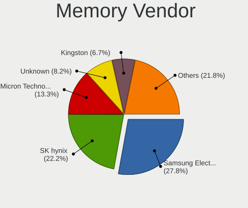

| Vendor                 | Notebooks | Percent |
|------------------------|-----------|---------|
| Samsung Electronics    | 394       | 27.84%  |
| SK hynix               | 314       | 22.19%  |
| Micron Technology      | 188       | 13.29%  |
| Unknown                | 116       | 8.2%    |
| Kingston               | 95        | 6.71%   |
| Crucial                | 48        | 3.39%   |
| Unknown (ABCD)         | 39        | 2.76%   |
| Elpida                 | 26        | 1.84%   |
| A-DATA Technology      | 25        | 1.77%   |
| Ramaxel Technology     | 24        | 1.7%    |
| Nanya Technology       | 18        | 1.27%   |
| Smart                  | 15        | 1.06%   |
| Unknown                | 12        | 0.85%   |
| Corsair                | 10        | 0.71%   |
| Team                   | 7         | 0.49%   |
| Transcend              | 6         | 0.42%   |
| Timetec                | 5         | 0.35%   |
| G.Skill                | 5         | 0.35%   |
| Teikon                 | 4         | 0.28%   |
| Smart Brazil           | 4         | 0.28%   |
| Qimonda                | 4         | 0.28%   |
| Patriot                | 4         | 0.28%   |
| SHARETRONIC            | 2         | 0.14%   |
| Lexar                  | 2         | 0.14%   |
| High Bridge            | 2         | 0.14%   |
| ff                     | 2         | 0.14%   |
| fef5                   | 2         | 0.14%   |
| Axiom                  | 2         | 0.14%   |
| Avant                  | 2         | 0.14%   |
| Apacer                 | 2         | 0.14%   |
| 4ea5                   | 2         | 0.14%   |
| Wodposit               | 1         | 0.07%   |
| Wilk                   | 1         | 0.07%   |
| Walton Chaintech       | 1         | 0.07%   |
| Unknown (08B5)         | 1         | 0.07%   |
| Unknown (07F7)         | 1         | 0.07%   |
| Unknown (000080B30080) | 1         | 0.07%   |
| Toshiba                | 1         | 0.07%   |
| Super Talent           | 1         | 0.07%   |
| Strontium              | 1         | 0.07%   |

Memory Model
------------

Memory module models

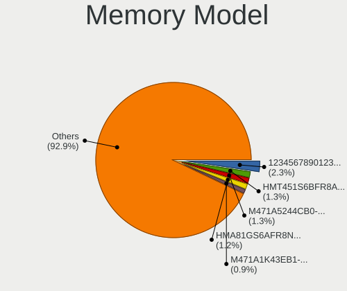

| Model                                                            | Notebooks | Percent |
|------------------------------------------------------------------|-----------|---------|
| Unknown (ABCD) RAM 123456789012345678 2GB SODIMM LPDDR4 2400MT/s | 35        | 2.34%   |
| SK hynix RAM HMT451S6BFR8A-PB 4GB SODIMM DDR3 1600MT/s           | 20        | 1.34%   |
| Samsung RAM M471A5244CB0-CTD 4GB SODIMM DDR4 3266MT/s            | 19        | 1.27%   |
| SK hynix RAM HMA81GS6AFR8N-UH 8GB SODIMM DDR4 2667MT/s           | 18        | 1.21%   |
| Samsung RAM M471A1K43EB1-CWE 8GB SODIMM DDR4 3200MT/s            | 14        | 0.94%   |
| Micron RAM 8KTF51264HZ-1G6E1 4GB SODIMM DDR3 1600MT/s            | 14        | 0.94%   |
| Samsung RAM M471B5273DH0-CH9 4GB SODIMM DDR3 1600MT/s            | 13        | 0.87%   |
| Samsung RAM M471B5173DB0-YK0 4GB SODIMM DDR3 1600MT/s            | 13        | 0.87%   |
| Samsung RAM M471B1G73EB0-YK0 8192MB SODIMM DDR3 1600MT/s         | 13        | 0.87%   |
| Samsung RAM M471A5244CB0-CWE 4GB SODIMM DDR4 3200MT/s            | 13        | 0.87%   |
| SK hynix RAM HMT351S6CFR8C-PB 4GB SODIMM DDR3 1600MT/s           | 12        | 0.8%    |
| Unknown                                                          | 12        | 0.8%    |
| SK hynix RAM HMAA1GS6CJR6N-XN 8GB SODIMM DDR4 3200MT/s           | 11        | 0.74%   |
| Samsung RAM M471B5173EB0-YK0 4GB SODIMM DDR3 1600MT/s            | 11        | 0.74%   |
| Samsung RAM M471B1G73DB0-YK0 8GB SODIMM DDR3 1600MT/s            | 11        | 0.74%   |
| Samsung RAM M471A1K43CB1-CRC 8GB SODIMM DDR4 8400MT/s            | 11        | 0.74%   |
| Samsung RAM M471A1G44AB0-CWE 8GiB SODIMM DDR4 3200MT/s           | 11        | 0.74%   |
| Samsung RAM M471A1G44AB0-CWE 8GB Row Of Chips DDR4 3200MT/s      | 11        | 0.74%   |
| SK hynix RAM HYMP125S64CP8-S6 2GB SODIMM DDR2 975MT/s            | 10        | 0.67%   |
| Samsung RAM M471A1K43DB1-CWE 8GB SODIMM DDR4 3200MT/s            | 10        | 0.67%   |
| SK hynix RAM HMA851S6CJR6N-VK 4GB SODIMM DDR4 2667MT/s           | 9         | 0.6%    |
| Samsung RAM M471B5273CH0-CH9 4GB SODIMM DDR3 1334MT/s            | 9         | 0.6%    |
| Micron RAM 4ATF51264HZ-2G6E1 4GB SODIMM DDR4 2667MT/s            | 9         | 0.6%    |
| SK hynix RAM HMT351S6EFR8A-PB 4GB SODIMM DDR3 1600MT/s           | 8         | 0.54%   |
| Samsung RAM M471B5173QH0-YK0 4GB SODIMM DDR3 1600MT/s            | 8         | 0.54%   |
| Samsung RAM M471A1G44BB0-CWE 8GB SODIMM DDR4 3200MT/s            | 8         | 0.54%   |
| Micron RAM 4ATF1G64HZ-3G2E1 8GB Row Of Chips DDR4 3200MT/s       | 8         | 0.54%   |
| SK hynix RAM HMA81GS6CJR8N-VK 8GB SODIMM DDR4 2667MT/s           | 7         | 0.47%   |
| SK hynix RAM HMA41GS6AFR8N-TF 8GB SODIMM DDR4 2667MT/s           | 7         | 0.47%   |
| Samsung RAM M471B5773CHS-CH9 2GB SODIMM DDR3 4199MT/s            | 7         | 0.47%   |
| Samsung RAM M471B1G73QH0-YK0 8GB SODIMM DDR3 1600MT/s            | 7         | 0.47%   |
| Samsung RAM M471A5244CB0-CTD 4GB Row Of Chips DDR4 2667MT/s      | 7         | 0.47%   |
| Samsung RAM M471A1K43DB1-CTD 8GB SODIMM DDR4 2667MT/s            | 7         | 0.47%   |
| Micron RAM 4ATF1G64HZ-3G2E1 8GB SODIMM DDR4 3200MT/s             | 7         | 0.47%   |
| Unknown RAM Module 4GB SODIMM DDR3                               | 6         | 0.4%    |
| Unknown RAM Module 2GB SODIMM DDR2 667MT/s                       | 6         | 0.4%    |
| SK hynix RAM HMT451S6AFR8A-PB 4GB SODIMM DDR3 1600MT/s           | 6         | 0.4%    |
| SK hynix RAM HMT425S6AFR6A-PB 2GB SODIMM DDR3 3200MT/s           | 6         | 0.4%    |
| SK hynix RAM HMT41GS6BFR8A-PB 8GB SODIMM DDR3 1600MT/s           | 6         | 0.4%    |
| Samsung RAM M471B5273DH0-CK0 4GB SODIMM DDR3 2400MT/s            | 6         | 0.4%    |

Memory Kind
-----------

Memory module kinds

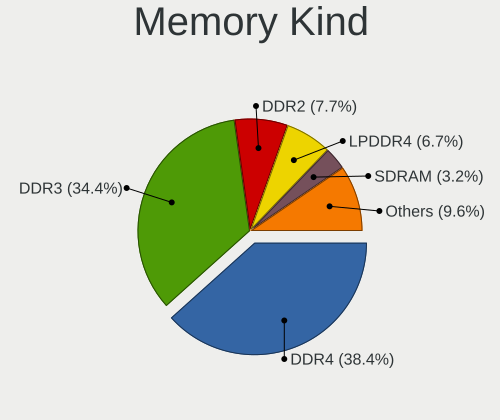

| Kind    | Notebooks | Percent |
|---------|-----------|---------|
| DDR4    | 461       | 38.35%  |
| DDR3    | 414       | 34.44%  |
| DDR2    | 92        | 7.65%   |
| LPDDR4  | 81        | 6.74%   |
| SDRAM   | 39        | 3.24%   |
| LPDDR5  | 32        | 2.66%   |
| LPDDR3  | 31        | 2.58%   |
| DDR5    | 30        | 2.5%    |
| DDR     | 8         | 0.67%   |
| DRAM    | 7         | 0.58%   |
| Unknown | 7         | 0.58%   |

Memory Form Factor
------------------

Physical design of the memory module

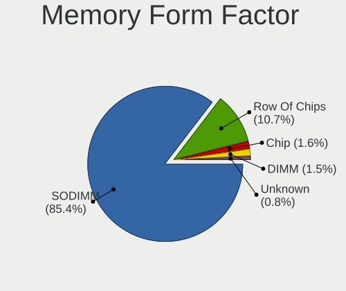

| Name         | Notebooks | Percent |
|--------------|-----------|---------|
| SODIMM       | 1025      | 85.42%  |
| Row Of Chips | 128       | 10.67%  |
| Chip         | 19        | 1.58%   |
| DIMM         | 18        | 1.5%    |
| Unknown      | 10        | 0.83%   |

Memory Size
-----------

Memory module size

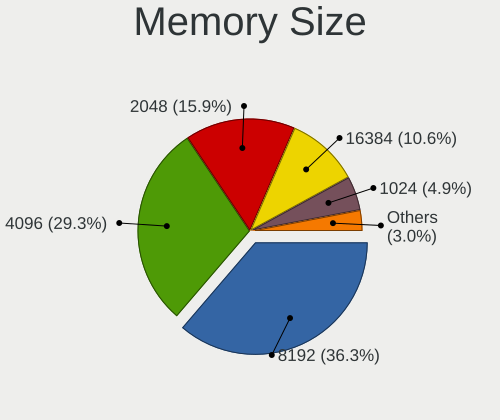

| Size  | Notebooks | Percent |
|-------|-----------|---------|
| 8192  | 484       | 36.28%  |
| 4096  | 391       | 29.31%  |
| 2048  | 212       | 15.89%  |
| 16384 | 141       | 10.57%  |
| 1024  | 66        | 4.95%   |
| 32768 | 21        | 1.57%   |
| 512   | 14        | 1.05%   |
| 12288 | 2         | 0.15%   |
| 256   | 2         | 0.15%   |
| 49152 | 1         | 0.07%   |

Memory Speed
------------

Memory module speed

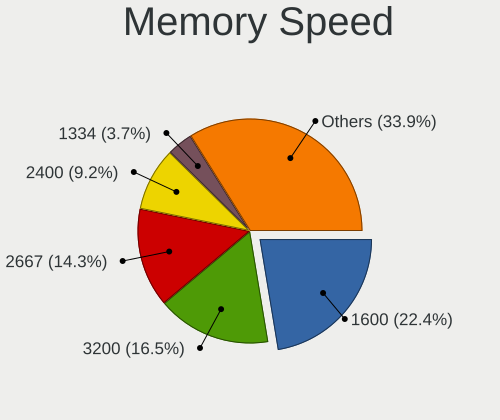

| Speed   | Notebooks | Percent |
|---------|-----------|---------|
| 1600    | 288       | 22.4%   |
| 3200    | 212       | 16.49%  |
| 2667    | 184       | 14.31%  |
| 2400    | 118       | 9.18%   |
| 1334    | 48        | 3.73%   |
| 667     | 47        | 3.65%   |
| 1333    | 45        | 3.5%    |
| 2133    | 43        | 3.34%   |
| Unknown | 42        | 3.27%   |
| 4267    | 22        | 1.71%   |
| 6400    | 21        | 1.63%   |
| 3266    | 19        | 1.48%   |
| 1066    | 19        | 1.48%   |
| 800     | 19        | 1.48%   |
| 4800    | 17        | 1.32%   |
| 4199    | 16        | 1.24%   |
| 8400    | 15        | 1.17%   |
| 1067    | 15        | 1.17%   |
| 5600    | 14        | 1.09%   |
| 2048    | 14        | 1.09%   |
| 1867    | 14        | 1.09%   |
| 533     | 14        | 1.09%   |
| 975     | 13        | 1.01%   |
| 7500    | 4         | 0.31%   |
| 7467    | 4         | 0.31%   |
| 3733    | 4         | 0.31%   |
| 8533    | 3         | 0.23%   |
| 4266    | 3         | 0.23%   |
| 2933    | 3         | 0.23%   |
| 400     | 3         | 0.23%   |
| 5500    | 1         | 0.08%   |
| 1866    | 1         | 0.08%   |
| 1639    | 1         | 0.08%   |

Printers & scanners
-------------------

Printer Vendor
--------------

Printer device vendors

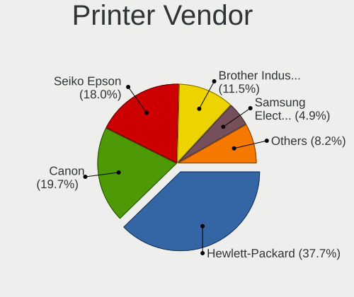

| Vendor                | Notebooks | Percent |
|-----------------------|-----------|---------|
| Hewlett-Packard       | 23        | 37.7%   |
| Canon                 | 12        | 19.67%  |
| Seiko Epson           | 11        | 18.03%  |
| Brother Industries    | 7         | 11.48%  |
| Samsung Electronics   | 3         | 4.92%   |
| Zebra Technologies    | 1         | 1.64%   |
| Zebra                 | 1         | 1.64%   |
| STMicroelectronics    | 1         | 1.64%   |
| Lexmark International | 1         | 1.64%   |
| Dymo-CoStar           | 1         | 1.64%   |

Printer Model
-------------

Printer device models

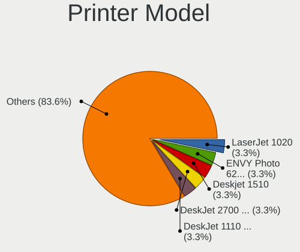

| Model                                                     | Notebooks | Percent |
|-----------------------------------------------------------|-----------|---------|
| HP LaserJet 1020                                          | 2         | 3.28%   |
| HP ENVY Photo 6200 series                                 | 2         | 3.28%   |
| HP DeskJet 2700 series                                    | 2         | 3.28%   |
| HP Deskjet 1510                                           | 2         | 3.28%   |
| HP DeskJet 1110 series                                    | 2         | 3.28%   |
| Canon TS3100 series                                       | 2         | 3.28%   |
| Canon PIXMA MG3600 Series                                 | 2         | 3.28%   |
| Zebra ZP 450 Printer                                      | 1         | 1.64%   |
| Zebra GK420d Label Printer                                | 1         | 1.64%   |
| STMicroelectronics LED badge -- mini LED display -- 11x44 | 1         | 1.64%   |
| Seiko Epson XP-4200 Series                                | 1         | 1.64%   |
| Seiko Epson XP-4100 Series                                | 1         | 1.64%   |
| Seiko Epson XP-235 Series                                 | 1         | 1.64%   |
| Seiko Epson TM-T20X                                       | 1         | 1.64%   |
| Seiko Epson Printer                                       | 1         | 1.64%   |
| Seiko Epson L3210 Series                                  | 1         | 1.64%   |
| Seiko Epson L3110 Series                                  | 1         | 1.64%   |
| Seiko Epson ET-2810 Series                                | 1         | 1.64%   |
| Seiko Epson ET-2710 Series                                | 1         | 1.64%   |
| Seiko Epson EPSON WF-2010 Series                          | 1         | 1.64%   |
| Seiko Epson AcuLaser C1700                                | 1         | 1.64%   |
| Samsung M2020 Series                                      | 1         | 1.64%   |
| Samsung CLX-3300 Series                                   | 1         | 1.64%   |
| Samsung C43x Series                                       | 1         | 1.64%   |
| Lexmark International 2400 series                         | 1         | 1.64%   |
| HP Smart Tank 500 series                                  | 1         | 1.64%   |
| HP Printing Support                                       | 1         | 1.64%   |
| HP Laserjet P1505                                         | 1         | 1.64%   |
| HP LaserJet P1102                                         | 1         | 1.64%   |
| HP LaserJet M14-M17                                       | 1         | 1.64%   |
| HP LaserJet 400 M401dne                                   | 1         | 1.64%   |
| HP LaserJet 1200                                          | 1         | 1.64%   |
| HP LaserJet 1010                                          | 1         | 1.64%   |
| HP LaserJet 1000                                          | 1         | 1.64%   |
| HP ENVY 4520 series                                       | 1         | 1.64%   |
| HP ENVY 4500 series                                       | 1         | 1.64%   |
| HP DeskJet 2300 series                                    | 1         | 1.64%   |
| HP DeskJet 2130 series                                    | 1         | 1.64%   |
| Dymo-CoStar LabelWriter 450                               | 1         | 1.64%   |
| Canon TR4500 series                                       | 1         | 1.64%   |

Scanner Vendor
--------------

Scanner device vendors

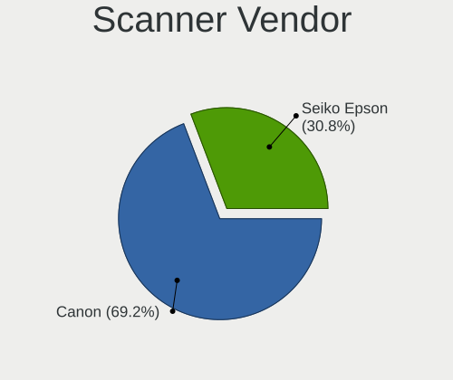

| Vendor      | Notebooks | Percent |
|-------------|-----------|---------|
| Canon       | 9         | 69.23%  |
| Seiko Epson | 4         | 30.77%  |

Scanner Model
-------------

Scanner device models

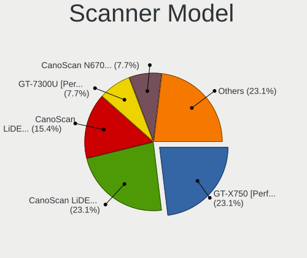

| Model                                             | Notebooks | Percent |
|---------------------------------------------------|-----------|---------|
| Seiko Epson GT-X750 [Perfection 4490 Photo]       | 3         | 23.08%  |
| Canon CanoScan LiDE 110                           | 3         | 23.08%  |
| Canon CanoScan LiDE 200                           | 2         | 15.38%  |
| Seiko Epson GT-7300U [Perfection 1260/1260 PHOTO] | 1         | 7.69%   |
| Canon CanoScan N670U/N676U/LiDE 20                | 1         | 7.69%   |
| Canon CanoScan LiDE 90                            | 1         | 7.69%   |
| Canon CanoScan LiDE 700F                          | 1         | 7.69%   |
| Canon CanoScan LIDE 25                            | 1         | 7.69%   |

Camera
------

Camera Vendor
-------------

Camera device vendors

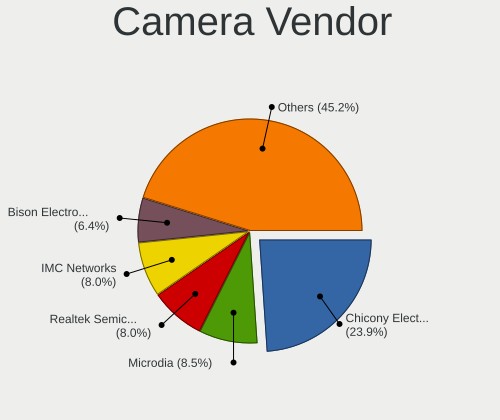

| Vendor                                 | Notebooks | Percent |
|----------------------------------------|-----------|---------|
| Chicony Electronics                    | 1363      | 23.92%  |
| Microdia                               | 483       | 8.48%   |
| Realtek Semiconductor                  | 455       | 7.99%   |
| IMC Networks                           | 454       | 7.97%   |
| Bison Electronics                      | 367       | 6.44%   |
| Sunplus Innovation Technology          | 354       | 6.21%   |
| Quanta                                 | 287       | 5.04%   |
| Suyin                                  | 273       | 4.79%   |
| Cheng Uei Precision Industry (Foxlink) | 251       | 4.41%   |
| Apple                                  | 178       | 3.12%   |
| Syntek                                 | 136       | 2.39%   |
| Silicon Motion                         | 124       | 2.18%   |
| Lite-On Technology                     | 121       | 2.12%   |
| Alcor Micro                            | 100       | 1.76%   |
| Luxvisions Innotech Limited            | 88        | 1.54%   |
| Ricoh                                  | 70        | 1.23%   |
| Sonix Technology                       | 54        | 0.95%   |
| Logitech                               | 43        | 0.75%   |
| Importek                               | 39        | 0.68%   |
| SunplusIT                              | 36        | 0.63%   |
| icSpring                               | 35        | 0.61%   |
| Acer                                   | 35        | 0.61%   |
| ALi                                    | 33        | 0.58%   |
| ShineTech                              | 30        | 0.53%   |
| Samsung Electronics                    | 30        | 0.53%   |
| Primax Electronics                     | 27        | 0.47%   |
| Lenovo                                 | 23        | 0.4%    |
| Z-Star Microelectronics                | 17        | 0.3%    |
| OmniVision Technologies                | 16        | 0.28%   |
| Y Media                                | 13        | 0.23%   |
| Unknown                                | 13        | 0.23%   |
| Genesys Logic                          | 11        | 0.19%   |
| Sunplus Technology                     | 9         | 0.16%   |
| Microsoft                              | 9         | 0.16%   |
| GEMBIRD                                | 9         | 0.16%   |
| Shine-optics                           | 7         | 0.12%   |
| Generalplus Technology                 | 6         | 0.11%   |
| DigiTech                               | 6         | 0.11%   |
| Intel                                  | 5         | 0.09%   |
| Tripath Technology                     | 4         | 0.07%   |

Camera Model
------------

Camera device models

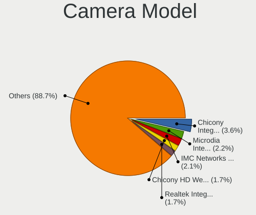

| Model                                                   | Notebooks | Percent |
|---------------------------------------------------------|-----------|---------|
| Chicony Integrated Camera                               | 208       | 3.64%   |
| Microdia Integrated_Webcam_HD                           | 124       | 2.17%   |
| IMC Networks USB2.0 HD UVC WebCam                       | 121       | 2.12%   |
| Chicony HD WebCam                                       | 98        | 1.71%   |
| Realtek Integrated_Webcam_HD                            | 96        | 1.68%   |
| Bison Integrated Camera                                 | 90        | 1.57%   |
| IMC Networks Integrated Camera                          | 88        | 1.54%   |
| Sunplus Integrated_Webcam_HD                            | 84        | 1.47%   |
| Chicony HP TrueVision HD                                | 69        | 1.21%   |
| Syntek Integrated Camera                                | 67        | 1.17%   |
| Microdia Integrated Webcam                              | 64        | 1.12%   |
| Bison Lenovo EasyCamera                                 | 63        | 1.1%    |
| Chicony HP TrueVision HD Camera                         | 59        | 1.03%   |
| IMC Networks USB2.0 VGA UVC WebCam                      | 58        | 1.01%   |
| Apple Built-in iSight                                   | 56        | 0.98%   |
| Realtek USB Camera                                      | 55        | 0.96%   |
| Chicony TOSHIBA Web Camera - HD                         | 55        | 0.96%   |
| Apple FaceTime HD Camera                                | 55        | 0.96%   |
| Sunplus HD WebCam                                       | 48        | 0.84%   |
| Suyin HP Truevision HD                                  | 47        | 0.82%   |
| Chicony EasyCamera                                      | 47        | 0.82%   |
| Alcor Micro USB 2.0 Camera                              | 43        | 0.75%   |
| Chicony USB 2.0 Camera                                  | 40        | 0.7%    |
| Chicony HP HD Webcam                                    | 40        | 0.7%    |
| Chicony HP HD Camera                                    | 40        | 0.7%    |
| Lite-On HP HD Camera                                    | 38        | 0.66%   |
| Microdia Laptop_Integrated_Webcam_HD                    | 37        | 0.65%   |
| Cheng Uei Precision Industry (Foxlink) HP Webcam        | 37        | 0.65%   |
| Realtek Integrated Webcam                               | 36        | 0.63%   |
| Quanta HD User Facing                                   | 36        | 0.63%   |
| Lite-On Integrated Camera                               | 36        | 0.63%   |
| Chicony Lenovo EasyCamera                               | 36        | 0.63%   |
| icSpring camera                                         | 35        | 0.61%   |
| Chicony HP Webcam                                       | 35        | 0.61%   |
| Cheng Uei Precision Industry (Foxlink) HP Truevision HD | 35        | 0.61%   |
| Quanta HD Webcam                                        | 33        | 0.58%   |
| Luxvisions Innotech Limited HP TrueVision HD Camera     | 33        | 0.58%   |
| Cheng Uei Precision Industry (Foxlink) Webcam           | 33        | 0.58%   |
| Apple iPhone 5/5C/5S/6/SE/7/8/X                         | 33        | 0.58%   |
| Suyin Acer/HP Integrated Webcam [CN0314]                | 32        | 0.56%   |

Security
--------

Fingerprint Vendor
------------------

Fingerprint sensor vendors

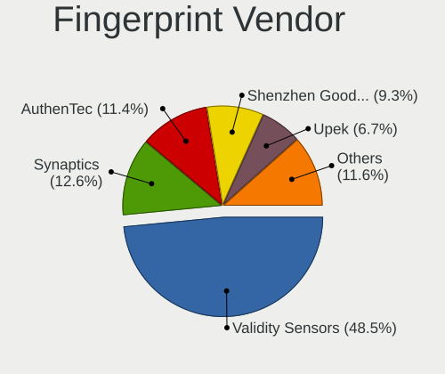

| Vendor                             | Notebooks | Percent |
|------------------------------------|-----------|---------|
| Validity Sensors                   | 461       | 48.48%  |
| Synaptics                          | 120       | 12.62%  |
| AuthenTec                          | 108       | 11.36%  |
| Shenzhen Goodix Technology         | 88        | 9.25%   |
| Upek                               | 64        | 6.73%   |
| Elan Microelectronics              | 44        | 4.63%   |
| LighTuning Technology              | 27        | 2.84%   |
| STMicroelectronics                 | 25        | 2.63%   |
| Realtek USB2.0 Finger Print Bridge | 6         | 0.63%   |
| Samsung Electronics                | 3         | 0.32%   |
| Focal-systems.Corp                 | 3         | 0.32%   |
| HOLTEK                             | 2         | 0.21%   |

Fingerprint Model
-----------------

Fingerprint sensor models

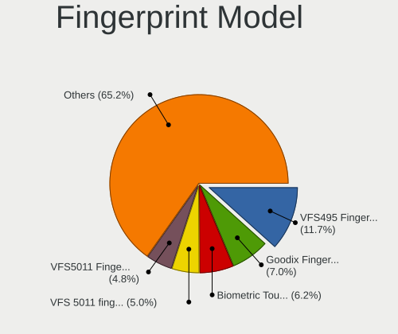

| Model                                                                      | Notebooks | Percent |
|----------------------------------------------------------------------------|-----------|---------|
| Validity Sensors VFS495 Fingerprint Reader                                 | 111       | 11.67%  |
| Shenzhen Goodix  Fingerprint Device                                        | 67        | 7.05%   |
| Upek Biometric Touchchip/Touchstrip Fingerprint Sensor                     | 59        | 6.2%    |
| Validity Sensors VFS 5011 fingerprint sensor                               | 48        | 5.05%   |
| Validity Sensors VFS5011 Fingerprint Reader                                | 46        | 4.84%   |
| Validity Sensors VFS471 Fingerprint Reader                                 | 44        | 4.63%   |
| Validity Sensors Fingerprint scanner                                       | 37        | 3.89%   |
| Validity Sensors VFS491                                                    | 31        | 3.26%   |
| AuthenTec AES2501 Fingerprint Sensor                                       | 31        | 3.26%   |
| Validity Sensors Swipe Fingerprint Sensor                                  | 29        | 3.05%   |
| Synaptics Prometheus MIS Touch Fingerprint Reader                          | 27        | 2.84%   |
| Synaptics Metallica MIS Touch Fingerprint Reader                           | 27        | 2.84%   |
| Validity Sensors Synaptics WBDI                                            | 26        | 2.73%   |
| STMicroelectronics Fingerprint Reader                                      | 25        | 2.63%   |
| Elan ELAN:ARM-M4                                                           | 25        | 2.63%   |
| AuthenTec AES2810                                                          | 25        | 2.63%   |
| Validity Sensors VFS451 Fingerprint Reader                                 | 20        | 2.1%    |
| Validity Sensors Synaptics VFS7552 Touch Fingerprint Sensor with PurePrint | 19        | 2%      |
| Elan ELAN:Fingerprint                                                      | 19        | 2%      |
| AuthenTec Fingerprint Sensor                                               | 19        | 2%      |
| AuthenTec AES1600                                                          | 18        | 1.89%   |
| Validity Sensors VFS7500 Touch Fingerprint Sensor                          | 17        | 1.79%   |
| Synaptics Fingerprint reader [HP G6]                                       | 17        | 1.79%   |
| Shenzhen Goodix Fingerprint Reader                                         | 13        | 1.37%   |
| Validity Sensors VFS301 Fingerprint Reader                                 | 12        | 1.26%   |
| Synaptics FS7604 Touch Fingerprint Sensor with PurePrint                   | 12        | 1.26%   |
| LighTuning EgisTec Touch Fingerprint Sensor                                | 12        | 1.26%   |
| Synaptics Metallica MOH Touch Fingerprint Reader                           | 11        | 1.16%   |
| LighTuning Fingerprint Reader                                              | 9         | 0.95%   |
| Validity Sensors VFS101 Fingerprint Reader                                 | 8         | 0.84%   |
| Validity Sensors VFS Fingerprint sensor                                    | 8         | 0.84%   |
| Shenzhen Goodix FingerPrint                                                | 8         | 0.84%   |
| AuthenTec AES2550 Fingerprint Sensor                                       | 8         | 0.84%   |
| AuthenTec AES1660 Fingerprint Sensor                                       | 7         | 0.74%   |
| Realtek USB2.0 Finger Print Bridge FocalTech Fingerprint Device            | 6         | 0.63%   |
| LighTuning ES603 Swipe Fingerprint Sensor                                  | 6         | 0.63%   |
| Upek TCS5B Fingerprint sensor                                              | 5         | 0.53%   |
| Synaptics  FS7604 Touch Fingerprint Sensor with PurePrint                  | 5         | 0.53%   |
| Validity Sensors VFS7552 Touch Fingerprint Sensor                          | 4         | 0.42%   |
| Synaptics UWP WBDI Device                                                  | 4         | 0.42%   |

Chipcard Vendor
---------------

Chipcard module vendors

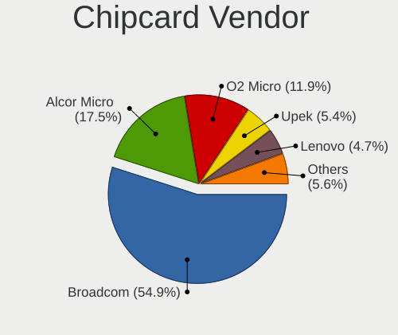

| Vendor                            | Notebooks | Percent |
|-----------------------------------|-----------|---------|
| Broadcom                          | 245       | 54.93%  |
| Alcor Micro                       | 78        | 17.49%  |
| O2 Micro                          | 53        | 11.88%  |
| Upek                              | 24        | 5.38%   |
| Lenovo                            | 21        | 4.71%   |
| SCM Microsystems                  | 7         | 1.57%   |
| Gemalto (was Gemplus)             | 3         | 0.67%   |
| Yubico.com                        | 2         | 0.45%   |
| VASCO Data Security International | 2         | 0.45%   |
| Realtek Semiconductor             | 2         | 0.45%   |
| Reiner SCT Kartensysteme          | 1         | 0.22%   |
| OmniKey                           | 1         | 0.22%   |
| Fujitsu Siemens Computers         | 1         | 0.22%   |
| Chicony Electronics               | 1         | 0.22%   |
| Cherry                            | 1         | 0.22%   |
| Bit4id                            | 1         | 0.22%   |
| Athena Smartcard Solutions        | 1         | 0.22%   |
| Aktiv                             | 1         | 0.22%   |
| Advanced Card Systems             | 1         | 0.22%   |

Chipcard Model
--------------

Chipcard module models

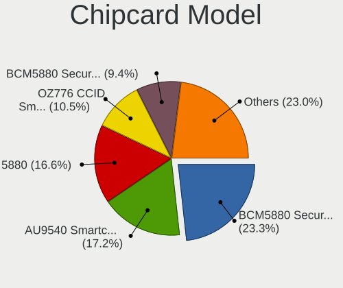

| Model                                                                        | Notebooks | Percent |
|------------------------------------------------------------------------------|-----------|---------|
| Broadcom BCM5880 Secure Applications Processor                               | 104       | 23.27%  |
| Alcor Micro AU9540 Smartcard Reader                                          | 77        | 17.23%  |
| Broadcom 5880                                                                | 74        | 16.55%  |
| O2 Micro OZ776 CCID Smartcard Reader                                         | 47        | 10.51%  |
| Broadcom BCM5880 Secure Applications Processor with fingerprint swipe sensor | 42        | 9.4%    |
| Upek TouchChip Fingerprint Coprocessor (WBF advanced mode)                   | 24        | 5.37%   |
| Lenovo Integrated Smart Card Reader                                          | 21        | 4.7%    |
| Broadcom BCM58200 ControlVault 3 (FingerPrint sensor + Contacted SmartCard)  | 17        | 3.8%    |
| Broadcom 58200                                                               | 7         | 1.57%   |
| O2 Micro Oz776 SmartCard Reader                                              | 6         | 1.34%   |
| SCM Microsystems SCR3340 - ExpressCard54 Smart Card Reader                   | 4         | 0.89%   |
| Yubico.com Yubikey 4/5 U2F+CCID                                              | 2         | 0.45%   |
| VASCO Data Security International DIGIPASS 870                               | 2         | 0.45%   |
| SCM Microsystems SCR35xx Smart Card Reader                                   | 2         | 0.45%   |
| Realtek Semiconductor Smart Card Reader Interface                            | 2         | 0.45%   |
| Gemalto (was Gemplus) GemPC Twin SmartCard Reader                            | 2         | 0.45%   |
| Broadcom BCM5880 Secure Applications Processor with fingerprint touch sensor | 2         | 0.45%   |
| SCM Microsystems SCR331-LC1 / SCR3310 SmartCard Reader                       | 1         | 0.22%   |
| Reiner SCT Kartensysteme cyberJack RFID basis contactless smartcard reader   | 1         | 0.22%   |
| OmniKey CardMan 3021 / 3121                                                  | 1         | 0.22%   |
| Gemalto (was Gemplus) Compact Smart Card Reader Writer                       | 1         | 0.22%   |
| Fujitsu Siemens Computers SmartCard Reader 2A                                | 1         | 0.22%   |
| Chicony Electronics HP Skylab USB Smartcard Keyboard                         | 1         | 0.22%   |
| Cherry SmartTerminal ST-2xxx                                                 | 1         | 0.22%   |
| Bit4id miniLector EVO                                                        | 1         | 0.22%   |
| Athena Smartcard Solutions ASEDrive V3C                                      | 1         | 0.22%   |
| Alcor Micro Watchdata W 1981                                                 | 1         | 0.22%   |
| Aktiv Rutoken lite                                                           | 1         | 0.22%   |
| Advanced Card Systems ACR39U                                                 | 1         | 0.22%   |

Unsupported
-----------

Unsupported Devices
-------------------

Total unsupported devices on board

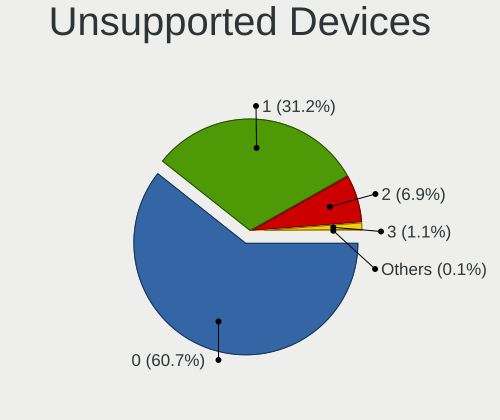

| Total | Notebooks | Percent |
|-------|-----------|---------|
| 0     | 4145      | 60.66%  |
| 1     | 2131      | 31.19%  |
| 2     | 473       | 6.92%   |
| 3     | 73        | 1.07%   |
| 4     | 5         | 0.07%   |
| 5     | 4         | 0.06%   |
| 7     | 1         | 0.01%   |
| 6     | 1         | 0.01%   |

Unsupported Device Types
------------------------

Types of unsupported devices

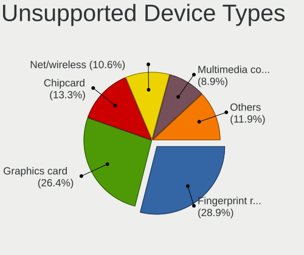

| Type                     | Notebooks | Percent |
|--------------------------|-----------|---------|
| Fingerprint reader       | 938       | 28.94%  |
| Graphics card            | 857       | 26.44%  |
| Chipcard                 | 430       | 13.27%  |
| Net/wireless             | 342       | 10.55%  |
| Multimedia controller    | 288       | 8.89%   |
| Storage                  | 88        | 2.72%   |
| Bluetooth                | 83        | 2.56%   |
| Camera                   | 45        | 1.39%   |
| Modem                    | 41        | 1.27%   |
| Sound                    | 32        | 0.99%   |
| Communication controller | 28        | 0.86%   |
| Net/ethernet             | 18        | 0.56%   |
| Flash memory             | 17        | 0.52%   |
| Card reader              | 11        | 0.34%   |
| Network                  | 8         | 0.25%   |
| Storage/ide              | 6         | 0.19%   |
| Storage/nvme             | 3         | 0.09%   |
| Dvb card                 | 3         | 0.09%   |
| Unclassified device      | 2         | 0.06%   |
| Storage/ata              | 1         | 0.03%   |

