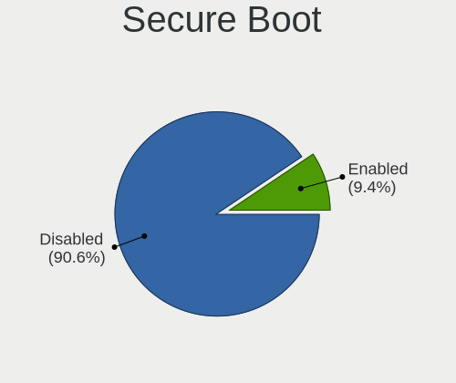
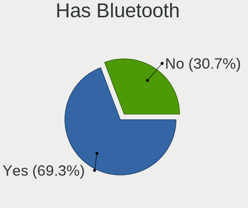
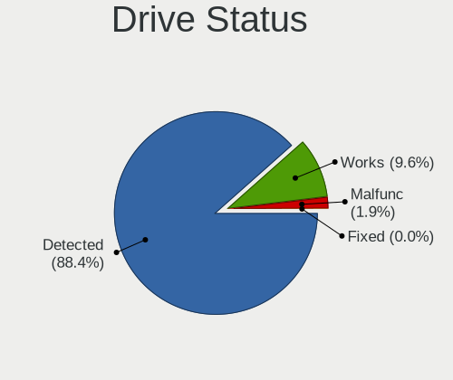
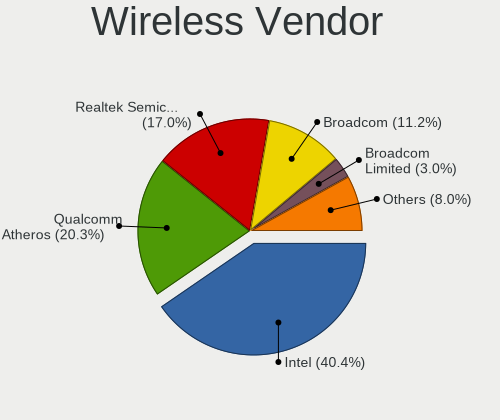
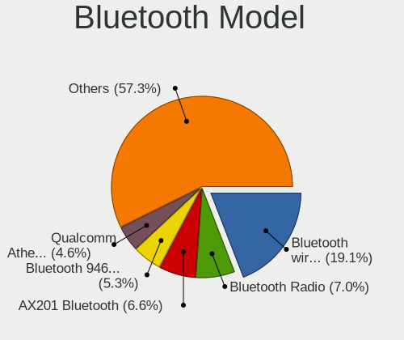
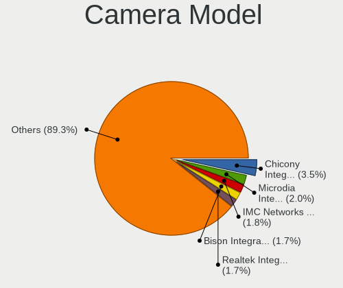

Zorin - Tested Hardware & Statistics (Notebooks)
------------------------------------------------

A project to collect tested hardware configurations for Zorin.

Anyone can contribute to this report by the [hw-probe](https://github.com/linuxhw/hw-probe) tool:

    sudo -E hw-probe -all -upload

Please contribute! Especially if your hardware is rare.

Contents
--------

* [ Test Cases ](#test-cases)

* [ System ](#system)
  - [ OS                       ](#os)
  - [ OS Family                ](#os-family)
  - [ Kernel                   ](#kernel)
  - [ Kernel Family            ](#kernel-family)
  - [ Kernel Major Ver.        ](#kernel-major-ver)
  - [ Arch                     ](#arch)
  - [ DE                       ](#de)
  - [ Display Server           ](#display-server)
  - [ Display Manager          ](#display-manager)
  - [ OS Lang                  ](#os-lang)
  - [ Boot Mode                ](#boot-mode)
  - [ Filesystem               ](#filesystem)
  - [ Part. scheme             ](#part-scheme)
  - [ Dual Boot with Linux/BSD ](#dual-boot-with-linuxbsd)
  - [ Dual Boot (Win)          ](#dual-boot-win)

* [ Board ](#board)
  - [ Vendor                   ](#vendor)
  - [ Model                    ](#model)
  - [ Model Family             ](#model-family)
  - [ MFG Year                 ](#mfg-year)
  - [ Form Factor              ](#form-factor)
  - [ Secure Boot              ](#secure-boot)
  - [ Coreboot                 ](#coreboot)
  - [ RAM Size                 ](#ram-size)
  - [ RAM Used                 ](#ram-used)
  - [ Total Drives             ](#total-drives)
  - [ Has CD-ROM               ](#has-cd-rom)
  - [ Has Ethernet             ](#has-ethernet)
  - [ Has WiFi                 ](#has-wifi)
  - [ Has Bluetooth            ](#has-bluetooth)

* [ Location ](#location)
  - [ Country                  ](#country)
  - [ City                     ](#city)

* [ Drives ](#drives)
  - [ Drive Vendor             ](#drive-vendor)
  - [ Drive Model              ](#drive-model)
  - [ HDD Vendor               ](#hdd-vendor)
  - [ SSD Vendor               ](#ssd-vendor)
  - [ Drive Kind               ](#drive-kind)
  - [ Drive Connector          ](#drive-connector)
  - [ Drive Size               ](#drive-size)
  - [ Space Total              ](#space-total)
  - [ Space Used               ](#space-used)
  - [ Malfunc. Drives          ](#malfunc-drives)
  - [ Malfunc. Drive Vendor    ](#malfunc-drive-vendor)
  - [ Malfunc. HDD Vendor      ](#malfunc-hdd-vendor)
  - [ Malfunc. Drive Kind      ](#malfunc-drive-kind)
  - [ Failed Drives            ](#failed-drives)
  - [ Failed Drive Vendor      ](#failed-drive-vendor)
  - [ Drive Status             ](#drive-status)

* [ Storage controller ](#storage-controller)
  - [ Storage Vendor           ](#storage-vendor)
  - [ Storage Model            ](#storage-model)
  - [ Storage Kind             ](#storage-kind)

* [ Processor ](#processor)
  - [ CPU Vendor               ](#cpu-vendor)
  - [ CPU Model                ](#cpu-model)
  - [ CPU Model Family         ](#cpu-model-family)
  - [ CPU Cores                ](#cpu-cores)
  - [ CPU Sockets              ](#cpu-sockets)
  - [ CPU Threads              ](#cpu-threads)
  - [ CPU Op-Modes             ](#cpu-op-modes)
  - [ CPU Microcode            ](#cpu-microcode)
  - [ CPU Microarch            ](#cpu-microarch)

* [ Graphics ](#graphics)
  - [ GPU Vendor               ](#gpu-vendor)
  - [ GPU Model                ](#gpu-model)
  - [ GPU Combo                ](#gpu-combo)
  - [ GPU Driver               ](#gpu-driver)
  - [ GPU Memory               ](#gpu-memory)

* [ Monitor ](#monitor)
  - [ Monitor Vendor           ](#monitor-vendor)
  - [ Monitor Model            ](#monitor-model)
  - [ Monitor Resolution       ](#monitor-resolution)
  - [ Monitor Diagonal         ](#monitor-diagonal)
  - [ Monitor Width            ](#monitor-width)
  - [ Aspect Ratio             ](#aspect-ratio)
  - [ Monitor Area             ](#monitor-area)
  - [ Pixel Density            ](#pixel-density)
  - [ Multiple Monitors        ](#multiple-monitors)

* [ Network ](#network)
  - [ Net Controller Vendor    ](#net-controller-vendor)
  - [ Net Controller Model     ](#net-controller-model)
  - [ Wireless Vendor          ](#wireless-vendor)
  - [ Wireless Model           ](#wireless-model)
  - [ Ethernet Vendor          ](#ethernet-vendor)
  - [ Ethernet Model           ](#ethernet-model)
  - [ Net Controller Kind      ](#net-controller-kind)
  - [ Used Controller          ](#used-controller)
  - [ NICs                     ](#nics)
  - [ IPv6                     ](#ipv6)

* [ Bluetooth ](#bluetooth)
  - [ Bluetooth Vendor         ](#bluetooth-vendor)
  - [ Bluetooth Model          ](#bluetooth-model)

* [ Sound ](#sound)
  - [ Sound Vendor             ](#sound-vendor)
  - [ Sound Model              ](#sound-model)

* [ Memory ](#memory)
  - [ Memory Vendor            ](#memory-vendor)
  - [ Memory Model             ](#memory-model)
  - [ Memory Kind              ](#memory-kind)
  - [ Memory Form Factor       ](#memory-form-factor)
  - [ Memory Size              ](#memory-size)
  - [ Memory Speed             ](#memory-speed)

* [ Printers & scanners ](#printers--scanners)
  - [ Printer Vendor           ](#printer-vendor)
  - [ Printer Model            ](#printer-model)
  - [ Scanner Vendor           ](#scanner-vendor)
  - [ Scanner Model            ](#scanner-model)

* [ Camera ](#camera)
  - [ Camera Vendor            ](#camera-vendor)
  - [ Camera Model             ](#camera-model)

* [ Security ](#security)
  - [ Fingerprint Vendor       ](#fingerprint-vendor)
  - [ Fingerprint Model        ](#fingerprint-model)
  - [ Chipcard Vendor          ](#chipcard-vendor)
  - [ Chipcard Model           ](#chipcard-model)

* [ Unsupported ](#unsupported)
  - [ Unsupported Devices      ](#unsupported-devices)
  - [ Unsupported Device Types ](#unsupported-device-types)

Test Cases
----------

Total: 3050

| Vendor        | Model                       | Probe                                                      | Date         |
|---------------|-----------------------------|------------------------------------------------------------|--------------|
| Positivo      | C14CR01                     | [ff4d1d45b7](https://linux-hardware.org/?probe=ff4d1d45b7) | Sep 01, 2022 |
| Positivo      | C14CR01                     | [d1fc217886](https://linux-hardware.org/?probe=d1fc217886) | Sep 01, 2022 |
| Dell          | Inspiron 15-3552            | [2eb780855d](https://linux-hardware.org/?probe=2eb780855d) | Sep 01, 2022 |
| Dell          | Inspiron 15-3552            | [a5e4d22ccd](https://linux-hardware.org/?probe=a5e4d22ccd) | Sep 01, 2022 |
| Intel         | powered classmate PC        | [ed36baccf9](https://linux-hardware.org/?probe=ed36baccf9) | Aug 31, 2022 |
| Dell          | Inspiron 15-3552            | [8e2cd928f3](https://linux-hardware.org/?probe=8e2cd928f3) | Aug 31, 2022 |
| HP            | Laptop 15-dy1xxx            | [836644c18b](https://linux-hardware.org/?probe=836644c18b) | Aug 31, 2022 |
| HP            | ProBook 6470b               | [2cbe458c94](https://linux-hardware.org/?probe=2cbe458c94) | Aug 30, 2022 |
| Apple         | MacBook5,1                  | [436d2b29aa](https://linux-hardware.org/?probe=436d2b29aa) | Aug 30, 2022 |
| Apple         | MacBookAir7,2               | [a96a893eac](https://linux-hardware.org/?probe=a96a893eac) | Aug 30, 2022 |
| Ematic        | EWT118                      | [3fa43d450e](https://linux-hardware.org/?probe=3fa43d450e) | Aug 30, 2022 |
| Acer          | Aspire SW5-271              | [3446f93f1d](https://linux-hardware.org/?probe=3446f93f1d) | Aug 29, 2022 |
| Samsung       | 300E5M/300E5L               | [6f920f9002](https://linux-hardware.org/?probe=6f920f9002) | Aug 29, 2022 |
| Dell          | XPS 15 9510                 | [45bba02b35](https://linux-hardware.org/?probe=45bba02b35) | Aug 29, 2022 |
| Dell          | Latitude E5440              | [b0d92d186f](https://linux-hardware.org/?probe=b0d92d186f) | Aug 29, 2022 |
| HP            | EW7-I7D22875GR1             | [307b75624e](https://linux-hardware.org/?probe=307b75624e) | Aug 29, 2022 |
| Lenovo        | ThinkPad L440 20ASA1V8BP    | [64f71278c7](https://linux-hardware.org/?probe=64f71278c7) | Aug 28, 2022 |
| Dell          | Inspiron 1525               | [148c6dd35a](https://linux-hardware.org/?probe=148c6dd35a) | Aug 28, 2022 |
| ASUSTek       | VivoBook_ASUSLaptop X509... | [be59676867](https://linux-hardware.org/?probe=be59676867) | Aug 28, 2022 |
| HP            | Pavilion Laptop 14-ec0xx... | [04aec7a28a](https://linux-hardware.org/?probe=04aec7a28a) | Aug 28, 2022 |
| Google        | Butterfly                   | [df8fafaf3b](https://linux-hardware.org/?probe=df8fafaf3b) | Aug 28, 2022 |
| HUAWEI        | KLVD-WXX9                   | [c8eb396b68](https://linux-hardware.org/?probe=c8eb396b68) | Aug 26, 2022 |
| ASUSTek       | ZenBook UX425UG_Q408UG      | [5b80fb349f](https://linux-hardware.org/?probe=5b80fb349f) | Aug 26, 2022 |
| Apple         | MacBook5,1                  | [7c9f388153](https://linux-hardware.org/?probe=7c9f388153) | Aug 26, 2022 |
| Dell          | XPS 15 9570                 | [c6fc39489e](https://linux-hardware.org/?probe=c6fc39489e) | Aug 26, 2022 |
| Lenovo        | Yoga S740-15IRH 81NX        | [b56c1d75a6](https://linux-hardware.org/?probe=b56c1d75a6) | Aug 25, 2022 |
| Framework     | Laptop                      | [87e09551b3](https://linux-hardware.org/?probe=87e09551b3) | Aug 25, 2022 |
| HP            | Pavilion Notebook           | [5d03f69f35](https://linux-hardware.org/?probe=5d03f69f35) | Aug 25, 2022 |
| Dell          | Latitude E7240              | [0e15063cb3](https://linux-hardware.org/?probe=0e15063cb3) | Aug 24, 2022 |
| Dell          | Inspiron M5030              | [59eec9a80d](https://linux-hardware.org/?probe=59eec9a80d) | Aug 24, 2022 |
| Framework     | Laptop                      | [3c4bab3769](https://linux-hardware.org/?probe=3c4bab3769) | Aug 24, 2022 |
| Toshiba       | Satellite L855              | [73de62c6c7](https://linux-hardware.org/?probe=73de62c6c7) | Aug 24, 2022 |
| Dell          | Inspiron M5030              | [a43c618dbb](https://linux-hardware.org/?probe=a43c618dbb) | Aug 23, 2022 |
| HP            | Laptop 14-dq4xxx            | [8171eb84c2](https://linux-hardware.org/?probe=8171eb84c2) | Aug 23, 2022 |
| Alienware     | 15 R4                       | [f53260e0c2](https://linux-hardware.org/?probe=f53260e0c2) | Aug 23, 2022 |
| Dell          | Inspiron 5770               | [49314a1dfe](https://linux-hardware.org/?probe=49314a1dfe) | Aug 23, 2022 |
| Lenovo        | Yoga S740-15IRH 81NX        | [fc9bb1e6fa](https://linux-hardware.org/?probe=fc9bb1e6fa) | Aug 23, 2022 |
| Lenovo        | IdeaPad S130-11IGM 81J1     | [01416789ab](https://linux-hardware.org/?probe=01416789ab) | Aug 21, 2022 |
| Alienware     | 15 R3                       | [109d7cb528](https://linux-hardware.org/?probe=109d7cb528) | Aug 21, 2022 |
| HP            | 250 G7 Notebook PC          | [ced2388c29](https://linux-hardware.org/?probe=ced2388c29) | Aug 21, 2022 |
| Positivo      | C14CU51                     | [288c810d97](https://linux-hardware.org/?probe=288c810d97) | Aug 21, 2022 |
| ASUSTek       | X542BA                      | [7e86736ebc](https://linux-hardware.org/?probe=7e86736ebc) | Aug 21, 2022 |
| Lenovo        | ThinkPad T500 2055A38       | [f37fce9f01](https://linux-hardware.org/?probe=f37fce9f01) | Aug 20, 2022 |
| Apple         | MacBookPro5,5               | [f429863c5f](https://linux-hardware.org/?probe=f429863c5f) | Aug 19, 2022 |
| Lenovo        | IdeaPad 110-14IBR 80UJ      | [ec1b67985f](https://linux-hardware.org/?probe=ec1b67985f) | Aug 19, 2022 |
| GPU Compan... | GWTN156-11                  | [c22aa4377d](https://linux-hardware.org/?probe=c22aa4377d) | Aug 19, 2022 |
| Dell          | Inspiron N5010              | [a54395e915](https://linux-hardware.org/?probe=a54395e915) | Aug 18, 2022 |
| MSI           | Creator Z16 Hiroshi F A1... | [e056c24d1d](https://linux-hardware.org/?probe=e056c24d1d) | Aug 18, 2022 |
| HP            | 14                          | [0f2cde73bb](https://linux-hardware.org/?probe=0f2cde73bb) | Aug 17, 2022 |
| ASUSTek       | X756UQ                      | [9b30268acb](https://linux-hardware.org/?probe=9b30268acb) | Aug 17, 2022 |
| HP            | 250 G7 Notebook PC          | [8ea659cd8c](https://linux-hardware.org/?probe=8ea659cd8c) | Aug 17, 2022 |
| Dell          | Latitude E6420              | [3e7ce84c59](https://linux-hardware.org/?probe=3e7ce84c59) | Aug 17, 2022 |
| ASUSTek       | K54C                        | [e10b52270f](https://linux-hardware.org/?probe=e10b52270f) | Aug 17, 2022 |
| HP            | Pavilion dv9700             | [7c3e324e4f](https://linux-hardware.org/?probe=7c3e324e4f) | Aug 16, 2022 |
| Lenovo        | G505s 20255                 | [58a439770d](https://linux-hardware.org/?probe=58a439770d) | Aug 15, 2022 |
| Packard Be... | EasyNote TE69KB             | [e80596ea44](https://linux-hardware.org/?probe=e80596ea44) | Aug 15, 2022 |
| ASUSTek       | X555LAB                     | [5171fd1732](https://linux-hardware.org/?probe=5171fd1732) | Aug 15, 2022 |
| Lenovo        | IdeaPad Z580                | [f9d6b2f915](https://linux-hardware.org/?probe=f9d6b2f915) | Aug 14, 2022 |
| HP            | Pavilion Gaming Laptop 1... | [2257302110](https://linux-hardware.org/?probe=2257302110) | Aug 14, 2022 |
| HP            | Laptop 17-cn0xxx            | [0006dc34cf](https://linux-hardware.org/?probe=0006dc34cf) | Aug 14, 2022 |
| HP            | EliteBook 6930p             | [7267931d03](https://linux-hardware.org/?probe=7267931d03) | Aug 13, 2022 |
| ASUSTek       | VivoBook_ASUSLaptop X515... | [fb405688fe](https://linux-hardware.org/?probe=fb405688fe) | Aug 13, 2022 |
| ASUSTek       | VivoBook_ASUSLaptop X515... | [62a1acd85d](https://linux-hardware.org/?probe=62a1acd85d) | Aug 13, 2022 |
| HP            | 240 G7 Notebook PC          | [9321e2df1a](https://linux-hardware.org/?probe=9321e2df1a) | Aug 13, 2022 |
| Lenovo        | IdeaPad S145-14IIL 81W6     | [d08cbbc3d8](https://linux-hardware.org/?probe=d08cbbc3d8) | Aug 12, 2022 |
| ASUSTek       | VivoBook_ASUSLaptop X421... | [3dcb75072e](https://linux-hardware.org/?probe=3dcb75072e) | Aug 12, 2022 |
| HP            | Laptop 15-bs0xx             | [b3e408ce95](https://linux-hardware.org/?probe=b3e408ce95) | Aug 12, 2022 |
| HP            | Laptop 15-bs0xx             | [1fe351cfab](https://linux-hardware.org/?probe=1fe351cfab) | Aug 12, 2022 |
| Lenovo        | IdeaPad Gaming 3 15ARH05... | [3d37c741c8](https://linux-hardware.org/?probe=3d37c741c8) | Aug 12, 2022 |
| Notebook      | NJ50GU                      | [59d1efda98](https://linux-hardware.org/?probe=59d1efda98) | Aug 12, 2022 |
| MSI           | Vector GP76 12UH            | [4549b417bf](https://linux-hardware.org/?probe=4549b417bf) | Aug 12, 2022 |
| MSI           | Vector GP76 12UH            | [8bbf4dd310](https://linux-hardware.org/?probe=8bbf4dd310) | Aug 12, 2022 |
| Unknown       | Unknown                     | [ddeddb54bf](https://linux-hardware.org/?probe=ddeddb54bf) | Aug 12, 2022 |
| Unknown       | Unknown                     | [b19949df5a](https://linux-hardware.org/?probe=b19949df5a) | Aug 12, 2022 |
| ASUSTek       | ROG Zephyrus G14 GA401IV... | [dbbd0524d8](https://linux-hardware.org/?probe=dbbd0524d8) | Aug 12, 2022 |
| HP            | Pavilion 15                 | [462769d45e](https://linux-hardware.org/?probe=462769d45e) | Aug 11, 2022 |
| Google        | Kasumi                      | [0d1ce61572](https://linux-hardware.org/?probe=0d1ce61572) | Aug 11, 2022 |
| Google        | Kasumi                      | [47ebd6bcac](https://linux-hardware.org/?probe=47ebd6bcac) | Aug 11, 2022 |
| Dell          | Latitude D630               | [3650f52bba](https://linux-hardware.org/?probe=3650f52bba) | Aug 11, 2022 |
| Dell          | Inspiron 15-3567            | [4e54f20c67](https://linux-hardware.org/?probe=4e54f20c67) | Aug 10, 2022 |
| Samsung       | 600B4B/600B5B               | [889eb9531f](https://linux-hardware.org/?probe=889eb9531f) | Aug 10, 2022 |
| Dell          | Inspiron 3542               | [48722889b6](https://linux-hardware.org/?probe=48722889b6) | Aug 10, 2022 |
| HP            | Pro x2 612 G1 Tablet        | [a40ad10b4c](https://linux-hardware.org/?probe=a40ad10b4c) | Aug 10, 2022 |
| Lenovo        | IdeaPad 110-14IBR 80UJ      | [2f4a79e056](https://linux-hardware.org/?probe=2f4a79e056) | Aug 10, 2022 |
| HP            | Stream Notebook PC 13       | [9071c341a9](https://linux-hardware.org/?probe=9071c341a9) | Aug 10, 2022 |
| ASUSTek       | VivoBook_ASUSLaptop X421... | [4312639df6](https://linux-hardware.org/?probe=4312639df6) | Aug 09, 2022 |
| Lenovo        | Yoga S740-15IRH 81NX        | [d1215796fb](https://linux-hardware.org/?probe=d1215796fb) | Aug 08, 2022 |
| Toshiba       | Satellite L655              | [5e3e45b5d5](https://linux-hardware.org/?probe=5e3e45b5d5) | Aug 08, 2022 |
| ASUSTek       | ROG Zephyrus G14 GA401IV... | [0e2f35ef5e](https://linux-hardware.org/?probe=0e2f35ef5e) | Aug 08, 2022 |
| Lenovo        | IdeaPadFlex 15D 20334       | [69430d4693](https://linux-hardware.org/?probe=69430d4693) | Aug 08, 2022 |
| ASUSTek       | ROG Zephyrus G14 GA401IV... | [404319dfd4](https://linux-hardware.org/?probe=404319dfd4) | Aug 07, 2022 |
| ASUSTek       | X550JK                      | [a90c14a429](https://linux-hardware.org/?probe=a90c14a429) | Aug 07, 2022 |
| AMI           | Unknown                     | [d40dbd9414](https://linux-hardware.org/?probe=d40dbd9414) | Aug 07, 2022 |
| MSI           | CR620                       | [517b816cd7](https://linux-hardware.org/?probe=517b816cd7) | Aug 06, 2022 |
| ASUSTek       | VivoBook_ASUSLaptop X515... | [d19309cb56](https://linux-hardware.org/?probe=d19309cb56) | Aug 06, 2022 |
| Ematic        | EWT118                      | [a5362d970a](https://linux-hardware.org/?probe=a5362d970a) | Aug 05, 2022 |
| Acer          | Aspire 9410                 | [0d433f48f4](https://linux-hardware.org/?probe=0d433f48f4) | Aug 05, 2022 |
| Fujitsu Si... | AMILO Li1705                | [af83e534ff](https://linux-hardware.org/?probe=af83e534ff) | Aug 04, 2022 |
| Medion        | E7419 MD60990               | [e1b74852bd](https://linux-hardware.org/?probe=e1b74852bd) | Aug 04, 2022 |
| Acer          | Peppy                       | [cc1c91fca6](https://linux-hardware.org/?probe=cc1c91fca6) | Aug 04, 2022 |
| HP            | Pavilion Aero Laptop 13-... | [a6f7e6086b](https://linux-hardware.org/?probe=a6f7e6086b) | Aug 03, 2022 |
| Toshiba       | Satellite P200              | [87bf7fcb48](https://linux-hardware.org/?probe=87bf7fcb48) | Aug 03, 2022 |
| Toshiba       | Satellite Pro L670          | [302749341d](https://linux-hardware.org/?probe=302749341d) | Aug 03, 2022 |
| HP            | Notebook                    | [661237e74a](https://linux-hardware.org/?probe=661237e74a) | Aug 03, 2022 |
| Toshiba       | Satellite P205              | [8ed745a2dc](https://linux-hardware.org/?probe=8ed745a2dc) | Aug 03, 2022 |
| Dell          | G15 5510                    | [f3406b36e3](https://linux-hardware.org/?probe=f3406b36e3) | Aug 02, 2022 |
| Packard Be... | EasyNote TE69KB             | [968a5f757f](https://linux-hardware.org/?probe=968a5f757f) | Aug 02, 2022 |
| Toshiba       | Satellite Pro L670          | [e6189ba78c](https://linux-hardware.org/?probe=e6189ba78c) | Aug 02, 2022 |
| Lenovo        | ThinkPad T420 4236VTQ       | [1ea6046182](https://linux-hardware.org/?probe=1ea6046182) | Aug 02, 2022 |
| HP            | Pro x2 612 G1 Tablet        | [b4bee86632](https://linux-hardware.org/?probe=b4bee86632) | Aug 02, 2022 |
| HP            | Laptop 14-dq4xxx            | [1e57f77386](https://linux-hardware.org/?probe=1e57f77386) | Aug 01, 2022 |
| HP            | Compaq 6730s                | [5d805b2f5e](https://linux-hardware.org/?probe=5d805b2f5e) | Jul 31, 2022 |
| HP            | 550                         | [efc4b32963](https://linux-hardware.org/?probe=efc4b32963) | Jul 30, 2022 |
| Dell          | Latitude E7450              | [894a489a03](https://linux-hardware.org/?probe=894a489a03) | Jul 30, 2022 |
| Dell          | Latitude E7450              | [268b4ca289](https://linux-hardware.org/?probe=268b4ca289) | Jul 30, 2022 |
| Lenovo        | IdeaPad C340-14API 81N6     | [4158c1696a](https://linux-hardware.org/?probe=4158c1696a) | Jul 29, 2022 |
| Lenovo        | IdeaPad C340-14API 81N6     | [1a5b34b200](https://linux-hardware.org/?probe=1a5b34b200) | Jul 29, 2022 |
| Dell          | Inspiron 15-3567            | [ceb521429a](https://linux-hardware.org/?probe=ceb521429a) | Jul 29, 2022 |
| Dell          | System Inspiron N7110       | [d2cbf8528a](https://linux-hardware.org/?probe=d2cbf8528a) | Jul 28, 2022 |
| HP            | ProBook 440 G8 Notebook ... | [b08a0deeff](https://linux-hardware.org/?probe=b08a0deeff) | Jul 28, 2022 |
| ASUSTek       | VivoBook_ASUSLaptop X421... | [4bcdc51e89](https://linux-hardware.org/?probe=4bcdc51e89) | Jul 27, 2022 |
| Dell          | Latitude E7450              | [4a277d4cee](https://linux-hardware.org/?probe=4a277d4cee) | Jul 27, 2022 |
| Sony          | VGN-Z31XN_B                 | [f27c511d04](https://linux-hardware.org/?probe=f27c511d04) | Jul 26, 2022 |
| ASUSTek       | VivoBook_ASUSLaptop X421... | [37ebea2647](https://linux-hardware.org/?probe=37ebea2647) | Jul 25, 2022 |
| Samsung       | 300E4C/300E5C/300E7C        | [ff4dba6b3e](https://linux-hardware.org/?probe=ff4dba6b3e) | Jul 24, 2022 |
| HP            | Unknown                     | [1e1768ebfa](https://linux-hardware.org/?probe=1e1768ebfa) | Jul 24, 2022 |
| HP            | Stream Notebook             | [8422abef44](https://linux-hardware.org/?probe=8422abef44) | Jul 23, 2022 |
| Dell          | Inspiron 1525               | [f1af5f5e45](https://linux-hardware.org/?probe=f1af5f5e45) | Jul 22, 2022 |
| Dell          | Inspiron 1525               | [6c43e1dfd6](https://linux-hardware.org/?probe=6c43e1dfd6) | Jul 22, 2022 |
| Lenovo        | ThinkPad T500 2055A38       | [3b2f2c3bea](https://linux-hardware.org/?probe=3b2f2c3bea) | Jul 22, 2022 |
| HP            | ProBook 4540s               | [a2d1e2fd68](https://linux-hardware.org/?probe=a2d1e2fd68) | Jul 22, 2022 |
| HP            | Compaq 420                  | [913795a620](https://linux-hardware.org/?probe=913795a620) | Jul 21, 2022 |
| ASUSTek       | X550CL                      | [abd0b78e41](https://linux-hardware.org/?probe=abd0b78e41) | Jul 21, 2022 |
| Dell          | Inspiron 5520               | [ef41a8c220](https://linux-hardware.org/?probe=ef41a8c220) | Jul 20, 2022 |
| Dell          | Inspiron 3541               | [cb0f9c95d2](https://linux-hardware.org/?probe=cb0f9c95d2) | Jul 20, 2022 |
| Toshiba       | Satellite L655              | [e332607406](https://linux-hardware.org/?probe=e332607406) | Jul 19, 2022 |
| Dell          | Inspiron 1545               | [b0e3b75c3b](https://linux-hardware.org/?probe=b0e3b75c3b) | Jul 19, 2022 |
| Google        | Butterfly                   | [ed6aa75ba5](https://linux-hardware.org/?probe=ed6aa75ba5) | Jul 19, 2022 |
| HUAWEI        | HVY-WXX9                    | [82966b0f63](https://linux-hardware.org/?probe=82966b0f63) | Jul 18, 2022 |
| Apple         | MacBookPro12,1              | [4a5f294565](https://linux-hardware.org/?probe=4a5f294565) | Jul 18, 2022 |
| Dell          | Vostro 3559                 | [3770ab3d4c](https://linux-hardware.org/?probe=3770ab3d4c) | Jul 18, 2022 |
| ASUSTek       | VivoBook_ASUSLaptop X421... | [ac616e6f37](https://linux-hardware.org/?probe=ac616e6f37) | Jul 18, 2022 |
| ASUSTek       | VivoBook_ASUSLaptop X421... | [ca9e042e30](https://linux-hardware.org/?probe=ca9e042e30) | Jul 18, 2022 |
| Dell          | MXG061                      | [9301162b93](https://linux-hardware.org/?probe=9301162b93) | Jul 18, 2022 |
| Acer          | NC-A315-41G-R88F            | [8ffe1077fd](https://linux-hardware.org/?probe=8ffe1077fd) | Jul 17, 2022 |
| Lenovo        | ThinkPad T500 2055A38       | [e8b9689526](https://linux-hardware.org/?probe=e8b9689526) | Jul 17, 2022 |
| HP            | ENVY 17                     | [bc1e8b41a5](https://linux-hardware.org/?probe=bc1e8b41a5) | Jul 17, 2022 |
| MSI           | CR620                       | [68a2718dd2](https://linux-hardware.org/?probe=68a2718dd2) | Jul 17, 2022 |
| ASUSTek       | X751MA                      | [e8c8c0d6ec](https://linux-hardware.org/?probe=e8c8c0d6ec) | Jul 16, 2022 |
| Toshiba       | TECRA S11                   | [26ed071525](https://linux-hardware.org/?probe=26ed071525) | Jul 15, 2022 |
| Kogan         | KALAP13S300VA               | [9060455576](https://linux-hardware.org/?probe=9060455576) | Jul 15, 2022 |
| AMI           | Unknown                     | [2d15648f33](https://linux-hardware.org/?probe=2d15648f33) | Jul 14, 2022 |
| Alienware     | x15 R1                      | [95ee5b34a7](https://linux-hardware.org/?probe=95ee5b34a7) | Jul 14, 2022 |
| HP            | Pavilion Laptop 15-eg0xx... | [ea2c3cd9e9](https://linux-hardware.org/?probe=ea2c3cd9e9) | Jul 14, 2022 |
| HP            | Unknown                     | [aa2aa159c9](https://linux-hardware.org/?probe=aa2aa159c9) | Jul 14, 2022 |
| HP            | ProBook 455 G1              | [a0dd163643](https://linux-hardware.org/?probe=a0dd163643) | Jul 14, 2022 |
| HP            | Laptop 15-dw3xxx            | [09e66aef7e](https://linux-hardware.org/?probe=09e66aef7e) | Jul 13, 2022 |
| Lenovo        | IdeaPad 1 14IGL05 81VU      | [e3a3e1cac2](https://linux-hardware.org/?probe=e3a3e1cac2) | Jul 13, 2022 |
| HP            | Compaq nx6310 (EY589ES#A... | [613395d2cf](https://linux-hardware.org/?probe=613395d2cf) | Jul 13, 2022 |
| Star Labs     | StarBook                    | [fdae1cd2c3](https://linux-hardware.org/?probe=fdae1cd2c3) | Jul 12, 2022 |
| HP            | Laptop 15-dw3xxx            | [e974774285](https://linux-hardware.org/?probe=e974774285) | Jul 12, 2022 |
| Lenovo        | IdeaPad 1 14IGL05 81VU      | [9e604c2dcc](https://linux-hardware.org/?probe=9e604c2dcc) | Jul 12, 2022 |
| Dell          | Inspiron 5520               | [67d1588e47](https://linux-hardware.org/?probe=67d1588e47) | Jul 12, 2022 |
| HP            | ProBook 640 G1              | [bc5945b570](https://linux-hardware.org/?probe=bc5945b570) | Jul 11, 2022 |
| HP            | ProBook 640 G1              | [f25593cec7](https://linux-hardware.org/?probe=f25593cec7) | Jul 11, 2022 |
| MSI           | Creator 15 A10SET           | [d90f2aec1b](https://linux-hardware.org/?probe=d90f2aec1b) | Jul 10, 2022 |
| Lenovo        | IdeaPad 3 15IIL05 81WE      | [8a02619147](https://linux-hardware.org/?probe=8a02619147) | Jul 10, 2022 |
| eMachines     | E720 V1.06                  | [ec23637bd5](https://linux-hardware.org/?probe=ec23637bd5) | Jul 09, 2022 |
| Packard Be... | EasyNote TE69KB             | [89403f1acb](https://linux-hardware.org/?probe=89403f1acb) | Jul 09, 2022 |
| HP            | Pavilion 15                 | [1fbb699502](https://linux-hardware.org/?probe=1fbb699502) | Jul 09, 2022 |
| Dell          | Latitude 5400               | [46ce7cf7fe](https://linux-hardware.org/?probe=46ce7cf7fe) | Jul 09, 2022 |
| HP            | Pavilion 15                 | [c74f3711f3](https://linux-hardware.org/?probe=c74f3711f3) | Jul 09, 2022 |
| Fujitsu Si... | AMILO L Series              | [410cd1aeec](https://linux-hardware.org/?probe=410cd1aeec) | Jul 08, 2022 |
| Sony          | VGN-Z31XN_B                 | [e541b7743e](https://linux-hardware.org/?probe=e541b7743e) | Jul 08, 2022 |
| Lenovo        | ThinkPad T400 2768GB4       | [498bb4a509](https://linux-hardware.org/?probe=498bb4a509) | Jul 08, 2022 |
| Acer          | Aspire 5755G                | [37aff6bb24](https://linux-hardware.org/?probe=37aff6bb24) | Jul 08, 2022 |
| HP            | EliteBook 745 G6            | [159ebeaa5e](https://linux-hardware.org/?probe=159ebeaa5e) | Jul 08, 2022 |
| Lenovo        | ThinkPad E570 20H50047US    | [f11f4826ba](https://linux-hardware.org/?probe=f11f4826ba) | Jul 08, 2022 |
| Lenovo        | ThinkPad E570 20H50047US    | [50e02d8554](https://linux-hardware.org/?probe=50e02d8554) | Jul 08, 2022 |
| Lenovo        | ThinkPad T61 6457B5S        | [34e97dae1e](https://linux-hardware.org/?probe=34e97dae1e) | Jul 08, 2022 |
| ASUSTek       | K70IC                       | [baa2ddeb5a](https://linux-hardware.org/?probe=baa2ddeb5a) | Jul 08, 2022 |
| Acer          | Aspire 5560                 | [e9615585f6](https://linux-hardware.org/?probe=e9615585f6) | Jul 07, 2022 |
| HP            | Mini 110-3100               | [5222f63258](https://linux-hardware.org/?probe=5222f63258) | Jul 06, 2022 |
| Samsung       | 550XDA                      | [74bcded10f](https://linux-hardware.org/?probe=74bcded10f) | Jul 06, 2022 |
| Dell          | Inspiron 3542               | [57fc50a4fb](https://linux-hardware.org/?probe=57fc50a4fb) | Jul 06, 2022 |
| Acer          | Aspire 5755G                | [0dcb64ed5f](https://linux-hardware.org/?probe=0dcb64ed5f) | Jul 06, 2022 |
| ASUSTek       | VivoBook_ASUSLaptop M350... | [167fe0c2d1](https://linux-hardware.org/?probe=167fe0c2d1) | Jul 06, 2022 |
| ASUSTek       | ASUS TUF Gaming F15 FX50... | [59923a9781](https://linux-hardware.org/?probe=59923a9781) | Jul 06, 2022 |
| Samsung       | 500R5M/500R5W/501R5M        | [17607e5f03](https://linux-hardware.org/?probe=17607e5f03) | Jul 06, 2022 |
| Acer          | Aspire F5-573               | [1ada0ad162](https://linux-hardware.org/?probe=1ada0ad162) | Jul 06, 2022 |
| Lenovo        | V14-ADA 82C6                | [b8e2b7b6bd](https://linux-hardware.org/?probe=b8e2b7b6bd) | Jul 05, 2022 |
| Lenovo        | S21e-20 80M4                | [968f07d190](https://linux-hardware.org/?probe=968f07d190) | Jul 05, 2022 |
| ASUSTek       | X540LJ                      | [5994a314d0](https://linux-hardware.org/?probe=5994a314d0) | Jul 05, 2022 |
| HP            | ProBook 6475b               | [02eab8bd42](https://linux-hardware.org/?probe=02eab8bd42) | Jul 05, 2022 |
| Packard Be... | H17HV                       | [8b05e7f955](https://linux-hardware.org/?probe=8b05e7f955) | Jul 04, 2022 |
| Acer          | Aspire A515-51G             | [3ab547df65](https://linux-hardware.org/?probe=3ab547df65) | Jul 04, 2022 |
| HP            | Laptop 15s-du2xxx           | [c208a1e955](https://linux-hardware.org/?probe=c208a1e955) | Jul 04, 2022 |
| Deffad        | Unknown                     | [af38c7120e](https://linux-hardware.org/?probe=af38c7120e) | Jul 04, 2022 |
| HP            | Laptop 15s-du2xxx           | [65debb520a](https://linux-hardware.org/?probe=65debb520a) | Jul 04, 2022 |
| Lenovo        | G40-45 80E1                 | [bce4ceea50](https://linux-hardware.org/?probe=bce4ceea50) | Jul 03, 2022 |
| Samsung       | RV411/RV511/E3511/S3511/... | [eb23a7916c](https://linux-hardware.org/?probe=eb23a7916c) | Jul 03, 2022 |
| Dell          | Inspiron 5520               | [2a4654f61b](https://linux-hardware.org/?probe=2a4654f61b) | Jul 03, 2022 |
| Dell          | Inspiron 7520               | [18acc5233d](https://linux-hardware.org/?probe=18acc5233d) | Jul 03, 2022 |
| ASUSTek       | N61Jq                       | [19b3d15d92](https://linux-hardware.org/?probe=19b3d15d92) | Jul 02, 2022 |
| HP            | Pavilion Gaming Laptop 1... | [f54987d748](https://linux-hardware.org/?probe=f54987d748) | Jul 01, 2022 |
| ASUSTek       | ZenBook UX392FN_UX392FN     | [b4699ba106](https://linux-hardware.org/?probe=b4699ba106) | Jun 30, 2022 |
| MSI           | CR620                       | [0968b18823](https://linux-hardware.org/?probe=0968b18823) | Jun 30, 2022 |
| Fujitsu Si... | ESPRIMO Mobile V6535        | [7d85e08611](https://linux-hardware.org/?probe=7d85e08611) | Jun 29, 2022 |
| Dell          | Inspiron 3531               | [2c8286100d](https://linux-hardware.org/?probe=2c8286100d) | Jun 29, 2022 |
| Fujitsu Si... | ESPRIMO Mobile V6535        | [3e451a9d00](https://linux-hardware.org/?probe=3e451a9d00) | Jun 28, 2022 |
| Dell          | Latitude E6400              | [df93b48c3c](https://linux-hardware.org/?probe=df93b48c3c) | Jun 28, 2022 |
| HP            | Pavilion Notebook           | [6e098b9c49](https://linux-hardware.org/?probe=6e098b9c49) | Jun 27, 2022 |
| Lenovo        | V14-IIL 82C4                | [740f06d30d](https://linux-hardware.org/?probe=740f06d30d) | Jun 27, 2022 |
| Dell          | XPS 15 9570                 | [8cf2281f01](https://linux-hardware.org/?probe=8cf2281f01) | Jun 27, 2022 |
| Acer          | Aspire A515-55G             | [d05c52e40b](https://linux-hardware.org/?probe=d05c52e40b) | Jun 26, 2022 |
| Google        | Candy                       | [8888e44843](https://linux-hardware.org/?probe=8888e44843) | Jun 25, 2022 |
| Acer          | Aspire A315-42              | [57d9c7c28a](https://linux-hardware.org/?probe=57d9c7c28a) | Jun 24, 2022 |
| HP            | Laptop 15-db0xxx            | [26cd390b15](https://linux-hardware.org/?probe=26cd390b15) | Jun 24, 2022 |
| Lenovo        | ThinkPad X220 Tablet 429... | [8f8ce01734](https://linux-hardware.org/?probe=8f8ce01734) | Jun 24, 2022 |
| Lenovo        | ThinkPad T420 4236J73       | [088ba8b97c](https://linux-hardware.org/?probe=088ba8b97c) | Jun 23, 2022 |
| Dell          | Latitude E6400              | [6198dd2784](https://linux-hardware.org/?probe=6198dd2784) | Jun 22, 2022 |
| Dell          | XPS 13 9360                 | [d5d7479c46](https://linux-hardware.org/?probe=d5d7479c46) | Jun 22, 2022 |
| Acer          | Swift SF314-54              | [3e80b4439f](https://linux-hardware.org/?probe=3e80b4439f) | Jun 22, 2022 |
| Dell          | Inspiron 5537               | [6b549dfe09](https://linux-hardware.org/?probe=6b549dfe09) | Jun 22, 2022 |
| Lenovo        | ThinkPad P50 20EQS28400     | [3bd256be91](https://linux-hardware.org/?probe=3bd256be91) | Jun 21, 2022 |
| Lenovo        | ThinkPad T430s 23539MU      | [cb159502de](https://linux-hardware.org/?probe=cb159502de) | Jun 21, 2022 |
| Dell          | Latitude E6540              | [c0f2801648](https://linux-hardware.org/?probe=c0f2801648) | Jun 21, 2022 |
| Dell          | XPS 12 9Q23                 | [463461920a](https://linux-hardware.org/?probe=463461920a) | Jun 21, 2022 |
| Dell          | Latitude E6540              | [7d19e0b30e](https://linux-hardware.org/?probe=7d19e0b30e) | Jun 20, 2022 |
| Toshiba       | Satellite C870-1C2          | [421b2e1975](https://linux-hardware.org/?probe=421b2e1975) | Jun 20, 2022 |
| HP            | Pavilion Notebook           | [551da1dbb6](https://linux-hardware.org/?probe=551da1dbb6) | Jun 20, 2022 |
| Lenovo        | Flex 2-15 20405             | [0cae0765c9](https://linux-hardware.org/?probe=0cae0765c9) | Jun 20, 2022 |
| Lenovo        | Yoga 3 Pro-1370 80HE        | [9c4b7a7742](https://linux-hardware.org/?probe=9c4b7a7742) | Jun 20, 2022 |
| HP            | EliteBook 840 G1            | [4a3e29a7c0](https://linux-hardware.org/?probe=4a3e29a7c0) | Jun 20, 2022 |
| Global Dis... | W11651                      | [a28b308f7f](https://linux-hardware.org/?probe=a28b308f7f) | Jun 19, 2022 |
| Dell          | Inspiron N5010              | [82ab434998](https://linux-hardware.org/?probe=82ab434998) | Jun 18, 2022 |
| ASUSTek       | ASUS TUF Gaming F15 FX50... | [a20ee1d5b6](https://linux-hardware.org/?probe=a20ee1d5b6) | Jun 17, 2022 |
| Dell          | Latitude E6540              | [4806aec13b](https://linux-hardware.org/?probe=4806aec13b) | Jun 16, 2022 |
| ASUSTek       | X540LJ                      | [a07f3b6954](https://linux-hardware.org/?probe=a07f3b6954) | Jun 16, 2022 |
| Dell          | Precision M4700             | [3d10ec3c17](https://linux-hardware.org/?probe=3d10ec3c17) | Jun 15, 2022 |
| Primux Tec... | Primux_1402F_W10            | [c3cf4149c9](https://linux-hardware.org/?probe=c3cf4149c9) | Jun 14, 2022 |
| Dell          | XPS 12 9Q23                 | [77c4dc4a62](https://linux-hardware.org/?probe=77c4dc4a62) | Jun 14, 2022 |
| GPU Compan... | GWTC116-2                   | [e849fd55ad](https://linux-hardware.org/?probe=e849fd55ad) | Jun 14, 2022 |
| Positivo      | Q464C                       | [1cb4cb4da1](https://linux-hardware.org/?probe=1cb4cb4da1) | Jun 13, 2022 |
| Positivo      | Q464C                       | [a772cd7eae](https://linux-hardware.org/?probe=a772cd7eae) | Jun 13, 2022 |
| Lenovo        | IdeaPad 110-14IBR 80UJ      | [9baa7ce30e](https://linux-hardware.org/?probe=9baa7ce30e) | Jun 13, 2022 |
| TrekStor      | Surfbook A13                | [2c8d07851d](https://linux-hardware.org/?probe=2c8d07851d) | Jun 12, 2022 |
| HP            | Pavilion 17                 | [bed3614b80](https://linux-hardware.org/?probe=bed3614b80) | Jun 11, 2022 |
| Positivo      | C4500D                      | [70dc4735fa](https://linux-hardware.org/?probe=70dc4735fa) | Jun 11, 2022 |
| Acer          | Aspire 5736Z                | [dcaa9a66f4](https://linux-hardware.org/?probe=dcaa9a66f4) | Jun 10, 2022 |
| Lenovo        | G50-70 20351                | [828f110a40](https://linux-hardware.org/?probe=828f110a40) | Jun 10, 2022 |
| Dell          | Inspiron 5520               | [d80ec10f91](https://linux-hardware.org/?probe=d80ec10f91) | Jun 09, 2022 |
| Dell          | Inspiron 5520               | [39e10fd449](https://linux-hardware.org/?probe=39e10fd449) | Jun 09, 2022 |
| Toshiba       | QOSMIO X770                 | [d11736c26f](https://linux-hardware.org/?probe=d11736c26f) | Jun 09, 2022 |
| Toshiba       | QOSMIO X770                 | [8b2e214403](https://linux-hardware.org/?probe=8b2e214403) | Jun 08, 2022 |
| Samsung       | 600B4B/600B5B               | [431ccbf84a](https://linux-hardware.org/?probe=431ccbf84a) | Jun 08, 2022 |
| Toshiba       | Satellite A200              | [9719a84d3e](https://linux-hardware.org/?probe=9719a84d3e) | Jun 08, 2022 |
| Dell          | Inspiron 11-3168            | [9651975542](https://linux-hardware.org/?probe=9651975542) | Jun 07, 2022 |
| Dell          | Inspiron 11-3168            | [b43b02cdeb](https://linux-hardware.org/?probe=b43b02cdeb) | Jun 07, 2022 |
| HP            | Laptop 14-dq0xxx            | [39cfb21bae](https://linux-hardware.org/?probe=39cfb21bae) | Jun 07, 2022 |
| Lenovo        | ThinkPad T540p 20BF0038G... | [e7d830048d](https://linux-hardware.org/?probe=e7d830048d) | Jun 06, 2022 |
| Dell          | Inspiron 3521               | [81fad50492](https://linux-hardware.org/?probe=81fad50492) | Jun 06, 2022 |
| Lenovo        | V14-ADA 82C6                | [94d4930070](https://linux-hardware.org/?probe=94d4930070) | Jun 06, 2022 |
| Fujitsu Si... | ESPRIMO Mobile V5535        | [2e08398c9a](https://linux-hardware.org/?probe=2e08398c9a) | Jun 06, 2022 |
| Fujitsu Si... | ESPRIMO Mobile V5535        | [8edffcde03](https://linux-hardware.org/?probe=8edffcde03) | Jun 06, 2022 |
| Lenovo        | IdeaPad 110-14IBR 80UJ      | [96ed2caf25](https://linux-hardware.org/?probe=96ed2caf25) | Jun 06, 2022 |
| Lenovo        | Yoga710-14ISK 80TY          | [116abb675e](https://linux-hardware.org/?probe=116abb675e) | Jun 06, 2022 |
| Samsung       | 300E5EV/300E4EV/270E5EV/... | [4af3ead1a7](https://linux-hardware.org/?probe=4af3ead1a7) | Jun 06, 2022 |
| Dell          | Latitude E6430              | [0ebbfb5b74](https://linux-hardware.org/?probe=0ebbfb5b74) | Jun 05, 2022 |
| HP            | ProBook 450 G3              | [654b62a3bb](https://linux-hardware.org/?probe=654b62a3bb) | Jun 05, 2022 |
| HUAWEI        | NBLK-WAX9X                  | [63467c4755](https://linux-hardware.org/?probe=63467c4755) | Jun 05, 2022 |
| HUAWEI        | NBLK-WAX9X                  | [8577975269](https://linux-hardware.org/?probe=8577975269) | Jun 05, 2022 |
| HP            | Pavilion dv6                | [8e20121256](https://linux-hardware.org/?probe=8e20121256) | Jun 04, 2022 |
| Dell          | Inspiron 15-5578            | [d88547de78](https://linux-hardware.org/?probe=d88547de78) | Jun 04, 2022 |
| HP            | ZBook Studio G7 Mobile W... | [894d121f66](https://linux-hardware.org/?probe=894d121f66) | Jun 03, 2022 |
| Ematic        | EWT935DK                    | [13c5b6c48c](https://linux-hardware.org/?probe=13c5b6c48c) | Jun 03, 2022 |
| Medion        | WIM2180                     | [0548ef61b7](https://linux-hardware.org/?probe=0548ef61b7) | Jun 03, 2022 |
| Lenovo        | IdeaPad 3 14ALC6 82KT       | [caf55e4146](https://linux-hardware.org/?probe=caf55e4146) | Jun 03, 2022 |
| Medion        | WIM2180                     | [b645a2fa42](https://linux-hardware.org/?probe=b645a2fa42) | Jun 03, 2022 |
| Lenovo        | G780 2182                   | [878e602f7d](https://linux-hardware.org/?probe=878e602f7d) | Jun 02, 2022 |
| Lenovo        | ThinkPad P50 20EQS28400     | [71e59838a5](https://linux-hardware.org/?probe=71e59838a5) | Jun 02, 2022 |
| Lenovo        | ThinkPad P50 20EQS28400     | [702f836250](https://linux-hardware.org/?probe=702f836250) | Jun 02, 2022 |
| Dell          | XPS 15 9510                 | [5eff529610](https://linux-hardware.org/?probe=5eff529610) | Jun 02, 2022 |
| Dell          | Inspiron 15-5578            | [7c1c1fa1ce](https://linux-hardware.org/?probe=7c1c1fa1ce) | Jun 01, 2022 |
| Apple         | MacBook2,1                  | [12cfa4cdb2](https://linux-hardware.org/?probe=12cfa4cdb2) | Jun 01, 2022 |
| Chuwi         | GemiBook Pro                | [24fb23a450](https://linux-hardware.org/?probe=24fb23a450) | May 31, 2022 |
| HP            | EliteBook 8460p             | [a9cca9972f](https://linux-hardware.org/?probe=a9cca9972f) | May 31, 2022 |
| HP            | EliteBook 8460p             | [f05323c723](https://linux-hardware.org/?probe=f05323c723) | May 31, 2022 |
| Dell          | Inspiron 5770               | [02b32c935c](https://linux-hardware.org/?probe=02b32c935c) | May 31, 2022 |
| ASUSTek       | X450LD                      | [b77a4297da](https://linux-hardware.org/?probe=b77a4297da) | May 31, 2022 |
| Dell          | Inspiron 3541               | [20b5815ca3](https://linux-hardware.org/?probe=20b5815ca3) | May 31, 2022 |
| Dell          | Latitude E6510              | [4fe104ba1c](https://linux-hardware.org/?probe=4fe104ba1c) | May 30, 2022 |
| GPU Compan... | GWTC116-2                   | [dbf473f0a0](https://linux-hardware.org/?probe=dbf473f0a0) | May 30, 2022 |
| GPU Compan... | GWTC116-2                   | [574439c3c6](https://linux-hardware.org/?probe=574439c3c6) | May 30, 2022 |
| HP            | Compaq 6510b (KE135EA#AK... | [28c05654fc](https://linux-hardware.org/?probe=28c05654fc) | May 29, 2022 |
| HP            | EW7-I7D22875GR1             | [e34608096b](https://linux-hardware.org/?probe=e34608096b) | May 29, 2022 |
| HP            | EW7-I7D22875GR1             | [d21454c335](https://linux-hardware.org/?probe=d21454c335) | May 29, 2022 |
| ASUSTek       | VivoBook_ASUSLaptop X509... | [33de40a2e1](https://linux-hardware.org/?probe=33de40a2e1) | May 29, 2022 |
| HP            | Laptop 14-dq0xxx            | [fac9e55ae9](https://linux-hardware.org/?probe=fac9e55ae9) | May 29, 2022 |
| Lenovo        | G50-30 80G0                 | [0bf1fadaa2](https://linux-hardware.org/?probe=0bf1fadaa2) | May 29, 2022 |
| Lenovo        | G50-30 80G0                 | [8895ea240a](https://linux-hardware.org/?probe=8895ea240a) | May 29, 2022 |
| Dell          | Latitude 3410               | [b1115f6bbc](https://linux-hardware.org/?probe=b1115f6bbc) | May 28, 2022 |
| HP            | Laptop 14-dq0xxx            | [7d47123b6c](https://linux-hardware.org/?probe=7d47123b6c) | May 28, 2022 |
| Dell          | Latitude D630               | [0560d4c462](https://linux-hardware.org/?probe=0560d4c462) | May 27, 2022 |
| Dell          | Inspiron 5423               | [bd9cd24b2d](https://linux-hardware.org/?probe=bd9cd24b2d) | May 26, 2022 |
| Acer          | Aspire E3-112M              | [240ed3197a](https://linux-hardware.org/?probe=240ed3197a) | May 26, 2022 |
| Lenovo        | IdeaPad 110-14IBR 80UJ      | [ba19793a38](https://linux-hardware.org/?probe=ba19793a38) | May 26, 2022 |
| Lenovo        | ThinkPad T420 4236MBU       | [7a7ef6ced7](https://linux-hardware.org/?probe=7a7ef6ced7) | May 26, 2022 |
| HP            | ZHAN 66 Pro A 14 G3         | [9d27d641ca](https://linux-hardware.org/?probe=9d27d641ca) | May 25, 2022 |
| HP            | ZHAN 66 Pro A 14 G3         | [db3577b92d](https://linux-hardware.org/?probe=db3577b92d) | May 25, 2022 |
| Lenovo        | ThinkPad X230 2324FV6       | [6386696f31](https://linux-hardware.org/?probe=6386696f31) | May 25, 2022 |
| HP            | ZBook 15 G2                 | [42ebc7f075](https://linux-hardware.org/?probe=42ebc7f075) | May 25, 2022 |
| HP            | EliteBook 8760w             | [b4066f49b0](https://linux-hardware.org/?probe=b4066f49b0) | May 25, 2022 |
| ASUSTek       | X201EP                      | [a6e55f9bd8](https://linux-hardware.org/?probe=a6e55f9bd8) | May 25, 2022 |
| Toshiba       | Satellite C55-C             | [0c52032af4](https://linux-hardware.org/?probe=0c52032af4) | May 24, 2022 |
| Lenovo        | ThinkPad P50 20EQS28400     | [a439693491](https://linux-hardware.org/?probe=a439693491) | May 24, 2022 |
| Lenovo        | ThinkPad P50 20EQS28400     | [cca71eec7f](https://linux-hardware.org/?probe=cca71eec7f) | May 24, 2022 |
| Dell          | Venue 8 Pro 5830            | [c07937f5ea](https://linux-hardware.org/?probe=c07937f5ea) | May 24, 2022 |
| ASUSTek       | X201EP                      | [783e306676](https://linux-hardware.org/?probe=783e306676) | May 24, 2022 |
| HP            | OMEN Laptop 15-en0xxx       | [d98649058e](https://linux-hardware.org/?probe=d98649058e) | May 24, 2022 |
| HP            | Laptop 15s-du2xxx           | [aeb154944d](https://linux-hardware.org/?probe=aeb154944d) | May 24, 2022 |
| Dell          | Latitude D520               | [55364bfdc0](https://linux-hardware.org/?probe=55364bfdc0) | May 24, 2022 |
| Lenovo        | ThinkPad X301 277418G       | [0d9a530751](https://linux-hardware.org/?probe=0d9a530751) | May 24, 2022 |
| HP            | Laptop 15s-du2xxx           | [bcccd55aab](https://linux-hardware.org/?probe=bcccd55aab) | May 24, 2022 |
| Toshiba       | Satellite L75D-A            | [0a4b6bedbf](https://linux-hardware.org/?probe=0a4b6bedbf) | May 24, 2022 |
| ASUSTek       | X756UQ                      | [e8736821c1](https://linux-hardware.org/?probe=e8736821c1) | May 23, 2022 |
| Toshiba       | Satellite L10W-C            | [a66d178a46](https://linux-hardware.org/?probe=a66d178a46) | May 21, 2022 |
| HP            | OMEN Laptop 15-en0xxx       | [00a44d4f7e](https://linux-hardware.org/?probe=00a44d4f7e) | May 21, 2022 |
| ASUSTek       | K43U                        | [a46669147d](https://linux-hardware.org/?probe=a46669147d) | May 21, 2022 |
| Positivo      | CHT14B                      | [435bbd3b75](https://linux-hardware.org/?probe=435bbd3b75) | May 20, 2022 |
| HP            | Laptop 15-bs1xx             | [e2a3654000](https://linux-hardware.org/?probe=e2a3654000) | May 20, 2022 |
| Lenovo        | ThinkPad L560 20F1001YGE    | [8e5e8ea1ba](https://linux-hardware.org/?probe=8e5e8ea1ba) | May 20, 2022 |
| Medion        | Akoya S6214T                | [b0a0df98e0](https://linux-hardware.org/?probe=b0a0df98e0) | May 20, 2022 |
| HP            | EliteBook Folio 1040 G3     | [13bc0ce7c5](https://linux-hardware.org/?probe=13bc0ce7c5) | May 19, 2022 |
| Acer          | TravelMate 5320             | [4d7e13024d](https://linux-hardware.org/?probe=4d7e13024d) | May 19, 2022 |
| ASUSTek       | K43U                        | [2748cd44f0](https://linux-hardware.org/?probe=2748cd44f0) | May 19, 2022 |
| HP            | Pavilion g4                 | [dcb7b65b12](https://linux-hardware.org/?probe=dcb7b65b12) | May 18, 2022 |
| Gateway       | NV55C                       | [16404d222a](https://linux-hardware.org/?probe=16404d222a) | May 18, 2022 |
| Gateway       | NV55C                       | [82fcde80bb](https://linux-hardware.org/?probe=82fcde80bb) | May 18, 2022 |
| ASUSTek       | ROG Strix G731GT_G731GT     | [5c20c841d1](https://linux-hardware.org/?probe=5c20c841d1) | May 18, 2022 |
| Lenovo        | IdeaPad 5 15ARE05 81YQ      | [ecfb1c48d9](https://linux-hardware.org/?probe=ecfb1c48d9) | May 17, 2022 |
| Sony          | VGN-FW51MF_H                | [084402167e](https://linux-hardware.org/?probe=084402167e) | May 17, 2022 |
| ASUSTek       | ROG Strix G713IM_G713IM     | [eb1da20105](https://linux-hardware.org/?probe=eb1da20105) | May 17, 2022 |
| HP            | EliteBook 2570p             | [70ba6585e8](https://linux-hardware.org/?probe=70ba6585e8) | May 16, 2022 |
| Unknown       | Unknown                     | [bb968f8b83](https://linux-hardware.org/?probe=bb968f8b83) | May 16, 2022 |
| Dell          | Vostro 3500                 | [b95339f19d](https://linux-hardware.org/?probe=b95339f19d) | May 15, 2022 |
| ASUSTek       | GL552VW                     | [2f26e2ec6e](https://linux-hardware.org/?probe=2f26e2ec6e) | May 15, 2022 |
| Lenovo        | IdeaPad 100-15IBY 80MJ      | [ddadf86375](https://linux-hardware.org/?probe=ddadf86375) | May 15, 2022 |
| HP            | ProBook 450 G1              | [c9da66f0e8](https://linux-hardware.org/?probe=c9da66f0e8) | May 15, 2022 |
| Thomson       | NEO14SBK                    | [2ae5fbd212](https://linux-hardware.org/?probe=2ae5fbd212) | May 15, 2022 |
| HP            | Pavilion 17                 | [a3f1fe480c](https://linux-hardware.org/?probe=a3f1fe480c) | May 14, 2022 |
| ASUSTek       | N80Vb                       | [74cb7e076b](https://linux-hardware.org/?probe=74cb7e076b) | May 13, 2022 |
| Acer          | Aspire E1-522               | [21a4fc80c7](https://linux-hardware.org/?probe=21a4fc80c7) | May 13, 2022 |
| Alienware     | 17                          | [b9be04342c](https://linux-hardware.org/?probe=b9be04342c) | May 13, 2022 |
| HP            | OMEN by Laptop              | [f08cef4e3b](https://linux-hardware.org/?probe=f08cef4e3b) | May 13, 2022 |
| Lenovo        | ThinkPad T61 7661V72        | [3d40fb11e8](https://linux-hardware.org/?probe=3d40fb11e8) | May 13, 2022 |
| Toshiba       | Satellite C55-C             | [2695dd828d](https://linux-hardware.org/?probe=2695dd828d) | May 13, 2022 |
| Acer          | Aspire E1-522               | [77fdc036b0](https://linux-hardware.org/?probe=77fdc036b0) | May 13, 2022 |
| HUAWEI        | NBLK-WAX9X                  | [048951833f](https://linux-hardware.org/?probe=048951833f) | May 13, 2022 |
| Dell          | Vostro 3500                 | [3824ac02d2](https://linux-hardware.org/?probe=3824ac02d2) | May 12, 2022 |
| Dell          | Latitude E6540              | [422c7a9209](https://linux-hardware.org/?probe=422c7a9209) | May 11, 2022 |
| Acer          | Aspire E1-571               | [72b102de04](https://linux-hardware.org/?probe=72b102de04) | May 10, 2022 |
| ASUSTek       | X200CA                      | [e041ed14b2](https://linux-hardware.org/?probe=e041ed14b2) | May 10, 2022 |
| Apple         | MacBookPro8,1               | [92637583b8](https://linux-hardware.org/?probe=92637583b8) | May 10, 2022 |
| Lenovo        | ThinkBook 14-IIL 20SL       | [81cd3de099](https://linux-hardware.org/?probe=81cd3de099) | May 09, 2022 |
| Lenovo        | ThinkBook 14-IIL 20SL       | [a5deca63d5](https://linux-hardware.org/?probe=a5deca63d5) | May 09, 2022 |
| HP            | Laptop 15-db0xxx            | [42f2a531b5](https://linux-hardware.org/?probe=42f2a531b5) | May 09, 2022 |
| HP            | Pavilion Notebook           | [637a04a2d1](https://linux-hardware.org/?probe=637a04a2d1) | May 09, 2022 |
| ASUSTek       | ASUS TUF Gaming F15 FX50... | [911b8e4c5b](https://linux-hardware.org/?probe=911b8e4c5b) | May 09, 2022 |
| ASUSTek       | ASUS TUF Gaming F15 FX50... | [8e43525285](https://linux-hardware.org/?probe=8e43525285) | May 09, 2022 |
| HP            | Pavilion dv7                | [709b7bc3e0](https://linux-hardware.org/?probe=709b7bc3e0) | May 09, 2022 |
| ASUSTek       | G74Sx                       | [0ed6635d41](https://linux-hardware.org/?probe=0ed6635d41) | May 09, 2022 |
| ASUSTek       | U43F                        | [ad1a88d120](https://linux-hardware.org/?probe=ad1a88d120) | May 08, 2022 |
| Lenovo        | IdeaPad Z580                | [a0751c16d5](https://linux-hardware.org/?probe=a0751c16d5) | May 08, 2022 |
| HP            | Compaq 6530b (WA484LA#AB... | [13cda8fea2](https://linux-hardware.org/?probe=13cda8fea2) | May 08, 2022 |
| ASUSTek       | X200CA                      | [bed44df427](https://linux-hardware.org/?probe=bed44df427) | May 07, 2022 |
| Acer          | Aspire F5-573               | [d6961632c4](https://linux-hardware.org/?probe=d6961632c4) | May 07, 2022 |
| ASUSTek       | G74Sx                       | [44f45ca8ea](https://linux-hardware.org/?probe=44f45ca8ea) | May 07, 2022 |
| Toshiba       | TECRA A50-E                 | [29935ac4c6](https://linux-hardware.org/?probe=29935ac4c6) | May 06, 2022 |
| Lenovo        | G500 20236                  | [8439c948ec](https://linux-hardware.org/?probe=8439c948ec) | May 06, 2022 |
| HP            | Compaq 6730s                | [d1902442d8](https://linux-hardware.org/?probe=d1902442d8) | May 06, 2022 |
| HP            | Compaq 6730s                | [2e53f00a60](https://linux-hardware.org/?probe=2e53f00a60) | May 06, 2022 |
| Google        | Candy                       | [d461281743](https://linux-hardware.org/?probe=d461281743) | May 04, 2022 |
| HP            | Notebook                    | [05f1b18534](https://linux-hardware.org/?probe=05f1b18534) | May 04, 2022 |
| ASUSTek       | VivoBook_ASUSLaptop X512... | [8aadfc9dc1](https://linux-hardware.org/?probe=8aadfc9dc1) | May 04, 2022 |
| Google        | Candy                       | [2c41b3e736](https://linux-hardware.org/?probe=2c41b3e736) | May 04, 2022 |
| ASUSTek       | E200HA                      | [399a40cb14](https://linux-hardware.org/?probe=399a40cb14) | May 03, 2022 |
| ASUSTek       | X550CL                      | [b224821361](https://linux-hardware.org/?probe=b224821361) | May 03, 2022 |
| HP            | Pavilion dv6                | [7587fe8761](https://linux-hardware.org/?probe=7587fe8761) | May 03, 2022 |
| HP            | Pavilion dv6                | [bf79099573](https://linux-hardware.org/?probe=bf79099573) | May 03, 2022 |
| ASUSTek       | ZenBook UX325SA_UM325SA     | [4e21e1d28e](https://linux-hardware.org/?probe=4e21e1d28e) | May 02, 2022 |
| ASUSTek       | X550CL                      | [5340c940c2](https://linux-hardware.org/?probe=5340c940c2) | May 02, 2022 |
| ASUSTek       | X756UQ                      | [130944084d](https://linux-hardware.org/?probe=130944084d) | May 01, 2022 |
| HP            | Pavilion Laptop 15-eg0xx... | [317736e849](https://linux-hardware.org/?probe=317736e849) | May 01, 2022 |
| Lenovo        | Yoga 2 13 20344             | [ce528c379a](https://linux-hardware.org/?probe=ce528c379a) | May 01, 2022 |
| Acer          | Aspire V3-571               | [9cab38ff4f](https://linux-hardware.org/?probe=9cab38ff4f) | May 01, 2022 |
| Acer          | Aspire 5741                 | [f82c315ff4](https://linux-hardware.org/?probe=f82c315ff4) | May 01, 2022 |
| Acer          | V5-171                      | [a07ba20ff0](https://linux-hardware.org/?probe=a07ba20ff0) | Apr 30, 2022 |
| ASUSTek       | X756UQ                      | [2543d87831](https://linux-hardware.org/?probe=2543d87831) | Apr 30, 2022 |
| Toshiba       | Satellite C55-A-1J8         | [26cd3478c5](https://linux-hardware.org/?probe=26cd3478c5) | Apr 30, 2022 |
| Acer          | V5-171                      | [8500a1c376](https://linux-hardware.org/?probe=8500a1c376) | Apr 30, 2022 |
| ASUSTek       | X411UN                      | [c864c65ec1](https://linux-hardware.org/?probe=c864c65ec1) | Apr 29, 2022 |
| Lenovo        | ThinkPad L560 20F1001YGE    | [c4021bd208](https://linux-hardware.org/?probe=c4021bd208) | Apr 29, 2022 |
| Fujitsu Si... | ESPRIMO Mobile V5535        | [5d02fb20c7](https://linux-hardware.org/?probe=5d02fb20c7) | Apr 29, 2022 |
| Toshiba       | Satellite Pro R50-B         | [6a8bdd387c](https://linux-hardware.org/?probe=6a8bdd387c) | Apr 29, 2022 |
| Lenovo        | ThinkPad L412 440332U       | [6616ce20ee](https://linux-hardware.org/?probe=6616ce20ee) | Apr 28, 2022 |
| Toshiba       | Satellite C55-C             | [35e8d13a74](https://linux-hardware.org/?probe=35e8d13a74) | Apr 27, 2022 |
| Razer         | Blade                       | [c5ef4943c4](https://linux-hardware.org/?probe=c5ef4943c4) | Apr 27, 2022 |
| HP            | 15                          | [63e5782bc3](https://linux-hardware.org/?probe=63e5782bc3) | Apr 27, 2022 |
| Toshiba       | Satellite C55-C             | [d48006a0b2](https://linux-hardware.org/?probe=d48006a0b2) | Apr 26, 2022 |
| Toshiba       | Satellite C55-C             | [e9bc1aaf05](https://linux-hardware.org/?probe=e9bc1aaf05) | Apr 26, 2022 |
| HP            | Compaq Presario CQ70        | [ebfb06702f](https://linux-hardware.org/?probe=ebfb06702f) | Apr 25, 2022 |
| Dell          | Inspiron 1525               | [47a349b8db](https://linux-hardware.org/?probe=47a349b8db) | Apr 25, 2022 |
| ASUSTek       | X540LJ                      | [982005a931](https://linux-hardware.org/?probe=982005a931) | Apr 25, 2022 |
| ASUSTek       | X540LJ                      | [8e0c841b78](https://linux-hardware.org/?probe=8e0c841b78) | Apr 25, 2022 |
| Toshiba       | Satellite A200              | [f940bea00c](https://linux-hardware.org/?probe=f940bea00c) | Apr 25, 2022 |
| Toshiba       | Satellite A200              | [b1594df62f](https://linux-hardware.org/?probe=b1594df62f) | Apr 25, 2022 |
| Packard Be... | EasyNote TS11HR             | [e1731ce27f](https://linux-hardware.org/?probe=e1731ce27f) | Apr 25, 2022 |
| Packard Be... | EasyNote TS11HR             | [a681022e30](https://linux-hardware.org/?probe=a681022e30) | Apr 25, 2022 |
| HP            | Laptop 15-db0xxx            | [127dd69ddf](https://linux-hardware.org/?probe=127dd69ddf) | Apr 25, 2022 |
| HP            | Notebook                    | [339f862ddd](https://linux-hardware.org/?probe=339f862ddd) | Apr 24, 2022 |
| Dell          | Latitude E5500              | [c954cb4ba4](https://linux-hardware.org/?probe=c954cb4ba4) | Apr 24, 2022 |
| Dell          | Latitude E5500              | [ab88dc2482](https://linux-hardware.org/?probe=ab88dc2482) | Apr 24, 2022 |
| Dell          | Latitude 3440               | [a0c0358f78](https://linux-hardware.org/?probe=a0c0358f78) | Apr 24, 2022 |
| ASUSTek       | ROG Strix G731GT_G731GT     | [9edf97b766](https://linux-hardware.org/?probe=9edf97b766) | Apr 24, 2022 |
| Samsung       | 550XCJ/550XCR               | [4f5bd4cb03](https://linux-hardware.org/?probe=4f5bd4cb03) | Apr 23, 2022 |
| HP            | EliteBook 840 G7 Noteboo... | [f57f07921b](https://linux-hardware.org/?probe=f57f07921b) | Apr 23, 2022 |
| ASUSTek       | X55A                        | [9188b40f88](https://linux-hardware.org/?probe=9188b40f88) | Apr 23, 2022 |
| ASUSTek       | X401A1                      | [883c933519](https://linux-hardware.org/?probe=883c933519) | Apr 23, 2022 |
| ASUSTek       | X401A1                      | [9b960298ef](https://linux-hardware.org/?probe=9b960298ef) | Apr 23, 2022 |
| Dell          | Latitude E5440              | [91744e20c7](https://linux-hardware.org/?probe=91744e20c7) | Apr 22, 2022 |
| Google        | Candy                       | [5a31bd1da8](https://linux-hardware.org/?probe=5a31bd1da8) | Apr 22, 2022 |
| Gateway       | NV59C                       | [c7f652c9f8](https://linux-hardware.org/?probe=c7f652c9f8) | Apr 21, 2022 |
| HP            | Laptop 15-bw0xx             | [b251d7f8e6](https://linux-hardware.org/?probe=b251d7f8e6) | Apr 20, 2022 |
| Acer          | Aspire 9410                 | [f6c795c09a](https://linux-hardware.org/?probe=f6c795c09a) | Apr 20, 2022 |
| Lenovo        | ThinkPad X220 4286A78       | [d5c9254caa](https://linux-hardware.org/?probe=d5c9254caa) | Apr 20, 2022 |
| HP            | Laptop 15s-du2xxx           | [fe39cbe3d1](https://linux-hardware.org/?probe=fe39cbe3d1) | Apr 20, 2022 |
| Acer          | Nitro AN515-44              | [5549666ce7](https://linux-hardware.org/?probe=5549666ce7) | Apr 20, 2022 |
| Lenovo        | Z40-70 20366                | [c77a5735b7](https://linux-hardware.org/?probe=c77a5735b7) | Apr 20, 2022 |
| HP            | Notebook                    | [f6d84934cd](https://linux-hardware.org/?probe=f6d84934cd) | Apr 19, 2022 |
| Dell          | Inspiron M5010              | [eff0448051](https://linux-hardware.org/?probe=eff0448051) | Apr 19, 2022 |
| HP            | Notebook                    | [b746d96b41](https://linux-hardware.org/?probe=b746d96b41) | Apr 19, 2022 |
| Acer          | Aspire A515-54              | [c1a060dd90](https://linux-hardware.org/?probe=c1a060dd90) | Apr 19, 2022 |
| Toshiba       | Satellite C870-1C2          | [c8917c947b](https://linux-hardware.org/?probe=c8917c947b) | Apr 18, 2022 |
| Lenovo        | IdeaPad 3 15IML05 81WB      | [ab4247484f](https://linux-hardware.org/?probe=ab4247484f) | Apr 18, 2022 |
| Lenovo        | IdeaPad 3 15IML05 81WB      | [3bf424720c](https://linux-hardware.org/?probe=3bf424720c) | Apr 18, 2022 |
| ASUSTek       | K73BR                       | [596b3b2df6](https://linux-hardware.org/?probe=596b3b2df6) | Apr 18, 2022 |
| Dell          | Latitude E6410              | [391866815a](https://linux-hardware.org/?probe=391866815a) | Apr 17, 2022 |
| Acer          | Aspire V3-112P              | [c27219930e](https://linux-hardware.org/?probe=c27219930e) | Apr 17, 2022 |
| Lenovo        | ThinkPad T430 2349D53       | [7b1d2ec5a1](https://linux-hardware.org/?probe=7b1d2ec5a1) | Apr 17, 2022 |
| ASUSTek       | VivoBook_ASUSLaptop X513... | [1825f45bfa](https://linux-hardware.org/?probe=1825f45bfa) | Apr 17, 2022 |
| Lenovo        | G40-80 80JE                 | [28c58e21e0](https://linux-hardware.org/?probe=28c58e21e0) | Apr 16, 2022 |
| Lenovo        | ThinkPad E520 11433BU       | [eb10b5f739](https://linux-hardware.org/?probe=eb10b5f739) | Apr 16, 2022 |
| Lenovo        | IdeaPad 5 15ARE05 81YQ      | [7e7136d915](https://linux-hardware.org/?probe=7e7136d915) | Apr 16, 2022 |
| Dell          | Inspiron N5110              | [5ae4706be7](https://linux-hardware.org/?probe=5ae4706be7) | Apr 15, 2022 |
| Insignia      | NS-P89W6100 V1.0            | [dabc8a93a8](https://linux-hardware.org/?probe=dabc8a93a8) | Apr 15, 2022 |
| ASUSTek       | ROG Zephyrus G14 GA401QM... | [c1273dfd07](https://linux-hardware.org/?probe=c1273dfd07) | Apr 15, 2022 |
| Packard Be... | EasyNote TN36               | [23936e29bb](https://linux-hardware.org/?probe=23936e29bb) | Apr 15, 2022 |
| Packard Be... | EasyNote TN36               | [ae514187f2](https://linux-hardware.org/?probe=ae514187f2) | Apr 15, 2022 |
| Toshiba       | Satellite P50t-A            | [f2eef93c50](https://linux-hardware.org/?probe=f2eef93c50) | Apr 15, 2022 |
| Notebook      | NJ50_70CU                   | [1ec86958b8](https://linux-hardware.org/?probe=1ec86958b8) | Apr 15, 2022 |
| AMI           | Intel                       | [bfee32835f](https://linux-hardware.org/?probe=bfee32835f) | Apr 14, 2022 |
| AMI           | Intel                       | [b7c76035df](https://linux-hardware.org/?probe=b7c76035df) | Apr 14, 2022 |
| HP            | Laptop 14-cm0xxx            | [d6463e4014](https://linux-hardware.org/?probe=d6463e4014) | Apr 14, 2022 |
| Fujitsu       | LIFEBOOK S760               | [6cb98b4c28](https://linux-hardware.org/?probe=6cb98b4c28) | Apr 12, 2022 |
| Toshiba       | Satellite E55-A             | [dc9e2fd729](https://linux-hardware.org/?probe=dc9e2fd729) | Apr 11, 2022 |
| Lenovo        | ThinkPad L560 20F1001YGE    | [9a6b2ad9f9](https://linux-hardware.org/?probe=9a6b2ad9f9) | Apr 11, 2022 |
| Lenovo        | ThinkPad L560 20F1001YGE    | [574edf3e3b](https://linux-hardware.org/?probe=574edf3e3b) | Apr 11, 2022 |
| Framework     | Laptop                      | [14cf383f81](https://linux-hardware.org/?probe=14cf383f81) | Apr 09, 2022 |
| HP            | Presario C500 (GF852EA#A... | [b14e9c5694](https://linux-hardware.org/?probe=b14e9c5694) | Apr 08, 2022 |
| Lenovo        | Flex 2-15 20405             | [b7d6ae3171](https://linux-hardware.org/?probe=b7d6ae3171) | Apr 08, 2022 |
| Lenovo        | ThinkPad R61 8933W4F        | [4864fcdfa0](https://linux-hardware.org/?probe=4864fcdfa0) | Apr 07, 2022 |
| HP            | Pavilion Notebook           | [94a611644c](https://linux-hardware.org/?probe=94a611644c) | Apr 07, 2022 |
| HP            | ZBook 15 G3                 | [27bddd0a9c](https://linux-hardware.org/?probe=27bddd0a9c) | Apr 07, 2022 |
| Dell          | Latitude E6530              | [46bbc49e43](https://linux-hardware.org/?probe=46bbc49e43) | Apr 07, 2022 |
| Dell          | Studio 1749                 | [14d44c44fc](https://linux-hardware.org/?probe=14d44c44fc) | Apr 07, 2022 |
| Toshiba       | Satellite L755              | [be86a2f36e](https://linux-hardware.org/?probe=be86a2f36e) | Apr 07, 2022 |
| Lenovo        | IdeaPad 330-15IKB 81FD      | [0f8f2d9229](https://linux-hardware.org/?probe=0f8f2d9229) | Apr 07, 2022 |
| HP            | OMEN by Laptop 17-cb0xxx    | [5cc1a973d7](https://linux-hardware.org/?probe=5cc1a973d7) | Apr 06, 2022 |
| HP            | ProBook 4530s               | [1b32584f41](https://linux-hardware.org/?probe=1b32584f41) | Apr 06, 2022 |
| HP            | ProBook 4530s               | [f4dfc894d9](https://linux-hardware.org/?probe=f4dfc894d9) | Apr 06, 2022 |
| Dell          | Inspiron 1545               | [af6989215e](https://linux-hardware.org/?probe=af6989215e) | Apr 06, 2022 |
| Multilaser    | PC121                       | [f93e89718f](https://linux-hardware.org/?probe=f93e89718f) | Apr 05, 2022 |
| Multilaser    | PC121                       | [31f2c02434](https://linux-hardware.org/?probe=31f2c02434) | Apr 05, 2022 |
| HP            | EliteBook 8760w             | [e3a9cdfd95](https://linux-hardware.org/?probe=e3a9cdfd95) | Apr 05, 2022 |
| Lenovo        | B590 37612LG                | [153a6c2343](https://linux-hardware.org/?probe=153a6c2343) | Apr 04, 2022 |
| Medion        | S6417 MD99651               | [2911120bc0](https://linux-hardware.org/?probe=2911120bc0) | Apr 04, 2022 |
| ASUSTek       | T100TA                      | [dbfc15621f](https://linux-hardware.org/?probe=dbfc15621f) | Apr 04, 2022 |
| Dell          | Inspiron 1545               | [8e5b3df957](https://linux-hardware.org/?probe=8e5b3df957) | Apr 03, 2022 |
| Dell          | Inspiron 3185               | [17c6187b71](https://linux-hardware.org/?probe=17c6187b71) | Apr 03, 2022 |
| Lenovo        | ThinkPad T430 23473B2       | [aa0ad3f513](https://linux-hardware.org/?probe=aa0ad3f513) | Apr 03, 2022 |
| Toshiba       | BDB                         | [985b6a2865](https://linux-hardware.org/?probe=985b6a2865) | Apr 03, 2022 |
| HP            | Notebook                    | [e1af57dc16](https://linux-hardware.org/?probe=e1af57dc16) | Apr 02, 2022 |
| Apple         | MacBookAir5,1               | [d8657defc8](https://linux-hardware.org/?probe=d8657defc8) | Apr 02, 2022 |
| HP            | 240 G3                      | [3e6387008c](https://linux-hardware.org/?probe=3e6387008c) | Apr 02, 2022 |
| HP            | Compaq 6730b (NN204ET#AB... | [4f09568c52](https://linux-hardware.org/?probe=4f09568c52) | Apr 01, 2022 |
| Dell          | Latitude E5430 non-vPro     | [b47f5b30db](https://linux-hardware.org/?probe=b47f5b30db) | Apr 01, 2022 |
| HP            | Pavilion Notebook           | [e81da10444](https://linux-hardware.org/?probe=e81da10444) | Apr 01, 2022 |
| HP            | 255 G8 Notebook PC          | [1b1917729b](https://linux-hardware.org/?probe=1b1917729b) | Apr 01, 2022 |
| HP            | Pavilion dv6000 (GA443UA... | [b9a90b57c8](https://linux-hardware.org/?probe=b9a90b57c8) | Apr 01, 2022 |
| ASUSTek       | K55A                        | [71137b6a1e](https://linux-hardware.org/?probe=71137b6a1e) | Apr 01, 2022 |
| ASUSTek       | X102BA                      | [78ecf202d2](https://linux-hardware.org/?probe=78ecf202d2) | Apr 01, 2022 |
| Acer          | Nitro AN515-51              | [61a7788bfa](https://linux-hardware.org/?probe=61a7788bfa) | Mar 31, 2022 |
| Lenovo        | IdeaPad 5 15ARE05 81YQ      | [d13496f68a](https://linux-hardware.org/?probe=d13496f68a) | Mar 31, 2022 |
| Lenovo        | ThinkPad X220 Tablet 429... | [19aa2cf50d](https://linux-hardware.org/?probe=19aa2cf50d) | Mar 31, 2022 |
| Dell          | Venue 8 Pro 5855            | [35a463a0fb](https://linux-hardware.org/?probe=35a463a0fb) | Mar 31, 2022 |
| Toshiba       | Satellite C660              | [60a6bafd86](https://linux-hardware.org/?probe=60a6bafd86) | Mar 30, 2022 |
| Acer          | Aspire ES1-572              | [bf6df72edf](https://linux-hardware.org/?probe=bf6df72edf) | Mar 29, 2022 |
| Notebook      | NJ50_70CU                   | [ba5b62756b](https://linux-hardware.org/?probe=ba5b62756b) | Mar 29, 2022 |
| Lenovo        | IdeaPad Flex-14API 81SS     | [a6218b029c](https://linux-hardware.org/?probe=a6218b029c) | Mar 29, 2022 |
| Panasonic     | CF-31ACJAXPM                | [c90a918208](https://linux-hardware.org/?probe=c90a918208) | Mar 28, 2022 |
| HP            | Pavilion dv3                | [bd8d09108e](https://linux-hardware.org/?probe=bd8d09108e) | Mar 28, 2022 |
| Acer          | Nitro AN515-44              | [36681f4a2f](https://linux-hardware.org/?probe=36681f4a2f) | Mar 28, 2022 |
| ASUSTek       | K70IC                       | [25066676e9](https://linux-hardware.org/?probe=25066676e9) | Mar 28, 2022 |
| ASUSTek       | K70IC                       | [977e15d60c](https://linux-hardware.org/?probe=977e15d60c) | Mar 28, 2022 |
| ASUSTek       | T100TA                      | [fa6858ef16](https://linux-hardware.org/?probe=fa6858ef16) | Mar 28, 2022 |
| Dell          | Precision M4800             | [1eacfc1ab5](https://linux-hardware.org/?probe=1eacfc1ab5) | Mar 27, 2022 |
| Acer          | Predator G9-792             | [4720698441](https://linux-hardware.org/?probe=4720698441) | Mar 27, 2022 |
| Lenovo        | IdeaPad Flex-14API 81SS     | [09cccd4869](https://linux-hardware.org/?probe=09cccd4869) | Mar 27, 2022 |
| Dell          | Inspiron M5030              | [7bc7e689a4](https://linux-hardware.org/?probe=7bc7e689a4) | Mar 26, 2022 |
| Insyde        | GeminiLake                  | [44967ed898](https://linux-hardware.org/?probe=44967ed898) | Mar 26, 2022 |
| HP            | ProBook 4530s               | [f4d3c7fddf](https://linux-hardware.org/?probe=f4d3c7fddf) | Mar 25, 2022 |
| Lenovo        | IdeaPad Y550 20017          | [09576b4897](https://linux-hardware.org/?probe=09576b4897) | Mar 25, 2022 |
| Lenovo        | IdeaPad Y550 20017          | [610b3ad535](https://linux-hardware.org/?probe=610b3ad535) | Mar 25, 2022 |
| Acer          | Aspire 3690                 | [76139c48e8](https://linux-hardware.org/?probe=76139c48e8) | Mar 25, 2022 |
| Dell          | Latitude E5540              | [c743515039](https://linux-hardware.org/?probe=c743515039) | Mar 25, 2022 |
| Dell          | Latitude E5540              | [0059ee485d](https://linux-hardware.org/?probe=0059ee485d) | Mar 25, 2022 |
| Toshiba       | Satellite S55t-C            | [0bebc02627](https://linux-hardware.org/?probe=0bebc02627) | Mar 25, 2022 |
| Dell          | Vostro 1015                 | [5eac01f806](https://linux-hardware.org/?probe=5eac01f806) | Mar 25, 2022 |
| Dell          | Vostro 1015                 | [ce0fa4ee36](https://linux-hardware.org/?probe=ce0fa4ee36) | Mar 25, 2022 |
| Lenovo        | ThinkPad SL500 274677G      | [1fcd4e44f1](https://linux-hardware.org/?probe=1fcd4e44f1) | Mar 25, 2022 |
| HP            | Laptop 15-bw0xx             | [eb140d5b4d](https://linux-hardware.org/?probe=eb140d5b4d) | Mar 25, 2022 |
| Sony          | SVT13125CLS                 | [5332da89c8](https://linux-hardware.org/?probe=5332da89c8) | Mar 25, 2022 |
| Acer          | Nitro AN515-44              | [4e75dbe2d2](https://linux-hardware.org/?probe=4e75dbe2d2) | Mar 23, 2022 |
| Positivo      | C14CU51                     | [1ca3c10e9b](https://linux-hardware.org/?probe=1ca3c10e9b) | Mar 23, 2022 |
| ASUSTek       | X405UA                      | [1895364071](https://linux-hardware.org/?probe=1895364071) | Mar 22, 2022 |
| Apple         | MacBookPro12,1              | [a39345cbf9](https://linux-hardware.org/?probe=a39345cbf9) | Mar 22, 2022 |
| Gateway       | NV59C                       | [ce722c3cc0](https://linux-hardware.org/?probe=ce722c3cc0) | Mar 22, 2022 |
| MSI           | CR643                       | [24e9c1fe40](https://linux-hardware.org/?probe=24e9c1fe40) | Mar 22, 2022 |
| BGH e-Nova    | Unknown                     | [408be10e82](https://linux-hardware.org/?probe=408be10e82) | Mar 22, 2022 |
| ASUSTek       | G75VW                       | [202d109eb5](https://linux-hardware.org/?probe=202d109eb5) | Mar 22, 2022 |
| HP            | EliteBook 8540p             | [15a215fc17](https://linux-hardware.org/?probe=15a215fc17) | Mar 22, 2022 |
| HP            | EliteBook 8540p             | [f0915a2702](https://linux-hardware.org/?probe=f0915a2702) | Mar 22, 2022 |
| HP            | Laptop 15-db0xxx            | [e0f906e560](https://linux-hardware.org/?probe=e0f906e560) | Mar 21, 2022 |
| HP            | Pavilion g6                 | [141b22c372](https://linux-hardware.org/?probe=141b22c372) | Mar 20, 2022 |
| HP            | ENVY dv7                    | [b15a265c66](https://linux-hardware.org/?probe=b15a265c66) | Mar 20, 2022 |
| Lenovo        | IdeaPad 330-15IKB 81DE      | [a3859ab679](https://linux-hardware.org/?probe=a3859ab679) | Mar 19, 2022 |
| HP            | Pavilion Gaming Laptop 1... | [9323d5d425](https://linux-hardware.org/?probe=9323d5d425) | Mar 19, 2022 |
| Lenovo        | IdeaPad 330-15IKB 81DE      | [a2f09086d6](https://linux-hardware.org/?probe=a2f09086d6) | Mar 19, 2022 |
| HP            | Pavilion Notebook           | [02e461a122](https://linux-hardware.org/?probe=02e461a122) | Mar 19, 2022 |
| HP            | Pavilion dv3                | [3dbd970796](https://linux-hardware.org/?probe=3dbd970796) | Mar 19, 2022 |
| Apple         | MacBookPro10,1              | [6da9c9f35d](https://linux-hardware.org/?probe=6da9c9f35d) | Mar 19, 2022 |
| Dell          | Inspiron 5770               | [77492abdcf](https://linux-hardware.org/?probe=77492abdcf) | Mar 19, 2022 |
| Acer          | Unknown                     | [3c80f8700c](https://linux-hardware.org/?probe=3c80f8700c) | Mar 19, 2022 |
| Lenovo        | ThinkPad T520 424067G       | [3e6c1f772d](https://linux-hardware.org/?probe=3e6c1f772d) | Mar 18, 2022 |
| Lenovo        | IdeaPad Slim 1-14AST-05 ... | [3603330b59](https://linux-hardware.org/?probe=3603330b59) | Mar 18, 2022 |
| ASUSTek       | ZenBook UX433FN_U4300FN     | [0228881558](https://linux-hardware.org/?probe=0228881558) | Mar 18, 2022 |
| Dell          | Vostro 1500                 | [b2d732d46b](https://linux-hardware.org/?probe=b2d732d46b) | Mar 18, 2022 |
| Dell          | Vostro 1500                 | [6dbcdd388c](https://linux-hardware.org/?probe=6dbcdd388c) | Mar 18, 2022 |
| Dell          | Inspiron 7737               | [99852ed093](https://linux-hardware.org/?probe=99852ed093) | Mar 18, 2022 |
| ASUSTek       | VivoBook_ASUSLaptop X521... | [c3ffdf7791](https://linux-hardware.org/?probe=c3ffdf7791) | Mar 17, 2022 |
| ASUSTek       | VivoBook_ASUSLaptop X521... | [77b0be92c8](https://linux-hardware.org/?probe=77b0be92c8) | Mar 17, 2022 |
| Lenovo        | IdeaPad S145-15IIL 82DJ     | [47a984d336](https://linux-hardware.org/?probe=47a984d336) | Mar 17, 2022 |
| Lenovo        | IdeaPad S145-14IWL 81MU     | [662aed3d5d](https://linux-hardware.org/?probe=662aed3d5d) | Mar 17, 2022 |
| Lenovo        | IdeaPad S145-14IWL 81MU     | [b3fc1a1d0f](https://linux-hardware.org/?probe=b3fc1a1d0f) | Mar 17, 2022 |
| Dell          | Latitude E4200              | [7342f497b4](https://linux-hardware.org/?probe=7342f497b4) | Mar 16, 2022 |
| HP            | ProBook 450 G2              | [177d9b8820](https://linux-hardware.org/?probe=177d9b8820) | Mar 16, 2022 |
| Toshiba       | Satellite C855              | [71d2d562d7](https://linux-hardware.org/?probe=71d2d562d7) | Mar 16, 2022 |
| HP            | Stream Laptop 14-cb1xxx     | [9aa148dba8](https://linux-hardware.org/?probe=9aa148dba8) | Mar 16, 2022 |
| Lenovo        | IdeaPad 5 Pro 16ACH6 82L... | [116bb6c003](https://linux-hardware.org/?probe=116bb6c003) | Mar 15, 2022 |
| Sony          | VGN-FW21E                   | [1dbc74cf43](https://linux-hardware.org/?probe=1dbc74cf43) | Mar 15, 2022 |
| Insyde        | i101c                       | [1d1171c005](https://linux-hardware.org/?probe=1d1171c005) | Mar 15, 2022 |
| Gigabyte      | P64V7                       | [13f2e44186](https://linux-hardware.org/?probe=13f2e44186) | Mar 15, 2022 |
| Toshiba       | Satellite C55-C             | [8fade33706](https://linux-hardware.org/?probe=8fade33706) | Mar 15, 2022 |
| ASUSTek       | TUF Gaming FX504GD_FX80G... | [0755c3c4a6](https://linux-hardware.org/?probe=0755c3c4a6) | Mar 14, 2022 |
| Acer          | Aspire E5-571P              | [dd68b81b43](https://linux-hardware.org/?probe=dd68b81b43) | Mar 14, 2022 |
| Acer          | Aspire SW3-016              | [6988255f00](https://linux-hardware.org/?probe=6988255f00) | Mar 14, 2022 |
| Lenovo        | IdeaPad Z580                | [b5a56fb84b](https://linux-hardware.org/?probe=b5a56fb84b) | Mar 14, 2022 |
| ASUSTek       | X550LC                      | [cb90a1c509](https://linux-hardware.org/?probe=cb90a1c509) | Mar 13, 2022 |
| Lenovo        | IdeaPad 320S-15IKB 81BQ     | [088d2bf23b](https://linux-hardware.org/?probe=088d2bf23b) | Mar 13, 2022 |
| HP            | Notebook                    | [2a7e60663b](https://linux-hardware.org/?probe=2a7e60663b) | Mar 13, 2022 |
| Dell          | Latitude E6220              | [0dbd85da47](https://linux-hardware.org/?probe=0dbd85da47) | Mar 13, 2022 |
| Toshiba       | Satellite C50D-A-14E        | [256e08de3d](https://linux-hardware.org/?probe=256e08de3d) | Mar 13, 2022 |
| Toshiba       | Satellite M505              | [924c539075](https://linux-hardware.org/?probe=924c539075) | Mar 12, 2022 |
| HP            | Laptop 14-ck0xxx            | [92c7141f37](https://linux-hardware.org/?probe=92c7141f37) | Mar 12, 2022 |
| HP            | 1000                        | [c43fd3bfa5](https://linux-hardware.org/?probe=c43fd3bfa5) | Mar 11, 2022 |
| Lenovo        | V110-15IAP 80TG             | [5989c71041](https://linux-hardware.org/?probe=5989c71041) | Mar 11, 2022 |
| ASUSTek       | VivoBook_ASUSLaptop M350... | [14237b32d9](https://linux-hardware.org/?probe=14237b32d9) | Mar 11, 2022 |
| Dell          | Inspiron 5520               | [5d8f77310a](https://linux-hardware.org/?probe=5d8f77310a) | Mar 11, 2022 |
| Chuwi         | HeroBook Air                | [674a4fbede](https://linux-hardware.org/?probe=674a4fbede) | Mar 10, 2022 |
| HP            | 15 Notebook PC              | [8714d12640](https://linux-hardware.org/?probe=8714d12640) | Mar 09, 2022 |
| HP            | Laptop 14-dq2xxx            | [cb5d9880c6](https://linux-hardware.org/?probe=cb5d9880c6) | Mar 09, 2022 |
| Packard Be... | EasyNote LS11HR             | [7a99940861](https://linux-hardware.org/?probe=7a99940861) | Mar 08, 2022 |
| Dell          | Inspiron 13-7378            | [6c40e8cf0f](https://linux-hardware.org/?probe=6c40e8cf0f) | Mar 08, 2022 |
| Dell          | Vostro 3550                 | [25951f4351](https://linux-hardware.org/?probe=25951f4351) | Mar 08, 2022 |
| Lenovo        | Legion 5 15ACH6H 82JU       | [8a4f961472](https://linux-hardware.org/?probe=8a4f961472) | Mar 08, 2022 |
| Lenovo        | Legion 5 15ACH6H 82JU       | [4d33fc28da](https://linux-hardware.org/?probe=4d33fc28da) | Mar 08, 2022 |
| Toshiba       | Satellite L875              | [ad99a6a57b](https://linux-hardware.org/?probe=ad99a6a57b) | Mar 07, 2022 |
| Acer          | TP-W700-53334G12            | [61d5d1483d](https://linux-hardware.org/?probe=61d5d1483d) | Mar 07, 2022 |
| HP            | ProBook 640 G1              | [bf9c067da8](https://linux-hardware.org/?probe=bf9c067da8) | Mar 07, 2022 |
| Toshiba       | Satellite L875              | [a5487c84f8](https://linux-hardware.org/?probe=a5487c84f8) | Mar 07, 2022 |
| HP            | Notebook                    | [a15666c682](https://linux-hardware.org/?probe=a15666c682) | Mar 07, 2022 |
| HP            | Notebook                    | [85eb96edd4](https://linux-hardware.org/?probe=85eb96edd4) | Mar 07, 2022 |
| ASUSTek       | X550LC                      | [97f4cf8c40](https://linux-hardware.org/?probe=97f4cf8c40) | Mar 06, 2022 |
| Lenovo        | IdeaPad 330-14AST 81D5      | [6e8e3f12d0](https://linux-hardware.org/?probe=6e8e3f12d0) | Mar 06, 2022 |
| AXDIA Inte... | WINBOOK 13                  | [6cf2cc07ed](https://linux-hardware.org/?probe=6cf2cc07ed) | Mar 06, 2022 |
| Dell          | Inspiron MM061              | [ad5413d163](https://linux-hardware.org/?probe=ad5413d163) | Mar 06, 2022 |
| Toshiba       | Satellite C855              | [6911de7c71](https://linux-hardware.org/?probe=6911de7c71) | Mar 05, 2022 |
| Acer          | TP-W700-53334G12            | [cf6bad7b5c](https://linux-hardware.org/?probe=cf6bad7b5c) | Mar 05, 2022 |
| ASUSTek       | VivoBook_ASUSLaptop X515... | [14fc889e5f](https://linux-hardware.org/?probe=14fc889e5f) | Mar 05, 2022 |
| Dell          | Precision M6700             | [c5cb8cd111](https://linux-hardware.org/?probe=c5cb8cd111) | Mar 05, 2022 |
| Dell          | Latitude E5500              | [0f590ac9e5](https://linux-hardware.org/?probe=0f590ac9e5) | Mar 05, 2022 |
| HP            | ProBook 445 G7              | [b0b810cf14](https://linux-hardware.org/?probe=b0b810cf14) | Mar 04, 2022 |
| Toshiba       | Satellite A660              | [1a6607437d](https://linux-hardware.org/?probe=1a6607437d) | Mar 04, 2022 |
| Toshiba       | Satellite A660              | [584c89737c](https://linux-hardware.org/?probe=584c89737c) | Mar 04, 2022 |
| HP            | ProBook 4720s               | [631600dd74](https://linux-hardware.org/?probe=631600dd74) | Mar 04, 2022 |
| ASUSTek       | T100TA                      | [485c2b3aa7](https://linux-hardware.org/?probe=485c2b3aa7) | Mar 04, 2022 |
| HP            | Pavilion dv7                | [db550138fb](https://linux-hardware.org/?probe=db550138fb) | Mar 03, 2022 |
| Samsung       | 300E4A/300E5A/300E7A/343... | [d09a669d80](https://linux-hardware.org/?probe=d09a669d80) | Mar 03, 2022 |
| Acer          | V5-171                      | [8c620eae72](https://linux-hardware.org/?probe=8c620eae72) | Mar 03, 2022 |
| Lenovo        | G560 0679                   | [07bbbdef41](https://linux-hardware.org/?probe=07bbbdef41) | Mar 03, 2022 |
| HP            | ProBook 4720s               | [8afd2b3c97](https://linux-hardware.org/?probe=8afd2b3c97) | Mar 03, 2022 |
| HP            | ProBook 640 G1              | [6acfc75347](https://linux-hardware.org/?probe=6acfc75347) | Mar 03, 2022 |
| Lenovo        | IdeaPad S145-15IIL 82C5     | [d4b6e7276e](https://linux-hardware.org/?probe=d4b6e7276e) | Mar 03, 2022 |
| Lenovo        | HuronRiver Platform         | [a34efebccf](https://linux-hardware.org/?probe=a34efebccf) | Mar 02, 2022 |
| HP            | Compaq 6730b (NN204ET#AB... | [f20f8759b1](https://linux-hardware.org/?probe=f20f8759b1) | Mar 02, 2022 |
| ASUSTek       | ZenBook UX425QA_UM425QA     | [fb9f8e44d0](https://linux-hardware.org/?probe=fb9f8e44d0) | Mar 01, 2022 |
| ASUSTek       | ZenBook UX425QA_UM425QA     | [46271114d7](https://linux-hardware.org/?probe=46271114d7) | Mar 01, 2022 |
| ASUSTek       | ZenBook UX425QA_UM425QA     | [1df5245912](https://linux-hardware.org/?probe=1df5245912) | Mar 01, 2022 |
| ASUSTek       | ZenBook UX425QA_UM425QA     | [bd438d0f08](https://linux-hardware.org/?probe=bd438d0f08) | Mar 01, 2022 |
| Dell          | Latitude 3550               | [5b0d9e3d13](https://linux-hardware.org/?probe=5b0d9e3d13) | Feb 28, 2022 |
| HP            | 255 G5                      | [050e7b02e7](https://linux-hardware.org/?probe=050e7b02e7) | Feb 28, 2022 |
| Dell          | G5 5590                     | [f553433011](https://linux-hardware.org/?probe=f553433011) | Feb 27, 2022 |
| ASUSTek       | ZenBook UX482EG_UX482EG     | [f67c401f47](https://linux-hardware.org/?probe=f67c401f47) | Feb 27, 2022 |
| Lenovo        | ThinkPad Edge E540 20C60... | [d5c0be1b13](https://linux-hardware.org/?probe=d5c0be1b13) | Feb 27, 2022 |
| ASUSTek       | S500CA                      | [db6a143f17](https://linux-hardware.org/?probe=db6a143f17) | Feb 27, 2022 |
| Acer          | Swift SF114-34              | [49fb58c88b](https://linux-hardware.org/?probe=49fb58c88b) | Feb 27, 2022 |
| Dell          | Latitude E5500              | [c84caad5a2](https://linux-hardware.org/?probe=c84caad5a2) | Feb 26, 2022 |
| Dell          | Latitude E5500              | [38a51b4721](https://linux-hardware.org/?probe=38a51b4721) | Feb 26, 2022 |
| HP            | 630                         | [6bf505d86b](https://linux-hardware.org/?probe=6bf505d86b) | Feb 26, 2022 |
| Lenovo        | ThinkPad X1 Extreme 2nd ... | [359368d345](https://linux-hardware.org/?probe=359368d345) | Feb 26, 2022 |
| HP            | EliteBook 840 G6            | [fabf12f128](https://linux-hardware.org/?probe=fabf12f128) | Feb 26, 2022 |
| Fujitsu       | FARQ0200GZ                  | [a309120953](https://linux-hardware.org/?probe=a309120953) | Feb 26, 2022 |
| Dell          | Inspiron 5448               | [2458e07e0d](https://linux-hardware.org/?probe=2458e07e0d) | Feb 25, 2022 |
| ASUSTek       | S500CA                      | [d8941a4a85](https://linux-hardware.org/?probe=d8941a4a85) | Feb 25, 2022 |
| Lenovo        | G40-80 80JE                 | [c55ba8cab2](https://linux-hardware.org/?probe=c55ba8cab2) | Feb 25, 2022 |
| Lenovo        | IdeaPad S145-15API 81V7     | [b1354ad7df](https://linux-hardware.org/?probe=b1354ad7df) | Feb 24, 2022 |
| Toshiba       | Satellite C55-B             | [ae66a9051d](https://linux-hardware.org/?probe=ae66a9051d) | Feb 24, 2022 |
| Packard Be... | DOT S                       | [e90543b727](https://linux-hardware.org/?probe=e90543b727) | Feb 24, 2022 |
| Fujitsu       | LIFEBOOK AH512              | [d7889a52d1](https://linux-hardware.org/?probe=d7889a52d1) | Feb 24, 2022 |
| HP            | Stream Laptop 11-ah0XX      | [e224468100](https://linux-hardware.org/?probe=e224468100) | Feb 23, 2022 |
| HP            | Pavilion g6                 | [1c1f4685eb](https://linux-hardware.org/?probe=1c1f4685eb) | Feb 22, 2022 |
| Dell          | XPS 15 9510                 | [6c5203e00a](https://linux-hardware.org/?probe=6c5203e00a) | Feb 22, 2022 |
| HP            | 2140                        | [ad18e8d0b3](https://linux-hardware.org/?probe=ad18e8d0b3) | Feb 22, 2022 |
| HP            | 2140                        | [e0757f087f](https://linux-hardware.org/?probe=e0757f087f) | Feb 22, 2022 |
| Acer          | V5-171                      | [2ef877834d](https://linux-hardware.org/?probe=2ef877834d) | Feb 22, 2022 |
| Gigabyte      | P64V7                       | [fdac76c228](https://linux-hardware.org/?probe=fdac76c228) | Feb 22, 2022 |
| Sony          | VPCEH3L1E                   | [4fa6aebb55](https://linux-hardware.org/?probe=4fa6aebb55) | Feb 21, 2022 |
| Toshiba       | Satellite S55t-C            | [45b90ca745](https://linux-hardware.org/?probe=45b90ca745) | Feb 21, 2022 |
| Lenovo        | ThinkBook 15 G2 ITL 20VE    | [85c2284ffa](https://linux-hardware.org/?probe=85c2284ffa) | Feb 21, 2022 |
| Multilaser    | PC130                       | [4a49294d21](https://linux-hardware.org/?probe=4a49294d21) | Feb 20, 2022 |
| Multilaser    | PC130                       | [4681b7ae9e](https://linux-hardware.org/?probe=4681b7ae9e) | Feb 20, 2022 |
| Dell          | Studio 1555                 | [19d02a6eb8](https://linux-hardware.org/?probe=19d02a6eb8) | Feb 20, 2022 |
| Dell          | Precision M4800             | [9734390386](https://linux-hardware.org/?probe=9734390386) | Feb 19, 2022 |
| GEO           | GeoBook 120                 | [3eeed29e23](https://linux-hardware.org/?probe=3eeed29e23) | Feb 19, 2022 |
| GEO           | GeoBook 120                 | [5c26a23921](https://linux-hardware.org/?probe=5c26a23921) | Feb 19, 2022 |
| Google        | Akemi                       | [fc9b479395](https://linux-hardware.org/?probe=fc9b479395) | Feb 19, 2022 |
| Lenovo        | ThinkBook 15 G2 ITL 20VE    | [4425c178f2](https://linux-hardware.org/?probe=4425c178f2) | Feb 19, 2022 |
| Lenovo        | Yoga 2 Pro 20266            | [dda75e3ba9](https://linux-hardware.org/?probe=dda75e3ba9) | Feb 19, 2022 |
| Lenovo        | ThinkPad T61 7658CTO        | [99465a8eb3](https://linux-hardware.org/?probe=99465a8eb3) | Feb 19, 2022 |
| HP            | Pavilion Laptop 15-cs3xx... | [aad26f0aa8](https://linux-hardware.org/?probe=aad26f0aa8) | Feb 19, 2022 |
| ASUSTek       | X555LAB                     | [413a122ef8](https://linux-hardware.org/?probe=413a122ef8) | Feb 19, 2022 |
| Lenovo        | ThinkPad T440 20B7008ABR    | [b690de8548](https://linux-hardware.org/?probe=b690de8548) | Feb 19, 2022 |
| Dell          | Inspiron MM061              | [bc37eeb385](https://linux-hardware.org/?probe=bc37eeb385) | Feb 19, 2022 |
| Dell          | Inspiron MM061              | [e5dd39a008](https://linux-hardware.org/?probe=e5dd39a008) | Feb 18, 2022 |
| Gigabyte      | P64V7                       | [646aa28c13](https://linux-hardware.org/?probe=646aa28c13) | Feb 18, 2022 |
| Dell          | Latitude 5179               | [b28766add3](https://linux-hardware.org/?probe=b28766add3) | Feb 18, 2022 |
| HP            | Notebook                    | [aee3f5ce0b](https://linux-hardware.org/?probe=aee3f5ce0b) | Feb 18, 2022 |
| ATI           | BONEFISH                    | [caa7c41c75](https://linux-hardware.org/?probe=caa7c41c75) | Feb 17, 2022 |
| Lenovo        | ThinkPad T61 6458CTO        | [9081d7a51d](https://linux-hardware.org/?probe=9081d7a51d) | Feb 17, 2022 |
| Lenovo        | ThinkPad T61 6458CTO        | [4f0437053f](https://linux-hardware.org/?probe=4f0437053f) | Feb 17, 2022 |
| HP            | 255 G2                      | [f4f4bcc310](https://linux-hardware.org/?probe=f4f4bcc310) | Feb 17, 2022 |
| HP            | 255 G2                      | [2eee7b6928](https://linux-hardware.org/?probe=2eee7b6928) | Feb 17, 2022 |
| HP            | OMEN Notebook               | [a952f9c2f2](https://linux-hardware.org/?probe=a952f9c2f2) | Feb 17, 2022 |
| ASUSTek       | ZenBook UX334FL_UX334FL     | [89c2a0f939](https://linux-hardware.org/?probe=89c2a0f939) | Feb 17, 2022 |
| Lenovo        | ThinkPad Edge E530 32599... | [d6fafc8b8b](https://linux-hardware.org/?probe=d6fafc8b8b) | Feb 17, 2022 |
| HP            | Stream Laptop 11-ak0xxx     | [59f1a1a3e0](https://linux-hardware.org/?probe=59f1a1a3e0) | Feb 16, 2022 |
| Lenovo        | ThinkPad T470 W10DG 20JN... | [a62793c371](https://linux-hardware.org/?probe=a62793c371) | Feb 16, 2022 |
| Packard Be... | EasyNote TK85               | [9abcb12076](https://linux-hardware.org/?probe=9abcb12076) | Feb 16, 2022 |
| Lenovo        | IdeaPad 110-14IBR 80UJ      | [311429d9ef](https://linux-hardware.org/?probe=311429d9ef) | Feb 16, 2022 |
| Dell          | Vostro 1700                 | [efaa6a2512](https://linux-hardware.org/?probe=efaa6a2512) | Feb 16, 2022 |
| HP            | Pavilion dv6500             | [70b0938bc3](https://linux-hardware.org/?probe=70b0938bc3) | Feb 15, 2022 |
| HP            | Pavilion dv6500             | [918d93ea7a](https://linux-hardware.org/?probe=918d93ea7a) | Feb 15, 2022 |
| Acer          | E1-510                      | [0120aaf250](https://linux-hardware.org/?probe=0120aaf250) | Feb 15, 2022 |
| Acer          | E1-510                      | [7a3678f7d1](https://linux-hardware.org/?probe=7a3678f7d1) | Feb 15, 2022 |
| HP            | Stream Laptop 11-ak0xxx     | [8306c2af49](https://linux-hardware.org/?probe=8306c2af49) | Feb 15, 2022 |
| Dell          | Vostro 1500                 | [1780b4d18b](https://linux-hardware.org/?probe=1780b4d18b) | Feb 14, 2022 |
| Toshiba       | QOSMIO X70-A                | [c3c921f8e2](https://linux-hardware.org/?probe=c3c921f8e2) | Feb 14, 2022 |
| Lenovo        | ThinkPad T420 4178A47       | [cda9da09dc](https://linux-hardware.org/?probe=cda9da09dc) | Feb 14, 2022 |
| E-shop.gr     | V113                        | [e9a1ae2e96](https://linux-hardware.org/?probe=e9a1ae2e96) | Feb 14, 2022 |
| HP            | Compaq 6910p (GR670ET#UU... | [f21dcf572e](https://linux-hardware.org/?probe=f21dcf572e) | Feb 13, 2022 |
| HP            | Compaq 6910p (GR670ET#UU... | [7f07e2a9da](https://linux-hardware.org/?probe=7f07e2a9da) | Feb 13, 2022 |
| Dell          | Inspiron 1525               | [3db88da0ec](https://linux-hardware.org/?probe=3db88da0ec) | Feb 13, 2022 |
| Dell          | Inspiron 1545               | [feafacf00d](https://linux-hardware.org/?probe=feafacf00d) | Feb 13, 2022 |
| HP            | 255 G5                      | [a030b8f406](https://linux-hardware.org/?probe=a030b8f406) | Feb 13, 2022 |
| Lenovo        | ThinkPad T420 4236KU9       | [0412384bc2](https://linux-hardware.org/?probe=0412384bc2) | Feb 13, 2022 |
| HP            | Unknown                     | [2f4edd8b04](https://linux-hardware.org/?probe=2f4edd8b04) | Feb 13, 2022 |
| HP            | Unknown                     | [1284e8c58f](https://linux-hardware.org/?probe=1284e8c58f) | Feb 13, 2022 |
| HP            | Compaq 6530b (NA755ES#AB... | [5bc4fdcfb0](https://linux-hardware.org/?probe=5bc4fdcfb0) | Feb 13, 2022 |
| Toshiba       | Satellite C50-A283          | [66f810c5f5](https://linux-hardware.org/?probe=66f810c5f5) | Feb 13, 2022 |
| Dell          | Inspiron 1545               | [00d31012f1](https://linux-hardware.org/?probe=00d31012f1) | Feb 12, 2022 |
| E-shop.gr     | V113                        | [6d015f399b](https://linux-hardware.org/?probe=6d015f399b) | Feb 12, 2022 |
| Lenovo        | Flex 2-15 20405             | [7ae6513197](https://linux-hardware.org/?probe=7ae6513197) | Feb 12, 2022 |
| HP            | OMEN by Laptop 15-ce0xx     | [bd8bfe9447](https://linux-hardware.org/?probe=bd8bfe9447) | Feb 12, 2022 |
| Sony          | VGN-Z575FN                  | [4998f7ae6d](https://linux-hardware.org/?probe=4998f7ae6d) | Feb 11, 2022 |
| HP            | ProBook 4525s               | [2db6879863](https://linux-hardware.org/?probe=2db6879863) | Feb 11, 2022 |
| HP            | ProBook 450 G5              | [804f3b74e0](https://linux-hardware.org/?probe=804f3b74e0) | Feb 10, 2022 |
| HP            | ProBook 450 G5              | [9e1c3acaf3](https://linux-hardware.org/?probe=9e1c3acaf3) | Feb 10, 2022 |
| Samsung       | 340XAA/350XAA/550XAA        | [3dffdcc5d3](https://linux-hardware.org/?probe=3dffdcc5d3) | Feb 09, 2022 |
| HP            | 550                         | [7e286dd830](https://linux-hardware.org/?probe=7e286dd830) | Feb 08, 2022 |
| Samsung       | 600B4B/600B5B               | [2558403513](https://linux-hardware.org/?probe=2558403513) | Feb 08, 2022 |
| Samsung       | 600B4B/600B5B               | [f37984fec2](https://linux-hardware.org/?probe=f37984fec2) | Feb 08, 2022 |
| Apple         | MacBookPro11,1              | [8233b1191c](https://linux-hardware.org/?probe=8233b1191c) | Feb 07, 2022 |
| Lenovo        | IdeaPad L340-15IRH Gamin... | [7f24cf6cc9](https://linux-hardware.org/?probe=7f24cf6cc9) | Feb 07, 2022 |
| Dell          | Inspiron N5010              | [d14b339c4f](https://linux-hardware.org/?probe=d14b339c4f) | Feb 07, 2022 |
| ASUSTek       | T101HA                      | [3ec67a3424](https://linux-hardware.org/?probe=3ec67a3424) | Feb 06, 2022 |
| Dell          | Vostro 1700                 | [56ab8ae4cc](https://linux-hardware.org/?probe=56ab8ae4cc) | Feb 06, 2022 |
| Lenovo        | G40-80 80JE                 | [dd6e3f3a64](https://linux-hardware.org/?probe=dd6e3f3a64) | Feb 06, 2022 |
| Acer          | Aspire 5600                 | [35dd7239e3](https://linux-hardware.org/?probe=35dd7239e3) | Feb 06, 2022 |
| Acer          | Aspire 5600                 | [4d2723a19e](https://linux-hardware.org/?probe=4d2723a19e) | Feb 06, 2022 |
| HP            | 635                         | [3f689c9c23](https://linux-hardware.org/?probe=3f689c9c23) | Feb 06, 2022 |
| Unknown       | Unknown                     | [7848918b1d](https://linux-hardware.org/?probe=7848918b1d) | Feb 05, 2022 |
| ASUSTek       | ROG Strix G513QR            | [f562940afa](https://linux-hardware.org/?probe=f562940afa) | Feb 05, 2022 |
| HUAWEI        | NBLK-WAX9X                  | [25fa8ea018](https://linux-hardware.org/?probe=25fa8ea018) | Feb 04, 2022 |
| Samsung       | 300E4A/300E5A/300E7A/343... | [4b20e9f979](https://linux-hardware.org/?probe=4b20e9f979) | Feb 04, 2022 |
| HP            | ProBook 445 G7              | [3f45fd6cf2](https://linux-hardware.org/?probe=3f45fd6cf2) | Feb 03, 2022 |
| Lenovo        | IdeaPad 100S-11IBY 80R2     | [71b93f7b57](https://linux-hardware.org/?probe=71b93f7b57) | Feb 03, 2022 |
| Novatech      | 15.6 nSpire Laptop          | [6fe78d2f4b](https://linux-hardware.org/?probe=6fe78d2f4b) | Feb 02, 2022 |
| HP            | ProBook 4310s               | [6d2a66aa1e](https://linux-hardware.org/?probe=6d2a66aa1e) | Feb 02, 2022 |
| Lenovo        | G710 20252                  | [5683d776e0](https://linux-hardware.org/?probe=5683d776e0) | Feb 02, 2022 |
| Samsung       | 300E4A/300E5A/300E7A/343... | [e14121100b](https://linux-hardware.org/?probe=e14121100b) | Feb 02, 2022 |
| BenQ          | Joybook Lite U121           | [28f254dd8d](https://linux-hardware.org/?probe=28f254dd8d) | Feb 02, 2022 |
| Lenovo        | ThinkPad T420 4236KU9       | [ae25a7a57d](https://linux-hardware.org/?probe=ae25a7a57d) | Feb 02, 2022 |
| Dell          | Inspiron 5748               | [07c8076d3e](https://linux-hardware.org/?probe=07c8076d3e) | Feb 01, 2022 |
| Toshiba       | Satellite Pro C660          | [8be575e86a](https://linux-hardware.org/?probe=8be575e86a) | Feb 01, 2022 |
| HP            | OMEN by Laptop 15-ce0xx     | [3e6d5943dd](https://linux-hardware.org/?probe=3e6d5943dd) | Feb 01, 2022 |
| Lenovo        | IdeaPad S130-11IGM 81J1     | [7db720ba39](https://linux-hardware.org/?probe=7db720ba39) | Feb 01, 2022 |
| HP            | Pavilion Laptop 15z-eh00... | [76a973d25c](https://linux-hardware.org/?probe=76a973d25c) | Feb 01, 2022 |
| Apple         | MacBookPro8,1               | [70e86eb89a](https://linux-hardware.org/?probe=70e86eb89a) | Jan 31, 2022 |
| Sony          | SVF15213CBW                 | [cf01ca64c3](https://linux-hardware.org/?probe=cf01ca64c3) | Jan 31, 2022 |
| Sony          | SVF15213CBW                 | [17015b4fbe](https://linux-hardware.org/?probe=17015b4fbe) | Jan 30, 2022 |
| Dell          | Latitude E5420              | [89a74ff338](https://linux-hardware.org/?probe=89a74ff338) | Jan 29, 2022 |
| HP            | Pavilion dv7                | [504e2036d3](https://linux-hardware.org/?probe=504e2036d3) | Jan 29, 2022 |
| Dell          | Latitude E6220              | [808db5a1c8](https://linux-hardware.org/?probe=808db5a1c8) | Jan 29, 2022 |
| Samsung       | 340XAA/350XAA/550XAA        | [95423d6649](https://linux-hardware.org/?probe=95423d6649) | Jan 28, 2022 |
| ASUSTek       | TAICHI21                    | [ccc3361d04](https://linux-hardware.org/?probe=ccc3361d04) | Jan 28, 2022 |
| Apple         | MacBookPro6,2               | [0143cbef50](https://linux-hardware.org/?probe=0143cbef50) | Jan 28, 2022 |
| ASUSTek       | TAICHI21                    | [6b9b9f727e](https://linux-hardware.org/?probe=6b9b9f727e) | Jan 28, 2022 |
| Jumper        | EZbook                      | [4fa449c0ce](https://linux-hardware.org/?probe=4fa449c0ce) | Jan 27, 2022 |
| Acer          | Aspire 5552                 | [ef57c29f8c](https://linux-hardware.org/?probe=ef57c29f8c) | Jan 27, 2022 |
| HP            | Pavilion dv7                | [927e580b5a](https://linux-hardware.org/?probe=927e580b5a) | Jan 26, 2022 |
| ASUSTek       | ROG Strix G513QR            | [fb81914651](https://linux-hardware.org/?probe=fb81914651) | Jan 26, 2022 |
| Lenovo        | ThinkPad X61 7673C44        | [ab461bd99e](https://linux-hardware.org/?probe=ab461bd99e) | Jan 26, 2022 |
| HP            | Pavilion dv7                | [c639bc4c98](https://linux-hardware.org/?probe=c639bc4c98) | Jan 25, 2022 |
| Lenovo        | ThinkPad Edge E530c 3366... | [7078a1a373](https://linux-hardware.org/?probe=7078a1a373) | Jan 25, 2022 |
| Acer          | Aspire V3-571               | [ed5c6cf88d](https://linux-hardware.org/?probe=ed5c6cf88d) | Jan 24, 2022 |
| Lenovo        | ThinkPad T410s 292494G      | [cd8aef64e1](https://linux-hardware.org/?probe=cd8aef64e1) | Jan 24, 2022 |
| Dell          | Inspiron 5567               | [0e47f03d64](https://linux-hardware.org/?probe=0e47f03d64) | Jan 24, 2022 |
| Toshiba       | Satellite C660              | [b3aec22953](https://linux-hardware.org/?probe=b3aec22953) | Jan 24, 2022 |
| ASUSTek       | ROG Strix G513QR            | [a31fd268eb](https://linux-hardware.org/?probe=a31fd268eb) | Jan 24, 2022 |
| ASUSTek       | X550CC                      | [5fa0a123f4](https://linux-hardware.org/?probe=5fa0a123f4) | Jan 24, 2022 |
| Toshiba       | Satellite Pro C660          | [49c83041f3](https://linux-hardware.org/?probe=49c83041f3) | Jan 24, 2022 |
| Dell          | Latitude E6420              | [1cf74dd114](https://linux-hardware.org/?probe=1cf74dd114) | Jan 23, 2022 |
| ASUSTek       | ASUS EXPERTBOOK B1400CEA... | [06eb5b9d8d](https://linux-hardware.org/?probe=06eb5b9d8d) | Jan 23, 2022 |
| Toshiba       | TECRA A9                    | [7ba32a721d](https://linux-hardware.org/?probe=7ba32a721d) | Jan 23, 2022 |
| Acer          | NC-E1-572-54208G            | [02d40169ec](https://linux-hardware.org/?probe=02d40169ec) | Jan 23, 2022 |
| Clevo         | W24/250CU                   | [64c6f06849](https://linux-hardware.org/?probe=64c6f06849) | Jan 22, 2022 |
| ASUSTek       | T100TAS                     | [a37b7c51fd](https://linux-hardware.org/?probe=a37b7c51fd) | Jan 22, 2022 |
| HP            | Laptop 14q-cs0xxx           | [ec9061dcb1](https://linux-hardware.org/?probe=ec9061dcb1) | Jan 22, 2022 |
| Lenovo        | G780 20138                  | [4b5e81151e](https://linux-hardware.org/?probe=4b5e81151e) | Jan 22, 2022 |
| ASUSTek       | E200HA                      | [0d0222d2e9](https://linux-hardware.org/?probe=0d0222d2e9) | Jan 21, 2022 |
| Lenovo        | ThinkPad E15 Gen 2 20TD0... | [4c95ae549f](https://linux-hardware.org/?probe=4c95ae549f) | Jan 21, 2022 |
| Dell          | Latitude E5470              | [df22d71530](https://linux-hardware.org/?probe=df22d71530) | Jan 21, 2022 |
| HP            | EliteBook 820 G3            | [81cbc7d48a](https://linux-hardware.org/?probe=81cbc7d48a) | Jan 21, 2022 |
| HP            | EliteBook 820 G3            | [c56fbf1529](https://linux-hardware.org/?probe=c56fbf1529) | Jan 20, 2022 |
| ASUSTek       | VivoBook_ASUSLaptop X712... | [c996d7e988](https://linux-hardware.org/?probe=c996d7e988) | Jan 20, 2022 |
| HP            | Notebook                    | [25a9e6d8a1](https://linux-hardware.org/?probe=25a9e6d8a1) | Jan 20, 2022 |
| ASUSTek       | X540YA                      | [99ff6cb58a](https://linux-hardware.org/?probe=99ff6cb58a) | Jan 20, 2022 |
| Toshiba       | Satellite M505              | [9356dfa5a9](https://linux-hardware.org/?probe=9356dfa5a9) | Jan 20, 2022 |
| Acer          | Aspire V5-571PG             | [19c732cd05](https://linux-hardware.org/?probe=19c732cd05) | Jan 20, 2022 |
| Multilaser    | UB32X                       | [bd6f4152df](https://linux-hardware.org/?probe=bd6f4152df) | Jan 20, 2022 |
| ASUSTek       | GL552VW                     | [4544642750](https://linux-hardware.org/?probe=4544642750) | Jan 20, 2022 |
| WinSome       | A14C .B005                  | [d685b78944](https://linux-hardware.org/?probe=d685b78944) | Jan 19, 2022 |
| ASUSTek       | VivoBook_ASUSLaptop E410... | [81be3d94a3](https://linux-hardware.org/?probe=81be3d94a3) | Jan 18, 2022 |
| TWC           | Unknown                     | [85a8fd2cf1](https://linux-hardware.org/?probe=85a8fd2cf1) | Jan 18, 2022 |
| Acer          | Aspire ES1-531              | [d089029f6c](https://linux-hardware.org/?probe=d089029f6c) | Jan 18, 2022 |
| ASUSTek       | K93SV                       | [30f5830a2d](https://linux-hardware.org/?probe=30f5830a2d) | Jan 18, 2022 |
| ASUSTek       | T100TAS                     | [86df8cdba1](https://linux-hardware.org/?probe=86df8cdba1) | Jan 18, 2022 |
| Dell          | Inspiron 5567               | [4b51693e30](https://linux-hardware.org/?probe=4b51693e30) | Jan 17, 2022 |
| HP            | 15                          | [4dde4c5c0e](https://linux-hardware.org/?probe=4dde4c5c0e) | Jan 17, 2022 |
| Google        | Ultima                      | [d942b9081b](https://linux-hardware.org/?probe=d942b9081b) | Jan 16, 2022 |
| HP            | 250 G4                      | [4de0cf1eb0](https://linux-hardware.org/?probe=4de0cf1eb0) | Jan 16, 2022 |
| Lenovo        | ThinkPad T460s 20FAS09Y0... | [339ea299c8](https://linux-hardware.org/?probe=339ea299c8) | Jan 16, 2022 |
| TWC           | Unknown                     | [d4cc69cea7](https://linux-hardware.org/?probe=d4cc69cea7) | Jan 16, 2022 |
| Acer          | Aspire A315-53              | [4bcdec655f](https://linux-hardware.org/?probe=4bcdec655f) | Jan 16, 2022 |
| Lenovo        | ThinkPad X230 2325WR3       | [decbecce89](https://linux-hardware.org/?probe=decbecce89) | Jan 16, 2022 |
| Dell          | Inspiron 1545               | [a6c2013bf1](https://linux-hardware.org/?probe=a6c2013bf1) | Jan 15, 2022 |
| HP            | OMEN by Laptop 15-dc1xxx    | [7136b51cd1](https://linux-hardware.org/?probe=7136b51cd1) | Jan 15, 2022 |
| Acer          | Aspire 5552                 | [5d3b462042](https://linux-hardware.org/?probe=5d3b462042) | Jan 14, 2022 |
| Lenovo        | ThinkPad T410s 292494G      | [df5d687786](https://linux-hardware.org/?probe=df5d687786) | Jan 14, 2022 |
| ASUSTek       | K52JT                       | [8545fedf93](https://linux-hardware.org/?probe=8545fedf93) | Jan 14, 2022 |
| ASUSTek       | X550CC                      | [0607e7f57e](https://linux-hardware.org/?probe=0607e7f57e) | Jan 14, 2022 |
| HP            | ProBook 640 G1              | [6261e290d6](https://linux-hardware.org/?probe=6261e290d6) | Jan 13, 2022 |
| Dell          | XPS 15 9510                 | [edb752adea](https://linux-hardware.org/?probe=edb752adea) | Jan 13, 2022 |
| ASUSTek       | K54C                        | [048477ec85](https://linux-hardware.org/?probe=048477ec85) | Jan 13, 2022 |
| ASUSTek       | TUF Gaming FX505DT_TUF50... | [b694d6fa5f](https://linux-hardware.org/?probe=b694d6fa5f) | Jan 13, 2022 |
| ASUSTek       | TUF Gaming FX505DT_TUF50... | [0f2222fc06](https://linux-hardware.org/?probe=0f2222fc06) | Jan 13, 2022 |
| Dell          | XPS 15 9510                 | [eb7e68d366](https://linux-hardware.org/?probe=eb7e68d366) | Jan 13, 2022 |
| Razer         | Blade Stealth               | [3e3430ddeb](https://linux-hardware.org/?probe=3e3430ddeb) | Jan 13, 2022 |
| Acer          | Aspire E5-774G              | [bd6fa29ee0](https://linux-hardware.org/?probe=bd6fa29ee0) | Jan 13, 2022 |
| Toshiba       | Satellite C660              | [a4b1346944](https://linux-hardware.org/?probe=a4b1346944) | Jan 13, 2022 |
| Mediacom      | GTZS                        | [ad6de0b39b](https://linux-hardware.org/?probe=ad6de0b39b) | Jan 12, 2022 |
| HP            | Laptop 15-dy2xxx            | [086b27dc7a](https://linux-hardware.org/?probe=086b27dc7a) | Jan 12, 2022 |
| HP            | Laptop 15-dy2xxx            | [c16f448f2e](https://linux-hardware.org/?probe=c16f448f2e) | Jan 12, 2022 |
| HP            | Pavilion g6                 | [e14f742bb9](https://linux-hardware.org/?probe=e14f742bb9) | Jan 12, 2022 |
| HP            | Pavilion g6                 | [62f049acf1](https://linux-hardware.org/?probe=62f049acf1) | Jan 12, 2022 |
| ASUSTek       | X542BA                      | [d5180ebfbc](https://linux-hardware.org/?probe=d5180ebfbc) | Jan 12, 2022 |
| Lenovo        | G500 20236                  | [2e7bd2b772](https://linux-hardware.org/?probe=2e7bd2b772) | Jan 12, 2022 |
| Acer          | Predator G9-792             | [908edac358](https://linux-hardware.org/?probe=908edac358) | Jan 11, 2022 |
| Dell          | Vostro 1500                 | [d81572b40f](https://linux-hardware.org/?probe=d81572b40f) | Jan 11, 2022 |
| Lenovo        | IdeaPad 330-17ICH 81FL      | [4013d5dc28](https://linux-hardware.org/?probe=4013d5dc28) | Jan 11, 2022 |
| Lenovo        | IdeaPad Yoga 13 20175       | [3cd5068430](https://linux-hardware.org/?probe=3cd5068430) | Jan 10, 2022 |
| HP            | ProBook 6450b               | [73b06fa964](https://linux-hardware.org/?probe=73b06fa964) | Jan 10, 2022 |
| Lenovo        | V14-IIL 82C4                | [8fd207e668](https://linux-hardware.org/?probe=8fd207e668) | Jan 10, 2022 |
| Dell          | Latitude E6510              | [df2d1f8aa1](https://linux-hardware.org/?probe=df2d1f8aa1) | Jan 09, 2022 |
| HP            | Pavilion 15                 | [95f3d87b66](https://linux-hardware.org/?probe=95f3d87b66) | Jan 09, 2022 |
| HP            | Compaq 8510p                | [94c5350957](https://linux-hardware.org/?probe=94c5350957) | Jan 09, 2022 |
| ASUSTek       | K52JT                       | [c5d880e138](https://linux-hardware.org/?probe=c5d880e138) | Jan 09, 2022 |
| Unknown       | SCHNEIDER                   | [03b1f6dfed](https://linux-hardware.org/?probe=03b1f6dfed) | Jan 09, 2022 |
| ASUSTek       | GL552VW                     | [69a4959007](https://linux-hardware.org/?probe=69a4959007) | Jan 09, 2022 |
| ASUSTek       | X553MA                      | [cdf5230fdb](https://linux-hardware.org/?probe=cdf5230fdb) | Jan 09, 2022 |
| Samsung       | R59P/R60P/R61P              | [dd061ae267](https://linux-hardware.org/?probe=dd061ae267) | Jan 08, 2022 |
| HP            | Laptop 15s-du2xxx           | [e6c704567e](https://linux-hardware.org/?probe=e6c704567e) | Jan 08, 2022 |
| Lenovo        | IdeaPad S540-15IWL GTX 8... | [95c067b96e](https://linux-hardware.org/?probe=95c067b96e) | Jan 07, 2022 |
| eMachines     | G625                        | [1c60347748](https://linux-hardware.org/?probe=1c60347748) | Jan 07, 2022 |
| MSI           | GE75 Raider 8SF             | [23aab4b14f](https://linux-hardware.org/?probe=23aab4b14f) | Jan 06, 2022 |
| ASUSTek       | X542BP                      | [1f13c19485](https://linux-hardware.org/?probe=1f13c19485) | Jan 06, 2022 |
| Toshiba       | Satellite A200              | [613096a5ad](https://linux-hardware.org/?probe=613096a5ad) | Jan 06, 2022 |
| HP            | Laptop 15s-dr0xxx           | [be60e498db](https://linux-hardware.org/?probe=be60e498db) | Jan 06, 2022 |
| HP            | ProBook 4510s               | [cb983f7833](https://linux-hardware.org/?probe=cb983f7833) | Jan 06, 2022 |
| Dell          | Inspiron M5030              | [1715a3e584](https://linux-hardware.org/?probe=1715a3e584) | Jan 06, 2022 |
| Lenovo        | ThinkPad X250 20CLS03Y00    | [64d6a48fd3](https://linux-hardware.org/?probe=64d6a48fd3) | Jan 06, 2022 |
| Packard Be... | EasyNote MZ35               | [63281c8766](https://linux-hardware.org/?probe=63281c8766) | Jan 06, 2022 |
| Packard Be... | EasyNote MZ35               | [205f3bc0b9](https://linux-hardware.org/?probe=205f3bc0b9) | Jan 06, 2022 |
| Acer          | Aspire 7741                 | [2f03831c23](https://linux-hardware.org/?probe=2f03831c23) | Jan 05, 2022 |
| Acer          | E1-510                      | [f5a0998e25](https://linux-hardware.org/?probe=f5a0998e25) | Jan 05, 2022 |
| ASUSTek       | X555QG                      | [a10e6b5ec0](https://linux-hardware.org/?probe=a10e6b5ec0) | Jan 04, 2022 |
| Acer          | Aspire 6930G                | [929cea53e3](https://linux-hardware.org/?probe=929cea53e3) | Jan 04, 2022 |
| Dell          | Inspiron 1750               | [827adb411f](https://linux-hardware.org/?probe=827adb411f) | Jan 04, 2022 |
| Lenovo        | G50-70 20351                | [04b904c594](https://linux-hardware.org/?probe=04b904c594) | Jan 04, 2022 |
| NEC Comput... | PC-LL550RG                  | [43435578b7](https://linux-hardware.org/?probe=43435578b7) | Jan 04, 2022 |
| HUAWEI        | NBLK-WAX9X                  | [9f6ca62b59](https://linux-hardware.org/?probe=9f6ca62b59) | Jan 04, 2022 |
| ASUSTek       | X555QG                      | [9062bc4b1d](https://linux-hardware.org/?probe=9062bc4b1d) | Jan 03, 2022 |
| Toshiba       | Satellite Pro C660          | [4d080d5d7a](https://linux-hardware.org/?probe=4d080d5d7a) | Jan 03, 2022 |
| eMachines     | G625                        | [03810742ed](https://linux-hardware.org/?probe=03810742ed) | Jan 03, 2022 |
| Dell          | Inspiron 13-5378            | [8d019441d1](https://linux-hardware.org/?probe=8d019441d1) | Jan 03, 2022 |
| Lenovo        | ThinkBook 14 G2 ITL 20VD    | [22a9d41db0](https://linux-hardware.org/?probe=22a9d41db0) | Jan 02, 2022 |
| Dell          | Latitude E7440              | [9df6480d3e](https://linux-hardware.org/?probe=9df6480d3e) | Jan 02, 2022 |
| Lenovo        | ThinkBook 14 G2 ITL 20VD    | [6100abe0e1](https://linux-hardware.org/?probe=6100abe0e1) | Jan 02, 2022 |
| Lenovo        | ThinkPad T540p 20BFS5630... | [e1e090d622](https://linux-hardware.org/?probe=e1e090d622) | Jan 02, 2022 |
| eMachines     | G625                        | [e3f96637bb](https://linux-hardware.org/?probe=e3f96637bb) | Jan 02, 2022 |
| Lenovo        | ThinkPad T490 20N3S6US00    | [087fbff7d6](https://linux-hardware.org/?probe=087fbff7d6) | Jan 02, 2022 |
| Dell          | Inspiron 5770               | [0e81199f2c](https://linux-hardware.org/?probe=0e81199f2c) | Jan 02, 2022 |
| Lenovo        | ThinkPad X270 W10DG 20K5... | [367ef74be3](https://linux-hardware.org/?probe=367ef74be3) | Jan 01, 2022 |
| Lenovo        | ThinkPad X1 1294BL5         | [2cd6f5fbb0](https://linux-hardware.org/?probe=2cd6f5fbb0) | Jan 01, 2022 |
| Lenovo        | V14-IIL 82C4                | [7dcf51eb69](https://linux-hardware.org/?probe=7dcf51eb69) | Jan 01, 2022 |
| Lenovo        | ThinkPad T490 20N3S6US00    | [f748f15a80](https://linux-hardware.org/?probe=f748f15a80) | Jan 01, 2022 |
| Jumper        | EZbook                      | [aed28b71f9](https://linux-hardware.org/?probe=aed28b71f9) | Jan 01, 2022 |
| MSI           | EX705                       | [a969bd4369](https://linux-hardware.org/?probe=a969bd4369) | Dec 31, 2021 |
| Samsung       | 300E4C/300E5C/300E7C        | [0bfa74fa9f](https://linux-hardware.org/?probe=0bfa74fa9f) | Dec 31, 2021 |
| HP            | Unknown                     | [acd2b01673](https://linux-hardware.org/?probe=acd2b01673) | Dec 31, 2021 |
| HP            | Unknown                     | [8f2ecbe94d](https://linux-hardware.org/?probe=8f2ecbe94d) | Dec 31, 2021 |
| HP            | EliteBook Folio 9470m       | [90d57a20ee](https://linux-hardware.org/?probe=90d57a20ee) | Dec 31, 2021 |
| HP            | EliteBook Folio 9470m       | [4db624e8a0](https://linux-hardware.org/?probe=4db624e8a0) | Dec 31, 2021 |
| HP            | EliteBook Folio 9470m       | [b79e118712](https://linux-hardware.org/?probe=b79e118712) | Dec 31, 2021 |
| MSI           | GE-700                      | [9ccf434539](https://linux-hardware.org/?probe=9ccf434539) | Dec 31, 2021 |
| MSI           | GE-700                      | [dd9998069e](https://linux-hardware.org/?probe=dd9998069e) | Dec 31, 2021 |
| Dell          | Latitude D420               | [3caac63d5f](https://linux-hardware.org/?probe=3caac63d5f) | Dec 31, 2021 |
| Toshiba       | Satellite L300              | [fc547136cc](https://linux-hardware.org/?probe=fc547136cc) | Dec 31, 2021 |
| HP            | Pavilion dv5                | [7017ea359e](https://linux-hardware.org/?probe=7017ea359e) | Dec 31, 2021 |
| HP            | ZBook 15u G3                | [e220b55c78](https://linux-hardware.org/?probe=e220b55c78) | Dec 30, 2021 |
| Acer          | Aspire 1810TZ               | [0b7bd5c1fa](https://linux-hardware.org/?probe=0b7bd5c1fa) | Dec 30, 2021 |
| MSI           | GT70 2OC/2OD                | [baefd0bda3](https://linux-hardware.org/?probe=baefd0bda3) | Dec 30, 2021 |
| Dell          | XPS 13 9370                 | [f20a77fa7e](https://linux-hardware.org/?probe=f20a77fa7e) | Dec 29, 2021 |
| Packard Be... | EasyNote TK85               | [cef3f4f826](https://linux-hardware.org/?probe=cef3f4f826) | Dec 28, 2021 |
| HP            | ProBook 4730s               | [08cca0b4b5](https://linux-hardware.org/?probe=08cca0b4b5) | Dec 28, 2021 |
| HP            | Pavilion dv6700             | [ce62bcd9b0](https://linux-hardware.org/?probe=ce62bcd9b0) | Dec 28, 2021 |
| Lenovo        | ThinkPad L540 20AV0031MB    | [5abe6c6347](https://linux-hardware.org/?probe=5abe6c6347) | Dec 28, 2021 |
| ASUSTek       | X302LA                      | [3c747e6bb0](https://linux-hardware.org/?probe=3c747e6bb0) | Dec 28, 2021 |
| Dell          | Latitude 7490               | [044b1ea3d3](https://linux-hardware.org/?probe=044b1ea3d3) | Dec 28, 2021 |
| HP            | Pavilion Laptop 15-eh0xx... | [55b2c93259](https://linux-hardware.org/?probe=55b2c93259) | Dec 28, 2021 |
| HP            | 255 G5                      | [0bf7bc5435](https://linux-hardware.org/?probe=0bf7bc5435) | Dec 28, 2021 |
| Lenovo        | ThinkPad X201 Tablet 311... | [82c3a0ea01](https://linux-hardware.org/?probe=82c3a0ea01) | Dec 28, 2021 |
| HP            | Laptop 14-dk1xxx            | [31fbadcc88](https://linux-hardware.org/?probe=31fbadcc88) | Dec 28, 2021 |
| Lenovo        | IdeaPad Flex-14API 81SS     | [fa2df1f6f0](https://linux-hardware.org/?probe=fa2df1f6f0) | Dec 27, 2021 |
| MSI           | GT70 2OC/2OD                | [8445e5b6fe](https://linux-hardware.org/?probe=8445e5b6fe) | Dec 27, 2021 |
| Lenovo        | V14-IIL 82C4                | [b525e5f8c0](https://linux-hardware.org/?probe=b525e5f8c0) | Dec 27, 2021 |
| MSI           | GT70 2OC/2OD                | [624f5a11a8](https://linux-hardware.org/?probe=624f5a11a8) | Dec 27, 2021 |
| HP            | EliteBook 2760p             | [1cd129ee35](https://linux-hardware.org/?probe=1cd129ee35) | Dec 27, 2021 |
| HP            | EliteBook 2760p             | [f2deb9ec59](https://linux-hardware.org/?probe=f2deb9ec59) | Dec 27, 2021 |
| Dell          | Inspiron 3583               | [adcf14bf31](https://linux-hardware.org/?probe=adcf14bf31) | Dec 27, 2021 |
| Acer          | Aspire M5-481T              | [2515a869a5](https://linux-hardware.org/?probe=2515a869a5) | Dec 26, 2021 |
| Acer          | Aspire M5-481T              | [1ef9b940b2](https://linux-hardware.org/?probe=1ef9b940b2) | Dec 26, 2021 |
| Fusion5       | FWIN232_PLUS                | [ce10f25e8c](https://linux-hardware.org/?probe=ce10f25e8c) | Dec 25, 2021 |
| Dell          | Latitude 12 Rugged Table... | [13cc8e2abf](https://linux-hardware.org/?probe=13cc8e2abf) | Dec 25, 2021 |
| HP            | ZBook 15u G3                | [f770dacb13](https://linux-hardware.org/?probe=f770dacb13) | Dec 25, 2021 |
| ASUSTek       | M50Vm                       | [bc36782a82](https://linux-hardware.org/?probe=bc36782a82) | Dec 25, 2021 |
| Dell          | Latitude 3440               | [e80fdcee0c](https://linux-hardware.org/?probe=e80fdcee0c) | Dec 25, 2021 |
| Toshiba       | TECRA S11                   | [b846fd9c93](https://linux-hardware.org/?probe=b846fd9c93) | Dec 24, 2021 |
| Dell          | Latitude 3540               | [7e7f291d68](https://linux-hardware.org/?probe=7e7f291d68) | Dec 24, 2021 |
| Acer          | Aspire 5250                 | [bef8e4334a](https://linux-hardware.org/?probe=bef8e4334a) | Dec 23, 2021 |
| HP            | Pavilion Laptop 15z-cw10... | [3415419b6b](https://linux-hardware.org/?probe=3415419b6b) | Dec 23, 2021 |
| Acer          | Aspire E1-531               | [d1d6054fc3](https://linux-hardware.org/?probe=d1d6054fc3) | Dec 22, 2021 |
| ASUSTek       | K53E                        | [0a089d38c0](https://linux-hardware.org/?probe=0a089d38c0) | Dec 21, 2021 |
| Lenovo        | IdeaPad S130-11IGM 81J1     | [8f7a53f316](https://linux-hardware.org/?probe=8f7a53f316) | Dec 20, 2021 |
| Sony          | VGN-FW21E                   | [0c58cd8d69](https://linux-hardware.org/?probe=0c58cd8d69) | Dec 20, 2021 |
| Sony          | VPCF23M1E                   | [a7e83ee775](https://linux-hardware.org/?probe=a7e83ee775) | Dec 20, 2021 |
| Sony          | VPCF23M1E                   | [f10ab27170](https://linux-hardware.org/?probe=f10ab27170) | Dec 20, 2021 |
| HP            | EliteBook 2570p             | [462b93b05b](https://linux-hardware.org/?probe=462b93b05b) | Dec 20, 2021 |
| Digibras      | NH4CU03                     | [517425552d](https://linux-hardware.org/?probe=517425552d) | Dec 19, 2021 |
| Sony          | VGN-FW21E                   | [d90a22e7b0](https://linux-hardware.org/?probe=d90a22e7b0) | Dec 19, 2021 |
| Acer          | Aspire V3-571               | [5189bf7726](https://linux-hardware.org/?probe=5189bf7726) | Dec 19, 2021 |
| ASUSTek       | X751LD                      | [2013d9d5d8](https://linux-hardware.org/?probe=2013d9d5d8) | Dec 19, 2021 |
| ASUSTek       | X751LD                      | [67286f0d11](https://linux-hardware.org/?probe=67286f0d11) | Dec 19, 2021 |
| Packard Be... | EasyNote TE11BZ             | [24fef50189](https://linux-hardware.org/?probe=24fef50189) | Dec 19, 2021 |
| HP            | EliteBook 8440p             | [0dc23e59a4](https://linux-hardware.org/?probe=0dc23e59a4) | Dec 19, 2021 |
| Lenovo        | IdeaPad Flex-14API 81SS     | [897b589a83](https://linux-hardware.org/?probe=897b589a83) | Dec 19, 2021 |
| ASUSTek       | K53SD                       | [68a3cbb84c](https://linux-hardware.org/?probe=68a3cbb84c) | Dec 18, 2021 |
| HP            | Laptop 15-db1xxx            | [20f9c7a4ef](https://linux-hardware.org/?probe=20f9c7a4ef) | Dec 18, 2021 |
| Toshiba       | Satellite C660              | [6f860db242](https://linux-hardware.org/?probe=6f860db242) | Dec 18, 2021 |
| Dell          | Latitude E6500              | [5a29db9bdf](https://linux-hardware.org/?probe=5a29db9bdf) | Dec 18, 2021 |
| Lenovo        | ThinkPad X230 2325SYU       | [3b01a9e8eb](https://linux-hardware.org/?probe=3b01a9e8eb) | Dec 18, 2021 |
| ASUSTek       | VivoBook 15_ASUS Laptop ... | [dda5e17a21](https://linux-hardware.org/?probe=dda5e17a21) | Dec 17, 2021 |
| Quanta        | MW1/HW1                     | [06bcb3603d](https://linux-hardware.org/?probe=06bcb3603d) | Dec 17, 2021 |
| Toshiba       | TECRA A9                    | [53cba6b9d1](https://linux-hardware.org/?probe=53cba6b9d1) | Dec 16, 2021 |
| Login Info... | LOG-MB47II7                 | [58eb588f8b](https://linux-hardware.org/?probe=58eb588f8b) | Dec 16, 2021 |
| Login Info... | LOG-MB47II7                 | [84cabc70f7](https://linux-hardware.org/?probe=84cabc70f7) | Dec 16, 2021 |
| Compaq        | Presario 21                 | [86e7a85db3](https://linux-hardware.org/?probe=86e7a85db3) | Dec 16, 2021 |
| Toshiba       | QOSMIO X770                 | [c8c9ab4cf8](https://linux-hardware.org/?probe=c8c9ab4cf8) | Dec 16, 2021 |
| HP            | ZBook 17 G5                 | [761a2419e5](https://linux-hardware.org/?probe=761a2419e5) | Dec 16, 2021 |
| RCA           | WT9503W004                  | [c858eb3cbc](https://linux-hardware.org/?probe=c858eb3cbc) | Dec 15, 2021 |
| Dell          | Latitude E6400              | [dc0d35221e](https://linux-hardware.org/?probe=dc0d35221e) | Dec 15, 2021 |
| HP            | EliteBook 8730w             | [e35ce8395b](https://linux-hardware.org/?probe=e35ce8395b) | Dec 15, 2021 |
| HP            | ProBook 450 G3              | [d197761676](https://linux-hardware.org/?probe=d197761676) | Dec 15, 2021 |
| Google        | Squawks                     | [e75aa07dad](https://linux-hardware.org/?probe=e75aa07dad) | Dec 15, 2021 |
| Acer          | Aspire V3-571               | [071a8f0709](https://linux-hardware.org/?probe=071a8f0709) | Dec 15, 2021 |
| Dell          | Inspiron 3501               | [6cf66f6290](https://linux-hardware.org/?probe=6cf66f6290) | Dec 15, 2021 |
| Lenovo        | G580 20150                  | [6ff1581ca6](https://linux-hardware.org/?probe=6ff1581ca6) | Dec 14, 2021 |
| Acer          | AOD255                      | [08a007120e](https://linux-hardware.org/?probe=08a007120e) | Dec 14, 2021 |
| HP            | EliteBook Folio 9480m       | [11eea57427](https://linux-hardware.org/?probe=11eea57427) | Dec 14, 2021 |
| Toshiba       | Satellite L655              | [0db50aad32](https://linux-hardware.org/?probe=0db50aad32) | Dec 14, 2021 |
| Digibras      | NH4CU03                     | [97b0f21219](https://linux-hardware.org/?probe=97b0f21219) | Dec 14, 2021 |
| MSI           | PS42 Modern 8RC             | [2686d73cb8](https://linux-hardware.org/?probe=2686d73cb8) | Dec 13, 2021 |
| Lenovo        | ThinkPad X270 20HN0043AD    | [24160af893](https://linux-hardware.org/?probe=24160af893) | Dec 13, 2021 |
| Google        | Squawks                     | [31cb595893](https://linux-hardware.org/?probe=31cb595893) | Dec 13, 2021 |
| Digibras      | NH4CU03                     | [5ffb383677](https://linux-hardware.org/?probe=5ffb383677) | Dec 13, 2021 |
| Acer          | Aspire V3-571               | [54680bac44](https://linux-hardware.org/?probe=54680bac44) | Dec 12, 2021 |
| Samsung       | 355V4C/356V4C/3445VC/354... | [b9908b0aa8](https://linux-hardware.org/?probe=b9908b0aa8) | Dec 12, 2021 |
| Dell          | Precision M4600             | [32034c26c7](https://linux-hardware.org/?probe=32034c26c7) | Dec 12, 2021 |
| Lenovo        | ThinkPad X1 Extreme Gen ... | [d364ff0c44](https://linux-hardware.org/?probe=d364ff0c44) | Dec 12, 2021 |
| HP            | ProBook 450 G3              | [54846cdc88](https://linux-hardware.org/?probe=54846cdc88) | Dec 12, 2021 |
| Dell          | Latitude E5410              | [8b6bc5cf8e](https://linux-hardware.org/?probe=8b6bc5cf8e) | Dec 12, 2021 |
| Apple         | MacBook4,1                  | [7bf355c3c1](https://linux-hardware.org/?probe=7bf355c3c1) | Dec 12, 2021 |
| Lenovo        | IdeaPad S340-14API 81NB     | [807bd77769](https://linux-hardware.org/?probe=807bd77769) | Dec 12, 2021 |
| Positivo      | CHT14B                      | [6ebdfd7b1f](https://linux-hardware.org/?probe=6ebdfd7b1f) | Dec 12, 2021 |
| Acer          | Aspire 4830T                | [554d2d7ce0](https://linux-hardware.org/?probe=554d2d7ce0) | Dec 12, 2021 |
| Acer          | Aspire 4830T                | [cbf04f6efb](https://linux-hardware.org/?probe=cbf04f6efb) | Dec 12, 2021 |
| Dell          | Precision M4600             | [f3f7be37a2](https://linux-hardware.org/?probe=f3f7be37a2) | Dec 12, 2021 |
| Lenovo        | Y520-15IKBN 80WK            | [0fb07d458a](https://linux-hardware.org/?probe=0fb07d458a) | Dec 12, 2021 |
| Acer          | Aspire A517-52              | [a51b1f9eb7](https://linux-hardware.org/?probe=a51b1f9eb7) | Dec 11, 2021 |
| Acer          | Aspire A517-52              | [bbf5c7ea28](https://linux-hardware.org/?probe=bbf5c7ea28) | Dec 11, 2021 |
| Dell          | Latitude E5400              | [2444de97e0](https://linux-hardware.org/?probe=2444de97e0) | Dec 11, 2021 |
| Samsung       | 300E5EV/300E4EV/270E5EV/... | [a5528e8f98](https://linux-hardware.org/?probe=a5528e8f98) | Dec 11, 2021 |
| Chuwi         | GemiBook Pro                | [493d55cb16](https://linux-hardware.org/?probe=493d55cb16) | Dec 11, 2021 |
| TCL Commun... | 8085                        | [3d795ceee0](https://linux-hardware.org/?probe=3d795ceee0) | Dec 11, 2021 |
| Dell          | Latitude E5400              | [212020992c](https://linux-hardware.org/?probe=212020992c) | Dec 11, 2021 |
| HP            | Notebook                    | [97e434f4aa](https://linux-hardware.org/?probe=97e434f4aa) | Dec 11, 2021 |
| HP            | Pavilion dv3                | [484e48a117](https://linux-hardware.org/?probe=484e48a117) | Dec 11, 2021 |
| HP            | 15 Notebook PC              | [3be4065d87](https://linux-hardware.org/?probe=3be4065d87) | Dec 10, 2021 |
| HP            | 15 Notebook PC              | [c06d1d8915](https://linux-hardware.org/?probe=c06d1d8915) | Dec 10, 2021 |
| Dell          | Latitude E7440              | [ff067012c5](https://linux-hardware.org/?probe=ff067012c5) | Dec 09, 2021 |
| Samsung       | N150P/N210P/N220P           | [eed2dcde15](https://linux-hardware.org/?probe=eed2dcde15) | Dec 09, 2021 |
| Apple         | MacBook4,1                  | [cfa6005bc4](https://linux-hardware.org/?probe=cfa6005bc4) | Dec 09, 2021 |
| ASUSTek       | ASUS TUF Gaming A17 FA70... | [dc07419c59](https://linux-hardware.org/?probe=dc07419c59) | Dec 08, 2021 |
| Packard Be... | EasyNote MH35               | [c5dd11f2bd](https://linux-hardware.org/?probe=c5dd11f2bd) | Dec 08, 2021 |
| Packard Be... | EasyNote MH35               | [87a83af447](https://linux-hardware.org/?probe=87a83af447) | Dec 08, 2021 |
| Lenovo        | ThinkPad T400 741722U       | [2739940ec1](https://linux-hardware.org/?probe=2739940ec1) | Dec 08, 2021 |
| ASUSTek       | ZenBook UX433FA_UX433FA     | [c31f062314](https://linux-hardware.org/?probe=c31f062314) | Dec 07, 2021 |
| HP            | HDX 16                      | [cf114f9094](https://linux-hardware.org/?probe=cf114f9094) | Dec 07, 2021 |
| Unknown       | Unknown                     | [9e9e0598b6](https://linux-hardware.org/?probe=9e9e0598b6) | Dec 07, 2021 |
| HP            | Stream Laptop 14-cb1XX      | [4853c251a8](https://linux-hardware.org/?probe=4853c251a8) | Dec 07, 2021 |
| Apple         | MacBookPro8,1               | [85d594af54](https://linux-hardware.org/?probe=85d594af54) | Dec 07, 2021 |
| Razer         | Blade 15 Base Model (Ear... | [9c64eb115e](https://linux-hardware.org/?probe=9c64eb115e) | Dec 07, 2021 |
| Lenovo        | ThinkPad T400 741722U       | [2933ad8c69](https://linux-hardware.org/?probe=2933ad8c69) | Dec 07, 2021 |
| Dell          | Inspiron 5748               | [77f278682e](https://linux-hardware.org/?probe=77f278682e) | Dec 06, 2021 |
| Apple         | MacBookPro11,1              | [f454c30e46](https://linux-hardware.org/?probe=f454c30e46) | Dec 05, 2021 |
| Acer          | Aspire V3-571G              | [3acb23e27c](https://linux-hardware.org/?probe=3acb23e27c) | Dec 05, 2021 |
| ASUSTek       | VivoBook_ASUSLaptop X521... | [fc540c3951](https://linux-hardware.org/?probe=fc540c3951) | Dec 05, 2021 |
| Dell          | Inspiron 5770               | [c8a717a1c9](https://linux-hardware.org/?probe=c8a717a1c9) | Dec 05, 2021 |
| ASUSTek       | X553MA                      | [958551b7eb](https://linux-hardware.org/?probe=958551b7eb) | Dec 05, 2021 |
| Sony          | SVF1532Z1EB                 | [d65626b69d](https://linux-hardware.org/?probe=d65626b69d) | Dec 04, 2021 |
| ASUSTek       | X553MA                      | [78414b8bc4](https://linux-hardware.org/?probe=78414b8bc4) | Dec 04, 2021 |
| Lenovo        | G700                        | [2b7a430fcd](https://linux-hardware.org/?probe=2b7a430fcd) | Dec 04, 2021 |
| Toshiba       | Satellite C660              | [4d64247a8a](https://linux-hardware.org/?probe=4d64247a8a) | Dec 04, 2021 |
| ASUSTek       | K53TK                       | [043ef58552](https://linux-hardware.org/?probe=043ef58552) | Dec 03, 2021 |
| HUAWEI        | KLVL-WXX9                   | [6c468accc0](https://linux-hardware.org/?probe=6c468accc0) | Dec 03, 2021 |
| Acer          | Aspire A315-58G             | [48e3c0e6c7](https://linux-hardware.org/?probe=48e3c0e6c7) | Dec 03, 2021 |
| HP            | OMEN Notebook               | [5b8b235c98](https://linux-hardware.org/?probe=5b8b235c98) | Dec 03, 2021 |
| Samsung       | 700T                        | [efe2d4bd92](https://linux-hardware.org/?probe=efe2d4bd92) | Dec 03, 2021 |
| Dell          | Latitude E6530              | [fe6dbdef48](https://linux-hardware.org/?probe=fe6dbdef48) | Dec 03, 2021 |
| Lenovo        | IdeaPad S145-15API 81V7     | [29ff3edb05](https://linux-hardware.org/?probe=29ff3edb05) | Dec 03, 2021 |
| Toshiba       | Satellite L655              | [0e3a82aad6](https://linux-hardware.org/?probe=0e3a82aad6) | Dec 03, 2021 |
| Dell          | Latitude 7280               | [8baf21a38d](https://linux-hardware.org/?probe=8baf21a38d) | Dec 02, 2021 |
| HUAWEI        | KLVL-WXX9                   | [57b4dae376](https://linux-hardware.org/?probe=57b4dae376) | Dec 02, 2021 |
| HP            | 15                          | [8d1ef12e0e](https://linux-hardware.org/?probe=8d1ef12e0e) | Dec 02, 2021 |
| HP            | ProBook 450 G3              | [ca49dc0eee](https://linux-hardware.org/?probe=ca49dc0eee) | Dec 02, 2021 |
| HP            | 15                          | [b374916ca6](https://linux-hardware.org/?probe=b374916ca6) | Dec 02, 2021 |
| Toshiba       | Satellite L55-B             | [0bc52401f0](https://linux-hardware.org/?probe=0bc52401f0) | Dec 02, 2021 |
| mPTech        | ARC 11.6 128GB HD           | [cb2302b704](https://linux-hardware.org/?probe=cb2302b704) | Dec 02, 2021 |
| mPTech        | ARC 11.6 128GB HD           | [f580be444b](https://linux-hardware.org/?probe=f580be444b) | Dec 02, 2021 |
| mPTech        | ARC 11.6 128GB HD           | [e2fbd06e2a](https://linux-hardware.org/?probe=e2fbd06e2a) | Dec 02, 2021 |
| TUXEDO        | Pulse 14 Gen1               | [c7eeb775f9](https://linux-hardware.org/?probe=c7eeb775f9) | Dec 02, 2021 |
| HP            | 15                          | [cb278b1a6b](https://linux-hardware.org/?probe=cb278b1a6b) | Dec 02, 2021 |
| Dell          | Latitude E5570              | [d7beab52f4](https://linux-hardware.org/?probe=d7beab52f4) | Dec 02, 2021 |
| Avell High... | B.ON                        | [a7513f22ee](https://linux-hardware.org/?probe=a7513f22ee) | Dec 02, 2021 |
| Primux        | 15R5A                       | [3aef7d25e8](https://linux-hardware.org/?probe=3aef7d25e8) | Dec 01, 2021 |
| ASUSTek       | X751LAB                     | [4383b601f4](https://linux-hardware.org/?probe=4383b601f4) | Nov 30, 2021 |
| MSI           | GF63 Thin 10SC              | [5f908f227a](https://linux-hardware.org/?probe=5f908f227a) | Nov 30, 2021 |
| HP            | EliteBook 8440p             | [cecc697189](https://linux-hardware.org/?probe=cecc697189) | Nov 30, 2021 |
| Lenovo        | S10-3                       | [19cd43f2f7](https://linux-hardware.org/?probe=19cd43f2f7) | Nov 29, 2021 |
| Dell          | Inspiron 15-3567            | [3a2bf12582](https://linux-hardware.org/?probe=3a2bf12582) | Nov 29, 2021 |
| ASUSTek       | TUF Gaming FX705GM_FX705... | [7184635417](https://linux-hardware.org/?probe=7184635417) | Nov 29, 2021 |
| Dell          | Latitude 7275               | [bf808d506c](https://linux-hardware.org/?probe=bf808d506c) | Nov 29, 2021 |
| Chuwi         | GemiBook                    | [911b855817](https://linux-hardware.org/?probe=911b855817) | Nov 28, 2021 |
| Chuwi         | GemiBook                    | [b8f87029fa](https://linux-hardware.org/?probe=b8f87029fa) | Nov 28, 2021 |
| Dell          | Latitude E5420              | [9f504b4e6b](https://linux-hardware.org/?probe=9f504b4e6b) | Nov 28, 2021 |
| ASUSTek       | P453UJ                      | [056cba6efd](https://linux-hardware.org/?probe=056cba6efd) | Nov 28, 2021 |
| Dell          | Inspiron 14-3452            | [b0fb64bf16](https://linux-hardware.org/?probe=b0fb64bf16) | Nov 27, 2021 |
| ASUSTek       | X455LJ                      | [018d5bcbac](https://linux-hardware.org/?probe=018d5bcbac) | Nov 27, 2021 |
| Lenovo        | ThinkPad T460 20FMS7DA00    | [c23b71e54e](https://linux-hardware.org/?probe=c23b71e54e) | Nov 27, 2021 |
| Acer          | Aspire A315-42              | [a0483c5539](https://linux-hardware.org/?probe=a0483c5539) | Nov 27, 2021 |
| HP            | Pavilion g7                 | [e8dcea99ad](https://linux-hardware.org/?probe=e8dcea99ad) | Nov 26, 2021 |
| Toshiba       | Satellite L500              | [24645f6ab5](https://linux-hardware.org/?probe=24645f6ab5) | Nov 26, 2021 |
| Toshiba       | Satellite L750              | [836cf1ca10](https://linux-hardware.org/?probe=836cf1ca10) | Nov 25, 2021 |
| ASUSTek       | Zephyrus M GU502GW_GU502... | [25e2834604](https://linux-hardware.org/?probe=25e2834604) | Nov 25, 2021 |
| Notebook      | NH50_70RA                   | [baa1c5d2ca](https://linux-hardware.org/?probe=baa1c5d2ca) | Nov 24, 2021 |
| Toshiba       | Satellite L750              | [827e07a075](https://linux-hardware.org/?probe=827e07a075) | Nov 24, 2021 |
| HP            | Elite x2 1012 G1            | [5e2d2a574d](https://linux-hardware.org/?probe=5e2d2a574d) | Nov 24, 2021 |
| Lenovo        | Flex 2-14 20404             | [74894434bb](https://linux-hardware.org/?probe=74894434bb) | Nov 24, 2021 |
| Sony          | SVE1713Y1EB                 | [755b7b85f5](https://linux-hardware.org/?probe=755b7b85f5) | Nov 24, 2021 |
| HP            | EliteBook 8460p             | [ca30b13118](https://linux-hardware.org/?probe=ca30b13118) | Nov 24, 2021 |
| HP            | EliteBook 8570p             | [6c08986736](https://linux-hardware.org/?probe=6c08986736) | Nov 24, 2021 |
| Acer          | Okinawa                     | [2953f32ed9](https://linux-hardware.org/?probe=2953f32ed9) | Nov 23, 2021 |
| HP            | Pavilion 17                 | [315037ddfd](https://linux-hardware.org/?probe=315037ddfd) | Nov 23, 2021 |
| Sony          | VPCSA3N9E                   | [33a3597313](https://linux-hardware.org/?probe=33a3597313) | Nov 23, 2021 |
| Sony          | VPCSA3N9E                   | [c1bf05d67a](https://linux-hardware.org/?probe=c1bf05d67a) | Nov 23, 2021 |
| ASUSTek       | GL552VW                     | [59670a3933](https://linux-hardware.org/?probe=59670a3933) | Nov 23, 2021 |
| Lenovo        | IdeaPad Yoga 13 20175       | [56ff76e064](https://linux-hardware.org/?probe=56ff76e064) | Nov 23, 2021 |
| ASUSTek       | G750JX                      | [f503f26e28](https://linux-hardware.org/?probe=f503f26e28) | Nov 23, 2021 |
| Lenovo        | G580 20150                  | [baade6ba54](https://linux-hardware.org/?probe=baade6ba54) | Nov 22, 2021 |
| Lenovo        | G580 20150                  | [b7718027af](https://linux-hardware.org/?probe=b7718027af) | Nov 22, 2021 |
| HP            | 15                          | [1753404669](https://linux-hardware.org/?probe=1753404669) | Nov 22, 2021 |
| HP            | Notebook                    | [9e9ce14e95](https://linux-hardware.org/?probe=9e9ce14e95) | Nov 22, 2021 |
| ASUSTek       | X751SA                      | [d19fd8c59f](https://linux-hardware.org/?probe=d19fd8c59f) | Nov 22, 2021 |
| Toshiba       | Satellite L500              | [30bfdcb5ff](https://linux-hardware.org/?probe=30bfdcb5ff) | Nov 22, 2021 |
| HP            | ENVY TS 15                  | [ca6e82745c](https://linux-hardware.org/?probe=ca6e82745c) | Nov 22, 2021 |
| Fujitsu Si... | AMILO Pa 1510               | [9f731acb7e](https://linux-hardware.org/?probe=9f731acb7e) | Nov 22, 2021 |
| HP            | 15                          | [bca58eb5e0](https://linux-hardware.org/?probe=bca58eb5e0) | Nov 22, 2021 |
| Apple         | MacBookPro5,3               | [5a4e91eace](https://linux-hardware.org/?probe=5a4e91eace) | Nov 22, 2021 |
| ASUSTek       | U56E                        | [2b347f1923](https://linux-hardware.org/?probe=2b347f1923) | Nov 22, 2021 |
| Lenovo        | G560 0679                   | [15348ebbf9](https://linux-hardware.org/?probe=15348ebbf9) | Nov 22, 2021 |
| HP            | Pavilion 15                 | [0f1442bb2c](https://linux-hardware.org/?probe=0f1442bb2c) | Nov 22, 2021 |
| Toshiba       | PORTEGE R705                | [47688cd36a](https://linux-hardware.org/?probe=47688cd36a) | Nov 21, 2021 |
| Toshiba       | Satellite U300              | [827ec6ed62](https://linux-hardware.org/?probe=827ec6ed62) | Nov 21, 2021 |
| HP            | ENVY Notebook               | [09767edae3](https://linux-hardware.org/?probe=09767edae3) | Nov 21, 2021 |
| Dell          | Latitude E6440              | [babff23db6](https://linux-hardware.org/?probe=babff23db6) | Nov 21, 2021 |
| Dell          | G7 7700                     | [730daa1080](https://linux-hardware.org/?probe=730daa1080) | Nov 21, 2021 |
| Fujitsu Si... | ESPRIMO Mobile V6505        | [c99c5700f6](https://linux-hardware.org/?probe=c99c5700f6) | Nov 20, 2021 |
| HP            | Pavilion Notebook           | [ca1ccc6e65](https://linux-hardware.org/?probe=ca1ccc6e65) | Nov 20, 2021 |
| ASUSTek       | K53U                        | [12136b1cbd](https://linux-hardware.org/?probe=12136b1cbd) | Nov 20, 2021 |
| HP            | Pavilion 15                 | [687ecf1c58](https://linux-hardware.org/?probe=687ecf1c58) | Nov 20, 2021 |
| Sony          | SVE1713D1EW                 | [20d3ee7401](https://linux-hardware.org/?probe=20d3ee7401) | Nov 20, 2021 |
| ASUSTek       | K53U                        | [5a5b8c420f](https://linux-hardware.org/?probe=5a5b8c420f) | Nov 20, 2021 |
| Dell          | Latitude E7440              | [89fdff42c1](https://linux-hardware.org/?probe=89fdff42c1) | Nov 20, 2021 |
| Dell          | Precision M6700             | [a8bf3915fb](https://linux-hardware.org/?probe=a8bf3915fb) | Nov 20, 2021 |
| HP            | OMEN by Laptop 15-dc1xxx    | [7ddd35d3e8](https://linux-hardware.org/?probe=7ddd35d3e8) | Nov 20, 2021 |
| Fujitsu Si... | AMILO Li1705                | [397611b48d](https://linux-hardware.org/?probe=397611b48d) | Nov 20, 2021 |
| Sony          | SVE1713Y1EB                 | [4a77a751d9](https://linux-hardware.org/?probe=4a77a751d9) | Nov 20, 2021 |
| Toshiba       | Satellite C50D-B            | [6c92d7fef6](https://linux-hardware.org/?probe=6c92d7fef6) | Nov 19, 2021 |
| Dell          | Latitude E5550              | [2f52aa274c](https://linux-hardware.org/?probe=2f52aa274c) | Nov 19, 2021 |
| Lenovo        | ThinkPad X1 1294BL5         | [d543e2cd80](https://linux-hardware.org/?probe=d543e2cd80) | Nov 19, 2021 |
| HP            | Pavilion dv7                | [33202c35ad](https://linux-hardware.org/?probe=33202c35ad) | Nov 19, 2021 |
| LG Electro... | S460-G.BG31P1               | [96d8266022](https://linux-hardware.org/?probe=96d8266022) | Nov 19, 2021 |
| Sony          | SVE1713D1EW                 | [cf21ed12bc](https://linux-hardware.org/?probe=cf21ed12bc) | Nov 18, 2021 |
| Lenovo        | ThinkPad X260 20F5S1GW1Q    | [3b8a61e460](https://linux-hardware.org/?probe=3b8a61e460) | Nov 18, 2021 |
| HP            | Pavilion dv7                | [66ec298a1c](https://linux-hardware.org/?probe=66ec298a1c) | Nov 18, 2021 |
| Google        | Lars                        | [c346746b7e](https://linux-hardware.org/?probe=c346746b7e) | Nov 18, 2021 |
| Dell          | Latitude 5590               | [8bef1790bd](https://linux-hardware.org/?probe=8bef1790bd) | Nov 18, 2021 |
| Acer          | TravelMate 6292             | [2cec3b7547](https://linux-hardware.org/?probe=2cec3b7547) | Nov 17, 2021 |
| HP            | ENVY m7 Notebook            | [4b101cc132](https://linux-hardware.org/?probe=4b101cc132) | Nov 17, 2021 |
| HP            | Stream Notebook PC 14       | [31499aa79d](https://linux-hardware.org/?probe=31499aa79d) | Nov 17, 2021 |
| HP            | Stream Notebook PC 14       | [8c30001e99](https://linux-hardware.org/?probe=8c30001e99) | Nov 17, 2021 |
| Lenovo        | IdeaPad S130-11IGM 81J1     | [641218d2e6](https://linux-hardware.org/?probe=641218d2e6) | Nov 16, 2021 |
| Lenovo        | ThinkPad T430 23445PU       | [e5fe64db56](https://linux-hardware.org/?probe=e5fe64db56) | Nov 16, 2021 |
| Toshiba       | Satellite C655D             | [cd8abc5170](https://linux-hardware.org/?probe=cd8abc5170) | Nov 16, 2021 |
| HP            | Compaq 8710p (GC102EA#AB... | [bfef77542f](https://linux-hardware.org/?probe=bfef77542f) | Nov 15, 2021 |
| HP            | Pavilion dv9500             | [bef50ae82a](https://linux-hardware.org/?probe=bef50ae82a) | Nov 15, 2021 |
| HP            | Compaq nx8220 (PG801ET#A... | [60c7204131](https://linux-hardware.org/?probe=60c7204131) | Nov 14, 2021 |
| Samsung       | 900X3C/900X3D/900X4C/900... | [76b69deb69](https://linux-hardware.org/?probe=76b69deb69) | Nov 14, 2021 |
| ASUSTek       | VivoBook_ASUSLaptop M350... | [3a3f503917](https://linux-hardware.org/?probe=3a3f503917) | Nov 14, 2021 |
| HP            | Notebook                    | [226dc7dc39](https://linux-hardware.org/?probe=226dc7dc39) | Nov 12, 2021 |
| HP            | Notebook                    | [c03f407f50](https://linux-hardware.org/?probe=c03f407f50) | Nov 12, 2021 |
| HP            | Notebook                    | [a2bae8d4b8](https://linux-hardware.org/?probe=a2bae8d4b8) | Nov 12, 2021 |
| HP            | Notebook                    | [87dec3cf7c](https://linux-hardware.org/?probe=87dec3cf7c) | Nov 12, 2021 |
| HP            | EliteBook 2560p             | [e3997c3bcb](https://linux-hardware.org/?probe=e3997c3bcb) | Nov 12, 2021 |
| Dell          | Inspiron 15-3567            | [e8879e98df](https://linux-hardware.org/?probe=e8879e98df) | Nov 12, 2021 |
| Google        | Kindred                     | [0046ef8942](https://linux-hardware.org/?probe=0046ef8942) | Nov 12, 2021 |
| Google        | Kindred                     | [9d72c8972c](https://linux-hardware.org/?probe=9d72c8972c) | Nov 12, 2021 |
| Acer          | Aspire 4830T                | [9ae2c69b2a](https://linux-hardware.org/?probe=9ae2c69b2a) | Nov 12, 2021 |
| Samsung       | 370E4K                      | [f076dae1f9](https://linux-hardware.org/?probe=f076dae1f9) | Nov 12, 2021 |
| Notebook      | N85_N87HCHNHZ               | [32988fae95](https://linux-hardware.org/?probe=32988fae95) | Nov 11, 2021 |
| Lenovo        | IdeaPad 300-17ISK 80QH      | [c948868090](https://linux-hardware.org/?probe=c948868090) | Nov 11, 2021 |
| Dell          | Inspiron 1750               | [6ffff20ec8](https://linux-hardware.org/?probe=6ffff20ec8) | Nov 11, 2021 |
| Sony          | SVF14211CLB                 | [7c0dacdd54](https://linux-hardware.org/?probe=7c0dacdd54) | Nov 10, 2021 |
| HUAWEI        | BOHB-WAX9                   | [3b1f90f3ab](https://linux-hardware.org/?probe=3b1f90f3ab) | Nov 10, 2021 |
| HUAWEI        | BOHB-WAX9                   | [3858faa240](https://linux-hardware.org/?probe=3858faa240) | Nov 10, 2021 |
| Sony          | SVF14211CLB                 | [fdfd650fcc](https://linux-hardware.org/?probe=fdfd650fcc) | Nov 10, 2021 |
| Lenovo        | IdeaPad Yoga 13 20175       | [94da614270](https://linux-hardware.org/?probe=94da614270) | Nov 10, 2021 |
| Fujitsu Si... | ESPRIMO Mobile V6505        | [72dd15e9c5](https://linux-hardware.org/?probe=72dd15e9c5) | Nov 10, 2021 |
| Fujitsu       | LIFEBOOK AH532              | [0d017f9835](https://linux-hardware.org/?probe=0d017f9835) | Nov 10, 2021 |
| ASUSTek       | U46E                        | [d52a43c7fd](https://linux-hardware.org/?probe=d52a43c7fd) | Nov 10, 2021 |
| Dell          | Latitude 3440               | [eb76b9d1cf](https://linux-hardware.org/?probe=eb76b9d1cf) | Nov 09, 2021 |
| Medion        | P8610                       | [122043c04d](https://linux-hardware.org/?probe=122043c04d) | Nov 08, 2021 |
| HP            | Pavilion dv6                | [605479abf7](https://linux-hardware.org/?probe=605479abf7) | Nov 08, 2021 |
| HP            | Pavilion dv6                | [b7a410c2e6](https://linux-hardware.org/?probe=b7a410c2e6) | Nov 08, 2021 |
| MSI           | GF63 Thin 9SC               | [d85e7a0ad3](https://linux-hardware.org/?probe=d85e7a0ad3) | Nov 07, 2021 |
| Medion        | P8610                       | [4d519680a1](https://linux-hardware.org/?probe=4d519680a1) | Nov 07, 2021 |
| Dell          | Latitude E5420              | [b53c6bd6d2](https://linux-hardware.org/?probe=b53c6bd6d2) | Nov 07, 2021 |
| ASUSTek       | K42F                        | [a0fc0b335f](https://linux-hardware.org/?probe=a0fc0b335f) | Nov 07, 2021 |
| Acer          | Swift SF314-56G             | [bf298c7d2d](https://linux-hardware.org/?probe=bf298c7d2d) | Nov 07, 2021 |
| Lenovo        | IdeaPad 300-17ISK 80QH      | [520a472266](https://linux-hardware.org/?probe=520a472266) | Nov 07, 2021 |
| HP            | Compaq 8510p                | [ddecc261a1](https://linux-hardware.org/?probe=ddecc261a1) | Nov 07, 2021 |
| HP            | Compaq 8510p                | [c2434c1c08](https://linux-hardware.org/?probe=c2434c1c08) | Nov 07, 2021 |
| TUXEDO        | InfinityBook Pro 14 Gen6    | [a0d13572a5](https://linux-hardware.org/?probe=a0d13572a5) | Nov 06, 2021 |
| HP            | Laptop 15-bw0xx             | [746f64d20b](https://linux-hardware.org/?probe=746f64d20b) | Nov 06, 2021 |
| HP            | Laptop 15-bw0xx             | [245941966f](https://linux-hardware.org/?probe=245941966f) | Nov 06, 2021 |
| Sony          | SVE1713D1EW                 | [45609f28be](https://linux-hardware.org/?probe=45609f28be) | Nov 06, 2021 |
| MAXDATA       | ECO4000IW                   | [5a5fb011c7](https://linux-hardware.org/?probe=5a5fb011c7) | Nov 06, 2021 |
| HP            | Compaq 6710b (KE121ET#AB... | [5d577f71a4](https://linux-hardware.org/?probe=5d577f71a4) | Nov 06, 2021 |
| HP            | Compaq 6710b (KE121ET#AB... | [c37780e9ad](https://linux-hardware.org/?probe=c37780e9ad) | Nov 06, 2021 |
| Apple         | MacBookAir4,1               | [01eb7627e2](https://linux-hardware.org/?probe=01eb7627e2) | Nov 06, 2021 |
| ASUSTek       | K53TA                       | [e924b214bc](https://linux-hardware.org/?probe=e924b214bc) | Nov 06, 2021 |
| Acer          | Aspire ES1-521              | [5ef4af5924](https://linux-hardware.org/?probe=5ef4af5924) | Nov 06, 2021 |
| ASUSTek       | VivoBook_ASUSLaptop X421... | [73b5ea9e0b](https://linux-hardware.org/?probe=73b5ea9e0b) | Nov 06, 2021 |
| Dell          | XPS M1330                   | [3fcb1bf591](https://linux-hardware.org/?probe=3fcb1bf591) | Nov 06, 2021 |
| HP            | ProBook 450 G4              | [a96a96d455](https://linux-hardware.org/?probe=a96a96d455) | Nov 05, 2021 |
| ASUSTek       | K45A                        | [f9bc7efe7b](https://linux-hardware.org/?probe=f9bc7efe7b) | Nov 05, 2021 |
| ASUSTek       | K45A                        | [096deec12d](https://linux-hardware.org/?probe=096deec12d) | Nov 05, 2021 |
| Sony          | VPCEG23EL                   | [cc967c03fb](https://linux-hardware.org/?probe=cc967c03fb) | Nov 05, 2021 |
| Acer          | Swift SF314-54              | [b506625dc2](https://linux-hardware.org/?probe=b506625dc2) | Nov 05, 2021 |
| ASUSTek       | X751NV                      | [ecf08805fe](https://linux-hardware.org/?probe=ecf08805fe) | Nov 03, 2021 |
| Dell          | Precision M6700             | [1865ed7cca](https://linux-hardware.org/?probe=1865ed7cca) | Nov 03, 2021 |
| Dell          | Latitude 5490               | [c5c1f555f1](https://linux-hardware.org/?probe=c5c1f555f1) | Nov 03, 2021 |
| HP            | Notebook                    | [ee3bc3deef](https://linux-hardware.org/?probe=ee3bc3deef) | Nov 02, 2021 |
| Lenovo        | ThinkPad E15 Gen 3 20YG0... | [3acc230d6a](https://linux-hardware.org/?probe=3acc230d6a) | Nov 02, 2021 |
| Lenovo        | ThinkPad E15 Gen 3 20YG0... | [c88adaac6e](https://linux-hardware.org/?probe=c88adaac6e) | Nov 02, 2021 |
| Lenovo        | ThinkPad T430 2349ED5       | [0697993e7c](https://linux-hardware.org/?probe=0697993e7c) | Nov 02, 2021 |
| Intel         | HURONRIVER                  | [5ded89b4a5](https://linux-hardware.org/?probe=5ded89b4a5) | Nov 02, 2021 |
| HP            | ProBook 440 G4              | [695b9a4e0c](https://linux-hardware.org/?probe=695b9a4e0c) | Nov 01, 2021 |
| HP            | ProBook 440 G4              | [4bba4734e8](https://linux-hardware.org/?probe=4bba4734e8) | Nov 01, 2021 |
| Dell          | XPS 15 9510                 | [9ad082f18e](https://linux-hardware.org/?probe=9ad082f18e) | Nov 01, 2021 |
| ASUSTek       | K52Jc                       | [dfb687f14d](https://linux-hardware.org/?probe=dfb687f14d) | Nov 01, 2021 |
| HP            | 255 G8 Notebook PC          | [600b7b9957](https://linux-hardware.org/?probe=600b7b9957) | Nov 01, 2021 |
| Acer          | Aspire E1-522               | [56b475a93d](https://linux-hardware.org/?probe=56b475a93d) | Nov 01, 2021 |
| Lenovo        | ThinkPad X1 1294BL5         | [e18dd8b896](https://linux-hardware.org/?probe=e18dd8b896) | Nov 01, 2021 |
| Toshiba       | Satellite Pro T110          | [3ae7a19459](https://linux-hardware.org/?probe=3ae7a19459) | Oct 31, 2021 |
| ASUSTek       | N61Ja                       | [e3fc4e0622](https://linux-hardware.org/?probe=e3fc4e0622) | Oct 31, 2021 |
| Samsung       | 300E5EV/300E4EV/270E5EV/... | [83d642714b](https://linux-hardware.org/?probe=83d642714b) | Oct 31, 2021 |
| Apple         | MacBookPro11,2              | [eabb3946ad](https://linux-hardware.org/?probe=eabb3946ad) | Oct 31, 2021 |
| ASUSTek       | N61Ja                       | [3861fce83e](https://linux-hardware.org/?probe=3861fce83e) | Oct 31, 2021 |
| Apple         | MacBookPro11,2              | [2388e68622](https://linux-hardware.org/?probe=2388e68622) | Oct 31, 2021 |
| Dell          | Inspiron 7720               | [9f298535a5](https://linux-hardware.org/?probe=9f298535a5) | Oct 31, 2021 |
| HP            | 255 G8 Notebook PC          | [cb9c15cf6f](https://linux-hardware.org/?probe=cb9c15cf6f) | Oct 30, 2021 |
| Dell          | Latitude E6500              | [e475348b1e](https://linux-hardware.org/?probe=e475348b1e) | Oct 30, 2021 |
| MECER         | Z140C+Home                  | [2fbf6f153b](https://linux-hardware.org/?probe=2fbf6f153b) | Oct 30, 2021 |
| HP            | Pavilion Notebook           | [85a55f5c3c](https://linux-hardware.org/?probe=85a55f5c3c) | Oct 30, 2021 |
| Lenovo        | IdeaPad Z580                | [6260be6de5](https://linux-hardware.org/?probe=6260be6de5) | Oct 30, 2021 |
| HP            | Pavilion Laptop 14-dv0xx... | [af0a995721](https://linux-hardware.org/?probe=af0a995721) | Oct 30, 2021 |
| Lenovo        | IdeaPad S145-15API 81V7     | [88286c36e9](https://linux-hardware.org/?probe=88286c36e9) | Oct 29, 2021 |
| Acer          | Aspire A315-21              | [f5f4e2457b](https://linux-hardware.org/?probe=f5f4e2457b) | Oct 29, 2021 |
| Lenovo        | ThinkBook 15-IIL 20SM       | [c74557d180](https://linux-hardware.org/?probe=c74557d180) | Oct 29, 2021 |
| Acer          | Aspire A315-21              | [35b5fcb787](https://linux-hardware.org/?probe=35b5fcb787) | Oct 28, 2021 |
| ASUSTek       | N71Jv                       | [29e3747e17](https://linux-hardware.org/?probe=29e3747e17) | Oct 28, 2021 |
| ASUSTek       | X750JB                      | [90fd9f38fc](https://linux-hardware.org/?probe=90fd9f38fc) | Oct 27, 2021 |
| Lenovo        | G570 4334                   | [cc07ebf9b6](https://linux-hardware.org/?probe=cc07ebf9b6) | Oct 27, 2021 |
| HP            | EliteBook 8440p             | [f527983cc9](https://linux-hardware.org/?probe=f527983cc9) | Oct 27, 2021 |
| Toshiba       | PORTEGE Z20t-C              | [ed1722174a](https://linux-hardware.org/?probe=ed1722174a) | Oct 27, 2021 |
| Toshiba       | Satellite U400              | [abcf2eee75](https://linux-hardware.org/?probe=abcf2eee75) | Oct 27, 2021 |
| Lenovo        | Legion Y920-17IKB Laptop... | [830d4c9d9d](https://linux-hardware.org/?probe=830d4c9d9d) | Oct 26, 2021 |
| Acer          | Aspire 5737Z                | [9bbf3befab](https://linux-hardware.org/?probe=9bbf3befab) | Oct 26, 2021 |
| Lenovo        | ThinkPad T520 4242W4F       | [4104e265ea](https://linux-hardware.org/?probe=4104e265ea) | Oct 26, 2021 |
| Notebook      | W94_95_97SU2,SUY,-C,-T      | [3da20846f5](https://linux-hardware.org/?probe=3da20846f5) | Oct 26, 2021 |
| Notebook      | W94_95_97SU2,SUY,-C,-T      | [2d19155e7f](https://linux-hardware.org/?probe=2d19155e7f) | Oct 26, 2021 |
| Fujitsu       | LIFEBOOK AH530              | [ed4e9d1a03](https://linux-hardware.org/?probe=ed4e9d1a03) | Oct 26, 2021 |
| HP            | ProBook 445 G7              | [87b3274937](https://linux-hardware.org/?probe=87b3274937) | Oct 26, 2021 |
| HP            | Stream Notebook PC 11       | [c240a088a9](https://linux-hardware.org/?probe=c240a088a9) | Oct 26, 2021 |
| HP            | ENVY m7 Notebook            | [235fa5cacd](https://linux-hardware.org/?probe=235fa5cacd) | Oct 25, 2021 |
| Dell          | Latitude E6430              | [fa4d12994d](https://linux-hardware.org/?probe=fa4d12994d) | Oct 25, 2021 |
| Schenker      | VIA 15 Pro                  | [7242436545](https://linux-hardware.org/?probe=7242436545) | Oct 24, 2021 |
| Toshiba       | Satellite C70-B             | [a17b7c3888](https://linux-hardware.org/?probe=a17b7c3888) | Oct 24, 2021 |
| Thomson       | N17C512                     | [20abb09d3a](https://linux-hardware.org/?probe=20abb09d3a) | Oct 24, 2021 |
| Notebook      | X170SM                      | [2054d0dee6](https://linux-hardware.org/?probe=2054d0dee6) | Oct 24, 2021 |
| Notebook      | X170SM                      | [f704af17a3](https://linux-hardware.org/?probe=f704af17a3) | Oct 24, 2021 |
| Dell          | Latitude D630               | [1cfebe8169](https://linux-hardware.org/?probe=1cfebe8169) | Oct 23, 2021 |
| Acer          | Acadia V1.42                | [01122f69f4](https://linux-hardware.org/?probe=01122f69f4) | Oct 23, 2021 |
| Dell          | Latitude E6410              | [f4cdc942dc](https://linux-hardware.org/?probe=f4cdc942dc) | Oct 23, 2021 |
| Lenovo        | ThinkPad T470s W10DG 20J... | [fe4aa7e54d](https://linux-hardware.org/?probe=fe4aa7e54d) | Oct 23, 2021 |
| Lenovo        | IdeaPad 3 15IIL05 81WE      | [db85bd77fc](https://linux-hardware.org/?probe=db85bd77fc) | Oct 23, 2021 |
| HP            | ProBook 6550b               | [4db59c8489](https://linux-hardware.org/?probe=4db59c8489) | Oct 23, 2021 |
| Acer          | Aspire ES1-521              | [248ab157b8](https://linux-hardware.org/?probe=248ab157b8) | Oct 23, 2021 |
| Acer          | Acadia V1.42                | [11b24034fc](https://linux-hardware.org/?probe=11b24034fc) | Oct 23, 2021 |
| HP            | 255 G5                      | [02e4b753ca](https://linux-hardware.org/?probe=02e4b753ca) | Oct 22, 2021 |
| HP            | Notebook                    | [11013f1334](https://linux-hardware.org/?probe=11013f1334) | Oct 22, 2021 |
| Google        | Kindred                     | [675265477a](https://linux-hardware.org/?probe=675265477a) | Oct 22, 2021 |
| HP            | 255 G4 Notebook PC          | [e7e49e8cc0](https://linux-hardware.org/?probe=e7e49e8cc0) | Oct 22, 2021 |
| Dell          | Latitude E7470              | [061c5e449c](https://linux-hardware.org/?probe=061c5e449c) | Oct 22, 2021 |
| MSI           | Modern 14 B10MW             | [ae43e74753](https://linux-hardware.org/?probe=ae43e74753) | Oct 21, 2021 |
| HP            | Compaq 8710p (GC102EA#AB... | [8668abcc62](https://linux-hardware.org/?probe=8668abcc62) | Oct 21, 2021 |
| HP            | Compaq 8710p (GC102EA#AB... | [18cf55aa72](https://linux-hardware.org/?probe=18cf55aa72) | Oct 21, 2021 |
| Toshiba       | Satellite L755              | [985ff9ba03](https://linux-hardware.org/?probe=985ff9ba03) | Oct 21, 2021 |
| Lenovo        | ThinkPad T470s W10DG 20J... | [63c9d05f24](https://linux-hardware.org/?probe=63c9d05f24) | Oct 20, 2021 |
| HP            | EliteBook 8460p             | [24535d9a4b](https://linux-hardware.org/?probe=24535d9a4b) | Oct 20, 2021 |
| HP            | EliteBook 8460p             | [cf78694aa7](https://linux-hardware.org/?probe=cf78694aa7) | Oct 20, 2021 |
| Dell          | System XPS 15Z              | [751ffeefa0](https://linux-hardware.org/?probe=751ffeefa0) | Oct 20, 2021 |
| Lenovo        | IdeaPad 320-15AST 80XV      | [85036968bb](https://linux-hardware.org/?probe=85036968bb) | Oct 20, 2021 |
| Lenovo        | ThinkPad T460s 20FAS3F30... | [6d2d97674c](https://linux-hardware.org/?probe=6d2d97674c) | Oct 19, 2021 |
| Lenovo        | ThinkPad T460s 20FAS3F30... | [facdd98487](https://linux-hardware.org/?probe=facdd98487) | Oct 19, 2021 |
| Lenovo        | IdeaPad S340-14API 81NB     | [961f066acf](https://linux-hardware.org/?probe=961f066acf) | Oct 19, 2021 |
| HP            | Presario CQ42               | [d82c04d026](https://linux-hardware.org/?probe=d82c04d026) | Oct 19, 2021 |
| Dell          | Latitude E7470              | [fdc6203a6e](https://linux-hardware.org/?probe=fdc6203a6e) | Oct 18, 2021 |
| Dell          | Latitude E6420              | [027441e6d4](https://linux-hardware.org/?probe=027441e6d4) | Oct 18, 2021 |
| ASUSTek       | VivoBook 15_ASUS Laptop ... | [6210b749a1](https://linux-hardware.org/?probe=6210b749a1) | Oct 18, 2021 |
| ASUSTek       | VivoBook 15_ASUS Laptop ... | [dbf1e020b0](https://linux-hardware.org/?probe=dbf1e020b0) | Oct 18, 2021 |
| Dell          | Inspiron 3521               | [2ffe8489e1](https://linux-hardware.org/?probe=2ffe8489e1) | Oct 18, 2021 |
| ASUSTek       | ROG Strix G531GT_G531GT     | [10f8e5f5cf](https://linux-hardware.org/?probe=10f8e5f5cf) | Oct 17, 2021 |
| Acer          | Aspire R3-131T              | [014464c088](https://linux-hardware.org/?probe=014464c088) | Oct 17, 2021 |
| Fujitsu       | LIFEBOOK AH530              | [15ce74dcd6](https://linux-hardware.org/?probe=15ce74dcd6) | Oct 17, 2021 |
| Fujitsu       | LIFEBOOK AH530              | [97c3495c65](https://linux-hardware.org/?probe=97c3495c65) | Oct 17, 2021 |
| Unknown       | CherryTrail                 | [01d095b201](https://linux-hardware.org/?probe=01d095b201) | Oct 17, 2021 |
| Acer          | Aspire E5-571               | [76090a2652](https://linux-hardware.org/?probe=76090a2652) | Oct 16, 2021 |
| HP            | Stream Laptop 14-ax0XX      | [ff6de8e062](https://linux-hardware.org/?probe=ff6de8e062) | Oct 16, 2021 |
| Acer          | Aspire ES1-531              | [a7058244ce](https://linux-hardware.org/?probe=a7058244ce) | Oct 16, 2021 |
| Lenovo        | G50-70 20351                | [d0d0d99be6](https://linux-hardware.org/?probe=d0d0d99be6) | Oct 16, 2021 |
| Lenovo        | Flex 2-14 20404             | [4fc5c2f99f](https://linux-hardware.org/?probe=4fc5c2f99f) | Oct 16, 2021 |
| Dell          | Latitude E7440              | [cfe53904bc](https://linux-hardware.org/?probe=cfe53904bc) | Oct 16, 2021 |
| Unknown       | Unknown                     | [3233e1293c](https://linux-hardware.org/?probe=3233e1293c) | Oct 15, 2021 |
| Acer          | Aspire E5-576G              | [6f17f5d2c0](https://linux-hardware.org/?probe=6f17f5d2c0) | Oct 15, 2021 |
| Dell          | Inspiron N5010              | [eca5c4cbf7](https://linux-hardware.org/?probe=eca5c4cbf7) | Oct 15, 2021 |
| HP            | ENVY m7 Notebook            | [f0af05f6f9](https://linux-hardware.org/?probe=f0af05f6f9) | Oct 15, 2021 |
| Unknown       | Unknown                     | [ddc6d80716](https://linux-hardware.org/?probe=ddc6d80716) | Oct 15, 2021 |
| Lenovo        | ThinkPad X220 Tablet 429... | [6edbff3019](https://linux-hardware.org/?probe=6edbff3019) | Oct 14, 2021 |
| Lenovo        | IdeaPad Flex-14API 81SS     | [3f90ae6d67](https://linux-hardware.org/?probe=3f90ae6d67) | Oct 14, 2021 |
| Dell          | Latitude E6420              | [14b08ab14d](https://linux-hardware.org/?probe=14b08ab14d) | Oct 14, 2021 |
| ASUSTek       | GL702VI                     | [c342d6fdc1](https://linux-hardware.org/?probe=c342d6fdc1) | Oct 14, 2021 |
| HP            | Laptop 15-da0xxx            | [3054954ea5](https://linux-hardware.org/?probe=3054954ea5) | Oct 14, 2021 |
| Dell          | Inspiron N5010              | [2495309045](https://linux-hardware.org/?probe=2495309045) | Oct 14, 2021 |
| HP            | 15                          | [5534f9e3fc](https://linux-hardware.org/?probe=5534f9e3fc) | Oct 14, 2021 |
| HP            | Laptop 15-da0xxx            | [dd3b21ba26](https://linux-hardware.org/?probe=dd3b21ba26) | Oct 14, 2021 |
| Acer          | Swift SF314-59              | [2cd9b13bb1](https://linux-hardware.org/?probe=2cd9b13bb1) | Oct 14, 2021 |
| HP            | 15                          | [bfc196e22b](https://linux-hardware.org/?probe=bfc196e22b) | Oct 13, 2021 |
| ASUSTek       | X501A1                      | [0494cb6f11](https://linux-hardware.org/?probe=0494cb6f11) | Oct 13, 2021 |
| Dell          | Inspiron N5050              | [1dd1c022a2](https://linux-hardware.org/?probe=1dd1c022a2) | Oct 13, 2021 |
| Dell          | Inspiron N5050              | [8866975539](https://linux-hardware.org/?probe=8866975539) | Oct 13, 2021 |
| American M... | 255/259 Series              | [e8761321aa](https://linux-hardware.org/?probe=e8761321aa) | Oct 13, 2021 |
| Acer          | Aspire E1-572               | [dc154fe7c0](https://linux-hardware.org/?probe=dc154fe7c0) | Oct 13, 2021 |
| Dell          | Inspiron 5721               | [a13d0383b6](https://linux-hardware.org/?probe=a13d0383b6) | Oct 12, 2021 |
| Dell          | Inspiron 5721               | [686377ccd0](https://linux-hardware.org/?probe=686377ccd0) | Oct 12, 2021 |
| HP            | EliteBook 840 G1            | [9bb8ba744e](https://linux-hardware.org/?probe=9bb8ba744e) | Oct 12, 2021 |
| ASUSTek       | N61Jv                       | [0e300bafe8](https://linux-hardware.org/?probe=0e300bafe8) | Oct 12, 2021 |
| Apple         | MacBookPro8,1               | [01a3f25bec](https://linux-hardware.org/?probe=01a3f25bec) | Oct 12, 2021 |
| Apple         | MacBookPro8,1               | [d8de6fc953](https://linux-hardware.org/?probe=d8de6fc953) | Oct 12, 2021 |
| Giani Limi... | ENY1158M                    | [1f9a85e980](https://linux-hardware.org/?probe=1f9a85e980) | Oct 11, 2021 |
| Giani Limi... | ENY1158M                    | [4516242881](https://linux-hardware.org/?probe=4516242881) | Oct 11, 2021 |
| Lenovo        | ThinkPad X220 4286CTO       | [471414140c](https://linux-hardware.org/?probe=471414140c) | Oct 11, 2021 |
| Unknown       | Z3735F-T02 V1.2             | [6ef4e9edf6](https://linux-hardware.org/?probe=6ef4e9edf6) | Oct 11, 2021 |
| Dell          | Inspiron 3537               | [9614492711](https://linux-hardware.org/?probe=9614492711) | Oct 11, 2021 |
| Lenovo        | IdeaPad S145-15IWL 81S9     | [f5147cd609](https://linux-hardware.org/?probe=f5147cd609) | Oct 10, 2021 |
| Toshiba       | Satellite Pro C660          | [14a96b5cec](https://linux-hardware.org/?probe=14a96b5cec) | Oct 10, 2021 |
| Acer          | TravelMate 2400             | [34d9be1b4a](https://linux-hardware.org/?probe=34d9be1b4a) | Oct 10, 2021 |
| Lenovo        | Y520-15IKBM 80YY            | [fc28e4f7f8](https://linux-hardware.org/?probe=fc28e4f7f8) | Oct 10, 2021 |
| HP            | x2 210                      | [ccf01919ab](https://linux-hardware.org/?probe=ccf01919ab) | Oct 09, 2021 |
| HP            | x2 210                      | [a35274c0a7](https://linux-hardware.org/?probe=a35274c0a7) | Oct 09, 2021 |
| HP            | Pavilion Laptop 15z-cw10... | [e1a73cbf10](https://linux-hardware.org/?probe=e1a73cbf10) | Oct 09, 2021 |
| Samsung       | 700Z3C/700Z5C               | [007ba2bac1](https://linux-hardware.org/?probe=007ba2bac1) | Oct 09, 2021 |
| Acer          | TravelMate 2400             | [4895b20211](https://linux-hardware.org/?probe=4895b20211) | Oct 09, 2021 |
| Acer          | Aspire E5-571               | [e988105956](https://linux-hardware.org/?probe=e988105956) | Oct 09, 2021 |
| ASUSTek       | X555YA                      | [7bbcc6c5af](https://linux-hardware.org/?probe=7bbcc6c5af) | Oct 09, 2021 |
| HP            | Laptop 17z-cp000            | [db7c1566db](https://linux-hardware.org/?probe=db7c1566db) | Oct 09, 2021 |
| HP            | ENVY dv6                    | [21a3477c3d](https://linux-hardware.org/?probe=21a3477c3d) | Oct 08, 2021 |
| HP            | Laptop 15-db0xxx            | [a49c0e5d41](https://linux-hardware.org/?probe=a49c0e5d41) | Oct 08, 2021 |
| MSI           | GE66 Raider 10UH            | [43c72c2ff3](https://linux-hardware.org/?probe=43c72c2ff3) | Oct 08, 2021 |
| HP            | Unknown                     | [c65be179d9](https://linux-hardware.org/?probe=c65be179d9) | Oct 08, 2021 |
| HP            | Laptop 15-db0xxx            | [032a0e92ca](https://linux-hardware.org/?probe=032a0e92ca) | Oct 08, 2021 |
| Acer          | TravelMate P259-MG          | [c62543cf86](https://linux-hardware.org/?probe=c62543cf86) | Oct 07, 2021 |
| Sony          | VPCEA20FB                   | [de4d94232e](https://linux-hardware.org/?probe=de4d94232e) | Oct 07, 2021 |
| Sony          | VPCEA20FB                   | [52e6abba3c](https://linux-hardware.org/?probe=52e6abba3c) | Oct 07, 2021 |
| Matsushita... | CF-19CHB23BE                | [7024487bcd](https://linux-hardware.org/?probe=7024487bcd) | Oct 07, 2021 |
| HP            | Laptop 15s-fq1xxx           | [b81ab61049](https://linux-hardware.org/?probe=b81ab61049) | Oct 07, 2021 |
| Lenovo        | Z50-75 80EC                 | [2550a17ad0](https://linux-hardware.org/?probe=2550a17ad0) | Oct 07, 2021 |
| Star Labs     | LabTop                      | [711f2b9e6d](https://linux-hardware.org/?probe=711f2b9e6d) | Oct 07, 2021 |
| Lenovo        | Legion 5 Pro 16ACH6H 82J... | [ae113c0df0](https://linux-hardware.org/?probe=ae113c0df0) | Oct 06, 2021 |
| Dell          | Latitude E5400              | [6878f58676](https://linux-hardware.org/?probe=6878f58676) | Oct 06, 2021 |
| Lenovo        | Yoga 3 Pro-1370 80HE        | [a87e581c64](https://linux-hardware.org/?probe=a87e581c64) | Oct 06, 2021 |
| Dell          | Latitude E5400              | [b69897eca3](https://linux-hardware.org/?probe=b69897eca3) | Oct 06, 2021 |
| Dell          | Latitude E5530 non-vPro     | [afe8fca994](https://linux-hardware.org/?probe=afe8fca994) | Oct 06, 2021 |
| Lenovo        | Legion 5 Pro 16ACH6H 82J... | [dc9074514c](https://linux-hardware.org/?probe=dc9074514c) | Oct 06, 2021 |
| ASUSTek       | X550LB                      | [d96d114426](https://linux-hardware.org/?probe=d96d114426) | Oct 06, 2021 |
| Lenovo        | ThinkPad X220 Tablet 429... | [6717c35dc9](https://linux-hardware.org/?probe=6717c35dc9) | Oct 05, 2021 |
| Dell          | Inspiron 3542               | [f67c2f8d32](https://linux-hardware.org/?probe=f67c2f8d32) | Oct 05, 2021 |
| Acer          | Aspire V5-471               | [6a5bc4355e](https://linux-hardware.org/?probe=6a5bc4355e) | Oct 05, 2021 |
| Dell          | Inspiron 3521               | [9e18ebff31](https://linux-hardware.org/?probe=9e18ebff31) | Oct 05, 2021 |
| Lenovo        | ThinkPad L470 20J5A00FLM    | [ccc6db1c41](https://linux-hardware.org/?probe=ccc6db1c41) | Oct 05, 2021 |
| Lenovo        | ThinkPad L470 20J5A00FLM    | [55ec005acb](https://linux-hardware.org/?probe=55ec005acb) | Oct 05, 2021 |
| Acer          | Aspire V5-471               | [4b9f0ceb64](https://linux-hardware.org/?probe=4b9f0ceb64) | Oct 05, 2021 |
| HP            | ProBook 430 G1              | [01109c5fde](https://linux-hardware.org/?probe=01109c5fde) | Oct 04, 2021 |
| Toshiba       | Satellite C70-B             | [2d4b467fdc](https://linux-hardware.org/?probe=2d4b467fdc) | Oct 04, 2021 |
| Dell          | Latitude E5570              | [bfc3702626](https://linux-hardware.org/?probe=bfc3702626) | Oct 04, 2021 |
| HP            | EliteBook 8440p             | [0890806446](https://linux-hardware.org/?probe=0890806446) | Oct 04, 2021 |
| HP            | Pavilion Laptop 15z-cw10... | [6d94d45cf0](https://linux-hardware.org/?probe=6d94d45cf0) | Oct 04, 2021 |
| Dell          | Latitude 7390               | [50080eb85e](https://linux-hardware.org/?probe=50080eb85e) | Oct 03, 2021 |
| HP            | Pavilion Laptop 15-cs3xx... | [a2ee189c63](https://linux-hardware.org/?probe=a2ee189c63) | Oct 03, 2021 |
| Dell          | Inspiron 7773               | [2713f21dd7](https://linux-hardware.org/?probe=2713f21dd7) | Oct 03, 2021 |
| Dell          | Latitude E5400              | [ffc2d5a399](https://linux-hardware.org/?probe=ffc2d5a399) | Oct 03, 2021 |
| Toshiba       | Satellite L455D             | [9413906eaa](https://linux-hardware.org/?probe=9413906eaa) | Oct 03, 2021 |
| Dell          | Inspiron 3542               | [e3247b14fa](https://linux-hardware.org/?probe=e3247b14fa) | Oct 02, 2021 |
| Dell          | Latitude E5400              | [529e29fb9d](https://linux-hardware.org/?probe=529e29fb9d) | Oct 02, 2021 |
| Toshiba       | Satellite Pro T110          | [3bd8210e7e](https://linux-hardware.org/?probe=3bd8210e7e) | Oct 01, 2021 |
| HP            | Laptop 15-bw0xx             | [642e96374e](https://linux-hardware.org/?probe=642e96374e) | Oct 01, 2021 |
| Dell          | Latitude E6520              | [e1bf1df5ae](https://linux-hardware.org/?probe=e1bf1df5ae) | Oct 01, 2021 |
| Unknown       | Unknown                     | [f92fca6d48](https://linux-hardware.org/?probe=f92fca6d48) | Oct 01, 2021 |
| Acer          | Nitro AN515-44              | [a7a50b0dbf](https://linux-hardware.org/?probe=a7a50b0dbf) | Oct 01, 2021 |
| Acer          | AOD255                      | [79fa37e2d3](https://linux-hardware.org/?probe=79fa37e2d3) | Sep 30, 2021 |
| Apple         | MacBook5,2                  | [359171629f](https://linux-hardware.org/?probe=359171629f) | Sep 30, 2021 |
| Apple         | MacBook5,2                  | [4e125287e4](https://linux-hardware.org/?probe=4e125287e4) | Sep 30, 2021 |
| HP            | EliteBook 830 G5            | [d0c34db7d4](https://linux-hardware.org/?probe=d0c34db7d4) | Sep 29, 2021 |
| HP            | ENVY 15                     | [4b949c1a1b](https://linux-hardware.org/?probe=4b949c1a1b) | Sep 29, 2021 |
| ASUSTek       | VivoBook 14_ASUS Laptop ... | [3688fae067](https://linux-hardware.org/?probe=3688fae067) | Sep 29, 2021 |
| Lenovo        | IdeaPad S340-14API 81NB     | [3befe3f6e3](https://linux-hardware.org/?probe=3befe3f6e3) | Sep 29, 2021 |
| HP            | Pavilion Laptop 15-cc1xx    | [c5f4555ed5](https://linux-hardware.org/?probe=c5f4555ed5) | Sep 29, 2021 |
| Lenovo        | IdeaPad 3 15IIL05 81WE      | [fb88fc18f4](https://linux-hardware.org/?probe=fb88fc18f4) | Sep 29, 2021 |
| Lenovo        | ThinkPad Edge E531 68852... | [4cd46a616f](https://linux-hardware.org/?probe=4cd46a616f) | Sep 29, 2021 |
| HP            | Pavilion Laptop 15z-cw10... | [cc9cc9e925](https://linux-hardware.org/?probe=cc9cc9e925) | Sep 28, 2021 |
| HP            | Pavilion dv7                | [7e0b76f736](https://linux-hardware.org/?probe=7e0b76f736) | Sep 28, 2021 |
| Acer          | Aspire A315-56              | [3fc47b2c92](https://linux-hardware.org/?probe=3fc47b2c92) | Sep 27, 2021 |
| Acer          | Aspire ES1-512              | [d573d0691e](https://linux-hardware.org/?probe=d573d0691e) | Sep 27, 2021 |
| Acer          | Aspire ES1-512              | [6aa9666f2c](https://linux-hardware.org/?probe=6aa9666f2c) | Sep 27, 2021 |
| Digibras      | NH4CU53                     | [f0615abf72](https://linux-hardware.org/?probe=f0615abf72) | Sep 27, 2021 |
| Dell          | Latitude E5570              | [b4f22d5062](https://linux-hardware.org/?probe=b4f22d5062) | Sep 27, 2021 |
| Dell          | Latitude E5570              | [42c88d1bb8](https://linux-hardware.org/?probe=42c88d1bb8) | Sep 27, 2021 |
| Toshiba       | PORTEGE R700                | [b7b8adedee](https://linux-hardware.org/?probe=b7b8adedee) | Sep 27, 2021 |
| Lenovo        | IdeaPad 120S-14IAP 81A5     | [00b95678dd](https://linux-hardware.org/?probe=00b95678dd) | Sep 27, 2021 |
| ASUSTek       | X405UA                      | [3a78f7edf5](https://linux-hardware.org/?probe=3a78f7edf5) | Sep 26, 2021 |
| ASUSTek       | ZenBook UX433FN_UX433FN     | [a49a61fb7d](https://linux-hardware.org/?probe=a49a61fb7d) | Sep 26, 2021 |
| Lenovo        | ThinkPad T520 4242W19       | [0bbb8d9004](https://linux-hardware.org/?probe=0bbb8d9004) | Sep 26, 2021 |
| Acer          | Aspire 5738                 | [3a72e534d3](https://linux-hardware.org/?probe=3a72e534d3) | Sep 26, 2021 |
| Acer          | Aspire V3-571G              | [8bc152aa27](https://linux-hardware.org/?probe=8bc152aa27) | Sep 25, 2021 |
| Toshiba       | Satellite C50-B             | [0914aeed54](https://linux-hardware.org/?probe=0914aeed54) | Sep 25, 2021 |
| HP            | Pavilion Laptop 15z-cw10... | [5404d5874a](https://linux-hardware.org/?probe=5404d5874a) | Sep 25, 2021 |
| Apple         | MacBook3,1                  | [67212f51d0](https://linux-hardware.org/?probe=67212f51d0) | Sep 25, 2021 |
| Dell          | Latitude E6220              | [08e1d2f464](https://linux-hardware.org/?probe=08e1d2f464) | Sep 25, 2021 |
| Acer          | Aspire V3-571G              | [9d3daebd14](https://linux-hardware.org/?probe=9d3daebd14) | Sep 25, 2021 |
| ASUSTek       | ROG Zephyrus G14 GA401IU... | [6b6f1c017d](https://linux-hardware.org/?probe=6b6f1c017d) | Sep 24, 2021 |
| ASUSTek       | ROG Zephyrus G14 GA401IU... | [953ed13df8](https://linux-hardware.org/?probe=953ed13df8) | Sep 24, 2021 |
| Toshiba       | PORTEGE Z30-A               | [a65f8af3ac](https://linux-hardware.org/?probe=a65f8af3ac) | Sep 24, 2021 |
| Apple         | MacBookPro14,1              | [2d0d6ceff3](https://linux-hardware.org/?probe=2d0d6ceff3) | Sep 24, 2021 |
| Kogan         | KAL11C250SB                 | [b76a44f6d5](https://linux-hardware.org/?probe=b76a44f6d5) | Sep 24, 2021 |
| Dell          | Inspiron 15 7000 Gaming     | [1af2027db5](https://linux-hardware.org/?probe=1af2027db5) | Sep 24, 2021 |
| Dell          | Latitude E6430              | [5e66bde0c9](https://linux-hardware.org/?probe=5e66bde0c9) | Sep 24, 2021 |
| ASUSTek       | E403NA                      | [382c1a7b47](https://linux-hardware.org/?probe=382c1a7b47) | Sep 24, 2021 |
| HP            | Presario V6000 (GM018UA#... | [944d6af89a](https://linux-hardware.org/?probe=944d6af89a) | Sep 23, 2021 |
| MSI           | Modern 15 A11M              | [fe99af6254](https://linux-hardware.org/?probe=fe99af6254) | Sep 23, 2021 |
| HP            | Pavilion Laptop 15-cs0xx... | [25d01e8fc6](https://linux-hardware.org/?probe=25d01e8fc6) | Sep 23, 2021 |
| Lenovo        | ThinkPad T440s 20ARS1070... | [c77dd4d1b4](https://linux-hardware.org/?probe=c77dd4d1b4) | Sep 23, 2021 |
| Fujitsu       | LIFEBOOK AH532              | [4d2aa790e0](https://linux-hardware.org/?probe=4d2aa790e0) | Sep 23, 2021 |
| Philco        | 14F                         | [093b9632e8](https://linux-hardware.org/?probe=093b9632e8) | Sep 23, 2021 |
| Dell          | Inspiron 6000               | [f48bad44cd](https://linux-hardware.org/?probe=f48bad44cd) | Sep 22, 2021 |
| Apple         | MacBookPro9,2               | [effa7b0365](https://linux-hardware.org/?probe=effa7b0365) | Sep 22, 2021 |
| Dynabook      | PORTEGE A30-E               | [93fd738472](https://linux-hardware.org/?probe=93fd738472) | Sep 21, 2021 |
| Dynabook      | PORTEGE A30-E               | [0ec5acd020](https://linux-hardware.org/?probe=0ec5acd020) | Sep 21, 2021 |
| HP            | Pavilion Gaming Laptop 1... | [a43f2dc4bf](https://linux-hardware.org/?probe=a43f2dc4bf) | Sep 21, 2021 |
| HP            | Pavilion Gaming Laptop 1... | [069c0cafd0](https://linux-hardware.org/?probe=069c0cafd0) | Sep 21, 2021 |
| ASUSTek       | UX430UAR                    | [57d695a843](https://linux-hardware.org/?probe=57d695a843) | Sep 21, 2021 |
| Toshiba       | Satellite L755              | [10baeecbf5](https://linux-hardware.org/?probe=10baeecbf5) | Sep 21, 2021 |
| Acer          | Aspire ES1-572              | [36c622eabc](https://linux-hardware.org/?probe=36c622eabc) | Sep 21, 2021 |
| Acer          | Aspire ES1-572              | [0ce8da0fe0](https://linux-hardware.org/?probe=0ce8da0fe0) | Sep 21, 2021 |
| Dell          | Inspiron 15 7000 Gaming     | [699803b74c](https://linux-hardware.org/?probe=699803b74c) | Sep 21, 2021 |
| UNOWHY        | Y13G011S4EI                 | [70511c9675](https://linux-hardware.org/?probe=70511c9675) | Sep 21, 2021 |
| Lenovo        | G580                        | [d7e35103d9](https://linux-hardware.org/?probe=d7e35103d9) | Sep 20, 2021 |
| ASUSTek       | VivoBook_ASUSLaptop X571... | [91055c07be](https://linux-hardware.org/?probe=91055c07be) | Sep 20, 2021 |
| LG Electro... | C400-G.BC22P1               | [ae16407ef3](https://linux-hardware.org/?probe=ae16407ef3) | Sep 20, 2021 |
| HP            | ProBook 4540s               | [ccac6a82ca](https://linux-hardware.org/?probe=ccac6a82ca) | Sep 20, 2021 |
| Acer          | Aspire E1-532               | [b0407bdd1c](https://linux-hardware.org/?probe=b0407bdd1c) | Sep 20, 2021 |
| Acer          | Aspire 5738                 | [01bb66e2a1](https://linux-hardware.org/?probe=01bb66e2a1) | Sep 20, 2021 |
| Fujitsu Si... | AMILO M7440D                | [e23f21b9b4](https://linux-hardware.org/?probe=e23f21b9b4) | Sep 19, 2021 |
| TianBei       | TB-H7                       | [06300b96a7](https://linux-hardware.org/?probe=06300b96a7) | Sep 19, 2021 |
| Fujitsu Si... | AMILO M7440D                | [bce3e66350](https://linux-hardware.org/?probe=bce3e66350) | Sep 19, 2021 |
| HP            | OMEN by Laptop 15-dc1xxx    | [d80cdfb094](https://linux-hardware.org/?probe=d80cdfb094) | Sep 19, 2021 |
| Apple         | MacBookPro9,2               | [37f34b16c5](https://linux-hardware.org/?probe=37f34b16c5) | Sep 19, 2021 |
| Acer          | Aspire 4352                 | [3a9aedb538](https://linux-hardware.org/?probe=3a9aedb538) | Sep 19, 2021 |
| ASUSTek       | U31F                        | [908a7184ae](https://linux-hardware.org/?probe=908a7184ae) | Sep 19, 2021 |
| Dell          | XPS 13 9350                 | [4dda7e9a7e](https://linux-hardware.org/?probe=4dda7e9a7e) | Sep 18, 2021 |
| ASUSTek       | U31F                        | [7cf4ac39de](https://linux-hardware.org/?probe=7cf4ac39de) | Sep 18, 2021 |
| Dell          | System XPS L321X            | [2345076968](https://linux-hardware.org/?probe=2345076968) | Sep 18, 2021 |
| Dell          | Latitude E6430              | [2d96c4a645](https://linux-hardware.org/?probe=2d96c4a645) | Sep 17, 2021 |
| Dell          | Vostro 15-3568              | [42d68963c6](https://linux-hardware.org/?probe=42d68963c6) | Sep 17, 2021 |
| Dell          | Vostro 15-3568              | [50f90e7684](https://linux-hardware.org/?probe=50f90e7684) | Sep 17, 2021 |
| Lenovo        | ThinkPad T520 42435GG       | [73a4cd0692](https://linux-hardware.org/?probe=73a4cd0692) | Sep 17, 2021 |
| HP            | Unknown                     | [b0b3846ace](https://linux-hardware.org/?probe=b0b3846ace) | Sep 17, 2021 |
| Lenovo        | ThinkPad T520 42435GG       | [518209a322](https://linux-hardware.org/?probe=518209a322) | Sep 17, 2021 |
| Positivo      | Mobile                      | [6f701d72fd](https://linux-hardware.org/?probe=6f701d72fd) | Sep 17, 2021 |
| Dell          | Latitude E5470              | [9a036a26a4](https://linux-hardware.org/?probe=9a036a26a4) | Sep 17, 2021 |
| Dell          | Latitude E5500              | [286c99863b](https://linux-hardware.org/?probe=286c99863b) | Sep 16, 2021 |
| HP            | 245 G5 Notebook PC          | [ece740cf39](https://linux-hardware.org/?probe=ece740cf39) | Sep 16, 2021 |
| Lenovo        | ThinkPad P50 20EN001EUS     | [04ba56c326](https://linux-hardware.org/?probe=04ba56c326) | Sep 16, 2021 |
| Toshiba       | Satellite C75D-B            | [152dd3680d](https://linux-hardware.org/?probe=152dd3680d) | Sep 16, 2021 |
| Jumper        | EZpad .A002                 | [c62d842a68](https://linux-hardware.org/?probe=c62d842a68) | Sep 16, 2021 |
| Lenovo        | ThinkPad P50 20EN001EUS     | [6d381b570b](https://linux-hardware.org/?probe=6d381b570b) | Sep 15, 2021 |
| HP            | 255 G4 Notebook PC          | [c8a384ed00](https://linux-hardware.org/?probe=c8a384ed00) | Sep 15, 2021 |
| HP            | EliteBook 840 G5            | [68305a2ede](https://linux-hardware.org/?probe=68305a2ede) | Sep 15, 2021 |
| ASUSTek       | F5SL                        | [e6e93168a6](https://linux-hardware.org/?probe=e6e93168a6) | Sep 15, 2021 |
| Dell          | Latitude E7440              | [803cfd7e73](https://linux-hardware.org/?probe=803cfd7e73) | Sep 15, 2021 |
| Dell          | Latitude E6520              | [1bd8b6a82f](https://linux-hardware.org/?probe=1bd8b6a82f) | Sep 15, 2021 |
| Toshiba       | Satellite Pro C850-1H8      | [ea23c035b2](https://linux-hardware.org/?probe=ea23c035b2) | Sep 15, 2021 |
| HP            | EliteBook 6930p             | [8f38de340d](https://linux-hardware.org/?probe=8f38de340d) | Sep 15, 2021 |
| Lenovo        | ThinkPad T460 20FMS7DA00    | [445f079c6d](https://linux-hardware.org/?probe=445f079c6d) | Sep 15, 2021 |
| ASUSTek       | VivoBook_ASUSLaptop X712... | [983922cfbf](https://linux-hardware.org/?probe=983922cfbf) | Sep 15, 2021 |
| Acer          | Aspire 5733Z                | [6cfdfd04c6](https://linux-hardware.org/?probe=6cfdfd04c6) | Sep 14, 2021 |
| HP            | Notebook                    | [d6825ad86c](https://linux-hardware.org/?probe=d6825ad86c) | Sep 14, 2021 |
| Lenovo        | G50-80 80E5                 | [ef850713da](https://linux-hardware.org/?probe=ef850713da) | Sep 14, 2021 |
| Sony          | VGN-SR5                     | [199ae9a9dd](https://linux-hardware.org/?probe=199ae9a9dd) | Sep 14, 2021 |
| Sony          | VPCF215FX                   | [173d8636d4](https://linux-hardware.org/?probe=173d8636d4) | Sep 14, 2021 |
| HP            | EliteBook Folio 9470m       | [b054524aac](https://linux-hardware.org/?probe=b054524aac) | Sep 14, 2021 |
| ASUSTek       | ZenBook UX482EA_UX482EA     | [29d5b02719](https://linux-hardware.org/?probe=29d5b02719) | Sep 13, 2021 |
| HP            | Pavilion Notebook           | [864dde8a99](https://linux-hardware.org/?probe=864dde8a99) | Sep 13, 2021 |
| Toshiba       | Satellite C870-1C2          | [3818ff8f07](https://linux-hardware.org/?probe=3818ff8f07) | Sep 12, 2021 |
| HP            | Victus by Laptop 16-e0xx... | [6a980ac620](https://linux-hardware.org/?probe=6a980ac620) | Sep 12, 2021 |
| Dell          | Latitude E6430              | [aff84b5ec1](https://linux-hardware.org/?probe=aff84b5ec1) | Sep 12, 2021 |
| Google        | Kindred                     | [c9ee8560b8](https://linux-hardware.org/?probe=c9ee8560b8) | Sep 12, 2021 |
| Dell          | XPS M1330                   | [404d33775d](https://linux-hardware.org/?probe=404d33775d) | Sep 12, 2021 |
| Dell          | Latitude E5500              | [1e20247950](https://linux-hardware.org/?probe=1e20247950) | Sep 12, 2021 |
| Lenovo        | ThinkPad T61 765818U        | [7bae831cdf](https://linux-hardware.org/?probe=7bae831cdf) | Sep 12, 2021 |
| Acer          | Lugano M                    | [5c114a6e41](https://linux-hardware.org/?probe=5c114a6e41) | Sep 11, 2021 |
| Dell          | XPS M1330                   | [3dcddbd59e](https://linux-hardware.org/?probe=3dcddbd59e) | Sep 11, 2021 |
| ASUSTek       | VivoBook 15_ASUS Laptop ... | [b565f4eee3](https://linux-hardware.org/?probe=b565f4eee3) | Sep 11, 2021 |
| HP            | Laptop 15-dy1xxx            | [728e0facd6](https://linux-hardware.org/?probe=728e0facd6) | Sep 11, 2021 |
| Acer          | Aspire 5020                 | [54ddef7aa7](https://linux-hardware.org/?probe=54ddef7aa7) | Sep 11, 2021 |
| Acer          | Aspire 5020                 | [8c00427976](https://linux-hardware.org/?probe=8c00427976) | Sep 11, 2021 |
| ASUSTek       | N55SF                       | [33fd6d8c8f](https://linux-hardware.org/?probe=33fd6d8c8f) | Sep 11, 2021 |
| ASUSTek       | N55SF                       | [fa33f94b27](https://linux-hardware.org/?probe=fa33f94b27) | Sep 11, 2021 |
| Acer          | Aspire 3610                 | [fc6953a3f9](https://linux-hardware.org/?probe=fc6953a3f9) | Sep 10, 2021 |
| MSI           | GE75 Raider 8RF             | [350527f093](https://linux-hardware.org/?probe=350527f093) | Sep 10, 2021 |
| Toshiba       | Satellite Pro L450D         | [a15c916899](https://linux-hardware.org/?probe=a15c916899) | Sep 10, 2021 |
| Toshiba       | Satellite C850-1CP          | [8cec9884a8](https://linux-hardware.org/?probe=8cec9884a8) | Sep 10, 2021 |
| Unknown       | Unknown                     | [bbf81cb33e](https://linux-hardware.org/?probe=bbf81cb33e) | Sep 10, 2021 |
| Dell          | Latitude E5470              | [f6d8fa5367](https://linux-hardware.org/?probe=f6d8fa5367) | Sep 10, 2021 |
| Dell          | Latitude E5470              | [87b52d41c7](https://linux-hardware.org/?probe=87b52d41c7) | Sep 10, 2021 |
| HP            | Notebook                    | [24690d1b8b](https://linux-hardware.org/?probe=24690d1b8b) | Sep 09, 2021 |
| HP            | ProBook 6460b               | [b0f0eaf216](https://linux-hardware.org/?probe=b0f0eaf216) | Sep 09, 2021 |
| Dell          | Vostro 3580                 | [38098784dd](https://linux-hardware.org/?probe=38098784dd) | Sep 09, 2021 |
| Lenovo        | ThinkPad T470s W10DG 20J... | [53c03e65ce](https://linux-hardware.org/?probe=53c03e65ce) | Sep 09, 2021 |
| HP            | 255 G7 Notebook PC          | [6ab68f26ba](https://linux-hardware.org/?probe=6ab68f26ba) | Sep 09, 2021 |
| Dell          | Vostro 3580                 | [e480169372](https://linux-hardware.org/?probe=e480169372) | Sep 09, 2021 |
| HP            | ENVY Laptop 13-ah0xxx       | [c06b09d9c4](https://linux-hardware.org/?probe=c06b09d9c4) | Sep 09, 2021 |
| HP            | ENVY Laptop 13-ah0xxx       | [87e79937c9](https://linux-hardware.org/?probe=87e79937c9) | Sep 09, 2021 |
| Lenovo        | IdeaPad 310 Touch-15IKB ... | [ccb4dc3d9a](https://linux-hardware.org/?probe=ccb4dc3d9a) | Sep 09, 2021 |
| Lenovo        | ThinkPad P14s Gen 1 20Y1... | [8404b1fc92](https://linux-hardware.org/?probe=8404b1fc92) | Sep 08, 2021 |
| Pendo Indu... | PNDFWXUFD11BLK6             | [06d0750e6e](https://linux-hardware.org/?probe=06d0750e6e) | Sep 08, 2021 |
| Acer          | Aspire 3610                 | [3ab0387498](https://linux-hardware.org/?probe=3ab0387498) | Sep 08, 2021 |
| Lenovo        | ThinkPad E14 20RAS1Q800     | [a4d93ee5d2](https://linux-hardware.org/?probe=a4d93ee5d2) | Sep 08, 2021 |
| HP            | EliteBook 8560p             | [6bff88fb9e](https://linux-hardware.org/?probe=6bff88fb9e) | Sep 08, 2021 |
| Sony          | VGN-SR5                     | [7f93c9c366](https://linux-hardware.org/?probe=7f93c9c366) | Sep 08, 2021 |
| MSI           | GS75 Stealth 10SF           | [3fc588a18d](https://linux-hardware.org/?probe=3fc588a18d) | Sep 08, 2021 |
| MSI           | GS75 Stealth 10SF           | [fd38e5bf9d](https://linux-hardware.org/?probe=fd38e5bf9d) | Sep 08, 2021 |
| HP            | EliteBook 840 G3            | [22d88098a9](https://linux-hardware.org/?probe=22d88098a9) | Sep 08, 2021 |
| Toshiba       | Satellite C75D-B            | [47317abce2](https://linux-hardware.org/?probe=47317abce2) | Sep 08, 2021 |
| HP            | ENVY Sleekbook 4 PC         | [e8f88bd1b2](https://linux-hardware.org/?probe=e8f88bd1b2) | Sep 08, 2021 |
| HP            | Pavilion Gaming Laptop 1... | [98874d48b2](https://linux-hardware.org/?probe=98874d48b2) | Sep 07, 2021 |
| HP            | Pavilion Gaming Laptop 1... | [f872b42a74](https://linux-hardware.org/?probe=f872b42a74) | Sep 07, 2021 |
| Acer          | V5-171                      | [8068be142e](https://linux-hardware.org/?probe=8068be142e) | Sep 07, 2021 |
| Dell          | Inspiron 1010               | [ee05ebef50](https://linux-hardware.org/?probe=ee05ebef50) | Sep 07, 2021 |
| Dell          | Inspiron 1010               | [8805be4e5c](https://linux-hardware.org/?probe=8805be4e5c) | Sep 07, 2021 |
| HP            | Notebook                    | [62a2618cde](https://linux-hardware.org/?probe=62a2618cde) | Sep 07, 2021 |
| Toshiba       | Satellite L755              | [92d22f65bf](https://linux-hardware.org/?probe=92d22f65bf) | Sep 07, 2021 |
| Samsung       | 550P5C/550P7C               | [a2a7c20bf7](https://linux-hardware.org/?probe=a2a7c20bf7) | Sep 07, 2021 |
| Dell          | Precision 3520              | [15e6e2c91d](https://linux-hardware.org/?probe=15e6e2c91d) | Sep 07, 2021 |
| Dell          | Precision 5550              | [8ae36d685d](https://linux-hardware.org/?probe=8ae36d685d) | Sep 07, 2021 |
| Dell          | Latitude E5430 non-vPro     | [368f488133](https://linux-hardware.org/?probe=368f488133) | Sep 07, 2021 |
| MSI           | GL62 7RDX                   | [be53fd4c86](https://linux-hardware.org/?probe=be53fd4c86) | Sep 07, 2021 |
| ASUSTek       | ASUS Gaming FX570UD         | [3eaf057f6f](https://linux-hardware.org/?probe=3eaf057f6f) | Sep 07, 2021 |
| Acer          | Swift SF114-34              | [8a66ec8e37](https://linux-hardware.org/?probe=8a66ec8e37) | Sep 07, 2021 |
| Lenovo        | B50-30 20382                | [f91b1f41fc](https://linux-hardware.org/?probe=f91b1f41fc) | Sep 06, 2021 |
| Lenovo        | ThinkPad T61 765818U        | [df384e1ab4](https://linux-hardware.org/?probe=df384e1ab4) | Sep 06, 2021 |
| HP            | Pavilion dv5                | [27607d962e](https://linux-hardware.org/?probe=27607d962e) | Sep 06, 2021 |
| ASUSTek       | VivoBook_ASUSLaptop X512... | [d1af312696](https://linux-hardware.org/?probe=d1af312696) | Sep 06, 2021 |
| Acer          | Aspire V3-571G              | [46499caf7a](https://linux-hardware.org/?probe=46499caf7a) | Sep 05, 2021 |
| Sony          | VPCS135FX                   | [55c2fa54ae](https://linux-hardware.org/?probe=55c2fa54ae) | Sep 05, 2021 |
| GPD           | MicroPC                     | [d0ffed23be](https://linux-hardware.org/?probe=d0ffed23be) | Sep 05, 2021 |
| Apple         | MacBook3,1                  | [1473909011](https://linux-hardware.org/?probe=1473909011) | Sep 05, 2021 |
| Lenovo        | G505s 20255                 | [263eeefef0](https://linux-hardware.org/?probe=263eeefef0) | Sep 04, 2021 |
| Lenovo        | G505s 20255                 | [8cd745db58](https://linux-hardware.org/?probe=8cd745db58) | Sep 04, 2021 |
| HP            | ProBook 6450b               | [960930d457](https://linux-hardware.org/?probe=960930d457) | Sep 04, 2021 |
| HP            | ProBook 6450b               | [98041e0acd](https://linux-hardware.org/?probe=98041e0acd) | Sep 04, 2021 |
| Lenovo        | ThinkPad E15 Gen 2 20TD0... | [303c36ac93](https://linux-hardware.org/?probe=303c36ac93) | Sep 03, 2021 |
| HP            | 255 G3                      | [bd1a8b58da](https://linux-hardware.org/?probe=bd1a8b58da) | Sep 03, 2021 |
| HP            | 255 G3                      | [b5f1c73339](https://linux-hardware.org/?probe=b5f1c73339) | Sep 03, 2021 |
| Acer          | Aspire A315-31              | [f07f0d19ca](https://linux-hardware.org/?probe=f07f0d19ca) | Sep 03, 2021 |
| HP            | EliteBook 840 G1            | [980716e0a8](https://linux-hardware.org/?probe=980716e0a8) | Sep 03, 2021 |
| Unknown       | T3 MRD                      | [0687d6609d](https://linux-hardware.org/?probe=0687d6609d) | Sep 03, 2021 |
| ASUSTek       | GR8                         | [eb4fb4e1f2](https://linux-hardware.org/?probe=eb4fb4e1f2) | Sep 03, 2021 |
| Lenovo        | ThinkPad W520 4284AW3       | [6647a6a4b4](https://linux-hardware.org/?probe=6647a6a4b4) | Sep 03, 2021 |
| Dell          | Latitude D630               | [6b4af154d5](https://linux-hardware.org/?probe=6b4af154d5) | Sep 03, 2021 |
| Acer          | Aspire R3-131T              | [62485c81e9](https://linux-hardware.org/?probe=62485c81e9) | Sep 02, 2021 |
| Acer          | Aspire 9410                 | [d6632fcd8b](https://linux-hardware.org/?probe=d6632fcd8b) | Sep 02, 2021 |
| Acer          | Aspire E5-521G              | [d1aa71f003](https://linux-hardware.org/?probe=d1aa71f003) | Sep 02, 2021 |
| Acer          | Aspire 4830T                | [52441614fe](https://linux-hardware.org/?probe=52441614fe) | Sep 02, 2021 |
| Acer          | Aspire E1-522               | [8cd8899bae](https://linux-hardware.org/?probe=8cd8899bae) | Sep 02, 2021 |
| Toshiba       | Satellite C850D-11C         | [51748f289f](https://linux-hardware.org/?probe=51748f289f) | Sep 01, 2021 |
| HP            | ENVY 15                     | [d2bb5f165e](https://linux-hardware.org/?probe=d2bb5f165e) | Sep 01, 2021 |
| ASUSTek       | X405UA                      | [9bf230ee3f](https://linux-hardware.org/?probe=9bf230ee3f) | Aug 31, 2021 |
| HP            | 530                         | [cc7cc97ae3](https://linux-hardware.org/?probe=cc7cc97ae3) | Aug 31, 2021 |
| HP            | 530                         | [20bf2422fc](https://linux-hardware.org/?probe=20bf2422fc) | Aug 31, 2021 |
| Insyde        | i101c                       | [de0a5f2925](https://linux-hardware.org/?probe=de0a5f2925) | Aug 31, 2021 |
| HP            | EliteBook 840 G1            | [8439784c2b](https://linux-hardware.org/?probe=8439784c2b) | Aug 31, 2021 |
| HP            | Pavilion 15                 | [13ae124697](https://linux-hardware.org/?probe=13ae124697) | Aug 31, 2021 |
| ASUSTek       | K73SV                       | [e7c8d68b00](https://linux-hardware.org/?probe=e7c8d68b00) | Aug 31, 2021 |
| ASUSTek       | X55U                        | [b37f7fdf24](https://linux-hardware.org/?probe=b37f7fdf24) | Aug 30, 2021 |
| Dell          | XPS 15 9560                 | [fe38c67cd2](https://linux-hardware.org/?probe=fe38c67cd2) | Aug 30, 2021 |
| Acer          | Aspire E1-522               | [f2542100bc](https://linux-hardware.org/?probe=f2542100bc) | Aug 30, 2021 |
| Lenovo        | B50-70 80EU                 | [9507d559fc](https://linux-hardware.org/?probe=9507d559fc) | Aug 30, 2021 |
| Apple         | MacBookPro11,1              | [1dbc26a990](https://linux-hardware.org/?probe=1dbc26a990) | Aug 29, 2021 |
| Packard Be... | DOT S                       | [4f0a335506](https://linux-hardware.org/?probe=4f0a335506) | Aug 29, 2021 |
| Lenovo        | ThinkPad T520 4242W4F       | [150dd830ac](https://linux-hardware.org/?probe=150dd830ac) | Aug 29, 2021 |
| Acer          | Aspire 8920                 | [8a006e9280](https://linux-hardware.org/?probe=8a006e9280) | Aug 28, 2021 |
| Acer          | Aspire 5100                 | [2b16fed8a1](https://linux-hardware.org/?probe=2b16fed8a1) | Aug 28, 2021 |
| Toshiba       | Satellite S75Dt-A           | [c3e9c3d13b](https://linux-hardware.org/?probe=c3e9c3d13b) | Aug 28, 2021 |
| Acer          | Aspire A515-51              | [6acb0f573a](https://linux-hardware.org/?probe=6acb0f573a) | Aug 28, 2021 |
| ASUSTek       | K56CA                       | [90d571608f](https://linux-hardware.org/?probe=90d571608f) | Aug 28, 2021 |
| ASUSTek       | 1001PX                      | [1b8954cf9f](https://linux-hardware.org/?probe=1b8954cf9f) | Aug 27, 2021 |
| Dell          | Inspiron 5566               | [2c2761e770](https://linux-hardware.org/?probe=2c2761e770) | Aug 27, 2021 |
| Dell          | XPS 13 9310                 | [08009ad892](https://linux-hardware.org/?probe=08009ad892) | Aug 26, 2021 |
| Lenovo        | ThinkPad R61e 7650ELU       | [7c29fad093](https://linux-hardware.org/?probe=7c29fad093) | Aug 26, 2021 |
| Lenovo        | ThinkPad SL510 28752NG      | [285a023dd8](https://linux-hardware.org/?probe=285a023dd8) | Aug 26, 2021 |
| ASUSTek       | UX430UAR                    | [88f301b39f](https://linux-hardware.org/?probe=88f301b39f) | Aug 26, 2021 |
| Acer          | AO722                       | [e303d0c046](https://linux-hardware.org/?probe=e303d0c046) | Aug 25, 2021 |
| Lenovo        | IdeaPad Z510 20287          | [2199b6e642](https://linux-hardware.org/?probe=2199b6e642) | Aug 25, 2021 |
| HP            | Mini 110-3100               | [2bca9a30ab](https://linux-hardware.org/?probe=2bca9a30ab) | Aug 25, 2021 |
| Dell          | Inspiron 7520               | [1798e6404c](https://linux-hardware.org/?probe=1798e6404c) | Aug 25, 2021 |
| Unknown       | Unknown                     | [e18bc8fe09](https://linux-hardware.org/?probe=e18bc8fe09) | Aug 25, 2021 |
| Acer          | Aspire ES1-512              | [48b43bd242](https://linux-hardware.org/?probe=48b43bd242) | Aug 25, 2021 |
| Unknown       | Unknown                     | [e576736426](https://linux-hardware.org/?probe=e576736426) | Aug 25, 2021 |
| TianBei       | TB-H7                       | [455dce9834](https://linux-hardware.org/?probe=455dce9834) | Aug 25, 2021 |
| Lenovo        | Yoga 3 Pro-1370 80HE        | [a64e3a0513](https://linux-hardware.org/?probe=a64e3a0513) | Aug 25, 2021 |
| LG Electro... | S460-G.BG31P1               | [99df59aebd](https://linux-hardware.org/?probe=99df59aebd) | Aug 24, 2021 |
| Dell          | Inspiron 6000               | [f4ae3e605a](https://linux-hardware.org/?probe=f4ae3e605a) | Aug 24, 2021 |
| HP            | ENVY Sleekbook 4 PC         | [3d58cb6ce0](https://linux-hardware.org/?probe=3d58cb6ce0) | Aug 24, 2021 |
| Acer          | Aspire 7715Z                | [4de4de1a31](https://linux-hardware.org/?probe=4de4de1a31) | Aug 24, 2021 |
| Lenovo        | G50-30 80G0                 | [27cdfce14b](https://linux-hardware.org/?probe=27cdfce14b) | Aug 24, 2021 |
| LG Electro... | A410-K.BE47P1               | [bfc75c9c3d](https://linux-hardware.org/?probe=bfc75c9c3d) | Aug 24, 2021 |
| Acer          | Aspire 8940G                | [24ff3cf596](https://linux-hardware.org/?probe=24ff3cf596) | Aug 23, 2021 |
| Lenovo        | IdeaPad 5 15ALC05 82LN      | [b0830bd154](https://linux-hardware.org/?probe=b0830bd154) | Aug 23, 2021 |
| Dell          | Inspiron 5566               | [c56758deca](https://linux-hardware.org/?probe=c56758deca) | Aug 23, 2021 |
| Dell          | Inspiron 5566               | [eaef6e8392](https://linux-hardware.org/?probe=eaef6e8392) | Aug 23, 2021 |
| Dell          | Precision M4800             | [9766c85e7d](https://linux-hardware.org/?probe=9766c85e7d) | Aug 23, 2021 |
| Dell          | Precision M4800             | [cd3dbe3a32](https://linux-hardware.org/?probe=cd3dbe3a32) | Aug 23, 2021 |
| Unknown       | Unknown                     | [b1587c998f](https://linux-hardware.org/?probe=b1587c998f) | Aug 23, 2021 |
| TianBei       | TB-H7                       | [2d1b3b2756](https://linux-hardware.org/?probe=2d1b3b2756) | Aug 23, 2021 |
| Samsung       | 340XAA/350XAA/550XAA        | [ab8a4f01d9](https://linux-hardware.org/?probe=ab8a4f01d9) | Aug 22, 2021 |
| Panasonic     | CF-31JEGAX1M                | [c5acecef3a](https://linux-hardware.org/?probe=c5acecef3a) | Aug 22, 2021 |
| ASUSTek       | X550LD                      | [04365cbbbf](https://linux-hardware.org/?probe=04365cbbbf) | Aug 22, 2021 |
| Lenovo        | ThinkPad T440p 20AWS1CH0... | [43f252f22a](https://linux-hardware.org/?probe=43f252f22a) | Aug 22, 2021 |
| Apple         | MacBookPro11,5              | [814f16635c](https://linux-hardware.org/?probe=814f16635c) | Aug 22, 2021 |
| HP            | Compaq Presario CQ61        | [c7c1d06954](https://linux-hardware.org/?probe=c7c1d06954) | Aug 21, 2021 |
| HP            | ProBook 450 G2              | [99f47f1645](https://linux-hardware.org/?probe=99f47f1645) | Aug 21, 2021 |
| Lenovo        | IdeaPad S540-14API 81NH     | [7b1954838a](https://linux-hardware.org/?probe=7b1954838a) | Aug 21, 2021 |
| HP            | Notebook                    | [2586dc3a41](https://linux-hardware.org/?probe=2586dc3a41) | Aug 21, 2021 |
| Lenovo        | G50-30 80G0                 | [afbefeb6d3](https://linux-hardware.org/?probe=afbefeb6d3) | Aug 21, 2021 |
| Lenovo        | ThinkPad X131e 3371AL2      | [1963322393](https://linux-hardware.org/?probe=1963322393) | Aug 21, 2021 |
| ASUSTek       | GR8                         | [88416da5e8](https://linux-hardware.org/?probe=88416da5e8) | Aug 21, 2021 |
| Apple         | MacBook4,1                  | [ad6e3e064f](https://linux-hardware.org/?probe=ad6e3e064f) | Aug 21, 2021 |
| Apple         | MacBook4,1                  | [9a5653e44d](https://linux-hardware.org/?probe=9a5653e44d) | Aug 21, 2021 |
| Positivo      | Mobile                      | [e4a47e39b6](https://linux-hardware.org/?probe=e4a47e39b6) | Aug 21, 2021 |
| Sony          | VGN-SR5                     | [3bbd8b33f0](https://linux-hardware.org/?probe=3bbd8b33f0) | Aug 20, 2021 |
| HP            | ENVY 14                     | [34f9505762](https://linux-hardware.org/?probe=34f9505762) | Aug 20, 2021 |
| Samsung       | RV419                       | [ba6f454b7d](https://linux-hardware.org/?probe=ba6f454b7d) | Aug 20, 2021 |
| Lenovo        | G50-70 20351                | [40249b1ea8](https://linux-hardware.org/?probe=40249b1ea8) | Aug 20, 2021 |
| Samsung       | N150                        | [86914b23ac](https://linux-hardware.org/?probe=86914b23ac) | Aug 19, 2021 |
| HP            | ENVY Sleekbook 4 PC         | [231e17454e](https://linux-hardware.org/?probe=231e17454e) | Aug 19, 2021 |
| Dell          | Inspiron N5040              | [0554d06022](https://linux-hardware.org/?probe=0554d06022) | Aug 19, 2021 |
| LG Electro... | 17U70N-R.AAS7U1             | [fd3572c46a](https://linux-hardware.org/?probe=fd3572c46a) | Aug 19, 2021 |
| Positivo      | Q232A                       | [f76d2dc489](https://linux-hardware.org/?probe=f76d2dc489) | Aug 19, 2021 |
| Acer          | Nitro AN515-55              | [3a47dca146](https://linux-hardware.org/?probe=3a47dca146) | Aug 18, 2021 |
| HP            | ProBook 4430s               | [0235e3c344](https://linux-hardware.org/?probe=0235e3c344) | Aug 18, 2021 |
| Lenovo        | IdeaPad S540-14API 81NH     | [5ab0429d85](https://linux-hardware.org/?probe=5ab0429d85) | Aug 17, 2021 |
| HP            | ENVY 17                     | [7c9143912d](https://linux-hardware.org/?probe=7c9143912d) | Aug 17, 2021 |
| ASUSTek       | X441SA                      | [f23d4d50be](https://linux-hardware.org/?probe=f23d4d50be) | Aug 16, 2021 |
| Itautec       | Infoway                     | [f66edac6bd](https://linux-hardware.org/?probe=f66edac6bd) | Aug 16, 2021 |
| Itautec       | Infoway                     | [94c198d530](https://linux-hardware.org/?probe=94c198d530) | Aug 16, 2021 |
| Acer          | Swift SF114-34              | [0a37eed9e8](https://linux-hardware.org/?probe=0a37eed9e8) | Aug 15, 2021 |
| ASUSTek       | ASUS TUF Gaming A15 FA50... | [fcfd1e5ba9](https://linux-hardware.org/?probe=fcfd1e5ba9) | Aug 15, 2021 |
| HP            | Pavilion 17                 | [b628f70687](https://linux-hardware.org/?probe=b628f70687) | Aug 15, 2021 |
| SiS           | M672 Board SI94B-20+SI96... | [8268c73ee9](https://linux-hardware.org/?probe=8268c73ee9) | Aug 14, 2021 |
| HP            | Pavilion g7                 | [cf766b8d76](https://linux-hardware.org/?probe=cf766b8d76) | Aug 13, 2021 |
| Quanta        | QL5 TBD                     | [be465dec60](https://linux-hardware.org/?probe=be465dec60) | Aug 13, 2021 |
| HP            | ProBook 430 G6              | [c5467376e9](https://linux-hardware.org/?probe=c5467376e9) | Aug 13, 2021 |
| Lenovo        | IdeaPad 3 14ADA05 81W0      | [9718804b4a](https://linux-hardware.org/?probe=9718804b4a) | Aug 12, 2021 |
| Toshiba       | Satellite L505D             | [b7b43a605d](https://linux-hardware.org/?probe=b7b43a605d) | Aug 12, 2021 |
| Toshiba       | Satellite L505D             | [8560337601](https://linux-hardware.org/?probe=8560337601) | Aug 12, 2021 |
| Acer          | Aspire 8920                 | [9ac1d0a471](https://linux-hardware.org/?probe=9ac1d0a471) | Aug 12, 2021 |
| Lenovo        | Z50-70 20354                | [1eba114602](https://linux-hardware.org/?probe=1eba114602) | Aug 11, 2021 |
| Lenovo        | Z50-70 20354                | [a31c1f0fda](https://linux-hardware.org/?probe=a31c1f0fda) | Aug 11, 2021 |
| HP            | ProBook 450 G2              | [67956ca49e](https://linux-hardware.org/?probe=67956ca49e) | Aug 10, 2021 |
| HP            | Pavilion dv6700             | [ebf6b956cb](https://linux-hardware.org/?probe=ebf6b956cb) | Aug 10, 2021 |
| Apple         | MacBookPro7,1               | [da4107ffc3](https://linux-hardware.org/?probe=da4107ffc3) | Aug 10, 2021 |
| Samsung       | RV419                       | [66823b7d4d](https://linux-hardware.org/?probe=66823b7d4d) | Aug 10, 2021 |
| Acer          | Aspire E1-571               | [146f910c76](https://linux-hardware.org/?probe=146f910c76) | Aug 09, 2021 |
| Samsung       | 350V5C/351V5C/3540VC/344... | [c7a0820fe0](https://linux-hardware.org/?probe=c7a0820fe0) | Aug 09, 2021 |
| Samsung       | 350V5C/351V5C/3540VC/344... | [950d41dbb8](https://linux-hardware.org/?probe=950d41dbb8) | Aug 09, 2021 |
| ASUSTek       | X51R                        | [1d1aad3900](https://linux-hardware.org/?probe=1d1aad3900) | Aug 08, 2021 |
| Dell          | Inspiron 3521               | [d0814fcb72](https://linux-hardware.org/?probe=d0814fcb72) | Aug 08, 2021 |
| Acer          | Extensa 5220                | [c2e39c0d39](https://linux-hardware.org/?probe=c2e39c0d39) | Aug 07, 2021 |
| HP            | Compaq 2510p                | [ea3c7d2fe2](https://linux-hardware.org/?probe=ea3c7d2fe2) | Aug 07, 2021 |
| HP            | Compaq 2510p                | [31449a4b42](https://linux-hardware.org/?probe=31449a4b42) | Aug 07, 2021 |
| Dell          | Inspiron 3421               | [dc8767625f](https://linux-hardware.org/?probe=dc8767625f) | Aug 07, 2021 |
| Acer          | Extensa 5220                | [b0da636247](https://linux-hardware.org/?probe=b0da636247) | Aug 07, 2021 |
| Dell          | Inspiron 3421               | [52f396865d](https://linux-hardware.org/?probe=52f396865d) | Aug 07, 2021 |
| Positivo      | CHT14B                      | [c8d89d2cde](https://linux-hardware.org/?probe=c8d89d2cde) | Aug 06, 2021 |
| Acer          | Aspire E5-575               | [9d4f584337](https://linux-hardware.org/?probe=9d4f584337) | Aug 06, 2021 |
| Lenovo        | ThinkPad T61 6468AE2        | [58f1efa783](https://linux-hardware.org/?probe=58f1efa783) | Aug 06, 2021 |
| Dell          | Latitude E5500              | [0688139a45](https://linux-hardware.org/?probe=0688139a45) | Aug 04, 2021 |
| Lenovo        | ThinkPad T61 6465CTO        | [d93258840e](https://linux-hardware.org/?probe=d93258840e) | Aug 04, 2021 |
| ASUSTek       | ZenBook UX433FN_UX433FN     | [1b40831803](https://linux-hardware.org/?probe=1b40831803) | Aug 04, 2021 |
| Dell          | Inspiron 7537               | [7a35ed5eb1](https://linux-hardware.org/?probe=7a35ed5eb1) | Aug 03, 2021 |
| Dell          | Inspiron 7537               | [3c865e72d1](https://linux-hardware.org/?probe=3c865e72d1) | Aug 03, 2021 |
| Acer          | Extensa 5220                | [e8b82c756d](https://linux-hardware.org/?probe=e8b82c756d) | Jul 26, 2021 |
| Acer          | Extensa 5220                | [82ae089b21](https://linux-hardware.org/?probe=82ae089b21) | Jul 26, 2021 |
| Medion        | Unknown                     | [021ba4d5b5](https://linux-hardware.org/?probe=021ba4d5b5) | Jul 25, 2021 |
| Medion        | Unknown                     | [e9c5e99e0b](https://linux-hardware.org/?probe=e9c5e99e0b) | Jul 25, 2021 |
| HP            | Compaq CQ58                 | [96df68c59e](https://linux-hardware.org/?probe=96df68c59e) | Jul 25, 2021 |
| Dell          | Latitude 5480               | [1b32299688](https://linux-hardware.org/?probe=1b32299688) | Jul 24, 2021 |
| HP            | Notebook                    | [71959b30db](https://linux-hardware.org/?probe=71959b30db) | Jul 23, 2021 |
| Samsung       | 355V4C/355V4X/355V5C/355... | [8d72c96d15](https://linux-hardware.org/?probe=8d72c96d15) | Jul 23, 2021 |
| Dell          | Inspiron N5010              | [4a76f84bf5](https://linux-hardware.org/?probe=4a76f84bf5) | Jul 22, 2021 |
| Lenovo        | Y70-70 Touch 80DU           | [36fb0f3df5](https://linux-hardware.org/?probe=36fb0f3df5) | Jul 16, 2021 |
| Sony          | SVE14A2V1EW                 | [2b1ce53eca](https://linux-hardware.org/?probe=2b1ce53eca) | Jul 16, 2021 |
| Acer          | Aspire E5-551G              | [519515ce84](https://linux-hardware.org/?probe=519515ce84) | Jul 15, 2021 |
| HP            | 250 G7 Notebook PC          | [846febb191](https://linux-hardware.org/?probe=846febb191) | Jul 14, 2021 |
| HP            | EliteBook 820 G2            | [8c035c3e82](https://linux-hardware.org/?probe=8c035c3e82) | Jul 14, 2021 |
| ASUSTek       | G50V                        | [ec1ddd4644](https://linux-hardware.org/?probe=ec1ddd4644) | Jul 11, 2021 |
| Samsung       | N145P/N250P/N260P           | [e60ff3401a](https://linux-hardware.org/?probe=e60ff3401a) | Jul 11, 2021 |
| Sony          | VPCEH16EA                   | [189be303f7](https://linux-hardware.org/?probe=189be303f7) | Jul 09, 2021 |
| Sony          | VPCEH16EA                   | [c93e5aee87](https://linux-hardware.org/?probe=c93e5aee87) | Jul 08, 2021 |
| HP            | 255 G7 Notebook PC          | [b543fedfd0](https://linux-hardware.org/?probe=b543fedfd0) | Jul 08, 2021 |
| Dell          | XPS L501X                   | [a3d8e737a5](https://linux-hardware.org/?probe=a3d8e737a5) | Jul 08, 2021 |
| Lenovo        | IdeaPad 330-15AST 81D6      | [508ac5b4d5](https://linux-hardware.org/?probe=508ac5b4d5) | Jul 07, 2021 |
| Sony          | VPCSB25FB                   | [6de928a758](https://linux-hardware.org/?probe=6de928a758) | Jul 07, 2021 |
| Gateway       | MX8711                      | [185e86b37e](https://linux-hardware.org/?probe=185e86b37e) | Jul 06, 2021 |
| Dell          | G3 3579                     | [92a8136dc4](https://linux-hardware.org/?probe=92a8136dc4) | Jul 03, 2021 |
| Acer          | Aspire A515-45              | [42249c6e47](https://linux-hardware.org/?probe=42249c6e47) | Jul 02, 2021 |
| Lenovo        | ThinkBook 13s G2 ITL 20V... | [1196d6821c](https://linux-hardware.org/?probe=1196d6821c) | Jul 02, 2021 |
| HP            | Pavilion dv6700             | [93c6a703a7](https://linux-hardware.org/?probe=93c6a703a7) | Jun 27, 2021 |
| HP            | Pavilion dv6700             | [f7e407b14c](https://linux-hardware.org/?probe=f7e407b14c) | Jun 27, 2021 |
| ASUSTek       | K54HR                       | [8fcbeb49c1](https://linux-hardware.org/?probe=8fcbeb49c1) | Jun 26, 2021 |
| ASUSTek       | TUF Gaming FX505DT_FX505... | [369a214905](https://linux-hardware.org/?probe=369a214905) | Jun 25, 2021 |
| Dell          | Inspiron 3576               | [849d571ef0](https://linux-hardware.org/?probe=849d571ef0) | Jun 24, 2021 |
| Lenovo        | IdeaPad 330-15IKB 81DE      | [9957b51bea](https://linux-hardware.org/?probe=9957b51bea) | Jun 24, 2021 |
| Sony          | VPCSB16FG                   | [ead356e548](https://linux-hardware.org/?probe=ead356e548) | Jun 24, 2021 |
| ASUSTek       | VivoBook 15_ASUS Laptop ... | [f3430744d8](https://linux-hardware.org/?probe=f3430744d8) | Jun 24, 2021 |
| HP            | Laptop 15-da0xxx            | [77fba11f44](https://linux-hardware.org/?probe=77fba11f44) | Jun 21, 2021 |
| Dell          | Inspiron 3582               | [e2cd9a9c36](https://linux-hardware.org/?probe=e2cd9a9c36) | Jun 20, 2021 |
| Lenovo        | G40-30 80FY                 | [114ba38c36](https://linux-hardware.org/?probe=114ba38c36) | Jun 20, 2021 |
| Lenovo        | G40-30 80FY                 | [0cb7e73af9](https://linux-hardware.org/?probe=0cb7e73af9) | Jun 19, 2021 |
| Dell          | Precision 7520              | [9b19302ca7](https://linux-hardware.org/?probe=9b19302ca7) | Jun 18, 2021 |
| Dell          | Inspiron N4010              | [d385bb7617](https://linux-hardware.org/?probe=d385bb7617) | Jun 15, 2021 |
| Dell          | Inspiron N4010              | [be79fbc95c](https://linux-hardware.org/?probe=be79fbc95c) | Jun 15, 2021 |
| Samsung       | N150/N210/N220              | [8e03d52f53](https://linux-hardware.org/?probe=8e03d52f53) | Jun 12, 2021 |
| Dell          | XPS 13 9370                 | [9e3a58b257](https://linux-hardware.org/?probe=9e3a58b257) | Jun 12, 2021 |
| Dell          | XPS 13 9370                 | [2aa1efb008](https://linux-hardware.org/?probe=2aa1efb008) | Jun 12, 2021 |
| Lenovo        | Unknown                     | [108d3cba46](https://linux-hardware.org/?probe=108d3cba46) | Jun 10, 2021 |
| Lenovo        | ThinkPad E15 Gen 2 20TD0... | [01cf29ba72](https://linux-hardware.org/?probe=01cf29ba72) | Jun 10, 2021 |
| HP            | Stream Notebook             | [806c24449c](https://linux-hardware.org/?probe=806c24449c) | Jun 09, 2021 |
| HCL Infosy... | HCL ME Laptop               | [0aaf1b69bc](https://linux-hardware.org/?probe=0aaf1b69bc) | Jun 08, 2021 |
| Dell          | Latitude E6520              | [04a7f10801](https://linux-hardware.org/?probe=04a7f10801) | Jun 08, 2021 |
| Lenovo        | G40-30 80FY                 | [b2fe748178](https://linux-hardware.org/?probe=b2fe748178) | Jun 08, 2021 |
| HP            | 15                          | [f2132922af](https://linux-hardware.org/?probe=f2132922af) | Jun 08, 2021 |
| Fujitsu       | LIFEBOOK AH532              | [a1dd6df8e7](https://linux-hardware.org/?probe=a1dd6df8e7) | Jun 07, 2021 |
| Sony          | VGN-BX51VN                  | [debf4b3290](https://linux-hardware.org/?probe=debf4b3290) | Jun 06, 2021 |
| Dell          | Inspiron 3582               | [229600e417](https://linux-hardware.org/?probe=229600e417) | Jun 06, 2021 |
| ASUSTek       | Q524UQ                      | [442c1c8b06](https://linux-hardware.org/?probe=442c1c8b06) | Jun 05, 2021 |
| Fujitsu       | LIFEBOOK AH532              | [719041c9d4](https://linux-hardware.org/?probe=719041c9d4) | Jun 04, 2021 |
| HP            | Pavilion dv5                | [94cfdbc88f](https://linux-hardware.org/?probe=94cfdbc88f) | Jun 03, 2021 |
| Unknown       | Unknown                     | [3ce5819b57](https://linux-hardware.org/?probe=3ce5819b57) | Jun 02, 2021 |
| Apple         | MacBookPro12,1              | [f7f5736b13](https://linux-hardware.org/?probe=f7f5736b13) | Jun 01, 2021 |
| Sony          | VGN-BX51VN                  | [055903703c](https://linux-hardware.org/?probe=055903703c) | Jun 01, 2021 |
| Toshiba       | Satellite M70               | [67580c50df](https://linux-hardware.org/?probe=67580c50df) | Jun 01, 2021 |
| Acer          | Aspire 3100                 | [d38f5b09d2](https://linux-hardware.org/?probe=d38f5b09d2) | Jun 01, 2021 |
| Acer          | Aspire 3100                 | [fbcd23ac31](https://linux-hardware.org/?probe=fbcd23ac31) | May 31, 2021 |
| HP            | ProBook 650 G2              | [bb92ab2244](https://linux-hardware.org/?probe=bb92ab2244) | May 30, 2021 |
| Toshiba       | Satellite P300              | [feb13460e8](https://linux-hardware.org/?probe=feb13460e8) | May 30, 2021 |
| Toshiba       | Satellite P300              | [8b5034adc9](https://linux-hardware.org/?probe=8b5034adc9) | May 30, 2021 |
| Lenovo        | G40-30 80FY                 | [eb9aaa55ea](https://linux-hardware.org/?probe=eb9aaa55ea) | May 30, 2021 |
| HP            | Unknown                     | [e6e060ca51](https://linux-hardware.org/?probe=e6e060ca51) | May 29, 2021 |
| HP            | Unknown                     | [324d49aba6](https://linux-hardware.org/?probe=324d49aba6) | May 29, 2021 |
| Razer         | Book 13 - RZ09-0357         | [c1cc1fcf2e](https://linux-hardware.org/?probe=c1cc1fcf2e) | May 27, 2021 |
| Dell          | Inspiron 3521               | [9fc71241e6](https://linux-hardware.org/?probe=9fc71241e6) | May 26, 2021 |
| Lenovo        | G40-30 80FY                 | [0c3e0e8293](https://linux-hardware.org/?probe=0c3e0e8293) | May 26, 2021 |
| ARIMA         | W351UI                      | [6cbffa9177](https://linux-hardware.org/?probe=6cbffa9177) | May 25, 2021 |
| Dell          | Latitude D520               | [7a817a0426](https://linux-hardware.org/?probe=7a817a0426) | May 25, 2021 |
| HP            | Pavilion dv6700             | [b30d13bbba](https://linux-hardware.org/?probe=b30d13bbba) | May 25, 2021 |
| ASUSTek       | UX31A                       | [edeed3b99b](https://linux-hardware.org/?probe=edeed3b99b) | May 23, 2021 |
| ASUSTek       | UX31A                       | [7f750ead39](https://linux-hardware.org/?probe=7f750ead39) | May 23, 2021 |
| Google        | Candy                       | [f6b5b1fd81](https://linux-hardware.org/?probe=f6b5b1fd81) | May 23, 2021 |
| ASUSTek       | X540YA                      | [369ebd51b8](https://linux-hardware.org/?probe=369ebd51b8) | May 23, 2021 |
| ASUSTek       | F5N                         | [414786c3d5](https://linux-hardware.org/?probe=414786c3d5) | May 22, 2021 |
| Dell          | Inspiron 3521               | [ef65e1a0f7](https://linux-hardware.org/?probe=ef65e1a0f7) | May 21, 2021 |
| Dell          | Latitude E7240              | [9e790ba3f0](https://linux-hardware.org/?probe=9e790ba3f0) | May 21, 2021 |
| HP            | 255 G5                      | [cbd6a96f91](https://linux-hardware.org/?probe=cbd6a96f91) | May 20, 2021 |
| ASUSTek       | T100TA                      | [bca3c06314](https://linux-hardware.org/?probe=bca3c06314) | May 20, 2021 |
| ASUSTek       | T100TA                      | [f232d2395d](https://linux-hardware.org/?probe=f232d2395d) | May 19, 2021 |
| Dell          | G5 5587                     | [39be80ad79](https://linux-hardware.org/?probe=39be80ad79) | May 19, 2021 |
| Dell          | Vostro 5490                 | [9d8401675e](https://linux-hardware.org/?probe=9d8401675e) | May 18, 2021 |
| Dell          | Vostro 5490                 | [3f02204090](https://linux-hardware.org/?probe=3f02204090) | May 18, 2021 |
| HUAWEI        | BOHK-WAX9X                  | [d9592ead1e](https://linux-hardware.org/?probe=d9592ead1e) | May 18, 2021 |
| Acer          | Swift SF313-51              | [2b27dc30ac](https://linux-hardware.org/?probe=2b27dc30ac) | May 17, 2021 |
| Lenovo        | IdeaPad 330-15AST 81D6      | [bc6920fa56](https://linux-hardware.org/?probe=bc6920fa56) | May 16, 2021 |
| ASUSTek       | X406UAR                     | [5c50159b19](https://linux-hardware.org/?probe=5c50159b19) | May 16, 2021 |
| ASUSTek       | X406UAR                     | [e3be0eaa69](https://linux-hardware.org/?probe=e3be0eaa69) | May 16, 2021 |
| HP            | 435                         | [65bbde1e13](https://linux-hardware.org/?probe=65bbde1e13) | May 16, 2021 |
| HP            | 435                         | [fe5a82cf02](https://linux-hardware.org/?probe=fe5a82cf02) | May 16, 2021 |
| ASUSTek       | K54C                        | [af86f8b1ed](https://linux-hardware.org/?probe=af86f8b1ed) | May 14, 2021 |
| Dell          | Inspiron 14-3467            | [511f638394](https://linux-hardware.org/?probe=511f638394) | May 14, 2021 |
| Acer          | V5-131                      | [d78c3cc207](https://linux-hardware.org/?probe=d78c3cc207) | May 14, 2021 |
| Dell          | Inspiron 1525               | [22f4b67d9b](https://linux-hardware.org/?probe=22f4b67d9b) | May 12, 2021 |
| Dell          | Inspiron 7520               | [fdf52a6676](https://linux-hardware.org/?probe=fdf52a6676) | May 11, 2021 |
| Samsung       | RF712                       | [a3624b29fa](https://linux-hardware.org/?probe=a3624b29fa) | May 11, 2021 |
| Samsung       | RF712                       | [652fb28adb](https://linux-hardware.org/?probe=652fb28adb) | May 11, 2021 |
| Lenovo        | ThinkPad Yoga 11e 20DAS0... | [b71b291af5](https://linux-hardware.org/?probe=b71b291af5) | May 10, 2021 |
| HP            | ProBook 4510s               | [dbdd169cb4](https://linux-hardware.org/?probe=dbdd169cb4) | May 10, 2021 |
| Dell          | Inspiron 14-3467            | [2fd207a33d](https://linux-hardware.org/?probe=2fd207a33d) | May 10, 2021 |
| Fujitsu       | FMVNF40UK                   | [8648b42278](https://linux-hardware.org/?probe=8648b42278) | May 09, 2021 |
| Dell          | Inspiron 14-3467            | [173baf5fdb](https://linux-hardware.org/?probe=173baf5fdb) | May 09, 2021 |
| Toshiba       | Satellite P200              | [5fff6be5f0](https://linux-hardware.org/?probe=5fff6be5f0) | May 05, 2021 |
| Samsung       | RV411/RV511/E3511/S3511/... | [0c612ea2a3](https://linux-hardware.org/?probe=0c612ea2a3) | May 04, 2021 |
| Lenovo        | 406822U                     | [68080373ce](https://linux-hardware.org/?probe=68080373ce) | May 03, 2021 |
| Lenovo        | 406822U                     | [5d498a42cc](https://linux-hardware.org/?probe=5d498a42cc) | May 03, 2021 |
| ASUSTek       | X540SA                      | [0f79fb429b](https://linux-hardware.org/?probe=0f79fb429b) | May 02, 2021 |
| Lenovo        | IdeaPad 100-15IBD 80QQ      | [157ae0cc83](https://linux-hardware.org/?probe=157ae0cc83) | May 02, 2021 |
| Acer          | Aspire 5538                 | [b01066567a](https://linux-hardware.org/?probe=b01066567a) | May 02, 2021 |
| Acer          | Aspire 5538                 | [39c929202c](https://linux-hardware.org/?probe=39c929202c) | May 02, 2021 |
| Acer          | AOD255E                     | [202573d3f1](https://linux-hardware.org/?probe=202573d3f1) | May 02, 2021 |
| Lenovo        | ThinkPad T460 20FMS7DA00    | [21666fb8b5](https://linux-hardware.org/?probe=21666fb8b5) | May 01, 2021 |
| TrekStor      | Notebook Slim S130          | [3ee0251799](https://linux-hardware.org/?probe=3ee0251799) | May 01, 2021 |
| HP            | ENVY Notebook               | [00123e7e27](https://linux-hardware.org/?probe=00123e7e27) | May 01, 2021 |
| Panasonic     | CF-53SALZYLM                | [7c1c078a6e](https://linux-hardware.org/?probe=7c1c078a6e) | Apr 30, 2021 |
| Positivo      | S14CT01                     | [d6ad6f67a7](https://linux-hardware.org/?probe=d6ad6f67a7) | Apr 30, 2021 |
| Dell          | Latitude D630               | [ce166d946d](https://linux-hardware.org/?probe=ce166d946d) | Apr 30, 2021 |
| NEC Comput... | PC-VY25AACZ9                | [dc22e810b4](https://linux-hardware.org/?probe=dc22e810b4) | Apr 29, 2021 |
| Itautec       | Infoway                     | [01e1f5151c](https://linux-hardware.org/?probe=01e1f5151c) | Apr 28, 2021 |
| Fujitsu       | LIFEBOOK U772               | [e2c74983d8](https://linux-hardware.org/?probe=e2c74983d8) | Apr 28, 2021 |
| Panasonic     | CF-53SALZYLM                | [0af628bd22](https://linux-hardware.org/?probe=0af628bd22) | Apr 28, 2021 |
| Lenovo        | ThinkPad X131e 3372A14      | [3c79681783](https://linux-hardware.org/?probe=3c79681783) | Apr 26, 2021 |
| Acer          | Aspire E5-523               | [7acc074ffd](https://linux-hardware.org/?probe=7acc074ffd) | Apr 26, 2021 |
| Acer          | Aspire E5-523               | [349b8662d9](https://linux-hardware.org/?probe=349b8662d9) | Apr 26, 2021 |
| Lenovo        | IdeaPad 100-15IBD 80QQ      | [12081d4e79](https://linux-hardware.org/?probe=12081d4e79) | Apr 25, 2021 |
| ASUSTek       | ROG Zephyrus M15 GU502LV... | [4cffaa3991](https://linux-hardware.org/?probe=4cffaa3991) | Apr 23, 2021 |
| Lenovo        | IdeaPad Y570 0862           | [94d22e7673](https://linux-hardware.org/?probe=94d22e7673) | Apr 23, 2021 |
| Acer          | Unknown                     | [cd6b0eabe2](https://linux-hardware.org/?probe=cd6b0eabe2) | Apr 23, 2021 |
| Acer          | Aspire 5333                 | [c6227d5004](https://linux-hardware.org/?probe=c6227d5004) | Apr 23, 2021 |
| Toshiba       | IS 1422                     | [f52456fce9](https://linux-hardware.org/?probe=f52456fce9) | Apr 22, 2021 |
| Toshiba       | IS 1422                     | [9443f68502](https://linux-hardware.org/?probe=9443f68502) | Apr 22, 2021 |
| Samsung       | 550XCJ/550XCR               | [2a2a56b6d4](https://linux-hardware.org/?probe=2a2a56b6d4) | Apr 22, 2021 |
| ASUSTek       | ZenBook UX331FA_UX331FA     | [d8340c053a](https://linux-hardware.org/?probe=d8340c053a) | Apr 22, 2021 |
| Packard Be... | EasyNote_BU45               | [7d3e06e670](https://linux-hardware.org/?probe=7d3e06e670) | Apr 21, 2021 |
| Packard Be... | EasyNote_BU45               | [c97faabab8](https://linux-hardware.org/?probe=c97faabab8) | Apr 21, 2021 |
| Dell          | Latitude D620               | [116568909e](https://linux-hardware.org/?probe=116568909e) | Apr 19, 2021 |
| Dell          | Latitude D520               | [4e8b58ab28](https://linux-hardware.org/?probe=4e8b58ab28) | Apr 16, 2021 |
| Acer          | Aspire 5333                 | [2171d74173](https://linux-hardware.org/?probe=2171d74173) | Apr 15, 2021 |
| Acer          | Aspire 5333                 | [dd4fee2ece](https://linux-hardware.org/?probe=dd4fee2ece) | Apr 15, 2021 |
| Toshiba       | Satellite C55-A             | [6670c58f24](https://linux-hardware.org/?probe=6670c58f24) | Apr 15, 2021 |
| Dell          | Inspiron 5759               | [7fcec2352e](https://linux-hardware.org/?probe=7fcec2352e) | Apr 15, 2021 |
| HP            | Pavilion dv5                | [901dd6f4bc](https://linux-hardware.org/?probe=901dd6f4bc) | Apr 14, 2021 |
| Toshiba       | Satellite C55-A             | [7862f9a6e6](https://linux-hardware.org/?probe=7862f9a6e6) | Apr 14, 2021 |
| Toshiba       | Satellite P200              | [f6b3c134f2](https://linux-hardware.org/?probe=f6b3c134f2) | Apr 11, 2021 |
| HP            | EliteBook 850 G5            | [8351e652e0](https://linux-hardware.org/?probe=8351e652e0) | Apr 11, 2021 |
| Dell          | Latitude D620               | [f0eb74cd27](https://linux-hardware.org/?probe=f0eb74cd27) | Apr 11, 2021 |
| Dell          | Latitude D620               | [599e543d6b](https://linux-hardware.org/?probe=599e543d6b) | Apr 11, 2021 |
| NEC Comput... | PC-VY25AACZ9                | [24f7a90612](https://linux-hardware.org/?probe=24f7a90612) | Apr 10, 2021 |
| Lenovo        | ThinkPad W540 20BHS1MX00    | [762a1d15ab](https://linux-hardware.org/?probe=762a1d15ab) | Apr 09, 2021 |
| Toshiba       | dynabook R731/E             | [108510a130](https://linux-hardware.org/?probe=108510a130) | Apr 08, 2021 |
| Lenovo        | IdeaPad Slim 1-14AST-05 ... | [cdf6743f68](https://linux-hardware.org/?probe=cdf6743f68) | Apr 08, 2021 |
| Positivo      | Mobile                      | [340616710c](https://linux-hardware.org/?probe=340616710c) | Apr 07, 2021 |
| Toshiba       | QOSMIO X300                 | [7f3b22129c](https://linux-hardware.org/?probe=7f3b22129c) | Apr 07, 2021 |
| Toshiba       | QOSMIO X300                 | [c1e66d512d](https://linux-hardware.org/?probe=c1e66d512d) | Apr 07, 2021 |
| Sony          | VGN-N350FE                  | [6900bee5ac](https://linux-hardware.org/?probe=6900bee5ac) | Apr 06, 2021 |
| Sony          | VGN-N350FE                  | [f8de549a62](https://linux-hardware.org/?probe=f8de549a62) | Apr 06, 2021 |
| HP            | 15                          | [69d2aa2538](https://linux-hardware.org/?probe=69d2aa2538) | Apr 05, 2021 |
| HP            | EliteBook Folio 9480m       | [c878c10e7b](https://linux-hardware.org/?probe=c878c10e7b) | Apr 03, 2021 |
| Gigabyte      | AERO 15-SA                  | [b162082414](https://linux-hardware.org/?probe=b162082414) | Apr 03, 2021 |
| Compaq        | Presario CQ-17              | [d1ae1543d9](https://linux-hardware.org/?probe=d1ae1543d9) | Apr 02, 2021 |
| HP            | Stream Notebook PC 11       | [a2a25ee9ac](https://linux-hardware.org/?probe=a2a25ee9ac) | Apr 02, 2021 |
| HP            | Stream Notebook PC 11       | [bb9c9dc740](https://linux-hardware.org/?probe=bb9c9dc740) | Apr 01, 2021 |
| HP            | Laptop 15-dw1xxx            | [276153c011](https://linux-hardware.org/?probe=276153c011) | Mar 31, 2021 |
| HP            | Laptop 15-dw1xxx            | [7dc5cad98d](https://linux-hardware.org/?probe=7dc5cad98d) | Mar 31, 2021 |
| Gigabyte      | AERO 15-SA                  | [26957c118d](https://linux-hardware.org/?probe=26957c118d) | Mar 30, 2021 |
| Toshiba       | QOSMIO F50                  | [d9d565847f](https://linux-hardware.org/?probe=d9d565847f) | Mar 29, 2021 |
| HP            | ProBook 4540s               | [94b1064fc6](https://linux-hardware.org/?probe=94b1064fc6) | Mar 28, 2021 |
| HP            | ProBook 4540s               | [c6e6b05536](https://linux-hardware.org/?probe=c6e6b05536) | Mar 28, 2021 |
| ASUSTek       | X200CA                      | [fd66b80491](https://linux-hardware.org/?probe=fd66b80491) | Mar 28, 2021 |
| Gigabyte      | AERO 15-SA                  | [536dfb993f](https://linux-hardware.org/?probe=536dfb993f) | Mar 28, 2021 |
| Lenovo        | ThinkPad T430s 2356DH2      | [86d756fb89](https://linux-hardware.org/?probe=86d756fb89) | Mar 27, 2021 |
| Lenovo        | ThinkPad E15 Gen 2 20T8S... | [327b8352df](https://linux-hardware.org/?probe=327b8352df) | Mar 27, 2021 |
| HP            | Mini 110-1100               | [05039f09e2](https://linux-hardware.org/?probe=05039f09e2) | Mar 26, 2021 |
| HP            | Mini 110-1100               | [5192a10f03](https://linux-hardware.org/?probe=5192a10f03) | Mar 26, 2021 |
| ASUSTek       | 1011PX                      | [3d23090e46](https://linux-hardware.org/?probe=3d23090e46) | Mar 26, 2021 |
| HP            | Compaq Presario CQ61        | [58db0eef1f](https://linux-hardware.org/?probe=58db0eef1f) | Mar 25, 2021 |
| Lenovo        | ThinkPad L470 20J4000LGE    | [125911ba8d](https://linux-hardware.org/?probe=125911ba8d) | Mar 21, 2021 |
| Apple         | MacBookPro5,4               | [e1ff6cd3c6](https://linux-hardware.org/?probe=e1ff6cd3c6) | Mar 20, 2021 |
| ASUSTek       | X555LD                      | [cf0c496200](https://linux-hardware.org/?probe=cf0c496200) | Mar 20, 2021 |
| HP            | ProBook 470 G1              | [7358a0ab88](https://linux-hardware.org/?probe=7358a0ab88) | Mar 20, 2021 |
| HP            | ProBook 470 G1              | [9a754ec32f](https://linux-hardware.org/?probe=9a754ec32f) | Mar 20, 2021 |
| Lenovo        | ThinkPad T420 41786UU       | [3965832137](https://linux-hardware.org/?probe=3965832137) | Mar 20, 2021 |
| Dell          | Latitude D610               | [faaf3b4f3d](https://linux-hardware.org/?probe=faaf3b4f3d) | Mar 18, 2021 |
| Panasonic     | CF-31JEGAX1M                | [4636e611d8](https://linux-hardware.org/?probe=4636e611d8) | Mar 14, 2021 |
| Lenovo        | ThinkPad Edge E531 68852... | [9707772e02](https://linux-hardware.org/?probe=9707772e02) | Mar 13, 2021 |
| Acer          | Aspire 5610Z                | [ba43bff53e](https://linux-hardware.org/?probe=ba43bff53e) | Mar 13, 2021 |
| ASUSTek       | E402SA                      | [eec3171b5f](https://linux-hardware.org/?probe=eec3171b5f) | Mar 13, 2021 |
| ASUSTek       | TUF Gaming FX505DU_FX505... | [85703241b5](https://linux-hardware.org/?probe=85703241b5) | Mar 13, 2021 |
| MSI           | GX60 1AC                    | [774db4f685](https://linux-hardware.org/?probe=774db4f685) | Mar 12, 2021 |
| Hometech      | ELITE TAB 10                | [8bfad5d181](https://linux-hardware.org/?probe=8bfad5d181) | Mar 09, 2021 |
| Fujitsu       | LIFEBOOK AH531/GFO          | [8a0395042b](https://linux-hardware.org/?probe=8a0395042b) | Mar 08, 2021 |
| Toshiba       | Satellite P300-17Q          | [72b5282501](https://linux-hardware.org/?probe=72b5282501) | Mar 08, 2021 |
| Gateway       | NV55C                       | [3f5377a2de](https://linux-hardware.org/?probe=3f5377a2de) | Mar 08, 2021 |
| Acer          | Aspire 5735                 | [cde827bd2e](https://linux-hardware.org/?probe=cde827bd2e) | Mar 07, 2021 |
| Acer          | Aspire 5735                 | [9730b9273d](https://linux-hardware.org/?probe=9730b9273d) | Mar 07, 2021 |
| HP            | 255 G7 Notebook PC          | [f5600011bb](https://linux-hardware.org/?probe=f5600011bb) | Mar 05, 2021 |
| HP            | 255 G7 Notebook PC          | [19e8d1a155](https://linux-hardware.org/?probe=19e8d1a155) | Mar 05, 2021 |
| Toshiba       | Satellite U920t             | [26b9e489aa](https://linux-hardware.org/?probe=26b9e489aa) | Mar 04, 2021 |
| Toshiba       | Satellite NB10t-A           | [c1c084e42c](https://linux-hardware.org/?probe=c1c084e42c) | Feb 28, 2021 |
| Lenovo        | IdeaPad L340-15API 81LW     | [dfc0744775](https://linux-hardware.org/?probe=dfc0744775) | Feb 28, 2021 |
| Multilaser    | PC024                       | [abaddb333b](https://linux-hardware.org/?probe=abaddb333b) | Feb 27, 2021 |
| Multilaser    | PC024                       | [54e46489ac](https://linux-hardware.org/?probe=54e46489ac) | Feb 27, 2021 |
| HP            | Compaq 6510b (GR690ET#AB... | [b9b8fa550a](https://linux-hardware.org/?probe=b9b8fa550a) | Feb 26, 2021 |
| HP            | Compaq 6510b (GR690ET#AB... | [4529dc90b2](https://linux-hardware.org/?probe=4529dc90b2) | Feb 26, 2021 |
| ASUSTek       | X555LD                      | [665cf4701a](https://linux-hardware.org/?probe=665cf4701a) | Feb 25, 2021 |
| Dell          | Inspiron 3543               | [cfc4c1a529](https://linux-hardware.org/?probe=cfc4c1a529) | Feb 24, 2021 |
| ASUSTek       | X751SJ                      | [81295695f3](https://linux-hardware.org/?probe=81295695f3) | Feb 24, 2021 |
| Dell          | Inspiron 3543               | [6b53f592ed](https://linux-hardware.org/?probe=6b53f592ed) | Feb 22, 2021 |
| HP            | ZBook 17 G2                 | [7213996a6e](https://linux-hardware.org/?probe=7213996a6e) | Feb 22, 2021 |
| Samsung       | 370E4K                      | [9d25cf824e](https://linux-hardware.org/?probe=9d25cf824e) | Feb 20, 2021 |
| Dell          | Inspiron 7737               | [ffaf611204](https://linux-hardware.org/?probe=ffaf611204) | Feb 20, 2021 |
| ASUSTek       | K52N                        | [0139461f57](https://linux-hardware.org/?probe=0139461f57) | Feb 19, 2021 |
| ASUSTek       | U36SD                       | [981c7e8da7](https://linux-hardware.org/?probe=981c7e8da7) | Feb 19, 2021 |
| ASUSTek       | X550ZA                      | [503250e6f1](https://linux-hardware.org/?probe=503250e6f1) | Feb 19, 2021 |
| HP            | Pavilion dv9500             | [047e06c3e8](https://linux-hardware.org/?probe=047e06c3e8) | Feb 19, 2021 |
| HP            | 255 G5                      | [2ffdcec174](https://linux-hardware.org/?probe=2ffdcec174) | Feb 19, 2021 |
| Dell          | XPS 13 9333                 | [0166a2e7b9](https://linux-hardware.org/?probe=0166a2e7b9) | Feb 17, 2021 |
| Dell          | XPS 13 9333                 | [4e08aeb5c5](https://linux-hardware.org/?probe=4e08aeb5c5) | Feb 17, 2021 |
| HP            | Compaq Presario CQ61        | [e72ebb6663](https://linux-hardware.org/?probe=e72ebb6663) | Feb 14, 2021 |
| Toshiba       | Satellite L855              | [941b946e5e](https://linux-hardware.org/?probe=941b946e5e) | Feb 14, 2021 |
| Toshiba       | Satellite L855              | [4cfe29288e](https://linux-hardware.org/?probe=4cfe29288e) | Feb 14, 2021 |
| ASUSTek       | VivoBook_ASUSLaptop X512... | [622900874e](https://linux-hardware.org/?probe=622900874e) | Feb 14, 2021 |
| HP            | Pavilion dv6000 (RR398EA... | [2b5732689b](https://linux-hardware.org/?probe=2b5732689b) | Feb 13, 2021 |
| HP            | Pavilion dv6000 (RR398EA... | [0005b66219](https://linux-hardware.org/?probe=0005b66219) | Feb 13, 2021 |
| HP            | ENVY 15                     | [ab6ef5e4cf](https://linux-hardware.org/?probe=ab6ef5e4cf) | Feb 12, 2021 |
| HP            | Compaq Presario CQ61        | [bcf179fa51](https://linux-hardware.org/?probe=bcf179fa51) | Feb 12, 2021 |
| ASUSTek       | X510UAR                     | [e194fe9742](https://linux-hardware.org/?probe=e194fe9742) | Feb 12, 2021 |
| HUAWEI        | BOHK-WAX9X                  | [c7c4c6fe88](https://linux-hardware.org/?probe=c7c4c6fe88) | Feb 11, 2021 |
| Lenovo        | ThinkPad T440s 20ARS1070... | [b14a3d0adb](https://linux-hardware.org/?probe=b14a3d0adb) | Feb 09, 2021 |
| NEC Comput... | PC-VY12FBHEW                | [c65bc992c6](https://linux-hardware.org/?probe=c65bc992c6) | Feb 08, 2021 |
| Dell          | Inspiron 1012               | [e5ec198a6d](https://linux-hardware.org/?probe=e5ec198a6d) | Feb 07, 2021 |
| HP            | Stream Laptop 11-y0XX       | [1a6227c6cf](https://linux-hardware.org/?probe=1a6227c6cf) | Feb 07, 2021 |
| Toshiba       | Satellite Pro L550          | [b6870f2fea](https://linux-hardware.org/?probe=b6870f2fea) | Feb 07, 2021 |
| Lenovo        | ThinkPad R61 8943DKG        | [fd7beeb674](https://linux-hardware.org/?probe=fd7beeb674) | Feb 06, 2021 |
| Lenovo        | ThinkPad R61 8943DKG        | [6a3c7e3263](https://linux-hardware.org/?probe=6a3c7e3263) | Feb 06, 2021 |
| Acer          | TravelMate 6592             | [9b2c049705](https://linux-hardware.org/?probe=9b2c049705) | Feb 06, 2021 |
| HP            | Pavilion Laptop 15-cs0xx... | [067995d50f](https://linux-hardware.org/?probe=067995d50f) | Feb 05, 2021 |
| Unknown       | ARCELIK ANB 573 D SR        | [7ef8639d95](https://linux-hardware.org/?probe=7ef8639d95) | Feb 04, 2021 |
| Unknown       | ARCELIK ANB 573 D SR        | [70b60f77cc](https://linux-hardware.org/?probe=70b60f77cc) | Feb 04, 2021 |
| Lenovo        | G560 0679                   | [ebf2298ba0](https://linux-hardware.org/?probe=ebf2298ba0) | Feb 04, 2021 |
| Dell          | Latitude E6400              | [99e1f46388](https://linux-hardware.org/?probe=99e1f46388) | Feb 03, 2021 |
| HP            | EliteBook 2560p             | [f741035d0d](https://linux-hardware.org/?probe=f741035d0d) | Feb 02, 2021 |
| Dell          | Latitude D520               | [038841ada5](https://linux-hardware.org/?probe=038841ada5) | Feb 02, 2021 |
| ASUSTek       | VivoBook_ASUSLaptop X512... | [2dd10bb86f](https://linux-hardware.org/?probe=2dd10bb86f) | Feb 01, 2021 |
| HP            | G42                         | [532d273aec](https://linux-hardware.org/?probe=532d273aec) | Feb 01, 2021 |
| Lenovo        | ThinkPad Edge E531 68852... | [18ceaaebaf](https://linux-hardware.org/?probe=18ceaaebaf) | Feb 01, 2021 |
| Lenovo        | ThinkPad Edge E531 68852... | [90149b2d99](https://linux-hardware.org/?probe=90149b2d99) | Feb 01, 2021 |
| ASUSTek       | X555LD                      | [eb3be3f63f](https://linux-hardware.org/?probe=eb3be3f63f) | Jan 31, 2021 |
| Sony          | VGN-AR630E                  | [2e155fc628](https://linux-hardware.org/?probe=2e155fc628) | Jan 31, 2021 |
| Panasonic     | CF-30K3PAZN2                | [9a9c09f250](https://linux-hardware.org/?probe=9a9c09f250) | Jan 30, 2021 |
| Panasonic     | CF-30K3PAZN2                | [a1b4116c85](https://linux-hardware.org/?probe=a1b4116c85) | Jan 30, 2021 |
| ASUSTek       | U36SD                       | [5267c17fbb](https://linux-hardware.org/?probe=5267c17fbb) | Jan 30, 2021 |
| HP            | Pavilion zd8000 (PW934EA... | [640a4d1741](https://linux-hardware.org/?probe=640a4d1741) | Jan 29, 2021 |
| Olidata       | U40SI1                      | [60dd97276a](https://linux-hardware.org/?probe=60dd97276a) | Jan 28, 2021 |
| Olidata       | U40SI1                      | [cca9468e85](https://linux-hardware.org/?probe=cca9468e85) | Jan 28, 2021 |
| ASUSTek       | U36SD                       | [15288996d1](https://linux-hardware.org/?probe=15288996d1) | Jan 28, 2021 |
| Lenovo        | ThinkPad X240 20AM006KMN    | [7c40d08353](https://linux-hardware.org/?probe=7c40d08353) | Jan 28, 2021 |
| Acer          | Aspire E1-570G              | [19e6d6afd7](https://linux-hardware.org/?probe=19e6d6afd7) | Jan 28, 2021 |
| Toshiba       | Satellite L500              | [f9341665f3](https://linux-hardware.org/?probe=f9341665f3) | Jan 27, 2021 |
| Dell          | Latitude E5470              | [72db68119a](https://linux-hardware.org/?probe=72db68119a) | Jan 27, 2021 |
| ASUSTek       | ZenBook UX433FN_UX433FN     | [00f0257410](https://linux-hardware.org/?probe=00f0257410) | Jan 27, 2021 |
| HP            | ZBook 17 G6                 | [63c3d95bd5](https://linux-hardware.org/?probe=63c3d95bd5) | Jan 27, 2021 |
| Dell          | Latitude D630               | [efc4256a09](https://linux-hardware.org/?probe=efc4256a09) | Jan 26, 2021 |
| Dell          | Latitude E6400              | [91be1b1bd7](https://linux-hardware.org/?probe=91be1b1bd7) | Jan 26, 2021 |
| Acer          | Aspire E1-570G              | [f8f4880823](https://linux-hardware.org/?probe=f8f4880823) | Jan 26, 2021 |
| Toshiba       | Satellite L635              | [ca6d27fd9c](https://linux-hardware.org/?probe=ca6d27fd9c) | Jan 24, 2021 |
| ASUSTek       | ZenBook UX433FN_UX433FN     | [158b3578e3](https://linux-hardware.org/?probe=158b3578e3) | Jan 23, 2021 |
| Unknown       | Unknown                     | [0c6628ea31](https://linux-hardware.org/?probe=0c6628ea31) | Jan 23, 2021 |
| Dell          | Latitude E6400              | [fc052ebe8f](https://linux-hardware.org/?probe=fc052ebe8f) | Jan 23, 2021 |
| Apple         | MacBookPro11,1              | [b27a2d92e2](https://linux-hardware.org/?probe=b27a2d92e2) | Jan 22, 2021 |
| Sony          | SVE14A2V1EW                 | [baaf829145](https://linux-hardware.org/?probe=baaf829145) | Jan 20, 2021 |
| Dell          | Latitude E5430 non-vPro     | [db6d4d3deb](https://linux-hardware.org/?probe=db6d4d3deb) | Jan 20, 2021 |
| HP            | ProBook 6560b               | [4771c30f72](https://linux-hardware.org/?probe=4771c30f72) | Jan 18, 2021 |
| Lenovo        | ThinkPad X220 4290NC9       | [f90fbc6c88](https://linux-hardware.org/?probe=f90fbc6c88) | Jan 18, 2021 |
| Dell          | Latitude E5430 non-vPro     | [1dfeaa1b83](https://linux-hardware.org/?probe=1dfeaa1b83) | Jan 17, 2021 |
| Toshiba       | Satellite L850-1HP          | [1e0aa7f353](https://linux-hardware.org/?probe=1e0aa7f353) | Jan 17, 2021 |
| Toshiba       | Satellite U920t             | [566f573caf](https://linux-hardware.org/?probe=566f573caf) | Jan 17, 2021 |
| Itautec       | Infoway a7420               | [d32d9bf816](https://linux-hardware.org/?probe=d32d9bf816) | Jan 16, 2021 |
| Quanta        | MW1/HW1                     | [ebab0a47f8](https://linux-hardware.org/?probe=ebab0a47f8) | Jan 16, 2021 |
| Unknown       | Unknown                     | [1fddcd5f95](https://linux-hardware.org/?probe=1fddcd5f95) | Jan 15, 2021 |
| Lenovo        | V145-15AST 81MT             | [ecaaa0fccb](https://linux-hardware.org/?probe=ecaaa0fccb) | Jan 14, 2021 |
| Lenovo        | ThinkPad Edge E530 3259A... | [e7ef3a9e86](https://linux-hardware.org/?probe=e7ef3a9e86) | Jan 14, 2021 |
| HP            | Presario V6000 (GF814EA#... | [1cb2345540](https://linux-hardware.org/?probe=1cb2345540) | Jan 12, 2021 |
| HP            | Compaq 6730s                | [71a2587c96](https://linux-hardware.org/?probe=71a2587c96) | Jan 12, 2021 |
| Lenovo        | ThinkPad X1 Carbon 3rd 2... | [b30b783683](https://linux-hardware.org/?probe=b30b783683) | Jan 12, 2021 |
| Dell          | Inspiron 3521               | [2e84869a9a](https://linux-hardware.org/?probe=2e84869a9a) | Jan 11, 2021 |
| Samsung       | 305E4A/305E5A/305E7A        | [a8a6e06472](https://linux-hardware.org/?probe=a8a6e06472) | Jan 10, 2021 |
| HP            | Pavilion Gaming Laptop 1... | [9088e2aaad](https://linux-hardware.org/?probe=9088e2aaad) | Jan 09, 2021 |
| HP            | Pavilion (EH735UA#ABA)      | [f01f51c47c](https://linux-hardware.org/?probe=f01f51c47c) | Jan 09, 2021 |
| HP            | Pavilion (EH735UA#ABA)      | [d3c610e2b0](https://linux-hardware.org/?probe=d3c610e2b0) | Jan 08, 2021 |
| Acer          | Aspire V5-571               | [1d56503d52](https://linux-hardware.org/?probe=1d56503d52) | Jan 06, 2021 |
| Packard Be... | EasyNote TS11HR             | [ab603b2fe8](https://linux-hardware.org/?probe=ab603b2fe8) | Jan 06, 2021 |
| Dell          | Inspiron M5040              | [1cac82f558](https://linux-hardware.org/?probe=1cac82f558) | Jan 06, 2021 |
| Acer          | Aspire 5100                 | [a009c7e619](https://linux-hardware.org/?probe=a009c7e619) | Jan 05, 2021 |
| ASUSTek       | G74Sx                       | [17e1f90630](https://linux-hardware.org/?probe=17e1f90630) | Jan 04, 2021 |
| HP            | Compaq 6730s                | [00acad5ef5](https://linux-hardware.org/?probe=00acad5ef5) | Jan 03, 2021 |
| HP            | 250 G5 Notebook PC          | [a79116f681](https://linux-hardware.org/?probe=a79116f681) | Jan 03, 2021 |
| Dell          | XPS 13 9300                 | [0d6592676a](https://linux-hardware.org/?probe=0d6592676a) | Jan 02, 2021 |
| Packard Be... | EasyNote TS11HR             | [343249d2da](https://linux-hardware.org/?probe=343249d2da) | Jan 02, 2021 |
| HP            | 250 G5 Notebook PC          | [393c8ee706](https://linux-hardware.org/?probe=393c8ee706) | Jan 01, 2021 |
| HP            | Compaq Mini 110c-1100       | [b0d6c6721d](https://linux-hardware.org/?probe=b0d6c6721d) | Jan 01, 2021 |
| Dell          | Inspiron 3541               | [e194f83f11](https://linux-hardware.org/?probe=e194f83f11) | Jan 01, 2021 |
| Dell          | Inspiron 3541               | [6d747c6598](https://linux-hardware.org/?probe=6d747c6598) | Jan 01, 2021 |
| Panasonic     | CF-31JEGAX1M                | [c0745f5a94](https://linux-hardware.org/?probe=c0745f5a94) | Dec 31, 2020 |
| HP            | ProBook 6560b               | [d6d7748e86](https://linux-hardware.org/?probe=d6d7748e86) | Dec 30, 2020 |
| Dell          | Inspiron 7737               | [494c51dbea](https://linux-hardware.org/?probe=494c51dbea) | Dec 30, 2020 |
| HP            | Compaq Presario CQ61        | [82c51cc214](https://linux-hardware.org/?probe=82c51cc214) | Dec 29, 2020 |
| HP            | Compaq Presario CQ61        | [a28099fd90](https://linux-hardware.org/?probe=a28099fd90) | Dec 29, 2020 |
| BGH           | C46G                        | [e61ae53564](https://linux-hardware.org/?probe=e61ae53564) | Dec 29, 2020 |
| HP            | Pavilion g7                 | [df2771c104](https://linux-hardware.org/?probe=df2771c104) | Dec 28, 2020 |
| ASUSTek       | X405UA                      | [810d6793ae](https://linux-hardware.org/?probe=810d6793ae) | Dec 28, 2020 |
| Dell          | Inspiron 6000               | [7158c9692c](https://linux-hardware.org/?probe=7158c9692c) | Dec 27, 2020 |
| Insyde        | CherryTrail                 | [3d9eb0babd](https://linux-hardware.org/?probe=3d9eb0babd) | Dec 26, 2020 |
| BGH           | C46G                        | [515be17b75](https://linux-hardware.org/?probe=515be17b75) | Dec 26, 2020 |
| HP            | Mini 110-3100               | [f716ec84db](https://linux-hardware.org/?probe=f716ec84db) | Dec 26, 2020 |
| Dell          | Inspiron 5490               | [25dadb6466](https://linux-hardware.org/?probe=25dadb6466) | Dec 26, 2020 |
| Dell          | Inspiron 5490               | [72bfd374e3](https://linux-hardware.org/?probe=72bfd374e3) | Dec 26, 2020 |
| HP            | 255 G5                      | [0dc71b4d28](https://linux-hardware.org/?probe=0dc71b4d28) | Dec 24, 2020 |
| Acer          | Aspire 5715Z                | [8e6e0fd1c6](https://linux-hardware.org/?probe=8e6e0fd1c6) | Dec 24, 2020 |
| Ematic        | EWT127                      | [c48f491ddd](https://linux-hardware.org/?probe=c48f491ddd) | Dec 24, 2020 |
| HP            | Pavilion Laptop 14-ce3xx... | [d3a90166ed](https://linux-hardware.org/?probe=d3a90166ed) | Dec 23, 2020 |
| Acer          | Aspire 5738                 | [27df1aad94](https://linux-hardware.org/?probe=27df1aad94) | Dec 22, 2020 |
| Lenovo        | G700 20251                  | [2bf9eaa028](https://linux-hardware.org/?probe=2bf9eaa028) | Dec 22, 2020 |
| HP            | Stream Notebook PC 14       | [515632d3df](https://linux-hardware.org/?probe=515632d3df) | Dec 22, 2020 |
| Dell          | Inspiron M5040              | [aa3db87a20](https://linux-hardware.org/?probe=aa3db87a20) | Dec 22, 2020 |
| Dell          | Latitude E6540              | [a210e1c5b0](https://linux-hardware.org/?probe=a210e1c5b0) | Dec 21, 2020 |
| Lenovo        | G780 20138                  | [337ed92b96](https://linux-hardware.org/?probe=337ed92b96) | Dec 21, 2020 |
| Lenovo        | G700 20251                  | [33926859e5](https://linux-hardware.org/?probe=33926859e5) | Dec 20, 2020 |
| Dell          | Inspiron 6000               | [2cb0530e89](https://linux-hardware.org/?probe=2cb0530e89) | Dec 20, 2020 |
| Acer          | Aspire E1-570G              | [54c4be3905](https://linux-hardware.org/?probe=54c4be3905) | Dec 19, 2020 |
| Phoenix/Si... | M720SR                      | [019e901528](https://linux-hardware.org/?probe=019e901528) | Dec 19, 2020 |
| Lenovo        | ThinkPad T460 20FMS7DA00    | [7148c9a870](https://linux-hardware.org/?probe=7148c9a870) | Dec 19, 2020 |
| HP            | 550                         | [43d983a998](https://linux-hardware.org/?probe=43d983a998) | Dec 16, 2020 |
| Dell          | Precision 3520              | [688878db51](https://linux-hardware.org/?probe=688878db51) | Dec 16, 2020 |
| Toshiba       | PORTEGE M800                | [15e4ce4170](https://linux-hardware.org/?probe=15e4ce4170) | Dec 16, 2020 |
| Toshiba       | Satellite L40               | [1ec0f32bdf](https://linux-hardware.org/?probe=1ec0f32bdf) | Dec 14, 2020 |
| HP            | Stream Laptop 11-y0XX       | [ed04aa76f7](https://linux-hardware.org/?probe=ed04aa76f7) | Dec 13, 2020 |
| HP            | Stream Laptop 11-y0XX       | [a45597a09a](https://linux-hardware.org/?probe=a45597a09a) | Dec 13, 2020 |
| ASUSTek       | G74Sx                       | [79afc26e90](https://linux-hardware.org/?probe=79afc26e90) | Dec 13, 2020 |
| Acer          | Aspire ES1-111              | [89f4d8b69a](https://linux-hardware.org/?probe=89f4d8b69a) | Dec 13, 2020 |
| Acer          | Aspire ES1-111              | [d0f8154669](https://linux-hardware.org/?probe=d0f8154669) | Dec 13, 2020 |
| Lenovo        | ThinkPad T440p 20AWS37D0... | [c35140641b](https://linux-hardware.org/?probe=c35140641b) | Dec 13, 2020 |
| NEC Comput... | PC-VY16AWZE4                | [c395763d53](https://linux-hardware.org/?probe=c395763d53) | Dec 12, 2020 |
| Medion        | P7612                       | [4a528affeb](https://linux-hardware.org/?probe=4a528affeb) | Dec 12, 2020 |
| Dell          | Inspiron 3737               | [db241e053d](https://linux-hardware.org/?probe=db241e053d) | Dec 11, 2020 |
| HP            | ZBook 17 G5                 | [ca21d7e31d](https://linux-hardware.org/?probe=ca21d7e31d) | Dec 11, 2020 |
| NEC Comput... | PC-VY16AWZE4                | [eb1884e7bd](https://linux-hardware.org/?probe=eb1884e7bd) | Dec 10, 2020 |
| Insyde        | CAVION BASE 8 MS            | [b2a146e87c](https://linux-hardware.org/?probe=b2a146e87c) | Dec 09, 2020 |
| Insyde        | CAVION BASE 8 MS            | [9a210b4ebc](https://linux-hardware.org/?probe=9a210b4ebc) | Dec 09, 2020 |
| HP            | Laptop 15-bw0xx             | [577608cf6f](https://linux-hardware.org/?probe=577608cf6f) | Dec 08, 2020 |
| HP            | Laptop 15-bw0xx             | [f20b348140](https://linux-hardware.org/?probe=f20b348140) | Dec 08, 2020 |
| HP            | ProBook 450 G3              | [68d5e14ae0](https://linux-hardware.org/?probe=68d5e14ae0) | Dec 08, 2020 |
| HP            | Mini 110-1000               | [b0b1659e5a](https://linux-hardware.org/?probe=b0b1659e5a) | Dec 07, 2020 |
| Toshiba       | NB500                       | [fa6b10012f](https://linux-hardware.org/?probe=fa6b10012f) | Dec 06, 2020 |
| HP            | Pavilion dv9700             | [c2e755bbd2](https://linux-hardware.org/?probe=c2e755bbd2) | Dec 06, 2020 |
| HP            | ProBook 450 G3              | [a2e08c9405](https://linux-hardware.org/?probe=a2e08c9405) | Dec 06, 2020 |
| Lenovo        | S20-30 Touch 20434          | [12b07ae5aa](https://linux-hardware.org/?probe=12b07ae5aa) | Dec 04, 2020 |
| HP            | Laptop 15s-eq0xxx           | [31f7a22aab](https://linux-hardware.org/?probe=31f7a22aab) | Dec 04, 2020 |
| HP            | Laptop 15s-eq0xxx           | [411cb199ce](https://linux-hardware.org/?probe=411cb199ce) | Dec 04, 2020 |
| Lenovo        | S20-30 Touch 20434          | [40fd94e048](https://linux-hardware.org/?probe=40fd94e048) | Dec 04, 2020 |
| Acer          | V5-131                      | [bfdf441399](https://linux-hardware.org/?probe=bfdf441399) | Dec 03, 2020 |
| HP            | EliteBook 2560p             | [704777ce16](https://linux-hardware.org/?probe=704777ce16) | Dec 03, 2020 |
| Fujitsu       | CELSIUS H710                | [03fea3325c](https://linux-hardware.org/?probe=03fea3325c) | Dec 01, 2020 |
| Fujitsu       | CELSIUS H710                | [1214e804ff](https://linux-hardware.org/?probe=1214e804ff) | Dec 01, 2020 |
| Dell          | Latitude E6410              | [073ae61394](https://linux-hardware.org/?probe=073ae61394) | Nov 30, 2020 |
| HP            | G7000                       | [9596f449f8](https://linux-hardware.org/?probe=9596f449f8) | Nov 30, 2020 |
| HP            | G7000                       | [ae575e12ab](https://linux-hardware.org/?probe=ae575e12ab) | Nov 30, 2020 |
| Notebook      | RIM2020                     | [2b494bfd6c](https://linux-hardware.org/?probe=2b494bfd6c) | Nov 28, 2020 |
| Dell          | Inspiron 15-3552            | [762c5e70ba](https://linux-hardware.org/?probe=762c5e70ba) | Nov 28, 2020 |
| Dell          | Inspiron 15-3552            | [fc13827e05](https://linux-hardware.org/?probe=fc13827e05) | Nov 28, 2020 |
| Dell          | Latitude E6410              | [c17a248879](https://linux-hardware.org/?probe=c17a248879) | Nov 28, 2020 |
| Lenovo        | IdeaPad L340-15IWL 81LG     | [b6570c8388](https://linux-hardware.org/?probe=b6570c8388) | Nov 28, 2020 |
| HP            | 530                         | [8f3bc43ec5](https://linux-hardware.org/?probe=8f3bc43ec5) | Nov 27, 2020 |
| Notebook      | RIM2020                     | [a8a163c8b0](https://linux-hardware.org/?probe=a8a163c8b0) | Nov 27, 2020 |
| Dell          | Vostro A860                 | [beffd605b7](https://linux-hardware.org/?probe=beffd605b7) | Nov 27, 2020 |
| HP            | 530                         | [4d719de8d0](https://linux-hardware.org/?probe=4d719de8d0) | Nov 26, 2020 |
| Lenovo        | IdeaPad 330-14IKB 81G2      | [4be164a8cb](https://linux-hardware.org/?probe=4be164a8cb) | Nov 26, 2020 |
| HP            | 2000                        | [031b9cf2af](https://linux-hardware.org/?probe=031b9cf2af) | Nov 25, 2020 |
| HP            | Pavilion dv6                | [678f6ed857](https://linux-hardware.org/?probe=678f6ed857) | Nov 24, 2020 |
| eMachines     | eM350                       | [2bafdd62aa](https://linux-hardware.org/?probe=2bafdd62aa) | Nov 23, 2020 |
| eMachines     | eM350                       | [03b9a0de29](https://linux-hardware.org/?probe=03b9a0de29) | Nov 23, 2020 |
| HP            | Presario V6500              | [6950f2532b](https://linux-hardware.org/?probe=6950f2532b) | Nov 23, 2020 |
| HP            | Pavilion Notebook           | [a021bfc757](https://linux-hardware.org/?probe=a021bfc757) | Nov 23, 2020 |
| Lenovo        | IdeaPad 330-14IKB 81G2      | [4accc1011e](https://linux-hardware.org/?probe=4accc1011e) | Nov 23, 2020 |
| HP            | 2000                        | [2090a455f6](https://linux-hardware.org/?probe=2090a455f6) | Nov 23, 2020 |
| HP            | 2000                        | [39c1685ce9](https://linux-hardware.org/?probe=39c1685ce9) | Nov 23, 2020 |
| HP            | Presario V6500              | [f4f30c83df](https://linux-hardware.org/?probe=f4f30c83df) | Nov 23, 2020 |
| ASUSTek       | ROG Zephyrus G14 GA401IV... | [7fe15caabf](https://linux-hardware.org/?probe=7fe15caabf) | Nov 23, 2020 |
| eMachines     | E525 V1.03                  | [a5c37bf711](https://linux-hardware.org/?probe=a5c37bf711) | Nov 22, 2020 |
| Dell          | Inspiron 3737               | [7dced8b5ca](https://linux-hardware.org/?probe=7dced8b5ca) | Nov 22, 2020 |
| Dell          | Vostro1710                  | [a359187c45](https://linux-hardware.org/?probe=a359187c45) | Nov 22, 2020 |
| Dell          | Vostro1710                  | [748c9cec43](https://linux-hardware.org/?probe=748c9cec43) | Nov 22, 2020 |
| ARIMA         | W622-DCX                    | [07cc1e0952](https://linux-hardware.org/?probe=07cc1e0952) | Nov 22, 2020 |
| ARIMA         | W622-DCX                    | [7388498d54](https://linux-hardware.org/?probe=7388498d54) | Nov 22, 2020 |
| Dell          | Latitude D430               | [77ef794b1d](https://linux-hardware.org/?probe=77ef794b1d) | Nov 21, 2020 |
| Dell          | Latitude D430               | [c028c146b6](https://linux-hardware.org/?probe=c028c146b6) | Nov 21, 2020 |
| Dell          | Inspiron 3737               | [80df1af89c](https://linux-hardware.org/?probe=80df1af89c) | Nov 20, 2020 |
| Dell          | Latitude E6410              | [4879940968](https://linux-hardware.org/?probe=4879940968) | Nov 19, 2020 |
| HP            | Pavilion x2 Detachable      | [742f34e12f](https://linux-hardware.org/?probe=742f34e12f) | Nov 19, 2020 |
| Acer          | Aspire 5253                 | [5700a5a6f1](https://linux-hardware.org/?probe=5700a5a6f1) | Nov 19, 2020 |
| Dell          | Latitude E5420              | [816b9060e4](https://linux-hardware.org/?probe=816b9060e4) | Nov 19, 2020 |
| ASUSTek       | ROG Zephyrus G14 GA401IV... | [6e9cf39149](https://linux-hardware.org/?probe=6e9cf39149) | Nov 18, 2020 |
| HP            | Compaq Mini 110c-1100       | [36bc2c3cdf](https://linux-hardware.org/?probe=36bc2c3cdf) | Nov 18, 2020 |
| Acer          | Aspire one V1.03            | [455b9d5ac3](https://linux-hardware.org/?probe=455b9d5ac3) | Nov 17, 2020 |
| Acer          | Aspire E1-570G              | [3ac799a86e](https://linux-hardware.org/?probe=3ac799a86e) | Nov 17, 2020 |
| HP            | Pavilion x2 Detachable      | [14c5b0631b](https://linux-hardware.org/?probe=14c5b0631b) | Nov 17, 2020 |
| Toshiba       | Satellite Pro L550          | [0bd37ae304](https://linux-hardware.org/?probe=0bd37ae304) | Nov 16, 2020 |
| HP            | Pavilion dv6                | [b9e6c75b90](https://linux-hardware.org/?probe=b9e6c75b90) | Nov 15, 2020 |
| Dell          | Latitude E5440              | [b010db49f4](https://linux-hardware.org/?probe=b010db49f4) | Nov 15, 2020 |
| Acer          | Aspire 5630                 | [7479658951](https://linux-hardware.org/?probe=7479658951) | Nov 15, 2020 |
| Dell          | Latitude E6410              | [415cdc7c74](https://linux-hardware.org/?probe=415cdc7c74) | Nov 15, 2020 |
| HP            | EliteBook 840 G3            | [ec506b9770](https://linux-hardware.org/?probe=ec506b9770) | Nov 14, 2020 |
| Lenovo        | G550 20023                  | [9d67fb8d8b](https://linux-hardware.org/?probe=9d67fb8d8b) | Nov 13, 2020 |
| Fujitsu Si... | LIFEBOOK E8410              | [d79b3878a5](https://linux-hardware.org/?probe=d79b3878a5) | Nov 13, 2020 |
| Dell          | Latitude E6410              | [11be79ed72](https://linux-hardware.org/?probe=11be79ed72) | Nov 13, 2020 |
| Dell          | Inspiron 1545               | [3a0512d317](https://linux-hardware.org/?probe=3a0512d317) | Nov 13, 2020 |
| Dell          | Inspiron 1545               | [0c78c7bd9e](https://linux-hardware.org/?probe=0c78c7bd9e) | Nov 13, 2020 |
| Lenovo        | ThinkPad T460 20FMS7DA00    | [0470427c68](https://linux-hardware.org/?probe=0470427c68) | Nov 12, 2020 |
| HP            | Pavilion dv5000 (EP413UA... | [d8592798be](https://linux-hardware.org/?probe=d8592798be) | Nov 12, 2020 |
| ASUSTek       | M50Vm                       | [152f954015](https://linux-hardware.org/?probe=152f954015) | Nov 11, 2020 |
| ASUSTek       | M50Vm                       | [46b6e6863b](https://linux-hardware.org/?probe=46b6e6863b) | Nov 11, 2020 |
| HP            | Pavilion dv5                | [8be4ce3c5a](https://linux-hardware.org/?probe=8be4ce3c5a) | Nov 11, 2020 |
| Toshiba       | Satellite C660              | [a5ce6d0206](https://linux-hardware.org/?probe=a5ce6d0206) | Nov 11, 2020 |
| Notebook      | RIM2520                     | [771a897694](https://linux-hardware.org/?probe=771a897694) | Nov 11, 2020 |
| Lenovo        | ThinkPad T460 20FMS7DA00    | [2c5e88fe3a](https://linux-hardware.org/?probe=2c5e88fe3a) | Nov 10, 2020 |
| ASUSTek       | X550CC                      | [cb23a45745](https://linux-hardware.org/?probe=cb23a45745) | Nov 10, 2020 |
| ASUSTek       | X550CC                      | [ccdf1d9de6](https://linux-hardware.org/?probe=ccdf1d9de6) | Nov 10, 2020 |
| HP            | EliteBook 820 G2            | [d57310a957](https://linux-hardware.org/?probe=d57310a957) | Nov 10, 2020 |
| Lenovo        | IdeaPad 100S-14IBR 80R9     | [4c0fec3ac5](https://linux-hardware.org/?probe=4c0fec3ac5) | Nov 09, 2020 |
| Lenovo        | S20-30 Touch 20434          | [bbac27d1f0](https://linux-hardware.org/?probe=bbac27d1f0) | Nov 08, 2020 |
| Lenovo        | ThinkPad T530 23595JU       | [2cce5c789a](https://linux-hardware.org/?probe=2cce5c789a) | Nov 08, 2020 |
| HP            | ENVY 15                     | [1fc6315caf](https://linux-hardware.org/?probe=1fc6315caf) | Nov 08, 2020 |
| HP            | ENVY 15                     | [996ca9b894](https://linux-hardware.org/?probe=996ca9b894) | Nov 08, 2020 |
| Dell          | Latitude D520               | [48ca9c477c](https://linux-hardware.org/?probe=48ca9c477c) | Nov 08, 2020 |
| Lenovo        | S20-30 Touch 20434          | [344bc8046a](https://linux-hardware.org/?probe=344bc8046a) | Nov 08, 2020 |
| HP            | Pavilion g6                 | [a1e12ac11a](https://linux-hardware.org/?probe=a1e12ac11a) | Nov 07, 2020 |
| HP            | 15                          | [a322932224](https://linux-hardware.org/?probe=a322932224) | Nov 07, 2020 |
| HP            | Pavilion g6                 | [c9fef7b025](https://linux-hardware.org/?probe=c9fef7b025) | Nov 07, 2020 |
| Dell          | Latitude E6500              | [20f770eb90](https://linux-hardware.org/?probe=20f770eb90) | Nov 07, 2020 |
| Toshiba       | Satellite C660              | [d5f99c156c](https://linux-hardware.org/?probe=d5f99c156c) | Nov 07, 2020 |
| Toshiba       | Satellite C660              | [45404bd97a](https://linux-hardware.org/?probe=45404bd97a) | Nov 07, 2020 |
| ASUSTek       | 1001PXD                     | [d50b2e1307](https://linux-hardware.org/?probe=d50b2e1307) | Nov 05, 2020 |
| Dell          | Inspiron 3421               | [e08c38affc](https://linux-hardware.org/?probe=e08c38affc) | Nov 04, 2020 |
| Dell          | System Inspiron N7110       | [df14fcf89e](https://linux-hardware.org/?probe=df14fcf89e) | Nov 04, 2020 |
| HP            | Compaq Presario CQ60        | [dd9a86b9e4](https://linux-hardware.org/?probe=dd9a86b9e4) | Nov 04, 2020 |
| HP            | Compaq Presario CQ60        | [04db08c84c](https://linux-hardware.org/?probe=04db08c84c) | Nov 04, 2020 |
| Acer          | Aspire 5742G                | [9bc7704a4f](https://linux-hardware.org/?probe=9bc7704a4f) | Nov 02, 2020 |
| Toshiba       | Satellite A100              | [71407a9b59](https://linux-hardware.org/?probe=71407a9b59) | Nov 02, 2020 |
| Packard Be... | EasyNote TJ65               | [f4459e22c9](https://linux-hardware.org/?probe=f4459e22c9) | Nov 02, 2020 |
| Medion        | P7612                       | [7045b11fbd](https://linux-hardware.org/?probe=7045b11fbd) | Nov 01, 2020 |
| Acer          | Aspire V5-531               | [8eb2cc2336](https://linux-hardware.org/?probe=8eb2cc2336) | Nov 01, 2020 |
| Acer          | Aspire 5742G                | [214289d932](https://linux-hardware.org/?probe=214289d932) | Oct 29, 2020 |
| HP            | 255 G5                      | [e0fe2872e1](https://linux-hardware.org/?probe=e0fe2872e1) | Oct 29, 2020 |
| HUAWEI        | NBLK-WAX9X                  | [5e797005c4](https://linux-hardware.org/?probe=5e797005c4) | Oct 27, 2020 |
| ASUSTek       | TUF Gaming FX505DT_FX505... | [3e49c517bb](https://linux-hardware.org/?probe=3e49c517bb) | Oct 25, 2020 |
| Acer          | Extensa 5635Z               | [c0b6900751](https://linux-hardware.org/?probe=c0b6900751) | Oct 24, 2020 |
| Toshiba       | Satellite P100              | [60e53b8e68](https://linux-hardware.org/?probe=60e53b8e68) | Oct 22, 2020 |
| Toshiba       | Satellite M70               | [b99abfd9d6](https://linux-hardware.org/?probe=b99abfd9d6) | Oct 21, 2020 |
| Sony          | SVE15115ENB                 | [fb5da6e89d](https://linux-hardware.org/?probe=fb5da6e89d) | Oct 20, 2020 |
| Lenovo        | ThinkPad Edge E540 20C6A... | [9565cc6937](https://linux-hardware.org/?probe=9565cc6937) | Oct 20, 2020 |
| HP            | Notebook                    | [8057d8104a](https://linux-hardware.org/?probe=8057d8104a) | Oct 19, 2020 |
| HP            | Compaq Presario CQ60        | [3b01f6d9e5](https://linux-hardware.org/?probe=3b01f6d9e5) | Oct 19, 2020 |
| HP            | Pavilion dv6                | [6fd2a79436](https://linux-hardware.org/?probe=6fd2a79436) | Oct 18, 2020 |
| ASUSTek       | ASUS TUF Gaming A17 FA70... | [4408c079e4](https://linux-hardware.org/?probe=4408c079e4) | Oct 17, 2020 |
| ASUSTek       | K53BR                       | [11d1b669d5](https://linux-hardware.org/?probe=11d1b669d5) | Oct 17, 2020 |
| Toshiba       | Satellite A100              | [290f4fdcfb](https://linux-hardware.org/?probe=290f4fdcfb) | Oct 17, 2020 |
| Unknown       | Unknown                     | [4b9298725d](https://linux-hardware.org/?probe=4b9298725d) | Oct 17, 2020 |
| HP            | Pavilion Gaming Laptop 1... | [3a3de52609](https://linux-hardware.org/?probe=3a3de52609) | Oct 16, 2020 |
| HP            | Pavilion Gaming Laptop 1... | [7e7adfbb13](https://linux-hardware.org/?probe=7e7adfbb13) | Oct 16, 2020 |
| Dell          | Vostro 3578                 | [aca3bf63fc](https://linux-hardware.org/?probe=aca3bf63fc) | Oct 16, 2020 |
| Lenovo        | ThinkPad T400 64752C3       | [1729f0708e](https://linux-hardware.org/?probe=1729f0708e) | Oct 15, 2020 |
| ASUSTek       | VivoBook_ASUSLaptop X530... | [b572236a74](https://linux-hardware.org/?probe=b572236a74) | Oct 14, 2020 |
| Dell          | Inspiron 15-3567            | [42a82239c5](https://linux-hardware.org/?probe=42a82239c5) | Oct 13, 2020 |
| HP            | Mini 5103                   | [d51f4ebf17](https://linux-hardware.org/?probe=d51f4ebf17) | Oct 13, 2020 |
| HP            | Pavilion Laptop 15-cs0xx... | [6c015911fb](https://linux-hardware.org/?probe=6c015911fb) | Oct 12, 2020 |
| HP            | 2000                        | [36cb1ae33f](https://linux-hardware.org/?probe=36cb1ae33f) | Oct 12, 2020 |
| Lenovo        | IdeaPad L340-15IWL 81LG     | [7f2d533ddf](https://linux-hardware.org/?probe=7f2d533ddf) | Oct 12, 2020 |
| Lenovo        | IdeaPad 110-15ISK 80UD      | [00f264d5ce](https://linux-hardware.org/?probe=00f264d5ce) | Oct 12, 2020 |
| Lenovo        | IdeaPad 110-15ISK 80UD      | [78f452a46b](https://linux-hardware.org/?probe=78f452a46b) | Oct 12, 2020 |
| HP            | Pavilion dv6                | [5b878286a6](https://linux-hardware.org/?probe=5b878286a6) | Oct 10, 2020 |
| Lenovo        | Kona                        | [7490728355](https://linux-hardware.org/?probe=7490728355) | Oct 09, 2020 |
| HP            | Notebook                    | [60b847baba](https://linux-hardware.org/?probe=60b847baba) | Oct 08, 2020 |
| HP            | Pavilion Notebook           | [8e441f98e8](https://linux-hardware.org/?probe=8e441f98e8) | Oct 08, 2020 |
| ASUSTek       | G60VX                       | [737170838e](https://linux-hardware.org/?probe=737170838e) | Oct 07, 2020 |
| Panasonic     | CF-31JQH7MDM                | [bd9af285fe](https://linux-hardware.org/?probe=bd9af285fe) | Oct 07, 2020 |
| Dell          | Latitude E5470              | [a1ae53e261](https://linux-hardware.org/?probe=a1ae53e261) | Oct 06, 2020 |
| Dell          | Vostro 1510                 | [b2e8cb8306](https://linux-hardware.org/?probe=b2e8cb8306) | Oct 06, 2020 |
| Toshiba       | NB100                       | [0136048af7](https://linux-hardware.org/?probe=0136048af7) | Oct 06, 2020 |
| ASUSTek       | 1015PX                      | [4c53e6b790](https://linux-hardware.org/?probe=4c53e6b790) | Oct 05, 2020 |
| Acer          | AOD260                      | [df3f6056c4](https://linux-hardware.org/?probe=df3f6056c4) | Oct 05, 2020 |
| HP            | Presario C700 (GY219LA#A... | [4154ef951b](https://linux-hardware.org/?probe=4154ef951b) | Oct 03, 2020 |
| HP            | Presario C700 (GY219LA#A... | [322081e0c8](https://linux-hardware.org/?probe=322081e0c8) | Oct 03, 2020 |
| Fujitsu       | LIFEBOOK T730               | [79e7520c34](https://linux-hardware.org/?probe=79e7520c34) | Oct 02, 2020 |
| Fujitsu       | LIFEBOOK T730               | [df7fc1fcdd](https://linux-hardware.org/?probe=df7fc1fcdd) | Oct 02, 2020 |
| ASUSTek       | K54C                        | [b82b607833](https://linux-hardware.org/?probe=b82b607833) | Oct 02, 2020 |
| Toshiba       | Satellite A100              | [05371b4921](https://linux-hardware.org/?probe=05371b4921) | Oct 02, 2020 |
| HUAWEI        | HN-WX9X                     | [2b80873c58](https://linux-hardware.org/?probe=2b80873c58) | Oct 02, 2020 |
| Acer          | Makalu                      | [e68197eded](https://linux-hardware.org/?probe=e68197eded) | Sep 30, 2020 |
| Apple         | MacBook5,2                  | [47c45ae46f](https://linux-hardware.org/?probe=47c45ae46f) | Sep 30, 2020 |
| Acer          | AOD270                      | [4d7f40e97b](https://linux-hardware.org/?probe=4d7f40e97b) | Sep 30, 2020 |
| Apple         | MacBookPro8,1               | [7b095a0a58](https://linux-hardware.org/?probe=7b095a0a58) | Sep 30, 2020 |
| ASUSTek       | K54C                        | [a15a6332bf](https://linux-hardware.org/?probe=a15a6332bf) | Sep 30, 2020 |
| Lenovo        | 3000 N200 0769B6G           | [7e9967fb0e](https://linux-hardware.org/?probe=7e9967fb0e) | Sep 30, 2020 |
| HP            | 530                         | [c330f06c15](https://linux-hardware.org/?probe=c330f06c15) | Sep 30, 2020 |
| HP            | ZBook 17 G2                 | [0d0b182c79](https://linux-hardware.org/?probe=0d0b182c79) | Sep 27, 2020 |
| Dell          | Latitude D630               | [fa947637f9](https://linux-hardware.org/?probe=fa947637f9) | Sep 25, 2020 |
| Samsung       | RV420/RV520/RV720/E3530/... | [fffe9391c2](https://linux-hardware.org/?probe=fffe9391c2) | Sep 25, 2020 |
| Lenovo        | ThinkPad X230 23252EG       | [31e0cd8ca1](https://linux-hardware.org/?probe=31e0cd8ca1) | Sep 24, 2020 |
| Acer          | Extensa 5620                | [2cd43c8065](https://linux-hardware.org/?probe=2cd43c8065) | Sep 24, 2020 |
| HP            | Laptop 15-bw0xx             | [9067f67190](https://linux-hardware.org/?probe=9067f67190) | Sep 24, 2020 |
| Acer          | Swift SF314-42              | [03a2ad0203](https://linux-hardware.org/?probe=03a2ad0203) | Sep 23, 2020 |
| Sony          | VGN-SZ4VWN_X                | [b5f136ce13](https://linux-hardware.org/?probe=b5f136ce13) | Sep 23, 2020 |
| Fujitsu Si... | AMILO Li3710                | [4e11c10492](https://linux-hardware.org/?probe=4e11c10492) | Sep 23, 2020 |
| Fujitsu Si... | AMILO Li3710                | [a5d32c72d2](https://linux-hardware.org/?probe=a5d32c72d2) | Sep 23, 2020 |
| Sony          | VGN-CR120E                  | [8569f91c17](https://linux-hardware.org/?probe=8569f91c17) | Sep 23, 2020 |
| HP            | EliteBook 840 G4            | [adec24022c](https://linux-hardware.org/?probe=adec24022c) | Sep 22, 2020 |
| ASUSTek       | W7J                         | [70078e77fa](https://linux-hardware.org/?probe=70078e77fa) | Sep 22, 2020 |
| ASUSTek       | K52F                        | [1c33f7ae8d](https://linux-hardware.org/?probe=1c33f7ae8d) | Sep 21, 2020 |
| Acer          | Swift SF314-42              | [a243f6284c](https://linux-hardware.org/?probe=a243f6284c) | Sep 21, 2020 |
| Dell          | Inspiron 1110               | [01517be2d7](https://linux-hardware.org/?probe=01517be2d7) | Sep 20, 2020 |
| ASUSTek       | G74Sx                       | [76f3c2d574](https://linux-hardware.org/?probe=76f3c2d574) | Sep 20, 2020 |
| AMI           | Cherry Trail CR             | [a1343de48d](https://linux-hardware.org/?probe=a1343de48d) | Sep 20, 2020 |
| Toshiba       | Satellite C660              | [ba30a12748](https://linux-hardware.org/?probe=ba30a12748) | Sep 19, 2020 |
| HP            | ENVY Notebook               | [fab3ee0d2e](https://linux-hardware.org/?probe=fab3ee0d2e) | Sep 19, 2020 |
| Lenovo        | IdeaPad 320S-13IKB 81AK     | [fe11f72b06](https://linux-hardware.org/?probe=fe11f72b06) | Sep 19, 2020 |
| HP            | ProBook 4540s               | [9ca21222f5](https://linux-hardware.org/?probe=9ca21222f5) | Sep 19, 2020 |
| HP            | Compaq Presario C700        | [4e8ba77ee3](https://linux-hardware.org/?probe=4e8ba77ee3) | Sep 18, 2020 |
| HP            | Compaq Presario C700        | [b9b510693c](https://linux-hardware.org/?probe=b9b510693c) | Sep 18, 2020 |
| Acer          | AO722                       | [d4c9b21741](https://linux-hardware.org/?probe=d4c9b21741) | Sep 18, 2020 |
| Toshiba       | NA 1402                     | [e1d38cee7f](https://linux-hardware.org/?probe=e1d38cee7f) | Sep 17, 2020 |
| HP            | Mini 210-1100               | [3b76e02a8f](https://linux-hardware.org/?probe=3b76e02a8f) | Sep 17, 2020 |
| Packard Be... | EasyNote ENTF71BM           | [b6c8ba71e9](https://linux-hardware.org/?probe=b6c8ba71e9) | Sep 17, 2020 |
| Packard Be... | EasyNote ENTF71BM           | [e09802de6b](https://linux-hardware.org/?probe=e09802de6b) | Sep 17, 2020 |
| Apple         | MacBook1,1                  | [e03ff0fc0a](https://linux-hardware.org/?probe=e03ff0fc0a) | Sep 16, 2020 |
| Dell          | Inspiron 5577               | [17862346f8](https://linux-hardware.org/?probe=17862346f8) | Sep 15, 2020 |
| Acer          | Aspire 7520                 | [d8ae16fc0b](https://linux-hardware.org/?probe=d8ae16fc0b) | Sep 14, 2020 |
| Unknown       | Unknown                     | [2c52151f77](https://linux-hardware.org/?probe=2c52151f77) | Sep 13, 2020 |
| Acer          | AO722                       | [39f920ae53](https://linux-hardware.org/?probe=39f920ae53) | Sep 13, 2020 |
| ASUSTek       | N750JK                      | [e140f6e3e4](https://linux-hardware.org/?probe=e140f6e3e4) | Sep 12, 2020 |
| Unknown       | Unknown                     | [922d1c2533](https://linux-hardware.org/?probe=922d1c2533) | Sep 11, 2020 |
| Unknown       | Unknown                     | [f56d6dcffd](https://linux-hardware.org/?probe=f56d6dcffd) | Sep 11, 2020 |
| HP            | 530                         | [e0ea19e1dc](https://linux-hardware.org/?probe=e0ea19e1dc) | Sep 10, 2020 |
| HP            | Pavilion dv5                | [f5a369d166](https://linux-hardware.org/?probe=f5a369d166) | Sep 10, 2020 |
| HP            | Pavilion dv5                | [f9f9a9ca5f](https://linux-hardware.org/?probe=f9f9a9ca5f) | Sep 09, 2020 |
| Acer          | Aspire A315-21              | [07fb4fed45](https://linux-hardware.org/?probe=07fb4fed45) | Sep 08, 2020 |
| HP            | 530                         | [8d751d7d91](https://linux-hardware.org/?probe=8d751d7d91) | Sep 07, 2020 |
| Lenovo        | ThinkPad T520 4239CTO       | [fa8846ee61](https://linux-hardware.org/?probe=fa8846ee61) | Sep 07, 2020 |
| Dell          | Inspiron 5577               | [da6490c410](https://linux-hardware.org/?probe=da6490c410) | Sep 06, 2020 |
| Toshiba       | Satellite L855D             | [a14d72d23c](https://linux-hardware.org/?probe=a14d72d23c) | Sep 06, 2020 |
| ASUSTek       | W7J                         | [c505a80ea5](https://linux-hardware.org/?probe=c505a80ea5) | Sep 06, 2020 |
| Dell          | Vostro 3700                 | [c9b764a48b](https://linux-hardware.org/?probe=c9b764a48b) | Sep 05, 2020 |
| Dell          | Inspiron 5537               | [4ddf924081](https://linux-hardware.org/?probe=4ddf924081) | Sep 05, 2020 |
| Dell          | Inspiron 5537               | [23a0e05047](https://linux-hardware.org/?probe=23a0e05047) | Sep 05, 2020 |
| HP            | EliteBook 840 G6            | [4a5bac87d8](https://linux-hardware.org/?probe=4a5bac87d8) | Sep 04, 2020 |
| Dell          | Inspiron N4010              | [59357480b7](https://linux-hardware.org/?probe=59357480b7) | Sep 04, 2020 |
| Toshiba       | Satellite C650D             | [c661cb7e35](https://linux-hardware.org/?probe=c661cb7e35) | Sep 03, 2020 |
| HP            | Laptop 15-bw0xx             | [02c0bf156d](https://linux-hardware.org/?probe=02c0bf156d) | Sep 03, 2020 |
| HP            | Presario CQ57               | [2dcab385bd](https://linux-hardware.org/?probe=2dcab385bd) | Sep 03, 2020 |
| Dell          | Inspiron 3542               | [9661146a6a](https://linux-hardware.org/?probe=9661146a6a) | Sep 02, 2020 |
| Acer          | Aspire one V1.13            | [37b4d70de4](https://linux-hardware.org/?probe=37b4d70de4) | Sep 01, 2020 |
| Toshiba       | Satellite C55-A-16D         | [ffb7e1e547](https://linux-hardware.org/?probe=ffb7e1e547) | Aug 31, 2020 |
| Dell          | Inspiron 15-3567            | [f9903ce5d2](https://linux-hardware.org/?probe=f9903ce5d2) | Aug 31, 2020 |
| Toshiba       | Satellite Pro L550          | [02e28c5706](https://linux-hardware.org/?probe=02e28c5706) | Aug 30, 2020 |
| Apple         | MacBookAir3,1               | [a3168c57ea](https://linux-hardware.org/?probe=a3168c57ea) | Aug 30, 2020 |
| Dell          | Inspiron 1520               | [6d520f3f75](https://linux-hardware.org/?probe=6d520f3f75) | Aug 29, 2020 |
| HP            | Laptop 14-dk1xxx            | [f72e36a4c1](https://linux-hardware.org/?probe=f72e36a4c1) | Aug 28, 2020 |
| Dell          | Inspiron N4010              | [f80559862a](https://linux-hardware.org/?probe=f80559862a) | Aug 27, 2020 |
| Lenovo        | IdeaPad 310-14ISK 80UG      | [a2b597141c](https://linux-hardware.org/?probe=a2b597141c) | Aug 27, 2020 |
| HP            | Pavilion g4                 | [55dec82070](https://linux-hardware.org/?probe=55dec82070) | Aug 26, 2020 |
| Lenovo        | ThinkPad T530 2394BK7       | [de3f00fc50](https://linux-hardware.org/?probe=de3f00fc50) | Aug 26, 2020 |
| Lenovo        | G475 20080                  | [c97ad59308](https://linux-hardware.org/?probe=c97ad59308) | Aug 26, 2020 |
| Lenovo        | IdeaPad Slim 1-14AST-05 ... | [6b7781d4f0](https://linux-hardware.org/?probe=6b7781d4f0) | Aug 25, 2020 |
| Acer          | Aspire A515-52G             | [86a890eb18](https://linux-hardware.org/?probe=86a890eb18) | Aug 23, 2020 |
| Acer          | Aspire A515-52G             | [5034bf6bc3](https://linux-hardware.org/?probe=5034bf6bc3) | Aug 23, 2020 |
| Dell          | Inspiron MM061              | [a34d3a0236](https://linux-hardware.org/?probe=a34d3a0236) | Aug 22, 2020 |
| Unknown       | Unknown                     | [858431dd69](https://linux-hardware.org/?probe=858431dd69) | Aug 22, 2020 |
| HP            | EliteBook 725 G2            | [f9f5c68624](https://linux-hardware.org/?probe=f9f5c68624) | Aug 22, 2020 |
| Dell          | Inspiron 1545               | [0502d22a6e](https://linux-hardware.org/?probe=0502d22a6e) | Aug 22, 2020 |
| Lenovo        | IdeaPad 300-15ISK 80RS      | [955166808e](https://linux-hardware.org/?probe=955166808e) | Aug 22, 2020 |
| Lenovo        | 4068RZ7                     | [a019743ebe](https://linux-hardware.org/?probe=a019743ebe) | Aug 20, 2020 |
| Lenovo        | 4068RZ7                     | [8b55712014](https://linux-hardware.org/?probe=8b55712014) | Aug 20, 2020 |
| Dell          | Inspiron 1545               | [20a0eaa36a](https://linux-hardware.org/?probe=20a0eaa36a) | Aug 20, 2020 |
| Apple         | MacBook1,1                  | [618e406641](https://linux-hardware.org/?probe=618e406641) | Aug 20, 2020 |
| Toshiba       | Satellite L670D             | [746e1de754](https://linux-hardware.org/?probe=746e1de754) | Aug 19, 2020 |
| Lenovo        | IdeaPad Slim 1-14AST-05 ... | [47f5ea43b8](https://linux-hardware.org/?probe=47f5ea43b8) | Aug 18, 2020 |
| Lenovo        | IdeaPad Slim 1-14AST-05 ... | [712e524505](https://linux-hardware.org/?probe=712e524505) | Aug 18, 2020 |
| Lenovo        | IdeaPad S130-11IGM 81J1     | [188c3f31c6](https://linux-hardware.org/?probe=188c3f31c6) | Aug 18, 2020 |
| Toshiba       | Satellite P100              | [7fc9551b55](https://linux-hardware.org/?probe=7fc9551b55) | Aug 17, 2020 |
| HP            | 530 Notebook PC(GU327AA#... | [55d79e4d6a](https://linux-hardware.org/?probe=55d79e4d6a) | Aug 17, 2020 |
| HP            | 530 Notebook PC(GU327AA#... | [19b6cecfad](https://linux-hardware.org/?probe=19b6cecfad) | Aug 17, 2020 |
| HP            | Stream Laptop 14-ax0XX      | [5faf279c4f](https://linux-hardware.org/?probe=5faf279c4f) | Aug 17, 2020 |
| HP            | Laptop 15-bs0xx             | [45004f5195](https://linux-hardware.org/?probe=45004f5195) | Aug 17, 2020 |
| Medion        | ERAZER X7853 MD60604        | [1216fcc86c](https://linux-hardware.org/?probe=1216fcc86c) | Aug 16, 2020 |
| Medion        | ERAZER X7853 MD60604        | [6be345d7bd](https://linux-hardware.org/?probe=6be345d7bd) | Aug 16, 2020 |
| Acer          | TravelMate 5720             | [9897516c43](https://linux-hardware.org/?probe=9897516c43) | Aug 15, 2020 |
| Samsung       | 400B4B/400B5B/200B4B/200... | [299e17392c](https://linux-hardware.org/?probe=299e17392c) | Aug 15, 2020 |
| Acer          | Aspire one V1.13            | [c2802686dc](https://linux-hardware.org/?probe=c2802686dc) | Aug 15, 2020 |
| Dell          | G5 5505                     | [9d7d4c771b](https://linux-hardware.org/?probe=9d7d4c771b) | Aug 14, 2020 |
| Lenovo        | IdeaPad S145-15IWL 81S9     | [72b1361358](https://linux-hardware.org/?probe=72b1361358) | Aug 13, 2020 |
| Toshiba       | STI NA 1402                 | [d75672b88f](https://linux-hardware.org/?probe=d75672b88f) | Aug 13, 2020 |
| Alienware     | 15                          | [4b1d9f9153](https://linux-hardware.org/?probe=4b1d9f9153) | Aug 13, 2020 |
| Alienware     | 15                          | [dfde91faf2](https://linux-hardware.org/?probe=dfde91faf2) | Aug 13, 2020 |
| Toshiba       | Satellite C650              | [0b2880b414](https://linux-hardware.org/?probe=0b2880b414) | Aug 12, 2020 |
| Dell          | G5 5505                     | [c4a555abaa](https://linux-hardware.org/?probe=c4a555abaa) | Aug 12, 2020 |
| MSI           | GT72 2PC                    | [464657ada9](https://linux-hardware.org/?probe=464657ada9) | Aug 11, 2020 |
| Acer          | Aspire 5532                 | [6d1ed17c3a](https://linux-hardware.org/?probe=6d1ed17c3a) | Aug 10, 2020 |
| HP            | 255 G3                      | [4d659eb265](https://linux-hardware.org/?probe=4d659eb265) | Aug 10, 2020 |
| Bluechip C... | Crestline & ICH8M Chipse... | [9b8c4353cc](https://linux-hardware.org/?probe=9b8c4353cc) | Aug 09, 2020 |
| HP            | G62                         | [79f5cf8c86](https://linux-hardware.org/?probe=79f5cf8c86) | Aug 08, 2020 |
| HP            | 14                          | [b7289075c1](https://linux-hardware.org/?probe=b7289075c1) | Aug 08, 2020 |
| Dell          | Vostro 15-3568              | [3b1e04b2da](https://linux-hardware.org/?probe=3b1e04b2da) | Aug 07, 2020 |
| Lenovo        | ThinkPad Edge E440 20C5S... | [718496e5fe](https://linux-hardware.org/?probe=718496e5fe) | Aug 07, 2020 |
| Lenovo        | ThinkPad X230 23252EG       | [df9004d133](https://linux-hardware.org/?probe=df9004d133) | Aug 07, 2020 |
| HP            | ProBook 650 G1              | [3790f3b233](https://linux-hardware.org/?probe=3790f3b233) | Aug 07, 2020 |
| Toshiba       | Satellite C55-A             | [8fb6762361](https://linux-hardware.org/?probe=8fb6762361) | Aug 06, 2020 |
| MSI           | GE620/GE620DX/FX620DX/FX... | [b9fddd15e8](https://linux-hardware.org/?probe=b9fddd15e8) | Aug 05, 2020 |
| Toshiba       | Satellite L670D             | [d28122373c](https://linux-hardware.org/?probe=d28122373c) | Aug 05, 2020 |
| HP            | EliteBook 8460p             | [452088e655](https://linux-hardware.org/?probe=452088e655) | Aug 03, 2020 |
| Dell          | Inspiron MP061              | [7355e190ca](https://linux-hardware.org/?probe=7355e190ca) | Aug 03, 2020 |
| HP            | Pavilion g4                 | [4fc16d6e09](https://linux-hardware.org/?probe=4fc16d6e09) | Aug 02, 2020 |
| HP            | Pavilion g4                 | [0b9fc56cd1](https://linux-hardware.org/?probe=0b9fc56cd1) | Aug 02, 2020 |
| Unknown       | Unknown                     | [59c9ce7401](https://linux-hardware.org/?probe=59c9ce7401) | Aug 02, 2020 |
| Dell          | Latitude E5450              | [884ee42c35](https://linux-hardware.org/?probe=884ee42c35) | Aug 01, 2020 |
| ASUSTek       | GX501VIK                    | [de4780e6e4](https://linux-hardware.org/?probe=de4780e6e4) | Aug 01, 2020 |
| Lenovo        | IdeaPad S145-14IWL 81MU     | [18b9136e87](https://linux-hardware.org/?probe=18b9136e87) | Aug 01, 2020 |
| Dell          | Inspiron N5050              | [cb18c38bd3](https://linux-hardware.org/?probe=cb18c38bd3) | Jul 30, 2020 |
| Lenovo        | IdeaPad 100S-14IBR 80R9     | [dc8ed0c837](https://linux-hardware.org/?probe=dc8ed0c837) | Jul 30, 2020 |
| HP            | EliteBook 2760p             | [ef84151f18](https://linux-hardware.org/?probe=ef84151f18) | Jul 29, 2020 |
| Lenovo        | IdeaPad 330-14AST 81D5      | [3db826b463](https://linux-hardware.org/?probe=3db826b463) | Jul 29, 2020 |
| Lenovo        | ThinkPad T530 2394BK7       | [3fd417f684](https://linux-hardware.org/?probe=3fd417f684) | Jul 29, 2020 |
| HP            | ProBook 6470b               | [fe3206ee5f](https://linux-hardware.org/?probe=fe3206ee5f) | Jul 28, 2020 |
| Toshiba       | Satellite L670D             | [91a4aad7d7](https://linux-hardware.org/?probe=91a4aad7d7) | Jul 28, 2020 |
| Toshiba       | Satellite L670D             | [10658a729f](https://linux-hardware.org/?probe=10658a729f) | Jul 28, 2020 |
| HP            | 1000                        | [d0cdc87248](https://linux-hardware.org/?probe=d0cdc87248) | Jul 27, 2020 |
| Lenovo        | G560 20042                  | [fb76f0edee](https://linux-hardware.org/?probe=fb76f0edee) | Jul 27, 2020 |
| Acer          | Aspire 5741                 | [6fa0f96d6b](https://linux-hardware.org/?probe=6fa0f96d6b) | Jul 27, 2020 |
| HP            | 1000                        | [36db752887](https://linux-hardware.org/?probe=36db752887) | Jul 26, 2020 |
| Sony          | VPCYB35AB                   | [6cc28f56ff](https://linux-hardware.org/?probe=6cc28f56ff) | Jul 26, 2020 |
| Sony          | VPCYB35AB                   | [4b5b2115c1](https://linux-hardware.org/?probe=4b5b2115c1) | Jul 26, 2020 |
| ASUSTek       | G750JM                      | [9b3a5ac253](https://linux-hardware.org/?probe=9b3a5ac253) | Jul 25, 2020 |
| Dell          | Inspiron 1545               | [57675258c0](https://linux-hardware.org/?probe=57675258c0) | Jul 25, 2020 |
| Compal        | HGL31I                      | [8f7aac30a8](https://linux-hardware.org/?probe=8f7aac30a8) | Jul 25, 2020 |
| Dell          | Latitude E6420              | [0de23594ba](https://linux-hardware.org/?probe=0de23594ba) | Jul 24, 2020 |
| Acer          | Aspire 5750                 | [fbb8795c20](https://linux-hardware.org/?probe=fbb8795c20) | Jul 24, 2020 |
| Lenovo        | IdeaPad 100S-14IBR 80R9     | [8dd238e5a1](https://linux-hardware.org/?probe=8dd238e5a1) | Jul 24, 2020 |
| Lenovo        | IdeaPad S145-15API 81V7     | [d65a2f5a5a](https://linux-hardware.org/?probe=d65a2f5a5a) | Jul 24, 2020 |
| HP            | 14                          | [143464e093](https://linux-hardware.org/?probe=143464e093) | Jul 24, 2020 |
| Dell          | Vostro 3460                 | [ecdbc21896](https://linux-hardware.org/?probe=ecdbc21896) | Jul 24, 2020 |
| Clevo         | M540SR VT6363A              | [b5b4e22b05](https://linux-hardware.org/?probe=b5b4e22b05) | Jul 21, 2020 |
| Dell          | Vostro 15-3568              | [7ef51b8ffe](https://linux-hardware.org/?probe=7ef51b8ffe) | Jul 20, 2020 |
| Dell          | Vostro 15-3568              | [7ba1b7b850](https://linux-hardware.org/?probe=7ba1b7b850) | Jul 19, 2020 |
| Digibras      | NH4CU03                     | [3bad8b713e](https://linux-hardware.org/?probe=3bad8b713e) | Jul 19, 2020 |
| HP            | ElitePad 1000 G2            | [a8871cdcff](https://linux-hardware.org/?probe=a8871cdcff) | Jul 19, 2020 |
| HP            | Notebook                    | [875e3886d1](https://linux-hardware.org/?probe=875e3886d1) | Jul 18, 2020 |
| Dell          | Studio 1737                 | [b08787e998](https://linux-hardware.org/?probe=b08787e998) | Jul 17, 2020 |
| Acer          | Aspire 5715Z                | [929559cae0](https://linux-hardware.org/?probe=929559cae0) | Jul 17, 2020 |
| HP            | Laptop 14-dq1xxx            | [1e49fe5909](https://linux-hardware.org/?probe=1e49fe5909) | Jul 16, 2020 |
| Google        | Chell                       | [fb663766c0](https://linux-hardware.org/?probe=fb663766c0) | Jul 16, 2020 |
| Google        | Chell                       | [af33f4bc7b](https://linux-hardware.org/?probe=af33f4bc7b) | Jul 15, 2020 |
| Acer          | AO532h                      | [b1425b445f](https://linux-hardware.org/?probe=b1425b445f) | Jul 14, 2020 |
| HP            | EliteBook 840 G2            | [a2a8e9d267](https://linux-hardware.org/?probe=a2a8e9d267) | Jul 13, 2020 |
| Sony          | VGN-P11Z_G                  | [7615c6d02b](https://linux-hardware.org/?probe=7615c6d02b) | Jul 11, 2020 |
| Lenovo        | IdeaPad S145-15API 81UT     | [8164d6222a](https://linux-hardware.org/?probe=8164d6222a) | Jul 11, 2020 |
| Lenovo        | IdeaPad S145-15API 81UT     | [478d2b6718](https://linux-hardware.org/?probe=478d2b6718) | Jul 11, 2020 |
| Lenovo        | BP PV CLASSMATE+            | [0e381612fb](https://linux-hardware.org/?probe=0e381612fb) | Jul 11, 2020 |
| Toshiba       | Satellite C660              | [b15da8cdfc](https://linux-hardware.org/?probe=b15da8cdfc) | Jul 11, 2020 |
| HP            | ElitePad 1000 G2            | [b2c793bfb4](https://linux-hardware.org/?probe=b2c793bfb4) | Jul 09, 2020 |
| HP            | ElitePad 1000 G2            | [152f8e9ebd](https://linux-hardware.org/?probe=152f8e9ebd) | Jul 09, 2020 |
| HP            | ElitePad 1000 G2            | [5054174795](https://linux-hardware.org/?probe=5054174795) | Jul 08, 2020 |
| ASUSTek       | GX501VIK                    | [0dc513d440](https://linux-hardware.org/?probe=0dc513d440) | Jul 07, 2020 |
| UMAX          | VisionBook 14Wg Pro         | [5d2b6ed775](https://linux-hardware.org/?probe=5d2b6ed775) | Jul 06, 2020 |
| Dell          | Latitude E6520              | [c11c08470c](https://linux-hardware.org/?probe=c11c08470c) | Jul 06, 2020 |
| HP            | Compaq Presario CQ60        | [5958d04ac4](https://linux-hardware.org/?probe=5958d04ac4) | Jul 06, 2020 |
| ECS           | G410                        | [38bad5d8cb](https://linux-hardware.org/?probe=38bad5d8cb) | Jul 05, 2020 |
| Samsung       | N150                        | [76e856e9e9](https://linux-hardware.org/?probe=76e856e9e9) | Jul 04, 2020 |
| Samsung       | N150                        | [cf90fb442b](https://linux-hardware.org/?probe=cf90fb442b) | Jul 04, 2020 |
| Lenovo        | ThinkPad X140e 20BMS00E0... | [ee2280ecd4](https://linux-hardware.org/?probe=ee2280ecd4) | Jul 04, 2020 |
| Toshiba       | Satellite C40-A             | [672cca96fd](https://linux-hardware.org/?probe=672cca96fd) | Jul 04, 2020 |
| Acer          | Lugano M                    | [c3722a65f4](https://linux-hardware.org/?probe=c3722a65f4) | Jul 04, 2020 |
| WIPRO         | WIVNB7B1623-0002            | [4669989193](https://linux-hardware.org/?probe=4669989193) | Jul 03, 2020 |
| Acer          | Lugano M                    | [d91f2c3af1](https://linux-hardware.org/?probe=d91f2c3af1) | Jul 03, 2020 |
| Dell          | Latitude E6440              | [521818b099](https://linux-hardware.org/?probe=521818b099) | Jul 02, 2020 |
| HP            | ProBook 450 G3              | [cf66568c1a](https://linux-hardware.org/?probe=cf66568c1a) | Jul 01, 2020 |
| HP            | Notebook                    | [1b077e7d7e](https://linux-hardware.org/?probe=1b077e7d7e) | Jun 30, 2020 |
| HP            | G60                         | [2c11d20a74](https://linux-hardware.org/?probe=2c11d20a74) | Jun 29, 2020 |
| Toshiba       | Satellite C645              | [962d89d16d](https://linux-hardware.org/?probe=962d89d16d) | Jun 29, 2020 |
| Toshiba       | Satellite C645              | [bec8895749](https://linux-hardware.org/?probe=bec8895749) | Jun 29, 2020 |
| Toshiba       | Satellite S50-B             | [2e8165ca6a](https://linux-hardware.org/?probe=2e8165ca6a) | Jun 28, 2020 |
| Dell          | Inspiron 1525               | [754b2de717](https://linux-hardware.org/?probe=754b2de717) | Jun 27, 2020 |
| Dell          | System Vostro 3450          | [6ecdf91891](https://linux-hardware.org/?probe=6ecdf91891) | Jun 27, 2020 |
| Alienware     | M17x                        | [4a26920858](https://linux-hardware.org/?probe=4a26920858) | Jun 26, 2020 |
| Toshiba       | Satellite L655              | [d03c7bb948](https://linux-hardware.org/?probe=d03c7bb948) | Jun 26, 2020 |
| Toshiba       | Satellite L655              | [002ace5d32](https://linux-hardware.org/?probe=002ace5d32) | Jun 26, 2020 |
| Acer          | Aspire A515-51              | [636d176056](https://linux-hardware.org/?probe=636d176056) | Jun 25, 2020 |
| Dell          | Latitude E6440              | [1ffde1aa78](https://linux-hardware.org/?probe=1ffde1aa78) | Jun 24, 2020 |
| UMAX          | VisionBook 14Wg Pro         | [a50a75e674](https://linux-hardware.org/?probe=a50a75e674) | Jun 21, 2020 |
| Acer          | Aspire S3                   | [431c5f1360](https://linux-hardware.org/?probe=431c5f1360) | Jun 20, 2020 |
| Acer          | Aspire S3                   | [2ecc528f99](https://linux-hardware.org/?probe=2ecc528f99) | Jun 20, 2020 |
| ASUSTek       | TP300LA                     | [a24e3e59e4](https://linux-hardware.org/?probe=a24e3e59e4) | Jun 20, 2020 |
| HP            | Stream Laptop 14-ax0XX      | [c2f7f39a83](https://linux-hardware.org/?probe=c2f7f39a83) | Jun 20, 2020 |
| HP            | ProBook 6470b               | [37be0cfc66](https://linux-hardware.org/?probe=37be0cfc66) | Jun 19, 2020 |
| Lenovo        | G50-30 80G0                 | [d9f9497fd7](https://linux-hardware.org/?probe=d9f9497fd7) | Jun 19, 2020 |
| Dell          | Venue 11 Pro 5130           | [0a15b3f355](https://linux-hardware.org/?probe=0a15b3f355) | Jun 18, 2020 |
| Qbex          | K131                        | [4f86406fcd](https://linux-hardware.org/?probe=4f86406fcd) | Jun 18, 2020 |
| Toshiba       | Satellite C55D-B            | [8e66b0c5f9](https://linux-hardware.org/?probe=8e66b0c5f9) | Jun 17, 2020 |
| HP            | Pavilion dm1                | [cfa6ec6eee](https://linux-hardware.org/?probe=cfa6ec6eee) | Jun 17, 2020 |
| HP            | Laptop 15-bw0xx             | [b19bfe7909](https://linux-hardware.org/?probe=b19bfe7909) | Jun 16, 2020 |
| HP            | Compaq Mini                 | [bb593c0696](https://linux-hardware.org/?probe=bb593c0696) | Jun 16, 2020 |
| Toshiba       | Unknown                     | [0b1d1ec461](https://linux-hardware.org/?probe=0b1d1ec461) | Jun 15, 2020 |
| Dell          | Inspiron 14-3452            | [c83e4c2dd8](https://linux-hardware.org/?probe=c83e4c2dd8) | Jun 15, 2020 |
| Samsung       | N130                        | [4e60aa279e](https://linux-hardware.org/?probe=4e60aa279e) | Jun 14, 2020 |
| HP            | ProBook 6470b               | [f5cc0bfea1](https://linux-hardware.org/?probe=f5cc0bfea1) | Jun 14, 2020 |
| Toshiba       | Satellite C55-A             | [7c435001c2](https://linux-hardware.org/?probe=7c435001c2) | Jun 14, 2020 |
| HP            | EliteBook 6930p             | [521bd09de6](https://linux-hardware.org/?probe=521bd09de6) | Jun 13, 2020 |
| ASUSTek       | K75DE                       | [ab5984d317](https://linux-hardware.org/?probe=ab5984d317) | Jun 13, 2020 |
| ASUSTek       | K75DE                       | [3a77ccc6d1](https://linux-hardware.org/?probe=3a77ccc6d1) | Jun 13, 2020 |
| HP            | ProBook 450 G3              | [7c8e952de0](https://linux-hardware.org/?probe=7c8e952de0) | Jun 12, 2020 |
| HP            | ENVY TS m7                  | [3186cbcb82](https://linux-hardware.org/?probe=3186cbcb82) | Jun 12, 2020 |
| Toshiba       | Satellite A100              | [02571ac82b](https://linux-hardware.org/?probe=02571ac82b) | Jun 10, 2020 |
| ASUSTek       | UX331UA                     | [064e95c086](https://linux-hardware.org/?probe=064e95c086) | Jun 10, 2020 |
| Apple         | MacBookAir3,1               | [e31264d63b](https://linux-hardware.org/?probe=e31264d63b) | Jun 09, 2020 |
| Apple         | MacBookAir3,1               | [7ebb47dc43](https://linux-hardware.org/?probe=7ebb47dc43) | Jun 09, 2020 |
| Acer          | AOD270                      | [3a0d567ba7](https://linux-hardware.org/?probe=3a0d567ba7) | Jun 09, 2020 |
| HP            | Pavilion Laptop 15-cw0xx... | [27b21d21f9](https://linux-hardware.org/?probe=27b21d21f9) | Jun 09, 2020 |
| Toshiba       | PORTEGE Z20t-C              | [4e2285206e](https://linux-hardware.org/?probe=4e2285206e) | Jun 07, 2020 |
| HP            | Laptop 17-by0xxx            | [95415bf222](https://linux-hardware.org/?probe=95415bf222) | Jun 06, 2020 |
| HP            | Laptop 17-by0xxx            | [9fb0632ef6](https://linux-hardware.org/?probe=9fb0632ef6) | Jun 06, 2020 |
| Fujitsu Si... | LIFEBOOK S7220              | [f3c44830da](https://linux-hardware.org/?probe=f3c44830da) | Jun 06, 2020 |
| Toshiba       | Satellite A100              | [eddce8db1a](https://linux-hardware.org/?probe=eddce8db1a) | Jun 05, 2020 |
| HP            | Pavilion dv6700             | [a53258f04c](https://linux-hardware.org/?probe=a53258f04c) | Jun 05, 2020 |
| ASUSTek       | X555LD                      | [5fcb4e6866](https://linux-hardware.org/?probe=5fcb4e6866) | Jun 03, 2020 |
| Dell          | Latitude XT2                | [5970770ec5](https://linux-hardware.org/?probe=5970770ec5) | Jun 03, 2020 |
| Dell          | Latitude XT2                | [bc35b5f660](https://linux-hardware.org/?probe=bc35b5f660) | Jun 03, 2020 |
| Dell          | Latitude XT2                | [0f863604a4](https://linux-hardware.org/?probe=0f863604a4) | Jun 03, 2020 |
| MSI           | MS-N014                     | [f9d927e8e8](https://linux-hardware.org/?probe=f9d927e8e8) | Jun 03, 2020 |
| ASUSTek       | ROG Strix G531GT_G531GT     | [76c2001b93](https://linux-hardware.org/?probe=76c2001b93) | Jun 03, 2020 |
| ASUSTek       | UX331UA                     | [8ca766622f](https://linux-hardware.org/?probe=8ca766622f) | Jun 02, 2020 |
| HP            | EliteBook 8770w             | [9bba8e0daf](https://linux-hardware.org/?probe=9bba8e0daf) | Jun 01, 2020 |
| Lenovo        | ThinkPad W520 42844LG       | [9bc21e2e76](https://linux-hardware.org/?probe=9bc21e2e76) | Jun 01, 2020 |
| Dell          | Vostro 5470                 | [c519aedd88](https://linux-hardware.org/?probe=c519aedd88) | Jun 01, 2020 |
| ASUSTek       | P4_L3S                      | [1e7da431af](https://linux-hardware.org/?probe=1e7da431af) | May 31, 2020 |
| ASUSTek       | P4_L3S                      | [5e90268c37](https://linux-hardware.org/?probe=5e90268c37) | May 31, 2020 |
| Acer          | Aspire A315-51              | [b524806f7a](https://linux-hardware.org/?probe=b524806f7a) | May 31, 2020 |
| HP            | Pavilion dv6000 (RP986EA... | [1e4d134edf](https://linux-hardware.org/?probe=1e4d134edf) | May 30, 2020 |
| HP            | 635                         | [4c1e9766eb](https://linux-hardware.org/?probe=4c1e9766eb) | May 30, 2020 |
| HP            | Laptop 15-dw0xxx            | [3717bb5ab4](https://linux-hardware.org/?probe=3717bb5ab4) | May 29, 2020 |
| Notebook      | P570WM                      | [1694f6a1b4](https://linux-hardware.org/?probe=1694f6a1b4) | May 28, 2020 |
| Insyde        | TW36                        | [7038a5c61c](https://linux-hardware.org/?probe=7038a5c61c) | May 28, 2020 |
| Dell          | Inspiron 5480               | [aeaf1790c2](https://linux-hardware.org/?probe=aeaf1790c2) | May 28, 2020 |
| HP            | 635                         | [fec1f36696](https://linux-hardware.org/?probe=fec1f36696) | May 27, 2020 |
| HP            | Stream Laptop 14-ax0XX      | [0508854129](https://linux-hardware.org/?probe=0508854129) | May 27, 2020 |
| Fujitsu Si... | ESPRIMO Mobile V6555        | [e6a298846b](https://linux-hardware.org/?probe=e6a298846b) | May 27, 2020 |
| Dell          | Latitude XT2                | [760d50a6bc](https://linux-hardware.org/?probe=760d50a6bc) | May 26, 2020 |
| Durabook      | S15H                        | [2599b1778a](https://linux-hardware.org/?probe=2599b1778a) | May 26, 2020 |
| Durabook      | S15H                        | [3563afb99e](https://linux-hardware.org/?probe=3563afb99e) | May 26, 2020 |
| Dell          | Inspiron 14-3452            | [f894499ac3](https://linux-hardware.org/?probe=f894499ac3) | May 26, 2020 |
| Dell          | Inspiron 1440               | [51cbf53227](https://linux-hardware.org/?probe=51cbf53227) | May 26, 2020 |
| HP            | 15                          | [c39075bd80](https://linux-hardware.org/?probe=c39075bd80) | May 25, 2020 |
| ASUSTek       | Z450LA                      | [e64dcdf564](https://linux-hardware.org/?probe=e64dcdf564) | May 24, 2020 |
| Lenovo        | ThinkPad X140e 20BMS00E0... | [edc9f5d43a](https://linux-hardware.org/?probe=edc9f5d43a) | May 24, 2020 |
| Acer          | Aspire one                  | [610bb91d45](https://linux-hardware.org/?probe=610bb91d45) | May 23, 2020 |
| ASUSTek       | P552SA                      | [cd07bb014c](https://linux-hardware.org/?probe=cd07bb014c) | May 23, 2020 |
| Acer          | Aspire 5755G                | [58e9aedfca](https://linux-hardware.org/?probe=58e9aedfca) | May 23, 2020 |
| Lenovo        | V145-15AST 81MT             | [206613fa48](https://linux-hardware.org/?probe=206613fa48) | May 22, 2020 |
| Lenovo        | V145-15AST 81MT             | [6570cd4d9d](https://linux-hardware.org/?probe=6570cd4d9d) | May 22, 2020 |
| HP            | Pavilion (EC436AV#ABA)      | [16430a960e](https://linux-hardware.org/?probe=16430a960e) | May 22, 2020 |
| Acer          | AOD270                      | [e254f3b7e5](https://linux-hardware.org/?probe=e254f3b7e5) | May 22, 2020 |
| Sony          | VGN-AW11Z_B                 | [71a7a9f1f3](https://linux-hardware.org/?probe=71a7a9f1f3) | May 22, 2020 |
| Lenovo        | IdeaPad 120S-14IAP 81A5     | [29131d3d86](https://linux-hardware.org/?probe=29131d3d86) | May 21, 2020 |
| HP            | ZBook 17 G5                 | [81b70e2c63](https://linux-hardware.org/?probe=81b70e2c63) | May 21, 2020 |
| ASUSTek       | 1005P                       | [a2b309ff12](https://linux-hardware.org/?probe=a2b309ff12) | May 21, 2020 |
| HP            | EliteBook 840 G1            | [a39e33b1f4](https://linux-hardware.org/?probe=a39e33b1f4) | May 20, 2020 |
| HP            | EliteBook 840 G1            | [4f773edbaa](https://linux-hardware.org/?probe=4f773edbaa) | May 20, 2020 |
| Dell          | Inspiron 1420               | [1269d54a19](https://linux-hardware.org/?probe=1269d54a19) | May 20, 2020 |
| ASUSTek       | K84L                        | [01c734a603](https://linux-hardware.org/?probe=01c734a603) | May 19, 2020 |
| Acer          | Aspire ES1-711              | [f0d922b2a0](https://linux-hardware.org/?probe=f0d922b2a0) | May 19, 2020 |
| ASUSTek       | K50AB                       | [96ccf326a8](https://linux-hardware.org/?probe=96ccf326a8) | May 19, 2020 |
| Advantec      | CX23200W                    | [3c46531687](https://linux-hardware.org/?probe=3c46531687) | May 18, 2020 |
| HP            | EliteBook 6930p             | [0659c564f2](https://linux-hardware.org/?probe=0659c564f2) | May 17, 2020 |
| Dell          | Latitude E5570              | [7e63fb0312](https://linux-hardware.org/?probe=7e63fb0312) | May 17, 2020 |
| HP            | Presario V5000 (EX096PA#... | [f3c46cc46c](https://linux-hardware.org/?probe=f3c46cc46c) | May 17, 2020 |
| Lenovo        | Unknown                     | [ff60458293](https://linux-hardware.org/?probe=ff60458293) | May 17, 2020 |
| Lenovo        | Unknown                     | [2176e7fb78](https://linux-hardware.org/?probe=2176e7fb78) | May 17, 2020 |
| Samsung       | N150P/N210P/N220P           | [ef94f890dd](https://linux-hardware.org/?probe=ef94f890dd) | May 16, 2020 |
| Acer          | V5-131                      | [9d9e227434](https://linux-hardware.org/?probe=9d9e227434) | May 16, 2020 |
| Acer          | AO722                       | [822175ace8](https://linux-hardware.org/?probe=822175ace8) | May 16, 2020 |
| Samsung       | R425D/R525D                 | [8e54082560](https://linux-hardware.org/?probe=8e54082560) | May 16, 2020 |
| Fujitsu Si... | ESPRIMO Mobile V6555        | [abf8542459](https://linux-hardware.org/?probe=abf8542459) | May 16, 2020 |
| ASUSTek       | UX331UA                     | [0a0319493d](https://linux-hardware.org/?probe=0a0319493d) | May 15, 2020 |
| Acer          | Aspire 8943G                | [1b520f3904](https://linux-hardware.org/?probe=1b520f3904) | May 15, 2020 |
| Fujitsu       | LIFEBOOK S710               | [267c079e42](https://linux-hardware.org/?probe=267c079e42) | May 15, 2020 |
| MSI           | GL63 8RD                    | [c291440c2f](https://linux-hardware.org/?probe=c291440c2f) | May 14, 2020 |
| MSI           | GL63 8RD                    | [96120d0ebb](https://linux-hardware.org/?probe=96120d0ebb) | May 14, 2020 |
| HP            | Pavilion dv7                | [d7bfa6ea91](https://linux-hardware.org/?probe=d7bfa6ea91) | May 13, 2020 |
| HP            | Notebook                    | [dbed542e5a](https://linux-hardware.org/?probe=dbed542e5a) | May 12, 2020 |
| Dell          | Latitude E6330              | [7f58dd399d](https://linux-hardware.org/?probe=7f58dd399d) | May 12, 2020 |
| Dell          | Latitude E6330              | [1e167b4d43](https://linux-hardware.org/?probe=1e167b4d43) | May 12, 2020 |
| Dell          | Precision M4800             | [028edf486d](https://linux-hardware.org/?probe=028edf486d) | May 11, 2020 |
| Durabook      | S15H                        | [1a1add4428](https://linux-hardware.org/?probe=1a1add4428) | May 11, 2020 |
| Lenovo        | ThinkPad X240 20AMS72T00    | [e24475b169](https://linux-hardware.org/?probe=e24475b169) | May 11, 2020 |
| Medion        | ERAZER X7853 MD60604        | [adfafba25e](https://linux-hardware.org/?probe=adfafba25e) | May 10, 2020 |
| Lenovo        | ThinkPad E585 20KV0010US    | [43f18a12b0](https://linux-hardware.org/?probe=43f18a12b0) | May 09, 2020 |
| HP            | EliteBook Folio 9480m       | [3956d54072](https://linux-hardware.org/?probe=3956d54072) | May 09, 2020 |
| ASUSTek       | X750JA                      | [d03ab2ced2](https://linux-hardware.org/?probe=d03ab2ced2) | May 08, 2020 |
| Acer          | AOD255                      | [c9feab0ae6](https://linux-hardware.org/?probe=c9feab0ae6) | May 07, 2020 |
| Acer          | AOD255                      | [685122de57](https://linux-hardware.org/?probe=685122de57) | May 07, 2020 |
| Acer          | AOD255                      | [8f8f4e61eb](https://linux-hardware.org/?probe=8f8f4e61eb) | May 07, 2020 |
| HP            | Pavilion dv7                | [886f774f58](https://linux-hardware.org/?probe=886f774f58) | May 07, 2020 |
| HP            | 15                          | [e4ffb09704](https://linux-hardware.org/?probe=e4ffb09704) | May 07, 2020 |
| Dell          | Vostro 3550                 | [aeb508b54b](https://linux-hardware.org/?probe=aeb508b54b) | May 07, 2020 |
| Acer          | Acadia V1.17                | [eed274f8c5](https://linux-hardware.org/?probe=eed274f8c5) | May 07, 2020 |
| HP            | Compaq 6735s                | [d5aff5abe3](https://linux-hardware.org/?probe=d5aff5abe3) | May 07, 2020 |
| Fujitsu       | LIFEBOOK S752               | [3150f82299](https://linux-hardware.org/?probe=3150f82299) | May 06, 2020 |
| HP            | Laptop 15-rb0xx             | [0d840277dc](https://linux-hardware.org/?probe=0d840277dc) | May 06, 2020 |
| ASUSTek       | T100TA                      | [84f83e4bff](https://linux-hardware.org/?probe=84f83e4bff) | May 06, 2020 |
| ASUSTek       | X302LA                      | [a994852110](https://linux-hardware.org/?probe=a994852110) | May 06, 2020 |
| HP            | Pavilion dv6                | [f1cc639edf](https://linux-hardware.org/?probe=f1cc639edf) | May 04, 2020 |
| Fujitsu       | LIFEBOOK AH531/GFO          | [5e583d58df](https://linux-hardware.org/?probe=5e583d58df) | May 03, 2020 |
| Positivo      | S14CT01                     | [493497d221](https://linux-hardware.org/?probe=493497d221) | May 03, 2020 |
| Positivo      | S14CT01                     | [518301afe9](https://linux-hardware.org/?probe=518301afe9) | May 03, 2020 |
| Dell          | Inspiron 7548               | [b951e05771](https://linux-hardware.org/?probe=b951e05771) | May 03, 2020 |
| Dell          | Latitude E6400              | [a50bb7e32a](https://linux-hardware.org/?probe=a50bb7e32a) | May 03, 2020 |
| Dell          | Inspiron N4050              | [e64e5a4e36](https://linux-hardware.org/?probe=e64e5a4e36) | May 02, 2020 |
| ASUSTek       | UL20A                       | [de8a903a2b](https://linux-hardware.org/?probe=de8a903a2b) | May 01, 2020 |
| HP            | ProBook 450 G2              | [887a19760b](https://linux-hardware.org/?probe=887a19760b) | May 01, 2020 |
| HP            | Pavilion x2 Detachable      | [4b6ec5f44b](https://linux-hardware.org/?probe=4b6ec5f44b) | May 01, 2020 |
| Dell          | Studio 1737                 | [50af5c4e99](https://linux-hardware.org/?probe=50af5c4e99) | May 01, 2020 |
| HP            | EliteBook Folio 9480m       | [41b9926566](https://linux-hardware.org/?probe=41b9926566) | May 01, 2020 |
| Medion        | E5217                       | [a6b33d3a94](https://linux-hardware.org/?probe=a6b33d3a94) | Apr 30, 2020 |
| Acer          | Nitro AN515-42              | [8b9ad27475](https://linux-hardware.org/?probe=8b9ad27475) | Apr 29, 2020 |
| Dixonsxp      | Unknown                     | [e9bf36b6e0](https://linux-hardware.org/?probe=e9bf36b6e0) | Apr 29, 2020 |
| Lenovo        | IdeaPad 330-15IKB 81DC      | [bf1e5c9655](https://linux-hardware.org/?probe=bf1e5c9655) | Apr 29, 2020 |
| HP            | Pavilion dv6                | [887b97f4e8](https://linux-hardware.org/?probe=887b97f4e8) | Apr 28, 2020 |
| Dell          | Inspiron 5570               | [1e1ab08268](https://linux-hardware.org/?probe=1e1ab08268) | Apr 28, 2020 |
| IBM           | ThinkPad X40 2371H4G        | [190737f754](https://linux-hardware.org/?probe=190737f754) | Apr 28, 2020 |
| HP            | Compaq Presario CQ60        | [2539260c46](https://linux-hardware.org/?probe=2539260c46) | Apr 28, 2020 |
| ASUSTek       | T100TA                      | [bebdfd359d](https://linux-hardware.org/?probe=bebdfd359d) | Apr 27, 2020 |
| ASUSTek       | T100TA                      | [c1abf7906c](https://linux-hardware.org/?probe=c1abf7906c) | Apr 26, 2020 |
| Toshiba       | Satellite L550              | [73f10216d6](https://linux-hardware.org/?probe=73f10216d6) | Apr 25, 2020 |
| Toshiba       | Satellite C855D             | [1a61223c27](https://linux-hardware.org/?probe=1a61223c27) | Apr 24, 2020 |
| HP            | Laptop 15-da0xxx            | [34c85393d6](https://linux-hardware.org/?probe=34c85393d6) | Apr 24, 2020 |
| HP            | 15                          | [54d9c92866](https://linux-hardware.org/?probe=54d9c92866) | Apr 24, 2020 |
| ASUSTek       | UX331UA                     | [634f000249](https://linux-hardware.org/?probe=634f000249) | Apr 24, 2020 |
| ASUSTek       | UX331UA                     | [94be2c2ea7](https://linux-hardware.org/?probe=94be2c2ea7) | Apr 24, 2020 |
| Dell          | Inspiron 15-3567            | [0e9d3a198e](https://linux-hardware.org/?probe=0e9d3a198e) | Apr 24, 2020 |
| Notebook      | N750BU                      | [e3f870729f](https://linux-hardware.org/?probe=e3f870729f) | Apr 23, 2020 |
| ASUSTek       | T100TA                      | [6cd72a2a26](https://linux-hardware.org/?probe=6cd72a2a26) | Apr 23, 2020 |
| Lenovo        | IdeaPad S130-11IGM 81J1     | [f35ddd7bef](https://linux-hardware.org/?probe=f35ddd7bef) | Apr 22, 2020 |
| Lenovo        | IdeaPad S130-11IGM 81J1     | [53b078eba2](https://linux-hardware.org/?probe=53b078eba2) | Apr 22, 2020 |
| ASUSTek       | X553MA                      | [dabe283d4d](https://linux-hardware.org/?probe=dabe283d4d) | Apr 21, 2020 |
| HP            | Presario V3700              | [0eac5f43d5](https://linux-hardware.org/?probe=0eac5f43d5) | Apr 21, 2020 |
| Dell          | Inspiron 1720               | [5bbab2bc27](https://linux-hardware.org/?probe=5bbab2bc27) | Apr 21, 2020 |
| ASUSTek       | TP300LA                     | [c3f624dcbd](https://linux-hardware.org/?probe=c3f624dcbd) | Apr 20, 2020 |
| HP            | 255 G2                      | [2e24d05e40](https://linux-hardware.org/?probe=2e24d05e40) | Apr 19, 2020 |
| HP            | Pavilion dv1000 (ET735UA... | [6eea6e679b](https://linux-hardware.org/?probe=6eea6e679b) | Apr 19, 2020 |
| HP            | Compaq Mini 110c-1100       | [ce45addc56](https://linux-hardware.org/?probe=ce45addc56) | Apr 19, 2020 |
| HP            | Pavilion dv9500             | [24a912a8a2](https://linux-hardware.org/?probe=24a912a8a2) | Apr 19, 2020 |
| Sony          | VPCEB3M1E                   | [de0457eba6](https://linux-hardware.org/?probe=de0457eba6) | Apr 19, 2020 |
| Dell          | Inspiron 7537               | [58c5b959e4](https://linux-hardware.org/?probe=58c5b959e4) | Apr 19, 2020 |
| HP            | 2133 (FU338EA)              | [d9b0c55ac8](https://linux-hardware.org/?probe=d9b0c55ac8) | Apr 18, 2020 |
| Sony          | VGN-AW11Z_B                 | [c831660ca5](https://linux-hardware.org/?probe=c831660ca5) | Apr 18, 2020 |
| Lenovo        | IdeaPad 100S-14IBR 80R9     | [45f9fd21d8](https://linux-hardware.org/?probe=45f9fd21d8) | Apr 18, 2020 |
| Gateway       | MX3225                      | [2b23ba49b1](https://linux-hardware.org/?probe=2b23ba49b1) | Apr 18, 2020 |
| Gateway       | MX3225                      | [b3844e839e](https://linux-hardware.org/?probe=b3844e839e) | Apr 18, 2020 |
| Lenovo        | ThinkPad X60 1707Y91        | [187680350f](https://linux-hardware.org/?probe=187680350f) | Apr 18, 2020 |
| Lenovo        | ThinkPad T420 42368H6       | [f65f8c3464](https://linux-hardware.org/?probe=f65f8c3464) | Apr 18, 2020 |
| HP            | 550                         | [078cde1a1b](https://linux-hardware.org/?probe=078cde1a1b) | Apr 18, 2020 |
| Lenovo        | ThinkPad T420 42368H6       | [806064d978](https://linux-hardware.org/?probe=806064d978) | Apr 18, 2020 |
| AXIOO         | NEON CNW                    | [64edfa7923](https://linux-hardware.org/?probe=64edfa7923) | Apr 18, 2020 |
| ASUSTek       | N46VB                       | [d27bf3c005](https://linux-hardware.org/?probe=d27bf3c005) | Apr 18, 2020 |
| ASUSTek       | N46VB                       | [5d25f725c9](https://linux-hardware.org/?probe=5d25f725c9) | Apr 18, 2020 |
| Sony          | VPCYB35AL                   | [a96bfb28b5](https://linux-hardware.org/?probe=a96bfb28b5) | Apr 18, 2020 |
| ASUSTek       | N46VB                       | [eae7b8a990](https://linux-hardware.org/?probe=eae7b8a990) | Apr 17, 2020 |
| ASUSTek       | N46VB                       | [ab1938abc6](https://linux-hardware.org/?probe=ab1938abc6) | Apr 17, 2020 |
| Clevo         | M7x0S                       | [2dc8a215f6](https://linux-hardware.org/?probe=2dc8a215f6) | Apr 17, 2020 |
| Clevo         | M7x0S                       | [562739a94b](https://linux-hardware.org/?probe=562739a94b) | Apr 17, 2020 |
| Acer          | E1-510                      | [933b2f30b0](https://linux-hardware.org/?probe=933b2f30b0) | Apr 17, 2020 |
| HP            | ProBook 450 G2              | [1ef49ff7a3](https://linux-hardware.org/?probe=1ef49ff7a3) | Apr 17, 2020 |
| HP            | EliteBook 8460p             | [41c3cb6523](https://linux-hardware.org/?probe=41c3cb6523) | Apr 17, 2020 |
| HP            | EliteBook 8460p             | [e5283d7a27](https://linux-hardware.org/?probe=e5283d7a27) | Apr 17, 2020 |
| Sony          | VGN-AW11Z_B                 | [57a0d65d23](https://linux-hardware.org/?probe=57a0d65d23) | Apr 16, 2020 |
| Toshiba       | Satellite C855D             | [f543fbb0c0](https://linux-hardware.org/?probe=f543fbb0c0) | Apr 16, 2020 |
| Samsung       | RV410/RV510/S3510/E3510     | [a63c3876d5](https://linux-hardware.org/?probe=a63c3876d5) | Apr 16, 2020 |
| ASUSTek       | T100TA                      | [487d046945](https://linux-hardware.org/?probe=487d046945) | Apr 16, 2020 |
| Dell          | Latitude E6440              | [d2eaa5d809](https://linux-hardware.org/?probe=d2eaa5d809) | Apr 16, 2020 |
| ASUSTek       | S400CA                      | [ddc5a34acb](https://linux-hardware.org/?probe=ddc5a34acb) | Apr 16, 2020 |
| ASUSTek       | S400CA                      | [959d3bcbb2](https://linux-hardware.org/?probe=959d3bcbb2) | Apr 16, 2020 |
| Acer          | Prespa1                     | [791259386e](https://linux-hardware.org/?probe=791259386e) | Apr 16, 2020 |
| HP            | Pavilion 17                 | [d54ff69694](https://linux-hardware.org/?probe=d54ff69694) | Apr 16, 2020 |
| HP            | Gaming PC                   | [472ccadaa3](https://linux-hardware.org/?probe=472ccadaa3) | Apr 16, 2020 |
| Lenovo        | IdeaPad 520-15IKB 80YL      | [e2a5957771](https://linux-hardware.org/?probe=e2a5957771) | Apr 15, 2020 |
| Lenovo        | ThinkPad Edge E440 20C50... | [bc9d3d1f9c](https://linux-hardware.org/?probe=bc9d3d1f9c) | Apr 15, 2020 |
| Samsung       | 905S3G/906S3G/915S3G/930... | [7c86e73d6e](https://linux-hardware.org/?probe=7c86e73d6e) | Apr 15, 2020 |
| Dell          | Latitude E5550              | [37d3c8c386](https://linux-hardware.org/?probe=37d3c8c386) | Apr 15, 2020 |
| HP            | 2133 (FU338EA)              | [029ce5169b](https://linux-hardware.org/?probe=029ce5169b) | Apr 15, 2020 |
| Acer          | Aspire 5610Z                | [65a4d9621d](https://linux-hardware.org/?probe=65a4d9621d) | Apr 14, 2020 |
| Dell          | Latitude E6510              | [ca17782e8f](https://linux-hardware.org/?probe=ca17782e8f) | Apr 14, 2020 |
| Dell          | Latitude E6510              | [a276d0e4e8](https://linux-hardware.org/?probe=a276d0e4e8) | Apr 14, 2020 |
| Apple         | MacBookPro10,1              | [37327526d9](https://linux-hardware.org/?probe=37327526d9) | Apr 13, 2020 |
| Nuvision      | L1W6_I1101_G Hampoo Rese... | [0277194797](https://linux-hardware.org/?probe=0277194797) | Apr 13, 2020 |
| Dell          | Latitude E6410              | [54dd58d213](https://linux-hardware.org/?probe=54dd58d213) | Apr 13, 2020 |
| eMachines     | G630                        | [2f15422dcd](https://linux-hardware.org/?probe=2f15422dcd) | Apr 13, 2020 |
| Dell          | Inspiron 3442               | [4d48cc531a](https://linux-hardware.org/?probe=4d48cc531a) | Apr 13, 2020 |
| Dell          | Inspiron 3442               | [07a7a6e630](https://linux-hardware.org/?probe=07a7a6e630) | Apr 13, 2020 |
| MSI           | MS-1688                     | [e6a4077b27](https://linux-hardware.org/?probe=e6a4077b27) | Apr 13, 2020 |
| MSI           | MS-1688                     | [d0d5f98071](https://linux-hardware.org/?probe=d0d5f98071) | Apr 12, 2020 |
| Clevo         | D900C Revision D            | [1fb3feea04](https://linux-hardware.org/?probe=1fb3feea04) | Apr 12, 2020 |
| ASUSTek       | X200CA                      | [3c52d09634](https://linux-hardware.org/?probe=3c52d09634) | Apr 12, 2020 |
| HP            | Stream Laptop 14-ax0XX      | [20eeb3f580](https://linux-hardware.org/?probe=20eeb3f580) | Apr 12, 2020 |
| Ematic        | EW147                       | [4dd070feda](https://linux-hardware.org/?probe=4dd070feda) | Apr 12, 2020 |
| Ematic        | EW147                       | [1176adc6a1](https://linux-hardware.org/?probe=1176adc6a1) | Apr 12, 2020 |
| Lenovo        | V130-15IGM 81HL             | [11251407bd](https://linux-hardware.org/?probe=11251407bd) | Apr 11, 2020 |
| Acer          | One S1002                   | [83314e9687](https://linux-hardware.org/?probe=83314e9687) | Apr 11, 2020 |
| Lenovo        | V130-15IGM 81HL             | [37f223475f](https://linux-hardware.org/?probe=37f223475f) | Apr 11, 2020 |
| HP            | Pavilion 15                 | [2f38c60e21](https://linux-hardware.org/?probe=2f38c60e21) | Apr 11, 2020 |
| HP            | Pavilion 15                 | [5b41ba3e4e](https://linux-hardware.org/?probe=5b41ba3e4e) | Apr 11, 2020 |
| Acer          | Extensa 5620                | [9501d84629](https://linux-hardware.org/?probe=9501d84629) | Apr 11, 2020 |
| Lenovo        | ThinkPad 11e 20DAS0YW00     | [15057e288d](https://linux-hardware.org/?probe=15057e288d) | Apr 11, 2020 |
| Apple         | MacBookAir4,2               | [5f84027e54](https://linux-hardware.org/?probe=5f84027e54) | Apr 11, 2020 |
| Acer          | Aspire 5741G                | [2a4c7dd1d5](https://linux-hardware.org/?probe=2a4c7dd1d5) | Apr 10, 2020 |
| Lenovo        | V130-15IGM 81HL             | [21a5c2580f](https://linux-hardware.org/?probe=21a5c2580f) | Apr 10, 2020 |
| Lenovo        | ThinkPad 11e 20DAS0YW00     | [90ca183e3d](https://linux-hardware.org/?probe=90ca183e3d) | Apr 10, 2020 |
| AXIOO         | NEON CNW                    | [b31fc0c0dd](https://linux-hardware.org/?probe=b31fc0c0dd) | Apr 10, 2020 |
| Fujitsu Si... | AMILO PRO V2030             | [67b8c113f9](https://linux-hardware.org/?probe=67b8c113f9) | Apr 10, 2020 |
| Fujitsu Si... | AMILO PRO V2030             | [432926e63e](https://linux-hardware.org/?probe=432926e63e) | Apr 10, 2020 |
| Lenovo        | G580 20157                  | [30a8d59bdc](https://linux-hardware.org/?probe=30a8d59bdc) | Apr 09, 2020 |
| Samsung       | 905S3G/906S3G/915S3G/930... | [ba943d4bc5](https://linux-hardware.org/?probe=ba943d4bc5) | Apr 09, 2020 |
| Lenovo        | G580 20157                  | [fc6eaad779](https://linux-hardware.org/?probe=fc6eaad779) | Apr 09, 2020 |
| Lenovo        | IdeaPad 330-14AST 81D5      | [0248492e22](https://linux-hardware.org/?probe=0248492e22) | Apr 08, 2020 |
| Lenovo        | IdeaPad 330-14AST 81D5      | [b19f7181b4](https://linux-hardware.org/?probe=b19f7181b4) | Apr 08, 2020 |
| Gateway       | ML6228                      | [3fd17b9f82](https://linux-hardware.org/?probe=3fd17b9f82) | Apr 08, 2020 |
| Toshiba       | Satellite A100              | [fe480382ef](https://linux-hardware.org/?probe=fe480382ef) | Apr 07, 2020 |
| Packard Be... | EasyNote TJ65               | [3008be40c7](https://linux-hardware.org/?probe=3008be40c7) | Apr 06, 2020 |
| Lenovo        | ThinkPad T440s 20AQ009HU... | [695389401a](https://linux-hardware.org/?probe=695389401a) | Apr 06, 2020 |
| Toshiba       | Satellite A200              | [b66adc41e3](https://linux-hardware.org/?probe=b66adc41e3) | Apr 05, 2020 |
| Toshiba       | Satellite A200              | [9b9a8bf80f](https://linux-hardware.org/?probe=9b9a8bf80f) | Apr 05, 2020 |
| Toshiba       | Satellite A200              | [59ab95abbb](https://linux-hardware.org/?probe=59ab95abbb) | Apr 05, 2020 |
| Acer          | Aspire 5741G                | [8ea2a664b6](https://linux-hardware.org/?probe=8ea2a664b6) | Apr 05, 2020 |
| Dell          | Latitude E6400              | [5a96047b26](https://linux-hardware.org/?probe=5a96047b26) | Apr 05, 2020 |
| Dell          | Latitude D520               | [69f550a570](https://linux-hardware.org/?probe=69f550a570) | Apr 05, 2020 |
| MSI           | Ver.001                     | [dc3d776f48](https://linux-hardware.org/?probe=dc3d776f48) | Apr 04, 2020 |
| Toshiba       | Satellite C850D-B810        | [bfa7a5b4b3](https://linux-hardware.org/?probe=bfa7a5b4b3) | Apr 04, 2020 |
| Toshiba       | Satellite C850D-B810        | [d911f2bb34](https://linux-hardware.org/?probe=d911f2bb34) | Apr 04, 2020 |
| Toshiba       | Satellite L450              | [b18b01a081](https://linux-hardware.org/?probe=b18b01a081) | Apr 04, 2020 |
| Acer          | Aspire 5742G                | [c83a4dfe3c](https://linux-hardware.org/?probe=c83a4dfe3c) | Apr 04, 2020 |
| HP            | Mini 5103                   | [c60a2a2852](https://linux-hardware.org/?probe=c60a2a2852) | Apr 04, 2020 |
| Dell          | Inspiron 3179               | [4f8f1dd9c8](https://linux-hardware.org/?probe=4f8f1dd9c8) | Apr 04, 2020 |
| HP            | G62                         | [65f362927c](https://linux-hardware.org/?probe=65f362927c) | Apr 04, 2020 |
| Dell          | Latitude X1                 | [47f2bd6300](https://linux-hardware.org/?probe=47f2bd6300) | Apr 03, 2020 |
| Dell          | Latitude X1                 | [d753de9b00](https://linux-hardware.org/?probe=d753de9b00) | Apr 03, 2020 |
| Acer          | Aspire A315-41              | [ec505d4ab7](https://linux-hardware.org/?probe=ec505d4ab7) | Apr 02, 2020 |
| NEC Comput... | PC-VY24GXZ7A                | [a602b4a98e](https://linux-hardware.org/?probe=a602b4a98e) | Apr 02, 2020 |
| NEC Comput... | PC-VY24GXZ7A                | [bc0996781f](https://linux-hardware.org/?probe=bc0996781f) | Apr 02, 2020 |
| Dell          | Latitude E6410              | [147488a290](https://linux-hardware.org/?probe=147488a290) | Apr 02, 2020 |
| Acer          | Nitro AN515-51              | [d6b01aa670](https://linux-hardware.org/?probe=d6b01aa670) | Apr 01, 2020 |
| Dell          | Latitude E6410              | [766122819f](https://linux-hardware.org/?probe=766122819f) | Apr 01, 2020 |
| Acer          | Extensa 5620                | [2cc79b3cc5](https://linux-hardware.org/?probe=2cc79b3cc5) | Mar 31, 2020 |
| Lenovo        | ThinkPad R400 7440WWQ       | [ac4c4ee6d7](https://linux-hardware.org/?probe=ac4c4ee6d7) | Mar 31, 2020 |
| HP            | ProBook 4525s               | [cb0a6c08db](https://linux-hardware.org/?probe=cb0a6c08db) | Mar 31, 2020 |
| Lenovo        | IdeaPad Y570 20091          | [2a38b92cb1](https://linux-hardware.org/?probe=2a38b92cb1) | Mar 31, 2020 |
| ASUSTek       | Strix 17 GL703GE            | [2a761bfaee](https://linux-hardware.org/?probe=2a761bfaee) | Mar 30, 2020 |
| Acer          | Aspire A315-41              | [59c568e03a](https://linux-hardware.org/?probe=59c568e03a) | Mar 30, 2020 |
| Sony          | VPCM13M1E                   | [eb20399d8b](https://linux-hardware.org/?probe=eb20399d8b) | Mar 30, 2020 |
| Acer          | Aspire A315-41              | [592d008d70](https://linux-hardware.org/?probe=592d008d70) | Mar 30, 2020 |
| ASUSTek       | X553MA                      | [47e6377b3b](https://linux-hardware.org/?probe=47e6377b3b) | Mar 30, 2020 |
| ASUSTek       | X553MA                      | [63e00b46e2](https://linux-hardware.org/?probe=63e00b46e2) | Mar 30, 2020 |
| ASUSTek       | 1101HAGG                    | [1ecc8fa4d3](https://linux-hardware.org/?probe=1ecc8fa4d3) | Mar 29, 2020 |
| HP            | Notebook                    | [6d16eabcdb](https://linux-hardware.org/?probe=6d16eabcdb) | Mar 29, 2020 |
| ASUSTek       | 1101HAGG                    | [8d2c258ed7](https://linux-hardware.org/?probe=8d2c258ed7) | Mar 29, 2020 |
| HP            | OMEN by Laptop              | [eec0858042](https://linux-hardware.org/?probe=eec0858042) | Mar 29, 2020 |
| Dell          | Inspiron 1520               | [146388e7f0](https://linux-hardware.org/?probe=146388e7f0) | Mar 29, 2020 |
| HP            | ProBook 4525s               | [dc9164d939](https://linux-hardware.org/?probe=dc9164d939) | Mar 28, 2020 |
| ASUSTek       | VivoBook 15_ASUS Laptop ... | [bcbfe2da9a](https://linux-hardware.org/?probe=bcbfe2da9a) | Mar 28, 2020 |
| Samsung       | 305V4A/305V5A/3415VA        | [118b531086](https://linux-hardware.org/?probe=118b531086) | Mar 28, 2020 |
| Samsung       | 305V4A/305V5A/3415VA        | [4d70e47759](https://linux-hardware.org/?probe=4d70e47759) | Mar 28, 2020 |
| Samsung       | 800G5M/800G5W               | [f8a5c21d24](https://linux-hardware.org/?probe=f8a5c21d24) | Mar 28, 2020 |
| HP            | Pavilion g6                 | [cfe67dc8eb](https://linux-hardware.org/?probe=cfe67dc8eb) | Mar 27, 2020 |
| HP            | Pavilion g6                 | [058cce86bb](https://linux-hardware.org/?probe=058cce86bb) | Mar 27, 2020 |
| ASUSTek       | N750JK                      | [172ea4a7d1](https://linux-hardware.org/?probe=172ea4a7d1) | Mar 27, 2020 |
| Dell          | Inspiron 1520               | [0bd42bbb3a](https://linux-hardware.org/?probe=0bd42bbb3a) | Mar 27, 2020 |
| Dell          | Inspiron 5570               | [922814f637](https://linux-hardware.org/?probe=922814f637) | Mar 27, 2020 |
| Dell          | Inspiron 5570               | [b8ac8ae9e4](https://linux-hardware.org/?probe=b8ac8ae9e4) | Mar 27, 2020 |
| HP            | Pavilion 10 TS              | [87484a7033](https://linux-hardware.org/?probe=87484a7033) | Mar 27, 2020 |
| Panasonic     | CF-31ACJAXPM                | [44a7635515](https://linux-hardware.org/?probe=44a7635515) | Mar 27, 2020 |
| eMachines     | eME728                      | [26425bd7a4](https://linux-hardware.org/?probe=26425bd7a4) | Mar 26, 2020 |
| Acer          | Aspire A315-31              | [1755330821](https://linux-hardware.org/?probe=1755330821) | Mar 26, 2020 |
| HP            | Pavilion dv9700             | [7567e3c677](https://linux-hardware.org/?probe=7567e3c677) | Mar 26, 2020 |
| Dell          | Latitude E5440              | [d5e19d53dc](https://linux-hardware.org/?probe=d5e19d53dc) | Mar 25, 2020 |
| MSI           | GE62 6QF                    | [f951247a44](https://linux-hardware.org/?probe=f951247a44) | Mar 25, 2020 |
| HP            | ProBook 6550b               | [9cd41d9853](https://linux-hardware.org/?probe=9cd41d9853) | Mar 25, 2020 |
| Dell          | XPS 15 9560                 | [0f39d105a8](https://linux-hardware.org/?probe=0f39d105a8) | Mar 25, 2020 |
| Dell          | XPS 15 9560                 | [9453dadbd6](https://linux-hardware.org/?probe=9453dadbd6) | Mar 25, 2020 |
| HP            | Pavilion dv5                | [009a4aed18](https://linux-hardware.org/?probe=009a4aed18) | Mar 25, 2020 |
| HP            | Presario C500 (RY510EA#A... | [e69a3bef68](https://linux-hardware.org/?probe=e69a3bef68) | Mar 24, 2020 |
| Toshiba       | Satellite C660              | [38c32074a0](https://linux-hardware.org/?probe=38c32074a0) | Mar 24, 2020 |
| HP            | ZBook 14u G4                | [2843fde2a7](https://linux-hardware.org/?probe=2843fde2a7) | Mar 23, 2020 |
| Samsung       | 300E5EV/300E4EV/270E5EV/... | [e274c73209](https://linux-hardware.org/?probe=e274c73209) | Mar 23, 2020 |
| Toshiba       | Satellite L455D             | [1d8583d691](https://linux-hardware.org/?probe=1d8583d691) | Mar 23, 2020 |
| HP            | Pavilion 15                 | [b37a8bd4ff](https://linux-hardware.org/?probe=b37a8bd4ff) | Mar 22, 2020 |
| HP            | Pavilion x2 Detachable      | [27c5f0f340](https://linux-hardware.org/?probe=27c5f0f340) | Mar 22, 2020 |
| Lenovo        | ThinkPad T510 4349AW2       | [e8351b04a1](https://linux-hardware.org/?probe=e8351b04a1) | Mar 22, 2020 |
| HP            | ProBook 6550b               | [08a8d59e31](https://linux-hardware.org/?probe=08a8d59e31) | Mar 22, 2020 |
| Lenovo        | G510 20238                  | [9130b68bf4](https://linux-hardware.org/?probe=9130b68bf4) | Mar 22, 2020 |
| Sony          | SVF15A17CLB                 | [6f9e42f276](https://linux-hardware.org/?probe=6f9e42f276) | Mar 22, 2020 |
| Lenovo        | ThinkPad T510 4349AW2       | [428a0150aa](https://linux-hardware.org/?probe=428a0150aa) | Mar 21, 2020 |
| Samsung       | R519/R719                   | [df651d6929](https://linux-hardware.org/?probe=df651d6929) | Mar 21, 2020 |
| HP            | Pavilion Notebook 15-bc5... | [712dd83a31](https://linux-hardware.org/?probe=712dd83a31) | Mar 21, 2020 |
| HP            | G62                         | [6f4776017d](https://linux-hardware.org/?probe=6f4776017d) | Mar 21, 2020 |
| Lenovo        | IdeaPad Z570 HuronRiver ... | [a2d8924557](https://linux-hardware.org/?probe=a2d8924557) | Mar 21, 2020 |
| Lenovo        | IdeaPad Z570 HuronRiver ... | [4511e5932e](https://linux-hardware.org/?probe=4511e5932e) | Mar 21, 2020 |
| Dell          | Latitude 5590               | [90ad2bcd1a](https://linux-hardware.org/?probe=90ad2bcd1a) | Mar 21, 2020 |
| ASUSTek       | F3Sg                        | [149527329c](https://linux-hardware.org/?probe=149527329c) | Mar 20, 2020 |
| Unknown       | Unknown                     | [268c0d4b3e](https://linux-hardware.org/?probe=268c0d4b3e) | Mar 20, 2020 |
| HP            | Pavilion 11 x360 PC         | [fd49842929](https://linux-hardware.org/?probe=fd49842929) | Mar 20, 2020 |
| HP            | Pavilion Notebook 15-bc5... | [b67aef950d](https://linux-hardware.org/?probe=b67aef950d) | Mar 19, 2020 |
| HP            | Pavilion Notebook 15-bc5... | [c2b75c6e1a](https://linux-hardware.org/?probe=c2b75c6e1a) | Mar 19, 2020 |
| HP            | Compaq 8510p                | [df003f9b94](https://linux-hardware.org/?probe=df003f9b94) | Mar 19, 2020 |
| HP            | Compaq 8510p                | [6a272fe91c](https://linux-hardware.org/?probe=6a272fe91c) | Mar 19, 2020 |
| HP            | Unknown                     | [0720ac35fc](https://linux-hardware.org/?probe=0720ac35fc) | Mar 19, 2020 |
| HP            | Pavilion Laptop 14-ce0xx... | [a351ec49d6](https://linux-hardware.org/?probe=a351ec49d6) | Mar 19, 2020 |
| HP            | Pavilion Laptop 14-ce0xx... | [824e8de596](https://linux-hardware.org/?probe=824e8de596) | Mar 19, 2020 |
| Dell          | Inspiron 1520               | [e603a6de90](https://linux-hardware.org/?probe=e603a6de90) | Mar 19, 2020 |
| HP            | G42                         | [81475e20fc](https://linux-hardware.org/?probe=81475e20fc) | Mar 19, 2020 |
| Lenovo        | ThinkPad L412 058542G       | [1bc705430b](https://linux-hardware.org/?probe=1bc705430b) | Mar 18, 2020 |
| HP            | Unknown                     | [7ebfd4d205](https://linux-hardware.org/?probe=7ebfd4d205) | Mar 18, 2020 |
| HP            | Pavilion tx1000             | [5f8a15817c](https://linux-hardware.org/?probe=5f8a15817c) | Mar 18, 2020 |
| HP            | Pavilion tx1000             | [76f5c62167](https://linux-hardware.org/?probe=76f5c62167) | Mar 18, 2020 |
| Dell          | Latitude E4300              | [5e38d54ea2](https://linux-hardware.org/?probe=5e38d54ea2) | Mar 18, 2020 |
| Toshiba       | Satellite L305              | [e3b6115f5e](https://linux-hardware.org/?probe=e3b6115f5e) | Mar 17, 2020 |
| Toshiba       | Satellite L305              | [7d2f3a78fe](https://linux-hardware.org/?probe=7d2f3a78fe) | Mar 17, 2020 |
| Lenovo        | Yoga 300-11IBR 80M1         | [b19ba42878](https://linux-hardware.org/?probe=b19ba42878) | Mar 17, 2020 |
| HP            | ProBook 640 G4              | [9240c255ae](https://linux-hardware.org/?probe=9240c255ae) | Mar 16, 2020 |
| Lenovo        | ThinkPad S3-S440 20AY00B... | [86e1d115b9](https://linux-hardware.org/?probe=86e1d115b9) | Mar 15, 2020 |
| Dell          | Inspiron 6000               | [e81704d568](https://linux-hardware.org/?probe=e81704d568) | Mar 15, 2020 |
| HP            | Pavilion dv9700             | [60bcd3ac92](https://linux-hardware.org/?probe=60bcd3ac92) | Mar 15, 2020 |
| Lenovo        | Y70-70 Touch 80DU           | [6ab7a0c0f5](https://linux-hardware.org/?probe=6ab7a0c0f5) | Mar 15, 2020 |
| ASUSTek       | N750JK                      | [7b51fed304](https://linux-hardware.org/?probe=7b51fed304) | Mar 13, 2020 |
| Toshiba       | Satellite C660              | [17885d6713](https://linux-hardware.org/?probe=17885d6713) | Mar 13, 2020 |
| Toshiba       | Satellite C660              | [474991c28b](https://linux-hardware.org/?probe=474991c28b) | Mar 13, 2020 |
| Toshiba       | Satellite C660              | [69a2bb59f0](https://linux-hardware.org/?probe=69a2bb59f0) | Mar 13, 2020 |
| Dell          | Inspiron 7560               | [bdfbbe481f](https://linux-hardware.org/?probe=bdfbbe481f) | Mar 13, 2020 |
| Acer          | Aspire E1-572G              | [cc8b5532c5](https://linux-hardware.org/?probe=cc8b5532c5) | Mar 12, 2020 |
| HP            | Pavilion dv7                | [61bbb3da8a](https://linux-hardware.org/?probe=61bbb3da8a) | Mar 12, 2020 |
| Acer          | Ferrari IV                  | [a1626355ea](https://linux-hardware.org/?probe=a1626355ea) | Mar 11, 2020 |
| Acer          | Ferrari IV                  | [fa404be8fd](https://linux-hardware.org/?probe=fa404be8fd) | Mar 11, 2020 |
| Dell          | Latitude E5440              | [7582be2134](https://linux-hardware.org/?probe=7582be2134) | Mar 11, 2020 |
| HP            | ProBook 4320s               | [92478c20d5](https://linux-hardware.org/?probe=92478c20d5) | Mar 11, 2020 |
| ASUSTek       | TAICHI21                    | [608a903011](https://linux-hardware.org/?probe=608a903011) | Mar 11, 2020 |
| Apple         | MacBookPro9,2               | [81823b3c54](https://linux-hardware.org/?probe=81823b3c54) | Mar 11, 2020 |
| Dell          | Latitude XT2                | [bf5cd05553](https://linux-hardware.org/?probe=bf5cd05553) | Mar 10, 2020 |
| Samsung       | N102                        | [40dba99330](https://linux-hardware.org/?probe=40dba99330) | Mar 10, 2020 |
| Apple         | MacBookPro9,2               | [ccde97eb8a](https://linux-hardware.org/?probe=ccde97eb8a) | Mar 10, 2020 |
| Apple         | MacBookPro9,2               | [289d3eb3d3](https://linux-hardware.org/?probe=289d3eb3d3) | Mar 10, 2020 |
| HP            | Compaq Presario CQ60        | [71472eca57](https://linux-hardware.org/?probe=71472eca57) | Mar 09, 2020 |
| LG Electro... | S460-L.BG24P1               | [326d88dc1c](https://linux-hardware.org/?probe=326d88dc1c) | Mar 09, 2020 |
| HP            | Compaq 615                  | [20f4720634](https://linux-hardware.org/?probe=20f4720634) | Mar 08, 2020 |
| Dell          | Latitude E5440              | [a03a2405a2](https://linux-hardware.org/?probe=a03a2405a2) | Mar 08, 2020 |
| Toshiba       | Unknown                     | [f124145a41](https://linux-hardware.org/?probe=f124145a41) | Mar 08, 2020 |
| Lenovo        | ThinkPad T430s 23563RB      | [a011b81975](https://linux-hardware.org/?probe=a011b81975) | Mar 07, 2020 |
| Lenovo        | ThinkPad T430s 23563RB      | [8ce2fe5d52](https://linux-hardware.org/?probe=8ce2fe5d52) | Mar 07, 2020 |
| HP            | EliteBook 840 G2            | [b23a6cc526](https://linux-hardware.org/?probe=b23a6cc526) | Mar 06, 2020 |
| Toshiba       | Satellite C660              | [d4b8fffcf5](https://linux-hardware.org/?probe=d4b8fffcf5) | Mar 06, 2020 |
| Dixonsxp      | Unknown                     | [d51d943904](https://linux-hardware.org/?probe=d51d943904) | Mar 06, 2020 |
| HP            | Pavilion 11 x360 PC         | [e5d46d214b](https://linux-hardware.org/?probe=e5d46d214b) | Mar 05, 2020 |
| HP            | ProBook 4320s               | [96b40c5d0e](https://linux-hardware.org/?probe=96b40c5d0e) | Mar 05, 2020 |
| HP            | Compaq Presario CQ60        | [cb71aeb377](https://linux-hardware.org/?probe=cb71aeb377) | Mar 04, 2020 |
| Lenovo        | Flex 2-15 20405             | [b673427507](https://linux-hardware.org/?probe=b673427507) | Mar 03, 2020 |
| Google        | Gnawty                      | [6f3ac8ce74](https://linux-hardware.org/?probe=6f3ac8ce74) | Mar 01, 2020 |
| Samsung       | 340XAA/350XAA/550XAA        | [5b1e502fce](https://linux-hardware.org/?probe=5b1e502fce) | Mar 01, 2020 |
| Fujitsu Si... | AMILO M1451G Series         | [ae442cc174](https://linux-hardware.org/?probe=ae442cc174) | Feb 26, 2020 |
| Lenovo        | IdeaPad 330-15ARR 81D2      | [9344a74aa9](https://linux-hardware.org/?probe=9344a74aa9) | Feb 26, 2020 |
| ASUSTek       | X555LD                      | [c3ba184dbb](https://linux-hardware.org/?probe=c3ba184dbb) | Feb 25, 2020 |
| HP            | EliteBook 840 G1            | [cd0a628cc6](https://linux-hardware.org/?probe=cd0a628cc6) | Feb 23, 2020 |
| HP            | Pavilion dm1                | [e4a08b8741](https://linux-hardware.org/?probe=e4a08b8741) | Feb 23, 2020 |
| HP            | EliteBook 840 G3            | [87e3589b83](https://linux-hardware.org/?probe=87e3589b83) | Feb 22, 2020 |
| Google        | Enguarde                    | [1b6835ab9d](https://linux-hardware.org/?probe=1b6835ab9d) | Feb 21, 2020 |
| ASUSTek       | GX501VIK                    | [717e762d70](https://linux-hardware.org/?probe=717e762d70) | Feb 20, 2020 |
| Apple         | MacBook4,1                  | [4eb748a8df](https://linux-hardware.org/?probe=4eb748a8df) | Feb 20, 2020 |
| Lenovo        | IdeaPad 330-15ARR 81D2      | [b253180703](https://linux-hardware.org/?probe=b253180703) | Feb 20, 2020 |
| ASUSTek       | GX501VIK                    | [a8d5bc13f9](https://linux-hardware.org/?probe=a8d5bc13f9) | Feb 19, 2020 |
| Lenovo        | IdeaPad 330-15ARR 81D2      | [ad43873fae](https://linux-hardware.org/?probe=ad43873fae) | Feb 19, 2020 |
| HP            | ProBook 4530s               | [639dbf3714](https://linux-hardware.org/?probe=639dbf3714) | Feb 16, 2020 |
| Bak USA Te... | Atlas                       | [faa71e71eb](https://linux-hardware.org/?probe=faa71e71eb) | Feb 16, 2020 |
| ASUSTek       | A6Km                        | [674156522d](https://linux-hardware.org/?probe=674156522d) | Feb 16, 2020 |
| Bak USA Te... | Atlas                       | [4e1dd1b730](https://linux-hardware.org/?probe=4e1dd1b730) | Feb 14, 2020 |
| NEC Comput... | PC-VY25AACZ9                | [87e4d3dd9a](https://linux-hardware.org/?probe=87e4d3dd9a) | Feb 14, 2020 |
| Toshiba       | PORTEGE Z30-A               | [897030a5ea](https://linux-hardware.org/?probe=897030a5ea) | Feb 13, 2020 |
| Dell          | Vostro 3550                 | [edfe8875af](https://linux-hardware.org/?probe=edfe8875af) | Feb 12, 2020 |
| IBM           | ThinkPad T43 26688AG        | [ce6973ce12](https://linux-hardware.org/?probe=ce6973ce12) | Feb 12, 2020 |
| Toshiba       | Satellite L55-C             | [acebd8101e](https://linux-hardware.org/?probe=acebd8101e) | Feb 11, 2020 |
| Dell          | System Vostro 3750          | [73e23c8357](https://linux-hardware.org/?probe=73e23c8357) | Feb 11, 2020 |
| ASUSTek       | VivoBook_ASUSLaptop X580... | [91ba437052](https://linux-hardware.org/?probe=91ba437052) | Feb 11, 2020 |
| AXIOO         | NEON MNW. SI94B-20+SI96A... | [ad58a21877](https://linux-hardware.org/?probe=ad58a21877) | Feb 11, 2020 |
| HP            | Laptop 15-da0xxx            | [8b4bdabf0a](https://linux-hardware.org/?probe=8b4bdabf0a) | Feb 11, 2020 |
| Toshiba       | PORTEGE Z30-A               | [8b26c24d93](https://linux-hardware.org/?probe=8b26c24d93) | Feb 11, 2020 |
| ASUSTek       | E203NA                      | [09dbcdcddc](https://linux-hardware.org/?probe=09dbcdcddc) | Feb 10, 2020 |
| Lenovo        | IdeaPad 310-15ISK 80SM      | [d9fdcbf4d8](https://linux-hardware.org/?probe=d9fdcbf4d8) | Feb 10, 2020 |
| HUAWEI        | BOHK-WAX9X                  | [10d5285055](https://linux-hardware.org/?probe=10d5285055) | Feb 07, 2020 |
| Lenovo        | ThinkPad T440p 20ANCTO1W... | [d80811a73d](https://linux-hardware.org/?probe=d80811a73d) | Feb 05, 2020 |
| Lenovo        | G505 20240                  | [3208a023bf](https://linux-hardware.org/?probe=3208a023bf) | Feb 04, 2020 |
| Lenovo        | ThinkPad E550 20DF0040US    | [ce3ebef6dc](https://linux-hardware.org/?probe=ce3ebef6dc) | Feb 04, 2020 |
| Samsung       | 305E4A/305E5A/305E7A        | [e9238fd8ed](https://linux-hardware.org/?probe=e9238fd8ed) | Feb 03, 2020 |
| TrekStor      | Notebook Slim S130          | [e0e1b59385](https://linux-hardware.org/?probe=e0e1b59385) | Feb 01, 2020 |
| HP            | Pavilion dv2000 (RG408UA... | [2ec97ec220](https://linux-hardware.org/?probe=2ec97ec220) | Feb 01, 2020 |
| Acer          | Nitro AN515-42              | [a1d38e2afe](https://linux-hardware.org/?probe=a1d38e2afe) | Feb 01, 2020 |
| Acer          | Aspire 5735                 | [e517ff7dc7](https://linux-hardware.org/?probe=e517ff7dc7) | Jan 31, 2020 |
| HP            | Pavilion dv7                | [1359dd6ebc](https://linux-hardware.org/?probe=1359dd6ebc) | Jan 31, 2020 |
| Acer          | Aspire 5336                 | [7827c16291](https://linux-hardware.org/?probe=7827c16291) | Jan 30, 2020 |
| HP            | Pavilion dv6700             | [11b6b91acc](https://linux-hardware.org/?probe=11b6b91acc) | Jan 29, 2020 |
| HP            | Presario C500 (RU924PA#U... | [f22ab20bae](https://linux-hardware.org/?probe=f22ab20bae) | Jan 28, 2020 |
| HP            | Presario C500 (RU924PA#U... | [efe0249933](https://linux-hardware.org/?probe=efe0249933) | Jan 28, 2020 |
| HP            | Compaq Presario CQ50        | [1e88106854](https://linux-hardware.org/?probe=1e88106854) | Jan 28, 2020 |
| HP            | ProBook 450 G1              | [7393534af1](https://linux-hardware.org/?probe=7393534af1) | Jan 26, 2020 |
| Lenovo        | IdeaPad Z400 Touch VIWZ1    | [7282fec433](https://linux-hardware.org/?probe=7282fec433) | Jan 26, 2020 |
| Toshiba       | Satellite L55-B             | [cbf62518f7](https://linux-hardware.org/?probe=cbf62518f7) | Jan 25, 2020 |
| HP            | Laptop 15-da0xxx            | [f2e13ccd16](https://linux-hardware.org/?probe=f2e13ccd16) | Jan 23, 2020 |
| Lenovo        | IdeaPad 330-15IKB 81DE      | [d84c64a7b4](https://linux-hardware.org/?probe=d84c64a7b4) | Jan 23, 2020 |
| Acer          | AOA150                      | [0b619b41c1](https://linux-hardware.org/?probe=0b619b41c1) | Jan 23, 2020 |
| Lenovo        | IdeaPad N581 7505           | [2d053580c5](https://linux-hardware.org/?probe=2d053580c5) | Jan 22, 2020 |
| Lenovo        | IdeaPad 330-15IKB 81DE      | [c20e4254c8](https://linux-hardware.org/?probe=c20e4254c8) | Jan 18, 2020 |
| HP            | Split 13 x2 Detachable P... | [508422072e](https://linux-hardware.org/?probe=508422072e) | Jan 17, 2020 |
| HP            | Split 13 x2 Detachable P... | [8ef1114860](https://linux-hardware.org/?probe=8ef1114860) | Jan 17, 2020 |
| Lenovo        | V155-15API 81V5             | [62d9f6fd7f](https://linux-hardware.org/?probe=62d9f6fd7f) | Jan 16, 2020 |
| AMI           | Unknown                     | [4d89af9f9b](https://linux-hardware.org/?probe=4d89af9f9b) | Jan 16, 2020 |
| Acer          | AOA150                      | [94fa7756d5](https://linux-hardware.org/?probe=94fa7756d5) | Jan 15, 2020 |
| Toshiba       | Satellite L55-B             | [67b00cee9e](https://linux-hardware.org/?probe=67b00cee9e) | Jan 15, 2020 |
| Acer          | Aspire 5750                 | [b4b48d57a5](https://linux-hardware.org/?probe=b4b48d57a5) | Jan 15, 2020 |
| ASUSTek       | X405UA                      | [64d462319f](https://linux-hardware.org/?probe=64d462319f) | Jan 13, 2020 |
| Lenovo        | IdeaPad 100-14IBY 80MH      | [db6935033e](https://linux-hardware.org/?probe=db6935033e) | Jan 11, 2020 |
| Lenovo        | IdeaPad 100-14IBY 80MH      | [c0265e0fd2](https://linux-hardware.org/?probe=c0265e0fd2) | Jan 11, 2020 |
| Samsung       | R710                        | [f9cd84fa75](https://linux-hardware.org/?probe=f9cd84fa75) | Jan 10, 2020 |
| Packard Be... | EasyNote MH36               | [ce56ea59c0](https://linux-hardware.org/?probe=ce56ea59c0) | Jan 06, 2020 |
| Dixonsxp      | Unknown                     | [0a5cd53a83](https://linux-hardware.org/?probe=0a5cd53a83) | Jan 06, 2020 |
| Packard Be... | EasyNote MH35               | [219fd394d3](https://linux-hardware.org/?probe=219fd394d3) | Jan 06, 2020 |
| Packard Be... | EasyNote MH35               | [c686755748](https://linux-hardware.org/?probe=c686755748) | Jan 06, 2020 |
| Acer          | Aspire 4752                 | [4e0f6ed499](https://linux-hardware.org/?probe=4e0f6ed499) | Jan 05, 2020 |
| Acer          | Aspire 4752                 | [ef80f122b5](https://linux-hardware.org/?probe=ef80f122b5) | Jan 05, 2020 |
| Dell          | Vostro 1500                 | [88cca21715](https://linux-hardware.org/?probe=88cca21715) | Jan 04, 2020 |
| Toshiba       | Satellite A215              | [47dcd6e7bf](https://linux-hardware.org/?probe=47dcd6e7bf) | Jan 02, 2020 |
| Toshiba       | Satellite A215              | [746c66b8c6](https://linux-hardware.org/?probe=746c66b8c6) | Jan 02, 2020 |
| HP            | Laptop 15-bw0xx             | [defb99f1cc](https://linux-hardware.org/?probe=defb99f1cc) | Jan 01, 2020 |
| Packard Be... | EasyNote TJ65               | [11c8b385a6](https://linux-hardware.org/?probe=11c8b385a6) | Jan 01, 2020 |
| Dell          | Latitude E6420              | [22ac950018](https://linux-hardware.org/?probe=22ac950018) | Dec 31, 2019 |
| Dell          | Latitude E6420              | [c0dcaf12d6](https://linux-hardware.org/?probe=c0dcaf12d6) | Dec 31, 2019 |
| Lenovo        | V155-15API 81V5             | [c379f2d81b](https://linux-hardware.org/?probe=c379f2d81b) | Dec 31, 2019 |
| Dell          | Latitude E6420              | [57a24730d1](https://linux-hardware.org/?probe=57a24730d1) | Dec 31, 2019 |
| Samsung       | 340XAA/350XAA/550XAA        | [561a2b1118](https://linux-hardware.org/?probe=561a2b1118) | Dec 31, 2019 |
| Packard Be... | EasyNote MH36               | [2acbacb783](https://linux-hardware.org/?probe=2acbacb783) | Dec 30, 2019 |
| Dell          | Latitude D630               | [aa6eee7a18](https://linux-hardware.org/?probe=aa6eee7a18) | Dec 30, 2019 |
| MSI           | GT70                        | [c86693c4ea](https://linux-hardware.org/?probe=c86693c4ea) | Dec 29, 2019 |
| NEC Comput... | PC-LC900HJ                  | [76bec35362](https://linux-hardware.org/?probe=76bec35362) | Dec 29, 2019 |
| Toshiba       | Unknown                     | [f86e32afba](https://linux-hardware.org/?probe=f86e32afba) | Dec 29, 2019 |
| HP            | Presario F500 (GL935UA#A... | [974afae9cf](https://linux-hardware.org/?probe=974afae9cf) | Dec 27, 2019 |
| Toshiba       | Satellite L775D             | [936a9682fa](https://linux-hardware.org/?probe=936a9682fa) | Dec 27, 2019 |
| Dell          | Inspiron 5566               | [f0139b5341](https://linux-hardware.org/?probe=f0139b5341) | Dec 26, 2019 |
| Dell          | Latitude E6530              | [813731ab25](https://linux-hardware.org/?probe=813731ab25) | Dec 26, 2019 |
| Lenovo        | V155-15API 81V5             | [8a74f889ca](https://linux-hardware.org/?probe=8a74f889ca) | Dec 26, 2019 |
| Dell          | Latitude E6530              | [e27a23f80b](https://linux-hardware.org/?probe=e27a23f80b) | Dec 24, 2019 |
| HP            | EliteBook 2540p             | [4663deb0dd](https://linux-hardware.org/?probe=4663deb0dd) | Dec 23, 2019 |
| Apple         | MacBookPro2,1               | [3a660a2575](https://linux-hardware.org/?probe=3a660a2575) | Dec 23, 2019 |
| Apple         | MacBookPro2,1               | [e2b81f0afa](https://linux-hardware.org/?probe=e2b81f0afa) | Dec 23, 2019 |
| Unknown       | Unknown                     | [ebb7e1b084](https://linux-hardware.org/?probe=ebb7e1b084) | Dec 22, 2019 |
| AMI           | Cherry Trail FFD            | [c62d47b2a1](https://linux-hardware.org/?probe=c62d47b2a1) | Dec 22, 2019 |
| Unknown       | Unknown                     | [a0cdc78762](https://linux-hardware.org/?probe=a0cdc78762) | Dec 22, 2019 |
| HP            | Laptop 15-db0xxx            | [3b491b92b3](https://linux-hardware.org/?probe=3b491b92b3) | Dec 21, 2019 |
| HP            | Compaq Mini 110c-1100       | [56a913a0db](https://linux-hardware.org/?probe=56a913a0db) | Dec 21, 2019 |
| HP            | EliteBook 2760p             | [6d298da4a5](https://linux-hardware.org/?probe=6d298da4a5) | Dec 20, 2019 |
| Dell          | Latitude E5420              | [4673399116](https://linux-hardware.org/?probe=4673399116) | Dec 19, 2019 |
| Dell          | Inspiron 7520               | [e5cda35a9a](https://linux-hardware.org/?probe=e5cda35a9a) | Dec 16, 2019 |
| Dell          | Latitude E6430              | [39d47c0f09](https://linux-hardware.org/?probe=39d47c0f09) | Dec 16, 2019 |
| Minix         | NEO Z83-4 V1.1              | [c298c38fa6](https://linux-hardware.org/?probe=c298c38fa6) | Dec 16, 2019 |
| HP            | EliteBook 2760p             | [6ca3976164](https://linux-hardware.org/?probe=6ca3976164) | Dec 16, 2019 |
| Minix         | NEO Z83-4 V1.1              | [8de9a4ef47](https://linux-hardware.org/?probe=8de9a4ef47) | Dec 15, 2019 |
| HP            | Compaq nc6220 (PL814AV)     | [a770cf025e](https://linux-hardware.org/?probe=a770cf025e) | Dec 15, 2019 |
| ASUSTek       | ZenBook Pro 15 UX550GDX_... | [f4689330d7](https://linux-hardware.org/?probe=f4689330d7) | Dec 14, 2019 |
| Acer          | Aspire ES1-531              | [0949108352](https://linux-hardware.org/?probe=0949108352) | Dec 14, 2019 |
| ASUSTek       | ZenBook Pro 15 UX550GDX_... | [d651477524](https://linux-hardware.org/?probe=d651477524) | Dec 14, 2019 |
| Dell          | Latitude E6430              | [65ccc430a7](https://linux-hardware.org/?probe=65ccc430a7) | Dec 14, 2019 |
| Lenovo        | IdeaPad Z400 Touch VIWZ1    | [7c53a00cb0](https://linux-hardware.org/?probe=7c53a00cb0) | Dec 12, 2019 |
| Lenovo        | IdeaPad Z400 Touch VIWZ1    | [4b9dba4d4a](https://linux-hardware.org/?probe=4b9dba4d4a) | Dec 12, 2019 |
| NEC Comput... | PC-VY25AACZ9                | [67db0cd3e1](https://linux-hardware.org/?probe=67db0cd3e1) | Dec 12, 2019 |
| MSI           | GT72 2PC                    | [dbe1269ea7](https://linux-hardware.org/?probe=dbe1269ea7) | Dec 11, 2019 |
| Dell          | Inspiron 1545               | [adaa5b6d54](https://linux-hardware.org/?probe=adaa5b6d54) | Dec 10, 2019 |
| HP            | ProBook 640 G1              | [0813940da0](https://linux-hardware.org/?probe=0813940da0) | Dec 09, 2019 |
| MSI           | GL62M 7RDX                  | [b8aa5ef26c](https://linux-hardware.org/?probe=b8aa5ef26c) | Dec 09, 2019 |
| MSI           | GL62M 7RDX                  | [9c863ea710](https://linux-hardware.org/?probe=9c863ea710) | Dec 09, 2019 |
| ASUSTek       | W2P                         | [bae8402d0d](https://linux-hardware.org/?probe=bae8402d0d) | Dec 08, 2019 |
| ASUSTek       | K50C                        | [7ec50cdbee](https://linux-hardware.org/?probe=7ec50cdbee) | Dec 08, 2019 |
| Dell          | System XPS L321X            | [88ac211e1a](https://linux-hardware.org/?probe=88ac211e1a) | Dec 08, 2019 |
| Positivo      | Unknown                     | [f668caa5b9](https://linux-hardware.org/?probe=f668caa5b9) | Dec 07, 2019 |
| ASUSTek       | 1001PX                      | [e368a28816](https://linux-hardware.org/?probe=e368a28816) | Dec 04, 2019 |
| Dell          | Studio 1735                 | [586b67318a](https://linux-hardware.org/?probe=586b67318a) | Dec 03, 2019 |
| Dell          | Studio 1735                 | [b90b1732fc](https://linux-hardware.org/?probe=b90b1732fc) | Dec 03, 2019 |
| BQ            | Tesla2 W10                  | [d404a738dc](https://linux-hardware.org/?probe=d404a738dc) | Dec 03, 2019 |
| Dell          | System XPS L321X            | [c413ff31de](https://linux-hardware.org/?probe=c413ff31de) | Dec 03, 2019 |
| ASUSTek       | X550CC                      | [b2fb796fab](https://linux-hardware.org/?probe=b2fb796fab) | Dec 03, 2019 |
| Lenovo        | IdeaPad 100-15IBD 80QQ      | [5b4aff6fe8](https://linux-hardware.org/?probe=5b4aff6fe8) | Dec 03, 2019 |
| Lenovo        | IdeaPad 100-15IBD 80QQ      | [abeaa01348](https://linux-hardware.org/?probe=abeaa01348) | Dec 03, 2019 |
| HP            | EliteBook 6930p             | [94af8c86b1](https://linux-hardware.org/?probe=94af8c86b1) | Dec 03, 2019 |
| Dell          | Inspiron 15-3567            | [f952dc6f5d](https://linux-hardware.org/?probe=f952dc6f5d) | Dec 03, 2019 |
| Unknown       | Unknown                     | [8b11eb98d3](https://linux-hardware.org/?probe=8b11eb98d3) | Dec 02, 2019 |
| Unknown       | Unknown                     | [cd4af41624](https://linux-hardware.org/?probe=cd4af41624) | Nov 30, 2019 |
| Positivo      | S14BW01                     | [cecbb7d4dd](https://linux-hardware.org/?probe=cecbb7d4dd) | Nov 30, 2019 |
| Positivo      | S14BW01                     | [eecea6649d](https://linux-hardware.org/?probe=eecea6649d) | Nov 30, 2019 |
| ASUSTek       | 1000H                       | [22b31ccf0f](https://linux-hardware.org/?probe=22b31ccf0f) | Nov 29, 2019 |
| HP            | Pavilion dv6                | [fdc46ce1cd](https://linux-hardware.org/?probe=fdc46ce1cd) | Nov 26, 2019 |
| Dell          | Latitude E6540              | [25a99fe356](https://linux-hardware.org/?probe=25a99fe356) | Nov 25, 2019 |
| Dell          | Latitude E6540              | [fab2125ce9](https://linux-hardware.org/?probe=fab2125ce9) | Nov 25, 2019 |
| Apple         | MacBookPro11,1              | [25987883b0](https://linux-hardware.org/?probe=25987883b0) | Nov 24, 2019 |
| Lenovo        | IdeaPad S10-2 2957          | [b14de7337c](https://linux-hardware.org/?probe=b14de7337c) | Nov 23, 2019 |
| Acer          | Crane II                    | [50122b9e8e](https://linux-hardware.org/?probe=50122b9e8e) | Nov 22, 2019 |
| Dell          | Latitude E6520              | [4384225066](https://linux-hardware.org/?probe=4384225066) | Nov 21, 2019 |
| HP            | Compaq Presario CQ50        | [aaebb44c17](https://linux-hardware.org/?probe=aaebb44c17) | Nov 21, 2019 |
| Compal        | Unknown                     | [718c425aa1](https://linux-hardware.org/?probe=718c425aa1) | Nov 19, 2019 |
| Dell          | Studio 1737                 | [98264016b9](https://linux-hardware.org/?probe=98264016b9) | Nov 18, 2019 |
| Toshiba       | PORTEGE M400                | [0c90dced50](https://linux-hardware.org/?probe=0c90dced50) | Nov 18, 2019 |
| Medion        | S6421 MD60702               | [b2abbfcf51](https://linux-hardware.org/?probe=b2abbfcf51) | Nov 16, 2019 |
| Dell          | Latitude E6520              | [5f41cfdbb1](https://linux-hardware.org/?probe=5f41cfdbb1) | Nov 16, 2019 |
| HP            | Pavilion dv5000 (ES186AV... | [cceed80795](https://linux-hardware.org/?probe=cceed80795) | Nov 14, 2019 |
| Lenovo        | G710 20252                  | [d11fbec88a](https://linux-hardware.org/?probe=d11fbec88a) | Nov 14, 2019 |
| ASUSTek       | B9440UA                     | [7f6afd4c6b](https://linux-hardware.org/?probe=7f6afd4c6b) | Nov 13, 2019 |
| ASUSTek       | B9440UA                     | [370c185f25](https://linux-hardware.org/?probe=370c185f25) | Nov 13, 2019 |
| ASUSTek       | B9440UA                     | [79c10ef42c](https://linux-hardware.org/?probe=79c10ef42c) | Nov 11, 2019 |
| Alienware     | M14xR1                      | [8be5b82b62](https://linux-hardware.org/?probe=8be5b82b62) | Nov 10, 2019 |
| Lenovo        | G710 20252                  | [21ae1ec676](https://linux-hardware.org/?probe=21ae1ec676) | Nov 10, 2019 |
| HP            | ProBook 6470b               | [ef310ee8d7](https://linux-hardware.org/?probe=ef310ee8d7) | Nov 09, 2019 |
| Acer          | Crane II                    | [eba60f8297](https://linux-hardware.org/?probe=eba60f8297) | Nov 08, 2019 |
| Acer          | Crane II                    | [6c2e93de66](https://linux-hardware.org/?probe=6c2e93de66) | Nov 08, 2019 |
| Lenovo        | IdeaPad 120S-11IAP 81A4     | [e3a70e566b](https://linux-hardware.org/?probe=e3a70e566b) | Nov 07, 2019 |
| Dell          | System XPS L321X            | [29858108db](https://linux-hardware.org/?probe=29858108db) | Nov 07, 2019 |
| HP            | Compaq Presario CQ50        | [2c78d85711](https://linux-hardware.org/?probe=2c78d85711) | Nov 05, 2019 |
| Sony          | VPCZ227GG                   | [6e74a95929](https://linux-hardware.org/?probe=6e74a95929) | Oct 23, 2019 |
| Dell          | Vostro 1500                 | [5672a8ee03](https://linux-hardware.org/?probe=5672a8ee03) | Oct 22, 2019 |
| Dell          | Vostro 1500                 | [34518f16d6](https://linux-hardware.org/?probe=34518f16d6) | Oct 22, 2019 |
| HP            | 15                          | [918baa5980](https://linux-hardware.org/?probe=918baa5980) | Oct 22, 2019 |
| Lenovo        | G550 2958                   | [7a2714efe5](https://linux-hardware.org/?probe=7a2714efe5) | Oct 21, 2019 |
| Acer          | Makalu                      | [00dd5c3407](https://linux-hardware.org/?probe=00dd5c3407) | Oct 19, 2019 |
| Samsung       | 305E4A/305E5A/305E7A        | [460d3c193d](https://linux-hardware.org/?probe=460d3c193d) | Oct 18, 2019 |
| AMI           | Cherry Trail CR             | [b0d2ba14cc](https://linux-hardware.org/?probe=b0d2ba14cc) | Oct 17, 2019 |
| AMI           | Cherry Trail CR             | [0a982341da](https://linux-hardware.org/?probe=0a982341da) | Oct 15, 2019 |
| HP            | Compaq Presario CQ60        | [d65902f615](https://linux-hardware.org/?probe=d65902f615) | Oct 14, 2019 |
| Lenovo        | IdeaPad 330S-15IKB 81F5     | [a605c98275](https://linux-hardware.org/?probe=a605c98275) | Oct 13, 2019 |
| Toshiba       | Satellite A210              | [afeba73834](https://linux-hardware.org/?probe=afeba73834) | Oct 12, 2019 |
| Dell          | Latitude E6430              | [eb05a0d70d](https://linux-hardware.org/?probe=eb05a0d70d) | Oct 11, 2019 |
| Dell          | Latitude E6430              | [35e84bfd49](https://linux-hardware.org/?probe=35e84bfd49) | Oct 11, 2019 |
| HP            | Laptop 17-by1xxx            | [3476b36fa5](https://linux-hardware.org/?probe=3476b36fa5) | Oct 10, 2019 |
| MSI           | MS-16GH                     | [cf8f18a7f2](https://linux-hardware.org/?probe=cf8f18a7f2) | Oct 10, 2019 |
| Toshiba       | Satellite L845              | [f39187603d](https://linux-hardware.org/?probe=f39187603d) | Oct 09, 2019 |
| HP            | ProBook 450 G2              | [b87761d1c1](https://linux-hardware.org/?probe=b87761d1c1) | Oct 07, 2019 |
| Dell          | Latitude E6220              | [e0e18094ad](https://linux-hardware.org/?probe=e0e18094ad) | Oct 06, 2019 |
| Lenovo        | ThinkPad X220 Tablet 429... | [77f6adb26b](https://linux-hardware.org/?probe=77f6adb26b) | Sep 29, 2019 |
| Dell          | Latitude D505               | [4ebb330bf9](https://linux-hardware.org/?probe=4ebb330bf9) | Sep 26, 2019 |
| Dell          | Latitude D505               | [67f24d0ec2](https://linux-hardware.org/?probe=67f24d0ec2) | Sep 26, 2019 |
| HP            | EliteBook 8560p             | [ea58ac738c](https://linux-hardware.org/?probe=ea58ac738c) | Sep 25, 2019 |
| Toshiba       | Satellite A210              | [8017271f37](https://linux-hardware.org/?probe=8017271f37) | Sep 21, 2019 |
| HP            | Laptop 15-bs2xx             | [390146c430](https://linux-hardware.org/?probe=390146c430) | Sep 18, 2019 |
| Lenovo        | ThinkPad Edge E545 20B20... | [cc4a70886f](https://linux-hardware.org/?probe=cc4a70886f) | Sep 18, 2019 |
| Acer          | Aspire one                  | [dc90ea4cd3](https://linux-hardware.org/?probe=dc90ea4cd3) | Sep 17, 2019 |
| HP            | ENVY m6                     | [03cec66d79](https://linux-hardware.org/?probe=03cec66d79) | Sep 17, 2019 |
| Alienware     | M14xR2                      | [6bf9694a56](https://linux-hardware.org/?probe=6bf9694a56) | Sep 17, 2019 |
| HP            | ProBook 640 G2              | [c4ee36c621](https://linux-hardware.org/?probe=c4ee36c621) | Sep 15, 2019 |
| HP            | Pavilion dv2                | [b9b30ae45c](https://linux-hardware.org/?probe=b9b30ae45c) | Sep 10, 2019 |
| HP            | 630                         | [8cb4c328bb](https://linux-hardware.org/?probe=8cb4c328bb) | Sep 10, 2019 |
| Lenovo        | Z50-70 20354                | [93800ed65a](https://linux-hardware.org/?probe=93800ed65a) | Sep 06, 2019 |
| Lenovo        | Edge 2-1580 80QF            | [b1950e5bff](https://linux-hardware.org/?probe=b1950e5bff) | Sep 04, 2019 |
| Toshiba       | Satellite L300              | [11320a0a97](https://linux-hardware.org/?probe=11320a0a97) | Sep 01, 2019 |
| Purism        | Librem 13 v2                | [fa805c25c3](https://linux-hardware.org/?probe=fa805c25c3) | Aug 31, 2019 |
| Fujitsu Si... | ESPRIMO Mobile V5535        | [2a2ba2584f](https://linux-hardware.org/?probe=2a2ba2584f) | Aug 30, 2019 |
| Positivo      | Mobile                      | [7ceaddd485](https://linux-hardware.org/?probe=7ceaddd485) | Aug 29, 2019 |
| Lenovo        | ThinkPad X1 Carbon 2nd 2... | [6821f97b7e](https://linux-hardware.org/?probe=6821f97b7e) | Aug 28, 2019 |
| Dell          | Latitude E5470              | [0652d6a102](https://linux-hardware.org/?probe=0652d6a102) | Aug 26, 2019 |
| HP            | 15                          | [9bafe7cbbc](https://linux-hardware.org/?probe=9bafe7cbbc) | Aug 21, 2019 |
| Dell          | 845G                        | [e0a83557ff](https://linux-hardware.org/?probe=e0a83557ff) | Aug 21, 2019 |
| Acer          | Nitro AN515-42              | [c5d12ef3a9](https://linux-hardware.org/?probe=c5d12ef3a9) | Aug 21, 2019 |
| Sony          | VPCEB3J1E                   | [a0a744794d](https://linux-hardware.org/?probe=a0a744794d) | Aug 20, 2019 |
| Lenovo        | IdeaPad Z570 10243VU        | [b668fbf73f](https://linux-hardware.org/?probe=b668fbf73f) | Aug 20, 2019 |
| HP            | 14                          | [0ebab40d1e](https://linux-hardware.org/?probe=0ebab40d1e) | Aug 19, 2019 |
| Fujitsu Si... | AMILO L7310                 | [bea6f4f694](https://linux-hardware.org/?probe=bea6f4f694) | Aug 18, 2019 |
| Fujitsu Si... | AMILO L7310                 | [1ea5b61dab](https://linux-hardware.org/?probe=1ea5b61dab) | Aug 18, 2019 |
| Panasonic     | CF-SX2JDQZF5                | [6986c9f2d2](https://linux-hardware.org/?probe=6986c9f2d2) | Aug 17, 2019 |
| Dell          | Latitude E6410              | [1ab976aaff](https://linux-hardware.org/?probe=1ab976aaff) | Aug 15, 2019 |
| Apple         | MacBook1,1                  | [c13279cf0f](https://linux-hardware.org/?probe=c13279cf0f) | Aug 14, 2019 |
| Toshiba       | Satellite E45t-B            | [156d965d57](https://linux-hardware.org/?probe=156d965d57) | Aug 14, 2019 |
| HP            | 3085B                       | [eeb9f3af7f](https://linux-hardware.org/?probe=eeb9f3af7f) | Aug 11, 2019 |
| Panasonic     | CF-191FYC51M                | [beedf64235](https://linux-hardware.org/?probe=beedf64235) | Aug 11, 2019 |
| Panasonic     | CF-191FYC51M                | [77a0f7454e](https://linux-hardware.org/?probe=77a0f7454e) | Aug 11, 2019 |
| Dell          | Studio XPS 1640             | [549588a8f2](https://linux-hardware.org/?probe=549588a8f2) | Aug 10, 2019 |
| Acer          | Aspire E1-571               | [16eca8b913](https://linux-hardware.org/?probe=16eca8b913) | Aug 09, 2019 |
| Sony          | VPCEH17FG                   | [68a12a9dfa](https://linux-hardware.org/?probe=68a12a9dfa) | Aug 08, 2019 |
| Sony          | VPCEH17FG                   | [f5b54a27c8](https://linux-hardware.org/?probe=f5b54a27c8) | Aug 08, 2019 |
| Lenovo        | ThinkPad T460s 20FAS3J30... | [9ffffef6da](https://linux-hardware.org/?probe=9ffffef6da) | Aug 06, 2019 |
| Ematic        | EWT147                      | [7ccb76ba13](https://linux-hardware.org/?probe=7ccb76ba13) | Aug 06, 2019 |
| Lenovo        | ThinkPad T530 2392APU       | [364e945cdb](https://linux-hardware.org/?probe=364e945cdb) | Aug 04, 2019 |
| Intel         | Crestline & ICH8M Chipse... | [6b7d39e528](https://linux-hardware.org/?probe=6b7d39e528) | Aug 04, 2019 |
| Intel         | Crestline & ICH8M Chipse... | [12a25c12c5](https://linux-hardware.org/?probe=12a25c12c5) | Aug 04, 2019 |
| Toshiba       | Satellite M70               | [2e282ba8e0](https://linux-hardware.org/?probe=2e282ba8e0) | Aug 01, 2019 |
| Dell          | Inspiron 5521               | [5e78d3fef1](https://linux-hardware.org/?probe=5e78d3fef1) | Jul 29, 2019 |
| Lenovo        | IdeaPad 330-15AST 81D6      | [c61c9e33f6](https://linux-hardware.org/?probe=c61c9e33f6) | Jul 28, 2019 |
| Lenovo        | IdeaPad 330-15AST 81D6      | [d0006f445b](https://linux-hardware.org/?probe=d0006f445b) | Jul 28, 2019 |
| Lenovo        | IdeaPad 110-14IBR 80T6      | [7957c03703](https://linux-hardware.org/?probe=7957c03703) | Jul 28, 2019 |
| HP            | ENVY m6                     | [a978f2ca38](https://linux-hardware.org/?probe=a978f2ca38) | Jul 25, 2019 |
| Dell          | XPS 15 9570                 | [7a9639f003](https://linux-hardware.org/?probe=7a9639f003) | Jul 24, 2019 |
| Dell          | XPS 15 9570                 | [9ca695a346](https://linux-hardware.org/?probe=9ca695a346) | Jul 24, 2019 |
| HP            | Pavilion dv6                | [7b91afc0e4](https://linux-hardware.org/?probe=7b91afc0e4) | Jul 24, 2019 |
| ASUSTek       | X101CH                      | [6a0513ec8d](https://linux-hardware.org/?probe=6a0513ec8d) | Jul 23, 2019 |
| Lenovo        | ThinkPad T420 4180EA3       | [fbf8462f41](https://linux-hardware.org/?probe=fbf8462f41) | Jul 22, 2019 |
| HP            | EliteBook 840 G1            | [a6a99375a8](https://linux-hardware.org/?probe=a6a99375a8) | Jul 22, 2019 |
| ASUSTek       | X101CH                      | [543568ae4a](https://linux-hardware.org/?probe=543568ae4a) | Jul 22, 2019 |
| HP            | Pavilion tx1000             | [4a6a073320](https://linux-hardware.org/?probe=4a6a073320) | Jul 22, 2019 |
| TUXEDO        | Unknown                     | [087a8f3344](https://linux-hardware.org/?probe=087a8f3344) | Jul 21, 2019 |
| HP            | Compaq nc6400 (RM100ET#A... | [9f51d8d813](https://linux-hardware.org/?probe=9f51d8d813) | Jul 21, 2019 |
| Lenovo        | ThinkPad T61 6462AF4        | [7f41843359](https://linux-hardware.org/?probe=7f41843359) | Jul 21, 2019 |
| Lenovo        | ThinkPad T61 6462AF4        | [78062c890f](https://linux-hardware.org/?probe=78062c890f) | Jul 21, 2019 |
| HP            | Compaq 6735b                | [6e4f973484](https://linux-hardware.org/?probe=6e4f973484) | Jul 21, 2019 |
| Dell          | Inspiron 3521               | [b471f52a9a](https://linux-hardware.org/?probe=b471f52a9a) | Jul 20, 2019 |
| Lenovo        | ThinkPad T500 2089A35       | [9c34ed4b14](https://linux-hardware.org/?probe=9c34ed4b14) | Jul 20, 2019 |
| Positivo      | Unknown                     | [5f509f5f86](https://linux-hardware.org/?probe=5f509f5f86) | Jul 20, 2019 |
| HP            | EliteBook 840 G1            | [b3bb828c5a](https://linux-hardware.org/?probe=b3bb828c5a) | Jul 19, 2019 |
| HP            | HDX 16                      | [500c2bcfbc](https://linux-hardware.org/?probe=500c2bcfbc) | Jul 16, 2019 |
| Apple         | MacBookPro5,1               | [e6f14346be](https://linux-hardware.org/?probe=e6f14346be) | Jul 15, 2019 |
| Acer          | Acadia V1.42                | [1ef9d813a6](https://linux-hardware.org/?probe=1ef9d813a6) | Jul 14, 2019 |
| Acer          | Acadia V1.42                | [158f4a4991](https://linux-hardware.org/?probe=158f4a4991) | Jul 14, 2019 |
| HP            | HDX 16                      | [7cb0ecfc30](https://linux-hardware.org/?probe=7cb0ecfc30) | Jul 13, 2019 |
| HP            | Pavilion g7                 | [fef9011be9](https://linux-hardware.org/?probe=fef9011be9) | Jul 13, 2019 |
| HP            | Pavilion g7                 | [586d054ba7](https://linux-hardware.org/?probe=586d054ba7) | Jul 13, 2019 |
| Toshiba       | Satellite C55D-A            | [98772b73bb](https://linux-hardware.org/?probe=98772b73bb) | Jul 12, 2019 |
| HP            | Pavilion zd8000 (EL033EA... | [91c7ae2180](https://linux-hardware.org/?probe=91c7ae2180) | Jul 12, 2019 |
| HP            | Laptop 15-dw0xxx            | [3c4f4aba16](https://linux-hardware.org/?probe=3c4f4aba16) | Jul 09, 2019 |
| MSI           | MS-16GH                     | [1eff42042a](https://linux-hardware.org/?probe=1eff42042a) | Jul 09, 2019 |
| Dell          | Inspiron 7520               | [8529fa049a](https://linux-hardware.org/?probe=8529fa049a) | Jul 04, 2019 |
| Dell          | Inspiron 7520               | [3227e98bbe](https://linux-hardware.org/?probe=3227e98bbe) | Jul 04, 2019 |
| Sony          | VPCZ227GG                   | [9109d4a264](https://linux-hardware.org/?probe=9109d4a264) | Jul 03, 2019 |
| HP            | ProBook 450 G4              | [4fb036ba95](https://linux-hardware.org/?probe=4fb036ba95) | Jul 03, 2019 |
| HP            | ProBook 4730s               | [ed98a45d81](https://linux-hardware.org/?probe=ed98a45d81) | Jul 01, 2019 |
| Sony          | SVF1521B1EW                 | [20f5b70678](https://linux-hardware.org/?probe=20f5b70678) | Jun 28, 2019 |
| Dell          | Latitude E7240              | [9cc6b87f3a](https://linux-hardware.org/?probe=9cc6b87f3a) | Jun 25, 2019 |
| ASUSTek       | X541UVK                     | [baf89919e7](https://linux-hardware.org/?probe=baf89919e7) | Jun 24, 2019 |
| ASUSTek       | T300CHI                     | [1211294e7c](https://linux-hardware.org/?probe=1211294e7c) | Jun 23, 2019 |
| Dell          | System Inspiron N4110       | [b638f4b554](https://linux-hardware.org/?probe=b638f4b554) | Jun 20, 2019 |
| Toshiba       | Satellite P755              | [d9fc00d39e](https://linux-hardware.org/?probe=d9fc00d39e) | Jun 17, 2019 |
| Toshiba       | Satellite C655D             | [ca9dbf1e76](https://linux-hardware.org/?probe=ca9dbf1e76) | Jun 15, 2019 |
| Dell          | Latitude E6220              | [79b2a2d980](https://linux-hardware.org/?probe=79b2a2d980) | Jun 11, 2019 |
| Lenovo        | IdeaPad 120S-11IAP 81A4     | [7d66aa72d3](https://linux-hardware.org/?probe=7d66aa72d3) | Jun 10, 2019 |

...

See full list of test cases in the file [Test_Cases.md](</Dist/Zorin/Notebook/Test_Cases.md>).

System
------

OS
--

Installed operating systems

| Name     | Notebooks | Percent |
|----------|-----------|---------|
| Zorin 16 | 1021      | 48.64%  |
| Zorin 15 | 965       | 45.97%  |
| Zorin 12 | 113       | 5.38%   |

OS Family
---------

OS without a version

| Name  | Notebooks | Percent |
|-------|-----------|---------|
| Zorin | 2093      | 100%    |

Kernel
------

Version of the Linux kernel

| Version           | Notebooks | Percent |
|-------------------|-----------|---------|
| 5.11.0-38-generic | 97        | 4.16%   |
| 5.11.0-27-generic | 91        | 3.9%    |
| 5.13.0-30-generic | 68        | 2.91%   |
| 5.3.0-40-generic  | 67        | 2.87%   |
| 5.11.0-37-generic | 67        | 2.87%   |
| 5.11.0-40-generic | 65        | 2.78%   |
| 5.11.0-41-generic | 62        | 2.66%   |
| 5.4.0-42-generic  | 60        | 2.57%   |
| 5.13.0-39-generic | 60        | 2.57%   |
| 5.11.0-34-generic | 57        | 2.44%   |
| 5.11.0-43-generic | 56        | 2.4%    |
| 5.3.0-46-generic  | 53        | 2.27%   |
| 5.13.0-44-generic | 48        | 2.06%   |
| 5.3.0-51-generic  | 47        | 2.01%   |
| 5.0.0-37-generic  | 47        | 2.01%   |
| 5.13.0-40-generic | 44        | 1.89%   |
| 5.15.0-46-generic | 42        | 1.8%    |
| 5.13.0-35-generic | 41        | 1.76%   |
| 5.4.0-47-generic  | 38        | 1.63%   |
| 5.3.0-53-generic  | 37        | 1.59%   |
| 5.3.0-42-generic  | 36        | 1.54%   |
| 5.13.0-28-generic | 35        | 1.5%    |
| 5.4.0-45-generic  | 33        | 1.41%   |
| 5.13.0-52-generic | 32        | 1.37%   |
| 5.4.0-58-generic  | 31        | 1.33%   |
| 5.4.0-48-generic  | 31        | 1.33%   |
| 5.15.0-41-generic | 31        | 1.33%   |
| 5.4.0-65-generic  | 28        | 1.2%    |
| 5.13.0-27-generic | 28        | 1.2%    |
| 5.4.0-80-generic  | 26        | 1.11%   |
| 5.11.0-46-generic | 26        | 1.11%   |
| 5.13.0-41-generic | 25        | 1.07%   |
| 5.4.0-72-generic  | 23        | 0.99%   |
| 5.4.0-52-generic  | 23        | 0.99%   |
| 5.11.0-36-generic | 22        | 0.94%   |
| 5.4.0-73-generic  | 20        | 0.86%   |
| 5.3.0-62-generic  | 20        | 0.86%   |
| 5.4.0-81-generic  | 19        | 0.81%   |
| 5.4.0-70-generic  | 19        | 0.81%   |
| 5.13.0-51-generic | 19        | 0.81%   |
| 5.3.0-45-generic  | 18        | 0.77%   |
| 5.15.0-43-generic | 18        | 0.77%   |
| 5.11.0-44-generic | 18        | 0.77%   |
| 5.4.0-54-generic  | 17        | 0.73%   |
| 5.3.0-59-generic  | 17        | 0.73%   |
| 5.3.0-28-generic  | 17        | 0.73%   |
| 5.4.0-87-generic  | 16        | 0.69%   |
| 4.18.0-25-generic | 16        | 0.69%   |
| 5.4.0-91-generic  | 15        | 0.64%   |
| 5.13.0-37-generic | 15        | 0.64%   |
| 5.4.0-66-generic  | 14        | 0.6%    |
| 4.18.0-21-generic | 14        | 0.6%    |
| 4.15.0-30-generic | 14        | 0.6%    |
| 5.4.0-77-generic  | 13        | 0.56%   |
| 5.4.0-64-generic  | 13        | 0.56%   |
| 5.0.0-36-generic  | 13        | 0.56%   |
| 5.4.0-89-generic  | 12        | 0.51%   |
| 5.13.0-48-generic | 12        | 0.51%   |
| 4.18.0-22-generic | 12        | 0.51%   |
| 5.4.0-74-generic  | 11        | 0.47%   |

Kernel Family
-------------

Linux kernel without a distro release

| Version | Notebooks | Percent |
|---------|-----------|---------|
| 5.11.0  | 543       | 24.99%  |
| 5.4.0   | 542       | 24.94%  |
| 5.13.0  | 396       | 18.22%  |
| 5.3.0   | 312       | 14.36%  |
| 4.15.0  | 109       | 5.02%   |
| 5.15.0  | 89        | 4.1%    |
| 5.0.0   | 89        | 4.1%    |
| 4.18.0  | 44        | 2.02%   |
| 5.8.0   | 22        | 1.01%   |
| 5.14.0  | 4         | 0.18%   |
| 4.4.0   | 4         | 0.18%   |
| 5.6.0   | 2         | 0.09%   |
| 5.16.0  | 2         | 0.09%   |
| 5.10.0  | 2         | 0.09%   |
| 5.9.12  | 1         | 0.05%   |
| 5.9.0   | 1         | 0.05%   |
| 5.7.1   | 1         | 0.05%   |
| 5.4.180 | 1         | 0.05%   |
| 5.4.1   | 1         | 0.05%   |
| 5.18.15 | 1         | 0.05%   |
| 5.16.12 | 1         | 0.05%   |
| 5.15.49 | 1         | 0.05%   |
| 5.15.24 | 1         | 0.05%   |
| 5.13.18 | 1         | 0.05%   |
| 5.10.35 | 1         | 0.05%   |
| 5.10.16 | 1         | 0.05%   |
| 4.13.0  | 1         | 0.05%   |

Kernel Major Ver.
-----------------

Linux kernel major version

| Version | Notebooks | Percent |
|---------|-----------|---------|
| 5.4     | 544       | 25.03%  |
| 5.11    | 543       | 24.99%  |
| 5.13    | 397       | 18.27%  |
| 5.3     | 312       | 14.36%  |
| 4.15    | 109       | 5.02%   |
| 5.15    | 91        | 4.19%   |
| 5.0     | 89        | 4.1%    |
| 4.18    | 44        | 2.02%   |
| 5.8     | 22        | 1.01%   |
| 5.14    | 4         | 0.18%   |
| 5.10    | 4         | 0.18%   |
| 4.4     | 4         | 0.18%   |
| 5.16    | 3         | 0.14%   |
| 5.9     | 2         | 0.09%   |
| 5.6     | 2         | 0.09%   |
| 5.7     | 1         | 0.05%   |
| 5.18    | 1         | 0.05%   |
| 4.13    | 1         | 0.05%   |

Arch
----

OS architecture (x86_64, i586, etc.)

| Name   | Notebooks | Percent |
|--------|-----------|---------|
| x86_64 | 1844      | 87.98%  |
| i686   | 252       | 12.02%  |

DE
--

Desktop Environment

| Name       | Notebooks | Percent |
|------------|-----------|---------|
| GNOME      | 1434      | 67.77%  |
| XFCE       | 505       | 23.87%  |
| Unknown    | 164       | 7.75%   |
| X-Cinnamon | 6         | 0.28%   |
| KDE        | 3         | 0.14%   |
| Unity      | 2         | 0.09%   |
| KDE5       | 1         | 0.05%   |
| Cinnamon   | 1         | 0.05%   |

Display Server
--------------

X11 or Wayland

| Name    | Notebooks | Percent |
|---------|-----------|---------|
| X11     | 1975      | 93.47%  |
| Unknown | 104       | 4.92%   |
| Wayland | 34        | 1.61%   |

Display Manager
---------------

SDDM, LightDM, etc.

| Name    | Notebooks | Percent |
|---------|-----------|---------|
| Unknown | 1743      | 82.33%  |
| GDM3    | 137       | 6.47%   |
| GDM     | 125       | 5.9%    |
| LightDM | 105       | 4.96%   |
| TDM     | 6         | 0.28%   |
| SDDM    | 1         | 0.05%   |

OS Lang
-------

Language

| Lang    | Notebooks | Percent |
|---------|-----------|---------|
| en_US   | 724       | 34.3%   |
| pt_BR   | 146       | 6.92%   |
| de_DE   | 146       | 6.92%   |
| Unknown | 126       | 5.97%   |
| en_GB   | 120       | 5.68%   |
| it_IT   | 69        | 3.27%   |
| en_IN   | 68        | 3.22%   |
| en_CA   | 63        | 2.98%   |
| es_ES   | 61        | 2.89%   |
| fr_FR   | 53        | 2.51%   |
| pl_PL   | 48        | 2.27%   |
| pt_PT   | 34        | 1.61%   |
| en_AU   | 34        | 1.61%   |
| es_MX   | 32        | 1.52%   |
| nl_NL   | 29        | 1.37%   |
| ru_RU   | 28        | 1.33%   |
| cs_CZ   | 26        | 1.23%   |
| es_AR   | 23        | 1.09%   |
| en_ZA   | 21        | 0.99%   |
| C       | 19        | 0.9%    |
| tr_TR   | 17        | 0.81%   |
| es_CL   | 17        | 0.81%   |
| sv_SE   | 13        | 0.62%   |
| de_AT   | 13        | 0.62%   |
| en_NZ   | 12        | 0.57%   |
| fr_CA   | 11        | 0.52%   |
| fr_BE   | 11        | 0.52%   |
| ja_JP   | 9         | 0.43%   |
| el_GR   | 9         | 0.43%   |
| es_CO   | 8         | 0.38%   |
| da_DK   | 8         | 0.38%   |
| hu_HU   | 7         | 0.33%   |
| es_PE   | 7         | 0.33%   |
| ru_UA   | 6         | 0.28%   |
| ro_RO   | 6         | 0.28%   |
| nl_BE   | 6         | 0.28%   |
| en_PH   | 6         | 0.28%   |
| de_CH   | 6         | 0.28%   |
| fi_FI   | 5         | 0.24%   |
| bg_BG   | 5         | 0.24%   |
| sk_SK   | 4         | 0.19%   |
| hr_HR   | 4         | 0.19%   |
| es_EC   | 4         | 0.19%   |
| en_IL   | 4         | 0.19%   |
| sr_RS   | 3         | 0.14%   |
| sl_SI   | 3         | 0.14%   |
| nb_NO   | 3         | 0.14%   |
| id_ID   | 3         | 0.14%   |
| es_VE   | 3         | 0.14%   |
| es_PA   | 3         | 0.14%   |
| es_CR   | 3         | 0.14%   |
| en_IE   | 3         | 0.14%   |
| ar_EG   | 3         | 0.14%   |
| lt_LT   | 2         | 0.09%   |
| es_UY   | 2         | 0.09%   |
| es_BO   | 2         | 0.09%   |
| en_SG   | 2         | 0.09%   |
| ko_KR   | 1         | 0.05%   |
| is_IS   | 1         | 0.05%   |
| es_US   | 1         | 0.05%   |

Boot Mode
---------

EFI or BIOS

| Mode | Notebooks | Percent |
|------|-----------|---------|
| BIOS | 1177      | 55.68%  |
| EFI  | 937       | 44.32%  |

Filesystem
----------

Type of filesystem

| Type    | Notebooks | Percent |
|---------|-----------|---------|
| Ext4    | 1974      | 94%     |
| Overlay | 46        | 2.19%   |
| Ext2    | 20        | 0.95%   |
| Btrfs   | 20        | 0.95%   |
| Zfs     | 18        | 0.86%   |
| Unknown | 17        | 0.81%   |
| Xfs     | 3         | 0.14%   |
| Ext3    | 2         | 0.1%    |

Part. scheme
------------

Scheme of partitioning

| Type    | Notebooks | Percent |
|---------|-----------|---------|
| Unknown | 1939      | 92.33%  |
| GPT     | 122       | 5.81%   |
| MBR     | 39        | 1.86%   |

Dual Boot with Linux/BSD
------------------------

Hosting more than one Linux/BSD

| Dual boot | Notebooks | Percent |
|-----------|-----------|---------|
| No        | 1992      | 94.59%  |
| Yes       | 114       | 5.41%   |

Dual Boot (Win)
---------------

Hosting Linux and Windows

| Dual boot | Notebooks | Percent |
|-----------|-----------|---------|
| No        | 1724      | 81.86%  |
| Yes       | 382       | 18.14%  |

Board
-----

Vendor
------

Motherboard manufacturer

| Name                | Notebooks | Percent |
|---------------------|-----------|---------|
| Hewlett-Packard     | 490       | 23.41%  |
| Dell                | 318       | 15.19%  |
| Lenovo              | 297       | 14.19%  |
| ASUSTek Computer    | 219       | 10.46%  |
| Acer                | 176       | 8.41%   |
| Toshiba             | 130       | 6.21%   |
| Samsung Electronics | 45        | 2.15%   |
| Apple               | 44        | 2.1%    |
| Sony                | 38        | 1.82%   |
| MSI                 | 29        | 1.39%   |
| Unknown             | 24        | 1.15%   |
| Packard Bell        | 21        | 1%      |
| Fujitsu Siemens     | 17        | 0.81%   |
| Positivo            | 16        | 0.76%   |
| Fujitsu             | 14        | 0.67%   |
| Google              | 13        | 0.62%   |
| HUAWEI              | 12        | 0.57%   |
| Medion              | 11        | 0.53%   |
| Notebook            | 10        | 0.48%   |
| Panasonic           | 7         | 0.33%   |
| Gateway             | 7         | 0.33%   |
| AMI                 | 7         | 0.33%   |
| Alienware           | 7         | 0.33%   |
| Insyde              | 6         | 0.29%   |
| eMachines           | 6         | 0.29%   |
| NEC Computers       | 5         | 0.24%   |
| LG Electronics      | 5         | 0.24%   |
| Ematic              | 5         | 0.24%   |
| Razer               | 4         | 0.19%   |
| Multilaser          | 4         | 0.19%   |
| Digibras            | 4         | 0.19%   |
| Clevo               | 4         | 0.19%   |
| Chuwi               | 4         | 0.19%   |
| TUXEDO              | 3         | 0.14%   |
| TrekStor            | 3         | 0.14%   |
| Semp Toshiba        | 3         | 0.14%   |
| Quanta              | 3         | 0.14%   |
| Jumper              | 3         | 0.14%   |
| Itautec             | 3         | 0.14%   |
| Intel               | 3         | 0.14%   |
| GPU Company         | 3         | 0.14%   |
| Thomson             | 2         | 0.1%    |
| Star Labs           | 2         | 0.1%    |
| Kogan               | 2         | 0.1%    |
| IBM                 | 2         | 0.1%    |
| Gigabyte Technology | 2         | 0.1%    |
| Framework           | 2         | 0.1%    |
| Durabook            | 2         | 0.1%    |
| Dixonsxp            | 2         | 0.1%    |
| Compaq              | 2         | 0.1%    |
| AXIOO               | 2         | 0.1%    |
| ARIMA               | 2         | 0.1%    |
| WIPRO               | 1         | 0.05%   |
| WinSome             | 1         | 0.05%   |
| UNOWHY              | 1         | 0.05%   |
| UMAX                | 1         | 0.05%   |
| TWC                 | 1         | 0.05%   |
| TianBei             | 1         | 0.05%   |
| TCL Communication   | 1         | 0.05%   |
| SiS                 | 1         | 0.05%   |

Model
-----

Motherboard model

| Name                           | Notebooks | Percent |
|--------------------------------|-----------|---------|
| Unknown                        | 49        | 2.34%   |
| HP Notebook                    | 23        | 1.1%    |
| HP Pavilion Notebook           | 11        | 0.53%   |
| HP Pavilion dv6                | 10        | 0.48%   |
| HP 15                          | 10        | 0.48%   |
| HP Pavilion dv7                | 9         | 0.43%   |
| Toshiba Satellite C660         | 8         | 0.38%   |
| HP Pavilion 15                 | 8         | 0.38%   |
| HP Laptop 15-bw0xx             | 8         | 0.38%   |
| Dell Inspiron 1545             | 8         | 0.38%   |
| HP Pavilion g6                 | 7         | 0.33%   |
| Dell Latitude E6400            | 7         | 0.33%   |
| Dell Latitude D630             | 7         | 0.33%   |
| Dell Inspiron 15-3567          | 7         | 0.33%   |
| HP Pavilion 17                 | 6         | 0.29%   |
| HP EliteBook 840 G1            | 6         | 0.29%   |
| Dell Latitude E6410            | 6         | 0.29%   |
| Dell Inspiron 1525             | 6         | 0.29%   |
| Toshiba Satellite A100         | 5         | 0.24%   |
| HP ProBook 640 G1              | 5         | 0.24%   |
| HP Pavilion dv6700             | 5         | 0.24%   |
| HP Pavilion dv5                | 5         | 0.24%   |
| HP EliteBook 8460p             | 5         | 0.24%   |
| HP Compaq Presario CQ60        | 5         | 0.24%   |
| Dell Latitude E6430            | 5         | 0.24%   |
| Dell Latitude E6420            | 5         | 0.24%   |
| Dell Inspiron N5010            | 5         | 0.24%   |
| Dell Inspiron 7520             | 5         | 0.24%   |
| Dell Inspiron 3542             | 5         | 0.24%   |
| Dell Inspiron 3521             | 5         | 0.24%   |
| Apple MacBookPro8,1            | 5         | 0.24%   |
| Apple MacBookPro11,1           | 5         | 0.24%   |
| Samsung 340XAA/350XAA/550XAA   | 4         | 0.19%   |
| Positivo Mobile                | 4         | 0.19%   |
| Lenovo IdeaPad S145-15API 81V7 | 4         | 0.19%   |
| HUAWEI NBLK-WAX9X              | 4         | 0.19%   |
| HP ProBook 4540s               | 4         | 0.19%   |
| HP ProBook 4530s               | 4         | 0.19%   |
| HP ProBook 450 G2              | 4         | 0.19%   |
| HP Laptop 15-db0xxx            | 4         | 0.19%   |
| HP EliteBook 6930p             | 4         | 0.19%   |
| HP Compaq Presario CQ61        | 4         | 0.19%   |
| HP 550                         | 4         | 0.19%   |
| HP 530                         | 4         | 0.19%   |
| HP 14                          | 4         | 0.19%   |
| Dell Vostro 1500               | 4         | 0.19%   |
| Dell Latitude E7440            | 4         | 0.19%   |
| Dell Latitude E6540            | 4         | 0.19%   |
| Dell Latitude E5500            | 4         | 0.19%   |
| Dell Latitude E5470            | 4         | 0.19%   |
| Dell Latitude E5440            | 4         | 0.19%   |
| Dell Latitude D520             | 4         | 0.19%   |
| Acer Aspire one                | 4         | 0.19%   |
| Acer AOD255                    | 4         | 0.19%   |
| Toshiba Satellite M70          | 3         | 0.14%   |
| Toshiba Satellite L655         | 3         | 0.14%   |
| Toshiba Satellite L300         | 3         | 0.14%   |
| Toshiba Satellite C55-C        | 3         | 0.14%   |
| Toshiba Satellite C55-A        | 3         | 0.14%   |
| Toshiba Satellite A200         | 3         | 0.14%   |

Model Family
------------

Motherboard model prefix

| Name                    | Notebooks | Percent |
|-------------------------|-----------|---------|
| Dell Inspiron           | 127       | 6.07%   |
| Lenovo ThinkPad         | 122       | 5.83%   |
| Acer Aspire             | 122       | 5.83%   |
| HP Pavilion             | 120       | 5.73%   |
| Dell Latitude           | 117       | 5.59%   |
| Toshiba Satellite       | 109       | 5.21%   |
| Lenovo IdeaPad          | 89        | 4.25%   |
| HP ProBook              | 56        | 2.68%   |
| HP EliteBook            | 56        | 2.68%   |
| Unknown                 | 49        | 2.34%   |
| HP Laptop               | 43        | 2.05%   |
| HP Compaq               | 43        | 2.05%   |
| ASUS VivoBook           | 28        | 1.34%   |
| HP Notebook             | 23        | 1.1%    |
| Dell Vostro             | 20        | 0.96%   |
| Packard Bell EasyNote   | 19        | 0.91%   |
| HP ENVY                 | 18        | 0.86%   |
| Dell XPS                | 17        | 0.81%   |
| HP Stream               | 14        | 0.67%   |
| HP 255                  | 13        | 0.62%   |
| ASUS ZenBook            | 13        | 0.62%   |
| HP Presario             | 12        | 0.57%   |
| HP 15                   | 11        | 0.53%   |
| Dell Precision          | 11        | 0.53%   |
| ASUS ROG                | 11        | 0.53%   |
| HP OMEN                 | 10        | 0.48%   |
| Fujitsu LIFEBOOK        | 10        | 0.48%   |
| Fujitsu Siemens AMILO   | 9         | 0.43%   |
| Toshiba PORTEGE         | 8         | 0.38%   |
| HP ZBook                | 8         | 0.38%   |
| HP Mini                 | 8         | 0.38%   |
| Dell System             | 8         | 0.38%   |
| Lenovo Yoga             | 7         | 0.33%   |
| ASUS ASUS               | 7         | 0.33%   |
| Apple MacBookPro11      | 7         | 0.33%   |
| Acer TravelMate         | 7         | 0.33%   |
| Acer Swift              | 7         | 0.33%   |
| Fujitsu Siemens ESPRIMO | 6         | 0.29%   |
| Dell Studio             | 6         | 0.29%   |
| ASUS TUF                | 6         | 0.29%   |
| Apple MacBookPro8       | 6         | 0.29%   |
| Acer Nitro              | 6         | 0.29%   |
| HP 530                  | 5         | 0.24%   |
| Toshiba TECRA           | 4         | 0.19%   |
| Toshiba QOSMIO          | 4         | 0.19%   |
| Samsung 340XAA          | 4         | 0.19%   |
| Positivo Mobile         | 4         | 0.19%   |
| Lenovo ThinkBook        | 4         | 0.19%   |
| Lenovo G560             | 4         | 0.19%   |
| HUAWEI NBLK-WAX9X       | 4         | 0.19%   |
| HP 550                  | 4         | 0.19%   |
| HP 250                  | 4         | 0.19%   |
| HP 14                   | 4         | 0.19%   |
| Apple MacBookPro5       | 4         | 0.19%   |
| Acer Extensa            | 4         | 0.19%   |
| Acer AOD255             | 4         | 0.19%   |
| Razer Blade             | 3         | 0.14%   |
| Lenovo Legion           | 3         | 0.14%   |
| Lenovo G780             | 3         | 0.14%   |
| Lenovo G580             | 3         | 0.14%   |

MFG Year
--------

Motherboard manufacture year

| Year    | Notebooks | Percent |
|---------|-----------|---------|
| 2011    | 203       | 9.7%    |
| 2013    | 183       | 8.74%   |
| 2012    | 177       | 8.46%   |
| 2010    | 158       | 7.55%   |
| 2008    | 156       | 7.45%   |
| 2019    | 131       | 6.26%   |
| 2014    | 131       | 6.26%   |
| 2018    | 122       | 5.83%   |
| 2007    | 122       | 5.83%   |
| 2017    | 121       | 5.78%   |
| 2009    | 113       | 5.4%    |
| 2015    | 105       | 5.02%   |
| 2016    | 103       | 4.92%   |
| 2020    | 94        | 4.49%   |
| 2021    | 85        | 4.06%   |
| 2006    | 48        | 2.29%   |
| 2005    | 30        | 1.43%   |
| 2022    | 5         | 0.24%   |
| Unknown | 3         | 0.14%   |
| 2003    | 2         | 0.1%    |
| 2004    | 1         | 0.05%   |

Form Factor
-----------

Physical design of the computer

| Name     | Notebooks | Percent |
|----------|-----------|---------|
| Notebook | 2093      | 100%    |

Secure Boot
-----------

Enabled or disabled

| State    | Notebooks | Percent |
|----------|-----------|---------|
| Disabled | 1876      | 89.25%  |
| Enabled  | 226       | 10.75%  |

Coreboot
--------

Have coreboot on board

| Used | Notebooks | Percent |
|------|-----------|---------|
| No   | 2076      | 99.19%  |
| Yes  | 17        | 0.81%   |

RAM Size
--------

Total RAM memory

| Size in GB  | Notebooks | Percent |
|-------------|-----------|---------|
| 3.01-4.0    | 638       | 30.31%  |
| 4.01-8.0    | 567       | 26.94%  |
| 1.01-2.0    | 264       | 12.54%  |
| 8.01-16.0   | 261       | 12.4%   |
| 16.01-24.0  | 157       | 7.46%   |
| 2.01-3.0    | 88        | 4.18%   |
| 0.51-1.0    | 64        | 3.04%   |
| 32.01-64.0  | 53        | 2.52%   |
| 64.01-256.0 | 8         | 0.38%   |
| 24.01-32.0  | 5         | 0.24%   |

RAM Used
--------

Used RAM memory

| Used GB    | Notebooks | Percent |
|------------|-----------|---------|
| 1.01-2.0   | 1005      | 44.97%  |
| 2.01-3.0   | 582       | 26.04%  |
| 3.01-4.0   | 233       | 10.43%  |
| 0.51-1.0   | 230       | 10.29%  |
| 4.01-8.0   | 143       | 6.4%    |
| 0.01-0.5   | 25        | 1.12%   |
| 8.01-16.0  | 14        | 0.63%   |
| 24.01-32.0 | 2         | 0.09%   |
| 16.01-24.0 | 1         | 0.04%   |

Total Drives
------------

Number of drives on board

| Drives | Notebooks | Percent |
|--------|-----------|---------|
| 1      | 1628      | 76.68%  |
| 2      | 428       | 20.16%  |
| 3      | 46        | 2.17%   |
| 0      | 9         | 0.42%   |
| 4      | 8         | 0.38%   |
| 5      | 2         | 0.09%   |
| 8      | 1         | 0.05%   |
| 6      | 1         | 0.05%   |

Has CD-ROM
----------

Has CD-ROM on board

| Presented | Notebooks | Percent |
|-----------|-----------|---------|
| Yes       | 1099      | 52.28%  |
| No        | 1003      | 47.72%  |

Has Ethernet
------------

Has Ethernet on board

| Presented | Notebooks | Percent |
|-----------|-----------|---------|
| Yes       | 1769      | 84.4%   |
| No        | 327       | 15.6%   |

Has WiFi
--------

Has WiFi module

| Presented | Notebooks | Percent |
|-----------|-----------|---------|
| Yes       | 2026      | 96.75%  |
| No        | 68        | 3.25%   |

Has Bluetooth
-------------

Has Bluetooth module

| Presented | Notebooks | Percent |
|-----------|-----------|---------|
| Yes       | 1333      | 63.21%  |
| No        | 776       | 36.79%  |

Location
--------

Country
-------

Geographic location (country)

| Country                | Notebooks | Percent |
|------------------------|-----------|---------|
| USA                    | 433       | 20.6%   |
| Germany                | 174       | 8.28%   |
| Brazil                 | 171       | 8.14%   |
| UK                     | 119       | 5.66%   |
| Canada                 | 83        | 3.95%   |
| Italy                  | 75        | 3.57%   |
| India                  | 73        | 3.47%   |
| Spain                  | 64        | 3.04%   |
| France                 | 56        | 2.66%   |
| Poland                 | 49        | 2.33%   |
| Mexico                 | 48        | 2.28%   |
| Netherlands            | 47        | 2.24%   |
| Australia              | 41        | 1.95%   |
| Portugal               | 37        | 1.76%   |
| Czechia                | 30        | 1.43%   |
| South Africa           | 28        | 1.33%   |
| Russia                 | 28        | 1.33%   |
| Belgium                | 28        | 1.33%   |
| Argentina              | 28        | 1.33%   |
| Sweden                 | 27        | 1.28%   |
| Romania                | 26        | 1.24%   |
| Austria                | 25        | 1.19%   |
| Turkey                 | 22        | 1.05%   |
| Indonesia              | 22        | 1.05%   |
| Switzerland            | 19        | 0.9%    |
| Greece                 | 19        | 0.9%    |
| Chile                  | 17        | 0.81%   |
| New Zealand            | 15        | 0.71%   |
| Japan                  | 14        | 0.67%   |
| Norway                 | 13        | 0.62%   |
| Colombia               | 13        | 0.62%   |
| Serbia                 | 12        | 0.57%   |
| Ukraine                | 11        | 0.52%   |
| Bulgaria               | 11        | 0.52%   |
| Kenya                  | 10        | 0.48%   |
| Denmark                | 10        | 0.48%   |
| Philippines            | 9         | 0.43%   |
| Israel                 | 9         | 0.43%   |
| Hungary                | 9         | 0.43%   |
| Ireland                | 8         | 0.38%   |
| Finland                | 8         | 0.38%   |
| Egypt                  | 8         | 0.38%   |
| Slovenia               | 7         | 0.33%   |
| Slovakia               | 7         | 0.33%   |
| Peru                   | 7         | 0.33%   |
| Panama                 | 6         | 0.29%   |
| Malaysia               | 6         | 0.29%   |
| Lithuania              | 6         | 0.29%   |
| Ecuador                | 6         | 0.29%   |
| Croatia                | 6         | 0.29%   |
| Thailand               | 5         | 0.24%   |
| Pakistan               | 5         | 0.24%   |
| Morocco                | 5         | 0.24%   |
| Vietnam                | 4         | 0.19%   |
| Venezuela              | 4         | 0.19%   |
| Sri Lanka              | 4         | 0.19%   |
| Singapore              | 4         | 0.19%   |
| Costa Rica             | 4         | 0.19%   |
| Bosnia and Herzegovina | 4         | 0.19%   |
| Bangladesh             | 4         | 0.19%   |

City
----

Geographic location (city)

| City              | Notebooks | Percent |
|-------------------|-----------|---------|
| Sao Paulo         | 18        | 0.83%   |
| Sydney            | 17        | 0.78%   |
| Vienna            | 14        | 0.64%   |
| Berlin            | 12        | 0.55%   |
| Athens            | 12        | 0.55%   |
| Johannesburg      | 11        | 0.51%   |
| Rio de Janeiro    | 10        | 0.46%   |
| New York          | 10        | 0.46%   |
| Montreal          | 10        | 0.46%   |
| Madrid            | 10        | 0.46%   |
| Auckland          | 10        | 0.46%   |
| Stockholm         | 9         | 0.41%   |
| Rome              | 9         | 0.41%   |
| Nairobi           | 9         | 0.41%   |
| Munich            | 9         | 0.41%   |
| Milan             | 9         | 0.41%   |
| Dallas            | 9         | 0.41%   |
| Warsaw            | 8         | 0.37%   |
| Prague            | 8         | 0.37%   |
| Moscow            | 8         | 0.37%   |
| Mexico City       | 8         | 0.37%   |
| Jakarta           | 8         | 0.37%   |
| Istanbul          | 8         | 0.37%   |
| Hamburg           | 8         | 0.37%   |
| Glasgow           | 8         | 0.37%   |
| Toronto           | 7         | 0.32%   |
| Tel Aviv          | 7         | 0.32%   |
| Perth             | 7         | 0.32%   |
| Bucharest         | 7         | 0.32%   |
| Bengaluru         | 7         | 0.32%   |
| Zurich            | 6         | 0.28%   |
| Stuttgart         | 6         | 0.28%   |
| Seattle           | 6         | 0.28%   |
| Paris             | 6         | 0.28%   |
| Panama City       | 6         | 0.28%   |
| New Delhi         | 6         | 0.28%   |
| Cairo             | 6         | 0.28%   |
| Buenos Aires      | 6         | 0.28%   |
| Bogot           | 6         | 0.28%   |
| Belgrade          | 6         | 0.28%   |
| Barcelona         | 6         | 0.28%   |
| Ankara            | 6         | 0.28%   |
| Winnipeg          | 5         | 0.23%   |
| Sofia             | 5         | 0.23%   |
| Pune              | 5         | 0.23%   |
| Poznan            | 5         | 0.23%   |
| Oslo              | 5         | 0.23%   |
| Melbourne         | 5         | 0.23%   |
| London            | 5         | 0.23%   |
| Lisbon            | 5         | 0.23%   |
| Lima              | 5         | 0.23%   |
| Kyiv              | 5         | 0.23%   |
| Kolkata           | 5         | 0.23%   |
| Frankfurt am Main | 5         | 0.23%   |
| Fortaleza         | 5         | 0.23%   |
| Dublin            | 5         | 0.23%   |
| Denver            | 5         | 0.23%   |
| Chennai           | 5         | 0.23%   |
| Brooklyn          | 5         | 0.23%   |
| Austin            | 5         | 0.23%   |

Drives
------

Drive Vendor
------------

Hard drive vendors

| Vendor                      | Notebooks | Drives | Percent |
|-----------------------------|-----------|--------|---------|
| Seagate                     | 345       | 418    | 14.3%   |
| WDC                         | 316       | 371    | 13.1%   |
| Toshiba                     | 273       | 307    | 11.32%  |
| Samsung Electronics         | 261       | 343    | 10.82%  |
| Unknown                     | 195       | 260    | 8.08%   |
| Hitachi                     | 141       | 161    | 5.85%   |
| SanDisk                     | 128       | 147    | 5.31%   |
| Kingston                    | 113       | 130    | 4.68%   |
| Crucial                     | 80        | 94     | 3.32%   |
| HGST                        | 70        | 85     | 2.9%    |
| Intel                       | 52        | 62     | 2.16%   |
| SK hynix                    | 45        | 56     | 1.87%   |
| Fujitsu                     | 36        | 38     | 1.49%   |
| Micron Technology           | 29        | 33     | 1.2%    |
| A-DATA Technology           | 29        | 31     | 1.2%    |
| China                       | 22        | 24     | 0.91%   |
| Intenso                     | 17        | 17     | 0.7%    |
| PNY                         | 16        | 19     | 0.66%   |
| Apple                       | 16        | 17     | 0.66%   |
| LITEON                      | 13        | 17     | 0.54%   |
| Transcend                   | 12        | 16     | 0.5%    |
| KIOXIA                      | 12        | 12     | 0.5%    |
| LITEONIT                    | 11        | 13     | 0.46%   |
| Patriot                     | 10        | 11     | 0.41%   |
| Team                        | 9         | 10     | 0.37%   |
| SPCC                        | 9         | 11     | 0.37%   |
| Phison                      | 9         | 11     | 0.37%   |
| JMicron Technology          | 8         | 9      | 0.33%   |
| GOODRAM                     | 8         | 9      | 0.33%   |
| SABRENT                     | 7         | 8      | 0.29%   |
| OCZ                         | 7         | 8      | 0.29%   |
| Netac                       | 7         | 7      | 0.29%   |
| ASMT                        | 6         | 6      | 0.25%   |
| Lite-On                     | 5         | 7      | 0.21%   |
| IBM/Hitachi                 | 4         | 5      | 0.17%   |
| Hewlett-Packard             | 4         | 4      | 0.17%   |
| Unknown                     | 4         | 4      | 0.17%   |
| Plextor                     | 3         | 3      | 0.12%   |
| Micron/Crucial Technology   | 3         | 3      | 0.12%   |
| Lexar                       | 3         | 3      | 0.12%   |
| BHT                         | 3         | 4      | 0.12%   |
| Zheino                      | 2         | 2      | 0.08%   |
| Yangtze Memory Technologies | 2         | 2      | 0.08%   |
| Verbatim                    | 2         | 2      | 0.08%   |
| Vaseky                      | 2         | 3      | 0.08%   |
| TO Exter                    | 2         | 3      | 0.08%   |
| TCSUNBOW                    | 2         | 2      | 0.08%   |
| Realtek Semiconductor       | 2         | 2      | 0.08%   |
| Leven                       | 2         | 2      | 0.08%   |
| KingSpec                    | 2         | 2      | 0.08%   |
| KingDian                    | 2         | 2      | 0.08%   |
| HS-SSD-E100                 | 2         | 2      | 0.08%   |
| HS-SSD-C100                 | 2         | 4      | 0.08%   |
| USB30                       | 1         | 1      | 0.04%   |
| USB3.0                      | 1         | 1      | 0.04%   |
| USB2.0                      | 1         | 1      | 0.04%   |
| TrekStor                    | 1         | 1      | 0.04%   |
| Teclast                     | 1         | 1      | 0.04%   |
| T-FORCE                     | 1         | 1      | 0.04%   |
| T-CREATE                    | 1         | 1      | 0.04%   |

Drive Model
-----------

Hard drive models

| Model                               | Notebooks | Percent |
|-------------------------------------|-----------|---------|
| Unknown MMC Card  32GB              | 72        | 2.88%   |
| Unknown MMC Card  64GB              | 46        | 1.84%   |
| Toshiba MQ01ABF050 500GB            | 36        | 1.44%   |
| Seagate ST1000LM035-1RK172 1TB      | 35        | 1.4%    |
| Toshiba MQ01ABD100 1TB              | 27        | 1.08%   |
| Seagate ST1000LM024 HN-M101MBB 1TB  | 27        | 1.08%   |
| Kingston SA400S37240G 240GB SSD     | 25        | 1%      |
| Toshiba MQ04ABF100 1TB              | 24        | 0.96%   |
| Samsung NVMe SSD Drive 512GB        | 24        | 0.96%   |
| Seagate ST500LT012-1DG142 500GB     | 22        | 0.88%   |
| Unknown MMC Card  128GB             | 21        | 0.84%   |
| SanDisk NVMe SSD Drive 256GB        | 20        | 0.8%    |
| Unknown MMC Card  16GB              | 19        | 0.76%   |
| Seagate ST9500325AS 500GB           | 19        | 0.76%   |
| Samsung NVMe SSD Drive 256GB        | 19        | 0.76%   |
| Kingston SA400S37480G 480GB SSD     | 19        | 0.76%   |
| Crucial CT240BX500SSD1 240GB        | 18        | 0.72%   |
| Seagate ST500LM012 HN-M500MBB 500GB | 16        | 0.64%   |
| Kingston SA400S37120G 120GB SSD     | 16        | 0.64%   |
| Intel NVMe SSD Drive 512GB          | 16        | 0.64%   |
| Hitachi HTS545032B9A300 320GB       | 15        | 0.6%    |
| HGST HTS725050A7E630 500GB          | 15        | 0.6%    |
| Seagate Expansion 500GB             | 13        | 0.52%   |
| SanDisk NVMe SSD Drive 512GB        | 13        | 0.52%   |
| HGST HTS721010A9E630 1TB            | 13        | 0.52%   |
| Crucial CT500MX500SSD1 500GB        | 13        | 0.52%   |
| Samsung SSD 860 EVO 500GB           | 12        | 0.48%   |
| Samsung SSD 850 EVO 500GB           | 12        | 0.48%   |
| Samsung SSD 860 EVO 250GB           | 11        | 0.44%   |
| HGST HTS541010A9E680 1TB            | 11        | 0.44%   |
| Seagate ST9320325AS 320GB           | 10        | 0.4%    |
| HGST HTS545050A7E680 500GB          | 10        | 0.4%    |
| WDC WDS240G2G0A-00JH30 240GB SSD    | 9         | 0.36%   |
| Unknown SD/MMC/MS PRO 128GB         | 9         | 0.36%   |
| Toshiba MQ01ABD075 752GB            | 9         | 0.36%   |
| Seagate ST9250315AS 250GB           | 9         | 0.36%   |
| Seagate ST500LM021-1KJ152 500GB     | 9         | 0.36%   |
| Samsung SSD 850 EVO 250GB           | 9         | 0.36%   |
| Kingston SV300S37A120G 120GB SSD    | 9         | 0.36%   |
| Hitachi HTS545050A7E380 500GB       | 9         | 0.36%   |
| Hitachi HTS543232A7A384 320GB       | 9         | 0.36%   |
| HGST HTS545050A7E380 500GB          | 9         | 0.36%   |
| WDC WD5000LPVX-22V0TT0 500GB        | 8         | 0.32%   |
| WDC WD10SPZX-24Z10 1TB              | 8         | 0.32%   |
| WDC WD10JPVX-60JC3T0 1TB            | 8         | 0.32%   |
| WDC WD10JPVX-22JC3T0 1TB            | 8         | 0.32%   |
| Seagate ST500LT012-9WS142 500GB     | 8         | 0.32%   |
| Seagate ST2000LM007-1R8174 2TB      | 8         | 0.32%   |
| Seagate ST1000LX015-1U7172 1TB      | 8         | 0.32%   |
| Samsung NVMe SSD Drive 500GB        | 8         | 0.32%   |
| Samsung HM321HI 320GB               | 8         | 0.32%   |
| Samsung HM160HI 160GB               | 8         | 0.32%   |
| Hitachi HTS545016B9A300 160GB       | 8         | 0.32%   |
| WDC WD3200BEVT-22ZCT0 320GB         | 7         | 0.28%   |
| SK hynix NVMe SSD Drive 512GB       | 7         | 0.28%   |
| SK hynix NVMe SSD Drive 256GB       | 7         | 0.28%   |
| Seagate ST500LM000-1EJ162 500GB     | 7         | 0.28%   |
| Seagate ST1000LM014-1EJ164 1TB      | 7         | 0.28%   |
| SanDisk NVMe SSD Drive 1024GB       | 7         | 0.28%   |
| PNY CS900 120GB SSD                 | 7         | 0.28%   |

HDD Vendor
----------

Hard disk drive vendors

| Vendor              | Notebooks | Drives | Percent |
|---------------------|-----------|--------|---------|
| Seagate             | 342       | 411    | 29.38%  |
| WDC                 | 277       | 317    | 23.8%   |
| Toshiba             | 235       | 263    | 20.19%  |
| Hitachi             | 141       | 161    | 12.11%  |
| HGST                | 70        | 85     | 6.01%   |
| Fujitsu             | 36        | 38     | 3.09%   |
| Samsung Electronics | 31        | 36     | 2.66%   |
| Unknown             | 9         | 12     | 0.77%   |
| SABRENT             | 7         | 8      | 0.6%    |
| ASMT                | 6         | 6      | 0.52%   |
| IBM/Hitachi         | 4         | 5      | 0.34%   |
| Apple               | 2         | 2      | 0.17%   |
| USB3.0              | 1         | 1      | 0.09%   |
| KESU                | 1         | 1      | 0.09%   |
| JMicron Technology  | 1         | 1      | 0.09%   |
| Intenso             | 1         | 1      | 0.09%   |

SSD Vendor
----------

Solid state drive vendors

| Vendor              | Notebooks | Drives | Percent |
|---------------------|-----------|--------|---------|
| Samsung Electronics | 151       | 194    | 19.87%  |
| Kingston            | 96        | 112    | 12.63%  |
| Crucial             | 79        | 91     | 10.39%  |
| SanDisk             | 74        | 88     | 9.74%   |
| WDC                 | 34        | 43     | 4.47%   |
| Toshiba             | 25        | 27     | 3.29%   |
| Intel               | 25        | 28     | 3.29%   |
| A-DATA Technology   | 25        | 27     | 3.29%   |
| China               | 22        | 24     | 2.89%   |
| SK hynix            | 21        | 25     | 2.76%   |
| Micron Technology   | 17        | 19     | 2.24%   |
| PNY                 | 16        | 19     | 2.11%   |
| LITEON              | 13        | 17     | 1.71%   |
| Intenso             | 13        | 13     | 1.71%   |
| Apple               | 13        | 13     | 1.71%   |
| Transcend           | 12        | 16     | 1.58%   |
| LITEONIT            | 11        | 13     | 1.45%   |
| Patriot             | 10        | 11     | 1.32%   |
| Team                | 9         | 10     | 1.18%   |
| SPCC                | 8         | 10     | 1.05%   |
| GOODRAM             | 8         | 9      | 1.05%   |
| OCZ                 | 7         | 8      | 0.92%   |
| Netac               | 7         | 7      | 0.92%   |
| JMicron Technology  | 5         | 6      | 0.66%   |
| Plextor             | 3         | 3      | 0.39%   |
| Hewlett-Packard     | 3         | 3      | 0.39%   |
| BHT                 | 3         | 4      | 0.39%   |
| Verbatim            | 2         | 2      | 0.26%   |
| TO Exter            | 2         | 3      | 0.26%   |
| TCSUNBOW            | 2         | 2      | 0.26%   |
| Lexar               | 2         | 2      | 0.26%   |
| Leven               | 2         | 2      | 0.26%   |
| KingSpec            | 2         | 2      | 0.26%   |
| KingDian            | 2         | 2      | 0.26%   |
| HS-SSD-E100         | 2         | 2      | 0.26%   |
| Zheino              | 1         | 1      | 0.13%   |
| Vaseky              | 1         | 1      | 0.13%   |
| USB30               | 1         | 1      | 0.13%   |
| Unknown             | 1         | 1      | 0.13%   |
| TrekStor            | 1         | 1      | 0.13%   |
| Teclast             | 1         | 1      | 0.13%   |
| T-CREATE            | 1         | 1      | 0.13%   |
| Star                | 1         | 1      | 0.13%   |
| Seagate             | 1         | 1      | 0.13%   |
| S3+                 | 1         | 3      | 0.13%   |
| PNY USB             | 1         | 1      | 0.13%   |
| Pioneer             | 1         | 1      | 0.13%   |
| Pacific Sun         | 1         | 1      | 0.13%   |
| OWC                 | 1         | 1      | 0.13%   |
| OSCOO               | 1         | 1      | 0.13%   |
| Mushkin             | 1         | 1      | 0.13%   |
| MidasForce          | 1         | 1      | 0.13%   |
| Maxtor              | 1         | 1      | 0.13%   |
| LS                  | 1         | 1      | 0.13%   |
| Lite-On             | 1         | 1      | 0.13%   |
| KIOXIA-EXCERIA      | 1         | 1      | 0.13%   |
| Kingmax             | 1         | 1      | 0.13%   |
| HS-SSD-C100         | 1         | 3      | 0.13%   |
| GLOWAY              | 1         | 1      | 0.13%   |
| Gigabyte Technology | 1         | 1      | 0.13%   |

Drive Kind
----------

HDD or SSD

| Kind    | Notebooks | Drives | Percent |
|---------|-----------|--------|---------|
| HDD     | 1137      | 1348   | 48.4%   |
| SSD     | 724       | 895    | 30.82%  |
| NVMe    | 261       | 335    | 11.11%  |
| MMC     | 194       | 257    | 8.26%   |
| Unknown | 33        | 37     | 1.4%    |

Drive Connector
---------------

SATA, SAS, NVMe, etc.

| Type | Notebooks | Drives | Percent |
|------|-----------|--------|---------|
| SATA | 1748      | 2177   | 76.9%   |
| NVMe | 261       | 335    | 11.48%  |
| MMC  | 194       | 257    | 8.53%   |
| SAS  | 70        | 103    | 3.08%   |

Drive Size
----------

Size of hard drive

| Size in TB | Notebooks | Drives | Percent |
|------------|-----------|--------|---------|
| 0.01-0.5   | 1400      | 1714   | 76.42%  |
| 0.51-1.0   | 395       | 476    | 21.56%  |
| 1.01-2.0   | 29        | 39     | 1.58%   |
| 4.01-10.0  | 5         | 8      | 0.27%   |
| 3.01-4.0   | 3         | 6      | 0.16%   |

Space Total
-----------

Amount of disk space available on the file system

| Size in GB     | Notebooks | Percent |
|----------------|-----------|---------|
| 101-250        | 748       | 34.94%  |
| 251-500        | 542       | 25.32%  |
| 501-1000       | 259       | 12.1%   |
| 51-100         | 254       | 11.86%  |
| 21-50          | 142       | 6.63%   |
| 1-20           | 74        | 3.46%   |
| 1001-2000      | 68        | 3.18%   |
| More than 3000 | 21        | 0.98%   |
| Unknown        | 19        | 0.89%   |
| 2001-3000      | 14        | 0.65%   |

Space Used
----------

Amount of used disk space

| Used GB        | Notebooks | Percent |
|----------------|-----------|---------|
| 1-20           | 1208      | 54.69%  |
| 21-50          | 482       | 21.82%  |
| 51-100         | 187       | 8.47%   |
| 101-250        | 172       | 7.79%   |
| 251-500        | 89        | 4.03%   |
| 501-1000       | 32        | 1.45%   |
| Unknown        | 19        | 0.86%   |
| More than 3000 | 10        | 0.45%   |
| 1001-2000      | 7         | 0.32%   |
| 2001-3000      | 3         | 0.14%   |

Malfunc. Drives
---------------

Drive models with a malfunction

| Model                                               | Notebooks | Drives | Percent |
|-----------------------------------------------------|-----------|--------|---------|
| Toshiba MQ02ABD100H 1TB                             | 2         | 2      | 6.25%   |
| Seagate ST9500325AS 500GB                           | 2         | 2      | 6.25%   |
| WDC WD5000LPVX-75V0TT0 500GB                        | 1         | 1      | 3.13%   |
| WDC WD3200BPVT-55ZEST0 320GB                        | 1         | 1      | 3.13%   |
| WDC WD10SPZX-75Z10T2 1TB                            | 1         | 1      | 3.13%   |
| WDC WD10JPVX-22JC3T0 1TB                            | 1         | 1      | 3.13%   |
| WDC WD10JPVT-55A1YT0 1TB                            | 1         | 1      | 3.13%   |
| Toshiba MQ01ABD100 1TB                              | 1         | 1      | 3.13%   |
| Toshiba MQ01ABD075 752GB                            | 1         | 1      | 3.13%   |
| Toshiba MK5061GSY 500GB                             | 1         | 1      | 3.13%   |
| Toshiba MK2046GSX 200GB                             | 1         | 1      | 3.13%   |
| SK hynix BC711 HFM512GD3JX013N 512GB                | 1         | 1      | 3.13%   |
| Seagate ST9500420AS 500GB                           | 1         | 1      | 3.13%   |
| Seagate ST9320325AS 320GB                           | 1         | 1      | 3.13%   |
| Seagate ST9250315AS 250GB                           | 1         | 1      | 3.13%   |
| Seagate ST9200420ASG 200GB                          | 1         | 1      | 3.13%   |
| Seagate ST9160314AS 160GB                           | 1         | 1      | 3.13%   |
| Seagate ST9120822AS 120GB                           | 1         | 1      | 3.13%   |
| Seagate ST500LT012-9WS142 500GB                     | 1         | 1      | 3.13%   |
| Seagate ST500LM000-SSHD-8GB                         | 1         | 1      | 3.13%   |
| Seagate ST1000LX015-1U7172 1TB                      | 1         | 1      | 3.13%   |
| Seagate ST1000LM024 HN-M101MBB 1TB                  | 1         | 1      | 3.13%   |
| Samsung Electronics MMCRE64G8MPP-0VA 64GB SSD       | 1         | 1      | 3.13%   |
| Micron Technology MTFDDAV256TBN-1AR15ABHA 256GB SSD | 1         | 1      | 3.13%   |
| Kingston SUV400S37240G 240GB SSD                    | 1         | 1      | 3.13%   |
| Hitachi HTS725032A9A364 320GB                       | 1         | 1      | 3.13%   |
| Hitachi HTS545050B9A300 500GB                       | 1         | 1      | 3.13%   |
| HGST HTS725050A7E630 500GB                          | 1         | 1      | 3.13%   |
| HGST HTS545050A7E680 500GB                          | 1         | 1      | 3.13%   |
| Hewlett-Packard SSD S600 240GB                      | 1         | 1      | 3.13%   |

Malfunc. Drive Vendor
---------------------

Vendors of faulty drives

| Vendor              | Notebooks | Drives | Percent |
|---------------------|-----------|--------|---------|
| Seagate             | 12        | 12     | 37.5%   |
| Toshiba             | 6         | 6      | 18.75%  |
| WDC                 | 5         | 5      | 15.63%  |
| Hitachi             | 2         | 2      | 6.25%   |
| HGST                | 2         | 2      | 6.25%   |
| SK hynix            | 1         | 1      | 3.13%   |
| Samsung Electronics | 1         | 1      | 3.13%   |
| Micron Technology   | 1         | 1      | 3.13%   |
| Kingston            | 1         | 1      | 3.13%   |
| Hewlett-Packard     | 1         | 1      | 3.13%   |

Malfunc. HDD Vendor
-------------------

Vendors of faulty HDD drives

| Vendor  | Notebooks | Drives | Percent |
|---------|-----------|--------|---------|
| Seagate | 12        | 12     | 44.44%  |
| Toshiba | 6         | 6      | 22.22%  |
| WDC     | 5         | 5      | 18.52%  |
| Hitachi | 2         | 2      | 7.41%   |
| HGST    | 2         | 2      | 7.41%   |

Malfunc. Drive Kind
-------------------

Kinds of faulty drives

| Kind | Notebooks | Drives | Percent |
|------|-----------|--------|---------|
| HDD  | 27        | 27     | 84.38%  |
| SSD  | 4         | 4      | 12.5%   |
| NVMe | 1         | 1      | 3.13%   |

Failed Drives
-------------

Failed drive models

| Model                 | Notebooks | Drives | Percent |
|-----------------------|-----------|--------|---------|
| SanDisk SSD i100 24GB | 1         | 1      | 100%    |

Failed Drive Vendor
-------------------

Failed drive vendors

| Vendor  | Notebooks | Drives | Percent |
|---------|-----------|--------|---------|
| SanDisk | 1         | 1      | 100%    |

Drive Status
------------

Number of failed and malfunc. drives

| Status   | Notebooks | Drives | Percent |
|----------|-----------|--------|---------|
| Detected | 1940      | 2672   | 91.81%  |
| Works    | 140       | 167    | 6.63%   |
| Malfunc  | 32        | 32     | 1.51%   |
| Failed   | 1         | 1      | 0.05%   |

Storage controller
------------------

Storage Vendor
--------------

Storage controller vendors

| Vendor                           | Notebooks | Percent |
|----------------------------------|-----------|---------|
| Intel                            | 1564      | 71.58%  |
| AMD                              | 277       | 12.68%  |
| Samsung Electronics              | 97        | 4.44%   |
| SanDisk                          | 53        | 2.43%   |
| Nvidia                           | 36        | 1.65%   |
| Silicon Integrated Systems [SiS] | 25        | 1.14%   |
| SK hynix                         | 22        | 1.01%   |
| Kingston Technology Company      | 17        | 0.78%   |
| Toshiba America Info Systems     | 15        | 0.69%   |
| Micron Technology                | 13        | 0.59%   |
| KIOXIA                           | 12        | 0.55%   |
| VIA Technologies                 | 10        | 0.46%   |
| Phison Electronics               | 9         | 0.41%   |
| Micron/Crucial Technology        | 5         | 0.23%   |
| JMicron Technology               | 5         | 0.23%   |
| Marvell Technology Group         | 4         | 0.18%   |
| Lite-On Technology               | 4         | 0.18%   |
| ASMedia Technology               | 4         | 0.18%   |
| ADATA Technology                 | 4         | 0.18%   |
| Realtek Semiconductor            | 3         | 0.14%   |
| Yangtze Memory Technologies      | 2         | 0.09%   |
| Union Memory (Shenzhen)          | 1         | 0.05%   |
| Silicon Motion                   | 1         | 0.05%   |
| Silicon Image                    | 1         | 0.05%   |
| Apple                            | 1         | 0.05%   |

Storage Model
-------------

Storage controller models

| Model                                                                                  | Notebooks | Percent |
|----------------------------------------------------------------------------------------|-----------|---------|
| AMD FCH SATA Controller [AHCI mode]                                                    | 200       | 8.07%   |
| Intel 7 Series Chipset Family 6-port SATA Controller [AHCI mode]                       | 175       | 7.06%   |
| Intel Sunrise Point-LP SATA Controller [AHCI mode]                                     | 145       | 5.85%   |
| Intel 6 Series/C200 Series Chipset Family 6 port Mobile SATA AHCI Controller           | 144       | 5.81%   |
| Intel 82801IBM/IEM (ICH9M/ICH9M-E) 4 port SATA Controller [AHCI mode]                  | 122       | 4.93%   |
| Intel 82801 Mobile SATA Controller [RAID mode]                                         | 120       | 4.84%   |
| Intel 82801HM/HEM (ICH8M/ICH8M-E) IDE Controller                                       | 99        | 4%      |
| Intel 8 Series SATA Controller 1 [AHCI mode]                                           | 93        | 3.75%   |
| Intel 82801HM/HEM (ICH8M/ICH8M-E) SATA Controller [AHCI mode]                          | 83        | 3.35%   |
| Intel 5 Series/3400 Series Chipset 4 port SATA AHCI Controller                         | 68        | 2.75%   |
| Intel Wildcat Point-LP SATA Controller [AHCI Mode]                                     | 51        | 2.06%   |
| Intel 8 Series/C220 Series Chipset Family 6-port SATA Controller 1 [AHCI mode]         | 51        | 2.06%   |
| Intel 82801GBM/GHM (ICH7-M Family) SATA Controller [IDE mode]                          | 50        | 2.02%   |
| Samsung NVMe SSD Controller SM981/PM981/PM983                                          | 48        | 1.94%   |
| Intel 82801G (ICH7 Family) IDE Controller                                              | 43        | 1.74%   |
| AMD SB7x0/SB8x0/SB9x0 SATA Controller [AHCI mode]                                      | 42        | 1.7%    |
| Intel 5 Series/3400 Series Chipset 6 port SATA AHCI Controller                         | 36        | 1.45%   |
| Intel NM10/ICH7 Family SATA Controller [AHCI mode]                                     | 34        | 1.37%   |
| Intel Atom Processor E3800 Series SATA AHCI Controller                                 | 33        | 1.33%   |
| Intel 82801GBM/GHM (ICH7-M Family) SATA Controller [AHCI mode]                         | 31        | 1.25%   |
| Intel Volume Management Device NVMe RAID Controller                                    | 26        | 1.05%   |
| Intel Celeron N3350/Pentium N4200/Atom E3900 Series SATA AHCI Controller               | 26        | 1.05%   |
| Intel Celeron/Pentium Silver Processor SATA Controller                                 | 25        | 1.01%   |
| Silicon Integrated Systems [SiS] 5513 IDE Controller                                   | 24        | 0.97%   |
| Intel Atom/Celeron/Pentium Processor x5-E8000/J3xxx/N3xxx Series SATA Controller       | 24        | 0.97%   |
| Intel Cannon Lake Mobile PCH SATA AHCI Controller                                      | 23        | 0.93%   |
| Intel 82801HM/HEM (ICH8M/ICH8M-E) SATA Controller [IDE mode]                           | 23        | 0.93%   |
| Samsung NVMe SSD Controller 980                                                        | 22        | 0.89%   |
| Intel HM170/QM170 Chipset SATA Controller [AHCI Mode]                                  | 22        | 0.89%   |
| Silicon Integrated Systems [SiS] SATA Controller / IDE mode                            | 20        | 0.81%   |
| SanDisk WD Blue SN500 / PC SN520 NVMe SSD                                              | 16        | 0.65%   |
| Intel 82801FB/FBM/FR/FW/FRW (ICH6 Family) IDE Controller                               | 16        | 0.65%   |
| Intel SSD 660P Series                                                                  | 14        | 0.57%   |
| Intel Ice Lake-LP SATA Controller [AHCI mode]                                          | 14        | 0.57%   |
| Intel Comet Lake SATA AHCI Controller                                                  | 14        | 0.57%   |
| Intel Cannon Point-LP SATA Controller [AHCI Mode]                                      | 14        | 0.57%   |
| Intel 82801IBM/IEM (ICH9M/ICH9M-E) 2 port SATA Controller [IDE mode]                   | 14        | 0.57%   |
| AMD IXP SB4x0 IDE Controller                                                           | 14        | 0.57%   |
| SanDisk WD Blue SN550 NVMe SSD                                                         | 13        | 0.52%   |
| SanDisk WD Black SN750 / PC SN730 NVMe SSD                                             | 13        | 0.52%   |
| Micron Non-Volatile memory controller                                                  | 13        | 0.52%   |
| Intel 82801FBM (ICH6M) SATA Controller                                                 | 13        | 0.52%   |
| Intel 6 Series/C200 Series Chipset Family Mobile SATA Controller (IDE mode, ports 4-5) | 12        | 0.48%   |
| Intel 6 Series/C200 Series Chipset Family Mobile SATA Controller (IDE mode, ports 0-3) | 12        | 0.48%   |
| Samsung NVMe SSD Controller SM961/PM961/SM963                                          | 11        | 0.44%   |
| Nvidia MCP79 AHCI Controller                                                           | 11        | 0.44%   |
| KIOXIA NVMe SSD Controller BG4                                                         | 11        | 0.44%   |
| Intel Tiger Lake-LP SATA Controller                                                    | 11        | 0.44%   |
| AMD FCH IDE Controller                                                                 | 11        | 0.44%   |
| Nvidia MCP67 AHCI Controller                                                           | 10        | 0.4%    |
| AMD SB7x0/SB8x0/SB9x0 IDE Controller                                                   | 10        | 0.4%    |
| Intel Non-Volatile memory controller                                                   | 9         | 0.36%   |
| AMD SB7x0/SB8x0/SB9x0 SATA Controller [IDE mode]                                       | 9         | 0.36%   |
| VIA VT82C586A/B/VT82C686/A/B/VT823x/A/C PIPC Bus Master IDE                            | 8         | 0.32%   |
| SK hynix Gold P31 SSD                                                                  | 8         | 0.32%   |
| Nvidia MCP67 IDE Controller                                                            | 8         | 0.32%   |
| Intel Mobile PM965/GM965 PT IDER Controller                                            | 8         | 0.32%   |
| Intel 7 Series Chipset Family 4-port SATA Controller [IDE mode]                        | 8         | 0.32%   |
| Intel 7 Series Chipset Family 2-port SATA Controller [IDE mode]                        | 8         | 0.32%   |
| SK hynix BC511                                                                         | 7         | 0.28%   |

Storage Kind
------------

Kind of storage controller (IDE, SATA, NVMe, SAS, ...)

| Kind | Notebooks | Percent |
|------|-----------|---------|
| SATA | 1540      | 66.07%  |
| IDE  | 374       | 16.04%  |
| NVMe | 264       | 11.33%  |
| RAID | 153       | 6.56%   |

Processor
---------

CPU Vendor
----------

Processor vendors

| Vendor       | Notebooks | Percent |
|--------------|-----------|---------|
| Intel        | 1759      | 84.04%  |
| AMD          | 333       | 15.91%  |
| CentaurHauls | 1         | 0.05%   |

CPU Model
---------

Processor models

| Model                                         | Notebooks | Percent |
|-----------------------------------------------|-----------|---------|
| Intel Core i5-7200U CPU @ 2.50GHz             | 30        | 1.43%   |
| Intel Atom x5-Z8350 CPU @ 1.44GHz             | 28        | 1.34%   |
| Intel Core i5-2520M CPU @ 2.50GHz             | 24        | 1.15%   |
| AMD Ryzen 5 3500U with Radeon Vega Mobile Gfx | 24        | 1.15%   |
| Intel Core i5-8250U CPU @ 1.60GHz             | 20        | 0.95%   |
| Intel Core i5-6200U CPU @ 2.30GHz             | 20        | 0.95%   |
| Intel Core i7-8550U CPU @ 1.80GHz             | 19        | 0.91%   |
| Intel Atom CPU N270 @ 1.60GHz                 | 19        | 0.91%   |
| Intel Core i5-4210U CPU @ 1.70GHz             | 18        | 0.86%   |
| Intel Core i5-3210M CPU @ 2.50GHz             | 18        | 0.86%   |
| Intel Core i5-4200U CPU @ 1.60GHz             | 17        | 0.81%   |
| Intel Core i3-2310M CPU @ 2.10GHz             | 17        | 0.81%   |
| Intel Core 2 Duo CPU T7500 @ 2.20GHz          | 17        | 0.81%   |
| Intel Celeron CPU N2840 @ 2.16GHz             | 17        | 0.81%   |
| Intel Atom CPU N450 @ 1.66GHz                 | 17        | 0.81%   |
| Intel Core i7-7700HQ CPU @ 2.80GHz            | 15        | 0.72%   |
| Intel Core i5-5200U CPU @ 2.20GHz             | 15        | 0.72%   |
| Intel Core i5-3320M CPU @ 2.60GHz             | 15        | 0.72%   |
| Intel 11th Gen Core i7-1165G7 @ 2.80GHz       | 15        | 0.72%   |
| Intel Core i7-8750H CPU @ 2.20GHz             | 14        | 0.67%   |
| Intel Core i5-2430M CPU @ 2.40GHz             | 14        | 0.67%   |
| Intel Core i5 CPU M 520 @ 2.40GHz             | 14        | 0.67%   |
| Intel Core 2 Duo CPU P8700 @ 2.53GHz          | 14        | 0.67%   |
| Intel Core 2 Duo CPU P8400 @ 2.26GHz          | 14        | 0.67%   |
| Intel Celeron CPU N3350 @ 1.10GHz             | 14        | 0.67%   |
| Intel Core i5-8265U CPU @ 1.60GHz             | 13        | 0.62%   |
| Intel Core i5-6300U CPU @ 2.40GHz             | 13        | 0.62%   |
| Intel Core i5-2450M CPU @ 2.50GHz             | 13        | 0.62%   |
| Intel Core i5-2410M CPU @ 2.30GHz             | 13        | 0.62%   |
| Intel Core i3-4005U CPU @ 1.70GHz             | 13        | 0.62%   |
| Intel Core i3-3110M CPU @ 2.40GHz             | 13        | 0.62%   |
| Intel Core i3-1005G1 CPU @ 1.20GHz            | 13        | 0.62%   |
| Intel Core i3 CPU M 380 @ 2.53GHz             | 13        | 0.62%   |
| Intel Core i3 CPU M 370 @ 2.40GHz             | 13        | 0.62%   |
| Intel Atom x5-Z8300 CPU @ 1.44GHz             | 13        | 0.62%   |
| Intel Atom CPU N455 @ 1.66GHz                 | 13        | 0.62%   |
| Intel Core i7-9750H CPU @ 2.60GHz             | 12        | 0.57%   |
| Intel Core i3-7020U CPU @ 2.30GHz             | 12        | 0.57%   |
| Intel Core 2 Duo CPU T7250 @ 2.00GHz          | 12        | 0.57%   |
| Intel Core 2 Duo CPU P8600 @ 2.40GHz          | 12        | 0.57%   |
| Intel Celeron CPU N3050 @ 1.60GHz             | 12        | 0.57%   |
| Intel Core i7-2670QM CPU @ 2.20GHz            | 11        | 0.53%   |
| Intel Core 2 Duo CPU T8300 @ 2.40GHz          | 11        | 0.53%   |
| AMD E-450 APU with Radeon HD Graphics         | 11        | 0.53%   |
| Intel Pentium CPU N3540 @ 2.16GHz             | 10        | 0.48%   |
| Intel Core i7-4700MQ CPU @ 2.40GHz            | 10        | 0.48%   |
| Intel Core i7-4600U CPU @ 2.10GHz             | 10        | 0.48%   |
| Intel Core i7-3632QM CPU @ 2.20GHz            | 10        | 0.48%   |
| Intel Core i5-3230M CPU @ 2.60GHz             | 10        | 0.48%   |
| Intel Core i5-2540M CPU @ 2.60GHz             | 10        | 0.48%   |
| Intel Core i5 CPU M 460 @ 2.53GHz             | 10        | 0.48%   |
| Intel Core i3-4030U CPU @ 1.90GHz             | 10        | 0.48%   |
| Intel Core i3-3217U CPU @ 1.80GHz             | 10        | 0.48%   |
| Intel Core 2 Duo CPU T7300 @ 2.00GHz          | 10        | 0.48%   |
| Intel Core 2 Duo CPU T6600 @ 2.20GHz          | 10        | 0.48%   |
| Intel Celeron N4000 CPU @ 1.10GHz             | 10        | 0.48%   |
| Intel Celeron CPU N3060 @ 1.60GHz             | 10        | 0.48%   |
| Intel Pentium Dual-Core CPU T4400 @ 2.20GHz   | 9         | 0.43%   |
| Intel Core i7-8565U CPU @ 1.80GHz             | 9         | 0.43%   |
| Intel Core i7-7500U CPU @ 2.70GHz             | 9         | 0.43%   |

CPU Model Family
----------------

Processor model prefix

| Model                                | Notebooks | Percent |
|--------------------------------------|-----------|---------|
| Intel Core i5                        | 426       | 20.33%  |
| Intel Core i7                        | 304       | 14.51%  |
| Intel Core i3                        | 222       | 10.6%   |
| Intel Core 2 Duo                     | 199       | 9.5%    |
| Intel Celeron                        | 165       | 7.88%   |
| Intel Atom                           | 130       | 6.21%   |
| Intel Pentium                        | 77        | 3.68%   |
| Other                                | 52        | 2.48%   |
| AMD Ryzen 5                          | 46        | 2.2%    |
| AMD A6                               | 44        | 2.1%    |
| Intel Genuine                        | 36        | 1.72%   |
| AMD Ryzen 7                          | 30        | 1.43%   |
| Intel Pentium Dual-Core              | 28        | 1.34%   |
| AMD A4                               | 26        | 1.24%   |
| Intel Pentium Dual                   | 23        | 1.1%    |
| Intel Pentium M                      | 21        | 1%      |
| Intel Core 2                         | 21        | 1%      |
| Intel Celeron M                      | 21        | 1%      |
| AMD E1                               | 19        | 0.91%   |
| AMD A10                              | 18        | 0.86%   |
| AMD E                                | 17        | 0.81%   |
| AMD Ryzen 3                          | 16        | 0.76%   |
| AMD A8                               | 13        | 0.62%   |
| AMD Turion 64 X2 Mobile              | 11        | 0.53%   |
| Intel Celeron Dual-Core              | 8         | 0.38%   |
| AMD Turion 64 Mobile                 | 8         | 0.38%   |
| Intel Core Duo                       | 7         | 0.33%   |
| AMD Athlon 64 X2                     | 7         | 0.33%   |
| Intel Core M                         | 6         | 0.29%   |
| AMD E2                               | 6         | 0.29%   |
| AMD C-50                             | 6         | 0.29%   |
| AMD Athlon X2                        | 6         | 0.29%   |
| AMD Athlon II                        | 6         | 0.29%   |
| Intel Pentium Silver                 | 5         | 0.24%   |
| AMD Sempron                          | 5         | 0.24%   |
| AMD Ryzen 9                          | 5         | 0.24%   |
| AMD Mobile Sempron                   | 5         | 0.24%   |
| AMD C-60                             | 5         | 0.24%   |
| Intel Pentium 4                      | 4         | 0.19%   |
| Intel Core m5                        | 4         | 0.19%   |
| AMD Athlon                           | 4         | 0.19%   |
| Intel Core 2 Extreme                 | 3         | 0.14%   |
| AMD Turion Dual-Core                 | 3         | 0.14%   |
| AMD Phenom II                        | 3         | 0.14%   |
| Intel Pentium Gold                   | 2         | 0.1%    |
| Intel Core i9                        | 2         | 0.1%    |
| AMD Turion X2 Ultra Dual-Core Mobile | 2         | 0.1%    |
| AMD Turion II                        | 2         | 0.1%    |
| AMD Ryzen 7 PRO                      | 2         | 0.1%    |
| AMD FX                               | 2         | 0.1%    |
| Intel Xeon                           | 1         | 0.05%   |
| Intel Core m7                        | 1         | 0.05%   |
| Intel Core m3                        | 1         | 0.05%   |
| Intel Core 2 Quad                    | 1         | 0.05%   |
| CentaurHauls VIA C7                  | 1         | 0.05%   |
| AMD V120                             | 1         | 0.05%   |
| AMD Turion II Dual-Core              | 1         | 0.05%   |
| AMD Turion 64 X2                     | 1         | 0.05%   |
| AMD Quad-Core                        | 1         | 0.05%   |
| AMD Athlon Neo                       | 1         | 0.05%   |

CPU Cores
---------

Number of processor cores

| Number | Notebooks | Percent |
|--------|-----------|---------|
| 2      | 1364      | 65.11%  |
| 4      | 474       | 22.63%  |
| 1      | 160       | 7.64%   |
| 6      | 53        | 2.53%   |
| 8      | 40        | 1.91%   |
| 3      | 2         | 0.1%    |
| 14     | 1         | 0.05%   |
| 10     | 1         | 0.05%   |

CPU Sockets
-----------

Number of sockets

| Number | Notebooks | Percent |
|--------|-----------|---------|
| 1      | 2093      | 100%    |

CPU Threads
-----------

Threads per core (Hyper-Threading)

| Number | Notebooks | Percent |
|--------|-----------|---------|
| 2      | 1195      | 57.1%   |
| 1      | 898       | 42.9%   |

CPU Op-Modes
------------

CPU Operation Modes (32-bit, 64-bit)

| Op mode        | Notebooks | Percent |
|----------------|-----------|---------|
| 32-bit, 64-bit | 1987      | 94.89%  |
| 32-bit         | 105       | 5.01%   |
| Unknown        | 2         | 0.1%    |

CPU Microcode
-------------

Microcode number

| Number     | Notebooks | Percent |
|------------|-----------|---------|
| 0x206a7    | 199       | 9.39%   |
| Unknown    | 182       | 8.58%   |
| 0x306a9    | 153       | 7.22%   |
| 0x1067a    | 119       | 5.61%   |
| 0x40651    | 103       | 4.86%   |
| 0x20655    | 74        | 3.49%   |
| 0x6fd      | 70        | 3.3%    |
| 0x406e3    | 63        | 2.97%   |
| 0x306c3    | 59        | 2.78%   |
| 0x306d4    | 58        | 2.74%   |
| 0x806ea    | 50        | 2.36%   |
| 0x806e9    | 49        | 2.31%   |
| 0x30678    | 49        | 2.31%   |
| 0x406c4    | 44        | 2.08%   |
| 0x10676    | 41        | 1.93%   |
| 0x806ec    | 33        | 1.56%   |
| 0x106ca    | 32        | 1.51%   |
| 0x406c3    | 31        | 1.46%   |
| 0x906ea    | 30        | 1.42%   |
| 0x806c1    | 29        | 1.37%   |
| 0x6e8      | 29        | 1.37%   |
| 0x20652    | 28        | 1.32%   |
| 0x6d8      | 25        | 1.18%   |
| 0x506c9    | 25        | 1.18%   |
| 0x06006705 | 25        | 1.18%   |
| 0x106c2    | 24        | 1.13%   |
| 0x906e9    | 23        | 1.08%   |
| 0x706e5    | 23        | 1.08%   |
| 0x08108109 | 22        | 1.04%   |
| 0x08108102 | 21        | 0.99%   |
| 0x6fb      | 20        | 0.94%   |
| 0x0700010f | 20        | 0.94%   |
| 0x05000119 | 20        | 0.94%   |
| 0x706a8    | 19        | 0.9%    |
| 0x6f6      | 19        | 0.9%    |
| 0x07030105 | 18        | 0.85%   |
| 0x06001119 | 18        | 0.85%   |
| 0x10661    | 16        | 0.75%   |
| 0x6ec      | 14        | 0.66%   |
| 0x806eb    | 12        | 0.57%   |
| 0x706a1    | 12        | 0.57%   |
| 0xa0652    | 11        | 0.52%   |
| 0x08600106 | 11        | 0.52%   |
| 0x06006704 | 11        | 0.52%   |
| 0x03000027 | 11        | 0.52%   |
| 0x010000c8 | 11        | 0.52%   |
| 0x6fa      | 9         | 0.42%   |
| 0x506e3    | 9         | 0.42%   |
| 0x30673    | 9         | 0.42%   |
| 0x0a50000c | 9         | 0.42%   |
| 0x05000029 | 9         | 0.42%   |
| 0x806d1    | 8         | 0.38%   |
| 0x08608103 | 8         | 0.38%   |
| 0x02000057 | 8         | 0.38%   |
| 0x30661    | 7         | 0.33%   |
| 0x07030106 | 7         | 0.33%   |
| 0x02000032 | 7         | 0.33%   |
| 0x106e5    | 6         | 0.28%   |
| 0x08600104 | 6         | 0.28%   |
| 0x08600103 | 6         | 0.28%   |

CPU Microarch
-------------

Microarchitecture

| Name             | Notebooks | Percent |
|------------------|-----------|---------|
| KabyLake         | 222       | 10.61%  |
| SandyBridge      | 202       | 9.65%   |
| Haswell          | 175       | 8.36%   |
| Penryn           | 169       | 8.07%   |
| IvyBridge        | 161       | 7.69%   |
| Core             | 149       | 7.12%   |
| Silvermont       | 146       | 6.98%   |
| Westmere         | 108       | 5.16%   |
| Skylake          | 77        | 3.68%   |
| P6               | 73        | 3.49%   |
| Bonnell          | 65        | 3.11%   |
| Broadwell        | 58        | 2.77%   |
| Zen+             | 44        | 2.1%    |
| Excavator        | 43        | 2.05%   |
| K8 Hammer        | 36        | 1.72%   |
| TigerLake        | 35        | 1.67%   |
| IceLake          | 32        | 1.53%   |
| Bobcat           | 32        | 1.53%   |
| Goldmont plus    | 31        | 1.48%   |
| Puma             | 28        | 1.34%   |
| Zen 2            | 27        | 1.29%   |
| Goldmont         | 26        | 1.24%   |
| Jaguar           | 25        | 1.19%   |
| Piledriver       | 21        | 1%      |
| K8 & K10 hybrid  | 15        | 0.72%   |
| CometLake        | 15        | 0.72%   |
| K10              | 14        | 0.67%   |
| Zen 3            | 13        | 0.62%   |
| K10 Llano        | 12        | 0.57%   |
| Unknown          | 11        | 0.53%   |
| Zen              | 8         | 0.38%   |
| Nehalem          | 8         | 0.38%   |
| Steamroller      | 5         | 0.24%   |
| NetBurst         | 4         | 0.19%   |
| Tremont          | 2         | 0.1%    |
| Alderlake Hybrid | 1         | 0.05%   |

Graphics
--------

GPU Vendor
----------

Vendors of graphics cards

| Vendor                           | Notebooks | Percent |
|----------------------------------|-----------|---------|
| Intel                            | 1526      | 62.34%  |
| AMD                              | 461       | 18.83%  |
| Nvidia                           | 429       | 17.52%  |
| Silicon Integrated Systems [SiS] | 23        | 0.94%   |
| VIA Technologies                 | 9         | 0.37%   |

GPU Model
---------

Graphics card models

| Model                                                                                    | Notebooks | Percent |
|------------------------------------------------------------------------------------------|-----------|---------|
| Intel 2nd Generation Core Processor Family Integrated Graphics Controller                | 178       | 6.79%   |
| Intel 3rd Gen Core processor Graphics Controller                                         | 154       | 5.87%   |
| Intel Haswell-ULT Integrated Graphics Controller                                         | 107       | 4.08%   |
| Intel Mobile 4 Series Chipset Integrated Graphics Controller                             | 106       | 4.04%   |
| Intel Core Processor Integrated Graphics Controller                                      | 86        | 3.28%   |
| Intel Atom/Celeron/Pentium Processor x5-E8000/J3xxx/N3xxx Integrated Graphics Controller | 80        | 3.05%   |
| Intel Mobile 945GM/GMS/GME, 943/940GML Express Integrated Graphics Controller            | 69        | 2.63%   |
| Intel Mobile GM965/GL960 Integrated Graphics Controller (secondary)                      | 66        | 2.52%   |
| Intel Mobile GM965/GL960 Integrated Graphics Controller (primary)                        | 66        | 2.52%   |
| Intel Atom Processor Z36xxx/Z37xxx Series Graphics & Display                             | 66        | 2.52%   |
| Intel Skylake GT2 [HD Graphics 520]                                                      | 59        | 2.25%   |
| Intel 4th Gen Core Processor Integrated Graphics Controller                              | 59        | 2.25%   |
| Intel HD Graphics 620                                                                    | 56        | 2.13%   |
| Intel UHD Graphics 620                                                                   | 48        | 1.83%   |
| Intel Mobile 945GM/GMS, 943/940GML Express Integrated Graphics Controller                | 45        | 1.72%   |
| AMD Picasso/Raven 2 [Radeon Vega Series / Radeon Vega Mobile Series]                     | 45        | 1.72%   |
| Intel HD Graphics 5500                                                                   | 44        | 1.68%   |
| AMD Stoney [Radeon R2/R3/R4/R5 Graphics]                                                 | 37        | 1.41%   |
| Intel Atom Processor D4xx/D5xx/N4xx/N5xx Integrated Graphics Controller                  | 34        | 1.3%    |
| Intel CoffeeLake-H GT2 [UHD Graphics 630]                                                | 33        | 1.26%   |
| Intel WhiskeyLake-U GT2 [UHD Graphics 620]                                               | 27        | 1.03%   |
| Intel GeminiLake [UHD Graphics 600]                                                      | 27        | 1.03%   |
| AMD Renoir                                                                               | 27        | 1.03%   |
| Intel TigerLake-LP GT2 [Iris Xe Graphics]                                                | 26        | 0.99%   |
| Nvidia GF117M [GeForce 610M/710M/810M/820M / GT 620M/625M/630M/720M]                     | 24        | 0.91%   |
| Intel Mobile 945GSE Express Integrated Graphics Controller                               | 24        | 0.91%   |
| AMD Seymour [Radeon HD 6400M/7400M Series]                                               | 23        | 0.88%   |
| Silicon Integrated Systems [SiS] 771/671 PCIE VGA Display Adapter                        | 21        | 0.8%    |
| Intel HD Graphics 630                                                                    | 21        | 0.8%    |
| Intel HD Graphics 500                                                                    | 21        | 0.8%    |
| Intel Iris Plus Graphics G1 (Ice Lake)                                                   | 19        | 0.72%   |
| AMD Topaz XT [Radeon R7 M260/M265 / M340/M360 / M440/M445 / 530/535 / 620/625 Mobile]    | 19        | 0.72%   |
| Nvidia TU117M [GeForce GTX 1650 Mobile / Max-Q]                                          | 17        | 0.65%   |
| Nvidia GP107M [GeForce GTX 1050 Mobile]                                                  | 17        | 0.65%   |
| AMD Mullins [Radeon R4/R5 Graphics]                                                      | 17        | 0.65%   |
| AMD Sun XT [Radeon HD 8670A/8670M/8690M / R5 M330 / M430 / Radeon 520 Mobile]            | 16        | 0.61%   |
| Intel CometLake-U GT2 [UHD Graphics]                                                     | 15        | 0.57%   |
| Nvidia GK208M [GeForce GT 740M]                                                          | 13        | 0.5%    |
| AMD RS880M [Mobility Radeon HD 4225/4250]                                                | 12        | 0.46%   |
| Intel CometLake-H GT2 [UHD Graphics]                                                     | 11        | 0.42%   |
| AMD Cezanne                                                                              | 11        | 0.42%   |
| Nvidia GP108M [GeForce MX150]                                                            | 10        | 0.38%   |
| Intel Mobile 915GM/GMS/910GML Express Graphics Controller                                | 10        | 0.38%   |
| AMD Wrestler [Radeon HD 6320]                                                            | 10        | 0.38%   |
| AMD Thames [Radeon HD 7500M/7600M Series]                                                | 10        | 0.38%   |
| AMD Lucienne                                                                             | 10        | 0.38%   |
| Nvidia GP107M [GeForce GTX 1050 Ti Mobile]                                               | 9         | 0.34%   |
| Nvidia G96CM [GeForce 9600M GT]                                                          | 9         | 0.34%   |
| Intel HD Graphics 530                                                                    | 9         | 0.34%   |
| AMD RS780M [Mobility Radeon HD 3200]                                                     | 9         | 0.34%   |
| Nvidia TU116M [GeForce GTX 1660 Ti Mobile]                                               | 8         | 0.3%    |
| Nvidia C67 [GeForce 7150M / nForce 630M]                                                 | 8         | 0.3%    |
| Intel TigerLake-H GT1 [UHD Graphics]                                                     | 8         | 0.3%    |
| Intel Tiger Lake UHD Graphics                                                            | 8         | 0.3%    |
| AMD Kabini [Radeon HD 8210]                                                              | 8         | 0.3%    |
| Nvidia GF108M [GeForce GT 540M]                                                          | 7         | 0.27%   |
| Nvidia GA106M [GeForce RTX 3060 Mobile / Max-Q]                                          | 7         | 0.27%   |
| Intel HD Graphics 5300                                                                   | 7         | 0.27%   |
| Intel Atom Processor D2xxx/N2xxx Integrated Graphics Controller                          | 7         | 0.27%   |
| AMD Whistler [Radeon HD 6630M/6650M/6750M/7670M/7690M]                                   | 7         | 0.27%   |

GPU Combo
---------

Combinations of graphics cards

| Name           | Notebooks | Percent |
|----------------|-----------|---------|
| 1 x Intel      | 1192      | 56.84%  |
| 1 x AMD        | 323       | 15.4%   |
| Intel + Nvidia | 250       | 11.92%  |
| 1 x Nvidia     | 154       | 7.34%   |
| Intel + AMD    | 82        | 3.91%   |
| 2 x AMD        | 35        | 1.67%   |
| 1 x SiS        | 23        | 1.1%    |
| AMD + Nvidia   | 22        | 1.05%   |
| 1 x VIA        | 9         | 0.43%   |
| 2 x Nvidia     | 4         | 0.19%   |
| Other          | 3         | 0.14%   |

GPU Driver
----------

Free vs proprietary

| Driver      | Notebooks | Percent |
|-------------|-----------|---------|
| Free        | 1813      | 86.21%  |
| Proprietary | 211       | 10.03%  |
| Unknown     | 79        | 3.76%   |

GPU Memory
----------

Total video memory

| Size in GB | Notebooks | Percent |
|------------|-----------|---------|
| Unknown    | 1356      | 64.08%  |
| 0.01-0.5   | 342       | 16.16%  |
| 1.01-2.0   | 190       | 8.98%   |
| 0.51-1.0   | 131       | 6.19%   |
| 3.01-4.0   | 63        | 2.98%   |
| 5.01-6.0   | 16        | 0.76%   |
| 7.01-8.0   | 13        | 0.61%   |
| 2.01-3.0   | 4         | 0.19%   |
| 8.01-16.0  | 1         | 0.05%   |

Monitor
-------

Monitor Vendor
--------------

Monitor vendors

| Vendor                  | Notebooks | Percent |
|-------------------------|-----------|---------|
| AU Optronics            | 412       | 19.6%   |
| LG Display              | 319       | 15.18%  |
| Samsung Electronics     | 309       | 14.7%   |
| Chimei Innolux          | 262       | 12.46%  |
| BOE                     | 204       | 9.71%   |
| Chi Mei Optoelectronics | 88        | 4.19%   |
| LG Philips              | 60        | 2.85%   |
| Apple                   | 47        | 2.24%   |
| Lenovo                  | 41        | 1.95%   |
| Goldstar                | 34        | 1.62%   |
| Dell                    | 32        | 1.52%   |
| Sharp                   | 29        | 1.38%   |
| InfoVision              | 23        | 1.09%   |
| PANDA                   | 19        | 0.9%    |
| CPT                     | 16        | 0.76%   |
| Toshiba                 | 15        | 0.71%   |
| HannStar                | 15        | 0.71%   |
| Quanta Display          | 11        | 0.52%   |
| LGD                     | 10        | 0.48%   |
| Acer                    | 10        | 0.48%   |
| Sony                    | 8         | 0.38%   |
| Seiko/Epson             | 8         | 0.38%   |
| Philips                 | 8         | 0.38%   |
| Hewlett-Packard         | 8         | 0.38%   |
| AOC                     | 8         | 0.38%   |
| Vizio                   | 7         | 0.33%   |
| InnoLux Display         | 7         | 0.33%   |
| BenQ                    | 7         | 0.33%   |
| Eizo                    | 6         | 0.29%   |
| Panasonic               | 5         | 0.24%   |
| Unknown                 | 4         | 0.19%   |
| Iiyama                  | 4         | 0.19%   |
| SAC                     | 3         | 0.14%   |
| Nvidia                  | 3         | 0.14%   |
| KDC                     | 3         | 0.14%   |
| IBM                     | 3         | 0.14%   |
| BOE Technology Group    | 3         | 0.14%   |
| ASUSTek Computer        | 3         | 0.14%   |
| ___                     | 2         | 0.1%    |
| ViewSonic               | 2         | 0.1%    |
| STD                     | 2         | 0.1%    |
| SANYO                   | 2         | 0.1%    |
| MStar                   | 2         | 0.1%    |
| LPL                     | 2         | 0.1%    |
| ITE                     | 2         | 0.1%    |
| VIE                     | 1         | 0.05%   |
| Vestel Elektronik       | 1         | 0.05%   |
| Vestel                  | 1         | 0.05%   |
| Unknown (XXX)           | 1         | 0.05%   |
| Unknown (AAA)           | 1         | 0.05%   |
| TMX                     | 1         | 0.05%   |
| TM@                     | 1         | 0.05%   |
| TLW                     | 1         | 0.05%   |
| Tianma XM               | 1         | 0.05%   |
| TCL                     | 1         | 0.05%   |
| SLD                     | 1         | 0.05%   |
| SKY                     | 1         | 0.05%   |
| Sceptre Tech            | 1         | 0.05%   |
| ONB                     | 1         | 0.05%   |
| MTD                     | 1         | 0.05%   |

Monitor Model
-------------

Monitor models

| Model                                                                    | Notebooks | Percent |
|--------------------------------------------------------------------------|-----------|---------|
| Samsung Electronics LCD Monitor SEC5441 1366x768 344x194mm 15.5-inch     | 24        | 1.13%   |
| AU Optronics LCD Monitor AUO38ED 1920x1080 344x193mm 15.5-inch           | 21        | 0.99%   |
| LG Display LCD Monitor LGD02DC 1366x768 344x194mm 15.5-inch              | 17        | 0.8%    |
| LG Display LCD Monitor LGD033A 1366x768 344x194mm 15.5-inch              | 16        | 0.75%   |
| Chimei Innolux LCD Monitor CMN15DB 1366x768 344x193mm 15.5-inch          | 16        | 0.75%   |
| AU Optronics LCD Monitor AUO71EC 1366x768 344x193mm 15.5-inch            | 14        | 0.66%   |
| AU Optronics LCD Monitor AUO22EC 1366x768 344x193mm 15.5-inch            | 13        | 0.61%   |
| Chimei Innolux LCD Monitor CMN15E6 1366x768 344x193mm 15.5-inch          | 12        | 0.56%   |
| AU Optronics LCD Monitor AUO20EC 1366x768 344x193mm 15.5-inch            | 12        | 0.56%   |
| Chimei Innolux LCD Monitor CMN14D4 1920x1080 309x173mm 13.9-inch         | 11        | 0.52%   |
| AU Optronics LCD Monitor AUO10EC 1366x768 344x193mm 15.5-inch            | 11        | 0.52%   |
| Samsung Electronics LCD Monitor SEC5541 1366x768 344x193mm 15.5-inch     | 10        | 0.47%   |
| Lenovo LCD Monitor LEN40B1 1600x900 344x194mm 15.5-inch                  | 10        | 0.47%   |
| Chi Mei Optoelectronics LCD Monitor CMO15A7 1366x768 344x193mm 15.5-inch | 10        | 0.47%   |
| AU Optronics LCD Monitor AUO235C 1366x768 256x144mm 11.6-inch            | 10        | 0.47%   |
| HannStar LCD Monitor HSD03E9 1024x600 220x129mm 10.0-inch                | 9         | 0.42%   |
| Chimei Innolux LCD Monitor CMN15F5 1920x1080 344x193mm 15.5-inch         | 9         | 0.42%   |
| BOE LCD Monitor BOE06A4 1366x768 344x194mm 15.5-inch                     | 9         | 0.42%   |
| BOE LCD Monitor BOE0696 1366x768 309x173mm 13.9-inch                     | 9         | 0.42%   |
| Samsung Electronics LCD Monitor SEC544B 1600x900 382x215mm 17.3-inch     | 8         | 0.38%   |
| LG Display LCD Monitor LGD02E9 1366x768 309x174mm 14.0-inch              | 8         | 0.38%   |
| Chimei Innolux LCD Monitor CMN1728 1600x900 382x215mm 17.3-inch          | 8         | 0.38%   |
| Chimei Innolux LCD Monitor CMN15AB 1366x768 344x193mm 15.5-inch          | 8         | 0.38%   |
| BOE LCD Monitor BOE06A5 1366x768 344x194mm 15.5-inch                     | 8         | 0.38%   |
| BOE LCD Monitor BOE0687 1920x1080 344x193mm 15.5-inch                    | 8         | 0.38%   |
| AU Optronics LCD Monitor AUO21ED 1920x1080 344x193mm 15.5-inch           | 8         | 0.38%   |
| AU Optronics LCD Monitor AUO123D 1920x1080 309x173mm 13.9-inch           | 8         | 0.38%   |
| LG Display LCD Monitor LGD046F 1920x1080 345x194mm 15.6-inch             | 7         | 0.33%   |
| InfoVision LCD Monitor IVO03F4 1024x600 223x125mm 10.1-inch              | 7         | 0.33%   |
| Chimei Innolux LCD Monitor CMN15CA 1366x768 344x193mm 15.5-inch          | 7         | 0.33%   |
| Chimei Innolux LCD Monitor CMN15C6 1366x768 344x193mm 15.5-inch          | 7         | 0.33%   |
| Chi Mei Optoelectronics LCD Monitor CMO1007 1024x600 222x125mm 10.0-inch | 7         | 0.33%   |
| BOE LCD Monitor BOE0812 1920x1080 344x194mm 15.5-inch                    | 7         | 0.33%   |
| AU Optronics LCD Monitor AUO8174 1280x800 331x207mm 15.4-inch            | 7         | 0.33%   |
| AU Optronics LCD Monitor AUO26EC 1366x768 344x193mm 15.5-inch            | 7         | 0.33%   |
| Samsung Electronics LCD Monitor SEC4351 1366x768 340x190mm 15.3-inch     | 6         | 0.28%   |
| Samsung Electronics LCD Monitor SEC3633 1280x800 331x207mm 15.4-inch     | 6         | 0.28%   |
| Samsung Electronics LCD Monitor SDC4C48 1920x1080 344x194mm 15.5-inch    | 6         | 0.28%   |
| LG Display LCD Monitor LGD0456 1366x768 344x194mm 15.5-inch              | 6         | 0.28%   |
| LG Display LCD Monitor LGD02D8 1366x768 277x156mm 12.5-inch              | 6         | 0.28%   |
| Lenovo LCD Monitor LEN40B0 1366x768 344x193mm 15.5-inch                  | 6         | 0.28%   |
| Goldstar ULTRAWIDE GSM59F1 2560x1080 673x284mm 28.8-inch                 | 6         | 0.28%   |
| Chimei Innolux LCD Monitor CMN1734 1600x900 382x214mm 17.2-inch          | 6         | 0.28%   |
| Chimei Innolux LCD Monitor CMN1132 1366x768 256x144mm 11.6-inch          | 6         | 0.28%   |
| BOE LCD Monitor BOE0672 1366x768 344x194mm 15.5-inch                     | 6         | 0.28%   |
| AU Optronics LCD Monitor AUO61ED 1920x1080 344x193mm 15.5-inch           | 6         | 0.28%   |
| AU Optronics LCD Monitor AUO45EC 1366x768 344x193mm 15.5-inch            | 6         | 0.28%   |
| AU Optronics LCD Monitor AUO21EC 1366x768 340x190mm 15.3-inch            | 6         | 0.28%   |
| AU Optronics LCD Monitor AUO193C 1366x768 309x173mm 13.9-inch            | 6         | 0.28%   |
| AU Optronics LCD Monitor AUO109E 1600x900 382x214mm 17.2-inch            | 6         | 0.28%   |
| Apple LCD Monitor APP9C5F 1280x800 286x179mm 13.3-inch                   | 6         | 0.28%   |
| Samsung Electronics LCD Monitor SEC5442 1440x900 303x190mm 14.1-inch     | 5         | 0.24%   |
| Samsung Electronics LCD Monitor SEC4E45 1280x800 331x207mm 15.4-inch     | 5         | 0.24%   |
| Samsung Electronics LCD Monitor SEC4256 1600x900 382x215mm 17.3-inch     | 5         | 0.24%   |
| Samsung Electronics LCD Monitor SEC3651 1366x768 344x194mm 15.5-inch     | 5         | 0.24%   |
| Samsung Electronics LCD Monitor SEC3358 1280x800 331x207mm 15.4-inch     | 5         | 0.24%   |
| Samsung Electronics LCD Monitor SEC324A 1366x768 344x194mm 15.5-inch     | 5         | 0.24%   |
| Samsung Electronics LCD Monitor SEC3150 1366x768 344x193mm 15.5-inch     | 5         | 0.24%   |
| Samsung Electronics LCD Monitor SDC5441 1366x768 344x194mm 15.5-inch     | 5         | 0.24%   |
| Samsung Electronics LCD Monitor SDC4347 1366x768 344x193mm 15.5-inch     | 5         | 0.24%   |

Monitor Resolution
------------------

Monitor screen resolution

| Resolution         | Notebooks | Percent |
|--------------------|-----------|---------|
| 1366x768 (WXGA)    | 883       | 42.88%  |
| 1920x1080 (FHD)    | 522       | 25.35%  |
| 1280x800 (WXGA)    | 184       | 8.94%   |
| 1600x900 (HD+)     | 144       | 6.99%   |
| 1440x900 (WXGA+)   | 57        | 2.77%   |
| 1024x600           | 45        | 2.19%   |
| 3840x2160 (4K)     | 39        | 1.89%   |
| 1680x1050 (WSXGA+) | 25        | 1.21%   |
| 1920x1200 (WUXGA)  | 22        | 1.07%   |
| 2560x1440 (QHD)    | 18        | 0.87%   |
| 2560x1600          | 13        | 0.63%   |
| 1360x768           | 13        | 0.63%   |
| 1280x1024 (SXGA)   | 10        | 0.49%   |
| 1024x768 (XGA)     | 9         | 0.44%   |
| Unknown            | 8         | 0.39%   |
| 3200x1800 (QHD+)   | 6         | 0.29%   |
| 2560x1080          | 6         | 0.29%   |
| 2160x1440          | 6         | 0.29%   |
| 1280x768           | 6         | 0.29%   |
| 2880x1800          | 5         | 0.24%   |
| 2256x1504          | 5         | 0.24%   |
| 1680x945           | 4         | 0.19%   |
| 3840x2400          | 3         | 0.15%   |
| 1920x540           | 3         | 0.15%   |
| 1400x1050          | 3         | 0.15%   |
| 1024x576           | 3         | 0.15%   |
| 5760x1080          | 2         | 0.1%    |
| 3840x1080          | 2         | 0.1%    |
| 3600x1080          | 2         | 0.1%    |
| 3440x1440          | 2         | 0.1%    |
| 1920x515           | 2         | 0.1%    |
| 5760x2160          | 1         | 0.05%   |
| 4480x1600          | 1         | 0.05%   |
| 3840x1200          | 1         | 0.05%   |
| 2288x1287          | 1         | 0.05%   |
| 2048x1152          | 1         | 0.05%   |
| 1920x1280          | 1         | 0.05%   |
| 1280x720 (HD)      | 1         | 0.05%   |

Monitor Diagonal
----------------

Diagonal size in inches

| Inches  | Notebooks | Percent |
|---------|-----------|---------|
| 15      | 938       | 44.65%  |
| 13      | 266       | 12.66%  |
| 14      | 244       | 11.61%  |
| 17      | 181       | 8.61%   |
| 11      | 72        | 3.43%   |
| Unknown | 59        | 2.81%   |
| 12      | 54        | 2.57%   |
| 10      | 52        | 2.48%   |
| 24      | 32        | 1.52%   |
| 27      | 30        | 1.43%   |
| 23      | 22        | 1.05%   |
| 21      | 21        | 1%      |
| 18      | 20        | 0.95%   |
| 34      | 11        | 0.52%   |
| 31      | 11        | 0.52%   |
| 20      | 11        | 0.52%   |
| 22      | 8         | 0.38%   |
| 19      | 8         | 0.38%   |
| 16      | 8         | 0.38%   |
| 72      | 7         | 0.33%   |
| 54      | 5         | 0.24%   |
| 40      | 4         | 0.19%   |
| 32      | 4         | 0.19%   |
| 8       | 4         | 0.19%   |
| 84      | 3         | 0.14%   |
| 74      | 3         | 0.14%   |
| 49      | 3         | 0.14%   |
| 25      | 3         | 0.14%   |
| 52      | 2         | 0.1%    |
| 29      | 2         | 0.1%    |
| 26      | 2         | 0.1%    |
| 65      | 1         | 0.05%   |
| 64      | 1         | 0.05%   |
| 59      | 1         | 0.05%   |
| 58      | 1         | 0.05%   |
| 48      | 1         | 0.05%   |
| 47      | 1         | 0.05%   |
| 46      | 1         | 0.05%   |
| 44      | 1         | 0.05%   |
| 41      | 1         | 0.05%   |
| 37      | 1         | 0.05%   |
| 33      | 1         | 0.05%   |

Monitor Width
-------------

Physical width

| Width in mm | Notebooks | Percent |
|-------------|-----------|---------|
| 301-350     | 1299      | 62.03%  |
| 201-300     | 295       | 14.09%  |
| 351-400     | 218       | 10.41%  |
| 501-600     | 82        | 3.92%   |
| 401-500     | 67        | 3.2%    |
| Unknown     | 59        | 2.82%   |
| 601-700     | 17        | 0.81%   |
| 1001-1500   | 17        | 0.81%   |
| 701-800     | 16        | 0.76%   |
| 1501-2000   | 13        | 0.62%   |
| 801-900     | 5         | 0.24%   |
| 101-200     | 4         | 0.19%   |
| 901-1000    | 2         | 0.1%    |

Aspect Ratio
------------

Proportional relationship between the width and the height

| Ratio   | Notebooks | Percent |
|---------|-----------|---------|
| 16/9    | 1557      | 79.85%  |
| 16/10   | 296       | 15.18%  |
| Unknown | 45        | 2.31%   |
| 4/3     | 15        | 0.77%   |
| 3/2     | 13        | 0.67%   |
| 21/9    | 10        | 0.51%   |
| 5/4     | 9         | 0.46%   |
| 32/9    | 2         | 0.1%    |
| 3.73    | 2         | 0.1%    |
| 0.62    | 1         | 0.05%   |

Monitor Area
------------

Area in inch

| Area in inch | Notebooks | Percent |
|----------------|-----------|---------|
| 101-110        | 941       | 44.85%  |
| 81-90          | 422       | 20.11%  |
| 121-130        | 126       | 6.01%   |
| 71-80          | 83        | 3.96%   |
| 51-60          | 72        | 3.43%   |
| 201-250        | 66        | 3.15%   |
| Unknown        | 59        | 2.81%   |
| 61-70          | 53        | 2.53%   |
| 41-50          | 52        | 2.48%   |
| 131-140        | 47        | 2.24%   |
| 301-350        | 31        | 1.48%   |
| 351-500        | 28        | 1.33%   |
| 151-200        | 28        | 1.33%   |
| More than 1000 | 27        | 1.29%   |
| 141-150        | 27        | 1.29%   |
| 251-300        | 11        | 0.52%   |
| 501-1000       | 11        | 0.52%   |
| 91-100         | 6         | 0.29%   |
| 1-40           | 4         | 0.19%   |
| 111-120        | 4         | 0.19%   |

Pixel Density
-------------

Pixels per inch

| Density       | Notebooks | Percent |
|---------------|-----------|---------|
| 101-120       | 945       | 45.76%  |
| 121-160       | 554       | 26.83%  |
| 51-100        | 378       | 18.31%  |
| 161-240       | 76        | 3.68%   |
| Unknown       | 59        | 2.86%   |
| 1-50          | 29        | 1.4%    |
| More than 240 | 24        | 1.16%   |

Multiple Monitors
-----------------

Total monitors connected

| Total | Notebooks | Percent |
|-------|-----------|---------|
| 1     | 1813      | 85.28%  |
| 2     | 213       | 10.02%  |
| 0     | 85        | 4%      |
| 3     | 14        | 0.66%   |
| 4     | 1         | 0.05%   |

Network
-------

Net Controller Vendor
---------------------

Controller vendors

| Vendor                                 | Notebooks | Percent |
|----------------------------------------|-----------|---------|
| Realtek Semiconductor                  | 1060      | 30.86%  |
| Intel                                  | 847       | 24.66%  |
| Qualcomm Atheros                       | 613       | 17.85%  |
| Broadcom                               | 350       | 10.19%  |
| Broadcom Limited                       | 112       | 3.26%   |
| Marvell Technology Group               | 68        | 1.98%   |
| Ralink                                 | 45        | 1.31%   |
| Nvidia                                 | 31        | 0.9%    |
| Silicon Integrated Systems [SiS]       | 24        | 0.7%    |
| TP-Link                                | 22        | 0.64%   |
| Ralink Technology                      | 21        | 0.61%   |
| ASIX Electronics                       | 21        | 0.61%   |
| JMicron Technology                     | 18        | 0.52%   |
| Dell                                   | 17        | 0.49%   |
| Samsung Electronics                    | 16        | 0.47%   |
| Xiaomi                                 | 14        | 0.41%   |
| MediaTek                               | 13        | 0.38%   |
| Sierra Wireless                        | 11        | 0.32%   |
| DisplayLink                            | 10        | 0.29%   |
| Hewlett-Packard                        | 9         | 0.26%   |
| VIA Technologies                       | 8         | 0.23%   |
| Qualcomm Atheros Communications        | 8         | 0.23%   |
| Huawei Technologies                    | 8         | 0.23%   |
| Ericsson Business Mobile Networks      | 8         | 0.23%   |
| Edimax Technology                      | 7         | 0.2%    |
| AMD                                    | 7         | 0.2%    |
| OPPO Electronics                       | 6         | 0.17%   |
| ASUSTek Computer                       | 6         | 0.17%   |
| Motorola PCS                           | 5         | 0.15%   |
| Attansic Technology                    | 5         | 0.15%   |
| NetGear                                | 4         | 0.12%   |
| T & A Mobile Phones                    | 3         | 0.09%   |
| OnePlus Technology (Shenzhen)          | 3         | 0.09%   |
| Linksys                                | 3         | 0.09%   |
| D-Link System                          | 3         | 0.09%   |
| D-Link                                 | 3         | 0.09%   |
| ZyDAS                                  | 2         | 0.06%   |
| Qualcomm                               | 2         | 0.06%   |
| Micro Star International               | 2         | 0.06%   |
| Davicom Semiconductor                  | 2         | 0.06%   |
| Belkin Components                      | 2         | 0.06%   |
| ZyXEL Communications                   | 1         | 0.03%   |
| U-Blox                                 | 1         | 0.03%   |
| Toshiba                                | 1         | 0.03%   |
| Sony Ericsson Mobile Communications AB | 1         | 0.03%   |
| Sitecom Europe                         | 1         | 0.03%   |
| Shenzhen Goodix Technology             | 1         | 0.03%   |
| Qcom                                   | 1         | 0.03%   |
| Novatel Wireless                       | 1         | 0.03%   |
| Motorola BCS                           | 1         | 0.03%   |
| Lite-On Technology                     | 1         | 0.03%   |
| Lenovo                                 | 1         | 0.03%   |
| IMC Networks                           | 1         | 0.03%   |
| ICS Advent                             | 1         | 0.03%   |
| Exar                                   | 1         | 0.03%   |
| DJI Technology                         | 1         | 0.03%   |
| Arduino SA                             | 1         | 0.03%   |

Net Controller Model
--------------------

Controller models

| Model                                                                   | Notebooks | Percent |
|-------------------------------------------------------------------------|-----------|---------|
| Realtek RTL8111/8168/8411 PCI Express Gigabit Ethernet Controller       | 530       | 12.96%  |
| Realtek RTL810xE PCI Express Fast Ethernet controller                   | 310       | 7.58%   |
| Qualcomm Atheros QCA9565 / AR9565 Wireless Network Adapter              | 118       | 2.89%   |
| Qualcomm Atheros AR9285 Wireless Network Adapter (PCI-Express)          | 104       | 2.54%   |
| Intel 82579LM Gigabit Network Connection (Lewisville)                   | 89        | 2.18%   |
| Qualcomm Atheros AR9485 Wireless Network Adapter                        | 86        | 2.1%    |
| Qualcomm Atheros QCA9377 802.11ac Wireless Network Adapter              | 77        | 1.88%   |
| Intel Wireless 7260                                                     | 77        | 1.88%   |
| Broadcom BCM4313 802.11bgn Wireless Network Adapter                     | 66        | 1.61%   |
| Intel PRO/Wireless 3945ABG [Golan] Network Connection                   | 58        | 1.42%   |
| Realtek RTL8821CE 802.11ac PCIe Wireless Network Adapter                | 57        | 1.39%   |
| Intel Centrino Advanced-N 6205 [Taylor Peak]                            | 57        | 1.39%   |
| Qualcomm Atheros AR242x / AR542x Wireless Network Adapter (PCI-Express) | 54        | 1.32%   |
| Broadcom BCM43142 802.11b/g/n                                           | 49        | 1.2%    |
| Realtek RTL8723BE PCIe Wireless Network Adapter                         | 48        | 1.17%   |
| Broadcom BCM4312 802.11b/g LP-PHY                                       | 45        | 1.1%    |
| Intel Wireless 8265 / 8275                                              | 40        | 0.98%   |
| Intel Wireless 7265                                                     | 39        | 0.95%   |
| Realtek RTL8188CE 802.11b/g/n WiFi Adapter                              | 38        | 0.93%   |
| Intel Wireless 3165                                                     | 38        | 0.93%   |
| Intel WiFi Link 5100                                                    | 38        | 0.93%   |
| Intel Wireless 8260                                                     | 35        | 0.86%   |
| Intel Wi-Fi 6 AX200                                                     | 35        | 0.86%   |
| Realtek RTL-8100/8101L/8139 PCI Fast Ethernet Adapter                   | 32        | 0.78%   |
| Intel PRO/Wireless 4965 AG or AGN [Kedron] Network Connection           | 32        | 0.78%   |
| Realtek RTL8822CE 802.11ac PCIe Wireless Network Adapter                | 27        | 0.66%   |
| Intel Ethernet Connection I218-LM                                       | 27        | 0.66%   |
| Realtek RTL8153 Gigabit Ethernet Adapter                                | 26        | 0.64%   |
| Intel 82567LM Gigabit Network Connection                                | 26        | 0.64%   |
| Intel Centrino Ultimate-N 6300                                          | 25        | 0.61%   |
| Intel 82577LM Gigabit Network Connection                                | 25        | 0.61%   |
| Broadcom Limited BCM4312 802.11b/g LP-PHY                               | 25        | 0.61%   |
| Intel Ethernet Connection I217-LM                                       | 24        | 0.59%   |
| Realtek RTL8723DE Wireless Network Adapter                              | 23        | 0.56%   |
| Realtek RTL8188EE Wireless Network Adapter                              | 23        | 0.56%   |
| Broadcom BCM4311 802.11b/g WLAN                                         | 23        | 0.56%   |
| Qualcomm Atheros QCA6174 802.11ac Wireless Network Adapter              | 22        | 0.54%   |
| Qualcomm Atheros AR8151 v2.0 Gigabit Ethernet                           | 22        | 0.54%   |
| Qualcomm Atheros AR8132 Fast Ethernet                                   | 22        | 0.54%   |
| Intel Wi-Fi 6 AX201                                                     | 22        | 0.54%   |
| Intel Cannon Lake PCH CNVi WiFi                                         | 22        | 0.54%   |
| Silicon Integrated Systems [SiS] 191 Gigabit Ethernet Adapter           | 21        | 0.51%   |
| Marvell Group 88E8040 PCI-E Fast Ethernet Controller                    | 21        | 0.51%   |
| Intel Wireless 3160                                                     | 21        | 0.51%   |
| Intel Centrino Wireless-N 1000 [Condor Peak]                            | 21        | 0.51%   |
| Realtek RTL8191SEvB Wireless LAN Controller                             | 20        | 0.49%   |
| Intel PRO/Wireless 5100 AGN [Shiloh] Network Connection                 | 20        | 0.49%   |
| Ralink RT3290 Wireless 802.11n 1T/1R PCIe                               | 19        | 0.46%   |
| Intel Ethernet Connection I219-LM                                       | 19        | 0.46%   |
| Intel 82801FB/FBM/FR/FW/FRW (ICH6 Family) AC'97 Modem Controller        | 19        | 0.46%   |
| Intel 82566MM Gigabit Network Connection                                | 19        | 0.46%   |
| Broadcom NetLink BCM57785 Gigabit Ethernet PCIe                         | 19        | 0.46%   |
| Intel Centrino Wireless-N 2230                                          | 18        | 0.44%   |
| Intel Centrino Advanced-N 6200                                          | 18        | 0.44%   |
| Realtek RTL8188EUS 802.11n Wireless Network Adapter                     | 17        | 0.42%   |
| Qualcomm Atheros QCA8172 Fast Ethernet                                  | 17        | 0.42%   |
| Qualcomm Atheros AR8162 Fast Ethernet                                   | 17        | 0.42%   |
| Qualcomm Atheros AR8152 v1.1 Fast Ethernet                              | 17        | 0.42%   |
| Qualcomm Atheros AR9462 Wireless Network Adapter                        | 16        | 0.39%   |
| Qualcomm Atheros AR9287 Wireless Network Adapter (PCI-Express)          | 16        | 0.39%   |

Wireless Vendor
---------------

Wireless vendors

| Vendor                          | Notebooks | Percent |
|---------------------------------|-----------|---------|
| Intel                           | 779       | 35.93%  |
| Qualcomm Atheros                | 523       | 24.12%  |
| Realtek Semiconductor           | 363       | 16.74%  |
| Broadcom                        | 264       | 12.18%  |
| Broadcom Limited                | 79        | 3.64%   |
| Ralink                          | 45        | 2.08%   |
| Ralink Technology               | 21        | 0.97%   |
| TP-Link                         | 16        | 0.74%   |
| MediaTek                        | 11        | 0.51%   |
| Sierra Wireless                 | 9         | 0.42%   |
| Qualcomm Atheros Communications | 8         | 0.37%   |
| Dell                            | 8         | 0.37%   |
| Edimax Technology               | 7         | 0.32%   |
| ASUSTek Computer                | 6         | 0.28%   |
| NetGear                         | 4         | 0.18%   |
| Linksys                         | 3         | 0.14%   |
| Hewlett-Packard                 | 3         | 0.14%   |
| D-Link System                   | 3         | 0.14%   |
| D-Link                          | 3         | 0.14%   |
| ZyDAS                           | 2         | 0.09%   |
| Micro Star International        | 2         | 0.09%   |
| Belkin Components               | 2         | 0.09%   |
| ZyXEL Communications            | 1         | 0.05%   |
| Xiaomi                          | 1         | 0.05%   |
| Sitecom Europe                  | 1         | 0.05%   |
| Qualcomm                        | 1         | 0.05%   |
| Qcom                            | 1         | 0.05%   |
| Lite-On Technology              | 1         | 0.05%   |
| IMC Networks                    | 1         | 0.05%   |

Wireless Model
--------------

Wireless models

| Model                                                                         | Notebooks | Percent |
|-------------------------------------------------------------------------------|-----------|---------|
| Qualcomm Atheros QCA9565 / AR9565 Wireless Network Adapter                    | 118       | 5.4%    |
| Qualcomm Atheros AR9285 Wireless Network Adapter (PCI-Express)                | 104       | 4.76%   |
| Qualcomm Atheros AR9485 Wireless Network Adapter                              | 86        | 3.94%   |
| Qualcomm Atheros QCA9377 802.11ac Wireless Network Adapter                    | 77        | 3.53%   |
| Intel Wireless 7260                                                           | 77        | 3.53%   |
| Broadcom BCM4313 802.11bgn Wireless Network Adapter                           | 66        | 3.02%   |
| Intel PRO/Wireless 3945ABG [Golan] Network Connection                         | 58        | 2.66%   |
| Realtek RTL8821CE 802.11ac PCIe Wireless Network Adapter                      | 57        | 2.61%   |
| Intel Centrino Advanced-N 6205 [Taylor Peak]                                  | 57        | 2.61%   |
| Qualcomm Atheros AR242x / AR542x Wireless Network Adapter (PCI-Express)       | 54        | 2.47%   |
| Broadcom BCM43142 802.11b/g/n                                                 | 49        | 2.24%   |
| Realtek RTL8723BE PCIe Wireless Network Adapter                               | 48        | 2.2%    |
| Broadcom BCM4312 802.11b/g LP-PHY                                             | 45        | 2.06%   |
| Intel Wireless 8265 / 8275                                                    | 40        | 1.83%   |
| Intel Wireless 7265                                                           | 39        | 1.79%   |
| Realtek RTL8188CE 802.11b/g/n WiFi Adapter                                    | 38        | 1.74%   |
| Intel Wireless 3165                                                           | 38        | 1.74%   |
| Intel WiFi Link 5100                                                          | 38        | 1.74%   |
| Intel Wireless 8260                                                           | 35        | 1.6%    |
| Intel Wi-Fi 6 AX200                                                           | 35        | 1.6%    |
| Intel PRO/Wireless 4965 AG or AGN [Kedron] Network Connection                 | 32        | 1.47%   |
| Realtek RTL8822CE 802.11ac PCIe Wireless Network Adapter                      | 27        | 1.24%   |
| Intel Centrino Ultimate-N 6300                                                | 25        | 1.14%   |
| Broadcom Limited BCM4312 802.11b/g LP-PHY                                     | 25        | 1.14%   |
| Realtek RTL8723DE Wireless Network Adapter                                    | 23        | 1.05%   |
| Realtek RTL8188EE Wireless Network Adapter                                    | 23        | 1.05%   |
| Broadcom BCM4311 802.11b/g WLAN                                               | 23        | 1.05%   |
| Qualcomm Atheros QCA6174 802.11ac Wireless Network Adapter                    | 22        | 1.01%   |
| Intel Wi-Fi 6 AX201                                                           | 22        | 1.01%   |
| Intel Cannon Lake PCH CNVi WiFi                                               | 22        | 1.01%   |
| Intel Wireless 3160                                                           | 21        | 0.96%   |
| Intel Centrino Wireless-N 1000 [Condor Peak]                                  | 21        | 0.96%   |
| Realtek RTL8191SEvB Wireless LAN Controller                                   | 20        | 0.92%   |
| Intel PRO/Wireless 5100 AGN [Shiloh] Network Connection                       | 20        | 0.92%   |
| Ralink RT3290 Wireless 802.11n 1T/1R PCIe                                     | 19        | 0.87%   |
| Intel Centrino Wireless-N 2230                                                | 18        | 0.82%   |
| Intel Centrino Advanced-N 6200                                                | 18        | 0.82%   |
| Realtek RTL8188EUS 802.11n Wireless Network Adapter                           | 17        | 0.78%   |
| Qualcomm Atheros AR9462 Wireless Network Adapter                              | 16        | 0.73%   |
| Qualcomm Atheros AR9287 Wireless Network Adapter (PCI-Express)                | 16        | 0.73%   |
| Intel Comet Lake PCH-LP CNVi WiFi                                             | 16        | 0.73%   |
| Intel Centrino Advanced-N 6235                                                | 16        | 0.73%   |
| Intel Cannon Point-LP CNVi [Wireless-AC]                                      | 14        | 0.64%   |
| Broadcom BCM4322 802.11a/b/g/n Wireless LAN Controller                        | 14        | 0.64%   |
| Realtek RTL88x2bu [AC1200 Techkey]                                            | 13        | 0.6%    |
| Realtek RTL8822BE 802.11a/b/g/n/ac WiFi adapter                               | 13        | 0.6%    |
| Qualcomm Atheros AR928X Wireless Network Adapter (PCI-Express)                | 13        | 0.6%    |
| Ralink MT7601U Wireless Adapter                                               | 12        | 0.55%   |
| Intel PRO/Wireless 2200BG [Calexico2] Network Connection                      | 12        | 0.55%   |
| Intel Ice Lake-LP PCH CNVi WiFi                                               | 12        | 0.55%   |
| Realtek 802.11ac NIC                                                          | 11        | 0.5%    |
| Intel Comet Lake PCH CNVi WiFi                                                | 10        | 0.46%   |
| Broadcom BCM43228 802.11a/b/g/n                                               | 10        | 0.46%   |
| Broadcom BCM43224 802.11a/b/g/n                                               | 10        | 0.46%   |
| Broadcom BCM4318 [AirForce One 54g] 802.11g Wireless LAN Controller           | 10        | 0.46%   |
| Realtek RTL8723BU 802.11b/g/n WLAN Adapter                                    | 9         | 0.41%   |
| Intel Dual Band Wireless-AC 3168NGW [Stone Peak]                              | 9         | 0.41%   |
| Realtek RTL8187B Wireless 802.11g 54Mbps Network Adapter                      | 8         | 0.37%   |
| Qualcomm Atheros AR2413/AR2414 Wireless Network Adapter [AR5005G(S) 802.11bg] | 8         | 0.37%   |
| MediaTek MT7921 802.11ax PCI Express Wireless Network Adapter                 | 8         | 0.37%   |

Ethernet Vendor
---------------

Ethernet vendors

| Vendor                                 | Notebooks | Percent |
|----------------------------------------|-----------|---------|
| Realtek Semiconductor                  | 913       | 49.97%  |
| Intel                                  | 339       | 18.56%  |
| Qualcomm Atheros                       | 161       | 8.81%   |
| Broadcom                               | 124       | 6.79%   |
| Marvell Technology Group               | 68        | 3.72%   |
| Broadcom Limited                       | 38        | 2.08%   |
| Nvidia                                 | 31        | 1.7%    |
| Silicon Integrated Systems [SiS]       | 23        | 1.26%   |
| ASIX Electronics                       | 21        | 1.15%   |
| JMicron Technology                     | 18        | 0.99%   |
| Samsung Electronics                    | 16        | 0.88%   |
| Xiaomi                                 | 13        | 0.71%   |
| DisplayLink                            | 10        | 0.55%   |
| VIA Technologies                       | 8         | 0.44%   |
| TP-Link                                | 6         | 0.33%   |
| OPPO Electronics                       | 6         | 0.33%   |
| Huawei Technologies                    | 6         | 0.33%   |
| Motorola PCS                           | 5         | 0.27%   |
| Attansic Technology                    | 5         | 0.27%   |
| Sierra Wireless                        | 2         | 0.11%   |
| MediaTek                               | 2         | 0.11%   |
| Hewlett-Packard                        | 2         | 0.11%   |
| Davicom Semiconductor                  | 2         | 0.11%   |
| T & A Mobile Phones                    | 1         | 0.05%   |
| Sony Ericsson Mobile Communications AB | 1         | 0.05%   |
| Qualcomm                               | 1         | 0.05%   |
| OnePlus Technology (Shenzhen)          | 1         | 0.05%   |
| Novatel Wireless                       | 1         | 0.05%   |
| Motorola BCS                           | 1         | 0.05%   |
| Lenovo                                 | 1         | 0.05%   |
| ICS Advent                             | 1         | 0.05%   |

Ethernet Model
--------------

Ethernet models

| Model                                                             | Notebooks | Percent |
|-------------------------------------------------------------------|-----------|---------|
| Realtek RTL8111/8168/8411 PCI Express Gigabit Ethernet Controller | 530       | 28.9%   |
| Realtek RTL810xE PCI Express Fast Ethernet controller             | 310       | 16.9%   |
| Intel 82579LM Gigabit Network Connection (Lewisville)             | 89        | 4.85%   |
| Realtek RTL-8100/8101L/8139 PCI Fast Ethernet Adapter             | 32        | 1.74%   |
| Intel Ethernet Connection I218-LM                                 | 27        | 1.47%   |
| Realtek RTL8153 Gigabit Ethernet Adapter                          | 26        | 1.42%   |
| Intel 82567LM Gigabit Network Connection                          | 26        | 1.42%   |
| Intel 82577LM Gigabit Network Connection                          | 25        | 1.36%   |
| Intel Ethernet Connection I217-LM                                 | 24        | 1.31%   |
| Qualcomm Atheros AR8151 v2.0 Gigabit Ethernet                     | 22        | 1.2%    |
| Qualcomm Atheros AR8132 Fast Ethernet                             | 22        | 1.2%    |
| Silicon Integrated Systems [SiS] 191 Gigabit Ethernet Adapter     | 21        | 1.15%   |
| Marvell Group 88E8040 PCI-E Fast Ethernet Controller              | 21        | 1.15%   |
| Intel Ethernet Connection I219-LM                                 | 19        | 1.04%   |
| Intel 82566MM Gigabit Network Connection                          | 19        | 1.04%   |
| Broadcom NetLink BCM57785 Gigabit Ethernet PCIe                   | 19        | 1.04%   |
| Qualcomm Atheros QCA8172 Fast Ethernet                            | 17        | 0.93%   |
| Qualcomm Atheros AR8162 Fast Ethernet                             | 17        | 0.93%   |
| Qualcomm Atheros AR8152 v1.1 Fast Ethernet                        | 17        | 0.93%   |
| Broadcom BCM4401-B0 100Base-TX                                    | 15        | 0.82%   |
| ASIX AX88179 Gigabit Ethernet                                     | 15        | 0.82%   |
| Broadcom NetLink BCM5787M Gigabit Ethernet PCI Express            | 13        | 0.71%   |
| Qualcomm Atheros AR8161 Gigabit Ethernet                          | 12        | 0.65%   |
| Broadcom NetLink BCM5784M Gigabit Ethernet PCIe                   | 12        | 0.65%   |
| Xiaomi Mi/Redmi series (RNDIS)                                    | 11        | 0.6%    |
| Qualcomm Atheros QCA8171 Gigabit Ethernet                         | 11        | 0.6%    |
| Qualcomm Atheros AR8131 Gigabit Ethernet                          | 11        | 0.6%    |
| Intel PRO/100 VE Network Connection                               | 11        | 0.6%    |
| Broadcom Limited BCM4401-B0 100Base-TX                            | 11        | 0.6%    |
| Nvidia MCP79 Ethernet                                             | 10        | 0.55%   |
| Nvidia MCP67 Ethernet                                             | 10        | 0.55%   |
| JMicron JMC250 PCI Express Gigabit Ethernet Controller            | 10        | 0.55%   |
| Broadcom NetLink BCM5906M Fast Ethernet PCI Express               | 10        | 0.55%   |
| Broadcom NetLink BCM57780 Gigabit Ethernet PCIe                   | 10        | 0.55%   |
| Qualcomm Atheros AR8152 v2.0 Fast Ethernet                        | 9         | 0.49%   |
| Marvell Group 88E8055 PCI-E Gigabit Ethernet Controller           | 9         | 0.49%   |
| Intel Ethernet Connection (4) I219-V                              | 9         | 0.49%   |
| Intel Ethernet Connection (3) I218-LM                             | 9         | 0.49%   |
| VIA VT6102/VT6103 [Rhine-II]                                      | 8         | 0.44%   |
| Samsung Galaxy series, misc. (tethering mode)                     | 8         | 0.44%   |
| JMicron JMC260 PCI Express Fast Ethernet Controller               | 8         | 0.44%   |
| Intel Ethernet Connection I219-V                                  | 8         | 0.44%   |
| Intel 82579V Gigabit Network Connection                           | 8         | 0.44%   |
| Broadcom NetXtreme BCM57765 Gigabit Ethernet PCIe                 | 8         | 0.44%   |
| Qualcomm Atheros Killer E220x Gigabit Ethernet Controller         | 7         | 0.38%   |
| Intel Ethernet Connection (4) I219-LM                             | 7         | 0.38%   |
| Broadcom NetXtreme BCM57786 Gigabit Ethernet PCIe                 | 7         | 0.38%   |
| TP-Link UE300 10/100/1000 LAN (ethernet mode) [Realtek RTL8153]   | 6         | 0.33%   |
| Samsung GT-I9070 (network tethering, USB debugging enabled)       | 6         | 0.33%   |
| Qualcomm Atheros AR8121/AR8113/AR8114 Gigabit or Fast Ethernet    | 6         | 0.33%   |
| OPPO 9R                                                           | 6         | 0.33%   |
| Nvidia MCP77 Ethernet                                             | 6         | 0.33%   |
| Intel 82573L Gigabit Ethernet Controller                          | 6         | 0.33%   |
| Intel 82562GT 10/100 Network Connection                           | 6         | 0.33%   |
| Broadcom NetXtreme BCM5755M Gigabit Ethernet PCI Express          | 6         | 0.33%   |
| Broadcom Limited NetLink BCM5787M Gigabit Ethernet PCI Express    | 6         | 0.33%   |
| Broadcom Limited NetLink BCM57780 Gigabit Ethernet PCIe           | 6         | 0.33%   |
| Realtek RTL8152 Fast Ethernet Adapter                             | 5         | 0.27%   |
| Nvidia MCP51 Ethernet Controller                                  | 5         | 0.27%   |
| Motorola PCS Moto E (4) Plus                                      | 5         | 0.27%   |

Net Controller Kind
-------------------

Ethernet, WiFi or modem

| Kind     | Notebooks | Percent |
|----------|-----------|---------|
| WiFi     | 2025      | 52.46%  |
| Ethernet | 1765      | 45.73%  |
| Modem    | 65        | 1.68%   |
| Unknown  | 5         | 0.13%   |

Used Controller
---------------

Currently used network controller

| Kind     | Notebooks | Percent |
|----------|-----------|---------|
| WiFi     | 1687      | 77.6%   |
| Ethernet | 486       | 22.36%  |
| Unknown  | 1         | 0.05%   |

NICs
----

Total network controllers on board

| Total | Notebooks | Percent |
|-------|-----------|---------|
| 2     | 1643      | 78.46%  |
| 1     | 366       | 17.48%  |
| 0     | 77        | 3.68%   |
| 3     | 8         | 0.38%   |

IPv6
----

IPv6 vs IPv4

| Used | Notebooks | Percent |
|------|-----------|---------|
| No   | 1720      | 81.4%   |
| Yes  | 393       | 18.6%   |

Bluetooth
---------

Bluetooth Vendor
----------------

Controller vendors

| Vendor                          | Notebooks | Percent |
|---------------------------------|-----------|---------|
| Intel                           | 444       | 32.99%  |
| Qualcomm Atheros Communications | 176       | 13.08%  |
| Realtek Semiconductor           | 154       | 11.44%  |
| Broadcom                        | 119       | 8.84%   |
| IMC Networks                    | 63        | 4.68%   |
| Lite-On Technology              | 58        | 4.31%   |
| Hewlett-Packard                 | 52        | 3.86%   |
| Dell                            | 52        | 3.86%   |
| Foxconn / Hon Hai               | 46        | 3.42%   |
| Apple                           | 41        | 3.05%   |
| Toshiba                         | 30        | 2.23%   |
| Cambridge Silicon Radio         | 20        | 1.49%   |
| Ralink                          | 19        | 1.41%   |
| ASUSTek Computer                | 13        | 0.97%   |
| Realtek                         | 11        | 0.82%   |
| Alps Electric                   | 11        | 0.82%   |
| Foxconn International           | 10        | 0.74%   |
| Askey Computer                  | 6         | 0.45%   |
| Taiyo Yuden                     | 4         | 0.3%    |
| Ralink Technology               | 4         | 0.3%    |
| Dynex                           | 3         | 0.22%   |
| Chicony Electronics             | 3         | 0.22%   |
| MediaTek                        | 2         | 0.15%   |
| Integrated System Solution      | 2         | 0.15%   |
| TP-Link                         | 1         | 0.07%   |
| Qcom                            | 1         | 0.07%   |
| Unknown                         | 1         | 0.07%   |

Bluetooth Model
---------------

Controller models

| Model                                                                               | Notebooks | Percent |
|-------------------------------------------------------------------------------------|-----------|---------|
| Intel Bluetooth wireless interface                                                  | 238       | 17.67%  |
| Realtek Bluetooth Radio                                                             | 93        | 6.9%    |
| Qualcomm Atheros  Bluetooth Device                                                  | 77        | 5.72%   |
| Intel Bluetooth 9460/9560 Jefferson Peak (JfP)                                      | 55        | 4.08%   |
| Realtek  Bluetooth 4.2 Adapter                                                      | 48        | 3.56%   |
| Intel AX201 Bluetooth                                                               | 46        | 3.41%   |
| Intel AX200 Bluetooth                                                               | 35        | 2.6%    |
| Intel Centrino Bluetooth Wireless Transceiver                                       | 33        | 2.45%   |
| Qualcomm Atheros AR3011 Bluetooth                                                   | 30        | 2.23%   |
| HP Bluetooth 2.0 Interface [Broadcom BCM2045]                                       | 28        | 2.08%   |
| IMC Networks Bluetooth Device                                                       | 27        | 2%      |
| Qualcomm Atheros AR3012 Bluetooth 4.0                                               | 25        | 1.86%   |
| Lite-On Atheros AR3012 Bluetooth                                                    | 23        | 1.71%   |
| Apple Bluetooth Host Controller                                                     | 23        | 1.71%   |
| Lite-On Qualcomm Atheros QCA9377 Bluetooth                                          | 20        | 1.48%   |
| Cambridge Silicon Radio Bluetooth Dongle (HCI mode)                                 | 20        | 1.48%   |
| Ralink RT3290 Bluetooth                                                             | 19        | 1.41%   |
| Qualcomm Atheros AR9462 Bluetooth                                                   | 19        | 1.41%   |
| HP Broadcom 2070 Bluetooth Combo                                                    | 19        | 1.41%   |
| Intel Centrino Advanced-N 6230 Bluetooth adapter                                    | 16        | 1.19%   |
| Broadcom BCM43142A0 Bluetooth 4.0                                                   | 15        | 1.11%   |
| Broadcom BCM2045B (BDC-2.1)                                                         | 15        | 1.11%   |
| IMC Networks Bluetooth Radio                                                        | 14        | 1.04%   |
| Broadcom BCM2070 Bluetooth 2.1 + EDR                                                | 14        | 1.04%   |
| Foxconn / Hon Hai Bluetooth Device                                                  | 12        | 0.89%   |
| Dell DW375 Bluetooth Module                                                         | 12        | 0.89%   |
| Broadcom BCM20702 Bluetooth 4.0 [ThinkPad]                                          | 12        | 0.89%   |
| Realtek Bluetooth Radio                                                             | 11        | 0.82%   |
| Dell Wireless 365 Bluetooth                                                         | 11        | 0.82%   |
| Qualcomm Atheros QCA61x4 Bluetooth 4.0                                              | 10        | 0.74%   |
| Foxconn International BCM43142A0 Bluetooth module                                   | 10        | 0.74%   |
| Dell BCM20702A0 Bluetooth Module                                                    | 10        | 0.74%   |
| Broadcom BCM2045 Bluetooth                                                          | 10        | 0.74%   |
| Lite-On Bluetooth Device                                                            | 9         | 0.67%   |
| Toshiba Bluetooth Device                                                            | 8         | 0.59%   |
| Intel Wireless-AC 3168 Bluetooth                                                    | 8         | 0.59%   |
| Foxconn / Hon Hai Foxconn T77H114 BCM2070 [Single-Chip Bluetooth 2.1 + EDR Adapter] | 8         | 0.59%   |
| Apple Bluetooth HCI                                                                 | 8         | 0.59%   |
| Toshiba Integrated Bluetooth HCI                                                    | 7         | 0.52%   |
| Realtek RTL8723B Bluetooth                                                          | 7         | 0.52%   |
| Qualcomm Atheros Bluetooth USB Host Controller                                      | 7         | 0.52%   |
| Intel AX210 Bluetooth                                                               | 7         | 0.52%   |
| IMC Networks Wireless_Device                                                        | 7         | 0.52%   |
| IMC Networks Atheros AR3012 Bluetooth 4.0 Adapter                                   | 7         | 0.52%   |
| Foxconn / Hon Hai BCM20702A0                                                        | 7         | 0.52%   |
| Dell Wireless 370 Bluetooth Mini-card                                               | 7         | 0.52%   |
| Broadcom BCM20702A0                                                                 | 7         | 0.52%   |
| Broadcom BCM2045B (BDC-2) [Bluetooth Controller]                                    | 7         | 0.52%   |
| Broadcom BCM43142 Bluetooth 4.0                                                     | 6         | 0.45%   |
| Broadcom BCM2070 Bluetooth Device                                                   | 6         | 0.45%   |
| Askey Bluetooth Device                                                              | 6         | 0.45%   |
| Toshiba BCM43142A0                                                                  | 5         | 0.37%   |
| Qualcomm Atheros AR3012 Bluetooth                                                   | 5         | 0.37%   |
| Intel Wireless-AC 9260 Bluetooth Adapter                                            | 5         | 0.37%   |
| Foxconn / Hon Hai BCM43142A0                                                        | 5         | 0.37%   |
| Dell Wireless 360 Bluetooth                                                         | 5         | 0.37%   |
| Dell Wireless 350 Bluetooth                                                         | 5         | 0.37%   |
| Apple Built-in Bluetooth 2.0+EDR HCI                                                | 5         | 0.37%   |
| Apple Bluetooth USB Host Controller                                                 | 5         | 0.37%   |
| Alps Electric BCM2046 Bluetooth Device                                              | 5         | 0.37%   |

Sound
-----

Sound Vendor
------------

Sound card vendors

| Vendor                               | Notebooks | Percent |
|--------------------------------------|-----------|---------|
| Intel                                | 1647      | 70.66%  |
| AMD                                  | 363       | 15.57%  |
| Nvidia                               | 233       | 10%     |
| Silicon Integrated Systems [SiS]     | 25        | 1.07%   |
| VIA Technologies                     | 9         | 0.39%   |
| C-Media Electronics                  | 8         | 0.34%   |
| Tenx Technology                      | 5         | 0.21%   |
| Generalplus Technology               | 5         | 0.21%   |
| Creative Technology                  | 4         | 0.17%   |
| SteelSeries ApS                      | 3         | 0.13%   |
| Realtek Semiconductor                | 3         | 0.13%   |
| GN Netcom                            | 3         | 0.13%   |
| Yamaha                               | 2         | 0.09%   |
| Texas Instruments                    | 2         | 0.09%   |
| Sennheiser Communications            | 2         | 0.09%   |
| Logitech                             | 2         | 0.09%   |
| Focusrite-Novation                   | 2         | 0.09%   |
| ZOOM                                 | 1         | 0.04%   |
| Thesycon Systemsoftware & Consulting | 1         | 0.04%   |
| Syntek                               | 1         | 0.04%   |
| Roland                               | 1         | 0.04%   |
| Razer USA                            | 1         | 0.04%   |
| PreSonus Audio Electronics           | 1         | 0.04%   |
| Plantronics                          | 1         | 0.04%   |
| OPPO Electronics                     | 1         | 0.04%   |
| Lenovo                               | 1         | 0.04%   |
| Hewlett-Packard                      | 1         | 0.04%   |
| Corsair                              | 1         | 0.04%   |
| Conexant Systems                     | 1         | 0.04%   |
| AKAI Professional M.I.               | 1         | 0.04%   |

Sound Model
-----------

Sound card models

| Model                                                                                             | Notebooks | Percent |
|---------------------------------------------------------------------------------------------------|-----------|---------|
| Intel 7 Series/C216 Chipset Family High Definition Audio Controller                               | 199       | 7.05%   |
| Intel Sunrise Point-LP HD Audio                                                                   | 180       | 6.38%   |
| Intel 6 Series/C200 Series Chipset Family High Definition Audio Controller                        | 163       | 5.78%   |
| Intel 82801I (ICH9 Family) HD Audio Controller                                                    | 145       | 5.14%   |
| Intel NM10/ICH7 Family High Definition Audio Controller                                           | 127       | 4.5%    |
| Intel 5 Series/3400 Series Chipset High Definition Audio                                          | 116       | 4.11%   |
| Intel 8 Series HD Audio Controller                                                                | 109       | 3.86%   |
| Intel Haswell-ULT HD Audio Controller                                                             | 105       | 3.72%   |
| Intel 82801H (ICH8 Family) HD Audio Controller                                                    | 105       | 3.72%   |
| AMD Family 17h/19h HD Audio Controller                                                            | 101       | 3.58%   |
| AMD FCH Azalia Controller                                                                         | 98        | 3.47%   |
| Intel 8 Series/C220 Series Chipset High Definition Audio Controller                               | 66        | 2.34%   |
| AMD Kabini HDMI/DP Audio                                                                          | 59        | 2.09%   |
| Intel Xeon E3-1200 v3/4th Gen Core Processor HD Audio Controller                                  | 58        | 2.06%   |
| Intel Wildcat Point-LP High Definition Audio Controller                                           | 58        | 2.06%   |
| Intel Broadwell-U Audio Controller                                                                | 58        | 2.06%   |
| AMD SBx00 Azalia (Intel HDA)                                                                      | 57        | 2.02%   |
| Intel Atom Processor Z36xxx/Z37xxx Series High Definition Audio Controller                        | 47        | 1.67%   |
| AMD Raven/Raven2/Fenghuang HDMI/DP Audio Controller                                               | 47        | 1.67%   |
| AMD Renoir Radeon High Definition Audio Controller                                                | 42        | 1.49%   |
| AMD Family 15h (Models 60h-6fh) Audio Controller                                                  | 42        | 1.49%   |
| Intel Cannon Lake PCH cAVS                                                                        | 38        | 1.35%   |
| AMD High Definition Audio Controller                                                              | 37        | 1.31%   |
| Intel Tiger Lake-LP Smart Sound Technology Audio Controller                                       | 35        | 1.24%   |
| Nvidia GF108 High Definition Audio Controller                                                     | 34        | 1.21%   |
| Intel Atom/Celeron/Pentium Processor x5-E8000/J3xxx/N3xxx Series High Definition Audio Controller | 34        | 1.21%   |
| Intel Celeron/Pentium Silver Processor High Definition Audio                                      | 31        | 1.1%    |
| Intel Cannon Point-LP High Definition Audio Controller                                            | 30        | 1.06%   |
| Intel Celeron N3350/Pentium N4200/Atom E3900 Series Audio Cluster                                 | 26        | 0.92%   |
| AMD Wrestler HDMI Audio                                                                           | 26        | 0.92%   |
| Intel CM238 HD Audio Controller                                                                   | 25        | 0.89%   |
| Intel Ice Lake-LP Smart Sound Technology Audio Controller                                         | 24        | 0.85%   |
| Silicon Integrated Systems [SiS] Azalia Audio Controller                                          | 22        | 0.78%   |
| AMD Trinity HDMI Audio Controller                                                                 | 21        | 0.74%   |
| Nvidia TU107 GeForce GTX 1650 High Definition Audio Controller                                    | 19        | 0.67%   |
| Nvidia High Definition Audio Controller                                                           | 19        | 0.67%   |
| Intel Comet Lake PCH-LP cAVS                                                                      | 19        | 0.67%   |
| Intel 82801FB/FBM/FR/FW/FRW (ICH6 Family) AC'97 Audio Controller                                  | 19        | 0.67%   |
| Nvidia TU106 High Definition Audio Controller                                                     | 15        | 0.53%   |
| Nvidia GP107GL High Definition Audio Controller                                                   | 13        | 0.46%   |
| Intel Comet Lake PCH cAVS                                                                         | 13        | 0.46%   |
| Nvidia MCP79 High Definition Audio                                                                | 12        | 0.43%   |
| AMD BeaverCreek HDMI Audio [Radeon HD 6500D and 6400G-6600G series]                               | 12        | 0.43%   |
| Nvidia GT216 HDMI Audio Controller                                                                | 10        | 0.35%   |
| Nvidia MCP67 High Definition Audio                                                                | 9         | 0.32%   |
| Nvidia GK107 HDMI Audio Controller                                                                | 9         | 0.32%   |
| Nvidia GF119 HDMI Audio Controller                                                                | 9         | 0.32%   |
| Nvidia TU116 High Definition Audio Controller                                                     | 8         | 0.28%   |
| Nvidia GM107 High Definition Audio Controller [GeForce 940MX]                                     | 8         | 0.28%   |
| Nvidia GK208 HDMI/DP Audio Controller                                                             | 8         | 0.28%   |
| Intel Tiger Lake-H HD Audio Controller                                                            | 8         | 0.28%   |
| Intel 100 Series/C230 Series Chipset Family HD Audio Controller                                   | 8         | 0.28%   |
| AMD RV710/730 HDMI Audio [Radeon HD 4000 series]                                                  | 8         | 0.28%   |
| AMD RS880 HDMI Audio [Radeon HD 4200 Series]                                                      | 8         | 0.28%   |
| AMD Redwood HDMI Audio [Radeon HD 5000 Series]                                                    | 8         | 0.28%   |
| Nvidia GA106 High Definition Audio Controller                                                     | 7         | 0.25%   |
| AMD IXP SB4x0 High Definition Audio Controller                                                    | 7         | 0.25%   |
| AMD IXP SB400 AC'97 Audio Controller                                                              | 7         | 0.25%   |
| AMD Cedar HDMI Audio [Radeon HD 5400/6300/7300 Series]                                            | 7         | 0.25%   |
| Nvidia MCP72XE/MCP72P/MCP78U/MCP78S High Definition Audio                                         | 6         | 0.21%   |

Memory
------

Memory Vendor
-------------

Memory module vendors

| Vendor              | Notebooks | Percent |
|---------------------|-----------|---------|
| SK hynix            | 118       | 25.43%  |
| Samsung Electronics | 108       | 23.28%  |
| Micron Technology   | 51        | 10.99%  |
| Unknown             | 50        | 10.78%  |
| Kingston            | 37        | 7.97%   |
| Nanya Technology    | 15        | 3.23%   |
| Unknown (ABCD)      | 12        | 2.59%   |
| Crucial             | 10        | 2.16%   |
| Elpida              | 9         | 1.94%   |
| A-DATA Technology   | 9         | 1.94%   |
| Ramaxel Technology  | 8         | 1.72%   |
| Smart               | 4         | 0.86%   |
| Qimonda             | 4         | 0.86%   |
| Transcend           | 2         | 0.43%   |
| Team                | 2         | 0.43%   |
| Patriot             | 2         | 0.43%   |
| High Bridge         | 2         | 0.43%   |
| Corsair             | 2         | 0.43%   |
| Walton Chaintech    | 1         | 0.22%   |
| Unknown (08B5)      | 1         | 0.22%   |
| Toshiba             | 1         | 0.22%   |
| Timetec             | 1         | 0.22%   |
| Teikon              | 1         | 0.22%   |
| Strontium           | 1         | 0.22%   |
| Smart Brazil        | 1         | 0.22%   |
| SHARETRONIC         | 1         | 0.22%   |
| PUSKILL             | 1         | 0.22%   |
| Netlist             | 1         | 0.22%   |
| Nayna               | 1         | 0.22%   |
| Kingmax             | 1         | 0.22%   |
| HBS                 | 1         | 0.22%   |
| GSkill              | 1         | 0.22%   |
| G.Skill             | 1         | 0.22%   |
| Essencore           | 1         | 0.22%   |
| COS Memory          | 1         | 0.22%   |
| Axiom               | 1         | 0.22%   |
| Avant               | 1         | 0.22%   |

Memory Model
------------

Memory module models

| Model                                                               | Notebooks | Percent |
|---------------------------------------------------------------------|-----------|---------|
| Unknown (ABCD) RAM 123456789012345678 2048MB SODIMM LPDDR4 2400MT/s | 11        | 2.23%   |
| SK hynix RAM HMT451S6BFR8A-PB 4GB SODIMM DDR3 1600MT/s              | 8         | 1.62%   |
| SK hynix RAM HMA81GS6AFR8N-UH 8GB SODIMM DDR4 2667MT/s              | 7         | 1.42%   |
| Samsung RAM M471B5273DH0-CH9 4096MB SODIMM DDR3 1334MT/s            | 7         | 1.42%   |
| Samsung RAM M471A5244CB0-CTD 4096MB SODIMM DDR4 3266MT/s            | 7         | 1.42%   |
| Samsung RAM M471A1K43CB1-CRC 8GB SODIMM DDR4 2667MT/s               | 7         | 1.42%   |
| SK hynix RAM HYMP125S64CP8-S6 2GB SODIMM DDR2 800MT/s               | 6         | 1.21%   |
| Samsung RAM M471B5773CHS-CH9 2GB SODIMM DDR3 4199MT/s               | 6         | 1.21%   |
| SK hynix RAM HMT41GS6BFR8A-PB 8GB SODIMM DDR3 1600MT/s              | 5         | 1.01%   |
| SK hynix RAM HYMP112S64CP6-S6 1GB SODIMM DDR2 975MT/s               | 4         | 0.81%   |
| SK hynix RAM HMT351S6CFR8C-PB 4GB SODIMM DDR3 1600MT/s              | 4         | 0.81%   |
| SK hynix RAM HMA81GS6JJR8N-VK 8GB SODIMM DDR4 2667MT/s              | 4         | 0.81%   |
| Samsung RAM M471B5773DH0-CH9 2048MB SODIMM DDR3 1600MT/s            | 4         | 0.81%   |
| Samsung RAM M471B5173DB0-YK0 4096MB SODIMM DDR3 1600MT/s            | 4         | 0.81%   |
| Micron RAM 8KTF51264HZ-1G6E1 4096MB SODIMM DDR3 1600MT/s            | 4         | 0.81%   |
| Micron RAM 4ATF51264HZ-2G6E1 4GB SODIMM DDR4 2667MT/s               | 4         | 0.81%   |
| Unknown RAM Module 4096MB SODIMM DDR3                               | 3         | 0.61%   |
| Unknown RAM Module 1024MB SODIMM DDR2 667MT/s                       | 3         | 0.61%   |
| SK hynix RAM HYMP125S64CP8-Y5 2GB SODIMM DDR2 667MT/s               | 3         | 0.61%   |
| SK hynix RAM HMT451S6AFR8A-PB 4096MB SODIMM DDR3 1600MT/s           | 3         | 0.61%   |
| SK hynix RAM HMT41GS6AFR8A-PB 8GB SODIMM DDR3 1600MT/s              | 3         | 0.61%   |
| SK hynix RAM HMT351S6EFR8A-PB 4GB SODIMM DDR3 1600MT/s              | 3         | 0.61%   |
| SK hynix RAM HMA851S6CJR6N-VK 4GB SODIMM DDR4 2667MT/s              | 3         | 0.61%   |
| SK hynix RAM HMA851S6CJR6N-VK 4096MB Row Of Chips DDR4 2667MT/s     | 3         | 0.61%   |
| Samsung RAM M471B5173QH0-YK0 4GB SODIMM DDR3 1600MT/s               | 3         | 0.61%   |
| Samsung RAM M471B5173EB0-YK0 4GB SODIMM DDR3 1600MT/s               | 3         | 0.61%   |
| Samsung RAM M471B1G73EB0-YK0 8GB SODIMM DDR3 1600MT/s               | 3         | 0.61%   |
| Samsung RAM M471B1G73DB0-YK0 8GB SODIMM DDR3 1600MT/s               | 3         | 0.61%   |
| Samsung RAM M471A5244CB0-CWE 4GB SODIMM DDR4 3200MT/s               | 3         | 0.61%   |
| Samsung RAM M471A5244CB0-CWE 4GB Row Of Chips DDR4 3200MT/s         | 3         | 0.61%   |
| Samsung RAM M471A5244CB0-CTD 4096MB Row Of Chips DDR4 2667MT/s      | 3         | 0.61%   |
| Samsung RAM M471A1G44AB0-CWE 8GB SODIMM DDR4 3200MT/s               | 3         | 0.61%   |
| Micron RAM 8JSF25664HZ-1G4D1 2GB SODIMM DDR3 1334MT/s               | 3         | 0.61%   |
| Kingston RAM ACR16D3LS1KFG/4G 4GB SODIMM DDR3 1600MT/s              | 3         | 0.61%   |
| Kingston RAM 99U5428-040.A01LF 4GB SODIMM DDR3 1334MT/s             | 3         | 0.61%   |
| Elpida RAM EBJ21UE8BDS0-DJ-F 2GB SODIMM DDR3 1334MT/s               | 3         | 0.61%   |
| Unknown RAM Module 512MB SODIMM DDR                                 | 2         | 0.4%    |
| Unknown RAM Module 4GB SODIMM DDR3                                  | 2         | 0.4%    |
| Unknown RAM Module 2GB SODIMM DDR2 667MT/s                          | 2         | 0.4%    |
| Unknown RAM Module 2GB SODIMM DDR2 533MT/s                          | 2         | 0.4%    |
| Unknown RAM Module 2GB SODIMM DDR2                                  | 2         | 0.4%    |
| Unknown RAM Module 2GB SODIMM DDR                                   | 2         | 0.4%    |
| Unknown RAM Module 2048MB SODIMM SDRAM                              | 2         | 0.4%    |
| Unknown RAM Module 2048MB SODIMM DDR2 667MT/s                       | 2         | 0.4%    |
| Transcend RAM JM1333KSN-4G 4096MB SODIMM DDR3 1334MT/s              | 2         | 0.4%    |
| Smart RAM SH564128FJ8NZRNSDG 4GB SODIMM DDR3 1600MT/s               | 2         | 0.4%    |
| SK hynix RAM Module 8192MB SODIMM DDR4 2133MT/s                     | 2         | 0.4%    |
| SK hynix RAM Module 4096MB SODIMM DDR3 1066MT/s                     | 2         | 0.4%    |
| SK hynix RAM Module 4096MB DIMM DDR3 1066MT/s                       | 2         | 0.4%    |
| SK hynix RAM Module 2048MB SODIMM DDR3 1066MT/s                     | 2         | 0.4%    |
| SK hynix RAM HMT451S6DFR8A-PB 4GB SODIMM DDR3 1600MT/s              | 2         | 0.4%    |
| SK hynix RAM HMT425S6AFR6A-PB 2GB SODIMM DDR3 3200MT/s              | 2         | 0.4%    |
| SK hynix RAM HMT351S6CFR8C-H9 4GB SODIMM DDR3 1333MT/s              | 2         | 0.4%    |
| SK hynix RAM HMAA1GS6CJR6N-XN 8GB SODIMM DDR4 3200MT/s              | 2         | 0.4%    |
| SK hynix RAM HMA451S6AFR8N-TF 4GB SODIMM DDR4 2133MT/s              | 2         | 0.4%    |
| SK hynix RAM HMA41GS6AFR8N-TF 8GB SODIMM DDR4 2667MT/s              | 2         | 0.4%    |
| SK hynix RAM H9CCNNNCLGALAR-NVD 8GB Row Of Chips LPDDR3 2133MT/s    | 2         | 0.4%    |
| Samsung RAM M471B5673EH1-CF8 2048MB SODIMM DDR3 4199MT/s            | 2         | 0.4%    |
| Samsung RAM M471B5273DH0-CK0 4GB SODIMM DDR3 1600MT/s               | 2         | 0.4%    |
| Samsung RAM M471A5244CB0-CRC 4GB SODIMM DDR4 2667MT/s               | 2         | 0.4%    |

Memory Kind
-----------

Memory module kinds

| Kind    | Notebooks | Percent |
|---------|-----------|---------|
| DDR3    | 157       | 39.95%  |
| DDR4    | 117       | 29.77%  |
| DDR2    | 58        | 14.76%  |
| LPDDR4  | 20        | 5.09%   |
| SDRAM   | 19        | 4.83%   |
| LPDDR3  | 9         | 2.29%   |
| DRAM    | 6         | 1.53%   |
| DDR     | 4         | 1.02%   |
| Unknown | 3         | 0.76%   |

Memory Form Factor
------------------

Physical design of the memory module

| Name         | Notebooks | Percent |
|--------------|-----------|---------|
| SODIMM       | 350       | 90.91%  |
| Row Of Chips | 26        | 6.75%   |
| DIMM         | 7         | 1.82%   |
| Chip         | 2         | 0.52%   |

Memory Size
-----------

Memory module size

| Size  | Notebooks | Percent |
|-------|-----------|---------|
| 4096  | 163       | 36.63%  |
| 8192  | 103       | 23.15%  |
| 2048  | 101       | 22.7%   |
| 1024  | 40        | 8.99%   |
| 16384 | 22        | 4.94%   |
| 512   | 11        | 2.47%   |
| 32768 | 3         | 0.67%   |
| 256   | 2         | 0.45%   |

Memory Speed
------------

Memory module speed

| Speed   | Notebooks | Percent |
|---------|-----------|---------|
| 1600    | 105       | 24.36%  |
| 2667    | 60        | 13.92%  |
| 3200    | 36        | 8.35%   |
| 667     | 32        | 7.42%   |
| 1334    | 29        | 6.73%   |
| 2400    | 27        | 6.26%   |
| Unknown | 22        | 5.1%    |
| 1333    | 20        | 4.64%   |
| 2133    | 17        | 3.94%   |
| 1066    | 13        | 3.02%   |
| 533     | 10        | 2.32%   |
| 4199    | 9         | 2.09%   |
| 975     | 9         | 2.09%   |
| 800     | 9         | 2.09%   |
| 3266    | 7         | 1.62%   |
| 2048    | 6         | 1.39%   |
| 4267    | 5         | 1.16%   |
| 8400    | 3         | 0.7%    |
| 1067    | 3         | 0.7%    |
| 400     | 3         | 0.7%    |
| 1867    | 2         | 0.46%   |
| 4266    | 1         | 0.23%   |
| 3733    | 1         | 0.23%   |
| 2933    | 1         | 0.23%   |
| 1639    | 1         | 0.23%   |

Printers & scanners
-------------------

Printer Vendor
--------------

Printer device vendors

| Vendor                | Notebooks | Percent |
|-----------------------|-----------|---------|
| Hewlett-Packard       | 11        | 42.31%  |
| Canon                 | 5         | 19.23%  |
| Seiko Epson           | 3         | 11.54%  |
| Samsung Electronics   | 2         | 7.69%   |
| Brother Industries    | 2         | 7.69%   |
| Zebra                 | 1         | 3.85%   |
| STMicroelectronics    | 1         | 3.85%   |
| Lexmark International | 1         | 3.85%   |

Printer Model
-------------

Printer device models

| Model                                                     | Notebooks | Percent |
|-----------------------------------------------------------|-----------|---------|
| HP ENVY Photo 6200 series                                 | 2         | 7.69%   |
| HP DeskJet 1110 series                                    | 2         | 7.69%   |
| Zebra ZP 450 Printer                                      | 1         | 3.85%   |
| STMicroelectronics LED badge -- mini LED display -- 11x44 | 1         | 3.85%   |
| Seiko Epson WF-2010 Series                                | 1         | 3.85%   |
| Seiko Epson Printer                                       | 1         | 3.85%   |
| Seiko Epson L3110 Series                                  | 1         | 3.85%   |
| Samsung M2020 Series                                      | 1         | 3.85%   |
| Samsung CLX-3300 Series                                   | 1         | 3.85%   |
| Lexmark International 2400 series                         | 1         | 3.85%   |
| HP Laserjet P1505                                         | 1         | 3.85%   |
| HP LaserJet 1200                                          | 1         | 3.85%   |
| HP LaserJet 1020                                          | 1         | 3.85%   |
| HP LaserJet 1000                                          | 1         | 3.85%   |
| HP DeskJet 2700 series                                    | 1         | 3.85%   |
| HP DeskJet 2300 series                                    | 1         | 3.85%   |
| HP Deskjet 1510                                           | 1         | 3.85%   |
| Canon TS3100 series                                       | 1         | 3.85%   |
| Canon PIXMA MX340                                         | 1         | 3.85%   |
| Canon PIXMA MG3600 Series                                 | 1         | 3.85%   |
| Canon PIXMA MG3000 series                                 | 1         | 3.85%   |
| Canon MG2100 series                                       | 1         | 3.85%   |
| Brother MFC-L2730DW series                                | 1         | 3.85%   |
| Brother DCP-T300                                          | 1         | 3.85%   |

Scanner Vendor
--------------

Scanner device vendors

| Vendor      | Notebooks | Percent |
|-------------|-----------|---------|
| Seiko Epson | 2         | 50%     |
| Canon       | 2         | 50%     |

Scanner Model
-------------

Scanner device models

| Model                                       | Notebooks | Percent |
|---------------------------------------------|-----------|---------|
| Seiko Epson GT-X750 [Perfection 4490 Photo] | 2         | 50%     |
| Canon CanoScan LiDE 90                      | 1         | 25%     |
| Canon CanoScan LIDE 25                      | 1         | 25%     |

Camera
------

Camera Vendor
-------------

Camera device vendors

| Vendor                                 | Notebooks | Percent |
|----------------------------------------|-----------|---------|
| Chicony Electronics                    | 447       | 26.85%  |
| Microdia                               | 150       | 9.01%   |
| Realtek Semiconductor                  | 142       | 8.53%   |
| IMC Networks                           | 131       | 7.87%   |
| Acer                                   | 105       | 6.31%   |
| Suyin                                  | 93        | 5.59%   |
| Sunplus Innovation Technology          | 92        | 5.53%   |
| Cheng Uei Precision Industry (Foxlink) | 77        | 4.62%   |
| Quanta                                 | 60        | 3.6%    |
| Silicon Motion                         | 41        | 2.46%   |
| Apple                                  | 41        | 2.46%   |
| Syntek                                 | 38        | 2.28%   |
| Lite-On Technology                     | 31        | 1.86%   |
| Alcor Micro                            | 30        | 1.8%    |
| Ricoh                                  | 28        | 1.68%   |
| Importek                               | 16        | 0.96%   |
| Luxvisions Innotech Limited            | 15        | 0.9%    |
| ALi                                    | 14        | 0.84%   |
| Samsung Electronics                    | 13        | 0.78%   |
| Primax Electronics                     | 12        | 0.72%   |
| Z-Star Microelectronics                | 9         | 0.54%   |
| OmniVision Technologies                | 8         | 0.48%   |
| Logitech                               | 8         | 0.48%   |
| Lenovo                                 | 8         | 0.48%   |
| GEMBIRD                                | 8         | 0.48%   |
| Genesys Logic                          | 5         | 0.3%    |
| Sunplus Technology                     | 4         | 0.24%   |
| Sonix Technology                       | 4         | 0.24%   |
| SunplusIT                              | 3         | 0.18%   |
| icSpring                               | 3         | 0.18%   |
| Generalplus Technology                 | 3         | 0.18%   |
| YGTek                                  | 2         | 0.12%   |
| Microsoft                              | 2         | 0.12%   |
| LG Electronics                         | 2         | 0.12%   |
| Huawei Technologies                    | 2         | 0.12%   |
| ARC International                      | 2         | 0.12%   |
| Y Media                                | 1         | 0.06%   |
| Vimicro                                | 1         | 0.06%   |
| Trust                                  | 1         | 0.06%   |
| SHENZHEN EMEET TECHNOLOGY              | 1         | 0.06%   |
| Pixart Imaging                         | 1         | 0.06%   |
| Panasonic (Matsushita)                 | 1         | 0.06%   |
| KYE Systems (Mouse Systems)            | 1         | 0.06%   |
| Intel                                  | 1         | 0.06%   |
| GenesysLogic Technology                | 1         | 0.06%   |
| Foxconn / Hon Hai                      | 1         | 0.06%   |
| eMPIA Technology                       | 1         | 0.06%   |
| Elecom                                 | 1         | 0.06%   |
| DigiTech                               | 1         | 0.06%   |
| Denron                                 | 1         | 0.06%   |
| Creative Technology                    | 1         | 0.06%   |
| Camera                                 | 1         | 0.06%   |

Camera Model
------------

Camera device models

| Model                                                          | Notebooks | Percent |
|----------------------------------------------------------------|-----------|---------|
| Chicony Integrated Camera                                      | 46        | 2.76%   |
| IMC Networks USB2.0 HD UVC WebCam                              | 32        | 1.92%   |
| Microdia Integrated_Webcam_HD                                  | 30        | 1.8%    |
| Realtek Integrated_Webcam_HD                                   | 27        | 1.62%   |
| Microdia Integrated Webcam                                     | 26        | 1.56%   |
| Chicony HD WebCam                                              | 26        | 1.56%   |
| Chicony HP Truevision HD                                       | 25        | 1.5%    |
| Chicony TOSHIBA Web Camera - HD                                | 23        | 1.38%   |
| Chicony USB 2.0 Camera                                         | 22        | 1.32%   |
| Acer Lenovo EasyCamera                                         | 22        | 1.32%   |
| Realtek USB Camera                                             | 21        | 1.26%   |
| IMC Networks USB2.0 VGA UVC WebCam                             | 21        | 1.26%   |
| Acer Integrated Camera                                         | 20        | 1.2%    |
| Chicony HP Truevision HD camera                                | 19        | 1.14%   |
| Sunplus Integrated_Webcam_HD                                   | 18        | 1.08%   |
| Chicony Lenovo EasyCamera                                      | 17        | 1.02%   |
| Realtek Integrated Webcam                                      | 16        | 0.96%   |
| Apple iPhone 5/5C/5S/6/SE                                      | 16        | 0.96%   |
| Sunplus HD WebCam                                              | 15        | 0.9%    |
| Chicony HP HD Webcam                                           | 15        | 0.9%    |
| Chicony EasyCamera                                             | 15        | 0.9%    |
| Cheng Uei Precision Industry (Foxlink) HP Webcam               | 15        | 0.9%    |
| Syntek Integrated Camera                                       | 14        | 0.84%   |
| Suyin HP Truevision HD                                         | 14        | 0.84%   |
| Suyin Acer/HP Integrated Webcam [CN0314]                       | 14        | 0.84%   |
| Quanta HP Webcam                                               | 14        | 0.84%   |
| Chicony USB2.0 VGA UVC WebCam                                  | 14        | 0.84%   |
| Chicony CNF9055 Toshiba Webcam                                 | 14        | 0.84%   |
| Samsung Galaxy series, misc. (MTP mode)                        | 13        | 0.78%   |
| Chicony HP Webcam                                              | 13        | 0.78%   |
| Microdia Sonix USB 2.0 Camera                                  | 12        | 0.72%   |
| IMC Networks Integrated Camera                                 | 12        | 0.72%   |
| Chicony VGA WebCam                                             | 12        | 0.72%   |
| Chicony USB2.0 HD UVC WebCam                                   | 12        | 0.72%   |
| ALi Gateway Webcam                                             | 12        | 0.72%   |
| Alcor Micro USB 2.0 Camera                                     | 12        | 0.72%   |
| Quanta HP TrueVision HD Camera                                 | 10        | 0.6%    |
| Chicony Lenovo Integrated Camera (0.3MP)                       | 10        | 0.6%    |
| Cheng Uei Precision Industry (Foxlink) HP Truevision HD        | 10        | 0.6%    |
| Acer Lenovo Integrated Webcam                                  | 10        | 0.6%    |
| Silicon Motion Web Camera                                      | 9         | 0.54%   |
| Realtek Integrated Webcam HD                                   | 9         | 0.54%   |
| Lite-On Integrated Camera                                      | 9         | 0.54%   |
| Chicony Integrated HP HD Webcam                                | 9         | 0.54%   |
| Cheng Uei Precision Industry (Foxlink) Webcam                  | 9         | 0.54%   |
| Sunplus HP HD Webcam [Fixed]                                   | 8         | 0.48%   |
| Realtek USB2.0 VGA UVC WebCam                                  | 8         | 0.48%   |
| Quanta HD Webcam                                               | 8         | 0.48%   |
| Microdia Laptop_Integrated_Webcam_HD                           | 8         | 0.48%   |
| Lite-On HP HD Camera                                           | 8         | 0.48%   |
| GEMBIRD Generic UVC 1.00 camera [AppoTech AX2311]              | 8         | 0.48%   |
| Chicony Webcam                                                 | 8         | 0.48%   |
| Chicony HP Wide Vision HD Camera                               | 8         | 0.48%   |
| Chicony HP HD Camera                                           | 8         | 0.48%   |
| Cheng Uei Precision Industry (Foxlink) HP TrueVision HD Camera | 8         | 0.48%   |
| Apple FaceTime HD Camera                                       | 8         | 0.48%   |
| Syntek Lenovo EasyCamera                                       | 7         | 0.42%   |
| Realtek USB2.0 HD UVC WebCam                                   | 7         | 0.42%   |
| Realtek Lenovo EasyCamera                                      | 7         | 0.42%   |
| Realtek HP Truevision HD                                       | 7         | 0.42%   |

Security
--------

Fingerprint Vendor
------------------

Fingerprint sensor vendors

| Vendor                     | Notebooks | Percent |
|----------------------------|-----------|---------|
| Validity Sensors           | 141       | 47.47%  |
| AuthenTec                  | 52        | 17.51%  |
| Upek                       | 28        | 9.43%   |
| Shenzhen Goodix Technology | 23        | 7.74%   |
| STMicroelectronics         | 17        | 5.72%   |
| Elan Microelectronics      | 15        | 5.05%   |
| Synaptics                  | 14        | 4.71%   |
| LighTuning Technology      | 6         | 2.02%   |
| Focal-systems.Corp         | 1         | 0.34%   |

Fingerprint Model
-----------------

Fingerprint sensor models

| Model                                                                      | Notebooks | Percent |
|----------------------------------------------------------------------------|-----------|---------|
| Validity Sensors VFS495 Fingerprint Reader                                 | 32        | 10.77%  |
| Upek Biometric Touchchip/Touchstrip Fingerprint Sensor                     | 27        | 9.09%   |
| Validity Sensors VFS471 Fingerprint Reader                                 | 19        | 6.4%    |
| STMicroelectronics Fingerprint Reader                                      | 17        | 5.72%   |
| Validity Sensors VFS 5011 fingerprint sensor                               | 16        | 5.39%   |
| AuthenTec AES2810                                                          | 16        | 5.39%   |
| Validity Sensors VFS5011 Fingerprint Reader                                | 15        | 5.05%   |
| Shenzhen Goodix  Fingerprint Device                                        | 15        | 5.05%   |
| AuthenTec AES2501 Fingerprint Sensor                                       | 15        | 5.05%   |
| Validity Sensors Fingerprint scanner                                       | 13        | 4.38%   |
| Validity Sensors VFS491                                                    | 11        | 3.7%    |
| AuthenTec AES1600                                                          | 9         | 3.03%   |
| Elan ELAN:ARM-M4                                                           | 8         | 2.69%   |
| Validity Sensors Swipe Fingerprint Sensor                                  | 7         | 2.36%   |
| Elan ELAN:Fingerprint                                                      | 7         | 2.36%   |
| Validity Sensors VFS451 Fingerprint Reader                                 | 6         | 2.02%   |
| Shenzhen Goodix Fingerprint Reader                                         | 5         | 1.68%   |
| AuthenTec Fingerprint Sensor                                               | 5         | 1.68%   |
| Unknown                                                                    | 5         | 1.68%   |
| Validity Sensors VFS301 Fingerprint Reader                                 | 4         | 1.35%   |
| Validity Sensors VFS101 Fingerprint Reader                                 | 4         | 1.35%   |
| Validity Sensors Synaptics VFS7552 Touch Fingerprint Sensor with PurePrint | 4         | 1.35%   |
| LighTuning EgisTec Touch Fingerprint Sensor                                | 4         | 1.35%   |
| AuthenTec AES1660 Fingerprint Sensor                                       | 4         | 1.35%   |
| Validity Sensors VFS7500 Touch Fingerprint Sensor                          | 3         | 1.01%   |
| Validity Sensors Synaptics WBDI                                            | 3         | 1.01%   |
| Synaptics Prometheus MIS Touch Fingerprint Reader                          | 3         | 1.01%   |
| Shenzhen Goodix FingerPrint                                                | 3         | 1.01%   |
| AuthenTec AES2550 Fingerprint Sensor                                       | 3         | 1.01%   |
| Validity Sensors VFS Fingerprint sensor                                    | 2         | 0.67%   |
| Synaptics  VFS7552 Touch Fingerprint Sensor with PurePrint                 | 2         | 0.67%   |
| Synaptics  FS7604 Touch Fingerprint Sensor with PurePrint                  | 2         | 0.67%   |
| LighTuning Fingerprint Reader                                              | 2         | 0.67%   |
| Validity Sensors VFS7552 Touch Fingerprint Sensor                          | 1         | 0.34%   |
| Validity Sensors VFS300 Fingerprint Reader                                 | 1         | 0.34%   |
| Upek TCS5B Fingerprint sensor                                              | 1         | 0.34%   |
| Synaptics  WBDI Fingerprint Reader - USB 052                               | 1         | 0.34%   |
| Synaptics  WBDI                                                            | 1         | 0.34%   |
| Focal-systems.Corp FT9201Fingerprint.                                      | 1         | 0.34%   |

Chipcard Vendor
---------------

Chipcard module vendors

| Vendor                            | Notebooks | Percent |
|-----------------------------------|-----------|---------|
| Broadcom                          | 67        | 51.94%  |
| Alcor Micro                       | 20        | 15.5%   |
| O2 Micro                          | 19        | 14.73%  |
| Lenovo                            | 8         | 6.2%    |
| Upek                              | 7         | 5.43%   |
| Yubico.com                        | 2         | 1.55%   |
| SCM Microsystems                  | 2         | 1.55%   |
| Realtek Semiconductor             | 2         | 1.55%   |
| VASCO Data Security International | 1         | 0.78%   |
| OmniKey                           | 1         | 0.78%   |

Chipcard Model
--------------

Chipcard module models

| Model                                                                        | Notebooks | Percent |
|------------------------------------------------------------------------------|-----------|---------|
| Broadcom BCM5880 Secure Applications Processor                               | 31        | 24.03%  |
| Broadcom BCM5880 Secure Applications Processor with fingerprint swipe sensor | 19        | 14.73%  |
| Alcor Micro AU9540 Smartcard Reader                                          | 19        | 14.73%  |
| O2 Micro OZ776 CCID Smartcard Reader                                         | 15        | 11.63%  |
| Broadcom 5880                                                                | 14        | 10.85%  |
| Lenovo Integrated Smart Card Reader                                          | 8         | 6.2%    |
| Upek TouchChip Fingerprint Coprocessor (WBF advanced mode)                   | 7         | 5.43%   |
| O2 Micro Oz776 SmartCard Reader                                              | 4         | 3.1%    |
| Yubico.com Yubikey 4 U2F+CCID                                                | 2         | 1.55%   |
| SCM Microsystems SCR3340 - ExpressCard54 Smart Card Reader                   | 2         | 1.55%   |
| Realtek Semiconductor Smart Card Reader Interface                            | 2         | 1.55%   |
| Broadcom BCM5880 Secure Applications Processor with fingerprint touch sensor | 2         | 1.55%   |
| VASCO Data Security International DIGIPASS 870                               | 1         | 0.78%   |
| OmniKey CardMan 3021 / 3121                                                  | 1         | 0.78%   |
| Broadcom 58200                                                               | 1         | 0.78%   |
| Alcor Micro Watchdata W 1981                                                 | 1         | 0.78%   |

Unsupported
-----------

Unsupported Devices
-------------------

Total unsupported devices on board

| Total | Notebooks | Percent |
|-------|-----------|---------|
| 0     | 1380      | 65.09%  |
| 1     | 591       | 27.88%  |
| 2     | 135       | 6.37%   |
| 3     | 12        | 0.57%   |
| 7     | 1         | 0.05%   |
| 4     | 1         | 0.05%   |

Unsupported Device Types
------------------------

Types of unsupported devices

| Type                     | Notebooks | Percent |
|--------------------------|-----------|---------|
| Fingerprint reader       | 292       | 33.3%   |
| Graphics card            | 166       | 18.93%  |
| Chipcard                 | 120       | 13.68%  |
| Net/wireless             | 110       | 12.54%  |
| Multimedia controller    | 48        | 5.47%   |
| Storage                  | 32        | 3.65%   |
| Modem                    | 29        | 3.31%   |
| Bluetooth                | 25        | 2.85%   |
| Sound                    | 13        | 1.48%   |
| Flash memory             | 10        | 1.14%   |
| Camera                   | 8         | 0.91%   |
| Communication controller | 7         | 0.8%    |
| Net/ethernet             | 6         | 0.68%   |
| Network                  | 3         | 0.34%   |
| Card reader              | 3         | 0.34%   |
| Unclassified device      | 1         | 0.11%   |
| Storage/nvme             | 1         | 0.11%   |
| Storage/ide              | 1         | 0.11%   |
| Storage/ata              | 1         | 0.11%   |
| Dvb card                 | 1         | 0.11%   |

