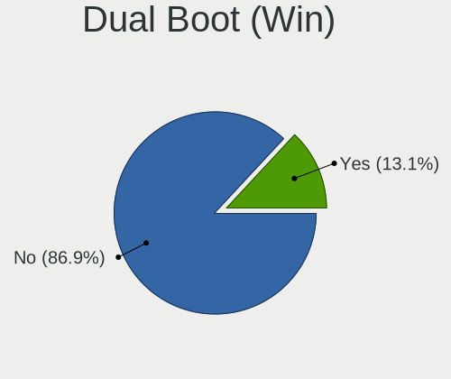
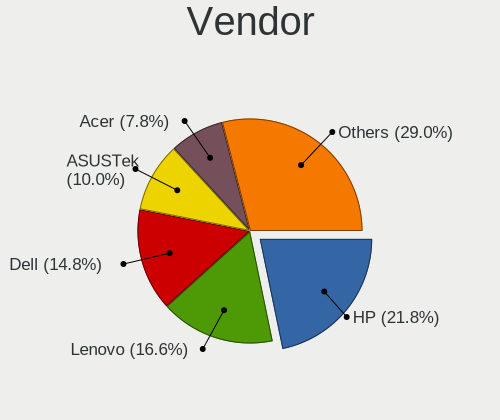
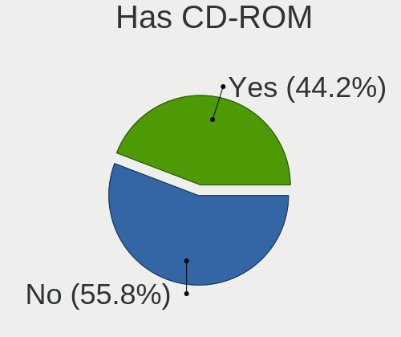
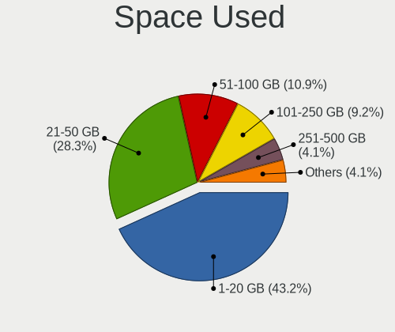
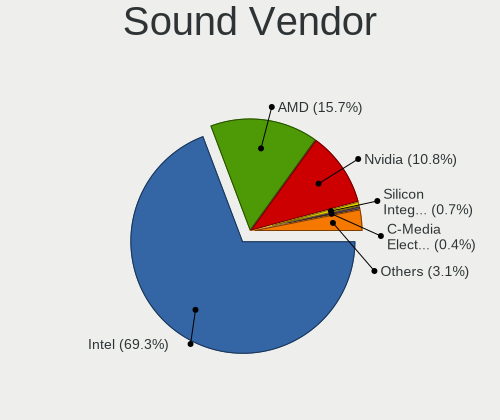
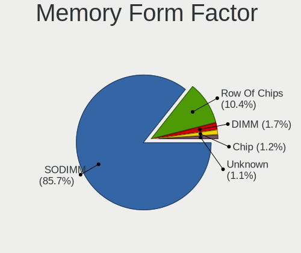
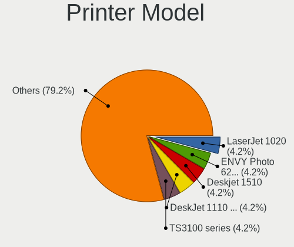
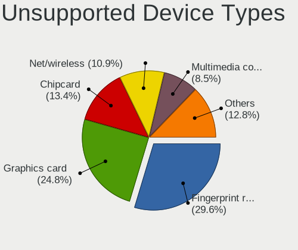

Zorin - Tested Hardware & Statistics (Notebooks)
------------------------------------------------

A project to collect tested hardware configurations for Zorin.

Anyone can contribute to this report by the [hw-probe](https://github.com/linuxhw/hw-probe) tool:

    sudo -E hw-probe -all -upload

Please contribute! Especially if your hardware is rare.

Contents
--------

* [ Test Cases ](#test-cases)

* [ System ](#system)
  - [ OS                       ](#os)
  - [ OS Family                ](#os-family)
  - [ Kernel                   ](#kernel)
  - [ Kernel Family            ](#kernel-family)
  - [ Kernel Major Ver.        ](#kernel-major-ver)
  - [ Arch                     ](#arch)
  - [ DE                       ](#de)
  - [ Display Server           ](#display-server)
  - [ Display Manager          ](#display-manager)
  - [ OS Lang                  ](#os-lang)
  - [ Boot Mode                ](#boot-mode)
  - [ Filesystem               ](#filesystem)
  - [ Part. scheme             ](#part-scheme)
  - [ Dual Boot with Linux/BSD ](#dual-boot-with-linuxbsd)
  - [ Dual Boot (Win)          ](#dual-boot-win)

* [ Board ](#board)
  - [ Vendor                   ](#vendor)
  - [ Model                    ](#model)
  - [ Model Family             ](#model-family)
  - [ MFG Year                 ](#mfg-year)
  - [ Form Factor              ](#form-factor)
  - [ Secure Boot              ](#secure-boot)
  - [ Coreboot                 ](#coreboot)
  - [ RAM Size                 ](#ram-size)
  - [ RAM Used                 ](#ram-used)
  - [ Total Drives             ](#total-drives)
  - [ Has CD-ROM               ](#has-cd-rom)
  - [ Has Ethernet             ](#has-ethernet)
  - [ Has WiFi                 ](#has-wifi)
  - [ Has Bluetooth            ](#has-bluetooth)

* [ Location ](#location)
  - [ Country                  ](#country)
  - [ City                     ](#city)

* [ Drives ](#drives)
  - [ Drive Vendor             ](#drive-vendor)
  - [ Drive Model              ](#drive-model)
  - [ HDD Vendor               ](#hdd-vendor)
  - [ SSD Vendor               ](#ssd-vendor)
  - [ Drive Kind               ](#drive-kind)
  - [ Drive Connector          ](#drive-connector)
  - [ Drive Size               ](#drive-size)
  - [ Space Total              ](#space-total)
  - [ Space Used               ](#space-used)
  - [ Malfunc. Drives          ](#malfunc-drives)
  - [ Malfunc. Drive Vendor    ](#malfunc-drive-vendor)
  - [ Malfunc. HDD Vendor      ](#malfunc-hdd-vendor)
  - [ Malfunc. Drive Kind      ](#malfunc-drive-kind)
  - [ Failed Drives            ](#failed-drives)
  - [ Failed Drive Vendor      ](#failed-drive-vendor)
  - [ Drive Status             ](#drive-status)

* [ Storage controller ](#storage-controller)
  - [ Storage Vendor           ](#storage-vendor)
  - [ Storage Model            ](#storage-model)
  - [ Storage Kind             ](#storage-kind)

* [ Processor ](#processor)
  - [ CPU Vendor               ](#cpu-vendor)
  - [ CPU Model                ](#cpu-model)
  - [ CPU Model Family         ](#cpu-model-family)
  - [ CPU Cores                ](#cpu-cores)
  - [ CPU Sockets              ](#cpu-sockets)
  - [ CPU Threads              ](#cpu-threads)
  - [ CPU Op-Modes             ](#cpu-op-modes)
  - [ CPU Microcode            ](#cpu-microcode)
  - [ CPU Microarch            ](#cpu-microarch)

* [ Graphics ](#graphics)
  - [ GPU Vendor               ](#gpu-vendor)
  - [ GPU Model                ](#gpu-model)
  - [ GPU Combo                ](#gpu-combo)
  - [ GPU Driver               ](#gpu-driver)
  - [ GPU Memory               ](#gpu-memory)

* [ Monitor ](#monitor)
  - [ Monitor Vendor           ](#monitor-vendor)
  - [ Monitor Model            ](#monitor-model)
  - [ Monitor Resolution       ](#monitor-resolution)
  - [ Monitor Diagonal         ](#monitor-diagonal)
  - [ Monitor Width            ](#monitor-width)
  - [ Aspect Ratio             ](#aspect-ratio)
  - [ Monitor Area             ](#monitor-area)
  - [ Pixel Density            ](#pixel-density)
  - [ Multiple Monitors        ](#multiple-monitors)

* [ Network ](#network)
  - [ Net Controller Vendor    ](#net-controller-vendor)
  - [ Net Controller Model     ](#net-controller-model)
  - [ Wireless Vendor          ](#wireless-vendor)
  - [ Wireless Model           ](#wireless-model)
  - [ Ethernet Vendor          ](#ethernet-vendor)
  - [ Ethernet Model           ](#ethernet-model)
  - [ Net Controller Kind      ](#net-controller-kind)
  - [ Used Controller          ](#used-controller)
  - [ NICs                     ](#nics)
  - [ IPv6                     ](#ipv6)

* [ Bluetooth ](#bluetooth)
  - [ Bluetooth Vendor         ](#bluetooth-vendor)
  - [ Bluetooth Model          ](#bluetooth-model)

* [ Sound ](#sound)
  - [ Sound Vendor             ](#sound-vendor)
  - [ Sound Model              ](#sound-model)

* [ Memory ](#memory)
  - [ Memory Vendor            ](#memory-vendor)
  - [ Memory Model             ](#memory-model)
  - [ Memory Kind              ](#memory-kind)
  - [ Memory Form Factor       ](#memory-form-factor)
  - [ Memory Size              ](#memory-size)
  - [ Memory Speed             ](#memory-speed)

* [ Printers & scanners ](#printers--scanners)
  - [ Printer Vendor           ](#printer-vendor)
  - [ Printer Model            ](#printer-model)
  - [ Scanner Vendor           ](#scanner-vendor)
  - [ Scanner Model            ](#scanner-model)

* [ Camera ](#camera)
  - [ Camera Vendor            ](#camera-vendor)
  - [ Camera Model             ](#camera-model)

* [ Security ](#security)
  - [ Fingerprint Vendor       ](#fingerprint-vendor)
  - [ Fingerprint Model        ](#fingerprint-model)
  - [ Chipcard Vendor          ](#chipcard-vendor)
  - [ Chipcard Model           ](#chipcard-model)

* [ Unsupported ](#unsupported)
  - [ Unsupported Devices      ](#unsupported-devices)
  - [ Unsupported Device Types ](#unsupported-device-types)

Test Cases
----------

Total: 4274

| Vendor        | Model                       | Probe                                                      | Date         |
|---------------|-----------------------------|------------------------------------------------------------|--------------|
| ASUSTek       | K50IJ                       | [8262209249](https://linux-hardware.org/?probe=8262209249) | Jun 30, 2023 |
| Dell          | Latitude E6400              | [c8f88ff5b6](https://linux-hardware.org/?probe=c8f88ff5b6) | Jun 30, 2023 |
| Acer          | Aspire 5738                 | [b4fcb0d0c0](https://linux-hardware.org/?probe=b4fcb0d0c0) | Jun 28, 2023 |
| Lenovo        | ThinkPad T430 2349HNU       | [9d6748ef56](https://linux-hardware.org/?probe=9d6748ef56) | Jun 28, 2023 |
| HP            | ENVY m6                     | [715d68bfc0](https://linux-hardware.org/?probe=715d68bfc0) | Jun 28, 2023 |
| Dell          | Latitude E6400              | [0f9255924f](https://linux-hardware.org/?probe=0f9255924f) | Jun 28, 2023 |
| Lenovo        | ThinkPad T430 2349HNU       | [64433a8783](https://linux-hardware.org/?probe=64433a8783) | Jun 27, 2023 |
| HP            | Laptop 14-ck0xxx            | [663ce69f30](https://linux-hardware.org/?probe=663ce69f30) | Jun 27, 2023 |
| HP            | Laptop 14-ck0xxx            | [73eab89788](https://linux-hardware.org/?probe=73eab89788) | Jun 27, 2023 |
| Lenovo        | V110-15IKB 80TH             | [e6b9f96475](https://linux-hardware.org/?probe=e6b9f96475) | Jun 27, 2023 |
| HP            | Pavilion dv6700             | [182bf6e4a7](https://linux-hardware.org/?probe=182bf6e4a7) | Jun 27, 2023 |
| Lenovo        | ThinkPad Yoga 11e 20DA50... | [b756e54029](https://linux-hardware.org/?probe=b756e54029) | Jun 27, 2023 |
| Dell          | Latitude 3189               | [ad7c98c905](https://linux-hardware.org/?probe=ad7c98c905) | Jun 26, 2023 |
| Dell          | Latitude 3189               | [8547503af5](https://linux-hardware.org/?probe=8547503af5) | Jun 25, 2023 |
| Dell          | Latitude 3189               | [3f44430a36](https://linux-hardware.org/?probe=3f44430a36) | Jun 25, 2023 |
| Lenovo        | ThinkPad E560 20EV000UIX    | [ac6bd9497a](https://linux-hardware.org/?probe=ac6bd9497a) | Jun 25, 2023 |
| Toshiba       | Satellite U400              | [58b2ad81eb](https://linux-hardware.org/?probe=58b2ad81eb) | Jun 25, 2023 |
| Acer          | Aspire M3-581G              | [0c348c2570](https://linux-hardware.org/?probe=0c348c2570) | Jun 25, 2023 |
| Apple         | MacBookPro11,2              | [2d7e4f3505](https://linux-hardware.org/?probe=2d7e4f3505) | Jun 24, 2023 |
| Acer          | Aspire 5738                 | [8112b061f0](https://linux-hardware.org/?probe=8112b061f0) | Jun 24, 2023 |
| Dell          | Latitude E6400              | [74be208929](https://linux-hardware.org/?probe=74be208929) | Jun 24, 2023 |
| Acer          | AOD270                      | [af596f2c11](https://linux-hardware.org/?probe=af596f2c11) | Jun 24, 2023 |
| Acer          | AOD270                      | [d3204f80d5](https://linux-hardware.org/?probe=d3204f80d5) | Jun 24, 2023 |
| Toshiba       | Satellite U400              | [aa6254ebd2](https://linux-hardware.org/?probe=aa6254ebd2) | Jun 24, 2023 |
| HP            | EliteBook 8560p             | [177d2fe509](https://linux-hardware.org/?probe=177d2fe509) | Jun 22, 2023 |
| Google        | Kefka                       | [2580ed90ee](https://linux-hardware.org/?probe=2580ed90ee) | Jun 22, 2023 |
| Apple         | MacBookAir7,2               | [ae8c13c6fd](https://linux-hardware.org/?probe=ae8c13c6fd) | Jun 22, 2023 |
| Lenovo        | ThinkBook 15 G2 ITL 20VE    | [3d558ea9aa](https://linux-hardware.org/?probe=3d558ea9aa) | Jun 21, 2023 |
| Dell          | Vostro 5481                 | [b28f58f09e](https://linux-hardware.org/?probe=b28f58f09e) | Jun 20, 2023 |
| HP            | ENVY m6                     | [ea4c3aca13](https://linux-hardware.org/?probe=ea4c3aca13) | Jun 20, 2023 |
| Dell          | Inspiron 5558               | [72ef7ff0aa](https://linux-hardware.org/?probe=72ef7ff0aa) | Jun 20, 2023 |
| Dell          | G7 7588                     | [946a645897](https://linux-hardware.org/?probe=946a645897) | Jun 20, 2023 |
| Sony          | VPCCA15FX                   | [ed7dba1a4c](https://linux-hardware.org/?probe=ed7dba1a4c) | Jun 19, 2023 |
| Dell          | Vostro 1520                 | [bc371b62c9](https://linux-hardware.org/?probe=bc371b62c9) | Jun 19, 2023 |
| Sony          | VPCCA15FX                   | [c5660d0020](https://linux-hardware.org/?probe=c5660d0020) | Jun 19, 2023 |
| Dell          | Vostro 1520                 | [8086cf1231](https://linux-hardware.org/?probe=8086cf1231) | Jun 19, 2023 |
| Lenovo        | ThinkPad T440 20B7S0VA05    | [307c8a76ab](https://linux-hardware.org/?probe=307c8a76ab) | Jun 19, 2023 |
| GPU Compan... | GWNC21524                   | [46bd956cbf](https://linux-hardware.org/?probe=46bd956cbf) | Jun 19, 2023 |
| Toshiba       | TECRA M10                   | [37f232dce0](https://linux-hardware.org/?probe=37f232dce0) | Jun 19, 2023 |
| HP            | Stream Laptop 14-cb1xxx     | [7546cac791](https://linux-hardware.org/?probe=7546cac791) | Jun 19, 2023 |
| HP            | EliteBook 840 G3            | [e1fc794bc5](https://linux-hardware.org/?probe=e1fc794bc5) | Jun 18, 2023 |
| ASUSTek       | VivoBook S13 X330FA_S330... | [b816a11527](https://linux-hardware.org/?probe=b816a11527) | Jun 18, 2023 |
| Acer          | Aspire 5738                 | [8247e349fc](https://linux-hardware.org/?probe=8247e349fc) | Jun 17, 2023 |
| HP            | Victus by Laptop 16-e0xx... | [bb6859a141](https://linux-hardware.org/?probe=bb6859a141) | Jun 17, 2023 |
| HP            | ProBook 650 G5              | [1d158627b0](https://linux-hardware.org/?probe=1d158627b0) | Jun 17, 2023 |
| Dell          | Latitude 7370               | [5c2378adc5](https://linux-hardware.org/?probe=5c2378adc5) | Jun 17, 2023 |
| Dell          | Latitude 7370               | [44dba24aed](https://linux-hardware.org/?probe=44dba24aed) | Jun 17, 2023 |
| ASUSTek       | ROG Strix G713QM_G713QM     | [3614dc460e](https://linux-hardware.org/?probe=3614dc460e) | Jun 17, 2023 |
| HP            | Laptop 14-bw0xx             | [f38253d79c](https://linux-hardware.org/?probe=f38253d79c) | Jun 17, 2023 |
| Haier         | Y11B                        | [0c2abeea6e](https://linux-hardware.org/?probe=0c2abeea6e) | Jun 17, 2023 |
| HP            | ProBook 650 G5              | [9c53e4cd72](https://linux-hardware.org/?probe=9c53e4cd72) | Jun 17, 2023 |
| HP            | G62                         | [2e1e964887](https://linux-hardware.org/?probe=2e1e964887) | Jun 16, 2023 |
| Acer          | Aspire V5-571P              | [2adeb26f8a](https://linux-hardware.org/?probe=2adeb26f8a) | Jun 15, 2023 |
| eMachines     | eMD728                      | [85dd880b0d](https://linux-hardware.org/?probe=85dd880b0d) | Jun 15, 2023 |
| ASUSTek       | K52N                        | [eb2ec7cb3d](https://linux-hardware.org/?probe=eb2ec7cb3d) | Jun 15, 2023 |
| Dell          | Venue 11 Pro 5130           | [e1bb6b17b8](https://linux-hardware.org/?probe=e1bb6b17b8) | Jun 14, 2023 |
| Lenovo        | IdeaPad S145-15IIL 82DJ     | [9fe9d9f03f](https://linux-hardware.org/?probe=9fe9d9f03f) | Jun 13, 2023 |
| ASUSTek       | VivoBook 12_ASUS Laptop ... | [b737ce6557](https://linux-hardware.org/?probe=b737ce6557) | Jun 13, 2023 |
| HP            | ENVY m6                     | [b3c165b329](https://linux-hardware.org/?probe=b3c165b329) | Jun 12, 2023 |
| MSI           | GL62M 7RDX                  | [d1fb646d9a](https://linux-hardware.org/?probe=d1fb646d9a) | Jun 11, 2023 |
| HP            | Pavilion Gaming Laptop 1... | [9cb593e9e1](https://linux-hardware.org/?probe=9cb593e9e1) | Jun 11, 2023 |
| ASUSTek       | U43Jc                       | [1af7e59490](https://linux-hardware.org/?probe=1af7e59490) | Jun 11, 2023 |
| ASUSTek       | U43Jc                       | [15e8e27585](https://linux-hardware.org/?probe=15e8e27585) | Jun 11, 2023 |
| HP            | Pavilion g7                 | [c599527484](https://linux-hardware.org/?probe=c599527484) | Jun 11, 2023 |
| Samsung       | N150/N210/N220              | [977d645961](https://linux-hardware.org/?probe=977d645961) | Jun 10, 2023 |
| Notebook      | NJ50_70CU                   | [d39b8694fd](https://linux-hardware.org/?probe=d39b8694fd) | Jun 10, 2023 |
| Packard Be... | EasyNote TE11BZ             | [a8f9a31f17](https://linux-hardware.org/?probe=a8f9a31f17) | Jun 10, 2023 |
| Google        | Pirika                      | [67fce0a645](https://linux-hardware.org/?probe=67fce0a645) | Jun 10, 2023 |
| Dell          | Precision 7520              | [c52fb2f851](https://linux-hardware.org/?probe=c52fb2f851) | Jun 10, 2023 |
| HP            | Pavilion Notebook           | [5254a5fe09](https://linux-hardware.org/?probe=5254a5fe09) | Jun 07, 2023 |
| HP            | Pavilion Laptop 14-ec1xx... | [de4c183b01](https://linux-hardware.org/?probe=de4c183b01) | Jun 06, 2023 |
| Samsung       | 300E5M/300E5L               | [e066300eac](https://linux-hardware.org/?probe=e066300eac) | Jun 06, 2023 |
| Acer          | Aspire 5736Z                | [a98deb1f54](https://linux-hardware.org/?probe=a98deb1f54) | Jun 06, 2023 |
| Apple         | MacBookPro8,1               | [8308d5da16](https://linux-hardware.org/?probe=8308d5da16) | Jun 05, 2023 |
| Apple         | MacBookPro8,1               | [2f8dbb707f](https://linux-hardware.org/?probe=2f8dbb707f) | Jun 05, 2023 |
| HP            | OMEN by Laptop              | [e3b8e1a109](https://linux-hardware.org/?probe=e3b8e1a109) | Jun 04, 2023 |
| Dell          | Latitude E5250              | [e85c6a09d1](https://linux-hardware.org/?probe=e85c6a09d1) | Jun 04, 2023 |
| Toshiba       | IS 1412                     | [b1b0369688](https://linux-hardware.org/?probe=b1b0369688) | Jun 04, 2023 |
| Lenovo        | ThinkPad T450 20BUS0LW02    | [27f6e7df80](https://linux-hardware.org/?probe=27f6e7df80) | Jun 04, 2023 |
| HP            | Stream Laptop 14-cb0XX      | [83967c7908](https://linux-hardware.org/?probe=83967c7908) | Jun 04, 2023 |
| HP            | ProBook 450 G2              | [55f28b41b4](https://linux-hardware.org/?probe=55f28b41b4) | Jun 03, 2023 |
| Toshiba       | IS 1412                     | [6ea1bc7e6a](https://linux-hardware.org/?probe=6ea1bc7e6a) | Jun 03, 2023 |
| IPASON        | P3                          | [bd9e0660a4](https://linux-hardware.org/?probe=bd9e0660a4) | Jun 02, 2023 |
| ASUSTek       | K70IJ                       | [5b877dfec5](https://linux-hardware.org/?probe=5b877dfec5) | Jun 02, 2023 |
| Toshiba       | Satellite L650              | [63eb6978fa](https://linux-hardware.org/?probe=63eb6978fa) | Jun 01, 2023 |
| Lenovo        | IdeaPad 3 17ITL6 82H9       | [a7af6cac2c](https://linux-hardware.org/?probe=a7af6cac2c) | Jun 01, 2023 |
| HP            | Pavilion dv6500             | [0198d67a15](https://linux-hardware.org/?probe=0198d67a15) | May 31, 2023 |
| Sony          | SVF14214CXW                 | [51568ce56e](https://linux-hardware.org/?probe=51568ce56e) | May 30, 2023 |
| Dell          | Latitude 3480               | [56d1834385](https://linux-hardware.org/?probe=56d1834385) | May 30, 2023 |
| Sony          | SVF14214CXW                 | [6cf7c2d7f2](https://linux-hardware.org/?probe=6cf7c2d7f2) | May 30, 2023 |
| Dell          | Inspiron 5748               | [08b61d608c](https://linux-hardware.org/?probe=08b61d608c) | May 30, 2023 |
| ASUSTek       | U43Jc                       | [db28d8f731](https://linux-hardware.org/?probe=db28d8f731) | May 28, 2023 |
| ASUSTek       | U43Jc                       | [36bd3a5288](https://linux-hardware.org/?probe=36bd3a5288) | May 28, 2023 |
| Lenovo        | ThinkPad E490 20N8A01YGI    | [c46cf56eb1](https://linux-hardware.org/?probe=c46cf56eb1) | May 27, 2023 |
| Lenovo        | B50-70 80EU                 | [8c51cdf4ef](https://linux-hardware.org/?probe=8c51cdf4ef) | May 27, 2023 |
| HP            | Pavilion dv6                | [9f96328490](https://linux-hardware.org/?probe=9f96328490) | May 27, 2023 |
| Acer          | Aspire ES1-523              | [681fbd4a1f](https://linux-hardware.org/?probe=681fbd4a1f) | May 27, 2023 |
| Toshiba       | TECRA M10                   | [3ce97963e7](https://linux-hardware.org/?probe=3ce97963e7) | May 26, 2023 |
| Toshiba       | TECRA M10                   | [2c574f9677](https://linux-hardware.org/?probe=2c574f9677) | May 26, 2023 |
| HP            | ProBook 4740s               | [457a56d75c](https://linux-hardware.org/?probe=457a56d75c) | May 26, 2023 |
| ASUSTek       | G50VT                       | [6e4a2588b1](https://linux-hardware.org/?probe=6e4a2588b1) | May 26, 2023 |
| Google        | Lars                        | [25cc6549c3](https://linux-hardware.org/?probe=25cc6549c3) | May 25, 2023 |
| HP            | ProBook 6440b               | [5ed14b01a3](https://linux-hardware.org/?probe=5ed14b01a3) | May 25, 2023 |
| Apple         | MacBookAir4,1               | [d25345cb25](https://linux-hardware.org/?probe=d25345cb25) | May 25, 2023 |
| HP            | Pavilion g6                 | [f6fbdf57b5](https://linux-hardware.org/?probe=f6fbdf57b5) | May 24, 2023 |
| HP            | Pavilion Notebook 15-bc5... | [933989a15b](https://linux-hardware.org/?probe=933989a15b) | May 24, 2023 |
| HP            | Stream Notebook             | [74d40533fc](https://linux-hardware.org/?probe=74d40533fc) | May 24, 2023 |
| Lenovo        | V130-15IGM 81HL             | [504a24887e](https://linux-hardware.org/?probe=504a24887e) | May 24, 2023 |
| Lenovo        | IdeaPad Flex-14API 81SS     | [8c7d3913b8](https://linux-hardware.org/?probe=8c7d3913b8) | May 24, 2023 |
| Apple         | MacBookPro7,1               | [e1baf451db](https://linux-hardware.org/?probe=e1baf451db) | May 23, 2023 |
| Apple         | MacBookPro7,1               | [61ef8e4e63](https://linux-hardware.org/?probe=61ef8e4e63) | May 23, 2023 |
| Lenovo        | IdeaPad Flex-14API 81SS     | [08746538f6](https://linux-hardware.org/?probe=08746538f6) | May 23, 2023 |
| Dell          | Latitude E5450              | [642802d511](https://linux-hardware.org/?probe=642802d511) | May 23, 2023 |
| Dell          | Inspiron 1501               | [4703a17f03](https://linux-hardware.org/?probe=4703a17f03) | May 23, 2023 |
| HP            | Pavilion g6                 | [4d0edc38d5](https://linux-hardware.org/?probe=4d0edc38d5) | May 23, 2023 |
| Packard Be... | EasyNote MH35               | [ea7710b373](https://linux-hardware.org/?probe=ea7710b373) | May 22, 2023 |
| Acer          | Aspire A515-56              | [dfb369a8d2](https://linux-hardware.org/?probe=dfb369a8d2) | May 22, 2023 |
| HP            | EliteBook Folio G1          | [81477cd76f](https://linux-hardware.org/?probe=81477cd76f) | May 22, 2023 |
| HP            | EliteBook Folio G1          | [73d4310fa2](https://linux-hardware.org/?probe=73d4310fa2) | May 22, 2023 |
| HP            | Pavilion Sleekbook 14 PC    | [6bef224193](https://linux-hardware.org/?probe=6bef224193) | May 20, 2023 |
| Apple         | MacBookAir7,2               | [d11ecdffaf](https://linux-hardware.org/?probe=d11ecdffaf) | May 20, 2023 |
| Dell          | Latitude E7450              | [b76cb7567c](https://linux-hardware.org/?probe=b76cb7567c) | May 20, 2023 |
| HP            | 255 G8 Notebook PC          | [c1f679b4d4](https://linux-hardware.org/?probe=c1f679b4d4) | May 20, 2023 |
| HP            | 255 G8 Notebook PC          | [0c163f5c69](https://linux-hardware.org/?probe=0c163f5c69) | May 20, 2023 |
| HP            | Stream Laptop 14-ax0XX      | [aae519e65d](https://linux-hardware.org/?probe=aae519e65d) | May 19, 2023 |
| Tactus        | GeoBook 140                 | [534c32884a](https://linux-hardware.org/?probe=534c32884a) | May 19, 2023 |
| Lenovo        | ThinkPad T470s W10DG 20J... | [0608bc6ac3](https://linux-hardware.org/?probe=0608bc6ac3) | May 18, 2023 |
| Philco        | PHN14C                      | [4efea72b8f](https://linux-hardware.org/?probe=4efea72b8f) | May 18, 2023 |
| Acer          | Aspire A514-55              | [e096b3a75c](https://linux-hardware.org/?probe=e096b3a75c) | May 18, 2023 |
| Apple         | MacBookAir7,2               | [cadb0eb363](https://linux-hardware.org/?probe=cadb0eb363) | May 17, 2023 |
| Apple         | MacBookAir7,2               | [cd3c24c6a2](https://linux-hardware.org/?probe=cd3c24c6a2) | May 17, 2023 |
| Lenovo        | IdeaPad 320-15IAP 80XR      | [e18deba45b](https://linux-hardware.org/?probe=e18deba45b) | May 17, 2023 |
| Framework     | Laptop                      | [b8739c141d](https://linux-hardware.org/?probe=b8739c141d) | May 16, 2023 |
| Fujitsu Si... | AMILO A1645                 | [d825262368](https://linux-hardware.org/?probe=d825262368) | May 16, 2023 |
| Fujitsu Si... | AMILO A1645                 | [18ca79ef29](https://linux-hardware.org/?probe=18ca79ef29) | May 16, 2023 |
| Dell          | XPS 17 9700                 | [7b95691784](https://linux-hardware.org/?probe=7b95691784) | May 15, 2023 |
| Samsung       | N150/N210/N220              | [3f18889439](https://linux-hardware.org/?probe=3f18889439) | May 15, 2023 |
| ASUSTek       | ROG Strix G512LW_G512LW     | [03c67bbed5](https://linux-hardware.org/?probe=03c67bbed5) | May 15, 2023 |
| HP            | Laptop 15-db0xxx            | [496f6048ec](https://linux-hardware.org/?probe=496f6048ec) | May 15, 2023 |
| Apple         | MacBookPro10,1              | [d27a3510ed](https://linux-hardware.org/?probe=d27a3510ed) | May 14, 2023 |
| HP            | Presario CQ61               | [0967999006](https://linux-hardware.org/?probe=0967999006) | May 14, 2023 |
| Google        | Bluebird                    | [c10880ed1b](https://linux-hardware.org/?probe=c10880ed1b) | May 14, 2023 |
| Acer          | Aspire E5-574               | [89fbcb7903](https://linux-hardware.org/?probe=89fbcb7903) | May 14, 2023 |
| Lenovo        | ThinkPad X1 Carbon Gen 8... | [83e208da09](https://linux-hardware.org/?probe=83e208da09) | May 14, 2023 |
| Lenovo        | IdeaPad Z470                | [2b11351f94](https://linux-hardware.org/?probe=2b11351f94) | May 14, 2023 |
| Dell          | Latitude 3340               | [59d83d9cef](https://linux-hardware.org/?probe=59d83d9cef) | May 14, 2023 |
| SKIKK         | Niflheim 17 II              | [ce9c27f16f](https://linux-hardware.org/?probe=ce9c27f16f) | May 14, 2023 |
| Chuwi         | GemiBook XPro               | [53b6692944](https://linux-hardware.org/?probe=53b6692944) | May 13, 2023 |
| Chuwi         | GemiBook XPro               | [297921aabf](https://linux-hardware.org/?probe=297921aabf) | May 13, 2023 |
| Acer          | Aspire E1-570               | [135675c3ad](https://linux-hardware.org/?probe=135675c3ad) | May 13, 2023 |
| Google        | Kled                        | [f4e834ff36](https://linux-hardware.org/?probe=f4e834ff36) | May 12, 2023 |
| Dell          | Precision M2800             | [571407d9a3](https://linux-hardware.org/?probe=571407d9a3) | May 12, 2023 |
| Chuwi         | GemiBook XPro               | [e13fe43842](https://linux-hardware.org/?probe=e13fe43842) | May 12, 2023 |
| HP            | ProBook 4535s               | [0d2f9561ce](https://linux-hardware.org/?probe=0d2f9561ce) | May 12, 2023 |
| HP            | EliteBook 820 G4            | [34bd8e2402](https://linux-hardware.org/?probe=34bd8e2402) | May 12, 2023 |
| HP            | OMEN by Laptop              | [5a1484127d](https://linux-hardware.org/?probe=5a1484127d) | May 12, 2023 |
| eMachines     | E620                        | [827a81facc](https://linux-hardware.org/?probe=827a81facc) | May 11, 2023 |
| Apple         | MacBookPro10,1              | [381ca3ca78](https://linux-hardware.org/?probe=381ca3ca78) | May 11, 2023 |
| HP            | OMEN by Laptop              | [2c8128a196](https://linux-hardware.org/?probe=2c8128a196) | May 11, 2023 |
| HP            | EliteBook 820 G4            | [a7327f2e2e](https://linux-hardware.org/?probe=a7327f2e2e) | May 11, 2023 |
| HP            | EliteBook 745 G3            | [256ad0c4d8](https://linux-hardware.org/?probe=256ad0c4d8) | May 11, 2023 |
| Acer          | Aspire A315-23              | [2c96614c16](https://linux-hardware.org/?probe=2c96614c16) | May 11, 2023 |
| Toshiba       | TECRA M10                   | [cf43cf62c7](https://linux-hardware.org/?probe=cf43cf62c7) | May 10, 2023 |
| Toshiba       | TECRA M10                   | [d2be66b23b](https://linux-hardware.org/?probe=d2be66b23b) | May 10, 2023 |
| HP            | Pavilion dv7                | [794d198929](https://linux-hardware.org/?probe=794d198929) | May 10, 2023 |
| Toshiba       | Satellite M60               | [91437556e8](https://linux-hardware.org/?probe=91437556e8) | May 09, 2023 |
| Toshiba       | Satellite M60               | [39b2bcd3a5](https://linux-hardware.org/?probe=39b2bcd3a5) | May 09, 2023 |
| ASUSTek       | GL702VI                     | [3598875ef3](https://linux-hardware.org/?probe=3598875ef3) | May 09, 2023 |
| HP            | EliteBook 840 G4            | [372fa59e86](https://linux-hardware.org/?probe=372fa59e86) | May 09, 2023 |
| HP            | EliteBook 840 G4            | [9ac068efc7](https://linux-hardware.org/?probe=9ac068efc7) | May 09, 2023 |
| Dell          | Latitude E6520              | [668b26cd28](https://linux-hardware.org/?probe=668b26cd28) | May 09, 2023 |
| HP            | Laptop 15                   | [20a0a03b80](https://linux-hardware.org/?probe=20a0a03b80) | May 08, 2023 |
| Fujitsu Si... | LIFEBOOK S6420              | [953d03df07](https://linux-hardware.org/?probe=953d03df07) | May 08, 2023 |
| Acer          | Aspire E5-574               | [d48affb6b2](https://linux-hardware.org/?probe=d48affb6b2) | May 08, 2023 |
| Fujitsu Si... | LIFEBOOK S6420              | [ee52ca7ce5](https://linux-hardware.org/?probe=ee52ca7ce5) | May 08, 2023 |
| HP            | 655                         | [be3dec1f65](https://linux-hardware.org/?probe=be3dec1f65) | May 08, 2023 |
| Positivo      | S14CT01                     | [63a129c031](https://linux-hardware.org/?probe=63a129c031) | May 08, 2023 |
| Dell          | Latitude 5520               | [4d8ef45cbc](https://linux-hardware.org/?probe=4d8ef45cbc) | May 07, 2023 |
| SKIKK         | Niflheim 17 II              | [0304fddec7](https://linux-hardware.org/?probe=0304fddec7) | May 07, 2023 |
| SKIKK         | Niflheim 17 II              | [2a30823af1](https://linux-hardware.org/?probe=2a30823af1) | May 07, 2023 |
| Fujitsu Si... | AMILO PRO V3515             | [a6da9a31d7](https://linux-hardware.org/?probe=a6da9a31d7) | May 06, 2023 |
| Dell          | Inspiron 3501               | [b7bf9f8683](https://linux-hardware.org/?probe=b7bf9f8683) | May 06, 2023 |
| HP            | ProBook 6570b               | [480e352bf8](https://linux-hardware.org/?probe=480e352bf8) | May 05, 2023 |
| HP            | Victus by Laptop 16-e0xx... | [9a0649d500](https://linux-hardware.org/?probe=9a0649d500) | May 05, 2023 |
| Lenovo        | IdeaPad 110-15ISK 80UD      | [6069763b68](https://linux-hardware.org/?probe=6069763b68) | May 05, 2023 |
| Lenovo        | Legion 7 16ACHg6 82N6       | [d8582f94de](https://linux-hardware.org/?probe=d8582f94de) | May 05, 2023 |
| Lenovo        | IdeaPad 3 15ITL05 81X8      | [4ac4356e10](https://linux-hardware.org/?probe=4ac4356e10) | May 05, 2023 |
| Lenovo        | IdeaPad 3 15ITL05 81X8      | [37fd24fab6](https://linux-hardware.org/?probe=37fd24fab6) | May 05, 2023 |
| Lenovo        | ThinkPad T520 4242A25       | [6290e7f2fb](https://linux-hardware.org/?probe=6290e7f2fb) | May 05, 2023 |
| Unknown       | X133                        | [b38ee0b3cc](https://linux-hardware.org/?probe=b38ee0b3cc) | May 05, 2023 |
| Lenovo        | ThinkPad E14 Gen 3 20Y70... | [cf49833602](https://linux-hardware.org/?probe=cf49833602) | May 04, 2023 |
| HP            | EliteBook 8470p             | [9684be9c3a](https://linux-hardware.org/?probe=9684be9c3a) | May 04, 2023 |
| Acer          | Aspire 5732Z                | [f9868f3430](https://linux-hardware.org/?probe=f9868f3430) | May 04, 2023 |
| Unknown       | E450                        | [a3261aab47](https://linux-hardware.org/?probe=a3261aab47) | May 04, 2023 |
| Dell          | XPS 15 9560                 | [15160b0649](https://linux-hardware.org/?probe=15160b0649) | May 04, 2023 |
| KUU           | Andes II                    | [b15876e521](https://linux-hardware.org/?probe=b15876e521) | May 04, 2023 |
| Acer          | Aspire E1-570               | [bf515886ac](https://linux-hardware.org/?probe=bf515886ac) | May 03, 2023 |
| Acer          | Aspire V5-531               | [d8c61ad691](https://linux-hardware.org/?probe=d8c61ad691) | May 02, 2023 |
| Dell          | Latitude E6540              | [e6f334c91c](https://linux-hardware.org/?probe=e6f334c91c) | May 01, 2023 |
| Acer          | Aspire A315-21              | [f2c5618e4d](https://linux-hardware.org/?probe=f2c5618e4d) | May 01, 2023 |
| ASUSTek       | K53U                        | [0745a61353](https://linux-hardware.org/?probe=0745a61353) | May 01, 2023 |
| Mediacom      | SmartBook 14 FullHD - SB... | [cbc75f825e](https://linux-hardware.org/?probe=cbc75f825e) | May 01, 2023 |
| Lenovo        | IdeaPad 320-17IKB 80XM      | [e316615297](https://linux-hardware.org/?probe=e316615297) | May 01, 2023 |
| Acer          | Aspire E5-574               | [bcd38374a3](https://linux-hardware.org/?probe=bcd38374a3) | May 01, 2023 |
| HP            | Pavilion dv7                | [68b51fde68](https://linux-hardware.org/?probe=68b51fde68) | Apr 30, 2023 |
| Positivo      | S14CT01                     | [b11ef938e1](https://linux-hardware.org/?probe=b11ef938e1) | Apr 29, 2023 |
| Toshiba       | Satellite C650D             | [472dedd62a](https://linux-hardware.org/?probe=472dedd62a) | Apr 29, 2023 |
| Sony          | VPCF215FX                   | [49c7606269](https://linux-hardware.org/?probe=49c7606269) | Apr 29, 2023 |
| Apple         | MacBook6,1                  | [58b09d7887](https://linux-hardware.org/?probe=58b09d7887) | Apr 29, 2023 |
| Apple         | MacBook6,1                  | [7d91fe30f7](https://linux-hardware.org/?probe=7d91fe30f7) | Apr 29, 2023 |
| Positivo      | S14CT01                     | [58988f4876](https://linux-hardware.org/?probe=58988f4876) | Apr 29, 2023 |
| Lenovo        | ThinkPad E14 Gen 2 20T60... | [e908fdb73d](https://linux-hardware.org/?probe=e908fdb73d) | Apr 29, 2023 |
| Lenovo        | ThinkPad X1 Carbon Gen 9... | [a984eefe43](https://linux-hardware.org/?probe=a984eefe43) | Apr 28, 2023 |
| Lenovo        | ThinkBook 14-IIL 20SL       | [d9010fa8d0](https://linux-hardware.org/?probe=d9010fa8d0) | Apr 28, 2023 |
| Lenovo        | ThinkPad Edge 25453BG       | [2b5c6e2ded](https://linux-hardware.org/?probe=2b5c6e2ded) | Apr 28, 2023 |
| HP            | Laptop 14-em0xxx            | [8d06549ae0](https://linux-hardware.org/?probe=8d06549ae0) | Apr 28, 2023 |
| Lenovo        | IdeaPad Y470                | [58c809428e](https://linux-hardware.org/?probe=58c809428e) | Apr 28, 2023 |
| Lenovo        | ThinkPad T430 2349HNU       | [f1290d4846](https://linux-hardware.org/?probe=f1290d4846) | Apr 28, 2023 |
| Dell          | Vostro 1510                 | [71c860d51c](https://linux-hardware.org/?probe=71c860d51c) | Apr 26, 2023 |
| Medion        | E2215T MD60198              | [390ccbba6f](https://linux-hardware.org/?probe=390ccbba6f) | Apr 26, 2023 |
| Acer          | Aspire A515-57              | [86dad710fa](https://linux-hardware.org/?probe=86dad710fa) | Apr 26, 2023 |
| Lenovo        | 3000 N200 0769A97           | [a293f4f1f7](https://linux-hardware.org/?probe=a293f4f1f7) | Apr 26, 2023 |
| Lenovo        | ThinkPad T430 2347GU8       | [c40de2e155](https://linux-hardware.org/?probe=c40de2e155) | Apr 26, 2023 |
| Lenovo        | ThinkPad T430 2347GU8       | [7abd61de30](https://linux-hardware.org/?probe=7abd61de30) | Apr 25, 2023 |
| HP            | EliteBook 2730p             | [51c0fadfdb](https://linux-hardware.org/?probe=51c0fadfdb) | Apr 25, 2023 |
| Lenovo        | ThinkPad T430 2347GU8       | [927c9a0377](https://linux-hardware.org/?probe=927c9a0377) | Apr 25, 2023 |
| Acer          | AOHAPPY                     | [6f32fad8f0](https://linux-hardware.org/?probe=6f32fad8f0) | Apr 24, 2023 |
| Toshiba       | Satellite C45-A             | [7720195dfe](https://linux-hardware.org/?probe=7720195dfe) | Apr 24, 2023 |
| Dell          | Inspiron 5565               | [6622474d4b](https://linux-hardware.org/?probe=6622474d4b) | Apr 24, 2023 |
| Lenovo        | ThinkPad X1 Carbon Gen 8... | [60d1d4aec8](https://linux-hardware.org/?probe=60d1d4aec8) | Apr 24, 2023 |
| HP            | Stream Laptop 14-ax0XX      | [c087d6cbae](https://linux-hardware.org/?probe=c087d6cbae) | Apr 24, 2023 |
| Dell          | XPS 15 9530                 | [d9429d7e06](https://linux-hardware.org/?probe=d9429d7e06) | Apr 23, 2023 |
| Lenovo        | ThinkPad T440s 20ARS1BH0... | [b76462c15b](https://linux-hardware.org/?probe=b76462c15b) | Apr 23, 2023 |
| MSI           | GP62 7RD                    | [277bb2d2e3](https://linux-hardware.org/?probe=277bb2d2e3) | Apr 23, 2023 |
| Acer          | AOD270                      | [d7d653d3d6](https://linux-hardware.org/?probe=d7d653d3d6) | Apr 23, 2023 |
| HP            | Laptop 14-em0xxx            | [55ea4ded18](https://linux-hardware.org/?probe=55ea4ded18) | Apr 22, 2023 |
| Lenovo        | B590 62743NG                | [ca0be4b423](https://linux-hardware.org/?probe=ca0be4b423) | Apr 22, 2023 |
| Lenovo        | B590 62743NG                | [74e38a8db9](https://linux-hardware.org/?probe=74e38a8db9) | Apr 22, 2023 |
| Acer          | AOHAPPY                     | [57a7ebf03f](https://linux-hardware.org/?probe=57a7ebf03f) | Apr 21, 2023 |
| AIERXUAN      | XIAOXUAN Pro                | [e472034313](https://linux-hardware.org/?probe=e472034313) | Apr 21, 2023 |
| AIERXUAN      | XIAOXUAN Pro                | [e500ddd5d9](https://linux-hardware.org/?probe=e500ddd5d9) | Apr 21, 2023 |
| Dell          | Inspiron 3531               | [6222a9aa08](https://linux-hardware.org/?probe=6222a9aa08) | Apr 21, 2023 |
| MSI           | GS73VR 7RF                  | [2eb85cc7fe](https://linux-hardware.org/?probe=2eb85cc7fe) | Apr 20, 2023 |
| ASUSTek       | ASUS EXPERTBOOK B1500CEA... | [7d380bf016](https://linux-hardware.org/?probe=7d380bf016) | Apr 20, 2023 |
| ASUSTek       | ASUS EXPERTBOOK B1500CEA... | [7029b5ee48](https://linux-hardware.org/?probe=7029b5ee48) | Apr 20, 2023 |
| Lenovo        | Yoga 300-11IBR 80M1         | [9093d27c30](https://linux-hardware.org/?probe=9093d27c30) | Apr 19, 2023 |
| Notebook      | NL40_50CU                   | [069a675d2a](https://linux-hardware.org/?probe=069a675d2a) | Apr 19, 2023 |
| Dell          | XPS 15 9530                 | [bb0be3d9e3](https://linux-hardware.org/?probe=bb0be3d9e3) | Apr 19, 2023 |
| Notebook      | NL40_50CU                   | [e58c3ad9d7](https://linux-hardware.org/?probe=e58c3ad9d7) | Apr 19, 2023 |
| Lenovo        | IdeaPad 700-15ISK 80RU      | [c36b1a5778](https://linux-hardware.org/?probe=c36b1a5778) | Apr 19, 2023 |
| Lenovo        | ThinkPad T430 2349HNU       | [1548cc4309](https://linux-hardware.org/?probe=1548cc4309) | Apr 19, 2023 |
| Notebook      | NL40_50CU                   | [85c7be8d12](https://linux-hardware.org/?probe=85c7be8d12) | Apr 19, 2023 |
| HP            | Stream Laptop 11-ak0xxx     | [7da02a75b5](https://linux-hardware.org/?probe=7da02a75b5) | Apr 18, 2023 |
| Acer          | Aspire E5-574               | [2f60207985](https://linux-hardware.org/?probe=2f60207985) | Apr 17, 2023 |
| Lenovo        | Yoga 2 13 20344             | [895f57e6d5](https://linux-hardware.org/?probe=895f57e6d5) | Apr 17, 2023 |
| Dell          | Vostro 3580                 | [b7d9953b54](https://linux-hardware.org/?probe=b7d9953b54) | Apr 16, 2023 |
| Lenovo        | Y50-70 20378                | [f146ce9da7](https://linux-hardware.org/?probe=f146ce9da7) | Apr 16, 2023 |
| Apple         | MacBookPro5,3               | [ea8d83a743](https://linux-hardware.org/?probe=ea8d83a743) | Apr 16, 2023 |
| Lenovo        | ThinkPad P52s 20LCS1DU01    | [3fc78b3451](https://linux-hardware.org/?probe=3fc78b3451) | Apr 16, 2023 |
| HONOR         | BBR-WAX9                    | [a56688fd70](https://linux-hardware.org/?probe=a56688fd70) | Apr 16, 2023 |
| HONOR         | BBR-WAX9                    | [798405022f](https://linux-hardware.org/?probe=798405022f) | Apr 16, 2023 |
| AZW           | SEi                         | [a382976bf2](https://linux-hardware.org/?probe=a382976bf2) | Apr 15, 2023 |
| AZW           | SEi                         | [980b83cf5e](https://linux-hardware.org/?probe=980b83cf5e) | Apr 15, 2023 |
| Acer          | Aspire V3-772               | [2b6f0394d7](https://linux-hardware.org/?probe=2b6f0394d7) | Apr 15, 2023 |
| Acer          | Aspire ES1-731G             | [1ef0f89c83](https://linux-hardware.org/?probe=1ef0f89c83) | Apr 15, 2023 |
| Lenovo        | Legion 5 15ACH6 82JW        | [ba3d9dd7e7](https://linux-hardware.org/?probe=ba3d9dd7e7) | Apr 15, 2023 |
| HP            | Pavilion Power Laptop 15... | [b66c208e18](https://linux-hardware.org/?probe=b66c208e18) | Apr 15, 2023 |
| Apple         | MacBookPro14,1              | [2ca7c3fccc](https://linux-hardware.org/?probe=2ca7c3fccc) | Apr 15, 2023 |
| Lenovo        | ThinkPad T430s 2352CTO      | [a4c5130b84](https://linux-hardware.org/?probe=a4c5130b84) | Apr 15, 2023 |
| Lenovo        | IdeaPad 3 15ALC6 82KU       | [e122e8dab8](https://linux-hardware.org/?probe=e122e8dab8) | Apr 15, 2023 |
| Positivo      | Q4128C-S                    | [8dc2eb7738](https://linux-hardware.org/?probe=8dc2eb7738) | Apr 14, 2023 |
| HP            | EliteBook 830 G6            | [75ce029800](https://linux-hardware.org/?probe=75ce029800) | Apr 13, 2023 |
| Lenovo        | IdeaPad 3 15ITL05 81X8      | [9e6cfba525](https://linux-hardware.org/?probe=9e6cfba525) | Apr 13, 2023 |
| Acer          | Aspire E5-771G              | [504d600530](https://linux-hardware.org/?probe=504d600530) | Apr 13, 2023 |
| HP            | Compaq Presario F700        | [2ae0d7557b](https://linux-hardware.org/?probe=2ae0d7557b) | Apr 13, 2023 |
| Dell          | Inspiron 1545               | [653a25793d](https://linux-hardware.org/?probe=653a25793d) | Apr 12, 2023 |
| Dell          | Inspiron 1545               | [dccecbecf9](https://linux-hardware.org/?probe=dccecbecf9) | Apr 12, 2023 |
| Acer          | Aspire 5742G                | [878333e620](https://linux-hardware.org/?probe=878333e620) | Apr 12, 2023 |
| Acer          | Aspire A315-56              | [b504683b39](https://linux-hardware.org/?probe=b504683b39) | Apr 12, 2023 |
| Acer          | Aspire A315-56              | [8b8d053221](https://linux-hardware.org/?probe=8b8d053221) | Apr 12, 2023 |
| Toshiba       | Satellite C650D             | [fb8b24d111](https://linux-hardware.org/?probe=fb8b24d111) | Apr 12, 2023 |
| Apple         | MacBookPro14,2              | [1bc09aed8a](https://linux-hardware.org/?probe=1bc09aed8a) | Apr 10, 2023 |
| Dell          | XPS 13 9343                 | [f847287142](https://linux-hardware.org/?probe=f847287142) | Apr 09, 2023 |
| Thomson       | WWNEO14C-4BK32F             | [8b461d224b](https://linux-hardware.org/?probe=8b461d224b) | Apr 06, 2023 |
| HP            | ProBook 4540s               | [02754e47f3](https://linux-hardware.org/?probe=02754e47f3) | Apr 05, 2023 |
| Acer          | Aspire 5742G                | [5363e4031e](https://linux-hardware.org/?probe=5363e4031e) | Apr 05, 2023 |
| HP            | Notebook                    | [4ac4839ccd](https://linux-hardware.org/?probe=4ac4839ccd) | Apr 05, 2023 |
| HP            | EliteBook 8460p             | [5a864191a9](https://linux-hardware.org/?probe=5a864191a9) | Apr 05, 2023 |
| HP            | EliteBook 8460p             | [bb24498044](https://linux-hardware.org/?probe=bb24498044) | Apr 05, 2023 |
| Google        | Cyan                        | [f02aa2a210](https://linux-hardware.org/?probe=f02aa2a210) | Apr 04, 2023 |
| Toshiba       | Satellite C650              | [190547d5cd](https://linux-hardware.org/?probe=190547d5cd) | Apr 03, 2023 |
| Dell          | Latitude E6430              | [5c205ea646](https://linux-hardware.org/?probe=5c205ea646) | Apr 03, 2023 |
| Fujitsu       | LIFEBOOK T935               | [1cc4178b9a](https://linux-hardware.org/?probe=1cc4178b9a) | Apr 02, 2023 |
| Apple         | MacBookPro11,2              | [f78d5a9d04](https://linux-hardware.org/?probe=f78d5a9d04) | Apr 02, 2023 |
| Samsung       | 355V4C/356V4C/3445VC/354... | [45086032e1](https://linux-hardware.org/?probe=45086032e1) | Apr 02, 2023 |
| Notebook      | NJ50GU                      | [91e860cd94](https://linux-hardware.org/?probe=91e860cd94) | Apr 02, 2023 |
| Lenovo        | V570 1066EDG                | [8a8a256b79](https://linux-hardware.org/?probe=8a8a256b79) | Apr 02, 2023 |
| Monster       | HUMA H4 V5.2                | [fdd74dbc8c](https://linux-hardware.org/?probe=fdd74dbc8c) | Apr 02, 2023 |
| Dell          | Vostro 1520                 | [2132a3308c](https://linux-hardware.org/?probe=2132a3308c) | Apr 01, 2023 |
| Lenovo        | ThinkPad T410 2518P9G       | [4f74fa6cd2](https://linux-hardware.org/?probe=4f74fa6cd2) | Apr 01, 2023 |
| ASUSTek       | T100TA                      | [1f0b0c32ca](https://linux-hardware.org/?probe=1f0b0c32ca) | Apr 01, 2023 |
| Lenovo        | G500 20236                  | [22d22e0742](https://linux-hardware.org/?probe=22d22e0742) | Apr 01, 2023 |
| Lenovo        | G500 20236                  | [2994622700](https://linux-hardware.org/?probe=2994622700) | Apr 01, 2023 |
| Lenovo        | Legion Y540-15IRH-PG0 81... | [af258dcd36](https://linux-hardware.org/?probe=af258dcd36) | Mar 31, 2023 |
| ASUSTek       | X450LD                      | [1ca0cdc1e8](https://linux-hardware.org/?probe=1ca0cdc1e8) | Mar 31, 2023 |
| Positivo      | S14SL01                     | [e1c79f71b7](https://linux-hardware.org/?probe=e1c79f71b7) | Mar 30, 2023 |
| HP            | kip                         | [fe84eac39e](https://linux-hardware.org/?probe=fe84eac39e) | Mar 30, 2023 |
| Positivo      | Q232A                       | [2282c5ce96](https://linux-hardware.org/?probe=2282c5ce96) | Mar 30, 2023 |
| Positivo      | Q232A                       | [98e6b249af](https://linux-hardware.org/?probe=98e6b249af) | Mar 29, 2023 |
| Dell          | Precision M4500             | [cf7e033a17](https://linux-hardware.org/?probe=cf7e033a17) | Mar 29, 2023 |
| Dell          | Latitude 7430               | [fdef205301](https://linux-hardware.org/?probe=fdef205301) | Mar 29, 2023 |
| Dell          | Latitude 3590               | [9b5971401c](https://linux-hardware.org/?probe=9b5971401c) | Mar 29, 2023 |
| ASUSTek       | VivoBook_ASUSLaptop X515... | [ebf2728d28](https://linux-hardware.org/?probe=ebf2728d28) | Mar 29, 2023 |
| Apple         | MacBookPro11,2              | [422e4056ea](https://linux-hardware.org/?probe=422e4056ea) | Mar 28, 2023 |
| Thomson       | WWNEO14C-4BK32F             | [90fa9585c9](https://linux-hardware.org/?probe=90fa9585c9) | Mar 28, 2023 |
| Acer          | Swift SF314-511             | [ccef379a7f](https://linux-hardware.org/?probe=ccef379a7f) | Mar 28, 2023 |
| Toshiba       | Satellite C55-A-1J8         | [c6ba40cd5c](https://linux-hardware.org/?probe=c6ba40cd5c) | Mar 27, 2023 |
| Packard Be... | EasyNote TE11HC             | [dd242e4ae3](https://linux-hardware.org/?probe=dd242e4ae3) | Mar 27, 2023 |
| Dell          | Inspiron 5555               | [cf226d028d](https://linux-hardware.org/?probe=cf226d028d) | Mar 27, 2023 |
| Lenovo        | ThinkPad Edge E530c 3366... | [b4787579d2](https://linux-hardware.org/?probe=b4787579d2) | Mar 25, 2023 |
| HP            | Compaq 6730s                | [ca30390612](https://linux-hardware.org/?probe=ca30390612) | Mar 25, 2023 |
| WEIPAI        | S15                         | [e6a15d7fa9](https://linux-hardware.org/?probe=e6a15d7fa9) | Mar 25, 2023 |
| HP            | Stream Notebook             | [b1ae4b8667](https://linux-hardware.org/?probe=b1ae4b8667) | Mar 25, 2023 |
| ASUSTek       | G53SX                       | [ab9ed0121f](https://linux-hardware.org/?probe=ab9ed0121f) | Mar 25, 2023 |
| Dell          | Latitude E5510              | [8a9a1eec2c](https://linux-hardware.org/?probe=8a9a1eec2c) | Mar 24, 2023 |
| Framework     | Laptop                      | [4e1bd28ce3](https://linux-hardware.org/?probe=4e1bd28ce3) | Mar 24, 2023 |
| Acer          | Aspire A315-59              | [628d2ea05c](https://linux-hardware.org/?probe=628d2ea05c) | Mar 24, 2023 |
| Dell          | Inspiron 5555               | [efab305a00](https://linux-hardware.org/?probe=efab305a00) | Mar 24, 2023 |
| HP            | 255 G5                      | [99e2d83974](https://linux-hardware.org/?probe=99e2d83974) | Mar 24, 2023 |
| Dell          | Inspiron 3721               | [e992b8f3a0](https://linux-hardware.org/?probe=e992b8f3a0) | Mar 23, 2023 |
| HP            | Pavilion 15                 | [32a0c3ec32](https://linux-hardware.org/?probe=32a0c3ec32) | Mar 23, 2023 |
| HP            | Pavilion dv6                | [625fff449a](https://linux-hardware.org/?probe=625fff449a) | Mar 23, 2023 |
| Dell          | Latitude E7240              | [a3e408033c](https://linux-hardware.org/?probe=a3e408033c) | Mar 21, 2023 |
| ASUSTek       | G53SX                       | [a6c90e3ad8](https://linux-hardware.org/?probe=a6c90e3ad8) | Mar 21, 2023 |
| Dell          | Inspiron 5405               | [bb59d0b5e9](https://linux-hardware.org/?probe=bb59d0b5e9) | Mar 20, 2023 |
| Lenovo        | IdeaPad 100-15IBY 80MJ      | [e7344d03c0](https://linux-hardware.org/?probe=e7344d03c0) | Mar 20, 2023 |
| Acer          | TravelMate 2490             | [5a21a61bef](https://linux-hardware.org/?probe=5a21a61bef) | Mar 19, 2023 |
| Dell          | Inspiron 5423               | [70f51cbfcb](https://linux-hardware.org/?probe=70f51cbfcb) | Mar 19, 2023 |
| Google        | Kip                         | [84b79bf446](https://linux-hardware.org/?probe=84b79bf446) | Mar 19, 2023 |
| Google        | Kip                         | [4e63ea7ac8](https://linux-hardware.org/?probe=4e63ea7ac8) | Mar 19, 2023 |
| Acer          | Aspire M3-581G              | [1434607f7e](https://linux-hardware.org/?probe=1434607f7e) | Mar 19, 2023 |
| Microtech     | CoreBook                    | [d50c0297a6](https://linux-hardware.org/?probe=d50c0297a6) | Mar 19, 2023 |
| Lenovo        | ThinkPad X260 20F600A2MZ    | [5c59b55c2a](https://linux-hardware.org/?probe=5c59b55c2a) | Mar 19, 2023 |
| Lenovo        | ThinkPad T420 4180RK8       | [752373923e](https://linux-hardware.org/?probe=752373923e) | Mar 18, 2023 |
| ASUSTek       | VivoBook_ASUSLaptop X509... | [ee8b155a83](https://linux-hardware.org/?probe=ee8b155a83) | Mar 18, 2023 |
| Dell          | Inspiron 3721               | [c7b5ea67bb](https://linux-hardware.org/?probe=c7b5ea67bb) | Mar 18, 2023 |
| ASUSTek       | K52Jc                       | [07dc0a0959](https://linux-hardware.org/?probe=07dc0a0959) | Mar 18, 2023 |
| ASUSTek       | K52Jc                       | [f61ec5ce9f](https://linux-hardware.org/?probe=f61ec5ce9f) | Mar 18, 2023 |
| ASUSTek       | G53SX                       | [901e03fa6e](https://linux-hardware.org/?probe=901e03fa6e) | Mar 17, 2023 |
| ASUSTek       | G53SX                       | [a012da47e9](https://linux-hardware.org/?probe=a012da47e9) | Mar 17, 2023 |
| HP            | Pavilion dm1                | [8707341105](https://linux-hardware.org/?probe=8707341105) | Mar 16, 2023 |
| Alienware     | 15 R3                       | [c1f4b90efb](https://linux-hardware.org/?probe=c1f4b90efb) | Mar 16, 2023 |
| Dell          | Vostro 1520                 | [a029e62352](https://linux-hardware.org/?probe=a029e62352) | Mar 16, 2023 |
| Lenovo        | Yoga 2 13 20344             | [06dd580c2e](https://linux-hardware.org/?probe=06dd580c2e) | Mar 16, 2023 |
| Google        | Babymega                    | [beead110bb](https://linux-hardware.org/?probe=beead110bb) | Mar 16, 2023 |
| Google        | Babymega                    | [0a45acf149](https://linux-hardware.org/?probe=0a45acf149) | Mar 16, 2023 |
| Acer          | Aspire 5736Z                | [d9e1bb3da7](https://linux-hardware.org/?probe=d9e1bb3da7) | Mar 16, 2023 |
| Clevo         | W251EFQ/W270EFQ             | [f5175006b7](https://linux-hardware.org/?probe=f5175006b7) | Mar 15, 2023 |
| Clevo         | W251EFQ/W270EFQ             | [9565625dc4](https://linux-hardware.org/?probe=9565625dc4) | Mar 15, 2023 |
| Lenovo        | ThinkPad T430 23492D1       | [34e2b05336](https://linux-hardware.org/?probe=34e2b05336) | Mar 14, 2023 |
| Lenovo        | IdeaPad 3 15ITL05 81X8      | [f6a3a68640](https://linux-hardware.org/?probe=f6a3a68640) | Mar 14, 2023 |
| HP            | EliteBook 840 G1            | [cbb20e87cb](https://linux-hardware.org/?probe=cbb20e87cb) | Mar 14, 2023 |
| ASUSTek       | U36SD                       | [74e2dfbbc6](https://linux-hardware.org/?probe=74e2dfbbc6) | Mar 14, 2023 |
| Dell          | Inspiron 5423               | [4987f344f2](https://linux-hardware.org/?probe=4987f344f2) | Mar 14, 2023 |
| Google        | Celes                       | [4fd0271747](https://linux-hardware.org/?probe=4fd0271747) | Mar 13, 2023 |
| MSI           | GF63 Thin 11UC              | [77569b52db](https://linux-hardware.org/?probe=77569b52db) | Mar 13, 2023 |
| HP            | Pavilion dv6                | [9d5d0051ea](https://linux-hardware.org/?probe=9d5d0051ea) | Mar 13, 2023 |
| HP            | Pavilion 15                 | [d5eb709e13](https://linux-hardware.org/?probe=d5eb709e13) | Mar 12, 2023 |
| Toshiba       | PORTEGE X30-D               | [9b7e4e10af](https://linux-hardware.org/?probe=9b7e4e10af) | Mar 12, 2023 |
| Lenovo        | IdeaPad 1 14IGL05 81VU      | [d777dadd73](https://linux-hardware.org/?probe=d777dadd73) | Mar 12, 2023 |
| HP            | Compaq nc6120 (PY505EA#A... | [2b864d8f97](https://linux-hardware.org/?probe=2b864d8f97) | Mar 12, 2023 |
| Novatech      | 15.6 nSpire Laptop          | [f5814aa2e6](https://linux-hardware.org/?probe=f5814aa2e6) | Mar 12, 2023 |
| Lenovo        | ThinkPad X270 20HMS1KL0C    | [f27bb76a32](https://linux-hardware.org/?probe=f27bb76a32) | Mar 12, 2023 |
| Acer          | TravelMate B113             | [e5f001172d](https://linux-hardware.org/?probe=e5f001172d) | Mar 12, 2023 |
| Apple         | MacBookPro9,2               | [fd63e92774](https://linux-hardware.org/?probe=fd63e92774) | Mar 12, 2023 |
| Apple         | MacBookPro9,2               | [6a0426cb65](https://linux-hardware.org/?probe=6a0426cb65) | Mar 12, 2023 |
| Dell          | Latitude E5470              | [86adaddcae](https://linux-hardware.org/?probe=86adaddcae) | Mar 12, 2023 |
| Acer          | TravelMate B113             | [ba6dc5dcb5](https://linux-hardware.org/?probe=ba6dc5dcb5) | Mar 11, 2023 |
| HP            | Pavilion dv6                | [fca49aa86c](https://linux-hardware.org/?probe=fca49aa86c) | Mar 11, 2023 |
| Dell          | Latitude E5470              | [e7e23885b7](https://linux-hardware.org/?probe=e7e23885b7) | Mar 11, 2023 |
| Clevo         | W251EFQ/W270EFQ             | [daad1ee8d5](https://linux-hardware.org/?probe=daad1ee8d5) | Mar 11, 2023 |
| HP            | ZBook 17 G2                 | [4b9462a4ff](https://linux-hardware.org/?probe=4b9462a4ff) | Mar 11, 2023 |
| HP            | Compaq nc6120 (PY505EA#A... | [c8d3cf3a4b](https://linux-hardware.org/?probe=c8d3cf3a4b) | Mar 11, 2023 |
| ASUSTek       | T100TAM                     | [1d647e564b](https://linux-hardware.org/?probe=1d647e564b) | Mar 10, 2023 |
| Medion        | Akoya E1318T                | [8b24b109ec](https://linux-hardware.org/?probe=8b24b109ec) | Mar 10, 2023 |
| Acer          | Aspire V3-772               | [6648af3696](https://linux-hardware.org/?probe=6648af3696) | Mar 10, 2023 |
| Lenovo        | G50-45 80E3                 | [807d1626b4](https://linux-hardware.org/?probe=807d1626b4) | Mar 10, 2023 |
| Toshiba       | Satellite L855              | [3b0a7cfbf0](https://linux-hardware.org/?probe=3b0a7cfbf0) | Mar 10, 2023 |
| Toshiba       | Satellite L855              | [08bfa4188e](https://linux-hardware.org/?probe=08bfa4188e) | Mar 10, 2023 |
| HP            | ProBook 4530s               | [e9c9dd943e](https://linux-hardware.org/?probe=e9c9dd943e) | Mar 10, 2023 |
| Dell          | Precision M6700             | [7a02d78344](https://linux-hardware.org/?probe=7a02d78344) | Mar 10, 2023 |
| HP            | ZBook 17 G2                 | [565c8963d4](https://linux-hardware.org/?probe=565c8963d4) | Mar 10, 2023 |
| Lenovo        | ThinkPad T430 2349HNU       | [99d5f17b22](https://linux-hardware.org/?probe=99d5f17b22) | Mar 09, 2023 |
| Acer          | Aspire M3-581G              | [65b41dc560](https://linux-hardware.org/?probe=65b41dc560) | Mar 09, 2023 |
| HP            | Pavilion TS 15              | [5c0b7a773e](https://linux-hardware.org/?probe=5c0b7a773e) | Mar 09, 2023 |
| Dell          | Latitude 3180               | [07a18f8eb1](https://linux-hardware.org/?probe=07a18f8eb1) | Mar 09, 2023 |
| ASUSTek       | K50IJ                       | [6b906bab7d](https://linux-hardware.org/?probe=6b906bab7d) | Mar 09, 2023 |
| ASUSTek       | X550CL                      | [9acfcb9b4f](https://linux-hardware.org/?probe=9acfcb9b4f) | Mar 09, 2023 |
| ASUSTek       | X550CL                      | [21f11cf791](https://linux-hardware.org/?probe=21f11cf791) | Mar 09, 2023 |
| Multilaser    | PC130                       | [37212994df](https://linux-hardware.org/?probe=37212994df) | Mar 09, 2023 |
| Lenovo        | ThinkPad 11e 20DAS0T500     | [e6fd8c46b0](https://linux-hardware.org/?probe=e6fd8c46b0) | Mar 08, 2023 |
| HUAWEI        | NBLK-WAX9X                  | [d01b6ad50c](https://linux-hardware.org/?probe=d01b6ad50c) | Mar 08, 2023 |
| ASUSTek       | K50IJ                       | [cc455dcfac](https://linux-hardware.org/?probe=cc455dcfac) | Mar 08, 2023 |
| Dell          | Latitude E4310              | [8dbe3e01fa](https://linux-hardware.org/?probe=8dbe3e01fa) | Mar 08, 2023 |
| ASUSTek       | K54HR                       | [a7c688e9be](https://linux-hardware.org/?probe=a7c688e9be) | Mar 08, 2023 |
| Google        | Candy                       | [e74102ff2c](https://linux-hardware.org/?probe=e74102ff2c) | Mar 07, 2023 |
| Lenovo        | ThinkPad X240 20AMA3PVAR    | [367f53195a](https://linux-hardware.org/?probe=367f53195a) | Mar 07, 2023 |
| Lenovo        | ThinkPad L480 20LS001AMX    | [3f1ebc8271](https://linux-hardware.org/?probe=3f1ebc8271) | Mar 07, 2023 |
| Google        | Lillipup                    | [33350c987b](https://linux-hardware.org/?probe=33350c987b) | Mar 07, 2023 |
| Packard Be... | EasyNote TM82               | [33de288525](https://linux-hardware.org/?probe=33de288525) | Mar 07, 2023 |
| YJKC          | vBOOK Plus RVP7             | [acdf0dca1d](https://linux-hardware.org/?probe=acdf0dca1d) | Mar 06, 2023 |
| Google        | Lillipup                    | [214481f959](https://linux-hardware.org/?probe=214481f959) | Mar 06, 2023 |
| Clevo         | W251EFQ/W270EFQ             | [df192a1871](https://linux-hardware.org/?probe=df192a1871) | Mar 05, 2023 |
| Clevo         | W251EFQ/W270EFQ             | [12c8945329](https://linux-hardware.org/?probe=12c8945329) | Mar 05, 2023 |
| ASUSTek       | ASUS TUF Gaming F15 FX50... | [657175938b](https://linux-hardware.org/?probe=657175938b) | Mar 05, 2023 |
| Timi          | TM1701                      | [4faac58613](https://linux-hardware.org/?probe=4faac58613) | Mar 04, 2023 |
| Lenovo        | ThinkPad X201 3680Z38       | [414dc8dc29](https://linux-hardware.org/?probe=414dc8dc29) | Mar 04, 2023 |
| Lenovo        | ThinkPad X201 3680Z38       | [3e60e33df2](https://linux-hardware.org/?probe=3e60e33df2) | Mar 04, 2023 |
| ASUSTek       | X550CL                      | [c16eae7537](https://linux-hardware.org/?probe=c16eae7537) | Mar 04, 2023 |
| HP            | EliteBook 8570p             | [767045c44e](https://linux-hardware.org/?probe=767045c44e) | Mar 03, 2023 |
| Lenovo        | IdeaPad 5 15ITL05 82FG      | [1237954f03](https://linux-hardware.org/?probe=1237954f03) | Mar 03, 2023 |
| ASUSTek       | UX331UA                     | [310d69ff6f](https://linux-hardware.org/?probe=310d69ff6f) | Mar 03, 2023 |
| Lenovo        | ThinkPad X230 2333BR3       | [a3b6a280c1](https://linux-hardware.org/?probe=a3b6a280c1) | Mar 02, 2023 |
| HP            | Notebook                    | [453811c44a](https://linux-hardware.org/?probe=453811c44a) | Mar 02, 2023 |
| MSI           | GF63 Thin 11UC              | [188ba8d836](https://linux-hardware.org/?probe=188ba8d836) | Mar 02, 2023 |
| MSI           | GF63 Thin 11UC              | [0ad3a8182e](https://linux-hardware.org/?probe=0ad3a8182e) | Mar 02, 2023 |
| ASUSTek       | T100HAN                     | [5729d41d01](https://linux-hardware.org/?probe=5729d41d01) | Mar 02, 2023 |
| Toshiba       | Satellite A100              | [51e1183b15](https://linux-hardware.org/?probe=51e1183b15) | Mar 02, 2023 |
| ASUSTek       | UX331UA                     | [52c7446693](https://linux-hardware.org/?probe=52c7446693) | Mar 02, 2023 |
| Lenovo        | ThinkPad X230 2333BR3       | [7b17e49d0f](https://linux-hardware.org/?probe=7b17e49d0f) | Mar 02, 2023 |
| ASUSTek       | X200MA                      | [95b0a4d944](https://linux-hardware.org/?probe=95b0a4d944) | Mar 02, 2023 |
| ASUSTek       | ROG Strix G713IH_G713IH     | [e9b7ee04ec](https://linux-hardware.org/?probe=e9b7ee04ec) | Mar 01, 2023 |
| Toshiba       | Satellite S55t-B            | [69734289ba](https://linux-hardware.org/?probe=69734289ba) | Mar 01, 2023 |
| MSI           | Raider GE66 12UHS           | [3fcfdd9fba](https://linux-hardware.org/?probe=3fcfdd9fba) | Mar 01, 2023 |
| ASUSTek       | T100HAN                     | [a8b1a02128](https://linux-hardware.org/?probe=a8b1a02128) | Mar 01, 2023 |
| Dell          | Inspiron N5010              | [480ff87a20](https://linux-hardware.org/?probe=480ff87a20) | Feb 28, 2023 |
| ASUSTek       | ROG Zephyrus G14 GA402RK... | [c698fc199a](https://linux-hardware.org/?probe=c698fc199a) | Feb 28, 2023 |
| HP            | ENVY 17                     | [61d1252ef3](https://linux-hardware.org/?probe=61d1252ef3) | Feb 28, 2023 |
| ASUSTek       | T100HAN                     | [4f835a4f35](https://linux-hardware.org/?probe=4f835a4f35) | Feb 28, 2023 |
| Lenovo        | IdeaPad 3 15ITL05 81X8      | [7478549a38](https://linux-hardware.org/?probe=7478549a38) | Feb 28, 2023 |
| Dell          | Latitude E6440              | [80131cd2a4](https://linux-hardware.org/?probe=80131cd2a4) | Feb 28, 2023 |
| Lenovo        | ThinkPad R400 7439W2F       | [2673ce6bd9](https://linux-hardware.org/?probe=2673ce6bd9) | Feb 27, 2023 |
| Dell          | Inspiron 3793               | [d7b51f6048](https://linux-hardware.org/?probe=d7b51f6048) | Feb 27, 2023 |
| HP            | Pavilion dv7                | [d5da5f62b8](https://linux-hardware.org/?probe=d5da5f62b8) | Feb 27, 2023 |
| Acer          | TravelMate B113             | [31691f9681](https://linux-hardware.org/?probe=31691f9681) | Feb 27, 2023 |
| Lenovo        | IdeaPad 530S-14ARR 81H1     | [42acb38635](https://linux-hardware.org/?probe=42acb38635) | Feb 27, 2023 |
| Lenovo        | IdeaPad 530S-14ARR 81H1     | [e8c76a33fe](https://linux-hardware.org/?probe=e8c76a33fe) | Feb 27, 2023 |
| Dell          | Vostro 1540                 | [8f09ea4351](https://linux-hardware.org/?probe=8f09ea4351) | Feb 27, 2023 |
| HP            | ENVY m7 Notebook            | [14374fbcc8](https://linux-hardware.org/?probe=14374fbcc8) | Feb 27, 2023 |
| Lenovo        | V570 1066EDG                | [deb326cc4b](https://linux-hardware.org/?probe=deb326cc4b) | Feb 26, 2023 |
| Lenovo        | V570 1066EDG                | [cc220b6122](https://linux-hardware.org/?probe=cc220b6122) | Feb 26, 2023 |
| HP            | 620                         | [e3bf80caf7](https://linux-hardware.org/?probe=e3bf80caf7) | Feb 25, 2023 |
| Dell          | Latitude E6440              | [a4139e4774](https://linux-hardware.org/?probe=a4139e4774) | Feb 25, 2023 |
| Samsung       | 300E4A/300E5A/300E7A/343... | [eca93ca661](https://linux-hardware.org/?probe=eca93ca661) | Feb 25, 2023 |
| HP            | Laptop 15-dy2xxx            | [7f88a11698](https://linux-hardware.org/?probe=7f88a11698) | Feb 25, 2023 |
| Digibras      | NH4CU03                     | [85ea6dded1](https://linux-hardware.org/?probe=85ea6dded1) | Feb 24, 2023 |
| Digibras      | NH4CU03                     | [1fb9cfd7d4](https://linux-hardware.org/?probe=1fb9cfd7d4) | Feb 24, 2023 |
| HP            | Laptop 14-ck0xxx            | [bafb67390c](https://linux-hardware.org/?probe=bafb67390c) | Feb 24, 2023 |
| HP            | Pavilion g6                 | [602cac9f15](https://linux-hardware.org/?probe=602cac9f15) | Feb 24, 2023 |
| Apple         | MacBookPro12,1              | [3b27d3609f](https://linux-hardware.org/?probe=3b27d3609f) | Feb 24, 2023 |
| HP            | ProBook 4545s               | [0f56422e2d](https://linux-hardware.org/?probe=0f56422e2d) | Feb 24, 2023 |
| ASUSTek       | T100TAF                     | [4fce660f2d](https://linux-hardware.org/?probe=4fce660f2d) | Feb 23, 2023 |
| Dell          | Latitude 7480               | [fd80b301db](https://linux-hardware.org/?probe=fd80b301db) | Feb 23, 2023 |
| Lenovo        | G500 20236                  | [294c5c45e6](https://linux-hardware.org/?probe=294c5c45e6) | Feb 23, 2023 |
| DERE          | V14                         | [bb2d40e676](https://linux-hardware.org/?probe=bb2d40e676) | Feb 22, 2023 |
| HP            | ENVY 17                     | [ea0b2e63ef](https://linux-hardware.org/?probe=ea0b2e63ef) | Feb 21, 2023 |
| Teclast       | F7                          | [3f5fdc3aa9](https://linux-hardware.org/?probe=3f5fdc3aa9) | Feb 21, 2023 |
| HP            | Laptop 15-dy2xxx            | [5d32bc7f7c](https://linux-hardware.org/?probe=5d32bc7f7c) | Feb 21, 2023 |
| HP            | Laptop 15-dy2xxx            | [a00e724475](https://linux-hardware.org/?probe=a00e724475) | Feb 21, 2023 |
| Dell          | System XPS L502X            | [7352f47bb0](https://linux-hardware.org/?probe=7352f47bb0) | Feb 20, 2023 |
| Apple         | MacBookAir7,1               | [5002433b97](https://linux-hardware.org/?probe=5002433b97) | Feb 20, 2023 |
| HP            | 620                         | [c3dae62545](https://linux-hardware.org/?probe=c3dae62545) | Feb 20, 2023 |
| Toshiba       | PORTEGE Z30-A               | [882e2c977d](https://linux-hardware.org/?probe=882e2c977d) | Feb 20, 2023 |
| Dell          | Inspiron N4050              | [115fa87a77](https://linux-hardware.org/?probe=115fa87a77) | Feb 20, 2023 |
| Dell          | Latitude E5440              | [10b94a411c](https://linux-hardware.org/?probe=10b94a411c) | Feb 20, 2023 |
| HP            | Laptop 15s-dr0xxx           | [6733a448f9](https://linux-hardware.org/?probe=6733a448f9) | Feb 20, 2023 |
| Packard Be... | EasyNote TS11HR             | [d20a6e81f8](https://linux-hardware.org/?probe=d20a6e81f8) | Feb 19, 2023 |
| Toshiba       | Satellite L50-B             | [3c53a60245](https://linux-hardware.org/?probe=3c53a60245) | Feb 19, 2023 |
| Toshiba       | Satellite L50D-B            | [689c37d3b7](https://linux-hardware.org/?probe=689c37d3b7) | Feb 19, 2023 |
| Lenovo        | ThinkPad T460 20FN003LMZ    | [1752223e74](https://linux-hardware.org/?probe=1752223e74) | Feb 19, 2023 |
| HP            | Pavilion Laptop 15-eg0xx... | [752cdf5b2b](https://linux-hardware.org/?probe=752cdf5b2b) | Feb 19, 2023 |
| Multilaser    | PC130                       | [3526846c1f](https://linux-hardware.org/?probe=3526846c1f) | Feb 19, 2023 |
| Dell          | Inspiron N4050              | [16350a9c3b](https://linux-hardware.org/?probe=16350a9c3b) | Feb 19, 2023 |
| Lenovo        | ThinkPad T570 20H90002MZ    | [6694311da2](https://linux-hardware.org/?probe=6694311da2) | Feb 19, 2023 |
| Lenovo        | ThinkPad T550 20CK003LMZ    | [e3b00dc0f6](https://linux-hardware.org/?probe=e3b00dc0f6) | Feb 18, 2023 |
| HP            | Unknown                     | [3fea6a053b](https://linux-hardware.org/?probe=3fea6a053b) | Feb 18, 2023 |
| Lenovo        | ThinkPad T560 20FJS24T00    | [91a1aa0a0d](https://linux-hardware.org/?probe=91a1aa0a0d) | Feb 18, 2023 |
| Lenovo        | ThinkPad X260 20F600A2MZ    | [bba1f53762](https://linux-hardware.org/?probe=bba1f53762) | Feb 18, 2023 |
| Samsung       | 300E4A/300E5A/300E7A/343... | [215ae5796f](https://linux-hardware.org/?probe=215ae5796f) | Feb 18, 2023 |
| HP            | ENVY 17                     | [de8af1b249](https://linux-hardware.org/?probe=de8af1b249) | Feb 18, 2023 |
| Dell          | Inspiron 14 Plus 7420       | [59387e9081](https://linux-hardware.org/?probe=59387e9081) | Feb 18, 2023 |
| Medion        | E7220                       | [289b7dc6aa](https://linux-hardware.org/?probe=289b7dc6aa) | Feb 17, 2023 |
| Acer          | Aspire 5738                 | [48bbbc04c4](https://linux-hardware.org/?probe=48bbbc04c4) | Feb 17, 2023 |
| ASUSTek       | K50IJ                       | [9b35a3205f](https://linux-hardware.org/?probe=9b35a3205f) | Feb 17, 2023 |
| ASUSTek       | X450LD                      | [b4fb1ddc5a](https://linux-hardware.org/?probe=b4fb1ddc5a) | Feb 17, 2023 |
| Google        | Robo                        | [303c72db93](https://linux-hardware.org/?probe=303c72db93) | Feb 17, 2023 |
| HP            | Laptop 15-bs1xx             | [88d9514231](https://linux-hardware.org/?probe=88d9514231) | Feb 17, 2023 |
| Dell          | Inspiron 3793               | [b997f44969](https://linux-hardware.org/?probe=b997f44969) | Feb 16, 2023 |
| ASUSTek       | ROG Zephyrus G14 GA401QM... | [8043264215](https://linux-hardware.org/?probe=8043264215) | Feb 16, 2023 |
| Lenovo        | ThinkPad P15s Gen 2i 20W... | [c08ad0f295](https://linux-hardware.org/?probe=c08ad0f295) | Feb 16, 2023 |
| ASUSTek       | K50IJ                       | [a37ac85ec2](https://linux-hardware.org/?probe=a37ac85ec2) | Feb 16, 2023 |
| HP            | ENVY TS Sleekbook 4         | [1189701feb](https://linux-hardware.org/?probe=1189701feb) | Feb 15, 2023 |
| Acer          | Extensa 5230                | [2716bcf519](https://linux-hardware.org/?probe=2716bcf519) | Feb 15, 2023 |
| Dell          | Latitude 3320               | [fecee449d4](https://linux-hardware.org/?probe=fecee449d4) | Feb 15, 2023 |
| Lenovo        | ThinkPad L480 20LS001AMX    | [6c1c0027b1](https://linux-hardware.org/?probe=6c1c0027b1) | Feb 15, 2023 |
| ASUSTek       | VivoBook_ASUSLaptop X515... | [c2d957f650](https://linux-hardware.org/?probe=c2d957f650) | Feb 15, 2023 |
| Dell          | System XPS L502X            | [2ea016be2a](https://linux-hardware.org/?probe=2ea016be2a) | Feb 14, 2023 |
| Apple         | MacBook2,1                  | [915e87767b](https://linux-hardware.org/?probe=915e87767b) | Feb 14, 2023 |
| Dell          | Latitude 5480               | [03123ee601](https://linux-hardware.org/?probe=03123ee601) | Feb 14, 2023 |
| IBM           | ThinkPad T40p 2373CG6       | [a7aa67f64e](https://linux-hardware.org/?probe=a7aa67f64e) | Feb 14, 2023 |
| IBM           | ThinkPad T40p 2373CG6       | [eda645cefe](https://linux-hardware.org/?probe=eda645cefe) | Feb 14, 2023 |
| Samsung       | 700T1C                      | [66c15f037d](https://linux-hardware.org/?probe=66c15f037d) | Feb 14, 2023 |
| Samsung       | 700T1C                      | [9e154ea3a4](https://linux-hardware.org/?probe=9e154ea3a4) | Feb 14, 2023 |
| Lenovo        | IdeaPad 3 15ITL05 81X8      | [d1edc30dac](https://linux-hardware.org/?probe=d1edc30dac) | Feb 13, 2023 |
| Lenovo        | IdeaPad U330p 20267         | [de30205f54](https://linux-hardware.org/?probe=de30205f54) | Feb 12, 2023 |
| Lenovo        | IdeaPad U330p 20267         | [19700ab1bd](https://linux-hardware.org/?probe=19700ab1bd) | Feb 12, 2023 |
| HP            | Compaq 6730b (NB034ET#UU... | [baa5f72e80](https://linux-hardware.org/?probe=baa5f72e80) | Feb 12, 2023 |
| HP            | Notebook                    | [a17adfd867](https://linux-hardware.org/?probe=a17adfd867) | Feb 12, 2023 |
| Lenovo        | ThinkPad X1 Carbon 2nd 2... | [6f7c0f381e](https://linux-hardware.org/?probe=6f7c0f381e) | Feb 12, 2023 |
| HP            | Laptop 15-dy2xxx            | [131d5052d1](https://linux-hardware.org/?probe=131d5052d1) | Feb 11, 2023 |
| Dell          | Inspiron 16 5625            | [d4951f7e68](https://linux-hardware.org/?probe=d4951f7e68) | Feb 11, 2023 |
| Dell          | Vostro 1520                 | [698006ab18](https://linux-hardware.org/?probe=698006ab18) | Feb 11, 2023 |
| Lenovo        | ThinkPad L480 20LS001AMX    | [518f413d2f](https://linux-hardware.org/?probe=518f413d2f) | Feb 11, 2023 |
| Lenovo        | ThinkPad L480 20LS001AMX    | [a24d7423c4](https://linux-hardware.org/?probe=a24d7423c4) | Feb 11, 2023 |
| Dell          | Latitude E6400              | [8c489c529a](https://linux-hardware.org/?probe=8c489c529a) | Feb 11, 2023 |
| Acer          | TravelMate P253             | [8947050124](https://linux-hardware.org/?probe=8947050124) | Feb 11, 2023 |
| HONOR         | HLYL-WXX9                   | [9d916e8e03](https://linux-hardware.org/?probe=9d916e8e03) | Feb 10, 2023 |
| Acer          | Aspire 5720                 | [9b71ff828e](https://linux-hardware.org/?probe=9b71ff828e) | Feb 10, 2023 |
| HP            | Pavilion Laptop 14-ce0xx... | [49b463f14c](https://linux-hardware.org/?probe=49b463f14c) | Feb 10, 2023 |
| Acer          | Predator G3-571             | [50fe192ea1](https://linux-hardware.org/?probe=50fe192ea1) | Feb 10, 2023 |
| Lenovo        | Yoga 500-14ACL 80NA         | [3bdbc623a8](https://linux-hardware.org/?probe=3bdbc623a8) | Feb 10, 2023 |
| Lenovo        | IdeaPad 3 15ABA7 82RN       | [8513e7eb92](https://linux-hardware.org/?probe=8513e7eb92) | Feb 09, 2023 |
| Positivo      | Smash2                      | [1948e9489d](https://linux-hardware.org/?probe=1948e9489d) | Feb 09, 2023 |
| Positivo      | Smash2                      | [47760ee46f](https://linux-hardware.org/?probe=47760ee46f) | Feb 09, 2023 |
| Lenovo        | ThinkPad Edge E430 62715... | [5c9ca6cd47](https://linux-hardware.org/?probe=5c9ca6cd47) | Feb 09, 2023 |
| HP            | Pavilion dv7                | [6b7ba3365e](https://linux-hardware.org/?probe=6b7ba3365e) | Feb 08, 2023 |
| Acer          | Aspire 5755G                | [0d0c6fe86c](https://linux-hardware.org/?probe=0d0c6fe86c) | Feb 08, 2023 |
| HP            | Compaq 6510b (KV178EC#AB... | [26f7ad82d9](https://linux-hardware.org/?probe=26f7ad82d9) | Feb 08, 2023 |
| HP            | Compaq 6510b (KV178EC#AB... | [d54546bce9](https://linux-hardware.org/?probe=d54546bce9) | Feb 08, 2023 |
| Lenovo        | V570 1066EDG                | [f963048c4c](https://linux-hardware.org/?probe=f963048c4c) | Feb 08, 2023 |
| ASUSTek       | ZenBook UX325EA_UX325EA     | [e32b918f95](https://linux-hardware.org/?probe=e32b918f95) | Feb 07, 2023 |
| HP            | Compaq 6510b (KV178EC#AB... | [c0aab06a5c](https://linux-hardware.org/?probe=c0aab06a5c) | Feb 07, 2023 |
| HP            | Compaq 6510b (KV178EC#AB... | [830072137a](https://linux-hardware.org/?probe=830072137a) | Feb 07, 2023 |
| Lenovo        | ThinkPad Edge E430 62715... | [ae78404854](https://linux-hardware.org/?probe=ae78404854) | Feb 07, 2023 |
| Lenovo        | ThinkPad Edge E430 62715... | [b2c3e0fa85](https://linux-hardware.org/?probe=b2c3e0fa85) | Feb 07, 2023 |
| Multilaser    | UB23X LINUX                 | [d630a4eeff](https://linux-hardware.org/?probe=d630a4eeff) | Feb 07, 2023 |
| Lenovo        | V570 1066EDG                | [e3ffc73e43](https://linux-hardware.org/?probe=e3ffc73e43) | Feb 06, 2023 |
| Acer          | Okinawa                     | [eab799e6dc](https://linux-hardware.org/?probe=eab799e6dc) | Feb 06, 2023 |
| Sony          | VGN-Z31XN_B                 | [d7795277f3](https://linux-hardware.org/?probe=d7795277f3) | Feb 06, 2023 |
| TWC           | Unknown                     | [4ea2803396](https://linux-hardware.org/?probe=4ea2803396) | Feb 06, 2023 |
| Multilaser    | MLSH1H LINUX                | [0e47e3afd8](https://linux-hardware.org/?probe=0e47e3afd8) | Feb 06, 2023 |
| MSI           | GF63 Thin 11UC              | [a57b142e05](https://linux-hardware.org/?probe=a57b142e05) | Feb 06, 2023 |
| Intel         | Unknown                     | [a1044e362f](https://linux-hardware.org/?probe=a1044e362f) | Feb 06, 2023 |
| Sony          | VPCEG36FX                   | [d760d9e79b](https://linux-hardware.org/?probe=d760d9e79b) | Feb 06, 2023 |
| Acer          | TravelMate P253             | [050d7b5d68](https://linux-hardware.org/?probe=050d7b5d68) | Feb 06, 2023 |
| Lenovo        | ThinkPad T420 4236KU9       | [f536be92d0](https://linux-hardware.org/?probe=f536be92d0) | Feb 06, 2023 |
| Lenovo        | V570 1066EDG                | [00714979fe](https://linux-hardware.org/?probe=00714979fe) | Feb 06, 2023 |
| Acer          | One S1002                   | [2d98ceddca](https://linux-hardware.org/?probe=2d98ceddca) | Feb 05, 2023 |
| Insyde        | CherryTrail                 | [b3ad379bdc](https://linux-hardware.org/?probe=b3ad379bdc) | Feb 05, 2023 |
| Lenovo        | V14-IIL 82C4                | [d33be0bc3f](https://linux-hardware.org/?probe=d33be0bc3f) | Feb 05, 2023 |
| Apple         | MacBookPro5,3               | [e8b8e1b8e5](https://linux-hardware.org/?probe=e8b8e1b8e5) | Feb 04, 2023 |
| Apple         | MacBookPro5,3               | [0f57b84fe7](https://linux-hardware.org/?probe=0f57b84fe7) | Feb 04, 2023 |
| Lenovo        | 14w 81MQ00AVCL              | [bd59f68ce8](https://linux-hardware.org/?probe=bd59f68ce8) | Feb 03, 2023 |
| Dell          | Latitude D630               | [aa435d7701](https://linux-hardware.org/?probe=aa435d7701) | Feb 03, 2023 |
| Dell          | Latitude D630               | [b191402036](https://linux-hardware.org/?probe=b191402036) | Feb 03, 2023 |
| Acer          | Aspire A517-51G             | [7555fafa98](https://linux-hardware.org/?probe=7555fafa98) | Feb 03, 2023 |
| Dell          | Inspiron 5537               | [5bfa4ad142](https://linux-hardware.org/?probe=5bfa4ad142) | Feb 02, 2023 |
| Intel         | Unknown                     | [ba5bda9424](https://linux-hardware.org/?probe=ba5bda9424) | Feb 02, 2023 |
| Sony          | VGN-Z31XN_B                 | [324ab7fbd3](https://linux-hardware.org/?probe=324ab7fbd3) | Feb 02, 2023 |
| HUAWEI        | KLVL-WXXW                   | [741a1b90bd](https://linux-hardware.org/?probe=741a1b90bd) | Feb 02, 2023 |
| MSI           | GF63 Thin 11UC              | [b34b3228d3](https://linux-hardware.org/?probe=b34b3228d3) | Feb 01, 2023 |
| Lenovo        | IdeaPad 3 15ADA05 81W1      | [95e019beb2](https://linux-hardware.org/?probe=95e019beb2) | Feb 01, 2023 |
| Dell          | Latitude 7490               | [b2c18d04be](https://linux-hardware.org/?probe=b2c18d04be) | Feb 01, 2023 |
| Dell          | Latitude 7490               | [050126f7f7](https://linux-hardware.org/?probe=050126f7f7) | Feb 01, 2023 |
| MSI           | Raider GE66 12UHS           | [75e83dae8b](https://linux-hardware.org/?probe=75e83dae8b) | Feb 01, 2023 |
| Dell          | Vostro 1520                 | [3fab7107b7](https://linux-hardware.org/?probe=3fab7107b7) | Feb 01, 2023 |
| Acer          | Aspire A315-53              | [d221bc6b8d](https://linux-hardware.org/?probe=d221bc6b8d) | Feb 01, 2023 |
| Dell          | Latitude E6540              | [156a047a82](https://linux-hardware.org/?probe=156a047a82) | Jan 31, 2023 |
| Dell          | Vostro 3700                 | [a663152b7c](https://linux-hardware.org/?probe=a663152b7c) | Jan 31, 2023 |
| Dell          | Vostro 3700                 | [ae3838cc5d](https://linux-hardware.org/?probe=ae3838cc5d) | Jan 31, 2023 |
| ASUSTek       | K50IJ                       | [c01f530c1c](https://linux-hardware.org/?probe=c01f530c1c) | Jan 31, 2023 |
| ASUSTek       | K50IJ                       | [51c65b48bc](https://linux-hardware.org/?probe=51c65b48bc) | Jan 31, 2023 |
| HP            | Compaq 6730s                | [1b083e5b64](https://linux-hardware.org/?probe=1b083e5b64) | Jan 31, 2023 |
| HP            | Compaq 6730s                | [ced2899d20](https://linux-hardware.org/?probe=ced2899d20) | Jan 31, 2023 |
| HP            | Pavilion Notebook           | [912213d849](https://linux-hardware.org/?probe=912213d849) | Jan 30, 2023 |
| HP            | Pavilion Notebook           | [456415a23e](https://linux-hardware.org/?probe=456415a23e) | Jan 30, 2023 |
| Dell          | Latitude E6520              | [f042c5966b](https://linux-hardware.org/?probe=f042c5966b) | Jan 30, 2023 |
| HP            | EliteBook 840 G5            | [7b2b210afd](https://linux-hardware.org/?probe=7b2b210afd) | Jan 30, 2023 |
| Lenovo        | ThinkPad T460s 20FAS1F20... | [39b709296b](https://linux-hardware.org/?probe=39b709296b) | Jan 30, 2023 |
| Dell          | Inspiron 5770               | [b5612c2501](https://linux-hardware.org/?probe=b5612c2501) | Jan 29, 2023 |
| Lenovo        | IdeaPad Y560                | [47438e081a](https://linux-hardware.org/?probe=47438e081a) | Jan 29, 2023 |
| ASUSTek       | G750JX                      | [d868c23c4b](https://linux-hardware.org/?probe=d868c23c4b) | Jan 29, 2023 |
| Dell          | Precision 5530              | [92399ea8dc](https://linux-hardware.org/?probe=92399ea8dc) | Jan 29, 2023 |
| Lenovo        | IdeaPad Y560                | [621aca8707](https://linux-hardware.org/?probe=621aca8707) | Jan 29, 2023 |
| Lenovo        | IdeaPad Y560                | [55fe252b4e](https://linux-hardware.org/?probe=55fe252b4e) | Jan 29, 2023 |
| Toshiba       | QOSMIO X770                 | [62b104b3d2](https://linux-hardware.org/?probe=62b104b3d2) | Jan 29, 2023 |
| Toshiba       | QOSMIO X770                 | [b7cf9bee5c](https://linux-hardware.org/?probe=b7cf9bee5c) | Jan 28, 2023 |
| Dell          | Latitude E5430 non-vPro     | [ae644e258a](https://linux-hardware.org/?probe=ae644e258a) | Jan 28, 2023 |
| Acer          | Swift SF314-511             | [eeaf26e835](https://linux-hardware.org/?probe=eeaf26e835) | Jan 28, 2023 |
| Dell          | Precision 5530              | [a9a54c5b7f](https://linux-hardware.org/?probe=a9a54c5b7f) | Jan 28, 2023 |
| Lenovo        | IdeaPad 3 15ADA05 81W1      | [a6f188ab67](https://linux-hardware.org/?probe=a6f188ab67) | Jan 28, 2023 |
| Lenovo        | IdeaPad 3 17ABA7 82RQ       | [57e0449f0f](https://linux-hardware.org/?probe=57e0449f0f) | Jan 28, 2023 |
| Dell          | Vostro 1520                 | [b2eb47268c](https://linux-hardware.org/?probe=b2eb47268c) | Jan 27, 2023 |
| Dell          | Vostro 1520                 | [6a8408404e](https://linux-hardware.org/?probe=6a8408404e) | Jan 27, 2023 |
| I-Life Dig... | ZED AIR 2 SABMS             | [8bd062dd40](https://linux-hardware.org/?probe=8bd062dd40) | Jan 27, 2023 |
| Dell          | Latitude E7470              | [4245585e75](https://linux-hardware.org/?probe=4245585e75) | Jan 27, 2023 |
| Lenovo        | ThinkPad R61 8918DEG        | [5e0dfe2630](https://linux-hardware.org/?probe=5e0dfe2630) | Jan 27, 2023 |
| Apple         | MacBook8,1                  | [02cd28549c](https://linux-hardware.org/?probe=02cd28549c) | Jan 27, 2023 |
| HP            | Notebook                    | [4c632128bf](https://linux-hardware.org/?probe=4c632128bf) | Jan 26, 2023 |
| Lenovo        | IdeaPad 1 15ADA7 82R1       | [de7bee1cd6](https://linux-hardware.org/?probe=de7bee1cd6) | Jan 26, 2023 |
| Alienware     | M11xR3                      | [634b7f8eb0](https://linux-hardware.org/?probe=634b7f8eb0) | Jan 26, 2023 |
| Lenovo        | ThinkPad R61 8918DEG        | [c29f24d0ca](https://linux-hardware.org/?probe=c29f24d0ca) | Jan 26, 2023 |
| HP            | 625                         | [06c4fa5119](https://linux-hardware.org/?probe=06c4fa5119) | Jan 25, 2023 |
| Google        | Blorb                       | [adae28c837](https://linux-hardware.org/?probe=adae28c837) | Jan 25, 2023 |
| HP            | EliteBook Folio 9470m       | [5dfd026f77](https://linux-hardware.org/?probe=5dfd026f77) | Jan 25, 2023 |
| Lenovo        | Z51-70 80K6                 | [c083024afa](https://linux-hardware.org/?probe=c083024afa) | Jan 25, 2023 |
| Sony          | SVE1513C5E                  | [48ee443aef](https://linux-hardware.org/?probe=48ee443aef) | Jan 25, 2023 |
| Lenovo        | ThinkPad T470 20HES0PF00    | [61d7aa3ef9](https://linux-hardware.org/?probe=61d7aa3ef9) | Jan 25, 2023 |
| Google        | Kip                         | [b450bb3bcf](https://linux-hardware.org/?probe=b450bb3bcf) | Jan 24, 2023 |
| Google        | Kip                         | [bf5c5ab5e6](https://linux-hardware.org/?probe=bf5c5ab5e6) | Jan 24, 2023 |
| I-Life Dig... | ZED AIR 2 SABMS             | [da316254bb](https://linux-hardware.org/?probe=da316254bb) | Jan 24, 2023 |
| HP            | Laptop 15-dy2xxx            | [af9518a90a](https://linux-hardware.org/?probe=af9518a90a) | Jan 24, 2023 |
| Dell          | Latitude E7470              | [db73b82761](https://linux-hardware.org/?probe=db73b82761) | Jan 24, 2023 |
| AXDIA Inte... | WINPAD V10                  | [dc93e9d9f0](https://linux-hardware.org/?probe=dc93e9d9f0) | Jan 24, 2023 |
| Dell          | Latitude E7470              | [6fd520f670](https://linux-hardware.org/?probe=6fd520f670) | Jan 23, 2023 |
| Acer          | Aspire SW5-012              | [247455614c](https://linux-hardware.org/?probe=247455614c) | Jan 23, 2023 |
| HP            | ProBook 440 G5              | [788d350490](https://linux-hardware.org/?probe=788d350490) | Jan 23, 2023 |
| Dell          | Latitude E7470              | [525bcdd915](https://linux-hardware.org/?probe=525bcdd915) | Jan 23, 2023 |
| ASUSTek       | T300CHI                     | [bc020f2d3e](https://linux-hardware.org/?probe=bc020f2d3e) | Jan 23, 2023 |
| Acer          | Aspire A315-59              | [20b73bd156](https://linux-hardware.org/?probe=20b73bd156) | Jan 23, 2023 |
| Lenovo        | E51-80 80QB                 | [37073c4323](https://linux-hardware.org/?probe=37073c4323) | Jan 22, 2023 |
| HP            | Pavilion Gaming Laptop 1... | [6d5ca0b2e3](https://linux-hardware.org/?probe=6d5ca0b2e3) | Jan 22, 2023 |
| Packard Be... | EasyNote TE69KB             | [8363dc95c3](https://linux-hardware.org/?probe=8363dc95c3) | Jan 22, 2023 |
| Dell          | Precision M6800             | [a6beff01de](https://linux-hardware.org/?probe=a6beff01de) | Jan 22, 2023 |
| HP            | 625                         | [838d72399b](https://linux-hardware.org/?probe=838d72399b) | Jan 22, 2023 |
| Lenovo        | V110-15IAP 80TG             | [1707a21fed](https://linux-hardware.org/?probe=1707a21fed) | Jan 22, 2023 |
| Itautec       | Infoway w7430               | [b33318e6e0](https://linux-hardware.org/?probe=b33318e6e0) | Jan 22, 2023 |
| HP            | 625                         | [9a8a243973](https://linux-hardware.org/?probe=9a8a243973) | Jan 21, 2023 |
| I-Life Dig... | ZED AIR 2 SABMS             | [aa8fbd29c9](https://linux-hardware.org/?probe=aa8fbd29c9) | Jan 21, 2023 |
| Dell          | Inspiron 1525               | [548d331968](https://linux-hardware.org/?probe=548d331968) | Jan 21, 2023 |
| ASUSTek       | X453MA                      | [94b155d9c2](https://linux-hardware.org/?probe=94b155d9c2) | Jan 21, 2023 |
| Chuwi         | GemiBook Pro                | [f52614c5aa](https://linux-hardware.org/?probe=f52614c5aa) | Jan 21, 2023 |
| Timi          | Mi Notebook Pro             | [1db1382f0b](https://linux-hardware.org/?probe=1db1382f0b) | Jan 21, 2023 |
| Lenovo        | G560 20042                  | [9c78155cfe](https://linux-hardware.org/?probe=9c78155cfe) | Jan 20, 2023 |
| Lenovo        | G560 20042                  | [61e3ee0517](https://linux-hardware.org/?probe=61e3ee0517) | Jan 20, 2023 |
| ASUSTek       | G74Sx                       | [f3af245bf8](https://linux-hardware.org/?probe=f3af245bf8) | Jan 20, 2023 |
| Acer          | Aspire A317-33              | [b7147af4f6](https://linux-hardware.org/?probe=b7147af4f6) | Jan 20, 2023 |
| ASUSTek       | A6U                         | [58c040d67c](https://linux-hardware.org/?probe=58c040d67c) | Jan 19, 2023 |
| ASUSTek       | A6U                         | [9156e1c9cd](https://linux-hardware.org/?probe=9156e1c9cd) | Jan 19, 2023 |
| Lenovo        | IdeaPad 5 15ITL05 82FG      | [d7344938fb](https://linux-hardware.org/?probe=d7344938fb) | Jan 19, 2023 |
| Lenovo        | IdeaPad 5 15ITL05 82FG      | [9b3bbccece](https://linux-hardware.org/?probe=9b3bbccece) | Jan 19, 2023 |
| Lenovo        | Z51-70 80K6                 | [90746298fc](https://linux-hardware.org/?probe=90746298fc) | Jan 19, 2023 |
| HP            | ProBook 4740s               | [3392f975ec](https://linux-hardware.org/?probe=3392f975ec) | Jan 19, 2023 |
| Acer          | Aspire E5-774G              | [f3ab78c392](https://linux-hardware.org/?probe=f3ab78c392) | Jan 19, 2023 |
| Lenovo        | B51-80 80LM                 | [4908236396](https://linux-hardware.org/?probe=4908236396) | Jan 19, 2023 |
| Lenovo        | B51-80 80LM                 | [9e17ffeecc](https://linux-hardware.org/?probe=9e17ffeecc) | Jan 19, 2023 |
| Lenovo        | V110-15IAP 80TG             | [cfe9a9d924](https://linux-hardware.org/?probe=cfe9a9d924) | Jan 18, 2023 |
| Lenovo        | IdeaPad 330-15AST 81D6      | [7be5d0d09b](https://linux-hardware.org/?probe=7be5d0d09b) | Jan 18, 2023 |
| HP            | 15                          | [cebe1b150e](https://linux-hardware.org/?probe=cebe1b150e) | Jan 18, 2023 |
| Packard Be... | EasyNote TM82               | [49ae8de234](https://linux-hardware.org/?probe=49ae8de234) | Jan 18, 2023 |
| HP            | Pavilion Laptop 15-eh1xx... | [6f91cb09e7](https://linux-hardware.org/?probe=6f91cb09e7) | Jan 18, 2023 |
| Google        | Kip                         | [e74935629a](https://linux-hardware.org/?probe=e74935629a) | Jan 17, 2023 |
| Google        | Kip                         | [558cff5048](https://linux-hardware.org/?probe=558cff5048) | Jan 17, 2023 |
| HP            | Pavilion dv7                | [2efb4b16de](https://linux-hardware.org/?probe=2efb4b16de) | Jan 17, 2023 |
| Lenovo        | IdeaPad 100S-11IBY 80R2     | [5ebc1885c3](https://linux-hardware.org/?probe=5ebc1885c3) | Jan 17, 2023 |
| Lenovo        | ThinkPad S1 Yoga 12 20DL... | [e9e902c625](https://linux-hardware.org/?probe=e9e902c625) | Jan 17, 2023 |
| Lenovo        | ThinkPad S1 Yoga 12 20DL... | [00ebda8ae9](https://linux-hardware.org/?probe=00ebda8ae9) | Jan 17, 2023 |
| Lenovo        | IdeaPad 310-15ABR 80ST      | [473ae331ec](https://linux-hardware.org/?probe=473ae331ec) | Jan 16, 2023 |
| Wortmann      | Mobile 1524                 | [17fc7e2f75](https://linux-hardware.org/?probe=17fc7e2f75) | Jan 16, 2023 |
| HP            | Pavilion 17                 | [09b186fbf7](https://linux-hardware.org/?probe=09b186fbf7) | Jan 16, 2023 |
| Lenovo        | G560 0679                   | [26e16a5898](https://linux-hardware.org/?probe=26e16a5898) | Jan 15, 2023 |
| Dell          | Inspiron 7437               | [df8d69926f](https://linux-hardware.org/?probe=df8d69926f) | Jan 15, 2023 |
| Dell          | Inspiron 7437               | [0670d91eb0](https://linux-hardware.org/?probe=0670d91eb0) | Jan 15, 2023 |
| Apple         | MacBookPro5,5               | [2f2fec82c8](https://linux-hardware.org/?probe=2f2fec82c8) | Jan 15, 2023 |
| Sony          | VGN-SR16GN_B                | [94475e6d4e](https://linux-hardware.org/?probe=94475e6d4e) | Jan 14, 2023 |
| Lenovo        | IdeaPadFlex 15D 20334       | [331b5e3efa](https://linux-hardware.org/?probe=331b5e3efa) | Jan 14, 2023 |
| ASUSTek       | K75VM                       | [6cd0e1793b](https://linux-hardware.org/?probe=6cd0e1793b) | Jan 14, 2023 |
| Lenovo        | IdeaPadFlex 15D 20334       | [19531b68b1](https://linux-hardware.org/?probe=19531b68b1) | Jan 14, 2023 |
| HP            | EliteBook 745 G5            | [941c62872e](https://linux-hardware.org/?probe=941c62872e) | Jan 14, 2023 |
| HP            | ZBook 17 G3                 | [6c53f137fd](https://linux-hardware.org/?probe=6c53f137fd) | Jan 14, 2023 |
| HP            | Presario F500 (GF795EA#A... | [588148e349](https://linux-hardware.org/?probe=588148e349) | Jan 14, 2023 |
| Acer          | Swift SF314-511             | [8a4bbb603e](https://linux-hardware.org/?probe=8a4bbb603e) | Jan 14, 2023 |
| Sony          | SVE1513U1ESI                | [d1c4a0dc83](https://linux-hardware.org/?probe=d1c4a0dc83) | Jan 14, 2023 |
| ASUSTek       | ZenBook UX325SA_UM325SA     | [ddf679df3a](https://linux-hardware.org/?probe=ddf679df3a) | Jan 14, 2023 |
| Acer          | Swift SF314-511             | [baa87ed4e0](https://linux-hardware.org/?probe=baa87ed4e0) | Jan 13, 2023 |
| Acer          | Swift SF314-511             | [cb94045e18](https://linux-hardware.org/?probe=cb94045e18) | Jan 13, 2023 |
| Fujitsu       | FARQ02010                   | [5d3f5fcee2](https://linux-hardware.org/?probe=5d3f5fcee2) | Jan 13, 2023 |
| ASUSTek       | K93SV                       | [250b4a09a0](https://linux-hardware.org/?probe=250b4a09a0) | Jan 13, 2023 |
| Kiano         | Elegance 13.3               | [2e77ce51b9](https://linux-hardware.org/?probe=2e77ce51b9) | Jan 13, 2023 |
| HP            | Laptop 14-bw0xx             | [0092ec8702](https://linux-hardware.org/?probe=0092ec8702) | Jan 12, 2023 |
| Acer          | Aspire 2920                 | [0766ea34c6](https://linux-hardware.org/?probe=0766ea34c6) | Jan 12, 2023 |
| Lenovo        | IdeaPad Gaming 3 15ARH05... | [fb5857252b](https://linux-hardware.org/?probe=fb5857252b) | Jan 12, 2023 |
| Samsung       | R520/R522/R620              | [78eb96d148](https://linux-hardware.org/?probe=78eb96d148) | Jan 11, 2023 |
| Samsung       | R520/R522/R620              | [9dfcb68d9a](https://linux-hardware.org/?probe=9dfcb68d9a) | Jan 11, 2023 |
| HP            | Notebook                    | [8df5d522da](https://linux-hardware.org/?probe=8df5d522da) | Jan 10, 2023 |
| HP            | Notebook                    | [c58dde8021](https://linux-hardware.org/?probe=c58dde8021) | Jan 10, 2023 |
| Dell          | Inspiron 3583               | [cb037b984e](https://linux-hardware.org/?probe=cb037b984e) | Jan 10, 2023 |
| HUAWEI        | NBLB-WAX9N                  | [04a9deb0c1](https://linux-hardware.org/?probe=04a9deb0c1) | Jan 10, 2023 |
| Dell          | Inspiron 15-3567            | [5aaaf24b85](https://linux-hardware.org/?probe=5aaaf24b85) | Jan 09, 2023 |
| HP            | Pavilion dv6                | [852e84ccaa](https://linux-hardware.org/?probe=852e84ccaa) | Jan 09, 2023 |
| Dell          | Latitude E6510              | [28cceb82e3](https://linux-hardware.org/?probe=28cceb82e3) | Jan 09, 2023 |
| Acer          | Aspire A315-53              | [a8f14a8a8e](https://linux-hardware.org/?probe=a8f14a8a8e) | Jan 08, 2023 |
| ASUSTek       | VivoBook_ASUSLaptop X712... | [5bd32eb6f6](https://linux-hardware.org/?probe=5bd32eb6f6) | Jan 08, 2023 |
| ASUSTek       | X555LF                      | [0ff44cdd4f](https://linux-hardware.org/?probe=0ff44cdd4f) | Jan 08, 2023 |
| Lenovo        | IdeaPad 3 17IML05 81WC      | [88ba7d805e](https://linux-hardware.org/?probe=88ba7d805e) | Jan 08, 2023 |
| Lenovo        | IdeaPad 3 17IML05 81WC      | [b5b4c3f6ef](https://linux-hardware.org/?probe=b5b4c3f6ef) | Jan 08, 2023 |
| MSI           | CR62 6M                     | [942ca0f3b3](https://linux-hardware.org/?probe=942ca0f3b3) | Jan 07, 2023 |
| Dell          | Inspiron 5559               | [4c680e9948](https://linux-hardware.org/?probe=4c680e9948) | Jan 07, 2023 |
| HP            | Laptop 17-cp1xxx            | [d699356fd1](https://linux-hardware.org/?probe=d699356fd1) | Jan 07, 2023 |
| Lenovo        | IdeaPad 100-15IBY 80MJ      | [cc8d4f6e6d](https://linux-hardware.org/?probe=cc8d4f6e6d) | Jan 06, 2023 |
| Lenovo        | IdeaPad 100-15IBY 80MJ      | [393397e25c](https://linux-hardware.org/?probe=393397e25c) | Jan 06, 2023 |
| Lenovo        | IdeaPad 130-15AST 81H5      | [76f452827f](https://linux-hardware.org/?probe=76f452827f) | Jan 06, 2023 |
| HP            | Stream Laptop 14-cb1xxx     | [6148bc3313](https://linux-hardware.org/?probe=6148bc3313) | Jan 06, 2023 |
| Multilaser    | PC024                       | [006690ac84](https://linux-hardware.org/?probe=006690ac84) | Jan 06, 2023 |
| HP            | Pavilion dv6000 (GA131UA... | [115a479990](https://linux-hardware.org/?probe=115a479990) | Jan 05, 2023 |
| Lenovo        | ThinkPad S1 Yoga 20CD003... | [1afcc520de](https://linux-hardware.org/?probe=1afcc520de) | Jan 05, 2023 |
| Lenovo        | V14-IIL 82C4                | [9b828358df](https://linux-hardware.org/?probe=9b828358df) | Jan 05, 2023 |
| Lenovo        | V14-IIL 82C4                | [7cf92f3f43](https://linux-hardware.org/?probe=7cf92f3f43) | Jan 05, 2023 |
| Multilaser    | PC024                       | [8d9a2a1304](https://linux-hardware.org/?probe=8d9a2a1304) | Jan 05, 2023 |
| Dell          | Precision M90               | [b622160555](https://linux-hardware.org/?probe=b622160555) | Jan 05, 2023 |
| HP            | ProBook 4540s               | [6e2638a12e](https://linux-hardware.org/?probe=6e2638a12e) | Jan 04, 2023 |
| Toshiba       | Satellite C50D-B            | [e4bc0d4130](https://linux-hardware.org/?probe=e4bc0d4130) | Jan 04, 2023 |
| Acer          | Aspire V3-772G              | [4ec59dca55](https://linux-hardware.org/?probe=4ec59dca55) | Jan 04, 2023 |
| Sony          | VPCEB3L1E                   | [e8ac8a5d95](https://linux-hardware.org/?probe=e8ac8a5d95) | Jan 04, 2023 |
| Lenovo        | Z51-70 80K6                 | [7fff20462c](https://linux-hardware.org/?probe=7fff20462c) | Jan 03, 2023 |
| HP            | EliteBook Folio 9470m       | [309e449325](https://linux-hardware.org/?probe=309e449325) | Jan 03, 2023 |
| HP            | Pavilion dv7                | [574f62a8ad](https://linux-hardware.org/?probe=574f62a8ad) | Jan 03, 2023 |
| Apple         | MacBookPro12,1              | [ce3dc1998f](https://linux-hardware.org/?probe=ce3dc1998f) | Jan 02, 2023 |
| HP            | EliteBook 2570p             | [fcf5d132a5](https://linux-hardware.org/?probe=fcf5d132a5) | Jan 02, 2023 |
| Acer          | Aspire 4310                 | [e179184ea3](https://linux-hardware.org/?probe=e179184ea3) | Jan 02, 2023 |
| Dell          | Latitude E5440              | [d8b08abf08](https://linux-hardware.org/?probe=d8b08abf08) | Jan 02, 2023 |
| HP            | Pavilion dv6                | [d735200dcf](https://linux-hardware.org/?probe=d735200dcf) | Jan 01, 2023 |
| HP            | EliteBook 850 G3            | [64c803c589](https://linux-hardware.org/?probe=64c803c589) | Jan 01, 2023 |
| Toshiba       | Satellite C50-B             | [b1007671e3](https://linux-hardware.org/?probe=b1007671e3) | Jan 01, 2023 |
| HP            | EliteBook 2760p             | [91741e63eb](https://linux-hardware.org/?probe=91741e63eb) | Jan 01, 2023 |
| HP            | EliteBook 2760p             | [6ac462efda](https://linux-hardware.org/?probe=6ac462efda) | Jan 01, 2023 |
| HP            | Victus by Laptop 16-e0xx... | [0360bb01d0](https://linux-hardware.org/?probe=0360bb01d0) | Jan 01, 2023 |
| Dell          | Latitude E5500              | [f04cd8f466](https://linux-hardware.org/?probe=f04cd8f466) | Dec 31, 2022 |
| Dell          | Latitude E5500              | [24a0ca1b65](https://linux-hardware.org/?probe=24a0ca1b65) | Dec 31, 2022 |
| Lenovo        | Yoga 2 13 20344             | [39c9c8aaea](https://linux-hardware.org/?probe=39c9c8aaea) | Dec 31, 2022 |
| HP            | Victus by Laptop 16-e0xx... | [9220da7abb](https://linux-hardware.org/?probe=9220da7abb) | Dec 31, 2022 |
| Lenovo        | Y520-15IKBN 80WK            | [43f808e1e4](https://linux-hardware.org/?probe=43f808e1e4) | Dec 30, 2022 |
| HP            | EliteBook 2570p             | [b8eccb0fbe](https://linux-hardware.org/?probe=b8eccb0fbe) | Dec 30, 2022 |
| Lenovo        | ThinkPad W541 20EF0011IX    | [a2f6a6831a](https://linux-hardware.org/?probe=a2f6a6831a) | Dec 30, 2022 |
| Lenovo        | ThinkPad W541 20EF0011IX    | [3f5a2c6ea1](https://linux-hardware.org/?probe=3f5a2c6ea1) | Dec 30, 2022 |
| HP            | Pavilion dv6                | [12a8186204](https://linux-hardware.org/?probe=12a8186204) | Dec 30, 2022 |
| Dell          | Latitude E6540              | [e0e5f33e60](https://linux-hardware.org/?probe=e0e5f33e60) | Dec 30, 2022 |
| ASUSTek       | X540YA                      | [d128cfee28](https://linux-hardware.org/?probe=d128cfee28) | Dec 29, 2022 |
| Toshiba       | Satellite C870-1C2          | [cc1dd99957](https://linux-hardware.org/?probe=cc1dd99957) | Dec 28, 2022 |
| Dell          | Latitude 7490               | [0c49efe5e1](https://linux-hardware.org/?probe=0c49efe5e1) | Dec 28, 2022 |
| Lenovo        | IdeaPad 3 15ITL6 82H8       | [27e072cb3e](https://linux-hardware.org/?probe=27e072cb3e) | Dec 28, 2022 |
| Samsung       | 305E4A/305E5A/305E7A        | [75fe6d9325](https://linux-hardware.org/?probe=75fe6d9325) | Dec 28, 2022 |
| Lenovo        | ThinkPad X131e 33672K5      | [70d10e91fb](https://linux-hardware.org/?probe=70d10e91fb) | Dec 28, 2022 |
| Toshiba       | Satellite C50-B             | [31241c1f30](https://linux-hardware.org/?probe=31241c1f30) | Dec 28, 2022 |
| Unknown       | Unknown                     | [6aa557fb75](https://linux-hardware.org/?probe=6aa557fb75) | Dec 27, 2022 |
| MSI           | GF63 Thin 10SC              | [71c1ee486e](https://linux-hardware.org/?probe=71c1ee486e) | Dec 27, 2022 |
| Chuwi         | HeroBook Air                | [2c6e8a0c9f](https://linux-hardware.org/?probe=2c6e8a0c9f) | Dec 27, 2022 |
| Chuwi         | HeroBook Air                | [b3db56361b](https://linux-hardware.org/?probe=b3db56361b) | Dec 27, 2022 |
| HP            | Pavilion Gaming Laptop 1... | [0763603d12](https://linux-hardware.org/?probe=0763603d12) | Dec 27, 2022 |
| Lenovo        | ThinkPad T470 20HES0PF00    | [052cdcd8bb](https://linux-hardware.org/?probe=052cdcd8bb) | Dec 26, 2022 |
| Lenovo        | ThinkPad T470 20HES0PF00    | [940218d084](https://linux-hardware.org/?probe=940218d084) | Dec 26, 2022 |
| Lenovo        | ThinkPad E590 20NB001AMX    | [047944fa9f](https://linux-hardware.org/?probe=047944fa9f) | Dec 26, 2022 |
| Lenovo        | IdeaPad 5 15ALC05 82LN      | [da3f79863a](https://linux-hardware.org/?probe=da3f79863a) | Dec 26, 2022 |
| Lenovo        | IdeaPad 3 17ABA7 82RQ       | [047823ffbc](https://linux-hardware.org/?probe=047823ffbc) | Dec 26, 2022 |
| ASUSTek       | T100TAS                     | [25894bb300](https://linux-hardware.org/?probe=25894bb300) | Dec 26, 2022 |
| HP            | Stream Laptop 14-cb1xxx     | [1ba51900a6](https://linux-hardware.org/?probe=1ba51900a6) | Dec 25, 2022 |
| Acer          | Aspire M3-581G              | [67071376c6](https://linux-hardware.org/?probe=67071376c6) | Dec 25, 2022 |
| Sony          | VGN-NR32M_S                 | [6ad0da2e88](https://linux-hardware.org/?probe=6ad0da2e88) | Dec 25, 2022 |
| Lenovo        | IdeaPad 3 15ITL6 82H8       | [e968a4fe6d](https://linux-hardware.org/?probe=e968a4fe6d) | Dec 24, 2022 |
| Lenovo        | IdeaPad 3 15ITL6 82H8       | [2415ad5980](https://linux-hardware.org/?probe=2415ad5980) | Dec 24, 2022 |
| HP            | Compaq 6730b (NB034ET#UU... | [304e2ca750](https://linux-hardware.org/?probe=304e2ca750) | Dec 24, 2022 |
| HP            | Pavilion dv7                | [a099e9b6ac](https://linux-hardware.org/?probe=a099e9b6ac) | Dec 24, 2022 |
| HP            | Pavilion g7                 | [ef4cc6fa1a](https://linux-hardware.org/?probe=ef4cc6fa1a) | Dec 24, 2022 |
| Lenovo        | G500 20236                  | [3e8fb581f0](https://linux-hardware.org/?probe=3e8fb581f0) | Dec 23, 2022 |
| ASUSTek       | G75VX                       | [bb9724d53f](https://linux-hardware.org/?probe=bb9724d53f) | Dec 23, 2022 |
| Dell          | Latitude E4310              | [6386845196](https://linux-hardware.org/?probe=6386845196) | Dec 23, 2022 |
| Lenovo        | ThinkPad P52 20MAS25B1X     | [f82f15da88](https://linux-hardware.org/?probe=f82f15da88) | Dec 22, 2022 |
| Lenovo        | G50-30 80G0                 | [f497db99b3](https://linux-hardware.org/?probe=f497db99b3) | Dec 22, 2022 |
| HP            | 15 Notebook PC              | [79aabf81c4](https://linux-hardware.org/?probe=79aabf81c4) | Dec 22, 2022 |
| Lenovo        | G50-30 80G0                 | [c0f831d7a4](https://linux-hardware.org/?probe=c0f831d7a4) | Dec 22, 2022 |
| Toshiba       | Satellite L855              | [3caae1ba3b](https://linux-hardware.org/?probe=3caae1ba3b) | Dec 21, 2022 |
| HUAWEI        | BOHB-WAX9                   | [2e63730e46](https://linux-hardware.org/?probe=2e63730e46) | Dec 21, 2022 |
| Dell          | Inspiron 3583               | [64cd4afc6d](https://linux-hardware.org/?probe=64cd4afc6d) | Dec 21, 2022 |
| Sony          | VJZ13A                      | [748f77bace](https://linux-hardware.org/?probe=748f77bace) | Dec 21, 2022 |
| Dell          | Latitude E4310              | [7b184a032b](https://linux-hardware.org/?probe=7b184a032b) | Dec 21, 2022 |
| Lenovo        | Yoga 300-11IBR 80M1         | [06c3b647be](https://linux-hardware.org/?probe=06c3b647be) | Dec 21, 2022 |
| MSI           | GS73VR 7RF                  | [7f37920146](https://linux-hardware.org/?probe=7f37920146) | Dec 20, 2022 |
| Lenovo        | IdeaPad 3 15ITL6 82H8       | [03e2c64868](https://linux-hardware.org/?probe=03e2c64868) | Dec 20, 2022 |
| Lenovo        | G500 20236                  | [83a3d8e955](https://linux-hardware.org/?probe=83a3d8e955) | Dec 19, 2022 |
| MSI           | MS-1035                     | [6a8a6b7de4](https://linux-hardware.org/?probe=6a8a6b7de4) | Dec 19, 2022 |
| GPD           | G1619-04                    | [f184c297f2](https://linux-hardware.org/?probe=f184c297f2) | Dec 19, 2022 |
| ASUSTek       | VivoBook_ASUSLaptop X403... | [3ec240466e](https://linux-hardware.org/?probe=3ec240466e) | Dec 19, 2022 |
| HP            | Stream Laptop 14-cb1xxx     | [b1bd890ed0](https://linux-hardware.org/?probe=b1bd890ed0) | Dec 19, 2022 |
| HP            | ProBook 640 G1              | [cf1ccbf76a](https://linux-hardware.org/?probe=cf1ccbf76a) | Dec 19, 2022 |
| Dell          | Studio XPS 1645             | [e1c0f5a53b](https://linux-hardware.org/?probe=e1c0f5a53b) | Dec 18, 2022 |
| Dell          | Studio XPS 1645             | [2c26ce45b7](https://linux-hardware.org/?probe=2c26ce45b7) | Dec 18, 2022 |
| Dell          | Inspiron 7537               | [7064963568](https://linux-hardware.org/?probe=7064963568) | Dec 18, 2022 |
| ASUSTek       | S500CA                      | [55cf134a8b](https://linux-hardware.org/?probe=55cf134a8b) | Dec 18, 2022 |
| HP            | Laptop 15s-fq2xxx           | [1a23b502b9](https://linux-hardware.org/?probe=1a23b502b9) | Dec 17, 2022 |
| GPU Compan... | GWTC116-2                   | [e64e0ee27a](https://linux-hardware.org/?probe=e64e0ee27a) | Dec 17, 2022 |
| Fusion5       | C60Bv2-128GB                | [7cc701c4de](https://linux-hardware.org/?probe=7cc701c4de) | Dec 17, 2022 |
| HP            | Compaq 6910p (RM231UT#AB... | [4653b4877b](https://linux-hardware.org/?probe=4653b4877b) | Dec 17, 2022 |
| HP            | 250 G1                      | [07f20cc1ec](https://linux-hardware.org/?probe=07f20cc1ec) | Dec 17, 2022 |
| Jumper        | EZbook                      | [010f6841e5](https://linux-hardware.org/?probe=010f6841e5) | Dec 17, 2022 |
| Sony          | VPCEB2M1E                   | [2505ff8962](https://linux-hardware.org/?probe=2505ff8962) | Dec 17, 2022 |
| Sony          | VPCEB2M1E                   | [72bcddb15e](https://linux-hardware.org/?probe=72bcddb15e) | Dec 17, 2022 |
| Jumper        | EZbook                      | [bbae74f641](https://linux-hardware.org/?probe=bbae74f641) | Dec 17, 2022 |
| WYSE          | XM CLASS                    | [8aac2f31cb](https://linux-hardware.org/?probe=8aac2f31cb) | Dec 17, 2022 |
| Lenovo        | V130-15IGM 81HL             | [255499abee](https://linux-hardware.org/?probe=255499abee) | Dec 17, 2022 |
| Toshiba       | Satellite P500              | [58163fa1d7](https://linux-hardware.org/?probe=58163fa1d7) | Dec 16, 2022 |
| Packard Be... | EasyNote TK85               | [a0a0296ca4](https://linux-hardware.org/?probe=a0a0296ca4) | Dec 16, 2022 |
| Google        | Blorb                       | [4134deb94e](https://linux-hardware.org/?probe=4134deb94e) | Dec 16, 2022 |
| MSI           | GP75 Leopard 10SEK          | [9eda9896f3](https://linux-hardware.org/?probe=9eda9896f3) | Dec 15, 2022 |
| Machcreato... | 14                          | [8b69842953](https://linux-hardware.org/?probe=8b69842953) | Dec 15, 2022 |
| ASUSTek       | VivoBook_ASUSLaptop X515... | [06bbbb04a9](https://linux-hardware.org/?probe=06bbbb04a9) | Dec 15, 2022 |
| Lenovo        | ThinkPad T460 20FMS2AN00    | [7db77c4fcd](https://linux-hardware.org/?probe=7db77c4fcd) | Dec 14, 2022 |
| HP            | Pavilion dv7                | [7067714e91](https://linux-hardware.org/?probe=7067714e91) | Dec 14, 2022 |
| HP            | Laptop 17-bs0xx             | [d83f209b7f](https://linux-hardware.org/?probe=d83f209b7f) | Dec 12, 2022 |
| GPU Compan... | GWTC116-2                   | [09b233d518](https://linux-hardware.org/?probe=09b233d518) | Dec 12, 2022 |
| ASUSTek       | VivoBook_ASUSLaptop X512... | [4a5f657daf](https://linux-hardware.org/?probe=4a5f657daf) | Dec 12, 2022 |
| Apple         | MacBook4,1                  | [45ad14cbc2](https://linux-hardware.org/?probe=45ad14cbc2) | Dec 12, 2022 |
| Apple         | MacBookPro8,1               | [bc16110ca8](https://linux-hardware.org/?probe=bc16110ca8) | Dec 12, 2022 |
| Toshiba       | Satellite C870-1C2          | [477bcdd546](https://linux-hardware.org/?probe=477bcdd546) | Dec 12, 2022 |
| Alienware     | 18                          | [707124d216](https://linux-hardware.org/?probe=707124d216) | Dec 11, 2022 |
| Acer          | Aspire M3-581G              | [25b27d5b17](https://linux-hardware.org/?probe=25b27d5b17) | Dec 11, 2022 |
| ASUSTek       | X751SA                      | [2da53106a0](https://linux-hardware.org/?probe=2da53106a0) | Dec 11, 2022 |
| Sony          | VGN-NR32M_S                 | [f37234d095](https://linux-hardware.org/?probe=f37234d095) | Dec 10, 2022 |
| ASUSTek       | X751SA                      | [36b3666998](https://linux-hardware.org/?probe=36b3666998) | Dec 10, 2022 |
| Lenovo        | ThinkPad T470 20HES0PF00    | [097b783ae5](https://linux-hardware.org/?probe=097b783ae5) | Dec 10, 2022 |
| HP            | Stream Laptop 14-cb1xxx     | [0f4312c32e](https://linux-hardware.org/?probe=0f4312c32e) | Dec 10, 2022 |
| Dell          | Latitude E7240              | [722c8c8b32](https://linux-hardware.org/?probe=722c8c8b32) | Dec 10, 2022 |
| Lenovo        | ThinkPad Edge E530c 3366... | [2dffa88142](https://linux-hardware.org/?probe=2dffa88142) | Dec 09, 2022 |
| MSI           | GS73VR 7RF                  | [31aa44b519](https://linux-hardware.org/?probe=31aa44b519) | Dec 09, 2022 |
| HP            | Laptop 14-bw0xx             | [3f3a7f6841](https://linux-hardware.org/?probe=3f3a7f6841) | Dec 09, 2022 |
| Apple         | MacBookAir5,2               | [30bbadcb93](https://linux-hardware.org/?probe=30bbadcb93) | Dec 09, 2022 |
| Dell          | Inspiron 5566               | [3a1ec09d8a](https://linux-hardware.org/?probe=3a1ec09d8a) | Dec 08, 2022 |
| Toshiba       | Satellite L500              | [3258bb06ef](https://linux-hardware.org/?probe=3258bb06ef) | Dec 08, 2022 |
| HUAWEI        | BOHB-WAX9                   | [0db55b0eea](https://linux-hardware.org/?probe=0db55b0eea) | Dec 08, 2022 |
| Dell          | Latitude 7490               | [6021de66f0](https://linux-hardware.org/?probe=6021de66f0) | Dec 07, 2022 |
| HP            | ProBook 640 G1              | [1c99985945](https://linux-hardware.org/?probe=1c99985945) | Dec 07, 2022 |
| Dell          | Studio 1558                 | [ce0c8ffe20](https://linux-hardware.org/?probe=ce0c8ffe20) | Dec 06, 2022 |
| Dell          | Latitude 7490               | [2b29482df2](https://linux-hardware.org/?probe=2b29482df2) | Dec 06, 2022 |
| Dell          | Inspiron 5558               | [f8e7b50548](https://linux-hardware.org/?probe=f8e7b50548) | Dec 06, 2022 |
| Apple         | MacBookAir5,2               | [a4029fd324](https://linux-hardware.org/?probe=a4029fd324) | Dec 06, 2022 |
| Toshiba       | Satellite L855              | [a28616ab1b](https://linux-hardware.org/?probe=a28616ab1b) | Dec 06, 2022 |
| Packard Be... | EasyNote TE11BZ             | [b243114de5](https://linux-hardware.org/?probe=b243114de5) | Dec 06, 2022 |
| Dell          | XPS 13 9370                 | [b500d948bf](https://linux-hardware.org/?probe=b500d948bf) | Dec 05, 2022 |
| Samsung       | 300V3A/300V4A/300V5A/200... | [9775fe7147](https://linux-hardware.org/?probe=9775fe7147) | Dec 05, 2022 |
| HP            | Pavilion dv7                | [901e0c59ce](https://linux-hardware.org/?probe=901e0c59ce) | Dec 05, 2022 |
| HP            | Pavilion dv7                | [d02f343be8](https://linux-hardware.org/?probe=d02f343be8) | Dec 05, 2022 |
| Lenovo        | IdeaPad 320-15IKB 80YH      | [2ee93ad61d](https://linux-hardware.org/?probe=2ee93ad61d) | Dec 05, 2022 |
| Lenovo        | IdeaPadFlex 15D 20334       | [d5ba349e44](https://linux-hardware.org/?probe=d5ba349e44) | Dec 04, 2022 |
| Dell          | Latitude E6540              | [9a547affad](https://linux-hardware.org/?probe=9a547affad) | Dec 04, 2022 |
| Toshiba       | Satellite C870-1C2          | [0e270ccc80](https://linux-hardware.org/?probe=0e270ccc80) | Dec 04, 2022 |
| ASUSTek       | K53SD                       | [dbaf532969](https://linux-hardware.org/?probe=dbaf532969) | Dec 04, 2022 |
| Lenovo        | IdeaPad Gaming 3 15ARH05... | [888ec24e9d](https://linux-hardware.org/?probe=888ec24e9d) | Dec 04, 2022 |
| HP            | Pavilion dv7                | [c398cf4372](https://linux-hardware.org/?probe=c398cf4372) | Dec 03, 2022 |
| HP            | Pavilion dv7                | [e34ad54f3b](https://linux-hardware.org/?probe=e34ad54f3b) | Dec 03, 2022 |
| Dell          | Latitude 5490               | [e74106a982](https://linux-hardware.org/?probe=e74106a982) | Dec 03, 2022 |
| Dell          | Latitude 5490               | [26e6a987d0](https://linux-hardware.org/?probe=26e6a987d0) | Dec 03, 2022 |
| HP            | Pavilion g4                 | [c6a564dce1](https://linux-hardware.org/?probe=c6a564dce1) | Dec 02, 2022 |
| HP            | EliteBook 830 G5            | [d42891d37b](https://linux-hardware.org/?probe=d42891d37b) | Dec 02, 2022 |
| HP            | Laptop 15s-eq2xxx           | [686afd3c20](https://linux-hardware.org/?probe=686afd3c20) | Dec 02, 2022 |
| Lenovo        | ThinkPad T420 4236GY3       | [63dd78fcec](https://linux-hardware.org/?probe=63dd78fcec) | Dec 02, 2022 |
| Lenovo        | Legion 5 Pro 16ARH7H 82R... | [50c8de6edf](https://linux-hardware.org/?probe=50c8de6edf) | Dec 02, 2022 |
| Acer          | Aspire V5-121               | [473cfb46f7](https://linux-hardware.org/?probe=473cfb46f7) | Dec 01, 2022 |
| Sony          | VPCEB1M1E                   | [988c78f70d](https://linux-hardware.org/?probe=988c78f70d) | Dec 01, 2022 |
| Lenovo        | IdeaPad 3 15ALC6 82KU       | [f9020b8dc6](https://linux-hardware.org/?probe=f9020b8dc6) | Dec 01, 2022 |
| Dell          | Latitude E5520              | [92a4c9b5ef](https://linux-hardware.org/?probe=92a4c9b5ef) | Nov 30, 2022 |
| Dell          | Studio 1558                 | [cf40788ef8](https://linux-hardware.org/?probe=cf40788ef8) | Nov 30, 2022 |
| MSI           | GE75 Raider 10SE            | [88245a0df3](https://linux-hardware.org/?probe=88245a0df3) | Nov 30, 2022 |
| Dell          | Latitude E6540              | [48c805974c](https://linux-hardware.org/?probe=48c805974c) | Nov 29, 2022 |
| Lenovo        | IdeaPad 5 15IIL05 81YK      | [ab9b95babe](https://linux-hardware.org/?probe=ab9b95babe) | Nov 28, 2022 |
| Dell          | System XPS L502X            | [bd45da46bc](https://linux-hardware.org/?probe=bd45da46bc) | Nov 27, 2022 |
| Notebook      | NP5x_NP6x_NP7xPNP           | [3dd83d6d9d](https://linux-hardware.org/?probe=3dd83d6d9d) | Nov 27, 2022 |
| Dell          | XPS 15 9560                 | [47782768eb](https://linux-hardware.org/?probe=47782768eb) | Nov 27, 2022 |
| Dell          | Studio 1558                 | [bc76adb105](https://linux-hardware.org/?probe=bc76adb105) | Nov 27, 2022 |
| HP            | Pavilion g6                 | [17d324d115](https://linux-hardware.org/?probe=17d324d115) | Nov 27, 2022 |
| Lenovo        | B50-30 80ES                 | [ced4c1f563](https://linux-hardware.org/?probe=ced4c1f563) | Nov 27, 2022 |
| Dell          | Studio 1558                 | [43438ab851](https://linux-hardware.org/?probe=43438ab851) | Nov 27, 2022 |
| Dell          | Inspiron 1545               | [07df50a08c](https://linux-hardware.org/?probe=07df50a08c) | Nov 27, 2022 |
| Panasonic     | CF-19AHN3BFF                | [a5989143a8](https://linux-hardware.org/?probe=a5989143a8) | Nov 26, 2022 |
| Lenovo        | ThinkPad P17 Gen 2i 20YU... | [c26e52327e](https://linux-hardware.org/?probe=c26e52327e) | Nov 26, 2022 |
| Dell          | Latitude E6540              | [543ca1307c](https://linux-hardware.org/?probe=543ca1307c) | Nov 26, 2022 |
| ASUSTek       | X202E                       | [24a8811d77](https://linux-hardware.org/?probe=24a8811d77) | Nov 25, 2022 |
| ASUSTek       | X202E                       | [69a3fa54c1](https://linux-hardware.org/?probe=69a3fa54c1) | Nov 25, 2022 |
| Toshiba       | Satellite C50D-B            | [92d54fef2b](https://linux-hardware.org/?probe=92d54fef2b) | Nov 25, 2022 |
| Lenovo        | Slim 7 ProX 14ARH7 82V2     | [1ed724b75e](https://linux-hardware.org/?probe=1ed724b75e) | Nov 25, 2022 |
| HP            | ENVY m6                     | [cb48bbdcc1](https://linux-hardware.org/?probe=cb48bbdcc1) | Nov 25, 2022 |
| Dell          | XPS 15 9510                 | [2c7485441f](https://linux-hardware.org/?probe=2c7485441f) | Nov 25, 2022 |
| Panasonic     | CF-19AHN3BFF                | [bfd184ea5c](https://linux-hardware.org/?probe=bfd184ea5c) | Nov 25, 2022 |
| Samsung       | 600B4B/600B5B               | [6cbdda4e27](https://linux-hardware.org/?probe=6cbdda4e27) | Nov 24, 2022 |
| Thomson       | GEN17V3C8WH256              | [7b1a510e2e](https://linux-hardware.org/?probe=7b1a510e2e) | Nov 24, 2022 |
| Apple         | MacBookPro7,1               | [a1fad8227f](https://linux-hardware.org/?probe=a1fad8227f) | Nov 24, 2022 |
| Apple         | MacBookPro7,1               | [4a3e80efe5](https://linux-hardware.org/?probe=4a3e80efe5) | Nov 24, 2022 |
| Toshiba       | Satellite S55t-B            | [4b01021314](https://linux-hardware.org/?probe=4b01021314) | Nov 24, 2022 |
| HP            | Notebook                    | [d65b0a06fe](https://linux-hardware.org/?probe=d65b0a06fe) | Nov 24, 2022 |
| HP            | Notebook                    | [54b351457e](https://linux-hardware.org/?probe=54b351457e) | Nov 24, 2022 |
| HP            | 15                          | [6ce90bccf9](https://linux-hardware.org/?probe=6ce90bccf9) | Nov 23, 2022 |
| HP            | Laptop 14-bw0xx             | [5d4e847eef](https://linux-hardware.org/?probe=5d4e847eef) | Nov 23, 2022 |
| Lenovo        | IdeaPad U400 09932JU        | [cb5d9871d0](https://linux-hardware.org/?probe=cb5d9871d0) | Nov 22, 2022 |
| Apple         | MacBookPro5,4               | [722165a975](https://linux-hardware.org/?probe=722165a975) | Nov 21, 2022 |
| Apple         | MacBookPro8,1               | [dfb9f9524e](https://linux-hardware.org/?probe=dfb9f9524e) | Nov 20, 2022 |
| Framework     | Laptop                      | [6cc495c0d9](https://linux-hardware.org/?probe=6cc495c0d9) | Nov 20, 2022 |
| Acer          | Aspire ES1-521              | [6af4249f1a](https://linux-hardware.org/?probe=6af4249f1a) | Nov 20, 2022 |
| Lenovo        | IdeaPadFlex 15D 20334       | [77dcd3bef6](https://linux-hardware.org/?probe=77dcd3bef6) | Nov 19, 2022 |
| GPU Compan... | GWTN156-2BK                 | [a7c034bd91](https://linux-hardware.org/?probe=a7c034bd91) | Nov 19, 2022 |
| Dell          | Latitude E6540              | [4148292f4d](https://linux-hardware.org/?probe=4148292f4d) | Nov 18, 2022 |
| Samsung       | 600B4B/600B5B               | [0185c349b9](https://linux-hardware.org/?probe=0185c349b9) | Nov 18, 2022 |
| HP            | 14                          | [958eb656f2](https://linux-hardware.org/?probe=958eb656f2) | Nov 18, 2022 |
| Samsung       | 600B4B/600B5B               | [6992e11b21](https://linux-hardware.org/?probe=6992e11b21) | Nov 18, 2022 |
| Dell          | Latitude E6540              | [31752fdaa8](https://linux-hardware.org/?probe=31752fdaa8) | Nov 18, 2022 |
| HP            | 14                          | [8e4d001eb6](https://linux-hardware.org/?probe=8e4d001eb6) | Nov 18, 2022 |
| Unknown       | Unknown                     | [ef7af01d47](https://linux-hardware.org/?probe=ef7af01d47) | Nov 18, 2022 |
| Unknown       | Unknown                     | [ceca708c95](https://linux-hardware.org/?probe=ceca708c95) | Nov 18, 2022 |
| HP            | EliteBook 8470p             | [f324f5bc16](https://linux-hardware.org/?probe=f324f5bc16) | Nov 18, 2022 |
| HP            | EliteBook 820 G2            | [1c76975e0e](https://linux-hardware.org/?probe=1c76975e0e) | Nov 17, 2022 |
| ALLDOCUBE     | i1405S                      | [fc1628983b](https://linux-hardware.org/?probe=fc1628983b) | Nov 17, 2022 |
| ALLDOCUBE     | i1405S                      | [0b61421847](https://linux-hardware.org/?probe=0b61421847) | Nov 17, 2022 |
| ASUSTek       | ASUS Gaming FX570UD         | [522c9222c5](https://linux-hardware.org/?probe=522c9222c5) | Nov 17, 2022 |
| HP            | Laptop 15-dw0xxx            | [b81771eed0](https://linux-hardware.org/?probe=b81771eed0) | Nov 17, 2022 |
| Acer          | Aspire 7741                 | [4197d5fccf](https://linux-hardware.org/?probe=4197d5fccf) | Nov 17, 2022 |
| Lenovo        | IdeaPadFlex 15D 20334       | [23f8c23e8b](https://linux-hardware.org/?probe=23f8c23e8b) | Nov 17, 2022 |
| ASUSTek       | ROG Zephyrus G14 GA401IV... | [545eb5e46c](https://linux-hardware.org/?probe=545eb5e46c) | Nov 16, 2022 |
| Gateway       | NV59C                       | [b3be978b72](https://linux-hardware.org/?probe=b3be978b72) | Nov 16, 2022 |
| Dell          | Inspiron 3543               | [15cc03ec87](https://linux-hardware.org/?probe=15cc03ec87) | Nov 16, 2022 |
| Lenovo        | ThinkPad X201 36809T1       | [aad9f7cbaf](https://linux-hardware.org/?probe=aad9f7cbaf) | Nov 16, 2022 |
| Lenovo        | ThinkPad P15v Gen 3 21D9... | [30c7b06e6f](https://linux-hardware.org/?probe=30c7b06e6f) | Nov 16, 2022 |
| ASUSTek       | VivoBook_ASUSLaptop X421... | [733e52cbdb](https://linux-hardware.org/?probe=733e52cbdb) | Nov 15, 2022 |
| Toshiba       | Satellite C55-C             | [b240ae5338](https://linux-hardware.org/?probe=b240ae5338) | Nov 15, 2022 |
| Toshiba       | Satellite C55-C             | [d1049db1fb](https://linux-hardware.org/?probe=d1049db1fb) | Nov 15, 2022 |
| Lenovo        | IdeaPadFlex 15D 20334       | [73bc7e7428](https://linux-hardware.org/?probe=73bc7e7428) | Nov 14, 2022 |
| Lenovo        | IdeaPadFlex 15D 20334       | [9d798077df](https://linux-hardware.org/?probe=9d798077df) | Nov 14, 2022 |
| ALURIN        | PR1-M146                    | [124eefce98](https://linux-hardware.org/?probe=124eefce98) | Nov 14, 2022 |
| Microtech     | ebookLite                   | [471a1a6ac7](https://linux-hardware.org/?probe=471a1a6ac7) | Nov 14, 2022 |
| Acer          | Extensa 2530                | [ac83b4e3e9](https://linux-hardware.org/?probe=ac83b4e3e9) | Nov 14, 2022 |
| Toshiba       | PORTEGE Z30-A               | [9e70e7fc3a](https://linux-hardware.org/?probe=9e70e7fc3a) | Nov 13, 2022 |
| Hampoo        | Cherry Trail CR             | [ae8d0b2d8e](https://linux-hardware.org/?probe=ae8d0b2d8e) | Nov 13, 2022 |
| ALURIN        | PR1-M146                    | [8d9345b655](https://linux-hardware.org/?probe=8d9345b655) | Nov 12, 2022 |
| HP            | 250 G4                      | [58f7b77f39](https://linux-hardware.org/?probe=58f7b77f39) | Nov 12, 2022 |
| HP            | 250 G4                      | [f700001da4](https://linux-hardware.org/?probe=f700001da4) | Nov 12, 2022 |
| Microtech     | ebookLite                   | [9c3039fa75](https://linux-hardware.org/?probe=9c3039fa75) | Nov 12, 2022 |
| Fujitsu       | STYLISTIC Q572              | [afd0e0efc4](https://linux-hardware.org/?probe=afd0e0efc4) | Nov 12, 2022 |
| Dell          | XPS 13 9370                 | [2865464ccd](https://linux-hardware.org/?probe=2865464ccd) | Nov 11, 2022 |
| HP            | Pavilion Notebook           | [1d6ae45d45](https://linux-hardware.org/?probe=1d6ae45d45) | Nov 11, 2022 |
| HUAWEI        | BOD-WXX9                    | [2e79d44f43](https://linux-hardware.org/?probe=2e79d44f43) | Nov 11, 2022 |
| Lenovo        | G500 20236                  | [1f9e0a7e16](https://linux-hardware.org/?probe=1f9e0a7e16) | Nov 11, 2022 |
| Lenovo        | G500 20236                  | [d3a6ca47df](https://linux-hardware.org/?probe=d3a6ca47df) | Nov 11, 2022 |
| HP            | 2000                        | [5045f21cc3](https://linux-hardware.org/?probe=5045f21cc3) | Nov 10, 2022 |
| Microtech     | ebookLite                   | [63f80f900a](https://linux-hardware.org/?probe=63f80f900a) | Nov 10, 2022 |
| ASUSTek       | G50VT                       | [57f7e69b18](https://linux-hardware.org/?probe=57f7e69b18) | Nov 10, 2022 |
| HP            | Pavilion Notebook           | [150409691d](https://linux-hardware.org/?probe=150409691d) | Nov 09, 2022 |
| HP            | ProBook 430 G4              | [ef9d0cf774](https://linux-hardware.org/?probe=ef9d0cf774) | Nov 09, 2022 |
| HP            | Pavilion Notebook           | [a7de751ce8](https://linux-hardware.org/?probe=a7de751ce8) | Nov 09, 2022 |
| GPU Compan... | GWTN156-2BK                 | [cf64038190](https://linux-hardware.org/?probe=cf64038190) | Nov 08, 2022 |
| Lenovo        | IdeaPad 5 15ARE05 81YQ      | [c17772f8e7](https://linux-hardware.org/?probe=c17772f8e7) | Nov 08, 2022 |
| H-BUSTER      | HBNB1403                    | [9d439a53b2](https://linux-hardware.org/?probe=9d439a53b2) | Nov 08, 2022 |
| HP            | ProBook 430 G4              | [5d6f34affd](https://linux-hardware.org/?probe=5d6f34affd) | Nov 08, 2022 |
| Gateway       | ML6732                      | [7889349228](https://linux-hardware.org/?probe=7889349228) | Nov 08, 2022 |
| Dell          | Latitude E5420              | [c6264f1223](https://linux-hardware.org/?probe=c6264f1223) | Nov 08, 2022 |
| A-DATA Tec... | XENIAXe15TI7G11GXELX        | [5285abf94f](https://linux-hardware.org/?probe=5285abf94f) | Nov 08, 2022 |
| A-DATA Tec... | XENIAXe15TI7G11GXELX        | [5cfd9a145a](https://linux-hardware.org/?probe=5cfd9a145a) | Nov 08, 2022 |
| Linx          | LINX1010B                   | [fa6d1ebd57](https://linux-hardware.org/?probe=fa6d1ebd57) | Nov 07, 2022 |
| HP            | Pavilion dv5000 (EU087EA... | [185c483599](https://linux-hardware.org/?probe=185c483599) | Nov 07, 2022 |
| ASUSTek       | K55VD                       | [d8a78ad824](https://linux-hardware.org/?probe=d8a78ad824) | Nov 07, 2022 |
| ASUSTek       | U36SD                       | [d6b92cbdaa](https://linux-hardware.org/?probe=d6b92cbdaa) | Nov 07, 2022 |
| ASUSTek       | F5V                         | [877e968b61](https://linux-hardware.org/?probe=877e968b61) | Nov 07, 2022 |
| HP            | 240 G8                      | [cbeff38360](https://linux-hardware.org/?probe=cbeff38360) | Nov 07, 2022 |
| HP            | 240 G8                      | [0fadcc21ac](https://linux-hardware.org/?probe=0fadcc21ac) | Nov 07, 2022 |
| Lenovo        | IdeaPadFlex 15D 20334       | [e44a807758](https://linux-hardware.org/?probe=e44a807758) | Nov 06, 2022 |
| HP            | Pavilion dv5000 (EU087EA... | [d763771ba6](https://linux-hardware.org/?probe=d763771ba6) | Nov 06, 2022 |
| Packard Be... | EasyNote TS11HR             | [8a62c61d38](https://linux-hardware.org/?probe=8a62c61d38) | Nov 06, 2022 |
| Quanta        | TW8/SW8/DW8                 | [31caaec976](https://linux-hardware.org/?probe=31caaec976) | Nov 05, 2022 |
| ASUSTek       | T200TAC                     | [e14cb334c4](https://linux-hardware.org/?probe=e14cb334c4) | Nov 05, 2022 |
| Dell          | Inspiron N5010              | [ee11f3942f](https://linux-hardware.org/?probe=ee11f3942f) | Nov 05, 2022 |
| Lenovo        | G40-30 80FY                 | [2313029c70](https://linux-hardware.org/?probe=2313029c70) | Nov 04, 2022 |
| Lenovo        | ThinkPad P16 Gen 1 21D7S... | [fc4b865872](https://linux-hardware.org/?probe=fc4b865872) | Nov 04, 2022 |
| HP            | Pavilion Notebook           | [a8f3260004](https://linux-hardware.org/?probe=a8f3260004) | Nov 04, 2022 |
| Dell          | Inspiron 7520               | [60d8b24187](https://linux-hardware.org/?probe=60d8b24187) | Nov 04, 2022 |
| Dell          | Inspiron 7520               | [81c0293410](https://linux-hardware.org/?probe=81c0293410) | Nov 04, 2022 |
| BANGHO        | W240HU/W250HUQ              | [82bafb1ca4](https://linux-hardware.org/?probe=82bafb1ca4) | Nov 04, 2022 |
| Lenovo        | ThinkPad E15 Gen 3 20YG0... | [c796c2f9ee](https://linux-hardware.org/?probe=c796c2f9ee) | Nov 03, 2022 |
| Lenovo        | Legion Y530-15ICH 81FV      | [30cd9b0d29](https://linux-hardware.org/?probe=30cd9b0d29) | Nov 03, 2022 |
| Dell          | XPS 15 9510                 | [fea56b5428](https://linux-hardware.org/?probe=fea56b5428) | Nov 03, 2022 |
| Microtech     | CoreBook                    | [1276c24890](https://linux-hardware.org/?probe=1276c24890) | Nov 03, 2022 |
| HP            | Pavilion Notebook           | [e24f2a2f57](https://linux-hardware.org/?probe=e24f2a2f57) | Nov 03, 2022 |
| Dell          | Latitude E6540              | [fe0f06d2d3](https://linux-hardware.org/?probe=fe0f06d2d3) | Nov 02, 2022 |
| Samsung       | 600B4B/600B5B               | [56767f430b](https://linux-hardware.org/?probe=56767f430b) | Nov 02, 2022 |
| Samsung       | 600B4B/600B5B               | [b1ffa94d76](https://linux-hardware.org/?probe=b1ffa94d76) | Nov 02, 2022 |
| Samsung       | RV411/RV511/E3511/S3511/... | [ebe8179d26](https://linux-hardware.org/?probe=ebe8179d26) | Nov 02, 2022 |
| HP            | Pavilion Notebook           | [9fef9a6a8a](https://linux-hardware.org/?probe=9fef9a6a8a) | Nov 02, 2022 |
| Lenovo        | ThinkPad Edge E530c 3366... | [4968129a1a](https://linux-hardware.org/?probe=4968129a1a) | Nov 02, 2022 |
| Lenovo        | IdeaPad 100S-11IBY 80R2     | [7c6ddf22b5](https://linux-hardware.org/?probe=7c6ddf22b5) | Nov 02, 2022 |
| GPU Compan... | GWTN156-2BK                 | [a7fb2c2163](https://linux-hardware.org/?probe=a7fb2c2163) | Nov 02, 2022 |
| Lenovo        | IdeaPadFlex 15D 20334       | [005b25ef06](https://linux-hardware.org/?probe=005b25ef06) | Nov 02, 2022 |
| Lenovo        | ThinkPad X1 Carbon 4th 2... | [cd0e637d88](https://linux-hardware.org/?probe=cd0e637d88) | Nov 01, 2022 |
| HP            | Pavilion Sleekbook 15 PC    | [9dea1bfedb](https://linux-hardware.org/?probe=9dea1bfedb) | Nov 01, 2022 |
| HP            | Pavilion 15                 | [8552c17b28](https://linux-hardware.org/?probe=8552c17b28) | Nov 01, 2022 |
| HP            | ProBook 650 G1              | [85f1aa7b6d](https://linux-hardware.org/?probe=85f1aa7b6d) | Nov 01, 2022 |
| ASUSTek       | K55VD                       | [6e2ff87fad](https://linux-hardware.org/?probe=6e2ff87fad) | Nov 01, 2022 |
| Lenovo        | ThinkPad Edge E530c 3366... | [9864cd6db6](https://linux-hardware.org/?probe=9864cd6db6) | Nov 01, 2022 |

...

See full list of test cases in the file [Test_Cases.md](</Dist/Zorin/Notebook/Test_Cases.md>).

System
------

OS
--

Installed operating systems

| Name     | Notebooks | Percent |
|----------|-----------|---------|
| Zorin 16 | 1727      | 60.66%  |
| Zorin 15 | 1006      | 35.34%  |
| Zorin 12 | 114       | 4%      |

OS Family
---------

OS without a version

| Name  | Notebooks | Percent |
|-------|-----------|---------|
| Zorin | 2837      | 100%    |

Kernel
------

Version of the Linux kernel

| Version           | Notebooks | Percent |
|-------------------|-----------|---------|
| 5.15.0-56-generic | 130       | 4.03%   |
| 5.11.0-38-generic | 101       | 3.13%   |
| 5.15.0-52-generic | 93        | 2.88%   |
| 5.11.0-27-generic | 93        | 2.88%   |
| 5.15.0-58-generic | 89        | 2.76%   |
| 5.15.0-46-generic | 89        | 2.76%   |
| 5.13.0-30-generic | 74        | 2.29%   |
| 5.3.0-40-generic  | 67        | 2.08%   |
| 5.11.0-37-generic | 67        | 2.08%   |
| 5.11.0-40-generic | 65        | 2.02%   |
| 5.15.0-69-generic | 63        | 1.95%   |
| 5.15.0-67-generic | 62        | 1.92%   |
| 5.11.0-41-generic | 62        | 1.92%   |
| 5.4.0-42-generic  | 61        | 1.89%   |
| 5.13.0-39-generic | 60        | 1.86%   |
| 5.11.0-34-generic | 57        | 1.77%   |
| 5.11.0-43-generic | 56        | 1.74%   |
| 5.15.0-60-generic | 54        | 1.67%   |
| 5.3.0-46-generic  | 53        | 1.64%   |
| 5.15.0-71-generic | 51        | 1.58%   |
| 5.15.0-48-generic | 51        | 1.58%   |
| 5.13.0-44-generic | 48        | 1.49%   |
| 5.3.0-51-generic  | 47        | 1.46%   |
| 5.0.0-37-generic  | 47        | 1.46%   |
| 5.13.0-40-generic | 46        | 1.43%   |
| 5.15.0-53-generic | 43        | 1.33%   |
| 5.13.0-35-generic | 40        | 1.24%   |
| 5.4.0-47-generic  | 38        | 1.18%   |
| 5.3.0-53-generic  | 37        | 1.15%   |
| 5.13.0-28-generic | 37        | 1.15%   |
| 5.3.0-42-generic  | 36        | 1.12%   |
| 5.4.0-45-generic  | 34        | 1.05%   |
| 5.15.0-41-generic | 34        | 1.05%   |
| 5.4.0-58-generic  | 32        | 0.99%   |
| 5.4.0-48-generic  | 31        | 0.96%   |
| 5.15.0-73-generic | 31        | 0.96%   |
| 5.13.0-52-generic | 31        | 0.96%   |
| 5.15.0-72-generic | 30        | 0.93%   |
| 5.4.0-65-generic  | 28        | 0.87%   |
| 5.13.0-27-generic | 28        | 0.87%   |

Kernel Family
-------------

Linux kernel without a distro release

| Version | Notebooks | Percent |
|---------|-----------|---------|
| 5.15.0  | 797       | 26.93%  |
| 5.4.0   | 584       | 19.73%  |
| 5.11.0  | 549       | 18.55%  |
| 5.13.0  | 406       | 13.72%  |
| 5.3.0   | 312       | 10.54%  |
| 4.15.0  | 110       | 3.72%   |
| 5.0.0   | 89        | 3.01%   |
| 4.18.0  | 45        | 1.52%   |
| 5.8.0   | 23        | 0.78%   |
| 5.14.0  | 8         | 0.27%   |
| 4.4.0   | 4         | 0.14%   |
| 5.6.0   | 2         | 0.07%   |
| 5.18.15 | 2         | 0.07%   |
| 5.16.0  | 2         | 0.07%   |
| 5.10.0  | 2         | 0.07%   |
| 6.3.2   | 1         | 0.03%   |
| 6.3.1   | 1         | 0.03%   |
| 6.2.16  | 1         | 0.03%   |
| 6.2.14  | 1         | 0.03%   |
| 6.0.9   | 1         | 0.03%   |
| 6.0.19  | 1         | 0.03%   |
| 6.0.0   | 1         | 0.03%   |
| 5.9.12  | 1         | 0.03%   |
| 5.9.0   | 1         | 0.03%   |
| 5.7.1   | 1         | 0.03%   |
| 5.4.180 | 1         | 0.03%   |
| 5.4.1   | 1         | 0.03%   |
| 5.19.9  | 1         | 0.03%   |
| 5.19.14 | 1         | 0.03%   |
| 5.19.12 | 1         | 0.03%   |
| 5.19.1  | 1         | 0.03%   |
| 5.19.0  | 1         | 0.03%   |
| 5.18.6  | 1         | 0.03%   |
| 5.16.12 | 1         | 0.03%   |
| 5.15.49 | 1         | 0.03%   |
| 5.15.24 | 1         | 0.03%   |
| 5.13.18 | 1         | 0.03%   |
| 5.10.35 | 1         | 0.03%   |
| 5.10.16 | 1         | 0.03%   |
| 4.13.0  | 1         | 0.03%   |

Kernel Major Ver.
-----------------

Linux kernel major version

| Version | Notebooks | Percent |
|---------|-----------|---------|
| 5.15    | 799       | 26.99%  |
| 5.4     | 586       | 19.8%   |
| 5.11    | 549       | 18.55%  |
| 5.13    | 407       | 13.75%  |
| 5.3     | 312       | 10.54%  |
| 4.15    | 110       | 3.72%   |
| 5.0     | 89        | 3.01%   |
| 4.18    | 45        | 1.52%   |
| 5.8     | 23        | 0.78%   |
| 5.14    | 8         | 0.27%   |
| 5.19    | 5         | 0.17%   |
| 5.10    | 4         | 0.14%   |
| 4.4     | 4         | 0.14%   |
| 6.0     | 3         | 0.1%    |
| 5.18    | 3         | 0.1%    |
| 5.16    | 3         | 0.1%    |
| 6.3     | 2         | 0.07%   |
| 6.2     | 2         | 0.07%   |
| 5.9     | 2         | 0.07%   |
| 5.6     | 2         | 0.07%   |
| 5.7     | 1         | 0.03%   |
| 4.13    | 1         | 0.03%   |

Arch
----

OS architecture (x86_64, i586, etc.)

| Name   | Notebooks | Percent |
|--------|-----------|---------|
| x86_64 | 2562      | 90.21%  |
| i686   | 278       | 9.79%   |

DE
--

Desktop Environment

| Name       | Notebooks | Percent |
|------------|-----------|---------|
| GNOME      | 2004      | 69.9%   |
| XFCE       | 675       | 23.54%  |
| Unknown    | 169       | 5.89%   |
| X-Cinnamon | 7         | 0.24%   |
| KDE        | 3         | 0.1%    |
| Unity      | 2         | 0.07%   |
| KDE5       | 2         | 0.07%   |
| Budgie     | 2         | 0.07%   |
| LXDE       | 1         | 0.03%   |
| i3         | 1         | 0.03%   |
| Cinnamon   | 1         | 0.03%   |

Display Server
--------------

X11 or Wayland

| Name    | Notebooks | Percent |
|---------|-----------|---------|
| X11     | 2704      | 94.55%  |
| Unknown | 106       | 3.71%   |
| Wayland | 49        | 1.71%   |
| Tty     | 1         | 0.03%   |

Display Manager
---------------

SDDM, LightDM, etc.

| Name    | Notebooks | Percent |
|---------|-----------|---------|
| Unknown | 2267      | 78.77%  |
| GDM3    | 219       | 7.61%   |
| GDM     | 209       | 7.26%   |
| LightDM | 174       | 6.05%   |
| TDM     | 6         | 0.21%   |
| SDDM    | 2         | 0.07%   |
| LXDM    | 1         | 0.03%   |

OS Lang
-------

Language

| Lang    | Notebooks | Percent |
|---------|-----------|---------|
| en_US   | 1002      | 35.02%  |
| de_DE   | 211       | 7.38%   |
| pt_BR   | 180       | 6.29%   |
| en_GB   | 165       | 5.77%   |
| Unknown | 126       | 4.4%    |
| it_IT   | 111       | 3.88%   |
| en_IN   | 92        | 3.22%   |
| es_ES   | 91        | 3.18%   |
| fr_FR   | 89        | 3.11%   |
| en_CA   | 86        | 3.01%   |
| pl_PL   | 68        | 2.38%   |
| en_AU   | 45        | 1.57%   |
| pt_PT   | 41        | 1.43%   |
| nl_NL   | 40        | 1.4%    |
| es_MX   | 40        | 1.4%    |
| ru_RU   | 35        | 1.22%   |
| cs_CZ   | 34        | 1.19%   |
| en_ZA   | 29        | 1.01%   |
| es_AR   | 27        | 0.94%   |
| tr_TR   | 23        | 0.8%    |
| C       | 20        | 0.7%    |
| sv_SE   | 18        | 0.63%   |
| es_CL   | 18        | 0.63%   |
| de_AT   | 18        | 0.63%   |
| en_NZ   | 17        | 0.59%   |
| hu_HU   | 15        | 0.52%   |
| de_CH   | 14        | 0.49%   |
| ja_JP   | 13        | 0.45%   |
| fr_CA   | 12        | 0.42%   |
| fr_BE   | 12        | 0.42%   |
| el_GR   | 11        | 0.38%   |
| nl_BE   | 10        | 0.35%   |
| es_CO   | 9         | 0.31%   |
| en_PH   | 9         | 0.31%   |
| da_DK   | 9         | 0.31%   |
| ro_RO   | 8         | 0.28%   |
| ru_UA   | 7         | 0.24%   |
| hr_HR   | 7         | 0.24%   |
| es_PE   | 7         | 0.24%   |
| bg_BG   | 6         | 0.21%   |

Boot Mode
---------

EFI or BIOS

| Mode | Notebooks | Percent |
|------|-----------|---------|
| BIOS | 1501      | 52.3%   |
| EFI  | 1369      | 47.7%   |

Filesystem
----------

Type of filesystem

| Type    | Notebooks | Percent |
|---------|-----------|---------|
| Ext4    | 2667      | 93.55%  |
| Overlay | 62        | 2.17%   |
| Zfs     | 28        | 0.98%   |
| Tmpfs   | 27        | 0.95%   |
| Btrfs   | 22        | 0.77%   |
| Ext2    | 21        | 0.74%   |
| Unknown | 17        | 0.6%    |
| Xfs     | 4         | 0.14%   |
| Ext3    | 3         | 0.11%   |

Part. scheme
------------

Scheme of partitioning

| Type    | Notebooks | Percent |
|---------|-----------|---------|
| Unknown | 2491      | 86.85%  |
| GPT     | 284       | 9.9%    |
| MBR     | 93        | 3.24%   |

Dual Boot with Linux/BSD
------------------------

Hosting more than one Linux/BSD

| Dual boot | Notebooks | Percent |
|-----------|-----------|---------|
| No        | 2710      | 94.89%  |
| Yes       | 146       | 5.11%   |

Dual Boot (Win)
---------------

Hosting Linux and Windows

| Dual boot | Notebooks | Percent |
|-----------|-----------|---------|
| No        | 2396      | 83.95%  |
| Yes       | 458       | 16.05%  |

Board
-----

Vendor
------

Motherboard manufacturer

| Name                | Notebooks | Percent |
|---------------------|-----------|---------|
| Hewlett-Packard     | 647       | 22.81%  |
| Lenovo              | 439       | 15.47%  |
| Dell                | 432       | 15.23%  |
| ASUSTek Computer    | 279       | 9.83%   |
| Acer                | 231       | 8.14%   |
| Toshiba             | 156       | 5.5%    |
| Apple               | 71        | 2.5%    |
| Samsung Electronics | 57        | 2.01%   |
| Sony                | 49        | 1.73%   |
| MSI                 | 43        | 1.52%   |
| Packard Bell        | 29        | 1.02%   |
| Google              | 29        | 1.02%   |
| Unknown             | 28        | 0.99%   |
| Positivo            | 22        | 0.78%   |
| Fujitsu Siemens     | 20        | 0.7%    |
| HUAWEI              | 18        | 0.63%   |
| Fujitsu             | 18        | 0.63%   |
| Medion              | 14        | 0.49%   |
| Notebook            | 12        | 0.42%   |
| Alienware           | 10        | 0.35%   |
| Panasonic           | 9         | 0.32%   |
| Chuwi               | 9         | 0.32%   |
| Gateway             | 8         | 0.28%   |
| eMachines           | 8         | 0.28%   |
| Multilaser          | 7         | 0.25%   |
| AMI                 | 7         | 0.25%   |
| Insyde              | 6         | 0.21%   |
| GPU Company         | 6         | 0.21%   |
| Semp Toshiba        | 5         | 0.18%   |
| NEC Computers       | 5         | 0.18%   |
| LG Electronics      | 5         | 0.18%   |
| Itautec             | 5         | 0.18%   |
| Ematic              | 5         | 0.18%   |
| Digibras            | 5         | 0.18%   |
| Clevo               | 5         | 0.18%   |
| Thomson             | 4         | 0.14%   |
| Razer               | 4         | 0.14%   |
| Quanta              | 4         | 0.14%   |
| Jumper              | 4         | 0.14%   |
| Intel               | 4         | 0.14%   |

Model
-----

Motherboard model

| Name                      | Notebooks | Percent |
|---------------------------|-----------|---------|
| Unknown                   | 55        | 1.94%   |
| HP Notebook               | 29        | 1.02%   |
| HP Pavilion Notebook      | 17        | 0.6%    |
| HP Pavilion dv6           | 16        | 0.56%   |
| HP Pavilion dv7           | 12        | 0.42%   |
| HP 15                     | 12        | 0.42%   |
| HP Pavilion 15            | 11        | 0.39%   |
| Toshiba Satellite C660    | 10        | 0.35%   |
| Dell Inspiron 1545        | 10        | 0.35%   |
| HP Pavilion g6            | 9         | 0.32%   |
| Dell Latitude E6400       | 9         | 0.32%   |
| Dell Latitude D630        | 9         | 0.32%   |
| HP Laptop 15-bw0xx        | 8         | 0.28%   |
| Dell Latitude E6540       | 8         | 0.28%   |
| Dell Inspiron 15-3567     | 8         | 0.28%   |
| Apple MacBookPro8,1       | 8         | 0.28%   |
| HP Pavilion g7            | 7         | 0.25%   |
| HP Pavilion dv6700        | 7         | 0.25%   |
| HP EliteBook 840 G1       | 7         | 0.25%   |
| Dell Latitude E6410       | 7         | 0.25%   |
| Dell Inspiron 3521        | 7         | 0.25%   |
| Dell Inspiron 1525        | 7         | 0.25%   |
| Toshiba Satellite A100    | 6         | 0.21%   |
| HP ProBook 640 G1         | 6         | 0.21%   |
| HP ProBook 4540s          | 6         | 0.21%   |
| HP Pavilion 17            | 6         | 0.21%   |
| HP Laptop 15-db0xxx       | 6         | 0.21%   |
| HP EliteBook 8460p        | 6         | 0.21%   |
| Dell Latitude E6430       | 6         | 0.21%   |
| Dell Inspiron 7520        | 6         | 0.21%   |
| HP Stream Notebook        | 5         | 0.18%   |
| HP Stream Laptop 14-ax0XX | 5         | 0.18%   |
| HP ProBook 4530s          | 5         | 0.18%   |
| HP Pavilion dv5           | 5         | 0.18%   |
| HP Compaq Presario CQ60   | 5         | 0.18%   |
| HP Compaq 6730s           | 5         | 0.18%   |
| HP 14                     | 5         | 0.18%   |
| Dell Latitude E6520       | 5         | 0.18%   |
| Dell Latitude E6420       | 5         | 0.18%   |
| Dell Latitude E5500       | 5         | 0.18%   |

Model Family
------------

Motherboard model prefix

| Name                  | Notebooks | Percent |
|-----------------------|-----------|---------|
| Lenovo ThinkPad       | 180       | 6.34%   |
| HP Pavilion           | 167       | 5.89%   |
| Acer Aspire           | 163       | 5.75%   |
| Dell Inspiron         | 162       | 5.71%   |
| Dell Latitude         | 161       | 5.68%   |
| Lenovo IdeaPad        | 137       | 4.83%   |
| Toshiba Satellite     | 132       | 4.65%   |
| HP EliteBook          | 82        | 2.89%   |
| HP ProBook            | 71        | 2.5%    |
| HP Laptop             | 57        | 2.01%   |
| Unknown               | 55        | 1.94%   |
| HP Compaq             | 50        | 1.76%   |
| ASUS VivoBook         | 38        | 1.34%   |
| Dell Vostro           | 32        | 1.13%   |
| HP Notebook           | 29        | 1.02%   |
| Packard Bell EasyNote | 27        | 0.95%   |
| HP Stream             | 23        | 0.81%   |
| HP ENVY               | 23        | 0.81%   |
| Dell XPS              | 23        | 0.81%   |
| Dell Precision        | 18        | 0.63%   |
| ASUS ROG              | 16        | 0.56%   |
| HP Presario           | 15        | 0.53%   |
| ASUS ZenBook          | 15        | 0.53%   |
| HP 255                | 14        | 0.49%   |
| HP 15                 | 14        | 0.49%   |
| Lenovo Yoga           | 12        | 0.42%   |
| HP OMEN               | 12        | 0.42%   |
| Fujitsu LIFEBOOK      | 12        | 0.42%   |
| Dell Studio           | 12        | 0.42%   |
| Fujitsu Siemens AMILO | 11        | 0.39%   |
| Apple MacBookPro8     | 11        | 0.39%   |
| Acer TravelMate       | 11        | 0.39%   |
| HP ZBook              | 10        | 0.35%   |
| Dell System           | 10        | 0.35%   |
| ASUS ASUS             | 10        | 0.35%   |
| Toshiba PORTEGE       | 9         | 0.32%   |
| Apple MacBookPro11    | 9         | 0.32%   |
| HP Mini               | 8         | 0.28%   |
| Acer Swift            | 8         | 0.28%   |
| Lenovo Legion         | 7         | 0.25%   |

MFG Year
--------

Motherboard manufacture year

| Year    | Notebooks | Percent |
|---------|-----------|---------|
| 2011    | 264       | 9.31%   |
| 2012    | 243       | 8.57%   |
| 2013    | 229       | 8.07%   |
| 2010    | 207       | 7.3%    |
| 2008    | 192       | 6.77%   |
| 2014    | 177       | 6.24%   |
| 2018    | 174       | 6.13%   |
| 2019    | 167       | 5.89%   |
| 2017    | 163       | 5.75%   |
| 2021    | 154       | 5.43%   |
| 2015    | 153       | 5.39%   |
| 2016    | 147       | 5.18%   |
| 2007    | 141       | 4.97%   |
| 2009    | 139       | 4.9%    |
| 2020    | 136       | 4.79%   |
| 2006    | 55        | 1.94%   |
| 2022    | 41        | 1.45%   |
| 2005    | 37        | 1.3%    |
| 2023    | 11        | 0.39%   |
| Unknown | 4         | 0.14%   |
| 2003    | 2         | 0.07%   |
| 2004    | 1         | 0.04%   |

Form Factor
-----------

Physical design of the computer

| Name     | Notebooks | Percent |
|----------|-----------|---------|
| Notebook | 2837      | 100%    |

Secure Boot
-----------

Enabled or disabled

| State    | Notebooks | Percent |
|----------|-----------|---------|
| Disabled | 2510      | 87.92%  |
| Enabled  | 345       | 12.08%  |

Coreboot
--------

Have coreboot on board

| Used | Notebooks | Percent |
|------|-----------|---------|
| No   | 2803      | 98.8%   |
| Yes  | 34        | 1.2%    |

RAM Size
--------

Total RAM memory

| Size in GB  | Notebooks | Percent |
|-------------|-----------|---------|
| 3.01-4.0    | 852       | 29.83%  |
| 4.01-8.0    | 801       | 28.05%  |
| 8.01-16.0   | 345       | 12.08%  |
| 1.01-2.0    | 319       | 11.17%  |
| 16.01-24.0  | 261       | 9.14%   |
| 2.01-3.0    | 107       | 3.75%   |
| 32.01-64.0  | 79        | 2.77%   |
| 0.51-1.0    | 71        | 2.49%   |
| 64.01-256.0 | 11        | 0.39%   |
| 24.01-32.0  | 10        | 0.35%   |

RAM Used
--------

Used RAM memory

| Used GB    | Notebooks | Percent |
|------------|-----------|---------|
| 1.01-2.0   | 1337      | 43.64%  |
| 2.01-3.0   | 840       | 27.42%  |
| 3.01-4.0   | 340       | 11.1%   |
| 0.51-1.0   | 272       | 8.88%   |
| 4.01-8.0   | 220       | 7.18%   |
| 8.01-16.0  | 27        | 0.88%   |
| 0.01-0.5   | 25        | 0.82%   |
| 24.01-32.0 | 2         | 0.07%   |
| 16.01-24.0 | 1         | 0.03%   |

Total Drives
------------

Number of drives on board

| Drives | Notebooks | Percent |
|--------|-----------|---------|
| 1      | 2213      | 76.76%  |
| 2      | 589       | 20.43%  |
| 3      | 57        | 1.98%   |
| 0      | 12        | 0.42%   |
| 4      | 8         | 0.28%   |
| 5      | 2         | 0.07%   |
| 8      | 1         | 0.03%   |
| 6      | 1         | 0.03%   |

Has CD-ROM
----------

Has CD-ROM on board

| Presented | Notebooks | Percent |
|-----------|-----------|---------|
| No        | 1449      | 50.82%  |
| Yes       | 1402      | 49.18%  |

Has Ethernet
------------

Has Ethernet on board

| Presented | Notebooks | Percent |
|-----------|-----------|---------|
| Yes       | 2332      | 82%     |
| No        | 512       | 18%     |

Has WiFi
--------

Has WiFi module

| Presented | Notebooks | Percent |
|-----------|-----------|---------|
| Yes       | 2745      | 96.69%  |
| No        | 94        | 3.31%   |

Has Bluetooth
-------------

Has Bluetooth module

| Presented | Notebooks | Percent |
|-----------|-----------|---------|
| Yes       | 1840      | 64.22%  |
| No        | 1025      | 35.78%  |

Location
--------

Country
-------

Geographic location (country)

| Country      | Notebooks | Percent |
|--------------|-----------|---------|
| USA          | 582       | 20.44%  |
| Germany      | 248       | 8.71%   |
| Brazil       | 209       | 7.34%   |
| UK           | 161       | 5.65%   |
| Italy        | 117       | 4.11%   |
| Canada       | 112       | 3.93%   |
| India        | 99        | 3.48%   |
| Spain        | 97        | 3.41%   |
| France       | 88        | 3.09%   |
| Netherlands  | 71        | 2.49%   |
| Poland       | 68        | 2.39%   |
| Mexico       | 61        | 2.14%   |
| Australia    | 51        | 1.79%   |
| Portugal     | 47        | 1.65%   |
| Czechia      | 39        | 1.37%   |
| Russia       | 36        | 1.26%   |
| Argentina    | 36        | 1.26%   |
| South Africa | 35        | 1.23%   |
| Sweden       | 33        | 1.16%   |
| Romania      | 33        | 1.16%   |
| Belgium      | 33        | 1.16%   |
| Austria      | 32        | 1.12%   |
| Turkey       | 31        | 1.09%   |
| Switzerland  | 29        | 1.02%   |
| Indonesia    | 26        | 0.91%   |
| Greece       | 24        | 0.84%   |
| New Zealand  | 20        | 0.7%    |
| Japan        | 18        | 0.63%   |
| Chile        | 18        | 0.63%   |
| Norway       | 17        | 0.6%    |
| Hungary      | 17        | 0.6%    |
| Egypt        | 16        | 0.56%   |
| Colombia     | 16        | 0.56%   |
| Serbia       | 15        | 0.53%   |
| Bulgaria     | 14        | 0.49%   |
| Denmark      | 13        | 0.46%   |
| Ukraine      | 12        | 0.42%   |
| Philippines  | 12        | 0.42%   |
| Finland      | 11        | 0.39%   |
| Kenya        | 10        | 0.35%   |

City
----

Geographic location (city)

| City           | Notebooks | Percent |
|----------------|-----------|---------|
| Sao Paulo      | 24        | 0.81%   |
| Berlin         | 20        | 0.67%   |
| Sydney         | 19        | 0.64%   |
| Vienna         | 18        | 0.61%   |
| Madrid         | 18        | 0.61%   |
| Rome           | 16        | 0.54%   |
| Munich         | 16        | 0.54%   |
| Johannesburg   | 14        | 0.47%   |
| Athens         | 14        | 0.47%   |
| New York       | 13        | 0.44%   |
| Montreal       | 13        | 0.44%   |
| Milan          | 13        | 0.44%   |
| Istanbul       | 13        | 0.44%   |
| Paris          | 12        | 0.4%    |
| Auckland       | 12        | 0.4%    |
| Rio de Janeiro | 11        | 0.37%   |
| Prague         | 11        | 0.37%   |
| Hamburg        | 11        | 0.37%   |
| Cairo          | 11        | 0.37%   |
| Toronto        | 10        | 0.34%   |
| Moscow         | 10        | 0.34%   |
| Mexico City    | 10        | 0.34%   |
| Jakarta        | 10        | 0.34%   |
| Dallas         | 10        | 0.34%   |
| Bucharest      | 10        | 0.34%   |
| Bengaluru      | 10        | 0.34%   |
| Warsaw         | 9         | 0.3%    |
| Stuttgart      | 9         | 0.3%    |
| Stockholm      | 9         | 0.3%    |
| Seattle        | 9         | 0.3%    |
| Nairobi        | 9         | 0.3%    |
| Krakow         | 9         | 0.3%    |
| Kolkata        | 9         | 0.3%    |
| Denver         | 9         | 0.3%    |
| Belgrade       | 9         | 0.3%    |
| Barcelona      | 9         | 0.3%    |
| Amsterdam      | 9         | 0.3%    |
| Perth          | 8         | 0.27%   |
| London         | 8         | 0.27%   |
| Glasgow        | 8         | 0.27%   |

Drives
------

Drive Vendor
------------

Hard drive vendors

| Vendor                    | Notebooks | Drives | Percent |
|---------------------------|-----------|--------|---------|
| Seagate                   | 434       | 525    | 13.15%  |
| WDC                       | 408       | 493    | 12.36%  |
| Samsung Electronics       | 367       | 498    | 11.12%  |
| Toshiba                   | 337       | 383    | 10.21%  |
| Unknown                   | 287       | 393    | 8.7%    |
| SanDisk                   | 186       | 219    | 5.64%   |
| Hitachi                   | 166       | 194    | 5.03%   |
| Kingston                  | 151       | 181    | 4.58%   |
| Crucial                   | 111       | 131    | 3.36%   |
| HGST                      | 101       | 120    | 3.06%   |
| Intel                     | 82        | 102    | 2.48%   |
| SK hynix                  | 63        | 75     | 1.91%   |
| Micron Technology         | 54        | 64     | 1.64%   |
| A-DATA Technology         | 43        | 48     | 1.3%    |
| Fujitsu                   | 42        | 44     | 1.27%   |
| China                     | 36        | 43     | 1.09%   |
| Apple                     | 29        | 33     | 0.88%   |
| Intenso                   | 23        | 24     | 0.7%    |
| KIOXIA                    | 22        | 25     | 0.67%   |
| PNY                       | 21        | 24     | 0.64%   |
| SPCC                      | 17        | 20     | 0.52%   |
| LITEON                    | 16        | 20     | 0.48%   |
| LITEONIT                  | 15        | 18     | 0.45%   |
| Unknown                   | 15        | 17     | 0.45%   |
| Transcend                 | 14        | 19     | 0.42%   |
| Patriot                   | 14        | 17     | 0.42%   |
| Netac                     | 14        | 14     | 0.42%   |
| Phison                    | 13        | 15     | 0.39%   |
| GOODRAM                   | 13        | 14     | 0.39%   |
| Team                      | 10        | 11     | 0.3%    |
| JMicron Technology        | 10        | 11     | 0.3%    |
| OCZ                       | 9         | 10     | 0.27%   |
| SABRENT                   | 8         | 9      | 0.24%   |
| Silicon Motion            | 7         | 7      | 0.21%   |
| ASMT                      | 6         | 6      | 0.18%   |
| Phison Electronics        | 5         | 5      | 0.15%   |
| Lite-On                   | 5         | 7      | 0.15%   |
| Hewlett-Packard           | 5         | 5      | 0.15%   |
| Plextor                   | 4         | 4      | 0.12%   |
| Micron/Crucial Technology | 4         | 5      | 0.12%   |

Drive Model
-----------

Hard drive models

| Model                                               | Notebooks | Percent |
|-----------------------------------------------------|-----------|---------|
| Unknown MMC Card  32GB                              | 109       | 3.18%   |
| Unknown MMC Card  64GB                              | 69        | 2.01%   |
| Seagate ST1000LM035-1RK172 1TB                      | 48        | 1.4%    |
| Toshiba MQ01ABF050 500GB                            | 47        | 1.37%   |
| Toshiba MQ01ABD100 1TB                              | 37        | 1.08%   |
| Kingston SA400S37240G 240GB SSD                     | 37        | 1.08%   |
| Seagate ST500LT012-1DG142 500GB                     | 36        | 1.05%   |
| Toshiba MQ04ABF100 1TB                              | 32        | 0.93%   |
| Seagate ST1000LM024 HN-M101MBB 1TB                  | 32        | 0.93%   |
| Unknown MMC Card  128GB                             | 31        | 0.9%    |
| Unknown MMC Card  16GB                              | 27        | 0.79%   |
| Seagate ST9500325AS 500GB                           | 26        | 0.76%   |
| Kingston SA400S37480G 480GB SSD                     | 26        | 0.76%   |
| Samsung NVMe SSD Drive 512GB                        | 24        | 0.7%    |
| Seagate ST500LM012 HN-M500MBB 500GB                 | 21        | 0.61%   |
| Kingston SA400S37120G 120GB SSD                     | 21        | 0.61%   |
| Crucial CT240BX500SSD1 240GB                        | 21        | 0.61%   |
| SanDisk NVMe SSD Drive 256GB                        | 20        | 0.58%   |
| Samsung NVMe SSD Drive 256GB                        | 19        | 0.55%   |
| HGST HTS725050A7E630 500GB                          | 19        | 0.55%   |
| HGST HTS721010A9E630 1TB                            | 19        | 0.55%   |
| HGST HTS541010A9E680 1TB                            | 18        | 0.53%   |
| Intel NVMe SSD Drive 512GB                          | 17        | 0.5%    |
| Crucial CT500MX500SSD1 500GB                        | 17        | 0.5%    |
| Seagate Expansion 1TB                               | 16        | 0.47%   |
| Samsung SSD 850 EVO 500GB                           | 16        | 0.47%   |
| Hitachi HTS545032B9A300 320GB                       | 16        | 0.47%   |
| Unknown                                             | 15        | 0.44%   |
| SanDisk NVMe SSD Drive 512GB                        | 14        | 0.41%   |
| HGST HTS545050A7E680 500GB                          | 14        | 0.41%   |
| Unknown SD/MMC/MS PRO 250GB                         | 13        | 0.38%   |
| Samsung SSD 860 EVO 500GB                           | 13        | 0.38%   |
| Samsung SSD 860 EVO 250GB                           | 13        | 0.38%   |
| WDC WDS240G2G0A-00JH30 240GB SSD                    | 11        | 0.32%   |
| WDC WD10JPVX-22JC3T0 1TB                            | 11        | 0.32%   |
| Seagate ST9320325AS 320GB                           | 11        | 0.32%   |
| Samsung NVMe SSD Controller SM981/PM981/PM983 250GB | 11        | 0.32%   |
| Kingston SV300S37A120G 120GB SSD                    | 11        | 0.32%   |
| Hitachi HTS545050A7E380 500GB                       | 11        | 0.32%   |
| Hitachi HTS543232A7A384 320GB                       | 11        | 0.32%   |

HDD Vendor
----------

Hard disk drive vendors

| Vendor              | Notebooks | Drives | Percent |
|---------------------|-----------|--------|---------|
| Seagate             | 430       | 517    | 29.7%   |
| WDC                 | 351       | 414    | 24.24%  |
| Toshiba             | 289       | 325    | 19.96%  |
| Hitachi             | 166       | 194    | 11.46%  |
| HGST                | 101       | 120    | 6.98%   |
| Fujitsu             | 42        | 44     | 2.9%    |
| Samsung Electronics | 41        | 46     | 2.83%   |
| Unknown             | 13        | 19     | 0.9%    |
| IBM/Hitachi         | 4         | 5      | 0.28%   |
| Apple               | 3         | 3      | 0.21%   |
| JMicron Technology  | 2         | 2      | 0.14%   |
| USB3.0              | 1         | 1      | 0.07%   |
| SSK                 | 1         | 1      | 0.07%   |
| SABRENT             | 1         | 1      | 0.07%   |
| Pioneer             | 1         | 1      | 0.07%   |
| KESU                | 1         | 1      | 0.07%   |
| Intenso             | 1         | 1      | 0.07%   |

SSD Vendor
----------

Solid state drive vendors

| Vendor              | Notebooks | Drives | Percent |
|---------------------|-----------|--------|---------|
| Samsung Electronics | 202       | 278    | 19.04%  |
| Kingston            | 132       | 161    | 12.44%  |
| Crucial             | 109       | 127    | 10.27%  |
| SanDisk             | 108       | 127    | 10.18%  |
| WDC                 | 46        | 60     | 4.34%   |
| A-DATA Technology   | 38        | 43     | 3.58%   |
| Intel               | 37        | 43     | 3.49%   |
| China               | 35        | 42     | 3.3%    |
| Toshiba             | 30        | 34     | 2.83%   |
| Micron Technology   | 25        | 29     | 2.36%   |
| SK hynix            | 23        | 27     | 2.17%   |
| Apple               | 23        | 25     | 2.17%   |
| PNY                 | 21        | 24     | 1.98%   |
| SPCC                | 16        | 19     | 1.51%   |
| LITEON              | 16        | 20     | 1.51%   |
| Intenso             | 16        | 16     | 1.51%   |
| LITEONIT            | 15        | 18     | 1.41%   |
| Transcend           | 14        | 19     | 1.32%   |
| Patriot             | 14        | 17     | 1.32%   |
| Netac               | 14        | 14     | 1.32%   |
| GOODRAM             | 12        | 13     | 1.13%   |
| Team                | 10        | 11     | 0.94%   |
| OCZ                 | 9         | 10     | 0.85%   |
| ASMT                | 6         | 6      | 0.57%   |
| Unknown             | 6         | 8      | 0.57%   |
| Plextor             | 4         | 4      | 0.38%   |
| KingSpec            | 4         | 4      | 0.38%   |
| Hewlett-Packard     | 4         | 4      | 0.38%   |
| BHT                 | 4         | 5      | 0.38%   |
| Verbatim            | 3         | 3      | 0.28%   |
| Mushkin             | 3         | 3      | 0.28%   |
| Lexar               | 3         | 3      | 0.28%   |
| Apacer              | 3         | 3      | 0.28%   |
| Vaseky              | 2         | 3      | 0.19%   |
| TO Exter            | 2         | 3      | 0.19%   |
| Teclast             | 2         | 2      | 0.19%   |
| TCSUNBOW            | 2         | 2      | 0.19%   |
| Leven               | 2         | 2      | 0.19%   |
| KingDian            | 2         | 2      | 0.19%   |
| HS-SSD-E100         | 2         | 2      | 0.19%   |

Drive Kind
----------

HDD or SSD

| Kind    | Notebooks | Drives | Percent |
|---------|-----------|--------|---------|
| HDD     | 1417      | 1695   | 44.2%   |
| SSD     | 1014      | 1281   | 31.63%  |
| NVMe    | 440       | 576    | 13.72%  |
| MMC     | 288       | 391    | 8.98%   |
| Unknown | 47        | 51     | 1.47%   |

Drive Connector
---------------

SATA, SAS, NVMe, etc.

| Type | Notebooks | Drives | Percent |
|------|-----------|--------|---------|
| SATA | 2286      | 2910   | 73.86%  |
| NVMe | 429       | 561    | 13.86%  |
| MMC  | 288       | 391    | 9.31%   |
| SAS  | 92        | 132    | 2.97%   |

Drive Size
----------

Size of hard drive

| Size in TB | Notebooks | Drives | Percent |
|------------|-----------|--------|---------|
| 0.01-0.5   | 1808      | 2219   | 75.05%  |
| 0.51-1.0   | 548       | 684    | 22.75%  |
| 1.01-2.0   | 43        | 57     | 1.78%   |
| 4.01-10.0  | 6         | 9      | 0.25%   |
| 3.01-4.0   | 4         | 7      | 0.17%   |

Space Total
-----------

Amount of disk space available on the file system

| Size in GB     | Notebooks | Percent |
|----------------|-----------|---------|
| 101-250        | 1030      | 35.3%   |
| 251-500        | 755       | 25.87%  |
| 501-1000       | 354       | 12.13%  |
| 51-100         | 323       | 11.07%  |
| 21-50          | 205       | 7.03%   |
| 1-20           | 90        | 3.08%   |
| 1001-2000      | 88        | 3.02%   |
| More than 3000 | 26        | 0.89%   |
| Unknown        | 26        | 0.89%   |
| 2001-3000      | 21        | 0.72%   |

Space Used
----------

Amount of used disk space

| Used GB        | Notebooks | Percent |
|----------------|-----------|---------|
| 1-20           | 1536      | 50.76%  |
| 21-50          | 713       | 23.56%  |
| 51-100         | 306       | 10.11%  |
| 101-250        | 255       | 8.43%   |
| 251-500        | 116       | 3.83%   |
| 501-1000       | 45        | 1.49%   |
| Unknown        | 26        | 0.86%   |
| 1001-2000      | 14        | 0.46%   |
| More than 3000 | 11        | 0.36%   |
| 2001-3000      | 4         | 0.13%   |

Malfunc. Drives
---------------

Drive models with a malfunction

| Model                                               | Notebooks | Drives | Percent |
|-----------------------------------------------------|-----------|--------|---------|
| Seagate ST9500325AS 500GB                           | 3         | 3      | 4.84%   |
| Toshiba MQ02ABD100H 1TB                             | 2         | 2      | 3.23%   |
| Toshiba MQ01ABD100 1TB                              | 2         | 2      | 3.23%   |
| SK hynix BC711 HFM512GD3JX013N 512GB                | 2         | 2      | 3.23%   |
| Seagate ST500LT012-9WS142 500GB                     | 2         | 2      | 3.23%   |
| HGST HTS545050A7E380 500GB                          | 2         | 2      | 3.23%   |
| WDC WD6400BEVT-22A0RT0 640GB                        | 1         | 1      | 1.61%   |
| WDC WD5000LPVX-75V0TT0 500GB                        | 1         | 1      | 1.61%   |
| WDC WD5000BEVT-24A0RT0 500GB                        | 1         | 1      | 1.61%   |
| WDC WD3200BPVT-55ZEST0 320GB                        | 1         | 1      | 1.61%   |
| WDC WD1200BEVS-60UST0 120GB                         | 1         | 1      | 1.61%   |
| WDC WD10SPZX-75Z10T2 1TB                            | 1         | 1      | 1.61%   |
| WDC WD10JPVX-22JC3T0 1TB                            | 1         | 1      | 1.61%   |
| WDC WD10JPVT-55A1YT0 1TB                            | 1         | 1      | 1.61%   |
| Toshiba THNSNK256GCS8 SATA 256GB SSD                | 1         | 1      | 1.61%   |
| Toshiba MQ01ABF050 500GB                            | 1         | 1      | 1.61%   |
| Toshiba MQ01ABD075 752GB                            | 1         | 1      | 1.61%   |
| Toshiba MK5061GSY 500GB                             | 1         | 1      | 1.61%   |
| Toshiba MK2046GSX 200GB                             | 1         | 1      | 1.61%   |
| Teclast 128GB NS550-2242 SSD                        | 1         | 1      | 1.61%   |
| Seagate ST9500420AS 500GB                           | 1         | 1      | 1.61%   |
| Seagate ST9320325AS 320GB                           | 1         | 1      | 1.61%   |
| Seagate ST9320310AS 320GB                           | 1         | 1      | 1.61%   |
| Seagate ST9250315AS 250GB                           | 1         | 1      | 1.61%   |
| Seagate ST9200420ASG 200GB                          | 1         | 1      | 1.61%   |
| Seagate ST9160411ASG 160GB                          | 1         | 1      | 1.61%   |
| Seagate ST9160314AS 160GB                           | 1         | 1      | 1.61%   |
| Seagate ST9120822AS 120GB                           | 1         | 1      | 1.61%   |
| Seagate ST500LT012-1DG142 500GB                     | 1         | 1      | 1.61%   |
| Seagate ST500LM000-SSHD-8GB                         | 1         | 1      | 1.61%   |
| Seagate ST320LT007-9ZV142 320GB                     | 1         | 1      | 1.61%   |
| Seagate ST1000LX015-1U7172 1TB                      | 1         | 1      | 1.61%   |
| Seagate ST1000LM048-2E7172 1TB                      | 1         | 1      | 1.61%   |
| Seagate ST1000LM035-1RK172 1TB                      | 1         | 1      | 1.61%   |
| Seagate ST1000LM024 HN-M101MBB 1TB                  | 1         | 1      | 1.61%   |
| Samsung Electronics MZHPV256HDGL-00000 256GB SSD    | 1         | 1      | 1.61%   |
| Samsung Electronics MMCRE64G8MPP-0VA 64GB SSD       | 1         | 1      | 1.61%   |
| Samsung Electronics HM160JI 160GB                   | 1         | 1      | 1.61%   |
| Micron Technology MTFDDAV256TBN-1AR15ABHA 256GB SSD | 1         | 1      | 1.61%   |
| LITEONIT LCT-256M3S 2.5 7mm 256GB SSD               | 1         | 1      | 1.61%   |

Malfunc. Drive Vendor
---------------------

Vendors of faulty drives

| Vendor              | Notebooks | Drives | Percent |
|---------------------|-----------|--------|---------|
| Seagate             | 20        | 20     | 32.26%  |
| Toshiba             | 9         | 9      | 14.52%  |
| WDC                 | 8         | 8      | 12.9%   |
| HGST                | 6         | 6      | 9.68%   |
| Hitachi             | 5         | 5      | 8.06%   |
| Samsung Electronics | 3         | 3      | 4.84%   |
| Kingston            | 3         | 3      | 4.84%   |
| SK hynix            | 2         | 2      | 3.23%   |
| Teclast             | 1         | 1      | 1.61%   |
| Micron Technology   | 1         | 1      | 1.61%   |
| LITEONIT            | 1         | 1      | 1.61%   |
| Hewlett-Packard     | 1         | 1      | 1.61%   |
| Drevo               | 1         | 1      | 1.61%   |
| Unknown             | 1         | 1      | 1.61%   |

Malfunc. HDD Vendor
-------------------

Vendors of faulty HDD drives

| Vendor              | Notebooks | Drives | Percent |
|---------------------|-----------|--------|---------|
| Seagate             | 20        | 20     | 41.67%  |
| WDC                 | 8         | 8      | 16.67%  |
| Toshiba             | 8         | 8      | 16.67%  |
| HGST                | 6         | 6      | 12.5%   |
| Hitachi             | 5         | 5      | 10.42%  |
| Samsung Electronics | 1         | 1      | 2.08%   |

Malfunc. Drive Kind
-------------------

Kinds of faulty drives

| Kind | Notebooks | Drives | Percent |
|------|-----------|--------|---------|
| HDD  | 48        | 48     | 77.42%  |
| SSD  | 12        | 12     | 19.35%  |
| NVMe | 2         | 2      | 3.23%   |

Failed Drives
-------------

Failed drive models

| Model                          | Notebooks | Drives | Percent |
|--------------------------------|-----------|--------|---------|
| Seagate ST2000LX001-1RG174 2TB | 1         | 1      | 50%     |
| SanDisk SSD i100 24GB          | 1         | 1      | 50%     |

Failed Drive Vendor
-------------------

Failed drive vendors

| Vendor  | Notebooks | Drives | Percent |
|---------|-----------|--------|---------|
| Seagate | 1         | 1      | 50%     |
| SanDisk | 1         | 1      | 50%     |

Drive Status
------------

Number of failed and malfunc. drives

| Status   | Notebooks | Drives | Percent |
|----------|-----------|--------|---------|
| Detected | 2586      | 3652   | 89.79%  |
| Works    | 231       | 278    | 8.02%   |
| Malfunc  | 61        | 62     | 2.12%   |
| Failed   | 2         | 2      | 0.07%   |

Storage controller
------------------

Storage Vendor
--------------

Storage controller vendors

| Vendor                           | Notebooks | Percent |
|----------------------------------|-----------|---------|
| Intel                            | 2079      | 69.81%  |
| AMD                              | 368       | 12.36%  |
| Samsung Electronics              | 150       | 5.04%   |
| SanDisk                          | 79        | 2.65%   |
| Nvidia                           | 47        | 1.58%   |
| SK hynix                         | 38        | 1.28%   |
| Silicon Integrated Systems [SiS] | 30        | 1.01%   |
| Micron Technology                | 30        | 1.01%   |
| KIOXIA                           | 22        | 0.74%   |
| Kingston Technology Company      | 22        | 0.74%   |
| Toshiba America Info Systems     | 20        | 0.67%   |
| Phison Electronics               | 17        | 0.57%   |
| VIA Technologies                 | 12        | 0.4%    |
| Silicon Motion                   | 9         | 0.3%    |
| ADATA Technology                 | 8         | 0.27%   |
| Micron/Crucial Technology        | 7         | 0.24%   |
| Marvell Technology Group         | 5         | 0.17%   |
| Lite-On Technology               | 5         | 0.17%   |
| JMicron Technology               | 5         | 0.17%   |
| Union Memory (Shenzhen)          | 4         | 0.13%   |
| Realtek Semiconductor            | 4         | 0.13%   |
| ASMedia Technology               | 4         | 0.13%   |
| Yangtze Memory Technologies      | 2         | 0.07%   |
| Solid State Storage Technology   | 2         | 0.07%   |
| Silicon Image                    | 2         | 0.07%   |
| MAXIO Technology (Hangzhou)      | 2         | 0.07%   |
| Apple                            | 2         | 0.07%   |
| Seagate Technology               | 1         | 0.03%   |
| Lenovo                           | 1         | 0.03%   |
| Biwin Storage Technology         | 1         | 0.03%   |

Storage Model
-------------

Storage controller models

| Model                                                                            | Notebooks | Percent |
|----------------------------------------------------------------------------------|-----------|---------|
| AMD FCH SATA Controller [AHCI mode]                                              | 278       | 8.32%   |
| Intel 7 Series Chipset Family 6-port SATA Controller [AHCI mode]                 | 236       | 7.06%   |
| Intel Sunrise Point-LP SATA Controller [AHCI mode]                               | 193       | 5.78%   |
| Intel 6 Series/C200 Series Chipset Family 6 port Mobile SATA AHCI Controller     | 193       | 5.78%   |
| Intel 82801 Mobile SATA Controller [RAID mode]                                   | 163       | 4.88%   |
| Intel 82801IBM/IEM (ICH9M/ICH9M-E) 4 port SATA Controller [AHCI mode]            | 153       | 4.58%   |
| Intel 82801HM/HEM (ICH8M/ICH8M-E) IDE Controller                                 | 115       | 3.44%   |
| Intel 8 Series SATA Controller 1 [AHCI mode]                                     | 114       | 3.41%   |
| Intel 82801HM/HEM (ICH8M/ICH8M-E) SATA Controller [AHCI mode]                    | 96        | 2.87%   |
| Intel 5 Series/3400 Series Chipset 4 port SATA AHCI Controller                   | 96        | 2.87%   |
| Intel Wildcat Point-LP SATA Controller [AHCI Mode]                               | 74        | 2.21%   |
| Intel 8 Series/C220 Series Chipset Family 6-port SATA Controller 1 [AHCI mode]   | 66        | 1.98%   |
| Samsung NVMe SSD Controller SM981/PM981/PM983                                    | 60        | 1.8%    |
| Intel 82801GBM/GHM (ICH7-M Family) SATA Controller [IDE mode]                    | 52        | 1.56%   |
| AMD SB7x0/SB8x0/SB9x0 SATA Controller [AHCI mode]                                | 52        | 1.56%   |
| Intel Atom Processor E3800 Series SATA AHCI Controller                           | 51        | 1.53%   |
| Intel Volume Management Device NVMe RAID Controller                              | 49        | 1.47%   |
| Intel 82801G (ICH7 Family) IDE Controller                                        | 49        | 1.47%   |
| Samsung NVMe SSD Controller 980                                                  | 43        | 1.29%   |
| Intel Celeron/Pentium Silver Processor SATA Controller                           | 43        | 1.29%   |
| Intel 5 Series/3400 Series Chipset 6 port SATA AHCI Controller                   | 43        | 1.29%   |
| Intel Celeron N3350/Pentium N4200/Atom E3900 Series SATA AHCI Controller         | 40        | 1.2%    |
| Intel NM10/ICH7 Family SATA Controller [AHCI mode]                               | 38        | 1.14%   |
| Intel HM170/QM170 Chipset SATA Controller [AHCI Mode]                            | 35        | 1.05%   |
| Intel 82801GBM/GHM (ICH7-M Family) SATA Controller [AHCI mode]                   | 35        | 1.05%   |
| Intel Atom/Celeron/Pentium Processor x5-E8000/J3xxx/N3xxx Series SATA Controller | 30        | 0.9%    |
| Silicon Integrated Systems [SiS] 5513 IDE Controller                             | 29        | 0.87%   |
| Intel Cannon Lake Mobile PCH SATA AHCI Controller                                | 29        | 0.87%   |
| Intel Tiger Lake-LP SATA Controller                                              | 26        | 0.78%   |
| Intel 82801HM/HEM (ICH8M/ICH8M-E) SATA Controller [IDE mode]                     | 26        | 0.78%   |
| Silicon Integrated Systems [SiS] SATA Controller / IDE mode                      | 23        | 0.69%   |
| Intel 82801IBM/IEM (ICH9M/ICH9M-E) 2 port SATA Controller [IDE mode]             | 22        | 0.66%   |
| Micron NVMe Storage Controller                                                   | 21        | 0.63%   |
| Intel Cannon Point-LP SATA Controller [AHCI Mode]                                | 21        | 0.63%   |
| SK hynix Gold P31/BC711/PC711 NVMe Solid State Drive                             | 20        | 0.6%    |
| SanDisk WD Black SN750 / PC SN730 NVMe SSD                                       | 20        | 0.6%    |
| KIOXIA NVMe SSD Controller BG4                                                   | 19        | 0.57%   |
| Intel Comet Lake SATA AHCI Controller                                            | 19        | 0.57%   |
| Intel 82801FB/FBM/FR/FW/FRW (ICH6 Family) IDE Controller                         | 19        | 0.57%   |
| SanDisk WD Blue SN500 / PC SN520 NVMe SSD                                        | 18        | 0.54%   |

Storage Kind
------------

Kind of storage controller (IDE, SATA, NVMe, SAS, ...)

| Kind | Notebooks | Percent |
|------|-----------|---------|
| SATA | 2068      | 65.38%  |
| IDE  | 441       | 13.94%  |
| NVMe | 431       | 13.63%  |
| RAID | 223       | 7.05%   |

Processor
---------

CPU Vendor
----------

Processor vendors

| Vendor       | Notebooks | Percent |
|--------------|-----------|---------|
| Intel        | 2381      | 83.93%  |
| AMD          | 455       | 16.04%  |
| CentaurHauls | 1         | 0.04%   |

CPU Model
---------

Processor models

| Model                                         | Notebooks | Percent |
|-----------------------------------------------|-----------|---------|
| Intel Core i5-7200U CPU @ 2.50GHz             | 37        | 1.3%    |
| Intel Atom x5-Z8350 CPU @ 1.44GHz             | 36        | 1.27%   |
| Intel Core i5-2520M CPU @ 2.50GHz             | 34        | 1.2%    |
| Intel Core i5-6200U CPU @ 2.30GHz             | 31        | 1.09%   |
| Intel Celeron CPU N2840 @ 2.16GHz             | 28        | 0.99%   |
| AMD Ryzen 5 3500U with Radeon Vega Mobile Gfx | 27        | 0.95%   |
| Intel Core i5-8250U CPU @ 1.60GHz             | 25        | 0.88%   |
| Intel Core i5-3210M CPU @ 2.50GHz             | 25        | 0.88%   |
| Intel 11th Gen Core i7-1165G7 @ 2.80GHz       | 25        | 0.88%   |
| Intel Core i7-8550U CPU @ 1.80GHz             | 24        | 0.85%   |
| Intel Core i7-7700HQ CPU @ 2.80GHz            | 23        | 0.81%   |
| Intel Celeron N4020 CPU @ 1.10GHz             | 23        | 0.81%   |
| Intel Celeron CPU N3350 @ 1.10GHz             | 23        | 0.81%   |
| Intel 11th Gen Core i5-1135G7 @ 2.40GHz       | 23        | 0.81%   |
| Intel Core i5-5200U CPU @ 2.20GHz             | 22        | 0.77%   |
| Intel Core i5-4200U CPU @ 1.60GHz             | 22        | 0.77%   |
| Intel Core i5-3320M CPU @ 2.60GHz             | 22        | 0.77%   |
| Intel Core i5-4210U CPU @ 1.70GHz             | 21        | 0.74%   |
| Intel Core i3-2310M CPU @ 2.10GHz             | 20        | 0.7%    |
| Intel Atom CPU N450 @ 1.66GHz                 | 20        | 0.7%    |
| Intel Core i5-8265U CPU @ 1.60GHz             | 19        | 0.67%   |
| Intel Core i5-6300U CPU @ 2.40GHz             | 19        | 0.67%   |
| Intel Core i5-2430M CPU @ 2.40GHz             | 19        | 0.67%   |
| Intel Core i3-3110M CPU @ 2.40GHz             | 19        | 0.67%   |
| Intel Core i3 CPU M 380 @ 2.53GHz             | 19        | 0.67%   |
| Intel Celeron CPU N3060 @ 1.60GHz             | 19        | 0.67%   |
| Intel Atom CPU N270 @ 1.60GHz                 | 19        | 0.67%   |
| Intel Core i5-3230M CPU @ 2.60GHz             | 18        | 0.63%   |
| Intel Core i5-2410M CPU @ 2.30GHz             | 18        | 0.63%   |
| Intel Core i5 CPU M 520 @ 2.40GHz             | 18        | 0.63%   |
| Intel Core 2 Duo CPU T7500 @ 2.20GHz          | 18        | 0.63%   |
| Intel Core 2 Duo CPU P8700 @ 2.53GHz          | 18        | 0.63%   |
| Intel Core 2 Duo CPU P8400 @ 2.26GHz          | 18        | 0.63%   |
| Intel Core i7-8750H CPU @ 2.20GHz             | 17        | 0.6%    |
| Intel Core i3 CPU M 370 @ 2.40GHz             | 17        | 0.6%    |
| Intel Celeron CPU N3050 @ 1.60GHz             | 17        | 0.6%    |
| Intel Atom x5-Z8300 CPU @ 1.44GHz             | 17        | 0.6%    |
| Intel Core 2 Duo CPU P8600 @ 2.40GHz          | 16        | 0.56%   |
| Intel Celeron N4000 CPU @ 1.10GHz             | 16        | 0.56%   |
| Intel Core i5-2450M CPU @ 2.50GHz             | 15        | 0.53%   |

CPU Model Family
----------------

Processor model prefix

| Model                   | Notebooks | Percent |
|-------------------------|-----------|---------|
| Intel Core i5           | 601       | 21.17%  |
| Intel Core i7           | 413       | 14.55%  |
| Intel Core i3           | 287       | 10.11%  |
| Intel Celeron           | 247       | 8.7%    |
| Intel Core 2 Duo        | 239       | 8.42%   |
| Intel Atom              | 160       | 5.64%   |
| Other                   | 108       | 3.8%    |
| Intel Pentium           | 96        | 3.38%   |
| AMD Ryzen 5             | 66        | 2.32%   |
| AMD A6                  | 49        | 1.73%   |
| AMD Ryzen 7             | 46        | 1.62%   |
| Intel Genuine           | 42        | 1.48%   |
| Intel Pentium Dual-Core | 41        | 1.44%   |
| AMD A4                  | 40        | 1.41%   |
| Intel Pentium Dual      | 31        | 1.09%   |
| Intel Pentium M         | 26        | 0.92%   |
| Intel Core 2            | 26        | 0.92%   |
| Intel Celeron M         | 24        | 0.85%   |
| AMD A8                  | 24        | 0.85%   |
| AMD A10                 | 24        | 0.85%   |
| AMD Ryzen 3             | 21        | 0.74%   |
| AMD E1                  | 21        | 0.74%   |
| AMD E                   | 20        | 0.7%    |
| AMD Turion 64 X2 Mobile | 17        | 0.6%    |
| Intel Pentium Silver    | 9         | 0.32%   |
| Intel Core M            | 9         | 0.32%   |
| Intel Celeron Dual-Core | 9         | 0.32%   |
| AMD Turion 64 Mobile    | 9         | 0.32%   |
| AMD E2                  | 9         | 0.32%   |
| AMD Ryzen 9             | 8         | 0.28%   |
| AMD Athlon II           | 8         | 0.28%   |
| AMD Athlon 64 X2        | 8         | 0.28%   |
| Intel Core Duo          | 7         | 0.25%   |
| AMD Mobile Sempron      | 7         | 0.25%   |
| AMD Athlon              | 7         | 0.25%   |
| AMD Sempron             | 6         | 0.21%   |
| AMD C-50                | 6         | 0.21%   |
| AMD Athlon X2           | 6         | 0.21%   |
| Intel Core m5           | 5         | 0.18%   |
| AMD C-60                | 5         | 0.18%   |

CPU Cores
---------

Number of processor cores

| Number | Notebooks | Percent |
|--------|-----------|---------|
| 2      | 1817      | 64%     |
| 4      | 684       | 24.09%  |
| 1      | 183       | 6.45%   |
| 6      | 79        | 2.78%   |
| 8      | 62        | 2.18%   |
| 10     | 6         | 0.21%   |
| 14     | 4         | 0.14%   |
| 3      | 2         | 0.07%   |
| 24     | 1         | 0.04%   |
| 16     | 1         | 0.04%   |

CPU Sockets
-----------

Number of sockets

| Number | Notebooks | Percent |
|--------|-----------|---------|
| 1      | 2837      | 100%    |

CPU Threads
-----------

Threads per core (Hyper-Threading)

| Number | Notebooks | Percent |
|--------|-----------|---------|
| 2      | 1651      | 58.2%   |
| 1      | 1186      | 41.8%   |

CPU Op-Modes
------------

CPU Operation Modes (32-bit, 64-bit)

| Op mode        | Notebooks | Percent |
|----------------|-----------|---------|
| 32-bit, 64-bit | 2718      | 95.77%  |
| 32-bit         | 118       | 4.16%   |
| Unknown        | 2         | 0.07%   |

CPU Microcode
-------------

Microcode number

| Number     | Notebooks | Percent |
|------------|-----------|---------|
| 0x206a7    | 257       | 8.93%   |
| Unknown    | 242       | 8.41%   |
| 0x306a9    | 210       | 7.3%    |
| 0x1067a    | 157       | 5.46%   |
| 0x40651    | 127       | 4.41%   |
| 0x20655    | 102       | 3.55%   |
| 0x406e3    | 91        | 3.16%   |
| 0x306d4    | 90        | 3.13%   |
| 0x6fd      | 86        | 2.99%   |
| 0x30678    | 80        | 2.78%   |
| 0x306c3    | 78        | 2.71%   |
| 0x806e9    | 72        | 2.5%    |
| 0x806ea    | 64        | 2.22%   |
| 0x806c1    | 62        | 2.16%   |
| 0x406c4    | 61        | 2.12%   |
| 0x806ec    | 50        | 1.74%   |
| 0x10676    | 48        | 1.67%   |
| 0x406c3    | 42        | 1.46%   |
| 0x506c9    | 40        | 1.39%   |
| 0x906ea    | 39        | 1.36%   |
| 0x20652    | 38        | 1.32%   |
| 0x106ca    | 35        | 1.22%   |
| 0x906e9    | 34        | 1.18%   |
| 0x706a8    | 34        | 1.18%   |
| 0x06006705 | 33        | 1.15%   |
| 0x706e5    | 32        | 1.11%   |
| 0x6e8      | 30        | 1.04%   |
| 0x6d8      | 30        | 1.04%   |
| 0x08108109 | 26        | 0.9%    |
| 0x07030105 | 26        | 0.9%    |
| 0x05000119 | 26        | 0.9%    |
| 0x106c2    | 24        | 0.83%   |
| 0x08108102 | 24        | 0.83%   |
| 0x6f6      | 23        | 0.8%    |
| 0x0700010f | 23        | 0.8%    |
| 0x06001119 | 22        | 0.76%   |
| 0x6fb      | 21        | 0.73%   |
| 0x0a50000c | 20        | 0.7%    |
| 0xa0652    | 19        | 0.66%   |
| 0x706a1    | 19        | 0.66%   |

CPU Microarch
-------------

Microarchitecture

| Name             | Notebooks | Percent |
|------------------|-----------|---------|
| KabyLake         | 303       | 10.68%  |
| SandyBridge      | 263       | 9.27%   |
| Haswell          | 222       | 7.83%   |
| IvyBridge        | 221       | 7.79%   |
| Penryn           | 216       | 7.61%   |
| Silvermont       | 210       | 7.4%    |
| Core             | 174       | 6.13%   |
| Westmere         | 147       | 5.18%   |
| Skylake          | 111       | 3.91%   |
| Broadwell        | 90        | 3.17%   |
| P6               | 83        | 2.93%   |
| TigerLake        | 71        | 2.5%    |
| Bonnell          | 70        | 2.47%   |
| Excavator        | 61        | 2.15%   |
| Goldmont plus    | 56        | 1.97%   |
| Zen+             | 53        | 1.87%   |
| K8 Hammer        | 47        | 1.66%   |
| Icelake          | 43        | 1.52%   |
| Goldmont         | 42        | 1.48%   |
| Puma             | 41        | 1.45%   |
| Bobcat           | 39        | 1.37%   |
| Zen 2            | 33        | 1.16%   |
| Zen 3            | 30        | 1.06%   |
| Jaguar           | 29        | 1.02%   |
| Unknown          | 29        | 1.02%   |
| Piledriver       | 26        | 0.92%   |
| CometLake        | 24        | 0.85%   |
| K10              | 20        | 0.7%    |
| K10 Llano        | 19        | 0.67%   |
| K8 & K10 hybrid  | 16        | 0.56%   |
| Zen              | 14        | 0.49%   |
| Nehalem          | 10        | 0.35%   |
| Alderlake Hybrid | 9         | 0.32%   |
| Tremont          | 6         | 0.21%   |
| Steamroller      | 5         | 0.18%   |
| NetBurst         | 4         | 0.14%   |

Graphics
--------

GPU Vendor
----------

Vendors of graphics cards

| Vendor                           | Notebooks | Percent |
|----------------------------------|-----------|---------|
| Intel                            | 2077      | 62.39%  |
| AMD                              | 636       | 19.1%   |
| Nvidia                           | 578       | 17.36%  |
| Silicon Integrated Systems [SiS] | 27        | 0.81%   |
| VIA Technologies                 | 11        | 0.33%   |

GPU Model
---------

Graphics card models

| Model                                                                                    | Notebooks | Percent |
|------------------------------------------------------------------------------------------|-----------|---------|
| Intel 2nd Generation Core Processor Family Integrated Graphics Controller                | 234       | 6.63%   |
| Intel 3rd Gen Core processor Graphics Controller                                         | 209       | 5.92%   |
| Intel Mobile 4 Series Chipset Integrated Graphics Controller                             | 134       | 3.79%   |
| Intel Haswell-ULT Integrated Graphics Controller                                         | 131       | 3.71%   |
| Intel Core Processor Integrated Graphics Controller                                      | 110       | 3.12%   |
| Intel Atom/Celeron/Pentium Processor x5-E8000/J3xxx/N3xxx Integrated Graphics Controller | 109       | 3.09%   |
| Intel Atom Processor Z36xxx/Z37xxx Series Graphics & Display                             | 101       | 2.86%   |
| Intel Skylake GT2 [HD Graphics 520]                                                      | 82        | 2.32%   |
| Intel HD Graphics 620                                                                    | 80        | 2.27%   |
| Intel Mobile GM965/GL960 Integrated Graphics Controller (secondary)                      | 77        | 2.18%   |
| Intel Mobile GM965/GL960 Integrated Graphics Controller (primary)                        | 77        | 2.18%   |
| Intel 4th Gen Core Processor Integrated Graphics Controller                              | 77        | 2.18%   |
| Intel Mobile 945GM/GMS/GME, 943/940GML Express Integrated Graphics Controller            | 74        | 2.1%    |
| Intel HD Graphics 5500                                                                   | 65        | 1.84%   |
| Intel UHD Graphics 620                                                                   | 62        | 1.76%   |
| Intel TigerLake-LP GT2 [Iris Xe Graphics]                                                | 55        | 1.56%   |
| AMD Picasso/Raven 2 [Radeon Vega Series / Radeon Vega Mobile Series]                     | 54        | 1.53%   |
| Intel Mobile 945GM/GMS, 943/940GML Express Integrated Graphics Controller                | 50        | 1.42%   |
| Intel GeminiLake [UHD Graphics 600]                                                      | 50        | 1.42%   |
| AMD Stoney [Radeon R2/R3/R4/R5 Graphics]                                                 | 48        | 1.36%   |
| Intel CoffeeLake-H GT2 [UHD Graphics 630]                                                | 41        | 1.16%   |
| Intel WhiskeyLake-U GT2 [UHD Graphics 620]                                               | 39        | 1.1%    |
| Intel Atom Processor D4xx/D5xx/N4xx/N5xx Integrated Graphics Controller                  | 36        | 1.02%   |
| Intel HD Graphics 500                                                                    | 35        | 0.99%   |
| AMD Renoir                                                                               | 33        | 0.93%   |
| Intel HD Graphics 630                                                                    | 31        | 0.88%   |
| AMD Seymour [Radeon HD 6400M/7400M Series]                                               | 30        | 0.85%   |
| Nvidia GF117M [GeForce 610M/710M/810M/820M / GT 620M/625M/630M/720M]                     | 28        | 0.79%   |
| Intel Iris Plus Graphics G1 (Ice Lake)                                                   | 25        | 0.71%   |
| AMD Topaz XT [Radeon R7 M260/M265 / M340/M360 / M440/M445 / 530/535 / 620/625 Mobile]    | 25        | 0.71%   |
| AMD Mullins [Radeon R4/R5 Graphics]                                                      | 25        | 0.71%   |
| Nvidia GP107M [GeForce GTX 1050 Mobile]                                                  | 24        | 0.68%   |
| Intel Mobile 945GSE Express Integrated Graphics Controller                               | 24        | 0.68%   |
| AMD Sun XT [Radeon HD 8670A/8670M/8690M / R5 M330 / M430 / Radeon 520 Mobile]            | 24        | 0.68%   |
| Silicon Integrated Systems [SiS] 771/671 PCIE VGA Display Adapter                        | 23        | 0.65%   |
| Intel CometLake-U GT2 [UHD Graphics]                                                     | 23        | 0.65%   |
| Nvidia TU117M [GeForce GTX 1650 Mobile / Max-Q]                                          | 21        | 0.59%   |
| Intel CometLake-H GT2 [UHD Graphics]                                                     | 20        | 0.57%   |
| AMD Lucienne                                                                             | 19        | 0.54%   |
| AMD RS880M [Mobility Radeon HD 4225/4250]                                                | 18        | 0.51%   |

GPU Combo
---------

Combinations of graphics cards

| Name           | Notebooks | Percent |
|----------------|-----------|---------|
| 1 x Intel      | 1612      | 56.72%  |
| 1 x AMD        | 446       | 15.69%  |
| Intel + Nvidia | 345       | 12.14%  |
| 1 x Nvidia     | 197       | 6.93%   |
| Intel + AMD    | 114       | 4.01%   |
| 2 x AMD        | 45        | 1.58%   |
| AMD + Nvidia   | 32        | 1.13%   |
| 1 x SiS        | 27        | 0.95%   |
| 1 x VIA        | 11        | 0.39%   |
| Other          | 8         | 0.28%   |
| 2 x Nvidia     | 5         | 0.18%   |

GPU Driver
----------

Free vs proprietary

| Driver      | Notebooks | Percent |
|-------------|-----------|---------|
| Free        | 2484      | 87.13%  |
| Proprietary | 274       | 9.61%   |
| Unknown     | 93        | 3.26%   |

GPU Memory
----------

Total video memory

| Size in GB | Notebooks | Percent |
|------------|-----------|---------|
| Unknown    | 1869      | 65.03%  |
| 0.01-0.5   | 455       | 15.83%  |
| 1.01-2.0   | 243       | 8.46%   |
| 0.51-1.0   | 179       | 6.23%   |
| 3.01-4.0   | 80        | 2.78%   |
| 5.01-6.0   | 20        | 0.7%    |
| 7.01-8.0   | 16        | 0.56%   |
| 2.01-3.0   | 11        | 0.38%   |
| 8.01-16.0  | 1         | 0.03%   |

Monitor
-------

Monitor Vendor
--------------

Monitor vendors

| Vendor                  | Notebooks | Percent |
|-------------------------|-----------|---------|
| AU Optronics            | 563       | 19.63%  |
| LG Display              | 410       | 14.3%   |
| Samsung Electronics     | 392       | 13.67%  |
| Chimei Innolux          | 363       | 12.66%  |
| BOE                     | 335       | 11.68%  |
| Chi Mei Optoelectronics | 114       | 3.97%   |
| LG Philips              | 73        | 2.55%   |
| Apple                   | 73        | 2.55%   |
| Lenovo                  | 49        | 1.71%   |
| Sharp                   | 44        | 1.53%   |
| Dell                    | 42        | 1.46%   |
| Goldstar                | 40        | 1.39%   |
| InfoVision              | 33        | 1.15%   |
| PANDA                   | 30        | 1.05%   |
| CPT                     | 21        | 0.73%   |
| HannStar                | 18        | 0.63%   |
| Toshiba                 | 17        | 0.59%   |
| Hewlett-Packard         | 17        | 0.59%   |
| Acer                    | 15        | 0.52%   |
| Sony                    | 14        | 0.49%   |
| Quanta Display          | 11        | 0.38%   |
| Philips                 | 11        | 0.38%   |
| BenQ                    | 11        | 0.38%   |
| LGD                     | 10        | 0.35%   |
| InnoLux Display         | 10        | 0.35%   |
| AOC                     | 10        | 0.35%   |
| Vizio                   | 9         | 0.31%   |
| Seiko/Epson             | 8         | 0.28%   |
| Panasonic               | 8         | 0.28%   |
| Eizo                    | 6         | 0.21%   |
| Iiyama                  | 5         | 0.17%   |
| Ancor Communications    | 5         | 0.17%   |
| Unknown                 | 4         | 0.14%   |
| SLD                     | 4         | 0.14%   |
| KDC                     | 4         | 0.14%   |
| IBM                     | 4         | 0.14%   |
| BOE Technology Group    | 4         | 0.14%   |
| ASUSTek Computer        | 4         | 0.14%   |
| ViewSonic               | 3         | 0.1%    |
| TMX                     | 3         | 0.1%    |

Monitor Model
-------------

Monitor models

| Model                                                                    | Notebooks | Percent |
|--------------------------------------------------------------------------|-----------|---------|
| Samsung Electronics LCD Monitor SEC5441 1366x768 293x165mm 13.2-inch     | 34        | 1.17%   |
| AU Optronics LCD Monitor AUO38ED 1920x1080 344x193mm 15.5-inch           | 24        | 0.83%   |
| Chimei Innolux LCD Monitor CMN15DB 1366x768 344x193mm 15.5-inch          | 21        | 0.73%   |
| LG Display LCD Monitor LGD033A 1366x768 344x194mm 15.5-inch              | 18        | 0.62%   |
| LG Display LCD Monitor LGD02DC 1366x768 344x194mm 15.5-inch              | 18        | 0.62%   |
| AU Optronics LCD Monitor AUO235C 1366x768 256x144mm 11.6-inch            | 17        | 0.59%   |
| AU Optronics LCD Monitor AUO22EC 1366x768 344x193mm 15.5-inch            | 17        | 0.59%   |
| BOE LCD Monitor BOE0696 1366x768 309x173mm 13.9-inch                     | 16        | 0.55%   |
| Chimei Innolux LCD Monitor CMN15F5 1920x1080 344x193mm 15.5-inch         | 15        | 0.52%   |
| Chimei Innolux LCD Monitor CMN14D4 1920x1080 309x173mm 13.9-inch         | 15        | 0.52%   |
| AU Optronics LCD Monitor AUO71EC 1366x768 344x193mm 15.5-inch            | 14        | 0.48%   |
| AU Optronics LCD Monitor AUO21ED 1920x1080 344x194mm 15.5-inch           | 14        | 0.48%   |
| AU Optronics LCD Monitor AUO20EC 1366x768 344x193mm 15.5-inch            | 14        | 0.48%   |
| Chimei Innolux LCD Monitor CMN15E6 1366x768 344x193mm 15.5-inch          | 13        | 0.45%   |
| Chimei Innolux LCD Monitor CMN15CA 1366x768 344x193mm 15.5-inch          | 13        | 0.45%   |
| AU Optronics LCD Monitor AUO10EC 1366x768 344x193mm 15.5-inch            | 13        | 0.45%   |
| Samsung Electronics LCD Monitor SEC5541 1366x768 344x193mm 15.5-inch     | 12        | 0.41%   |
| Lenovo LCD Monitor LEN40B1 1600x900 345x194mm 15.6-inch                  | 11        | 0.38%   |
| Chi Mei Optoelectronics LCD Monitor CMO15A7 1366x768 344x193mm 15.5-inch | 11        | 0.38%   |
| BOE LCD Monitor BOE06A4 1366x768 344x194mm 15.5-inch                     | 11        | 0.38%   |
| AU Optronics LCD Monitor AUO45EC 1366x768 344x193mm 15.5-inch            | 11        | 0.38%   |
| AU Optronics LCD Monitor AUO26EC 1366x768 344x193mm 15.5-inch            | 11        | 0.38%   |
| HannStar HSD101PFW2 HSD03E9 1024x600 222x125mm 10.0-inch                 | 10        | 0.35%   |
| Samsung Electronics LCD Monitor SEC544B 1600x900 382x215mm 17.3-inch     | 9         | 0.31%   |
| Samsung Electronics LCD Monitor SDC4C48 1920x1080 409x230mm 18.5-inch    | 9         | 0.31%   |
| LG Display LCD Monitor LGD02E9 1366x768 309x174mm 14.0-inch              | 9         | 0.31%   |
| Chimei Innolux LCD Monitor CMN15C6 1366x768 344x193mm 15.5-inch          | 9         | 0.31%   |
| Chimei Innolux LCD Monitor CMN15AB 1366x768 344x193mm 15.5-inch          | 9         | 0.31%   |
| BOE LCD Monitor BOE06A5 1366x768 344x194mm 15.5-inch                     | 9         | 0.31%   |
| BOE LCD Monitor BOE0687 1920x1080 344x193mm 15.5-inch                    | 9         | 0.31%   |
| AU Optronics LCD Monitor AUO8174 1280x800 331x207mm 15.4-inch            | 9         | 0.31%   |
| AU Optronics LCD Monitor AUO123D 1920x1080 309x173mm 13.9-inch           | 9         | 0.31%   |
| LG Display LCD Monitor LGD046F 1920x1080 350x190mm 15.7-inch             | 8         | 0.28%   |
| InfoVision LCD Monitor IVO03F4 1920x1200 263x164mm 12.2-inch             | 8         | 0.28%   |
| Chimei Innolux LCD Monitor CMN1728 1600x900 382x215mm 17.3-inch          | 8         | 0.28%   |
| Chimei Innolux LCD Monitor CMN15DC 1366x768 344x193mm 15.5-inch          | 8         | 0.28%   |
| BOE LCD Monitor BOE0812 1920x1080 344x194mm 15.5-inch                    | 8         | 0.28%   |
| BOE LCD Monitor BOE0672 1366x768 344x194mm 15.5-inch                     | 8         | 0.28%   |
| AU Optronics LCD Monitor AUO403D 1920x1080 309x174mm 14.0-inch           | 8         | 0.28%   |
| AU Optronics LCD Monitor AUO313C 1366x768 309x173mm 13.9-inch            | 8         | 0.28%   |

Monitor Resolution
------------------

Monitor screen resolution

| Resolution         | Notebooks | Percent |
|--------------------|-----------|---------|
| 1366x768 (WXGA)    | 1199      | 42.82%  |
| 1920x1080 (FHD)    | 756       | 27%     |
| 1280x800 (WXGA)    | 226       | 8.07%   |
| 1600x900 (HD+)     | 188       | 6.71%   |
| 1440x900 (WXGA+)   | 77        | 2.75%   |
| 3840x2160 (4K)     | 55        | 1.96%   |
| 1024x600           | 47        | 1.68%   |
| 1920x1200 (WUXGA)  | 30        | 1.07%   |
| 1680x1050 (WSXGA+) | 30        | 1.07%   |
| 2560x1600          | 22        | 0.79%   |
| 2560x1440 (QHD)    | 22        | 0.79%   |
| 1280x1024 (SXGA)   | 15        | 0.54%   |
| 1360x768           | 14        | 0.5%    |
| 2880x1800          | 10        | 0.36%   |
| 1024x768 (XGA)     | 10        | 0.36%   |
| 2160x1440          | 9         | 0.32%   |
| Unknown            | 9         | 0.32%   |
| 3200x1800 (QHD+)   | 8         | 0.29%   |
| 2560x1080          | 8         | 0.29%   |
| 2256x1504          | 8         | 0.29%   |
| 1280x768           | 8         | 0.29%   |
| 1920x540           | 6         | 0.21%   |
| 3840x2400          | 5         | 0.18%   |
| 3840x1080          | 4         | 0.14%   |
| 1680x945           | 4         | 0.14%   |
| 3440x1440          | 3         | 0.11%   |
| 1400x1050          | 3         | 0.11%   |
| 1024x576           | 3         | 0.11%   |
| 5760x1080          | 2         | 0.07%   |
| 3600x1080          | 2         | 0.07%   |
| 2880x1920          | 2         | 0.07%   |
| 2288x1287          | 2         | 0.07%   |
| 1920x515           | 2         | 0.07%   |
| 5760x2160          | 1         | 0.04%   |
| 4480x1600          | 1         | 0.04%   |
| 3840x1200          | 1         | 0.04%   |
| 3072x1920          | 1         | 0.04%   |
| 3000x2000          | 1         | 0.04%   |
| 2304x1440          | 1         | 0.04%   |
| 2240x1400          | 1         | 0.04%   |

Monitor Diagonal
----------------

Diagonal size in inches

| Inches  | Notebooks | Percent |
|---------|-----------|---------|
| 15      | 1267      | 44.25%  |
| 13      | 381       | 13.31%  |
| 14      | 328       | 11.46%  |
| 17      | 245       | 8.56%   |
| 11      | 114       | 3.98%   |
| 12      | 77        | 2.69%   |
| Unknown | 65        | 2.27%   |
| 10      | 57        | 1.99%   |
| 24      | 45        | 1.57%   |
| 27      | 40        | 1.4%    |
| 23      | 30        | 1.05%   |
| 21      | 29        | 1.01%   |
| 18      | 28        | 0.98%   |
| 16      | 19        | 0.66%   |
| 31      | 16        | 0.56%   |
| 34      | 15        | 0.52%   |
| 20      | 12        | 0.42%   |
| 19      | 12        | 0.42%   |
| 22      | 11        | 0.38%   |
| 72      | 9         | 0.31%   |
| 40      | 7         | 0.24%   |
| 54      | 6         | 0.21%   |
| 84      | 5         | 0.17%   |
| 32      | 4         | 0.14%   |
| 8       | 4         | 0.14%   |
| 74      | 3         | 0.1%    |
| 52      | 3         | 0.1%    |
| 49      | 3         | 0.1%    |
| 26      | 3         | 0.1%    |
| 25      | 3         | 0.1%    |
| 58      | 2         | 0.07%   |
| 47      | 2         | 0.07%   |
| 46      | 2         | 0.07%   |
| 37      | 2         | 0.07%   |
| 36      | 2         | 0.07%   |
| 29      | 2         | 0.07%   |
| 65      | 1         | 0.03%   |
| 64      | 1         | 0.03%   |
| 59      | 1         | 0.03%   |
| 55      | 1         | 0.03%   |

Monitor Width
-------------

Physical width

| Width in mm | Notebooks | Percent |
|-------------|-----------|---------|
| 301-350     | 1773      | 62.15%  |
| 201-300     | 414       | 14.51%  |
| 351-400     | 297       | 10.41%  |
| 501-600     | 112       | 3.93%   |
| 401-500     | 90        | 3.15%   |
| Unknown     | 65        | 2.28%   |
| 601-700     | 23        | 0.81%   |
| 1001-1500   | 23        | 0.81%   |
| 701-800     | 22        | 0.77%   |
| 1501-2000   | 17        | 0.6%    |
| 801-900     | 10        | 0.35%   |
| 101-200     | 4         | 0.14%   |
| 901-1000    | 3         | 0.11%   |

Aspect Ratio
------------

Proportional relationship between the width and the height

| Ratio   | Notebooks | Percent |
|---------|-----------|---------|
| 16/9    | 2148      | 80.78%  |
| 16/10   | 386       | 14.52%  |
| Unknown | 50        | 1.88%   |
| 3/2     | 24        | 0.9%    |
| 4/3     | 19        | 0.71%   |
| 5/4     | 13        | 0.49%   |
| 21/9    | 13        | 0.49%   |
| 32/9    | 3         | 0.11%   |
| 3.73    | 2         | 0.08%   |
| 0.62    | 1         | 0.04%   |

Monitor Area
------------

Area in inch

| Area in inch | Notebooks | Percent |
|----------------|-----------|---------|
| 101-110        | 1267      | 44.32%  |
| 81-90          | 589       | 20.6%   |
| 121-130        | 180       | 6.3%    |
| 71-80          | 114       | 3.99%   |
| 51-60          | 114       | 3.99%   |
| 201-250        | 95        | 3.32%   |
| 61-70          | 75        | 2.62%   |
| Unknown        | 65        | 2.27%   |
| 41-50          | 57        | 1.99%   |
| 131-140        | 55        | 1.92%   |
| 301-350        | 42        | 1.47%   |
| 151-200        | 37        | 1.29%   |
| 351-500        | 36        | 1.26%   |
| 141-150        | 36        | 1.26%   |
| More than 1000 | 35        | 1.22%   |
| 501-1000       | 22        | 0.77%   |
| 111-120        | 14        | 0.49%   |
| 251-300        | 11        | 0.38%   |
| 91-100         | 11        | 0.38%   |
| 1-40           | 4         | 0.14%   |

Pixel Density
-------------

Pixels per inch

| Density       | Notebooks | Percent |
|---------------|-----------|---------|
| 101-120       | 1253      | 44.54%  |
| 121-160       | 812       | 28.87%  |
| 51-100        | 480       | 17.06%  |
| 161-240       | 124       | 4.41%   |
| Unknown       | 65        | 2.31%   |
| 1-50          | 41        | 1.46%   |
| More than 240 | 38        | 1.35%   |

Multiple Monitors
-----------------

Total monitors connected

| Total | Notebooks | Percent |
|-------|-----------|---------|
| 1     | 2469      | 85.64%  |
| 2     | 295       | 10.23%  |
| 0     | 97        | 3.36%   |
| 3     | 20        | 0.69%   |
| 5     | 1         | 0.03%   |
| 4     | 1         | 0.03%   |

Network
-------

Net Controller Vendor
---------------------

Controller vendors

| Vendor                            | Notebooks | Percent |
|-----------------------------------|-----------|---------|
| Realtek Semiconductor             | 1425      | 30.94%  |
| Intel                             | 1181      | 25.64%  |
| Qualcomm Atheros                  | 792       | 17.19%  |
| Broadcom                          | 464       | 10.07%  |
| Broadcom Limited                  | 149       | 3.23%   |
| Marvell Technology Group          | 85        | 1.85%   |
| Ralink                            | 59        | 1.28%   |
| Nvidia                            | 41        | 0.89%   |
| TP-Link                           | 33        | 0.72%   |
| Silicon Integrated Systems [SiS]  | 28        | 0.61%   |
| MediaTek                          | 26        | 0.56%   |
| Ralink Technology                 | 25        | 0.54%   |
| ASIX Electronics                  | 25        | 0.54%   |
| JMicron Technology                | 23        | 0.5%    |
| Samsung Electronics               | 22        | 0.48%   |
| Dell                              | 22        | 0.48%   |
| Xiaomi                            | 16        | 0.35%   |
| Hewlett-Packard                   | 14        | 0.3%    |
| Sierra Wireless                   | 13        | 0.28%   |
| Huawei Technologies               | 11        | 0.24%   |
| DisplayLink                       | 11        | 0.24%   |
| VIA Technologies                  | 10        | 0.22%   |
| Qualcomm Atheros Communications   | 9         | 0.2%    |
| Ericsson Business Mobile Networks | 9         | 0.2%    |
| ASUSTek Computer                  | 9         | 0.2%    |
| OPPO Electronics                  | 8         | 0.17%   |
| NetGear                           | 8         | 0.17%   |
| Edimax Technology                 | 8         | 0.17%   |
| AMD                               | 8         | 0.17%   |
| Qualcomm                          | 6         | 0.13%   |
| Attansic Technology               | 6         | 0.13%   |
| Motorola PCS                      | 5         | 0.11%   |
| OnePlus Technology (Shenzhen)     | 4         | 0.09%   |
| D-Link System                     | 4         | 0.09%   |
| D-Link                            | 4         | 0.09%   |
| T & A Mobile Phones               | 3         | 0.07%   |
| Linksys                           | 3         | 0.07%   |
| Google                            | 3         | 0.07%   |
| Belkin Components                 | 3         | 0.07%   |
| ZyDAS                             | 2         | 0.04%   |

Net Controller Model
--------------------

Controller models

| Model                                                                   | Notebooks | Percent |
|-------------------------------------------------------------------------|-----------|---------|
| Realtek RTL8111/8168/8411 PCI Express Gigabit Ethernet Controller       | 715       | 13.06%  |
| Realtek RTL810xE PCI Express Fast Ethernet controller                   | 398       | 7.27%   |
| Qualcomm Atheros QCA9565 / AR9565 Wireless Network Adapter              | 142       | 2.59%   |
| Qualcomm Atheros AR9285 Wireless Network Adapter (PCI-Express)          | 132       | 2.41%   |
| Intel 82579LM Gigabit Network Connection (Lewisville)                   | 115       | 2.1%    |
| Qualcomm Atheros AR9485 Wireless Network Adapter                        | 109       | 1.99%   |
| Intel Wireless 7260                                                     | 109       | 1.99%   |
| Qualcomm Atheros QCA9377 802.11ac Wireless Network Adapter              | 106       | 1.94%   |
| Broadcom BCM4313 802.11bgn Wireless Network Adapter                     | 79        | 1.44%   |
| Intel Centrino Advanced-N 6205 [Taylor Peak]                            | 75        | 1.37%   |
| Intel Wireless 7265                                                     | 74        | 1.35%   |
| Realtek RTL8821CE 802.11ac PCIe Wireless Network Adapter                | 69        | 1.26%   |
| Broadcom BCM43142 802.11b/g/n                                           | 67        | 1.22%   |
| Intel PRO/Wireless 3945ABG [Golan] Network Connection                   | 64        | 1.17%   |
| Intel Wireless 8265 / 8275                                              | 63        | 1.15%   |
| Qualcomm Atheros AR242x / AR542x Wireless Network Adapter (PCI-Express) | 61        | 1.11%   |
| Realtek RTL8723BE PCIe Wireless Network Adapter                         | 58        | 1.06%   |
| Realtek RTL8188CE 802.11b/g/n WiFi Adapter                              | 50        | 0.91%   |
| Intel Wireless 3165                                                     | 50        | 0.91%   |
| Intel Wi-Fi 6 AX200                                                     | 50        | 0.91%   |
| Broadcom BCM4312 802.11b/g LP-PHY                                       | 50        | 0.91%   |
| Intel Wireless 8260                                                     | 48        | 0.88%   |
| Intel WiFi Link 5100                                                    | 48        | 0.88%   |
| Intel Wi-Fi 6 AX201                                                     | 45        | 0.82%   |
| Realtek RTL8153 Gigabit Ethernet Adapter                                | 42        | 0.77%   |
| Realtek RTL8822CE 802.11ac PCIe Wireless Network Adapter                | 39        | 0.71%   |
| Realtek RTL-8100/8101L/8139 PCI Fast Ethernet Adapter                   | 37        | 0.68%   |
| Qualcomm Atheros QCA6174 802.11ac Wireless Network Adapter              | 36        | 0.66%   |
| Intel Ethernet Connection I218-LM                                       | 35        | 0.64%   |
| Broadcom BCM4311 802.11b/g WLAN                                         | 35        | 0.64%   |
| Intel PRO/Wireless 4965 AG or AGN [Kedron] Network Connection           | 34        | 0.62%   |
| Intel Ethernet Connection I217-LM                                       | 34        | 0.62%   |
| Intel Wireless 3160                                                     | 33        | 0.6%    |
| Intel Centrino Ultimate-N 6300                                          | 33        | 0.6%    |
| Broadcom Limited BCM4312 802.11b/g LP-PHY                               | 33        | 0.6%    |
| Qualcomm Atheros AR8151 v2.0 Gigabit Ethernet                           | 32        | 0.58%   |
| Intel 82567LM Gigabit Network Connection                                | 32        | 0.58%   |
| Realtek RTL8188EE Wireless Network Adapter                              | 31        | 0.57%   |
| Intel 82577LM Gigabit Network Connection                                | 31        | 0.57%   |
| Intel Centrino Wireless-N 1000 [Condor Peak]                            | 30        | 0.55%   |

Wireless Vendor
---------------

Wireless vendors

| Vendor                          | Notebooks | Percent |
|---------------------------------|-----------|---------|
| Intel                           | 1100      | 37.44%  |
| Qualcomm Atheros                | 668       | 22.74%  |
| Realtek Semiconductor           | 490       | 16.68%  |
| Broadcom                        | 356       | 12.12%  |
| Broadcom Limited                | 103       | 3.51%   |
| Ralink                          | 59        | 2.01%   |
| TP-Link                         | 25        | 0.85%   |
| Ralink Technology               | 25        | 0.85%   |
| MediaTek                        | 23        | 0.78%   |
| Sierra Wireless                 | 13        | 0.44%   |
| Dell                            | 10        | 0.34%   |
| Qualcomm Atheros Communications | 9         | 0.31%   |
| NetGear                         | 8         | 0.27%   |
| Edimax Technology               | 8         | 0.27%   |
| ASUSTek Computer                | 8         | 0.27%   |
| D-Link System                   | 4         | 0.14%   |
| D-Link                          | 4         | 0.14%   |
| Linksys                         | 3         | 0.1%    |
| Hewlett-Packard                 | 3         | 0.1%    |
| Belkin Components               | 3         | 0.1%    |
| ZyDAS                           | 2         | 0.07%   |
| Micro Star International        | 2         | 0.07%   |
| ZyXEL Communications            | 1         | 0.03%   |
| Xiaomi                          | 1         | 0.03%   |
| TRENDnet                        | 1         | 0.03%   |
| Sitecom Europe                  | 1         | 0.03%   |
| Realtek                         | 1         | 0.03%   |
| Qualcomm                        | 1         | 0.03%   |
| Qcom                            | 1         | 0.03%   |
| Mercucys                        | 1         | 0.03%   |
| Lite-On Technology              | 1         | 0.03%   |
| IMC Networks                    | 1         | 0.03%   |
| Fibocom                         | 1         | 0.03%   |
| Askey Computer                  | 1         | 0.03%   |

Wireless Model
--------------

Wireless models

| Model                                                                   | Notebooks | Percent |
|-------------------------------------------------------------------------|-----------|---------|
| Qualcomm Atheros QCA9565 / AR9565 Wireless Network Adapter              | 142       | 4.79%   |
| Qualcomm Atheros AR9285 Wireless Network Adapter (PCI-Express)          | 132       | 4.45%   |
| Qualcomm Atheros AR9485 Wireless Network Adapter                        | 109       | 3.68%   |
| Intel Wireless 7260                                                     | 109       | 3.68%   |
| Qualcomm Atheros QCA9377 802.11ac Wireless Network Adapter              | 106       | 3.58%   |
| Broadcom BCM4313 802.11bgn Wireless Network Adapter                     | 79        | 2.67%   |
| Intel Centrino Advanced-N 6205 [Taylor Peak]                            | 75        | 2.53%   |
| Intel Wireless 7265                                                     | 74        | 2.5%    |
| Realtek RTL8821CE 802.11ac PCIe Wireless Network Adapter                | 69        | 2.33%   |
| Broadcom BCM43142 802.11b/g/n                                           | 67        | 2.26%   |
| Intel PRO/Wireless 3945ABG [Golan] Network Connection                   | 64        | 2.16%   |
| Intel Wireless 8265 / 8275                                              | 63        | 2.13%   |
| Qualcomm Atheros AR242x / AR542x Wireless Network Adapter (PCI-Express) | 61        | 2.06%   |
| Realtek RTL8723BE PCIe Wireless Network Adapter                         | 58        | 1.96%   |
| Realtek RTL8188CE 802.11b/g/n WiFi Adapter                              | 50        | 1.69%   |
| Intel Wireless 3165                                                     | 50        | 1.69%   |
| Intel Wi-Fi 6 AX200                                                     | 50        | 1.69%   |
| Broadcom BCM4312 802.11b/g LP-PHY                                       | 50        | 1.69%   |
| Intel Wireless 8260                                                     | 48        | 1.62%   |
| Intel WiFi Link 5100                                                    | 48        | 1.62%   |
| Intel Wi-Fi 6 AX201                                                     | 45        | 1.52%   |
| Realtek RTL8822CE 802.11ac PCIe Wireless Network Adapter                | 39        | 1.32%   |
| Qualcomm Atheros QCA6174 802.11ac Wireless Network Adapter              | 36        | 1.21%   |
| Broadcom BCM4311 802.11b/g WLAN                                         | 35        | 1.18%   |
| Intel PRO/Wireless 4965 AG or AGN [Kedron] Network Connection           | 34        | 1.15%   |
| Intel Wireless 3160                                                     | 33        | 1.11%   |
| Intel Centrino Ultimate-N 6300                                          | 33        | 1.11%   |
| Broadcom Limited BCM4312 802.11b/g LP-PHY                               | 33        | 1.11%   |
| Realtek RTL8188EE Wireless Network Adapter                              | 31        | 1.05%   |
| Intel Centrino Wireless-N 1000 [Condor Peak]                            | 30        | 1.01%   |
| Realtek RTL8723DE Wireless Network Adapter                              | 28        | 0.94%   |
| Intel Cannon Lake PCH CNVi WiFi                                         | 27        | 0.91%   |
| Ralink RT3290 Wireless 802.11n 1T/1R PCIe                               | 25        | 0.84%   |
| Intel Comet Lake PCH-LP CNVi WiFi                                       | 25        | 0.84%   |
| Realtek RTL8191SEvB Wireless LAN Controller                             | 24        | 0.81%   |
| Realtek RTL8188EUS 802.11n Wireless Network Adapter                     | 24        | 0.81%   |
| Intel PRO/Wireless 5100 AGN [Shiloh] Network Connection                 | 24        | 0.81%   |
| Intel Centrino Wireless-N 2230                                          | 23        | 0.78%   |
| Intel Centrino Advanced-N 6235                                          | 23        | 0.78%   |
| Qualcomm Atheros AR9462 Wireless Network Adapter                        | 22        | 0.74%   |

Ethernet Vendor
---------------

Ethernet vendors

| Vendor                                 | Notebooks | Percent |
|----------------------------------------|-----------|---------|
| Realtek Semiconductor                  | 1215      | 50.52%  |
| Intel                                  | 454       | 18.88%  |
| Qualcomm Atheros                       | 209       | 8.69%   |
| Broadcom                               | 164       | 6.82%   |
| Marvell Technology Group               | 85        | 3.53%   |
| Broadcom Limited                       | 51        | 2.12%   |
| Nvidia                                 | 41        | 1.7%    |
| Silicon Integrated Systems [SiS]       | 26        | 1.08%   |
| ASIX Electronics                       | 25        | 1.04%   |
| JMicron Technology                     | 23        | 0.96%   |
| Xiaomi                                 | 15        | 0.62%   |
| Samsung Electronics                    | 13        | 0.54%   |
| DisplayLink                            | 11        | 0.46%   |
| VIA Technologies                       | 10        | 0.42%   |
| TP-Link                                | 8         | 0.33%   |
| OPPO Electronics                       | 8         | 0.33%   |
| Huawei Technologies                    | 8         | 0.33%   |
| Attansic Technology                    | 6         | 0.25%   |
| Qualcomm                               | 5         | 0.21%   |
| Motorola PCS                           | 5         | 0.21%   |
| MediaTek                               | 3         | 0.12%   |
| Hewlett-Packard                        | 3         | 0.12%   |
| Google                                 | 3         | 0.12%   |
| OnePlus Technology (Shenzhen)          | 2         | 0.08%   |
| Davicom Semiconductor                  | 2         | 0.08%   |
| T & A Mobile Phones                    | 1         | 0.04%   |
| Sony Ericsson Mobile Communications AB | 1         | 0.04%   |
| Novatel Wireless                       | 1         | 0.04%   |
| Motorola BCS                           | 1         | 0.04%   |
| LG Electronics                         | 1         | 0.04%   |
| Lenovo                                 | 1         | 0.04%   |
| ICS Advent                             | 1         | 0.04%   |
| HMD Global                             | 1         | 0.04%   |
| GoPro                                  | 1         | 0.04%   |
| ASUSTek Computer                       | 1         | 0.04%   |

Ethernet Model
--------------

Ethernet models

| Model                                                             | Notebooks | Percent |
|-------------------------------------------------------------------|-----------|---------|
| Realtek RTL8111/8168/8411 PCI Express Gigabit Ethernet Controller | 715       | 29.62%  |
| Realtek RTL810xE PCI Express Fast Ethernet controller             | 398       | 16.49%  |
| Intel 82579LM Gigabit Network Connection (Lewisville)             | 115       | 4.76%   |
| Realtek RTL8153 Gigabit Ethernet Adapter                          | 42        | 1.74%   |
| Realtek RTL-8100/8101L/8139 PCI Fast Ethernet Adapter             | 37        | 1.53%   |
| Intel Ethernet Connection I218-LM                                 | 35        | 1.45%   |
| Intel Ethernet Connection I217-LM                                 | 34        | 1.41%   |
| Qualcomm Atheros AR8151 v2.0 Gigabit Ethernet                     | 32        | 1.33%   |
| Intel 82567LM Gigabit Network Connection                          | 32        | 1.33%   |
| Intel 82577LM Gigabit Network Connection                          | 31        | 1.28%   |
| Marvell Group 88E8040 PCI-E Fast Ethernet Controller              | 26        | 1.08%   |
| Broadcom NetLink BCM57785 Gigabit Ethernet PCIe                   | 26        | 1.08%   |
| Qualcomm Atheros AR8162 Fast Ethernet                             | 24        | 0.99%   |
| Qualcomm Atheros AR8132 Fast Ethernet                             | 24        | 0.99%   |
| Intel Ethernet Connection I219-LM                                 | 24        | 0.99%   |
| Silicon Integrated Systems [SiS] 191 Gigabit Ethernet Adapter     | 23        | 0.95%   |
| Qualcomm Atheros QCA8172 Fast Ethernet                            | 20        | 0.83%   |
| Qualcomm Atheros AR8152 v1.1 Fast Ethernet                        | 20        | 0.83%   |
| Intel 82566MM Gigabit Network Connection                          | 20        | 0.83%   |
| ASIX AX88179 Gigabit Ethernet                                     | 19        | 0.79%   |
| Intel Ethernet Connection (3) I218-LM                             | 17        | 0.7%    |
| Broadcom NetLink BCM5787M Gigabit Ethernet PCI Express            | 17        | 0.7%    |
| Broadcom BCM4401-B0 100Base-TX                                    | 17        | 0.7%    |
| Qualcomm Atheros QCA8171 Gigabit Ethernet                         | 16        | 0.66%   |
| Intel Ethernet Connection (4) I219-LM                             | 16        | 0.66%   |
| Qualcomm Atheros AR8131 Gigabit Ethernet                          | 15        | 0.62%   |
| Broadcom NetXtreme BCM57765 Gigabit Ethernet PCIe                 | 15        | 0.62%   |
| Nvidia MCP79 Ethernet                                             | 14        | 0.58%   |
| Nvidia MCP67 Ethernet                                             | 14        | 0.58%   |
| JMicron JMC250 PCI Express Gigabit Ethernet Controller            | 14        | 0.58%   |
| Intel Ethernet Connection I219-V                                  | 14        | 0.58%   |
| Broadcom NetLink BCM5784M Gigabit Ethernet PCIe                   | 14        | 0.58%   |
| Broadcom NetLink BCM57780 Gigabit Ethernet PCIe                   | 14        | 0.58%   |
| Qualcomm Atheros AR8161 Gigabit Ethernet                          | 13        | 0.54%   |
| Intel PRO/100 VE Network Connection                               | 13        | 0.54%   |
| Intel Ethernet Connection (4) I219-V                              | 13        | 0.54%   |
| Broadcom Limited NetLink BCM57780 Gigabit Ethernet PCIe           | 13        | 0.54%   |
| Realtek RTL8152 Fast Ethernet Adapter                             | 12        | 0.5%    |
| Xiaomi Mi/Redmi series (RNDIS)                                    | 11        | 0.46%   |
| Samsung Galaxy series, misc. (tethering mode)                     | 11        | 0.46%   |

Net Controller Kind
-------------------

Ethernet, WiFi or modem

| Kind     | Notebooks | Percent |
|----------|-----------|---------|
| WiFi     | 2744      | 53.11%  |
| Ethernet | 2325      | 45%     |
| Modem    | 93        | 1.8%    |
| Unknown  | 5         | 0.1%    |

Used Controller
---------------

Currently used network controller

| Kind     | Notebooks | Percent |
|----------|-----------|---------|
| WiFi     | 2307      | 78.52%  |
| Ethernet | 630       | 21.44%  |
| Unknown  | 1         | 0.03%   |

NICs
----

Total network controllers on board

| Total | Notebooks | Percent |
|-------|-----------|---------|
| 2     | 2162      | 76.1%   |
| 1     | 550       | 19.36%  |
| 0     | 117       | 4.12%   |
| 3     | 12        | 0.42%   |

IPv6
----

IPv6 vs IPv4

| Used | Notebooks | Percent |
|------|-----------|---------|
| No   | 2242      | 77.96%  |
| Yes  | 634       | 22.04%  |

Bluetooth
---------

Bluetooth Vendor
----------------

Controller vendors

| Vendor                          | Notebooks | Percent |
|---------------------------------|-----------|---------|
| Intel                           | 675       | 36.29%  |
| Qualcomm Atheros Communications | 234       | 12.58%  |
| Realtek Semiconductor           | 207       | 11.13%  |
| Broadcom                        | 151       | 8.12%   |
| IMC Networks                    | 85        | 4.57%   |
| Lite-On Technology              | 71        | 3.82%   |
| Dell                            | 66        | 3.55%   |
| Foxconn / Hon Hai               | 65        | 3.49%   |
| Apple                           | 65        | 3.49%   |
| Hewlett-Packard                 | 62        | 3.33%   |
| Toshiba                         | 38        | 2.04%   |
| Cambridge Silicon Radio         | 30        | 1.61%   |
| Ralink                          | 25        | 1.34%   |
| ASUSTek Computer                | 17        | 0.91%   |
| Alps Electric                   | 14        | 0.75%   |
| Realtek                         | 13        | 0.7%    |
| Foxconn International           | 12        | 0.65%   |
| Askey Computer                  | 6         | 0.32%   |
| Ralink Technology               | 5         | 0.27%   |
| Taiyo Yuden                     | 4         | 0.22%   |
| Dynex                           | 3         | 0.16%   |
| Chicony Electronics             | 3         | 0.16%   |
| Qcom                            | 2         | 0.11%   |
| MediaTek                        | 2         | 0.11%   |
| Integrated System Solution      | 2         | 0.11%   |
| TP-Link                         | 1         | 0.05%   |
| Belkin Components               | 1         | 0.05%   |
| Unknown                         | 1         | 0.05%   |

Bluetooth Model
---------------

Controller models

| Model                                               | Notebooks | Percent |
|-----------------------------------------------------|-----------|---------|
| Intel Bluetooth wireless interface                  | 359       | 19.28%  |
| Realtek Bluetooth Radio                             | 129       | 6.93%   |
| Qualcomm Atheros  Bluetooth Device                  | 102       | 5.48%   |
| Intel Bluetooth 9460/9560 Jefferson Peak (JfP)      | 83        | 4.46%   |
| Intel AX201 Bluetooth                               | 80        | 4.3%    |
| Realtek  Bluetooth 4.2 Adapter                      | 61        | 3.28%   |
| Intel AX200 Bluetooth                               | 48        | 2.58%   |
| Intel Centrino Bluetooth Wireless Transceiver       | 42        | 2.26%   |
| Apple Bluetooth Host Controller                     | 39        | 2.09%   |
| Qualcomm Atheros AR3011 Bluetooth                   | 38        | 2.04%   |
| HP Bluetooth 2.0 Interface [Broadcom BCM2045]       | 35        | 1.88%   |
| Qualcomm Atheros AR3012 Bluetooth 4.0               | 34        | 1.83%   |
| IMC Networks Bluetooth Device                       | 32        | 1.72%   |
| Cambridge Silicon Radio Bluetooth Dongle (HCI mode) | 30        | 1.61%   |
| Lite-On Qualcomm Atheros QCA9377 Bluetooth          | 26        | 1.4%    |
| Lite-On Atheros AR3012 Bluetooth                    | 26        | 1.4%    |
| Ralink RT3290 Bluetooth                             | 25        | 1.34%   |
| Broadcom BCM43142A0 Bluetooth 4.0                   | 24        | 1.29%   |
| Qualcomm Atheros AR9462 Bluetooth                   | 22        | 1.18%   |
| IMC Networks Bluetooth Radio                        | 21        | 1.13%   |
| HP Broadcom 2070 Bluetooth Combo                    | 21        | 1.13%   |
| Intel Centrino Advanced-N 6230 Bluetooth adapter    | 20        | 1.07%   |
| Qualcomm Atheros QCA61x4 Bluetooth 4.0              | 19        | 1.02%   |
| Dell DW375 Bluetooth Module                         | 19        | 1.02%   |
| Broadcom BCM2070 Bluetooth 2.1 + EDR                | 19        | 1.02%   |
| Broadcom BCM2045B (BDC-2.1)                         | 19        | 1.02%   |
| Foxconn / Hon Hai Bluetooth Device                  | 18        | 0.97%   |
| Intel Wireless-AC 3168 Bluetooth                    | 15        | 0.81%   |
| Intel AX210 Bluetooth                               | 14        | 0.75%   |
| Realtek Bluetooth Radio                             | 13        | 0.7%    |
| Broadcom BCM20702 Bluetooth 4.0 [ThinkPad]          | 13        | 0.7%    |
| Toshiba Bluetooth Device                            | 12        | 0.64%   |
| IMC Networks Wireless_Device                        | 12        | 0.64%   |
| Foxconn International BCM43142A0 Bluetooth module   | 12        | 0.64%   |
| Dell Wireless 365 Bluetooth                         | 12        | 0.64%   |
| Dell BCM20702A0 Bluetooth Module                    | 11        | 0.59%   |
| Broadcom BCM2045 Bluetooth                          | 11        | 0.59%   |
| Lite-On Bluetooth Device                            | 10        | 0.54%   |
| Dell Wireless 370 Bluetooth Mini-card               | 10        | 0.54%   |
| Apple Bluetooth USB Host Controller                 | 10        | 0.54%   |

Sound
-----

Sound Vendor
------------

Sound card vendors

| Vendor                               | Notebooks | Percent |
|--------------------------------------|-----------|---------|
| Intel                                | 2234      | 70.21%  |
| AMD                                  | 506       | 15.9%   |
| Nvidia                               | 320       | 10.06%  |
| Silicon Integrated Systems [SiS]     | 30        | 0.94%   |
| VIA Technologies                     | 11        | 0.35%   |
| C-Media Electronics                  | 9         | 0.28%   |
| Generalplus Technology               | 7         | 0.22%   |
| Tenx Technology                      | 6         | 0.19%   |
| Realtek Semiconductor                | 4         | 0.13%   |
| Logitech                             | 4         | 0.13%   |
| Creative Technology                  | 4         | 0.13%   |
| Texas Instruments                    | 3         | 0.09%   |
| SteelSeries ApS                      | 3         | 0.09%   |
| Plantronics                          | 3         | 0.09%   |
| Lenovo                               | 3         | 0.09%   |
| JMTek                                | 3         | 0.09%   |
| GN Netcom                            | 3         | 0.09%   |
| Yamaha                               | 2         | 0.06%   |
| Focusrite-Novation                   | 2         | 0.06%   |
| DCMT Technology                      | 2         | 0.06%   |
| Corsair                              | 2         | 0.06%   |
| ZOOM                                 | 1         | 0.03%   |
| XMOS                                 | 1         | 0.03%   |
| Thesycon Systemsoftware & Consulting | 1         | 0.03%   |
| Syntek                               | 1         | 0.03%   |
| Sony                                 | 1         | 0.03%   |
| Sennheiser Communications            | 1         | 0.03%   |
| SAVITECH                             | 1         | 0.03%   |
| Roland                               | 1         | 0.03%   |
| Razer USA                            | 1         | 0.03%   |
| PreSonus Audio Electronics           | 1         | 0.03%   |
| OPPO Electronics                     | 1         | 0.03%   |
| Kingston Technology                  | 1         | 0.03%   |
| Hewlett-Packard                      | 1         | 0.03%   |
| DSEA A/S                             | 1         | 0.03%   |
| Dell                                 | 1         | 0.03%   |
| Conexant Systems                     | 1         | 0.03%   |
| CMX Systems                          | 1         | 0.03%   |
| ASUSTek Computer                     | 1         | 0.03%   |
| Antelope Audio                       | 1         | 0.03%   |

Sound Model
-----------

Sound card models

| Model                                                                                             | Notebooks | Percent |
|---------------------------------------------------------------------------------------------------|-----------|---------|
| Intel 7 Series/C216 Chipset Family High Definition Audio Controller                               | 269       | 6.99%   |
| Intel Sunrise Point-LP HD Audio                                                                   | 247       | 6.42%   |
| Intel 6 Series/C200 Series Chipset Family High Definition Audio Controller                        | 214       | 5.56%   |
| Intel 82801I (ICH9 Family) HD Audio Controller                                                    | 187       | 4.86%   |
| Intel 5 Series/3400 Series Chipset High Definition Audio                                          | 157       | 4.08%   |
| AMD Family 17h/19h HD Audio Controller                                                            | 149       | 3.87%   |
| Intel NM10/ICH7 Family High Definition Audio Controller                                           | 140       | 3.64%   |
| Intel 8 Series HD Audio Controller                                                                | 133       | 3.45%   |
| AMD FCH Azalia Controller                                                                         | 131       | 3.4%    |
| Intel Haswell-ULT HD Audio Controller                                                             | 129       | 3.35%   |
| Intel 82801H (ICH8 Family) HD Audio Controller                                                    | 121       | 3.14%   |
| Intel Wildcat Point-LP High Definition Audio Controller                                           | 90        | 2.34%   |
| Intel Broadwell-U Audio Controller                                                                | 90        | 2.34%   |
| Intel 8 Series/C220 Series Chipset High Definition Audio Controller                               | 89        | 2.31%   |
| AMD Kabini HDMI/DP Audio                                                                          | 83        | 2.16%   |
| Intel Xeon E3-1200 v3/4th Gen Core Processor HD Audio Controller                                  | 74        | 1.92%   |
| Intel Tiger Lake-LP Smart Sound Technology Audio Controller                                       | 71        | 1.84%   |
| Intel Atom Processor Z36xxx/Z37xxx Series High Definition Audio Controller                        | 70        | 1.82%   |
| AMD SBx00 Azalia (Intel HDA)                                                                      | 69        | 1.79%   |
| AMD Renoir Radeon High Definition Audio Controller                                                | 69        | 1.79%   |
| AMD Raven/Raven2/Fenghuang HDMI/DP Audio Controller                                               | 60        | 1.56%   |
| AMD Family 15h (Models 60h-6fh) Audio Controller                                                  | 59        | 1.53%   |
| Intel Celeron/Pentium Silver Processor High Definition Audio                                      | 56        | 1.45%   |
| Intel Atom/Celeron/Pentium Processor x5-E8000/J3xxx/N3xxx Series High Definition Audio Controller | 50        | 1.3%    |
| AMD High Definition Audio Controller                                                              | 48        | 1.25%   |
| Nvidia GF108 High Definition Audio Controller                                                     | 47        | 1.22%   |
| Intel Cannon Lake PCH cAVS                                                                        | 47        | 1.22%   |
| Intel Cannon Point-LP High Definition Audio Controller                                            | 43        | 1.12%   |
| Intel Celeron N3350/Pentium N4200/Atom E3900 Series Audio Cluster                                 | 42        | 1.09%   |
| Intel CM238 HD Audio Controller                                                                   | 37        | 0.96%   |
| Intel Ice Lake-LP Smart Sound Technology Audio Controller                                         | 33        | 0.86%   |
| AMD Wrestler HDMI Audio                                                                           | 32        | 0.83%   |
| Intel Comet Lake PCH-LP cAVS                                                                      | 28        | 0.73%   |
| Nvidia TU107 GeForce GTX 1650 High Definition Audio Controller                                    | 27        | 0.7%    |
| AMD Trinity HDMI Audio Controller                                                                 | 26        | 0.68%   |
| Silicon Integrated Systems [SiS] Azalia Audio Controller                                          | 25        | 0.65%   |
| Intel 82801FB/FBM/FR/FW/FRW (ICH6 Family) AC'97 Audio Controller                                  | 24        | 0.62%   |
| Nvidia High Definition Audio Controller                                                           | 23        | 0.6%    |
| Intel Comet Lake PCH cAVS                                                                         | 22        | 0.57%   |
| Nvidia TU106 High Definition Audio Controller                                                     | 20        | 0.52%   |

Memory
------

Memory Vendor
-------------

Memory module vendors

| Vendor                 | Notebooks | Percent |
|------------------------|-----------|---------|
| Samsung Electronics    | 172       | 25.33%  |
| SK hynix               | 160       | 23.56%  |
| Micron Technology      | 74        | 10.9%   |
| Unknown                | 66        | 9.72%   |
| Kingston               | 50        | 7.36%   |
| Unknown (ABCD)         | 20        | 2.95%   |
| Crucial                | 18        | 2.65%   |
| Nanya Technology       | 15        | 2.21%   |
| Elpida                 | 15        | 2.21%   |
| Ramaxel Technology     | 14        | 2.06%   |
| A-DATA Technology      | 13        | 1.91%   |
| Smart                  | 7         | 1.03%   |
| Qimonda                | 4         | 0.59%   |
| Corsair                | 4         | 0.59%   |
| Transcend              | 2         | 0.29%   |
| Timetec                | 2         | 0.29%   |
| Teikon                 | 2         | 0.29%   |
| Team                   | 2         | 0.29%   |
| Smart Brazil           | 2         | 0.29%   |
| SHARETRONIC            | 2         | 0.29%   |
| Patriot                | 2         | 0.29%   |
| High Bridge            | 2         | 0.29%   |
| G.Skill                | 2         | 0.29%   |
| ff                     | 2         | 0.29%   |
| fef5                   | 2         | 0.29%   |
| 4ea5                   | 2         | 0.29%   |
| Unknown                | 2         | 0.29%   |
| Walton Chaintech       | 1         | 0.15%   |
| Unknown (08B5)         | 1         | 0.15%   |
| Unknown (07F7)         | 1         | 0.15%   |
| Unknown (000080B30080) | 1         | 0.15%   |
| Toshiba                | 1         | 0.15%   |
| Strontium              | 1         | 0.15%   |
| PUSKILL                | 1         | 0.15%   |
| ProMos/Mosel Vitelic   | 1         | 0.15%   |
| PNY                    | 1         | 0.15%   |
| Netlist                | 1         | 0.15%   |
| Nayna                  | 1         | 0.15%   |
| Kllisre                | 1         | 0.15%   |
| Kingmax                | 1         | 0.15%   |

Memory Model
------------

Memory module models

| Model                                                            | Notebooks | Percent |
|------------------------------------------------------------------|-----------|---------|
| Unknown (ABCD) RAM 123456789012345678 3GB SODIMM LPDDR4 2400MT/s | 18        | 2.49%   |
| SK hynix RAM HMT451S6BFR8A-PB 4GB SODIMM DDR3 1600MT/s           | 9         | 1.24%   |
| SK hynix RAM HMA81GS6AFR8N-UH 8GB SODIMM DDR4 2667MT/s           | 9         | 1.24%   |
| Samsung RAM M471B5273DH0-CH9 4GB SODIMM DDR3 1334MT/s            | 9         | 1.24%   |
| Samsung RAM M471A5244CB0-CTD 4GB SODIMM DDR4 3266MT/s            | 9         | 1.24%   |
| SK hynix RAM HYMP125S64CP8-S6 2GB SODIMM DDR 800MT/s             | 8         | 1.11%   |
| Samsung RAM M471B5173DB0-YK0 4GB SODIMM DDR3 1600MT/s            | 7         | 0.97%   |
| Samsung RAM M471A1K43CB1-CRC 8GB SODIMM DDR4 2667MT/s            | 7         | 0.97%   |
| SK hynix RAM HMT351S6CFR8C-PB 4GB SODIMM DDR3 1600MT/s           | 6         | 0.83%   |
| SK hynix RAM HMAA1GS6CJR6N-XN 8GB SODIMM DDR4 3200MT/s           | 6         | 0.83%   |
| Samsung RAM M471B5773CHS-CH9 2GB SODIMM DDR3 4199MT/s            | 6         | 0.83%   |
| Samsung RAM M471B5173EB0-YK0 4096MB SODIMM DDR3 1600MT/s         | 6         | 0.83%   |
| Samsung RAM M471B1G73EB0-YK0 8GB SODIMM DDR3 1600MT/s            | 6         | 0.83%   |
| Samsung RAM M471A1G44AB0-CWE 8GB SODIMM DDR4 3200MT/s            | 6         | 0.83%   |
| Micron RAM 8KTF51264HZ-1G6E1 4GB SODIMM DDR3 1600MT/s            | 6         | 0.83%   |
| SK hynix RAM HMT425S6AFR6A-PB 2GB SODIMM DDR3 3200MT/s           | 5         | 0.69%   |
| SK hynix RAM HMT41GS6BFR8A-PB 8GB SODIMM DDR3 1600MT/s           | 5         | 0.69%   |
| SK hynix RAM HMA41GS6AFR8N-TF 8GB SODIMM DDR4 2667MT/s           | 5         | 0.69%   |
| Samsung RAM M471B5773DH0-CH9 2GB SODIMM DDR3 1600MT/s            | 5         | 0.69%   |
| Samsung RAM M471B5173QH0-YK0 4GB SODIMM DDR3 1600MT/s            | 5         | 0.69%   |
| Unknown RAM Module 4096MB SODIMM DDR3                            | 4         | 0.55%   |
| Unknown RAM Module 1024MB SODIMM DDR2 667MT/s                    | 4         | 0.55%   |
| SK hynix RAM HYMP112S64CP6-S6 1GB SODIMM DDR2 975MT/s            | 4         | 0.55%   |
| SK hynix RAM HMT451S6AFR8A-PB 4GB SODIMM DDR3 1600MT/s           | 4         | 0.55%   |
| SK hynix RAM HMT351S6EFR8A-PB 4GB SODIMM DDR3 1600MT/s           | 4         | 0.55%   |
| SK hynix RAM HMA81GS6JJR8N-VK 8GB SODIMM DDR4 2667MT/s           | 4         | 0.55%   |
| Samsung RAM M471B5273CH0-CH9 4GB SODIMM DDR3 1334MT/s            | 4         | 0.55%   |
| Samsung RAM M471B1G73QH0-YK0 8GB SODIMM DDR3 1867MT/s            | 4         | 0.55%   |
| Samsung RAM M471B1G73DB0-YK0 8GB SODIMM DDR3 1600MT/s            | 4         | 0.55%   |
| Samsung RAM M471A5244CB0-CWE 4GB SODIMM DDR4 3200MT/s            | 4         | 0.55%   |
| Samsung RAM M471A1K43DB1-CWE 8GB SODIMM DDR4 3200MT/s            | 4         | 0.55%   |
| Samsung RAM M471A1G44BB0-CWE 8GB Row Of Chips DDR4 3200MT/s      | 4         | 0.55%   |
| Samsung RAM M4 70T5663EH3-CF7 2GB SODIMM DDR2 975MT/s            | 4         | 0.55%   |
| Micron RAM 8JSF25664HZ-1G4D1 2GB SODIMM DDR3 1334MT/s            | 4         | 0.55%   |
| Micron RAM 4ATF51264HZ-2G6E1 4GB SODIMM DDR4 2667MT/s            | 4         | 0.55%   |
| Micron RAM 4ATF1G64HZ-3G2E1 8GB Row Of Chips DDR4 3200MT/s       | 4         | 0.55%   |
| SK hynix RAM Module 8192MB SODIMM DDR4 2133MT/s                  | 3         | 0.41%   |
| SK hynix RAM HYMP125S64CP8-Y5 2048MB SODIMM DDR2 667MT/s         | 3         | 0.41%   |
| SK hynix RAM HMA851S6CJR6N-VK 8GB SODIMM DDR4 2667MT/s           | 3         | 0.41%   |
| SK hynix RAM HMA851S6CJR6N-VK 4GB Row Of Chips DDR4 2667MT/s     | 3         | 0.41%   |

Memory Kind
-----------

Memory module kinds

| Kind    | Notebooks | Percent |
|---------|-----------|---------|
| DDR3    | 228       | 39.65%  |
| DDR4    | 184       | 32%     |
| DDR2    | 67        | 11.65%  |
| LPDDR4  | 37        | 6.43%   |
| SDRAM   | 22        | 3.83%   |
| LPDDR3  | 18        | 3.13%   |
| DRAM    | 6         | 1.04%   |
| DDR     | 5         | 0.87%   |
| Unknown | 5         | 0.87%   |
| DDR5    | 2         | 0.35%   |
| LPDDR5  | 1         | 0.17%   |

Memory Form Factor
------------------

Physical design of the memory module

| Name         | Notebooks | Percent |
|--------------|-----------|---------|
| SODIMM       | 501       | 88.36%  |
| Row Of Chips | 43        | 7.58%   |
| DIMM         | 11        | 1.94%   |
| Unknown      | 7         | 1.23%   |
| Chip         | 5         | 0.88%   |

Memory Size
-----------

Memory module size

| Size  | Notebooks | Percent |
|-------|-----------|---------|
| 4096  | 207       | 32.04%  |
| 8192  | 189       | 29.26%  |
| 2048  | 141       | 21.83%  |
| 1024  | 49        | 7.59%   |
| 16384 | 41        | 6.35%   |
| 512   | 12        | 1.86%   |
| 32768 | 5         | 0.77%   |
| 256   | 2         | 0.31%   |

Memory Speed
------------

Memory module speed

| Speed   | Notebooks | Percent |
|---------|-----------|---------|
| 1600    | 152       | 24.32%  |
| 2667    | 88        | 14.08%  |
| 3200    | 69        | 11.04%  |
| 2400    | 53        | 8.48%   |
| 1334    | 39        | 6.24%   |
| 667     | 38        | 6.08%   |
| 1333    | 25        | 4%      |
| Unknown | 25        | 4%      |
| 2133    | 23        | 3.68%   |
| 1066    | 15        | 2.4%    |
| 975     | 11        | 1.76%   |
| 800     | 11        | 1.76%   |
| 533     | 10        | 1.6%    |
| 4267    | 9         | 1.44%   |
| 4199    | 9         | 1.44%   |
| 3266    | 9         | 1.44%   |
| 2048    | 9         | 1.44%   |
| 1867    | 7         | 1.12%   |
| 1067    | 7         | 1.12%   |
| 8400    | 3         | 0.48%   |
| 400     | 3         | 0.48%   |
| 6400    | 2         | 0.32%   |
| 4800    | 2         | 0.32%   |
| 3733    | 2         | 0.32%   |
| 4266    | 1         | 0.16%   |
| 2933    | 1         | 0.16%   |
| 1866    | 1         | 0.16%   |
| 1639    | 1         | 0.16%   |

Printers & scanners
-------------------

Printer Vendor
--------------

Printer device vendors

| Vendor                | Notebooks | Percent |
|-----------------------|-----------|---------|
| Hewlett-Packard       | 11        | 37.93%  |
| Canon                 | 6         | 20.69%  |
| Seiko Epson           | 5         | 17.24%  |
| Samsung Electronics   | 2         | 6.9%    |
| Brother Industries    | 2         | 6.9%    |
| Zebra                 | 1         | 3.45%   |
| STMicroelectronics    | 1         | 3.45%   |
| Lexmark International | 1         | 3.45%   |

Printer Model
-------------

Printer device models

| Model                                                     | Notebooks | Percent |
|-----------------------------------------------------------|-----------|---------|
| HP ENVY Photo 6200 series                                 | 2         | 6.9%    |
| HP DeskJet 1110 series                                    | 2         | 6.9%    |
| Zebra ZP 450 Printer                                      | 1         | 3.45%   |
| STMicroelectronics LED badge -- mini LED display -- 11x44 | 1         | 3.45%   |
| Seiko Epson WF-2010 Series                                | 1         | 3.45%   |
| Seiko Epson Printer                                       | 1         | 3.45%   |
| Seiko Epson L3110 Series                                  | 1         | 3.45%   |
| Seiko Epson ET-2810 Series                                | 1         | 3.45%   |
| Seiko Epson AcuLaser C1700                                | 1         | 3.45%   |
| Samsung M2020 Series                                      | 1         | 3.45%   |
| Samsung CLX-3300 Series                                   | 1         | 3.45%   |
| Lexmark International 2400 series                         | 1         | 3.45%   |
| HP Laserjet P1505                                         | 1         | 3.45%   |
| HP LaserJet 1200                                          | 1         | 3.45%   |
| HP LaserJet 1020                                          | 1         | 3.45%   |
| HP LaserJet 1000                                          | 1         | 3.45%   |
| HP DeskJet 2700 series                                    | 1         | 3.45%   |
| HP DeskJet 2300 series                                    | 1         | 3.45%   |
| HP Deskjet 1510                                           | 1         | 3.45%   |
| Canon TS3100 series                                       | 1         | 3.45%   |
| Canon PIXMA MX490 Series                                  | 1         | 3.45%   |
| Canon PIXMA MX340                                         | 1         | 3.45%   |
| Canon PIXMA MG3600 Series                                 | 1         | 3.45%   |
| Canon PIXMA MG3000 series                                 | 1         | 3.45%   |
| Canon MG2100 series                                       | 1         | 3.45%   |
| Brother MFC-L2730DW series                                | 1         | 3.45%   |
| Brother DCP-T300                                          | 1         | 3.45%   |

Scanner Vendor
--------------

Scanner device vendors

| Vendor      | Notebooks | Percent |
|-------------|-----------|---------|
| Canon       | 3         | 60%     |
| Seiko Epson | 2         | 40%     |

Scanner Model
-------------

Scanner device models

| Model                                       | Notebooks | Percent |
|---------------------------------------------|-----------|---------|
| Seiko Epson GT-X750 [Perfection 4490 Photo] | 2         | 40%     |
| Canon CanoScan LiDE 90                      | 1         | 20%     |
| Canon CanoScan LIDE 25                      | 1         | 20%     |
| Canon CanoScan LiDE 200                     | 1         | 20%     |

Camera
------

Camera Vendor
-------------

Camera device vendors

| Vendor                                 | Notebooks | Percent |
|----------------------------------------|-----------|---------|
| Chicony Electronics                    | 581       | 25.33%  |
| Microdia                               | 218       | 9.5%    |
| Realtek Semiconductor                  | 193       | 8.41%   |
| IMC Networks                           | 177       | 7.72%   |
| Sunplus Innovation Technology          | 127       | 5.54%   |
| Suyin                                  | 122       | 5.32%   |
| Cheng Uei Precision Industry (Foxlink) | 103       | 4.49%   |
| Bison Electronics                      | 100       | 4.36%   |
| Quanta                                 | 96        | 4.18%   |
| Acer                                   | 65        | 2.83%   |
| Apple                                  | 62        | 2.7%    |
| Syntek                                 | 61        | 2.66%   |
| Silicon Motion                         | 53        | 2.31%   |
| Lite-On Technology                     | 42        | 1.83%   |
| Alcor Micro                            | 42        | 1.83%   |
| Ricoh                                  | 32        | 1.39%   |
| ALi                                    | 19        | 0.83%   |
| Luxvisions Innotech Limited            | 18        | 0.78%   |
| Importek                               | 17        | 0.74%   |
| Primax Electronics                     | 15        | 0.65%   |
| Logitech                               | 15        | 0.65%   |
| Samsung Electronics                    | 14        | 0.61%   |
| USB Camera                             | 13        | 0.57%   |
| Z-Star Microelectronics                | 12        | 0.52%   |
| Lenovo                                 | 10        | 0.44%   |
| OmniVision Technologies                | 9         | 0.39%   |
| GEMBIRD                                | 9         | 0.39%   |
| Sonix Technology                       | 8         | 0.35%   |
| SunplusIT                              | 7         | 0.31%   |
| Genesys Logic                          | 5         | 0.22%   |
| Sunplus Technology                     | 4         | 0.17%   |
| Y Media                                | 3         | 0.13%   |
| Intel                                  | 3         | 0.13%   |
| Generalplus Technology                 | 3         | 0.13%   |
| ARC International                      | 3         | 0.13%   |
| YGTek                                  | 2         | 0.09%   |
| Tripath Technology                     | 2         | 0.09%   |
| Microsoft                              | 2         | 0.09%   |
| LG Electronics                         | 2         | 0.09%   |
| Huawei Technologies                    | 2         | 0.09%   |

Camera Model
------------

Camera device models

| Model                                            | Notebooks | Percent |
|--------------------------------------------------|-----------|---------|
| Chicony Integrated Camera                        | 73        | 3.17%   |
| Microdia Integrated_Webcam_HD                    | 44        | 1.91%   |
| IMC Networks USB2.0 HD UVC WebCam                | 42        | 1.83%   |
| Microdia Integrated Webcam                       | 36        | 1.56%   |
| Realtek Integrated_Webcam_HD                     | 35        | 1.52%   |
| Chicony HD WebCam                                | 35        | 1.52%   |
| Chicony HP Truevision HD                         | 34        | 1.48%   |
| Syntek Integrated Camera                         | 28        | 1.22%   |
| Chicony TOSHIBA Web Camera - HD                  | 28        | 1.22%   |
| IMC Networks USB2.0 VGA UVC WebCam               | 26        | 1.13%   |
| Chicony USB 2.0 Camera                           | 24        | 1.04%   |
| Chicony HP TrueVision HD Camera                  | 24        | 1.04%   |
| Acer Lenovo EasyCamera                           | 23        | 1%      |
| Sunplus Integrated_Webcam_HD                     | 22        | 0.96%   |
| Realtek Integrated Webcam                        | 22        | 0.96%   |
| IMC Networks Integrated Camera                   | 22        | 0.96%   |
| Chicony Lenovo EasyCamera                        | 21        | 0.91%   |
| Bison Integrated Camera                          | 21        | 0.91%   |
| Apple iPhone 5/5C/5S/6/SE/7/8/X                  | 20        | 0.87%   |
| Sunplus HD WebCam                                | 19        | 0.83%   |
| Cheng Uei Precision Industry (Foxlink) HP Webcam | 19        | 0.83%   |
| Chicony VGA WebCam                               | 18        | 0.78%   |
| Chicony HP HD Webcam                             | 18        | 0.78%   |
| Chicony EasyCamera                               | 18        | 0.78%   |
| Suyin Acer/HP Integrated Webcam [CN0314]         | 17        | 0.74%   |
| Realtek USB Camera                               | 17        | 0.74%   |
| Suyin HP Truevision HD                           | 16        | 0.7%    |
| Chicony HP Webcam                                | 16        | 0.7%    |
| ALi Gateway Webcam                               | 16        | 0.7%    |
| Realtek HP Truevision HD                         | 15        | 0.65%   |
| Quanta HP Webcam                                 | 15        | 0.65%   |
| Quanta HP TrueVision HD Camera                   | 15        | 0.65%   |
| Chicony USB2.0 VGA UVC WebCam                    | 15        | 0.65%   |
| Chicony CNF9055 Toshiba Webcam                   | 15        | 0.65%   |
| Apple FaceTime HD Camera                         | 15        | 0.65%   |
| Alcor Micro USB 2.0 Camera                       | 15        | 0.65%   |
| Samsung Galaxy A5 (MTP)                          | 14        | 0.61%   |
| Microdia Sonix USB 2.0 Camera                    | 14        | 0.61%   |
| Lite-On HP HD Camera                             | 14        | 0.61%   |
| Chicony USB2.0 HD UVC WebCam                     | 14        | 0.61%   |

Security
--------

Fingerprint Vendor
------------------

Fingerprint sensor vendors

| Vendor                     | Notebooks | Percent |
|----------------------------|-----------|---------|
| Validity Sensors           | 184       | 47.18%  |
| AuthenTec                  | 61        | 15.64%  |
| Shenzhen Goodix Technology | 39        | 10%     |
| Upek                       | 32        | 8.21%   |
| Synaptics                  | 29        | 7.44%   |
| STMicroelectronics         | 18        | 4.62%   |
| Elan Microelectronics      | 18        | 4.62%   |
| LighTuning Technology      | 7         | 1.79%   |
| Samsung Electronics        | 1         | 0.26%   |
| Focal-systems.Corp         | 1         | 0.26%   |

Fingerprint Model
-----------------

Fingerprint sensor models

| Model                                                                      | Notebooks | Percent |
|----------------------------------------------------------------------------|-----------|---------|
| Validity Sensors VFS495 Fingerprint Reader                                 | 41        | 10.51%  |
| Upek Biometric Touchchip/Touchstrip Fingerprint Sensor                     | 31        | 7.95%   |
| Shenzhen Goodix  FingerPrint Device                                        | 28        | 7.18%   |
| Validity Sensors VFS471 Fingerprint Reader                                 | 24        | 6.15%   |
| Validity Sensors VFS 5011 fingerprint sensor                               | 21        | 5.38%   |
| AuthenTec AES2501 Fingerprint Sensor                                       | 20        | 5.13%   |
| Validity Sensors VFS491                                                    | 18        | 4.62%   |
| Validity Sensors Fingerprint scanner                                       | 18        | 4.62%   |
| STMicroelectronics Fingerprint Reader                                      | 18        | 4.62%   |
| AuthenTec AES2810                                                          | 18        | 4.62%   |
| Validity Sensors VFS5011 Fingerprint Reader                                | 17        | 4.36%   |
| Elan ELAN:ARM-M4                                                           | 10        | 2.56%   |
| AuthenTec AES1600                                                          | 10        | 2.56%   |
| Validity Sensors Swipe Fingerprint Sensor                                  | 8         | 2.05%   |
| Elan ELAN:Fingerprint                                                      | 8         | 2.05%   |
| Synaptics  VFS7552 Touch Fingerprint Sensor with PurePrint                 | 7         | 1.79%   |
| Shenzhen Goodix Fingerprint Reader                                         | 7         | 1.79%   |
| Validity Sensors VFS451 Fingerprint Reader                                 | 6         | 1.54%   |
| Validity Sensors Synaptics WBDI                                            | 6         | 1.54%   |
| Validity Sensors Synaptics VFS7552 Touch Fingerprint Sensor with PurePrint | 6         | 1.54%   |
| Synaptics Prometheus MIS Touch Fingerprint Reader                          | 6         | 1.54%   |
| AuthenTec Fingerprint Sensor                                               | 6         | 1.54%   |
| Validity Sensors VFS7500 Touch Fingerprint Sensor                          | 5         | 1.28%   |
| Validity Sensors VFS301 Fingerprint Reader                                 | 4         | 1.03%   |
| Validity Sensors VFS101 Fingerprint Reader                                 | 4         | 1.03%   |
| Shenzhen Goodix FingerPrint                                                | 4         | 1.03%   |
| LighTuning EgisTec Touch Fingerprint Sensor                                | 4         | 1.03%   |
| AuthenTec AES1660 Fingerprint Sensor                                       | 4         | 1.03%   |
| Validity Sensors VFS7552 Touch Fingerprint Sensor                          | 3         | 0.77%   |
| Synaptics Metallica MIS Touch Fingerprint Reader                           | 3         | 0.77%   |
| AuthenTec AES2550 Fingerprint Sensor                                       | 3         | 0.77%   |
| Validity Sensors VFS Fingerprint sensor                                    | 2         | 0.51%   |
| Synaptics WBDI Fingerprint Reader USB 086                                  | 2         | 0.51%   |
| Synaptics WBDI                                                             | 2         | 0.51%   |
| Synaptics  WBDI                                                            | 2         | 0.51%   |
| Synaptics  FS7604 Touch Fingerprint Sensor with PurePrint                  | 2         | 0.51%   |
| Synaptics Metallica MOH Touch Fingerprint Reader                           | 2         | 0.51%   |
| LighTuning Fingerprint Reader                                              | 2         | 0.51%   |
| Validity Sensors VFS300 Fingerprint Reader                                 | 1         | 0.26%   |
| Upek TCS5B Fingerprint sensor                                              | 1         | 0.26%   |

Chipcard Vendor
---------------

Chipcard module vendors

| Vendor                            | Notebooks | Percent |
|-----------------------------------|-----------|---------|
| Broadcom                          | 89        | 53.61%  |
| O2 Micro                          | 26        | 15.66%  |
| Alcor Micro                       | 26        | 15.66%  |
| Lenovo                            | 9         | 5.42%   |
| Upek                              | 7         | 4.22%   |
| Yubico.com                        | 2         | 1.2%    |
| SCM Microsystems                  | 2         | 1.2%    |
| Realtek Semiconductor             | 2         | 1.2%    |
| VASCO Data Security International | 1         | 0.6%    |
| OmniKey                           | 1         | 0.6%    |
| Fujitsu Siemens Computers         | 1         | 0.6%    |

Chipcard Model
--------------

Chipcard module models

| Model                                                                        | Notebooks | Percent |
|------------------------------------------------------------------------------|-----------|---------|
| Broadcom BCM5880 Secure Applications Processor                               | 44        | 26.35%  |
| Alcor Micro AU9540 Smartcard Reader                                          | 25        | 14.97%  |
| Broadcom BCM5880 Secure Applications Processor with fingerprint swipe sensor | 22        | 13.17%  |
| O2 Micro OZ776 CCID Smartcard Reader                                         | 21        | 12.57%  |
| Broadcom 5880                                                                | 19        | 11.38%  |
| Lenovo Integrated Smart Card Reader                                          | 9         | 5.39%   |
| Upek TouchChip Fingerprint Coprocessor (WBF advanced mode)                   | 7         | 4.19%   |
| O2 Micro Oz776 SmartCard Reader                                              | 5         | 2.99%   |
| Broadcom 58200                                                               | 3         | 1.8%    |
| Yubico.com Yubikey 4/5 U2F+CCID                                              | 2         | 1.2%    |
| SCM Microsystems SCR3340 - ExpressCard54 Smart Card Reader                   | 2         | 1.2%    |
| Realtek Semiconductor Smart Card Reader Interface                            | 2         | 1.2%    |
| Broadcom BCM5880 Secure Applications Processor with fingerprint touch sensor | 2         | 1.2%    |
| VASCO Data Security International DIGIPASS 870                               | 1         | 0.6%    |
| OmniKey CardMan 3021 / 3121                                                  | 1         | 0.6%    |
| Fujitsu Siemens Computers SmartCard Reader 2A                                | 1         | 0.6%    |
| Alcor Micro Watchdata W 1981                                                 | 1         | 0.6%    |

Unsupported
-----------

Unsupported Devices
-------------------

Total unsupported devices on board

| Total | Notebooks | Percent |
|-------|-----------|---------|
| 0     | 1868      | 64.91%  |
| 1     | 794       | 27.59%  |
| 2     | 196       | 6.81%   |
| 3     | 17        | 0.59%   |
| 4     | 2         | 0.07%   |
| 7     | 1         | 0.03%   |

Unsupported Device Types
------------------------

Types of unsupported devices

| Type                     | Notebooks | Percent |
|--------------------------|-----------|---------|
| Fingerprint reader       | 383       | 31.76%  |
| Graphics card            | 244       | 20.23%  |
| Chipcard                 | 157       | 13.02%  |
| Net/wireless             | 146       | 12.11%  |
| Multimedia controller    | 85        | 7.05%   |
| Storage                  | 44        | 3.65%   |
| Modem                    | 38        | 3.15%   |
| Bluetooth                | 32        | 2.65%   |
| Sound                    | 14        | 1.16%   |
| Flash memory             | 13        | 1.08%   |
| Communication controller | 13        | 1.08%   |
| Camera                   | 13        | 1.08%   |
| Net/ethernet             | 8         | 0.66%   |
| Card reader              | 5         | 0.41%   |
| Network                  | 4         | 0.33%   |
| Storage/nvme             | 2         | 0.17%   |
| Storage/ide              | 2         | 0.17%   |
| Unclassified device      | 1         | 0.08%   |
| Storage/ata              | 1         | 0.08%   |
| Dvb card                 | 1         | 0.08%   |

