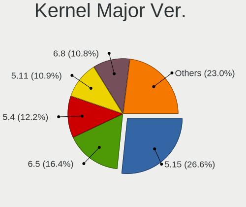
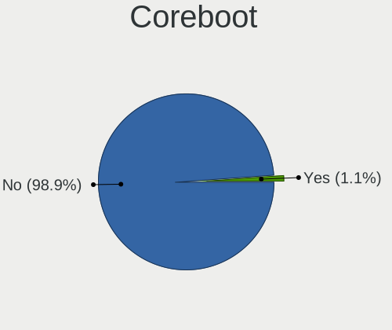
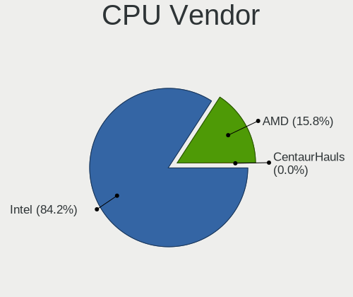
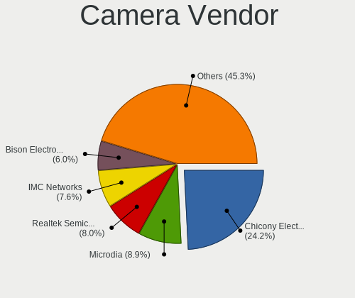

Zorin - Tested Hardware & Statistics (Notebooks)
------------------------------------------------

A project to collect tested hardware configurations for Zorin.

Anyone can contribute to this report by the [hw-probe](https://github.com/linuxhw/hw-probe) tool:

    sudo -E hw-probe -all -upload

Please contribute! Especially if your hardware is rare.

Contents
--------

* [ Test Cases ](#test-cases)

* [ System ](#system)
  - [ OS                       ](#os)
  - [ OS Family                ](#os-family)
  - [ Kernel                   ](#kernel)
  - [ Kernel Family            ](#kernel-family)
  - [ Kernel Major Ver.        ](#kernel-major-ver)
  - [ Arch                     ](#arch)
  - [ DE                       ](#de)
  - [ Display Server           ](#display-server)
  - [ Display Manager          ](#display-manager)
  - [ OS Lang                  ](#os-lang)
  - [ Boot Mode                ](#boot-mode)
  - [ Filesystem               ](#filesystem)
  - [ Part. scheme             ](#part-scheme)
  - [ Dual Boot with Linux/BSD ](#dual-boot-with-linuxbsd)
  - [ Dual Boot (Win)          ](#dual-boot-win)

* [ Board ](#board)
  - [ Vendor                   ](#vendor)
  - [ Model                    ](#model)
  - [ Model Family             ](#model-family)
  - [ MFG Year                 ](#mfg-year)
  - [ Form Factor              ](#form-factor)
  - [ Secure Boot              ](#secure-boot)
  - [ Coreboot                 ](#coreboot)
  - [ RAM Size                 ](#ram-size)
  - [ RAM Used                 ](#ram-used)
  - [ Total Drives             ](#total-drives)
  - [ Has CD-ROM               ](#has-cd-rom)
  - [ Has Ethernet             ](#has-ethernet)
  - [ Has WiFi                 ](#has-wifi)
  - [ Has Bluetooth            ](#has-bluetooth)

* [ Location ](#location)
  - [ Country                  ](#country)
  - [ City                     ](#city)

* [ Drives ](#drives)
  - [ Drive Vendor             ](#drive-vendor)
  - [ Drive Model              ](#drive-model)
  - [ HDD Vendor               ](#hdd-vendor)
  - [ SSD Vendor               ](#ssd-vendor)
  - [ Drive Kind               ](#drive-kind)
  - [ Drive Connector          ](#drive-connector)
  - [ Drive Size               ](#drive-size)
  - [ Space Total              ](#space-total)
  - [ Space Used               ](#space-used)
  - [ Malfunc. Drives          ](#malfunc-drives)
  - [ Malfunc. Drive Vendor    ](#malfunc-drive-vendor)
  - [ Malfunc. HDD Vendor      ](#malfunc-hdd-vendor)
  - [ Malfunc. Drive Kind      ](#malfunc-drive-kind)
  - [ Failed Drives            ](#failed-drives)
  - [ Failed Drive Vendor      ](#failed-drive-vendor)
  - [ Drive Status             ](#drive-status)

* [ Storage controller ](#storage-controller)
  - [ Storage Vendor           ](#storage-vendor)
  - [ Storage Model            ](#storage-model)
  - [ Storage Kind             ](#storage-kind)

* [ Processor ](#processor)
  - [ CPU Vendor               ](#cpu-vendor)
  - [ CPU Model                ](#cpu-model)
  - [ CPU Model Family         ](#cpu-model-family)
  - [ CPU Cores                ](#cpu-cores)
  - [ CPU Sockets              ](#cpu-sockets)
  - [ CPU Threads              ](#cpu-threads)
  - [ CPU Op-Modes             ](#cpu-op-modes)
  - [ CPU Microcode            ](#cpu-microcode)
  - [ CPU Microarch            ](#cpu-microarch)

* [ Graphics ](#graphics)
  - [ GPU Vendor               ](#gpu-vendor)
  - [ GPU Model                ](#gpu-model)
  - [ GPU Combo                ](#gpu-combo)
  - [ GPU Driver               ](#gpu-driver)
  - [ GPU Memory               ](#gpu-memory)

* [ Monitor ](#monitor)
  - [ Monitor Vendor           ](#monitor-vendor)
  - [ Monitor Model            ](#monitor-model)
  - [ Monitor Resolution       ](#monitor-resolution)
  - [ Monitor Diagonal         ](#monitor-diagonal)
  - [ Monitor Width            ](#monitor-width)
  - [ Aspect Ratio             ](#aspect-ratio)
  - [ Monitor Area             ](#monitor-area)
  - [ Pixel Density            ](#pixel-density)
  - [ Multiple Monitors        ](#multiple-monitors)

* [ Network ](#network)
  - [ Net Controller Vendor    ](#net-controller-vendor)
  - [ Net Controller Model     ](#net-controller-model)
  - [ Wireless Vendor          ](#wireless-vendor)
  - [ Wireless Model           ](#wireless-model)
  - [ Ethernet Vendor          ](#ethernet-vendor)
  - [ Ethernet Model           ](#ethernet-model)
  - [ Net Controller Kind      ](#net-controller-kind)
  - [ Used Controller          ](#used-controller)
  - [ NICs                     ](#nics)
  - [ IPv6                     ](#ipv6)

* [ Bluetooth ](#bluetooth)
  - [ Bluetooth Vendor         ](#bluetooth-vendor)
  - [ Bluetooth Model          ](#bluetooth-model)

* [ Sound ](#sound)
  - [ Sound Vendor             ](#sound-vendor)
  - [ Sound Model              ](#sound-model)

* [ Memory ](#memory)
  - [ Memory Vendor            ](#memory-vendor)
  - [ Memory Model             ](#memory-model)
  - [ Memory Kind              ](#memory-kind)
  - [ Memory Form Factor       ](#memory-form-factor)
  - [ Memory Size              ](#memory-size)
  - [ Memory Speed             ](#memory-speed)

* [ Printers & scanners ](#printers--scanners)
  - [ Printer Vendor           ](#printer-vendor)
  - [ Printer Model            ](#printer-model)
  - [ Scanner Vendor           ](#scanner-vendor)
  - [ Scanner Model            ](#scanner-model)

* [ Camera ](#camera)
  - [ Camera Vendor            ](#camera-vendor)
  - [ Camera Model             ](#camera-model)

* [ Security ](#security)
  - [ Fingerprint Vendor       ](#fingerprint-vendor)
  - [ Fingerprint Model        ](#fingerprint-model)
  - [ Chipcard Vendor          ](#chipcard-vendor)
  - [ Chipcard Model           ](#chipcard-model)

* [ Unsupported ](#unsupported)
  - [ Unsupported Devices      ](#unsupported-devices)
  - [ Unsupported Device Types ](#unsupported-device-types)

Test Cases
----------

Total: 5841

| Vendor        | Model                       | Probe                                                      | Date         |
|---------------|-----------------------------|------------------------------------------------------------|--------------|
| HP            | ProBook 650 G3              | [9bfb6a8afd](https://linux-hardware.org/?probe=9bfb6a8afd) | May 09, 2024 |
| HONOR         | BBR-WAX9                    | [be1a16a925](https://linux-hardware.org/?probe=be1a16a925) | May 09, 2024 |
| HONOR         | BBR-WAX9                    | [8c9db99956](https://linux-hardware.org/?probe=8c9db99956) | May 09, 2024 |
| Ultra         | UB42X                       | [b7f2dbd777](https://linux-hardware.org/?probe=b7f2dbd777) | May 09, 2024 |
| Ultra         | UB42X                       | [4597d0586d](https://linux-hardware.org/?probe=4597d0586d) | May 08, 2024 |
| Sony          | VPCEB1S1E                   | [551a1d2f64](https://linux-hardware.org/?probe=551a1d2f64) | May 08, 2024 |
| HP            | ProBook 6460b               | [14aa46f09d](https://linux-hardware.org/?probe=14aa46f09d) | May 08, 2024 |
| Infinix       | INBOOK Y1 PLUS NEO          | [253042bbd9](https://linux-hardware.org/?probe=253042bbd9) | May 08, 2024 |
| Sony          | VGN-CR31S_W                 | [7e7d96c020](https://linux-hardware.org/?probe=7e7d96c020) | May 08, 2024 |
| ASUSTek       | VivoBook_ASUSLaptop M160... | [b18d2c1ec2](https://linux-hardware.org/?probe=b18d2c1ec2) | May 08, 2024 |
| Lenovo        | G580 20150                  | [3a9861e2be](https://linux-hardware.org/?probe=3a9861e2be) | May 08, 2024 |
| Lenovo        | ThinkPad Edge 031946U       | [8f8fb39c6e](https://linux-hardware.org/?probe=8f8fb39c6e) | May 08, 2024 |
| NEC Comput... | PC-LS350SSB                 | [530b3713dd](https://linux-hardware.org/?probe=530b3713dd) | May 08, 2024 |
| ASUSTek       | X540SA                      | [456909c790](https://linux-hardware.org/?probe=456909c790) | May 08, 2024 |
| Samsung       | 530XBB                      | [5c0772cde4](https://linux-hardware.org/?probe=5c0772cde4) | May 07, 2024 |
| Lenovo        | ThinkPad Edge E530c 3366... | [d4d583a573](https://linux-hardware.org/?probe=d4d583a573) | May 07, 2024 |
| Fujitsu       | LIFEBOOK U7510              | [a52ed98e85](https://linux-hardware.org/?probe=a52ed98e85) | May 07, 2024 |
| Daten Tecn... | DT02-M4                     | [88093023ed](https://linux-hardware.org/?probe=88093023ed) | May 07, 2024 |
| SCHNEIDER     | SCL141CTP                   | [ce0a785c29](https://linux-hardware.org/?probe=ce0a785c29) | May 07, 2024 |
| ASUSTek       | Zenbook S 13 UX5304VA_UX... | [1c72c07e3d](https://linux-hardware.org/?probe=1c72c07e3d) | May 07, 2024 |
| ASUSTek       | S451LA                      | [f3720aa6f9](https://linux-hardware.org/?probe=f3720aa6f9) | May 07, 2024 |
| Alienware     | m15 R7                      | [445b29da20](https://linux-hardware.org/?probe=445b29da20) | May 06, 2024 |
| Lenovo        | E31-80 80MX                 | [1c9fd17eff](https://linux-hardware.org/?probe=1c9fd17eff) | May 06, 2024 |
| Dell          | Latitude E5410              | [0038eadd32](https://linux-hardware.org/?probe=0038eadd32) | May 06, 2024 |
| Notebook      | NS5x_NS7xPU                 | [657a003a54](https://linux-hardware.org/?probe=657a003a54) | May 06, 2024 |
| HP            | Pavilion 15                 | [77f8425176](https://linux-hardware.org/?probe=77f8425176) | May 06, 2024 |
| ASUSTek       | P2540UA                     | [ea9ddf3f6e](https://linux-hardware.org/?probe=ea9ddf3f6e) | May 06, 2024 |
| Dell          | Inspiron N4050              | [0b1ac68bc9](https://linux-hardware.org/?probe=0b1ac68bc9) | May 06, 2024 |
| HP            | Laptop 14-fq0xxx            | [528dc99ca7](https://linux-hardware.org/?probe=528dc99ca7) | May 05, 2024 |
| Dell          | Latitude 3420               | [a28c6852fe](https://linux-hardware.org/?probe=a28c6852fe) | May 05, 2024 |
| Lenovo        | Flex 3-1130 80LY            | [3786d9e8e2](https://linux-hardware.org/?probe=3786d9e8e2) | May 05, 2024 |
| Acer          | Aspire A315-510P            | [eb9fc84dcf](https://linux-hardware.org/?probe=eb9fc84dcf) | May 05, 2024 |
| HP            | Notebook                    | [27cafe3bf5](https://linux-hardware.org/?probe=27cafe3bf5) | May 05, 2024 |
| Lenovo        | IdeaPad 710S Plus-13IKB ... | [b950303950](https://linux-hardware.org/?probe=b950303950) | May 04, 2024 |
| Lenovo        | IdeaPad 710S Plus-13IKB ... | [f4e6daf83f](https://linux-hardware.org/?probe=f4e6daf83f) | May 04, 2024 |
| Samsung       | 270E5J/2570EJ               | [1349bac413](https://linux-hardware.org/?probe=1349bac413) | May 04, 2024 |
| HP            | ProBook 645 G1              | [02d7e5f984](https://linux-hardware.org/?probe=02d7e5f984) | May 04, 2024 |
| HP            | 1000                        | [c2783cbe1f](https://linux-hardware.org/?probe=c2783cbe1f) | May 04, 2024 |
| Lenovo        | IdeaPad Slim 5 16ABR8 82... | [bcb2994b33](https://linux-hardware.org/?probe=bcb2994b33) | May 04, 2024 |
| Dell          | Latitude E5520              | [0c2c1716be](https://linux-hardware.org/?probe=0c2c1716be) | May 04, 2024 |
| Toshiba       | Satellite A200              | [81e6cf4d6e](https://linux-hardware.org/?probe=81e6cf4d6e) | May 04, 2024 |
| Toshiba       | Satellite L55t-A            | [9197d3146e](https://linux-hardware.org/?probe=9197d3146e) | May 03, 2024 |
| Lenovo        | Yoga 2 13 20344             | [5b40331b05](https://linux-hardware.org/?probe=5b40331b05) | May 03, 2024 |
| Lenovo        | ThinkPad Edge 031946U       | [192d9bc00a](https://linux-hardware.org/?probe=192d9bc00a) | May 03, 2024 |
| Lenovo        | Yoga 2 13 20344             | [440bf944f3](https://linux-hardware.org/?probe=440bf944f3) | May 03, 2024 |
| Dell          | Latitude 3420               | [e0415e052f](https://linux-hardware.org/?probe=e0415e052f) | May 03, 2024 |
| HP            | Pavilion dv5                | [2ca3da2cdd](https://linux-hardware.org/?probe=2ca3da2cdd) | May 03, 2024 |
| HP            | Pavilion dv5                | [fadfece0f4](https://linux-hardware.org/?probe=fadfece0f4) | May 03, 2024 |
| Proline       | V1165C4                     | [b9571382ea](https://linux-hardware.org/?probe=b9571382ea) | May 02, 2024 |
| HP            | 15 Notebook PC              | [675934d0b6](https://linux-hardware.org/?probe=675934d0b6) | May 02, 2024 |
| HP            | Pavilion 10 TS              | [eb83dcddc9](https://linux-hardware.org/?probe=eb83dcddc9) | May 02, 2024 |
| HP            | Pavilion Notebook           | [2fc15c8d5c](https://linux-hardware.org/?probe=2fc15c8d5c) | May 02, 2024 |
| HP            | Pavilion 10 TS              | [e7b477dda5](https://linux-hardware.org/?probe=e7b477dda5) | May 02, 2024 |
| HP            | Pavilion 10 TS              | [b0b8ae831e](https://linux-hardware.org/?probe=b0b8ae831e) | May 02, 2024 |
| HP            | Pavilion Laptop 14-ec1xx... | [0983506014](https://linux-hardware.org/?probe=0983506014) | May 01, 2024 |
| Lenovo        | ThinkPad X200s 7469W92      | [687cc00e33](https://linux-hardware.org/?probe=687cc00e33) | May 01, 2024 |
| Lenovo        | IdeaPad S145-15IWL 81S9     | [890bf7c3a6](https://linux-hardware.org/?probe=890bf7c3a6) | May 01, 2024 |
| Lenovo        | Legion 7 16ITHg6 82K6       | [d118bb6622](https://linux-hardware.org/?probe=d118bb6622) | May 01, 2024 |
| Acer          | TravelMate 4060             | [5bbfc69ef7](https://linux-hardware.org/?probe=5bbfc69ef7) | May 01, 2024 |
| Dell          | Precision 3551              | [1dc964b6fb](https://linux-hardware.org/?probe=1dc964b6fb) | Apr 30, 2024 |
| HP            | Notebook                    | [1fd0f0caa7](https://linux-hardware.org/?probe=1fd0f0caa7) | Apr 30, 2024 |
| MSI           | Sword 15 A12VE              | [90ad4b4438](https://linux-hardware.org/?probe=90ad4b4438) | Apr 30, 2024 |
| Packard Be... | EasyNote LJ61               | [9d19962863](https://linux-hardware.org/?probe=9d19962863) | Apr 30, 2024 |
| Packard Be... | EasyNote LJ61               | [6a1a6f046a](https://linux-hardware.org/?probe=6a1a6f046a) | Apr 30, 2024 |
| Dell          | System Vostro 3450          | [eede1fda8a](https://linux-hardware.org/?probe=eede1fda8a) | Apr 30, 2024 |
| Panasonic     | CF-31WFL72LM                | [4699837ff5](https://linux-hardware.org/?probe=4699837ff5) | Apr 30, 2024 |
| Panasonic     | CF-31WFL72LM                | [efe2e1be70](https://linux-hardware.org/?probe=efe2e1be70) | Apr 30, 2024 |
| Lenovo        | IdeaPad 330-15IKB 81DE      | [fc7d5ed265](https://linux-hardware.org/?probe=fc7d5ed265) | Apr 29, 2024 |
| Lenovo        | IdeaPad 330-15IKB 81DE      | [b6a512b4fc](https://linux-hardware.org/?probe=b6a512b4fc) | Apr 29, 2024 |
| Lenovo        | B50-80 80EW                 | [5f20d3fde3](https://linux-hardware.org/?probe=5f20d3fde3) | Apr 29, 2024 |
| Dell          | Inspiron 5558               | [843f3962e2](https://linux-hardware.org/?probe=843f3962e2) | Apr 29, 2024 |
| Acer          | Aspire ES1-512              | [2663c13afc](https://linux-hardware.org/?probe=2663c13afc) | Apr 29, 2024 |
| Alienware     | m15 R7                      | [ab03c1cde2](https://linux-hardware.org/?probe=ab03c1cde2) | Apr 29, 2024 |
| HP            | Pavilion dm4                | [30eee9e9d3](https://linux-hardware.org/?probe=30eee9e9d3) | Apr 28, 2024 |
| HUAWEI        | HVY-WXX9                    | [6f9f3a855d](https://linux-hardware.org/?probe=6f9f3a855d) | Apr 28, 2024 |
| ASUSTek       | X202E                       | [f782bac9e8](https://linux-hardware.org/?probe=f782bac9e8) | Apr 28, 2024 |
| Acer          | Aspire ES1-512              | [87f1fc413c](https://linux-hardware.org/?probe=87f1fc413c) | Apr 28, 2024 |
| HUAWEI        | HVY-WXX9                    | [1f145f5fb5](https://linux-hardware.org/?probe=1f145f5fb5) | Apr 28, 2024 |
| HP            | ProBook 450 G1              | [9c5d161110](https://linux-hardware.org/?probe=9c5d161110) | Apr 28, 2024 |
| Avell High... | Avell G1513 MUV / A52 MU... | [2abfc3ebc0](https://linux-hardware.org/?probe=2abfc3ebc0) | Apr 28, 2024 |
| Lenovo        | ThinkPad X395 20NMS1KY02    | [48385039f1](https://linux-hardware.org/?probe=48385039f1) | Apr 28, 2024 |
| HP            | EliteBook Folio 9470m       | [0d587f3e64](https://linux-hardware.org/?probe=0d587f3e64) | Apr 27, 2024 |
| HP            | EliteBook Folio 9470m       | [30d9ddd3f9](https://linux-hardware.org/?probe=30d9ddd3f9) | Apr 27, 2024 |
| HP            | ENVY TS m6 Sleekbook        | [a428d5e1d9](https://linux-hardware.org/?probe=a428d5e1d9) | Apr 27, 2024 |
| ACCENT        | SMART 140                   | [49fb07fe3f](https://linux-hardware.org/?probe=49fb07fe3f) | Apr 27, 2024 |
| MSI           | Sword 15 A12VE              | [54953e1bae](https://linux-hardware.org/?probe=54953e1bae) | Apr 27, 2024 |
| Acer          | Aspire 5738                 | [a7b22c04c8](https://linux-hardware.org/?probe=a7b22c04c8) | Apr 27, 2024 |
| HP            | ProBook 440 G6              | [3cf105c072](https://linux-hardware.org/?probe=3cf105c072) | Apr 26, 2024 |
| Dell          | Latitude E5520              | [6e98bca2be](https://linux-hardware.org/?probe=6e98bca2be) | Apr 26, 2024 |
| HP            | ProBook 440 G5              | [cbf7dfdd07](https://linux-hardware.org/?probe=cbf7dfdd07) | Apr 26, 2024 |
| Lenovo        | ThinkPad L460 20FVS1BK00    | [cc79277a36](https://linux-hardware.org/?probe=cc79277a36) | Apr 26, 2024 |
| Gigabyte      | W251U                       | [ae6076979a](https://linux-hardware.org/?probe=ae6076979a) | Apr 25, 2024 |
| Apple         | MacBookPro9,2               | [583ea6bc03](https://linux-hardware.org/?probe=583ea6bc03) | Apr 25, 2024 |
| Dell          | Latitude E6540              | [270b868041](https://linux-hardware.org/?probe=270b868041) | Apr 25, 2024 |
| ASUSTek       | ASUS TUF Gaming F15 FX50... | [d6249f9918](https://linux-hardware.org/?probe=d6249f9918) | Apr 25, 2024 |
| Apple         | MacBookPro9,2               | [f5622b9451](https://linux-hardware.org/?probe=f5622b9451) | Apr 25, 2024 |
| Unknown       | Unknown                     | [849147f4a5](https://linux-hardware.org/?probe=849147f4a5) | Apr 25, 2024 |
| HP            | 1000                        | [dee2aa2dd9](https://linux-hardware.org/?probe=dee2aa2dd9) | Apr 25, 2024 |
| ASUSTek       | K52JU                       | [418274ccd0](https://linux-hardware.org/?probe=418274ccd0) | Apr 25, 2024 |
| BANGHO        | MOV                         | [bb71d25f54](https://linux-hardware.org/?probe=bb71d25f54) | Apr 25, 2024 |
| Apple         | MacBookPro9,2               | [d4f3102f5c](https://linux-hardware.org/?probe=d4f3102f5c) | Apr 25, 2024 |
| NEC Comput... | PC-LS350SSW                 | [a0abb6c6a6](https://linux-hardware.org/?probe=a0abb6c6a6) | Apr 24, 2024 |
| Apple         | MacBookPro9,2               | [bc2a0115a8](https://linux-hardware.org/?probe=bc2a0115a8) | Apr 24, 2024 |
| Dell          | Inspiron 17-7779            | [4d2fec89a1](https://linux-hardware.org/?probe=4d2fec89a1) | Apr 24, 2024 |
| Lenovo        | ThinkPad T570 20H90002RI    | [eeccbdaf2a](https://linux-hardware.org/?probe=eeccbdaf2a) | Apr 24, 2024 |
| ASUSTek       | ROG Strix G814JI_G814JI     | [e7bd7e1534](https://linux-hardware.org/?probe=e7bd7e1534) | Apr 24, 2024 |
| Unknown       | F42                         | [947c137825](https://linux-hardware.org/?probe=947c137825) | Apr 23, 2024 |
| Apple         | MacBookPro8,2               | [34c23ebcd8](https://linux-hardware.org/?probe=34c23ebcd8) | Apr 23, 2024 |
| Acer          | Aspire E5-575T              | [d91600e2a3](https://linux-hardware.org/?probe=d91600e2a3) | Apr 22, 2024 |
| Lenovo        | G580 20150                  | [3b93c96edd](https://linux-hardware.org/?probe=3b93c96edd) | Apr 22, 2024 |
| Dell          | XPS MXC062                  | [3d7326b94d](https://linux-hardware.org/?probe=3d7326b94d) | Apr 22, 2024 |
| Dell          | XPS MXC062                  | [d217b8e5ee](https://linux-hardware.org/?probe=d217b8e5ee) | Apr 22, 2024 |
| Samsung       | 300E5EV/300E4EV/270E5EV/... | [e499f5d301](https://linux-hardware.org/?probe=e499f5d301) | Apr 22, 2024 |
| Lenovo        | G470 20078                  | [63d40af7a3](https://linux-hardware.org/?probe=63d40af7a3) | Apr 21, 2024 |
| ASUSTek       | K75VM                       | [c863c3ba6b](https://linux-hardware.org/?probe=c863c3ba6b) | Apr 21, 2024 |
| HP            | Laptop 14-fq0xxx            | [6dc8bf5698](https://linux-hardware.org/?probe=6dc8bf5698) | Apr 21, 2024 |
| Dell          | Inspiron 5570               | [84b68b02bf](https://linux-hardware.org/?probe=84b68b02bf) | Apr 21, 2024 |
| HP            | Laptop 15-fc0xxx            | [49d3f7118d](https://linux-hardware.org/?probe=49d3f7118d) | Apr 21, 2024 |
| Lenovo        | ThinkPad E490 20N8A01YGI    | [a9c83df6f3](https://linux-hardware.org/?probe=a9c83df6f3) | Apr 20, 2024 |
| HP            | ZBook 15 G2                 | [af8df0069b](https://linux-hardware.org/?probe=af8df0069b) | Apr 20, 2024 |
| Teclast       | F6 Plus                     | [58aa179f3b](https://linux-hardware.org/?probe=58aa179f3b) | Apr 20, 2024 |
| HP            | ProBook 645 G4              | [5e0b981c4f](https://linux-hardware.org/?probe=5e0b981c4f) | Apr 20, 2024 |
| Dell          | Latitude E5520              | [1cc2969282](https://linux-hardware.org/?probe=1cc2969282) | Apr 20, 2024 |
| HP            | ProBook 4310s               | [9a51586fe9](https://linux-hardware.org/?probe=9a51586fe9) | Apr 20, 2024 |
| Dell          | Latitude E6430              | [6c19db1434](https://linux-hardware.org/?probe=6c19db1434) | Apr 20, 2024 |
| Acer          | Aspire A315-21              | [c05d2f5d20](https://linux-hardware.org/?probe=c05d2f5d20) | Apr 19, 2024 |
| Mediacom      | SmartBook Pro i5            | [fdc40cdd18](https://linux-hardware.org/?probe=fdc40cdd18) | Apr 19, 2024 |
| Tactus        | GeoBook 140                 | [aa4d027e01](https://linux-hardware.org/?probe=aa4d027e01) | Apr 19, 2024 |
| Dell          | Latitude E5420              | [f937473451](https://linux-hardware.org/?probe=f937473451) | Apr 19, 2024 |
| Lenovo        | G700 20251                  | [6f7a2c121a](https://linux-hardware.org/?probe=6f7a2c121a) | Apr 19, 2024 |
| Packard Be... | EasyNote TE69KB             | [ae940fd7b0](https://linux-hardware.org/?probe=ae940fd7b0) | Apr 18, 2024 |
| Packard Be... | EasyNote TE69KB             | [4d615a62ea](https://linux-hardware.org/?probe=4d615a62ea) | Apr 18, 2024 |
| Dell          | Latitude E6400              | [02a9b84151](https://linux-hardware.org/?probe=02a9b84151) | Apr 17, 2024 |
| ASUSTek       | M51Va                       | [2279fdf28b](https://linux-hardware.org/?probe=2279fdf28b) | Apr 17, 2024 |
| ASUSTek       | M51Va                       | [e2aa27e175](https://linux-hardware.org/?probe=e2aa27e175) | Apr 17, 2024 |
| HP            | ProBook 6560b               | [5ea8af85bf](https://linux-hardware.org/?probe=5ea8af85bf) | Apr 17, 2024 |
| Packard Be... | EasyNote TM86               | [05f38c567b](https://linux-hardware.org/?probe=05f38c567b) | Apr 17, 2024 |
| HP            | ENVY Laptop 17-cw0xxx       | [c1ac91bae5](https://linux-hardware.org/?probe=c1ac91bae5) | Apr 16, 2024 |
| Acer          | Aspire A515-43              | [fcd5e8e59d](https://linux-hardware.org/?probe=fcd5e8e59d) | Apr 16, 2024 |
| Acer          | Swift SFG14-41              | [6fc0fc2e0c](https://linux-hardware.org/?probe=6fc0fc2e0c) | Apr 16, 2024 |
| Samsung       | 750XED                      | [fee3c81bf3](https://linux-hardware.org/?probe=fee3c81bf3) | Apr 16, 2024 |
| Lenovo        | ThinkPad L470 W10DG 20JV... | [9f2e93f394](https://linux-hardware.org/?probe=9f2e93f394) | Apr 16, 2024 |
| Apple         | MacBookPro11,1              | [528d3a590f](https://linux-hardware.org/?probe=528d3a590f) | Apr 16, 2024 |
| Medion        | E5218                       | [62b09e7720](https://linux-hardware.org/?probe=62b09e7720) | Apr 16, 2024 |
| Apple         | MacBookPro9,2               | [8ffae057e8](https://linux-hardware.org/?probe=8ffae057e8) | Apr 15, 2024 |
| HP            | Pavilion dv6                | [b914c1b7f6](https://linux-hardware.org/?probe=b914c1b7f6) | Apr 15, 2024 |
| ASUSTek       | X551CA                      | [d050fff27d](https://linux-hardware.org/?probe=d050fff27d) | Apr 15, 2024 |
| Lenovo        | Legion 5 15IMH05H 81Y6      | [5785462109](https://linux-hardware.org/?probe=5785462109) | Apr 14, 2024 |
| Dell          | XPS 15 9550                 | [22d857c49c](https://linux-hardware.org/?probe=22d857c49c) | Apr 14, 2024 |
| Lenovo        | ThinkPad L470 W10DG 20JV... | [531ad46b31](https://linux-hardware.org/?probe=531ad46b31) | Apr 14, 2024 |
| Dell          | Latitude 3440               | [e334ba82e5](https://linux-hardware.org/?probe=e334ba82e5) | Apr 14, 2024 |
| Dell          | Latitude 3440               | [77e2af784e](https://linux-hardware.org/?probe=77e2af784e) | Apr 14, 2024 |
| Apple         | MacBookPro11,1              | [58b2e77917](https://linux-hardware.org/?probe=58b2e77917) | Apr 14, 2024 |
| HP            | Pavilion dv6000 (GM695LA... | [21796df3a5](https://linux-hardware.org/?probe=21796df3a5) | Apr 14, 2024 |
| Unknown       | Unknown                     | [b6ce023a2a](https://linux-hardware.org/?probe=b6ce023a2a) | Apr 13, 2024 |
| Razer         | Blade 14 - RZ09-0370        | [caa72afe3c](https://linux-hardware.org/?probe=caa72afe3c) | Apr 13, 2024 |
| Lenovo        | IdeaPad 5 14ITL05 82FE      | [351fd4ce06](https://linux-hardware.org/?probe=351fd4ce06) | Apr 13, 2024 |
| ASUSTek       | E402SA                      | [5266b4e65d](https://linux-hardware.org/?probe=5266b4e65d) | Apr 13, 2024 |
| Samsung       | R519/R719                   | [236c296c4d](https://linux-hardware.org/?probe=236c296c4d) | Apr 13, 2024 |
| Acer          | Aspire A315-510P            | [07844c11ad](https://linux-hardware.org/?probe=07844c11ad) | Apr 13, 2024 |
| Dell          | Inspiron 1521               | [0eae25d659](https://linux-hardware.org/?probe=0eae25d659) | Apr 13, 2024 |
| HP            | EliteBook 840 G3            | [5b025453c2](https://linux-hardware.org/?probe=5b025453c2) | Apr 13, 2024 |
| Acer          | E1-510                      | [a3809aca83](https://linux-hardware.org/?probe=a3809aca83) | Apr 13, 2024 |
| Acer          | Aspire 5715Z                | [25a3bb97f8](https://linux-hardware.org/?probe=25a3bb97f8) | Apr 13, 2024 |
| ASUSTek       | VivoBook_ASUSLaptop X415... | [983a566cbf](https://linux-hardware.org/?probe=983a566cbf) | Apr 13, 2024 |
| ASUSTek       | N552VW                      | [02c36db055](https://linux-hardware.org/?probe=02c36db055) | Apr 12, 2024 |
| Acer          | Aspire 8943G                | [02488e8ac4](https://linux-hardware.org/?probe=02488e8ac4) | Apr 12, 2024 |
| HP            | Victus by Gaming Laptop ... | [e0ff52d20a](https://linux-hardware.org/?probe=e0ff52d20a) | Apr 12, 2024 |
| HP            | Victus by Gaming Laptop ... | [580425d3b2](https://linux-hardware.org/?probe=580425d3b2) | Apr 12, 2024 |
| HP            | ProBook 650 G1              | [6bdfe181ea](https://linux-hardware.org/?probe=6bdfe181ea) | Apr 12, 2024 |
| Dell          | Inspiron 5770               | [ae5ccdd8ac](https://linux-hardware.org/?probe=ae5ccdd8ac) | Apr 12, 2024 |
| Lenovo        | G550 2958                   | [2cebfc34df](https://linux-hardware.org/?probe=2cebfc34df) | Apr 12, 2024 |
| Lenovo        | ThinkPad T520 4243F53       | [9996ba8710](https://linux-hardware.org/?probe=9996ba8710) | Apr 12, 2024 |
| Toshiba       | Satellite S55t-A            | [83f4844e2a](https://linux-hardware.org/?probe=83f4844e2a) | Apr 12, 2024 |
| HP            | 15 Notebook PC              | [875d44f61b](https://linux-hardware.org/?probe=875d44f61b) | Apr 12, 2024 |
| HP            | 15                          | [4f0433464d](https://linux-hardware.org/?probe=4f0433464d) | Apr 12, 2024 |
| ASUSTek       | G752VY                      | [039e830652](https://linux-hardware.org/?probe=039e830652) | Apr 11, 2024 |
| Positivo      | J14KR11                     | [f6a61def89](https://linux-hardware.org/?probe=f6a61def89) | Apr 11, 2024 |
| Toshiba       | TECRA Z40-C                 | [8d6c663fc1](https://linux-hardware.org/?probe=8d6c663fc1) | Apr 11, 2024 |
| Dell          | Inspiron 5770               | [6cb8fb3865](https://linux-hardware.org/?probe=6cb8fb3865) | Apr 11, 2024 |
| Dell          | Inspiron N5010              | [e820d6337a](https://linux-hardware.org/?probe=e820d6337a) | Apr 11, 2024 |
| Avell High... | Avell G1513 MUV / A52 MU... | [839c6f47f8](https://linux-hardware.org/?probe=839c6f47f8) | Apr 11, 2024 |
| ASUSTek       | N552VW                      | [981a9ddf63](https://linux-hardware.org/?probe=981a9ddf63) | Apr 11, 2024 |
| Dell          | Latitude E5550              | [bd812fbe85](https://linux-hardware.org/?probe=bd812fbe85) | Apr 10, 2024 |
| Dell          | Vostro 2421                 | [0ba1cc79bc](https://linux-hardware.org/?probe=0ba1cc79bc) | Apr 10, 2024 |
| Dell          | Latitude 5500               | [59a70a843f](https://linux-hardware.org/?probe=59a70a843f) | Apr 10, 2024 |
| Dell          | Inspiron 5570               | [fa8ded5b0e](https://linux-hardware.org/?probe=fa8ded5b0e) | Apr 10, 2024 |
| Dell          | Vostro 2421                 | [905003a077](https://linux-hardware.org/?probe=905003a077) | Apr 10, 2024 |
| Lenovo        | U310                        | [e8e1dce51e](https://linux-hardware.org/?probe=e8e1dce51e) | Apr 10, 2024 |
| Lenovo        | U310                        | [fba6029f49](https://linux-hardware.org/?probe=fba6029f49) | Apr 10, 2024 |
| Lenovo        | ThinkPad T470s W10DG 20J... | [32010db3bd](https://linux-hardware.org/?probe=32010db3bd) | Apr 09, 2024 |
| Dell          | Inspiron N5010              | [7fe3c3fa19](https://linux-hardware.org/?probe=7fe3c3fa19) | Apr 09, 2024 |
| ASUSTek       | VivoBook_ASUSLaptop X512... | [24377a30f1](https://linux-hardware.org/?probe=24377a30f1) | Apr 09, 2024 |
| HP            | Pavilion dm4                | [5df83aab55](https://linux-hardware.org/?probe=5df83aab55) | Apr 09, 2024 |
| ASUSTek       | VivoBook_ASUSLaptop X512... | [fbf6dbe5f2](https://linux-hardware.org/?probe=fbf6dbe5f2) | Apr 09, 2024 |
| MSI           | Katana 15 B13VGK            | [a4a53a031a](https://linux-hardware.org/?probe=a4a53a031a) | Apr 09, 2024 |
| Lenovo        | IdeaPadFlex 15 20309        | [4b373f33aa](https://linux-hardware.org/?probe=4b373f33aa) | Apr 08, 2024 |
| Apple         | MacBookPro9,2               | [39dff10b12](https://linux-hardware.org/?probe=39dff10b12) | Apr 08, 2024 |
| MSI           | PR600                       | [ae78fa3936](https://linux-hardware.org/?probe=ae78fa3936) | Apr 08, 2024 |
| Teclast       | F15                         | [fdbca364e4](https://linux-hardware.org/?probe=fdbca364e4) | Apr 08, 2024 |
| Teclast       | F15                         | [a36f18a41b](https://linux-hardware.org/?probe=a36f18a41b) | Apr 08, 2024 |
| Lenovo        | ThinkPad T440p 20AN006GU... | [eb5a1b8ef9](https://linux-hardware.org/?probe=eb5a1b8ef9) | Apr 08, 2024 |
| Lenovo        | ThinkPad T440p 20AN006GU... | [14bede5648](https://linux-hardware.org/?probe=14bede5648) | Apr 08, 2024 |
| ASUSTek       | ASUS TUF Dash F15 FX516P... | [35d9b4afce](https://linux-hardware.org/?probe=35d9b4afce) | Apr 07, 2024 |
| ASUSTek       | ASUS TUF Dash F15 FX516P... | [490787ceee](https://linux-hardware.org/?probe=490787ceee) | Apr 07, 2024 |
| Samsung       | R530/R730                   | [edc9fc5a6f](https://linux-hardware.org/?probe=edc9fc5a6f) | Apr 07, 2024 |
| HP            | Pavilion dv6                | [bc5b62eec9](https://linux-hardware.org/?probe=bc5b62eec9) | Apr 06, 2024 |
| Lenovo        | IdeaPad 3 17ABA7 82RQ       | [b87b1a20b9](https://linux-hardware.org/?probe=b87b1a20b9) | Apr 06, 2024 |
| MSI           | GT70 2PE                    | [13f21446e0](https://linux-hardware.org/?probe=13f21446e0) | Apr 06, 2024 |
| MSI           | CX600                       | [a8d66c3a93](https://linux-hardware.org/?probe=a8d66c3a93) | Apr 06, 2024 |
| MSI           | CX600                       | [edf0e2393f](https://linux-hardware.org/?probe=edf0e2393f) | Apr 06, 2024 |
| Dell          | Latitude E7440              | [dbc6236ae1](https://linux-hardware.org/?probe=dbc6236ae1) | Apr 06, 2024 |
| Dell          | Inspiron 5770               | [2c6ced3f53](https://linux-hardware.org/?probe=2c6ced3f53) | Apr 06, 2024 |
| Lenovo        | 14w Gen 2 82N8              | [918db0c202](https://linux-hardware.org/?probe=918db0c202) | Apr 05, 2024 |
| Dell          | Studio 1747                 | [33e2d94187](https://linux-hardware.org/?probe=33e2d94187) | Apr 05, 2024 |
| Lenovo        | 14w Gen 2 82N8              | [07d45eb08b](https://linux-hardware.org/?probe=07d45eb08b) | Apr 05, 2024 |
| Packard Be... | EasyNote LS11HR             | [3d77de9e9d](https://linux-hardware.org/?probe=3d77de9e9d) | Apr 05, 2024 |
| MSI           | Katana 15 B13VGK            | [c5099db6ec](https://linux-hardware.org/?probe=c5099db6ec) | Apr 05, 2024 |
| HP            | Pavilion Notebook           | [819d681431](https://linux-hardware.org/?probe=819d681431) | Apr 05, 2024 |
| TODOS INDU... | Aprix_2022_V1               | [97ae5afa87](https://linux-hardware.org/?probe=97ae5afa87) | Apr 05, 2024 |
| Dell          | XPS 15 9570                 | [5121a12ba5](https://linux-hardware.org/?probe=5121a12ba5) | Apr 05, 2024 |
| Lenovo        | ThinkPad T460s 20F9003GU... | [497b326dc9](https://linux-hardware.org/?probe=497b326dc9) | Apr 04, 2024 |
| Acer          | Aspire 5750                 | [ee4bb4963a](https://linux-hardware.org/?probe=ee4bb4963a) | Apr 04, 2024 |
| HP            | G62                         | [1c70131cdf](https://linux-hardware.org/?probe=1c70131cdf) | Apr 04, 2024 |
| HUAWEI        | YTF-XXX                     | [0ca4e52c33](https://linux-hardware.org/?probe=0ca4e52c33) | Apr 04, 2024 |
| Google        | Landrid                     | [d4b1948b6a](https://linux-hardware.org/?probe=d4b1948b6a) | Apr 04, 2024 |
| Sony          | VPCS131FM                   | [6065941e59](https://linux-hardware.org/?probe=6065941e59) | Apr 04, 2024 |
| Dell          | Latitude E7470              | [ea70b2caa0](https://linux-hardware.org/?probe=ea70b2caa0) | Apr 04, 2024 |
| HUAWEI        | YTF-XXX                     | [d1703a058f](https://linux-hardware.org/?probe=d1703a058f) | Apr 04, 2024 |
| Positivo      | C14CR01                     | [a707fed87d](https://linux-hardware.org/?probe=a707fed87d) | Apr 03, 2024 |
| Toshiba       | NB520                       | [d347b22da0](https://linux-hardware.org/?probe=d347b22da0) | Apr 03, 2024 |
| ASUSTek       | VivoBook_ASUSLaptop K660... | [eb3179b973](https://linux-hardware.org/?probe=eb3179b973) | Apr 03, 2024 |
| HUAWEI        | KLVF-XX                     | [16fc53e7bb](https://linux-hardware.org/?probe=16fc53e7bb) | Apr 03, 2024 |
| HP            | Notebook                    | [7ed4d5435b](https://linux-hardware.org/?probe=7ed4d5435b) | Apr 03, 2024 |
| HP            | EliteBook 840 G5            | [66c82e0097](https://linux-hardware.org/?probe=66c82e0097) | Apr 02, 2024 |
| Acer          | Swift SFX14-71G             | [c9acd12744](https://linux-hardware.org/?probe=c9acd12744) | Apr 02, 2024 |
| HP            | Notebook                    | [cefd396a65](https://linux-hardware.org/?probe=cefd396a65) | Apr 02, 2024 |
| Apple         | MacBookPro9,2               | [9c392ce1f2](https://linux-hardware.org/?probe=9c392ce1f2) | Apr 02, 2024 |
| Dell          | System XPS L502X            | [78f6ea571d](https://linux-hardware.org/?probe=78f6ea571d) | Apr 02, 2024 |
| HP            | ProBook 6570b               | [cf9fba8256](https://linux-hardware.org/?probe=cf9fba8256) | Apr 01, 2024 |
| HP            | ProBook 6570b               | [a26b2f6f54](https://linux-hardware.org/?probe=a26b2f6f54) | Apr 01, 2024 |
| Dell          | Inspiron 5448               | [34d0f4de88](https://linux-hardware.org/?probe=34d0f4de88) | Apr 01, 2024 |
| Apple         | MacBookPro9,2               | [cccef069f7](https://linux-hardware.org/?probe=cccef069f7) | Apr 01, 2024 |
| HP            | ProBook 4540s               | [c641dc440f](https://linux-hardware.org/?probe=c641dc440f) | Mar 31, 2024 |
| Dell          | Inspiron 1525               | [774bbfd144](https://linux-hardware.org/?probe=774bbfd144) | Mar 31, 2024 |
| Dell          | Latitude 7480               | [0ab21a354e](https://linux-hardware.org/?probe=0ab21a354e) | Mar 31, 2024 |
| HP            | ProBook 4540s               | [c50c3376e9](https://linux-hardware.org/?probe=c50c3376e9) | Mar 31, 2024 |
| Lenovo        | ThinkPad T14 Gen 1 20S00... | [083640b754](https://linux-hardware.org/?probe=083640b754) | Mar 31, 2024 |
| HP            | 15                          | [e1c7ccf97a](https://linux-hardware.org/?probe=e1c7ccf97a) | Mar 31, 2024 |
| TODOS INDU... | Aprix_2022_V1               | [e5e980e4f5](https://linux-hardware.org/?probe=e5e980e4f5) | Mar 30, 2024 |
| ASUSTek       | ROG Strix G713PI_G713PI     | [9577fddfae](https://linux-hardware.org/?probe=9577fddfae) | Mar 30, 2024 |
| ASUSTek       | K73SD                       | [4002cbf0dd](https://linux-hardware.org/?probe=4002cbf0dd) | Mar 30, 2024 |
| Lenovo        | VIWZ1                       | [c62b77ffa8](https://linux-hardware.org/?probe=c62b77ffa8) | Mar 30, 2024 |
| Lenovo        | VIWZ1                       | [8ab6be2fcb](https://linux-hardware.org/?probe=8ab6be2fcb) | Mar 30, 2024 |
| Toshiba       | TECRA Z40-C                 | [91bd726aad](https://linux-hardware.org/?probe=91bd726aad) | Mar 30, 2024 |
| ASUSTek       | S451LA                      | [bc6298d214](https://linux-hardware.org/?probe=bc6298d214) | Mar 29, 2024 |
| Acer          | Aspire A515-45              | [3333f04923](https://linux-hardware.org/?probe=3333f04923) | Mar 29, 2024 |
| Sony          | VPCY11S1E                   | [905655032f](https://linux-hardware.org/?probe=905655032f) | Mar 29, 2024 |
| Lenovo        | IdeaPad S145-15IKB 81VD     | [01ec795558](https://linux-hardware.org/?probe=01ec795558) | Mar 29, 2024 |
| Lenovo        | ThinkPad X220 429137G       | [07863dff89](https://linux-hardware.org/?probe=07863dff89) | Mar 29, 2024 |
| HP            | EliteBook 8760w             | [5666dfc34e](https://linux-hardware.org/?probe=5666dfc34e) | Mar 29, 2024 |
| MSI           | GF63 Thin 11UC              | [a3d6e9239d](https://linux-hardware.org/?probe=a3d6e9239d) | Mar 29, 2024 |
| ASUSTek       | VivoBook_ASUSLaptop M150... | [568697e488](https://linux-hardware.org/?probe=568697e488) | Mar 28, 2024 |
| Apple         | MacBookPro11,3              | [b90fd9c218](https://linux-hardware.org/?probe=b90fd9c218) | Mar 28, 2024 |
| Lenovo        | ThinkPad E470 20H1006KGE    | [494ac5439c](https://linux-hardware.org/?probe=494ac5439c) | Mar 28, 2024 |
| Samsung       | 730U3E/740U3E               | [cbadd5a34d](https://linux-hardware.org/?probe=cbadd5a34d) | Mar 28, 2024 |
| FW00152       | Unknown                     | [aefa8aa487](https://linux-hardware.org/?probe=aefa8aa487) | Mar 28, 2024 |
| FW00152       | Unknown                     | [5ae4c0edc0](https://linux-hardware.org/?probe=5ae4c0edc0) | Mar 28, 2024 |
| Lenovo        | IdeaPad 1 14IGL7 82V6       | [45dd079807](https://linux-hardware.org/?probe=45dd079807) | Mar 27, 2024 |
| Dell          | G15 5530                    | [e2421ca4e6](https://linux-hardware.org/?probe=e2421ca4e6) | Mar 27, 2024 |
| ASUSTek       | VivoBook_ASUSLaptop K650... | [78e0afbb5f](https://linux-hardware.org/?probe=78e0afbb5f) | Mar 27, 2024 |
| Dell          | Inspiron 17-7779            | [deecf7220f](https://linux-hardware.org/?probe=deecf7220f) | Mar 27, 2024 |
| HP            | ProBook 650 G3              | [4f8758ae5b](https://linux-hardware.org/?probe=4f8758ae5b) | Mar 27, 2024 |
| Proline       | V1165C4                     | [026d6324c2](https://linux-hardware.org/?probe=026d6324c2) | Mar 27, 2024 |
| ASUSTek       | VivoBook 15_ASUS Laptop ... | [87c9d49e4d](https://linux-hardware.org/?probe=87c9d49e4d) | Mar 27, 2024 |
| ASUSTek       | VivoBook 15_ASUS Laptop ... | [029e810271](https://linux-hardware.org/?probe=029e810271) | Mar 27, 2024 |
| Dell          | Inspiron 5537               | [f081fc7478](https://linux-hardware.org/?probe=f081fc7478) | Mar 26, 2024 |
| HP            | 255 15.6 inch G10           | [4fb9cfdc6b](https://linux-hardware.org/?probe=4fb9cfdc6b) | Mar 26, 2024 |
| HP            | ProBook 650 G3              | [bed68c1872](https://linux-hardware.org/?probe=bed68c1872) | Mar 26, 2024 |
| HP            | Laptop 14-cf2xxx            | [4f85864b8b](https://linux-hardware.org/?probe=4f85864b8b) | Mar 26, 2024 |
| Dell          | Inspiron 5537               | [bbe46521b3](https://linux-hardware.org/?probe=bbe46521b3) | Mar 26, 2024 |
| HP            | Compaq CQ58                 | [bfe7fd8a2e](https://linux-hardware.org/?probe=bfe7fd8a2e) | Mar 26, 2024 |
| Dell          | Vostro 1550                 | [e022440d75](https://linux-hardware.org/?probe=e022440d75) | Mar 26, 2024 |
| Chuwi         | HeroBook Pro                | [32fa9dc29b](https://linux-hardware.org/?probe=32fa9dc29b) | Mar 26, 2024 |
| HP            | Compaq CQ58                 | [806d659258](https://linux-hardware.org/?probe=806d659258) | Mar 26, 2024 |
| Dell          | System XPS L502X            | [d5930c810f](https://linux-hardware.org/?probe=d5930c810f) | Mar 26, 2024 |
| Dell          | System XPS L502X            | [8ccefaf9d8](https://linux-hardware.org/?probe=8ccefaf9d8) | Mar 25, 2024 |
| Toshiba       | Satellite Pro L500          | [61988ef678](https://linux-hardware.org/?probe=61988ef678) | Mar 25, 2024 |
| Lenovo        | IdeaPad 1 15AMN7 82VG       | [f0a5bd62b5](https://linux-hardware.org/?probe=f0a5bd62b5) | Mar 25, 2024 |
| Lenovo        | IdeaPad 1 15AMN7 82VG       | [9234465ff0](https://linux-hardware.org/?probe=9234465ff0) | Mar 25, 2024 |
| Lenovo        | G50-80 80E5                 | [0545e1229e](https://linux-hardware.org/?probe=0545e1229e) | Mar 25, 2024 |
| Toshiba       | Satellite L355D             | [fd8ddd8b99](https://linux-hardware.org/?probe=fd8ddd8b99) | Mar 25, 2024 |
| HP            | Pavilion Laptop 17-ar0xx    | [bd8b34f997](https://linux-hardware.org/?probe=bd8b34f997) | Mar 25, 2024 |
| HP            | Pavilion Laptop 17-ar0xx    | [cc1081606b](https://linux-hardware.org/?probe=cc1081606b) | Mar 25, 2024 |
| Dell          | XPS 15 9500                 | [eebe4dd8a0](https://linux-hardware.org/?probe=eebe4dd8a0) | Mar 25, 2024 |
| Toshiba       | IS 1413G                    | [782f26bdde](https://linux-hardware.org/?probe=782f26bdde) | Mar 25, 2024 |
| Dell          | XPS 15 9500                 | [aca396f8b2](https://linux-hardware.org/?probe=aca396f8b2) | Mar 24, 2024 |
| HP            | ProBook 445 G7              | [5586958ad8](https://linux-hardware.org/?probe=5586958ad8) | Mar 24, 2024 |
| ASUSTek       | N53SM                       | [bcb219bdc4](https://linux-hardware.org/?probe=bcb219bdc4) | Mar 24, 2024 |
| HUAWEI        | NBM-WXX9                    | [ef8c9d2a46](https://linux-hardware.org/?probe=ef8c9d2a46) | Mar 24, 2024 |
| HUAWEI        | NBM-WXX9                    | [91a269a388](https://linux-hardware.org/?probe=91a269a388) | Mar 24, 2024 |
| Fujitsu       | LIFEBOOK S760               | [9ef9218d97](https://linux-hardware.org/?probe=9ef9218d97) | Mar 24, 2024 |
| HP            | EliteBook 840 G2            | [b911c5e72d](https://linux-hardware.org/?probe=b911c5e72d) | Mar 24, 2024 |
| HP            | Pavilion dv5                | [72da06e33c](https://linux-hardware.org/?probe=72da06e33c) | Mar 24, 2024 |
| Lenovo        | ThinkPad X230 2325PB3       | [399c0cd75c](https://linux-hardware.org/?probe=399c0cd75c) | Mar 23, 2024 |
| Apple         | MacBookPro14,1              | [c52682f980](https://linux-hardware.org/?probe=c52682f980) | Mar 23, 2024 |
| HP            | 15                          | [139e556699](https://linux-hardware.org/?probe=139e556699) | Mar 23, 2024 |
| Positivo      | Q232A                       | [46c3ff72eb](https://linux-hardware.org/?probe=46c3ff72eb) | Mar 23, 2024 |
| Positivo      | Q232A                       | [924bb4b4ee](https://linux-hardware.org/?probe=924bb4b4ee) | Mar 23, 2024 |
| ASUSTek       | VivoBook_ASUSLaptop X513... | [aaafb945bc](https://linux-hardware.org/?probe=aaafb945bc) | Mar 23, 2024 |
| Acer          | Aspire 4739                 | [cdcf8bfc41](https://linux-hardware.org/?probe=cdcf8bfc41) | Mar 23, 2024 |
| Lenovo        | ThinkPad L15 Gen 2a 20X8... | [3bb5d80e00](https://linux-hardware.org/?probe=3bb5d80e00) | Mar 22, 2024 |
| Samsung       | 350V5C/351V5C/3540VC/344... | [e582f6599b](https://linux-hardware.org/?probe=e582f6599b) | Mar 22, 2024 |
| ASUSTek       | Zenbook UM3402YAR_UM3402... | [90a25e637e](https://linux-hardware.org/?probe=90a25e637e) | Mar 21, 2024 |
| Dell          | Latitude E7240              | [bac4c4e0b9](https://linux-hardware.org/?probe=bac4c4e0b9) | Mar 21, 2024 |
| Samsung       | 350V5C/351V5C/3540VC/344... | [0c5fd0d8b3](https://linux-hardware.org/?probe=0c5fd0d8b3) | Mar 21, 2024 |
| Proline       | V1165C4                     | [757853d7fb](https://linux-hardware.org/?probe=757853d7fb) | Mar 21, 2024 |
| Google        | Magma                       | [8fe3986816](https://linux-hardware.org/?probe=8fe3986816) | Mar 20, 2024 |
| Schenker      | VISION (M23)                | [aeb80131e2](https://linux-hardware.org/?probe=aeb80131e2) | Mar 20, 2024 |
| Apple         | MacBook8,1                  | [fa8342132f](https://linux-hardware.org/?probe=fa8342132f) | Mar 20, 2024 |
| Apple         | MacBook8,1                  | [ac828c20cd](https://linux-hardware.org/?probe=ac828c20cd) | Mar 20, 2024 |
| Multilaser    | UB32X                       | [ef0be1fa36](https://linux-hardware.org/?probe=ef0be1fa36) | Mar 20, 2024 |
| Lenovo        | IdeaPad 3 15ITL6 82H8       | [03577ae940](https://linux-hardware.org/?probe=03577ae940) | Mar 19, 2024 |
| HP            | Pavilion HDX9000            | [e8aa45f301](https://linux-hardware.org/?probe=e8aa45f301) | Mar 19, 2024 |
| HP            | Pavilion HDX9000            | [0c3e10d249](https://linux-hardware.org/?probe=0c3e10d249) | Mar 19, 2024 |
| HP            | ZBook Studio G4             | [2f191d4ac2](https://linux-hardware.org/?probe=2f191d4ac2) | Mar 19, 2024 |
| Dell          | Latitude E7240              | [4b2cf432cb](https://linux-hardware.org/?probe=4b2cf432cb) | Mar 19, 2024 |
| Acer          | Aspire E1-422               | [e6ff98fb07](https://linux-hardware.org/?probe=e6ff98fb07) | Mar 19, 2024 |
| Toshiba       | Satellite C70D-A            | [11c353f181](https://linux-hardware.org/?probe=11c353f181) | Mar 18, 2024 |
| HP            | Compaq 6715s (KE068ET#AB... | [93f757d8b3](https://linux-hardware.org/?probe=93f757d8b3) | Mar 18, 2024 |
| Dell          | System XPS L502X            | [64b806b993](https://linux-hardware.org/?probe=64b806b993) | Mar 18, 2024 |
| Lenovo        | ThinkPad T480s 20L8S15P0... | [f15cb961e4](https://linux-hardware.org/?probe=f15cb961e4) | Mar 18, 2024 |
| TUXEDO        | Aura 15 Gen3                | [a984970bae](https://linux-hardware.org/?probe=a984970bae) | Mar 18, 2024 |
| Unknown       | Unknown                     | [30e63ff201](https://linux-hardware.org/?probe=30e63ff201) | Mar 18, 2024 |
| Unknown       | Unknown                     | [966cd696a4](https://linux-hardware.org/?probe=966cd696a4) | Mar 18, 2024 |
| Apple         | MacBookAir3,2               | [1e9279f941](https://linux-hardware.org/?probe=1e9279f941) | Mar 18, 2024 |
| ASUSTek       | K42F                        | [f36df8e399](https://linux-hardware.org/?probe=f36df8e399) | Mar 18, 2024 |
| mPTech        | ARC 11.6 64GB HD            | [da2be1e542](https://linux-hardware.org/?probe=da2be1e542) | Mar 17, 2024 |
| HP            | Pavilion Gaming Laptop 1... | [5026966312](https://linux-hardware.org/?probe=5026966312) | Mar 17, 2024 |
| HP            | Bloog                       | [4f0506526f](https://linux-hardware.org/?probe=4f0506526f) | Mar 17, 2024 |
| HP            | EliteBook 840 G3            | [1de394a543](https://linux-hardware.org/?probe=1de394a543) | Mar 17, 2024 |
| Dell          | Inspiron 3443               | [6f40825570](https://linux-hardware.org/?probe=6f40825570) | Mar 17, 2024 |
| Toshiba       | IS 1414                     | [2a7e7dd16f](https://linux-hardware.org/?probe=2a7e7dd16f) | Mar 17, 2024 |
| Acer          | Nitro AN515-42              | [76fa1af5db](https://linux-hardware.org/?probe=76fa1af5db) | Mar 17, 2024 |
| HP            | Pavilion dv6000 (GF677EA... | [ecbe5ffb1f](https://linux-hardware.org/?probe=ecbe5ffb1f) | Mar 16, 2024 |
| ASUSTek       | U6Sg                        | [6780a94d1c](https://linux-hardware.org/?probe=6780a94d1c) | Mar 16, 2024 |
| Unknown       | Unknown                     | [7c385c1bef](https://linux-hardware.org/?probe=7c385c1bef) | Mar 16, 2024 |
| Medion        | E4251                       | [e85db20237](https://linux-hardware.org/?probe=e85db20237) | Mar 16, 2024 |
| Dell          | Latitude E6440              | [671e5faa4f](https://linux-hardware.org/?probe=671e5faa4f) | Mar 16, 2024 |
| Dell          | Latitude 7290               | [0f5ec462bd](https://linux-hardware.org/?probe=0f5ec462bd) | Mar 15, 2024 |
| Dell          | Latitude 7290               | [a06e62383a](https://linux-hardware.org/?probe=a06e62383a) | Mar 15, 2024 |
| Fujitsu       | LIFEBOOK E756               | [8e592e6500](https://linux-hardware.org/?probe=8e592e6500) | Mar 15, 2024 |
| Lenovo        | ThinkPad T410 2537PW4       | [29306b301d](https://linux-hardware.org/?probe=29306b301d) | Mar 15, 2024 |
| HP            | Pavilion g6                 | [992ebee68f](https://linux-hardware.org/?probe=992ebee68f) | Mar 15, 2024 |
| Samsung       | 940XFG                      | [b60ac199c7](https://linux-hardware.org/?probe=b60ac199c7) | Mar 15, 2024 |
| Samsung       | 940XFG                      | [2698d3e097](https://linux-hardware.org/?probe=2698d3e097) | Mar 15, 2024 |
| Apple         | MacBookPro11,1              | [e8882adc5a](https://linux-hardware.org/?probe=e8882adc5a) | Mar 14, 2024 |
| Apple         | MacBook9,1                  | [b8bbc1b9c0](https://linux-hardware.org/?probe=b8bbc1b9c0) | Mar 14, 2024 |
| Schenker      | VISION (M23)                | [63d77f6e25](https://linux-hardware.org/?probe=63d77f6e25) | Mar 14, 2024 |
| HP            | ProBook 650 G1              | [65b7eba2bc](https://linux-hardware.org/?probe=65b7eba2bc) | Mar 14, 2024 |
| Dell          | Inspiron N4030              | [294acdea48](https://linux-hardware.org/?probe=294acdea48) | Mar 14, 2024 |
| Dell          | Inspiron N4030              | [d5de19c3e5](https://linux-hardware.org/?probe=d5de19c3e5) | Mar 14, 2024 |
| Apple         | MacBookPro11,1              | [22fa6eee3e](https://linux-hardware.org/?probe=22fa6eee3e) | Mar 14, 2024 |
| Dell          | Inspiron 3542               | [9fb06fb797](https://linux-hardware.org/?probe=9fb06fb797) | Mar 13, 2024 |
| Apple         | MacBook5,2                  | [e482eea403](https://linux-hardware.org/?probe=e482eea403) | Mar 13, 2024 |
| Apple         | MacBook5,2                  | [7e0aa86d1c](https://linux-hardware.org/?probe=7e0aa86d1c) | Mar 13, 2024 |
| Unknown       | Unknown                     | [385e38249f](https://linux-hardware.org/?probe=385e38249f) | Mar 13, 2024 |
| Acer          | Aspire 7740                 | [8d1809ffa7](https://linux-hardware.org/?probe=8d1809ffa7) | Mar 13, 2024 |
| Dell          | Precision 3551              | [ac0c79297b](https://linux-hardware.org/?probe=ac0c79297b) | Mar 12, 2024 |
| ASUSTek       | VivoBook_ASUSLaptop X712... | [8940a52b83](https://linux-hardware.org/?probe=8940a52b83) | Mar 12, 2024 |
| Unknown       | Unknown                     | [abdc4ff96c](https://linux-hardware.org/?probe=abdc4ff96c) | Mar 12, 2024 |
| HP            | Laptop 17-by3xxx            | [ee8e42ea8a](https://linux-hardware.org/?probe=ee8e42ea8a) | Mar 12, 2024 |
| Thomson       | N14C4SL64                   | [7a431d9150](https://linux-hardware.org/?probe=7a431d9150) | Mar 12, 2024 |
| HP            | Laptop 17-by3xxx            | [731cba5dc9](https://linux-hardware.org/?probe=731cba5dc9) | Mar 12, 2024 |
| Fujitsu       | LIFEBOOK U7510              | [b78e24d0f3](https://linux-hardware.org/?probe=b78e24d0f3) | Mar 11, 2024 |
| HP            | ProBook 650 G2              | [532a823ad7](https://linux-hardware.org/?probe=532a823ad7) | Mar 11, 2024 |
| HP            | Pavilion Gaming Laptop 1... | [deafbd3743](https://linux-hardware.org/?probe=deafbd3743) | Mar 11, 2024 |
| Dell          | Latitude E6520              | [2f62f1dde1](https://linux-hardware.org/?probe=2f62f1dde1) | Mar 11, 2024 |
| HP            | ZBook 14u G6                | [ff55623014](https://linux-hardware.org/?probe=ff55623014) | Mar 10, 2024 |
| Avell High... | Avell G1513 MUV / A52 MU... | [e41f767d2a](https://linux-hardware.org/?probe=e41f767d2a) | Mar 10, 2024 |
| HP            | ProBook 450 G6              | [6fb4193bc2](https://linux-hardware.org/?probe=6fb4193bc2) | Mar 10, 2024 |
| Sony          | VPCS131FM                   | [51b54e4b81](https://linux-hardware.org/?probe=51b54e4b81) | Mar 10, 2024 |
| Toshiba       | Satellite L650              | [46a8d42eaa](https://linux-hardware.org/?probe=46a8d42eaa) | Mar 10, 2024 |
| Acer          | Swift SFX14-71G             | [fa8515090c](https://linux-hardware.org/?probe=fa8515090c) | Mar 10, 2024 |
| Dell          | Inspiron N4050              | [aebd0ccbc7](https://linux-hardware.org/?probe=aebd0ccbc7) | Mar 10, 2024 |
| Lenovo        | ThinkPad T560 20FJS1FB03    | [15c3a25881](https://linux-hardware.org/?probe=15c3a25881) | Mar 10, 2024 |
| Unknown       | Unknown                     | [ad4e2e26c8](https://linux-hardware.org/?probe=ad4e2e26c8) | Mar 10, 2024 |
| Avell High... | Avell G1513 MUV / A52 MU... | [c82748fe8b](https://linux-hardware.org/?probe=c82748fe8b) | Mar 10, 2024 |
| Acer          | Aspire 9420                 | [ac85f8e229](https://linux-hardware.org/?probe=ac85f8e229) | Mar 09, 2024 |
| HP            | Elite x2 1012 G1            | [512c2aa7fe](https://linux-hardware.org/?probe=512c2aa7fe) | Mar 09, 2024 |
| Lenovo        | IdeaPad 3 17ALC6 82KV       | [6b11295c31](https://linux-hardware.org/?probe=6b11295c31) | Mar 09, 2024 |
| Acer          | Aspire 9410                 | [3307f5eede](https://linux-hardware.org/?probe=3307f5eede) | Mar 09, 2024 |
| HP            | 1000                        | [12df954c4d](https://linux-hardware.org/?probe=12df954c4d) | Mar 09, 2024 |
| HP            | Compaq 6715s (KE068ET#AB... | [bd5a3177a0](https://linux-hardware.org/?probe=bd5a3177a0) | Mar 09, 2024 |
| Lenovo        | ThinkPad T440s 20ARS2QF0... | [fdebc30141](https://linux-hardware.org/?probe=fdebc30141) | Mar 08, 2024 |
| HP            | EliteBook 8540p             | [c9b945f402](https://linux-hardware.org/?probe=c9b945f402) | Mar 08, 2024 |
| Sony          | VGN-FW21E                   | [618cb0b126](https://linux-hardware.org/?probe=618cb0b126) | Mar 08, 2024 |
| Sony          | VGN-FW21E                   | [8770642321](https://linux-hardware.org/?probe=8770642321) | Mar 08, 2024 |
| HP            | 2133                        | [262c68f9a7](https://linux-hardware.org/?probe=262c68f9a7) | Mar 08, 2024 |
| HP            | EliteBook 830 G5            | [e64e10b115](https://linux-hardware.org/?probe=e64e10b115) | Mar 08, 2024 |
| Dell          | Precision M4800             | [a3fd644ff6](https://linux-hardware.org/?probe=a3fd644ff6) | Mar 08, 2024 |
| Dell          | Precision M4800             | [2a11f6f14e](https://linux-hardware.org/?probe=2a11f6f14e) | Mar 08, 2024 |
| Unknown       | Unknown                     | [e4a0023214](https://linux-hardware.org/?probe=e4a0023214) | Mar 08, 2024 |
| HP            | Laptop 15s-du3xxx           | [d3e9bec32e](https://linux-hardware.org/?probe=d3e9bec32e) | Mar 08, 2024 |
| Apple         | MacBookPro10,2              | [14ec3be380](https://linux-hardware.org/?probe=14ec3be380) | Mar 08, 2024 |
| Positivo B... | VJFE42F11X-B1151H           | [dc3d9edffb](https://linux-hardware.org/?probe=dc3d9edffb) | Mar 07, 2024 |
| MACHINIST     | X99-RS9 V1.11               | [52886e70b7](https://linux-hardware.org/?probe=52886e70b7) | Mar 07, 2024 |
| ASUSTek       | X205TAW                     | [6ed323ca5c](https://linux-hardware.org/?probe=6ed323ca5c) | Mar 07, 2024 |
| Acer          | TravelMate 8571             | [fc248fb6b6](https://linux-hardware.org/?probe=fc248fb6b6) | Mar 07, 2024 |
| ASUSTek       | X205TAW                     | [2dd874e62c](https://linux-hardware.org/?probe=2dd874e62c) | Mar 07, 2024 |
| ASUSTek       | K46CM                       | [cea6814d2b](https://linux-hardware.org/?probe=cea6814d2b) | Mar 07, 2024 |
| ASUSTek       | K46CM                       | [6ebd0b1dfc](https://linux-hardware.org/?probe=6ebd0b1dfc) | Mar 07, 2024 |
| Lenovo        | ThinkPad T450s 20BX004QG... | [af2b0287ec](https://linux-hardware.org/?probe=af2b0287ec) | Mar 07, 2024 |
| Lenovo        | ThinkPad X1 Carbon 6th 2... | [e545b12914](https://linux-hardware.org/?probe=e545b12914) | Mar 07, 2024 |
| Toshiba       | Satellite C50D-A-133        | [65ea7ee4de](https://linux-hardware.org/?probe=65ea7ee4de) | Mar 07, 2024 |
| HP            | ZBook Fury 17.3 inch G8 ... | [0111e861f4](https://linux-hardware.org/?probe=0111e861f4) | Mar 07, 2024 |
| Samsung       | R530/R730                   | [4c11035f66](https://linux-hardware.org/?probe=4c11035f66) | Mar 06, 2024 |
| RuggedPC      | RuggedBookR15               | [1c2a04ab34](https://linux-hardware.org/?probe=1c2a04ab34) | Mar 06, 2024 |
| RuggedPC      | RuggedBookR15               | [bcdeba9b2d](https://linux-hardware.org/?probe=bcdeba9b2d) | Mar 06, 2024 |
| Acer          | Aspire M3-581G              | [7ab92d79ee](https://linux-hardware.org/?probe=7ab92d79ee) | Mar 06, 2024 |
| Lenovo        | V15-ADA 82C7                | [06c5a79ab1](https://linux-hardware.org/?probe=06c5a79ab1) | Mar 06, 2024 |
| HP            | Laptop 17-cp3xxx            | [41c4383dd9](https://linux-hardware.org/?probe=41c4383dd9) | Mar 06, 2024 |
| HP            | EliteBook 840 G1            | [a9efafb13a](https://linux-hardware.org/?probe=a9efafb13a) | Mar 06, 2024 |
| TongFang      | GM7PX0N                     | [632d2a6962](https://linux-hardware.org/?probe=632d2a6962) | Mar 06, 2024 |
| Lenovo        | IdeaPad 5 Pro 16IAH7 82S... | [e2265261d3](https://linux-hardware.org/?probe=e2265261d3) | Mar 05, 2024 |
| Packard Be... | EasyNote TS11HR             | [5eb3213d99](https://linux-hardware.org/?probe=5eb3213d99) | Mar 05, 2024 |
| Samsung       | 355V4C/355V4X/355V5C/355... | [0997073605](https://linux-hardware.org/?probe=0997073605) | Mar 05, 2024 |
| Samsung       | 355V4C/355V4X/355V5C/355... | [3c963fd772](https://linux-hardware.org/?probe=3c963fd772) | Mar 05, 2024 |
| Apple         | MacBookPro8,2               | [69e2309ef8](https://linux-hardware.org/?probe=69e2309ef8) | Mar 05, 2024 |
| TongFang      | GM7PX0N                     | [4282677961](https://linux-hardware.org/?probe=4282677961) | Mar 05, 2024 |
| Acer          | Extensa 5635ZG              | [736943715c](https://linux-hardware.org/?probe=736943715c) | Mar 04, 2024 |
| Acer          | Extensa 5635ZG              | [e32263435e](https://linux-hardware.org/?probe=e32263435e) | Mar 04, 2024 |
| HP            | ENVY m7                     | [deb9b0324a](https://linux-hardware.org/?probe=deb9b0324a) | Mar 04, 2024 |
| MSI           | GF63 Thin 11SC              | [488a665e56](https://linux-hardware.org/?probe=488a665e56) | Mar 04, 2024 |
| HP            | Laptop 17-ca0xxx            | [50206aadaf](https://linux-hardware.org/?probe=50206aadaf) | Mar 04, 2024 |
| HUAWEI        | NBLB-WAX9N                  | [b3142de854](https://linux-hardware.org/?probe=b3142de854) | Mar 04, 2024 |
| Dell          | Latitude E6420              | [e2242d6194](https://linux-hardware.org/?probe=e2242d6194) | Mar 04, 2024 |
| HP            | Laptop 17-ca0xxx            | [0560489c7e](https://linux-hardware.org/?probe=0560489c7e) | Mar 04, 2024 |
| Lenovo        | IdeaPad 1 15AMN7 82VG       | [e672a38e47](https://linux-hardware.org/?probe=e672a38e47) | Mar 04, 2024 |
| Dell          | Vostro 3550                 | [15e459747d](https://linux-hardware.org/?probe=15e459747d) | Mar 04, 2024 |
| Acer          | Aspire 5310                 | [5a8aa1f2f8](https://linux-hardware.org/?probe=5a8aa1f2f8) | Mar 03, 2024 |
| HP            | ProBook 6470b               | [db15714a99](https://linux-hardware.org/?probe=db15714a99) | Mar 03, 2024 |
| Acer          | Aspire A717-72G             | [2d278d552b](https://linux-hardware.org/?probe=2d278d552b) | Mar 03, 2024 |
| Lenovo        | V15 G2 ITL 82KB             | [d1cbfd27bc](https://linux-hardware.org/?probe=d1cbfd27bc) | Mar 03, 2024 |
| Lenovo        | IdeaPad S145-15API 81V7     | [f9efc24735](https://linux-hardware.org/?probe=f9efc24735) | Mar 03, 2024 |
| ASUSTek       | X555LF                      | [82af3e46f1](https://linux-hardware.org/?probe=82af3e46f1) | Mar 02, 2024 |
| Lenovo        | IdeaPad S145-15AST 81N3     | [c6dbf5f3c5](https://linux-hardware.org/?probe=c6dbf5f3c5) | Mar 02, 2024 |
| Apple         | MacBookPro5,3               | [20e198611e](https://linux-hardware.org/?probe=20e198611e) | Mar 02, 2024 |
| Lenovo        | G50-80 80E5                 | [eadb1ffe64](https://linux-hardware.org/?probe=eadb1ffe64) | Mar 01, 2024 |
| Lenovo        | IdeaPad 110-15ISK 80UD      | [beb30d1c82](https://linux-hardware.org/?probe=beb30d1c82) | Mar 01, 2024 |
| HP            | EliteBook 2530p             | [d4fdd36102](https://linux-hardware.org/?probe=d4fdd36102) | Mar 01, 2024 |
| ASUSTek       | E201NA                      | [39326f3b72](https://linux-hardware.org/?probe=39326f3b72) | Mar 01, 2024 |
| Medion        | E4251                       | [99fbdc8707](https://linux-hardware.org/?probe=99fbdc8707) | Feb 29, 2024 |
| HP            | EliteBook 8540p             | [b0205f013a](https://linux-hardware.org/?probe=b0205f013a) | Feb 29, 2024 |
| Dell          | Vostro 3360                 | [f981644866](https://linux-hardware.org/?probe=f981644866) | Feb 29, 2024 |
| HP            | Laptop 15-ef2xxx            | [aae4ff4009](https://linux-hardware.org/?probe=aae4ff4009) | Feb 29, 2024 |
| Samsung       | 300E5M/300E5L               | [2ba6cdb37b](https://linux-hardware.org/?probe=2ba6cdb37b) | Feb 28, 2024 |
| Dell          | Vostro 1500                 | [a1e50e7852](https://linux-hardware.org/?probe=a1e50e7852) | Feb 28, 2024 |
| MSI           | GF63 Thin 11UC              | [6e35a5e2b0](https://linux-hardware.org/?probe=6e35a5e2b0) | Feb 28, 2024 |
| HP            | Pavilion Sleekbook 14       | [9727db31ca](https://linux-hardware.org/?probe=9727db31ca) | Feb 28, 2024 |
| Dell          | Inspiron 5559               | [f4f2d5a42e](https://linux-hardware.org/?probe=f4f2d5a42e) | Feb 28, 2024 |
| Dell          | Inspiron 5559               | [a8565459dd](https://linux-hardware.org/?probe=a8565459dd) | Feb 28, 2024 |
| Apple         | MacBookAir7,1               | [1c13d9c5b2](https://linux-hardware.org/?probe=1c13d9c5b2) | Feb 28, 2024 |
| HP            | 14                          | [abadaf3341](https://linux-hardware.org/?probe=abadaf3341) | Feb 27, 2024 |
| Dell          | Latitude E7470              | [d4890f7ed2](https://linux-hardware.org/?probe=d4890f7ed2) | Feb 27, 2024 |
| HP            | Laptop 15-db0xxx            | [e199b6b976](https://linux-hardware.org/?probe=e199b6b976) | Feb 27, 2024 |
| HP            | Laptop 15-db0xxx            | [e280f2bae0](https://linux-hardware.org/?probe=e280f2bae0) | Feb 27, 2024 |
| HP            | Pavilion 17                 | [9bc5ed54e4](https://linux-hardware.org/?probe=9bc5ed54e4) | Feb 27, 2024 |
| HUAWEI        | NBD-WXX9                    | [a3e7bc047a](https://linux-hardware.org/?probe=a3e7bc047a) | Feb 27, 2024 |
| ASUSTek       | M50Vn                       | [65d6f947b1](https://linux-hardware.org/?probe=65d6f947b1) | Feb 26, 2024 |
| EVOO          | EV-C-125-3                  | [d452f3776a](https://linux-hardware.org/?probe=d452f3776a) | Feb 26, 2024 |
| Lenovo        | ThinkPad T480 20L5000UUS    | [79b3e2b85f](https://linux-hardware.org/?probe=79b3e2b85f) | Feb 26, 2024 |
| ASUSTek       | Zenbook UX3402VA_UX3402V... | [0812dc5f8e](https://linux-hardware.org/?probe=0812dc5f8e) | Feb 26, 2024 |
| HP            | EliteBook 840 G2            | [b4571bfd3b](https://linux-hardware.org/?probe=b4571bfd3b) | Feb 26, 2024 |
| ASUSTek       | Zenbook S 13 UX5304VA_UX... | [821a30868b](https://linux-hardware.org/?probe=821a30868b) | Feb 26, 2024 |
| ASUSTek       | Zenbook S 13 UX5304VA_UX... | [887c849b98](https://linux-hardware.org/?probe=887c849b98) | Feb 26, 2024 |
| Toshiba       | Satellite P55t-C            | [03e849c6a1](https://linux-hardware.org/?probe=03e849c6a1) | Feb 26, 2024 |
| Toshiba       | Satellite Pro C50-A-1EM     | [a0d0bf0a80](https://linux-hardware.org/?probe=a0d0bf0a80) | Feb 25, 2024 |
| HP            | ENVY Notebook               | [d3e8ab6282](https://linux-hardware.org/?probe=d3e8ab6282) | Feb 24, 2024 |
| ASUSTek       | Zenbook UX3404VA_Q420VA     | [f44261baba](https://linux-hardware.org/?probe=f44261baba) | Feb 24, 2024 |
| Lenovo        | ThinkPad W520 42844ZG       | [6731541710](https://linux-hardware.org/?probe=6731541710) | Feb 24, 2024 |
| Toshiba       | Satellite Pro C50-A-1EM     | [c398b93c14](https://linux-hardware.org/?probe=c398b93c14) | Feb 24, 2024 |
| Positivo      | Mobile                      | [2fb0a42611](https://linux-hardware.org/?probe=2fb0a42611) | Feb 24, 2024 |
| Acer          | Aspire A315-24P             | [6c3c6d683b](https://linux-hardware.org/?probe=6c3c6d683b) | Feb 24, 2024 |
| Google        | Blorb                       | [047010ad8c](https://linux-hardware.org/?probe=047010ad8c) | Feb 23, 2024 |
| HP            | Pavilion 17                 | [274b953249](https://linux-hardware.org/?probe=274b953249) | Feb 23, 2024 |
| HP            | 240 14 inch G9              | [54ea49a49a](https://linux-hardware.org/?probe=54ea49a49a) | Feb 23, 2024 |
| Lenovo        | B590 20206                  | [a20a26ce84](https://linux-hardware.org/?probe=a20a26ce84) | Feb 23, 2024 |
| Lenovo        | ThinkPad Edge 03285EG       | [aa07998977](https://linux-hardware.org/?probe=aa07998977) | Feb 23, 2024 |
| Lenovo        | ThinkPad X230 2325ZF9       | [f88c20db11](https://linux-hardware.org/?probe=f88c20db11) | Feb 23, 2024 |
| Acer          | Nitro AN515-44              | [f0b2b76ba7](https://linux-hardware.org/?probe=f0b2b76ba7) | Feb 23, 2024 |
| Lenovo        | G50-45 80MQ                 | [f45c20f5eb](https://linux-hardware.org/?probe=f45c20f5eb) | Feb 23, 2024 |
| Packard Be... | EasyNote TM85               | [6ba78b34a3](https://linux-hardware.org/?probe=6ba78b34a3) | Feb 22, 2024 |
| Lenovo        | IdeaPad 320-15IKB 80XL      | [65fb12c93f](https://linux-hardware.org/?probe=65fb12c93f) | Feb 22, 2024 |
| Sony          | VPCEH2N1E                   | [d5772fa494](https://linux-hardware.org/?probe=d5772fa494) | Feb 22, 2024 |
| Sony          | VPCEH2N1E                   | [608b477d0d](https://linux-hardware.org/?probe=608b477d0d) | Feb 22, 2024 |
| HP            | ProBook 4730s               | [84e5bf925d](https://linux-hardware.org/?probe=84e5bf925d) | Feb 22, 2024 |
| Notebook      | NS5x_NS7xAU                 | [bed908e80b](https://linux-hardware.org/?probe=bed908e80b) | Feb 21, 2024 |
| Fujitsu       | LIFEBOOK E449               | [fa2e018267](https://linux-hardware.org/?probe=fa2e018267) | Feb 21, 2024 |
| ASUSTek       | X501U                       | [1ebbe09ae2](https://linux-hardware.org/?probe=1ebbe09ae2) | Feb 21, 2024 |
| Lenovo        | IdeaPad 700-15ISK 80RU      | [d7f17aa5fd](https://linux-hardware.org/?probe=d7f17aa5fd) | Feb 21, 2024 |
| Toshiba       | Satellite P55t-B            | [a5bb579413](https://linux-hardware.org/?probe=a5bb579413) | Feb 21, 2024 |
| Lenovo        | ThinkPad T460 20FMS22Q00    | [cef24e671a](https://linux-hardware.org/?probe=cef24e671a) | Feb 20, 2024 |
| Acer          | Aspire 9420                 | [b45701bea6](https://linux-hardware.org/?probe=b45701bea6) | Feb 20, 2024 |
| Lenovo        | IdeaPad 3 15ALC6 82MF       | [6505abea2b](https://linux-hardware.org/?probe=6505abea2b) | Feb 20, 2024 |
| Lenovo        | ThinkPad X230 2325CY4       | [6491a02f07](https://linux-hardware.org/?probe=6491a02f07) | Feb 20, 2024 |
| Acer          | Aspire A315-24P             | [44c6111452](https://linux-hardware.org/?probe=44c6111452) | Feb 19, 2024 |
| HP            | Unknown                     | [9273430bbb](https://linux-hardware.org/?probe=9273430bbb) | Feb 19, 2024 |
| Lenovo        | ThinkPad T430s 2356LPG      | [7179df29bf](https://linux-hardware.org/?probe=7179df29bf) | Feb 19, 2024 |
| Acer          | Aspire 5532                 | [8c95bb0b06](https://linux-hardware.org/?probe=8c95bb0b06) | Feb 19, 2024 |
| Medion        | Akoya THE TOUCH 10          | [55af4d803a](https://linux-hardware.org/?probe=55af4d803a) | Feb 19, 2024 |
| Dell          | Inspiron 3583               | [ff9b94f97c](https://linux-hardware.org/?probe=ff9b94f97c) | Feb 19, 2024 |
| Acer          | Aspire A517-53              | [7b128fdd48](https://linux-hardware.org/?probe=7b128fdd48) | Feb 18, 2024 |
| HP            | Laptop 15-dw1xxx            | [f44ba8ac73](https://linux-hardware.org/?probe=f44ba8ac73) | Feb 18, 2024 |
| Toshiba       | Satellite C855-1W0          | [ea0ae771ec](https://linux-hardware.org/?probe=ea0ae771ec) | Feb 18, 2024 |
| Acer          | Swift SF314-54              | [a08666a01c](https://linux-hardware.org/?probe=a08666a01c) | Feb 18, 2024 |
| HP            | EliteBook 840 G2            | [74496a33f8](https://linux-hardware.org/?probe=74496a33f8) | Feb 18, 2024 |
| HP            | ZBook 17 G2                 | [0f64335601](https://linux-hardware.org/?probe=0f64335601) | Feb 18, 2024 |
| Dell          | Latitude E6410              | [89830fc67e](https://linux-hardware.org/?probe=89830fc67e) | Feb 18, 2024 |
| Lenovo        | IdeaPad L340-15API 81LW     | [f934645327](https://linux-hardware.org/?probe=f934645327) | Feb 17, 2024 |
| Dell          | Latitude E6410              | [a074f7ca62](https://linux-hardware.org/?probe=a074f7ca62) | Feb 17, 2024 |
| Lenovo        | Yoga 500-14IBD 80N4         | [c3bcfe1eee](https://linux-hardware.org/?probe=c3bcfe1eee) | Feb 17, 2024 |
| Dell          | System XPS L502X            | [b5a8cb21e7](https://linux-hardware.org/?probe=b5a8cb21e7) | Feb 17, 2024 |
| Samsung       | 930XDB/931XDB/930XDY        | [223a69e99f](https://linux-hardware.org/?probe=223a69e99f) | Feb 17, 2024 |
| Fujitsu       | LIFEBOOK A512               | [4113f4c4a8](https://linux-hardware.org/?probe=4113f4c4a8) | Feb 17, 2024 |
| HP            | Madoo                       | [06cd6045cd](https://linux-hardware.org/?probe=06cd6045cd) | Feb 17, 2024 |
| Acer          | Aspire 9420                 | [13ef1e26e9](https://linux-hardware.org/?probe=13ef1e26e9) | Feb 17, 2024 |
| Packard Be... | EasyNote TM85               | [df1899a28b](https://linux-hardware.org/?probe=df1899a28b) | Feb 16, 2024 |
| Dell          | System XPS L502X            | [0e7ad1a462](https://linux-hardware.org/?probe=0e7ad1a462) | Feb 16, 2024 |
| Dell          | Vostro 1500                 | [c6a22855f4](https://linux-hardware.org/?probe=c6a22855f4) | Feb 16, 2024 |
| Notebook      | P95_96_97Ex,Rx              | [b3549ef96d](https://linux-hardware.org/?probe=b3549ef96d) | Feb 16, 2024 |
| HP            | Pavilion dm3 Notebook PC    | [3e0f898cc8](https://linux-hardware.org/?probe=3e0f898cc8) | Feb 16, 2024 |
| Dell          | Precision 5760              | [ef46809f82](https://linux-hardware.org/?probe=ef46809f82) | Feb 16, 2024 |
| Dell          | Precision 5760              | [596105a102](https://linux-hardware.org/?probe=596105a102) | Feb 16, 2024 |
| HP            | ENVY Sleekbook 6 PC         | [1fa513616f](https://linux-hardware.org/?probe=1fa513616f) | Feb 16, 2024 |
| HP            | ENVY Sleekbook 6 PC         | [697d384203](https://linux-hardware.org/?probe=697d384203) | Feb 16, 2024 |
| ASUSTek       | VivoBook_ASUSLaptop X421... | [8dcedb7dea](https://linux-hardware.org/?probe=8dcedb7dea) | Feb 16, 2024 |
| Dell          | XPS 13 9380                 | [84485c262a](https://linux-hardware.org/?probe=84485c262a) | Feb 15, 2024 |
| Dell          | Latitude 7490               | [65ce0de8b5](https://linux-hardware.org/?probe=65ce0de8b5) | Feb 15, 2024 |
| Dell          | Studio XPS 1640             | [79baf0c0bf](https://linux-hardware.org/?probe=79baf0c0bf) | Feb 15, 2024 |
| Dell          | Latitude E7440              | [64e8b40f82](https://linux-hardware.org/?probe=64e8b40f82) | Feb 15, 2024 |
| Apple         | MacBookPro5,5               | [6ea4dd15da](https://linux-hardware.org/?probe=6ea4dd15da) | Feb 15, 2024 |
| Apple         | MacBookPro5,5               | [e23c7132d2](https://linux-hardware.org/?probe=e23c7132d2) | Feb 15, 2024 |
| MSI           | CR61 3M                     | [6a7b9ef9b5](https://linux-hardware.org/?probe=6a7b9ef9b5) | Feb 15, 2024 |
| Lenovo        | IdeaPad 500S-13ISK 80Q2     | [e6ae670af4](https://linux-hardware.org/?probe=e6ae670af4) | Feb 15, 2024 |
| Acer          | Aspire VX5-591G             | [ab712b6e6c](https://linux-hardware.org/?probe=ab712b6e6c) | Feb 14, 2024 |
| Acer          | Predator PH315-53           | [3c0f830342](https://linux-hardware.org/?probe=3c0f830342) | Feb 14, 2024 |
| HP            | Pavilion dv7                | [2eb4dfdcd4](https://linux-hardware.org/?probe=2eb4dfdcd4) | Feb 14, 2024 |
| Samsung       | 300E5M/300E5L               | [c3f528e22b](https://linux-hardware.org/?probe=c3f528e22b) | Feb 13, 2024 |
| Dell          | Latitude E6440              | [fa5a14dd0c](https://linux-hardware.org/?probe=fa5a14dd0c) | Feb 13, 2024 |
| Lenovo        | ThinkPad T460 20FMS22Q00    | [85e7855e2c](https://linux-hardware.org/?probe=85e7855e2c) | Feb 13, 2024 |
| Unknown       | W1415A                      | [a0c020f290](https://linux-hardware.org/?probe=a0c020f290) | Feb 13, 2024 |
| Acer          | Extensa 2510                | [06a4171f11](https://linux-hardware.org/?probe=06a4171f11) | Feb 13, 2024 |
| ASUSTek       | VivoBook_ASUSLaptop M160... | [79819299d1](https://linux-hardware.org/?probe=79819299d1) | Feb 13, 2024 |
| Dell          | XPS 13 9380                 | [60877f4bf7](https://linux-hardware.org/?probe=60877f4bf7) | Feb 12, 2024 |
| Lenovo        | G40-45 80E1                 | [23bd060420](https://linux-hardware.org/?probe=23bd060420) | Feb 12, 2024 |
| Lenovo        | IdeaPad 110-15ISK 80UD      | [71ad520752](https://linux-hardware.org/?probe=71ad520752) | Feb 12, 2024 |
| Lenovo        | ThinkPad T430s 2356G2U      | [1d52e2a841](https://linux-hardware.org/?probe=1d52e2a841) | Feb 12, 2024 |
| Lenovo        | ThinkPad T430s 2356G2U      | [8cd0c1b29a](https://linux-hardware.org/?probe=8cd0c1b29a) | Feb 12, 2024 |
| HP            | Notebook                    | [bdd85f3367](https://linux-hardware.org/?probe=bdd85f3367) | Feb 12, 2024 |
| AZW           | GT-R                        | [0d11177457](https://linux-hardware.org/?probe=0d11177457) | Feb 12, 2024 |
| Dell          | XPS 13 9380                 | [534eec7fca](https://linux-hardware.org/?probe=534eec7fca) | Feb 12, 2024 |
| Lenovo        | G50-70 20351                | [26a59a1a00](https://linux-hardware.org/?probe=26a59a1a00) | Feb 11, 2024 |
| HP            | 420                         | [810770c1ad](https://linux-hardware.org/?probe=810770c1ad) | Feb 11, 2024 |
| ASUSTek       | VivoBook_ASUSLaptop M140... | [a22b67cf36](https://linux-hardware.org/?probe=a22b67cf36) | Feb 11, 2024 |
| HP            | Laptop 14-ck0xxx            | [eb7f318e9b](https://linux-hardware.org/?probe=eb7f318e9b) | Feb 11, 2024 |
| Positivo      | N4350                       | [295e7d702b](https://linux-hardware.org/?probe=295e7d702b) | Feb 11, 2024 |
| Acer          | Nitro AN515-42              | [352247befa](https://linux-hardware.org/?probe=352247befa) | Feb 11, 2024 |
| Acer          | Aspire 5742G                | [513a3ecbf9](https://linux-hardware.org/?probe=513a3ecbf9) | Feb 10, 2024 |
| Apple         | MacBook9,1                  | [55780ffb72](https://linux-hardware.org/?probe=55780ffb72) | Feb 10, 2024 |
| Acer          | E1-510                      | [2299bd85ba](https://linux-hardware.org/?probe=2299bd85ba) | Feb 10, 2024 |
| Dell          | Latitude E6400              | [1173395b8b](https://linux-hardware.org/?probe=1173395b8b) | Feb 10, 2024 |
| Dell          | Inspiron N5110              | [4b01e8f0c4](https://linux-hardware.org/?probe=4b01e8f0c4) | Feb 10, 2024 |
| Lenovo        | ThinkPad T410 2537CF3       | [7be1e6e033](https://linux-hardware.org/?probe=7be1e6e033) | Feb 10, 2024 |
| ASUSTek       | VivoBook_ASUSLaptop K660... | [e648cf049c](https://linux-hardware.org/?probe=e648cf049c) | Feb 10, 2024 |
| HP            | 250 G7 Notebook PC          | [284bdb6d3c](https://linux-hardware.org/?probe=284bdb6d3c) | Feb 10, 2024 |
| ASUSTek       | K52Jc                       | [145dc41606](https://linux-hardware.org/?probe=145dc41606) | Feb 10, 2024 |
| HP            | ProBook 430 G1              | [191e61f6f6](https://linux-hardware.org/?probe=191e61f6f6) | Feb 09, 2024 |
| Lenovo        | ThinkPad Edge E545 20B20... | [f5fd1fd3ae](https://linux-hardware.org/?probe=f5fd1fd3ae) | Feb 09, 2024 |
| Lenovo        | IdeaPad 3 17ALC6 82KV       | [49f5211e0b](https://linux-hardware.org/?probe=49f5211e0b) | Feb 09, 2024 |
| Fujitsu       | LIFEBOOK E544               | [2cb0310c0f](https://linux-hardware.org/?probe=2cb0310c0f) | Feb 09, 2024 |
| Acer          | Aspire MM1-571              | [80545bb456](https://linux-hardware.org/?probe=80545bb456) | Feb 09, 2024 |
| Acer          | Aspire MM1-571              | [245bb8e32c](https://linux-hardware.org/?probe=245bb8e32c) | Feb 09, 2024 |
| Dell          | Latitude D630               | [3de4290e6a](https://linux-hardware.org/?probe=3de4290e6a) | Feb 09, 2024 |
| Lenovo        | ThinkPad T495 20NKS01Y00    | [23251492b8](https://linux-hardware.org/?probe=23251492b8) | Feb 09, 2024 |
| Dell          | Latitude D630               | [bb2c9bba3c](https://linux-hardware.org/?probe=bb2c9bba3c) | Feb 09, 2024 |
| Apple         | MacBook9,1                  | [9dd6ebf167](https://linux-hardware.org/?probe=9dd6ebf167) | Feb 09, 2024 |
| Lenovo        | ThinkPad X13 Gen 1 20UGS... | [c1d2cd9e5d](https://linux-hardware.org/?probe=c1d2cd9e5d) | Feb 08, 2024 |
| MSI           | GF63 Thin 11UC              | [5ffbda55e6](https://linux-hardware.org/?probe=5ffbda55e6) | Feb 08, 2024 |
| MSI           | GF63 Thin 11UC              | [1c9674a221](https://linux-hardware.org/?probe=1c9674a221) | Feb 08, 2024 |
| HP            | ProBook 450 G2              | [7a2fbcd83a](https://linux-hardware.org/?probe=7a2fbcd83a) | Feb 08, 2024 |
| Lenovo        | Unknown                     | [31ddd61ed8](https://linux-hardware.org/?probe=31ddd61ed8) | Feb 08, 2024 |
| Dell          | Precision M4600             | [7064b20bfd](https://linux-hardware.org/?probe=7064b20bfd) | Feb 08, 2024 |
| HP            | ProBook 450 G2              | [77995292b4](https://linux-hardware.org/?probe=77995292b4) | Feb 08, 2024 |
| Dell          | Vostro 1500                 | [4941fdca15](https://linux-hardware.org/?probe=4941fdca15) | Feb 07, 2024 |
| Positivo      | C14CR21                     | [0c5f4aa87b](https://linux-hardware.org/?probe=0c5f4aa87b) | Feb 07, 2024 |
| Dell          | XPS 15 9510                 | [4d5bd29091](https://linux-hardware.org/?probe=4d5bd29091) | Feb 07, 2024 |
| HP            | ProBook 445 G7              | [10cbe323cd](https://linux-hardware.org/?probe=10cbe323cd) | Feb 07, 2024 |
| ASUSTek       | UL50VT                      | [b25f172725](https://linux-hardware.org/?probe=b25f172725) | Feb 07, 2024 |
| Dell          | XPS 13 9370                 | [d29438d6d7](https://linux-hardware.org/?probe=d29438d6d7) | Feb 06, 2024 |
| HP            | Pavilion Laptop 15-eg0xx... | [1b1a2efc3f](https://linux-hardware.org/?probe=1b1a2efc3f) | Feb 05, 2024 |
| HP            | Pavilion Laptop 15-eg0xx... | [a16ea9a89e](https://linux-hardware.org/?probe=a16ea9a89e) | Feb 05, 2024 |
| Lenovo        | ThinkPad X240 20AMS5K70S    | [3ca238a44f](https://linux-hardware.org/?probe=3ca238a44f) | Feb 05, 2024 |
| HP            | 650                         | [1787878b4c](https://linux-hardware.org/?probe=1787878b4c) | Feb 05, 2024 |
| Lenovo        | IdeaPad 3 15ITL05 81X8      | [facc68443a](https://linux-hardware.org/?probe=facc68443a) | Feb 05, 2024 |
| HP            | EliteBook 850 G8 Noteboo... | [7d74cfc1ce](https://linux-hardware.org/?probe=7d74cfc1ce) | Feb 04, 2024 |
| ASUSTek       | X541UAK                     | [16efcf2e0f](https://linux-hardware.org/?probe=16efcf2e0f) | Feb 04, 2024 |
| HP            | ZBook 15v G5                | [ff4eac7486](https://linux-hardware.org/?probe=ff4eac7486) | Feb 04, 2024 |
| HP            | ZBook 15v G5                | [88cb0dd77a](https://linux-hardware.org/?probe=88cb0dd77a) | Feb 04, 2024 |
| Dell          | Latitude E7470              | [cb6d054e87](https://linux-hardware.org/?probe=cb6d054e87) | Feb 04, 2024 |
| Acer          | Extensa 5635ZG              | [8b36e2aaa6](https://linux-hardware.org/?probe=8b36e2aaa6) | Feb 04, 2024 |
| Apple         | MacBookPro14,1              | [de8403bbdb](https://linux-hardware.org/?probe=de8403bbdb) | Feb 04, 2024 |
| ASUSTek       | ASUS TUF Gaming F15 FX50... | [c4e7517d41](https://linux-hardware.org/?probe=c4e7517d41) | Feb 04, 2024 |
| ASUSTek       | ASUS TUF Gaming F15 FX50... | [db0469bd8f](https://linux-hardware.org/?probe=db0469bd8f) | Feb 04, 2024 |
| Positivo      | H14CU01                     | [bbd7ac4070](https://linux-hardware.org/?probe=bbd7ac4070) | Feb 04, 2024 |
| HP            | EliteBook 830 G5            | [0321b2bca6](https://linux-hardware.org/?probe=0321b2bca6) | Feb 04, 2024 |
| Positivo      | Schoolmate 17 SF20PA2       | [d779dcc224](https://linux-hardware.org/?probe=d779dcc224) | Feb 04, 2024 |
| Positivo      | Schoolmate 17 SF20PA2       | [4be4aaae01](https://linux-hardware.org/?probe=4be4aaae01) | Feb 04, 2024 |
| ASUSTek       | K53SC                       | [9ba767a0b6](https://linux-hardware.org/?probe=9ba767a0b6) | Feb 04, 2024 |
| Dell          | Venue 11 Pro 7140           | [35aa24fc01](https://linux-hardware.org/?probe=35aa24fc01) | Feb 04, 2024 |
| Apple         | MacBookAir6,2               | [d79016f2cd](https://linux-hardware.org/?probe=d79016f2cd) | Feb 04, 2024 |
| ASUSTek       | G751JT                      | [fb50101967](https://linux-hardware.org/?probe=fb50101967) | Feb 04, 2024 |
| HP            | Pavilion Gaming Laptop 1... | [2e7b602c12](https://linux-hardware.org/?probe=2e7b602c12) | Feb 03, 2024 |
| Lenovo        | IdeaPad 320-15IKB 80YH      | [42176cf259](https://linux-hardware.org/?probe=42176cf259) | Feb 03, 2024 |
| HP            | 620                         | [523cfc94c0](https://linux-hardware.org/?probe=523cfc94c0) | Feb 03, 2024 |
| Acer          | Aspire V5-571P              | [b6c3a7f51a](https://linux-hardware.org/?probe=b6c3a7f51a) | Feb 03, 2024 |
| Lenovo        | ThinkPad T430 2349HNU       | [f73b7b76a2](https://linux-hardware.org/?probe=f73b7b76a2) | Feb 03, 2024 |
| Lenovo        | G50-45 80E3                 | [bbb6305340](https://linux-hardware.org/?probe=bbb6305340) | Feb 03, 2024 |
| Jumper        | EZbook                      | [bf366a57f7](https://linux-hardware.org/?probe=bf366a57f7) | Feb 03, 2024 |
| Toshiba       | Satellite L55-C             | [747bf6b034](https://linux-hardware.org/?probe=747bf6b034) | Feb 03, 2024 |
| ASUSTek       | K55VD                       | [0457cb859a](https://linux-hardware.org/?probe=0457cb859a) | Feb 02, 2024 |
| Medion        | E7214                       | [cb37ec8f5d](https://linux-hardware.org/?probe=cb37ec8f5d) | Feb 02, 2024 |
| HP            | ENVY m7                     | [b38e23bdbe](https://linux-hardware.org/?probe=b38e23bdbe) | Feb 02, 2024 |
| Dell          | Latitude 7420               | [5eb0b85732](https://linux-hardware.org/?probe=5eb0b85732) | Feb 02, 2024 |
| Acer          | Aspire 5738                 | [7137d60986](https://linux-hardware.org/?probe=7137d60986) | Feb 02, 2024 |
| Acer          | TravelMate 7740G            | [78bfa1b270](https://linux-hardware.org/?probe=78bfa1b270) | Feb 01, 2024 |
| Lenovo        | Yoga Slim 7 14ITL05 82A3    | [98dc9736d7](https://linux-hardware.org/?probe=98dc9736d7) | Feb 01, 2024 |
| Lenovo        | Yoga Slim 7 14ITL05 82A3    | [4661ceab45](https://linux-hardware.org/?probe=4661ceab45) | Feb 01, 2024 |
| HP            | 620                         | [adcf9577e4](https://linux-hardware.org/?probe=adcf9577e4) | Feb 01, 2024 |
| Dell          | Latitude E6420              | [ff73a45b61](https://linux-hardware.org/?probe=ff73a45b61) | Feb 01, 2024 |
| COM1          | E15-5A165-BM (9)            | [41d123782c](https://linux-hardware.org/?probe=41d123782c) | Feb 01, 2024 |
| HP            | EliteBook 1050 G1           | [8799a2e9ae](https://linux-hardware.org/?probe=8799a2e9ae) | Feb 01, 2024 |
| HP            | EliteBook 1050 G1           | [c95847728d](https://linux-hardware.org/?probe=c95847728d) | Feb 01, 2024 |
| HP            | 15 Notebook PC              | [b60abe5c3d](https://linux-hardware.org/?probe=b60abe5c3d) | Feb 01, 2024 |
| HP            | 15 Notebook PC              | [b2f9ce6a03](https://linux-hardware.org/?probe=b2f9ce6a03) | Feb 01, 2024 |
| Apple         | MacBookPro10,2              | [fca71d08b7](https://linux-hardware.org/?probe=fca71d08b7) | Feb 01, 2024 |
| ASUSTek       | ROG Zephyrus G14 GA402RK... | [172f182e36](https://linux-hardware.org/?probe=172f182e36) | Feb 01, 2024 |
| Lenovo        | IdeaPad 110-15ISK 80UD      | [45207cf034](https://linux-hardware.org/?probe=45207cf034) | Jan 31, 2024 |
| HP            | Elite x2 1012 G1            | [44bbb3b748](https://linux-hardware.org/?probe=44bbb3b748) | Jan 31, 2024 |
| ASUSTek       | K50IJ                       | [061ca8b8ca](https://linux-hardware.org/?probe=061ca8b8ca) | Jan 31, 2024 |
| Lenovo        | IdeaPad Y560                | [e9a51b1fa8](https://linux-hardware.org/?probe=e9a51b1fa8) | Jan 31, 2024 |
| ASUSTek       | K50IJ                       | [0eefe2c89f](https://linux-hardware.org/?probe=0eefe2c89f) | Jan 31, 2024 |
| HP            | EliteBook 8460p             | [8ddfa07beb](https://linux-hardware.org/?probe=8ddfa07beb) | Jan 31, 2024 |
| ASUSTek       | GL552JX                     | [4aebfef2d8](https://linux-hardware.org/?probe=4aebfef2d8) | Jan 31, 2024 |
| HP            | ProBook 6570b               | [20537302e6](https://linux-hardware.org/?probe=20537302e6) | Jan 31, 2024 |
| ASUSTek       | N55SF                       | [03c3d9aa25](https://linux-hardware.org/?probe=03c3d9aa25) | Jan 31, 2024 |
| Dell          | Studio 1450                 | [cdeeb53e43](https://linux-hardware.org/?probe=cdeeb53e43) | Jan 31, 2024 |
| HP            | ZBook 17 G3                 | [fefc37bfa1](https://linux-hardware.org/?probe=fefc37bfa1) | Jan 30, 2024 |
| HP            | ZBook 17 G3                 | [525b120614](https://linux-hardware.org/?probe=525b120614) | Jan 30, 2024 |
| ASUSTek       | GL552JX                     | [4acec8f3e2](https://linux-hardware.org/?probe=4acec8f3e2) | Jan 30, 2024 |
| Lenovo        | IdeaPad Y560                | [a32d1d3fa7](https://linux-hardware.org/?probe=a32d1d3fa7) | Jan 30, 2024 |
| Acer          | Aspire 9420                 | [d0c7154097](https://linux-hardware.org/?probe=d0c7154097) | Jan 30, 2024 |
| HP            | Laptop 17-ak0xx             | [0b511ae973](https://linux-hardware.org/?probe=0b511ae973) | Jan 30, 2024 |
| ASUSTek       | VivoBook_ASUSLaptop X150... | [028ce3b254](https://linux-hardware.org/?probe=028ce3b254) | Jan 29, 2024 |
| Dell          | Inspiron 1545               | [3cffc989aa](https://linux-hardware.org/?probe=3cffc989aa) | Jan 29, 2024 |
| Dell          | Inspiron 1545               | [31ce3ae751](https://linux-hardware.org/?probe=31ce3ae751) | Jan 29, 2024 |
| HUAWEI        | HKD-WXX                     | [7c98d9521b](https://linux-hardware.org/?probe=7c98d9521b) | Jan 29, 2024 |
| Apple         | MacBookPro10,1              | [4a9032156a](https://linux-hardware.org/?probe=4a9032156a) | Jan 29, 2024 |
| Medion        | P651x series                | [078e2924c4](https://linux-hardware.org/?probe=078e2924c4) | Jan 28, 2024 |
| Acer          | Aspire M3-581G              | [b91416ad7c](https://linux-hardware.org/?probe=b91416ad7c) | Jan 28, 2024 |
| Lenovo        | IdeaPad 3 15IML05 81WB      | [67781b5f97](https://linux-hardware.org/?probe=67781b5f97) | Jan 28, 2024 |
| HP            | Laptop 15-bw0xx             | [118dcfd484](https://linux-hardware.org/?probe=118dcfd484) | Jan 28, 2024 |
| Dell          | Inspiron 5570               | [f8c5ba731b](https://linux-hardware.org/?probe=f8c5ba731b) | Jan 27, 2024 |
| Apple         | MacBookPro14,1              | [75f6092ef1](https://linux-hardware.org/?probe=75f6092ef1) | Jan 27, 2024 |
| Dell          | Latitude E6430              | [237d6e4d3e](https://linux-hardware.org/?probe=237d6e4d3e) | Jan 27, 2024 |
| Lenovo        | ThinkPad T430s 2356GRS      | [c12736937f](https://linux-hardware.org/?probe=c12736937f) | Jan 26, 2024 |
| Lenovo        | IdeaPad C340-14API 81N6     | [ad13a93817](https://linux-hardware.org/?probe=ad13a93817) | Jan 26, 2024 |
| HP            | Victus by Gaming Laptop ... | [510b7f5cc7](https://linux-hardware.org/?probe=510b7f5cc7) | Jan 26, 2024 |
| Acer          | Swift SF314-43              | [cdae9f5af3](https://linux-hardware.org/?probe=cdae9f5af3) | Jan 25, 2024 |
| Sony          | VPCEB3B4E                   | [afa1b50b5a](https://linux-hardware.org/?probe=afa1b50b5a) | Jan 25, 2024 |
| Fujitsu       | LIFEBOOK A531               | [647bf81332](https://linux-hardware.org/?probe=647bf81332) | Jan 25, 2024 |
| Toshiba       | Satellite R630              | [c888a8f4d5](https://linux-hardware.org/?probe=c888a8f4d5) | Jan 24, 2024 |
| Lenovo        | ThinkPad T480 20L6S3L400    | [3861071640](https://linux-hardware.org/?probe=3861071640) | Jan 24, 2024 |
| Samsung       | 450R4E/450R5E/450R4V/450... | [0f69d36c02](https://linux-hardware.org/?probe=0f69d36c02) | Jan 24, 2024 |
| ASUSTek       | ASUS EXPERTBOOK P3540FA_... | [a20369a079](https://linux-hardware.org/?probe=a20369a079) | Jan 24, 2024 |
| ASUSTek       | ASUS EXPERTBOOK P3540FA_... | [9ac42c58bf](https://linux-hardware.org/?probe=9ac42c58bf) | Jan 24, 2024 |
| HP            | Compaq 6530b (GW688AV)      | [aa8bc496ed](https://linux-hardware.org/?probe=aa8bc496ed) | Jan 24, 2024 |
| Apple         | MacBookPro5,5               | [214ebad454](https://linux-hardware.org/?probe=214ebad454) | Jan 24, 2024 |
| Apple         | MacBookPro5,5               | [f2a415adc9](https://linux-hardware.org/?probe=f2a415adc9) | Jan 24, 2024 |
| HP            | ZBook Studio G5             | [114d79aa75](https://linux-hardware.org/?probe=114d79aa75) | Jan 23, 2024 |
| Dell          | Latitude E5420              | [8347319849](https://linux-hardware.org/?probe=8347319849) | Jan 23, 2024 |
| HP            | Pavilion g4                 | [f0cc56ebca](https://linux-hardware.org/?probe=f0cc56ebca) | Jan 23, 2024 |
| HP            | EliteBook 840 G2            | [9ad67b6f8d](https://linux-hardware.org/?probe=9ad67b6f8d) | Jan 23, 2024 |
| HP            | EliteBook 840 G2            | [04f0c2393d](https://linux-hardware.org/?probe=04f0c2393d) | Jan 23, 2024 |
| Lenovo        | ThinkPad X201 4492W36       | [1ab7e95399](https://linux-hardware.org/?probe=1ab7e95399) | Jan 23, 2024 |
| Dell          | Inspiron 5567               | [6869d9559d](https://linux-hardware.org/?probe=6869d9559d) | Jan 22, 2024 |
| Google        | Kefka                       | [6cb0b95d02](https://linux-hardware.org/?probe=6cb0b95d02) | Jan 22, 2024 |
| HP            | Notebook                    | [8359e2a5dd](https://linux-hardware.org/?probe=8359e2a5dd) | Jan 22, 2024 |
| Acer          | Aspire 7736                 | [47521c1811](https://linux-hardware.org/?probe=47521c1811) | Jan 22, 2024 |
| HP            | Laptop 15-fc0xxx            | [8dacf655a4](https://linux-hardware.org/?probe=8dacf655a4) | Jan 22, 2024 |
| HP            | Laptop 15-fc0xxx            | [c3f3bb78c6](https://linux-hardware.org/?probe=c3f3bb78c6) | Jan 22, 2024 |
| HP            | ProBook 430 G4              | [046036e7e3](https://linux-hardware.org/?probe=046036e7e3) | Jan 22, 2024 |
| HP            | ProBook 430 G4              | [262a8552de](https://linux-hardware.org/?probe=262a8552de) | Jan 22, 2024 |
| Dell          | Inspiron 5559               | [a0c06abcbd](https://linux-hardware.org/?probe=a0c06abcbd) | Jan 22, 2024 |
| Acer          | Predator PH315-53           | [a6dd1aa2a0](https://linux-hardware.org/?probe=a6dd1aa2a0) | Jan 22, 2024 |
| Dell          | Latitude 5490               | [ebc5bed33f](https://linux-hardware.org/?probe=ebc5bed33f) | Jan 22, 2024 |
| Lenovo        | V15-ADA 82C7                | [a8893e7742](https://linux-hardware.org/?probe=a8893e7742) | Jan 22, 2024 |
| Dell          | Latitude E7450              | [95b7e8d2fa](https://linux-hardware.org/?probe=95b7e8d2fa) | Jan 21, 2024 |
| Toshiba       | Satellite A350              | [bc48f2f41a](https://linux-hardware.org/?probe=bc48f2f41a) | Jan 21, 2024 |
| Apple         | MacBookPro14,1              | [af0244605f](https://linux-hardware.org/?probe=af0244605f) | Jan 21, 2024 |
| Apple         | MacBookPro14,1              | [024b0a26f9](https://linux-hardware.org/?probe=024b0a26f9) | Jan 21, 2024 |
| Acer          | Aspire A315-59              | [07f3899f3a](https://linux-hardware.org/?probe=07f3899f3a) | Jan 21, 2024 |
| Acer          | Aspire A315-59              | [7bb9b69a14](https://linux-hardware.org/?probe=7bb9b69a14) | Jan 21, 2024 |
| Acer          | Aspire A315-59              | [124da06515](https://linux-hardware.org/?probe=124da06515) | Jan 21, 2024 |
| Acer          | Aspire A315-59              | [01d1c30937](https://linux-hardware.org/?probe=01d1c30937) | Jan 21, 2024 |
| Toshiba       | Satellite L640              | [7478e6971b](https://linux-hardware.org/?probe=7478e6971b) | Jan 21, 2024 |
| HP            | Notebook                    | [2dcfaac5fd](https://linux-hardware.org/?probe=2dcfaac5fd) | Jan 21, 2024 |
| Lenovo        | ThinkPad T470s W10DG 20J... | [aa2c5d9a1a](https://linux-hardware.org/?probe=aa2c5d9a1a) | Jan 20, 2024 |
| Sony          | VPCEB2JFX                   | [f648777cf1](https://linux-hardware.org/?probe=f648777cf1) | Jan 20, 2024 |
| Sony          | VPCEB2JFX                   | [bdc5adc95b](https://linux-hardware.org/?probe=bdc5adc95b) | Jan 20, 2024 |
| Toshiba       | NB550D                      | [1f743ab40e](https://linux-hardware.org/?probe=1f743ab40e) | Jan 20, 2024 |
| Sony          | VGN-NS11Z_S                 | [64fa921691](https://linux-hardware.org/?probe=64fa921691) | Jan 20, 2024 |
| Lenovo        | IdeaPad S145-15IWL 81MV     | [4257aab3ea](https://linux-hardware.org/?probe=4257aab3ea) | Jan 20, 2024 |
| Dell          | Inspiron 3531               | [afc0f1a968](https://linux-hardware.org/?probe=afc0f1a968) | Jan 20, 2024 |
| Lenovo        | Y50-70 20378                | [d146d31a02](https://linux-hardware.org/?probe=d146d31a02) | Jan 20, 2024 |
| Lenovo        | IdeaPad S145-15IKB 81XM     | [f88694f40b](https://linux-hardware.org/?probe=f88694f40b) | Jan 20, 2024 |
| Lenovo        | IdeaPad S145-15IKB 81XM     | [1ce9d8eb2f](https://linux-hardware.org/?probe=1ce9d8eb2f) | Jan 20, 2024 |
| HP            | EliteBook 840 G1            | [becbec6f26](https://linux-hardware.org/?probe=becbec6f26) | Jan 20, 2024 |
| Sony          | VGN-NW11S_S                 | [082d37eaf4](https://linux-hardware.org/?probe=082d37eaf4) | Jan 19, 2024 |
| Acer          | Aspire E5-551G              | [c4bd469e8d](https://linux-hardware.org/?probe=c4bd469e8d) | Jan 19, 2024 |
| Lenovo        | V330-15IKB 81AX             | [b1151b6885](https://linux-hardware.org/?probe=b1151b6885) | Jan 19, 2024 |
| Acer          | Aspire E5-523               | [02378722b6](https://linux-hardware.org/?probe=02378722b6) | Jan 19, 2024 |
| Dell          | Inspiron 15-3567            | [dafbbbb67c](https://linux-hardware.org/?probe=dafbbbb67c) | Jan 19, 2024 |
| Toshiba       | Satellite C55D-B            | [7f1090301b](https://linux-hardware.org/?probe=7f1090301b) | Jan 18, 2024 |
| Lenovo        | IdeaPad Z510 20287          | [ba4eb41acd](https://linux-hardware.org/?probe=ba4eb41acd) | Jan 18, 2024 |
| GPD           | MicroPC                     | [80b3061910](https://linux-hardware.org/?probe=80b3061910) | Jan 18, 2024 |
| HP            | 530 Notebook PC(GU324AA#... | [785d324acb](https://linux-hardware.org/?probe=785d324acb) | Jan 18, 2024 |
| Alienware     | 14                          | [a0109babcd](https://linux-hardware.org/?probe=a0109babcd) | Jan 18, 2024 |
| Lenovo        | IdeaPad 3 15ALC6 82KU       | [ae841d1af4](https://linux-hardware.org/?probe=ae841d1af4) | Jan 17, 2024 |
| HP            | ZBook 14u G6                | [668a33bda1](https://linux-hardware.org/?probe=668a33bda1) | Jan 17, 2024 |
| Toshiba       | Satellite A665              | [66c11ee330](https://linux-hardware.org/?probe=66c11ee330) | Jan 17, 2024 |
| Toshiba       | Satellite C850-B820         | [321a8ae666](https://linux-hardware.org/?probe=321a8ae666) | Jan 17, 2024 |
| Toshiba       | Satellite A665              | [640deb41af](https://linux-hardware.org/?probe=640deb41af) | Jan 17, 2024 |
| ASUSTek       | Zenbook UM5401QAB_UM5401... | [7b068dc524](https://linux-hardware.org/?probe=7b068dc524) | Jan 17, 2024 |
| Lenovo        | ThinkPad X13 Gen 1 20T3S... | [0e05a50329](https://linux-hardware.org/?probe=0e05a50329) | Jan 16, 2024 |
| HP            | Pavilion 17                 | [3594afe0d4](https://linux-hardware.org/?probe=3594afe0d4) | Jan 16, 2024 |
| HP            | Laptop 14-cf1xxx            | [b26a65cafd](https://linux-hardware.org/?probe=b26a65cafd) | Jan 16, 2024 |
| Lenovo        | ThinkPad L412 0585A38       | [d3c2d88045](https://linux-hardware.org/?probe=d3c2d88045) | Jan 16, 2024 |
| HP            | 15                          | [c84c138cef](https://linux-hardware.org/?probe=c84c138cef) | Jan 16, 2024 |
| Toshiba       | Satellite L55-C             | [004a2ecf6b](https://linux-hardware.org/?probe=004a2ecf6b) | Jan 16, 2024 |
| Lenovo        | Legion Pro 5 16ARX8 82WM    | [dddcaf6303](https://linux-hardware.org/?probe=dddcaf6303) | Jan 16, 2024 |
| Lenovo        | Legion Pro 5 16ARX8 82WM    | [26452561bd](https://linux-hardware.org/?probe=26452561bd) | Jan 16, 2024 |
| Lenovo        | ThinkPad W520 42844ZG       | [6c360c2400](https://linux-hardware.org/?probe=6c360c2400) | Jan 15, 2024 |
| Intel         | Unknown                     | [dfd975eff3](https://linux-hardware.org/?probe=dfd975eff3) | Jan 15, 2024 |
| Dell          | Latitude E5470              | [d9fcb7e121](https://linux-hardware.org/?probe=d9fcb7e121) | Jan 15, 2024 |
| Lenovo        | ThinkPad X240 20AL0097US    | [7c13db701b](https://linux-hardware.org/?probe=7c13db701b) | Jan 15, 2024 |
| Dell          | Latitude 14 Rugged (5404... | [fdbb4ec35e](https://linux-hardware.org/?probe=fdbb4ec35e) | Jan 15, 2024 |
| Samsung       | 700Z3C/700Z5C               | [6055feefa2](https://linux-hardware.org/?probe=6055feefa2) | Jan 14, 2024 |
| Dell          | Latitude 7390               | [837b633afe](https://linux-hardware.org/?probe=837b633afe) | Jan 14, 2024 |
| HP            | 15                          | [c247a8a3fb](https://linux-hardware.org/?probe=c247a8a3fb) | Jan 14, 2024 |
| ASUSTek       | VivoBook_ASUSLaptop M650... | [a6d483fa69](https://linux-hardware.org/?probe=a6d483fa69) | Jan 14, 2024 |
| Sony          | VGN-NS11Z_S                 | [863785eef9](https://linux-hardware.org/?probe=863785eef9) | Jan 13, 2024 |
| Dell          | Inspiron 3501               | [75a54dcccf](https://linux-hardware.org/?probe=75a54dcccf) | Jan 13, 2024 |
| Toshiba       | Satellite R630              | [0e83a06873](https://linux-hardware.org/?probe=0e83a06873) | Jan 13, 2024 |
| Apple         | MacBookPro10,2              | [8b5e54c037](https://linux-hardware.org/?probe=8b5e54c037) | Jan 13, 2024 |
| HP            | Laptop 14s-dq0xxx           | [d8a2561e72](https://linux-hardware.org/?probe=d8a2561e72) | Jan 12, 2024 |
| Acer          | Aspire V5-573G              | [09ddfeab43](https://linux-hardware.org/?probe=09ddfeab43) | Jan 12, 2024 |
| Acer          | Nitro AN517-41              | [3f38b8085c](https://linux-hardware.org/?probe=3f38b8085c) | Jan 12, 2024 |
| SGIN          | M15                         | [022c34815c](https://linux-hardware.org/?probe=022c34815c) | Jan 12, 2024 |
| Lenovo        | ThinkPad W520 42844ZG       | [e085204d13](https://linux-hardware.org/?probe=e085204d13) | Jan 12, 2024 |
| Lenovo        | ThinkPad T430 2347GU8       | [b521a115f8](https://linux-hardware.org/?probe=b521a115f8) | Jan 12, 2024 |
| Lenovo        | ThinkPad T430 2347GU8       | [7d95af598c](https://linux-hardware.org/?probe=7d95af598c) | Jan 12, 2024 |
| Chuwi         | LapBook Pro                 | [9b26a023b9](https://linux-hardware.org/?probe=9b26a023b9) | Jan 12, 2024 |
| Chuwi         | LapBook Pro                 | [efa337f154](https://linux-hardware.org/?probe=efa337f154) | Jan 12, 2024 |
| HP            | 250 G5 Notebook PC          | [8fb1c8650f](https://linux-hardware.org/?probe=8fb1c8650f) | Jan 12, 2024 |
| ASUSTek       | ZenBook UX431DA_UM431DA     | [da41d1e19b](https://linux-hardware.org/?probe=da41d1e19b) | Jan 11, 2024 |
| Dell          | Inspiron 1545               | [8740fc7c08](https://linux-hardware.org/?probe=8740fc7c08) | Jan 11, 2024 |
| Acer          | Aspire A515-58M             | [459fc30547](https://linux-hardware.org/?probe=459fc30547) | Jan 11, 2024 |
| Toshiba       | Satellite L750              | [44ec4c7459](https://linux-hardware.org/?probe=44ec4c7459) | Jan 11, 2024 |
| ASUSTek       | N56JR                       | [513c456753](https://linux-hardware.org/?probe=513c456753) | Jan 11, 2024 |
| Medion        | E4251 MD61435               | [6a9251fa94](https://linux-hardware.org/?probe=6a9251fa94) | Jan 11, 2024 |
| Apple         | MacBookPro14,1              | [8762757dc7](https://linux-hardware.org/?probe=8762757dc7) | Jan 10, 2024 |
| HUAWEI        | HVY-WXX9                    | [2a28690851](https://linux-hardware.org/?probe=2a28690851) | Jan 10, 2024 |
| HP            | Pavilion Sleekbook 14       | [9f54d91b95](https://linux-hardware.org/?probe=9f54d91b95) | Jan 10, 2024 |
| Toshiba       | Satellite L845              | [e45e9517b3](https://linux-hardware.org/?probe=e45e9517b3) | Jan 10, 2024 |
| Toshiba       | STI NI 1401                 | [be4bcf5468](https://linux-hardware.org/?probe=be4bcf5468) | Jan 10, 2024 |
| Dell          | Inspiron 7737               | [ae41cf1d2f](https://linux-hardware.org/?probe=ae41cf1d2f) | Jan 10, 2024 |
| Acer          | Aspire E1-570G              | [2bb5dcf476](https://linux-hardware.org/?probe=2bb5dcf476) | Jan 10, 2024 |
| ASUSTek       | X200CA                      | [c27c1b9fc2](https://linux-hardware.org/?probe=c27c1b9fc2) | Jan 10, 2024 |
| Toshiba       | Satellite C850              | [38fb6d3619](https://linux-hardware.org/?probe=38fb6d3619) | Jan 09, 2024 |
| Toshiba       | Satellite C850              | [c6faf796f4](https://linux-hardware.org/?probe=c6faf796f4) | Jan 09, 2024 |
| Acer          | Aspire 6530G                | [184836d752](https://linux-hardware.org/?probe=184836d752) | Jan 09, 2024 |
| HP            | ZBook 15u G5                | [6636e9d9f7](https://linux-hardware.org/?probe=6636e9d9f7) | Jan 09, 2024 |
| Dell          | Latitude E5520              | [cae81ff9aa](https://linux-hardware.org/?probe=cae81ff9aa) | Jan 09, 2024 |
| ASUSTek       | Zenbook UM3402YA_UM3402Y... | [2c022aaecf](https://linux-hardware.org/?probe=2c022aaecf) | Jan 09, 2024 |
| Samsung       | 550XBE/350XBE               | [40266fb2b6](https://linux-hardware.org/?probe=40266fb2b6) | Jan 08, 2024 |
| HONOR         | BBR-WAX9                    | [b9d1ee2b4c](https://linux-hardware.org/?probe=b9d1ee2b4c) | Jan 08, 2024 |
| Toshiba       | Satellite P200              | [bda7517862](https://linux-hardware.org/?probe=bda7517862) | Jan 08, 2024 |
| HP            | EliteBook 8440p             | [6a5afb5dec](https://linux-hardware.org/?probe=6a5afb5dec) | Jan 08, 2024 |
| SGIN          | M15                         | [b0b7267ad7](https://linux-hardware.org/?probe=b0b7267ad7) | Jan 08, 2024 |
| ASUSTek       | X550CC                      | [b4987d6897](https://linux-hardware.org/?probe=b4987d6897) | Jan 08, 2024 |
| Lenovo        | ThinkPad W550s 20E2000PM... | [0a3bac66b1](https://linux-hardware.org/?probe=0a3bac66b1) | Jan 08, 2024 |
| HP            | EliteBook Revolve 810 G1    | [c428c1eb3e](https://linux-hardware.org/?probe=c428c1eb3e) | Jan 08, 2024 |
| HP            | Pavilion Gaming Laptop 1... | [a24204426f](https://linux-hardware.org/?probe=a24204426f) | Jan 08, 2024 |
| HP            | Presario CQ42               | [6addf001a5](https://linux-hardware.org/?probe=6addf001a5) | Jan 08, 2024 |
| Fujitsu       | LIFEBOOK T935               | [c3454270ef](https://linux-hardware.org/?probe=c3454270ef) | Jan 08, 2024 |
| ASUSTek       | X756UV                      | [8e9a0ad7c4](https://linux-hardware.org/?probe=8e9a0ad7c4) | Jan 08, 2024 |
| HP            | Pavilion TS 15              | [730453df05](https://linux-hardware.org/?probe=730453df05) | Jan 08, 2024 |
| HP            | Pavilion Gaming Laptop 1... | [1a8316e6ab](https://linux-hardware.org/?probe=1a8316e6ab) | Jan 08, 2024 |
| ASUSTek       | UL50VT                      | [428d20a1eb](https://linux-hardware.org/?probe=428d20a1eb) | Jan 07, 2024 |
| HP            | ZBook 15 G2                 | [1db012c1ff](https://linux-hardware.org/?probe=1db012c1ff) | Jan 07, 2024 |
| ASUSTek       | K54LY                       | [58b75cfaa8](https://linux-hardware.org/?probe=58b75cfaa8) | Jan 07, 2024 |
| Acer          | Swift SF314-511             | [14eac9efff](https://linux-hardware.org/?probe=14eac9efff) | Jan 07, 2024 |
| Acer          | Aspire E1-570G              | [3c08b1958e](https://linux-hardware.org/?probe=3c08b1958e) | Jan 07, 2024 |
| Lenovo        | IdeaPad 320-15ABR 80XS      | [cc9bcb19e4](https://linux-hardware.org/?probe=cc9bcb19e4) | Jan 07, 2024 |
| Dell          | Latitude E5420              | [40835d5737](https://linux-hardware.org/?probe=40835d5737) | Jan 07, 2024 |
| ASUSTek       | ROG Strix G713PI_G713PI     | [b02f06751f](https://linux-hardware.org/?probe=b02f06751f) | Jan 07, 2024 |
| Dell          | Latitude E5470              | [959af07fd5](https://linux-hardware.org/?probe=959af07fd5) | Jan 07, 2024 |
| Lenovo        | Legion S7 16IAH7 82TF       | [c372a02c46](https://linux-hardware.org/?probe=c372a02c46) | Jan 07, 2024 |
| Lenovo        | Legion S7 16IAH7 82TF       | [9d297cdfcb](https://linux-hardware.org/?probe=9d297cdfcb) | Jan 06, 2024 |
| Acer          | Aspire 7530G                | [412d583cbd](https://linux-hardware.org/?probe=412d583cbd) | Jan 06, 2024 |
| Lenovo        | ThinkPad T520 4243F53       | [900bfdd9a8](https://linux-hardware.org/?probe=900bfdd9a8) | Jan 06, 2024 |
| Acer          | Aspire ES1-512              | [c24ea3ef71](https://linux-hardware.org/?probe=c24ea3ef71) | Jan 06, 2024 |
| Lenovo        | ThinkPad L412 0585A38       | [527b75e8b3](https://linux-hardware.org/?probe=527b75e8b3) | Jan 06, 2024 |
| HP            | ENVY dv6                    | [12f54bd4e0](https://linux-hardware.org/?probe=12f54bd4e0) | Jan 06, 2024 |
| ASUSTek       | Zenbook UM3402YA_UM3402Y... | [ef882bce34](https://linux-hardware.org/?probe=ef882bce34) | Jan 05, 2024 |
| Apple         | MacBookPro9,2               | [c606f10b1d](https://linux-hardware.org/?probe=c606f10b1d) | Jan 04, 2024 |
| Apple         | MacBookPro5,5               | [5242f988d3](https://linux-hardware.org/?probe=5242f988d3) | Jan 04, 2024 |
| HP            | Pavilion Power Laptop 15... | [37ea5af9b1](https://linux-hardware.org/?probe=37ea5af9b1) | Jan 04, 2024 |
| Fujitsu       | STYLISTIC Q702              | [27863be159](https://linux-hardware.org/?probe=27863be159) | Jan 04, 2024 |
| Apple         | MacBookAir7,2               | [8e378cce52](https://linux-hardware.org/?probe=8e378cce52) | Jan 04, 2024 |
| Dell          | Inspiron 1525               | [debaccaee2](https://linux-hardware.org/?probe=debaccaee2) | Jan 04, 2024 |
| Compal        | JHL90 REFERENCE             | [ba4b52e111](https://linux-hardware.org/?probe=ba4b52e111) | Jan 04, 2024 |
| ASUSTek       | E201NA                      | [91cac0307a](https://linux-hardware.org/?probe=91cac0307a) | Jan 04, 2024 |
| ASUSTek       | P50IJ                       | [5a72912f2f](https://linux-hardware.org/?probe=5a72912f2f) | Jan 03, 2024 |
| Apple         | MacBookPro5,5               | [76f1cdbedb](https://linux-hardware.org/?probe=76f1cdbedb) | Jan 03, 2024 |
| ASUSTek       | ASUS TUF Gaming A17 FA70... | [602ef69f04](https://linux-hardware.org/?probe=602ef69f04) | Jan 03, 2024 |
| Lenovo        | ThinkBook 16p Gen 2 20YM    | [2cf15e0bf0](https://linux-hardware.org/?probe=2cf15e0bf0) | Jan 02, 2024 |
| HUAWEI        | BOHL-WXX9                   | [bc70b50aec](https://linux-hardware.org/?probe=bc70b50aec) | Jan 02, 2024 |
| Lenovo        | ThinkPad E560 20EV000TUK    | [0781004009](https://linux-hardware.org/?probe=0781004009) | Jan 02, 2024 |
| ASUSTek       | K53SV                       | [0cc0c3f5e0](https://linux-hardware.org/?probe=0cc0c3f5e0) | Jan 02, 2024 |
| iQual         | NQ4X                        | [5c66dfd710](https://linux-hardware.org/?probe=5c66dfd710) | Jan 02, 2024 |
| Lenovo        | ThinkPad P16s Gen 1 21BT... | [e15430e53e](https://linux-hardware.org/?probe=e15430e53e) | Jan 02, 2024 |
| Lenovo        | ThinkPad T460s 20FAS1V60... | [ca5f55438f](https://linux-hardware.org/?probe=ca5f55438f) | Jan 02, 2024 |
| MSI           | N6105                       | [0b934bf922](https://linux-hardware.org/?probe=0b934bf922) | Jan 01, 2024 |
| ASUSTek       | ROG Zephyrus G15 GA503QR... | [9c0957293d](https://linux-hardware.org/?probe=9c0957293d) | Jan 01, 2024 |
| Sony          | VJF153                      | [9bf924f424](https://linux-hardware.org/?probe=9bf924f424) | Jan 01, 2024 |
| MSI           | N6105                       | [24f1343e04](https://linux-hardware.org/?probe=24f1343e04) | Jan 01, 2024 |
| Acer          | One 14 Z8-415               | [b022baea77](https://linux-hardware.org/?probe=b022baea77) | Jan 01, 2024 |
| Acer          | One 14 Z8-415               | [0e2bbf3d20](https://linux-hardware.org/?probe=0e2bbf3d20) | Jan 01, 2024 |
| Sony          | VJF153                      | [b3949d3670](https://linux-hardware.org/?probe=b3949d3670) | Jan 01, 2024 |
| Sony          | VGN-NW11S_S                 | [6d47430c42](https://linux-hardware.org/?probe=6d47430c42) | Jan 01, 2024 |
| Sony          | VGN-NW11S_S                 | [e898dd413e](https://linux-hardware.org/?probe=e898dd413e) | Jan 01, 2024 |
| HP            | Pavilion Gaming Notebook    | [8fdfce9fb8](https://linux-hardware.org/?probe=8fdfce9fb8) | Dec 31, 2023 |
| ASUSTek       | ROG Strix G713PI_G713PI     | [a37bbce8de](https://linux-hardware.org/?probe=a37bbce8de) | Dec 31, 2023 |
| ASUSTek       | X75VC                       | [92906e6c95](https://linux-hardware.org/?probe=92906e6c95) | Dec 31, 2023 |
| ASUSTek       | X75VC                       | [e2ebd9354f](https://linux-hardware.org/?probe=e2ebd9354f) | Dec 31, 2023 |
| Lenovo        | ThinkPad X270 W10DG 20K5... | [d975ab384e](https://linux-hardware.org/?probe=d975ab384e) | Dec 31, 2023 |
| Acer          | Aspire 8943G                | [a75a2524f2](https://linux-hardware.org/?probe=a75a2524f2) | Dec 31, 2023 |
| Sony          | VGN-CS21Z_Q                 | [6c9140100e](https://linux-hardware.org/?probe=6c9140100e) | Dec 30, 2023 |
| DERE          | Unknown                     | [0c27b482df](https://linux-hardware.org/?probe=0c27b482df) | Dec 30, 2023 |
| Sony          | VGN-CR21S_W                 | [732175d0f6](https://linux-hardware.org/?probe=732175d0f6) | Dec 29, 2023 |
| ASUSTek       | VivoBook_ASUSLaptop E410... | [9e856c326a](https://linux-hardware.org/?probe=9e856c326a) | Dec 29, 2023 |
| ASUSTek       | K54LY                       | [d2e504447e](https://linux-hardware.org/?probe=d2e504447e) | Dec 29, 2023 |
| Dell          | Inspiron 7348               | [a55c6eef41](https://linux-hardware.org/?probe=a55c6eef41) | Dec 29, 2023 |
| Lenovo        | ThinkBook 14 G2 ITL 20VD    | [9189ed311a](https://linux-hardware.org/?probe=9189ed311a) | Dec 29, 2023 |
| HP            | OMEN by Laptop              | [71d20fd45b](https://linux-hardware.org/?probe=71d20fd45b) | Dec 28, 2023 |
| Fujitsu       | LIFEBOOK E734               | [2265b1d34f](https://linux-hardware.org/?probe=2265b1d34f) | Dec 28, 2023 |
| HP            | ZBook 14u G6                | [409e402108](https://linux-hardware.org/?probe=409e402108) | Dec 28, 2023 |
| Packard Be... | EasyNote TN36               | [2b83138160](https://linux-hardware.org/?probe=2b83138160) | Dec 28, 2023 |
| Apple         | MacBookPro8,3               | [e47426bf12](https://linux-hardware.org/?probe=e47426bf12) | Dec 28, 2023 |
| Gateway       | MX3235m                     | [074b414446](https://linux-hardware.org/?probe=074b414446) | Dec 28, 2023 |
| Gateway       | MX3235m                     | [283075fa43](https://linux-hardware.org/?probe=283075fa43) | Dec 28, 2023 |
| ASUSTek       | X555LB                      | [f29fe264f5](https://linux-hardware.org/?probe=f29fe264f5) | Dec 28, 2023 |
| Dell          | Latitude 3380               | [4f9660f132](https://linux-hardware.org/?probe=4f9660f132) | Dec 28, 2023 |
| HP            | Pavilion dv7                | [4b1ea284d3](https://linux-hardware.org/?probe=4b1ea284d3) | Dec 28, 2023 |
| Dell          | Latitude 3380               | [bb1422b9bd](https://linux-hardware.org/?probe=bb1422b9bd) | Dec 28, 2023 |
| Dell          | Vostro 2420                 | [52ae549c99](https://linux-hardware.org/?probe=52ae549c99) | Dec 28, 2023 |
| Acer          | Aspire E1-570               | [403dd9f171](https://linux-hardware.org/?probe=403dd9f171) | Dec 27, 2023 |
| HP            | Compaq 2510p                | [b7b88f9c1c](https://linux-hardware.org/?probe=b7b88f9c1c) | Dec 27, 2023 |
| UNOWHY        | Y13G012S4EI                 | [a3bb952104](https://linux-hardware.org/?probe=a3bb952104) | Dec 27, 2023 |
| HP            | EliteBook Revolve 810 G1    | [30d2bb71e5](https://linux-hardware.org/?probe=30d2bb71e5) | Dec 27, 2023 |
| HP            | Laptop 14s-dk0xxx           | [cce90b21c6](https://linux-hardware.org/?probe=cce90b21c6) | Dec 27, 2023 |
| Hampoo        | L1W6_I1101_C Reserved       | [ad4de7dcab](https://linux-hardware.org/?probe=ad4de7dcab) | Dec 26, 2023 |
| Dell          | Latitude E7450              | [84dc5f09e7](https://linux-hardware.org/?probe=84dc5f09e7) | Dec 26, 2023 |
| ASUSTek       | ROG Strix G713RW_G713RW     | [44db3755d8](https://linux-hardware.org/?probe=44db3755d8) | Dec 26, 2023 |
| Juana Mans... | SF20GM7                     | [697c873386](https://linux-hardware.org/?probe=697c873386) | Dec 26, 2023 |
| HP            | 255 15.6 inch G9 Noteboo... | [b35c9836e7](https://linux-hardware.org/?probe=b35c9836e7) | Dec 26, 2023 |
| Lenovo        | ThinkPad E480 20KN003XUS    | [b83c19a718](https://linux-hardware.org/?probe=b83c19a718) | Dec 26, 2023 |
| Unknown       | Unknown                     | [64873f6716](https://linux-hardware.org/?probe=64873f6716) | Dec 26, 2023 |
| HP            | Laptop 15-db1xxx            | [692cf22259](https://linux-hardware.org/?probe=692cf22259) | Dec 25, 2023 |
| Lenovo        | ThinkPad T440p 20AWS08S0... | [ae928b9cc1](https://linux-hardware.org/?probe=ae928b9cc1) | Dec 25, 2023 |
| HP            | ENVY dv6                    | [e7d00bdca8](https://linux-hardware.org/?probe=e7d00bdca8) | Dec 25, 2023 |
| HP            | ENVY dv6                    | [7feb95b534](https://linux-hardware.org/?probe=7feb95b534) | Dec 25, 2023 |
| Lenovo        | Unknown                     | [9faf2278bb](https://linux-hardware.org/?probe=9faf2278bb) | Dec 24, 2023 |
| Lenovo        | V110-15ISK 80TL             | [dd911fd507](https://linux-hardware.org/?probe=dd911fd507) | Dec 24, 2023 |
| Dell          | Latitude E6430              | [d949738171](https://linux-hardware.org/?probe=d949738171) | Dec 24, 2023 |
| Dell          | Latitude E6430              | [c821d379ec](https://linux-hardware.org/?probe=c821d379ec) | Dec 24, 2023 |
| Lenovo        | IdeaPad 3 15IAU7 82RK       | [a69b3fa1ca](https://linux-hardware.org/?probe=a69b3fa1ca) | Dec 24, 2023 |
| Lenovo        | IdeaPad 3 15IAU7 82RK       | [9ac48a1719](https://linux-hardware.org/?probe=9ac48a1719) | Dec 24, 2023 |
| HP            | Notebook                    | [69bef099c0](https://linux-hardware.org/?probe=69bef099c0) | Dec 24, 2023 |
| Dell          | Latitude 5300               | [68336d8bc1](https://linux-hardware.org/?probe=68336d8bc1) | Dec 24, 2023 |
| Teclast       | F6 Plus                     | [a8fee53f37](https://linux-hardware.org/?probe=a8fee53f37) | Dec 24, 2023 |
| Acer          | Nitro AN517-55              | [f3e3de235b](https://linux-hardware.org/?probe=f3e3de235b) | Dec 23, 2023 |
| HP            | Victus by 15.6 inch Gami... | [b74170ede4](https://linux-hardware.org/?probe=b74170ede4) | Dec 23, 2023 |
| Toshiba       | Satellite Pro R50-C         | [b4d280ac6a](https://linux-hardware.org/?probe=b4d280ac6a) | Dec 23, 2023 |
| Toshiba       | Satellite Pro R50-C         | [421d62894b](https://linux-hardware.org/?probe=421d62894b) | Dec 23, 2023 |
| Unknown       | W1415A                      | [f1fbd72c23](https://linux-hardware.org/?probe=f1fbd72c23) | Dec 23, 2023 |
| Sony          | VPCF215FX                   | [1a79c8b60f](https://linux-hardware.org/?probe=1a79c8b60f) | Dec 23, 2023 |
| Apple         | MacBookPro7,1               | [0f291ca562](https://linux-hardware.org/?probe=0f291ca562) | Dec 23, 2023 |
| Toshiba       | QOSMIO X770                 | [dceb1203ed](https://linux-hardware.org/?probe=dceb1203ed) | Dec 23, 2023 |
| Toshiba       | QOSMIO X770                 | [b9557b6218](https://linux-hardware.org/?probe=b9557b6218) | Dec 23, 2023 |
| HP            | EliteBook 745 G6            | [9bf64ae4b7](https://linux-hardware.org/?probe=9bf64ae4b7) | Dec 23, 2023 |
| Medion        | X682X                       | [c0deb0e748](https://linux-hardware.org/?probe=c0deb0e748) | Dec 22, 2023 |
| Fujitsu       | LIFEBOOK E736               | [49cdf35ca4](https://linux-hardware.org/?probe=49cdf35ca4) | Dec 22, 2023 |
| ASUSTek       | VivoBook_ASUSLaptop E203... | [ae01ab2ebe](https://linux-hardware.org/?probe=ae01ab2ebe) | Dec 22, 2023 |
| VTEX          | NOTEBOOK                    | [972b407abc](https://linux-hardware.org/?probe=972b407abc) | Dec 22, 2023 |
| Lenovo        | ThinkPad X131e 33691K7      | [360dc0f244](https://linux-hardware.org/?probe=360dc0f244) | Dec 21, 2023 |
| Dell          | Latitude 5440               | [bd5e743ebb](https://linux-hardware.org/?probe=bd5e743ebb) | Dec 21, 2023 |
| Dell          | Latitude E7270              | [4574a46c78](https://linux-hardware.org/?probe=4574a46c78) | Dec 21, 2023 |
| Dell          | Inspiron 15-3567            | [f9d9539e00](https://linux-hardware.org/?probe=f9d9539e00) | Dec 21, 2023 |
| ASUSTek       | E201NA                      | [ee5e05ce6d](https://linux-hardware.org/?probe=ee5e05ce6d) | Dec 21, 2023 |
| HP            | 1000                        | [2279f68ba4](https://linux-hardware.org/?probe=2279f68ba4) | Dec 21, 2023 |
| HP            | EliteBook 840 G6            | [5266cee35b](https://linux-hardware.org/?probe=5266cee35b) | Dec 21, 2023 |
| HP            | ProBook 430 G7              | [50a3c349a0](https://linux-hardware.org/?probe=50a3c349a0) | Dec 21, 2023 |
| HP            | ProBook 430 G7              | [f79ed192ac](https://linux-hardware.org/?probe=f79ed192ac) | Dec 21, 2023 |
| Apple         | MacBookPro14,1              | [e221a6befb](https://linux-hardware.org/?probe=e221a6befb) | Dec 21, 2023 |
| Acer          | Swift SF314-59              | [13432c28a6](https://linux-hardware.org/?probe=13432c28a6) | Dec 21, 2023 |
| Acer          | Swift SF314-59              | [0eb55bee7d](https://linux-hardware.org/?probe=0eb55bee7d) | Dec 20, 2023 |
| Toshiba       | Satellite C850              | [caa584d966](https://linux-hardware.org/?probe=caa584d966) | Dec 20, 2023 |
| Lenovo        | IdeaPad 1 15ALC7 82R4       | [2dcde776ad](https://linux-hardware.org/?probe=2dcde776ad) | Dec 20, 2023 |
| ASUSTek       | ROG Strix G713PI_G713PI     | [f7cd6db92f](https://linux-hardware.org/?probe=f7cd6db92f) | Dec 20, 2023 |
| Framework     | Laptop                      | [2aab7ea892](https://linux-hardware.org/?probe=2aab7ea892) | Dec 19, 2023 |
| HP            | Pavilion Gaming Laptop 1... | [bcae8d434f](https://linux-hardware.org/?probe=bcae8d434f) | Dec 19, 2023 |
| HP            | ProBook 650 G1              | [95ab984d32](https://linux-hardware.org/?probe=95ab984d32) | Dec 19, 2023 |
| Lenovo        | V14-IIL 82C4                | [582c2df7b1](https://linux-hardware.org/?probe=582c2df7b1) | Dec 19, 2023 |
| Toshiba       | Satellite Pro C50-A-1E2     | [91b5e05490](https://linux-hardware.org/?probe=91b5e05490) | Dec 19, 2023 |
| Toshiba       | Satellite Pro C50-A-1E2     | [fde7aeea9c](https://linux-hardware.org/?probe=fde7aeea9c) | Dec 19, 2023 |
| Google        | Phaser360                   | [c739678794](https://linux-hardware.org/?probe=c739678794) | Dec 18, 2023 |
| ASUSTek       | ROG Strix G713PI_G713PI     | [780a4cf454](https://linux-hardware.org/?probe=780a4cf454) | Dec 18, 2023 |
| Lenovo        | ThinkPad X240 20AMS0VU00    | [ecca798714](https://linux-hardware.org/?probe=ecca798714) | Dec 18, 2023 |
| HP            | ProBook 430 G4              | [c2b96a9e0f](https://linux-hardware.org/?probe=c2b96a9e0f) | Dec 18, 2023 |
| Medion        | E6246 MD63200               | [eda979df79](https://linux-hardware.org/?probe=eda979df79) | Dec 18, 2023 |
| Dell          | Venue 11 Pro 5130           | [74cdfd92c0](https://linux-hardware.org/?probe=74cdfd92c0) | Dec 18, 2023 |
| HP            | ZBook 14u G6                | [125dbde28d](https://linux-hardware.org/?probe=125dbde28d) | Dec 17, 2023 |
| Sony          | VGN-FW455J                  | [f16255f9d1](https://linux-hardware.org/?probe=f16255f9d1) | Dec 17, 2023 |
| ASUSTek       | K53SD                       | [7962dd075b](https://linux-hardware.org/?probe=7962dd075b) | Dec 17, 2023 |
| Lenovo        | Y50-70 20378                | [07c7da687a](https://linux-hardware.org/?probe=07c7da687a) | Dec 17, 2023 |
| Lenovo        | Y50-70 20378                | [e6ad27a4dd](https://linux-hardware.org/?probe=e6ad27a4dd) | Dec 17, 2023 |
| HP            | Pavilion Laptop 15-cs3xx... | [304fbf1e83](https://linux-hardware.org/?probe=304fbf1e83) | Dec 17, 2023 |
| Irbis         | NB12                        | [f6eb11e455](https://linux-hardware.org/?probe=f6eb11e455) | Dec 17, 2023 |
| Google        | Phaser360                   | [784ed40440](https://linux-hardware.org/?probe=784ed40440) | Dec 16, 2023 |
| HP            | ProBook 455 15.6 inch G1... | [56e1b0ed26](https://linux-hardware.org/?probe=56e1b0ed26) | Dec 16, 2023 |
| HP            | ProBook 430 G4              | [30f8fe050c](https://linux-hardware.org/?probe=30f8fe050c) | Dec 16, 2023 |
| HP            | Notebook                    | [4973d42380](https://linux-hardware.org/?probe=4973d42380) | Dec 16, 2023 |
| HP            | 15                          | [b1de66d4ed](https://linux-hardware.org/?probe=b1de66d4ed) | Dec 16, 2023 |
| HP            | Notebook                    | [a960b17c37](https://linux-hardware.org/?probe=a960b17c37) | Dec 16, 2023 |
| ASUSTek       | X553MA                      | [1bd6eab773](https://linux-hardware.org/?probe=1bd6eab773) | Dec 15, 2023 |
| Medion        | P7624                       | [4828985ec0](https://linux-hardware.org/?probe=4828985ec0) | Dec 15, 2023 |
| Medion        | P7624                       | [050fbbd613](https://linux-hardware.org/?probe=050fbbd613) | Dec 15, 2023 |
| Dell          | XPS 15 9550                 | [de4b8201ef](https://linux-hardware.org/?probe=de4b8201ef) | Dec 15, 2023 |
| ASUSTek       | ROG Strix G713PI_G713PI     | [b5fefd59fe](https://linux-hardware.org/?probe=b5fefd59fe) | Dec 15, 2023 |
| Medion        | E4251 MD61435               | [7d20d738b1](https://linux-hardware.org/?probe=7d20d738b1) | Dec 14, 2023 |
| Lenovo        | IdeaPad 3 15ADA05 81W1      | [734375c1cc](https://linux-hardware.org/?probe=734375c1cc) | Dec 14, 2023 |
| TUXEDO        | InfinityBook Pro Gen8 (M... | [5ae09c04d4](https://linux-hardware.org/?probe=5ae09c04d4) | Dec 14, 2023 |
| Lenovo        | IdeaPad 3 15ADA05 81W1      | [3eb792873c](https://linux-hardware.org/?probe=3eb792873c) | Dec 14, 2023 |
| Dell          | Inspiron 15 5510            | [41dbdcf594](https://linux-hardware.org/?probe=41dbdcf594) | Dec 13, 2023 |
| ASUSTek       | ASUS TUF Gaming F17 FX70... | [f9933769ef](https://linux-hardware.org/?probe=f9933769ef) | Dec 13, 2023 |
| ASUSTek       | ASUS TUF Gaming F17 FX70... | [27b99be924](https://linux-hardware.org/?probe=27b99be924) | Dec 12, 2023 |
| HP            | Notebook                    | [972e86b7cf](https://linux-hardware.org/?probe=972e86b7cf) | Dec 12, 2023 |
| Lenovo        | G570 20079                  | [bdfc16eb98](https://linux-hardware.org/?probe=bdfc16eb98) | Dec 11, 2023 |
| ASUSTek       | ZenBook UX482EG_UX482EG     | [a644fcc63e](https://linux-hardware.org/?probe=a644fcc63e) | Dec 11, 2023 |
| Lenovo        | ThinkPad T440s 20ARS06C0... | [332492b0c4](https://linux-hardware.org/?probe=332492b0c4) | Dec 11, 2023 |
| Dell          | Inspiron 3501               | [67a35f1dd7](https://linux-hardware.org/?probe=67a35f1dd7) | Dec 10, 2023 |
| HP            | Victus by Gaming Laptop ... | [949de6a6a9](https://linux-hardware.org/?probe=949de6a6a9) | Dec 10, 2023 |
| Dell          | Inspiron 7559               | [3f4af9bbdd](https://linux-hardware.org/?probe=3f4af9bbdd) | Dec 10, 2023 |
| Packard Be... | EasyNote TE11BZ             | [514899b0b9](https://linux-hardware.org/?probe=514899b0b9) | Dec 10, 2023 |
| Apple         | MacBookPro8,3               | [08a4bea1d7](https://linux-hardware.org/?probe=08a4bea1d7) | Dec 09, 2023 |
| ASUSTek       | X550VC                      | [e2c932c285](https://linux-hardware.org/?probe=e2c932c285) | Dec 09, 2023 |
| Acer          | AOD257                      | [79c121ca0e](https://linux-hardware.org/?probe=79c121ca0e) | Dec 09, 2023 |
| Dell          | Vostro 3560                 | [d2abe7128b](https://linux-hardware.org/?probe=d2abe7128b) | Dec 09, 2023 |
| Acer          | AOD257                      | [c817dc5cca](https://linux-hardware.org/?probe=c817dc5cca) | Dec 08, 2023 |
| Lenovo        | ThinkPad X1 Extreme 20MF... | [45c2afd3f1](https://linux-hardware.org/?probe=45c2afd3f1) | Dec 08, 2023 |
| Dell          | Latitude E5470              | [cea78b64d4](https://linux-hardware.org/?probe=cea78b64d4) | Dec 08, 2023 |
| Acer          | Nitro AN515-54              | [045ab5efca](https://linux-hardware.org/?probe=045ab5efca) | Dec 08, 2023 |
| HP            | Compaq 6730b (NB034ET#UU... | [88c39cda86](https://linux-hardware.org/?probe=88c39cda86) | Dec 08, 2023 |
| HP            | Stream Laptop 14-cb1XX      | [fc2efc3edb](https://linux-hardware.org/?probe=fc2efc3edb) | Dec 07, 2023 |
| Lenovo        | ThinkPad P52 20MAS25B1X     | [767b4efa54](https://linux-hardware.org/?probe=767b4efa54) | Dec 06, 2023 |
| Dell          | Latitude 7490               | [364b5c38d4](https://linux-hardware.org/?probe=364b5c38d4) | Dec 06, 2023 |
| Apple         | MacBookAir7,2               | [1748ab2263](https://linux-hardware.org/?probe=1748ab2263) | Dec 05, 2023 |
| HP            | 255 G6 Notebook PC          | [ee58e73f03](https://linux-hardware.org/?probe=ee58e73f03) | Dec 04, 2023 |
| Lenovo        | ThinkPad X1 Carbon Gen 1... | [dcb521e9aa](https://linux-hardware.org/?probe=dcb521e9aa) | Dec 04, 2023 |
| Dell          | Latitude 6430U              | [45d1723559](https://linux-hardware.org/?probe=45d1723559) | Dec 03, 2023 |
| Dell          | Latitude 6430U              | [1e4dda911f](https://linux-hardware.org/?probe=1e4dda911f) | Dec 03, 2023 |
| HP            | Pavilion dv7                | [42ddf2c00c](https://linux-hardware.org/?probe=42ddf2c00c) | Dec 03, 2023 |
| HP            | Pavilion dv5                | [40e03f76cf](https://linux-hardware.org/?probe=40e03f76cf) | Dec 03, 2023 |
| Dell          | XPS 13 9360                 | [f2a9f68180](https://linux-hardware.org/?probe=f2a9f68180) | Dec 02, 2023 |
| Dell          | XPS 13 9360                 | [e6d3755007](https://linux-hardware.org/?probe=e6d3755007) | Dec 02, 2023 |
| Lenovo        | IdeaPad 1 15ALC7 82R4       | [5d98fa1470](https://linux-hardware.org/?probe=5d98fa1470) | Dec 02, 2023 |
| Apple         | MacBookPro14,1              | [9dea837056](https://linux-hardware.org/?probe=9dea837056) | Dec 02, 2023 |
| Fujitsu       | LIFEBOOK E780               | [f1e82db736](https://linux-hardware.org/?probe=f1e82db736) | Dec 01, 2023 |

...

See full list of test cases in the file [Test_Cases.md](</Dist/Zorin/Notebook/Test_Cases.md>).

System
------

OS
--

Installed operating systems

| Name     | Notebooks | Percent |
|----------|-----------|---------|
| Zorin 16 | 2225      | 57.1%   |
| Zorin 15 | 1024      | 26.28%  |
| Zorin 17 | 533       | 13.68%  |
| Zorin 12 | 115       | 2.95%   |

OS Family
---------

OS without a version

| Name  | Notebooks | Percent |
|-------|-----------|---------|
| Zorin | 3864      | 100%    |

Kernel
------

Version of the Linux kernel

| Version           | Notebooks | Percent |
|-------------------|-----------|---------|
| 5.15.0-56-generic | 135       | 3.04%   |
| 5.11.0-38-generic | 102       | 2.3%    |
| 6.2.0-39-generic  | 96        | 2.17%   |
| 5.11.0-27-generic | 95        | 2.14%   |
| 5.15.0-52-generic | 93        | 2.1%    |
| 5.15.0-58-generic | 90        | 2.03%   |
| 5.15.0-46-generic | 88        | 1.98%   |
| 5.15.0-91-generic | 82        | 1.85%   |
| 6.5.0-28-generic  | 76        | 1.71%   |
| 6.5.0-26-generic  | 76        | 1.71%   |
| 5.13.0-30-generic | 74        | 1.67%   |
| 5.15.0-78-generic | 69        | 1.56%   |
| 5.3.0-40-generic  | 67        | 1.51%   |
| 5.11.0-37-generic | 66        | 1.49%   |
| 5.15.0-67-generic | 65        | 1.47%   |
| 5.11.0-40-generic | 64        | 1.44%   |
| 5.15.0-69-generic | 63        | 1.42%   |
| 5.11.0-41-generic | 63        | 1.42%   |
| 5.4.0-42-generic  | 61        | 1.38%   |
| 5.15.0-88-generic | 60        | 1.35%   |
| 5.13.0-39-generic | 60        | 1.35%   |
| 5.15.0-60-generic | 58        | 1.31%   |
| 5.15.0-71-generic | 57        | 1.29%   |
| 5.11.0-34-generic | 57        | 1.29%   |
| 5.15.0-76-generic | 56        | 1.26%   |
| 5.11.0-43-generic | 55        | 1.24%   |
| 6.5.0-25-generic  | 53        | 1.2%    |
| 5.3.0-46-generic  | 53        | 1.2%    |
| 6.5.0-15-generic  | 51        | 1.15%   |
| 5.15.0-48-generic | 51        | 1.15%   |
| 6.5.0-21-generic  | 50        | 1.13%   |
| 5.13.0-44-generic | 48        | 1.08%   |
| 5.3.0-51-generic  | 47        | 1.06%   |
| 5.0.0-37-generic  | 47        | 1.06%   |
| 5.13.0-40-generic | 46        | 1.04%   |
| 6.5.0-27-generic  | 45        | 1.01%   |
| 6.5.0-14-generic  | 44        | 0.99%   |
| 5.15.0-86-generic | 44        | 0.99%   |
| 5.15.0-84-generic | 43        | 0.97%   |
| 5.15.0-53-generic | 43        | 0.97%   |

Kernel Family
-------------

Linux kernel without a distro release

| Version | Notebooks | Percent |
|---------|-----------|---------|
| 5.15.0  | 1292      | 32.11%  |
| 5.4.0   | 603       | 14.99%  |
| 5.11.0  | 548       | 13.62%  |
| 6.5.0   | 430       | 10.69%  |
| 5.13.0  | 406       | 10.09%  |
| 5.3.0   | 312       | 7.75%   |
| 4.15.0  | 111       | 2.76%   |
| 6.2.0   | 101       | 2.51%   |
| 5.0.0   | 89        | 2.21%   |
| 4.18.0  | 45        | 1.12%   |
| 5.8.0   | 24        | 0.6%    |
| 5.14.0  | 8         | 0.2%    |
| 6.3.13  | 4         | 0.1%    |
| 4.4.0   | 4         | 0.1%    |
| 6.8.7   | 2         | 0.05%   |
| 6.5.7   | 2         | 0.05%   |
| 6.2.16  | 2         | 0.05%   |
| 5.6.0   | 2         | 0.05%   |
| 5.19.0  | 2         | 0.05%   |
| 5.18.15 | 2         | 0.05%   |
| 5.16.0  | 2         | 0.05%   |
| 5.10.0  | 2         | 0.05%   |
| 6.7.3   | 1         | 0.02%   |
| 6.6.7   | 1         | 0.02%   |
| 6.6.13  | 1         | 0.02%   |
| 6.6.10  | 1         | 0.02%   |
| 6.6.1   | 1         | 0.02%   |
| 6.3.2   | 1         | 0.02%   |
| 6.3.1   | 1         | 0.02%   |
| 6.2.14  | 1         | 0.02%   |
| 6.1.22  | 1         | 0.02%   |
| 6.0.19  | 1         | 0.02%   |
| 6.0.0   | 1         | 0.02%   |
| 5.9.12  | 1         | 0.02%   |
| 5.9.0   | 1         | 0.02%   |
| 5.7.1   | 1         | 0.02%   |
| 5.4.180 | 1         | 0.02%   |
| 5.4.1   | 1         | 0.02%   |
| 5.19.9  | 1         | 0.02%   |
| 5.19.14 | 1         | 0.02%   |

Kernel Major Ver.
-----------------

Linux kernel major version

| Version | Notebooks | Percent |
|---------|-----------|---------|
| 5.15    | 1295      | 32.19%  |
| 5.4     | 605       | 15.04%  |
| 5.11    | 548       | 13.62%  |
| 6.5     | 432       | 10.74%  |
| 5.13    | 408       | 10.14%  |
| 5.3     | 312       | 7.76%   |
| 4.15    | 111       | 2.76%   |
| 6.2     | 104       | 2.59%   |
| 5.0     | 89        | 2.21%   |
| 4.18    | 45        | 1.12%   |
| 5.8     | 24        | 0.6%    |
| 5.14    | 8         | 0.2%    |
| 6.3     | 6         | 0.15%   |
| 5.19    | 6         | 0.15%   |
| 6.6     | 4         | 0.1%    |
| 5.10    | 4         | 0.1%    |
| 4.4     | 4         | 0.1%    |
| 5.18    | 3         | 0.07%   |
| 5.16    | 3         | 0.07%   |
| 6.8     | 2         | 0.05%   |
| 6.0     | 2         | 0.05%   |
| 5.9     | 2         | 0.05%   |
| 5.6     | 2         | 0.05%   |
| 6.7     | 1         | 0.02%   |
| 6.1     | 1         | 0.02%   |
| 5.7     | 1         | 0.02%   |
| 4.13    | 1         | 0.02%   |

Arch
----

OS architecture (x86_64, i586, etc.)

| Name   | Notebooks | Percent |
|--------|-----------|---------|
| x86_64 | 3579      | 92.55%  |
| i686   | 288       | 7.45%   |

DE
--

Desktop Environment

| Name            | Notebooks | Percent |
|-----------------|-----------|---------|
| GNOME           | 2883      | 73.87%  |
| XFCE            | 814       | 20.86%  |
| Unknown         | 177       | 4.53%   |
| X-Cinnamon      | 7         | 0.18%   |
| KDE5            | 7         | 0.18%   |
| Unity           | 3         | 0.08%   |
| KDE             | 3         | 0.08%   |
| Budgie          | 3         | 0.08%   |
| i3              | 2         | 0.05%   |
| LXQt            | 1         | 0.03%   |
| LXDE            | 1         | 0.03%   |
| GNOME Flashback | 1         | 0.03%   |
| Cinnamon        | 1         | 0.03%   |

Display Server
--------------

X11 or Wayland

| Name    | Notebooks | Percent |
|---------|-----------|---------|
| X11     | 3295      | 84.12%  |
| Wayland | 507       | 12.94%  |
| Unknown | 113       | 2.88%   |
| Tty     | 2         | 0.05%   |

Display Manager
---------------

SDDM, LightDM, etc.

| Name    | Notebooks | Percent |
|---------|-----------|---------|
| Unknown | 3048      | 77.52%  |
| GDM3    | 361       | 9.18%   |
| GDM     | 291       | 7.4%    |
| LightDM | 223       | 5.67%   |
| TDM     | 6         | 0.15%   |
| SDDM    | 2         | 0.05%   |
| LXDM    | 1         | 0.03%   |

OS Lang
-------

Language

| Lang    | Notebooks | Percent |
|---------|-----------|---------|
| en_US   | 1353      | 34.76%  |
| de_DE   | 330       | 8.48%   |
| pt_BR   | 250       | 6.42%   |
| en_GB   | 219       | 5.63%   |
| it_IT   | 166       | 4.27%   |
| fr_FR   | 150       | 3.85%   |
| Unknown | 128       | 3.29%   |
| es_ES   | 127       | 3.26%   |
| en_IN   | 117       | 3.01%   |
| en_CA   | 105       | 2.7%    |
| pl_PL   | 93        | 2.39%   |
| es_MX   | 60        | 1.54%   |
| nl_NL   | 56        | 1.44%   |
| en_AU   | 56        | 1.44%   |
| pt_PT   | 54        | 1.39%   |
| ru_RU   | 45        | 1.16%   |
| cs_CZ   | 40        | 1.03%   |
| en_ZA   | 38        | 0.98%   |
| es_AR   | 35        | 0.9%    |
| tr_TR   | 30        | 0.77%   |
| sv_SE   | 27        | 0.69%   |
| de_AT   | 25        | 0.64%   |
| hu_HU   | 23        | 0.59%   |
| es_CL   | 23        | 0.59%   |
| en_NZ   | 21        | 0.54%   |
| C       | 21        | 0.54%   |
| de_CH   | 19        | 0.49%   |
| ja_JP   | 17        | 0.44%   |
| es_CO   | 17        | 0.44%   |
| fr_CA   | 15        | 0.39%   |
| nl_BE   | 14        | 0.36%   |
| fr_BE   | 14        | 0.36%   |
| el_GR   | 13        | 0.33%   |
| da_DK   | 13        | 0.33%   |
| ro_RO   | 11        | 0.28%   |
| hr_HR   | 10        | 0.26%   |
| es_PE   | 10        | 0.26%   |
| en_PH   | 10        | 0.26%   |
| en_IE   | 9         | 0.23%   |
| bg_BG   | 9         | 0.23%   |

Boot Mode
---------

EFI or BIOS

| Mode | Notebooks | Percent |
|------|-----------|---------|
| BIOS | 2166      | 55.24%  |
| EFI  | 1755      | 44.76%  |

Filesystem
----------

Type of filesystem

| Type    | Notebooks | Percent |
|---------|-----------|---------|
| Ext4    | 3529      | 90.42%  |
| Tmpfs   | 145       | 3.72%   |
| Overlay | 81        | 2.08%   |
| Zfs     | 61        | 1.56%   |
| Btrfs   | 39        | 1%      |
| Ext2    | 22        | 0.56%   |
| Unknown | 17        | 0.44%   |
| Ext3    | 5         | 0.13%   |
| Xfs     | 4         | 0.1%    |

Part. scheme
------------

Scheme of partitioning

| Type    | Notebooks | Percent |
|---------|-----------|---------|
| Unknown | 3280      | 83.67%  |
| GPT     | 496       | 12.65%  |
| MBR     | 144       | 3.67%   |

Dual Boot with Linux/BSD
------------------------

Hosting more than one Linux/BSD

| Dual boot | Notebooks | Percent |
|-----------|-----------|---------|
| No        | 3705      | 95.29%  |
| Yes       | 183       | 4.71%   |

Dual Boot (Win)
---------------

Hosting Linux and Windows

| Dual boot | Notebooks | Percent |
|-----------|-----------|---------|
| No        | 3336      | 85.8%   |
| Yes       | 552       | 14.2%   |

Board
-----

Vendor
------

Motherboard manufacturer

| Name                | Notebooks | Percent |
|---------------------|-----------|---------|
| Hewlett-Packard     | 862       | 22.31%  |
| Lenovo              | 621       | 16.07%  |
| Dell                | 578       | 14.96%  |
| ASUSTek Computer    | 373       | 9.65%   |
| Acer                | 314       | 8.13%   |
| Toshiba             | 192       | 4.97%   |
| Apple               | 124       | 3.21%   |
| Samsung Electronics | 75        | 1.94%   |
| Sony                | 69        | 1.79%   |
| MSI                 | 54        | 1.4%    |
| Unknown             | 42        | 1.09%   |
| HUAWEI              | 37        | 0.96%   |
| Google              | 37        | 0.96%   |
| Packard Bell        | 35        | 0.91%   |
| Positivo            | 31        | 0.8%    |
| Fujitsu             | 30        | 0.78%   |
| Medion              | 27        | 0.7%    |
| Fujitsu Siemens     | 21        | 0.54%   |
| Notebook            | 16        | 0.41%   |
| Alienware           | 15        | 0.39%   |
| Chuwi               | 12        | 0.31%   |
| Panasonic           | 10        | 0.26%   |
| AMI                 | 10        | 0.26%   |
| Semp Toshiba        | 9         | 0.23%   |
| Multilaser          | 9         | 0.23%   |
| Gateway             | 9         | 0.23%   |
| eMachines           | 8         | 0.21%   |
| NEC Computers       | 7         | 0.18%   |
| Itautec             | 7         | 0.18%   |
| Thomson             | 6         | 0.16%   |
| LG Electronics      | 6         | 0.16%   |
| Intel               | 6         | 0.16%   |
| Insyde              | 6         | 0.16%   |
| GPU Company         | 6         | 0.16%   |
| Digibras            | 6         | 0.16%   |
| TUXEDO              | 5         | 0.13%   |
| Razer               | 5         | 0.13%   |
| Jumper              | 5         | 0.13%   |
| Gigabyte Technology | 5         | 0.13%   |
| Ematic              | 5         | 0.13%   |

Model
-----

Motherboard model

| Name                    | Notebooks | Percent |
|-------------------------|-----------|---------|
| Unknown                 | 77        | 1.99%   |
| HP Notebook             | 37        | 0.96%   |
| HP Pavilion Notebook    | 19        | 0.49%   |
| HP Pavilion dv6         | 19        | 0.49%   |
| HP 15                   | 19        | 0.49%   |
| HP Pavilion dv7         | 16        | 0.41%   |
| HP Pavilion 15          | 14        | 0.36%   |
| Dell Latitude E6400     | 12        | 0.31%   |
| Dell Inspiron 1545      | 12        | 0.31%   |
| Dell Latitude D630      | 11        | 0.28%   |
| Apple MacBookPro9,2     | 11        | 0.28%   |
| Toshiba Satellite C660  | 10        | 0.26%   |
| HP Pavilion g7          | 10        | 0.26%   |
| HP Pavilion g6          | 10        | 0.26%   |
| Dell Inspiron 15-3567   | 10        | 0.26%   |
| HP Laptop 15-bw0xx      | 9         | 0.23%   |
| HP EliteBook 840 G1     | 9         | 0.23%   |
| Dell Latitude E6540     | 9         | 0.23%   |
| Dell Latitude E6430     | 9         | 0.23%   |
| Dell Inspiron 1525      | 9         | 0.23%   |
| Apple MacBookPro8,1     | 9         | 0.23%   |
| Apple MacBookPro11,1    | 9         | 0.23%   |
| HP Pavilion 17          | 8         | 0.21%   |
| HP EliteBook 8460p      | 8         | 0.21%   |
| Dell Latitude E6410     | 8         | 0.21%   |
| Dell Latitude E5470     | 8         | 0.21%   |
| Apple MacBookPro12,1    | 8         | 0.21%   |
| HP ProBook 4540s        | 7         | 0.18%   |
| HP Pavilion dv6700      | 7         | 0.18%   |
| HP Pavilion dv5         | 7         | 0.18%   |
| HP Laptop 15-db0xxx     | 7         | 0.18%   |
| Dell Latitude E6520     | 7         | 0.18%   |
| Dell Latitude E6420     | 7         | 0.18%   |
| Dell Inspiron 3521      | 7         | 0.18%   |
| Apple MacBookPro14,1    | 7         | 0.18%   |
| Toshiba Satellite A100  | 6         | 0.16%   |
| Positivo Mobile         | 6         | 0.16%   |
| HP ProBook 640 G1       | 6         | 0.16%   |
| HP Compaq Presario CQ60 | 6         | 0.16%   |
| HP 14                   | 6         | 0.16%   |

Model Family
------------

Motherboard model prefix

| Name                  | Notebooks | Percent |
|-----------------------|-----------|---------|
| Lenovo ThinkPad       | 262       | 6.78%   |
| Acer Aspire           | 221       | 5.72%   |
| Dell Latitude         | 220       | 5.69%   |
| HP Pavilion           | 210       | 5.43%   |
| Dell Inspiron         | 205       | 5.31%   |
| Lenovo IdeaPad        | 188       | 4.87%   |
| Toshiba Satellite     | 163       | 4.22%   |
| HP EliteBook          | 109       | 2.82%   |
| HP ProBook            | 101       | 2.61%   |
| HP Laptop             | 85        | 2.2%    |
| Unknown               | 77        | 1.99%   |
| HP Compaq             | 59        | 1.53%   |
| ASUS VivoBook         | 59        | 1.53%   |
| Dell Vostro           | 42        | 1.09%   |
| HP Notebook           | 37        | 0.96%   |
| Packard Bell EasyNote | 33        | 0.85%   |
| Dell XPS              | 33        | 0.85%   |
| HP ENVY               | 30        | 0.78%   |
| Dell Precision        | 27        | 0.7%    |
| ASUS ZenBook          | 26        | 0.67%   |
| HP Stream             | 24        | 0.62%   |
| HP 15                 | 24        | 0.62%   |
| HP ZBook              | 23        | 0.6%    |
| Fujitsu LIFEBOOK      | 23        | 0.6%    |
| ASUS ROG              | 22        | 0.57%   |
| Lenovo Yoga           | 18        | 0.47%   |
| HP Presario           | 18        | 0.47%   |
| HP 255                | 17        | 0.44%   |
| ASUS ASUS             | 17        | 0.44%   |
| Lenovo Legion         | 16        | 0.41%   |
| Apple MacBookPro8     | 16        | 0.41%   |
| HP OMEN               | 15        | 0.39%   |
| Dell Studio           | 15        | 0.39%   |
| Apple MacBookPro11    | 15        | 0.39%   |
| Acer TravelMate       | 15        | 0.39%   |
| Dell System           | 14        | 0.36%   |
| Apple MacBookPro5     | 14        | 0.36%   |
| Acer Swift            | 14        | 0.36%   |
| Fujitsu Siemens AMILO | 12        | 0.31%   |
| Apple MacBookPro9     | 12        | 0.31%   |

MFG Year
--------

Motherboard manufacture year

| Year    | Notebooks | Percent |
|---------|-----------|---------|
| 2011    | 324       | 8.39%   |
| 2013    | 323       | 8.36%   |
| 2012    | 321       | 8.31%   |
| 2010    | 266       | 6.88%   |
| 2008    | 245       | 6.34%   |
| 2021    | 237       | 6.13%   |
| 2018    | 236       | 6.11%   |
| 2014    | 234       | 6.06%   |
| 2017    | 221       | 5.72%   |
| 2019    | 220       | 5.69%   |
| 2015    | 213       | 5.51%   |
| 2020    | 201       | 5.2%    |
| 2016    | 190       | 4.92%   |
| 2009    | 179       | 4.63%   |
| 2007    | 173       | 4.48%   |
| 2022    | 102       | 2.64%   |
| 2023    | 71        | 1.84%   |
| 2006    | 59        | 1.53%   |
| 2005    | 38        | 0.98%   |
| Unknown | 5         | 0.13%   |
| 2024    | 3         | 0.08%   |
| 2003    | 2         | 0.05%   |
| 2004    | 1         | 0.03%   |

Form Factor
-----------

Physical design of the computer

| Name     | Notebooks | Percent |
|----------|-----------|---------|
| Notebook | 3864      | 100%    |

Secure Boot
-----------

Enabled or disabled

| State    | Notebooks | Percent |
|----------|-----------|---------|
| Disabled | 3468      | 89.13%  |
| Enabled  | 423       | 10.87%  |

Coreboot
--------

Have coreboot on board

| Used | Notebooks | Percent |
|------|-----------|---------|
| No   | 3821      | 98.89%  |
| Yes  | 43        | 1.11%   |

RAM Size
--------

Total RAM memory

| Size in GB  | Notebooks | Percent |
|-------------|-----------|---------|
| 4.01-8.0    | 1185      | 30.39%  |
| 3.01-4.0    | 1090      | 27.96%  |
| 8.01-16.0   | 490       | 12.57%  |
| 16.01-24.0  | 413       | 10.59%  |
| 1.01-2.0    | 362       | 9.28%   |
| 32.01-64.0  | 123       | 3.15%   |
| 2.01-3.0    | 121       | 3.1%    |
| 0.51-1.0    | 75        | 1.92%   |
| 24.01-32.0  | 20        | 0.51%   |
| 64.01-256.0 | 20        | 0.51%   |

RAM Used
--------

Used RAM memory

| Used GB    | Notebooks | Percent |
|------------|-----------|---------|
| 1.01-2.0   | 1668      | 39.86%  |
| 2.01-3.0   | 1265      | 30.23%  |
| 3.01-4.0   | 493       | 11.78%  |
| 4.01-8.0   | 372       | 8.89%   |
| 0.51-1.0   | 310       | 7.41%   |
| 8.01-16.0  | 46        | 1.1%    |
| 0.01-0.5   | 25        | 0.6%    |
| 24.01-32.0 | 3         | 0.07%   |
| 16.01-24.0 | 3         | 0.07%   |

Total Drives
------------

Number of drives on board

| Drives | Notebooks | Percent |
|--------|-----------|---------|
| 1      | 3002      | 76.46%  |
| 2      | 812       | 20.68%  |
| 3      | 81        | 2.06%   |
| 0      | 13        | 0.33%   |
| 4      | 12        | 0.31%   |
| 5      | 4         | 0.1%    |
| 8      | 1         | 0.03%   |
| 6      | 1         | 0.03%   |

Has CD-ROM
----------

Has CD-ROM on board

| Presented | Notebooks | Percent |
|-----------|-----------|---------|
| No        | 2086      | 53.74%  |
| Yes       | 1796      | 46.26%  |

Has Ethernet
------------

Has Ethernet on board

| Presented | Notebooks | Percent |
|-----------|-----------|---------|
| Yes       | 3156      | 81.49%  |
| No        | 717       | 18.51%  |

Has WiFi
--------

Has WiFi module

| Presented | Notebooks | Percent |
|-----------|-----------|---------|
| Yes       | 3753      | 97.03%  |
| No        | 115       | 2.97%   |

Has Bluetooth
-------------

Has Bluetooth module

| Presented | Notebooks | Percent |
|-----------|-----------|---------|
| Yes       | 2617      | 67%     |
| No        | 1289      | 33%     |

Location
--------

Country
-------

Geographic location (country)

| Country      | Notebooks | Percent |
|--------------|-----------|---------|
| USA          | 756       | 19.48%  |
| Germany      | 374       | 9.64%   |
| Brazil       | 290       | 7.47%   |
| UK           | 209       | 5.39%   |
| Italy        | 177       | 4.56%   |
| France       | 139       | 3.58%   |
| Canada       | 135       | 3.48%   |
| Spain        | 134       | 3.45%   |
| India        | 123       | 3.17%   |
| Netherlands  | 101       | 2.6%    |
| Poland       | 92        | 2.37%   |
| Mexico       | 88        | 2.27%   |
| Portugal     | 61        | 1.57%   |
| Australia    | 61        | 1.57%   |
| Sweden       | 50        | 1.29%   |
| Austria      | 49        | 1.26%   |
| Russia       | 48        | 1.24%   |
| Belgium      | 48        | 1.24%   |
| Czechia      | 47        | 1.21%   |
| South Africa | 45        | 1.16%   |
| Argentina    | 45        | 1.16%   |
| Turkey       | 41        | 1.06%   |
| Switzerland  | 41        | 1.06%   |
| Romania      | 40        | 1.03%   |
| Indonesia    | 34        | 0.88%   |
| Greece       | 29        | 0.75%   |
| Japan        | 26        | 0.67%   |
| Colombia     | 26        | 0.67%   |
| Hungary      | 25        | 0.64%   |
| New Zealand  | 24        | 0.62%   |
| Norway       | 23        | 0.59%   |
| Egypt        | 23        | 0.59%   |
| Chile        | 23        | 0.59%   |
| Serbia       | 18        | 0.46%   |
| Denmark      | 18        | 0.46%   |
| Bulgaria     | 18        | 0.46%   |
| Ireland      | 17        | 0.44%   |
| Finland      | 16        | 0.41%   |
| Philippines  | 15        | 0.39%   |
| Croatia      | 14        | 0.36%   |

City
----

Geographic location (city)

| City           | Notebooks | Percent |
|----------------|-----------|---------|
| Sao Paulo      | 29        | 0.71%   |
| Vienna         | 28        | 0.69%   |
| Berlin         | 28        | 0.69%   |
| Sydney         | 24        | 0.59%   |
| Milan          | 23        | 0.57%   |
| Madrid         | 23        | 0.57%   |
| Rio de Janeiro | 21        | 0.52%   |
| Rome           | 20        | 0.49%   |
| Johannesburg   | 19        | 0.47%   |
| Munich         | 18        | 0.44%   |
| New York       | 17        | 0.42%   |
| Mexico City    | 17        | 0.42%   |
| Hamburg        | 17        | 0.42%   |
| Amsterdam      | 17        | 0.42%   |
| Istanbul       | 16        | 0.39%   |
| Paris          | 15        | 0.37%   |
| Montreal       | 15        | 0.37%   |
| Cairo          | 15        | 0.37%   |
| Prague         | 14        | 0.34%   |
| Delhi          | 14        | 0.34%   |
| Athens         | 14        | 0.34%   |
| Warsaw         | 13        | 0.32%   |
| Stockholm      | 13        | 0.32%   |
| Jakarta        | 13        | 0.32%   |
| Bogot        | 13        | 0.32%   |
| Auckland       | 13        | 0.32%   |
| Toronto        | 12        | 0.3%    |
| Stuttgart      | 12        | 0.3%    |
| Seattle        | 12        | 0.3%    |
| Moscow         | 12        | 0.3%    |
| Bengaluru      | 12        | 0.3%    |
| London         | 11        | 0.27%   |
| Glasgow        | 11        | 0.27%   |
| Denver         | 11        | 0.27%   |
| Dallas         | 11        | 0.27%   |
| Buenos Aires   | 11        | 0.27%   |
| Bucharest      | 11        | 0.27%   |
| Belgrade       | 11        | 0.27%   |
| Nairobi        | 10        | 0.25%   |
| Melbourne      | 10        | 0.25%   |

Drives
------

Drive Vendor
------------

Hard drive vendors

| Vendor                      | Notebooks | Drives | Percent |
|-----------------------------|-----------|--------|---------|
| Samsung Electronics         | 547       | 735    | 11.99%  |
| Seagate                     | 536       | 655    | 11.75%  |
| WDC                         | 531       | 655    | 11.64%  |
| Toshiba                     | 438       | 499    | 9.6%    |
| Unknown                     | 384       | 512    | 8.42%   |
| Sandisk                     | 261       | 311    | 5.72%   |
| Kingston                    | 217       | 264    | 4.76%   |
| Hitachi                     | 194       | 226    | 4.25%   |
| Crucial                     | 147       | 177    | 3.22%   |
| HGST                        | 132       | 158    | 2.89%   |
| SK hynix                    | 113       | 131    | 2.48%   |
| Intel                       | 111       | 133    | 2.43%   |
| Micron Technology           | 89        | 110    | 1.95%   |
| China                       | 62        | 76     | 1.36%   |
| Apple                       | 58        | 73     | 1.27%   |
| A-DATA Technology           | 54        | 61     | 1.18%   |
| Fujitsu                     | 48        | 51     | 1.05%   |
| Intenso                     | 37        | 40     | 0.81%   |
| KIOXIA                      | 35        | 41     | 0.77%   |
| Unknown                     | 29        | 31     | 0.64%   |
| PNY                         | 26        | 31     | 0.57%   |
| SPCC                        | 22        | 29     | 0.48%   |
| Phison                      | 20        | 26     | 0.44%   |
| Netac                       | 20        | 20     | 0.44%   |
| LITEONIT                    | 20        | 23     | 0.44%   |
| LITEON                      | 20        | 24     | 0.44%   |
| Patriot                     | 17        | 21     | 0.37%   |
| Transcend                   | 16        | 22     | 0.35%   |
| GOODRAM                     | 16        | 19     | 0.35%   |
| Silicon Motion              | 15        | 17     | 0.33%   |
| Team                        | 14        | 15     | 0.31%   |
| JMicron Technology          | 14        | 15     | 0.31%   |
| OCZ                         | 12        | 13     | 0.26%   |
| Kingston Technology Company | 12        | 13     | 0.26%   |
| Hewlett-Packard             | 11        | 13     | 0.24%   |
| Phison Electronics          | 10        | 11     | 0.22%   |
| Micron/Crucial Technology   | 10        | 12     | 0.22%   |
| SABRENT                     | 9         | 10     | 0.2%    |
| MAXIO Technology (Hangzhou) | 9         | 9      | 0.2%    |
| KingSpec                    | 9         | 9      | 0.2%    |

Drive Model
-----------

Hard drive models

| Model                                             | Notebooks | Percent |
|---------------------------------------------------|-----------|---------|
| Unknown MMC Card  32GB                            | 128       | 2.71%   |
| Unknown MMC Card  64GB                            | 107       | 2.27%   |
| Toshiba MQ01ABF050 500GB                          | 61        | 1.29%   |
| Seagate ST1000LM035-1RK172 1TB                    | 61        | 1.29%   |
| Toshiba MQ01ABD100 1TB                            | 51        | 1.08%   |
| Kingston SA400S37240G 240GB SSD                   | 51        | 1.08%   |
| Seagate ST500LT012-1DG142 500GB                   | 45        | 0.95%   |
| Unknown MMC Card  128GB                           | 43        | 0.91%   |
| Seagate ST1000LM024 HN-M101MBB 1TB                | 42        | 0.89%   |
| Toshiba MQ04ABF100 1TB                            | 40        | 0.85%   |
| Kingston SA400S37480G 480GB SSD                   | 40        | 0.85%   |
| Seagate ST9500325AS 500GB                         | 33        | 0.7%    |
| Unknown MMC Card  16GB                            | 30        | 0.64%   |
| Unknown                                           | 29        | 0.61%   |
| Samsung NVMe SSD Controller SM981/PM981/PM983 1TB | 27        | 0.57%   |
| Seagate ST500LM012 HN-M500MBB 500GB               | 26        | 0.55%   |
| Kingston SA400S37120G 120GB SSD                   | 25        | 0.53%   |
| Crucial CT240BX500SSD1 240GB                      | 25        | 0.53%   |
| Samsung NVMe SSD Drive 512GB                      | 24        | 0.51%   |
| HGST HTS545050A7E680 500GB                        | 24        | 0.51%   |
| HGST HTS721010A9E630 1TB                          | 23        | 0.49%   |
| Crucial CT500MX500SSD1 500GB                      | 23        | 0.49%   |
| Samsung SSD 850 EVO 500GB                         | 22        | 0.47%   |
| HGST HTS725050A7E630 500GB                        | 22        | 0.47%   |
| HGST HTS541010A9E680 1TB                          | 21        | 0.45%   |
| SanDisk NVMe SSD Drive 256GB                      | 20        | 0.42%   |
| Samsung SSD 850 EVO 250GB                         | 19        | 0.4%    |
| Samsung PM963 2.5" NVMe PCIe SSD 256GB            | 19        | 0.4%    |
| Hitachi HTS545032B9A300 320GB                     | 19        | 0.4%    |
| WDC WD10JPVX-22JC3T0 1TB                          | 18        | 0.38%   |
| Seagate Expansion 2TB                             | 18        | 0.38%   |
| Samsung SSD 860 EVO 500GB                         | 18        | 0.38%   |
| Intel NVMe SSD Drive 512GB                        | 17        | 0.36%   |
| SanDisk NVMe SSD Drive 512GB                      | 16        | 0.34%   |
| Samsung SSD 860 EVO 250GB                         | 16        | 0.34%   |
| Unknown SD/MMC/MS PRO 128GB                       | 15        | 0.32%   |
| Toshiba MQ01ABD075 752GB                          | 15        | 0.32%   |
| Seagate ST500LM021-1KJ152 500GB                   | 15        | 0.32%   |
| Samsung NVMe SSD Controller SM961/PM961/SM963 1TB | 15        | 0.32%   |
| Hitachi HTS545050A7E380 500GB                     | 14        | 0.3%    |

HDD Vendor
----------

Hard disk drive vendors

| Vendor              | Notebooks | Drives | Percent |
|---------------------|-----------|--------|---------|
| Seagate             | 526       | 639    | 29.11%  |
| WDC                 | 432       | 526    | 23.91%  |
| Toshiba             | 369       | 414    | 20.42%  |
| Hitachi             | 194       | 226    | 10.74%  |
| HGST                | 132       | 158    | 7.3%    |
| Samsung Electronics | 53        | 58     | 2.93%   |
| Fujitsu             | 48        | 51     | 2.66%   |
| Unknown             | 15        | 22     | 0.83%   |
| JMicron Technology  | 10        | 11     | 0.55%   |
| SABRENT             | 8         | 9      | 0.44%   |
| Apple               | 8         | 8      | 0.44%   |
| IBM/Hitachi         | 4         | 5      | 0.22%   |
| TO Exter            | 3         | 4      | 0.17%   |
| XrayDisk            | 1         | 1      | 0.06%   |
| LaCie               | 1         | 2      | 0.06%   |
| KESU                | 1         | 1      | 0.06%   |
| Intenso             | 1         | 1      | 0.06%   |
| FC-1307             | 1         | 1      | 0.06%   |

SSD Vendor
----------

Solid state drive vendors

| Vendor              | Notebooks | Drives | Percent |
|---------------------|-----------|--------|---------|
| Samsung Electronics | 292       | 400    | 19.49%  |
| Kingston            | 188       | 228    | 12.55%  |
| Crucial             | 141       | 169    | 9.41%   |
| SanDisk             | 138       | 166    | 9.21%   |
| WDC                 | 73        | 93     | 4.87%   |
| China               | 61        | 75     | 4.07%   |
| A-DATA Technology   | 47        | 54     | 3.14%   |
| Intel               | 46        | 52     | 3.07%   |
| Apple               | 39        | 43     | 2.6%    |
| Toshiba             | 35        | 39     | 2.34%   |
| Micron Technology   | 35        | 42     | 2.34%   |
| SK hynix            | 32        | 36     | 2.14%   |
| PNY                 | 26        | 31     | 1.74%   |
| Intenso             | 25        | 25     | 1.67%   |
| SPCC                | 21        | 28     | 1.4%    |
| LITEONIT            | 20        | 23     | 1.34%   |
| LITEON              | 20        | 24     | 1.34%   |
| Netac               | 18        | 18     | 1.2%    |
| Patriot             | 17        | 21     | 1.13%   |
| Transcend           | 16        | 22     | 1.07%   |
| GOODRAM             | 15        | 18     | 1%      |
| Team                | 14        | 15     | 0.93%   |
| OCZ                 | 12        | 13     | 0.8%    |
| KingSpec            | 9         | 9      | 0.6%    |
| Hewlett-Packard     | 9         | 11     | 0.6%    |
| Unknown             | 9         | 11     | 0.6%    |
| ASMT                | 8         | 8      | 0.53%   |
| Phison              | 7         | 11     | 0.47%   |
| Lexar               | 6         | 6      | 0.4%    |
| Teclast             | 5         | 6      | 0.33%   |
| Plextor             | 5         | 5      | 0.33%   |
| Gigabyte Technology | 4         | 4      | 0.27%   |
| Fanxiang            | 4         | 5      | 0.27%   |
| Apacer              | 4         | 4      | 0.27%   |
| Verbatim            | 3         | 3      | 0.2%    |
| Mushkin             | 3         | 3      | 0.2%    |
| Emtec               | 3         | 3      | 0.2%    |
| BHT                 | 3         | 4      | 0.2%    |
| Wibtek              | 2         | 3      | 0.13%   |
| Vaseky              | 2         | 3      | 0.13%   |

Drive Kind
----------

HDD or SSD

| Kind    | Notebooks | Drives | Percent |
|---------|-----------|--------|---------|
| HDD     | 1761      | 2137   | 40.04%  |
| SSD     | 1425      | 1822   | 32.4%   |
| NVMe    | 743       | 985    | 16.89%  |
| MMC     | 383       | 509    | 8.71%   |
| Unknown | 86        | 99     | 1.96%   |

Drive Connector
---------------

SATA, SAS, NVMe, etc.

| Type | Notebooks | Drives | Percent |
|------|-----------|--------|---------|
| SATA | 2991      | 3865   | 70.36%  |
| NVMe | 742       | 982    | 17.45%  |
| MMC  | 383       | 509    | 9.01%   |
| SAS  | 135       | 196    | 3.18%   |

Drive Size
----------

Size of hard drive

| Size in TB | Notebooks | Drives | Percent |
|------------|-----------|--------|---------|
| 0.01-0.5   | 2342      | 2923   | 73.95%  |
| 0.51-1.0   | 735       | 910    | 23.21%  |
| 1.01-2.0   | 73        | 99     | 2.31%   |
| 3.01-4.0   | 9         | 15     | 0.28%   |
| 4.01-10.0  | 5         | 9      | 0.16%   |
| 10.01-20.0 | 2         | 2      | 0.06%   |
| 2.01-3.0   | 1         | 1      | 0.03%   |

Space Total
-----------

Amount of disk space available on the file system

| Size in GB     | Notebooks | Percent |
|----------------|-----------|---------|
| 101-250        | 1406      | 35.34%  |
| 251-500        | 1029      | 25.86%  |
| 501-1000       | 523       | 13.14%  |
| 51-100         | 421       | 10.58%  |
| 21-50          | 242       | 6.08%   |
| 1001-2000      | 122       | 3.07%   |
| 1-20           | 118       | 2.97%   |
| Unknown        | 52        | 1.31%   |
| More than 3000 | 37        | 0.93%   |
| 2001-3000      | 29        | 0.73%   |

Space Used
----------

Amount of used disk space

| Used GB        | Notebooks | Percent |
|----------------|-----------|---------|
| 1-20           | 1905      | 45.85%  |
| 21-50          | 1102      | 26.52%  |
| 51-100         | 453       | 10.9%   |
| 101-250        | 367       | 8.83%   |
| 251-500        | 164       | 3.95%   |
| 501-1000       | 73        | 1.76%   |
| Unknown        | 52        | 1.25%   |
| 1001-2000      | 20        | 0.48%   |
| More than 3000 | 13        | 0.31%   |
| 2001-3000      | 6         | 0.14%   |

Malfunc. Drives
---------------

Drive models with a malfunction

| Model                                    | Notebooks | Drives | Percent |
|------------------------------------------|-----------|--------|---------|
| Toshiba MQ01ABD100 1TB                   | 3         | 3      | 3.66%   |
| Seagate ST9500325AS 500GB                | 3         | 3      | 3.66%   |
| Toshiba MQ02ABD100H 1TB                  | 2         | 2      | 2.44%   |
| Toshiba MQ01ABF050 500GB                 | 2         | 2      | 2.44%   |
| SK hynix BC711 HFM512GD3JX013N 512GB     | 2         | 2      | 2.44%   |
| Seagate ST500LT012-9WS142 500GB          | 2         | 2      | 2.44%   |
| Seagate ST500LT012-1DG142 500GB          | 2         | 2      | 2.44%   |
| Seagate ST1000LM048-2E7172 1TB           | 2         | 2      | 2.44%   |
| Seagate ST1000LM035-1RK172 1TB           | 2         | 2      | 2.44%   |
| HGST HTS545050A7E680 500GB               | 2         | 2      | 2.44%   |
| HGST HTS545050A7E380 500GB               | 2         | 3      | 2.44%   |
| WDC WD6400BEVT-22A0RT0 640GB             | 1         | 1      | 1.22%   |
| WDC WD5000LPVX-75V0TT0 500GB             | 1         | 1      | 1.22%   |
| WDC WD5000BPVT-75HXZT1 500GB             | 1         | 1      | 1.22%   |
| WDC WD5000BEVT-24A0RT0 500GB             | 1         | 1      | 1.22%   |
| WDC WD3200BPVT-55ZEST0 320GB             | 1         | 1      | 1.22%   |
| WDC WD2500BEKT-75PVMT1 250GB             | 1         | 1      | 1.22%   |
| WDC WD1200BEVS-60UST0 120GB              | 1         | 1      | 1.22%   |
| WDC WD10SPZX-75Z10T2 1TB                 | 1         | 1      | 1.22%   |
| WDC WD10JPVX-22JC3T0 1TB                 | 1         | 1      | 1.22%   |
| WDC WD10JPVT-55A1YT0 1TB                 | 1         | 1      | 1.22%   |
| Toshiba THNSNK256GCS8 SATA 256GB SSD     | 1         | 1      | 1.22%   |
| Toshiba THNSNK128GVN8 M.2 2280 128GB SSD | 1         | 1      | 1.22%   |
| Toshiba MQ01ABD075 752GB                 | 1         | 1      | 1.22%   |
| Toshiba MK6465GSX 640GB                  | 1         | 1      | 1.22%   |
| Toshiba MK5061GSY 500GB                  | 1         | 1      | 1.22%   |
| Toshiba MK2565GSX 250GB                  | 1         | 1      | 1.22%   |
| Toshiba MK2046GSX 200GB                  | 1         | 1      | 1.22%   |
| Teclast 128GB NS550-2242 SSD             | 1         | 1      | 1.22%   |
| Seagate ST9500420AS 500GB                | 1         | 1      | 1.22%   |
| Seagate ST9320325AS 320GB                | 1         | 1      | 1.22%   |
| Seagate ST9320310AS 320GB                | 1         | 1      | 1.22%   |
| Seagate ST9250315AS 250GB                | 1         | 1      | 1.22%   |
| Seagate ST9200420ASG 200GB               | 1         | 1      | 1.22%   |
| Seagate ST9160411ASG 160GB               | 1         | 1      | 1.22%   |
| Seagate ST9160314AS 160GB                | 1         | 1      | 1.22%   |
| Seagate ST9120822AS 120GB                | 1         | 1      | 1.22%   |
| Seagate ST500LM000-SSHD-8GB              | 1         | 1      | 1.22%   |
| Seagate ST500LM000-1EJ162 500GB          | 1         | 1      | 1.22%   |
| Seagate ST320LT007-9ZV142 320GB          | 1         | 1      | 1.22%   |

Malfunc. Drive Vendor
---------------------

Vendors of faulty drives

| Vendor              | Notebooks | Drives | Percent |
|---------------------|-----------|--------|---------|
| Seagate             | 24        | 24     | 29.27%  |
| Toshiba             | 14        | 14     | 17.07%  |
| WDC                 | 10        | 10     | 12.2%   |
| Hitachi             | 8         | 8      | 9.76%   |
| HGST                | 8         | 9      | 9.76%   |
| Samsung Electronics | 4         | 4      | 4.88%   |
| Kingston            | 3         | 3      | 3.66%   |
| SK hynix            | 2         | 2      | 2.44%   |
| Teclast             | 1         | 1      | 1.22%   |
| SanDisk             | 1         | 1      | 1.22%   |
| POLION              | 1         | 1      | 1.22%   |
| Micron Technology   | 1         | 1      | 1.22%   |
| LITEONIT            | 1         | 1      | 1.22%   |
| Intel               | 1         | 1      | 1.22%   |
| Hewlett-Packard     | 1         | 1      | 1.22%   |
| Drevo               | 1         | 1      | 1.22%   |
| Unknown             | 1         | 1      | 1.22%   |

Malfunc. HDD Vendor
-------------------

Vendors of faulty HDD drives

| Vendor              | Notebooks | Drives | Percent |
|---------------------|-----------|--------|---------|
| Seagate             | 24        | 24     | 37.5%   |
| Toshiba             | 12        | 12     | 18.75%  |
| WDC                 | 10        | 10     | 15.63%  |
| Hitachi             | 8         | 8      | 12.5%   |
| HGST                | 8         | 9      | 12.5%   |
| Samsung Electronics | 2         | 2      | 3.13%   |

Malfunc. Drive Kind
-------------------

Kinds of faulty drives

| Kind | Notebooks | Drives | Percent |
|------|-----------|--------|---------|
| HDD  | 64        | 65     | 78.05%  |
| SSD  | 16        | 16     | 19.51%  |
| NVMe | 2         | 2      | 2.44%   |

Failed Drives
-------------

Failed drive models

| Model                          | Notebooks | Drives | Percent |
|--------------------------------|-----------|--------|---------|
| Seagate ST2000LX001-1RG174 2TB | 1         | 1      | 50%     |
| SanDisk SSD i100 24GB          | 1         | 1      | 50%     |

Failed Drive Vendor
-------------------

Failed drive vendors

| Vendor  | Notebooks | Drives | Percent |
|---------|-----------|--------|---------|
| Seagate | 1         | 1      | 50%     |
| SanDisk | 1         | 1      | 50%     |

Drive Status
------------

Number of failed and malfunc. drives

| Status   | Notebooks | Drives | Percent |
|----------|-----------|--------|---------|
| Detected | 3495      | 5014   | 88.66%  |
| Works    | 363       | 452    | 9.21%   |
| Malfunc  | 81        | 83     | 2.05%   |
| Failed   | 2         | 2      | 0.05%   |
| Fixed    | 1         | 1      | 0.03%   |

Storage controller
------------------

Storage Vendor
--------------

Storage controller vendors

| Vendor                           | Notebooks | Percent |
|----------------------------------|-----------|---------|
| Intel                            | 2802      | 67.39%  |
| AMD                              | 471       | 11.33%  |
| Samsung Electronics              | 242       | 5.82%   |
| SanDisk                          | 137       | 3.29%   |
| SK hynix                         | 78        | 1.88%   |
| Nvidia                           | 61        | 1.47%   |
| Micron Technology                | 55        | 1.32%   |
| Kingston Technology Company      | 40        | 0.96%   |
| Toshiba America Info Systems     | 36        | 0.87%   |
| KIOXIA                           | 35        | 0.84%   |
| Silicon Integrated Systems [SiS] | 32        | 0.77%   |
| Phison Electronics               | 25        | 0.6%    |
| Silicon Motion                   | 20        | 0.48%   |
| Micron/Crucial Technology        | 16        | 0.38%   |
| VIA Technologies                 | 14        | 0.34%   |
| ADATA Technology                 | 14        | 0.34%   |
| MAXIO Technology (Hangzhou)      | 11        | 0.26%   |
| Apple                            | 10        | 0.24%   |
| Lite-On Technology               | 7         | 0.17%   |
| Realtek Semiconductor            | 6         | 0.14%   |
| Marvell Technology Group         | 6         | 0.14%   |
| Union Memory (Shenzhen)          | 5         | 0.12%   |
| Solid State Storage Technology   | 5         | 0.12%   |
| Shenzhen Longsys Electronics     | 5         | 0.12%   |
| JMicron Technology               | 5         | 0.12%   |
| ASMedia Technology               | 5         | 0.12%   |
| Silicon Image                    | 3         | 0.07%   |
| Yangtze Memory Technologies      | 2         | 0.05%   |
| Seagate Technology               | 2         | 0.05%   |
| Netac Technology                 | 2         | 0.05%   |
| Lenovo                           | 2         | 0.05%   |
| Solidigm                         | 1         | 0.02%   |
| INNOGRIT                         | 1         | 0.02%   |
| Biwin Storage Technology         | 1         | 0.02%   |
| Unknown                          | 1         | 0.02%   |

Storage Model
-------------

Storage controller models

| Model                                                                            | Notebooks | Percent |
|----------------------------------------------------------------------------------|-----------|---------|
| AMD FCH SATA Controller [AHCI mode]                                              | 366       | 7.94%   |
| Intel 7 Series Chipset Family 6-port SATA Controller [AHCI mode]                 | 320       | 6.94%   |
| Intel Sunrise Point-LP SATA Controller [AHCI mode]                               | 282       | 6.11%   |
| Intel 6 Series/C200 Series Chipset Family 6 port Mobile SATA AHCI Controller     | 243       | 5.27%   |
| Intel 82801 Mobile SATA Controller [RAID mode]                                   | 215       | 4.66%   |
| Intel 82801IBM/IEM (ICH9M/ICH9M-E) 4 port SATA Controller [AHCI mode]            | 197       | 4.27%   |
| Intel 8 Series SATA Controller 1 [AHCI mode]                                     | 153       | 3.32%   |
| Intel 82801HM/HEM (ICH8M/ICH8M-E) IDE Controller                                 | 136       | 2.95%   |
| Intel 5 Series/3400 Series Chipset 4 port SATA AHCI Controller                   | 128       | 2.78%   |
| Intel 82801HM/HEM (ICH8M/ICH8M-E) SATA Controller [AHCI mode]                    | 113       | 2.45%   |
| Intel Wildcat Point-LP SATA Controller [AHCI Mode]                               | 104       | 2.25%   |
| Intel 8 Series/C220 Series Chipset Family 6-port SATA Controller 1 [AHCI mode]   | 92        | 1.99%   |
| Samsung NVMe SSD Controller SM981/PM981/PM983                                    | 86        | 1.86%   |
| Intel Celeron/Pentium Silver Processor SATA Controller                           | 83        | 1.8%    |
| Intel Volume Management Device NVMe RAID Controller                              | 76        | 1.65%   |
| Intel Atom Processor E3800 Series SATA AHCI Controller                           | 68        | 1.47%   |
| AMD SB7x0/SB8x0/SB9x0 SATA Controller [AHCI mode]                                | 62        | 1.34%   |
| Samsung NVMe SSD Controller 980 (DRAM-less)                                      | 60        | 1.3%    |
| Intel 82801GBM/GHM (ICH7-M Family) SATA Controller [IDE mode]                    | 57        | 1.24%   |
| Intel 82801G (ICH7 Family) IDE Controller                                        | 56        | 1.21%   |
| Intel 5 Series/3400 Series Chipset 6 port SATA AHCI Controller                   | 56        | 1.21%   |
| Intel Celeron N3350/Pentium N4200/Atom E3900 Series SATA AHCI Controller         | 51        | 1.11%   |
| Intel HM170/QM170 Chipset SATA Controller [AHCI Mode]                            | 48        | 1.04%   |
| Intel Tiger Lake-LP SATA Controller                                              | 45        | 0.98%   |
| Intel Cannon Lake Mobile PCH SATA AHCI Controller                                | 44        | 0.95%   |
| Intel 82801GBM/GHM (ICH7-M Family) SATA Controller [AHCI mode]                   | 42        | 0.91%   |
| Intel NM10/ICH7 Family SATA Controller [AHCI mode]                               | 40        | 0.87%   |
| Intel Atom/Celeron/Pentium Processor x5-E8000/J3xxx/N3xxx Series SATA Controller | 37        | 0.8%    |
| SK hynix Gold P31/BC711/PC711 NVMe Solid State Drive                             | 35        | 0.76%   |
| Silicon Integrated Systems [SiS] 5513 IDE Controller                             | 31        | 0.67%   |
| Intel Comet Lake SATA AHCI Controller                                            | 31        | 0.67%   |
| Intel 82801HM/HEM (ICH8M/ICH8M-E) SATA Controller [IDE mode]                     | 30        | 0.65%   |
| SanDisk Extreme Pro / WD Black SN750 / PC SN730 / Red SN700 NVMe SSD             | 29        | 0.63%   |
| Intel Cannon Point-LP SATA Controller [AHCI Mode]                                | 29        | 0.63%   |
| Intel 82801IBM/IEM (ICH9M/ICH9M-E) 2 port SATA Controller [IDE mode]             | 29        | 0.63%   |
| Samsung NVMe SSD Controller SM961/PM961/SM963                                    | 28        | 0.61%   |
| KIOXIA NVMe SSD Controller BG4 (DRAM-less)                                       | 26        | 0.56%   |
| Silicon Integrated Systems [SiS] SATA Controller / IDE mode                      | 25        | 0.54%   |
| Intel SSD 670p Series [Keystone Harbor]                                          | 24        | 0.52%   |
| Nvidia MCP79 AHCI Controller                                                     | 23        | 0.5%    |

Storage Kind
------------

Kind of storage controller (IDE, SATA, NVMe, SAS, ...)

| Kind | Notebooks | Percent |
|------|-----------|---------|
| SATA | 2801      | 63.98%  |
| NVMe | 743       | 16.97%  |
| IDE  | 519       | 11.85%  |
| RAID | 315       | 7.2%    |

Processor
---------

CPU Vendor
----------

Processor vendors

| Vendor       | Notebooks | Percent |
|--------------|-----------|---------|
| Intel        | 3244      | 83.95%  |
| AMD          | 618       | 15.99%  |
| CentaurHauls | 2         | 0.05%   |

CPU Model
---------

Processor models

| Model                                         | Notebooks | Percent |
|-----------------------------------------------|-----------|---------|
| Intel Core i5-7200U CPU @ 2.50GHz             | 47        | 1.22%   |
| Intel Core i5-2520M CPU @ 2.50GHz             | 46        | 1.19%   |
| Intel Core i5-6200U CPU @ 2.30GHz             | 45        | 1.16%   |
| Intel Celeron N4020 CPU @ 1.10GHz             | 43        | 1.11%   |
| Intel Atom x5-Z8350 CPU @ 1.44GHz             | 41        | 1.06%   |
| Intel Core i5-3210M CPU @ 2.50GHz             | 37        | 0.96%   |
| Intel Core i5-8250U CPU @ 1.60GHz             | 36        | 0.93%   |
| Intel 11th Gen Core i5-1135G7 @ 2.40GHz       | 36        | 0.93%   |
| Intel Core i5-6300U CPU @ 2.40GHz             | 35        | 0.91%   |
| AMD Ryzen 5 3500U with Radeon Vega Mobile Gfx | 35        | 0.91%   |
| Intel Celeron CPU N2840 @ 2.16GHz             | 33        | 0.85%   |
| Intel Core i5-5200U CPU @ 2.20GHz             | 32        | 0.83%   |
| Intel Celeron CPU N3350 @ 1.10GHz             | 32        | 0.83%   |
| Intel 11th Gen Core i7-1165G7 @ 2.80GHz       | 30        | 0.78%   |
| Intel Core i7-8550U CPU @ 1.80GHz             | 29        | 0.75%   |
| Intel Core i7-7700HQ CPU @ 2.80GHz            | 28        | 0.72%   |
| Intel Core i5-8265U CPU @ 1.60GHz             | 28        | 0.72%   |
| Intel Core i5-3320M CPU @ 2.60GHz             | 28        | 0.72%   |
| Intel Core i5-2430M CPU @ 2.40GHz             | 27        | 0.7%    |
| Intel Core i5-4210U CPU @ 1.70GHz             | 26        | 0.67%   |
| Intel Core i5-3230M CPU @ 2.60GHz             | 26        | 0.67%   |
| Intel Core i3-2310M CPU @ 2.10GHz             | 26        | 0.67%   |
| Intel Core i3-3110M CPU @ 2.40GHz             | 25        | 0.65%   |
| AMD Ryzen 5 5500U with Radeon Graphics        | 25        | 0.65%   |
| Intel Core i7-8750H CPU @ 2.20GHz             | 24        | 0.62%   |
| Intel Core i5 CPU M 520 @ 2.40GHz             | 24        | 0.62%   |
| Intel Core i5-4200U CPU @ 1.60GHz             | 23        | 0.59%   |
| Intel Celeron N4000 CPU @ 1.10GHz             | 23        | 0.59%   |
| Intel Core i7-6500U CPU @ 2.50GHz             | 22        | 0.57%   |
| Intel Core i3-7020U CPU @ 2.30GHz             | 22        | 0.57%   |
| Intel Core i3 CPU M 380 @ 2.53GHz             | 22        | 0.57%   |
| Intel Core 2 Duo CPU P8700 @ 2.53GHz          | 22        | 0.57%   |
| Intel Core i5-2410M CPU @ 2.30GHz             | 21        | 0.54%   |
| Intel Core i3-4005U CPU @ 1.70GHz             | 21        | 0.54%   |
| Intel Core i3 CPU M 370 @ 2.40GHz             | 21        | 0.54%   |
| Intel Celeron CPU N3060 @ 1.60GHz             | 21        | 0.54%   |
| Intel Core i7-4500U CPU @ 1.80GHz             | 20        | 0.52%   |
| Intel Core i7-2670QM CPU @ 2.20GHz            | 20        | 0.52%   |
| Intel Core i5 CPU M 460 @ 2.53GHz             | 20        | 0.52%   |
| Intel Core i3-3217U CPU @ 1.80GHz             | 20        | 0.52%   |

CPU Model Family
----------------

Processor model prefix

| Model                   | Notebooks | Percent |
|-------------------------|-----------|---------|
| Intel Core i5           | 844       | 21.83%  |
| Intel Core i7           | 577       | 14.92%  |
| Intel Core i3           | 394       | 10.19%  |
| Intel Celeron           | 343       | 8.87%   |
| Intel Core 2 Duo        | 296       | 7.65%   |
| Other                   | 212       | 5.48%   |
| Intel Atom              | 177       | 4.58%   |
| Intel Pentium           | 122       | 3.15%   |
| AMD Ryzen 5             | 110       | 2.84%   |
| AMD Ryzen 7             | 71        | 1.84%   |
| Intel Pentium Dual-Core | 57        | 1.47%   |
| AMD A6                  | 57        | 1.47%   |
| Intel Genuine           | 45        | 1.16%   |
| AMD A4                  | 43        | 1.11%   |
| Intel Pentium Dual      | 36        | 0.93%   |
| AMD Ryzen 3             | 35        | 0.91%   |
| Intel Core 2            | 33        | 0.85%   |
| AMD A8                  | 32        | 0.83%   |
| AMD A10                 | 30        | 0.78%   |
| Intel Celeron M         | 28        | 0.72%   |
| AMD E1                  | 28        | 0.72%   |
| Intel Pentium M         | 27        | 0.7%    |
| AMD E                   | 21        | 0.54%   |
| AMD Turion 64 X2 Mobile | 19        | 0.49%   |
| AMD Ryzen 9             | 15        | 0.39%   |
| Intel Core M            | 14        | 0.36%   |
| AMD E2                  | 13        | 0.34%   |
| Intel Pentium Silver    | 12        | 0.31%   |
| Intel Celeron Dual-Core | 12        | 0.31%   |
| AMD Athlon II           | 12        | 0.31%   |
| AMD Athlon 64 X2        | 10        | 0.26%   |
| AMD Turion 64 Mobile    | 9         | 0.23%   |
| AMD Athlon              | 9         | 0.23%   |
| Intel Core m5           | 8         | 0.21%   |
| Intel Core Duo          | 8         | 0.21%   |
| AMD Sempron             | 7         | 0.18%   |
| AMD Mobile Sempron      | 7         | 0.18%   |
| AMD C-60                | 7         | 0.18%   |
| AMD Athlon X2           | 7         | 0.18%   |
| AMD Ryzen 7 PRO         | 6         | 0.16%   |

CPU Cores
---------

Number of processor cores

| Number | Notebooks | Percent |
|--------|-----------|---------|
| 2      | 2413      | 62.4%   |
| 4      | 953       | 24.64%  |
| 1      | 203       | 5.25%   |
| 6      | 131       | 3.39%   |
| 8      | 101       | 2.61%   |
| 10     | 24        | 0.62%   |
| 14     | 19        | 0.49%   |
| 12     | 14        | 0.36%   |
| 24     | 4         | 0.1%    |
| 16     | 3         | 0.08%   |
| 3      | 2         | 0.05%   |

CPU Sockets
-----------

Number of sockets

| Number | Notebooks | Percent |
|--------|-----------|---------|
| 1      | 3864      | 100%    |

CPU Threads
-----------

Threads per core (Hyper-Threading)

| Number | Notebooks | Percent |
|--------|-----------|---------|
| 2      | 2367      | 61.24%  |
| 1      | 1498      | 38.76%  |

CPU Op-Modes
------------

CPU Operation Modes (32-bit, 64-bit)

| Op mode        | Notebooks | Percent |
|----------------|-----------|---------|
| 32-bit, 64-bit | 3738      | 96.71%  |
| 32-bit         | 125       | 3.23%   |
| Unknown        | 2         | 0.05%   |

CPU Microcode
-------------

Microcode number

| Number     | Notebooks | Percent |
|------------|-----------|---------|
| Unknown    | 796       | 20.26%  |
| 0x206a7    | 283       | 7.2%    |
| 0x306a9    | 248       | 6.31%   |
| 0x1067a    | 179       | 4.56%   |
| 0x40651    | 149       | 3.79%   |
| 0x406e3    | 121       | 3.08%   |
| 0x20655    | 116       | 2.95%   |
| 0x306d4    | 110       | 2.8%    |
| 0x6fd      | 97        | 2.47%   |
| 0x30678    | 96        | 2.44%   |
| 0x306c3    | 91        | 2.32%   |
| 0x806e9    | 89        | 2.27%   |
| 0x806ea    | 78        | 1.99%   |
| 0x806c1    | 78        | 1.99%   |
| 0x406c4    | 70        | 1.78%   |
| 0x806ec    | 67        | 1.71%   |
| 0x10676    | 56        | 1.43%   |
| 0x706a8    | 51        | 1.3%    |
| 0x906ea    | 48        | 1.22%   |
| 0x506c9    | 46        | 1.17%   |
| 0x406c3    | 46        | 1.17%   |
| 0x20652    | 43        | 1.09%   |
| 0x906e9    | 41        | 1.04%   |
| 0x706e5    | 41        | 1.04%   |
| 0x106ca    | 36        | 0.92%   |
| 0x08108109 | 36        | 0.92%   |
| 0x06006705 | 36        | 0.92%   |
| 0x6d8      | 32        | 0.81%   |
| 0x6e8      | 31        | 0.79%   |
| 0x6f6      | 29        | 0.74%   |
| 0x07030105 | 28        | 0.71%   |
| 0x05000119 | 28        | 0.71%   |
| 0x0700010f | 26        | 0.66%   |
| 0x08108102 | 25        | 0.64%   |
| 0x706a1    | 24        | 0.61%   |
| 0x106c2    | 24        | 0.61%   |
| 0x06001119 | 24        | 0.61%   |
| 0x6fb      | 23        | 0.59%   |
| 0x0a50000c | 23        | 0.59%   |
| 0xa0652    | 22        | 0.56%   |

CPU Microarch
-------------

Microarchitecture

| Name             | Notebooks | Percent |
|------------------|-----------|---------|
| KabyLake         | 437       | 11.31%  |
| SandyBridge      | 336       | 8.7%    |
| Haswell          | 303       | 7.84%   |
| IvyBridge        | 302       | 7.82%   |
| Penryn           | 283       | 7.32%   |
| Silvermont       | 252       | 6.52%   |
| Core             | 206       | 5.33%   |
| Westmere         | 195       | 5.05%   |
| Skylake          | 179       | 4.63%   |
| Broadwell        | 131       | 3.39%   |
| TigerLake        | 105       | 2.72%   |
| Goldmont plus    | 104       | 2.69%   |
| Unknown          | 102       | 2.64%   |
| P6               | 88        | 2.28%   |
| Zen+             | 75        | 1.94%   |
| Excavator        | 74        | 1.92%   |
| Bonnell          | 72        | 1.86%   |
| IceLake          | 59        | 1.53%   |
| Zen 3            | 58        | 1.5%    |
| Goldmont         | 54        | 1.4%    |
| K8 Hammer        | 52        | 1.35%   |
| Puma             | 49        | 1.27%   |
| Zen 2            | 47        | 1.22%   |
| Bobcat           | 44        | 1.14%   |
| Jaguar           | 37        | 0.96%   |
| Piledriver       | 34        | 0.88%   |
| CometLake        | 32        | 0.83%   |
| Alderlake Hybrid | 31        | 0.8%    |
| K10              | 27        | 0.7%    |
| Zen              | 21        | 0.54%   |
| K8 & K10 hybrid  | 21        | 0.54%   |
| K10 Llano        | 20        | 0.52%   |
| Nehalem          | 13        | 0.34%   |
| Tremont          | 9         | 0.23%   |
| Steamroller      | 8         | 0.21%   |
| NetBurst         | 4         | 0.1%    |

Graphics
--------

GPU Vendor
----------

Vendors of graphics cards

| Vendor                           | Notebooks | Percent |
|----------------------------------|-----------|---------|
| Intel                            | 2851      | 62.45%  |
| AMD                              | 872       | 19.1%   |
| Nvidia                           | 801       | 17.55%  |
| Silicon Integrated Systems [SiS] | 28        | 0.61%   |
| VIA Technologies                 | 13        | 0.28%   |

GPU Model
---------

Graphics card models

| Model                                                                                    | Notebooks | Percent |
|------------------------------------------------------------------------------------------|-----------|---------|
| Intel 2nd Generation Core Processor Family Integrated Graphics Controller                | 301       | 6.26%   |
| Intel 3rd Gen Core processor Graphics Controller                                         | 289       | 6.01%   |
| Intel Haswell-ULT Integrated Graphics Controller                                         | 177       | 3.68%   |
| Intel Mobile 4 Series Chipset Integrated Graphics Controller                             | 168       | 3.49%   |
| Intel Core Processor Integrated Graphics Controller                                      | 143       | 2.97%   |
| Intel Skylake GT2 [HD Graphics 520]                                                      | 133       | 2.76%   |
| Intel Atom/Celeron/Pentium Processor x5-E8000/J3xxx/N3xxx Integrated Graphics Controller | 126       | 2.62%   |
| Intel Atom Processor Z36xxx/Z37xxx Series Graphics & Display                             | 126       | 2.62%   |
| Intel HD Graphics 620                                                                    | 109       | 2.27%   |
| Intel 4th Gen Core Processor Integrated Graphics Controller                              | 104       | 2.16%   |
| Intel GeminiLake [UHD Graphics 600]                                                      | 95        | 1.97%   |
| Intel HD Graphics 5500                                                                   | 94        | 1.95%   |
| Intel UHD Graphics 620                                                                   | 93        | 1.93%   |
| Intel Mobile GM965/GL960 Integrated Graphics Controller (secondary)                      | 91        | 1.89%   |
| Intel Mobile GM965/GL960 Integrated Graphics Controller (primary)                        | 91        | 1.89%   |
| Intel Mobile 945GM/GMS/GME, 943/940GML Express Integrated Graphics Controller            | 82        | 1.7%    |
| Intel TigerLake-LP GT2 [Iris Xe Graphics]                                                | 81        | 1.68%   |
| AMD Picasso/Raven 2 [Radeon Vega Series / Radeon Vega Mobile Series]                     | 78        | 1.62%   |
| Intel Mobile 945GM/GMS, 943/940GML Express Integrated Graphics Controller                | 57        | 1.18%   |
| Intel WhiskeyLake-U GT2 [UHD Graphics 620]                                               | 56        | 1.16%   |
| Intel CoffeeLake-H GT2 [UHD Graphics 630]                                                | 56        | 1.16%   |
| AMD Stoney [Radeon R2/R3/R4/R5 Graphics]                                                 | 56        | 1.16%   |
| AMD Renoir [Radeon RX Vega 6 (Ryzen 4000/5000 Mobile Series)]                            | 46        | 0.96%   |
| Intel HD Graphics 500                                                                    | 45        | 0.94%   |
| Intel CometLake-U GT2 [UHD Graphics]                                                     | 42        | 0.87%   |
| Nvidia TU117M [GeForce GTX 1650 Mobile / Max-Q]                                          | 39        | 0.81%   |
| Nvidia GF117M [GeForce 610M/710M/810M/820M / GT 620M/625M/630M/720M]                     | 39        | 0.81%   |
| Intel HD Graphics 630                                                                    | 39        | 0.81%   |
| AMD Seymour [Radeon HD 6400M/7400M Series]                                               | 38        | 0.79%   |
| Intel Atom Processor D4xx/D5xx/N4xx/N5xx Integrated Graphics Controller                  | 37        | 0.77%   |
| AMD Sun XT [Radeon HD 8670A/8670M/8690M / R5 M330 / M430 / Radeon 520 Mobile]            | 35        | 0.73%   |
| Intel Iris Plus Graphics G1 (Ice Lake)                                                   | 34        | 0.71%   |
| AMD Topaz XT [Radeon R7 M260/M265 / M340/M360 / M440/M445 / 530/535 / 620/625 Mobile]    | 34        | 0.71%   |
| AMD Lucienne                                                                             | 33        | 0.69%   |
| Nvidia GP107M [GeForce GTX 1050 Mobile]                                                  | 32        | 0.67%   |
| AMD Mullins [Radeon R4/R5 Graphics]                                                      | 32        | 0.67%   |
| AMD Cezanne [Radeon Vega Series / Radeon Vega Mobile Series]                             | 31        | 0.64%   |
| Intel CometLake-H GT2 [UHD Graphics]                                                     | 27        | 0.56%   |
| Intel Mobile 945GSE Express Integrated Graphics Controller                               | 25        | 0.52%   |
| AMD RS880M [Mobility Radeon HD 4225/4250]                                                | 25        | 0.52%   |

GPU Combo
---------

Combinations of graphics cards

| Name           | Notebooks | Percent |
|----------------|-----------|---------|
| 1 x Intel      | 2196      | 56.71%  |
| 1 x AMD        | 602       | 15.55%  |
| Intel + Nvidia | 487       | 12.58%  |
| 1 x Nvidia     | 255       | 6.59%   |
| Intel + AMD    | 158       | 4.08%   |
| 2 x AMD        | 61        | 1.58%   |
| AMD + Nvidia   | 52        | 1.34%   |
| 1 x SiS        | 28        | 0.72%   |
| 1 x VIA        | 13        | 0.34%   |
| Other          | 10        | 0.26%   |
| 2 x Nvidia     | 10        | 0.26%   |

GPU Driver
----------

Free vs proprietary

| Driver      | Notebooks | Percent |
|-------------|-----------|---------|
| Free        | 3372      | 86.8%   |
| Proprietary | 391       | 10.06%  |
| Unknown     | 122       | 3.14%   |

GPU Memory
----------

Total video memory

| Size in GB | Notebooks | Percent |
|------------|-----------|---------|
| Unknown    | 2742      | 70%     |
| 0.01-0.5   | 541       | 13.81%  |
| 1.01-2.0   | 279       | 7.12%   |
| 0.51-1.0   | 204       | 5.21%   |
| 3.01-4.0   | 93        | 2.37%   |
| 5.01-6.0   | 23        | 0.59%   |
| 7.01-8.0   | 20        | 0.51%   |
| 2.01-3.0   | 13        | 0.33%   |
| 8.01-16.0  | 2         | 0.05%   |

Monitor
-------

Monitor Vendor
--------------

Monitor vendors

| Vendor                  | Notebooks | Percent |
|-------------------------|-----------|---------|
| AU Optronics            | 791       | 20.06%  |
| LG Display              | 554       | 14.05%  |
| Samsung Electronics     | 517       | 13.11%  |
| Chimei Innolux          | 498       | 12.63%  |
| BOE                     | 494       | 12.53%  |
| Chi Mei Optoelectronics | 140       | 3.55%   |
| Apple                   | 124       | 3.14%   |
| LG Philips              | 83        | 2.1%    |
| Lenovo                  | 67        | 1.7%    |
| Sharp                   | 62        | 1.57%   |
| Goldstar                | 60        | 1.52%   |
| Dell                    | 52        | 1.32%   |
| InfoVision              | 46        | 1.17%   |
| PANDA                   | 43        | 1.09%   |
| Hewlett-Packard         | 28        | 0.71%   |
| CPT                     | 25        | 0.63%   |
| Acer                    | 20        | 0.51%   |
| HannStar                | 19        | 0.48%   |
| Toshiba                 | 18        | 0.46%   |
| Sony                    | 16        | 0.41%   |
| Philips                 | 15        | 0.38%   |
| BenQ                    | 14        | 0.35%   |
| AOC                     | 13        | 0.33%   |
| Quanta Display          | 12        | 0.3%    |
| LGD                     | 11        | 0.28%   |
| InnoLux Display         | 11        | 0.28%   |
| Vizio                   | 10        | 0.25%   |
| Panasonic               | 10        | 0.25%   |
| CSO                     | 10        | 0.25%   |
| Seiko/Epson             | 9         | 0.23%   |
| Ancor Communications    | 9         | 0.23%   |
| ViewSonic               | 8         | 0.2%    |
| SLD                     | 8         | 0.2%    |
| Eizo                    | 7         | 0.18%   |
| ASUSTek Computer        | 7         | 0.18%   |
| Unknown                 | 7         | 0.18%   |
| TMX                     | 6         | 0.15%   |
| KDC                     | 5         | 0.13%   |
| Iiyama                  | 5         | 0.13%   |
| BOE Technology Group    | 5         | 0.13%   |

Monitor Model
-------------

Monitor models

| Model                                                                    | Notebooks | Percent |
|--------------------------------------------------------------------------|-----------|---------|
| Samsung Electronics LCD Monitor SEC5441 1366x768 344x194mm 15.5-inch     | 45        | 1.13%   |
| AU Optronics LCD Monitor AUO38ED 1920x1080 344x193mm 15.5-inch           | 30        | 0.75%   |
| Chimei Innolux LCD Monitor CMN15DB 1366x768 344x193mm 15.5-inch          | 27        | 0.68%   |
| Chimei Innolux LCD Monitor CMN15F5 1920x1080 344x193mm 15.5-inch         | 24        | 0.6%    |
| LG Display LCD Monitor LGD02DC 1366x768 344x194mm 15.5-inch              | 22        | 0.55%   |
| AU Optronics LCD Monitor AUO235C 1366x768 256x144mm 11.6-inch            | 21        | 0.53%   |
| LG Display LCD Monitor LGD033A 1366x768 344x194mm 15.5-inch              | 20        | 0.5%    |
| Chimei Innolux LCD Monitor CMN14D4 1920x1080 309x173mm 13.9-inch         | 19        | 0.48%   |
| AU Optronics LCD Monitor AUO22EC 1366x768 344x193mm 15.5-inch            | 19        | 0.48%   |
| AU Optronics LCD Monitor AUO10EC 1366x768 344x193mm 15.5-inch            | 18        | 0.45%   |
| BOE LCD Monitor BOE0696 1366x768 309x173mm 13.9-inch                     | 17        | 0.43%   |
| AU Optronics LCD Monitor AUO71EC 1366x768 344x193mm 15.5-inch            | 17        | 0.43%   |
| AU Optronics LCD Monitor AUO20EC 1366x768 344x193mm 15.5-inch            | 17        | 0.43%   |
| Chimei Innolux LCD Monitor CMN15E6 1366x768 344x193mm 15.5-inch          | 16        | 0.4%    |
| AU Optronics LCD Monitor AUO45EC 1366x768 344x193mm 15.5-inch            | 16        | 0.4%    |
| AU Optronics LCD Monitor AUO21ED 1920x1080 344x193mm 15.5-inch           | 16        | 0.4%    |
| AU Optronics LCD Monitor AUO403D 1920x1080 309x174mm 14.0-inch           | 15        | 0.38%   |
| Samsung Electronics LCD Monitor SEC5541 1366x768 344x193mm 15.5-inch     | 14        | 0.35%   |
| Chimei Innolux LCD Monitor CMN15CA 1366x768 344x193mm 15.5-inch          | 14        | 0.35%   |
| Chi Mei Optoelectronics LCD Monitor CMO15A7 1366x768 344x193mm 15.5-inch | 14        | 0.35%   |
| Lenovo LCD Monitor LEN40B1 1600x900 345x194mm 15.6-inch                  | 13        | 0.33%   |
| BOE LCD Monitor BOE06A4 1366x768 344x194mm 15.5-inch                     | 13        | 0.33%   |
| AU Optronics LCD Monitor AUO26EC 1366x768 344x193mm 15.5-inch            | 13        | 0.33%   |
| LG Display LCD Monitor LGD046F 1920x1080 340x190mm 15.3-inch             | 12        | 0.3%    |
| Chimei Innolux LCD Monitor CMN15AB 1366x768 344x193mm 15.5-inch          | 12        | 0.3%    |
| AU Optronics LCD Monitor AUO2E3C 1366x768 309x173mm 13.9-inch            | 12        | 0.3%    |
| AU Optronics LCD Monitor AUO123D 1920x1080 309x173mm 13.9-inch           | 12        | 0.3%    |
| AU Optronics LCD Monitor AUO106C 1366x768 277x156mm 12.5-inch            | 12        | 0.3%    |
| Samsung Electronics LCD Monitor SDC4C48 1920x1080 344x194mm 15.5-inch    | 11        | 0.28%   |
| LG Display LCD Monitor LGD02E9 1366x768 309x174mm 14.0-inch              | 11        | 0.28%   |
| Chimei Innolux LCD Monitor CMN1490 1366x768 309x173mm 13.9-inch          | 11        | 0.28%   |
| BOE LCD Monitor BOE0812 1920x1080 344x194mm 15.5-inch                    | 11        | 0.28%   |
| BOE LCD Monitor BOE0672 1366x768 344x194mm 15.5-inch                     | 11        | 0.28%   |
| AU Optronics LCD Monitor AUO8174 1280x800 331x207mm 15.4-inch            | 11        | 0.28%   |
| AU Optronics LCD Monitor AUO193C 1366x768 309x173mm 13.9-inch            | 11        | 0.28%   |
| AU Optronics LCD Monitor AUO183C 1366x768 309x173mm 13.9-inch            | 11        | 0.28%   |
| Lenovo LCD Monitor LEN40B0 1366x768 344x193mm 15.5-inch                  | 10        | 0.25%   |
| InfoVision M140NWR2 R1 IVO057A 1366x768 309x174mm 14.0-inch              | 10        | 0.25%   |
| HannStar LCD Monitor HSD03E9 1024x600 220x129mm 10.0-inch                | 10        | 0.25%   |
| Chimei Innolux LCD Monitor CMN14D6 1366x768 309x173mm 13.9-inch          | 10        | 0.25%   |

Monitor Resolution
------------------

Monitor screen resolution

| Resolution         | Notebooks | Percent |
|--------------------|-----------|---------|
| 1366x768 (WXGA)    | 1560      | 40.59%  |
| 1920x1080 (FHD)    | 1163      | 30.26%  |
| 1280x800 (WXGA)    | 276       | 7.18%   |
| 1600x900 (HD+)     | 238       | 6.19%   |
| 1440x900 (WXGA+)   | 106       | 2.76%   |
| 3840x2160 (4K)     | 79        | 2.06%   |
| 1024x600           | 50        | 1.3%    |
| 1920x1200 (WUXGA)  | 46        | 1.2%    |
| 2560x1600          | 39        | 1.01%   |
| 1680x1050 (WSXGA+) | 37        | 0.96%   |
| 2560x1440 (QHD)    | 36        | 0.94%   |
| 2880x1800          | 28        | 0.73%   |
| 1360x768           | 17        | 0.44%   |
| 1280x1024 (SXGA)   | 16        | 0.42%   |
| 2560x1080          | 15        | 0.39%   |
| 2160x1440          | 12        | 0.31%   |
| Unknown            | 11        | 0.29%   |
| 3200x1800 (QHD+)   | 10        | 0.26%   |
| 1024x768 (XGA)     | 10        | 0.26%   |
| 3840x2400          | 8         | 0.21%   |
| 2256x1504          | 8         | 0.21%   |
| 1280x768           | 8         | 0.21%   |
| 1920x540           | 7         | 0.18%   |
| 3840x1080          | 5         | 0.13%   |
| 3440x1440          | 5         | 0.13%   |
| 2304x1440          | 4         | 0.1%    |
| 1680x945           | 4         | 0.1%    |
| 1400x1050          | 4         | 0.1%    |
| 2880x1620          | 3         | 0.08%   |
| 1920x515           | 3         | 0.08%   |
| 1920x1280          | 3         | 0.08%   |
| 1024x576           | 3         | 0.08%   |
| 5760x1080          | 2         | 0.05%   |
| 3840x1200          | 2         | 0.05%   |
| 3600x1080          | 2         | 0.05%   |
| 3200x2000          | 2         | 0.05%   |
| 3072x1920          | 2         | 0.05%   |
| 2880x1920          | 2         | 0.05%   |
| 2520x1680          | 2         | 0.05%   |
| 2288x1287          | 2         | 0.05%   |

Monitor Diagonal
----------------

Diagonal size in inches

| Inches  | Notebooks | Percent |
|---------|-----------|---------|
| 15      | 1707      | 43.36%  |
| 13      | 562       | 14.27%  |
| 14      | 483       | 12.27%  |
| 17      | 318       | 8.08%   |
| 11      | 137       | 3.48%   |
| 12      | 109       | 2.77%   |
| Unknown | 78        | 1.98%   |
| 24      | 64        | 1.63%   |
| 10      | 64        | 1.63%   |
| 27      | 58        | 1.47%   |
| 16      | 48        | 1.22%   |
| 23      | 45        | 1.14%   |
| 21      | 41        | 1.04%   |
| 18      | 39        | 0.99%   |
| 31      | 26        | 0.66%   |
| 34      | 23        | 0.58%   |
| 19      | 16        | 0.41%   |
| 22      | 13        | 0.33%   |
| 20      | 13        | 0.33%   |
| 54      | 12        | 0.3%    |
| 72      | 10        | 0.25%   |
| 84      | 9         | 0.23%   |
| 40      | 9         | 0.23%   |
| 32      | 5         | 0.13%   |
| 8       | 5         | 0.13%   |
| 26      | 4         | 0.1%    |
| 25      | 4         | 0.1%    |
| 74      | 3         | 0.08%   |
| 52      | 3         | 0.08%   |
| 49      | 3         | 0.08%   |
| 48      | 3         | 0.08%   |
| 58      | 2         | 0.05%   |
| 46      | 2         | 0.05%   |
| 37      | 2         | 0.05%   |
| 36      | 2         | 0.05%   |
| 29      | 2         | 0.05%   |
| 86      | 1         | 0.03%   |
| 65      | 1         | 0.03%   |
| 64      | 1         | 0.03%   |
| 63      | 1         | 0.03%   |

Monitor Width
-------------

Physical width

| Width in mm | Notebooks | Percent |
|-------------|-----------|---------|
| 301-350     | 2476      | 63.11%  |
| 201-300     | 552       | 14.07%  |
| 351-400     | 394       | 10.04%  |
| 501-600     | 164       | 4.18%   |
| 401-500     | 120       | 3.06%   |
| Unknown     | 78        | 1.99%   |
| 601-700     | 33        | 0.84%   |
| 1001-1500   | 32        | 0.82%   |
| 701-800     | 31        | 0.79%   |
| 1501-2000   | 22        | 0.56%   |
| 801-900     | 12        | 0.31%   |
| 101-200     | 6         | 0.15%   |
| 901-1000    | 3         | 0.08%   |

Aspect Ratio
------------

Proportional relationship between the width and the height

| Ratio   | Notebooks | Percent |
|---------|-----------|---------|
| 16/9    | 2965      | 81.1%   |
| 16/10   | 534       | 14.61%  |
| Unknown | 57        | 1.56%   |
| 3/2     | 34        | 0.93%   |
| 21/9    | 21        | 0.57%   |
| 4/3     | 19        | 0.52%   |
| 5/4     | 15        | 0.41%   |
| 32/9    | 3         | 0.08%   |
| 3.73    | 3         | 0.08%   |
| 0.62    | 2         | 0.05%   |
| 3.20    | 1         | 0.03%   |
| 0.56    | 1         | 0.03%   |
| 0.25    | 1         | 0.03%   |

Monitor Area
------------

Area in inch

| Area in inch | Notebooks | Percent |
|----------------|-----------|---------|
| 101-110        | 1704      | 43.34%  |
| 81-90          | 871       | 22.15%  |
| 121-130        | 243       | 6.18%   |
| 71-80          | 165       | 4.2%    |
| 51-60          | 137       | 3.48%   |
| 201-250        | 134       | 3.41%   |
| 61-70          | 107       | 2.72%   |
| Unknown        | 78        | 1.98%   |
| 131-140        | 68        | 1.73%   |
| 41-50          | 64        | 1.63%   |
| 301-350        | 61        | 1.55%   |
| 351-500        | 55        | 1.4%    |
| More than 1000 | 50        | 1.27%   |
| 141-150        | 48        | 1.22%   |
| 151-200        | 47        | 1.2%    |
| 111-120        | 34        | 0.86%   |
| 501-1000       | 23        | 0.58%   |
| 91-100         | 21        | 0.53%   |
| 251-300        | 16        | 0.41%   |
| 1-40           | 6         | 0.15%   |

Pixel Density
-------------

Pixels per inch

| Density       | Notebooks | Percent |
|---------------|-----------|---------|
| 101-120       | 1619      | 41.73%  |
| 121-160       | 1227      | 31.62%  |
| 51-100        | 637       | 16.42%  |
| 161-240       | 202       | 5.21%   |
| Unknown       | 79        | 2.04%   |
| More than 240 | 66        | 1.7%    |
| 1-50          | 50        | 1.29%   |

Multiple Monitors
-----------------

Total monitors connected

| Total | Notebooks | Percent |
|-------|-----------|---------|
| 1     | 3358      | 85.51%  |
| 2     | 399       | 10.16%  |
| 0     | 139       | 3.54%   |
| 3     | 28        | 0.71%   |
| 4     | 2         | 0.05%   |
| 5     | 1         | 0.03%   |

Network
-------

Net Controller Vendor
---------------------

Controller vendors

| Vendor                            | Notebooks | Percent |
|-----------------------------------|-----------|---------|
| Realtek Semiconductor             | 1968      | 31.47%  |
| Intel                             | 1688      | 27%     |
| Qualcomm Atheros                  | 1003      | 16.04%  |
| Broadcom                          | 590       | 9.44%   |
| Broadcom Limited                  | 186       | 2.97%   |
| Marvell Technology Group          | 109       | 1.74%   |
| Ralink                            | 75        | 1.2%    |
| MediaTek                          | 61        | 0.98%   |
| Nvidia                            | 52        | 0.83%   |
| TP-Link                           | 49        | 0.78%   |
| Samsung Electronics               | 39        | 0.62%   |
| Ralink Technology                 | 33        | 0.53%   |
| JMicron Technology                | 32        | 0.51%   |
| ASIX Electronics                  | 32        | 0.51%   |
| Dell                              | 31        | 0.5%    |
| Silicon Integrated Systems [SiS]  | 30        | 0.48%   |
| Sierra Wireless                   | 26        | 0.42%   |
| Hewlett-Packard                   | 20        | 0.32%   |
| DisplayLink                       | 19        | 0.3%    |
| Xiaomi                            | 18        | 0.29%   |
| Ericsson Business Mobile Networks | 14        | 0.22%   |
| Huawei Technologies               | 12        | 0.19%   |
| VIA Technologies                  | 11        | 0.18%   |
| Qualcomm Atheros Communications   | 11        | 0.18%   |
| OPPO Electronics                  | 11        | 0.18%   |
| NetGear                           | 10        | 0.16%   |
| Qualcomm                          | 9         | 0.14%   |
| Edimax Technology                 | 9         | 0.14%   |
| ASUSTek Computer                  | 9         | 0.14%   |
| AMD                               | 8         | 0.13%   |
| Motorola PCS                      | 7         | 0.11%   |
| D-Link                            | 7         | 0.11%   |
| Attansic Technology               | 6         | 0.1%    |
| Google                            | 5         | 0.08%   |
| OnePlus Technology (Shenzhen)     | 4         | 0.06%   |
| Linksys                           | 4         | 0.06%   |
| Lenovo                            | 4         | 0.06%   |
| D-Link System                     | 4         | 0.06%   |
| Belkin Components                 | 4         | 0.06%   |
| T & A Mobile Phones               | 3         | 0.05%   |

Net Controller Model
--------------------

Controller models

| Model                                                                   | Notebooks | Percent |
|-------------------------------------------------------------------------|-----------|---------|
| Realtek RTL8111/8168/8211/8411 PCI Express Gigabit Ethernet Controller  | 1005      | 13.5%   |
| Realtek RTL810xE PCI Express Fast Ethernet controller                   | 512       | 6.88%   |
| Qualcomm Atheros QCA9565 / AR9565 Wireless Network Adapter              | 175       | 2.35%   |
| Qualcomm Atheros AR9285 Wireless Network Adapter (PCI-Express)          | 166       | 2.23%   |
| Intel 82579LM Gigabit Network Connection (Lewisville)                   | 150       | 2.02%   |
| Intel Wireless 7260                                                     | 146       | 1.96%   |
| Qualcomm Atheros AR9485 Wireless Network Adapter                        | 144       | 1.93%   |
| Qualcomm Atheros QCA9377 802.11ac Wireless Network Adapter              | 137       | 1.84%   |
| Intel Wireless 7265                                                     | 108       | 1.45%   |
| Intel Wireless 8265 / 8275                                              | 98        | 1.32%   |
| Realtek RTL8821CE 802.11ac PCIe Wireless Network Adapter                | 97        | 1.3%    |
| Intel Centrino Advanced-N 6205 [Taylor Peak]                            | 94        | 1.26%   |
| Broadcom BCM4313 802.11bgn Wireless Network Adapter                     | 94        | 1.26%   |
| Intel Wireless 8260                                                     | 81        | 1.09%   |
| Broadcom BCM43142 802.11b/g/n                                           | 79        | 1.06%   |
| Intel Wireless 3165                                                     | 76        | 1.02%   |
| Intel PRO/Wireless 3945ABG [Golan] Network Connection                   | 74        | 0.99%   |
| Intel Wi-Fi 6 AX201                                                     | 73        | 0.98%   |
| Realtek RTL8153 Gigabit Ethernet Adapter                                | 70        | 0.94%   |
| Realtek RTL8723BE PCIe Wireless Network Adapter                         | 69        | 0.93%   |
| Qualcomm Atheros AR242x / AR542x Wireless Network Adapter (PCI-Express) | 69        | 0.93%   |
| Intel Wi-Fi 6 AX200                                                     | 67        | 0.9%    |
| Realtek RTL8822CE 802.11ac PCIe Wireless Network Adapter                | 66        | 0.89%   |
| Realtek RTL8188CE 802.11b/g/n WiFi Adapter                              | 63        | 0.85%   |
| Intel WiFi Link 5100                                                    | 63        | 0.85%   |
| Broadcom BCM4312 802.11b/g LP-PHY                                       | 57        | 0.77%   |
| Qualcomm Atheros QCA6174 802.11ac Wireless Network Adapter              | 53        | 0.71%   |
| Intel Wireless 3160                                                     | 47        | 0.63%   |
| Intel Ethernet Connection I218-LM                                       | 46        | 0.62%   |
| Intel Ethernet Connection I217-LM                                       | 46        | 0.62%   |
| Realtek RTL8188EE Wireless Network Adapter                              | 45        | 0.6%    |
| Intel PRO/Wireless 4965 AG or AGN [Kedron] Network Connection           | 43        | 0.58%   |
| Intel Centrino Ultimate-N 6300                                          | 43        | 0.58%   |
| Qualcomm Atheros AR8151 v2.0 Gigabit Ethernet                           | 41        | 0.55%   |
| Intel Ethernet Connection I219-LM                                       | 41        | 0.55%   |
| Intel 82577LM Gigabit Network Connection                                | 41        | 0.55%   |
| Realtek RTL-8100/8101L/8139 PCI Fast Ethernet Adapter                   | 40        | 0.54%   |
| Intel Comet Lake PCH-LP CNVi WiFi                                       | 40        | 0.54%   |
| Intel Cannon Lake PCH CNVi WiFi                                         | 40        | 0.54%   |
| Broadcom BCM4311 802.11b/g WLAN                                         | 39        | 0.52%   |

Wireless Vendor
---------------

Wireless vendors

| Vendor                          | Notebooks | Percent |
|---------------------------------|-----------|---------|
| Intel                           | 1585      | 39.45%  |
| Qualcomm Atheros                | 850       | 21.15%  |
| Realtek Semiconductor           | 675       | 16.8%   |
| Broadcom                        | 457       | 11.37%  |
| Broadcom Limited                | 129       | 3.21%   |
| Ralink                          | 75        | 1.87%   |
| MediaTek                        | 52        | 1.29%   |
| TP-Link                         | 39        | 0.97%   |
| Ralink Technology               | 33        | 0.82%   |
| Sierra Wireless                 | 26        | 0.65%   |
| Dell                            | 18        | 0.45%   |
| Qualcomm Atheros Communications | 11        | 0.27%   |
| NetGear                         | 10        | 0.25%   |
| Edimax Technology               | 9         | 0.22%   |
| ASUSTek Computer                | 8         | 0.2%    |
| D-Link                          | 7         | 0.17%   |
| Hewlett-Packard                 | 4         | 0.1%    |
| D-Link System                   | 4         | 0.1%    |
| Belkin Components               | 4         | 0.1%    |
| Linksys                         | 3         | 0.07%   |
| ZyDAS                           | 2         | 0.05%   |
| TRENDnet                        | 2         | 0.05%   |
| Qualcomm                        | 2         | 0.05%   |
| Micro Star International        | 2         | 0.05%   |
| ZyXEL Communications            | 1         | 0.02%   |
| Xiaomi                          | 1         | 0.02%   |
| Tenda                           | 1         | 0.02%   |
| Sitecom Europe                  | 1         | 0.02%   |
| Qcom                            | 1         | 0.02%   |
| Microsoft                       | 1         | 0.02%   |
| Mercucys                        | 1         | 0.02%   |
| Lite-On Technology              | 1         | 0.02%   |
| IMC Networks                    | 1         | 0.02%   |
| FIBOCOM                         | 1         | 0.02%   |
| Askey Computer                  | 1         | 0.02%   |

Wireless Model
--------------

Wireless models

| Model                                                                   | Notebooks | Percent |
|-------------------------------------------------------------------------|-----------|---------|
| Qualcomm Atheros QCA9565 / AR9565 Wireless Network Adapter              | 175       | 4.32%   |
| Qualcomm Atheros AR9285 Wireless Network Adapter (PCI-Express)          | 166       | 4.09%   |
| Intel Wireless 7260                                                     | 146       | 3.6%    |
| Qualcomm Atheros AR9485 Wireless Network Adapter                        | 144       | 3.55%   |
| Qualcomm Atheros QCA9377 802.11ac Wireless Network Adapter              | 137       | 3.38%   |
| Intel Wireless 7265                                                     | 108       | 2.66%   |
| Intel Wireless 8265 / 8275                                              | 98        | 2.42%   |
| Realtek RTL8821CE 802.11ac PCIe Wireless Network Adapter                | 97        | 2.39%   |
| Intel Centrino Advanced-N 6205 [Taylor Peak]                            | 94        | 2.32%   |
| Broadcom BCM4313 802.11bgn Wireless Network Adapter                     | 94        | 2.32%   |
| Intel Wireless 8260                                                     | 81        | 2%      |
| Broadcom BCM43142 802.11b/g/n                                           | 79        | 1.95%   |
| Intel Wireless 3165                                                     | 76        | 1.87%   |
| Intel PRO/Wireless 3945ABG [Golan] Network Connection                   | 74        | 1.83%   |
| Intel Wi-Fi 6 AX201                                                     | 73        | 1.8%    |
| Realtek RTL8723BE PCIe Wireless Network Adapter                         | 69        | 1.7%    |
| Qualcomm Atheros AR242x / AR542x Wireless Network Adapter (PCI-Express) | 69        | 1.7%    |
| Intel Wi-Fi 6 AX200                                                     | 67        | 1.65%   |
| Realtek RTL8822CE 802.11ac PCIe Wireless Network Adapter                | 66        | 1.63%   |
| Realtek RTL8188CE 802.11b/g/n WiFi Adapter                              | 63        | 1.55%   |
| Intel WiFi Link 5100                                                    | 63        | 1.55%   |
| Broadcom BCM4312 802.11b/g LP-PHY                                       | 57        | 1.41%   |
| Qualcomm Atheros QCA6174 802.11ac Wireless Network Adapter              | 53        | 1.31%   |
| Intel Wireless 3160                                                     | 47        | 1.16%   |
| Realtek RTL8188EE Wireless Network Adapter                              | 45        | 1.11%   |
| Intel PRO/Wireless 4965 AG or AGN [Kedron] Network Connection           | 43        | 1.06%   |
| Intel Centrino Ultimate-N 6300                                          | 43        | 1.06%   |
| Intel Comet Lake PCH-LP CNVi WiFi                                       | 40        | 0.99%   |
| Intel Cannon Lake PCH CNVi WiFi                                         | 40        | 0.99%   |
| Broadcom BCM4311 802.11b/g WLAN                                         | 39        | 0.96%   |
| Broadcom Limited BCM4312 802.11b/g LP-PHY                               | 37        | 0.91%   |
| Intel Centrino Wireless-N 1000 [Condor Peak]                            | 34        | 0.84%   |
| Realtek RTL8723DE Wireless Network Adapter                              | 33        | 0.81%   |
| MediaTek MT7921 802.11ax PCI Express Wireless Network Adapter           | 33        | 0.81%   |
| Intel Centrino Advanced-N 6235                                          | 32        | 0.79%   |
| Intel Centrino Advanced-N 6200                                          | 32        | 0.79%   |
| Ralink RT3290 Wireless 802.11n 1T/1R PCIe                               | 31        | 0.76%   |
| Broadcom BCM4331 802.11a/b/g/n                                          | 31        | 0.76%   |
| Intel PRO/Wireless 5100 AGN [Shiloh] Network Connection                 | 29        | 0.72%   |
| Realtek RTL8191SEvB Wireless LAN Controller                             | 28        | 0.69%   |

Ethernet Vendor
---------------

Ethernet vendors

| Vendor                                 | Notebooks | Percent |
|----------------------------------------|-----------|---------|
| Realtek Semiconductor                  | 1664      | 50.86%  |
| Intel                                  | 644       | 19.68%  |
| Qualcomm Atheros                       | 261       | 7.98%   |
| Broadcom                               | 210       | 6.42%   |
| Marvell Technology Group               | 109       | 3.33%   |
| Broadcom Limited                       | 63        | 1.93%   |
| Nvidia                                 | 52        | 1.59%   |
| Samsung Electronics                    | 39        | 1.19%   |
| JMicron Technology                     | 32        | 0.98%   |
| ASIX Electronics                       | 32        | 0.98%   |
| Silicon Integrated Systems [SiS]       | 28        | 0.86%   |
| DisplayLink                            | 19        | 0.58%   |
| Xiaomi                                 | 17        | 0.52%   |
| VIA Technologies                       | 11        | 0.34%   |
| OPPO Electronics                       | 11        | 0.34%   |
| TP-Link                                | 10        | 0.31%   |
| Huawei Technologies                    | 9         | 0.28%   |
| MediaTek                               | 8         | 0.24%   |
| Qualcomm                               | 7         | 0.21%   |
| Motorola PCS                           | 6         | 0.18%   |
| Hewlett-Packard                        | 6         | 0.18%   |
| Attansic Technology                    | 6         | 0.18%   |
| Google                                 | 5         | 0.15%   |
| Lenovo                                 | 4         | 0.12%   |
| T & A Mobile Phones                    | 2         | 0.06%   |
| OnePlus Technology (Shenzhen)          | 2         | 0.06%   |
| Davicom Semiconductor                  | 2         | 0.06%   |
| ZTE WCDMA Technologies MSM             | 1         | 0.03%   |
| vivo                                   | 1         | 0.03%   |
| Spreadtrum Communications              | 1         | 0.03%   |
| Sony Ericsson Mobile Communications AB | 1         | 0.03%   |
| Novatel Wireless                       | 1         | 0.03%   |
| Motorola BCS                           | 1         | 0.03%   |
| Linksys                                | 1         | 0.03%   |
| LG Electronics                         | 1         | 0.03%   |
| ICS Advent                             | 1         | 0.03%   |
| HTC (High Tech Computer)               | 1         | 0.03%   |
| HMD Global                             | 1         | 0.03%   |
| GoPro                                  | 1         | 0.03%   |
| ASUSTek Computer                       | 1         | 0.03%   |

Ethernet Model
--------------

Ethernet models

| Model                                                                  | Notebooks | Percent |
|------------------------------------------------------------------------|-----------|---------|
| Realtek RTL8111/8168/8211/8411 PCI Express Gigabit Ethernet Controller | 1005      | 30.58%  |
| Realtek RTL810xE PCI Express Fast Ethernet controller                  | 512       | 15.58%  |
| Intel 82579LM Gigabit Network Connection (Lewisville)                  | 150       | 4.56%   |
| Realtek RTL8153 Gigabit Ethernet Adapter                               | 70        | 2.13%   |
| Intel Ethernet Connection I218-LM                                      | 46        | 1.4%    |
| Intel Ethernet Connection I217-LM                                      | 46        | 1.4%    |
| Qualcomm Atheros AR8151 v2.0 Gigabit Ethernet                          | 41        | 1.25%   |
| Intel Ethernet Connection I219-LM                                      | 41        | 1.25%   |
| Intel 82577LM Gigabit Network Connection                               | 41        | 1.25%   |
| Realtek RTL-8100/8101L/8139 PCI Fast Ethernet Adapter                  | 40        | 1.22%   |
| Intel 82567LM Gigabit Network Connection                               | 38        | 1.16%   |
| Intel Ethernet Connection (4) I219-LM                                  | 34        | 1.03%   |
| Marvell Group 88E8040 PCI-E Fast Ethernet Controller                   | 32        | 0.97%   |
| Broadcom NetLink BCM57785 Gigabit Ethernet PCIe                        | 32        | 0.97%   |
| Qualcomm Atheros AR8162 Fast Ethernet                                  | 29        | 0.88%   |
| Broadcom NetXtreme BCM57765 Gigabit Ethernet PCIe                      | 28        | 0.85%   |
| Intel Ethernet Connection (3) I218-LM                                  | 26        | 0.79%   |
| ASIX AX88179 Gigabit Ethernet                                          | 26        | 0.79%   |
| Silicon Integrated Systems [SiS] 191 Gigabit Ethernet Adapter          | 25        | 0.76%   |
| Qualcomm Atheros AR8132 Fast Ethernet                                  | 25        | 0.76%   |
| Samsung Galaxy series, misc. (tethering mode)                          | 24        | 0.73%   |
| Intel Ethernet Connection I219-V                                       | 24        | 0.73%   |
| Intel Ethernet Connection (4) I219-V                                   | 24        | 0.73%   |
| Intel 82566MM Gigabit Network Connection                               | 24        | 0.73%   |
| Nvidia MCP79 Ethernet                                                  | 23        | 0.7%    |
| Qualcomm Atheros QCA8172 Fast Ethernet                                 | 22        | 0.67%   |
| Qualcomm Atheros QCA8171 Gigabit Ethernet                              | 22        | 0.67%   |
| Qualcomm Atheros AR8152 v1.1 Fast Ethernet                             | 22        | 0.67%   |
| JMicron JMC250 PCI Express Gigabit Ethernet Controller                 | 22        | 0.67%   |
| Realtek RTL8152 Fast Ethernet Adapter                                  | 21        | 0.64%   |
| Qualcomm Atheros AR8131 Gigabit Ethernet                               | 20        | 0.61%   |
| Broadcom NetLink BCM5784M Gigabit Ethernet PCIe                        | 19        | 0.58%   |
| Broadcom NetLink BCM57780 Gigabit Ethernet PCIe                        | 19        | 0.58%   |
| Qualcomm Atheros AR8161 Gigabit Ethernet                               | 18        | 0.55%   |
| Broadcom NetLink BCM5787M Gigabit Ethernet PCI Express                 | 18        | 0.55%   |
| Broadcom BCM4401-B0 100Base-TX                                         | 17        | 0.52%   |
| Qualcomm Atheros AR8152 v2.0 Fast Ethernet                             | 16        | 0.49%   |
| Broadcom Limited NetLink BCM57780 Gigabit Ethernet PCIe                | 15        | 0.46%   |
| Nvidia MCP67 Ethernet                                                  | 14        | 0.43%   |
| Marvell Group 88E8055 PCI-E Gigabit Ethernet Controller                | 14        | 0.43%   |

Net Controller Kind
-------------------

Ethernet, WiFi or modem

| Kind     | Notebooks | Percent |
|----------|-----------|---------|
| WiFi     | 3754      | 53.6%   |
| Ethernet | 3147      | 44.93%  |
| Modem    | 98        | 1.4%    |
| Unknown  | 5         | 0.07%   |

Used Controller
---------------

Currently used network controller

| Kind     | Notebooks | Percent |
|----------|-----------|---------|
| WiFi     | 3175      | 79.43%  |
| Ethernet | 821       | 20.54%  |
| Unknown  | 1         | 0.03%   |

NICs
----

Total network controllers on board

| Total | Notebooks | Percent |
|-------|-----------|---------|
| 2     | 2889      | 74.69%  |
| 1     | 821       | 21.23%  |
| 0     | 140       | 3.62%   |
| 3     | 17        | 0.44%   |
| 4     | 1         | 0.03%   |

IPv6
----

IPv6 vs IPv4

| Used | Notebooks | Percent |
|------|-----------|---------|
| No   | 2931      | 74.79%  |
| Yes  | 988       | 25.21%  |

Bluetooth
---------

Bluetooth Vendor
----------------

Controller vendors

| Vendor                          | Notebooks | Percent |
|---------------------------------|-----------|---------|
| Intel                           | 1050      | 39.7%   |
| Realtek Semiconductor           | 301       | 11.38%  |
| Qualcomm Atheros Communications | 299       | 11.3%   |
| Broadcom                        | 179       | 6.77%   |
| IMC Networks                    | 120       | 4.54%   |
| Apple                           | 107       | 4.05%   |
| Foxconn / Hon Hai               | 98        | 3.71%   |
| Lite-On Technology              | 95        | 3.59%   |
| Dell                            | 82        | 3.1%    |
| Hewlett-Packard                 | 79        | 2.99%   |
| Toshiba                         | 53        | 2%      |
| Cambridge Silicon Radio         | 38        | 1.44%   |
| Ralink                          | 31        | 1.17%   |
| ASUSTek Computer                | 22        | 0.83%   |
| Realtek                         | 18        | 0.68%   |
| Alps Electric                   | 18        | 0.68%   |
| Foxconn International           | 14        | 0.53%   |
| Ralink Technology               | 8         | 0.3%    |
| Askey Computer                  | 7         | 0.26%   |
| Taiyo Yuden                     | 4         | 0.15%   |
| Dynex                           | 4         | 0.15%   |
| MediaTek                        | 3         | 0.11%   |
| Chicony Electronics             | 3         | 0.11%   |
| Qcom                            | 2         | 0.08%   |
| Integrated System Solution      | 2         | 0.08%   |
| Actions                         | 2         | 0.08%   |
| Unknown                         | 2         | 0.08%   |
| TP-Link                         | 1         | 0.04%   |
| Smart Modular Technologies      | 1         | 0.04%   |
| Conwise Technology              | 1         | 0.04%   |
| Belkin Components               | 1         | 0.04%   |

Bluetooth Model
---------------

Controller models

| Model                                               | Notebooks | Percent |
|-----------------------------------------------------|-----------|---------|
| Intel Bluetooth wireless interface                  | 372       | 14.04%  |
| Realtek Bluetooth Radio                             | 193       | 7.29%   |
| Intel Bluetooth Device                              | 161       | 6.08%   |
| Intel AX201 Bluetooth                               | 143       | 5.4%    |
| Intel Bluetooth 9460/9560 Jefferson Peak (JfP)      | 135       | 5.1%    |
| Qualcomm Atheros  Bluetooth Device                  | 128       | 4.83%   |
| Intel AX200 Bluetooth                               | 65        | 2.45%   |
| Realtek  Bluetooth 4.2 Adapter                      | 62        | 2.34%   |
| Apple Bluetooth Host Controller                     | 61        | 2.3%    |
| Intel Centrino Bluetooth Wireless Transceiver       | 56        | 2.11%   |
| Qualcomm Atheros AR3011 Bluetooth                   | 52        | 1.96%   |
| HP Bluetooth 2.0 Interface [Broadcom BCM2045]       | 47        | 1.77%   |
| Qualcomm Atheros AR3012 Bluetooth 4.0               | 44        | 1.66%   |
| IMC Networks Bluetooth Device                       | 41        | 1.55%   |
| Cambridge Silicon Radio Bluetooth Dongle (HCI mode) | 38        | 1.43%   |
| Lite-On Atheros AR3012 Bluetooth                    | 32        | 1.21%   |
| Ralink RT3290 Bluetooth                             | 31        | 1.17%   |
| Intel AX211 Bluetooth                               | 31        | 1.17%   |
| Intel Centrino Advanced-N 6230 Bluetooth adapter    | 30        | 1.13%   |
| Lite-On Qualcomm Atheros QCA9377 Bluetooth          | 29        | 1.09%   |
| IMC Networks Wireless_Device                        | 28        | 1.06%   |
| Foxconn / Hon Hai Bluetooth Device                  | 27        | 1.02%   |
| Intel AX210 Bluetooth                               | 26        | 0.98%   |
| HP Broadcom 2070 Bluetooth Combo                    | 26        | 0.98%   |
| Broadcom BCM43142A0 Bluetooth 4.0                   | 26        | 0.98%   |
| Broadcom BCM2045B (BDC-2.1)                         | 26        | 0.98%   |
| Qualcomm Atheros QCA61x4 Bluetooth 4.0              | 25        | 0.94%   |
| IMC Networks Bluetooth Radio                        | 25        | 0.94%   |
| Apple Bluetooth USB Host Controller                 | 25        | 0.94%   |
| Qualcomm Atheros AR9462 Bluetooth                   | 24        | 0.91%   |
| Dell DW375 Bluetooth Module                         | 24        | 0.91%   |
| Intel Wireless-AC 3168 Bluetooth                    | 20        | 0.76%   |
| Broadcom BCM2070 Bluetooth 2.1 + EDR                | 20        | 0.76%   |
| Realtek 802.11ac WLAN Adapter                       | 19        | 0.72%   |
| Realtek Bluetooth Radio                             | 18        | 0.68%   |
| Toshiba Bluetooth Device                            | 17        | 0.64%   |
| Broadcom BCM20702 Bluetooth 4.0 [ThinkPad]          | 16        | 0.6%    |
| Lite-On Bluetooth Device                            | 15        | 0.57%   |
| Dell Wireless 365 Bluetooth                         | 15        | 0.57%   |
| Foxconn International BCM43142A0 Bluetooth module   | 14        | 0.53%   |

Sound
-----

Sound Vendor
------------

Sound card vendors

| Vendor                               | Notebooks | Percent |
|--------------------------------------|-----------|---------|
| Intel                                | 3068      | 69.81%  |
| AMD                                  | 700       | 15.93%  |
| Nvidia                               | 451       | 10.26%  |
| Silicon Integrated Systems [SiS]     | 32        | 0.73%   |
| C-Media Electronics                  | 17        | 0.39%   |
| VIA Technologies                     | 13        | 0.3%    |
| Generalplus Technology               | 11        | 0.25%   |
| Logitech                             | 7         | 0.16%   |
| Tenx Technology                      | 6         | 0.14%   |
| Realtek Semiconductor                | 6         | 0.14%   |
| Lenovo                               | 6         | 0.14%   |
| Texas Instruments                    | 5         | 0.11%   |
| JMTek                                | 5         | 0.11%   |
| Creative Technology                  | 5         | 0.11%   |
| SteelSeries ApS                      | 4         | 0.09%   |
| Sony                                 | 4         | 0.09%   |
| Plantronics                          | 4         | 0.09%   |
| GN Netcom                            | 4         | 0.09%   |
| PreSonus Audio Electronics           | 3         | 0.07%   |
| Hewlett-Packard                      | 3         | 0.07%   |
| Focusrite-Novation                   | 3         | 0.07%   |
| Apple                                | 3         | 0.07%   |
| Yamaha                               | 2         | 0.05%   |
| SAVITECH                             | 2         | 0.05%   |
| FiiO Electronics Technology          | 2         | 0.05%   |
| DSEA A/S                             | 2         | 0.05%   |
| DCMT Technology                      | 2         | 0.05%   |
| Corsair                              | 2         | 0.05%   |
| ASUSTek Computer                     | 2         | 0.05%   |
| AKAI Professional M.I.               | 2         | 0.05%   |
| ZOOM                                 | 1         | 0.02%   |
| XMOS                                 | 1         | 0.02%   |
| TX                                   | 1         | 0.02%   |
| Thesycon Systemsoftware & Consulting | 1         | 0.02%   |
| Syntek                               | 1         | 0.02%   |
| Roland                               | 1         | 0.02%   |
| Razer USA                            | 1         | 0.02%   |
| OPPO Electronics                     | 1         | 0.02%   |
| Mackie Designs                       | 1         | 0.02%   |
| M-Audio                              | 1         | 0.02%   |

Sound Model
-----------

Sound card models

| Model                                                                                             | Notebooks | Percent |
|---------------------------------------------------------------------------------------------------|-----------|---------|
| Intel Sunrise Point-LP HD Audio                                                                   | 374       | 7.03%   |
| Intel 7 Series/C216 Chipset Family High Definition Audio Controller                               | 363       | 6.83%   |
| Intel 6 Series/C200 Series Chipset Family High Definition Audio Controller                        | 274       | 5.15%   |
| AMD Family 17h/19h HD Audio Controller                                                            | 244       | 4.59%   |
| Intel 82801I (ICH9 Family) HD Audio Controller                                                    | 241       | 4.53%   |
| Intel 5 Series/3400 Series Chipset High Definition Audio                                          | 208       | 3.91%   |
| Intel 8 Series HD Audio Controller                                                                | 179       | 3.37%   |
| Intel Haswell-ULT HD Audio Controller                                                             | 175       | 3.29%   |
| AMD FCH Azalia Controller                                                                         | 163       | 3.07%   |
| Intel NM10/ICH7 Family High Definition Audio Controller                                           | 154       | 2.9%    |
| Intel 82801H (ICH8 Family) HD Audio Controller                                                    | 144       | 2.71%   |
| Intel Broadwell-U Audio Controller                                                                | 131       | 2.46%   |
| Intel Wildcat Point-LP High Definition Audio Controller                                           | 130       | 2.44%   |
| Intel 8 Series/C220 Series Chipset High Definition Audio Controller                               | 124       | 2.33%   |
| AMD Renoir Radeon High Definition Audio Controller                                                | 114       | 2.14%   |
| Intel Tiger Lake-LP Smart Sound Technology Audio Controller                                       | 105       | 1.97%   |
| Intel Celeron/Pentium Silver Processor High Definition Audio                                      | 104       | 1.96%   |
| AMD Kabini HDMI/DP Audio                                                                          | 104       | 1.96%   |
| Intel Xeon E3-1200 v3/4th Gen Core Processor HD Audio Controller                                  | 100       | 1.88%   |
| AMD Raven/Raven2/Fenghuang HDMI/DP Audio Controller                                               | 89        | 1.67%   |
| Intel Atom Processor Z36xxx/Z37xxx Series High Definition Audio Controller                        | 87        | 1.64%   |
| AMD SBx00 Azalia (Intel HDA)                                                                      | 84        | 1.58%   |
| AMD Family 15h (Models 60h-6fh) Audio Controller                                                  | 72        | 1.35%   |
| Intel Cannon Lake PCH cAVS                                                                        | 64        | 1.2%    |
| Intel Cannon Point-LP High Definition Audio Controller                                            | 62        | 1.17%   |
| Intel Atom/Celeron/Pentium Processor x5-E8000/J3xxx/N3xxx Series High Definition Audio Controller | 60        | 1.13%   |
| Nvidia GF108 High Definition Audio Controller                                                     | 59        | 1.11%   |
| AMD High Definition Audio Controller                                                              | 56        | 1.05%   |
| Intel Celeron N3350/Pentium N4200/Atom E3900 Series Audio Cluster                                 | 54        | 1.02%   |
| Intel Comet Lake PCH-LP cAVS                                                                      | 47        | 0.88%   |
| Intel CM238 HD Audio Controller                                                                   | 46        | 0.87%   |
| Intel Ice Lake-LP Smart Sound Technology Audio Controller                                         | 43        | 0.81%   |
| Nvidia TU107 GeForce GTX 1650 High Definition Audio Controller                                    | 37        | 0.7%    |
| Intel Alder Lake PCH-P High Definition Audio Controller                                           | 37        | 0.7%    |
| AMD Wrestler HDMI Audio                                                                           | 36        | 0.68%   |
| AMD Trinity HDMI Audio Controller                                                                 | 34        | 0.64%   |
| Nvidia GP107GL High Definition Audio Controller                                                   | 33        | 0.62%   |
| Nvidia Audio device                                                                               | 32        | 0.6%    |
| Intel Comet Lake PCH cAVS                                                                         | 30        | 0.56%   |
| Silicon Integrated Systems [SiS] Azalia Audio Controller                                          | 27        | 0.51%   |

Memory
------

Memory Vendor
-------------

Memory module vendors

| Vendor                 | Notebooks | Percent |
|------------------------|-----------|---------|
| Samsung Electronics    | 248       | 26.87%  |
| SK hynix               | 203       | 21.99%  |
| Micron Technology      | 111       | 12.03%  |
| Unknown                | 86        | 9.32%   |
| Kingston               | 71        | 7.69%   |
| Unknown (ABCD)         | 27        | 2.93%   |
| Crucial                | 27        | 2.93%   |
| Elpida                 | 18        | 1.95%   |
| Ramaxel Technology     | 17        | 1.84%   |
| A-DATA Technology      | 16        | 1.73%   |
| Nanya Technology       | 15        | 1.63%   |
| Smart                  | 10        | 1.08%   |
| Corsair                | 7         | 0.76%   |
| Team                   | 5         | 0.54%   |
| Transcend              | 4         | 0.43%   |
| Qimonda                | 4         | 0.43%   |
| G.Skill                | 4         | 0.43%   |
| Unknown                | 4         | 0.43%   |
| Timetec                | 3         | 0.33%   |
| Teikon                 | 3         | 0.33%   |
| Smart Brazil           | 3         | 0.33%   |
| Patriot                | 3         | 0.33%   |
| SHARETRONIC            | 2         | 0.22%   |
| High Bridge            | 2         | 0.22%   |
| ff                     | 2         | 0.22%   |
| fef5                   | 2         | 0.22%   |
| 4ea5                   | 2         | 0.22%   |
| Walton Chaintech       | 1         | 0.11%   |
| Unknown (08B5)         | 1         | 0.11%   |
| Unknown (07F7)         | 1         | 0.11%   |
| Unknown (000080B30080) | 1         | 0.11%   |
| Toshiba                | 1         | 0.11%   |
| Strontium              | 1         | 0.11%   |
| Silicon Power          | 1         | 0.11%   |
| PUSKILL                | 1         | 0.11%   |
| ProMos/Mosel Vitelic   | 1         | 0.11%   |
| pqi                    | 1         | 0.11%   |
| PNY                    | 1         | 0.11%   |
| Netlist                | 1         | 0.11%   |
| Nayna                  | 1         | 0.11%   |

Memory Model
------------

Memory module models

| Model                                                            | Notebooks | Percent |
|------------------------------------------------------------------|-----------|---------|
| Unknown (ABCD) RAM 123456789012345678 2GB SODIMM LPDDR4 2400MT/s | 24        | 2.46%   |
| SK hynix RAM HMA81GS6AFR8N-UH 8GB SODIMM DDR4 2667MT/s           | 13        | 1.33%   |
| SK hynix RAM HMT451S6BFR8A-PB 4GB SODIMM DDR3 1600MT/s           | 12        | 1.23%   |
| Samsung RAM M471B5273DH0-CH9 4GB SODIMM DDR3 1334MT/s            | 12        | 1.23%   |
| Samsung RAM M471A5244CB0-CTD 4GB SODIMM DDR4 3266MT/s            | 11        | 1.13%   |
| Micron RAM 8KTF51264HZ-1G6E1 4GB SODIMM DDR3 1600MT/s            | 11        | 1.13%   |
| Samsung RAM M471B5173EB0-YK0 4GB SODIMM DDR3 1600MT/s            | 10        | 1.02%   |
| SK hynix RAM HYMP125S64CP8-S6 2GB SODIMM DDR2 975MT/s            | 8         | 0.82%   |
| Samsung RAM M471B5173DB0-YK0 4GB SODIMM DDR3 1600MT/s            | 8         | 0.82%   |
| Samsung RAM M471B1G73DB0-YK0 8GB SODIMM DDR3 1600MT/s            | 8         | 0.82%   |
| Samsung RAM M471A5244CB0-CWE 4GB SODIMM DDR4 3200MT/s            | 8         | 0.82%   |
| Samsung RAM M471A1K43CB1-CRC 8GB SODIMM DDR4 2667MT/s            | 8         | 0.82%   |
| SK hynix RAM HMT41GS6BFR8A-PB 8GB SODIMM DDR3 1600MT/s           | 7         | 0.72%   |
| SK hynix RAM HMT351S6CFR8C-PB 4GB SODIMM DDR3 1600MT/s           | 7         | 0.72%   |
| SK hynix RAM HMAA1GS6CJR6N-XN 8GB SODIMM DDR4 3200MT/s           | 7         | 0.72%   |
| Samsung RAM M471B5173QH0-YK0 4GB SODIMM DDR3 1600MT/s            | 7         | 0.72%   |
| Samsung RAM M471B1G73EB0-YK0 8GB SODIMM DDR3 1600MT/s            | 7         | 0.72%   |
| Samsung RAM M471A1G44AB0-CWE 8192MB SODIMM DDR4 3200MT/s         | 7         | 0.72%   |
| Micron RAM 4ATF51264HZ-2G6E1 4GB SODIMM DDR4 2667MT/s            | 7         | 0.72%   |
| Micron RAM 4ATF1G64HZ-3G2E1 8GB Row Of Chips DDR4 3200MT/s       | 7         | 0.72%   |
| SK hynix RAM HMA41GS6AFR8N-TF 8GB SODIMM DDR4 2667MT/s           | 6         | 0.61%   |
| Samsung RAM M471B5773CHS-CH9 2048MB SODIMM DDR3 4199MT/s         | 6         | 0.61%   |
| Samsung RAM M471A1K43DB1-CWE 8GB SODIMM DDR4 3200MT/s            | 6         | 0.61%   |
| Unknown RAM Module 4GB SODIMM DDR3                               | 5         | 0.51%   |
| SK hynix RAM HMT425S6AFR6A-PB 2GB SODIMM DDR3 3200MT/s           | 5         | 0.51%   |
| SK hynix RAM HMT351S6EFR8A-PB 4GB SODIMM DDR3 1600MT/s           | 5         | 0.51%   |
| SK hynix RAM HMA851S6CJR6N-VK 8GB SODIMM DDR4 2667MT/s           | 5         | 0.51%   |
| SK hynix RAM HMA851S6CJR6N-VK 4GB Row Of Chips DDR4 2667MT/s     | 5         | 0.51%   |
| Samsung RAM M471B5773DH0-CH9 2GB SODIMM DDR3 1600MT/s            | 5         | 0.51%   |
| Samsung RAM M471A5244CB0-CTD 4GB Row Of Chips DDR4 2667MT/s      | 5         | 0.51%   |
| Samsung RAM M471A1K43EB1-CWE 8GB SODIMM DDR4 3200MT/s            | 5         | 0.51%   |
| Samsung RAM M471A1K43BB1-CRC 8192MB SODIMM DDR4 2667MT/s         | 5         | 0.51%   |
| Samsung RAM M471A1G44AB0-CWE 8GB Row Of Chips DDR4 3200MT/s      | 5         | 0.51%   |
| Micron RAM 4ATF1G64HZ-3G2E1 8GB SODIMM DDR4 3200MT/s             | 5         | 0.51%   |
| Unknown RAM Module 4096MB SODIMM DDR3                            | 4         | 0.41%   |
| Unknown RAM Module 2GB SODIMM DDR2 667MT/s                       | 4         | 0.41%   |
| Unknown RAM Module 2048MB SODIMM DDR3 1333MT/s                   | 4         | 0.41%   |
| Unknown RAM Module 1024MB SODIMM DDR2 667MT/s                    | 4         | 0.41%   |
| SK hynix RAM HYMP125S64CP8-Y5 2GB SODIMM DDR2 667MT/s            | 4         | 0.41%   |
| SK hynix RAM HYMP112S64CP6-S6 1GB SODIMM DDR 975MT/s             | 4         | 0.41%   |

Memory Kind
-----------

Memory module kinds

| Kind    | Notebooks | Percent |
|---------|-----------|---------|
| DDR3    | 292       | 37.48%  |
| DDR4    | 274       | 35.17%  |
| DDR2    | 78        | 10.01%  |
| LPDDR4  | 52        | 6.68%   |
| SDRAM   | 26        | 3.34%   |
| LPDDR3  | 22        | 2.82%   |
| LPDDR5  | 9         | 1.16%   |
| DDR5    | 8         | 1.03%   |
| DRAM    | 6         | 0.77%   |
| DDR     | 6         | 0.77%   |
| Unknown | 6         | 0.77%   |

Memory Form Factor
------------------

Physical design of the memory module

| Name         | Notebooks | Percent |
|--------------|-----------|---------|
| SODIMM       | 675       | 86.98%  |
| Row Of Chips | 67        | 8.63%   |
| DIMM         | 14        | 1.8%    |
| Chip         | 11        | 1.42%   |
| Unknown      | 9         | 1.16%   |

Memory Size
-----------

Memory module size

| Size  | Notebooks | Percent |
|-------|-----------|---------|
| 8192  | 284       | 32.46%  |
| 4096  | 267       | 30.51%  |
| 2048  | 166       | 18.97%  |
| 16384 | 78        | 8.91%   |
| 1024  | 55        | 6.29%   |
| 512   | 12        | 1.37%   |
| 32768 | 11        | 1.26%   |
| 256   | 2         | 0.23%   |

Memory Speed
------------

Memory module speed

| Speed   | Notebooks | Percent |
|---------|-----------|---------|
| 1600    | 199       | 23.69%  |
| 2667    | 124       | 14.76%  |
| 3200    | 114       | 13.57%  |
| 2400    | 70        | 8.33%   |
| 1334    | 43        | 5.12%   |
| 667     | 40        | 4.76%   |
| 1333    | 34        | 4.05%   |
| Unknown | 34        | 4.05%   |
| 2133    | 33        | 3.93%   |
| 1066    | 16        | 1.9%    |
| 800     | 16        | 1.9%    |
| 4267    | 12        | 1.43%   |
| 4199    | 11        | 1.31%   |
| 3266    | 11        | 1.31%   |
| 975     | 11        | 1.31%   |
| 2048    | 10        | 1.19%   |
| 533     | 10        | 1.19%   |
| 1067    | 9         | 1.07%   |
| 6400    | 8         | 0.95%   |
| 1867    | 8         | 0.95%   |
| 4800    | 7         | 0.83%   |
| 8400    | 4         | 0.48%   |
| 2933    | 3         | 0.36%   |
| 400     | 3         | 0.36%   |
| 5600    | 2         | 0.24%   |
| 4266    | 2         | 0.24%   |
| 3733    | 2         | 0.24%   |
| 7500    | 1         | 0.12%   |
| 5500    | 1         | 0.12%   |
| 1866    | 1         | 0.12%   |
| 1639    | 1         | 0.12%   |

Printers & scanners
-------------------

Printer Vendor
--------------

Printer device vendors

| Vendor                | Notebooks | Percent |
|-----------------------|-----------|---------|
| Hewlett-Packard       | 16        | 42.11%  |
| Seiko Epson           | 6         | 15.79%  |
| Canon                 | 6         | 15.79%  |
| Samsung Electronics   | 3         | 7.89%   |
| Brother Industries    | 3         | 7.89%   |
| Zebra                 | 1         | 2.63%   |
| STMicroelectronics    | 1         | 2.63%   |
| Lexmark International | 1         | 2.63%   |
| Dymo-CoStar           | 1         | 2.63%   |

Printer Model
-------------

Printer device models

| Model                                                     | Notebooks | Percent |
|-----------------------------------------------------------|-----------|---------|
| HP LaserJet 1020                                          | 2         | 5.26%   |
| HP ENVY Photo 6200 series                                 | 2         | 5.26%   |
| HP Deskjet 1510                                           | 2         | 5.26%   |
| HP DeskJet 1110 series                                    | 2         | 5.26%   |
| Zebra ZP 450 Printer                                      | 1         | 2.63%   |
| STMicroelectronics LED badge -- mini LED display -- 11x44 | 1         | 2.63%   |
| Seiko Epson XP-235 Series                                 | 1         | 2.63%   |
| Seiko Epson WF-2010 Series                                | 1         | 2.63%   |
| Seiko Epson Printer                                       | 1         | 2.63%   |
| Seiko Epson L3250 Series                                  | 1         | 2.63%   |
| Seiko Epson L3110 Series                                  | 1         | 2.63%   |
| Seiko Epson AcuLaser C1700                                | 1         | 2.63%   |
| Samsung M2020 Series                                      | 1         | 2.63%   |
| Samsung CLX-3300 Series                                   | 1         | 2.63%   |
| Samsung C43x Series                                       | 1         | 2.63%   |
| Lexmark International 2400 series                         | 1         | 2.63%   |
| HP Printing Support                                       | 1         | 2.63%   |
| HP Laserjet P1505                                         | 1         | 2.63%   |
| HP LaserJet P1102                                         | 1         | 2.63%   |
| HP LaserJet 1200                                          | 1         | 2.63%   |
| HP LaserJet 1000                                          | 1         | 2.63%   |
| HP HP LaserJet M14-M17                                    | 1         | 2.63%   |
| HP DeskJet 2700 series                                    | 1         | 2.63%   |
| HP DeskJet 2300 series                                    | 1         | 2.63%   |
| Dymo-CoStar LabelWriter 450                               | 1         | 2.63%   |
| Canon TS3100 series                                       | 1         | 2.63%   |
| Canon PIXMA MX490 Series                                  | 1         | 2.63%   |
| Canon PIXMA MX340                                         | 1         | 2.63%   |
| Canon PIXMA MG3600 Series                                 | 1         | 2.63%   |
| Canon PIXMA MG3000 series                                 | 1         | 2.63%   |
| Canon MG2100 series                                       | 1         | 2.63%   |
| Brother MFC-L2730DW series                                | 1         | 2.63%   |
| Brother MFC-J5730DW                                       | 1         | 2.63%   |
| Brother DCP-T300                                          | 1         | 2.63%   |

Scanner Vendor
--------------

Scanner device vendors

| Vendor      | Notebooks | Percent |
|-------------|-----------|---------|
| Canon       | 5         | 55.56%  |
| Seiko Epson | 4         | 44.44%  |

Scanner Model
-------------

Scanner device models

| Model                                             | Notebooks | Percent |
|---------------------------------------------------|-----------|---------|
| Seiko Epson GT-X750 [Perfection 4490 Photo]       | 3         | 33.33%  |
| Seiko Epson GT-7300U [Perfection 1260/1260 PHOTO] | 1         | 11.11%  |
| Canon CanoScan LiDE 90                            | 1         | 11.11%  |
| Canon CanoScan LiDE 700F                          | 1         | 11.11%  |
| Canon CanoScan LIDE 25                            | 1         | 11.11%  |
| Canon CanoScan LiDE 200                           | 1         | 11.11%  |
| Canon CanoScan LiDE 110                           | 1         | 11.11%  |

Camera
------

Camera Vendor
-------------

Camera device vendors

| Vendor                                 | Notebooks | Percent |
|----------------------------------------|-----------|---------|
| Chicony Electronics                    | 780       | 24.37%  |
| Microdia                               | 299       | 9.34%   |
| Realtek Semiconductor                  | 259       | 8.09%   |
| IMC Networks                           | 244       | 7.62%   |
| Sunplus Innovation Technology          | 177       | 5.53%   |
| Suyin                                  | 163       | 5.09%   |
| Quanta                                 | 150       | 4.69%   |
| Cheng Uei Precision Industry (Foxlink) | 150       | 4.69%   |
| Bison Electronics                      | 148       | 4.62%   |
| Apple                                  | 93        | 2.91%   |
| Acer                                   | 90        | 2.81%   |
| Syntek                                 | 82        | 2.56%   |
| Silicon Motion                         | 68        | 2.12%   |
| Lite-On Technology                     | 68        | 2.12%   |
| Alcor Micro                            | 59        | 1.84%   |
| Ricoh                                  | 43        | 1.34%   |
| Luxvisions Innotech Limited            | 37        | 1.16%   |
| Sonix Technology                       | 24        | 0.75%   |
| Logitech                               | 23        | 0.72%   |
| Importek                               | 22        | 0.69%   |
| ALi                                    | 21        | 0.66%   |
| icSpring                               | 19        | 0.59%   |
| Samsung Electronics                    | 18        | 0.56%   |
| Primax Electronics                     | 15        | 0.47%   |
| SunplusIT                              | 14        | 0.44%   |
| Lenovo                                 | 14        | 0.44%   |
| Z-Star Microelectronics                | 13        | 0.41%   |
| OmniVision Technologies                | 12        | 0.37%   |
| GEMBIRD                                | 9         | 0.28%   |
| Y Media                                | 7         | 0.22%   |
| Genesys Logic                          | 7         | 0.22%   |
| Microsoft                              | 6         | 0.19%   |
| Sunplus Technology                     | 5         | 0.16%   |
| Shinetech                              | 5         | 0.16%   |
| Intel                                  | 5         | 0.16%   |
| Unknown                                | 5         | 0.16%   |
| Generalplus Technology                 | 4         | 0.12%   |
| ARC International                      | 3         | 0.09%   |
| YGTek                                  | 2         | 0.06%   |
| Tripath Technology                     | 2         | 0.06%   |

Camera Model
------------

Camera device models

| Model                                                   | Notebooks | Percent |
|---------------------------------------------------------|-----------|---------|
| Chicony Integrated Camera                               | 111       | 3.46%   |
| Microdia Integrated_Webcam_HD                           | 67        | 2.09%   |
| IMC Networks USB2.0 HD UVC WebCam                       | 58        | 1.81%   |
| Realtek Integrated_Webcam_HD                            | 50        | 1.56%   |
| Chicony HD WebCam                                       | 48        | 1.5%    |
| Realtek USB Camera                                      | 46        | 1.43%   |
| Chicony HP Truevision HD                                | 44        | 1.37%   |
| IMC Networks Integrated Camera                          | 43        | 1.34%   |
| Microdia Integrated Webcam                              | 41        | 1.28%   |
| Sunplus Integrated_Webcam_HD                            | 39        | 1.22%   |
| Bison Integrated Camera                                 | 39        | 1.22%   |
| Syntek Integrated Camera                                | 38        | 1.18%   |
| Chicony TOSHIBA Web Camera - HD                         | 35        | 1.09%   |
| IMC Networks USB2.0 VGA UVC WebCam                      | 31        | 0.97%   |
| Chicony USB 2.0 Camera                                  | 29        | 0.9%    |
| Acer Integrated Camera                                  | 29        | 0.9%    |
| Chicony HP TrueVision HD Camera                         | 28        | 0.87%   |
| Chicony Lenovo EasyCamera                               | 27        | 0.84%   |
| Apple FaceTime HD Camera                                | 27        | 0.84%   |
| Alcor Micro USB 2.0 PC cam                              | 27        | 0.84%   |
| Cheng Uei Precision Industry (Foxlink) HP Webcam        | 26        | 0.81%   |
| Realtek Integrated Webcam                               | 25        | 0.78%   |
| Lite-On HP HD Camera                                    | 25        | 0.78%   |
| Chicony HP HD Webcam                                    | 25        | 0.78%   |
| Chicony EasyCamera                                      | 24        | 0.75%   |
| Bison Lenovo EasyCamera                                 | 24        | 0.75%   |
| Apple iPhone 5/5C/5S/6/SE/7/8/X                         | 24        | 0.75%   |
| Suyin HP Truevision HD                                  | 23        | 0.72%   |
| Chicony VGA WebCam                                      | 23        | 0.72%   |
| Suyin Acer/HP Integrated Webcam [CN0314]                | 22        | 0.69%   |
| Microdia Sonix USB 2.0 Camera                           | 22        | 0.69%   |
| Chicony HP HD Camera                                    | 22        | 0.69%   |
| Sunplus HD WebCam                                       | 21        | 0.65%   |
| Apple Built-in iSight                                   | 21        | 0.65%   |
| Quanta HD User Facing                                   | 20        | 0.62%   |
| Chicony HP Webcam                                       | 20        | 0.62%   |
| Chicony CNF9055 Toshiba Webcam                          | 20        | 0.62%   |
| Cheng Uei Precision Industry (Foxlink) HP Truevision HD | 20        | 0.62%   |
| icSpring camera                                         | 19        | 0.59%   |
| Chicony USB2.0 VGA UVC WebCam                           | 19        | 0.59%   |

Security
--------

Fingerprint Vendor
------------------

Fingerprint sensor vendors

| Vendor                             | Notebooks | Percent |
|------------------------------------|-----------|---------|
| Validity Sensors                   | 259       | 47.52%  |
| AuthenTec                          | 77        | 14.13%  |
| Synaptics                          | 53        | 9.72%   |
| Shenzhen Goodix Technology         | 52        | 9.54%   |
| Upek                               | 39        | 7.16%   |
| Elan Microelectronics              | 25        | 4.59%   |
| STMicroelectronics                 | 19        | 3.49%   |
| LighTuning Technology              | 12        | 2.2%    |
| Realtek USB2.0 Finger Print Bridge | 4         | 0.73%   |
| Samsung Electronics                | 3         | 0.55%   |
| FocalTech                          | 1         | 0.18%   |
| Focal-systems.Corp                 | 1         | 0.18%   |

Fingerprint Model
-----------------

Fingerprint sensor models

| Model                                                                      | Notebooks | Percent |
|----------------------------------------------------------------------------|-----------|---------|
| Validity Sensors VFS495 Fingerprint Reader                                 | 59        | 10.83%  |
| Shenzhen Goodix  Fingerprint Device                                        | 39        | 7.16%   |
| Upek Biometric Touchchip/Touchstrip Fingerprint Sensor                     | 37        | 6.79%   |
| Validity Sensors VFS5011 Fingerprint Reader                                | 30        | 5.5%    |
| Validity Sensors VFS471 Fingerprint Reader                                 | 29        | 5.32%   |
| Validity Sensors VFS 5011 fingerprint sensor                               | 26        | 4.77%   |
| AuthenTec AES2501 Fingerprint Sensor                                       | 25        | 4.59%   |
| Validity Sensors VFS491                                                    | 22        | 4.04%   |
| Validity Sensors Fingerprint scanner                                       | 22        | 4.04%   |
| AuthenTec AES2810                                                          | 21        | 3.85%   |
| STMicroelectronics Fingerprint Reader                                      | 19        | 3.49%   |
| Validity Sensors Synaptics WBDI                                            | 13        | 2.39%   |
| Elan ELAN:ARM-M4                                                           | 13        | 2.39%   |
| AuthenTec AES1600                                                          | 13        | 2.39%   |
| Validity Sensors Synaptics VFS7552 Touch Fingerprint Sensor with PurePrint | 12        | 2.2%    |
| Validity Sensors Swipe Fingerprint Sensor                                  | 12        | 2.2%    |
| Synaptics Fingerprint reader [HP G6]                                       | 12        | 2.2%    |
| Elan ELAN:Fingerprint                                                      | 12        | 2.2%    |
| Synaptics Prometheus MIS Touch Fingerprint Reader                          | 11        | 2.02%   |
| Synaptics Metallica MIS Touch Fingerprint Reader                           | 11        | 2.02%   |
| Validity Sensors VFS7500 Touch Fingerprint Sensor                          | 8         | 1.47%   |
| Shenzhen Goodix Fingerprint Reader                                         | 8         | 1.47%   |
| AuthenTec Fingerprint Sensor                                               | 8         | 1.47%   |
| Validity Sensors VFS451 Fingerprint Reader                                 | 7         | 1.28%   |
| LighTuning EgisTec Touch Fingerprint Sensor                                | 6         | 1.1%    |
| Validity Sensors VFS301 Fingerprint Reader                                 | 5         | 0.92%   |
| Validity Sensors VFS101 Fingerprint Reader                                 | 5         | 0.92%   |
| Validity Sensors VFS Fingerprint sensor                                    | 5         | 0.92%   |
| Shenzhen Goodix FingerPrint                                                | 5         | 0.92%   |
| LighTuning Fingerprint Reader                                              | 5         | 0.92%   |
| AuthenTec AES2550 Fingerprint Sensor                                       | 5         | 0.92%   |
| AuthenTec AES1660 Fingerprint Sensor                                       | 5         | 0.92%   |
| Synaptics Metallica MOH Touch Fingerprint Reader                           | 4         | 0.73%   |
| Realtek USB2.0 Finger Print Bridge FocalTech Fingerprint Device            | 4         | 0.73%   |
| Validity Sensors VFS7552 Touch Fingerprint Sensor                          | 3         | 0.55%   |
| Synaptics  WBDI                                                            | 3         | 0.55%   |
| Upek TCS5B Fingerprint sensor                                              | 2         | 0.37%   |
| Synaptics WBDI Fingerprint Reader USB 086                                  | 2         | 0.37%   |
| Synaptics WBDI                                                             | 2         | 0.37%   |
| Synaptics  FS7604 Touch Fingerprint Sensor with PurePrint                  | 2         | 0.37%   |

Chipcard Vendor
---------------

Chipcard module vendors

| Vendor                            | Notebooks | Percent |
|-----------------------------------|-----------|---------|
| Broadcom                          | 129       | 53.53%  |
| Alcor Micro                       | 45        | 18.67%  |
| O2 Micro                          | 32        | 13.28%  |
| Upek                              | 12        | 4.98%   |
| Lenovo                            | 11        | 4.56%   |
| SCM Microsystems                  | 3         | 1.24%   |
| Yubico.com                        | 2         | 0.83%   |
| VASCO Data Security International | 2         | 0.83%   |
| Realtek Semiconductor             | 2         | 0.83%   |
| OmniKey                           | 1         | 0.41%   |
| Gemalto (was Gemplus)             | 1         | 0.41%   |
| Fujitsu Siemens Computers         | 1         | 0.41%   |

Chipcard Model
--------------

Chipcard module models

| Model                                                                        | Notebooks | Percent |
|------------------------------------------------------------------------------|-----------|---------|
| Broadcom BCM5880 Secure Applications Processor                               | 55        | 22.73%  |
| Alcor Micro AU9540 Smartcard Reader                                          | 44        | 18.18%  |
| Broadcom 5880                                                                | 34        | 14.05%  |
| Broadcom BCM5880 Secure Applications Processor with fingerprint swipe sensor | 31        | 12.81%  |
| O2 Micro OZ776 CCID Smartcard Reader                                         | 27        | 11.16%  |
| Upek TouchChip Fingerprint Coprocessor (WBF advanced mode)                   | 12        | 4.96%   |
| Lenovo Integrated Smart Card Reader                                          | 11        | 4.55%   |
| Broadcom 58200                                                               | 8         | 3.31%   |
| O2 Micro Oz776 SmartCard Reader                                              | 5         | 2.07%   |
| SCM Microsystems SCR3340 - ExpressCard54 Smart Card Reader                   | 3         | 1.24%   |
| Yubico.com Yubikey 4/5 U2F+CCID                                              | 2         | 0.83%   |
| VASCO Data Security International DIGIPASS 870                               | 2         | 0.83%   |
| Realtek Semiconductor Smart Card Reader Interface                            | 2         | 0.83%   |
| Broadcom BCM5880 Secure Applications Processor with fingerprint touch sensor | 2         | 0.83%   |
| OmniKey CardMan 3021 / 3121                                                  | 1         | 0.41%   |
| Gemalto (was Gemplus) GemPC Twin SmartCard Reader                            | 1         | 0.41%   |
| Fujitsu Siemens Computers SmartCard Reader 2A                                | 1         | 0.41%   |
| Alcor Micro Watchdata W 1981                                                 | 1         | 0.41%   |

Unsupported
-----------

Unsupported Devices
-------------------

Total unsupported devices on board

| Total | Notebooks | Percent |
|-------|-----------|---------|
| 0     | 2506      | 63.81%  |
| 1     | 1118      | 28.47%  |
| 2     | 268       | 6.82%   |
| 3     | 32        | 0.81%   |
| 4     | 2         | 0.05%   |
| 7     | 1         | 0.03%   |

Unsupported Device Types
------------------------

Types of unsupported devices

| Type                     | Notebooks | Percent |
|--------------------------|-----------|---------|
| Fingerprint reader       | 536       | 31.55%  |
| Graphics card            | 346       | 20.36%  |
| Chipcard                 | 231       | 13.6%   |
| Net/wireless             | 208       | 12.24%  |
| Multimedia controller    | 143       | 8.42%   |
| Storage                  | 58        | 3.41%   |
| Bluetooth                | 41        | 2.41%   |
| Modem                    | 38        | 2.24%   |
| Camera                   | 19        | 1.12%   |
| Sound                    | 17        | 1%      |
| Communication controller | 17        | 1%      |
| Flash memory             | 14        | 0.82%   |
| Net/ethernet             | 10        | 0.59%   |
| Card reader              | 7         | 0.41%   |
| Network                  | 5         | 0.29%   |
| Unclassified device      | 2         | 0.12%   |
| Storage/nvme             | 2         | 0.12%   |
| Storage/ide              | 2         | 0.12%   |
| Dvb card                 | 2         | 0.12%   |
| Storage/ata              | 1         | 0.06%   |

