Zorin - Tested Hardware & Statistics
------------------------------------

A project to collect tested hardware configurations for Zorin.

Anyone can contribute to this report by the [hw-probe](https://github.com/linuxhw/hw-probe) tool:

    sudo -E hw-probe -all -upload

Please contribute! Especially if your hardware is rare.

This is a report for all computer types. See also reports for [desktops](/Dist/Zorin/Desktop/README.md) and [notebooks](/Dist/Zorin/Notebook/README.md).

Contents
--------

* [ Test Cases ](#test-cases)

* [ System ](#system)
  - [ OS                       ](#os)
  - [ OS Family                ](#os-family)
  - [ Kernel                   ](#kernel)
  - [ Kernel Family            ](#kernel-family)
  - [ Kernel Major Ver.        ](#kernel-major-ver)
  - [ Arch                     ](#arch)
  - [ DE                       ](#de)
  - [ Display Server           ](#display-server)
  - [ Display Manager          ](#display-manager)
  - [ OS Lang                  ](#os-lang)
  - [ Boot Mode                ](#boot-mode)
  - [ Filesystem               ](#filesystem)
  - [ Part. scheme             ](#part-scheme)
  - [ Dual Boot with Linux/BSD ](#dual-boot-with-linuxbsd)
  - [ Dual Boot (Win)          ](#dual-boot-win)

* [ Board ](#board)
  - [ Vendor                   ](#vendor)
  - [ Model                    ](#model)
  - [ Model Family             ](#model-family)
  - [ MFG Year                 ](#mfg-year)
  - [ Form Factor              ](#form-factor)
  - [ Secure Boot              ](#secure-boot)
  - [ Coreboot                 ](#coreboot)
  - [ RAM Size                 ](#ram-size)
  - [ RAM Used                 ](#ram-used)
  - [ Total Drives             ](#total-drives)
  - [ Has CD-ROM               ](#has-cd-rom)
  - [ Has Ethernet             ](#has-ethernet)
  - [ Has WiFi                 ](#has-wifi)
  - [ Has Bluetooth            ](#has-bluetooth)

* [ Location ](#location)
  - [ Country                  ](#country)
  - [ City                     ](#city)

* [ Drives ](#drives)
  - [ Drive Vendor             ](#drive-vendor)
  - [ Drive Model              ](#drive-model)
  - [ HDD Vendor               ](#hdd-vendor)
  - [ SSD Vendor               ](#ssd-vendor)
  - [ Drive Kind               ](#drive-kind)
  - [ Drive Connector          ](#drive-connector)
  - [ Drive Size               ](#drive-size)
  - [ Space Total              ](#space-total)
  - [ Space Used               ](#space-used)
  - [ Malfunc. Drives          ](#malfunc-drives)
  - [ Malfunc. Drive Vendor    ](#malfunc-drive-vendor)
  - [ Malfunc. HDD Vendor      ](#malfunc-hdd-vendor)
  - [ Malfunc. Drive Kind      ](#malfunc-drive-kind)
  - [ Failed Drives            ](#failed-drives)
  - [ Failed Drive Vendor      ](#failed-drive-vendor)
  - [ Drive Status             ](#drive-status)

* [ Storage controller ](#storage-controller)
  - [ Storage Vendor           ](#storage-vendor)
  - [ Storage Model            ](#storage-model)
  - [ Storage Kind             ](#storage-kind)

* [ Processor ](#processor)
  - [ CPU Vendor               ](#cpu-vendor)
  - [ CPU Model                ](#cpu-model)
  - [ CPU Model Family         ](#cpu-model-family)
  - [ CPU Cores                ](#cpu-cores)
  - [ CPU Sockets              ](#cpu-sockets)
  - [ CPU Threads              ](#cpu-threads)
  - [ CPU Op-Modes             ](#cpu-op-modes)
  - [ CPU Microcode            ](#cpu-microcode)
  - [ CPU Microarch            ](#cpu-microarch)

* [ Graphics ](#graphics)
  - [ GPU Vendor               ](#gpu-vendor)
  - [ GPU Model                ](#gpu-model)
  - [ GPU Combo                ](#gpu-combo)
  - [ GPU Driver               ](#gpu-driver)
  - [ GPU Memory               ](#gpu-memory)

* [ Monitor ](#monitor)
  - [ Monitor Vendor           ](#monitor-vendor)
  - [ Monitor Model            ](#monitor-model)
  - [ Monitor Resolution       ](#monitor-resolution)
  - [ Monitor Diagonal         ](#monitor-diagonal)
  - [ Monitor Width            ](#monitor-width)
  - [ Aspect Ratio             ](#aspect-ratio)
  - [ Monitor Area             ](#monitor-area)
  - [ Pixel Density            ](#pixel-density)
  - [ Multiple Monitors        ](#multiple-monitors)

* [ Network ](#network)
  - [ Net Controller Vendor    ](#net-controller-vendor)
  - [ Net Controller Model     ](#net-controller-model)
  - [ Wireless Vendor          ](#wireless-vendor)
  - [ Wireless Model           ](#wireless-model)
  - [ Ethernet Vendor          ](#ethernet-vendor)
  - [ Ethernet Model           ](#ethernet-model)
  - [ Net Controller Kind      ](#net-controller-kind)
  - [ Used Controller          ](#used-controller)
  - [ NICs                     ](#nics)
  - [ IPv6                     ](#ipv6)

* [ Bluetooth ](#bluetooth)
  - [ Bluetooth Vendor         ](#bluetooth-vendor)
  - [ Bluetooth Model          ](#bluetooth-model)

* [ Sound ](#sound)
  - [ Sound Vendor             ](#sound-vendor)
  - [ Sound Model              ](#sound-model)

* [ Memory ](#memory)
  - [ Memory Vendor            ](#memory-vendor)
  - [ Memory Model             ](#memory-model)
  - [ Memory Kind              ](#memory-kind)
  - [ Memory Form Factor       ](#memory-form-factor)
  - [ Memory Size              ](#memory-size)
  - [ Memory Speed             ](#memory-speed)

* [ Printers & scanners ](#printers--scanners)
  - [ Printer Vendor           ](#printer-vendor)
  - [ Printer Model            ](#printer-model)
  - [ Scanner Vendor           ](#scanner-vendor)
  - [ Scanner Model            ](#scanner-model)

* [ Camera ](#camera)
  - [ Camera Vendor            ](#camera-vendor)
  - [ Camera Model             ](#camera-model)

* [ Security ](#security)
  - [ Fingerprint Vendor       ](#fingerprint-vendor)
  - [ Fingerprint Model        ](#fingerprint-model)
  - [ Chipcard Vendor          ](#chipcard-vendor)
  - [ Chipcard Model           ](#chipcard-model)

* [ Unsupported ](#unsupported)
  - [ Unsupported Devices      ](#unsupported-devices)
  - [ Unsupported Device Types ](#unsupported-device-types)

Test Cases
----------

Total: 17930

| Vendor        | Model                       | Form-Factor | Probe                                                      | Date         |
|---------------|-----------------------------|-------------|------------------------------------------------------------|--------------|
| Acer          | Swift SF314-54              | Notebook    | [281c504c79](https://linux-hardware.org/?probe=281c504c79) | Jan 03, 2026 |
| Acer          | Swift SF314-54              | Notebook    | [037f842c97](https://linux-hardware.org/?probe=037f842c97) | Jan 03, 2026 |
| Dell          | Latitude 3540               | Notebook    | [d656755088](https://linux-hardware.org/?probe=d656755088) | Jan 03, 2026 |
| Multilaser    | PC302                       | Convertible | [5db4fb3910](https://linux-hardware.org/?probe=5db4fb3910) | Jan 03, 2026 |
| ASRock        | H510M-HDV R2.0              | Desktop     | [8537c67304](https://linux-hardware.org/?probe=8537c67304) | Jan 03, 2026 |
| ASUSTek       | P8B75-M LE                  | Desktop     | [c9f8923761](https://linux-hardware.org/?probe=c9f8923761) | Jan 03, 2026 |
| Lenovo        | G580 20150                  | Notebook    | [d3d07e533b](https://linux-hardware.org/?probe=d3d07e533b) | Jan 03, 2026 |
| ASUSTek       | 970 PRO GAMING/AURA         | Desktop     | [7f5c5c99a4](https://linux-hardware.org/?probe=7f5c5c99a4) | Jan 03, 2026 |
| Dell          | 042P49 A01                  | Desktop     | [175500ac35](https://linux-hardware.org/?probe=175500ac35) | Jan 03, 2026 |
| Intel         | H110                        | Desktop     | [dae9aab101](https://linux-hardware.org/?probe=dae9aab101) | Jan 03, 2026 |
| Fujitsu       | LIFEBOOK T732               | Notebook    | [2fe9801a6a](https://linux-hardware.org/?probe=2fe9801a6a) | Jan 03, 2026 |
| Fujitsu       | LIFEBOOK T732               | Notebook    | [2e6f1de3a0](https://linux-hardware.org/?probe=2e6f1de3a0) | Jan 03, 2026 |
| Apple         | Mac-4B682C642B45593E iMa... | All in one  | [3bc4e8e62b](https://linux-hardware.org/?probe=3bc4e8e62b) | Jan 03, 2026 |
| Sony          | SVP11213SGBI                | Notebook    | [811f8094ee](https://linux-hardware.org/?probe=811f8094ee) | Jan 03, 2026 |
| HP            | Pavilion Gaming Laptop 1... | Notebook    | [24c6012497](https://linux-hardware.org/?probe=24c6012497) | Jan 03, 2026 |
| Dell          | Inspiron 15 7000 Gaming     | Notebook    | [87390776f0](https://linux-hardware.org/?probe=87390776f0) | Jan 03, 2026 |
| EMAXX TECH... | EMX-A70FM2+iCafe +          | Desktop     | [b4e9d87cfe](https://linux-hardware.org/?probe=b4e9d87cfe) | Jan 02, 2026 |
| Medion        | H61H2-LM3 V1.0              | Desktop     | [838de99f60](https://linux-hardware.org/?probe=838de99f60) | Jan 02, 2026 |
| Intel         | X99-D4-V5 BSF Ver:1.00      | Desktop     | [2c71402f48](https://linux-hardware.org/?probe=2c71402f48) | Jan 02, 2026 |
| Unknown       | AX16PRO                     | Notebook    | [d0382f0dc3](https://linux-hardware.org/?probe=d0382f0dc3) | Jan 02, 2026 |
| HP            | 8299                        | Desktop     | [78ca8c0e40](https://linux-hardware.org/?probe=78ca8c0e40) | Jan 02, 2026 |
| Dell          | Inspiron 7348               | Notebook    | [7270e26497](https://linux-hardware.org/?probe=7270e26497) | Jan 02, 2026 |
| MSI           | Z87-G43                     | Desktop     | [0970170f58](https://linux-hardware.org/?probe=0970170f58) | Jan 02, 2026 |
| MSI           | Z77A-GD65                   | Desktop     | [46c97e75a3](https://linux-hardware.org/?probe=46c97e75a3) | Jan 02, 2026 |
| Acer          | Aspire A315-56              | Notebook    | [f77cb59b47](https://linux-hardware.org/?probe=f77cb59b47) | Jan 02, 2026 |
| Lenovo        | G780                        | Notebook    | [6198d78216](https://linux-hardware.org/?probe=6198d78216) | Jan 02, 2026 |
| Razer         | Blade                       | Notebook    | [527977cc02](https://linux-hardware.org/?probe=527977cc02) | Jan 02, 2026 |
| Medion        | Akoya P6638                 | Notebook    | [d20af3a9af](https://linux-hardware.org/?probe=d20af3a9af) | Jan 02, 2026 |
| ASUSTek       | UX360UAK                    | Convertible | [111505bf88](https://linux-hardware.org/?probe=111505bf88) | Jan 02, 2026 |
| HP            | EliteBook 820 G1            | Notebook    | [1913ee9bb6](https://linux-hardware.org/?probe=1913ee9bb6) | Jan 02, 2026 |
| ASUSTek       | TUF Gaming B650M-E WIFI     | Desktop     | [2a38ee66da](https://linux-hardware.org/?probe=2a38ee66da) | Jan 01, 2026 |
| Multilaser    | PC224                       | Notebook    | [7a37068737](https://linux-hardware.org/?probe=7a37068737) | Dec 31, 2025 |
| Intel         | H110                        | Desktop     | [e90255c768](https://linux-hardware.org/?probe=e90255c768) | Dec 31, 2025 |
| ASUSTek       | ROG STRIX Z590-A GAMING ... | Desktop     | [f96abb2dda](https://linux-hardware.org/?probe=f96abb2dda) | Dec 31, 2025 |
| Sony          | VGN-Z46SD_B                 | Notebook    | [8dc5027b7a](https://linux-hardware.org/?probe=8dc5027b7a) | Dec 31, 2025 |
| ASUSTek       | A8N-E                       | Desktop     | [e7d4feb0e5](https://linux-hardware.org/?probe=e7d4feb0e5) | Dec 31, 2025 |
| Gigabyte      | GA-970A-UD3                 | Desktop     | [b837898d0d](https://linux-hardware.org/?probe=b837898d0d) | Dec 31, 2025 |
| Gigabyte      | GA-970A-UD3                 | Desktop     | [0808060ea1](https://linux-hardware.org/?probe=0808060ea1) | Dec 31, 2025 |
| Apple         | Mac-F2218FC8                | All in one  | [d1fe9c0bfa](https://linux-hardware.org/?probe=d1fe9c0bfa) | Dec 31, 2025 |
| Intel         | D34010WYK H14771-304        | Desktop     | [0067043374](https://linux-hardware.org/?probe=0067043374) | Dec 31, 2025 |
| Gigabyte      | B550M AORUS ELITE           | Desktop     | [0f1139b1d4](https://linux-hardware.org/?probe=0f1139b1d4) | Dec 31, 2025 |
| Dell          | XPS 13 7390 2-in-1          | Convertible | [8e1ebb96d5](https://linux-hardware.org/?probe=8e1ebb96d5) | Dec 31, 2025 |
| ASRock        | B450M Pro4                  | Desktop     | [099c16225d](https://linux-hardware.org/?probe=099c16225d) | Dec 31, 2025 |
| ASRock        | 970 Extreme4                | Desktop     | [55654d544e](https://linux-hardware.org/?probe=55654d544e) | Dec 31, 2025 |
| Apple         | MacBookPro5,5               | Notebook    | [749a0a5f42](https://linux-hardware.org/?probe=749a0a5f42) | Dec 31, 2025 |
| Intel         | D34010WYK H14771-304        | Desktop     | [86338f7dfe](https://linux-hardware.org/?probe=86338f7dfe) | Dec 31, 2025 |
| Acer          | Aspire 5610Z                | Notebook    | [f71a36d120](https://linux-hardware.org/?probe=f71a36d120) | Dec 31, 2025 |
| ASUSTek       | ZenBook UX481FL_UX481FL     | Notebook    | [327399c089](https://linux-hardware.org/?probe=327399c089) | Dec 31, 2025 |
| Acer          | Aspire 5610Z                | Notebook    | [65b9e7d9f1](https://linux-hardware.org/?probe=65b9e7d9f1) | Dec 31, 2025 |
| Lenovo        | G580 20150                  | Notebook    | [66dd7cee8c](https://linux-hardware.org/?probe=66dd7cee8c) | Dec 31, 2025 |
| Dell          | Latitude 3310               | Notebook    | [bc4c55a2c0](https://linux-hardware.org/?probe=bc4c55a2c0) | Dec 31, 2025 |
| ASUSTek       | P7H55-M BR                  | Desktop     | [920e2b25f7](https://linux-hardware.org/?probe=920e2b25f7) | Dec 31, 2025 |
| HP            | Pavilion dm4                | Notebook    | [ee4128c66a](https://linux-hardware.org/?probe=ee4128c66a) | Dec 31, 2025 |
| CONNEX        | L1430 PRO                   | Notebook    | [444862d127](https://linux-hardware.org/?probe=444862d127) | Dec 31, 2025 |
| Dell          | 0YNVJG A02                  | Desktop     | [34a2d32117](https://linux-hardware.org/?probe=34a2d32117) | Dec 31, 2025 |
| Gigabyte      | Z790 AORUS MASTER X         | Desktop     | [824aaaa70f](https://linux-hardware.org/?probe=824aaaa70f) | Dec 30, 2025 |
| ASUSTek       | PRIME A320M-K               | Desktop     | [62ee3b3ff1](https://linux-hardware.org/?probe=62ee3b3ff1) | Dec 30, 2025 |
| ASUSTek       | TUF Gaming B650M-E WIFI     | Desktop     | [806dfa4eef](https://linux-hardware.org/?probe=806dfa4eef) | Dec 30, 2025 |
| HP            | ENVY x360 Convertible 15... | Convertible | [7df1db7834](https://linux-hardware.org/?probe=7df1db7834) | Dec 30, 2025 |
| HP            | Pavilion dv6700             | Notebook    | [ee6b026a4f](https://linux-hardware.org/?probe=ee6b026a4f) | Dec 30, 2025 |
| Dell          | Inspiron 7786               | Convertible | [d310a6b765](https://linux-hardware.org/?probe=d310a6b765) | Dec 30, 2025 |
| ASUSTek       | K53SV                       | Notebook    | [3c552c49fd](https://linux-hardware.org/?probe=3c552c49fd) | Dec 30, 2025 |
| MSI           | Z87-G45 GAMING              | Desktop     | [3fcbbdeed1](https://linux-hardware.org/?probe=3fcbbdeed1) | Dec 30, 2025 |
| Unknown       | Unknown                     | Desktop     | [3787122273](https://linux-hardware.org/?probe=3787122273) | Dec 30, 2025 |
| MSI           | B450M PRO-M2 MAX            | Desktop     | [f69e1686a7](https://linux-hardware.org/?probe=f69e1686a7) | Dec 30, 2025 |
| ASUSTek       | K53SJ                       | Notebook    | [701597645a](https://linux-hardware.org/?probe=701597645a) | Dec 30, 2025 |
| HUAWEI        | MACHC-WAX9                  | Notebook    | [a32dadf7a8](https://linux-hardware.org/?probe=a32dadf7a8) | Dec 30, 2025 |
| Dell          | Latitude E7450              | Notebook    | [adc726ab64](https://linux-hardware.org/?probe=adc726ab64) | Dec 30, 2025 |
| HP            | ProBook 470 G5              | Notebook    | [a48dc616a7](https://linux-hardware.org/?probe=a48dc616a7) | Dec 30, 2025 |
| ASUSTek       | ASUS TUF Dash F15 FX517Z... | Notebook    | [ecd345f824](https://linux-hardware.org/?probe=ecd345f824) | Dec 30, 2025 |
| Positivo B... | VJFE62F11X-B1111H           | Notebook    | [331b563fd3](https://linux-hardware.org/?probe=331b563fd3) | Dec 30, 2025 |
| ASUSTek       | PRIME Z690-P WIFI           | Desktop     | [ca50250538](https://linux-hardware.org/?probe=ca50250538) | Dec 30, 2025 |
| HP            | Pavilion Gaming Laptop      | Notebook    | [f6e4512df5](https://linux-hardware.org/?probe=f6e4512df5) | Dec 30, 2025 |
| Dell          | Latitude 3310               | Notebook    | [8f04d20f9b](https://linux-hardware.org/?probe=8f04d20f9b) | Dec 30, 2025 |
| Medion        | P6622                       | Notebook    | [b3bc3f8447](https://linux-hardware.org/?probe=b3bc3f8447) | Dec 30, 2025 |
| Dell          | Vostro 3560                 | Notebook    | [5c849c2801](https://linux-hardware.org/?probe=5c849c2801) | Dec 30, 2025 |
| Lenovo        | ThinkPad X270 20HMA1G5JP    | Notebook    | [8d34842fa8](https://linux-hardware.org/?probe=8d34842fa8) | Dec 30, 2025 |
| Lenovo        | IdeaPad Pro 5 16AHP9 83D... | Notebook    | [5b20ad7e39](https://linux-hardware.org/?probe=5b20ad7e39) | Dec 30, 2025 |
| ASUSTek       | ProArt StudioBook W730G5... | Notebook    | [b58bba13b8](https://linux-hardware.org/?probe=b58bba13b8) | Dec 29, 2025 |
| Gigabyte      | B85M-D3H                    | Desktop     | [14b591528c](https://linux-hardware.org/?probe=14b591528c) | Dec 29, 2025 |
| ASUSTek       | UX360UAK                    | Convertible | [f9181c92fc](https://linux-hardware.org/?probe=f9181c92fc) | Dec 29, 2025 |
| Lenovo        | ThinkPad X220 4291B24       | Notebook    | [574f038999](https://linux-hardware.org/?probe=574f038999) | Dec 29, 2025 |
| Gigabyte      | B650M GAMING PLUS WIFI      | Desktop     | [45db476f3e](https://linux-hardware.org/?probe=45db476f3e) | Dec 29, 2025 |
| Sony          | VPCZ115GW                   | Notebook    | [650e265c01](https://linux-hardware.org/?probe=650e265c01) | Dec 29, 2025 |
| ASUSTek       | UX360UAK                    | Convertible | [290a42c42e](https://linux-hardware.org/?probe=290a42c42e) | Dec 29, 2025 |
| Microsoft     | Surface Pro 8               | Tablet      | [d1211a368e](https://linux-hardware.org/?probe=d1211a368e) | Dec 29, 2025 |
| MSI           | Z590-A PRO                  | Desktop     | [c06be14914](https://linux-hardware.org/?probe=c06be14914) | Dec 29, 2025 |
| Google        | Snappy                      | Notebook    | [61791f4bcd](https://linux-hardware.org/?probe=61791f4bcd) | Dec 29, 2025 |
| MSI           | B450M GAMING PLUS           | Desktop     | [f665f5f502](https://linux-hardware.org/?probe=f665f5f502) | Dec 29, 2025 |
| ASUSTek       | M5A78L-M PLUS/USB3          | Desktop     | [44655f71ac](https://linux-hardware.org/?probe=44655f71ac) | Dec 29, 2025 |
| Dell          | 0DR845                      | Desktop     | [7c7f5eccce](https://linux-hardware.org/?probe=7c7f5eccce) | Dec 29, 2025 |
| Dell          | 0DR845                      | Desktop     | [c511e33362](https://linux-hardware.org/?probe=c511e33362) | Dec 29, 2025 |
| ASUSTek       | M5A78L-M PLUS/USB3          | Desktop     | [6614233f22](https://linux-hardware.org/?probe=6614233f22) | Dec 29, 2025 |
| HP            | Laptop 15-da0xxx            | Notebook    | [f47d64b6a5](https://linux-hardware.org/?probe=f47d64b6a5) | Dec 29, 2025 |
| AMI           | Intel                       | Convertible | [8defd7f10d](https://linux-hardware.org/?probe=8defd7f10d) | Dec 29, 2025 |
| Apple         | Mac-63001698E7A34814 iMa... | All in one  | [b17aceeedc](https://linux-hardware.org/?probe=b17aceeedc) | Dec 29, 2025 |
| ASUSTek       | ASUS TUF Gaming A16 FA61... | Notebook    | [4ae5407c9e](https://linux-hardware.org/?probe=4ae5407c9e) | Dec 29, 2025 |
| Toshiba       | TECRA C50-C                 | Notebook    | [8d408ecfb7](https://linux-hardware.org/?probe=8d408ecfb7) | Dec 29, 2025 |
| Apple         | MacBookPro9,2               | Notebook    | [6177dbde06](https://linux-hardware.org/?probe=6177dbde06) | Dec 29, 2025 |
| MSI           | GE72VR 7RF                  | Notebook    | [dafc3522f2](https://linux-hardware.org/?probe=dafc3522f2) | Dec 28, 2025 |
| ASUSTek       | TUF Gaming B650M-E WIFI     | Desktop     | [8ab6bf91d0](https://linux-hardware.org/?probe=8ab6bf91d0) | Dec 28, 2025 |
| Casper        | W7x0S                       | Notebook    | [317a6fe3a1](https://linux-hardware.org/?probe=317a6fe3a1) | Dec 28, 2025 |
| Pegatron      | 2AC2A                       | Desktop     | [2d48ba08e1](https://linux-hardware.org/?probe=2d48ba08e1) | Dec 28, 2025 |
| ASUSTek       | PRIME Z590-A                | Desktop     | [b8940cc8c6](https://linux-hardware.org/?probe=b8940cc8c6) | Dec 28, 2025 |
| ASUSTek       | ROG STRIX Z590-A GAMING ... | Desktop     | [f86f6fc513](https://linux-hardware.org/?probe=f86f6fc513) | Dec 28, 2025 |
| HP            | Laptop 15-da0xxx            | Notebook    | [6c78df96b9](https://linux-hardware.org/?probe=6c78df96b9) | Dec 28, 2025 |
| HP            | Notebook                    | Notebook    | [5a780707fb](https://linux-hardware.org/?probe=5a780707fb) | Dec 28, 2025 |
| Dell          | 0PC5F7 A00                  | Desktop     | [64aff84971](https://linux-hardware.org/?probe=64aff84971) | Dec 28, 2025 |
| Acer          | Aspire A515-51G             | Notebook    | [04d35727f9](https://linux-hardware.org/?probe=04d35727f9) | Dec 28, 2025 |
| ASUSTek       | B85M-E/BR                   | Desktop     | [fd108e88b6](https://linux-hardware.org/?probe=fd108e88b6) | Dec 28, 2025 |
| Apple         | MacBook10,1                 | Notebook    | [357c5a6e5e](https://linux-hardware.org/?probe=357c5a6e5e) | Dec 28, 2025 |
| JP.ik         | T304                        | Notebook    | [0a7276538c](https://linux-hardware.org/?probe=0a7276538c) | Dec 28, 2025 |
| Apple         | Mac-F2218FC8                | All in one  | [09b6d41629](https://linux-hardware.org/?probe=09b6d41629) | Dec 28, 2025 |
| ASUSTek       | K53SJ                       | Notebook    | [f31db14b8b](https://linux-hardware.org/?probe=f31db14b8b) | Dec 28, 2025 |
| ASUSTek       | VivoBook_ASUSLaptop X150... | Notebook    | [cd39d9f87b](https://linux-hardware.org/?probe=cd39d9f87b) | Dec 28, 2025 |
| MSI           | H87-G43                     | Desktop     | [83a380a0c6](https://linux-hardware.org/?probe=83a380a0c6) | Dec 28, 2025 |
| Lenovo        | ThinkPad E15 Gen 2 20T9S... | Notebook    | [6564838a80](https://linux-hardware.org/?probe=6564838a80) | Dec 28, 2025 |
| Lenovo        | ThinkPad E15 Gen 2 20T9S... | Notebook    | [2f55a24131](https://linux-hardware.org/?probe=2f55a24131) | Dec 28, 2025 |
| Dell          | Latitude E6520              | Notebook    | [8b403704ef](https://linux-hardware.org/?probe=8b403704ef) | Dec 28, 2025 |
| HP            | OmniBook Ultra Laptop 14... | Notebook    | [3386fa1804](https://linux-hardware.org/?probe=3386fa1804) | Dec 28, 2025 |
| HP            | Pavilion dv7                | Notebook    | [b8195766ab](https://linux-hardware.org/?probe=b8195766ab) | Dec 28, 2025 |
| ASUSTek       | Rampage V EXTREME           | Desktop     | [c78f5c148b](https://linux-hardware.org/?probe=c78f5c148b) | Dec 28, 2025 |
| ASUSTek       | Rampage V EXTREME           | Desktop     | [fc3be168c8](https://linux-hardware.org/?probe=fc3be168c8) | Dec 28, 2025 |
| Lenovo        | ThinkPad T450s 20BWS5SJ0... | Notebook    | [442899b7fc](https://linux-hardware.org/?probe=442899b7fc) | Dec 28, 2025 |
| Lenovo        | IdeaPad C340-14API 81N6     | Notebook    | [531b386f96](https://linux-hardware.org/?probe=531b386f96) | Dec 28, 2025 |
| Lenovo        | IdeaPad 330-15IKB 81DE      | Notebook    | [c9ec4d5566](https://linux-hardware.org/?probe=c9ec4d5566) | Dec 28, 2025 |
| HP            | Pavilion dv6                | Notebook    | [ba5230a7c0](https://linux-hardware.org/?probe=ba5230a7c0) | Dec 28, 2025 |
| MSI           | H81M-E33                    | Desktop     | [63885387d0](https://linux-hardware.org/?probe=63885387d0) | Dec 28, 2025 |
| Gigabyte      | B450M DS3H-CF               | Desktop     | [a320475a38](https://linux-hardware.org/?probe=a320475a38) | Dec 28, 2025 |
| Positivo B... | VJFE62F11X-B1111H           | Notebook    | [b1ee47d0d8](https://linux-hardware.org/?probe=b1ee47d0d8) | Dec 28, 2025 |
| AMI           | Intel                       | Notebook    | [5052d2c935](https://linux-hardware.org/?probe=5052d2c935) | Dec 27, 2025 |
| Medion        | Akoya P6638                 | Notebook    | [647c29ca86](https://linux-hardware.org/?probe=647c29ca86) | Dec 27, 2025 |
| Lenovo        | LOQ 15IRX10 83JE            | Notebook    | [4f87fa6e25](https://linux-hardware.org/?probe=4f87fa6e25) | Dec 27, 2025 |
| Samsung       | 300E4C/300E5C/300E7C        | Notebook    | [a6aec8adc1](https://linux-hardware.org/?probe=a6aec8adc1) | Dec 27, 2025 |
| Dell          | G7 7588                     | Notebook    | [bc007cf3d7](https://linux-hardware.org/?probe=bc007cf3d7) | Dec 27, 2025 |
| Biostar       | A320MH PRO                  | Desktop     | [b99a12247a](https://linux-hardware.org/?probe=b99a12247a) | Dec 27, 2025 |
| Dell          | G7 7588                     | Notebook    | [27e5431605](https://linux-hardware.org/?probe=27e5431605) | Dec 27, 2025 |
| Dell          | Latitude E6430              | Notebook    | [5669b9c9cf](https://linux-hardware.org/?probe=5669b9c9cf) | Dec 27, 2025 |
| ASUSTek       | PRIME Z270-A                | Desktop     | [06eb78c47c](https://linux-hardware.org/?probe=06eb78c47c) | Dec 27, 2025 |
| Lenovo        | MAHOBAY NOK                 | Desktop     | [824d0b5aee](https://linux-hardware.org/?probe=824d0b5aee) | Dec 27, 2025 |
| Biostar       | G41D3C                      | Desktop     | [603906e26c](https://linux-hardware.org/?probe=603906e26c) | Dec 27, 2025 |
| HP            | 2B47                        | Desktop     | [1148ed9096](https://linux-hardware.org/?probe=1148ed9096) | Dec 27, 2025 |
| HUAWEI        | MACHC-WAX9                  | Notebook    | [463ff97180](https://linux-hardware.org/?probe=463ff97180) | Dec 27, 2025 |
| Acer          | Aspire A515-51G             | Notebook    | [71091c4bcf](https://linux-hardware.org/?probe=71091c4bcf) | Dec 27, 2025 |
| ASUSTek       | NUC15CRBC3 60AS00K0-MBPA... | Mini pc     | [7966c3128f](https://linux-hardware.org/?probe=7966c3128f) | Dec 27, 2025 |
| Toshiba       | Satellite L655              | Notebook    | [3457f36d07](https://linux-hardware.org/?probe=3457f36d07) | Dec 27, 2025 |
| Dell          | Latitude E6420              | Notebook    | [0dd68c26b0](https://linux-hardware.org/?probe=0dd68c26b0) | Dec 27, 2025 |
| Sony          | VPCEB37FX                   | Notebook    | [5a0e273ab7](https://linux-hardware.org/?probe=5a0e273ab7) | Dec 27, 2025 |
| Intel         | H61                         | Desktop     | [90f6e246b8](https://linux-hardware.org/?probe=90f6e246b8) | Dec 27, 2025 |
| ASUSTek       | A55BM-E                     | Desktop     | [3ca2e23c35](https://linux-hardware.org/?probe=3ca2e23c35) | Dec 26, 2025 |
| MSI           | GT80S 6QF                   | Notebook    | [970834ace7](https://linux-hardware.org/?probe=970834ace7) | Dec 26, 2025 |
| MSI           | GT80S 6QF                   | Notebook    | [dd9f4d74a9](https://linux-hardware.org/?probe=dd9f4d74a9) | Dec 26, 2025 |
| UNIQCELL      | Q15.6                       | Notebook    | [38ccdda885](https://linux-hardware.org/?probe=38ccdda885) | Dec 26, 2025 |
| Dell          | 0658N7 A03                  | Server      | [6f1bd15410](https://linux-hardware.org/?probe=6f1bd15410) | Dec 26, 2025 |
| Dell          | Precision 7530              | Notebook    | [d3a9b3af9e](https://linux-hardware.org/?probe=d3a9b3af9e) | Dec 26, 2025 |
| Google        | Cyan                        | Notebook    | [78a3477b4f](https://linux-hardware.org/?probe=78a3477b4f) | Dec 26, 2025 |
| ASUSTek       | PRIME Z270-A                | Desktop     | [2001625ab1](https://linux-hardware.org/?probe=2001625ab1) | Dec 26, 2025 |
| Apple         | Mac-BE088AF8C5EB4FA2 iMa... | All in one  | [5c5630546e](https://linux-hardware.org/?probe=5c5630546e) | Dec 26, 2025 |
| AZW           | U59                         | Desktop     | [de6cc89c20](https://linux-hardware.org/?probe=de6cc89c20) | Dec 26, 2025 |
| Unknown       | Unknown                     | Desktop     | [b81b712f1d](https://linux-hardware.org/?probe=b81b712f1d) | Dec 26, 2025 |
| ASUSTek       | ROG STRIX Z390-H GAMING     | Desktop     | [6008c1505d](https://linux-hardware.org/?probe=6008c1505d) | Dec 26, 2025 |
| Intel         | NUC7i5BNB J31144-310        | Mini pc     | [b766cfa3ec](https://linux-hardware.org/?probe=b766cfa3ec) | Dec 26, 2025 |
| Dell          | Inspiron 17 7000 Series ... | Notebook    | [9bc0ed05e9](https://linux-hardware.org/?probe=9bc0ed05e9) | Dec 26, 2025 |
| Dell          | Inspiron 17 7000 Series ... | Notebook    | [70066c4064](https://linux-hardware.org/?probe=70066c4064) | Dec 26, 2025 |
| Acer          | Aspire A315-56              | Notebook    | [dbc54eb2f1](https://linux-hardware.org/?probe=dbc54eb2f1) | Dec 26, 2025 |
| Gigabyte      | B365M DS3H                  | Desktop     | [a4988ae67f](https://linux-hardware.org/?probe=a4988ae67f) | Dec 26, 2025 |
| Lenovo        | ThinkPad T431s 20AA0016G... | Notebook    | [6f3fda1b44](https://linux-hardware.org/?probe=6f3fda1b44) | Dec 26, 2025 |
| HP            | 15 Notebook PC              | Notebook    | [74530249c0](https://linux-hardware.org/?probe=74530249c0) | Dec 26, 2025 |
| Gateway       | MT6916                      | Notebook    | [0d31197eb1](https://linux-hardware.org/?probe=0d31197eb1) | Dec 26, 2025 |
| HP            | ProBook 645 G3              | Notebook    | [742ce1abd0](https://linux-hardware.org/?probe=742ce1abd0) | Dec 26, 2025 |
| ASUSTek       | Q87M-E                      | Desktop     | [8fc854cac4](https://linux-hardware.org/?probe=8fc854cac4) | Dec 26, 2025 |
| Lenovo        | IdeaPad Y580                | Notebook    | [b4f4c0da30](https://linux-hardware.org/?probe=b4f4c0da30) | Dec 26, 2025 |
| ASRock        | FM2A68M-HD+ R2.0            | Desktop     | [52d78a3235](https://linux-hardware.org/?probe=52d78a3235) | Dec 26, 2025 |
| ASRock        | FM2A68M-HD+ R2.0            | Desktop     | [0f8b8ab7bc](https://linux-hardware.org/?probe=0f8b8ab7bc) | Dec 26, 2025 |
| XIAOMI        | REDMI Book Pro 16 2025      | Notebook    | [2b278d83e0](https://linux-hardware.org/?probe=2b278d83e0) | Dec 25, 2025 |
| ASUSTek       | TUF Gaming X570-PLUS        | Desktop     | [925947014b](https://linux-hardware.org/?probe=925947014b) | Dec 25, 2025 |
| ASRock        | Z270M Extreme4              | Desktop     | [d4e4c78ea0](https://linux-hardware.org/?probe=d4e4c78ea0) | Dec 25, 2025 |
| Positivo      | POS-AG31AP                  | Desktop     | [90c0ac98df](https://linux-hardware.org/?probe=90c0ac98df) | Dec 25, 2025 |
| Positivo      | AT560                       | Notebook    | [79e8d0130b](https://linux-hardware.org/?probe=79e8d0130b) | Dec 25, 2025 |
| ASUSTek       | A68HM-K                     | Desktop     | [2f468260eb](https://linux-hardware.org/?probe=2f468260eb) | Dec 25, 2025 |
| Dell          | Precision 5520              | Notebook    | [4540729ad5](https://linux-hardware.org/?probe=4540729ad5) | Dec 25, 2025 |
| ASUSTek       | A68HM-K                     | Desktop     | [ba70f7cac4](https://linux-hardware.org/?probe=ba70f7cac4) | Dec 25, 2025 |
| Samsung       | 305V4A/305V5A/3415VA        | Notebook    | [31cb0d631d](https://linux-hardware.org/?probe=31cb0d631d) | Dec 25, 2025 |
| MSI           | A78M-E35 V2                 | Desktop     | [575f4b2dc3](https://linux-hardware.org/?probe=575f4b2dc3) | Dec 25, 2025 |
| HP            | Pavilion g4                 | Notebook    | [c1a1b34ecc](https://linux-hardware.org/?probe=c1a1b34ecc) | Dec 25, 2025 |
| Apple         | MacBookPro9,2               | Notebook    | [4bc137ee6c](https://linux-hardware.org/?probe=4bc137ee6c) | Dec 25, 2025 |
| Apple         | MacBookPro9,2               | Notebook    | [26b1c3bc66](https://linux-hardware.org/?probe=26b1c3bc66) | Dec 25, 2025 |
| Intel         | V14                         | Notebook    | [0fb077e553](https://linux-hardware.org/?probe=0fb077e553) | Dec 25, 2025 |
| Lenovo        | ThinkPad E14 Gen 5 21JKS... | Notebook    | [d0d20763c3](https://linux-hardware.org/?probe=d0d20763c3) | Dec 25, 2025 |
| MSI           | Z97 GAMING 5                | Desktop     | [e18e0bbd50](https://linux-hardware.org/?probe=e18e0bbd50) | Dec 25, 2025 |
| Lenovo        | ThinkPad E14 Gen 5 21JKS... | Notebook    | [fb2d923d87](https://linux-hardware.org/?probe=fb2d923d87) | Dec 25, 2025 |
| HP            | 8055                        | Desktop     | [4e0b335621](https://linux-hardware.org/?probe=4e0b335621) | Dec 25, 2025 |
| HP            | Laptop 17-ca0xxx            | Notebook    | [ed95fed7b6](https://linux-hardware.org/?probe=ed95fed7b6) | Dec 25, 2025 |
| Apple         | Mac-F2218FC8                | All in one  | [f7fd3d0f66](https://linux-hardware.org/?probe=f7fd3d0f66) | Dec 25, 2025 |
| Apple         | MacBook5,2                  | Notebook    | [4b58a5daaa](https://linux-hardware.org/?probe=4b58a5daaa) | Dec 25, 2025 |
| ASRock        | Z370M-ITX/ac                | Desktop     | [18d1cde8fc](https://linux-hardware.org/?probe=18d1cde8fc) | Dec 25, 2025 |
| Lenovo        | 331B SDK0T76530 WIN 3556... | Desktop     | [bab3830418](https://linux-hardware.org/?probe=bab3830418) | Dec 25, 2025 |
| HP            | 15 Notebook PC              | Notebook    | [9d4f920be1](https://linux-hardware.org/?probe=9d4f920be1) | Dec 25, 2025 |
| Lenovo        | 331B SDK0T76530 WIN 3556... | Desktop     | [b701e01151](https://linux-hardware.org/?probe=b701e01151) | Dec 25, 2025 |
| ASUSTek       | UX310UA                     | Notebook    | [99f2d69108](https://linux-hardware.org/?probe=99f2d69108) | Dec 25, 2025 |
| Lenovo        | IdeaPad 5 2-in-1 14IRU9 ... | Convertible | [e659ffc848](https://linux-hardware.org/?probe=e659ffc848) | Dec 25, 2025 |
| MS-16GA       | Unknown                     | Notebook    | [d3bbce8704](https://linux-hardware.org/?probe=d3bbce8704) | Dec 25, 2025 |
| HP            | Notebook                    | Notebook    | [fe09b0fa92](https://linux-hardware.org/?probe=fe09b0fa92) | Dec 25, 2025 |
| ASUSTek       | PRIME B450M-K               | Desktop     | [c98262f8b4](https://linux-hardware.org/?probe=c98262f8b4) | Dec 24, 2025 |
| GEEKOM        | IT12                        | Server      | [d7d9402baf](https://linux-hardware.org/?probe=d7d9402baf) | Dec 24, 2025 |
| HP            | Pavilion dv6                | Notebook    | [1ea0bc11a3](https://linux-hardware.org/?probe=1ea0bc11a3) | Dec 24, 2025 |
| HP            | Pavilion Gaming Laptop 1... | Notebook    | [299c80951a](https://linux-hardware.org/?probe=299c80951a) | Dec 24, 2025 |
| ASUSTek       | U46SM                       | Notebook    | [bd0d38e805](https://linux-hardware.org/?probe=bd0d38e805) | Dec 24, 2025 |
| Alienware     | 07W25T A00                  | Desktop     | [de32afdef0](https://linux-hardware.org/?probe=de32afdef0) | Dec 24, 2025 |
| ASUSTek       | K55VM                       | Notebook    | [425ed05c6b](https://linux-hardware.org/?probe=425ed05c6b) | Dec 24, 2025 |
| ASUSTek       | N73SV                       | Notebook    | [7ff45e86e4](https://linux-hardware.org/?probe=7ff45e86e4) | Dec 24, 2025 |
| MSI           | Katana GF66 11UE            | Notebook    | [cdf9653561](https://linux-hardware.org/?probe=cdf9653561) | Dec 24, 2025 |
| ASUSTek       | X550LD                      | Notebook    | [791465405c](https://linux-hardware.org/?probe=791465405c) | Dec 24, 2025 |
| HP            | Laptop 17-ca0xxx            | Notebook    | [3a0d8733c7](https://linux-hardware.org/?probe=3a0d8733c7) | Dec 24, 2025 |
| Acer          | Aspire SW5-014              | Notebook    | [0238fceca6](https://linux-hardware.org/?probe=0238fceca6) | Dec 24, 2025 |
| Pegatron      | 2AC3                        | Desktop     | [dd21f05fe1](https://linux-hardware.org/?probe=dd21f05fe1) | Dec 24, 2025 |
| HP            | Compaq Presario CQ70        | Notebook    | [ff10a566f1](https://linux-hardware.org/?probe=ff10a566f1) | Dec 24, 2025 |
| Dell          | 0GXM1W A01                  | Desktop     | [62ead940b4](https://linux-hardware.org/?probe=62ead940b4) | Dec 24, 2025 |
| ASUSTek       | PRIME B250-PLUS             | Desktop     | [6a722bf072](https://linux-hardware.org/?probe=6a722bf072) | Dec 23, 2025 |
| ASUSTek       | P7H55-M BR                  | Desktop     | [da346ce3ba](https://linux-hardware.org/?probe=da346ce3ba) | Dec 23, 2025 |
| Unknown       | Unknown                     | Desktop     | [b02a16a82d](https://linux-hardware.org/?probe=b02a16a82d) | Dec 23, 2025 |
| Lenovo        | IdeaPad Y700-15ISK 80NV     | Notebook    | [60d6bcd761](https://linux-hardware.org/?probe=60d6bcd761) | Dec 23, 2025 |
| Lenovo        | ThinkPad L13 20R30005IV     | Notebook    | [eba75be5dd](https://linux-hardware.org/?probe=eba75be5dd) | Dec 23, 2025 |
| Standard      | MB40II                      | Notebook    | [cacc7093b8](https://linux-hardware.org/?probe=cacc7093b8) | Dec 23, 2025 |
| Dell          | Latitude 5590               | Notebook    | [59ea3190b6](https://linux-hardware.org/?probe=59ea3190b6) | Dec 23, 2025 |
| MSI           | A520M-A PRO                 | Desktop     | [201be8a9ad](https://linux-hardware.org/?probe=201be8a9ad) | Dec 23, 2025 |
| Intel         | DQ45CB AAE30148-301         | Desktop     | [aa42ef11c4](https://linux-hardware.org/?probe=aa42ef11c4) | Dec 23, 2025 |
| HP            | Victus by Gaming Laptop ... | Notebook    | [de326c5caf](https://linux-hardware.org/?probe=de326c5caf) | Dec 23, 2025 |
| Dell          | Latitude 7350 Detachable    | Tablet      | [ff44762c84](https://linux-hardware.org/?probe=ff44762c84) | Dec 23, 2025 |
| HP            | 250 G3                      | Notebook    | [0fe32ee268](https://linux-hardware.org/?probe=0fe32ee268) | Dec 23, 2025 |
| ASRock        | X870 Steel Legend WiFi      | Desktop     | [571874ba51](https://linux-hardware.org/?probe=571874ba51) | Dec 23, 2025 |
| ASRock        | B360M Xtreme                | Desktop     | [44640a5d0e](https://linux-hardware.org/?probe=44640a5d0e) | Dec 23, 2025 |
| MSI           | MEG Z690 ACE                | Desktop     | [c6898aee14](https://linux-hardware.org/?probe=c6898aee14) | Dec 23, 2025 |
| ASUSTek       | ASUS TUF Gaming A16 FA60... | Notebook    | [1ab8fce0d9](https://linux-hardware.org/?probe=1ab8fce0d9) | Dec 23, 2025 |
| HP            | OMEN by Laptop 15-dh0xxx    | Notebook    | [bf53274982](https://linux-hardware.org/?probe=bf53274982) | Dec 23, 2025 |
| Dell          | 0XC7MM A00                  | Desktop     | [8d5a6de6c1](https://linux-hardware.org/?probe=8d5a6de6c1) | Dec 23, 2025 |
| HP            | Laptop 15-rb0xx             | Notebook    | [99633851e7](https://linux-hardware.org/?probe=99633851e7) | Dec 23, 2025 |
| Apple         | Mac-F2238BAE iMac11,3       | All in one  | [0c0ab42082](https://linux-hardware.org/?probe=0c0ab42082) | Dec 23, 2025 |
| HP            | Laptop 15-rb0xx             | Notebook    | [58c27f3000](https://linux-hardware.org/?probe=58c27f3000) | Dec 23, 2025 |
| Lenovo        | IdeaPad 320-15IKB 80YE      | Notebook    | [f84d70cd95](https://linux-hardware.org/?probe=f84d70cd95) | Dec 23, 2025 |
| Acer          | Aspire E1-571               | Notebook    | [33aff8d239](https://linux-hardware.org/?probe=33aff8d239) | Dec 22, 2025 |
| Microsoft     | Surface Pro 8               | Tablet      | [c4a9ec865a](https://linux-hardware.org/?probe=c4a9ec865a) | Dec 22, 2025 |
| Fujitsu       | D3601-A1 S26361-D3601-A1    | Desktop     | [df8d06614a](https://linux-hardware.org/?probe=df8d06614a) | Dec 22, 2025 |
| Lenovo        | G50-45 80E3                 | Notebook    | [effe44e9b0](https://linux-hardware.org/?probe=effe44e9b0) | Dec 22, 2025 |
| Unknown       | Unknown                     | Mini pc     | [cf1a9d039b](https://linux-hardware.org/?probe=cf1a9d039b) | Dec 22, 2025 |
| ASUSTek       | Vivobook Go E1504FA_E150... | Notebook    | [faa7ccc4ff](https://linux-hardware.org/?probe=faa7ccc4ff) | Dec 22, 2025 |
| Acer          | Aspire V3-571               | Notebook    | [bebb69b2da](https://linux-hardware.org/?probe=bebb69b2da) | Dec 22, 2025 |
| Lenovo        | IdeaPad 5 2-in-1 16AHP9 ... | Convertible | [8601dd40ad](https://linux-hardware.org/?probe=8601dd40ad) | Dec 22, 2025 |
| Lenovo        | IdeaPad 3 15IIL05 81WE      | Notebook    | [b6198affc8](https://linux-hardware.org/?probe=b6198affc8) | Dec 22, 2025 |
| ASUSTek       | NUC15CRBC3 60AS00K0-MBPA... | Mini pc     | [33f6eda439](https://linux-hardware.org/?probe=33f6eda439) | Dec 22, 2025 |
| Gigabyte      | M68MT-S2P                   | Desktop     | [c325acb01d](https://linux-hardware.org/?probe=c325acb01d) | Dec 22, 2025 |
| ASUSTek       | P7P55D-E LX                 | Desktop     | [5983833b83](https://linux-hardware.org/?probe=5983833b83) | Dec 22, 2025 |
| Apple         | MacBookPro5,4               | Notebook    | [238e2b95cc](https://linux-hardware.org/?probe=238e2b95cc) | Dec 22, 2025 |
| ASUSTek       | H110M-A                     | Desktop     | [0257348136](https://linux-hardware.org/?probe=0257348136) | Dec 22, 2025 |
| ASUSTek       | PRIME B450M-GAMING/BR       | Desktop     | [ef11e23fa8](https://linux-hardware.org/?probe=ef11e23fa8) | Dec 22, 2025 |
| Sony          | VPCF22SFX                   | Notebook    | [b894011b05](https://linux-hardware.org/?probe=b894011b05) | Dec 22, 2025 |
| Dell          | Precision M6400             | Notebook    | [a96d3de1ea](https://linux-hardware.org/?probe=a96d3de1ea) | Dec 22, 2025 |
| HP            | 3646h                       | Desktop     | [fd754e5078](https://linux-hardware.org/?probe=fd754e5078) | Dec 22, 2025 |
| HP            | ProBook 4446s               | Notebook    | [758eba67b3](https://linux-hardware.org/?probe=758eba67b3) | Dec 22, 2025 |
| HP            | 3646h                       | Desktop     | [6650474f07](https://linux-hardware.org/?probe=6650474f07) | Dec 22, 2025 |
| Toshiba       | Satellite A505              | Notebook    | [a5709d7b87](https://linux-hardware.org/?probe=a5709d7b87) | Dec 22, 2025 |
| Gateway       | NE722                       | Notebook    | [c2d0403533](https://linux-hardware.org/?probe=c2d0403533) | Dec 22, 2025 |
| ASUSTek       | TUF Gaming X570-PLUS        | Desktop     | [d261487b63](https://linux-hardware.org/?probe=d261487b63) | Dec 22, 2025 |
| Lenovo        | Legion 5 16IRX9 83DG        | Notebook    | [0a3973ace3](https://linux-hardware.org/?probe=0a3973ace3) | Dec 22, 2025 |
| Dell          | Latitude 3540               | Notebook    | [8ad8860309](https://linux-hardware.org/?probe=8ad8860309) | Dec 22, 2025 |
| Dell          | Latitude 3540               | Notebook    | [d7b60c706d](https://linux-hardware.org/?probe=d7b60c706d) | Dec 22, 2025 |
| Lenovo        | Yoga 910-13IKB 80VF         | Convertible | [add7f128f5](https://linux-hardware.org/?probe=add7f128f5) | Dec 22, 2025 |
| HP            | Pavilion Sleekbook 15 PC    | Notebook    | [2bfacfd511](https://linux-hardware.org/?probe=2bfacfd511) | Dec 21, 2025 |
| Dell          | Inspiron 15 7000 Gaming     | Notebook    | [94fbbd2428](https://linux-hardware.org/?probe=94fbbd2428) | Dec 21, 2025 |
| Wortmann      | TERRA_MOBILE_1749           | Notebook    | [47b85499b3](https://linux-hardware.org/?probe=47b85499b3) | Dec 21, 2025 |
| Dell          | 0HHV7N A00                  | Desktop     | [e23b323c3c](https://linux-hardware.org/?probe=e23b323c3c) | Dec 21, 2025 |
| Lenovo        | IdeaPad Y580                | Notebook    | [66b63195e4](https://linux-hardware.org/?probe=66b63195e4) | Dec 21, 2025 |
| HP            | ProBook 470 G3              | Notebook    | [ca3a48b2f0](https://linux-hardware.org/?probe=ca3a48b2f0) | Dec 21, 2025 |
| Quanta        | XV1                         | All in one  | [985b931bd0](https://linux-hardware.org/?probe=985b931bd0) | Dec 21, 2025 |
| MSI           | MPG X570 GAMING EDGE WIF... | Desktop     | [e2b529b867](https://linux-hardware.org/?probe=e2b529b867) | Dec 21, 2025 |
| ASRock        | Z690 Phantom Gaming 4/D5    | Desktop     | [a87b9a6690](https://linux-hardware.org/?probe=a87b9a6690) | Dec 21, 2025 |
| ASUSTek       | PRIME Z790-P WIFI           | Desktop     | [c25701b713](https://linux-hardware.org/?probe=c25701b713) | Dec 21, 2025 |
| HP            | 8594                        | Desktop     | [9a5bb6ef6f](https://linux-hardware.org/?probe=9a5bb6ef6f) | Dec 21, 2025 |
| Gigabyte      | Z590 GAMING X               | Desktop     | [49685e95ce](https://linux-hardware.org/?probe=49685e95ce) | Dec 21, 2025 |
| HP            | ProBook 6560b               | Notebook    | [94636bbecf](https://linux-hardware.org/?probe=94636bbecf) | Dec 21, 2025 |
| HP            | Laptop 15-fd0xxx            | Notebook    | [074897dc6b](https://linux-hardware.org/?probe=074897dc6b) | Dec 21, 2025 |
| Cherry        | ZE03                        | Tablet      | [c57675791a](https://linux-hardware.org/?probe=c57675791a) | Dec 21, 2025 |
| Foxconn       | 2ABF                        | Desktop     | [855efcaf4f](https://linux-hardware.org/?probe=855efcaf4f) | Dec 21, 2025 |
| Lenovo        | ThinkPad T60 2007FH7        | Notebook    | [5d2a8d664a](https://linux-hardware.org/?probe=5d2a8d664a) | Dec 21, 2025 |
| ASUSTek       | P8Z68-V                     | Desktop     | [5137397d34](https://linux-hardware.org/?probe=5137397d34) | Dec 21, 2025 |
| HP            | G42                         | Notebook    | [359279df67](https://linux-hardware.org/?probe=359279df67) | Dec 21, 2025 |
| ASRock        | B550M Pro4                  | Desktop     | [e0d0d353d4](https://linux-hardware.org/?probe=e0d0d353d4) | Dec 21, 2025 |
| Apple         | MacBookPro9,1               | Notebook    | [65e68ad920](https://linux-hardware.org/?probe=65e68ad920) | Dec 21, 2025 |
| Apple         | MacBookPro9,1               | Notebook    | [963f27b360](https://linux-hardware.org/?probe=963f27b360) | Dec 21, 2025 |
| HP            | 8299                        | Desktop     | [e545b7d8d3](https://linux-hardware.org/?probe=e545b7d8d3) | Dec 21, 2025 |
| Apple         | MacBookPro12,1              | Notebook    | [237acf53b0](https://linux-hardware.org/?probe=237acf53b0) | Dec 21, 2025 |
| ASUSTek       | K30AD_M31AD_M51AD_M32AD     | Desktop     | [de70b382af](https://linux-hardware.org/?probe=de70b382af) | Dec 21, 2025 |
| HP            | ProBook 6560b               | Notebook    | [827d801943](https://linux-hardware.org/?probe=827d801943) | Dec 21, 2025 |
| HP            | EliteBook 845 14 inch G1... | Notebook    | [14ffce0530](https://linux-hardware.org/?probe=14ffce0530) | Dec 21, 2025 |
| Dell          | 0GXM1W A00                  | Desktop     | [1401efa358](https://linux-hardware.org/?probe=1401efa358) | Dec 21, 2025 |
| Acer          | Aspire A515-51G             | Notebook    | [1243a28e1e](https://linux-hardware.org/?probe=1243a28e1e) | Dec 21, 2025 |
| Lenovo        | ThinkPad X270 20HMS3GP00    | Notebook    | [569829dbef](https://linux-hardware.org/?probe=569829dbef) | Dec 21, 2025 |
| Toshiba       | Satellite E45-B             | Notebook    | [019950b264](https://linux-hardware.org/?probe=019950b264) | Dec 20, 2025 |
| Foxconn       | 2ABF                        | Desktop     | [cfc4468bc8](https://linux-hardware.org/?probe=cfc4468bc8) | Dec 20, 2025 |
| HP            | Elite x2 1012 G1            | Notebook    | [5decac5398](https://linux-hardware.org/?probe=5decac5398) | Dec 20, 2025 |
| HP            | Elite x2 1012 G1            | Notebook    | [be0836c523](https://linux-hardware.org/?probe=be0836c523) | Dec 20, 2025 |
| Multilaser    | MLSH4D                      | Notebook    | [b58affec34](https://linux-hardware.org/?probe=b58affec34) | Dec 20, 2025 |
| Multilaser    | MLSH4D                      | Notebook    | [57fc217a5e](https://linux-hardware.org/?probe=57fc217a5e) | Dec 20, 2025 |
| MSI           | B650M PROJECT ZERO          | Desktop     | [c8122666b9](https://linux-hardware.org/?probe=c8122666b9) | Dec 20, 2025 |
| Toshiba       | Satellite C855D             | Notebook    | [56442b2eba](https://linux-hardware.org/?probe=56442b2eba) | Dec 20, 2025 |
| Gigabyte      | GB-BNi7HG4-950              | Notebook    | [14852011ff](https://linux-hardware.org/?probe=14852011ff) | Dec 20, 2025 |
| ASUSTek       | D500TC                      | Desktop     | [582a0125db](https://linux-hardware.org/?probe=582a0125db) | Dec 20, 2025 |
| HP            | 250 G3                      | Notebook    | [dcc0817027](https://linux-hardware.org/?probe=dcc0817027) | Dec 20, 2025 |
| ASUSTek       | P8B75-M LX                  | Desktop     | [bd3b7f01d8](https://linux-hardware.org/?probe=bd3b7f01d8) | Dec 20, 2025 |
| Apple         | Mac-F2218EA9                | All in one  | [685e3afaae](https://linux-hardware.org/?probe=685e3afaae) | Dec 20, 2025 |
| Lenovo        | G580 20150                  | Notebook    | [26d5ef86b9](https://linux-hardware.org/?probe=26d5ef86b9) | Dec 20, 2025 |
| GEEKOM        | A7                          | Desktop     | [43063fab4b](https://linux-hardware.org/?probe=43063fab4b) | Dec 20, 2025 |
| Dell          | Latitude E6530              | Notebook    | [442c8729bb](https://linux-hardware.org/?probe=442c8729bb) | Dec 20, 2025 |
| Acer          | Predator PHN16-71           | Notebook    | [2becc0cbb4](https://linux-hardware.org/?probe=2becc0cbb4) | Dec 20, 2025 |
| HP            | ProBook 4446s               | Notebook    | [b9065994a0](https://linux-hardware.org/?probe=b9065994a0) | Dec 20, 2025 |
| ASUSTek       | Z97M-PLUS/BR                | Desktop     | [c1c0dbacc3](https://linux-hardware.org/?probe=c1c0dbacc3) | Dec 20, 2025 |
| Supermicro    | X8SAX                       | Desktop     | [072af8f5fb](https://linux-hardware.org/?probe=072af8f5fb) | Dec 20, 2025 |
| Alienware     | 02JGX1 A01                  | Desktop     | [252566aa09](https://linux-hardware.org/?probe=252566aa09) | Dec 20, 2025 |
| Pegatron      | 2AD5                        | Desktop     | [202a744a5f](https://linux-hardware.org/?probe=202a744a5f) | Dec 20, 2025 |
| Acer          | Predator PHN16-71           | Notebook    | [a4402ec711](https://linux-hardware.org/?probe=a4402ec711) | Dec 20, 2025 |
| Pegatron      | 2AD5                        | Desktop     | [9f03aed86d](https://linux-hardware.org/?probe=9f03aed86d) | Dec 20, 2025 |
| ASUSTek       | PRIME B560M-A               | Desktop     | [6496b34f0e](https://linux-hardware.org/?probe=6496b34f0e) | Dec 20, 2025 |
| HP            | G61                         | Notebook    | [45d7c3bfab](https://linux-hardware.org/?probe=45d7c3bfab) | Dec 20, 2025 |
| ASUSTek       | X555LD                      | Notebook    | [1741636281](https://linux-hardware.org/?probe=1741636281) | Dec 20, 2025 |
| Gigabyte      | Z390 AORUS PRO WIFI-CF      | Desktop     | [78336a3a35](https://linux-hardware.org/?probe=78336a3a35) | Dec 20, 2025 |
| Dell          | Latitude 3400               | Notebook    | [ec9a7451f1](https://linux-hardware.org/?probe=ec9a7451f1) | Dec 19, 2025 |
| HP            | 2B47                        | Desktop     | [8759e67437](https://linux-hardware.org/?probe=8759e67437) | Dec 19, 2025 |
| Apple         | Mac-F2218EA9                | All in one  | [9d0ec0034e](https://linux-hardware.org/?probe=9d0ec0034e) | Dec 19, 2025 |
| HP            | G42                         | Notebook    | [9d6f15030d](https://linux-hardware.org/?probe=9d6f15030d) | Dec 19, 2025 |
| HP            | 8592                        | Desktop     | [6978bdce95](https://linux-hardware.org/?probe=6978bdce95) | Dec 19, 2025 |
| ASUSTek       | ROG STRIX B650-A GAMING ... | Desktop     | [a51c7df981](https://linux-hardware.org/?probe=a51c7df981) | Dec 19, 2025 |
| Dell          | Inspiron 7520               | Notebook    | [f9285ee761](https://linux-hardware.org/?probe=f9285ee761) | Dec 19, 2025 |
| Dell          | Inspiron 7520               | Notebook    | [84d74242ca](https://linux-hardware.org/?probe=84d74242ca) | Dec 19, 2025 |
| MACHINIST     | X99-MR9A-PRO V3.0           | Desktop     | [540a5059a7](https://linux-hardware.org/?probe=540a5059a7) | Dec 19, 2025 |
| Dell          | Inspiron 7348               | Notebook    | [725ff9e4d2](https://linux-hardware.org/?probe=725ff9e4d2) | Dec 19, 2025 |
| Acer          | Aspire VN7-571G             | Notebook    | [b5eb953c71](https://linux-hardware.org/?probe=b5eb953c71) | Dec 19, 2025 |
| Lanix         | H55MXV Series               | Desktop     | [3ee74bce06](https://linux-hardware.org/?probe=3ee74bce06) | Dec 19, 2025 |
| HP            | EliteBook 850 G5            | Notebook    | [1140ccdda7](https://linux-hardware.org/?probe=1140ccdda7) | Dec 19, 2025 |
| Packard Be... | ONETWO M3730                | All in one  | [7bd5462fbe](https://linux-hardware.org/?probe=7bd5462fbe) | Dec 19, 2025 |
| ASUSTek       | M5A97 EVO R2.0              | Desktop     | [9a88e5a8e5](https://linux-hardware.org/?probe=9a88e5a8e5) | Dec 19, 2025 |
| Dell          | 0KWVT8 A00                  | Desktop     | [88a0e8aa3c](https://linux-hardware.org/?probe=88a0e8aa3c) | Dec 19, 2025 |
| ASUSTek       | SABERTOOTH 990FX R2.0       | Desktop     | [b03877e6ed](https://linux-hardware.org/?probe=b03877e6ed) | Dec 19, 2025 |
| Gigabyte      | H77-D3H                     | Desktop     | [970618be47](https://linux-hardware.org/?probe=970618be47) | Dec 19, 2025 |
| Apple         | MacBookPro9,2               | Notebook    | [ce67badadd](https://linux-hardware.org/?probe=ce67badadd) | Dec 19, 2025 |
| Gigabyte      | X570S AORUS PRO AX          | Desktop     | [79646f014d](https://linux-hardware.org/?probe=79646f014d) | Dec 19, 2025 |
| Apple         | MacBookPro8,1               | Notebook    | [947ab153a4](https://linux-hardware.org/?probe=947ab153a4) | Dec 19, 2025 |
| Intel         | D54250WYK H13922-303        | Desktop     | [43b32cc34b](https://linux-hardware.org/?probe=43b32cc34b) | Dec 19, 2025 |
| Acer          | Aspire VN7-571G             | Notebook    | [0b81471801](https://linux-hardware.org/?probe=0b81471801) | Dec 19, 2025 |
| Gigabyte      | H77-D3H                     | Desktop     | [b0d1dbf1c5](https://linux-hardware.org/?probe=b0d1dbf1c5) | Dec 19, 2025 |
| HP            | 8058                        | All in one  | [fbdfebe39d](https://linux-hardware.org/?probe=fbdfebe39d) | Dec 19, 2025 |
| HUAWEI        | BoDE-WXX9                   | Notebook    | [285b36fe1e](https://linux-hardware.org/?probe=285b36fe1e) | Dec 19, 2025 |
| Lenovo        | 30D0 SDK0J40705 WIN 3425... | Desktop     | [18d3f8c1e5](https://linux-hardware.org/?probe=18d3f8c1e5) | Dec 18, 2025 |
| Acer          | Aspire 5741G                | Notebook    | [4e3133d099](https://linux-hardware.org/?probe=4e3133d099) | Dec 18, 2025 |
| Lenovo        | Legion 5 15IRX10 83LY       | Notebook    | [694c7a85e3](https://linux-hardware.org/?probe=694c7a85e3) | Dec 18, 2025 |
| Lenovo        | ThinkPad P53 20QN0034MX     | Notebook    | [dc9c833ae5](https://linux-hardware.org/?probe=dc9c833ae5) | Dec 18, 2025 |
| Toshiba       | IS 1442                     | Notebook    | [57d15750ad](https://linux-hardware.org/?probe=57d15750ad) | Dec 18, 2025 |
| ASUSTek       | M5A99FX PRO R2.0            | Desktop     | [44edc8e4d3](https://linux-hardware.org/?probe=44edc8e4d3) | Dec 18, 2025 |
| Lenovo        | Yoga 520-14IKB 80X8         | Convertible | [637379b59a](https://linux-hardware.org/?probe=637379b59a) | Dec 18, 2025 |
| Lenovo        | Yoga 520-14IKB 80X8         | Convertible | [bbdd7e28eb](https://linux-hardware.org/?probe=bbdd7e28eb) | Dec 18, 2025 |
| Dell          | Inspiron 15-7568            | Notebook    | [f3a02f03aa](https://linux-hardware.org/?probe=f3a02f03aa) | Dec 18, 2025 |
| Biostar       | H61MGV3                     | Desktop     | [51313ba3e8](https://linux-hardware.org/?probe=51313ba3e8) | Dec 18, 2025 |
| Dell          | Inspiron 7370               | Notebook    | [5958035eb1](https://linux-hardware.org/?probe=5958035eb1) | Dec 18, 2025 |
| Lanix         | H55MXV Series               | Desktop     | [39bfac1cbb](https://linux-hardware.org/?probe=39bfac1cbb) | Dec 18, 2025 |
| ASUSTek       | VivoBook_ASUSLaptop X515... | Notebook    | [493087946a](https://linux-hardware.org/?probe=493087946a) | Dec 18, 2025 |
| Gigabyte      | GB-BNi7HG4-950              | Notebook    | [36b5ed19b7](https://linux-hardware.org/?probe=36b5ed19b7) | Dec 18, 2025 |
| Lenovo        | IdeaPad 100-15IBY 80MJ      | Notebook    | [14a83d68df](https://linux-hardware.org/?probe=14a83d68df) | Dec 18, 2025 |
| Gigabyte      | Z790 GAMING X AX            | Desktop     | [f553dd88d5](https://linux-hardware.org/?probe=f553dd88d5) | Dec 18, 2025 |
| Apple         | Mac-942B59F58194171B iMa... | All in one  | [997adce596](https://linux-hardware.org/?probe=997adce596) | Dec 18, 2025 |
| MSI           | X470 GAMING PLUS            | Desktop     | [d0969363be](https://linux-hardware.org/?probe=d0969363be) | Dec 18, 2025 |
| HP            | Laptop 15-db1xxx            | Notebook    | [c8215f0470](https://linux-hardware.org/?probe=c8215f0470) | Dec 18, 2025 |
| Toshiba       | Satellite S55t-C            | Notebook    | [af590a59a7](https://linux-hardware.org/?probe=af590a59a7) | Dec 18, 2025 |
| Lenovo        | ZHAOYANG K43c-80 81HX       | Notebook    | [b0d5d9269d](https://linux-hardware.org/?probe=b0d5d9269d) | Dec 17, 2025 |
| ASUSTek       | Vivobook Go E1504FA_E150... | Notebook    | [317fc1d8b1](https://linux-hardware.org/?probe=317fc1d8b1) | Dec 17, 2025 |
| Acer          | Aspire E1-572G              | Notebook    | [5837853d77](https://linux-hardware.org/?probe=5837853d77) | Dec 17, 2025 |
| MSI           | MPG X570 GAMING EDGE WIF... | Desktop     | [6fa5ef928d](https://linux-hardware.org/?probe=6fa5ef928d) | Dec 17, 2025 |
| HP            | Compaq CQ58                 | Notebook    | [853da8d20f](https://linux-hardware.org/?probe=853da8d20f) | Dec 17, 2025 |
| Dell          | 16 Plus DB16250             | Notebook    | [64571adbde](https://linux-hardware.org/?probe=64571adbde) | Dec 17, 2025 |
| MSI           | MPG X570 GAMING EDGE WIF... | Desktop     | [3e7855c339](https://linux-hardware.org/?probe=3e7855c339) | Dec 17, 2025 |
| Intel         | B75                         | Desktop     | [6e92ca85ee](https://linux-hardware.org/?probe=6e92ca85ee) | Dec 17, 2025 |
| Dell          | Latitude E6230              | Notebook    | [a53a87edf0](https://linux-hardware.org/?probe=a53a87edf0) | Dec 17, 2025 |
| ASRock        | B450M Steel Legend          | Desktop     | [0ed8ad94c7](https://linux-hardware.org/?probe=0ed8ad94c7) | Dec 17, 2025 |
| Acer          | Aspire ES1-521              | Notebook    | [c0f3f1fa14](https://linux-hardware.org/?probe=c0f3f1fa14) | Dec 17, 2025 |
| Apple         | Mac-F42C88C8 Proto1         | Desktop     | [9369e483ab](https://linux-hardware.org/?probe=9369e483ab) | Dec 17, 2025 |
| Dell          | Latitude 3420               | Notebook    | [3b87953a5c](https://linux-hardware.org/?probe=3b87953a5c) | Dec 16, 2025 |
| Dell          | Inspiron 3585               | Notebook    | [304c9502b0](https://linux-hardware.org/?probe=304c9502b0) | Dec 16, 2025 |
| HP            | Laptop 14-dq0xxx            | Notebook    | [2830cf47e6](https://linux-hardware.org/?probe=2830cf47e6) | Dec 16, 2025 |
| Intel         | HM570                       | Desktop     | [4b23926958](https://linux-hardware.org/?probe=4b23926958) | Dec 16, 2025 |
| Lenovo        | ThinkPad T470s W10DG 20J... | Notebook    | [da8de5e807](https://linux-hardware.org/?probe=da8de5e807) | Dec 16, 2025 |
| Lenovo        | ThinkPad T450s 20BWS3P40... | Notebook    | [9bd8d0e4a8](https://linux-hardware.org/?probe=9bd8d0e4a8) | Dec 16, 2025 |
| Gigabyte      | H310MD2P-CF                 | Desktop     | [00d3282907](https://linux-hardware.org/?probe=00d3282907) | Dec 16, 2025 |
| Lenovo        | ThinkPad T470s W10DG 20J... | Notebook    | [a47ffdf1f9](https://linux-hardware.org/?probe=a47ffdf1f9) | Dec 16, 2025 |
| Dell          | Latitude E5470              | Notebook    | [946edc42ad](https://linux-hardware.org/?probe=946edc42ad) | Dec 16, 2025 |
| Dell          | Latitude E7240              | Notebook    | [e759961b95](https://linux-hardware.org/?probe=e759961b95) | Dec 16, 2025 |
| ASUSTek       | H81M-R                      | Desktop     | [928cbbad35](https://linux-hardware.org/?probe=928cbbad35) | Dec 16, 2025 |
| ASUSTek       | VivoBook_ASUSLaptop M160... | Notebook    | [dd902cfa89](https://linux-hardware.org/?probe=dd902cfa89) | Dec 16, 2025 |
| Dell          | Latitude 3420               | Notebook    | [ca5a7c0dcb](https://linux-hardware.org/?probe=ca5a7c0dcb) | Dec 16, 2025 |
| Lenovo        | ThinkPad T14 Gen 1 20S1S... | Notebook    | [b8599defc5](https://linux-hardware.org/?probe=b8599defc5) | Dec 16, 2025 |
| HUAWEI        | FLMH-XX                     | Notebook    | [aa574281bb](https://linux-hardware.org/?probe=aa574281bb) | Dec 16, 2025 |
| Dell          | 0VYXHD A00                  | Desktop     | [08692848fd](https://linux-hardware.org/?probe=08692848fd) | Dec 16, 2025 |
| ASUSTek       | Maximus VIII HERO ALPHA     | Desktop     | [895c23473e](https://linux-hardware.org/?probe=895c23473e) | Dec 16, 2025 |
| ASUSTek       | P8B75-M LX                  | Desktop     | [0b8ed34fca](https://linux-hardware.org/?probe=0b8ed34fca) | Dec 16, 2025 |
| Dell          | Latitude E6430              | Notebook    | [e01d7c7230](https://linux-hardware.org/?probe=e01d7c7230) | Dec 16, 2025 |
| Panasonic     | CF-C2AHCLHMG                | Notebook    | [c0270008e1](https://linux-hardware.org/?probe=c0270008e1) | Dec 16, 2025 |
| HP            | Pro x360 435 13.3 inch G... | Convertible | [c35fb028ac](https://linux-hardware.org/?probe=c35fb028ac) | Dec 16, 2025 |
| Acer          | Aspire 5742Z                | Notebook    | [e8fe488201](https://linux-hardware.org/?probe=e8fe488201) | Dec 16, 2025 |
| Lenovo        | ThinkPad T480 20L6S4VD00    | Notebook    | [00c3ccb965](https://linux-hardware.org/?probe=00c3ccb965) | Dec 15, 2025 |
| Foxconn       | 2ACA                        | Desktop     | [19e19346a8](https://linux-hardware.org/?probe=19e19346a8) | Dec 15, 2025 |
| Foxconn       | 2ACA                        | Desktop     | [0e73a5135a](https://linux-hardware.org/?probe=0e73a5135a) | Dec 15, 2025 |
| Medion        | Akoya P6638                 | Notebook    | [b581e45ce3](https://linux-hardware.org/?probe=b581e45ce3) | Dec 15, 2025 |
| Apple         | MacBook5,2                  | Notebook    | [cd01a8c44e](https://linux-hardware.org/?probe=cd01a8c44e) | Dec 15, 2025 |
| Acer          | Aspire 5733                 | Notebook    | [bf8500de1c](https://linux-hardware.org/?probe=bf8500de1c) | Dec 15, 2025 |
| Microsoft     | Surface Pro 4               | Tablet      | [a26c964970](https://linux-hardware.org/?probe=a26c964970) | Dec 15, 2025 |
| HP            | EliteBook 8530w             | Notebook    | [63130fbd89](https://linux-hardware.org/?probe=63130fbd89) | Dec 15, 2025 |
| HP            | 84DE 01100                  | All in one  | [a097544ae1](https://linux-hardware.org/?probe=a097544ae1) | Dec 15, 2025 |
| Dell          | Inspiron 7786               | Convertible | [6e80fa25e6](https://linux-hardware.org/?probe=6e80fa25e6) | Dec 15, 2025 |
| Packard Be... | EasyNote TS11HR             | Notebook    | [dcf0c6718b](https://linux-hardware.org/?probe=dcf0c6718b) | Dec 15, 2025 |
| Dell          | Latitude E7450              | Notebook    | [aaf243445a](https://linux-hardware.org/?probe=aaf243445a) | Dec 15, 2025 |
| HP            | Stream Laptop 14-cb1xxx     | Notebook    | [e66b91c46a](https://linux-hardware.org/?probe=e66b91c46a) | Dec 15, 2025 |
| Gigabyte      | X570 AORUS MASTER           | Desktop     | [e1e8b5e0a2](https://linux-hardware.org/?probe=e1e8b5e0a2) | Dec 15, 2025 |
| MSI           | H110I PRO                   | Desktop     | [176d25ca2c](https://linux-hardware.org/?probe=176d25ca2c) | Dec 15, 2025 |
| Unknown       | Unknown                     | Desktop     | [33c2f1c8a8](https://linux-hardware.org/?probe=33c2f1c8a8) | Dec 15, 2025 |
| Apple         | MacBookPro8,1               | Notebook    | [6065585a45](https://linux-hardware.org/?probe=6065585a45) | Dec 15, 2025 |
| Gigabyte      | Z390 UD                     | Desktop     | [c67657043c](https://linux-hardware.org/?probe=c67657043c) | Dec 15, 2025 |
| WARP          | B760M4 V1.0                 | Desktop     | [63bf3c119d](https://linux-hardware.org/?probe=63bf3c119d) | Dec 14, 2025 |
| Samsung       | Galaxy TabPro S             | Tablet      | [36cf0ccda4](https://linux-hardware.org/?probe=36cf0ccda4) | Dec 14, 2025 |
| Lenovo        | ThinkBook 14 G8 IAL 21SJ    | Notebook    | [092a67a0fd](https://linux-hardware.org/?probe=092a67a0fd) | Dec 14, 2025 |
| Samsung       | Galaxy TabPro S             | Tablet      | [4157b66a74](https://linux-hardware.org/?probe=4157b66a74) | Dec 14, 2025 |
| Acer          | Swift SF314-54              | Notebook    | [7da996cbf1](https://linux-hardware.org/?probe=7da996cbf1) | Dec 14, 2025 |
| Dell          | Inspiron 5547               | Notebook    | [196d1642a2](https://linux-hardware.org/?probe=196d1642a2) | Dec 14, 2025 |
| HP            | 0AE8h C                     | Desktop     | [d51a13406e](https://linux-hardware.org/?probe=d51a13406e) | Dec 14, 2025 |
| HP            | ProBook 640 G1              | Notebook    | [259383fbfb](https://linux-hardware.org/?probe=259383fbfb) | Dec 14, 2025 |
| Apple         | MacBook9,1                  | Notebook    | [63ea9f0036](https://linux-hardware.org/?probe=63ea9f0036) | Dec 14, 2025 |
| Acer          | Aspire 8942G                | Notebook    | [ebb9310bb5](https://linux-hardware.org/?probe=ebb9310bb5) | Dec 14, 2025 |
| MSI           | B450M-A PRO MAX             | Desktop     | [0d6db8c3bf](https://linux-hardware.org/?probe=0d6db8c3bf) | Dec 14, 2025 |
| Acer          | Aspire TC-120               | Desktop     | [ae589bc185](https://linux-hardware.org/?probe=ae589bc185) | Dec 14, 2025 |
| MSI           | GF63 Thin 10UD              | Notebook    | [4fa6069a20](https://linux-hardware.org/?probe=4fa6069a20) | Dec 14, 2025 |
| Samsung       | 355V4C/356V4C/3445VC/354... | Notebook    | [b84ef7649f](https://linux-hardware.org/?probe=b84ef7649f) | Dec 14, 2025 |
| Dell          | Vostro 3350                 | Notebook    | [1226f718cd](https://linux-hardware.org/?probe=1226f718cd) | Dec 14, 2025 |
| HP            | Pavilion 17                 | Notebook    | [0cbc400fce](https://linux-hardware.org/?probe=0cbc400fce) | Dec 14, 2025 |
| Lenovo        | Yoga Slim 7 14AKP10 83JY    | Notebook    | [d1f6a6218b](https://linux-hardware.org/?probe=d1f6a6218b) | Dec 14, 2025 |
| Lenovo        | Legion 5 16IAX10 83NX       | Notebook    | [8fc81846aa](https://linux-hardware.org/?probe=8fc81846aa) | Dec 14, 2025 |
| ASUSTek       | 970 PRO GAMING/AURA         | Desktop     | [bfde438fef](https://linux-hardware.org/?probe=bfde438fef) | Dec 14, 2025 |
| Acer          | Aspire A315-24P             | Notebook    | [dbde99cea4](https://linux-hardware.org/?probe=dbde99cea4) | Dec 14, 2025 |
| Dell          | Inspiron N5110              | Notebook    | [9952488891](https://linux-hardware.org/?probe=9952488891) | Dec 14, 2025 |
| Dell          | Inspiron N5110              | Notebook    | [a2df512f6a](https://linux-hardware.org/?probe=a2df512f6a) | Dec 14, 2025 |
| ASUSTek       | X555LD                      | Notebook    | [f5d2ca5de1](https://linux-hardware.org/?probe=f5d2ca5de1) | Dec 14, 2025 |
| HP            | Pavilion Laptop 15-cs3xx... | Notebook    | [9542b6a9ed](https://linux-hardware.org/?probe=9542b6a9ed) | Dec 14, 2025 |
| ASUSTek       | PRIME B450M-K               | Desktop     | [7977578328](https://linux-hardware.org/?probe=7977578328) | Dec 14, 2025 |
| Gigabyte      | X870E AORUS PRO ICE         | Desktop     | [c218cb1e3a](https://linux-hardware.org/?probe=c218cb1e3a) | Dec 14, 2025 |
| Dell          | XPS L701X                   | Notebook    | [02d28dd637](https://linux-hardware.org/?probe=02d28dd637) | Dec 14, 2025 |
| ASUSTek       | ROG STRIX B550-I GAMING     | Desktop     | [e4f8a30a17](https://linux-hardware.org/?probe=e4f8a30a17) | Dec 14, 2025 |
| ASUSTek       | TUF Gaming FX505DU_TUF50... | Notebook    | [09adc7689c](https://linux-hardware.org/?probe=09adc7689c) | Dec 14, 2025 |
| HP            | Laptop 15-fd0xxx            | Notebook    | [e3dde231c2](https://linux-hardware.org/?probe=e3dde231c2) | Dec 14, 2025 |
| HP            | Laptop 15-fd0xxx            | Notebook    | [1e7c03d220](https://linux-hardware.org/?probe=1e7c03d220) | Dec 14, 2025 |
| Panasonic     | CF-C2AHCLHMG                | Notebook    | [f99086daff](https://linux-hardware.org/?probe=f99086daff) | Dec 13, 2025 |
| Lenovo        | 3181 NO DPK                 | Mini pc     | [90b2acbd93](https://linux-hardware.org/?probe=90b2acbd93) | Dec 13, 2025 |
| Gigabyte      | X870E AORUS ELITE WIFI7     | Desktop     | [26fc1ec347](https://linux-hardware.org/?probe=26fc1ec347) | Dec 13, 2025 |
| Acer          | Aspire 8942G                | Notebook    | [05a05a486d](https://linux-hardware.org/?probe=05a05a486d) | Dec 13, 2025 |
| ASUSTek       | VivoBook_ASUSLaptop X350... | Notebook    | [f08c88b5f7](https://linux-hardware.org/?probe=f08c88b5f7) | Dec 13, 2025 |
| ASUSTek       | D500TC                      | Desktop     | [e7205c148b](https://linux-hardware.org/?probe=e7205c148b) | Dec 13, 2025 |
| AZW           | U59                         | Desktop     | [e64f6e6e59](https://linux-hardware.org/?probe=e64f6e6e59) | Dec 13, 2025 |
| Dell          | Latitude 7275               | Tablet      | [1f9ba37153](https://linux-hardware.org/?probe=1f9ba37153) | Dec 13, 2025 |
| ASUSTek       | ASUS Vivobook Go 15 E150... | Notebook    | [dafe6a18cc](https://linux-hardware.org/?probe=dafe6a18cc) | Dec 13, 2025 |
| Samsung       | R530/R730                   | Notebook    | [53a2d116df](https://linux-hardware.org/?probe=53a2d116df) | Dec 13, 2025 |
| GMKtec        | V1.1                        | Mini pc     | [6af388aa52](https://linux-hardware.org/?probe=6af388aa52) | Dec 13, 2025 |
| PELADN        | HA-3                        | Desktop     | [e861a94e6d](https://linux-hardware.org/?probe=e861a94e6d) | Dec 13, 2025 |
| Packard Be... | IMEDIA S2185                | Desktop     | [dbcc6b1f48](https://linux-hardware.org/?probe=dbcc6b1f48) | Dec 13, 2025 |
| Dell          | Inspiron 15 3520            | Notebook    | [598acdb1ed](https://linux-hardware.org/?probe=598acdb1ed) | Dec 13, 2025 |
| Apple         | Mac-031B6874CF7F642A iMa... | All in one  | [def577103c](https://linux-hardware.org/?probe=def577103c) | Dec 13, 2025 |
| Apple         | Mac-031B6874CF7F642A iMa... | All in one  | [6f10a7450a](https://linux-hardware.org/?probe=6f10a7450a) | Dec 13, 2025 |
| Lenovo        | 333B SDK0T76465 WIN 3422... | Desktop     | [930d693b5e](https://linux-hardware.org/?probe=930d693b5e) | Dec 13, 2025 |
| HP            | ProBook 640 G2              | Notebook    | [2a08e2b496](https://linux-hardware.org/?probe=2a08e2b496) | Dec 13, 2025 |
| Lenovo        | IdeaPad 310-15IKB 80TV      | Notebook    | [5d45d56c9f](https://linux-hardware.org/?probe=5d45d56c9f) | Dec 13, 2025 |
| ASUSTek       | PRIME B350-PLUS             | Desktop     | [7d0116749f](https://linux-hardware.org/?probe=7d0116749f) | Dec 13, 2025 |
| ASUSTek       | B85-PRO GAMER               | Desktop     | [7547e4bc0e](https://linux-hardware.org/?probe=7547e4bc0e) | Dec 13, 2025 |
| ASRock        | B365 Phantom Gaming 4       | Desktop     | [6a7efda68c](https://linux-hardware.org/?probe=6a7efda68c) | Dec 13, 2025 |
| Lenovo        | ThinkPad T480 20L6S66N0K    | Notebook    | [035359c6dc](https://linux-hardware.org/?probe=035359c6dc) | Dec 13, 2025 |
| Lenovo        | ThinkPad E490 20N8000RPG    | Notebook    | [df44dd918d](https://linux-hardware.org/?probe=df44dd918d) | Dec 13, 2025 |
| Dell          | Vostro 3350                 | Notebook    | [ceee35fce6](https://linux-hardware.org/?probe=ceee35fce6) | Dec 13, 2025 |
| Lenovo        | Yoga Slim 7 14AKP10 83JY    | Notebook    | [f1b1f4b552](https://linux-hardware.org/?probe=f1b1f4b552) | Dec 12, 2025 |
| HP            | 18E5                        | Desktop     | [c16631e6cc](https://linux-hardware.org/?probe=c16631e6cc) | Dec 12, 2025 |
| MSI           | B550-A PRO                  | Desktop     | [41ed13cba8](https://linux-hardware.org/?probe=41ed13cba8) | Dec 12, 2025 |
| HP            | EliteBook 1030 G1           | Notebook    | [4ad7cdb52d](https://linux-hardware.org/?probe=4ad7cdb52d) | Dec 12, 2025 |
| Dell          | Inspiron 5555               | Notebook    | [039a38660f](https://linux-hardware.org/?probe=039a38660f) | Dec 12, 2025 |
| Acer          | Extensa 4220                | Notebook    | [de77b24321](https://linux-hardware.org/?probe=de77b24321) | Dec 12, 2025 |
| Intel         | NUC5CPYB H61145-408         | Mini pc     | [d6903c002a](https://linux-hardware.org/?probe=d6903c002a) | Dec 12, 2025 |
| Apple         | Mac-F221BEC8                | Desktop     | [254d101b4f](https://linux-hardware.org/?probe=254d101b4f) | Dec 12, 2025 |
| MSI           | PRO Z790-A MAX WIFI         | Desktop     | [8d56eb67aa](https://linux-hardware.org/?probe=8d56eb67aa) | Dec 12, 2025 |
| Intel         | B75                         | Desktop     | [a4c357d5ab](https://linux-hardware.org/?probe=a4c357d5ab) | Dec 12, 2025 |
| ASUSTek       | Z170 PRO GAMING             | Desktop     | [027726fa86](https://linux-hardware.org/?probe=027726fa86) | Dec 12, 2025 |
| Fujitsu       | D3400-U1 S26361-D3400-U1    | Desktop     | [e9a4b1335a](https://linux-hardware.org/?probe=e9a4b1335a) | Dec 12, 2025 |
| Lenovo        | 3106 SDK0J40697 WIN 3305... | Desktop     | [7a969591ae](https://linux-hardware.org/?probe=7a969591ae) | Dec 12, 2025 |
| Acer          | Extensa 215-55              | Notebook    | [99a81f12a8](https://linux-hardware.org/?probe=99a81f12a8) | Dec 12, 2025 |
| Lenovo        | Win8 STD MM DPK IPG         | All in one  | [fad02d7ebc](https://linux-hardware.org/?probe=fad02d7ebc) | Dec 12, 2025 |
| ASUSTek       | Zenbook UM3402YA_UM3402Y... | Notebook    | [d2b61db0d3](https://linux-hardware.org/?probe=d2b61db0d3) | Dec 12, 2025 |
| Apple         | Mac-F2238BAE iMac11,3       | All in one  | [b0e2401ad8](https://linux-hardware.org/?probe=b0e2401ad8) | Dec 12, 2025 |
| Lenovo        | ThinkPad W541 20EF000NUS    | Notebook    | [7d2e6f0187](https://linux-hardware.org/?probe=7d2e6f0187) | Dec 12, 2025 |
| Acer          | Nitro AN515-51              | Notebook    | [d8cae4c49b](https://linux-hardware.org/?probe=d8cae4c49b) | Dec 12, 2025 |
| ASUSTek       | A68HM-PLUS                  | Desktop     | [7547ccd2b5](https://linux-hardware.org/?probe=7547ccd2b5) | Dec 12, 2025 |
| Digibras      | NH4CU03                     | Notebook    | [e6ebb487a3](https://linux-hardware.org/?probe=e6ebb487a3) | Dec 11, 2025 |
| HP            | 250 G6 Notebook PC          | Notebook    | [fff077dd08](https://linux-hardware.org/?probe=fff077dd08) | Dec 11, 2025 |
| HP            | 250 G6 Notebook PC          | Notebook    | [4c398d7c51](https://linux-hardware.org/?probe=4c398d7c51) | Dec 11, 2025 |
| ASUSTek       | 970 PRO GAMING/AURA         | Desktop     | [52d018594d](https://linux-hardware.org/?probe=52d018594d) | Dec 11, 2025 |
| Dell          | Precision 7530              | Notebook    | [f2fb0fba49](https://linux-hardware.org/?probe=f2fb0fba49) | Dec 11, 2025 |
| HP            | Pavilion Notebook           | Notebook    | [f604f08ce1](https://linux-hardware.org/?probe=f604f08ce1) | Dec 11, 2025 |
| HP            | Pavilion Notebook           | Notebook    | [0839e431e5](https://linux-hardware.org/?probe=0839e431e5) | Dec 11, 2025 |
| Dell          | Latitude 7390               | Notebook    | [617b3eec33](https://linux-hardware.org/?probe=617b3eec33) | Dec 11, 2025 |
| Apple         | MacBookPro14,3              | Notebook    | [2b59034635](https://linux-hardware.org/?probe=2b59034635) | Dec 11, 2025 |
| MSI           | MS-7369                     | Desktop     | [c37ee69591](https://linux-hardware.org/?probe=c37ee69591) | Dec 11, 2025 |
| HP            | 84EE 1100                   | All in one  | [134c00948d](https://linux-hardware.org/?probe=134c00948d) | Dec 11, 2025 |
| HP            | Pavilion dv7                | Notebook    | [c11f7bfa7f](https://linux-hardware.org/?probe=c11f7bfa7f) | Dec 11, 2025 |
| Samsung       | R530/R730                   | Notebook    | [ebaff68f1b](https://linux-hardware.org/?probe=ebaff68f1b) | Dec 11, 2025 |
| HP            | 0A1Ch E                     | Desktop     | [d8a078f17b](https://linux-hardware.org/?probe=d8a078f17b) | Dec 11, 2025 |
| Apple         | Mac-42FD25EABCABB274 iMa... | All in one  | [068ce3353e](https://linux-hardware.org/?probe=068ce3353e) | Dec 11, 2025 |
| MUCAI         | H61 V91                     | Desktop     | [bd6e6a3fe4](https://linux-hardware.org/?probe=bd6e6a3fe4) | Dec 11, 2025 |
| Lenovo        | Yoga 7 16IAP7 82QG          | Convertible | [2cd27948ba](https://linux-hardware.org/?probe=2cd27948ba) | Dec 11, 2025 |
| Lenovo        | Yoga 7 16IAP7 82QG          | Convertible | [ec1c21984a](https://linux-hardware.org/?probe=ec1c21984a) | Dec 11, 2025 |
| ASUSTek       | N56VZ                       | Notebook    | [8ef0d533ed](https://linux-hardware.org/?probe=8ef0d533ed) | Dec 11, 2025 |
| Acer          | Aspire 4750                 | Notebook    | [cad1abc846](https://linux-hardware.org/?probe=cad1abc846) | Dec 11, 2025 |
| Intel         | B85                         | Desktop     | [ee29b1fae9](https://linux-hardware.org/?probe=ee29b1fae9) | Dec 11, 2025 |
| Apple         | Mac-942B59F58194171B iMa... | All in one  | [dcef59550a](https://linux-hardware.org/?probe=dcef59550a) | Dec 11, 2025 |
| HP            | Pro x360 435 13.3 inch G... | Convertible | [76af065dd6](https://linux-hardware.org/?probe=76af065dd6) | Dec 11, 2025 |
| ASUSTek       | PRIME B850M-F               | Desktop     | [1d8d21ca70](https://linux-hardware.org/?probe=1d8d21ca70) | Dec 10, 2025 |
| Fujitsu       | LIFEBOOK U758               | Notebook    | [a554cf7aec](https://linux-hardware.org/?probe=a554cf7aec) | Dec 10, 2025 |
| MSI           | MAG X670E TOMAHAWK WIFI     | Desktop     | [71953281d5](https://linux-hardware.org/?probe=71953281d5) | Dec 10, 2025 |
| Dell          | G15 5530                    | Notebook    | [54ce7e63d6](https://linux-hardware.org/?probe=54ce7e63d6) | Dec 10, 2025 |
| Dell          | G15 5530                    | Notebook    | [c6ebd83510](https://linux-hardware.org/?probe=c6ebd83510) | Dec 10, 2025 |
| ASUSTek       | TUF Gaming B550M-PLUS       | Desktop     | [b9bb0881b3](https://linux-hardware.org/?probe=b9bb0881b3) | Dec 10, 2025 |
| Dell          | G15 5530                    | Notebook    | [f451ba666b](https://linux-hardware.org/?probe=f451ba666b) | Dec 10, 2025 |
| ASUSTek       | TUF Gaming B550M-PLUS       | Desktop     | [a70fc399d2](https://linux-hardware.org/?probe=a70fc399d2) | Dec 10, 2025 |
| Dell          | Precision 5530              | Notebook    | [d9808acd78](https://linux-hardware.org/?probe=d9808acd78) | Dec 10, 2025 |
| Packard Be... | FIH57                       | Desktop     | [bd22fdc365](https://linux-hardware.org/?probe=bd22fdc365) | Dec 10, 2025 |
| Dell          | Latitude 7275               | Tablet      | [890610309b](https://linux-hardware.org/?probe=890610309b) | Dec 10, 2025 |
| Acer          | Aspire 4810T                | Notebook    | [fdfa37b68c](https://linux-hardware.org/?probe=fdfa37b68c) | Dec 10, 2025 |
| Dell          | 05DN3X A00                  | Desktop     | [d1bed92752](https://linux-hardware.org/?probe=d1bed92752) | Dec 10, 2025 |
| ASRock        | A320M Pro4                  | Desktop     | [4ac2ca035e](https://linux-hardware.org/?probe=4ac2ca035e) | Dec 10, 2025 |
| ASRock        | A320M Pro4                  | Desktop     | [4b695afdd1](https://linux-hardware.org/?probe=4b695afdd1) | Dec 10, 2025 |
| Lenovo        | B580 4377A5G                | Notebook    | [4d5b722cf0](https://linux-hardware.org/?probe=4d5b722cf0) | Dec 10, 2025 |
| Dell          | 05DN3X A00                  | Desktop     | [c5c4efd670](https://linux-hardware.org/?probe=c5c4efd670) | Dec 10, 2025 |
| Biostar       | H61MGV3                     | Desktop     | [d19e951ae0](https://linux-hardware.org/?probe=d19e951ae0) | Dec 10, 2025 |
| ASUSTek       | PRIME B460M-A R2.0          | Desktop     | [d0fac97de6](https://linux-hardware.org/?probe=d0fac97de6) | Dec 10, 2025 |
| Acer          | Aspire X1935                | Desktop     | [55352f33a9](https://linux-hardware.org/?probe=55352f33a9) | Dec 10, 2025 |
| Biostar       | H61MGV3                     | Desktop     | [9ba348b79b](https://linux-hardware.org/?probe=9ba348b79b) | Dec 10, 2025 |
| Novatech      | NE14R510                    | Notebook    | [4edc75711d](https://linux-hardware.org/?probe=4edc75711d) | Dec 10, 2025 |
| Fujitsu       | LIFEBOOK U758               | Notebook    | [1763380b17](https://linux-hardware.org/?probe=1763380b17) | Dec 10, 2025 |
| Intel         | DQ67SW AAG12527-310         | Desktop     | [32db532870](https://linux-hardware.org/?probe=32db532870) | Dec 10, 2025 |
| ASUSTek       | H81M-C/BR                   | Desktop     | [4fb2d9d429](https://linux-hardware.org/?probe=4fb2d9d429) | Dec 10, 2025 |
| Alienware     | x14 R2                      | Notebook    | [6255b6dec1](https://linux-hardware.org/?probe=6255b6dec1) | Dec 10, 2025 |
| Alienware     | x14 R2                      | Notebook    | [c6bbe0d9b4](https://linux-hardware.org/?probe=c6bbe0d9b4) | Dec 10, 2025 |
| Shenzhen M... | HPBSD                       | Mini pc     | [c26bba4021](https://linux-hardware.org/?probe=c26bba4021) | Dec 10, 2025 |
| HP            | 240 G5 Notebook PC          | Notebook    | [8ccc008657](https://linux-hardware.org/?probe=8ccc008657) | Dec 09, 2025 |
| ASUSTek       | H97M-E                      | Desktop     | [ffe359b043](https://linux-hardware.org/?probe=ffe359b043) | Dec 09, 2025 |
| ASUSTek       | PRIME A320M-K               | Desktop     | [5fe1c39fef](https://linux-hardware.org/?probe=5fe1c39fef) | Dec 09, 2025 |
| Acer          | Nitro ANV15-51              | Notebook    | [72a6ee08bd](https://linux-hardware.org/?probe=72a6ee08bd) | Dec 09, 2025 |
| ASUSTek       | ROG STRIX B550-F GAMING ... | Desktop     | [422ccae5a6](https://linux-hardware.org/?probe=422ccae5a6) | Dec 09, 2025 |
| HP            | ProBook 4 G1iR 16 inch N... | Notebook    | [108bffd4d4](https://linux-hardware.org/?probe=108bffd4d4) | Dec 09, 2025 |
| Dell          | Precision M2800             | Notebook    | [34a39ab273](https://linux-hardware.org/?probe=34a39ab273) | Dec 09, 2025 |
| Panasonic     | FZM1-3                      | Tablet      | [c042a65f84](https://linux-hardware.org/?probe=c042a65f84) | Dec 09, 2025 |
| HP            | 8712                        | Desktop     | [0410e50cae](https://linux-hardware.org/?probe=0410e50cae) | Dec 09, 2025 |
| ASRock        | N68-GE3 UCC                 | Desktop     | [7d818b1774](https://linux-hardware.org/?probe=7d818b1774) | Dec 09, 2025 |
| Apple         | MacBookPro11,3              | Notebook    | [ea115752ec](https://linux-hardware.org/?probe=ea115752ec) | Dec 09, 2025 |
| Dell          | Precision 5540              | Notebook    | [bf6869856f](https://linux-hardware.org/?probe=bf6869856f) | Dec 09, 2025 |
| Acer          | Aspire A515-51G             | Notebook    | [6bd9e7b4ac](https://linux-hardware.org/?probe=6bd9e7b4ac) | Dec 09, 2025 |
| Intel         | DQ67SW AAG12527-310         | Desktop     | [9180926153](https://linux-hardware.org/?probe=9180926153) | Dec 09, 2025 |
| Dell          | Inspiron 7348               | Notebook    | [28c142c834](https://linux-hardware.org/?probe=28c142c834) | Dec 09, 2025 |
| HP            | Elite Dragonfly             | Convertible | [49a224efde](https://linux-hardware.org/?probe=49a224efde) | Dec 09, 2025 |
| Fujitsu       | LIFEBOOK U938               | Notebook    | [807118d9c2](https://linux-hardware.org/?probe=807118d9c2) | Dec 09, 2025 |
| Fujitsu       | LIFEBOOK U938               | Notebook    | [cd6f420426](https://linux-hardware.org/?probe=cd6f420426) | Dec 09, 2025 |
| JINGSHA       | X99S D4 PLUS                | Desktop     | [3691d8f6dc](https://linux-hardware.org/?probe=3691d8f6dc) | Dec 09, 2025 |
| JINGSHA       | X99S D4 PLUS                | Desktop     | [8ead83466a](https://linux-hardware.org/?probe=8ead83466a) | Dec 09, 2025 |
| HP            | Victus by Gaming Laptop ... | Notebook    | [5775675b64](https://linux-hardware.org/?probe=5775675b64) | Dec 09, 2025 |
| HP            | OMEN by Laptop 15-dc0xxx    | Notebook    | [26ac67d937](https://linux-hardware.org/?probe=26ac67d937) | Dec 09, 2025 |
| Lenovo        | IdeaPad 1 15AMN7 82X5       | Notebook    | [bd0fc7f59c](https://linux-hardware.org/?probe=bd0fc7f59c) | Dec 09, 2025 |
| Lenovo        | G700 20251                  | Notebook    | [e5c3ca2cde](https://linux-hardware.org/?probe=e5c3ca2cde) | Dec 09, 2025 |
| Lenovo        | G700 20251                  | Notebook    | [e77b413a0b](https://linux-hardware.org/?probe=e77b413a0b) | Dec 09, 2025 |
| MSI           | B450M MORTAR MAX            | Desktop     | [9bdc95206f](https://linux-hardware.org/?probe=9bdc95206f) | Dec 09, 2025 |
| HP            | ProBook 640 G5              | Notebook    | [348677c998](https://linux-hardware.org/?probe=348677c998) | Dec 09, 2025 |
| HP            | EliteBook 840 G7 Noteboo... | Notebook    | [4b4779b5db](https://linux-hardware.org/?probe=4b4779b5db) | Dec 09, 2025 |
| Unknown       | Unknown                     | Mini pc     | [7c370dcc8c](https://linux-hardware.org/?probe=7c370dcc8c) | Dec 09, 2025 |
| ASUSTek       | ROG Strix G713PV_G713PV     | Notebook    | [74b6dceec7](https://linux-hardware.org/?probe=74b6dceec7) | Dec 09, 2025 |
| Lenovo        | G510 20238                  | Notebook    | [5d233ad28d](https://linux-hardware.org/?probe=5d233ad28d) | Dec 09, 2025 |
| ASUSTek       | Z170-DELUXE                 | Desktop     | [ff430d54df](https://linux-hardware.org/?probe=ff430d54df) | Dec 09, 2025 |
| Lenovo        | Remore CRB Win8 STD MM D... | All in one  | [f532baade8](https://linux-hardware.org/?probe=f532baade8) | Dec 08, 2025 |
| Gigabyte      | AB350N-Gaming WIFI-CF       | Desktop     | [e17e35fe62](https://linux-hardware.org/?probe=e17e35fe62) | Dec 08, 2025 |
| Lenovo        | G510 20238                  | Notebook    | [b3e1443717](https://linux-hardware.org/?probe=b3e1443717) | Dec 08, 2025 |
| Apple         | MacBookPro11,3              | Notebook    | [152d1029ea](https://linux-hardware.org/?probe=152d1029ea) | Dec 08, 2025 |
| Acer          | Aspire 5730                 | Notebook    | [c1af26938a](https://linux-hardware.org/?probe=c1af26938a) | Dec 08, 2025 |
| HP            | Pavilion 15                 | Notebook    | [afe86c31b4](https://linux-hardware.org/?probe=afe86c31b4) | Dec 08, 2025 |
| HP            | Pavilion 15                 | Notebook    | [e906b2252b](https://linux-hardware.org/?probe=e906b2252b) | Dec 08, 2025 |
| ASRock        | B450M-HDV R4.0              | Desktop     | [ae9a20ed9e](https://linux-hardware.org/?probe=ae9a20ed9e) | Dec 08, 2025 |
| HP            | ProBook 6570b               | Notebook    | [d7001cb8ee](https://linux-hardware.org/?probe=d7001cb8ee) | Dec 08, 2025 |
| ASUSTek       | ROG STRIX X870-A GAMING ... | Desktop     | [4c84b48a32](https://linux-hardware.org/?probe=4c84b48a32) | Dec 08, 2025 |
| Lenovo        | 313E SDK0J40697 WIN 3305... | All in one  | [1f0cade422](https://linux-hardware.org/?probe=1f0cade422) | Dec 08, 2025 |
| HP            | EliteBook 840 G6            | Notebook    | [7dc5ad1a57](https://linux-hardware.org/?probe=7dc5ad1a57) | Dec 08, 2025 |
| ASUSTek       | K52N                        | Notebook    | [4638cead7c](https://linux-hardware.org/?probe=4638cead7c) | Dec 08, 2025 |
| ASUSTek       | VivoBook_ASUSLaptop X509... | Notebook    | [ef27d8bb87](https://linux-hardware.org/?probe=ef27d8bb87) | Dec 08, 2025 |
| ASUSTek       | K52N                        | Notebook    | [f5bf255419](https://linux-hardware.org/?probe=f5bf255419) | Dec 08, 2025 |
| ASUSTek       | K52N                        | Notebook    | [5851285ae9](https://linux-hardware.org/?probe=5851285ae9) | Dec 08, 2025 |
| Dell          | Latitude E5470              | Notebook    | [b30723f24c](https://linux-hardware.org/?probe=b30723f24c) | Dec 08, 2025 |
| Gigabyte      | B550 AORUS ELITE AX V2      | Desktop     | [1ba06b803c](https://linux-hardware.org/?probe=1ba06b803c) | Dec 08, 2025 |
| Acer          | Aspire ES1-531              | Notebook    | [01843603ee](https://linux-hardware.org/?probe=01843603ee) | Dec 08, 2025 |
| Acer          | Aspire 5733                 | Notebook    | [76f391ede9](https://linux-hardware.org/?probe=76f391ede9) | Dec 08, 2025 |
| Gigabyte      | B650 EAGLE AX               | Desktop     | [9a213e827d](https://linux-hardware.org/?probe=9a213e827d) | Dec 07, 2025 |
| Dell          | Inspiron 5421               | Notebook    | [962e4faf7f](https://linux-hardware.org/?probe=962e4faf7f) | Dec 07, 2025 |
| HP            | Pavilion dv6                | Notebook    | [35482fff5e](https://linux-hardware.org/?probe=35482fff5e) | Dec 07, 2025 |
| Acer          | Aspire ES1-531              | Notebook    | [b8f6ce5b38](https://linux-hardware.org/?probe=b8f6ce5b38) | Dec 07, 2025 |
| ASUSTek       | N550JK                      | Notebook    | [f4230ae772](https://linux-hardware.org/?probe=f4230ae772) | Dec 07, 2025 |
| Fujitsu       | LIFEBOOK U7511              | Notebook    | [5dfe1c4674](https://linux-hardware.org/?probe=5dfe1c4674) | Dec 07, 2025 |
| Apple         | MacBookPro5,5               | Notebook    | [93819d18fc](https://linux-hardware.org/?probe=93819d18fc) | Dec 07, 2025 |
| HP            | 550                         | Notebook    | [ec3c9ae52d](https://linux-hardware.org/?probe=ec3c9ae52d) | Dec 07, 2025 |
| HP            | 8768 A                      | Desktop     | [412662bf4c](https://linux-hardware.org/?probe=412662bf4c) | Dec 07, 2025 |
| Gigabyte      | Z590M                       | Desktop     | [c13c673eed](https://linux-hardware.org/?probe=c13c673eed) | Dec 07, 2025 |
| ASUSTek       | PRIME B450M-A               | Desktop     | [29f7b102f9](https://linux-hardware.org/?probe=29f7b102f9) | Dec 07, 2025 |
| Lenovo        | IdeaPad 3 14ALC6 82KT       | Notebook    | [5a4ee5c5ca](https://linux-hardware.org/?probe=5a4ee5c5ca) | Dec 07, 2025 |
| ASUSTek       | X550LD                      | Notebook    | [59ac8c5f5d](https://linux-hardware.org/?probe=59ac8c5f5d) | Dec 07, 2025 |
| MSI           | GE66 Raider 10SFS           | Notebook    | [713205249b](https://linux-hardware.org/?probe=713205249b) | Dec 07, 2025 |
| Gigabyte      | Z590M                       | Desktop     | [831dbe5517](https://linux-hardware.org/?probe=831dbe5517) | Dec 07, 2025 |
| Dell          | Latitude E7470              | Notebook    | [8e944785a2](https://linux-hardware.org/?probe=8e944785a2) | Dec 07, 2025 |
| Microsoft     | Surface Laptop              | Tablet      | [ac6f57f85d](https://linux-hardware.org/?probe=ac6f57f85d) | Dec 07, 2025 |
| ASUSTek       | PN50                        | Mini pc     | [34df6e141f](https://linux-hardware.org/?probe=34df6e141f) | Dec 07, 2025 |
| ASUSTek       | P7H55-M                     | Desktop     | [eb39c00fe4](https://linux-hardware.org/?probe=eb39c00fe4) | Dec 07, 2025 |
| HP            | Laptop 15s-eq1xxx           | Notebook    | [3384990b6e](https://linux-hardware.org/?probe=3384990b6e) | Dec 07, 2025 |
| Chuwi         | LarkBox X                   | Mini pc     | [4742a70d1e](https://linux-hardware.org/?probe=4742a70d1e) | Dec 07, 2025 |
| Lenovo        | ThinkPad T410 2522DV7       | Notebook    | [a10d0f26a0](https://linux-hardware.org/?probe=a10d0f26a0) | Dec 07, 2025 |
| Dell          | 040DDP A01                  | Desktop     | [c02d0a1769](https://linux-hardware.org/?probe=c02d0a1769) | Dec 07, 2025 |
| ASUSTek       | VivoBook_ASUSLaptop X170... | Notebook    | [0e9f0d0732](https://linux-hardware.org/?probe=0e9f0d0732) | Dec 07, 2025 |
| Infinix       | INBOOK Y1 PLUS NEO          | Notebook    | [88fa5dcf2a](https://linux-hardware.org/?probe=88fa5dcf2a) | Dec 07, 2025 |
| Infinix       | INBOOK Y1 PLUS NEO          | Notebook    | [e2fece8541](https://linux-hardware.org/?probe=e2fece8541) | Dec 07, 2025 |
| HP            | 84EF 01100                  | All in one  | [ffc64ced4c](https://linux-hardware.org/?probe=ffc64ced4c) | Dec 07, 2025 |
| HP            | Pavilion TS Sleekbook 15    | Notebook    | [6018c171eb](https://linux-hardware.org/?probe=6018c171eb) | Dec 07, 2025 |
| MSI           | Z170A GAMING M7             | Desktop     | [242f829035](https://linux-hardware.org/?probe=242f829035) | Dec 07, 2025 |
| ASUSTek       | ROG STRIX B550-F GAMING     | Desktop     | [f741375f5c](https://linux-hardware.org/?probe=f741375f5c) | Dec 07, 2025 |
| HP            | 8768 A                      | Desktop     | [9f34f7b0fc](https://linux-hardware.org/?probe=9f34f7b0fc) | Dec 07, 2025 |
| HP            | Notebook                    | Notebook    | [92e2b67d46](https://linux-hardware.org/?probe=92e2b67d46) | Dec 07, 2025 |
| Apple         | MacBookPro11,5              | Notebook    | [1f03079a93](https://linux-hardware.org/?probe=1f03079a93) | Dec 07, 2025 |
| HP            | Notebook                    | Notebook    | [3c2e1ec683](https://linux-hardware.org/?probe=3c2e1ec683) | Dec 07, 2025 |
| ZR            | B450M-F 1006                | Desktop     | [c97ea52d0c](https://linux-hardware.org/?probe=c97ea52d0c) | Dec 07, 2025 |
| Medion        | X681X                       | Notebook    | [cde9d1e810](https://linux-hardware.org/?probe=cde9d1e810) | Dec 07, 2025 |
| Toshiba       | TECRA R840-146              | Notebook    | [ee7ad6d2bf](https://linux-hardware.org/?probe=ee7ad6d2bf) | Dec 07, 2025 |
| Lenovo        | Remore CRB Win8 STD MM D... | All in one  | [73e73430c3](https://linux-hardware.org/?probe=73e73430c3) | Dec 07, 2025 |
| HP            | EliteBook 8440p             | Notebook    | [1a8a8c610d](https://linux-hardware.org/?probe=1a8a8c610d) | Dec 07, 2025 |
| Gigabyte      | B450 AORUS PRO-CF           | Desktop     | [11ead0c2dc](https://linux-hardware.org/?probe=11ead0c2dc) | Dec 07, 2025 |
| Apple         | MacBookPro11,5              | Notebook    | [da9a647435](https://linux-hardware.org/?probe=da9a647435) | Dec 07, 2025 |
| MSI           | MEG X570 UNIFY              | Desktop     | [cf63d55c98](https://linux-hardware.org/?probe=cf63d55c98) | Dec 06, 2025 |
| Dell          | 05XGC8 A01                  | Desktop     | [4e6f87766a](https://linux-hardware.org/?probe=4e6f87766a) | Dec 06, 2025 |
| ASUSTek       | P8Z77-I DELUXE/WD           | Desktop     | [c1e51f32ca](https://linux-hardware.org/?probe=c1e51f32ca) | Dec 06, 2025 |
| Toshiba       | TECRA R840-146              | Notebook    | [90a40f6ba2](https://linux-hardware.org/?probe=90a40f6ba2) | Dec 06, 2025 |
| Dell          | 0YXT71 A02                  | Desktop     | [d88ae8d3a3](https://linux-hardware.org/?probe=d88ae8d3a3) | Dec 06, 2025 |
| Apple         | Mac-AA95B1DDAB278B95 iMa... | All in one  | [c70380edb3](https://linux-hardware.org/?probe=c70380edb3) | Dec 06, 2025 |
| AZW           | U59                         | Desktop     | [99f466d0b7](https://linux-hardware.org/?probe=99f466d0b7) | Dec 06, 2025 |
| Acer          | Aspire 5738                 | Notebook    | [2dfd56d516](https://linux-hardware.org/?probe=2dfd56d516) | Dec 06, 2025 |
| Acer          | Aspire 5738                 | Notebook    | [de6d6c40d5](https://linux-hardware.org/?probe=de6d6c40d5) | Dec 06, 2025 |
| AZW           | U59                         | Desktop     | [4ef9dea155](https://linux-hardware.org/?probe=4ef9dea155) | Dec 06, 2025 |
| Acer          | Swift SF114-34              | Notebook    | [c5a2f424d5](https://linux-hardware.org/?probe=c5a2f424d5) | Dec 06, 2025 |
| Acer          | Swift SF114-34              | Notebook    | [bbddcbb908](https://linux-hardware.org/?probe=bbddcbb908) | Dec 06, 2025 |
| Acer          | Aspire E5-574               | Notebook    | [9ca31cb281](https://linux-hardware.org/?probe=9ca31cb281) | Dec 06, 2025 |
| Gigabyte      | X299X AORUS MASTER          | Desktop     | [dbf9010dda](https://linux-hardware.org/?probe=dbf9010dda) | Dec 06, 2025 |
| MSI           | Z97 GAMING 5                | Desktop     | [9ad8e49e14](https://linux-hardware.org/?probe=9ad8e49e14) | Dec 06, 2025 |
| Biostar       | A320MH                      | Desktop     | [a74bb24d0c](https://linux-hardware.org/?probe=a74bb24d0c) | Dec 06, 2025 |
| Sony          | VGN-FW390J                  | Notebook    | [9b90281234](https://linux-hardware.org/?probe=9b90281234) | Dec 06, 2025 |
| HP            | Laptop 15-fd0xxx            | Notebook    | [0d22376822](https://linux-hardware.org/?probe=0d22376822) | Dec 06, 2025 |
| Fujitsu       | D3062-A1 S26361-D3062-A1    | Desktop     | [7295c6b822](https://linux-hardware.org/?probe=7295c6b822) | Dec 06, 2025 |
| ASUSTek       | G55VW                       | Notebook    | [d32a9d1ec6](https://linux-hardware.org/?probe=d32a9d1ec6) | Dec 06, 2025 |
| Apple         | Mac-35C5E08120C7EEAF Mac... | Mini pc     | [aad871f7ef](https://linux-hardware.org/?probe=aad871f7ef) | Dec 06, 2025 |
| ASUSTek       | TUF Gaming Z790-PLUS WIF... | Desktop     | [633ca97b4d](https://linux-hardware.org/?probe=633ca97b4d) | Dec 06, 2025 |
| Acer          | Nitro AN515-58              | Notebook    | [f62b96d75b](https://linux-hardware.org/?probe=f62b96d75b) | Dec 06, 2025 |
| HP            | Pavilion g4                 | Notebook    | [df34fc3443](https://linux-hardware.org/?probe=df34fc3443) | Dec 06, 2025 |
| Lenovo        | ThinkPad X280 20KES18800    | Notebook    | [694d1556e5](https://linux-hardware.org/?probe=694d1556e5) | Dec 06, 2025 |
| ASRock        | X399 Professional Gaming    | Desktop     | [de04f35a17](https://linux-hardware.org/?probe=de04f35a17) | Dec 06, 2025 |
| ASUSTek       | PRIME B250-PLUS             | Desktop     | [99e8ab09e5](https://linux-hardware.org/?probe=99e8ab09e5) | Dec 06, 2025 |
| ASRock        | X399 Professional Gaming    | Desktop     | [78c6ce8e10](https://linux-hardware.org/?probe=78c6ce8e10) | Dec 06, 2025 |
| Apple         | MacBookPro11,5              | Notebook    | [6151994907](https://linux-hardware.org/?probe=6151994907) | Dec 06, 2025 |
| Apple         | MacBookPro11,2              | Notebook    | [8089352ecf](https://linux-hardware.org/?probe=8089352ecf) | Dec 06, 2025 |
| ASUSTek       | ASUS TUF Gaming F15 FX50... | Notebook    | [882b41e959](https://linux-hardware.org/?probe=882b41e959) | Dec 06, 2025 |
| HP            | 355 G2                      | Notebook    | [9f43067984](https://linux-hardware.org/?probe=9f43067984) | Dec 06, 2025 |
| Samsung       | 275E4E/275E5E               | Notebook    | [832263c37c](https://linux-hardware.org/?probe=832263c37c) | Dec 06, 2025 |
| HP            | 0A1Ch E                     | Desktop     | [6f776bb678](https://linux-hardware.org/?probe=6f776bb678) | Dec 05, 2025 |
| MSI           | Z270 GAMING M3              | Desktop     | [9193eda3de](https://linux-hardware.org/?probe=9193eda3de) | Dec 05, 2025 |
| MSI           | X870E GAMING PLUS WIFI      | Desktop     | [cb5cbdb3f9](https://linux-hardware.org/?probe=cb5cbdb3f9) | Dec 05, 2025 |
| MSI           | MPG B550 GAMING PLUS        | Desktop     | [89f439bba6](https://linux-hardware.org/?probe=89f439bba6) | Dec 05, 2025 |
| Gigabyte      | Z97X-UD3H-CF                | Desktop     | [ab5b6a7159](https://linux-hardware.org/?probe=ab5b6a7159) | Dec 05, 2025 |
| Apple         | MacBookPro11,5              | Notebook    | [8744462b87](https://linux-hardware.org/?probe=8744462b87) | Dec 05, 2025 |
| HP            | ENVY TS 15                  | Notebook    | [b18bc50887](https://linux-hardware.org/?probe=b18bc50887) | Dec 05, 2025 |
| HP            | EliteBook 840 G2            | Notebook    | [a82c8cff55](https://linux-hardware.org/?probe=a82c8cff55) | Dec 05, 2025 |
| ASUSTek       | N551JX                      | Notebook    | [9ea77cc5ba](https://linux-hardware.org/?probe=9ea77cc5ba) | Dec 05, 2025 |
| ASUSTek       | ROG Zephyrus G15 GA502IU... | Notebook    | [cd2325c631](https://linux-hardware.org/?probe=cd2325c631) | Dec 05, 2025 |
| Lenovo        | ThinkPad W530 244743G       | Notebook    | [63347ef845](https://linux-hardware.org/?probe=63347ef845) | Dec 05, 2025 |
| Apple         | MacBookPro11,2              | Notebook    | [8418f8a1a1](https://linux-hardware.org/?probe=8418f8a1a1) | Dec 05, 2025 |
| Lenovo        | IdeaPad 320-15IAP 80XR      | Notebook    | [9552155b6e](https://linux-hardware.org/?probe=9552155b6e) | Dec 05, 2025 |
| ASUSTek       | PRIME B450-PLUS             | Desktop     | [1a4bfec717](https://linux-hardware.org/?probe=1a4bfec717) | Dec 05, 2025 |
| HP            | ENVY Laptop 15t-ep000       | Notebook    | [88e2c2c803](https://linux-hardware.org/?probe=88e2c2c803) | Dec 05, 2025 |
| HP            | ENVY Laptop 15t-ep000       | Notebook    | [b7c759aaf4](https://linux-hardware.org/?probe=b7c759aaf4) | Dec 05, 2025 |
| ASUSTek       | P8P67                       | Desktop     | [72ccd9271d](https://linux-hardware.org/?probe=72ccd9271d) | Dec 05, 2025 |
| HP            | Laptop 15-db0xxx            | Notebook    | [6c4ef6b5ef](https://linux-hardware.org/?probe=6c4ef6b5ef) | Dec 05, 2025 |
| ASUSTek       | PRIME B550-PLUS AC-HES      | Desktop     | [6c7c91d188](https://linux-hardware.org/?probe=6c7c91d188) | Dec 05, 2025 |
| ASRock        | B450M Steel Legend          | Desktop     | [56621430b7](https://linux-hardware.org/?probe=56621430b7) | Dec 05, 2025 |
| Acer          | Nitro AN515-57              | Notebook    | [2d9a26302f](https://linux-hardware.org/?probe=2d9a26302f) | Dec 05, 2025 |
| Dell          | 03NVJ6 A01                  | Desktop     | [456e0cc198](https://linux-hardware.org/?probe=456e0cc198) | Dec 05, 2025 |
| ASRock        | A75M-HVS                    | Desktop     | [bd6ac01de8](https://linux-hardware.org/?probe=bd6ac01de8) | Dec 05, 2025 |
| Dell          | Inspiron 7348               | Notebook    | [04a39b1221](https://linux-hardware.org/?probe=04a39b1221) | Dec 05, 2025 |
| MSI           | Z270 GAMING M3              | Desktop     | [1f3fc3af58](https://linux-hardware.org/?probe=1f3fc3af58) | Dec 05, 2025 |
| ASUSTek       | ROG STRIX B550-F GAMING ... | Desktop     | [efaac66122](https://linux-hardware.org/?probe=efaac66122) | Dec 05, 2025 |
| ASRock        | B450M-HDV R4.0              | Desktop     | [15b9f9432f](https://linux-hardware.org/?probe=15b9f9432f) | Dec 04, 2025 |
| ASRock        | A75M-HVS                    | Desktop     | [4d17984ee3](https://linux-hardware.org/?probe=4d17984ee3) | Dec 04, 2025 |
| HP            | Pavilion g7                 | Notebook    | [8512d5c92b](https://linux-hardware.org/?probe=8512d5c92b) | Dec 04, 2025 |
| Unknown       | Unknown                     | Desktop     | [d416af5048](https://linux-hardware.org/?probe=d416af5048) | Dec 04, 2025 |
| Unknown       | Unknown                     | Desktop     | [82c6beb342](https://linux-hardware.org/?probe=82c6beb342) | Dec 04, 2025 |
| Apple         | MacBook9,1                  | Notebook    | [6a7c873101](https://linux-hardware.org/?probe=6a7c873101) | Dec 04, 2025 |
| Lenovo        | IdeaPadFlex 5-1570 81CA     | Convertible | [f82c15e963](https://linux-hardware.org/?probe=f82c15e963) | Dec 04, 2025 |
| HP            | Laptop 14-bs0xx             | Notebook    | [db4fe34ea5](https://linux-hardware.org/?probe=db4fe34ea5) | Dec 04, 2025 |
| ASUSTek       | Z97-P                       | Desktop     | [7a9265d273](https://linux-hardware.org/?probe=7a9265d273) | Dec 04, 2025 |
| ASUSTek       | Zenbook UM3402YA_UM3402Y... | Notebook    | [5d24ec6e08](https://linux-hardware.org/?probe=5d24ec6e08) | Dec 04, 2025 |
| Lenovo        | IdeaPad 130-14IKB 81H6      | Notebook    | [8dc7cffc5f](https://linux-hardware.org/?probe=8dc7cffc5f) | Dec 04, 2025 |
| Gigabyte      | B250-HD3-CF                 | Desktop     | [7237ca84ff](https://linux-hardware.org/?probe=7237ca84ff) | Dec 04, 2025 |
| HP            | 83E1                        | Desktop     | [3f6e5e0e68](https://linux-hardware.org/?probe=3f6e5e0e68) | Dec 04, 2025 |
| HP            | 82DC 1000                   | All in one  | [8f4370227e](https://linux-hardware.org/?probe=8f4370227e) | Dec 04, 2025 |
| ASRock        | X370 Taichi                 | Desktop     | [eb36e2f00b](https://linux-hardware.org/?probe=eb36e2f00b) | Dec 04, 2025 |
| ASUSTek       | ProArt B550-CREATOR         | Desktop     | [f8eb74cf4a](https://linux-hardware.org/?probe=f8eb74cf4a) | Dec 04, 2025 |
| HP            | Pavilion dv6                | Notebook    | [128e98e4a5](https://linux-hardware.org/?probe=128e98e4a5) | Dec 04, 2025 |
| Intel         | NUC7i3BNB J22859-313        | Mini pc     | [37d7f61772](https://linux-hardware.org/?probe=37d7f61772) | Dec 04, 2025 |
| Dell          | System XPS L702X            | Notebook    | [f1ed7ccb57](https://linux-hardware.org/?probe=f1ed7ccb57) | Dec 03, 2025 |
| MSI           | B450 TOMAHAWK MAX II        | Desktop     | [f39465b88e](https://linux-hardware.org/?probe=f39465b88e) | Dec 03, 2025 |
| Microsoft     | Surface Pro 7               | Tablet      | [d90c0420a0](https://linux-hardware.org/?probe=d90c0420a0) | Dec 03, 2025 |
| Dell          | Latitude 7400 2-in-1        | Convertible | [009b33491b](https://linux-hardware.org/?probe=009b33491b) | Dec 03, 2025 |
| Panasonic     | CFRZ4-2                     | Notebook    | [6ea90d444b](https://linux-hardware.org/?probe=6ea90d444b) | Dec 03, 2025 |
| HP            | spectre x360                | Notebook    | [41f45ab21b](https://linux-hardware.org/?probe=41f45ab21b) | Dec 03, 2025 |
| ASUSTek       | X751NA                      | Notebook    | [59d86c3587](https://linux-hardware.org/?probe=59d86c3587) | Dec 03, 2025 |
| ASUSTek       | X751NA                      | Notebook    | [3182d85abf](https://linux-hardware.org/?probe=3182d85abf) | Dec 03, 2025 |
| Lenovo        | IdeaPad 310-15ISK 80UH      | Notebook    | [9c258027d1](https://linux-hardware.org/?probe=9c258027d1) | Dec 03, 2025 |
| Lenovo        | IdeaPad 310-15ISK 80UH      | Notebook    | [4fa1db8031](https://linux-hardware.org/?probe=4fa1db8031) | Dec 03, 2025 |
| Fujitsu       | CELSIUS H730                | Notebook    | [25641a4523](https://linux-hardware.org/?probe=25641a4523) | Dec 03, 2025 |
| Microsoft     | Surface Pro 7               | Tablet      | [6214df7bb0](https://linux-hardware.org/?probe=6214df7bb0) | Dec 03, 2025 |
| Acer          | Aspire AG17-31P             | Notebook    | [8cdec3d0b2](https://linux-hardware.org/?probe=8cdec3d0b2) | Dec 03, 2025 |
| HP            | Presario CQ56               | Notebook    | [5cb8fafd23](https://linux-hardware.org/?probe=5cb8fafd23) | Dec 03, 2025 |
| Dell          | Latitude 5411               | Notebook    | [ff981380d6](https://linux-hardware.org/?probe=ff981380d6) | Dec 03, 2025 |
| HP            | Presario CQ56               | Notebook    | [2d6998b303](https://linux-hardware.org/?probe=2d6998b303) | Dec 03, 2025 |
| MSI           | PRO B550M-P GEN3            | Desktop     | [bd5a2b72e8](https://linux-hardware.org/?probe=bd5a2b72e8) | Dec 03, 2025 |
| Samsung       | 800G5M/800G5W               | Notebook    | [632a991d85](https://linux-hardware.org/?probe=632a991d85) | Dec 03, 2025 |
| Lenovo        | IdeaPad Y500 20193          | Notebook    | [2d020abc51](https://linux-hardware.org/?probe=2d020abc51) | Dec 03, 2025 |
| Lenovo        | ThinkPad X250 20CLS0H800    | Notebook    | [2bbfe0e737](https://linux-hardware.org/?probe=2bbfe0e737) | Dec 03, 2025 |
| HP            | Pavilion Laptop 15-cw0xx... | Notebook    | [b03a3bffea](https://linux-hardware.org/?probe=b03a3bffea) | Dec 03, 2025 |
| Apple         | Mac-7BA5B2794B2CDB12 Mac... | Mini pc     | [4bbc97aff2](https://linux-hardware.org/?probe=4bbc97aff2) | Dec 03, 2025 |
| Apple         | Mac-7BA5B2794B2CDB12 Mac... | Mini pc     | [1f3530d0d1](https://linux-hardware.org/?probe=1f3530d0d1) | Dec 03, 2025 |
| Acer          | Aspire 4810T                | Notebook    | [cce13c0a37](https://linux-hardware.org/?probe=cce13c0a37) | Dec 03, 2025 |
| MSI           | A58M-E33                    | Desktop     | [68c8c7aee3](https://linux-hardware.org/?probe=68c8c7aee3) | Dec 03, 2025 |
| Lenovo        | ThinkPad X260 20F5S4VC00    | Notebook    | [617c2cd5b6](https://linux-hardware.org/?probe=617c2cd5b6) | Dec 03, 2025 |
| Acer          | aFender AXC100A             | Desktop     | [08b48d7b0d](https://linux-hardware.org/?probe=08b48d7b0d) | Dec 02, 2025 |
| Shenzhen M... | F7BSI                       | Mini pc     | [da26a9a540](https://linux-hardware.org/?probe=da26a9a540) | Dec 02, 2025 |
| Shenzhen M... | F7BSI                       | Mini pc     | [35e18ffbd4](https://linux-hardware.org/?probe=35e18ffbd4) | Dec 02, 2025 |
| MSI           | GE72 6QD                    | Notebook    | [7d101ae80a](https://linux-hardware.org/?probe=7d101ae80a) | Dec 02, 2025 |
| Acer          | Aspire 7741                 | Notebook    | [7471a64ef9](https://linux-hardware.org/?probe=7471a64ef9) | Dec 02, 2025 |
| ASUSTek       | VivoBook_ASUSLaptop X170... | Notebook    | [6d635995e9](https://linux-hardware.org/?probe=6d635995e9) | Dec 02, 2025 |
| Acer          | Aspire 7741                 | Notebook    | [39d01009cb](https://linux-hardware.org/?probe=39d01009cb) | Dec 02, 2025 |
| Acer          | Aspire AL15-41P             | Notebook    | [96dee9b329](https://linux-hardware.org/?probe=96dee9b329) | Dec 02, 2025 |
| Gigabyte      | H510M K V2                  | Desktop     | [4d96edb203](https://linux-hardware.org/?probe=4d96edb203) | Dec 02, 2025 |
| HP            | EliteBook 840 G6            | Notebook    | [e44c7e5c89](https://linux-hardware.org/?probe=e44c7e5c89) | Dec 02, 2025 |
| Apple         | Mac-AA95B1DDAB278B95 iMa... | All in one  | [443c4c0fdf](https://linux-hardware.org/?probe=443c4c0fdf) | Dec 02, 2025 |
| HP            | EliteBook 840 G6            | Notebook    | [e4d8989fd8](https://linux-hardware.org/?probe=e4d8989fd8) | Dec 02, 2025 |
| MSI           | Z270 SLI PLUS               | Desktop     | [630cb4afc8](https://linux-hardware.org/?probe=630cb4afc8) | Dec 02, 2025 |
| HP            | Pavilion 17                 | Notebook    | [46fff5dec5](https://linux-hardware.org/?probe=46fff5dec5) | Dec 02, 2025 |
| HP            | ProBook 4340s               | Notebook    | [733b7ca7cb](https://linux-hardware.org/?probe=733b7ca7cb) | Dec 02, 2025 |
| Lenovo        | ThinkBook 14 G6 IRL 21NQ    | Notebook    | [923356db70](https://linux-hardware.org/?probe=923356db70) | Dec 02, 2025 |
| Dell          | Latitude 5410               | Notebook    | [161e2a43ea](https://linux-hardware.org/?probe=161e2a43ea) | Dec 02, 2025 |
| Dell          | Latitude 5410               | Notebook    | [28adf66208](https://linux-hardware.org/?probe=28adf66208) | Dec 02, 2025 |
| Lenovo        | G50-70 20351                | Notebook    | [d101337392](https://linux-hardware.org/?probe=d101337392) | Dec 02, 2025 |
| HUAWEI        | FLMH-XX                     | Notebook    | [a0f954f17e](https://linux-hardware.org/?probe=a0f954f17e) | Dec 02, 2025 |
| Gigabyte      | H81M-H                      | Desktop     | [caa4b11216](https://linux-hardware.org/?probe=caa4b11216) | Dec 02, 2025 |
| ASRock        | H110M-HDV PS                | Desktop     | [46c39a24bc](https://linux-hardware.org/?probe=46c39a24bc) | Dec 02, 2025 |
| Intel         | H61                         | Desktop     | [a578a99bd9](https://linux-hardware.org/?probe=a578a99bd9) | Dec 02, 2025 |
| Apple         | MacBookPro5,5               | Notebook    | [eb9f247b16](https://linux-hardware.org/?probe=eb9f247b16) | Dec 02, 2025 |
| Lenovo        | MAHOBAY Win8 Pro DPK TPG    | Desktop     | [2f045e6950](https://linux-hardware.org/?probe=2f045e6950) | Dec 02, 2025 |
| Lenovo        | G50-70 20351                | Notebook    | [8327db27e3](https://linux-hardware.org/?probe=8327db27e3) | Dec 02, 2025 |
| Dell          | Latitude 5285               | Tablet      | [4496670d9b](https://linux-hardware.org/?probe=4496670d9b) | Dec 01, 2025 |
| Samsung       | RF511/RF411/RF711           | Notebook    | [a3c7318a8f](https://linux-hardware.org/?probe=a3c7318a8f) | Dec 01, 2025 |
| Dell          | Inspiron 3521               | Notebook    | [77927204af](https://linux-hardware.org/?probe=77927204af) | Dec 01, 2025 |
| Lenovo        | ThinkPad L13 Gen 2 20VJ0... | Notebook    | [fa8f514840](https://linux-hardware.org/?probe=fa8f514840) | Dec 01, 2025 |
| Lenovo        | Yoga Pro 7 14APH8 82Y8      | Notebook    | [49361809e1](https://linux-hardware.org/?probe=49361809e1) | Dec 01, 2025 |
| Sony          | VAIO                        | All in one  | [ec06eaa850](https://linux-hardware.org/?probe=ec06eaa850) | Dec 01, 2025 |
| HP            | 2000                        | Notebook    | [258adeab9d](https://linux-hardware.org/?probe=258adeab9d) | Dec 01, 2025 |
| ASUSTek       | TUF Gaming X570-PLUS        | Desktop     | [e3daac098e](https://linux-hardware.org/?probe=e3daac098e) | Dec 01, 2025 |
| Sony          | VAIO                        | All in one  | [7cf454c3f7](https://linux-hardware.org/?probe=7cf454c3f7) | Dec 01, 2025 |
| ASUSTek       | TUF Gaming X570-PLUS        | Desktop     | [7744c58738](https://linux-hardware.org/?probe=7744c58738) | Dec 01, 2025 |
| Lenovo        | ThinkPad L13 Gen 2 20VJ0... | Notebook    | [ec3647c4c3](https://linux-hardware.org/?probe=ec3647c4c3) | Dec 01, 2025 |
| MSI           | MEG Z390 GODLIKE            | Desktop     | [f546ed6fd8](https://linux-hardware.org/?probe=f546ed6fd8) | Dec 01, 2025 |
| Dell          | Inspiron 1501               | Notebook    | [a1a245d0ba](https://linux-hardware.org/?probe=a1a245d0ba) | Dec 01, 2025 |
| MSI           | B550 GAMING GEN3            | Desktop     | [7303873a9e](https://linux-hardware.org/?probe=7303873a9e) | Dec 01, 2025 |
| Lenovo        | ThinkPad T14 Gen 4 21HES... | Notebook    | [bdc237c35a](https://linux-hardware.org/?probe=bdc237c35a) | Dec 01, 2025 |
| Lenovo        | ThinkCentre M58p 6137BH3    | Desktop     | [cebcb94024](https://linux-hardware.org/?probe=cebcb94024) | Dec 01, 2025 |
| HP            | ProLiant DL380 Gen9         | Server      | [834aa70be7](https://linux-hardware.org/?probe=834aa70be7) | Dec 01, 2025 |
| Acer          | Aspire Z3-105               | All in one  | [700011e7ed](https://linux-hardware.org/?probe=700011e7ed) | Dec 01, 2025 |
| HP            | ProLiant DL380 Gen9         | Server      | [9f4b1d22a1](https://linux-hardware.org/?probe=9f4b1d22a1) | Dec 01, 2025 |
| Gigabyte      | H97-HD3                     | Desktop     | [a891779aa1](https://linux-hardware.org/?probe=a891779aa1) | Dec 01, 2025 |
| HC Technol... | HCAR5000-MI                 | Desktop     | [a41a80d798](https://linux-hardware.org/?probe=a41a80d798) | Dec 01, 2025 |
| HP            | 18E5                        | Desktop     | [10bbe9c235](https://linux-hardware.org/?probe=10bbe9c235) | Dec 01, 2025 |
| American M... | X133JR610                   | Notebook    | [f5c43ef4c5](https://linux-hardware.org/?probe=f5c43ef4c5) | Dec 01, 2025 |
| Shenzhen M... | F7BSI                       | Mini pc     | [303e32c476](https://linux-hardware.org/?probe=303e32c476) | Dec 01, 2025 |
| Lenovo        | IdeaPad 310-15IKB 80TV      | Notebook    | [cab403d071](https://linux-hardware.org/?probe=cab403d071) | Dec 01, 2025 |
| Dell          | Latitude 7490               | Notebook    | [b52d1577a7](https://linux-hardware.org/?probe=b52d1577a7) | Dec 01, 2025 |
| Acer          | Aspire 5920                 | Notebook    | [fd5f175bd8](https://linux-hardware.org/?probe=fd5f175bd8) | Nov 30, 2025 |
| Apple         | Mac-F42386C8 PVT            | All in one  | [263d8a2c54](https://linux-hardware.org/?probe=263d8a2c54) | Nov 30, 2025 |
| HP            | Laptop 15-da0xxx            | Notebook    | [89df0c7023](https://linux-hardware.org/?probe=89df0c7023) | Nov 30, 2025 |
| GMKtec        | M5 PLUS                     | Mini pc     | [9cf0e9b713](https://linux-hardware.org/?probe=9cf0e9b713) | Nov 30, 2025 |
| Dell          | 0F3KHR A01                  | Desktop     | [1b017a9f8a](https://linux-hardware.org/?probe=1b017a9f8a) | Nov 30, 2025 |
| Dell          | 0F3KHR A01                  | Desktop     | [d1e45e1549](https://linux-hardware.org/?probe=d1e45e1549) | Nov 30, 2025 |
| Dell          | Inspiron 3521               | Notebook    | [9247f5a0cf](https://linux-hardware.org/?probe=9247f5a0cf) | Nov 30, 2025 |
| Fujitsu Si... | G31T-M2 V3.02               | Desktop     | [867df93621](https://linux-hardware.org/?probe=867df93621) | Nov 30, 2025 |
| Lenovo        | Yoga 9 2-in-1 14ILL10 83... | Convertible | [a07e947391](https://linux-hardware.org/?probe=a07e947391) | Nov 30, 2025 |
| Shenzhen M... | F7BSI                       | Mini pc     | [0f04095777](https://linux-hardware.org/?probe=0f04095777) | Nov 30, 2025 |
| Acer          | Aspire E5-575G              | Notebook    | [6e8d70284d](https://linux-hardware.org/?probe=6e8d70284d) | Nov 30, 2025 |
| Lenovo        | Yoga 9 2-in-1 14ILL10 83... | Convertible | [eda3b6ea48](https://linux-hardware.org/?probe=eda3b6ea48) | Nov 30, 2025 |
| Dell          | Inspiron 3543               | Notebook    | [3a2686b894](https://linux-hardware.org/?probe=3a2686b894) | Nov 30, 2025 |
| HP            | ProBook 450 G3              | Notebook    | [565d18454d](https://linux-hardware.org/?probe=565d18454d) | Nov 30, 2025 |
| Gigabyte      | B760 GAMING X AX            | Desktop     | [4c7cfc5af9](https://linux-hardware.org/?probe=4c7cfc5af9) | Nov 30, 2025 |
| Gigabyte      | EP45T-DS3                   | Desktop     | [25b8770698](https://linux-hardware.org/?probe=25b8770698) | Nov 30, 2025 |
| Gigabyte      | B760 GAMING X AX            | Desktop     | [062fd44a44](https://linux-hardware.org/?probe=062fd44a44) | Nov 30, 2025 |
| Dell          | 0773VG A01                  | Desktop     | [5c33da3c09](https://linux-hardware.org/?probe=5c33da3c09) | Nov 30, 2025 |
| Gigabyte      | H310M DS2                   | Desktop     | [1641d6b860](https://linux-hardware.org/?probe=1641d6b860) | Nov 30, 2025 |
| ASUSTek       | T305CA                      | Tablet      | [6a1b3dcc00](https://linux-hardware.org/?probe=6a1b3dcc00) | Nov 30, 2025 |
| MSI           | B550M PRO-VDH WIFI          | Desktop     | [82440db433](https://linux-hardware.org/?probe=82440db433) | Nov 30, 2025 |
| Lenovo        | V15 G2 ITL 82KB             | Notebook    | [8497f78d85](https://linux-hardware.org/?probe=8497f78d85) | Nov 30, 2025 |
| Acer          | Aspire Z3-105               | All in one  | [87fbee7667](https://linux-hardware.org/?probe=87fbee7667) | Nov 30, 2025 |
| Lenovo        | V15 G2 ITL 82KB             | Notebook    | [db838979fc](https://linux-hardware.org/?probe=db838979fc) | Nov 30, 2025 |
| HP            | Pavilion g7                 | Notebook    | [6846303e8e](https://linux-hardware.org/?probe=6846303e8e) | Nov 30, 2025 |
| HP            | Pavilion g7                 | Notebook    | [847b1047c9](https://linux-hardware.org/?probe=847b1047c9) | Nov 30, 2025 |
| Quanta        | XV1                         | All in one  | [4568578bf8](https://linux-hardware.org/?probe=4568578bf8) | Nov 30, 2025 |
| MSI           | A78M-E35 V2                 | Desktop     | [efa8b8ec33](https://linux-hardware.org/?probe=efa8b8ec33) | Nov 30, 2025 |
| PELADN        | WO4                         | Desktop     | [00941e9d60](https://linux-hardware.org/?probe=00941e9d60) | Nov 30, 2025 |
| PELADN        | WO4                         | Desktop     | [b8b383eba9](https://linux-hardware.org/?probe=b8b383eba9) | Nov 30, 2025 |
| Lenovo        | IdeaPad S410 20301          | Notebook    | [6c4cca2892](https://linux-hardware.org/?probe=6c4cca2892) | Nov 30, 2025 |
| Dell          | Latitude 7490               | Notebook    | [471f66fb95](https://linux-hardware.org/?probe=471f66fb95) | Nov 30, 2025 |
| HP            | Spectre x360 Convertible    | Convertible | [5774ea963d](https://linux-hardware.org/?probe=5774ea963d) | Nov 30, 2025 |
| Intel         | DH55TC AAE70932-302         | Desktop     | [a90cba8c91](https://linux-hardware.org/?probe=a90cba8c91) | Nov 30, 2025 |
| Acer          | Aspire 5920                 | Notebook    | [123e441a59](https://linux-hardware.org/?probe=123e441a59) | Nov 30, 2025 |
| MSI           | Z87-G41 PC Mate             | Desktop     | [c183c02370](https://linux-hardware.org/?probe=c183c02370) | Nov 29, 2025 |
| Gigabyte      | EP45T-DS3                   | Desktop     | [a0cdf45896](https://linux-hardware.org/?probe=a0cdf45896) | Nov 29, 2025 |
| Cisco Syst... | UCSC-C240-M5S 74-105773-... | Server      | [f8ce1c5b73](https://linux-hardware.org/?probe=f8ce1c5b73) | Nov 29, 2025 |
| MSI           | Thin GF63 12UDX             | Notebook    | [001fda8c6f](https://linux-hardware.org/?probe=001fda8c6f) | Nov 29, 2025 |
| Cisco Syst... | UCSC-C240-M5S 74-105773-... | Server      | [6c8e026a0c](https://linux-hardware.org/?probe=6c8e026a0c) | Nov 29, 2025 |
| Acer          | Swift SFG14-72              | Notebook    | [9c76eb666a](https://linux-hardware.org/?probe=9c76eb666a) | Nov 29, 2025 |
| Apple         | MacBookPro7,1               | Notebook    | [75bc711146](https://linux-hardware.org/?probe=75bc711146) | Nov 29, 2025 |
| ASUSTek       | TUF Gaming B650M-PLUS       | Desktop     | [616f7f09cd](https://linux-hardware.org/?probe=616f7f09cd) | Nov 29, 2025 |
| HP            | 15                          | Notebook    | [4bd0fac1f8](https://linux-hardware.org/?probe=4bd0fac1f8) | Nov 29, 2025 |
| Apple         | MacBookPro12,1              | Notebook    | [f4b9d7e0a8](https://linux-hardware.org/?probe=f4b9d7e0a8) | Nov 29, 2025 |
| Apple         | MacBookPro7,1               | Notebook    | [23eafdcc92](https://linux-hardware.org/?probe=23eafdcc92) | Nov 29, 2025 |
| Lenovo        | 3098 SDK0E50510 WIN         | Desktop     | [c753230e36](https://linux-hardware.org/?probe=c753230e36) | Nov 29, 2025 |
| Biostar       | A320MH PRO                  | Desktop     | [987ce86888](https://linux-hardware.org/?probe=987ce86888) | Nov 29, 2025 |
| Dell          | XPS 15 9550                 | Notebook    | [04ae023fc9](https://linux-hardware.org/?probe=04ae023fc9) | Nov 29, 2025 |
| ASUSTek       | TUF Gaming B650M-E WIFI     | Desktop     | [6c4f60e386](https://linux-hardware.org/?probe=6c4f60e386) | Nov 29, 2025 |
| Teclast       | F15S                        | Notebook    | [daf923602a](https://linux-hardware.org/?probe=daf923602a) | Nov 29, 2025 |
| Dell          | Latitude 7490               | Notebook    | [60e18db293](https://linux-hardware.org/?probe=60e18db293) | Nov 29, 2025 |
| Gigabyte      | H410M H V3                  | Desktop     | [32280f1860](https://linux-hardware.org/?probe=32280f1860) | Nov 29, 2025 |
| Gigabyte      | H410M H V3                  | Desktop     | [b64e7368e9](https://linux-hardware.org/?probe=b64e7368e9) | Nov 29, 2025 |
| HP            | Laptop 15-ef2xxx            | Notebook    | [89a722fa84](https://linux-hardware.org/?probe=89a722fa84) | Nov 29, 2025 |
| HP            | 15 TouchSmart               | Notebook    | [5d1ce3b26b](https://linux-hardware.org/?probe=5d1ce3b26b) | Nov 29, 2025 |
| Lenovo        | ThinkPad T480s 20L70025U... | Notebook    | [3d8a36346b](https://linux-hardware.org/?probe=3d8a36346b) | Nov 29, 2025 |
| Lenovo        | ThinkPad T520 4243JN7       | Notebook    | [6407678a3b](https://linux-hardware.org/?probe=6407678a3b) | Nov 29, 2025 |
| Lenovo        | ThinkPad W530 2447EJ7       | Notebook    | [45f8cfb8f9](https://linux-hardware.org/?probe=45f8cfb8f9) | Nov 29, 2025 |
| Dell          | Inspiron 3521               | Notebook    | [83eaca8ea0](https://linux-hardware.org/?probe=83eaca8ea0) | Nov 29, 2025 |
| MSI           | MPG X570S CARBON MAX WIF... | Desktop     | [81de2c1f88](https://linux-hardware.org/?probe=81de2c1f88) | Nov 29, 2025 |
| Dell          | 0X501H A03                  | Desktop     | [1ffa529577](https://linux-hardware.org/?probe=1ffa529577) | Nov 29, 2025 |
| HP            | Pavilion dv7                | Notebook    | [05a6a38589](https://linux-hardware.org/?probe=05a6a38589) | Nov 28, 2025 |
| HP            | OMEN Slim Gaming Laptop ... | Notebook    | [b1f31c40a8](https://linux-hardware.org/?probe=b1f31c40a8) | Nov 28, 2025 |
| HP            | ENVY 17                     | Notebook    | [8af889ca92](https://linux-hardware.org/?probe=8af889ca92) | Nov 28, 2025 |
| ASUSTek       | TUF X299 MARK 2             | Desktop     | [964f0bcefc](https://linux-hardware.org/?probe=964f0bcefc) | Nov 28, 2025 |
| ASUSTek       | ASUS Zenbook S 14 UX5406... | Notebook    | [56e8f97e47](https://linux-hardware.org/?probe=56e8f97e47) | Nov 28, 2025 |
| HP            | Laptop 15-fd0xxx            | Notebook    | [3bd25bfdd8](https://linux-hardware.org/?probe=3bd25bfdd8) | Nov 28, 2025 |
| Lenovo        | IdeaPad 320-15IKB 80YH      | Notebook    | [78ab9a5e7a](https://linux-hardware.org/?probe=78ab9a5e7a) | Nov 28, 2025 |
| Intel         | powered classmate PC        | Notebook    | [908b265f69](https://linux-hardware.org/?probe=908b265f69) | Nov 28, 2025 |
| HP            | 15                          | Notebook    | [9113597967](https://linux-hardware.org/?probe=9113597967) | Nov 28, 2025 |
| ASRock        | B75M-GL R2.0                | Desktop     | [b7a899b140](https://linux-hardware.org/?probe=b7a899b140) | Nov 28, 2025 |
| HP            | Pavilion x360 Convertibl... | Convertible | [cae826b29f](https://linux-hardware.org/?probe=cae826b29f) | Nov 28, 2025 |
| Lenovo        | IdeaPad 320-15IKB 80YH      | Notebook    | [3ab7d1eda8](https://linux-hardware.org/?probe=3ab7d1eda8) | Nov 28, 2025 |
| Gigabyte      | B85M-D3H                    | Desktop     | [a42d91a8f6](https://linux-hardware.org/?probe=a42d91a8f6) | Nov 28, 2025 |
| Lenovo        | LOQ 15IAX9E 83ME            | Notebook    | [1b03a13228](https://linux-hardware.org/?probe=1b03a13228) | Nov 28, 2025 |
| HP            | Pavilion Gaming Laptop 1... | Notebook    | [ad35ccf049](https://linux-hardware.org/?probe=ad35ccf049) | Nov 28, 2025 |
| ASUSTek       | P7P55D-E                    | Desktop     | [f4c1ba4aa0](https://linux-hardware.org/?probe=f4c1ba4aa0) | Nov 28, 2025 |
| Dell          | Inspiron 3737               | Notebook    | [7915e7b458](https://linux-hardware.org/?probe=7915e7b458) | Nov 28, 2025 |
| Intel         | X99M-A                      | Desktop     | [a86d30ee87](https://linux-hardware.org/?probe=a86d30ee87) | Nov 28, 2025 |
| MSI           | Thin 15 B12UCX              | Notebook    | [ab5b6b682e](https://linux-hardware.org/?probe=ab5b6b682e) | Nov 28, 2025 |
| ASUSTek       | M5A78L-M/USB3               | Desktop     | [cf3f33b633](https://linux-hardware.org/?probe=cf3f33b633) | Nov 28, 2025 |
| Lenovo        | ThinkPad T490s 20NYS7C00... | Notebook    | [8ca4c8ac08](https://linux-hardware.org/?probe=8ca4c8ac08) | Nov 28, 2025 |
| HP            | Laptop 15-fd0xxx            | Notebook    | [77a48d6915](https://linux-hardware.org/?probe=77a48d6915) | Nov 28, 2025 |
| Lenovo        | ThinkPad E15 Gen 2 20T9S... | Notebook    | [58994b27fa](https://linux-hardware.org/?probe=58994b27fa) | Nov 28, 2025 |
| Gigabyte      | X570 AORUS ELITE            | Desktop     | [ccb0ad5f4a](https://linux-hardware.org/?probe=ccb0ad5f4a) | Nov 28, 2025 |
| Gigabyte      | X570 AORUS ELITE            | Desktop     | [bb50d68df8](https://linux-hardware.org/?probe=bb50d68df8) | Nov 28, 2025 |
| Gigabyte      | H81M-H                      | Desktop     | [8223e2878e](https://linux-hardware.org/?probe=8223e2878e) | Nov 28, 2025 |
| Dell          | Latitude 5480               | Notebook    | [2c7750fec4](https://linux-hardware.org/?probe=2c7750fec4) | Nov 28, 2025 |
| HP            | EliteBook 840 G8 Noteboo... | Notebook    | [bc7ab4b7a9](https://linux-hardware.org/?probe=bc7ab4b7a9) | Nov 27, 2025 |
| Gigabyte      | AB350M-DS3H V2-CF           | Desktop     | [c07116472b](https://linux-hardware.org/?probe=c07116472b) | Nov 27, 2025 |
| HUAWEI        | VGHH-XX                     | Notebook    | [b3f3a45d23](https://linux-hardware.org/?probe=b3f3a45d23) | Nov 27, 2025 |
| MSI           | Z87-G41 PC Mate             | Desktop     | [af75f36866](https://linux-hardware.org/?probe=af75f36866) | Nov 27, 2025 |
| ASUSTek       | VivoBook_ASUSLaptop TP41... | Convertible | [62d7b8b01e](https://linux-hardware.org/?probe=62d7b8b01e) | Nov 27, 2025 |
| Dell          | Inspiron 3543               | Notebook    | [5aa5e51c11](https://linux-hardware.org/?probe=5aa5e51c11) | Nov 27, 2025 |
| Lenovo        | ThinkPad R500 2716W91       | Notebook    | [c0076b9b13](https://linux-hardware.org/?probe=c0076b9b13) | Nov 27, 2025 |
| HP            | Compaq CQ58                 | Notebook    | [1858859a26](https://linux-hardware.org/?probe=1858859a26) | Nov 27, 2025 |
| HP            | 8184 X4                     | Desktop     | [6ad78ed0ca](https://linux-hardware.org/?probe=6ad78ed0ca) | Nov 27, 2025 |
| ASUSTek       | X540LJ                      | Notebook    | [589ed32346](https://linux-hardware.org/?probe=589ed32346) | Nov 27, 2025 |
| ASUSTek       | X540LJ                      | Notebook    | [ae6c406062](https://linux-hardware.org/?probe=ae6c406062) | Nov 27, 2025 |
| Dell          | Vostro 5402                 | Notebook    | [a512e13f7c](https://linux-hardware.org/?probe=a512e13f7c) | Nov 27, 2025 |
| Dell          | Precision M6400             | Notebook    | [c73e9ff167](https://linux-hardware.org/?probe=c73e9ff167) | Nov 27, 2025 |
| ASUSTek       | Vivobook Go E1504GAB_E15... | Notebook    | [3c60b89e92](https://linux-hardware.org/?probe=3c60b89e92) | Nov 27, 2025 |
| Shenzhen D... | H30                         | Desktop     | [248ab1f06d](https://linux-hardware.org/?probe=248ab1f06d) | Nov 27, 2025 |
| Medion        | MS-7616                     | Desktop     | [5de999df1e](https://linux-hardware.org/?probe=5de999df1e) | Nov 27, 2025 |
| ASUSTek       | M5A97 R2.0                  | Desktop     | [cf08fe1171](https://linux-hardware.org/?probe=cf08fe1171) | Nov 27, 2025 |
| ASUSTek       | TP500LA                     | Notebook    | [7beff05719](https://linux-hardware.org/?probe=7beff05719) | Nov 27, 2025 |
| ASUSTek       | TP500LA                     | Notebook    | [637179f1b4](https://linux-hardware.org/?probe=637179f1b4) | Nov 27, 2025 |
| ASUSTek       | M5A97 R2.0                  | Desktop     | [dd64bc9a44](https://linux-hardware.org/?probe=dd64bc9a44) | Nov 27, 2025 |
| Acer          | F5-573G-59ZR                | Notebook    | [219cc38f32](https://linux-hardware.org/?probe=219cc38f32) | Nov 27, 2025 |
| Lenovo        | ThinkPad E560 20EV002JUS    | Notebook    | [fa03879143](https://linux-hardware.org/?probe=fa03879143) | Nov 27, 2025 |
| ASUSTek       | ROG STRIX X470-F GAMING     | Desktop     | [c0668296ca](https://linux-hardware.org/?probe=c0668296ca) | Nov 27, 2025 |
| MSI           | MAG B660M MORTAR WIFI DD... | Desktop     | [80ffbe20ea](https://linux-hardware.org/?probe=80ffbe20ea) | Nov 27, 2025 |
| Apple         | Mac-F2238AC8                | All in one  | [0f3223f9bc](https://linux-hardware.org/?probe=0f3223f9bc) | Nov 27, 2025 |
| Apple         | MacBookPro5,5               | Notebook    | [e97fda833b](https://linux-hardware.org/?probe=e97fda833b) | Nov 27, 2025 |
| HP            | 3646h                       | Desktop     | [0f60ba194a](https://linux-hardware.org/?probe=0f60ba194a) | Nov 27, 2025 |
| HP            | 250 G1                      | Notebook    | [92bbfd7b98](https://linux-hardware.org/?probe=92bbfd7b98) | Nov 27, 2025 |
| MSI           | MAG B550 TOMAHAWK           | Desktop     | [8fa7682797](https://linux-hardware.org/?probe=8fa7682797) | Nov 27, 2025 |
| Apple         | MacBook8,1                  | Notebook    | [e4d491c744](https://linux-hardware.org/?probe=e4d491c744) | Nov 27, 2025 |
| HP            | 2000                        | Notebook    | [fd22d0fa35](https://linux-hardware.org/?probe=fd22d0fa35) | Nov 26, 2025 |
| Dell          | 09KPNV A00                  | Desktop     | [0a5e2fd00b](https://linux-hardware.org/?probe=0a5e2fd00b) | Nov 26, 2025 |
| ASUSTek       | ROG STRIX X570-E GAMING     | Desktop     | [b3260c68c0](https://linux-hardware.org/?probe=b3260c68c0) | Nov 26, 2025 |
| Dell          | Latitude E5410              | Notebook    | [5378034632](https://linux-hardware.org/?probe=5378034632) | Nov 26, 2025 |
| Samsung       | 305V4A/305V5A/3415VA        | Notebook    | [c68a4421c1](https://linux-hardware.org/?probe=c68a4421c1) | Nov 26, 2025 |
| Exo           | HR14                        | Notebook    | [06ddbd9420](https://linux-hardware.org/?probe=06ddbd9420) | Nov 26, 2025 |
| Lenovo        | IdeaPad Slim 3 16ABR8 82... | Notebook    | [3d9334f909](https://linux-hardware.org/?probe=3d9334f909) | Nov 26, 2025 |
| Gigabyte      | B760 GAMING X AX            | Desktop     | [ec10f4ba63](https://linux-hardware.org/?probe=ec10f4ba63) | Nov 26, 2025 |
| HP            | OMEN by Laptop 15-ce0xx     | Notebook    | [1c8b935878](https://linux-hardware.org/?probe=1c8b935878) | Nov 26, 2025 |
| HP            | Pavilion Laptop 14-ce2xx... | Notebook    | [5eeb1ce520](https://linux-hardware.org/?probe=5eeb1ce520) | Nov 26, 2025 |
| ASUSTek       | TUF Gaming Z690-PLUS D4     | Desktop     | [a120894617](https://linux-hardware.org/?probe=a120894617) | Nov 26, 2025 |
| Wortmann      | TERRA_MOBILE_1450           | Notebook    | [40357c6701](https://linux-hardware.org/?probe=40357c6701) | Nov 26, 2025 |
| Apple         | Mac-27ADBB7B4CEE8E61 iMa... | All in one  | [61ccf690a3](https://linux-hardware.org/?probe=61ccf690a3) | Nov 26, 2025 |
| ASUSTek       | TUF Gaming X570-PLUS        | Desktop     | [6d33a7b49d](https://linux-hardware.org/?probe=6d33a7b49d) | Nov 26, 2025 |
| Gigabyte      | H81M-H                      | Desktop     | [3212a2cb08](https://linux-hardware.org/?probe=3212a2cb08) | Nov 26, 2025 |
| MSI           | MAG B550 TOMAHAWK           | Desktop     | [6470925fcd](https://linux-hardware.org/?probe=6470925fcd) | Nov 25, 2025 |
| Microsoft     | Surface Pro 6               | Tablet      | [5928bbbbe4](https://linux-hardware.org/?probe=5928bbbbe4) | Nov 25, 2025 |
| Dell          | 09KPNV A00                  | Desktop     | [133a7a1460](https://linux-hardware.org/?probe=133a7a1460) | Nov 25, 2025 |
| Acer          | Aspire A515-51G             | Notebook    | [73a3ad3105](https://linux-hardware.org/?probe=73a3ad3105) | Nov 25, 2025 |
| Acer          | Aspire A515-51G             | Notebook    | [bf3742e6c4](https://linux-hardware.org/?probe=bf3742e6c4) | Nov 25, 2025 |
| ASUSTek       | P8Z77-V LX                  | Desktop     | [3be180fadf](https://linux-hardware.org/?probe=3be180fadf) | Nov 25, 2025 |
| Lenovo        | IdeaPadFlex 6-14IKB 81EM    | Convertible | [cf583e345c](https://linux-hardware.org/?probe=cf583e345c) | Nov 25, 2025 |
| ASUSTek       | A68HM-K                     | Desktop     | [bfed7ea143](https://linux-hardware.org/?probe=bfed7ea143) | Nov 25, 2025 |
| Lenovo        | ThinkPad T470s 20HGS6Y80... | Notebook    | [2b00334fc6](https://linux-hardware.org/?probe=2b00334fc6) | Nov 25, 2025 |
| Acer          | Aspire V3-572               | Notebook    | [5dad36d59c](https://linux-hardware.org/?probe=5dad36d59c) | Nov 25, 2025 |
| Lenovo        | ThinkPad A285 20MXS00P00    | Notebook    | [0a0ca8f451](https://linux-hardware.org/?probe=0a0ca8f451) | Nov 25, 2025 |
| MACHINIST     | X99 PR9                     | Desktop     | [1ce7d029e8](https://linux-hardware.org/?probe=1ce7d029e8) | Nov 25, 2025 |
| Lenovo        | ThinkPad Yoga 11e 20DAS0... | Notebook    | [44db012055](https://linux-hardware.org/?probe=44db012055) | Nov 25, 2025 |
| HP            | ENVY x360 Convertible       | Convertible | [1eec7b40c9](https://linux-hardware.org/?probe=1eec7b40c9) | Nov 25, 2025 |
| Gigabyte      | B85M-HD3                    | Desktop     | [f8778a9f71](https://linux-hardware.org/?probe=f8778a9f71) | Nov 25, 2025 |
| HP            | 829D                        | Desktop     | [6a512e6a14](https://linux-hardware.org/?probe=6a512e6a14) | Nov 25, 2025 |
| Apple         | MacBookPro12,1              | Notebook    | [cd57c26a5b](https://linux-hardware.org/?probe=cd57c26a5b) | Nov 25, 2025 |
| Apple         | Mac-F2238BAE iMac11,3       | All in one  | [bd3977c1ce](https://linux-hardware.org/?probe=bd3977c1ce) | Nov 25, 2025 |
| Dell          | 042P49 A01                  | Desktop     | [65ead18d1d](https://linux-hardware.org/?probe=65ead18d1d) | Nov 25, 2025 |
| Apple         | MacBookPro10,1              | Notebook    | [ffe325d821](https://linux-hardware.org/?probe=ffe325d821) | Nov 25, 2025 |
| HP            | ZBook Power 15.6 inch G8... | Notebook    | [c570091e7b](https://linux-hardware.org/?probe=c570091e7b) | Nov 25, 2025 |
| Acer          | Aspire AG15-71P             | Notebook    | [9a7f396d3e](https://linux-hardware.org/?probe=9a7f396d3e) | Nov 25, 2025 |
| ASUSTek       | VivoBook_ASUSLaptop X515... | Notebook    | [40d7751762](https://linux-hardware.org/?probe=40d7751762) | Nov 25, 2025 |
| Fujitsu Si... | ESPRIMO Mobile X9515        | Notebook    | [4289a97156](https://linux-hardware.org/?probe=4289a97156) | Nov 25, 2025 |
| Acer          | Aspire VN7-591G             | Notebook    | [108d20e677](https://linux-hardware.org/?probe=108d20e677) | Nov 24, 2025 |
| Intel         | NUC6i7KYB H90766-406        | Mini pc     | [f32ab66344](https://linux-hardware.org/?probe=f32ab66344) | Nov 24, 2025 |
| ASUSTek       | X555LAB                     | Notebook    | [517e91085a](https://linux-hardware.org/?probe=517e91085a) | Nov 24, 2025 |
| Toshiba       | Satellite U300              | Notebook    | [361a846f1e](https://linux-hardware.org/?probe=361a846f1e) | Nov 24, 2025 |
| Intel         | NUC6i5SYB H81131-505        | Mini pc     | [6432d80567](https://linux-hardware.org/?probe=6432d80567) | Nov 24, 2025 |
| Dell          | System XPS L702X            | Notebook    | [cda4f370e1](https://linux-hardware.org/?probe=cda4f370e1) | Nov 24, 2025 |
| Apple         | Mac-F2268DC8                | All in one  | [8f02900a5b](https://linux-hardware.org/?probe=8f02900a5b) | Nov 24, 2025 |
| MSI           | 2A9C                        | Desktop     | [d8c7341766](https://linux-hardware.org/?probe=d8c7341766) | Nov 24, 2025 |
| Acer          | Aspire E1-522               | Notebook    | [2c6e1c7536](https://linux-hardware.org/?probe=2c6e1c7536) | Nov 24, 2025 |
| MSI           | 2A9C                        | Desktop     | [a0e60dd1b1](https://linux-hardware.org/?probe=a0e60dd1b1) | Nov 24, 2025 |
| Gigabyte      | X570 GAMING X               | Desktop     | [ff80a5ce29](https://linux-hardware.org/?probe=ff80a5ce29) | Nov 24, 2025 |
| Dell          | Inspiron 11-3153            | Notebook    | [2f5a076717](https://linux-hardware.org/?probe=2f5a076717) | Nov 24, 2025 |
| Dell          | Inspiron 5547               | Notebook    | [0a7d9d2e2d](https://linux-hardware.org/?probe=0a7d9d2e2d) | Nov 24, 2025 |
| HP            | Victus by Gaming Laptop ... | Notebook    | [d4abf7977e](https://linux-hardware.org/?probe=d4abf7977e) | Nov 24, 2025 |
| Gigabyte      | MFHM17P-00                  | Desktop     | [12b13d2987](https://linux-hardware.org/?probe=12b13d2987) | Nov 24, 2025 |
| ASUSTek       | X555LAB                     | Notebook    | [7735308794](https://linux-hardware.org/?probe=7735308794) | Nov 24, 2025 |
| ASUSTek       | Z170-DELUXE                 | Desktop     | [5c221cdc9f](https://linux-hardware.org/?probe=5c221cdc9f) | Nov 24, 2025 |
| Notebook      | E7210                       | Notebook    | [555410663f](https://linux-hardware.org/?probe=555410663f) | Nov 24, 2025 |
| HP            | 1495                        | Desktop     | [be2a87592d](https://linux-hardware.org/?probe=be2a87592d) | Nov 23, 2025 |
| Lenovo        | ThinkPad W530 2447EJ7       | Notebook    | [53c5dc9587](https://linux-hardware.org/?probe=53c5dc9587) | Nov 23, 2025 |
| ASUSTek       | TUF Gaming A520M-PLUS II    | Desktop     | [68efed7638](https://linux-hardware.org/?probe=68efed7638) | Nov 23, 2025 |
| Fujitsu       | D3120-A1 S26361-D3120-A1    | Desktop     | [02419caa02](https://linux-hardware.org/?probe=02419caa02) | Nov 23, 2025 |
| Cisco Syst... | UCSC-C240-M5S 74-105773-... | Server      | [0da9ae4e15](https://linux-hardware.org/?probe=0da9ae4e15) | Nov 23, 2025 |
| Lenovo        | V15 G4 AMN 82YU             | Notebook    | [93f0e5a661](https://linux-hardware.org/?probe=93f0e5a661) | Nov 23, 2025 |
| ASUSTek       | X550CA                      | Notebook    | [cda92591f9](https://linux-hardware.org/?probe=cda92591f9) | Nov 23, 2025 |
| ASUSTek       | X550CA                      | Notebook    | [fbd67ee666](https://linux-hardware.org/?probe=fbd67ee666) | Nov 23, 2025 |
| ASUSTek       | UX31A                       | Notebook    | [5a5f19d11e](https://linux-hardware.org/?probe=5a5f19d11e) | Nov 23, 2025 |
| Acer          | Aspire E1-522               | Notebook    | [7b58df2191](https://linux-hardware.org/?probe=7b58df2191) | Nov 23, 2025 |
| HP            | Laptop 15s-fq3xxx           | Notebook    | [c3640110a7](https://linux-hardware.org/?probe=c3640110a7) | Nov 23, 2025 |
| Intel         | B85                         | Desktop     | [d98650604f](https://linux-hardware.org/?probe=d98650604f) | Nov 23, 2025 |
| HP            | Laptop 15s-fq3xxx           | Notebook    | [432285cc5b](https://linux-hardware.org/?probe=432285cc5b) | Nov 23, 2025 |
| Intel         | B85                         | Desktop     | [9afca459f7](https://linux-hardware.org/?probe=9afca459f7) | Nov 23, 2025 |
| Lenovo        | ThinkPad A285 20MXS00P00    | Notebook    | [1b735d7fd6](https://linux-hardware.org/?probe=1b735d7fd6) | Nov 23, 2025 |
| HP            | Pavilion dv7                | Notebook    | [0d0e224ce1](https://linux-hardware.org/?probe=0d0e224ce1) | Nov 23, 2025 |
| Quanta        | XV1                         | All in one  | [3371a74e1c](https://linux-hardware.org/?probe=3371a74e1c) | Nov 23, 2025 |
| Lenovo        | IdeaPad 5 15ABA7 82SG       | Notebook    | [f7923bd940](https://linux-hardware.org/?probe=f7923bd940) | Nov 23, 2025 |
| Toshiba       | Satellite C55Dt-A           | Notebook    | [2715256f82](https://linux-hardware.org/?probe=2715256f82) | Nov 23, 2025 |
| ASRock        | B550M Pro4                  | Desktop     | [486d97b085](https://linux-hardware.org/?probe=486d97b085) | Nov 23, 2025 |
| ASRock        | B550M Pro4                  | Desktop     | [e2e2b3524a](https://linux-hardware.org/?probe=e2e2b3524a) | Nov 23, 2025 |
| ASUSTek       | H110M-R                     | Desktop     | [e19ae485c7](https://linux-hardware.org/?probe=e19ae485c7) | Nov 23, 2025 |
| Lenovo        | ThinkPad E560 20EV002JUS    | Notebook    | [83873ddfe7](https://linux-hardware.org/?probe=83873ddfe7) | Nov 23, 2025 |
| MSI           | X370 GAMING PRO CARBON      | Desktop     | [fce2a8584c](https://linux-hardware.org/?probe=fce2a8584c) | Nov 22, 2025 |
| Medion        | Akoya E6424 MD99850         | Notebook    | [fac1f4c0d3](https://linux-hardware.org/?probe=fac1f4c0d3) | Nov 22, 2025 |
| AMI           | Intel                       | Notebook    | [26ede2ed00](https://linux-hardware.org/?probe=26ede2ed00) | Nov 22, 2025 |
| Acer          | Aspire E5-722               | Notebook    | [e9557621bf](https://linux-hardware.org/?probe=e9557621bf) | Nov 22, 2025 |

...

See full list of test cases in the file [Test_Cases.md](</Dist/Zorin/All/Test_Cases.md>).

System
------

OS
--

Installed operating systems

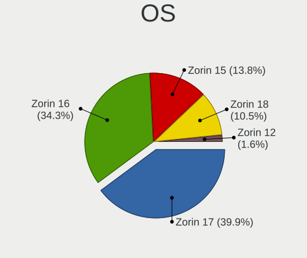

| Name     | Computers | Percent |
|----------|-----------|---------|
| Zorin 17 | 4851      | 39.85%  |
| Zorin 16 | 4174      | 34.29%  |
| Zorin 15 | 1676      | 13.77%  |
| Zorin 18 | 1272      | 10.45%  |
| Zorin 12 | 199       | 1.63%   |

OS Family
---------

OS without a version

| Name  | Computers | Percent |
|-------|-----------|---------|
| Zorin | 11993     | 100%    |

Kernel
------

Version of the Linux kernel

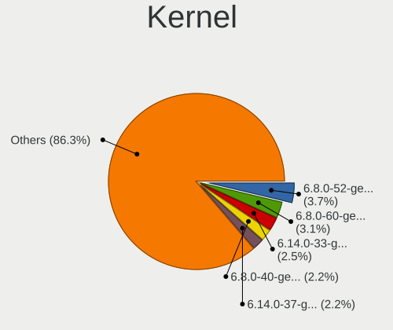

| Version           | Computers | Percent |
|-------------------|-----------|---------|
| 6.8.0-52-generic  | 514       | 3.72%   |
| 6.8.0-60-generic  | 423       | 3.07%   |
| 6.14.0-33-generic | 350       | 2.54%   |
| 6.8.0-40-generic  | 305       | 2.21%   |
| 6.14.0-37-generic | 301       | 2.18%   |
| 6.14.0-36-generic | 301       | 2.18%   |
| 6.5.0-35-generic  | 276       | 2%      |
| 6.8.0-57-generic  | 259       | 1.88%   |
| 5.15.0-56-generic | 238       | 1.72%   |
| 6.14.0-35-generic | 228       | 1.65%   |
| 6.8.0-49-generic  | 225       | 1.63%   |
| 6.8.0-59-generic  | 216       | 1.57%   |
| 6.5.0-41-generic  | 197       | 1.43%   |
| 6.8.0-65-generic  | 189       | 1.37%   |
| 6.2.0-39-generic  | 188       | 1.36%   |
| 6.8.0-45-generic  | 186       | 1.35%   |
| 5.11.0-38-generic | 184       | 1.33%   |
| 6.5.0-28-generic  | 164       | 1.19%   |
| 5.11.0-27-generic | 157       | 1.14%   |
| 6.5.0-26-generic  | 154       | 1.12%   |
| 6.8.0-51-generic  | 153       | 1.11%   |
| 5.15.0-52-generic | 153       | 1.11%   |
| 5.15.0-91-generic | 152       | 1.1%    |
| 5.15.0-58-generic | 152       | 1.1%    |
| 5.15.0-46-generic | 152       | 1.1%    |
| 6.8.0-85-generic  | 148       | 1.07%   |
| 5.15.0-67-generic | 145       | 1.05%   |
| 5.15.0-78-generic | 138       | 1%      |
| 6.5.0-45-generic  | 137       | 0.99%   |
| 5.15.0-69-generic | 136       | 0.99%   |
| 5.13.0-30-generic | 128       | 0.93%   |
| 6.8.0-79-generic  | 126       | 0.91%   |
| 6.8.0-47-generic  | 125       | 0.91%   |
| 6.8.0-48-generic  | 124       | 0.9%    |
| 5.11.0-40-generic | 123       | 0.89%   |
| 5.13.0-39-generic | 122       | 0.88%   |
| 6.8.0-50-generic  | 120       | 0.87%   |
| 5.15.0-60-generic | 113       | 0.82%   |
| 6.8.0-87-generic  | 111       | 0.8%    |
| 5.3.0-40-generic  | 110       | 0.8%    |

Kernel Family
-------------

Linux kernel without a distro release

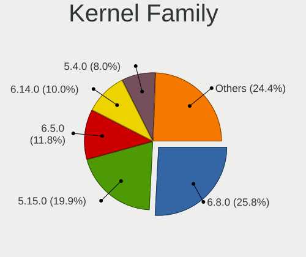

| Version | Computers | Percent |
|---------|-----------|---------|
| 6.8.0   | 3235      | 25.8%   |
| 5.15.0  | 2501      | 19.95%  |
| 6.5.0   | 1481      | 11.81%  |
| 6.14.0  | 1257      | 10.03%  |
| 5.4.0   | 1002      | 7.99%   |
| 5.11.0  | 951       | 7.58%   |
| 5.13.0  | 772       | 6.16%   |
| 5.3.0   | 487       | 3.88%   |
| 6.2.0   | 195       | 1.56%   |
| 4.15.0  | 192       | 1.53%   |
| 5.0.0   | 154       | 1.23%   |
| 4.18.0  | 76        | 0.61%   |
| 5.8.0   | 55        | 0.44%   |
| 5.14.0  | 10        | 0.08%   |
| 6.3.13  | 8         | 0.06%   |
| 6.12.3  | 7         | 0.06%   |
| 4.4.0   | 6         | 0.05%   |
| 6.5.7   | 4         | 0.03%   |
| 6.17.1  | 4         | 0.03%   |
| 6.2.16  | 3         | 0.02%   |
| 6.11.0  | 3         | 0.02%   |
| 5.7.1   | 3         | 0.02%   |
| 6.9.9   | 2         | 0.02%   |
| 6.9.5   | 2         | 0.02%   |
| 6.9.3   | 2         | 0.02%   |
| 6.8.8   | 2         | 0.02%   |
| 6.8.7   | 2         | 0.02%   |
| 6.8.12  | 2         | 0.02%   |
| 6.8.10  | 2         | 0.02%   |
| 6.3.2   | 2         | 0.02%   |
| 6.17.13 | 2         | 0.02%   |
| 6.17.0  | 2         | 0.02%   |
| 6.15.6  | 2         | 0.02%   |
| 6.15.4  | 2         | 0.02%   |
| 6.15.1  | 2         | 0.02%   |
| 6.14.2  | 2         | 0.02%   |
| 6.10.2  | 2         | 0.02%   |
| 5.7.0   | 2         | 0.02%   |
| 5.6.0   | 2         | 0.02%   |
| 5.19.12 | 2         | 0.02%   |

Kernel Major Ver.
-----------------

Linux kernel major version

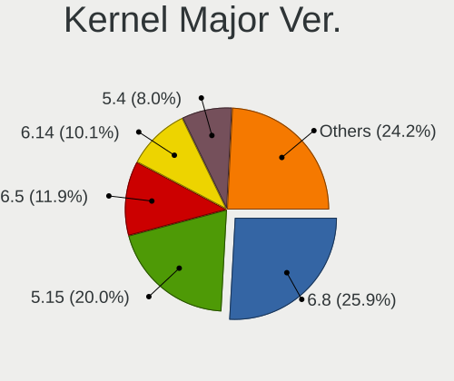

| Version | Computers | Percent |
|---------|-----------|---------|
| 6.8     | 3242      | 25.88%  |
| 5.15    | 2505      | 19.99%  |
| 6.5     | 1485      | 11.85%  |
| 6.14    | 1262      | 10.07%  |
| 5.4     | 1004      | 8.01%   |
| 5.11    | 951       | 7.59%   |
| 5.13    | 774       | 6.18%   |
| 5.3     | 487       | 3.89%   |
| 6.2     | 200       | 1.6%    |
| 4.15    | 192       | 1.53%   |
| 5.0     | 154       | 1.23%   |
| 4.18    | 76        | 0.61%   |
| 5.8     | 56        | 0.45%   |
| 6.12    | 14        | 0.11%   |
| 6.3     | 12        | 0.1%    |
| 6.17    | 11        | 0.09%   |
| 5.14    | 10        | 0.08%   |
| 5.19    | 9         | 0.07%   |
| 6.15    | 8         | 0.06%   |
| 6.9     | 7         | 0.06%   |
| 6.10    | 6         | 0.05%   |
| 5.7     | 6         | 0.05%   |
| 4.4     | 6         | 0.05%   |
| 6.7     | 5         | 0.04%   |
| 6.6     | 5         | 0.04%   |
| 6.13    | 5         | 0.04%   |
| 5.17    | 5         | 0.04%   |
| 5.16    | 5         | 0.04%   |
| 6.11    | 4         | 0.03%   |
| 6.0     | 4         | 0.03%   |
| 5.18    | 4         | 0.03%   |
| 5.10    | 4         | 0.03%   |
| 6.1     | 3         | 0.02%   |
| 5.9     | 2         | 0.02%   |
| 5.6     | 2         | 0.02%   |
| 4.13    | 2         | 0.02%   |
| 6.18    | 1         | 0.01%   |
| 6.16    | 1         | 0.01%   |

Arch
----

OS architecture (x86_64, i586, etc.)

| Name   | Computers | Percent |
|--------|-----------|---------|
| x86_64 | 11575     | 96.49%  |
| i686   | 421       | 3.51%   |

DE
--

Desktop Environment

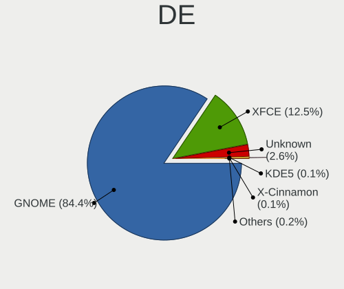

| Name            | Computers | Percent |
|-----------------|-----------|---------|
| GNOME           | 10210     | 84.43%  |
| XFCE            | 1517      | 12.54%  |
| Unknown         | 310       | 2.56%   |
| KDE5            | 17        | 0.14%   |
| X-Cinnamon      | 14        | 0.12%   |
| Budgie          | 6         | 0.05%   |
| Unity           | 4         | 0.03%   |
| KDE             | 4         | 0.03%   |
| Cinnamon        | 3         | 0.02%   |
| MATE            | 2         | 0.02%   |
| i3              | 2         | 0.02%   |
| LXQt            | 1         | 0.01%   |
| LXDE            | 1         | 0.01%   |
| GNOME Flashback | 1         | 0.01%   |
| Enlightenment   | 1         | 0.01%   |

Display Server
--------------

X11 or Wayland

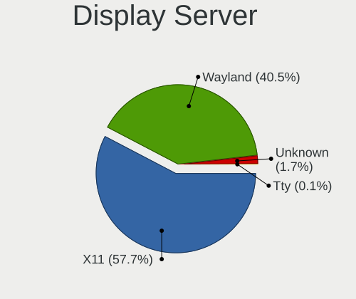

| Name    | Computers | Percent |
|---------|-----------|---------|
| X11     | 7046      | 57.67%  |
| Wayland | 4951      | 40.52%  |
| Unknown | 211       | 1.73%   |
| Tty     | 10        | 0.08%   |

Display Manager
---------------

SDDM, LightDM, etc.

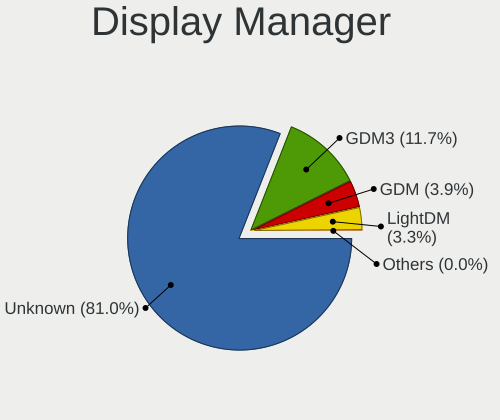

| Name    | Computers | Percent |
|---------|-----------|---------|
| Unknown | 9879      | 80.96%  |
| GDM3    | 1425      | 11.68%  |
| GDM     | 480       | 3.93%   |
| LightDM | 402       | 3.29%   |
| TDM     | 11        | 0.09%   |
| SDDM    | 5         | 0.04%   |
| LXDM    | 1         | 0.01%   |

OS Lang
-------

Language

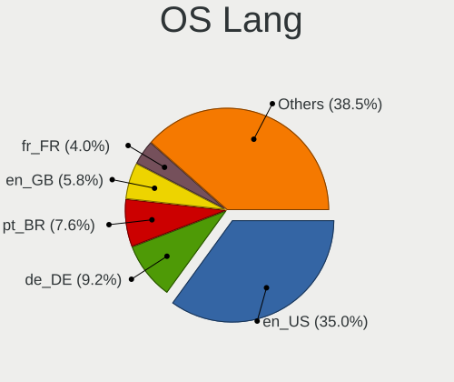

| Lang    | Computers | Percent |
|---------|-----------|---------|
| en_US   | 4223      | 35%     |
| de_DE   | 1106      | 9.17%   |
| pt_BR   | 915       | 7.58%   |
| en_GB   | 703       | 5.83%   |
| fr_FR   | 477       | 3.95%   |
| it_IT   | 466       | 3.86%   |
| es_ES   | 412       | 3.41%   |
| en_CA   | 374       | 3.1%    |
| en_IN   | 259       | 2.15%   |
| pl_PL   | 235       | 1.95%   |
| Unknown | 232       | 1.92%   |
| en_AU   | 221       | 1.83%   |
| nl_NL   | 193       | 1.6%    |
| es_MX   | 178       | 1.48%   |
| pt_PT   | 146       | 1.21%   |
| ru_RU   | 128       | 1.06%   |
| es_AR   | 127       | 1.05%   |
| en_ZA   | 104       | 0.86%   |
| tr_TR   | 100       | 0.83%   |
| hu_HU   | 94        | 0.78%   |
| cs_CZ   | 94        | 0.78%   |
| es_CO   | 74        | 0.61%   |
| de_AT   | 74        | 0.61%   |
| es_CL   | 73        | 0.61%   |
| en_NZ   | 61        | 0.51%   |
| sv_SE   | 58        | 0.48%   |
| ja_JP   | 45        | 0.37%   |
| de_CH   | 44        | 0.36%   |
| da_DK   | 44        | 0.36%   |
| nl_BE   | 43        | 0.36%   |
| es_VE   | 43        | 0.36%   |
| C       | 41        | 0.34%   |
| en_IE   | 36        | 0.3%    |
| fr_CA   | 34        | 0.28%   |
| el_GR   | 30        | 0.25%   |
| nb_NO   | 29        | 0.24%   |
| en_PH   | 29        | 0.24%   |
| bg_BG   | 29        | 0.24%   |
| ro_RO   | 28        | 0.23%   |
| fr_BE   | 27        | 0.22%   |

Boot Mode
---------

EFI or BIOS

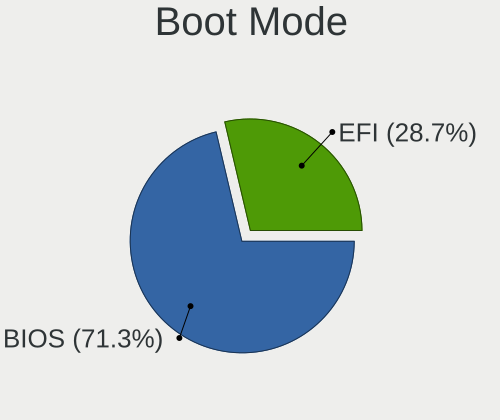

| Mode | Computers | Percent |
|------|-----------|---------|
| BIOS | 8679      | 71.31%  |
| EFI  | 3491      | 28.69%  |

Filesystem
----------

Type of filesystem

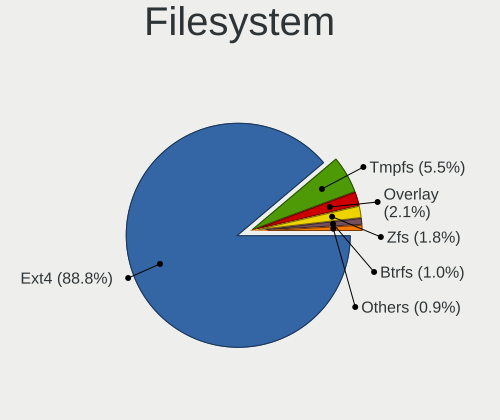

| Type     | Computers | Percent |
|----------|-----------|---------|
| Ext4     | 10788     | 88.84%  |
| Tmpfs    | 666       | 5.48%   |
| Overlay  | 249       | 2.05%   |
| Zfs      | 214       | 1.76%   |
| Btrfs    | 119       | 0.98%   |
| Ext2     | 46        | 0.38%   |
| Unknown  | 27        | 0.22%   |
| Ext3     | 19        | 0.16%   |
| Xfs      | 13        | 0.11%   |
| Reiserfs | 1         | 0.01%   |
| Jfs      | 1         | 0.01%   |

Part. scheme
------------

Scheme of partitioning

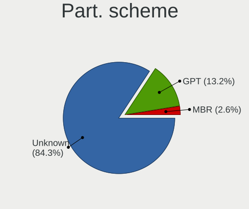

| Type    | Computers | Percent |
|---------|-----------|---------|
| Unknown | 10250     | 84.27%  |
| GPT     | 1602      | 13.17%  |
| MBR     | 312       | 2.56%   |

Dual Boot with Linux/BSD
------------------------

Hosting more than one Linux/BSD

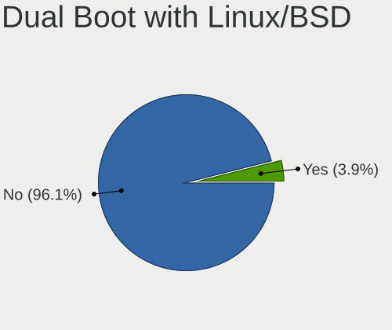

| Dual boot | Computers | Percent |
|-----------|-----------|---------|
| No        | 11590     | 96.08%  |
| Yes       | 473       | 3.92%   |

Dual Boot (Win)
---------------

Hosting Linux and Windows

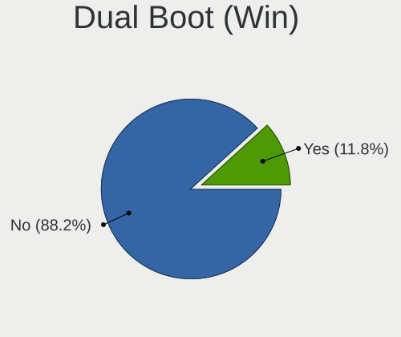

| Dual boot | Computers | Percent |
|-----------|-----------|---------|
| No        | 10676     | 88.25%  |
| Yes       | 1422      | 11.75%  |

Board
-----

Vendor
------

Motherboard manufacturer

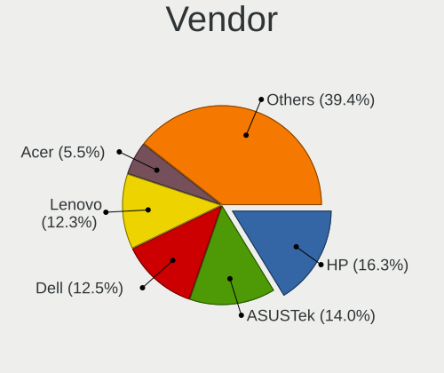

| Name                                 | Computers | Percent |
|--------------------------------------|-----------|---------|
| Hewlett-Packard                      | 1951      | 16.27%  |
| ASUSTek Computer                     | 1684      | 14.04%  |
| Dell                                 | 1503      | 12.53%  |
| Lenovo                               | 1472      | 12.27%  |
| Acer                                 | 654       | 5.45%   |
| Gigabyte Technology                  | 648       | 5.4%    |
| MSI                                  | 548       | 4.57%   |
| Apple                                | 507       | 4.23%   |
| ASRock                               | 306       | 2.55%   |
| Toshiba                              | 290       | 2.42%   |
| Intel                                | 221       | 1.84%   |
| Unknown                              | 164       | 1.37%   |
| Samsung Electronics                  | 156       | 1.3%    |
| Sony                                 | 121       | 1.01%   |
| Fujitsu                              | 118       | 0.98%   |
| Microsoft                            | 97        | 0.81%   |
| Positivo                             | 79        | 0.66%   |
| HUAWEI                               | 75        | 0.63%   |
| Google                               | 67        | 0.56%   |
| Pegatron                             | 63        | 0.53%   |
| Medion                               | 61        | 0.51%   |
| Packard Bell                         | 58        | 0.48%   |
| Biostar                              | 51        | 0.43%   |
| AZW                                  | 48        | 0.4%    |
| Alienware                            | 43        | 0.36%   |
| Fujitsu Siemens                      | 42        | 0.35%   |
| Foxconn                              | 40        | 0.33%   |
| AMI                                  | 33        | 0.28%   |
| ECS                                  | 28        | 0.23%   |
| Chuwi                                | 27        | 0.23%   |
| Panasonic                            | 23        | 0.19%   |
| Gateway                              | 23        | 0.19%   |
| Notebook                             | 21        | 0.18%   |
| LG Electronics                       | 19        | 0.16%   |
| Multilaser                           | 18        | 0.15%   |
| Semp Toshiba                         | 17        | 0.14%   |
| MACHINIST                            | 17        | 0.14%   |
| eMachines                            | 14        | 0.12%   |
| Shenzhen Meigao Electronic Equipment | 13        | 0.11%   |
| Huanan                               | 13        | 0.11%   |

Model
-----

Motherboard model

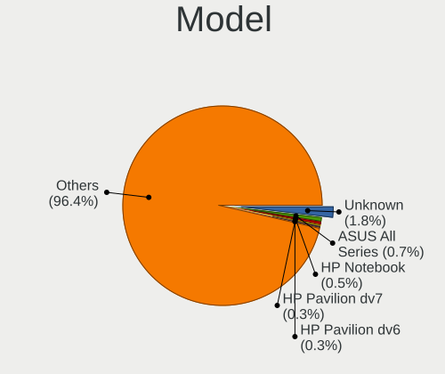

| Name                      | Computers | Percent |
|---------------------------|-----------|---------|
| Unknown                   | 220       | 1.83%   |
| ASUS All Series           | 87        | 0.73%   |
| HP Notebook               | 57        | 0.48%   |
| HP Pavilion dv7           | 33        | 0.28%   |
| HP Pavilion dv6           | 33        | 0.28%   |
| Dell OptiPlex 7010        | 31        | 0.26%   |
| Intel H61                 | 28        | 0.23%   |
| HP 15                     | 27        | 0.23%   |
| Microsoft Surface Pro 4   | 26        | 0.22%   |
| HP Pavilion Notebook      | 25        | 0.21%   |
| Apple MacBookPro8,1       | 24        | 0.2%    |
| Dell OptiPlex 9020        | 23        | 0.19%   |
| ASUS TUF Gaming X570-PLUS | 23        | 0.19%   |
| Apple MacBookPro9,2       | 21        | 0.18%   |
| HP Pavilion g7            | 20        | 0.17%   |
| HP Pavilion 15            | 20        | 0.17%   |
| Dell OptiPlex 790         | 19        | 0.16%   |
| MSI MS-7817               | 18        | 0.15%   |
| Dell Latitude E6420       | 17        | 0.14%   |
| Dell Inspiron 15-3567     | 17        | 0.14%   |
| Apple MacBookAir7,2       | 17        | 0.14%   |
| Apple iMac12,2            | 17        | 0.14%   |
| MSI MS-7C37               | 16        | 0.13%   |
| ASUS M5A97 R2.0           | 16        | 0.13%   |
| Apple MacBookAir6,2       | 16        | 0.13%   |
| Apple iMac12,1            | 16        | 0.13%   |
| MSI MS-7C56               | 15        | 0.13%   |
| HP Pavilion g6            | 15        | 0.13%   |
| Gigabyte A320M-S2H        | 15        | 0.13%   |
| Dell OptiPlex 780         | 15        | 0.13%   |
| Dell Latitude E6430       | 15        | 0.13%   |
| ASUS M5A78L-M/USB3        | 15        | 0.13%   |
| MSI MS-7C02               | 14        | 0.12%   |
| HP Pavilion 17            | 14        | 0.12%   |
| HP Laptop 15-bw0xx        | 14        | 0.12%   |
| HP EliteBook 840 G1       | 14        | 0.12%   |
| Dell Latitude E6400       | 14        | 0.12%   |
| Dell Inspiron 1545        | 14        | 0.12%   |
| Apple Macmini7,1          | 14        | 0.12%   |
| Apple MacBookPro12,1      | 14        | 0.12%   |

Model Family
------------

Motherboard model prefix

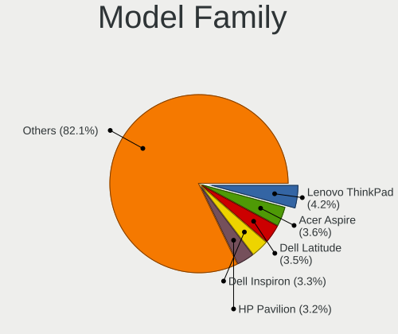

| Name                  | Computers | Percent |
|-----------------------|-----------|---------|
| Lenovo ThinkPad       | 506       | 4.22%   |
| Acer Aspire           | 436       | 3.64%   |
| Dell Latitude         | 420       | 3.5%    |
| Dell Inspiron         | 396       | 3.3%    |
| HP Pavilion           | 386       | 3.22%   |
| Lenovo IdeaPad        | 338       | 2.82%   |
| Dell OptiPlex         | 273       | 2.28%   |
| Toshiba Satellite     | 239       | 1.99%   |
| Unknown               | 220       | 1.83%   |
| HP EliteBook          | 208       | 1.73%   |
| HP Compaq             | 189       | 1.58%   |
| HP Laptop             | 174       | 1.45%   |
| HP ProBook            | 171       | 1.43%   |
| ASUS Vivobook         | 147       | 1.23%   |
| ASUS PRIME            | 139       | 1.16%   |
| ASUS ROG              | 136       | 1.13%   |
| Lenovo ThinkCentre    | 127       | 1.06%   |
| Dell Precision        | 118       | 0.98%   |
| ASUS TUF              | 116       | 0.97%   |
| Microsoft Surface     | 97        | 0.81%   |
| Dell XPS              | 96        | 0.8%    |
| ASUS All              | 87        | 0.73%   |
| HP ENVY               | 84        | 0.7%    |
| Dell Vostro           | 84        | 0.7%    |
| Lenovo Yoga           | 75        | 0.63%   |
| HP EliteDesk          | 66        | 0.55%   |
| HP Notebook           | 57        | 0.48%   |
| ASUS ASUS             | 56        | 0.47%   |
| HP ProDesk            | 48        | 0.4%    |
| Fujitsu LIFEBOOK      | 48        | 0.4%    |
| Fujitsu ESPRIMO       | 44        | 0.37%   |
| ASUS Zenbook          | 43        | 0.36%   |
| Packard Bell EasyNote | 42        | 0.35%   |
| Acer Nitro            | 42        | 0.35%   |
| HP 15                 | 39        | 0.33%   |
| Apple MacBookPro11    | 39        | 0.33%   |
| HP ZBook              | 37        | 0.31%   |
| Lenovo Legion         | 36        | 0.3%    |
| Lenovo IdeaCentre     | 36        | 0.3%    |
| HP Stream             | 35        | 0.29%   |

MFG Year
--------

Motherboard manufacture year

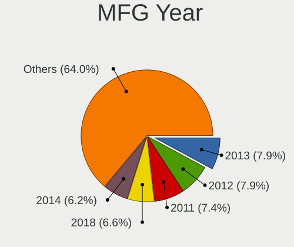

| Year    | Computers | Percent |
|---------|-----------|---------|
| 2013    | 947       | 7.9%    |
| 2012    | 943       | 7.86%   |
| 2011    | 893       | 7.45%   |
| 2018    | 795       | 6.63%   |
| 2014    | 745       | 6.21%   |
| 2019    | 738       | 6.15%   |
| 2017    | 732       | 6.1%    |
| 2021    | 728       | 6.07%   |
| 2010    | 708       | 5.9%    |
| 2020    | 698       | 5.82%   |
| 2016    | 622       | 5.19%   |
| 2015    | 588       | 4.9%    |
| 2009    | 582       | 4.85%   |
| 2008    | 540       | 4.5%    |
| 2022    | 445       | 3.71%   |
| 2023    | 404       | 3.37%   |
| 2007    | 336       | 2.8%    |
| 2024    | 216       | 1.8%    |
| 2006    | 148       | 1.23%   |
| 2025    | 78        | 0.65%   |
| 2005    | 72        | 0.6%    |
| 2004    | 12        | 0.1%    |
| Unknown | 12        | 0.1%    |
| 2003    | 8         | 0.07%   |
| 2002    | 2         | 0.02%   |
| 2000    | 1         | 0.01%   |

Form Factor
-----------

Physical design of the computer

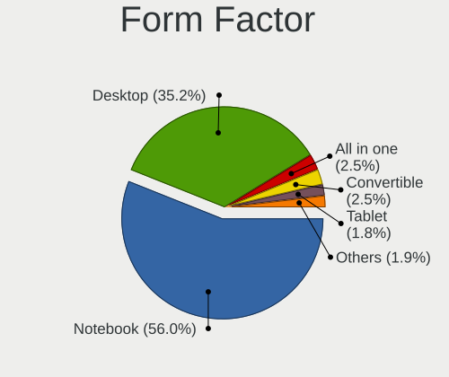

| Name        | Computers | Percent |
|-------------|-----------|---------|
| Notebook    | 6721      | 56.04%  |
| Desktop     | 4227      | 35.25%  |
| All in one  | 305       | 2.54%   |
| Convertible | 299       | 2.49%   |
| Tablet      | 214       | 1.78%   |
| Mini pc     | 191       | 1.59%   |
| Server      | 31        | 0.26%   |
| Other       | 5         | 0.04%   |

Secure Boot
-----------

Enabled or disabled

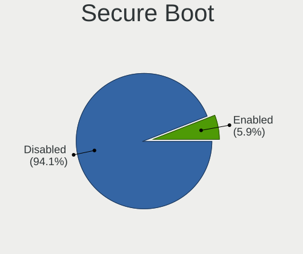

| State    | Computers | Percent |
|----------|-----------|---------|
| Disabled | 11337     | 94.05%  |
| Enabled  | 717       | 5.95%   |

Coreboot
--------

Have coreboot on board

| Used | Computers | Percent |
|------|-----------|---------|
| No   | 11911     | 99.32%  |
| Yes  | 82        | 0.68%   |

RAM Size
--------

Total RAM memory

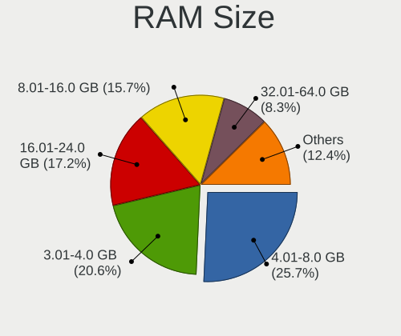

| Size in GB      | Computers | Percent |
|-----------------|-----------|---------|
| 4.01-8.0        | 3122      | 25.71%  |
| 3.01-4.0        | 2498      | 20.57%  |
| 16.01-24.0      | 2094      | 17.25%  |
| 8.01-16.0       | 1909      | 15.72%  |
| 32.01-64.0      | 1013      | 8.34%   |
| 1.01-2.0        | 623       | 5.13%   |
| 64.01-256.0     | 288       | 2.37%   |
| 24.01-32.0      | 247       | 2.03%   |
| 2.01-3.0        | 242       | 1.99%   |
| 0.51-1.0        | 103       | 0.85%   |
| More than 256.0 | 3         | 0.02%   |

RAM Used
--------

Used RAM memory

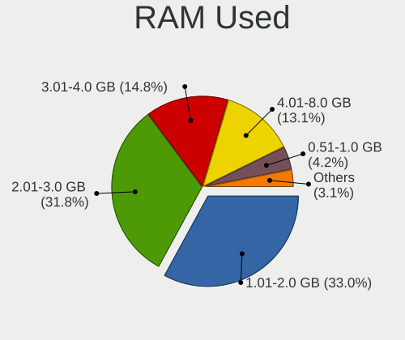

| Used GB    | Computers | Percent |
|------------|-----------|---------|
| 1.01-2.0   | 4295      | 32.95%  |
| 2.01-3.0   | 4151      | 31.85%  |
| 3.01-4.0   | 1930      | 14.81%  |
| 4.01-8.0   | 1708      | 13.1%   |
| 0.51-1.0   | 543       | 4.17%   |
| 8.01-16.0  | 300       | 2.3%    |
| 16.01-24.0 | 46        | 0.35%   |
| 0.01-0.5   | 43        | 0.33%   |
| 24.01-32.0 | 13        | 0.1%    |
| 32.01-64.0 | 5         | 0.04%   |

Total Drives
------------

Number of drives on board

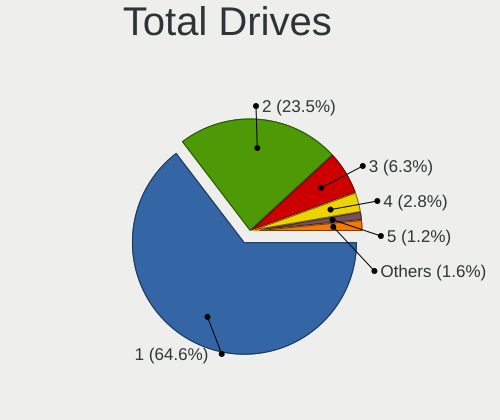

| Drives  | Computers | Percent |
|---------|-----------|---------|
| 1       | 7918      | 64.63%  |
| 2       | 2883      | 23.53%  |
| 3       | 770       | 6.29%   |
| 4       | 346       | 2.82%   |
| 5       | 142       | 1.16%   |
| 6       | 81        | 0.66%   |
| 0       | 42        | 0.34%   |
| 7       | 28        | 0.23%   |
| 8       | 23        | 0.19%   |
| 9       | 6         | 0.05%   |
| 11      | 5         | 0.04%   |
| 10      | 3         | 0.02%   |
| 51      | 1         | 0.01%   |
| 30      | 1         | 0.01%   |
| 13      | 1         | 0.01%   |
| Unknown | 1         | 0.01%   |

Has CD-ROM
----------

Has CD-ROM on board

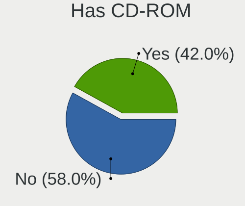

| Presented | Computers | Percent |
|-----------|-----------|---------|
| No        | 6994      | 58.02%  |
| Yes       | 5061      | 41.98%  |

Has Ethernet
------------

Has Ethernet on board

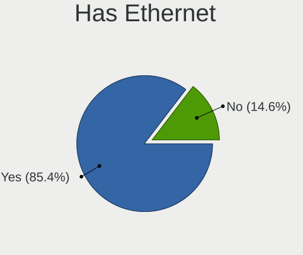

| Presented | Computers | Percent |
|-----------|-----------|---------|
| Yes       | 10261     | 85.42%  |
| No        | 1751      | 14.58%  |

Has WiFi
--------

Has WiFi module

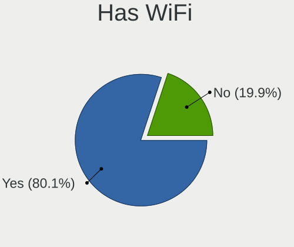

| Presented | Computers | Percent |
|-----------|-----------|---------|
| Yes       | 9642      | 80.07%  |
| No        | 2400      | 19.93%  |

Has Bluetooth
-------------

Has Bluetooth module

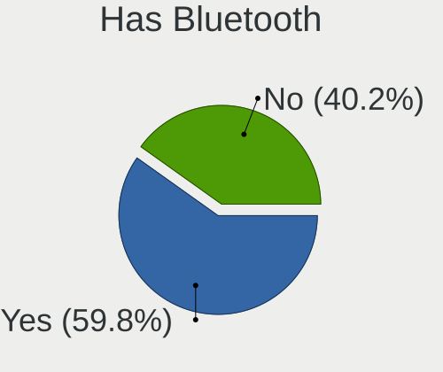

| Presented | Computers | Percent |
|-----------|-----------|---------|
| Yes       | 7247      | 59.85%  |
| No        | 4862      | 40.15%  |

Location
--------

Country
-------

Geographic location (country)

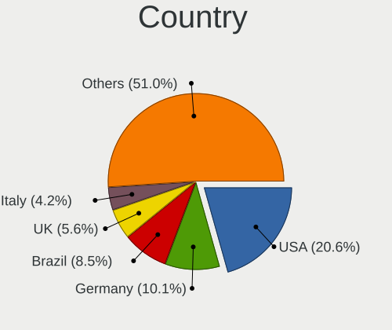

| Country      | Computers | Percent |
|--------------|-----------|---------|
| USA          | 2486      | 20.63%  |
| Germany      | 1214      | 10.08%  |
| Brazil       | 1019      | 8.46%   |
| UK           | 672       | 5.58%   |
| Italy        | 509       | 4.22%   |
| France       | 465       | 3.86%   |
| Canada       | 457       | 3.79%   |
| Spain        | 398       | 3.3%    |
| Netherlands  | 301       | 2.5%    |
| India        | 277       | 2.3%    |
| Poland       | 245       | 2.03%   |
| Mexico       | 244       | 2.03%   |
| Australia    | 226       | 1.88%   |
| Portugal     | 173       | 1.44%   |
| Argentina    | 153       | 1.27%   |
| Austria      | 132       | 1.1%    |
| Belgium      | 131       | 1.09%   |
| Turkey       | 130       | 1.08%   |
| Switzerland  | 123       | 1.02%   |
| South Africa | 118       | 0.98%   |
| Czechia      | 117       | 0.97%   |
| Russia       | 116       | 0.96%   |
| Sweden       | 112       | 0.93%   |
| Romania      | 106       | 0.88%   |
| Hungary      | 100       | 0.83%   |
| Colombia     | 95        | 0.79%   |
| Indonesia    | 92        | 0.76%   |
| Chile        | 90        | 0.75%   |
| Greece       | 85        | 0.71%   |
| New Zealand  | 75        | 0.62%   |
| Norway       | 73        | 0.61%   |
| Denmark      | 73        | 0.61%   |
| Egypt        | 71        | 0.59%   |
| Japan        | 69        | 0.57%   |
| Serbia       | 60        | 0.5%    |
| Ireland      | 50        | 0.41%   |
| Bulgaria     | 50        | 0.41%   |
| Finland      | 46        | 0.38%   |
| Venezuela    | 43        | 0.36%   |
| Philippines  | 42        | 0.35%   |

City
----

Geographic location (city)

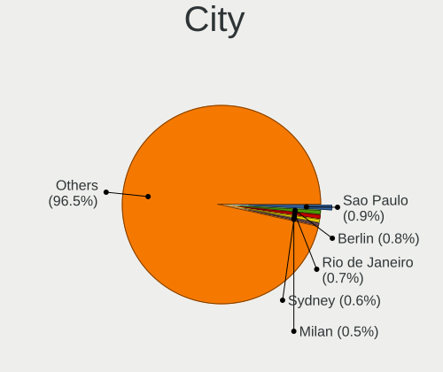

| City              | Computers | Percent |
|-------------------|-----------|---------|
| Sao Paulo         | 109       | 0.86%   |
| Berlin            | 95        | 0.75%   |
| Rio de Janeiro    | 90        | 0.71%   |
| Sydney            | 78        | 0.62%   |
| Milan             | 65        | 0.52%   |
| Madrid            | 64        | 0.51%   |
| Vienna            | 62        | 0.49%   |
| Rome              | 59        | 0.47%   |
| Istanbul          | 49        | 0.39%   |
| Hamburg           | 49        | 0.39%   |
| Munich            | 48        | 0.38%   |
| Budapest          | 48        | 0.38%   |
| Amsterdam         | 47        | 0.37%   |
| Melbourne         | 46        | 0.36%   |
| Toronto           | 45        | 0.36%   |
| Paris             | 45        | 0.36%   |
| Johannesburg      | 44        | 0.35%   |
| Montreal          | 43        | 0.34%   |
| Mexico City       | 43        | 0.34%   |
| New York          | 41        | 0.33%   |
| Athens            | 41        | 0.33%   |
| Warsaw            | 39        | 0.31%   |
| Santiago          | 39        | 0.31%   |
| Prague            | 38        | 0.3%    |
| Bogotá           | 37        | 0.29%   |
| London            | 35        | 0.28%   |
| Auckland          | 35        | 0.28%   |
| Lisbon            | 33        | 0.26%   |
| Cairo             | 33        | 0.26%   |
| Perth             | 32        | 0.25%   |
| Dallas            | 32        | 0.25%   |
| Cape Town         | 32        | 0.25%   |
| Buenos Aires      | 32        | 0.25%   |
| Bucharest         | 32        | 0.25%   |
| Seattle           | 31        | 0.25%   |
| Dublin            | 31        | 0.25%   |
| Bengaluru         | 31        | 0.25%   |
| Belgrade          | 31        | 0.25%   |
| Frankfurt am Main | 30        | 0.24%   |
| Denver            | 30        | 0.24%   |

Drives
------

Drive Vendor
------------

Hard drive vendors

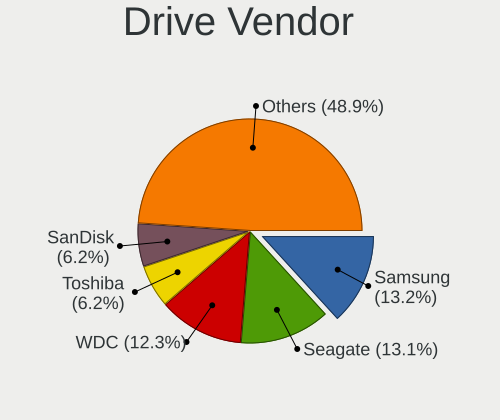

| Vendor                      | Computers | Drives | Percent |
|-----------------------------|-----------|--------|---------|
| Samsung Electronics         | 2224      | 3187   | 13.22%  |
| Seagate                     | 2204      | 3070   | 13.1%   |
| WDC                         | 2076      | 2837   | 12.34%  |
| Toshiba                     | 1047      | 1286   | 6.22%   |
| SanDisk                     | 1047      | 1331   | 6.22%   |
| Kingston                    | 926       | 1204   | 5.5%    |
| Unknown                     | 829       | 1144   | 4.93%   |
| Crucial                     | 572       | 694    | 3.4%    |
| Hitachi                     | 538       | 672    | 3.2%    |
| SK hynix                    | 351       | 411    | 2.09%   |
| Intel                       | 301       | 383    | 1.79%   |
| China                       | 292       | 347    | 1.74%   |
| Micron Technology           | 279       | 327    | 1.66%   |
| HGST                        | 275       | 342    | 1.63%   |
| Apple                       | 233       | 279    | 1.38%   |
| A-DATA Technology           | 203       | 240    | 1.21%   |
| Intenso                     | 142       | 178    | 0.84%   |
| Micron/Crucial Technology   | 140       | 192    | 0.83%   |
| Phison Electronics          | 122       | 170    | 0.73%   |
| Kingston Technology Company | 120       | 146    | 0.71%   |
| MAXIO Technology (Hangzhou) | 118       | 143    | 0.7%    |
| PNY                         | 117       | 143    | 0.7%    |
| Silicon Motion              | 115       | 137    | 0.68%   |
| SPCC                        | 106       | 136    | 0.63%   |
| KIOXIA                      | 102       | 117    | 0.61%   |
| Unknown                     | 99        | 114    | 0.59%   |
| Patriot                     | 84        | 110    | 0.5%    |
| Fujitsu                     | 72        | 76     | 0.43%   |
| Phison                      | 71        | 90     | 0.42%   |
| JMicron Technology          | 69        | 80     | 0.41%   |
| Lexar                       | 65        | 71     | 0.39%   |
| LITEON                      | 63        | 77     | 0.37%   |
| ADATA Technology            | 63        | 68     | 0.37%   |
| Realtek Semiconductor       | 62        | 74     | 0.37%   |
| Netac                       | 61        | 72     | 0.36%   |
| Maxtor                      | 60        | 83     | 0.36%   |
| Transcend                   | 54        | 88     | 0.32%   |
| KingSpec                    | 54        | 59     | 0.32%   |
| OCZ                         | 52        | 67     | 0.31%   |
| GOODRAM                     | 49        | 61     | 0.29%   |

Drive Model
-----------

Hard drive models

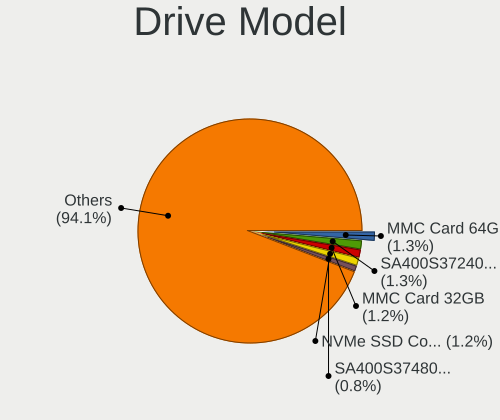

| Model                                                 | Computers | Percent |
|-------------------------------------------------------|-----------|---------|
| Unknown MMC Card  64GB                                | 242       | 1.33%   |
| Kingston SA400S37240G 240GB SSD                       | 238       | 1.31%   |
| Unknown MMC Card  32GB                                | 215       | 1.18%   |
| Samsung NVMe SSD Controller SM981/PM981/PM983 1TB     | 215       | 1.18%   |
| Kingston SA400S37480G 480GB SSD                       | 154       | 0.85%   |
| Unknown MMC Card  128GB                               | 119       | 0.66%   |
| Seagate ST1000LM035-1RK172 1TB                        | 114       | 0.63%   |
| Samsung NVMe SSD Controller PM9A1/PM9A3/980PRO 1TB    | 106       | 0.58%   |
| Seagate ST500DM002-1BD142 500GB                       | 103       | 0.57%   |
| Toshiba MQ01ABF050 500GB                              | 99        | 0.55%   |
| Seagate ST1000LM024 HN-M101MBB 1TB                    | 99        | 0.55%   |
| Unknown                                               | 99        | 0.55%   |
| Samsung SSD 860 EVO 500GB                             | 98        | 0.54%   |
| Samsung SSD 850 EVO 250GB                             | 97        | 0.53%   |
| Kingston SA400S37120G 120GB SSD                       | 94        | 0.52%   |
| Crucial CT240BX500SSD1 240GB                          | 94        | 0.52%   |
| Toshiba MQ01ABD100 1TB                                | 90        | 0.5%    |
| Samsung NVMe SSD Controller SM961/PM961/SM963 1024GB  | 83        | 0.46%   |
| Crucial CT500MX500SSD1 500GB                          | 82        | 0.45%   |
| Seagate ST500LT012-1DG142 500GB                       | 80        | 0.44%   |
| MAXIO (Hangzhou) NVMe SSD Controller MAP1202 2TB      | 75        | 0.41%   |
| Samsung SSD 850 EVO 500GB                             | 74        | 0.41%   |
| Toshiba MQ04ABF100 1TB                                | 72        | 0.4%    |
| Seagate ST1000DM010-2EP102 1TB                        | 72        | 0.4%    |
| Silicon Motion SM2263EN/SM2263XT SSD Controller 512GB | 71        | 0.39%   |
| Seagate ST9500325AS 500GB                             | 67        | 0.37%   |
| Unknown SD/MMC/MS PRO 2GB                             | 64        | 0.35%   |
| Micron/Crucial P2 NVMe PCIe SSD 2TB                   | 64        | 0.35%   |
| Sandisk WD Blue SN550 NVMe SSD 1024GB                 | 63        | 0.35%   |
| Samsung SSD 870 EVO 500GB                             | 60        | 0.33%   |
| Toshiba DT01ACA100 1TB                                | 59        | 0.32%   |
| Kingston SV300S37A120G 120GB SSD                      | 59        | 0.32%   |
| Samsung SSD 860 EVO 250GB                             | 57        | 0.31%   |
| Crucial CT1000MX500SSD1 1TB                           | 57        | 0.31%   |
| Seagate ST1000DM003-1CH162 1TB                        | 56        | 0.31%   |
| WDC WD10EZEX-08WN4A0 1TB                              | 54        | 0.3%    |
| Seagate ST3500418AS 500GB                             | 53        | 0.29%   |
| Crucial CT480BX500SSD1 480GB                          | 53        | 0.29%   |
| Seagate ST500LM012 HN-M500MBB 500GB                   | 51        | 0.28%   |
| Samsung SSD 870 EVO 1TB                               | 51        | 0.28%   |

HDD Vendor
----------

Hard disk drive vendors

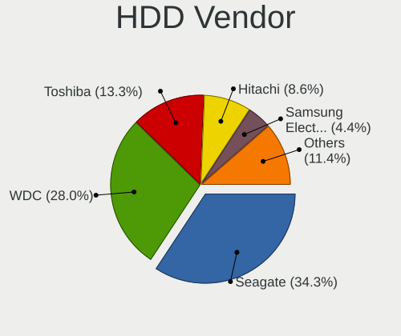

| Vendor              | Computers | Drives | Percent |
|---------------------|-----------|--------|---------|
| Seagate             | 2153      | 2975   | 34.27%  |
| WDC                 | 1761      | 2374   | 28.03%  |
| Toshiba             | 838       | 1037   | 13.34%  |
| Hitachi             | 538       | 672    | 8.56%   |
| Samsung Electronics | 275       | 338    | 4.38%   |
| HGST                | 275       | 342    | 4.38%   |
| Apple               | 78        | 83     | 1.24%   |
| Unknown             | 72        | 91     | 1.15%   |
| Fujitsu             | 72        | 76     | 1.15%   |
| Maxtor              | 57        | 80     | 0.91%   |
| JMicron Technology  | 38        | 44     | 0.6%    |
| Hewlett-Packard     | 12        | 19     | 0.19%   |
| External            | 11        | 11     | 0.18%   |
| ASMT                | 10        | 13     | 0.16%   |
| TO Exter            | 9         | 10     | 0.14%   |
| Intenso             | 9         | 11     | 0.14%   |
| USB3.0              | 8         | 9      | 0.13%   |
| SABRENT             | 7         | 10     | 0.11%   |
| T-FORCE             | 6         | 8      | 0.1%    |
| IBM/Hitachi         | 5         | 6      | 0.08%   |
| XrayDisk            | 4         | 4      | 0.06%   |
| HGST HTS            | 4         | 4      | 0.06%   |
| ExcelStor           | 4         | 4      | 0.06%   |
| SSK                 | 3         | 3      | 0.05%   |
| LaCie               | 3         | 4      | 0.05%   |
| ASMedia             | 3         | 3      | 0.05%   |
| WD MediaMax         | 2         | 3      | 0.03%   |
| USB                 | 2         | 2      | 0.03%   |
| Shenzhen            | 2         | 2      | 0.03%   |
| QUANTUM             | 2         | 2      | 0.03%   |
| KESU                | 2         | 2      | 0.03%   |
| EAGET               | 2         | 2      | 0.03%   |
| WALRAM              | 1         | 1      | 0.02%   |
| TDAS                | 1         | 7      | 0.02%   |
| PRO Z               | 1         | 1      | 0.02%   |
| Min Yi U            | 1         | 1      | 0.02%   |
| MARVELL             | 1         | 1      | 0.02%   |
| JetFlash            | 1         | 1      | 0.02%   |
| Inateck             | 1         | 2      | 0.02%   |
| HPE                 | 1         | 1      | 0.02%   |

SSD Vendor
----------

Solid state drive vendors

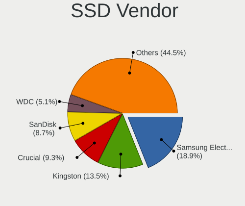

| Vendor              | Computers | Drives | Percent |
|---------------------|-----------|--------|---------|
| Samsung Electronics | 1119      | 1534   | 18.92%  |
| Kingston            | 798       | 1005   | 13.49%  |
| Crucial             | 549       | 667    | 9.28%   |
| SanDisk             | 516       | 628    | 8.73%   |
| WDC                 | 303       | 392    | 5.12%   |
| China               | 285       | 339    | 4.82%   |
| A-DATA Technology   | 181       | 217    | 3.06%   |
| Intel               | 129       | 146    | 2.18%   |
| PNY                 | 117       | 143    | 1.98%   |
| Apple               | 116       | 131    | 1.96%   |
| Intenso             | 109       | 133    | 1.84%   |
| Micron Technology   | 102       | 120    | 1.72%   |
| SPCC                | 101       | 130    | 1.71%   |
| Toshiba             | 93        | 106    | 1.57%   |
| SK hynix            | 85        | 98     | 1.44%   |
| Patriot             | 81        | 107    | 1.37%   |
| LITEON              | 63        | 77     | 1.07%   |
| Lexar               | 61        | 65     | 1.03%   |
| Transcend           | 54        | 88     | 0.91%   |
| Netac               | 54        | 64     | 0.91%   |
| KingSpec            | 51        | 56     | 0.86%   |
| OCZ                 | 50        | 65     | 0.85%   |
| GOODRAM             | 45        | 57     | 0.76%   |
| Team                | 44        | 48     | 0.74%   |
| LITEONIT            | 39        | 50     | 0.66%   |
| Unknown             | 38        | 46     | 0.64%   |
| Hewlett-Packard     | 31        | 37     | 0.52%   |
| SABRENT             | 30        | 35     | 0.51%   |
| Gigabyte Technology | 26        | 40     | 0.44%   |
| Apacer              | 26        | 32     | 0.44%   |
| Verbatim            | 25        | 33     | 0.42%   |
| Corsair             | 23        | 35     | 0.39%   |
| Fanxiang            | 19        | 22     | 0.32%   |
| Emtec               | 17        | 18     | 0.29%   |
| Seagate             | 15        | 22     | 0.25%   |
| Leven               | 14        | 15     | 0.24%   |
| Dogfish             | 14        | 17     | 0.24%   |
| ASMT                | 14        | 14     | 0.24%   |
| XrayDisk            | 13        | 16     | 0.22%   |
| Plextor             | 13        | 14     | 0.22%   |

Drive Kind
----------

HDD or SSD

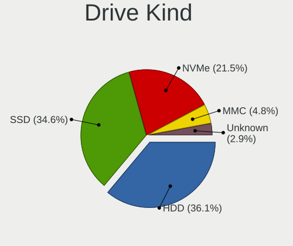

| Kind    | Computers | Drives | Percent |
|---------|-----------|--------|---------|
| HDD     | 5499      | 8269   | 36.09%  |
| SSD     | 5277      | 7395   | 34.63%  |
| NVMe    | 3281      | 4716   | 21.53%  |
| MMC     | 733       | 978    | 4.81%   |
| Unknown | 448       | 560    | 2.94%   |

Drive Connector
---------------

SATA, SAS, NVMe, etc.

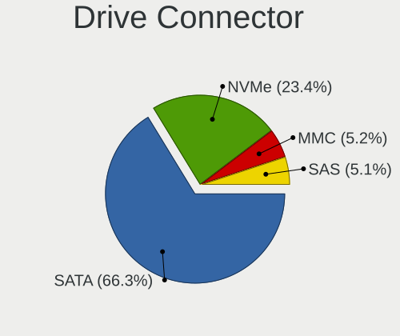

| Type | Computers | Drives | Percent |
|------|-----------|--------|---------|
| SATA | 9252      | 15233  | 66.27%  |
| NVMe | 3270      | 4675   | 23.42%  |
| MMC  | 733       | 978    | 5.25%   |
| SAS  | 707       | 1032   | 5.06%   |

Drive Size
----------

Size of hard drive

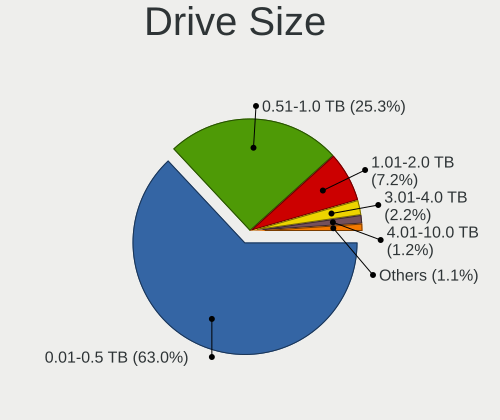

| Size in TB | Computers | Drives | Percent |
|------------|-----------|--------|---------|
| 0.01-0.5   | 6971      | 9834   | 63.03%  |
| 0.51-1.0   | 2796      | 3883   | 25.28%  |
| 1.01-2.0   | 801       | 1135   | 7.24%   |
| 3.01-4.0   | 240       | 404    | 2.17%   |
| 4.01-10.0  | 135       | 217    | 1.22%   |
| 2.01-3.0   | 91        | 134    | 0.82%   |
| 10.01-20.0 | 23        | 50     | 0.21%   |
| 20.01-50.0 | 3         | 7      | 0.03%   |

Space Total
-----------

Amount of disk space available on the file system

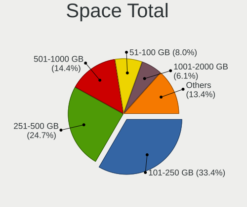

| Size in GB     | Computers | Percent |
|----------------|-----------|---------|
| 101-250        | 4147      | 33.36%  |
| 251-500        | 3068      | 24.68%  |
| 501-1000       | 1796      | 14.45%  |
| 51-100         | 995       | 8%      |
| 1001-2000      | 760       | 6.11%   |
| 21-50          | 517       | 4.16%   |
| More than 3000 | 444       | 3.57%   |
| 1-20           | 329       | 2.65%   |
| 2001-3000      | 220       | 1.77%   |
| Unknown        | 153       | 1.23%   |
| 0              | 1         | 0.01%   |

Space Used
----------

Amount of used disk space

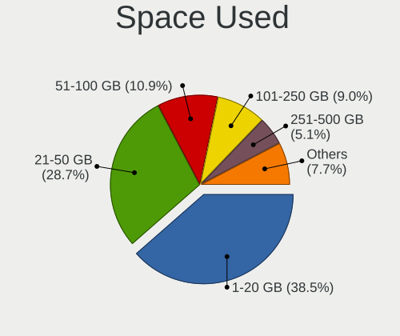

| Used GB        | Computers | Percent |
|----------------|-----------|---------|
| 1-20           | 4995      | 38.54%  |
| 21-50          | 3725      | 28.74%  |
| 51-100         | 1417      | 10.93%  |
| 101-250        | 1162      | 8.97%   |
| 251-500        | 665       | 5.13%   |
| 501-1000       | 386       | 2.98%   |
| 1001-2000      | 217       | 1.67%   |
| More than 3000 | 165       | 1.27%   |
| Unknown        | 153       | 1.18%   |
| 2001-3000      | 73        | 0.56%   |
| 0              | 2         | 0.02%   |

Malfunc. Drives
---------------

Drive models with a malfunction

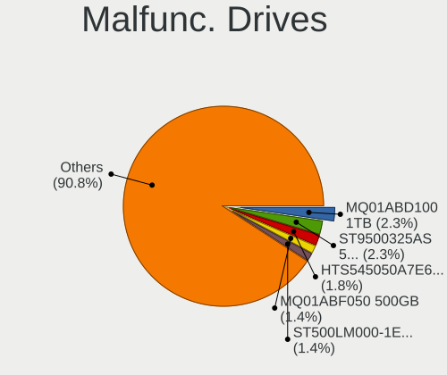

| Model                                          | Computers | Drives | Percent |
|------------------------------------------------|-----------|--------|---------|
| Toshiba MQ01ABD100 1TB                         | 5         | 5      | 2.29%   |
| Seagate ST9500325AS 500GB                      | 5         | 5      | 2.29%   |
| HGST HTS545050A7E680 500GB                     | 4         | 4      | 1.83%   |
| Toshiba MQ01ABF050 500GB                       | 3         | 4      | 1.38%   |
| Seagate ST500LM000-1EJ162 500GB                | 3         | 3      | 1.38%   |
| Seagate ST1000LM035-1RK172 1TB                 | 3         | 3      | 1.38%   |
| Seagate ST1000LM024 HN-M101MBB 1TB             | 3         | 3      | 1.38%   |
| HGST HTS541010A9E680 1TB                       | 3         | 3      | 1.38%   |
| WDC WD30EFRX-68EUZN0 3TB                       | 2         | 2      | 0.92%   |
| Toshiba MQ02ABD100H 1TB                        | 2         | 2      | 0.92%   |
| Toshiba MQ01ACF050 500GB                       | 2         | 2      | 0.92%   |
| SK hynix BC711 HFM512GD3JX013N 512GB           | 2         | 2      | 0.92%   |
| Seagate ST9500420AS 500GB                      | 2         | 2      | 0.92%   |
| Seagate ST500LT012-9WS142 500GB                | 2         | 2      | 0.92%   |
| Seagate ST500LT012-1DG142 500GB                | 2         | 2      | 0.92%   |
| Seagate ST500DM002-1BD142 500GB                | 2         | 2      | 0.92%   |
| Seagate ST2000LM007-1R8174 2TB                 | 2         | 2      | 0.92%   |
| Seagate ST1000LM048-2E7172 1TB                 | 2         | 2      | 0.92%   |
| Micron Technology 1100_MTFDDAK256TBN 256GB SSD | 2         | 2      | 0.92%   |
| Kingston SUV400S37240G 240GB SSD               | 2         | 2      | 0.92%   |
| Kingston SA400S37240G 240GB SSD                | 2         | 2      | 0.92%   |
| HGST HTS721010A9E630 1TB                       | 2         | 2      | 0.92%   |
| HGST HTS545050A7E380 500GB                     | 2         | 3      | 0.92%   |
| HGST HTS541010A7E630 1TB                       | 2         | 2      | 0.92%   |
| China SSD 1TB                                  | 2         | 2      | 0.92%   |
| A-DATA Technology IM2P33F3A NVMe 256GB         | 2         | 2      | 0.92%   |
| WDC WDS500G2B0A-00SM50 500GB                   | 1         | 1      | 0.46%   |
| WDC WDS240G2G0A-00JH30 240GB SSD               | 1         | 1      | 0.46%   |
| WDC WD6400BEVT-22A0RT0 640GB                   | 1         | 1      | 0.46%   |
| WDC WD5000LPVX-75V0TT0 500GB                   | 1         | 1      | 0.46%   |
| WDC WD5000LPCX-60VHAT0 500GB                   | 1         | 1      | 0.46%   |
| WDC WD5000BPVT-75HXZT1 500GB                   | 1         | 1      | 0.46%   |
| WDC WD5000BEVT-24A0RT0 500GB                   | 1         | 1      | 0.46%   |
| WDC WD5000AAKX-001CA0 500GB                    | 1         | 1      | 0.46%   |
| WDC WD5000AAKS-75V0A0 500GB                    | 1         | 1      | 0.46%   |
| WDC WD5000AAKS-00V1A0 500GB                    | 1         | 1      | 0.46%   |
| WDC WD3200BPVT-55ZEST0 320GB                   | 1         | 1      | 0.46%   |
| WDC WD3200AAKS-22B3A0 320GB                    | 1         | 1      | 0.46%   |
| WDC WD3200AAJS-56M0A0 320GB                    | 1         | 1      | 0.46%   |
| WDC WD3200AAJS-22L7A0 320GB                    | 1         | 1      | 0.46%   |

Malfunc. Drive Vendor
---------------------

Vendors of faulty drives

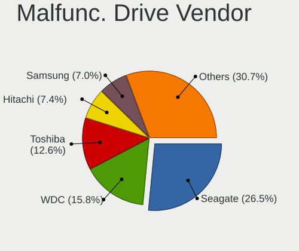

| Vendor              | Computers | Drives | Percent |
|---------------------|-----------|--------|---------|
| Seagate             | 57        | 58     | 26.51%  |
| WDC                 | 34        | 38     | 15.81%  |
| Toshiba             | 27        | 28     | 12.56%  |
| Hitachi             | 16        | 17     | 7.44%   |
| Samsung Electronics | 15        | 15     | 6.98%   |
| HGST                | 14        | 15     | 6.51%   |
| Kingston            | 10        | 10     | 4.65%   |
| A-DATA Technology   | 5         | 5      | 2.33%   |
| Intel               | 4         | 4      | 1.86%   |
| China               | 4         | 4      | 1.86%   |
| SanDisk             | 3         | 4      | 1.4%    |
| Micron Technology   | 3         | 3      | 1.4%    |
| SK hynix            | 2         | 2      | 0.93%   |
| Apple               | 2         | 2      | 0.93%   |
| Teclast             | 1         | 1      | 0.47%   |
| SSSTC               | 1         | 1      | 0.47%   |
| SPCC                | 1         | 1      | 0.47%   |
| Silicon Motion      | 1         | 1      | 0.47%   |
| POLION              | 1         | 1      | 0.47%   |
| OCZ                 | 1         | 1      | 0.47%   |
| Netac               | 1         | 1      | 0.47%   |
| Maxtor              | 1         | 1      | 0.47%   |
| LITEONIT            | 1         | 1      | 0.47%   |
| LITEON              | 1         | 1      | 0.47%   |
| KingFast            | 1         | 1      | 0.47%   |
| JMicron Technology  | 1         | 1      | 0.47%   |
| INNOVATION IT       | 1         | 1      | 0.47%   |
| Hewlett-Packard     | 1         | 1      | 0.47%   |
| Fanxiang            | 1         | 2      | 0.47%   |
| Drevo               | 1         | 1      | 0.47%   |
| Crucial             | 1         | 1      | 0.47%   |
| BIWIN               | 1         | 1      | 0.47%   |
| Unknown             | 1         | 1      | 0.47%   |

Malfunc. HDD Vendor
-------------------

Vendors of faulty HDD drives

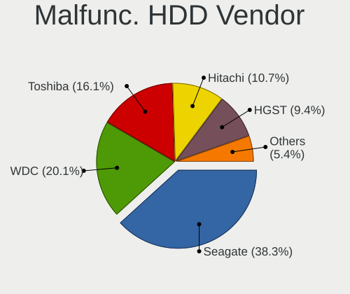

| Vendor              | Computers | Drives | Percent |
|---------------------|-----------|--------|---------|
| Seagate             | 57        | 58     | 38.26%  |
| WDC                 | 30        | 33     | 20.13%  |
| Toshiba             | 24        | 25     | 16.11%  |
| Hitachi             | 16        | 17     | 10.74%  |
| HGST                | 14        | 15     | 9.4%    |
| Samsung Electronics | 5         | 5      | 3.36%   |
| Apple               | 2         | 2      | 1.34%   |
| Maxtor              | 1         | 1      | 0.67%   |

Malfunc. Drive Kind
-------------------

Kinds of faulty drives

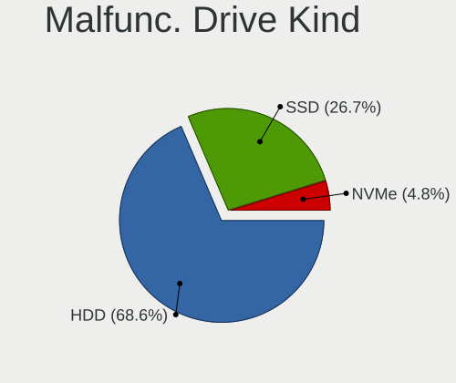

| Kind | Computers | Drives | Percent |
|------|-----------|--------|---------|
| HDD  | 144       | 156    | 68.57%  |
| SSD  | 56        | 59     | 26.67%  |
| NVMe | 10        | 10     | 4.76%   |

Failed Drives
-------------

Failed drive models

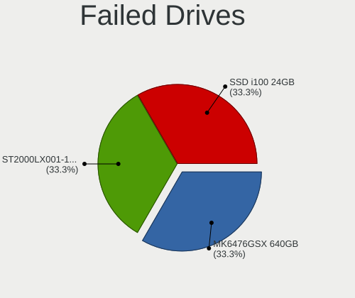

| Model                          | Computers | Drives | Percent |
|--------------------------------|-----------|--------|---------|
| Toshiba MK6476GSX 640GB        | 1         | 1      | 33.33%  |
| Seagate ST2000LX001-1RG174 2TB | 1         | 1      | 33.33%  |
| SanDisk SSD i100 24GB          | 1         | 1      | 33.33%  |

Failed Drive Vendor
-------------------

Failed drive vendors

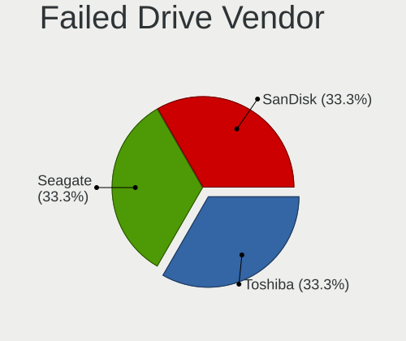

| Vendor  | Computers | Drives | Percent |
|---------|-----------|--------|---------|
| Toshiba | 1         | 1      | 33.33%  |
| Seagate | 1         | 1      | 33.33%  |
| SanDisk | 1         | 1      | 33.33%  |

Drive Status
------------

Number of failed and malfunc. drives

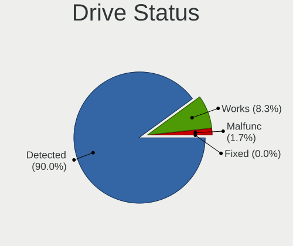

| Status   | Computers | Drives | Percent |
|----------|-----------|--------|---------|
| Detected | 11018     | 20140  | 89.97%  |
| Works    | 1018      | 1549   | 8.31%   |
| Malfunc  | 206       | 225    | 1.68%   |
| Failed   | 3         | 3      | 0.02%   |
| Fixed    | 1         | 1      | 0.01%   |

Storage controller
------------------

Storage Vendor
--------------

Storage controller vendors

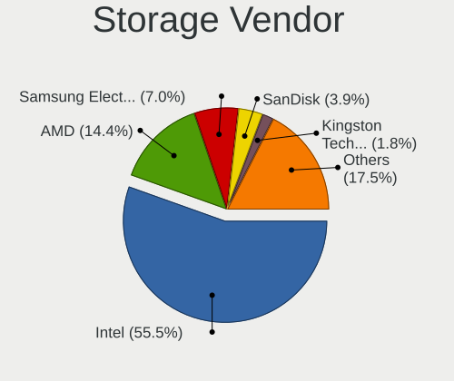

| Vendor                           | Computers | Percent |
|----------------------------------|-----------|---------|
| Intel                            | 8120      | 55.46%  |
| AMD                              | 2101      | 14.35%  |
| Samsung Electronics              | 1025      | 7%      |
| SanDisk                          | 571       | 3.9%    |
| Kingston Technology Company      | 261       | 1.78%   |
| SK hynix                         | 259       | 1.77%   |
| Nvidia                           | 250       | 1.71%   |
| Phison Electronics               | 194       | 1.33%   |
| ASMedia Technology               | 190       | 1.3%    |
| Micron Technology                | 180       | 1.23%   |
| Micron/Crucial Technology        | 160       | 1.09%   |
| JMicron Technology               | 137       | 0.94%   |
| Marvell Technology Group         | 134       | 0.92%   |
| MAXIO Technology (Hangzhou)      | 129       | 0.88%   |
| Silicon Motion                   | 125       | 0.85%   |
| Toshiba America Info Systems     | 118       | 0.81%   |
| KIOXIA                           | 107       | 0.73%   |
| ADATA Technology                 | 89        | 0.61%   |
| Realtek Semiconductor            | 65        | 0.44%   |
| VIA Technologies                 | 59        | 0.4%    |
| Silicon Integrated Systems [SiS] | 55        | 0.38%   |
| Shenzhen Longsys Electronics     | 42        | 0.29%   |
| Apple                            | 39        | 0.27%   |
| Solid State Storage Technology   | 26        | 0.18%   |
| INNOGRIT                         | 25        | 0.17%   |
| Seagate Technology               | 21        | 0.14%   |
| Silicon Image                    | 17        | 0.12%   |
| Broadcom / LSI                   | 17        | 0.12%   |
| Union Memory (Shenzhen)          | 15        | 0.1%    |
| LSI Logic / Symbios Logic        | 14        | 0.1%    |
| Lite-On Technology               | 10        | 0.07%   |
| Solidigm                         | 9         | 0.06%   |
| Yangtze Memory Technologies      | 8         | 0.05%   |
| Netac Technology                 | 8         | 0.05%   |
| Biwin Storage Technology         | 7         | 0.05%   |
| Unknown                          | 7         | 0.05%   |
| Integrated Technology Express    | 6         | 0.04%   |
| Hosin Global Electronics         | 6         | 0.04%   |
| TenaFe                           | 5         | 0.03%   |
| OCZ Technology Group             | 4         | 0.03%   |

Storage Model
-------------

Storage controller models

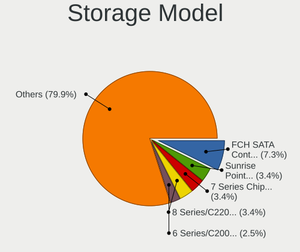

| Model                                                                                   | Computers | Percent |
|-----------------------------------------------------------------------------------------|-----------|---------|
| AMD FCH SATA Controller [AHCI mode]                                                     | 1233      | 7.32%   |
| Intel Sunrise Point-LP SATA Controller [AHCI mode]                                      | 579       | 3.44%   |
| Intel 7 Series Chipset Family 6-port SATA Controller [AHCI mode]                        | 579       | 3.44%   |
| Intel 8 Series/C220 Series Chipset Family 6-port SATA Controller 1 [AHCI mode]          | 573       | 3.4%    |
| Intel 6 Series/C200 Series Chipset Family 6 port Mobile SATA AHCI Controller            | 416       | 2.47%   |
| Intel 82801 Mobile SATA Controller [RAID mode]                                          | 412       | 2.45%   |
| Samsung NVMe SSD Controller SM981/PM981/PM983                                           | 347       | 2.06%   |
| Intel 6 Series/C200 Series Chipset Family 6 port Desktop SATA AHCI Controller           | 314       | 1.86%   |
| Intel 8 Series SATA Controller 1 [AHCI mode]                                            | 310       | 1.84%   |
| Intel 82801IBM/IEM (ICH9M/ICH9M-E) 4 port SATA Controller [AHCI mode]                   | 301       | 1.79%   |
| AMD SB7x0/SB8x0/SB9x0 SATA Controller [AHCI mode]                                       | 261       | 1.55%   |
| Intel 82801G (ICH7 Family) IDE Controller                                               | 254       | 1.51%   |
| Intel Q170/Q150/B150/H170/H110/Z170/CM236 Chipset SATA Controller [AHCI Mode]           | 242       | 1.44%   |
| Intel NM10/ICH7 Family SATA Controller [IDE mode]                                       | 240       | 1.42%   |
| Intel Volume Management Device NVMe RAID Controller                                     | 238       | 1.41%   |
| AMD SB7x0/SB8x0/SB9x0 IDE Controller                                                    | 226       | 1.34%   |
| Intel 5 Series/3400 Series Chipset 4 port SATA AHCI Controller                          | 219       | 1.3%    |
| Intel Celeron/Pentium Silver Processor SATA Controller                                  | 218       | 1.29%   |
| AMD 400 Series Chipset SATA Controller                                                  | 211       | 1.25%   |
| Intel Wildcat Point-LP SATA Controller [AHCI Mode]                                      | 208       | 1.23%   |
| Intel 82801HM/HEM (ICH8M/ICH8M-E) IDE Controller                                        | 204       | 1.21%   |
| Intel SATA Controller [RAID mode]                                                       | 203       | 1.21%   |
| Intel 7 Series/C210 Series Chipset Family 6-port SATA Controller [AHCI mode]            | 202       | 1.2%    |
| Samsung NVMe SSD Controller 980 (DRAM-less)                                             | 179       | 1.06%   |
| ASMedia ASM1061/ASM1062 Serial ATA Controller                                           | 172       | 1.02%   |
| Intel 82801HM/HEM (ICH8M/ICH8M-E) SATA Controller [AHCI mode]                           | 171       | 1.02%   |
| AMD 500 Series Chipset SATA Controller                                                  | 171       | 1.02%   |
| Intel 200 Series PCH SATA controller [AHCI mode]                                        | 164       | 0.97%   |
| AMD SB7x0/SB8x0/SB9x0 SATA Controller [IDE mode]                                        | 164       | 0.97%   |
| Intel 5 Series/3400 Series Chipset 6 port SATA AHCI Controller                          | 161       | 0.96%   |
| Samsung NVMe SSD Controller PM9A1/PM9A3/980PRO                                          | 154       | 0.91%   |
| Intel Atom Processor E3800 Series SATA AHCI Controller                                  | 123       | 0.73%   |
| Intel Celeron N3350/Pentium N4200/Atom E3900 Series SATA AHCI Controller                | 122       | 0.72%   |
| Samsung NVMe SSD Controller SM961/PM961/SM963                                           | 120       | 0.71%   |
| Intel Cannon Lake PCH SATA AHCI Controller                                              | 116       | 0.69%   |
| SanDisk WD SN560/SN740/SN770/SN5000 NVMe SSD                                            | 114       | 0.68%   |
| Intel Comet Lake SATA AHCI Controller                                                   | 109       | 0.65%   |
| AMD 600 Series Chipset SATA Controller                                                  | 105       | 0.62%   |
| Intel Tiger Lake-LP SATA Controller                                                     | 98        | 0.58%   |
| Intel 6 Series/C200 Series Chipset Family Desktop SATA Controller (IDE mode, ports 4-5) | 95        | 0.56%   |

Storage Kind
------------

Kind of storage controller (IDE, SATA, NVMe, SAS, ...)

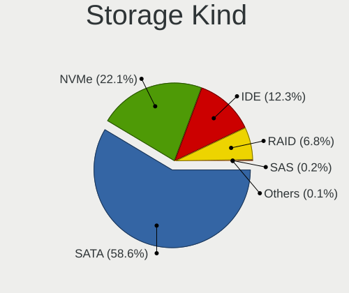

| Kind | Computers | Percent |
|------|-----------|---------|
| SATA | 8691      | 58.59%  |
| NVMe | 3272      | 22.06%  |
| IDE  | 1823      | 12.29%  |
| RAID | 1010      | 6.81%   |
| SAS  | 26        | 0.18%   |
| SCSI | 12        | 0.08%   |

Processor
---------

CPU Vendor
----------

Processor vendors

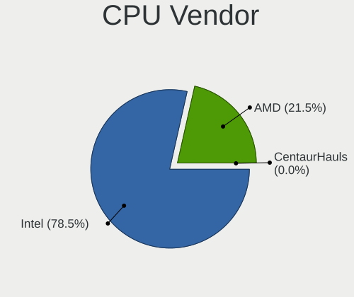

| Vendor       | Computers | Percent |
|--------------|-----------|---------|
| Intel        | 9417      | 78.52%  |
| AMD          | 2574      | 21.46%  |
| CentaurHauls | 2         | 0.02%   |

CPU Model
---------

Processor models

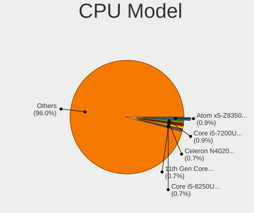

| Model                                         | Computers | Percent |
|-----------------------------------------------|-----------|---------|
| Intel Atom x5-Z8350 CPU @ 1.44GHz             | 110       | 0.92%   |
| Intel Core i5-7200U CPU @ 2.50GHz             | 108       | 0.9%    |
| Intel Celeron N4020 CPU @ 1.10GHz             | 90        | 0.75%   |
| Intel 11th Gen Core i5-1135G7 @ 2.40GHz       | 89        | 0.74%   |
| Intel Core i5-8250U CPU @ 1.60GHz             | 88        | 0.73%   |
| Intel Core i5-6200U CPU @ 2.30GHz             | 87        | 0.72%   |
| Intel Core i5-6300U CPU @ 2.40GHz             | 84        | 0.7%    |
| Intel Core i5-3210M CPU @ 2.50GHz             | 80        | 0.67%   |
| Intel 11th Gen Core i7-1165G7 @ 2.80GHz       | 80        | 0.67%   |
| Intel Core i5-2520M CPU @ 2.50GHz             | 78        | 0.65%   |
| Intel Celeron CPU N3350 @ 1.10GHz             | 75        | 0.62%   |
| Intel Core i5-3470 CPU @ 3.20GHz              | 65        | 0.54%   |
| AMD Ryzen 5 3600 6-Core Processor             | 65        | 0.54%   |
| Intel Core i5-5200U CPU @ 2.20GHz             | 64        | 0.53%   |
| Intel Core i5-2400 CPU @ 3.10GHz              | 63        | 0.52%   |
| Intel Core i7-7700HQ CPU @ 2.80GHz            | 55        | 0.46%   |
| Intel Core i7-4790 CPU @ 3.60GHz              | 53        | 0.44%   |
| AMD Ryzen 5 5500U with Radeon Graphics        | 53        | 0.44%   |
| Intel Core i7-8550U CPU @ 1.80GHz             | 51        | 0.42%   |
| Intel Core i7-3770 CPU @ 3.40GHz              | 51        | 0.42%   |
| Intel Core i3-3110M CPU @ 2.40GHz             | 50        | 0.42%   |
| Intel Core i5-8265U CPU @ 1.60GHz             | 49        | 0.41%   |
| Intel Core 2 Duo CPU E8400 @ 3.00GHz          | 49        | 0.41%   |
| AMD Ryzen 5 3500U with Radeon Vega Mobile Gfx | 49        | 0.41%   |
| Intel Core i5-4210U CPU @ 1.70GHz             | 48        | 0.4%    |
| Intel Celeron N4000 CPU @ 1.10GHz             | 47        | 0.39%   |
| Intel Core i7-2600 CPU @ 3.40GHz              | 46        | 0.38%   |
| Intel Core i5-10210U CPU @ 1.60GHz            | 46        | 0.38%   |
| Intel Core i5-3230M CPU @ 2.60GHz             | 45        | 0.37%   |
| Intel Core i5-7300U CPU @ 2.60GHz             | 44        | 0.37%   |
| Intel Core i5-4200U CPU @ 1.60GHz             | 44        | 0.37%   |
| Intel Core i5-2430M CPU @ 2.40GHz             | 44        | 0.37%   |
| Intel Celeron CPU N2840 @ 2.16GHz             | 44        | 0.37%   |
| Intel Core i7-6500U CPU @ 2.50GHz             | 42        | 0.35%   |
| Intel Core i5-6500 CPU @ 3.20GHz              | 42        | 0.35%   |
| Intel Core 2 Duo CPU P8600 @ 2.40GHz          | 42        | 0.35%   |
| AMD Ryzen 9 5900X 12-Core Processor           | 42        | 0.35%   |
| Intel Core i7-7500U CPU @ 2.70GHz             | 40        | 0.33%   |
| Intel Core i7-2670QM CPU @ 2.20GHz            | 40        | 0.33%   |
| Intel Core i5-5300U CPU @ 2.30GHz             | 40        | 0.33%   |

CPU Model Family
----------------

Processor model prefix

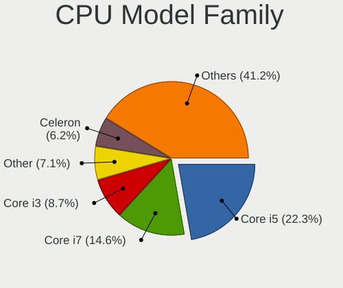

| Model                   | Computers | Percent |
|-------------------------|-----------|---------|
| Intel Core i5           | 2675      | 22.27%  |
| Intel Core i7           | 1749      | 14.56%  |
| Intel Core i3           | 1039      | 8.65%   |
| Other                   | 850       | 7.08%   |
| Intel Celeron           | 745       | 6.2%    |
| Intel Core 2 Duo        | 651       | 5.42%   |
| AMD Ryzen 5             | 557       | 4.64%   |
| AMD Ryzen 7             | 426       | 3.55%   |
| Intel Pentium           | 319       | 2.66%   |
| Intel Atom              | 302       | 2.51%   |
| Intel Xeon              | 244       | 2.03%   |
| Intel Pentium Dual-Core | 169       | 1.41%   |
| AMD Ryzen 9             | 163       | 1.36%   |
| AMD FX                  | 161       | 1.34%   |
| AMD A6                  | 136       | 1.13%   |
| AMD Ryzen 3             | 122       | 1.02%   |
| Intel Pentium Dual      | 111       | 0.92%   |
| Intel Core 2 Quad       | 111       | 0.92%   |
| AMD A8                  | 105       | 0.87%   |
| AMD A4                  | 89        | 0.74%   |
| AMD A10                 | 82        | 0.68%   |
| Intel Core 2            | 76        | 0.63%   |
| AMD E1                  | 62        | 0.52%   |
| Intel Core              | 60        | 0.5%    |
| Intel Genuine           | 58        | 0.48%   |
| AMD Athlon II X2        | 54        | 0.45%   |
| Intel Core i9           | 53        | 0.44%   |
| AMD Athlon 64 X2        | 52        | 0.43%   |
| AMD E                   | 51        | 0.42%   |
| AMD Phenom II X4        | 46        | 0.38%   |
| AMD Athlon              | 46        | 0.38%   |
| Intel Pentium 4         | 44        | 0.37%   |
| Intel Pentium Silver    | 34        | 0.28%   |
| Intel Celeron M         | 30        | 0.25%   |
| AMD Ryzen 5 PRO         | 29        | 0.24%   |
| Intel Pentium M         | 28        | 0.23%   |
| AMD E2                  | 26        | 0.22%   |
| AMD Sempron             | 25        | 0.21%   |
| AMD Turion 64 X2 Mobile | 23        | 0.19%   |
| Intel Core m3           | 22        | 0.18%   |

CPU Cores
---------

Number of processor cores

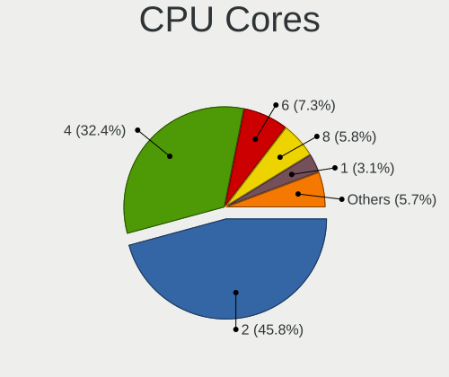

| Number | Computers | Percent |
|--------|-----------|---------|
| 2      | 5501      | 45.78%  |
| 4      | 3888      | 32.35%  |
| 6      | 874       | 7.27%   |
| 8      | 700       | 5.83%   |
| 1      | 367       | 3.05%   |
| 12     | 180       | 1.5%    |
| 10     | 153       | 1.27%   |
| 14     | 104       | 0.87%   |
| 16     | 101       | 0.84%   |
| 3      | 74        | 0.62%   |
| 24     | 40        | 0.33%   |
| 20     | 19        | 0.16%   |
| 18     | 7         | 0.06%   |
| 32     | 3         | 0.02%   |
| 28     | 2         | 0.02%   |
| 5      | 2         | 0.02%   |
| 40     | 1         | 0.01%   |
| 36     | 1         | 0.01%   |

CPU Sockets
-----------

Number of sockets

| Number | Computers | Percent |
|--------|-----------|---------|
| 1      | 11920     | 99.37%  |
| 2      | 64        | 0.53%   |
| 24     | 4         | 0.03%   |
| 8      | 4         | 0.03%   |
| 20     | 2         | 0.02%   |
| 14     | 1         | 0.01%   |

CPU Threads
-----------

Threads per core (Hyper-Threading)

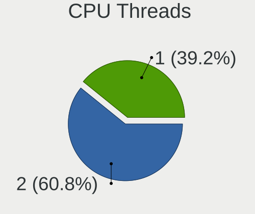

| Number | Computers | Percent |
|--------|-----------|---------|
| 2      | 7305      | 60.82%  |
| 1      | 4705      | 39.18%  |

CPU Op-Modes
------------

CPU Operation Modes (32-bit, 64-bit)

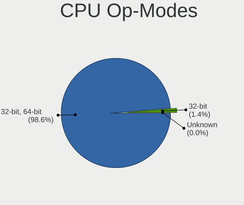

| Op mode        | Computers | Percent |
|----------------|-----------|---------|
| 32-bit, 64-bit | 11829     | 98.62%  |
| 32-bit         | 162       | 1.35%   |
| Unknown        | 3         | 0.03%   |

CPU Microcode
-------------

Microcode number

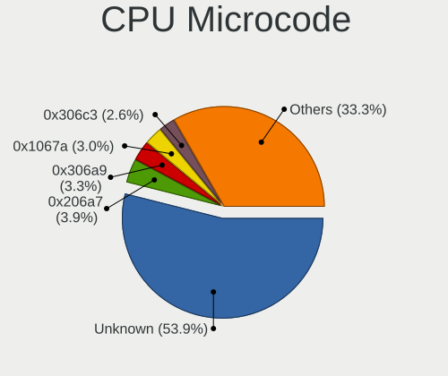

| Number     | Computers | Percent |
|------------|-----------|---------|
| Unknown    | 6594      | 53.93%  |
| 0x206a7    | 475       | 3.88%   |
| 0x306a9    | 398       | 3.25%   |
| 0x1067a    | 367       | 3%      |
| 0x306c3    | 319       | 2.61%   |
| 0x40651    | 167       | 1.37%   |
| 0x6fd      | 163       | 1.33%   |
| 0x20655    | 148       | 1.21%   |
| 0x406e3    | 140       | 1.14%   |
| 0x306d4    | 129       | 1.05%   |
| 0x806e9    | 128       | 1.05%   |
| 0x406c4    | 116       | 0.95%   |
| 0x30678    | 115       | 0.94%   |
| 0x806c1    | 111       | 0.91%   |
| 0x506e3    | 106       | 0.87%   |
| 0x806ea    | 100       | 0.82%   |
| 0x806ec    | 89        | 0.73%   |
| 0x906ea    | 88        | 0.72%   |
| 0x906e9    | 88        | 0.72%   |
| 0x10676    | 84        | 0.69%   |
| 0x010000c8 | 71        | 0.58%   |
| 0x706a8    | 70        | 0.57%   |
| 0x506c9    | 64        | 0.52%   |
| 0x08108109 | 63        | 0.52%   |
| 0x06000852 | 62        | 0.51%   |
| 0x6fb      | 60        | 0.49%   |
| 0x20652    | 59        | 0.48%   |
| 0x06001119 | 56        | 0.46%   |
| 0x08701021 | 55        | 0.45%   |
| 0x406c3    | 54        | 0.44%   |
| 0x6f6      | 50        | 0.41%   |
| 0x706e5    | 49        | 0.4%    |
| 0x06006705 | 44        | 0.36%   |
| 0x106ca    | 41        | 0.34%   |
| 0x0800820d | 39        | 0.32%   |
| 0x0700010f | 37        | 0.3%    |
| 0x05000119 | 36        | 0.29%   |
| 0x6d8      | 35        | 0.29%   |
| 0x0a50000c | 35        | 0.29%   |
| 0x07030105 | 34        | 0.28%   |

CPU Microarch
-------------

Microarchitecture

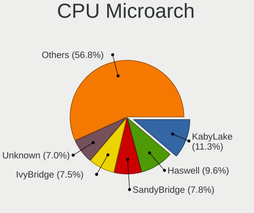

| Name              | Computers | Percent |
|-------------------|-----------|---------|
| KabyLake          | 1354      | 11.27%  |
| Haswell           | 1149      | 9.57%   |
| SandyBridge       | 942       | 7.84%   |
| IvyBridge         | 904       | 7.53%   |
| Unknown           | 843       | 7.02%   |
| Penryn            | 773       | 6.44%   |
| Skylake           | 622       | 5.18%   |
| Silvermont        | 470       | 3.91%   |
| Core              | 466       | 3.88%   |
| Westmere          | 440       | 3.66%   |
| Zen 3             | 367       | 3.06%   |
| Broadwell         | 297       | 2.47%   |
| Zen 2             | 271       | 2.26%   |
| TigerLake         | 259       | 2.16%   |
| Goldmont plus     | 255       | 2.12%   |
| Zen+              | 251       | 2.09%   |
| K10               | 228       | 1.9%    |
| Piledriver        | 227       | 1.89%   |
| CometLake         | 175       | 1.46%   |
| Excavator         | 166       | 1.38%   |
| Zen               | 159       | 1.32%   |
| IceLake           | 140       | 1.17%   |
| K8 Hammer         | 134       | 1.12%   |
| Goldmont          | 130       | 1.08%   |
| Nehalem           | 128       | 1.07%   |
| Puma              | 107       | 0.89%   |
| Alderlake Hybrid  | 107       | 0.89%   |
| P6                | 96        | 0.8%    |
| Bonnell           | 96        | 0.8%    |
| Bobcat            | 94        | 0.78%   |
| Jaguar            | 83        | 0.69%   |
| NetBurst          | 66        | 0.55%   |
| K10 Llano         | 53        | 0.44%   |
| Steamroller       | 51        | 0.42%   |
| Bulldozer         | 38        | 0.32%   |
| K8 & K10 hybrid   | 25        | 0.21%   |
| Tremont           | 23        | 0.19%   |
| Gracemont         | 8         | 0.07%   |
| Meteorlake Hybrid | 6         | 0.05%   |
| K6                | 3         | 0.02%   |

Graphics
--------

GPU Vendor
----------

Vendors of graphics cards

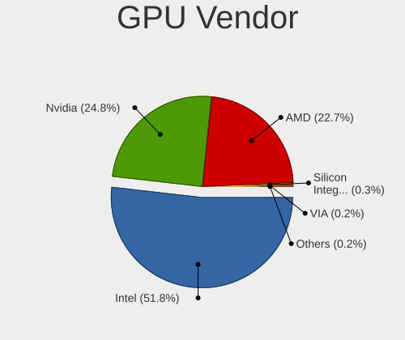

| Vendor                                       | Computers | Percent |
|----------------------------------------------|-----------|---------|
| Intel                                        | 7150      | 51.81%  |
| Nvidia                                       | 3423      | 24.8%   |
| AMD                                          | 3130      | 22.68%  |
| Silicon Integrated Systems [SiS]             | 43        | 0.31%   |
| VIA Technologies                             | 23        | 0.17%   |
| Matrox Electronics Systems                   | 17        | 0.12%   |
| ASPEED Technology                            | 7         | 0.05%   |
| ATI Technologies                             | 3         | 0.02%   |
| XGI Technology (eXtreme Graphics Innovation) | 1         | 0.01%   |
| Trident Microsystems                         | 1         | 0.01%   |
| Silicon Motion                               | 1         | 0.01%   |
| 3DLabs                                       | 1         | 0.01%   |

GPU Model
---------

Graphics card models

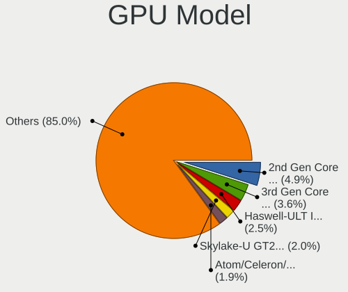

| Model                                                                                    | Computers | Percent |
|------------------------------------------------------------------------------------------|-----------|---------|
| Intel 2nd Generation Core Processor Family Integrated Graphics Controller                | 706       | 4.94%   |
| Intel 3rd Gen Core processor Graphics Controller                                         | 516       | 3.61%   |
| Intel Haswell-ULT Integrated Graphics Controller                                         | 363       | 2.54%   |
| Intel Skylake-U GT2 [HD Graphics 520]                                                    | 283       | 1.98%   |
| Intel Atom/Celeron/Pentium Processor x5-E8000/J3xxx/N3xxx Integrated Graphics Controller | 273       | 1.91%   |
| Intel Core Processor Integrated Graphics Controller                                      | 268       | 1.88%   |
| Intel Kaby Lake-U GT2 [HD Graphics 620]                                                  | 256       | 1.79%   |
| Intel Xeon E3-1200 v3/4th Gen Core Processor Integrated Graphics Controller              | 244       | 1.71%   |
| Intel Mobile 4 Series Chipset Integrated Graphics Controller                             | 242       | 1.69%   |
| Intel GeminiLake [UHD Graphics 600]                                                      | 229       | 1.6%    |
| Intel Kaby Lake-R GT2 [UHD Graphics 620]                                                 | 223       | 1.56%   |
| Intel TigerLake-LP GT2 [Iris Xe Graphics]                                                | 214       | 1.5%    |
| Intel Broadwell-U GT2 [HD Graphics 5500]                                                 | 195       | 1.37%   |
| Intel Atom Processor Z36xxx/Z37xxx Series Graphics & Display                             | 194       | 1.36%   |
| Intel 4th Gen Core Processor Integrated Graphics Controller                              | 189       | 1.32%   |
| AMD Picasso/Raven 2 [Radeon Vega Series / Radeon Vega Mobile Series]                     | 174       | 1.22%   |
| AMD Ellesmere [Radeon RX 470/480/570/570X/580/580X/590]                                  | 158       | 1.11%   |
| Intel Xeon E3-1200 v2/3rd Gen Core processor Graphics Controller                         | 132       | 0.92%   |
| Intel Mobile GM965/GL960 Integrated Graphics Controller (secondary)                      | 123       | 0.86%   |
| Intel Mobile GM965/GL960 Integrated Graphics Controller (primary)                        | 123       | 0.86%   |
| Intel WhiskeyLake-U GT2 [UHD Graphics 620]                                               | 121       | 0.85%   |
| AMD Cezanne [Radeon Vega Series / Radeon Vega Mobile Series]                             | 117       | 0.82%   |
| Intel Skylake-S GT2 [HD Graphics 530]                                                    | 115       | 0.81%   |
| Intel Apollo Lake GT1 [HD Graphics 500]                                                  | 112       | 0.78%   |
| Nvidia GK208B [GeForce GT 710]                                                           | 111       | 0.78%   |
| Intel 4 Series Chipset Integrated Graphics Controller                                    | 110       | 0.77%   |
| Intel CometLake-U GT2 [UHD Graphics]                                                     | 107       | 0.75%   |
| Intel CoffeeLake-H GT2 [UHD Graphics 630]                                                | 107       | 0.75%   |
| AMD Stoney [Radeon R2/R3/R4/R5 Graphics]                                                 | 103       | 0.72%   |
| AMD Renoir [Radeon Vega Series / Radeon Vega Mobile Series]                              | 103       | 0.72%   |
| Intel Mobile 945GM/GMS/GME, 943/940GML Express Integrated Graphics Controller            | 95        | 0.67%   |
| AMD Lucienne                                                                             | 93        | 0.65%   |
| AMD Raven Ridge [Radeon Vega Series / Radeon Vega Mobile Series]                         | 81        | 0.57%   |
| Nvidia GP107 [GeForce GTX 1050 Ti]                                                       | 79        | 0.55%   |
| Intel Kaby Lake-H GT2 [HD Graphics 630]                                                  | 75        | 0.53%   |
| Intel CoffeeLake-S GT2 [UHD Graphics 630]                                                | 74        | 0.52%   |
| Nvidia GF117M [GeForce 610M/710M/810M/820M / GT 620M/625M/630M/720M]                     | 72        | 0.5%    |
| Intel Raptor Lake-P [Iris Xe Graphics]                                                   | 71        | 0.5%    |
| AMD Mullins [Radeon R4/R5 Graphics]                                                      | 71        | 0.5%    |
| Intel Mobile 945GM/GMS, 943/940GML Express Integrated Graphics Controller                | 70        | 0.49%   |

GPU Combo
---------

Combinations of graphics cards

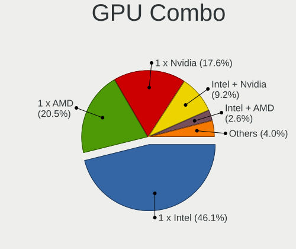

| Name                     | Computers | Percent |
|--------------------------|-----------|---------|
| 1 x Intel                | 5565      | 46.14%  |
| 1 x AMD                  | 2468      | 20.46%  |
| 1 x Nvidia               | 2121      | 17.59%  |
| Intel + Nvidia           | 1110      | 9.2%    |
| Intel + AMD              | 315       | 2.61%   |
| 2 x AMD                  | 185       | 1.53%   |
| AMD + Nvidia             | 154       | 1.28%   |
| 1 x SiS                  | 43        | 0.36%   |
| 2 x Nvidia               | 24        | 0.2%    |
| 1 x VIA                  | 23        | 0.19%   |
| Other                    | 18        | 0.15%   |
| 1 x Matrox               | 11        | 0.09%   |
| 2 x Intel                | 4         | 0.03%   |
| 1 x ASPEED               | 4         | 0.03%   |
| Nvidia + Matrox          | 3         | 0.02%   |
| 2 x AMD + 1 x Nvidia     | 2         | 0.02%   |
| Nvidia + ASPEED          | 2         | 0.02%   |
| AMD + Matrox             | 2         | 0.02%   |
| 3 x AMD                  | 1         | 0.01%   |
| 2 x Nvidia + 1 x ASPEED  | 1         | 0.01%   |
| 2 x AMD + 1 x 3DLabs     | 1         | 0.01%   |
| 1 x XGI                  | 1         | 0.01%   |
| 1 x Trident Microsystems | 1         | 0.01%   |
| Nvidia + Silicon Motion  | 1         | 0.01%   |
| Intel + 2 x Nvidia       | 1         | 0.01%   |

GPU Driver
----------

Free vs proprietary

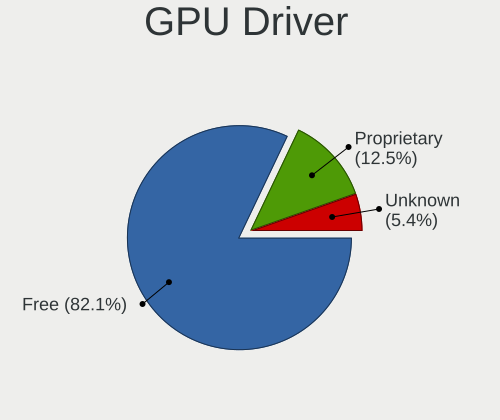

| Driver      | Computers | Percent |
|-------------|-----------|---------|
| Free        | 9942      | 82.08%  |
| Proprietary | 1519      | 12.54%  |
| Unknown     | 652       | 5.38%   |

GPU Memory
----------

Total video memory

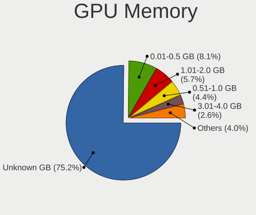

| Size in GB | Computers | Percent |
|------------|-----------|---------|
| Unknown    | 9171      | 75.17%  |
| 0.01-0.5   | 986       | 8.08%   |
| 1.01-2.0   | 695       | 5.7%    |
| 0.51-1.0   | 537       | 4.4%    |
| 3.01-4.0   | 319       | 2.61%   |
| 7.01-8.0   | 227       | 1.86%   |
| 5.01-6.0   | 105       | 0.86%   |
| 8.01-16.0  | 101       | 0.83%   |
| 2.01-3.0   | 47        | 0.39%   |
| 16.01-24.0 | 11        | 0.09%   |
| 4.01-5.0   | 2         | 0.02%   |

Monitor
-------

Monitor Vendor
--------------

Monitor vendors

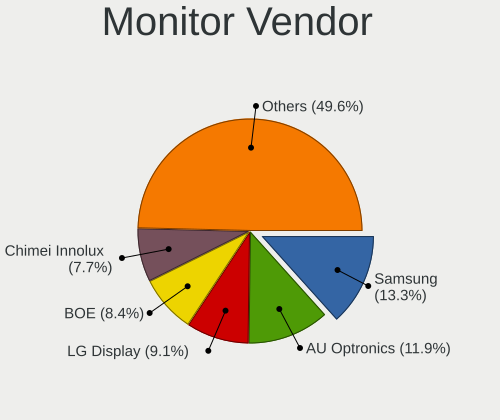

| Vendor                  | Computers | Percent |
|-------------------------|-----------|---------|
| Samsung Electronics     | 1618      | 13.35%  |
| AU Optronics            | 1438      | 11.86%  |
| LG Display              | 1099      | 9.07%   |
| BOE                     | 1014      | 8.36%   |
| Chimei Innolux          | 939       | 7.75%   |
| Goldstar                | 585       | 4.83%   |
| Dell                    | 534       | 4.41%   |
| Apple                   | 446       | 3.68%   |
| Hewlett-Packard         | 425       | 3.51%   |
| Acer                    | 359       | 2.96%   |
| AOC                     | 266       | 2.19%   |
| Chi Mei Optoelectronics | 226       | 1.86%   |
| Philips                 | 219       | 1.81%   |
| Lenovo                  | 210       | 1.73%   |
| BenQ                    | 190       | 1.57%   |
| Ancor Communications    | 171       | 1.41%   |
| Sharp                   | 155       | 1.28%   |
| InfoVision              | 106       | 0.87%   |
| LG Philips              | 105       | 0.87%   |
| ViewSonic               | 99        | 0.82%   |
| Sony                    | 94        | 0.78%   |
| PANDA                   | 87        | 0.72%   |
| ASUSTek Computer        | 87        | 0.72%   |
| Iiyama                  | 70        | 0.58%   |
| Unknown                 | 63        | 0.52%   |
| Vizio                   | 54        | 0.45%   |
| MSI                     | 51        | 0.42%   |
| LG Electronics          | 50        | 0.41%   |
| Panasonic               | 49        | 0.4%    |
| Fujitsu Siemens         | 48        | 0.4%    |
| Toshiba                 | 47        | 0.39%   |
| Unknown                 | 41        | 0.34%   |
| Sceptre Tech            | 40        | 0.33%   |
| HannStar                | 40        | 0.33%   |
| CPT                     | 38        | 0.31%   |
| HKC                     | 36        | 0.3%    |
| Eizo                    | 36        | 0.3%    |
| NEC Computers           | 32        | 0.26%   |
| RTK                     | 27        | 0.22%   |
| Hitachi                 | 26        | 0.21%   |

Monitor Model
-------------

Monitor models

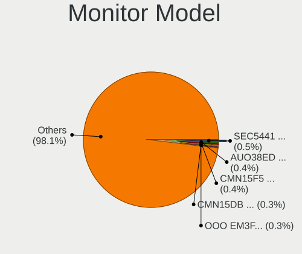

| Model                                                                    | Computers | Percent |
|--------------------------------------------------------------------------|-----------|---------|
| Samsung Electronics LCD Monitor SEC5441 1280x800 331x207mm 15.4-inch     | 68        | 0.55%   |
| AU Optronics LCD Monitor AUO38ED 1920x1080 344x193mm 15.5-inch           | 46        | 0.37%   |
| Chimei Innolux LCD Monitor CMN15F5 1920x1080 344x193mm 15.5-inch         | 44        | 0.35%   |
| Chimei Innolux LCD Monitor CMN15DB 1366x768 344x193mm 15.5-inch          | 41        | 0.33%   |
| Unknown                                                                  | 41        | 0.33%   |
| Goldstar FULL HD GSM5B55 1920x1080 480x270mm 21.7-inch                   | 36        | 0.29%   |
| AU Optronics LCD Monitor AUO26EC 1366x768 344x193mm 15.5-inch            | 35        | 0.28%   |
| Chimei Innolux LCD Monitor CMN14D4 1920x1080 309x173mm 13.9-inch         | 34        | 0.27%   |
| LG Display LCD Monitor LGD02DC 1366x768 344x194mm 15.5-inch              | 33        | 0.27%   |
| AU Optronics LCD Monitor AUO22EC 1366x768 344x193mm 15.5-inch            | 33        | 0.27%   |
| LG Display LCD Monitor LGD0555 2736x1824 260x173mm 12.3-inch             | 31        | 0.25%   |
| LG Display LCD Monitor LGD033A 1366x768 344x194mm 15.5-inch              | 31        | 0.25%   |
| Chimei Innolux LCD Monitor CMN15E7 1920x1080 344x193mm 15.5-inch         | 30        | 0.24%   |
| AU Optronics LCD Monitor AUO71EC 1366x768 344x193mm 15.5-inch            | 29        | 0.23%   |
| AU Optronics LCD Monitor AUO403D 1920x1080 309x174mm 14.0-inch           | 29        | 0.23%   |
| AU Optronics LCD Monitor AUO21ED 1920x1080 344x193mm 15.5-inch           | 29        | 0.23%   |
| BOE LCD Monitor BOE0696 1366x768 309x173mm 13.9-inch                     | 28        | 0.23%   |
| AU Optronics LCD Monitor AUO20EC 1366x768 344x193mm 15.5-inch            | 28        | 0.23%   |
| AU Optronics LCD Monitor AUO10EC 1366x768 344x193mm 15.5-inch            | 28        | 0.23%   |
| Goldstar LG ULTRAWIDE GSM59F1 2560x1080 670x280mm 28.6-inch              | 27        | 0.22%   |
| Chimei Innolux LCD Monitor CMN15E6 1366x768 344x193mm 15.5-inch          | 27        | 0.22%   |
| AU Optronics LCD Monitor AUO45EC 1366x768 344x193mm 15.5-inch            | 26        | 0.21%   |
| Samsung Electronics LCD Monitor SDC4C48 1920x1080 293x165mm 13.2-inch    | 24        | 0.19%   |
| Samsung Electronics LCD Monitor SDC3853 2736x1824 260x173mm 12.3-inch    | 24        | 0.19%   |
| Samsung Electronics C24F390 SAM0D2C 1920x1080 521x293mm 23.5-inch        | 24        | 0.19%   |
| AU Optronics LCD Monitor AUO2E3C 1366x768 309x173mm 13.9-inch            | 24        | 0.19%   |
| AU Optronics LCD Monitor AUO106C 1366x768 276x155mm 12.5-inch            | 24        | 0.19%   |
| AU Optronics LCD Monitor AUO235C 1366x768 256x144mm 11.6-inch            | 23        | 0.18%   |
| Samsung Electronics C27F390 SAM0D32 1920x1080 598x336mm 27.0-inch        | 22        | 0.18%   |
| Chimei Innolux LCD Monitor CMN15DC 1366x768 344x193mm 15.5-inch          | 22        | 0.18%   |
| LG Display LCD Monitor LGD046F 1920x1080 344x194mm 15.5-inch             | 21        | 0.17%   |
| Chimei Innolux LCD Monitor CMN15CA 1366x768 344x193mm 15.5-inch          | 21        | 0.17%   |
| Chimei Innolux LCD Monitor CMN1521 1920x1080 344x193mm 15.5-inch         | 21        | 0.17%   |
| Chimei Innolux LCD Monitor CMN14D6 1366x768 309x173mm 13.9-inch          | 21        | 0.17%   |
| Chi Mei Optoelectronics LCD Monitor CMO15A7 1366x768 344x193mm 15.5-inch | 21        | 0.17%   |
| BOE LCD Monitor BOE06A4 1366x768 344x194mm 15.5-inch                     | 21        | 0.17%   |
| AU Optronics LCD Monitor AUO183C 1366x768 309x173mm 13.9-inch            | 21        | 0.17%   |
| Samsung Electronics LCD Monitor SEC544B 1600x900 382x214mm 17.2-inch     | 20        | 0.16%   |
| LG Display LCD Monitor LGD02E9 1366x768 309x174mm 14.0-inch              | 20        | 0.16%   |
| Chimei Innolux LCD Monitor CMN15AB 1366x768 344x193mm 15.5-inch          | 20        | 0.16%   |

Monitor Resolution
------------------

Monitor screen resolution

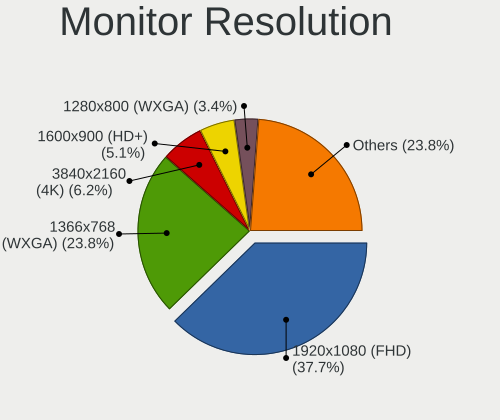

| Resolution         | Computers | Percent |
|--------------------|-----------|---------|
| 1920x1080 (FHD)    | 4446      | 37.7%   |
| 1366x768 (WXGA)    | 2806      | 23.8%   |
| 3840x2160 (4K)     | 728       | 6.17%   |
| 1600x900 (HD+)     | 602       | 5.11%   |
| 1280x800 (WXGA)    | 403       | 3.42%   |
| 2560x1440 (QHD)    | 384       | 3.26%   |
| 1440x900 (WXGA+)   | 343       | 2.91%   |
| 1920x1200 (WUXGA)  | 295       | 2.5%    |
| 1680x1050 (WSXGA+) | 273       | 2.32%   |
| 1280x1024 (SXGA)   | 255       | 2.16%   |
| Unknown            | 116       | 0.98%   |
| 3440x1440          | 113       | 0.96%   |
| 1360x768           | 110       | 0.93%   |
| 2560x1600          | 104       | 0.88%   |
| 2560x1080          | 93        | 0.79%   |
| 2880x1800          | 87        | 0.74%   |
| 3840x1080          | 72        | 0.61%   |
| 1024x600           | 58        | 0.49%   |
| 2880x1920          | 45        | 0.38%   |
| 1920x540           | 43        | 0.36%   |
| 1024x768 (XGA)     | 38        | 0.32%   |
| 2160x1440          | 36        | 0.31%   |
| 2736x1824          | 28        | 0.24%   |
| 1920x1280          | 22        | 0.19%   |
| 2256x1504          | 20        | 0.17%   |
| 3200x1800 (QHD+)   | 17        | 0.14%   |
| 1600x1200          | 16        | 0.14%   |
| 3840x2400          | 14        | 0.12%   |
| 2304x1440          | 13        | 0.11%   |
| 2288x1287          | 12        | 0.1%    |
| 3840x1600          | 11        | 0.09%   |
| 1280x768           | 11        | 0.09%   |
| 1280x720 (HD)      | 10        | 0.08%   |
| 3200x2000          | 9         | 0.08%   |
| 5760x1080          | 8         | 0.07%   |
| 2880x1620          | 7         | 0.06%   |
| 1680x945           | 7         | 0.06%   |
| 1400x1050          | 6         | 0.05%   |
| 1280x960           | 6         | 0.05%   |
| 5760x2160          | 5         | 0.04%   |

Monitor Diagonal
----------------

Diagonal size in inches

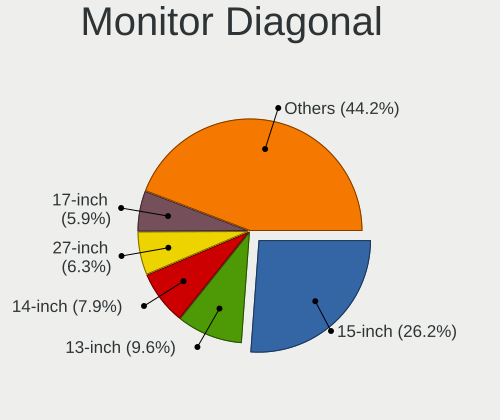

| Inches  | Computers | Percent |
|---------|-----------|---------|
| 15      | 3163      | 26.16%  |
| 13      | 1161      | 9.6%    |
| 14      | 951       | 7.87%   |
| 27      | 761       | 6.29%   |
| 17      | 710       | 5.87%   |
| 24      | 627       | 5.19%   |
| Unknown | 601       | 4.97%   |
| 23      | 591       | 4.89%   |
| 21      | 528       | 4.37%   |
| 31      | 346       | 2.86%   |
| 19      | 284       | 2.35%   |
| 18      | 284       | 2.35%   |
| 12      | 237       | 1.96%   |
| 20      | 210       | 1.74%   |
| 11      | 210       | 1.74%   |
| 22      | 171       | 1.41%   |
| 34      | 155       | 1.28%   |
| 16      | 150       | 1.24%   |
| 84      | 116       | 0.96%   |
| 10      | 88        | 0.73%   |
| 32      | 78        | 0.65%   |
| 40      | 70        | 0.58%   |
| 72      | 67        | 0.55%   |
| 54      | 65        | 0.54%   |
| 26      | 51        | 0.42%   |
| 63      | 41        | 0.34%   |
| 49      | 31        | 0.26%   |
| 48      | 31        | 0.26%   |
| 25      | 30        | 0.25%   |
| 28      | 26        | 0.22%   |
| 65      | 24        | 0.2%    |
| 52      | 23        | 0.19%   |
| 42      | 22        | 0.18%   |
| 46      | 17        | 0.14%   |
| 37      | 15        | 0.12%   |
| 74      | 12        | 0.1%    |
| 39      | 11        | 0.09%   |
| 36      | 11        | 0.09%   |
| 29      | 11        | 0.09%   |
| 60      | 9         | 0.07%   |

Monitor Width
-------------

Physical width

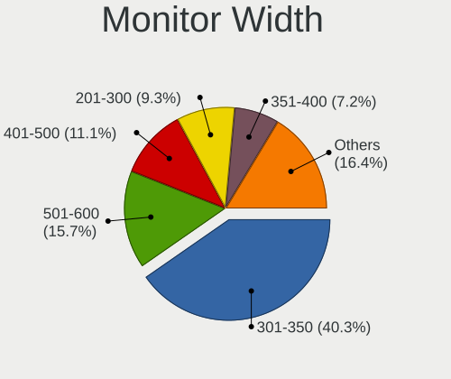

| Width in mm    | Computers | Percent |
|----------------|-----------|---------|
| 301-350        | 4811      | 40.34%  |
| 501-600        | 1867      | 15.66%  |
| 401-500        | 1328      | 11.14%  |
| 201-300        | 1113      | 9.33%   |
| 351-400        | 854       | 7.16%   |
| Unknown        | 601       | 5.04%   |
| 601-700        | 459       | 3.85%   |
| 1001-1500      | 274       | 2.3%    |
| 701-800        | 253       | 2.12%   |
| 1501-2000      | 206       | 1.73%   |
| 801-900        | 102       | 0.86%   |
| 901-1000       | 40        | 0.34%   |
| More than 2000 | 8         | 0.07%   |
| 101-200        | 8         | 0.07%   |
| 1-100          | 1         | 0.01%   |

Aspect Ratio
------------

Proportional relationship between the width and the height

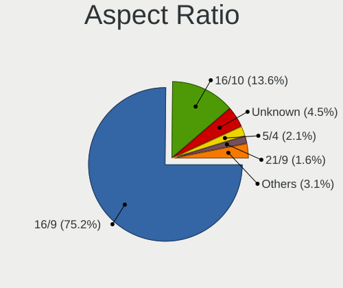

| Ratio   | Computers | Percent |
|---------|-----------|---------|
| 16/9    | 8417      | 75.15%  |
| 16/10   | 1518      | 13.55%  |
| Unknown | 500       | 4.46%   |
| 5/4     | 234       | 2.09%   |
| 21/9    | 180       | 1.61%   |
| 3/2     | 171       | 1.53%   |
| 4/3     | 79        | 0.71%   |
| 32/9    | 53        | 0.47%   |
| 6/5     | 13        | 0.12%   |
| 1.00    | 8         | 0.07%   |
| 3.73    | 5         | 0.04%   |
| 2.00    | 4         | 0.04%   |
| 0.56    | 4         | 0.04%   |
| 1.96    | 2         | 0.02%   |
| 0.89    | 2         | 0.02%   |
| 0.62    | 2         | 0.02%   |
| 3.40    | 1         | 0.01%   |
| 3.20    | 1         | 0.01%   |
| 2.01    | 1         | 0.01%   |
| 0.80    | 1         | 0.01%   |
| 0.67    | 1         | 0.01%   |
| 0.63    | 1         | 0.01%   |
| 0.31    | 1         | 0.01%   |
| 0.25    | 1         | 0.01%   |

Monitor Area
------------

Area in inch²

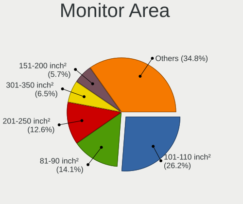

| Area in inch² | Computers | Percent |
|----------------|-----------|---------|
| 101-110        | 3143      | 26.21%  |
| 81-90          | 1695      | 14.14%  |
| 201-250        | 1515      | 12.63%  |
| 301-350        | 785       | 6.55%   |
| 151-200        | 683       | 5.7%    |
| 351-500        | 612       | 5.1%    |
| Unknown        | 601       | 5.01%   |
| 121-130        | 478       | 3.99%   |
| More than 1000 | 425       | 3.54%   |
| 71-80          | 404       | 3.37%   |
| 141-150        | 352       | 2.94%   |
| 251-300        | 250       | 2.08%   |
| 61-70          | 224       | 1.87%   |
| 51-60          | 216       | 1.8%    |
| 501-1000       | 212       | 1.77%   |
| 111-120        | 140       | 1.17%   |
| 131-140        | 126       | 1.05%   |
| 41-50          | 83        | 0.69%   |
| 91-100         | 38        | 0.32%   |
| 1-40           | 9         | 0.08%   |

Pixel Density
-------------

Pixels per inch

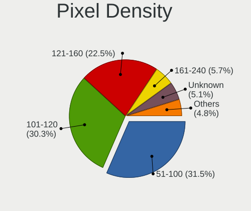

| Density       | Computers | Percent |
|---------------|-----------|---------|
| 51-100        | 3703      | 31.54%  |
| 101-120       | 3552      | 30.26%  |
| 121-160       | 2647      | 22.55%  |
| 161-240       | 669       | 5.7%    |
| Unknown       | 603       | 5.14%   |
| 1-50          | 349       | 2.97%   |
| More than 240 | 217       | 1.85%   |

Multiple Monitors
-----------------

Total monitors connected

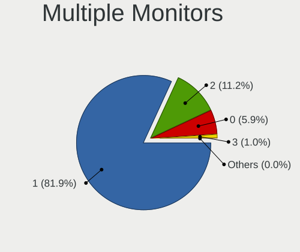

| Total | Computers | Percent |
|-------|-----------|---------|
| 1     | 9983      | 81.85%  |
| 2     | 1364      | 11.18%  |
| 0     | 718       | 5.89%   |
| 3     | 117       | 0.96%   |
| 4     | 11        | 0.09%   |
| 5     | 3         | 0.02%   |

Network
-------

Net Controller Vendor
---------------------

Controller vendors

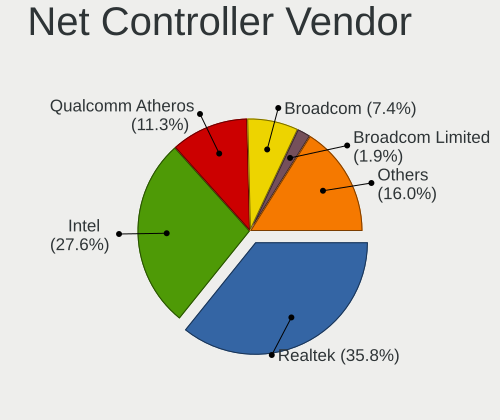

| Vendor                            | Computers | Percent |
|-----------------------------------|-----------|---------|
| Realtek Semiconductor             | 6634      | 35.79%  |
| Intel                             | 5110      | 27.57%  |
| Qualcomm Atheros                  | 2086      | 11.25%  |
| Broadcom                          | 1373      | 7.41%   |
| Broadcom Limited                  | 361       | 1.95%   |
| MediaTek                          | 319       | 1.72%   |
| Marvell Technology Group          | 293       | 1.58%   |
| Ralink Technology                 | 260       | 1.4%    |
| TP-Link                           | 251       | 1.35%   |
| Ralink                            | 222       | 1.2%    |
| Nvidia                            | 210       | 1.13%   |
| Samsung Electronics               | 112       | 0.6%    |
| ASIX Electronics                  | 104       | 0.56%   |
| Xiaomi                            | 61        | 0.33%   |
| Sierra Wireless                   | 60        | 0.32%   |
| NetGear                           | 59        | 0.32%   |
| Dell                              | 54        | 0.29%   |
| D-Link                            | 53        | 0.29%   |
| DisplayLink                       | 52        | 0.28%   |
| Silicon Integrated Systems [SiS]  | 51        | 0.28%   |
| Microsoft                         | 51        | 0.28%   |
| Qualcomm Atheros Communications   | 50        | 0.27%   |
| JMicron Technology                | 50        | 0.27%   |
| D-Link System                     | 38        | 0.2%    |
| VIA Technologies                  | 37        | 0.2%    |
| Huawei Technologies               | 37        | 0.2%    |
| ASUSTek Computer                  | 35        | 0.19%   |
| Edimax Technology                 | 30        | 0.16%   |
| Hewlett-Packard                   | 28        | 0.15%   |
| Qualcomm                          | 26        | 0.14%   |
| Aquantia                          | 24        | 0.13%   |
| Shenzhen Goodix Technology        | 23        | 0.12%   |
| OPPO Electronics                  | 23        | 0.12%   |
| Motorola PCS                      | 22        | 0.12%   |
| Ericsson Business Mobile Networks | 19        | 0.1%    |
| Belkin Components                 | 17        | 0.09%   |
| Linksys                           | 15        | 0.08%   |
| Google                            | 15        | 0.08%   |
| Qualcomm Technologies             | 14        | 0.08%   |
| Lenovo                            | 13        | 0.07%   |

Net Controller Model
--------------------

Controller models

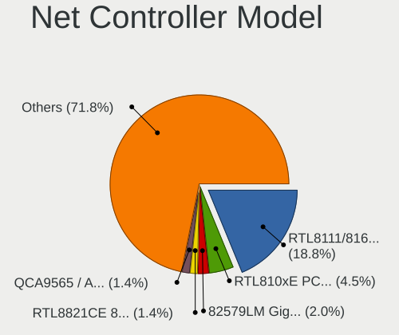

| Model                                                                  | Computers | Percent |
|------------------------------------------------------------------------|-----------|---------|
| Realtek RTL8111/8168/8211/8411 PCI Express Gigabit Ethernet Controller | 4093      | 18.79%  |
| Realtek RTL810xE PCI Express Fast Ethernet controller                  | 979       | 4.5%    |
| Intel 82579LM Gigabit Network Connection (Lewisville)                  | 438       | 2.01%   |
| Realtek RTL8821CE 802.11ac PCIe Wireless Network Adapter               | 314       | 1.44%   |
| Qualcomm Atheros QCA9565 / AR9565 Wireless Network Adapter             | 314       | 1.44%   |
| Realtek RTL8125 2.5GbE Controller                                      | 307       | 1.41%   |
| Intel Wireless 7265                                                    | 287       | 1.32%   |
| Qualcomm Atheros AR9485 Wireless Network Adapter                       | 276       | 1.27%   |
| Intel Wireless 7260                                                    | 274       | 1.26%   |
| Intel Wi-Fi 6 AX200                                                    | 272       | 1.25%   |
| Qualcomm Atheros AR9285 Wireless Network Adapter (PCI-Express)         | 271       | 1.24%   |
| Qualcomm Atheros QCA9377 802.11ac Wireless Network Adapter             | 270       | 1.24%   |
| Intel Wireless 8265 / 8275                                             | 268       | 1.23%   |
| Intel Ethernet Connection I217-LM                                      | 223       | 1.02%   |
| Realtek RTL8153 Gigabit Ethernet Adapter                               | 218       | 1%      |
| Intel Wireless 8260                                                    | 196       | 0.9%    |
| Intel Wi-Fi 6 AX201                                                    | 194       | 0.89%   |
| Intel Wireless 3165                                                    | 177       | 0.81%   |
| Realtek 802.11ac NIC                                                   | 156       | 0.72%   |
| Broadcom BCM4313 802.11bgn Wireless Network Adapter                    | 151       | 0.69%   |
| Realtek RTL8822CE 802.11ac PCIe Wireless Network Adapter               | 149       | 0.68%   |
| Intel Wi-Fi 6E(802.11ax) AX210/AX1675* 2x2 [Typhoon Peak]              | 145       | 0.67%   |
| Broadcom BCM43142 802.11b/g/n                                          | 144       | 0.66%   |
| Intel Centrino Advanced-N 6205 [Taylor Peak]                           | 142       | 0.65%   |
| Realtek RTL8723BE PCIe Wireless Network Adapter                        | 137       | 0.63%   |
| Intel I211 Gigabit Network Connection                                  | 131       | 0.6%    |
| Ralink MT7601U Wireless Adapter                                        | 127       | 0.58%   |
| Intel Ethernet Connection (2) I219-V                                   | 122       | 0.56%   |
| Realtek RTL88x2bu [AC1200 Techkey]                                     | 120       | 0.55%   |
| Qualcomm Atheros QCA6174 802.11ac Wireless Network Adapter             | 119       | 0.55%   |
| Intel Ethernet Controller I225-V                                       | 119       | 0.55%   |
| Realtek RTL8188CE 802.11b/g/n WiFi Adapter                             | 117       | 0.54%   |
| Realtek RTL8188EUS 802.11n Wireless Network Adapter                    | 115       | 0.53%   |
| Intel Alder Lake-P PCH CNVi WiFi                                       | 107       | 0.49%   |
| Realtek RTL8188EE Wireless Network Adapter                             | 105       | 0.48%   |
| Qualcomm Atheros AR8151 v2.0 Gigabit Ethernet                          | 104       | 0.48%   |
| Realtek RTL8852BE PCIe 802.11ax Wireless Network Controller            | 102       | 0.47%   |
| Intel Ethernet Connection (4) I219-LM                                  | 102       | 0.47%   |
| Intel Comet Lake PCH-LP CNVi WiFi                                      | 101       | 0.46%   |
| Intel Dual Band Wireless-AC 3168NGW [Stone Peak]                       | 98        | 0.45%   |

Wireless Vendor
---------------

Wireless vendors

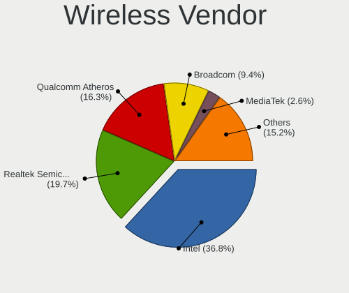

| Vendor                                | Computers | Percent |
|---------------------------------------|-----------|---------|
| Intel                                 | 3812      | 36.84%  |
| Realtek Semiconductor                 | 2038      | 19.69%  |
| Qualcomm Atheros                      | 1682      | 16.25%  |
| Broadcom                              | 973       | 9.4%    |
| MediaTek                              | 272       | 2.63%   |
| Ralink Technology                     | 260       | 2.51%   |
| Broadcom Limited                      | 252       | 2.44%   |
| TP-Link                               | 234       | 2.26%   |
| Ralink                                | 222       | 2.15%   |
| Marvell Technology Group              | 69        | 0.67%   |
| Sierra Wireless                       | 60        | 0.58%   |
| NetGear                               | 58        | 0.56%   |
| D-Link                                | 53        | 0.51%   |
| Qualcomm Atheros Communications       | 50        | 0.48%   |
| Microsoft                             | 39        | 0.38%   |
| Dell                                  | 33        | 0.32%   |
| ASUSTek Computer                      | 31        | 0.3%    |
| Edimax Technology                     | 30        | 0.29%   |
| D-Link System                         | 30        | 0.29%   |
| Belkin Components                     | 17        | 0.16%   |
| Linksys                               | 14        | 0.14%   |
| Realtek                               | 9         | 0.09%   |
| ZyXEL Communications                  | 7         | 0.07%   |
| Sitecom Europe                        | 7         | 0.07%   |
| Qualcomm                              | 7         | 0.07%   |
| Mercucys                              | 7         | 0.07%   |
| AVM                                   | 7         | 0.07%   |
| 802.11g Adapter [Linksys WUSB54GC v3] | 7         | 0.07%   |
| Micro Star International              | 6         | 0.06%   |
| Hewlett-Packard                       | 6         | 0.06%   |
| Gemtek                                | 6         | 0.06%   |
| ZyDAS                                 | 5         | 0.05%   |
| IMC Networks                          | 5         | 0.05%   |
| Fibocom                               | 5         | 0.05%   |
| TRENDnet                              | 4         | 0.04%   |
| Qualcomm Technologies                 | 3         | 0.03%   |
| Xiaomi                                | 2         | 0.02%   |
| Tenda                                 | 2         | 0.02%   |
| Senao                                 | 2         | 0.02%   |
| Philips (or NXP)                      | 2         | 0.02%   |

Wireless Model
--------------

Wireless models

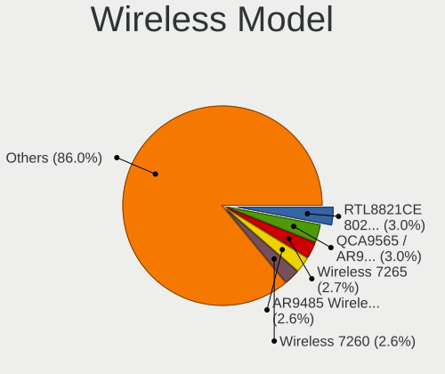

| Model                                                                   | Computers | Percent |
|-------------------------------------------------------------------------|-----------|---------|
| Realtek RTL8821CE 802.11ac PCIe Wireless Network Adapter                | 314       | 3.01%   |
| Qualcomm Atheros QCA9565 / AR9565 Wireless Network Adapter              | 314       | 3.01%   |
| Intel Wireless 7265                                                     | 287       | 2.75%   |
| Qualcomm Atheros AR9485 Wireless Network Adapter                        | 276       | 2.64%   |
| Intel Wireless 7260                                                     | 274       | 2.62%   |
| Intel Wi-Fi 6 AX200                                                     | 272       | 2.6%    |
| Qualcomm Atheros AR9285 Wireless Network Adapter (PCI-Express)          | 271       | 2.59%   |
| Qualcomm Atheros QCA9377 802.11ac Wireless Network Adapter              | 270       | 2.59%   |
| Intel Wireless 8265 / 8275                                              | 268       | 2.57%   |
| Intel Wireless 8260                                                     | 196       | 1.88%   |
| Intel Wi-Fi 6 AX201                                                     | 194       | 1.86%   |
| Intel Wireless 3165                                                     | 177       | 1.69%   |
| Realtek 802.11ac NIC                                                    | 156       | 1.49%   |
| Broadcom BCM4313 802.11bgn Wireless Network Adapter                     | 151       | 1.45%   |
| Realtek RTL8822CE 802.11ac PCIe Wireless Network Adapter                | 149       | 1.43%   |
| Intel Wi-Fi 6E(802.11ax) AX210/AX1675* 2x2 [Typhoon Peak]               | 145       | 1.39%   |
| Broadcom BCM43142 802.11b/g/n                                           | 144       | 1.38%   |
| Intel Centrino Advanced-N 6205 [Taylor Peak]                            | 142       | 1.36%   |
| Realtek RTL8723BE PCIe Wireless Network Adapter                         | 137       | 1.31%   |
| Ralink MT7601U Wireless Adapter                                         | 127       | 1.22%   |
| Realtek RTL88x2bu [AC1200 Techkey]                                      | 120       | 1.15%   |
| Qualcomm Atheros QCA6174 802.11ac Wireless Network Adapter              | 119       | 1.14%   |
| Realtek RTL8188CE 802.11b/g/n WiFi Adapter                              | 117       | 1.12%   |
| Realtek RTL8188EUS 802.11n Wireless Network Adapter                     | 115       | 1.1%    |
| Realtek RTL8188EE Wireless Network Adapter                              | 105       | 1.01%   |
| Intel Comet Lake PCH-LP CNVi WiFi                                       | 101       | 0.97%   |
| Intel Dual Band Wireless-AC 3168NGW [Stone Peak]                        | 98        | 0.94%   |
| Intel PRO/Wireless 3945ABG [Golan] Network Connection                   | 94        | 0.9%    |
| Qualcomm Atheros AR242x / AR542x Wireless Network Adapter (PCI-Express) | 93        | 0.89%   |
| Intel WiFi Link 5100                                                    | 91        | 0.87%   |
| Intel Cannon Lake PCH CNVi WiFi                                         | 91        | 0.87%   |
| MediaTek MT7921 802.11ax PCIe Wireless Network Adapter [Filogic 330]    | 90        | 0.86%   |
| Qualcomm Atheros AR928X Wireless Network Adapter (PCI-Express)          | 89        | 0.85%   |
| Intel Wireless 3160                                                     | 80        | 0.77%   |
| Intel Raptor Lake PCH CNVi WiFi                                         | 77        | 0.74%   |
| Broadcom BCM4360 802.11ac Dual Band Wireless Network Adapter            | 76        | 0.73%   |
| Intel Wi-Fi 5(802.11ac) Wireless-AC 9x6x [Thunder Peak]                 | 75        | 0.72%   |
| Broadcom BCM4312 802.11b/g LP-PHY                                       | 75        | 0.72%   |
| Qualcomm Atheros AR9462 Wireless Network Adapter                        | 74        | 0.71%   |
| Realtek RTL8852BE PCIe 802.11ax Wireless Network Controller             | 72        | 0.69%   |

Ethernet Vendor
---------------

Ethernet vendors

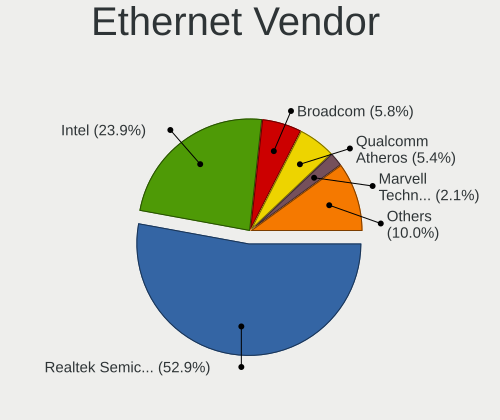

| Vendor                                 | Computers | Percent |
|----------------------------------------|-----------|---------|
| Realtek Semiconductor                  | 5762      | 52.88%  |
| Intel                                  | 2599      | 23.85%  |
| Broadcom                               | 628       | 5.76%   |
| Qualcomm Atheros                       | 593       | 5.44%   |
| Marvell Technology Group               | 224       | 2.06%   |
| Nvidia                                 | 210       | 1.93%   |
| Broadcom Limited                       | 117       | 1.07%   |
| Samsung Electronics                    | 109       | 1%      |
| ASIX Electronics                       | 104       | 0.95%   |
| Xiaomi                                 | 59        | 0.54%   |
| DisplayLink                            | 52        | 0.48%   |
| JMicron Technology                     | 50        | 0.46%   |
| Silicon Integrated Systems [SiS]       | 49        | 0.45%   |
| MediaTek                               | 44        | 0.4%    |
| VIA Technologies                       | 37        | 0.34%   |
| Huawei Technologies                    | 26        | 0.24%   |
| Aquantia                               | 24        | 0.22%   |
| OPPO Electronics                       | 23        | 0.21%   |
| Motorola PCS                           | 22        | 0.2%    |
| Qualcomm                               | 18        | 0.17%   |
| TP-Link                                | 17        | 0.16%   |
| Google                                 | 15        | 0.14%   |
| Lenovo                                 | 12        | 0.11%   |
| Qualcomm Technologies                  | 11        | 0.1%    |
| Hewlett-Packard                        | 11        | 0.1%    |
| Microsoft                              | 10        | 0.09%   |
| D-Link System                          | 8         | 0.07%   |
| Attansic Technology                    | 7         | 0.06%   |
| Apple                                  | 5         | 0.05%   |
| T & A Mobile Phones                    | 4         | 0.04%   |
| Sundance Technology Inc / IC Plus      | 4         | 0.04%   |
| ASUSTek Computer                       | 4         | 0.04%   |
| ICS Advent                             | 3         | 0.03%   |
| HMD Global                             | 3         | 0.03%   |
| Davicom Semiconductor                  | 3         | 0.03%   |
| ZTE WCDMA Technologies MSM             | 2         | 0.02%   |
| vivo                                   | 2         | 0.02%   |
| Spreadtrum Communications              | 2         | 0.02%   |
| Sony Ericsson Mobile Communications AB | 2         | 0.02%   |
| QinHeng Electronics                    | 2         | 0.02%   |

Ethernet Model
--------------

Ethernet models

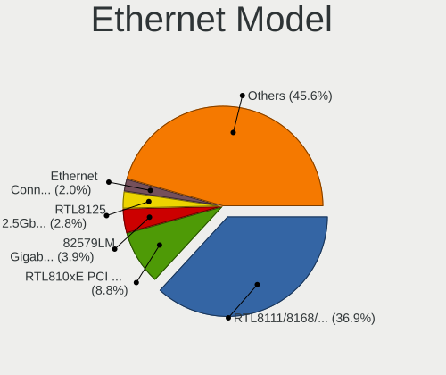

| Model                                                                  | Computers | Percent |
|------------------------------------------------------------------------|-----------|---------|
| Realtek RTL8111/8168/8211/8411 PCI Express Gigabit Ethernet Controller | 4093      | 36.86%  |
| Realtek RTL810xE PCI Express Fast Ethernet controller                  | 979       | 8.82%   |
| Intel 82579LM Gigabit Network Connection (Lewisville)                  | 438       | 3.94%   |
| Realtek RTL8125 2.5GbE Controller                                      | 307       | 2.76%   |
| Intel Ethernet Connection I217-LM                                      | 223       | 2.01%   |
| Realtek RTL8153 Gigabit Ethernet Adapter                               | 218       | 1.96%   |
| Intel I211 Gigabit Network Connection                                  | 131       | 1.18%   |
| Intel Ethernet Connection (2) I219-V                                   | 122       | 1.1%    |
| Intel Ethernet Controller I225-V                                       | 119       | 1.07%   |
| Qualcomm Atheros AR8151 v2.0 Gigabit Ethernet                          | 104       | 0.94%   |
| Intel Ethernet Connection (4) I219-LM                                  | 102       | 0.92%   |
| Broadcom NetXtreme BCM57765 Gigabit Ethernet PCIe                      | 98        | 0.88%   |
| Broadcom NetXtreme BCM57766 Gigabit Ethernet PCIe                      | 89        | 0.8%    |
| ASIX AX88179 Gigabit Ethernet                                          | 89        | 0.8%    |
| Intel 82579V Gigabit Network Connection                                | 86        | 0.77%   |
| Intel Ethernet Connection I219-LM                                      | 84        | 0.76%   |
| Intel Ethernet Connection (2) I219-LM                                  | 84        | 0.76%   |
| Realtek RTL-8100/8101L/8139 PCI Fast Ethernet Adapter                  | 78        | 0.7%    |
| Samsung Galaxy series, misc. (tethering mode)                          | 77        | 0.69%   |
| Intel Ethernet Connection I218-LM                                      | 77        | 0.69%   |
| Nvidia MCP79 Ethernet                                                  | 76        | 0.68%   |
| Intel 82577LM Gigabit Network Connection                               | 71        | 0.64%   |
| Intel Ethernet Connection I217-V                                       | 69        | 0.62%   |
| Nvidia MCP61 Ethernet                                                  | 61        | 0.55%   |
| Intel Ethernet Connection (3) I218-LM                                  | 61        | 0.55%   |
| Intel 82567LM Gigabit Network Connection                               | 58        | 0.52%   |
| Broadcom NetLink BCM57785 Gigabit Ethernet PCIe                        | 55        | 0.5%    |
| Broadcom NetLink BCM57780 Gigabit Ethernet PCIe                        | 54        | 0.49%   |
| Qualcomm Atheros AR8161 Gigabit Ethernet                               | 53        | 0.48%   |
| Intel 82567LM-3 Gigabit Network Connection                             | 51        | 0.46%   |
| Intel Ethernet Controller I226-V                                       | 50        | 0.45%   |
| Intel Ethernet Connection I219-V                                       | 50        | 0.45%   |
| Qualcomm Atheros Killer E220x Gigabit Ethernet Controller              | 49        | 0.44%   |
| Broadcom NetXtreme BCM5764M Gigabit Ethernet PCIe                      | 49        | 0.44%   |
| Broadcom NetXtreme BCM5761 Gigabit Ethernet PCIe                       | 48        | 0.43%   |
| Qualcomm Atheros QCA8171 Gigabit Ethernet                              | 46        | 0.41%   |
| Realtek RTL8152 Fast Ethernet Adapter                                  | 45        | 0.41%   |
| Qualcomm Atheros AR8131 Gigabit Ethernet                               | 45        | 0.41%   |
| Marvell Group 88E8040 PCI-E Fast Ethernet Controller                   | 45        | 0.41%   |
| Qualcomm Atheros AR8162 Fast Ethernet                                  | 44        | 0.4%    |

Net Controller Kind
-------------------

Ethernet, WiFi or modem

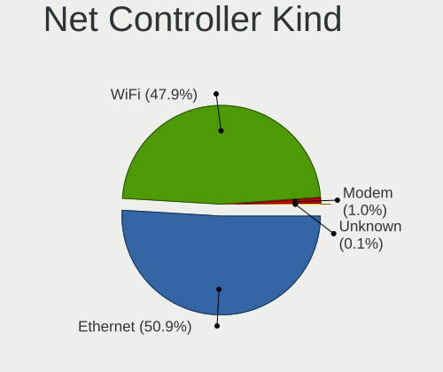

| Kind     | Computers | Percent |
|----------|-----------|---------|
| Ethernet | 10246     | 50.94%  |
| WiFi     | 9639      | 47.92%  |
| Modem    | 202       | 1%      |
| Unknown  | 26        | 0.13%   |

Used Controller
---------------

Currently used network controller

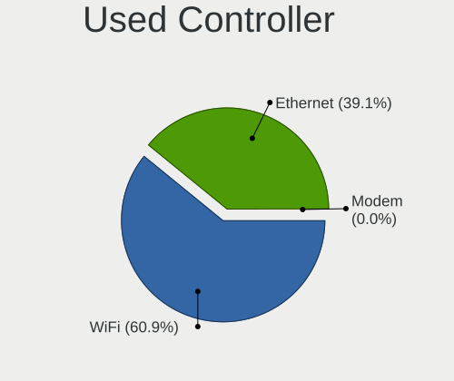

| Kind     | Computers | Percent |
|----------|-----------|---------|
| WiFi     | 7598      | 60.89%  |
| Ethernet | 4875      | 39.07%  |
| Unknown  | 3         | 0.02%   |
| Modem    | 2         | 0.02%   |

NICs
----

Total network controllers on board

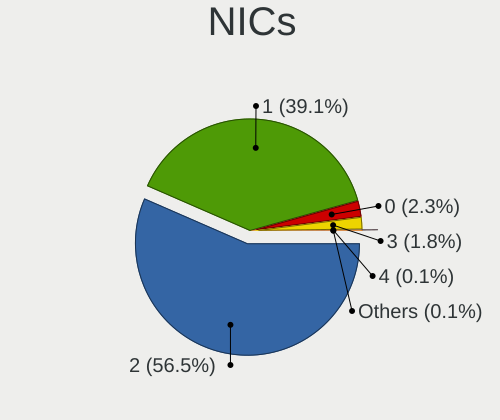

| Total | Computers | Percent |
|-------|-----------|---------|
| 2     | 6799      | 56.54%  |
| 1     | 4704      | 39.12%  |
| 0     | 279       | 2.32%   |
| 3     | 217       | 1.8%    |
| 4     | 15        | 0.12%   |
| 5     | 8         | 0.07%   |
| 8     | 1         | 0.01%   |
| 7     | 1         | 0.01%   |
| 6     | 1         | 0.01%   |

IPv6
----

IPv6 vs IPv4

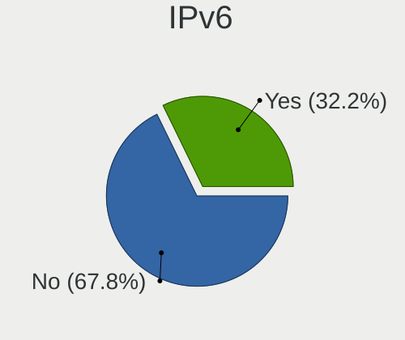

| Used | Computers | Percent |
|------|-----------|---------|
| No   | 8245      | 67.77%  |
| Yes  | 3922      | 32.23%  |

Bluetooth
---------

Bluetooth Vendor
----------------

Controller vendors

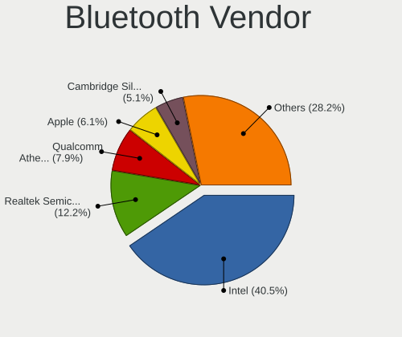

| Vendor                          | Computers | Percent |
|---------------------------------|-----------|---------|
| Intel                           | 2975      | 40.5%   |
| Realtek Semiconductor           | 893       | 12.16%  |
| Qualcomm Atheros Communications | 582       | 7.92%   |
| Apple                           | 448       | 6.1%    |
| Cambridge Silicon Radio         | 377       | 5.13%   |
| Broadcom                        | 360       | 4.9%    |
| IMC Networks                    | 348       | 4.74%   |
| Foxconn / Hon Hai               | 232       | 3.16%   |
| Lite-On Technology              | 208       | 2.83%   |
| Dell                            | 126       | 1.72%   |
| Hewlett-Packard                 | 120       | 1.63%   |
| ASUSTek Computer                | 102       | 1.39%   |
| MediaTek                        | 88        | 1.2%    |
| Toshiba                         | 83        | 1.13%   |
| Marvell Semiconductor           | 66        | 0.9%    |
| Ralink                          | 60        | 0.82%   |
| TP-Link                         | 43        | 0.59%   |
| Realtek                         | 35        | 0.48%   |
| Alps Electric                   | 28        | 0.38%   |
| Foxconn International           | 24        | 0.33%   |
| Unknown                         | 19        | 0.26%   |
| Actions                         | 16        | 0.22%   |
| Integrated System Solution      | 14        | 0.19%   |
| Dynex                           | 14        | 0.19%   |
| Ralink Technology               | 13        | 0.18%   |
| Taiyo Yuden                     | 8         | 0.11%   |
| Askey Computer                  | 8         | 0.11%   |
| Micro Star International        | 7         | 0.1%    |
| Belkin Components               | 7         | 0.1%    |
| Qcom                            | 6         | 0.08%   |
| Edimax Technology               | 6         | 0.08%   |
| Chicony Electronics             | 4         | 0.05%   |
| Fujitsu                         | 3         | 0.04%   |
| USI                             | 2         | 0.03%   |
| Smart Modular Technologies      | 2         | 0.03%   |
| SiW                             | 2         | 0.03%   |
| Mercucys                        | 2         | 0.03%   |
| Logitech                        | 2         | 0.03%   |
| Kensington                      | 2         | 0.03%   |
| D-Link System                   | 2         | 0.03%   |

Bluetooth Model
---------------

Controller models

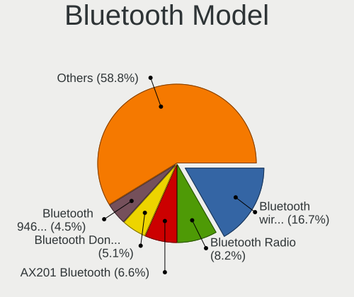

| Model                                               | Computers | Percent |
|-----------------------------------------------------|-----------|---------|
| Intel Bluetooth wireless interface                  | 1231      | 16.74%  |
| Realtek Bluetooth Radio                             | 606       | 8.24%   |
| Intel AX201 Bluetooth                               | 486       | 6.61%   |
| Cambridge Silicon Radio Bluetooth Dongle (HCI mode) | 377       | 5.13%   |
| Intel Bluetooth 9460/9560 Jefferson Peak (JfP)      | 332       | 4.52%   |
| Qualcomm Atheros  Bluetooth Device                  | 254       | 3.45%   |
| Intel AX200 Bluetooth                               | 252       | 3.43%   |
| Apple Bluetooth Host Controller                     | 205       | 2.79%   |
| Intel Bluetooth Device                              | 198       | 2.69%   |
| Realtek  Bluetooth 4.2 Adapter                      | 191       | 2.6%    |
| Intel AX210 Bluetooth                               | 133       | 1.81%   |
| Intel Centrino Bluetooth Wireless Transceiver       | 124       | 1.69%   |
| IMC Networks Wireless_Device                        | 113       | 1.54%   |
| IMC Networks Bluetooth Radio                        | 108       | 1.47%   |
| Apple Bluetooth USB Host Controller                 | 108       | 1.47%   |
| Qualcomm Atheros AR3011 Bluetooth                   | 99        | 1.35%   |
| Qualcomm Atheros AR3012 Bluetooth 4.0               | 94        | 1.28%   |
| Apple Built-in Bluetooth 2.0+EDR HCI                | 94        | 1.28%   |
| Intel Wireless-AC 3168 Bluetooth                    | 93        | 1.26%   |
| MediaTek Wireless_Device                            | 86        | 1.17%   |
| IMC Networks Bluetooth Device                       | 81        | 1.1%    |
| Intel Wireless-AC 9260 Bluetooth Adapter            | 73        | 0.99%   |
| Foxconn / Hon Hai Bluetooth Device                  | 69        | 0.94%   |
| Lite-On Qualcomm Atheros QCA9377 Bluetooth          | 63        | 0.86%   |
| HP Bluetooth 2.0 Interface [Broadcom BCM2045]       | 63        | 0.86%   |
| Ralink RT3290 Bluetooth                             | 60        | 0.82%   |
| Marvell Bluetooth and Wireless LAN Composite        | 58        | 0.79%   |
| Qualcomm Atheros QCA61x4 Bluetooth 4.0              | 54        | 0.73%   |
| Lite-On Atheros AR3012 Bluetooth                    | 53        | 0.72%   |
| Intel Centrino Advanced-N 6230 Bluetooth adapter    | 50        | 0.68%   |
| Lite-On Bluetooth Device                            | 49        | 0.67%   |
| HP Broadcom 2070 Bluetooth Combo                    | 49        | 0.67%   |
| TP-Link TP-T@- UB500 Adapter                        | 43        | 0.58%   |
| Dell DW375 Bluetooth Module                         | 42        | 0.57%   |
| Broadcom BCM43142A0 Bluetooth 4.0                   | 42        | 0.57%   |
| Qualcomm Atheros AR9462 Bluetooth                   | 41        | 0.56%   |
| Apple Bluetooth HCI                                 | 41        | 0.56%   |
| Broadcom BCM2045B (BDC-2.1)                         | 40        | 0.54%   |
| Foxconn / Hon Hai Wireless_Device                   | 39        | 0.53%   |
| Realtek Bluetooth Radio                             | 35        | 0.48%   |

Sound
-----

Sound Vendor
------------

Sound card vendors

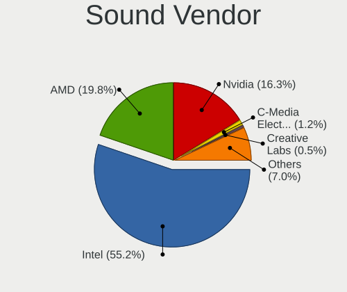

| Vendor                                       | Computers | Percent |
|----------------------------------------------|-----------|---------|
| Intel                                        | 8948      | 55.22%  |
| AMD                                          | 3203      | 19.77%  |
| Nvidia                                       | 2637      | 16.27%  |
| C-Media Electronics                          | 194       | 1.2%    |
| Creative Labs                                | 87        | 0.54%   |
| Logitech                                     | 61        | 0.38%   |
| Silicon Integrated Systems [SiS]             | 55        | 0.34%   |
| JMTek                                        | 50        | 0.31%   |
| ASUSTek Computer                             | 48        | 0.3%    |
| VIA Technologies                             | 47        | 0.29%   |
| Generalplus Technology                       | 43        | 0.27%   |
| Texas Instruments                            | 42        | 0.26%   |
| GN Netcom                                    | 39        | 0.24%   |
| Zoran Co. Personal Media Division (Nogatech) | 35        | 0.22%   |
| Kingston Technology                          | 31        | 0.19%   |
| Micro Star International                     | 30        | 0.19%   |
| Realtek Semiconductor                        | 29        | 0.18%   |
| Razer USA                                    | 29        | 0.18%   |
| Plantronics                                  | 27        | 0.17%   |
| Creative Technology                          | 27        | 0.17%   |
| SteelSeries ApS                              | 25        | 0.15%   |
| Jieli Technology                             | 23        | 0.14%   |
| Tenx Technology                              | 21        | 0.13%   |
| KTMicro                                      | 21        | 0.13%   |
| Hewlett-Packard                              | 20        | 0.12%   |
| Focusrite-Novation                           | 17        | 0.1%    |
| Sony                                         | 16        | 0.1%    |
| Lenovo                                       | 15        | 0.09%   |
| Unknown                                      | 15        | 0.09%   |
| Corsair                                      | 14        | 0.09%   |
| Apple                                        | 14        | 0.09%   |
| Thesycon Systemsoftware & Consulting         | 12        | 0.07%   |
| Walmart                                      | 10        | 0.06%   |
| Dell                                         | 10        | 0.06%   |
| BEHRINGER International                      | 10        | 0.06%   |
| PreSonus Audio Electronics                   | 9         | 0.06%   |
| Yamaha                                       | 8         | 0.05%   |
| RODE Microphones                             | 8         | 0.05%   |
| DSEA A/S                                     | 8         | 0.05%   |
| Asahi Kasei Microsystems                     | 8         | 0.05%   |

Sound Model
-----------

Sound card models

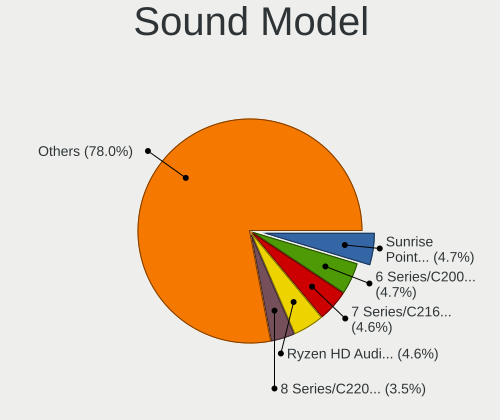

| Model                                                                      | Computers | Percent |
|----------------------------------------------------------------------------|-----------|---------|
| Intel Sunrise Point-LP HD Audio                                            | 901       | 4.67%   |
| Intel 6 Series/C200 Series Chipset Family High Definition Audio Controller | 898       | 4.66%   |
| Intel 7 Series/C216 Chipset Family High Definition Audio Controller        | 891       | 4.62%   |
| AMD Ryzen HD Audio Controller                                              | 882       | 4.57%   |
| Intel 8 Series/C220 Series Chipset High Definition Audio Controller        | 670       | 3.47%   |
| Intel 5 Series/3400 Series Chipset High Definition Audio                   | 491       | 2.55%   |
| Intel Xeon E3-1200 v3/4th Gen Core Processor HD Audio Controller           | 458       | 2.37%   |
| AMD SBx00 Azalia (Intel HDA)                                               | 440       | 2.28%   |
| AMD FCH Azalia Controller                                                  | 439       | 2.28%   |
| Intel 82801I (ICH9 Family) HD Audio Controller                             | 436       | 2.26%   |
| Intel NM10/ICH7 Family High Definition Audio Controller                    | 424       | 2.2%    |
| AMD Renoir/Cezanne HDMI/DP Audio Controller                                | 381       | 1.98%   |
| Intel 8 Series HD Audio Controller                                         | 367       | 1.9%    |
| Intel Haswell-ULT HD Audio Controller                                      | 363       | 1.88%   |
| AMD Starship/Matisse HD Audio Controller                                   | 309       | 1.6%    |
| Intel 100 Series/C230 Series Chipset Family HD Audio Controller            | 283       | 1.47%   |
| Intel Broadwell-U Audio Controller                                         | 272       | 1.41%   |
| Intel Tiger Lake-LP Smart Sound Technology Audio Controller                | 259       | 1.34%   |
| Intel Wildcat Point-LP High Definition Audio Controller                    | 258       | 1.34%   |
| Intel Celeron/Pentium Silver Processor High Definition Audio               | 255       | 1.32%   |
| Intel Cannon Lake PCH cAVS                                                 | 253       | 1.31%   |
| AMD Raven/Raven2/Fenghuang HDMI/DP Audio Controller                        | 243       | 1.26%   |
| AMD Kabini HDMI/DP Audio                                                   | 239       | 1.24%   |
| Intel 82801H (ICH8 Family) HD Audio Controller                             | 229       | 1.19%   |
| Nvidia GK208 HDMI/DP Audio Controller                                      | 207       | 1.07%   |
| AMD Radeon High Definition Audio Controller                                | 201       | 1.04%   |
| AMD Ellesmere HDMI Audio [Radeon RX 470/480 / 570/580/590]                 | 195       | 1.01%   |
| Nvidia GF108 High Definition Audio Controller                              | 190       | 0.98%   |
| Nvidia GP107GL High Definition Audio Controller                            | 178       | 0.92%   |
| Intel 200 Series PCH HD Audio                                              | 177       | 0.92%   |
| AMD Family 15h (Models 60h-6fh) Audio Controller                           | 159       | 0.82%   |
| Intel Alder Lake PCH-P High Definition Audio Controller                    | 157       | 0.81%   |
| Nvidia High Definition Audio Controller                                    | 149       | 0.77%   |
| Intel Atom Processor Z36xxx/Z37xxx Series High Definition Audio Controller | 147       | 0.76%   |
| Intel Cannon Point-LP High Definition Audio Controller                     | 139       | 0.72%   |
| AMD Family 17h (Models 00h-0fh) HD Audio Controller                        | 134       | 0.69%   |
| AMD Oland/Hainan/Cape Verde/Pitcairn HDMI Audio [Radeon HD 7000 Series]    | 131       | 0.68%   |
| Intel Celeron N3350/Pentium N4200/Atom E3900 Series Audio Cluster          | 130       | 0.67%   |
| Intel Comet Lake PCH-LP cAVS                                               | 120       | 0.62%   |
| Intel 82801JI (ICH10 Family) HD Audio Controller                           | 118       | 0.61%   |

Memory
------

Memory Vendor
-------------

Memory module vendors

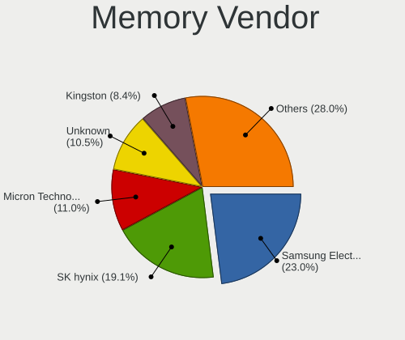

| Vendor              | Computers | Percent |
|---------------------|-----------|---------|
| Samsung Electronics | 495       | 23.02%  |
| SK hynix            | 411       | 19.12%  |
| Micron Technology   | 236       | 10.98%  |
| Unknown             | 225       | 10.47%  |
| Kingston            | 180       | 8.37%   |
| Crucial             | 104       | 4.84%   |
| Corsair             | 75        | 3.49%   |
| G.Skill             | 51        | 2.37%   |
| Unknown (ABCD)      | 48        | 2.23%   |
| A-DATA Technology   | 40        | 1.86%   |
| Elpida              | 35        | 1.63%   |
| Ramaxel Technology  | 30        | 1.4%    |
| Team                | 26        | 1.21%   |
| Nanya Technology    | 24        | 1.12%   |
| Unknown             | 20        | 0.93%   |
| Smart               | 17        | 0.79%   |
| Transcend           | 10        | 0.47%   |
| Patriot             | 10        | 0.47%   |
| Timetec             | 7         | 0.33%   |
| Qimonda             | 6         | 0.28%   |
| Avant               | 6         | 0.28%   |
| Unknown (0x0B45)    | 4         | 0.19%   |
| Unifosa             | 4         | 0.19%   |
| Teikon              | 4         | 0.19%   |
| Smart Brazil        | 4         | 0.19%   |
| Lexar               | 4         | 0.19%   |
| Wilk                | 3         | 0.14%   |
| Apacer              | 3         | 0.14%   |
| Unknown (0x0E9D)    | 2         | 0.09%   |
| Silicon Power       | 2         | 0.09%   |
| SHARETRONIC         | 2         | 0.09%   |
| PNY                 | 2         | 0.09%   |
| High Bridge         | 2         | 0.09%   |
| ff                  | 2         | 0.09%   |
| fef5                | 2         | 0.09%   |
| CSX                 | 2         | 0.09%   |
| Axiom               | 2         | 0.09%   |
| ASint Technology    | 2         | 0.09%   |
| 4ea5                | 2         | 0.09%   |
| Wodposit            | 1         | 0.05%   |

Memory Model
------------

Memory module models

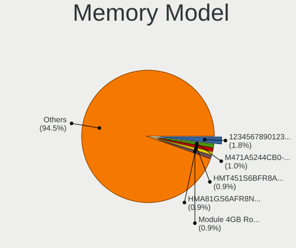

| Model                                                            | Computers | Percent |
|------------------------------------------------------------------|-----------|---------|
| Unknown (ABCD) RAM 123456789012345678 2GB SODIMM LPDDR4 2400MT/s | 41        | 1.79%   |
| Samsung RAM M471A5244CB0-CTD 4GB SODIMM DDR4 3266MT/s            | 23        | 1.01%   |
| SK hynix RAM HMT451S6BFR8A-PB 4GB SODIMM DDR3 1600MT/s           | 21        | 0.92%   |
| SK hynix RAM HMA81GS6AFR8N-UH 8GB SODIMM DDR4 2667MT/s           | 20        | 0.87%   |
| Unknown                                                          | 20        | 0.87%   |
| Samsung RAM M471B5173DB0-YK0 4GB SODIMM DDR3 1600MT/s            | 14        | 0.61%   |
| Samsung RAM M471A5244CB0-CWE 4GB SODIMM DDR4 3200MT/s            | 14        | 0.61%   |
| Samsung RAM M471A1K43EB1-CWE 8GB SODIMM DDR4 3200MT/s            | 14        | 0.61%   |
| Micron RAM 8KTF51264HZ-1G6E1 4GB SODIMM DDR3 1600MT/s            | 14        | 0.61%   |
| SK hynix RAM HMT351S6CFR8C-PB 4GB SODIMM DDR3 1600MT/s           | 13        | 0.57%   |
| Samsung RAM M471B5273DH0-CH9 4GB SODIMM DDR3 1600MT/s            | 13        | 0.57%   |
| Samsung RAM M471B5173EB0-YK0 4GB SODIMM DDR3 1600MT/s            | 13        | 0.57%   |
| Samsung RAM M471B1G73EB0-YK0 8192MB SODIMM DDR3 1600MT/s         | 13        | 0.57%   |
| Samsung RAM M471A1K43DB1-CWE 8GB SODIMM DDR4 3200MT/s            | 13        | 0.57%   |
| Samsung RAM M471A1G44AB0-CWE 8GiB SODIMM DDR4 3200MT/s           | 13        | 0.57%   |
| Samsung RAM M471A1G44AB0-CWE 8GB Row Of Chips DDR4 3200MT/s      | 12        | 0.52%   |
| SK hynix RAM HMAA1GS6CJR6N-XN 8GB SODIMM DDR4 3200MT/s           | 11        | 0.48%   |
| Samsung RAM M471B1G73DB0-YK0 8GB SODIMM DDR3 1600MT/s            | 11        | 0.48%   |
| Samsung RAM M471A1K43CB1-CRC 8GB SODIMM DDR4 8400MT/s            | 11        | 0.48%   |
| SK hynix RAM HYMP125S64CP8-S6 2GB SODIMM DDR2 975MT/s            | 10        | 0.44%   |
| SK hynix RAM HMA851S6CJR6N-VK 4GB SODIMM DDR4 2667MT/s           | 10        | 0.44%   |
| Samsung RAM M471B5173QH0-YK0 4GB SODIMM DDR3 1600MT/s            | 10        | 0.44%   |
| Micron RAM 4ATF51264HZ-2G6E1 4GB SODIMM DDR4 2667MT/s            | 10        | 0.44%   |
| Unknown RAM Module 4GB DIMM DDR3 1333MT/s                        | 9         | 0.39%   |
| SK hynix RAM HMA81GS6CJR8N-VK 8GB SODIMM DDR4 2667MT/s           | 9         | 0.39%   |
| Samsung RAM M471B5273CH0-CH9 4GB SODIMM DDR3 1334MT/s            | 9         | 0.39%   |
| SK hynix RAM HMT351S6EFR8A-PB 4GB SODIMM DDR3 1600MT/s           | 8         | 0.35%   |
| Samsung RAM M471A5244CB0-CTD 4GB Row Of Chips DDR4 2667MT/s      | 8         | 0.35%   |
| Samsung RAM M471A1K43DB1-CTD 8GB SODIMM DDR4 2667MT/s            | 8         | 0.35%   |
| Samsung RAM M471A1G44BB0-CWE 8GB SODIMM DDR4 3200MT/s            | 8         | 0.35%   |
| Micron RAM 4ATF1G64HZ-3G2E1 8GB Row Of Chips DDR4 3200MT/s       | 8         | 0.35%   |
| Unknown RAM Module 4096MB DIMM DDR3 1333MT/s                     | 7         | 0.31%   |
| Unknown (ABCD) RAM 123456789012345678 2GB DIMM LPDDR4 2133MT/s   | 7         | 0.31%   |
| SK hynix RAM HMA41GS6AFR8N-TF 8GB SODIMM DDR4 2667MT/s           | 7         | 0.31%   |
| Samsung RAM M471B5773CHS-CH9 2GB SODIMM DDR3 4199MT/s            | 7         | 0.31%   |
| Samsung RAM M471B1G73QH0-YK0 8GB SODIMM DDR3 1600MT/s            | 7         | 0.31%   |
| Micron RAM 4ATF1G64HZ-3G2E1 8GB SODIMM DDR4 3200MT/s             | 7         | 0.31%   |
| Corsair RAM CMK16GX4M2B3200C16 8GB DIMM DDR4 3600MT/s            | 7         | 0.31%   |
| Unknown RAM Module 4GB SODIMM DDR3                               | 6         | 0.26%   |
| Unknown RAM Module 2GB SODIMM DDR2 667MT/s                       | 6         | 0.26%   |

Memory Kind
-----------

Memory module kinds

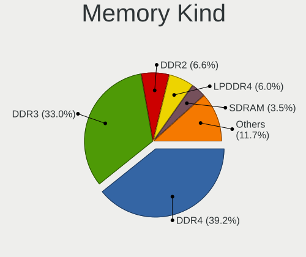

| Kind    | Computers | Percent |
|---------|-----------|---------|
| DDR4    | 728       | 39.25%  |
| DDR3    | 612       | 32.99%  |
| DDR2    | 122       | 6.58%   |
| LPDDR4  | 111       | 5.98%   |
| SDRAM   | 65        | 3.5%    |
| DDR5    | 61        | 3.29%   |
| LPDDR3  | 47        | 2.53%   |
| Unknown | 46        | 2.48%   |
| LPDDR5  | 39        | 2.1%    |
| DDR     | 15        | 0.81%   |
| DRAM    | 9         | 0.49%   |

Memory Form Factor
------------------

Physical design of the memory module

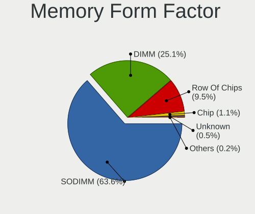

| Name         | Computers | Percent |
|--------------|-----------|---------|
| SODIMM       | 1170      | 63.62%  |
| DIMM         | 461       | 25.07%  |
| Row Of Chips | 175       | 9.52%   |
| Chip         | 20        | 1.09%   |
| Unknown      | 10        | 0.54%   |
| FB-DIMM      | 2         | 0.11%   |
| RIMM         | 1         | 0.05%   |

Memory Size
-----------

Memory module size

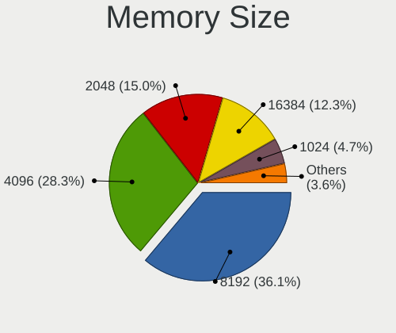

| Size  | Computers | Percent |
|-------|-----------|---------|
| 8192  | 740       | 36.13%  |
| 4096  | 580       | 28.32%  |
| 2048  | 308       | 15.04%  |
| 16384 | 251       | 12.26%  |
| 1024  | 96        | 4.69%   |
| 32768 | 51        | 2.49%   |
| 512   | 16        | 0.78%   |
| 49152 | 2         | 0.1%    |
| 12288 | 2         | 0.1%    |
| 256   | 2         | 0.1%    |

Memory Speed
------------

Memory module speed

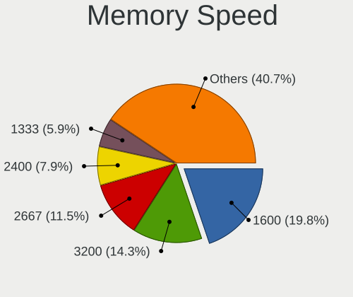

| Speed   | Computers | Percent |
|---------|-----------|---------|
| 1600    | 395       | 19.78%  |
| 3200    | 285       | 14.27%  |
| 2667    | 229       | 11.47%  |
| 2400    | 158       | 7.91%   |
| 1333    | 118       | 5.91%   |
| 2133    | 76        | 3.81%   |
| 667     | 63        | 3.15%   |
| Unknown | 63        | 3.15%   |
| 1334    | 49        | 2.45%   |
| 3600    | 47        | 2.35%   |
| 800     | 41        | 2.05%   |
| 4267    | 36        | 1.8%    |
| 1867    | 34        | 1.7%    |
| 1066    | 30        | 1.5%    |
| 6400    | 28        | 1.4%    |
| 3266    | 24        | 1.2%    |
| 5600    | 22        | 1.1%    |
| 4800    | 22        | 1.1%    |
| 1067    | 21        | 1.05%   |
| 3733    | 20        | 1%      |
| 2048    | 17        | 0.85%   |
| 4199    | 16        | 0.8%    |
| 533     | 16        | 0.8%    |
| 8400    | 15        | 0.75%   |
| 1866    | 15        | 0.75%   |
| 975     | 13        | 0.65%   |
| 1800    | 12        | 0.6%    |
| 3000    | 10        | 0.5%    |
| 6000    | 9         | 0.45%   |
| 2666    | 8         | 0.4%    |
| 400     | 8         | 0.4%    |
| 2933    | 7         | 0.35%   |
| 7500    | 6         | 0.3%    |
| 4000    | 6         | 0.3%    |
| 3800    | 6         | 0.3%    |
| 3466    | 6         | 0.3%    |
| 4266    | 5         | 0.25%   |
| 3400    | 5         | 0.25%   |
| 8533    | 4         | 0.2%    |
| 7467    | 4         | 0.2%    |

Printers & scanners
-------------------

Printer Vendor
--------------

Printer device vendors

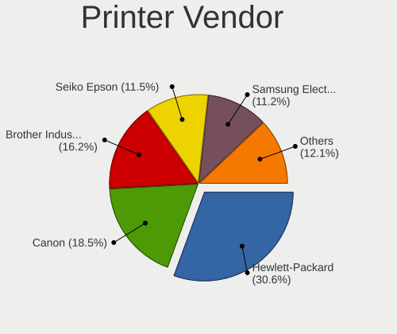

| Vendor                   | Computers | Percent |
|--------------------------|-----------|---------|
| Hewlett-Packard          | 104       | 30.59%  |
| Canon                    | 63        | 18.53%  |
| Brother Industries       | 55        | 16.18%  |
| Seiko Epson              | 39        | 11.47%  |
| Samsung Electronics      | 38        | 11.18%  |
| Dymo-CoStar              | 8         | 2.35%   |
| Lexmark International    | 5         | 1.47%   |
| Pantum                   | 4         | 1.18%   |
| Ricoh                    | 3         | 0.88%   |
| Prolific Technology      | 3         | 0.88%   |
| Zebra                    | 2         | 0.59%   |
| STMicroelectronics       | 2         | 0.59%   |
| QinHeng Electronics      | 2         | 0.59%   |
| Kyocera                  | 2         | 0.59%   |
| Konica Minolta           | 2         | 0.59%   |
| Zhuhai Poskey Technology | 1         | 0.29%   |
| Zebra Technologies       | 1         | 0.29%   |
| Toshiba TEC              | 1         | 0.29%   |
| Printer                  | 1         | 0.29%   |
| Oki Data                 | 1         | 0.29%   |
| ICS Advent               | 1         | 0.29%   |
| GG IMAGE                 | 1         | 0.29%   |
| Beeprt Printer           | 1         | 0.29%   |

Printer Model
-------------

Printer device models

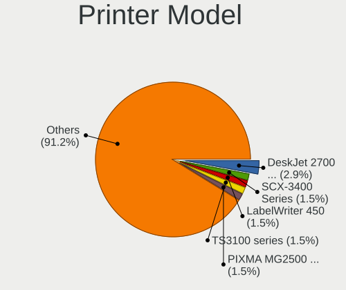

| Model                                                     | Computers | Percent |
|-----------------------------------------------------------|-----------|---------|
| HP DeskJet 2700 series                                    | 10        | 2.92%   |
| Samsung SCX-3400 Series                                   | 5         | 1.46%   |
| Dymo-CoStar LabelWriter 450                               | 5         | 1.46%   |
| Canon TS3100 series                                       | 5         | 1.46%   |
| Canon PIXMA MG2500 Series                                 | 5         | 1.46%   |
| Canon LiDE 400                                            | 5         | 1.46%   |
| Seiko Epson L3110 Series                                  | 4         | 1.17%   |
| HP LaserJet Professional P1102w                           | 4         | 1.17%   |
| HP ENVY 4520 series                                       | 4         | 1.17%   |
| Canon PIXMA MG3600 Series                                 | 4         | 1.17%   |
| Canon LiDE 300                                            | 4         | 1.17%   |
| Canon G3010 series                                        | 4         | 1.17%   |
| Seiko Epson ET-2710 Series                                | 3         | 0.88%   |
| Samsung ML-216x Series Laser Printer                      | 3         | 0.88%   |
| Samsung M2070 Series                                      | 3         | 0.88%   |
| Samsung M2020 Series                                      | 3         | 0.88%   |
| Prolific PL2305 Parallel Port                             | 3         | 0.88%   |
| HP LaserJet Professional P 1102w                          | 3         | 0.88%   |
| HP LaserJet 400 M401dne                                   | 3         | 0.88%   |
| HP LaserJet 1020                                          | 3         | 0.88%   |
| HP ENVY 5000 series                                       | 3         | 0.88%   |
| HP DeskJet 2130 series                                    | 3         | 0.88%   |
| HP Deskjet 1510                                           | 3         | 0.88%   |
| Brother HL-L2350DW series                                 | 3         | 0.88%   |
| Brother HL-52x0 series                                    | 3         | 0.88%   |
| Brother DCP-1610W                                         | 3         | 0.88%   |
| STMicroelectronics LED badge -- mini LED display -- 11x44 | 2         | 0.58%   |
| Seiko Epson XP-3100 Series                                | 2         | 0.58%   |
| Seiko Epson ME 320/330 Series [Stylus SX125]              | 2         | 0.58%   |
| Seiko Epson L6270 Series                                  | 2         | 0.58%   |
| Seiko Epson L355 Series                                   | 2         | 0.58%   |
| Seiko Epson ET-4850 Series                                | 2         | 0.58%   |
| Samsung SCX-4623 Series                                   | 2         | 0.58%   |
| Samsung ML-2950 Series                                    | 2         | 0.58%   |
| Samsung ML-2010P Mono Laser Printer                       | 2         | 0.58%   |
| Samsung CLX-3300 Series                                   | 2         | 0.58%   |
| Samsung C460 Series                                       | 2         | 0.58%   |
| Samsung C43x Series                                       | 2         | 0.58%   |
| QinHeng CH340S                                            | 2         | 0.58%   |
| Pantum P2500W series                                      | 2         | 0.58%   |

Scanner Vendor
--------------

Scanner device vendors

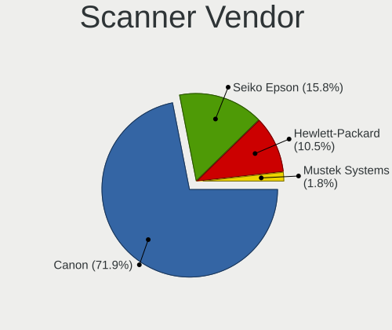

| Vendor          | Computers | Percent |
|-----------------|-----------|---------|
| Canon           | 41        | 71.93%  |
| Seiko Epson     | 9         | 15.79%  |
| Hewlett-Packard | 6         | 10.53%  |
| Mustek Systems  | 1         | 1.75%   |

Scanner Model
-------------

Scanner device models

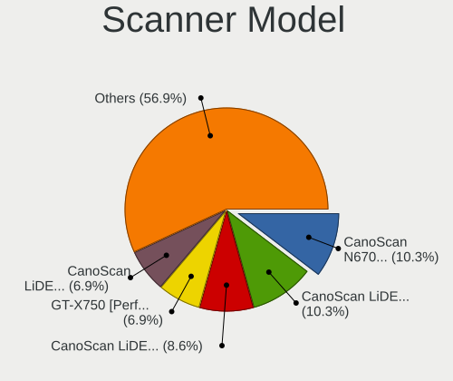

| Model                                             | Computers | Percent |
|---------------------------------------------------|-----------|---------|
| Canon CanoScan N670U/N676U/LiDE 20                | 6         | 10.34%  |
| Canon CanoScan LiDE 110                           | 6         | 10.34%  |
| Canon CanoScan LiDE 210                           | 5         | 8.62%   |
| Seiko Epson GT-X750 [Perfection 4490 Photo]       | 4         | 6.9%    |
| Canon CanoScan LiDE 220                           | 4         | 6.9%    |
| Canon CanoScan LiDE 200                           | 4         | 6.9%    |
| Canon CanoScan LiDE 90                            | 3         | 5.17%   |
| Seiko Epson GT-F670 [Perfection V200 Photo]       | 2         | 3.45%   |
| Canon CanoScan LIDE 25                            | 2         | 3.45%   |
| Canon CanoScan LiDE 120                           | 2         | 3.45%   |
| Canon CanoScan LiDE 100                           | 2         | 3.45%   |
| Canon CanoScan 8800F                              | 2         | 3.45%   |
| Seiko Epson Scanner                               | 1         | 1.72%   |
| Seiko Epson GT-X700 [Perfection 4870]             | 1         | 1.72%   |
| Seiko Epson GT-7300U [Perfection 1260/1260 PHOTO] | 1         | 1.72%   |
| Mustek Systems ScanExpress 1200 UB                | 1         | 1.72%   |
| HP Scanjet G2710                                  | 1         | 1.72%   |
| HP ScanJet 5300c/5370c                            | 1         | 1.72%   |
| HP ScanJet 4370                                   | 1         | 1.72%   |
| HP ScanJet 2400c                                  | 1         | 1.72%   |
| HP Scanjet 200                                    | 1         | 1.72%   |
| HP PSC 1200                                       | 1         | 1.72%   |
| Canon CanoScan LiDE 700F                          | 1         | 1.72%   |
| Canon CanoScan LiDE 60                            | 1         | 1.72%   |
| Canon CanoScan LiDE 50/LiDE 35/LiDE 40            | 1         | 1.72%   |
| Canon CanoScan D660U                              | 1         | 1.72%   |
| Canon CanoScan 5600F                              | 1         | 1.72%   |
| Canon CanoScan 4400F                              | 1         | 1.72%   |

Camera
------

Camera Vendor
-------------

Camera device vendors

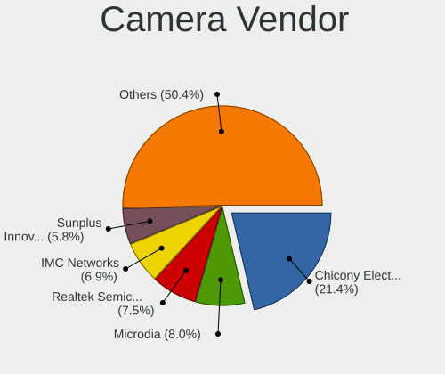

| Vendor                                 | Computers | Percent |
|----------------------------------------|-----------|---------|
| Chicony Electronics                    | 1499      | 21.35%  |
| Microdia                               | 565       | 8.05%   |
| Realtek Semiconductor                  | 525       | 7.48%   |
| IMC Networks                           | 482       | 6.87%   |
| Sunplus Innovation Technology          | 409       | 5.83%   |
| Bison Electronics                      | 403       | 5.74%   |
| Apple                                  | 362       | 5.16%   |
| Quanta                                 | 313       | 4.46%   |
| Suyin                                  | 286       | 4.07%   |
| Logitech                               | 281       | 4%      |
| Cheng Uei Precision Industry (Foxlink) | 279       | 3.97%   |
| Syntek                                 | 160       | 2.28%   |
| Lite-On Technology                     | 138       | 1.97%   |
| Silicon Motion                         | 134       | 1.91%   |
| Alcor Micro                            | 108       | 1.54%   |
| Luxvisions Innotech Limited            | 100       | 1.42%   |
| Ricoh                                  | 73        | 1.04%   |
| Microsoft                              | 65        | 0.93%   |
| Sonix Technology                       | 61        | 0.87%   |
| Samsung Electronics                    | 49        | 0.7%    |
| SunplusIT                              | 42        | 0.6%    |
| Importek                               | 39        | 0.56%   |
| icSpring                               | 39        | 0.56%   |
| Acer                                   | 39        | 0.56%   |
| Z-Star Microelectronics                | 37        | 0.53%   |
| ALi                                    | 33        | 0.47%   |
| ShineTech                              | 31        | 0.44%   |
| Generalplus Technology                 | 28        | 0.4%    |
| Primax Electronics                     | 27        | 0.38%   |
| Lenovo                                 | 26        | 0.37%   |
| GEMBIRD                                | 20        | 0.28%   |
| OmniVision Technologies                | 18        | 0.26%   |
| ARC International                      | 17        | 0.24%   |
| Genesys Logic                          | 16        | 0.23%   |
| Unknown                                | 16        | 0.23%   |
| Y Media                                | 13        | 0.19%   |
| Sunplus Technology                     | 12        | 0.17%   |
| Jieli Technology                       | 12        | 0.17%   |
| MacroSilicon                           | 10        | 0.14%   |
| Cubeternet                             | 10        | 0.14%   |

Camera Model
------------

Camera device models

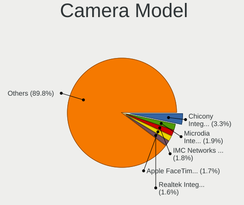

| Model                                                   | Computers | Percent |
|---------------------------------------------------------|-----------|---------|
| Chicony Integrated Camera                               | 233       | 3.3%    |
| Microdia Integrated_Webcam_HD                           | 132       | 1.87%   |
| IMC Networks USB2.0 HD UVC WebCam                       | 125       | 1.77%   |
| Apple FaceTime HD Camera (Built-in)                     | 119       | 1.68%   |
| Realtek Integrated_Webcam_HD                            | 115       | 1.63%   |
| Apple Built-in iSight                                   | 113       | 1.6%    |
| Bison Integrated Camera                                 | 109       | 1.54%   |
| Chicony HD WebCam                                       | 102       | 1.44%   |
| IMC Networks Integrated Camera                          | 101       | 1.43%   |
| Sunplus Integrated_Webcam_HD                            | 90        | 1.27%   |
| Syntek Integrated Camera                                | 87        | 1.23%   |
| Chicony HP TrueVision HD                                | 72        | 1.02%   |
| Microdia Integrated Webcam                              | 65        | 0.92%   |
| Logitech Webcam C270                                    | 65        | 0.92%   |
| Bison Lenovo EasyCamera                                 | 65        | 0.92%   |
| Realtek USB Camera                                      | 62        | 0.88%   |
| IMC Networks USB2.0 VGA UVC WebCam                      | 60        | 0.85%   |
| Chicony HP TrueVision HD Camera                         | 60        | 0.85%   |
| Chicony EasyCamera                                      | 60        | 0.85%   |
| Chicony TOSHIBA Web Camera - HD                         | 55        | 0.78%   |
| Apple iPhone 5/5C/5S/6/SE/7/8/X                         | 55        | 0.78%   |
| Apple FaceTime HD Camera                                | 55        | 0.78%   |
| Samsung Galaxy series, misc. (MTP mode)                 | 49        | 0.69%   |
| Sunplus HD WebCam                                       | 48        | 0.68%   |
| Alcor Micro USB 2.0 Camera                              | 48        | 0.68%   |
| Suyin HP Truevision HD                                  | 47        | 0.66%   |
| Chicony USB 2.0 Camera                                  | 47        | 0.66%   |
| Chicony HP HD Camera                                    | 47        | 0.66%   |
| Microdia Laptop_Integrated_Webcam_HD                    | 41        | 0.58%   |
| Logitech HD Pro Webcam C920                             | 41        | 0.58%   |
| Chicony HP HD Webcam                                    | 40        | 0.57%   |
| icSpring camera                                         | 39        | 0.55%   |
| Cheng Uei Precision Industry (Foxlink) HP Truevision HD | 39        | 0.55%   |
| Quanta HD User Facing                                   | 38        | 0.54%   |
| Lite-On Integrated Camera                               | 38        | 0.54%   |
| Lite-On HP HD Camera                                    | 38        | 0.54%   |
| Cheng Uei Precision Industry (Foxlink) HP Webcam        | 37        | 0.52%   |
| Realtek Integrated Webcam                               | 36        | 0.51%   |
| Luxvisions Innotech Limited HP TrueVision HD Camera     | 36        | 0.51%   |
| Chicony Lenovo EasyCamera                               | 36        | 0.51%   |

Security
--------

Fingerprint Vendor
------------------

Fingerprint sensor vendors

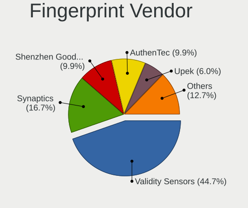

| Vendor                             | Computers | Percent |
|------------------------------------|-----------|---------|
| Validity Sensors                   | 494       | 44.67%  |
| Synaptics                          | 185       | 16.73%  |
| Shenzhen Goodix Technology         | 110       | 9.95%   |
| AuthenTec                          | 110       | 9.95%   |
| Upek                               | 66        | 5.97%   |
| Elan Microelectronics              | 57        | 5.15%   |
| LighTuning Technology              | 35        | 3.16%   |
| STMicroelectronics                 | 25        | 2.26%   |
| Realtek USB2.0 Finger Print Bridge | 6         | 0.54%   |
| Samsung Electronics                | 5         | 0.45%   |
| HOLTEK                             | 4         | 0.36%   |
| Focal-systems.Corp                 | 3         | 0.27%   |
| DigitalPersona                     | 2         | 0.18%   |
| Dell                               | 2         | 0.18%   |
| Next Biometrics                    | 1         | 0.09%   |
| Microsoft                          | 1         | 0.09%   |

Fingerprint Model
-----------------

Fingerprint sensor models

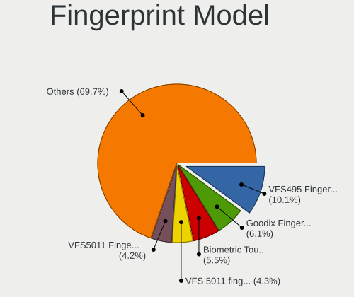

| Model                                                                      | Computers | Percent |
|----------------------------------------------------------------------------|-----------|---------|
| Validity Sensors VFS495 Fingerprint Reader                                 | 112       | 10.13%  |
| Shenzhen Goodix  Fingerprint Device                                        | 67        | 6.06%   |
| Upek Biometric Touchchip/Touchstrip Fingerprint Sensor                     | 61        | 5.52%   |
| Validity Sensors VFS 5011 fingerprint sensor                               | 48        | 4.34%   |
| Validity Sensors VFS5011 Fingerprint Reader                                | 47        | 4.25%   |
| Validity Sensors VFS471 Fingerprint Reader                                 | 44        | 3.98%   |
| Validity Sensors Fingerprint scanner                                       | 37        | 3.35%   |
| Shenzhen Goodix Fingerprint Reader                                         | 35        | 3.16%   |
| Validity Sensors Synaptics WBDI                                            | 32        | 2.89%   |
| AuthenTec AES2501 Fingerprint Sensor                                       | 32        | 2.89%   |
| Validity Sensors VFS491                                                    | 31        | 2.8%    |
| Validity Sensors Swipe Fingerprint Sensor                                  | 31        | 2.8%    |
| Elan ELAN:ARM-M4                                                           | 30        | 2.71%   |
| Synaptics Prometheus MIS Touch Fingerprint Reader                          | 28        | 2.53%   |
| Synaptics Metallica MIS Touch Fingerprint Reader                           | 27        | 2.44%   |
| Elan ELAN:Fingerprint                                                      | 27        | 2.44%   |
| Synaptics  WBDI                                                            | 26        | 2.35%   |
| AuthenTec AES2810                                                          | 26        | 2.35%   |
| STMicroelectronics Fingerprint Reader                                      | 25        | 2.26%   |
| Validity Sensors Synaptics VFS7552 Touch Fingerprint Sensor with PurePrint | 24        | 2.17%   |
| Validity Sensors VFS7500 Touch Fingerprint Sensor                          | 21        | 1.9%    |
| Validity Sensors VFS451 Fingerprint Reader                                 | 20        | 1.81%   |
| Synaptics WBDI                                                             | 20        | 1.81%   |
| Synaptics Fingerprint reader [HP G6]                                       | 20        | 1.81%   |
| AuthenTec Fingerprint Sensor                                               | 19        | 1.72%   |
| AuthenTec AES1600                                                          | 18        | 1.63%   |
| Synaptics UWP WBDI                                                         | 13        | 1.18%   |
| LighTuning EgisTec Touch Fingerprint Sensor                                | 13        | 1.18%   |
| Validity Sensors VFS301 Fingerprint Reader                                 | 12        | 1.08%   |
| Synaptics FS7604 Touch Fingerprint Sensor with PurePrint                   | 12        | 1.08%   |
| Synaptics Metallica MOH Touch Fingerprint Reader                           | 11        | 0.99%   |
| Validity Sensors VFS7552 Touch Fingerprint Sensor                          | 9         | 0.81%   |
| Validity Sensors Synaptics VFS7552 Touch Fingerprint Sensor                | 9         | 0.81%   |
| Synaptics  FS7604 Touch Fingerprint Sensor with PurePrint                  | 9         | 0.81%   |
| LighTuning Fingerprint Reader                                              | 9         | 0.81%   |
| Validity Sensors VFS101 Fingerprint Reader                                 | 8         | 0.72%   |
| Validity Sensors VFS Fingerprint sensor                                    | 8         | 0.72%   |
| Shenzhen Goodix FingerPrint                                                | 8         | 0.72%   |
| AuthenTec AES2550 Fingerprint Sensor                                       | 8         | 0.72%   |
| LighTuning ES603 Swipe Fingerprint Sensor                                  | 7         | 0.63%   |

Chipcard Vendor
---------------

Chipcard module vendors

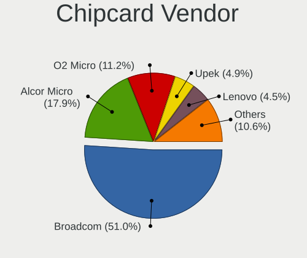

| Vendor                            | Computers | Percent |
|-----------------------------------|-----------|---------|
| Broadcom                          | 251       | 51.02%  |
| Alcor Micro                       | 88        | 17.89%  |
| O2 Micro                          | 55        | 11.18%  |
| Upek                              | 24        | 4.88%   |
| Lenovo                            | 22        | 4.47%   |
| SCM Microsystems                  | 9         | 1.83%   |
| Reiner SCT Kartensysteme          | 5         | 1.02%   |
| Realtek Semiconductor             | 5         | 1.02%   |
| Gemalto (was Gemplus)             | 5         | 1.02%   |
| Chicony Electronics               | 4         | 0.81%   |
| Advanced Card Systems             | 4         | 0.81%   |
| VASCO Data Security International | 3         | 0.61%   |
| Yubico.com                        | 2         | 0.41%   |
| NXP Semiconductors                | 2         | 0.41%   |
| Fujitsu Siemens Computers         | 2         | 0.41%   |
| Bit4id                            | 2         | 0.41%   |
| OmniKey                           | 1         | 0.2%    |
| Kobil Systems                     | 1         | 0.2%    |
| Jing-Mold Enterprise              | 1         | 0.2%    |
| Hewlett-Packard                   | 1         | 0.2%    |
| Cherry                            | 1         | 0.2%    |
| Athena Smartcard Solutions        | 1         | 0.2%    |
| Alcorlink                         | 1         | 0.2%    |
| Aladdin Knowledge Systems         | 1         | 0.2%    |
| Aktiv                             | 1         | 0.2%    |

Chipcard Model
--------------

Chipcard module models

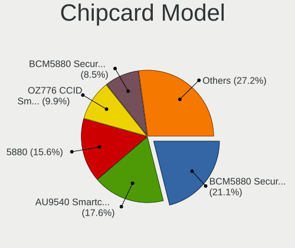

| Model                                                                        | Computers | Percent |
|------------------------------------------------------------------------------|-----------|---------|
| Broadcom BCM5880 Secure Applications Processor                               | 104       | 21.1%   |
| Alcor Micro AU9540 Smartcard Reader                                          | 87        | 17.65%  |
| Broadcom 5880                                                                | 77        | 15.62%  |
| O2 Micro OZ776 CCID Smartcard Reader                                         | 49        | 9.94%   |
| Broadcom BCM5880 Secure Applications Processor with fingerprint swipe sensor | 42        | 8.52%   |
| Upek TouchChip Fingerprint Coprocessor (WBF advanced mode)                   | 24        | 4.87%   |
| Lenovo Integrated Smart Card Reader                                          | 21        | 4.26%   |
| Broadcom BCM58200 ControlVault 3 (FingerPrint sensor + Contacted SmartCard)  | 20        | 4.06%   |
| Broadcom 58200                                                               | 7         | 1.42%   |
| O2 Micro Oz776 SmartCard Reader                                              | 6         | 1.22%   |
| Realtek Semiconductor Smart Card Reader Interface                            | 5         | 1.01%   |
| SCM Microsystems SCR3340 - ExpressCard54 Smart Card Reader                   | 4         | 0.81%   |
| Reiner SCT Kartensysteme cyberJack RFID basis contactless smartcard reader   | 4         | 0.81%   |
| Gemalto (was Gemplus) GemPC Twin SmartCard Reader                            | 4         | 0.81%   |
| Chicony Electronics HP Skylab USB Smartcard Keyboard                         | 4         | 0.81%   |
| SCM Microsystems SCR331-LC1 / SCR3310 SmartCard Reader                       | 3         | 0.61%   |
| Advanced Card Systems ACR39U                                                 | 3         | 0.61%   |
| Yubico.com Yubikey 4/5 U2F+CCID                                              | 2         | 0.41%   |
| VASCO Data Security International DIGIPASS 870                               | 2         | 0.41%   |
| SCM Microsystems SCR35xx Smart Card Reader                                   | 2         | 0.41%   |
| Fujitsu Siemens Computers SmartCard Reader 2A                                | 2         | 0.41%   |
| Broadcom BCM5880 Secure Applications Processor with fingerprint touch sensor | 2         | 0.41%   |
| Bit4id miniLector EVO                                                        | 2         | 0.41%   |
| VASCO Data Security International Digipass 905 SmartCard Reader              | 1         | 0.2%    |
| Reiner SCT Kartensysteme cyberJack e-com/pinpad                              | 1         | 0.2%    |
| OmniKey CardMan 3021 / 3121                                                  | 1         | 0.2%    |
| NXP Semiconductors PR533                                                     | 1         | 0.2%    |
| NXP Semiconductors HUSCR-NFC                                                 | 1         | 0.2%    |
| Lenovo Smartcard Keyboard                                                    | 1         | 0.2%    |
| Kobil Systems KOBIL Class 3 Reader                                           | 1         | 0.2%    |
| Jing-Mold Enterprise HP USB Business Slim Smartcard CCID Keyboard            | 1         | 0.2%    |
| Hewlett-Packard SC Keyboard - Apollo (Liteon)                                | 1         | 0.2%    |
| Gemalto (was Gemplus) Compact Smart Card Reader Writer                       | 1         | 0.2%    |
| Cherry SmartTerminal ST-2xxx                                                 | 1         | 0.2%    |
| Athena Smartcard Solutions ASEDrive V3C                                      | 1         | 0.2%    |
| Alcorlink EMV Smartcard Reader                                               | 1         | 0.2%    |
| Alcor Micro Watchdata W 1981                                                 | 1         | 0.2%    |
| Aladdin Knowledge Systems Token JC                                           | 1         | 0.2%    |
| Aktiv Rutoken lite                                                           | 1         | 0.2%    |
| Advanced Card Systems ACR1281 1S Dual Reader                                 | 1         | 0.2%    |

Unsupported
-----------

Unsupported Devices
-------------------

Total unsupported devices on board

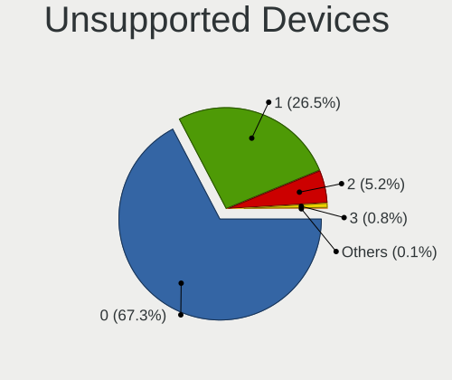

| Total | Computers | Percent |
|-------|-----------|---------|
| 0     | 8230      | 67.32%  |
| 1     | 3237      | 26.48%  |
| 2     | 641       | 5.24%   |
| 3     | 97        | 0.79%   |
| 4     | 11        | 0.09%   |
| 5     | 7         | 0.06%   |
| 8     | 1         | 0.01%   |
| 7     | 1         | 0.01%   |
| 6     | 1         | 0.01%   |

Unsupported Device Types
------------------------

Types of unsupported devices

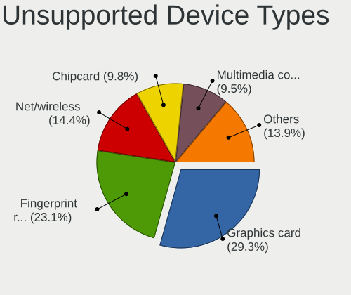

| Type                     | Computers | Percent |
|--------------------------|-----------|---------|
| Graphics card            | 1387      | 29.34%  |
| Fingerprint reader       | 1090      | 23.06%  |
| Net/wireless             | 681       | 14.41%  |
| Chipcard                 | 464       | 9.82%   |
| Multimedia controller    | 449       | 9.5%    |
| Communication controller | 100       | 2.12%   |
| Bluetooth                | 97        | 2.05%   |
| Storage                  | 89        | 1.88%   |
| Sound                    | 58        | 1.23%   |
| Unassigned class         | 54        | 1.14%   |
| Modem                    | 52        | 1.1%    |
| Camera                   | 52        | 1.1%    |
| Net/ethernet             | 39        | 0.83%   |
| Network                  | 22        | 0.47%   |
| Card reader              | 21        | 0.44%   |
| Flash memory             | 17        | 0.36%   |
| Storage/raid             | 16        | 0.34%   |
| Storage/ide              | 15        | 0.32%   |
| Dvb card                 | 10        | 0.21%   |
| Storage/nvme             | 5         | 0.11%   |
| Unclassified device      | 4         | 0.08%   |
| Firewire controller      | 2         | 0.04%   |
| Video                    | 1         | 0.02%   |
| Tv card                  | 1         | 0.02%   |
| Storage/ata              | 1         | 0.02%   |

