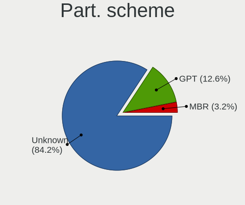
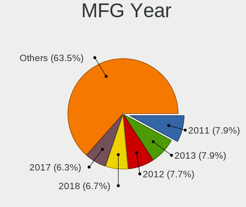
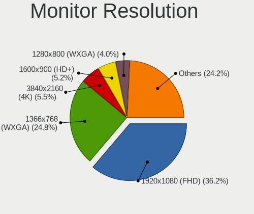
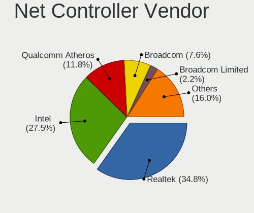
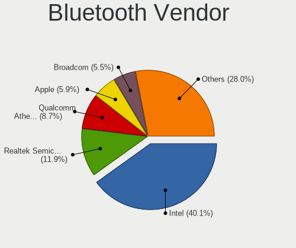

Zorin - Tested Hardware & Statistics
------------------------------------

A project to collect tested hardware configurations for Zorin.

Anyone can contribute to this report by the [hw-probe](https://github.com/linuxhw/hw-probe) tool:

    sudo -E hw-probe -all -upload

Please contribute! Especially if your hardware is rare.

This is a report for all computer types. See also reports for [desktops](/Dist/Zorin/Desktop/README.md) and [notebooks](/Dist/Zorin/Notebook/README.md).

Contents
--------

* [ Test Cases ](#test-cases)

* [ System ](#system)
  - [ OS                       ](#os)
  - [ OS Family                ](#os-family)
  - [ Kernel                   ](#kernel)
  - [ Kernel Family            ](#kernel-family)
  - [ Kernel Major Ver.        ](#kernel-major-ver)
  - [ Arch                     ](#arch)
  - [ DE                       ](#de)
  - [ Display Server           ](#display-server)
  - [ Display Manager          ](#display-manager)
  - [ OS Lang                  ](#os-lang)
  - [ Boot Mode                ](#boot-mode)
  - [ Filesystem               ](#filesystem)
  - [ Part. scheme             ](#part-scheme)
  - [ Dual Boot with Linux/BSD ](#dual-boot-with-linuxbsd)
  - [ Dual Boot (Win)          ](#dual-boot-win)

* [ Board ](#board)
  - [ Vendor                   ](#vendor)
  - [ Model                    ](#model)
  - [ Model Family             ](#model-family)
  - [ MFG Year                 ](#mfg-year)
  - [ Form Factor              ](#form-factor)
  - [ Secure Boot              ](#secure-boot)
  - [ Coreboot                 ](#coreboot)
  - [ RAM Size                 ](#ram-size)
  - [ RAM Used                 ](#ram-used)
  - [ Total Drives             ](#total-drives)
  - [ Has CD-ROM               ](#has-cd-rom)
  - [ Has Ethernet             ](#has-ethernet)
  - [ Has WiFi                 ](#has-wifi)
  - [ Has Bluetooth            ](#has-bluetooth)

* [ Location ](#location)
  - [ Country                  ](#country)
  - [ City                     ](#city)

* [ Drives ](#drives)
  - [ Drive Vendor             ](#drive-vendor)
  - [ Drive Model              ](#drive-model)
  - [ HDD Vendor               ](#hdd-vendor)
  - [ SSD Vendor               ](#ssd-vendor)
  - [ Drive Kind               ](#drive-kind)
  - [ Drive Connector          ](#drive-connector)
  - [ Drive Size               ](#drive-size)
  - [ Space Total              ](#space-total)
  - [ Space Used               ](#space-used)
  - [ Malfunc. Drives          ](#malfunc-drives)
  - [ Malfunc. Drive Vendor    ](#malfunc-drive-vendor)
  - [ Malfunc. HDD Vendor      ](#malfunc-hdd-vendor)
  - [ Malfunc. Drive Kind      ](#malfunc-drive-kind)
  - [ Failed Drives            ](#failed-drives)
  - [ Failed Drive Vendor      ](#failed-drive-vendor)
  - [ Drive Status             ](#drive-status)

* [ Storage controller ](#storage-controller)
  - [ Storage Vendor           ](#storage-vendor)
  - [ Storage Model            ](#storage-model)
  - [ Storage Kind             ](#storage-kind)

* [ Processor ](#processor)
  - [ CPU Vendor               ](#cpu-vendor)
  - [ CPU Model                ](#cpu-model)
  - [ CPU Model Family         ](#cpu-model-family)
  - [ CPU Cores                ](#cpu-cores)
  - [ CPU Sockets              ](#cpu-sockets)
  - [ CPU Threads              ](#cpu-threads)
  - [ CPU Op-Modes             ](#cpu-op-modes)
  - [ CPU Microcode            ](#cpu-microcode)
  - [ CPU Microarch            ](#cpu-microarch)

* [ Graphics ](#graphics)
  - [ GPU Vendor               ](#gpu-vendor)
  - [ GPU Model                ](#gpu-model)
  - [ GPU Combo                ](#gpu-combo)
  - [ GPU Driver               ](#gpu-driver)
  - [ GPU Memory               ](#gpu-memory)

* [ Monitor ](#monitor)
  - [ Monitor Vendor           ](#monitor-vendor)
  - [ Monitor Model            ](#monitor-model)
  - [ Monitor Resolution       ](#monitor-resolution)
  - [ Monitor Diagonal         ](#monitor-diagonal)
  - [ Monitor Width            ](#monitor-width)
  - [ Aspect Ratio             ](#aspect-ratio)
  - [ Monitor Area             ](#monitor-area)
  - [ Pixel Density            ](#pixel-density)
  - [ Multiple Monitors        ](#multiple-monitors)

* [ Network ](#network)
  - [ Net Controller Vendor    ](#net-controller-vendor)
  - [ Net Controller Model     ](#net-controller-model)
  - [ Wireless Vendor          ](#wireless-vendor)
  - [ Wireless Model           ](#wireless-model)
  - [ Ethernet Vendor          ](#ethernet-vendor)
  - [ Ethernet Model           ](#ethernet-model)
  - [ Net Controller Kind      ](#net-controller-kind)
  - [ Used Controller          ](#used-controller)
  - [ NICs                     ](#nics)
  - [ IPv6                     ](#ipv6)

* [ Bluetooth ](#bluetooth)
  - [ Bluetooth Vendor         ](#bluetooth-vendor)
  - [ Bluetooth Model          ](#bluetooth-model)

* [ Sound ](#sound)
  - [ Sound Vendor             ](#sound-vendor)
  - [ Sound Model              ](#sound-model)

* [ Memory ](#memory)
  - [ Memory Vendor            ](#memory-vendor)
  - [ Memory Model             ](#memory-model)
  - [ Memory Kind              ](#memory-kind)
  - [ Memory Form Factor       ](#memory-form-factor)
  - [ Memory Size              ](#memory-size)
  - [ Memory Speed             ](#memory-speed)

* [ Printers & scanners ](#printers--scanners)
  - [ Printer Vendor           ](#printer-vendor)
  - [ Printer Model            ](#printer-model)
  - [ Scanner Vendor           ](#scanner-vendor)
  - [ Scanner Model            ](#scanner-model)

* [ Camera ](#camera)
  - [ Camera Vendor            ](#camera-vendor)
  - [ Camera Model             ](#camera-model)

* [ Security ](#security)
  - [ Fingerprint Vendor       ](#fingerprint-vendor)
  - [ Fingerprint Model        ](#fingerprint-model)
  - [ Chipcard Vendor          ](#chipcard-vendor)
  - [ Chipcard Model           ](#chipcard-model)

* [ Unsupported ](#unsupported)
  - [ Unsupported Devices      ](#unsupported-devices)
  - [ Unsupported Device Types ](#unsupported-device-types)

Test Cases
----------

Total: 12842

| Vendor        | Model                       | Form-Factor | Probe                                                      | Date         |
|---------------|-----------------------------|-------------|------------------------------------------------------------|--------------|
| Fujitsu       | FARQ16011                   | Tablet      | [cf0a931bc4](https://linux-hardware.org/?probe=cf0a931bc4) | Jan 06, 2025 |
| Fujitsu       | LIFEBOOK T939               | Convertible | [a56f47a26f](https://linux-hardware.org/?probe=a56f47a26f) | Jan 06, 2025 |
| HP            | ProBook 640 G1              | Notebook    | [d6e43bba74](https://linux-hardware.org/?probe=d6e43bba74) | Jan 06, 2025 |
| HP            | ProBook 640 G1              | Notebook    | [7b033a8375](https://linux-hardware.org/?probe=7b033a8375) | Jan 06, 2025 |
| Intel         | H61M-DS2                    | Desktop     | [2ef34839f4](https://linux-hardware.org/?probe=2ef34839f4) | Jan 06, 2025 |
| Gigabyte      | Z170X-Gaming 7              | Desktop     | [ad40db7f67](https://linux-hardware.org/?probe=ad40db7f67) | Jan 06, 2025 |
| Positivo      | C464C                       | Convertible | [d7de8bee56](https://linux-hardware.org/?probe=d7de8bee56) | Jan 06, 2025 |
| Lenovo        | Yoga 520-14IKB 80YM         | Convertible | [f0c2f6b640](https://linux-hardware.org/?probe=f0c2f6b640) | Jan 06, 2025 |
| Lenovo        | IdeaPad Z400 VIWZ1          | Notebook    | [516947871e](https://linux-hardware.org/?probe=516947871e) | Jan 05, 2025 |
| MSI           | MS-B0A41                    | Desktop     | [72d4614eaf](https://linux-hardware.org/?probe=72d4614eaf) | Jan 05, 2025 |
| ASUSTek       | ASUS Zenbook Duo UX8406M... | Tablet      | [de52972775](https://linux-hardware.org/?probe=de52972775) | Jan 05, 2025 |
| ASUSTek       | ASUS Zenbook Duo UX8406M... | Tablet      | [d82c706a63](https://linux-hardware.org/?probe=d82c706a63) | Jan 05, 2025 |
| Dell          | 0HY9JP A00                  | Desktop     | [3047d18f75](https://linux-hardware.org/?probe=3047d18f75) | Jan 05, 2025 |
| ASUSTek       | K93SV                       | Notebook    | [01d0efaf46](https://linux-hardware.org/?probe=01d0efaf46) | Jan 05, 2025 |
| Acer          | TravelMate 5210             | Notebook    | [379e44855f](https://linux-hardware.org/?probe=379e44855f) | Jan 05, 2025 |
| Dell          | Inspiron N4050              | Notebook    | [6da56634e0](https://linux-hardware.org/?probe=6da56634e0) | Jan 05, 2025 |
| ASUSTek       | M4A89GTD-PRO/USB3           | Desktop     | [b2b5aa8eec](https://linux-hardware.org/?probe=b2b5aa8eec) | Jan 05, 2025 |
| Acer          | Aspire 5750G                | Notebook    | [68404201a9](https://linux-hardware.org/?probe=68404201a9) | Jan 05, 2025 |
| Lenovo        | IdeaPad 5 2-in-1 14AHP9 ... | Convertible | [9b54eb722d](https://linux-hardware.org/?probe=9b54eb722d) | Jan 05, 2025 |
| Lenovo        | IdeaPad 320-15ABR 80XS      | Notebook    | [4a2cbc9a5c](https://linux-hardware.org/?probe=4a2cbc9a5c) | Jan 05, 2025 |
| Gigabyte      | B450 AORUS PRO WIFI-CF      | Desktop     | [38b497d193](https://linux-hardware.org/?probe=38b497d193) | Jan 05, 2025 |
| Gigabyte      | B450 AORUS PRO WIFI-CF      | Desktop     | [394cfdc261](https://linux-hardware.org/?probe=394cfdc261) | Jan 05, 2025 |
| Gigabyte      | Z97X-UD5H                   | Desktop     | [381b6fc010](https://linux-hardware.org/?probe=381b6fc010) | Jan 05, 2025 |
| Intel         | H61 V1.6B                   | Desktop     | [eb28b5f6be](https://linux-hardware.org/?probe=eb28b5f6be) | Jan 04, 2025 |
| Lenovo        | Yoga 9 14IAP7 82LU          | Convertible | [331b79e990](https://linux-hardware.org/?probe=331b79e990) | Jan 04, 2025 |
| Sony          | SVF15213CBW                 | Notebook    | [2a3349eb69](https://linux-hardware.org/?probe=2a3349eb69) | Jan 04, 2025 |
| HP            | EliteBook 840 G2            | Notebook    | [69146beeeb](https://linux-hardware.org/?probe=69146beeeb) | Jan 04, 2025 |
| HP            | 805D                        | Desktop     | [269af351cb](https://linux-hardware.org/?probe=269af351cb) | Jan 04, 2025 |
| ASUSTek       | TUF Gaming B550-PLUS        | Desktop     | [989a72852c](https://linux-hardware.org/?probe=989a72852c) | Jan 04, 2025 |
| Dell          | Inspiron 5566               | Notebook    | [9653ac70bc](https://linux-hardware.org/?probe=9653ac70bc) | Jan 04, 2025 |
| Intel         | H61                         | Desktop     | [2a8ff4b81a](https://linux-hardware.org/?probe=2a8ff4b81a) | Jan 03, 2025 |
| Intel         | H61                         | Desktop     | [bb2c7db34e](https://linux-hardware.org/?probe=bb2c7db34e) | Jan 03, 2025 |
| Dell          | Vostro 3420                 | Notebook    | [03772e7414](https://linux-hardware.org/?probe=03772e7414) | Jan 03, 2025 |
| Avell High... | Avell G1513 MUV / A52 MU... | Notebook    | [ca3162cf4a](https://linux-hardware.org/?probe=ca3162cf4a) | Jan 03, 2025 |
| Sony          | VGN-CR21S_W                 | Notebook    | [29a2c1f90e](https://linux-hardware.org/?probe=29a2c1f90e) | Jan 03, 2025 |
| Intel         | H61 V1.6B                   | Desktop     | [699b915313](https://linux-hardware.org/?probe=699b915313) | Jan 03, 2025 |
| Dell          | 0F65P3 A01                  | All in one  | [0fbde604e6](https://linux-hardware.org/?probe=0fbde604e6) | Jan 03, 2025 |
| HP            | Spectre x360 Convertible    | Convertible | [f3f5de25ba](https://linux-hardware.org/?probe=f3f5de25ba) | Jan 03, 2025 |
| HP            | Notebook                    | Notebook    | [b50d5a2974](https://linux-hardware.org/?probe=b50d5a2974) | Jan 03, 2025 |
| Toshiba       | Satellite C660              | Notebook    | [0767070a44](https://linux-hardware.org/?probe=0767070a44) | Jan 03, 2025 |
| Lenovo        | ThinkPad T430 2349H2G       | Notebook    | [afcca700da](https://linux-hardware.org/?probe=afcca700da) | Jan 03, 2025 |
| HP            | ProBook 445 G7              | Notebook    | [8e56333050](https://linux-hardware.org/?probe=8e56333050) | Jan 03, 2025 |
| HP            | EliteBook 840 G2            | Notebook    | [bb8d0a325f](https://linux-hardware.org/?probe=bb8d0a325f) | Jan 02, 2025 |
| Lenovo        | IdeaPad 320-15ABR 80XS      | Notebook    | [b58899eb8b](https://linux-hardware.org/?probe=b58899eb8b) | Jan 02, 2025 |
| Sony          | VGN-CS11Z_T                 | Notebook    | [28f8386e8f](https://linux-hardware.org/?probe=28f8386e8f) | Jan 01, 2025 |
| Fujitsu Si... | ESPRIMO Mobile V5535        | Notebook    | [eeb85155e5](https://linux-hardware.org/?probe=eeb85155e5) | Jan 01, 2025 |
| OEM           | B75 Ver:1.41                | Desktop     | [31c5df1f0f](https://linux-hardware.org/?probe=31c5df1f0f) | Jan 01, 2025 |
| HP            | TouchSmart tm2              | Notebook    | [1750c192e9](https://linux-hardware.org/?probe=1750c192e9) | Jan 01, 2025 |
| Gigabyte      | GA-MA790XT-UD4P             | Desktop     | [2e3ebfe841](https://linux-hardware.org/?probe=2e3ebfe841) | Jan 01, 2025 |
| Dell          | 04GJJT A00                  | Desktop     | [444d672dcb](https://linux-hardware.org/?probe=444d672dcb) | Jan 01, 2025 |
| Intel         | DH87RL AAG74240-402         | Desktop     | [047af1c88e](https://linux-hardware.org/?probe=047af1c88e) | Jan 01, 2025 |
| MSI           | B450 GAMING PLUS MAX        | Desktop     | [15b1774620](https://linux-hardware.org/?probe=15b1774620) | Jan 01, 2025 |
| Apple         | MacBookAir6,2               | Notebook    | [47b07545df](https://linux-hardware.org/?probe=47b07545df) | Dec 31, 2024 |
| Dell          | Latitude E6410              | Notebook    | [ce431d6def](https://linux-hardware.org/?probe=ce431d6def) | Dec 31, 2024 |
| Dell          | Latitude E6410              | Notebook    | [e5ad6fdba6](https://linux-hardware.org/?probe=e5ad6fdba6) | Dec 31, 2024 |
| Dell          | Inspiron N4050              | Notebook    | [5c2b2c9c8f](https://linux-hardware.org/?probe=5c2b2c9c8f) | Dec 31, 2024 |
| Gigabyte      | X570 AORUS ULTRA            | Desktop     | [8b12a21b9a](https://linux-hardware.org/?probe=8b12a21b9a) | Dec 31, 2024 |
| Lenovo        | ThinkPad Edge 0301FFG       | Notebook    | [526994e0a4](https://linux-hardware.org/?probe=526994e0a4) | Dec 31, 2024 |
| Dell          | Inspiron 7520               | Notebook    | [f60d84588c](https://linux-hardware.org/?probe=f60d84588c) | Dec 31, 2024 |
| Samsung       | 950QED                      | Convertible | [fed1e8737a](https://linux-hardware.org/?probe=fed1e8737a) | Dec 31, 2024 |
| HP            | ProBook 4540s               | Notebook    | [9bbe0a3b71](https://linux-hardware.org/?probe=9bbe0a3b71) | Dec 31, 2024 |
| Dell          | Vostro 1500                 | Notebook    | [b5ecc28563](https://linux-hardware.org/?probe=b5ecc28563) | Dec 31, 2024 |
| Toshiba       | Satellite C75D-B            | Notebook    | [728de620aa](https://linux-hardware.org/?probe=728de620aa) | Dec 31, 2024 |
| ASRock        | A75 Extreme6                | Desktop     | [86fd341a89](https://linux-hardware.org/?probe=86fd341a89) | Dec 31, 2024 |
| Lenovo        | ThinkPad T500 2241WKY       | Notebook    | [7b16eb5229](https://linux-hardware.org/?probe=7b16eb5229) | Dec 30, 2024 |
| HP            | 470 G8 Notebook PC          | Notebook    | [a14600050a](https://linux-hardware.org/?probe=a14600050a) | Dec 30, 2024 |
| Dell          | Latitude E7270              | Notebook    | [45d3b8797a](https://linux-hardware.org/?probe=45d3b8797a) | Dec 30, 2024 |
| HP            | 198E                        | Desktop     | [039237d3ac](https://linux-hardware.org/?probe=039237d3ac) | Dec 30, 2024 |
| Gigabyte      | B550 AORUS ELITE AX V2      | Desktop     | [81eb291a07](https://linux-hardware.org/?probe=81eb291a07) | Dec 30, 2024 |
| Framework     | Laptop (12th Gen Intel C... | Notebook    | [6d09d6c124](https://linux-hardware.org/?probe=6d09d6c124) | Dec 30, 2024 |
| ASUSTek       | N56JK                       | Notebook    | [d1c6ca3f72](https://linux-hardware.org/?probe=d1c6ca3f72) | Dec 29, 2024 |
| ASUSTek       | N56JK                       | Notebook    | [0114b99957](https://linux-hardware.org/?probe=0114b99957) | Dec 29, 2024 |
| AZW           | GK35                        | Desktop     | [ed7df72829](https://linux-hardware.org/?probe=ed7df72829) | Dec 29, 2024 |
| ASUSTek       | PRIME H610M-K ARGB          | Desktop     | [8f2f1603ad](https://linux-hardware.org/?probe=8f2f1603ad) | Dec 29, 2024 |
| Lenovo        | ThinkPad T460 20FN004CMN    | Notebook    | [c918606381](https://linux-hardware.org/?probe=c918606381) | Dec 29, 2024 |
| Gigabyte      | Z97X-Gaming 5               | Desktop     | [dc533b139f](https://linux-hardware.org/?probe=dc533b139f) | Dec 29, 2024 |
| Dell          | 0XCR8D A03                  | Desktop     | [77abfbec81](https://linux-hardware.org/?probe=77abfbec81) | Dec 29, 2024 |
| HP            | 1497                        | Desktop     | [256c3def88](https://linux-hardware.org/?probe=256c3def88) | Dec 29, 2024 |
| MSI           | GT72 2QD                    | Notebook    | [c8a2b702aa](https://linux-hardware.org/?probe=c8a2b702aa) | Dec 29, 2024 |
| Lenovo        | G585 20137                  | Notebook    | [28c0d1589f](https://linux-hardware.org/?probe=28c0d1589f) | Dec 28, 2024 |
| Lenovo        | G585 20137                  | Notebook    | [77d7e4f41b](https://linux-hardware.org/?probe=77d7e4f41b) | Dec 28, 2024 |
| Gigabyte      | Z97X-Gaming 3               | Desktop     | [daf6ad0471](https://linux-hardware.org/?probe=daf6ad0471) | Dec 28, 2024 |
| Lenovo        | IdeaPad 710S Plus-13IKB ... | Notebook    | [4d428ff2fd](https://linux-hardware.org/?probe=4d428ff2fd) | Dec 28, 2024 |
| Lenovo        | IdeaPad 710S Plus-13IKB ... | Notebook    | [fd2a217520](https://linux-hardware.org/?probe=fd2a217520) | Dec 28, 2024 |
| Gigabyte      | Z97X-Gaming 3               | Desktop     | [089e2c01de](https://linux-hardware.org/?probe=089e2c01de) | Dec 28, 2024 |
| Lenovo        | 3106 SDK0J40697 WIN 3305... | Desktop     | [d5047e58d1](https://linux-hardware.org/?probe=d5047e58d1) | Dec 28, 2024 |
| Dell          | Latitude E4300              | Notebook    | [0c340c7391](https://linux-hardware.org/?probe=0c340c7391) | Dec 28, 2024 |
| GPD           | G1618-04                    | Notebook    | [f9fccc3291](https://linux-hardware.org/?probe=f9fccc3291) | Dec 28, 2024 |
| Acer          | Aspire 5750G                | Notebook    | [39cfeac033](https://linux-hardware.org/?probe=39cfeac033) | Dec 28, 2024 |
| Acer          | Aspire 5750G                | Notebook    | [ffcb19aa37](https://linux-hardware.org/?probe=ffcb19aa37) | Dec 28, 2024 |
| Lenovo        | ThinkPad T520 42424UU       | Notebook    | [b4a2895025](https://linux-hardware.org/?probe=b4a2895025) | Dec 28, 2024 |
| MSI           | FM2-A75IA-E53               | Desktop     | [4736ddfd8c](https://linux-hardware.org/?probe=4736ddfd8c) | Dec 28, 2024 |
| Toshiba       | Satellite P300              | Notebook    | [3174fc3f7e](https://linux-hardware.org/?probe=3174fc3f7e) | Dec 27, 2024 |
| Lenovo        | ThinkPad T420 418062U       | Notebook    | [f06b701043](https://linux-hardware.org/?probe=f06b701043) | Dec 27, 2024 |
| Dell          | Latitude E4300              | Notebook    | [e00b4f8165](https://linux-hardware.org/?probe=e00b4f8165) | Dec 27, 2024 |
| Lenovo        | V15 G2 ITL 82ME             | Notebook    | [4c710eefac](https://linux-hardware.org/?probe=4c710eefac) | Dec 27, 2024 |
| ASUSTek       | GL552VW                     | Notebook    | [dcb25941f6](https://linux-hardware.org/?probe=dcb25941f6) | Dec 27, 2024 |
| ASUSTek       | ASUS TUF Gaming A15 FA50... | Notebook    | [6d267dc1e6](https://linux-hardware.org/?probe=6d267dc1e6) | Dec 27, 2024 |
| Fujitsu Si... | LIFEBOOK S7220              | Notebook    | [7aa92e6daf](https://linux-hardware.org/?probe=7aa92e6daf) | Dec 27, 2024 |
| Medion        | ERAZER X7853 MD60603        | Notebook    | [9c5d2630f6](https://linux-hardware.org/?probe=9c5d2630f6) | Dec 27, 2024 |
| Acer          | Aspire E1-571G              | Notebook    | [6da76de24e](https://linux-hardware.org/?probe=6da76de24e) | Dec 27, 2024 |
| Fujitsu Si... | LIFEBOOK S7220              | Notebook    | [2f65653f5c](https://linux-hardware.org/?probe=2f65653f5c) | Dec 27, 2024 |
| Apple         | Mac-27ADBB7B4CEE8E61 iMa... | All in one  | [a0df3d57ee](https://linux-hardware.org/?probe=a0df3d57ee) | Dec 27, 2024 |
| Dell          | 05XGC8 A01                  | Desktop     | [59297e30b7](https://linux-hardware.org/?probe=59297e30b7) | Dec 27, 2024 |
| Dell          | 05XGC8 A01                  | Desktop     | [4714a00d4c](https://linux-hardware.org/?probe=4714a00d4c) | Dec 27, 2024 |
| ASUSTek       | ASUS TUF Gaming F15 FX50... | Notebook    | [4bfed8719e](https://linux-hardware.org/?probe=4bfed8719e) | Dec 27, 2024 |
| Lenovo        | ThinkPad T520 42424UU       | Notebook    | [5de1acb22e](https://linux-hardware.org/?probe=5de1acb22e) | Dec 27, 2024 |
| ASRock        | X870 Pro RS WiFi            | Desktop     | [97eaca87bb](https://linux-hardware.org/?probe=97eaca87bb) | Dec 27, 2024 |
| HP            | 83F2                        | Desktop     | [28232611f8](https://linux-hardware.org/?probe=28232611f8) | Dec 27, 2024 |
| MSI           | X670E GAMING PLUS WIFI      | Desktop     | [59a746132a](https://linux-hardware.org/?probe=59a746132a) | Dec 26, 2024 |
| Dell          | 0200DY A02                  | Desktop     | [048527009c](https://linux-hardware.org/?probe=048527009c) | Dec 26, 2024 |
| ASUSTek       | ROG Zephyrus G14 GA403UV... | Notebook    | [32b3387f38](https://linux-hardware.org/?probe=32b3387f38) | Dec 26, 2024 |
| ASUSTek       | ROG Zephyrus G14 GA403UV... | Notebook    | [ce3b8aa0e6](https://linux-hardware.org/?probe=ce3b8aa0e6) | Dec 26, 2024 |
| Dell          | Latitude 14 Rugged (5404... | Notebook    | [ff70c71f76](https://linux-hardware.org/?probe=ff70c71f76) | Dec 26, 2024 |
| ASUSTek       | X455LD                      | Notebook    | [0695dcd803](https://linux-hardware.org/?probe=0695dcd803) | Dec 26, 2024 |
| Lenovo        | SDK0J40700 WIN              | Desktop     | [783314e5b3](https://linux-hardware.org/?probe=783314e5b3) | Dec 26, 2024 |
| ASRock        | A320M-HDV R4.0              | Desktop     | [ee9f566833](https://linux-hardware.org/?probe=ee9f566833) | Dec 26, 2024 |
| ASRock        | A320M-HDV R4.0              | Desktop     | [03bac79df3](https://linux-hardware.org/?probe=03bac79df3) | Dec 26, 2024 |
| Dell          | Latitude 5480               | Notebook    | [a43c9feb6e](https://linux-hardware.org/?probe=a43c9feb6e) | Dec 26, 2024 |
| Dell          | Latitude 5480               | Notebook    | [b0b2a919ce](https://linux-hardware.org/?probe=b0b2a919ce) | Dec 25, 2024 |
| ASUSTek       | ASUS TUF Gaming F15 FX50... | Notebook    | [b127afa2e4](https://linux-hardware.org/?probe=b127afa2e4) | Dec 25, 2024 |
| Dell          | Precision M6800             | Notebook    | [7d37225503](https://linux-hardware.org/?probe=7d37225503) | Dec 25, 2024 |
| Packard Be... | TBGM01                      | Desktop     | [68d8628be3](https://linux-hardware.org/?probe=68d8628be3) | Dec 25, 2024 |
| Gigabyte      | B250M-Gaming 3-CF           | Desktop     | [b0f84564ba](https://linux-hardware.org/?probe=b0f84564ba) | Dec 25, 2024 |
| Dell          | Precision M6800             | Notebook    | [d5733504f6](https://linux-hardware.org/?probe=d5733504f6) | Dec 25, 2024 |
| Apple         | MacBookPro8,1               | Notebook    | [3bb45810a1](https://linux-hardware.org/?probe=3bb45810a1) | Dec 25, 2024 |
| Dell          | 06FW8P A02                  | Desktop     | [42c00b7a8a](https://linux-hardware.org/?probe=42c00b7a8a) | Dec 24, 2024 |
| ASUSTek       | ASUS TUF Gaming A17 FA70... | Notebook    | [1c4acdd4ee](https://linux-hardware.org/?probe=1c4acdd4ee) | Dec 24, 2024 |
| Fujitsu Si... | D2461-A2 S26361-D2461-A2    | Desktop     | [246c7d0034](https://linux-hardware.org/?probe=246c7d0034) | Dec 24, 2024 |
| Apple         | Mac-F227BEC8 PVT            | All in one  | [1d1daf9285](https://linux-hardware.org/?probe=1d1daf9285) | Dec 24, 2024 |
| Lenovo        | ThinkPad T460s 20F90042G... | Notebook    | [d007cb01ec](https://linux-hardware.org/?probe=d007cb01ec) | Dec 24, 2024 |
| ASUSTek       | PRIME B450M-K II            | Desktop     | [1440d04792](https://linux-hardware.org/?probe=1440d04792) | Dec 24, 2024 |
| Acer          | Nitro AN515-54              | Notebook    | [1205a81135](https://linux-hardware.org/?probe=1205a81135) | Dec 23, 2024 |
| Intel         | HM87                        | Notebook    | [06e9957440](https://linux-hardware.org/?probe=06e9957440) | Dec 23, 2024 |
| Teclast       | F6 Plus                     | Notebook    | [143094aa18](https://linux-hardware.org/?probe=143094aa18) | Dec 23, 2024 |
| Notebook      | W35xSTQ_370ST               | Notebook    | [ec6c6385d5](https://linux-hardware.org/?probe=ec6c6385d5) | Dec 23, 2024 |
| Acer          | Nitro AN515-54              | Notebook    | [d6756e38c9](https://linux-hardware.org/?probe=d6756e38c9) | Dec 23, 2024 |
| Dell          | Latitude E4300              | Notebook    | [cfcc3cbd9f](https://linux-hardware.org/?probe=cfcc3cbd9f) | Dec 23, 2024 |
| Dell          | Latitude E4300              | Notebook    | [e67d828b77](https://linux-hardware.org/?probe=e67d828b77) | Dec 23, 2024 |
| HP            | Laptop 14-cf2xxx            | Notebook    | [253b2b9f9f](https://linux-hardware.org/?probe=253b2b9f9f) | Dec 23, 2024 |
| Samsung       | R530/R730/P530              | Notebook    | [2c69e47fef](https://linux-hardware.org/?probe=2c69e47fef) | Dec 23, 2024 |
| Samsung       | R530/R730/P530              | Notebook    | [86fbdd5542](https://linux-hardware.org/?probe=86fbdd5542) | Dec 23, 2024 |
| Lenovo        | 36EB SDK0R32862 WIN 3258... | Desktop     | [572d308e92](https://linux-hardware.org/?probe=572d308e92) | Dec 23, 2024 |
| Samsung       | 700G7A                      | Notebook    | [0f56340187](https://linux-hardware.org/?probe=0f56340187) | Dec 23, 2024 |
| Gigabyte      | B450M DS3H V2               | Desktop     | [c8554294b6](https://linux-hardware.org/?probe=c8554294b6) | Dec 23, 2024 |
| Acer          | Aspire F5-573G              | Notebook    | [b5e37804c4](https://linux-hardware.org/?probe=b5e37804c4) | Dec 23, 2024 |
| Acer          | Aspire F5-573G              | Notebook    | [29bad5d443](https://linux-hardware.org/?probe=29bad5d443) | Dec 23, 2024 |
| HP            | 83E9                        | Desktop     | [149bf1039e](https://linux-hardware.org/?probe=149bf1039e) | Dec 23, 2024 |
| MSI           | MAG Z590 TOMAHAWK WIFI      | Desktop     | [482ce52b8d](https://linux-hardware.org/?probe=482ce52b8d) | Dec 22, 2024 |
| Lenovo        | ThinkPad T470 20HD000MUK    | Notebook    | [119c51368a](https://linux-hardware.org/?probe=119c51368a) | Dec 22, 2024 |
| ASUSTek       | PRIME H470-PLUS             | Desktop     | [93ed037f43](https://linux-hardware.org/?probe=93ed037f43) | Dec 22, 2024 |
| Gigabyte      | A320M-S2H-CF                | Desktop     | [0e08cf46c1](https://linux-hardware.org/?probe=0e08cf46c1) | Dec 22, 2024 |
| Microsoft     | Surface Laptop SE           | Tablet      | [1827ad6649](https://linux-hardware.org/?probe=1827ad6649) | Dec 22, 2024 |
| Lenovo        | ThinkPad Yoga 370 20JH00... | Convertible | [9711be4bfb](https://linux-hardware.org/?probe=9711be4bfb) | Dec 22, 2024 |
| Fujitsu       | LIFEBOOK A532               | Notebook    | [188aa532e9](https://linux-hardware.org/?probe=188aa532e9) | Dec 22, 2024 |
| Lenovo        | ThinkPad L540 20AUS02U00    | Notebook    | [b1e76585dc](https://linux-hardware.org/?probe=b1e76585dc) | Dec 21, 2024 |
| Fujitsu       | D2990-A2 S26361-D2990-A2    | Desktop     | [f6869ae032](https://linux-hardware.org/?probe=f6869ae032) | Dec 21, 2024 |
| HP            | EliteBook 850 G5            | Notebook    | [e54906d193](https://linux-hardware.org/?probe=e54906d193) | Dec 21, 2024 |
| Lenovo        | IdeaPad 100-15IBD 80QQ      | Notebook    | [d1d487fe68](https://linux-hardware.org/?probe=d1d487fe68) | Dec 21, 2024 |
| Lenovo        | IdeaPad 100-15IBD 80QQ      | Notebook    | [8adc47d05f](https://linux-hardware.org/?probe=8adc47d05f) | Dec 21, 2024 |
| Lenovo        | ThinkPad X220 Tablet 429... | Notebook    | [df6f512e3a](https://linux-hardware.org/?probe=df6f512e3a) | Dec 21, 2024 |
| Lenovo        | ThinkPad X220 Tablet 429... | Notebook    | [7c430caf94](https://linux-hardware.org/?probe=7c430caf94) | Dec 21, 2024 |
| Intel         | NUC13ANBi3 M89896-203       | Mini pc     | [70fdf813cc](https://linux-hardware.org/?probe=70fdf813cc) | Dec 20, 2024 |
| Lenovo        | IdeaPad S145-15IIL 82DJ     | Notebook    | [69da2b0a14](https://linux-hardware.org/?probe=69da2b0a14) | Dec 20, 2024 |
| HUAWEI        | HN-WX9X                     | Notebook    | [2b2541ddf3](https://linux-hardware.org/?probe=2b2541ddf3) | Dec 20, 2024 |
| HUAWEI        | HN-WX9X                     | Notebook    | [7749a94f08](https://linux-hardware.org/?probe=7749a94f08) | Dec 20, 2024 |
| Fujitsu       | LIFEBOOK U727               | Notebook    | [b08ef8f5a1](https://linux-hardware.org/?probe=b08ef8f5a1) | Dec 20, 2024 |
| Dell          | Latitude 7420               | Notebook    | [754cef3d2f](https://linux-hardware.org/?probe=754cef3d2f) | Dec 20, 2024 |
| ASUSTek       | TUF Gaming B650-PLUS WIF... | Desktop     | [15936c57d6](https://linux-hardware.org/?probe=15936c57d6) | Dec 20, 2024 |
| Acer          | Nitro AN517-52              | Notebook    | [4233b4277f](https://linux-hardware.org/?probe=4233b4277f) | Dec 20, 2024 |
| HP            | 15 Notebook PC              | Notebook    | [1d68c69eaf](https://linux-hardware.org/?probe=1d68c69eaf) | Dec 20, 2024 |
| Dell          | Latitude 5420 Rugged        | Notebook    | [5850f01900](https://linux-hardware.org/?probe=5850f01900) | Dec 19, 2024 |
| HP            | ProBook 640 G1              | Notebook    | [7c92813622](https://linux-hardware.org/?probe=7c92813622) | Dec 19, 2024 |
| Google        | Teemo                       | Desktop     | [220fc873b9](https://linux-hardware.org/?probe=220fc873b9) | Dec 19, 2024 |
| Gigabyte      | Z77-DS3H                    | Desktop     | [edefe68947](https://linux-hardware.org/?probe=edefe68947) | Dec 19, 2024 |
| RuggedPC      | RuggedPadC15                | Tablet      | [2f439ab25c](https://linux-hardware.org/?probe=2f439ab25c) | Dec 19, 2024 |
| RuggedPC      | RuggedPadC15                | Tablet      | [013204f3b0](https://linux-hardware.org/?probe=013204f3b0) | Dec 19, 2024 |
| ASRock        | FM2A68M-DG3+                | Desktop     | [c649082ef1](https://linux-hardware.org/?probe=c649082ef1) | Dec 19, 2024 |
| ASRock        | FM2A68M-DG3+                | Desktop     | [61b3ee9f74](https://linux-hardware.org/?probe=61b3ee9f74) | Dec 19, 2024 |
| Packard Be... | TBGM01                      | Desktop     | [8fe4cbb492](https://linux-hardware.org/?probe=8fe4cbb492) | Dec 18, 2024 |
| Gigabyte      | GA-MA790XT-UD4P             | Desktop     | [a3dfcce270](https://linux-hardware.org/?probe=a3dfcce270) | Dec 18, 2024 |
| Panasonic     | CF-31WFL52CM                | Notebook    | [566d39243d](https://linux-hardware.org/?probe=566d39243d) | Dec 18, 2024 |
| Proline       | V14664P                     | Notebook    | [3e422abecf](https://linux-hardware.org/?probe=3e422abecf) | Dec 18, 2024 |
| Lenovo        | S10-3                       | Notebook    | [3ba705e8e3](https://linux-hardware.org/?probe=3ba705e8e3) | Dec 18, 2024 |
| Unknown       | Unknown                     | Notebook    | [a1f0651a5b](https://linux-hardware.org/?probe=a1f0651a5b) | Dec 18, 2024 |
| Unknown       | Unknown                     | Notebook    | [f149e767ce](https://linux-hardware.org/?probe=f149e767ce) | Dec 18, 2024 |
| Lenovo        | IdeaPad Slim 1-14AST-05 ... | Notebook    | [837d0f44f3](https://linux-hardware.org/?probe=837d0f44f3) | Dec 17, 2024 |
| HP            | Laptop 15-bw0xx             | Notebook    | [3f960b1f4e](https://linux-hardware.org/?probe=3f960b1f4e) | Dec 17, 2024 |
| HP            | ProBook 450 G3              | Notebook    | [4f8f97ac4c](https://linux-hardware.org/?probe=4f8f97ac4c) | Dec 17, 2024 |
| HP            | Laptop 15-bw0xx             | Notebook    | [3c1c1b71e8](https://linux-hardware.org/?probe=3c1c1b71e8) | Dec 17, 2024 |
| Gigabyte      | B550 AORUS ELITE AX V2      | Notebook    | [db89962085](https://linux-hardware.org/?probe=db89962085) | Dec 17, 2024 |
| Gigabyte      | X570 AORUS ULTRA            | Desktop     | [b7fa7d97c0](https://linux-hardware.org/?probe=b7fa7d97c0) | Dec 17, 2024 |
| Multilaser    | UB820                       | All in one  | [ec8a440630](https://linux-hardware.org/?probe=ec8a440630) | Dec 16, 2024 |
| Lenovo        | SHARKBAY 0B98401 PRO        | Desktop     | [1e479b232e](https://linux-hardware.org/?probe=1e479b232e) | Dec 16, 2024 |
| Lenovo        | ThinkPad T570 20H90002RI    | Notebook    | [a1ff05a59d](https://linux-hardware.org/?probe=a1ff05a59d) | Dec 16, 2024 |
| Acer          | Predator G3610              | Desktop     | [e1311f0567](https://linux-hardware.org/?probe=e1311f0567) | Dec 16, 2024 |
| HP            | x2 Detachable 10-p0XX       | Tablet      | [878a94ca7f](https://linux-hardware.org/?probe=878a94ca7f) | Dec 16, 2024 |
| HP            | ProBook 450 G6              | Notebook    | [74781357e5](https://linux-hardware.org/?probe=74781357e5) | Dec 16, 2024 |
| Lenovo        | Yoga Pro 9 16IRP8 83BY      | Notebook    | [6501a529f5](https://linux-hardware.org/?probe=6501a529f5) | Dec 16, 2024 |
| Dell          | Latitude 5490               | Notebook    | [e8d767b8cb](https://linux-hardware.org/?probe=e8d767b8cb) | Dec 16, 2024 |
| Toshiba       | Satellite A110              | Notebook    | [1d2307c817](https://linux-hardware.org/?probe=1d2307c817) | Dec 16, 2024 |
| Toshiba       | Satellite C50-A             | Notebook    | [9926e0ee70](https://linux-hardware.org/?probe=9926e0ee70) | Dec 15, 2024 |
| Huanan        | B85                         | Desktop     | [b296e2c8e1](https://linux-hardware.org/?probe=b296e2c8e1) | Dec 15, 2024 |
| ASUSTek       | P8P67                       | Desktop     | [6322c78de6](https://linux-hardware.org/?probe=6322c78de6) | Dec 15, 2024 |
| ASUSTek       | P8P67                       | Desktop     | [ee3b9d1e1e](https://linux-hardware.org/?probe=ee3b9d1e1e) | Dec 15, 2024 |
| Dell          | Inspiron 7586               | Convertible | [ce99c50659](https://linux-hardware.org/?probe=ce99c50659) | Dec 15, 2024 |
| Dell          | Inspiron 7586               | Convertible | [89232ce550](https://linux-hardware.org/?probe=89232ce550) | Dec 15, 2024 |
| Toshiba       | Satellite P55-A             | Notebook    | [d54a3b360d](https://linux-hardware.org/?probe=d54a3b360d) | Dec 15, 2024 |
| MSI           | Eclipse Plus                | Desktop     | [bd3c3d2f09](https://linux-hardware.org/?probe=bd3c3d2f09) | Dec 15, 2024 |
| Acer          | Aspire A315-34              | Notebook    | [6c8d585d0b](https://linux-hardware.org/?probe=6c8d585d0b) | Dec 15, 2024 |
| Lenovo        | 10064                       | Desktop     | [b162e666ea](https://linux-hardware.org/?probe=b162e666ea) | Dec 15, 2024 |
| Acer          | Predator G3610              | Desktop     | [6daec71034](https://linux-hardware.org/?probe=6daec71034) | Dec 15, 2024 |
| HP            | 81C5 MVB                    | Desktop     | [d1d4415deb](https://linux-hardware.org/?probe=d1d4415deb) | Dec 14, 2024 |
| Apple         | MacBookPro12,1              | Notebook    | [612e52e652](https://linux-hardware.org/?probe=612e52e652) | Dec 14, 2024 |
| MSI           | X670E GAMING PLUS WIFI      | Desktop     | [8e8893c238](https://linux-hardware.org/?probe=8e8893c238) | Dec 14, 2024 |
| ASUSTek       | H110M-R                     | Desktop     | [87c39f6163](https://linux-hardware.org/?probe=87c39f6163) | Dec 14, 2024 |
| ASUSTek       | K54HR                       | Notebook    | [b839a0b9cf](https://linux-hardware.org/?probe=b839a0b9cf) | Dec 14, 2024 |
| ASUSTek       | K54HR                       | Notebook    | [9d14a14655](https://linux-hardware.org/?probe=9d14a14655) | Dec 14, 2024 |
| ASUSTek       | PRIME A320M-K               | Desktop     | [9e55c65b62](https://linux-hardware.org/?probe=9e55c65b62) | Dec 14, 2024 |
| Lenovo        | SHARKBAY 0B98401 PRO        | Desktop     | [880ae3d999](https://linux-hardware.org/?probe=880ae3d999) | Dec 14, 2024 |
| Dell          | Latitude E6420              | Notebook    | [6d4d0b3ad2](https://linux-hardware.org/?probe=6d4d0b3ad2) | Dec 14, 2024 |
| Dell          | 0200DY A02                  | Desktop     | [8cdb0aff4f](https://linux-hardware.org/?probe=8cdb0aff4f) | Dec 14, 2024 |
| Lenovo        | G50-30 80G0                 | Notebook    | [5720b04708](https://linux-hardware.org/?probe=5720b04708) | Dec 13, 2024 |
| HP            | ProBook 445 14 inch G9 N... | Notebook    | [2b25226ef6](https://linux-hardware.org/?probe=2b25226ef6) | Dec 13, 2024 |
| ASUSTek       | ROG STRIX B550-F GAMING     | Desktop     | [99ca8a0388](https://linux-hardware.org/?probe=99ca8a0388) | Dec 13, 2024 |
| Biostar       | A520MH                      | Desktop     | [b62ff2bde3](https://linux-hardware.org/?probe=b62ff2bde3) | Dec 13, 2024 |
| Lenovo        | G50-30 80G0                 | Notebook    | [7c957f114c](https://linux-hardware.org/?probe=7c957f114c) | Dec 13, 2024 |
| Lenovo        | IdeaPad 330-17ICH 81FL      | Notebook    | [5a6473c245](https://linux-hardware.org/?probe=5a6473c245) | Dec 13, 2024 |
| Acer          | Aspire 5552                 | Notebook    | [1a998c8df4](https://linux-hardware.org/?probe=1a998c8df4) | Dec 13, 2024 |
| Dell          | Latitude E6430              | Notebook    | [200bed6a55](https://linux-hardware.org/?probe=200bed6a55) | Dec 13, 2024 |
| HP            | EliteBook x360 1040 G6      | Convertible | [c490d2f931](https://linux-hardware.org/?probe=c490d2f931) | Dec 12, 2024 |
| ASUSTek       | VivoBook_ASUSLaptop X150... | Notebook    | [c22f3c5d77](https://linux-hardware.org/?probe=c22f3c5d77) | Dec 12, 2024 |
| Dell          | Latitude E7440              | Notebook    | [f3ae8893e1](https://linux-hardware.org/?probe=f3ae8893e1) | Dec 12, 2024 |
| Dell          | 09WH54 A00                  | Desktop     | [f1bb8a4c8b](https://linux-hardware.org/?probe=f1bb8a4c8b) | Dec 12, 2024 |
| HP            | 3032h                       | Desktop     | [ca96a21d5f](https://linux-hardware.org/?probe=ca96a21d5f) | Dec 12, 2024 |
| Intel         | X79F1 V2.0                  | Desktop     | [b22f83ab40](https://linux-hardware.org/?probe=b22f83ab40) | Dec 12, 2024 |
| Intel         | H55                         | Desktop     | [9d104d8648](https://linux-hardware.org/?probe=9d104d8648) | Dec 11, 2024 |
| Unknown       | Unknown                     | Desktop     | [209746eb6c](https://linux-hardware.org/?probe=209746eb6c) | Dec 11, 2024 |
| HP            | Laptop 15-fd0xxx            | Notebook    | [642094775c](https://linux-hardware.org/?probe=642094775c) | Dec 11, 2024 |
| Fujitsu       | LIFEBOOK E744               | Notebook    | [87de375a5f](https://linux-hardware.org/?probe=87de375a5f) | Dec 11, 2024 |
| HP            | 8105                        | Desktop     | [96072984b0](https://linux-hardware.org/?probe=96072984b0) | Dec 11, 2024 |
| wpc           | zrd616                      | Desktop     | [f00be7af29](https://linux-hardware.org/?probe=f00be7af29) | Dec 11, 2024 |
| Lenovo        | ThinkPad T590 20N5S56P00    | Notebook    | [3112d3b106](https://linux-hardware.org/?probe=3112d3b106) | Dec 11, 2024 |
| HP            | Laptop 15-fc0xxx            | Notebook    | [496d906ed4](https://linux-hardware.org/?probe=496d906ed4) | Dec 11, 2024 |
| Google        | Caroline                    | Notebook    | [cdad48b614](https://linux-hardware.org/?probe=cdad48b614) | Dec 11, 2024 |
| Gateway       | NE56R                       | Notebook    | [cefc202761](https://linux-hardware.org/?probe=cefc202761) | Dec 10, 2024 |
| HP            | Laptop 15-dw0xxx            | Notebook    | [a331c3b846](https://linux-hardware.org/?probe=a331c3b846) | Dec 10, 2024 |
| Acer          | TravelMate 7740G            | Notebook    | [6a53c529c4](https://linux-hardware.org/?probe=6a53c529c4) | Dec 10, 2024 |
| Fujitsu       | FMVA30DN                    | Notebook    | [b859d288a9](https://linux-hardware.org/?probe=b859d288a9) | Dec 10, 2024 |
| HP            | Pavilion g4                 | Notebook    | [be7deb3d00](https://linux-hardware.org/?probe=be7deb3d00) | Dec 10, 2024 |
| Apple         | MacBookPro6,2               | Notebook    | [b632a4d566](https://linux-hardware.org/?probe=b632a4d566) | Dec 10, 2024 |
| Gigabyte      | Z690 AORUS ELITE AX DDR4    | Desktop     | [7bcd9c0153](https://linux-hardware.org/?probe=7bcd9c0153) | Dec 10, 2024 |
| MSI           | MPG Z690 FORCE WIFI         | Desktop     | [114c039a04](https://linux-hardware.org/?probe=114c039a04) | Dec 10, 2024 |
| Gigabyte      | B760 AORUS ELITE AX         | Desktop     | [1f88096982](https://linux-hardware.org/?probe=1f88096982) | Dec 09, 2024 |
| HP            | Pavilion g7                 | Notebook    | [3594243010](https://linux-hardware.org/?probe=3594243010) | Dec 09, 2024 |
| Dell          | Vostro 3400                 | Notebook    | [8280df7254](https://linux-hardware.org/?probe=8280df7254) | Dec 09, 2024 |
| Dell          | Vostro 3400                 | Notebook    | [9865d823ab](https://linux-hardware.org/?probe=9865d823ab) | Dec 09, 2024 |
| ASUSTek       | X555UB                      | Notebook    | [48b994930e](https://linux-hardware.org/?probe=48b994930e) | Dec 09, 2024 |
| Dell          | 0CRWCR A01                  | All in one  | [a552eb99ee](https://linux-hardware.org/?probe=a552eb99ee) | Dec 09, 2024 |
| ASUSTek       | TUF Gaming FX504GD_FX80G... | Notebook    | [32b4864422](https://linux-hardware.org/?probe=32b4864422) | Dec 09, 2024 |
| Apple         | Mac-942B5BF58194151B        | All in one  | [5769fa8214](https://linux-hardware.org/?probe=5769fa8214) | Dec 09, 2024 |
| ASUSTek       | TUF Gaming X570-PRO WIFI... | Desktop     | [2ea7e62746](https://linux-hardware.org/?probe=2ea7e62746) | Dec 08, 2024 |
| MSI           | Eclipse Plus                | Desktop     | [c3573619ad](https://linux-hardware.org/?probe=c3573619ad) | Dec 08, 2024 |
| HP            | ENVY x360 Convertible 13... | Convertible | [4e75b83008](https://linux-hardware.org/?probe=4e75b83008) | Dec 08, 2024 |
| Gigabyte      | Z690 AORUS ELITE AX DDR4    | Desktop     | [3fb4762109](https://linux-hardware.org/?probe=3fb4762109) | Dec 08, 2024 |
| ASUSTek       | P9D-I Series                | Server      | [236c9198c6](https://linux-hardware.org/?probe=236c9198c6) | Dec 08, 2024 |
| Positivo      | POS-PIH81DL                 | Desktop     | [898e87127f](https://linux-hardware.org/?probe=898e87127f) | Dec 08, 2024 |
| Lenovo        | ThinkPad T430 2342CTO       | Notebook    | [1da6908bf8](https://linux-hardware.org/?probe=1da6908bf8) | Dec 07, 2024 |
| HP            | EliteBook x360 1040 G6      | Convertible | [8ac510b0dc](https://linux-hardware.org/?probe=8ac510b0dc) | Dec 07, 2024 |
| ASUSTek       | TUF Gaming B650M-E WIFI     | Desktop     | [dd5a713c21](https://linux-hardware.org/?probe=dd5a713c21) | Dec 07, 2024 |
| ASUSTek       | PRIME Z490-A                | Desktop     | [c9392314ab](https://linux-hardware.org/?probe=c9392314ab) | Dec 07, 2024 |
| Fujitsu       | LIFEBOOK A532               | Notebook    | [1a8413b8c1](https://linux-hardware.org/?probe=1a8413b8c1) | Dec 07, 2024 |
| Google        | Caroline                    | Notebook    | [6a386f12ab](https://linux-hardware.org/?probe=6a386f12ab) | Dec 07, 2024 |
| Lenovo        | 100e 2nd Gen 82GJ           | Notebook    | [8171e07097](https://linux-hardware.org/?probe=8171e07097) | Dec 07, 2024 |
| HP            | ENVY x360 Convertible 13... | Convertible | [56d85b7552](https://linux-hardware.org/?probe=56d85b7552) | Dec 07, 2024 |
| Dell          | 0J8H4R A00                  | Desktop     | [762b620190](https://linux-hardware.org/?probe=762b620190) | Dec 07, 2024 |
| Lenovo        | ThinkPad T430s 23539WU      | Notebook    | [3994091726](https://linux-hardware.org/?probe=3994091726) | Dec 07, 2024 |
| HP            | ENVY TS 15                  | Notebook    | [bc0ded78ae](https://linux-hardware.org/?probe=bc0ded78ae) | Dec 07, 2024 |
| ASUSTek       | TUF Gaming B650M-E WIFI     | Desktop     | [9aef334f00](https://linux-hardware.org/?probe=9aef334f00) | Dec 06, 2024 |
| Lenovo        | ThinkPad T14 Gen 1 20S1S... | Notebook    | [95f2f887d0](https://linux-hardware.org/?probe=95f2f887d0) | Dec 06, 2024 |
| PC Special... | Recoil VIII 17              | Notebook    | [bf09f105dc](https://linux-hardware.org/?probe=bf09f105dc) | Dec 06, 2024 |
| Toshiba       | Satellite C50-A             | Notebook    | [51c09a7ff2](https://linux-hardware.org/?probe=51c09a7ff2) | Dec 06, 2024 |
| Acer          | FIH57                       | All in one  | [aa23301e4b](https://linux-hardware.org/?probe=aa23301e4b) | Dec 06, 2024 |
| Dell          | 0PR1NK A01                  | All in one  | [62f71baabe](https://linux-hardware.org/?probe=62f71baabe) | Dec 06, 2024 |
| Lenovo        | ThinkPad T14 Gen 1 20S1S... | Notebook    | [e2dc32e766](https://linux-hardware.org/?probe=e2dc32e766) | Dec 06, 2024 |
| HP            | Pavilion 17                 | Notebook    | [0ca43719ed](https://linux-hardware.org/?probe=0ca43719ed) | Dec 06, 2024 |
| Dell          | Inspiron 3543               | Notebook    | [b2ee97d3d8](https://linux-hardware.org/?probe=b2ee97d3d8) | Dec 05, 2024 |
| Gigabyte      | EP43-UD3L                   | Desktop     | [5e962e2194](https://linux-hardware.org/?probe=5e962e2194) | Dec 05, 2024 |
| Lenovo        | ThinkPad W541 20EF0011IX    | Notebook    | [b0508a61eb](https://linux-hardware.org/?probe=b0508a61eb) | Dec 05, 2024 |
| HP            | Pavilion g4                 | Notebook    | [bb26b30a98](https://linux-hardware.org/?probe=bb26b30a98) | Dec 05, 2024 |
| Acer          | Aspire 8940G                | Notebook    | [e2dceeb6db](https://linux-hardware.org/?probe=e2dceeb6db) | Dec 05, 2024 |
| MSI           | GF63 Thin 10SCXR            | Notebook    | [8c3060eca2](https://linux-hardware.org/?probe=8c3060eca2) | Dec 05, 2024 |
| MSI           | B450M PRO-VDH MAX           | Desktop     | [b0ff4ecc5f](https://linux-hardware.org/?probe=b0ff4ecc5f) | Dec 05, 2024 |
| ASUSTek       | VivoBook_ASUSLaptop X570... | Notebook    | [cfdba4136a](https://linux-hardware.org/?probe=cfdba4136a) | Dec 04, 2024 |
| Acer          | Aspire 5736Z                | Notebook    | [0ad38979a9](https://linux-hardware.org/?probe=0ad38979a9) | Dec 04, 2024 |
| Dell          | Latitude 5290 2-in-1        | Tablet      | [2c75ca87d5](https://linux-hardware.org/?probe=2c75ca87d5) | Dec 04, 2024 |
| Lenovo        | G580 2689K9G                | Notebook    | [7ebd98750f](https://linux-hardware.org/?probe=7ebd98750f) | Dec 04, 2024 |
| HP            | 8105                        | Desktop     | [536d499bb8](https://linux-hardware.org/?probe=536d499bb8) | Dec 04, 2024 |
| Lenovo        | 30D9 SDK0J40697 WIN 3305... | Desktop     | [8b336590d9](https://linux-hardware.org/?probe=8b336590d9) | Dec 04, 2024 |
| ASUSTek       | K53SC                       | Notebook    | [b7850939a4](https://linux-hardware.org/?probe=b7850939a4) | Dec 04, 2024 |
| Timi          | Mi NoteBook Ultra           | Notebook    | [12e0599060](https://linux-hardware.org/?probe=12e0599060) | Dec 04, 2024 |
| Apple         | MacBookPro7,1               | Notebook    | [c3faa55c34](https://linux-hardware.org/?probe=c3faa55c34) | Dec 04, 2024 |
| ASUSTek       | ROG STRIX B450-F GAMING     | Desktop     | [1b34f91a7e](https://linux-hardware.org/?probe=1b34f91a7e) | Dec 04, 2024 |
| ASUSTek       | ROG STRIX B450-F GAMING     | Desktop     | [c8b86d2a3e](https://linux-hardware.org/?probe=c8b86d2a3e) | Dec 04, 2024 |
| Lenovo        | Y50-70 20378                | Notebook    | [c70be6f167](https://linux-hardware.org/?probe=c70be6f167) | Dec 04, 2024 |
| MSI           | Prestige 16 A13UCX          | Notebook    | [3c4cfbe0c2](https://linux-hardware.org/?probe=3c4cfbe0c2) | Dec 04, 2024 |
| HP            | Pavilion Laptop 15-cd0xx    | Notebook    | [e292db7a28](https://linux-hardware.org/?probe=e292db7a28) | Dec 04, 2024 |
| MSI           | B350 TOMAHAWK               | Desktop     | [7909d61813](https://linux-hardware.org/?probe=7909d61813) | Dec 04, 2024 |
| HP            | ENVY Laptop 16-h1xxx        | Notebook    | [de8e216552](https://linux-hardware.org/?probe=de8e216552) | Dec 04, 2024 |
| Login Info... | LOG-BAT-I                   | Desktop     | [c5ba631810](https://linux-hardware.org/?probe=c5ba631810) | Dec 04, 2024 |
| Lenovo        | Legion Y540-17IRH 81Q4      | Notebook    | [7f5a0eea32](https://linux-hardware.org/?probe=7f5a0eea32) | Dec 03, 2024 |
| Lenovo        | ThinkCentre A55 870577G     | Desktop     | [88f7652696](https://linux-hardware.org/?probe=88f7652696) | Dec 03, 2024 |
| ASUSTek       | TUF Gaming B550M-PLUS       | Desktop     | [959bb88eae](https://linux-hardware.org/?probe=959bb88eae) | Dec 03, 2024 |
| ASUSTek       | TUF Gaming B550M-PLUS       | Desktop     | [b1af910648](https://linux-hardware.org/?probe=b1af910648) | Dec 03, 2024 |
| Apple         | MacBookPro7,1               | Notebook    | [a806223e92](https://linux-hardware.org/?probe=a806223e92) | Dec 03, 2024 |
| Dell          | Inspiron 5759               | Notebook    | [9ca3f31d64](https://linux-hardware.org/?probe=9ca3f31d64) | Dec 03, 2024 |
| Intel Clie... | LAPBC710                    | Notebook    | [e603037ba8](https://linux-hardware.org/?probe=e603037ba8) | Dec 03, 2024 |
| ASUSTek       | X99-A II                    | Desktop     | [53d19a5849](https://linux-hardware.org/?probe=53d19a5849) | Dec 03, 2024 |
| Toshiba       | Satellite C660D             | Notebook    | [ae20ba1091](https://linux-hardware.org/?probe=ae20ba1091) | Dec 03, 2024 |
| ASUSTek       | ZenBook UX333FA_UX333FA     | Notebook    | [bda3d5d09a](https://linux-hardware.org/?probe=bda3d5d09a) | Dec 03, 2024 |
| BANGHO        | Suma 1025                   | Tablet      | [da6ce4b361](https://linux-hardware.org/?probe=da6ce4b361) | Dec 03, 2024 |
| Dell          | 0M9KCM A01                  | Desktop     | [5c2a5074f2](https://linux-hardware.org/?probe=5c2a5074f2) | Dec 02, 2024 |
| Acer          | Aspire 8940G                | Notebook    | [b2a2802135](https://linux-hardware.org/?probe=b2a2802135) | Dec 02, 2024 |
| HP            | Pavilion g4                 | Notebook    | [42bd25b20f](https://linux-hardware.org/?probe=42bd25b20f) | Dec 02, 2024 |
| Acer          | Aspire X3960                | Desktop     | [875985a78d](https://linux-hardware.org/?probe=875985a78d) | Dec 02, 2024 |
| MSI           | B760M GAMING PLUS WIFI      | Desktop     | [8ec6dab60d](https://linux-hardware.org/?probe=8ec6dab60d) | Dec 02, 2024 |
| Dell          | Latitude 3420               | Notebook    | [bfa6a73c30](https://linux-hardware.org/?probe=bfa6a73c30) | Dec 02, 2024 |
| Dell          | 0M9KCM A01                  | Desktop     | [c24a105e90](https://linux-hardware.org/?probe=c24a105e90) | Dec 02, 2024 |
| HP            | 8054                        | Desktop     | [aff3ac8a75](https://linux-hardware.org/?probe=aff3ac8a75) | Dec 02, 2024 |
| Dell          | Inspiron 3421               | Notebook    | [e5ed2eb5d8](https://linux-hardware.org/?probe=e5ed2eb5d8) | Dec 02, 2024 |
| ASUSTek       | P8Z77-V PRO                 | Desktop     | [d064733dcb](https://linux-hardware.org/?probe=d064733dcb) | Dec 02, 2024 |
| HP            | ENVY dv6                    | Notebook    | [4540e135f3](https://linux-hardware.org/?probe=4540e135f3) | Dec 02, 2024 |
| Lenovo        | ThinkPad T14s Gen 2i 20W... | Notebook    | [f660d8c779](https://linux-hardware.org/?probe=f660d8c779) | Dec 02, 2024 |
| Unknown       | YEPBOOK PRO                 | Notebook    | [a3393a26e8](https://linux-hardware.org/?probe=a3393a26e8) | Dec 01, 2024 |
| Apple         | MacBookPro9,1               | Notebook    | [b618babdf5](https://linux-hardware.org/?probe=b618babdf5) | Dec 01, 2024 |
| Dell          | Inspiron 13-5368            | Notebook    | [5f256e8e33](https://linux-hardware.org/?probe=5f256e8e33) | Dec 01, 2024 |
| Dell          | Latitude 5420               | Notebook    | [5002efd6a5](https://linux-hardware.org/?probe=5002efd6a5) | Dec 01, 2024 |
| Star Labs     | StarLite                    | Tablet      | [b6fe8e3fc9](https://linux-hardware.org/?probe=b6fe8e3fc9) | Dec 01, 2024 |
| Lenovo        | Yoga 520-14IKB 81C8         | Convertible | [08b1243826](https://linux-hardware.org/?probe=08b1243826) | Dec 01, 2024 |
| Toshiba       | Satellite M840              | Notebook    | [63307beb47](https://linux-hardware.org/?probe=63307beb47) | Dec 01, 2024 |
| HP            | ProBook 6560b               | Notebook    | [a7224d17ca](https://linux-hardware.org/?probe=a7224d17ca) | Dec 01, 2024 |
| Dell          | Inspiron 11-3168            | Notebook    | [90456d790c](https://linux-hardware.org/?probe=90456d790c) | Dec 01, 2024 |
| Dell          | Inspiron 11-3168            | Notebook    | [35b3881cdb](https://linux-hardware.org/?probe=35b3881cdb) | Dec 01, 2024 |
| Apple         | MacBookAir6,2               | Notebook    | [95e149cabd](https://linux-hardware.org/?probe=95e149cabd) | Dec 01, 2024 |
| HP            | 821D                        | Desktop     | [20e39b95ab](https://linux-hardware.org/?probe=20e39b95ab) | Dec 01, 2024 |
| HP            | Pavilion x360 Convertibl... | Convertible | [014cfa2104](https://linux-hardware.org/?probe=014cfa2104) | Dec 01, 2024 |
| MSI           | MPG B550 GAMING PLUS        | Desktop     | [734efedbfa](https://linux-hardware.org/?probe=734efedbfa) | Dec 01, 2024 |
| MSI           | MPG B550 GAMING PLUS        | Desktop     | [10e229d327](https://linux-hardware.org/?probe=10e229d327) | Dec 01, 2024 |
| Lenovo        | ThinkPad T570 20H90002RI    | Notebook    | [9235c47547](https://linux-hardware.org/?probe=9235c47547) | Dec 01, 2024 |
| Alienware     | 17                          | Notebook    | [feba90fb9d](https://linux-hardware.org/?probe=feba90fb9d) | Nov 30, 2024 |
| LG Electro... | 17Z90R-G.AA77G              | Notebook    | [63b72a5f86](https://linux-hardware.org/?probe=63b72a5f86) | Nov 30, 2024 |
| Lenovo        | ThinkPad T460s 20F90042G... | Notebook    | [4b13d3f5ba](https://linux-hardware.org/?probe=4b13d3f5ba) | Nov 30, 2024 |
| Dell          | Vostro 3525                 | Notebook    | [e4ebed04a3](https://linux-hardware.org/?probe=e4ebed04a3) | Nov 30, 2024 |
| Apple         | MacBookPro5,5               | Notebook    | [a42179c4b6](https://linux-hardware.org/?probe=a42179c4b6) | Nov 30, 2024 |
| Lenovo        | 1036 SDK0Q40104 WIN 3305... | Desktop     | [315f389132](https://linux-hardware.org/?probe=315f389132) | Nov 30, 2024 |
| Dell          | Latitude E5400              | Notebook    | [64f3a906c9](https://linux-hardware.org/?probe=64f3a906c9) | Nov 29, 2024 |
| XIAOMI        | Redmi Book Pro 15 2023      | Notebook    | [7342faf26d](https://linux-hardware.org/?probe=7342faf26d) | Nov 29, 2024 |
| Lenovo        | YB1-X91L                    | Convertible | [a263b9a39c](https://linux-hardware.org/?probe=a263b9a39c) | Nov 29, 2024 |
| Lenovo        | YB1-X91L                    | Convertible | [887954e693](https://linux-hardware.org/?probe=887954e693) | Nov 29, 2024 |
| ASRock        | A520M-HVS                   | Desktop     | [6fc786e56e](https://linux-hardware.org/?probe=6fc786e56e) | Nov 29, 2024 |
| HP            | Laptop 15s-eq1xxx           | Notebook    | [3a04adcfd6](https://linux-hardware.org/?probe=3a04adcfd6) | Nov 29, 2024 |
| Dell          | Latitude E5430 non-vPro     | Notebook    | [f0a42c0331](https://linux-hardware.org/?probe=f0a42c0331) | Nov 29, 2024 |
| Dell          | Latitude 3420               | Notebook    | [d7a23c335f](https://linux-hardware.org/?probe=d7a23c335f) | Nov 29, 2024 |
| ASUSTek       | X541SA                      | Notebook    | [6e168a52c2](https://linux-hardware.org/?probe=6e168a52c2) | Nov 29, 2024 |
| ASUSTek       | VivoBook_ASUSLaptop TP47... | Convertible | [9dc04ee643](https://linux-hardware.org/?probe=9dc04ee643) | Nov 28, 2024 |
| Dell          | Latitude E5400              | Notebook    | [9c7aaedec7](https://linux-hardware.org/?probe=9c7aaedec7) | Nov 28, 2024 |
| Apple         | Mac-F2218EA9                | All in one  | [dbc43531ce](https://linux-hardware.org/?probe=dbc43531ce) | Nov 28, 2024 |
| Dell          | Precision M4800             | Notebook    | [c97548d58c](https://linux-hardware.org/?probe=c97548d58c) | Nov 28, 2024 |
| Dell          | Precision M4800             | Notebook    | [8cddfc2c38](https://linux-hardware.org/?probe=8cddfc2c38) | Nov 28, 2024 |
| Dell          | Precision M4800             | Notebook    | [932bc22167](https://linux-hardware.org/?probe=932bc22167) | Nov 28, 2024 |
| Gigabyte      | A320M-S2H-CF                | Desktop     | [cff02d6c2f](https://linux-hardware.org/?probe=cff02d6c2f) | Nov 28, 2024 |
| MSI           | GF615M-P33                  | Desktop     | [df34126457](https://linux-hardware.org/?probe=df34126457) | Nov 28, 2024 |
| Toshiba       | Satellite S55-C             | Notebook    | [f2be068ec4](https://linux-hardware.org/?probe=f2be068ec4) | Nov 28, 2024 |
| Lenovo        | LOQ 15IRH8 82XV             | Notebook    | [96a747160d](https://linux-hardware.org/?probe=96a747160d) | Nov 28, 2024 |
| MSI           | GF615M-P33                  | Desktop     | [2e1f2c05cd](https://linux-hardware.org/?probe=2e1f2c05cd) | Nov 28, 2024 |
| Acer          | Aspire E5-521G              | Notebook    | [234e21b8b6](https://linux-hardware.org/?probe=234e21b8b6) | Nov 28, 2024 |
| Dell          | 0KWVT8 A00                  | Desktop     | [bd9c6385dd](https://linux-hardware.org/?probe=bd9c6385dd) | Nov 28, 2024 |
| Dell          | Inspiron 5570               | Notebook    | [d8fe08107c](https://linux-hardware.org/?probe=d8fe08107c) | Nov 27, 2024 |
| Lenovo        | IdeaPad Slim 5 16IRL8 82... | Notebook    | [97df382c2f](https://linux-hardware.org/?probe=97df382c2f) | Nov 27, 2024 |
| ASUSTek       | PRIME H310M-R R2.0          | Desktop     | [7b8612d136](https://linux-hardware.org/?probe=7b8612d136) | Nov 27, 2024 |
| Lenovo        | ThinkPad T470 20HD000MUK    | Notebook    | [70c8b6c941](https://linux-hardware.org/?probe=70c8b6c941) | Nov 27, 2024 |
| MSI           | MS-N014                     | Notebook    | [8f4f502803](https://linux-hardware.org/?probe=8f4f502803) | Nov 27, 2024 |
| ASUSTek       | Vivobook Go E1504GA_E150... | Notebook    | [ed20170ba7](https://linux-hardware.org/?probe=ed20170ba7) | Nov 27, 2024 |
| Samsung       | 750QFG                      | Convertible | [23f1277193](https://linux-hardware.org/?probe=23f1277193) | Nov 27, 2024 |
| Medion        | P7812                       | Notebook    | [19f035bca6](https://linux-hardware.org/?probe=19f035bca6) | Nov 27, 2024 |
| GEEKOM        | Mini IT12                   | Desktop     | [f5b92bba05](https://linux-hardware.org/?probe=f5b92bba05) | Nov 26, 2024 |
| GEEKOM        | Mini IT12                   | Desktop     | [a896649890](https://linux-hardware.org/?probe=a896649890) | Nov 26, 2024 |
| GEEKOM        | Mini IT12                   | Desktop     | [49be531cbb](https://linux-hardware.org/?probe=49be531cbb) | Nov 26, 2024 |
| Dell          | Latitude E5430 non-vPro     | Notebook    | [819377ad01](https://linux-hardware.org/?probe=819377ad01) | Nov 26, 2024 |
| HP            | 250 G7 Notebook PC          | Notebook    | [e3d6b07ecf](https://linux-hardware.org/?probe=e3d6b07ecf) | Nov 26, 2024 |
| Intel         | DX79TO AAG28805-402         | Desktop     | [4b26bc3324](https://linux-hardware.org/?probe=4b26bc3324) | Nov 26, 2024 |
| MSI           | MS-N014                     | Notebook    | [789c4f8e10](https://linux-hardware.org/?probe=789c4f8e10) | Nov 26, 2024 |
| Samsung       | RV411/RV511/E3511/S3511/... | Notebook    | [5dd1a2b1ec](https://linux-hardware.org/?probe=5dd1a2b1ec) | Nov 26, 2024 |
| Lenovo        | ThinkPad T430 2349LPG       | Notebook    | [c9caafc936](https://linux-hardware.org/?probe=c9caafc936) | Nov 26, 2024 |
| HP            | 0B4Ch D                     | Desktop     | [8ce4158fcc](https://linux-hardware.org/?probe=8ce4158fcc) | Nov 26, 2024 |
| HP            | 0B4Ch D                     | Desktop     | [5565676cca](https://linux-hardware.org/?probe=5565676cca) | Nov 26, 2024 |
| Teclast       | F15 Plus                    | Notebook    | [d3115c0e4f](https://linux-hardware.org/?probe=d3115c0e4f) | Nov 26, 2024 |
| MSI           | 2A9C                        | Desktop     | [69c4dafac6](https://linux-hardware.org/?probe=69c4dafac6) | Nov 26, 2024 |
| HP            | EliteBook 840 G2            | Notebook    | [e7ffb651be](https://linux-hardware.org/?probe=e7ffb651be) | Nov 26, 2024 |
| ASUSTek       | P8Z77-V LX                  | Desktop     | [978715d9f7](https://linux-hardware.org/?probe=978715d9f7) | Nov 26, 2024 |
| HP            | Unknown                     | Notebook    | [cf8fe45f43](https://linux-hardware.org/?probe=cf8fe45f43) | Nov 26, 2024 |
| Alienware     | M15x                        | Notebook    | [6a413494a5](https://linux-hardware.org/?probe=6a413494a5) | Nov 26, 2024 |
| HP            | 84FE                        | Desktop     | [e5540a94da](https://linux-hardware.org/?probe=e5540a94da) | Nov 26, 2024 |
| Dell          | 0XPDFK A01                  | Desktop     | [31b83f832c](https://linux-hardware.org/?probe=31b83f832c) | Nov 26, 2024 |
| Unknown       | Unknown                     | Notebook    | [2800502e8a](https://linux-hardware.org/?probe=2800502e8a) | Nov 26, 2024 |
| Unknown       | Unknown                     | Notebook    | [e58584102b](https://linux-hardware.org/?probe=e58584102b) | Nov 26, 2024 |
| Dell          | Vostro 1510                 | Notebook    | [b7343f8cb8](https://linux-hardware.org/?probe=b7343f8cb8) | Nov 25, 2024 |
| HP            | Pavilion g6                 | Notebook    | [1e390a1633](https://linux-hardware.org/?probe=1e390a1633) | Nov 25, 2024 |
| HP            | ENVY Laptop 16-h1xxx        | Notebook    | [b575ef56e5](https://linux-hardware.org/?probe=b575ef56e5) | Nov 25, 2024 |
| Gigabyte      | B760 AORUS ELITE AX         | Desktop     | [d3c62f2b89](https://linux-hardware.org/?probe=d3c62f2b89) | Nov 25, 2024 |
| Apple         | Mac-00BE6ED71E35EB86 iMa... | All in one  | [0bb2743c5f](https://linux-hardware.org/?probe=0bb2743c5f) | Nov 25, 2024 |
| ASUSTek       | X550CL                      | Notebook    | [4da2083b30](https://linux-hardware.org/?probe=4da2083b30) | Nov 25, 2024 |
| ASUSTek       | M11AD                       | Desktop     | [b3222c19f5](https://linux-hardware.org/?probe=b3222c19f5) | Nov 25, 2024 |
| Dell          | Precision 5530              | Notebook    | [f03de6018a](https://linux-hardware.org/?probe=f03de6018a) | Nov 25, 2024 |
| ASUSTek       | M11AD                       | Desktop     | [63ed444411](https://linux-hardware.org/?probe=63ed444411) | Nov 25, 2024 |
| Lenovo        | Yoga 7 16IRL8 82YN          | Convertible | [49fcf4bdc7](https://linux-hardware.org/?probe=49fcf4bdc7) | Nov 25, 2024 |
| Dell          | 0KWVT8 A00                  | Desktop     | [790161652a](https://linux-hardware.org/?probe=790161652a) | Nov 25, 2024 |
| Apple         | Mac-F221BEC8                | Desktop     | [2681ae7326](https://linux-hardware.org/?probe=2681ae7326) | Nov 25, 2024 |
| Dell          | Latitude E6510              | Notebook    | [68f65df3f5](https://linux-hardware.org/?probe=68f65df3f5) | Nov 25, 2024 |
| Apple         | Mac-F221BEC8                | Desktop     | [76f9ffcdab](https://linux-hardware.org/?probe=76f9ffcdab) | Nov 25, 2024 |
| Acer          | Aspire E5-521G              | Notebook    | [7a5907751e](https://linux-hardware.org/?probe=7a5907751e) | Nov 25, 2024 |
| Lenovo        | ThinkPad P51 20HJS1AM00     | Notebook    | [e40691b60f](https://linux-hardware.org/?probe=e40691b60f) | Nov 24, 2024 |
| HP            | 2AA2                        | Desktop     | [ad8688b30a](https://linux-hardware.org/?probe=ad8688b30a) | Nov 24, 2024 |
| HP            | ProBook 450 G8              | Notebook    | [7cffac8f5b](https://linux-hardware.org/?probe=7cffac8f5b) | Nov 24, 2024 |
| Lenovo        | G50-45 80E3                 | Notebook    | [1755731ed3](https://linux-hardware.org/?probe=1755731ed3) | Nov 24, 2024 |
| MSI           | MAG X570 TOMAHAWK WIFI      | Desktop     | [41d8012fc9](https://linux-hardware.org/?probe=41d8012fc9) | Nov 24, 2024 |
| Lenovo        | ThinkPad T570 20H90002RI    | Notebook    | [d163c30bb6](https://linux-hardware.org/?probe=d163c30bb6) | Nov 24, 2024 |
| HP            | ProBook 450 G8              | Notebook    | [2d282337d2](https://linux-hardware.org/?probe=2d282337d2) | Nov 24, 2024 |
| MSI           | MAG X570 TOMAHAWK WIFI      | Desktop     | [8d5b062bbb](https://linux-hardware.org/?probe=8d5b062bbb) | Nov 24, 2024 |
| Panasonic     | CF-30KTPJX2B                | Notebook    | [527ecd9958](https://linux-hardware.org/?probe=527ecd9958) | Nov 24, 2024 |
| Huanan        | X99-8M-F V1.1               | Desktop     | [10d9ba5f68](https://linux-hardware.org/?probe=10d9ba5f68) | Nov 24, 2024 |
| Lenovo        | ThinkBook 15 G2 ITL 20VE    | Notebook    | [066e955a01](https://linux-hardware.org/?probe=066e955a01) | Nov 24, 2024 |
| Dell          | 0XC837                      | Desktop     | [af2a699551](https://linux-hardware.org/?probe=af2a699551) | Nov 24, 2024 |
| Samsung       | RV420/RV520/RV720/E3530/... | Notebook    | [50c436b911](https://linux-hardware.org/?probe=50c436b911) | Nov 24, 2024 |
| Colorful T... | C.Z77 X5 V20                | Desktop     | [5883b61b95](https://linux-hardware.org/?probe=5883b61b95) | Nov 24, 2024 |
| MSI           | MAG X570 TOMAHAWK WIFI      | Desktop     | [3f588402aa](https://linux-hardware.org/?probe=3f588402aa) | Nov 23, 2024 |
| HP            | 2ADC                        | Desktop     | [80db44ef55](https://linux-hardware.org/?probe=80db44ef55) | Nov 23, 2024 |
| Jemper        | EZPAD WS_reserve            | Notebook    | [120200526f](https://linux-hardware.org/?probe=120200526f) | Nov 23, 2024 |
| MSI           | MAG X570 TOMAHAWK WIFI      | Desktop     | [770555fffb](https://linux-hardware.org/?probe=770555fffb) | Nov 23, 2024 |
| Toshiba       | TECRA M10                   | Notebook    | [f2db588ac1](https://linux-hardware.org/?probe=f2db588ac1) | Nov 23, 2024 |
| HP            | 625                         | Notebook    | [b34c64fa81](https://linux-hardware.org/?probe=b34c64fa81) | Nov 23, 2024 |
| Lenovo        | ThinkPad P16s Gen 2 21HL... | Notebook    | [74baa5a8ae](https://linux-hardware.org/?probe=74baa5a8ae) | Nov 23, 2024 |
| Sony          | VAIO                        | All in one  | [a8f1e64b41](https://linux-hardware.org/?probe=a8f1e64b41) | Nov 23, 2024 |
| Apple         | Mac-27ADBB7B4CEE8E61 iMa... | All in one  | [4ae0ff6bb2](https://linux-hardware.org/?probe=4ae0ff6bb2) | Nov 23, 2024 |
| HP            | Victus by Gaming Laptop ... | Notebook    | [a297024700](https://linux-hardware.org/?probe=a297024700) | Nov 23, 2024 |
| Exo           | Smart XL4                   | Notebook    | [b9367af1bd](https://linux-hardware.org/?probe=b9367af1bd) | Nov 23, 2024 |
| Exo           | Smart XL4                   | Notebook    | [264ffc04ec](https://linux-hardware.org/?probe=264ffc04ec) | Nov 23, 2024 |
| HP            | 1497                        | Desktop     | [8d58b02962](https://linux-hardware.org/?probe=8d58b02962) | Nov 23, 2024 |
| Toshiba       | Satellite L500              | Notebook    | [e84f351148](https://linux-hardware.org/?probe=e84f351148) | Nov 23, 2024 |
| ASUSTek       | Q550LF                      | Notebook    | [c909346ef8](https://linux-hardware.org/?probe=c909346ef8) | Nov 23, 2024 |
| HP            | 2ADC                        | Desktop     | [eb84d86558](https://linux-hardware.org/?probe=eb84d86558) | Nov 23, 2024 |
| Lenovo        | ThinkPad X13 Yoga Gen 2 ... | Convertible | [c2f43e33c0](https://linux-hardware.org/?probe=c2f43e33c0) | Nov 23, 2024 |
| Lenovo        | ThinkPad X1 Carbon 3rd 2... | Notebook    | [168a1bbabd](https://linux-hardware.org/?probe=168a1bbabd) | Nov 23, 2024 |
| MSI           | GF75 Thin 10UE              | Notebook    | [b6764cacc8](https://linux-hardware.org/?probe=b6764cacc8) | Nov 23, 2024 |
| Apple         | MacBookPro5,5               | Notebook    | [2ccd8e4d15](https://linux-hardware.org/?probe=2ccd8e4d15) | Nov 23, 2024 |
| Toshiba       | Satellite A200              | Notebook    | [11904bdfcd](https://linux-hardware.org/?probe=11904bdfcd) | Nov 22, 2024 |
| Biostar       | GF8200C M2+                 | Desktop     | [07b481323c](https://linux-hardware.org/?probe=07b481323c) | Nov 22, 2024 |
| Biostar       | GF8200C M2+                 | Desktop     | [8094c6177a](https://linux-hardware.org/?probe=8094c6177a) | Nov 22, 2024 |
| MSI           | GF75 Thin 10UE              | Notebook    | [90559a82e1](https://linux-hardware.org/?probe=90559a82e1) | Nov 22, 2024 |
| Dell          | 0HD5W2 A01                  | Desktop     | [92e0094425](https://linux-hardware.org/?probe=92e0094425) | Nov 22, 2024 |
| ASUSTek       | H110M-A/M.2                 | Desktop     | [6c4b43e660](https://linux-hardware.org/?probe=6c4b43e660) | Nov 22, 2024 |
| ASUSTek       | GL553VD                     | Notebook    | [2dc26b3608](https://linux-hardware.org/?probe=2dc26b3608) | Nov 22, 2024 |
| ASUSTek       | GL553VD                     | Notebook    | [05198e67f4](https://linux-hardware.org/?probe=05198e67f4) | Nov 22, 2024 |
| Lenovo        | IdeaPad 110-15ISK 80UD      | Notebook    | [4b11bad4e2](https://linux-hardware.org/?probe=4b11bad4e2) | Nov 21, 2024 |
| Lenovo        | IdeaPad Slim 5 14AHP9 83... | Notebook    | [8671b7ff77](https://linux-hardware.org/?probe=8671b7ff77) | Nov 21, 2024 |
| ASUSTek       | ASUS TUF Gaming F15 FX50... | Notebook    | [412e0842bc](https://linux-hardware.org/?probe=412e0842bc) | Nov 21, 2024 |
| JW Technol... | JW-IG41-MKII V1.1           | Desktop     | [e48cac1e60](https://linux-hardware.org/?probe=e48cac1e60) | Nov 21, 2024 |
| ASUSTek       | ASUS TUF Gaming F15 FX50... | Notebook    | [6cd8e82a85](https://linux-hardware.org/?probe=6cd8e82a85) | Nov 21, 2024 |
| Monster       | TULPAR T7 V19.3             | Notebook    | [a1fed284f5](https://linux-hardware.org/?probe=a1fed284f5) | Nov 21, 2024 |
| Apple         | Mac-35C5E08120C7EEAF Mac... | Mini pc     | [64ef50126b](https://linux-hardware.org/?probe=64ef50126b) | Nov 21, 2024 |
| HP            | 8055                        | Desktop     | [593178f988](https://linux-hardware.org/?probe=593178f988) | Nov 21, 2024 |
| ASUSTek       | TUF Gaming B650-PLUS WIF... | Desktop     | [e61aed8e47](https://linux-hardware.org/?probe=e61aed8e47) | Nov 21, 2024 |
| Lenovo        | ThinkPad L15 Gen 1 20U8S... | Notebook    | [437866e6de](https://linux-hardware.org/?probe=437866e6de) | Nov 21, 2024 |
| Acer          | Aspire 8940G                | Notebook    | [34cae8ce91](https://linux-hardware.org/?probe=34cae8ce91) | Nov 21, 2024 |
| Dell          | 0HD5W2 A01                  | Desktop     | [bce97e2d1d](https://linux-hardware.org/?probe=bce97e2d1d) | Nov 21, 2024 |
| HP            | ProBook 450 G8              | Notebook    | [5f49362c72](https://linux-hardware.org/?probe=5f49362c72) | Nov 21, 2024 |
| AZW           | SER V2.0                    | Mini pc     | [c7ca315f7b](https://linux-hardware.org/?probe=c7ca315f7b) | Nov 21, 2024 |
| Apple         | MacBookAir6,2               | Notebook    | [3fe08ea4ca](https://linux-hardware.org/?probe=3fe08ea4ca) | Nov 21, 2024 |
| Apple         | MacBookPro12,1              | Notebook    | [eb7131a7ff](https://linux-hardware.org/?probe=eb7131a7ff) | Nov 20, 2024 |
| Apple         | MacBookPro12,1              | Notebook    | [0d9292a695](https://linux-hardware.org/?probe=0d9292a695) | Nov 20, 2024 |
| ASUSTek       | 1215N                       | Notebook    | [b7baad3524](https://linux-hardware.org/?probe=b7baad3524) | Nov 20, 2024 |
| Gigabyte      | B450 AORUS PRO WIFI-CF      | Desktop     | [bec30cdc12](https://linux-hardware.org/?probe=bec30cdc12) | Nov 20, 2024 |
| ASUSTek       | ASUS TUF Gaming A17 FA70... | Notebook    | [d7a91ad89e](https://linux-hardware.org/?probe=d7a91ad89e) | Nov 20, 2024 |
| MSI           | Prestige 16 AI Studio B1... | Notebook    | [fa335a2999](https://linux-hardware.org/?probe=fa335a2999) | Nov 20, 2024 |
| VALE          | Notebook Classic C170       | Notebook    | [d5f2c08e9a](https://linux-hardware.org/?probe=d5f2c08e9a) | Nov 19, 2024 |
| Intel         | D34010WYK H14771-304        | Desktop     | [51e96c807d](https://linux-hardware.org/?probe=51e96c807d) | Nov 19, 2024 |
| ASUSTek       | N752VX                      | Notebook    | [b519a4ac5e](https://linux-hardware.org/?probe=b519a4ac5e) | Nov 19, 2024 |
| Lenovo        | ThinkPad T440 20B6008EUS    | Notebook    | [3e2fc33d80](https://linux-hardware.org/?probe=3e2fc33d80) | Nov 19, 2024 |
| ASUSTek       | Vivobook Go E1504FA_E150... | Notebook    | [f32ad3a689](https://linux-hardware.org/?probe=f32ad3a689) | Nov 19, 2024 |
| Dell          | 0M5DCD A00                  | Desktop     | [9987b49eb1](https://linux-hardware.org/?probe=9987b49eb1) | Nov 19, 2024 |
| Lenovo        | ThinkPad T430 2349LPG       | Notebook    | [dea56417dc](https://linux-hardware.org/?probe=dea56417dc) | Nov 19, 2024 |
| Acer          | Aspire 3810T                | Notebook    | [71d5b52553](https://linux-hardware.org/?probe=71d5b52553) | Nov 18, 2024 |
| Intel         | D34010WYK H14771-304        | Desktop     | [d35a3bd5f8](https://linux-hardware.org/?probe=d35a3bd5f8) | Nov 18, 2024 |
| Apple         | MacBookAir7,2               | Notebook    | [ba3ba814ee](https://linux-hardware.org/?probe=ba3ba814ee) | Nov 18, 2024 |
| Chuwi         | GemiBook Pro                | Notebook    | [d9d23cdc2c](https://linux-hardware.org/?probe=d9d23cdc2c) | Nov 18, 2024 |
| Chuwi         | GemiBook Pro                | Notebook    | [1a57440afe](https://linux-hardware.org/?probe=1a57440afe) | Nov 18, 2024 |
| Login Info... | LOG-BAT-I                   | Desktop     | [2c0e29b140](https://linux-hardware.org/?probe=2c0e29b140) | Nov 18, 2024 |
| ASRock        | A320M Pro4                  | Desktop     | [69c029ae2e](https://linux-hardware.org/?probe=69c029ae2e) | Nov 18, 2024 |
| Dell          | Latitude 3430               | Notebook    | [2aa0f80ba7](https://linux-hardware.org/?probe=2aa0f80ba7) | Nov 18, 2024 |
| Intel         | NUC5i3RYB K23918-501        | Mini pc     | [4f40e1382c](https://linux-hardware.org/?probe=4f40e1382c) | Nov 18, 2024 |
| AMD           | A88                         | Desktop     | [9203b9c5a1](https://linux-hardware.org/?probe=9203b9c5a1) | Nov 18, 2024 |
| ASRock        | Z590 Phantom Gaming-ITX/... | Desktop     | [d158bc88f9](https://linux-hardware.org/?probe=d158bc88f9) | Nov 18, 2024 |
| Lenovo        | V14-IIL 82C4                | Notebook    | [586741cd8d](https://linux-hardware.org/?probe=586741cd8d) | Nov 18, 2024 |
| MSI           | A520M-A PRO                 | Desktop     | [70aebceb5e](https://linux-hardware.org/?probe=70aebceb5e) | Nov 18, 2024 |
| ASUSTek       | P5K                         | Desktop     | [dfdb2cf6ee](https://linux-hardware.org/?probe=dfdb2cf6ee) | Nov 17, 2024 |
| Dell          | Inspiron 5491 2n1           | Convertible | [9925b08391](https://linux-hardware.org/?probe=9925b08391) | Nov 17, 2024 |
| AMI           | Intel                       | Desktop     | [266b0fb8f5](https://linux-hardware.org/?probe=266b0fb8f5) | Nov 17, 2024 |
| Lenovo        | MAHOBAY Win8 STD MM DPK ... | All in one  | [dba1d52306](https://linux-hardware.org/?probe=dba1d52306) | Nov 17, 2024 |
| HP            | 805A                        | Desktop     | [4d0512b55a](https://linux-hardware.org/?probe=4d0512b55a) | Nov 16, 2024 |
| ASUSTek       | A68HM-PLUS                  | Desktop     | [1d7aa20bd7](https://linux-hardware.org/?probe=1d7aa20bd7) | Nov 16, 2024 |
| Compaq        | Presario CQ-23              | Notebook    | [a89bbf6c2d](https://linux-hardware.org/?probe=a89bbf6c2d) | Nov 16, 2024 |
| ASUSTek       | A68HM-PLUS                  | Desktop     | [c88c8d82af](https://linux-hardware.org/?probe=c88c8d82af) | Nov 16, 2024 |
| HP            | HDX18                       | Notebook    | [5c06e25998](https://linux-hardware.org/?probe=5c06e25998) | Nov 16, 2024 |
| Sony          | VAIO                        | All in one  | [cb7d9be78b](https://linux-hardware.org/?probe=cb7d9be78b) | Nov 16, 2024 |
| Unknown       | Unknown                     | Desktop     | [3ddf105c9b](https://linux-hardware.org/?probe=3ddf105c9b) | Nov 16, 2024 |
| HP            | HDX18                       | Notebook    | [84c4ca9b15](https://linux-hardware.org/?probe=84c4ca9b15) | Nov 16, 2024 |
| Unknown       | Unknown                     | Desktop     | [2f9a6a3df7](https://linux-hardware.org/?probe=2f9a6a3df7) | Nov 16, 2024 |
| HP            | Pavilion dv6                | Notebook    | [3e5c98d0a7](https://linux-hardware.org/?probe=3e5c98d0a7) | Nov 16, 2024 |
| Pegatron      | 2A9A                        | Desktop     | [f28e0b8f3d](https://linux-hardware.org/?probe=f28e0b8f3d) | Nov 16, 2024 |
| Lenovo        | ThinkPad X201 36803D7       | Notebook    | [2488665eda](https://linux-hardware.org/?probe=2488665eda) | Nov 15, 2024 |
| Acer          | Aspire A315-510P            | Notebook    | [d408ed76f5](https://linux-hardware.org/?probe=d408ed76f5) | Nov 15, 2024 |
| MSI           | MS-6657                     | All in one  | [f7cb25fe9c](https://linux-hardware.org/?probe=f7cb25fe9c) | Nov 15, 2024 |
| MSI           | A320M-A PRO MAX             | Desktop     | [2ab5021d2a](https://linux-hardware.org/?probe=2ab5021d2a) | Nov 15, 2024 |
| Lenovo        | ThinkPad P16s Gen 2 21HL... | Notebook    | [053ac6a237](https://linux-hardware.org/?probe=053ac6a237) | Nov 15, 2024 |
| HP            | Pavilion g6                 | Notebook    | [5b93f09faa](https://linux-hardware.org/?probe=5b93f09faa) | Nov 15, 2024 |
| Lenovo        | ThinkPad T420 4236QE0       | Notebook    | [655fe70c91](https://linux-hardware.org/?probe=655fe70c91) | Nov 15, 2024 |
| ASUSTek       | ROG STRIX Z790-H GAMING ... | Desktop     | [7055ac7293](https://linux-hardware.org/?probe=7055ac7293) | Nov 15, 2024 |
| Apple         | MacBookPro5,5               | Notebook    | [865f61fac1](https://linux-hardware.org/?probe=865f61fac1) | Nov 15, 2024 |
| ASUSTek       | P5E-VM SE                   | Desktop     | [0c40e6c351](https://linux-hardware.org/?probe=0c40e6c351) | Nov 15, 2024 |
| Dell          | 0HD5W2 A01                  | Desktop     | [a7c7d8ba31](https://linux-hardware.org/?probe=a7c7d8ba31) | Nov 14, 2024 |
| Dell          | Latitude 7420               | Notebook    | [38595a466f](https://linux-hardware.org/?probe=38595a466f) | Nov 14, 2024 |
| HP            | Pavilion g7                 | Notebook    | [97d1e7e615](https://linux-hardware.org/?probe=97d1e7e615) | Nov 14, 2024 |
| Lenovo        | IdeaPad 3 15ALC6 82MF       | Notebook    | [84de7f4342](https://linux-hardware.org/?probe=84de7f4342) | Nov 13, 2024 |
| HP            | EliteBook 840 G3            | Notebook    | [c9a14a76c9](https://linux-hardware.org/?probe=c9a14a76c9) | Nov 13, 2024 |
| ASUSTek       | X541NA                      | Notebook    | [820c94c4ff](https://linux-hardware.org/?probe=820c94c4ff) | Nov 13, 2024 |
| Gigabyte      | Z790 AORUS ELITE AX         | Desktop     | [14bab473d3](https://linux-hardware.org/?probe=14bab473d3) | Nov 13, 2024 |
| Gigabyte      | Z790 AORUS ELITE AX         | Desktop     | [0c44989ab0](https://linux-hardware.org/?probe=0c44989ab0) | Nov 13, 2024 |
| Dell          | Inspiron 5420               | Notebook    | [00ddbfabc2](https://linux-hardware.org/?probe=00ddbfabc2) | Nov 13, 2024 |
| Intel         | B75                         | Desktop     | [3702d043f1](https://linux-hardware.org/?probe=3702d043f1) | Nov 13, 2024 |
| Intel         | B75                         | Desktop     | [b9f5a481dc](https://linux-hardware.org/?probe=b9f5a481dc) | Nov 13, 2024 |
| Lenovo        | ThinkPad L430 2466DN6       | Notebook    | [4f5a0a5c17](https://linux-hardware.org/?probe=4f5a0a5c17) | Nov 13, 2024 |
| HP            | 2B02                        | Desktop     | [a0b3253900](https://linux-hardware.org/?probe=a0b3253900) | Nov 13, 2024 |
| Lenovo        | ThinkPad W530 244759G       | Notebook    | [6c04928748](https://linux-hardware.org/?probe=6c04928748) | Nov 12, 2024 |
| ASUSTek       | VivoBook_ASUSLaptop X415... | Notebook    | [16f0766161](https://linux-hardware.org/?probe=16f0766161) | Nov 12, 2024 |
| HP            | 2B02                        | Desktop     | [d5120d2bd5](https://linux-hardware.org/?probe=d5120d2bd5) | Nov 12, 2024 |
| Lenovo        | IdeaPad 5 Pro 16ACH6 82L... | Notebook    | [4e89ce41d8](https://linux-hardware.org/?probe=4e89ce41d8) | Nov 12, 2024 |
| MSI           | B365M PRO-VDH               | Desktop     | [82d0c85a4c](https://linux-hardware.org/?probe=82d0c85a4c) | Nov 12, 2024 |
| HP            | 1998                        | Desktop     | [369ca1dd47](https://linux-hardware.org/?probe=369ca1dd47) | Nov 12, 2024 |
| ASUSTek       | P5K                         | Desktop     | [909b21807d](https://linux-hardware.org/?probe=909b21807d) | Nov 11, 2024 |
| Lenovo        | ThinkPad T410 253725G       | Notebook    | [2f352dba44](https://linux-hardware.org/?probe=2f352dba44) | Nov 11, 2024 |
| HP            | Compaq 6710s (GC014ET#AB... | Notebook    | [f37a3d2488](https://linux-hardware.org/?probe=f37a3d2488) | Nov 11, 2024 |
| ASUSTek       | VivoBook_ASUSLaptop K360... | Notebook    | [c236922dba](https://linux-hardware.org/?probe=c236922dba) | Nov 11, 2024 |
| Apple         | MacBookPro7,1               | Notebook    | [7317bd38b4](https://linux-hardware.org/?probe=7317bd38b4) | Nov 11, 2024 |
| Lenovo        | 36EB SDK0J40700 WIN 3258... | Desktop     | [b394d3009b](https://linux-hardware.org/?probe=b394d3009b) | Nov 11, 2024 |
| Dell          | Latitude 3420               | Notebook    | [f2a0eac267](https://linux-hardware.org/?probe=f2a0eac267) | Nov 11, 2024 |
| ASUSTek       | GL503VD                     | Notebook    | [d395d04c9f](https://linux-hardware.org/?probe=d395d04c9f) | Nov 11, 2024 |
| OEM           | Unknown                     | Notebook    | [da6c715062](https://linux-hardware.org/?probe=da6c715062) | Nov 11, 2024 |
| Dell          | XPS MXC062                  | Notebook    | [971fc4620d](https://linux-hardware.org/?probe=971fc4620d) | Nov 11, 2024 |
| ASUSTek       | P5Q                         | Desktop     | [9e6cca17b9](https://linux-hardware.org/?probe=9e6cca17b9) | Nov 10, 2024 |
| ASUSTek       | P8Z77-V PRO                 | Desktop     | [d4267ac21d](https://linux-hardware.org/?probe=d4267ac21d) | Nov 10, 2024 |
| ASUSTek       | GL552VW                     | Notebook    | [748450069e](https://linux-hardware.org/?probe=748450069e) | Nov 10, 2024 |
| ASUSTek       | P5Q                         | Desktop     | [3b2b10209b](https://linux-hardware.org/?probe=3b2b10209b) | Nov 10, 2024 |
| RuggedPC      | RuggedBookR15               | Notebook    | [aa3abb03d5](https://linux-hardware.org/?probe=aa3abb03d5) | Nov 10, 2024 |
| HP            | Laptop 15-bw0xx             | Notebook    | [df8fc5ffa1](https://linux-hardware.org/?probe=df8fc5ffa1) | Nov 10, 2024 |
| ASUSTek       | PN50                        | Mini pc     | [cc3c38e859](https://linux-hardware.org/?probe=cc3c38e859) | Nov 10, 2024 |
| ASUSTek       | VivoBook_ASUSLaptop X515... | Notebook    | [7bba50e3f8](https://linux-hardware.org/?probe=7bba50e3f8) | Nov 10, 2024 |
| HP            | ProBook 4720s               | Notebook    | [e65d783c0d](https://linux-hardware.org/?probe=e65d783c0d) | Nov 10, 2024 |
| HP            | ProBook 4720s               | Notebook    | [4e2933c1be](https://linux-hardware.org/?probe=4e2933c1be) | Nov 10, 2024 |
| UNOWHY        | Y13G012S4EI                 | Notebook    | [bfaec6f29f](https://linux-hardware.org/?probe=bfaec6f29f) | Nov 10, 2024 |
| ASUSTek       | M4A78LT-M                   | Desktop     | [4a59573437](https://linux-hardware.org/?probe=4a59573437) | Nov 10, 2024 |
| Lenovo        | ThinkPad Edge E320 1298A... | Notebook    | [0af8d792c0](https://linux-hardware.org/?probe=0af8d792c0) | Nov 10, 2024 |
| HP            | Compaq 6710s (GC014ET#AB... | Notebook    | [59cdfa97ac](https://linux-hardware.org/?probe=59cdfa97ac) | Nov 10, 2024 |
| ASUSTek       | M5A78L-M/USB3               | Desktop     | [cb797d9021](https://linux-hardware.org/?probe=cb797d9021) | Nov 10, 2024 |
| UNOWHY        | Y13G012S4EI                 | Notebook    | [3578d7c78f](https://linux-hardware.org/?probe=3578d7c78f) | Nov 09, 2024 |
| HP            | EliteBook 820 G1            | Notebook    | [c4b2bda42d](https://linux-hardware.org/?probe=c4b2bda42d) | Nov 09, 2024 |
| Dell          | Inspiron 3542               | Notebook    | [8268a446ea](https://linux-hardware.org/?probe=8268a446ea) | Nov 09, 2024 |
| Fujitsu Si... | D2824-A1 S26361-D2824-A1    | Desktop     | [8e2635b72b](https://linux-hardware.org/?probe=8e2635b72b) | Nov 09, 2024 |
| Dell          | 0KC9NP A01                  | Desktop     | [d4ce086214](https://linux-hardware.org/?probe=d4ce086214) | Nov 09, 2024 |
| Supermicro    | X9DRi-LN4+/X9DR3-LN4+       | Server      | [6be191dad3](https://linux-hardware.org/?probe=6be191dad3) | Nov 09, 2024 |
| HP            | 1905                        | Desktop     | [02b35a093f](https://linux-hardware.org/?probe=02b35a093f) | Nov 08, 2024 |
| HP            | 240 G8                      | Notebook    | [690c75feed](https://linux-hardware.org/?probe=690c75feed) | Nov 08, 2024 |
| ASUSTek       | PRIME B550M-A WIFI II       | Desktop     | [8fad4727cc](https://linux-hardware.org/?probe=8fad4727cc) | Nov 08, 2024 |
| Lenovo        | ThinkPad X230 2324BN2       | Notebook    | [2040b5fccb](https://linux-hardware.org/?probe=2040b5fccb) | Nov 08, 2024 |
| Lenovo        | NO DPK                      | Desktop     | [bc3bb9ceab](https://linux-hardware.org/?probe=bc3bb9ceab) | Nov 08, 2024 |
| ASUSTek       | P6X58D PREMIUM              | Desktop     | [a3eba13ef1](https://linux-hardware.org/?probe=a3eba13ef1) | Nov 08, 2024 |
| Toshiba       | Satellite S50D-B            | Notebook    | [ce49220a67](https://linux-hardware.org/?probe=ce49220a67) | Nov 08, 2024 |
| Toshiba       | Satellite S50D-B            | Notebook    | [1f56de68ff](https://linux-hardware.org/?probe=1f56de68ff) | Nov 08, 2024 |
| HP            | Pavilion Gaming Laptop 1... | Notebook    | [db35fd585c](https://linux-hardware.org/?probe=db35fd585c) | Nov 07, 2024 |
| ASRock        | A520M-HVS                   | Desktop     | [5f9ee0de7f](https://linux-hardware.org/?probe=5f9ee0de7f) | Nov 07, 2024 |
| MSI           | Prestige 16 AI Studio B1... | Notebook    | [f0052fafb7](https://linux-hardware.org/?probe=f0052fafb7) | Nov 07, 2024 |
| Medion        | P7812                       | Notebook    | [e1d13cf7b2](https://linux-hardware.org/?probe=e1d13cf7b2) | Nov 07, 2024 |
| Gigabyte      | B760M AORUS ELITE           | Desktop     | [52a1a63a06](https://linux-hardware.org/?probe=52a1a63a06) | Nov 07, 2024 |
| HP            | 240 G8                      | Notebook    | [7144a2acc7](https://linux-hardware.org/?probe=7144a2acc7) | Nov 07, 2024 |
| Lenovo        | ThinkPad Yoga 370 20JJS3... | Convertible | [3e64c9422a](https://linux-hardware.org/?probe=3e64c9422a) | Nov 06, 2024 |
| Apple         | Mac-F227BEC8 PVT            | All in one  | [734bd2b7df](https://linux-hardware.org/?probe=734bd2b7df) | Nov 06, 2024 |
| Fujitsu Si... | LIFEBOOK S7110              | Notebook    | [39db395d37](https://linux-hardware.org/?probe=39db395d37) | Nov 06, 2024 |
| ASUSTek       | TUF Gaming B650-PLUS WIF... | Desktop     | [b61fa3d781](https://linux-hardware.org/?probe=b61fa3d781) | Nov 06, 2024 |
| HP            | 83F3                        | Desktop     | [e3c4ab7715](https://linux-hardware.org/?probe=e3c4ab7715) | Nov 06, 2024 |
| Unknown       | Unknown                     | Notebook    | [e10825d9a4](https://linux-hardware.org/?probe=e10825d9a4) | Nov 06, 2024 |
| Unknown       | Unknown                     | Notebook    | [385ca86468](https://linux-hardware.org/?probe=385ca86468) | Nov 06, 2024 |
| ASRock        | B450M Steel Legend          | Desktop     | [7b279ff880](https://linux-hardware.org/?probe=7b279ff880) | Nov 06, 2024 |
| Lenovo        | 3176 NOK                    | Desktop     | [5e69593bff](https://linux-hardware.org/?probe=5e69593bff) | Nov 06, 2024 |
| ASRock        | B450M Steel Legend          | Desktop     | [7ebbb04692](https://linux-hardware.org/?probe=7ebbb04692) | Nov 06, 2024 |
| Lenovo        | G40-70 80GA                 | Notebook    | [ba688aca3d](https://linux-hardware.org/?probe=ba688aca3d) | Nov 05, 2024 |
| Lenovo        | G40-70 80GA                 | Notebook    | [5f8395be15](https://linux-hardware.org/?probe=5f8395be15) | Nov 05, 2024 |
| Fujitsu       | D3227-A1 S26361-D3227-A1    | Desktop     | [91e79369d6](https://linux-hardware.org/?probe=91e79369d6) | Nov 05, 2024 |
| HP            | Pavilion Sleekbook 15 PC    | Notebook    | [06aea2ac21](https://linux-hardware.org/?probe=06aea2ac21) | Nov 05, 2024 |
| Lenovo        | V110-15ISK 80TL             | Notebook    | [baf7cf7f68](https://linux-hardware.org/?probe=baf7cf7f68) | Nov 05, 2024 |
| Gigabyte      | Z890 AORUS ELITE X ICE      | Desktop     | [db6488790e](https://linux-hardware.org/?probe=db6488790e) | Nov 05, 2024 |
| Gigabyte      | Z890 AORUS ELITE X ICE      | Desktop     | [35195bf24c](https://linux-hardware.org/?probe=35195bf24c) | Nov 05, 2024 |
| Chuwi         | FreeBook                    | Notebook    | [a381dac424](https://linux-hardware.org/?probe=a381dac424) | Nov 05, 2024 |
| Chuwi         | FreeBook                    | Notebook    | [3eaecb4536](https://linux-hardware.org/?probe=3eaecb4536) | Nov 05, 2024 |
| Dell          | Precision M6500             | Notebook    | [e588051942](https://linux-hardware.org/?probe=e588051942) | Nov 05, 2024 |
| Dell          | Precision M6500             | Notebook    | [e4897c55f4](https://linux-hardware.org/?probe=e4897c55f4) | Nov 05, 2024 |
| Lenovo        | ThinkPad X240 20AMS2GS00    | Notebook    | [500009e99f](https://linux-hardware.org/?probe=500009e99f) | Nov 05, 2024 |
| Lenovo        | IdeaPadFlex 5 14ABR8 82X... | Convertible | [72ad256003](https://linux-hardware.org/?probe=72ad256003) | Nov 05, 2024 |
| Gigabyte      | P55-USB3                    | Desktop     | [f2fb29214a](https://linux-hardware.org/?probe=f2fb29214a) | Nov 05, 2024 |
| Intel         | NUC8BEB J72693-306          | Mini pc     | [e5c50f24d2](https://linux-hardware.org/?probe=e5c50f24d2) | Nov 04, 2024 |
| Lenovo        | ThinkPad T450s 20BX0049G... | Notebook    | [a95c95efaf](https://linux-hardware.org/?probe=a95c95efaf) | Nov 04, 2024 |
| Apple         | MacBookPro5,5               | Notebook    | [3395c22619](https://linux-hardware.org/?probe=3395c22619) | Nov 04, 2024 |
| Acer          | Aspire SW5-012              | Notebook    | [aed9a62d9a](https://linux-hardware.org/?probe=aed9a62d9a) | Nov 04, 2024 |
| Dell          | System XPS L502X            | Notebook    | [0780a4c2b1](https://linux-hardware.org/?probe=0780a4c2b1) | Nov 04, 2024 |
| Gigabyte      | Z77-DS3H                    | Desktop     | [6a09c5bd87](https://linux-hardware.org/?probe=6a09c5bd87) | Nov 04, 2024 |
| Casper        | C17B                        | Desktop     | [5d63a37717](https://linux-hardware.org/?probe=5d63a37717) | Nov 04, 2024 |
| HP            | Laptop 15-da0xxx            | Notebook    | [723e6b9be2](https://linux-hardware.org/?probe=723e6b9be2) | Nov 04, 2024 |
| Pegatron      | NARRA5                      | Desktop     | [23ce1fc4eb](https://linux-hardware.org/?probe=23ce1fc4eb) | Nov 04, 2024 |
| HP            | ZBook Fury 17.3 inch G8 ... | Notebook    | [d87047b8f7](https://linux-hardware.org/?probe=d87047b8f7) | Nov 04, 2024 |
| HP            | EliteBook 8570p             | Notebook    | [212f338f8a](https://linux-hardware.org/?probe=212f338f8a) | Nov 04, 2024 |
| ASUSTek       | GL503VD                     | Notebook    | [a6175c9826](https://linux-hardware.org/?probe=a6175c9826) | Nov 04, 2024 |
| HP            | 550                         | Notebook    | [70807a2c26](https://linux-hardware.org/?probe=70807a2c26) | Nov 04, 2024 |
| Samsung       | 700Z3C/700Z5C               | Notebook    | [4bc817a06d](https://linux-hardware.org/?probe=4bc817a06d) | Nov 03, 2024 |
| Sony          | SVE14A18ECH                 | Notebook    | [121ce83647](https://linux-hardware.org/?probe=121ce83647) | Nov 03, 2024 |
| Alienware     | 0TYR0X A00                  | Desktop     | [8ac9740dcd](https://linux-hardware.org/?probe=8ac9740dcd) | Nov 03, 2024 |
| Lenovo        | ThinkBook 14 G2 ITL 20VD    | Notebook    | [362643c5ee](https://linux-hardware.org/?probe=362643c5ee) | Nov 03, 2024 |
| Toshiba       | TECRA Z40-C                 | Notebook    | [8163b79289](https://linux-hardware.org/?probe=8163b79289) | Nov 03, 2024 |
| Lenovo        | ThinkPad X270 W10DG 20K5... | Notebook    | [355fdb65ca](https://linux-hardware.org/?probe=355fdb65ca) | Nov 03, 2024 |
| Lenovo        | ThinkPad X270 W10DG 20K5... | Notebook    | [6a6e58c0fd](https://linux-hardware.org/?probe=6a6e58c0fd) | Nov 03, 2024 |
| Acer          | Extensa 5635ZG              | Notebook    | [46d4a76e28](https://linux-hardware.org/?probe=46d4a76e28) | Nov 02, 2024 |
| Acer          | Aspire 8940G                | Notebook    | [bd62e27d46](https://linux-hardware.org/?probe=bd62e27d46) | Nov 02, 2024 |
| wpc           | zrd616                      | Desktop     | [1002f7593c](https://linux-hardware.org/?probe=1002f7593c) | Nov 02, 2024 |
| Dell          | Latitude 5580               | Notebook    | [171fb01f73](https://linux-hardware.org/?probe=171fb01f73) | Nov 02, 2024 |
| HP            | 8B3B A                      | Desktop     | [169caafde2](https://linux-hardware.org/?probe=169caafde2) | Nov 02, 2024 |
| ASUSTek       | ROG STRIX Z790-A GAMING ... | Desktop     | [3e6a954b64](https://linux-hardware.org/?probe=3e6a954b64) | Nov 02, 2024 |
| Lenovo        | ThinkPad T470 20HES2130Q    | Notebook    | [aa38d6e195](https://linux-hardware.org/?probe=aa38d6e195) | Nov 02, 2024 |
| Dell          | Latitude E6430              | Notebook    | [c2e60e88ed](https://linux-hardware.org/?probe=c2e60e88ed) | Nov 02, 2024 |
| Lenovo        | 36FE SDK0T31540 WIN 3273... | All in one  | [135ba52d4b](https://linux-hardware.org/?probe=135ba52d4b) | Nov 01, 2024 |
| Apple         | MacBookPro10,1              | Notebook    | [d993d0ced3](https://linux-hardware.org/?probe=d993d0ced3) | Nov 01, 2024 |
| HP            | 250 15.6 inch G9 Noteboo... | Notebook    | [e0bb43c354](https://linux-hardware.org/?probe=e0bb43c354) | Nov 01, 2024 |
| Apple         | Mac-F4228EC8 DVT            | All in one  | [385c17b3d5](https://linux-hardware.org/?probe=385c17b3d5) | Nov 01, 2024 |
| Dell          | 0P096C A01                  | Desktop     | [a3a653274c](https://linux-hardware.org/?probe=a3a653274c) | Nov 01, 2024 |
| ASUSTek       | TUF Gaming B450M-PRO S      | Desktop     | [747dc000aa](https://linux-hardware.org/?probe=747dc000aa) | Nov 01, 2024 |
| HP            | 805A                        | Desktop     | [92461038c0](https://linux-hardware.org/?probe=92461038c0) | Oct 31, 2024 |
| MACHINIST     | E5-MR9A V1.0                | Desktop     | [54d4d9d3ba](https://linux-hardware.org/?probe=54d4d9d3ba) | Oct 31, 2024 |
| Medion        | MS-7366                     | Desktop     | [0fe38a33d1](https://linux-hardware.org/?probe=0fe38a33d1) | Oct 31, 2024 |
| ASUSTek       | A55BM-E                     | Desktop     | [3f7b67ed7e](https://linux-hardware.org/?probe=3f7b67ed7e) | Oct 31, 2024 |
| Acer          | Aspire A115-32              | Notebook    | [d3dd3c61dd](https://linux-hardware.org/?probe=d3dd3c61dd) | Oct 31, 2024 |
| Lenovo        | ThinkPad T460 20FN002SUS    | Notebook    | [cc4eefbf48](https://linux-hardware.org/?probe=cc4eefbf48) | Oct 31, 2024 |
| Lenovo        | IdeaPad Slim 3 15IAH8 83... | Notebook    | [dcd26cf495](https://linux-hardware.org/?probe=dcd26cf495) | Oct 31, 2024 |
| Dell          | Latitude E6540              | Notebook    | [c890aeb493](https://linux-hardware.org/?probe=c890aeb493) | Oct 30, 2024 |
| HP            | ProBook 450 15.6 inch G9... | Notebook    | [5133ff315e](https://linux-hardware.org/?probe=5133ff315e) | Oct 30, 2024 |
| Lenovo        | IdeaPad Slim 3 15IAH8 83... | Notebook    | [3b59592ecd](https://linux-hardware.org/?probe=3b59592ecd) | Oct 30, 2024 |
| HP            | ProBook 450 15.6 inch G9... | Notebook    | [7264124e00](https://linux-hardware.org/?probe=7264124e00) | Oct 30, 2024 |
| Dell          | Inspiron 7720               | Notebook    | [f308c7c570](https://linux-hardware.org/?probe=f308c7c570) | Oct 30, 2024 |
| Dell          | Latitude E6420              | Notebook    | [4570d16303](https://linux-hardware.org/?probe=4570d16303) | Oct 30, 2024 |
| Dell          | Latitude E6420              | Notebook    | [9870142d15](https://linux-hardware.org/?probe=9870142d15) | Oct 30, 2024 |
| Lenovo        | ThinkPad Edge E430 3254A... | Notebook    | [645dabbfd9](https://linux-hardware.org/?probe=645dabbfd9) | Oct 30, 2024 |
| HP            | ProBook 450 G3              | Notebook    | [14b49f275b](https://linux-hardware.org/?probe=14b49f275b) | Oct 30, 2024 |
| Lenovo        | IdeaPad 530S-14IKB 81EU     | Notebook    | [81c61ad299](https://linux-hardware.org/?probe=81c61ad299) | Oct 30, 2024 |
| Acer          | Aspire M5-583P              | Notebook    | [af4d75f50b](https://linux-hardware.org/?probe=af4d75f50b) | Oct 30, 2024 |
| Lenovo        | ThinkPad Yoga 370 20JJS3... | Convertible | [721ffed217](https://linux-hardware.org/?probe=721ffed217) | Oct 30, 2024 |
| Gigabyte      | B450 AORUS PRO-CF           | Desktop     | [c4f0ec932d](https://linux-hardware.org/?probe=c4f0ec932d) | Oct 30, 2024 |
| Gigabyte      | B450 AORUS PRO-CF           | Desktop     | [c453bcc368](https://linux-hardware.org/?probe=c453bcc368) | Oct 30, 2024 |
| HP            | 250 15.6 inch G9 Noteboo... | Notebook    | [9e438cb0e1](https://linux-hardware.org/?probe=9e438cb0e1) | Oct 30, 2024 |
| HP            | 250 15.6 inch G9 Noteboo... | Notebook    | [dd9ac664ef](https://linux-hardware.org/?probe=dd9ac664ef) | Oct 30, 2024 |
| Gigabyte      | B660M AORUS PRO AX DDR4     | Desktop     | [a0cf793a11](https://linux-hardware.org/?probe=a0cf793a11) | Oct 30, 2024 |
| Lenovo        | Z70-80 80FG                 | Notebook    | [36e44b1959](https://linux-hardware.org/?probe=36e44b1959) | Oct 29, 2024 |
| Lenovo        | YB1-X91F                    | Convertible | [fa3b8ed1c2](https://linux-hardware.org/?probe=fa3b8ed1c2) | Oct 29, 2024 |
| Lenovo        | G70-35 80Q5                 | Notebook    | [83f8e03f32](https://linux-hardware.org/?probe=83f8e03f32) | Oct 29, 2024 |
| Dell          | 0N826N A03                  | Desktop     | [0c1f187190](https://linux-hardware.org/?probe=0c1f187190) | Oct 29, 2024 |
| HUAWEI        | MCLF-XX                     | Notebook    | [6a8410a585](https://linux-hardware.org/?probe=6a8410a585) | Oct 29, 2024 |
| AZW           | SER8 V10                    | Mini pc     | [28264462a8](https://linux-hardware.org/?probe=28264462a8) | Oct 29, 2024 |
| HP            | 255 G7 Notebook PC          | Notebook    | [7547bc75a9](https://linux-hardware.org/?probe=7547bc75a9) | Oct 29, 2024 |
| Shuttle       | FZ87                        | Desktop     | [87e4a221d2](https://linux-hardware.org/?probe=87e4a221d2) | Oct 29, 2024 |
| Acer          | Aspire 5830TG               | Notebook    | [f93513560e](https://linux-hardware.org/?probe=f93513560e) | Oct 29, 2024 |
| HUAWEI        | MCLF-XX                     | Notebook    | [eb4b7fdf89](https://linux-hardware.org/?probe=eb4b7fdf89) | Oct 29, 2024 |
| Dell          | 0N826N A03                  | Desktop     | [c3e4a08e65](https://linux-hardware.org/?probe=c3e4a08e65) | Oct 29, 2024 |
| Apple         | MacBookPro8,1               | Notebook    | [f8111d2bcb](https://linux-hardware.org/?probe=f8111d2bcb) | Oct 29, 2024 |
| Intel         | Unknown                     | Notebook    | [ae6815487a](https://linux-hardware.org/?probe=ae6815487a) | Oct 29, 2024 |
| ASUSTek       | BU401LA                     | Notebook    | [544471cf95](https://linux-hardware.org/?probe=544471cf95) | Oct 29, 2024 |
| Gigabyte      | H97-D3H-CF                  | Desktop     | [e84fc0d40a](https://linux-hardware.org/?probe=e84fc0d40a) | Oct 28, 2024 |
| Acer          | Nitro AN515-57              | Notebook    | [5b8bbb16a9](https://linux-hardware.org/?probe=5b8bbb16a9) | Oct 28, 2024 |
| Fujitsu       | D3313-F1 S26361-D3313-F1    | Desktop     | [c65be546ec](https://linux-hardware.org/?probe=c65be546ec) | Oct 28, 2024 |
| Dell          | Latitude 7640               | Notebook    | [db98adb76d](https://linux-hardware.org/?probe=db98adb76d) | Oct 28, 2024 |
| Lenovo        | IdeaPad S340-15APITouch ... | Notebook    | [808ef20234](https://linux-hardware.org/?probe=808ef20234) | Oct 28, 2024 |
| Dell          | Latitude D830               | Notebook    | [9dcccfc8bd](https://linux-hardware.org/?probe=9dcccfc8bd) | Oct 28, 2024 |
| Lenovo        | IdeaPad 530S-14IKB 81EU     | Notebook    | [76d1943e3b](https://linux-hardware.org/?probe=76d1943e3b) | Oct 28, 2024 |
| Samsung       | RV420/RV520/RV720/E3530/... | Notebook    | [9af6dd6ef4](https://linux-hardware.org/?probe=9af6dd6ef4) | Oct 28, 2024 |
| HP            | 3047h                       | Desktop     | [42a80cd524](https://linux-hardware.org/?probe=42a80cd524) | Oct 28, 2024 |
| HP            | 3047h                       | Desktop     | [a0af71f769](https://linux-hardware.org/?probe=a0af71f769) | Oct 28, 2024 |
| HP            | 1998                        | Desktop     | [a5201bcf6a](https://linux-hardware.org/?probe=a5201bcf6a) | Oct 28, 2024 |
| ASUSTek       | ROG STRIX Z690-F GAMING ... | Desktop     | [6a6fb283b0](https://linux-hardware.org/?probe=6a6fb283b0) | Oct 28, 2024 |
| ASUSTek       | ROG STRIX Z690-F GAMING ... | Desktop     | [08bd9a802a](https://linux-hardware.org/?probe=08bd9a802a) | Oct 28, 2024 |
| Lenovo        | IdeaPad 720S-13ARR 81BR     | Notebook    | [2a1d98e302](https://linux-hardware.org/?probe=2a1d98e302) | Oct 27, 2024 |
| Lenovo        | ThinkPad Edge E320 1298A... | Notebook    | [db967cf215](https://linux-hardware.org/?probe=db967cf215) | Oct 27, 2024 |
| Lenovo        | IdeaPad 720S-13ARR 81BR     | Notebook    | [729eac7b69](https://linux-hardware.org/?probe=729eac7b69) | Oct 27, 2024 |
| HP            | ProBook 4730s               | Notebook    | [8c5e435a6b](https://linux-hardware.org/?probe=8c5e435a6b) | Oct 27, 2024 |
| Dell          | 0D28YY A00                  | Desktop     | [ffb4541701](https://linux-hardware.org/?probe=ffb4541701) | Oct 27, 2024 |
| Dell          | XPS 15 9500                 | Notebook    | [26b8d8ffba](https://linux-hardware.org/?probe=26b8d8ffba) | Oct 27, 2024 |
| Sony          | VPCF12Z1E                   | Notebook    | [419e054c06](https://linux-hardware.org/?probe=419e054c06) | Oct 27, 2024 |
| Sony          | VPCF12Z1E                   | Notebook    | [f68f55bfd6](https://linux-hardware.org/?probe=f68f55bfd6) | Oct 27, 2024 |
| HP            | EliteBook x360 1030 G3      | Convertible | [185363085a](https://linux-hardware.org/?probe=185363085a) | Oct 27, 2024 |
| Fujitsu       | D3233-A1 S26361-D3233-A1    | Desktop     | [1503565765](https://linux-hardware.org/?probe=1503565765) | Oct 27, 2024 |
| HP            | ProBook 4730s               | Notebook    | [98b5e041d8](https://linux-hardware.org/?probe=98b5e041d8) | Oct 27, 2024 |
| Apple         | MacBook7,1                  | Notebook    | [8031f48834](https://linux-hardware.org/?probe=8031f48834) | Oct 27, 2024 |
| MSI           | GP72 7RE                    | Notebook    | [3495e8b210](https://linux-hardware.org/?probe=3495e8b210) | Oct 27, 2024 |
| Apple         | Mac-AA95B1DDAB278B95 iMa... | All in one  | [d561713c17](https://linux-hardware.org/?probe=d561713c17) | Oct 27, 2024 |
| Medion        | MS-7366                     | Desktop     | [786514f25e](https://linux-hardware.org/?probe=786514f25e) | Oct 27, 2024 |
| HP            | 8158 A01                    | Mini pc     | [31d2d49a69](https://linux-hardware.org/?probe=31d2d49a69) | Oct 27, 2024 |
| HP            | 8158 A01                    | Mini pc     | [dc60936a78](https://linux-hardware.org/?probe=dc60936a78) | Oct 27, 2024 |
| Juana Mans... | SF20GM7                     | Notebook    | [0b2f896cf6](https://linux-hardware.org/?probe=0b2f896cf6) | Oct 27, 2024 |
| ASUSTek       | ROG Zephyrus G14 GA402RK... | Notebook    | [08b6a5d7d3](https://linux-hardware.org/?probe=08b6a5d7d3) | Oct 26, 2024 |
| Compumax C... | ONIX-CEL-0001               | Notebook    | [4ab4fd20bc](https://linux-hardware.org/?probe=4ab4fd20bc) | Oct 26, 2024 |
| Unknown       | CherryTrail                 | Notebook    | [be2389a1f2](https://linux-hardware.org/?probe=be2389a1f2) | Oct 26, 2024 |
| Compumax C... | ONIX-CEL-0001               | Notebook    | [7b016cc848](https://linux-hardware.org/?probe=7b016cc848) | Oct 26, 2024 |
| HP            | Laptop 14-dq0xxx            | Notebook    | [dcdaf50f9f](https://linux-hardware.org/?probe=dcdaf50f9f) | Oct 26, 2024 |
| HP            | 2B2F MVB,A                  | All in one  | [006b770f80](https://linux-hardware.org/?probe=006b770f80) | Oct 26, 2024 |
| Gigabyte      | GA-E350N-USB3               | Desktop     | [7225d38fe2](https://linux-hardware.org/?probe=7225d38fe2) | Oct 25, 2024 |
| Dell          | Latitude D530               | Notebook    | [c1459031b7](https://linux-hardware.org/?probe=c1459031b7) | Oct 25, 2024 |
| Lenovo        | ThinkPad T410s 291238G      | Notebook    | [7f94eafaf2](https://linux-hardware.org/?probe=7f94eafaf2) | Oct 25, 2024 |
| Lenovo        | IdeaPad Gaming 3 15ACH6 ... | Notebook    | [4b872572eb](https://linux-hardware.org/?probe=4b872572eb) | Oct 25, 2024 |
| Lenovo        | ThinkPad T410s 291238G      | Notebook    | [20e158e9fb](https://linux-hardware.org/?probe=20e158e9fb) | Oct 25, 2024 |
| Quanta        | XV1                         | All in one  | [6ce5faf821](https://linux-hardware.org/?probe=6ce5faf821) | Oct 25, 2024 |
| HP            | Laptop 14-bs0xx             | Notebook    | [ff5be70e84](https://linux-hardware.org/?probe=ff5be70e84) | Oct 25, 2024 |
| ASUSTek       | K55A                        | Notebook    | [d0eea3c30a](https://linux-hardware.org/?probe=d0eea3c30a) | Oct 25, 2024 |
| Gigabyte      | GA-E350N-USB3               | Desktop     | [95f022084d](https://linux-hardware.org/?probe=95f022084d) | Oct 25, 2024 |
| Unknown       | W1415A                      | Notebook    | [d8206d7318](https://linux-hardware.org/?probe=d8206d7318) | Oct 24, 2024 |
| ASUSTek       | K50C                        | Notebook    | [4da330858c](https://linux-hardware.org/?probe=4da330858c) | Oct 24, 2024 |
| Gigabyte      | B550 AORUS ELITE V2         | Desktop     | [7d6371be67](https://linux-hardware.org/?probe=7d6371be67) | Oct 24, 2024 |
| AZW           | SER8 V10                    | Mini pc     | [d38d39d4ce](https://linux-hardware.org/?probe=d38d39d4ce) | Oct 24, 2024 |
| ASUSTek       | P50IJ                       | Notebook    | [bf855fcb57](https://linux-hardware.org/?probe=bf855fcb57) | Oct 24, 2024 |
| Samsung       | 700Z3C/700Z5C               | Notebook    | [d6561c30ac](https://linux-hardware.org/?probe=d6561c30ac) | Oct 24, 2024 |
| Dell          | 0YJPT1 A00                  | Desktop     | [cf6085e6f9](https://linux-hardware.org/?probe=cf6085e6f9) | Oct 24, 2024 |
| Lenovo        | SHARKBAY 0B98401 PRO        | Desktop     | [abc719cbd3](https://linux-hardware.org/?probe=abc719cbd3) | Oct 24, 2024 |
| ASUSTek       | ASUS TUF Gaming F15 FX50... | Notebook    | [0a783a20c1](https://linux-hardware.org/?probe=0a783a20c1) | Oct 24, 2024 |
| Unknown       | YEPBOOK PRO                 | Notebook    | [0d3c07610a](https://linux-hardware.org/?probe=0d3c07610a) | Oct 24, 2024 |
| MSI           | X570-A PRO                  | Desktop     | [34af986c90](https://linux-hardware.org/?probe=34af986c90) | Oct 23, 2024 |
| Gigabyte      | B550 AORUS ELITE V2         | Desktop     | [0bd767b322](https://linux-hardware.org/?probe=0bd767b322) | Oct 23, 2024 |
| HP            | Pavilion Notebook           | Notebook    | [7abf782ae9](https://linux-hardware.org/?probe=7abf782ae9) | Oct 23, 2024 |
| MSI           | B365M PRO-VDH               | Desktop     | [191f1bfd03](https://linux-hardware.org/?probe=191f1bfd03) | Oct 23, 2024 |
| Fujitsu Si... | AMILO Li 1718               | Notebook    | [8343c4f1d5](https://linux-hardware.org/?probe=8343c4f1d5) | Oct 23, 2024 |
| Fujitsu Si... | AMILO Li 1718               | Notebook    | [5873adb522](https://linux-hardware.org/?probe=5873adb522) | Oct 23, 2024 |
| MSI           | H81M-E33                    | Desktop     | [ab67b3a504](https://linux-hardware.org/?probe=ab67b3a504) | Oct 23, 2024 |
| HP            | Laptop 14-dq0xxx            | Notebook    | [466c92fa21](https://linux-hardware.org/?probe=466c92fa21) | Oct 23, 2024 |
| MSI           | B365M PRO-VDH               | Desktop     | [3356b35619](https://linux-hardware.org/?probe=3356b35619) | Oct 23, 2024 |
| Apple         | MacBookAir7,1               | Notebook    | [3b54b1a84a](https://linux-hardware.org/?probe=3b54b1a84a) | Oct 23, 2024 |
| Apple         | MacBookAir7,1               | Notebook    | [8915d8d3bb](https://linux-hardware.org/?probe=8915d8d3bb) | Oct 23, 2024 |
| Unknown       | X79                         | Desktop     | [a454957608](https://linux-hardware.org/?probe=a454957608) | Oct 23, 2024 |
| HP            | Pavilion x360 Convertibl... | Convertible | [995eebde68](https://linux-hardware.org/?probe=995eebde68) | Oct 22, 2024 |
| Dell          | 088DT1 A01                  | Desktop     | [5089c146d6](https://linux-hardware.org/?probe=5089c146d6) | Oct 22, 2024 |
| Lenovo        | ThinkPad T440s 20ARS06C0... | Notebook    | [a915ce3cad](https://linux-hardware.org/?probe=a915ce3cad) | Oct 22, 2024 |
| Lenovo        | ThinkPad T470 20HD000MUK    | Notebook    | [97d5a16066](https://linux-hardware.org/?probe=97d5a16066) | Oct 22, 2024 |
| HP            | EliteBook 820 G2            | Notebook    | [8b3172d505](https://linux-hardware.org/?probe=8b3172d505) | Oct 22, 2024 |
| Dell          | Latitude 5490               | Notebook    | [3cabfe000a](https://linux-hardware.org/?probe=3cabfe000a) | Oct 22, 2024 |
| Dell          | 0WR7PY A01                  | Desktop     | [c9ee515b39](https://linux-hardware.org/?probe=c9ee515b39) | Oct 22, 2024 |
| Microsoft     | Surface Pro 4               | Tablet      | [15ebc4270f](https://linux-hardware.org/?probe=15ebc4270f) | Oct 21, 2024 |
| ASUSTek       | Z97M-PLUS/BR                | Desktop     | [f610cef4b5](https://linux-hardware.org/?probe=f610cef4b5) | Oct 21, 2024 |
| AVITA         | NS12T5                      | Tablet      | [d3ac0f6a92](https://linux-hardware.org/?probe=d3ac0f6a92) | Oct 21, 2024 |
| GEO           | GeoBook 240                 | Notebook    | [e7fdf54200](https://linux-hardware.org/?probe=e7fdf54200) | Oct 21, 2024 |
| ASUSTek       | K52JV                       | Notebook    | [3079996867](https://linux-hardware.org/?probe=3079996867) | Oct 21, 2024 |
| ECS           | GeForce6100PM-M2            | Desktop     | [ba0d87fee9](https://linux-hardware.org/?probe=ba0d87fee9) | Oct 21, 2024 |
| ASUSTek       | X441BA                      | Notebook    | [0481eb3049](https://linux-hardware.org/?probe=0481eb3049) | Oct 21, 2024 |
| ASRock        | A520M-HDV                   | Desktop     | [bb6af03bf3](https://linux-hardware.org/?probe=bb6af03bf3) | Oct 21, 2024 |
| Toshiba       | PORTEGE Z830                | Notebook    | [1d5f4bb615](https://linux-hardware.org/?probe=1d5f4bb615) | Oct 20, 2024 |
| Toshiba       | Satellite Pro C50-A-1K9     | Notebook    | [ee0af1751a](https://linux-hardware.org/?probe=ee0af1751a) | Oct 20, 2024 |
| Dell          | 0HHV7N A00                  | Desktop     | [2f0d46fb23](https://linux-hardware.org/?probe=2f0d46fb23) | Oct 20, 2024 |
| Lenovo        | ThinkPad P14s Gen 5 AMD ... | Notebook    | [3d4a61447f](https://linux-hardware.org/?probe=3d4a61447f) | Oct 20, 2024 |
| Lenovo        | IdeaPad 100-15IBD 80QQ      | Notebook    | [5ddfbb59eb](https://linux-hardware.org/?probe=5ddfbb59eb) | Oct 20, 2024 |
| Apple         | MacBookPro6,2               | Notebook    | [9f30927210](https://linux-hardware.org/?probe=9f30927210) | Oct 20, 2024 |
| HP            | 82F2 A01                    | Desktop     | [22bea705e2](https://linux-hardware.org/?probe=22bea705e2) | Oct 20, 2024 |
| Lenovo        | ThinkPad T470 20HD000MUK    | Notebook    | [5cc130f16e](https://linux-hardware.org/?probe=5cc130f16e) | Oct 20, 2024 |
| Sony          | VPCEL3S1E                   | Notebook    | [befb361f1e](https://linux-hardware.org/?probe=befb361f1e) | Oct 20, 2024 |
| Gigabyte      | M68MT-S2                    | Desktop     | [7fc2990d42](https://linux-hardware.org/?probe=7fc2990d42) | Oct 20, 2024 |
| Gigabyte      | Z170X-Gaming 7              | Desktop     | [cd7d1f8910](https://linux-hardware.org/?probe=cd7d1f8910) | Oct 20, 2024 |
| Acer          | Aspire V5-123               | Notebook    | [a47bf6ca57](https://linux-hardware.org/?probe=a47bf6ca57) | Oct 20, 2024 |
| Intel         | X79 (INTEL Xeon E5/Corei... | Desktop     | [ea01741e08](https://linux-hardware.org/?probe=ea01741e08) | Oct 20, 2024 |
| Intel         | X79 (INTEL Xeon E5/Corei... | Desktop     | [5c0c4c8a95](https://linux-hardware.org/?probe=5c0c4c8a95) | Oct 20, 2024 |
| Lenovo        | IdeaPad 320-17IKB 80XM      | Notebook    | [097be855e6](https://linux-hardware.org/?probe=097be855e6) | Oct 20, 2024 |
| ASUSTek       | X556UQ                      | Notebook    | [046fdf8e88](https://linux-hardware.org/?probe=046fdf8e88) | Oct 19, 2024 |
| MSI           | B650 GAMING PLUS WIFI       | Desktop     | [2882c1b751](https://linux-hardware.org/?probe=2882c1b751) | Oct 19, 2024 |
| ASRock        | Z77 Pro4                    | Desktop     | [484a1c621c](https://linux-hardware.org/?probe=484a1c621c) | Oct 19, 2024 |
| Lenovo        | IdeaPad 110-15ISK 80UD      | Notebook    | [5754b92f35](https://linux-hardware.org/?probe=5754b92f35) | Oct 19, 2024 |
| Gigabyte      | P35C-DS3R                   | Desktop     | [d486c0f3cc](https://linux-hardware.org/?probe=d486c0f3cc) | Oct 19, 2024 |
| Samsung       | 370E4K                      | Notebook    | [5316144029](https://linux-hardware.org/?probe=5316144029) | Oct 19, 2024 |
| ASUSTek       | G55VW                       | Notebook    | [a1b8fade8a](https://linux-hardware.org/?probe=a1b8fade8a) | Oct 19, 2024 |
| HP            | 15                          | Notebook    | [b9758a830e](https://linux-hardware.org/?probe=b9758a830e) | Oct 19, 2024 |
| HP            | 15                          | Notebook    | [2219fa443f](https://linux-hardware.org/?probe=2219fa443f) | Oct 19, 2024 |
| Samsung       | 370E4K                      | Notebook    | [72b8154d51](https://linux-hardware.org/?probe=72b8154d51) | Oct 19, 2024 |
| ASRock        | X670E PG Lightning          | Notebook    | [a82784b122](https://linux-hardware.org/?probe=a82784b122) | Oct 19, 2024 |
| Sony          | VPCEL3S1E                   | Notebook    | [7dd43d769b](https://linux-hardware.org/?probe=7dd43d769b) | Oct 19, 2024 |
| MACHINIST     | X99-MR9A PRO MAX V1.2       | Desktop     | [6a3b145dbc](https://linux-hardware.org/?probe=6a3b145dbc) | Oct 19, 2024 |
| MACHINIST     | X99-MR9A PRO MAX V1.2       | Desktop     | [464acfecba](https://linux-hardware.org/?probe=464acfecba) | Oct 19, 2024 |
| Acer          | Aspire 5738                 | Notebook    | [d550044553](https://linux-hardware.org/?probe=d550044553) | Oct 19, 2024 |
| Exo           | Smart Serie L               | Notebook    | [0ca04a37d8](https://linux-hardware.org/?probe=0ca04a37d8) | Oct 19, 2024 |
| Exo           | Smart Serie L               | Notebook    | [c2c7184260](https://linux-hardware.org/?probe=c2c7184260) | Oct 19, 2024 |
| Lenovo        | ThinkPad L14 Gen 1 20U6S... | Notebook    | [c494c18d97](https://linux-hardware.org/?probe=c494c18d97) | Oct 18, 2024 |
| Dell          | Latitude E5530 non-vPro     | Notebook    | [15d2f1b66d](https://linux-hardware.org/?probe=15d2f1b66d) | Oct 18, 2024 |
| HP            | G42                         | Notebook    | [72bf54ec1e](https://linux-hardware.org/?probe=72bf54ec1e) | Oct 18, 2024 |
| Microsoft     | Surface Pro 3               | Tablet      | [1494cb934c](https://linux-hardware.org/?probe=1494cb934c) | Oct 18, 2024 |
| HP            | Pavilion x360 Convertibl... | Convertible | [83c00e0695](https://linux-hardware.org/?probe=83c00e0695) | Oct 18, 2024 |
| ASUSTek       | P5G41-M LX                  | Desktop     | [02f29e0739](https://linux-hardware.org/?probe=02f29e0739) | Oct 18, 2024 |
| HUAWEI        | NBLB-WAX9N                  | Notebook    | [7d19f92203](https://linux-hardware.org/?probe=7d19f92203) | Oct 18, 2024 |
| Dell          | XPS 13 9365                 | Convertible | [c9e2ec979b](https://linux-hardware.org/?probe=c9e2ec979b) | Oct 18, 2024 |
| Lenovo        | ThinkPad T14s Gen 2i 20W... | Notebook    | [7e4fe6c29c](https://linux-hardware.org/?probe=7e4fe6c29c) | Oct 18, 2024 |
| Dell          | 07F37C A00                  | Desktop     | [10c1d68877](https://linux-hardware.org/?probe=10c1d68877) | Oct 17, 2024 |
| Dell          | 0JP3NX A01                  | Desktop     | [591b9985d6](https://linux-hardware.org/?probe=591b9985d6) | Oct 17, 2024 |
| ASUSTek       | X540YA                      | Notebook    | [717f10e863](https://linux-hardware.org/?probe=717f10e863) | Oct 17, 2024 |
| Gigabyte      | Z390 GAMING X-CF            | Desktop     | [3ffc7f702a](https://linux-hardware.org/?probe=3ffc7f702a) | Oct 17, 2024 |
| Microsoft     | Surface Book 2              | Tablet      | [58861dc8f9](https://linux-hardware.org/?probe=58861dc8f9) | Oct 17, 2024 |
| Lenovo        | Legion 5 Pro 16IAH7H 82R... | Notebook    | [b9a1fce690](https://linux-hardware.org/?probe=b9a1fce690) | Oct 17, 2024 |
| Packard Be... | EasyNote_MX37-U-056NL       | Notebook    | [7a6a98e8e7](https://linux-hardware.org/?probe=7a6a98e8e7) | Oct 17, 2024 |
| Lenovo        | ThinkPad Edge 25453BG       | Notebook    | [1b7e79796e](https://linux-hardware.org/?probe=1b7e79796e) | Oct 17, 2024 |
| itel Mobil... | Epic 1                      | Notebook    | [d8b92ea891](https://linux-hardware.org/?probe=d8b92ea891) | Oct 17, 2024 |
| Lenovo        | ThinkPad T14s Gen 2i 20W... | Notebook    | [260d61bcf0](https://linux-hardware.org/?probe=260d61bcf0) | Oct 17, 2024 |
| HP            | 3648h                       | Desktop     | [0aff8ec887](https://linux-hardware.org/?probe=0aff8ec887) | Oct 17, 2024 |
| Gigabyte      | P55A-UD5                    | Desktop     | [427287ea8d](https://linux-hardware.org/?probe=427287ea8d) | Oct 16, 2024 |
| ASUSTek       | CROSSBLADE RANGER           | Desktop     | [7ad6aad489](https://linux-hardware.org/?probe=7ad6aad489) | Oct 16, 2024 |
| Positivo      | C8256AI-15                  | Notebook    | [c3bad33452](https://linux-hardware.org/?probe=c3bad33452) | Oct 16, 2024 |
| HP            | EliteBook 840 G1            | Notebook    | [ea6b8939d2](https://linux-hardware.org/?probe=ea6b8939d2) | Oct 16, 2024 |
| HP            | EliteBook 840 G1            | Notebook    | [42860ad3af](https://linux-hardware.org/?probe=42860ad3af) | Oct 16, 2024 |
| Sony          | SVE1711V1EB                 | Notebook    | [f57853bbf9](https://linux-hardware.org/?probe=f57853bbf9) | Oct 16, 2024 |
| HP            | 1588h                       | Desktop     | [786517e71e](https://linux-hardware.org/?probe=786517e71e) | Oct 16, 2024 |
| Sony          | SVE1711V1EB                 | Notebook    | [8cfbbedec2](https://linux-hardware.org/?probe=8cfbbedec2) | Oct 16, 2024 |
| itel Mobil... | Epic 1                      | Notebook    | [b99b7f9e7a](https://linux-hardware.org/?probe=b99b7f9e7a) | Oct 16, 2024 |
| Sony          | VGN-AR41S                   | Notebook    | [d41cbf35f9](https://linux-hardware.org/?probe=d41cbf35f9) | Oct 16, 2024 |
| ASRock        | H81M-DGS R2.0               | Desktop     | [c498134667](https://linux-hardware.org/?probe=c498134667) | Oct 16, 2024 |
| ASUSTek       | K54HR                       | Notebook    | [fc05d76312](https://linux-hardware.org/?probe=fc05d76312) | Oct 16, 2024 |
| Dell          | Latitude 3440               | Notebook    | [d6d3377f4d](https://linux-hardware.org/?probe=d6d3377f4d) | Oct 16, 2024 |
| ASRock        | H81M-DGS R2.0               | Desktop     | [bc56e44248](https://linux-hardware.org/?probe=bc56e44248) | Oct 16, 2024 |
| HP            | ProBook 4510s               | Notebook    | [82921bfaa3](https://linux-hardware.org/?probe=82921bfaa3) | Oct 16, 2024 |
| Dell          | 033FF6 A00                  | Desktop     | [eb7537a3dd](https://linux-hardware.org/?probe=eb7537a3dd) | Oct 15, 2024 |
| Acer          | TravelMate P215-41-G2       | Notebook    | [abe078a53a](https://linux-hardware.org/?probe=abe078a53a) | Oct 15, 2024 |
| Intel         | Unknown                     | Notebook    | [800aa4f46b](https://linux-hardware.org/?probe=800aa4f46b) | Oct 15, 2024 |
| ASUSTek       | P8B75-M LX PLUS             | Desktop     | [b4b50a0e63](https://linux-hardware.org/?probe=b4b50a0e63) | Oct 15, 2024 |
| Lenovo        | ThinkPad T480 20L6S3ED1H    | Notebook    | [ae22524e06](https://linux-hardware.org/?probe=ae22524e06) | Oct 15, 2024 |
| Lenovo        | ThinkPad T480 20L6S3ED1H    | Notebook    | [e86ff90245](https://linux-hardware.org/?probe=e86ff90245) | Oct 15, 2024 |
| Getac         | B300G5                      | Notebook    | [5de20509e3](https://linux-hardware.org/?probe=5de20509e3) | Oct 15, 2024 |
| Quanta        | XV1                         | All in one  | [78ac1f0275](https://linux-hardware.org/?probe=78ac1f0275) | Oct 15, 2024 |
| MSI           | PRO Z790-P WIFI             | Desktop     | [80a134427f](https://linux-hardware.org/?probe=80a134427f) | Oct 15, 2024 |
| OEM           | X79G                        | Desktop     | [c6b10f3799](https://linux-hardware.org/?probe=c6b10f3799) | Oct 14, 2024 |
| Lenovo        | ThinkPad T440s 20ARS06C0... | Notebook    | [3daad6b7aa](https://linux-hardware.org/?probe=3daad6b7aa) | Oct 14, 2024 |
| Alienware     | 0P0JWX A00                  | Desktop     | [c2a8e068bd](https://linux-hardware.org/?probe=c2a8e068bd) | Oct 14, 2024 |
| ASUSTek       | G10CE                       | Desktop     | [752a87865a](https://linux-hardware.org/?probe=752a87865a) | Oct 14, 2024 |
| Lenovo        | Yoga 7 16IAP7 82QG          | Convertible | [8fba64a511](https://linux-hardware.org/?probe=8fba64a511) | Oct 13, 2024 |
| Dell          | Latitude 3540               | Notebook    | [08840c6bb5](https://linux-hardware.org/?probe=08840c6bb5) | Oct 13, 2024 |
| Lenovo        | Yoga 7 16IRL8 82YN          | Convertible | [1dd7fc6421](https://linux-hardware.org/?probe=1dd7fc6421) | Oct 13, 2024 |
| MSI           | 2AE0                        | Desktop     | [5bc9ad1a3b](https://linux-hardware.org/?probe=5bc9ad1a3b) | Oct 13, 2024 |
| MSI           | Z390-A PRO                  | Desktop     | [2a5b1c44cc](https://linux-hardware.org/?probe=2a5b1c44cc) | Oct 13, 2024 |
| Dell          | Precision M4500             | Notebook    | [61cc876a50](https://linux-hardware.org/?probe=61cc876a50) | Oct 13, 2024 |
| Acer          | TravelMate P215-41-G2       | Notebook    | [f8f51b5bdb](https://linux-hardware.org/?probe=f8f51b5bdb) | Oct 13, 2024 |
| ASUSTek       | M5A97 R2.0                  | Desktop     | [8646abd860](https://linux-hardware.org/?probe=8646abd860) | Oct 13, 2024 |
| ASUSTek       | TUF Gaming Z790-PLUS WIF... | Desktop     | [abb2c26d54](https://linux-hardware.org/?probe=abb2c26d54) | Oct 13, 2024 |
| ASUSTek       | Z170 PRO GAMING             | Desktop     | [b59a4de42d](https://linux-hardware.org/?probe=b59a4de42d) | Oct 13, 2024 |
| Dell          | Latitude E7450              | Notebook    | [7119b42c95](https://linux-hardware.org/?probe=7119b42c95) | Oct 13, 2024 |
| Apple         | MacBookAir6,2               | Notebook    | [e297bab7ce](https://linux-hardware.org/?probe=e297bab7ce) | Oct 13, 2024 |
| Dell          | 0XPDFK A01                  | Desktop     | [5b41e36020](https://linux-hardware.org/?probe=5b41e36020) | Oct 12, 2024 |
| Dell          | 0XPDFK A01                  | Desktop     | [feea088ac3](https://linux-hardware.org/?probe=feea088ac3) | Oct 12, 2024 |
| ASUSTek       | K50C                        | Notebook    | [8618444a5d](https://linux-hardware.org/?probe=8618444a5d) | Oct 12, 2024 |
| Lenovo        | IdeaPad 5 15ARE05 81YQ      | Notebook    | [d8c217d807](https://linux-hardware.org/?probe=d8c217d807) | Oct 12, 2024 |
| ASUSTek       | G55VW                       | Notebook    | [101bba7262](https://linux-hardware.org/?probe=101bba7262) | Oct 12, 2024 |
| Lenovo        | ThinkPad T480 20L6S3ED1H    | Notebook    | [8e06db2e61](https://linux-hardware.org/?probe=8e06db2e61) | Oct 11, 2024 |
| HUAWEI        | FLMH-XX                     | Notebook    | [b05f724fb4](https://linux-hardware.org/?probe=b05f724fb4) | Oct 11, 2024 |
| ASUSTek       | ROG STRIX Z370-E GAMING     | Desktop     | [21f53b5459](https://linux-hardware.org/?probe=21f53b5459) | Oct 11, 2024 |
| HUAWEI        | FLMH-XX                     | Notebook    | [1467f8690d](https://linux-hardware.org/?probe=1467f8690d) | Oct 11, 2024 |
| MSI           | PRO Z790-P WIFI             | Desktop     | [504f098627](https://linux-hardware.org/?probe=504f098627) | Oct 11, 2024 |
| Dell          | Latitude E7450              | Notebook    | [b5f8c62bb7](https://linux-hardware.org/?probe=b5f8c62bb7) | Oct 11, 2024 |
| Acer          | Aspire M5-583P              | Notebook    | [ff2ac16a5d](https://linux-hardware.org/?probe=ff2ac16a5d) | Oct 11, 2024 |
| HP            | 1000                        | Notebook    | [27c136a8c5](https://linux-hardware.org/?probe=27c136a8c5) | Oct 11, 2024 |
| GMKtec        | NucBox G3                   | Other       | [103be64c81](https://linux-hardware.org/?probe=103be64c81) | Oct 11, 2024 |
| Dell          | Latitude 7430               | Notebook    | [fbee722228](https://linux-hardware.org/?probe=fbee722228) | Oct 11, 2024 |
| OEM           | Unknown                     | Notebook    | [ceb87bcdba](https://linux-hardware.org/?probe=ceb87bcdba) | Oct 11, 2024 |
| Samsung       | 550XBE/350XBE               | Notebook    | [f6303aadd6](https://linux-hardware.org/?probe=f6303aadd6) | Oct 11, 2024 |
| Gigabyte      | B550 AORUS ELITE V2         | Desktop     | [19bda37f58](https://linux-hardware.org/?probe=19bda37f58) | Oct 10, 2024 |
| AZW           | SER V01                     | Mini pc     | [57886498ac](https://linux-hardware.org/?probe=57886498ac) | Oct 10, 2024 |
| HUAWEI        | BOD-WXX9                    | Notebook    | [6049e27844](https://linux-hardware.org/?probe=6049e27844) | Oct 10, 2024 |
| ASUSTek       | M4A88TD-V EVO/USB3          | Desktop     | [98ce6f6b57](https://linux-hardware.org/?probe=98ce6f6b57) | Oct 10, 2024 |
| HP            | Pavilion x360 Convertibl... | Convertible | [04dbd52935](https://linux-hardware.org/?probe=04dbd52935) | Oct 10, 2024 |
| Dell          | Vostro 3550                 | Notebook    | [8ecca901ac](https://linux-hardware.org/?probe=8ecca901ac) | Oct 10, 2024 |
| HP            | 455                         | Notebook    | [1cf38a08fd](https://linux-hardware.org/?probe=1cf38a08fd) | Oct 10, 2024 |
| ECS           | Iris8                       | Desktop     | [7ebf751b4d](https://linux-hardware.org/?probe=7ebf751b4d) | Oct 10, 2024 |
| HP            | EliteBook 8760w             | Notebook    | [26485c8559](https://linux-hardware.org/?probe=26485c8559) | Oct 09, 2024 |
| HP            | ProBook 650 G1              | Notebook    | [2906c94383](https://linux-hardware.org/?probe=2906c94383) | Oct 09, 2024 |
| Gigabyte      | B150M-D3P-WG-CF             | Desktop     | [de88d62e95](https://linux-hardware.org/?probe=de88d62e95) | Oct 09, 2024 |
| Acer          | Nitro AN515-58              | Notebook    | [ed859cf79b](https://linux-hardware.org/?probe=ed859cf79b) | Oct 09, 2024 |
| Gigabyte      | B150M-D3P-WG-CF             | Desktop     | [d0e808d5c5](https://linux-hardware.org/?probe=d0e808d5c5) | Oct 09, 2024 |
| Lenovo        | V330-14IKB 81B0             | Notebook    | [6feeb04bd6](https://linux-hardware.org/?probe=6feeb04bd6) | Oct 09, 2024 |
| Toshiba       | Satellite C855-29M          | Notebook    | [759aa92d05](https://linux-hardware.org/?probe=759aa92d05) | Oct 09, 2024 |
| Dell          | Latitude E7440              | Notebook    | [d319ecb94f](https://linux-hardware.org/?probe=d319ecb94f) | Oct 09, 2024 |
| Gigabyte      | B550 AORUS ELITE V2         | Desktop     | [3258142b11](https://linux-hardware.org/?probe=3258142b11) | Oct 09, 2024 |
| Dell          | Latitude E7440              | Notebook    | [4db806b12e](https://linux-hardware.org/?probe=4db806b12e) | Oct 09, 2024 |
| HP            | 3648h                       | Desktop     | [0920749527](https://linux-hardware.org/?probe=0920749527) | Oct 09, 2024 |
| Gigabyte      | Z68AP-D3                    | Desktop     | [1205d137c5](https://linux-hardware.org/?probe=1205d137c5) | Oct 09, 2024 |
| MSI           | MAG X570S TOMAHAWK MAX W... | Desktop     | [a41400db8d](https://linux-hardware.org/?probe=a41400db8d) | Oct 09, 2024 |
| Itautec       | W7655                       | Notebook    | [b423f7e91d](https://linux-hardware.org/?probe=b423f7e91d) | Oct 09, 2024 |
| Lenovo        | ThinkPad T480 20L6S3ED1H    | Notebook    | [4994171903](https://linux-hardware.org/?probe=4994171903) | Oct 09, 2024 |
| Exo           | EXOMATE X5                  | Notebook    | [0db79727e7](https://linux-hardware.org/?probe=0db79727e7) | Oct 08, 2024 |
| Lenovo        | 3102 SDK0J40705 WIN 3425... | Desktop     | [c5c62657ee](https://linux-hardware.org/?probe=c5c62657ee) | Oct 08, 2024 |
| Unknown       | Unknown                     | Desktop     | [290c3faa24](https://linux-hardware.org/?probe=290c3faa24) | Oct 08, 2024 |
| Unknown       | Unknown                     | Desktop     | [ae49c8f2cb](https://linux-hardware.org/?probe=ae49c8f2cb) | Oct 08, 2024 |
| Dell          | 0NVFV9 A00                  | All in one  | [2fe91b25be](https://linux-hardware.org/?probe=2fe91b25be) | Oct 08, 2024 |
| Acer          | Aspire A315-44P             | Notebook    | [05330a1c5b](https://linux-hardware.org/?probe=05330a1c5b) | Oct 08, 2024 |
| Apple         | Mac-35C5E08120C7EEAF Mac... | Mini pc     | [03c799451f](https://linux-hardware.org/?probe=03c799451f) | Oct 08, 2024 |
| Unknown       | Unknown                     | Desktop     | [51d8f5f774](https://linux-hardware.org/?probe=51d8f5f774) | Oct 08, 2024 |
| MSI           | PRO Z690-A DDR4             | Desktop     | [323ebbba62](https://linux-hardware.org/?probe=323ebbba62) | Oct 08, 2024 |
| Acer          | Extensa 5620                | Notebook    | [82f3c9f52b](https://linux-hardware.org/?probe=82f3c9f52b) | Oct 08, 2024 |
| HP            | Laptop 15-dy5xxx            | Notebook    | [8253f323a0](https://linux-hardware.org/?probe=8253f323a0) | Oct 07, 2024 |
| HP            | Laptop 15-dy5xxx            | Notebook    | [6273853b03](https://linux-hardware.org/?probe=6273853b03) | Oct 07, 2024 |
| ASUSTek       | P6T DELUXE V2               | Desktop     | [83d59869de](https://linux-hardware.org/?probe=83d59869de) | Oct 07, 2024 |
| HP            | Pavilion Notebook           | Notebook    | [69db239040](https://linux-hardware.org/?probe=69db239040) | Oct 07, 2024 |
| Lenovo        | ThinkBook 15 G2 ITL 20VE    | Notebook    | [ab67f0f4c4](https://linux-hardware.org/?probe=ab67f0f4c4) | Oct 07, 2024 |
| Lenovo        | ThinkBook 15 G2 ITL 20VE    | Notebook    | [8dfb3bab34](https://linux-hardware.org/?probe=8dfb3bab34) | Oct 07, 2024 |
| Unknown       | W1415A                      | Notebook    | [a0c0ca59b5](https://linux-hardware.org/?probe=a0c0ca59b5) | Oct 07, 2024 |
| Gigabyte      | B550 AORUS ELITE AX V2      | Desktop     | [92e702792f](https://linux-hardware.org/?probe=92e702792f) | Oct 07, 2024 |
| Dell          | Latitude E7450              | Notebook    | [49d9a72f4e](https://linux-hardware.org/?probe=49d9a72f4e) | Oct 07, 2024 |
| Alienware     | 0446JC A01                  | Desktop     | [7bc596b378](https://linux-hardware.org/?probe=7bc596b378) | Oct 07, 2024 |
| ASUSTek       | PRIME H310M-F R2.0          | Desktop     | [1b09e0c3c0](https://linux-hardware.org/?probe=1b09e0c3c0) | Oct 06, 2024 |
| HONOR         | BBR-WAX9                    | Notebook    | [ca7c7ed0b0](https://linux-hardware.org/?probe=ca7c7ed0b0) | Oct 06, 2024 |
| Lenovo        | ThinkPad T570 20H90002RI    | Notebook    | [ef61fde952](https://linux-hardware.org/?probe=ef61fde952) | Oct 06, 2024 |
| Gigabyte      | B650M AORUS ELITE AX        | Desktop     | [bc06f61edf](https://linux-hardware.org/?probe=bc06f61edf) | Oct 06, 2024 |
| HP            | Laptop 15-fd0xxx            | Notebook    | [0dbb83780d](https://linux-hardware.org/?probe=0dbb83780d) | Oct 06, 2024 |
| ASUSTek       | T300LA                      | Notebook    | [b6e3dc4b6e](https://linux-hardware.org/?probe=b6e3dc4b6e) | Oct 06, 2024 |
| HP            | Laptop 17-cn0xxx            | Notebook    | [9d8638d734](https://linux-hardware.org/?probe=9d8638d734) | Oct 06, 2024 |
| HP            | Pro x2 612 G2               | Tablet      | [567e4c6343](https://linux-hardware.org/?probe=567e4c6343) | Oct 06, 2024 |
| ASUSTek       | UX31E                       | Notebook    | [f8881d8b4e](https://linux-hardware.org/?probe=f8881d8b4e) | Oct 06, 2024 |
| MSI           | B550-A PRO                  | Desktop     | [00e8066675](https://linux-hardware.org/?probe=00e8066675) | Oct 06, 2024 |
| Gigabyte      | X670E AORUS MASTER          | Desktop     | [37e187d1c9](https://linux-hardware.org/?probe=37e187d1c9) | Oct 06, 2024 |
| HP            | ENVY 17 Leap Motion SE N... | Notebook    | [a8c1a124a9](https://linux-hardware.org/?probe=a8c1a124a9) | Oct 06, 2024 |
| Gigabyte      | B650M AORUS ELITE AX        | Desktop     | [4ecb717139](https://linux-hardware.org/?probe=4ecb717139) | Oct 06, 2024 |
| Apple         | Mac-F4238CC8 PVT            | All in one  | [4e30f006ed](https://linux-hardware.org/?probe=4e30f006ed) | Oct 06, 2024 |
| Apple         | Mac-F4238CC8 PVT            | All in one  | [e85e0d90e6](https://linux-hardware.org/?probe=e85e0d90e6) | Oct 05, 2024 |
| HP            | EliteBook 820 G1            | Notebook    | [c14b9319d4](https://linux-hardware.org/?probe=c14b9319d4) | Oct 05, 2024 |
| ASRock        | H61M-DGS                    | Desktop     | [6bdbe5bc33](https://linux-hardware.org/?probe=6bdbe5bc33) | Oct 05, 2024 |
| HP            | Pavilion 11 x360 PC         | Notebook    | [fe5bb258a3](https://linux-hardware.org/?probe=fe5bb258a3) | Oct 05, 2024 |
| Dell          | Latitude D630               | Notebook    | [329c0abded](https://linux-hardware.org/?probe=329c0abded) | Oct 05, 2024 |
| Packard Be... | EasyNote LE69KB             | Notebook    | [793d87adb1](https://linux-hardware.org/?probe=793d87adb1) | Oct 05, 2024 |
| HP            | Pavilion 11 x360 PC         | Notebook    | [1856abb0a4](https://linux-hardware.org/?probe=1856abb0a4) | Oct 05, 2024 |
| Biostar       | A320MH                      | Desktop     | [c281d9f2aa](https://linux-hardware.org/?probe=c281d9f2aa) | Oct 05, 2024 |
| Lenovo        | ThinkPad T420 4236QE0       | Notebook    | [0c7aff3c04](https://linux-hardware.org/?probe=0c7aff3c04) | Oct 05, 2024 |
| Dell          | Inspiron 3543               | Notebook    | [8867a3f043](https://linux-hardware.org/?probe=8867a3f043) | Oct 05, 2024 |
| MSI           | MAG Z790 TOMAHAWK MAX WI... | Desktop     | [229998424d](https://linux-hardware.org/?probe=229998424d) | Oct 05, 2024 |
| Lenovo        | G550 2958                   | Notebook    | [93d0e9368e](https://linux-hardware.org/?probe=93d0e9368e) | Oct 05, 2024 |
| HP            | 625 (VW697EC)               | Notebook    | [ae4660d758](https://linux-hardware.org/?probe=ae4660d758) | Oct 04, 2024 |
| HP            | Snappy                      | Notebook    | [437d8947c4](https://linux-hardware.org/?probe=437d8947c4) | Oct 04, 2024 |
| HP            | Snappy                      | Notebook    | [4aac934df2](https://linux-hardware.org/?probe=4aac934df2) | Oct 04, 2024 |
| HP            | EliteBook 850 G8 Noteboo... | Notebook    | [fbed489d65](https://linux-hardware.org/?probe=fbed489d65) | Oct 03, 2024 |
| HP            | 625 (VW697EC)               | Notebook    | [933fa4ee91](https://linux-hardware.org/?probe=933fa4ee91) | Oct 03, 2024 |
| Alienware     | 0446JC A01                  | Desktop     | [60b8cc6ef1](https://linux-hardware.org/?probe=60b8cc6ef1) | Oct 03, 2024 |
| ASUSTek       | M4A88TD-V EVO/USB3          | Desktop     | [49a3a7f013](https://linux-hardware.org/?probe=49a3a7f013) | Oct 03, 2024 |
| ASUSTek       | X75VBP                      | Notebook    | [0c6a739c42](https://linux-hardware.org/?probe=0c6a739c42) | Oct 03, 2024 |
| ASUSTek       | X75VBP                      | Notebook    | [b34a212443](https://linux-hardware.org/?probe=b34a212443) | Oct 03, 2024 |
| Apple         | MacBookPro8,1               | Notebook    | [632dfc1140](https://linux-hardware.org/?probe=632dfc1140) | Oct 02, 2024 |
| Gigabyte      | 965P-DS3                    | Desktop     | [ef897b50d1](https://linux-hardware.org/?probe=ef897b50d1) | Oct 02, 2024 |
| HP            | Stream Laptop 11-ak0xxx     | Notebook    | [86046789e4](https://linux-hardware.org/?probe=86046789e4) | Oct 02, 2024 |
| ASUSTek       | VivoBook 15_ASUS Laptop ... | Notebook    | [1e94397b11](https://linux-hardware.org/?probe=1e94397b11) | Oct 02, 2024 |
| Dell          | Latitude 3420               | Notebook    | [621cf7dbc5](https://linux-hardware.org/?probe=621cf7dbc5) | Oct 02, 2024 |
| Huanan        | X99-F8                      | Desktop     | [619b6f5845](https://linux-hardware.org/?probe=619b6f5845) | Oct 02, 2024 |
| LG Electro... | 22V280 FAB1                 | All in one  | [ea5f223ff6](https://linux-hardware.org/?probe=ea5f223ff6) | Oct 02, 2024 |
| ASRock        | Z790 Pro RS/D4              | Desktop     | [fbe99fdf47](https://linux-hardware.org/?probe=fbe99fdf47) | Oct 02, 2024 |
| ASUSTek       | Maximus VIII HERO           | Desktop     | [690a6356bc](https://linux-hardware.org/?probe=690a6356bc) | Oct 01, 2024 |
| HP            | EliteBook 8470p             | Notebook    | [e9a9dd5664](https://linux-hardware.org/?probe=e9a9dd5664) | Oct 01, 2024 |
| UNOWHY        | Y13G010S4EI                 | Notebook    | [94201090b9](https://linux-hardware.org/?probe=94201090b9) | Oct 01, 2024 |
| HP            | ProBook 650 G1              | Notebook    | [ca529d5234](https://linux-hardware.org/?probe=ca529d5234) | Oct 01, 2024 |
| ASUSTek       | CROSSBLADE RANGER           | Desktop     | [7a2d2bacd1](https://linux-hardware.org/?probe=7a2d2bacd1) | Oct 01, 2024 |
| MOTILE        | M141                        | Notebook    | [de62b8afab](https://linux-hardware.org/?probe=de62b8afab) | Oct 01, 2024 |
| Lenovo        | 3106 SDK0J40697 WIN 3305... | Desktop     | [7cbe0719e7](https://linux-hardware.org/?probe=7cbe0719e7) | Oct 01, 2024 |
| HP            | Stream Notebook PC 11       | Notebook    | [075ac358e1](https://linux-hardware.org/?probe=075ac358e1) | Oct 01, 2024 |
| Intel         | X79G-A V2.0                 | Desktop     | [a1557bdeba](https://linux-hardware.org/?probe=a1557bdeba) | Oct 01, 2024 |
| ECS           | H61H2-MV                    | Desktop     | [29d29072da](https://linux-hardware.org/?probe=29d29072da) | Oct 01, 2024 |
| ASRock        | H61M-VS4                    | Desktop     | [14561e27dc](https://linux-hardware.org/?probe=14561e27dc) | Oct 01, 2024 |
| HP            | ProBook 440 G8 Notebook ... | Notebook    | [a53d5826f1](https://linux-hardware.org/?probe=a53d5826f1) | Oct 01, 2024 |
| HP            | EliteBook 850 G8 Noteboo... | Notebook    | [63301b1c31](https://linux-hardware.org/?probe=63301b1c31) | Sep 30, 2024 |
| Dell          | Latitude E6520              | Notebook    | [4ed4a2acc3](https://linux-hardware.org/?probe=4ed4a2acc3) | Sep 30, 2024 |
| Intel         | X79G-A V2.0                 | Desktop     | [b5e98605a4](https://linux-hardware.org/?probe=b5e98605a4) | Sep 30, 2024 |
| Dell          | XPS 13 9310 2-in-1          | Convertible | [89b9efdf37](https://linux-hardware.org/?probe=89b9efdf37) | Sep 30, 2024 |
| Dell          | Inspiron 1520               | Notebook    | [22b4245aa3](https://linux-hardware.org/?probe=22b4245aa3) | Sep 30, 2024 |
| ASUSTek       | H81M-PLUS                   | Desktop     | [9c0542b834](https://linux-hardware.org/?probe=9c0542b834) | Sep 30, 2024 |
| Unknown       | Unknown                     | Notebook    | [b2ac2537df](https://linux-hardware.org/?probe=b2ac2537df) | Sep 29, 2024 |
| Framework     | Laptop 16 (AMD Ryzen 704... | Notebook    | [64a20e4d8c](https://linux-hardware.org/?probe=64a20e4d8c) | Sep 29, 2024 |
| Dell          | 0FM586                      | Desktop     | [67cb39d9d4](https://linux-hardware.org/?probe=67cb39d9d4) | Sep 29, 2024 |
| Lenovo        | Yoga Pro 7 14APH8 82Y8      | Notebook    | [6696fe76a8](https://linux-hardware.org/?probe=6696fe76a8) | Sep 29, 2024 |
| Dell          | Inspiron 3459               | Notebook    | [f36d24d646](https://linux-hardware.org/?probe=f36d24d646) | Sep 29, 2024 |
| Apple         | MacBookPro10,2              | Notebook    | [680a669b9e](https://linux-hardware.org/?probe=680a669b9e) | Sep 29, 2024 |
| SGIN          | M15                         | Notebook    | [16d90e5195](https://linux-hardware.org/?probe=16d90e5195) | Sep 29, 2024 |
| ASRock        | J3355B-ITX                  | Desktop     | [3d82bcbf1c](https://linux-hardware.org/?probe=3d82bcbf1c) | Sep 29, 2024 |
| ASRock        | J3355B-ITX                  | Desktop     | [2e9ef6e2bc](https://linux-hardware.org/?probe=2e9ef6e2bc) | Sep 29, 2024 |
| Lenovo        | SHARKBAY NOK                | Desktop     | [fc1ea5dd8c](https://linux-hardware.org/?probe=fc1ea5dd8c) | Sep 28, 2024 |
| Acer          | Aspire ES1-711              | Notebook    | [b68a5e4910](https://linux-hardware.org/?probe=b68a5e4910) | Sep 28, 2024 |
| HP            | EliteBook 8470p             | Notebook    | [5f637ddf6b](https://linux-hardware.org/?probe=5f637ddf6b) | Sep 28, 2024 |
| Apple         | Mac-F2268CC8                | All in one  | [77cd5b5988](https://linux-hardware.org/?probe=77cd5b5988) | Sep 28, 2024 |
| Lenovo        | ThinkPad X13 Yoga Gen 1 ... | Convertible | [d59e554ef6](https://linux-hardware.org/?probe=d59e554ef6) | Sep 28, 2024 |
| HP            | Stream Notebook PC 14       | Notebook    | [bf5f7ae790](https://linux-hardware.org/?probe=bf5f7ae790) | Sep 28, 2024 |
| HP            | 3647h                       | Desktop     | [a7f7f8a677](https://linux-hardware.org/?probe=a7f7f8a677) | Sep 28, 2024 |

...

See full list of test cases in the file [Test_Cases.md](</Dist/Zorin/All/Test_Cases.md>).

System
------

OS
--

Installed operating systems

| Name     | Computers | Percent |
|----------|-----------|---------|
| Zorin 16 | 4118      | 48.11%  |
| Zorin 17 | 2577      | 30.11%  |
| Zorin 15 | 1665      | 19.45%  |
| Zorin 12 | 199       | 2.33%   |

OS Family
---------

OS without a version

| Name  | Computers | Percent |
|-------|-----------|---------|
| Zorin | 8443      | 100%    |

Kernel
------

Version of the Linux kernel

| Version           | Computers | Percent |
|-------------------|-----------|---------|
| 6.5.0-35-generic  | 269       | 2.76%   |
| 6.8.0-40-generic  | 260       | 2.66%   |
| 5.15.0-56-generic | 236       | 2.42%   |
| 6.8.0-49-generic  | 213       | 2.18%   |
| 6.5.0-41-generic  | 196       | 2.01%   |
| 6.8.0-45-generic  | 185       | 1.9%    |
| 6.2.0-39-generic  | 183       | 1.87%   |
| 5.11.0-38-generic | 183       | 1.87%   |
| 6.5.0-28-generic  | 163       | 1.67%   |
| 5.11.0-27-generic | 156       | 1.6%    |
| 6.5.0-26-generic  | 154       | 1.58%   |
| 5.15.0-58-generic | 152       | 1.56%   |
| 5.15.0-52-generic | 152       | 1.56%   |
| 5.15.0-46-generic | 152       | 1.56%   |
| 5.15.0-91-generic | 149       | 1.53%   |
| 5.15.0-67-generic | 145       | 1.49%   |
| 5.15.0-78-generic | 136       | 1.39%   |
| 5.15.0-69-generic | 136       | 1.39%   |
| 6.5.0-45-generic  | 135       | 1.38%   |
| 5.13.0-30-generic | 126       | 1.29%   |
| 6.8.0-47-generic  | 123       | 1.26%   |
| 5.11.0-40-generic | 123       | 1.26%   |
| 6.8.0-48-generic  | 122       | 1.25%   |
| 5.13.0-39-generic | 122       | 1.25%   |
| 5.15.0-60-generic | 113       | 1.16%   |
| 5.3.0-40-generic  | 110       | 1.13%   |
| 5.11.0-41-generic | 109       | 1.12%   |
| 5.15.0-71-generic | 108       | 1.11%   |
| 5.15.0-76-generic | 107       | 1.1%    |
| 5.11.0-37-generic | 106       | 1.09%   |
| 6.5.0-21-generic  | 104       | 1.07%   |
| 6.8.0-50-generic  | 101       | 1.03%   |
| 5.11.0-43-generic | 100       | 1.02%   |
| 6.5.0-14-generic  | 99        | 1.01%   |
| 5.4.0-42-generic  | 99        | 1.01%   |
| 6.5.0-25-generic  | 97        | 0.99%   |
| 6.5.0-27-generic  | 96        | 0.98%   |
| 5.15.0-48-generic | 95        | 0.97%   |
| 5.11.0-34-generic | 95        | 0.97%   |
| 5.15.0-88-generic | 94        | 0.96%   |

Kernel Family
-------------

Linux kernel without a distro release

| Version | Computers | Percent |
|---------|-----------|---------|
| 5.15.0  | 2440      | 27.5%   |
| 6.5.0   | 1468      | 16.55%  |
| 5.4.0   | 990       | 11.16%  |
| 6.8.0   | 967       | 10.9%   |
| 5.11.0  | 949       | 10.7%   |
| 5.13.0  | 770       | 8.68%   |
| 5.3.0   | 487       | 5.49%   |
| 4.15.0  | 192       | 2.16%   |
| 6.2.0   | 190       | 2.14%   |
| 5.0.0   | 154       | 1.74%   |
| 4.18.0  | 76        | 0.86%   |
| 5.8.0   | 55        | 0.62%   |
| 5.14.0  | 10        | 0.11%   |
| 6.3.13  | 8         | 0.09%   |
| 4.4.0   | 6         | 0.07%   |
| 6.5.7   | 4         | 0.05%   |
| 6.2.16  | 3         | 0.03%   |
| 6.11.0  | 3         | 0.03%   |
| 5.7.1   | 3         | 0.03%   |
| 6.9.9   | 2         | 0.02%   |
| 6.9.5   | 2         | 0.02%   |
| 6.9.3   | 2         | 0.02%   |
| 6.8.8   | 2         | 0.02%   |
| 6.8.7   | 2         | 0.02%   |
| 6.8.12  | 2         | 0.02%   |
| 6.8.10  | 2         | 0.02%   |
| 6.3.2   | 2         | 0.02%   |
| 6.10.2  | 2         | 0.02%   |
| 5.7.0   | 2         | 0.02%   |
| 5.6.0   | 2         | 0.02%   |
| 5.19.12 | 2         | 0.02%   |
| 5.19.0  | 2         | 0.02%   |
| 5.18.15 | 2         | 0.02%   |
| 5.17.5  | 2         | 0.02%   |
| 5.17.1  | 2         | 0.02%   |
| 5.16.0  | 2         | 0.02%   |
| 5.10.0  | 2         | 0.02%   |
| 4.13.0  | 2         | 0.02%   |
| 6.8.9   | 1         | 0.01%   |
| 6.8.5   | 1         | 0.01%   |

Kernel Major Ver.
-----------------

Linux kernel major version

| Version | Computers | Percent |
|---------|-----------|---------|
| 5.15    | 2444      | 27.56%  |
| 6.5     | 1472      | 16.6%   |
| 5.4     | 992       | 11.19%  |
| 6.8     | 976       | 11.01%  |
| 5.11    | 949       | 10.7%   |
| 5.13    | 772       | 8.71%   |
| 5.3     | 487       | 5.49%   |
| 6.2     | 195       | 2.2%    |
| 4.15    | 192       | 2.17%   |
| 5.0     | 154       | 1.74%   |
| 4.18    | 76        | 0.86%   |
| 5.8     | 56        | 0.63%   |
| 6.3     | 12        | 0.14%   |
| 5.14    | 10        | 0.11%   |
| 5.19    | 9         | 0.1%    |
| 6.9     | 6         | 0.07%   |
| 6.10    | 6         | 0.07%   |
| 5.7     | 6         | 0.07%   |
| 4.4     | 6         | 0.07%   |
| 6.7     | 5         | 0.06%   |
| 6.6     | 5         | 0.06%   |
| 5.17    | 5         | 0.06%   |
| 5.16    | 5         | 0.06%   |
| 6.0     | 4         | 0.05%   |
| 5.18    | 4         | 0.05%   |
| 5.10    | 4         | 0.05%   |
| 6.12    | 3         | 0.03%   |
| 6.11    | 3         | 0.03%   |
| 6.1     | 3         | 0.03%   |
| 5.9     | 2         | 0.02%   |
| 5.6     | 2         | 0.02%   |
| 4.13    | 2         | 0.02%   |

Arch
----

OS architecture (x86_64, i586, etc.)

| Name   | Computers | Percent |
|--------|-----------|---------|
| x86_64 | 8034      | 95.12%  |
| i686   | 412       | 4.88%   |

DE
--

Desktop Environment

| Name            | Computers | Percent |
|-----------------|-----------|---------|
| GNOME           | 6799      | 79.73%  |
| XFCE            | 1375      | 16.13%  |
| Unknown         | 307       | 3.6%    |
| X-Cinnamon      | 12        | 0.14%   |
| KDE5            | 11        | 0.13%   |
| Unity           | 4         | 0.05%   |
| KDE             | 4         | 0.05%   |
| Budgie          | 4         | 0.05%   |
| Cinnamon        | 3         | 0.04%   |
| MATE            | 2         | 0.02%   |
| i3              | 2         | 0.02%   |
| LXQt            | 1         | 0.01%   |
| LXDE            | 1         | 0.01%   |
| GNOME Flashback | 1         | 0.01%   |
| Enlightenment   | 1         | 0.01%   |

Display Server
--------------

X11 or Wayland

| Name    | Computers | Percent |
|---------|-----------|---------|
| X11     | 6293      | 73.28%  |
| Wayland | 2088      | 24.31%  |
| Unknown | 200       | 2.33%   |
| Tty     | 7         | 0.08%   |

Display Manager
---------------

SDDM, LightDM, etc.

| Name    | Computers | Percent |
|---------|-----------|---------|
| Unknown | 6851      | 79.63%  |
| GDM3    | 912       | 10.6%   |
| GDM     | 470       | 5.46%   |
| LightDM | 356       | 4.14%   |
| TDM     | 11        | 0.13%   |
| SDDM    | 3         | 0.03%   |
| LXDM    | 1         | 0.01%   |

OS Lang
-------

Language

| Lang    | Computers | Percent |
|---------|-----------|---------|
| en_US   | 3081      | 36.27%  |
| de_DE   | 761       | 8.96%   |
| pt_BR   | 575       | 6.77%   |
| en_GB   | 491       | 5.78%   |
| it_IT   | 322       | 3.79%   |
| fr_FR   | 308       | 3.63%   |
| es_ES   | 258       | 3.04%   |
| en_CA   | 242       | 2.85%   |
| Unknown | 232       | 2.73%   |
| en_IN   | 201       | 2.37%   |
| pl_PL   | 173       | 2.04%   |
| en_AU   | 145       | 1.71%   |
| nl_NL   | 139       | 1.64%   |
| es_MX   | 124       | 1.46%   |
| ru_RU   | 98        | 1.15%   |
| pt_PT   | 91        | 1.07%   |
| es_AR   | 89        | 1.05%   |
| en_ZA   | 80        | 0.94%   |
| tr_TR   | 73        | 0.86%   |
| cs_CZ   | 72        | 0.85%   |
| hu_HU   | 63        | 0.74%   |
| sv_SE   | 47        | 0.55%   |
| es_CL   | 47        | 0.55%   |
| es_CO   | 44        | 0.52%   |
| de_AT   | 44        | 0.52%   |
| en_NZ   | 43        | 0.51%   |
| C       | 33        | 0.39%   |
| nl_BE   | 32        | 0.38%   |
| de_CH   | 31        | 0.36%   |
| ja_JP   | 30        | 0.35%   |
| da_DK   | 29        | 0.34%   |
| fr_CA   | 28        | 0.33%   |
| el_GR   | 25        | 0.29%   |
| fr_BE   | 22        | 0.26%   |
| es_PE   | 21        | 0.25%   |
| en_IE   | 20        | 0.24%   |
| nb_NO   | 19        | 0.22%   |
| fi_FI   | 19        | 0.22%   |
| es_VE   | 19        | 0.22%   |
| ro_RO   | 18        | 0.21%   |

Boot Mode
---------

EFI or BIOS

| Mode | Computers | Percent |
|------|-----------|---------|
| BIOS | 5410      | 63.02%  |
| EFI  | 3174      | 36.98%  |

Filesystem
----------

Type of filesystem

| Type     | Computers | Percent |
|----------|-----------|---------|
| Ext4     | 7618      | 89.13%  |
| Tmpfs    | 410       | 4.8%    |
| Overlay  | 170       | 1.99%   |
| Zfs      | 165       | 1.93%   |
| Btrfs    | 86        | 1.01%   |
| Ext2     | 43        | 0.5%    |
| Unknown  | 27        | 0.32%   |
| Ext3     | 14        | 0.16%   |
| Xfs      | 12        | 0.14%   |
| Reiserfs | 1         | 0.01%   |
| Jfs      | 1         | 0.01%   |

Part. scheme
------------

Scheme of partitioning

| Type    | Computers | Percent |
|---------|-----------|---------|
| Unknown | 7218      | 84.24%  |
| GPT     | 1080      | 12.61%  |
| MBR     | 270       | 3.15%   |

Dual Boot with Linux/BSD
------------------------

Hosting more than one Linux/BSD

| Dual boot | Computers | Percent |
|-----------|-----------|---------|
| No        | 8109      | 95.5%   |
| Yes       | 382       | 4.5%    |

Dual Boot (Win)
---------------

Hosting Linux and Windows

| Dual boot | Computers | Percent |
|-----------|-----------|---------|
| No        | 7328      | 86%     |
| Yes       | 1193      | 14%     |

Board
-----

Vendor
------

Motherboard manufacturer

| Name                | Computers | Percent |
|---------------------|-----------|---------|
| Hewlett-Packard     | 1414      | 16.75%  |
| ASUSTek Computer    | 1152      | 13.64%  |
| Dell                | 1086      | 12.86%  |
| Lenovo              | 1056      | 12.51%  |
| Gigabyte Technology | 453       | 5.37%   |
| Acer                | 453       | 5.37%   |
| MSI                 | 365       | 4.32%   |
| Apple               | 326       | 3.86%   |
| Toshiba             | 224       | 2.65%   |
| ASRock              | 213       | 2.52%   |
| Intel               | 136       | 1.61%   |
| Unknown             | 116       | 1.37%   |
| Samsung Electronics | 105       | 1.24%   |
| Sony                | 82        | 0.97%   |
| Fujitsu             | 81        | 0.96%   |
| Microsoft           | 61        | 0.72%   |
| HUAWEI              | 54        | 0.64%   |
| Google              | 53        | 0.63%   |
| Positivo            | 52        | 0.62%   |
| Pegatron            | 47        | 0.56%   |
| Packard Bell        | 44        | 0.52%   |
| Medion              | 42        | 0.5%    |
| Biostar             | 37        | 0.44%   |
| Fujitsu Siemens     | 32        | 0.38%   |
| Foxconn             | 31        | 0.37%   |
| Alienware           | 31        | 0.37%   |
| AZW                 | 30        | 0.36%   |
| ECS                 | 27        | 0.32%   |
| AMI                 | 25        | 0.3%    |
| Chuwi               | 19        | 0.23%   |
| Notebook            | 18        | 0.21%   |
| Gateway             | 16        | 0.19%   |
| Panasonic           | 14        | 0.17%   |
| eMachines           | 14        | 0.17%   |
| Semp Toshiba        | 13        | 0.15%   |
| OEM                 | 12        | 0.14%   |
| Multilaser          | 11        | 0.13%   |
| NEC Computers       | 10        | 0.12%   |
| LG Electronics      | 10        | 0.12%   |
| GPU Company         | 10        | 0.12%   |

Model
-----

Motherboard model

| Name                       | Computers | Percent |
|----------------------------|-----------|---------|
| Unknown                    | 161       | 1.91%   |
| ASUS All Series            | 56        | 0.66%   |
| HP Notebook                | 42        | 0.5%    |
| HP Pavilion dv6            | 25        | 0.3%    |
| Dell OptiPlex 7010         | 22        | 0.26%   |
| HP 15                      | 21        | 0.25%   |
| HP Pavilion Notebook       | 20        | 0.24%   |
| HP Pavilion dv7            | 19        | 0.23%   |
| Microsoft Surface Pro 4    | 18        | 0.21%   |
| HP Pavilion 15             | 17        | 0.2%    |
| Dell OptiPlex 790          | 16        | 0.19%   |
| ASUS TUF Gaming X570-PLUS  | 16        | 0.19%   |
| MSI MS-7817                | 14        | 0.17%   |
| Gigabyte A320M-S2H         | 14        | 0.17%   |
| Dell Latitude E6400        | 14        | 0.17%   |
| Dell Inspiron 15-3567      | 14        | 0.17%   |
| Apple MacBookPro8,1        | 14        | 0.17%   |
| Dell OptiPlex 9020         | 13        | 0.15%   |
| Dell Inspiron 1545         | 13        | 0.15%   |
| Apple MacBookPro9,2        | 13        | 0.15%   |
| Apple MacBookPro14,1       | 13        | 0.15%   |
| Apple iMac12,2             | 13        | 0.15%   |
| Apple iMac12,1             | 13        | 0.15%   |
| MSI MS-7C37                | 12        | 0.14%   |
| Lenovo MIIX 320-10ICR 80XF | 12        | 0.14%   |
| HP Pavilion g7             | 12        | 0.14%   |
| HP Pavilion g6             | 12        | 0.14%   |
| HP Laptop 15-bw0xx         | 12        | 0.14%   |
| Dell OptiPlex 780          | 12        | 0.14%   |
| Dell Latitude E6430        | 12        | 0.14%   |
| Dell Latitude D630         | 12        | 0.14%   |
| Toshiba Satellite C660     | 11        | 0.13%   |
| Intel H61                  | 11        | 0.13%   |
| Dell OptiPlex 990          | 11        | 0.13%   |
| Dell OptiPlex 380          | 11        | 0.13%   |
| Dell Latitude E6540        | 11        | 0.13%   |
| ASUS M5A97 R2.0            | 11        | 0.13%   |
| ASUS M5A78L-M/USB3         | 11        | 0.13%   |
| Apple MacBookPro12,1       | 11        | 0.13%   |
| Apple MacBookPro11,1       | 11        | 0.13%   |

Model Family
------------

Motherboard model prefix

| Name                  | Computers | Percent |
|-----------------------|-----------|---------|
| Lenovo ThinkPad       | 358       | 4.24%   |
| Acer Aspire           | 299       | 3.54%   |
| Dell Inspiron         | 295       | 3.49%   |
| Dell Latitude         | 288       | 3.41%   |
| HP Pavilion           | 286       | 3.39%   |
| Lenovo IdeaPad        | 246       | 2.91%   |
| Dell OptiPlex         | 204       | 2.42%   |
| Toshiba Satellite     | 186       | 2.2%    |
| Unknown               | 161       | 1.91%   |
| HP Compaq             | 148       | 1.75%   |
| HP EliteBook          | 146       | 1.73%   |
| HP ProBook            | 126       | 1.49%   |
| HP Laptop             | 114       | 1.35%   |
| ASUS ROG              | 99        | 1.17%   |
| Lenovo ThinkCentre    | 96        | 1.14%   |
| ASUS VivoBook         | 85        | 1.01%   |
| ASUS PRIME            | 84        | 0.99%   |
| Dell Precision        | 79        | 0.94%   |
| ASUS TUF              | 79        | 0.94%   |
| HP ENVY               | 66        | 0.78%   |
| Dell XPS              | 66        | 0.78%   |
| Dell Vostro           | 66        | 0.78%   |
| Microsoft Surface     | 61        | 0.72%   |
| Lenovo Yoga           | 59        | 0.7%    |
| ASUS All              | 56        | 0.66%   |
| HP EliteDesk          | 43        | 0.51%   |
| HP Notebook           | 42        | 0.5%    |
| Packard Bell EasyNote | 36        | 0.43%   |
| ASUS ASUS             | 34        | 0.4%    |
| ASUS ZenBook          | 33        | 0.39%   |
| Fujitsu LIFEBOOK      | 32        | 0.38%   |
| HP ProDesk            | 30        | 0.36%   |
| Fujitsu ESPRIMO       | 30        | 0.36%   |
| HP 15                 | 28        | 0.33%   |
| HP ZBook              | 27        | 0.32%   |
| HP Stream             | 27        | 0.32%   |
| Apple iMac12          | 26        | 0.31%   |
| Acer Nitro            | 26        | 0.31%   |
| Lenovo Legion         | 23        | 0.27%   |
| Gigabyte B450         | 23        | 0.27%   |

MFG Year
--------

Motherboard manufacture year

| Year    | Computers | Percent |
|---------|-----------|---------|
| 2011    | 669       | 7.92%   |
| 2013    | 663       | 7.85%   |
| 2012    | 652       | 7.72%   |
| 2018    | 564       | 6.68%   |
| 2017    | 536       | 6.35%   |
| 2010    | 535       | 6.34%   |
| 2021    | 534       | 6.32%   |
| 2014    | 533       | 6.31%   |
| 2019    | 501       | 5.93%   |
| 2020    | 499       | 5.91%   |
| 2008    | 445       | 5.27%   |
| 2009    | 407       | 4.82%   |
| 2016    | 401       | 4.75%   |
| 2015    | 395       | 4.68%   |
| 2007    | 307       | 3.64%   |
| 2022    | 292       | 3.46%   |
| 2023    | 237       | 2.81%   |
| 2006    | 122       | 1.44%   |
| 2005    | 67        | 0.79%   |
| 2024    | 51        | 0.6%    |
| 2004    | 11        | 0.13%   |
| Unknown | 11        | 0.13%   |
| 2003    | 8         | 0.09%   |
| 2002    | 2         | 0.02%   |
| 2000    | 1         | 0.01%   |

Form Factor
-----------

Physical design of the computer

| Name        | Computers | Percent |
|-------------|-----------|---------|
| Notebook    | 4794      | 56.78%  |
| Desktop     | 2930      | 34.7%   |
| Convertible | 215       | 2.55%   |
| All in one  | 204       | 2.42%   |
| Tablet      | 149       | 1.76%   |
| Mini pc     | 129       | 1.53%   |
| Server      | 21        | 0.25%   |
| Other       | 1         | 0.01%   |

Secure Boot
-----------

Enabled or disabled

| State    | Computers | Percent |
|----------|-----------|---------|
| Disabled | 7838      | 92.26%  |
| Enabled  | 658       | 7.74%   |

Coreboot
--------

Have coreboot on board

| Used | Computers | Percent |
|------|-----------|---------|
| No   | 8380      | 99.25%  |
| Yes  | 63        | 0.75%   |

RAM Size
--------

Total RAM memory

| Size in GB      | Computers | Percent |
|-----------------|-----------|---------|
| 4.01-8.0        | 2201      | 25.75%  |
| 3.01-4.0        | 1911      | 22.36%  |
| 16.01-24.0      | 1348      | 15.77%  |
| 8.01-16.0       | 1332      | 15.58%  |
| 32.01-64.0      | 594       | 6.95%   |
| 1.01-2.0        | 561       | 6.56%   |
| 2.01-3.0        | 199       | 2.33%   |
| 64.01-256.0     | 172       | 2.01%   |
| 24.01-32.0      | 126       | 1.47%   |
| 0.51-1.0        | 102       | 1.19%   |
| More than 256.0 | 2         | 0.02%   |

RAM Used
--------

Used RAM memory

| Used GB    | Computers | Percent |
|------------|-----------|---------|
| 1.01-2.0   | 3329      | 36.18%  |
| 2.01-3.0   | 2793      | 30.36%  |
| 3.01-4.0   | 1236      | 13.43%  |
| 4.01-8.0   | 1092      | 11.87%  |
| 0.51-1.0   | 490       | 5.33%   |
| 8.01-16.0  | 181       | 1.97%   |
| 0.01-0.5   | 43        | 0.47%   |
| 16.01-24.0 | 26        | 0.28%   |
| 24.01-32.0 | 7         | 0.08%   |
| 32.01-64.0 | 4         | 0.04%   |

Total Drives
------------

Number of drives on board

| Drives  | Computers | Percent |
|---------|-----------|---------|
| 1       | 5661      | 65.6%   |
| 2       | 2024      | 23.46%  |
| 3       | 497       | 5.76%   |
| 4       | 219       | 2.54%   |
| 5       | 95        | 1.1%    |
| 6       | 56        | 0.65%   |
| 0       | 28        | 0.32%   |
| 7       | 20        | 0.23%   |
| 8       | 18        | 0.21%   |
| 9       | 4         | 0.05%   |
| 11      | 2         | 0.02%   |
| 10      | 2         | 0.02%   |
| 51      | 1         | 0.01%   |
| 30      | 1         | 0.01%   |
| Unknown | 1         | 0.01%   |

Has CD-ROM
----------

Has CD-ROM on board

| Presented | Computers | Percent |
|-----------|-----------|---------|
| No        | 4742      | 55.84%  |
| Yes       | 3750      | 44.16%  |

Has Ethernet
------------

Has Ethernet on board

| Presented | Computers | Percent |
|-----------|-----------|---------|
| Yes       | 7206      | 85.21%  |
| No        | 1251      | 14.79%  |

Has WiFi
--------

Has WiFi module

| Presented | Computers | Percent |
|-----------|-----------|---------|
| Yes       | 6809      | 80.29%  |
| No        | 1672      | 19.71%  |

Has Bluetooth
-------------

Has Bluetooth module

| Presented | Computers | Percent |
|-----------|-----------|---------|
| Yes       | 4938      | 57.84%  |
| No        | 3600      | 42.16%  |

Location
--------

Country
-------

Geographic location (country)

| Country      | Computers | Percent |
|--------------|-----------|---------|
| USA          | 1815      | 21.4%   |
| Germany      | 854       | 10.07%  |
| Brazil       | 645       | 7.6%    |
| UK           | 477       | 5.62%   |
| Italy        | 354       | 4.17%   |
| Canada       | 306       | 3.61%   |
| France       | 301       | 3.55%   |
| Spain        | 266       | 3.14%   |
| Netherlands  | 229       | 2.7%    |
| India        | 214       | 2.52%   |
| Poland       | 181       | 2.13%   |
| Mexico       | 171       | 2.02%   |
| Australia    | 153       | 1.8%    |
| Portugal     | 114       | 1.34%   |
| Argentina    | 110       | 1.3%    |
| Turkey       | 95        | 1.12%   |
| Belgium      | 95        | 1.12%   |
| Sweden       | 90        | 1.06%   |
| Russia       | 90        | 1.06%   |
| South Africa | 89        | 1.05%   |
| Czechia      | 87        | 1.03%   |
| Switzerland  | 81        | 0.95%   |
| Romania      | 79        | 0.93%   |
| Austria      | 79        | 0.93%   |
| Hungary      | 71        | 0.84%   |
| Indonesia    | 69        | 0.81%   |
| Greece       | 68        | 0.8%    |
| Colombia     | 60        | 0.71%   |
| Egypt        | 57        | 0.67%   |
| Chile        | 57        | 0.67%   |
| Norway       | 54        | 0.64%   |
| Denmark      | 52        | 0.61%   |
| New Zealand  | 51        | 0.6%    |
| Japan        | 51        | 0.6%    |
| Serbia       | 44        | 0.52%   |
| Finland      | 37        | 0.44%   |
| Bulgaria     | 36        | 0.42%   |
| Philippines  | 29        | 0.34%   |
| Ireland      | 29        | 0.34%   |
| Malaysia     | 27        | 0.32%   |

City
----

Geographic location (city)

| City           | Computers | Percent |
|----------------|-----------|---------|
| Berlin         | 74        | 0.83%   |
| Sao Paulo      | 70        | 0.79%   |
| Rio de Janeiro | 51        | 0.57%   |
| Sydney         | 49        | 0.55%   |
| Milan          | 47        | 0.53%   |
| Vienna         | 43        | 0.48%   |
| Madrid         | 42        | 0.47%   |
| Munich         | 40        | 0.45%   |
| Rome           | 39        | 0.44%   |
| Istanbul       | 36        | 0.4%    |
| Athens         | 36        | 0.4%    |
| Hamburg        | 33        | 0.37%   |
| Mexico City    | 32        | 0.36%   |
| Johannesburg   | 32        | 0.36%   |
| Paris          | 31        | 0.35%   |
| Montreal       | 31        | 0.35%   |
| New York       | 30        | 0.34%   |
| Cairo          | 30        | 0.34%   |
| Amsterdam      | 30        | 0.34%   |
| Melbourne      | 29        | 0.33%   |
| Budapest       | 29        | 0.33%   |
| London         | 28        | 0.31%   |
| Bogot        | 28        | 0.31%   |
| Prague         | 27        | 0.3%    |
| Warsaw         | 26        | 0.29%   |
| Toronto        | 26        | 0.29%   |
| Santiago       | 26        | 0.29%   |
| Cape Town      | 26        | 0.29%   |
| Stockholm      | 25        | 0.28%   |
| Dallas         | 25        | 0.28%   |
| Denver         | 24        | 0.27%   |
| Buenos Aires   | 24        | 0.27%   |
| Bengaluru      | 24        | 0.27%   |
| Houston        | 23        | 0.26%   |
| Bucharest      | 23        | 0.26%   |
| Belgrade       | 23        | 0.26%   |
| Moscow         | 22        | 0.25%   |
| Auckland       | 22        | 0.25%   |
| Perth          | 21        | 0.24%   |
| Lisbon         | 21        | 0.24%   |

Drives
------

Drive Vendor
------------

Hard drive vendors

| Vendor                      | Computers | Drives | Percent |
|-----------------------------|-----------|--------|---------|
| Seagate                     | 1648      | 2297   | 14.13%  |
| WDC                         | 1556      | 2125   | 13.34%  |
| Samsung Electronics         | 1536      | 2211   | 13.17%  |
| Toshiba                     | 784       | 970    | 6.72%   |
| Sandisk                     | 660       | 853    | 5.66%   |
| Unknown                     | 637       | 881    | 5.46%   |
| Kingston                    | 626       | 824    | 5.37%   |
| Hitachi                     | 427       | 525    | 3.66%   |
| Crucial                     | 383       | 462    | 3.28%   |
| SK hynix                    | 225       | 267    | 1.93%   |
| Intel                       | 213       | 270    | 1.83%   |
| HGST                        | 203       | 250    | 1.74%   |
| China                       | 178       | 215    | 1.53%   |
| Micron Technology           | 171       | 200    | 1.47%   |
| Apple                       | 145       | 172    | 1.24%   |
| A-DATA Technology           | 141       | 169    | 1.21%   |
| Intenso                     | 100       | 116    | 0.86%   |
| Micron/Crucial Technology   | 79        | 100    | 0.68%   |
| Silicon Motion              | 77        | 95     | 0.66%   |
| PNY                         | 76        | 99     | 0.65%   |
| SPCC                        | 68        | 86     | 0.58%   |
| KIOXIA                      | 66        | 75     | 0.57%   |
| Phison Electronics          | 64        | 81     | 0.55%   |
| Unknown                     | 63        | 72     | 0.54%   |
| Phison                      | 62        | 80     | 0.53%   |
| Fujitsu                     | 59        | 63     | 0.51%   |
| Kingston Technology Company | 58        | 67     | 0.5%    |
| Maxtor                      | 54        | 73     | 0.46%   |
| MAXIO Technology (Hangzhou) | 48        | 54     | 0.41%   |
| Patriot                     | 46        | 66     | 0.39%   |
| Netac                       | 44        | 52     | 0.38%   |
| JMicron Technology          | 44        | 52     | 0.38%   |
| OCZ                         | 43        | 49     | 0.37%   |
| LITEON                      | 41        | 50     | 0.35%   |
| GOODRAM                     | 37        | 46     | 0.32%   |
| Transcend                   | 35        | 61     | 0.3%    |
| Lexar                       | 34        | 38     | 0.29%   |
| Realtek Semiconductor       | 33        | 37     | 0.28%   |
| ADATA Technology            | 33        | 34     | 0.28%   |
| LITEONIT                    | 31        | 40     | 0.27%   |

Drive Model
-----------

Hard drive models

| Model                                                 | Computers | Percent |
|-------------------------------------------------------|-----------|---------|
| Unknown MMC Card  64GB                                | 191       | 1.52%   |
| Unknown MMC Card  32GB                                | 177       | 1.4%    |
| Kingston SA400S37240G 240GB SSD                       | 149       | 1.18%   |
| Samsung NVMe SSD Controller SM981/PM981/PM983 512GB   | 113       | 0.9%    |
| Kingston SA400S37480G 480GB SSD                       | 94        | 0.75%   |
| Unknown MMC Card  128GB                               | 91        | 0.72%   |
| Seagate ST500DM002-1BD142 500GB                       | 83        | 0.66%   |
| Seagate ST1000LM035-1RK172 1TB                        | 80        | 0.63%   |
| Toshiba MQ01ABF050 500GB                              | 77        | 0.61%   |
| Samsung SSD 860 EVO 500GB                             | 72        | 0.57%   |
| Seagate ST1000LM024 HN-M101MBB 1TB                    | 71        | 0.56%   |
| Kingston SA400S37120G 120GB SSD                       | 70        | 0.56%   |
| Crucial CT240BX500SSD1 240GB                          | 69        | 0.55%   |
| Samsung SSD 850 EVO 250GB                             | 68        | 0.54%   |
| Toshiba MQ01ABD100 1TB                                | 67        | 0.53%   |
| Samsung NVMe SSD Controller PM9A1/PM9A3/980PRO 512GB  | 66        | 0.52%   |
| Seagate ST500LT012-1DG142 500GB                       | 63        | 0.5%    |
| Unknown                                               | 63        | 0.5%    |
| Crucial CT500MX500SSD1 500GB                          | 56        | 0.44%   |
| Seagate ST1000DM010-2EP102 1TB                        | 55        | 0.44%   |
| Toshiba MQ04ABF100 1TB                                | 53        | 0.42%   |
| Samsung SSD 850 EVO 500GB                             | 52        | 0.41%   |
| Seagate ST9500325AS 500GB                             | 51        | 0.4%    |
| Samsung NVMe SSD Controller SM961/PM961/SM963 256GB   | 49        | 0.39%   |
| Unknown SD/MMC/MS PRO 128GB                           | 46        | 0.36%   |
| Kingston SV300S37A120G 120GB SSD                      | 43        | 0.34%   |
| Seagate ST1000DM003-1CH162 1TB                        | 42        | 0.33%   |
| Toshiba DT01ACA100 1TB                                | 41        | 0.33%   |
| Silicon Motion SM2263EN/SM2263XT SSD Controller 256GB | 41        | 0.33%   |
| Crucial CT1000MX500SSD1 1TB                           | 40        | 0.32%   |
| Micron/Crucial P2 NVMe PCIe SSD 500GB                 | 39        | 0.31%   |
| Seagate ST500LM012 HN-M500MBB 500GB                   | 37        | 0.29%   |
| Seagate Expansion 1TB                                 | 37        | 0.29%   |
| Sandisk WD Blue SN550 NVMe SSD 256GB                  | 37        | 0.29%   |
| Samsung SSD 870 EVO 500GB                             | 37        | 0.29%   |
| Samsung SSD 860 EVO 250GB                             | 37        | 0.29%   |
| Seagate ST3500418AS 500GB                             | 36        | 0.29%   |
| WDC WD10EZEX-08WN4A0 1TB                              | 35        | 0.28%   |
| Unknown MMC Card  16GB                                | 35        | 0.28%   |
| HGST HTS721010A9E630 1TB                              | 35        | 0.28%   |

HDD Vendor
----------

Hard disk drive vendors

| Vendor              | Computers | Drives | Percent |
|---------------------|-----------|--------|---------|
| Seagate             | 1618      | 2232   | 33.78%  |
| WDC                 | 1347      | 1817   | 28.12%  |
| Toshiba             | 642       | 800    | 13.4%   |
| Hitachi             | 427       | 525    | 8.91%   |
| Samsung Electronics | 215       | 267    | 4.49%   |
| HGST                | 203       | 250    | 4.24%   |
| Apple               | 60        | 64     | 1.25%   |
| Fujitsu             | 59        | 63     | 1.23%   |
| Maxtor              | 52        | 71     | 1.09%   |
| Unknown             | 48        | 63     | 1%      |
| JMicron Technology  | 27        | 32     | 0.56%   |
| SABRENT             | 24        | 28     | 0.5%    |
| ASMT                | 10        | 10     | 0.21%   |
| Hewlett-Packard     | 6         | 12     | 0.13%   |
| External            | 6         | 6      | 0.13%   |
| TO Exter            | 5         | 6      | 0.1%    |
| Intenso             | 5         | 7      | 0.1%    |
| IBM/Hitachi         | 5         | 6      | 0.1%    |
| XrayDisk            | 3         | 3      | 0.06%   |
| LaCie               | 3         | 4      | 0.06%   |
| USB3.0              | 2         | 3      | 0.04%   |
| QUANTUM             | 2         | 2      | 0.04%   |
| KESU                | 2         | 2      | 0.04%   |
| EAGET               | 2         | 2      | 0.04%   |
| ASMedia             | 2         | 2      | 0.04%   |
| WD MediaMax         | 1         | 2      | 0.02%   |
| WALRAM              | 1         | 1      | 0.02%   |
| USB                 | 1         | 1      | 0.02%   |
| Unknown (CF)        | 1         | 1      | 0.02%   |
| TDAS                | 1         | 3      | 0.02%   |
| Min Yi U            | 1         | 1      | 0.02%   |
| MARVELL             | 1         | 1      | 0.02%   |
| HPE                 | 1         | 1      | 0.02%   |
| HGST HTS            | 1         | 1      | 0.02%   |
| FC-1307             | 1         | 1      | 0.02%   |
| Fantom              | 1         | 1      | 0.02%   |
| ExcelStor           | 1         | 1      | 0.02%   |
| ASMT109x            | 1         | 2      | 0.02%   |
| Apricorn            | 1         | 1      | 0.02%   |
| ACASIS              | 1         | 1      | 0.02%   |

SSD Vendor
----------

Solid state drive vendors

| Vendor              | Computers | Drives | Percent |
|---------------------|-----------|--------|---------|
| Samsung Electronics | 765       | 1076   | 19.74%  |
| Kingston            | 533       | 681    | 13.75%  |
| Crucial             | 367       | 443    | 9.47%   |
| SanDisk             | 345       | 432    | 8.9%    |
| WDC                 | 189       | 245    | 4.88%   |
| China               | 175       | 212    | 4.51%   |
| A-DATA Technology   | 126       | 154    | 3.25%   |
| Intel               | 99        | 111    | 2.55%   |
| PNY                 | 76        | 99     | 1.96%   |
| Intenso             | 72        | 80     | 1.86%   |
| Micron Technology   | 66        | 78     | 1.7%    |
| SPCC                | 65        | 83     | 1.68%   |
| Toshiba             | 64        | 73     | 1.65%   |
| Apple               | 63        | 67     | 1.63%   |
| SK hynix            | 58        | 65     | 1.5%    |
| Patriot             | 44        | 64     | 1.14%   |
| OCZ                 | 41        | 47     | 1.06%   |
| LITEON              | 41        | 50     | 1.06%   |
| Netac               | 40        | 47     | 1.03%   |
| Transcend           | 35        | 61     | 0.9%    |
| GOODRAM             | 34        | 43     | 0.88%   |
| Lexar               | 32        | 35     | 0.83%   |
| LITEONIT            | 31        | 40     | 0.8%    |
| KingSpec            | 30        | 35     | 0.77%   |
| Team                | 29        | 32     | 0.75%   |
| Unknown             | 26        | 32     | 0.67%   |
| Apacer              | 22        | 26     | 0.57%   |
| Hewlett-Packard     | 20        | 23     | 0.52%   |
| Gigabyte Technology | 19        | 31     | 0.49%   |
| Verbatim            | 17        | 22     | 0.44%   |
| Fanxiang            | 15        | 17     | 0.39%   |
| Corsair             | 15        | 24     | 0.39%   |
| Teclast             | 11        | 13     | 0.28%   |
| Leven               | 10        | 11     | 0.26%   |
| Plextor             | 9         | 10     | 0.23%   |
| Phison              | 9         | 15     | 0.23%   |
| KIOXIA-EXCERIA      | 9         | 14     | 0.23%   |
| Seagate             | 8         | 15     | 0.21%   |
| OWC                 | 8         | 12     | 0.21%   |
| Mushkin             | 8         | 9      | 0.21%   |

Drive Kind
----------

HDD or SSD

| Kind    | Computers | Drives | Percent |
|---------|-----------|--------|---------|
| HDD     | 4181      | 6296   | 39.48%  |
| SSD     | 3484      | 4925   | 32.9%   |
| NVMe    | 2067      | 2916   | 19.52%  |
| MMC     | 584       | 783    | 5.51%   |
| Unknown | 275       | 358    | 2.6%    |

Drive Connector
---------------

SATA, SAS, NVMe, etc.

| Type | Computers | Drives | Percent |
|------|-----------|--------|---------|
| SATA | 6632      | 10942  | 68.17%  |
| NVMe | 2059      | 2890   | 21.16%  |
| MMC  | 584       | 783    | 6%      |
| SAS  | 454       | 663    | 4.67%   |

Drive Size
----------

Size of hard drive

| Size in TB | Computers | Drives | Percent |
|------------|-----------|--------|---------|
| 0.01-0.5   | 5038      | 7137   | 63.89%  |
| 0.51-1.0   | 2023      | 2812   | 25.65%  |
| 1.01-2.0   | 501       | 715    | 6.35%   |
| 3.01-4.0   | 140       | 268    | 1.78%   |
| 4.01-10.0  | 98        | 140    | 1.24%   |
| 2.01-3.0   | 67        | 105    | 0.85%   |
| 10.01-20.0 | 18        | 41     | 0.23%   |
| 20.01-50.0 | 1         | 3      | 0.01%   |

Space Total
-----------

Amount of disk space available on the file system

| Size in GB     | Computers | Percent |
|----------------|-----------|---------|
| 101-250        | 2895      | 33.06%  |
| 251-500        | 2126      | 24.28%  |
| 501-1000       | 1232      | 14.07%  |
| 51-100         | 778       | 8.88%   |
| 1001-2000      | 492       | 5.62%   |
| 21-50          | 419       | 4.78%   |
| More than 3000 | 299       | 3.41%   |
| 1-20           | 249       | 2.84%   |
| 2001-3000      | 147       | 1.68%   |
| Unknown        | 119       | 1.36%   |
| 0              | 1         | 0.01%   |

Space Used
----------

Amount of used disk space

| Used GB        | Computers | Percent |
|----------------|-----------|---------|
| 1-20           | 3680      | 40.23%  |
| 21-50          | 2493      | 27.25%  |
| 51-100         | 1010      | 11.04%  |
| 101-250        | 821       | 8.97%   |
| 251-500        | 461       | 5.04%   |
| 501-1000       | 265       | 2.9%    |
| 1001-2000      | 138       | 1.51%   |
| Unknown        | 119       | 1.3%    |
| More than 3000 | 109       | 1.19%   |
| 2001-3000      | 51        | 0.56%   |
| 0              | 1         | 0.01%   |

Malfunc. Drives
---------------

Drive models with a malfunction

| Model                                  | Computers | Drives | Percent |
|----------------------------------------|-----------|--------|---------|
| Seagate ST9500325AS 500GB              | 5         | 5      | 2.89%   |
| Toshiba MQ01ABD100 1TB                 | 4         | 4      | 2.31%   |
| Seagate ST500LM000-1EJ162 500GB        | 3         | 3      | 1.73%   |
| HGST HTS545050A7E680 500GB             | 3         | 3      | 1.73%   |
| HGST HTS541010A9E680 1TB               | 3         | 3      | 1.73%   |
| WDC WD30EFRX-68EUZN0 3TB               | 2         | 2      | 1.16%   |
| Toshiba MQ02ABD100H 1TB                | 2         | 2      | 1.16%   |
| Toshiba MQ01ABF050 500GB               | 2         | 2      | 1.16%   |
| SK hynix BC711 HFM512GD3JX013N 512GB   | 2         | 2      | 1.16%   |
| Seagate ST9500420AS 500GB              | 2         | 2      | 1.16%   |
| Seagate ST500LT012-9WS142 500GB        | 2         | 2      | 1.16%   |
| Seagate ST500LT012-1DG142 500GB        | 2         | 2      | 1.16%   |
| Seagate ST500DM002-1BD142 500GB        | 2         | 2      | 1.16%   |
| Seagate ST2000LM007-1R8174 2TB         | 2         | 2      | 1.16%   |
| Seagate ST1000LM048-2E7172 1TB         | 2         | 2      | 1.16%   |
| Seagate ST1000LM035-1RK172 1TB         | 2         | 2      | 1.16%   |
| Seagate ST1000LM024 HN-M101MBB 1TB     | 2         | 2      | 1.16%   |
| Kingston SUV400S37240G 240GB SSD       | 2         | 2      | 1.16%   |
| HGST HTS721010A9E630 1TB               | 2         | 2      | 1.16%   |
| HGST HTS545050A7E380 500GB             | 2         | 3      | 1.16%   |
| HGST HTS541010A7E630 1TB               | 2         | 2      | 1.16%   |
| A-DATA Technology IM2P33F3A NVMe 256GB | 2         | 2      | 1.16%   |
| WDC WDS500G2B0A-00SM50 500GB SSD       | 1         | 1      | 0.58%   |
| WDC WD6400BEVT-22A0RT0 640GB           | 1         | 1      | 0.58%   |
| WDC WD5000LPVX-75V0TT0 500GB           | 1         | 1      | 0.58%   |
| WDC WD5000LPCX-60VHAT0 500GB           | 1         | 1      | 0.58%   |
| WDC WD5000BPVT-75HXZT1 500GB           | 1         | 1      | 0.58%   |
| WDC WD5000BEVT-24A0RT0 500GB           | 1         | 1      | 0.58%   |
| WDC WD5000AAKX-001CA0 500GB            | 1         | 1      | 0.58%   |
| WDC WD5000AAKS-00V1A0 500GB            | 1         | 1      | 0.58%   |
| WDC WD3200BPVT-55ZEST0 320GB           | 1         | 1      | 0.58%   |
| WDC WD3200AAKS-22B3A0 320GB            | 1         | 1      | 0.58%   |
| WDC WD3200AAJS-56M0A0 320GB            | 1         | 1      | 0.58%   |
| WDC WD3200AAJS-22L7A0 320GB            | 1         | 1      | 0.58%   |
| WDC WD3200AAJS-08B4A0 320GB            | 1         | 1      | 0.58%   |
| WDC WD3200AAJS-00L7A0 320GB            | 1         | 1      | 0.58%   |
| WDC WD2500BEKT-75PVMT1 250GB           | 1         | 1      | 0.58%   |
| WDC WD2500AAJS-00B4A0 250GB            | 1         | 1      | 0.58%   |
| WDC WD20EZRX-22D8PB0 2TB               | 1         | 1      | 0.58%   |
| WDC WD20EZRX-00D8PB0 2TB               | 1         | 1      | 0.58%   |

Malfunc. Drive Vendor
---------------------

Vendors of faulty drives

| Vendor              | Computers | Drives | Percent |
|---------------------|-----------|--------|---------|
| Seagate             | 52        | 53     | 30.59%  |
| WDC                 | 27        | 30     | 15.88%  |
| Toshiba             | 20        | 20     | 11.76%  |
| HGST                | 13        | 14     | 7.65%   |
| Samsung Electronics | 11        | 11     | 6.47%   |
| Hitachi             | 9         | 9      | 5.29%   |
| Kingston            | 7         | 7      | 4.12%   |
| A-DATA Technology   | 5         | 5      | 2.94%   |
| Intel               | 3         | 3      | 1.76%   |
| SK hynix            | 2         | 2      | 1.18%   |
| SanDisk             | 2         | 3      | 1.18%   |
| Micron Technology   | 2         | 2      | 1.18%   |
| China               | 2         | 2      | 1.18%   |
| Teclast             | 1         | 1      | 0.59%   |
| Silicon Motion      | 1         | 1      | 0.59%   |
| POLION              | 1         | 1      | 0.59%   |
| OCZ                 | 1         | 1      | 0.59%   |
| Netac               | 1         | 1      | 0.59%   |
| Maxtor              | 1         | 1      | 0.59%   |
| LITEONIT            | 1         | 1      | 0.59%   |
| LITEON              | 1         | 1      | 0.59%   |
| KingFast            | 1         | 1      | 0.59%   |
| Hewlett-Packard     | 1         | 1      | 0.59%   |
| Fanxiang            | 1         | 2      | 0.59%   |
| Drevo               | 1         | 1      | 0.59%   |
| BIWIN               | 1         | 1      | 0.59%   |
| Apple               | 1         | 1      | 0.59%   |
| Unknown             | 1         | 1      | 0.59%   |

Malfunc. HDD Vendor
-------------------

Vendors of faulty HDD drives

| Vendor              | Computers | Drives | Percent |
|---------------------|-----------|--------|---------|
| Seagate             | 52        | 53     | 42.62%  |
| WDC                 | 25        | 28     | 20.49%  |
| Toshiba             | 17        | 17     | 13.93%  |
| HGST                | 13        | 14     | 10.66%  |
| Hitachi             | 9         | 9      | 7.38%   |
| Samsung Electronics | 4         | 4      | 3.28%   |
| Maxtor              | 1         | 1      | 0.82%   |
| Apple               | 1         | 1      | 0.82%   |

Malfunc. Drive Kind
-------------------

Kinds of faulty drives

| Kind | Computers | Drives | Percent |
|------|-----------|--------|---------|
| HDD  | 118       | 127    | 71.08%  |
| SSD  | 40        | 42     | 24.1%   |
| NVMe | 8         | 8      | 4.82%   |

Failed Drives
-------------

Failed drive models

| Model                          | Computers | Drives | Percent |
|--------------------------------|-----------|--------|---------|
| Seagate ST2000LX001-1RG174 2TB | 1         | 1      | 50%     |
| SanDisk SSD i100 24GB          | 1         | 1      | 50%     |

Failed Drive Vendor
-------------------

Failed drive vendors

| Vendor  | Computers | Drives | Percent |
|---------|-----------|--------|---------|
| Seagate | 1         | 1      | 50%     |
| SanDisk | 1         | 1      | 50%     |

Drive Status
------------

Number of failed and malfunc. drives

| Status   | Computers | Drives | Percent |
|----------|-----------|--------|---------|
| Detected | 7726      | 13942  | 89.4%   |
| Works    | 750       | 1156   | 8.68%   |
| Malfunc  | 163       | 177    | 1.89%   |
| Failed   | 2         | 2      | 0.02%   |
| Fixed    | 1         | 1      | 0.01%   |

Storage controller
------------------

Storage Vendor
--------------

Storage controller vendors

| Vendor                           | Computers | Percent |
|----------------------------------|-----------|---------|
| Intel                            | 5757      | 57.07%  |
| AMD                              | 1489      | 14.76%  |
| Samsung Electronics              | 677       | 6.71%   |
| SanDisk                          | 344       | 3.41%   |
| Nvidia                           | 205       | 2.03%   |
| SK hynix                         | 161       | 1.6%    |
| Kingston Technology Company      | 159       | 1.58%   |
| ASMedia Technology               | 129       | 1.28%   |
| Phison Electronics               | 126       | 1.25%   |
| Micron Technology                | 107       | 1.06%   |
| JMicron Technology               | 99        | 0.98%   |
| Micron/Crucial Technology        | 94        | 0.93%   |
| Silicon Motion                   | 87        | 0.86%   |
| Marvell Technology Group         | 86        | 0.85%   |
| Toshiba America Info Systems     | 78        | 0.77%   |
| KIOXIA                           | 72        | 0.71%   |
| MAXIO Technology (Hangzhou)      | 56        | 0.56%   |
| ADATA Technology                 | 53        | 0.53%   |
| VIA Technologies                 | 44        | 0.44%   |
| Silicon Integrated Systems [SiS] | 44        | 0.44%   |
| Realtek Semiconductor            | 36        | 0.36%   |
| Apple                            | 23        | 0.23%   |
| Shenzhen Longsys Electronics     | 20        | 0.2%    |
| Silicon Image                    | 16        | 0.16%   |
| Seagate Technology               | 16        | 0.16%   |
| Solid State Storage Technology   | 13        | 0.13%   |
| Broadcom / LSI                   | 12        | 0.12%   |
| Union Memory (Shenzhen)          | 11        | 0.11%   |
| LSI Logic / Symbios Logic        | 11        | 0.11%   |
| Lite-On Technology               | 8         | 0.08%   |
| Netac Technology                 | 6         | 0.06%   |
| Solidigm                         | 5         | 0.05%   |
| Integrated Technology Express    | 5         | 0.05%   |
| INNOGRIT                         | 5         | 0.05%   |
| Yangtze Memory Technologies      | 4         | 0.04%   |
| OCZ Technology Group             | 4         | 0.04%   |
| Adaptec                          | 4         | 0.04%   |
| Lenovo                           | 3         | 0.03%   |
| Hosin Global Electronics         | 3         | 0.03%   |
| Biwin Storage Technology         | 3         | 0.03%   |

Storage Model
-------------

Storage controller models

| Model                                                                                   | Computers | Percent |
|-----------------------------------------------------------------------------------------|-----------|---------|
| AMD FCH SATA Controller [AHCI mode]                                                     | 908       | 7.7%    |
| Intel 7 Series Chipset Family 6-port SATA Controller [AHCI mode]                        | 402       | 3.41%   |
| Intel Sunrise Point-LP SATA Controller [AHCI mode]                                      | 393       | 3.33%   |
| Intel 8 Series/C220 Series Chipset Family 6-port SATA Controller 1 [AHCI mode]          | 393       | 3.33%   |
| Intel 6 Series/C200 Series Chipset Family 6 port Mobile SATA AHCI Controller            | 306       | 2.6%    |
| Intel 82801 Mobile SATA Controller [RAID mode]                                          | 296       | 2.51%   |
| Intel 82801IBM/IEM (ICH9M/ICH9M-E) 4 port SATA Controller [AHCI mode]                   | 235       | 1.99%   |
| Samsung NVMe SSD Controller SM981/PM981/PM983                                           | 233       | 1.98%   |
| Intel 82801G (ICH7 Family) IDE Controller                                               | 226       | 1.92%   |
| Intel 6 Series/C200 Series Chipset Family 6 port Desktop SATA AHCI Controller           | 216       | 1.83%   |
| Intel 8 Series SATA Controller 1 [AHCI mode]                                            | 214       | 1.82%   |
| Intel NM10/ICH7 Family SATA Controller [IDE mode]                                       | 210       | 1.78%   |
| AMD SB7x0/SB8x0/SB9x0 SATA Controller [AHCI mode]                                       | 193       | 1.64%   |
| AMD SB7x0/SB8x0/SB9x0 IDE Controller                                                    | 180       | 1.53%   |
| Intel 82801HM/HEM (ICH8M/ICH8M-E) IDE Controller                                        | 173       | 1.47%   |
| Intel Volume Management Device NVMe RAID Controller                                     | 165       | 1.4%    |
| Intel Celeron/Pentium Silver Processor SATA Controller                                  | 153       | 1.3%    |
| Intel 5 Series/3400 Series Chipset 4 port SATA AHCI Controller                          | 151       | 1.28%   |
| Intel Q170/Q150/B150/H170/H110/Z170/CM236 Chipset SATA Controller [AHCI Mode]           | 148       | 1.26%   |
| AMD 400 Series Chipset SATA Controller                                                  | 147       | 1.25%   |
| Intel 82801HM/HEM (ICH8M/ICH8M-E) SATA Controller [AHCI mode]                           | 143       | 1.21%   |
| Intel Wildcat Point-LP SATA Controller [AHCI Mode]                                      | 141       | 1.2%    |
| Intel SATA Controller [RAID mode]                                                       | 141       | 1.2%    |
| Samsung NVMe SSD Controller 980 (DRAM-less)                                             | 132       | 1.12%   |
| AMD SB7x0/SB8x0/SB9x0 SATA Controller [IDE mode]                                        | 132       | 1.12%   |
| Intel 7 Series/C210 Series Chipset Family 6-port SATA Controller [AHCI mode]            | 128       | 1.09%   |
| ASMedia ASM1061/ASM1062 Serial ATA Controller                                           | 115       | 0.98%   |
| Intel 5 Series/3400 Series Chipset 6 port SATA AHCI Controller                          | 113       | 0.96%   |
| Samsung NVMe SSD Controller PM9A1/PM9A3/980PRO                                          | 107       | 0.91%   |
| Intel 200 Series PCH SATA controller [AHCI mode]                                        | 106       | 0.9%    |
| AMD 500 Series Chipset SATA Controller                                                  | 100       | 0.85%   |
| Intel Celeron N3350/Pentium N4200/Atom E3900 Series SATA AHCI Controller                | 99        | 0.84%   |
| Intel Atom Processor E3800 Series SATA AHCI Controller                                  | 95        | 0.81%   |
| Samsung NVMe SSD Controller SM961/PM961/SM963                                           | 79        | 0.67%   |
| Intel Cannon Lake PCH SATA AHCI Controller                                              | 77        | 0.65%   |
| Intel 6 Series/C200 Series Chipset Family Desktop SATA Controller (IDE mode, ports 4-5) | 76        | 0.64%   |
| Intel Tiger Lake-LP SATA Controller                                                     | 75        | 0.64%   |
| Intel 6 Series/C200 Series Chipset Family Desktop SATA Controller (IDE mode, ports 0-3) | 75        | 0.64%   |
| Intel Comet Lake SATA AHCI Controller                                                   | 73        | 0.62%   |
| SanDisk Ultra 3D / WD PC SN530, IX SN530, Blue SN550 NVMe SSD (DRAM-less)               | 66        | 0.56%   |

Storage Kind
------------

Kind of storage controller (IDE, SATA, NVMe, SAS, ...)

| Kind | Computers | Percent |
|------|-----------|---------|
| SATA | 6040      | 58.37%  |
| NVMe | 2059      | 19.9%   |
| IDE  | 1515      | 14.64%  |
| RAID | 707       | 6.83%   |
| SAS  | 18        | 0.17%   |
| SCSI | 9         | 0.09%   |

Processor
---------

CPU Vendor
----------

Processor vendors

| Vendor       | Computers | Percent |
|--------------|-----------|---------|
| Intel        | 6635      | 78.59%  |
| AMD          | 1806      | 21.39%  |
| CentaurHauls | 2         | 0.02%   |

CPU Model
---------

Processor models

| Model                                         | Computers | Percent |
|-----------------------------------------------|-----------|---------|
| Intel Atom x5-Z8350 CPU @ 1.44GHz             | 92        | 1.09%   |
| Intel Core i5-7200U CPU @ 2.50GHz             | 66        | 0.78%   |
| Intel 11th Gen Core i7-1165G7 @ 2.80GHz       | 65        | 0.77%   |
| Intel 11th Gen Core i5-1135G7 @ 2.40GHz       | 64        | 0.76%   |
| Intel Core i5-8250U CPU @ 1.60GHz             | 62        | 0.73%   |
| Intel Core i5-2520M CPU @ 2.50GHz             | 62        | 0.73%   |
| Intel Core i5-6200U CPU @ 2.30GHz             | 61        | 0.72%   |
| Intel Celeron N4020 CPU @ 1.10GHz             | 60        | 0.71%   |
| Intel Celeron CPU N3350 @ 1.10GHz             | 60        | 0.71%   |
| Intel Core i5-6300U CPU @ 2.40GHz             | 59        | 0.7%    |
| Intel Core i5-2400 CPU @ 3.10GHz              | 51        | 0.6%    |
| Intel Core i5-3210M CPU @ 2.50GHz             | 49        | 0.58%   |
| AMD Ryzen 5 3600 6-Core Processor             | 48        | 0.57%   |
| AMD Ryzen 5 5500U with Radeon Graphics        | 40        | 0.47%   |
| AMD Ryzen 5 3500U with Radeon Vega Mobile Gfx | 40        | 0.47%   |
| Intel Core i7-8550U CPU @ 1.80GHz             | 39        | 0.46%   |
| Intel Core i5-5200U CPU @ 2.20GHz             | 39        | 0.46%   |
| Intel Core i5-3470 CPU @ 3.20GHz              | 39        | 0.46%   |
| Intel Core 2 Duo CPU E8400 @ 3.00GHz          | 39        | 0.46%   |
| Intel Core i7-7700HQ CPU @ 2.80GHz            | 38        | 0.45%   |
| Intel Core i7-4790 CPU @ 3.60GHz              | 37        | 0.44%   |
| Intel Core i5-8265U CPU @ 1.60GHz             | 36        | 0.43%   |
| Intel Celeron CPU N2840 @ 2.16GHz             | 36        | 0.43%   |
| Intel Core i5-3230M CPU @ 2.60GHz             | 35        | 0.41%   |
| Intel Core i5-4210U CPU @ 1.70GHz             | 34        | 0.4%    |
| Intel Core i7-2600 CPU @ 3.40GHz              | 33        | 0.39%   |
| Intel Core i5-4200U CPU @ 1.60GHz             | 33        | 0.39%   |
| Intel Core i5-3320M CPU @ 2.60GHz             | 33        | 0.39%   |
| Intel Core i5-2430M CPU @ 2.40GHz             | 32        | 0.38%   |
| Intel Celeron N4000 CPU @ 1.10GHz             | 32        | 0.38%   |
| Intel Core i3-3110M CPU @ 2.40GHz             | 31        | 0.37%   |
| Intel Core 2 Duo CPU P8600 @ 2.40GHz          | 31        | 0.37%   |
| Intel Core i5-10210U CPU @ 1.60GHz            | 30        | 0.35%   |
| Intel Core i5 CPU M 520 @ 2.40GHz             | 30        | 0.35%   |
| Intel Core i3 CPU M 370 @ 2.40GHz             | 30        | 0.35%   |
| Intel Core 2 Duo CPU P8700 @ 2.53GHz          | 30        | 0.35%   |
| AMD Ryzen 9 5900X 12-Core Processor           | 30        | 0.35%   |
| Intel Core i7-3770 CPU @ 3.40GHz              | 29        | 0.34%   |
| Intel Core i5-6500 CPU @ 3.20GHz              | 29        | 0.34%   |
| Intel Core i5-2410M CPU @ 2.30GHz             | 29        | 0.34%   |

CPU Model Family
----------------

Processor model prefix

| Model                   | Computers | Percent |
|-------------------------|-----------|---------|
| Intel Core i5           | 1799      | 21.27%  |
| Intel Core i7           | 1156      | 13.67%  |
| Intel Core i3           | 743       | 8.79%   |
| Intel Celeron           | 568       | 6.72%   |
| Other                   | 530       | 6.27%   |
| Intel Core 2 Duo        | 520       | 6.15%   |
| AMD Ryzen 5             | 367       | 4.34%   |
| Intel Atom              | 269       | 3.18%   |
| AMD Ryzen 7             | 264       | 3.12%   |
| Intel Pentium           | 221       | 2.61%   |
| Intel Xeon              | 168       | 1.99%   |
| Intel Pentium Dual-Core | 134       | 1.58%   |
| AMD FX                  | 109       | 1.29%   |
| AMD Ryzen 9             | 103       | 1.22%   |
| AMD A6                  | 101       | 1.19%   |
| Intel Pentium Dual      | 97        | 1.15%   |
| AMD Ryzen 3             | 89        | 1.05%   |
| Intel Core 2 Quad       | 88        | 1.04%   |
| AMD A8                  | 74        | 0.88%   |
| AMD A4                  | 67        | 0.79%   |
| AMD A10                 | 64        | 0.76%   |
| Intel Core 2            | 62        | 0.73%   |
| Intel Genuine           | 51        | 0.6%    |
| AMD Athlon 64 X2        | 48        | 0.57%   |
| AMD Athlon II X2        | 47        | 0.56%   |
| AMD E1                  | 46        | 0.54%   |
| Intel Pentium 4         | 44        | 0.52%   |
| AMD Phenom II X4        | 40        | 0.47%   |
| Intel Core i9           | 39        | 0.46%   |
| AMD E                   | 38        | 0.45%   |
| AMD Athlon              | 30        | 0.35%   |
| Intel Celeron M         | 29        | 0.34%   |
| Intel Pentium M         | 27        | 0.32%   |
| Intel Pentium Silver    | 26        | 0.31%   |
| AMD Sempron             | 23        | 0.27%   |
| AMD Turion 64 X2 Mobile | 21        | 0.25%   |
| Intel Pentium Gold      | 17        | 0.2%    |
| Intel Core M            | 17        | 0.2%    |
| AMD Phenom II X6        | 16        | 0.19%   |
| AMD E2                  | 16        | 0.19%   |

CPU Cores
---------

Number of processor cores

| Number | Computers | Percent |
|--------|-----------|---------|
| 2      | 4081      | 48.24%  |
| 4      | 2678      | 31.66%  |
| 6      | 548       | 6.48%   |
| 8      | 426       | 5.04%   |
| 1      | 337       | 3.98%   |
| 12     | 116       | 1.37%   |
| 10     | 78        | 0.92%   |
| 14     | 57        | 0.67%   |
| 16     | 54        | 0.64%   |
| 3      | 52        | 0.61%   |
| 24     | 17        | 0.2%    |
| 20     | 9         | 0.11%   |
| 28     | 2         | 0.02%   |
| 18     | 2         | 0.02%   |
| 40     | 1         | 0.01%   |
| 32     | 1         | 0.01%   |

CPU Sockets
-----------

Number of sockets

| Number | Computers | Percent |
|--------|-----------|---------|
| 1      | 8409      | 99.6%   |
| 2      | 33        | 0.39%   |
| 20     | 1         | 0.01%   |

CPU Threads
-----------

Threads per core (Hyper-Threading)

| Number | Computers | Percent |
|--------|-----------|---------|
| 2      | 4945      | 58.51%  |
| 1      | 3507      | 41.49%  |

CPU Op-Modes
------------

CPU Operation Modes (32-bit, 64-bit)

| Op mode        | Computers | Percent |
|----------------|-----------|---------|
| 32-bit, 64-bit | 8284      | 98.11%  |
| 32-bit         | 157       | 1.86%   |
| Unknown        | 3         | 0.04%   |

CPU Microcode
-------------

Microcode number

| Number     | Computers | Percent |
|------------|-----------|---------|
| Unknown    | 3069      | 35.53%  |
| 0x206a7    | 469       | 5.43%   |
| 0x306a9    | 394       | 4.56%   |
| 0x1067a    | 362       | 4.19%   |
| 0x306c3    | 318       | 3.68%   |
| 0x40651    | 165       | 1.91%   |
| 0x6fd      | 163       | 1.89%   |
| 0x20655    | 147       | 1.7%    |
| 0x406e3    | 140       | 1.62%   |
| 0x806e9    | 127       | 1.47%   |
| 0x306d4    | 125       | 1.45%   |
| 0x406c4    | 114       | 1.32%   |
| 0x30678    | 114       | 1.32%   |
| 0x806c1    | 111       | 1.29%   |
| 0x506e3    | 105       | 1.22%   |
| 0x806ea    | 100       | 1.16%   |
| 0x906ea    | 88        | 1.02%   |
| 0x906e9    | 87        | 1.01%   |
| 0x806ec    | 87        | 1.01%   |
| 0x10676    | 84        | 0.97%   |
| 0x010000c8 | 71        | 0.82%   |
| 0x706a8    | 67        | 0.78%   |
| 0x506c9    | 64        | 0.74%   |
| 0x08108109 | 63        | 0.73%   |
| 0x06000852 | 61        | 0.71%   |
| 0x6fb      | 60        | 0.69%   |
| 0x20652    | 58        | 0.67%   |
| 0x06001119 | 56        | 0.65%   |
| 0x08701021 | 55        | 0.64%   |
| 0x406c3    | 54        | 0.63%   |
| 0x706e5    | 49        | 0.57%   |
| 0x6f6      | 48        | 0.56%   |
| 0x06006705 | 44        | 0.51%   |
| 0x106ca    | 40        | 0.46%   |
| 0x0800820d | 38        | 0.44%   |
| 0x0700010f | 37        | 0.43%   |
| 0x0a50000c | 35        | 0.41%   |
| 0x05000119 | 35        | 0.41%   |
| 0x07030105 | 34        | 0.39%   |
| 0x6e8      | 33        | 0.38%   |

CPU Microarch
-------------

Microarchitecture

| Name              | Computers | Percent |
|-------------------|-----------|---------|
| KabyLake          | 904       | 10.69%  |
| Haswell           | 779       | 9.21%   |
| SandyBridge       | 690       | 8.16%   |
| IvyBridge         | 612       | 7.24%   |
| Penryn            | 610       | 7.22%   |
| Skylake           | 405       | 4.79%   |
| Core              | 393       | 4.65%   |
| Unknown           | 383       | 4.53%   |
| Silvermont        | 376       | 4.45%   |
| Westmere          | 316       | 3.74%   |
| Zen 3             | 233       | 2.76%   |
| Zen 2             | 204       | 2.41%   |
| TigerLake         | 198       | 2.34%   |
| Broadwell         | 196       | 2.32%   |
| K10               | 187       | 2.21%   |
| Zen+              | 185       | 2.19%   |
| Goldmont plus     | 180       | 2.13%   |
| Piledriver        | 158       | 1.87%   |
| K8 Hammer         | 122       | 1.44%   |
| Excavator         | 120       | 1.42%   |
| CometLake         | 119       | 1.41%   |
| Zen               | 111       | 1.31%   |
| Icelake           | 105       | 1.24%   |
| Goldmont          | 104       | 1.23%   |
| P6                | 92        | 1.09%   |
| Bonnell           | 90        | 1.06%   |
| Nehalem           | 79        | 0.93%   |
| Puma              | 78        | 0.92%   |
| Alderlake Hybrid  | 75        | 0.89%   |
| Bobcat            | 72        | 0.85%   |
| NetBurst          | 64        | 0.76%   |
| Jaguar            | 55        | 0.65%   |
| K10 Llano         | 40        | 0.47%   |
| Steamroller       | 37        | 0.44%   |
| Bulldozer         | 31        | 0.37%   |
| K8 & K10 hybrid   | 22        | 0.26%   |
| Tremont           | 21        | 0.25%   |
| K6                | 3         | 0.04%   |
| Gracemont         | 3         | 0.04%   |
| Meteorlake Hybrid | 2         | 0.02%   |

Graphics
--------

GPU Vendor
----------

Vendors of graphics cards

| Vendor                           | Computers | Percent |
|----------------------------------|-----------|---------|
| Intel                            | 5071      | 52.65%  |
| Nvidia                           | 2280      | 23.67%  |
| AMD                              | 2202      | 22.86%  |
| Silicon Integrated Systems [SiS] | 35        | 0.36%   |
| VIA Technologies                 | 21        | 0.22%   |
| Matrox Electronics Systems       | 11        | 0.11%   |
| ASPEED Technology                | 6         | 0.06%   |
| ATI Technologies                 | 3         | 0.03%   |
| Trident Microsystems             | 1         | 0.01%   |
| Silicon Motion                   | 1         | 0.01%   |
| 3DLabs                           | 1         | 0.01%   |

GPU Model
---------

Graphics card models

| Model                                                                                    | Computers | Percent |
|------------------------------------------------------------------------------------------|-----------|---------|
| Intel 2nd Generation Core Processor Family Integrated Graphics Controller                | 521       | 5.21%   |
| Intel 3rd Gen Core processor Graphics Controller                                         | 368       | 3.68%   |
| Intel Haswell-ULT Integrated Graphics Controller                                         | 247       | 2.47%   |
| Intel Atom/Celeron/Pentium Processor x5-E8000/J3xxx/N3xxx Integrated Graphics Controller | 210       | 2.1%    |
| Intel Core Processor Integrated Graphics Controller                                      | 202       | 2.02%   |
| Intel Mobile 4 Series Chipset Integrated Graphics Controller                             | 201       | 2.01%   |
| Intel Skylake GT2 [HD Graphics 520]                                                      | 193       | 1.93%   |
| Intel HD Graphics 620                                                                    | 172       | 1.72%   |
| Intel Xeon E3-1200 v3/4th Gen Core Processor Integrated Graphics Controller              | 171       | 1.71%   |
| Intel Atom Processor Z36xxx/Z37xxx Series Graphics & Display                             | 163       | 1.63%   |
| Intel GeminiLake [UHD Graphics 600]                                                      | 161       | 1.61%   |
| Intel TigerLake-LP GT2 [Iris Xe Graphics]                                                | 159       | 1.59%   |
| Intel UHD Graphics 620                                                                   | 150       | 1.5%    |
| Intel 4th Gen Core Processor Integrated Graphics Controller                              | 134       | 1.34%   |
| AMD Picasso/Raven 2 [Radeon Vega Series / Radeon Vega Mobile Series]                     | 131       | 1.31%   |
| Intel HD Graphics 5500                                                                   | 128       | 1.28%   |
| AMD Ellesmere [Radeon RX 470/480/570/570X/580/580X/590]                                  | 114       | 1.14%   |
| Intel Mobile GM965/GL960 Integrated Graphics Controller (secondary)                      | 108       | 1.08%   |
| Intel Mobile GM965/GL960 Integrated Graphics Controller (primary)                        | 108       | 1.08%   |
| Intel HD Graphics 530                                                                    | 100       | 1%      |
| Intel HD Graphics 630                                                                    | 94        | 0.94%   |
| Intel HD Graphics 500                                                                    | 91        | 0.91%   |
| Intel 4 Series Chipset Integrated Graphics Controller                                    | 91        | 0.91%   |
| Intel Xeon E3-1200 v2/3rd Gen Core processor Graphics Controller                         | 89        | 0.89%   |
| Intel Mobile 945GM/GMS/GME, 943/940GML Express Integrated Graphics Controller            | 88        | 0.88%   |
| AMD Cezanne [Radeon Vega Series / Radeon Vega Mobile Series]                             | 84        | 0.84%   |
| AMD Renoir [Radeon Vega Series / Radeon Vega Mobile Series]                              | 83        | 0.83%   |
| Nvidia GK208B [GeForce GT 710]                                                           | 80        | 0.8%    |
| Intel WhiskeyLake-U GT2 [UHD Graphics 620]                                               | 78        | 0.78%   |
| AMD Stoney [Radeon R2/R3/R4/R5 Graphics]                                                 | 76        | 0.76%   |
| Intel CometLake-U GT2 [UHD Graphics]                                                     | 75        | 0.75%   |
| Intel CoffeeLake-H GT2 [UHD Graphics 630]                                                | 71        | 0.71%   |
| Intel Mobile 945GM/GMS, 943/940GML Express Integrated Graphics Controller                | 64        | 0.64%   |
| AMD Lucienne                                                                             | 61        | 0.61%   |
| Nvidia TU117M [GeForce GTX 1650 Mobile / Max-Q]                                          | 52        | 0.52%   |
| AMD Raven Ridge [Radeon Vega Series / Radeon Vega Mobile Series]                         | 52        | 0.52%   |
| Nvidia GP107 [GeForce GTX 1050 Ti]                                                       | 51        | 0.51%   |
| Nvidia GF117M [GeForce 610M/710M/810M/820M / GT 620M/625M/630M/720M]                     | 50        | 0.5%    |
| AMD Mullins [Radeon R4/R5 Graphics]                                                      | 49        | 0.49%   |
| AMD Seymour [Radeon HD 6400M/7400M Series]                                               | 48        | 0.48%   |

GPU Combo
---------

Combinations of graphics cards

| Name                     | Computers | Percent |
|--------------------------|-----------|---------|
| 1 x Intel                | 4029      | 47.47%  |
| 1 x AMD                  | 1752      | 20.64%  |
| 1 x Nvidia               | 1438      | 16.94%  |
| Intel + Nvidia           | 715       | 8.42%   |
| Intel + AMD              | 218       | 2.57%   |
| 2 x AMD                  | 126       | 1.48%   |
| AMD + Nvidia             | 100       | 1.18%   |
| 1 x SiS                  | 35        | 0.41%   |
| 1 x VIA                  | 21        | 0.25%   |
| 2 x Nvidia               | 16        | 0.19%   |
| Other                    | 13        | 0.15%   |
| 1 x Matrox               | 8         | 0.09%   |
| 1 x ASPEED               | 3         | 0.04%   |
| 2 x Intel                | 2         | 0.02%   |
| Nvidia + Matrox          | 2         | 0.02%   |
| Nvidia + ASPEED          | 2         | 0.02%   |
| 3 x AMD                  | 1         | 0.01%   |
| 2 x Nvidia + 1 x ASPEED  | 1         | 0.01%   |
| 2 x AMD + 1 x Nvidia     | 1         | 0.01%   |
| 2 x AMD + 1 x 3DLabs     | 1         | 0.01%   |
| 1 x Trident Microsystems | 1         | 0.01%   |
| Nvidia + Silicon Motion  | 1         | 0.01%   |
| AMD + Matrox             | 1         | 0.01%   |

GPU Driver
----------

Free vs proprietary

| Driver      | Computers | Percent |
|-------------|-----------|---------|
| Free        | 6879      | 80.79%  |
| Proprietary | 1211      | 14.22%  |
| Unknown     | 425       | 4.99%   |

GPU Memory
----------

Total video memory

| Size in GB | Computers | Percent |
|------------|-----------|---------|
| Unknown    | 5842      | 67.91%  |
| 0.01-0.5   | 941       | 10.94%  |
| 1.01-2.0   | 635       | 7.38%   |
| 0.51-1.0   | 511       | 5.94%   |
| 3.01-4.0   | 273       | 3.17%   |
| 7.01-8.0   | 192       | 2.23%   |
| 5.01-6.0   | 86        | 1%      |
| 8.01-16.0  | 71        | 0.83%   |
| 2.01-3.0   | 42        | 0.49%   |
| 16.01-24.0 | 7         | 0.08%   |
| 4.01-5.0   | 2         | 0.02%   |

Monitor
-------

Monitor Vendor
--------------

Monitor vendors

| Vendor                  | Computers | Percent |
|-------------------------|-----------|---------|
| Samsung Electronics     | 1159      | 13.69%  |
| AU Optronics            | 1017      | 12.01%  |
| LG Display              | 751       | 8.87%   |
| BOE                     | 714       | 8.43%   |
| Chimei Innolux          | 655       | 7.74%   |
| Goldstar                | 397       | 4.69%   |
| Dell                    | 390       | 4.61%   |
| Hewlett-Packard         | 296       | 3.5%    |
| Apple                   | 283       | 3.34%   |
| Acer                    | 248       | 2.93%   |
| AOC                     | 187       | 2.21%   |
| Chi Mei Optoelectronics | 169       | 2%      |
| Philips                 | 164       | 1.94%   |
| Lenovo                  | 142       | 1.68%   |
| BenQ                    | 132       | 1.56%   |
| Ancor Communications    | 128       | 1.51%   |
| Sharp                   | 108       | 1.28%   |
| LG Philips              | 91        | 1.08%   |
| InfoVision              | 80        | 0.95%   |
| ViewSonic               | 72        | 0.85%   |
| Sony                    | 67        | 0.79%   |
| PANDA                   | 64        | 0.76%   |
| ASUSTek Computer        | 50        | 0.59%   |
| Unknown                 | 49        | 0.58%   |
| LG Electronics          | 48        | 0.57%   |
| Vizio                   | 40        | 0.47%   |
| Iiyama                  | 40        | 0.47%   |
| Toshiba                 | 36        | 0.43%   |
| Unknown                 | 35        | 0.41%   |
| HannStar                | 32        | 0.38%   |
| Panasonic               | 29        | 0.34%   |
| CPT                     | 29        | 0.34%   |
| Fujitsu Siemens         | 28        | 0.33%   |
| Sceptre Tech            | 26        | 0.31%   |
| MSI                     | 26        | 0.31%   |
| Eizo                    | 25        | 0.3%    |
| NEC Computers           | 23        | 0.27%   |
| CSO                     | 21        | 0.25%   |
| HKC                     | 16        | 0.19%   |
| Hitachi                 | 15        | 0.18%   |

Monitor Model
-------------

Monitor models

| Model                                                                    | Computers | Percent |
|--------------------------------------------------------------------------|-----------|---------|
| Samsung Electronics LCD Monitor SEC5441 1280x800 286x179mm 13.3-inch     | 54        | 0.62%   |
| Unknown                                                                  | 35        | 0.4%    |
| Chimei Innolux LCD Monitor CMN15F5 1920x1080 344x193mm 15.5-inch         | 33        | 0.38%   |
| AU Optronics LCD Monitor AUO38ED 1920x1080 344x193mm 15.5-inch           | 33        | 0.38%   |
| Chimei Innolux LCD Monitor CMN15DB 1366x768 344x193mm 15.5-inch          | 31        | 0.36%   |
| Chimei Innolux LCD Monitor CMN14D4 1920x1080 309x173mm 13.9-inch         | 27        | 0.31%   |
| LG Display LCD Monitor LGD02DC 1366x768 344x194mm 15.5-inch              | 26        | 0.3%    |
| AU Optronics LCD Monitor AUO22EC 1366x768 344x193mm 15.5-inch            | 24        | 0.28%   |
| LG Display LCD Monitor LGD033A 1366x768 340x190mm 15.3-inch              | 23        | 0.26%   |
| AU Optronics LCD Monitor AUO21ED 1920x1080 344x193mm 15.5-inch           | 23        | 0.26%   |
| Goldstar ULTRAWIDE GSM59F1 2560x1080 677x290mm 29.0-inch                 | 22        | 0.25%   |
| Goldstar FULL HD GSM5B55 1920x1080 480x270mm 21.7-inch                   | 22        | 0.25%   |
| AU Optronics LCD Monitor AUO71EC 1366x768 344x193mm 15.5-inch            | 22        | 0.25%   |
| AU Optronics LCD Monitor AUO235C 1366x768 256x144mm 11.6-inch            | 22        | 0.25%   |
| AU Optronics LCD Monitor AUO10EC 1366x768 344x193mm 15.5-inch            | 22        | 0.25%   |
| Chimei Innolux LCD Monitor CMN15E7 1920x1080 344x193mm 15.5-inch         | 21        | 0.24%   |
| AU Optronics LCD Monitor AUO45EC 1366x768 344x193mm 15.5-inch            | 21        | 0.24%   |
| AU Optronics LCD Monitor AUO403D 1920x1080 309x174mm 14.0-inch           | 21        | 0.24%   |
| Chimei Innolux LCD Monitor CMN15E6 1366x768 344x193mm 15.5-inch          | 20        | 0.23%   |
| BOE LCD Monitor BOE0696 1366x768 309x173mm 13.9-inch                     | 20        | 0.23%   |
| AU Optronics LCD Monitor AUO20EC 1366x768 344x193mm 15.5-inch            | 19        | 0.22%   |
| LG Display LCD Monitor LGD0555 2880x1920 274x183mm 13.0-inch             | 18        | 0.21%   |
| AU Optronics LCD Monitor AUO26EC 1366x768 344x193mm 15.5-inch            | 18        | 0.21%   |
| Samsung Electronics C27F390 SAM0D32 1920x1080 600x340mm 27.2-inch        | 17        | 0.2%    |
| AU Optronics LCD Monitor AUO2E3C 1366x768 309x173mm 13.9-inch            | 17        | 0.2%    |
| Samsung Electronics LCD Monitor SDC3853 2736x1824 260x173mm 12.3-inch    | 16        | 0.18%   |
| Chimei Innolux LCD Monitor CMN14D6 1366x768 309x173mm 13.9-inch          | 16        | 0.18%   |
| Chi Mei Optoelectronics LCD Monitor CMO15A7 1366x768 344x193mm 15.5-inch | 16        | 0.18%   |
| BOE LCD Monitor BOE06A4 1366x768 344x194mm 15.5-inch                     | 16        | 0.18%   |
| Samsung Electronics LCD Monitor SEC5541 1366x768 344x193mm 15.5-inch     | 15        | 0.17%   |
| Samsung Electronics LCD Monitor SDC4C48 1920x1080 239x134mm 10.8-inch    | 15        | 0.17%   |
| Lenovo LCD Monitor LEN40B1 1600x900 344x193mm 15.5-inch                  | 15        | 0.17%   |
| Chimei Innolux LCD Monitor CMN15CA 1366x768 344x193mm 15.5-inch          | 15        | 0.17%   |
| Chimei Innolux LCD Monitor CMN15AB 1366x768 344x193mm 15.5-inch          | 15        | 0.17%   |
| AU Optronics LCD Monitor AUO106C 1366x768 277x156mm 12.5-inch            | 15        | 0.17%   |
| Samsung Electronics LCD Monitor SEC544B 1600x900 382x215mm 17.3-inch     | 14        | 0.16%   |
| LG Display LCD Monitor LGD046F 1920x1080 344x194mm 15.5-inch             | 14        | 0.16%   |
| LG Display LCD Monitor LGD02E9 1366x768 309x174mm 14.0-inch              | 14        | 0.16%   |
| InfoVision M140NWR2 R1 IVO057A 1366x768 309x174mm 14.0-inch              | 14        | 0.16%   |
| AU Optronics LCD Monitor AUO123D 1920x1080 309x173mm 13.9-inch           | 14        | 0.16%   |

Monitor Resolution
------------------

Monitor screen resolution

| Resolution         | Computers | Percent |
|--------------------|-----------|---------|
| 1920x1080 (FHD)    | 2996      | 36.24%  |
| 1366x768 (WXGA)    | 2052      | 24.82%  |
| 3840x2160 (4K)     | 457       | 5.53%   |
| 1600x900 (HD+)     | 430       | 5.2%    |
| 1280x800 (WXGA)    | 331       | 4%      |
| 1440x900 (WXGA+)   | 250       | 3.02%   |
| 2560x1440 (QHD)    | 240       | 2.9%    |
| 1280x1024 (SXGA)   | 216       | 2.61%   |
| 1680x1050 (WSXGA+) | 208       | 2.52%   |
| 1920x1200 (WUXGA)  | 180       | 2.18%   |
| Unknown            | 100       | 1.21%   |
| 1360x768           | 86        | 1.04%   |
| 2560x1600          | 71        | 0.86%   |
| 3440x1440          | 65        | 0.79%   |
| 2560x1080          | 58        | 0.7%    |
| 3840x1080          | 54        | 0.65%   |
| 1024x600           | 54        | 0.65%   |
| 2880x1800          | 49        | 0.59%   |
| 1024x768 (XGA)     | 34        | 0.41%   |
| 1920x540           | 33        | 0.4%    |
| 2880x1920          | 23        | 0.28%   |
| 2160x1440          | 22        | 0.27%   |
| 2736x1824          | 18        | 0.22%   |
| 3200x1800 (QHD+)   | 15        | 0.18%   |
| 2256x1504          | 15        | 0.18%   |
| 1920x1280          | 15        | 0.18%   |
| 3840x2400          | 13        | 0.16%   |
| 1600x1200          | 12        | 0.15%   |
| 1280x768           | 10        | 0.12%   |
| 1280x720 (HD)      | 9         | 0.11%   |
| 5760x1080          | 8         | 0.1%    |
| 3840x1600          | 7         | 0.08%   |
| 3200x2000          | 6         | 0.07%   |
| 5760x2160          | 5         | 0.06%   |
| 3600x1080          | 5         | 0.06%   |
| 2304x1440          | 5         | 0.06%   |
| 1680x945           | 5         | 0.06%   |
| 1400x1050          | 5         | 0.06%   |
| 5120x1440          | 4         | 0.05%   |
| 4480x1440          | 4         | 0.05%   |

Monitor Diagonal
----------------

Diagonal size in inches

| Inches  | Computers | Percent |
|---------|-----------|---------|
| 15      | 2228      | 26.45%  |
| 13      | 823       | 9.77%   |
| 14      | 668       | 7.93%   |
| Unknown | 530       | 6.29%   |
| 17      | 500       | 5.94%   |
| 27      | 471       | 5.59%   |
| 24      | 407       | 4.83%   |
| 23      | 370       | 4.39%   |
| 21      | 365       | 4.33%   |
| 19      | 218       | 2.59%   |
| 31      | 214       | 2.54%   |
| 18      | 196       | 2.33%   |
| 20      | 171       | 2.03%   |
| 11      | 170       | 2.02%   |
| 12      | 167       | 1.98%   |
| 22      | 123       | 1.46%   |
| 34      | 101       | 1.2%    |
| 16      | 98        | 1.16%   |
| 10      | 78        | 0.93%   |
| 84      | 69        | 0.82%   |
| 40      | 52        | 0.62%   |
| 72      | 46        | 0.55%   |
| 32      | 45        | 0.53%   |
| 54      | 41        | 0.49%   |
| 26      | 32        | 0.38%   |
| 25      | 18        | 0.21%   |
| 65      | 17        | 0.2%    |
| 48      | 17        | 0.2%    |
| 52      | 16        | 0.19%   |
| 49      | 16        | 0.19%   |
| 42      | 14        | 0.17%   |
| 28      | 13        | 0.15%   |
| 46      | 11        | 0.13%   |
| 29      | 11        | 0.13%   |
| 74      | 9         | 0.11%   |
| 39      | 8         | 0.09%   |
| 37      | 8         | 0.09%   |
| 36      | 8         | 0.09%   |
| 64      | 7         | 0.08%   |
| 60      | 6         | 0.07%   |

Monitor Width
-------------

Physical width

| Width in mm    | Computers | Percent |
|----------------|-----------|---------|
| 301-350        | 3403      | 40.9%   |
| 501-600        | 1175      | 14.12%  |
| 401-500        | 958       | 11.51%  |
| 201-300        | 809       | 9.72%   |
| 351-400        | 607       | 7.29%   |
| Unknown        | 530       | 6.37%   |
| 601-700        | 290       | 3.49%   |
| 701-800        | 158       | 1.9%    |
| 1001-1500      | 152       | 1.83%   |
| 1501-2000      | 132       | 1.59%   |
| 801-900        | 72        | 0.87%   |
| 901-1000       | 27        | 0.32%   |
| 101-200        | 7         | 0.08%   |
| More than 2000 | 1         | 0.01%   |

Aspect Ratio
------------

Proportional relationship between the width and the height

| Ratio   | Computers | Percent |
|---------|-----------|---------|
| 16/9    | 5753      | 73.44%  |
| 16/10   | 1083      | 13.82%  |
| Unknown | 452       | 5.77%   |
| 5/4     | 191       | 2.44%   |
| 21/9    | 115       | 1.47%   |
| 3/2     | 113       | 1.44%   |
| 4/3     | 67        | 0.86%   |
| 32/9    | 30        | 0.38%   |
| 6/5     | 12        | 0.15%   |
| 3.73    | 3         | 0.04%   |
| 2.00    | 2         | 0.03%   |
| 1.96    | 2         | 0.03%   |
| 0.89    | 2         | 0.03%   |
| 0.62    | 2         | 0.03%   |
| 3.40    | 1         | 0.01%   |
| 3.20    | 1         | 0.01%   |
| 1.00    | 1         | 0.01%   |
| 0.80    | 1         | 0.01%   |
| 0.56    | 1         | 0.01%   |
| 0.31    | 1         | 0.01%   |
| 0.25    | 1         | 0.01%   |

Monitor Area
------------

Area in inch

| Area in inch | Computers | Percent |
|----------------|-----------|---------|
| 101-110        | 2215      | 26.47%  |
| 81-90          | 1204      | 14.39%  |
| 201-250        | 995       | 11.89%  |
| Unknown        | 530       | 6.33%   |
| 151-200        | 522       | 6.24%   |
| 301-350        | 485       | 5.8%    |
| 351-500        | 386       | 4.61%   |
| 121-130        | 314       | 3.75%   |
| 71-80          | 277       | 3.31%   |
| 141-150        | 263       | 3.14%   |
| More than 1000 | 247       | 2.95%   |
| 51-60          | 175       | 2.09%   |
| 251-300        | 166       | 1.98%   |
| 61-70          | 161       | 1.92%   |
| 501-1000       | 139       | 1.66%   |
| 131-140        | 95        | 1.14%   |
| 111-120        | 85        | 1.02%   |
| 41-50          | 74        | 0.88%   |
| 91-100         | 28        | 0.33%   |
| 1-40           | 7         | 0.08%   |

Pixel Density
-------------

Pixels per inch

| Density       | Computers | Percent |
|---------------|-----------|---------|
| 51-100        | 2560      | 31.29%  |
| 101-120       | 2507      | 30.64%  |
| 121-160       | 1795      | 21.94%  |
| Unknown       | 531       | 6.49%   |
| 161-240       | 427       | 5.22%   |
| 1-50          | 213       | 2.6%    |
| More than 240 | 148       | 1.81%   |

Multiple Monitors
-----------------

Total monitors connected

| Total | Computers | Percent |
|-------|-----------|---------|
| 1     | 7114      | 82.68%  |
| 2     | 939       | 10.91%  |
| 0     | 463       | 5.38%   |
| 3     | 79        | 0.92%   |
| 4     | 8         | 0.09%   |
| 5     | 1         | 0.01%   |

Network
-------

Net Controller Vendor
---------------------

Controller vendors

| Vendor                            | Computers | Percent |
|-----------------------------------|-----------|---------|
| Realtek Semiconductor             | 4543      | 34.81%  |
| Intel                             | 3593      | 27.53%  |
| Qualcomm Atheros                  | 1546      | 11.84%  |
| Broadcom                          | 998       | 7.65%   |
| Broadcom Limited                  | 281       | 2.15%   |
| Marvell Technology Group          | 225       | 1.72%   |
| Ralink Technology                 | 200       | 1.53%   |
| Nvidia                            | 171       | 1.31%   |
| TP-Link                           | 167       | 1.28%   |
| Ralink                            | 161       | 1.23%   |
| MediaTek                          | 161       | 1.23%   |
| Samsung Electronics               | 85        | 0.65%   |
| ASIX Electronics                  | 65        | 0.5%    |
| NetGear                           | 46        | 0.35%   |
| Xiaomi                            | 44        | 0.34%   |
| Sierra Wireless                   | 41        | 0.31%   |
| Silicon Integrated Systems [SiS]  | 40        | 0.31%   |
| JMicron Technology                | 39        | 0.3%    |
| Dell                              | 39        | 0.3%    |
| D-Link                            | 39        | 0.3%    |
| Qualcomm Atheros Communications   | 34        | 0.26%   |
| Microsoft                         | 34        | 0.26%   |
| VIA Technologies                  | 33        | 0.25%   |
| DisplayLink                       | 32        | 0.25%   |
| D-Link System                     | 30        | 0.23%   |
| Huawei Technologies               | 28        | 0.21%   |
| Hewlett-Packard                   | 25        | 0.19%   |
| ASUSTek Computer                  | 25        | 0.19%   |
| Edimax Technology                 | 23        | 0.18%   |
| OPPO Electronics                  | 18        | 0.14%   |
| Qualcomm                          | 17        | 0.13%   |
| Motorola PCS                      | 17        | 0.13%   |
| Ericsson Business Mobile Networks | 16        | 0.12%   |
| Belkin Components                 | 15        | 0.11%   |
| Aquantia                          | 14        | 0.11%   |
| Linksys                           | 13        | 0.1%    |
| Lenovo                            | 9         | 0.07%   |
| T & A Mobile Phones               | 8         | 0.06%   |
| AMD                               | 8         | 0.06%   |
| Google                            | 7         | 0.05%   |

Net Controller Model
--------------------

Controller models

| Model                                                                   | Computers | Percent |
|-------------------------------------------------------------------------|-----------|---------|
| Realtek RTL8111/8168/8211/8411 PCI Express Gigabit Ethernet Controller  | 2730      | 17.87%  |
| Realtek RTL810xE PCI Express Fast Ethernet controller                   | 748       | 4.89%   |
| Intel 82579LM Gigabit Network Connection (Lewisville)                   | 335       | 2.19%   |
| Qualcomm Atheros QCA9565 / AR9565 Wireless Network Adapter              | 229       | 1.5%    |
| Qualcomm Atheros AR9285 Wireless Network Adapter (PCI-Express)          | 216       | 1.41%   |
| Qualcomm Atheros AR9485 Wireless Network Adapter                        | 204       | 1.33%   |
| Intel Wireless 7260                                                     | 204       | 1.33%   |
| Realtek RTL8821CE 802.11ac PCIe Wireless Network Adapter                | 198       | 1.3%    |
| Qualcomm Atheros QCA9377 802.11ac Wireless Network Adapter              | 198       | 1.3%    |
| Intel Wireless 7265                                                     | 192       | 1.26%   |
| Intel Wi-Fi 6 AX200                                                     | 192       | 1.26%   |
| Intel Wireless 8265 / 8275                                              | 185       | 1.21%   |
| Realtek RTL8125 2.5GbE Controller                                       | 165       | 1.08%   |
| Intel Ethernet Connection I217-LM                                       | 163       | 1.07%   |
| Intel Wi-Fi 6 AX201                                                     | 151       | 0.99%   |
| Realtek RTL8153 Gigabit Ethernet Adapter                                | 139       | 0.91%   |
| Intel Wireless 3165                                                     | 135       | 0.88%   |
| Intel Wireless 8260                                                     | 120       | 0.79%   |
| Intel Centrino Advanced-N 6205 [Taylor Peak]                            | 116       | 0.76%   |
| Broadcom BCM4313 802.11bgn Wireless Network Adapter                     | 113       | 0.74%   |
| Realtek RTL8822CE 802.11ac PCIe Wireless Network Adapter                | 106       | 0.69%   |
| Broadcom BCM43142 802.11b/g/n                                           | 104       | 0.68%   |
| Realtek 802.11ac NIC                                                    | 102       | 0.67%   |
| Intel I211 Gigabit Network Connection                                   | 100       | 0.65%   |
| Realtek RTL8723BE PCIe Wireless Network Adapter                         | 97        | 0.63%   |
| Ralink MT7601U Wireless Adapter                                         | 97        | 0.63%   |
| Intel Wi-Fi 6E(802.11ax) AX210/AX1675* 2x2 [Typhoon Peak]               | 97        | 0.63%   |
| Realtek RTL88x2bu [AC1200 Techkey]                                      | 90        | 0.59%   |
| Intel Ethernet Controller I225-V                                        | 88        | 0.58%   |
| Realtek RTL8188CE 802.11b/g/n WiFi Adapter                              | 85        | 0.56%   |
| Intel Ethernet Connection (2) I219-V                                    | 85        | 0.56%   |
| Intel PRO/Wireless 3945ABG [Golan] Network Connection                   | 84        | 0.55%   |
| Qualcomm Atheros AR242x / AR542x Wireless Network Adapter (PCI-Express) | 83        | 0.54%   |
| Realtek RTL8188EUS 802.11n Wireless Network Adapter                     | 80        | 0.52%   |
| Qualcomm Atheros QCA6174 802.11ac Wireless Network Adapter              | 79        | 0.52%   |
| Qualcomm Atheros AR8151 v2.0 Gigabit Ethernet                           | 78        | 0.51%   |
| Intel WiFi Link 5100                                                    | 76        | 0.5%    |
| Realtek RTL-8100/8101L/8139 PCI Fast Ethernet Adapter                   | 75        | 0.49%   |
| Intel Cannon Lake PCH CNVi WiFi                                         | 72        | 0.47%   |
| Realtek RTL8188EE Wireless Network Adapter                              | 71        | 0.46%   |

Wireless Vendor
---------------

Wireless vendors

| Vendor                                | Computers | Percent |
|---------------------------------------|-----------|---------|
| Intel                                 | 2702      | 36.94%  |
| Realtek Semiconductor                 | 1403      | 19.18%  |
| Qualcomm Atheros                      | 1249      | 17.08%  |
| Broadcom                              | 694       | 9.49%   |
| Ralink Technology                     | 200       | 2.73%   |
| Broadcom Limited                      | 188       | 2.57%   |
| Ralink                                | 161       | 2.2%    |
| TP-Link                               | 153       | 2.09%   |
| MediaTek                              | 131       | 1.79%   |
| Marvell Technology Group              | 46        | 0.63%   |
| NetGear                               | 45        | 0.62%   |
| Sierra Wireless                       | 41        | 0.56%   |
| D-Link                                | 39        | 0.53%   |
| Qualcomm Atheros Communications       | 34        | 0.46%   |
| Microsoft                             | 28        | 0.38%   |
| D-Link System                         | 25        | 0.34%   |
| Dell                                  | 24        | 0.33%   |
| Edimax Technology                     | 23        | 0.31%   |
| ASUSTek Computer                      | 21        | 0.29%   |
| Belkin Components                     | 15        | 0.21%   |
| Linksys                               | 12        | 0.16%   |
| Sitecom Europe                        | 6         | 0.08%   |
| Hewlett-Packard                       | 6         | 0.08%   |
| ZyXEL Communications                  | 5         | 0.07%   |
| Qualcomm Technologies                 | 5         | 0.07%   |
| Micro Star International              | 5         | 0.07%   |
| Gemtek                                | 5         | 0.07%   |
| 802.11g Adapter [Linksys WUSB54GC v3] | 5         | 0.07%   |
| ZyDAS                                 | 4         | 0.05%   |
| TRENDnet                              | 4         | 0.05%   |
| Qualcomm                              | 4         | 0.05%   |
| AVM                                   | 4         | 0.05%   |
| IMC Networks                          | 3         | 0.04%   |
| Fibocom                               | 3         | 0.04%   |
| Xiaomi                                | 2         | 0.03%   |
| Senao                                 | 2         | 0.03%   |
| Philips (or NXP)                      | 2         | 0.03%   |
| Mercucys                              | 2         | 0.03%   |
| BUFFALO                               | 2         | 0.03%   |
| ZTopInc                               | 1         | 0.01%   |

Wireless Model
--------------

Wireless models

| Model                                                                   | Computers | Percent |
|-------------------------------------------------------------------------|-----------|---------|
| Qualcomm Atheros QCA9565 / AR9565 Wireless Network Adapter              | 229       | 3.1%    |
| Qualcomm Atheros AR9285 Wireless Network Adapter (PCI-Express)          | 216       | 2.92%   |
| Qualcomm Atheros AR9485 Wireless Network Adapter                        | 204       | 2.76%   |
| Intel Wireless 7260                                                     | 204       | 2.76%   |
| Realtek RTL8821CE 802.11ac PCIe Wireless Network Adapter                | 198       | 2.68%   |
| Qualcomm Atheros QCA9377 802.11ac Wireless Network Adapter              | 198       | 2.68%   |
| Intel Wireless 7265                                                     | 192       | 2.6%    |
| Intel Wi-Fi 6 AX200                                                     | 192       | 2.6%    |
| Intel Wireless 8265 / 8275                                              | 185       | 2.5%    |
| Intel Wi-Fi 6 AX201                                                     | 151       | 2.04%   |
| Intel Wireless 3165                                                     | 135       | 1.83%   |
| Intel Wireless 8260                                                     | 120       | 1.62%   |
| Intel Centrino Advanced-N 6205 [Taylor Peak]                            | 116       | 1.57%   |
| Broadcom BCM4313 802.11bgn Wireless Network Adapter                     | 113       | 1.53%   |
| Realtek RTL8822CE 802.11ac PCIe Wireless Network Adapter                | 106       | 1.44%   |
| Broadcom BCM43142 802.11b/g/n                                           | 104       | 1.41%   |
| Realtek 802.11ac NIC                                                    | 102       | 1.38%   |
| Realtek RTL8723BE PCIe Wireless Network Adapter                         | 97        | 1.31%   |
| Ralink MT7601U Wireless Adapter                                         | 97        | 1.31%   |
| Intel Wi-Fi 6E(802.11ax) AX210/AX1675* 2x2 [Typhoon Peak]               | 97        | 1.31%   |
| Realtek RTL88x2bu [AC1200 Techkey]                                      | 90        | 1.22%   |
| Realtek RTL8188CE 802.11b/g/n WiFi Adapter                              | 85        | 1.15%   |
| Intel PRO/Wireless 3945ABG [Golan] Network Connection                   | 84        | 1.14%   |
| Qualcomm Atheros AR242x / AR542x Wireless Network Adapter (PCI-Express) | 83        | 1.12%   |
| Realtek RTL8188EUS 802.11n Wireless Network Adapter                     | 80        | 1.08%   |
| Qualcomm Atheros QCA6174 802.11ac Wireless Network Adapter              | 79        | 1.07%   |
| Intel WiFi Link 5100                                                    | 76        | 1.03%   |
| Intel Cannon Lake PCH CNVi WiFi                                         | 72        | 0.97%   |
| Realtek RTL8188EE Wireless Network Adapter                              | 71        | 0.96%   |
| Intel Dual Band Wireless-AC 3168NGW [Stone Peak]                        | 70        | 0.95%   |
| Intel Comet Lake PCH-LP CNVi WiFi                                       | 66        | 0.89%   |
| Broadcom BCM4312 802.11b/g LP-PHY                                       | 62        | 0.84%   |
| Intel Alder Lake-P PCH CNVi WiFi                                        | 60        | 0.81%   |
| Intel Wireless 3160                                                     | 56        | 0.76%   |
| MediaTek MT7921 802.11ax PCI Express Wireless Network Adapter           | 54        | 0.73%   |
| Qualcomm Atheros AR9462 Wireless Network Adapter                        | 53        | 0.72%   |
| Intel Centrino Ultimate-N 6300                                          | 53        | 0.72%   |
| Qualcomm Atheros AR928X Wireless Network Adapter (PCI-Express)          | 52        | 0.7%    |
| Realtek RTL8852BE PCIe 802.11ax Wireless Network Controller             | 51        | 0.69%   |
| Intel PRO/Wireless 4965 AG or AGN [Kedron] Network Connection           | 50        | 0.68%   |

Ethernet Vendor
---------------

Ethernet vendors

| Vendor                            | Computers | Percent |
|-----------------------------------|-----------|---------|
| Realtek Semiconductor             | 3930      | 51.72%  |
| Intel                             | 1805      | 23.75%  |
| Broadcom                          | 454       | 5.97%   |
| Qualcomm Atheros                  | 441       | 5.8%    |
| Marvell Technology Group          | 179       | 2.36%   |
| Nvidia                            | 171       | 2.25%   |
| Broadcom Limited                  | 101       | 1.33%   |
| ASIX Electronics                  | 65        | 0.86%   |
| Samsung Electronics               | 55        | 0.72%   |
| Xiaomi                            | 42        | 0.55%   |
| JMicron Technology                | 39        | 0.51%   |
| Silicon Integrated Systems [SiS]  | 38        | 0.5%    |
| VIA Technologies                  | 33        | 0.43%   |
| DisplayLink                       | 32        | 0.42%   |
| MediaTek                          | 29        | 0.38%   |
| Huawei Technologies               | 23        | 0.3%    |
| OPPO Electronics                  | 18        | 0.24%   |
| Motorola PCS                      | 17        | 0.22%   |
| TP-Link                           | 14        | 0.18%   |
| Aquantia                          | 14        | 0.18%   |
| Qualcomm                          | 13        | 0.17%   |
| Lenovo                            | 8         | 0.11%   |
| Hewlett-Packard                   | 8         | 0.11%   |
| Attansic Technology               | 7         | 0.09%   |
| Google                            | 6         | 0.08%   |
| D-Link System                     | 5         | 0.07%   |
| T & A Mobile Phones               | 4         | 0.05%   |
| Sundance Technology Inc / IC Plus | 4         | 0.05%   |
| Microsoft                         | 4         | 0.05%   |
| ASUSTek Computer                  | 4         | 0.05%   |
| Davicom Semiconductor             | 3         | 0.04%   |
| Apple                             | 3         | 0.04%   |
| vivo                              | 2         | 0.03%   |
| Spreadtrum Communications         | 2         | 0.03%   |
| OnePlus Technology (Shenzhen)     | 2         | 0.03%   |
| ICS Advent                        | 2         | 0.03%   |
| HMD Global                        | 2         | 0.03%   |
| 3Com                              | 2         | 0.03%   |
| ZTE WCDMA Technologies MSM        | 1         | 0.01%   |
| TP-Link Corporation Limited.      | 1         | 0.01%   |

Ethernet Model
--------------

Ethernet models

| Model                                                                  | Computers | Percent |
|------------------------------------------------------------------------|-----------|---------|
| Realtek RTL8111/8168/8211/8411 PCI Express Gigabit Ethernet Controller | 2730      | 35.42%  |
| Realtek RTL810xE PCI Express Fast Ethernet controller                  | 748       | 9.71%   |
| Intel 82579LM Gigabit Network Connection (Lewisville)                  | 335       | 4.35%   |
| Realtek RTL8125 2.5GbE Controller                                      | 165       | 2.14%   |
| Intel Ethernet Connection I217-LM                                      | 163       | 2.11%   |
| Realtek RTL8153 Gigabit Ethernet Adapter                               | 139       | 1.8%    |
| Intel I211 Gigabit Network Connection                                  | 100       | 1.3%    |
| Intel Ethernet Controller I225-V                                       | 88        | 1.14%   |
| Intel Ethernet Connection (2) I219-V                                   | 85        | 1.1%    |
| Qualcomm Atheros AR8151 v2.0 Gigabit Ethernet                          | 78        | 1.01%   |
| Realtek RTL-8100/8101L/8139 PCI Fast Ethernet Adapter                  | 75        | 0.97%   |
| Broadcom NetXtreme BCM57765 Gigabit Ethernet PCIe                      | 68        | 0.88%   |
| Intel Ethernet Connection I219-LM                                      | 57        | 0.74%   |
| Intel Ethernet Connection I218-LM                                      | 56        | 0.73%   |
| Broadcom NetXtreme BCM57766 Gigabit Ethernet PCIe                      | 56        | 0.73%   |
| Samsung Galaxy series, misc. (tethering mode)                          | 55        | 0.71%   |
| Intel Ethernet Connection (4) I219-LM                                  | 55        | 0.71%   |
| Intel 82579V Gigabit Network Connection                                | 55        | 0.71%   |
| Nvidia MCP61 Ethernet                                                  | 54        | 0.7%    |
| Intel Ethernet Connection (2) I219-LM                                  | 54        | 0.7%    |
| Nvidia MCP79 Ethernet                                                  | 53        | 0.69%   |
| Intel 82577LM Gigabit Network Connection                               | 52        | 0.67%   |
| ASIX AX88179 Gigabit Ethernet                                          | 52        | 0.67%   |
| Intel Ethernet Connection I217-V                                       | 51        | 0.66%   |
| Intel 82567LM Gigabit Network Connection                               | 48        | 0.62%   |
| Intel Ethernet Connection (3) I218-LM                                  | 39        | 0.51%   |
| Broadcom NetLink BCM57785 Gigabit Ethernet PCIe                        | 38        | 0.49%   |
| Qualcomm Atheros QCA8171 Gigabit Ethernet                              | 36        | 0.47%   |
| Marvell Group 88E8040 PCI-E Fast Ethernet Controller                   | 36        | 0.47%   |
| Intel 82567LM-3 Gigabit Network Connection                             | 36        | 0.47%   |
| Broadcom NetXtreme BCM5761 Gigabit Ethernet PCIe                       | 35        | 0.45%   |
| Realtek RTL8152 Fast Ethernet Adapter                                  | 34        | 0.44%   |
| Qualcomm Atheros AR8162 Fast Ethernet                                  | 34        | 0.44%   |
| Qualcomm Atheros AR8161 Gigabit Ethernet                               | 34        | 0.44%   |
| Qualcomm Atheros AR8131 Gigabit Ethernet                               | 34        | 0.44%   |
| Broadcom NetXtreme BCM5764M Gigabit Ethernet PCIe                      | 34        | 0.44%   |
| Broadcom NetLink BCM57780 Gigabit Ethernet PCIe                        | 34        | 0.44%   |
| Qualcomm Atheros Killer E220x Gigabit Ethernet Controller              | 33        | 0.43%   |
| Intel Ethernet Connection (4) I219-V                                   | 32        | 0.42%   |
| Silicon Integrated Systems [SiS] 191 Gigabit Ethernet Adapter          | 31        | 0.4%    |

Net Controller Kind
-------------------

Ethernet, WiFi or modem

| Kind     | Computers | Percent |
|----------|-----------|---------|
| Ethernet | 7194      | 50.7%   |
| WiFi     | 6808      | 47.98%  |
| Modem    | 172       | 1.21%   |
| Unknown  | 14        | 0.1%    |

Used Controller
---------------

Currently used network controller

| Kind     | Computers | Percent |
|----------|-----------|---------|
| WiFi     | 5374      | 61.1%   |
| Ethernet | 3413      | 38.81%  |
| Modem    | 5         | 0.06%   |
| Unknown  | 3         | 0.03%   |

NICs
----

Total network controllers on board

| Total | Computers | Percent |
|-------|-----------|---------|
| 2     | 4782      | 56.47%  |
| 1     | 3313      | 39.12%  |
| 0     | 226       | 2.67%   |
| 3     | 130       | 1.54%   |
| 4     | 10        | 0.12%   |
| 5     | 6         | 0.07%   |
| 7     | 1         | 0.01%   |

IPv6
----

IPv6 vs IPv4

| Used | Computers | Percent |
|------|-----------|---------|
| No   | 6108      | 71.28%  |
| Yes  | 2461      | 28.72%  |

Bluetooth
---------

Bluetooth Vendor
----------------

Controller vendors

| Vendor                          | Computers | Percent |
|---------------------------------|-----------|---------|
| Intel                           | 2005      | 40.07%  |
| Realtek Semiconductor           | 593       | 11.85%  |
| Qualcomm Atheros Communications | 433       | 8.65%   |
| Apple                           | 294       | 5.88%   |
| Broadcom                        | 276       | 5.52%   |
| Cambridge Silicon Radio         | 270       | 5.4%    |
| IMC Networks                    | 217       | 4.34%   |
| Foxconn / Hon Hai               | 138       | 2.76%   |
| Lite-On Technology              | 129       | 2.58%   |
| Dell                            | 101       | 2.02%   |
| Hewlett-Packard                 | 96        | 1.92%   |
| ASUSTek Computer                | 74        | 1.48%   |
| Toshiba                         | 64        | 1.28%   |
| Marvell Semiconductor           | 45        | 0.9%    |
| Ralink                          | 41        | 0.82%   |
| MediaTek                        | 40        | 0.8%    |
| Realtek                         | 25        | 0.5%    |
| Alps Electric                   | 22        | 0.44%   |
| TP-Link                         | 18        | 0.36%   |
| Foxconn International           | 16        | 0.32%   |
| Actions                         | 13        | 0.26%   |
| Dynex                           | 12        | 0.24%   |
| Integrated System Solution      | 11        | 0.22%   |
| Ralink Technology               | 9         | 0.18%   |
| Askey Computer                  | 8         | 0.16%   |
| Unknown                         | 8         | 0.16%   |
| Belkin Components               | 7         | 0.14%   |
| Taiyo Yuden                     | 6         | 0.12%   |
| Micro Star International        | 6         | 0.12%   |
| Qcom                            | 5         | 0.1%    |
| Edimax Technology               | 3         | 0.06%   |
| Chicony Electronics             | 3         | 0.06%   |
| SiW                             | 2         | 0.04%   |
| Logitech                        | 2         | 0.04%   |
| Fujitsu                         | 2         | 0.04%   |
| USI                             | 1         | 0.02%   |
| Smart Modular Technologies      | 1         | 0.02%   |
| Sitecom Europe                  | 1         | 0.02%   |
| Roper                           | 1         | 0.02%   |
| National Semiconductor          | 1         | 0.02%   |

Bluetooth Model
---------------

Controller models

| Model                                               | Computers | Percent |
|-----------------------------------------------------|-----------|---------|
| Intel Bluetooth wireless interface                  | 846       | 16.89%  |
| Realtek Bluetooth Radio                             | 374       | 7.47%   |
| Intel AX201 Bluetooth                               | 316       | 6.31%   |
| Cambridge Silicon Radio Bluetooth Dongle (HCI mode) | 270       | 5.39%   |
| Intel Bluetooth 9460/9560 Jefferson Peak (JfP)      | 239       | 4.77%   |
| Qualcomm Atheros  Bluetooth Device                  | 186       | 3.71%   |
| Intel AX200 Bluetooth                               | 174       | 3.47%   |
| Realtek  Bluetooth 4.2 Adapter                      | 135       | 2.7%    |
| Apple Bluetooth Host Controller                     | 126       | 2.52%   |
| Intel AX211 Bluetooth                               | 96        | 1.92%   |
| Intel AX210 Bluetooth                               | 89        | 1.78%   |
| Intel Centrino Bluetooth Wireless Transceiver       | 87        | 1.74%   |
| Qualcomm Atheros AR3011 Bluetooth                   | 78        | 1.56%   |
| Apple Bluetooth USB Host Controller                 | 72        | 1.44%   |
| Intel Wireless-AC 3168 Bluetooth                    | 67        | 1.34%   |
| Qualcomm Atheros AR3012 Bluetooth 4.0               | 63        | 1.26%   |
| Apple Built-in Bluetooth 2.0+EDR HCI                | 63        | 1.26%   |
| IMC Networks Bluetooth Radio                        | 62        | 1.24%   |
| IMC Networks Bluetooth Device                       | 60        | 1.2%    |
| IMC Networks Wireless_Device                        | 57        | 1.14%   |
| HP Bluetooth 2.0 Interface [Broadcom BCM2045]       | 54        | 1.08%   |
| Intel Wireless-AC 9260 Bluetooth Adapter            | 50        | 1%      |
| Ralink RT3290 Bluetooth                             | 41        | 0.82%   |
| Foxconn / Hon Hai Bluetooth Device                  | 41        | 0.82%   |
| Lite-On Qualcomm Atheros QCA9377 Bluetooth          | 40        | 0.8%    |
| Intel Centrino Advanced-N 6230 Bluetooth adapter    | 40        | 0.8%    |
| Marvell Bluetooth and Wireless LAN Composite        | 39        | 0.78%   |
| MediaTek Wireless_Device                            | 38        | 0.76%   |
| Qualcomm Atheros QCA61x4 Bluetooth 4.0              | 37        | 0.74%   |
| HP Broadcom 2070 Bluetooth Combo                    | 35        | 0.7%    |
| Qualcomm Atheros AR9462 Bluetooth                   | 34        | 0.68%   |
| Lite-On Atheros AR3012 Bluetooth                    | 34        | 0.68%   |
| Broadcom BCM43142A0 Bluetooth 4.0                   | 34        | 0.68%   |
| Apple Bluetooth HCI                                 | 33        | 0.66%   |
| Dell DW375 Bluetooth Module                         | 32        | 0.64%   |
| Lite-On Bluetooth Device                            | 31        | 0.62%   |
| Broadcom BCM2045B (BDC-2.1)                         | 30        | 0.6%    |
| Broadcom BCM20702A0 Bluetooth 4.0                   | 28        | 0.56%   |
| Realtek 802.11ac WLAN Adapter                       | 27        | 0.54%   |
| Broadcom BCM20702 Bluetooth 4.0 [ThinkPad]          | 27        | 0.54%   |

Sound
-----

Sound Vendor
------------

Sound card vendors

| Vendor                                       | Computers | Percent |
|----------------------------------------------|-----------|---------|
| Intel                                        | 6254      | 56.12%  |
| AMD                                          | 2223      | 19.95%  |
| Nvidia                                       | 1737      | 15.59%  |
| C-Media Electronics                          | 143       | 1.28%   |
| Creative Labs                                | 59        | 0.53%   |
| Logitech                                     | 46        | 0.41%   |
| Silicon Integrated Systems [SiS]             | 44        | 0.39%   |
| VIA Technologies                             | 40        | 0.36%   |
| JMTek                                        | 36        | 0.32%   |
| Generalplus Technology                       | 33        | 0.3%    |
| Texas Instruments                            | 31        | 0.28%   |
| ASUSTek Computer                             | 31        | 0.28%   |
| GN Netcom                                    | 23        | 0.21%   |
| Kingston Technology                          | 22        | 0.2%    |
| Plantronics                                  | 20        | 0.18%   |
| Realtek Semiconductor                        | 19        | 0.17%   |
| Creative Technology                          | 19        | 0.17%   |
| Micro Star International                     | 18        | 0.16%   |
| Razer USA                                    | 17        | 0.15%   |
| Tenx Technology                              | 16        | 0.14%   |
| SteelSeries ApS                              | 13        | 0.12%   |
| KTMicro                                      | 13        | 0.12%   |
| Zoran Co. Personal Media Division (Nogatech) | 12        | 0.11%   |
| Lenovo                                       | 12        | 0.11%   |
| Focusrite-Novation                           | 12        | 0.11%   |
| Sony                                         | 10        | 0.09%   |
| Jieli Technology                             | 9         | 0.08%   |
| Corsair                                      | 9         | 0.08%   |
| Thesycon Systemsoftware & Consulting         | 8         | 0.07%   |
| Hewlett-Packard                              | 8         | 0.07%   |
| Apple                                        | 7         | 0.06%   |
| Unknown                                      | 7         | 0.06%   |
| DSEA A/S                                     | 6         | 0.05%   |
| Astro Gaming                                 | 6         | 0.05%   |
| AKAI Professional M.I.                       | 6         | 0.05%   |
| Walmart                                      | 5         | 0.04%   |
| Trust                                        | 5         | 0.04%   |
| Dell                                         | 5         | 0.04%   |
| Blue Microphones                             | 5         | 0.04%   |
| BEHRINGER International                      | 5         | 0.04%   |

Sound Model
-----------

Sound card models

| Model                                                                                             | Computers | Percent |
|---------------------------------------------------------------------------------------------------|-----------|---------|
| Intel 6 Series/C200 Series Chipset Family High Definition Audio Controller                        | 650       | 4.91%   |
| Intel 7 Series/C216 Chipset Family High Definition Audio Controller                               | 614       | 4.64%   |
| Intel Sunrise Point-LP HD Audio                                                                   | 604       | 4.56%   |
| AMD Family 17h/19h/1ah HD Audio Controller                                                        | 547       | 4.13%   |
| Intel 8 Series/C220 Series Chipset High Definition Audio Controller                               | 456       | 3.44%   |
| Intel NM10/ICH7 Family High Definition Audio Controller                                           | 378       | 2.86%   |
| Intel 82801I (ICH9 Family) HD Audio Controller                                                    | 347       | 2.62%   |
| AMD SBx00 Azalia (Intel HDA)                                                                      | 341       | 2.58%   |
| Intel 5 Series/3400 Series Chipset High Definition Audio                                          | 339       | 2.56%   |
| Intel Xeon E3-1200 v3/4th Gen Core Processor HD Audio Controller                                  | 323       | 2.44%   |
| AMD FCH Azalia Controller                                                                         | 317       | 2.39%   |
| AMD Renoir Radeon High Definition Audio Controller                                                | 257       | 1.94%   |
| Intel 8 Series HD Audio Controller                                                                | 252       | 1.9%    |
| Intel Haswell-ULT HD Audio Controller                                                             | 248       | 1.87%   |
| AMD Starship/Matisse HD Audio Controller                                                          | 207       | 1.56%   |
| Intel Tiger Lake-LP Smart Sound Technology Audio Controller                                       | 198       | 1.5%    |
| Intel 82801H (ICH8 Family) HD Audio Controller                                                    | 195       | 1.47%   |
| Intel Broadwell-U Audio Controller                                                                | 185       | 1.4%    |
| Intel Celeron/Pentium Silver Processor High Definition Audio                                      | 180       | 1.36%   |
| Intel 100 Series/C230 Series Chipset Family HD Audio Controller                                   | 176       | 1.33%   |
| Intel Wildcat Point-LP High Definition Audio Controller                                           | 173       | 1.31%   |
| AMD Raven/Raven2/Fenghuang HDMI/DP Audio Controller                                               | 173       | 1.31%   |
| Intel Cannon Lake PCH cAVS                                                                        | 170       | 1.28%   |
| AMD Kabini HDMI/DP Audio                                                                          | 168       | 1.27%   |
| Nvidia GK208 HDMI/DP Audio Controller                                                             | 139       | 1.05%   |
| Nvidia GF108 High Definition Audio Controller                                                     | 132       | 1%      |
| AMD Ellesmere HDMI Audio [Radeon RX 470/480 / 570/580/590]                                        | 129       | 0.97%   |
| Intel Atom Processor Z36xxx/Z37xxx Series High Definition Audio Controller                        | 118       | 0.89%   |
| Nvidia GP107GL High Definition Audio Controller                                                   | 117       | 0.88%   |
| AMD Family 15h (Models 60h-6fh) Audio Controller                                                  | 116       | 0.88%   |
| Intel 200 Series PCH HD Audio                                                                     | 113       | 0.85%   |
| Intel Celeron N3350/Pentium N4200/Atom E3900 Series Audio Cluster                                 | 104       | 0.79%   |
| Nvidia High Definition Audio Controller                                                           | 101       | 0.76%   |
| AMD Family 17h (Models 00h-0fh) HD Audio Controller                                               | 99        | 0.75%   |
| Intel Cannon Point-LP High Definition Audio Controller                                            | 91        | 0.69%   |
| Intel Alder Lake PCH-P High Definition Audio Controller                                           | 90        | 0.68%   |
| Intel 82801JI (ICH10 Family) HD Audio Controller                                                  | 86        | 0.65%   |
| AMD Oland/Hainan/Cape Verde/Pitcairn HDMI Audio [Radeon HD 7000 Series]                           | 85        | 0.64%   |
| Intel Comet Lake PCH-LP cAVS                                                                      | 81        | 0.61%   |
| Intel Atom/Celeron/Pentium Processor x5-E8000/J3xxx/N3xxx Series High Definition Audio Controller | 79        | 0.6%    |

Memory
------

Memory Vendor
-------------

Memory module vendors

| Vendor              | Computers | Percent |
|---------------------|-----------|---------|
| Samsung Electronics | 386       | 22.84%  |
| SK hynix            | 329       | 19.47%  |
| Unknown             | 189       | 11.18%  |
| Micron Technology   | 177       | 10.47%  |
| Kingston            | 140       | 8.28%   |
| Crucial             | 79        | 4.67%   |
| Corsair             | 60        | 3.55%   |
| G.Skill             | 41        | 2.43%   |
| Unknown (ABCD)      | 37        | 2.19%   |
| Elpida              | 29        | 1.72%   |
| A-DATA Technology   | 29        | 1.72%   |
| Ramaxel Technology  | 25        | 1.48%   |
| Team                | 21        | 1.24%   |
| Nanya Technology    | 21        | 1.24%   |
| Unknown             | 15        | 0.89%   |
| Smart               | 12        | 0.71%   |
| Patriot             | 9         | 0.53%   |
| Transcend           | 7         | 0.41%   |
| Qimonda             | 6         | 0.36%   |
| Timetec             | 5         | 0.3%    |
| Avant               | 4         | 0.24%   |
| Teikon              | 3         | 0.18%   |
| Smart Brazil        | 3         | 0.18%   |
| Lexar               | 3         | 0.18%   |
| Wilk                | 2         | 0.12%   |
| Unknown (0x0B45)    | 2         | 0.12%   |
| Unifosa             | 2         | 0.12%   |
| Silicon Power       | 2         | 0.12%   |
| SHARETRONIC         | 2         | 0.12%   |
| PNY                 | 2         | 0.12%   |
| High Bridge         | 2         | 0.12%   |
| ff                  | 2         | 0.12%   |
| fef5                | 2         | 0.12%   |
| CSX                 | 2         | 0.12%   |
| Axiom               | 2         | 0.12%   |
| Apacer              | 2         | 0.12%   |
| 4ea5                | 2         | 0.12%   |
| Walton Chaintech    | 1         | 0.06%   |
| V-GEN               | 1         | 0.06%   |
| Unknown (C289)      | 1         | 0.06%   |

Memory Model
------------

Memory module models

| Model                                                            | Computers | Percent |
|------------------------------------------------------------------|-----------|---------|
| Unknown (ABCD) RAM 123456789012345678 2GB SODIMM LPDDR3 2400MT/s | 32        | 1.78%   |
| SK hynix RAM HMA81GS6AFR8N-UH 8GB SODIMM DDR4 2667MT/s           | 18        | 1%      |
| Samsung RAM M471A5244CB0-CTD 4GB SODIMM DDR4 3266MT/s            | 16        | 0.89%   |
| Unknown                                                          | 15        | 0.83%   |
| Samsung RAM M471B5273DH0-CH9 4GB SODIMM DDR3 1334MT/s            | 13        | 0.72%   |
| Samsung RAM M471A5244CB0-CWE 4096MB SODIMM DDR4 3200MT/s         | 13        | 0.72%   |
| Samsung RAM M471A1G44AB0-CWE 8GB SODIMM DDR4 3200MT/s            | 12        | 0.67%   |
| Micron RAM 8KTF51264HZ-1G6E1 4GB SODIMM DDR3 1600MT/s            | 12        | 0.67%   |
| SK hynix RAM HMT451S6BFR8A-PB 4096MB SODIMM DDR3 1600MT/s        | 11        | 0.61%   |
| SK hynix RAM HMT351S6CFR8C-PB 4GB SODIMM DDR3 1600MT/s           | 11        | 0.61%   |
| Samsung RAM M471B5173EB0-YK0 4GB SODIMM DDR3 1600MT/s            | 11        | 0.61%   |
| Samsung RAM M471B5173DB0-YK0 4GB SODIMM DDR3 1600MT/s            | 11        | 0.61%   |
| Samsung RAM M471A1K43EB1-CWE 8GB SODIMM DDR4 3200MT/s            | 11        | 0.61%   |
| Samsung RAM M471A1G44AB0-CWE 8GB Row Of Chips DDR4 3200MT/s      | 11        | 0.61%   |
| Samsung RAM M471A1K43DB1-CWE 8GB SODIMM DDR4 3200MT/s            | 10        | 0.56%   |
| Samsung RAM M471A1K43CB1-CRC 8GB SODIMM DDR4 2667MT/s            | 10        | 0.56%   |
| SK hynix RAM HMAA1GS6CJR6N-XN 8GB SODIMM DDR4 3200MT/s           | 9         | 0.5%    |
| Samsung RAM M471B5173QH0-YK0 4GB SODIMM DDR3 1600MT/s            | 9         | 0.5%    |
| Micron RAM 4ATF51264HZ-2G6E1 4GB SODIMM DDR4 2667MT/s            | 9         | 0.5%    |
| SK hynix RAM HYMP125S64CP8-S6 2048MB SODIMM DDR2 975MT/s         | 8         | 0.44%   |
| SK hynix RAM HMT41GS6BFR8A-PB 8GB SODIMM DDR3 1600MT/s           | 8         | 0.44%   |
| SK hynix RAM HMA851S6CJR6N-VK 4GB SODIMM DDR4 2667MT/s           | 8         | 0.44%   |
| Samsung RAM M471B1G73DB0-YK0 8GB SODIMM DDR3 1600MT/s            | 8         | 0.44%   |
| Micron RAM 4ATF1G64HZ-3G2E1 8GB Row Of Chips DDR4 3200MT/s       | 8         | 0.44%   |
| Unknown RAM Module 4096MB DIMM DDR3 1333MT/s                     | 7         | 0.39%   |
| SK hynix RAM HMT351S6EFR8A-PB 4GB SODIMM DDR3 1600MT/s           | 7         | 0.39%   |
| Samsung RAM M471B5773CHS-CH9 2GB SODIMM DDR3 4199MT/s            | 7         | 0.39%   |
| Samsung RAM M471B1G73EB0-YK0 8GB SODIMM DDR3 1600MT/s            | 7         | 0.39%   |
| Samsung RAM M471A5244CB0-CTD 4GB Row Of Chips DDR4 2667MT/s      | 7         | 0.39%   |
| Unknown RAM Module 4GB SODIMM DDR3                               | 6         | 0.33%   |
| SK hynix RAM HMA81GS6JJR8N-VK 8GB SODIMM DDR4 2667MT/s           | 6         | 0.33%   |
| SK hynix RAM HMA41GS6AFR8N-TF 8GB SODIMM DDR4 2667MT/s           | 6         | 0.33%   |
| Micron RAM 8ATF1G64HZ-3G2R1 8GB SODIMM DDR4 3200MT/s             | 6         | 0.33%   |
| Micron RAM 4ATF1G64HZ-3G2F1 8GB SODIMM DDR4 3200MT/s             | 6         | 0.33%   |
| Unknown RAM Module 4GB DIMM DDR3 1333MT/s                        | 5         | 0.28%   |
| Unknown RAM Module 4096MB SODIMM DDR3                            | 5         | 0.28%   |
| Unknown RAM Module 2GB SODIMM DDR2 667MT/s                       | 5         | 0.28%   |
| Unknown RAM Module 2048MB SODIMM DDR3 1600MT/s                   | 5         | 0.28%   |
| Unknown (ABCD) RAM 123456789012345678 2GB DIMM DDR3 2400MT/s     | 5         | 0.28%   |
| SK hynix RAM Module 4GB SODIMM DDR3 1600MT/s                     | 5         | 0.28%   |

Memory Kind
-----------

Memory module kinds

| Kind    | Computers | Percent |
|---------|-----------|---------|
| DDR4    | 556       | 38.24%  |
| DDR3    | 502       | 34.53%  |
| DDR2    | 104       | 7.15%   |
| LPDDR4  | 87        | 5.98%   |
| SDRAM   | 51        | 3.51%   |
| Unknown | 42        | 2.89%   |
| LPDDR3  | 40        | 2.75%   |
| DDR5    | 30        | 2.06%   |
| LPDDR5  | 22        | 1.51%   |
| DDR     | 13        | 0.89%   |
| DRAM    | 7         | 0.48%   |

Memory Form Factor
------------------

Physical design of the memory module

| Name         | Computers | Percent |
|--------------|-----------|---------|
| SODIMM       | 920       | 63.8%   |
| DIMM         | 366       | 25.38%  |
| Row Of Chips | 133       | 9.22%   |
| Chip         | 12        | 0.83%   |
| Unknown      | 10        | 0.69%   |
| FB-DIMM      | 1         | 0.07%   |

Memory Size
-----------

Memory module size

| Size  | Computers | Percent |
|-------|-----------|---------|
| 8192  | 570       | 35.36%  |
| 4096  | 463       | 28.72%  |
| 2048  | 260       | 16.13%  |
| 16384 | 175       | 10.86%  |
| 1024  | 92        | 5.71%   |
| 32768 | 35        | 2.17%   |
| 512   | 14        | 0.87%   |
| 256   | 2         | 0.12%   |
| 12288 | 1         | 0.06%   |

Memory Speed
------------

Memory module speed

| Speed   | Computers | Percent |
|---------|-----------|---------|
| 1600    | 314       | 19.97%  |
| 3200    | 224       | 14.25%  |
| 2667    | 187       | 11.9%   |
| 2400    | 115       | 7.32%   |
| 1333    | 101       | 6.42%   |
| 2133    | 58        | 3.69%   |
| Unknown | 56        | 3.56%   |
| 667     | 53        | 3.37%   |
| 1334    | 51        | 3.24%   |
| 800     | 37        | 2.35%   |
| 3600    | 31        | 1.97%   |
| 1066    | 29        | 1.84%   |
| 1867    | 28        | 1.78%   |
| 4267    | 27        | 1.72%   |
| 6400    | 18        | 1.15%   |
| 3266    | 17        | 1.08%   |
| 3733    | 15        | 0.95%   |
| 1067    | 15        | 0.95%   |
| 4800    | 14        | 0.89%   |
| 2048    | 14        | 0.89%   |
| 4199    | 12        | 0.76%   |
| 533     | 12        | 0.76%   |
| 1866    | 11        | 0.7%    |
| 975     | 11        | 0.7%    |
| 1800    | 10        | 0.64%   |
| 5600    | 8         | 0.51%   |
| 3000    | 8         | 0.51%   |
| 400     | 8         | 0.51%   |
| 2933    | 6         | 0.38%   |
| 4266    | 5         | 0.32%   |
| 3800    | 5         | 0.32%   |
| 3400    | 5         | 0.32%   |
| 8400    | 4         | 0.25%   |
| 6000    | 4         | 0.25%   |
| 4000    | 4         | 0.25%   |
| 2666    | 4         | 0.25%   |
| 333     | 4         | 0.25%   |
| 5200    | 3         | 0.19%   |
| 3534    | 3         | 0.19%   |
| 3466    | 3         | 0.19%   |

Printers & scanners
-------------------

Printer Vendor
--------------

Printer device vendors

| Vendor                   | Computers | Percent |
|--------------------------|-----------|---------|
| Hewlett-Packard          | 76        | 31.54%  |
| Canon                    | 44        | 18.26%  |
| Brother Industries       | 38        | 15.77%  |
| Seiko Epson              | 32        | 13.28%  |
| Samsung Electronics      | 26        | 10.79%  |
| Lexmark International    | 5         | 2.07%   |
| Dymo-CoStar              | 4         | 1.66%   |
| Ricoh                    | 3         | 1.24%   |
| Zebra                    | 2         | 0.83%   |
| STMicroelectronics       | 2         | 0.83%   |
| Konica Minolta           | 2         | 0.83%   |
| Zhuhai Poskey Technology | 1         | 0.41%   |
| Toshiba TEC              | 1         | 0.41%   |
| QinHeng Electronics      | 1         | 0.41%   |
| Pantum                   | 1         | 0.41%   |
| Oki Data                 | 1         | 0.41%   |
| Kyocera                  | 1         | 0.41%   |
| GG IMAGE                 | 1         | 0.41%   |

Printer Model
-------------

Printer device models

| Model                                                     | Computers | Percent |
|-----------------------------------------------------------|-----------|---------|
| HP DeskJet 2700 series                                    | 7         | 2.88%   |
| Samsung SCX-3400 Series                                   | 5         | 2.06%   |
| Canon TS3100 series                                       | 5         | 2.06%   |
| Seiko Epson L3110 Series                                  | 4         | 1.65%   |
| HP ENVY 4520 series                                       | 4         | 1.65%   |
| Canon PIXMA MG2500 Series                                 | 4         | 1.65%   |
| Seiko Epson L3150 Series                                  | 3         | 1.23%   |
| Samsung ML-216x Series Laser Printer                      | 3         | 1.23%   |
| Samsung M2070 Series                                      | 3         | 1.23%   |
| HP LaserJet 1020                                          | 3         | 1.23%   |
| HP ENVY 5000 series                                       | 3         | 1.23%   |
| HP DeskJet 2130 series                                    | 3         | 1.23%   |
| Canon PIXMA MG3600 Series                                 | 3         | 1.23%   |
| Canon CanoScan LiDE 300                                   | 3         | 1.23%   |
| STMicroelectronics LED badge -- mini LED display -- 11x44 | 2         | 0.82%   |
| Seiko Epson ME 320/330 Series [Stylus SX125]              | 2         | 0.82%   |
| Seiko Epson L6270 Series                                  | 2         | 0.82%   |
| Seiko Epson ET-4850 Series                                | 2         | 0.82%   |
| Samsung M2020 Series                                      | 2         | 0.82%   |
| Samsung CLX-3300 Series                                   | 2         | 0.82%   |
| Samsung C460 Series                                       | 2         | 0.82%   |
| HP OfficeJet 6950                                         | 2         | 0.82%   |
| HP OfficeJet 4650 series                                  | 2         | 0.82%   |
| HP LaserJet Professional P1102w                           | 2         | 0.82%   |
| HP LaserJet Professional P 1102w                          | 2         | 0.82%   |
| HP LaserJet P1102                                         | 2         | 0.82%   |
| HP ENVY Photo 6200 series                                 | 2         | 0.82%   |
| HP DeskJet F2492 All-in-One                               | 2         | 0.82%   |
| HP Deskjet 1510                                           | 2         | 0.82%   |
| HP DeskJet 1110 series                                    | 2         | 0.82%   |
| Dymo-CoStar LabelWriter 450                               | 2         | 0.82%   |
| Canon PIXMA MX340                                         | 2         | 0.82%   |
| Canon MF4010 series                                       | 2         | 0.82%   |
| Canon LiDE 400                                            | 2         | 0.82%   |
| Brother Printer                                           | 2         | 0.82%   |
| Brother HL-L2350DW series                                 | 2         | 0.82%   |
| Brother HL-L2340D series                                  | 2         | 0.82%   |
| Brother HL-52x0 series                                    | 2         | 0.82%   |
| Brother HL-2140 series                                    | 2         | 0.82%   |
| Brother HL-2130 series                                    | 2         | 0.82%   |

Scanner Vendor
--------------

Scanner device vendors

| Vendor          | Computers | Percent |
|-----------------|-----------|---------|
| Canon           | 30        | 73.17%  |
| Seiko Epson     | 6         | 14.63%  |
| Hewlett-Packard | 4         | 9.76%   |
| Mustek Systems  | 1         | 2.44%   |

Scanner Model
-------------

Scanner device models

| Model                                             | Computers | Percent |
|---------------------------------------------------|-----------|---------|
| Canon CanoScan N670U/N676U/LiDE 20                | 5         | 11.9%   |
| Canon CanoScan LiDE 220                           | 4         | 9.52%   |
| Canon CanoScan LiDE 110                           | 4         | 9.52%   |
| Seiko Epson GT-X750 [Perfection 4490 Photo]       | 3         | 7.14%   |
| Canon CanoScan LiDE 90                            | 3         | 7.14%   |
| Canon CanoScan LIDE 25                            | 2         | 4.76%   |
| Canon CanoScan LiDE 210                           | 2         | 4.76%   |
| Canon CanoScan LiDE 200                           | 2         | 4.76%   |
| Canon CanoScan LiDE 100                           | 2         | 4.76%   |
| Canon CanoScan 8800F                              | 2         | 4.76%   |
| Seiko Epson Scanner                               | 1         | 2.38%   |
| Seiko Epson GT-F670 [Perfection V200 Photo]       | 1         | 2.38%   |
| Seiko Epson GT-7300U [Perfection 1260/1260 PHOTO] | 1         | 2.38%   |
| Mustek Systems ScanExpress 1200 UB                | 1         | 2.38%   |
| HP ScanJet 5300c/5370c                            | 1         | 2.38%   |
| HP ScanJet 2400c                                  | 1         | 2.38%   |
| HP Scanjet 200                                    | 1         | 2.38%   |
| HP PSC 1200                                       | 1         | 2.38%   |
| Canon CanoScan LiDE 700F                          | 1         | 2.38%   |
| Canon CanoScan LiDE 60                            | 1         | 2.38%   |
| Canon CanoScan LiDE 50/LiDE 35/LiDE 40            | 1         | 2.38%   |
| Canon CanoScan D660U                              | 1         | 2.38%   |
| Canon CanoScan 5600F                              | 1         | 2.38%   |

Camera
------

Camera Vendor
-------------

Camera device vendors

| Vendor                                 | Computers | Percent |
|----------------------------------------|-----------|---------|
| Chicony Electronics                    | 1068      | 21.69%  |
| Microdia                               | 418       | 8.49%   |
| Realtek Semiconductor                  | 364       | 7.39%   |
| IMC Networks                           | 327       | 6.64%   |
| Sunplus Innovation Technology          | 270       | 5.48%   |
| Bison Electronics                      | 267       | 5.42%   |
| Apple                                  | 250       | 5.08%   |
| Suyin                                  | 208       | 4.22%   |
| Quanta                                 | 206       | 4.18%   |
| Cheng Uei Precision Industry (Foxlink) | 197       | 4%      |
| Logitech                               | 190       | 3.86%   |
| Syntek                                 | 113       | 2.29%   |
| Lite-On Technology                     | 98        | 1.99%   |
| Silicon Motion                         | 90        | 1.83%   |
| Alcor Micro                            | 85        | 1.73%   |
| Luxvisions Innotech Limited            | 62        | 1.26%   |
| Acer                                   | 61        | 1.24%   |
| Ricoh                                  | 52        | 1.06%   |
| Microsoft                              | 50        | 1.02%   |
| Sonix Technology                       | 46        | 0.93%   |
| Samsung Electronics                    | 38        | 0.77%   |
| Z-Star Microelectronics                | 29        | 0.59%   |
| icSpring                               | 28        | 0.57%   |
| SunplusIT                              | 27        | 0.55%   |
| Importek                               | 25        | 0.51%   |
| ALi                                    | 23        | 0.47%   |
| Generalplus Technology                 | 21        | 0.43%   |
| Primax Electronics                     | 20        | 0.41%   |
| Lenovo                                 | 19        | 0.39%   |
| OmniVision Technologies                | 16        | 0.32%   |
| GEMBIRD                                | 16        | 0.32%   |
| ShineTech                              | 12        | 0.24%   |
| Genesys Logic                          | 12        | 0.24%   |
| ARC International                      | 12        | 0.24%   |
| Y Media                                | 9         | 0.18%   |
| Sunplus Technology                     | 8         | 0.16%   |
| Unknown                                | 8         | 0.16%   |
| Jieli Technology                       | 7         | 0.14%   |
| Cubeternet                             | 7         | 0.14%   |
| Shenzhen Kingcome Optoelectronic       | 6         | 0.12%   |

Camera Model
------------

Camera device models

| Model                                                   | Computers | Percent |
|---------------------------------------------------------|-----------|---------|
| Chicony Integrated Camera                               | 158       | 3.19%   |
| Microdia Integrated_Webcam_HD                           | 89        | 1.8%    |
| Bison Integrated Camera                                 | 83        | 1.67%   |
| Apple FaceTime HD Camera (Built-in)                     | 81        | 1.63%   |
| Realtek Integrated_Webcam_HD                            | 80        | 1.61%   |
| IMC Networks USB2.0 HD UVC WebCam                       | 77        | 1.55%   |
| Apple Built-in iSight                                   | 75        | 1.51%   |
| Chicony HD Webcam                                       | 65        | 1.31%   |
| IMC Networks Integrated Camera                          | 64        | 1.29%   |
| Syntek Integrated Camera                                | 62        | 1.25%   |
| Sunplus Integrated_Webcam_HD                            | 56        | 1.13%   |
| Chicony HP TrueVision HD                                | 53        | 1.07%   |
| Microdia Integrated Webcam                              | 48        | 0.97%   |
| Logitech Webcam C270                                    | 45        | 0.91%   |
| Chicony TOSHIBA Web Camera - HD                         | 44        | 0.89%   |
| Chicony HP TrueVision HD Camera                         | 44        | 0.89%   |
| Apple iPhone 5/5C/5S/6/SE/7/8/X/XR                      | 44        | 0.89%   |
| Alcor Micro USB 2.0 Camera                              | 42        | 0.85%   |
| Logitech HD Pro Webcam C920                             | 41        | 0.83%   |
| IMC Networks USB2.0 VGA UVC WebCam                      | 39        | 0.79%   |
| Chicony EasyCamera                                      | 39        | 0.79%   |
| Samsung Galaxy series, misc. (MTP mode)                 | 38        | 0.77%   |
| Bison Lenovo EasyCamera                                 | 37        | 0.75%   |
| Realtek USB Camera                                      | 36        | 0.73%   |
| Apple FaceTime HD Camera                                | 35        | 0.71%   |
| Chicony USB 2.0 Camera                                  | 34        | 0.69%   |
| Sunplus HD WebCam                                       | 33        | 0.67%   |
| Suyin HP Truevision HD                                  | 31        | 0.63%   |
| Chicony HP HD Camera                                    | 31        | 0.63%   |
| Realtek Integrated Webcam                               | 30        | 0.61%   |
| Lite-On HP HD Camera                                    | 30        | 0.61%   |
| Chicony HP HD Webcam                                    | 30        | 0.61%   |
| Quanta HD User Facing                                   | 29        | 0.59%   |
| Microdia USB 2.0 Camera                                 | 29        | 0.59%   |
| Chicony Lenovo EasyCamera                               | 29        | 0.59%   |
| Cheng Uei Precision Industry (Foxlink) HP Webcam        | 29        | 0.59%   |
| icSpring camera                                         | 28        | 0.56%   |
| Chicony VGA Webcam                                      | 28        | 0.56%   |
| Microdia Sonix USB 2.0 Camera                           | 26        | 0.52%   |
| Cheng Uei Precision Industry (Foxlink) HP Truevision HD | 26        | 0.52%   |

Security
--------

Fingerprint Vendor
------------------

Fingerprint sensor vendors

| Vendor                             | Computers | Percent |
|------------------------------------|-----------|---------|
| Validity Sensors                   | 356       | 44.67%  |
| Synaptics                          | 120       | 15.06%  |
| AuthenTec                          | 88        | 11.04%  |
| Shenzhen Goodix Technology         | 86        | 10.79%  |
| Upek                               | 48        | 6.02%   |
| Elan Microelectronics              | 40        | 5.02%   |
| STMicroelectronics                 | 20        | 2.51%   |
| LighTuning Technology              | 20        | 2.51%   |
| Realtek USB2.0 Finger Print Bridge | 6         | 0.75%   |
| Samsung Electronics                | 4         | 0.5%    |
| HOLTEK                             | 2         | 0.25%   |
| Focal-systems.Corp                 | 2         | 0.25%   |
| Dell                               | 2         | 0.25%   |
| Next Biometrics                    | 1         | 0.13%   |
| Microsoft                          | 1         | 0.13%   |
| FocalTech                          | 1         | 0.13%   |

Fingerprint Model
-----------------

Fingerprint sensor models

| Model                                                                      | Computers | Percent |
|----------------------------------------------------------------------------|-----------|---------|
| Validity Sensors VFS495 Fingerprint Reader                                 | 76        | 9.54%   |
| Shenzhen Goodix  FingerPrint Device                                        | 48        | 6.02%   |
| Upek Biometric Touchchip/Touchstrip Fingerprint Sensor                     | 45        | 5.65%   |
| Validity Sensors VFS5011 Fingerprint Reader                                | 38        | 4.77%   |
| Validity Sensors VFS471 Fingerprint Reader                                 | 36        | 4.52%   |
| Validity Sensors VFS 5011 fingerprint sensor                               | 33        | 4.14%   |
| Shenzhen Goodix Fingerprint Reader                                         | 30        | 3.76%   |
| AuthenTec AES2501 Fingerprint Sensor                                       | 30        | 3.76%   |
| Validity Sensors Fingerprint scanner                                       | 28        | 3.51%   |
| Validity Sensors VFS491                                                    | 26        | 3.26%   |
| AuthenTec AES2810                                                          | 24        | 3.01%   |
| Validity Sensors Synaptics WBDI                                            | 23        | 2.89%   |
| Elan ELAN:ARM-M4                                                           | 22        | 2.76%   |
| Synaptics  WBDI                                                            | 21        | 2.63%   |
| STMicroelectronics Fingerprint Reader                                      | 20        | 2.51%   |
| Validity Sensors Synaptics VFS7552 Touch Fingerprint Sensor with PurePrint | 19        | 2.38%   |
| Validity Sensors Swipe Fingerprint Sensor                                  | 17        | 2.13%   |
| Synaptics Metallica MIS Touch Fingerprint Reader                           | 16        | 2.01%   |
| Synaptics Fingerprint reader [HP G6]                                       | 16        | 2.01%   |
| AuthenTec AES1600                                                          | 16        | 2.01%   |
| Synaptics WBDI                                                             | 15        | 1.88%   |
| Validity Sensors VFS7500 Touch Fingerprint Sensor                          | 13        | 1.63%   |
| Synaptics Prometheus MIS Touch Fingerprint Reader                          | 13        | 1.63%   |
| Synaptics UWP WBDI                                                         | 12        | 1.51%   |
| Elan ELAN:Fingerprint                                                      | 12        | 1.51%   |
| Validity Sensors VFS451 Fingerprint Reader                                 | 11        | 1.38%   |
| Validity Sensors VFS7552 Touch Fingerprint Sensor                          | 8         | 1%      |
| Validity Sensors VFS301 Fingerprint Reader                                 | 8         | 1%      |
| Shenzhen Goodix FingerPrint                                                | 8         | 1%      |
| AuthenTec Fingerprint Sensor                                               | 8         | 1%      |
| Validity Sensors VFS101 Fingerprint Reader                                 | 7         | 0.88%   |
| Validity Sensors VFS Fingerprint sensor                                    | 7         | 0.88%   |
| Realtek USB2.0 Finger Print Bridge FocalTech Fingerprint Device            | 6         | 0.75%   |
| LighTuning Fingerprint Reader                                              | 6         | 0.75%   |
| LighTuning EgisTec Touch Fingerprint Sensor                                | 6         | 0.75%   |
| Elan WBF Fingerprint Sensor                                                | 6         | 0.75%   |
| Validity Sensors Synaptics VFS7552 Touch Fingerprint Sensor                | 5         | 0.63%   |
| LighTuning Fingerprint Sensor                                              | 5         | 0.63%   |
| AuthenTec AES2550 Fingerprint Sensor                                       | 5         | 0.63%   |
| AuthenTec AES1660 Fingerprint Sensor                                       | 5         | 0.63%   |

Chipcard Vendor
---------------

Chipcard module vendors

| Vendor                            | Computers | Percent |
|-----------------------------------|-----------|---------|
| Broadcom                          | 177       | 50.72%  |
| Alcor Micro                       | 59        | 16.91%  |
| O2 Micro                          | 37        | 10.6%   |
| Upek                              | 19        | 5.44%   |
| Lenovo                            | 18        | 5.16%   |
| SCM Microsystems                  | 7         | 2.01%   |
| Realtek Semiconductor             | 4         | 1.15%   |
| Gemalto (was Gemplus)             | 4         | 1.15%   |
| VASCO Data Security International | 3         | 0.86%   |
| Reiner SCT Kartensysteme          | 3         | 0.86%   |
| Chicony Electronics               | 3         | 0.86%   |
| Yubico.com                        | 2         | 0.57%   |
| NXP Semiconductors                | 2         | 0.57%   |
| Fujitsu Siemens Computers         | 2         | 0.57%   |
| Advanced Card Systems             | 2         | 0.57%   |
| OmniKey                           | 1         | 0.29%   |
| Kobil Systems                     | 1         | 0.29%   |
| Jing-Mold Enterprise              | 1         | 0.29%   |
| Hewlett-Packard                   | 1         | 0.29%   |
| Bit4id                            | 1         | 0.29%   |
| Athena Smartcard Solutions        | 1         | 0.29%   |
| Aladdin Knowledge Systems         | 1         | 0.29%   |

Chipcard Model
--------------

Chipcard module models

| Model                                                                        | Computers | Percent |
|------------------------------------------------------------------------------|-----------|---------|
| Broadcom BCM5880 Secure Applications Processor                               | 77        | 22%     |
| Alcor Micro AU9540 Smartcard Reader                                          | 58        | 16.57%  |
| Broadcom 5880                                                                | 45        | 12.86%  |
| Broadcom BCM5880 Secure Applications Processor with fingerprint swipe sensor | 37        | 10.57%  |
| O2 Micro OZ776 CCID Smartcard Reader                                         | 32        | 9.14%   |
| Upek TouchChip Fingerprint Coprocessor (WBF advanced mode)                   | 19        | 5.43%   |
| Lenovo Integrated Smart Card Reader                                          | 17        | 4.86%   |
| Broadcom 58200                                                               | 17        | 4.86%   |
| O2 Micro Oz776 SmartCard Reader                                              | 5         | 1.43%   |
| SCM Microsystems SCR3340 - ExpressCard54 Smart Card Reader                   | 4         | 1.14%   |
| Realtek Semiconductor Smart Card Reader Interface                            | 4         | 1.14%   |
| Gemalto (was Gemplus) GemPC Twin SmartCard Reader                            | 4         | 1.14%   |
| Chicony Electronics HP Skylab USB Smartcard Keyboard                         | 3         | 0.86%   |
| Yubico.com Yubikey 4/5 U2F+CCID                                              | 2         | 0.57%   |
| VASCO Data Security International DIGIPASS 870                               | 2         | 0.57%   |
| SCM Microsystems SCR331-LC1 / SCR3310 SmartCard Reader                       | 2         | 0.57%   |
| Reiner SCT Kartensysteme cyberJack RFID basis contactless smartcard reader   | 2         | 0.57%   |
| Fujitsu Siemens Computers SmartCard Reader 2A                                | 2         | 0.57%   |
| Broadcom BCM5880 Secure Applications Processor with fingerprint touch sensor | 2         | 0.57%   |
| VASCO Data Security International Digipass 905 SmartCard Reader              | 1         | 0.29%   |
| SCM Microsystems SCR35xx Smart Card Reader                                   | 1         | 0.29%   |
| Reiner SCT Kartensysteme cyberJack e-com/pinpad                              | 1         | 0.29%   |
| OmniKey CardMan 3021 / 3121                                                  | 1         | 0.29%   |
| NXP Semiconductors PR533                                                     | 1         | 0.29%   |
| NXP Semiconductors HUSCR-NFC                                                 | 1         | 0.29%   |
| Lenovo Smartcard Keyboard                                                    | 1         | 0.29%   |
| Kobil Systems KOBIL Class 3 Reader                                           | 1         | 0.29%   |
| Jing-Mold Enterprise HP USB Business Slim Smartcard CCID Keyboard            | 1         | 0.29%   |
| Hewlett-Packard SC Keyboard - Apollo (Liteon)                                | 1         | 0.29%   |
| Bit4id miniLector EVO                                                        | 1         | 0.29%   |
| Athena Smartcard Solutions ASEDrive V3C                                      | 1         | 0.29%   |
| Alcor Micro Watchdata W 1981                                                 | 1         | 0.29%   |
| Aladdin Knowledge Systems Token JC                                           | 1         | 0.29%   |
| Advanced Card Systems ACR39U                                                 | 1         | 0.29%   |
| Advanced Card Systems ACR1281 1S Dual Reader                                 | 1         | 0.29%   |

Unsupported
-----------

Unsupported Devices
-------------------

Total unsupported devices on board

| Total | Computers | Percent |
|-------|-----------|---------|
| 0     | 5823      | 67.64%  |
| 1     | 2245      | 26.08%  |
| 2     | 471       | 5.47%   |
| 3     | 62        | 0.72%   |
| 4     | 5         | 0.06%   |
| 8     | 1         | 0.01%   |
| 7     | 1         | 0.01%   |
| 5     | 1         | 0.01%   |

Unsupported Device Types
------------------------

Types of unsupported devices

| Type                     | Computers | Percent |
|--------------------------|-----------|---------|
| Graphics card            | 926       | 28.2%   |
| Fingerprint reader       | 784       | 23.87%  |
| Net/wireless             | 496       | 15.1%   |
| Chipcard                 | 327       | 9.96%   |
| Multimedia controller    | 307       | 9.35%   |
| Storage                  | 70        | 2.13%   |
| Communication controller | 69        | 2.1%    |
| Bluetooth                | 61        | 1.86%   |
| Modem                    | 48        | 1.46%   |
| Camera                   | 41        | 1.25%   |
| Sound                    | 30        | 0.91%   |
| Unassigned class         | 27        | 0.82%   |
| Net/ethernet             | 19        | 0.58%   |
| Flash memory             | 16        | 0.49%   |
| Card reader              | 16        | 0.49%   |
| Storage/raid             | 11        | 0.33%   |
| Network                  | 11        | 0.33%   |
| Storage/ide              | 9         | 0.27%   |
| Dvb card                 | 7         | 0.21%   |
| Unclassified device      | 3         | 0.09%   |
| Storage/nvme             | 3         | 0.09%   |
| Video                    | 1         | 0.03%   |
| Tv card                  | 1         | 0.03%   |
| Storage/ata              | 1         | 0.03%   |

