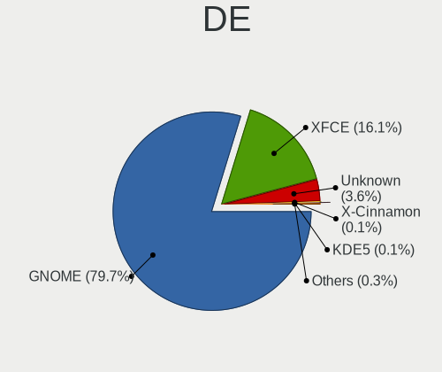
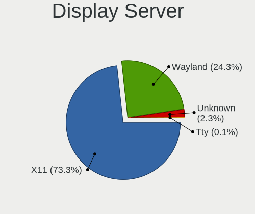
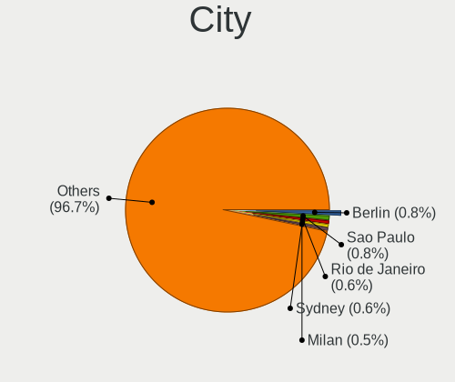
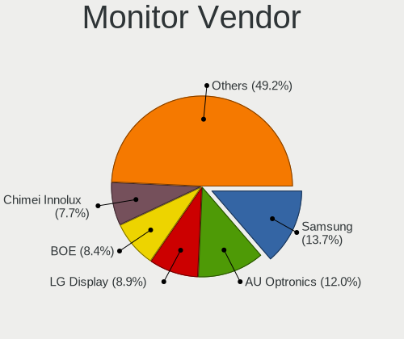
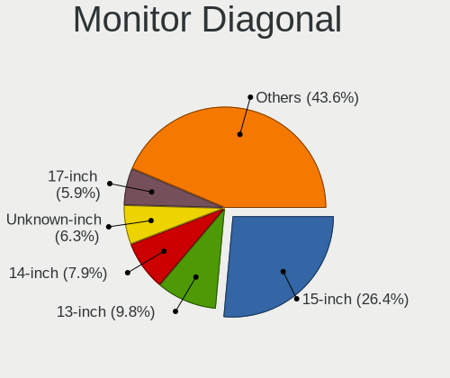
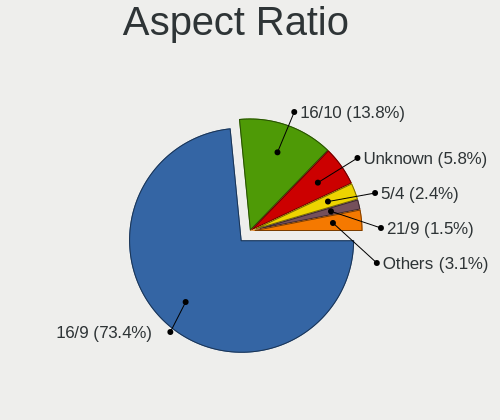
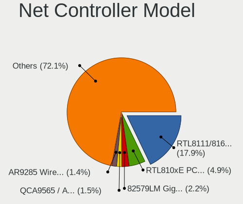
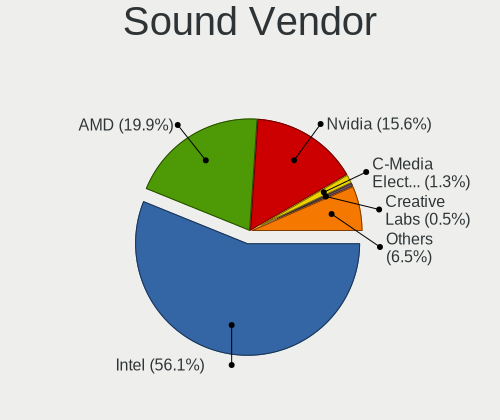
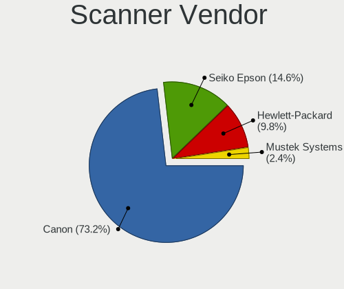

Zorin - Tested Hardware & Statistics
------------------------------------

A project to collect tested hardware configurations for Zorin.

Anyone can contribute to this report by the [hw-probe](https://github.com/linuxhw/hw-probe) tool:

    sudo -E hw-probe -all -upload

Please contribute! Especially if your hardware is rare.

This is a report for all computer types. See also reports for [desktops](/Dist/Zorin/Desktop/README.md) and [notebooks](/Dist/Zorin/Notebook/README.md).

Contents
--------

* [ Test Cases ](#test-cases)

* [ System ](#system)
  - [ OS                       ](#os)
  - [ OS Family                ](#os-family)
  - [ Kernel                   ](#kernel)
  - [ Kernel Family            ](#kernel-family)
  - [ Kernel Major Ver.        ](#kernel-major-ver)
  - [ Arch                     ](#arch)
  - [ DE                       ](#de)
  - [ Display Server           ](#display-server)
  - [ Display Manager          ](#display-manager)
  - [ OS Lang                  ](#os-lang)
  - [ Boot Mode                ](#boot-mode)
  - [ Filesystem               ](#filesystem)
  - [ Part. scheme             ](#part-scheme)
  - [ Dual Boot with Linux/BSD ](#dual-boot-with-linuxbsd)
  - [ Dual Boot (Win)          ](#dual-boot-win)

* [ Board ](#board)
  - [ Vendor                   ](#vendor)
  - [ Model                    ](#model)
  - [ Model Family             ](#model-family)
  - [ MFG Year                 ](#mfg-year)
  - [ Form Factor              ](#form-factor)
  - [ Secure Boot              ](#secure-boot)
  - [ Coreboot                 ](#coreboot)
  - [ RAM Size                 ](#ram-size)
  - [ RAM Used                 ](#ram-used)
  - [ Total Drives             ](#total-drives)
  - [ Has CD-ROM               ](#has-cd-rom)
  - [ Has Ethernet             ](#has-ethernet)
  - [ Has WiFi                 ](#has-wifi)
  - [ Has Bluetooth            ](#has-bluetooth)

* [ Location ](#location)
  - [ Country                  ](#country)
  - [ City                     ](#city)

* [ Drives ](#drives)
  - [ Drive Vendor             ](#drive-vendor)
  - [ Drive Model              ](#drive-model)
  - [ HDD Vendor               ](#hdd-vendor)
  - [ SSD Vendor               ](#ssd-vendor)
  - [ Drive Kind               ](#drive-kind)
  - [ Drive Connector          ](#drive-connector)
  - [ Drive Size               ](#drive-size)
  - [ Space Total              ](#space-total)
  - [ Space Used               ](#space-used)
  - [ Malfunc. Drives          ](#malfunc-drives)
  - [ Malfunc. Drive Vendor    ](#malfunc-drive-vendor)
  - [ Malfunc. HDD Vendor      ](#malfunc-hdd-vendor)
  - [ Malfunc. Drive Kind      ](#malfunc-drive-kind)
  - [ Failed Drives            ](#failed-drives)
  - [ Failed Drive Vendor      ](#failed-drive-vendor)
  - [ Drive Status             ](#drive-status)

* [ Storage controller ](#storage-controller)
  - [ Storage Vendor           ](#storage-vendor)
  - [ Storage Model            ](#storage-model)
  - [ Storage Kind             ](#storage-kind)

* [ Processor ](#processor)
  - [ CPU Vendor               ](#cpu-vendor)
  - [ CPU Model                ](#cpu-model)
  - [ CPU Model Family         ](#cpu-model-family)
  - [ CPU Cores                ](#cpu-cores)
  - [ CPU Sockets              ](#cpu-sockets)
  - [ CPU Threads              ](#cpu-threads)
  - [ CPU Op-Modes             ](#cpu-op-modes)
  - [ CPU Microcode            ](#cpu-microcode)
  - [ CPU Microarch            ](#cpu-microarch)

* [ Graphics ](#graphics)
  - [ GPU Vendor               ](#gpu-vendor)
  - [ GPU Model                ](#gpu-model)
  - [ GPU Combo                ](#gpu-combo)
  - [ GPU Driver               ](#gpu-driver)
  - [ GPU Memory               ](#gpu-memory)

* [ Monitor ](#monitor)
  - [ Monitor Vendor           ](#monitor-vendor)
  - [ Monitor Model            ](#monitor-model)
  - [ Monitor Resolution       ](#monitor-resolution)
  - [ Monitor Diagonal         ](#monitor-diagonal)
  - [ Monitor Width            ](#monitor-width)
  - [ Aspect Ratio             ](#aspect-ratio)
  - [ Monitor Area             ](#monitor-area)
  - [ Pixel Density            ](#pixel-density)
  - [ Multiple Monitors        ](#multiple-monitors)

* [ Network ](#network)
  - [ Net Controller Vendor    ](#net-controller-vendor)
  - [ Net Controller Model     ](#net-controller-model)
  - [ Wireless Vendor          ](#wireless-vendor)
  - [ Wireless Model           ](#wireless-model)
  - [ Ethernet Vendor          ](#ethernet-vendor)
  - [ Ethernet Model           ](#ethernet-model)
  - [ Net Controller Kind      ](#net-controller-kind)
  - [ Used Controller          ](#used-controller)
  - [ NICs                     ](#nics)
  - [ IPv6                     ](#ipv6)

* [ Bluetooth ](#bluetooth)
  - [ Bluetooth Vendor         ](#bluetooth-vendor)
  - [ Bluetooth Model          ](#bluetooth-model)

* [ Sound ](#sound)
  - [ Sound Vendor             ](#sound-vendor)
  - [ Sound Model              ](#sound-model)

* [ Memory ](#memory)
  - [ Memory Vendor            ](#memory-vendor)
  - [ Memory Model             ](#memory-model)
  - [ Memory Kind              ](#memory-kind)
  - [ Memory Form Factor       ](#memory-form-factor)
  - [ Memory Size              ](#memory-size)
  - [ Memory Speed             ](#memory-speed)

* [ Printers & scanners ](#printers--scanners)
  - [ Printer Vendor           ](#printer-vendor)
  - [ Printer Model            ](#printer-model)
  - [ Scanner Vendor           ](#scanner-vendor)
  - [ Scanner Model            ](#scanner-model)

* [ Camera ](#camera)
  - [ Camera Vendor            ](#camera-vendor)
  - [ Camera Model             ](#camera-model)

* [ Security ](#security)
  - [ Fingerprint Vendor       ](#fingerprint-vendor)
  - [ Fingerprint Model        ](#fingerprint-model)
  - [ Chipcard Vendor          ](#chipcard-vendor)
  - [ Chipcard Model           ](#chipcard-model)

* [ Unsupported ](#unsupported)
  - [ Unsupported Devices      ](#unsupported-devices)
  - [ Unsupported Device Types ](#unsupported-device-types)

Test Cases
----------

Total: 5954

| Vendor        | Model                       | Form-Factor | Probe                                                      | Date         |
|---------------|-----------------------------|-------------|------------------------------------------------------------|--------------|
| Acer          | Aspire V5-121               | Notebook    | [473cfb46f7](https://linux-hardware.org/?probe=473cfb46f7) | Dec 01, 2022 |
| MSI           | G41M-S03                    | Desktop     | [763decb5d5](https://linux-hardware.org/?probe=763decb5d5) | Dec 01, 2022 |
| Apple         | Mac-F221BEC8                | Desktop     | [7f91a09589](https://linux-hardware.org/?probe=7f91a09589) | Dec 01, 2022 |
| Sony          | VPCEB1M1E                   | Notebook    | [988c78f70d](https://linux-hardware.org/?probe=988c78f70d) | Dec 01, 2022 |
| Lenovo        | IdeaPad 3 15ALC6 82KU       | Notebook    | [f9020b8dc6](https://linux-hardware.org/?probe=f9020b8dc6) | Dec 01, 2022 |
| HP            | 8433 11                     | Desktop     | [01f9a28da3](https://linux-hardware.org/?probe=01f9a28da3) | Dec 01, 2022 |
| Acer          | Aspire C24-963              | All in one  | [ab421fd2d4](https://linux-hardware.org/?probe=ab421fd2d4) | Dec 01, 2022 |
| Acer          | Aspire C24-963              | All in one  | [4f517e816d](https://linux-hardware.org/?probe=4f517e816d) | Dec 01, 2022 |
| Dell          | Latitude E5520              | Notebook    | [92a4c9b5ef](https://linux-hardware.org/?probe=92a4c9b5ef) | Nov 30, 2022 |
| Dell          | Studio 1558                 | Notebook    | [cf40788ef8](https://linux-hardware.org/?probe=cf40788ef8) | Nov 30, 2022 |
| OEM           | H110 Ver:2.21               | Desktop     | [ad7fffd9e3](https://linux-hardware.org/?probe=ad7fffd9e3) | Nov 30, 2022 |
| Lenovo        | Yoga 530-14IKB 81EK         | Convertible | [e214cb1bb9](https://linux-hardware.org/?probe=e214cb1bb9) | Nov 30, 2022 |
| ASRock        | B450M Steel Legend          | Desktop     | [9d6aeff37c](https://linux-hardware.org/?probe=9d6aeff37c) | Nov 30, 2022 |
| MSI           | GE75 Raider 10SE            | Notebook    | [88245a0df3](https://linux-hardware.org/?probe=88245a0df3) | Nov 30, 2022 |
| OEM           | H110 Ver:2.21               | Desktop     | [2e7e420f42](https://linux-hardware.org/?probe=2e7e420f42) | Nov 29, 2022 |
| Dell          | Latitude E6540              | Notebook    | [48c805974c](https://linux-hardware.org/?probe=48c805974c) | Nov 29, 2022 |
| Gateway       | SX2851                      | Desktop     | [b408695def](https://linux-hardware.org/?probe=b408695def) | Nov 28, 2022 |
| ASUSTek       | M5A88-M                     | Desktop     | [f4b2035429](https://linux-hardware.org/?probe=f4b2035429) | Nov 28, 2022 |
| HOUTER        | IPMIP-GS                    | Desktop     | [cbc472e6df](https://linux-hardware.org/?probe=cbc472e6df) | Nov 28, 2022 |
| Lenovo        | IdeaPad 5 15IIL05 81YK      | Notebook    | [ab9b95babe](https://linux-hardware.org/?probe=ab9b95babe) | Nov 28, 2022 |
| Microsoft     | Surface Book 2              | Tablet      | [c4bbe90221](https://linux-hardware.org/?probe=c4bbe90221) | Nov 28, 2022 |
| Dell          | System XPS L502X            | Notebook    | [bd45da46bc](https://linux-hardware.org/?probe=bd45da46bc) | Nov 27, 2022 |
| Notebook      | NP5x_NP6x_NP7xPNP           | Notebook    | [3dd83d6d9d](https://linux-hardware.org/?probe=3dd83d6d9d) | Nov 27, 2022 |
| Dell          | XPS 15 9560                 | Notebook    | [47782768eb](https://linux-hardware.org/?probe=47782768eb) | Nov 27, 2022 |
| Dell          | Studio 1558                 | Notebook    | [bc76adb105](https://linux-hardware.org/?probe=bc76adb105) | Nov 27, 2022 |
| HP            | Pavilion g6                 | Notebook    | [17d324d115](https://linux-hardware.org/?probe=17d324d115) | Nov 27, 2022 |
| BESSTAR Te... | HM90                        | Desktop     | [eda49557ae](https://linux-hardware.org/?probe=eda49557ae) | Nov 27, 2022 |
| Lenovo        | B50-30 80ES                 | Notebook    | [ced4c1f563](https://linux-hardware.org/?probe=ced4c1f563) | Nov 27, 2022 |
| BESSTAR Te... | HM90                        | Desktop     | [6867d8eeaf](https://linux-hardware.org/?probe=6867d8eeaf) | Nov 27, 2022 |
| Dell          | Studio 1558                 | Notebook    | [43438ab851](https://linux-hardware.org/?probe=43438ab851) | Nov 27, 2022 |
| Dell          | Inspiron 1545               | Notebook    | [07df50a08c](https://linux-hardware.org/?probe=07df50a08c) | Nov 27, 2022 |
| Panasonic     | CF-19AHN3BFF                | Notebook    | [a5989143a8](https://linux-hardware.org/?probe=a5989143a8) | Nov 26, 2022 |
| Megaware      | MW-NM70HD-MI 01/13/2013 ... | Desktop     | [95b48709fd](https://linux-hardware.org/?probe=95b48709fd) | Nov 26, 2022 |
| Lenovo        | ThinkPad P17 Gen 2i 20YU... | Notebook    | [c26e52327e](https://linux-hardware.org/?probe=c26e52327e) | Nov 26, 2022 |
| Huanan        | X99-8M-F V1.1               | Desktop     | [88db74df98](https://linux-hardware.org/?probe=88db74df98) | Nov 26, 2022 |
| Dell          | Latitude E6540              | Notebook    | [543ca1307c](https://linux-hardware.org/?probe=543ca1307c) | Nov 26, 2022 |
| Gigabyte      | GA-890GPA-UD3H              | Desktop     | [5b531b7b41](https://linux-hardware.org/?probe=5b531b7b41) | Nov 26, 2022 |
| ASRock        | B450M Pro4                  | Desktop     | [def104dd7d](https://linux-hardware.org/?probe=def104dd7d) | Nov 26, 2022 |
| Microsoft     | Surface Pro 4               | Tablet      | [5e51349002](https://linux-hardware.org/?probe=5e51349002) | Nov 26, 2022 |
| Microsoft     | Surface Pro 4               | Tablet      | [f70a6fa6ae](https://linux-hardware.org/?probe=f70a6fa6ae) | Nov 26, 2022 |
| Huanan        | X99-8M-F V1.1               | Desktop     | [3ca25803b5](https://linux-hardware.org/?probe=3ca25803b5) | Nov 25, 2022 |
| Lenovo        | MIIX 2 11 20327             | Tablet      | [2eb5cc0a12](https://linux-hardware.org/?probe=2eb5cc0a12) | Nov 25, 2022 |
| Lenovo        | MIIX 2 11 20327             | Tablet      | [c0102f2633](https://linux-hardware.org/?probe=c0102f2633) | Nov 25, 2022 |
| ASUSTek       | X202E                       | Notebook    | [24a8811d77](https://linux-hardware.org/?probe=24a8811d77) | Nov 25, 2022 |
| ASUSTek       | X202E                       | Notebook    | [69a3fa54c1](https://linux-hardware.org/?probe=69a3fa54c1) | Nov 25, 2022 |
| Toshiba       | Satellite C50D-B            | Notebook    | [92d54fef2b](https://linux-hardware.org/?probe=92d54fef2b) | Nov 25, 2022 |
| Lenovo        | Slim 7 ProX 14ARH7 82V2     | Notebook    | [1ed724b75e](https://linux-hardware.org/?probe=1ed724b75e) | Nov 25, 2022 |
| HP            | ENVY m6                     | Notebook    | [cb48bbdcc1](https://linux-hardware.org/?probe=cb48bbdcc1) | Nov 25, 2022 |
| Pegatron      | 2ACF                        | Desktop     | [dc9d24ac01](https://linux-hardware.org/?probe=dc9d24ac01) | Nov 25, 2022 |
| Pegatron      | 2ACF                        | Desktop     | [037b47ab43](https://linux-hardware.org/?probe=037b47ab43) | Nov 25, 2022 |
| HP            | 18E7                        | Desktop     | [048d4bd3ae](https://linux-hardware.org/?probe=048d4bd3ae) | Nov 25, 2022 |
| Dell          | XPS 15 9510                 | Notebook    | [2c7485441f](https://linux-hardware.org/?probe=2c7485441f) | Nov 25, 2022 |
| Panasonic     | CF-19AHN3BFF                | Notebook    | [bfd184ea5c](https://linux-hardware.org/?probe=bfd184ea5c) | Nov 25, 2022 |
| Dell          | 0T10XW A02                  | Desktop     | [83daa0cf15](https://linux-hardware.org/?probe=83daa0cf15) | Nov 25, 2022 |
| Gigabyte      | H110M-H-CF                  | Desktop     | [c43b60c09b](https://linux-hardware.org/?probe=c43b60c09b) | Nov 25, 2022 |
| ASUSTek       | M5401WUA                    | All in one  | [e49d5c5f9d](https://linux-hardware.org/?probe=e49d5c5f9d) | Nov 24, 2022 |
| Gigabyte      | B560 DS3H AC-Y1             | Desktop     | [6bcefa911d](https://linux-hardware.org/?probe=6bcefa911d) | Nov 24, 2022 |
| Samsung       | 600B4B/600B5B               | Notebook    | [6cbdda4e27](https://linux-hardware.org/?probe=6cbdda4e27) | Nov 24, 2022 |
| Thomson       | GEN17V3C8WH256              | Notebook    | [7b1a510e2e](https://linux-hardware.org/?probe=7b1a510e2e) | Nov 24, 2022 |
| Gigabyte      | EG41MF-US2H                 | Desktop     | [07ac3ace2c](https://linux-hardware.org/?probe=07ac3ace2c) | Nov 24, 2022 |
| Apple         | MacBookPro7,1               | Notebook    | [a1fad8227f](https://linux-hardware.org/?probe=a1fad8227f) | Nov 24, 2022 |
| Apple         | MacBookPro7,1               | Notebook    | [4a3e80efe5](https://linux-hardware.org/?probe=4a3e80efe5) | Nov 24, 2022 |
| ASRock        | FP6D4-P1                    | Desktop     | [5e52f1b520](https://linux-hardware.org/?probe=5e52f1b520) | Nov 24, 2022 |
| MSI           | Z490-A PRO                  | Desktop     | [9154fdbc9e](https://linux-hardware.org/?probe=9154fdbc9e) | Nov 24, 2022 |
| Toshiba       | Satellite S55t-B            | Notebook    | [4b01021314](https://linux-hardware.org/?probe=4b01021314) | Nov 24, 2022 |
| Lenovo        | ThinkCentre M91p 4524WAP    | Desktop     | [51f3e71650](https://linux-hardware.org/?probe=51f3e71650) | Nov 24, 2022 |
| ASRock        | Z170 Pro4                   | Desktop     | [ac6ad8d54d](https://linux-hardware.org/?probe=ac6ad8d54d) | Nov 24, 2022 |
| HP            | Notebook                    | Notebook    | [d65b0a06fe](https://linux-hardware.org/?probe=d65b0a06fe) | Nov 24, 2022 |
| HP            | Notebook                    | Notebook    | [54b351457e](https://linux-hardware.org/?probe=54b351457e) | Nov 24, 2022 |
| Dell          | Inspiron 7586               | Convertible | [a41bb9177a](https://linux-hardware.org/?probe=a41bb9177a) | Nov 23, 2022 |
| HP            | 15                          | Notebook    | [6ce90bccf9](https://linux-hardware.org/?probe=6ce90bccf9) | Nov 23, 2022 |
| Dell          | 0HN7XN A01                  | Desktop     | [5357d43f13](https://linux-hardware.org/?probe=5357d43f13) | Nov 23, 2022 |
| HP            | Laptop 14-bw0xx             | Notebook    | [5d4e847eef](https://linux-hardware.org/?probe=5d4e847eef) | Nov 23, 2022 |
| ASRock        | B450M-HDV R4.0              | Desktop     | [9dbd34c7bd](https://linux-hardware.org/?probe=9dbd34c7bd) | Nov 23, 2022 |
| ASRock        | B450M-HDV R4.0              | Desktop     | [5786af4776](https://linux-hardware.org/?probe=5786af4776) | Nov 23, 2022 |
| Intel         | D946GZAB AAD66610-302       | Desktop     | [5433ee5bc1](https://linux-hardware.org/?probe=5433ee5bc1) | Nov 22, 2022 |
| ASUSTek       | M5401WUA                    | All in one  | [7a2c8b647d](https://linux-hardware.org/?probe=7a2c8b647d) | Nov 22, 2022 |
| Lenovo        | IdeaPad U400 09932JU        | Notebook    | [cb5d9871d0](https://linux-hardware.org/?probe=cb5d9871d0) | Nov 22, 2022 |
| HP            | 8184 X4                     | Desktop     | [f38ad9d963](https://linux-hardware.org/?probe=f38ad9d963) | Nov 21, 2022 |
| Apple         | MacBookPro5,4               | Notebook    | [722165a975](https://linux-hardware.org/?probe=722165a975) | Nov 21, 2022 |
| HP            | 822A                        | Desktop     | [b464dc4cf0](https://linux-hardware.org/?probe=b464dc4cf0) | Nov 21, 2022 |
| Apple         | MacBookPro8,1               | Notebook    | [dfb9f9524e](https://linux-hardware.org/?probe=dfb9f9524e) | Nov 20, 2022 |
| Acer          | Veriton N4640G              | Desktop     | [a7984c4a95](https://linux-hardware.org/?probe=a7984c4a95) | Nov 20, 2022 |
| Gigabyte      | Z68X-UD3H-B3                | Desktop     | [cd0f904ca4](https://linux-hardware.org/?probe=cd0f904ca4) | Nov 20, 2022 |
| Gigabyte      | Z68X-UD3H-B3                | Desktop     | [c4bd142690](https://linux-hardware.org/?probe=c4bd142690) | Nov 20, 2022 |
| Gigabyte      | GA-890GPA-UD3H              | Desktop     | [41cca3d850](https://linux-hardware.org/?probe=41cca3d850) | Nov 20, 2022 |
| Apple         | Mac-942B59F58194171B iMa... | All in one  | [87f2179621](https://linux-hardware.org/?probe=87f2179621) | Nov 20, 2022 |
| Framework     | Laptop                      | Notebook    | [6cc495c0d9](https://linux-hardware.org/?probe=6cc495c0d9) | Nov 20, 2022 |
| Acer          | Aspire ES1-521              | Notebook    | [6af4249f1a](https://linux-hardware.org/?probe=6af4249f1a) | Nov 20, 2022 |
| Lenovo        | IdeaPadFlex 15D 20334       | Notebook    | [77dcd3bef6](https://linux-hardware.org/?probe=77dcd3bef6) | Nov 19, 2022 |
| MSI           | Z77A-G43                    | Desktop     | [2033b97419](https://linux-hardware.org/?probe=2033b97419) | Nov 19, 2022 |
| Acer          | FX58M                       | Desktop     | [837da7d885](https://linux-hardware.org/?probe=837da7d885) | Nov 19, 2022 |
| Apple         | Mac-F4218EC8 DVT            | All in one  | [c92c0834ef](https://linux-hardware.org/?probe=c92c0834ef) | Nov 19, 2022 |
| GPU Compan... | GWTN156-2BK                 | Notebook    | [a7c034bd91](https://linux-hardware.org/?probe=a7c034bd91) | Nov 19, 2022 |
| ASUSTek       | ROG STRIX Z690-I GAMING ... | Desktop     | [b40e651ff2](https://linux-hardware.org/?probe=b40e651ff2) | Nov 18, 2022 |
| Dell          | Latitude E6540              | Notebook    | [4148292f4d](https://linux-hardware.org/?probe=4148292f4d) | Nov 18, 2022 |
| Samsung       | 600B4B/600B5B               | Notebook    | [0185c349b9](https://linux-hardware.org/?probe=0185c349b9) | Nov 18, 2022 |
| HP            | 14                          | Notebook    | [958eb656f2](https://linux-hardware.org/?probe=958eb656f2) | Nov 18, 2022 |
| Samsung       | 600B4B/600B5B               | Notebook    | [6992e11b21](https://linux-hardware.org/?probe=6992e11b21) | Nov 18, 2022 |
| Dell          | Latitude E6540              | Notebook    | [31752fdaa8](https://linux-hardware.org/?probe=31752fdaa8) | Nov 18, 2022 |
| Dell          | 0HN7XN A00                  | Desktop     | [3e217adbf8](https://linux-hardware.org/?probe=3e217adbf8) | Nov 18, 2022 |
| HP            | 14                          | Notebook    | [8e4d001eb6](https://linux-hardware.org/?probe=8e4d001eb6) | Nov 18, 2022 |
| Unknown       | Unknown                     | Notebook    | [ef7af01d47](https://linux-hardware.org/?probe=ef7af01d47) | Nov 18, 2022 |
| Unknown       | Unknown                     | Notebook    | [ceca708c95](https://linux-hardware.org/?probe=ceca708c95) | Nov 18, 2022 |
| ASUSTek       | PRIME H370-A                | Desktop     | [0c4442c160](https://linux-hardware.org/?probe=0c4442c160) | Nov 18, 2022 |
| Dell          | 0C27VV A02                  | Desktop     | [5f4b4b8571](https://linux-hardware.org/?probe=5f4b4b8571) | Nov 18, 2022 |
| HP            | EliteBook 8470p             | Notebook    | [f324f5bc16](https://linux-hardware.org/?probe=f324f5bc16) | Nov 18, 2022 |
| HP            | EliteBook 820 G2            | Notebook    | [1c76975e0e](https://linux-hardware.org/?probe=1c76975e0e) | Nov 17, 2022 |
| ALLDOCUBE     | i1405S                      | Notebook    | [fc1628983b](https://linux-hardware.org/?probe=fc1628983b) | Nov 17, 2022 |
| ALLDOCUBE     | i1405S                      | Notebook    | [0b61421847](https://linux-hardware.org/?probe=0b61421847) | Nov 17, 2022 |
| ASUSTek       | ASUS Gaming FX570UD         | Notebook    | [522c9222c5](https://linux-hardware.org/?probe=522c9222c5) | Nov 17, 2022 |
| HP            | Laptop 15-dw0xxx            | Notebook    | [b81771eed0](https://linux-hardware.org/?probe=b81771eed0) | Nov 17, 2022 |
| Acer          | Aspire 7741                 | Notebook    | [4197d5fccf](https://linux-hardware.org/?probe=4197d5fccf) | Nov 17, 2022 |
| MSI           | H81M-P33                    | Desktop     | [a535339292](https://linux-hardware.org/?probe=a535339292) | Nov 17, 2022 |
| Lenovo        | IdeaPadFlex 15D 20334       | Notebook    | [23f8c23e8b](https://linux-hardware.org/?probe=23f8c23e8b) | Nov 17, 2022 |
| ASUSTek       | ROG Zephyrus G14 GA401IV... | Notebook    | [545eb5e46c](https://linux-hardware.org/?probe=545eb5e46c) | Nov 16, 2022 |
| MSI           | 2AE0                        | Desktop     | [c0d9e23faa](https://linux-hardware.org/?probe=c0d9e23faa) | Nov 16, 2022 |
| MSI           | H81M-P33                    | Desktop     | [246d594268](https://linux-hardware.org/?probe=246d594268) | Nov 16, 2022 |
| Gateway       | NV59C                       | Notebook    | [b3be978b72](https://linux-hardware.org/?probe=b3be978b72) | Nov 16, 2022 |
| Dell          | Inspiron 3543               | Notebook    | [15cc03ec87](https://linux-hardware.org/?probe=15cc03ec87) | Nov 16, 2022 |
| Lenovo        | ThinkPad X201 36809T1       | Notebook    | [aad9f7cbaf](https://linux-hardware.org/?probe=aad9f7cbaf) | Nov 16, 2022 |
| HP            | 0AA4h                       | Desktop     | [328259669b](https://linux-hardware.org/?probe=328259669b) | Nov 16, 2022 |
| Lenovo        | ThinkPad P15v Gen 3 21D9... | Notebook    | [30c7b06e6f](https://linux-hardware.org/?probe=30c7b06e6f) | Nov 16, 2022 |
| ASUSTek       | VivoBook_ASUSLaptop X421... | Notebook    | [733e52cbdb](https://linux-hardware.org/?probe=733e52cbdb) | Nov 15, 2022 |
| ASUSTek       | PRIME H370-A                | Desktop     | [9a93c5f349](https://linux-hardware.org/?probe=9a93c5f349) | Nov 15, 2022 |
| ASUSTek       | H110M-A                     | Desktop     | [d1e60135e1](https://linux-hardware.org/?probe=d1e60135e1) | Nov 15, 2022 |
| HP            | 18E7                        | Desktop     | [7ecd6a2f37](https://linux-hardware.org/?probe=7ecd6a2f37) | Nov 15, 2022 |
| Toshiba       | Satellite C55-C             | Notebook    | [b240ae5338](https://linux-hardware.org/?probe=b240ae5338) | Nov 15, 2022 |
| Toshiba       | Satellite C55-C             | Notebook    | [d1049db1fb](https://linux-hardware.org/?probe=d1049db1fb) | Nov 15, 2022 |
| Lenovo        | IdeaPadFlex 15D 20334       | Notebook    | [73bc7e7428](https://linux-hardware.org/?probe=73bc7e7428) | Nov 14, 2022 |
| Lenovo        | IdeaPadFlex 15D 20334       | Notebook    | [9d798077df](https://linux-hardware.org/?probe=9d798077df) | Nov 14, 2022 |
| ALURIN        | PR1-M146                    | Notebook    | [124eefce98](https://linux-hardware.org/?probe=124eefce98) | Nov 14, 2022 |
| Dell          | 0478VN A00                  | Desktop     | [5d1cf4ca11](https://linux-hardware.org/?probe=5d1cf4ca11) | Nov 14, 2022 |
| Microtech     | ebookLite                   | Notebook    | [471a1a6ac7](https://linux-hardware.org/?probe=471a1a6ac7) | Nov 14, 2022 |
| Acer          | Extensa 2530                | Notebook    | [ac83b4e3e9](https://linux-hardware.org/?probe=ac83b4e3e9) | Nov 14, 2022 |
| Apple         | Mac-942B59F58194171B iMa... | All in one  | [4ce82dba3d](https://linux-hardware.org/?probe=4ce82dba3d) | Nov 14, 2022 |
| Gigabyte      | H510M H                     | Desktop     | [97b0a5f239](https://linux-hardware.org/?probe=97b0a5f239) | Nov 14, 2022 |
| Toshiba       | PORTEGE Z30-A               | Notebook    | [9e70e7fc3a](https://linux-hardware.org/?probe=9e70e7fc3a) | Nov 13, 2022 |
| HP            | 1850                        | Desktop     | [0b5e36c27b](https://linux-hardware.org/?probe=0b5e36c27b) | Nov 13, 2022 |
| Hampoo        | Cherry Trail CR             | Notebook    | [ae8d0b2d8e](https://linux-hardware.org/?probe=ae8d0b2d8e) | Nov 13, 2022 |
| Mediacom      | M-AO241/64                  | Desktop     | [8c577b3d8f](https://linux-hardware.org/?probe=8c577b3d8f) | Nov 13, 2022 |
| ALURIN        | PR1-M146                    | Notebook    | [8d9345b655](https://linux-hardware.org/?probe=8d9345b655) | Nov 12, 2022 |
| ASUSTek       | H110M-A                     | Desktop     | [1c7b3f934d](https://linux-hardware.org/?probe=1c7b3f934d) | Nov 12, 2022 |
| Fujitsu Si... | MS-7304VP-A13               | Desktop     | [69b1471202](https://linux-hardware.org/?probe=69b1471202) | Nov 12, 2022 |
| HP            | 250 G4                      | Notebook    | [58f7b77f39](https://linux-hardware.org/?probe=58f7b77f39) | Nov 12, 2022 |
| HP            | 250 G4                      | Notebook    | [f700001da4](https://linux-hardware.org/?probe=f700001da4) | Nov 12, 2022 |
| JGINYUE       | X79M-PLUS V2.3              | Desktop     | [8dac2a9292](https://linux-hardware.org/?probe=8dac2a9292) | Nov 12, 2022 |
| Microtech     | ebookLite                   | Notebook    | [9c3039fa75](https://linux-hardware.org/?probe=9c3039fa75) | Nov 12, 2022 |
| Fujitsu       | STYLISTIC Q572              | Notebook    | [afd0e0efc4](https://linux-hardware.org/?probe=afd0e0efc4) | Nov 12, 2022 |
| Unknown       | 775i65G                     | Desktop     | [b872a779af](https://linux-hardware.org/?probe=b872a779af) | Nov 12, 2022 |
| Dell          | 018D1Y A00                  | Desktop     | [16247a3667](https://linux-hardware.org/?probe=16247a3667) | Nov 12, 2022 |
| Dell          | 018D1Y A00                  | Desktop     | [bc5562e288](https://linux-hardware.org/?probe=bc5562e288) | Nov 12, 2022 |
| Dell          | XPS 13 9370                 | Notebook    | [2865464ccd](https://linux-hardware.org/?probe=2865464ccd) | Nov 11, 2022 |
| Biostar       | TPower X58                  | Desktop     | [8662697d27](https://linux-hardware.org/?probe=8662697d27) | Nov 11, 2022 |
| HP            | Pavilion Notebook           | Notebook    | [1d6ae45d45](https://linux-hardware.org/?probe=1d6ae45d45) | Nov 11, 2022 |
| HUAWEI        | BOD-WXX9                    | Notebook    | [2e79d44f43](https://linux-hardware.org/?probe=2e79d44f43) | Nov 11, 2022 |
| Lenovo        | G500 20236                  | Notebook    | [1f9e0a7e16](https://linux-hardware.org/?probe=1f9e0a7e16) | Nov 11, 2022 |
| Lenovo        | G500 20236                  | Notebook    | [d3a6ca47df](https://linux-hardware.org/?probe=d3a6ca47df) | Nov 11, 2022 |
| HP            | 2000                        | Notebook    | [5045f21cc3](https://linux-hardware.org/?probe=5045f21cc3) | Nov 10, 2022 |
| Microtech     | ebookLite                   | Notebook    | [63f80f900a](https://linux-hardware.org/?probe=63f80f900a) | Nov 10, 2022 |
| ASUSTek       | G50VT                       | Notebook    | [57f7e69b18](https://linux-hardware.org/?probe=57f7e69b18) | Nov 10, 2022 |
| Mediacom      | M-AO241/64                  | Desktop     | [d0cac7ee7b](https://linux-hardware.org/?probe=d0cac7ee7b) | Nov 10, 2022 |
| Mediacom      | M-AO241/64                  | Desktop     | [cf0ed7acab](https://linux-hardware.org/?probe=cf0ed7acab) | Nov 10, 2022 |
| Dell          | 0HN7XN A01                  | Desktop     | [bb4dff706b](https://linux-hardware.org/?probe=bb4dff706b) | Nov 10, 2022 |
| Gigabyte      | B75M-D3H                    | Desktop     | [b7619dbd72](https://linux-hardware.org/?probe=b7619dbd72) | Nov 10, 2022 |
| HP            | ENVY x360 Convertible 15... | Convertible | [fb2770f137](https://linux-hardware.org/?probe=fb2770f137) | Nov 10, 2022 |
| HP            | Pavilion Notebook           | Notebook    | [150409691d](https://linux-hardware.org/?probe=150409691d) | Nov 09, 2022 |
| HP            | ProBook 430 G4              | Notebook    | [ef9d0cf774](https://linux-hardware.org/?probe=ef9d0cf774) | Nov 09, 2022 |
| MSI           | A320M-A PRO MAX             | Desktop     | [c3aaf6eed2](https://linux-hardware.org/?probe=c3aaf6eed2) | Nov 09, 2022 |
| HP            | Pavilion Notebook           | Notebook    | [a7de751ce8](https://linux-hardware.org/?probe=a7de751ce8) | Nov 09, 2022 |
| GPU Compan... | GWTN156-2BK                 | Notebook    | [cf64038190](https://linux-hardware.org/?probe=cf64038190) | Nov 08, 2022 |
| Lenovo        | IdeaPad 5 15ARE05 81YQ      | Notebook    | [c17772f8e7](https://linux-hardware.org/?probe=c17772f8e7) | Nov 08, 2022 |
| H-BUSTER      | HBNB1403                    | Notebook    | [9d439a53b2](https://linux-hardware.org/?probe=9d439a53b2) | Nov 08, 2022 |
| HP            | ProBook 430 G4              | Notebook    | [5d6f34affd](https://linux-hardware.org/?probe=5d6f34affd) | Nov 08, 2022 |
| Gateway       | ML6732                      | Notebook    | [7889349228](https://linux-hardware.org/?probe=7889349228) | Nov 08, 2022 |
| MSI           | A320M-A PRO MAX             | Desktop     | [5030ff83c2](https://linux-hardware.org/?probe=5030ff83c2) | Nov 08, 2022 |
| Dell          | Latitude E5420              | Notebook    | [c6264f1223](https://linux-hardware.org/?probe=c6264f1223) | Nov 08, 2022 |
| A-DATA Tec... | XENIAXe15TI7G11GXELX        | Notebook    | [5285abf94f](https://linux-hardware.org/?probe=5285abf94f) | Nov 08, 2022 |
| A-DATA Tec... | XENIAXe15TI7G11GXELX        | Notebook    | [5cfd9a145a](https://linux-hardware.org/?probe=5cfd9a145a) | Nov 08, 2022 |
| Linx          | LINX1010B                   | Notebook    | [fa6d1ebd57](https://linux-hardware.org/?probe=fa6d1ebd57) | Nov 07, 2022 |
| HP            | Pavilion dv5000 (EU087EA... | Notebook    | [185c483599](https://linux-hardware.org/?probe=185c483599) | Nov 07, 2022 |
| ASUSTek       | K55VD                       | Notebook    | [d8a78ad824](https://linux-hardware.org/?probe=d8a78ad824) | Nov 07, 2022 |
| MSI           | H81M-P33                    | Desktop     | [2ef23ed4ac](https://linux-hardware.org/?probe=2ef23ed4ac) | Nov 07, 2022 |
| ASUSTek       | U36SD                       | Notebook    | [d6b92cbdaa](https://linux-hardware.org/?probe=d6b92cbdaa) | Nov 07, 2022 |
| ASUSTek       | F5V                         | Notebook    | [877e968b61](https://linux-hardware.org/?probe=877e968b61) | Nov 07, 2022 |
| HP            | 240 G8                      | Notebook    | [cbeff38360](https://linux-hardware.org/?probe=cbeff38360) | Nov 07, 2022 |
| HP            | 240 G8                      | Notebook    | [0fadcc21ac](https://linux-hardware.org/?probe=0fadcc21ac) | Nov 07, 2022 |
| Lenovo        | IdeaPadFlex 15D 20334       | Notebook    | [e44a807758](https://linux-hardware.org/?probe=e44a807758) | Nov 06, 2022 |
| Acer          | H81H3-M4                    | Desktop     | [40c67913d8](https://linux-hardware.org/?probe=40c67913d8) | Nov 06, 2022 |
| HP            | Pavilion dv5000 (EU087EA... | Notebook    | [d763771ba6](https://linux-hardware.org/?probe=d763771ba6) | Nov 06, 2022 |
| ASRock        | B660M Steel Legend          | Desktop     | [708d98bf92](https://linux-hardware.org/?probe=708d98bf92) | Nov 06, 2022 |
| ASRock        | B660M Steel Legend          | Desktop     | [2fce0b247c](https://linux-hardware.org/?probe=2fce0b247c) | Nov 06, 2022 |
| Packard Be... | EasyNote TS11HR             | Notebook    | [8a62c61d38](https://linux-hardware.org/?probe=8a62c61d38) | Nov 06, 2022 |
| Gigabyte      | 990XA-UD3                   | Desktop     | [a06275a0f2](https://linux-hardware.org/?probe=a06275a0f2) | Nov 05, 2022 |
| Quanta        | TW8/SW8/DW8                 | Notebook    | [31caaec976](https://linux-hardware.org/?probe=31caaec976) | Nov 05, 2022 |
| ASUSTek       | T200TAC                     | Notebook    | [e14cb334c4](https://linux-hardware.org/?probe=e14cb334c4) | Nov 05, 2022 |
| HP            | 1790                        | Desktop     | [8916928344](https://linux-hardware.org/?probe=8916928344) | Nov 05, 2022 |
| Dell          | Inspiron N5010              | Notebook    | [ee11f3942f](https://linux-hardware.org/?probe=ee11f3942f) | Nov 05, 2022 |
| HP            | 1790                        | Desktop     | [1de8a8af0d](https://linux-hardware.org/?probe=1de8a8af0d) | Nov 05, 2022 |
| Lenovo        | G40-30 80FY                 | Notebook    | [2313029c70](https://linux-hardware.org/?probe=2313029c70) | Nov 04, 2022 |
| Lenovo        | ThinkPad P16 Gen 1 21D7S... | Notebook    | [fc4b865872](https://linux-hardware.org/?probe=fc4b865872) | Nov 04, 2022 |
| ASUSTek       | ROG CROSSHAIR VIII DARK ... | Desktop     | [507697b22f](https://linux-hardware.org/?probe=507697b22f) | Nov 04, 2022 |
| Dell          | 0C27VV A02                  | Desktop     | [fb4c1f85a2](https://linux-hardware.org/?probe=fb4c1f85a2) | Nov 04, 2022 |
| HP            | Pavilion Notebook           | Notebook    | [a8f3260004](https://linux-hardware.org/?probe=a8f3260004) | Nov 04, 2022 |
| Dell          | Inspiron 7520               | Notebook    | [60d8b24187](https://linux-hardware.org/?probe=60d8b24187) | Nov 04, 2022 |
| Dell          | Inspiron 7520               | Notebook    | [81c0293410](https://linux-hardware.org/?probe=81c0293410) | Nov 04, 2022 |
| BANGHO        | W240HU/W250HUQ              | Notebook    | [82bafb1ca4](https://linux-hardware.org/?probe=82bafb1ca4) | Nov 04, 2022 |
| Lenovo        | ThinkPad E15 Gen 3 20YG0... | Notebook    | [c796c2f9ee](https://linux-hardware.org/?probe=c796c2f9ee) | Nov 03, 2022 |
| Dell          | 0HN7XN A01                  | Desktop     | [baf6b79b85](https://linux-hardware.org/?probe=baf6b79b85) | Nov 03, 2022 |
| Lenovo        | Legion Y530-15ICH 81FV      | Notebook    | [30cd9b0d29](https://linux-hardware.org/?probe=30cd9b0d29) | Nov 03, 2022 |
| Dell          | XPS 15 9510                 | Notebook    | [fea56b5428](https://linux-hardware.org/?probe=fea56b5428) | Nov 03, 2022 |
| Microtech     | CoreBook                    | Notebook    | [1276c24890](https://linux-hardware.org/?probe=1276c24890) | Nov 03, 2022 |
| MSI           | A320M PRO-VD/S              | Desktop     | [920c4567d3](https://linux-hardware.org/?probe=920c4567d3) | Nov 03, 2022 |
| HP            | Pavilion Notebook           | Notebook    | [e24f2a2f57](https://linux-hardware.org/?probe=e24f2a2f57) | Nov 03, 2022 |
| Intel         | NUC10i5FNB K61361-303       | Mini pc     | [df00a6281b](https://linux-hardware.org/?probe=df00a6281b) | Nov 03, 2022 |
| Intel         | NUC10i5FNB K61361-303       | Mini pc     | [2ec155a4b6](https://linux-hardware.org/?probe=2ec155a4b6) | Nov 03, 2022 |
| Dell          | Latitude E6540              | Notebook    | [fe0f06d2d3](https://linux-hardware.org/?probe=fe0f06d2d3) | Nov 02, 2022 |
| ASUSTek       | P7H55-M LE                  | Desktop     | [383066ca1c](https://linux-hardware.org/?probe=383066ca1c) | Nov 02, 2022 |
| Samsung       | 600B4B/600B5B               | Notebook    | [56767f430b](https://linux-hardware.org/?probe=56767f430b) | Nov 02, 2022 |
| Samsung       | 600B4B/600B5B               | Notebook    | [b1ffa94d76](https://linux-hardware.org/?probe=b1ffa94d76) | Nov 02, 2022 |
| ASUSTek       | P7H55-M LE                  | Desktop     | [66acf8991e](https://linux-hardware.org/?probe=66acf8991e) | Nov 02, 2022 |
| Samsung       | RV411/RV511/E3511/S3511/... | Notebook    | [ebe8179d26](https://linux-hardware.org/?probe=ebe8179d26) | Nov 02, 2022 |
| HP            | Pavilion Notebook           | Notebook    | [9fef9a6a8a](https://linux-hardware.org/?probe=9fef9a6a8a) | Nov 02, 2022 |
| Dell          | 0GDG8Y A00                  | Desktop     | [609ccd3204](https://linux-hardware.org/?probe=609ccd3204) | Nov 02, 2022 |
| Lenovo        | ThinkPad Edge E530c 3366... | Notebook    | [4968129a1a](https://linux-hardware.org/?probe=4968129a1a) | Nov 02, 2022 |
| Lenovo        | IdeaPad 100S-11IBY 80R2     | Notebook    | [7c6ddf22b5](https://linux-hardware.org/?probe=7c6ddf22b5) | Nov 02, 2022 |
| GPU Compan... | GWTN156-2BK                 | Notebook    | [a7fb2c2163](https://linux-hardware.org/?probe=a7fb2c2163) | Nov 02, 2022 |
| Lenovo        | IdeaPadFlex 15D 20334       | Notebook    | [005b25ef06](https://linux-hardware.org/?probe=005b25ef06) | Nov 02, 2022 |
| Gigabyte      | P55-UD6                     | Desktop     | [2898ec20b3](https://linux-hardware.org/?probe=2898ec20b3) | Nov 01, 2022 |
| Lenovo        | ThinkPad X1 Carbon 4th 2... | Notebook    | [cd0e637d88](https://linux-hardware.org/?probe=cd0e637d88) | Nov 01, 2022 |
| Lenovo        | ThinkCentre M55E 898578G    | Desktop     | [d025c115d8](https://linux-hardware.org/?probe=d025c115d8) | Nov 01, 2022 |
| HP            | Pavilion Sleekbook 15 PC    | Notebook    | [9dea1bfedb](https://linux-hardware.org/?probe=9dea1bfedb) | Nov 01, 2022 |
| HP            | Pavilion 15                 | Notebook    | [8552c17b28](https://linux-hardware.org/?probe=8552c17b28) | Nov 01, 2022 |
| HP            | ProBook 650 G1              | Notebook    | [85f1aa7b6d](https://linux-hardware.org/?probe=85f1aa7b6d) | Nov 01, 2022 |
| ASUSTek       | K55VD                       | Notebook    | [6e2ff87fad](https://linux-hardware.org/?probe=6e2ff87fad) | Nov 01, 2022 |
| Lenovo        | ThinkPad Edge E530c 3366... | Notebook    | [9864cd6db6](https://linux-hardware.org/?probe=9864cd6db6) | Nov 01, 2022 |
| HP            | 2B3B                        | All in one  | [a42ac6f6c7](https://linux-hardware.org/?probe=a42ac6f6c7) | Nov 01, 2022 |
| GPU Compan... | GWTN156-2BK                 | Notebook    | [99ab599fbc](https://linux-hardware.org/?probe=99ab599fbc) | Nov 01, 2022 |
| ASUSTek       | PRIME Z690-P D4             | Desktop     | [21213fdeec](https://linux-hardware.org/?probe=21213fdeec) | Oct 31, 2022 |
| Dell          | Latitude E6500              | Notebook    | [b7be8c3204](https://linux-hardware.org/?probe=b7be8c3204) | Oct 31, 2022 |
| Dell          | Latitude E6500              | Notebook    | [cb3b467ba8](https://linux-hardware.org/?probe=cb3b467ba8) | Oct 31, 2022 |
| Lenovo        | ThinkPad Edge 25453BG       | Notebook    | [dc7fa9ac1e](https://linux-hardware.org/?probe=dc7fa9ac1e) | Oct 31, 2022 |
| HP            | 1790                        | Desktop     | [6dc2cef5ea](https://linux-hardware.org/?probe=6dc2cef5ea) | Oct 31, 2022 |
| Lenovo        | ThinkPad Edge 25453BG       | Notebook    | [ba67d47c9c](https://linux-hardware.org/?probe=ba67d47c9c) | Oct 31, 2022 |
| Seco          | C40 C                       | Desktop     | [08509c30b6](https://linux-hardware.org/?probe=08509c30b6) | Oct 31, 2022 |
| HP            | 2000                        | Notebook    | [ea6e4e2cca](https://linux-hardware.org/?probe=ea6e4e2cca) | Oct 31, 2022 |
| Lenovo        | ThinkPad T420 4180DW1       | Notebook    | [b1e229b9a0](https://linux-hardware.org/?probe=b1e229b9a0) | Oct 31, 2022 |
| HP            | ProBook 450 G8 Notebook ... | Notebook    | [34727cd696](https://linux-hardware.org/?probe=34727cd696) | Oct 31, 2022 |
| Lenovo        | IdeaPad 3 15ADA05 81W1      | Notebook    | [6bf9e760ca](https://linux-hardware.org/?probe=6bf9e760ca) | Oct 30, 2022 |
| Packard Be... | EasyNote TE69KB             | Notebook    | [b83d2dd685](https://linux-hardware.org/?probe=b83d2dd685) | Oct 30, 2022 |
| ASUSTek       | PRIME H370-A                | Desktop     | [f7dd154c47](https://linux-hardware.org/?probe=f7dd154c47) | Oct 30, 2022 |
| Lenovo        | IdeaPad 3 15ADA05 81W1      | Notebook    | [1ca9fe180c](https://linux-hardware.org/?probe=1ca9fe180c) | Oct 30, 2022 |
| Lenovo        | ThinkPad T480 20L6S82F0C    | Notebook    | [c06d6a27f5](https://linux-hardware.org/?probe=c06d6a27f5) | Oct 30, 2022 |
| Lenovo        | IdeaPad Slim 1-14AST-05 ... | Notebook    | [50170811fd](https://linux-hardware.org/?probe=50170811fd) | Oct 30, 2022 |
| HP            | Pavilion Laptop 15-eh0xx... | Notebook    | [d8f6faad10](https://linux-hardware.org/?probe=d8f6faad10) | Oct 30, 2022 |
| HP            | Stream Laptop 14-cb1xxx     | Notebook    | [75dcd27c77](https://linux-hardware.org/?probe=75dcd27c77) | Oct 30, 2022 |
| HP            | Pavilion Laptop 15-eh0xx... | Notebook    | [6c3a410233](https://linux-hardware.org/?probe=6c3a410233) | Oct 30, 2022 |
| Dell          | Inspiron 5537               | Notebook    | [4cd1e12a5d](https://linux-hardware.org/?probe=4cd1e12a5d) | Oct 30, 2022 |
| Dell          | Inspiron N5050              | Notebook    | [f844544154](https://linux-hardware.org/?probe=f844544154) | Oct 30, 2022 |
| Gigabyte      | B450M DS3H V2               | Desktop     | [97d7d8c2d9](https://linux-hardware.org/?probe=97d7d8c2d9) | Oct 29, 2022 |
| Lenovo        | ThinkPad T460 20FMS7DA00    | Notebook    | [861aaf5a99](https://linux-hardware.org/?probe=861aaf5a99) | Oct 29, 2022 |
| ASUSTek       | TUF Gaming X570-PLUS_BR     | Desktop     | [ae6fd2de89](https://linux-hardware.org/?probe=ae6fd2de89) | Oct 29, 2022 |
| MSI           | GL72 6QD                    | Notebook    | [2f7c223f5a](https://linux-hardware.org/?probe=2f7c223f5a) | Oct 29, 2022 |
| Fujitsu       | D3161-A1 S26361-D3161-A1    | Desktop     | [068d4ec2e6](https://linux-hardware.org/?probe=068d4ec2e6) | Oct 29, 2022 |
| Acer          | Extensa 5635ZG              | Notebook    | [8c0a7c0aa1](https://linux-hardware.org/?probe=8c0a7c0aa1) | Oct 29, 2022 |
| Dell          | 0T2HR0 A02                  | Desktop     | [e4b1137777](https://linux-hardware.org/?probe=e4b1137777) | Oct 29, 2022 |
| Fujitsu       | D3221-A1 S26361-D3221-A1    | Desktop     | [2c57f9b6a3](https://linux-hardware.org/?probe=2c57f9b6a3) | Oct 29, 2022 |
| Toshiba       | Satellite C660              | Notebook    | [242fa16882](https://linux-hardware.org/?probe=242fa16882) | Oct 29, 2022 |
| ASUSTek       | STRIX X99 GAMING            | Desktop     | [f111078004](https://linux-hardware.org/?probe=f111078004) | Oct 29, 2022 |
| Phoenix/Si... | M7x0S                       | Notebook    | [8b27fc5eb3](https://linux-hardware.org/?probe=8b27fc5eb3) | Oct 29, 2022 |
| MSI           | B560M PRO                   | Desktop     | [a84dc6f9cb](https://linux-hardware.org/?probe=a84dc6f9cb) | Oct 29, 2022 |
| Dell          | Latitude E6530              | Notebook    | [cdd3b5ce40](https://linux-hardware.org/?probe=cdd3b5ce40) | Oct 28, 2022 |
| HP            | Presario V6000 (RV053UA#... | Notebook    | [ca121e3727](https://linux-hardware.org/?probe=ca121e3727) | Oct 28, 2022 |
| ASUSTek       | STRIX X99 GAMING            | Desktop     | [b683357ec4](https://linux-hardware.org/?probe=b683357ec4) | Oct 28, 2022 |
| HP            | OMEN Notebook PC 15         | Notebook    | [fea0167027](https://linux-hardware.org/?probe=fea0167027) | Oct 28, 2022 |
| Packard Be... | EasyNote MH45               | Notebook    | [b9aa4cc6d5](https://linux-hardware.org/?probe=b9aa4cc6d5) | Oct 27, 2022 |
| Gateway       | SX2851                      | Desktop     | [500b4bb8ec](https://linux-hardware.org/?probe=500b4bb8ec) | Oct 27, 2022 |
| HP            | Pavilion Gaming Laptop 1... | Notebook    | [9986b4ff02](https://linux-hardware.org/?probe=9986b4ff02) | Oct 27, 2022 |
| ASUSTek       | P8H61/USB3                  | Desktop     | [c20c97e43e](https://linux-hardware.org/?probe=c20c97e43e) | Oct 27, 2022 |
| HP            | 829B                        | All in one  | [1f8f75d1c0](https://linux-hardware.org/?probe=1f8f75d1c0) | Oct 27, 2022 |
| MSI           | MS-AE611 100                | All in one  | [7527f4a200](https://linux-hardware.org/?probe=7527f4a200) | Oct 27, 2022 |
| Acer          | Aspire 5720Z                | Notebook    | [fc0b8944bc](https://linux-hardware.org/?probe=fc0b8944bc) | Oct 26, 2022 |
| MSI           | Creator Z16 A11UET          | Notebook    | [58e18764cb](https://linux-hardware.org/?probe=58e18764cb) | Oct 26, 2022 |
| MSI           | Creator Z16 A11UET          | Notebook    | [06274bdff6](https://linux-hardware.org/?probe=06274bdff6) | Oct 26, 2022 |
| Fujitsu       | D3221-A1 S26361-D3221-A1    | Desktop     | [7a0f5285f2](https://linux-hardware.org/?probe=7a0f5285f2) | Oct 26, 2022 |
| Toshiba       | Satellite C660              | Notebook    | [80c2aeb241](https://linux-hardware.org/?probe=80c2aeb241) | Oct 26, 2022 |
| Apple         | Mac-942B5BF58194151B        | All in one  | [54f6493d11](https://linux-hardware.org/?probe=54f6493d11) | Oct 26, 2022 |
| ASUSTek       | PRIME Z690-P D4             | Desktop     | [5bc9d4bdc8](https://linux-hardware.org/?probe=5bc9d4bdc8) | Oct 26, 2022 |
| Toshiba       | Satellite C660              | Notebook    | [6b0380ea4c](https://linux-hardware.org/?probe=6b0380ea4c) | Oct 26, 2022 |
| Dell          | Latitude E6510              | Notebook    | [1949f78888](https://linux-hardware.org/?probe=1949f78888) | Oct 26, 2022 |
| ALURIN        | PR1-M146                    | Notebook    | [af492a458f](https://linux-hardware.org/?probe=af492a458f) | Oct 25, 2022 |
| MSI           | B450 GAMING PLUS MAX        | Desktop     | [bb655d6ea7](https://linux-hardware.org/?probe=bb655d6ea7) | Oct 25, 2022 |
| MSI           | MS-AE611 100                | All in one  | [1f6fc12b09](https://linux-hardware.org/?probe=1f6fc12b09) | Oct 25, 2022 |
| Lenovo        | MAHOBAY NOK                 | Desktop     | [91437ee9a7](https://linux-hardware.org/?probe=91437ee9a7) | Oct 25, 2022 |
| Dell          | Inspiron 1525               | Notebook    | [742bf13a9f](https://linux-hardware.org/?probe=742bf13a9f) | Oct 25, 2022 |
| MSI           | GT70 2PE                    | Notebook    | [26d9f8ba04](https://linux-hardware.org/?probe=26d9f8ba04) | Oct 25, 2022 |
| Toshiba       | K201                        | Notebook    | [63a892bae3](https://linux-hardware.org/?probe=63a892bae3) | Oct 25, 2022 |
| Fujitsu       | D3162-A1 S26361-D3162-A1    | Desktop     | [aa82a1f3c9](https://linux-hardware.org/?probe=aa82a1f3c9) | Oct 24, 2022 |
| MSI           | GE62 7RE                    | Notebook    | [bd5b8943f4](https://linux-hardware.org/?probe=bd5b8943f4) | Oct 24, 2022 |
| Samsung       | 305V4A/305V5A/3415VA        | Notebook    | [d8f70347cf](https://linux-hardware.org/?probe=d8f70347cf) | Oct 24, 2022 |
| HP            | Pavilion Sleekbook 15 PC    | Notebook    | [26e7b206ef](https://linux-hardware.org/?probe=26e7b206ef) | Oct 24, 2022 |
| Gigabyte      | Z77-DS3H                    | Desktop     | [e894ec1b8d](https://linux-hardware.org/?probe=e894ec1b8d) | Oct 24, 2022 |
| Lenovo        | ThinkPad T520 4243PN7       | Notebook    | [fdca71510b](https://linux-hardware.org/?probe=fdca71510b) | Oct 24, 2022 |
| Lenovo        | G50-45 80MQ                 | Notebook    | [2628815c23](https://linux-hardware.org/?probe=2628815c23) | Oct 24, 2022 |
| Apple         | MacBookPro8,2               | Notebook    | [200f2ac48e](https://linux-hardware.org/?probe=200f2ac48e) | Oct 24, 2022 |
| Toshiba       | Satellite C660              | Notebook    | [646b07cc4c](https://linux-hardware.org/?probe=646b07cc4c) | Oct 24, 2022 |
| Alienware     | 18                          | Notebook    | [11e8831b9d](https://linux-hardware.org/?probe=11e8831b9d) | Oct 24, 2022 |
| Alienware     | 18                          | Notebook    | [86eb347494](https://linux-hardware.org/?probe=86eb347494) | Oct 24, 2022 |
| Gigabyte      | Z390 UD                     | Desktop     | [17adb9ee1e](https://linux-hardware.org/?probe=17adb9ee1e) | Oct 23, 2022 |
| Chuwi         | HeroBook Air                | Notebook    | [055a6c2be8](https://linux-hardware.org/?probe=055a6c2be8) | Oct 23, 2022 |
| Chuwi         | HeroBook Air                | Notebook    | [cb299f8f1b](https://linux-hardware.org/?probe=cb299f8f1b) | Oct 23, 2022 |
| Gigabyte      | GA-78LMT-S2                 | Desktop     | [dad9e03a82](https://linux-hardware.org/?probe=dad9e03a82) | Oct 23, 2022 |
| OEM           | G41 775 ICH7 8712           | Desktop     | [1f3d807ceb](https://linux-hardware.org/?probe=1f3d807ceb) | Oct 23, 2022 |
| Dell          | 0JP3NX A01                  | Desktop     | [86365f2c05](https://linux-hardware.org/?probe=86365f2c05) | Oct 23, 2022 |
| Gigabyte      | B150N Phoenix-WIFI-CF       | Desktop     | [6a42097b41](https://linux-hardware.org/?probe=6a42097b41) | Oct 23, 2022 |
| Dell          | Inspiron 5567               | Notebook    | [42280c6145](https://linux-hardware.org/?probe=42280c6145) | Oct 23, 2022 |
| AMI           | Unknown                     | Notebook    | [337d94fb96](https://linux-hardware.org/?probe=337d94fb96) | Oct 23, 2022 |
| ASUSTek       | X510UQ                      | Notebook    | [6d976f6f96](https://linux-hardware.org/?probe=6d976f6f96) | Oct 23, 2022 |
| ASUSTek       | PRIME X570-PRO              | Desktop     | [9035fff7ea](https://linux-hardware.org/?probe=9035fff7ea) | Oct 23, 2022 |
| Dell          | 0200DY A02                  | Desktop     | [8fd4b48b80](https://linux-hardware.org/?probe=8fd4b48b80) | Oct 23, 2022 |
| ASUSTek       | PRIME X570-PRO              | Desktop     | [3d2171b17e](https://linux-hardware.org/?probe=3d2171b17e) | Oct 23, 2022 |
| Dell          | 0HN7XN A01                  | Desktop     | [4e75c878a3](https://linux-hardware.org/?probe=4e75c878a3) | Oct 22, 2022 |
| Lenovo        | IdeaPad 3 17ABA7 82RQ       | Notebook    | [a8a9cdfabc](https://linux-hardware.org/?probe=a8a9cdfabc) | Oct 22, 2022 |
| Lenovo        | IdeaPad 3 17ABA7 82RQ       | Notebook    | [d82378ea41](https://linux-hardware.org/?probe=d82378ea41) | Oct 22, 2022 |
| Acer          | Aspire E5-411               | Notebook    | [f4fa3fce70](https://linux-hardware.org/?probe=f4fa3fce70) | Oct 22, 2022 |
| HP            | EliteBook 755 G5            | Notebook    | [b1550ee8e1](https://linux-hardware.org/?probe=b1550ee8e1) | Oct 22, 2022 |
| OEM           | G41 775 ICH7 8712           | Desktop     | [f43a04f63f](https://linux-hardware.org/?probe=f43a04f63f) | Oct 21, 2022 |
| Dell          | Studio 1558                 | Notebook    | [ac449d0411](https://linux-hardware.org/?probe=ac449d0411) | Oct 21, 2022 |
| HP            | Stream Notebook             | Notebook    | [685271f268](https://linux-hardware.org/?probe=685271f268) | Oct 21, 2022 |
| Acer          | Predator PH517-61           | Notebook    | [e30217884a](https://linux-hardware.org/?probe=e30217884a) | Oct 21, 2022 |
| Dell          | Vostro V13                  | Notebook    | [c7cd7a2ddf](https://linux-hardware.org/?probe=c7cd7a2ddf) | Oct 21, 2022 |
| Dell          | Vostro V13                  | Notebook    | [43eb559763](https://linux-hardware.org/?probe=43eb559763) | Oct 21, 2022 |
| Gigabyte      | GA-78LMT-S2 sex             | Desktop     | [95ddb7c758](https://linux-hardware.org/?probe=95ddb7c758) | Oct 21, 2022 |
| HP            | Pavilion Notebook           | Notebook    | [31d7e67080](https://linux-hardware.org/?probe=31d7e67080) | Oct 21, 2022 |
| Acer          | Aspire A315-33              | Notebook    | [1358385d49](https://linux-hardware.org/?probe=1358385d49) | Oct 20, 2022 |
| ASUSTek       | T200TAC                     | Notebook    | [0aad9d8ecd](https://linux-hardware.org/?probe=0aad9d8ecd) | Oct 20, 2022 |
| OEM           | G41 775 ICH7 8712           | Desktop     | [354afbd4d8](https://linux-hardware.org/?probe=354afbd4d8) | Oct 20, 2022 |
| ASUSTek       | T101HA                      | Tablet      | [f31749db41](https://linux-hardware.org/?probe=f31749db41) | Oct 20, 2022 |
| ASUSTek       | T101HA                      | Tablet      | [8ae5de2c7d](https://linux-hardware.org/?probe=8ae5de2c7d) | Oct 20, 2022 |
| OEM           | G41 775 ICH7 8712           | Desktop     | [2991e146ce](https://linux-hardware.org/?probe=2991e146ce) | Oct 19, 2022 |
| HP            | G62                         | Notebook    | [721c09b331](https://linux-hardware.org/?probe=721c09b331) | Oct 19, 2022 |
| Microtech     | CoreBook                    | Notebook    | [0592b30e41](https://linux-hardware.org/?probe=0592b30e41) | Oct 19, 2022 |
| Microtech     | CoreBook                    | Notebook    | [536451ed8a](https://linux-hardware.org/?probe=536451ed8a) | Oct 19, 2022 |
| ASRock        | 970 Extreme3                | Desktop     | [23f7ae20e3](https://linux-hardware.org/?probe=23f7ae20e3) | Oct 19, 2022 |
| Dell          | Studio 1458                 | Notebook    | [57b5c85b2a](https://linux-hardware.org/?probe=57b5c85b2a) | Oct 19, 2022 |
| Dell          | Vostro 3500                 | Notebook    | [5d1bb5d8aa](https://linux-hardware.org/?probe=5d1bb5d8aa) | Oct 19, 2022 |
| ASUSTek       | T200TAC                     | Notebook    | [c33c750766](https://linux-hardware.org/?probe=c33c750766) | Oct 18, 2022 |
| Dell          | 0GTK4K A02                  | Desktop     | [f92314f74b](https://linux-hardware.org/?probe=f92314f74b) | Oct 18, 2022 |
| HP            | Notebook                    | Notebook    | [01692e8f30](https://linux-hardware.org/?probe=01692e8f30) | Oct 18, 2022 |
| HP            | Pavilion Gaming Laptop 1... | Notebook    | [ff6d42a3ef](https://linux-hardware.org/?probe=ff6d42a3ef) | Oct 17, 2022 |
| Acer          | Aspire E5-411               | Notebook    | [01979e17ce](https://linux-hardware.org/?probe=01979e17ce) | Oct 17, 2022 |
| HP            | Laptop 15-db0xxx            | Notebook    | [4b0c3a6022](https://linux-hardware.org/?probe=4b0c3a6022) | Oct 17, 2022 |
| HP            | Pavilion Notebook           | Notebook    | [f188526e04](https://linux-hardware.org/?probe=f188526e04) | Oct 17, 2022 |
| HP            | Pavilion Notebook           | Notebook    | [50c44df4fb](https://linux-hardware.org/?probe=50c44df4fb) | Oct 17, 2022 |
| Apple         | MacBookPro5,4               | Notebook    | [bc6696e1d5](https://linux-hardware.org/?probe=bc6696e1d5) | Oct 17, 2022 |
| Toshiba       | Satellite C55-A             | Notebook    | [f93fb31ad5](https://linux-hardware.org/?probe=f93fb31ad5) | Oct 16, 2022 |
| ASUSTek       | H97-PLUS                    | Desktop     | [0c025c3b68](https://linux-hardware.org/?probe=0c025c3b68) | Oct 16, 2022 |
| Gigabyte      | A320M-S2H-CF                | Desktop     | [c4a0f6af56](https://linux-hardware.org/?probe=c4a0f6af56) | Oct 16, 2022 |
| Gigabyte      | A320M-S2H-CF                | Desktop     | [cde8c87a3a](https://linux-hardware.org/?probe=cde8c87a3a) | Oct 16, 2022 |
| Dell          | Inspiron 14 5401            | Notebook    | [9c955c6521](https://linux-hardware.org/?probe=9c955c6521) | Oct 16, 2022 |
| Dell          | Inspiron 14 5401            | Notebook    | [5fbc33b9bf](https://linux-hardware.org/?probe=5fbc33b9bf) | Oct 16, 2022 |
| ASUSTek       | M5A99FX PRO R2.0            | Desktop     | [732c7afd4c](https://linux-hardware.org/?probe=732c7afd4c) | Oct 16, 2022 |
| HP            | 1790                        | Desktop     | [5b9b2357c5](https://linux-hardware.org/?probe=5b9b2357c5) | Oct 16, 2022 |
| Dell          | 0XGMD0 A00                  | All in one  | [e38169d409](https://linux-hardware.org/?probe=e38169d409) | Oct 16, 2022 |
| Intel         | H55                         | Desktop     | [ab27a6c8d9](https://linux-hardware.org/?probe=ab27a6c8d9) | Oct 15, 2022 |
| Google        | Lars                        | Notebook    | [b607a23c77](https://linux-hardware.org/?probe=b607a23c77) | Oct 14, 2022 |
| HUAWEI        | KLVD-WXX9                   | Notebook    | [bb7d61198e](https://linux-hardware.org/?probe=bb7d61198e) | Oct 14, 2022 |
| HP            | EliteBook 850 G7 Noteboo... | Notebook    | [772645390a](https://linux-hardware.org/?probe=772645390a) | Oct 14, 2022 |
| HP            | EliteBook 850 G7 Noteboo... | Notebook    | [7e770fd62b](https://linux-hardware.org/?probe=7e770fd62b) | Oct 14, 2022 |
| Lenovo        | Yoga S740-15IRH 81NX        | Notebook    | [e4c404552a](https://linux-hardware.org/?probe=e4c404552a) | Oct 13, 2022 |
| Chuwi         | HeroBook Pro                | Notebook    | [4fe76d84fd](https://linux-hardware.org/?probe=4fe76d84fd) | Oct 13, 2022 |
| HP            | 18E7                        | Desktop     | [98b59ebfce](https://linux-hardware.org/?probe=98b59ebfce) | Oct 13, 2022 |
| HP            | 0AA0h                       | Desktop     | [f4a69ac6f5](https://linux-hardware.org/?probe=f4a69ac6f5) | Oct 13, 2022 |
| Dell          | Vostro 3558                 | Notebook    | [855e0d050c](https://linux-hardware.org/?probe=855e0d050c) | Oct 13, 2022 |
| Dell          | Latitude E6330              | Notebook    | [815d48ffba](https://linux-hardware.org/?probe=815d48ffba) | Oct 12, 2022 |
| HP            | 2AF3                        | Desktop     | [f59df65c18](https://linux-hardware.org/?probe=f59df65c18) | Oct 12, 2022 |
| Apple         | Mac-942B5BF58194151B        | All in one  | [e8dd0752ac](https://linux-hardware.org/?probe=e8dd0752ac) | Oct 12, 2022 |
| Unknown       | Unknown                     | Desktop     | [bfd4bad69d](https://linux-hardware.org/?probe=bfd4bad69d) | Oct 11, 2022 |
| Dell          | Latitude E6410              | Notebook    | [9ed4124073](https://linux-hardware.org/?probe=9ed4124073) | Oct 11, 2022 |
| HP            | 304Ah                       | Desktop     | [69f11e2008](https://linux-hardware.org/?probe=69f11e2008) | Oct 11, 2022 |
| TERRA         | TERRAPC                     | Notebook    | [048f3ad5ef](https://linux-hardware.org/?probe=048f3ad5ef) | Oct 11, 2022 |
| HUAWEI        | MACH-WX9                    | Notebook    | [da36ee9925](https://linux-hardware.org/?probe=da36ee9925) | Oct 11, 2022 |
| MSI           | B550-A PRO                  | Desktop     | [5c2dd967f9](https://linux-hardware.org/?probe=5c2dd967f9) | Oct 11, 2022 |
| Standard      | X50-V2                      | Desktop     | [fbcfd56903](https://linux-hardware.org/?probe=fbcfd56903) | Oct 11, 2022 |
| Alienware     | 0NWN7M A00                  | Desktop     | [a7c3e67810](https://linux-hardware.org/?probe=a7c3e67810) | Oct 10, 2022 |
| Acer          | Aspire A315-33              | Notebook    | [8606cbf7cc](https://linux-hardware.org/?probe=8606cbf7cc) | Oct 10, 2022 |
| Dell          | Inspiron 3521               | Notebook    | [f6e7e1585c](https://linux-hardware.org/?probe=f6e7e1585c) | Oct 10, 2022 |
| Dell          | 0X9M3X A01                  | Desktop     | [b729cadad8](https://linux-hardware.org/?probe=b729cadad8) | Oct 10, 2022 |
| Lenovo        | G500 20236                  | Notebook    | [897321f579](https://linux-hardware.org/?probe=897321f579) | Oct 09, 2022 |
| ASUSTek       | H81M-P                      | Desktop     | [907b7761d0](https://linux-hardware.org/?probe=907b7761d0) | Oct 09, 2022 |
| ASUSTek       | H81M-P                      | Desktop     | [f2d9df375d](https://linux-hardware.org/?probe=f2d9df375d) | Oct 09, 2022 |
| Panasonic     | CF-19-8                     | Notebook    | [439e2c8122](https://linux-hardware.org/?probe=439e2c8122) | Oct 09, 2022 |
| Unknown       | Unknown                     | Desktop     | [fef2c17618](https://linux-hardware.org/?probe=fef2c17618) | Oct 09, 2022 |
| Panasonic     | CF-19-8                     | Notebook    | [bc5820629b](https://linux-hardware.org/?probe=bc5820629b) | Oct 09, 2022 |
| Packard Be... | EasyNote TM82               | Notebook    | [8e3ecfd03d](https://linux-hardware.org/?probe=8e3ecfd03d) | Oct 08, 2022 |
| Lenovo        | IdeaPad 3 15ALC6 82KU       | Notebook    | [d1c01a07a2](https://linux-hardware.org/?probe=d1c01a07a2) | Oct 08, 2022 |
| Acer          | EM61SM/EM61PM               | Desktop     | [58d2cda88f](https://linux-hardware.org/?probe=58d2cda88f) | Oct 08, 2022 |
| Dell          | Inspiron 3521               | Notebook    | [0b225367b8](https://linux-hardware.org/?probe=0b225367b8) | Oct 08, 2022 |
| Dell          | Latitude E6410              | Notebook    | [0b617be9dd](https://linux-hardware.org/?probe=0b617be9dd) | Oct 08, 2022 |
| ASUSTek       | VivoBook_ASUSLaptop X421... | Notebook    | [46b44504df](https://linux-hardware.org/?probe=46b44504df) | Oct 08, 2022 |
| AXDIA Inte... | WINBOOK 13                  | Notebook    | [35638411ee](https://linux-hardware.org/?probe=35638411ee) | Oct 08, 2022 |
| Fujitsu       | LIFEBOOK LH531              | Notebook    | [21a68d8c0e](https://linux-hardware.org/?probe=21a68d8c0e) | Oct 08, 2022 |
| ASUSTek       | CM1630                      | Desktop     | [dc63e03d48](https://linux-hardware.org/?probe=dc63e03d48) | Oct 08, 2022 |
| Gateway       | SX2851                      | Desktop     | [2cc7e399b2](https://linux-hardware.org/?probe=2cc7e399b2) | Oct 08, 2022 |
| Dell          | Inspiron 1200               | Notebook    | [45c46e1b91](https://linux-hardware.org/?probe=45c46e1b91) | Oct 08, 2022 |
| HP            | ZBook 17 G5                 | Notebook    | [19db5a4e7c](https://linux-hardware.org/?probe=19db5a4e7c) | Oct 07, 2022 |
| TERRA         | TERRAPC                     | Notebook    | [ec9068f7ea](https://linux-hardware.org/?probe=ec9068f7ea) | Oct 07, 2022 |
| HP            | ZBook 17 G5                 | Notebook    | [005d2d7671](https://linux-hardware.org/?probe=005d2d7671) | Oct 07, 2022 |
| HP            | 822A                        | Desktop     | [c893a1b314](https://linux-hardware.org/?probe=c893a1b314) | Oct 07, 2022 |
| Apple         | MacBookPro9,1               | Notebook    | [d5a346bdd1](https://linux-hardware.org/?probe=d5a346bdd1) | Oct 07, 2022 |
| Dell          | 0YP696 A00                  | Desktop     | [588d3a6132](https://linux-hardware.org/?probe=588d3a6132) | Oct 07, 2022 |
| HP            | 8265                        | Desktop     | [ddf5f03d86](https://linux-hardware.org/?probe=ddf5f03d86) | Oct 07, 2022 |
| HP            | 843B                        | Desktop     | [5a744e115f](https://linux-hardware.org/?probe=5a744e115f) | Oct 06, 2022 |
| Apple         | Mac-942B59F58194171B iMa... | All in one  | [5c00e1dddc](https://linux-hardware.org/?probe=5c00e1dddc) | Oct 06, 2022 |
| Toshiba       | Satellite L500              | Notebook    | [29c7a43356](https://linux-hardware.org/?probe=29c7a43356) | Oct 06, 2022 |
| Dell          | Vostro 2520                 | Notebook    | [da789d3a06](https://linux-hardware.org/?probe=da789d3a06) | Oct 06, 2022 |
| Gigabyte      | B250M-D3H-CF                | Desktop     | [2e57f97484](https://linux-hardware.org/?probe=2e57f97484) | Oct 06, 2022 |
| Dell          | Latitude E6500              | Notebook    | [84fa5b35ed](https://linux-hardware.org/?probe=84fa5b35ed) | Oct 06, 2022 |
| Acer          | Aspire E1-522               | Notebook    | [769baa3828](https://linux-hardware.org/?probe=769baa3828) | Oct 05, 2022 |
| HP            | EliteBook 840 G6            | Notebook    | [397e5be75c](https://linux-hardware.org/?probe=397e5be75c) | Oct 05, 2022 |
| HP            | 2B60 MVB                    | Desktop     | [092e063471](https://linux-hardware.org/?probe=092e063471) | Oct 05, 2022 |
| Dell          | Inspiron 3521               | Notebook    | [5bb972fab4](https://linux-hardware.org/?probe=5bb972fab4) | Oct 05, 2022 |
| Hampoo        | C3W6_AP108_4GB Reserved     | Notebook    | [9b8dc565f9](https://linux-hardware.org/?probe=9b8dc565f9) | Oct 04, 2022 |
| Gigabyte      | AORUS 7 SB                  | Notebook    | [444224d1e0](https://linux-hardware.org/?probe=444224d1e0) | Oct 04, 2022 |
| HP            | ENVY m6                     | Notebook    | [5c828496a7](https://linux-hardware.org/?probe=5c828496a7) | Oct 04, 2022 |
| Google        | Careena                     | Notebook    | [7ac4802a10](https://linux-hardware.org/?probe=7ac4802a10) | Oct 04, 2022 |
| Acer          | Extensa 2530                | Notebook    | [684b31b41d](https://linux-hardware.org/?probe=684b31b41d) | Oct 03, 2022 |
| HP            | ProBook 455 G6              | Notebook    | [acae78b85a](https://linux-hardware.org/?probe=acae78b85a) | Oct 03, 2022 |
| HP            | 3397                        | Desktop     | [eb6f8b5a56](https://linux-hardware.org/?probe=eb6f8b5a56) | Oct 03, 2022 |
| HP            | ProBook 455 G6              | Notebook    | [3697a412bd](https://linux-hardware.org/?probe=3697a412bd) | Oct 03, 2022 |
| ASUSTek       | X756UQ                      | Notebook    | [e17cbbf886](https://linux-hardware.org/?probe=e17cbbf886) | Oct 03, 2022 |
| ASUSTek       | X756UQ                      | Notebook    | [5767aaf6db](https://linux-hardware.org/?probe=5767aaf6db) | Oct 03, 2022 |
| ASUSTek       | P7H55-USB3                  | Desktop     | [9f15eece8f](https://linux-hardware.org/?probe=9f15eece8f) | Oct 03, 2022 |
| HP            | Pavilion Gaming Laptop 1... | Notebook    | [d3bcd51be1](https://linux-hardware.org/?probe=d3bcd51be1) | Oct 03, 2022 |
| ASUSTek       | M3A78-EM                    | Desktop     | [0c58d8b873](https://linux-hardware.org/?probe=0c58d8b873) | Oct 03, 2022 |
| ASUSTek       | R11CX                       | Notebook    | [fb6e1d3652](https://linux-hardware.org/?probe=fb6e1d3652) | Oct 03, 2022 |
| ASUSTek       | R11CX                       | Notebook    | [f0bc5f49a4](https://linux-hardware.org/?probe=f0bc5f49a4) | Oct 03, 2022 |
| ASUSTek       | 970 PRO GAMING/AURA         | Desktop     | [b8d65ced41](https://linux-hardware.org/?probe=b8d65ced41) | Oct 02, 2022 |
| ASUSTek       | 970 PRO GAMING/AURA         | Desktop     | [b5b057439d](https://linux-hardware.org/?probe=b5b057439d) | Oct 02, 2022 |
| Lenovo        | V570 1066EDG                | Notebook    | [8e2439c590](https://linux-hardware.org/?probe=8e2439c590) | Oct 01, 2022 |
| ASRock        | 970 Pro3 R2.0               | Desktop     | [592adc6c9b](https://linux-hardware.org/?probe=592adc6c9b) | Oct 01, 2022 |
| HP            | 843B                        | Desktop     | [b683039e3b](https://linux-hardware.org/?probe=b683039e3b) | Oct 01, 2022 |
| Lenovo        | ThinkPad Yoga 11e 20DAS0... | Notebook    | [dc7e0ada81](https://linux-hardware.org/?probe=dc7e0ada81) | Oct 01, 2022 |
| Acer          | Aspire 4733Z                | Notebook    | [4be4debbe5](https://linux-hardware.org/?probe=4be4debbe5) | Oct 01, 2022 |
| Apple         | MacBookPro8,1               | Notebook    | [f42501fcc3](https://linux-hardware.org/?probe=f42501fcc3) | Oct 01, 2022 |
| HP            | 1632                        | Desktop     | [0f9387690b](https://linux-hardware.org/?probe=0f9387690b) | Oct 01, 2022 |
| Hampoo        | C3W6_AP108_4GB Reserved     | Notebook    | [93d3e41339](https://linux-hardware.org/?probe=93d3e41339) | Oct 01, 2022 |
| Biostar       | B350ET2                     | Desktop     | [d7c5b1ad40](https://linux-hardware.org/?probe=d7c5b1ad40) | Oct 01, 2022 |
| Biostar       | B350ET2                     | Desktop     | [2b7bea0eda](https://linux-hardware.org/?probe=2b7bea0eda) | Sep 30, 2022 |
| Notebook      | NJ50GU                      | Notebook    | [430d3b2873](https://linux-hardware.org/?probe=430d3b2873) | Sep 30, 2022 |
| Chuwi         | HeroBook Air                | Notebook    | [1f142c7087](https://linux-hardware.org/?probe=1f142c7087) | Sep 30, 2022 |
| Chuwi         | HeroBook Air                | Notebook    | [263313ef38](https://linux-hardware.org/?probe=263313ef38) | Sep 30, 2022 |
| MSI           | Z97 MPOWER                  | Desktop     | [f16a15a5b7](https://linux-hardware.org/?probe=f16a15a5b7) | Sep 30, 2022 |
| Apple         | Mac-F4218EC8 DVT            | All in one  | [1a331f2583](https://linux-hardware.org/?probe=1a331f2583) | Sep 30, 2022 |
| ASUSTek       | ROG CROSSHAIR VIII HERO     | Desktop     | [8c116d30f9](https://linux-hardware.org/?probe=8c116d30f9) | Sep 30, 2022 |
| HP            | Pavilion Laptop 17-ar0xx    | Notebook    | [733654d30d](https://linux-hardware.org/?probe=733654d30d) | Sep 30, 2022 |
| HP            | EliteBook 8570p             | Notebook    | [cc4740fa37](https://linux-hardware.org/?probe=cc4740fa37) | Sep 30, 2022 |
| Notebook      | NJ50_70CU                   | Notebook    | [4914d3ffe1](https://linux-hardware.org/?probe=4914d3ffe1) | Sep 29, 2022 |
| Lenovo        | SHARKBAY SDK0E50510 WIN     | Desktop     | [7bffcb84c2](https://linux-hardware.org/?probe=7bffcb84c2) | Sep 29, 2022 |
| Lenovo        | SHARKBAY SDK0E50510 WIN     | Desktop     | [e3e6ad5c35](https://linux-hardware.org/?probe=e3e6ad5c35) | Sep 29, 2022 |
| Irbis         | NB61 WS001                  | Notebook    | [3fda78e356](https://linux-hardware.org/?probe=3fda78e356) | Sep 29, 2022 |
| HP            | 8055                        | Desktop     | [aa3bd09485](https://linux-hardware.org/?probe=aa3bd09485) | Sep 29, 2022 |
| HP            | Compaq 6730s                | Notebook    | [565b94d7f4](https://linux-hardware.org/?probe=565b94d7f4) | Sep 29, 2022 |
| Dell          | Inspiron 1200               | Notebook    | [32dd972d77](https://linux-hardware.org/?probe=32dd972d77) | Sep 29, 2022 |
| HP            | 843C                        | Desktop     | [e27595d303](https://linux-hardware.org/?probe=e27595d303) | Sep 29, 2022 |
| Toshiba       | Satellite C55-C             | Notebook    | [01ebd7e70b](https://linux-hardware.org/?probe=01ebd7e70b) | Sep 29, 2022 |
| Toshiba       | Satellite C55-C             | Notebook    | [d2c06711d7](https://linux-hardware.org/?probe=d2c06711d7) | Sep 29, 2022 |
| HP            | Compaq 6730s                | Notebook    | [62fc1b721e](https://linux-hardware.org/?probe=62fc1b721e) | Sep 29, 2022 |
| Dell          | Inspiron 3582               | Notebook    | [8cd21b783a](https://linux-hardware.org/?probe=8cd21b783a) | Sep 28, 2022 |
| Lenovo        | Yoga S740-15IRH 81NX        | Notebook    | [defae2e862](https://linux-hardware.org/?probe=defae2e862) | Sep 28, 2022 |
| Dell          | Inspiron 5559               | Notebook    | [c23649cdd4](https://linux-hardware.org/?probe=c23649cdd4) | Sep 28, 2022 |
| Apple         | Mac-F4208EC8 PVT            | Mini pc     | [62d808a3e5](https://linux-hardware.org/?probe=62d808a3e5) | Sep 28, 2022 |
| Dell          | Latitude E6520              | Notebook    | [e228fa6546](https://linux-hardware.org/?probe=e228fa6546) | Sep 28, 2022 |
| Apple         | Mac-031B6874CF7F642A iMa... | All in one  | [3052bded51](https://linux-hardware.org/?probe=3052bded51) | Sep 28, 2022 |
| ASUSTek       | P5K                         | Desktop     | [2d278ddcdf](https://linux-hardware.org/?probe=2d278ddcdf) | Sep 28, 2022 |
| Toshiba       | Satellite L855              | Notebook    | [19e5b180eb](https://linux-hardware.org/?probe=19e5b180eb) | Sep 28, 2022 |
| HUAWEI        | NBLK-WAX9X                  | Notebook    | [f501591d1b](https://linux-hardware.org/?probe=f501591d1b) | Sep 27, 2022 |
| ASUSTek       | B85M-E/BR                   | Desktop     | [5116d1cae9](https://linux-hardware.org/?probe=5116d1cae9) | Sep 27, 2022 |
| Dell          | XPS 8700                    | Desktop     | [19fff8b508](https://linux-hardware.org/?probe=19fff8b508) | Sep 27, 2022 |
| Dell          | 0WN7Y6 A01                  | Desktop     | [356dc77824](https://linux-hardware.org/?probe=356dc77824) | Sep 27, 2022 |
| Dell          | System Inspiron N7110       | Notebook    | [016d5e3146](https://linux-hardware.org/?probe=016d5e3146) | Sep 27, 2022 |
| ASUSTek       | M3A78-EM                    | Desktop     | [34287ac52a](https://linux-hardware.org/?probe=34287ac52a) | Sep 27, 2022 |
| ASRock        | A75M-HVS                    | Desktop     | [75d51e6237](https://linux-hardware.org/?probe=75d51e6237) | Sep 26, 2022 |
| Lenovo        | IdeaPad 5 14ALC05 82LM      | Notebook    | [e777d38fbd](https://linux-hardware.org/?probe=e777d38fbd) | Sep 26, 2022 |
| Acer          | Aspire A515-51G             | Notebook    | [c45069d56d](https://linux-hardware.org/?probe=c45069d56d) | Sep 26, 2022 |
| Acer          | Aspire A515-51G             | Notebook    | [3441e0cac3](https://linux-hardware.org/?probe=3441e0cac3) | Sep 26, 2022 |
| ASUSTek       | X201EP                      | Notebook    | [4e6c202d5d](https://linux-hardware.org/?probe=4e6c202d5d) | Sep 26, 2022 |
| Unknown       | NB-7000                     | Notebook    | [1713526cff](https://linux-hardware.org/?probe=1713526cff) | Sep 25, 2022 |
| Lenovo        | IdeaPad 130-15IKB 81H7      | Notebook    | [28e086b848](https://linux-hardware.org/?probe=28e086b848) | Sep 25, 2022 |
| Lenovo        | IdeaPad 130-15IKB 81H7      | Notebook    | [6a8d9c1d7a](https://linux-hardware.org/?probe=6a8d9c1d7a) | Sep 25, 2022 |
| Gateway       | FMCP7AM                     | Desktop     | [0cb51f3e6f](https://linux-hardware.org/?probe=0cb51f3e6f) | Sep 25, 2022 |
| ASUSTek       | PRO A320M-R WI-FI           | Desktop     | [e760f06cef](https://linux-hardware.org/?probe=e760f06cef) | Sep 25, 2022 |
| Dell          | Inspiron 14-3452            | Notebook    | [bb90844ff6](https://linux-hardware.org/?probe=bb90844ff6) | Sep 25, 2022 |
| Gigabyte      | GA-870A-UD3                 | Desktop     | [33a0b663ea](https://linux-hardware.org/?probe=33a0b663ea) | Sep 25, 2022 |
| HP            | Stream Laptop 14-ax0XX      | Notebook    | [d8a451b3e6](https://linux-hardware.org/?probe=d8a451b3e6) | Sep 25, 2022 |
| Dell          | Inspiron 3185               | Notebook    | [561c02f958](https://linux-hardware.org/?probe=561c02f958) | Sep 25, 2022 |
| Acer          | Aspire SW5-012              | Notebook    | [ed8f3f7403](https://linux-hardware.org/?probe=ed8f3f7403) | Sep 25, 2022 |
| ASRock        | QC5000M-ITX/PH              | Desktop     | [571b95c201](https://linux-hardware.org/?probe=571b95c201) | Sep 25, 2022 |
| Acer          | Extensa 5635ZG              | Notebook    | [ade183eadc](https://linux-hardware.org/?probe=ade183eadc) | Sep 24, 2022 |
| HP            | 18E7                        | Desktop     | [71a12280de](https://linux-hardware.org/?probe=71a12280de) | Sep 24, 2022 |
| HP            | 250 G8 Notebook PC          | Notebook    | [fab0eac5a6](https://linux-hardware.org/?probe=fab0eac5a6) | Sep 24, 2022 |
| Lenovo        | IdeaPad 110-15ACL 80TJ      | Notebook    | [dc3a97d467](https://linux-hardware.org/?probe=dc3a97d467) | Sep 23, 2022 |
| HP            | EliteBook Revolve 810 G3    | Notebook    | [77b578f861](https://linux-hardware.org/?probe=77b578f861) | Sep 23, 2022 |
| HP            | EliteBook 840 G6            | Notebook    | [9ccc1b86a7](https://linux-hardware.org/?probe=9ccc1b86a7) | Sep 23, 2022 |
| ASRock        | B85M Pro4                   | Desktop     | [cd75d968d7](https://linux-hardware.org/?probe=cd75d968d7) | Sep 23, 2022 |
| Lenovo        | ThinkPad Edge E530 3259C... | Notebook    | [cdaec9c224](https://linux-hardware.org/?probe=cdaec9c224) | Sep 22, 2022 |
| ASUSTek       | P5K                         | Desktop     | [0ddf0a48dd](https://linux-hardware.org/?probe=0ddf0a48dd) | Sep 22, 2022 |
| Pegatron      | 2ACD                        | Desktop     | [d6270f88cc](https://linux-hardware.org/?probe=d6270f88cc) | Sep 22, 2022 |
| HP            | ENVY Notebook               | Notebook    | [1eef25f6d8](https://linux-hardware.org/?probe=1eef25f6d8) | Sep 22, 2022 |
| HP            | ENVY Notebook               | Notebook    | [b95a98e133](https://linux-hardware.org/?probe=b95a98e133) | Sep 22, 2022 |
| HP            | 8055                        | Desktop     | [c72e0ed04b](https://linux-hardware.org/?probe=c72e0ed04b) | Sep 22, 2022 |
| Acer          | Aspire ES1-512              | Notebook    | [00e679e86c](https://linux-hardware.org/?probe=00e679e86c) | Sep 22, 2022 |
| Acer          | Aspire ES1-512              | Notebook    | [318436c7ab](https://linux-hardware.org/?probe=318436c7ab) | Sep 22, 2022 |
| ASUSTek       | 1201PN                      | Notebook    | [3dd4546344](https://linux-hardware.org/?probe=3dd4546344) | Sep 21, 2022 |
| ASUSTek       | 1201PN                      | Notebook    | [080d9c8964](https://linux-hardware.org/?probe=080d9c8964) | Sep 21, 2022 |
| ASUSTek       | Benicia                     | Desktop     | [22bf75699c](https://linux-hardware.org/?probe=22bf75699c) | Sep 21, 2022 |
| ASRock        | A75M-HVS                    | Desktop     | [0f81852612](https://linux-hardware.org/?probe=0f81852612) | Sep 21, 2022 |
| Toshiba       | Satellite L855              | Notebook    | [4421e54d32](https://linux-hardware.org/?probe=4421e54d32) | Sep 21, 2022 |
| Lenovo        | Yoga S740-15IRH 81NX        | Notebook    | [6d0a2986ad](https://linux-hardware.org/?probe=6d0a2986ad) | Sep 21, 2022 |
| Gigabyte      | Z390 AORUS MASTER-CF        | Desktop     | [f49e8d08ef](https://linux-hardware.org/?probe=f49e8d08ef) | Sep 20, 2022 |
| Alienware     | 18                          | Notebook    | [91d0153265](https://linux-hardware.org/?probe=91d0153265) | Sep 20, 2022 |
| Dell          | 0D441T A01                  | Desktop     | [c315329853](https://linux-hardware.org/?probe=c315329853) | Sep 20, 2022 |
| MSI           | MS-7260                     | Desktop     | [52d2fa8c71](https://linux-hardware.org/?probe=52d2fa8c71) | Sep 20, 2022 |
| Lenovo        | IdeaPad 5 14ALC05 82LM      | Notebook    | [82b3d89bf9](https://linux-hardware.org/?probe=82b3d89bf9) | Sep 20, 2022 |
| Gigabyte      | A320M-S2H V2-CF             | Desktop     | [37dbdb48dd](https://linux-hardware.org/?probe=37dbdb48dd) | Sep 20, 2022 |
| Dell          | G15 5515                    | Notebook    | [f308590417](https://linux-hardware.org/?probe=f308590417) | Sep 20, 2022 |
| Dell          | G15 5515                    | Notebook    | [d6a647ab30](https://linux-hardware.org/?probe=d6a647ab30) | Sep 20, 2022 |
| HP            | Pavilion g7                 | Notebook    | [d51d3d282a](https://linux-hardware.org/?probe=d51d3d282a) | Sep 20, 2022 |
| Dell          | Latitude D610               | Notebook    | [47e0f0fa27](https://linux-hardware.org/?probe=47e0f0fa27) | Sep 19, 2022 |
| Samsung       | 950XCJ/951XCJ/950XCR        | Notebook    | [9417681a63](https://linux-hardware.org/?probe=9417681a63) | Sep 19, 2022 |
| Lenovo        | ThinkPad 11e 20DAS09U00     | Notebook    | [81bd748796](https://linux-hardware.org/?probe=81bd748796) | Sep 19, 2022 |
| Lenovo        | ThinkCentre M71e 3157AE2    | Desktop     | [9022058466](https://linux-hardware.org/?probe=9022058466) | Sep 19, 2022 |
| Dell          | Latitude E6540              | Notebook    | [d3140eaa89](https://linux-hardware.org/?probe=d3140eaa89) | Sep 19, 2022 |
| Alienware     | 18                          | Notebook    | [fda9eabd7e](https://linux-hardware.org/?probe=fda9eabd7e) | Sep 18, 2022 |
| Lenovo        | IdeaPad 130-15AST 81H5      | Notebook    | [bceb6698c2](https://linux-hardware.org/?probe=bceb6698c2) | Sep 18, 2022 |
| Microtech     | CoreBook                    | Notebook    | [6b1a53d2c2](https://linux-hardware.org/?probe=6b1a53d2c2) | Sep 18, 2022 |
| HP            | 0AA8h                       | Desktop     | [c79bdb21ed](https://linux-hardware.org/?probe=c79bdb21ed) | Sep 18, 2022 |
| Ematic        | EWT118                      | Notebook    | [41670ebd30](https://linux-hardware.org/?probe=41670ebd30) | Sep 18, 2022 |
| Dell          | Latitude D610               | Notebook    | [df13ed7396](https://linux-hardware.org/?probe=df13ed7396) | Sep 18, 2022 |
| ASUSTek       | ROG CROSSHAIR VIII HERO     | Desktop     | [a5d838868a](https://linux-hardware.org/?probe=a5d838868a) | Sep 18, 2022 |
| Lenovo        | ThinkCentre M58e 7298A76    | Desktop     | [4775ccd67f](https://linux-hardware.org/?probe=4775ccd67f) | Sep 18, 2022 |
| HP            | Pavilion Notebook           | Notebook    | [24534d00db](https://linux-hardware.org/?probe=24534d00db) | Sep 17, 2022 |
| Dell          | Latitude E6510              | Notebook    | [ee09885560](https://linux-hardware.org/?probe=ee09885560) | Sep 16, 2022 |
| HP            | Laptop 15s-fq2xxx           | Notebook    | [e7bb3017fb](https://linux-hardware.org/?probe=e7bb3017fb) | Sep 16, 2022 |
| HP            | Laptop 15s-fq2xxx           | Notebook    | [c81727b775](https://linux-hardware.org/?probe=c81727b775) | Sep 16, 2022 |
| Lenovo        | IdeaPadFlex 15D 20334       | Notebook    | [5620510083](https://linux-hardware.org/?probe=5620510083) | Sep 16, 2022 |
| Dell          | Latitude E4300              | Notebook    | [b3c04d8a81](https://linux-hardware.org/?probe=b3c04d8a81) | Sep 16, 2022 |
| ASUSTek       | ASUS TUF Gaming F15 FX50... | Notebook    | [eeb58ef0f2](https://linux-hardware.org/?probe=eeb58ef0f2) | Sep 15, 2022 |
| ASUSTek       | TUF Gaming FX505DT_FX505... | Notebook    | [258c624b3b](https://linux-hardware.org/?probe=258c624b3b) | Sep 15, 2022 |
| Dell          | Latitude D630               | Notebook    | [b898e91e58](https://linux-hardware.org/?probe=b898e91e58) | Sep 15, 2022 |
| Fujitsu       | D3221-A1 S26361-D3221-A1    | Desktop     | [875435f3f0](https://linux-hardware.org/?probe=875435f3f0) | Sep 15, 2022 |
| Toshiba       | Satellite C855              | Notebook    | [bd34f35e50](https://linux-hardware.org/?probe=bd34f35e50) | Sep 15, 2022 |
| ASRock        | H61M-DGS                    | Desktop     | [aeac7cfb74](https://linux-hardware.org/?probe=aeac7cfb74) | Sep 14, 2022 |
| IP3 Tech      | GB3B                        | Mini pc     | [32884ec101](https://linux-hardware.org/?probe=32884ec101) | Sep 14, 2022 |
| Dell          | 0TW904 A01                  | Desktop     | [141188a631](https://linux-hardware.org/?probe=141188a631) | Sep 14, 2022 |
| HP            | EliteBook 820 G2            | Notebook    | [199f191441](https://linux-hardware.org/?probe=199f191441) | Sep 14, 2022 |
| Lenovo        | IdeaPad 3 15ADA6 82KR       | Notebook    | [676dbc76db](https://linux-hardware.org/?probe=676dbc76db) | Sep 13, 2022 |
| Gigabyte      | Z77-D3H                     | Desktop     | [b1b929517d](https://linux-hardware.org/?probe=b1b929517d) | Sep 13, 2022 |
| HP            | EliteBook 840 G6            | Notebook    | [3c13816886](https://linux-hardware.org/?probe=3c13816886) | Sep 13, 2022 |
| Samsung       | 800G5M/800G5W               | Notebook    | [ad3cd5381f](https://linux-hardware.org/?probe=ad3cd5381f) | Sep 13, 2022 |
| ASUSTek       | PRIME Z270-A                | Desktop     | [b404f51fbe](https://linux-hardware.org/?probe=b404f51fbe) | Sep 12, 2022 |
| Dell          | Inspiron 15 7000 Gaming     | Notebook    | [ca9a099cf6](https://linux-hardware.org/?probe=ca9a099cf6) | Sep 12, 2022 |
| Samsung       | 600B4B/600B5B               | Notebook    | [25c2b764a6](https://linux-hardware.org/?probe=25c2b764a6) | Sep 12, 2022 |
| Zinox Tech... | x64-Based PC                | Tablet      | [4618d27b09](https://linux-hardware.org/?probe=4618d27b09) | Sep 11, 2022 |
| Dell          | Latitude E7240              | Notebook    | [72a8c650c5](https://linux-hardware.org/?probe=72a8c650c5) | Sep 11, 2022 |
| Lenovo        | SDK0J40700 WIN              | Desktop     | [b8f3a58a03](https://linux-hardware.org/?probe=b8f3a58a03) | Sep 11, 2022 |
| Gigabyte      | G1.Sniper Z97               | Desktop     | [445e54016b](https://linux-hardware.org/?probe=445e54016b) | Sep 11, 2022 |
| Gigabyte      | P64V7                       | Notebook    | [b9d2c998be](https://linux-hardware.org/?probe=b9d2c998be) | Sep 11, 2022 |
| UMAX          | VisionBook N14G Plus        | Notebook    | [6d05deca49](https://linux-hardware.org/?probe=6d05deca49) | Sep 11, 2022 |
| HP            | Pavilion dv6000 (RP986EA... | Notebook    | [f20de20683](https://linux-hardware.org/?probe=f20de20683) | Sep 11, 2022 |
| ASUSTek       | ROG CROSSHAIR VIII HERO     | Desktop     | [0701918099](https://linux-hardware.org/?probe=0701918099) | Sep 11, 2022 |
| ECS           | Iris8                       | Desktop     | [dcfb9e172d](https://linux-hardware.org/?probe=dcfb9e172d) | Sep 11, 2022 |
| HP            | 0A54h                       | Desktop     | [2c88c7fd30](https://linux-hardware.org/?probe=2c88c7fd30) | Sep 10, 2022 |
| Apple         | Mac-031B6874CF7F642A iMa... | All in one  | [e6bf2b7f3f](https://linux-hardware.org/?probe=e6bf2b7f3f) | Sep 10, 2022 |
| ASUSTek       | ROG STRIX Z690-I GAMING ... | Desktop     | [d13cf99728](https://linux-hardware.org/?probe=d13cf99728) | Sep 10, 2022 |
| ASUSTek       | ROG STRIX B450-F GAMING     | Desktop     | [1e43753d7a](https://linux-hardware.org/?probe=1e43753d7a) | Sep 10, 2022 |
| MSI           | 2AE0                        | Desktop     | [a2b046dd4e](https://linux-hardware.org/?probe=a2b046dd4e) | Sep 10, 2022 |
| Dell          | Inspiron 15 7000 Gaming     | Notebook    | [c027a7cf99](https://linux-hardware.org/?probe=c027a7cf99) | Sep 10, 2022 |
| HP            | Pavilion dv6700             | Notebook    | [4e96c157b7](https://linux-hardware.org/?probe=4e96c157b7) | Sep 10, 2022 |
| HP            | 3031h                       | Desktop     | [ea434d67b5](https://linux-hardware.org/?probe=ea434d67b5) | Sep 10, 2022 |
| HP            | 3031h                       | Desktop     | [feddf42c9f](https://linux-hardware.org/?probe=feddf42c9f) | Sep 10, 2022 |
| ECS           | Iris8                       | Desktop     | [29bc0560b4](https://linux-hardware.org/?probe=29bc0560b4) | Sep 10, 2022 |
| AZW           | Z83-V                       | Notebook    | [70e8dba2ef](https://linux-hardware.org/?probe=70e8dba2ef) | Sep 10, 2022 |
| AZW           | Z83-V                       | Notebook    | [622725ab19](https://linux-hardware.org/?probe=622725ab19) | Sep 10, 2022 |
| Acer          | Aspire 7745G                | Notebook    | [a41158c2cc](https://linux-hardware.org/?probe=a41158c2cc) | Sep 10, 2022 |
| HP            | 0AA8h                       | Desktop     | [4e9a1e883c](https://linux-hardware.org/?probe=4e9a1e883c) | Sep 09, 2022 |
| Toshiba       | Satellite P200              | Notebook    | [c49fec0796](https://linux-hardware.org/?probe=c49fec0796) | Sep 09, 2022 |
| Medion        | Akoya E1318T                | Notebook    | [749a12fd63](https://linux-hardware.org/?probe=749a12fd63) | Sep 09, 2022 |
| Apple         | Mac-031B6874CF7F642A iMa... | All in one  | [678759289b](https://linux-hardware.org/?probe=678759289b) | Sep 09, 2022 |
| Acer          | Aspire C22-820              | All in one  | [7b21589632](https://linux-hardware.org/?probe=7b21589632) | Sep 09, 2022 |
| Lenovo        | IdeaPad S130-11IGM 81J1     | Notebook    | [7c3cdfba24](https://linux-hardware.org/?probe=7c3cdfba24) | Sep 08, 2022 |
| HP            | Pavilion Laptop 15-cw0xx... | Notebook    | [e11963681c](https://linux-hardware.org/?probe=e11963681c) | Sep 08, 2022 |
| Dell          | XPS 15 9510                 | Notebook    | [db80996c7a](https://linux-hardware.org/?probe=db80996c7a) | Sep 08, 2022 |
| HP            | Laptop 17-bs0xx             | Notebook    | [ebf0bfea05](https://linux-hardware.org/?probe=ebf0bfea05) | Sep 08, 2022 |
| Dell          | Latitude E5420              | Notebook    | [b80d26540d](https://linux-hardware.org/?probe=b80d26540d) | Sep 08, 2022 |
| ASUSTek       | UX331UA                     | Notebook    | [e1e0acfdf3](https://linux-hardware.org/?probe=e1e0acfdf3) | Sep 08, 2022 |
| Dell          | Latitude E4300              | Notebook    | [5d3a9edf5d](https://linux-hardware.org/?probe=5d3a9edf5d) | Sep 07, 2022 |
| Lenovo        | MAHOBAY                     | Desktop     | [2619e261d1](https://linux-hardware.org/?probe=2619e261d1) | Sep 07, 2022 |
| Lenovo        | ThinkPad E570 20H50047US    | Notebook    | [70b198055e](https://linux-hardware.org/?probe=70b198055e) | Sep 07, 2022 |
| Intel         | SKYBAY                      | Desktop     | [b667cf66e8](https://linux-hardware.org/?probe=b667cf66e8) | Sep 07, 2022 |
| Fujitsu       | D3222-A1 S26361-D3222-A1    | Desktop     | [dd20f0351c](https://linux-hardware.org/?probe=dd20f0351c) | Sep 06, 2022 |
| Fujitsu       | D3222-A1 S26361-D3222-A1    | Desktop     | [3aca46f88b](https://linux-hardware.org/?probe=3aca46f88b) | Sep 06, 2022 |
| HP            | 15                          | Notebook    | [c02361a2ff](https://linux-hardware.org/?probe=c02361a2ff) | Sep 06, 2022 |
| ASUSTek       | A88X-GAMER                  | Desktop     | [15fe45edd7](https://linux-hardware.org/?probe=15fe45edd7) | Sep 06, 2022 |
| Lenovo        | G400s VILG1                 | Notebook    | [44c27d1083](https://linux-hardware.org/?probe=44c27d1083) | Sep 06, 2022 |
| Lenovo        | G400s VILG1                 | Notebook    | [ec3283d49b](https://linux-hardware.org/?probe=ec3283d49b) | Sep 06, 2022 |
| ASUSTek       | ROG STRIX Z690-I GAMING ... | Desktop     | [92ff48d462](https://linux-hardware.org/?probe=92ff48d462) | Sep 06, 2022 |
| HP            | 2AF7                        | Desktop     | [9b7ccd5aa0](https://linux-hardware.org/?probe=9b7ccd5aa0) | Sep 06, 2022 |
| HP            | Pavilion g7                 | Notebook    | [5ed29a7629](https://linux-hardware.org/?probe=5ed29a7629) | Sep 05, 2022 |
| Dell          | 0HY9JP A02                  | Desktop     | [7cbf141461](https://linux-hardware.org/?probe=7cbf141461) | Sep 05, 2022 |
| Apple         | MacBook5,1                  | Notebook    | [88c4e0664a](https://linux-hardware.org/?probe=88c4e0664a) | Sep 05, 2022 |
| HP            | G62                         | Notebook    | [a3f84f3bf8](https://linux-hardware.org/?probe=a3f84f3bf8) | Sep 05, 2022 |
| Acer          | Aspire 5750G                | Notebook    | [d0ec4eb9cc](https://linux-hardware.org/?probe=d0ec4eb9cc) | Sep 05, 2022 |
| Acer          | Aspire 5750G                | Notebook    | [e7061e11ff](https://linux-hardware.org/?probe=e7061e11ff) | Sep 04, 2022 |
| Lenovo        | G560 20042                  | Notebook    | [c661e65b46](https://linux-hardware.org/?probe=c661e65b46) | Sep 04, 2022 |
| Lenovo        | G560 20042                  | Notebook    | [ad86775475](https://linux-hardware.org/?probe=ad86775475) | Sep 04, 2022 |
| HP            | Pavilion dv6500             | Notebook    | [eec792ef79](https://linux-hardware.org/?probe=eec792ef79) | Sep 04, 2022 |
| HP            | Pavilion dv6500             | Notebook    | [0751d35153](https://linux-hardware.org/?probe=0751d35153) | Sep 04, 2022 |
| ASRock        | B550M/ac                    | Desktop     | [b8ccaa27ef](https://linux-hardware.org/?probe=b8ccaa27ef) | Sep 04, 2022 |
| HP            | 821D                        | Desktop     | [459bdd177e](https://linux-hardware.org/?probe=459bdd177e) | Sep 03, 2022 |
| Apple         | MacBookAir7,2               | Notebook    | [079d33f9b2](https://linux-hardware.org/?probe=079d33f9b2) | Sep 03, 2022 |
| ASUSTek       | P8B75-V                     | Desktop     | [2ae6d7c950](https://linux-hardware.org/?probe=2ae6d7c950) | Sep 03, 2022 |
| HP            | 620                         | Notebook    | [096486e01d](https://linux-hardware.org/?probe=096486e01d) | Sep 03, 2022 |
| Itautec       | Infoway                     | Notebook    | [d207af3252](https://linux-hardware.org/?probe=d207af3252) | Sep 03, 2022 |
| Itautec       | Infoway                     | Notebook    | [737122a0d1](https://linux-hardware.org/?probe=737122a0d1) | Sep 03, 2022 |
| HP            | 87D6 SMVB                   | Desktop     | [e597d54472](https://linux-hardware.org/?probe=e597d54472) | Sep 03, 2022 |
| Apple         | MacBookPro8,2               | Notebook    | [c74752a0d2](https://linux-hardware.org/?probe=c74752a0d2) | Sep 02, 2022 |
| MSI           | H97 GAMING 3                | Desktop     | [a5fb8d7651](https://linux-hardware.org/?probe=a5fb8d7651) | Sep 02, 2022 |
| ASUSTek       | PRIME B450M-A II            | Desktop     | [63e2adf3a9](https://linux-hardware.org/?probe=63e2adf3a9) | Sep 02, 2022 |
| MSI           | MS-B9201                    | Desktop     | [7bbae05d63](https://linux-hardware.org/?probe=7bbae05d63) | Sep 01, 2022 |
| MSI           | MS-B9201                    | Desktop     | [0d04798699](https://linux-hardware.org/?probe=0d04798699) | Sep 01, 2022 |
| Positivo      | C14CR01                     | Notebook    | [ff4d1d45b7](https://linux-hardware.org/?probe=ff4d1d45b7) | Sep 01, 2022 |
| Positivo      | C14CR01                     | Notebook    | [d1fc217886](https://linux-hardware.org/?probe=d1fc217886) | Sep 01, 2022 |
| Dell          | Inspiron 15-3552            | Notebook    | [2eb780855d](https://linux-hardware.org/?probe=2eb780855d) | Sep 01, 2022 |
| MSI           | MAG B550M MORTAR WIFI       | Desktop     | [f4d5b9fc69](https://linux-hardware.org/?probe=f4d5b9fc69) | Aug 31, 2022 |
| Intel         | powered classmate PC        | Notebook    | [ed36baccf9](https://linux-hardware.org/?probe=ed36baccf9) | Aug 31, 2022 |
| MSI           | MAG X570S TOMAHAWK MAX W... | Desktop     | [82cda7dfe9](https://linux-hardware.org/?probe=82cda7dfe9) | Aug 31, 2022 |
| ASRock        | B450 Gaming-ITX/ac          | Desktop     | [194290f42c](https://linux-hardware.org/?probe=194290f42c) | Aug 31, 2022 |
| MSI           | H410M PRO                   | Desktop     | [e1184c4522](https://linux-hardware.org/?probe=e1184c4522) | Aug 31, 2022 |
| ASUSTek       | Benicia                     | Desktop     | [13454a57f9](https://linux-hardware.org/?probe=13454a57f9) | Aug 31, 2022 |
| Dell          | Inspiron 15-3552            | Notebook    | [8e2cd928f3](https://linux-hardware.org/?probe=8e2cd928f3) | Aug 31, 2022 |
| HP            | Laptop 15-dy1xxx            | Notebook    | [836644c18b](https://linux-hardware.org/?probe=836644c18b) | Aug 31, 2022 |
| Dell          | 0GXM1W A00                  | Desktop     | [b358b1d32b](https://linux-hardware.org/?probe=b358b1d32b) | Aug 31, 2022 |
| HP            | 2B38                        | Desktop     | [9170225d70](https://linux-hardware.org/?probe=9170225d70) | Aug 30, 2022 |
| JGINYUE       | B85M VH PLUS V1.0           | Desktop     | [8712171422](https://linux-hardware.org/?probe=8712171422) | Aug 30, 2022 |
| Gigabyte      | H61M-D2H-USB3               | Desktop     | [eb74fdbbbc](https://linux-hardware.org/?probe=eb74fdbbbc) | Aug 30, 2022 |
| Dell          | 0R092H                      | Desktop     | [85871600b3](https://linux-hardware.org/?probe=85871600b3) | Aug 30, 2022 |
| HP            | ProBook 6470b               | Notebook    | [2cbe458c94](https://linux-hardware.org/?probe=2cbe458c94) | Aug 30, 2022 |
| Apple         | MacBookAir7,2               | Notebook    | [a96a893eac](https://linux-hardware.org/?probe=a96a893eac) | Aug 30, 2022 |
| JGINYUE       | B85M VH PLUS V1.0           | Desktop     | [f065870080](https://linux-hardware.org/?probe=f065870080) | Aug 30, 2022 |
| Acer          | Aspire SW5-271              | Notebook    | [3446f93f1d](https://linux-hardware.org/?probe=3446f93f1d) | Aug 29, 2022 |
| Samsung       | 300E5M/300E5L               | Notebook    | [6f920f9002](https://linux-hardware.org/?probe=6f920f9002) | Aug 29, 2022 |
| Microsoft     | Surface Pro 6               | Tablet      | [be30fd63a0](https://linux-hardware.org/?probe=be30fd63a0) | Aug 29, 2022 |
| Microsoft     | Surface Pro 6               | Tablet      | [135f83007e](https://linux-hardware.org/?probe=135f83007e) | Aug 29, 2022 |
| Dell          | XPS 15 9510                 | Notebook    | [45bba02b35](https://linux-hardware.org/?probe=45bba02b35) | Aug 29, 2022 |
| MSI           | B250M PRO-VD                | Desktop     | [d462e3b9d0](https://linux-hardware.org/?probe=d462e3b9d0) | Aug 29, 2022 |
| Dell          | Latitude E5440              | Notebook    | [b0d92d186f](https://linux-hardware.org/?probe=b0d92d186f) | Aug 29, 2022 |
| HP            | EW7-I7D22875GR1             | Notebook    | [307b75624e](https://linux-hardware.org/?probe=307b75624e) | Aug 29, 2022 |
| ASRock        | Z170 Pro4                   | Desktop     | [eaa574481f](https://linux-hardware.org/?probe=eaa574481f) | Aug 29, 2022 |
| Lenovo        | ThinkPad L440 20ASA1V8BP    | Notebook    | [64f71278c7](https://linux-hardware.org/?probe=64f71278c7) | Aug 28, 2022 |
| HP            | 339A                        | Desktop     | [7338bebb05](https://linux-hardware.org/?probe=7338bebb05) | Aug 28, 2022 |
| ASRock        | H61M-DGS                    | Desktop     | [023204fa1f](https://linux-hardware.org/?probe=023204fa1f) | Aug 28, 2022 |
| ASUSTek       | VivoBook_ASUSLaptop X509... | Notebook    | [be59676867](https://linux-hardware.org/?probe=be59676867) | Aug 28, 2022 |
| WIPRO         | G31T-M                      | Desktop     | [51cea718eb](https://linux-hardware.org/?probe=51cea718eb) | Aug 28, 2022 |
| HP            | Pavilion Laptop 14-ec0xx... | Notebook    | [04aec7a28a](https://linux-hardware.org/?probe=04aec7a28a) | Aug 28, 2022 |
| Google        | Butterfly                   | Notebook    | [df8fafaf3b](https://linux-hardware.org/?probe=df8fafaf3b) | Aug 28, 2022 |
| BESSTAR Te... | HM90                        | Desktop     | [134adccc85](https://linux-hardware.org/?probe=134adccc85) | Aug 27, 2022 |
| GHIA          | 2 en 1                      | Tablet      | [5ed07e6854](https://linux-hardware.org/?probe=5ed07e6854) | Aug 27, 2022 |
| ASRock        | B550M Pro4                  | Desktop     | [9a05044c38](https://linux-hardware.org/?probe=9a05044c38) | Aug 27, 2022 |
| HUAWEI        | KLVD-WXX9                   | Notebook    | [c8eb396b68](https://linux-hardware.org/?probe=c8eb396b68) | Aug 26, 2022 |
| ASUSTek       | ZenBook UX425UG_Q408UG      | Notebook    | [5b80fb349f](https://linux-hardware.org/?probe=5b80fb349f) | Aug 26, 2022 |
| Apple         | MacBook5,1                  | Notebook    | [7c9f388153](https://linux-hardware.org/?probe=7c9f388153) | Aug 26, 2022 |
| Dell          | 0T656F A01                  | Desktop     | [d1bb410d06](https://linux-hardware.org/?probe=d1bb410d06) | Aug 26, 2022 |
| Dell          | XPS 15 9570                 | Notebook    | [c6fc39489e](https://linux-hardware.org/?probe=c6fc39489e) | Aug 26, 2022 |
| Lenovo        | Yoga S740-15IRH 81NX        | Notebook    | [b56c1d75a6](https://linux-hardware.org/?probe=b56c1d75a6) | Aug 25, 2022 |
| Framework     | Laptop                      | Notebook    | [87e09551b3](https://linux-hardware.org/?probe=87e09551b3) | Aug 25, 2022 |
| ASUSTek       | SABERTOOTH Z87              | Desktop     | [02072aee33](https://linux-hardware.org/?probe=02072aee33) | Aug 25, 2022 |
| Gigabyte      | 970-GAMING                  | Desktop     | [dad1ede2be](https://linux-hardware.org/?probe=dad1ede2be) | Aug 25, 2022 |
| HP            | Pavilion Notebook           | Notebook    | [5d03f69f35](https://linux-hardware.org/?probe=5d03f69f35) | Aug 25, 2022 |
| BESSTAR Te... | HM90                        | Desktop     | [8f13ff6ebd](https://linux-hardware.org/?probe=8f13ff6ebd) | Aug 24, 2022 |
| Dell          | Latitude E7240              | Notebook    | [0e15063cb3](https://linux-hardware.org/?probe=0e15063cb3) | Aug 24, 2022 |
| Dell          | Inspiron M5030              | Notebook    | [59eec9a80d](https://linux-hardware.org/?probe=59eec9a80d) | Aug 24, 2022 |
| Framework     | Laptop                      | Notebook    | [3c4bab3769](https://linux-hardware.org/?probe=3c4bab3769) | Aug 24, 2022 |
| Gigabyte      | 970-GAMING                  | Desktop     | [faa79b7d62](https://linux-hardware.org/?probe=faa79b7d62) | Aug 24, 2022 |
| HP            | 2AFB                        | Desktop     | [ea3ce3f8dd](https://linux-hardware.org/?probe=ea3ce3f8dd) | Aug 24, 2022 |
| Toshiba       | Satellite L855              | Notebook    | [73de62c6c7](https://linux-hardware.org/?probe=73de62c6c7) | Aug 24, 2022 |
| ASUSTek       | H81M-A/BR                   | Desktop     | [b9ac5d4051](https://linux-hardware.org/?probe=b9ac5d4051) | Aug 23, 2022 |
| Gigabyte      | H61M-D2H-USB3               | Desktop     | [eae2c82e26](https://linux-hardware.org/?probe=eae2c82e26) | Aug 23, 2022 |
| Dell          | Inspiron M5030              | Notebook    | [a43c618dbb](https://linux-hardware.org/?probe=a43c618dbb) | Aug 23, 2022 |
| HP            | Laptop 14-dq4xxx            | Notebook    | [8171eb84c2](https://linux-hardware.org/?probe=8171eb84c2) | Aug 23, 2022 |
| Alienware     | 15 R4                       | Notebook    | [f53260e0c2](https://linux-hardware.org/?probe=f53260e0c2) | Aug 23, 2022 |
| Dell          | Inspiron 5770               | Notebook    | [49314a1dfe](https://linux-hardware.org/?probe=49314a1dfe) | Aug 23, 2022 |
| Lenovo        | Yoga S740-15IRH 81NX        | Notebook    | [fc9bb1e6fa](https://linux-hardware.org/?probe=fc9bb1e6fa) | Aug 23, 2022 |
| HP            | 2AF7                        | Desktop     | [fbc1710ad8](https://linux-hardware.org/?probe=fbc1710ad8) | Aug 22, 2022 |
| MSI           | X99S GAMING 7               | Desktop     | [f729654c4a](https://linux-hardware.org/?probe=f729654c4a) | Aug 22, 2022 |
| ASUSTek       | J1800I-C/BR                 | Desktop     | [f2f76737ad](https://linux-hardware.org/?probe=f2f76737ad) | Aug 22, 2022 |
| Samsung       | Galaxy Book 12 LTE          | Tablet      | [e7f6559a38](https://linux-hardware.org/?probe=e7f6559a38) | Aug 21, 2022 |
| Dell          | 0C27VV A03                  | Desktop     | [4e894e1897](https://linux-hardware.org/?probe=4e894e1897) | Aug 21, 2022 |
| ZOTAC         | ZBOX-CI323NANO              | Mini pc     | [a8bf4ad2a0](https://linux-hardware.org/?probe=a8bf4ad2a0) | Aug 21, 2022 |
| Lenovo        | IdeaPad S130-11IGM 81J1     | Notebook    | [01416789ab](https://linux-hardware.org/?probe=01416789ab) | Aug 21, 2022 |
| Alienware     | 15 R3                       | Notebook    | [109d7cb528](https://linux-hardware.org/?probe=109d7cb528) | Aug 21, 2022 |
| HP            | 250 G7 Notebook PC          | Notebook    | [ced2388c29](https://linux-hardware.org/?probe=ced2388c29) | Aug 21, 2022 |
| Positivo      | C14CU51                     | Notebook    | [288c810d97](https://linux-hardware.org/?probe=288c810d97) | Aug 21, 2022 |
| ASUSTek       | X542BA                      | Notebook    | [7e86736ebc](https://linux-hardware.org/?probe=7e86736ebc) | Aug 21, 2022 |
| Lenovo        | ThinkPad T500 2055A38       | Notebook    | [f37fce9f01](https://linux-hardware.org/?probe=f37fce9f01) | Aug 20, 2022 |
| ASUSTek       | ROG STRIX X570-E GAMING     | Desktop     | [4dc3a452d9](https://linux-hardware.org/?probe=4dc3a452d9) | Aug 19, 2022 |
| Apple         | MacBookPro5,5               | Notebook    | [f429863c5f](https://linux-hardware.org/?probe=f429863c5f) | Aug 19, 2022 |
| ASUSTek       | ProArt B660-CREATOR D4      | Desktop     | [0b9e6d6ad9](https://linux-hardware.org/?probe=0b9e6d6ad9) | Aug 19, 2022 |
| Lenovo        | IdeaPad 110-14IBR 80UJ      | Notebook    | [ec1b67985f](https://linux-hardware.org/?probe=ec1b67985f) | Aug 19, 2022 |
| GPU Compan... | GWTN156-11                  | Notebook    | [c22aa4377d](https://linux-hardware.org/?probe=c22aa4377d) | Aug 19, 2022 |
| MSI           | MAG B550 TOMAHAWK           | Desktop     | [6865f5ed0b](https://linux-hardware.org/?probe=6865f5ed0b) | Aug 19, 2022 |
| BESSTAR Te... | UM350                       | Desktop     | [c7bb6b56fb](https://linux-hardware.org/?probe=c7bb6b56fb) | Aug 18, 2022 |
| ASUSTek       | PRIME Z390-A                | Desktop     | [e03daeba5f](https://linux-hardware.org/?probe=e03daeba5f) | Aug 18, 2022 |
| MSI           | MS-AE611 100                | All in one  | [336e0dfd12](https://linux-hardware.org/?probe=336e0dfd12) | Aug 18, 2022 |
| Dell          | Inspiron N5010              | Notebook    | [a54395e915](https://linux-hardware.org/?probe=a54395e915) | Aug 18, 2022 |
| MSI           | Creator Z16 Hiroshi F A1... | Notebook    | [e056c24d1d](https://linux-hardware.org/?probe=e056c24d1d) | Aug 18, 2022 |
| HP            | 14                          | Notebook    | [0f2cde73bb](https://linux-hardware.org/?probe=0f2cde73bb) | Aug 17, 2022 |
| ASUSTek       | X756UQ                      | Notebook    | [9b30268acb](https://linux-hardware.org/?probe=9b30268acb) | Aug 17, 2022 |
| HP            | 250 G7 Notebook PC          | Notebook    | [8ea659cd8c](https://linux-hardware.org/?probe=8ea659cd8c) | Aug 17, 2022 |
| ASRock        | B550M Pro4                  | Desktop     | [ab3425dd99](https://linux-hardware.org/?probe=ab3425dd99) | Aug 17, 2022 |
| Dell          | Latitude E6420              | Notebook    | [3e7ce84c59](https://linux-hardware.org/?probe=3e7ce84c59) | Aug 17, 2022 |
| ASUSTek       | K54C                        | Notebook    | [e10b52270f](https://linux-hardware.org/?probe=e10b52270f) | Aug 17, 2022 |
| ASUSTek       | PRIME H370-A                | Desktop     | [da477254e7](https://linux-hardware.org/?probe=da477254e7) | Aug 16, 2022 |
| Gigabyte      | M4HM87P-00                  | Desktop     | [5bb7e42eae](https://linux-hardware.org/?probe=5bb7e42eae) | Aug 16, 2022 |
| HP            | Pavilion dv9700             | Notebook    | [7c3e324e4f](https://linux-hardware.org/?probe=7c3e324e4f) | Aug 16, 2022 |
| Lenovo        | G505s 20255                 | Notebook    | [58a439770d](https://linux-hardware.org/?probe=58a439770d) | Aug 15, 2022 |
| Packard Be... | EasyNote TE69KB             | Notebook    | [e80596ea44](https://linux-hardware.org/?probe=e80596ea44) | Aug 15, 2022 |
| ASUSTek       | J1800I-C/BR                 | Desktop     | [01beed2be8](https://linux-hardware.org/?probe=01beed2be8) | Aug 15, 2022 |
| HP            | 339A                        | Desktop     | [c3e5458c9a](https://linux-hardware.org/?probe=c3e5458c9a) | Aug 15, 2022 |
| ASUSTek       | X555LAB                     | Notebook    | [5171fd1732](https://linux-hardware.org/?probe=5171fd1732) | Aug 15, 2022 |
| MSI           | B450 TOMAHAWK MAX II        | Desktop     | [08fa90340d](https://linux-hardware.org/?probe=08fa90340d) | Aug 14, 2022 |
| MAXSUN        | MS-TZZ A520M                | Desktop     | [aa844d0dce](https://linux-hardware.org/?probe=aa844d0dce) | Aug 14, 2022 |
| Lenovo        | IdeaPad Z580                | Notebook    | [f9d6b2f915](https://linux-hardware.org/?probe=f9d6b2f915) | Aug 14, 2022 |
| HP            | Pavilion Gaming Laptop 1... | Notebook    | [2257302110](https://linux-hardware.org/?probe=2257302110) | Aug 14, 2022 |
| Gigabyte      | 970A-DS3P                   | Desktop     | [47632d043c](https://linux-hardware.org/?probe=47632d043c) | Aug 14, 2022 |
| ASUSTek       | PRIME Z690-P WIFI D4        | Desktop     | [58d97fbc16](https://linux-hardware.org/?probe=58d97fbc16) | Aug 14, 2022 |
| HP            | Laptop 17-cn0xxx            | Notebook    | [0006dc34cf](https://linux-hardware.org/?probe=0006dc34cf) | Aug 14, 2022 |
| Lenovo        | 364F SDK0J40700 WIN 3258... | Desktop     | [0c80c167e4](https://linux-hardware.org/?probe=0c80c167e4) | Aug 13, 2022 |
| HP            | EliteBook 6930p             | Notebook    | [7267931d03](https://linux-hardware.org/?probe=7267931d03) | Aug 13, 2022 |
| ASUSTek       | VivoBook_ASUSLaptop X515... | Notebook    | [fb405688fe](https://linux-hardware.org/?probe=fb405688fe) | Aug 13, 2022 |
| ASUSTek       | VivoBook_ASUSLaptop X515... | Notebook    | [62a1acd85d](https://linux-hardware.org/?probe=62a1acd85d) | Aug 13, 2022 |
| HP            | 240 G7 Notebook PC          | Notebook    | [9321e2df1a](https://linux-hardware.org/?probe=9321e2df1a) | Aug 13, 2022 |
| Lenovo        | IdeaPad S145-14IIL 81W6     | Notebook    | [d08cbbc3d8](https://linux-hardware.org/?probe=d08cbbc3d8) | Aug 12, 2022 |
| ASUSTek       | VivoBook_ASUSLaptop X421... | Notebook    | [3dcb75072e](https://linux-hardware.org/?probe=3dcb75072e) | Aug 12, 2022 |
| ASUSTek       | A88X-PRO                    | Desktop     | [399f7ec1da](https://linux-hardware.org/?probe=399f7ec1da) | Aug 12, 2022 |
| HP            | Laptop 15-bs0xx             | Notebook    | [b3e408ce95](https://linux-hardware.org/?probe=b3e408ce95) | Aug 12, 2022 |
| HP            | Laptop 15-bs0xx             | Notebook    | [1fe351cfab](https://linux-hardware.org/?probe=1fe351cfab) | Aug 12, 2022 |
| Lenovo        | IdeaPad Gaming 3 15ARH05... | Notebook    | [3d37c741c8](https://linux-hardware.org/?probe=3d37c741c8) | Aug 12, 2022 |
| Notebook      | NJ50GU                      | Notebook    | [59d1efda98](https://linux-hardware.org/?probe=59d1efda98) | Aug 12, 2022 |
| MSI           | Vector GP76 12UH            | Notebook    | [4549b417bf](https://linux-hardware.org/?probe=4549b417bf) | Aug 12, 2022 |
| MSI           | Vector GP76 12UH            | Notebook    | [8bbf4dd310](https://linux-hardware.org/?probe=8bbf4dd310) | Aug 12, 2022 |
| Unknown       | Unknown                     | Notebook    | [ddeddb54bf](https://linux-hardware.org/?probe=ddeddb54bf) | Aug 12, 2022 |
| Unknown       | Unknown                     | Notebook    | [b19949df5a](https://linux-hardware.org/?probe=b19949df5a) | Aug 12, 2022 |
| ASUSTek       | P5GC-MX                     | Desktop     | [346a48750b](https://linux-hardware.org/?probe=346a48750b) | Aug 12, 2022 |
| ASUSTek       | ROG Zephyrus G14 GA401IV... | Notebook    | [dbbd0524d8](https://linux-hardware.org/?probe=dbbd0524d8) | Aug 12, 2022 |
| HP            | Pavilion 15                 | Notebook    | [462769d45e](https://linux-hardware.org/?probe=462769d45e) | Aug 11, 2022 |
| Google        | Kasumi                      | Notebook    | [0d1ce61572](https://linux-hardware.org/?probe=0d1ce61572) | Aug 11, 2022 |
| Google        | Kasumi                      | Notebook    | [47ebd6bcac](https://linux-hardware.org/?probe=47ebd6bcac) | Aug 11, 2022 |
| Dell          | Latitude D630               | Notebook    | [3650f52bba](https://linux-hardware.org/?probe=3650f52bba) | Aug 11, 2022 |
| ASUSTek       | J1800I-C/BR                 | Desktop     | [41cd4b02f1](https://linux-hardware.org/?probe=41cd4b02f1) | Aug 11, 2022 |
| ASUSTek       | TUF Gaming X570-PLUS        | Desktop     | [687375ec7c](https://linux-hardware.org/?probe=687375ec7c) | Aug 11, 2022 |
| Dell          | Inspiron 15-3567            | Notebook    | [4e54f20c67](https://linux-hardware.org/?probe=4e54f20c67) | Aug 10, 2022 |
| IP3 Tech      | AB1                         | Mini pc     | [1db65c598c](https://linux-hardware.org/?probe=1db65c598c) | Aug 10, 2022 |
| Samsung       | 600B4B/600B5B               | Notebook    | [889eb9531f](https://linux-hardware.org/?probe=889eb9531f) | Aug 10, 2022 |
| MSI           | MS-AE611 100                | All in one  | [94bcb206d3](https://linux-hardware.org/?probe=94bcb206d3) | Aug 10, 2022 |
| Lenovo        | IdeaPad C340-14IWL 81N4     | Convertible | [af03bf80b5](https://linux-hardware.org/?probe=af03bf80b5) | Aug 10, 2022 |
| Dell          | Inspiron 3542               | Notebook    | [48722889b6](https://linux-hardware.org/?probe=48722889b6) | Aug 10, 2022 |
| HP            | Pro x2 612 G1 Tablet        | Notebook    | [a40ad10b4c](https://linux-hardware.org/?probe=a40ad10b4c) | Aug 10, 2022 |
| Lenovo        | IdeaPad 110-14IBR 80UJ      | Notebook    | [2f4a79e056](https://linux-hardware.org/?probe=2f4a79e056) | Aug 10, 2022 |
| HP            | Stream Notebook PC 13       | Notebook    | [9071c341a9](https://linux-hardware.org/?probe=9071c341a9) | Aug 10, 2022 |
| Apple         | Mac-42FD25EABCABB274 iMa... | All in one  | [bee60f5725](https://linux-hardware.org/?probe=bee60f5725) | Aug 09, 2022 |
| ASUSTek       | VivoBook_ASUSLaptop X421... | Notebook    | [4312639df6](https://linux-hardware.org/?probe=4312639df6) | Aug 09, 2022 |
| Apple         | Mac-63001698E7A34814 iMa... | All in one  | [4c372a442f](https://linux-hardware.org/?probe=4c372a442f) | Aug 09, 2022 |
| Lenovo        | Yoga S740-15IRH 81NX        | Notebook    | [d1215796fb](https://linux-hardware.org/?probe=d1215796fb) | Aug 08, 2022 |
| HP            | 1589                        | Desktop     | [0519e046d2](https://linux-hardware.org/?probe=0519e046d2) | Aug 08, 2022 |
| Toshiba       | Satellite L655              | Notebook    | [5e3e45b5d5](https://linux-hardware.org/?probe=5e3e45b5d5) | Aug 08, 2022 |
| Lenovo        | IdeaPadFlex 15D 20334       | Notebook    | [69430d4693](https://linux-hardware.org/?probe=69430d4693) | Aug 08, 2022 |
| HP            | 18E7                        | Desktop     | [7dd119f85e](https://linux-hardware.org/?probe=7dd119f85e) | Aug 08, 2022 |
| ASUSTek       | ROG Zephyrus G14 GA401IV... | Notebook    | [404319dfd4](https://linux-hardware.org/?probe=404319dfd4) | Aug 07, 2022 |
| MSI           | Z97 GAMING 5                | Desktop     | [7f1e38b57b](https://linux-hardware.org/?probe=7f1e38b57b) | Aug 07, 2022 |
| Lenovo        | MAHOBAY 0B98401 PRO         | Desktop     | [ab0da3a7ec](https://linux-hardware.org/?probe=ab0da3a7ec) | Aug 07, 2022 |
| ASUSTek       | P9X79 LE                    | Desktop     | [f8a36826db](https://linux-hardware.org/?probe=f8a36826db) | Aug 07, 2022 |
| ASUSTek       | ET2701I-W8                  | Desktop     | [5f9c4b50db](https://linux-hardware.org/?probe=5f9c4b50db) | Aug 07, 2022 |
| ASUSTek       | X550JK                      | Notebook    | [a90c14a429](https://linux-hardware.org/?probe=a90c14a429) | Aug 07, 2022 |
| AMI           | Unknown                     | Notebook    | [d40dbd9414](https://linux-hardware.org/?probe=d40dbd9414) | Aug 07, 2022 |
| MSI           | CR620                       | Notebook    | [517b816cd7](https://linux-hardware.org/?probe=517b816cd7) | Aug 06, 2022 |
| ASUSTek       | VivoBook_ASUSLaptop X515... | Notebook    | [d19309cb56](https://linux-hardware.org/?probe=d19309cb56) | Aug 06, 2022 |
| MP            | MS-7848                     | Desktop     | [8d4402905d](https://linux-hardware.org/?probe=8d4402905d) | Aug 06, 2022 |
| Lenovo        | ThinkCentre M57 6087YD2     | Desktop     | [9ad2c07771](https://linux-hardware.org/?probe=9ad2c07771) | Aug 06, 2022 |
| Pegatron      | Benicia                     | Desktop     | [d67d37efce](https://linux-hardware.org/?probe=d67d37efce) | Aug 05, 2022 |
| HP            | 339A                        | Desktop     | [53a3b6e834](https://linux-hardware.org/?probe=53a3b6e834) | Aug 05, 2022 |
| HP            | 339A                        | Desktop     | [8883c2cb6c](https://linux-hardware.org/?probe=8883c2cb6c) | Aug 05, 2022 |
| Ematic        | EWT118                      | Notebook    | [a5362d970a](https://linux-hardware.org/?probe=a5362d970a) | Aug 05, 2022 |
| Acer          | Aspire 9410                 | Notebook    | [0d433f48f4](https://linux-hardware.org/?probe=0d433f48f4) | Aug 05, 2022 |
| Fujitsu Si... | AMILO Li1705                | Notebook    | [af83e534ff](https://linux-hardware.org/?probe=af83e534ff) | Aug 04, 2022 |
| Medion        | E7419 MD60990               | Notebook    | [e1b74852bd](https://linux-hardware.org/?probe=e1b74852bd) | Aug 04, 2022 |
| ASUSTek       | PN51-E1                     | Mini pc     | [d345f9ab52](https://linux-hardware.org/?probe=d345f9ab52) | Aug 04, 2022 |
| Acer          | Peppy                       | Notebook    | [cc1c91fca6](https://linux-hardware.org/?probe=cc1c91fca6) | Aug 04, 2022 |
| Microsoft     | Surface Pro                 | Tablet      | [db66e72de8](https://linux-hardware.org/?probe=db66e72de8) | Aug 04, 2022 |
| HP            | Pavilion Aero Laptop 13-... | Notebook    | [a6f7e6086b](https://linux-hardware.org/?probe=a6f7e6086b) | Aug 03, 2022 |
| Toshiba       | Satellite P200              | Notebook    | [87bf7fcb48](https://linux-hardware.org/?probe=87bf7fcb48) | Aug 03, 2022 |
| LORD ELECT... | GM965 Series                | Desktop     | [b60dce21e7](https://linux-hardware.org/?probe=b60dce21e7) | Aug 03, 2022 |
| Lenovo        | SDK0J40700 WIN              | Desktop     | [299ac7a8ff](https://linux-hardware.org/?probe=299ac7a8ff) | Aug 03, 2022 |
| HP            | 1589                        | Desktop     | [738de77596](https://linux-hardware.org/?probe=738de77596) | Aug 03, 2022 |
| Lenovo        | MIIX 310-10ICR 80SG         | Tablet      | [d1ca5eafe5](https://linux-hardware.org/?probe=d1ca5eafe5) | Aug 03, 2022 |
| Toshiba       | Satellite Pro L670          | Notebook    | [302749341d](https://linux-hardware.org/?probe=302749341d) | Aug 03, 2022 |
| HP            | Notebook                    | Notebook    | [661237e74a](https://linux-hardware.org/?probe=661237e74a) | Aug 03, 2022 |
| MSI           | Boston                      | Desktop     | [32021cecf7](https://linux-hardware.org/?probe=32021cecf7) | Aug 03, 2022 |
| Toshiba       | Satellite P205              | Notebook    | [8ed745a2dc](https://linux-hardware.org/?probe=8ed745a2dc) | Aug 03, 2022 |
| Acer          | Spin SP513-55N              | Convertible | [295df2a1d7](https://linux-hardware.org/?probe=295df2a1d7) | Aug 03, 2022 |
| Dell          | G15 5510                    | Notebook    | [f3406b36e3](https://linux-hardware.org/?probe=f3406b36e3) | Aug 02, 2022 |
| Packard Be... | EasyNote TE69KB             | Notebook    | [968a5f757f](https://linux-hardware.org/?probe=968a5f757f) | Aug 02, 2022 |
| ASUSTek       | P7H55-M LX                  | Desktop     | [ad8af5c718](https://linux-hardware.org/?probe=ad8af5c718) | Aug 02, 2022 |
| ASUSTek       | P7H55-M LX                  | Desktop     | [b4e172e88b](https://linux-hardware.org/?probe=b4e172e88b) | Aug 02, 2022 |
| Toshiba       | Satellite Pro L670          | Notebook    | [e6189ba78c](https://linux-hardware.org/?probe=e6189ba78c) | Aug 02, 2022 |
| Lenovo        | ThinkPad T420 4236VTQ       | Notebook    | [1ea6046182](https://linux-hardware.org/?probe=1ea6046182) | Aug 02, 2022 |
| ASRock        | B450 Pro4                   | Desktop     | [aacc138812](https://linux-hardware.org/?probe=aacc138812) | Aug 02, 2022 |
| HP            | Pro x2 612 G1 Tablet        | Notebook    | [b4bee86632](https://linux-hardware.org/?probe=b4bee86632) | Aug 02, 2022 |
| MSI           | MAG B550 TOMAHAWK           | Desktop     | [cc8b9aa8f6](https://linux-hardware.org/?probe=cc8b9aa8f6) | Aug 01, 2022 |
| ASUSTek       | PRIME X570-P                | Desktop     | [405a75cb1d](https://linux-hardware.org/?probe=405a75cb1d) | Aug 01, 2022 |
| HP            | Laptop 14-dq4xxx            | Notebook    | [1e57f77386](https://linux-hardware.org/?probe=1e57f77386) | Aug 01, 2022 |
| Gigabyte      | B450M DS3H-CF               | Desktop     | [7c68dbe47e](https://linux-hardware.org/?probe=7c68dbe47e) | Aug 01, 2022 |
| Gigabyte      | B450M DS3H-CF               | Desktop     | [6532751d00](https://linux-hardware.org/?probe=6532751d00) | Aug 01, 2022 |
| Dell          | 0T656F A01                  | Desktop     | [02ae993867](https://linux-hardware.org/?probe=02ae993867) | Jul 31, 2022 |
| ASRock        | Z170 Pro4                   | Desktop     | [e8dba6ab7e](https://linux-hardware.org/?probe=e8dba6ab7e) | Jul 31, 2022 |
| HP            | 82F2                        | Desktop     | [0c2d091c2e](https://linux-hardware.org/?probe=0c2d091c2e) | Jul 31, 2022 |
| HP            | Compaq 6730s                | Notebook    | [5d805b2f5e](https://linux-hardware.org/?probe=5d805b2f5e) | Jul 31, 2022 |
| HP            | 550                         | Notebook    | [efc4b32963](https://linux-hardware.org/?probe=efc4b32963) | Jul 30, 2022 |
| Supermicro    | C7Q67 V1.01                 | Desktop     | [15508d1eff](https://linux-hardware.org/?probe=15508d1eff) | Jul 30, 2022 |
| Dell          | Latitude E7450              | Notebook    | [894a489a03](https://linux-hardware.org/?probe=894a489a03) | Jul 30, 2022 |
| Lenovo        | SDK0J40700 WIN              | Desktop     | [f50872e350](https://linux-hardware.org/?probe=f50872e350) | Jul 29, 2022 |
| Packard Be... | H57M01                      | Desktop     | [55e1536ab6](https://linux-hardware.org/?probe=55e1536ab6) | Jul 29, 2022 |
| Fujitsu       | D3162-A1 S26361-D3162-A1    | Desktop     | [2bc22894c8](https://linux-hardware.org/?probe=2bc22894c8) | Jul 29, 2022 |
| Lenovo        | IdeaPad C340-14API 81N6     | Notebook    | [4158c1696a](https://linux-hardware.org/?probe=4158c1696a) | Jul 29, 2022 |
| Lenovo        | IdeaPad C340-14API 81N6     | Notebook    | [1a5b34b200](https://linux-hardware.org/?probe=1a5b34b200) | Jul 29, 2022 |
| Dell          | Inspiron 15-3567            | Notebook    | [ceb521429a](https://linux-hardware.org/?probe=ceb521429a) | Jul 29, 2022 |
| Packard Be... | H57M01                      | Desktop     | [4789405230](https://linux-hardware.org/?probe=4789405230) | Jul 29, 2022 |
| Lenovo        | SDK0J40700 WIN              | Desktop     | [6d95a05ee7](https://linux-hardware.org/?probe=6d95a05ee7) | Jul 28, 2022 |
| ASRock        | Z170 Pro4                   | Desktop     | [73c8bc2ae1](https://linux-hardware.org/?probe=73c8bc2ae1) | Jul 28, 2022 |
| Dell          | System Inspiron N7110       | Notebook    | [d2cbf8528a](https://linux-hardware.org/?probe=d2cbf8528a) | Jul 28, 2022 |
| HP            | ProBook 440 G8 Notebook ... | Notebook    | [b08a0deeff](https://linux-hardware.org/?probe=b08a0deeff) | Jul 28, 2022 |
| ASUSTek       | VivoBook_ASUSLaptop X421... | Notebook    | [4bcdc51e89](https://linux-hardware.org/?probe=4bcdc51e89) | Jul 27, 2022 |
| Gigabyte      | B150N Phoenix-WIFI-CF       | Desktop     | [e214df8838](https://linux-hardware.org/?probe=e214df8838) | Jul 27, 2022 |
| Dell          | Latitude E7450              | Notebook    | [4a277d4cee](https://linux-hardware.org/?probe=4a277d4cee) | Jul 27, 2022 |
| Gigabyte      | B450 AORUS M                | Desktop     | [f9b0fe48d6](https://linux-hardware.org/?probe=f9b0fe48d6) | Jul 27, 2022 |
| ASUSTek       | PRIME A520M-K               | Desktop     | [cea12b9c9c](https://linux-hardware.org/?probe=cea12b9c9c) | Jul 27, 2022 |
| Sony          | VGN-Z31XN_B                 | Notebook    | [f27c511d04](https://linux-hardware.org/?probe=f27c511d04) | Jul 26, 2022 |
| ASRock        | Z170 Pro4                   | Desktop     | [876c60188f](https://linux-hardware.org/?probe=876c60188f) | Jul 26, 2022 |
| ASUSTek       | PRIME B450M-GAMING/BR       | Desktop     | [e33f8c0a93](https://linux-hardware.org/?probe=e33f8c0a93) | Jul 26, 2022 |
| ASUSTek       | K30AD_M31AD_M51AD_M32AD     | Desktop     | [a059cf305d](https://linux-hardware.org/?probe=a059cf305d) | Jul 25, 2022 |
| ASUSTek       | VivoBook_ASUSLaptop X421... | Notebook    | [37ebea2647](https://linux-hardware.org/?probe=37ebea2647) | Jul 25, 2022 |
| Lenovo        | YB1-X91L                    | Convertible | [99c0ca0d0b](https://linux-hardware.org/?probe=99c0ca0d0b) | Jul 25, 2022 |
| Lenovo        | YB1-X91L                    | Convertible | [e39f15a1b5](https://linux-hardware.org/?probe=e39f15a1b5) | Jul 25, 2022 |
| Lenovo        | SDK0J40700 WIN              | Desktop     | [96d6480781](https://linux-hardware.org/?probe=96d6480781) | Jul 25, 2022 |
| ASUSTek       | A88X-PRO                    | Desktop     | [48e39039fc](https://linux-hardware.org/?probe=48e39039fc) | Jul 24, 2022 |
| Samsung       | 300E4C/300E5C/300E7C        | Notebook    | [ff4dba6b3e](https://linux-hardware.org/?probe=ff4dba6b3e) | Jul 24, 2022 |
| Dell          | XPS 13 9365                 | Convertible | [d06c0db3ce](https://linux-hardware.org/?probe=d06c0db3ce) | Jul 24, 2022 |
| Fujitsu       | D2901-A1 S26361-D2901-A1    | Desktop     | [aa952e11aa](https://linux-hardware.org/?probe=aa952e11aa) | Jul 24, 2022 |
| HP            | Unknown                     | Notebook    | [1e1768ebfa](https://linux-hardware.org/?probe=1e1768ebfa) | Jul 24, 2022 |
| Dell          | 03NVJ6 A03                  | Desktop     | [9c0bb64bd9](https://linux-hardware.org/?probe=9c0bb64bd9) | Jul 24, 2022 |
| ASUSTek       | CROSSHAIR II FORMULA        | Desktop     | [aa2242c51f](https://linux-hardware.org/?probe=aa2242c51f) | Jul 23, 2022 |
| HP            | Stream Notebook             | Notebook    | [8422abef44](https://linux-hardware.org/?probe=8422abef44) | Jul 23, 2022 |
| Gigabyte      | Z97X-SLI-CF                 | Desktop     | [177a181771](https://linux-hardware.org/?probe=177a181771) | Jul 23, 2022 |
| Supermicro    | C7Q67 V1.01                 | Desktop     | [722f3df811](https://linux-hardware.org/?probe=722f3df811) | Jul 23, 2022 |
| Dell          | 0FDY5C A00                  | Desktop     | [f5d81fb635](https://linux-hardware.org/?probe=f5d81fb635) | Jul 23, 2022 |
| Dell          | 0FDY5C A00                  | Desktop     | [83cf5f7085](https://linux-hardware.org/?probe=83cf5f7085) | Jul 23, 2022 |
| Lenovo        | MIIX 310-10ICR 80SG         | Tablet      | [1512e3bf4d](https://linux-hardware.org/?probe=1512e3bf4d) | Jul 22, 2022 |
| Dell          | Inspiron 1525               | Notebook    | [6c43e1dfd6](https://linux-hardware.org/?probe=6c43e1dfd6) | Jul 22, 2022 |
| Lenovo        | ThinkPad T500 2055A38       | Notebook    | [3b2f2c3bea](https://linux-hardware.org/?probe=3b2f2c3bea) | Jul 22, 2022 |
| Gigabyte      | M68M-S2P                    | Desktop     | [7d4ba4168a](https://linux-hardware.org/?probe=7d4ba4168a) | Jul 22, 2022 |
| HP            | ProBook 4540s               | Notebook    | [a2d1e2fd68](https://linux-hardware.org/?probe=a2d1e2fd68) | Jul 22, 2022 |
| HP            | Compaq 420                  | Notebook    | [913795a620](https://linux-hardware.org/?probe=913795a620) | Jul 21, 2022 |
| ASUSTek       | X550CL                      | Notebook    | [abd0b78e41](https://linux-hardware.org/?probe=abd0b78e41) | Jul 21, 2022 |
| Intel         | NUC11PABi5 K90634-305       | Mini pc     | [84f435a6d0](https://linux-hardware.org/?probe=84f435a6d0) | Jul 21, 2022 |
| MSI           | Z97 GAMING 5                | Desktop     | [89e0889e94](https://linux-hardware.org/?probe=89e0889e94) | Jul 21, 2022 |
| Dell          | 09KPNV A00                  | Desktop     | [711546ab63](https://linux-hardware.org/?probe=711546ab63) | Jul 21, 2022 |
| Dell          | Inspiron 5520               | Notebook    | [ef41a8c220](https://linux-hardware.org/?probe=ef41a8c220) | Jul 20, 2022 |
| Foxconn       | 2AAF                        | Desktop     | [b97dc9fd47](https://linux-hardware.org/?probe=b97dc9fd47) | Jul 20, 2022 |
| Dell          | Inspiron 3541               | Notebook    | [cb0f9c95d2](https://linux-hardware.org/?probe=cb0f9c95d2) | Jul 20, 2022 |
| Toshiba       | Satellite L655              | Notebook    | [e332607406](https://linux-hardware.org/?probe=e332607406) | Jul 19, 2022 |
| MSI           | B75MA-P45                   | Desktop     | [89af63cf6f](https://linux-hardware.org/?probe=89af63cf6f) | Jul 19, 2022 |
| Dell          | Inspiron 1545               | Notebook    | [b0e3b75c3b](https://linux-hardware.org/?probe=b0e3b75c3b) | Jul 19, 2022 |
| Google        | Butterfly                   | Notebook    | [ed6aa75ba5](https://linux-hardware.org/?probe=ed6aa75ba5) | Jul 19, 2022 |
| HUAWEI        | HVY-WXX9                    | Notebook    | [82966b0f63](https://linux-hardware.org/?probe=82966b0f63) | Jul 18, 2022 |
| Apple         | MacBookPro12,1              | Notebook    | [4a5f294565](https://linux-hardware.org/?probe=4a5f294565) | Jul 18, 2022 |
| Dell          | Vostro 3559                 | Notebook    | [3770ab3d4c](https://linux-hardware.org/?probe=3770ab3d4c) | Jul 18, 2022 |
| Lenovo        | YB1-X91L                    | Convertible | [c6888145e7](https://linux-hardware.org/?probe=c6888145e7) | Jul 18, 2022 |
| ASUSTek       | VivoBook_ASUSLaptop X421... | Notebook    | [ca9e042e30](https://linux-hardware.org/?probe=ca9e042e30) | Jul 18, 2022 |
| Dell          | MXG061                      | Notebook    | [9301162b93](https://linux-hardware.org/?probe=9301162b93) | Jul 18, 2022 |
| Acer          | NC-A315-41G-R88F            | Notebook    | [8ffe1077fd](https://linux-hardware.org/?probe=8ffe1077fd) | Jul 17, 2022 |
| Lenovo        | MIIX 320-10ICR 80XF         | Tablet      | [08446807d6](https://linux-hardware.org/?probe=08446807d6) | Jul 17, 2022 |
| Lenovo        | ThinkPad T500 2055A38       | Notebook    | [e8b9689526](https://linux-hardware.org/?probe=e8b9689526) | Jul 17, 2022 |
| HP            | ENVY 17                     | Notebook    | [bc1e8b41a5](https://linux-hardware.org/?probe=bc1e8b41a5) | Jul 17, 2022 |
| Dell          | 09KPNV A00                  | Desktop     | [c47ecbd03f](https://linux-hardware.org/?probe=c47ecbd03f) | Jul 16, 2022 |
| Gigabyte      | GA-78LMT-S2P                | Desktop     | [0cf64c41f0](https://linux-hardware.org/?probe=0cf64c41f0) | Jul 16, 2022 |
| Intel         | NUC8BEB J72692-310          | Mini pc     | [84cd652e24](https://linux-hardware.org/?probe=84cd652e24) | Jul 16, 2022 |
| ASUSTek       | X751MA                      | Notebook    | [e8c8c0d6ec](https://linux-hardware.org/?probe=e8c8c0d6ec) | Jul 16, 2022 |
| ASUSTek       | PRIME Z690-P D4             | Desktop     | [e5fed36e22](https://linux-hardware.org/?probe=e5fed36e22) | Jul 15, 2022 |
| Toshiba       | TECRA S11                   | Notebook    | [26ed071525](https://linux-hardware.org/?probe=26ed071525) | Jul 15, 2022 |
| Dell          | 0C27VV A01                  | Desktop     | [56bd2a162b](https://linux-hardware.org/?probe=56bd2a162b) | Jul 15, 2022 |
| Dell          | 0C27VV A01                  | Desktop     | [ccc3bc2a39](https://linux-hardware.org/?probe=ccc3bc2a39) | Jul 15, 2022 |
| Kogan         | KALAP13S300VA               | Notebook    | [9060455576](https://linux-hardware.org/?probe=9060455576) | Jul 15, 2022 |
| Intel         | X79 V2.72B                  | Desktop     | [f244f6157b](https://linux-hardware.org/?probe=f244f6157b) | Jul 15, 2022 |
| AMI           | Unknown                     | Notebook    | [2d15648f33](https://linux-hardware.org/?probe=2d15648f33) | Jul 14, 2022 |
| Alienware     | x15 R1                      | Notebook    | [95ee5b34a7](https://linux-hardware.org/?probe=95ee5b34a7) | Jul 14, 2022 |
| HP            | Pavilion Laptop 15-eg0xx... | Notebook    | [ea2c3cd9e9](https://linux-hardware.org/?probe=ea2c3cd9e9) | Jul 14, 2022 |
| HP            | Unknown                     | Notebook    | [aa2aa159c9](https://linux-hardware.org/?probe=aa2aa159c9) | Jul 14, 2022 |
| Gigabyte      | Z390 AORUS PRO WIFI-CF      | Desktop     | [66efd060ca](https://linux-hardware.org/?probe=66efd060ca) | Jul 14, 2022 |
| HP            | ProBook 455 G1              | Notebook    | [a0dd163643](https://linux-hardware.org/?probe=a0dd163643) | Jul 14, 2022 |
| Unknown       | Intel X79                   | Desktop     | [b0bb64b9ea](https://linux-hardware.org/?probe=b0bb64b9ea) | Jul 13, 2022 |
| HP            | Laptop 15-dw3xxx            | Notebook    | [09e66aef7e](https://linux-hardware.org/?probe=09e66aef7e) | Jul 13, 2022 |
| Gigabyte      | H87M-D3H                    | Desktop     | [5056c4f640](https://linux-hardware.org/?probe=5056c4f640) | Jul 13, 2022 |
| Lenovo        | IdeaPad 1 14IGL05 81VU      | Notebook    | [e3a3e1cac2](https://linux-hardware.org/?probe=e3a3e1cac2) | Jul 13, 2022 |
| Gigabyte      | Z270X-Ultra Gaming-CF       | Desktop     | [c90a0cbab7](https://linux-hardware.org/?probe=c90a0cbab7) | Jul 13, 2022 |
| Gigabyte      | Z270X-Ultra Gaming-CF       | Desktop     | [87fa08ea59](https://linux-hardware.org/?probe=87fa08ea59) | Jul 13, 2022 |
| HP            | Compaq nx6310 (EY589ES#A... | Notebook    | [613395d2cf](https://linux-hardware.org/?probe=613395d2cf) | Jul 13, 2022 |
| Star Labs     | StarBook                    | Notebook    | [fdae1cd2c3](https://linux-hardware.org/?probe=fdae1cd2c3) | Jul 12, 2022 |
| System76      | Thelio thelio-r2            | Desktop     | [2d990d7afe](https://linux-hardware.org/?probe=2d990d7afe) | Jul 12, 2022 |
| HP            | 3398                        | Desktop     | [1b964004d9](https://linux-hardware.org/?probe=1b964004d9) | Jul 12, 2022 |
| HP            | Laptop 15-dw3xxx            | Notebook    | [e974774285](https://linux-hardware.org/?probe=e974774285) | Jul 12, 2022 |
| Lenovo        | IdeaPad 1 14IGL05 81VU      | Notebook    | [9e604c2dcc](https://linux-hardware.org/?probe=9e604c2dcc) | Jul 12, 2022 |
| ASUSTek       | V-P8H61E                    | Desktop     | [f8e5b72d1c](https://linux-hardware.org/?probe=f8e5b72d1c) | Jul 12, 2022 |
| Dell          | Inspiron 5520               | Notebook    | [67d1588e47](https://linux-hardware.org/?probe=67d1588e47) | Jul 12, 2022 |
| Gigabyte      | X570S AORUS PRO AX          | Desktop     | [42b248f049](https://linux-hardware.org/?probe=42b248f049) | Jul 11, 2022 |
| ASUSTek       | T101HA                      | Tablet      | [d234e8543d](https://linux-hardware.org/?probe=d234e8543d) | Jul 11, 2022 |
| HP            | ProBook 640 G1              | Notebook    | [bc5945b570](https://linux-hardware.org/?probe=bc5945b570) | Jul 11, 2022 |
| HP            | ProBook 640 G1              | Notebook    | [f25593cec7](https://linux-hardware.org/?probe=f25593cec7) | Jul 11, 2022 |
| Lenovo        | ThinkCentre M91 7516AD1     | Desktop     | [19660ae71a](https://linux-hardware.org/?probe=19660ae71a) | Jul 11, 2022 |
| HP            | ENVY x360 Convertible 13... | Convertible | [6d6b4c9d06](https://linux-hardware.org/?probe=6d6b4c9d06) | Jul 11, 2022 |
| OEM_MB        | NARRA3                      | Desktop     | [845bdfd72c](https://linux-hardware.org/?probe=845bdfd72c) | Jul 11, 2022 |
| ASUSTek       | T101HA                      | Tablet      | [0d90a39160](https://linux-hardware.org/?probe=0d90a39160) | Jul 10, 2022 |
| MSI           | Creator 15 A10SET           | Notebook    | [d90f2aec1b](https://linux-hardware.org/?probe=d90f2aec1b) | Jul 10, 2022 |
| Dell          | 0J3C2F A00                  | Desktop     | [36252f70d6](https://linux-hardware.org/?probe=36252f70d6) | Jul 10, 2022 |
| Dell          | 0J3C2F A00                  | Desktop     | [e3197762a9](https://linux-hardware.org/?probe=e3197762a9) | Jul 10, 2022 |
| Lenovo        | IdeaPad 3 15IIL05 81WE      | Notebook    | [8a02619147](https://linux-hardware.org/?probe=8a02619147) | Jul 10, 2022 |
| eMachines     | E720 V1.06                  | Notebook    | [ec23637bd5](https://linux-hardware.org/?probe=ec23637bd5) | Jul 09, 2022 |
| Packard Be... | EasyNote TE69KB             | Notebook    | [89403f1acb](https://linux-hardware.org/?probe=89403f1acb) | Jul 09, 2022 |
| Pegatron      | Benicia                     | Desktop     | [2360476ad3](https://linux-hardware.org/?probe=2360476ad3) | Jul 09, 2022 |
| Gigabyte      | H110M-A-CF                  | Desktop     | [42335e5c5c](https://linux-hardware.org/?probe=42335e5c5c) | Jul 09, 2022 |
| HP            | Pavilion 15                 | Notebook    | [1fbb699502](https://linux-hardware.org/?probe=1fbb699502) | Jul 09, 2022 |
| Dell          | Latitude 5400               | Notebook    | [46ce7cf7fe](https://linux-hardware.org/?probe=46ce7cf7fe) | Jul 09, 2022 |
| HP            | Pavilion 15                 | Notebook    | [c74f3711f3](https://linux-hardware.org/?probe=c74f3711f3) | Jul 09, 2022 |
| Fujitsu Si... | AMILO L Series              | Notebook    | [410cd1aeec](https://linux-hardware.org/?probe=410cd1aeec) | Jul 08, 2022 |
| Sony          | VGN-Z31XN_B                 | Notebook    | [e541b7743e](https://linux-hardware.org/?probe=e541b7743e) | Jul 08, 2022 |
| Lenovo        | ThinkPad T400 2768GB4       | Notebook    | [498bb4a509](https://linux-hardware.org/?probe=498bb4a509) | Jul 08, 2022 |
| Acer          | Aspire 5755G                | Notebook    | [37aff6bb24](https://linux-hardware.org/?probe=37aff6bb24) | Jul 08, 2022 |
| HP            | 18E4                        | Desktop     | [bf615fe0ae](https://linux-hardware.org/?probe=bf615fe0ae) | Jul 08, 2022 |
| Gigabyte      | Z97X-UD3H-CF                | Desktop     | [b7ed1ecdf2](https://linux-hardware.org/?probe=b7ed1ecdf2) | Jul 08, 2022 |
| HP            | EliteBook 745 G6            | Notebook    | [159ebeaa5e](https://linux-hardware.org/?probe=159ebeaa5e) | Jul 08, 2022 |
| Lenovo        | ThinkPad E570 20H50047US    | Notebook    | [f11f4826ba](https://linux-hardware.org/?probe=f11f4826ba) | Jul 08, 2022 |
| Lenovo        | ThinkPad E570 20H50047US    | Notebook    | [50e02d8554](https://linux-hardware.org/?probe=50e02d8554) | Jul 08, 2022 |
| Lenovo        | ThinkPad T61 6457B5S        | Notebook    | [34e97dae1e](https://linux-hardware.org/?probe=34e97dae1e) | Jul 08, 2022 |
| Gigabyte      | EP45-UD3P                   | Desktop     | [9118f548bb](https://linux-hardware.org/?probe=9118f548bb) | Jul 08, 2022 |
| ASUSTek       | K70IC                       | Notebook    | [baa2ddeb5a](https://linux-hardware.org/?probe=baa2ddeb5a) | Jul 08, 2022 |
| Acer          | Aspire 5560                 | Notebook    | [e9615585f6](https://linux-hardware.org/?probe=e9615585f6) | Jul 07, 2022 |
| Lenovo        | 3098 0B98401 PRO            | Desktop     | [830b5c1c8d](https://linux-hardware.org/?probe=830b5c1c8d) | Jul 07, 2022 |
| HP            | Mini 110-3100               | Notebook    | [5222f63258](https://linux-hardware.org/?probe=5222f63258) | Jul 06, 2022 |
| Samsung       | 550XDA                      | Notebook    | [74bcded10f](https://linux-hardware.org/?probe=74bcded10f) | Jul 06, 2022 |
| Dell          | Inspiron 3542               | Notebook    | [57fc50a4fb](https://linux-hardware.org/?probe=57fc50a4fb) | Jul 06, 2022 |
| Acer          | Aspire 5755G                | Notebook    | [0dcb64ed5f](https://linux-hardware.org/?probe=0dcb64ed5f) | Jul 06, 2022 |
| Acer          | E91M                        | Desktop     | [4e55aacdd7](https://linux-hardware.org/?probe=4e55aacdd7) | Jul 06, 2022 |
| ASUSTek       | VivoBook_ASUSLaptop M350... | Notebook    | [167fe0c2d1](https://linux-hardware.org/?probe=167fe0c2d1) | Jul 06, 2022 |
| MSI           | Boston                      | Desktop     | [3dfcd01115](https://linux-hardware.org/?probe=3dfcd01115) | Jul 06, 2022 |
| ASUSTek       | ASUS TUF Gaming F15 FX50... | Notebook    | [59923a9781](https://linux-hardware.org/?probe=59923a9781) | Jul 06, 2022 |
| Samsung       | 500R5M/500R5W/501R5M        | Notebook    | [17607e5f03](https://linux-hardware.org/?probe=17607e5f03) | Jul 06, 2022 |
| Acer          | Aspire F5-573               | Notebook    | [1ada0ad162](https://linux-hardware.org/?probe=1ada0ad162) | Jul 06, 2022 |
| Lenovo        | V14-ADA 82C6                | Notebook    | [b8e2b7b6bd](https://linux-hardware.org/?probe=b8e2b7b6bd) | Jul 05, 2022 |
| Lenovo        | S21e-20 80M4                | Notebook    | [968f07d190](https://linux-hardware.org/?probe=968f07d190) | Jul 05, 2022 |
| ASUSTek       | X540LJ                      | Notebook    | [5994a314d0](https://linux-hardware.org/?probe=5994a314d0) | Jul 05, 2022 |
| Gigabyte      | H77N-WIFI                   | Desktop     | [dc12f11117](https://linux-hardware.org/?probe=dc12f11117) | Jul 05, 2022 |
| Biostar       | P4M90-M7A Ver:1.0           | Desktop     | [0567d5e337](https://linux-hardware.org/?probe=0567d5e337) | Jul 05, 2022 |
| HP            | ProBook 6475b               | Notebook    | [02eab8bd42](https://linux-hardware.org/?probe=02eab8bd42) | Jul 05, 2022 |
| OEM           | G41 775 ICH7 8712           | Desktop     | [4f82c838cb](https://linux-hardware.org/?probe=4f82c838cb) | Jul 04, 2022 |
| Packard Be... | H17HV                       | Notebook    | [8b05e7f955](https://linux-hardware.org/?probe=8b05e7f955) | Jul 04, 2022 |
| ASUSTek       | M3A78-EM                    | Desktop     | [426bb60e88](https://linux-hardware.org/?probe=426bb60e88) | Jul 04, 2022 |
| Acer          | Aspire A515-51G             | Notebook    | [3ab547df65](https://linux-hardware.org/?probe=3ab547df65) | Jul 04, 2022 |
| HP            | Laptop 15s-du2xxx           | Notebook    | [c208a1e955](https://linux-hardware.org/?probe=c208a1e955) | Jul 04, 2022 |
| Deffad        | Unknown                     | Notebook    | [af38c7120e](https://linux-hardware.org/?probe=af38c7120e) | Jul 04, 2022 |
| HP            | ENVY x360 Convertible 13... | Convertible | [e20dba9308](https://linux-hardware.org/?probe=e20dba9308) | Jul 04, 2022 |
| HP            | Laptop 15s-du2xxx           | Notebook    | [65debb520a](https://linux-hardware.org/?probe=65debb520a) | Jul 04, 2022 |
| Intel         | NUC6i7KYB H90766-402        | Mini pc     | [b847a4a45d](https://linux-hardware.org/?probe=b847a4a45d) | Jul 03, 2022 |
| Intel         | NUC6i7KYB H90766-402        | Mini pc     | [0aa196cd0c](https://linux-hardware.org/?probe=0aa196cd0c) | Jul 03, 2022 |
| ASUSTek       | ROG Flow X13 GV301RA_GV3... | Convertible | [c186124284](https://linux-hardware.org/?probe=c186124284) | Jul 03, 2022 |
| ASUSTek       | ROG Flow X13 GV301RA_GV3... | Convertible | [fce4d4547c](https://linux-hardware.org/?probe=fce4d4547c) | Jul 03, 2022 |
| Lenovo        | G40-45 80E1                 | Notebook    | [bce4ceea50](https://linux-hardware.org/?probe=bce4ceea50) | Jul 03, 2022 |
| Samsung       | RV411/RV511/E3511/S3511/... | Notebook    | [eb23a7916c](https://linux-hardware.org/?probe=eb23a7916c) | Jul 03, 2022 |
| Dell          | Inspiron 5520               | Notebook    | [2a4654f61b](https://linux-hardware.org/?probe=2a4654f61b) | Jul 03, 2022 |
| Dell          | Inspiron 7520               | Notebook    | [18acc5233d](https://linux-hardware.org/?probe=18acc5233d) | Jul 03, 2022 |
| HP            | 8350                        | Desktop     | [39a8a75ebe](https://linux-hardware.org/?probe=39a8a75ebe) | Jul 03, 2022 |
| ASUSTek       | TUF Gaming B550-PLUS        | Desktop     | [31a8bd72d6](https://linux-hardware.org/?probe=31a8bd72d6) | Jul 02, 2022 |
| Foxconn       | 2AB1                        | Desktop     | [83a3a5794d](https://linux-hardware.org/?probe=83a3a5794d) | Jul 02, 2022 |
| Foxconn       | 2AB1                        | Desktop     | [7b7c8244af](https://linux-hardware.org/?probe=7b7c8244af) | Jul 02, 2022 |
| Gigabyte      | EP45-DS3                    | Desktop     | [bc316ca4cb](https://linux-hardware.org/?probe=bc316ca4cb) | Jul 02, 2022 |
| ASUSTek       | N61Jq                       | Notebook    | [19b3d15d92](https://linux-hardware.org/?probe=19b3d15d92) | Jul 02, 2022 |
| HP            | Pavilion Gaming Laptop 1... | Notebook    | [f54987d748](https://linux-hardware.org/?probe=f54987d748) | Jul 01, 2022 |
| ASUSTek       | ZenBook UX392FN_UX392FN     | Notebook    | [b4699ba106](https://linux-hardware.org/?probe=b4699ba106) | Jun 30, 2022 |
| Dell          | 0HJ054                      | Desktop     | [bb9d7a3a58](https://linux-hardware.org/?probe=bb9d7a3a58) | Jun 30, 2022 |
| MSI           | CR620                       | Notebook    | [0968b18823](https://linux-hardware.org/?probe=0968b18823) | Jun 30, 2022 |
| Dell          | Latitude 7389               | Convertible | [6cc0f640ed](https://linux-hardware.org/?probe=6cc0f640ed) | Jun 29, 2022 |
| Fujitsu Si... | ESPRIMO Mobile V6535        | Notebook    | [7d85e08611](https://linux-hardware.org/?probe=7d85e08611) | Jun 29, 2022 |
| Dell          | Inspiron 3531               | Notebook    | [2c8286100d](https://linux-hardware.org/?probe=2c8286100d) | Jun 29, 2022 |

...

See full list of test cases in the file [Test_Cases.md](</Dist/Zorin/All/Test_Cases.md>).

System
------

OS
--

Installed operating systems

| Name     | Computers | Percent |
|----------|-----------|---------|
| Zorin 16 | 2226      | 55.55%  |
| Zorin 15 | 1586      | 39.58%  |
| Zorin 12 | 195       | 4.87%   |

OS Family
---------

OS without a version

| Name  | Computers | Percent |
|-------|-----------|---------|
| Zorin | 3994      | 100%    |

Kernel
------

Version of the Linux kernel

| Version           | Computers | Percent |
|-------------------|-----------|---------|
| 5.11.0-38-generic | 176       | 3.92%   |
| 5.11.0-27-generic | 154       | 3.43%   |
| 5.15.0-46-generic | 151       | 3.36%   |
| 5.15.0-52-generic | 137       | 3.05%   |
| 5.11.0-40-generic | 124       | 2.76%   |
| 5.13.0-30-generic | 121       | 2.69%   |
| 5.13.0-39-generic | 120       | 2.67%   |
| 5.3.0-40-generic  | 110       | 2.45%   |
| 5.11.0-41-generic | 107       | 2.38%   |
| 5.11.0-37-generic | 107       | 2.38%   |
| 5.11.0-43-generic | 101       | 2.25%   |
| 5.4.0-42-generic  | 98        | 2.18%   |
| 5.11.0-34-generic | 94        | 2.09%   |
| 5.15.0-48-generic | 92        | 2.05%   |
| 5.13.0-40-generic | 89        | 1.98%   |
| 5.0.0-37-generic  | 79        | 1.76%   |
| 5.13.0-44-generic | 76        | 1.69%   |
| 5.15.0-41-generic | 74        | 1.65%   |
| 5.13.0-35-generic | 74        | 1.65%   |
| 5.3.0-46-generic  | 73        | 1.62%   |
| 5.13.0-28-generic | 71        | 1.58%   |
| 5.15.0-53-generic | 66        | 1.47%   |
| 5.3.0-51-generic  | 65        | 1.45%   |
| 5.4.0-47-generic  | 60        | 1.34%   |
| 5.13.0-52-generic | 59        | 1.31%   |
| 5.13.0-27-generic | 59        | 1.31%   |
| 5.3.0-53-generic  | 54        | 1.2%    |
| 5.13.0-41-generic | 54        | 1.2%    |
| 5.4.0-58-generic  | 53        | 1.18%   |
| 5.3.0-42-generic  | 52        | 1.16%   |
| 5.4.0-48-generic  | 48        | 1.07%   |
| 5.4.0-65-generic  | 46        | 1.02%   |
| 5.4.0-72-generic  | 45        | 1%      |
| 5.4.0-45-generic  | 45        | 1%      |
| 5.4.0-80-generic  | 41        | 0.91%   |
| 5.13.0-51-generic | 41        | 0.91%   |
| 5.15.0-43-generic | 39        | 0.87%   |
| 5.11.0-36-generic | 39        | 0.87%   |
| 5.3.0-62-generic  | 38        | 0.85%   |
| 5.3.0-28-generic  | 36        | 0.8%    |

Kernel Family
-------------

Linux kernel without a distro release

| Version | Computers | Percent |
|---------|-----------|---------|
| 5.11.0  | 944       | 22.63%  |
| 5.4.0   | 908       | 21.76%  |
| 5.13.0  | 758       | 18.17%  |
| 5.15.0  | 547       | 13.11%  |
| 5.3.0   | 487       | 11.67%  |
| 4.15.0  | 188       | 4.51%   |
| 5.0.0   | 153       | 3.67%   |
| 4.18.0  | 75        | 1.8%    |
| 5.8.0   | 53        | 1.27%   |
| 5.14.0  | 8         | 0.19%   |
| 4.4.0   | 6         | 0.14%   |
| 5.7.1   | 3         | 0.07%   |
| 5.7.0   | 2         | 0.05%   |
| 5.6.0   | 2         | 0.05%   |
| 5.19.12 | 2         | 0.05%   |
| 5.17.5  | 2         | 0.05%   |
| 5.17.1  | 2         | 0.05%   |
| 5.16.0  | 2         | 0.05%   |
| 5.10.0  | 2         | 0.05%   |
| 4.13.0  | 2         | 0.05%   |
| 6.0.8   | 1         | 0.02%   |
| 6.0.0   | 1         | 0.02%   |
| 5.9.12  | 1         | 0.02%   |
| 5.9.0   | 1         | 0.02%   |
| 5.8.5   | 1         | 0.02%   |
| 5.7.17  | 1         | 0.02%   |
| 5.4.180 | 1         | 0.02%   |
| 5.4.1   | 1         | 0.02%   |
| 5.19.9  | 1         | 0.02%   |
| 5.19.6  | 1         | 0.02%   |
| 5.19.2  | 1         | 0.02%   |
| 5.19.14 | 1         | 0.02%   |
| 5.19.1  | 1         | 0.02%   |
| 5.19.0  | 1         | 0.02%   |
| 5.18.6  | 1         | 0.02%   |
| 5.18.15 | 1         | 0.02%   |
| 5.17.9  | 1         | 0.02%   |
| 5.16.5  | 1         | 0.02%   |
| 5.16.14 | 1         | 0.02%   |
| 5.16.12 | 1         | 0.02%   |

Kernel Major Ver.
-----------------

Linux kernel major version

| Version | Computers | Percent |
|---------|-----------|---------|
| 5.11    | 944       | 22.63%  |
| 5.4     | 910       | 21.81%  |
| 5.13    | 759       | 18.19%  |
| 5.15    | 550       | 13.18%  |
| 5.3     | 487       | 11.67%  |
| 4.15    | 188       | 4.51%   |
| 5.0     | 153       | 3.67%   |
| 4.18    | 75        | 1.8%    |
| 5.8     | 54        | 1.29%   |
| 5.19    | 8         | 0.19%   |
| 5.14    | 8         | 0.19%   |
| 5.7     | 6         | 0.14%   |
| 4.4     | 6         | 0.14%   |
| 5.17    | 5         | 0.12%   |
| 5.16    | 5         | 0.12%   |
| 5.10    | 4         | 0.1%    |
| 6.0     | 2         | 0.05%   |
| 5.9     | 2         | 0.05%   |
| 5.6     | 2         | 0.05%   |
| 5.18    | 2         | 0.05%   |
| 4.13    | 2         | 0.05%   |

Arch
----

OS architecture (x86_64, i586, etc.)

| Name   | Computers | Percent |
|--------|-----------|---------|
| x86_64 | 3631      | 90.84%  |
| i686   | 366       | 9.16%   |

DE
--

Desktop Environment

| Name       | Computers | Percent |
|------------|-----------|---------|
| GNOME      | 2894      | 71.51%  |
| XFCE       | 839       | 20.73%  |
| Unknown    | 293       | 7.24%   |
| X-Cinnamon | 7         | 0.17%   |
| KDE        | 4         | 0.1%    |
| Unity      | 3         | 0.07%   |
| KDE5       | 2         | 0.05%   |
| Cinnamon   | 2         | 0.05%   |
| MATE       | 1         | 0.02%   |
| i3         | 1         | 0.02%   |
| Budgie     | 1         | 0.02%   |

Display Server
--------------

X11 or Wayland

| Name    | Computers | Percent |
|---------|-----------|---------|
| X11     | 3792      | 94.14%  |
| Unknown | 181       | 4.49%   |
| Wayland | 54        | 1.34%   |
| Tty     | 1         | 0.02%   |

Display Manager
---------------

SDDM, LightDM, etc.

| Name    | Computers | Percent |
|---------|-----------|---------|
| Unknown | 3343      | 82.4%   |
| GDM3    | 284       | 7%      |
| GDM     | 243       | 5.99%   |
| LightDM | 173       | 4.26%   |
| TDM     | 11        | 0.27%   |
| SDDM    | 3         | 0.07%   |

OS Lang
-------

Language

| Lang    | Computers | Percent |
|---------|-----------|---------|
| en_US   | 1435      | 35.64%  |
| de_DE   | 306       | 7.6%    |
| pt_BR   | 271       | 6.73%   |
| en_GB   | 252       | 6.26%   |
| Unknown | 230       | 5.71%   |
| it_IT   | 135       | 3.35%   |
| en_CA   | 113       | 2.81%   |
| en_IN   | 110       | 2.73%   |
| fr_FR   | 107       | 2.66%   |
| es_ES   | 101       | 2.51%   |
| pl_PL   | 87        | 2.16%   |
| en_AU   | 73        | 1.81%   |
| nl_NL   | 64        | 1.59%   |
| es_MX   | 58        | 1.44%   |
| ru_RU   | 53        | 1.32%   |
| es_AR   | 47        | 1.17%   |
| pt_PT   | 44        | 1.09%   |
| en_ZA   | 37        | 0.92%   |
| cs_CZ   | 37        | 0.92%   |
| tr_TR   | 27        | 0.67%   |
| C       | 27        | 0.67%   |
| sv_SE   | 25        | 0.62%   |
| es_CL   | 25        | 0.62%   |
| hu_HU   | 23        | 0.57%   |
| fr_CA   | 21        | 0.52%   |
| en_NZ   | 20        | 0.5%    |
| es_CO   | 19        | 0.47%   |
| de_AT   | 16        | 0.4%    |
| el_GR   | 15        | 0.37%   |
| nl_BE   | 14        | 0.35%   |
| ja_JP   | 14        | 0.35%   |
| fr_BE   | 13        | 0.32%   |
| es_PE   | 12        | 0.3%    |
| en_PH   | 12        | 0.3%    |
| da_DK   | 12        | 0.3%    |
| nb_NO   | 10        | 0.25%   |
| de_CH   | 10        | 0.25%   |
| ru_UA   | 9         | 0.22%   |
| fi_FI   | 9         | 0.22%   |
| bg_BG   | 9         | 0.22%   |

Boot Mode
---------

EFI or BIOS

| Mode | Computers | Percent |
|------|-----------|---------|
| BIOS | 2272      | 56.24%  |
| EFI  | 1768      | 43.76%  |

Filesystem
----------

Type of filesystem

| Type     | Computers | Percent |
|----------|-----------|---------|
| Ext4     | 3768      | 94.06%  |
| Overlay  | 84        | 2.1%    |
| Zfs      | 45        | 1.12%   |
| Btrfs    | 35        | 0.87%   |
| Ext2     | 31        | 0.77%   |
| Unknown  | 27        | 0.67%   |
| Ext3     | 9         | 0.22%   |
| Xfs      | 6         | 0.15%   |
| Reiserfs | 1         | 0.02%   |

Part. scheme
------------

Scheme of partitioning

| Type    | Computers | Percent |
|---------|-----------|---------|
| Unknown | 3676      | 91.58%  |
| GPT     | 257       | 6.4%    |
| MBR     | 81        | 2.02%   |

Dual Boot with Linux/BSD
------------------------

Hosting more than one Linux/BSD

| Dual boot | Computers | Percent |
|-----------|-----------|---------|
| No        | 3770      | 93.8%   |
| Yes       | 249       | 6.2%    |

Dual Boot (Win)
---------------

Hosting Linux and Windows

| Dual boot | Computers | Percent |
|-----------|-----------|---------|
| No        | 3234      | 80.31%  |
| Yes       | 793       | 19.69%  |

Board
-----

Vendor
------

Motherboard manufacturer

| Name                | Computers | Percent |
|---------------------|-----------|---------|
| Hewlett-Packard     | 702       | 17.58%  |
| ASUSTek Computer    | 576       | 14.42%  |
| Dell                | 534       | 13.37%  |
| Lenovo              | 434       | 10.87%  |
| Gigabyte Technology | 226       | 5.66%   |
| Acer                | 226       | 5.66%   |
| MSI                 | 158       | 3.96%   |
| Toshiba             | 138       | 3.46%   |
| ASRock              | 117       | 2.93%   |
| Apple               | 104       | 2.6%    |
| Intel               | 64        | 1.6%    |
| Samsung Electronics | 55        | 1.38%   |
| Unknown             | 48        | 1.2%    |
| Sony                | 39        | 0.98%   |
| Fujitsu             | 35        | 0.88%   |
| Pegatron            | 27        | 0.68%   |
| Packard Bell        | 27        | 0.68%   |
| Positivo            | 23        | 0.58%   |
| Foxconn             | 20        | 0.5%    |
| Biostar             | 20        | 0.5%    |
| Medion              | 19        | 0.48%   |
| Fujitsu Siemens     | 18        | 0.45%   |
| ECS                 | 17        | 0.43%   |
| Microsoft           | 16        | 0.4%    |
| HUAWEI              | 16        | 0.4%    |
| Google              | 16        | 0.4%    |
| Alienware           | 14        | 0.35%   |
| Gateway             | 13        | 0.33%   |
| AMI                 | 13        | 0.33%   |
| Notebook            | 11        | 0.28%   |
| Panasonic           | 9         | 0.23%   |
| eMachines           | 9         | 0.23%   |
| NEC Computers       | 7         | 0.18%   |
| Chuwi               | 7         | 0.18%   |
| Shuttle             | 6         | 0.15%   |
| Semp Toshiba        | 6         | 0.15%   |
| Quanta              | 6         | 0.15%   |
| Insyde              | 6         | 0.15%   |
| IBM                 | 6         | 0.15%   |
| Multilaser          | 5         | 0.13%   |

Model
-----

Motherboard model

| Name                   | Computers | Percent |
|------------------------|-----------|---------|
| Unknown                | 77        | 1.93%   |
| ASUS All Series        | 32        | 0.8%    |
| HP Notebook            | 24        | 0.6%    |
| HP Pavilion Notebook   | 15        | 0.38%   |
| HP 15                  | 11        | 0.28%   |
| Dell OptiPlex 7010     | 11        | 0.28%   |
| Toshiba Satellite C660 | 10        | 0.25%   |
| HP Pavilion dv6        | 10        | 0.25%   |
| Dell OptiPlex 780      | 10        | 0.25%   |
| HP Pavilion dv7        | 9         | 0.23%   |
| HP Pavilion 15         | 9         | 0.23%   |
| Dell OptiPlex 790      | 9         | 0.23%   |
| Dell Inspiron 1545     | 9         | 0.23%   |
| HP Pavilion g6         | 8         | 0.2%    |
| HP Laptop 15-bw0xx     | 8         | 0.2%    |
| Gigabyte A320M-S2H     | 8         | 0.2%    |
| Dell Latitude D630     | 8         | 0.2%    |
| MSI MS-7C02            | 7         | 0.18%   |
| Dell OptiPlex 990      | 7         | 0.18%   |
| Dell OptiPlex 755      | 7         | 0.18%   |
| Dell OptiPlex 380      | 7         | 0.18%   |
| Dell Latitude E6540    | 7         | 0.18%   |
| Dell Latitude E6410    | 7         | 0.18%   |
| Dell Latitude E6400    | 7         | 0.18%   |
| Dell Inspiron 3521     | 7         | 0.18%   |
| Dell Inspiron 15-3567  | 7         | 0.18%   |
| ASUS M5A78L-M/USB3     | 7         | 0.18%   |
| Apple MacBookPro8,1    | 7         | 0.18%   |
| Apple iMac12,2         | 7         | 0.18%   |
| MSI MS-7817            | 6         | 0.15%   |
| HP ProDesk 600 G1 SFF  | 6         | 0.15%   |
| HP Pavilion dv6700     | 6         | 0.15%   |
| HP Pavilion 17         | 6         | 0.15%   |
| HP EliteBook 840 G1    | 6         | 0.15%   |
| Gigabyte B450 AORUS M  | 6         | 0.15%   |
| Gigabyte 970A-DS3P     | 6         | 0.15%   |
| Dell Inspiron 7520     | 6         | 0.15%   |
| Dell Inspiron 1525     | 6         | 0.15%   |
| ASUS M5A97 R2.0        | 6         | 0.15%   |
| Toshiba Satellite A100 | 5         | 0.13%   |

Model Family
------------

Motherboard model prefix

| Name                   | Computers | Percent |
|------------------------|-----------|---------|
| Dell Inspiron          | 167       | 4.18%   |
| HP Pavilion            | 154       | 3.86%   |
| Acer Aspire            | 149       | 3.73%   |
| Lenovo ThinkPad        | 135       | 3.38%   |
| Dell Latitude          | 133       | 3.33%   |
| Toshiba Satellite      | 117       | 2.93%   |
| Lenovo IdeaPad         | 107       | 2.68%   |
| Dell OptiPlex          | 93        | 2.33%   |
| HP Compaq              | 91        | 2.28%   |
| Unknown                | 77        | 1.93%   |
| HP EliteBook           | 68        | 1.7%    |
| HP ProBook             | 60        | 1.5%    |
| HP Laptop              | 47        | 1.18%   |
| Lenovo ThinkCentre     | 41        | 1.03%   |
| ASUS ROG               | 38        | 0.95%   |
| ASUS PRIME             | 38        | 0.95%   |
| Dell Vostro            | 35        | 0.88%   |
| ASUS All               | 32        | 0.8%    |
| HP ENVY                | 30        | 0.75%   |
| ASUS VivoBook          | 30        | 0.75%   |
| Dell XPS               | 28        | 0.7%    |
| Dell Precision         | 28        | 0.7%    |
| ASUS TUF               | 27        | 0.68%   |
| HP Notebook            | 24        | 0.6%    |
| Packard Bell EasyNote  | 22        | 0.55%   |
| Lenovo Yoga            | 21        | 0.53%   |
| Microsoft Surface      | 16        | 0.4%    |
| HP Stream              | 16        | 0.4%    |
| Fujitsu ESPRIMO        | 15        | 0.38%   |
| HP EliteDesk           | 14        | 0.35%   |
| Dell Studio            | 14        | 0.35%   |
| HP Presario            | 13        | 0.33%   |
| HP 255                 | 13        | 0.33%   |
| ASUS ZenBook           | 13        | 0.33%   |
| HP OMEN                | 12        | 0.3%    |
| HP 15                  | 12        | 0.3%    |
| Gigabyte B450          | 12        | 0.3%    |
| ASUS M5A78L-M          | 12        | 0.3%    |
| HP ProDesk             | 11        | 0.28%   |
| Gigabyte GA-78LMT-USB3 | 11        | 0.28%   |

MFG Year
--------

Motherboard manufacture year

| Year    | Computers | Percent |
|---------|-----------|---------|
| 2011    | 371       | 9.29%   |
| 2012    | 329       | 8.24%   |
| 2013    | 326       | 8.16%   |
| 2010    | 299       | 7.49%   |
| 2018    | 281       | 7.04%   |
| 2008    | 260       | 6.51%   |
| 2014    | 257       | 6.43%   |
| 2019    | 241       | 6.03%   |
| 2009    | 230       | 5.76%   |
| 2017    | 218       | 5.46%   |
| 2020    | 207       | 5.18%   |
| 2007    | 204       | 5.11%   |
| 2021    | 195       | 4.88%   |
| 2016    | 194       | 4.86%   |
| 2015    | 181       | 4.53%   |
| 2006    | 94        | 2.35%   |
| 2005    | 57        | 1.43%   |
| 2022    | 22        | 0.55%   |
| 2004    | 11        | 0.28%   |
| 2003    | 8         | 0.2%    |
| Unknown | 8         | 0.2%    |
| 2002    | 1         | 0.03%   |

Form Factor
-----------

Physical design of the computer

| Name        | Computers | Percent |
|-------------|-----------|---------|
| Notebook    | 2311      | 57.86%  |
| Desktop     | 1431      | 35.83%  |
| All in one  | 75        | 1.88%   |
| Convertible | 74        | 1.85%   |
| Tablet      | 48        | 1.2%    |
| Mini pc     | 46        | 1.15%   |
| Server      | 9         | 0.23%   |

Secure Boot
-----------

Enabled or disabled

| State    | Computers | Percent |
|----------|-----------|---------|
| Disabled | 3644      | 90.71%  |
| Enabled  | 373       | 9.29%   |

Coreboot
--------

Have coreboot on board

| Used | Computers | Percent |
|------|-----------|---------|
| No   | 3974      | 99.5%   |
| Yes  | 20        | 0.5%    |

RAM Size
--------

Total RAM memory

| Size in GB  | Computers | Percent |
|-------------|-----------|---------|
| 3.01-4.0    | 1044      | 25.89%  |
| 4.01-8.0    | 918       | 22.77%  |
| 8.01-16.0   | 633       | 15.7%   |
| 16.01-24.0  | 513       | 12.72%  |
| 1.01-2.0    | 409       | 10.14%  |
| 32.01-64.0  | 213       | 5.28%   |
| 2.01-3.0    | 139       | 3.45%   |
| 0.51-1.0    | 89        | 2.21%   |
| 64.01-256.0 | 47        | 1.17%   |
| 24.01-32.0  | 27        | 0.67%   |

RAM Used
--------

Used RAM memory

| Used GB    | Computers | Percent |
|------------|-----------|---------|
| 1.01-2.0   | 1868      | 43.53%  |
| 2.01-3.0   | 1148      | 26.75%  |
| 3.01-4.0   | 462       | 10.77%  |
| 0.51-1.0   | 364       | 8.48%   |
| 4.01-8.0   | 346       | 8.06%   |
| 8.01-16.0  | 53        | 1.24%   |
| 0.01-0.5   | 41        | 0.96%   |
| 16.01-24.0 | 6         | 0.14%   |
| 24.01-32.0 | 3         | 0.07%   |

Total Drives
------------

Number of drives on board

| Drives  | Computers | Percent |
|---------|-----------|---------|
| 1       | 2676      | 65.68%  |
| 2       | 955       | 23.44%  |
| 3       | 233       | 5.72%   |
| 4       | 93        | 2.28%   |
| 5       | 47        | 1.15%   |
| 6       | 25        | 0.61%   |
| 0       | 22        | 0.54%   |
| 7       | 10        | 0.25%   |
| 8       | 8         | 0.2%    |
| 51      | 1         | 0.02%   |
| 30      | 1         | 0.02%   |
| 11      | 1         | 0.02%   |
| 10      | 1         | 0.02%   |
| Unknown | 1         | 0.02%   |

Has CD-ROM
----------

Has CD-ROM on board

| Presented | Computers | Percent |
|-----------|-----------|---------|
| Yes       | 2072      | 51.61%  |
| No        | 1943      | 48.39%  |

Has Ethernet
------------

Has Ethernet on board

| Presented | Computers | Percent |
|-----------|-----------|---------|
| Yes       | 3504      | 87.58%  |
| No        | 497       | 12.42%  |

Has WiFi
--------

Has WiFi module

| Presented | Computers | Percent |
|-----------|-----------|---------|
| Yes       | 3152      | 78.64%  |
| No        | 856       | 21.36%  |

Has Bluetooth
-------------

Has Bluetooth module

| Presented | Computers | Percent |
|-----------|-----------|---------|
| Yes       | 2061      | 51.13%  |
| No        | 1970      | 48.87%  |

Location
--------

Country
-------

Geographic location (country)

| Country      | Computers | Percent |
|--------------|-----------|---------|
| USA          | 908       | 22.65%  |
| Germany      | 357       | 8.9%    |
| Brazil       | 305       | 7.61%   |
| UK           | 249       | 6.21%   |
| Canada       | 156       | 3.89%   |
| Italy        | 150       | 3.74%   |
| India        | 118       | 2.94%   |
| Spain        | 114       | 2.84%   |
| France       | 109       | 2.72%   |
| Netherlands  | 106       | 2.64%   |
| Poland       | 90        | 2.24%   |
| Australia    | 84        | 2.1%    |
| Mexico       | 78        | 1.95%   |
| Argentina    | 59        | 1.47%   |
| Portugal     | 51        | 1.27%   |
| Russia       | 48        | 1.2%    |
| Sweden       | 46        | 1.15%   |
| South Africa | 45        | 1.12%   |
| Czechia      | 44        | 1.1%    |
| Belgium      | 42        | 1.05%   |
| Romania      | 40        | 1%      |
| Greece       | 38        | 0.95%   |
| Indonesia    | 37        | 0.92%   |
| Turkey       | 33        | 0.82%   |
| Austria      | 33        | 0.82%   |
| Switzerland  | 32        | 0.8%    |
| Chile        | 30        | 0.75%   |
| Hungary      | 29        | 0.72%   |
| Colombia     | 29        | 0.72%   |
| Norway       | 28        | 0.7%    |
| New Zealand  | 26        | 0.65%   |
| Denmark      | 26        | 0.65%   |
| Serbia       | 25        | 0.62%   |
| Japan        | 24        | 0.6%    |
| Egypt        | 21        | 0.52%   |
| Bulgaria     | 21        | 0.52%   |
| Ukraine      | 19        | 0.47%   |
| Philippines  | 17        | 0.42%   |
| Malaysia     | 14        | 0.35%   |
| Israel       | 14        | 0.35%   |

City
----

Geographic location (city)

| City           | Computers | Percent |
|----------------|-----------|---------|
| Sao Paulo      | 35        | 0.84%   |
| Berlin         | 31        | 0.75%   |
| Athens         | 29        | 0.7%    |
| Munich         | 25        | 0.6%    |
| Sydney         | 24        | 0.58%   |
| Rio de Janeiro | 21        | 0.51%   |
| Vienna         | 20        | 0.48%   |
| Rome           | 19        | 0.46%   |
| Madrid         | 19        | 0.46%   |
| Milan          | 18        | 0.43%   |
| Montreal       | 17        | 0.41%   |
| Dallas         | 17        | 0.41%   |
| Johannesburg   | 16        | 0.39%   |
| Auckland       | 16        | 0.39%   |
| Toronto        | 15        | 0.36%   |
| Perth          | 15        | 0.36%   |
| New York       | 15        | 0.36%   |
| Buenos Aires   | 15        | 0.36%   |
| Mexico City    | 14        | 0.34%   |
| Istanbul       | 14        | 0.34%   |
| Bogot        | 14        | 0.34%   |
| Bengaluru      | 14        | 0.34%   |
| Belgrade       | 14        | 0.34%   |
| Warsaw         | 13        | 0.31%   |
| Jakarta        | 13        | 0.31%   |
| Hamburg        | 13        | 0.31%   |
| Cairo          | 13        | 0.31%   |
| Zurich         | 12        | 0.29%   |
| Prague         | 12        | 0.29%   |
| Paris          | 12        | 0.29%   |
| London         | 12        | 0.29%   |
| Denver         | 12        | 0.29%   |
| Bucharest      | 12        | 0.29%   |
| Brisbane       | 12        | 0.29%   |
| Nairobi        | 11        | 0.26%   |
| Moscow         | 11        | 0.26%   |
| Tel Aviv       | 10        | 0.24%   |
| Stockholm      | 10        | 0.24%   |
| Seattle        | 10        | 0.24%   |
| Portland       | 10        | 0.24%   |

Drives
------

Drive Vendor
------------

Hard drive vendors

| Vendor                    | Computers | Drives | Percent |
|---------------------------|-----------|--------|---------|
| Seagate                   | 930       | 1255   | 17.31%  |
| WDC                       | 818       | 1065   | 15.22%  |
| Samsung Electronics       | 638       | 906    | 11.87%  |
| Toshiba                   | 444       | 555    | 8.26%   |
| Unknown                   | 298       | 426    | 5.55%   |
| Kingston                  | 280       | 350    | 5.21%   |
| SanDisk                   | 272       | 319    | 5.06%   |
| Hitachi                   | 270       | 328    | 5.02%   |
| Crucial                   | 171       | 206    | 3.18%   |
| Intel                     | 96        | 122    | 1.79%   |
| HGST                      | 94        | 117    | 1.75%   |
| SK hynix                  | 73        | 88     | 1.36%   |
| A-DATA Technology         | 65        | 73     | 1.21%   |
| China                     | 53        | 59     | 0.99%   |
| Micron Technology         | 51        | 60     | 0.95%   |
| Phison                    | 45        | 57     | 0.84%   |
| Apple                     | 41        | 44     | 0.76%   |
| PNY                       | 40        | 50     | 0.74%   |
| Maxtor                    | 40        | 55     | 0.74%   |
| Fujitsu                   | 38        | 40     | 0.71%   |
| Intenso                   | 37        | 41     | 0.69%   |
| SPCC                      | 28        | 32     | 0.52%   |
| OCZ                       | 26        | 30     | 0.48%   |
| Silicon Motion            | 25        | 33     | 0.47%   |
| Patriot                   | 25        | 35     | 0.47%   |
| Transcend                 | 20        | 41     | 0.37%   |
| JMicron Technology        | 20        | 26     | 0.37%   |
| LITEON                    | 19        | 24     | 0.35%   |
| SABRENT                   | 16        | 17     | 0.3%    |
| Micron/Crucial Technology | 16        | 17     | 0.3%    |
| KIOXIA                    | 16        | 16     | 0.3%    |
| GOODRAM                   | 16        | 17     | 0.3%    |
| Netac                     | 15        | 16     | 0.28%   |
| Team                      | 14        | 17     | 0.26%   |
| LITEONIT                  | 14        | 16     | 0.26%   |
| Hewlett-Packard           | 14        | 18     | 0.26%   |
| Lexar                     | 13        | 13     | 0.24%   |
| Unknown                   | 13        | 15     | 0.24%   |
| Gigabyte Technology       | 10        | 18     | 0.19%   |
| Corsair                   | 10        | 11     | 0.19%   |

Drive Model
-----------

Hard drive models

| Model                                  | Computers | Percent |
|----------------------------------------|-----------|---------|
| Unknown MMC Card  32GB                 | 104       | 1.78%   |
| Unknown MMC Card  64GB                 | 79        | 1.35%   |
| Kingston SA400S37240G 240GB SSD        | 70        | 1.2%    |
| Seagate ST500DM002-1BD142 500GB        | 49        | 0.84%   |
| Toshiba MQ01ABF050 500GB               | 47        | 0.8%    |
| Seagate ST1000LM035-1RK172 1TB         | 44        | 0.75%   |
| Kingston SA400S37480G 480GB SSD        | 41        | 0.7%    |
| Crucial CT240BX500SSD1 240GB           | 40        | 0.68%   |
| Samsung SSD 860 EVO 500GB              | 38        | 0.65%   |
| Kingston SA400S37120G 120GB SSD        | 37        | 0.63%   |
| Seagate ST1000LM024 HN-M101MBB 1TB     | 36        | 0.62%   |
| Seagate ST1000DM010-2EP102 1TB         | 36        | 0.62%   |
| Unknown MMC Card  128GB                | 34        | 0.58%   |
| Toshiba MQ01ABD100 1TB                 | 34        | 0.58%   |
| Samsung SM963 2.5" NVMe PCIe SSD 256GB | 34        | 0.58%   |
| Samsung NVMe SSD Drive 512GB           | 33        | 0.56%   |
| Seagate ST500LT012-1DG142 500GB        | 32        | 0.55%   |
| Toshiba MQ04ABF100 1TB                 | 30        | 0.51%   |
| Samsung NVMe SSD Drive 500GB           | 30        | 0.51%   |
| Samsung NVMe SSD Drive 1TB             | 29        | 0.5%    |
| Samsung SSD 850 EVO 500GB              | 28        | 0.48%   |
| Samsung SSD 850 EVO 250GB              | 28        | 0.48%   |
| Seagate ST3500418AS 500GB              | 27        | 0.46%   |
| Kingston SV300S37A120G 120GB SSD       | 27        | 0.46%   |
| Unknown SD/MMC/MS PRO 8GB              | 26        | 0.44%   |
| Seagate ST9500325AS 500GB              | 26        | 0.44%   |
| Crucial CT500MX500SSD1 500GB           | 25        | 0.43%   |
| Toshiba DT01ACA100 1TB                 | 24        | 0.41%   |
| Seagate Expansion 1TB                  | 24        | 0.41%   |
| WDC WD10EZEX-08WN4A0 1TB               | 22        | 0.38%   |
| SanDisk NVMe SSD Drive 256GB           | 22        | 0.38%   |
| Samsung SSD 860 EVO 250GB              | 22        | 0.38%   |
| Unknown MMC Card  16GB                 | 21        | 0.36%   |
| Intel NVMe SSD Drive 512GB             | 20        | 0.34%   |
| Seagate ST500LM012 HN-M500MBB 500GB    | 19        | 0.32%   |
| Seagate ST1000DM003-1CH162 1TB         | 19        | 0.32%   |
| SanDisk NVMe SSD Drive 512GB           | 19        | 0.32%   |
| Samsung SSD 840 EVO 250GB              | 19        | 0.32%   |
| Hitachi HTS545032B9A300 320GB          | 19        | 0.32%   |
| Seagate ST1000DM003-1ER162 1TB         | 18        | 0.31%   |

HDD Vendor
----------

Hard disk drive vendors

| Vendor              | Computers | Drives | Percent |
|---------------------|-----------|--------|---------|
| Seagate             | 919       | 1227   | 34.41%  |
| WDC                 | 739       | 946    | 27.67%  |
| Toshiba             | 374       | 477    | 14%     |
| Hitachi             | 270       | 328    | 10.11%  |
| Samsung Electronics | 128       | 161    | 4.79%   |
| HGST                | 94        | 117    | 3.52%   |
| Maxtor              | 38        | 53     | 1.42%   |
| Fujitsu             | 38        | 40     | 1.42%   |
| Unknown             | 26        | 34     | 0.97%   |
| Apple               | 21        | 23     | 0.79%   |
| ASMT                | 7         | 7      | 0.26%   |
| IBM/Hitachi         | 4         | 5      | 0.15%   |
| Hewlett-Packard     | 3         | 6      | 0.11%   |
| SABRENT             | 2         | 2      | 0.07%   |
| Intenso             | 2         | 2      | 0.07%   |
| USB3.0              | 1         | 2      | 0.04%   |
| Quantum             | 1         | 1      | 0.04%   |
| KESU                | 1         | 1      | 0.04%   |
| JMicron Technology  | 1         | 1      | 0.04%   |
| ExcelStor           | 1         | 1      | 0.04%   |
| ASMT109x            | 1         | 2      | 0.04%   |

SSD Vendor
----------

Solid state drive vendors

| Vendor              | Computers | Drives | Percent |
|---------------------|-----------|--------|---------|
| Samsung Electronics | 336       | 459    | 19.71%  |
| Kingston            | 242       | 298    | 14.19%  |
| SanDisk             | 170       | 203    | 9.97%   |
| Crucial             | 167       | 200    | 9.79%   |
| WDC                 | 77        | 95     | 4.52%   |
| A-DATA Technology   | 60        | 68     | 3.52%   |
| Intel               | 50        | 58     | 2.93%   |
| China               | 50        | 56     | 2.93%   |
| PNY                 | 40        | 50     | 2.35%   |
| Toshiba             | 39        | 43     | 2.29%   |
| SK hynix            | 30        | 34     | 1.76%   |
| Micron Technology   | 28        | 33     | 1.64%   |
| SPCC                | 26        | 30     | 1.52%   |
| Intenso             | 26        | 29     | 1.52%   |
| Patriot             | 24        | 34     | 1.41%   |
| OCZ                 | 24        | 28     | 1.41%   |
| Transcend           | 20        | 41     | 1.17%   |
| LITEON              | 19        | 24     | 1.11%   |
| Apple               | 17        | 17     | 1%      |
| Netac               | 15        | 16     | 0.88%   |
| GOODRAM             | 15        | 16     | 0.88%   |
| Team                | 14        | 17     | 0.82%   |
| LITEONIT            | 14        | 16     | 0.82%   |
| Lexar               | 12        | 12     | 0.7%    |
| JMicron Technology  | 12        | 17     | 0.7%    |
| Hewlett-Packard     | 10        | 11     | 0.59%   |
| Leven               | 9         | 10     | 0.53%   |
| KingSpec            | 9         | 11     | 0.53%   |
| Gigabyte Technology | 9         | 16     | 0.53%   |
| Apacer              | 8         | 9      | 0.47%   |
| Corsair             | 7         | 8      | 0.41%   |
| Plextor             | 6         | 7      | 0.35%   |
| OWC                 | 6         | 7      | 0.35%   |
| Unknown             | 6         | 8      | 0.35%   |
| Verbatim            | 4         | 4      | 0.23%   |
| TCSUNBOW            | 4         | 4      | 0.23%   |
| Super Talent        | 4         | 5      | 0.23%   |
| Seagate             | 4         | 6      | 0.23%   |
| Pioneer             | 4         | 4      | 0.23%   |
| Mushkin             | 4         | 4      | 0.23%   |

Drive Kind
----------

HDD or SSD

| Kind    | Computers | Drives | Percent |
|---------|-----------|--------|---------|
| HDD     | 2340      | 3436   | 47.81%  |
| SSD     | 1534      | 2108   | 31.34%  |
| NVMe    | 639       | 854    | 13.06%  |
| MMC     | 276       | 385    | 5.64%   |
| Unknown | 105       | 135    | 2.15%   |

Drive Connector
---------------

SATA, SAS, NVMe, etc.

| Type | Computers | Drives | Percent |
|------|-----------|--------|---------|
| SATA | 3394      | 5409   | 75.44%  |
| NVMe | 629       | 835    | 13.98%  |
| MMC  | 276       | 385    | 6.13%   |
| SAS  | 200       | 289    | 4.45%   |

Drive Size
----------

Size of hard drive

| Size in TB | Computers | Drives | Percent |
|------------|-----------|--------|---------|
| 0.01-0.5   | 2668      | 3674   | 67.15%  |
| 0.51-1.0   | 968       | 1318   | 24.36%  |
| 1.01-2.0   | 199       | 283    | 5.01%   |
| 3.01-4.0   | 53        | 128    | 1.33%   |
| 4.01-10.0  | 50        | 71     | 1.26%   |
| 2.01-3.0   | 32        | 59     | 0.81%   |
| 10.01-20.0 | 3         | 11     | 0.08%   |

Space Total
-----------

Amount of disk space available on the file system

| Size in GB     | Computers | Percent |
|----------------|-----------|---------|
| 101-250        | 1347      | 32.7%   |
| 251-500        | 1004      | 24.37%  |
| 501-1000       | 538       | 13.06%  |
| 51-100         | 434       | 10.54%  |
| 21-50          | 250       | 6.07%   |
| 1001-2000      | 191       | 4.64%   |
| 1-20           | 126       | 3.06%   |
| More than 3000 | 123       | 2.99%   |
| 2001-3000      | 68        | 1.65%   |
| Unknown        | 38        | 0.92%   |

Space Used
----------

Amount of used disk space

| Used GB        | Computers | Percent |
|----------------|-----------|---------|
| 1-20           | 2108      | 49.39%  |
| 21-50          | 934       | 21.88%  |
| 51-100         | 426       | 9.98%   |
| 101-250        | 331       | 7.76%   |
| 251-500        | 193       | 4.52%   |
| 501-1000       | 104       | 2.44%   |
| 1001-2000      | 61        | 1.43%   |
| More than 3000 | 56        | 1.31%   |
| Unknown        | 38        | 0.89%   |
| 2001-3000      | 17        | 0.4%    |

Malfunc. Drives
---------------

Drive models with a malfunction

| Model                                | Computers | Drives | Percent |
|--------------------------------------|-----------|--------|---------|
| Seagate ST9500325AS 500GB            | 3         | 3      | 4.35%   |
| Toshiba MQ02ABD100H 1TB              | 2         | 2      | 2.9%    |
| Toshiba MQ01ABD100 1TB               | 2         | 2      | 2.9%    |
| Seagate ST9500420AS 500GB            | 2         | 2      | 2.9%    |
| Seagate ST500LT012-9WS142 500GB      | 2         | 2      | 2.9%    |
| WDC WD6400BEVT-22A0RT0 640GB         | 1         | 1      | 1.45%   |
| WDC WD5000LPVX-75V0TT0 500GB         | 1         | 1      | 1.45%   |
| WDC WD5000AAKS-00V1A0 500GB          | 1         | 1      | 1.45%   |
| WDC WD3200BPVT-55ZEST0 320GB         | 1         | 1      | 1.45%   |
| WDC WD3200AAKS-22B3A0 320GB          | 1         | 1      | 1.45%   |
| WDC WD3200AAJS-00L7A0 320GB          | 1         | 1      | 1.45%   |
| WDC WD30EFRX-68EUZN0 3TB             | 1         | 1      | 1.45%   |
| WDC WD10SPZX-75Z10T2 1TB             | 1         | 1      | 1.45%   |
| WDC WD10JPVX-22JC3T0 1TB             | 1         | 1      | 1.45%   |
| WDC WD10JPVT-55A1YT0 1TB             | 1         | 1      | 1.45%   |
| WDC WD10EZEX-21M2NA0 1TB             | 1         | 2      | 1.45%   |
| WDC WD10EURX-63FH1Y0 1TB             | 1         | 1      | 1.45%   |
| Toshiba THNSNK256GCS8 SATA 256GB SSD | 1         | 1      | 1.45%   |
| Toshiba MQ01ABF050 500GB             | 1         | 1      | 1.45%   |
| Toshiba MQ01ABD075 752GB             | 1         | 1      | 1.45%   |
| Toshiba MK8046GSX 80GB               | 1         | 1      | 1.45%   |
| Toshiba MK5061GSY 500GB              | 1         | 1      | 1.45%   |
| Toshiba MK3265GSX 320GB              | 1         | 1      | 1.45%   |
| Toshiba MK2046GSX 200GB              | 1         | 1      | 1.45%   |
| Toshiba MG03ACA200 2TB               | 1         | 1      | 1.45%   |
| SK hynix BC711 HFM512GD3JX013N 512GB | 1         | 1      | 1.45%   |
| Silicon Motion Inland NVMe SSD 256GB | 1         | 1      | 1.45%   |
| Seagate ST9320325AS 320GB            | 1         | 1      | 1.45%   |
| Seagate ST9250315AS 250GB            | 1         | 1      | 1.45%   |
| Seagate ST9200420ASG 200GB           | 1         | 1      | 1.45%   |
| Seagate ST9160314AS 160GB            | 1         | 1      | 1.45%   |
| Seagate ST9120822AS 120GB            | 1         | 1      | 1.45%   |
| Seagate ST500LM000-SSHD-8GB          | 1         | 1      | 1.45%   |
| Seagate ST500DM002-1BD142 500GB      | 1         | 1      | 1.45%   |
| Seagate ST4000DM004-2CV104 4TB       | 1         | 1      | 1.45%   |
| Seagate ST3500514NS 500GB            | 1         | 1      | 1.45%   |
| Seagate ST3500413AS 500GB            | 1         | 1      | 1.45%   |
| Seagate ST3320620AS 320GB            | 1         | 1      | 1.45%   |
| Seagate ST3250318AS 250GB            | 1         | 1      | 1.45%   |
| Seagate ST320LT012-1DG14C 320GB      | 1         | 1      | 1.45%   |

Malfunc. Drive Vendor
---------------------

Vendors of faulty drives

| Vendor              | Computers | Drives | Percent |
|---------------------|-----------|--------|---------|
| Seagate             | 26        | 27     | 38.24%  |
| WDC                 | 12        | 13     | 17.65%  |
| Toshiba             | 12        | 12     | 17.65%  |
| Kingston            | 3         | 3      | 4.41%   |
| HGST                | 3         | 3      | 4.41%   |
| Hitachi             | 2         | 2      | 2.94%   |
| SK hynix            | 1         | 1      | 1.47%   |
| Silicon Motion      | 1         | 1      | 1.47%   |
| Samsung Electronics | 1         | 1      | 1.47%   |
| OCZ                 | 1         | 1      | 1.47%   |
| Micron Technology   | 1         | 1      | 1.47%   |
| LITEONIT            | 1         | 1      | 1.47%   |
| LITEON              | 1         | 1      | 1.47%   |
| Intel               | 1         | 1      | 1.47%   |
| Hewlett-Packard     | 1         | 1      | 1.47%   |
| A-DATA Technology   | 1         | 1      | 1.47%   |

Malfunc. HDD Vendor
-------------------

Vendors of faulty HDD drives

| Vendor  | Computers | Drives | Percent |
|---------|-----------|--------|---------|
| Seagate | 26        | 27     | 48.15%  |
| WDC     | 12        | 13     | 22.22%  |
| Toshiba | 11        | 11     | 20.37%  |
| HGST    | 3         | 3      | 5.56%   |
| Hitachi | 2         | 2      | 3.7%    |

Malfunc. Drive Kind
-------------------

Kinds of faulty drives

| Kind | Computers | Drives | Percent |
|------|-----------|--------|---------|
| HDD  | 53        | 56     | 79.1%   |
| SSD  | 11        | 11     | 16.42%  |
| NVMe | 3         | 3      | 4.48%   |

Failed Drives
-------------

Failed drive models

| Model                          | Computers | Drives | Percent |
|--------------------------------|-----------|--------|---------|
| Seagate ST2000LX001-1RG174 2TB | 1         | 1      | 50%     |
| SanDisk SSD i100 24GB          | 1         | 1      | 50%     |

Failed Drive Vendor
-------------------

Failed drive vendors

| Vendor  | Computers | Drives | Percent |
|---------|-----------|--------|---------|
| Seagate | 1         | 1      | 50%     |
| SanDisk | 1         | 1      | 50%     |

Drive Status
------------

Number of failed and malfunc. drives

| Status   | Computers | Drives | Percent |
|----------|-----------|--------|---------|
| Detected | 3700      | 6369   | 91.31%  |
| Works    | 284       | 477    | 7.01%   |
| Malfunc  | 66        | 70     | 1.63%   |
| Failed   | 2         | 2      | 0.05%   |

Storage controller
------------------

Storage Vendor
--------------

Storage controller vendors

| Vendor                           | Computers | Percent |
|----------------------------------|-----------|---------|
| Intel                            | 2779      | 61.52%  |
| AMD                              | 733       | 16.23%  |
| Samsung Electronics              | 224       | 4.96%   |
| Nvidia                           | 122       | 2.7%    |
| SanDisk                          | 105       | 2.32%   |
| ASMedia Technology               | 55        | 1.22%   |
| JMicron Technology               | 54        | 1.2%    |
| Phison Electronics               | 52        | 1.15%   |
| Kingston Technology Company      | 44        | 0.97%   |
| SK hynix                         | 40        | 0.89%   |
| Marvell Technology Group         | 38        | 0.84%   |
| VIA Technologies                 | 35        | 0.77%   |
| Silicon Integrated Systems [SiS] | 33        | 0.73%   |
| Toshiba America Info Systems     | 32        | 0.71%   |
| Silicon Motion                   | 27        | 0.6%    |
| Micron Technology                | 24        | 0.53%   |
| Micron/Crucial Technology        | 20        | 0.44%   |
| KIOXIA                           | 18        | 0.4%    |
| Silicon Image                    | 14        | 0.31%   |
| ADATA Technology                 | 14        | 0.31%   |
| Realtek Semiconductor            | 9         | 0.2%    |
| Broadcom / LSI                   | 6         | 0.13%   |
| Lite-On Technology               | 5         | 0.11%   |
| Union Memory (Shenzhen)          | 4         | 0.09%   |
| Seagate Technology               | 4         | 0.09%   |
| LSI Logic / Symbios Logic        | 4         | 0.09%   |
| OCZ Technology Group             | 3         | 0.07%   |
| Apple                            | 3         | 0.07%   |
| Yangtze Memory Technologies      | 2         | 0.04%   |
| Solid State Storage Technology   | 2         | 0.04%   |
| MAXIO Technology (Hangzhou)      | 2         | 0.04%   |
| INNOGRIT                         | 2         | 0.04%   |
| Adaptec                          | 2         | 0.04%   |
| Promise Technology               | 1         | 0.02%   |
| Lite-On IT Corp. / Plextor       | 1         | 0.02%   |
| Lenovo                           | 1         | 0.02%   |
| Integrated Technology Express    | 1         | 0.02%   |
| Hewlett-Packard                  | 1         | 0.02%   |
| Dell                             | 1         | 0.02%   |

Storage Model
-------------

Storage controller models

| Model                                                                                   | Computers | Percent |
|-----------------------------------------------------------------------------------------|-----------|---------|
| AMD FCH SATA Controller [AHCI mode]                                                     | 451       | 8.22%   |
| Intel 7 Series Chipset Family 6-port SATA Controller [AHCI mode]                        | 200       | 3.65%   |
| Intel 8 Series/C220 Series Chipset Family 6-port SATA Controller 1 [AHCI mode]          | 180       | 3.28%   |
| Intel Sunrise Point-LP SATA Controller [AHCI mode]                                      | 171       | 3.12%   |
| Intel 6 Series/C200 Series Chipset Family 6 port Mobile SATA AHCI Controller            | 167       | 3.04%   |
| Intel 82801G (ICH7 Family) IDE Controller                                               | 153       | 2.79%   |
| Intel 82801 Mobile SATA Controller [RAID mode]                                          | 142       | 2.59%   |
| Intel NM10/ICH7 Family SATA Controller [IDE mode]                                       | 137       | 2.5%    |
| Intel 82801IBM/IEM (ICH9M/ICH9M-E) 4 port SATA Controller [AHCI mode]                   | 130       | 2.37%   |
| Samsung NVMe SSD Controller SM981/PM981/PM983                                           | 108       | 1.97%   |
| Intel 82801HM/HEM (ICH8M/ICH8M-E) IDE Controller                                        | 108       | 1.97%   |
| Intel 8 Series SATA Controller 1 [AHCI mode]                                            | 106       | 1.93%   |
| AMD SB7x0/SB8x0/SB9x0 SATA Controller [AHCI mode]                                       | 105       | 1.91%   |
| Intel 6 Series/C200 Series Chipset Family 6 port Desktop SATA AHCI Controller           | 102       | 1.86%   |
| AMD SB7x0/SB8x0/SB9x0 IDE Controller                                                    | 100       | 1.82%   |
| Intel 82801HM/HEM (ICH8M/ICH8M-E) SATA Controller [AHCI mode]                           | 91        | 1.66%   |
| AMD SB7x0/SB8x0/SB9x0 SATA Controller [IDE mode]                                        | 84        | 1.53%   |
| Intel 5 Series/3400 Series Chipset 4 port SATA AHCI Controller                          | 83        | 1.51%   |
| AMD 400 Series Chipset SATA Controller                                                  | 72        | 1.31%   |
| Intel SATA Controller [RAID mode]                                                       | 69        | 1.26%   |
| Intel Wildcat Point-LP SATA Controller [AHCI Mode]                                      | 63        | 1.15%   |
| Intel 7 Series/C210 Series Chipset Family 6-port SATA Controller [AHCI mode]            | 59        | 1.08%   |
| Intel 5 Series/3400 Series Chipset 6 port SATA AHCI Controller                          | 54        | 0.98%   |
| Intel Q170/Q150/B150/H170/H110/Z170/CM236 Chipset SATA Controller [AHCI Mode]           | 53        | 0.97%   |
| Intel 82801GBM/GHM (ICH7-M Family) SATA Controller [IDE mode]                           | 53        | 0.97%   |
| Intel Atom Processor E3800 Series SATA AHCI Controller                                  | 51        | 0.93%   |
| ASMedia ASM1062 Serial ATA Controller                                                   | 50        | 0.91%   |
| Intel Volume Management Device NVMe RAID Controller                                     | 43        | 0.78%   |
| Intel Celeron/Pentium Silver Processor SATA Controller                                  | 43        | 0.78%   |
| Samsung NVMe SSD Controller 980                                                         | 41        | 0.75%   |
| Intel NM10/ICH7 Family SATA Controller [AHCI mode]                                      | 41        | 0.75%   |
| Nvidia MCP61 SATA Controller                                                            | 40        | 0.73%   |
| Intel Celeron N3350/Pentium N4200/Atom E3900 Series SATA AHCI Controller                | 39        | 0.71%   |
| Intel 6 Series/C200 Series Chipset Family Desktop SATA Controller (IDE mode, ports 4-5) | 38        | 0.69%   |
| Intel Cannon Lake PCH SATA AHCI Controller                                              | 37        | 0.67%   |
| Intel 6 Series/C200 Series Chipset Family Desktop SATA Controller (IDE mode, ports 0-3) | 37        | 0.67%   |
| Intel Atom/Celeron/Pentium Processor x5-E8000/J3xxx/N3xxx Series SATA Controller        | 35        | 0.64%   |
| Intel 82801GBM/GHM (ICH7-M Family) SATA Controller [AHCI mode]                          | 34        | 0.62%   |
| Silicon Integrated Systems [SiS] 5513 IDE Controller                                    | 32        | 0.58%   |
| Intel 200 Series PCH SATA controller [AHCI mode]                                        | 30        | 0.55%   |

Storage Kind
------------

Kind of storage controller (IDE, SATA, NVMe, SAS, ...)

| Kind | Computers | Percent |
|------|-----------|---------|
| SATA | 2820      | 59.44%  |
| IDE  | 970       | 20.45%  |
| NVMe | 633       | 13.34%  |
| RAID | 308       | 6.49%   |
| SAS  | 7         | 0.15%   |
| SCSI | 6         | 0.13%   |

Processor
---------

CPU Vendor
----------

Processor vendors

| Vendor       | Computers | Percent |
|--------------|-----------|---------|
| Intel        | 3121      | 78.14%  |
| AMD          | 872       | 21.83%  |
| CentaurHauls | 1         | 0.03%   |

CPU Model
---------

Processor models

| Model                                         | Computers | Percent |
|-----------------------------------------------|-----------|---------|
| Intel Atom x5-Z8350 CPU @ 1.44GHz             | 57        | 1.42%   |
| Intel Core i5-7200U CPU @ 2.50GHz             | 33        | 0.82%   |
| Intel Core i5-2400 CPU @ 3.10GHz              | 33        | 0.82%   |
| Intel Core i5-2520M CPU @ 2.50GHz             | 29        | 0.72%   |
| Intel Core i5-8250U CPU @ 1.60GHz             | 28        | 0.7%    |
| Intel 11th Gen Core i7-1165G7 @ 2.80GHz       | 27        | 0.67%   |
| AMD Ryzen 5 3500U with Radeon Vega Mobile Gfx | 26        | 0.65%   |
| Intel Core 2 Duo CPU E8400 @ 3.00GHz          | 24        | 0.6%    |
| Intel Core i5-6200U CPU @ 2.30GHz             | 23        | 0.57%   |
| Intel Core i7-8550U CPU @ 1.80GHz             | 22        | 0.55%   |
| Intel Core i5-3210M CPU @ 2.50GHz             | 22        | 0.55%   |
| AMD Ryzen 5 3600 6-Core Processor             | 21        | 0.52%   |
| Intel Celeron CPU N2840 @ 2.16GHz             | 20        | 0.5%    |
| Intel Core i5-8265U CPU @ 1.60GHz             | 19        | 0.47%   |
| Intel Core i5-2430M CPU @ 2.40GHz             | 19        | 0.47%   |
| Intel Core i3-2310M CPU @ 2.10GHz             | 19        | 0.47%   |
| Intel Atom CPU N270 @ 1.60GHz                 | 19        | 0.47%   |
| Intel Core i7-7700HQ CPU @ 2.80GHz            | 18        | 0.45%   |
| Intel Core i5-4210U CPU @ 1.70GHz             | 18        | 0.45%   |
| Intel Core i5-4200U CPU @ 1.60GHz             | 18        | 0.45%   |
| Intel Core i5-3470 CPU @ 3.20GHz              | 18        | 0.45%   |
| Intel Celeron CPU N3350 @ 1.10GHz             | 18        | 0.45%   |
| Intel Atom CPU N450 @ 1.66GHz                 | 18        | 0.45%   |
| Intel 11th Gen Core i5-1135G7 @ 2.40GHz       | 18        | 0.45%   |
| Intel Core i5-6300U CPU @ 2.40GHz             | 17        | 0.42%   |
| Intel Core i5-5200U CPU @ 2.20GHz             | 17        | 0.42%   |
| Intel Core i3 CPU M 380 @ 2.53GHz             | 17        | 0.42%   |
| Intel Core 2 Duo CPU T7500 @ 2.20GHz          | 17        | 0.42%   |
| Intel Core i7-4790 CPU @ 3.60GHz              | 16        | 0.4%    |
| Intel Core i5-3320M CPU @ 2.60GHz             | 16        | 0.4%    |
| Intel Core 2 Quad CPU Q6600 @ 2.40GHz         | 16        | 0.4%    |
| Intel Core i7-8750H CPU @ 2.20GHz             | 15        | 0.37%   |
| Intel Core i5 CPU M 520 @ 2.40GHz             | 15        | 0.37%   |
| Intel Core 2 Duo CPU P8700 @ 2.53GHz          | 15        | 0.37%   |
| Intel Core 2 Duo CPU P8400 @ 2.26GHz          | 15        | 0.37%   |
| Intel Pentium 4 CPU 3.00GHz                   | 14        | 0.35%   |
| Intel Core i7-7500U CPU @ 2.70GHz             | 14        | 0.35%   |
| Intel Core i5-2450M CPU @ 2.50GHz             | 14        | 0.35%   |
| Intel Core i5-10210U CPU @ 1.60GHz            | 14        | 0.35%   |
| Intel Core i3-4005U CPU @ 1.70GHz             | 14        | 0.35%   |

CPU Model Family
----------------

Processor model prefix

| Model                   | Computers | Percent |
|-------------------------|-----------|---------|
| Intel Core i5           | 778       | 19.45%  |
| Intel Core i7           | 501       | 12.52%  |
| Intel Core i3           | 377       | 9.42%   |
| Intel Core 2 Duo        | 295       | 7.37%   |
| Intel Celeron           | 250       | 6.25%   |
| Intel Atom              | 182       | 4.55%   |
| AMD Ryzen 5             | 139       | 3.47%   |
| Intel Pentium           | 129       | 3.22%   |
| Other                   | 114       | 2.85%   |
| AMD Ryzen 7             | 91        | 2.27%   |
| Intel Pentium Dual-Core | 76        | 1.9%    |
| Intel Xeon              | 74        | 1.85%   |
| Intel Pentium Dual      | 65        | 1.62%   |
| AMD FX                  | 65        | 1.62%   |
| AMD A6                  | 62        | 1.55%   |
| Intel Core 2 Quad       | 58        | 1.45%   |
| AMD A4                  | 46        | 1.15%   |
| Intel Genuine           | 44        | 1.1%    |
| AMD Ryzen 3             | 42        | 1.05%   |
| Intel Core 2            | 40        | 1%      |
| AMD A8                  | 38        | 0.95%   |
| Intel Pentium 4         | 37        | 0.92%   |
| AMD Athlon 64 X2        | 37        | 0.92%   |
| AMD A10                 | 35        | 0.87%   |
| AMD Ryzen 9             | 28        | 0.7%    |
| AMD Athlon II X2        | 26        | 0.65%   |
| Intel Celeron M         | 23        | 0.57%   |
| Intel Pentium M         | 22        | 0.55%   |
| AMD E1                  | 22        | 0.55%   |
| AMD Phenom II X4        | 20        | 0.5%    |
| AMD E                   | 20        | 0.5%    |
| AMD Athlon              | 18        | 0.45%   |
| AMD Sempron             | 16        | 0.4%    |
| AMD Turion 64 X2 Mobile | 14        | 0.35%   |
| Intel Core i9           | 12        | 0.3%    |
| AMD Athlon II X4        | 12        | 0.3%    |
| Intel Pentium Silver    | 10        | 0.25%   |
| Intel Pentium D         | 9         | 0.22%   |
| AMD Turion 64 Mobile    | 9         | 0.22%   |
| AMD Phenom II X6        | 9         | 0.22%   |

CPU Cores
---------

Number of processor cores

| Number | Computers | Percent |
|--------|-----------|---------|
| 2      | 2091      | 52.25%  |
| 4      | 1231      | 30.76%  |
| 1      | 255       | 6.37%   |
| 6      | 204       | 5.1%    |
| 8      | 143       | 3.57%   |
| 3      | 31        | 0.77%   |
| 12     | 20        | 0.5%    |
| 16     | 13        | 0.32%   |
| 10     | 9         | 0.22%   |
| 20     | 2         | 0.05%   |
| 14     | 2         | 0.05%   |
| 40     | 1         | 0.02%   |

CPU Sockets
-----------

Number of sockets

| Number | Computers | Percent |
|--------|-----------|---------|
| 1      | 3977      | 99.57%  |
| 2      | 17        | 0.43%   |

CPU Threads
-----------

Threads per core (Hyper-Threading)

| Number | Computers | Percent |
|--------|-----------|---------|
| 2      | 2094      | 52.42%  |
| 1      | 1901      | 47.58%  |

CPU Op-Modes
------------

CPU Operation Modes (32-bit, 64-bit)

| Op mode        | Computers | Percent |
|----------------|-----------|---------|
| 32-bit, 64-bit | 3853      | 96.45%  |
| 32-bit         | 139       | 3.48%   |
| Unknown        | 3         | 0.08%   |

CPU Microcode
-------------

Microcode number

| Number     | Computers | Percent |
|------------|-----------|---------|
| Unknown    | 380       | 9.36%   |
| 0x206a7    | 344       | 8.48%   |
| 0x306a9    | 267       | 6.58%   |
| 0x1067a    | 260       | 6.41%   |
| 0x306c3    | 210       | 5.17%   |
| 0x6fd      | 124       | 3.06%   |
| 0x40651    | 116       | 2.86%   |
| 0x20655    | 102       | 2.51%   |
| 0x406c4    | 79        | 1.95%   |
| 0x406e3    | 78        | 1.92%   |
| 0x806e9    | 77        | 1.9%    |
| 0x30678    | 73        | 1.8%    |
| 0x306d4    | 72        | 1.77%   |
| 0x806ea    | 64        | 1.58%   |
| 0x506e3    | 61        | 1.5%    |
| 0x10676    | 60        | 1.48%   |
| 0x806c1    | 59        | 1.45%   |
| 0x906ea    | 57        | 1.4%    |
| 0x6fb      | 53        | 1.31%   |
| 0x906e9    | 51        | 1.26%   |
| 0x806ec    | 51        | 1.26%   |
| 0x06000852 | 47        | 1.16%   |
| 0x06001119 | 46        | 1.13%   |
| 0x010000c8 | 45        | 1.11%   |
| 0x20652    | 42        | 1.03%   |
| 0x08701021 | 38        | 0.94%   |
| 0x506c9    | 37        | 0.91%   |
| 0x406c3    | 37        | 0.91%   |
| 0x106ca    | 36        | 0.89%   |
| 0x08108109 | 36        | 0.89%   |
| 0x6f6      | 33        | 0.81%   |
| 0x06006705 | 33        | 0.81%   |
| 0x0700010f | 32        | 0.79%   |
| 0x6e8      | 30        | 0.74%   |
| 0x706a8    | 29        | 0.71%   |
| 0x706e5    | 28        | 0.69%   |
| 0x6d8      | 28        | 0.69%   |
| 0x07030105 | 26        | 0.64%   |
| 0x106c2    | 25        | 0.62%   |
| 0x0800820d | 25        | 0.62%   |

CPU Microarch
-------------

Microarchitecture

| Name             | Computers | Percent |
|------------------|-----------|---------|
| KabyLake         | 375       | 9.38%   |
| SandyBridge      | 366       | 9.16%   |
| Haswell          | 357       | 8.93%   |
| Penryn           | 340       | 8.51%   |
| IvyBridge        | 286       | 7.16%   |
| Core             | 266       | 6.65%   |
| Silvermont       | 224       | 5.6%    |
| Westmere         | 162       | 4.05%   |
| Skylake          | 150       | 3.75%   |
| K10              | 103       | 2.58%   |
| Piledriver       | 100       | 2.5%    |
| Zen+             | 97        | 2.43%   |
| Zen 2            | 94        | 2.35%   |
| K8 Hammer        | 92        | 2.3%    |
| P6               | 80        | 2%      |
| Broadwell        | 75        | 1.88%   |
| Bonnell          | 73        | 1.83%   |
| TigerLake        | 67        | 1.68%   |
| Excavator        | 64        | 1.6%    |
| Zen              | 56        | 1.4%    |
| Zen 3            | 54        | 1.35%   |
| NetBurst         | 54        | 1.35%   |
| CometLake        | 51        | 1.28%   |
| Goldmont plus    | 49        | 1.23%   |
| Icelake          | 48        | 1.2%    |
| Puma             | 41        | 1.03%   |
| Nehalem          | 39        | 0.98%   |
| Goldmont         | 39        | 0.98%   |
| Bobcat           | 39        | 0.98%   |
| Jaguar           | 38        | 0.95%   |
| Unknown          | 29        | 0.73%   |
| K10 Llano        | 23        | 0.58%   |
| Steamroller      | 19        | 0.48%   |
| K8 & K10 hybrid  | 15        | 0.38%   |
| Bulldozer        | 15        | 0.38%   |
| Alderlake Hybrid | 9         | 0.23%   |
| Tremont          | 5         | 0.13%   |
| K6               | 3         | 0.08%   |

Graphics
--------

GPU Vendor
----------

Vendors of graphics cards

| Vendor                           | Computers | Percent |
|----------------------------------|-----------|---------|
| Intel                            | 2352      | 52.21%  |
| Nvidia                           | 1070      | 23.75%  |
| AMD                              | 1031      | 22.89%  |
| Silicon Integrated Systems [SiS] | 26        | 0.58%   |
| VIA Technologies                 | 17        | 0.38%   |
| Matrox Electronics Systems       | 5         | 0.11%   |
| ASPEED Technology                | 2         | 0.04%   |
| Trident Microsystems             | 1         | 0.02%   |
| Silicon Motion                   | 1         | 0.02%   |

GPU Model
---------

Graphics card models

| Model                                                                                    | Computers | Percent |
|------------------------------------------------------------------------------------------|-----------|---------|
| Intel 2nd Generation Core Processor Family Integrated Graphics Controller                | 282       | 5.97%   |
| Intel 3rd Gen Core processor Graphics Controller                                         | 177       | 3.75%   |
| Intel Atom/Celeron/Pentium Processor x5-E8000/J3xxx/N3xxx Integrated Graphics Controller | 127       | 2.69%   |
| Intel Haswell-ULT Integrated Graphics Controller                                         | 119       | 2.52%   |
| Intel Mobile 4 Series Chipset Integrated Graphics Controller                             | 114       | 2.41%   |
| Intel Core Processor Integrated Graphics Controller                                      | 114       | 2.41%   |
| Intel Atom Processor Z36xxx/Z37xxx Series Graphics & Display                             | 96        | 2.03%   |
| Intel HD Graphics 620                                                                    | 77        | 1.63%   |
| Intel Xeon E3-1200 v3/4th Gen Core Processor Integrated Graphics Controller              | 73        | 1.54%   |
| Intel Mobile 945GM/GMS/GME, 943/940GML Express Integrated Graphics Controller            | 72        | 1.52%   |
| Intel Skylake GT2 [HD Graphics 520]                                                      | 71        | 1.5%    |
| Intel Mobile GM965/GL960 Integrated Graphics Controller (secondary)                      | 70        | 1.48%   |
| Intel Mobile GM965/GL960 Integrated Graphics Controller (primary)                        | 70        | 1.48%   |
| Intel 4th Gen Core Processor Integrated Graphics Controller                              | 66        | 1.4%    |
| Intel UHD Graphics 620                                                                   | 60        | 1.27%   |
| AMD Picasso/Raven 2 [Radeon Vega Series / Radeon Vega Mobile Series]                     | 60        | 1.27%   |
| Intel HD Graphics 5500                                                                   | 54        | 1.14%   |
| Intel 4 Series Chipset Integrated Graphics Controller                                    | 53        | 1.12%   |
| Intel TigerLake-LP GT2 [Iris Xe Graphics]                                                | 51        | 1.08%   |
| Intel Mobile 945GM/GMS, 943/940GML Express Integrated Graphics Controller                | 50        | 1.06%   |
| Nvidia GK208B [GeForce GT 710]                                                           | 47        | 0.99%   |
| AMD Stoney [Radeon R2/R3/R4/R5 Graphics]                                                 | 47        | 0.99%   |
| AMD Ellesmere [Radeon RX 470/480/570/570X/580/580X/590]                                  | 47        | 0.99%   |
| Intel GeminiLake [UHD Graphics 600]                                                      | 42        | 0.89%   |
| Intel HD Graphics 630                                                                    | 40        | 0.85%   |
| Intel Xeon E3-1200 v2/3rd Gen Core processor Graphics Controller                         | 38        | 0.8%    |
| Intel WhiskeyLake-U GT2 [UHD Graphics 620]                                               | 38        | 0.8%    |
| AMD Renoir                                                                               | 38        | 0.8%    |
| Intel Atom Processor D4xx/D5xx/N4xx/N5xx Integrated Graphics Controller                  | 37        | 0.78%   |
| Intel CoffeeLake-H GT2 [UHD Graphics 630]                                                | 36        | 0.76%   |
| Intel HD Graphics 530                                                                    | 34        | 0.72%   |
| AMD Raven Ridge [Radeon Vega Series / Radeon Vega Mobile Series]                         | 33        | 0.7%    |
| Intel HD Graphics 500                                                                    | 31        | 0.66%   |
| Intel 82G33/G31 Express Integrated Graphics Controller                                   | 27        | 0.57%   |
| Intel CometLake-U GT2 [UHD Graphics]                                                     | 25        | 0.53%   |
| AMD Seymour [Radeon HD 6400M/7400M Series]                                               | 25        | 0.53%   |
| AMD Mullins [Radeon R4/R5 Graphics]                                                      | 25        | 0.53%   |
| AMD Cedar [Radeon HD 5000/6000/7350/8350 Series]                                         | 25        | 0.53%   |
| Silicon Integrated Systems [SiS] 771/671 PCIE VGA Display Adapter                        | 24        | 0.51%   |
| Nvidia GF117M [GeForce 610M/710M/810M/820M / GT 620M/625M/630M/720M]                     | 24        | 0.51%   |

GPU Combo
---------

Combinations of graphics cards

| Name                     | Computers | Percent |
|--------------------------|-----------|---------|
| 1 x Intel                | 1890      | 47.14%  |
| 1 x AMD                  | 829       | 20.68%  |
| 1 x Nvidia               | 720       | 17.96%  |
| Intel + Nvidia           | 307       | 7.66%   |
| Intel + AMD              | 108       | 2.69%   |
| 2 x AMD                  | 62        | 1.55%   |
| AMD + Nvidia             | 30        | 0.75%   |
| 1 x SiS                  | 26        | 0.65%   |
| 1 x VIA                  | 17        | 0.42%   |
| 2 x Nvidia               | 7         | 0.17%   |
| 1 x Matrox               | 5         | 0.12%   |
| Other                    | 3         | 0.07%   |
| 2 x Intel                | 1         | 0.02%   |
| 1 x Trident Microsystems | 1         | 0.02%   |
| Nvidia + Silicon Motion  | 1         | 0.02%   |
| Nvidia + ASPEED          | 1         | 0.02%   |
| 1 x ASPEED               | 1         | 0.02%   |

GPU Driver
----------

Free vs proprietary

| Driver      | Computers | Percent |
|-------------|-----------|---------|
| Free        | 3231      | 80.37%  |
| Proprietary | 585       | 14.55%  |
| Unknown     | 204       | 5.07%   |

GPU Memory
----------

Total video memory

| Size in GB | Computers | Percent |
|------------|-----------|---------|
| Unknown    | 2279      | 56.09%  |
| 0.01-0.5   | 640       | 15.75%  |
| 1.01-2.0   | 429       | 10.56%  |
| 0.51-1.0   | 355       | 8.74%   |
| 3.01-4.0   | 171       | 4.21%   |
| 7.01-8.0   | 94        | 2.31%   |
| 5.01-6.0   | 48        | 1.18%   |
| 8.01-16.0  | 25        | 0.62%   |
| 2.01-3.0   | 17        | 0.42%   |
| 16.01-24.0 | 4         | 0.1%    |
| 4.01-5.0   | 1         | 0.02%   |

Monitor
-------

Monitor Vendor
--------------

Monitor vendors

| Vendor                  | Computers | Percent |
|-------------------------|-----------|---------|
| Samsung Electronics     | 571       | 14.46%  |
| AU Optronics            | 473       | 11.98%  |
| LG Display              | 366       | 9.27%   |
| Chimei Innolux          | 300       | 7.6%    |
| BOE                     | 262       | 6.63%   |
| Dell                    | 197       | 4.99%   |
| Goldstar                | 181       | 4.58%   |
| Hewlett-Packard         | 144       | 3.65%   |
| Acer                    | 112       | 2.84%   |
| Chi Mei Optoelectronics | 98        | 2.48%   |
| Apple                   | 89        | 2.25%   |
| AOC                     | 85        | 2.15%   |
| Philips                 | 80        | 2.03%   |
| Ancor Communications    | 67        | 1.7%    |
| LG Philips              | 64        | 1.62%   |
| BenQ                    | 62        | 1.57%   |
| Lenovo                  | 57        | 1.44%   |
| Sharp                   | 43        | 1.09%   |
| LG Electronics          | 37        | 0.94%   |
| InfoVision              | 35        | 0.89%   |
| ViewSonic               | 34        | 0.86%   |
| Unknown                 | 32        | 0.81%   |
| Sony                    | 29        | 0.73%   |
| HannStar                | 25        | 0.63%   |
| Toshiba                 | 24        | 0.61%   |
| PANDA                   | 24        | 0.61%   |
| Vizio                   | 23        | 0.58%   |
| Iiyama                  | 21        | 0.53%   |
| CPT                     | 18        | 0.46%   |
| Unknown                 | 17        | 0.43%   |
| ASUSTek Computer        | 16        | 0.41%   |
| Eizo                    | 15        | 0.38%   |
| Sceptre Tech            | 14        | 0.35%   |
| NEC Computers           | 13        | 0.33%   |
| Fujitsu Siemens         | 12        | 0.3%    |
| Quanta Display          | 11        | 0.28%   |
| Panasonic               | 10        | 0.25%   |
| LGD                     | 10        | 0.25%   |
| HPN                     | 10        | 0.25%   |
| Gateway                 | 10        | 0.25%   |

Monitor Model
-------------

Monitor models

| Model                                                                    | Computers | Percent |
|--------------------------------------------------------------------------|-----------|---------|
| Samsung Electronics LCD Monitor SEC5441 1366x768 344x194mm 15.5-inch     | 29        | 0.72%   |
| AU Optronics LCD Monitor AUO38ED 1920x1080 344x193mm 15.5-inch           | 21        | 0.52%   |
| LG Display LCD Monitor LGD02DC 1366x768 344x194mm 15.5-inch              | 18        | 0.44%   |
| AU Optronics LCD Monitor AUO22EC 1366x768 344x193mm 15.5-inch            | 17        | 0.42%   |
| Unknown                                                                  | 17        | 0.42%   |
| LG Display LCD Monitor LGD033A 1366x768 344x194mm 15.5-inch              | 16        | 0.39%   |
| Chimei Innolux LCD Monitor CMN15DB 1366x768 344x193mm 15.5-inch          | 16        | 0.39%   |
| AU Optronics LCD Monitor AUO71EC 1366x768 344x193mm 15.5-inch            | 15        | 0.37%   |
| Chimei Innolux LCD Monitor CMN14D4 1920x1080 309x173mm 13.9-inch         | 14        | 0.35%   |
| Chimei Innolux LCD Monitor CMN15E6 1366x768 344x193mm 15.5-inch          | 12        | 0.3%    |
| AU Optronics LCD Monitor AUO20EC 1366x768 344x193mm 15.5-inch            | 12        | 0.3%    |
| AU Optronics LCD Monitor AUO10EC 1366x768 344x193mm 15.5-inch            | 12        | 0.3%    |
| Goldstar LG ULTRAWIDE GSM59F1 2560x1080 670x280mm 28.6-inch              | 11        | 0.27%   |
| Chimei Innolux LCD Monitor CMN15F5 1920x1080 344x193mm 15.5-inch         | 11        | 0.27%   |
| AU Optronics LCD Monitor AUO21ED 1920x1080 344x193mm 15.5-inch           | 11        | 0.27%   |
| Samsung Electronics LCD Monitor SEC5541 1366x768 344x193mm 15.5-inch     | 10        | 0.25%   |
| Lenovo LCD Monitor LEN40B1 1600x900 345x194mm 15.6-inch                  | 10        | 0.25%   |
| Goldstar FULL HD GSM5B55 1920x1080 480x270mm 21.7-inch                   | 10        | 0.25%   |
| Chi Mei Optoelectronics LCD Monitor CMO15A7 1366x768 344x193mm 15.5-inch | 10        | 0.25%   |
| BOE LCD Monitor BOE0696 1366x768 309x173mm 13.9-inch                     | 10        | 0.25%   |
| AU Optronics LCD Monitor AUO403D 1920x1080 309x173mm 13.9-inch           | 10        | 0.25%   |
| AU Optronics LCD Monitor AUO26EC 1366x768 344x193mm 15.5-inch            | 10        | 0.25%   |
| AU Optronics LCD Monitor AUO235C 1366x768 256x144mm 11.6-inch            | 10        | 0.25%   |
| HannStar HSD101PFW2 HSD03E9 1024x600 222x125mm 10.0-inch                 | 9         | 0.22%   |
| BOE LCD Monitor BOE06A4 1366x768 344x194mm 15.5-inch                     | 9         | 0.22%   |
| Samsung Electronics LCD Monitor SEC544B 1600x900 310x174mm 14.0-inch     | 8         | 0.2%    |
| LG Display LCD Monitor LGD046F 1920x1080 345x194mm 15.6-inch             | 8         | 0.2%    |
| LG Display LCD Monitor LGD02E9 1366x768 309x174mm 14.0-inch              | 8         | 0.2%    |
| InfoVision LCD Monitor IVO03F4 1920x1080 344x193mm 15.5-inch             | 8         | 0.2%    |
| Chimei Innolux LCD Monitor CMN1728 1600x900 382x215mm 17.3-inch          | 8         | 0.2%    |
| Chimei Innolux LCD Monitor CMN15CA 1366x768 344x193mm 15.5-inch          | 8         | 0.2%    |
| Chimei Innolux LCD Monitor CMN15C6 1366x768 344x193mm 15.5-inch          | 8         | 0.2%    |
| Chimei Innolux LCD Monitor CMN15AB 1366x768 344x194mm 15.5-inch          | 8         | 0.2%    |
| BOE LCD Monitor BOE06A5 1366x768 344x194mm 15.5-inch                     | 8         | 0.2%    |
| BOE LCD Monitor BOE0687 1920x1080 344x193mm 15.5-inch                    | 8         | 0.2%    |
| AU Optronics LCD Monitor AUO8174 1280x800 331x207mm 15.4-inch            | 8         | 0.2%    |
| AU Optronics LCD Monitor AUO45EC 1366x768 344x193mm 15.5-inch            | 8         | 0.2%    |
| AU Optronics LCD Monitor AUO123D 1920x1080 309x173mm 13.9-inch           | 8         | 0.2%    |
| Samsung Electronics LCD Monitor SDC4C48 1920x1080 344x194mm 15.5-inch    | 7         | 0.17%   |
| Samsung Electronics C27F390 SAM0D32 1920x1080 598x336mm 27.0-inch        | 7         | 0.17%   |

Monitor Resolution
------------------

Monitor screen resolution

| Resolution         | Computers | Percent |
|--------------------|-----------|---------|
| 1920x1080 (FHD)    | 1263      | 32.66%  |
| 1366x768 (WXGA)    | 1077      | 27.85%  |
| 1600x900 (HD+)     | 224       | 5.79%   |
| 1280x800 (WXGA)    | 196       | 5.07%   |
| 3840x2160 (4K)     | 161       | 4.16%   |
| 1280x1024 (SXGA)   | 133       | 3.44%   |
| 1440x900 (WXGA+)   | 128       | 3.31%   |
| 1680x1050 (WSXGA+) | 112       | 2.9%    |
| 2560x1440 (QHD)    | 74        | 1.91%   |
| Unknown            | 66        | 1.71%   |
| 1920x1200 (WUXGA)  | 63        | 1.63%   |
| 1360x768           | 58        | 1.5%    |
| 1024x600           | 46        | 1.19%   |
| 1024x768 (XGA)     | 24        | 0.62%   |
| 3840x1080          | 23        | 0.59%   |
| 3440x1440          | 22        | 0.57%   |
| 2560x1600          | 19        | 0.49%   |
| 2560x1080          | 19        | 0.49%   |
| 1920x540           | 16        | 0.41%   |
| 2736x1824          | 10        | 0.26%   |
| 2256x1504          | 8         | 0.21%   |
| 5760x1080          | 7         | 0.18%   |
| 3200x1800 (QHD+)   | 7         | 0.18%   |
| 2160x1440          | 7         | 0.18%   |
| 1280x768           | 7         | 0.18%   |
| 1600x1200          | 6         | 0.16%   |
| 3840x2400          | 5         | 0.13%   |
| 2880x1800          | 5         | 0.13%   |
| 1280x720 (HD)      | 5         | 0.13%   |
| 5760x2160          | 4         | 0.1%    |
| 4480x1440          | 4         | 0.1%    |
| 3600x1080          | 4         | 0.1%    |
| 1680x945           | 4         | 0.1%    |
| 3840x1600          | 3         | 0.08%   |
| 2048x1152          | 3         | 0.08%   |
| 1400x1050          | 3         | 0.08%   |
| 1024x576           | 3         | 0.08%   |
| 6400x1440          | 2         | 0.05%   |
| 5440x1080          | 2         | 0.05%   |
| 3840x1200          | 2         | 0.05%   |

Monitor Diagonal
----------------

Diagonal size in inches

| Inches  | Computers | Percent |
|---------|-----------|---------|
| 15      | 1103      | 28.14%  |
| Unknown | 348       | 8.88%   |
| 13      | 318       | 8.11%   |
| 14      | 280       | 7.14%   |
| 17      | 264       | 6.74%   |
| 27      | 178       | 4.54%   |
| 24      | 171       | 4.36%   |
| 23      | 171       | 4.36%   |
| 21      | 165       | 4.21%   |
| 19      | 119       | 3.04%   |
| 18      | 108       | 2.76%   |
| 11      | 88        | 2.25%   |
| 20      | 85        | 2.17%   |
| 12      | 69        | 1.76%   |
| 31      | 68        | 1.74%   |
| 22      | 68        | 1.74%   |
| 10      | 56        | 1.43%   |
| 34      | 36        | 0.92%   |
| 84      | 22        | 0.56%   |
| 72      | 22        | 0.56%   |
| 54      | 20        | 0.51%   |
| 40      | 19        | 0.48%   |
| 32      | 16        | 0.41%   |
| 26      | 15        | 0.38%   |
| 16      | 13        | 0.33%   |
| 25      | 9         | 0.23%   |
| 52      | 8         | 0.2%    |
| 42      | 6         | 0.15%   |
| 74      | 5         | 0.13%   |
| 65      | 5         | 0.13%   |
| 49      | 5         | 0.13%   |
| 37      | 5         | 0.13%   |
| 36      | 5         | 0.13%   |
| 33      | 5         | 0.13%   |
| 29      | 5         | 0.13%   |
| 8       | 4         | 0.1%    |
| 48      | 3         | 0.08%   |
| 46      | 3         | 0.08%   |
| 41      | 3         | 0.08%   |
| 28      | 3         | 0.08%   |

Monitor Width
-------------

Physical width

| Width in mm | Computers | Percent |
|-------------|-----------|---------|
| 301-350     | 1575      | 40.69%  |
| 501-600     | 491       | 12.68%  |
| 401-500     | 480       | 12.4%   |
| 201-300     | 363       | 9.38%   |
| Unknown     | 348       | 8.99%   |
| 351-400     | 307       | 7.93%   |
| 601-700     | 93        | 2.4%    |
| 701-800     | 62        | 1.6%    |
| 1001-1500   | 56        | 1.45%   |
| 1501-2000   | 51        | 1.32%   |
| 801-900     | 28        | 0.72%   |
| 901-1000    | 13        | 0.34%   |
| 101-200     | 4         | 0.1%    |

Aspect Ratio
------------

Proportional relationship between the width and the height

| Ratio   | Computers | Percent |
|---------|-----------|---------|
| 16/9    | 2586      | 70.85%  |
| 16/10   | 504       | 13.81%  |
| Unknown | 309       | 8.47%   |
| 5/4     | 118       | 3.23%   |
| 21/9    | 40        | 1.1%    |
| 4/3     | 39        | 1.07%   |
| 3/2     | 37        | 1.01%   |
| 32/9    | 9         | 0.25%   |
| 6/5     | 5         | 0.14%   |
| 3.73    | 2         | 0.05%   |
| 0.62    | 1         | 0.03%   |

Monitor Area
------------

Area in inch

| Area in inch | Computers | Percent |
|----------------|-----------|---------|
| 101-110        | 1102      | 28.31%  |
| 81-90          | 483       | 12.41%  |
| 201-250        | 452       | 11.61%  |
| Unknown        | 348       | 8.94%   |
| 151-200        | 275       | 7.06%   |
| 301-350        | 181       | 4.65%   |
| 141-150        | 150       | 3.85%   |
| 121-130        | 145       | 3.72%   |
| 351-500        | 134       | 3.44%   |
| 71-80          | 112       | 2.88%   |
| More than 1000 | 97        | 2.49%   |
| 51-60          | 89        | 2.29%   |
| 251-300        | 74        | 1.9%    |
| 61-70          | 62        | 1.59%   |
| 131-140        | 57        | 1.46%   |
| 41-50          | 55        | 1.41%   |
| 501-1000       | 52        | 1.34%   |
| 91-100         | 11        | 0.28%   |
| 111-120        | 10        | 0.26%   |
| 1-40           | 4         | 0.1%    |

Pixel Density
-------------

Pixels per inch

| Density       | Computers | Percent |
|---------------|-----------|---------|
| 101-120       | 1256      | 33.08%  |
| 51-100        | 1223      | 32.21%  |
| 121-160       | 700       | 18.44%  |
| Unknown       | 348       | 9.17%   |
| 161-240       | 124       | 3.27%   |
| 1-50          | 102       | 2.69%   |
| More than 240 | 44        | 1.16%   |

Multiple Monitors
-----------------

Total monitors connected

| Total | Computers | Percent |
|-------|-----------|---------|
| 1     | 3394      | 83.6%   |
| 2     | 417       | 10.27%  |
| 0     | 207       | 5.1%    |
| 3     | 38        | 0.94%   |
| 4     | 3         | 0.07%   |
| 5     | 1         | 0.02%   |

Network
-------

Net Controller Vendor
---------------------

Controller vendors

| Vendor                            | Computers | Percent |
|-----------------------------------|-----------|---------|
| Realtek Semiconductor             | 2135      | 34.05%  |
| Intel                             | 1539      | 24.54%  |
| Qualcomm Atheros                  | 849       | 13.54%  |
| Broadcom                          | 515       | 8.21%   |
| Broadcom Limited                  | 163       | 2.6%    |
| Marvell Technology Group          | 114       | 1.82%   |
| Ralink Technology                 | 107       | 1.71%   |
| Nvidia                            | 105       | 1.67%   |
| Ralink                            | 88        | 1.4%    |
| TP-Link                           | 70        | 1.12%   |
| Samsung Electronics               | 39        | 0.62%   |
| MediaTek                          | 36        | 0.57%   |
| Silicon Integrated Systems [SiS]  | 30        | 0.48%   |
| VIA Technologies                  | 28        | 0.45%   |
| Xiaomi                            | 27        | 0.43%   |
| ASIX Electronics                  | 27        | 0.43%   |
| NetGear                           | 25        | 0.4%    |
| D-Link                            | 24        | 0.38%   |
| JMicron Technology                | 23        | 0.37%   |
| Qualcomm Atheros Communications   | 22        | 0.35%   |
| D-Link System                     | 22        | 0.35%   |
| Huawei Technologies               | 18        | 0.29%   |
| DisplayLink                       | 18        | 0.29%   |
| Edimax Technology                 | 17        | 0.27%   |
| Dell                              | 17        | 0.27%   |
| ASUSTek Computer                  | 16        | 0.26%   |
| Sierra Wireless                   | 12        | 0.19%   |
| Microsoft                         | 11        | 0.18%   |
| Motorola PCS                      | 10        | 0.16%   |
| Hewlett-Packard                   | 10        | 0.16%   |
| OPPO Electronics                  | 9         | 0.14%   |
| Ericsson Business Mobile Networks | 9         | 0.14%   |
| Linksys                           | 8         | 0.13%   |
| Belkin Components                 | 8         | 0.13%   |
| AMD                               | 8         | 0.13%   |
| Qualcomm                          | 7         | 0.11%   |
| Aquantia                          | 7         | 0.11%   |
| Attansic Technology               | 6         | 0.1%    |
| T & A Mobile Phones               | 5         | 0.08%   |
| Sitecom Europe                    | 4         | 0.06%   |

Net Controller Model
--------------------

Controller models

| Model                                                                   | Computers | Percent |
|-------------------------------------------------------------------------|-----------|---------|
| Realtek RTL8111/8168/8411 PCI Express Gigabit Ethernet Controller       | 1280      | 17.55%  |
| Realtek RTL810xE PCI Express Fast Ethernet controller                   | 413       | 5.66%   |
| Intel 82579LM Gigabit Network Connection (Lewisville)                   | 177       | 2.43%   |
| Qualcomm Atheros QCA9565 / AR9565 Wireless Network Adapter              | 135       | 1.85%   |
| Qualcomm Atheros AR9285 Wireless Network Adapter (PCI-Express)          | 120       | 1.64%   |
| Qualcomm Atheros AR9485 Wireless Network Adapter                        | 113       | 1.55%   |
| Qualcomm Atheros QCA9377 802.11ac Wireless Network Adapter              | 102       | 1.4%    |
| Intel Wi-Fi 6 AX200                                                     | 92        | 1.26%   |
| Intel Wireless 7260                                                     | 91        | 1.25%   |
| Realtek RTL8821CE 802.11ac PCIe Wireless Network Adapter                | 77        | 1.06%   |
| Broadcom BCM4313 802.11bgn Wireless Network Adapter                     | 72        | 0.99%   |
| Intel Ethernet Connection I217-LM                                       | 67        | 0.92%   |
| Intel Wireless 8265 / 8275                                              | 66        | 0.9%    |
| Intel Wireless 7265                                                     | 66        | 0.9%    |
| Realtek RTL8723BE PCIe Wireless Network Adapter                         | 62        | 0.85%   |
| Intel Centrino Advanced-N 6205 [Taylor Peak]                            | 62        | 0.85%   |
| Broadcom BCM43142 802.11b/g/n                                           | 62        | 0.85%   |
| Realtek RTL-8100/8101L/8139 PCI Fast Ethernet Adapter                   | 61        | 0.84%   |
| Intel PRO/Wireless 3945ABG [Golan] Network Connection                   | 60        | 0.82%   |
| Qualcomm Atheros AR242x / AR542x Wireless Network Adapter (PCI-Express) | 59        | 0.81%   |
| Intel Wireless 3165                                                     | 58        | 0.8%    |
| Realtek RTL8188CE 802.11b/g/n WiFi Adapter                              | 54        | 0.74%   |
| Realtek RTL8153 Gigabit Ethernet Adapter                                | 53        | 0.73%   |
| Intel I211 Gigabit Network Connection                                   | 53        | 0.73%   |
| Ralink MT7601U Wireless Adapter                                         | 49        | 0.67%   |
| Intel Wireless 8260                                                     | 48        | 0.66%   |
| Realtek RTL8125 2.5GbE Controller                                       | 46        | 0.63%   |
| Broadcom BCM4312 802.11b/g LP-PHY                                       | 46        | 0.63%   |
| Realtek 802.11ac NIC                                                    | 45        | 0.62%   |
| Realtek RTL8188EUS 802.11n Wireless Network Adapter                     | 44        | 0.6%    |
| Intel Wi-Fi 6 AX201                                                     | 44        | 0.6%    |
| Intel WiFi Link 5100                                                    | 42        | 0.58%   |
| Realtek RTL88x2bu [AC1200 Techkey]                                      | 41        | 0.56%   |
| Nvidia MCP61 Ethernet                                                   | 38        | 0.52%   |
| Realtek RTL8822CE 802.11ac PCIe Wireless Network Adapter                | 37        | 0.51%   |
| Qualcomm Atheros AR8151 v2.0 Gigabit Ethernet                           | 36        | 0.49%   |
| Realtek RTL8188EE Wireless Network Adapter                              | 33        | 0.45%   |
| Intel PRO/Wireless 4965 AG or AGN [Kedron] Network Connection           | 33        | 0.45%   |
| Intel Cannon Lake PCH CNVi WiFi                                         | 33        | 0.45%   |
| Intel Ethernet Connection (2) I219-V                                    | 32        | 0.44%   |

Wireless Vendor
---------------

Wireless vendors

| Vendor                                | Computers | Percent |
|---------------------------------------|-----------|---------|
| Intel                                 | 1115      | 32.69%  |
| Qualcomm Atheros                      | 677       | 19.85%  |
| Realtek Semiconductor                 | 646       | 18.94%  |
| Broadcom                              | 357       | 10.47%  |
| Ralink Technology                     | 107       | 3.14%   |
| Broadcom Limited                      | 106       | 3.11%   |
| Ralink                                | 88        | 2.58%   |
| TP-Link                               | 62        | 1.82%   |
| MediaTek                              | 26        | 0.76%   |
| NetGear                               | 24        | 0.7%    |
| D-Link                                | 23        | 0.67%   |
| Qualcomm Atheros Communications       | 22        | 0.64%   |
| D-Link System                         | 18        | 0.53%   |
| Edimax Technology                     | 17        | 0.5%    |
| Marvell Technology Group              | 15        | 0.44%   |
| ASUSTek Computer                      | 14        | 0.41%   |
| Sierra Wireless                       | 12        | 0.35%   |
| Microsoft                             | 10        | 0.29%   |
| Linksys                               | 8         | 0.23%   |
| Dell                                  | 8         | 0.23%   |
| Belkin Components                     | 8         | 0.23%   |
| Hewlett-Packard                       | 5         | 0.15%   |
| Sitecom Europe                        | 4         | 0.12%   |
| Micro Star International              | 4         | 0.12%   |
| Gemtek                                | 4         | 0.12%   |
| ZyDAS                                 | 3         | 0.09%   |
| 802.11g Adapter [Linksys WUSB54GC v3] | 3         | 0.09%   |
| ZyXEL Communications                  | 2         | 0.06%   |
| Xiaomi                                | 2         | 0.06%   |
| TRENDnet                              | 2         | 0.06%   |
| Senao                                 | 2         | 0.06%   |
| IMC Networks                          | 2         | 0.06%   |
| Fibocom                               | 2         | 0.06%   |
| AVM                                   | 2         | 0.06%   |
| Samsung Electronics                   | 1         | 0.03%   |
| Qualcomm                              | 1         | 0.03%   |
| Qcom                                  | 1         | 0.03%   |
| Philips (or NXP)                      | 1         | 0.03%   |
| Panasonic (Matsushita)                | 1         | 0.03%   |
| Ovislink                              | 1         | 0.03%   |

Wireless Model
--------------

Wireless models

| Model                                                                   | Computers | Percent |
|-------------------------------------------------------------------------|-----------|---------|
| Qualcomm Atheros QCA9565 / AR9565 Wireless Network Adapter              | 135       | 3.92%   |
| Qualcomm Atheros AR9285 Wireless Network Adapter (PCI-Express)          | 120       | 3.49%   |
| Qualcomm Atheros AR9485 Wireless Network Adapter                        | 113       | 3.28%   |
| Qualcomm Atheros QCA9377 802.11ac Wireless Network Adapter              | 102       | 2.96%   |
| Intel Wi-Fi 6 AX200                                                     | 92        | 2.67%   |
| Intel Wireless 7260                                                     | 91        | 2.64%   |
| Realtek RTL8821CE 802.11ac PCIe Wireless Network Adapter                | 77        | 2.24%   |
| Broadcom BCM4313 802.11bgn Wireless Network Adapter                     | 72        | 2.09%   |
| Intel Wireless 8265 / 8275                                              | 66        | 1.92%   |
| Intel Wireless 7265                                                     | 66        | 1.92%   |
| Realtek RTL8723BE PCIe Wireless Network Adapter                         | 62        | 1.8%    |
| Intel Centrino Advanced-N 6205 [Taylor Peak]                            | 62        | 1.8%    |
| Broadcom BCM43142 802.11b/g/n                                           | 62        | 1.8%    |
| Intel PRO/Wireless 3945ABG [Golan] Network Connection                   | 60        | 1.74%   |
| Qualcomm Atheros AR242x / AR542x Wireless Network Adapter (PCI-Express) | 59        | 1.71%   |
| Intel Wireless 3165                                                     | 58        | 1.69%   |
| Realtek RTL8188CE 802.11b/g/n WiFi Adapter                              | 54        | 1.57%   |
| Ralink MT7601U Wireless Adapter                                         | 49        | 1.42%   |
| Intel Wireless 8260                                                     | 48        | 1.39%   |
| Broadcom BCM4312 802.11b/g LP-PHY                                       | 46        | 1.34%   |
| Realtek 802.11ac NIC                                                    | 45        | 1.31%   |
| Realtek RTL8188EUS 802.11n Wireless Network Adapter                     | 44        | 1.28%   |
| Intel Wi-Fi 6 AX201                                                     | 44        | 1.28%   |
| Intel WiFi Link 5100                                                    | 42        | 1.22%   |
| Realtek RTL88x2bu [AC1200 Techkey]                                      | 41        | 1.19%   |
| Realtek RTL8822CE 802.11ac PCIe Wireless Network Adapter                | 37        | 1.08%   |
| Realtek RTL8188EE Wireless Network Adapter                              | 33        | 0.96%   |
| Intel PRO/Wireless 4965 AG or AGN [Kedron] Network Connection           | 33        | 0.96%   |
| Intel Cannon Lake PCH CNVi WiFi                                         | 33        | 0.96%   |
| Broadcom Limited BCM4312 802.11b/g LP-PHY                               | 31        | 0.9%    |
| Qualcomm Atheros QCA6174 802.11ac Wireless Network Adapter              | 30        | 0.87%   |
| Intel Wi-Fi 6 AX210/AX211/AX411 160MHz                                  | 29        | 0.84%   |
| Intel Dual Band Wireless-AC 3168NGW [Stone Peak]                        | 29        | 0.84%   |
| Intel Centrino Ultimate-N 6300                                          | 28        | 0.81%   |
| Intel Wireless 3160                                                     | 27        | 0.78%   |
| Broadcom BCM4311 802.11b/g WLAN                                         | 27        | 0.78%   |
| Realtek RTL8723DE Wireless Network Adapter                              | 26        | 0.76%   |
| Qualcomm Atheros AR9462 Wireless Network Adapter                        | 24        | 0.7%    |
| Intel Centrino Wireless-N 2230                                          | 24        | 0.7%    |
| Realtek RTL8822BE 802.11a/b/g/n/ac WiFi adapter                         | 23        | 0.67%   |

Ethernet Vendor
---------------

Ethernet vendors

| Vendor                                 | Computers | Percent |
|----------------------------------------|-----------|---------|
| Realtek Semiconductor                  | 1871      | 50.51%  |
| Intel                                  | 809       | 21.84%  |
| Qualcomm Atheros                       | 249       | 6.72%   |
| Broadcom                               | 220       | 5.94%   |
| Nvidia                                 | 105       | 2.83%   |
| Marvell Technology Group               | 99        | 2.67%   |
| Broadcom Limited                       | 63        | 1.7%    |
| Samsung Electronics                    | 38        | 1.03%   |
| Silicon Integrated Systems [SiS]       | 29        | 0.78%   |
| VIA Technologies                       | 28        | 0.76%   |
| ASIX Electronics                       | 27        | 0.73%   |
| Xiaomi                                 | 25        | 0.67%   |
| JMicron Technology                     | 23        | 0.62%   |
| DisplayLink                            | 18        | 0.49%   |
| Huawei Technologies                    | 14        | 0.38%   |
| MediaTek                               | 10        | 0.27%   |
| OPPO Electronics                       | 9         | 0.24%   |
| TP-Link                                | 8         | 0.22%   |
| Motorola PCS                           | 7         | 0.19%   |
| Aquantia                               | 7         | 0.19%   |
| Qualcomm                               | 6         | 0.16%   |
| Attansic Technology                    | 6         | 0.16%   |
| D-Link System                          | 4         | 0.11%   |
| Davicom Semiconductor                  | 3         | 0.08%   |
| Sundance Technology Inc / IC Plus      | 2         | 0.05%   |
| OnePlus Technology (Shenzhen)          | 2         | 0.05%   |
| HMD Global                             | 2         | 0.05%   |
| Google                                 | 2         | 0.05%   |
| ASUSTek Computer                       | 2         | 0.05%   |
| Apple                                  | 2         | 0.05%   |
| ZTE WCDMA Technologies MSM             | 1         | 0.03%   |
| T & A Mobile Phones                    | 1         | 0.03%   |
| Sun Microsystems                       | 1         | 0.03%   |
| Sony Ericsson Mobile Communications AB | 1         | 0.03%   |
| Research In Motion                     | 1         | 0.03%   |
| Novatel Wireless                       | 1         | 0.03%   |
| NetGear                                | 1         | 0.03%   |
| Motorola BCS                           | 1         | 0.03%   |
| Lenovo                                 | 1         | 0.03%   |
| ICS Advent                             | 1         | 0.03%   |

Ethernet Model
--------------

Ethernet models

| Model                                                             | Computers | Percent |
|-------------------------------------------------------------------|-----------|---------|
| Realtek RTL8111/8168/8411 PCI Express Gigabit Ethernet Controller | 1280      | 34.12%  |
| Realtek RTL810xE PCI Express Fast Ethernet controller             | 413       | 11.01%  |
| Intel 82579LM Gigabit Network Connection (Lewisville)             | 177       | 4.72%   |
| Intel Ethernet Connection I217-LM                                 | 67        | 1.79%   |
| Realtek RTL-8100/8101L/8139 PCI Fast Ethernet Adapter             | 61        | 1.63%   |
| Realtek RTL8153 Gigabit Ethernet Adapter                          | 53        | 1.41%   |
| Intel I211 Gigabit Network Connection                             | 53        | 1.41%   |
| Realtek RTL8125 2.5GbE Controller                                 | 46        | 1.23%   |
| Nvidia MCP61 Ethernet                                             | 38        | 1.01%   |
| Qualcomm Atheros AR8151 v2.0 Gigabit Ethernet                     | 36        | 0.96%   |
| Intel Ethernet Connection (2) I219-V                              | 32        | 0.85%   |
| Intel 82567LM Gigabit Network Connection                          | 28        | 0.75%   |
| Intel Ethernet Connection I218-LM                                 | 27        | 0.72%   |
| Intel 82577LM Gigabit Network Connection                          | 27        | 0.72%   |
| Broadcom NetXtreme BCM57765 Gigabit Ethernet PCIe                 | 27        | 0.72%   |
| Intel 82579V Gigabit Network Connection                           | 26        | 0.69%   |
| Intel Ethernet Controller I225-V                                  | 25        | 0.67%   |
| VIA VT6102/VT6103 [Rhine-II]                                      | 23        | 0.61%   |
| Silicon Integrated Systems [SiS] 191 Gigabit Ethernet Adapter     | 23        | 0.61%   |
| Samsung Galaxy series, misc. (tethering mode)                     | 23        | 0.61%   |
| Qualcomm Atheros AR8132 Fast Ethernet                             | 23        | 0.61%   |
| Marvell Group 88E8040 PCI-E Fast Ethernet Controller              | 22        | 0.59%   |
| Intel Ethernet Connection I217-V                                  | 22        | 0.59%   |
| Qualcomm Atheros AR8162 Fast Ethernet                             | 21        | 0.56%   |
| Intel Ethernet Connection I219-LM                                 | 21        | 0.56%   |
| Intel 82567LM-3 Gigabit Network Connection                        | 21        | 0.56%   |
| Broadcom NetLink BCM57785 Gigabit Ethernet PCIe                   | 21        | 0.56%   |
| Broadcom NetLink BCM57780 Gigabit Ethernet PCIe                   | 21        | 0.56%   |
| Qualcomm Atheros AR8161 Gigabit Ethernet                          | 20        | 0.53%   |
| Nvidia MCP79 Ethernet                                             | 19        | 0.51%   |
| Intel 82566MM Gigabit Network Connection                          | 19        | 0.51%   |
| Xiaomi Mi/Redmi series (RNDIS)                                    | 18        | 0.48%   |
| Qualcomm Atheros QCA8172 Fast Ethernet                            | 18        | 0.48%   |
| Qualcomm Atheros Killer E220x Gigabit Ethernet Controller         | 18        | 0.48%   |
| Intel 82566DM-2 Gigabit Network Connection                        | 18        | 0.48%   |
| Broadcom NetXtreme BCM57766 Gigabit Ethernet PCIe                 | 18        | 0.48%   |
| ASIX AX88179 Gigabit Ethernet                                     | 18        | 0.48%   |
| Qualcomm Atheros QCA8171 Gigabit Ethernet                         | 17        | 0.45%   |
| Qualcomm Atheros AR8152 v1.1 Fast Ethernet                        | 17        | 0.45%   |
| Qualcomm Atheros AR8131 Gigabit Ethernet                          | 17        | 0.45%   |

Net Controller Kind
-------------------

Ethernet, WiFi or modem

| Kind     | Computers | Percent |
|----------|-----------|---------|
| Ethernet | 3500      | 51.82%  |
| WiFi     | 3152      | 46.67%  |
| Modem    | 89        | 1.32%   |
| Unknown  | 13        | 0.19%   |

Used Controller
---------------

Currently used network controller

| Kind     | Computers | Percent |
|----------|-----------|---------|
| WiFi     | 2473      | 59.65%  |
| Ethernet | 1669      | 40.26%  |
| Modem    | 2         | 0.05%   |
| Unknown  | 2         | 0.05%   |

NICs
----

Total network controllers on board

| Total | Computers | Percent |
|-------|-----------|---------|
| 2     | 2314      | 57.78%  |
| 1     | 1506      | 37.6%   |
| 0     | 122       | 3.05%   |
| 3     | 57        | 1.42%   |
| 5     | 4         | 0.1%    |
| 7     | 1         | 0.02%   |
| 4     | 1         | 0.02%   |

IPv6
----

IPv6 vs IPv4

| Used | Computers | Percent |
|------|-----------|---------|
| No   | 3204      | 79.21%  |
| Yes  | 841       | 20.79%  |

Bluetooth
---------

Bluetooth Vendor
----------------

Controller vendors

| Vendor                          | Computers | Percent |
|---------------------------------|-----------|---------|
| Intel                           | 725       | 34.76%  |
| Realtek Semiconductor           | 239       | 11.46%  |
| Qualcomm Atheros Communications | 224       | 10.74%  |
| Broadcom                        | 159       | 7.62%   |
| Cambridge Silicon Radio         | 125       | 5.99%   |
| Apple                           | 100       | 4.79%   |
| IMC Networks                    | 92        | 4.41%   |
| Lite-On Technology              | 68        | 3.26%   |
| Dell                            | 59        | 2.83%   |
| Hewlett-Packard                 | 53        | 2.54%   |
| Foxconn / Hon Hai               | 53        | 2.54%   |
| ASUSTek Computer                | 35        | 1.68%   |
| Toshiba                         | 31        | 1.49%   |
| Ralink                          | 20        | 0.96%   |
| Marvell Semiconductor           | 12        | 0.58%   |
| Alps Electric                   | 12        | 0.58%   |
| Realtek                         | 11        | 0.53%   |
| Foxconn International           | 10        | 0.48%   |
| Dynex                           | 8         | 0.38%   |
| MediaTek                        | 6         | 0.29%   |
| Integrated System Solution      | 6         | 0.29%   |
| Askey Computer                  | 6         | 0.29%   |
| TP-Link                         | 4         | 0.19%   |
| Taiyo Yuden                     | 4         | 0.19%   |
| Ralink Technology               | 4         | 0.19%   |
| Micro Star International        | 4         | 0.19%   |
| Belkin Components               | 4         | 0.19%   |
| Chicony Electronics             | 3         | 0.14%   |
| Qcom                            | 2         | 0.1%    |
| Sitecom Europe                  | 1         | 0.05%   |
| National Semiconductor          | 1         | 0.05%   |
| Logitech                        | 1         | 0.05%   |
| Fujitsu                         | 1         | 0.05%   |
| Edimax Technology               | 1         | 0.05%   |
| D-Link System                   | 1         | 0.05%   |
| Unknown                         | 1         | 0.05%   |

Bluetooth Model
---------------

Controller models

| Model                                               | Computers | Percent |
|-----------------------------------------------------|-----------|---------|
| Intel Bluetooth wireless interface                  | 340       | 16.28%  |
| Realtek Bluetooth Radio                             | 153       | 7.33%   |
| Cambridge Silicon Radio Bluetooth Dongle (HCI mode) | 125       | 5.99%   |
| Qualcomm Atheros  Bluetooth Device                  | 94        | 4.5%    |
| Intel AX201 Bluetooth                               | 84        | 4.02%   |
| Intel Bluetooth 9460/9560 Jefferson Peak (JfP)      | 83        | 3.98%   |
| Intel AX200 Bluetooth                               | 81        | 3.88%   |
| Realtek  Bluetooth 4.2 Adapter                      | 68        | 3.26%   |
| Intel Centrino Bluetooth Wireless Transceiver       | 41        | 1.96%   |
| Qualcomm Atheros AR3011 Bluetooth                   | 38        | 1.82%   |
| IMC Networks Bluetooth Device                       | 37        | 1.77%   |
| Apple Bluetooth Host Controller                     | 35        | 1.68%   |
| Qualcomm Atheros AR3012 Bluetooth 4.0               | 32        | 1.53%   |
| HP Bluetooth 2.0 Interface [Broadcom BCM2045]       | 29        | 1.39%   |
| Qualcomm Atheros AR9462 Bluetooth                   | 27        | 1.29%   |
| Intel Wireless-AC 3168 Bluetooth                    | 27        | 1.29%   |
| Intel AX210 Bluetooth                               | 27        | 1.29%   |
| IMC Networks Bluetooth Radio                        | 26        | 1.25%   |
| Apple Bluetooth USB Host Controller                 | 26        | 1.25%   |
| Lite-On Atheros AR3012 Bluetooth                    | 25        | 1.2%    |
| Lite-On Qualcomm Atheros QCA9377 Bluetooth          | 23        | 1.1%    |
| Broadcom BCM43142A0 Bluetooth 4.0                   | 23        | 1.1%    |
| Apple Built-in Bluetooth 2.0+EDR HCI                | 23        | 1.1%    |
| Intel Wireless-AC 9260 Bluetooth Adapter            | 22        | 1.05%   |
| Ralink RT3290 Bluetooth                             | 20        | 0.96%   |
| HP Broadcom 2070 Bluetooth Combo                    | 19        | 0.91%   |
| Intel Centrino Advanced-N 6230 Bluetooth adapter    | 18        | 0.86%   |
| Broadcom BCM2045B (BDC-2.1)                         | 16        | 0.77%   |
| Apple Bluetooth HCI                                 | 16        | 0.77%   |
| Dell DW375 Bluetooth Module                         | 15        | 0.72%   |
| Broadcom BCM2070 Bluetooth 2.1 + EDR                | 15        | 0.72%   |
| Foxconn / Hon Hai Bluetooth Device                  | 14        | 0.67%   |
| Qualcomm Atheros QCA61x4 Bluetooth 4.0              | 13        | 0.62%   |
| Lite-On Bluetooth Device                            | 13        | 0.62%   |
| Broadcom BCM20702A0 Bluetooth 4.0                   | 13        | 0.62%   |
| Dell Wireless 365 Bluetooth                         | 12        | 0.57%   |
| Broadcom BCM20702 Bluetooth 4.0 [ThinkPad]          | 12        | 0.57%   |
| Broadcom BCM2045 Bluetooth                          | 12        | 0.57%   |
| Realtek Bluetooth Radio                             | 11        | 0.53%   |
| Marvell Bluetooth and Wireless LAN Composite        | 11        | 0.53%   |

Sound
-----

Sound Vendor
------------

Sound card vendors

| Vendor                               | Computers | Percent |
|--------------------------------------|-----------|---------|
| Intel                                | 2901      | 56.8%   |
| AMD                                  | 1029      | 20.15%  |
| Nvidia                               | 792       | 15.51%  |
| C-Media Electronics                  | 69        | 1.35%   |
| Silicon Integrated Systems [SiS]     | 33        | 0.65%   |
| VIA Technologies                     | 31        | 0.61%   |
| Creative Labs                        | 29        | 0.57%   |
| Logitech                             | 21        | 0.41%   |
| Texas Instruments                    | 15        | 0.29%   |
| JMTek                                | 14        | 0.27%   |
| GN Netcom                            | 12        | 0.23%   |
| Generalplus Technology               | 11        | 0.22%   |
| Realtek Semiconductor                | 10        | 0.2%    |
| Kingston Technology                  | 9         | 0.18%   |
| Razer USA                            | 8         | 0.16%   |
| Plantronics                          | 8         | 0.16%   |
| Creative Technology                  | 8         | 0.16%   |
| Tenx Technology                      | 7         | 0.14%   |
| SteelSeries ApS                      | 6         | 0.12%   |
| ASUSTek Computer                     | 6         | 0.12%   |
| Corsair                              | 4         | 0.08%   |
| Thesycon Systemsoftware & Consulting | 3         | 0.06%   |
| Samsung Electronics                  | 3         | 0.06%   |
| Focusrite-Novation                   | 3         | 0.06%   |
| DSEA A/S                             | 3         | 0.06%   |
| DCMT Technology                      | 3         | 0.06%   |
| Astro Gaming                         | 3         | 0.06%   |
| Yamaha                               | 2         | 0.04%   |
| Turtle Beach                         | 2         | 0.04%   |
| RODE Microphones                     | 2         | 0.04%   |
| Numark                               | 2         | 0.04%   |
| Micronas                             | 2         | 0.04%   |
| Micro Star International             | 2         | 0.04%   |
| Lenovo                               | 2         | 0.04%   |
| Klipsch Audio                        | 2         | 0.04%   |
| Ensoniq                              | 2         | 0.04%   |
| DigiTech                             | 2         | 0.04%   |
| Apple                                | 2         | 0.04%   |
| AKAI Professional M.I.               | 2         | 0.04%   |
| ZOOM                                 | 1         | 0.02%   |

Sound Model
-----------

Sound card models

| Model                                                                                             | Computers | Percent |
|---------------------------------------------------------------------------------------------------|-----------|---------|
| Intel 6 Series/C200 Series Chipset Family High Definition Audio Controller                        | 336       | 5.58%   |
| Intel 7 Series/C216 Chipset Family High Definition Audio Controller                               | 301       | 5%      |
| Intel NM10/ICH7 Family High Definition Audio Controller                                           | 267       | 4.44%   |
| Intel Sunrise Point-LP HD Audio                                                                   | 237       | 3.94%   |
| Intel 8 Series/C220 Series Chipset High Definition Audio Controller                               | 200       | 3.32%   |
| Intel 82801I (ICH9 Family) HD Audio Controller                                                    | 199       | 3.31%   |
| AMD SBx00 Azalia (Intel HDA)                                                                      | 198       | 3.29%   |
| AMD FCH Azalia Controller                                                                         | 181       | 3.01%   |
| AMD Family 17h/19h HD Audio Controller                                                            | 175       | 2.91%   |
| Intel 5 Series/3400 Series Chipset High Definition Audio                                          | 174       | 2.89%   |
| Intel Xeon E3-1200 v3/4th Gen Core Processor HD Audio Controller                                  | 145       | 2.41%   |
| Intel 82801H (ICH8 Family) HD Audio Controller                                                    | 123       | 2.04%   |
| Intel 8 Series HD Audio Controller                                                                | 122       | 2.03%   |
| Intel Haswell-ULT HD Audio Controller                                                             | 118       | 1.96%   |
| AMD Kabini HDMI/DP Audio                                                                          | 90        | 1.5%    |
| AMD Starship/Matisse HD Audio Controller                                                          | 87        | 1.45%   |
| AMD Raven/Raven2/Fenghuang HDMI/DP Audio Controller                                               | 87        | 1.45%   |
| Intel Cannon Lake PCH cAVS                                                                        | 86        | 1.43%   |
| Nvidia GK208 HDMI/DP Audio Controller                                                             | 83        | 1.38%   |
| Intel Broadwell-U Audio Controller                                                                | 72        | 1.2%    |
| Intel Wildcat Point-LP High Definition Audio Controller                                           | 71        | 1.18%   |
| Nvidia GF108 High Definition Audio Controller                                                     | 70        | 1.16%   |
| AMD Renoir Radeon High Definition Audio Controller                                                | 69        | 1.15%   |
| Intel Atom Processor Z36xxx/Z37xxx Series High Definition Audio Controller                        | 68        | 1.13%   |
| Intel Tiger Lake-LP Smart Sound Technology Audio Controller                                       | 67        | 1.11%   |
| Intel 100 Series/C230 Series Chipset Family HD Audio Controller                                   | 65        | 1.08%   |
| AMD Family 15h (Models 60h-6fh) Audio Controller                                                  | 62        | 1.03%   |
| AMD Family 17h (Models 00h-0fh) HD Audio Controller                                               | 53        | 0.88%   |
| Nvidia High Definition Audio Controller                                                           | 52        | 0.86%   |
| Intel Celeron/Pentium Silver Processor High Definition Audio                                      | 49        | 0.81%   |
| Intel 82801JI (ICH10 Family) HD Audio Controller                                                  | 49        | 0.81%   |
| AMD Ellesmere HDMI Audio [Radeon RX 470/480 / 570/580/590]                                        | 48        | 0.8%    |
| Nvidia GP107GL High Definition Audio Controller                                                   | 47        | 0.78%   |
| Intel Atom/Celeron/Pentium Processor x5-E8000/J3xxx/N3xxx Series High Definition Audio Controller | 47        | 0.78%   |
| AMD High Definition Audio Controller                                                              | 47        | 0.78%   |
| Intel Cannon Point-LP High Definition Audio Controller                                            | 43        | 0.71%   |
| Nvidia MCP61 High Definition Audio                                                                | 39        | 0.65%   |
| Intel Celeron N3350/Pentium N4200/Atom E3900 Series Audio Cluster                                 | 39        | 0.65%   |
| AMD Oland/Hainan/Cape Verde/Pitcairn HDMI Audio [Radeon HD 7000 Series]                           | 39        | 0.65%   |
| AMD Cedar HDMI Audio [Radeon HD 5400/6300/7300 Series]                                            | 39        | 0.65%   |

Memory
------

Memory Vendor
-------------

Memory module vendors

| Vendor              | Computers | Percent |
|---------------------|-----------|---------|
| Samsung Electronics | 180       | 22.11%  |
| SK hynix            | 157       | 19.29%  |
| Unknown             | 109       | 13.39%  |
| Micron Technology   | 79        | 9.71%   |
| Kingston            | 71        | 8.72%   |
| Crucial             | 34        | 4.18%   |
| Corsair             | 26        | 3.19%   |
| G.Skill             | 22        | 2.7%    |
| Unknown (ABCD)      | 17        | 2.09%   |
| Nanya Technology    | 17        | 2.09%   |
| Elpida              | 16        | 1.97%   |
| A-DATA Technology   | 14        | 1.72%   |
| Ramaxel Technology  | 13        | 1.6%    |
| Team                | 7         | 0.86%   |
| Qimonda             | 6         | 0.74%   |
| Patriot             | 5         | 0.61%   |
| Smart               | 4         | 0.49%   |
| Avant               | 3         | 0.37%   |
| Unknown             | 3         | 0.37%   |
| Transcend           | 2         | 0.25%   |
| Timetec             | 2         | 0.25%   |
| High Bridge         | 2         | 0.25%   |
| CSX                 | 2         | 0.25%   |
| Wilk                | 1         | 0.12%   |
| Walton Chaintech    | 1         | 0.12%   |
| Unknown (08B5)      | 1         | 0.12%   |
| Unifosa             | 1         | 0.12%   |
| Toshiba             | 1         | 0.12%   |
| Teikon              | 1         | 0.12%   |
| Strontium           | 1         | 0.12%   |
| Smart Brazil        | 1         | 0.12%   |
| SHARETRONIC         | 1         | 0.12%   |
| Ramos Technology    | 1         | 0.12%   |
| PUSKILL             | 1         | 0.12%   |
| PNY                 | 1         | 0.12%   |
| Netlist             | 1         | 0.12%   |
| Nayna               | 1         | 0.12%   |
| Kingmax             | 1         | 0.12%   |
| HBS                 | 1         | 0.12%   |
| GSkill              | 1         | 0.12%   |

Memory Model
------------

Memory module models

| Model                                                            | Computers | Percent |
|------------------------------------------------------------------|-----------|---------|
| Unknown (ABCD) RAM 123456789012345678 2GB SODIMM LPDDR4 2400MT/s | 15        | 1.72%   |
| Samsung RAM M471A5244CB0-CTD 4GB SODIMM DDR4 3266MT/s            | 12        | 1.38%   |
| SK hynix RAM HMT451S6BFR8A-PB 4GB SODIMM DDR3 1600MT/s           | 8         | 0.92%   |
| SK hynix RAM HMA81GS6AFR8N-UH 8GB SODIMM DDR4 2667MT/s           | 8         | 0.92%   |
| Samsung RAM M471B5273DH0-CH9 4GB SODIMM DDR3 1334MT/s            | 8         | 0.92%   |
| Samsung RAM M471A1K43CB1-CRC 8GB SODIMM DDR4 2667MT/s            | 7         | 0.8%    |
| SK hynix RAM HYMP125S64CP8-S6 2048MB SODIMM DDR 800MT/s          | 6         | 0.69%   |
| Samsung RAM M471B5773CHS-CH9 2048MB SODIMM DDR3 4199MT/s         | 6         | 0.69%   |
| Samsung RAM M471B5173DB0-YK0 4096MB SODIMM DDR3 1600MT/s         | 6         | 0.69%   |
| Samsung RAM M471B5773DH0-CH9 2GB SODIMM DDR3 1600MT/s            | 5         | 0.57%   |
| Samsung RAM M471A1G44AB0-CWE 8GB SODIMM DDR4 3200MT/s            | 5         | 0.57%   |
| Micron RAM 4ATF51264HZ-2G6E1 4GB SODIMM DDR4 2667MT/s            | 5         | 0.57%   |
| Unknown RAM Module 1GB DIMM SDRAM                                | 4         | 0.46%   |
| SK hynix RAM HYMP112S64CP6-S6 1GB SODIMM DDR2 975MT/s            | 4         | 0.46%   |
| SK hynix RAM HMT41GS6BFR8A-PB 8GB SODIMM DDR3 1600MT/s           | 4         | 0.46%   |
| SK hynix RAM HMT41GS6AFR8A-PB 8GB SODIMM DDR3 1600MT/s           | 4         | 0.46%   |
| SK hynix RAM HMT351S6CFR8C-PB 4GB SODIMM DDR3 1600MT/s           | 4         | 0.46%   |
| SK hynix RAM HMA81GS6JJR8N-VK 8GB SODIMM DDR4 2667MT/s           | 4         | 0.46%   |
| Samsung RAM UBE3D4AA-MGCR 2GB Row Of Chips LPDDR4 4267MT/s       | 4         | 0.46%   |
| Samsung RAM M471B5173QH0-YK0 4GB SODIMM DDR3 1600MT/s            | 4         | 0.46%   |
| Samsung RAM M471B5173EB0-YK0 4GB SODIMM DDR3 1600MT/s            | 4         | 0.46%   |
| Samsung RAM M471B1G73EB0-YK0 8GB SODIMM DDR3 1600MT/s            | 4         | 0.46%   |
| Samsung RAM M471A5244CB0-CWE 4096MB SODIMM DDR4 3200MT/s         | 4         | 0.46%   |
| Samsung RAM M471A5244CB0-CTD 4GB Row Of Chips DDR4 2667MT/s      | 4         | 0.46%   |
| Samsung RAM M471A1K43DB1-CWE 8192MB SODIMM DDR4 3200MT/s         | 4         | 0.46%   |
| Micron RAM 8KTF51264HZ-1G6E1 4GB SODIMM DDR3 1600MT/s            | 4         | 0.46%   |
| Unknown RAM Module 4096MB SODIMM DDR3                            | 3         | 0.34%   |
| Unknown RAM Module 4096MB DIMM DDR3 1333MT/s                     | 3         | 0.34%   |
| Unknown RAM Module 1024MB SODIMM DDR2 667MT/s                    | 3         | 0.34%   |
| SK hynix RAM Module 2048MB SODIMM DDR3 1066MT/s                  | 3         | 0.34%   |
| SK hynix RAM HYMP125S64CP8-Y5 2GB SODIMM DDR2 667MT/s            | 3         | 0.34%   |
| SK hynix RAM HMT451S6AFR8A-PB 4GB SODIMM DDR3 1600MT/s           | 3         | 0.34%   |
| SK hynix RAM HMT351S6EFR8A-PB 4GB SODIMM DDR3 1600MT/s           | 3         | 0.34%   |
| SK hynix RAM HMA851S6CJR6N-VK 4GB SODIMM DDR4 2667MT/s           | 3         | 0.34%   |
| SK hynix RAM HMA851S6CJR6N-VK 4GB Row Of Chips DDR4 2667MT/s     | 3         | 0.34%   |
| SK hynix RAM HMA81GS6CJR8N-VK 8GB SODIMM DDR4 2667MT/s           | 3         | 0.34%   |
| SK hynix RAM HMA41GS6AFR8N-TF 8GB SODIMM DDR4 2667MT/s           | 3         | 0.34%   |
| Samsung RAM M471B1G73QH0-YK0 8GB SODIMM DDR3 1600MT/s            | 3         | 0.34%   |
| Samsung RAM M471B1G73DB0-YK0 8GB SODIMM DDR3 1600MT/s            | 3         | 0.34%   |
| Samsung RAM M471A5244CB0-CWE 4GB Row Of Chips DDR4 3200MT/s      | 3         | 0.34%   |

Memory Kind
-----------

Memory module kinds

| Kind    | Computers | Percent |
|---------|-----------|---------|
| DDR3    | 270       | 38.41%  |
| DDR4    | 231       | 32.86%  |
| DDR2    | 77        | 10.95%  |
| SDRAM   | 34        | 4.84%   |
| LPDDR4  | 33        | 4.69%   |
| Unknown | 27        | 3.84%   |
| LPDDR3  | 17        | 2.42%   |
| DDR     | 8         | 1.14%   |
| DRAM    | 6         | 0.85%   |

Memory Form Factor
------------------

Physical design of the memory module

| Name         | Computers | Percent |
|--------------|-----------|---------|
| SODIMM       | 434       | 62.9%   |
| DIMM         | 203       | 29.42%  |
| Row Of Chips | 48        | 6.96%   |
| Chip         | 3         | 0.43%   |
| FB-DIMM      | 1         | 0.14%   |
| Unknown      | 1         | 0.14%   |

Memory Size
-----------

Memory module size

| Size  | Computers | Percent |
|-------|-----------|---------|
| 4096  | 249       | 31.76%  |
| 8192  | 235       | 29.97%  |
| 2048  | 158       | 20.15%  |
| 1024  | 65        | 8.29%   |
| 16384 | 52        | 6.63%   |
| 512   | 12        | 1.53%   |
| 32768 | 11        | 1.4%    |
| 256   | 2         | 0.26%   |

Memory Speed
------------

Memory module speed

| Speed   | Computers | Percent |
|---------|-----------|---------|
| 1600    | 170       | 22.19%  |
| 2667    | 84        | 10.97%  |
| 3200    | 71        | 9.27%   |
| 1333    | 62        | 8.09%   |
| 2400    | 46        | 6.01%   |
| 667     | 39        | 5.09%   |
| Unknown | 35        | 4.57%   |
| 1334    | 33        | 4.31%   |
| 2133    | 29        | 3.79%   |
| 800     | 24        | 3.13%   |
| 1066    | 19        | 2.48%   |
| 3600    | 15        | 1.96%   |
| 3266    | 12        | 1.57%   |
| 1867    | 12        | 1.57%   |
| 4267    | 11        | 1.44%   |
| 533     | 11        | 1.44%   |
| 4199    | 9         | 1.17%   |
| 975     | 9         | 1.17%   |
| 2048    | 8         | 1.04%   |
| 3000    | 6         | 0.78%   |
| 1866    | 6         | 0.78%   |
| 400     | 6         | 0.78%   |
| 2666    | 4         | 0.52%   |
| 1800    | 4         | 0.52%   |
| 333     | 4         | 0.52%   |
| 8400    | 3         | 0.39%   |
| 3866    | 3         | 0.39%   |
| 3466    | 3         | 0.39%   |
| 2933    | 3         | 0.39%   |
| 2800    | 3         | 0.39%   |
| 1067    | 3         | 0.39%   |
| 3733    | 2         | 0.26%   |
| 3333    | 2         | 0.26%   |
| 1639    | 2         | 0.26%   |
| 49926   | 1         | 0.13%   |
| 4800    | 1         | 0.13%   |
| 4400    | 1         | 0.13%   |
| 4266    | 1         | 0.13%   |
| 4000    | 1         | 0.13%   |
| 3800    | 1         | 0.13%   |

Printers & scanners
-------------------

Printer Vendor
--------------

Printer device vendors

| Vendor                | Computers | Percent |
|-----------------------|-----------|---------|
| Hewlett-Packard       | 36        | 32.73%  |
| Canon                 | 25        | 22.73%  |
| Brother Industries    | 17        | 15.45%  |
| Samsung Electronics   | 13        | 11.82%  |
| Seiko Epson           | 11        | 10%     |
| STMicroelectronics    | 2         | 1.82%   |
| Zebra                 | 1         | 0.91%   |
| Toshiba TEC           | 1         | 0.91%   |
| Ricoh                 | 1         | 0.91%   |
| QinHeng Electronics   | 1         | 0.91%   |
| Pantum                | 1         | 0.91%   |
| Lexmark International | 1         | 0.91%   |

Printer Model
-------------

Printer device models

| Model                                                     | Computers | Percent |
|-----------------------------------------------------------|-----------|---------|
| Canon TS3100 series                                       | 4         | 3.64%   |
| Seiko Epson L3110 Series                                  | 3         | 2.73%   |
| Canon PIXMA MG2500 Series                                 | 3         | 2.73%   |
| STMicroelectronics LED badge -- mini LED display -- 11x44 | 2         | 1.82%   |
| Samsung SCX-3400 Series                                   | 2         | 1.82%   |
| Samsung ML-216x Series Laser Printer                      | 2         | 1.82%   |
| Samsung CLX-3300 Series                                   | 2         | 1.82%   |
| HP LaserJet Professional P 1102w                          | 2         | 1.82%   |
| HP ENVY Photo 6200 series                                 | 2         | 1.82%   |
| HP ENVY 5000 series                                       | 2         | 1.82%   |
| HP ENVY 4520 series                                       | 2         | 1.82%   |
| HP DeskJet 2700 series                                    | 2         | 1.82%   |
| HP DeskJet 2130 series                                    | 2         | 1.82%   |
| HP DeskJet 1110 series                                    | 2         | 1.82%   |
| Canon PIXMA MX340                                         | 2         | 1.82%   |
| Canon MF4010 series                                       | 2         | 1.82%   |
| Brother HL-2130 series                                    | 2         | 1.82%   |
| Zebra ZP 450 Printer                                      | 1         | 0.91%   |
| Toshiba TEC e-STD120 USB                                  | 1         | 0.91%   |
| Seiko Epson XP-7100 Series                                | 1         | 0.91%   |
| Seiko Epson XP-200 Series                                 | 1         | 0.91%   |
| Seiko Epson WF-2010 Series                                | 1         | 0.91%   |
| Seiko Epson Printer                                       | 1         | 0.91%   |
| Seiko Epson ME 320/330 Series [Stylus SX125]              | 1         | 0.91%   |
| Seiko Epson L222 Series                                   | 1         | 0.91%   |
| Seiko Epson L120 Series                                   | 1         | 0.91%   |
| Seiko Epson ET-2820 Series                                | 1         | 0.91%   |
| Samsung SCX-483x 5x3x Series                              | 1         | 0.91%   |
| Samsung SCX-4200 series                                   | 1         | 0.91%   |
| Samsung ML-2950 Series                                    | 1         | 0.91%   |
| Samsung ML-2010P Mono Laser Printer                       | 1         | 0.91%   |
| Samsung M2070 Series                                      | 1         | 0.91%   |
| Samsung M2020 Series                                      | 1         | 0.91%   |
| Samsung C460 Series                                       | 1         | 0.91%   |
| Ricoh SP C250SF                                           | 1         | 0.91%   |
| QinHeng CH340S                                            | 1         | 0.91%   |
| Pantum P2500W series                                      | 1         | 0.91%   |
| Lexmark International 2400 series                         | 1         | 0.91%   |
| HP Smart Tank 510 series                                  | 1         | 0.91%   |
| HP PSC 1100 series                                        | 1         | 0.91%   |

Scanner Vendor
--------------

Scanner device vendors

| Vendor          | Computers | Percent |
|-----------------|-----------|---------|
| Canon           | 11        | 73.33%  |
| Seiko Epson     | 2         | 13.33%  |
| Hewlett-Packard | 2         | 13.33%  |

Scanner Model
-------------

Scanner device models

| Model                                       | Computers | Percent |
|---------------------------------------------|-----------|---------|
| Seiko Epson GT-X750 [Perfection 4490 Photo] | 2         | 13.33%  |
| Canon CanoScan LIDE 25                      | 2         | 13.33%  |
| Canon CanoScan LiDE 100                     | 2         | 13.33%  |
| HP ScanJet 2400c                            | 1         | 6.67%   |
| HP PSC 1200                                 | 1         | 6.67%   |
| Canon CanoScan N670U/N676U/LiDE 20          | 1         | 6.67%   |
| Canon CanoScan LiDE 90                      | 1         | 6.67%   |
| Canon CanoScan LiDE 60                      | 1         | 6.67%   |
| Canon CanoScan LiDE 200                     | 1         | 6.67%   |
| Canon CanoScan LiDE 110                     | 1         | 6.67%   |
| Canon CanoScan D660U                        | 1         | 6.67%   |
| Canon CanoScan 8800F                        | 1         | 6.67%   |

Camera
------

Camera Vendor
-------------

Camera device vendors

| Vendor                                 | Computers | Percent |
|----------------------------------------|-----------|---------|
| Chicony Electronics                    | 520       | 23.66%  |
| Microdia                               | 200       | 9.1%    |
| Realtek Semiconductor                  | 166       | 7.55%   |
| IMC Networks                           | 153       | 6.96%   |
| Acer                                   | 134       | 6.1%    |
| Sunplus Innovation Technology          | 115       | 5.23%   |
| Suyin                                  | 108       | 4.91%   |
| Cheng Uei Precision Industry (Foxlink) | 99        | 4.5%    |
| Apple                                  | 98        | 4.46%   |
| Quanta                                 | 74        | 3.37%   |
| Logitech                               | 67        | 3.05%   |
| Syntek                                 | 47        | 2.14%   |
| Silicon Motion                         | 46        | 2.09%   |
| Lite-On Technology                     | 37        | 1.68%   |
| Alcor Micro                            | 37        | 1.68%   |
| Ricoh                                  | 31        | 1.41%   |
| Samsung Electronics                    | 25        | 1.14%   |
| Microsoft                              | 20        | 0.91%   |
| Importek                               | 17        | 0.77%   |
| ALi                                    | 16        | 0.73%   |
| Primax Electronics                     | 13        | 0.59%   |
| Z-Star Microelectronics                | 12        | 0.55%   |
| USB Camera                             | 10        | 0.45%   |
| Luxvisions Innotech Limited            | 10        | 0.45%   |
| Generalplus Technology                 | 10        | 0.45%   |
| GEMBIRD                                | 10        | 0.45%   |
| ARC International                      | 9         | 0.41%   |
| OmniVision Technologies                | 8         | 0.36%   |
| Lenovo                                 | 8         | 0.36%   |
| Sonix Technology                       | 7         | 0.32%   |
| Genesys Logic                          | 7         | 0.32%   |
| Unknown                                | 6         | 0.27%   |
| Sunplus Technology                     | 5         | 0.23%   |
| DJKANA19IDX53W                         | 5         | 0.23%   |
| Cubeternet                             | 5         | 0.23%   |
| Pixart Imaging                         | 4         | 0.18%   |
| Jieli Technology                       | 4         | 0.18%   |
| Huawei Technologies                    | 4         | 0.18%   |
| SunplusIT                              | 3         | 0.14%   |
| Razer USA                              | 3         | 0.14%   |

Camera Model
------------

Camera device models

| Model                                            | Computers | Percent |
|--------------------------------------------------|-----------|---------|
| Chicony Integrated Camera                        | 56        | 2.53%   |
| Realtek Integrated_Webcam_HD                     | 36        | 1.63%   |
| IMC Networks USB2.0 HD UVC WebCam                | 35        | 1.58%   |
| Microdia Integrated_Webcam_HD                    | 34        | 1.54%   |
| Microdia Integrated Webcam                       | 32        | 1.45%   |
| Chicony HP TrueVision HD                         | 30        | 1.36%   |
| Chicony HD WebCam                                | 29        | 1.31%   |
| Apple iPhone 5/5C/5S/6/SE                        | 29        | 1.31%   |
| Apple FaceTime HD Camera (Built-in)              | 29        | 1.31%   |
| Acer Integrated Camera                           | 28        | 1.27%   |
| Acer Lenovo EasyCamera                           | 27        | 1.22%   |
| Realtek USB Camera                               | 26        | 1.18%   |
| Chicony USB 2.0 Camera                           | 26        | 1.18%   |
| Samsung Galaxy series, misc. (MTP mode)          | 25        | 1.13%   |
| Chicony TOSHIBA Web Camera - HD                  | 24        | 1.09%   |
| IMC Networks USB2.0 VGA UVC WebCam               | 22        | 1%      |
| Chicony HP TrueVision HD Camera                  | 22        | 1%      |
| Syntek Integrated Camera                         | 20        | 0.9%    |
| Sunplus Integrated_Webcam_HD                     | 20        | 0.9%    |
| IMC Networks Integrated Camera                   | 19        | 0.86%   |
| Chicony EasyCamera                               | 19        | 0.86%   |
| Apple Built-in iSight                            | 19        | 0.86%   |
| Logitech Webcam C270                             | 18        | 0.81%   |
| Chicony HP HD Webcam                             | 18        | 0.81%   |
| Sunplus HD WebCam                                | 17        | 0.77%   |
| Chicony Lenovo EasyCamera                        | 17        | 0.77%   |
| Cheng Uei Precision Industry (Foxlink) HP Webcam | 17        | 0.77%   |
| Suyin HP Truevision HD                           | 16        | 0.72%   |
| Realtek Integrated Webcam                        | 16        | 0.72%   |
| Chicony VGA Webcam                               | 16        | 0.72%   |
| Alcor Micro USB 2.0 Camera                       | 16        | 0.72%   |
| Chicony USB2.0 VGA UVC WebCam                    | 15        | 0.68%   |
| Chicony CNF9055 Toshiba Webcam                   | 15        | 0.68%   |
| Suyin Acer/HP Integrated Webcam [CN0314]         | 14        | 0.63%   |
| Quanta HP Webcam                                 | 14        | 0.63%   |
| Microdia Sonix USB 2.0 Camera                    | 14        | 0.63%   |
| Microdia Laptop_Integrated_Webcam_HD             | 14        | 0.63%   |
| ALi Gateway Webcam                               | 14        | 0.63%   |
| Quanta HP TrueVision HD Camera                   | 13        | 0.59%   |
| Chicony USB2.0 HD UVC WebCam                     | 13        | 0.59%   |

Security
--------

Fingerprint Vendor
------------------

Fingerprint sensor vendors

| Vendor                     | Computers | Percent |
|----------------------------|-----------|---------|
| Validity Sensors           | 153       | 43.84%  |
| AuthenTec                  | 53        | 15.19%  |
| Synaptics                  | 34        | 9.74%   |
| Shenzhen Goodix Technology | 34        | 9.74%   |
| Upek                       | 29        | 8.31%   |
| Elan Microelectronics      | 18        | 5.16%   |
| STMicroelectronics         | 17        | 4.87%   |
| LighTuning Technology      | 8         | 2.29%   |
| Samsung Electronics        | 2         | 0.57%   |
| Focal-systems.Corp         | 1         | 0.29%   |

Fingerprint Model
-----------------

Fingerprint sensor models

| Model                                                                      | Computers | Percent |
|----------------------------------------------------------------------------|-----------|---------|
| Validity Sensors VFS495 Fingerprint Reader                                 | 34        | 9.74%   |
| Upek Biometric Touchchip/Touchstrip Fingerprint Sensor                     | 28        | 8.02%   |
| Shenzhen Goodix  FingerPrint Device                                        | 20        | 5.73%   |
| Validity Sensors VFS471 Fingerprint Reader                                 | 19        | 5.44%   |
| STMicroelectronics Fingerprint Reader                                      | 17        | 4.87%   |
| Validity Sensors VFS 5011 fingerprint sensor                               | 16        | 4.58%   |
| AuthenTec AES2810                                                          | 16        | 4.58%   |
| Validity Sensors VFS5011 Fingerprint Reader                                | 15        | 4.3%    |
| AuthenTec AES2501 Fingerprint Sensor                                       | 15        | 4.3%    |
| Validity Sensors Fingerprint scanner                                       | 14        | 4.01%   |
| Validity Sensors VFS491                                                    | 12        | 3.44%   |
| Unknown                                                                    | 12        | 3.44%   |
| Shenzhen Goodix Fingerprint Reader                                         | 11        | 3.15%   |
| Elan ELAN:Fingerprint                                                      | 10        | 2.87%   |
| AuthenTec AES1600                                                          | 9         | 2.58%   |
| Validity Sensors Swipe Fingerprint Sensor                                  | 8         | 2.29%   |
| Synaptics  WBDI                                                            | 8         | 2.29%   |
| Elan ELAN:ARM-M4                                                           | 8         | 2.29%   |
| Synaptics  VFS7552 Touch Fingerprint Sensor with PurePrint                 | 7         | 2.01%   |
| Validity Sensors VFS451 Fingerprint Reader                                 | 6         | 1.72%   |
| Validity Sensors Synaptics VFS7552 Touch Fingerprint Sensor with PurePrint | 6         | 1.72%   |
| AuthenTec Fingerprint Sensor                                               | 6         | 1.72%   |
| Validity Sensors VFS7552 Touch Fingerprint Sensor                          | 4         | 1.15%   |
| Validity Sensors VFS7500 Touch Fingerprint Sensor                          | 4         | 1.15%   |
| Validity Sensors VFS301 Fingerprint Reader                                 | 4         | 1.15%   |
| Validity Sensors VFS101 Fingerprint Reader                                 | 4         | 1.15%   |
| Synaptics Prometheus MIS Touch Fingerprint Reader                          | 4         | 1.15%   |
| LighTuning EgisTec Touch Fingerprint Sensor                                | 4         | 1.15%   |
| AuthenTec AES1660 Fingerprint Sensor                                       | 4         | 1.15%   |
| Validity Sensors Synaptics WBDI                                            | 3         | 0.86%   |
| Shenzhen Goodix FingerPrint                                                | 3         | 0.86%   |
| AuthenTec AES2550 Fingerprint Sensor                                       | 3         | 0.86%   |
| Validity Sensors VFS Fingerprint sensor                                    | 2         | 0.57%   |
| Synaptics  FS7604 Touch Fingerprint Sensor with PurePrint                  | 2         | 0.57%   |
| Samsung Fingerprint Sensor Device - 730B                                   | 2         | 0.57%   |
| LighTuning Fingerprint Reader                                              | 2         | 0.57%   |
| LighTuning ES603 Swipe Fingerprint Sensor                                  | 2         | 0.57%   |
| Validity Sensors VFS300 Fingerprint Reader                                 | 1         | 0.29%   |
| Validity Sensors Synaptics VFS7552 Touch Fingerprint Sensor                | 1         | 0.29%   |
| Upek TCS5B Fingerprint sensor                                              | 1         | 0.29%   |

Chipcard Vendor
---------------

Chipcard module vendors

| Vendor                            | Computers | Percent |
|-----------------------------------|-----------|---------|
| Broadcom                          | 73        | 48.99%  |
| Alcor Micro                       | 24        | 16.11%  |
| O2 Micro                          | 21        | 14.09%  |
| Lenovo                            | 8         | 5.37%   |
| Upek                              | 7         | 4.7%    |
| Realtek Semiconductor             | 4         | 2.68%   |
| SCM Microsystems                  | 3         | 2.01%   |
| Yubico.com                        | 2         | 1.34%   |
| Advanced Card Systems             | 2         | 1.34%   |
| VASCO Data Security International | 1         | 0.67%   |
| Reiner SCT Kartensysteme          | 1         | 0.67%   |
| OmniKey                           | 1         | 0.67%   |
| Kobil Systems                     | 1         | 0.67%   |
| Fujitsu Siemens Computers         | 1         | 0.67%   |

Chipcard Model
--------------

Chipcard module models

| Model                                                                        | Computers | Percent |
|------------------------------------------------------------------------------|-----------|---------|
| Broadcom BCM5880 Secure Applications Processor                               | 36        | 24.16%  |
| Alcor Micro AU9540 Smartcard Reader                                          | 23        | 15.44%  |
| Broadcom BCM5880 Secure Applications Processor with fingerprint swipe sensor | 19        | 12.75%  |
| O2 Micro OZ776 CCID Smartcard Reader                                         | 17        | 11.41%  |
| Broadcom 5880                                                                | 14        | 9.4%    |
| Lenovo Integrated Smart Card Reader                                          | 8         | 5.37%   |
| Upek TouchChip Fingerprint Coprocessor (WBF advanced mode)                   | 7         | 4.7%    |
| Realtek Semiconductor Smart Card Reader Interface                            | 4         | 2.68%   |
| O2 Micro Oz776 SmartCard Reader                                              | 4         | 2.68%   |
| Yubico.com Yubikey 4/5 U2F+CCID                                              | 2         | 1.34%   |
| SCM Microsystems SCR3340 - ExpressCard54 Smart Card Reader                   | 2         | 1.34%   |
| Broadcom BCM5880 Secure Applications Processor with fingerprint touch sensor | 2         | 1.34%   |
| Broadcom 58200                                                               | 2         | 1.34%   |
| VASCO Data Security International DIGIPASS 870                               | 1         | 0.67%   |
| SCM Microsystems SCR331-LC1 / SCR3310 SmartCard Reader                       | 1         | 0.67%   |
| Reiner SCT Kartensysteme cyberJack e-com/pinpad                              | 1         | 0.67%   |
| OmniKey CardMan 3021 / 3121                                                  | 1         | 0.67%   |
| Kobil Systems KOBIL Class 3 Reader                                           | 1         | 0.67%   |
| Fujitsu Siemens Computers SmartCard Reader 2A                                | 1         | 0.67%   |
| Alcor Micro Watchdata W 1981                                                 | 1         | 0.67%   |
| Advanced Card Systems ACR39U                                                 | 1         | 0.67%   |
| Advanced Card Systems ACR1281 1S Dual Reader                                 | 1         | 0.67%   |

Unsupported
-----------

Unsupported Devices
-------------------

Total unsupported devices on board

| Total | Computers | Percent |
|-------|-----------|---------|
| 0     | 2869      | 70.7%   |
| 1     | 979       | 24.13%  |
| 2     | 191       | 4.71%   |
| 3     | 16        | 0.39%   |
| 4     | 2         | 0.05%   |
| 7     | 1         | 0.02%   |

Unsupported Device Types
------------------------

Types of unsupported devices

| Type                     | Computers | Percent |
|--------------------------|-----------|---------|
| Fingerprint reader       | 343       | 24.96%  |
| Graphics card            | 326       | 23.73%  |
| Net/wireless             | 248       | 18.05%  |
| Chipcard                 | 138       | 10.04%  |
| Multimedia controller    | 102       | 7.42%   |
| Communication controller | 38        | 2.77%   |
| Modem                    | 37        | 2.69%   |
| Storage                  | 35        | 2.55%   |
| Bluetooth                | 27        | 1.97%   |
| Sound                    | 16        | 1.16%   |
| Camera                   | 13        | 0.95%   |
| Unassigned class         | 11        | 0.8%    |
| Flash memory             | 11        | 0.8%    |
| Net/ethernet             | 6         | 0.44%   |
| Card reader              | 6         | 0.44%   |
| Network                  | 4         | 0.29%   |
| Storage/nvme             | 3         | 0.22%   |
| Storage/ide              | 3         | 0.22%   |
| Dvb card                 | 3         | 0.22%   |
| Storage/raid             | 2         | 0.15%   |
| Unclassified device      | 1         | 0.07%   |
| Storage/ata              | 1         | 0.07%   |

