Zorin 15 - Tested Hardware & Statistics
---------------------------------------

A project to collect tested hardware configurations for Zorin 15.

Anyone can contribute to this report by the [hw-probe](https://github.com/linuxhw/hw-probe) tool:

    sudo -E hw-probe -all -upload

Please submit a probe of your configuration if it's not presented on the page or is rare.

This is a report for all computer types. See also reports for [desktops](/Dist/Zorin_15/Desktop/README.md) and [notebooks](/Dist/Zorin_15/Notebook/README.md).

Full-feature report is available here: https://linux-hardware.org/?view=trends&rel=zorin-15

Contents
--------

* [ Test Cases ](#test-cases)

* [ System ](#system)
  - [ Kernel                   ](#kernel)
  - [ Kernel Family            ](#kernel-family)
  - [ Kernel Major Ver.        ](#kernel-major-ver)
  - [ Arch                     ](#arch)
  - [ DE                       ](#de)
  - [ Display Server           ](#display-server)
  - [ Display Manager          ](#display-manager)
  - [ OS Lang                  ](#os-lang)
  - [ Boot Mode                ](#boot-mode)
  - [ Filesystem               ](#filesystem)
  - [ Part. scheme             ](#part-scheme)
  - [ Dual Boot with Linux/BSD ](#dual-boot-with-linuxbsd)
  - [ Dual Boot (Win)          ](#dual-boot-win)

* [ Board ](#board)
  - [ Vendor                   ](#vendor)
  - [ Model                    ](#model)
  - [ Model Family             ](#model-family)
  - [ MFG Year                 ](#mfg-year)
  - [ Form Factor              ](#form-factor)
  - [ Secure Boot              ](#secure-boot)
  - [ Coreboot                 ](#coreboot)
  - [ RAM Size                 ](#ram-size)
  - [ RAM Used                 ](#ram-used)
  - [ Total Drives             ](#total-drives)
  - [ Has CD-ROM               ](#has-cd-rom)
  - [ Has Ethernet             ](#has-ethernet)
  - [ Has WiFi                 ](#has-wifi)
  - [ Has Bluetooth            ](#has-bluetooth)

* [ Location ](#location)
  - [ Country                  ](#country)
  - [ City                     ](#city)

* [ Drives ](#drives)
  - [ Drive Vendor             ](#drive-vendor)
  - [ Drive Model              ](#drive-model)
  - [ HDD Vendor               ](#hdd-vendor)
  - [ SSD Vendor               ](#ssd-vendor)
  - [ Drive Kind               ](#drive-kind)
  - [ Drive Connector          ](#drive-connector)
  - [ Drive Size               ](#drive-size)
  - [ Space Total              ](#space-total)
  - [ Space Used               ](#space-used)
  - [ Malfunc. Drives          ](#malfunc-drives)
  - [ Malfunc. Drive Vendor    ](#malfunc-drive-vendor)
  - [ Malfunc. HDD Vendor      ](#malfunc-hdd-vendor)
  - [ Malfunc. Drive Kind      ](#malfunc-drive-kind)
  - [ Failed Drives            ](#failed-drives)
  - [ Failed Drive Vendor      ](#failed-drive-vendor)
  - [ Drive Status             ](#drive-status)

* [ Storage controller ](#storage-controller)
  - [ Storage Vendor           ](#storage-vendor)
  - [ Storage Model            ](#storage-model)
  - [ Storage Kind             ](#storage-kind)

* [ Processor ](#processor)
  - [ CPU Vendor               ](#cpu-vendor)
  - [ CPU Model                ](#cpu-model)
  - [ CPU Model Family         ](#cpu-model-family)
  - [ CPU Cores                ](#cpu-cores)
  - [ CPU Sockets              ](#cpu-sockets)
  - [ CPU Threads              ](#cpu-threads)
  - [ CPU Op-Modes             ](#cpu-op-modes)
  - [ CPU Microcode            ](#cpu-microcode)
  - [ CPU Microarch            ](#cpu-microarch)

* [ Graphics ](#graphics)
  - [ GPU Vendor               ](#gpu-vendor)
  - [ GPU Model                ](#gpu-model)
  - [ GPU Combo                ](#gpu-combo)
  - [ GPU Driver               ](#gpu-driver)
  - [ GPU Memory               ](#gpu-memory)

* [ Monitor ](#monitor)
  - [ Monitor Vendor           ](#monitor-vendor)
  - [ Monitor Model            ](#monitor-model)
  - [ Monitor Resolution       ](#monitor-resolution)
  - [ Monitor Diagonal         ](#monitor-diagonal)
  - [ Monitor Width            ](#monitor-width)
  - [ Aspect Ratio             ](#aspect-ratio)
  - [ Monitor Area             ](#monitor-area)
  - [ Pixel Density            ](#pixel-density)
  - [ Multiple Monitors        ](#multiple-monitors)

* [ Network ](#network)
  - [ Net Controller Vendor    ](#net-controller-vendor)
  - [ Net Controller Model     ](#net-controller-model)
  - [ Wireless Vendor          ](#wireless-vendor)
  - [ Wireless Model           ](#wireless-model)
  - [ Ethernet Vendor          ](#ethernet-vendor)
  - [ Ethernet Model           ](#ethernet-model)
  - [ Net Controller Kind      ](#net-controller-kind)
  - [ Used Controller          ](#used-controller)
  - [ NICs                     ](#nics)
  - [ IPv6                     ](#ipv6)

* [ Bluetooth ](#bluetooth)
  - [ Bluetooth Vendor         ](#bluetooth-vendor)
  - [ Bluetooth Model          ](#bluetooth-model)

* [ Sound ](#sound)
  - [ Sound Vendor             ](#sound-vendor)
  - [ Sound Model              ](#sound-model)

* [ Memory ](#memory)
  - [ Memory Vendor            ](#memory-vendor)
  - [ Memory Model             ](#memory-model)
  - [ Memory Kind              ](#memory-kind)
  - [ Memory Form Factor       ](#memory-form-factor)
  - [ Memory Size              ](#memory-size)
  - [ Memory Speed             ](#memory-speed)

* [ Printers & scanners ](#printers--scanners)
  - [ Printer Vendor           ](#printer-vendor)
  - [ Printer Model            ](#printer-model)
  - [ Scanner Vendor           ](#scanner-vendor)
  - [ Scanner Model            ](#scanner-model)

* [ Camera ](#camera)
  - [ Camera Vendor            ](#camera-vendor)
  - [ Camera Model             ](#camera-model)

* [ Security ](#security)
  - [ Fingerprint Vendor       ](#fingerprint-vendor)
  - [ Fingerprint Model        ](#fingerprint-model)
  - [ Chipcard Vendor          ](#chipcard-vendor)
  - [ Chipcard Model           ](#chipcard-model)

* [ Unsupported ](#unsupported)
  - [ Unsupported Devices      ](#unsupported-devices)
  - [ Unsupported Device Types ](#unsupported-device-types)

Test Cases
----------

| Vendor        | Model                       | Form-Factor | Probe                                                      | Date         |
|---------------|-----------------------------|-------------|------------------------------------------------------------|--------------|
| Lenovo        | ThinkPad Edge E531 68852... | Notebook    | [4cd46a616f](https://linux-hardware.org/?probe=4cd46a616f) | Sep 29, 2021 |
| Lenovo        | SHARKBAY NOK                | Desktop     | [ec5453ee8c](https://linux-hardware.org/?probe=ec5453ee8c) | Sep 28, 2021 |
| Digibras      | NH4CU53                     | Notebook    | [f0615abf72](https://linux-hardware.org/?probe=f0615abf72) | Sep 27, 2021 |
| Biostar       | P4M89-M7B Ver:1.0           | Desktop     | [c499580572](https://linux-hardware.org/?probe=c499580572) | Sep 26, 2021 |
| HP            | 0A80h                       | Desktop     | [b939bfa24c](https://linux-hardware.org/?probe=b939bfa24c) | Sep 25, 2021 |
| Biostar       | P4M89-M7B Ver:1.0           | Desktop     | [e540393e87](https://linux-hardware.org/?probe=e540393e87) | Sep 25, 2021 |
| Toshiba       | Satellite C50-B             | Notebook    | [0914aeed54](https://linux-hardware.org/?probe=0914aeed54) | Sep 25, 2021 |
| Lenovo        | ThinkPad T440s 20ARS1070... | Notebook    | [c77dd4d1b4](https://linux-hardware.org/?probe=c77dd4d1b4) | Sep 23, 2021 |
| Philco        | 14F                         | Notebook    | [093b9632e8](https://linux-hardware.org/?probe=093b9632e8) | Sep 23, 2021 |
| Dell          | Inspiron 6000               | Notebook    | [f48bad44cd](https://linux-hardware.org/?probe=f48bad44cd) | Sep 22, 2021 |
| Dell          | Inspiron 6000               | Notebook    | [9b3cde9b5f](https://linux-hardware.org/?probe=9b3cde9b5f) | Sep 22, 2021 |
| ASUSTek       | UX430UAR                    | Notebook    | [57d695a843](https://linux-hardware.org/?probe=57d695a843) | Sep 21, 2021 |
| Unknown       | G31T-M7                     | Desktop     | [7dcab46660](https://linux-hardware.org/?probe=7dcab46660) | Sep 20, 2021 |
| HP            | ProBook 4540s               | Notebook    | [ccac6a82ca](https://linux-hardware.org/?probe=ccac6a82ca) | Sep 20, 2021 |
| Fujitsu Si... | AMILO M7440D                | Notebook    | [e23f21b9b4](https://linux-hardware.org/?probe=e23f21b9b4) | Sep 19, 2021 |
| Fujitsu Si... | AMILO M7440D                | Notebook    | [bce3e66350](https://linux-hardware.org/?probe=bce3e66350) | Sep 19, 2021 |
| JOOYON        | IPM41-D3G                   | Desktop     | [54cc0ff25b](https://linux-hardware.org/?probe=54cc0ff25b) | Sep 17, 2021 |
| Positivo      | Mobile                      | Notebook    | [6f701d72fd](https://linux-hardware.org/?probe=6f701d72fd) | Sep 17, 2021 |
| Unknown       | G31T-M7                     | Desktop     | [54c45c2abb](https://linux-hardware.org/?probe=54c45c2abb) | Sep 16, 2021 |
| Acer          | AZ1100                      | All in one  | [6a428a166a](https://linux-hardware.org/?probe=6a428a166a) | Sep 16, 2021 |
| Acer          | AZ1100                      | All in one  | [e4f070935b](https://linux-hardware.org/?probe=e4f070935b) | Sep 16, 2021 |
| HP            | 0A64h                       | Desktop     | [edcb77e9a1](https://linux-hardware.org/?probe=edcb77e9a1) | Sep 15, 2021 |
| ASUSTek       | F5SL                        | Notebook    | [e6e93168a6](https://linux-hardware.org/?probe=e6e93168a6) | Sep 15, 2021 |
| Toshiba       | Satellite PRO C850-1H8      | Notebook    | [ea23c035b2](https://linux-hardware.org/?probe=ea23c035b2) | Sep 15, 2021 |
| HP            | EliteBook 6930p             | Notebook    | [8f38de340d](https://linux-hardware.org/?probe=8f38de340d) | Sep 15, 2021 |
| Lenovo        | ThinkPad T460 20FMS7DA00    | Notebook    | [445f079c6d](https://linux-hardware.org/?probe=445f079c6d) | Sep 15, 2021 |
| HP            | 0B40h                       | Desktop     | [c48744b986](https://linux-hardware.org/?probe=c48744b986) | Sep 14, 2021 |
| eMachines     | EL1352                      | Desktop     | [f9df6297b5](https://linux-hardware.org/?probe=f9df6297b5) | Sep 12, 2021 |
| JOOYON        | IPM41-D3G                   | Desktop     | [4f8d90f8ef](https://linux-hardware.org/?probe=4f8d90f8ef) | Sep 12, 2021 |
| Lenovo        | ThinkPad T61 765818U        | Notebook    | [7bae831cdf](https://linux-hardware.org/?probe=7bae831cdf) | Sep 12, 2021 |
| Dell          | 0GDG8Y A00                  | Desktop     | [70e6485466](https://linux-hardware.org/?probe=70e6485466) | Sep 11, 2021 |
| Acer          | Lugano M                    | Notebook    | [5c114a6e41](https://linux-hardware.org/?probe=5c114a6e41) | Sep 11, 2021 |
| Acer          | Aspire 5020                 | Notebook    | [54ddef7aa7](https://linux-hardware.org/?probe=54ddef7aa7) | Sep 11, 2021 |
| Acer          | Aspire 5020                 | Notebook    | [8c00427976](https://linux-hardware.org/?probe=8c00427976) | Sep 11, 2021 |
| Acer          | Aspire 3610                 | Notebook    | [fc6953a3f9](https://linux-hardware.org/?probe=fc6953a3f9) | Sep 10, 2021 |
| Gigabyte      | 970A-DS3P                   | Desktop     | [303cc5e8d6](https://linux-hardware.org/?probe=303cc5e8d6) | Sep 10, 2021 |
| HP            | ProBook 6460b               | Notebook    | [b0f0eaf216](https://linux-hardware.org/?probe=b0f0eaf216) | Sep 09, 2021 |
| Acer          | Aspire 3610                 | Notebook    | [4718ed26ca](https://linux-hardware.org/?probe=4718ed26ca) | Sep 08, 2021 |
| Pendo Indu... | PNDFWXUFD11BLK6             | Notebook    | [06d0750e6e](https://linux-hardware.org/?probe=06d0750e6e) | Sep 08, 2021 |
| Acer          | Aspire 3610                 | Notebook    | [3ab0387498](https://linux-hardware.org/?probe=3ab0387498) | Sep 08, 2021 |
| Dell          | Inspiron 1010               | Notebook    | [ee05ebef50](https://linux-hardware.org/?probe=ee05ebef50) | Sep 07, 2021 |
| Dell          | Inspiron 1010               | Notebook    | [8805be4e5c](https://linux-hardware.org/?probe=8805be4e5c) | Sep 07, 2021 |
| Lenovo        | ThinkPad T61 765818U        | Notebook    | [df384e1ab4](https://linux-hardware.org/?probe=df384e1ab4) | Sep 06, 2021 |
| Lenovo        | Yoga 530-14ARR 81H9         | Convertible | [ce822e1caa](https://linux-hardware.org/?probe=ce822e1caa) | Sep 06, 2021 |
| ASUSTek       | M2N-E                       | Desktop     | [1b02673a1a](https://linux-hardware.org/?probe=1b02673a1a) | Sep 06, 2021 |
| GPD           | MicroPC                     | Notebook    | [d0ffed23be](https://linux-hardware.org/?probe=d0ffed23be) | Sep 05, 2021 |
| ASUSTek       | K8N                         | Desktop     | [224c8289b1](https://linux-hardware.org/?probe=224c8289b1) | Sep 05, 2021 |
| Unknown       | T3 MRD                      | Notebook    | [0687d6609d](https://linux-hardware.org/?probe=0687d6609d) | Sep 03, 2021 |
| Dell          | Latitude D630               | Notebook    | [6b4af154d5](https://linux-hardware.org/?probe=6b4af154d5) | Sep 03, 2021 |
| Dell          | Latitude D630               | Notebook    | [84729ea67f](https://linux-hardware.org/?probe=84729ea67f) | Sep 03, 2021 |
| Acer          | Aspire 9410                 | Notebook    | [d6632fcd8b](https://linux-hardware.org/?probe=d6632fcd8b) | Sep 02, 2021 |
| ASRock        | B550 Phantom Gaming 4       | Desktop     | [ff69ae3970](https://linux-hardware.org/?probe=ff69ae3970) | Sep 01, 2021 |
| Intel         | D865GLC AAC28906-407        | Other       | [5936f5b3ba](https://linux-hardware.org/?probe=5936f5b3ba) | Sep 01, 2021 |
| HP            | 530                         | Notebook    | [cc7cc97ae3](https://linux-hardware.org/?probe=cc7cc97ae3) | Aug 31, 2021 |
| Dell          | 0GM819                      | Desktop     | [7a17c1970d](https://linux-hardware.org/?probe=7a17c1970d) | Aug 31, 2021 |
| HP            | 530                         | Notebook    | [20bf2422fc](https://linux-hardware.org/?probe=20bf2422fc) | Aug 31, 2021 |
| ASUSTek       | P7H55-M SI                  | Desktop     | [462a181df0](https://linux-hardware.org/?probe=462a181df0) | Aug 30, 2021 |
| ASUSTek       | X55U                        | Notebook    | [b37f7fdf24](https://linux-hardware.org/?probe=b37f7fdf24) | Aug 30, 2021 |
| ASUSTek       | P7H55-M SI                  | Desktop     | [2f9f7d43ad](https://linux-hardware.org/?probe=2f9f7d43ad) | Aug 30, 2021 |
| Dell          | 0GY6Y8 A03                  | Desktop     | [4d30a11af1](https://linux-hardware.org/?probe=4d30a11af1) | Aug 29, 2021 |
| Acer          | Aspire 8920                 | Notebook    | [8a006e9280](https://linux-hardware.org/?probe=8a006e9280) | Aug 28, 2021 |
| Packard Be... | MCP73VT-PM                  | Desktop     | [c9ed90c1a7](https://linux-hardware.org/?probe=c9ed90c1a7) | Aug 27, 2021 |
| ASUSTek       | 1001PX                      | Notebook    | [1b8954cf9f](https://linux-hardware.org/?probe=1b8954cf9f) | Aug 27, 2021 |
| Lenovo        | ThinkPad R61e 7650ELU       | Notebook    | [7c29fad093](https://linux-hardware.org/?probe=7c29fad093) | Aug 26, 2021 |
| ASRock        | G31M-GS                     | Desktop     | [c9ed7c2d8a](https://linux-hardware.org/?probe=c9ed7c2d8a) | Aug 26, 2021 |
| Lenovo        | ThinkPad SL510 28752NG      | Notebook    | [285a023dd8](https://linux-hardware.org/?probe=285a023dd8) | Aug 26, 2021 |
| ASUSTek       | UX430UAR                    | Notebook    | [88f301b39f](https://linux-hardware.org/?probe=88f301b39f) | Aug 26, 2021 |
| HP            | Mini 110-3100               | Notebook    | [2bca9a30ab](https://linux-hardware.org/?probe=2bca9a30ab) | Aug 25, 2021 |
| ASUSTek       | P5G41T-M LX3                | Desktop     | [4908383621](https://linux-hardware.org/?probe=4908383621) | Aug 25, 2021 |
| Dell          | Inspiron 6000               | Notebook    | [fae1a81289](https://linux-hardware.org/?probe=fae1a81289) | Aug 24, 2021 |
| Dell          | Inspiron 6000               | Notebook    | [f4ae3e605a](https://linux-hardware.org/?probe=f4ae3e605a) | Aug 24, 2021 |
| Gigabyte      | EP45-DS3                    | Desktop     | [a2a6e3ee32](https://linux-hardware.org/?probe=a2a6e3ee32) | Aug 24, 2021 |
| Gigabyte      | H87M-HD3                    | Desktop     | [b39ebeca56](https://linux-hardware.org/?probe=b39ebeca56) | Aug 23, 2021 |
| Samsung       | 340XAA/350XAA/550XAA        | Notebook    | [ab8a4f01d9](https://linux-hardware.org/?probe=ab8a4f01d9) | Aug 22, 2021 |
| Panasonic     | CF-31JEGAX1M                | Notebook    | [c5acecef3a](https://linux-hardware.org/?probe=c5acecef3a) | Aug 22, 2021 |
| HP            | 1632                        | Desktop     | [52a448c332](https://linux-hardware.org/?probe=52a448c332) | Aug 22, 2021 |
| HP            | 1632                        | Desktop     | [2a075aff20](https://linux-hardware.org/?probe=2a075aff20) | Aug 22, 2021 |
| HP            | Compaq Presario CQ61        | Notebook    | [c7c1d06954](https://linux-hardware.org/?probe=c7c1d06954) | Aug 21, 2021 |
| Unknown       | Unknown                     | Desktop     | [7406e49c18](https://linux-hardware.org/?probe=7406e49c18) | Aug 21, 2021 |
| ASRock        | A320M-HDV R4.0              | Desktop     | [42a7ad3cb2](https://linux-hardware.org/?probe=42a7ad3cb2) | Aug 21, 2021 |
| Positivo      | Mobile                      | Notebook    | [e4a47e39b6](https://linux-hardware.org/?probe=e4a47e39b6) | Aug 21, 2021 |
| ASRock        | A320M-HDV R4.0              | Desktop     | [6f9985a40f](https://linux-hardware.org/?probe=6f9985a40f) | Aug 21, 2021 |
| Positivo      | POS-MIH61CF                 | Desktop     | [aaa1640628](https://linux-hardware.org/?probe=aaa1640628) | Aug 20, 2021 |
| Samsung       | RV419                       | Notebook    | [ba6f454b7d](https://linux-hardware.org/?probe=ba6f454b7d) | Aug 20, 2021 |
| Samsung       | N150                        | Notebook    | [86914b23ac](https://linux-hardware.org/?probe=86914b23ac) | Aug 19, 2021 |
| Positivo      | Q232A                       | Notebook    | [f76d2dc489](https://linux-hardware.org/?probe=f76d2dc489) | Aug 19, 2021 |
| ECS           | A960M-MV                    | Desktop     | [684f50eff8](https://linux-hardware.org/?probe=684f50eff8) | Aug 18, 2021 |
| HP            | ProBook 4430s               | Notebook    | [0235e3c344](https://linux-hardware.org/?probe=0235e3c344) | Aug 18, 2021 |
| Lenovo        | IdeaPad S540-14API 81NH     | Notebook    | [5ab0429d85](https://linux-hardware.org/?probe=5ab0429d85) | Aug 17, 2021 |
| HP            | ENVY 17                     | Notebook    | [7c9143912d](https://linux-hardware.org/?probe=7c9143912d) | Aug 17, 2021 |
| HP            | 8430 1000                   | All in one  | [38088141ff](https://linux-hardware.org/?probe=38088141ff) | Aug 17, 2021 |
| ASUSTek       | X441SA                      | Notebook    | [f23d4d50be](https://linux-hardware.org/?probe=f23d4d50be) | Aug 16, 2021 |
| Itautec       | Infoway                     | Notebook    | [f66edac6bd](https://linux-hardware.org/?probe=f66edac6bd) | Aug 16, 2021 |
| Itautec       | Infoway                     | Notebook    | [94c198d530](https://linux-hardware.org/?probe=94c198d530) | Aug 16, 2021 |
| Wiltronic     | Maximus IV                  | Convertible | [fcd665c1a0](https://linux-hardware.org/?probe=fcd665c1a0) | Aug 15, 2021 |
| ASUSTek       | P5G41T-M LX3                | Desktop     | [2aa00ea596](https://linux-hardware.org/?probe=2aa00ea596) | Aug 15, 2021 |
| HP            | Pavilion 17                 | Notebook    | [b628f70687](https://linux-hardware.org/?probe=b628f70687) | Aug 15, 2021 |
| Dell          | 096JG8 A01                  | Desktop     | [64f4c407c6](https://linux-hardware.org/?probe=64f4c407c6) | Aug 14, 2021 |
| Sole          | M672+968                    | Notebook    | [8268c73ee9](https://linux-hardware.org/?probe=8268c73ee9) | Aug 14, 2021 |
| HP            | Pavilion g7                 | Notebook    | [cf766b8d76](https://linux-hardware.org/?probe=cf766b8d76) | Aug 13, 2021 |
| LG Electro... | R580-G.BP21P1               | Notebook    | [be465dec60](https://linux-hardware.org/?probe=be465dec60) | Aug 13, 2021 |
| MSI           | MS-7309                     | Desktop     | [2d726fe8ea](https://linux-hardware.org/?probe=2d726fe8ea) | Aug 13, 2021 |
| Toshiba       | Satellite L505D             | Notebook    | [b7b43a605d](https://linux-hardware.org/?probe=b7b43a605d) | Aug 12, 2021 |
| Toshiba       | Satellite L505D             | Notebook    | [8560337601](https://linux-hardware.org/?probe=8560337601) | Aug 12, 2021 |
| Acer          | Aspire 8920                 | Notebook    | [9ac1d0a471](https://linux-hardware.org/?probe=9ac1d0a471) | Aug 12, 2021 |
| Toshiba       | STI 910121                  | Desktop     | [2754eead70](https://linux-hardware.org/?probe=2754eead70) | Aug 11, 2021 |
| Lenovo        | Z50-70 20354                | Notebook    | [1eba114602](https://linux-hardware.org/?probe=1eba114602) | Aug 11, 2021 |
| Lenovo        | Z50-70 20354                | Notebook    | [528ab497b2](https://linux-hardware.org/?probe=528ab497b2) | Aug 11, 2021 |
| Lenovo        | Z50-70 20354                | Notebook    | [a31c1f0fda](https://linux-hardware.org/?probe=a31c1f0fda) | Aug 11, 2021 |
| HP            | Pavilion dv6700             | Notebook    | [ebf6b956cb](https://linux-hardware.org/?probe=ebf6b956cb) | Aug 10, 2021 |
| Apple         | MacBookPro7,1               | Notebook    | [da4107ffc3](https://linux-hardware.org/?probe=da4107ffc3) | Aug 10, 2021 |
| Samsung       | RV419                       | Notebook    | [66823b7d4d](https://linux-hardware.org/?probe=66823b7d4d) | Aug 10, 2021 |
| MSI           | MAG B550 TOMAHAWK           | Desktop     | [d914912052](https://linux-hardware.org/?probe=d914912052) | Aug 09, 2021 |
| MSI           | MAG B550 TOMAHAWK           | Desktop     | [31f5694698](https://linux-hardware.org/?probe=31f5694698) | Aug 08, 2021 |
| ASUSTek       | X51R                        | Notebook    | [1d1aad3900](https://linux-hardware.org/?probe=1d1aad3900) | Aug 08, 2021 |
| Dell          | Inspiron 3521               | Notebook    | [d0814fcb72](https://linux-hardware.org/?probe=d0814fcb72) | Aug 08, 2021 |
| Acer          | Extensa 5220                | Notebook    | [c2e39c0d39](https://linux-hardware.org/?probe=c2e39c0d39) | Aug 07, 2021 |
| HP            | Compaq 2510p                | Notebook    | [ea3c7d2fe2](https://linux-hardware.org/?probe=ea3c7d2fe2) | Aug 07, 2021 |
| HP            | Compaq 2510p                | Notebook    | [31449a4b42](https://linux-hardware.org/?probe=31449a4b42) | Aug 07, 2021 |
| Dell          | Inspiron 3421               | Notebook    | [dc8767625f](https://linux-hardware.org/?probe=dc8767625f) | Aug 07, 2021 |
| Acer          | Extensa 5220                | Notebook    | [b0da636247](https://linux-hardware.org/?probe=b0da636247) | Aug 07, 2021 |
| Dell          | Inspiron 3421               | Notebook    | [52f396865d](https://linux-hardware.org/?probe=52f396865d) | Aug 07, 2021 |
| Positivo      | CHT14B                      | Notebook    | [c8d89d2cde](https://linux-hardware.org/?probe=c8d89d2cde) | Aug 06, 2021 |
| Acer          | Aspire E5-575               | Notebook    | [9d4f584337](https://linux-hardware.org/?probe=9d4f584337) | Aug 06, 2021 |
| Lenovo        | ThinkPad T61 6468AE2        | Notebook    | [58f1efa783](https://linux-hardware.org/?probe=58f1efa783) | Aug 06, 2021 |
| Dell          | Latitude E5500              | Notebook    | [0688139a45](https://linux-hardware.org/?probe=0688139a45) | Aug 04, 2021 |
| Lenovo        | ThinkPad T61 6465CTO        | Notebook    | [d93258840e](https://linux-hardware.org/?probe=d93258840e) | Aug 04, 2021 |
| ASUSTek       | ZenBook UX433FN_UX433FN     | Notebook    | [1b40831803](https://linux-hardware.org/?probe=1b40831803) | Aug 04, 2021 |
| ASUSTek       | ZenBook UX433FN_UX433FN     | Notebook    | [a7b5b1d518](https://linux-hardware.org/?probe=a7b5b1d518) | Aug 04, 2021 |
| Pegatron      | 2AB6                        | Desktop     | [79dffb5346](https://linux-hardware.org/?probe=79dffb5346) | Jul 31, 2021 |
| Dell          | Inspiron 3521               | Notebook    | [d32389b4e2](https://linux-hardware.org/?probe=d32389b4e2) | Jul 30, 2021 |
| Gigabyte      | 970A-DS3P                   | Desktop     | [a8abc9f29f](https://linux-hardware.org/?probe=a8abc9f29f) | Jul 29, 2021 |
| ASUSTek       | M2N68-AM Plus               | Desktop     | [0033aa7340](https://linux-hardware.org/?probe=0033aa7340) | Jul 28, 2021 |
| ASUSTek       | M2N68-AM Plus               | Desktop     | [af9bf0e1ff](https://linux-hardware.org/?probe=af9bf0e1ff) | Jul 27, 2021 |
| Acer          | Extensa 5220                | Notebook    | [e8b82c756d](https://linux-hardware.org/?probe=e8b82c756d) | Jul 26, 2021 |
| Acer          | Extensa 5220                | Notebook    | [82ae089b21](https://linux-hardware.org/?probe=82ae089b21) | Jul 26, 2021 |
| ASUSTek       | P5KC                        | Desktop     | [38dd8e10c7](https://linux-hardware.org/?probe=38dd8e10c7) | Jul 26, 2021 |
| ASUSTek       | P5G41T-M LX3                | Desktop     | [85fddcd068](https://linux-hardware.org/?probe=85fddcd068) | Jul 26, 2021 |
| Unknown       | MEDION                      | Notebook    | [021ba4d5b5](https://linux-hardware.org/?probe=021ba4d5b5) | Jul 25, 2021 |
| Xi3           | 401-0001-303 303            | Desktop     | [0f9e40f5fc](https://linux-hardware.org/?probe=0f9e40f5fc) | Jul 25, 2021 |
| Unknown       | MEDION                      | Notebook    | [5df19c2a06](https://linux-hardware.org/?probe=5df19c2a06) | Jul 25, 2021 |
| Unknown       | MEDION                      | Notebook    | [e9c5e99e0b](https://linux-hardware.org/?probe=e9c5e99e0b) | Jul 25, 2021 |
| HP            | Compaq CQ58                 | Notebook    | [96df68c59e](https://linux-hardware.org/?probe=96df68c59e) | Jul 25, 2021 |
| Gigabyte      | B460M DS3H                  | Desktop     | [c989b48f08](https://linux-hardware.org/?probe=c989b48f08) | Jul 24, 2021 |
| Dell          | Latitude 5480               | Notebook    | [1b32299688](https://linux-hardware.org/?probe=1b32299688) | Jul 24, 2021 |
| HP            | Notebook                    | Notebook    | [71959b30db](https://linux-hardware.org/?probe=71959b30db) | Jul 23, 2021 |
| Samsung       | 355V4C/355V4X/355V5C/355... | Notebook    | [8d72c96d15](https://linux-hardware.org/?probe=8d72c96d15) | Jul 23, 2021 |
| ASUSTek       | P7H55-USB3                  | Desktop     | [cd727a9f3d](https://linux-hardware.org/?probe=cd727a9f3d) | Jul 22, 2021 |
| Dell          | 0427JK A00                  | Desktop     | [3e66028cf8](https://linux-hardware.org/?probe=3e66028cf8) | Jul 22, 2021 |
| Dell          | Inspiron N5010              | Notebook    | [4a76f84bf5](https://linux-hardware.org/?probe=4a76f84bf5) | Jul 22, 2021 |
| Dell          | Inspiron 3521               | Notebook    | [68ad133ec2](https://linux-hardware.org/?probe=68ad133ec2) | Jul 17, 2021 |
| Lenovo        | Y70-70 Touch 80DU           | Notebook    | [36fb0f3df5](https://linux-hardware.org/?probe=36fb0f3df5) | Jul 16, 2021 |
| Sony          | SVE14A2V1EW                 | Notebook    | [2b1ce53eca](https://linux-hardware.org/?probe=2b1ce53eca) | Jul 16, 2021 |
| HP            | 250 G7 Notebook PC          | Notebook    | [846febb191](https://linux-hardware.org/?probe=846febb191) | Jul 14, 2021 |
| Dell          | 0M9KCM A00                  | Desktop     | [162b090056](https://linux-hardware.org/?probe=162b090056) | Jul 14, 2021 |
| HP            | EliteBook 820 G2            | Notebook    | [8c035c3e82](https://linux-hardware.org/?probe=8c035c3e82) | Jul 14, 2021 |
| ASUSTek       | G50V                        | Notebook    | [ec1ddd4644](https://linux-hardware.org/?probe=ec1ddd4644) | Jul 11, 2021 |
| Samsung       | N145P/N250P/N260P           | Notebook    | [e60ff3401a](https://linux-hardware.org/?probe=e60ff3401a) | Jul 11, 2021 |
| ASUSTek       | TUF GAMING X570-PLUS        | Desktop     | [9765ba93ab](https://linux-hardware.org/?probe=9765ba93ab) | Jul 10, 2021 |
| Dell          | 0427JK A00                  | Desktop     | [82c73cf6be](https://linux-hardware.org/?probe=82c73cf6be) | Jul 09, 2021 |
| Sony          | VPCEH16EA                   | Notebook    | [189be303f7](https://linux-hardware.org/?probe=189be303f7) | Jul 09, 2021 |
| Sony          | VPCEH16EA                   | Notebook    | [c93e5aee87](https://linux-hardware.org/?probe=c93e5aee87) | Jul 08, 2021 |
| HP            | 255 G7 Notebook PC          | Notebook    | [b543fedfd0](https://linux-hardware.org/?probe=b543fedfd0) | Jul 08, 2021 |
| Dell          | 0M9KCM A00                  | Desktop     | [7b5ab7de09](https://linux-hardware.org/?probe=7b5ab7de09) | Jul 08, 2021 |
| Dell          | 0M9KCM A00                  | Desktop     | [5bcc11cd03](https://linux-hardware.org/?probe=5bcc11cd03) | Jul 08, 2021 |
| Lenovo        | IdeaPad 330-15AST 81D6      | Notebook    | [508ac5b4d5](https://linux-hardware.org/?probe=508ac5b4d5) | Jul 07, 2021 |
| Gigabyte      | M61PME-S2                   | Desktop     | [8c1e919c7b](https://linux-hardware.org/?probe=8c1e919c7b) | Jul 07, 2021 |
| Sony          | VPCSB25FB                   | Notebook    | [6de928a758](https://linux-hardware.org/?probe=6de928a758) | Jul 07, 2021 |
| ASUSTek       | K30AD_M31AD_M51AD_M32AD     | Desktop     | [fe78759b7d](https://linux-hardware.org/?probe=fe78759b7d) | Jul 07, 2021 |
| Acer          | Aspire X3950                | Desktop     | [1ff3961dca](https://linux-hardware.org/?probe=1ff3961dca) | Jul 06, 2021 |
| HP            | 0A80h                       | Desktop     | [1d3b01bec4](https://linux-hardware.org/?probe=1d3b01bec4) | Jul 06, 2021 |
| Gigabyte      | G31M-S2C                    | Desktop     | [7756be5173](https://linux-hardware.org/?probe=7756be5173) | Jul 06, 2021 |
| Gigabyte      | G31M-S2C                    | Desktop     | [9282eabbef](https://linux-hardware.org/?probe=9282eabbef) | Jul 06, 2021 |
| Gateway       | MX8711                      | Notebook    | [185e86b37e](https://linux-hardware.org/?probe=185e86b37e) | Jul 06, 2021 |
| Dell          | 0T10XW A00                  | Desktop     | [38235d3567](https://linux-hardware.org/?probe=38235d3567) | Jul 05, 2021 |
| Gigabyte      | GA-78LMT-USB3               | Desktop     | [a05f25993e](https://linux-hardware.org/?probe=a05f25993e) | Jul 04, 2021 |
| Gigabyte      | GA-78LMT-USB3               | Desktop     | [b839aa5520](https://linux-hardware.org/?probe=b839aa5520) | Jul 03, 2021 |
| Acer          | Aspire A515-45              | Notebook    | [42249c6e47](https://linux-hardware.org/?probe=42249c6e47) | Jul 02, 2021 |
| ASUSTek       | A58M-A/BR                   | Desktop     | [2215ebf487](https://linux-hardware.org/?probe=2215ebf487) | Jul 02, 2021 |
| Lenovo        | SHARKBAY SDK0E50510 WIN     | Desktop     | [88044da394](https://linux-hardware.org/?probe=88044da394) | Jul 01, 2021 |
| Gigabyte      | 8IPE1000-G/L                | Desktop     | [0301b9707b](https://linux-hardware.org/?probe=0301b9707b) | Jun 29, 2021 |
| ASUSTek       | Z170-P D3                   | Desktop     | [a0a2c651ab](https://linux-hardware.org/?probe=a0a2c651ab) | Jun 29, 2021 |
| HP            | Pavilion dv6700             | Notebook    | [93c6a703a7](https://linux-hardware.org/?probe=93c6a703a7) | Jun 27, 2021 |
| HP            | Pavilion dv6700             | Notebook    | [f7e407b14c](https://linux-hardware.org/?probe=f7e407b14c) | Jun 27, 2021 |
| Acer          | EG43LMK                     | Desktop     | [5df39d6ba0](https://linux-hardware.org/?probe=5df39d6ba0) | Jun 26, 2021 |
| ASUSTek       | K54HR                       | Notebook    | [8fcbeb49c1](https://linux-hardware.org/?probe=8fcbeb49c1) | Jun 26, 2021 |
| Sony          | VPCSB16FG                   | Notebook    | [ead356e548](https://linux-hardware.org/?probe=ead356e548) | Jun 24, 2021 |
| ASUSTek       | VivoBook 15_ASUS Laptop ... | Notebook    | [f3430744d8](https://linux-hardware.org/?probe=f3430744d8) | Jun 24, 2021 |
| Dell          | 0427JK A00                  | Desktop     | [d9270ab2c1](https://linux-hardware.org/?probe=d9270ab2c1) | Jun 23, 2021 |
| HP            | EliteBook x360 1040 G6      | Convertible | [67ad5cb330](https://linux-hardware.org/?probe=67ad5cb330) | Jun 22, 2021 |
| Lenovo        | Board                       | Desktop     | [ef51073699](https://linux-hardware.org/?probe=ef51073699) | Jun 22, 2021 |
| HP            | Laptop 15-da0xxx            | Notebook    | [77fba11f44](https://linux-hardware.org/?probe=77fba11f44) | Jun 21, 2021 |
| Lenovo        | G40-30 80FY                 | Notebook    | [114ba38c36](https://linux-hardware.org/?probe=114ba38c36) | Jun 20, 2021 |
| Positivo      | POS-MI945AA                 | Desktop     | [e255c00c8a](https://linux-hardware.org/?probe=e255c00c8a) | Jun 19, 2021 |
| Lenovo        | G40-30 80FY                 | Notebook    | [0cb7e73af9](https://linux-hardware.org/?probe=0cb7e73af9) | Jun 19, 2021 |
| Wistron       | ProLiant ML110 G5           | Desktop     | [bc2d293d15](https://linux-hardware.org/?probe=bc2d293d15) | Jun 18, 2021 |
| Wistron       | ProLiant ML110 G5           | Desktop     | [ef21ac93c3](https://linux-hardware.org/?probe=ef21ac93c3) | Jun 18, 2021 |
| Dell          | Precision 7520              | Notebook    | [9b19302ca7](https://linux-hardware.org/?probe=9b19302ca7) | Jun 18, 2021 |
| Dell          | 0F6X5P A00                  | Desktop     | [4f957170f1](https://linux-hardware.org/?probe=4f957170f1) | Jun 16, 2021 |
| Dell          | 0F6X5P A00                  | Desktop     | [9b0c004cd8](https://linux-hardware.org/?probe=9b0c004cd8) | Jun 16, 2021 |
| Dell          | Inspiron N4010              | Notebook    | [d385bb7617](https://linux-hardware.org/?probe=d385bb7617) | Jun 15, 2021 |
| Dell          | Inspiron N4010              | Notebook    | [be79fbc95c](https://linux-hardware.org/?probe=be79fbc95c) | Jun 15, 2021 |
| Apple         | Mac-77F17D7DA9285301 iMa... | All in one  | [064a49e346](https://linux-hardware.org/?probe=064a49e346) | Jun 15, 2021 |
| Apple         | Mac-77F17D7DA9285301 iMa... | All in one  | [fcf3b71433](https://linux-hardware.org/?probe=fcf3b71433) | Jun 15, 2021 |
| Unknown       | Unknown                     | Desktop     | [6defc2c42b](https://linux-hardware.org/?probe=6defc2c42b) | Jun 14, 2021 |
| Unknown       | Unknown                     | Desktop     | [03c0890c33](https://linux-hardware.org/?probe=03c0890c33) | Jun 14, 2021 |
| HP            | 2129                        | Desktop     | [d33501d092](https://linux-hardware.org/?probe=d33501d092) | Jun 13, 2021 |
| Dell          | 02YYK5 A01                  | Desktop     | [74a4b076a9](https://linux-hardware.org/?probe=74a4b076a9) | Jun 13, 2021 |
| Shuttle       | FH61R                       | Desktop     | [c7bf67e0ec](https://linux-hardware.org/?probe=c7bf67e0ec) | Jun 13, 2021 |
| Samsung       | N150/N210/N220              | Notebook    | [8e03d52f53](https://linux-hardware.org/?probe=8e03d52f53) | Jun 12, 2021 |
| HP            | 0A64h                       | Desktop     | [cd257e99d6](https://linux-hardware.org/?probe=cd257e99d6) | Jun 12, 2021 |
| Lenovo        | Unknown                     | Notebook    | [108d3cba46](https://linux-hardware.org/?probe=108d3cba46) | Jun 10, 2021 |
| HP            | Stream Notebook             | Notebook    | [806c24449c](https://linux-hardware.org/?probe=806c24449c) | Jun 09, 2021 |
| Biostar       | TA870+                      | Desktop     | [c86568a140](https://linux-hardware.org/?probe=c86568a140) | Jun 09, 2021 |
| HCL Infosy... | HCL ME Laptop               | Notebook    | [0aaf1b69bc](https://linux-hardware.org/?probe=0aaf1b69bc) | Jun 08, 2021 |
| Dell          | Latitude E6520              | Notebook    | [04a7f10801](https://linux-hardware.org/?probe=04a7f10801) | Jun 08, 2021 |
| Lenovo        | G40-30 80FY                 | Notebook    | [b2fe748178](https://linux-hardware.org/?probe=b2fe748178) | Jun 08, 2021 |
| MSI           | A68HM-E33 V2                | Desktop     | [10ccc894a1](https://linux-hardware.org/?probe=10ccc894a1) | Jun 07, 2021 |
| Sony          | VGN-BX51VN                  | Notebook    | [debf4b3290](https://linux-hardware.org/?probe=debf4b3290) | Jun 06, 2021 |
| ASUSTek       | Q524UQ                      | Notebook    | [442c1c8b06](https://linux-hardware.org/?probe=442c1c8b06) | Jun 05, 2021 |
| Intel         | DG31GL AAE33912-200         | Desktop     | [1b0aa26214](https://linux-hardware.org/?probe=1b0aa26214) | Jun 05, 2021 |
| Dell          | 06NWYK A01                  | Desktop     | [b2411c10e0](https://linux-hardware.org/?probe=b2411c10e0) | Jun 04, 2021 |
| HP            | Pavilion dv5                | Notebook    | [94cfdbc88f](https://linux-hardware.org/?probe=94cfdbc88f) | Jun 03, 2021 |
| Intel         | DG31GL AAE33912-200         | Desktop     | [f9ec7fb220](https://linux-hardware.org/?probe=f9ec7fb220) | Jun 03, 2021 |
| Unknown       | Unknown                     | Notebook    | [3ce5819b57](https://linux-hardware.org/?probe=3ce5819b57) | Jun 02, 2021 |
| Apple         | MacBookPro12,1              | Notebook    | [f7f5736b13](https://linux-hardware.org/?probe=f7f5736b13) | Jun 01, 2021 |
| Sony          | VGN-BX51VN                  | Notebook    | [055903703c](https://linux-hardware.org/?probe=055903703c) | Jun 01, 2021 |
| Toshiba       | Satellite M70               | Notebook    | [67580c50df](https://linux-hardware.org/?probe=67580c50df) | Jun 01, 2021 |
| Acer          | Aspire 3100                 | Notebook    | [d38f5b09d2](https://linux-hardware.org/?probe=d38f5b09d2) | Jun 01, 2021 |
| Acer          | Aspire 3100                 | Notebook    | [fbcd23ac31](https://linux-hardware.org/?probe=fbcd23ac31) | May 31, 2021 |
| ASRock        | B450M-HDV R4.0              | Desktop     | [0f7555a7bd](https://linux-hardware.org/?probe=0f7555a7bd) | May 30, 2021 |
| Toshiba       | Satellite P300              | Notebook    | [feb13460e8](https://linux-hardware.org/?probe=feb13460e8) | May 30, 2021 |
| Toshiba       | Satellite P300              | Notebook    | [8b5034adc9](https://linux-hardware.org/?probe=8b5034adc9) | May 30, 2021 |
| Lenovo        | G40-30 80FY                 | Notebook    | [eb9aaa55ea](https://linux-hardware.org/?probe=eb9aaa55ea) | May 30, 2021 |
| HP            | Pavilion g7                 | Notebook    | [582c1aa224](https://linux-hardware.org/?probe=582c1aa224) | May 29, 2021 |
| Shuttle       | SH55J V10                   | Desktop     | [8240168c32](https://linux-hardware.org/?probe=8240168c32) | May 28, 2021 |
| HP            | 8054                        | Desktop     | [cdf6d69f38](https://linux-hardware.org/?probe=cdf6d69f38) | May 28, 2021 |
| AWOW          | Book10-N34                  | Tablet      | [902ad35db3](https://linux-hardware.org/?probe=902ad35db3) | May 27, 2021 |
| Dell          | Inspiron 3521               | Notebook    | [9fc71241e6](https://linux-hardware.org/?probe=9fc71241e6) | May 26, 2021 |
| Lenovo        | G40-30 80FY                 | Notebook    | [0c3e0e8293](https://linux-hardware.org/?probe=0c3e0e8293) | May 26, 2021 |
| ARIMA         | W351UI                      | Notebook    | [6cbffa9177](https://linux-hardware.org/?probe=6cbffa9177) | May 25, 2021 |
| Dell          | Latitude D520               | Notebook    | [7a817a0426](https://linux-hardware.org/?probe=7a817a0426) | May 25, 2021 |
| HP            | Pavilion dv6700             | Notebook    | [b30d13bbba](https://linux-hardware.org/?probe=b30d13bbba) | May 25, 2021 |
| HP            | 8054                        | Desktop     | [bcd64c3695](https://linux-hardware.org/?probe=bcd64c3695) | May 25, 2021 |
| Gigabyte      | GA-MA74GM-S2                | Desktop     | [a348b29a71](https://linux-hardware.org/?probe=a348b29a71) | May 25, 2021 |
| ASUSTek       | UX31A                       | Notebook    | [edeed3b99b](https://linux-hardware.org/?probe=edeed3b99b) | May 23, 2021 |
| ASUSTek       | UX31A                       | Notebook    | [7f750ead39](https://linux-hardware.org/?probe=7f750ead39) | May 23, 2021 |
| Google        | Candy                       | Notebook    | [f6b5b1fd81](https://linux-hardware.org/?probe=f6b5b1fd81) | May 23, 2021 |
| ASUSTek       | X540YA                      | Notebook    | [369ebd51b8](https://linux-hardware.org/?probe=369ebd51b8) | May 23, 2021 |
| ASRock        | A320M-HD                    | Desktop     | [8ee79771d4](https://linux-hardware.org/?probe=8ee79771d4) | May 22, 2021 |
| ASUSTek       | F5N                         | Notebook    | [414786c3d5](https://linux-hardware.org/?probe=414786c3d5) | May 22, 2021 |
| Dell          | Inspiron 3521               | Notebook    | [ef65e1a0f7](https://linux-hardware.org/?probe=ef65e1a0f7) | May 21, 2021 |
| ASRock        | A320M-HD                    | Desktop     | [ce92979262](https://linux-hardware.org/?probe=ce92979262) | May 21, 2021 |
| Dell          | Latitude E7240              | Notebook    | [9e790ba3f0](https://linux-hardware.org/?probe=9e790ba3f0) | May 21, 2021 |
| Dell          | Latitude E7240              | Notebook    | [7fbfcffd54](https://linux-hardware.org/?probe=7fbfcffd54) | May 21, 2021 |
| Samsung       | DeskTop System              | Desktop     | [5f7fa12392](https://linux-hardware.org/?probe=5f7fa12392) | May 21, 2021 |
| Samsung       | DeskTop System              | Desktop     | [4591d38397](https://linux-hardware.org/?probe=4591d38397) | May 21, 2021 |
| HP            | 802F                        | Desktop     | [88fa80f493](https://linux-hardware.org/?probe=88fa80f493) | May 20, 2021 |
| HP            | 255 G5                      | Notebook    | [cbd6a96f91](https://linux-hardware.org/?probe=cbd6a96f91) | May 20, 2021 |
| ASUSTek       | T100TA                      | Notebook    | [bca3c06314](https://linux-hardware.org/?probe=bca3c06314) | May 20, 2021 |
| ASUSTek       | T100TA                      | Notebook    | [f232d2395d](https://linux-hardware.org/?probe=f232d2395d) | May 19, 2021 |
| Dell          | G5 5587                     | Notebook    | [39be80ad79](https://linux-hardware.org/?probe=39be80ad79) | May 19, 2021 |
| HUAWEI        | BOHK-WAX9X                  | Notebook    | [d9592ead1e](https://linux-hardware.org/?probe=d9592ead1e) | May 18, 2021 |
| Gigabyte      | H110-D3A-CF                 | Desktop     | [8993d6b2c9](https://linux-hardware.org/?probe=8993d6b2c9) | May 16, 2021 |
| Lenovo        | IdeaPad 330-15AST 81D6      | Notebook    | [bc6920fa56](https://linux-hardware.org/?probe=bc6920fa56) | May 16, 2021 |
| HP            | 435                         | Notebook    | [65bbde1e13](https://linux-hardware.org/?probe=65bbde1e13) | May 16, 2021 |
| HP            | 435                         | Notebook    | [fe5a82cf02](https://linux-hardware.org/?probe=fe5a82cf02) | May 16, 2021 |
| HP            | Pavilion x360 Convertibl... | Convertible | [03065735ff](https://linux-hardware.org/?probe=03065735ff) | May 15, 2021 |
| ASUSTek       | M2N-MX SE Plus              | Desktop     | [a31ac61c4b](https://linux-hardware.org/?probe=a31ac61c4b) | May 15, 2021 |
| ASUSTek       | K54C                        | Notebook    | [af86f8b1ed](https://linux-hardware.org/?probe=af86f8b1ed) | May 14, 2021 |
| HP            | Pavilion x360 Convertibl... | Convertible | [713c416c24](https://linux-hardware.org/?probe=713c416c24) | May 14, 2021 |
| Dell          | Inspiron 14-3467            | Notebook    | [511f638394](https://linux-hardware.org/?probe=511f638394) | May 14, 2021 |
| MSI           | A68HM-E33 V2                | Desktop     | [fe0008fa30](https://linux-hardware.org/?probe=fe0008fa30) | May 14, 2021 |
| Acer          | V5-131                      | Notebook    | [d78c3cc207](https://linux-hardware.org/?probe=d78c3cc207) | May 14, 2021 |
| Lenovo        | ThinkPad T440s 20ARS1070... | Notebook    | [e20eb6e1ff](https://linux-hardware.org/?probe=e20eb6e1ff) | May 13, 2021 |
| ASUSTek       | P5W DH Deluxe               | Desktop     | [66e5011d45](https://linux-hardware.org/?probe=66e5011d45) | May 13, 2021 |
| ASUSTek       | P5W DH Deluxe               | Desktop     | [0f34bf0050](https://linux-hardware.org/?probe=0f34bf0050) | May 13, 2021 |
| Dell          | Inspiron 1525               | Notebook    | [22f4b67d9b](https://linux-hardware.org/?probe=22f4b67d9b) | May 12, 2021 |
| HP            | 0AA8h                       | Desktop     | [05a670078d](https://linux-hardware.org/?probe=05a670078d) | May 12, 2021 |
| Dell          | Inspiron 7520               | Notebook    | [fdf52a6676](https://linux-hardware.org/?probe=fdf52a6676) | May 11, 2021 |
| Samsung       | RF712                       | Notebook    | [a3624b29fa](https://linux-hardware.org/?probe=a3624b29fa) | May 11, 2021 |
| Samsung       | RF712                       | Notebook    | [652fb28adb](https://linux-hardware.org/?probe=652fb28adb) | May 11, 2021 |
| ASUSTek       | K54C                        | Notebook    | [9e994cd1f2](https://linux-hardware.org/?probe=9e994cd1f2) | May 11, 2021 |
| ASUSTek       | TUF GAMING Z490-PLUS        | Desktop     | [7fcd5a81a0](https://linux-hardware.org/?probe=7fcd5a81a0) | May 11, 2021 |
| ASUSTek       | TUF GAMING Z490-PLUS        | Desktop     | [2fb86d5263](https://linux-hardware.org/?probe=2fb86d5263) | May 11, 2021 |
| Lenovo        | Board                       | Desktop     | [a7113d0b62](https://linux-hardware.org/?probe=a7113d0b62) | May 11, 2021 |
| Lenovo        | Board                       | Desktop     | [0fd06d657e](https://linux-hardware.org/?probe=0fd06d657e) | May 11, 2021 |
| HP            | ProBook 4510s               | Notebook    | [dbdd169cb4](https://linux-hardware.org/?probe=dbdd169cb4) | May 10, 2021 |
| Dell          | 0X2MKR A00                  | All in one  | [0e09b99fc0](https://linux-hardware.org/?probe=0e09b99fc0) | May 10, 2021 |
| Dell          | Inspiron 14-3467            | Notebook    | [2fd207a33d](https://linux-hardware.org/?probe=2fd207a33d) | May 10, 2021 |
| MSI           | B250M PRO-VDH               | Desktop     | [62c8feddc5](https://linux-hardware.org/?probe=62c8feddc5) | May 09, 2021 |
| Fujitsu       | FMVNF40UK                   | Notebook    | [8648b42278](https://linux-hardware.org/?probe=8648b42278) | May 09, 2021 |
| Dell          | Inspiron 14-3467            | Notebook    | [173baf5fdb](https://linux-hardware.org/?probe=173baf5fdb) | May 09, 2021 |
| ASUSTek       | PRIME B250M-A               | Desktop     | [753357ca18](https://linux-hardware.org/?probe=753357ca18) | May 08, 2021 |
| ASRock        | N68-S                       | Desktop     | [ca240bb5bd](https://linux-hardware.org/?probe=ca240bb5bd) | May 08, 2021 |
| Lenovo        | Yoga Book C930 ZA3S         | Convertible | [6f018f175e](https://linux-hardware.org/?probe=6f018f175e) | May 06, 2021 |
| Toshiba       | Satellite P200              | Notebook    | [5fff6be5f0](https://linux-hardware.org/?probe=5fff6be5f0) | May 05, 2021 |
| Gigabyte      | H81M-S2V                    | Desktop     | [57c9671690](https://linux-hardware.org/?probe=57c9671690) | May 05, 2021 |
| Gigabyte      | H81M-S2V                    | Desktop     | [36d4d5ea8f](https://linux-hardware.org/?probe=36d4d5ea8f) | May 05, 2021 |
| Samsung       | RV411/RV511/E3511/S3511/... | Notebook    | [0c612ea2a3](https://linux-hardware.org/?probe=0c612ea2a3) | May 04, 2021 |
| Lenovo        | 406822U                     | Notebook    | [68080373ce](https://linux-hardware.org/?probe=68080373ce) | May 03, 2021 |
| Lenovo        | 406822U                     | Notebook    | [5d498a42cc](https://linux-hardware.org/?probe=5d498a42cc) | May 03, 2021 |
| ASUSTek       | X540SA                      | Notebook    | [0f79fb429b](https://linux-hardware.org/?probe=0f79fb429b) | May 02, 2021 |
| Acer          | Aspire 5538                 | Notebook    | [b01066567a](https://linux-hardware.org/?probe=b01066567a) | May 02, 2021 |
| MSI           | 2A9C                        | Desktop     | [db1be00449](https://linux-hardware.org/?probe=db1be00449) | May 02, 2021 |
| Acer          | Aspire 5538                 | Notebook    | [39c929202c](https://linux-hardware.org/?probe=39c929202c) | May 02, 2021 |
| Acer          | AOD255E                     | Notebook    | [202573d3f1](https://linux-hardware.org/?probe=202573d3f1) | May 02, 2021 |
| Lenovo        | ThinkPad T460 20FMS7DA00    | Notebook    | [21666fb8b5](https://linux-hardware.org/?probe=21666fb8b5) | May 01, 2021 |
| TrekStor      | Notebook Slim S130          | Notebook    | [3ee0251799](https://linux-hardware.org/?probe=3ee0251799) | May 01, 2021 |
| ASUSTek       | PRIME B250M-A               | Desktop     | [a914083ec9](https://linux-hardware.org/?probe=a914083ec9) | May 01, 2021 |
| ASUSTek       | PRIME B250M-A               | Desktop     | [d20fdbecdb](https://linux-hardware.org/?probe=d20fdbecdb) | May 01, 2021 |
| HP            | ENVY Notebook               | Notebook    | [00123e7e27](https://linux-hardware.org/?probe=00123e7e27) | May 01, 2021 |
| Lenovo        | SKYBAY SDK0J40705 WIN 34... | Desktop     | [7743b27212](https://linux-hardware.org/?probe=7743b27212) | Apr 30, 2021 |
| Positivo      | S14CT01                     | Notebook    | [d6ad6f67a7](https://linux-hardware.org/?probe=d6ad6f67a7) | Apr 30, 2021 |
| Dell          | Latitude D630               | Notebook    | [ce166d946d](https://linux-hardware.org/?probe=ce166d946d) | Apr 30, 2021 |
| NEC Comput... | PC-VY25AACZ9                | Notebook    | [dc22e810b4](https://linux-hardware.org/?probe=dc22e810b4) | Apr 29, 2021 |
| Itautec       | Infoway                     | Notebook    | [01e1f5151c](https://linux-hardware.org/?probe=01e1f5151c) | Apr 28, 2021 |
| HP            | 0AA8h                       | Desktop     | [5c4fd824be](https://linux-hardware.org/?probe=5c4fd824be) | Apr 28, 2021 |
| HP            | 0AA8h                       | Desktop     | [4db2c25cef](https://linux-hardware.org/?probe=4db2c25cef) | Apr 28, 2021 |
| Dell          | 02YYK5 A01                  | Desktop     | [bd1254fe8d](https://linux-hardware.org/?probe=bd1254fe8d) | Apr 28, 2021 |
| Fujitsu       | LIFEBOOK U772               | Notebook    | [e2c74983d8](https://linux-hardware.org/?probe=e2c74983d8) | Apr 28, 2021 |
| Pegatron      | 2AD3                        | Desktop     | [7f9c809a1d](https://linux-hardware.org/?probe=7f9c809a1d) | Apr 28, 2021 |
| Lenovo        | 31900058 STD                | Desktop     | [b0c02d52c9](https://linux-hardware.org/?probe=b0c02d52c9) | Apr 27, 2021 |
| Lenovo        | 31900058 STD                | Desktop     | [ede4ef1dad](https://linux-hardware.org/?probe=ede4ef1dad) | Apr 27, 2021 |
| Lenovo        | ThinkPad X131e 3372A14      | Notebook    | [3c79681783](https://linux-hardware.org/?probe=3c79681783) | Apr 26, 2021 |
| ASUSTek       | Maximus VII RANGER          | Desktop     | [e6db3b7986](https://linux-hardware.org/?probe=e6db3b7986) | Apr 26, 2021 |
| Acer          | Aspire E5-523               | Notebook    | [7acc074ffd](https://linux-hardware.org/?probe=7acc074ffd) | Apr 26, 2021 |
| Acer          | Aspire E5-523               | Notebook    | [349b8662d9](https://linux-hardware.org/?probe=349b8662d9) | Apr 26, 2021 |
| ASRock        | B550M Steel Legend          | Desktop     | [e2125b5e62](https://linux-hardware.org/?probe=e2125b5e62) | Apr 26, 2021 |
| Unknown       | 4CoreDX90-VSTA              | Desktop     | [6410827a2f](https://linux-hardware.org/?probe=6410827a2f) | Apr 25, 2021 |
| Unknown       | 4CoreDX90-VSTA              | Desktop     | [a8c42b2d94](https://linux-hardware.org/?probe=a8c42b2d94) | Apr 25, 2021 |
| MSI           | A75A-G55                    | Desktop     | [085f17910f](https://linux-hardware.org/?probe=085f17910f) | Apr 24, 2021 |
| ASRock        | G41M-VS3                    | Desktop     | [599315872a](https://linux-hardware.org/?probe=599315872a) | Apr 24, 2021 |
| ASUSTek       | ROG Zephyrus M15 GU502LV... | Notebook    | [4cffaa3991](https://linux-hardware.org/?probe=4cffaa3991) | Apr 23, 2021 |
| Acer          | Unknown                     | Notebook    | [cd6b0eabe2](https://linux-hardware.org/?probe=cd6b0eabe2) | Apr 23, 2021 |
| Acer          | Aspire 5333                 | Notebook    | [c6227d5004](https://linux-hardware.org/?probe=c6227d5004) | Apr 23, 2021 |
| Toshiba       | IS 1422                     | Notebook    | [f52456fce9](https://linux-hardware.org/?probe=f52456fce9) | Apr 22, 2021 |
| Toshiba       | IS 1422                     | Notebook    | [9443f68502](https://linux-hardware.org/?probe=9443f68502) | Apr 22, 2021 |
| Samsung       | 550XCJ/550XCR               | Notebook    | [2a2a56b6d4](https://linux-hardware.org/?probe=2a2a56b6d4) | Apr 22, 2021 |
| ASUSTek       | ZenBook UX331FA_UX331FA     | Notebook    | [d8340c053a](https://linux-hardware.org/?probe=d8340c053a) | Apr 22, 2021 |
| Packard Be... | EasyNote_BU45               | Notebook    | [7d3e06e670](https://linux-hardware.org/?probe=7d3e06e670) | Apr 21, 2021 |
| Packard Be... | EasyNote_BU45               | Notebook    | [c97faabab8](https://linux-hardware.org/?probe=c97faabab8) | Apr 21, 2021 |
| Dell          | 0HD5W2 A01                  | Desktop     | [14f5b0daaf](https://linux-hardware.org/?probe=14f5b0daaf) | Apr 19, 2021 |
| Dell          | Latitude D620               | Notebook    | [116568909e](https://linux-hardware.org/?probe=116568909e) | Apr 19, 2021 |
| MSI           | X399 GAMING PRO CARBON A... | Desktop     | [f1d84c2d34](https://linux-hardware.org/?probe=f1d84c2d34) | Apr 18, 2021 |
| Microsoft     | Surface Laptop Go           | Tablet      | [d34ecf1b95](https://linux-hardware.org/?probe=d34ecf1b95) | Apr 18, 2021 |
| Gigabyte      | A320M-S2H-CF                | Desktop     | [dbc571160d](https://linux-hardware.org/?probe=dbc571160d) | Apr 18, 2021 |
| ASUSTek       | B150 PRO GAMING D3          | Desktop     | [5a72089fcc](https://linux-hardware.org/?probe=5a72089fcc) | Apr 17, 2021 |
| HC            | HCAR357-MI V1.0             | Desktop     | [32f62b91ef](https://linux-hardware.org/?probe=32f62b91ef) | Apr 17, 2021 |
| Dell          | Latitude D520               | Notebook    | [4e8b58ab28](https://linux-hardware.org/?probe=4e8b58ab28) | Apr 16, 2021 |
| Acer          | Aspire 5333                 | Notebook    | [2171d74173](https://linux-hardware.org/?probe=2171d74173) | Apr 15, 2021 |
| Acer          | Aspire 5333                 | Notebook    | [dd4fee2ece](https://linux-hardware.org/?probe=dd4fee2ece) | Apr 15, 2021 |
| Lenovo        | Board                       | Desktop     | [daf1de2c2a](https://linux-hardware.org/?probe=daf1de2c2a) | Apr 15, 2021 |
| Toshiba       | Satellite C55-A             | Notebook    | [6670c58f24](https://linux-hardware.org/?probe=6670c58f24) | Apr 15, 2021 |
| Dell          | Inspiron 5759               | Notebook    | [7fcec2352e](https://linux-hardware.org/?probe=7fcec2352e) | Apr 15, 2021 |
| HP            | Pavilion dv5                | Notebook    | [901dd6f4bc](https://linux-hardware.org/?probe=901dd6f4bc) | Apr 14, 2021 |
| Toshiba       | Satellite C55-A             | Notebook    | [7862f9a6e6](https://linux-hardware.org/?probe=7862f9a6e6) | Apr 14, 2021 |
| Apple         | Mac-F42386C8 PVT            | All in one  | [6cc145348c](https://linux-hardware.org/?probe=6cc145348c) | Apr 11, 2021 |
| Toshiba       | Satellite P200              | Notebook    | [be67fe4734](https://linux-hardware.org/?probe=be67fe4734) | Apr 11, 2021 |
| Toshiba       | Satellite P200              | Notebook    | [f6b3c134f2](https://linux-hardware.org/?probe=f6b3c134f2) | Apr 11, 2021 |
| HP            | EliteBook 850 G5            | Notebook    | [8351e652e0](https://linux-hardware.org/?probe=8351e652e0) | Apr 11, 2021 |
| AMD           | Inagua CRB                  | Desktop     | [8f12c8050f](https://linux-hardware.org/?probe=8f12c8050f) | Apr 11, 2021 |
| Dell          | Latitude D620               | Notebook    | [f0eb74cd27](https://linux-hardware.org/?probe=f0eb74cd27) | Apr 11, 2021 |
| Dell          | Latitude D620               | Notebook    | [599e543d6b](https://linux-hardware.org/?probe=599e543d6b) | Apr 11, 2021 |
| Gigabyte      | B75M-D3V                    | Desktop     | [e99429099b](https://linux-hardware.org/?probe=e99429099b) | Apr 10, 2021 |
| NEC Comput... | PC-VY25AACZ9                | Notebook    | [24f7a90612](https://linux-hardware.org/?probe=24f7a90612) | Apr 10, 2021 |
| Lenovo        | ThinkPad W540 20BHS1MX00    | Notebook    | [762a1d15ab](https://linux-hardware.org/?probe=762a1d15ab) | Apr 09, 2021 |
| Toshiba       | dynabook R731/E             | Notebook    | [108510a130](https://linux-hardware.org/?probe=108510a130) | Apr 08, 2021 |
| Lenovo        | IdeaPad Slim 1-14AST-05 ... | Notebook    | [cdf6743f68](https://linux-hardware.org/?probe=cdf6743f68) | Apr 08, 2021 |
| Positivo      | MOBILE                      | Notebook    | [340616710c](https://linux-hardware.org/?probe=340616710c) | Apr 07, 2021 |
| Toshiba       | QOSMIO X300                 | Notebook    | [7f3b22129c](https://linux-hardware.org/?probe=7f3b22129c) | Apr 07, 2021 |
| Toshiba       | QOSMIO X300                 | Notebook    | [c1e66d512d](https://linux-hardware.org/?probe=c1e66d512d) | Apr 07, 2021 |
| Unknown       | DH61BR G32662-203           | Desktop     | [5ade6cc464](https://linux-hardware.org/?probe=5ade6cc464) | Apr 06, 2021 |
| Unknown       | DH61BR G32662-203           | Desktop     | [81fe29e1f4](https://linux-hardware.org/?probe=81fe29e1f4) | Apr 06, 2021 |
| HP            | 15                          | Notebook    | [69d2aa2538](https://linux-hardware.org/?probe=69d2aa2538) | Apr 05, 2021 |
| ASUSTek       | Z170-A                      | Desktop     | [e06e6b98d6](https://linux-hardware.org/?probe=e06e6b98d6) | Apr 05, 2021 |
| ASUSTek       | Z170-A                      | Desktop     | [b45b1c9c54](https://linux-hardware.org/?probe=b45b1c9c54) | Apr 05, 2021 |
| HP            | EliteBook Folio 9480m       | Notebook    | [c878c10e7b](https://linux-hardware.org/?probe=c878c10e7b) | Apr 03, 2021 |
| Gigabyte      | AERO 15-SA                  | Notebook    | [b162082414](https://linux-hardware.org/?probe=b162082414) | Apr 03, 2021 |
| Intel         | DG41MJ AAE54659-206         | Desktop     | [d7673aebbf](https://linux-hardware.org/?probe=d7673aebbf) | Apr 02, 2021 |
| Acer          | Predator G3610              | Desktop     | [58f942e8c3](https://linux-hardware.org/?probe=58f942e8c3) | Apr 02, 2021 |
| Compaq        | Presario CQ-17              | Notebook    | [d1ae1543d9](https://linux-hardware.org/?probe=d1ae1543d9) | Apr 02, 2021 |
| HP            | Stream Notebook PC 11       | Notebook    | [a2a25ee9ac](https://linux-hardware.org/?probe=a2a25ee9ac) | Apr 02, 2021 |
| HP            | Stream Notebook PC 11       | Notebook    | [bb9c9dc740](https://linux-hardware.org/?probe=bb9c9dc740) | Apr 01, 2021 |
| Dell          | 0GWHMW A01                  | Desktop     | [95e63df251](https://linux-hardware.org/?probe=95e63df251) | Mar 31, 2021 |
| HP            | Laptop 15-dw1xxx            | Notebook    | [276153c011](https://linux-hardware.org/?probe=276153c011) | Mar 31, 2021 |
| HP            | Laptop 15-dw1xxx            | Notebook    | [7dc5cad98d](https://linux-hardware.org/?probe=7dc5cad98d) | Mar 31, 2021 |
| Gigabyte      | AERO 15-SA                  | Notebook    | [26957c118d](https://linux-hardware.org/?probe=26957c118d) | Mar 30, 2021 |
| Toshiba       | QOSMIO F50                  | Notebook    | [d9d565847f](https://linux-hardware.org/?probe=d9d565847f) | Mar 29, 2021 |
| MSI           | B250M MORTAR                | Desktop     | [58329aa9f7](https://linux-hardware.org/?probe=58329aa9f7) | Mar 29, 2021 |
| MSI           | B250M MORTAR                | Desktop     | [9642fc270f](https://linux-hardware.org/?probe=9642fc270f) | Mar 28, 2021 |
| HP            | ProBook 4540s               | Notebook    | [94b1064fc6](https://linux-hardware.org/?probe=94b1064fc6) | Mar 28, 2021 |
| HP            | ProBook 4540s               | Notebook    | [c6e6b05536](https://linux-hardware.org/?probe=c6e6b05536) | Mar 28, 2021 |
| ASUSTek       | X200CA                      | Notebook    | [fd66b80491](https://linux-hardware.org/?probe=fd66b80491) | Mar 28, 2021 |
| Gigabyte      | AERO 15-SA                  | Notebook    | [536dfb993f](https://linux-hardware.org/?probe=536dfb993f) | Mar 28, 2021 |
| Lenovo        | ThinkPad T430s 2356DH2      | Notebook    | [86d756fb89](https://linux-hardware.org/?probe=86d756fb89) | Mar 27, 2021 |
| Lenovo        | ThinkPad E15 Gen 2 20T8S... | Notebook    | [327b8352df](https://linux-hardware.org/?probe=327b8352df) | Mar 27, 2021 |
| MSI           | B250M MORTAR                | Desktop     | [7bf436d1fd](https://linux-hardware.org/?probe=7bf436d1fd) | Mar 27, 2021 |
| MSI           | MS-A912 200                 | All in one  | [24b782cfdd](https://linux-hardware.org/?probe=24b782cfdd) | Mar 26, 2021 |
| HP            | Mini 110-1100               | Notebook    | [05039f09e2](https://linux-hardware.org/?probe=05039f09e2) | Mar 26, 2021 |
| HP            | Mini 110-1100               | Notebook    | [5192a10f03](https://linux-hardware.org/?probe=5192a10f03) | Mar 26, 2021 |
| ASUSTek       | 1011PX                      | Notebook    | [3d23090e46](https://linux-hardware.org/?probe=3d23090e46) | Mar 26, 2021 |
| HP            | Compaq Presario CQ61        | Notebook    | [58db0eef1f](https://linux-hardware.org/?probe=58db0eef1f) | Mar 25, 2021 |
| NEC Comput... | PC-VY25AACZ9                | Notebook    | [729ef4d91f](https://linux-hardware.org/?probe=729ef4d91f) | Mar 25, 2021 |
| NEC Comput... | PC-VY25AACZ9                | Notebook    | [a092c49f22](https://linux-hardware.org/?probe=a092c49f22) | Mar 25, 2021 |
| Gigabyte      | F2A88XM-HD3P                | Desktop     | [aab9ef0b36](https://linux-hardware.org/?probe=aab9ef0b36) | Mar 24, 2021 |
| MSI           | MS-A912 200                 | All in one  | [95bd48bae7](https://linux-hardware.org/?probe=95bd48bae7) | Mar 23, 2021 |
| MSI           | MS-A912 200                 | All in one  | [9d0ab9ce9f](https://linux-hardware.org/?probe=9d0ab9ce9f) | Mar 23, 2021 |
| Medion        | MS-7646                     | Desktop     | [b5d6b375f2](https://linux-hardware.org/?probe=b5d6b375f2) | Mar 21, 2021 |
| Lenovo        | ThinkPad L470 20J4000LGE    | Notebook    | [125911ba8d](https://linux-hardware.org/?probe=125911ba8d) | Mar 21, 2021 |
| Apple         | MacBookPro5,4               | Notebook    | [e1ff6cd3c6](https://linux-hardware.org/?probe=e1ff6cd3c6) | Mar 20, 2021 |
| ASUSTek       | X555LD                      | Notebook    | [cf0c496200](https://linux-hardware.org/?probe=cf0c496200) | Mar 20, 2021 |
| ASUSTek       | X555LD                      | Notebook    | [25834ccc9f](https://linux-hardware.org/?probe=25834ccc9f) | Mar 20, 2021 |
| HP            | ProBook 470 G1              | Notebook    | [7358a0ab88](https://linux-hardware.org/?probe=7358a0ab88) | Mar 20, 2021 |
| HP            | ProBook 470 G1              | Notebook    | [9a754ec32f](https://linux-hardware.org/?probe=9a754ec32f) | Mar 20, 2021 |
| Lenovo        | ThinkPad T420 41786UU       | Notebook    | [3965832137](https://linux-hardware.org/?probe=3965832137) | Mar 20, 2021 |
| Gigabyte      | H110-D3A-CF                 | Desktop     | [3a935344f1](https://linux-hardware.org/?probe=3a935344f1) | Mar 20, 2021 |
| Dell          | Board                       | Desktop     | [5b40d0affe](https://linux-hardware.org/?probe=5b40d0affe) | Mar 19, 2021 |
| Dell          | Board                       | Desktop     | [bc810249e5](https://linux-hardware.org/?probe=bc810249e5) | Mar 19, 2021 |
| Dell          | Board                       | Desktop     | [ba2b49690b](https://linux-hardware.org/?probe=ba2b49690b) | Mar 18, 2021 |
| Dell          | Latitude D610               | Notebook    | [faaf3b4f3d](https://linux-hardware.org/?probe=faaf3b4f3d) | Mar 18, 2021 |
| Dell          | 0M858N A01                  | Desktop     | [6ddb3dd318](https://linux-hardware.org/?probe=6ddb3dd318) | Mar 17, 2021 |
| NEC Comput... | PC-VY25AACZ9                | Notebook    | [fd9fa3feec](https://linux-hardware.org/?probe=fd9fa3feec) | Mar 15, 2021 |
| NEC Comput... | PC-VY25AACZ9                | Notebook    | [65dc37550e](https://linux-hardware.org/?probe=65dc37550e) | Mar 15, 2021 |
| Pegatron      | 2ACD                        | Desktop     | [4614f28db7](https://linux-hardware.org/?probe=4614f28db7) | Mar 15, 2021 |
| Panasonic     | CF-31JEGAX1M                | Notebook    | [4636e611d8](https://linux-hardware.org/?probe=4636e611d8) | Mar 14, 2021 |
| Gigabyte      | GA-MA78GM-US2H              | Desktop     | [0f6037a19e](https://linux-hardware.org/?probe=0f6037a19e) | Mar 14, 2021 |
| Lenovo        | ThinkPad Edge E531 68852... | Notebook    | [9707772e02](https://linux-hardware.org/?probe=9707772e02) | Mar 13, 2021 |
| Acer          | Aspire 5610Z                | Notebook    | [ba43bff53e](https://linux-hardware.org/?probe=ba43bff53e) | Mar 13, 2021 |
| ASUSTek       | E402SA                      | Notebook    | [eec3171b5f](https://linux-hardware.org/?probe=eec3171b5f) | Mar 13, 2021 |
| ASUSTek       | P5P43TD                     | Desktop     | [f0539d32a3](https://linux-hardware.org/?probe=f0539d32a3) | Mar 13, 2021 |
| ASUSTek       | P5P43TD                     | Desktop     | [b3f2fab399](https://linux-hardware.org/?probe=b3f2fab399) | Mar 13, 2021 |
| ASUSTek       | TUF Gaming FX505DU_FX505... | Notebook    | [85703241b5](https://linux-hardware.org/?probe=85703241b5) | Mar 13, 2021 |
| MSI           | GX60 1AC                    | Notebook    | [774db4f685](https://linux-hardware.org/?probe=774db4f685) | Mar 12, 2021 |
| AZW           | U57                         | Mini pc     | [7840462c30](https://linux-hardware.org/?probe=7840462c30) | Mar 12, 2021 |
| Dell          | 0CXTWJ A00                  | All in one  | [5c781b927f](https://linux-hardware.org/?probe=5c781b927f) | Mar 12, 2021 |
| Gigabyte      | H110-D3A-CF                 | Desktop     | [a9176d7973](https://linux-hardware.org/?probe=a9176d7973) | Mar 11, 2021 |
| ASUSTek       | M5A99FX PRO R2.0            | Desktop     | [c4237133e9](https://linux-hardware.org/?probe=c4237133e9) | Mar 10, 2021 |
| Hometech      | ELITE TAB 10                | Notebook    | [8bfad5d181](https://linux-hardware.org/?probe=8bfad5d181) | Mar 09, 2021 |
| Fujitsu       | LIFEBOOK AH531/GFO          | Notebook    | [8a0395042b](https://linux-hardware.org/?probe=8a0395042b) | Mar 08, 2021 |
| Toshiba       | Satellite P300-17Q          | Notebook    | [72b5282501](https://linux-hardware.org/?probe=72b5282501) | Mar 08, 2021 |
| Gateway       | NV55C                       | Notebook    | [3f5377a2de](https://linux-hardware.org/?probe=3f5377a2de) | Mar 08, 2021 |
| Alienware     | 0H869M A00                  | Desktop     | [28760e307c](https://linux-hardware.org/?probe=28760e307c) | Mar 08, 2021 |
| Gigabyte      | GA-MA69VM-S2                | Desktop     | [3fa7fe2918](https://linux-hardware.org/?probe=3fa7fe2918) | Mar 08, 2021 |
| Acer          | Aspire 5735                 | Notebook    | [cde827bd2e](https://linux-hardware.org/?probe=cde827bd2e) | Mar 07, 2021 |
| Acer          | Aspire 5735                 | Notebook    | [9730b9273d](https://linux-hardware.org/?probe=9730b9273d) | Mar 07, 2021 |
| Acer          | Predator G3610              | Desktop     | [49b3263bb1](https://linux-hardware.org/?probe=49b3263bb1) | Mar 07, 2021 |
| Dell          | 0RD203                      | Desktop     | [3a9c112992](https://linux-hardware.org/?probe=3a9c112992) | Mar 07, 2021 |
| Dell          | 0RD203                      | Desktop     | [00a7560365](https://linux-hardware.org/?probe=00a7560365) | Mar 07, 2021 |
| HP            | 8457                        | Mini pc     | [c15e7f2a47](https://linux-hardware.org/?probe=c15e7f2a47) | Mar 06, 2021 |
| Gigabyte      | B450 I AORUS PRO WIFI-CF    | Desktop     | [273cda0045](https://linux-hardware.org/?probe=273cda0045) | Mar 05, 2021 |
| HP            | 255 G7 Notebook PC          | Notebook    | [f5600011bb](https://linux-hardware.org/?probe=f5600011bb) | Mar 05, 2021 |
| HP            | 255 G7 Notebook PC          | Notebook    | [19e8d1a155](https://linux-hardware.org/?probe=19e8d1a155) | Mar 05, 2021 |
| Lenovo        | ThinkPad T440s 20ARS1070... | Notebook    | [0f786e52cb](https://linux-hardware.org/?probe=0f786e52cb) | Mar 05, 2021 |
| Unknown       | Unknown                     | Tablet      | [315c09fd74](https://linux-hardware.org/?probe=315c09fd74) | Mar 04, 2021 |
| Toshiba       | Satellite U920t             | Notebook    | [26b9e489aa](https://linux-hardware.org/?probe=26b9e489aa) | Mar 04, 2021 |
| HP            | 255 G5                      | Notebook    | [6f8d03c3a9](https://linux-hardware.org/?probe=6f8d03c3a9) | Mar 03, 2021 |
| IBM           | Board                       | Desktop     | [2b1eed5f2c](https://linux-hardware.org/?probe=2b1eed5f2c) | Mar 02, 2021 |
| Positivo      | POS-MIG31AG                 | Desktop     | [de72249cdc](https://linux-hardware.org/?probe=de72249cdc) | Mar 02, 2021 |
| Dell          | 0K216C                      | Desktop     | [1f4fb8cc42](https://linux-hardware.org/?probe=1f4fb8cc42) | Mar 02, 2021 |
| Dell          | 0PU052                      | Desktop     | [3839b34d2b](https://linux-hardware.org/?probe=3839b34d2b) | Mar 01, 2021 |
| Dell          | 0K216C                      | Desktop     | [edbaf73f30](https://linux-hardware.org/?probe=edbaf73f30) | Feb 28, 2021 |
| Toshiba       | Satellite NB10t-A           | Notebook    | [c1c084e42c](https://linux-hardware.org/?probe=c1c084e42c) | Feb 28, 2021 |
| Lenovo        | IdeaPad L340-15API 81LW     | Notebook    | [dfc0744775](https://linux-hardware.org/?probe=dfc0744775) | Feb 28, 2021 |
| Multilaser    | PC024                       | Notebook    | [abaddb333b](https://linux-hardware.org/?probe=abaddb333b) | Feb 27, 2021 |
| Multilaser    | PC024                       | Notebook    | [54e46489ac](https://linux-hardware.org/?probe=54e46489ac) | Feb 27, 2021 |
| Gigabyte      | Z77X-UD3H                   | Desktop     | [6f49c2288d](https://linux-hardware.org/?probe=6f49c2288d) | Feb 27, 2021 |
| Gigabyte      | Z77X-UD3H                   | Desktop     | [fd2bf42cc7](https://linux-hardware.org/?probe=fd2bf42cc7) | Feb 27, 2021 |
| MSI           | MPG Z490 GAMING PLUS        | Desktop     | [d2f0487234](https://linux-hardware.org/?probe=d2f0487234) | Feb 27, 2021 |
| HP            | Compaq 6510b (GR690ET#AB... | Notebook    | [b9b8fa550a](https://linux-hardware.org/?probe=b9b8fa550a) | Feb 26, 2021 |
| HP            | Compaq 6510b (GR690ET#AB... | Notebook    | [4529dc90b2](https://linux-hardware.org/?probe=4529dc90b2) | Feb 26, 2021 |
| ASUSTek       | M2A-MX                      | Desktop     | [38f069f44b](https://linux-hardware.org/?probe=38f069f44b) | Feb 26, 2021 |
| ASUSTek       | X555LD                      | Notebook    | [665cf4701a](https://linux-hardware.org/?probe=665cf4701a) | Feb 25, 2021 |
| Dell          | Inspiron 3543               | Notebook    | [cfc4c1a529](https://linux-hardware.org/?probe=cfc4c1a529) | Feb 24, 2021 |
| ASUSTek       | X751SJ                      | Notebook    | [81295695f3](https://linux-hardware.org/?probe=81295695f3) | Feb 24, 2021 |
| MSI           | Z97 XPOWER AC               | Desktop     | [c627833398](https://linux-hardware.org/?probe=c627833398) | Feb 23, 2021 |
| Intel         | DG45ID AAE27729-310         | Desktop     | [0935f61041](https://linux-hardware.org/?probe=0935f61041) | Feb 23, 2021 |
| Dell          | Inspiron 3543               | Notebook    | [6b53f592ed](https://linux-hardware.org/?probe=6b53f592ed) | Feb 22, 2021 |
| HP            | ZBook 17 G2                 | Notebook    | [7213996a6e](https://linux-hardware.org/?probe=7213996a6e) | Feb 22, 2021 |
| Samsung       | 370E4K                      | Notebook    | [9d25cf824e](https://linux-hardware.org/?probe=9d25cf824e) | Feb 20, 2021 |
| Gigabyte      | B450 I AORUS PRO WIFI-CF    | Desktop     | [35bcca3ac8](https://linux-hardware.org/?probe=35bcca3ac8) | Feb 20, 2021 |
| Dell          | Inspiron 7737               | Notebook    | [ffaf611204](https://linux-hardware.org/?probe=ffaf611204) | Feb 20, 2021 |
| Dell          | Inspiron 7737               | Notebook    | [eada1070d2](https://linux-hardware.org/?probe=eada1070d2) | Feb 20, 2021 |
| ASUSTek       | K52N                        | Notebook    | [0139461f57](https://linux-hardware.org/?probe=0139461f57) | Feb 19, 2021 |
| Gigabyte      | B460M DS3H                  | Desktop     | [fe95f7aef8](https://linux-hardware.org/?probe=fe95f7aef8) | Feb 19, 2021 |
| ASUSTek       | U36SD                       | Notebook    | [981c7e8da7](https://linux-hardware.org/?probe=981c7e8da7) | Feb 19, 2021 |
| ASUSTek       | X550ZA                      | Notebook    | [503250e6f1](https://linux-hardware.org/?probe=503250e6f1) | Feb 19, 2021 |
| HP            | 255 G5                      | Notebook    | [2ffdcec174](https://linux-hardware.org/?probe=2ffdcec174) | Feb 19, 2021 |
| HP            | 86F3 00100                  | All in one  | [a444431ab4](https://linux-hardware.org/?probe=a444431ab4) | Feb 18, 2021 |
| ASUSTek       | P7P55D-E LX                 | Desktop     | [55170d3db9](https://linux-hardware.org/?probe=55170d3db9) | Feb 18, 2021 |
| Pegatron      | NARRA5                      | Desktop     | [4618dd21fe](https://linux-hardware.org/?probe=4618dd21fe) | Feb 17, 2021 |
| Dell          | XPS 13 9333                 | Notebook    | [0166a2e7b9](https://linux-hardware.org/?probe=0166a2e7b9) | Feb 17, 2021 |
| Dell          | XPS 13 9333                 | Notebook    | [4e08aeb5c5](https://linux-hardware.org/?probe=4e08aeb5c5) | Feb 17, 2021 |
| MSI           | B450M PRO-VDH               | Desktop     | [5fdc562401](https://linux-hardware.org/?probe=5fdc562401) | Feb 16, 2021 |
| MSI           | B450M PRO-VDH               | Desktop     | [cca1ddda94](https://linux-hardware.org/?probe=cca1ddda94) | Feb 16, 2021 |
| Dell          | 0200DY A03                  | Desktop     | [b0f9340f5c](https://linux-hardware.org/?probe=b0f9340f5c) | Feb 15, 2021 |
| HP            | Compaq Presario CQ61        | Notebook    | [e72ebb6663](https://linux-hardware.org/?probe=e72ebb6663) | Feb 14, 2021 |
| Toshiba       | Satellite L855              | Notebook    | [941b946e5e](https://linux-hardware.org/?probe=941b946e5e) | Feb 14, 2021 |
| Toshiba       | Satellite L855              | Notebook    | [4cfe29288e](https://linux-hardware.org/?probe=4cfe29288e) | Feb 14, 2021 |
| ASUSTek       | VivoBook_ASUSLaptop X512... | Notebook    | [622900874e](https://linux-hardware.org/?probe=622900874e) | Feb 14, 2021 |
| ASRock        | B450M-HDV R4.0              | Desktop     | [fd9c733ca2](https://linux-hardware.org/?probe=fd9c733ca2) | Feb 14, 2021 |
| ASRock        | N68C-S                      | Desktop     | [5c775cdfce](https://linux-hardware.org/?probe=5c775cdfce) | Feb 14, 2021 |
| HP            | Pavilion dv6000 (RR398EA... | Notebook    | [2b5732689b](https://linux-hardware.org/?probe=2b5732689b) | Feb 13, 2021 |
| HP            | Pavilion dv6000 (RR398EA... | Notebook    | [0005b66219](https://linux-hardware.org/?probe=0005b66219) | Feb 13, 2021 |
| Gigabyte      | B450 I AORUS PRO WIFI-CF    | Desktop     | [bbc90d233b](https://linux-hardware.org/?probe=bbc90d233b) | Feb 13, 2021 |
| ASUSTek       | PRIME B360-PLUS             | Desktop     | [6a47cb6e65](https://linux-hardware.org/?probe=6a47cb6e65) | Feb 13, 2021 |
| Dell          | 0200DY A03                  | Desktop     | [7c242f4e40](https://linux-hardware.org/?probe=7c242f4e40) | Feb 13, 2021 |
| HP            | ENVY 15                     | Notebook    | [ab6ef5e4cf](https://linux-hardware.org/?probe=ab6ef5e4cf) | Feb 12, 2021 |
| HP            | Compaq Presario CQ61        | Notebook    | [bcf179fa51](https://linux-hardware.org/?probe=bcf179fa51) | Feb 12, 2021 |
| ASUSTek       | X510UAR                     | Notebook    | [e194fe9742](https://linux-hardware.org/?probe=e194fe9742) | Feb 12, 2021 |
| HUAWEI        | BOHK-WAX9X                  | Notebook    | [c7c4c6fe88](https://linux-hardware.org/?probe=c7c4c6fe88) | Feb 11, 2021 |
| Lenovo        | MAHOBAY Win8 STD MM DPK ... | Desktop     | [8999187095](https://linux-hardware.org/?probe=8999187095) | Feb 10, 2021 |
| Lenovo        | ThinkPad T440s 20ARS1070... | Notebook    | [b14a3d0adb](https://linux-hardware.org/?probe=b14a3d0adb) | Feb 09, 2021 |
| Acer          | V5-131                      | Notebook    | [8434293097](https://linux-hardware.org/?probe=8434293097) | Feb 09, 2021 |
| Acer          | Spin SP515-51N              | Convertible | [cf6164516e](https://linux-hardware.org/?probe=cf6164516e) | Feb 08, 2021 |
| NEC Comput... | PC-VY12FBHEW                | Notebook    | [c65bc992c6](https://linux-hardware.org/?probe=c65bc992c6) | Feb 08, 2021 |
| ASUSTek       | PRIME Z370-A                | Desktop     | [b58275d29b](https://linux-hardware.org/?probe=b58275d29b) | Feb 08, 2021 |
| Dell          | Inspiron 1012               | Notebook    | [e5ec198a6d](https://linux-hardware.org/?probe=e5ec198a6d) | Feb 07, 2021 |
| HP            | Stream Laptop 11-y0XX       | Notebook    | [1a6227c6cf](https://linux-hardware.org/?probe=1a6227c6cf) | Feb 07, 2021 |
| Toshiba       | Satellite Pro L550          | Notebook    | [b6870f2fea](https://linux-hardware.org/?probe=b6870f2fea) | Feb 07, 2021 |
| Lenovo        | ThinkPad R61 8943DKG        | Notebook    | [fd7beeb674](https://linux-hardware.org/?probe=fd7beeb674) | Feb 06, 2021 |
| Lenovo        | ThinkPad R61 8943DKG        | Notebook    | [6a3c7e3263](https://linux-hardware.org/?probe=6a3c7e3263) | Feb 06, 2021 |
| Foxconn       | 2AA9                        | Desktop     | [f345ae2db5](https://linux-hardware.org/?probe=f345ae2db5) | Feb 06, 2021 |
| Acer          | TravelMate 6592             | Notebook    | [9b2c049705](https://linux-hardware.org/?probe=9b2c049705) | Feb 06, 2021 |
| Microsoft     | Surface 3                   | Tablet      | [2b55730d0b](https://linux-hardware.org/?probe=2b55730d0b) | Feb 05, 2021 |
| HP            | Pavilion Laptop 15-cs0xx... | Notebook    | [067995d50f](https://linux-hardware.org/?probe=067995d50f) | Feb 05, 2021 |
| Unknown       | ARCELIK ANB 573 D SR        | Notebook    | [7ef8639d95](https://linux-hardware.org/?probe=7ef8639d95) | Feb 04, 2021 |
| Unknown       | ARCELIK ANB 573 D SR        | Notebook    | [70b60f77cc](https://linux-hardware.org/?probe=70b60f77cc) | Feb 04, 2021 |
| Lenovo        | G560 0679                   | Notebook    | [ebf2298ba0](https://linux-hardware.org/?probe=ebf2298ba0) | Feb 04, 2021 |
| Dell          | Latitude E6400              | Notebook    | [99e1f46388](https://linux-hardware.org/?probe=99e1f46388) | Feb 03, 2021 |
| HP            | EliteBook 2560p             | Notebook    | [f741035d0d](https://linux-hardware.org/?probe=f741035d0d) | Feb 02, 2021 |
| Dell          | Latitude D520               | Notebook    | [038841ada5](https://linux-hardware.org/?probe=038841ada5) | Feb 02, 2021 |
| HP            | 2ADE                        | Desktop     | [abdbd9d964](https://linux-hardware.org/?probe=abdbd9d964) | Feb 02, 2021 |
| HP            | 2ADE                        | Desktop     | [2ee5093250](https://linux-hardware.org/?probe=2ee5093250) | Feb 02, 2021 |
| ASUSTek       | VivoBook_ASUSLaptop X512... | Notebook    | [2dd10bb86f](https://linux-hardware.org/?probe=2dd10bb86f) | Feb 01, 2021 |
| HP            | G42                         | Notebook    | [532d273aec](https://linux-hardware.org/?probe=532d273aec) | Feb 01, 2021 |
| Lenovo        | ThinkPad Edge E531 68852... | Notebook    | [18ceaaebaf](https://linux-hardware.org/?probe=18ceaaebaf) | Feb 01, 2021 |
| Lenovo        | ThinkPad Edge E531 68852... | Notebook    | [90149b2d99](https://linux-hardware.org/?probe=90149b2d99) | Feb 01, 2021 |
| Gigabyte      | B450M DS3H-CF               | Desktop     | [f3dbe33c7c](https://linux-hardware.org/?probe=f3dbe33c7c) | Feb 01, 2021 |
| Dell          | 0C27VV A00                  | Desktop     | [6c44704d47](https://linux-hardware.org/?probe=6c44704d47) | Jan 31, 2021 |
| ASUSTek       | X555LD                      | Notebook    | [eb3be3f63f](https://linux-hardware.org/?probe=eb3be3f63f) | Jan 31, 2021 |
| Sony          | VGN-AR630E                  | Notebook    | [2e155fc628](https://linux-hardware.org/?probe=2e155fc628) | Jan 31, 2021 |
| ASUSTek       | B85M-E                      | Desktop     | [09183ba425](https://linux-hardware.org/?probe=09183ba425) | Jan 31, 2021 |
| Panasonic     | CF-30K3PAZN2                | Notebook    | [9a9c09f250](https://linux-hardware.org/?probe=9a9c09f250) | Jan 30, 2021 |
| ASUSTek       | P7P55D-E LX                 | Desktop     | [dcfcadb84a](https://linux-hardware.org/?probe=dcfcadb84a) | Jan 30, 2021 |
| ASUSTek       | P7P55D-E LX                 | Desktop     | [99c7263b04](https://linux-hardware.org/?probe=99c7263b04) | Jan 30, 2021 |
| Panasonic     | CF-30K3PAZN2                | Notebook    | [a1b4116c85](https://linux-hardware.org/?probe=a1b4116c85) | Jan 30, 2021 |
| ASUSTek       | U36SD                       | Notebook    | [5267c17fbb](https://linux-hardware.org/?probe=5267c17fbb) | Jan 30, 2021 |
| HP            | Pavilion zd8000 (PW934EA... | Notebook    | [640a4d1741](https://linux-hardware.org/?probe=640a4d1741) | Jan 29, 2021 |
| Olidata       | U40SI1                      | Notebook    | [60dd97276a](https://linux-hardware.org/?probe=60dd97276a) | Jan 28, 2021 |
| Olidata       | U40SI1                      | Notebook    | [cca9468e85](https://linux-hardware.org/?probe=cca9468e85) | Jan 28, 2021 |
| ASUSTek       | U36SD                       | Notebook    | [15288996d1](https://linux-hardware.org/?probe=15288996d1) | Jan 28, 2021 |
| Lenovo        | ThinkPad X240 20AM006KMN    | Notebook    | [7c40d08353](https://linux-hardware.org/?probe=7c40d08353) | Jan 28, 2021 |
| Acer          | Aspire E1-570G              | Notebook    | [19e6d6afd7](https://linux-hardware.org/?probe=19e6d6afd7) | Jan 28, 2021 |
| Toshiba       | Satellite L500              | Notebook    | [f9341665f3](https://linux-hardware.org/?probe=f9341665f3) | Jan 27, 2021 |
| Dell          | Latitude E5470              | Notebook    | [72db68119a](https://linux-hardware.org/?probe=72db68119a) | Jan 27, 2021 |
| Gigabyte      | G41M-Combo                  | Desktop     | [a85f6c4759](https://linux-hardware.org/?probe=a85f6c4759) | Jan 27, 2021 |
| ASUSTek       | ZenBook UX433FN_UX433FN     | Notebook    | [00f0257410](https://linux-hardware.org/?probe=00f0257410) | Jan 27, 2021 |
| HP            | ZBook 17 G6                 | Notebook    | [63c3d95bd5](https://linux-hardware.org/?probe=63c3d95bd5) | Jan 27, 2021 |
| Dell          | Latitude D630               | Notebook    | [efc4256a09](https://linux-hardware.org/?probe=efc4256a09) | Jan 26, 2021 |
| Dell          | Latitude E6400              | Notebook    | [91be1b1bd7](https://linux-hardware.org/?probe=91be1b1bd7) | Jan 26, 2021 |
| Lenovo        | SHARKBAY NOK                | Desktop     | [4e52d174c9](https://linux-hardware.org/?probe=4e52d174c9) | Jan 26, 2021 |
| Acer          | Aspire E1-570G              | Notebook    | [bffb99b092](https://linux-hardware.org/?probe=bffb99b092) | Jan 26, 2021 |
| Acer          | Aspire E1-570G              | Notebook    | [f8f4880823](https://linux-hardware.org/?probe=f8f4880823) | Jan 26, 2021 |
| ASUSTek       | TUF B360M-PLUS GAMING/BR    | Desktop     | [b8b7fd3f20](https://linux-hardware.org/?probe=b8b7fd3f20) | Jan 25, 2021 |
| Toshiba       | Satellite L635              | Notebook    | [ca6d27fd9c](https://linux-hardware.org/?probe=ca6d27fd9c) | Jan 24, 2021 |
| Apple         | Mac-27ADBB7B4CEE8E61 iMa... | All in one  | [de29897632](https://linux-hardware.org/?probe=de29897632) | Jan 23, 2021 |
| Lenovo        | MAHOBAY Win8 STD MM DPK ... | Desktop     | [64b170a0ff](https://linux-hardware.org/?probe=64b170a0ff) | Jan 23, 2021 |
| ASUSTek       | ZenBook UX433FN_UX433FN     | Notebook    | [158b3578e3](https://linux-hardware.org/?probe=158b3578e3) | Jan 23, 2021 |
| Unknown       | Unknown                     | Notebook    | [0c6628ea31](https://linux-hardware.org/?probe=0c6628ea31) | Jan 23, 2021 |
| Dell          | Latitude E6400              | Notebook    | [fc052ebe8f](https://linux-hardware.org/?probe=fc052ebe8f) | Jan 23, 2021 |
| Gigabyte      | B450M DS3H-CF               | Desktop     | [0dc84304c0](https://linux-hardware.org/?probe=0dc84304c0) | Jan 22, 2021 |
| Apple         | MacBookPro11,1              | Notebook    | [b27a2d92e2](https://linux-hardware.org/?probe=b27a2d92e2) | Jan 22, 2021 |
| ASUSTek       | M4N68T-M LE                 | Desktop     | [b5c6a734f2](https://linux-hardware.org/?probe=b5c6a734f2) | Jan 21, 2021 |
| ASUSTek       | PN50                        | Mini pc     | [f124b7e7bb](https://linux-hardware.org/?probe=f124b7e7bb) | Jan 21, 2021 |
| ASUSTek       | PN50                        | Mini pc     | [a0db065ae8](https://linux-hardware.org/?probe=a0db065ae8) | Jan 21, 2021 |
| Lenovo        | Board                       | Desktop     | [4765bdb0d2](https://linux-hardware.org/?probe=4765bdb0d2) | Jan 20, 2021 |
| Sony          | SVE14A2V1EW                 | Notebook    | [baaf829145](https://linux-hardware.org/?probe=baaf829145) | Jan 20, 2021 |
| ASRock        | Z97 Extreme4                | Desktop     | [87b97328a8](https://linux-hardware.org/?probe=87b97328a8) | Jan 20, 2021 |
| Dell          | Latitude E5430 non-vPro     | Notebook    | [db6d4d3deb](https://linux-hardware.org/?probe=db6d4d3deb) | Jan 20, 2021 |
| ASUSTek       | Acacia                      | Desktop     | [1ec9e34121](https://linux-hardware.org/?probe=1ec9e34121) | Jan 18, 2021 |
| ASUSTek       | Acacia                      | Desktop     | [cb82128737](https://linux-hardware.org/?probe=cb82128737) | Jan 18, 2021 |
| HP            | ProBook 6560b               | Notebook    | [4771c30f72](https://linux-hardware.org/?probe=4771c30f72) | Jan 18, 2021 |
| Lenovo        | ThinkPad X220 4290NC9       | Notebook    | [f90fbc6c88](https://linux-hardware.org/?probe=f90fbc6c88) | Jan 18, 2021 |
| Dell          | Latitude E5430 non-vPro     | Notebook    | [1dfeaa1b83](https://linux-hardware.org/?probe=1dfeaa1b83) | Jan 17, 2021 |
| Toshiba       | Satellite L850-1HP          | Notebook    | [1e0aa7f353](https://linux-hardware.org/?probe=1e0aa7f353) | Jan 17, 2021 |
| Toshiba       | Satellite U920t             | Notebook    | [35e0de41d7](https://linux-hardware.org/?probe=35e0de41d7) | Jan 17, 2021 |
| Toshiba       | Satellite U920t             | Notebook    | [566f573caf](https://linux-hardware.org/?probe=566f573caf) | Jan 17, 2021 |
| Itautec       | Infoway a7420               | Notebook    | [d32d9bf816](https://linux-hardware.org/?probe=d32d9bf816) | Jan 16, 2021 |
| Gigabyte      | B450 I AORUS PRO WIFI-CF    | Desktop     | [2473a012a8](https://linux-hardware.org/?probe=2473a012a8) | Jan 16, 2021 |
| Quanta        | MW1/HW1                     | Notebook    | [ebab0a47f8](https://linux-hardware.org/?probe=ebab0a47f8) | Jan 16, 2021 |
| Lenovo        | 370C SDK0J40700 WIN 3258... | All in one  | [e678313d40](https://linux-hardware.org/?probe=e678313d40) | Jan 15, 2021 |
| Unknown       | Unknown                     | Notebook    | [1fddcd5f95](https://linux-hardware.org/?probe=1fddcd5f95) | Jan 15, 2021 |
| Lenovo        | V145-15AST 81MT             | Notebook    | [ecaaa0fccb](https://linux-hardware.org/?probe=ecaaa0fccb) | Jan 14, 2021 |
| Unknown       | Unknown                     | Desktop     | [85c5454ed1](https://linux-hardware.org/?probe=85c5454ed1) | Jan 14, 2021 |
| Lenovo        | ThinkPad Edge E530 3259A... | Notebook    | [e7ef3a9e86](https://linux-hardware.org/?probe=e7ef3a9e86) | Jan 14, 2021 |
| HP            | 834F                        | Desktop     | [c849bbc95a](https://linux-hardware.org/?probe=c849bbc95a) | Jan 14, 2021 |
| MiTAC         | E220 6A7                    | Desktop     | [0d75e5ba34](https://linux-hardware.org/?probe=0d75e5ba34) | Jan 14, 2021 |
| IP3 Tech      | AB1                         | Mini pc     | [511b8b9080](https://linux-hardware.org/?probe=511b8b9080) | Jan 13, 2021 |
| IP3 Tech      | AB1                         | Mini pc     | [976ab432a5](https://linux-hardware.org/?probe=976ab432a5) | Jan 13, 2021 |
| HP            | Presario V6000 (GF814EA#... | Notebook    | [1cb2345540](https://linux-hardware.org/?probe=1cb2345540) | Jan 12, 2021 |
| HP            | Compaq 6730s                | Notebook    | [71a2587c96](https://linux-hardware.org/?probe=71a2587c96) | Jan 12, 2021 |
| Lenovo        | ThinkPad X1 Carbon 3rd 2... | Notebook    | [b30b783683](https://linux-hardware.org/?probe=b30b783683) | Jan 12, 2021 |
| Dell          | Inspiron 3521               | Notebook    | [2e84869a9a](https://linux-hardware.org/?probe=2e84869a9a) | Jan 11, 2021 |
| Shuttle       | FG45 V10                    | Desktop     | [267e7c47d6](https://linux-hardware.org/?probe=267e7c47d6) | Jan 11, 2021 |
| ASUSTek       | P5K SE                      | Desktop     | [d0353b806e](https://linux-hardware.org/?probe=d0353b806e) | Jan 10, 2021 |
| ASUSTek       | P5K SE                      | Desktop     | [32891b789b](https://linux-hardware.org/?probe=32891b789b) | Jan 10, 2021 |
| Samsung       | 305E4A/305E5A/305E7A        | Notebook    | [a8a6e06472](https://linux-hardware.org/?probe=a8a6e06472) | Jan 10, 2021 |
| Apple         | Mac-35C5E08120C7EEAF Mac... | Mini pc     | [26d768f03e](https://linux-hardware.org/?probe=26d768f03e) | Jan 10, 2021 |
| HP            | Pavilion Gaming Laptop 1... | Notebook    | [9088e2aaad](https://linux-hardware.org/?probe=9088e2aaad) | Jan 09, 2021 |
| ASUSTek       | P5G41T-M LX                 | Desktop     | [4db19bc22f](https://linux-hardware.org/?probe=4db19bc22f) | Jan 09, 2021 |
| MSI           | G41M-P28                    | Desktop     | [fd37a435f8](https://linux-hardware.org/?probe=fd37a435f8) | Jan 09, 2021 |
| ASUSTek       | P5KPL-AM SE                 | Desktop     | [6164e26717](https://linux-hardware.org/?probe=6164e26717) | Jan 09, 2021 |
| HP            | Pavilion (EH735UA#ABA)      | Notebook    | [f01f51c47c](https://linux-hardware.org/?probe=f01f51c47c) | Jan 09, 2021 |
| HP            | Pavilion (EH735UA#ABA)      | Notebook    | [d3c610e2b0](https://linux-hardware.org/?probe=d3c610e2b0) | Jan 08, 2021 |
| HP            | 255 G5                      | Notebook    | [e49f09a1d5](https://linux-hardware.org/?probe=e49f09a1d5) | Jan 08, 2021 |
| ASUSTek       | M2N-MX SE Plus              | Desktop     | [12a8399ea8](https://linux-hardware.org/?probe=12a8399ea8) | Jan 07, 2021 |
| Acer          | Aspire V5-571               | Notebook    | [1d56503d52](https://linux-hardware.org/?probe=1d56503d52) | Jan 06, 2021 |
| Packard Be... | EasyNote TS11HR             | Notebook    | [ab603b2fe8](https://linux-hardware.org/?probe=ab603b2fe8) | Jan 06, 2021 |
| Dell          | Inspiron M5040              | Notebook    | [1cac82f558](https://linux-hardware.org/?probe=1cac82f558) | Jan 06, 2021 |
| HP            | 1497                        | Desktop     | [89c87e060b](https://linux-hardware.org/?probe=89c87e060b) | Jan 05, 2021 |
| Acer          | Aspire 5100                 | Notebook    | [a009c7e619](https://linux-hardware.org/?probe=a009c7e619) | Jan 05, 2021 |
| Gigabyte      | B75M-D3V                    | Desktop     | [9b20fa5f3a](https://linux-hardware.org/?probe=9b20fa5f3a) | Jan 04, 2021 |
| Gigabyte      | B75M-D3V                    | Desktop     | [29a9e9dd7a](https://linux-hardware.org/?probe=29a9e9dd7a) | Jan 04, 2021 |
| MSI           | G41M-P28                    | Desktop     | [dd17d2e141](https://linux-hardware.org/?probe=dd17d2e141) | Jan 04, 2021 |
| HP            | ProBook 6560b               | Notebook    | [0b69385e25](https://linux-hardware.org/?probe=0b69385e25) | Jan 04, 2021 |
| HP            | Pavilion g7                 | Notebook    | [dea98a2e2c](https://linux-hardware.org/?probe=dea98a2e2c) | Jan 04, 2021 |
| ASUSTek       | M2N-MX SE Plus              | Desktop     | [f24f82b6c1](https://linux-hardware.org/?probe=f24f82b6c1) | Jan 04, 2021 |
| ASUSTek       | M2N-MX SE Plus              | Desktop     | [183c76aab8](https://linux-hardware.org/?probe=183c76aab8) | Jan 04, 2021 |
| ASUSTek       | G74Sx                       | Notebook    | [17e1f90630](https://linux-hardware.org/?probe=17e1f90630) | Jan 04, 2021 |
| ASRock        | Z97 Extreme4                | Desktop     | [f7d6c8e379](https://linux-hardware.org/?probe=f7d6c8e379) | Jan 03, 2021 |
| HP            | Compaq 6730s                | Notebook    | [00acad5ef5](https://linux-hardware.org/?probe=00acad5ef5) | Jan 03, 2021 |
| HP            | Pavilion g7                 | Notebook    | [12f3858f34](https://linux-hardware.org/?probe=12f3858f34) | Jan 03, 2021 |
| HP            | 250 G5 Notebook PC          | Notebook    | [a79116f681](https://linux-hardware.org/?probe=a79116f681) | Jan 03, 2021 |
| ASRock        | Z97 Extreme4                | Desktop     | [6633fa2565](https://linux-hardware.org/?probe=6633fa2565) | Jan 02, 2021 |
| ASUSTek       | DIRETTO                     | Desktop     | [ab742e4cf2](https://linux-hardware.org/?probe=ab742e4cf2) | Jan 02, 2021 |
| Dell          | XPS 13 9300                 | Notebook    | [0d6592676a](https://linux-hardware.org/?probe=0d6592676a) | Jan 02, 2021 |
| Apple         | Mac-27ADBB7B4CEE8E61 iMa... | All in one  | [be6c4cb012](https://linux-hardware.org/?probe=be6c4cb012) | Jan 02, 2021 |
| MSI           | G41M-P28                    | Desktop     | [44ae201a42](https://linux-hardware.org/?probe=44ae201a42) | Jan 02, 2021 |
| Packard Be... | EasyNote TS11HR             | Notebook    | [343249d2da](https://linux-hardware.org/?probe=343249d2da) | Jan 02, 2021 |
| Intel         | DP965LT AAD41694-209        | Desktop     | [c577103201](https://linux-hardware.org/?probe=c577103201) | Jan 02, 2021 |
| HP            | 250 G5 Notebook PC          | Notebook    | [393c8ee706](https://linux-hardware.org/?probe=393c8ee706) | Jan 01, 2021 |
| HP            | 2171                        | Desktop     | [3367d296c3](https://linux-hardware.org/?probe=3367d296c3) | Jan 01, 2021 |
| HP            | 2171                        | Desktop     | [e8e0d2bd1f](https://linux-hardware.org/?probe=e8e0d2bd1f) | Jan 01, 2021 |
| Apple         | Mac-27ADBB7B4CEE8E61 iMa... | All in one  | [58432eb50f](https://linux-hardware.org/?probe=58432eb50f) | Jan 01, 2021 |
| Apple         | Mac-27ADBB7B4CEE8E61 iMa... | All in one  | [a3b15d44e6](https://linux-hardware.org/?probe=a3b15d44e6) | Jan 01, 2021 |
| Dell          | Inspiron 3541               | Notebook    | [e194f83f11](https://linux-hardware.org/?probe=e194f83f11) | Jan 01, 2021 |
| Dell          | Inspiron 3541               | Notebook    | [6d747c6598](https://linux-hardware.org/?probe=6d747c6598) | Jan 01, 2021 |
| Panasonic     | CF-31JEGAX1M                | Notebook    | [c0745f5a94](https://linux-hardware.org/?probe=c0745f5a94) | Dec 31, 2020 |
| HP            | ProBook 6560b               | Notebook    | [d6d7748e86](https://linux-hardware.org/?probe=d6d7748e86) | Dec 30, 2020 |
| Dell          | Inspiron 7737               | Notebook    | [494c51dbea](https://linux-hardware.org/?probe=494c51dbea) | Dec 30, 2020 |
| Gateway       | G33M05G1 MP                 | Desktop     | [460acf5c52](https://linux-hardware.org/?probe=460acf5c52) | Dec 30, 2020 |
| HP            | Compaq Presario CQ61        | Notebook    | [82c51cc214](https://linux-hardware.org/?probe=82c51cc214) | Dec 29, 2020 |
| HP            | Compaq Presario CQ61        | Notebook    | [a28099fd90](https://linux-hardware.org/?probe=a28099fd90) | Dec 29, 2020 |
| BGH           | C46G                        | Notebook    | [e61ae53564](https://linux-hardware.org/?probe=e61ae53564) | Dec 29, 2020 |
| Gateway       | G33M05G1 MP                 | Desktop     | [945bebb05d](https://linux-hardware.org/?probe=945bebb05d) | Dec 29, 2020 |
| Gigabyte      | H61M-S2P-R3                 | Desktop     | [1bb1099d2e](https://linux-hardware.org/?probe=1bb1099d2e) | Dec 28, 2020 |
| HP            | Pavilion g7                 | Notebook    | [df2771c104](https://linux-hardware.org/?probe=df2771c104) | Dec 28, 2020 |
| ASUSTek       | P8P67-M PRO                 | Desktop     | [33b473fd04](https://linux-hardware.org/?probe=33b473fd04) | Dec 28, 2020 |
| ASRock        | 960GC-GS FX                 | Desktop     | [324a0faa28](https://linux-hardware.org/?probe=324a0faa28) | Dec 28, 2020 |
| Dell          | Inspiron 6000               | Notebook    | [7158c9692c](https://linux-hardware.org/?probe=7158c9692c) | Dec 27, 2020 |
| Insyde        | CherryTrail                 | Notebook    | [3d9eb0babd](https://linux-hardware.org/?probe=3d9eb0babd) | Dec 26, 2020 |
| BGH           | C46G                        | Notebook    | [515be17b75](https://linux-hardware.org/?probe=515be17b75) | Dec 26, 2020 |
| Gigabyte      | B450 I AORUS PRO WIFI-CF    | Desktop     | [a5c3438330](https://linux-hardware.org/?probe=a5c3438330) | Dec 26, 2020 |
| Lenovo        | MIIX 320-10ICR 80XF         | Tablet      | [e339224671](https://linux-hardware.org/?probe=e339224671) | Dec 26, 2020 |
| HP            | Mini 110-3100               | Notebook    | [f716ec84db](https://linux-hardware.org/?probe=f716ec84db) | Dec 26, 2020 |
| Dell          | Inspiron 5490               | Notebook    | [25dadb6466](https://linux-hardware.org/?probe=25dadb6466) | Dec 26, 2020 |
| Dell          | Inspiron 5490               | Notebook    | [72bfd374e3](https://linux-hardware.org/?probe=72bfd374e3) | Dec 26, 2020 |
| Gigabyte      | H61M-S2P-R3                 | Desktop     | [2fb0c896b0](https://linux-hardware.org/?probe=2fb0c896b0) | Dec 25, 2020 |
| Fujitsu       | D3061-A1 S26361-D3061-A1    | Desktop     | [3cb679217f](https://linux-hardware.org/?probe=3cb679217f) | Dec 25, 2020 |
| HP            | 255 G5                      | Notebook    | [0dc71b4d28](https://linux-hardware.org/?probe=0dc71b4d28) | Dec 24, 2020 |
| HP            | 255 G5                      | Notebook    | [61641daa75](https://linux-hardware.org/?probe=61641daa75) | Dec 24, 2020 |
| Gigabyte      | B450M DS3H-CF               | Desktop     | [6aba9c6a0d](https://linux-hardware.org/?probe=6aba9c6a0d) | Dec 24, 2020 |
| Gigabyte      | B450M DS3H-CF               | Desktop     | [3323693d65](https://linux-hardware.org/?probe=3323693d65) | Dec 24, 2020 |
| Acer          | Aspire 5715Z                | Notebook    | [8e6e0fd1c6](https://linux-hardware.org/?probe=8e6e0fd1c6) | Dec 24, 2020 |
| Ematic        | EWT127                      | Notebook    | [c48f491ddd](https://linux-hardware.org/?probe=c48f491ddd) | Dec 24, 2020 |
| MSI           | H81M-P33                    | Desktop     | [73342ba685](https://linux-hardware.org/?probe=73342ba685) | Dec 23, 2020 |
| MSI           | H81M-P33                    | Desktop     | [ce959f9cb1](https://linux-hardware.org/?probe=ce959f9cb1) | Dec 23, 2020 |
| MSI           | B85-G43 GAMING              | Desktop     | [d9523e89f8](https://linux-hardware.org/?probe=d9523e89f8) | Dec 23, 2020 |
| MiTAC         | E220 6A7                    | Desktop     | [e051bc126d](https://linux-hardware.org/?probe=e051bc126d) | Dec 23, 2020 |
| HP            | Pavilion Laptop 14-ce3xx... | Notebook    | [d3a90166ed](https://linux-hardware.org/?probe=d3a90166ed) | Dec 23, 2020 |
| NEC Comput... | PC-VY25AACZ9                | Notebook    | [67aa607a3e](https://linux-hardware.org/?probe=67aa607a3e) | Dec 23, 2020 |
| ZOTAC         | Board                       | Desktop     | [a64af30c01](https://linux-hardware.org/?probe=a64af30c01) | Dec 23, 2020 |
| Acer          | Aspire 5738                 | Notebook    | [27df1aad94](https://linux-hardware.org/?probe=27df1aad94) | Dec 22, 2020 |
| Lenovo        | G700 20251                  | Notebook    | [2bf9eaa028](https://linux-hardware.org/?probe=2bf9eaa028) | Dec 22, 2020 |
| HP            | Stream Notebook PC 14       | Notebook    | [515632d3df](https://linux-hardware.org/?probe=515632d3df) | Dec 22, 2020 |
| Dell          | Inspiron M5040              | Notebook    | [92b8392e21](https://linux-hardware.org/?probe=92b8392e21) | Dec 22, 2020 |
| Dell          | Inspiron M5040              | Notebook    | [aa3db87a20](https://linux-hardware.org/?probe=aa3db87a20) | Dec 22, 2020 |
| MSI           | Boston                      | Desktop     | [5901ad0392](https://linux-hardware.org/?probe=5901ad0392) | Dec 21, 2020 |
| Dell          | Latitude E6540              | Notebook    | [a210e1c5b0](https://linux-hardware.org/?probe=a210e1c5b0) | Dec 21, 2020 |
| ASRock        | H81M-GL                     | Desktop     | [218126d732](https://linux-hardware.org/?probe=218126d732) | Dec 21, 2020 |
| Lenovo        | G700 20251                  | Notebook    | [33926859e5](https://linux-hardware.org/?probe=33926859e5) | Dec 20, 2020 |
| Dell          | Inspiron 6000               | Notebook    | [2cb0530e89](https://linux-hardware.org/?probe=2cb0530e89) | Dec 20, 2020 |
| Acer          | Aspire E1-570G              | Notebook    | [54c4be3905](https://linux-hardware.org/?probe=54c4be3905) | Dec 19, 2020 |
| Acer          | Aspire E1-570G              | Notebook    | [121a7fd35e](https://linux-hardware.org/?probe=121a7fd35e) | Dec 19, 2020 |
| ASRock        | G41C-GS                     | Desktop     | [822e9847fc](https://linux-hardware.org/?probe=822e9847fc) | Dec 19, 2020 |
| Phoenix/Si... | M720SR                      | Notebook    | [019e901528](https://linux-hardware.org/?probe=019e901528) | Dec 19, 2020 |
| ASUSTek       | P4P800-E                    | Desktop     | [68d70f6aa0](https://linux-hardware.org/?probe=68d70f6aa0) | Dec 19, 2020 |
| MSI           | B350M BAZOOKA               | Desktop     | [10b55bcb64](https://linux-hardware.org/?probe=10b55bcb64) | Dec 19, 2020 |
| Lenovo        | ThinkPad T460 20FMS7DA00    | Notebook    | [7148c9a870](https://linux-hardware.org/?probe=7148c9a870) | Dec 19, 2020 |
| Gigabyte      | H110-D3A-CF                 | Desktop     | [d719626628](https://linux-hardware.org/?probe=d719626628) | Dec 18, 2020 |
| Gigabyte      | H110-D3A-CF                 | Desktop     | [589757bfad](https://linux-hardware.org/?probe=589757bfad) | Dec 18, 2020 |
| IP3 Tech      | AB1                         | Mini pc     | [293c924ae4](https://linux-hardware.org/?probe=293c924ae4) | Dec 18, 2020 |
| HP            | 550                         | Notebook    | [43d983a998](https://linux-hardware.org/?probe=43d983a998) | Dec 16, 2020 |
| Dell          | Precision 3520              | Notebook    | [688878db51](https://linux-hardware.org/?probe=688878db51) | Dec 16, 2020 |
| ELSA          | P45IA-R2 1048               | Desktop     | [1f9d0ca73d](https://linux-hardware.org/?probe=1f9d0ca73d) | Dec 15, 2020 |
| ELSA          | P45IA-R2 1048               | Desktop     | [a4f63e4d00](https://linux-hardware.org/?probe=a4f63e4d00) | Dec 15, 2020 |
| ASRock        | AB350M-HDV                  | Desktop     | [755da64b4e](https://linux-hardware.org/?probe=755da64b4e) | Dec 14, 2020 |
| Toshiba       | Satellite L40               | Notebook    | [1ec0f32bdf](https://linux-hardware.org/?probe=1ec0f32bdf) | Dec 14, 2020 |
| HP            | Stream Laptop 11-y0XX       | Notebook    | [ed04aa76f7](https://linux-hardware.org/?probe=ed04aa76f7) | Dec 13, 2020 |
| HP            | Stream Laptop 11-y0XX       | Notebook    | [a45597a09a](https://linux-hardware.org/?probe=a45597a09a) | Dec 13, 2020 |
| ASUSTek       | G74Sx                       | Notebook    | [79afc26e90](https://linux-hardware.org/?probe=79afc26e90) | Dec 13, 2020 |
| Acer          | Aspire ES1-111              | Notebook    | [89f4d8b69a](https://linux-hardware.org/?probe=89f4d8b69a) | Dec 13, 2020 |
| Hampoo        | I1D6_C189_2051              | Tablet      | [f02f480cc0](https://linux-hardware.org/?probe=f02f480cc0) | Dec 13, 2020 |
| Acer          | Aspire ES1-111              | Notebook    | [d0f8154669](https://linux-hardware.org/?probe=d0f8154669) | Dec 13, 2020 |
| Lenovo        | ThinkPad T440p 20AWS37D0... | Notebook    | [c35140641b](https://linux-hardware.org/?probe=c35140641b) | Dec 13, 2020 |
| NEC Comput... | PC-VY16AWZE4                | Notebook    | [c395763d53](https://linux-hardware.org/?probe=c395763d53) | Dec 12, 2020 |
| Dell          | Inspiron 3737               | Notebook    | [db241e053d](https://linux-hardware.org/?probe=db241e053d) | Dec 11, 2020 |
| ASRock        | AB350 Gaming-ITX/ac         | Desktop     | [d5365561c6](https://linux-hardware.org/?probe=d5365561c6) | Dec 11, 2020 |
| HP            | ZBook 17 G5                 | Notebook    | [ca21d7e31d](https://linux-hardware.org/?probe=ca21d7e31d) | Dec 11, 2020 |
| ASUSTek       | P5QD TURBO                  | Desktop     | [5fa9477ba3](https://linux-hardware.org/?probe=5fa9477ba3) | Dec 11, 2020 |
| ASUSTek       | P5QD TURBO                  | Desktop     | [9f8c1a298a](https://linux-hardware.org/?probe=9f8c1a298a) | Dec 11, 2020 |
| NEC Comput... | PC-VY16AWZE4                | Notebook    | [eb1884e7bd](https://linux-hardware.org/?probe=eb1884e7bd) | Dec 10, 2020 |
| ASRock        | G41C-GS                     | Desktop     | [84feb3d2f6](https://linux-hardware.org/?probe=84feb3d2f6) | Dec 10, 2020 |
| ASRock        | G41C-GS                     | Desktop     | [92ad61acb2](https://linux-hardware.org/?probe=92ad61acb2) | Dec 10, 2020 |
| Insyde        | CAVION BASE 8 MS            | Notebook    | [b2a146e87c](https://linux-hardware.org/?probe=b2a146e87c) | Dec 09, 2020 |
| Insyde        | CAVION BASE 8 MS            | Notebook    | [9a210b4ebc](https://linux-hardware.org/?probe=9a210b4ebc) | Dec 09, 2020 |
| HP            | Laptop 15-bw0xx             | Notebook    | [577608cf6f](https://linux-hardware.org/?probe=577608cf6f) | Dec 08, 2020 |
| HP            | Laptop 15-bw0xx             | Notebook    | [f20b348140](https://linux-hardware.org/?probe=f20b348140) | Dec 08, 2020 |
| HP            | ProBook 450 G3              | Notebook    | [68d5e14ae0](https://linux-hardware.org/?probe=68d5e14ae0) | Dec 08, 2020 |
| Gigabyte      | H110-D3A-CF                 | Desktop     | [487903a901](https://linux-hardware.org/?probe=487903a901) | Dec 08, 2020 |
| Gigabyte      | H87M-HD3                    | Desktop     | [216f1a6892](https://linux-hardware.org/?probe=216f1a6892) | Dec 08, 2020 |
| Gigabyte      | H87M-HD3                    | Desktop     | [a50bb61c62](https://linux-hardware.org/?probe=a50bb61c62) | Dec 08, 2020 |
| Gigabyte      | H110-D3A-CF                 | Desktop     | [7e754ef7e0](https://linux-hardware.org/?probe=7e754ef7e0) | Dec 08, 2020 |
| HP            | Mini 110-1000               | Notebook    | [b0b1659e5a](https://linux-hardware.org/?probe=b0b1659e5a) | Dec 07, 2020 |
| Gigabyte      | H110-D3A-CF                 | Desktop     | [6797709a66](https://linux-hardware.org/?probe=6797709a66) | Dec 06, 2020 |
| Toshiba       | NB500                       | Notebook    | [fa6b10012f](https://linux-hardware.org/?probe=fa6b10012f) | Dec 06, 2020 |
| HP            | Pavilion dv9700             | Notebook    | [c2e755bbd2](https://linux-hardware.org/?probe=c2e755bbd2) | Dec 06, 2020 |
| Gigabyte      | H110-D3A-CF                 | Desktop     | [8d99fe0bc2](https://linux-hardware.org/?probe=8d99fe0bc2) | Dec 06, 2020 |
| HP            | ProBook 450 G3              | Notebook    | [a2e08c9405](https://linux-hardware.org/?probe=a2e08c9405) | Dec 06, 2020 |
| NEC Comput... | PC-VY25AACZ9                | Notebook    | [bb6425b804](https://linux-hardware.org/?probe=bb6425b804) | Dec 06, 2020 |
| Dell          | 0KP561                      | Desktop     | [cbbc323d4c](https://linux-hardware.org/?probe=cbbc323d4c) | Dec 06, 2020 |
| Dell          | 0KP561                      | Desktop     | [070bfb2894](https://linux-hardware.org/?probe=070bfb2894) | Dec 06, 2020 |
| Supermicro    | X10SLL-F                    | Server      | [c889e2066f](https://linux-hardware.org/?probe=c889e2066f) | Dec 06, 2020 |
| Lenovo        | 30BE SDK0J40697 WIN 3305... | Desktop     | [427497efa0](https://linux-hardware.org/?probe=427497efa0) | Dec 05, 2020 |
| Fujitsu       | D3220-A1 S26361-D3220-A1    | Desktop     | [ba02c398cd](https://linux-hardware.org/?probe=ba02c398cd) | Dec 04, 2020 |
| Acer          | WMCP78M                     | Desktop     | [880ac071b8](https://linux-hardware.org/?probe=880ac071b8) | Dec 04, 2020 |
| Acer          | WMCP78M                     | Desktop     | [b616b220de](https://linux-hardware.org/?probe=b616b220de) | Dec 04, 2020 |
| HP            | Laptop 15s-eq0xxx           | Notebook    | [31f7a22aab](https://linux-hardware.org/?probe=31f7a22aab) | Dec 04, 2020 |
| HP            | Laptop 15s-eq0xxx           | Notebook    | [411cb199ce](https://linux-hardware.org/?probe=411cb199ce) | Dec 04, 2020 |
| IP3 Tech      | AB1                         | Mini pc     | [b84e33f4dc](https://linux-hardware.org/?probe=b84e33f4dc) | Dec 04, 2020 |
| Lenovo        | Board                       | Desktop     | [4b6e3890ec](https://linux-hardware.org/?probe=4b6e3890ec) | Dec 04, 2020 |
| Lenovo        | Board                       | Desktop     | [991d1adbce](https://linux-hardware.org/?probe=991d1adbce) | Dec 04, 2020 |
| Fujitsu       | D3061-A1 S26361-D3061-A1    | Desktop     | [092528a895](https://linux-hardware.org/?probe=092528a895) | Dec 03, 2020 |
| Acer          | V5-131                      | Notebook    | [bfdf441399](https://linux-hardware.org/?probe=bfdf441399) | Dec 03, 2020 |
| HP            | EliteBook 2560p             | Notebook    | [704777ce16](https://linux-hardware.org/?probe=704777ce16) | Dec 03, 2020 |
| Lenovo        | Board                       | Desktop     | [0c1cd05e39](https://linux-hardware.org/?probe=0c1cd05e39) | Dec 03, 2020 |
| ASRock        | FM2A75 Pro4+                | Desktop     | [d12dc95e76](https://linux-hardware.org/?probe=d12dc95e76) | Dec 03, 2020 |
| Gigabyte      | H87M-HD3                    | Desktop     | [72fe4852f5](https://linux-hardware.org/?probe=72fe4852f5) | Dec 03, 2020 |
| HP            | 2820h                       | Desktop     | [660de2a3e5](https://linux-hardware.org/?probe=660de2a3e5) | Dec 02, 2020 |
| Philco        | 14A4                        | Desktop     | [2c64de874c](https://linux-hardware.org/?probe=2c64de874c) | Dec 02, 2020 |
| Philco        | 14A4                        | Desktop     | [387d4bea10](https://linux-hardware.org/?probe=387d4bea10) | Dec 02, 2020 |
| Dell          | 0RY007                      | Desktop     | [8762bbb2b6](https://linux-hardware.org/?probe=8762bbb2b6) | Dec 02, 2020 |
| Fujitsu       | CELSIUS H710                | Notebook    | [03fea3325c](https://linux-hardware.org/?probe=03fea3325c) | Dec 01, 2020 |
| ASUSTek       | M5A78L-M/USB3               | Desktop     | [ef728fc5d7](https://linux-hardware.org/?probe=ef728fc5d7) | Dec 01, 2020 |
| ASRock        | Z97 Extreme6                | Desktop     | [9c98fe9c79](https://linux-hardware.org/?probe=9c98fe9c79) | Dec 01, 2020 |
| Gateway       | G33M05G1 MP                 | Desktop     | [8ec0050494](https://linux-hardware.org/?probe=8ec0050494) | Dec 01, 2020 |
| Intel         | X79 V1.x                    | Desktop     | [cb01d33033](https://linux-hardware.org/?probe=cb01d33033) | Dec 01, 2020 |
| Fujitsu       | CELSIUS H710                | Notebook    | [1214e804ff](https://linux-hardware.org/?probe=1214e804ff) | Dec 01, 2020 |
| Dell          | Latitude E6410              | Notebook    | [073ae61394](https://linux-hardware.org/?probe=073ae61394) | Nov 30, 2020 |
| HP            | G7000                       | Notebook    | [9596f449f8](https://linux-hardware.org/?probe=9596f449f8) | Nov 30, 2020 |
| HP            | G7000                       | Notebook    | [ae575e12ab](https://linux-hardware.org/?probe=ae575e12ab) | Nov 30, 2020 |
| Notebook      | RIM2020                     | Notebook    | [2b494bfd6c](https://linux-hardware.org/?probe=2b494bfd6c) | Nov 28, 2020 |
| Dell          | Inspiron 15-3552            | Notebook    | [762c5e70ba](https://linux-hardware.org/?probe=762c5e70ba) | Nov 28, 2020 |
| Dell          | Inspiron 15-3552            | Notebook    | [fc13827e05](https://linux-hardware.org/?probe=fc13827e05) | Nov 28, 2020 |
| Dell          | Latitude E6410              | Notebook    | [c17a248879](https://linux-hardware.org/?probe=c17a248879) | Nov 28, 2020 |
| Lenovo        | IdeaPad L340-15IWL 81LG     | Notebook    | [b6570c8388](https://linux-hardware.org/?probe=b6570c8388) | Nov 28, 2020 |
| HP            | 530                         | Notebook    | [8f3bc43ec5](https://linux-hardware.org/?probe=8f3bc43ec5) | Nov 27, 2020 |
| HP            | 530                         | Notebook    | [b062349456](https://linux-hardware.org/?probe=b062349456) | Nov 27, 2020 |
| Notebook      | RIM2020                     | Notebook    | [a8a163c8b0](https://linux-hardware.org/?probe=a8a163c8b0) | Nov 27, 2020 |
| ASUSTek       | P5KPL-CM                    | Desktop     | [ca9077ede2](https://linux-hardware.org/?probe=ca9077ede2) | Nov 27, 2020 |
| Dell          | Vostro A860                 | Notebook    | [beffd605b7](https://linux-hardware.org/?probe=beffd605b7) | Nov 27, 2020 |
| HP            | 530                         | Notebook    | [4d719de8d0](https://linux-hardware.org/?probe=4d719de8d0) | Nov 26, 2020 |
| Lenovo        | IdeaPad 330-14IKB 81G2      | Notebook    | [4be164a8cb](https://linux-hardware.org/?probe=4be164a8cb) | Nov 26, 2020 |
| Unknown       | G41                         | Desktop     | [a606df50a7](https://linux-hardware.org/?probe=a606df50a7) | Nov 26, 2020 |
| MSI           | Gypsum                      | Desktop     | [22314ebafc](https://linux-hardware.org/?probe=22314ebafc) | Nov 25, 2020 |
| MSI           | Gypsum                      | Desktop     | [fdfd3108bd](https://linux-hardware.org/?probe=fdfd3108bd) | Nov 25, 2020 |
| ASUSTek       | P5KPL-CM                    | Desktop     | [9148a1a402](https://linux-hardware.org/?probe=9148a1a402) | Nov 25, 2020 |
| ASUSTek       | P5KPL-CM                    | Desktop     | [054642cdd4](https://linux-hardware.org/?probe=054642cdd4) | Nov 25, 2020 |
| HP            | 2000                        | Notebook    | [031b9cf2af](https://linux-hardware.org/?probe=031b9cf2af) | Nov 25, 2020 |
| HP            | Pavilion dv6                | Notebook    | [678f6ed857](https://linux-hardware.org/?probe=678f6ed857) | Nov 24, 2020 |
| ASRock        | X370 Professional Gaming    | Desktop     | [8094fde100](https://linux-hardware.org/?probe=8094fde100) | Nov 24, 2020 |
| ASRock        | X370 Professional Gaming    | Desktop     | [2b462b5e18](https://linux-hardware.org/?probe=2b462b5e18) | Nov 24, 2020 |
| eMachines     | eM350                       | Notebook    | [2bafdd62aa](https://linux-hardware.org/?probe=2bafdd62aa) | Nov 23, 2020 |
| eMachines     | eM350                       | Notebook    | [03b9a0de29](https://linux-hardware.org/?probe=03b9a0de29) | Nov 23, 2020 |
| HP            | Presario V6500              | Notebook    | [6950f2532b](https://linux-hardware.org/?probe=6950f2532b) | Nov 23, 2020 |
| HP            | Pavilion Notebook           | Notebook    | [a021bfc757](https://linux-hardware.org/?probe=a021bfc757) | Nov 23, 2020 |
| Lenovo        | IdeaPad 330-14IKB 81G2      | Notebook    | [4accc1011e](https://linux-hardware.org/?probe=4accc1011e) | Nov 23, 2020 |
| HP            | 2000                        | Notebook    | [2090a455f6](https://linux-hardware.org/?probe=2090a455f6) | Nov 23, 2020 |
| HP            | 2000                        | Notebook    | [39c1685ce9](https://linux-hardware.org/?probe=39c1685ce9) | Nov 23, 2020 |
| HP            | Presario V6500              | Notebook    | [f4f30c83df](https://linux-hardware.org/?probe=f4f30c83df) | Nov 23, 2020 |
| ASUSTek       | ROG Zephyrus G14 GA401IV... | Notebook    | [7fe15caabf](https://linux-hardware.org/?probe=7fe15caabf) | Nov 23, 2020 |
| Gigabyte      | GA-770TA-UD3                | Desktop     | [a06a1c64ac](https://linux-hardware.org/?probe=a06a1c64ac) | Nov 22, 2020 |
| eMachines     | E525                        | Notebook    | [a5c37bf711](https://linux-hardware.org/?probe=a5c37bf711) | Nov 22, 2020 |
| Dell          | Inspiron 3737               | Notebook    | [7dced8b5ca](https://linux-hardware.org/?probe=7dced8b5ca) | Nov 22, 2020 |
| Dell          | Vostro1710                  | Notebook    | [a359187c45](https://linux-hardware.org/?probe=a359187c45) | Nov 22, 2020 |
| Dell          | Vostro1710                  | Notebook    | [748c9cec43](https://linux-hardware.org/?probe=748c9cec43) | Nov 22, 2020 |
| ASRock        | ConRoeXFire-eSATA2          | Desktop     | [4818c2eae0](https://linux-hardware.org/?probe=4818c2eae0) | Nov 22, 2020 |
| ASRock        | ConRoeXFire-eSATA2          | Desktop     | [b0cee03629](https://linux-hardware.org/?probe=b0cee03629) | Nov 22, 2020 |
| ARIMA         | W622-DCX                    | Notebook    | [07cc1e0952](https://linux-hardware.org/?probe=07cc1e0952) | Nov 22, 2020 |
| ARIMA         | W622-DCX                    | Notebook    | [7388498d54](https://linux-hardware.org/?probe=7388498d54) | Nov 22, 2020 |
| Dell          | Latitude D430               | Notebook    | [77ef794b1d](https://linux-hardware.org/?probe=77ef794b1d) | Nov 21, 2020 |
| Dell          | Latitude D430               | Notebook    | [c028c146b6](https://linux-hardware.org/?probe=c028c146b6) | Nov 21, 2020 |
| Acer          | V5-131                      | Notebook    | [1a017773a1](https://linux-hardware.org/?probe=1a017773a1) | Nov 21, 2020 |
| Gigabyte      | H87M-HD3                    | Desktop     | [31d54ba5b3](https://linux-hardware.org/?probe=31d54ba5b3) | Nov 20, 2020 |
| HP            | 304Ah                       | Desktop     | [94ae3f54d1](https://linux-hardware.org/?probe=94ae3f54d1) | Nov 20, 2020 |
| HP            | 304Ah                       | Desktop     | [b2aad1ea8f](https://linux-hardware.org/?probe=b2aad1ea8f) | Nov 20, 2020 |
| Dell          | Inspiron 3737               | Notebook    | [80df1af89c](https://linux-hardware.org/?probe=80df1af89c) | Nov 20, 2020 |
| Dell          | Latitude E6410              | Notebook    | [4879940968](https://linux-hardware.org/?probe=4879940968) | Nov 19, 2020 |
| HP            | Pavilion x2 Detachable      | Notebook    | [742f34e12f](https://linux-hardware.org/?probe=742f34e12f) | Nov 19, 2020 |
| Acer          | Aspire 5253                 | Notebook    | [5700a5a6f1](https://linux-hardware.org/?probe=5700a5a6f1) | Nov 19, 2020 |
| Dell          | Latitude E5420              | Notebook    | [816b9060e4](https://linux-hardware.org/?probe=816b9060e4) | Nov 19, 2020 |
| Gigabyte      | 970A-DS3P                   | Desktop     | [88e0ee53b6](https://linux-hardware.org/?probe=88e0ee53b6) | Nov 18, 2020 |
| ASUSTek       | ROG Zephyrus G14 GA401IV... | Notebook    | [6e9cf39149](https://linux-hardware.org/?probe=6e9cf39149) | Nov 18, 2020 |
| HP            | Compaq Mini 110c-1100       | Notebook    | [36bc2c3cdf](https://linux-hardware.org/?probe=36bc2c3cdf) | Nov 18, 2020 |
| Acer          | Aspire one                  | Notebook    | [455b9d5ac3](https://linux-hardware.org/?probe=455b9d5ac3) | Nov 17, 2020 |
| Acer          | Aspire E1-570G              | Notebook    | [3ac799a86e](https://linux-hardware.org/?probe=3ac799a86e) | Nov 17, 2020 |
| HP            | Pavilion x2 Detachable      | Notebook    | [14c5b0631b](https://linux-hardware.org/?probe=14c5b0631b) | Nov 17, 2020 |
| Toshiba       | Satellite Pro L550          | Notebook    | [0bd37ae304](https://linux-hardware.org/?probe=0bd37ae304) | Nov 16, 2020 |
| Lenovo        | ThinkPad T460 20FMS7DA00    | Notebook    | [539997bcef](https://linux-hardware.org/?probe=539997bcef) | Nov 16, 2020 |
| HP            | Pavilion dv6                | Notebook    | [b9e6c75b90](https://linux-hardware.org/?probe=b9e6c75b90) | Nov 15, 2020 |
| Dell          | Latitude E5440              | Notebook    | [b010db49f4](https://linux-hardware.org/?probe=b010db49f4) | Nov 15, 2020 |
| Acer          | Aspire 5630                 | Notebook    | [7479658951](https://linux-hardware.org/?probe=7479658951) | Nov 15, 2020 |
| Dell          | Latitude E6410              | Notebook    | [415cdc7c74](https://linux-hardware.org/?probe=415cdc7c74) | Nov 15, 2020 |
| HP            | EliteBook 840 G3            | Notebook    | [ec506b9770](https://linux-hardware.org/?probe=ec506b9770) | Nov 14, 2020 |
| Lenovo        | G550 20023                  | Notebook    | [9d67fb8d8b](https://linux-hardware.org/?probe=9d67fb8d8b) | Nov 13, 2020 |
| Acer          | EM61SM/EM61PM               | Desktop     | [54b2a67e58](https://linux-hardware.org/?probe=54b2a67e58) | Nov 13, 2020 |
| Fujitsu Si... | LIFEBOOK E8410              | Notebook    | [d79b3878a5](https://linux-hardware.org/?probe=d79b3878a5) | Nov 13, 2020 |
| Dell          | Latitude E6410              | Notebook    | [11be79ed72](https://linux-hardware.org/?probe=11be79ed72) | Nov 13, 2020 |
| Dell          | Inspiron 1545               | Notebook    | [3a0512d317](https://linux-hardware.org/?probe=3a0512d317) | Nov 13, 2020 |
| Dell          | Inspiron 1545               | Notebook    | [0c78c7bd9e](https://linux-hardware.org/?probe=0c78c7bd9e) | Nov 13, 2020 |
| HP            | 09F8h                       | Desktop     | [41f17bf7fc](https://linux-hardware.org/?probe=41f17bf7fc) | Nov 12, 2020 |
| HP            | 09F8h                       | Desktop     | [879925f102](https://linux-hardware.org/?probe=879925f102) | Nov 12, 2020 |
| Lenovo        | ThinkPad T460 20FMS7DA00    | Notebook    | [0470427c68](https://linux-hardware.org/?probe=0470427c68) | Nov 12, 2020 |
| HP            | Pavilion dv5000 (EP413UA... | Notebook    | [d8592798be](https://linux-hardware.org/?probe=d8592798be) | Nov 12, 2020 |
| ASUSTek       | M50Vm                       | Notebook    | [152f954015](https://linux-hardware.org/?probe=152f954015) | Nov 11, 2020 |
| ASUSTek       | M50Vm                       | Notebook    | [46b6e6863b](https://linux-hardware.org/?probe=46b6e6863b) | Nov 11, 2020 |
| Acer          | Aspire ZC-605               | All in one  | [89f713c877](https://linux-hardware.org/?probe=89f713c877) | Nov 11, 2020 |
| HP            | Pavilion dv5                | Notebook    | [8be4ce3c5a](https://linux-hardware.org/?probe=8be4ce3c5a) | Nov 11, 2020 |
| Toshiba       | Satellite C660              | Notebook    | [a5ce6d0206](https://linux-hardware.org/?probe=a5ce6d0206) | Nov 11, 2020 |
| Notebook      | RIM2520                     | Notebook    | [771a897694](https://linux-hardware.org/?probe=771a897694) | Nov 11, 2020 |
| Lenovo        | ThinkPad T460 20FMS7DA00    | Notebook    | [2c5e88fe3a](https://linux-hardware.org/?probe=2c5e88fe3a) | Nov 10, 2020 |
| ASUSTek       | X550CC                      | Notebook    | [cb23a45745](https://linux-hardware.org/?probe=cb23a45745) | Nov 10, 2020 |
| ASUSTek       | X550CC                      | Notebook    | [ccdf1d9de6](https://linux-hardware.org/?probe=ccdf1d9de6) | Nov 10, 2020 |
| ASUSTek       | Acacia                      | Desktop     | [00da4f7c88](https://linux-hardware.org/?probe=00da4f7c88) | Nov 10, 2020 |
| HP            | EliteBook 820 G2            | Notebook    | [d57310a957](https://linux-hardware.org/?probe=d57310a957) | Nov 10, 2020 |
| Lenovo        | IdeaPad 100S-14IBR 80R9     | Notebook    | [4c0fec3ac5](https://linux-hardware.org/?probe=4c0fec3ac5) | Nov 09, 2020 |
| Lenovo        | IdeaPad 100S-14IBR 80R9     | Notebook    | [d568aab65e](https://linux-hardware.org/?probe=d568aab65e) | Nov 09, 2020 |
| Lenovo        | S20-30 Touch 20434          | Notebook    | [bbac27d1f0](https://linux-hardware.org/?probe=bbac27d1f0) | Nov 08, 2020 |
| Lenovo        | ThinkPad T530 23595JU       | Notebook    | [2cce5c789a](https://linux-hardware.org/?probe=2cce5c789a) | Nov 08, 2020 |
| HP            | ENVY 15                     | Notebook    | [1fc6315caf](https://linux-hardware.org/?probe=1fc6315caf) | Nov 08, 2020 |
| HP            | ENVY 15                     | Notebook    | [996ca9b894](https://linux-hardware.org/?probe=996ca9b894) | Nov 08, 2020 |
| Dell          | Latitude D520               | Notebook    | [48ca9c477c](https://linux-hardware.org/?probe=48ca9c477c) | Nov 08, 2020 |
| Lenovo        | S20-30 Touch 20434          | Notebook    | [344bc8046a](https://linux-hardware.org/?probe=344bc8046a) | Nov 08, 2020 |
| HP            | Pavilion g6                 | Notebook    | [a1e12ac11a](https://linux-hardware.org/?probe=a1e12ac11a) | Nov 07, 2020 |
| HP            | 15                          | Notebook    | [a322932224](https://linux-hardware.org/?probe=a322932224) | Nov 07, 2020 |
| HP            | Pavilion g6                 | Notebook    | [c9fef7b025](https://linux-hardware.org/?probe=c9fef7b025) | Nov 07, 2020 |
| Toshiba       | Satellite C660              | Notebook    | [d5f99c156c](https://linux-hardware.org/?probe=d5f99c156c) | Nov 07, 2020 |
| Toshiba       | Satellite C660              | Notebook    | [45404bd97a](https://linux-hardware.org/?probe=45404bd97a) | Nov 07, 2020 |
| Medion        | MS-7857                     | Desktop     | [762cc97e3b](https://linux-hardware.org/?probe=762cc97e3b) | Nov 06, 2020 |
| ASUSTek       | 1001PXD                     | Notebook    | [d50b2e1307](https://linux-hardware.org/?probe=d50b2e1307) | Nov 05, 2020 |
| Dell          | 0HK980 A01                  | Desktop     | [f821adfa17](https://linux-hardware.org/?probe=f821adfa17) | Nov 04, 2020 |
| Dell          | Inspiron 3421               | Notebook    | [e08c38affc](https://linux-hardware.org/?probe=e08c38affc) | Nov 04, 2020 |
| Dell          | 0HK980 A01                  | Desktop     | [cfdcac28cc](https://linux-hardware.org/?probe=cfdcac28cc) | Nov 04, 2020 |
| Dell          | Inspiron N7110              | Notebook    | [df14fcf89e](https://linux-hardware.org/?probe=df14fcf89e) | Nov 04, 2020 |
| HP            | Compaq Presario CQ60        | Notebook    | [dd9a86b9e4](https://linux-hardware.org/?probe=dd9a86b9e4) | Nov 04, 2020 |
| HP            | Compaq Presario CQ60        | Notebook    | [04db08c84c](https://linux-hardware.org/?probe=04db08c84c) | Nov 04, 2020 |
| Dell          | 0HK980 A01                  | Desktop     | [e369f5563d](https://linux-hardware.org/?probe=e369f5563d) | Nov 03, 2020 |
| Gigabyte      | AM1M-S2H                    | Desktop     | [b087bebc1e](https://linux-hardware.org/?probe=b087bebc1e) | Nov 03, 2020 |
| Gigabyte      | F2A68HM-H                   | Desktop     | [ec59038f98](https://linux-hardware.org/?probe=ec59038f98) | Nov 02, 2020 |
| Acer          | Aspire 5742G                | Notebook    | [9bc7704a4f](https://linux-hardware.org/?probe=9bc7704a4f) | Nov 02, 2020 |
| Packard Be... | EasyNote TJ65               | Notebook    | [f4459e22c9](https://linux-hardware.org/?probe=f4459e22c9) | Nov 02, 2020 |
| Acer          | Aspire V5-531               | Notebook    | [8eb2cc2336](https://linux-hardware.org/?probe=8eb2cc2336) | Nov 01, 2020 |
| Acer          | Aspire 5742G                | Notebook    | [214289d932](https://linux-hardware.org/?probe=214289d932) | Oct 29, 2020 |
| Dell          | 07N90W A01                  | Desktop     | [127c1a4946](https://linux-hardware.org/?probe=127c1a4946) | Oct 29, 2020 |
| HP            | 255 G5                      | Notebook    | [e0fe2872e1](https://linux-hardware.org/?probe=e0fe2872e1) | Oct 29, 2020 |
| HUAWEI        | NBLK-WAX9X                  | Notebook    | [5e797005c4](https://linux-hardware.org/?probe=5e797005c4) | Oct 27, 2020 |
| ASUSTek       | TUF Gaming FX505DT_FX505... | Notebook    | [3e49c517bb](https://linux-hardware.org/?probe=3e49c517bb) | Oct 25, 2020 |
| Gigabyte      | B550 AORUS MASTER           | Desktop     | [871b949fa7](https://linux-hardware.org/?probe=871b949fa7) | Oct 25, 2020 |
| Acer          | Extensa 5635Z               | Notebook    | [c0b6900751](https://linux-hardware.org/?probe=c0b6900751) | Oct 24, 2020 |
| ASUSTek       | TUF B360M-PLUS GAMING/BR    | Desktop     | [e094c9d100](https://linux-hardware.org/?probe=e094c9d100) | Oct 24, 2020 |
| ECS           | MCP61M-M3                   | Desktop     | [6459695e6a](https://linux-hardware.org/?probe=6459695e6a) | Oct 23, 2020 |
| Toshiba       | Satellite P100              | Notebook    | [60e53b8e68](https://linux-hardware.org/?probe=60e53b8e68) | Oct 22, 2020 |
| Intel         | X99                         | Desktop     | [53e51e0b25](https://linux-hardware.org/?probe=53e51e0b25) | Oct 22, 2020 |
| Intel         | X99                         | Desktop     | [194038048f](https://linux-hardware.org/?probe=194038048f) | Oct 22, 2020 |
| Lenovo        | SHARKBAY 0B98401 WIN        | Desktop     | [5142bd6587](https://linux-hardware.org/?probe=5142bd6587) | Oct 22, 2020 |
| Apple         | Mac-F2218FA9                | All in one  | [a3bf786e45](https://linux-hardware.org/?probe=a3bf786e45) | Oct 22, 2020 |
| Dell          | 0HK980 A01                  | Desktop     | [247fdeaec2](https://linux-hardware.org/?probe=247fdeaec2) | Oct 21, 2020 |
| Toshiba       | Satellite M70               | Notebook    | [b99abfd9d6](https://linux-hardware.org/?probe=b99abfd9d6) | Oct 21, 2020 |
| Sony          | SVE15115ENB                 | Notebook    | [fb5da6e89d](https://linux-hardware.org/?probe=fb5da6e89d) | Oct 20, 2020 |
| Lenovo        | Board                       | Desktop     | [54a8faab61](https://linux-hardware.org/?probe=54a8faab61) | Oct 20, 2020 |
| Lenovo        | ThinkPad Edge E540 20C6A... | Notebook    | [9565cc6937](https://linux-hardware.org/?probe=9565cc6937) | Oct 20, 2020 |
| HP            | Notebook                    | Notebook    | [8057d8104a](https://linux-hardware.org/?probe=8057d8104a) | Oct 19, 2020 |
| SiS Techno... | SiS-661                     | Desktop     | [841ee85bb9](https://linux-hardware.org/?probe=841ee85bb9) | Oct 19, 2020 |
| HP            | Compaq Presario CQ60        | Notebook    | [3b01f6d9e5](https://linux-hardware.org/?probe=3b01f6d9e5) | Oct 19, 2020 |
| ASUSTek       | P6X58D-E                    | Desktop     | [5f0bf94d1c](https://linux-hardware.org/?probe=5f0bf94d1c) | Oct 19, 2020 |
| Gigabyte      | GA-MA74GM-S2                | Desktop     | [10a2e03972](https://linux-hardware.org/?probe=10a2e03972) | Oct 19, 2020 |
| ASRock        | Z270 Killer SLI             | Desktop     | [42e012b0e1](https://linux-hardware.org/?probe=42e012b0e1) | Oct 19, 2020 |
| HP            | Pavilion dv6                | Notebook    | [6fd2a79436](https://linux-hardware.org/?probe=6fd2a79436) | Oct 18, 2020 |
| ASUSTek       | TUF Gaming FA706IU_TUF70... | Notebook    | [4408c079e4](https://linux-hardware.org/?probe=4408c079e4) | Oct 17, 2020 |
| ASUSTek       | K53BR                       | Notebook    | [11d1b669d5](https://linux-hardware.org/?probe=11d1b669d5) | Oct 17, 2020 |
| Unknown       | Unknown                     | Notebook    | [4b9298725d](https://linux-hardware.org/?probe=4b9298725d) | Oct 17, 2020 |
| Gigabyte      | GA-78LMT-USB3 SEx           | Desktop     | [50453a3ff1](https://linux-hardware.org/?probe=50453a3ff1) | Oct 17, 2020 |
| HP            | Pavilion Gaming Laptop 1... | Notebook    | [3a3de52609](https://linux-hardware.org/?probe=3a3de52609) | Oct 16, 2020 |
| HP            | Pavilion Gaming Laptop 1... | Notebook    | [7e7adfbb13](https://linux-hardware.org/?probe=7e7adfbb13) | Oct 16, 2020 |
| Dell          | Vostro 3578                 | Notebook    | [aca3bf63fc](https://linux-hardware.org/?probe=aca3bf63fc) | Oct 16, 2020 |
| Lenovo        | ThinkPad T400 64752C3       | Notebook    | [1729f0708e](https://linux-hardware.org/?probe=1729f0708e) | Oct 15, 2020 |
| Apple         | Mac-F221BEC8                | Desktop     | [6068d6b4be](https://linux-hardware.org/?probe=6068d6b4be) | Oct 15, 2020 |
| ZOTAC         | Unknown                     | Desktop     | [ca4b1c0036](https://linux-hardware.org/?probe=ca4b1c0036) | Oct 14, 2020 |
| ASUSTek       | M5A78L-M LX3                | Desktop     | [1dbe6e7540](https://linux-hardware.org/?probe=1dbe6e7540) | Oct 14, 2020 |
| Lenovo        | Board                       | Desktop     | [c2eb28c9f6](https://linux-hardware.org/?probe=c2eb28c9f6) | Oct 14, 2020 |
| Lenovo        | Board                       | Desktop     | [a829cdeb90](https://linux-hardware.org/?probe=a829cdeb90) | Oct 14, 2020 |
| ASUSTek       | VivoBook_ASUSLaptop X530... | Notebook    | [b572236a74](https://linux-hardware.org/?probe=b572236a74) | Oct 14, 2020 |
| Gateway       | MS-7399                     | Desktop     | [c75b63eb1a](https://linux-hardware.org/?probe=c75b63eb1a) | Oct 13, 2020 |
| Dell          | Inspiron 15-3567            | Notebook    | [42a82239c5](https://linux-hardware.org/?probe=42a82239c5) | Oct 13, 2020 |
| HP            | Mini 5103                   | Notebook    | [d51f4ebf17](https://linux-hardware.org/?probe=d51f4ebf17) | Oct 13, 2020 |
| HP            | Pavilion Laptop 15-cs0xx... | Notebook    | [6c015911fb](https://linux-hardware.org/?probe=6c015911fb) | Oct 12, 2020 |
| HP            | 2000                        | Notebook    | [36cb1ae33f](https://linux-hardware.org/?probe=36cb1ae33f) | Oct 12, 2020 |
| Lenovo        | IdeaPad L340-15IWL 81LG     | Notebook    | [7f2d533ddf](https://linux-hardware.org/?probe=7f2d533ddf) | Oct 12, 2020 |
| Lenovo        | IdeaPad 110-15ISK 80UD      | Notebook    | [00f264d5ce](https://linux-hardware.org/?probe=00f264d5ce) | Oct 12, 2020 |
| Lenovo        | IdeaPad 110-15ISK 80UD      | Notebook    | [78f452a46b](https://linux-hardware.org/?probe=78f452a46b) | Oct 12, 2020 |
| ASUSTek       | M5A97 R2.0                  | Desktop     | [dd64edf5f8](https://linux-hardware.org/?probe=dd64edf5f8) | Oct 11, 2020 |
| AMI           | Aptio CRB                   | Mini pc     | [bbdac8d808](https://linux-hardware.org/?probe=bbdac8d808) | Oct 10, 2020 |
| AMI           | Aptio CRB                   | Mini pc     | [b07caee43e](https://linux-hardware.org/?probe=b07caee43e) | Oct 10, 2020 |
| HP            | Pavilion dv6                | Notebook    | [5b878286a6](https://linux-hardware.org/?probe=5b878286a6) | Oct 10, 2020 |
| Medion        | MS-7681                     | Desktop     | [9eadfdb4d0](https://linux-hardware.org/?probe=9eadfdb4d0) | Oct 09, 2020 |
| Lenovo        | Kona                        | Notebook    | [7490728355](https://linux-hardware.org/?probe=7490728355) | Oct 09, 2020 |
| Apple         | Mac-031AEE4D24BFF0B1 Mac... | Mini pc     | [2b12ebd1f3](https://linux-hardware.org/?probe=2b12ebd1f3) | Oct 09, 2020 |
| HP            | Notebook                    | Notebook    | [0d023159fc](https://linux-hardware.org/?probe=0d023159fc) | Oct 08, 2020 |
| HP            | Notebook                    | Notebook    | [60b847baba](https://linux-hardware.org/?probe=60b847baba) | Oct 08, 2020 |
| HP            | Pavilion Notebook           | Notebook    | [8e441f98e8](https://linux-hardware.org/?probe=8e441f98e8) | Oct 08, 2020 |
| ASUSTek       | G60VX                       | Notebook    | [737170838e](https://linux-hardware.org/?probe=737170838e) | Oct 07, 2020 |
| ASUSTek       | M4A87TD/USB3                | Desktop     | [6a58f23a74](https://linux-hardware.org/?probe=6a58f23a74) | Oct 07, 2020 |
| Panasonic     | CF-31JQH7MDM                | Notebook    | [bd9af285fe](https://linux-hardware.org/?probe=bd9af285fe) | Oct 07, 2020 |
| Dell          | Latitude E5470              | Notebook    | [a1ae53e261](https://linux-hardware.org/?probe=a1ae53e261) | Oct 06, 2020 |
| Dell          | Vostro 1510                 | Notebook    | [b2e8cb8306](https://linux-hardware.org/?probe=b2e8cb8306) | Oct 06, 2020 |
| Toshiba       | NB100                       | Notebook    | [0136048af7](https://linux-hardware.org/?probe=0136048af7) | Oct 06, 2020 |
| ECS           | MCP61M-M3                   | Desktop     | [15897a6642](https://linux-hardware.org/?probe=15897a6642) | Oct 05, 2020 |
| ASUSTek       | P5QL-EM                     | Desktop     | [3da565f16e](https://linux-hardware.org/?probe=3da565f16e) | Oct 05, 2020 |
| ASUSTek       | 1015PX                      | Notebook    | [4c53e6b790](https://linux-hardware.org/?probe=4c53e6b790) | Oct 05, 2020 |
| Acer          | AOD260                      | Notebook    | [df3f6056c4](https://linux-hardware.org/?probe=df3f6056c4) | Oct 05, 2020 |
| HP            | Presario C700 (GY219LA#A... | Notebook    | [4154ef951b](https://linux-hardware.org/?probe=4154ef951b) | Oct 03, 2020 |
| HP            | Presario C700 (GY219LA#A... | Notebook    | [322081e0c8](https://linux-hardware.org/?probe=322081e0c8) | Oct 03, 2020 |
| Fujitsu       | LIFEBOOK T730               | Notebook    | [79e7520c34](https://linux-hardware.org/?probe=79e7520c34) | Oct 02, 2020 |
| Fujitsu       | LIFEBOOK T730               | Notebook    | [df7fc1fcdd](https://linux-hardware.org/?probe=df7fc1fcdd) | Oct 02, 2020 |
| ASUSTek       | K54C                        | Notebook    | [b82b607833](https://linux-hardware.org/?probe=b82b607833) | Oct 02, 2020 |
| Toshiba       | Satellite A100              | Notebook    | [05371b4921](https://linux-hardware.org/?probe=05371b4921) | Oct 02, 2020 |
| HUAWEI        | HN-WX9X                     | Notebook    | [2b80873c58](https://linux-hardware.org/?probe=2b80873c58) | Oct 02, 2020 |
| Dell          | 0PU052                      | Desktop     | [88ee7bda18](https://linux-hardware.org/?probe=88ee7bda18) | Oct 01, 2020 |
| Acer          | Aspire 6930G                | Notebook    | [e68197eded](https://linux-hardware.org/?probe=e68197eded) | Sep 30, 2020 |
| Apple         | MacBook5,2                  | Notebook    | [47c45ae46f](https://linux-hardware.org/?probe=47c45ae46f) | Sep 30, 2020 |
| Acer          | AOD270                      | Notebook    | [4d7f40e97b](https://linux-hardware.org/?probe=4d7f40e97b) | Sep 30, 2020 |
| Apple         | MacBookPro8,1               | Notebook    | [7b095a0a58](https://linux-hardware.org/?probe=7b095a0a58) | Sep 30, 2020 |
| ASUSTek       | K54C                        | Notebook    | [cf39adc51e](https://linux-hardware.org/?probe=cf39adc51e) | Sep 30, 2020 |
| ASUSTek       | K54C                        | Notebook    | [a15a6332bf](https://linux-hardware.org/?probe=a15a6332bf) | Sep 30, 2020 |
| Lenovo        | 3000 N200 0769B6G           | Notebook    | [7e9967fb0e](https://linux-hardware.org/?probe=7e9967fb0e) | Sep 30, 2020 |
| HP            | 530                         | Notebook    | [c330f06c15](https://linux-hardware.org/?probe=c330f06c15) | Sep 30, 2020 |
| Intel         | DH55PJ AAE93812-301         | Desktop     | [f6a0fd4389](https://linux-hardware.org/?probe=f6a0fd4389) | Sep 30, 2020 |
| ASUSTek       | ROG Maximus XII FORMULA     | Desktop     | [baf6875e8d](https://linux-hardware.org/?probe=baf6875e8d) | Sep 29, 2020 |
| HP            | Pavilion x360 Convertibl... | Convertible | [3a13d6bd4b](https://linux-hardware.org/?probe=3a13d6bd4b) | Sep 28, 2020 |
| HP            | Pavilion x360 Convertibl... | Convertible | [c1cbef0ae0](https://linux-hardware.org/?probe=c1cbef0ae0) | Sep 28, 2020 |
| ASUSTek       | P8H61-M LX                  | Desktop     | [f6ce95194c](https://linux-hardware.org/?probe=f6ce95194c) | Sep 27, 2020 |
| HP            | ZBook 17 G2                 | Notebook    | [0d0b182c79](https://linux-hardware.org/?probe=0d0b182c79) | Sep 27, 2020 |
| MSI           | MS-7312                     | Desktop     | [6fe2f03579](https://linux-hardware.org/?probe=6fe2f03579) | Sep 26, 2020 |
| MSI           | MS-7312                     | Desktop     | [af9ead3738](https://linux-hardware.org/?probe=af9ead3738) | Sep 26, 2020 |
| HP            | Pavilion x360 Convertibl... | Convertible | [655ea09cda](https://linux-hardware.org/?probe=655ea09cda) | Sep 26, 2020 |
| Intel         | 945GCT-M                    | Desktop     | [c0ad55286f](https://linux-hardware.org/?probe=c0ad55286f) | Sep 26, 2020 |
| Dell          | Latitude D630               | Notebook    | [fa947637f9](https://linux-hardware.org/?probe=fa947637f9) | Sep 25, 2020 |
| Samsung       | RV420/RV520/RV720/E3530/... | Notebook    | [fffe9391c2](https://linux-hardware.org/?probe=fffe9391c2) | Sep 25, 2020 |
| Lenovo        | ThinkPad X230 23252EG       | Notebook    | [31e0cd8ca1](https://linux-hardware.org/?probe=31e0cd8ca1) | Sep 24, 2020 |
| ASRock        | 775i65G                     | Desktop     | [0d0504c1a5](https://linux-hardware.org/?probe=0d0504c1a5) | Sep 24, 2020 |
| Acer          | Extensa 5620                | Notebook    | [2cd43c8065](https://linux-hardware.org/?probe=2cd43c8065) | Sep 24, 2020 |
| HP            | Laptop 15-bw0xx             | Notebook    | [9067f67190](https://linux-hardware.org/?probe=9067f67190) | Sep 24, 2020 |
| ASUSTek       | P5N-D                       | Desktop     | [44d0e240bc](https://linux-hardware.org/?probe=44d0e240bc) | Sep 23, 2020 |
| MSI           | A68HI AC                    | Desktop     | [a2599d7ffb](https://linux-hardware.org/?probe=a2599d7ffb) | Sep 23, 2020 |
| Acer          | Swift SF314-42              | Notebook    | [03a2ad0203](https://linux-hardware.org/?probe=03a2ad0203) | Sep 23, 2020 |
| Sony          | VGN-SZ4VWN_X                | Notebook    | [b5f136ce13](https://linux-hardware.org/?probe=b5f136ce13) | Sep 23, 2020 |
| Fujitsu Si... | AMILO Li3710                | Notebook    | [4e11c10492](https://linux-hardware.org/?probe=4e11c10492) | Sep 23, 2020 |
| Fujitsu Si... | AMILO Li3710                | Notebook    | [a5d32c72d2](https://linux-hardware.org/?probe=a5d32c72d2) | Sep 23, 2020 |
| Sony          | VGN-CR120E                  | Notebook    | [8569f91c17](https://linux-hardware.org/?probe=8569f91c17) | Sep 23, 2020 |
| Intel         | NUC8BEB J72693-303          | Mini pc     | [7a4d8d9062](https://linux-hardware.org/?probe=7a4d8d9062) | Sep 23, 2020 |
| ASUSTek       | P8H77-M PRO                 | Desktop     | [2b3c2ec612](https://linux-hardware.org/?probe=2b3c2ec612) | Sep 22, 2020 |
| HP            | EliteBook 840 G4            | Notebook    | [adec24022c](https://linux-hardware.org/?probe=adec24022c) | Sep 22, 2020 |
| ASUSTek       | W7J                         | Notebook    | [70078e77fa](https://linux-hardware.org/?probe=70078e77fa) | Sep 22, 2020 |
| ASUSTek       | PRIME Z390-A                | Desktop     | [9ea0f3d77c](https://linux-hardware.org/?probe=9ea0f3d77c) | Sep 22, 2020 |
| ASUSTek       | PRIME Z390-A                | Desktop     | [d21c655eeb](https://linux-hardware.org/?probe=d21c655eeb) | Sep 22, 2020 |
| Acer          | Swift SF314-42              | Notebook    | [a243f6284c](https://linux-hardware.org/?probe=a243f6284c) | Sep 21, 2020 |
| Dell          | Inspiron 1110               | Notebook    | [01517be2d7](https://linux-hardware.org/?probe=01517be2d7) | Sep 20, 2020 |
| ASUSTek       | G74Sx                       | Notebook    | [76f3c2d574](https://linux-hardware.org/?probe=76f3c2d574) | Sep 20, 2020 |
| AMI           | Cherry Trail CR             | Notebook    | [a1343de48d](https://linux-hardware.org/?probe=a1343de48d) | Sep 20, 2020 |
| Toshiba       | Satellite C660              | Notebook    | [ba30a12748](https://linux-hardware.org/?probe=ba30a12748) | Sep 19, 2020 |
| HP            | ENVY Notebook               | Notebook    | [fab3ee0d2e](https://linux-hardware.org/?probe=fab3ee0d2e) | Sep 19, 2020 |
| Lenovo        | IdeaPad 320S-13IKB 81AK     | Notebook    | [fe11f72b06](https://linux-hardware.org/?probe=fe11f72b06) | Sep 19, 2020 |
| HP            | ProBook 4540s               | Notebook    | [9ca21222f5](https://linux-hardware.org/?probe=9ca21222f5) | Sep 19, 2020 |
| HP            | Compaq Presario C700        | Notebook    | [4e8ba77ee3](https://linux-hardware.org/?probe=4e8ba77ee3) | Sep 18, 2020 |
| HP            | Compaq Presario C700        | Notebook    | [b9b510693c](https://linux-hardware.org/?probe=b9b510693c) | Sep 18, 2020 |
| Acer          | AO722                       | Notebook    | [d4c9b21741](https://linux-hardware.org/?probe=d4c9b21741) | Sep 18, 2020 |
| Toshiba       | NA 1402                     | Notebook    | [e1d38cee7f](https://linux-hardware.org/?probe=e1d38cee7f) | Sep 17, 2020 |
| HP            | Mini 210-1100               | Notebook    | [3b76e02a8f](https://linux-hardware.org/?probe=3b76e02a8f) | Sep 17, 2020 |
| HP            | 1825                        | Desktop     | [a87a5b9450](https://linux-hardware.org/?probe=a87a5b9450) | Sep 17, 2020 |
| Packard Be... | EasyNote ENTF71BM           | Notebook    | [b6c8ba71e9](https://linux-hardware.org/?probe=b6c8ba71e9) | Sep 17, 2020 |
| Packard Be... | EasyNote ENTF71BM           | Notebook    | [e09802de6b](https://linux-hardware.org/?probe=e09802de6b) | Sep 17, 2020 |
| ASUSTek       | P8H61-M LX2                 | Desktop     | [6b0f8a2063](https://linux-hardware.org/?probe=6b0f8a2063) | Sep 16, 2020 |
| ASUSTek       | P8H61-M LX2                 | Desktop     | [048dd53259](https://linux-hardware.org/?probe=048dd53259) | Sep 16, 2020 |
| Foxconn       | 2AAF                        | Desktop     | [b435a34320](https://linux-hardware.org/?probe=b435a34320) | Sep 15, 2020 |
| HP            | Laptop 15-bw0xx             | Notebook    | [ca58f62a6f](https://linux-hardware.org/?probe=ca58f62a6f) | Sep 15, 2020 |
| Foxconn       | ETON                        | Desktop     | [970cfd7db2](https://linux-hardware.org/?probe=970cfd7db2) | Sep 15, 2020 |
| Biostar       | N61PC-M2S                   | Desktop     | [09ab16ff61](https://linux-hardware.org/?probe=09ab16ff61) | Sep 15, 2020 |
| Biostar       | N61PC-M2S                   | Desktop     | [9b7e172bce](https://linux-hardware.org/?probe=9b7e172bce) | Sep 15, 2020 |
| Dell          | Inspiron 5577               | Notebook    | [17862346f8](https://linux-hardware.org/?probe=17862346f8) | Sep 15, 2020 |
| Gigabyte      | Board                       | Desktop     | [e7e89745cd](https://linux-hardware.org/?probe=e7e89745cd) | Sep 14, 2020 |
| Acer          | Aspire 7520                 | Notebook    | [d8ae16fc0b](https://linux-hardware.org/?probe=d8ae16fc0b) | Sep 14, 2020 |
| Unknown       | Unknown                     | Notebook    | [2c52151f77](https://linux-hardware.org/?probe=2c52151f77) | Sep 13, 2020 |
| Acer          | AO722                       | Notebook    | [39f920ae53](https://linux-hardware.org/?probe=39f920ae53) | Sep 13, 2020 |
| HP            | Pavilion x360 Convertibl... | Convertible | [9720f7f8bc](https://linux-hardware.org/?probe=9720f7f8bc) | Sep 13, 2020 |
| Dell          | Inspiron 5577               | Notebook    | [dc9d469caf](https://linux-hardware.org/?probe=dc9d469caf) | Sep 12, 2020 |
| ASUSTek       | N750JK                      | Notebook    | [e140f6e3e4](https://linux-hardware.org/?probe=e140f6e3e4) | Sep 12, 2020 |
| Unknown       | Unknown                     | Notebook    | [922d1c2533](https://linux-hardware.org/?probe=922d1c2533) | Sep 11, 2020 |
| Unknown       | Unknown                     | Notebook    | [f56d6dcffd](https://linux-hardware.org/?probe=f56d6dcffd) | Sep 11, 2020 |
| Foxconn       | 2AAF                        | Desktop     | [72be8f3cea](https://linux-hardware.org/?probe=72be8f3cea) | Sep 10, 2020 |
| HP            | 530                         | Notebook    | [e0ea19e1dc](https://linux-hardware.org/?probe=e0ea19e1dc) | Sep 10, 2020 |
| HP            | Pavilion dv5                | Notebook    | [f5a369d166](https://linux-hardware.org/?probe=f5a369d166) | Sep 10, 2020 |
| Dell          | 0HY9JP A01                  | Desktop     | [5c1c0c9fcf](https://linux-hardware.org/?probe=5c1c0c9fcf) | Sep 10, 2020 |
| Gigabyte      | A320M-S2H-CF                | Desktop     | [223327c010](https://linux-hardware.org/?probe=223327c010) | Sep 09, 2020 |
| HP            | Pavilion dv5                | Notebook    | [f9f9a9ca5f](https://linux-hardware.org/?probe=f9f9a9ca5f) | Sep 09, 2020 |
| Lenovo        | MIIX 310-10ICR 80SG         | Tablet      | [8222d70ff5](https://linux-hardware.org/?probe=8222d70ff5) | Sep 09, 2020 |
| ASRock        | A320M-HD                    | Desktop     | [1bdc29a0e3](https://linux-hardware.org/?probe=1bdc29a0e3) | Sep 09, 2020 |
| Acer          | Aspire A315-21              | Notebook    | [07fb4fed45](https://linux-hardware.org/?probe=07fb4fed45) | Sep 08, 2020 |
| ASUSTek       | PRIME Z270-P                | Desktop     | [8a359c201f](https://linux-hardware.org/?probe=8a359c201f) | Sep 08, 2020 |
| HP            | 530                         | Notebook    | [8d751d7d91](https://linux-hardware.org/?probe=8d751d7d91) | Sep 07, 2020 |
| Lenovo        | ThinkPad T520 4239CTO       | Notebook    | [fa8846ee61](https://linux-hardware.org/?probe=fa8846ee61) | Sep 07, 2020 |
| ASUSTek       | A55BM-E                     | Desktop     | [01463318ac](https://linux-hardware.org/?probe=01463318ac) | Sep 07, 2020 |
| HP            | 3029h                       | Desktop     | [b341561a73](https://linux-hardware.org/?probe=b341561a73) | Sep 06, 2020 |
| HP            | 3029h                       | Desktop     | [1aa4904ff1](https://linux-hardware.org/?probe=1aa4904ff1) | Sep 06, 2020 |
| ASUSTek       | M4A87TD EVO                 | Desktop     | [4b2b8ed64f](https://linux-hardware.org/?probe=4b2b8ed64f) | Sep 06, 2020 |
| Dell          | Inspiron 5577               | Notebook    | [da6490c410](https://linux-hardware.org/?probe=da6490c410) | Sep 06, 2020 |
| Toshiba       | Satellite L855D             | Notebook    | [a14d72d23c](https://linux-hardware.org/?probe=a14d72d23c) | Sep 06, 2020 |
| ASUSTek       | W7J                         | Notebook    | [c505a80ea5](https://linux-hardware.org/?probe=c505a80ea5) | Sep 06, 2020 |
| ASRock        | X570 Steel Legend           | Desktop     | [fcc32617ab](https://linux-hardware.org/?probe=fcc32617ab) | Sep 06, 2020 |
| Dell          | Vostro 3700                 | Notebook    | [c9b764a48b](https://linux-hardware.org/?probe=c9b764a48b) | Sep 05, 2020 |
| Pegatron      | Maureen                     | Desktop     | [5f77e5da26](https://linux-hardware.org/?probe=5f77e5da26) | Sep 05, 2020 |
| Dell          | Inspiron 5537               | Notebook    | [4ddf924081](https://linux-hardware.org/?probe=4ddf924081) | Sep 05, 2020 |
| Dell          | Inspiron 5537               | Notebook    | [23a0e05047](https://linux-hardware.org/?probe=23a0e05047) | Sep 05, 2020 |
| HP            | EliteBook 840 G6            | Notebook    | [4a5bac87d8](https://linux-hardware.org/?probe=4a5bac87d8) | Sep 04, 2020 |
| Dell          | Inspiron N4010              | Notebook    | [59357480b7](https://linux-hardware.org/?probe=59357480b7) | Sep 04, 2020 |
| MSI           | 760GM-E51                   | Desktop     | [6db68cb189](https://linux-hardware.org/?probe=6db68cb189) | Sep 04, 2020 |
| Toshiba       | Satellite C650D             | Notebook    | [c661cb7e35](https://linux-hardware.org/?probe=c661cb7e35) | Sep 03, 2020 |
| HP            | Laptop 15-bw0xx             | Notebook    | [02c0bf156d](https://linux-hardware.org/?probe=02c0bf156d) | Sep 03, 2020 |
| HP            | Presario CQ57               | Notebook    | [2dcab385bd](https://linux-hardware.org/?probe=2dcab385bd) | Sep 03, 2020 |
| Nexcom        | SKLD4-P1                    | Desktop     | [23c5f53c73](https://linux-hardware.org/?probe=23c5f53c73) | Sep 03, 2020 |
| Nexcom        | SKLD4-P1                    | Desktop     | [e27e3df3f3](https://linux-hardware.org/?probe=e27e3df3f3) | Sep 03, 2020 |
| Dell          | Inspiron 3542               | Notebook    | [9661146a6a](https://linux-hardware.org/?probe=9661146a6a) | Sep 02, 2020 |
| ASUSTek       | M5A97 R2.0                  | Desktop     | [8639b42e78](https://linux-hardware.org/?probe=8639b42e78) | Sep 02, 2020 |
| Gigabyte      | Board                       | Desktop     | [1102743961](https://linux-hardware.org/?probe=1102743961) | Sep 02, 2020 |
| ASRock        | 760GM-HDV                   | Desktop     | [445b280b1a](https://linux-hardware.org/?probe=445b280b1a) | Sep 01, 2020 |
| MSI           | 760GM-E51                   | Desktop     | [c514ab6cc6](https://linux-hardware.org/?probe=c514ab6cc6) | Sep 01, 2020 |
| Acer          | Aspire one                  | Notebook    | [37b4d70de4](https://linux-hardware.org/?probe=37b4d70de4) | Sep 01, 2020 |
| Toshiba       | Satellite C55-A-16D         | Notebook    | [ffb7e1e547](https://linux-hardware.org/?probe=ffb7e1e547) | Aug 31, 2020 |
| Dell          | Inspiron 15-3567            | Notebook    | [f9903ce5d2](https://linux-hardware.org/?probe=f9903ce5d2) | Aug 31, 2020 |
| Gigabyte      | A320M-S2H-CF                | Desktop     | [88e9449008](https://linux-hardware.org/?probe=88e9449008) | Aug 30, 2020 |
| Toshiba       | Satellite Pro L550          | Notebook    | [02e28c5706](https://linux-hardware.org/?probe=02e28c5706) | Aug 30, 2020 |
| Apple         | MacBookAir3,1               | Notebook    | [a3168c57ea](https://linux-hardware.org/?probe=a3168c57ea) | Aug 30, 2020 |
| Foxconn       | ETON                        | Desktop     | [3c3c1f1c5b](https://linux-hardware.org/?probe=3c3c1f1c5b) | Aug 29, 2020 |
| Foxconn       | ETON                        | Desktop     | [fdc2349f0e](https://linux-hardware.org/?probe=fdc2349f0e) | Aug 29, 2020 |
| Dell          | Inspiron 1520               | Notebook    | [6d520f3f75](https://linux-hardware.org/?probe=6d520f3f75) | Aug 29, 2020 |
| HP            | Laptop 14-dk1xxx            | Notebook    | [f72e36a4c1](https://linux-hardware.org/?probe=f72e36a4c1) | Aug 28, 2020 |
| Dell          | Inspiron N4010              | Notebook    | [f80559862a](https://linux-hardware.org/?probe=f80559862a) | Aug 27, 2020 |
| Lenovo        | IdeaPad 310-14ISK 80UG      | Notebook    | [a2b597141c](https://linux-hardware.org/?probe=a2b597141c) | Aug 27, 2020 |
| HP            | Pavilion g4                 | Notebook    | [55dec82070](https://linux-hardware.org/?probe=55dec82070) | Aug 26, 2020 |
| Lenovo        | ThinkPad T530 2394BK7       | Notebook    | [de3f00fc50](https://linux-hardware.org/?probe=de3f00fc50) | Aug 26, 2020 |
| Lenovo        | G475 20080                  | Notebook    | [c97ad59308](https://linux-hardware.org/?probe=c97ad59308) | Aug 26, 2020 |
| Medion        | MS-7366                     | Desktop     | [ff7271711d](https://linux-hardware.org/?probe=ff7271711d) | Aug 25, 2020 |
| Lenovo        | IdeaPad Slim 1-14AST-05 ... | Notebook    | [6b7781d4f0](https://linux-hardware.org/?probe=6b7781d4f0) | Aug 25, 2020 |
| HP            | 0AA4h                       | Desktop     | [e1d187b146](https://linux-hardware.org/?probe=e1d187b146) | Aug 24, 2020 |
| Acer          | Aspire one                  | Notebook    | [ea29714624](https://linux-hardware.org/?probe=ea29714624) | Aug 24, 2020 |
| ASUSTek       | M2N68-AM Plus               | Desktop     | [4a0e2f20ed](https://linux-hardware.org/?probe=4a0e2f20ed) | Aug 23, 2020 |
| Gigabyte      | Z170X-Gaming 7              | Desktop     | [9b13901024](https://linux-hardware.org/?probe=9b13901024) | Aug 23, 2020 |
| Acer          | Aspire A515-52G             | Notebook    | [86a890eb18](https://linux-hardware.org/?probe=86a890eb18) | Aug 23, 2020 |
| Acer          | Aspire A515-52G             | Notebook    | [5034bf6bc3](https://linux-hardware.org/?probe=5034bf6bc3) | Aug 23, 2020 |
| ASUSTek       | P8H61-M LX                  | Desktop     | [dcc65ae2a7](https://linux-hardware.org/?probe=dcc65ae2a7) | Aug 23, 2020 |
| Dell          | Inspiron MM061              | Notebook    | [a34d3a0236](https://linux-hardware.org/?probe=a34d3a0236) | Aug 22, 2020 |
| Unknown       | Unknown                     | Notebook    | [858431dd69](https://linux-hardware.org/?probe=858431dd69) | Aug 22, 2020 |
| HP            | EliteBook 725 G2            | Notebook    | [f9f5c68624](https://linux-hardware.org/?probe=f9f5c68624) | Aug 22, 2020 |
| Dell          | Inspiron 1545               | Notebook    | [0502d22a6e](https://linux-hardware.org/?probe=0502d22a6e) | Aug 22, 2020 |
| Lenovo        | IdeaPad 300-15ISK 80RS      | Notebook    | [955166808e](https://linux-hardware.org/?probe=955166808e) | Aug 22, 2020 |
| Lenovo        | IdeaPad 2in1 11 81CX        | Convertible | [bdd8a1858c](https://linux-hardware.org/?probe=bdd8a1858c) | Aug 21, 2020 |
| ASRock        | H61M-HVS                    | Desktop     | [b18b88b955](https://linux-hardware.org/?probe=b18b88b955) | Aug 21, 2020 |
| ASRock        | H61M-HVS                    | Desktop     | [c5563cf252](https://linux-hardware.org/?probe=c5563cf252) | Aug 21, 2020 |
| Lenovo        | 4068RZ7                     | Notebook    | [a019743ebe](https://linux-hardware.org/?probe=a019743ebe) | Aug 20, 2020 |
| Lenovo        | 4068RZ7                     | Notebook    | [8b55712014](https://linux-hardware.org/?probe=8b55712014) | Aug 20, 2020 |
| Dell          | Inspiron 1545               | Notebook    | [20a0eaa36a](https://linux-hardware.org/?probe=20a0eaa36a) | Aug 20, 2020 |
| Toshiba       | Satellite L670D             | Notebook    | [746e1de754](https://linux-hardware.org/?probe=746e1de754) | Aug 19, 2020 |
| Unknown       | Unknown                     | Notebook    | [55906c4bf1](https://linux-hardware.org/?probe=55906c4bf1) | Aug 19, 2020 |
| ASUSTek       | M4A87TD/USB3                | Desktop     | [33bf8a1800](https://linux-hardware.org/?probe=33bf8a1800) | Aug 19, 2020 |
| Lenovo        | IdeaPad Slim 1-14AST-05 ... | Notebook    | [47f5ea43b8](https://linux-hardware.org/?probe=47f5ea43b8) | Aug 18, 2020 |
| Lenovo        | IdeaPad Slim 1-14AST-05 ... | Notebook    | [712e524505](https://linux-hardware.org/?probe=712e524505) | Aug 18, 2020 |
| Lenovo        | IdeaPad S130-11IGM 81J1     | Notebook    | [188c3f31c6](https://linux-hardware.org/?probe=188c3f31c6) | Aug 18, 2020 |
| Lenovo        | Board                       | Desktop     | [ce25b58c15](https://linux-hardware.org/?probe=ce25b58c15) | Aug 18, 2020 |
| HP            | 530 Notebook PC(GU327AA#... | Notebook    | [55d79e4d6a](https://linux-hardware.org/?probe=55d79e4d6a) | Aug 17, 2020 |
| HP            | 530 Notebook PC(GU327AA#... | Notebook    | [19b6cecfad](https://linux-hardware.org/?probe=19b6cecfad) | Aug 17, 2020 |
| HP            | Stream Laptop 14-ax0XX      | Notebook    | [5faf279c4f](https://linux-hardware.org/?probe=5faf279c4f) | Aug 17, 2020 |
| AMI           | Aptio CRB                   | Mini pc     | [2edfec0469](https://linux-hardware.org/?probe=2edfec0469) | Aug 17, 2020 |
| ASRock        | B450 Steel Legend           | Desktop     | [ff8b55d6af](https://linux-hardware.org/?probe=ff8b55d6af) | Aug 17, 2020 |
| HP            | Laptop 15-bs0xx             | Notebook    | [45004f5195](https://linux-hardware.org/?probe=45004f5195) | Aug 17, 2020 |
| Lenovo        | Board                       | Desktop     | [317a952c6b](https://linux-hardware.org/?probe=317a952c6b) | Aug 16, 2020 |
| Lenovo        | Board                       | Desktop     | [a58cceda96](https://linux-hardware.org/?probe=a58cceda96) | Aug 16, 2020 |
| Medion        | ERAZER X7853 MD60604        | Notebook    | [1216fcc86c](https://linux-hardware.org/?probe=1216fcc86c) | Aug 16, 2020 |
| Medion        | ERAZER X7853 MD60604        | Notebook    | [6be345d7bd](https://linux-hardware.org/?probe=6be345d7bd) | Aug 16, 2020 |
| Gigabyte      | Board                       | Desktop     | [3239ee82ee](https://linux-hardware.org/?probe=3239ee82ee) | Aug 15, 2020 |
| Gigabyte      | Board                       | Desktop     | [5d14b52f44](https://linux-hardware.org/?probe=5d14b52f44) | Aug 15, 2020 |
| ASUSTek       | P8H61-M LX3 R2.0            | Desktop     | [fd59235192](https://linux-hardware.org/?probe=fd59235192) | Aug 15, 2020 |
| Samsung       | 400B4B/400B5B/200B4B/200... | Notebook    | [299e17392c](https://linux-hardware.org/?probe=299e17392c) | Aug 15, 2020 |
| Acer          | Aspire one                  | Notebook    | [c2802686dc](https://linux-hardware.org/?probe=c2802686dc) | Aug 15, 2020 |
| ASUSTek       | P8H77-M PRO                 | Desktop     | [bab7cedeb6](https://linux-hardware.org/?probe=bab7cedeb6) | Aug 15, 2020 |
| HP            | Pavilion x360 Convertibl... | Convertible | [363c54d31f](https://linux-hardware.org/?probe=363c54d31f) | Aug 14, 2020 |
| HP            | Pavilion x360 Convertibl... | Convertible | [862a4bab99](https://linux-hardware.org/?probe=862a4bab99) | Aug 14, 2020 |
| Dell          | G5 5505                     | Notebook    | [9d7d4c771b](https://linux-hardware.org/?probe=9d7d4c771b) | Aug 14, 2020 |
| Lenovo        | Yoga 520-14IKB 81C8         | Convertible | [8a6fdea191](https://linux-hardware.org/?probe=8a6fdea191) | Aug 13, 2020 |
| Lenovo        | Yoga 520-14IKB 81C8         | Convertible | [2db0caca58](https://linux-hardware.org/?probe=2db0caca58) | Aug 13, 2020 |
| Lenovo        | IdeaPad S145-15IWL 81S9     | Notebook    | [72b1361358](https://linux-hardware.org/?probe=72b1361358) | Aug 13, 2020 |
| Toshiba       | STI NA 1402                 | Notebook    | [d75672b88f](https://linux-hardware.org/?probe=d75672b88f) | Aug 13, 2020 |
| Alienware     | 15                          | Notebook    | [4b1d9f9153](https://linux-hardware.org/?probe=4b1d9f9153) | Aug 13, 2020 |
| Alienware     | 15                          | Notebook    | [dfde91faf2](https://linux-hardware.org/?probe=dfde91faf2) | Aug 13, 2020 |
| NEC Comput... | PC-VY25AACZ9                | Notebook    | [7aa50f99e0](https://linux-hardware.org/?probe=7aa50f99e0) | Aug 13, 2020 |
| Dell          | 0HY9JP A01                  | Desktop     | [c415d30e67](https://linux-hardware.org/?probe=c415d30e67) | Aug 13, 2020 |
| Toshiba       | Satellite C650              | Notebook    | [0b2880b414](https://linux-hardware.org/?probe=0b2880b414) | Aug 12, 2020 |
| Dell          | G5 5505                     | Notebook    | [c4a555abaa](https://linux-hardware.org/?probe=c4a555abaa) | Aug 12, 2020 |
| Acer          | Aspire 5715Z                | Notebook    | [c96a3eeac7](https://linux-hardware.org/?probe=c96a3eeac7) | Aug 12, 2020 |
| MSI           | GT72 2PC                    | Notebook    | [464657ada9](https://linux-hardware.org/?probe=464657ada9) | Aug 11, 2020 |
| NEC Comput... | PC-VY25AACZ9                | Notebook    | [a95dcd9354](https://linux-hardware.org/?probe=a95dcd9354) | Aug 11, 2020 |
| Acer          | Aspire 5532                 | Notebook    | [6d1ed17c3a](https://linux-hardware.org/?probe=6d1ed17c3a) | Aug 10, 2020 |
| HP            | 255 G3                      | Notebook    | [4d659eb265](https://linux-hardware.org/?probe=4d659eb265) | Aug 10, 2020 |
| Apple         | Mac-942B59F58194171B iMa... | All in one  | [ce47a9613b](https://linux-hardware.org/?probe=ce47a9613b) | Aug 10, 2020 |
| ASUSTek       | GRYPHON Z97 ARMOR EDITIO... | Desktop     | [e0855b4bf3](https://linux-hardware.org/?probe=e0855b4bf3) | Aug 09, 2020 |
| Bluechip C... | Crestline & ICH8M Chipse... | Notebook    | [9b8c4353cc](https://linux-hardware.org/?probe=9b8c4353cc) | Aug 09, 2020 |
| ASUSTek       | PRIME B460M-A               | Desktop     | [0af3102e30](https://linux-hardware.org/?probe=0af3102e30) | Aug 08, 2020 |
| HP            | G62                         | Notebook    | [79f5cf8c86](https://linux-hardware.org/?probe=79f5cf8c86) | Aug 08, 2020 |
| HP            | 14                          | Notebook    | [b7289075c1](https://linux-hardware.org/?probe=b7289075c1) | Aug 08, 2020 |
| Acer          | Aspire 5742G                | Notebook    | [9e136aade0](https://linux-hardware.org/?probe=9e136aade0) | Aug 07, 2020 |
| Dell          | Vostro 15-3568              | Notebook    | [3b1e04b2da](https://linux-hardware.org/?probe=3b1e04b2da) | Aug 07, 2020 |
| Lenovo        | ThinkPad X230 23252EG       | Notebook    | [df9004d133](https://linux-hardware.org/?probe=df9004d133) | Aug 07, 2020 |
| Gigabyte      | H87M-HD3                    | Desktop     | [f22dd35202](https://linux-hardware.org/?probe=f22dd35202) | Aug 07, 2020 |
| HP            | ProBook 650 G1              | Notebook    | [3790f3b233](https://linux-hardware.org/?probe=3790f3b233) | Aug 07, 2020 |
| Gigabyte      | H310M H x.x                 | Desktop     | [8067b679a3](https://linux-hardware.org/?probe=8067b679a3) | Aug 06, 2020 |
| Gigabyte      | AB350M-D3H-CF               | Desktop     | [a98afd6112](https://linux-hardware.org/?probe=a98afd6112) | Aug 06, 2020 |
| Toshiba       | Satellite C55-A             | Notebook    | [8fb6762361](https://linux-hardware.org/?probe=8fb6762361) | Aug 06, 2020 |
| MSI           | GE620/GE620DX/FX620DX/FX... | Notebook    | [b9fddd15e8](https://linux-hardware.org/?probe=b9fddd15e8) | Aug 05, 2020 |
| Toshiba       | Satellite L670D             | Notebook    | [d28122373c](https://linux-hardware.org/?probe=d28122373c) | Aug 05, 2020 |
| Lenovo        | ThinkPad T530 2394BK7       | Notebook    | [2ac44f315b](https://linux-hardware.org/?probe=2ac44f315b) | Aug 05, 2020 |
| Toshiba       | Satellite L670D             | Notebook    | [c204b4536e](https://linux-hardware.org/?probe=c204b4536e) | Aug 05, 2020 |
| Toshiba       | STI 005038 G31T-M7          | Desktop     | [e13c9ce6fb](https://linux-hardware.org/?probe=e13c9ce6fb) | Aug 04, 2020 |
| HP            | EliteBook 8460p             | Notebook    | [452088e655](https://linux-hardware.org/?probe=452088e655) | Aug 03, 2020 |
| Dell          | Inspiron MP061              | Notebook    | [7355e190ca](https://linux-hardware.org/?probe=7355e190ca) | Aug 03, 2020 |
| HP            | Pavilion g4                 | Notebook    | [4fc16d6e09](https://linux-hardware.org/?probe=4fc16d6e09) | Aug 02, 2020 |
| HP            | Pavilion g4                 | Notebook    | [0b9fc56cd1](https://linux-hardware.org/?probe=0b9fc56cd1) | Aug 02, 2020 |
| Unknown       | Unknown                     | Notebook    | [59c9ce7401](https://linux-hardware.org/?probe=59c9ce7401) | Aug 02, 2020 |
| Dell          | Latitude E5450              | Notebook    | [884ee42c35](https://linux-hardware.org/?probe=884ee42c35) | Aug 01, 2020 |
| NEC Comput... | PC-VY25AACZ9                | Notebook    | [f70de4a51f](https://linux-hardware.org/?probe=f70de4a51f) | Aug 01, 2020 |
| ASUSTek       | GX501VIK                    | Notebook    | [de4780e6e4](https://linux-hardware.org/?probe=de4780e6e4) | Aug 01, 2020 |
| Lenovo        | IdeaPad S145-14IWL 81MU     | Notebook    | [18b9136e87](https://linux-hardware.org/?probe=18b9136e87) | Aug 01, 2020 |
| Gigabyte      | AB350M-D3H-CF               | Desktop     | [07d1179bc9](https://linux-hardware.org/?probe=07d1179bc9) | Aug 01, 2020 |
| HP            | G62                         | Notebook    | [1ba7e38fa9](https://linux-hardware.org/?probe=1ba7e38fa9) | Aug 01, 2020 |
| Dell          | 0HN7XN A01                  | Desktop     | [30e0b2e7e7](https://linux-hardware.org/?probe=30e0b2e7e7) | Jul 31, 2020 |
| HP            | G62                         | Notebook    | [2c304963c6](https://linux-hardware.org/?probe=2c304963c6) | Jul 31, 2020 |
| Gigabyte      | AB350M-D3H-CF               | Desktop     | [0946988847](https://linux-hardware.org/?probe=0946988847) | Jul 31, 2020 |
| Hampoo        | I1D6_C189_2051              | Tablet      | [8b45f62f88](https://linux-hardware.org/?probe=8b45f62f88) | Jul 30, 2020 |
| Gigabyte      | F2A55M-S1                   | Desktop     | [355600cf2f](https://linux-hardware.org/?probe=355600cf2f) | Jul 30, 2020 |
| Dell          | Inspiron N5050              | Notebook    | [cb18c38bd3](https://linux-hardware.org/?probe=cb18c38bd3) | Jul 30, 2020 |
| Lenovo        | IdeaPad 100S-14IBR 80R9     | Notebook    | [dc8ed0c837](https://linux-hardware.org/?probe=dc8ed0c837) | Jul 30, 2020 |
| Lenovo        | SHARKBAY 0B98401 WIN        | Desktop     | [73571fdcc0](https://linux-hardware.org/?probe=73571fdcc0) | Jul 29, 2020 |
| HP            | EliteBook 2760p             | Notebook    | [ef84151f18](https://linux-hardware.org/?probe=ef84151f18) | Jul 29, 2020 |
| Lenovo        | IdeaPad 330-14AST 81D5      | Notebook    | [3db826b463](https://linux-hardware.org/?probe=3db826b463) | Jul 29, 2020 |
| Foxconn       | ETON                        | Desktop     | [f52df81267](https://linux-hardware.org/?probe=f52df81267) | Jul 29, 2020 |
| ASUSTek       | A68HM-K                     | Desktop     | [3d97268e3c](https://linux-hardware.org/?probe=3d97268e3c) | Jul 29, 2020 |
| Lenovo        | ThinkPad T530 2394BK7       | Notebook    | [3fd417f684](https://linux-hardware.org/?probe=3fd417f684) | Jul 29, 2020 |
| HP            | ProBook 6470b               | Notebook    | [fe3206ee5f](https://linux-hardware.org/?probe=fe3206ee5f) | Jul 28, 2020 |
| Toshiba       | Satellite L670D             | Notebook    | [91a4aad7d7](https://linux-hardware.org/?probe=91a4aad7d7) | Jul 28, 2020 |
| Toshiba       | Satellite L670D             | Notebook    | [10658a729f](https://linux-hardware.org/?probe=10658a729f) | Jul 28, 2020 |
| Hampoo        | I1D6_C189_2051              | Tablet      | [92b31be523](https://linux-hardware.org/?probe=92b31be523) | Jul 27, 2020 |
| HP            | 1000                        | Notebook    | [d0cdc87248](https://linux-hardware.org/?probe=d0cdc87248) | Jul 27, 2020 |
| Hampoo        | I1D6_C189_2051              | Tablet      | [d6bc6b6676](https://linux-hardware.org/?probe=d6bc6b6676) | Jul 27, 2020 |
| Lenovo        | G560 20042                  | Notebook    | [fb76f0edee](https://linux-hardware.org/?probe=fb76f0edee) | Jul 27, 2020 |
| Acer          | Aspire 5741                 | Notebook    | [6fa0f96d6b](https://linux-hardware.org/?probe=6fa0f96d6b) | Jul 27, 2020 |
| Gigabyte      | 970A-D3                     | Desktop     | [30bc79956d](https://linux-hardware.org/?probe=30bc79956d) | Jul 27, 2020 |
| Gigabyte      | 970A-D3                     | Desktop     | [60bef36b06](https://linux-hardware.org/?probe=60bef36b06) | Jul 27, 2020 |
| HP            | 1000                        | Notebook    | [36db752887](https://linux-hardware.org/?probe=36db752887) | Jul 26, 2020 |
| Sony          | VPCYB35AB                   | Notebook    | [6cc28f56ff](https://linux-hardware.org/?probe=6cc28f56ff) | Jul 26, 2020 |
| Sony          | VPCYB35AB                   | Notebook    | [4b5b2115c1](https://linux-hardware.org/?probe=4b5b2115c1) | Jul 26, 2020 |
| ASUSTek       | G750JM                      | Notebook    | [9b3a5ac253](https://linux-hardware.org/?probe=9b3a5ac253) | Jul 25, 2020 |
| Dell          | Inspiron 1545               | Notebook    | [57675258c0](https://linux-hardware.org/?probe=57675258c0) | Jul 25, 2020 |
| Compal        | HGL31I                      | Notebook    | [8f7aac30a8](https://linux-hardware.org/?probe=8f7aac30a8) | Jul 25, 2020 |
| Gigabyte      | G31M-ES2L                   | Desktop     | [cd9aea2be2](https://linux-hardware.org/?probe=cd9aea2be2) | Jul 25, 2020 |
| Dell          | Latitude E6420              | Notebook    | [0de23594ba](https://linux-hardware.org/?probe=0de23594ba) | Jul 24, 2020 |
| Acer          | Aspire 5750                 | Notebook    | [fbb8795c20](https://linux-hardware.org/?probe=fbb8795c20) | Jul 24, 2020 |
| ASUSTek       | P8H67-M PRO                 | Desktop     | [b448f96a57](https://linux-hardware.org/?probe=b448f96a57) | Jul 24, 2020 |
| Lenovo        | IdeaPad 100S-14IBR 80R9     | Notebook    | [c9eb825434](https://linux-hardware.org/?probe=c9eb825434) | Jul 24, 2020 |
| Lenovo        | IdeaPad 100S-14IBR 80R9     | Notebook    | [8dd238e5a1](https://linux-hardware.org/?probe=8dd238e5a1) | Jul 24, 2020 |
| Lenovo        | IdeaPad S145-15API 81V7     | Notebook    | [d65a2f5a5a](https://linux-hardware.org/?probe=d65a2f5a5a) | Jul 24, 2020 |
| HP            | 14                          | Notebook    | [143464e093](https://linux-hardware.org/?probe=143464e093) | Jul 24, 2020 |
| Dell          | Vostro 3460                 | Notebook    | [ecdbc21896](https://linux-hardware.org/?probe=ecdbc21896) | Jul 24, 2020 |
| Acer          | Aspire 5715Z                | Notebook    | [68f23b69e9](https://linux-hardware.org/?probe=68f23b69e9) | Jul 22, 2020 |
| Foxconn       | ETON                        | Desktop     | [9d886493d1](https://linux-hardware.org/?probe=9d886493d1) | Jul 22, 2020 |
| Positivo      | Mobile                      | Notebook    | [b5b4e22b05](https://linux-hardware.org/?probe=b5b4e22b05) | Jul 21, 2020 |
| Lenovo        | Yoga C740-15IML 81TD        | Convertible | [8f98fbed33](https://linux-hardware.org/?probe=8f98fbed33) | Jul 21, 2020 |
| ABIT          | AW9D-MAX                    | Desktop     | [fca26e4a11](https://linux-hardware.org/?probe=fca26e4a11) | Jul 21, 2020 |
| Dell          | Vostro 15-3568              | Notebook    | [7ef51b8ffe](https://linux-hardware.org/?probe=7ef51b8ffe) | Jul 20, 2020 |
| Dell          | Vostro 15-3568              | Notebook    | [7ba1b7b850](https://linux-hardware.org/?probe=7ba1b7b850) | Jul 19, 2020 |
| Digibras      | NH4CU03                     | Notebook    | [3bad8b713e](https://linux-hardware.org/?probe=3bad8b713e) | Jul 19, 2020 |
| HP            | ElitePad 1000 G2            | Notebook    | [a8871cdcff](https://linux-hardware.org/?probe=a8871cdcff) | Jul 19, 2020 |
| Foxconn       | 2AAF                        | Desktop     | [7e72e63f7d](https://linux-hardware.org/?probe=7e72e63f7d) | Jul 18, 2020 |
| HP            | Notebook                    | Notebook    | [875e3886d1](https://linux-hardware.org/?probe=875e3886d1) | Jul 18, 2020 |
| HP            | ElitePad 1000 G2            | Notebook    | [58738fe100](https://linux-hardware.org/?probe=58738fe100) | Jul 17, 2020 |
| Dell          | Studio 1737                 | Notebook    | [b08787e998](https://linux-hardware.org/?probe=b08787e998) | Jul 17, 2020 |
| Acer          | Aspire 5715Z                | Notebook    | [929559cae0](https://linux-hardware.org/?probe=929559cae0) | Jul 17, 2020 |
| HP            | Laptop 14-dq1xxx            | Notebook    | [1e49fe5909](https://linux-hardware.org/?probe=1e49fe5909) | Jul 16, 2020 |
| ASUSTek       | M2A-MX                      | Desktop     | [b35aa1c01f](https://linux-hardware.org/?probe=b35aa1c01f) | Jul 16, 2020 |
| ASUSTek       | M5A97 LE R2.0               | Desktop     | [2a545cac20](https://linux-hardware.org/?probe=2a545cac20) | Jul 16, 2020 |
| ASUSTek       | M5A97 LE R2.0               | Desktop     | [7e5966439c](https://linux-hardware.org/?probe=7e5966439c) | Jul 16, 2020 |
| ASUSTek       | P5G41T-M LX2/BR             | Desktop     | [e1e2ca2c0c](https://linux-hardware.org/?probe=e1e2ca2c0c) | Jul 16, 2020 |
| Google        | Chell                       | Notebook    | [fb663766c0](https://linux-hardware.org/?probe=fb663766c0) | Jul 16, 2020 |
| Google        | Chell                       | Notebook    | [af33f4bc7b](https://linux-hardware.org/?probe=af33f4bc7b) | Jul 15, 2020 |
| Intel         | D945GTP AAC97841-303        | Desktop     | [207ab6bfc7](https://linux-hardware.org/?probe=207ab6bfc7) | Jul 15, 2020 |
| Gigabyte      | F2A68HM-H                   | Desktop     | [87895d9fa9](https://linux-hardware.org/?probe=87895d9fa9) | Jul 15, 2020 |
| Pegatron      | 2ACB                        | Desktop     | [f2326878af](https://linux-hardware.org/?probe=f2326878af) | Jul 15, 2020 |
| HP            | EliteBook 840 G2            | Notebook    | [a2a8e9d267](https://linux-hardware.org/?probe=a2a8e9d267) | Jul 13, 2020 |
| Gigabyte      | X570 UD                     | Desktop     | [dffcf158e7](https://linux-hardware.org/?probe=dffcf158e7) | Jul 12, 2020 |
| Sony          | VGN-P11Z_G                  | Notebook    | [7615c6d02b](https://linux-hardware.org/?probe=7615c6d02b) | Jul 11, 2020 |
| Lenovo        | IdeaPad S145-15API 81UT     | Notebook    | [8164d6222a](https://linux-hardware.org/?probe=8164d6222a) | Jul 11, 2020 |
| Lenovo        | IdeaPad S145-15API 81UT     | Notebook    | [478d2b6718](https://linux-hardware.org/?probe=478d2b6718) | Jul 11, 2020 |
| Lenovo        | BP PV CLASSMATE+            | Notebook    | [0e381612fb](https://linux-hardware.org/?probe=0e381612fb) | Jul 11, 2020 |
| Toshiba       | Satellite C660              | Notebook    | [b15da8cdfc](https://linux-hardware.org/?probe=b15da8cdfc) | Jul 11, 2020 |
| Gigabyte      | H87M-HD3                    | Desktop     | [b7b5bf6672](https://linux-hardware.org/?probe=b7b5bf6672) | Jul 10, 2020 |
| Lenovo        | Yoga C740-15IML 81TD        | Convertible | [4e62de9789](https://linux-hardware.org/?probe=4e62de9789) | Jul 10, 2020 |
| HP            | ElitePad 1000 G2            | Notebook    | [b2c793bfb4](https://linux-hardware.org/?probe=b2c793bfb4) | Jul 09, 2020 |
| HP            | ElitePad 1000 G2            | Notebook    | [152f8e9ebd](https://linux-hardware.org/?probe=152f8e9ebd) | Jul 09, 2020 |
| Unknown       | Unknown                     | Desktop     | [398053b030](https://linux-hardware.org/?probe=398053b030) | Jul 08, 2020 |
| ECS           | Livermore8                  | Desktop     | [434040dc80](https://linux-hardware.org/?probe=434040dc80) | Jul 08, 2020 |
| HP            | ElitePad 1000 G2            | Notebook    | [5054174795](https://linux-hardware.org/?probe=5054174795) | Jul 08, 2020 |
| MSI           | H61M-P31                    | Desktop     | [0f3d2686fb](https://linux-hardware.org/?probe=0f3d2686fb) | Jul 07, 2020 |
| ASUSTek       | GX501VIK                    | Notebook    | [0dc513d440](https://linux-hardware.org/?probe=0dc513d440) | Jul 07, 2020 |
| UMAX          | Visionbook 14Wg Pro         | Notebook    | [5d2b6ed775](https://linux-hardware.org/?probe=5d2b6ed775) | Jul 06, 2020 |
| UMAX          | Visionbook 14Wg Pro         | Notebook    | [ef59c33668](https://linux-hardware.org/?probe=ef59c33668) | Jul 06, 2020 |
| Dell          | Latitude E6520              | Notebook    | [c11c08470c](https://linux-hardware.org/?probe=c11c08470c) | Jul 06, 2020 |
| Cube          | SurfTab twin 11.6           | Convertible | [ad9cbb4801](https://linux-hardware.org/?probe=ad9cbb4801) | Jul 06, 2020 |
| Dell          | Latitude E6520              | Notebook    | [d3b4a01055](https://linux-hardware.org/?probe=d3b4a01055) | Jul 06, 2020 |
| ECS           | G410                        | Notebook    | [38bad5d8cb](https://linux-hardware.org/?probe=38bad5d8cb) | Jul 05, 2020 |
| Samsung       | N150                        | Notebook    | [76e856e9e9](https://linux-hardware.org/?probe=76e856e9e9) | Jul 04, 2020 |
| Samsung       | N150                        | Notebook    | [cf90fb442b](https://linux-hardware.org/?probe=cf90fb442b) | Jul 04, 2020 |
| Lenovo        | ThinkPad X140e 20BMS00E0... | Notebook    | [ee2280ecd4](https://linux-hardware.org/?probe=ee2280ecd4) | Jul 04, 2020 |
| Dell          | 0VNP2H A00                  | Desktop     | [de21e4bff4](https://linux-hardware.org/?probe=de21e4bff4) | Jul 04, 2020 |
| Toshiba       | Satellite C40-A             | Notebook    | [672cca96fd](https://linux-hardware.org/?probe=672cca96fd) | Jul 04, 2020 |
| Acer          | Aspire 5000                 | Notebook    | [c3722a65f4](https://linux-hardware.org/?probe=c3722a65f4) | Jul 04, 2020 |
| WIPRO         | WIVNB7B1623-0002            | Notebook    | [4669989193](https://linux-hardware.org/?probe=4669989193) | Jul 03, 2020 |
| Gigabyte      | 965P-S3                     | Desktop     | [a1bd9cbad0](https://linux-hardware.org/?probe=a1bd9cbad0) | Jul 03, 2020 |
| Dell          | 0200DY A02                  | Desktop     | [fcc768d660](https://linux-hardware.org/?probe=fcc768d660) | Jul 03, 2020 |
| MSI           | 970A-G46                    | Desktop     | [9518d416ac](https://linux-hardware.org/?probe=9518d416ac) | Jul 03, 2020 |
| Acer          | Aspire 5000                 | Notebook    | [d91f2c3af1](https://linux-hardware.org/?probe=d91f2c3af1) | Jul 03, 2020 |
| Dell          | 0200DY A02                  | Desktop     | [f919408b8e](https://linux-hardware.org/?probe=f919408b8e) | Jul 03, 2020 |
| Dell          | Latitude E6440              | Notebook    | [521818b099](https://linux-hardware.org/?probe=521818b099) | Jul 02, 2020 |
| HP            | ProBook 450 G3              | Notebook    | [cf66568c1a](https://linux-hardware.org/?probe=cf66568c1a) | Jul 01, 2020 |
| ASUSTek       | B75M-A                      | Desktop     | [19d715cc29](https://linux-hardware.org/?probe=19d715cc29) | Jul 01, 2020 |
| ASUSTek       | B75M-A                      | Desktop     | [7c902136f4](https://linux-hardware.org/?probe=7c902136f4) | Jul 01, 2020 |
| HP            | 3029h                       | Desktop     | [83bd0d970c](https://linux-hardware.org/?probe=83bd0d970c) | Jun 30, 2020 |
| Lenovo        | MAHOBAY Win8 STD MM DPK ... | Desktop     | [597b6bd7c1](https://linux-hardware.org/?probe=597b6bd7c1) | Jun 30, 2020 |
| HP            | Notebook                    | Notebook    | [1b077e7d7e](https://linux-hardware.org/?probe=1b077e7d7e) | Jun 30, 2020 |
| HP            | G60                         | Notebook    | [2c11d20a74](https://linux-hardware.org/?probe=2c11d20a74) | Jun 29, 2020 |
| Toshiba       | Satellite C645              | Notebook    | [962d89d16d](https://linux-hardware.org/?probe=962d89d16d) | Jun 29, 2020 |
| Toshiba       | Satellite C645              | Notebook    | [bec8895749](https://linux-hardware.org/?probe=bec8895749) | Jun 29, 2020 |
| ASUSTek       | Puffer                      | Desktop     | [5a6724a6bb](https://linux-hardware.org/?probe=5a6724a6bb) | Jun 29, 2020 |
| Gigabyte      | 965P-S3                     | Desktop     | [cc0925a796](https://linux-hardware.org/?probe=cc0925a796) | Jun 28, 2020 |
| Toshiba       | Satellite S50-B             | Notebook    | [2e8165ca6a](https://linux-hardware.org/?probe=2e8165ca6a) | Jun 28, 2020 |
| Biostar       | A68N-5000                   | Desktop     | [33f0f081e9](https://linux-hardware.org/?probe=33f0f081e9) | Jun 27, 2020 |
| MSI           | Boston                      | Desktop     | [f911162633](https://linux-hardware.org/?probe=f911162633) | Jun 27, 2020 |
| Dell          | Inspiron 1525               | Notebook    | [754b2de717](https://linux-hardware.org/?probe=754b2de717) | Jun 27, 2020 |
| ECS           | G31T-M7                     | Desktop     | [95eaae406a](https://linux-hardware.org/?probe=95eaae406a) | Jun 27, 2020 |
| Dell          | Vostro 3450                 | Notebook    | [6ecdf91891](https://linux-hardware.org/?probe=6ecdf91891) | Jun 27, 2020 |
| MSI           | Boston                      | Desktop     | [3c584bef15](https://linux-hardware.org/?probe=3c584bef15) | Jun 26, 2020 |
| MSI           | B450 GAMING PRO CARBON A... | Desktop     | [120fd84f28](https://linux-hardware.org/?probe=120fd84f28) | Jun 26, 2020 |
| Alienware     | M17x                        | Notebook    | [4a26920858](https://linux-hardware.org/?probe=4a26920858) | Jun 26, 2020 |
| Gigabyte      | 965P-S3                     | Desktop     | [e811eb9589](https://linux-hardware.org/?probe=e811eb9589) | Jun 26, 2020 |
| Toshiba       | Satellite L655              | Notebook    | [d03c7bb948](https://linux-hardware.org/?probe=d03c7bb948) | Jun 26, 2020 |
| Toshiba       | Satellite L655              | Notebook    | [002ace5d32](https://linux-hardware.org/?probe=002ace5d32) | Jun 26, 2020 |
| Acer          | Aspire A515-51              | Notebook    | [636d176056](https://linux-hardware.org/?probe=636d176056) | Jun 25, 2020 |
| MSI           | H61M-P31                    | Desktop     | [a0aefb9623](https://linux-hardware.org/?probe=a0aefb9623) | Jun 25, 2020 |
| Dell          | Latitude E6440              | Notebook    | [1ffde1aa78](https://linux-hardware.org/?probe=1ffde1aa78) | Jun 24, 2020 |
| Inventec      | D CLASS A02                 | Desktop     | [c4c0c498d3](https://linux-hardware.org/?probe=c4c0c498d3) | Jun 23, 2020 |
| HP            | 3646h                       | Desktop     | [1882125d6e](https://linux-hardware.org/?probe=1882125d6e) | Jun 23, 2020 |
| HP            | 1497                        | Desktop     | [2fda25d6a2](https://linux-hardware.org/?probe=2fda25d6a2) | Jun 22, 2020 |
| HP            | 1497                        | Desktop     | [a47bcc975c](https://linux-hardware.org/?probe=a47bcc975c) | Jun 22, 2020 |
| Intel         | DX79SI AAG28808-600         | Desktop     | [9c6a249675](https://linux-hardware.org/?probe=9c6a249675) | Jun 21, 2020 |
| Intel         | DX79SI AAG28808-600         | Desktop     | [a86350872e](https://linux-hardware.org/?probe=a86350872e) | Jun 21, 2020 |
| ASUSTek       | M5A78L/USB3                 | Desktop     | [67c4745d3a](https://linux-hardware.org/?probe=67c4745d3a) | Jun 21, 2020 |
| UMAX          | Visionbook 14Wg Pro         | Notebook    | [a50a75e674](https://linux-hardware.org/?probe=a50a75e674) | Jun 21, 2020 |
| Gigabyte      | B150M-D3H-CF                | Desktop     | [d59cf3e39f](https://linux-hardware.org/?probe=d59cf3e39f) | Jun 21, 2020 |
| Pegatron      | 2ACB                        | Desktop     | [37b37c6c60](https://linux-hardware.org/?probe=37b37c6c60) | Jun 21, 2020 |
| Pegatron      | 2ACB                        | Desktop     | [9c2f5182a6](https://linux-hardware.org/?probe=9c2f5182a6) | Jun 21, 2020 |
| HP            | EliteBook 6930p             | Notebook    | [afcfa0b2bb](https://linux-hardware.org/?probe=afcfa0b2bb) | Jun 21, 2020 |
| Acer          | Aspire S3                   | Notebook    | [431c5f1360](https://linux-hardware.org/?probe=431c5f1360) | Jun 20, 2020 |
| Acer          | Aspire S3                   | Notebook    | [2ecc528f99](https://linux-hardware.org/?probe=2ecc528f99) | Jun 20, 2020 |
| ASUSTek       | TP300LA                     | Notebook    | [a24e3e59e4](https://linux-hardware.org/?probe=a24e3e59e4) | Jun 20, 2020 |
| HP            | Stream Laptop 14-ax0XX      | Notebook    | [c2f7f39a83](https://linux-hardware.org/?probe=c2f7f39a83) | Jun 20, 2020 |
| ECS           | H81H3-MV                    | Desktop     | [d39e7a605d](https://linux-hardware.org/?probe=d39e7a605d) | Jun 20, 2020 |
| HP            | ProBook 6470b               | Notebook    | [37be0cfc66](https://linux-hardware.org/?probe=37be0cfc66) | Jun 19, 2020 |
| Lenovo        | G50-30 80G0                 | Notebook    | [d9f9497fd7](https://linux-hardware.org/?probe=d9f9497fd7) | Jun 19, 2020 |
| ASUSTek       | M5A97 R2.0                  | Desktop     | [d79300ba76](https://linux-hardware.org/?probe=d79300ba76) | Jun 18, 2020 |
| Foxconn       | 2AB7                        | Desktop     | [7c4bca9a4f](https://linux-hardware.org/?probe=7c4bca9a4f) | Jun 18, 2020 |
| Qbex          | K131                        | Notebook    | [4f86406fcd](https://linux-hardware.org/?probe=4f86406fcd) | Jun 18, 2020 |
| Toshiba       | Satellite C55D-B            | Notebook    | [8e66b0c5f9](https://linux-hardware.org/?probe=8e66b0c5f9) | Jun 17, 2020 |
| HP            | Pavilion dm1                | Notebook    | [cfa6ec6eee](https://linux-hardware.org/?probe=cfa6ec6eee) | Jun 17, 2020 |
| Dell          | 054KM3 A01                  | Desktop     | [59451c84ff](https://linux-hardware.org/?probe=59451c84ff) | Jun 17, 2020 |
| Foxconn       | G41MXE/G41MXE-K             | Desktop     | [c05f965fec](https://linux-hardware.org/?probe=c05f965fec) | Jun 17, 2020 |
| Dell          | 054KM3 A01                  | Desktop     | [43c2648d7f](https://linux-hardware.org/?probe=43c2648d7f) | Jun 17, 2020 |
| ASUSTek       | P8P67-M                     | Desktop     | [d07aba1f9c](https://linux-hardware.org/?probe=d07aba1f9c) | Jun 17, 2020 |
| Gigabyte      | CROSS B02                   | Desktop     | [e510d6bf4b](https://linux-hardware.org/?probe=e510d6bf4b) | Jun 16, 2020 |
| HP            | Laptop 15-bw0xx             | Notebook    | [b19bfe7909](https://linux-hardware.org/?probe=b19bfe7909) | Jun 16, 2020 |
| HP            | Compaq Mini                 | Notebook    | [bb593c0696](https://linux-hardware.org/?probe=bb593c0696) | Jun 16, 2020 |
| Foxconn       | G41MXE/G41MXE-K             | Desktop     | [835aa152dd](https://linux-hardware.org/?probe=835aa152dd) | Jun 16, 2020 |
| NEC Comput... | PC-VY25AACZ9                | Notebook    | [006200c0c0](https://linux-hardware.org/?probe=006200c0c0) | Jun 16, 2020 |
| NEC Comput... | PC-VY25AACZ9                | Notebook    | [e93673aae9](https://linux-hardware.org/?probe=e93673aae9) | Jun 15, 2020 |
| HP            | 0B54h D                     | Desktop     | [d77840ef5a](https://linux-hardware.org/?probe=d77840ef5a) | Jun 15, 2020 |
| Dell          | Inspiron 14-3452            | Notebook    | [c83e4c2dd8](https://linux-hardware.org/?probe=c83e4c2dd8) | Jun 15, 2020 |
| MSI           | 970A-G46                    | Desktop     | [724efa2b05](https://linux-hardware.org/?probe=724efa2b05) | Jun 15, 2020 |
| Lenovo        | SHARKBAY 0B98401 WIN        | Desktop     | [e23bad65bc](https://linux-hardware.org/?probe=e23bad65bc) | Jun 14, 2020 |
| Samsung       | N130                        | Notebook    | [4e60aa279e](https://linux-hardware.org/?probe=4e60aa279e) | Jun 14, 2020 |
| Gigabyte      | GA-78LMT-USB3               | Desktop     | [358e086ce3](https://linux-hardware.org/?probe=358e086ce3) | Jun 14, 2020 |
| Gigabyte      | GA-78LMT-USB3               | Desktop     | [6700a5b937](https://linux-hardware.org/?probe=6700a5b937) | Jun 14, 2020 |
| Foxconn       | 2AB7                        | Desktop     | [345f9112a1](https://linux-hardware.org/?probe=345f9112a1) | Jun 14, 2020 |
| HP            | ProBook 6470b               | Notebook    | [f5cc0bfea1](https://linux-hardware.org/?probe=f5cc0bfea1) | Jun 14, 2020 |
| Toshiba       | Satellite C55-A             | Notebook    | [7c435001c2](https://linux-hardware.org/?probe=7c435001c2) | Jun 14, 2020 |
| HP            | EliteBook 6930p             | Notebook    | [521bd09de6](https://linux-hardware.org/?probe=521bd09de6) | Jun 13, 2020 |
| ASUSTek       | K75DE                       | Notebook    | [ab5984d317](https://linux-hardware.org/?probe=ab5984d317) | Jun 13, 2020 |
| ASUSTek       | K75DE                       | Notebook    | [3a77ccc6d1](https://linux-hardware.org/?probe=3a77ccc6d1) | Jun 13, 2020 |
| HP            | ProBook 450 G3              | Notebook    | [7c8e952de0](https://linux-hardware.org/?probe=7c8e952de0) | Jun 12, 2020 |
| HP            | ENVY TS m7                  | Notebook    | [3186cbcb82](https://linux-hardware.org/?probe=3186cbcb82) | Jun 12, 2020 |
| ECS           | Livermore8                  | Desktop     | [43a7445da6](https://linux-hardware.org/?probe=43a7445da6) | Jun 12, 2020 |
| Intel         | D845GRG AAA81583-300        | Desktop     | [90de626b6d](https://linux-hardware.org/?probe=90de626b6d) | Jun 11, 2020 |
| Intel         | D845GRG AAA81583-300        | Desktop     | [7775d50156](https://linux-hardware.org/?probe=7775d50156) | Jun 11, 2020 |
| MSI           | 0A90                        | Desktop     | [fa39a9a0c6](https://linux-hardware.org/?probe=fa39a9a0c6) | Jun 11, 2020 |
| MSI           | 0A90                        | Desktop     | [747826ea27](https://linux-hardware.org/?probe=747826ea27) | Jun 11, 2020 |
| ASUSTek       | UX331UA                     | Notebook    | [064e95c086](https://linux-hardware.org/?probe=064e95c086) | Jun 10, 2020 |
| NEC Comput... | PC-VY25AACZ9                | Notebook    | [16396354a6](https://linux-hardware.org/?probe=16396354a6) | Jun 10, 2020 |
| ASUSTek       | TUF B450-PLUS GAMING        | Desktop     | [524e18fe98](https://linux-hardware.org/?probe=524e18fe98) | Jun 09, 2020 |
| ASUSTek       | TUF B450-PLUS GAMING        | Desktop     | [b143cee87c](https://linux-hardware.org/?probe=b143cee87c) | Jun 09, 2020 |
| Apple         | MacBookAir3,1               | Notebook    | [e31264d63b](https://linux-hardware.org/?probe=e31264d63b) | Jun 09, 2020 |
| Apple         | MacBookAir3,1               | Notebook    | [7ebb47dc43](https://linux-hardware.org/?probe=7ebb47dc43) | Jun 09, 2020 |
| Acer          | AOD270                      | Notebook    | [3a0d567ba7](https://linux-hardware.org/?probe=3a0d567ba7) | Jun 09, 2020 |
| Gigabyte      | F2A68HM-H                   | Desktop     | [e8f424ff31](https://linux-hardware.org/?probe=e8f424ff31) | Jun 09, 2020 |
| Gigabyte      | F2A68HM-H                   | Desktop     | [12857735fa](https://linux-hardware.org/?probe=12857735fa) | Jun 09, 2020 |
| HP            | Pavilion Laptop 15-cw0xx... | Notebook    | [27b21d21f9](https://linux-hardware.org/?probe=27b21d21f9) | Jun 09, 2020 |
| ASUSTek       | P5Q-VM DO                   | Desktop     | [346628ed49](https://linux-hardware.org/?probe=346628ed49) | Jun 09, 2020 |
| ASUSTek       | M5A97 R2.0                  | Desktop     | [a1615f709d](https://linux-hardware.org/?probe=a1615f709d) | Jun 07, 2020 |
| Toshiba       | PORTEGE Z20t-C              | Notebook    | [4e2285206e](https://linux-hardware.org/?probe=4e2285206e) | Jun 07, 2020 |
| ASRock        | B450M Pro4                  | Desktop     | [dd2266a382](https://linux-hardware.org/?probe=dd2266a382) | Jun 07, 2020 |
| Acer          | Spin SP111-32N              | Convertible | [1b328a3040](https://linux-hardware.org/?probe=1b328a3040) | Jun 06, 2020 |
| HP            | Laptop 17-by0xxx            | Notebook    | [95415bf222](https://linux-hardware.org/?probe=95415bf222) | Jun 06, 2020 |
| HP            | Laptop 17-by0xxx            | Notebook    | [9fb0632ef6](https://linux-hardware.org/?probe=9fb0632ef6) | Jun 06, 2020 |
| Fujitsu Si... | LIFEBOOK S7220              | Notebook    | [f3c44830da](https://linux-hardware.org/?probe=f3c44830da) | Jun 06, 2020 |
| ASRock        | P4VM8                       | Desktop     | [6958ec038e](https://linux-hardware.org/?probe=6958ec038e) | Jun 06, 2020 |
| ASUSTek       | A55BM-E                     | Desktop     | [07382dc0c4](https://linux-hardware.org/?probe=07382dc0c4) | Jun 06, 2020 |
| ASRock        | P4VM8                       | Desktop     | [c018c0a70c](https://linux-hardware.org/?probe=c018c0a70c) | Jun 05, 2020 |
| Toshiba       | Satellite A100              | Notebook    | [eddce8db1a](https://linux-hardware.org/?probe=eddce8db1a) | Jun 05, 2020 |
| HP            | Pavilion dv6700             | Notebook    | [a53258f04c](https://linux-hardware.org/?probe=a53258f04c) | Jun 05, 2020 |
| Dell          | 0N4YC8 A00                  | Desktop     | [195c9f0cfd](https://linux-hardware.org/?probe=195c9f0cfd) | Jun 04, 2020 |
| ASUSTek       | X555LD                      | Notebook    | [5fcb4e6866](https://linux-hardware.org/?probe=5fcb4e6866) | Jun 03, 2020 |
| ASRock        | A320M-HDV R4.0              | Desktop     | [5b1664a4bb](https://linux-hardware.org/?probe=5b1664a4bb) | Jun 03, 2020 |
| Dell          | Latitude XT2                | Notebook    | [5970770ec5](https://linux-hardware.org/?probe=5970770ec5) | Jun 03, 2020 |
| Dell          | Latitude XT2                | Notebook    | [bc35b5f660](https://linux-hardware.org/?probe=bc35b5f660) | Jun 03, 2020 |
| Dell          | Latitude XT2                | Notebook    | [0f863604a4](https://linux-hardware.org/?probe=0f863604a4) | Jun 03, 2020 |
| ASUSTek       | ROG Strix G531GT_G531GT     | Notebook    | [76c2001b93](https://linux-hardware.org/?probe=76c2001b93) | Jun 03, 2020 |
| ASUSTek       | UX331UA                     | Notebook    | [8ca766622f](https://linux-hardware.org/?probe=8ca766622f) | Jun 02, 2020 |
| Lenovo        | 30C9 SDK0J40697 WIN 3305... | Desktop     | [b56fca6b80](https://linux-hardware.org/?probe=b56fca6b80) | Jun 02, 2020 |
| HP            | EliteBook 8770w             | Notebook    | [9bba8e0daf](https://linux-hardware.org/?probe=9bba8e0daf) | Jun 01, 2020 |
| Lenovo        | ThinkPad W520 42844LG       | Notebook    | [9bc21e2e76](https://linux-hardware.org/?probe=9bc21e2e76) | Jun 01, 2020 |
| Dell          | Vostro 5470                 | Notebook    | [c519aedd88](https://linux-hardware.org/?probe=c519aedd88) | Jun 01, 2020 |
| Acer          | Aspire A315-51              | Notebook    | [b524806f7a](https://linux-hardware.org/?probe=b524806f7a) | May 31, 2020 |
| Intel         | DG45ID AAE46743-303         | Desktop     | [a401a76cc7](https://linux-hardware.org/?probe=a401a76cc7) | May 31, 2020 |
| ASRock        | A320M-HDV R4.0              | Desktop     | [c5d60d0373](https://linux-hardware.org/?probe=c5d60d0373) | May 31, 2020 |
| HP            | Pavilion dv6000 (RP986EA... | Notebook    | [1e4d134edf](https://linux-hardware.org/?probe=1e4d134edf) | May 30, 2020 |
| HP            | 635                         | Notebook    | [4c1e9766eb](https://linux-hardware.org/?probe=4c1e9766eb) | May 30, 2020 |
| HP            | Laptop 15-dw0xxx            | Notebook    | [3717bb5ab4](https://linux-hardware.org/?probe=3717bb5ab4) | May 29, 2020 |
| Notebook      | P570WM                      | Notebook    | [1694f6a1b4](https://linux-hardware.org/?probe=1694f6a1b4) | May 28, 2020 |
| Insyde        | TW36                        | Notebook    | [7038a5c61c](https://linux-hardware.org/?probe=7038a5c61c) | May 28, 2020 |
| Dell          | Inspiron 5480               | Notebook    | [aeaf1790c2](https://linux-hardware.org/?probe=aeaf1790c2) | May 28, 2020 |
| MSI           | A68HM-E33 V2                | Desktop     | [ea48f46d27](https://linux-hardware.org/?probe=ea48f46d27) | May 27, 2020 |
| HP            | 635                         | Notebook    | [fec1f36696](https://linux-hardware.org/?probe=fec1f36696) | May 27, 2020 |
| HP            | Stream Laptop 14-ax0XX      | Notebook    | [0508854129](https://linux-hardware.org/?probe=0508854129) | May 27, 2020 |
| Fujitsu Si... | ESPRIMO Mobile V6555        | Notebook    | [e6a298846b](https://linux-hardware.org/?probe=e6a298846b) | May 27, 2020 |
| Intel         | SBC-FITPC2                  | Desktop     | [032a1a34df](https://linux-hardware.org/?probe=032a1a34df) | May 27, 2020 |
| Intel         | SBC-FITPC2                  | Desktop     | [ce9ea5ead8](https://linux-hardware.org/?probe=ce9ea5ead8) | May 26, 2020 |
| Intel         | SBC-FITPC2                  | Desktop     | [0ea4b4d5d4](https://linux-hardware.org/?probe=0ea4b4d5d4) | May 26, 2020 |
| Intel         | SBC-FITPC2                  | Desktop     | [1832ca4d58](https://linux-hardware.org/?probe=1832ca4d58) | May 26, 2020 |
| Intel         | SBC-FITPC2                  | Desktop     | [aef59ca303](https://linux-hardware.org/?probe=aef59ca303) | May 26, 2020 |
| Dell          | Latitude XT2                | Notebook    | [760d50a6bc](https://linux-hardware.org/?probe=760d50a6bc) | May 26, 2020 |
| Durabook      | S15H                        | Notebook    | [2599b1778a](https://linux-hardware.org/?probe=2599b1778a) | May 26, 2020 |
| Durabook      | S15H                        | Notebook    | [3563afb99e](https://linux-hardware.org/?probe=3563afb99e) | May 26, 2020 |
| Dell          | Inspiron 14-3452            | Notebook    | [33a29d72b1](https://linux-hardware.org/?probe=33a29d72b1) | May 26, 2020 |
| Dell          | Inspiron 14-3452            | Notebook    | [f894499ac3](https://linux-hardware.org/?probe=f894499ac3) | May 26, 2020 |
| Dell          | Inspiron 1440               | Notebook    | [51cbf53227](https://linux-hardware.org/?probe=51cbf53227) | May 26, 2020 |
| HP            | 15                          | Notebook    | [c39075bd80](https://linux-hardware.org/?probe=c39075bd80) | May 25, 2020 |
| ASUSTek       | P5VD2-MX                    | Desktop     | [524c1edf41](https://linux-hardware.org/?probe=524c1edf41) | May 25, 2020 |
| Lenovo        | ThinkPad X140e 20BMS00E0... | Notebook    | [38efdd0635](https://linux-hardware.org/?probe=38efdd0635) | May 25, 2020 |
| ASUSTek       | A55BM-E                     | Desktop     | [6d32273098](https://linux-hardware.org/?probe=6d32273098) | May 24, 2020 |
| ASUSTek       | A55BM-E                     | Desktop     | [2031edbb27](https://linux-hardware.org/?probe=2031edbb27) | May 24, 2020 |
| ASUSTek       | Z450LA                      | Notebook    | [e64dcdf564](https://linux-hardware.org/?probe=e64dcdf564) | May 24, 2020 |
| Gigabyte      | B75MS                       | Desktop     | [0a89e7c898](https://linux-hardware.org/?probe=0a89e7c898) | May 24, 2020 |
| Gigabyte      | B75MS                       | Desktop     | [45e89b7d24](https://linux-hardware.org/?probe=45e89b7d24) | May 24, 2020 |
| HP            | 18E7                        | Desktop     | [12e697ae24](https://linux-hardware.org/?probe=12e697ae24) | May 24, 2020 |
| Lenovo        | ThinkPad X140e 20BMS00E0... | Notebook    | [edc9f5d43a](https://linux-hardware.org/?probe=edc9f5d43a) | May 24, 2020 |
| ASRock        | N68C-S UCC                  | Desktop     | [2001de6cd9](https://linux-hardware.org/?probe=2001de6cd9) | May 24, 2020 |
| Gigabyte      | 970A-DS3P                   | Desktop     | [275aa1bafe](https://linux-hardware.org/?probe=275aa1bafe) | May 24, 2020 |
| Acer          | Aspire one                  | Notebook    | [610bb91d45](https://linux-hardware.org/?probe=610bb91d45) | May 23, 2020 |
| ASUSTek       | P552SA                      | Notebook    | [cd07bb014c](https://linux-hardware.org/?probe=cd07bb014c) | May 23, 2020 |
| HP            | Stream Laptop 14-ax0XX      | Notebook    | [43e3fadb97](https://linux-hardware.org/?probe=43e3fadb97) | May 23, 2020 |
| Gigabyte      | GA-78LMT-S2PT               | Desktop     | [90f3ca9c43](https://linux-hardware.org/?probe=90f3ca9c43) | May 23, 2020 |
| Acer          | Aspire 5755G                | Notebook    | [58e9aedfca](https://linux-hardware.org/?probe=58e9aedfca) | May 23, 2020 |
| Acer          | AOD270                      | Notebook    | [1f0edfd757](https://linux-hardware.org/?probe=1f0edfd757) | May 22, 2020 |
| Gigabyte      | 970A-DS3P                   | Desktop     | [cdeccb4436](https://linux-hardware.org/?probe=cdeccb4436) | May 22, 2020 |
| Lenovo        | V145-15AST 81MT             | Notebook    | [206613fa48](https://linux-hardware.org/?probe=206613fa48) | May 22, 2020 |
| Lenovo        | V145-15AST 81MT             | Notebook    | [6570cd4d9d](https://linux-hardware.org/?probe=6570cd4d9d) | May 22, 2020 |
| ECS           | A740GM-M                    | Desktop     | [2fc676a203](https://linux-hardware.org/?probe=2fc676a203) | May 22, 2020 |
| HP            | EliteBook x360 1030 G2      | Convertible | [bc2a228855](https://linux-hardware.org/?probe=bc2a228855) | May 22, 2020 |
| ASRock        | 960GC-GS FX                 | Desktop     | [443f5e2835](https://linux-hardware.org/?probe=443f5e2835) | May 22, 2020 |
| HP            | Pavilion (EC436AV#ABA)      | Notebook    | [16430a960e](https://linux-hardware.org/?probe=16430a960e) | May 22, 2020 |
| Acer          | AOD270                      | Notebook    | [e254f3b7e5](https://linux-hardware.org/?probe=e254f3b7e5) | May 22, 2020 |
| Sony          | VGN-AW11Z_B                 | Notebook    | [71a7a9f1f3](https://linux-hardware.org/?probe=71a7a9f1f3) | May 22, 2020 |
| Lenovo        | IdeaPad 120S-14IAP 81A5     | Notebook    | [29131d3d86](https://linux-hardware.org/?probe=29131d3d86) | May 21, 2020 |
| HP            | ZBook 17 G5                 | Notebook    | [81b70e2c63](https://linux-hardware.org/?probe=81b70e2c63) | May 21, 2020 |
| MSI           | AMETHYST-M                  | Desktop     | [b22dad141f](https://linux-hardware.org/?probe=b22dad141f) | May 21, 2020 |
| MSI           | AMETHYST-M                  | Desktop     | [cfd86618c2](https://linux-hardware.org/?probe=cfd86618c2) | May 21, 2020 |
| ASUSTek       | 1005P                       | Notebook    | [a2b309ff12](https://linux-hardware.org/?probe=a2b309ff12) | May 21, 2020 |
| HP            | EliteBook 840 G1            | Notebook    | [a39e33b1f4](https://linux-hardware.org/?probe=a39e33b1f4) | May 20, 2020 |
| HP            | EliteBook 840 G1            | Notebook    | [4f773edbaa](https://linux-hardware.org/?probe=4f773edbaa) | May 20, 2020 |
| ASUSTek       | P5GC-MX/1333                | Desktop     | [53e1908687](https://linux-hardware.org/?probe=53e1908687) | May 20, 2020 |
| Dell          | Inspiron 1420               | Notebook    | [1269d54a19](https://linux-hardware.org/?probe=1269d54a19) | May 20, 2020 |
| ASUSTek       | K84L                        | Notebook    | [01c734a603](https://linux-hardware.org/?probe=01c734a603) | May 19, 2020 |
| Gigabyte      | GA-MA78G-DS3H               | Desktop     | [8d16a2150c](https://linux-hardware.org/?probe=8d16a2150c) | May 19, 2020 |
| Acer          | Aspire ES1-711              | Notebook    | [f0d922b2a0](https://linux-hardware.org/?probe=f0d922b2a0) | May 19, 2020 |
| ASUSTek       | F2A85-M PRO                 | Desktop     | [680a98718a](https://linux-hardware.org/?probe=680a98718a) | May 19, 2020 |
| ASUSTek       | F2A85-M PRO                 | Desktop     | [0a1818bac0](https://linux-hardware.org/?probe=0a1818bac0) | May 19, 2020 |
| ASUSTek       | P5QL/EPU                    | Desktop     | [92b1b60d4f](https://linux-hardware.org/?probe=92b1b60d4f) | May 19, 2020 |
| ASUSTek       | K50AB                       | Notebook    | [96ccf326a8](https://linux-hardware.org/?probe=96ccf326a8) | May 19, 2020 |
| Soyo          | P4IPE                       | Desktop     | [f254b75397](https://linux-hardware.org/?probe=f254b75397) | May 19, 2020 |
| Soyo          | P4IPE                       | Desktop     | [c3716dc8a2](https://linux-hardware.org/?probe=c3716dc8a2) | May 18, 2020 |
| Advantec      | CX23200W                    | Notebook    | [3c46531687](https://linux-hardware.org/?probe=3c46531687) | May 18, 2020 |
| HP            | EliteBook 6930p             | Notebook    | [c9c059345d](https://linux-hardware.org/?probe=c9c059345d) | May 18, 2020 |
| HP            | EliteBook 6930p             | Notebook    | [0659c564f2](https://linux-hardware.org/?probe=0659c564f2) | May 17, 2020 |
| Dell          | Latitude E5570              | Notebook    | [7e63fb0312](https://linux-hardware.org/?probe=7e63fb0312) | May 17, 2020 |
| HP            | Presario V5000 (EX096PA#... | Notebook    | [f3c46cc46c](https://linux-hardware.org/?probe=f3c46cc46c) | May 17, 2020 |
| Fujitsu Si... | ESPRIMO Mobile V6555        | Notebook    | [97b8fc8686](https://linux-hardware.org/?probe=97b8fc8686) | May 17, 2020 |
| Fujitsu Si... | ESPRIMO Mobile V6555        | Notebook    | [ccaf6537a8](https://linux-hardware.org/?probe=ccaf6537a8) | May 17, 2020 |
| Lenovo        | Lenovo                      | Notebook    | [ff60458293](https://linux-hardware.org/?probe=ff60458293) | May 17, 2020 |
| Lenovo        | Lenovo                      | Notebook    | [04a22263e1](https://linux-hardware.org/?probe=04a22263e1) | May 17, 2020 |
| Lenovo        | Lenovo                      | Notebook    | [2176e7fb78](https://linux-hardware.org/?probe=2176e7fb78) | May 17, 2020 |
| Gigabyte      | Z68MA-D2H-B3                | Desktop     | [b9ae621029](https://linux-hardware.org/?probe=b9ae621029) | May 16, 2020 |
| Acer          | Spin SP111-32N              | Convertible | [0f04e0ad1e](https://linux-hardware.org/?probe=0f04e0ad1e) | May 16, 2020 |
| Samsung       | N150P/N210P/N220P           | Notebook    | [ef94f890dd](https://linux-hardware.org/?probe=ef94f890dd) | May 16, 2020 |
| Acer          | V5-131                      | Notebook    | [9d9e227434](https://linux-hardware.org/?probe=9d9e227434) | May 16, 2020 |
| Acer          | AO722                       | Notebook    | [822175ace8](https://linux-hardware.org/?probe=822175ace8) | May 16, 2020 |
| Samsung       | R425D/R525D                 | Notebook    | [8e54082560](https://linux-hardware.org/?probe=8e54082560) | May 16, 2020 |
| Fujitsu Si... | ESPRIMO Mobile V6555        | Notebook    | [3784b38e25](https://linux-hardware.org/?probe=3784b38e25) | May 16, 2020 |
| Fujitsu Si... | ESPRIMO Mobile V6555        | Notebook    | [abf8542459](https://linux-hardware.org/?probe=abf8542459) | May 16, 2020 |
| Gigabyte      | H61M-S1                     | Desktop     | [493ce118d1](https://linux-hardware.org/?probe=493ce118d1) | May 16, 2020 |
| ASUSTek       | UX331UA                     | Notebook    | [0a0319493d](https://linux-hardware.org/?probe=0a0319493d) | May 15, 2020 |
| Gigabyte      | H61M-S1                     | Desktop     | [98a86c1397](https://linux-hardware.org/?probe=98a86c1397) | May 15, 2020 |
| Acer          | Aspire 8943G                | Notebook    | [1b520f3904](https://linux-hardware.org/?probe=1b520f3904) | May 15, 2020 |
| ASUSTek       | P5KPL-CM                    | Desktop     | [812daab45f](https://linux-hardware.org/?probe=812daab45f) | May 15, 2020 |
| MSI           | GL63 8RD                    | Notebook    | [c291440c2f](https://linux-hardware.org/?probe=c291440c2f) | May 14, 2020 |
| MSI           | GL63 8RD                    | Notebook    | [96120d0ebb](https://linux-hardware.org/?probe=96120d0ebb) | May 14, 2020 |
| ASUSTek       | F2A85-M PRO                 | Desktop     | [fe8f4ead98](https://linux-hardware.org/?probe=fe8f4ead98) | May 14, 2020 |
| ASUSTek       | F2A85-M PRO                 | Desktop     | [3edebf56b2](https://linux-hardware.org/?probe=3edebf56b2) | May 13, 2020 |
| Acer          | MCP73O NVIDIA MCP73O        | Desktop     | [25be25d5ee](https://linux-hardware.org/?probe=25be25d5ee) | May 13, 2020 |
| HP            | Pavilion dv7                | Notebook    | [d7bfa6ea91](https://linux-hardware.org/?probe=d7bfa6ea91) | May 13, 2020 |
| Dell          | 05DN3X A00                  | Desktop     | [e206d656a7](https://linux-hardware.org/?probe=e206d656a7) | May 13, 2020 |
| ECS           | G41T-M                      | Desktop     | [6349e4f073](https://linux-hardware.org/?probe=6349e4f073) | May 13, 2020 |
| HP            | Notebook                    | Notebook    | [dbed542e5a](https://linux-hardware.org/?probe=dbed542e5a) | May 12, 2020 |
| Dell          | Latitude E6330              | Notebook    | [7f58dd399d](https://linux-hardware.org/?probe=7f58dd399d) | May 12, 2020 |
| Dell          | Latitude E6330              | Notebook    | [1e167b4d43](https://linux-hardware.org/?probe=1e167b4d43) | May 12, 2020 |
| Dell          | Precision M4800             | Notebook    | [028edf486d](https://linux-hardware.org/?probe=028edf486d) | May 11, 2020 |
| Durabook      | S15H                        | Notebook    | [1a1add4428](https://linux-hardware.org/?probe=1a1add4428) | May 11, 2020 |
| Acer          | Spin SP111-32N              | Convertible | [dd5825cb70](https://linux-hardware.org/?probe=dd5825cb70) | May 11, 2020 |
| Lenovo        | ThinkPad X240 20AMS72T00    | Notebook    | [e24475b169](https://linux-hardware.org/?probe=e24475b169) | May 11, 2020 |
| Medion        | ERAZER X7853 MD60604        | Notebook    | [adfafba25e](https://linux-hardware.org/?probe=adfafba25e) | May 10, 2020 |
| Dell          | 0HJ054                      | Desktop     | [27a904303c](https://linux-hardware.org/?probe=27a904303c) | May 09, 2020 |
| Dell          | 0HJ054                      | Desktop     | [03792307f4](https://linux-hardware.org/?probe=03792307f4) | May 09, 2020 |
| Lenovo        | ThinkPad E585 20KV0010US    | Notebook    | [43f18a12b0](https://linux-hardware.org/?probe=43f18a12b0) | May 09, 2020 |
| HP            | EliteBook Folio 9480m       | Notebook    | [3956d54072](https://linux-hardware.org/?probe=3956d54072) | May 09, 2020 |
| Dell          | 0HJ054                      | Desktop     | [5f4c6f0719](https://linux-hardware.org/?probe=5f4c6f0719) | May 09, 2020 |
| ASUSTek       | X750JA                      | Notebook    | [d03ab2ced2](https://linux-hardware.org/?probe=d03ab2ced2) | May 08, 2020 |
| Acer          | AOD255                      | Notebook    | [c9feab0ae6](https://linux-hardware.org/?probe=c9feab0ae6) | May 07, 2020 |
| Acer          | AOD255                      | Notebook    | [189b187df9](https://linux-hardware.org/?probe=189b187df9) | May 07, 2020 |
| Acer          | AOD255                      | Notebook    | [685122de57](https://linux-hardware.org/?probe=685122de57) | May 07, 2020 |
| Acer          | AOD255                      | Notebook    | [67a9842a83](https://linux-hardware.org/?probe=67a9842a83) | May 07, 2020 |
| Acer          | AOD255                      | Notebook    | [8f8f4e61eb](https://linux-hardware.org/?probe=8f8f4e61eb) | May 07, 2020 |
| HP            | Pavilion dv7                | Notebook    | [886f774f58](https://linux-hardware.org/?probe=886f774f58) | May 07, 2020 |
| Apple         | Mac-F4208EC8 PVT            | Mini pc     | [970a9cb8bf](https://linux-hardware.org/?probe=970a9cb8bf) | May 07, 2020 |
| HP            | 15                          | Notebook    | [e4ffb09704](https://linux-hardware.org/?probe=e4ffb09704) | May 07, 2020 |
| Dell          | Vostro 3550                 | Notebook    | [aeb508b54b](https://linux-hardware.org/?probe=aeb508b54b) | May 07, 2020 |
| Acer          | Aspire 5315                 | Notebook    | [eed274f8c5](https://linux-hardware.org/?probe=eed274f8c5) | May 07, 2020 |
| HP            | Compaq 6735s                | Notebook    | [d5aff5abe3](https://linux-hardware.org/?probe=d5aff5abe3) | May 07, 2020 |
| Fujitsu       | LIFEBOOK S752               | Notebook    | [3150f82299](https://linux-hardware.org/?probe=3150f82299) | May 06, 2020 |
| HP            | Laptop 15-rb0xx             | Notebook    | [0d840277dc](https://linux-hardware.org/?probe=0d840277dc) | May 06, 2020 |
| ASUSTek       | T100TA                      | Notebook    | [84f83e4bff](https://linux-hardware.org/?probe=84f83e4bff) | May 06, 2020 |
| ASUSTek       | X302LA                      | Notebook    | [a994852110](https://linux-hardware.org/?probe=a994852110) | May 06, 2020 |
| Foxconn       | 2AAF                        | Desktop     | [62a67147a3](https://linux-hardware.org/?probe=62a67147a3) | May 05, 2020 |
| HP            | Pavilion dv6                | Notebook    | [f1cc639edf](https://linux-hardware.org/?probe=f1cc639edf) | May 04, 2020 |
| Fujitsu       | LIFEBOOK AH531/GFO          | Notebook    | [5e583d58df](https://linux-hardware.org/?probe=5e583d58df) | May 03, 2020 |
| Positivo      | S14CT01                     | Notebook    | [493497d221](https://linux-hardware.org/?probe=493497d221) | May 03, 2020 |
| Positivo      | S14CT01                     | Notebook    | [518301afe9](https://linux-hardware.org/?probe=518301afe9) | May 03, 2020 |
| Dell          | Inspiron 7548               | Notebook    | [b951e05771](https://linux-hardware.org/?probe=b951e05771) | May 03, 2020 |
| Dell          | Latitude E6400              | Notebook    | [a50bb7e32a](https://linux-hardware.org/?probe=a50bb7e32a) | May 03, 2020 |
| Dell          | 0YXT71 A02                  | Desktop     | [421a518f5e](https://linux-hardware.org/?probe=421a518f5e) | May 02, 2020 |
| Dell          | 0YXT71 A02                  | Desktop     | [f734fb76dd](https://linux-hardware.org/?probe=f734fb76dd) | May 02, 2020 |
| Dell          | Inspiron N4050              | Notebook    | [e64e5a4e36](https://linux-hardware.org/?probe=e64e5a4e36) | May 02, 2020 |
| ASUSTek       | UL20A                       | Notebook    | [de8a903a2b](https://linux-hardware.org/?probe=de8a903a2b) | May 01, 2020 |
| Lenovo        | Board                       | Desktop     | [d42ad893b6](https://linux-hardware.org/?probe=d42ad893b6) | May 01, 2020 |
| Pegatron      | 2A99                        | Desktop     | [8dabe1b5d6](https://linux-hardware.org/?probe=8dabe1b5d6) | May 01, 2020 |
| Pegatron      | 2A99                        | Desktop     | [cbe4f00eb5](https://linux-hardware.org/?probe=cbe4f00eb5) | May 01, 2020 |
| Pegatron      | 2A99                        | Desktop     | [1d07b40055](https://linux-hardware.org/?probe=1d07b40055) | May 01, 2020 |
| HP            | 0AE8h C                     | Desktop     | [94f0b85b34](https://linux-hardware.org/?probe=94f0b85b34) | May 01, 2020 |
| Lenovo        | Board                       | Desktop     | [366d3d0483](https://linux-hardware.org/?probe=366d3d0483) | May 01, 2020 |
| HP            | ProBook 450 G2              | Notebook    | [887a19760b](https://linux-hardware.org/?probe=887a19760b) | May 01, 2020 |
| HP            | Pavilion x2 Detachable      | Notebook    | [4b6ec5f44b](https://linux-hardware.org/?probe=4b6ec5f44b) | May 01, 2020 |
| Dell          | Studio 1737                 | Notebook    | [50af5c4e99](https://linux-hardware.org/?probe=50af5c4e99) | May 01, 2020 |
| HP            | EliteBook Folio 9480m       | Notebook    | [41b9926566](https://linux-hardware.org/?probe=41b9926566) | May 01, 2020 |
| Medion        | E5217                       | Notebook    | [a6b33d3a94](https://linux-hardware.org/?probe=a6b33d3a94) | Apr 30, 2020 |
| ASUSTek       | P5PL2                       | Desktop     | [e0c0ba9cf1](https://linux-hardware.org/?probe=e0c0ba9cf1) | Apr 30, 2020 |
| HP            | 84EE 1100                   | All in one  | [64755a3ad1](https://linux-hardware.org/?probe=64755a3ad1) | Apr 30, 2020 |
| HP            | 84EE 1100                   | All in one  | [828d8a6828](https://linux-hardware.org/?probe=828d8a6828) | Apr 29, 2020 |
| Acer          | Nitro AN515-42              | Notebook    | [8b9ad27475](https://linux-hardware.org/?probe=8b9ad27475) | Apr 29, 2020 |
| Dixonsxp      | Unknown                     | Notebook    | [e9bf36b6e0](https://linux-hardware.org/?probe=e9bf36b6e0) | Apr 29, 2020 |
| Lenovo        | IdeaPad 330-15IKB 81DC      | Notebook    | [bf1e5c9655](https://linux-hardware.org/?probe=bf1e5c9655) | Apr 29, 2020 |
| HP            | 84EE 1100                   | All in one  | [9de6d78c34](https://linux-hardware.org/?probe=9de6d78c34) | Apr 29, 2020 |
| HP            | 84EE 1100                   | All in one  | [f41c6840ba](https://linux-hardware.org/?probe=f41c6840ba) | Apr 29, 2020 |
| HP            | Pavilion dv6                | Notebook    | [887b97f4e8](https://linux-hardware.org/?probe=887b97f4e8) | Apr 28, 2020 |
| ASRock        | N68C-S UCC                  | Desktop     | [fc5a0610b7](https://linux-hardware.org/?probe=fc5a0610b7) | Apr 28, 2020 |
| ASRock        | N68C-S UCC                  | Desktop     | [2777d09bb6](https://linux-hardware.org/?probe=2777d09bb6) | Apr 28, 2020 |
| ASRock        | N68C-S UCC                  | Desktop     | [33d573c960](https://linux-hardware.org/?probe=33d573c960) | Apr 28, 2020 |
| Dell          | Inspiron 5570               | Notebook    | [1e1ab08268](https://linux-hardware.org/?probe=1e1ab08268) | Apr 28, 2020 |
| IBM           | ThinkPad X40 2371H4G        | Notebook    | [190737f754](https://linux-hardware.org/?probe=190737f754) | Apr 28, 2020 |
| HP            | Compaq Presario CQ60        | Notebook    | [2539260c46](https://linux-hardware.org/?probe=2539260c46) | Apr 28, 2020 |
| ASUSTek       | T100TA                      | Notebook    | [bebdfd359d](https://linux-hardware.org/?probe=bebdfd359d) | Apr 27, 2020 |
| Dell          | 0CU409                      | Desktop     | [4f9670da15](https://linux-hardware.org/?probe=4f9670da15) | Apr 26, 2020 |
| Dell          | 0CU409                      | Desktop     | [126e4066c8](https://linux-hardware.org/?probe=126e4066c8) | Apr 26, 2020 |
| HP            | Laptop 15-dw0xxx            | Notebook    | [47a44c4ed7](https://linux-hardware.org/?probe=47a44c4ed7) | Apr 26, 2020 |
| ASUSTek       | T100TA                      | Notebook    | [c1abf7906c](https://linux-hardware.org/?probe=c1abf7906c) | Apr 26, 2020 |
| Toshiba       | Satellite L550              | Notebook    | [73f10216d6](https://linux-hardware.org/?probe=73f10216d6) | Apr 25, 2020 |
| ABIT          | IP35 Pro                    | Desktop     | [0465b43386](https://linux-hardware.org/?probe=0465b43386) | Apr 25, 2020 |
| HP            | Laptop 15-da0xxx            | Notebook    | [34c85393d6](https://linux-hardware.org/?probe=34c85393d6) | Apr 24, 2020 |
| HP            | 15                          | Notebook    | [54d9c92866](https://linux-hardware.org/?probe=54d9c92866) | Apr 24, 2020 |
| ASUSTek       | P5KPL-AM                    | Desktop     | [7dceeca2dd](https://linux-hardware.org/?probe=7dceeca2dd) | Apr 24, 2020 |
| ASUSTek       | UX331UA                     | Notebook    | [634f000249](https://linux-hardware.org/?probe=634f000249) | Apr 24, 2020 |
| ASUSTek       | UX331UA                     | Notebook    | [94be2c2ea7](https://linux-hardware.org/?probe=94be2c2ea7) | Apr 24, 2020 |
| Dell          | Inspiron 15-3567            | Notebook    | [0e9d3a198e](https://linux-hardware.org/?probe=0e9d3a198e) | Apr 24, 2020 |
| Gigabyte      | 970A-DS3P                   | Desktop     | [b3a9583301](https://linux-hardware.org/?probe=b3a9583301) | Apr 23, 2020 |
| Sony          | VGN-AW11Z_B                 | Notebook    | [6a64f15800](https://linux-hardware.org/?probe=6a64f15800) | Apr 23, 2020 |
| Notebook      | N750BU                      | Notebook    | [e3f870729f](https://linux-hardware.org/?probe=e3f870729f) | Apr 23, 2020 |
| ASUSTek       | T100TA                      | Notebook    | [6cd72a2a26](https://linux-hardware.org/?probe=6cd72a2a26) | Apr 23, 2020 |
| Gigabyte      | AM1M-S2H                    | Desktop     | [70238ca50c](https://linux-hardware.org/?probe=70238ca50c) | Apr 23, 2020 |
| Gigabyte      | AM1M-S2H                    | Desktop     | [fcb68181d7](https://linux-hardware.org/?probe=fcb68181d7) | Apr 23, 2020 |
| Dell          | 0HJ054                      | Desktop     | [5c8a25898b](https://linux-hardware.org/?probe=5c8a25898b) | Apr 22, 2020 |
| Lenovo        | IdeaPad S130-11IGM 81J1     | Notebook    | [f35ddd7bef](https://linux-hardware.org/?probe=f35ddd7bef) | Apr 22, 2020 |
| Lenovo        | IdeaPad S130-11IGM 81J1     | Notebook    | [e6c010695a](https://linux-hardware.org/?probe=e6c010695a) | Apr 22, 2020 |
| Lenovo        | IdeaPad S130-11IGM 81J1     | Notebook    | [53b078eba2](https://linux-hardware.org/?probe=53b078eba2) | Apr 22, 2020 |
| ASUSTek       | M2A-MX                      | Desktop     | [1a52399cac](https://linux-hardware.org/?probe=1a52399cac) | Apr 21, 2020 |
| ASUSTek       | X553MA                      | Notebook    | [dabe283d4d](https://linux-hardware.org/?probe=dabe283d4d) | Apr 21, 2020 |
| HP            | Presario V3700              | Notebook    | [0eac5f43d5](https://linux-hardware.org/?probe=0eac5f43d5) | Apr 21, 2020 |
| Dell          | Inspiron 1720               | Notebook    | [5bbab2bc27](https://linux-hardware.org/?probe=5bbab2bc27) | Apr 21, 2020 |
| ASUSTek       | TP300LA                     | Notebook    | [c3f624dcbd](https://linux-hardware.org/?probe=c3f624dcbd) | Apr 20, 2020 |
| ASUSTek       | P5Q-VM DO                   | Desktop     | [fc60d56b77](https://linux-hardware.org/?probe=fc60d56b77) | Apr 19, 2020 |
| HP            | 255 G2                      | Notebook    | [2e24d05e40](https://linux-hardware.org/?probe=2e24d05e40) | Apr 19, 2020 |
| HP            | Pavilion dv1000 (ET735UA... | Notebook    | [6eea6e679b](https://linux-hardware.org/?probe=6eea6e679b) | Apr 19, 2020 |
| HP            | Pavilion dv9500             | Notebook    | [24a912a8a2](https://linux-hardware.org/?probe=24a912a8a2) | Apr 19, 2020 |
| Sony          | VPCEB3M1E                   | Notebook    | [de0457eba6](https://linux-hardware.org/?probe=de0457eba6) | Apr 19, 2020 |
| Dell          | Inspiron 7537               | Notebook    | [58c5b959e4](https://linux-hardware.org/?probe=58c5b959e4) | Apr 19, 2020 |
| HP            | 2133 (FU338EA)              | Notebook    | [d9b0c55ac8](https://linux-hardware.org/?probe=d9b0c55ac8) | Apr 18, 2020 |
| Sony          | VGN-AW11Z_B                 | Notebook    | [c831660ca5](https://linux-hardware.org/?probe=c831660ca5) | Apr 18, 2020 |
| HP            | 2133 (FU338EA)              | Notebook    | [47933a37d6](https://linux-hardware.org/?probe=47933a37d6) | Apr 18, 2020 |
| Lenovo        | IdeaPad 100S-14IBR 80R9     | Notebook    | [45f9fd21d8](https://linux-hardware.org/?probe=45f9fd21d8) | Apr 18, 2020 |
| Gateway       | MX3225                      | Notebook    | [2b23ba49b1](https://linux-hardware.org/?probe=2b23ba49b1) | Apr 18, 2020 |
| Gateway       | MX3225                      | Notebook    | [b3844e839e](https://linux-hardware.org/?probe=b3844e839e) | Apr 18, 2020 |
| Lenovo        | ThinkPad T420 42368H6       | Notebook    | [f65f8c3464](https://linux-hardware.org/?probe=f65f8c3464) | Apr 18, 2020 |
| HP            | 550                         | Notebook    | [078cde1a1b](https://linux-hardware.org/?probe=078cde1a1b) | Apr 18, 2020 |
| Lenovo        | ThinkPad T420 42368H6       | Notebook    | [806064d978](https://linux-hardware.org/?probe=806064d978) | Apr 18, 2020 |
| ABIT          | IP35 Pro                    | Desktop     | [c1d15add68](https://linux-hardware.org/?probe=c1d15add68) | Apr 18, 2020 |
| ASUSTek       | ROG STRIX X399-E GAMING     | Desktop     | [e77ad6aa22](https://linux-hardware.org/?probe=e77ad6aa22) | Apr 18, 2020 |
| MSI           | GT72 2PC                    | Notebook    | [25fcea9dec](https://linux-hardware.org/?probe=25fcea9dec) | Apr 18, 2020 |
| AXIOO         | NEON CNW                    | Notebook    | [64edfa7923](https://linux-hardware.org/?probe=64edfa7923) | Apr 18, 2020 |
| ASUSTek       | N46VB                       | Notebook    | [d27bf3c005](https://linux-hardware.org/?probe=d27bf3c005) | Apr 18, 2020 |
| ASUSTek       | N46VB                       | Notebook    | [5d25f725c9](https://linux-hardware.org/?probe=5d25f725c9) | Apr 18, 2020 |
| Sony          | VPCYB35AL                   | Notebook    | [a96bfb28b5](https://linux-hardware.org/?probe=a96bfb28b5) | Apr 18, 2020 |
| ASUSTek       | N46VB                       | Notebook    | [eae7b8a990](https://linux-hardware.org/?probe=eae7b8a990) | Apr 17, 2020 |
| ASUSTek       | N46VB                       | Notebook    | [ab1938abc6](https://linux-hardware.org/?probe=ab1938abc6) | Apr 17, 2020 |
| Clevo         | M7x0S                       | Notebook    | [2dc8a215f6](https://linux-hardware.org/?probe=2dc8a215f6) | Apr 17, 2020 |
| Clevo         | M7x0S                       | Notebook    | [562739a94b](https://linux-hardware.org/?probe=562739a94b) | Apr 17, 2020 |
| Acer          | E1-510                      | Notebook    | [933b2f30b0](https://linux-hardware.org/?probe=933b2f30b0) | Apr 17, 2020 |
| HP            | ProBook 450 G2              | Notebook    | [1ef49ff7a3](https://linux-hardware.org/?probe=1ef49ff7a3) | Apr 17, 2020 |
| HP            | EliteBook 8460p             | Notebook    | [41c3cb6523](https://linux-hardware.org/?probe=41c3cb6523) | Apr 17, 2020 |
| HP            | EliteBook 8460p             | Notebook    | [e5283d7a27](https://linux-hardware.org/?probe=e5283d7a27) | Apr 17, 2020 |
| Sony          | VGN-AW11Z_B                 | Notebook    | [57a0d65d23](https://linux-hardware.org/?probe=57a0d65d23) | Apr 16, 2020 |
| Lenovo        | Yoga C740-15IML 81TD        | Convertible | [1c0d6b2c66](https://linux-hardware.org/?probe=1c0d6b2c66) | Apr 16, 2020 |
| Samsung       | RV410/RV510/S3510/E3510     | Notebook    | [a63c3876d5](https://linux-hardware.org/?probe=a63c3876d5) | Apr 16, 2020 |
| ASUSTek       | T100TA                      | Notebook    | [487d046945](https://linux-hardware.org/?probe=487d046945) | Apr 16, 2020 |
| Dell          | Latitude E6440              | Notebook    | [d2eaa5d809](https://linux-hardware.org/?probe=d2eaa5d809) | Apr 16, 2020 |
| ASUSTek       | S400CA                      | Notebook    | [ddc5a34acb](https://linux-hardware.org/?probe=ddc5a34acb) | Apr 16, 2020 |
| ASUSTek       | S400CA                      | Notebook    | [959d3bcbb2](https://linux-hardware.org/?probe=959d3bcbb2) | Apr 16, 2020 |
| Acer          | Aspire 5580                 | Notebook    | [791259386e](https://linux-hardware.org/?probe=791259386e) | Apr 16, 2020 |
| HP            | Pavilion 17                 | Notebook    | [d54ff69694](https://linux-hardware.org/?probe=d54ff69694) | Apr 16, 2020 |
| HP            | Gaming PC                   | Notebook    | [472ccadaa3](https://linux-hardware.org/?probe=472ccadaa3) | Apr 16, 2020 |
| Lenovo        | IdeaPad 520-15IKB 80YL      | Notebook    | [e2a5957771](https://linux-hardware.org/?probe=e2a5957771) | Apr 15, 2020 |
| Lenovo        | ThinkPad Edge E440 20C50... | Notebook    | [bc9d3d1f9c](https://linux-hardware.org/?probe=bc9d3d1f9c) | Apr 15, 2020 |
| ASUSTek       | Z97-AR                      | Desktop     | [77c735475e](https://linux-hardware.org/?probe=77c735475e) | Apr 15, 2020 |
| Samsung       | 905S3G/906S3G/915S3G/930... | Notebook    | [7c86e73d6e](https://linux-hardware.org/?probe=7c86e73d6e) | Apr 15, 2020 |
| Dell          | Latitude E5550              | Notebook    | [37d3c8c386](https://linux-hardware.org/?probe=37d3c8c386) | Apr 15, 2020 |
| HP            | 2133 (FU338EA)              | Notebook    | [029ce5169b](https://linux-hardware.org/?probe=029ce5169b) | Apr 15, 2020 |
| MSI           | A68HM-E33 V2                | Desktop     | [d88e072663](https://linux-hardware.org/?probe=d88e072663) | Apr 15, 2020 |
| Acer          | Aspire 5610Z                | Notebook    | [65a4d9621d](https://linux-hardware.org/?probe=65a4d9621d) | Apr 14, 2020 |
| Acer          | Nitro N50-600 V:1.1         | Desktop     | [9215c07605](https://linux-hardware.org/?probe=9215c07605) | Apr 14, 2020 |
| Acer          | Nitro N50-600 V:1.1         | Desktop     | [9fef854e9c](https://linux-hardware.org/?probe=9fef854e9c) | Apr 14, 2020 |
| ASRock        | A320M-HDV R3.0              | Desktop     | [6095aae488](https://linux-hardware.org/?probe=6095aae488) | Apr 14, 2020 |
| Universal ... | ITL 1161-32                 | Convertible | [96bd1814c7](https://linux-hardware.org/?probe=96bd1814c7) | Apr 14, 2020 |
| Dell          | Latitude E6510              | Notebook    | [ca17782e8f](https://linux-hardware.org/?probe=ca17782e8f) | Apr 14, 2020 |
| Dell          | Latitude E6510              | Notebook    | [a276d0e4e8](https://linux-hardware.org/?probe=a276d0e4e8) | Apr 14, 2020 |
| Apple         | MacBookPro10,1              | Notebook    | [37327526d9](https://linux-hardware.org/?probe=37327526d9) | Apr 13, 2020 |
| Nuvision      | L1W6_I1101_G Hampoo Rese... | Notebook    | [0277194797](https://linux-hardware.org/?probe=0277194797) | Apr 13, 2020 |
| Dell          | Latitude E6410              | Notebook    | [54dd58d213](https://linux-hardware.org/?probe=54dd58d213) | Apr 13, 2020 |
| eMachines     | G630                        | Notebook    | [2f15422dcd](https://linux-hardware.org/?probe=2f15422dcd) | Apr 13, 2020 |
| Dell          | Inspiron 3442               | Notebook    | [4d48cc531a](https://linux-hardware.org/?probe=4d48cc531a) | Apr 13, 2020 |
| Dell          | Inspiron 3442               | Notebook    | [ad2f026926](https://linux-hardware.org/?probe=ad2f026926) | Apr 13, 2020 |
| Dell          | Inspiron 3442               | Notebook    | [07a7a6e630](https://linux-hardware.org/?probe=07a7a6e630) | Apr 13, 2020 |
| ASRock        | A320M-HDV R3.0              | Desktop     | [41f0f05e33](https://linux-hardware.org/?probe=41f0f05e33) | Apr 13, 2020 |
| ECS           | MCP61M-M3                   | Desktop     | [647ce2238f](https://linux-hardware.org/?probe=647ce2238f) | Apr 13, 2020 |
| ECS           | MCP61M-M3                   | Desktop     | [f15d3102c6](https://linux-hardware.org/?probe=f15d3102c6) | Apr 13, 2020 |
| MSI           | MS-1688                     | Notebook    | [e6a4077b27](https://linux-hardware.org/?probe=e6a4077b27) | Apr 13, 2020 |
| MSI           | MS-1688                     | Notebook    | [d0d5f98071](https://linux-hardware.org/?probe=d0d5f98071) | Apr 12, 2020 |
| Clevo         | D900C Revision D            | Notebook    | [1fb3feea04](https://linux-hardware.org/?probe=1fb3feea04) | Apr 12, 2020 |
| ASUSTek       | X200CA                      | Notebook    | [3c52d09634](https://linux-hardware.org/?probe=3c52d09634) | Apr 12, 2020 |
| HP            | Stream Laptop 14-ax0XX      | Notebook    | [85350a43d3](https://linux-hardware.org/?probe=85350a43d3) | Apr 12, 2020 |
| HP            | Stream Laptop 14-ax0XX      | Notebook    | [0fb509f423](https://linux-hardware.org/?probe=0fb509f423) | Apr 12, 2020 |
| HP            | Stream Laptop 14-ax0XX      | Notebook    | [20eeb3f580](https://linux-hardware.org/?probe=20eeb3f580) | Apr 12, 2020 |
| Ematic        | EW147                       | Notebook    | [4dd070feda](https://linux-hardware.org/?probe=4dd070feda) | Apr 12, 2020 |
| Ematic        | EW147                       | Notebook    | [1176adc6a1](https://linux-hardware.org/?probe=1176adc6a1) | Apr 12, 2020 |
| Lenovo        | V130-15IGM 81HL             | Notebook    | [11251407bd](https://linux-hardware.org/?probe=11251407bd) | Apr 11, 2020 |
| Acer          | One S1002                   | Notebook    | [83314e9687](https://linux-hardware.org/?probe=83314e9687) | Apr 11, 2020 |
| Lenovo        | ThinkPad 10 20C10026UK      | Tablet      | [5cb3ab4e0b](https://linux-hardware.org/?probe=5cb3ab4e0b) | Apr 11, 2020 |
| Lenovo        | V130-15IGM 81HL             | Notebook    | [37f223475f](https://linux-hardware.org/?probe=37f223475f) | Apr 11, 2020 |
| Pegatron      | Narra6                      | Desktop     | [f256bf6555](https://linux-hardware.org/?probe=f256bf6555) | Apr 11, 2020 |
| HP            | Pavilion 15                 | Notebook    | [2f38c60e21](https://linux-hardware.org/?probe=2f38c60e21) | Apr 11, 2020 |
| HP            | Pavilion 15                 | Notebook    | [5b41ba3e4e](https://linux-hardware.org/?probe=5b41ba3e4e) | Apr 11, 2020 |
| Acer          | Extensa 5620                | Notebook    | [9501d84629](https://linux-hardware.org/?probe=9501d84629) | Apr 11, 2020 |
| Lenovo        | ThinkPad 11e 20DAS0YW00     | Notebook    | [15057e288d](https://linux-hardware.org/?probe=15057e288d) | Apr 11, 2020 |
| Apple         | MacBookAir4,2               | Notebook    | [5f84027e54](https://linux-hardware.org/?probe=5f84027e54) | Apr 11, 2020 |
| Acer          | Aspire 5741G                | Notebook    | [2a4c7dd1d5](https://linux-hardware.org/?probe=2a4c7dd1d5) | Apr 10, 2020 |
| Lenovo        | V130-15IGM 81HL             | Notebook    | [21a5c2580f](https://linux-hardware.org/?probe=21a5c2580f) | Apr 10, 2020 |
| Lenovo        | ThinkPad 11e 20DAS0YW00     | Notebook    | [90ca183e3d](https://linux-hardware.org/?probe=90ca183e3d) | Apr 10, 2020 |
| Samsung       | 905S3G/906S3G/915S3G/930... | Notebook    | [2d92e882fd](https://linux-hardware.org/?probe=2d92e882fd) | Apr 10, 2020 |
| AXIOO         | NEON CNW                    | Notebook    | [b31fc0c0dd](https://linux-hardware.org/?probe=b31fc0c0dd) | Apr 10, 2020 |
| Fujitsu Si... | AMILO PRO V2030             | Notebook    | [67b8c113f9](https://linux-hardware.org/?probe=67b8c113f9) | Apr 10, 2020 |
| Fujitsu Si... | AMILO PRO V2030             | Notebook    | [fde47ff20c](https://linux-hardware.org/?probe=fde47ff20c) | Apr 10, 2020 |
| Fujitsu Si... | AMILO PRO V2030             | Notebook    | [432926e63e](https://linux-hardware.org/?probe=432926e63e) | Apr 10, 2020 |
| Lenovo        | G580 20157                  | Notebook    | [30a8d59bdc](https://linux-hardware.org/?probe=30a8d59bdc) | Apr 09, 2020 |
| Samsung       | 905S3G/906S3G/915S3G/930... | Notebook    | [ba943d4bc5](https://linux-hardware.org/?probe=ba943d4bc5) | Apr 09, 2020 |
| Lenovo        | G580 20157                  | Notebook    | [fc6eaad779](https://linux-hardware.org/?probe=fc6eaad779) | Apr 09, 2020 |
| MSI           | A68HM-E33 V2                | Desktop     | [6277a6ec0b](https://linux-hardware.org/?probe=6277a6ec0b) | Apr 08, 2020 |
| Lenovo        | Tiger Hill                  | Desktop     | [b1393ddb5a](https://linux-hardware.org/?probe=b1393ddb5a) | Apr 08, 2020 |
| Lenovo        | Tiger Hill                  | Desktop     | [122ea8633e](https://linux-hardware.org/?probe=122ea8633e) | Apr 08, 2020 |
| Lenovo        | IdeaPad 330-14AST 81D5      | Notebook    | [0248492e22](https://linux-hardware.org/?probe=0248492e22) | Apr 08, 2020 |
| Lenovo        | IdeaPad 330-14AST 81D5      | Notebook    | [b19f7181b4](https://linux-hardware.org/?probe=b19f7181b4) | Apr 08, 2020 |
| Gateway       | ML6228                      | Notebook    | [3fd17b9f82](https://linux-hardware.org/?probe=3fd17b9f82) | Apr 08, 2020 |
| Dell          | 0HY9JP A01                  | Desktop     | [3afcedf368](https://linux-hardware.org/?probe=3afcedf368) | Apr 07, 2020 |
| Packard Be... | EasyNote TJ65               | Notebook    | [3008be40c7](https://linux-hardware.org/?probe=3008be40c7) | Apr 06, 2020 |
| Gigabyte      | H67M-D2-B3                  | Desktop     | [d9e3975f83](https://linux-hardware.org/?probe=d9e3975f83) | Apr 06, 2020 |
| Dell          | 0KP561                      | Desktop     | [30bc17e0c1](https://linux-hardware.org/?probe=30bc17e0c1) | Apr 06, 2020 |
| Dell          | 0KP561                      | Desktop     | [d6260387a4](https://linux-hardware.org/?probe=d6260387a4) | Apr 06, 2020 |
| Fujitsu       | D3061-A1 S26361-D3061-A1    | Desktop     | [68b232efe4](https://linux-hardware.org/?probe=68b232efe4) | Apr 06, 2020 |
| Lenovo        | ThinkPad T440s 20AQ009HU... | Notebook    | [695389401a](https://linux-hardware.org/?probe=695389401a) | Apr 06, 2020 |
| Toshiba       | Satellite A200              | Notebook    | [b66adc41e3](https://linux-hardware.org/?probe=b66adc41e3) | Apr 05, 2020 |
| Toshiba       | Satellite A200              | Notebook    | [9b9a8bf80f](https://linux-hardware.org/?probe=9b9a8bf80f) | Apr 05, 2020 |
| Toshiba       | Satellite A200              | Notebook    | [59ab95abbb](https://linux-hardware.org/?probe=59ab95abbb) | Apr 05, 2020 |
| Acer          | Aspire 5741G                | Notebook    | [8ea2a664b6](https://linux-hardware.org/?probe=8ea2a664b6) | Apr 05, 2020 |
| Dell          | Latitude E6400              | Notebook    | [5a96047b26](https://linux-hardware.org/?probe=5a96047b26) | Apr 05, 2020 |
| Dell          | Latitude D520               | Notebook    | [69f550a570](https://linux-hardware.org/?probe=69f550a570) | Apr 05, 2020 |
| ASUSTek       | P5Q-VM DO                   | Desktop     | [f1dcc22829](https://linux-hardware.org/?probe=f1dcc22829) | Apr 05, 2020 |
| Toshiba       | Satellite C850D-B810        | Notebook    | [bfa7a5b4b3](https://linux-hardware.org/?probe=bfa7a5b4b3) | Apr 04, 2020 |
| Toshiba       | Satellite C850D-B810        | Notebook    | [d911f2bb34](https://linux-hardware.org/?probe=d911f2bb34) | Apr 04, 2020 |
| PCChips       | P49G                        | Desktop     | [57f11f5c76](https://linux-hardware.org/?probe=57f11f5c76) | Apr 04, 2020 |
| PCChips       | P49G                        | Desktop     | [773aedff86](https://linux-hardware.org/?probe=773aedff86) | Apr 04, 2020 |
| Toshiba       | Satellite L450              | Notebook    | [b18b01a081](https://linux-hardware.org/?probe=b18b01a081) | Apr 04, 2020 |
| Acer          | Aspire 5742G                | Notebook    | [c83a4dfe3c](https://linux-hardware.org/?probe=c83a4dfe3c) | Apr 04, 2020 |
| HP            | Mini 5103                   | Notebook    | [c60a2a2852](https://linux-hardware.org/?probe=c60a2a2852) | Apr 04, 2020 |
| Dell          | Inspiron 3179               | Notebook    | [4f8f1dd9c8](https://linux-hardware.org/?probe=4f8f1dd9c8) | Apr 04, 2020 |
| HP            | G62                         | Notebook    | [65f362927c](https://linux-hardware.org/?probe=65f362927c) | Apr 04, 2020 |
| HP            | G62                         | Notebook    | [7c0c376cdf](https://linux-hardware.org/?probe=7c0c376cdf) | Apr 04, 2020 |
| Dell          | Latitude X1                 | Notebook    | [47f2bd6300](https://linux-hardware.org/?probe=47f2bd6300) | Apr 03, 2020 |
| Dell          | Latitude X1                 | Notebook    | [d753de9b00](https://linux-hardware.org/?probe=d753de9b00) | Apr 03, 2020 |
| Dell          | 03KPVW A00                  | All in one  | [421117de9d](https://linux-hardware.org/?probe=421117de9d) | Apr 03, 2020 |
| Acer          | Aspire A315-41              | Notebook    | [ec505d4ab7](https://linux-hardware.org/?probe=ec505d4ab7) | Apr 02, 2020 |
| Dell          | 06NWYK A01                  | Desktop     | [4229337b5c](https://linux-hardware.org/?probe=4229337b5c) | Apr 02, 2020 |
| NEC Comput... | PC-VY24GXZ7A                | Notebook    | [a602b4a98e](https://linux-hardware.org/?probe=a602b4a98e) | Apr 02, 2020 |
| NEC Comput... | PC-VY24GXZ7A                | Notebook    | [bc0996781f](https://linux-hardware.org/?probe=bc0996781f) | Apr 02, 2020 |
| Dell          | Latitude E6410              | Notebook    | [147488a290](https://linux-hardware.org/?probe=147488a290) | Apr 02, 2020 |
| ASUSTek       | P5KPL-AM                    | Desktop     | [4db785101b](https://linux-hardware.org/?probe=4db785101b) | Apr 01, 2020 |
| Acer          | Nitro AN515-51              | Notebook    | [d6b01aa670](https://linux-hardware.org/?probe=d6b01aa670) | Apr 01, 2020 |
| Lenovo        | 370C SDK0J40700 WIN 3258... | All in one  | [4ea81b87e9](https://linux-hardware.org/?probe=4ea81b87e9) | Apr 01, 2020 |
| HP            | 1632                        | Desktop     | [660244a3b1](https://linux-hardware.org/?probe=660244a3b1) | Apr 01, 2020 |
| Dell          | Latitude E6410              | Notebook    | [766122819f](https://linux-hardware.org/?probe=766122819f) | Apr 01, 2020 |
| ABIT          | AV8                         | Desktop     | [b996d0c641](https://linux-hardware.org/?probe=b996d0c641) | Mar 31, 2020 |
| Acer          | Extensa 5620                | Notebook    | [8926ac8c1f](https://linux-hardware.org/?probe=8926ac8c1f) | Mar 31, 2020 |
| Acer          | Extensa 5620                | Notebook    | [2cc79b3cc5](https://linux-hardware.org/?probe=2cc79b3cc5) | Mar 31, 2020 |
| Lenovo        | ThinkPad R400 7440WWQ       | Notebook    | [ac4c4ee6d7](https://linux-hardware.org/?probe=ac4c4ee6d7) | Mar 31, 2020 |
| HP            | ProBook 4525s               | Notebook    | [cb0a6c08db](https://linux-hardware.org/?probe=cb0a6c08db) | Mar 31, 2020 |
| Lenovo        | IdeaPad Y570 20091          | Notebook    | [2a38b92cb1](https://linux-hardware.org/?probe=2a38b92cb1) | Mar 31, 2020 |
| ASUSTek       | Strix 17 GL703GE            | Notebook    | [2a761bfaee](https://linux-hardware.org/?probe=2a761bfaee) | Mar 30, 2020 |
| Acer          | Aspire A315-41              | Notebook    | [59c568e03a](https://linux-hardware.org/?probe=59c568e03a) | Mar 30, 2020 |
| Fujitsu       | D3041-A1 S26361-D3041-A1    | Desktop     | [d27ea3ee61](https://linux-hardware.org/?probe=d27ea3ee61) | Mar 30, 2020 |
| Sony          | VPCM13M1E                   | Notebook    | [eb20399d8b](https://linux-hardware.org/?probe=eb20399d8b) | Mar 30, 2020 |
| Acer          | Aspire A315-41              | Notebook    | [592d008d70](https://linux-hardware.org/?probe=592d008d70) | Mar 30, 2020 |
| Gigabyte      | Z170N-Gaming 5              | Desktop     | [4d21c77b2b](https://linux-hardware.org/?probe=4d21c77b2b) | Mar 30, 2020 |
| Gigabyte      | Z170N-Gaming 5              | Desktop     | [6b1c9f4403](https://linux-hardware.org/?probe=6b1c9f4403) | Mar 30, 2020 |
| ASUSTek       | X553MA                      | Notebook    | [47e6377b3b](https://linux-hardware.org/?probe=47e6377b3b) | Mar 30, 2020 |
| ASUSTek       | X553MA                      | Notebook    | [cadae4a0d5](https://linux-hardware.org/?probe=cadae4a0d5) | Mar 30, 2020 |
| ASUSTek       | X553MA                      | Notebook    | [561d99c708](https://linux-hardware.org/?probe=561d99c708) | Mar 30, 2020 |
| ASUSTek       | X553MA                      | Notebook    | [63e00b46e2](https://linux-hardware.org/?probe=63e00b46e2) | Mar 30, 2020 |
| ASUSTek       | 1101HAGG                    | Notebook    | [1ecc8fa4d3](https://linux-hardware.org/?probe=1ecc8fa4d3) | Mar 29, 2020 |
| HP            | Notebook                    | Notebook    | [6d16eabcdb](https://linux-hardware.org/?probe=6d16eabcdb) | Mar 29, 2020 |
| ASUSTek       | 1101HAGG                    | Notebook    | [8d2c258ed7](https://linux-hardware.org/?probe=8d2c258ed7) | Mar 29, 2020 |
| ASUSTek       | M2N-E                       | Desktop     | [374938e33e](https://linux-hardware.org/?probe=374938e33e) | Mar 29, 2020 |
| HP            | OMEN by HP Laptop           | Notebook    | [eec0858042](https://linux-hardware.org/?probe=eec0858042) | Mar 29, 2020 |
| Gigabyte      | GA-78LMT-S2P                | Desktop     | [0120aa60f5](https://linux-hardware.org/?probe=0120aa60f5) | Mar 29, 2020 |
| ASRock        | P43D1600Twins-1394          | Desktop     | [5bfcede830](https://linux-hardware.org/?probe=5bfcede830) | Mar 29, 2020 |
| Dell          | Inspiron 1520               | Notebook    | [146388e7f0](https://linux-hardware.org/?probe=146388e7f0) | Mar 29, 2020 |
| ASUSTek       | M2N-E                       | Desktop     | [7a234988b2](https://linux-hardware.org/?probe=7a234988b2) | Mar 28, 2020 |
| HP            | ProBook 4525s               | Notebook    | [dc9164d939](https://linux-hardware.org/?probe=dc9164d939) | Mar 28, 2020 |
| ASUSTek       | VivoBook 15_ASUS Laptop ... | Notebook    | [bcbfe2da9a](https://linux-hardware.org/?probe=bcbfe2da9a) | Mar 28, 2020 |
| Samsung       | 305V4A/305V5A/3415VA        | Notebook    | [118b531086](https://linux-hardware.org/?probe=118b531086) | Mar 28, 2020 |
| Samsung       | 305V4A/305V5A/3415VA        | Notebook    | [4d70e47759](https://linux-hardware.org/?probe=4d70e47759) | Mar 28, 2020 |
| Samsung       | 800G5M/800G5W               | Notebook    | [f8a5c21d24](https://linux-hardware.org/?probe=f8a5c21d24) | Mar 28, 2020 |
| HP            | Pavilion g6                 | Notebook    | [cfe67dc8eb](https://linux-hardware.org/?probe=cfe67dc8eb) | Mar 27, 2020 |
| HP            | Pavilion g6                 | Notebook    | [502b653111](https://linux-hardware.org/?probe=502b653111) | Mar 27, 2020 |
| HP            | Pavilion g6                 | Notebook    | [058cce86bb](https://linux-hardware.org/?probe=058cce86bb) | Mar 27, 2020 |
| ASUSTek       | N750JK                      | Notebook    | [172ea4a7d1](https://linux-hardware.org/?probe=172ea4a7d1) | Mar 27, 2020 |
| Dell          | Inspiron 1520               | Notebook    | [0bd42bbb3a](https://linux-hardware.org/?probe=0bd42bbb3a) | Mar 27, 2020 |
| Dell          | Inspiron 5570               | Notebook    | [922814f637](https://linux-hardware.org/?probe=922814f637) | Mar 27, 2020 |
| Dell          | Inspiron 5570               | Notebook    | [b8ac8ae9e4](https://linux-hardware.org/?probe=b8ac8ae9e4) | Mar 27, 2020 |
| I-Life Dig... | ZED_AIR_PLUS                | Convertible | [b1a911e13e](https://linux-hardware.org/?probe=b1a911e13e) | Mar 27, 2020 |
| HP            | Pavilion 10 TS              | Notebook    | [87484a7033](https://linux-hardware.org/?probe=87484a7033) | Mar 27, 2020 |
| Panasonic     | CF-31ACJAXPM                | Notebook    | [44a7635515](https://linux-hardware.org/?probe=44a7635515) | Mar 27, 2020 |
| eMachines     | eME728                      | Notebook    | [26425bd7a4](https://linux-hardware.org/?probe=26425bd7a4) | Mar 26, 2020 |
| Acer          | Aspire A315-31              | Notebook    | [1755330821](https://linux-hardware.org/?probe=1755330821) | Mar 26, 2020 |
| HP            | Pavilion dv9700             | Notebook    | [7567e3c677](https://linux-hardware.org/?probe=7567e3c677) | Mar 26, 2020 |
| ASUSTek       | TUF X470-PLUS GAMING        | Desktop     | [2160b3217e](https://linux-hardware.org/?probe=2160b3217e) | Mar 25, 2020 |
| ASUSTek       | TUF X470-PLUS GAMING        | Desktop     | [105f3f7e4b](https://linux-hardware.org/?probe=105f3f7e4b) | Mar 25, 2020 |
| ASRock        | B85M Pro4                   | Desktop     | [ec25a2a206](https://linux-hardware.org/?probe=ec25a2a206) | Mar 25, 2020 |
| Dell          | Latitude E5440              | Notebook    | [d5e19d53dc](https://linux-hardware.org/?probe=d5e19d53dc) | Mar 25, 2020 |
| MSI           | GE62 6QF                    | Notebook    | [f951247a44](https://linux-hardware.org/?probe=f951247a44) | Mar 25, 2020 |
| HP            | ProBook 6550b               | Notebook    | [9cd41d9853](https://linux-hardware.org/?probe=9cd41d9853) | Mar 25, 2020 |
| Dell          | XPS 15 9560                 | Notebook    | [0f39d105a8](https://linux-hardware.org/?probe=0f39d105a8) | Mar 25, 2020 |
| Dell          | XPS 15 9560                 | Notebook    | [9453dadbd6](https://linux-hardware.org/?probe=9453dadbd6) | Mar 25, 2020 |
| HP            | Pavilion dv5                | Notebook    | [009a4aed18](https://linux-hardware.org/?probe=009a4aed18) | Mar 25, 2020 |
| ECS           | K8M890M-M                   | Desktop     | [93490e7142](https://linux-hardware.org/?probe=93490e7142) | Mar 24, 2020 |
| HP            | Presario C500 (RY510EA#A... | Notebook    | [e69a3bef68](https://linux-hardware.org/?probe=e69a3bef68) | Mar 24, 2020 |
| Toshiba       | Satellite C660              | Notebook    | [38c32074a0](https://linux-hardware.org/?probe=38c32074a0) | Mar 24, 2020 |
| Apple         | Mac-81E3E92DD6088272 iMa... | All in one  | [8c8d4642d3](https://linux-hardware.org/?probe=8c8d4642d3) | Mar 24, 2020 |
| Apple         | Mac-81E3E92DD6088272 iMa... | All in one  | [f4f823b37e](https://linux-hardware.org/?probe=f4f823b37e) | Mar 24, 2020 |
| HP            | ZBook 14u G4                | Notebook    | [2843fde2a7](https://linux-hardware.org/?probe=2843fde2a7) | Mar 23, 2020 |
| Dell          | Inspiron 1520               | Notebook    | [5ccfcc44f0](https://linux-hardware.org/?probe=5ccfcc44f0) | Mar 23, 2020 |
| Samsung       | 300E5EV/300E4EV/270E5EV/... | Notebook    | [e274c73209](https://linux-hardware.org/?probe=e274c73209) | Mar 23, 2020 |
| ASRock        | N68C-S UCC                  | Desktop     | [e1607c9705](https://linux-hardware.org/?probe=e1607c9705) | Mar 23, 2020 |
| ASRock        | N68C-S UCC                  | Desktop     | [1dfeb9b336](https://linux-hardware.org/?probe=1dfeb9b336) | Mar 23, 2020 |
| ASRock        | N68C-S UCC                  | Desktop     | [a88a9a71a9](https://linux-hardware.org/?probe=a88a9a71a9) | Mar 23, 2020 |
| Gigabyte      | GA-770TA-UD3                | Desktop     | [1202fcbadd](https://linux-hardware.org/?probe=1202fcbadd) | Mar 23, 2020 |
| Toshiba       | Satellite L455D             | Notebook    | [1d8583d691](https://linux-hardware.org/?probe=1d8583d691) | Mar 23, 2020 |
| HP            | Pavilion 15                 | Notebook    | [b37a8bd4ff](https://linux-hardware.org/?probe=b37a8bd4ff) | Mar 22, 2020 |
| HP            | Pavilion x2 Detachable      | Notebook    | [27c5f0f340](https://linux-hardware.org/?probe=27c5f0f340) | Mar 22, 2020 |
| Lenovo        | ThinkPad T510 4349AW2       | Notebook    | [e8351b04a1](https://linux-hardware.org/?probe=e8351b04a1) | Mar 22, 2020 |
| HP            | ProBook 6550b               | Notebook    | [08a8d59e31](https://linux-hardware.org/?probe=08a8d59e31) | Mar 22, 2020 |
| Lenovo        | G510 20238                  | Notebook    | [9130b68bf4](https://linux-hardware.org/?probe=9130b68bf4) | Mar 22, 2020 |
| Sony          | SVF15A17CLB                 | Notebook    | [6f9e42f276](https://linux-hardware.org/?probe=6f9e42f276) | Mar 22, 2020 |
| Lenovo        | ThinkPad T510 4349AW2       | Notebook    | [428a0150aa](https://linux-hardware.org/?probe=428a0150aa) | Mar 21, 2020 |
| Samsung       | R519/R719                   | Notebook    | [df651d6929](https://linux-hardware.org/?probe=df651d6929) | Mar 21, 2020 |
| HP            | Pavilion Notebook 15-bc5... | Notebook    | [712dd83a31](https://linux-hardware.org/?probe=712dd83a31) | Mar 21, 2020 |
| HP            | G62                         | Notebook    | [10f3f45b4c](https://linux-hardware.org/?probe=10f3f45b4c) | Mar 21, 2020 |
| HP            | G62                         | Notebook    | [6f4776017d](https://linux-hardware.org/?probe=6f4776017d) | Mar 21, 2020 |
| Lenovo        | IdeaPad Z570 HuronRiver ... | Notebook    | [a2d8924557](https://linux-hardware.org/?probe=a2d8924557) | Mar 21, 2020 |
| Lenovo        | IdeaPad Z570 HuronRiver ... | Notebook    | [35a6f133b6](https://linux-hardware.org/?probe=35a6f133b6) | Mar 21, 2020 |
| Lenovo        | IdeaPad Z570 HuronRiver ... | Notebook    | [4511e5932e](https://linux-hardware.org/?probe=4511e5932e) | Mar 21, 2020 |
| HP            | EliteBook x360 1040 G6      | Convertible | [917bcfb4a3](https://linux-hardware.org/?probe=917bcfb4a3) | Mar 21, 2020 |
| ASUSTek       | F3Sg                        | Notebook    | [149527329c](https://linux-hardware.org/?probe=149527329c) | Mar 20, 2020 |
| ASRock        | X570 Taichi                 | Desktop     | [c9edc06f7f](https://linux-hardware.org/?probe=c9edc06f7f) | Mar 20, 2020 |
| Medion        | B360H4-EM V1.0              | Desktop     | [f1f43e0def](https://linux-hardware.org/?probe=f1f43e0def) | Mar 20, 2020 |
| Unknown       | Unknown                     | Notebook    | [268c0d4b3e](https://linux-hardware.org/?probe=268c0d4b3e) | Mar 20, 2020 |
| HP            | Pavilion 11 x360 PC         | Notebook    | [fd49842929](https://linux-hardware.org/?probe=fd49842929) | Mar 20, 2020 |
| HP            | Pavilion 11 x360 PC         | Notebook    | [079561668f](https://linux-hardware.org/?probe=079561668f) | Mar 20, 2020 |
| HP            | Pavilion Notebook 15-bc5... | Notebook    | [b67aef950d](https://linux-hardware.org/?probe=b67aef950d) | Mar 19, 2020 |
| HP            | Pavilion Notebook 15-bc5... | Notebook    | [c2b75c6e1a](https://linux-hardware.org/?probe=c2b75c6e1a) | Mar 19, 2020 |
| Gigabyte      | AB350-Gaming-CF             | Desktop     | [6b2513855e](https://linux-hardware.org/?probe=6b2513855e) | Mar 19, 2020 |
| HP            | Compaq 8510p                | Notebook    | [df003f9b94](https://linux-hardware.org/?probe=df003f9b94) | Mar 19, 2020 |
| HP            | Compaq 8510p                | Notebook    | [6a272fe91c](https://linux-hardware.org/?probe=6a272fe91c) | Mar 19, 2020 |
| HP            | Unknown                     | Notebook    | [0720ac35fc](https://linux-hardware.org/?probe=0720ac35fc) | Mar 19, 2020 |
| HP            | Pavilion Laptop 14-ce0xx... | Notebook    | [a351ec49d6](https://linux-hardware.org/?probe=a351ec49d6) | Mar 19, 2020 |
| HP            | Pavilion Laptop 14-ce0xx... | Notebook    | [824e8de596](https://linux-hardware.org/?probe=824e8de596) | Mar 19, 2020 |
| Dell          | Inspiron 1520               | Notebook    | [e603a6de90](https://linux-hardware.org/?probe=e603a6de90) | Mar 19, 2020 |
| HP            | G42                         | Notebook    | [81475e20fc](https://linux-hardware.org/?probe=81475e20fc) | Mar 19, 2020 |
| Lenovo        | ThinkPad L412 058542G       | Notebook    | [1bc705430b](https://linux-hardware.org/?probe=1bc705430b) | Mar 18, 2020 |
| HP            | Unknown                     | Notebook    | [7ebfd4d205](https://linux-hardware.org/?probe=7ebfd4d205) | Mar 18, 2020 |
| HP            | Pavilion tx1000             | Notebook    | [5f8a15817c](https://linux-hardware.org/?probe=5f8a15817c) | Mar 18, 2020 |
| HP            | Pavilion tx1000             | Notebook    | [76f5c62167](https://linux-hardware.org/?probe=76f5c62167) | Mar 18, 2020 |
| Toshiba       | Satellite L305              | Notebook    | [e3b6115f5e](https://linux-hardware.org/?probe=e3b6115f5e) | Mar 17, 2020 |
| Toshiba       | Satellite L305              | Notebook    | [7d2f3a78fe](https://linux-hardware.org/?probe=7d2f3a78fe) | Mar 17, 2020 |
| Lenovo        | Yoga 300-11IBR 80M1         | Notebook    | [b19ba42878](https://linux-hardware.org/?probe=b19ba42878) | Mar 17, 2020 |
| PCChips       | P49G                        | Desktop     | [1cedc0a4f7](https://linux-hardware.org/?probe=1cedc0a4f7) | Mar 17, 2020 |
| HP            | ProBook 640 G4              | Notebook    | [9240c255ae](https://linux-hardware.org/?probe=9240c255ae) | Mar 16, 2020 |
| MSI           | X470 GAMING PLUS            | Desktop     | [4396349f5a](https://linux-hardware.org/?probe=4396349f5a) | Mar 15, 2020 |
| MSI           | X470 GAMING PLUS            | Desktop     | [1d4a17e0b0](https://linux-hardware.org/?probe=1d4a17e0b0) | Mar 15, 2020 |
| Dell          | 0HN7XN A01                  | Desktop     | [867363eb66](https://linux-hardware.org/?probe=867363eb66) | Mar 15, 2020 |
| ASUSTek       | CM6850                      | Desktop     | [c1a5bcb59e](https://linux-hardware.org/?probe=c1a5bcb59e) | Mar 15, 2020 |
| Lenovo        | ThinkPad S3-S440 20AY00B... | Notebook    | [86e1d115b9](https://linux-hardware.org/?probe=86e1d115b9) | Mar 15, 2020 |
| HP            | Pavilion dv9700             | Notebook    | [98979886b3](https://linux-hardware.org/?probe=98979886b3) | Mar 15, 2020 |
| Dell          | Inspiron 6000               | Notebook    | [e81704d568](https://linux-hardware.org/?probe=e81704d568) | Mar 15, 2020 |
| HP            | Pavilion dv9700             | Notebook    | [60bcd3ac92](https://linux-hardware.org/?probe=60bcd3ac92) | Mar 15, 2020 |
| Apple         | Mac-7BA5B2D9E42DDD94 iMa... | All in one  | [b88416c7c1](https://linux-hardware.org/?probe=b88416c7c1) | Mar 15, 2020 |
| Apple         | Mac-7BA5B2D9E42DDD94 iMa... | All in one  | [895855b3e7](https://linux-hardware.org/?probe=895855b3e7) | Mar 15, 2020 |
| ASUSTek       | IPN73-BA                    | Desktop     | [5efede21e2](https://linux-hardware.org/?probe=5efede21e2) | Mar 15, 2020 |
| Lenovo        | Y70-70 Touch 80DU           | Notebook    | [6ab7a0c0f5](https://linux-hardware.org/?probe=6ab7a0c0f5) | Mar 15, 2020 |
| ASUSTek       | CM6850                      | Desktop     | [1d8b5643fc](https://linux-hardware.org/?probe=1d8b5643fc) | Mar 15, 2020 |
| ASUSTek       | CM6850                      | Desktop     | [9574ecd632](https://linux-hardware.org/?probe=9574ecd632) | Mar 15, 2020 |
| MSI           | X470 GAMING PLUS            | Desktop     | [73b4a35a3b](https://linux-hardware.org/?probe=73b4a35a3b) | Mar 14, 2020 |
| Dell          | 0HN7XN A01                  | Desktop     | [9eef241af4](https://linux-hardware.org/?probe=9eef241af4) | Mar 14, 2020 |
| MSI           | X470 GAMING PLUS            | Desktop     | [0f3b67bbd0](https://linux-hardware.org/?probe=0f3b67bbd0) | Mar 14, 2020 |
| ASUSTek       | N750JK                      | Notebook    | [7b51fed304](https://linux-hardware.org/?probe=7b51fed304) | Mar 13, 2020 |
| Apple         | Mac-F42386C8 PVT            | All in one  | [cf79468d97](https://linux-hardware.org/?probe=cf79468d97) | Mar 13, 2020 |
| Dell          | Inspiron 7560               | Notebook    | [bdfbbe481f](https://linux-hardware.org/?probe=bdfbbe481f) | Mar 13, 2020 |
| Acer          | Aspire E1-572G              | Notebook    | [cc8b5532c5](https://linux-hardware.org/?probe=cc8b5532c5) | Mar 12, 2020 |
| HP            | Pavilion dv7                | Notebook    | [61bbb3da8a](https://linux-hardware.org/?probe=61bbb3da8a) | Mar 12, 2020 |
| Acer          | Ferrari 4000                | Notebook    | [a1626355ea](https://linux-hardware.org/?probe=a1626355ea) | Mar 11, 2020 |
| Acer          | Ferrari 4000                | Notebook    | [b894026368](https://linux-hardware.org/?probe=b894026368) | Mar 11, 2020 |
| Acer          | Ferrari 4000                | Notebook    | [fa404be8fd](https://linux-hardware.org/?probe=fa404be8fd) | Mar 11, 2020 |
| Dell          | Latitude E5440              | Notebook    | [7582be2134](https://linux-hardware.org/?probe=7582be2134) | Mar 11, 2020 |
| HP            | ProBook 4320s               | Notebook    | [92478c20d5](https://linux-hardware.org/?probe=92478c20d5) | Mar 11, 2020 |
| ASUSTek       | TAICHI21                    | Notebook    | [608a903011](https://linux-hardware.org/?probe=608a903011) | Mar 11, 2020 |
| Apple         | MacBookPro9,2               | Notebook    | [81823b3c54](https://linux-hardware.org/?probe=81823b3c54) | Mar 11, 2020 |
| Dell          | Latitude XT2                | Notebook    | [bf5cd05553](https://linux-hardware.org/?probe=bf5cd05553) | Mar 10, 2020 |
| Samsung       | N102                        | Notebook    | [40dba99330](https://linux-hardware.org/?probe=40dba99330) | Mar 10, 2020 |
| Pegatron      | DB                          | Desktop     | [20768d0e33](https://linux-hardware.org/?probe=20768d0e33) | Mar 10, 2020 |
| Apple         | MacBookPro9,2               | Notebook    | [ccde97eb8a](https://linux-hardware.org/?probe=ccde97eb8a) | Mar 10, 2020 |
| Apple         | MacBookPro9,2               | Notebook    | [289d3eb3d3](https://linux-hardware.org/?probe=289d3eb3d3) | Mar 10, 2020 |
| Positivo      | POS-EIBTDB                  | Desktop     | [31ea3af3e0](https://linux-hardware.org/?probe=31ea3af3e0) | Mar 10, 2020 |
| MSI           | MS-7135                     | Desktop     | [8379ec143c](https://linux-hardware.org/?probe=8379ec143c) | Mar 09, 2020 |
| MSI           | MS-7135                     | Desktop     | [50653703d8](https://linux-hardware.org/?probe=50653703d8) | Mar 09, 2020 |
| Acer          | Veriton X275                | Desktop     | [a19716bfc1](https://linux-hardware.org/?probe=a19716bfc1) | Mar 08, 2020 |
| Pegatron      | Benicia                     | Desktop     | [c27aa90095](https://linux-hardware.org/?probe=c27aa90095) | Mar 08, 2020 |
| MSI           | A320M PRO-M2 V2             | Desktop     | [51366f30d7](https://linux-hardware.org/?probe=51366f30d7) | Mar 08, 2020 |
| HP            | Compaq 615                  | Notebook    | [20f4720634](https://linux-hardware.org/?probe=20f4720634) | Mar 08, 2020 |
| Biostar       | N61PC-M2S                   | Desktop     | [d05836b07a](https://linux-hardware.org/?probe=d05836b07a) | Mar 08, 2020 |
| Dell          | Latitude E5440              | Notebook    | [a03a2405a2](https://linux-hardware.org/?probe=a03a2405a2) | Mar 08, 2020 |
| Lenovo        | ThinkPad T430s 23563RB      | Notebook    | [a011b81975](https://linux-hardware.org/?probe=a011b81975) | Mar 07, 2020 |
| Lenovo        | ThinkPad T430s 23563RB      | Notebook    | [8ce2fe5d52](https://linux-hardware.org/?probe=8ce2fe5d52) | Mar 07, 2020 |
| Gigabyte      | H61M-DS2                    | Desktop     | [22dd80e73e](https://linux-hardware.org/?probe=22dd80e73e) | Mar 07, 2020 |
| Biostar       | N61PC-M2S                   | Desktop     | [55cf072af6](https://linux-hardware.org/?probe=55cf072af6) | Mar 07, 2020 |
| HP            | 339B                        | Desktop     | [141457d68c](https://linux-hardware.org/?probe=141457d68c) | Mar 06, 2020 |
| HP            | 2B17                        | Desktop     | [af7f44cf00](https://linux-hardware.org/?probe=af7f44cf00) | Mar 06, 2020 |
| HP            | EliteBook 840 G2            | Notebook    | [b23a6cc526](https://linux-hardware.org/?probe=b23a6cc526) | Mar 06, 2020 |
| ASRock        | X570 Steel Legend           | Desktop     | [f591fd6f3d](https://linux-hardware.org/?probe=f591fd6f3d) | Mar 06, 2020 |
| Dixonsxp      | Unknown                     | Notebook    | [d51d943904](https://linux-hardware.org/?probe=d51d943904) | Mar 06, 2020 |
| Pegatron      | Benicia                     | Desktop     | [2319a5b9df](https://linux-hardware.org/?probe=2319a5b9df) | Mar 05, 2020 |
| HP            | 2B17                        | Desktop     | [d4b9f62257](https://linux-hardware.org/?probe=d4b9f62257) | Mar 05, 2020 |
| HP            | Pavilion 11 x360 PC         | Notebook    | [27c2ab2a74](https://linux-hardware.org/?probe=27c2ab2a74) | Mar 05, 2020 |
| HP            | Pavilion 11 x360 PC         | Notebook    | [330524da7c](https://linux-hardware.org/?probe=330524da7c) | Mar 05, 2020 |
| HP            | Pavilion 11 x360 PC         | Notebook    | [e5d46d214b](https://linux-hardware.org/?probe=e5d46d214b) | Mar 05, 2020 |
| HP            | ProBook 4320s               | Notebook    | [96b40c5d0e](https://linux-hardware.org/?probe=96b40c5d0e) | Mar 05, 2020 |
| Fujitsu       | D3041-A1 S26361-D3041-A1    | Desktop     | [ad88b9d524](https://linux-hardware.org/?probe=ad88b9d524) | Mar 04, 2020 |
| HP            | 339B                        | Desktop     | [2bc26d9a1c](https://linux-hardware.org/?probe=2bc26d9a1c) | Mar 03, 2020 |
| ASUSTek       | P5PE-VM                     | Desktop     | [d4016b39b4](https://linux-hardware.org/?probe=d4016b39b4) | Mar 03, 2020 |
| Lenovo        | Flex 2-15 20405             | Notebook    | [b673427507](https://linux-hardware.org/?probe=b673427507) | Mar 03, 2020 |
| QDI           | P4I865MA                    | Desktop     | [14dd36d514](https://linux-hardware.org/?probe=14dd36d514) | Mar 02, 2020 |
| Dell          | 0N4YC8 A00                  | Desktop     | [f241cfd505](https://linux-hardware.org/?probe=f241cfd505) | Mar 02, 2020 |
| Google        | Gnawty                      | Notebook    | [6f3ac8ce74](https://linux-hardware.org/?probe=6f3ac8ce74) | Mar 01, 2020 |
| Samsung       | 340XAA/350XAA/550XAA        | Notebook    | [5b1e502fce](https://linux-hardware.org/?probe=5b1e502fce) | Mar 01, 2020 |
| ASUSTek       | P4R800-VM                   | Desktop     | [a348387325](https://linux-hardware.org/?probe=a348387325) | Feb 29, 2020 |
| QDI           | P4I865MA                    | Desktop     | [abdbf93db4](https://linux-hardware.org/?probe=abdbf93db4) | Feb 29, 2020 |
| Gigabyte      | MZBAYAP-D9                  | Desktop     | [e53d3f792d](https://linux-hardware.org/?probe=e53d3f792d) | Feb 29, 2020 |
| Pegatron      | Benicia                     | Desktop     | [52b785fe60](https://linux-hardware.org/?probe=52b785fe60) | Feb 28, 2020 |
| ASUSTek       | P8H61                       | Desktop     | [5b28b44909](https://linux-hardware.org/?probe=5b28b44909) | Feb 28, 2020 |
| ASRock        | 970 Pro3 R2.0               | Desktop     | [e77a0a6719](https://linux-hardware.org/?probe=e77a0a6719) | Feb 27, 2020 |
| Fujitsu Si... | AMILO M1451G Series         | Notebook    | [ae442cc174](https://linux-hardware.org/?probe=ae442cc174) | Feb 26, 2020 |
| Lenovo        | IdeaPad 330-15ARR 81D2      | Notebook    | [9344a74aa9](https://linux-hardware.org/?probe=9344a74aa9) | Feb 26, 2020 |
| ASUSTek       | X555LD                      | Notebook    | [c3ba184dbb](https://linux-hardware.org/?probe=c3ba184dbb) | Feb 25, 2020 |
| Packard Be... | imedia S3720                | Desktop     | [04ba71e930](https://linux-hardware.org/?probe=04ba71e930) | Feb 25, 2020 |
| Gigabyte      | M68MT-S2                    | Desktop     | [6a5c6cf0dc](https://linux-hardware.org/?probe=6a5c6cf0dc) | Feb 23, 2020 |
| HP            | EliteBook 840 G1            | Notebook    | [cd0a628cc6](https://linux-hardware.org/?probe=cd0a628cc6) | Feb 23, 2020 |
| HP            | Pavilion dm1                | Notebook    | [e4a08b8741](https://linux-hardware.org/?probe=e4a08b8741) | Feb 23, 2020 |
| ASUSTek       | CG8580                      | Desktop     | [a2755006be](https://linux-hardware.org/?probe=a2755006be) | Feb 22, 2020 |
| ASUSTek       | CG8580                      | Desktop     | [21ee67124b](https://linux-hardware.org/?probe=21ee67124b) | Feb 22, 2020 |
| ASUSTek       | CG8580                      | Desktop     | [ca764ea79e](https://linux-hardware.org/?probe=ca764ea79e) | Feb 22, 2020 |
| MSI           | GT72 2PC                    | Notebook    | [2314176c88](https://linux-hardware.org/?probe=2314176c88) | Feb 22, 2020 |
| Dell          | 0HY9JP A01                  | Desktop     | [ae0ada26bd](https://linux-hardware.org/?probe=ae0ada26bd) | Feb 22, 2020 |
| Google        | Enguarde                    | Notebook    | [1b6835ab9d](https://linux-hardware.org/?probe=1b6835ab9d) | Feb 21, 2020 |
| MSI           | B450 TOMAHAWK               | Desktop     | [e2be196dd3](https://linux-hardware.org/?probe=e2be196dd3) | Feb 21, 2020 |
| MSI           | B450 TOMAHAWK               | Desktop     | [0d6b91e4e1](https://linux-hardware.org/?probe=0d6b91e4e1) | Feb 21, 2020 |
| ASUSTek       | GX501VIK                    | Notebook    | [717e762d70](https://linux-hardware.org/?probe=717e762d70) | Feb 20, 2020 |
| Apple         | MacBook4,1                  | Notebook    | [4eb748a8df](https://linux-hardware.org/?probe=4eb748a8df) | Feb 20, 2020 |
| Lenovo        | IdeaPad 330-15ARR 81D2      | Notebook    | [b253180703](https://linux-hardware.org/?probe=b253180703) | Feb 20, 2020 |
| ASUSTek       | GX501VIK                    | Notebook    | [a8d5bc13f9](https://linux-hardware.org/?probe=a8d5bc13f9) | Feb 19, 2020 |
| HP            | 81BB                        | All in one  | [d13b8c6487](https://linux-hardware.org/?probe=d13b8c6487) | Feb 19, 2020 |
| ASRock        | H81M-ITX/WiFi               | Desktop     | [4b746c7d20](https://linux-hardware.org/?probe=4b746c7d20) | Feb 19, 2020 |
| Lenovo        | IdeaPad 330-15ARR 81D2      | Notebook    | [ad43873fae](https://linux-hardware.org/?probe=ad43873fae) | Feb 19, 2020 |
| HP            | ProBook 4530s               | Notebook    | [639dbf3714](https://linux-hardware.org/?probe=639dbf3714) | Feb 16, 2020 |
| Bak USA Te... | Atlas                       | Notebook    | [faa71e71eb](https://linux-hardware.org/?probe=faa71e71eb) | Feb 16, 2020 |
| ASUSTek       | A6Km                        | Notebook    | [674156522d](https://linux-hardware.org/?probe=674156522d) | Feb 16, 2020 |
| Bak USA Te... | Atlas                       | Notebook    | [0c83137c86](https://linux-hardware.org/?probe=0c83137c86) | Feb 16, 2020 |
| Pegatron      | Benicia                     | Desktop     | [607c001ed3](https://linux-hardware.org/?probe=607c001ed3) | Feb 16, 2020 |
| Bak USA Te... | Atlas                       | Notebook    | [15c4b4ee0d](https://linux-hardware.org/?probe=15c4b4ee0d) | Feb 16, 2020 |
| Bak USA Te... | Atlas                       | Notebook    | [d67327054b](https://linux-hardware.org/?probe=d67327054b) | Feb 15, 2020 |
| Bak USA Te... | Atlas                       | Notebook    | [c1049c49c9](https://linux-hardware.org/?probe=c1049c49c9) | Feb 15, 2020 |
| Bak USA Te... | Atlas                       | Notebook    | [f82c7a7577](https://linux-hardware.org/?probe=f82c7a7577) | Feb 14, 2020 |
| Bak USA Te... | Atlas                       | Notebook    | [4e1dd1b730](https://linux-hardware.org/?probe=4e1dd1b730) | Feb 14, 2020 |
| NEC Comput... | PC-VY25AACZ9                | Notebook    | [87e4d3dd9a](https://linux-hardware.org/?probe=87e4d3dd9a) | Feb 14, 2020 |
| Toshiba       | PORTEGE Z30-A               | Notebook    | [897030a5ea](https://linux-hardware.org/?probe=897030a5ea) | Feb 13, 2020 |
| ASUSTek       | H81M-A                      | Desktop     | [4267e74d14](https://linux-hardware.org/?probe=4267e74d14) | Feb 13, 2020 |
| Dell          | Vostro 3550                 | Notebook    | [edfe8875af](https://linux-hardware.org/?probe=edfe8875af) | Feb 12, 2020 |
| IBM           | ThinkPad T43 26688AG        | Notebook    | [ce6973ce12](https://linux-hardware.org/?probe=ce6973ce12) | Feb 12, 2020 |
| Toshiba       | Satellite L55-C             | Notebook    | [acebd8101e](https://linux-hardware.org/?probe=acebd8101e) | Feb 11, 2020 |
| Dell          | Vostro 3750                 | Notebook    | [73e23c8357](https://linux-hardware.org/?probe=73e23c8357) | Feb 11, 2020 |
| ASUSTek       | VivoBook_ASUSLaptop X580... | Notebook    | [91ba437052](https://linux-hardware.org/?probe=91ba437052) | Feb 11, 2020 |
| Toshiba       | PORTEGE Z30-A               | Notebook    | [8b26c24d93](https://linux-hardware.org/?probe=8b26c24d93) | Feb 11, 2020 |
| Gigabyte      | B450M DS3H-CF               | Desktop     | [24928e9fa8](https://linux-hardware.org/?probe=24928e9fa8) | Feb 11, 2020 |
| Gigabyte      | B450 AORUS M                | Desktop     | [40a6532cf5](https://linux-hardware.org/?probe=40a6532cf5) | Feb 10, 2020 |
| Alienware     | 06G6JW A00                  | Desktop     | [f3eab06bb2](https://linux-hardware.org/?probe=f3eab06bb2) | Feb 10, 2020 |
| ASUSTek       | E203NA                      | Notebook    | [09dbcdcddc](https://linux-hardware.org/?probe=09dbcdcddc) | Feb 10, 2020 |
| Lenovo        | IdeaPad 310-15ISK 80SM      | Notebook    | [d9fdcbf4d8](https://linux-hardware.org/?probe=d9fdcbf4d8) | Feb 10, 2020 |
| ASUSTek       | H61M-K                      | Desktop     | [2dfd7e9f59](https://linux-hardware.org/?probe=2dfd7e9f59) | Feb 10, 2020 |
| HP            | 81BB                        | All in one  | [101656fed5](https://linux-hardware.org/?probe=101656fed5) | Feb 09, 2020 |
| MSI           | B450 TOMAHAWK MAX           | Desktop     | [7974f28802](https://linux-hardware.org/?probe=7974f28802) | Feb 08, 2020 |
| MSI           | B450 TOMAHAWK MAX           | Desktop     | [e1cdb8a0fc](https://linux-hardware.org/?probe=e1cdb8a0fc) | Feb 08, 2020 |
| ASUSTek       | H81M-A                      | Desktop     | [d263970407](https://linux-hardware.org/?probe=d263970407) | Feb 07, 2020 |
| HUAWEI        | BOHK-WAX9X                  | Notebook    | [10d5285055](https://linux-hardware.org/?probe=10d5285055) | Feb 07, 2020 |
| Dell          | 09KPNV A00                  | Desktop     | [a242b5b90b](https://linux-hardware.org/?probe=a242b5b90b) | Feb 07, 2020 |
| HP            | 81BB                        | All in one  | [6e9fce0a81](https://linux-hardware.org/?probe=6e9fce0a81) | Feb 06, 2020 |
| ASRock        | FM2A75M-HD+                 | Desktop     | [3fdebe8d22](https://linux-hardware.org/?probe=3fdebe8d22) | Feb 06, 2020 |
| Lenovo        | ThinkPad T440p 20ANCTO1W... | Notebook    | [d80811a73d](https://linux-hardware.org/?probe=d80811a73d) | Feb 05, 2020 |
| Lenovo        | G505 20240                  | Notebook    | [3208a023bf](https://linux-hardware.org/?probe=3208a023bf) | Feb 04, 2020 |
| Lenovo        | ThinkPad E550 20DF0040US    | Notebook    | [ce3ebef6dc](https://linux-hardware.org/?probe=ce3ebef6dc) | Feb 04, 2020 |
| HP            | 1998                        | Desktop     | [c2bdaa70cf](https://linux-hardware.org/?probe=c2bdaa70cf) | Feb 04, 2020 |
| Pegatron      | Benicia                     | Desktop     | [077bb98064](https://linux-hardware.org/?probe=077bb98064) | Feb 03, 2020 |
| HP            | 3648h                       | Desktop     | [5af75f8b5f](https://linux-hardware.org/?probe=5af75f8b5f) | Feb 03, 2020 |
| Dell          | 01V648 A03                  | Server      | [e1ff42ff0b](https://linux-hardware.org/?probe=e1ff42ff0b) | Feb 03, 2020 |
| Dell          | 01V648 A03                  | Server      | [ea45cdba76](https://linux-hardware.org/?probe=ea45cdba76) | Feb 03, 2020 |
| Samsung       | 305E4A/305E5A/305E7A        | Notebook    | [e9238fd8ed](https://linux-hardware.org/?probe=e9238fd8ed) | Feb 03, 2020 |
| Acer          | H57M01                      | Desktop     | [19a293b841](https://linux-hardware.org/?probe=19a293b841) | Feb 03, 2020 |
| Apple         | Mac-27ADBB7B4CEE8E61 iMa... | All in one  | [d53f359250](https://linux-hardware.org/?probe=d53f359250) | Feb 02, 2020 |
| Gigabyte      | 945GCM-S2C                  | Desktop     | [7122f11c2e](https://linux-hardware.org/?probe=7122f11c2e) | Feb 02, 2020 |
| TrekStor      | Notebook Slim S130          | Notebook    | [e0e1b59385](https://linux-hardware.org/?probe=e0e1b59385) | Feb 01, 2020 |
| Acer          | Nitro AN515-42              | Notebook    | [1811818f9f](https://linux-hardware.org/?probe=1811818f9f) | Feb 01, 2020 |
| Acer          | Nitro AN515-42              | Notebook    | [2a79ec1346](https://linux-hardware.org/?probe=2a79ec1346) | Feb 01, 2020 |
| Acer          | Nitro AN515-42              | Notebook    | [a1d38e2afe](https://linux-hardware.org/?probe=a1d38e2afe) | Feb 01, 2020 |
| Acer          | Aspire 5735                 | Notebook    | [e517ff7dc7](https://linux-hardware.org/?probe=e517ff7dc7) | Jan 31, 2020 |
| Fujitsu       | D3041-A1 S26361-D3041-A1    | Desktop     | [f9a4ae06a3](https://linux-hardware.org/?probe=f9a4ae06a3) | Jan 31, 2020 |
| HP            | Pavilion dv7                | Notebook    | [1359dd6ebc](https://linux-hardware.org/?probe=1359dd6ebc) | Jan 31, 2020 |
| Acer          | Aspire 5336                 | Notebook    | [7827c16291](https://linux-hardware.org/?probe=7827c16291) | Jan 30, 2020 |
| Lenovo        | MIIX 320-10ICR 80XF         | Tablet      | [fbdcd4fb9f](https://linux-hardware.org/?probe=fbdcd4fb9f) | Jan 30, 2020 |
| Pegatron      | Benicia                     | Desktop     | [4f1897c0de](https://linux-hardware.org/?probe=4f1897c0de) | Jan 29, 2020 |
| Pegatron      | Benicia                     | Desktop     | [7ad790ff7a](https://linux-hardware.org/?probe=7ad790ff7a) | Jan 29, 2020 |
| Dell          | 054KM3 A01                  | Desktop     | [857f976c7f](https://linux-hardware.org/?probe=857f976c7f) | Jan 29, 2020 |
| HP            | Pavilion dv6700             | Notebook    | [11b6b91acc](https://linux-hardware.org/?probe=11b6b91acc) | Jan 29, 2020 |
| Dell          | 0HY9JP A01                  | Desktop     | [3af780abb2](https://linux-hardware.org/?probe=3af780abb2) | Jan 29, 2020 |
| HP            | Compaq Presario CQ50        | Notebook    | [1e88106854](https://linux-hardware.org/?probe=1e88106854) | Jan 28, 2020 |
| HP            | ProBook 450 G1              | Notebook    | [7393534af1](https://linux-hardware.org/?probe=7393534af1) | Jan 26, 2020 |
| Lenovo        | IdeaPad Z400 Touch VIWZ1    | Notebook    | [7282fec433](https://linux-hardware.org/?probe=7282fec433) | Jan 26, 2020 |
| Dell          | 054KM3 A01                  | Desktop     | [6aff461993](https://linux-hardware.org/?probe=6aff461993) | Jan 26, 2020 |
| ASUSTek       | P-P5N9300                   | Desktop     | [aaf6fafad6](https://linux-hardware.org/?probe=aaf6fafad6) | Jan 25, 2020 |
| Toshiba       | Satellite L55-B             | Notebook    | [cbf62518f7](https://linux-hardware.org/?probe=cbf62518f7) | Jan 25, 2020 |
| Lenovo        | IdeaPad 330-15IKB 81DE      | Notebook    | [d84c64a7b4](https://linux-hardware.org/?probe=d84c64a7b4) | Jan 23, 2020 |
| Acer          | AOA150                      | Notebook    | [0b619b41c1](https://linux-hardware.org/?probe=0b619b41c1) | Jan 23, 2020 |
| HP            | 18E7                        | Desktop     | [de846e5f4f](https://linux-hardware.org/?probe=de846e5f4f) | Jan 22, 2020 |
| Lenovo        | IdeaPad N581 7505           | Notebook    | [2d053580c5](https://linux-hardware.org/?probe=2d053580c5) | Jan 22, 2020 |
| ASRock        | H110M-DGS                   | Desktop     | [e7b2bbeb81](https://linux-hardware.org/?probe=e7b2bbeb81) | Jan 21, 2020 |
| HP            | 09F0h                       | Desktop     | [bff6b4f556](https://linux-hardware.org/?probe=bff6b4f556) | Jan 21, 2020 |
| HP            | 09F0h                       | Desktop     | [ad09a9a9d4](https://linux-hardware.org/?probe=ad09a9a9d4) | Jan 21, 2020 |
| Dell          | 054KM3 A01                  | Desktop     | [f682ad8814](https://linux-hardware.org/?probe=f682ad8814) | Jan 21, 2020 |
| Apple         | Mac-942B59F58194171B iMa... | All in one  | [5ad36ed47a](https://linux-hardware.org/?probe=5ad36ed47a) | Jan 21, 2020 |
| WinFast       | NF4UK8AA                    | Desktop     | [33bf094e83](https://linux-hardware.org/?probe=33bf094e83) | Jan 20, 2020 |
| Gigabyte      | H97M-D3H                    | Desktop     | [5766c0d32a](https://linux-hardware.org/?probe=5766c0d32a) | Jan 19, 2020 |
| Acer          | AOA150                      | Notebook    | [2bba1020f4](https://linux-hardware.org/?probe=2bba1020f4) | Jan 18, 2020 |
| Lenovo        | IdeaPad 330-15IKB 81DE      | Notebook    | [c20e4254c8](https://linux-hardware.org/?probe=c20e4254c8) | Jan 18, 2020 |
| HP            | Split 13 x2 Detachable P... | Notebook    | [508422072e](https://linux-hardware.org/?probe=508422072e) | Jan 17, 2020 |
| HP            | Split 13 x2 Detachable P... | Notebook    | [8ef1114860](https://linux-hardware.org/?probe=8ef1114860) | Jan 17, 2020 |
| Acer          | AOA150                      | Notebook    | [286aa36d50](https://linux-hardware.org/?probe=286aa36d50) | Jan 16, 2020 |
| Acer          | AOA150                      | Notebook    | [041850cdfc](https://linux-hardware.org/?probe=041850cdfc) | Jan 16, 2020 |
| Acer          | AOA150                      | Notebook    | [9b7a0e62bc](https://linux-hardware.org/?probe=9b7a0e62bc) | Jan 16, 2020 |
| Acer          | AOA150                      | Notebook    | [479c699e7d](https://linux-hardware.org/?probe=479c699e7d) | Jan 16, 2020 |
| Acer          | Switch SW312-31             | Tablet      | [005e499237](https://linux-hardware.org/?probe=005e499237) | Jan 16, 2020 |
| Acer          | Switch SW312-31             | Tablet      | [347194b1d7](https://linux-hardware.org/?probe=347194b1d7) | Jan 16, 2020 |
| Lenovo        | V155-15API 81V5             | Notebook    | [62d9f6fd7f](https://linux-hardware.org/?probe=62d9f6fd7f) | Jan 16, 2020 |
| Acer          | AOA150                      | Notebook    | [570e78181f](https://linux-hardware.org/?probe=570e78181f) | Jan 16, 2020 |
| Jetway        | 1.0                         | Desktop     | [c8c8069fef](https://linux-hardware.org/?probe=c8c8069fef) | Jan 16, 2020 |
| Acer          | AOA150                      | Notebook    | [fe78dbe525](https://linux-hardware.org/?probe=fe78dbe525) | Jan 16, 2020 |
| Gigabyte      | AB350M-DS3H V2-CF           | Desktop     | [c924cce6c4](https://linux-hardware.org/?probe=c924cce6c4) | Jan 16, 2020 |
| AMI           | Board                       | Notebook    | [4d89af9f9b](https://linux-hardware.org/?probe=4d89af9f9b) | Jan 16, 2020 |
| Acer          | AOA150                      | Notebook    | [822393626a](https://linux-hardware.org/?probe=822393626a) | Jan 16, 2020 |
| AMI           | Cherry Trail CR             | Desktop     | [6055b5511f](https://linux-hardware.org/?probe=6055b5511f) | Jan 15, 2020 |
| Acer          | AOA150                      | Notebook    | [94fa7756d5](https://linux-hardware.org/?probe=94fa7756d5) | Jan 15, 2020 |
| Toshiba       | Satellite L55-B             | Notebook    | [67b00cee9e](https://linux-hardware.org/?probe=67b00cee9e) | Jan 15, 2020 |
| ASUSTek       | P5B                         | Desktop     | [149a63defe](https://linux-hardware.org/?probe=149a63defe) | Jan 15, 2020 |
| Acer          | Aspire 5750                 | Notebook    | [b4b48d57a5](https://linux-hardware.org/?probe=b4b48d57a5) | Jan 15, 2020 |
| HP            | 1495                        | Desktop     | [25dd45a7d1](https://linux-hardware.org/?probe=25dd45a7d1) | Jan 15, 2020 |
| HP            | 1495                        | Desktop     | [c46d3b66fb](https://linux-hardware.org/?probe=c46d3b66fb) | Jan 15, 2020 |
| Gigabyte      | B250-HD3-CF                 | Desktop     | [c228f44226](https://linux-hardware.org/?probe=c228f44226) | Jan 14, 2020 |
| Lenovo        | V155-15API 81V5             | Notebook    | [7b0192d941](https://linux-hardware.org/?probe=7b0192d941) | Jan 12, 2020 |
| Lenovo        | IdeaPad 100-14IBY 80MH      | Notebook    | [db6935033e](https://linux-hardware.org/?probe=db6935033e) | Jan 11, 2020 |
| Lenovo        | IdeaPad 100-14IBY 80MH      | Notebook    | [c0265e0fd2](https://linux-hardware.org/?probe=c0265e0fd2) | Jan 11, 2020 |
| Gigabyte      | P55A-UD3                    | Desktop     | [7168fd0137](https://linux-hardware.org/?probe=7168fd0137) | Jan 11, 2020 |
| Gigabyte      | H97M-D3H                    | Desktop     | [7e39118627](https://linux-hardware.org/?probe=7e39118627) | Jan 11, 2020 |
| WinFast       | 761GXK8MC                   | Desktop     | [38fd9cb386](https://linux-hardware.org/?probe=38fd9cb386) | Jan 10, 2020 |
| Samsung       | R710                        | Notebook    | [f9cd84fa75](https://linux-hardware.org/?probe=f9cd84fa75) | Jan 10, 2020 |
| Gigabyte      | Z170X-Gaming 7              | Desktop     | [674bcbab06](https://linux-hardware.org/?probe=674bcbab06) | Jan 08, 2020 |
| Gigabyte      | Z170X-Gaming 7              | Desktop     | [6f7553f71d](https://linux-hardware.org/?probe=6f7553f71d) | Jan 08, 2020 |
| Lenovo        | Board                       | Desktop     | [bc8e3cec2f](https://linux-hardware.org/?probe=bc8e3cec2f) | Jan 07, 2020 |
| Packard Be... | EasyNote MH36               | Notebook    | [ce56ea59c0](https://linux-hardware.org/?probe=ce56ea59c0) | Jan 06, 2020 |
| Packard Be... | EasyNote MH35               | Notebook    | [219fd394d3](https://linux-hardware.org/?probe=219fd394d3) | Jan 06, 2020 |
| Packard Be... | EasyNote MH35               | Notebook    | [c686755748](https://linux-hardware.org/?probe=c686755748) | Jan 06, 2020 |
| ECS           | P4M800-M                    | Desktop     | [caab4a3b82](https://linux-hardware.org/?probe=caab4a3b82) | Jan 06, 2020 |
| Packard Be... | EasyNote MH36               | Notebook    | [e3390abf19](https://linux-hardware.org/?probe=e3390abf19) | Jan 06, 2020 |
| Packard Be... | EasyNote MH36               | Notebook    | [35d768055a](https://linux-hardware.org/?probe=35d768055a) | Jan 06, 2020 |
| Packard Be... | EasyNote MH36               | Notebook    | [2d39a2c052](https://linux-hardware.org/?probe=2d39a2c052) | Jan 05, 2020 |
| Acer          | Aspire 4752                 | Notebook    | [4e0f6ed499](https://linux-hardware.org/?probe=4e0f6ed499) | Jan 05, 2020 |
| Acer          | Aspire 4752                 | Notebook    | [ef80f122b5](https://linux-hardware.org/?probe=ef80f122b5) | Jan 05, 2020 |
| Lenovo        | SHARKBAY NOK                | Desktop     | [53f1ac9906](https://linux-hardware.org/?probe=53f1ac9906) | Jan 04, 2020 |
| Fujitsu       | D3041-A1 S26361-D3041-A1    | Desktop     | [ecf6141388](https://linux-hardware.org/?probe=ecf6141388) | Jan 02, 2020 |
| Toshiba       | Satellite A215              | Notebook    | [47dcd6e7bf](https://linux-hardware.org/?probe=47dcd6e7bf) | Jan 02, 2020 |
| Toshiba       | Satellite A215              | Notebook    | [d631681834](https://linux-hardware.org/?probe=d631681834) | Jan 02, 2020 |
| Toshiba       | Satellite A215              | Notebook    | [746c66b8c6](https://linux-hardware.org/?probe=746c66b8c6) | Jan 02, 2020 |
| Packard Be... | EasyNote MH36               | Notebook    | [f967b7877c](https://linux-hardware.org/?probe=f967b7877c) | Jan 02, 2020 |
| Packard Be... | EasyNote MH36               | Notebook    | [d68bbadfa1](https://linux-hardware.org/?probe=d68bbadfa1) | Jan 01, 2020 |
| HP            | Laptop 15-bw0xx             | Notebook    | [defb99f1cc](https://linux-hardware.org/?probe=defb99f1cc) | Jan 01, 2020 |
| Packard Be... | EasyNote TJ65               | Notebook    | [11c8b385a6](https://linux-hardware.org/?probe=11c8b385a6) | Jan 01, 2020 |
| Dell          | Latitude E6420              | Notebook    | [22ac950018](https://linux-hardware.org/?probe=22ac950018) | Dec 31, 2019 |
| Dell          | Latitude E6420              | Notebook    | [c0dcaf12d6](https://linux-hardware.org/?probe=c0dcaf12d6) | Dec 31, 2019 |
| MSI           | MS-7010                     | Desktop     | [d74ae7fdf2](https://linux-hardware.org/?probe=d74ae7fdf2) | Dec 31, 2019 |
| Packard Be... | EasyNote MH36               | Notebook    | [2e94c86fec](https://linux-hardware.org/?probe=2e94c86fec) | Dec 31, 2019 |
| Lenovo        | V155-15API 81V5             | Notebook    | [72487c3d1b](https://linux-hardware.org/?probe=72487c3d1b) | Dec 31, 2019 |
| Lenovo        | V155-15API 81V5             | Notebook    | [c379f2d81b](https://linux-hardware.org/?probe=c379f2d81b) | Dec 31, 2019 |
| Fujitsu       | D3223-C1 S26361-D3223-C1    | Desktop     | [18674d7b06](https://linux-hardware.org/?probe=18674d7b06) | Dec 31, 2019 |
| Dell          | Latitude E6420              | Notebook    | [57a24730d1](https://linux-hardware.org/?probe=57a24730d1) | Dec 31, 2019 |
| Samsung       | 340XAA/350XAA/550XAA        | Notebook    | [561a2b1118](https://linux-hardware.org/?probe=561a2b1118) | Dec 31, 2019 |
| Packard Be... | EasyNote MH36               | Notebook    | [ac81f5e5b3](https://linux-hardware.org/?probe=ac81f5e5b3) | Dec 31, 2019 |
| Packard Be... | EasyNote MH36               | Notebook    | [6aa9449017](https://linux-hardware.org/?probe=6aa9449017) | Dec 31, 2019 |
| Packard Be... | EasyNote MH36               | Notebook    | [2acbacb783](https://linux-hardware.org/?probe=2acbacb783) | Dec 30, 2019 |
| Dell          | Latitude D630               | Notebook    | [aa6eee7a18](https://linux-hardware.org/?probe=aa6eee7a18) | Dec 30, 2019 |
| ASRock        | H81M-ITX/WiFi               | Desktop     | [b4fc494391](https://linux-hardware.org/?probe=b4fc494391) | Dec 30, 2019 |
| Dell          | 088DT1 A01                  | Desktop     | [097005061e](https://linux-hardware.org/?probe=097005061e) | Dec 30, 2019 |
| MSI           | GT70                        | Notebook    | [c86693c4ea](https://linux-hardware.org/?probe=c86693c4ea) | Dec 29, 2019 |
| NEC Comput... | PC-LC900HJ                  | Notebook    | [76bec35362](https://linux-hardware.org/?probe=76bec35362) | Dec 29, 2019 |
| HP            | Presario F500 (GL935UA#A... | Notebook    | [974afae9cf](https://linux-hardware.org/?probe=974afae9cf) | Dec 27, 2019 |
| Toshiba       | Satellite L775D             | Notebook    | [936a9682fa](https://linux-hardware.org/?probe=936a9682fa) | Dec 27, 2019 |
| Dell          | Inspiron 5566               | Notebook    | [f0139b5341](https://linux-hardware.org/?probe=f0139b5341) | Dec 26, 2019 |
| Intel         | DQ45CB AAE30148-303         | Desktop     | [4e93b3e62b](https://linux-hardware.org/?probe=4e93b3e62b) | Dec 26, 2019 |
| Dell          | Latitude E6530              | Notebook    | [813731ab25](https://linux-hardware.org/?probe=813731ab25) | Dec 26, 2019 |
| Lenovo        | V155-15API 81V5             | Notebook    | [c65abd0640](https://linux-hardware.org/?probe=c65abd0640) | Dec 26, 2019 |
| Lenovo        | V155-15API 81V5             | Notebook    | [2c4c5c9c36](https://linux-hardware.org/?probe=2c4c5c9c36) | Dec 26, 2019 |
| Lenovo        | V155-15API 81V5             | Notebook    | [0d5995a5ff](https://linux-hardware.org/?probe=0d5995a5ff) | Dec 26, 2019 |
| Lenovo        | V155-15API 81V5             | Notebook    | [8a74f889ca](https://linux-hardware.org/?probe=8a74f889ca) | Dec 26, 2019 |
| Fujitsu       | D3041-A1 S26361-D3041-A1    | Desktop     | [45d2f79356](https://linux-hardware.org/?probe=45d2f79356) | Dec 25, 2019 |
| Dell          | Latitude E6530              | Notebook    | [e27a23f80b](https://linux-hardware.org/?probe=e27a23f80b) | Dec 24, 2019 |
| ASUSTek       | P5B-Deluxe                  | Desktop     | [49bc4a3291](https://linux-hardware.org/?probe=49bc4a3291) | Dec 24, 2019 |
| Acer          | Veriton M275                | Desktop     | [4795bf2a94](https://linux-hardware.org/?probe=4795bf2a94) | Dec 24, 2019 |
| HP            | EliteBook 2540p             | Notebook    | [4663deb0dd](https://linux-hardware.org/?probe=4663deb0dd) | Dec 23, 2019 |
| Unknown       | Unknown                     | Notebook    | [ebb7e1b084](https://linux-hardware.org/?probe=ebb7e1b084) | Dec 22, 2019 |
| AMI           | Cherry Trail FFD            | Notebook    | [c62d47b2a1](https://linux-hardware.org/?probe=c62d47b2a1) | Dec 22, 2019 |
| Unknown       | Unknown                     | Notebook    | [a0cdc78762](https://linux-hardware.org/?probe=a0cdc78762) | Dec 22, 2019 |
| HP            | Laptop 15-db0xxx            | Notebook    | [3b491b92b3](https://linux-hardware.org/?probe=3b491b92b3) | Dec 21, 2019 |
| Fujitsu       | D3041-A1 S26361-D3041-A1    | Desktop     | [728135ca86](https://linux-hardware.org/?probe=728135ca86) | Dec 21, 2019 |
| HP            | EliteBook 2760p             | Notebook    | [6d298da4a5](https://linux-hardware.org/?probe=6d298da4a5) | Dec 20, 2019 |
| Fujitsu       | D3041-A1 S26361-D3041-A1    | Desktop     | [9a2a404cdb](https://linux-hardware.org/?probe=9a2a404cdb) | Dec 19, 2019 |
| Dell          | Latitude E5420              | Notebook    | [4673399116](https://linux-hardware.org/?probe=4673399116) | Dec 19, 2019 |
| Lenovo        | MIIX 320-10ICR 80XF         | Tablet      | [b276e5aad5](https://linux-hardware.org/?probe=b276e5aad5) | Dec 19, 2019 |
| Fujitsu       | D3041-A1 S26361-D3041-A1    | Desktop     | [0123a3b06b](https://linux-hardware.org/?probe=0123a3b06b) | Dec 19, 2019 |
| Fujitsu       | D3041-A1 S26361-D3041-A1    | Desktop     | [67bbeb29a4](https://linux-hardware.org/?probe=67bbeb29a4) | Dec 19, 2019 |
| Fujitsu       | D3223-C1 S26361-D3223-C1    | Desktop     | [84669a36b5](https://linux-hardware.org/?probe=84669a36b5) | Dec 18, 2019 |
| Fujitsu       | D3223-C1 S26361-D3223-C1    | Desktop     | [e87c9c3d58](https://linux-hardware.org/?probe=e87c9c3d58) | Dec 18, 2019 |
| Dell          | Inspiron 7520               | Notebook    | [e5cda35a9a](https://linux-hardware.org/?probe=e5cda35a9a) | Dec 16, 2019 |
| Dell          | Latitude E6430              | Notebook    | [39d47c0f09](https://linux-hardware.org/?probe=39d47c0f09) | Dec 16, 2019 |
| Minix         | NEO Z83-4 V1.1              | Notebook    | [c298c38fa6](https://linux-hardware.org/?probe=c298c38fa6) | Dec 16, 2019 |
| HP            | EliteBook 2760p             | Notebook    | [6ca3976164](https://linux-hardware.org/?probe=6ca3976164) | Dec 16, 2019 |
| Multilaser    | PC024                       | Tablet      | [8847fa9fcb](https://linux-hardware.org/?probe=8847fa9fcb) | Dec 16, 2019 |
| Minix         | NEO Z83-4 V1.1              | Notebook    | [8de9a4ef47](https://linux-hardware.org/?probe=8de9a4ef47) | Dec 15, 2019 |
| HP            | Compaq nc6220 (PL814AV)     | Notebook    | [a770cf025e](https://linux-hardware.org/?probe=a770cf025e) | Dec 15, 2019 |
| WinFast       | 761GXK8MC                   | Desktop     | [e819949ecb](https://linux-hardware.org/?probe=e819949ecb) | Dec 14, 2019 |
| WinFast       | 761GXK8MC                   | Desktop     | [80934de2eb](https://linux-hardware.org/?probe=80934de2eb) | Dec 14, 2019 |
| WinFast       | 761GXK8MC                   | Desktop     | [e40339b238](https://linux-hardware.org/?probe=e40339b238) | Dec 14, 2019 |
| ASUSTek       | ZenBook Pro 15 UX550GDX_... | Notebook    | [f4689330d7](https://linux-hardware.org/?probe=f4689330d7) | Dec 14, 2019 |
| Acer          | Aspire ES1-531              | Notebook    | [0949108352](https://linux-hardware.org/?probe=0949108352) | Dec 14, 2019 |
| ASUSTek       | ZenBook Pro 15 UX550GDX_... | Notebook    | [d651477524](https://linux-hardware.org/?probe=d651477524) | Dec 14, 2019 |
| Dell          | 0M858N A00                  | Desktop     | [b532d7e443](https://linux-hardware.org/?probe=b532d7e443) | Dec 14, 2019 |
| Dell          | 0M858N A00                  | Desktop     | [78e0f97817](https://linux-hardware.org/?probe=78e0f97817) | Dec 14, 2019 |
| Dell          | Latitude E6430              | Notebook    | [65ccc430a7](https://linux-hardware.org/?probe=65ccc430a7) | Dec 14, 2019 |
| Lenovo        | IdeaPad Z400 Touch VIWZ1    | Notebook    | [7c53a00cb0](https://linux-hardware.org/?probe=7c53a00cb0) | Dec 12, 2019 |
| Lenovo        | IdeaPad Z400 Touch VIWZ1    | Notebook    | [4b9dba4d4a](https://linux-hardware.org/?probe=4b9dba4d4a) | Dec 12, 2019 |
| NEC Comput... | PC-VY25AACZ9                | Notebook    | [67db0cd3e1](https://linux-hardware.org/?probe=67db0cd3e1) | Dec 12, 2019 |
| MSI           | GT72 2PC                    | Notebook    | [dbe1269ea7](https://linux-hardware.org/?probe=dbe1269ea7) | Dec 11, 2019 |
| Gigabyte      | F2A68HM-S1                  | Desktop     | [2c0e1e641e](https://linux-hardware.org/?probe=2c0e1e641e) | Dec 11, 2019 |
| Dell          | 0VNP2H A01                  | Desktop     | [fac164e5f3](https://linux-hardware.org/?probe=fac164e5f3) | Dec 11, 2019 |
| Gigabyte      | GA-73PVM-S2H                | Desktop     | [8996cebf5b](https://linux-hardware.org/?probe=8996cebf5b) | Dec 10, 2019 |
| MSI           | GL62M 7RDX                  | Notebook    | [b8aa5ef26c](https://linux-hardware.org/?probe=b8aa5ef26c) | Dec 09, 2019 |
| MSI           | GL62M 7RDX                  | Notebook    | [9c863ea710](https://linux-hardware.org/?probe=9c863ea710) | Dec 09, 2019 |
| ASUSTek       | W2P                         | Notebook    | [bae8402d0d](https://linux-hardware.org/?probe=bae8402d0d) | Dec 08, 2019 |
| Gigabyte      | F2A68HM-S1                  | Desktop     | [87550b3b68](https://linux-hardware.org/?probe=87550b3b68) | Dec 08, 2019 |
| ASRock        | B450M Pro4                  | Desktop     | [a7df8a79e0](https://linux-hardware.org/?probe=a7df8a79e0) | Dec 08, 2019 |
| Dell          | 0M858N A00                  | Desktop     | [a74908ee91](https://linux-hardware.org/?probe=a74908ee91) | Dec 06, 2019 |
| Dell          | 0M858N A00                  | Desktop     | [dc458be8fe](https://linux-hardware.org/?probe=dc458be8fe) | Dec 05, 2019 |
| Gigabyte      | GA-73PVM-S2H                | Desktop     | [9f1614f7fa](https://linux-hardware.org/?probe=9f1614f7fa) | Dec 05, 2019 |
| Gigabyte      | GA-73PVM-S2H                | Desktop     | [1785d7e5d2](https://linux-hardware.org/?probe=1785d7e5d2) | Dec 05, 2019 |
| ASUSTek       | 1001PX                      | Notebook    | [e368a28816](https://linux-hardware.org/?probe=e368a28816) | Dec 04, 2019 |
| Dell          | Studio 1735                 | Notebook    | [586b67318a](https://linux-hardware.org/?probe=586b67318a) | Dec 03, 2019 |
| Dell          | Studio 1735                 | Notebook    | [b90b1732fc](https://linux-hardware.org/?probe=b90b1732fc) | Dec 03, 2019 |
| bq            | Tesla2 W10                  | Notebook    | [d404a738dc](https://linux-hardware.org/?probe=d404a738dc) | Dec 03, 2019 |
| ASUSTek       | X550CC                      | Notebook    | [b2fb796fab](https://linux-hardware.org/?probe=b2fb796fab) | Dec 03, 2019 |
| Lenovo        | IdeaPad 100-15IBD 80QQ      | Notebook    | [5b4aff6fe8](https://linux-hardware.org/?probe=5b4aff6fe8) | Dec 03, 2019 |
| Lenovo        | IdeaPad 100-15IBD 80QQ      | Notebook    | [abeaa01348](https://linux-hardware.org/?probe=abeaa01348) | Dec 03, 2019 |
| HP            | EliteBook 6930p             | Notebook    | [94af8c86b1](https://linux-hardware.org/?probe=94af8c86b1) | Dec 03, 2019 |
| Dell          | Inspiron 15-3567            | Notebook    | [f952dc6f5d](https://linux-hardware.org/?probe=f952dc6f5d) | Dec 03, 2019 |
| Unknown       | Unknown                     | Notebook    | [8b11eb98d3](https://linux-hardware.org/?probe=8b11eb98d3) | Dec 02, 2019 |
| ASUSTek       | P5B-Deluxe                  | Desktop     | [6bd7363656](https://linux-hardware.org/?probe=6bd7363656) | Nov 30, 2019 |
| Unknown       | Unknown                     | Notebook    | [cd4af41624](https://linux-hardware.org/?probe=cd4af41624) | Nov 30, 2019 |
| ASUSTek       | 1000H                       | Notebook    | [22b31ccf0f](https://linux-hardware.org/?probe=22b31ccf0f) | Nov 29, 2019 |
| Gigabyte      | F2A68HM-S1                  | Desktop     | [44a360aef9](https://linux-hardware.org/?probe=44a360aef9) | Nov 28, 2019 |
| Gigabyte      | F2A55M-HD2                  | Desktop     | [3b1818c06c](https://linux-hardware.org/?probe=3b1818c06c) | Nov 26, 2019 |
| Gigabyte      | GA-MA74GMT-S2               | Desktop     | [6f2de6cd54](https://linux-hardware.org/?probe=6f2de6cd54) | Nov 26, 2019 |
| HP            | Pavilion dv6                | Notebook    | [fdc46ce1cd](https://linux-hardware.org/?probe=fdc46ce1cd) | Nov 26, 2019 |
| Gigabyte      | F2A55M-HD2                  | Desktop     | [f9a2a4d6ba](https://linux-hardware.org/?probe=f9a2a4d6ba) | Nov 26, 2019 |
| Dell          | Latitude E6540              | Notebook    | [25a99fe356](https://linux-hardware.org/?probe=25a99fe356) | Nov 25, 2019 |
| Dell          | Latitude E6540              | Notebook    | [fab2125ce9](https://linux-hardware.org/?probe=fab2125ce9) | Nov 25, 2019 |
| Gigabyte      | Z97-HD3                     | Desktop     | [3e770677b5](https://linux-hardware.org/?probe=3e770677b5) | Nov 24, 2019 |
| Gigabyte      | Z97-HD3                     | Desktop     | [32bcf4d223](https://linux-hardware.org/?probe=32bcf4d223) | Nov 24, 2019 |
| Apple         | MacBookPro11,1              | Notebook    | [25987883b0](https://linux-hardware.org/?probe=25987883b0) | Nov 24, 2019 |
| Gigabyte      | Z97-HD3                     | Desktop     | [0a954db5ed](https://linux-hardware.org/?probe=0a954db5ed) | Nov 24, 2019 |
| Dell          | Latitude E6520              | Notebook    | [4384225066](https://linux-hardware.org/?probe=4384225066) | Nov 21, 2019 |
| Compal        | Unknown                     | Notebook    | [718c425aa1](https://linux-hardware.org/?probe=718c425aa1) | Nov 19, 2019 |
| ASUSTek       | M5A78L-M/USB3               | Desktop     | [ddc989eb17](https://linux-hardware.org/?probe=ddc989eb17) | Nov 16, 2019 |
| ASUSTek       | M5A78L-M/USB3               | Desktop     | [df6bcc4167](https://linux-hardware.org/?probe=df6bcc4167) | Nov 16, 2019 |
| Medion        | S6421 MD60702               | Notebook    | [b2abbfcf51](https://linux-hardware.org/?probe=b2abbfcf51) | Nov 16, 2019 |
| Dell          | Latitude E6520              | Notebook    | [5f41cfdbb1](https://linux-hardware.org/?probe=5f41cfdbb1) | Nov 16, 2019 |
| Gigabyte      | GA-73PVM-S2H                | Desktop     | [6b8473d21f](https://linux-hardware.org/?probe=6b8473d21f) | Nov 15, 2019 |
| Lenovo        | G710 20252                  | Notebook    | [d11fbec88a](https://linux-hardware.org/?probe=d11fbec88a) | Nov 14, 2019 |
| Lenovo        | Yoga 720-13IKB 80X6         | Convertible | [1681edb0f6](https://linux-hardware.org/?probe=1681edb0f6) | Nov 13, 2019 |
| ASUSTek       | B9440UA                     | Notebook    | [7f6afd4c6b](https://linux-hardware.org/?probe=7f6afd4c6b) | Nov 13, 2019 |
| ASUSTek       | B9440UA                     | Notebook    | [370c185f25](https://linux-hardware.org/?probe=370c185f25) | Nov 13, 2019 |
| HP            | ProLiant ML350 G6           | Desktop     | [8e0c4f7db2](https://linux-hardware.org/?probe=8e0c4f7db2) | Nov 13, 2019 |
| HP            | ProLiant ML350 G6           | Desktop     | [a0909caa50](https://linux-hardware.org/?probe=a0909caa50) | Nov 13, 2019 |
| HP            | ProLiant ML350 G6           | Desktop     | [05c451c685](https://linux-hardware.org/?probe=05c451c685) | Nov 12, 2019 |
| ASUSTek       | B9440UA                     | Notebook    | [b6aec97c45](https://linux-hardware.org/?probe=b6aec97c45) | Nov 11, 2019 |
| Dell          | 0DT031 A00                  | Desktop     | [44936a50a7](https://linux-hardware.org/?probe=44936a50a7) | Nov 11, 2019 |
| ASUSTek       | B9440UA                     | Notebook    | [2831200d03](https://linux-hardware.org/?probe=2831200d03) | Nov 11, 2019 |
| ASUSTek       | B9440UA                     | Notebook    | [e1c1659815](https://linux-hardware.org/?probe=e1c1659815) | Nov 11, 2019 |
| ASUSTek       | B9440UA                     | Notebook    | [79c10ef42c](https://linux-hardware.org/?probe=79c10ef42c) | Nov 11, 2019 |
| Alienware     | M14xR1                      | Notebook    | [8be5b82b62](https://linux-hardware.org/?probe=8be5b82b62) | Nov 10, 2019 |
| ASUSTek       | M4A785TD-V EVO              | Desktop     | [bc49d0b842](https://linux-hardware.org/?probe=bc49d0b842) | Nov 10, 2019 |
| Lenovo        | G710 20252                  | Notebook    | [21ae1ec676](https://linux-hardware.org/?probe=21ae1ec676) | Nov 10, 2019 |
| ASUSTek       | M4A88TD-M EVO               | Desktop     | [891f7e03d0](https://linux-hardware.org/?probe=891f7e03d0) | Nov 10, 2019 |
| HP            | ProBook 6470b               | Notebook    | [ef310ee8d7](https://linux-hardware.org/?probe=ef310ee8d7) | Nov 09, 2019 |
| Lenovo        | IdeaPad 120S-11IAP 81A4     | Notebook    | [e3a70e566b](https://linux-hardware.org/?probe=e3a70e566b) | Nov 07, 2019 |
| Intel         | DQ57TM AAE70931-404         | Desktop     | [3c5baf94f5](https://linux-hardware.org/?probe=3c5baf94f5) | Nov 07, 2019 |
| ASUSTek       | NODUSM3                     | Desktop     | [32f7f650b9](https://linux-hardware.org/?probe=32f7f650b9) | Nov 05, 2019 |
| ASUSTek       | M4A88TD-M EVO               | Desktop     | [953835fc09](https://linux-hardware.org/?probe=953835fc09) | Nov 03, 2019 |
| ASRock        | A55M-HVS                    | Desktop     | [c63b9d3831](https://linux-hardware.org/?probe=c63b9d3831) | Nov 01, 2019 |
| HP            | 2215                        | Desktop     | [46b03d239a](https://linux-hardware.org/?probe=46b03d239a) | Oct 30, 2019 |
| ASUSTek       | M4A88TD-M EVO               | Desktop     | [2e459a054e](https://linux-hardware.org/?probe=2e459a054e) | Oct 30, 2019 |
| ASUSTek       | M4A88TD-M EVO               | Desktop     | [8b59100c4c](https://linux-hardware.org/?probe=8b59100c4c) | Oct 30, 2019 |
| ASUSTek       | M4A88TD-M EVO               | Desktop     | [adfe27a574](https://linux-hardware.org/?probe=adfe27a574) | Oct 30, 2019 |
| ASUSTek       | NODUSM3                     | Desktop     | [77e963699f](https://linux-hardware.org/?probe=77e963699f) | Oct 24, 2019 |
| ASUSTek       | NODUSM3                     | Desktop     | [a4bfdf316c](https://linux-hardware.org/?probe=a4bfdf316c) | Oct 24, 2019 |
| HP            | 09F0h                       | Desktop     | [416d2a031d](https://linux-hardware.org/?probe=416d2a031d) | Oct 24, 2019 |
| Sony          | VPCZ227GG                   | Notebook    | [6e74a95929](https://linux-hardware.org/?probe=6e74a95929) | Oct 23, 2019 |
| HP            | 15                          | Notebook    | [918baa5980](https://linux-hardware.org/?probe=918baa5980) | Oct 22, 2019 |
| Lenovo        | G550 2958                   | Notebook    | [7a2714efe5](https://linux-hardware.org/?probe=7a2714efe5) | Oct 21, 2019 |
| Acer          | Aspire 6930G                | Notebook    | [00dd5c3407](https://linux-hardware.org/?probe=00dd5c3407) | Oct 19, 2019 |
| Samsung       | 305E4A/305E5A/305E7A        | Notebook    | [460d3c193d](https://linux-hardware.org/?probe=460d3c193d) | Oct 18, 2019 |
| AMI           | Cherry Trail CR             | Notebook    | [b0d2ba14cc](https://linux-hardware.org/?probe=b0d2ba14cc) | Oct 17, 2019 |
| AMI           | Cherry Trail CR             | Notebook    | [0a982341da](https://linux-hardware.org/?probe=0a982341da) | Oct 15, 2019 |
| Lenovo        | IdeaPad 330S-15IKB 81F5     | Notebook    | [a605c98275](https://linux-hardware.org/?probe=a605c98275) | Oct 13, 2019 |
| Toshiba       | Satellite A210              | Notebook    | [afeba73834](https://linux-hardware.org/?probe=afeba73834) | Oct 12, 2019 |
| Dell          | Latitude E6430              | Notebook    | [eb05a0d70d](https://linux-hardware.org/?probe=eb05a0d70d) | Oct 11, 2019 |
| Dell          | Latitude E6430              | Notebook    | [3aa2fae20e](https://linux-hardware.org/?probe=3aa2fae20e) | Oct 11, 2019 |
| Dell          | Latitude E6430              | Notebook    | [35e84bfd49](https://linux-hardware.org/?probe=35e84bfd49) | Oct 11, 2019 |
| ECS           | A785GM-AD3                  | Desktop     | [69dee2c465](https://linux-hardware.org/?probe=69dee2c465) | Oct 10, 2019 |
| Pegatron      | Benicia                     | Desktop     | [4b4babe809](https://linux-hardware.org/?probe=4b4babe809) | Oct 09, 2019 |
| Toshiba       | Satellite L845              | Notebook    | [f39187603d](https://linux-hardware.org/?probe=f39187603d) | Oct 09, 2019 |
| Gigabyte      | AB350M-Gaming 3-CF          | Desktop     | [ce2e3ad9ae](https://linux-hardware.org/?probe=ce2e3ad9ae) | Oct 08, 2019 |
| HP            | ProBook 450 G2              | Notebook    | [b87761d1c1](https://linux-hardware.org/?probe=b87761d1c1) | Oct 07, 2019 |
| Toshiba       | Satellite A210              | Notebook    | [9aa0cba799](https://linux-hardware.org/?probe=9aa0cba799) | Sep 28, 2019 |
| HP            | 3397                        | Desktop     | [ec39b3f48a](https://linux-hardware.org/?probe=ec39b3f48a) | Sep 27, 2019 |
| HP            | EliteBook 8560p             | Notebook    | [ea58ac738c](https://linux-hardware.org/?probe=ea58ac738c) | Sep 25, 2019 |
| Toshiba       | Satellite A210              | Notebook    | [e87c4898cc](https://linux-hardware.org/?probe=e87c4898cc) | Sep 21, 2019 |
| Toshiba       | Satellite A210              | Notebook    | [64a6ba8511](https://linux-hardware.org/?probe=64a6ba8511) | Sep 21, 2019 |
| Toshiba       | Satellite A210              | Notebook    | [8017271f37](https://linux-hardware.org/?probe=8017271f37) | Sep 21, 2019 |
| ASUSTek       | M4A78-VM                    | Desktop     | [fc5bd8749b](https://linux-hardware.org/?probe=fc5bd8749b) | Sep 17, 2019 |
| Alienware     | M14xR2                      | Notebook    | [6bf9694a56](https://linux-hardware.org/?probe=6bf9694a56) | Sep 17, 2019 |
| HP            | ProBook 640 G2              | Notebook    | [c4ee36c621](https://linux-hardware.org/?probe=c4ee36c621) | Sep 15, 2019 |
| Lenovo        | SKYBAY SDK0J40705 WIN 34... | Desktop     | [e8a0b17de8](https://linux-hardware.org/?probe=e8a0b17de8) | Sep 13, 2019 |
| ASRock        | Q1900-ITX                   | Desktop     | [fbffb61b86](https://linux-hardware.org/?probe=fbffb61b86) | Sep 10, 2019 |
| ASRock        | Q1900-ITX                   | Desktop     | [f683158983](https://linux-hardware.org/?probe=f683158983) | Sep 10, 2019 |
| HP            | 630                         | Notebook    | [8cb4c328bb](https://linux-hardware.org/?probe=8cb4c328bb) | Sep 10, 2019 |
| ASUSTek       | H81-PLUS                    | Desktop     | [d185f00f05](https://linux-hardware.org/?probe=d185f00f05) | Sep 08, 2019 |
| Lenovo        | Z50-70 20354                | Notebook    | [93800ed65a](https://linux-hardware.org/?probe=93800ed65a) | Sep 06, 2019 |
| Lenovo        | Edge 2-1580 80QF            | Notebook    | [b1950e5bff](https://linux-hardware.org/?probe=b1950e5bff) | Sep 04, 2019 |
| Purism        | Librem 13 v2                | Notebook    | [fa805c25c3](https://linux-hardware.org/?probe=fa805c25c3) | Aug 31, 2019 |
| Fujitsu Si... | ESPRIMO Mobile V5535        | Notebook    | [2a2ba2584f](https://linux-hardware.org/?probe=2a2ba2584f) | Aug 30, 2019 |
| Lenovo        | MAHOBAY NOK                 | Desktop     | [be1d448db2](https://linux-hardware.org/?probe=be1d448db2) | Aug 30, 2019 |
| Positivo      | Mobile                      | Notebook    | [7ceaddd485](https://linux-hardware.org/?probe=7ceaddd485) | Aug 29, 2019 |
| Lenovo        | ThinkPad X1 Carbon 2nd 2... | Notebook    | [6821f97b7e](https://linux-hardware.org/?probe=6821f97b7e) | Aug 28, 2019 |
| Dell          | Latitude E5470              | Notebook    | [0652d6a102](https://linux-hardware.org/?probe=0652d6a102) | Aug 26, 2019 |
| Apple         | Mac-F2218FC8                | All in one  | [f633253277](https://linux-hardware.org/?probe=f633253277) | Aug 23, 2019 |
| Dell          | 0D28YY A00                  | Desktop     | [7a405e7455](https://linux-hardware.org/?probe=7a405e7455) | Aug 22, 2019 |
| HP            | 15                          | Notebook    | [9bafe7cbbc](https://linux-hardware.org/?probe=9bafe7cbbc) | Aug 21, 2019 |
| Acer          | Nitro AN515-42              | Notebook    | [c5d12ef3a9](https://linux-hardware.org/?probe=c5d12ef3a9) | Aug 21, 2019 |
| Lenovo        | IdeaPad Z570 10243VU        | Notebook    | [b668fbf73f](https://linux-hardware.org/?probe=b668fbf73f) | Aug 20, 2019 |
| ASRock        | X470 Taichi                 | Desktop     | [b05236c1f1](https://linux-hardware.org/?probe=b05236c1f1) | Aug 19, 2019 |
| Intel         | DX58SO2 AAG10925-207        | Desktop     | [a71ec70bc8](https://linux-hardware.org/?probe=a71ec70bc8) | Aug 18, 2019 |
| Panasonic     | CF-SX2JDQZF5                | Notebook    | [6986c9f2d2](https://linux-hardware.org/?probe=6986c9f2d2) | Aug 17, 2019 |
| ASUSTek       | Rampage Formula             | Desktop     | [35ad6a34c0](https://linux-hardware.org/?probe=35ad6a34c0) | Aug 16, 2019 |
| Dell          | Latitude E6410              | Notebook    | [1ab976aaff](https://linux-hardware.org/?probe=1ab976aaff) | Aug 15, 2019 |
| Toshiba       | Satellite E45t-B            | Notebook    | [156d965d57](https://linux-hardware.org/?probe=156d965d57) | Aug 14, 2019 |
| HP            | 0A5Ch                       | Desktop     | [7bffd403ae](https://linux-hardware.org/?probe=7bffd403ae) | Aug 13, 2019 |
| HP            | 3085B                       | Notebook    | [eeb9f3af7f](https://linux-hardware.org/?probe=eeb9f3af7f) | Aug 11, 2019 |
| Panasonic     | CF-191FYC51M                | Notebook    | [beedf64235](https://linux-hardware.org/?probe=beedf64235) | Aug 11, 2019 |
| Panasonic     | CF-191FYC51M                | Notebook    | [77a0f7454e](https://linux-hardware.org/?probe=77a0f7454e) | Aug 11, 2019 |
| Dell          | Studio XPS 1640             | Notebook    | [549588a8f2](https://linux-hardware.org/?probe=549588a8f2) | Aug 10, 2019 |
| ASUSTek       | P8Z68-V PRO GEN3            | Desktop     | [a6b3b6fb45](https://linux-hardware.org/?probe=a6b3b6fb45) | Aug 10, 2019 |
| ASUSTek       | P8Z68-V PRO GEN3            | Desktop     | [f8eb77cd0b](https://linux-hardware.org/?probe=f8eb77cd0b) | Aug 10, 2019 |
| ASUSTek       | P8Z68-V PRO GEN3            | Desktop     | [b1e1f405be](https://linux-hardware.org/?probe=b1e1f405be) | Aug 10, 2019 |
| ASUSTek       | P8Z68-V PRO GEN3            | Desktop     | [85ca0ecc41](https://linux-hardware.org/?probe=85ca0ecc41) | Aug 10, 2019 |
| ASUSTek       | P8Z68-V PRO GEN3            | Desktop     | [1751775bc6](https://linux-hardware.org/?probe=1751775bc6) | Aug 09, 2019 |
| Acer          | Aspire E1-571               | Notebook    | [16eca8b913](https://linux-hardware.org/?probe=16eca8b913) | Aug 09, 2019 |
| ASUSTek       | P8Z68-V PRO GEN3            | Desktop     | [a37487a77b](https://linux-hardware.org/?probe=a37487a77b) | Aug 09, 2019 |
| ASUSTek       | P8Z68-V PRO GEN3            | Desktop     | [979432c013](https://linux-hardware.org/?probe=979432c013) | Aug 09, 2019 |
| ASUSTek       | P8Z68-V PRO GEN3            | Desktop     | [ade2128ef6](https://linux-hardware.org/?probe=ade2128ef6) | Aug 09, 2019 |
| ASUSTek       | P8Z68-V PRO GEN3            | Desktop     | [8a14a14f61](https://linux-hardware.org/?probe=8a14a14f61) | Aug 09, 2019 |
| Dell          | 0RK936                      | Desktop     | [060c60558b](https://linux-hardware.org/?probe=060c60558b) | Aug 08, 2019 |
| Sony          | VPCEH17FG                   | Notebook    | [68a12a9dfa](https://linux-hardware.org/?probe=68a12a9dfa) | Aug 08, 2019 |
| Sony          | VPCEH17FG                   | Notebook    | [f5b54a27c8](https://linux-hardware.org/?probe=f5b54a27c8) | Aug 08, 2019 |
| Lenovo        | Bantry CRB SDK0J40709 WI... | Desktop     | [0d36c8246a](https://linux-hardware.org/?probe=0d36c8246a) | Aug 06, 2019 |
| Lenovo        | ThinkPad T460s 20FAS3J30... | Notebook    | [9ffffef6da](https://linux-hardware.org/?probe=9ffffef6da) | Aug 06, 2019 |
| Ematic        | EWT147                      | Notebook    | [7ccb76ba13](https://linux-hardware.org/?probe=7ccb76ba13) | Aug 06, 2019 |
| ASUSTek       | P8Z68-V PRO GEN3            | Desktop     | [3f18c74c68](https://linux-hardware.org/?probe=3f18c74c68) | Aug 05, 2019 |
| ASUSTek       | P8Z68-V PRO GEN3            | Desktop     | [80282b5dbe](https://linux-hardware.org/?probe=80282b5dbe) | Aug 05, 2019 |
| ASUSTek       | P8Z68-V PRO GEN3            | Desktop     | [9cafbb39e2](https://linux-hardware.org/?probe=9cafbb39e2) | Aug 05, 2019 |
| ASUSTek       | P8Z68-V PRO GEN3            | Desktop     | [11d56cef8f](https://linux-hardware.org/?probe=11d56cef8f) | Aug 05, 2019 |
| ASUSTek       | P8Z68-V PRO GEN3            | Desktop     | [16c69c53ff](https://linux-hardware.org/?probe=16c69c53ff) | Aug 05, 2019 |
| ASUSTek       | P8Z68-V PRO GEN3            | Desktop     | [472872aabd](https://linux-hardware.org/?probe=472872aabd) | Aug 05, 2019 |
| ASUSTek       | P8Z68-V PRO GEN3            | Desktop     | [37704e72bf](https://linux-hardware.org/?probe=37704e72bf) | Aug 05, 2019 |
| ASUSTek       | P8Z68-V PRO GEN3            | Desktop     | [52a21e2dd3](https://linux-hardware.org/?probe=52a21e2dd3) | Aug 05, 2019 |
| ASUSTek       | M2N-MX                      | Desktop     | [97e0e3e7ce](https://linux-hardware.org/?probe=97e0e3e7ce) | Aug 04, 2019 |
| ASUSTek       | M2N-MX                      | Desktop     | [662d4876ce](https://linux-hardware.org/?probe=662d4876ce) | Aug 04, 2019 |
| Lenovo        | ThinkPad T530 2392APU       | Notebook    | [364e945cdb](https://linux-hardware.org/?probe=364e945cdb) | Aug 04, 2019 |
| Intel         | Crestline & ICH8M Chipse... | Notebook    | [6b7d39e528](https://linux-hardware.org/?probe=6b7d39e528) | Aug 04, 2019 |
| Intel         | Crestline & ICH8M Chipse... | Notebook    | [3ddc525fa7](https://linux-hardware.org/?probe=3ddc525fa7) | Aug 04, 2019 |
| Intel         | Crestline & ICH8M Chipse... | Notebook    | [46e388cd1c](https://linux-hardware.org/?probe=46e388cd1c) | Aug 04, 2019 |
| Intel         | Crestline & ICH8M Chipse... | Notebook    | [12a25c12c5](https://linux-hardware.org/?probe=12a25c12c5) | Aug 04, 2019 |
| HP            | 0AA8h                       | Desktop     | [e4137ad45b](https://linux-hardware.org/?probe=e4137ad45b) | Jul 31, 2019 |
| HP            | 0AA8h                       | Desktop     | [de8094dd9c](https://linux-hardware.org/?probe=de8094dd9c) | Jul 31, 2019 |
| HP            | 0AA8h                       | Desktop     | [22921b3801](https://linux-hardware.org/?probe=22921b3801) | Jul 31, 2019 |
| Foxconn       | G41MX/G41MX-K 2.0 1.0       | Desktop     | [497734b7f0](https://linux-hardware.org/?probe=497734b7f0) | Jul 30, 2019 |
| Dell          | Inspiron 5521               | Notebook    | [5e78d3fef1](https://linux-hardware.org/?probe=5e78d3fef1) | Jul 29, 2019 |
| Lenovo        | IdeaPad 330-15AST 81D6      | Notebook    | [c61c9e33f6](https://linux-hardware.org/?probe=c61c9e33f6) | Jul 28, 2019 |
| Lenovo        | IdeaPad 330-15AST 81D6      | Notebook    | [d0006f445b](https://linux-hardware.org/?probe=d0006f445b) | Jul 28, 2019 |
| Lenovo        | IdeaPad 110-14IBR 80T6      | Notebook    | [7957c03703](https://linux-hardware.org/?probe=7957c03703) | Jul 28, 2019 |
| HP            | ENVY m6                     | Notebook    | [a978f2ca38](https://linux-hardware.org/?probe=a978f2ca38) | Jul 25, 2019 |
| Dell          | XPS 15 9570                 | Notebook    | [7a9639f003](https://linux-hardware.org/?probe=7a9639f003) | Jul 24, 2019 |
| Dell          | XPS 15 9570                 | Notebook    | [9ca695a346](https://linux-hardware.org/?probe=9ca695a346) | Jul 24, 2019 |
| HP            | EliteBook 840 G1            | Notebook    | [a6a99375a8](https://linux-hardware.org/?probe=a6a99375a8) | Jul 22, 2019 |
| HP            | Pavilion tx1000             | Notebook    | [4a6a073320](https://linux-hardware.org/?probe=4a6a073320) | Jul 22, 2019 |
| TUXEDO        | Unknown                     | Notebook    | [087a8f3344](https://linux-hardware.org/?probe=087a8f3344) | Jul 21, 2019 |
| HP            | Compaq nc6400 (RM100ET#A... | Notebook    | [9f51d8d813](https://linux-hardware.org/?probe=9f51d8d813) | Jul 21, 2019 |
| Dell          | Inspiron 3521               | Notebook    | [b471f52a9a](https://linux-hardware.org/?probe=b471f52a9a) | Jul 20, 2019 |
| HP            | EliteBook 840 G1            | Notebook    | [6b7fcf488f](https://linux-hardware.org/?probe=6b7fcf488f) | Jul 20, 2019 |
| HP            | EliteBook 840 G1            | Notebook    | [3383755a58](https://linux-hardware.org/?probe=3383755a58) | Jul 20, 2019 |
| HP            | EliteBook 840 G1            | Notebook    | [9af22b6c49](https://linux-hardware.org/?probe=9af22b6c49) | Jul 20, 2019 |
| HP            | EliteBook 840 G1            | Notebook    | [b3bb828c5a](https://linux-hardware.org/?probe=b3bb828c5a) | Jul 19, 2019 |
| Apple         | MacBookPro5,1               | Notebook    | [e6f14346be](https://linux-hardware.org/?probe=e6f14346be) | Jul 15, 2019 |
| Intel         | D34010WYK H14771-302        | Desktop     | [84e10f6b4c](https://linux-hardware.org/?probe=84e10f6b4c) | Jul 15, 2019 |
| HP            | Laptop 15-dw0xxx            | Notebook    | [70f1f2130b](https://linux-hardware.org/?probe=70f1f2130b) | Jul 15, 2019 |
| HP            | Pavilion g7                 | Notebook    | [fef9011be9](https://linux-hardware.org/?probe=fef9011be9) | Jul 13, 2019 |
| HP            | Pavilion g7                 | Notebook    | [586d054ba7](https://linux-hardware.org/?probe=586d054ba7) | Jul 13, 2019 |
| Toshiba       | Satellite C55D-A            | Notebook    | [98772b73bb](https://linux-hardware.org/?probe=98772b73bb) | Jul 12, 2019 |
| HP            | 3047h                       | Desktop     | [69c510957c](https://linux-hardware.org/?probe=69c510957c) | Jul 10, 2019 |
| HP            | Laptop 15-dw0xxx            | Notebook    | [3c4f4aba16](https://linux-hardware.org/?probe=3c4f4aba16) | Jul 09, 2019 |
| ASUSTek       | P5LD2-X/1333                | Desktop     | [7d6812488d](https://linux-hardware.org/?probe=7d6812488d) | Jul 08, 2019 |
| Fujitsu       | D2828-A2 S26361-D2828-A2    | Desktop     | [d8dff6cec0](https://linux-hardware.org/?probe=d8dff6cec0) | Jul 06, 2019 |
| Dell          | Inspiron 7520               | Notebook    | [8529fa049a](https://linux-hardware.org/?probe=8529fa049a) | Jul 04, 2019 |
| Dell          | Inspiron 7520               | Notebook    | [3227e98bbe](https://linux-hardware.org/?probe=3227e98bbe) | Jul 04, 2019 |
| Supermicro    | X11SAE-M                    | Server      | [c392838a14](https://linux-hardware.org/?probe=c392838a14) | Jul 04, 2019 |
| Pegatron      | NARRA5                      | Desktop     | [2157826b54](https://linux-hardware.org/?probe=2157826b54) | Jul 03, 2019 |
| Pegatron      | NARRA5                      | Desktop     | [277d5004d4](https://linux-hardware.org/?probe=277d5004d4) | Jul 03, 2019 |
| Sony          | VPCZ227GG                   | Notebook    | [9109d4a264](https://linux-hardware.org/?probe=9109d4a264) | Jul 03, 2019 |
| HP            | ProBook 450 G4              | Notebook    | [4fb036ba95](https://linux-hardware.org/?probe=4fb036ba95) | Jul 03, 2019 |
| HP            | ProBook 4730s               | Notebook    | [ed98a45d81](https://linux-hardware.org/?probe=ed98a45d81) | Jul 01, 2019 |
| Dell          | 0G261D A00                  | Desktop     | [13d30ec9c7](https://linux-hardware.org/?probe=13d30ec9c7) | Jun 30, 2019 |
| Dell          | 0G261D A00                  | Desktop     | [68cf43b792](https://linux-hardware.org/?probe=68cf43b792) | Jun 29, 2019 |
| Dell          | 0G261D A00                  | Desktop     | [4bc356e77f](https://linux-hardware.org/?probe=4bc356e77f) | Jun 29, 2019 |
| Sony          | SVF1521B1EW                 | Notebook    | [20f5b70678](https://linux-hardware.org/?probe=20f5b70678) | Jun 28, 2019 |
| HP            | 304Ah                       | Desktop     | [99c6f2f320](https://linux-hardware.org/?probe=99c6f2f320) | Jun 26, 2019 |
| HP            | 304Ah                       | Desktop     | [5c7e5fec70](https://linux-hardware.org/?probe=5c7e5fec70) | Jun 26, 2019 |
| Acer          | Veriton M2631G V:1.0        | Desktop     | [183a936816](https://linux-hardware.org/?probe=183a936816) | Jun 25, 2019 |
| Acer          | Veriton M2631G V:1.0        | Desktop     | [da3682cf63](https://linux-hardware.org/?probe=da3682cf63) | Jun 25, 2019 |
| Dell          | Latitude E7240              | Notebook    | [9cc6b87f3a](https://linux-hardware.org/?probe=9cc6b87f3a) | Jun 25, 2019 |
| ASUSTek       | X541UVK                     | Notebook    | [baf89919e7](https://linux-hardware.org/?probe=baf89919e7) | Jun 24, 2019 |
| ASUSTek       | T300CHI                     | Notebook    | [1211294e7c](https://linux-hardware.org/?probe=1211294e7c) | Jun 23, 2019 |
| Fujitsu       | D2828-A2 S26361-D2828-A2    | Desktop     | [30ac23f3b3](https://linux-hardware.org/?probe=30ac23f3b3) | Jun 23, 2019 |
| Lenovo        | 31900006 STD                | Desktop     | [92a61c8b37](https://linux-hardware.org/?probe=92a61c8b37) | Jun 23, 2019 |
| ASUSTek       | H81M-A                      | Desktop     | [dd373074f4](https://linux-hardware.org/?probe=dd373074f4) | Jun 23, 2019 |
| Dell          | 0M9KCM A00                  | Desktop     | [a36e17bc4e](https://linux-hardware.org/?probe=a36e17bc4e) | Jun 21, 2019 |
| Dell          | 0M9KCM A00                  | Desktop     | [e07c830a5e](https://linux-hardware.org/?probe=e07c830a5e) | Jun 21, 2019 |
| Toshiba       | Satellite P755              | Notebook    | [d9fc00d39e](https://linux-hardware.org/?probe=d9fc00d39e) | Jun 17, 2019 |
| Fujitsu       | D2828-A2 S26361-D2828-A2    | Desktop     | [ca162546ee](https://linux-hardware.org/?probe=ca162546ee) | Jun 16, 2019 |
| Acer          | Veriton M2631G V:1.0        | Desktop     | [54c54c6722](https://linux-hardware.org/?probe=54c54c6722) | Jun 16, 2019 |
| Acer          | Veriton M2631G V:1.0        | Desktop     | [2a79bbc472](https://linux-hardware.org/?probe=2a79bbc472) | Jun 15, 2019 |
| Gigabyte      | Z87X-UD4H-CF                | Desktop     | [b189962fa8](https://linux-hardware.org/?probe=b189962fa8) | Jun 14, 2019 |
| Gigabyte      | Z87X-UD4H-CF                | Desktop     | [3166cd0be4](https://linux-hardware.org/?probe=3166cd0be4) | Jun 14, 2019 |
| Lenovo        | Board                       | Desktop     | [29b0070304](https://linux-hardware.org/?probe=29b0070304) | Jun 13, 2019 |
| ASUSTek       | X99-A/USB                   | Desktop     | [d1e49be03d](https://linux-hardware.org/?probe=d1e49be03d) | Jun 11, 2019 |
| ASRock        | N68C-S UCC                  | Desktop     | [ac6b9f6fbe](https://linux-hardware.org/?probe=ac6b9f6fbe) | Jun 11, 2019 |
| Lenovo        | IdeaPad 120S-11IAP 81A4     | Notebook    | [7d66aa72d3](https://linux-hardware.org/?probe=7d66aa72d3) | Jun 10, 2019 |
| ASUSTek       | T102HA                      | Notebook    | [1a0e086ef8](https://linux-hardware.org/?probe=1a0e086ef8) | Jun 10, 2019 |
| ASUSTek       | T101HA                      | Tablet      | [1eb4640c84](https://linux-hardware.org/?probe=1eb4640c84) | Jun 09, 2019 |
| ASUSTek       | T101HA                      | Tablet      | [434d1840ba](https://linux-hardware.org/?probe=434d1840ba) | Jun 09, 2019 |
| ASUSTek       | T101HA                      | Tablet      | [c4d7f7a2f4](https://linux-hardware.org/?probe=c4d7f7a2f4) | Jun 09, 2019 |
| HP            | Pavilion tx1000             | Notebook    | [a783eb7140](https://linux-hardware.org/?probe=a783eb7140) | Jun 08, 2019 |
| Lenovo        | SHARKBAY 0B98401 PRO        | Desktop     | [0aeb179eb6](https://linux-hardware.org/?probe=0aeb179eb6) | Jun 07, 2019 |
| ASRock        | G31M-S                      | Desktop     | [556d0f2ca6](https://linux-hardware.org/?probe=556d0f2ca6) | Jun 06, 2019 |
| Toshiba       | Satellite A215              | Notebook    | [08d2d708f8](https://linux-hardware.org/?probe=08d2d708f8) | May 23, 2019 |

System
------

Kernel
------

Version of the Linux kernel

| Version                 | Computers | Percent |
|-------------------------|-----------|---------|
| 5.3.0-40-generic        | 111       | 7%      |
| 5.4.0-42-generic        | 100       | 6.31%   |
| 5.0.0-37-generic        | 79        | 4.98%   |
| 5.3.0-46-generic        | 74        | 4.67%   |
| 5.3.0-51-generic        | 66        | 4.16%   |
| 5.4.0-47-generic        | 58        | 3.66%   |
| 5.3.0-53-generic        | 54        | 3.4%    |
| 5.4.0-58-generic        | 53        | 3.34%   |
| 5.3.0-42-generic        | 52        | 3.28%   |
| 5.4.0-48-generic        | 48        | 3.03%   |
| 5.4.0-72-generic        | 46        | 2.9%    |
| 5.4.0-65-generic        | 46        | 2.9%    |
| 5.4.0-45-generic        | 43        | 2.71%   |
| 5.4.0-80-generic        | 41        | 2.59%   |
| 5.3.0-62-generic        | 38        | 2.4%    |
| 5.3.0-28-generic        | 36        | 2.27%   |
| 5.4.0-66-generic        | 34        | 2.14%   |
| 5.4.0-54-generic        | 33        | 2.08%   |
| 5.3.0-59-generic        | 33        | 2.08%   |
| 5.4.0-81-generic        | 32        | 2.02%   |
| 5.4.0-73-generic        | 32        | 2.02%   |
| 5.4.0-52-generic        | 31        | 1.95%   |
| 5.4.0-70-generic        | 28        | 1.77%   |
| 5.3.0-45-generic        | 28        | 1.77%   |
| 5.4.0-74-generic        | 27        | 1.7%    |
| 4.18.0-21-generic       | 27        | 1.7%    |
| 5.4.0-77-generic        | 26        | 1.64%   |
| 4.18.0-25-generic       | 25        | 1.58%   |
| 5.4.0-56-generic        | 23        | 1.45%   |
| 5.0.0-36-generic        | 20        | 1.26%   |
| 4.18.0-22-generic       | 20        | 1.26%   |
| 5.3.0-61-generic        | 18        | 1.13%   |
| 5.4.0-64-generic        | 16        | 1.01%   |
| 5.4.0-51-generic        | 15        | 0.95%   |
| 5.4.0-60-generic        | 14        | 0.88%   |
| 5.4.0-53-generic        | 14        | 0.88%   |
| 5.3.0-26-generic        | 14        | 0.88%   |
| 5.4.0-67-generic        | 13        | 0.82%   |
| 5.0.0-32-generic        | 13        | 0.82%   |
| 5.4.0-62-generic        | 12        | 0.76%   |
| 5.0.0-25-generic        | 12        | 0.76%   |
| 5.0.0-23-generic        | 11        | 0.69%   |
| 5.0.0-31-generic        | 9         | 0.57%   |
| 5.4.0-84-generic        | 8         | 0.5%    |
| 5.4.0-86-generic        | 6         | 0.38%   |
| 5.0.0-27-generic        | 6         | 0.38%   |
| 5.4.0-59-generic        | 5         | 0.32%   |
| 5.0.0-29-generic        | 4         | 0.25%   |
| 5.7.1-050701-generic    | 3         | 0.19%   |
| 4.18.0-24-generic       | 3         | 0.19%   |
| 5.7.0-050700-generic    | 2         | 0.13%   |
| 5.4.0-71-generic        | 2         | 0.13%   |
| 5.0.0-24-generic        | 2         | 0.13%   |
| 5.9.12-050912-generic   | 1         | 0.06%   |
| 5.9.0-rc4+              | 1         | 0.06%   |
| 5.8.5-xanmod1           | 1         | 0.06%   |
| 5.8.0-33-generic        | 1         | 0.06%   |
| 5.7.17-050717-generic   | 1         | 0.06%   |
| 5.6.0-999-lowlatency    | 1         | 0.06%   |
| 5.6.0-050600rc7-generic | 1         | 0.06%   |

Kernel Family
-------------

Linux kernel without a distro release

| Version | Computers | Percent |
|---------|-----------|---------|
| 5.4.0   | 741       | 50.34%  |
| 5.3.0   | 488       | 33.15%  |
| 5.0.0   | 154       | 10.46%  |
| 4.18.0  | 74        | 5.03%   |
| 5.7.1   | 3         | 0.2%    |
| 5.7.0   | 2         | 0.14%   |
| 5.6.0   | 2         | 0.14%   |
| 5.9.12  | 1         | 0.07%   |
| 5.9.0   | 1         | 0.07%   |
| 5.8.5   | 1         | 0.07%   |
| 5.8.0   | 1         | 0.07%   |
| 5.7.17  | 1         | 0.07%   |
| 5.4.1   | 1         | 0.07%   |
| 5.10.35 | 1         | 0.07%   |
| 5.10.16 | 1         | 0.07%   |

Kernel Major Ver.
-----------------

Linux kernel major version

| Version | Computers | Percent |
|---------|-----------|---------|
| 5.4     | 742       | 50.41%  |
| 5.3     | 488       | 33.15%  |
| 5.0     | 154       | 10.46%  |
| 4.18    | 74        | 5.03%   |
| 5.7     | 6         | 0.41%   |
| 5.9     | 2         | 0.14%   |
| 5.8     | 2         | 0.14%   |
| 5.6     | 2         | 0.14%   |
| 5.10    | 2         | 0.14%   |

Arch
----

OS architecture (x86_64, i586, etc.)

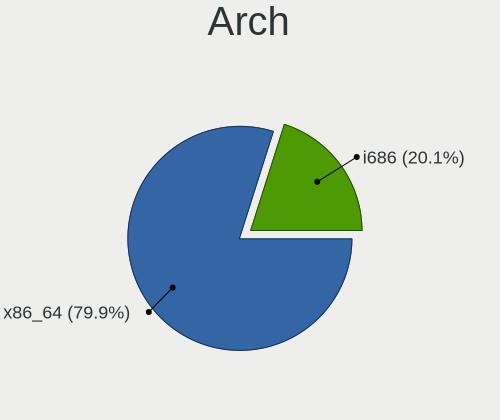

| Name   | Computers | Percent |
|--------|-----------|---------|
| x86_64 | 1213      | 85.24%  |
| i686   | 210       | 14.76%  |

DE
--

Desktop Environment

| Name       | Computers | Percent |
|------------|-----------|---------|
| GNOME      | 836       | 58.02%  |
| XFCE       | 444       | 30.81%  |
| Unknown    | 156       | 10.83%  |
| KDE        | 3         | 0.21%   |
| X-Cinnamon | 1         | 0.07%   |
| Unity      | 1         | 0.07%   |

Display Server
--------------

X11 or Wayland

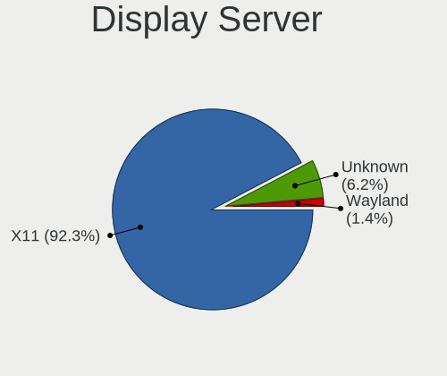

| Name    | Computers | Percent |
|---------|-----------|---------|
| X11     | 1316      | 91.64%  |
| Unknown | 103       | 7.17%   |
| Wayland | 17        | 1.18%   |

Display Manager
---------------

SDDM, LightDM, etc.

| Name    | Computers | Percent |
|---------|-----------|---------|
| Unknown | 1387      | 97.27%  |
| GDM     | 17        | 1.19%   |
| TDM     | 9         | 0.63%   |
| LightDM | 9         | 0.63%   |
| GDM3    | 4         | 0.28%   |

OS Lang
-------

Language

| Lang    | Computers | Percent |
|---------|-----------|---------|
| en_US   | 472       | 32.96%  |
| pt_BR   | 112       | 7.82%   |
| Unknown | 110       | 7.68%   |
| de_DE   | 75        | 5.24%   |
| en_GB   | 72        | 5.03%   |
| it_IT   | 57        | 3.98%   |
| en_CA   | 46        | 3.21%   |
| en_IN   | 45        | 3.14%   |
| pl_PL   | 33        | 2.3%    |
| es_ES   | 33        | 2.3%    |
| fr_FR   | 31        | 2.16%   |
| es_AR   | 26        | 1.82%   |
| pt_PT   | 24        | 1.68%   |
| C       | 22        | 1.54%   |
| es_MX   | 19        | 1.33%   |
| en_AU   | 19        | 1.33%   |
| ru_RU   | 18        | 1.26%   |
| nl_NL   | 17        | 1.19%   |
| cs_CZ   | 14        | 0.98%   |
| es_CL   | 12        | 0.84%   |
| en_ZA   | 12        | 0.84%   |
| tr_TR   | 11        | 0.77%   |
| sv_SE   | 11        | 0.77%   |
| fr_CA   | 10        | 0.7%    |
| es_CO   | 9         | 0.63%   |
| ja_JP   | 8         | 0.56%   |
| hu_HU   | 8         | 0.56%   |
| es_PE   | 7         | 0.49%   |
| el_GR   | 7         | 0.49%   |
| de_AT   | 7         | 0.49%   |
| en_PH   | 6         | 0.42%   |
| en_NZ   | 6         | 0.42%   |
| da_DK   | 6         | 0.42%   |
| ro_RO   | 5         | 0.35%   |
| ru_UA   | 4         | 0.28%   |
| de_CH   | 4         | 0.28%   |
| bg_BG   | 4         | 0.28%   |
| sr_RS   | 3         | 0.21%   |
| sk_SK   | 3         | 0.21%   |
| nl_BE   | 3         | 0.21%   |
| nb_NO   | 3         | 0.21%   |
| fi_FI   | 3         | 0.21%   |
| en_IL   | 3         | 0.21%   |
| id_ID   | 2         | 0.14%   |
| es_VE   | 2         | 0.14%   |
| es_UY   | 2         | 0.14%   |
| es_PA   | 2         | 0.14%   |
| es_EC   | 2         | 0.14%   |
| en_IE   | 2         | 0.14%   |
| uk_UA   | 1         | 0.07%   |
| th_TH   | 1         | 0.07%   |
| sl_SI   | 1         | 0.07%   |
| ko_KR   | 1         | 0.07%   |
| it_CH   | 1         | 0.07%   |
| is_IS   | 1         | 0.07%   |
| hr_HR   | 1         | 0.07%   |
| he_IL   | 1         | 0.07%   |
| fr_CH   | 1         | 0.07%   |
| eu_ES   | 1         | 0.07%   |
| es_US   | 1         | 0.07%   |

Boot Mode
---------

EFI or BIOS

| Mode | Computers | Percent |
|------|-----------|---------|
| BIOS | 984       | 68.38%  |
| EFI  | 455       | 31.62%  |

Filesystem
----------

Type of filesystem

| Type    | Computers | Percent |
|---------|-----------|---------|
| Ext4    | 1337      | 93.69%  |
| Overlay | 50        | 3.5%    |
| Unknown | 23        | 1.61%   |
| Ext2    | 8         | 0.56%   |
| Btrfs   | 7         | 0.49%   |
| Ext3    | 2         | 0.14%   |

Part. scheme
------------

Scheme of partitioning

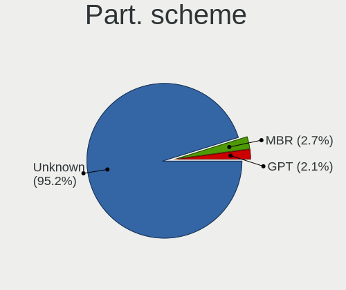

| Type    | Computers | Percent |
|---------|-----------|---------|
| Unknown | 1398      | 98.31%  |
| MBR     | 13        | 0.91%   |
| GPT     | 11        | 0.77%   |

Dual Boot with Linux/BSD
------------------------

Hosting more than one Linux/BSD

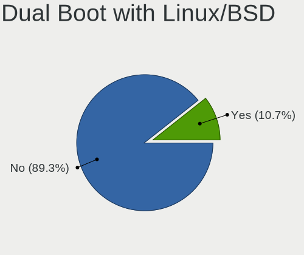

| Dual boot | Computers | Percent |
|-----------|-----------|---------|
| No        | 1281      | 89.52%  |
| Yes       | 150       | 10.48%  |

Dual Boot (Win)
---------------

Hosting Linux and Windows

| Dual boot | Computers | Percent |
|-----------|-----------|---------|
| No        | 962       | 66.85%  |
| Yes       | 477       | 33.15%  |

Board
-----

Vendor
------

Motherboard manufacturer

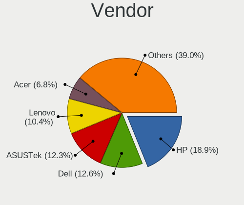

| Name                            | Computers | Percent |
|---------------------------------|-----------|---------|
| Hewlett-Packard                 | 264       | 18.57%  |
| ASUSTek Computer                | 186       | 13.08%  |
| Dell                            | 180       | 12.66%  |
| Lenovo                          | 150       | 10.55%  |
| Acer                            | 91        | 6.4%    |
| Gigabyte Technology             | 69        | 4.85%   |
| Toshiba                         | 59        | 4.15%   |
| ASRock                          | 45        | 3.16%   |
| MSI                             | 42        | 2.95%   |
| Apple                           | 29        | 2.04%   |
| Samsung Electronics             | 27        | 1.9%    |
| Unknown                         | 21        | 1.48%   |
| Intel                           | 20        | 1.41%   |
| Sony                            | 18        | 1.27%   |
| Pegatron                        | 14        | 0.98%   |
| Positivo                        | 13        | 0.91%   |
| Fujitsu                         | 13        | 0.91%   |
| ECS                             | 12        | 0.84%   |
| Packard Bell                    | 10        | 0.7%    |
| Medion                          | 8         | 0.56%   |
| Fujitsu Siemens                 | 8         | 0.56%   |
| AMI                             | 7         | 0.49%   |
| Panasonic                       | 6         | 0.42%   |
| Gateway                         | 6         | 0.42%   |
| Foxconn                         | 6         | 0.42%   |
| Semp Toshiba                    | 5         | 0.35%   |
| HUAWEI                          | 5         | 0.35%   |
| eMachines                       | 5         | 0.35%   |
| Alienware                       | 5         | 0.35%   |
| Notebook                        | 4         | 0.28%   |
| NEC Computers                   | 4         | 0.28%   |
| Biostar                         | 4         | 0.28%   |
| Shuttle                         | 3         | 0.21%   |
| Itautec                         | 3         | 0.21%   |
| Insyde                          | 3         | 0.21%   |
| IBM                             | 3         | 0.21%   |
| Google                          | 3         | 0.21%   |
| Ematic                          | 3         | 0.21%   |
| ZOTAC                           | 2         | 0.14%   |
| WinFast                         | 2         | 0.14%   |
| TrekStor                        | 2         | 0.14%   |
| Supermicro                      | 2         | 0.14%   |
| Philco                          | 2         | 0.14%   |
| Multilaser                      | 2         | 0.14%   |
| Microsoft                       | 2         | 0.14%   |
| Durabook                        | 2         | 0.14%   |
| Digibras                        | 2         | 0.14%   |
| Clevo                           | 2         | 0.14%   |
| ARIMA                           | 2         | 0.14%   |
| ABIT                            | 2         | 0.14%   |
| Xi3                             | 1         | 0.07%   |
| Wistron                         | 1         | 0.07%   |
| WIPRO                           | 1         | 0.07%   |
| Wiltronic                       | 1         | 0.07%   |
| Universal Exports Group Limited | 1         | 0.07%   |
| UMAX                            | 1         | 0.07%   |
| TUXEDO                          | 1         | 0.07%   |
| Soyo                            | 1         | 0.07%   |
| Sole                            | 1         | 0.07%   |
| SiS Technology                  | 1         | 0.07%   |

Model
-----

Motherboard model

| Name                                | Computers | Percent |
|-------------------------------------|-----------|---------|
| Unknown                             | 29        | 2.04%   |
| ASUS All Series                     | 8         | 0.56%   |
| HP Pavilion dv6                     | 6         | 0.42%   |
| HP Notebook                         | 6         | 0.42%   |
| Positivo Mobile                     | 5         | 0.35%   |
| HP Pavilion dv6700                  | 5         | 0.35%   |
| Toshiba Satellite C660              | 4         | 0.28%   |
| HP Pavilion dv7                     | 4         | 0.28%   |
| HP Laptop 15-bw0xx                  | 4         | 0.28%   |
| HP Compaq Presario CQ61             | 4         | 0.28%   |
| HP 530                              | 4         | 0.28%   |
| HP 15                               | 4         | 0.28%   |
| Dell Latitude E6410                 | 4         | 0.28%   |
| Dell Latitude E6400                 | 4         | 0.28%   |
| Dell Latitude D630                  | 4         | 0.28%   |
| Toshiba Satellite C55-A             | 3         | 0.21%   |
| Samsung 340XAA/350XAA/550XAA        | 3         | 0.21%   |
| Packard Bell EasyNote TJ65          | 3         | 0.21%   |
| MSI MS-7721                         | 3         | 0.21%   |
| Lenovo MIIX 320-10ICR 80XF          | 3         | 0.21%   |
| HUAWEI BOHK-WAX9X                   | 3         | 0.21%   |
| HP ProBook 4540s                    | 3         | 0.21%   |
| HP Pavilion g7                      | 3         | 0.21%   |
| HP Pavilion dv5                     | 3         | 0.21%   |
| HP EliteBook 840 G1                 | 3         | 0.21%   |
| HP EliteBook 6930p                  | 3         | 0.21%   |
| HP Compaq Presario CQ60             | 3         | 0.21%   |
| Gigabyte A320M-S2H                  | 3         | 0.21%   |
| Gigabyte 970A-DS3P                  | 3         | 0.21%   |
| Dell OptiPlex 780                   | 3         | 0.21%   |
| Dell OptiPlex 755                   | 3         | 0.21%   |
| Dell Latitude D520                  | 3         | 0.21%   |
| Dell Inspiron N4010                 | 3         | 0.21%   |
| Dell Inspiron 7520                  | 3         | 0.21%   |
| Dell Inspiron 6000                  | 3         | 0.21%   |
| Dell Inspiron 3521                  | 3         | 0.21%   |
| Dell Inspiron 1545                  | 3         | 0.21%   |
| Dell Inspiron 1520                  | 3         | 0.21%   |
| Dell Inspiron 15-3567               | 3         | 0.21%   |
| ASUS M5A97 R2.0                     | 3         | 0.21%   |
| ASRock N68C-S UCC                   | 3         | 0.21%   |
| Acer Aspire one                     | 3         | 0.21%   |
| TrekStor Notebook Slim S130         | 2         | 0.14%   |
| Toshiba Satellite M70               | 2         | 0.14%   |
| Toshiba Satellite A215              | 2         | 0.14%   |
| Toshiba Satellite A100              | 2         | 0.14%   |
| Semp Toshiba STI                    | 2         | 0.14%   |
| Samsung 305E4A/305E5A/305E7A        | 2         | 0.14%   |
| Positivo S14CT01                    | 2         | 0.14%   |
| Pegatron NE502AV-ABA a6750t         | 2         | 0.14%   |
| Pegatron 320-1030                   | 2         | 0.14%   |
| Multilaser PC024                    | 2         | 0.14%   |
| MSI MS-7C02                         | 2         | 0.14%   |
| MSI MS-7A38                         | 2         | 0.14%   |
| Lenovo Z50-70 20354                 | 2         | 0.14%   |
| Lenovo Yoga C740-15IML 81TD         | 2         | 0.14%   |
| Lenovo Y70-70 Touch 80DU            | 2         | 0.14%   |
| Lenovo V145-15AST 81MT              | 2         | 0.14%   |
| Lenovo IdeaPad Slim 1-14AST-05 81VS | 2         | 0.14%   |
| Lenovo IdeaPad S130-11IGM 81J1      | 2         | 0.14%   |

Model Family
------------

Motherboard model prefix

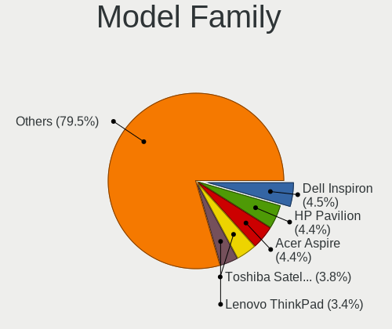

| Name                   | Computers | Percent |
|------------------------|-----------|---------|
| Dell Inspiron          | 66        | 4.64%   |
| HP Pavilion            | 60        | 4.22%   |
| Acer Aspire            | 59        | 4.15%   |
| Toshiba Satellite      | 52        | 3.66%   |
| Lenovo ThinkPad        | 44        | 3.09%   |
| Dell Latitude          | 44        | 3.09%   |
| HP Compaq              | 41        | 2.88%   |
| Lenovo IdeaPad         | 38        | 2.67%   |
| Dell OptiPlex          | 29        | 2.04%   |
| Unknown                | 29        | 2.04%   |
| HP EliteBook           | 28        | 1.97%   |
| HP ProBook             | 23        | 1.62%   |
| Lenovo ThinkCentre     | 16        | 1.13%   |
| HP Laptop              | 15        | 1.05%   |
| Dell Vostro            | 15        | 1.05%   |
| Packard Bell EasyNote  | 8         | 0.56%   |
| HP Presario            | 8         | 0.56%   |
| Dell Precision         | 8         | 0.56%   |
| ASUS All               | 8         | 0.56%   |
| Lenovo Yoga            | 7         | 0.49%   |
| HP Mini                | 7         | 0.49%   |
| Fujitsu ESPRIMO        | 7         | 0.49%   |
| ASUS TUF               | 7         | 0.49%   |
| HP Notebook            | 6         | 0.42%   |
| HP ENVY                | 6         | 0.42%   |
| HP 255                 | 6         | 0.42%   |
| Dell XPS               | 6         | 0.42%   |
| ASUS ROG               | 6         | 0.42%   |
| ASUS PRIME             | 6         | 0.42%   |
| Positivo Mobile        | 5         | 0.35%   |
| HP Stream              | 5         | 0.35%   |
| HP 530                 | 5         | 0.35%   |
| ASUS VivoBook          | 5         | 0.35%   |
| Acer Veriton           | 5         | 0.35%   |
| Lenovo MIIX            | 4         | 0.28%   |
| HP ZBook               | 4         | 0.28%   |
| HP 15                  | 4         | 0.28%   |
| Fujitsu Siemens AMILO  | 4         | 0.28%   |
| Fujitsu LIFEBOOK       | 4         | 0.28%   |
| Dell Studio            | 4         | 0.28%   |
| ASUS P5G41T-M          | 4         | 0.28%   |
| ASUS M5A97             | 4         | 0.28%   |
| ASRock N68C-S          | 4         | 0.28%   |
| Acer Extensa           | 4         | 0.28%   |
| Semp Toshiba STI       | 3         | 0.21%   |
| Samsung 340XAA         | 3         | 0.21%   |
| MSI MS-7721            | 3         | 0.21%   |
| Lenovo IdeaCentre      | 3         | 0.21%   |
| Itautec Infoway        | 3         | 0.21%   |
| HUAWEI BOHK-WAX9X      | 3         | 0.21%   |
| HP ProDesk             | 3         | 0.21%   |
| HP EliteDesk           | 3         | 0.21%   |
| Gigabyte GA-78LMT-USB3 | 3         | 0.21%   |
| Gigabyte A320M-S2H     | 3         | 0.21%   |
| Gigabyte 970A-DS3P     | 3         | 0.21%   |
| ASUS ZenBook           | 3         | 0.21%   |
| ASUS M5A78L-M          | 3         | 0.21%   |
| ASUS M2N-MX            | 3         | 0.21%   |
| ASRock X570            | 3         | 0.21%   |
| ASRock A320M-HDV       | 3         | 0.21%   |

MFG Year
--------

Motherboard manufacture year

| Year    | Computers | Percent |
|---------|-----------|---------|
| 2019    | 155       | 10.9%   |
| 2011    | 130       | 9.14%   |
| 2018    | 124       | 8.72%   |
| 2009    | 116       | 8.16%   |
| 2010    | 114       | 8.02%   |
| 2008    | 109       | 7.67%   |
| 2013    | 94        | 6.61%   |
| 2012    | 87        | 6.12%   |
| 2014    | 82        | 5.77%   |
| 2020    | 79        | 5.56%   |
| 2015    | 68        | 4.78%   |
| 2007    | 63        | 4.43%   |
| 2016    | 60        | 4.22%   |
| 2017    | 55        | 3.87%   |
| 2006    | 37        | 2.6%    |
| 2005    | 28        | 1.97%   |
| 2021    | 12        | 0.84%   |
| 2004    | 5         | 0.35%   |
| 2003    | 2         | 0.14%   |
| 2002    | 1         | 0.07%   |
| Unknown | 1         | 0.07%   |

Form Factor
-----------

Physical design of the computer

| Name        | Computers | Percent |
|-------------|-----------|---------|
| Notebook    | 871       | 61.25%  |
| Desktop     | 483       | 33.97%  |
| All in one  | 22        | 1.55%   |
| Convertible | 20        | 1.41%   |
| Tablet      | 12        | 0.84%   |
| Mini pc     | 10        | 0.7%    |
| Server      | 3         | 0.21%   |
| Other       | 1         | 0.07%   |

Secure Boot
-----------

Enabled or disabled

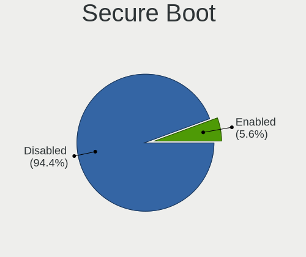

| State    | Computers | Percent |
|----------|-----------|---------|
| Disabled | 1336      | 93.69%  |
| Enabled  | 90        | 6.31%   |

Coreboot
--------

Have coreboot on board

| Used | Computers | Percent |
|------|-----------|---------|
| No   | 1418      | 99.72%  |
| Yes  | 4         | 0.28%   |

RAM Size
--------

Total RAM memory

| Size in GB  | Computers | Percent |
|-------------|-----------|---------|
| 3.01-4.0    | 436       | 30.32%  |
| 4.01-8.0    | 278       | 19.33%  |
| 1.01-2.0    | 217       | 15.09%  |
| 8.01-16.0   | 199       | 13.84%  |
| 16.01-24.0  | 126       | 8.76%   |
| 2.01-3.0    | 73        | 5.08%   |
| 0.51-1.0    | 59        | 4.1%    |
| 32.01-64.0  | 36        | 2.5%    |
| 64.01-256.0 | 8         | 0.56%   |
| 24.01-32.0  | 6         | 0.42%   |

RAM Used
--------

Used RAM memory

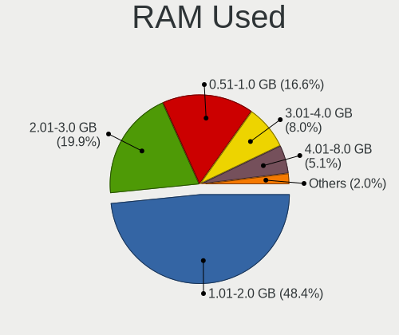

| Used GB    | Computers | Percent |
|------------|-----------|---------|
| 1.01-2.0   | 751       | 49.44%  |
| 2.01-3.0   | 314       | 20.67%  |
| 0.51-1.0   | 211       | 13.89%  |
| 3.01-4.0   | 131       | 8.62%   |
| 4.01-8.0   | 82        | 5.4%    |
| 0.01-0.5   | 15        | 0.99%   |
| 8.01-16.0  | 14        | 0.92%   |
| 16.01-24.0 | 1         | 0.07%   |

Total Drives
------------

Number of drives on board

| Drives | Computers | Percent |
|--------|-----------|---------|
| 1      | 997       | 68.81%  |
| 2      | 323       | 22.29%  |
| 3      | 78        | 5.38%   |
| 4      | 25        | 1.73%   |
| 5      | 13        | 0.9%    |
| 0      | 6         | 0.41%   |
| 6      | 3         | 0.21%   |
| 7      | 2         | 0.14%   |
| 10     | 1         | 0.07%   |
| 8      | 1         | 0.07%   |

Has CD-ROM
----------

Has CD-ROM on board

| Presented | Computers | Percent |
|-----------|-----------|---------|
| Yes       | 800       | 55.98%  |
| No        | 629       | 44.02%  |

Has Ethernet
------------

Has Ethernet on board

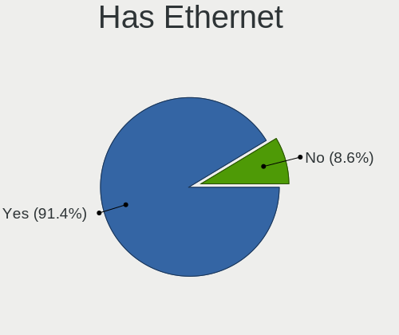

| Presented | Computers | Percent |
|-----------|-----------|---------|
| Yes       | 1297      | 91.08%  |
| No        | 127       | 8.92%   |

Has WiFi
--------

Has WiFi module

| Presented | Computers | Percent |
|-----------|-----------|---------|
| Yes       | 1124      | 78.71%  |
| No        | 304       | 21.29%  |

Has Bluetooth
-------------

Has Bluetooth module

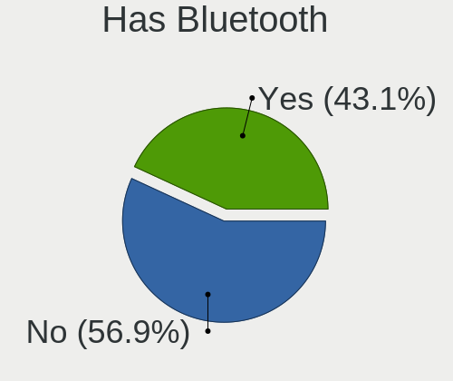

| Presented | Computers | Percent |
|-----------|-----------|---------|
| No        | 789       | 55.02%  |
| Yes       | 645       | 44.98%  |

Location
--------

Country
-------

Geographic location (country)

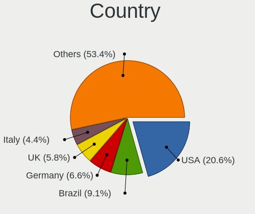

| Country      | Computers | Percent |
|--------------|-----------|---------|
| USA          | 304       | 21.29%  |
| Brazil       | 130       | 9.1%    |
| Germany      | 93        | 6.51%   |
| UK           | 82        | 5.74%   |
| Canada       | 65        | 4.55%   |
| Italy        | 58        | 4.06%   |
| India        | 50        | 3.5%    |
| France       | 36        | 2.52%   |
| Spain        | 34        | 2.38%   |
| Poland       | 33        | 2.31%   |
| Argentina    | 31        | 2.17%   |
| Netherlands  | 28        | 1.96%   |
| Portugal     | 27        | 1.89%   |
| Mexico       | 25        | 1.75%   |
| Indonesia    | 23        | 1.61%   |
| Australia    | 22        | 1.54%   |
| Sweden       | 20        | 1.4%    |
| Romania      | 17        | 1.19%   |
| Czechia      | 17        | 1.19%   |
| South Africa | 16        | 1.12%   |
| Switzerland  | 15        | 1.05%   |
| Greece       | 15        | 1.05%   |
| Russia       | 14        | 0.98%   |
| Colombia     | 13        | 0.91%   |
| Chile        | 13        | 0.91%   |
| Turkey       | 11        | 0.77%   |
| Bulgaria     | 11        | 0.77%   |
| Serbia       | 10        | 0.7%    |
| Philippines  | 10        | 0.7%    |
| New Zealand  | 10        | 0.7%    |
| Japan        | 10        | 0.7%    |
| Denmark      | 10        | 0.7%    |
| Austria      | 10        | 0.7%    |
| Peru         | 9         | 0.63%   |
| Ukraine      | 8         | 0.56%   |
| Norway       | 8         | 0.56%   |
| Hungary      | 8         | 0.56%   |
| Belgium      | 8         | 0.56%   |
| Thailand     | 7         | 0.49%   |
| Egypt        | 7         | 0.49%   |
| Kenya        | 6         | 0.42%   |
| Israel       | 6         | 0.42%   |
| Bangladesh   | 5         | 0.35%   |
| South Korea  | 4         | 0.28%   |
| Slovakia     | 4         | 0.28%   |
| Pakistan     | 4         | 0.28%   |
| Malaysia     | 4         | 0.28%   |
| Iran         | 4         | 0.28%   |
| Finland      | 4         | 0.28%   |
| Ecuador      | 4         | 0.28%   |
| Vietnam      | 3         | 0.21%   |
| Venezuela    | 3         | 0.21%   |
| UAE          | 3         | 0.21%   |
| Tunisia      | 3         | 0.21%   |
| Sri Lanka    | 3         | 0.21%   |
| Panama       | 3         | 0.21%   |
| Ireland      | 3         | 0.21%   |
| Croatia      | 3         | 0.21%   |
| Uruguay      | 2         | 0.14%   |
| Taiwan       | 2         | 0.14%   |

City
----

Geographic location (city)

| City           | Computers | Percent |
|----------------|-----------|---------|
| So Paulo     | 15        | 1%      |
| Rio de Janeiro | 11        | 0.74%   |
| Milan          | 11        | 0.74%   |
| Zurich         | 9         | 0.6%    |
| Berlin         | 9         | 0.6%    |
| Vienna         | 8         | 0.54%   |
| Rome           | 8         | 0.54%   |
| Montreal       | 8         | 0.54%   |
| Johannesburg   | 8         | 0.54%   |
| Buenos Aires   | 8         | 0.54%   |
| Warsaw         | 7         | 0.47%   |
| Paris          | 7         | 0.47%   |
| Delhi          | 7         | 0.47%   |
| Athens         | 7         | 0.47%   |
| Surabaya       | 6         | 0.4%    |
| Stuttgart      | 6         | 0.4%    |
| Sofia          | 6         | 0.4%    |
| Salvador       | 6         | 0.4%    |
| Prague         | 6         | 0.4%    |
| Mexico City    | 6         | 0.4%    |
| Lisbon         | 6         | 0.4%    |
| Bengaluru      | 6         | 0.4%    |
| Belgrade       | 6         | 0.4%    |
| Toronto        | 5         | 0.33%   |
| Sydney         | 5         | 0.33%   |
| Perth          | 5         | 0.33%   |
| Nairobi        | 5         | 0.33%   |
| Munich         | 5         | 0.33%   |
| Madrid         | 5         | 0.33%   |
| London         | 5         | 0.33%   |
| Lima           | 5         | 0.33%   |
| Las Vegas      | 5         | 0.33%   |
| Istanbul       | 5         | 0.33%   |
| Indore         | 5         | 0.33%   |
| Hyderabad      | 5         | 0.33%   |
| Houston        | 5         | 0.33%   |
| Denver         | 5         | 0.33%   |
| Cape Town      | 5         | 0.33%   |
| Calgary        | 5         | 0.33%   |
| Cairo          | 5         | 0.33%   |
| Auckland       | 5         | 0.33%   |
| Winnipeg       | 4         | 0.27%   |
| Stockholm      | 4         | 0.27%   |
| San Francisco  | 4         | 0.27%   |
| Rotterdam      | 4         | 0.27%   |
| Rochester      | 4         | 0.27%   |
| Portland       | 4         | 0.27%   |
| Osasco         | 4         | 0.27%   |
| Kyiv           | 4         | 0.27%   |
| Jakarta        | 4         | 0.27%   |
| Jaipur         | 4         | 0.27%   |
| Ituzaingo      | 4         | 0.27%   |
| Hamburg        | 4         | 0.27%   |
| Gdansk         | 4         | 0.27%   |
| Dhaka          | 4         | 0.27%   |
| Dayton         | 4         | 0.27%   |
| Copenhagen     | 4         | 0.27%   |
| Caturtunggal   | 4         | 0.27%   |
| Bucharest      | 4         | 0.27%   |
| Brooklyn       | 4         | 0.27%   |

Drives
------

Drive Vendor
------------

Hard drive vendors

| Vendor                    | Computers | Drives | Percent |
|---------------------------|-----------|--------|---------|
| WDC                       | 332       | 417    | 18.36%  |
| Seagate                   | 330       | 424    | 18.25%  |
| Samsung Electronics       | 193       | 267    | 10.67%  |
| Toshiba                   | 157       | 189    | 8.68%   |
| Hitachi                   | 122       | 143    | 6.75%   |
| Unknown                   | 114       | 162    | 6.31%   |
| Kingston                  | 92        | 107    | 5.09%   |
| SanDisk                   | 72        | 88     | 3.98%   |
| Crucial                   | 40        | 49     | 2.21%   |
| Intel                     | 34        | 42     | 1.88%   |
| HGST                      | 33        | 40     | 1.83%   |
| MAXTOR                    | 24        | 31     | 1.33%   |
| Fujitsu                   | 23        | 23     | 1.27%   |
| Phison                    | 16        | 24     | 0.88%   |
| China                     | 14        | 15     | 0.77%   |
| SK Hynix                  | 13        | 16     | 0.72%   |
| Apple                     | 13        | 13     | 0.72%   |
| PNY                       | 12        | 14     | 0.66%   |
| A-DATA Technology         | 11        | 11     | 0.61%   |
| OCZ                       | 10        | 11     | 0.55%   |
| Intenso                   | 10        | 13     | 0.55%   |
| SPCC                      | 9         | 10     | 0.5%    |
| Micron Technology         | 9         | 10     | 0.5%    |
| LITEON                    | 8         | 10     | 0.44%   |
| Transcend                 | 7         | 16     | 0.39%   |
| Patriot                   | 7         | 13     | 0.39%   |
| Micron/Crucial Technology | 7         | 7      | 0.39%   |
| SABRENT                   | 6         | 6      | 0.33%   |
| JMicron                   | 5         | 8      | 0.28%   |
| Corsair                   | 5         | 6      | 0.28%   |
| Team                      | 4         | 4      | 0.22%   |
| TCSUNBOW                  | 4         | 4      | 0.22%   |
| PLEXTOR                   | 3         | 3      | 0.17%   |
| LITEONIT                  | 3         | 3      | 0.17%   |
| Leven                     | 3         | 3      | 0.17%   |
| GOODRAM                   | 3         | 3      | 0.17%   |
| ASMT                      | 3         | 3      | 0.17%   |
| Zheino                    | 2         | 2      | 0.11%   |
| Verbatim                  | 2         | 2      | 0.11%   |
| TO Exter                  | 2         | 2      | 0.11%   |
| Silicon Motion            | 2         | 3      | 0.11%   |
| Pioneer                   | 2         | 2      | 0.11%   |
| OWC                       | 2         | 2      | 0.11%   |
| KingDian                  | 2         | 2      | 0.11%   |
| IBM/Hitachi               | 2         | 3      | 0.11%   |
| Hewlett-Packard           | 2         | 2      | 0.11%   |
| Apacer                    | 2         | 2      | 0.11%   |
| XrayDisk                  | 1         | 1      | 0.06%   |
| XPG                       | 1         | 2      | 0.06%   |
| WD MediaMax               | 1         | 1      | 0.06%   |
| USB30                     | 1         | 1      | 0.06%   |
| USB3.0                    | 1         | 1      | 0.06%   |
| TSA                       | 1         | 1      | 0.06%   |
| TrekStor                  | 1         | 1      | 0.06%   |
| S3+                       | 1         | 1      | 0.06%   |
| PNY USB                   | 1         | 1      | 0.06%   |
| Mushkin                   | 1         | 1      | 0.06%   |
| moweek                    | 1         | 1      | 0.06%   |
| Marvell                   | 1         | 1      | 0.06%   |
| Kston                     | 1         | 1      | 0.06%   |

Drive Model
-----------

Hard drive models

| Model                               | Computers | Percent |
|-------------------------------------|-----------|---------|
| Unknown MMC Card  32GB              | 44        | 2.3%    |
| Unknown MMC Card  64GB              | 25        | 1.31%   |
| Kingston SA400S37240G 240GB SSD     | 25        | 1.31%   |
| Toshiba MQ01ABF050 500GB            | 21        | 1.1%    |
| Kingston SA400S37480G 480GB SSD     | 16        | 0.84%   |
| Seagate ST500LT012-1DG142 500GB     | 15        | 0.78%   |
| Seagate ST500DM002-1BD142 500GB     | 14        | 0.73%   |
| Seagate ST1000LM035-1RK172 1TB      | 12        | 0.63%   |
| Kingston SA400S37120G 120GB SSD     | 12        | 0.63%   |
| Unknown MMC Card  128GB             | 11        | 0.58%   |
| Seagate ST1000DM010-2EP102 1TB      | 11        | 0.58%   |
| Kingston SV300S37A120G 120GB SSD    | 11        | 0.58%   |
| Crucial CT240BX500SSD1 240GB        | 11        | 0.58%   |
| Toshiba DT01ACA100 1TB              | 10        | 0.52%   |
| Seagate ST9500325AS 500GB           | 10        | 0.52%   |
| Seagate ST3500418AS 500GB           | 10        | 0.52%   |
| Samsung SSD 860 EVO 500GB           | 10        | 0.52%   |
| Samsung SSD 850 EVO 500GB           | 10        | 0.52%   |
| Unknown MMC Card  16GB              | 9         | 0.47%   |
| Toshiba MQ04ABF100 1TB              | 9         | 0.47%   |
| Seagate ST500LM012 HN-M500MBB 500GB | 9         | 0.47%   |
| Seagate ST1000LM024 HN-M101MBB 1TB  | 9         | 0.47%   |
| Samsung SSD 860 EVO 250GB           | 9         | 0.47%   |
| Samsung NVMe SSD Drive 512GB        | 9         | 0.47%   |
| WDC WDS240G2G0A-00JH30 240GB SSD    | 8         | 0.42%   |
| Toshiba MQ01ABD100 1TB              | 8         | 0.42%   |
| Seagate ST1000DM003-1ER162 1TB      | 8         | 0.42%   |
| Samsung NVMe SSD Drive 500GB        | 8         | 0.42%   |
| Samsung NVMe SSD Drive 256GB        | 8         | 0.42%   |
| Hitachi HTS545032B9A300 320GB       | 8         | 0.42%   |
| Hitachi HTS543232A7A384 320GB       | 8         | 0.42%   |
| HGST HTS725050A7E630 500GB          | 8         | 0.42%   |
| WDC WD10EZEX-08WN4A0 1TB            | 7         | 0.37%   |
| Seagate ST9250315AS 250GB           | 7         | 0.37%   |
| Seagate ST31000528AS 1TB            | 7         | 0.37%   |
| Samsung SSD 850 EVO 250GB           | 7         | 0.37%   |
| Crucial CT500MX500SSD1 500GB        | 7         | 0.37%   |
| Unknown SD/MMC/MS PRO 128GB         | 6         | 0.31%   |
| Seagate Expansion 5TB               | 6         | 0.31%   |
| Samsung HM321HI 320GB               | 6         | 0.31%   |
| Samsung HM160HI 160GB               | 6         | 0.31%   |
| Intel NVMe SSD Drive 512GB          | 6         | 0.31%   |
| Hitachi HTS547550A9E384 500GB       | 6         | 0.31%   |
| HGST HTS541010A9E680 1TB            | 6         | 0.31%   |
| WDC WD40EZRZ-00GXCB0 4TB            | 5         | 0.26%   |
| WDC WD3200BPVT-22JJ5T0 320GB        | 5         | 0.26%   |
| WDC WD3200BEVT-22ZCT0 320GB         | 5         | 0.26%   |
| WDC WD20EZRZ-00Z5HB0 2TB            | 5         | 0.26%   |
| WDC WD10JPVX-60JC3T0 1TB            | 5         | 0.26%   |
| Seagate ST9320423AS 320GB           | 5         | 0.26%   |
| Seagate ST9320325AS 320GB           | 5         | 0.26%   |
| Seagate ST9160314AS 160GB           | 5         | 0.26%   |
| Seagate ST500LT012-9WS142 500GB     | 5         | 0.26%   |
| Seagate ST1000DM003-1CH162 1TB      | 5         | 0.26%   |
| Sandisk NVMe SSD Drive 500GB        | 5         | 0.26%   |
| SABRENT Disk 1TB                    | 5         | 0.26%   |
| Hitachi HDS721616PLA380 160GB       | 5         | 0.26%   |
| WDC WDS120G2G0A-00JH30 120GB SSD    | 4         | 0.21%   |
| WDC WD5000BPVT-22HXZT3 500GB        | 4         | 0.21%   |
| WDC WD1600BEVT-22A23T0 160GB        | 4         | 0.21%   |

HDD Vendor
----------

Hard disk drive vendors

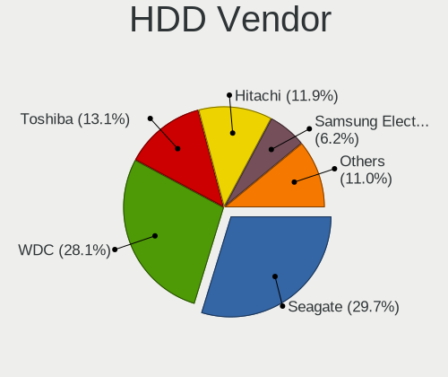

| Vendor              | Computers | Drives | Percent |
|---------------------|-----------|--------|---------|
| Seagate             | 323       | 413    | 30.56%  |
| WDC                 | 310       | 384    | 29.33%  |
| Toshiba             | 141       | 171    | 13.34%  |
| Hitachi             | 122       | 143    | 11.54%  |
| Samsung Electronics | 62        | 80     | 5.87%   |
| HGST                | 33        | 40     | 3.12%   |
| MAXTOR              | 23        | 30     | 2.18%   |
| Fujitsu             | 23        | 23     | 2.18%   |
| Unknown             | 6         | 10     | 0.57%   |
| Apple               | 6         | 6      | 0.57%   |
| TO Exter            | 2         | 2      | 0.19%   |
| IBM/Hitachi         | 2         | 3      | 0.19%   |
| USB3.0              | 1         | 1      | 0.09%   |
| Sabrent             | 1         | 1      | 0.09%   |
| ExcelStor           | 1         | 1      | 0.09%   |
| ASMT109x            | 1         | 1      | 0.09%   |

SSD Vendor
----------

Solid state drive vendors

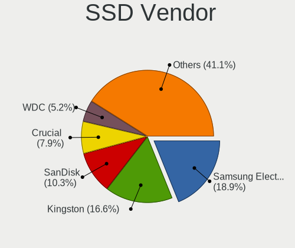

| Vendor              | Computers | Drives | Percent |
|---------------------|-----------|--------|---------|
| Samsung Electronics | 101       | 141    | 19.8%   |
| Kingston            | 85        | 99     | 16.67%  |
| SanDisk             | 52        | 61     | 10.2%   |
| Crucial             | 40        | 49     | 7.84%   |
| WDC                 | 27        | 33     | 5.29%   |
| Intel               | 25        | 29     | 4.9%    |
| China               | 13        | 14     | 2.55%   |
| PNY                 | 12        | 14     | 2.35%   |
| A-DATA Technology   | 11        | 11     | 2.16%   |
| Toshiba             | 10        | 11     | 1.96%   |
| SK Hynix            | 9         | 12     | 1.76%   |
| OCZ                 | 9         | 10     | 1.76%   |
| SPCC                | 8         | 9      | 1.57%   |
| LITEON              | 8         | 10     | 1.57%   |
| Intenso             | 8         | 11     | 1.57%   |
| Transcend           | 7         | 16     | 1.37%   |
| Patriot             | 7         | 13     | 1.37%   |
| Micron Technology   | 7         | 8      | 1.37%   |
| Apple               | 6         | 6      | 1.18%   |
| SABRENT             | 5         | 5      | 0.98%   |
| Corsair             | 5         | 6      | 0.98%   |
| Team                | 4         | 4      | 0.78%   |
| TCSUNBOW            | 4         | 4      | 0.78%   |
| PLEXTOR             | 3         | 3      | 0.59%   |
| LITEONIT            | 3         | 3      | 0.59%   |
| Leven               | 3         | 3      | 0.59%   |
| GOODRAM             | 3         | 3      | 0.59%   |
| ASMT                | 3         | 3      | 0.59%   |
| Verbatim            | 2         | 2      | 0.39%   |
| Unknown             | 2         | 2      | 0.39%   |
| Pioneer             | 2         | 2      | 0.39%   |
| OWC                 | 2         | 2      | 0.39%   |
| KingDian            | 2         | 2      | 0.39%   |
| Apacer              | 2         | 2      | 0.39%   |
| Zheino              | 1         | 1      | 0.2%    |
| USB30               | 1         | 1      | 0.2%    |
| TSA                 | 1         | 1      | 0.2%    |
| TrekStor            | 1         | 1      | 0.2%    |
| Seagate             | 1         | 1      | 0.2%    |
| S3+                 | 1         | 1      | 0.2%    |
| PNY USB             | 1         | 1      | 0.2%    |
| Mushkin             | 1         | 1      | 0.2%    |
| MAXTOR              | 1         | 1      | 0.2%    |
| KingSpec            | 1         | 1      | 0.2%    |
| Kingmax             | 1         | 1      | 0.2%    |
| Integral            | 1         | 1      | 0.2%    |
| Hikvision           | 1         | 1      | 0.2%    |
| Hewlett-Packard     | 1         | 1      | 0.2%    |
| Gigabyte Technology | 1         | 1      | 0.2%    |
| EMTEC               | 1         | 1      | 0.2%    |
| DREVO               | 1         | 1      | 0.2%    |
| DOGFISH             | 1         | 1      | 0.2%    |
| BIWIN               | 1         | 1      | 0.2%    |
| AMD-RAID            | 1         | 2      | 0.2%    |

Drive Kind
----------

HDD or SSD

| Kind    | Computers | Drives | Percent |
|---------|-----------|--------|---------|
| HDD     | 945       | 1309   | 57.07%  |
| SSD     | 462       | 624    | 27.9%   |
| NVMe    | 111       | 150    | 6.7%    |
| MMC     | 106       | 148    | 6.4%    |
| Unknown | 32        | 39     | 1.93%   |

Drive Connector
---------------

SATA, SAS, NVMe, etc.

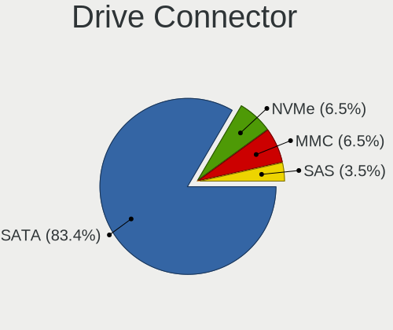

| Type | Computers | Drives | Percent |
|------|-----------|--------|---------|
| SATA | 1276      | 1902   | 82.7%   |
| NVMe | 107       | 142    | 6.93%   |
| MMC  | 106       | 148    | 6.87%   |
| SAS  | 54        | 78     | 3.5%    |

Drive Size
----------

Size of hard drive

| Size in TB | Computers | Drives | Percent |
|------------|-----------|--------|---------|
| 0.01-0.5   | 1047      | 1397   | 73.27%  |
| 0.51-1.0   | 297       | 395    | 20.78%  |
| 1.01-2.0   | 50        | 77     | 3.5%    |
| 3.01-4.0   | 18        | 37     | 1.26%   |
| 4.01-10.0  | 10        | 14     | 0.7%    |
| 2.01-3.0   | 7         | 13     | 0.49%   |

Space Total
-----------

Amount of disk space available on the file system

| Size in GB     | Computers | Percent |
|----------------|-----------|---------|
| 101-250        | 491       | 33.65%  |
| 251-500        | 351       | 24.06%  |
| 51-100         | 174       | 11.93%  |
| 501-1000       | 151       | 10.35%  |
| 21-50          | 108       | 7.4%    |
| 1-20           | 67        | 4.59%   |
| 1001-2000      | 65        | 4.46%   |
| More than 3000 | 30        | 2.06%   |
| 2001-3000      | 18        | 1.23%   |
| Unknown        | 4         | 0.27%   |

Space Used
----------

Amount of used disk space

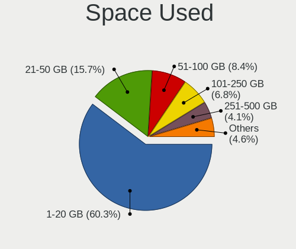

| Used GB        | Computers | Percent |
|----------------|-----------|---------|
| 1-20           | 923       | 61.33%  |
| 21-50          | 228       | 15.15%  |
| 51-100         | 122       | 8.11%   |
| 101-250        | 96        | 6.38%   |
| 251-500        | 66        | 4.39%   |
| 1001-2000      | 26        | 1.73%   |
| 501-1000       | 26        | 1.73%   |
| More than 3000 | 11        | 0.73%   |
| Unknown        | 4         | 0.27%   |
| 2001-3000      | 3         | 0.2%    |

Malfunc. Drives
---------------

Drive models with a malfunction

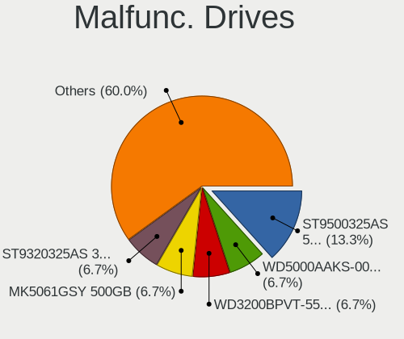

| Model                                               | Computers | Drives | Percent |
|-----------------------------------------------------|-----------|--------|---------|
| WDC WD5000AAKS-00V1A0 500GB                         | 1         | 1      | 9.09%   |
| WDC WD3200BPVT-55ZEST0 320GB                        | 1         | 1      | 9.09%   |
| Toshiba MK5061GSY 500GB                             | 1         | 1      | 9.09%   |
| Seagate ST9500325AS 500GB                           | 1         | 1      | 9.09%   |
| Seagate ST9320325AS 320GB                           | 1         | 1      | 9.09%   |
| Seagate ST9160314AS 160GB                           | 1         | 1      | 9.09%   |
| Seagate ST9120822AS 120GB                           | 1         | 1      | 9.09%   |
| Seagate ST500LT012-9WS142 500GB                     | 1         | 1      | 9.09%   |
| Micron Technology MTFDDAV256TBN-1AR15ABHA 256GB SSD | 1         | 1      | 9.09%   |
| LITEON CV8-8E128-HP 128GB SSD                       | 1         | 1      | 9.09%   |
| Hitachi HTS545050B9A300 500GB                       | 1         | 1      | 9.09%   |

Malfunc. Drive Vendor
---------------------

Vendors of faulty drives

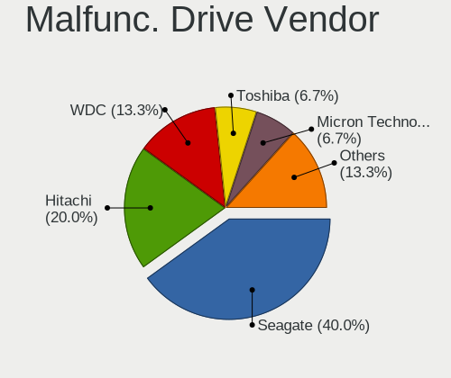

| Vendor            | Computers | Drives | Percent |
|-------------------|-----------|--------|---------|
| Seagate           | 5         | 5      | 45.45%  |
| WDC               | 2         | 2      | 18.18%  |
| Toshiba           | 1         | 1      | 9.09%   |
| Micron Technology | 1         | 1      | 9.09%   |
| LITEON            | 1         | 1      | 9.09%   |
| Hitachi           | 1         | 1      | 9.09%   |

Malfunc. HDD Vendor
-------------------

Vendors of faulty HDD drives

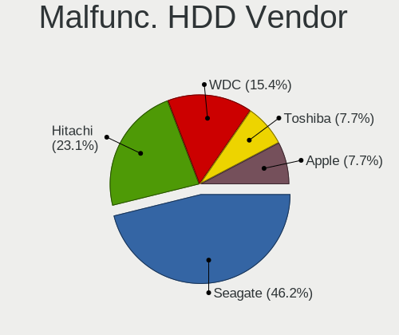

| Vendor  | Computers | Drives | Percent |
|---------|-----------|--------|---------|
| Seagate | 5         | 5      | 55.56%  |
| WDC     | 2         | 2      | 22.22%  |
| Toshiba | 1         | 1      | 11.11%  |
| Hitachi | 1         | 1      | 11.11%  |

Malfunc. Drive Kind
-------------------

Kinds of faulty drives

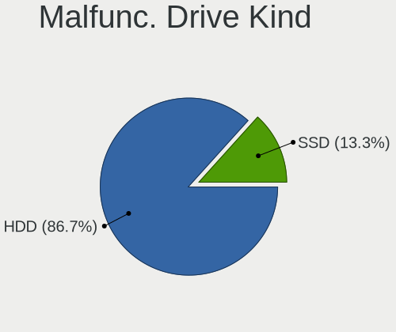

| Kind | Computers | Drives | Percent |
|------|-----------|--------|---------|
| HDD  | 9         | 9      | 81.82%  |
| SSD  | 2         | 2      | 18.18%  |

Failed Drives
-------------

Failed drive models

Zero info for selected period =(

Failed Drive Vendor
-------------------

Failed drive vendors

Zero info for selected period =(

Drive Status
------------

Number of failed and malfunc. drives

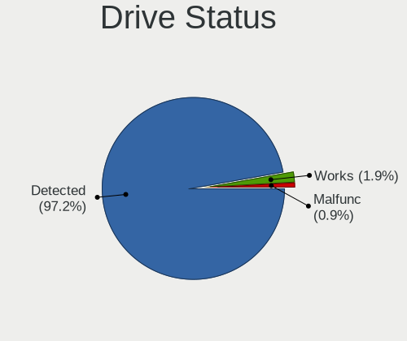

| Status   | Computers | Drives | Percent |
|----------|-----------|--------|---------|
| Detected | 1386      | 2226   | 97.47%  |
| Works    | 25        | 33     | 1.76%   |
| Malfunc  | 11        | 11     | 0.77%   |

Storage controller
------------------

Storage Vendor
--------------

Storage controller vendors

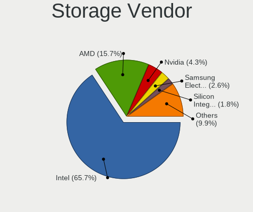

| Vendor                           | Computers | Percent |
|----------------------------------|-----------|---------|
| Intel                            | 1001      | 65.34%  |
| AMD                              | 248       | 16.19%  |
| Nvidia                           | 64        | 4.18%   |
| Samsung Electronics              | 41        | 2.68%   |
| JMicron Technology               | 27        | 1.76%   |
| Silicon Integrated Systems [SiS] | 23        | 1.5%    |
| VIA Technologies                 | 18        | 1.17%   |
| Marvell Technology Group         | 18        | 1.17%   |
| Sandisk                          | 16        | 1.04%   |
| Phison Electronics               | 16        | 1.04%   |
| ASMedia Technology               | 15        | 0.98%   |
| Kingston Technology Company      | 8         | 0.52%   |
| Toshiba America Info Systems     | 7         | 0.46%   |
| Micron/Crucial Technology        | 7         | 0.46%   |
| SK Hynix                         | 3         | 0.2%    |
| Silicon Image                    | 3         | 0.2%    |
| Broadcom / LSI                   | 3         | 0.2%    |
| Union Memory (Shenzhen)          | 2         | 0.13%   |
| Silicon Motion                   | 2         | 0.13%   |
| Micron Technology                | 2         | 0.13%   |
| Promise Technology               | 1         | 0.07%   |
| OCZ Technology Group             | 1         | 0.07%   |
| Lite-On IT Corp. / Plextor       | 1         | 0.07%   |
| KIOXIA                           | 1         | 0.07%   |
| Hewlett-Packard                  | 1         | 0.07%   |
| Apple                            | 1         | 0.07%   |
| ADATA Technology                 | 1         | 0.07%   |
| Adaptec                          | 1         | 0.07%   |

Storage Model
-------------

Storage controller models

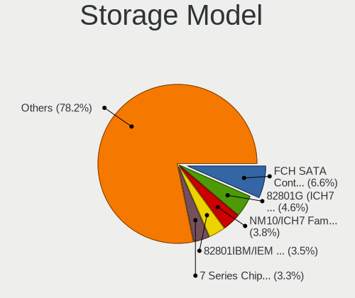

| Model                                                                                   | Computers | Percent |
|-----------------------------------------------------------------------------------------|-----------|---------|
| AMD FCH SATA Controller [AHCI mode]                                                     | 136       | 6.98%   |
| Intel 82801G (ICH7 Family) IDE Controller                                               | 78        | 4%      |
| Intel 7 Series Chipset Family 6-port SATA Controller [AHCI mode]                        | 68        | 3.49%   |
| Intel NM10/ICH7 Family SATA Controller [IDE mode]                                       | 67        | 3.44%   |
| Intel Sunrise Point-LP SATA Controller [AHCI mode]                                      | 65        | 3.34%   |
| Intel 82801IBM/IEM (ICH9M/ICH9M-E) 4 port SATA Controller [AHCI mode]                   | 63        | 3.23%   |
| Intel 6 Series/C200 Series Chipset Family 6 port Mobile SATA AHCI Controller            | 63        | 3.23%   |
| Intel 8 Series/C220 Series Chipset Family 6-port SATA Controller 1 [AHCI mode]          | 55        | 2.82%   |
| Intel 82801HM/HEM (ICH8M/ICH8M-E) IDE Controller                                        | 51        | 2.62%   |
| Intel 82801 Mobile SATA Controller [RAID mode]                                          | 49        | 2.51%   |
| AMD SB7x0/SB8x0/SB9x0 SATA Controller [AHCI mode]                                       | 46        | 2.36%   |
| Intel 82801HM/HEM (ICH8M/ICH8M-E) SATA Controller [AHCI mode]                           | 41        | 2.1%    |
| Intel 8 Series SATA Controller 1 [AHCI mode]                                            | 39        | 2%      |
| AMD SB7x0/SB8x0/SB9x0 IDE Controller                                                    | 35        | 1.8%    |
| AMD SB7x0/SB8x0/SB9x0 SATA Controller [IDE mode]                                        | 34        | 1.74%   |
| Intel 6 Series/C200 Series Chipset Family 6 port Desktop SATA AHCI Controller           | 33        | 1.69%   |
| Intel 82801GBM/GHM (ICH7-M Family) SATA Controller [IDE mode]                           | 31        | 1.59%   |
| Samsung NVMe SSD Controller SM981/PM981/PM983                                           | 27        | 1.39%   |
| Intel SATA Controller [RAID mode]                                                       | 24        | 1.23%   |
| Intel 5 Series/3400 Series Chipset 4 port SATA AHCI Controller                          | 24        | 1.23%   |
| Silicon Integrated Systems [SiS] 5513 IDE Controller                                    | 23        | 1.18%   |
| Intel NM10/ICH7 Family SATA Controller [AHCI mode]                                      | 23        | 1.18%   |
| Nvidia MCP61 SATA Controller                                                            | 22        | 1.13%   |
| Intel 82801GBM/GHM (ICH7-M Family) SATA Controller [AHCI mode]                          | 20        | 1.03%   |
| Intel Wildcat Point-LP SATA Controller [AHCI Mode]                                      | 19        | 0.97%   |
| Intel 5 Series/3400 Series Chipset 6 port SATA AHCI Controller                          | 19        | 0.97%   |
| Silicon Integrated Systems [SiS] SATA Controller / IDE mode                             | 17        | 0.87%   |
| Nvidia MCP61 IDE                                                                        | 16        | 0.82%   |
| Intel Q170/Q150/B150/H170/H110/Z170/CM236 Chipset SATA Controller [AHCI Mode]           | 16        | 0.82%   |
| Intel Atom/Celeron/Pentium Processor x5-E8000/J3xxx/N3xxx Series SATA Controller        | 16        | 0.82%   |
| Intel Atom Processor E3800 Series SATA AHCI Controller                                  | 16        | 0.82%   |
| Intel Celeron N3350/Pentium N4200/Atom E3900 Series SATA AHCI Controller                | 15        | 0.77%   |
| Intel 82801I (ICH9 Family) 2 port SATA Controller [IDE mode]                            | 15        | 0.77%   |
| Intel 82801HM/HEM (ICH8M/ICH8M-E) SATA Controller [IDE mode]                            | 14        | 0.72%   |
| AMD 400 Series Chipset SATA Controller                                                  | 14        | 0.72%   |
| VIA VT82C586A/B/VT82C686/A/B/VT823x/A/C PIPC Bus Master IDE                             | 13        | 0.67%   |
| Intel 6 Series/C200 Series Chipset Family Desktop SATA Controller (IDE mode, ports 4-5) | 13        | 0.67%   |
| Intel 6 Series/C200 Series Chipset Family Desktop SATA Controller (IDE mode, ports 0-3) | 13        | 0.67%   |
| ASMedia ASM1062 Serial ATA Controller                                                   | 13        | 0.67%   |
| Intel 82801IR/IO/IH (ICH9R/DO/DH) 4 port SATA Controller [IDE mode]                     | 12        | 0.62%   |
| AMD FCH IDE Controller                                                                  | 12        | 0.62%   |
| JMicron JMB368 IDE controller                                                           | 11        | 0.56%   |
| Phison E12 NVMe Controller                                                              | 10        | 0.51%   |
| JMicron JMB363 SATA/IDE Controller                                                      | 10        | 0.51%   |
| Intel Celeron/Pentium Silver Processor SATA Controller                                  | 10        | 0.51%   |
| Intel 82801JI (ICH10 Family) SATA AHCI Controller                                       | 10        | 0.51%   |
| Intel 82801JI (ICH10 Family) 4 port SATA IDE Controller #1                              | 10        | 0.51%   |
| Intel 82801JI (ICH10 Family) 2 port SATA IDE Controller #2                              | 10        | 0.51%   |
| Intel 82801FBM (ICH6M) SATA Controller                                                  | 10        | 0.51%   |
| Intel 82801FB/FBM/FR/FW/FRW (ICH6 Family) IDE Controller                                | 10        | 0.51%   |
| Intel 5 Series/3400 Series Chipset 4 port SATA IDE Controller                           | 10        | 0.51%   |
| Intel 4 Series Chipset PT IDER Controller                                               | 10        | 0.51%   |
| AMD IXP SB4x0 IDE Controller                                                            | 10        | 0.51%   |
| AMD FCH SATA Controller [IDE mode]                                                      | 10        | 0.51%   |
| Samsung NVMe SSD Controller SM961/PM961/SM963                                           | 9         | 0.46%   |
| Intel HM170/QM170 Chipset SATA Controller [AHCI Mode]                                   | 9         | 0.46%   |
| Intel Comet Lake SATA AHCI Controller                                                   | 9         | 0.46%   |
| Intel Cannon Lake Mobile PCH SATA AHCI Controller                                       | 9         | 0.46%   |
| Intel 9 Series Chipset Family SATA Controller [AHCI Mode]                               | 9         | 0.46%   |
| Intel 5 Series/3400 Series Chipset 2 port SATA IDE Controller                           | 9         | 0.46%   |

Storage Kind
------------

Kind of storage controller (IDE, SATA, NVMe, SAS, ...)

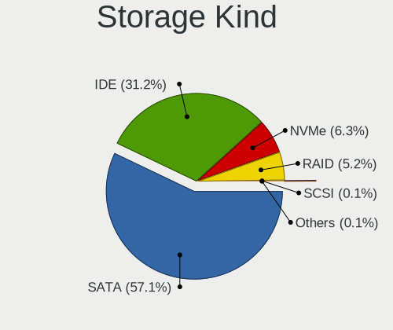

| Kind | Computers | Percent |
|------|-----------|---------|
| SATA | 954       | 58.6%   |
| IDE  | 470       | 28.87%  |
| NVMe | 109       | 6.7%    |
| RAID | 92        | 5.65%   |
| SCSI | 2         | 0.12%   |
| SAS  | 1         | 0.06%   |

Processor
---------

CPU Vendor
----------

Processor vendors

| Vendor       | Computers | Percent |
|--------------|-----------|---------|
| Intel        | 1116      | 78.48%  |
| AMD          | 305       | 21.45%  |
| CentaurHauls | 1         | 0.07%   |

CPU Model
---------

Processor models

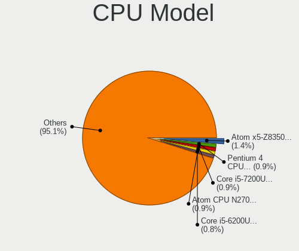

| Model                                         | Computers | Percent |
|-----------------------------------------------|-----------|---------|
| Intel Atom x5-Z8350 CPU @ 1.44GHz             | 23        | 1.61%   |
| Intel Core i5-7200U CPU @ 2.50GHz             | 15        | 1.05%   |
| Intel Core 2 Duo CPU E8400 @ 3.00GHz          | 13        | 0.91%   |
| Intel Atom CPU N270 @ 1.60GHz                 | 13        | 0.91%   |
| Intel Core i5-2400 CPU @ 3.10GHz              | 11        | 0.77%   |
| Intel Core i3-2310M CPU @ 2.10GHz             | 11        | 0.77%   |
| Intel Atom CPU N450 @ 1.66GHz                 | 11        | 0.77%   |
| Intel Core i5-2520M CPU @ 2.50GHz             | 10        | 0.7%    |
| Intel Celeron CPU N3350 @ 1.10GHz             | 10        | 0.7%    |
| Intel Atom CPU N455 @ 1.66GHz                 | 10        | 0.7%    |
| Intel Pentium 4 CPU 3.00GHz                   | 9         | 0.63%   |
| Intel Core i5-8250U CPU @ 1.60GHz             | 9         | 0.63%   |
| Intel Core i5-6200U CPU @ 2.30GHz             | 9         | 0.63%   |
| Intel Core i5-2410M CPU @ 2.30GHz             | 9         | 0.63%   |
| Intel Core i5-3210M CPU @ 2.50GHz             | 8         | 0.56%   |
| Intel Core 2 Quad CPU Q6600 @ 2.40GHz         | 8         | 0.56%   |
| Intel Core 2 Duo CPU T7250 @ 2.00GHz          | 8         | 0.56%   |
| Intel Core 2 Duo CPU P8600 @ 2.40GHz          | 8         | 0.56%   |
| Intel Celeron CPU N2840 @ 2.16GHz             | 8         | 0.56%   |
| AMD Ryzen 5 3500U with Radeon Vega Mobile Gfx | 8         | 0.56%   |
| Intel Core i7-8550U CPU @ 1.80GHz             | 7         | 0.49%   |
| Intel Core i7-7700HQ CPU @ 2.80GHz            | 7         | 0.49%   |
| Intel Core i5-8265U CPU @ 1.60GHz             | 7         | 0.49%   |
| Intel Core i5-3320M CPU @ 2.60GHz             | 7         | 0.49%   |
| Intel Core i5-2430M CPU @ 2.40GHz             | 7         | 0.49%   |
| Intel Core 2 Duo CPU T6600 @ 2.20GHz          | 7         | 0.49%   |
| Intel Core 2 Duo CPU P8700 @ 2.53GHz          | 7         | 0.49%   |
| Intel Core 2 Duo CPU P8400 @ 2.26GHz          | 7         | 0.49%   |
| Intel Atom x5-Z8300 CPU @ 1.44GHz             | 7         | 0.49%   |
| AMD FX-6300 Six-Core Processor                | 7         | 0.49%   |
| Intel Pentium Dual-Core CPU T4400 @ 2.20GHz   | 6         | 0.42%   |
| Intel Pentium Dual-Core CPU E5700 @ 3.00GHz   | 6         | 0.42%   |
| Intel Pentium Dual-Core CPU E5300 @ 2.60GHz   | 6         | 0.42%   |
| Intel Core i7-8750H CPU @ 2.20GHz             | 6         | 0.42%   |
| Intel Core i7-4600U CPU @ 2.10GHz             | 6         | 0.42%   |
| Intel Core i5-4210U CPU @ 1.70GHz             | 6         | 0.42%   |
| Intel Core i3-3217U CPU @ 1.80GHz             | 6         | 0.42%   |
| Intel Core i3 CPU M 380 @ 2.53GHz             | 6         | 0.42%   |
| Intel Core 2 Duo CPU E7500 @ 2.93GHz          | 6         | 0.42%   |
| Intel Celeron N4000 CPU @ 1.10GHz             | 6         | 0.42%   |
| Intel Celeron CPU N3050 @ 1.60GHz             | 6         | 0.42%   |
| AMD E-450 APU with Radeon HD Graphics         | 6         | 0.42%   |
| Intel Pentium Dual-Core CPU T4500 @ 2.30GHz   | 5         | 0.35%   |
| Intel Pentium Dual CPU T3400 @ 2.16GHz        | 5         | 0.35%   |
| Intel Pentium Dual CPU E2220 @ 2.40GHz        | 5         | 0.35%   |
| Intel Core i7-8565U CPU @ 1.80GHz             | 5         | 0.35%   |
| Intel Core i7-6500U CPU @ 2.50GHz             | 5         | 0.35%   |
| Intel Core i7-4790 CPU @ 3.60GHz              | 5         | 0.35%   |
| Intel Core i7-4510U CPU @ 2.00GHz             | 5         | 0.35%   |
| Intel Core i7-2600 CPU @ 3.40GHz              | 5         | 0.35%   |
| Intel Core i5-4200U CPU @ 1.60GHz             | 5         | 0.35%   |
| Intel Core i5 CPU M 520 @ 2.40GHz             | 5         | 0.35%   |
| Intel Core i3-7020U CPU @ 2.30GHz             | 5         | 0.35%   |
| Intel Core i3-6006U CPU @ 2.00GHz             | 5         | 0.35%   |
| Intel Core i3-3110M CPU @ 2.40GHz             | 5         | 0.35%   |
| Intel Core i3 CPU M 370 @ 2.40GHz             | 5         | 0.35%   |
| Intel Core 2 Quad CPU Q8300 @ 2.50GHz         | 5         | 0.35%   |
| Intel Core 2 Duo CPU T6500 @ 2.10GHz          | 5         | 0.35%   |
| Intel Core 2 Duo CPU T6400 @ 2.00GHz          | 5         | 0.35%   |
| Intel Core 2 CPU T5500 @ 1.66GHz              | 5         | 0.35%   |

CPU Model Family
----------------

Processor model prefix

| Model                   | Computers | Percent |
|-------------------------|-----------|---------|
| Intel Core i5           | 230       | 16.14%  |
| Intel Core i7           | 163       | 11.44%  |
| Intel Core 2 Duo        | 141       | 9.89%   |
| Intel Core i3           | 125       | 8.77%   |
| Intel Celeron           | 94        | 6.6%    |
| Intel Atom              | 90        | 6.32%   |
| Intel Pentium           | 47        | 3.3%    |
| Intel Pentium Dual-Core | 35        | 2.46%   |
| Intel Pentium Dual      | 31        | 2.18%   |
| Intel Core 2 Quad       | 29        | 2.04%   |
| AMD Ryzen 5             | 26        | 1.82%   |
| Intel Genuine           | 24        | 1.68%   |
| AMD A4                  | 24        | 1.68%   |
| Intel Xeon              | 21        | 1.47%   |
| AMD Ryzen 7             | 21        | 1.47%   |
| AMD Athlon 64 X2        | 21        | 1.47%   |
| Intel Pentium 4         | 20        | 1.4%    |
| Intel Core 2            | 20        | 1.4%    |
| AMD FX                  | 18        | 1.26%   |
| AMD Ryzen 3             | 17        | 1.19%   |
| AMD A6                  | 17        | 1.19%   |
| Intel Pentium M         | 14        | 0.98%   |
| AMD A8                  | 14        | 0.98%   |
| AMD E                   | 13        | 0.91%   |
| Intel Celeron M         | 11        | 0.77%   |
| AMD Athlon II X2        | 10        | 0.7%    |
| AMD Sempron             | 9         | 0.63%   |
| AMD E1                  | 9         | 0.63%   |
| AMD Turion 64 X2 Mobile | 8         | 0.56%   |
| AMD Phenom II X4        | 8         | 0.56%   |
| AMD A10                 | 8         | 0.56%   |
| Other                   | 7         | 0.49%   |
| AMD Turion 64 Mobile    | 7         | 0.49%   |
| AMD Athlon              | 7         | 0.49%   |
| AMD Athlon 64           | 6         | 0.42%   |
| Intel Celeron Dual-Core | 5         | 0.35%   |
| AMD C-50                | 5         | 0.35%   |
| AMD Phenom II X2        | 4         | 0.28%   |
| AMD Mobile Sempron      | 4         | 0.28%   |
| AMD E2                  | 4         | 0.28%   |
| AMD C-60                | 4         | 0.28%   |
| AMD Athlon X2           | 4         | 0.28%   |
| AMD Athlon II X4        | 4         | 0.28%   |
| Intel Pentium D         | 3         | 0.21%   |
| Intel Core 2 Extreme    | 3         | 0.21%   |
| AMD Ryzen 9             | 3         | 0.21%   |
| AMD Phenom              | 3         | 0.21%   |
| AMD Athlon II X3        | 3         | 0.21%   |
| Intel Core i9           | 2         | 0.14%   |
| Intel Core Duo          | 2         | 0.14%   |
| AMD Turion Dual-Core    | 2         | 0.14%   |
| AMD Ryzen Threadripper  | 2         | 0.14%   |
| AMD Phenom II X6        | 2         | 0.14%   |
| AMD Phenom II           | 2         | 0.14%   |
| AMD Athlon Dual Core    | 2         | 0.14%   |
| Intel Pentium Silver    | 1         | 0.07%   |
| Intel Pentium Gold      | 1         | 0.07%   |
| Intel Core m7           | 1         | 0.07%   |
| Intel Core m3           | 1         | 0.07%   |
| Intel Core M            | 1         | 0.07%   |

CPU Cores
---------

Number of processor cores

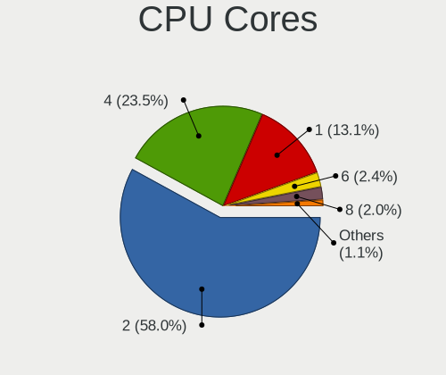

| Number | Computers | Percent |
|--------|-----------|---------|
| 2      | 825       | 57.85%  |
| 4      | 359       | 25.18%  |
| 1      | 157       | 11.01%  |
| 6      | 37        | 2.59%   |
| 8      | 30        | 2.1%    |
| 3      | 12        | 0.84%   |
| 16     | 2         | 0.14%   |
| 10     | 2         | 0.14%   |
| 20     | 1         | 0.07%   |
| 12     | 1         | 0.07%   |

CPU Sockets
-----------

Number of sockets

| Number | Computers | Percent |
|--------|-----------|---------|
| 1      | 1417      | 99.65%  |
| 2      | 5         | 0.35%   |

CPU Threads
-----------

Threads per core (Hyper-Threading)

| Number | Computers | Percent |
|--------|-----------|---------|
| 1      | 774       | 54.43%  |
| 2      | 648       | 45.57%  |

CPU Op-Modes
------------

CPU Operation Modes (32-bit, 64-bit)

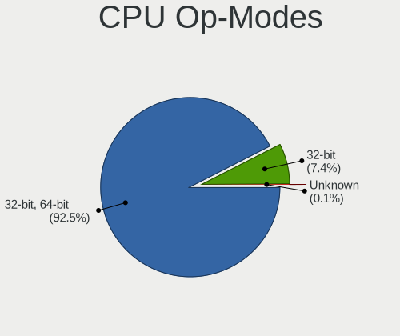

| Op mode        | Computers | Percent |
|----------------|-----------|---------|
| 32-bit, 64-bit | 1342      | 94.31%  |
| 32-bit         | 79        | 5.55%   |
| Unknown        | 2         | 0.14%   |

CPU Microcode
-------------

Microcode number

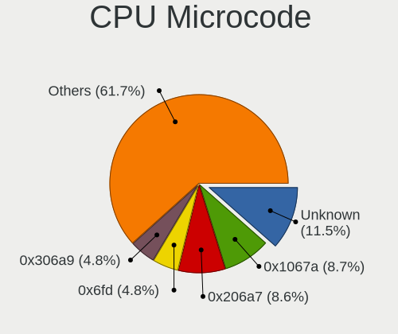

| Number     | Computers | Percent |
|------------|-----------|---------|
| Unknown    | 160       | 11.11%  |
| 0x206a7    | 125       | 8.68%   |
| 0x1067a    | 122       | 8.47%   |
| 0x306a9    | 75        | 5.21%   |
| 0x306c3    | 68        | 4.72%   |
| 0x6fd      | 66        | 4.58%   |
| 0x40651    | 42        | 2.92%   |
| 0x20655    | 34        | 2.36%   |
| 0x406e3    | 27        | 1.88%   |
| 0x406c4    | 26        | 1.81%   |
| 0x106ca    | 25        | 1.74%   |
| 0x10676    | 24        | 1.67%   |
| 0x806e9    | 23        | 1.6%    |
| 0x6fb      | 23        | 1.6%    |
| 0x010000c8 | 23        | 1.6%    |
| 0x806ea    | 21        | 1.46%   |
| 0x306d4    | 21        | 1.46%   |
| 0x30678    | 20        | 1.39%   |
| 0x506e3    | 19        | 1.32%   |
| 0x06001119 | 19        | 1.32%   |
| 0x6e8      | 18        | 1.25%   |
| 0x106c2    | 18        | 1.25%   |
| 0x906e9    | 17        | 1.18%   |
| 0x6f6      | 17        | 1.18%   |
| 0x6d8      | 16        | 1.11%   |
| 0x406c3    | 16        | 1.11%   |
| 0x906ea    | 15        | 1.04%   |
| 0x06000852 | 15        | 1.04%   |
| 0x05000119 | 15        | 1.04%   |
| 0x806ec    | 14        | 0.97%   |
| 0x506c9    | 14        | 0.97%   |
| 0x20652    | 14        | 0.97%   |
| 0x10661    | 13        | 0.9%    |
| 0x06006705 | 13        | 0.9%    |
| 0x0700010f | 12        | 0.83%   |
| 0x03000027 | 11        | 0.76%   |
| 0x08108109 | 10        | 0.69%   |
| 0x05000029 | 10        | 0.69%   |
| 0x0810100b | 9         | 0.63%   |
| 0xf41      | 8         | 0.56%   |
| 0x706a1    | 8         | 0.56%   |
| 0x6ec      | 7         | 0.49%   |
| 0x30673    | 7         | 0.49%   |
| 0x08108102 | 7         | 0.49%   |
| 0x0800820d | 7         | 0.49%   |
| 0x06003106 | 7         | 0.49%   |
| 0x106e5    | 6         | 0.42%   |
| 0x906ed    | 5         | 0.35%   |
| 0x806eb    | 5         | 0.35%   |
| 0x106a5    | 5         | 0.35%   |
| 0x010000db | 5         | 0.35%   |
| 0xf43      | 4         | 0.28%   |
| 0xa0655    | 4         | 0.28%   |
| 0x706e5    | 4         | 0.28%   |
| 0x6fa      | 4         | 0.28%   |
| 0x6f2      | 4         | 0.28%   |
| 0x07030105 | 4         | 0.28%   |
| 0x02000057 | 4         | 0.28%   |
| 0x02000032 | 4         | 0.28%   |
| 0x306f2    | 3         | 0.21%   |

CPU Microarch
-------------

Microarchitecture

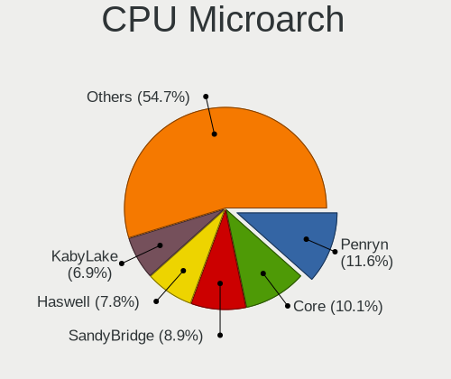

| Name            | Computers | Percent |
|-----------------|-----------|---------|
| Penryn          | 159       | 11.17%  |
| Core            | 134       | 9.42%   |
| SandyBridge     | 129       | 9.07%   |
| Haswell         | 120       | 8.43%   |
| KabyLake        | 109       | 7.66%   |
| Silvermont      | 85        | 5.97%   |
| IvyBridge       | 83        | 5.83%   |
| Westmere        | 57        | 4.01%   |
| K8 Hammer       | 56        | 3.94%   |
| Skylake         | 50        | 3.51%   |
| Bonnell         | 47        | 3.3%    |
| K10             | 44        | 3.09%   |
| P6              | 43        | 3.02%   |
| Piledriver      | 36        | 2.53%   |
| Zen+            | 31        | 2.18%   |
| NetBurst        | 27        | 1.9%    |
| Bobcat          | 26        | 1.83%   |
| Zen             | 23        | 1.62%   |
| Broadwell       | 23        | 1.62%   |
| Excavator       | 19        | 1.34%   |
| Zen 2           | 15        | 1.05%   |
| Goldmont        | 15        | 1.05%   |
| Jaguar          | 14        | 0.98%   |
| Nehalem         | 13        | 0.91%   |
| K10 Llano       | 11        | 0.77%   |
| Goldmont plus   | 10        | 0.7%    |
| Steamroller     | 8         | 0.56%   |
| Puma            | 8         | 0.56%   |
| K8 & K10 hybrid | 8         | 0.56%   |
| CometLake       | 7         | 0.49%   |
| IceLake         | 4         | 0.28%   |
| Unknown         | 4         | 0.28%   |
| Bulldozer       | 3         | 0.21%   |
| Zen 3           | 2         | 0.14%   |

Graphics
--------

GPU Vendor
----------

Vendors of graphics cards

| Vendor                           | Computers | Percent |
|----------------------------------|-----------|---------|
| Intel                            | 818       | 51.61%  |
| AMD                              | 376       | 23.72%  |
| Nvidia                           | 359       | 22.65%  |
| Silicon Integrated Systems [SiS] | 19        | 1.2%    |
| VIA Technologies                 | 8         | 0.5%    |
| Matrox Electronics Systems       | 2         | 0.13%   |
| Trident Microsystems             | 1         | 0.06%   |
| Silicon Motion                   | 1         | 0.06%   |
| ASPEED Technology                | 1         | 0.06%   |

GPU Model
---------

Graphics card models

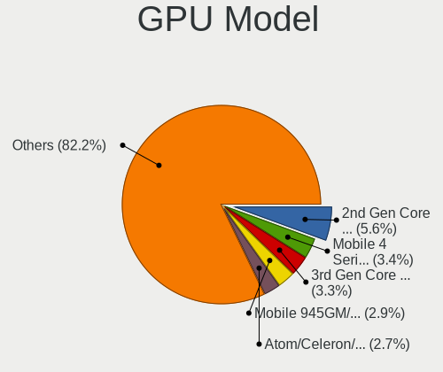

| Model                                                                                    | Computers | Percent |
|------------------------------------------------------------------------------------------|-----------|---------|
| Intel 2nd Generation Core Processor Family Integrated Graphics Controller                | 97        | 5.71%   |
| Intel 3rd Gen Core processor Graphics Controller                                         | 59        | 3.47%   |
| Intel Atom/Celeron/Pentium Processor x5-E8000/J3xxx/N3xxx Integrated Graphics Controller | 52        | 3.06%   |
| Intel Mobile 4 Series Chipset Integrated Graphics Controller                             | 49        | 2.88%   |
| Intel Haswell-ULT Integrated Graphics Controller                                         | 44        | 2.59%   |
| Intel Mobile 945GM/GMS/GME, 943/940GML Express Integrated Graphics Controller            | 42        | 2.47%   |
| Intel Core Processor Integrated Graphics Controller                                      | 39        | 2.3%    |
| Intel Mobile GM965/GL960 Integrated Graphics Controller (secondary)                      | 36        | 2.12%   |
| Intel Mobile GM965/GL960 Integrated Graphics Controller (primary)                        | 36        | 2.12%   |
| Intel Atom Processor Z36xxx/Z37xxx Series Graphics & Display                             | 33        | 1.94%   |
| Intel 4th Gen Core Processor Integrated Graphics Controller                              | 28        | 1.65%   |
| Intel Skylake GT2 [HD Graphics 520]                                                      | 27        | 1.59%   |
| Intel HD Graphics 620                                                                    | 27        | 1.59%   |
| Intel Atom Processor D4xx/D5xx/N4xx/N5xx Integrated Graphics Controller                  | 26        | 1.53%   |
| Intel 4 Series Chipset Integrated Graphics Controller                                    | 26        | 1.53%   |
| Intel Mobile 945GM/GMS, 943/940GML Express Integrated Graphics Controller                | 25        | 1.47%   |
| Intel Xeon E3-1200 v3/4th Gen Core Processor Integrated Graphics Controller              | 24        | 1.41%   |
| AMD Ellesmere [Radeon RX 470/480/570/570X/580/580X/590]                                  | 19        | 1.12%   |
| Intel UHD Graphics 620                                                                   | 18        | 1.06%   |
| Intel Mobile 945GSE Express Integrated Graphics Controller                               | 18        | 1.06%   |
| Intel HD Graphics 5500                                                                   | 18        | 1.06%   |
| Silicon Integrated Systems [SiS] 771/671 PCIE VGA Display Adapter                        | 17        | 1%      |
| Nvidia GK208B [GeForce GT 710]                                                           | 17        | 1%      |
| AMD Picasso                                                                              | 17        | 1%      |
| AMD Stoney [Radeon R2/R3/R4/R5 Graphics]                                                 | 16        | 0.94%   |
| AMD Raven Ridge [Radeon Vega Series / Radeon Vega Mobile Series]                         | 14        | 0.82%   |
| Intel WhiskeyLake-U GT2 [UHD Graphics 620]                                               | 12        | 0.71%   |
| Intel HD Graphics 630                                                                    | 12        | 0.71%   |
| Intel HD Graphics 500                                                                    | 12        | 0.71%   |
| Intel CoffeeLake-H GT2 [UHD Graphics 630]                                                | 12        | 0.71%   |
| Intel 82G33/G31 Express Integrated Graphics Controller                                   | 12        | 0.71%   |
| AMD Seymour [Radeon HD 6400M/7400M Series]                                               | 12        | 0.71%   |
| Nvidia GT218 [GeForce 210]                                                               | 11        | 0.65%   |
| AMD Sun XT [Radeon HD 8670A/8670M/8690M / R5 M330 / M430 / Radeon 520 Mobile]            | 11        | 0.65%   |
| Nvidia GF117M [GeForce 610M/710M/810M/820M / GT 620M/625M/630M/720M]                     | 10        | 0.59%   |
| Intel HD Graphics 530                                                                    | 10        | 0.59%   |
| AMD Cedar [Radeon HD 5000/6000/7350/8350 Series]                                         | 10        | 0.59%   |
| Intel GeminiLake [UHD Graphics 600]                                                      | 9         | 0.53%   |
| Nvidia GM107 [GeForce GTX 750 Ti]                                                        | 8         | 0.47%   |
| Intel Mobile 915GM/GMS/910GML Express Graphics Controller                                | 8         | 0.47%   |
| AMD Topaz XT [Radeon R7 M260/M265 / M340/M360 / M440/M445 / 530/535 / 620/625 Mobile]    | 8         | 0.47%   |
| AMD RS780L [Radeon 3000]                                                                 | 8         | 0.47%   |
| Nvidia GP107M [GeForce GTX 1050 Mobile]                                                  | 7         | 0.41%   |
| Nvidia GK208M [GeForce GT 740M]                                                          | 7         | 0.41%   |
| Nvidia GK208B [GeForce GT 730]                                                           | 7         | 0.41%   |
| Intel Xeon E3-1200 v2/3rd Gen Core processor Graphics Controller                         | 7         | 0.41%   |
| Intel 82Q35 Express Integrated Graphics Controller                                       | 7         | 0.41%   |
| AMD Wrestler [Radeon HD 6310]                                                            | 7         | 0.41%   |
| AMD Renoir                                                                               | 7         | 0.41%   |
| Nvidia C61 [GeForce 6150SE nForce 430]                                                   | 6         | 0.35%   |
| Intel CometLake-S GT2 [UHD Graphics 630]                                                 | 6         | 0.35%   |
| Intel 82945G/GZ Integrated Graphics Controller                                           | 6         | 0.35%   |
| AMD Wrestler [Radeon HD 6320]                                                            | 6         | 0.35%   |
| AMD Wrestler [Radeon HD 6250]                                                            | 6         | 0.35%   |
| AMD Baffin [Radeon RX 460/560D / Pro 450/455/460/555/555X/560/560X]                      | 6         | 0.35%   |
| Nvidia GP108 [GeForce GT 1030]                                                           | 5         | 0.29%   |
| Nvidia GP107M [GeForce GTX 1050 Ti Mobile]                                               | 5         | 0.29%   |
| Nvidia G72M [Quadro NVS 110M/GeForce Go 7300]                                            | 5         | 0.29%   |
| Nvidia C67 [GeForce 7150M / nForce 630M]                                                 | 5         | 0.29%   |
| AMD Thames [Radeon HD 7500M/7600M Series]                                                | 5         | 0.29%   |

GPU Combo
---------

Combinations of graphics cards

| Name                     | Computers | Percent |
|--------------------------|-----------|---------|
| 1 x Intel                | 668       | 46.78%  |
| 1 x AMD                  | 291       | 20.38%  |
| 1 x Nvidia               | 258       | 18.07%  |
| Intel + Nvidia           | 92        | 6.44%   |
| Intel + AMD              | 48        | 3.36%   |
| 2 x AMD                  | 29        | 2.03%   |
| 1 x SiS                  | 19        | 1.33%   |
| 1 x VIA                  | 8         | 0.56%   |
| AMD + Nvidia             | 6         | 0.42%   |
| Other                    | 2         | 0.14%   |
| 2 x Nvidia               | 2         | 0.14%   |
| 1 x Matrox               | 2         | 0.14%   |
| 1 x Trident Microsystems | 1         | 0.07%   |
| Nvidia + Silicon Motion  | 1         | 0.07%   |
| Nvidia + ASPEED          | 1         | 0.07%   |

GPU Driver
----------

Free vs proprietary

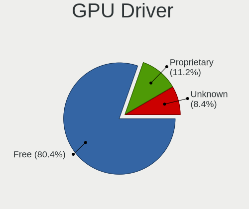

| Driver      | Computers | Percent |
|-------------|-----------|---------|
| Free        | 1159      | 80.99%  |
| Proprietary | 160       | 11.18%  |
| Unknown     | 112       | 7.83%   |

GPU Memory
----------

Total video memory

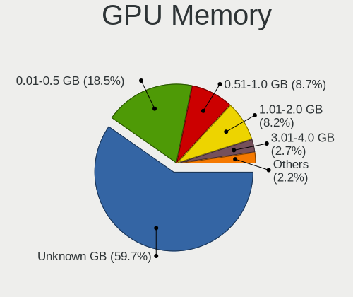

| Size in GB | Computers | Percent |
|------------|-----------|---------|
| Unknown    | 847       | 58.78%  |
| 0.01-0.5   | 260       | 18.04%  |
| 1.01-2.0   | 129       | 8.95%   |
| 0.51-1.0   | 128       | 8.88%   |
| 3.01-4.0   | 41        | 2.85%   |
| 7.01-8.0   | 23        | 1.6%    |
| 5.01-6.0   | 9         | 0.62%   |
| 2.01-3.0   | 3         | 0.21%   |
| 4.01-5.0   | 1         | 0.07%   |

Monitor
-------

Monitor Vendor
--------------

Monitor vendors

| Vendor                  | Computers | Percent |
|-------------------------|-----------|---------|
| Samsung Electronics     | 202       | 15.15%  |
| AU Optronics            | 170       | 12.75%  |
| LG Display              | 135       | 10.13%  |
| Chimei Innolux          | 86        | 6.45%   |
| BOE                     | 77        | 5.78%   |
| Goldstar                | 58        | 4.35%   |
| Dell                    | 58        | 4.35%   |
| Hewlett-Packard         | 45        | 3.38%   |
| Chi Mei Optoelectronics | 45        | 3.38%   |
| Acer                    | 38        | 2.85%   |
| LG Philips              | 33        | 2.48%   |
| AOC                     | 28        | 2.1%    |
| Apple                   | 25        | 1.88%   |
| Ancor Communications    | 22        | 1.65%   |
| InfoVision              | 21        | 1.58%   |
| Philips                 | 20        | 1.5%    |
| Lenovo                  | 18        | 1.35%   |
| BenQ                    | 17        | 1.28%   |
| ViewSonic               | 14        | 1.05%   |
| Unknown                 | 14        | 1.05%   |
| Toshiba                 | 14        | 1.05%   |
| LG Electronics          | 12        | 0.9%    |
| HannStar                | 12        | 0.9%    |
| Sharp                   | 10        | 0.75%   |
| CPT                     | 8         | 0.6%    |
| Sony                    | 7         | 0.53%   |
| Vizio                   | 6         | 0.45%   |
| Quanta Display          | 6         | 0.45%   |
| Iiyama                  | 6         | 0.45%   |
| Eizo                    | 6         | 0.45%   |
| Seiko/Epson             | 5         | 0.38%   |
| PANDA                   | 5         | 0.38%   |
| InnoLux Display         | 5         | 0.38%   |
| NEC Computers           | 4         | 0.3%    |
| LGD                     | 4         | 0.3%    |
| Insignia                | 4         | 0.3%    |
| Gateway                 | 4         | 0.3%    |
| CVT                     | 4         | 0.3%    |
| ___                     | 3         | 0.23%   |
| VIZ                     | 3         | 0.23%   |
| Sceptre Tech            | 3         | 0.23%   |
| Nvidia                  | 3         | 0.23%   |
| MSI                     | 3         | 0.23%   |
| KTC                     | 3         | 0.23%   |
| Idek Iiyama             | 3         | 0.23%   |
| Fujitsu Siemens         | 3         | 0.23%   |
| ASUSTek Computer        | 3         | 0.23%   |
| TCL                     | 2         | 0.15%   |
| SKY                     | 2         | 0.15%   |
| Sanyo                   | 2         | 0.15%   |
| Panasonic               | 2         | 0.15%   |
| Medion                  | 2         | 0.15%   |
| Envision                | 2         | 0.15%   |
| Daewoo                  | 2         | 0.15%   |
| CHR                     | 2         | 0.15%   |
| Xiaomi                  | 1         | 0.08%   |
| Vita                    | 1         | 0.08%   |
| Vestel Elektronik       | 1         | 0.08%   |
| Vestel                  | 1         | 0.08%   |
| UTV                     | 1         | 0.08%   |

Monitor Model
-------------

Monitor models

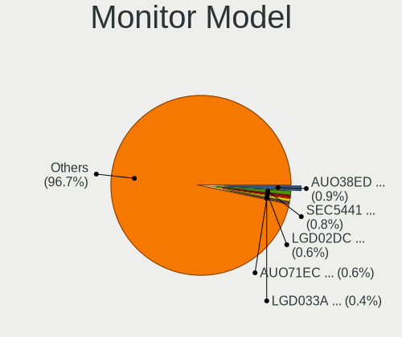

| Model                                                                    | Computers | Percent |
|--------------------------------------------------------------------------|-----------|---------|
| Samsung Electronics LCD Monitor SEC5441 1366x768 344x194mm 15.5-inch     | 13        | 0.95%   |
| AU Optronics LCD Monitor AUO38ED 1920x1080 340x190mm 15.3-inch           | 13        | 0.95%   |
| AU Optronics LCD Monitor AUO71EC 1366x768 340x190mm 15.3-inch            | 8         | 0.58%   |
| LG Display LCD Monitor LGD033A 1366x768 340x190mm 15.3-inch              | 7         | 0.51%   |
| LG Display LCD Monitor LGD02DC 1366x768 344x194mm 15.5-inch              | 7         | 0.51%   |
| HannStar LCD Monitor HSD03E9 1024x600 220x129mm 10.0-inch                | 7         | 0.51%   |
| InfoVision LCD Monitor IVO03F4 1920x1200 263x164mm 12.2-inch             | 6         | 0.44%   |
| Chimei Innolux LCD Monitor CMN15DB 1366x768 344x193mm 15.5-inch          | 6         | 0.44%   |
| AU Optronics LCD Monitor AUO123D 1920x1080 309x173mm 13.9-inch           | 6         | 0.44%   |
| Samsung Electronics LCD Monitor SEC3633 1280x800 331x207mm 15.4-inch     | 5         | 0.37%   |
| LG Philips LCD Monitor LPLDB00 1280x800 331x207mm 15.4-inch              | 5         | 0.37%   |
| LG Display LCD Monitor LGD046F 1920x1080 344x194mm 15.5-inch             | 5         | 0.37%   |
| LG Display LCD Monitor LGD02E9 1366x768 309x174mm 14.0-inch              | 5         | 0.37%   |
| Lenovo LCD Monitor LEN40B1 1600x900 344x194mm 15.5-inch                  | 5         | 0.37%   |
| Chi Mei Optoelectronics LCD Monitor CMO1007 1024x600 222x125mm 10.0-inch | 5         | 0.37%   |
| BOE LCD Monitor BOE06A5 1366x768 344x194mm 15.5-inch                     | 5         | 0.37%   |
| AU Optronics LCD Monitor AUO20EC 1366x768 344x193mm 15.5-inch            | 5         | 0.37%   |
| Samsung Electronics LCD Monitor SEC544B 1600x900 382x214mm 17.2-inch     | 4         | 0.29%   |
| Samsung Electronics LCD Monitor SDC4347 1366x768 340x190mm 15.3-inch     | 4         | 0.29%   |
| Philips PHL 242M8 PHLC253 1920x1080 527x296mm 23.8-inch                  | 4         | 0.29%   |
| InfoVision LCD Monitor IVO0489 1366x768 260x140mm 11.6-inch              | 4         | 0.29%   |
| Chimei Innolux LCD Monitor CMN1490 1366x768 309x173mm 13.9-inch          | 4         | 0.29%   |
| BOE LCD Monitor BOE06A4 1366x768 344x194mm 15.5-inch                     | 4         | 0.29%   |
| AU Optronics LCD Monitor AUO61ED 1920x1080 340x190mm 15.3-inch           | 4         | 0.29%   |
| AU Optronics LCD Monitor AUO61D2 1024x600 220x130mm 10.1-inch            | 4         | 0.29%   |
| AU Optronics LCD Monitor AUO235C 1366x768 260x140mm 11.6-inch            | 4         | 0.29%   |
| AU Optronics LCD Monitor AUO21ED 1920x1080 344x194mm 15.5-inch           | 4         | 0.29%   |
| AU Optronics LCD Monitor AUO21EC 1366x768 340x190mm 15.3-inch            | 4         | 0.29%   |
| AU Optronics LCD Monitor AUO193C 1366x768 309x173mm 13.9-inch            | 4         | 0.29%   |
| AU Optronics LCD Monitor AUO10EC 1366x768 340x190mm 15.3-inch            | 4         | 0.29%   |
| Samsung Electronics LCD Monitor SEC5541 1366x768 344x193mm 15.5-inch     | 3         | 0.22%   |
| Samsung Electronics LCD Monitor SEC5442 1440x900 367x230mm 17.1-inch     | 3         | 0.22%   |
| Samsung Electronics LCD Monitor SEC4E45 1280x800 331x207mm 15.4-inch     | 3         | 0.22%   |
| Samsung Electronics LCD Monitor SEC4351 1366x768 344x194mm 15.5-inch     | 3         | 0.22%   |
| Samsung Electronics LCD Monitor SEC3150 1366x768 344x193mm 15.5-inch     | 3         | 0.22%   |
| Samsung Electronics LCD Monitor SAM07C0 1920x1080 700x390mm 31.5-inch    | 3         | 0.22%   |
| LG Philips LCD Monitor LPLBC00 1280x800 331x207mm 15.4-inch              | 3         | 0.22%   |
| LG Display LCD Monitor LGD03AB 1366x768 344x194mm 15.5-inch              | 3         | 0.22%   |
| LG Display LCD Monitor LGD02F2 1366x768 344x194mm 15.5-inch              | 3         | 0.22%   |
| LG Display LCD Monitor LGD0250 1366x768 345x194mm 15.6-inch              | 3         | 0.22%   |
| Lenovo LCD Monitor LEN40B0 1366x768 344x194mm 15.5-inch                  | 3         | 0.22%   |
| InfoVision M140NWR2 R1 IVO057A 1366x768 309x174mm 14.0-inch              | 3         | 0.22%   |
| Hewlett-Packard 2009 HWP2827 1600x900 442x249mm 20.0-inch                | 3         | 0.22%   |
| Goldstar HD GSM5ACB 1366x768 410x230mm 18.5-inch                         | 3         | 0.22%   |
| Chimei Innolux LCD Monitor CMN15E6 1366x768 344x193mm 15.5-inch          | 3         | 0.22%   |
| Chimei Innolux LCD Monitor CMN15D5 1920x1080 340x190mm 15.3-inch         | 3         | 0.22%   |
| Chimei Innolux LCD Monitor CMN15AB 1366x768 350x190mm 15.7-inch          | 3         | 0.22%   |
| Chimei Innolux LCD Monitor CMN14D4 1920x1080 309x173mm 13.9-inch         | 3         | 0.22%   |
| Chimei Innolux LCD Monitor CMN1487 1366x768 310x170mm 13.9-inch          | 3         | 0.22%   |
| Chi Mei Optoelectronics LCD Monitor CMO1719 1600x900 382x215mm 17.3-inch | 3         | 0.22%   |
| Chi Mei Optoelectronics LCD Monitor CMO15A7 1366x768 350x190mm 15.7-inch | 3         | 0.22%   |
| Chi Mei Optoelectronics LCD Monitor CMO1526 1280x800 331x207mm 15.4-inch | 3         | 0.22%   |
| BOE LCD Monitor BOE0812 1920x1080 344x194mm 15.5-inch                    | 3         | 0.22%   |
| BOE LCD Monitor BOE0731 1366x768 256x144mm 11.6-inch                     | 3         | 0.22%   |
| BOE LCD Monitor BOE0687 1920x1080 344x193mm 15.5-inch                    | 3         | 0.22%   |
| BOE LCD Monitor BOE0672 1366x768 344x194mm 15.5-inch                     | 3         | 0.22%   |
| AU Optronics LCD Monitor AUO733C 1366x768 309x173mm 13.9-inch            | 3         | 0.22%   |
| AU Optronics LCD Monitor AUO492D 1920x1080 293x165mm 13.2-inch           | 3         | 0.22%   |
| AU Optronics LCD Monitor AUO31D2 1024x600 223x125mm 10.1-inch            | 3         | 0.22%   |
| AU Optronics LCD Monitor AUO313C 1366x768 310x170mm 13.9-inch            | 3         | 0.22%   |

Monitor Resolution
------------------

Monitor screen resolution

| Resolution         | Computers | Percent |
|--------------------|-----------|---------|
| 1366x768 (WXGA)    | 407       | 30.83%  |
| 1920x1080 (FHD)    | 378       | 28.64%  |
| 1280x800 (WXGA)    | 93        | 7.05%   |
| 1600x900 (HD+)     | 87        | 6.59%   |
| 1280x1024 (SXGA)   | 53        | 4.02%   |
| 1440x900 (WXGA+)   | 52        | 3.94%   |
| 3840x2160 (4K)     | 32        | 2.42%   |
| 1024x600           | 31        | 2.35%   |
| 1680x1050 (WSXGA+) | 30        | 2.27%   |
| 1920x1200 (WUXGA)  | 25        | 1.89%   |
| 1360x768           | 23        | 1.74%   |
| 2560x1440 (QHD)    | 16        | 1.21%   |
| Unknown            | 16        | 1.21%   |
| 1024x768 (XGA)     | 9         | 0.68%   |
| 3840x1080          | 6         | 0.45%   |
| 1280x768           | 6         | 0.45%   |
| 3440x1440          | 5         | 0.38%   |
| 2560x1600          | 5         | 0.38%   |
| 1920x540           | 5         | 0.38%   |
| 5760x1080          | 4         | 0.3%    |
| 2560x1080          | 3         | 0.23%   |
| 2048x1152          | 3         | 0.23%   |
| 5760x2160          | 2         | 0.15%   |
| 3200x1080          | 2         | 0.15%   |
| 1600x1200          | 2         | 0.15%   |
| 1400x1050          | 2         | 0.15%   |
| 1280x720 (HD)      | 2         | 0.15%   |
| 1152x864           | 2         | 0.15%   |
| 1024x576           | 2         | 0.15%   |
| 7680x1080          | 1         | 0.08%   |
| 6400x1440          | 1         | 0.08%   |
| 6400x1080          | 1         | 0.08%   |
| 5440x1080          | 1         | 0.08%   |
| 4480x1440          | 1         | 0.08%   |
| 3840x1200          | 1         | 0.08%   |
| 3600x1080          | 1         | 0.08%   |
| 3200x1800 (QHD+)   | 1         | 0.08%   |
| 2880x1800          | 1         | 0.08%   |
| 2736x1824          | 1         | 0.08%   |
| 2646x768           | 1         | 0.08%   |
| 2390x899           | 1         | 0.08%   |
| 2288x1287          | 1         | 0.08%   |
| 2160x1440          | 1         | 0.08%   |
| 1680x945           | 1         | 0.08%   |
| 1360x765           | 1         | 0.08%   |
| 1280x960           | 1         | 0.08%   |

Monitor Diagonal
----------------

Diagonal size in inches

| Inches  | Computers | Percent |
|---------|-----------|---------|
| 15      | 393       | 29.62%  |
| Unknown | 120       | 9.04%   |
| 14      | 101       | 7.61%   |
| 13      | 101       | 7.61%   |
| 17      | 97        | 7.31%   |
| 23      | 54        | 4.07%   |
| 21      | 52        | 3.92%   |
| 27      | 45        | 3.39%   |
| 18      | 45        | 3.39%   |
| 24      | 41        | 3.09%   |
| 19      | 41        | 3.09%   |
| 11      | 36        | 2.71%   |
| 10      | 34        | 2.56%   |
| 20      | 29        | 2.19%   |
| 12      | 23        | 1.73%   |
| 22      | 18        | 1.36%   |
| 31      | 14        | 1.06%   |
| 72      | 9         | 0.68%   |
| 40      | 9         | 0.68%   |
| 34      | 8         | 0.6%    |
| 26      | 8         | 0.6%    |
| 84      | 6         | 0.45%   |
| 54      | 3         | 0.23%   |
| 32      | 3         | 0.23%   |
| 29      | 3         | 0.23%   |
| 8       | 3         | 0.23%   |
| 74      | 2         | 0.15%   |
| 65      | 2         | 0.15%   |
| 52      | 2         | 0.15%   |
| 49      | 2         | 0.15%   |
| 46      | 2         | 0.15%   |
| 44      | 2         | 0.15%   |
| 42      | 2         | 0.15%   |
| 39      | 2         | 0.15%   |
| 33      | 2         | 0.15%   |
| 16      | 2         | 0.15%   |
| 60      | 1         | 0.08%   |
| 59      | 1         | 0.08%   |
| 58      | 1         | 0.08%   |
| 55      | 1         | 0.08%   |
| 47      | 1         | 0.08%   |
| 43      | 1         | 0.08%   |
| 41      | 1         | 0.08%   |
| 37      | 1         | 0.08%   |
| 36      | 1         | 0.08%   |
| 30      | 1         | 0.08%   |
| 28      | 1         | 0.08%   |

Monitor Width
-------------

Physical width

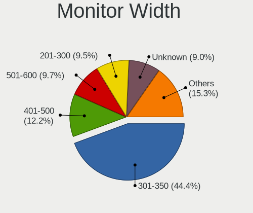

| Width in mm | Computers | Percent |
|-------------|-----------|---------|
| 301-350     | 564       | 42.82%  |
| 401-500     | 159       | 12.07%  |
| 501-600     | 143       | 10.86%  |
| 201-300     | 130       | 9.87%   |
| Unknown     | 120       | 9.11%   |
| 351-400     | 114       | 8.66%   |
| 601-700     | 19        | 1.44%   |
| 1501-2000   | 17        | 1.29%   |
| 1001-1500   | 16        | 1.21%   |
| 701-800     | 14        | 1.06%   |
| 801-900     | 12        | 0.91%   |
| 901-1000    | 6         | 0.46%   |
| 101-200     | 3         | 0.23%   |

Aspect Ratio
------------

Proportional relationship between the width and the height

| Ratio   | Computers | Percent |
|---------|-----------|---------|
| 16/9    | 871       | 69.62%  |
| 16/10   | 192       | 15.35%  |
| Unknown | 104       | 8.31%   |
| 5/4     | 49        | 3.92%   |
| 4/3     | 17        | 1.36%   |
| 21/9    | 8         | 0.64%   |
| 32/9    | 4         | 0.32%   |
| 3/2     | 4         | 0.32%   |
| 6/5     | 2         | 0.16%   |

Monitor Area
------------

Area in inch

| Area in inch | Computers | Percent |
|----------------|-----------|---------|
| 101-110        | 390       | 29.57%  |
| 81-90          | 169       | 12.81%  |
| 201-250        | 120       | 9.1%    |
| Unknown        | 120       | 9.1%    |
| 151-200        | 100       | 7.58%   |
| 141-150        | 61        | 4.62%   |
| 301-350        | 46        | 3.49%   |
| 121-130        | 40        | 3.03%   |
| 51-60          | 36        | 2.73%   |
| 41-50          | 34        | 2.58%   |
| 131-140        | 33        | 2.5%    |
| 351-500        | 32        | 2.43%   |
| 71-80          | 29        | 2.2%    |
| More than 1000 | 28        | 2.12%   |
| 251-300        | 26        | 1.97%   |
| 501-1000       | 24        | 1.82%   |
| 61-70          | 21        | 1.59%   |
| 91-100         | 5         | 0.38%   |
| 1-40           | 3         | 0.23%   |
| 111-120        | 2         | 0.15%   |

Pixel Density
-------------

Pixels per inch

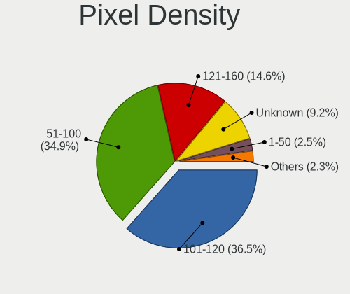

| Density       | Computers | Percent |
|---------------|-----------|---------|
| 101-120       | 459       | 35.42%  |
| 51-100        | 449       | 34.65%  |
| 121-160       | 205       | 15.82%  |
| Unknown       | 120       | 9.26%   |
| 161-240       | 30        | 2.31%   |
| 1-50          | 29        | 2.24%   |
| More than 240 | 4         | 0.31%   |

Multiple Monitors
-----------------

Total monitors connected

| Total | Computers | Percent |
|-------|-----------|---------|
| 1     | 1198      | 82.73%  |
| 2     | 123       | 8.49%   |
| 0     | 114       | 7.87%   |
| 3     | 12        | 0.83%   |
| 4     | 1         | 0.07%   |

Network
-------

Net Controller Vendor
---------------------

Controller vendors

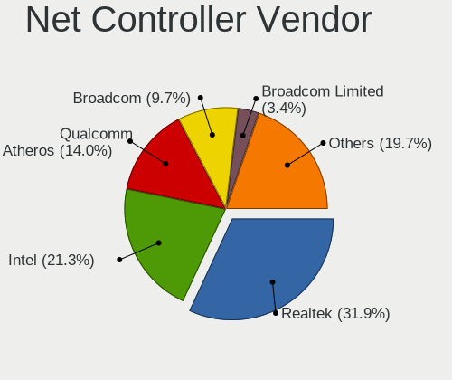

| Vendor                                 | Computers | Percent |
|----------------------------------------|-----------|---------|
| Realtek Semiconductor                  | 747       | 32.65%  |
| Intel                                  | 499       | 21.81%  |
| Qualcomm Atheros                       | 330       | 14.42%  |
| Broadcom                               | 209       | 9.13%   |
| Broadcom Limited                       | 68        | 2.97%   |
| Nvidia                                 | 54        | 2.36%   |
| Marvell Technology Group               | 53        | 2.32%   |
| Ralink Technology                      | 43        | 1.88%   |
| Ralink                                 | 32        | 1.4%    |
| Silicon Integrated Systems [SiS]       | 22        | 0.96%   |
| TP-Link                                | 18        | 0.79%   |
| D-Link                                 | 17        | 0.74%   |
| VIA Technologies                       | 16        | 0.7%    |
| Samsung Electronics                    | 13        | 0.57%   |
| Xiaomi                                 | 11        | 0.48%   |
| NetGear                                | 11        | 0.48%   |
| D-Link System                          | 11        | 0.48%   |
| JMicron Technology                     | 10        | 0.44%   |
| ASUSTek Computer                       | 9         | 0.39%   |
| Qualcomm Atheros Communications        | 8         | 0.35%   |
| MediaTek                               | 8         | 0.35%   |
| Huawei Technologies                    | 7         | 0.31%   |
| Edimax Technology                      | 7         | 0.31%   |
| ASIX Electronics                       | 7         | 0.31%   |
| Sierra Wireless                        | 6         | 0.26%   |
| AMD                                    | 6         | 0.26%   |
| Motorola PCS                           | 5         | 0.22%   |
| Dell                                   | 5         | 0.22%   |
| OPPO                                   | 4         | 0.17%   |
| Micro Star International               | 4         | 0.17%   |
| Hewlett-Packard                        | 4         | 0.17%   |
| Sitecom Europe                         | 3         | 0.13%   |
| Linksys                                | 3         | 0.13%   |
| DisplayLink                            | 3         | 0.13%   |
| Davicom Semiconductor                  | 3         | 0.13%   |
| Attansic Technology                    | 3         | 0.13%   |
| Aquantia                               | 3         | 0.13%   |
| ZTE WCDMA Technologies MSM             | 2         | 0.09%   |
| Qualcomm                               | 2         | 0.09%   |
| Microsoft                              | 2         | 0.09%   |
| Belkin Components                      | 2         | 0.09%   |
| Apple                                  | 2         | 0.09%   |
| 802.11g Adapter [Linksys WUSB54GC v3]  | 2         | 0.09%   |
| ZyDAS                                  | 1         | 0.04%   |
| T & A Mobile Phones                    | 1         | 0.04%   |
| Sundance Technology Inc / IC Plus      | 1         | 0.04%   |
| Sony Ericsson Mobile Communications AB | 1         | 0.04%   |
| Senao                                  | 1         | 0.04%   |
| Philips (or NXP)                       | 1         | 0.04%   |
| Motorola                               | 1         | 0.04%   |
| Microchip Technology                   | 1         | 0.04%   |
| IMC Networks                           | 1         | 0.04%   |
| Gemtek                                 | 1         | 0.04%   |
| GCT Semiconductor                      | 1         | 0.04%   |
| Ericsson Business Mobile Networks      | 1         | 0.04%   |
| Comneon                                | 1         | 0.04%   |
| 3Com                                   | 1         | 0.04%   |

Net Controller Model
--------------------

Controller models

| Model                                                                   | Computers | Percent |
|-------------------------------------------------------------------------|-----------|---------|
| Realtek RTL8111/8168/8411 PCI Express Gigabit Ethernet Controller       | 429       | 16.1%   |
| Realtek RTL810xE PCI Express Fast Ethernet controller                   | 173       | 6.49%   |
| Qualcomm Atheros AR9285 Wireless Network Adapter (PCI-Express)          | 60        | 2.25%   |
| Intel 82579LM Gigabit Network Connection (Lewisville)                   | 50        | 1.88%   |
| Qualcomm Atheros AR9485 Wireless Network Adapter                        | 44        | 1.65%   |
| Qualcomm Atheros QCA9565 / AR9565 Wireless Network Adapter              | 40        | 1.5%    |
| Intel PRO/Wireless 3945ABG [Golan] Network Connection                   | 39        | 1.46%   |
| Intel Wireless 7260                                                     | 37        | 1.39%   |
| Qualcomm Atheros QCA9377 802.11ac Wireless Network Adapter              | 36        | 1.35%   |
| Realtek RTL8821CE 802.11ac PCIe Wireless Network Adapter                | 34        | 1.28%   |
| Broadcom BCM4313 802.11bgn Wireless Network Adapter                     | 33        | 1.24%   |
| Qualcomm Atheros AR242x / AR542x Wireless Network Adapter (PCI-Express) | 32        | 1.2%    |
| Realtek RTL-8100/8101L/8139 PCI Fast Ethernet Adapter                   | 30        | 1.13%   |
| Broadcom BCM4312 802.11b/g LP-PHY                                       | 28        | 1.05%   |
| Realtek RTL8723BE PCIe Wireless Network Adapter                         | 24        | 0.9%    |
| Realtek 802.11ac NIC                                                    | 24        | 0.9%    |
| Intel Ethernet Connection I217-LM                                       | 24        | 0.9%    |
| Intel Wireless 3165                                                     | 23        | 0.86%   |
| Realtek RTL8188CE 802.11b/g/n WiFi Adapter                              | 22        | 0.83%   |
| Realtek RTL8188EUS 802.11n Wireless Network Adapter                     | 21        | 0.79%   |
| Ralink MT7601U Wireless Adapter                                         | 20        | 0.75%   |
| Nvidia MCP61 Ethernet                                                   | 20        | 0.75%   |
| Intel Wireless 8265 / 8275                                              | 20        | 0.75%   |
| Intel Centrino Advanced-N 6205 [Taylor Peak]                            | 19        | 0.71%   |
| Silicon Integrated Systems [SiS] 191 Gigabit Ethernet Adapter           | 17        | 0.64%   |
| Intel Wireless 7265                                                     | 17        | 0.64%   |
| Intel WiFi Link 5100                                                    | 17        | 0.64%   |
| Qualcomm Atheros AR8132 Fast Ethernet                                   | 16        | 0.6%    |
| Broadcom BCM43142 802.11b/g/n                                           | 16        | 0.6%    |
| Intel Wi-Fi 6 AX200                                                     | 15        | 0.56%   |
| Intel PRO/Wireless 4965 AG or AGN [Kedron] Network Connection           | 14        | 0.53%   |
| Broadcom BCM4311 802.11b/g WLAN                                         | 14        | 0.53%   |
| Intel Wireless 8260                                                     | 13        | 0.49%   |
| Intel Wireless 3160                                                     | 13        | 0.49%   |
| Intel Ethernet Connection I218-LM                                       | 13        | 0.49%   |
| Intel 82801FB/FBM/FR/FW/FRW (ICH6 Family) AC'97 Modem Controller        | 13        | 0.49%   |
| Intel 82579V Gigabit Network Connection                                 | 13        | 0.49%   |
| VIA VT6102/VT6103 [Rhine-II]                                            | 12        | 0.45%   |
| Realtek RTL8153 Gigabit Ethernet Adapter                                | 12        | 0.45%   |
| Intel Centrino Wireless-N 2230                                          | 12        | 0.45%   |
| Intel Centrino Wireless-N 1000 [Condor Peak]                            | 12        | 0.45%   |
| Broadcom BCM4401-B0 100Base-TX                                          | 12        | 0.45%   |
| Intel I211 Gigabit Network Connection                                   | 11        | 0.41%   |
| Intel Cannon Lake PCH CNVi WiFi                                         | 11        | 0.41%   |
| Intel 82567LM-3 Gigabit Network Connection                              | 11        | 0.41%   |
| Broadcom BCM4318 [AirForce One 54g] 802.11g Wireless LAN Controller     | 11        | 0.41%   |
| Realtek RTL8822CE 802.11ac PCIe Wireless Network Adapter                | 10        | 0.38%   |
| Realtek RTL8191SEvB Wireless LAN Controller                             | 10        | 0.38%   |
| Qualcomm Atheros QCA6174 802.11ac Wireless Network Adapter              | 10        | 0.38%   |
| Qualcomm Atheros AR8152 v1.1 Fast Ethernet                              | 10        | 0.38%   |
| Qualcomm Atheros AR8151 v2.0 Gigabit Ethernet                           | 10        | 0.38%   |
| Intel Centrino Ultimate-N 6300                                          | 10        | 0.38%   |
| Intel 82567LM Gigabit Network Connection                                | 10        | 0.38%   |
| Broadcom Limited BCM4312 802.11b/g LP-PHY                               | 10        | 0.38%   |
| Realtek RTL8723DE Wireless Network Adapter                              | 9         | 0.34%   |
| Qualcomm Atheros AR9462 Wireless Network Adapter                        | 9         | 0.34%   |
| Qualcomm Atheros AR8121/AR8113/AR8114 Gigabit or Fast Ethernet          | 9         | 0.34%   |
| Marvell Group 88E8040 PCI-E Fast Ethernet Controller                    | 9         | 0.34%   |
| Intel 82577LM Gigabit Network Connection                                | 9         | 0.34%   |
| Intel 82566DM-2 Gigabit Network Connection                              | 9         | 0.34%   |

Wireless Vendor
---------------

Wireless vendors

| Vendor                                | Computers | Percent |
|---------------------------------------|-----------|---------|
| Intel                                 | 351       | 28.54%  |
| Qualcomm Atheros                      | 263       | 21.38%  |
| Realtek Semiconductor                 | 236       | 19.19%  |
| Broadcom                              | 143       | 11.63%  |
| Broadcom Limited                      | 46        | 3.74%   |
| Ralink Technology                     | 43        | 3.5%    |
| Ralink                                | 32        | 2.6%    |
| TP-Link                               | 17        | 1.38%   |
| D-Link                                | 17        | 1.38%   |
| NetGear                               | 10        | 0.81%   |
| D-Link System                         | 10        | 0.81%   |
| Qualcomm Atheros Communications       | 8         | 0.65%   |
| ASUSTek Computer                      | 8         | 0.65%   |
| Edimax Technology                     | 7         | 0.57%   |
| Sierra Wireless                       | 6         | 0.49%   |
| Micro Star International              | 4         | 0.33%   |
| Sitecom Europe                        | 3         | 0.24%   |
| MEDIATEK                              | 3         | 0.24%   |
| Marvell Technology Group              | 3         | 0.24%   |
| Linksys                               | 3         | 0.24%   |
| Microsoft                             | 2         | 0.16%   |
| Hewlett-Packard                       | 2         | 0.16%   |
| Dell                                  | 2         | 0.16%   |
| Belkin Components                     | 2         | 0.16%   |
| 802.11g Adapter [Linksys WUSB54GC v3] | 2         | 0.16%   |
| ZyDAS                                 | 1         | 0.08%   |
| Xiaomi                                | 1         | 0.08%   |
| Senao                                 | 1         | 0.08%   |
| Philips (or NXP)                      | 1         | 0.08%   |
| IMC Networks                          | 1         | 0.08%   |
| Gemtek                                | 1         | 0.08%   |
| Comneon                               | 1         | 0.08%   |

Wireless Model
--------------

Wireless models

| Model                                                                       | Computers | Percent |
|-----------------------------------------------------------------------------|-----------|---------|
| Qualcomm Atheros AR9285 Wireless Network Adapter (PCI-Express)              | 60        | 4.84%   |
| Qualcomm Atheros AR9485 Wireless Network Adapter                            | 44        | 3.55%   |
| Qualcomm Atheros QCA9565 / AR9565 Wireless Network Adapter                  | 40        | 3.23%   |
| Intel PRO/Wireless 3945ABG [Golan] Network Connection                       | 39        | 3.15%   |
| Intel Wireless 7260                                                         | 37        | 2.98%   |
| Qualcomm Atheros QCA9377 802.11ac Wireless Network Adapter                  | 36        | 2.9%    |
| Realtek RTL8821CE 802.11ac PCIe Wireless Network Adapter                    | 34        | 2.74%   |
| Broadcom BCM4313 802.11bgn Wireless Network Adapter                         | 33        | 2.66%   |
| Qualcomm Atheros AR242x / AR542x Wireless Network Adapter (PCI-Express)     | 32        | 2.58%   |
| Broadcom BCM4312 802.11b/g LP-PHY                                           | 28        | 2.26%   |
| Realtek RTL8723BE PCIe Wireless Network Adapter                             | 24        | 1.94%   |
| Realtek 802.11ac NIC                                                        | 24        | 1.94%   |
| Intel Wireless 3165                                                         | 23        | 1.85%   |
| Realtek RTL8188CE 802.11b/g/n WiFi Adapter                                  | 22        | 1.77%   |
| Realtek RTL8188EUS 802.11n Wireless Network Adapter                         | 21        | 1.69%   |
| Ralink MT7601U Wireless Adapter                                             | 20        | 1.61%   |
| Intel Wireless 8265 / 8275                                                  | 20        | 1.61%   |
| Intel Centrino Advanced-N 6205 [Taylor Peak]                                | 19        | 1.53%   |
| Intel Wireless 7265                                                         | 17        | 1.37%   |
| Intel WiFi Link 5100                                                        | 17        | 1.37%   |
| Broadcom BCM43142 802.11b/g/n                                               | 16        | 1.29%   |
| Intel Wi-Fi 6 AX200                                                         | 15        | 1.21%   |
| Intel PRO/Wireless 4965 AG or AGN [Kedron] Network Connection               | 14        | 1.13%   |
| Broadcom BCM4311 802.11b/g WLAN                                             | 14        | 1.13%   |
| Intel Wireless 8260                                                         | 13        | 1.05%   |
| Intel Wireless 3160                                                         | 13        | 1.05%   |
| Intel Centrino Wireless-N 2230                                              | 12        | 0.97%   |
| Intel Centrino Wireless-N 1000 [Condor Peak]                                | 12        | 0.97%   |
| Intel Cannon Lake PCH CNVi WiFi                                             | 11        | 0.89%   |
| Broadcom BCM4318 [AirForce One 54g] 802.11g Wireless LAN Controller         | 11        | 0.89%   |
| Realtek RTL8822CE 802.11ac PCIe Wireless Network Adapter                    | 10        | 0.81%   |
| Realtek RTL8191SEvB Wireless LAN Controller                                 | 10        | 0.81%   |
| Qualcomm Atheros QCA6174 802.11ac Wireless Network Adapter                  | 10        | 0.81%   |
| Intel Centrino Ultimate-N 6300                                              | 10        | 0.81%   |
| Broadcom Limited BCM4312 802.11b/g LP-PHY                                   | 10        | 0.81%   |
| Realtek RTL8723DE Wireless Network Adapter                                  | 9         | 0.73%   |
| Qualcomm Atheros AR9462 Wireless Network Adapter                            | 9         | 0.73%   |
| Realtek RTL8188FTV 802.11b/g/n 1T1R 2.4G WLAN Adapter                       | 8         | 0.65%   |
| Realtek RTL8188EE Wireless Network Adapter                                  | 8         | 0.65%   |
| Realtek RTL8187B Wireless 802.11g 54Mbps Network Adapter                    | 8         | 0.65%   |
| Ralink RT2870/RT3070 Wireless Adapter                                       | 8         | 0.65%   |
| Ralink RT3090 Wireless 802.11n 1T/1R PCIe                                   | 8         | 0.65%   |
| Qualcomm Atheros AR9271 802.11n                                             | 8         | 0.65%   |
| Qualcomm Atheros AR928X Wireless Network Adapter (PCI-Express)              | 8         | 0.65%   |
| Intel PRO/Wireless 5100 AGN [Shiloh] Network Connection                     | 8         | 0.65%   |
| Intel PRO/Wireless 2200BG [Calexico2] Network Connection                    | 8         | 0.65%   |
| Intel Dual Band Wireless-AC 3168NGW [Stone Peak]                            | 8         | 0.65%   |
| TP-Link TL-WN823N v2/v3 [Realtek RTL8192EU]                                 | 7         | 0.56%   |
| Realtek RTL8822BE 802.11a/b/g/n/ac WiFi adapter                             | 7         | 0.56%   |
| Ralink RT3290 Wireless 802.11n 1T/1R PCIe                                   | 7         | 0.56%   |
| Intel Centrino Advanced-N 6235                                              | 7         | 0.56%   |
| Broadcom Limited BCM4318 [AirForce One 54g] 802.11g Wireless LAN Controller | 7         | 0.56%   |
| Broadcom BCM4322 802.11a/b/g/n Wireless LAN Controller                      | 7         | 0.56%   |
| Realtek RTL8723BU 802.11b/g/n WLAN Adapter                                  | 6         | 0.48%   |
| Qualcomm Atheros AR9287 Wireless Network Adapter (PCI-Express)              | 6         | 0.48%   |
| Edimax EW-7811Un 802.11n Wireless Adapter [Realtek RTL8188CUS]              | 6         | 0.48%   |
| Broadcom Limited BCM4360 802.11ac Wireless Network Adapter                  | 6         | 0.48%   |
| Broadcom BCM4360 802.11ac Wireless Network Adapter                          | 6         | 0.48%   |
| Realtek RTL8811AU 802.11a/b/g/n/ac WLAN Adapter                             | 5         | 0.4%    |
| Realtek RTL8192CU 802.11n WLAN Adapter                                      | 5         | 0.4%    |

Ethernet Vendor
---------------

Ethernet vendors

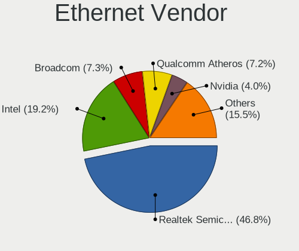

| Vendor                                 | Computers | Percent |
|----------------------------------------|-----------|---------|
| Realtek Semiconductor                  | 656       | 47.88%  |
| Intel                                  | 271       | 19.78%  |
| Qualcomm Atheros                       | 102       | 7.45%   |
| Broadcom                               | 91        | 6.64%   |
| Nvidia                                 | 54        | 3.94%   |
| Marvell Technology Group               | 50        | 3.65%   |
| Broadcom Limited                       | 25        | 1.82%   |
| Silicon Integrated Systems [SiS]       | 21        | 1.53%   |
| VIA Technologies                       | 16        | 1.17%   |
| Samsung Electronics                    | 12        | 0.88%   |
| Xiaomi                                 | 10        | 0.73%   |
| JMicron Technology                     | 10        | 0.73%   |
| ASIX Electronics                       | 7         | 0.51%   |
| Huawei Technologies                    | 6         | 0.44%   |
| MediaTek                               | 5         | 0.36%   |
| OPPO                                   | 4         | 0.29%   |
| Motorola PCS                           | 4         | 0.29%   |
| DisplayLink                            | 3         | 0.22%   |
| Davicom Semiconductor                  | 3         | 0.22%   |
| Attansic Technology                    | 3         | 0.22%   |
| Aquantia                               | 3         | 0.22%   |
| Qualcomm                               | 2         | 0.15%   |
| Apple                                  | 2         | 0.15%   |
| ZTE WCDMA Technologies MSM             | 1         | 0.07%   |
| TP-Link                                | 1         | 0.07%   |
| T & A Mobile Phones                    | 1         | 0.07%   |
| Sundance Technology Inc / IC Plus      | 1         | 0.07%   |
| Sony Ericsson Mobile Communications AB | 1         | 0.07%   |
| NetGear                                | 1         | 0.07%   |
| GCT Semiconductor                      | 1         | 0.07%   |
| D-Link System                          | 1         | 0.07%   |
| ASUSTek Computer                       | 1         | 0.07%   |
| 3Com                                   | 1         | 0.07%   |

Ethernet Model
--------------

Ethernet models

| Model                                                                | Computers | Percent |
|----------------------------------------------------------------------|-----------|---------|
| Realtek RTL8111/8168/8411 PCI Express Gigabit Ethernet Controller    | 429       | 30.97%  |
| Realtek RTL810xE PCI Express Fast Ethernet controller                | 173       | 12.49%  |
| Intel 82579LM Gigabit Network Connection (Lewisville)                | 50        | 3.61%   |
| Realtek RTL-8100/8101L/8139 PCI Fast Ethernet Adapter                | 30        | 2.17%   |
| Intel Ethernet Connection I217-LM                                    | 24        | 1.73%   |
| Nvidia MCP61 Ethernet                                                | 20        | 1.44%   |
| Silicon Integrated Systems [SiS] 191 Gigabit Ethernet Adapter        | 17        | 1.23%   |
| Qualcomm Atheros AR8132 Fast Ethernet                                | 16        | 1.16%   |
| Intel Ethernet Connection I218-LM                                    | 13        | 0.94%   |
| Intel 82579V Gigabit Network Connection                              | 13        | 0.94%   |
| VIA VT6102/VT6103 [Rhine-II]                                         | 12        | 0.87%   |
| Realtek RTL8153 Gigabit Ethernet Adapter                             | 12        | 0.87%   |
| Broadcom BCM4401-B0 100Base-TX                                       | 12        | 0.87%   |
| Intel I211 Gigabit Network Connection                                | 11        | 0.79%   |
| Intel 82567LM-3 Gigabit Network Connection                           | 11        | 0.79%   |
| Qualcomm Atheros AR8152 v1.1 Fast Ethernet                           | 10        | 0.72%   |
| Qualcomm Atheros AR8151 v2.0 Gigabit Ethernet                        | 10        | 0.72%   |
| Intel 82567LM Gigabit Network Connection                             | 10        | 0.72%   |
| Qualcomm Atheros AR8121/AR8113/AR8114 Gigabit or Fast Ethernet       | 9         | 0.65%   |
| Marvell Group 88E8040 PCI-E Fast Ethernet Controller                 | 9         | 0.65%   |
| Intel 82577LM Gigabit Network Connection                             | 9         | 0.65%   |
| Intel 82566DM-2 Gigabit Network Connection                           | 9         | 0.65%   |
| Broadcom NetLink BCM5906M Fast Ethernet PCI Express                  | 8         | 0.58%   |
| Broadcom NetLink BCM5784M Gigabit Ethernet PCIe                      | 8         | 0.58%   |
| Broadcom NetLink BCM57780 Gigabit Ethernet PCIe                      | 8         | 0.58%   |
| Xiaomi Mi/Redmi series (RNDIS)                                       | 7         | 0.51%   |
| Realtek RTL8169 PCI Gigabit Ethernet Controller                      | 7         | 0.51%   |
| Qualcomm Atheros QCA8172 Fast Ethernet                               | 7         | 0.51%   |
| Qualcomm Atheros AR8162 Fast Ethernet                                | 7         | 0.51%   |
| Qualcomm Atheros AR8131 Gigabit Ethernet                             | 7         | 0.51%   |
| Nvidia MCP79 Ethernet                                                | 7         | 0.51%   |
| Nvidia MCP67 Ethernet                                                | 7         | 0.51%   |
| Marvell Group 88E8055 PCI-E Gigabit Ethernet Controller              | 7         | 0.51%   |
| Intel PRO/100 VE Network Connection                                  | 7         | 0.51%   |
| Intel Ethernet Connection I219-LM                                    | 7         | 0.51%   |
| Intel Ethernet Connection (2) I219-V                                 | 7         | 0.51%   |
| Intel Ethernet Connection (2) I219-LM                                | 7         | 0.51%   |
| Intel Ethernet Connection (2) I218-V                                 | 7         | 0.51%   |
| Intel 82566MM Gigabit Network Connection                             | 7         | 0.51%   |
| Broadcom NetLink BCM5787M Gigabit Ethernet PCI Express               | 7         | 0.51%   |
| Samsung GT-I9070 (network tethering, USB debugging enabled)          | 6         | 0.43%   |
| Samsung Galaxy series, misc. (tethering mode)                        | 6         | 0.43%   |
| Qualcomm Atheros AR8161 Gigabit Ethernet                             | 6         | 0.43%   |
| Qualcomm Atheros AR8152 v2.0 Fast Ethernet                           | 6         | 0.43%   |
| Nvidia MCP73 Ethernet                                                | 6         | 0.43%   |
| Marvell Group 88E8056 PCI-E Gigabit Ethernet Controller              | 6         | 0.43%   |
| Intel Ethernet Connection I217-V                                     | 6         | 0.43%   |
| Intel Ethernet Connection (3) I218-LM                                | 6         | 0.43%   |
| Broadcom NetXtreme BCM57766 Gigabit Ethernet PCIe                    | 6         | 0.43%   |
| Qualcomm Atheros Killer E220x Gigabit Ethernet Controller            | 5         | 0.36%   |
| Qualcomm Atheros Attansic L2 Fast Ethernet                           | 5         | 0.36%   |
| Qualcomm Atheros Attansic L1 Gigabit Ethernet                        | 5         | 0.36%   |
| Nvidia MCP77 Ethernet                                                | 5         | 0.36%   |
| Nvidia MCP51 Ethernet Controller                                     | 5         | 0.36%   |
| JMicron JMC260 PCI Express Fast Ethernet Controller                  | 5         | 0.36%   |
| JMicron JMC250 PCI Express Gigabit Ethernet Controller               | 5         | 0.36%   |
| Intel 82578DM Gigabit Network Connection                             | 5         | 0.36%   |
| Intel 82574L Gigabit Network Connection                              | 5         | 0.36%   |
| Intel 82562ET/EZ/GT/GZ - PRO/100 VE (LOM) Ethernet Controller Mobile | 5         | 0.36%   |
| Huawei SPN-AL00                                                      | 5         | 0.36%   |

Net Controller Kind
-------------------

Ethernet, WiFi or modem

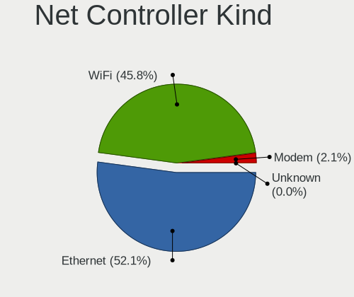

| Kind     | Computers | Percent |
|----------|-----------|---------|
| Ethernet | 1296      | 52.7%   |
| WiFi     | 1124      | 45.71%  |
| Modem    | 37        | 1.5%    |
| Unknown  | 2         | 0.08%   |

Used Controller
---------------

Currently used network controller

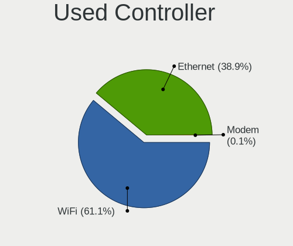

| Kind     | Computers | Percent |
|----------|-----------|---------|
| WiFi     | 880       | 58.01%  |
| Ethernet | 635       | 41.86%  |
| Modem    | 2         | 0.13%   |

NICs
----

Total network controllers on board

| Total | Computers | Percent |
|-------|-----------|---------|
| 2     | 874       | 61.42%  |
| 1     | 496       | 34.86%  |
| 0     | 39        | 2.74%   |
| 3     | 13        | 0.91%   |
| 5     | 1         | 0.07%   |

IPv6
----

IPv6 vs IPv4

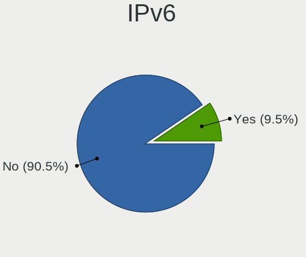

| Used | Computers | Percent |
|------|-----------|---------|
| No   | 1352      | 94.41%  |
| Yes  | 80        | 5.59%   |

Bluetooth
---------

Bluetooth Vendor
----------------

Controller vendors

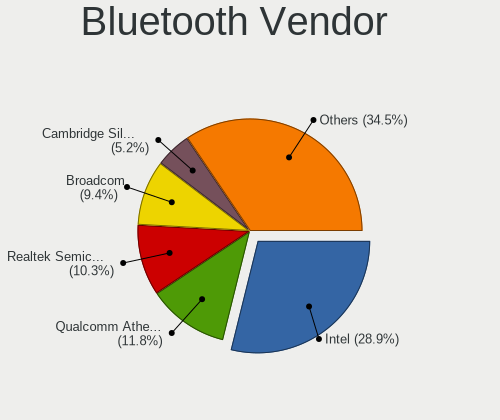

| Vendor                          | Computers | Percent |
|---------------------------------|-----------|---------|
| Intel                           | 191       | 29.38%  |
| Qualcomm Atheros Communications | 81        | 12.46%  |
| Realtek Semiconductor           | 68        | 10.46%  |
| Broadcom                        | 64        | 9.85%   |
| Cambridge Silicon Radio         | 33        | 5.08%   |
| Apple                           | 29        | 4.46%   |
| Dell                            | 27        | 4.15%   |
| Hewlett-Packard                 | 25        | 3.85%   |
| Lite-On Technology              | 24        | 3.69%   |
| IMC Networks                    | 19        | 2.92%   |
| Foxconn / Hon Hai               | 18        | 2.77%   |
| Toshiba                         | 10        | 1.54%   |
| ASUSTek Computer                | 10        | 1.54%   |
| Alps Electric                   | 8         | 1.23%   |
| Realtek                         | 7         | 1.08%   |
| Ralink                          | 7         | 1.08%   |
| Foxconn International           | 5         | 0.77%   |
| Dynex                           | 4         | 0.62%   |
| Ralink Technology               | 3         | 0.46%   |
| Micro Star International        | 3         | 0.46%   |
| Taiyo Yuden                     | 2         | 0.31%   |
| Integrated System Solution      | 2         | 0.31%   |
| Belkin Components               | 2         | 0.31%   |
| Askey Computer                  | 2         | 0.31%   |
| Qcom                            | 1         | 0.15%   |
| MediaTek                        | 1         | 0.15%   |
| Marvell Semiconductor           | 1         | 0.15%   |
| Logitech                        | 1         | 0.15%   |
| Fujitsu                         | 1         | 0.15%   |
| Chicony Electronics             | 1         | 0.15%   |

Bluetooth Model
---------------

Controller models

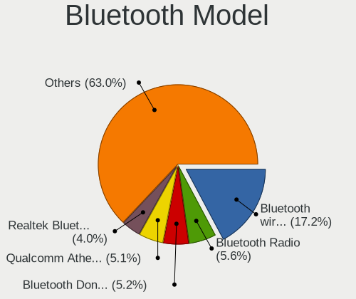

| Model                                                                               | Computers | Percent |
|-------------------------------------------------------------------------------------|-----------|---------|
| Intel Bluetooth Device                                                              | 92        | 14.13%  |
| Intel Bluetooth wireless interface                                                  | 73        | 11.21%  |
| Realtek Bluetooth Radio                                                             | 41        | 6.3%    |
| Qualcomm Atheros  Bluetooth Device                                                  | 36        | 5.53%   |
| Cambridge Silicon Radio Bluetooth Dongle (HCI mode)                                 | 33        | 5.07%   |
| Realtek  Bluetooth 4.2 Adapter                                                      | 18        | 2.76%   |
| HP Bluetooth 2.0 Interface [Broadcom BCM2045]                                       | 15        | 2.3%    |
| Qualcomm Atheros AR3011 Bluetooth                                                   | 14        | 2.15%   |
| Lite-On Bluetooth Device                                                            | 14        | 2.15%   |
| Intel AX200 Bluetooth                                                               | 14        | 2.15%   |
| Qualcomm Atheros AR3012 Bluetooth 4.0                                               | 10        | 1.54%   |
| Apple Bluetooth USB Host Controller                                                 | 10        | 1.54%   |
| Realtek 802.11n WLAN Adapter                                                        | 9         | 1.38%   |
| Qualcomm Atheros AR9462 Bluetooth                                                   | 9         | 1.38%   |
| Broadcom BCM2070 Bluetooth 2.1 + EDR                                                | 9         | 1.38%   |
| Broadcom BCM2045 Bluetooth                                                          | 9         | 1.38%   |
| Apple Bluetooth Host Controller                                                     | 9         | 1.38%   |
| Lite-On Atheros AR3012 Bluetooth                                                    | 8         | 1.23%   |
| Realtek Bluetooth Radio                                                             | 7         | 1.08%   |
| Ralink RT3290 Bluetooth                                                             | 7         | 1.08%   |
| Qualcomm Atheros Bluetooth USB Host Controller                                      | 7         | 1.08%   |
| Intel Centrino Advanced-N 6230 Bluetooth adapter                                    | 7         | 1.08%   |
| HP Broadcom 2070 Bluetooth Combo                                                    | 7         | 1.08%   |
| IMC Networks Bluetooth Radio                                                        | 6         | 0.92%   |
| IMC Networks Bluetooth Device                                                       | 6         | 0.92%   |
| Dell DW375 Bluetooth Module                                                         | 6         | 0.92%   |
| Apple Built-in Bluetooth 2.0+EDR HCI                                                | 6         | 0.92%   |
| Intel Wireless-AC 9260 Bluetooth Adapter                                            | 5         | 0.77%   |
| Foxconn International BCM43142A0 Bluetooth module                                   | 5         | 0.77%   |
| Dell Wireless 365 Bluetooth                                                         | 5         | 0.77%   |
| Broadcom BCM20702A0 Bluetooth 4.0                                                   | 5         | 0.77%   |
| Broadcom BCM20702A0                                                                 | 5         | 0.77%   |
| Broadcom BCM20702 Bluetooth 4.0 [ThinkPad]                                          | 5         | 0.77%   |
| Toshiba Bluetooth Device                                                            | 4         | 0.61%   |
| Foxconn / Hon Hai Foxconn T77H114 BCM2070 [Single-Chip Bluetooth 2.1 + EDR Adapter] | 4         | 0.61%   |
| Dynex BCM20702A0                                                                    | 4         | 0.61%   |
| Dell Wireless 350 Bluetooth                                                         | 4         | 0.61%   |
| Dell BCM20702A0                                                                     | 4         | 0.61%   |
| Broadcom BCM2070 Bluetooth Device                                                   | 4         | 0.61%   |
| Apple Bluetooth HCI                                                                 | 4         | 0.61%   |
| Qualcomm Atheros QCA61x4 Bluetooth 4.0                                              | 3         | 0.46%   |
| Foxconn / Hon Hai Bluetooth Device                                                  | 3         | 0.46%   |
| Foxconn / Hon Hai BCM20702A0                                                        | 3         | 0.46%   |
| Dell Wireless 370 Bluetooth Mini-card                                               | 3         | 0.46%   |
| Dell Wireless 360 Bluetooth                                                         | 3         | 0.46%   |
| Broadcom BCM43142A0 Bluetooth 4.0                                                   | 3         | 0.46%   |
| Broadcom BCM2046 Bluetooth Device                                                   | 3         | 0.46%   |
| Broadcom BCM2045B (BDC-2.1)                                                         | 3         | 0.46%   |
| Broadcom BCM2045B (BDC-2) [Bluetooth Controller]                                    | 3         | 0.46%   |
| ASUS BT-253 Bluetooth Adapter                                                       | 3         | 0.46%   |
| Alps Electric UGTZ4 Bluetooth                                                       | 3         | 0.46%   |
| Toshiba Integrated Bluetooth HCI                                                    | 2         | 0.31%   |
| Ralink CSR BS8510                                                                   | 2         | 0.31%   |
| Micro Star International Bluetooth Device                                           | 2         | 0.31%   |
| Lite-On Broadcom BCM43142A0 Bluetooth Device                                        | 2         | 0.31%   |
| IMC Networks Atheros AR3012 Bluetooth 4.0 Adapter                                   | 2         | 0.31%   |
| IMC Networks 802.11n WLAN Adapter                                                   | 2         | 0.31%   |
| HP Bluetooth 1.2 Interface [Broadcom BCM2035]                                       | 2         | 0.31%   |
| Foxconn / Hon Hai Broadcom Bluetooth 2.1 Device                                     | 2         | 0.31%   |
| Foxconn / Hon Hai Bluetooth USB Host Controller                                     | 2         | 0.31%   |

Sound
-----

Sound Vendor
------------

Sound card vendors

| Vendor                               | Computers | Percent |
|--------------------------------------|-----------|---------|
| Intel                                | 1020      | 59.3%   |
| AMD                                  | 337       | 19.59%  |
| Nvidia                               | 245       | 14.24%  |
| C-Media Electronics                  | 24        | 1.4%    |
| Silicon Integrated Systems [SiS]     | 23        | 1.34%   |
| VIA Technologies                     | 14        | 0.81%   |
| Creative Labs                        | 9         | 0.52%   |
| Logitech                             | 7         | 0.41%   |
| Generalplus Technology               | 5         | 0.29%   |
| Tenx Technology                      | 4         | 0.23%   |
| Creative Technology                  | 4         | 0.23%   |
| JMTek                                | 3         | 0.17%   |
| GN Netcom                            | 3         | 0.17%   |
| Yamaha                               | 2         | 0.12%   |
| Turtle Beach                         | 2         | 0.12%   |
| Ensoniq                              | 2         | 0.12%   |
| ZOOM                                 | 1         | 0.06%   |
| Thesycon Systemsoftware & Consulting | 1         | 0.06%   |
| Texas Instruments                    | 1         | 0.06%   |
| Shenzhen Riitek Technology           | 1         | 0.06%   |
| Samsung Electronics                  | 1         | 0.06%   |
| Razer USA                            | 1         | 0.06%   |
| Plantronics                          | 1         | 0.06%   |
| OPPO Electronics                     | 1         | 0.06%   |
| Micronas                             | 1         | 0.06%   |
| Klipsch Audio                        | 1         | 0.06%   |
| Hewlett-Packard                      | 1         | 0.06%   |
| Corsair                              | 1         | 0.06%   |
| Avance Logic                         | 1         | 0.06%   |
| Astro Gaming                         | 1         | 0.06%   |
| Apple                                | 1         | 0.06%   |
| AKAI Professional M.I.               | 1         | 0.06%   |

Sound Model
-----------

Sound card models

| Model                                                                                             | Computers | Percent |
|---------------------------------------------------------------------------------------------------|-----------|---------|
| Intel NM10/ICH7 Family High Definition Audio Controller                                           | 145       | 7.13%   |
| Intel 6 Series/C200 Series Chipset Family High Definition Audio Controller                        | 119       | 5.85%   |
| Intel 82801I (ICH9 Family) HD Audio Controller                                                    | 95        | 4.67%   |
| Intel 7 Series/C216 Chipset Family High Definition Audio Controller                               | 90        | 4.42%   |
| AMD SBx00 Azalia (Intel HDA)                                                                      | 86        | 4.23%   |
| Intel Sunrise Point-LP HD Audio                                                                   | 79        | 3.88%   |
| AMD FCH Azalia Controller                                                                         | 66        | 3.24%   |
| Intel 8 Series/C220 Series Chipset High Definition Audio Controller                               | 62        | 3.05%   |
| Intel 82801H (ICH8 Family) HD Audio Controller                                                    | 61        | 3%      |
| Intel 5 Series/3400 Series Chipset High Definition Audio                                          | 59        | 2.9%    |
| Intel Xeon E3-1200 v3/4th Gen Core Processor HD Audio Controller                                  | 52        | 2.56%   |
| Intel Haswell-ULT HD Audio Controller                                                             | 45        | 2.21%   |
| Intel 8 Series HD Audio Controller                                                                | 45        | 2.21%   |
| AMD Family 17h (Models 10h-1fh) HD Audio Controller                                               | 41        | 2.01%   |
| Nvidia GK208 HDMI/DP Audio Controller                                                             | 31        | 1.52%   |
| AMD Raven/Raven2/Fenghuang HDMI/DP Audio Controller                                               | 29        | 1.43%   |
| AMD Kabini HDMI/DP Audio                                                                          | 24        | 1.18%   |
| Intel Atom Processor Z36xxx/Z37xxx Series High Definition Audio Controller                        | 23        | 1.13%   |
| Nvidia High Definition Audio Controller                                                           | 22        | 1.08%   |
| Intel Wildcat Point-LP High Definition Audio Controller                                           | 22        | 1.08%   |
| Intel Broadwell-U Audio Controller                                                                | 22        | 1.08%   |
| Nvidia MCP61 High Definition Audio                                                                | 21        | 1.03%   |
| Nvidia GF108 High Definition Audio Controller                                                     | 21        | 1.03%   |
| Intel Cannon Lake PCH cAVS                                                                        | 21        | 1.03%   |
| Intel 100 Series/C230 Series Chipset Family HD Audio Controller                                   | 21        | 1.03%   |
| AMD Wrestler HDMI Audio                                                                           | 21        | 1.03%   |
| AMD Family 17h (Models 00h-0fh) HD Audio Controller                                               | 21        | 1.03%   |
| Intel 82801JI (ICH10 Family) HD Audio Controller                                                  | 20        | 0.98%   |
| Intel Atom/Celeron/Pentium Processor x5-E8000/J3xxx/N3xxx Series High Definition Audio Controller | 19        | 0.93%   |
| AMD Family 15h (Models 60h-6fh) Audio Controller                                                  | 19        | 0.93%   |
| AMD Ellesmere HDMI Audio [Radeon RX 470/480 / 570/580/590]                                        | 19        | 0.93%   |
| Silicon Integrated Systems [SiS] Azalia Audio Controller                                          | 18        | 0.88%   |
| AMD High Definition Audio Controller                                                              | 16        | 0.79%   |
| Intel Celeron N3350/Pentium N4200/Atom E3900 Series Audio Cluster                                 | 15        | 0.74%   |
| Intel Cannon Point-LP High Definition Audio Controller                                            | 15        | 0.74%   |
| AMD Trinity HDMI Audio Controller                                                                 | 15        | 0.74%   |
| AMD Oland/Hainan/Cape Verde/Pitcairn HDMI Audio [Radeon HD 7000 Series]                           | 15        | 0.74%   |
| Intel 82801FB/FBM/FR/FW/FRW (ICH6 Family) AC'97 Audio Controller                                  | 14        | 0.69%   |
| Nvidia GP107GL High Definition Audio Controller                                                   | 13        | 0.64%   |
| Nvidia GM107 High Definition Audio Controller [GeForce 940MX]                                     | 12        | 0.59%   |
| Intel 82801JD/DO (ICH10 Family) HD Audio Controller                                               | 11        | 0.54%   |
| AMD Cedar HDMI Audio [Radeon HD 5400/6300/7300 Series]                                            | 11        | 0.54%   |
| AMD Caicos HDMI Audio [Radeon HD 6450 / 7450/8450/8490 OEM / R5 230/235/235X OEM]                 | 11        | 0.54%   |
| Intel CM238 HD Audio Controller                                                                   | 10        | 0.49%   |
| Intel Celeron/Pentium Silver Processor High Definition Audio                                      | 10        | 0.49%   |
| AMD Starship/Matisse HD Audio Controller                                                          | 10        | 0.49%   |
| AMD RV710/730 HDMI Audio [Radeon HD 4000 series]                                                  | 10        | 0.49%   |
| AMD Baffin HDMI/DP Audio [Radeon RX 550 640SP / RX 560/560X]                                      | 10        | 0.49%   |
| Nvidia GK107 HDMI Audio Controller                                                                | 9         | 0.44%   |
| Nvidia GF119 HDMI Audio Controller                                                                | 9         | 0.44%   |
| Intel 9 Series Chipset Family HD Audio Controller                                                 | 9         | 0.44%   |
| VIA Technologies VT8233/A/8235/8237 AC97 Audio Controller                                         | 8         | 0.39%   |
| Nvidia MCP79 High Definition Audio                                                                | 8         | 0.39%   |
| Intel 82801EB/ER (ICH5/ICH5R) AC'97 Audio Controller                                              | 8         | 0.39%   |
| AMD Turks HDMI Audio [Radeon HD 6500/6600 / 6700M Series]                                         | 8         | 0.39%   |
| AMD Renoir Radeon High Definition Audio Controller                                                | 8         | 0.39%   |
| AMD BeaverCreek HDMI Audio [Radeon HD 6500D and 6400G-6600G series]                               | 8         | 0.39%   |
| Nvidia TU116 High Definition Audio Controller                                                     | 7         | 0.34%   |
| Nvidia TU106 High Definition Audio Controller                                                     | 7         | 0.34%   |
| Nvidia MCP73 High Definition Audio                                                                | 7         | 0.34%   |

Memory
------

Memory Vendor
-------------

Memory module vendors

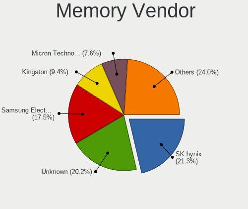

| Vendor              | Computers | Percent |
|---------------------|-----------|---------|
| SK Hynix            | 63        | 22.18%  |
| Unknown             | 52        | 18.31%  |
| Samsung Electronics | 52        | 18.31%  |
| Kingston            | 27        | 9.51%   |
| Micron Technology   | 23        | 8.1%    |
| Elpida              | 10        | 3.52%   |
| Corsair             | 9         | 3.17%   |
| Nanya Technology    | 8         | 2.82%   |
| Ramaxel Technology  | 7         | 2.46%   |
| Crucial             | 7         | 2.46%   |
| G.Skill             | 5         | 1.76%   |
| Unknown (ABCD)      | 2         | 0.7%    |
| Qimonda             | 2         | 0.7%    |
| A-DATA Technology   | 2         | 0.7%    |
| Transcend           | 1         | 0.35%   |
| Team                | 1         | 0.35%   |
| SMART Brazil        | 1         | 0.35%   |
| Smart               | 1         | 0.35%   |
| SHARETRONIC         | 1         | 0.35%   |
| Ramos Technology    | 1         | 0.35%   |
| PNY                 | 1         | 0.35%   |
| Patriot             | 1         | 0.35%   |
| Nayna               | 1         | 0.35%   |
| High Bridge         | 1         | 0.35%   |
| HBS                 | 1         | 0.35%   |
| CSX                 | 1         | 0.35%   |
| COS Memory          | 1         | 0.35%   |
| Avant               | 1         | 0.35%   |
| ASint Technology    | 1         | 0.35%   |

Memory Model
------------

Memory module models

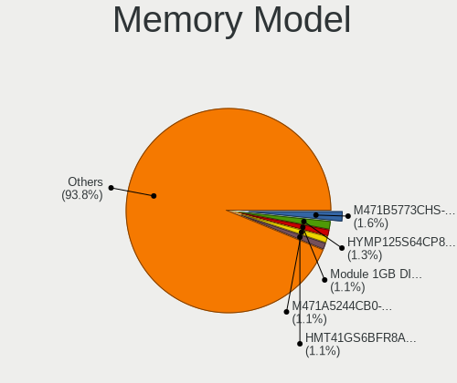

| Model                                                               | Computers | Percent |
|---------------------------------------------------------------------|-----------|---------|
| Samsung RAM M471B5773CHS-CH9 2048MB SODIMM DDR3 4199MT/s            | 6         | 1.95%   |
| SK Hynix RAM HYMP125S64CP8-S6 2048MB SODIMM DDR2 975MT/s            | 4         | 1.3%    |
| SK Hynix RAM HMT41GS6BFR8A-PB 8GB SODIMM DDR3 1600MT/s              | 3         | 0.98%   |
| Samsung RAM M471B5273DH0-CH9 4096MB SODIMM DDR3 1334MT/s            | 3         | 0.98%   |
| Samsung RAM M471A5244CB0-CTD 4096MB SODIMM DDR4 3266MT/s            | 3         | 0.98%   |
| Samsung RAM M471A1K43CB1-CRC 8192MB SODIMM DDR4 2667MT/s            | 3         | 0.98%   |
| Unknown RAM Module 512MB SODIMM DDR                                 | 2         | 0.65%   |
| Unknown RAM Module 2GB SODIMM DDR2 667MT/s                          | 2         | 0.65%   |
| Unknown RAM Module 2GB SODIMM DDR                                   | 2         | 0.65%   |
| Unknown RAM Module 2048MB SODIMM SDRAM                              | 2         | 0.65%   |
| Unknown RAM Module 2048MB DIMM 800MT/s                              | 2         | 0.65%   |
| Unknown RAM Module 1GB DIMM SDRAM                                   | 2         | 0.65%   |
| Unknown RAM Module 1GB DIMM DDR2                                    | 2         | 0.65%   |
| Unknown RAM Module 1024MB DIMM DDR2 333MT/s                         | 2         | 0.65%   |
| Unknown RAM Module 1024MB DIMM                                      | 2         | 0.65%   |
| Unknown (ABCD) RAM 123456789012345678 2048MB SODIMM LPDDR4 2400MT/s | 2         | 0.65%   |
| SK Hynix RAM Module 4096MB DIMM DDR3 1066MT/s                       | 2         | 0.65%   |
| SK Hynix RAM Module 2048MB SODIMM DDR3 1066MT/s                     | 2         | 0.65%   |
| SK Hynix RAM HYMP125S64CP8-Y5 2048MB SODIMM DDR 667MT/s             | 2         | 0.65%   |
| SK Hynix RAM HYMP112S64CP6-S6 1024MB SODIMM DDR 975MT/s             | 2         | 0.65%   |
| SK Hynix RAM HMT451S6BFR8A-PB 4GB SODIMM DDR3 1600MT/s              | 2         | 0.65%   |
| SK Hynix RAM HMA851S6CJR6N-VK 4GB Row Of Chips DDR4 2667MT/s        | 2         | 0.65%   |
| SK Hynix RAM HMA81GS6JJR8N-VK 8192MB SODIMM DDR4 2667MT/s           | 2         | 0.65%   |
| SK Hynix RAM HMA81GS6AFR8N-UH 8192MB SODIMM DDR4 2667MT/s           | 2         | 0.65%   |
| SK Hynix RAM HMA451S6AFR8N-TF 4GB SODIMM DDR4 2133MT/s              | 2         | 0.65%   |
| Samsung RAM M471B5773DH0-CH9 2048MB SODIMM DDR3 1600MT/s            | 2         | 0.65%   |
| Samsung RAM M471B1G73EB0-YK0 8192MB SODIMM DDR3 1600MT/s            | 2         | 0.65%   |
| Samsung RAM M471B1G73DB0-YK0 8192MB SODIMM DDR3 1600MT/s            | 2         | 0.65%   |
| Samsung RAM M471A5244CB0-CTD 4096MB Row Of Chips DDR4 2667MT/s      | 2         | 0.65%   |
| Ramaxel RAM RMT3170ME68F9F1600 4GB SODIMM DDR3 1600MT/s             | 2         | 0.65%   |
| Ramaxel RAM RMSA3270ME86H9F-2666 4096MB SODIMM DDR4 2667MT/s        | 2         | 0.65%   |
| Micron RAM Module 2048MB SODIMM DDR3 1600MT/s                       | 2         | 0.65%   |
| Micron RAM 8KTF51264HZ-1G6E1 4GB SODIMM DDR3 1600MT/s               | 2         | 0.65%   |
| Micron RAM 8JSF25664HZ-1G4D1 2GB SODIMM DDR3 1334MT/s               | 2         | 0.65%   |
| Kingston RAM KCM633-ELC 1024MB DIMM DDR2 2048MT/s                   | 2         | 0.65%   |
| Kingston RAM 99U5428-018.A00LF 8GB SODIMM DDR3 1600MT/s             | 2         | 0.65%   |
| Elpida RAM EBJ20UF8BCF0-DJ-F 2048MB DIMM DDR3 1333MT/s              | 2         | 0.65%   |
| Crucial RAM BLS4G3D1609DS1S00. 4096MB DIMM DDR3 1600MT/s            | 2         | 0.65%   |
| Unknown SODIMM 4GB SODIMM DDR2 667MT/s                              | 1         | 0.33%   |
| Unknown SODIMM 2GB SODIMM DDR2 533MT/s                              | 1         | 0.33%   |
| Unknown SODIMM 2048MB SODIMM DDR2 533MT/s                           | 1         | 0.33%   |
| Unknown SODIMM 1GB SODIMM DDR2 533MT/s                              | 1         | 0.33%   |
| Unknown SODIMM 1024MB SODIMM DDR2 533MT/s                           | 1         | 0.33%   |
| Unknown RAM Module 8GB SODIMM DDR3 1600MT/s                         | 1         | 0.33%   |
| Unknown RAM Module 8GB DIMM DDR3 1333MT/s                           | 1         | 0.33%   |
| Unknown RAM Module 8192MB SODIMM DDR4 2400MT/s                      | 1         | 0.33%   |
| Unknown RAM Module 8192MB DIMM SDRAM                                | 1         | 0.33%   |
| Unknown RAM Module 512MB SODIMM DRAM                                | 1         | 0.33%   |
| Unknown RAM Module 512MB SODIMM DDR2 667MT/s                        | 1         | 0.33%   |
| Unknown RAM Module 4GB SODIMM DDR3 1600MT/s                         | 1         | 0.33%   |
| Unknown RAM Module 4GB DIMM DDR3 1333MT/s                           | 1         | 0.33%   |
| Unknown RAM Module 4096MB SODIMM DDR3 1333MT/s                      | 1         | 0.33%   |
| Unknown RAM Module 4096MB SODIMM DDR3                               | 1         | 0.33%   |
| Unknown RAM Module 4096MB DIMM DDR3 1600MT/s                        | 1         | 0.33%   |
| Unknown RAM Module 4096MB DIMM DDR3 1333MT/s                        | 1         | 0.33%   |
| Unknown RAM Module 4096MB DIMM 667MT/s                              | 1         | 0.33%   |
| Unknown RAM Module 4096MB DIMM                                      | 1         | 0.33%   |
| Unknown RAM Module 2GB DIMM SDRAM 800MT/s                           | 1         | 0.33%   |
| Unknown RAM Module 2GB DIMM DDR2 800MT/s                            | 1         | 0.33%   |
| Unknown RAM Module 2GB DIMM DDR 667MT/s                             | 1         | 0.33%   |

Memory Kind
-----------

Memory module kinds

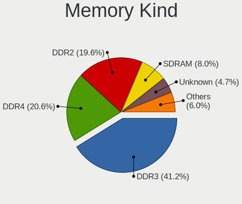

| Kind    | Computers | Percent |
|---------|-----------|---------|
| DDR3    | 107       | 43.15%  |
| DDR4    | 53        | 21.37%  |
| DDR2    | 44        | 17.74%  |
| SDRAM   | 19        | 7.66%   |
| Unknown | 12        | 4.84%   |
| DDR     | 5         | 2.02%   |
| LPDDR4  | 3         | 1.21%   |
| DRAM    | 3         | 1.21%   |
| LPDDR3  | 2         | 0.81%   |

Memory Form Factor
------------------

Physical design of the memory module

| Name         | Computers | Percent |
|--------------|-----------|---------|
| SODIMM       | 153       | 64.29%  |
| DIMM         | 78        | 32.77%  |
| Row Of Chips | 6         | 2.52%   |
| Chip         | 1         | 0.42%   |

Memory Size
-----------

Memory module size

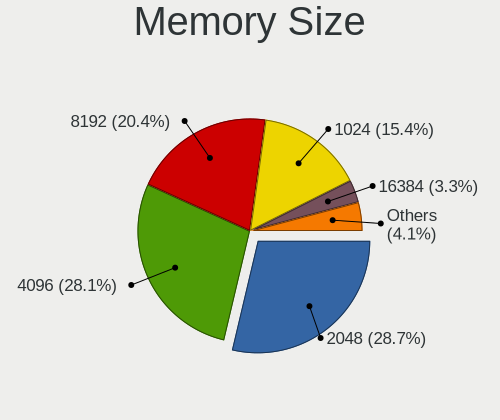

| Size  | Computers | Percent |
|-------|-----------|---------|
| 4096  | 83        | 29.64%  |
| 2048  | 80        | 28.57%  |
| 8192  | 56        | 20%     |
| 1024  | 43        | 15.36%  |
| 16384 | 10        | 3.57%   |
| 512   | 7         | 2.5%    |
| 256   | 1         | 0.36%   |

Memory Speed
------------

Memory module speed

| Speed   | Computers | Percent |
|---------|-----------|---------|
| 1600    | 64        | 24.06%  |
| 2667    | 23        | 8.65%   |
| 1333    | 23        | 8.65%   |
| 667     | 21        | 7.89%   |
| Unknown | 18        | 6.77%   |
| 1334    | 15        | 5.64%   |
| 800     | 15        | 5.64%   |
| 2133    | 10        | 3.76%   |
| 1066    | 10        | 3.76%   |
| 3200    | 8         | 3.01%   |
| 4199    | 7         | 2.63%   |
| 2400    | 7         | 2.63%   |
| 533     | 7         | 2.63%   |
| 975     | 5         | 1.88%   |
| 2048    | 4         | 1.5%    |
| 3600    | 3         | 1.13%   |
| 3266    | 3         | 1.13%   |
| 3000    | 2         | 0.75%   |
| 1866    | 2         | 0.75%   |
| 1639    | 2         | 0.75%   |
| 400     | 2         | 0.75%   |
| 333     | 2         | 0.75%   |
| 49926   | 1         | 0.38%   |
| 4400    | 1         | 0.38%   |
| 3733    | 1         | 0.38%   |
| 3533    | 1         | 0.38%   |
| 3466    | 1         | 0.38%   |
| 3151    | 1         | 0.38%   |
| 2933    | 1         | 0.38%   |
| 2800    | 1         | 0.38%   |
| 2666    | 1         | 0.38%   |
| 2187    | 1         | 0.38%   |
| 2134    | 1         | 0.38%   |
| 1867    | 1         | 0.38%   |
| 1067    | 1         | 0.38%   |

Printers & scanners
-------------------

Printer Vendor
--------------

Printer device vendors

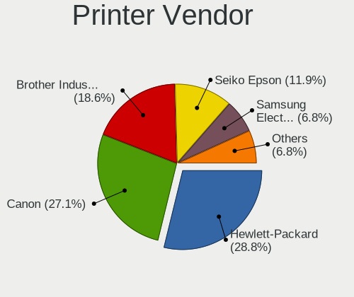

| Vendor              | Computers | Percent |
|---------------------|-----------|---------|
| Hewlett-Packard     | 13        | 27.66%  |
| Canon               | 13        | 27.66%  |
| Brother Industries  | 10        | 21.28%  |
| Seiko Epson         | 4         | 8.51%   |
| Samsung Electronics | 4         | 8.51%   |
| STMicroelectronics  | 1         | 2.13%   |
| Ricoh               | 1         | 2.13%   |
| Pantum              | 1         | 2.13%   |

Printer Model
-------------

Printer device models

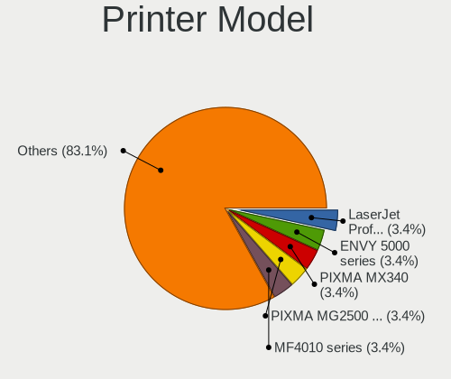

| Model                                                     | Computers | Percent |
|-----------------------------------------------------------|-----------|---------|
| HP ENVY 5000 series                                       | 2         | 4.26%   |
| Canon PIXMA MX340                                         | 2         | 4.26%   |
| Canon MF4010 series                                       | 2         | 4.26%   |
| Brother HL-2130 series                                    | 2         | 4.26%   |
| STMicroelectronics LED badge -- mini LED display -- 11x44 | 1         | 2.13%   |
| Seiko Epson PX-105 Series                                 | 1         | 2.13%   |
| Seiko Epson ME 320/330 Series [Stylus SX125]              | 1         | 2.13%   |
| Seiko Epson L360 Series                                   | 1         | 2.13%   |
| Seiko Epson L120 Series                                   | 1         | 2.13%   |
| Samsung SCX-3400 Series                                   | 1         | 2.13%   |
| Samsung ML-2010P Mono Laser Printer                       | 1         | 2.13%   |
| Samsung M2070 Series                                      | 1         | 2.13%   |
| Samsung CLX-3300 Series                                   | 1         | 2.13%   |
| Ricoh SP C250SF                                           | 1         | 2.13%   |
| Pantum P2500W series                                      | 1         | 2.13%   |
| HP OfficeJet 3830 series                                  | 1         | 2.13%   |
| HP LaserJet Professional P 1102w                          | 1         | 2.13%   |
| HP Laserjet P1505                                         | 1         | 2.13%   |
| HP LaserJet P1102                                         | 1         | 2.13%   |
| HP LaserJet 3050                                          | 1         | 2.13%   |
| HP LaserJet 1020                                          | 1         | 2.13%   |
| HP ENVY 4520 series                                       | 1         | 2.13%   |
| HP Deskjet 4620 series                                    | 1         | 2.13%   |
| HP DeskJet 2700 series                                    | 1         | 2.13%   |
| HP Deskjet 1510                                           | 1         | 2.13%   |
| HP DeskJet 1110 series                                    | 1         | 2.13%   |
| Canon TS3100 series                                       | 1         | 2.13%   |
| Canon PIXMA MG3600 Series                                 | 1         | 2.13%   |
| Canon PIXMA MG2500 Series                                 | 1         | 2.13%   |
| Canon Pixma iP4500 Printer                                | 1         | 2.13%   |
| Canon MG2100 series                                       | 1         | 2.13%   |
| Canon LiDE 300                                            | 1         | 2.13%   |
| Canon LBP810                                              | 1         | 2.13%   |
| Canon iP7200 series                                       | 1         | 2.13%   |
| Canon FAXPHONE L80                                        | 1         | 2.13%   |
| Brother MFC-L2730DW series                                | 1         | 2.13%   |
| Brother MFC-J470DW                                        | 1         | 2.13%   |
| Brother HL-L2380DW                                        | 1         | 2.13%   |
| Brother HL-L2350DW series                                 | 1         | 2.13%   |
| Brother HL-L2340D series                                  | 1         | 2.13%   |
| Brother HL-52x0 series                                    | 1         | 2.13%   |
| Brother DCP-T300                                          | 1         | 2.13%   |
| Brother DCP-1610W                                         | 1         | 2.13%   |

Scanner Vendor
--------------

Scanner device vendors

| Vendor | Computers | Percent |
|--------|-----------|---------|
| Canon  | 2         | 100%    |

Scanner Model
-------------

Scanner device models

| Model                              | Computers | Percent |
|------------------------------------|-----------|---------|
| Canon CanoScan N670U/N676U/LiDE 20 | 1         | 50%     |
| Canon CanoScan LIDE 25             | 1         | 50%     |

Camera
------

Camera Vendor
-------------

Camera device vendors

| Vendor                                 | Computers | Percent |
|----------------------------------------|-----------|---------|
| Chicony Electronics                    | 195       | 26.07%  |
| Microdia                               | 70        | 9.36%   |
| Acer                                   | 49        | 6.55%   |
| Realtek Semiconductor                  | 48        | 6.42%   |
| Suyin                                  | 45        | 6.02%   |
| IMC Networks                           | 45        | 6.02%   |
| Sunplus Innovation Technology          | 37        | 4.95%   |
| Cheng Uei Precision Industry (Foxlink) | 30        | 4.01%   |
| Apple                                  | 29        | 3.88%   |
| Silicon Motion                         | 24        | 3.21%   |
| Quanta                                 | 20        | 2.67%   |
| Alcor Micro                            | 17        | 2.27%   |
| Logitech                               | 16        | 2.14%   |
| Lite-On Technology                     | 15        | 2.01%   |
| Syntek                                 | 14        | 1.87%   |
| Ricoh                                  | 12        | 1.6%    |
| Importek                               | 11        | 1.47%   |
| Z-Star Microelectronics                | 9         | 1.2%    |
| ALi                                    | 8         | 1.07%   |
| Microsoft                              | 7         | 0.94%   |
| Samsung Electronics                    | 6         | 0.8%    |
| OmniVision Technologies                | 4         | 0.53%   |
| GEMBIRD                                | 4         | 0.53%   |
| Cubeternet                             | 4         | 0.53%   |
| Primax Electronics                     | 2         | 0.27%   |
| Pixart Imaging                         | 2         | 0.27%   |
| LG Electronics                         | 2         | 0.27%   |
| Lenovo                                 | 2         | 0.27%   |
| Genesys Logic                          | 2         | 0.27%   |
| Generalplus Technology                 | 2         | 0.27%   |
| Trust                                  | 1         | 0.13%   |
| Sunplus Technology                     | 1         | 0.13%   |
| Sonix Technology                       | 1         | 0.13%   |
| Novatel Wireless                       | 1         | 0.13%   |
| Novatek Microelectronics               | 1         | 0.13%   |
| Jieli Technology                       | 1         | 0.13%   |
| Intel                                  | 1         | 0.13%   |
| HD WEBCAM                              | 1         | 0.13%   |
| Foxconn / Hon Hai                      | 1         | 0.13%   |
| Elecom                                 | 1         | 0.13%   |
| DJKCVA1BIDQ8CL                         | 1         | 0.13%   |
| Creative Technology                    | 1         | 0.13%   |
| Camera                                 | 1         | 0.13%   |
| AVerMedia Technologies                 | 1         | 0.13%   |
| Aveo Technology                        | 1         | 0.13%   |
| Arkmicro Technologies                  | 1         | 0.13%   |
| 8SSC20F27114V1SR11K1SE2                | 1         | 0.13%   |

Camera Model
------------

Camera device models

| Model                                                          | Computers | Percent |
|----------------------------------------------------------------|-----------|---------|
| Chicony Integrated Camera                                      | 16        | 2.13%   |
| Acer Lenovo EasyCamera                                         | 16        | 2.13%   |
| Chicony USB 2.0 camera                                         | 13        | 1.73%   |
| Realtek Integrated_Webcam_HD                                   | 11        | 1.47%   |
| Chicony EasyCamera                                             | 11        | 1.47%   |
| Microdia Sonix USB 2.0 Camera                                  | 10        | 1.33%   |
| Sunplus Integrated_Webcam_HD                                   | 9         | 1.2%    |
| Microdia Integrated Webcam                                     | 9         | 1.2%    |
| IMC Networks USB2.0 HD UVC WebCam                              | 9         | 1.2%    |
| Chicony HP Truevision HD camera                                | 9         | 1.2%    |
| Apple iPhone5/5C/5S/6                                          | 9         | 1.2%    |
| IMC Networks USB2.0 VGA UVC WebCam                             | 8         | 1.07%   |
| Chicony HP HD Webcam                                           | 8         | 1.07%   |
| Suyin HP Truevision HD                                         | 7         | 0.93%   |
| Suyin Acer/HP Integrated Webcam [CN0314]                       | 7         | 0.93%   |
| Realtek Integrated Webcam                                      | 7         | 0.93%   |
| Microdia Laptop_Integrated_Webcam_HD                           | 7         | 0.93%   |
| Chicony TOSHIBA Web Camera - HD                                | 7         | 0.93%   |
| Chicony Lenovo EasyCamera                                      | 7         | 0.93%   |
| Chicony HP Truevision HD                                       | 7         | 0.93%   |
| Chicony HD WebCam                                              | 7         | 0.93%   |
| Apple FaceTime HD Camera (Built-in)                            | 7         | 0.93%   |
| Apple Built-in iSight                                          | 7         | 0.93%   |
| Samsung Galaxy series, misc. (MTP mode)                        | 6         | 0.8%    |
| Quanta HP Webcam                                               | 6         | 0.8%    |
| Microdia Integrated_Webcam_HD                                  | 6         | 0.8%    |
| Lite-On Integrated Camera                                      | 6         | 0.8%    |
| Chicony VGA WebCam                                             | 6         | 0.8%    |
| Chicony HP Webcam                                              | 6         | 0.8%    |
| Cheng Uei Precision Industry (Foxlink) HP Truevision HD        | 6         | 0.8%    |
| ALi Gateway Webcam                                             | 6         | 0.8%    |
| Alcor Micro SHUNCCM2MP                                         | 6         | 0.8%    |
| Acer EasyCamera                                                | 6         | 0.8%    |
| Sunplus HP HD Webcam [Fixed]                                   | 5         | 0.67%   |
| Sunplus HD WebCam                                              | 5         | 0.67%   |
| Silicon Motion Web Camera                                      | 5         | 0.67%   |
| Quanta HP TrueVision HD Camera                                 | 5         | 0.67%   |
| IMC Networks Integrated Camera                                 | 5         | 0.67%   |
| Chicony USB2.0 VGA UVC WebCam                                  | 5         | 0.67%   |
| Chicony USB2.0 HD UVC WebCam                                   | 5         | 0.67%   |
| Chicony HP Wide Vision HD Camera                               | 5         | 0.67%   |
| Chicony CNF9055 Toshiba Webcam                                 | 5         | 0.67%   |
| Cheng Uei Precision Industry (Foxlink) HP HD Camera            | 5         | 0.67%   |
| Z-Star Webcam                                                  | 4         | 0.53%   |
| Syntek EasyCamera                                              | 4         | 0.53%   |
| Silicon Motion WebCam SCB-0355N                                | 4         | 0.53%   |
| Realtek USB2.0 VGA UVC WebCam                                  | 4         | 0.53%   |
| Realtek USB2.0 HD UVC WebCam                                   | 4         | 0.53%   |
| OmniVision OV2640 Webcam                                       | 4         | 0.53%   |
| Microdia USB 2.0 Camera                                        | 4         | 0.53%   |
| Microdia HP Webcam-101                                         | 4         | 0.53%   |
| Logitech Webcam C270                                           | 4         | 0.53%   |
| Importek TOSHIBA Web Camera - HD                               | 4         | 0.53%   |
| IMC Networks ov9734_azurewave_camera                           | 4         | 0.53%   |
| GEMBIRD Generic UVC 1.00 camera [AppoTech AX2311]              | 4         | 0.53%   |
| Chicony Integrated HP HD Webcam                                | 4         | 0.53%   |
| Cheng Uei Precision Industry (Foxlink) Webcam                  | 4         | 0.53%   |
| Cheng Uei Precision Industry (Foxlink) HP TrueVision HD Camera | 4         | 0.53%   |
| Alcor Micro HP Webcam-101                                      | 4         | 0.53%   |
| Acer Integrated Camera                                         | 4         | 0.53%   |

Security
--------

Fingerprint Vendor
------------------

Fingerprint sensor vendors

| Vendor                     | Computers | Percent |
|----------------------------|-----------|---------|
| Validity Sensors           | 66        | 53.23%  |
| AuthenTec                  | 21        | 16.94%  |
| Upek                       | 8         | 6.45%   |
| Synaptics                  | 8         | 6.45%   |
| Shenzhen Goodix Technology | 8         | 6.45%   |
| STMicroelectronics         | 7         | 5.65%   |
| Elan Microelectronics      | 4         | 3.23%   |
| LighTuning Technology      | 2         | 1.61%   |

Fingerprint Model
-----------------

Fingerprint sensor models

| Model                                                                      | Computers | Percent |
|----------------------------------------------------------------------------|-----------|---------|
| Validity Sensors VFS495 Fingerprint Reader                                 | 14        | 11.29%  |
| Validity Sensors VFS 5011 fingerprint sensor                               | 10        | 8.06%   |
| Validity Sensors VFS5011 Fingerprint Reader                                | 9         | 7.26%   |
| Validity Sensors VFS471 Fingerprint Reader                                 | 9         | 7.26%   |
| Upek Biometric Touchchip/Touchstrip Fingerprint Sensor                     | 8         | 6.45%   |
| STMicroelectronics Fingerprint Reader                                      | 7         | 5.65%   |
| Validity Sensors Fingerprint scanner                                       | 6         | 4.84%   |
| AuthenTec AES2501 Fingerprint Sensor                                       | 6         | 4.84%   |
| Validity Sensors VFS491                                                    | 5         | 4.03%   |
| AuthenTec AES1600                                                          | 5         | 4.03%   |
| Validity Sensors Swipe Fingerprint Sensor                                  | 4         | 3.23%   |
| Synaptics  WBDI                                                            | 4         | 3.23%   |
| Shenzhen Goodix  Fingerprint Device                                        | 4         | 3.23%   |
| Elan ELAN:Fingerprint                                                      | 4         | 3.23%   |
| AuthenTec AES2810                                                          | 4         | 3.23%   |
| Validity Sensors VFS451 Fingerprint Reader                                 | 3         | 2.42%   |
| Synaptics  VFS7552 Touch Fingerprint Sensor with PurePrint                 | 3         | 2.42%   |
| Shenzhen Goodix Fingerprint Reader                                         | 3         | 2.42%   |
| AuthenTec AES1660 Fingerprint Sensor                                       | 3         | 2.42%   |
| Validity Sensors VFS101 Fingerprint Reader                                 | 2         | 1.61%   |
| AuthenTec Fingerprint Sensor                                               | 2         | 1.61%   |
| Validity Sensors VFS7500 Touch Fingerprint Sensor                          | 1         | 0.81%   |
| Validity Sensors VFS301 Fingerprint Reader                                 | 1         | 0.81%   |
| Validity Sensors Synaptics VFS7552 Touch Fingerprint Sensor with PurePrint | 1         | 0.81%   |
| Validity Sensors Synaptics VFS7552 Touch Fingerprint Sensor                | 1         | 0.81%   |
| Synaptics  WBDI Fingerprint Reader - USB 052                               | 1         | 0.81%   |
| Shenzhen Goodix FingerPrint                                                | 1         | 0.81%   |
| LighTuning Fingerprint Reader                                              | 1         | 0.81%   |
| LighTuning ES603 Swipe Fingerprint Sensor                                  | 1         | 0.81%   |
| AuthenTec AES2550 Fingerprint Sensor                                       | 1         | 0.81%   |

Chipcard Vendor
---------------

Chipcard module vendors

| Vendor                | Computers | Percent |
|-----------------------|-----------|---------|
| Broadcom              | 22        | 45.83%  |
| O2 Micro              | 10        | 20.83%  |
| Alcor Micro           | 10        | 20.83%  |
| Upek                  | 2         | 4.17%   |
| Lenovo                | 2         | 4.17%   |
| Realtek Semiconductor | 1         | 2.08%   |
| Kobil Systems         | 1         | 2.08%   |

Chipcard Model
--------------

Chipcard module models

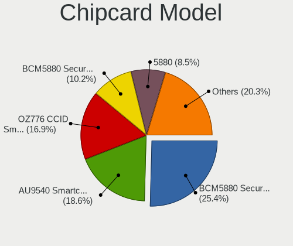

| Model                                                                        | Computers | Percent |
|------------------------------------------------------------------------------|-----------|---------|
| Broadcom BCM5880 Secure Applications Processor                               | 13        | 27.08%  |
| Alcor Micro AU9540 Smartcard Reader                                          | 10        | 20.83%  |
| O2 Micro OZ776 CCID Smartcard Reader                                         | 8         | 16.67%  |
| Broadcom BCM5880 Secure Applications Processor with fingerprint swipe sensor | 5         | 10.42%  |
| Broadcom 5880                                                                | 4         | 8.33%   |
| Upek TouchChip Fingerprint Coprocessor (WBF advanced mode)                   | 2         | 4.17%   |
| O2 Micro Oz776 SmartCard Reader                                              | 2         | 4.17%   |
| Lenovo Integrated Smart Card Reader                                          | 2         | 4.17%   |
| Realtek Semiconductor Smart Card Reader Interface                            | 1         | 2.08%   |
| Kobil Systems KOBIL Class 3 Reader                                           | 1         | 2.08%   |

Unsupported
-----------

Unsupported Devices
-------------------

Total unsupported devices on board

| Total | Computers | Percent |
|-------|-----------|---------|
| 0     | 974       | 67.4%   |
| 1     | 384       | 26.57%  |
| 2     | 79        | 5.47%   |
| 3     | 5         | 0.35%   |
| 4     | 2         | 0.14%   |
| 7     | 1         | 0.07%   |

Unsupported Device Types
------------------------

Types of unsupported devices

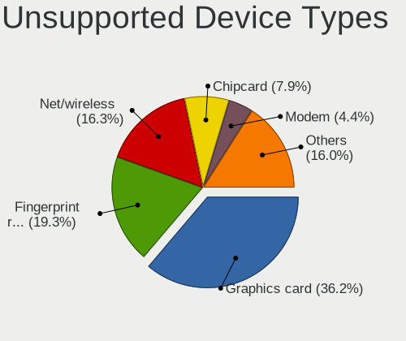

| Type                     | Computers | Percent |
|--------------------------|-----------|---------|
| Graphics card            | 152       | 27.99%  |
| Fingerprint reader       | 123       | 22.65%  |
| Net/wireless             | 108       | 19.89%  |
| Chipcard                 | 47        | 8.66%   |
| Modem                    | 20        | 3.68%   |
| Multimedia controller    | 18        | 3.31%   |
| Communication controller | 16        | 2.95%   |
| Storage                  | 15        | 2.76%   |
| Bluetooth                | 10        | 1.84%   |
| Sound                    | 9         | 1.66%   |
| Flash memory             | 7         | 1.29%   |
| Unassigned class         | 5         | 0.92%   |
| Camera                   | 5         | 0.92%   |
| Net/ethernet             | 3         | 0.55%   |
| Card reader              | 2         | 0.37%   |
| Storage/raid             | 1         | 0.18%   |
| Storage/nvme             | 1         | 0.18%   |
| Storage/ata              | 1         | 0.18%   |

